# Parent Section Magnitude-Probability Distributions

Only fault sections with at least one triggered aftershock are plotted. Sections are sorted by total supraseismogenic trigger rate (decreasing)

## Table Of Contents

* [Tank Canyon](#tank-canyon)
* [Garlock (Central)](#garlock-central)
* [Little Lake](#little-lake)
* [Owl Lake](#owl-lake)
* [Airport Lake](#airport-lake)
* [Panamint Valley](#panamint-valley)
* [Garlock (East)](#garlock-east)
* [Blackwater](#blackwater)
* [Hunter Mountain-Saline Valley](#hunter-mountain-saline-valley)
* [Ash Hill](#ash-hill)
* [Garlock (West)](#garlock-west)
* [Gravel Hills-Harper Lk](#gravel-hills-harper-lk)
* [McLean Lake](#mclean-lake)
* [Goldstone Lake](#goldstone-lake)
* [So Sierra Nevada](#so-sierra-nevada)
* [Coyote Canyon](#coyote-canyon)
* [Lenwood-Lockhart-Old Woman Springs](#lenwood-lockhart-old-woman-springs)
* [San Andreas (Mojave S)](#san-andreas-mojave-s)
* [San Andreas (Mojave N)](#san-andreas-mojave-n)
* [Death Valley (So)](#death-valley-so)
* [Nelson Lake](#nelson-lake)
* [Towne Pass](#towne-pass)
* [Bicycle Lake](#bicycle-lake)
* [San Andreas (San Bernardino N)](#san-andreas-san-bernardino-n)
* [Paradise](#paradise)
* [Garlic Springs](#garlic-springs)
* [Helendale-So Lockhart](#helendale-so-lockhart)
* [San Andreas (San Bernardino S)](#san-andreas-san-bernardino-s)
* [Coyote Lake](#coyote-lake)
* [Death Valley (Black Mtns Frontal)](#death-valley-black-mtns-frontal)
* [San Andreas (Big Bend)](#san-andreas-big-bend)
* [Elsinore (Glen Ivy) rev](#elsinore-glen-ivy-rev)
* [San Andreas (San Gorgonio Pass-Garnet HIll)](#san-andreas-san-gorgonio-pass-garnet-hill)
* [San Andreas (Parkfield)](#san-andreas-parkfield)
* [Red Pass](#red-pass)
* [Ludlow](#ludlow)
* [Death Valley (No)](#death-valley-no)
* [San Andreas (Carrizo) rev](#san-andreas-carrizo-rev)
* [Cady](#cady)
* [San Andreas (Cholame) rev](#san-andreas-cholame-rev)
* [White Wolf (Extension)](#white-wolf-extension)
* [San Andreas (Coachella) rev](#san-andreas-coachella-rev)
* [Death Valley (Fish Lake Valley)](#death-valley-fish-lake-valley)
* [Scodie Lineament](#scodie-lineament)
* [Manix-Afton Hills](#manix-afton-hills)
* [San Andreas (North Branch Mill Creek)](#san-andreas-north-branch-mill-creek)
* [Santa Ynez (West)](#santa-ynez-west)
* [Calico-Hidalgo](#calico-hidalgo)
* [Sierra Nevada  (No Extension)](#sierra-nevada--no-extension)
* [Cleghorn Pass](#cleghorn-pass)
* [Santa Rosa Island](#santa-rosa-island)
* [San Jacinto (San Bernardino)](#san-jacinto-san-bernardino)
* [San Andreas (Creeping Section) 2011 CFM](#san-andreas-creeping-section-2011-cfm)
* [Baker](#baker)
* [Santa Ynez (East)](#santa-ynez-east)
* [Cleghorn Lake](#cleghorn-lake)
* [Pinto Mtn](#pinto-mtn)
* [Lake Isabella (Seismicity)](#lake-isabella-seismicity)
* [San Jacinto (San Jacinto Valley) rev](#san-jacinto-san-jacinto-valley-rev)
* [Deep Springs](#deep-springs)
* [San Jacinto (Anza) rev](#san-jacinto-anza-rev)
* [Brawley (Seismic Zone) alt 1](#brawley-seismic-zone-alt-1)
* [Red Mountain](#red-mountain)
* [San Jacinto (Stepovers Combined)](#san-jacinto-stepovers-combined)
* [Mission Ridge-Arroyo Parida-Santa Ana](#mission-ridge-arroyo-parida-santa-ana)
* [Dry Mountain](#dry-mountain)
* [Owens Valley](#owens-valley)
* [Chino alt 1](#chino-alt-1)
* [Imperial](#imperial)
* [Cleghorn](#cleghorn)
* [Elysian Park (Upper)](#elysian-park-upper)
* [Independence rev 2011](#independence-rev-2011)
* [White Mountains](#white-mountains)
* [Kern Canyon (North Kern) 2011](#kern-canyon-north-kern-2011)
* [Santa Cruz Island](#santa-cruz-island)
* [Mission Creek](#mission-creek)
* [Mono Lake 2011 CFM](#mono-lake-2011-cfm)
* [Bullion Mountains](#bullion-mountains)
* [Pisgah-Bullion Mtn-Mesquite Lk](#pisgah-bullion-mtn-mesquite-lk)
* [Pleito](#pleito)
* [Channel Islands Thrust](#channel-islands-thrust)
* [Palos Verdes](#palos-verdes)
* [Camp Rock 2011](#camp-rock-2011)
* [San Jacinto (Clark) rev](#san-jacinto-clark-rev)
* [Ortigalita (North)](#ortigalita-north)
* [Whittier alt 1](#whittier-alt-1)
* [Great Valley 09 (Laguna Seca)](#great-valley-09-laguna-seca)
* [Pine Mtn](#pine-mtn)
* [Lost Hills](#lost-hills)
* [San Diego Trough north alt1](#san-diego-trough-north-alt1)
* [Big Pine (Central)](#big-pine-central)
* [Blue Cut](#blue-cut)
* [San Diego Trough south](#san-diego-trough-south)
* [Hunting Creek - Bartlett Springs connector 2011](#hunting-creek---bartlett-springs-connector-2011)
* [San Pedro Basin](#san-pedro-basin)
* [Green Valley 2011 CFM](#green-valley-2011-cfm)
* [Hunting Creek - Berryessa 2011 CFM](#hunting-creek---berryessa-2011-cfm)
* [Tin Mountain](#tin-mountain)
* [Kern Canyon (South Kern) 2011](#kern-canyon-south-kern-2011)
* [San Jacinto (Coyote Creek)](#san-jacinto-coyote-creek)
* [Coronado Bank alt1](#coronado-bank-alt1)
* [Raymond](#raymond)
* [Santa Ynez River](#santa-ynez-river)
* [San Gabriel](#san-gabriel)
* [Calaveras (So) 2011 CFM](#calaveras-so-2011-cfm)
* [San Jacinto (Lytle Creek connector)](#san-jacinto-lytle-creek-connector)
* [Rose Canyon](#rose-canyon)
* [Oceanic - West Huasna](#oceanic---west-huasna)
* [San Jacinto (Superstition Mtn)](#san-jacinto-superstition-mtn)
* [Big Pine (East)](#big-pine-east)
* [Kern Canyon (Lake Isabella) 2011](#kern-canyon-lake-isabella-2011)
* [San Clemente](#san-clemente)
* [North Frontal  (West)](#north-frontal--west)
* [San Andreas (Santa Cruz Mts) 2011 CFM](#san-andreas-santa-cruz-mts-2011-cfm)
* [Oak Ridge (Onshore)](#oak-ridge-onshore)
* [Clamshell-Sawpit](#clamshell-sawpit)
* [Rinconada 2011 CFM](#rinconada-2011-cfm)
* [Oceanside alt1](#oceanside-alt1)
* [Almanor 2011 CFM](#almanor-2011-cfm)
* [Sierra Madre](#sierra-madre)
* [North Frontal  (East)](#north-frontal--east)
* [Calaveras (So) - Paicines extension 2011 CFM](#calaveras-so---paicines-extension-2011-cfm)
* [San Cayetano](#san-cayetano)
* [Concord 2011 CFM](#concord-2011-cfm)
* [Great Valley 07 (Orestimba)](#great-valley-07-orestimba)
* [Eaton Roughs 2011 CFM](#eaton-roughs-2011-cfm)
* [Cerro Prieto](#cerro-prieto)
* [Cucamonga](#cucamonga)
* [Hosgri (Extension)](#hosgri-extension)
* [Redondo Canyon alt 1](#redondo-canyon-alt-1)
* [Hayward (No) 2011 CFM](#hayward-no-2011-cfm)
* [Santa Cruz Catalina Ridge alt1](#santa-cruz-catalina-ridge-alt1)
* [Monte Vista - Shannon 2011 CFM](#monte-vista---shannon-2011-cfm)
* [San Gorgonio Pass](#san-gorgonio-pass)
* [Fontana (Seismicity)](#fontana-seismicity)
* [San Jacinto (Borrego)](#san-jacinto-borrego)
* [Homestead Valley 2011](#homestead-valley-2011)
* [Hayward (So) 2011 CFM](#hayward-so-2011-cfm)
* [Hosgri](#hosgri)
* [Newport-Inglewood (Offshore)](#newport-inglewood-offshore)
* [Great Valley 08 (Quinto)](#great-valley-08-quinto)
* [Sheephole](#sheephole)
* [San Andreas (Peninsula) 2011 CFM](#san-andreas-peninsula-2011-cfm)
* [Newport-Inglewood alt 1](#newport-inglewood-alt-1)
* [Elsinore (Temecula) rev](#elsinore-temecula-rev)
* [Puente Hills](#puente-hills)
* [Bartlett Springs 2011 CFM](#bartlett-springs-2011-cfm)
* [Simi-Santa Rosa](#simi-santa-rosa)
* [White Wolf](#white-wolf)
* [Great Valley 10 (Panoche)](#great-valley-10-panoche)
* [San Jose](#san-jose)
* [Calaveras (Central) 2011 CFM](#calaveras-central-2011-cfm)
* [Great Valley 05 Pittsburg - Kirby Hills alt1](#great-valley-05-pittsburg---kirby-hills-alt1)
* [Hat Creek-McArthur-Mayfield](#hat-creek-mcarthur-mayfield)
* [Calaveras (No) 2011 CFM](#calaveras-no-2011-cfm)
* [South Cuyama](#south-cuyama)
* [Hayward (So) extension 2011 CFM](#hayward-so-extension-2011-cfm)
* [San Luis Range 2011 CFM](#san-luis-range-2011-cfm)
* [Elsinore (Stepovers Combined)](#elsinore-stepovers-combined)
* [Channel Islands Western Deep Ramp](#channel-islands-western-deep-ramp)
* [Fickle Hill (alt1)](#fickle-hill-alt1)
* [Great Valley 04b Gordon Valley](#great-valley-04b-gordon-valley)
* [San Juan](#san-juan)
* [Sargent 2011 CFM](#sargent-2011-cfm)
* [Point Reyes 2011 CFM](#point-reyes-2011-cfm)
* [Garberville - Briceland 2011 CFM](#garberville---briceland-2011-cfm)
* [Mad River (alt1)](#mad-river-alt1)
* [Pitas Point (Lower West)](#pitas-point-lower-west)
* [South Klamath Lake West](#south-klamath-lake-west)
* [San Andreas (Offshore) 2011 CFM](#san-andreas-offshore-2011-cfm)
* [West Napa 2011 CFM](#west-napa-2011-cfm)
* [Sierra Madre (San Fernando)](#sierra-madre-san-fernando)
* [Keddie Ridge 2011 CFM](#keddie-ridge-2011-cfm)
* [Bennett Valley 2011 CFM](#bennett-valley-2011-cfm)
* [Elsinore (Coyote Mountains)](#elsinore-coyote-mountains)
* [Butano 2011 CFM](#butano-2011-cfm)
* [Hollywood](#hollywood)
* [Pitas Point (Lower)-Montalvo](#pitas-point-lower-montalvo)
* [Superstition Hills](#superstition-hills)
* [San Gregorio (North) 2011 CFM](#san-gregorio-north-2011-cfm)
* [Malibu Coast (Extension) alt 1](#malibu-coast-extension-alt-1)
* [Burnt Mtn](#burnt-mtn)
* [Skinner Flat 2011 CFM](#skinner-flat-2011-cfm)
* [Owens Valley Keough Hot Springs](#owens-valley-keough-hot-springs)
* [Malibu Coast alt 1](#malibu-coast-alt-1)
* [Franklin 2011 CFM](#franklin-2011-cfm)
* [Santa Susana alt 1](#santa-susana-alt-1)
* [Big Lagoon - Bald Mtn 2011 CFM](#big-lagoon---bald-mtn-2011-cfm)
* [Rodgers Creek - Healdsburg 2011 CFM](#rodgers-creek---healdsburg-2011-cfm)
* [Gillem - Big Crack 2011 CFM](#gillem---big-crack-2011-cfm)
* [San Luis Range - Pecho 2011 CFM](#san-luis-range---pecho-2011-cfm)
* [San Andreas (North Coast) 2011 CFM](#san-andreas-north-coast-2011-cfm)
* [Johnson Valley (No) 2011 rev](#johnson-valley-no-2011-rev)
* [Hector Mine](#hector-mine)
* [Emerson-Copper Mtn 2011](#emerson-copper-mtn-2011)
* [Great Valley 03a Dunnigan Hills](#great-valley-03a-dunnigan-hills)
* [Robinson Creek](#robinson-creek)
* [Los Osos 2011](#los-osos-2011)
* [Santa Susana East (connector)](#santa-susana-east-connector)
* [Monterey Bay-Tularcitos](#monterey-bay-tularcitos)
* [Elmore Ranch](#elmore-ranch)
* [Hartley Springs 2011 CFM](#hartley-springs-2011-cfm)
* [San Joaquin Hills](#san-joaquin-hills)
* [Honey Lake 2011 CFM](#honey-lake-2011-cfm)
* [Laguna Salada](#laguna-salada)
* [Mount Diablo Thrust South](#mount-diablo-thrust-south)
* [Sisar](#sisar)
* [Santa Monica alt 1](#santa-monica-alt-1)
* [Rocky Ledge 2011 CFM](#rocky-ledge-2011-cfm)

## Tank Canyon
*[(top)](#table-of-contents)*

| 1 Week | 1 Month | 1 Year | 10 Year |
|-----|-----|-----|-----|
|  | 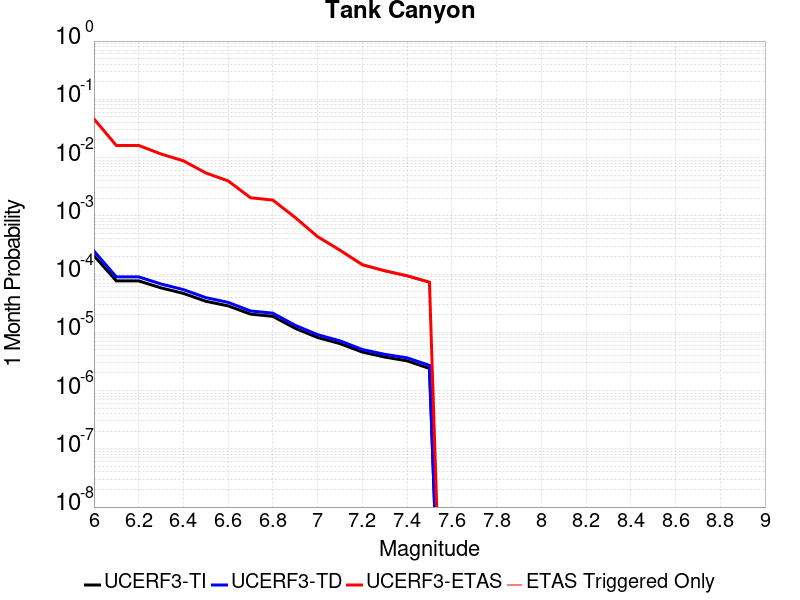 |  |  |

| Magnitude | 1 wk TI Prob | 1 wk TD Prob | 1 wk ETAS Prob | 1 wk ETAS/TD Gain | 1 wk ETAS Triggered Only | 1 mo TI Prob | 1 mo TD Prob | 1 mo ETAS Prob | 1 mo ETAS/TD Gain | 1 mo ETAS Triggered Only | 1 yr TI Prob | 1 yr TD Prob | 1 yr ETAS Prob | 1 yr ETAS/TD Gain | 1 yr ETAS Triggered Only | 10 yr TI Prob | 10 yr TD Prob | 10 yr ETAS Prob | 10 yr ETAS/TD Gain | 10 yr ETAS Triggered Only |
|-----|-----|-----|-----|-----|-----|-----|-----|-----|-----|-----|-----|-----|-----|-----|-----|-----|-----|-----|-----|-----|
| 6.0 | 4.8284557E-5 | 5.7964822E-5 | 0.0342394 | 590.69275 | 0.034183417 | 2.0691741E-4 | 2.4840087E-4 | 0.046442952 | 186.96776 | 0.04620603 | 0.0025163088 | 0.0030207601 | 0.07354827 | 24.347605 | 0.07074121 | 0.02488006 | 0.029863637 | 0.12404974 | 4.1538725 | 0.097085424 |
| 6.1 | 1.7796336E-5 | 2.0873314E-5 | 0.011879922 | 569.14404 | 0.011859297 | 7.626778E-5 | 8.945422E-5 | 0.016394528 | 183.27284 | 0.016306533 | 9.281647E-4 | 0.0010885983 | 0.027253551 | 25.035454 | 0.026193468 | 0.009242975 | 0.010836744 | 0.04747058 | 4.3805203 | 0.037035175 |
| 6.2 | 1.7796336E-5 | 2.0873314E-5 | 0.011879922 | 569.14404 | 0.011859297 | 7.626778E-5 | 8.945422E-5 | 0.016394528 | 183.27284 | 0.016306533 | 9.281647E-4 | 0.0010885983 | 0.027253551 | 25.035454 | 0.026193468 | 0.009242975 | 0.010836744 | 0.04747058 | 4.3805203 | 0.037035175 |
| 6.3 | 1.3515912E-5 | 1.5759564E-5 | 0.008608589 | 546.24536 | 0.008592965 | 5.792405E-5 | 6.753938E-5 | 0.011863225 | 175.649 | 0.011796483 | 7.049971E-4 | 8.2200574E-4 | 0.01966329 | 23.921108 | 0.018856784 | 0.007027647 | 0.0081922645 | 0.034544945 | 4.216776 | 0.026570352 |
| 6.4 | 1.0870146E-5 | 1.2618021E-5 | 0.006469823 | 512.7447 | 0.0064572864 | 4.658551E-5 | 5.4076212E-5 | 0.008985754 | 166.16833 | 0.008932161 | 5.67031E-4 | 6.581969E-4 | 0.014568633 | 22.134155 | 0.013919598 | 0.005655863 | 0.0065644905 | 0.026233515 | 3.996276 | 0.019798994 |
| 6.5 | 7.964826E-6 | 9.196094E-6 | 0.0040292596 | 438.14902 | 0.0040201005 | 3.4134522E-5 | 3.9411298E-5 | 0.0056422055 | 143.16214 | 0.005603015 | 4.1550855E-4 | 4.7973756E-4 | 0.0091188075 | 19.007908 | 0.008643216 | 0.0041473247 | 0.004788321 | 0.01696591 | 3.5431857 | 0.012236181 |
| 6.6 | 6.6317E-6 | 7.6122988E-6 | 0.0028719122 | 377.27264 | 0.0028643217 | 2.8421264E-5 | 3.2623782E-5 | 0.0040902803 | 125.37726 | 0.0040577888 | 3.4597394E-4 | 3.9713128E-4 | 0.006726275 | 16.937159 | 0.0063316585 | 0.0034543579 | 0.003965368 | 0.0129497005 | 3.2656996 | 0.0090201 |
| 6.7 | 4.793663E-6 | 5.4307857E-6 | 0.0015129603 | 278.58957 | 0.0015075377 | 2.0544108E-5 | 2.3274613E-5 | 0.0021463407 | 92.21811 | 0.0021231156 | 2.500958E-4 | 2.8333595E-4 | 0.0037245718 | 13.145426 | 0.003442211 | 0.0024981452 | 0.0028304397 | 0.007866397 | 2.7792137 | 0.0050502513 |
| 6.8 | 4.382823E-6 | 4.9692567E-6 | 0.0013743092 | 276.56232 | 0.0013693467 | 1.8783392E-5 | 2.1296666E-5 | 0.0019684914 | 92.43191 | 0.0019472361 | 2.286638E-4 | 2.5926033E-4 | 0.0033991495 | 13.110951 | 0.0031407035 | 0.0022842865 | 0.002590253 | 0.007138742 | 2.756002 | 0.0045603015 |
| 6.9 | 2.729601E-6 | 3.0735416E-6 | 6.6890067E-4 | 217.63187 | 6.6582917E-4 | 1.1698237E-5 | 1.3172262E-5 | 9.804962E-4 | 74.43643 | 9.673367E-4 | 1.4241673E-4 | 1.6036171E-4 | 0.0016550969 | 10.321022 | 0.0014949748 | 0.001423255 | 0.0016026258 | 0.0037725095 | 2.3539553 | 0.0021733667 |
| 7.0 | 1.8987357E-6 | 2.126939E-6 | 3.0363383E-4 | 142.75624 | 3.0150753E-4 | 8.137413E-6 | 9.115425E-6 | 4.488099E-4 | 49.236313 | 4.396985E-4 | 9.90685E-5 | 1.1097535E-4 | 7.8929204E-4 | 7.1123185 | 6.7839195E-4 | 9.902435E-4 | 0.0011092679 | 0.0020504338 | 1.8484567 | 9.422111E-4 |
| 7.1 | 1.4928986E-6 | 1.6641272E-6 | 1.5241765E-4 | 91.59014 | 1.5075377E-4 | 6.398121E-6 | 7.1319573E-6 | 2.5838646E-4 | 36.229385 | 2.5125628E-4 | 7.789434E-5 | 8.682871E-5 | 4.8880384E-4 | 5.6295185 | 4.0201005E-4 | 7.786704E-4 | 8.6800574E-4 | 0.0014704973 | 1.6941103 | 6.0301507E-4 |
| 7.2 | 1.069082E-6 | 1.1828573E-6 | 7.6559656E-5 | 64.724335 | 7.537688E-5 | 4.581772E-6 | 5.0693816E-6 | 1.5582239E-4 | 30.73795 | 1.5075377E-4 | 5.5781646E-5 | 6.171851E-5 | 3.1295928E-4 | 5.0707526 | 2.5125628E-4 | 5.576765E-4 | 6.170659E-4 | 9.309424E-4 | 1.5086597 | 3.1407035E-4 |
| 7.3 | 8.776551E-7 | 9.770005E-7 | 6.379101E-5 | 65.29271 | 6.281407E-5 | 3.7613736E-6 | 4.1871413E-6 | 1.2981475E-4 | 31.003195 | 1.2562814E-4 | 4.579376E-5 | 5.097777E-5 | 2.268482E-4 | 4.4499435 | 1.758794E-4 | 4.5784327E-4 | 5.097118E-4 | 7.357272E-4 | 1.443418 | 2.2613065E-4 |
| 7.4 | 7.55721E-7 | 8.510244E-7 | 5.1102237E-5 | 60.04791 | 5.0251256E-5 | 3.2388E-6 | 3.6472454E-6 | 1.0414939E-4 | 28.55563 | 1.0050251E-4 | 3.9431678E-5 | 4.4404827E-5 | 1.9515191E-4 | 4.3948355 | 1.5075377E-4 | 3.942468E-4 | 4.440104E-4 | 6.198117E-4 | 1.3959396 | 1.758794E-4 |
| 7.5 | 5.587665E-7 | 6.305619E-7 | 5.0881787E-5 | 80.69277 | 5.0251256E-5 | 2.3947114E-6 | 2.702408E-6 | 9.064187E-5 | 33.54115 | 8.79397E-5 | 2.915522E-5 | 3.290182E-5 | 1.7108822E-4 | 5.1999626 | 1.3819095E-4 | 2.9151395E-4 | 3.290182E-4 | 4.6716369E-4 | 1.4198719 | 1.3819095E-4 |

## Garlock (Central)
*[(top)](#table-of-contents)*

| 1 Week | 1 Month | 1 Year | 10 Year |
|-----|-----|-----|-----|
|  |  |  | 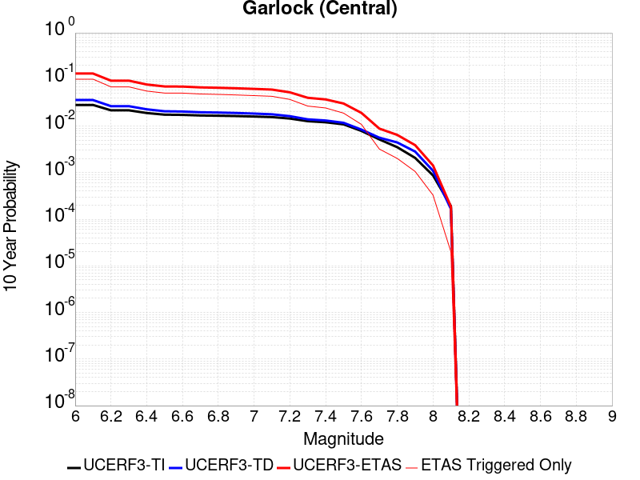 |

| Magnitude | 1 wk TI Prob | 1 wk TD Prob | 1 wk ETAS Prob | 1 wk ETAS/TD Gain | 1 wk ETAS Triggered Only | 1 mo TI Prob | 1 mo TD Prob | 1 mo ETAS Prob | 1 mo ETAS/TD Gain | 1 mo ETAS Triggered Only | 1 yr TI Prob | 1 yr TD Prob | 1 yr ETAS Prob | 1 yr ETAS/TD Gain | 1 yr ETAS Triggered Only | 10 yr TI Prob | 10 yr TD Prob | 10 yr ETAS Prob | 10 yr ETAS/TD Gain | 10 yr ETAS Triggered Only |
|-----|-----|-----|-----|-----|-----|-----|-----|-----|-----|-----|-----|-----|-----|-----|-----|-----|-----|-----|-----|-----|
| 6.0 | 5.5131142E-5 | 7.024681E-5 | 0.04105983 | 584.5081 | 0.04099246 | 2.3625491E-4 | 3.010234E-4 | 0.054003447 | 179.3995 | 0.053718593 | 0.0028726095 | 0.0036588663 | 0.08128836 | 22.216816 | 0.07791457 | 0.028357591 | 0.036079824 | 0.1341914 | 3.7192917 | 0.10178392 |
| 6.1 | 5.5131142E-5 | 7.024681E-5 | 0.04105983 | 584.5081 | 0.04099246 | 2.3625491E-4 | 3.010234E-4 | 0.054003447 | 179.3995 | 0.053718593 | 0.0028726095 | 0.0036588663 | 0.08128836 | 22.216816 | 0.07791457 | 0.028357591 | 0.036079824 | 0.1341914 | 3.7192917 | 0.10178392 |
| 6.2 | 4.216245E-5 | 5.1661493E-5 | 0.027474867 | 531.8249 | 0.027424622 | 1.806837E-4 | 2.2138779E-4 | 0.036344044 | 164.16463 | 0.03613065 | 0.0021976046 | 0.0026920962 | 0.055363987 | 20.565382 | 0.05281407 | 0.021759989 | 0.026689773 | 0.09441798 | 3.5376089 | 0.06958543 |
| 6.3 | 4.216245E-5 | 5.1661493E-5 | 0.027474867 | 531.8249 | 0.027424622 | 1.806837E-4 | 2.2138779E-4 | 0.036344044 | 164.16463 | 0.03613065 | 0.0021976046 | 0.0026920962 | 0.055363987 | 20.565382 | 0.05281407 | 0.021759989 | 0.026689773 | 0.09441798 | 3.5376089 | 0.06958543 |
| 6.4 | 3.6858168E-5 | 4.411054E-5 | 0.022216499 | 503.6551 | 0.022173367 | 1.5795401E-4 | 1.8903162E-4 | 0.029228767 | 154.62369 | 0.029045226 | 0.0019213937 | 0.002299056 | 0.044851754 | 19.50877 | 0.042650755 | 0.019048655 | 0.02284894 | 0.0782372 | 3.4241064 | 0.056683417 |
| 6.5 | 3.39199E-5 | 4.0018083E-5 | 0.02005178 | 501.06796 | 0.020012563 | 1.453629E-4 | 1.7149492E-4 | 0.02653632 | 154.7353 | 0.026369346 | 0.0017683565 | 0.002085973 | 0.040924385 | 19.618847 | 0.038919598 | 0.017543508 | 0.020759864 | 0.07107509 | 3.4236782 | 0.05138191 |
| 6.6 | 3.3571985E-5 | 3.9472274E-5 | 0.019988434 | 506.39175 | 0.01994975 | 1.4387199E-4 | 1.6915603E-4 | 0.026433557 | 156.2673 | 0.026268844 | 0.0017502342 | 0.0020575512 | 0.0407717 | 19.815643 | 0.03879397 | 0.017365133 | 0.020481179 | 0.07065076 | 3.4495454 | 0.05121859 |
| 6.7 | 3.2580007E-5 | 3.8088703E-5 | 0.019296149 | 506.61084 | 0.019258793 | 1.3962112E-4 | 1.632272E-4 | 0.02538524 | 155.52089 | 0.025226131 | 0.0016985617 | 0.0019855013 | 0.03903491 | 19.659977 | 0.037123114 | 0.016856372 | 0.019773813 | 0.06788617 | 3.433135 | 0.049082916 |
| 6.8 | 3.2185937E-5 | 3.7515918E-5 | 0.01888103 | 503.2805 | 0.01884422 | 1.3793244E-4 | 1.6077272E-4 | 0.024842734 | 154.52083 | 0.02468593 | 0.0016780337 | 0.001955672 | 0.038241353 | 19.554073 | 0.036356784 | 0.016654192 | 0.019480614 | 0.06664655 | 3.421173 | 0.048103016 |
| 6.9 | 3.165394E-5 | 3.6720503E-5 | 0.018365193 | 500.13455 | 0.018329145 | 1.3565269E-4 | 1.5736422E-4 | 0.024136003 | 153.3767 | 0.023982411 | 0.0016503202 | 0.001914247 | 0.03724849 | 19.458559 | 0.03540201 | 0.01638118 | 0.019073246 | 0.06497717 | 3.4067178 | 0.046796482 |
| 7.0 | 3.0903822E-5 | 3.5625766E-5 | 0.017849062 | 501.01553 | 0.01781407 | 1.3243823E-4 | 1.5267303E-4 | 0.023478257 | 153.7813 | 0.023329146 | 0.0016112428 | 0.0018572307 | 0.03619033 | 19.486181 | 0.034396984 | 0.015996104 | 0.018512413 | 0.063061595 | 3.406449 | 0.045389447 |
| 7.1 | 3.0069863E-5 | 3.4392073E-5 | 0.017307667 | 503.24585 | 0.01727387 | 1.2886449E-4 | 1.4738638E-4 | 0.022731997 | 154.23404 | 0.02258794 | 0.0015677959 | 0.0017929734 | 0.03502474 | 19.534445 | 0.03329146 | 0.01556781 | 0.017880075 | 0.06107608 | 3.4158738 | 0.043982413 |
| 7.2 | 2.7957109E-5 | 3.128145E-5 | 0.014880063 | 475.68326 | 0.0148492465 | 1.1981068E-4 | 1.340566E-4 | 0.019440513 | 145.01721 | 0.019309046 | 0.0014577188 | 0.0016309366 | 0.030001676 | 18.395367 | 0.028417086 | 0.014481937 | 0.016283695 | 0.05335843 | 3.276801 | 0.03768844 |
| 7.3 | 2.4519275E-5 | 2.6714795E-5 | 0.010692259 | 400.23737 | 0.010665829 | 1.0507837E-4 | 1.1448703E-4 | 0.013881755 | 121.25176 | 0.013768844 | 0.0012785783 | 0.001393003 | 0.021804228 | 15.6526785 | 0.0204397 | 0.012712469 | 0.013928054 | 0.040747724 | 2.9255865 | 0.027198492 |
| 7.4 | 2.3225532E-5 | 2.51994E-5 | 0.009673198 | 383.86618 | 0.009648241 | 9.95342E-5 | 1.0799304E-4 | 0.012619205 | 116.85202 | 0.012512563 | 0.0012111551 | 0.0013140367 | 0.019932754 | 15.169101 | 0.018643215 | 0.012045753 | 0.013145725 | 0.03755673 | 2.8569539 | 0.02473618 |
| 7.5 | 2.097765E-5 | 2.2483688E-5 | 0.007258502 | 322.83414 | 0.007236181 | 8.9901114E-5 | 9.635517E-5 | 0.009580366 | 99.42763 | 0.009484924 | 0.0010939965 | 0.0011725046 | 0.0155024165 | 13.221624 | 0.014346734 | 0.010886264 | 0.011740365 | 0.030748224 | 2.6190176 | 0.019233668 |
| 7.6 | 1.511254E-5 | 1.5991332E-5 | 0.0042621545 | 266.52905 | 0.004246231 | 6.476642E-5 | 6.853253E-5 | 0.00558323 | 81.46832 | 0.0055150753 | 7.882459E-4 | 8.3407195E-4 | 0.009018195 | 10.812251 | 0.008190955 | 0.007854558 | 0.008383559 | 0.019333694 | 2.3061442 | 0.011042713 |
| 7.7 | 9.934069E-6 | 1.0678794E-5 | 0.0014679497 | 137.464 | 0.0014572864 | 4.2573887E-5 | 4.5765457E-5 | 0.0017793544 | 38.879856 | 0.0017336684 | 5.182138E-4 | 5.570524E-4 | 0.003043104 | 5.4628687 | 0.002487437 | 0.00517007 | 0.005627684 | 0.008813173 | 1.5660391 | 0.0032035175 |
| 7.8 | 6.7562896E-6 | 8.428449E-6 | 9.3806884E-4 | 111.29792 | 9.2964823E-4 | 2.8955206E-5 | 3.6121426E-5 | 0.0011164844 | 30.9092 | 0.001080402 | 3.5247262E-4 | 4.3968976E-4 | 0.0020344655 | 4.627048 | 0.0015954773 | 0.0035191406 | 0.004446654 | 0.0064977943 | 1.4612771 | 0.0020603016 |
| 7.9 | 3.975453E-6 | 5.37103E-6 | 4.7019267E-4 | 87.54236 | 4.6482412E-4 | 1.7037546E-5 | 2.3018498E-5 | 5.5064453E-4 | 23.921827 | 5.276382E-4 | 2.0741238E-4 | 2.8021427E-4 | 0.0011091277 | 3.958141 | 8.291457E-4 | 0.002072189 | 0.0028336283 | 0.003973605 | 1.4023029 | 0.001143216 |
| 8.0 | 1.6729537E-6 | 2.0775144E-6 | 1.5283097E-4 | 73.56434 | 1.5075377E-4 | 7.169782E-6 | 8.903603E-6 | 1.5965603E-4 | 17.931622 | 1.5075377E-4 | 8.7288594E-5 | 1.0839601E-4 | 3.5962506E-4 | 3.3176966 | 2.5125628E-4 | 8.7254314E-4 | 0.0010969337 | 0.0014483067 | 1.3203229 | 3.517588E-4 |
| 8.1 | 3.6733252E-7 | 3.1489964E-7 | 1.287771E-5 | 40.894646 | 1.2562814E-5 | 1.5742813E-6 | 1.3495693E-6 | 1.3912367E-5 | 10.308745 | 1.2562814E-5 | 1.9166706E-5 | 1.6430899E-5 | 4.1556115E-5 | 2.5291443 | 2.5125628E-5 | 1.9165053E-4 | 1.6638759E-4 | 1.9150904E-4 | 1.1509815 | 2.5125628E-5 |

## Little Lake
*[(top)](#table-of-contents)*

| 1 Week | 1 Month | 1 Year | 10 Year |
|-----|-----|-----|-----|
| 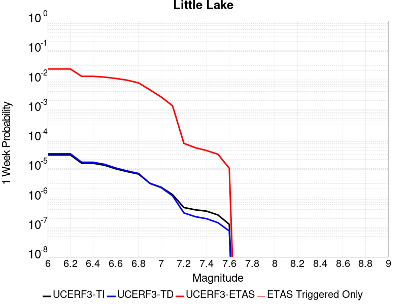 |  |  |  |

| Magnitude | 1 wk TI Prob | 1 wk TD Prob | 1 wk ETAS Prob | 1 wk ETAS/TD Gain | 1 wk ETAS Triggered Only | 1 mo TI Prob | 1 mo TD Prob | 1 mo ETAS Prob | 1 mo ETAS/TD Gain | 1 mo ETAS Triggered Only | 1 yr TI Prob | 1 yr TD Prob | 1 yr ETAS Prob | 1 yr ETAS/TD Gain | 1 yr ETAS Triggered Only | 10 yr TI Prob | 10 yr TD Prob | 10 yr ETAS Prob | 10 yr ETAS/TD Gain | 10 yr ETAS Triggered Only |
|-----|-----|-----|-----|-----|-----|-----|-----|-----|-----|-----|-----|-----|-----|-----|-----|-----|-----|-----|-----|-----|
| 6.0 | 2.8424427E-5 | 3.120572E-5 | 0.023321936 | 747.3609 | 0.023291457 | 1.2181328E-4 | 1.337327E-4 | 0.029074585 | 217.4082 | 0.028944723 | 0.0014820677 | 0.0016271127 | 0.04063389 | 24.973003 | 0.039070353 | 0.014722223 | 0.016165402 | 0.064714424 | 4.003268 | 0.049346734 |
| 6.1 | 2.8424427E-5 | 3.120572E-5 | 0.023321936 | 747.3609 | 0.023291457 | 1.2181328E-4 | 1.337327E-4 | 0.029074585 | 217.4082 | 0.028944723 | 0.0014820677 | 0.0016271127 | 0.04063389 | 24.973003 | 0.039070353 | 0.014722223 | 0.016165402 | 0.064714424 | 4.003268 | 0.049346734 |
| 6.2 | 2.8424427E-5 | 3.120572E-5 | 0.023321936 | 747.3609 | 0.023291457 | 1.2181328E-4 | 1.337327E-4 | 0.029074585 | 217.4082 | 0.028944723 | 0.0014820677 | 0.0016271127 | 0.04063389 | 24.973003 | 0.039070353 | 0.014722223 | 0.016165402 | 0.064714424 | 4.003268 | 0.049346734 |
| 6.3 | 1.48860645E-5 | 1.6081389E-5 | 0.013219386 | 822.03015 | 0.0132035175 | 6.379586E-5 | 6.8918576E-5 | 0.016424576 | 238.31854 | 0.016356785 | 7.7643775E-4 | 8.3878887E-4 | 0.022604436 | 26.948898 | 0.02178392 | 0.007737305 | 0.008359048 | 0.035330188 | 4.22658 | 0.027198492 |
| 6.4 | 1.48860645E-5 | 1.6081389E-5 | 0.013219386 | 822.03015 | 0.0132035175 | 6.379586E-5 | 6.8918576E-5 | 0.016424576 | 238.31854 | 0.016356785 | 7.7643775E-4 | 8.3878887E-4 | 0.022604436 | 26.948898 | 0.02178392 | 0.007737305 | 0.008359048 | 0.035330188 | 4.22658 | 0.027198492 |
| 6.5 | 1.2797581E-5 | 1.3765565E-5 | 0.012375404 | 899.0117 | 0.012361809 | 5.4845623E-5 | 5.899409E-5 | 0.015409847 | 261.21002 | 0.015351758 | 6.675408E-4 | 7.18042E-4 | 0.021155618 | 29.462923 | 0.020452261 | 0.006655392 | 0.00715977 | 0.03239238 | 4.524221 | 0.025414573 |
| 6.6 | 9.661896E-6 | 1.0289038E-5 | 0.011115703 | 1080.3442 | 0.011105528 | 4.1407468E-5 | 4.409522E-5 | 0.013837457 | 313.80853 | 0.0137939695 | 5.040193E-4 | 5.367433E-4 | 0.01891883 | 35.247448 | 0.01839196 | 0.005028777 | 0.0053560743 | 0.02788551 | 5.2063336 | 0.022650754 |
| 6.7 | 7.767871E-6 | 8.199687E-6 | 0.00969405 | 1182.2463 | 0.00968593 | 3.329045E-5 | 3.5141118E-5 | 0.01204477 | 342.7543 | 0.01201005 | 4.0523586E-4 | 4.2777284E-4 | 0.01652641 | 38.633614 | 0.016105527 | 0.004044977 | 0.004270846 | 0.024060337 | 5.633623 | 0.019874372 |
| 6.8 | 6.4235196E-6 | 6.7357446E-6 | 0.007858441 | 1166.6775 | 0.007851759 | 2.752908E-5 | 2.8867229E-5 | 0.009739642 | 337.3944 | 0.009711055 | 3.35115E-4 | 3.5141467E-4 | 0.013299124 | 37.844536 | 0.012952262 | 0.003346101 | 0.00350985 | 0.01927092 | 5.490525 | 0.015816582 |
| 6.9 | 3.1283696E-6 | 3.1121804E-6 | 0.0046262136 | 1486.4862 | 0.0046231155 | 1.3407229E-5 | 1.3337856E-5 | 0.005553465 | 416.36862 | 0.005540201 | 1.6322079E-4 | 1.6237781E-4 | 0.0074225054 | 45.711327 | 0.0072613065 | 0.0016310095 | 0.00162274 | 0.010377355 | 6.3949585 | 0.008768844 |
| 7.0 | 2.290603E-6 | 2.2286815E-6 | 0.0026404138 | 1184.7426 | 0.002638191 | 9.816834E-6 | 9.551463E-6 | 0.0031627878 | 331.13123 | 0.0031532664 | 1.19513395E-4 | 1.162839E-4 | 0.00434946 | 37.4038 | 0.0042336686 | 0.0011944914 | 0.0011623327 | 0.0063196477 | 5.4370384 | 0.0051633166 |
| 7.1 | 1.293693E-6 | 1.1776827E-6 | 0.0013705228 | 1163.7454 | 0.0013693467 | 5.5443866E-6 | 5.0472063E-6 | 0.0016256421 | 322.08752 | 0.001620603 | 6.750081E-5 | 6.14487E-5 | 0.0021216236 | 34.526745 | 0.0020603016 | 6.7480316E-4 | 6.143856E-4 | 0.003037519 | 4.943995 | 0.0024246231 |
| 7.2 | 4.715842E-7 | 3.0917857E-7 | 6.312323E-5 | 204.1643 | 6.281407E-5 | 2.0210737E-6 | 1.3250503E-6 | 6.4139036E-5 | 48.40498 | 6.281407E-5 | 2.4606294E-5 | 1.6132375E-5 | 1.2919588E-4 | 8.008485 | 1.13065325E-4 | 2.460357E-4 | 1.6131258E-4 | 2.8692046E-4 | 1.7786614 | 1.2562814E-4 |
| 7.3 | 3.9430947E-7 | 2.3097488E-7 | 5.048222E-5 | 218.56152 | 5.0251256E-5 | 1.6898966E-6 | 9.89892E-7 | 5.12411E-5 | 51.764336 | 5.0251256E-5 | 2.0574296E-5 | 1.2051869E-5 | 9.999051E-5 | 8.29668 | 8.79397E-5 | 2.0572392E-4 | 1.20512224E-4 | 2.2100263E-4 | 1.8338606 | 1.0050251E-4 |
| 7.4 | 3.547123E-7 | 1.9679135E-7 | 3.7885227E-5 | 192.5147 | 3.768844E-5 | 1.5201948E-6 | 8.4339126E-7 | 3.85318E-5 | 45.686745 | 3.768844E-5 | 1.8508214E-5 | 1.0268241E-5 | 8.564435E-5 | 8.340704 | 7.537688E-5 | 1.8506673E-4 | 1.02677724E-4 | 1.7804687E-4 | 1.734036 | 7.537688E-5 |
| 7.5 | 2.6354266E-7 | 1.4423138E-7 | 2.5269856E-5 | 175.20358 | 2.5125628E-5 | 1.129468E-6 | 6.181344E-7 | 2.5743748E-5 | 41.647495 | 2.5125628E-5 | 1.3751187E-5 | 7.5257603E-6 | 5.7776637E-5 | 7.6771827 | 5.0251256E-5 | 1.3750336E-4 | 7.5255106E-5 | 1.2550259E-4 | 1.6676952 | 5.0251256E-5 |
| 7.6 | 1.269913E-7 | 7.572556E-8 | 1.26385385E-5 | 166.89925 | 1.2562814E-5 | 5.4424834E-7 | 3.245381E-7 | 1.2887348E-5 | 39.709816 | 1.2562814E-5 | 6.6262032E-6 | 3.9512443E-6 | 2.9076773E-5 | 7.35889 | 2.5125628E-5 | 6.626006E-5 | 3.9511775E-5 | 6.463641E-5 | 1.6358771 | 2.5125628E-5 |

## Owl Lake
*[(top)](#table-of-contents)*

| 1 Week | 1 Month | 1 Year | 10 Year |
|-----|-----|-----|-----|
|  |  | 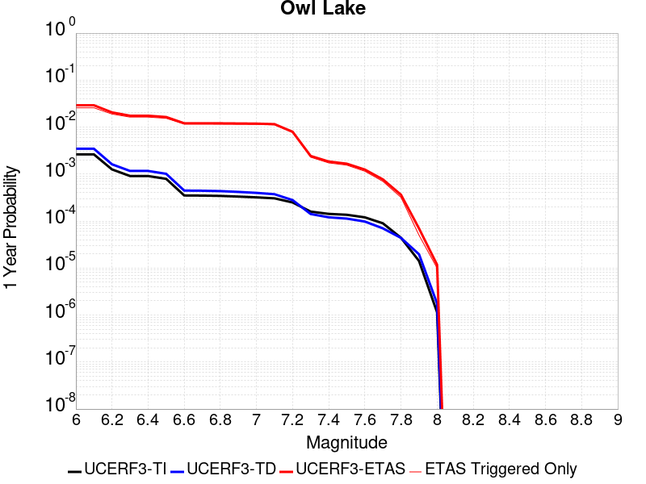 |  |

| Magnitude | 1 wk TI Prob | 1 wk TD Prob | 1 wk ETAS Prob | 1 wk ETAS/TD Gain | 1 wk ETAS Triggered Only | 1 mo TI Prob | 1 mo TD Prob | 1 mo ETAS Prob | 1 mo ETAS/TD Gain | 1 mo ETAS Triggered Only | 1 yr TI Prob | 1 yr TD Prob | 1 yr ETAS Prob | 1 yr ETAS/TD Gain | 1 yr ETAS Triggered Only | 10 yr TI Prob | 10 yr TD Prob | 10 yr ETAS Prob | 10 yr ETAS/TD Gain | 10 yr ETAS Triggered Only |
|-----|-----|-----|-----|-----|-----|-----|-----|-----|-----|-----|-----|-----|-----|-----|-----|-----|-----|-----|-----|-----|
| 6.0 | 5.0320643E-5 | 6.635816E-5 | 0.012012801 | 181.02977 | 0.011947236 | 2.1564208E-4 | 2.843674E-4 | 0.016887685 | 59.386856 | 0.01660804 | 0.0026222812 | 0.0034577388 | 0.029185055 | 8.440503 | 0.025816582 | 0.02591553 | 0.034140717 | 0.069062114 | 2.0228665 | 0.03615578 |
| 6.1 | 5.0320643E-5 | 6.635816E-5 | 0.012012801 | 181.02977 | 0.011947236 | 2.1564208E-4 | 2.843674E-4 | 0.016887685 | 59.386856 | 0.01660804 | 0.0026222812 | 0.0034577388 | 0.029185055 | 8.440503 | 0.025816582 | 0.02591553 | 0.034140717 | 0.069062114 | 2.0228665 | 0.03615578 |
| 6.2 | 2.4125871E-5 | 3.0981035E-5 | 0.009126177 | 294.573 | 0.009095477 | 1.0339249E-4 | 1.3277028E-4 | 0.012643672 | 95.22968 | 0.012512563 | 0.0012580766 | 0.001615439 | 0.02064244 | 12.778224 | 0.01905779 | 0.012509781 | 0.016070465 | 0.041781187 | 2.5998743 | 0.026130654 |
| 6.3 | 1.7433485E-5 | 2.2355514E-5 | 0.008062377 | 360.64377 | 0.008040201 | 7.471279E-5 | 9.580672E-5 | 0.011175147 | 116.642624 | 0.011080402 | 9.0924866E-4 | 0.0011659743 | 0.017704457 | 15.18426 | 0.016557788 | 0.009055373 | 0.011628896 | 0.033941746 | 2.918742 | 0.022575377 |
| 6.4 | 1.7433485E-5 | 2.2355514E-5 | 0.008062377 | 360.64377 | 0.008040201 | 7.471279E-5 | 9.580672E-5 | 0.011175147 | 116.642624 | 0.011080402 | 9.0924866E-4 | 0.0011659743 | 0.017704457 | 15.18426 | 0.016557788 | 0.009055373 | 0.011628896 | 0.033941746 | 2.918742 | 0.022575377 |
| 6.5 | 1.5182742E-5 | 1.9429144E-5 | 0.007707722 | 396.7093 | 0.0076884422 | 6.506727E-5 | 8.326596E-5 | 0.0105597805 | 126.8199 | 0.010477387 | 7.919061E-4 | 0.0010134429 | 0.016562995 | 16.343294 | 0.015565326 | 0.0078909 | 0.010118429 | 0.03104771 | 3.0684319 | 0.021143217 |
| 6.6 | 6.7271576E-6 | 8.547361E-6 | 0.0062019615 | 725.5996 | 0.0061934674 | 2.8830356E-5 | 3.6631063E-5 | 0.008277535 | 225.97037 | 0.008241206 | 3.5095305E-4 | 4.458976E-4 | 0.012149219 | 27.246658 | 0.011708543 | 0.0035039932 | 0.004467813 | 0.01976349 | 4.423527 | 0.015364322 |
| 6.7 | 6.682835E-6 | 8.479807E-6 | 0.0062018945 | 731.37213 | 0.0061934674 | 2.8640408E-5 | 3.6341557E-5 | 0.008277248 | 227.76262 | 0.008241206 | 3.4864116E-4 | 4.4237426E-4 | 0.012145737 | 27.455795 | 0.011708543 | 0.003480947 | 0.0044327388 | 0.019728955 | 4.450737 | 0.015364322 |
| 6.8 | 6.5774975E-6 | 8.32628E-6 | 0.0061766165 | 741.82184 | 0.0061683417 | 2.8188972E-5 | 3.5683603E-5 | 0.0082514705 | 231.23984 | 0.00821608 | 3.4314668E-4 | 4.343669E-4 | 0.012112709 | 27.885893 | 0.0116834175 | 0.0034261728 | 0.004352885 | 0.019612802 | 4.5057025 | 0.015326633 |
| 6.9 | 6.363419E-6 | 7.999454E-6 | 0.0061386037 | 767.37775 | 0.0061306534 | 2.727151E-5 | 3.428296E-5 | 0.008199832 | 239.181 | 0.008165829 | 3.3198006E-4 | 4.1732067E-4 | 0.012033074 | 28.83412 | 0.011620603 | 0.0033148455 | 0.0041828766 | 0.019332808 | 4.621893 | 0.015213568 |
| 7.0 | 6.1342453E-6 | 7.6316555E-6 | 0.0061256755 | 802.6666 | 0.0061180904 | 2.6289357E-5 | 3.2706717E-5 | 0.008160582 | 249.50783 | 0.008128141 | 3.2002592E-4 | 3.9813702E-4 | 0.011926209 | 29.955036 | 0.011532663 | 0.0031956544 | 0.003991571 | 0.019019285 | 4.7648625 | 0.01508794 |
| 7.1 | 5.842926E-6 | 7.142211E-6 | 0.005986999 | 838.2557 | 0.0059798993 | 2.504087E-5 | 3.0609146E-5 | 0.00794494 | 259.56094 | 0.007914573 | 3.0482994E-4 | 3.7260808E-4 | 0.011637254 | 31.231888 | 0.011268844 | 0.0030441214 | 0.0037370329 | 0.018418144 | 4.9285474 | 0.014736181 |
| 7.2 | 4.77173E-6 | 5.358483E-6 | 0.004125939 | 769.9827 | 0.004120603 | 2.045011E-5 | 2.2964748E-5 | 0.005412288 | 235.67809 | 0.0053894473 | 2.4895166E-4 | 2.79564E-4 | 0.007953297 | 28.448933 | 0.007675879 | 0.0024867293 | 0.002808645 | 0.012968471 | 4.617341 | 0.010188443 |
| 7.3 | 3.0494948E-6 | 2.710463E-6 | 0.0012464257 | 459.85712 | 0.0012437186 | 1.3069198E-5 | 1.1616219E-5 | 0.001644763 | 141.59195 | 0.0016331659 | 1.5910587E-4 | 1.4141845E-4 | 0.0024149662 | 17.07674 | 0.0022738692 | 0.0015899199 | 0.0014232415 | 0.0044214805 | 3.1066272 | 0.0030025125 |
| 7.4 | 2.7263884E-6 | 2.3056762E-6 | 9.445146E-4 | 409.64752 | 9.422111E-4 | 1.1684469E-5 | 9.881433E-6 | 0.0012661504 | 128.1343 | 0.0012562814 | 1.4224913E-4 | 1.20299905E-4 | 0.0018537596 | 15.409486 | 0.0017336684 | 0.0014215811 | 0.0012112238 | 0.0033819582 | 2.7921827 | 0.0021733667 |
| 7.5 | 2.6090431E-6 | 2.1656133E-6 | 8.689979E-4 | 401.27106 | 8.668342E-4 | 1.1181565E-5 | 9.281167E-6 | 0.0011399239 | 122.82118 | 0.0011306533 | 1.3612706E-4 | 1.1299244E-4 | 0.0016454826 | 14.562766 | 0.0015326634 | 0.001360437 | 0.0011379806 | 0.0030704525 | 2.6981587 | 0.0019346734 |
| 7.6 | 2.3008756E-6 | 1.8727933E-6 | 6.928263E-4 | 369.94272 | 6.909548E-4 | 9.860858E-6 | 8.0262325E-6 | 8.6229073E-4 | 107.43405 | 8.5427135E-4 | 1.20049335E-4 | 9.7715085E-5 | 0.0012408195 | 12.69834 | 0.001143216 | 0.001199845 | 9.849932E-4 | 0.0024282937 | 2.4652898 | 0.0014447236 |
| 7.7 | 1.7184348E-6 | 1.3419171E-6 | 4.536026E-4 | 338.02582 | 4.522613E-4 | 7.3646997E-6 | 5.7510606E-6 | 5.45949E-4 | 94.93013 | 5.40201E-4 | 8.966153E-5 | 7.0016955E-5 | 7.860472E-4 | 11.226526 | 7.160804E-4 | 8.962536E-4 | 7.078345E-4 | 0.0015489473 | 2.18829 | 8.4170856E-4 |
| 7.8 | 8.4612907E-7 | 8.4058576E-7 | 2.0184544E-4 | 240.12474 | 2.0100502E-4 | 3.6262625E-6 | 3.6025056E-6 | 2.4229511E-4 | 67.257385 | 2.3869346E-4 | 4.4148852E-5 | 4.3859643E-5 | 3.704785E-4 | 8.446911 | 3.2663316E-4 | 4.414008E-4 | 4.4398365E-4 | 8.458152E-4 | 1.9050595 | 4.0201005E-4 |
| 7.9 | 2.716738E-7 | 3.768106E-7 | 2.550243E-5 | 67.67971 | 2.5125628E-5 | 1.1643157E-6 | 1.6149015E-6 | 2.6740488E-5 | 16.558588 | 2.5125628E-5 | 1.4175452E-5 | 1.966126E-5 | 5.734896E-5 | 2.9168508 | 3.768844E-5 | 1.4174548E-4 | 1.9836679E-4 | 2.737287E-4 | 1.379912 | 7.537688E-5 |
| 8.0 | 2.1995428E-8 | 3.384878E-8 | 3.384878E-8 | 1.0 | 0.0 | 9.426611E-8 | 1.4506621E-7 | 1.4506621E-7 | 1.0 | 0.0 | 1.1476893E-6 | 1.7661803E-6 | 1.4328973E-5 | 8.112972 | 1.2562814E-5 | 1.14768345E-5 | 1.7963059E-5 | 3.0525647E-5 | 1.6993569 | 1.2562814E-5 |

## Airport Lake
*[(top)](#table-of-contents)*

| 1 Week | 1 Month | 1 Year | 10 Year |
|-----|-----|-----|-----|
|  |  |  |  |

| Magnitude | 1 wk TI Prob | 1 wk TD Prob | 1 wk ETAS Prob | 1 wk ETAS/TD Gain | 1 wk ETAS Triggered Only | 1 mo TI Prob | 1 mo TD Prob | 1 mo ETAS Prob | 1 mo ETAS/TD Gain | 1 mo ETAS Triggered Only | 1 yr TI Prob | 1 yr TD Prob | 1 yr ETAS Prob | 1 yr ETAS/TD Gain | 1 yr ETAS Triggered Only | 10 yr TI Prob | 10 yr TD Prob | 10 yr ETAS Prob | 10 yr ETAS/TD Gain | 10 yr ETAS Triggered Only |
|-----|-----|-----|-----|-----|-----|-----|-----|-----|-----|-----|-----|-----|-----|-----|-----|-----|-----|-----|-----|-----|
| 6.0 | 1.2387061E-5 | 1.3103157E-5 | 0.015716415 | 1199.4373 | 0.015703518 | 5.3086325E-5 | 5.615534E-5 | 0.019401802 | 345.50238 | 0.019346735 | 6.461343E-4 | 6.8350515E-4 | 0.026068153 | 38.138927 | 0.02540201 | 0.0064425888 | 0.0068168393 | 0.037148852 | 5.4495716 | 0.030540202 |
| 6.1 | 1.2387061E-5 | 1.3103157E-5 | 0.015716415 | 1199.4373 | 0.015703518 | 5.3086325E-5 | 5.615534E-5 | 0.019401802 | 345.50238 | 0.019346735 | 6.461343E-4 | 6.8350515E-4 | 0.026068153 | 38.138927 | 0.02540201 | 0.0064425888 | 0.0068168393 | 0.037148852 | 5.4495716 | 0.030540202 |
| 6.2 | 1.2387061E-5 | 1.3103157E-5 | 0.015716415 | 1199.4373 | 0.015703518 | 5.3086325E-5 | 5.615534E-5 | 0.019401802 | 345.50238 | 0.019346735 | 6.461343E-4 | 6.8350515E-4 | 0.026068153 | 38.138927 | 0.02540201 | 0.0064425888 | 0.0068168393 | 0.037148852 | 5.4495716 | 0.030540202 |
| 6.3 | 1.2387061E-5 | 1.3103157E-5 | 0.015716415 | 1199.4373 | 0.015703518 | 5.3086325E-5 | 5.615534E-5 | 0.019401802 | 345.50238 | 0.019346735 | 6.461343E-4 | 6.8350515E-4 | 0.026068153 | 38.138927 | 0.02540201 | 0.0064425888 | 0.0068168393 | 0.037148852 | 5.4495716 | 0.030540202 |
| 6.4 | 1.2387061E-5 | 1.3103157E-5 | 0.015716415 | 1199.4373 | 0.015703518 | 5.3086325E-5 | 5.615534E-5 | 0.019401802 | 345.50238 | 0.019346735 | 6.461343E-4 | 6.8350515E-4 | 0.026068153 | 38.138927 | 0.02540201 | 0.0064425888 | 0.0068168393 | 0.037148852 | 5.4495716 | 0.030540202 |
| 6.5 | 6.9922594E-6 | 7.384925E-6 | 0.012092723 | 1637.4875 | 0.0120854275 | 2.996648E-5 | 3.1649324E-5 | 0.014918113 | 471.3564 | 0.014886934 | 3.6478083E-4 | 3.8526783E-4 | 0.019686874 | 51.09919 | 0.019309046 | 0.003641826 | 0.0038465366 | 0.027161032 | 7.061166 | 0.023404522 |
| 6.6 | 6.9922594E-6 | 7.384925E-6 | 0.012092723 | 1637.4875 | 0.0120854275 | 2.996648E-5 | 3.1649324E-5 | 0.014918113 | 471.3564 | 0.014886934 | 3.6478083E-4 | 3.8526783E-4 | 0.019686874 | 51.09919 | 0.019309046 | 0.003641826 | 0.0038465366 | 0.027161032 | 7.061166 | 0.023404522 |
| 6.7 | 5.477277E-6 | 5.7860684E-6 | 0.010407736 | 1798.7578 | 0.01040201 | 2.3473833E-5 | 2.4797222E-5 | 0.012800862 | 516.2216 | 0.012776382 | 2.8575645E-4 | 3.0186825E-4 | 0.01696769 | 56.208927 | 0.016670855 | 0.0028538927 | 0.003014966 | 0.023217691 | 7.700814 | 0.020263819 |
| 6.8 | 3.9950432E-6 | 4.2190873E-6 | 0.008232827 | 1951.3291 | 0.008228643 | 1.7121502E-5 | 1.8081691E-5 | 0.010068151 | 556.81464 | 0.010050251 | 2.0843433E-4 | 2.2012512E-4 | 0.013131855 | 59.656322 | 0.012914573 | 0.0020823893 | 0.0021993418 | 0.0177179 | 8.056001 | 0.015552764 |
| 6.9 | 2.95695E-6 | 3.1230243E-6 | 0.006083506 | 1947.9535 | 0.006080402 | 1.2672582E-5 | 1.3384334E-5 | 0.007375095 | 551.0244 | 0.0073618093 | 1.5427776E-4 | 1.6294434E-4 | 0.009658884 | 59.2772 | 0.009497487 | 0.001541707 | 0.0016284712 | 0.012916591 | 7.931729 | 0.011306533 |
| 7.0 | 1.456072E-6 | 1.540812E-6 | 0.0024889742 | 1615.3652 | 0.002487437 | 6.2402937E-6 | 6.603469E-6 | 0.002971408 | 449.97684 | 0.0029648242 | 7.597293E-5 | 8.039528E-5 | 0.004024802 | 50.062664 | 0.0039447234 | 7.594696E-4 | 8.0376083E-4 | 0.0056491094 | 7.0283465 | 0.0048492462 |
| 7.1 | 6.995192E-7 | 7.4089746E-7 | 0.0012444586 | 1679.6637 | 0.0012437186 | 2.997936E-6 | 3.1752747E-6 | 0.0014855827 | 467.85956 | 0.0014824121 | 3.649926E-5 | 3.865897E-5 | 0.0019104459 | 49.41792 | 0.0018718593 | 3.6493264E-4 | 3.865897E-4 | 0.0025967902 | 6.7171736 | 0.0022110553 |

## Panamint Valley
*[(top)](#table-of-contents)*

| 1 Week | 1 Month | 1 Year | 10 Year |
|-----|-----|-----|-----|
|  |  |  | 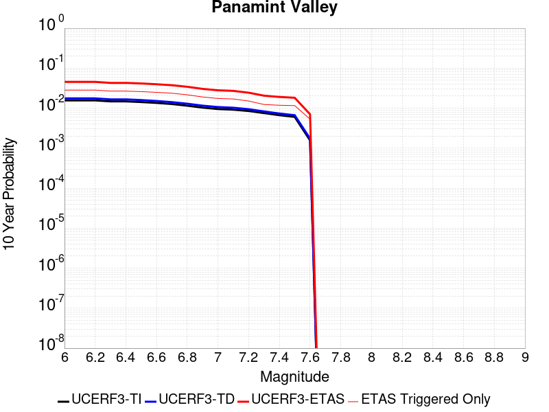 |

| Magnitude | 1 wk TI Prob | 1 wk TD Prob | 1 wk ETAS Prob | 1 wk ETAS/TD Gain | 1 wk ETAS Triggered Only | 1 mo TI Prob | 1 mo TD Prob | 1 mo ETAS Prob | 1 mo ETAS/TD Gain | 1 mo ETAS Triggered Only | 1 yr TI Prob | 1 yr TD Prob | 1 yr ETAS Prob | 1 yr ETAS/TD Gain | 1 yr ETAS Triggered Only | 10 yr TI Prob | 10 yr TD Prob | 10 yr ETAS Prob | 10 yr ETAS/TD Gain | 10 yr ETAS Triggered Only |
|-----|-----|-----|-----|-----|-----|-----|-----|-----|-----|-----|-----|-----|-----|-----|-----|-----|-----|-----|-----|-----|
| 6.0 | 3.0211835E-5 | 3.3984514E-5 | 0.009292464 | 273.4323 | 0.009258794 | 1.2947287E-4 | 1.4563995E-4 | 0.013045771 | 89.5755 | 0.01290201 | 0.0015751923 | 0.0017717537 | 0.022263022 | 12.565529 | 0.020527638 | 0.015640736 | 0.017583137 | 0.04575974 | 2.6024787 | 0.028680904 |
| 6.1 | 3.0211835E-5 | 3.3984514E-5 | 0.009292464 | 273.4323 | 0.009258794 | 1.2947287E-4 | 1.4563995E-4 | 0.013045771 | 89.5755 | 0.01290201 | 0.0015751923 | 0.0017717537 | 0.022263022 | 12.565529 | 0.020527638 | 0.015640736 | 0.017583137 | 0.04575974 | 2.6024787 | 0.028680904 |
| 6.2 | 3.0211835E-5 | 3.3984514E-5 | 0.009292464 | 273.4323 | 0.009258794 | 1.2947287E-4 | 1.4563995E-4 | 0.013045771 | 89.5755 | 0.01290201 | 0.0015751923 | 0.0017717537 | 0.022263022 | 12.565529 | 0.020527638 | 0.015640736 | 0.017583137 | 0.04575974 | 2.6024787 | 0.028680904 |
| 6.3 | 2.8573924E-5 | 3.210268E-5 | 0.00882579 | 274.9238 | 0.00879397 | 1.2245393E-4 | 1.3757581E-4 | 0.012284146 | 89.29001 | 0.0121482415 | 0.001489857 | 0.0016737265 | 0.020950453 | 12.517251 | 0.019309046 | 0.01479908 | 0.016617801 | 0.04316665 | 2.597615 | 0.026997488 |
| 6.4 | 2.8573924E-5 | 3.210268E-5 | 0.00882579 | 274.9238 | 0.00879397 | 1.2245393E-4 | 1.3757581E-4 | 0.012284146 | 89.29001 | 0.0121482415 | 0.001489857 | 0.0016737265 | 0.020950453 | 12.517251 | 0.019309046 | 0.01479908 | 0.016617801 | 0.04316665 | 2.597615 | 0.026997488 |
| 6.5 | 2.7468774E-5 | 3.0828433E-5 | 0.008673778 | 281.35645 | 0.008643216 | 1.1771801E-4 | 1.3211532E-4 | 0.012052651 | 91.22826 | 0.011922111 | 0.0014322745 | 0.0016073446 | 0.020446362 | 12.720584 | 0.018869346 | 0.014230782 | 0.015963677 | 0.041800812 | 2.6184952 | 0.026256282 |
| 6.6 | 2.6135967E-5 | 2.925248E-5 | 0.008307905 | 284.00684 | 0.008278894 | 1.1200648E-4 | 1.253619E-4 | 0.011518406 | 91.88123 | 0.011394473 | 0.0013628257 | 0.0015252391 | 0.019575555 | 12.834418 | 0.01807789 | 0.013544982 | 0.015154043 | 0.039948408 | 2.636155 | 0.025175879 |
| 6.7 | 2.4498746E-5 | 2.7341335E-5 | 0.007991947 | 292.30276 | 0.007964824 | 1.04990395E-4 | 1.1717203E-4 | 0.0110581005 | 94.37492 | 0.010942211 | 0.0012775084 | 0.0014256609 | 0.01866236 | 13.090321 | 0.017261306 | 0.012701893 | 0.014171274 | 0.037789054 | 2.6665955 | 0.023957286 |
| 6.8 | 2.2244329E-5 | 2.4935423E-5 | 0.007537311 | 302.27322 | 0.007512563 | 9.532935E-5 | 1.0686185E-4 | 0.010394707 | 97.272385 | 0.0102889445 | 0.0011600169 | 0.0013002884 | 0.017284503 | 13.292823 | 0.016005024 | 0.011539802 | 0.0129325185 | 0.03453392 | 2.6703167 | 0.021884423 |
| 6.9 | 1.9902658E-5 | 2.2290267E-5 | 0.006768371 | 303.64694 | 0.006746231 | 8.529431E-5 | 9.552632E-5 | 0.009265505 | 96.994255 | 0.009170854 | 0.0010379635 | 0.0011624309 | 0.015241523 | 13.111767 | 0.014095478 | 0.010331288 | 0.011568608 | 0.030567352 | 2.6422672 | 0.019221105 |
| 7.0 | 1.8353881E-5 | 2.0566185E-5 | 0.006301844 | 306.41772 | 0.006281407 | 7.865712E-5 | 8.813792E-5 | 0.008579852 | 97.34575 | 0.008492462 | 9.5722964E-4 | 0.0010725686 | 0.014136431 | 13.179978 | 0.01307789 | 0.009531168 | 0.010678849 | 0.02816597 | 2.6375473 | 0.017675878 |
| 7.1 | 1.7667631E-5 | 1.9772613E-5 | 0.0061000544 | 308.51028 | 0.006080402 | 7.571623E-5 | 8.473711E-5 | 0.008325245 | 98.24792 | 0.008241206 | 9.2145515E-4 | 0.0010312037 | 0.013719112 | 13.303979 | 0.012701005 | 0.009176437 | 0.010269073 | 0.027278518 | 2.6563761 | 0.01718593 |
| 7.2 | 1.6381597E-5 | 1.8158249E-5 | 0.005520571 | 304.02548 | 0.0055025127 | 7.020495E-5 | 7.781885E-5 | 0.0075521115 | 97.04733 | 0.007474874 | 8.544101E-4 | 9.4704994E-4 | 0.01231818 | 13.006896 | 0.011381909 | 0.008511325 | 0.009434792 | 0.024567045 | 2.6038778 | 0.015276382 |
| 7.3 | 1.4520491E-5 | 1.5966476E-5 | 0.004475694 | 280.31824 | 0.004459799 | 6.222919E-5 | 6.842605E-5 | 0.006186098 | 90.405594 | 0.0061180904 | 7.57377E-4 | 8.327849E-4 | 0.010083868 | 12.10861 | 0.009258794 | 0.0075480095 | 0.00829975 | 0.02064617 | 2.487565 | 0.012449749 |
| 7.4 | 1.2852287E-5 | 1.4145411E-5 | 0.0042980043 | 303.84445 | 0.0042839195 | 5.5080065E-5 | 6.062187E-5 | 0.0059019765 | 97.357216 | 0.0058417087 | 6.7039346E-4 | 7.378371E-4 | 0.0096383 | 13.06291 | 0.008907035 | 0.0066837464 | 0.0073567946 | 0.019228607 | 2.613721 | 0.011959799 |
| 7.5 | 1.1637851E-5 | 1.2836797E-5 | 0.004271576 | 332.76025 | 0.004258794 | 4.987555E-5 | 5.5013777E-5 | 0.005808466 | 105.58203 | 0.005753769 | 6.070656E-4 | 6.6960254E-4 | 0.0094200205 | 14.068078 | 0.008756282 | 0.006054099 | 0.0066787465 | 0.018334048 | 2.7451332 | 0.011733668 |
| 7.6 | 3.0068115E-6 | 3.3330316E-6 | 0.0020008138 | 600.29846 | 0.0019974874 | 1.2886271E-5 | 1.4284384E-5 | 0.0026775629 | 187.44687 | 0.0026633167 | 1.5687906E-4 | 1.7390578E-4 | 0.004155625 | 23.895844 | 0.003982412 | 0.0015676835 | 0.0017391363 | 0.0071317516 | 4.1007433 | 0.00540201 |

## Garlock (East)
*[(top)](#table-of-contents)*

| 1 Week | 1 Month | 1 Year | 10 Year |
|-----|-----|-----|-----|
| 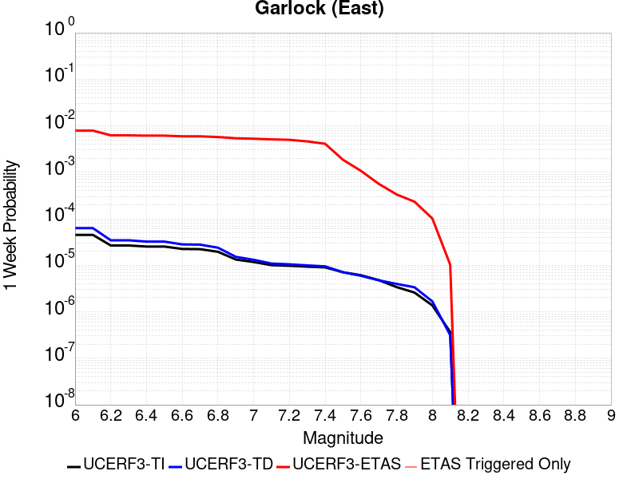 |  |  |  |

| Magnitude | 1 wk TI Prob | 1 wk TD Prob | 1 wk ETAS Prob | 1 wk ETAS/TD Gain | 1 wk ETAS Triggered Only | 1 mo TI Prob | 1 mo TD Prob | 1 mo ETAS Prob | 1 mo ETAS/TD Gain | 1 mo ETAS Triggered Only | 1 yr TI Prob | 1 yr TD Prob | 1 yr ETAS Prob | 1 yr ETAS/TD Gain | 1 yr ETAS Triggered Only | 10 yr TI Prob | 10 yr TD Prob | 10 yr ETAS Prob | 10 yr ETAS/TD Gain | 10 yr ETAS Triggered Only |
|-----|-----|-----|-----|-----|-----|-----|-----|-----|-----|-----|-----|-----|-----|-----|-----|-----|-----|-----|-----|-----|
| 6.0 | 4.5092507E-5 | 6.290325E-5 | 0.007989541 | 127.01315 | 0.007927136 | 1.9323928E-4 | 2.6956003E-4 | 0.010869717 | 40.32392 | 0.010603015 | 0.0023501497 | 0.0032774 | 0.020569786 | 6.2762513 | 0.017349247 | 0.023254504 | 0.032351844 | 0.056154046 | 1.7357292 | 0.02459799 |
| 6.1 | 4.5092507E-5 | 6.290325E-5 | 0.007989541 | 127.01315 | 0.007927136 | 1.9323928E-4 | 2.6956003E-4 | 0.010869717 | 40.32392 | 0.010603015 | 0.0023501497 | 0.0032774 | 0.020569786 | 6.2762513 | 0.017349247 | 0.023254504 | 0.032351844 | 0.056154046 | 1.7357292 | 0.02459799 |
| 6.2 | 2.6674514E-5 | 3.4509674E-5 | 0.006353387 | 184.10452 | 0.0063190954 | 1.1431433E-4 | 1.4789042E-4 | 0.00828739 | 56.037373 | 0.008140704 | 0.0013908884 | 0.0017991117 | 0.0145023465 | 8.060837 | 0.012726131 | 0.01382215 | 0.017890299 | 0.035286967 | 1.9724078 | 0.017713567 |
| 6.3 | 2.6674514E-5 | 3.4509674E-5 | 0.006353387 | 184.10452 | 0.0063190954 | 1.1431433E-4 | 1.4789042E-4 | 0.00828739 | 56.037373 | 0.008140704 | 0.0013908884 | 0.0017991117 | 0.0145023465 | 8.060837 | 0.012726131 | 0.01382215 | 0.017890299 | 0.035286967 | 1.9724078 | 0.017713567 |
| 6.4 | 2.5312667E-5 | 3.233893E-5 | 0.0062507307 | 193.28812 | 0.006218593 | 1.0847834E-4 | 1.3858822E-4 | 0.008165114 | 58.916363 | 0.008027638 | 0.0013199237 | 0.0016860351 | 0.014227668 | 8.438537 | 0.012562814 | 0.013121112 | 0.016778335 | 0.033972364 | 2.0247755 | 0.017487437 |
| 6.5 | 2.5312667E-5 | 3.233893E-5 | 0.0062507307 | 193.28812 | 0.006218593 | 1.0847834E-4 | 1.3858822E-4 | 0.008165114 | 58.916363 | 0.008027638 | 0.0013199237 | 0.0016860351 | 0.014227668 | 8.438537 | 0.012562814 | 0.013121112 | 0.016778335 | 0.033972364 | 2.0247755 | 0.017487437 |
| 6.6 | 2.246556E-5 | 2.8133776E-5 | 0.006070677 | 215.77898 | 0.0060427138 | 9.627742E-5 | 1.20567885E-4 | 0.007896013 | 65.49017 | 0.007776382 | 0.0011715472 | 0.0014669491 | 0.013459382 | 9.175084 | 0.01201005 | 0.011653901 | 0.01461866 | 0.031008672 | 2.1211705 | 0.016633166 |
| 6.7 | 2.2241198E-5 | 2.7803519E-5 | 0.0060577868 | 217.87842 | 0.0060301507 | 9.531594E-5 | 1.1915263E-4 | 0.0078820465 | 66.15084 | 0.0077638193 | 0.0011598538 | 0.0014497414 | 0.013404747 | 9.246302 | 0.011972362 | 0.011538187 | 0.014448853 | 0.030767402 | 2.129401 | 0.016557788 |
| 6.8 | 1.9528685E-5 | 2.389819E-5 | 0.005790092 | 242.2816 | 0.0057663317 | 8.369167E-5 | 1.0241691E-4 | 0.0075262794 | 73.48669 | 0.0074246232 | 0.0010184698 | 0.0012462323 | 0.01268924 | 10.182083 | 0.011457287 | 0.010138147 | 0.012436427 | 0.027795771 | 2.2350285 | 0.015552764 |
| 6.9 | 1.3318621E-5 | 1.5198884E-5 | 0.0054296893 | 357.2426 | 0.005414573 | 5.7078556E-5 | 6.513648E-5 | 0.006961672 | 106.878235 | 0.0068969848 | 6.9470983E-4 | 7.927538E-4 | 0.011261835 | 14.205967 | 0.010477387 | 0.0069254204 | 0.007939888 | 0.02168665 | 2.7313547 | 0.0138567835 |
| 7.0 | 1.1760853E-5 | 1.31077895E-5 | 0.0053647966 | 409.28308 | 0.0053517586 | 5.0402683E-5 | 5.6175057E-5 | 0.006802027 | 121.08625 | 0.006746231 | 6.134799E-4 | 6.8372174E-4 | 0.010940523 | 16.001427 | 0.010263819 | 0.0061178906 | 0.00685652 | 0.020268949 | 2.9561567 | 0.013505025 |
| 7.1 | 1.0064758E-5 | 1.0902931E-5 | 0.0051992885 | 476.87076 | 0.0051884423 | 4.3133965E-5 | 4.672603E-5 | 0.0065790843 | 140.80127 | 0.0065326635 | 5.2502943E-4 | 5.687444E-4 | 0.0104123885 | 18.307678 | 0.009849247 | 0.005237907 | 0.0057129986 | 0.018566282 | 3.2498312 | 0.012927135 |
| 7.2 | 9.768808E-6 | 1.0498807E-5 | 0.0051235105 | 488.00882 | 0.0051130652 | 4.186565E-5 | 4.499413E-5 | 0.0064894278 | 144.22832 | 0.006444724 | 5.095951E-4 | 5.4766936E-4 | 0.010215739 | 18.653114 | 0.009673367 | 0.0050842804 | 0.0055032647 | 0.01815936 | 3.2997432 | 0.012726131 |
| 7.3 | 9.344516E-6 | 9.944468E-6 | 0.004758641 | 478.52145 | 0.0047487435 | 4.004731E-5 | 4.261847E-5 | 0.0059343274 | 139.24309 | 0.0058919596 | 4.8746695E-4 | 5.1875977E-4 | 0.009383505 | 18.088345 | 0.008869347 | 0.0048639905 | 0.0052149445 | 0.016874924 | 3.2358782 | 0.011721105 |
| 7.4 | 9.023491E-6 | 9.490661E-6 | 0.004205431 | 443.11252 | 0.00419598 | 3.867153E-5 | 4.0673647E-5 | 0.005266592 | 129.48413 | 0.0052261306 | 4.7072413E-4 | 4.950925E-4 | 0.00839319 | 16.952772 | 0.00790201 | 0.004697283 | 0.0049783974 | 0.015378623 | 3.089071 | 0.010452261 |
| 7.5 | 7.081253E-6 | 7.087672E-6 | 0.0018789337 | 265.09885 | 0.0018718593 | 3.0347876E-5 | 3.0375388E-5 | 0.0024046751 | 79.165245 | 0.0023743717 | 3.6942272E-4 | 3.6975832E-4 | 0.004212558 | 11.392734 | 0.0038442211 | 0.003688092 | 0.0037243143 | 0.008930981 | 2.3980203 | 0.0052261306 |
| 7.6 | 6.116396E-6 | 5.959245E-6 | 0.0010863548 | 182.29741 | 0.001080402 | 2.6212863E-5 | 2.5539372E-5 | 0.0014199761 | 55.599495 | 0.0013944723 | 3.1909486E-4 | 3.1089774E-4 | 0.002609178 | 8.392399 | 0.002298995 | 0.0031863707 | 0.0031357552 | 0.00626661 | 1.9984374 | 0.0031407035 |
| 7.7 | 4.797145E-6 | 4.757281E-6 | 5.5751845E-4 | 117.19267 | 5.527638E-4 | 2.055903E-5 | 2.0388188E-5 | 6.6107867E-4 | 32.42459 | 6.4070354E-4 | 2.5027743E-4 | 2.4819805E-4 | 0.0013408916 | 5.402507 | 0.0010929648 | 0.0024999576 | 0.0025093474 | 0.0039755083 | 1.5842798 | 0.0014698493 |
| 7.8 | 3.4028885E-6 | 3.978462E-6 | 3.431731E-4 | 86.25774 | 3.3919598E-4 | 1.4583726E-5 | 1.7050439E-5 | 4.0649105E-4 | 23.840502 | 3.8944723E-4 | 1.775424E-4 | 2.0756939E-4 | 8.9838076E-4 | 4.3280983 | 6.909548E-4 | 0.0017740062 | 0.0021012232 | 0.0030038452 | 1.4295698 | 9.045226E-4 |
| 7.9 | 2.5928412E-6 | 3.3724489E-6 | 2.2950234E-4 | 68.05213 | 2.2613065E-4 | 1.1112129E-5 | 1.4453272E-5 | 2.908312E-4 | 20.122168 | 2.763819E-4 | 1.3528178E-4 | 1.7595445E-4 | 6.909392E-4 | 3.9268072 | 5.150754E-4 | 0.0013519945 | 0.0017812408 | 0.0024333436 | 1.3660946 | 6.532663E-4 |
| 8.0 | 1.3743648E-6 | 1.6734747E-6 | 1.0217582E-4 | 61.05609 | 1.0050251E-4 | 5.8901214E-6 | 7.1720146E-6 | 1.07673804E-4 | 15.013049 | 1.0050251E-4 | 7.1709874E-5 | 8.731581E-5 | 2.7574156E-4 | 3.1579797 | 1.8844221E-4 | 7.1686733E-4 | 8.837234E-4 | 0.0011473093 | 1.2982675 | 2.638191E-4 |
| 8.1 | 3.6733252E-7 | 3.1489964E-7 | 1.287771E-5 | 40.894646 | 1.2562814E-5 | 1.5742813E-6 | 1.3495693E-6 | 1.3912367E-5 | 10.308745 | 1.2562814E-5 | 1.9166706E-5 | 1.6430899E-5 | 4.1556115E-5 | 2.5291443 | 2.5125628E-5 | 1.9165053E-4 | 1.6638759E-4 | 1.9150904E-4 | 1.1509815 | 2.5125628E-5 |

## Blackwater
*[(top)](#table-of-contents)*

| 1 Week | 1 Month | 1 Year | 10 Year |
|-----|-----|-----|-----|
| 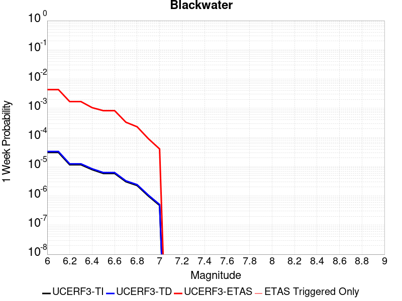 |  |  |  |

| Magnitude | 1 wk TI Prob | 1 wk TD Prob | 1 wk ETAS Prob | 1 wk ETAS/TD Gain | 1 wk ETAS Triggered Only | 1 mo TI Prob | 1 mo TD Prob | 1 mo ETAS Prob | 1 mo ETAS/TD Gain | 1 mo ETAS Triggered Only | 1 yr TI Prob | 1 yr TD Prob | 1 yr ETAS Prob | 1 yr ETAS/TD Gain | 1 yr ETAS Triggered Only | 10 yr TI Prob | 10 yr TD Prob | 10 yr ETAS Prob | 10 yr ETAS/TD Gain | 10 yr ETAS Triggered Only |
|-----|-----|-----|-----|-----|-----|-----|-----|-----|-----|-----|-----|-----|-----|-----|-----|-----|-----|-----|-----|-----|
| 6.0 | 3.0708583E-5 | 3.3095846E-5 | 0.0043671234 | 131.95381 | 0.004334171 | 1.3160157E-4 | 1.4183241E-4 | 0.006246494 | 44.041374 | 0.0061055277 | 0.0016010714 | 0.0017255784 | 0.011821193 | 6.8505683 | 0.010113065 | 0.015895851 | 0.017135633 | 0.03153287 | 1.8401927 | 0.014648241 |
| 6.1 | 3.0708583E-5 | 3.3095846E-5 | 0.0043671234 | 131.95381 | 0.004334171 | 1.3160157E-4 | 1.4183241E-4 | 0.006246494 | 44.041374 | 0.0061055277 | 0.0016010714 | 0.0017255784 | 0.011821193 | 6.8505683 | 0.010113065 | 0.015895851 | 0.017135633 | 0.03153287 | 1.8401927 | 0.014648241 |
| 6.2 | 1.1707779E-5 | 1.2545122E-5 | 0.0016205652 | 129.17891 | 0.0016080402 | 5.017523E-5 | 5.3763757E-5 | 0.0022772623 | 42.35683 | 0.002223618 | 6.107122E-4 | 6.5438676E-4 | 0.0044960924 | 6.8706956 | 0.0038442211 | 0.006090366 | 0.0065255696 | 0.012129464 | 1.8587595 | 0.0056407037 |
| 6.3 | 1.1707779E-5 | 1.2545122E-5 | 0.0016205652 | 129.17891 | 0.0016080402 | 5.017523E-5 | 5.3763757E-5 | 0.0022772623 | 42.35683 | 0.002223618 | 6.107122E-4 | 6.5438676E-4 | 0.0044960924 | 6.8706956 | 0.0038442211 | 0.006090366 | 0.0065255696 | 0.012129464 | 1.8587595 | 0.0056407037 |
| 6.4 | 7.929244E-6 | 8.480098E-6 | 9.12995E-4 | 107.66326 | 9.045226E-4 | 3.3982033E-5 | 3.6342793E-5 | 0.0013051409 | 35.911957 | 0.0012688442 | 4.136527E-4 | 4.423877E-4 | 0.002853381 | 6.449955 | 0.0024120603 | 0.0041288356 | 0.0044154758 | 0.008005084 | 1.8129605 | 0.0036055276 |
| 6.5 | 5.8832115E-6 | 6.285991E-6 | 7.223619E-4 | 114.91615 | 7.160804E-4 | 2.521352E-5 | 2.6939697E-5 | 0.0010068128 | 37.372833 | 9.798995E-4 | 3.0693135E-4 | 3.27944E-4 | 0.0019982504 | 6.093267 | 0.0016708543 | 0.0030650778 | 0.0032748538 | 0.005779188 | 1.7647165 | 0.0025125628 |
| 6.6 | 5.8832115E-6 | 6.285991E-6 | 7.223619E-4 | 114.91615 | 7.160804E-4 | 2.521352E-5 | 2.6939697E-5 | 0.0010068128 | 37.372833 | 9.798995E-4 | 3.0693135E-4 | 3.27944E-4 | 0.0019982504 | 6.093267 | 0.0016708543 | 0.0030650778 | 0.0032748538 | 0.005779188 | 1.7647165 | 0.0025125628 |
| 6.7 | 3.0715053E-6 | 3.2814662E-6 | 2.670997E-4 | 81.39645 | 2.638191E-4 | 1.3163528E-5 | 1.4063357E-5 | 4.286304E-4 | 30.478525 | 4.1457286E-4 | 1.6025416E-4 | 1.7120909E-4 | 9.122882E-4 | 5.3285036 | 7.4120605E-4 | 0.0016013865 | 0.0017108864 | 0.0028396053 | 1.6597276 | 0.0011306533 |
| 6.8 | 2.2722281E-6 | 2.4287538E-6 | 1.908705E-4 | 78.587845 | 1.8844221E-4 | 9.738084E-6 | 1.0408908E-5 | 3.1191332E-4 | 29.965998 | 3.0150753E-4 | 1.1855473E-4 | 1.26722E-4 | 6.5429334E-4 | 5.163218 | 5.276382E-4 | 0.001184915 | 0.0012665876 | 0.0020319487 | 1.6042701 | 7.663317E-4 |
| 6.9 | 9.952399E-7 | 1.0653489E-6 | 1.01567755E-4 | 95.337555 | 1.0050251E-4 | 4.265307E-6 | 4.5657757E-6 | 1.5531886E-4 | 34.018066 | 1.5075377E-4 | 5.1928873E-5 | 5.5587418E-5 | 2.6914338E-4 | 4.841804 | 2.1356784E-4 | 5.191674E-4 | 5.557858E-4 | 8.445699E-4 | 1.5195961 | 2.8894472E-4 |
| 7.0 | 4.7385504E-7 | 5.0755597E-7 | 3.819598E-5 | 75.254715 | 3.768844E-5 | 2.0308057E-6 | 2.1752398E-6 | 5.2426385E-5 | 24.101429 | 5.0251256E-5 | 2.4724779E-5 | 2.6483543E-5 | 1.0185843E-4 | 3.8461027 | 7.537688E-5 | 2.4722028E-4 | 2.6483546E-4 | 3.7787083E-4 | 1.4268136 | 1.13065325E-4 |

## Hunter Mountain-Saline Valley
*[(top)](#table-of-contents)*

| 1 Week | 1 Month | 1 Year | 10 Year |
|-----|-----|-----|-----|
|  | 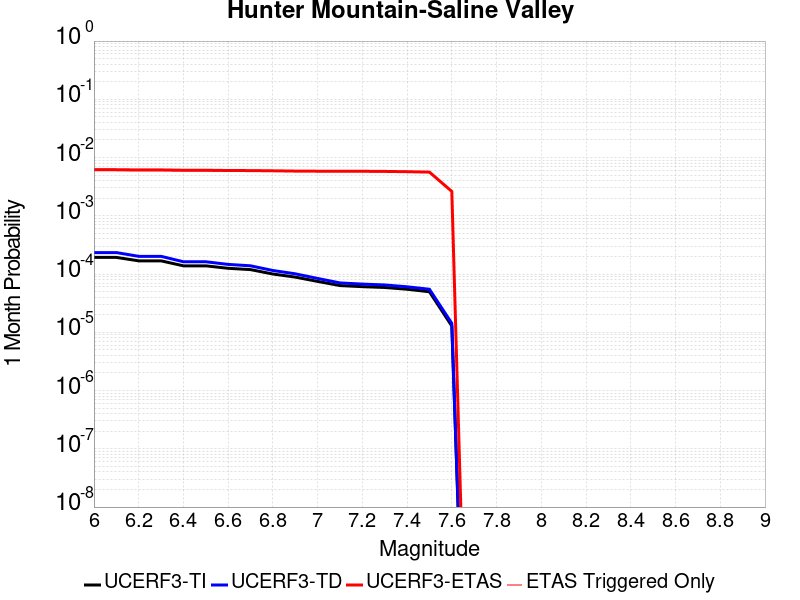 |  |  |

| Magnitude | 1 wk TI Prob | 1 wk TD Prob | 1 wk ETAS Prob | 1 wk ETAS/TD Gain | 1 wk ETAS Triggered Only | 1 mo TI Prob | 1 mo TD Prob | 1 mo ETAS Prob | 1 mo ETAS/TD Gain | 1 mo ETAS Triggered Only | 1 yr TI Prob | 1 yr TD Prob | 1 yr ETAS Prob | 1 yr ETAS/TD Gain | 1 yr ETAS Triggered Only | 10 yr TI Prob | 10 yr TD Prob | 10 yr ETAS Prob | 10 yr ETAS/TD Gain | 10 yr ETAS Triggered Only |
|-----|-----|-----|-----|-----|-----|-----|-----|-----|-----|-----|-----|-----|-----|-----|-----|-----|-----|-----|-----|-----|
| 6.0 | 4.5103672E-5 | 5.4570177E-5 | 0.004551812 | 83.41209 | 0.0044974876 | 1.9328714E-4 | 2.3385242E-4 | 0.006375632 | 27.263483 | 0.006143216 | 0.002350731 | 0.0028435152 | 0.012201252 | 4.2909045 | 0.009384423 | 0.023260195 | 0.028091887 | 0.040375046 | 1.4372494 | 0.012638191 |
| 6.1 | 4.5103672E-5 | 5.4570177E-5 | 0.004551812 | 83.41209 | 0.0044974876 | 1.9328714E-4 | 2.3385242E-4 | 0.006375632 | 27.263483 | 0.006143216 | 0.002350731 | 0.0028435152 | 0.012201252 | 4.2909045 | 0.009384423 | 0.023260195 | 0.028091887 | 0.040375046 | 1.4372494 | 0.012638191 |
| 6.2 | 3.9363465E-5 | 4.706337E-5 | 0.004519215 | 96.02403 | 0.004472362 | 1.6868966E-4 | 2.0168544E-4 | 0.006318542 | 31.328697 | 0.0061180904 | 0.002051862 | 0.0024528175 | 0.011789157 | 4.8063736 | 0.009359296 | 0.020330196 | 0.024273481 | 0.036580384 | 1.5070102 | 0.012613066 |
| 6.3 | 3.9363465E-5 | 4.706337E-5 | 0.004519215 | 96.02403 | 0.004472362 | 1.6868966E-4 | 2.0168544E-4 | 0.006318542 | 31.328697 | 0.0061180904 | 0.002051862 | 0.0024528175 | 0.011789157 | 4.8063736 | 0.009359296 | 0.020330196 | 0.024273481 | 0.036580384 | 1.5070102 | 0.012613066 |
| 6.4 | 3.2311684E-5 | 3.795099E-5 | 0.004472456 | 117.848206 | 0.0044346736 | 1.384713E-4 | 1.6263737E-4 | 0.0062294896 | 38.30294 | 0.006067839 | 0.0016845843 | 0.0019783843 | 0.011243937 | 5.6833935 | 0.00928392 | 0.016718714 | 0.019616475 | 0.03185895 | 1.6240916 | 0.012487438 |
| 6.5 | 3.2311684E-5 | 3.795099E-5 | 0.004472456 | 117.848206 | 0.0044346736 | 1.384713E-4 | 1.6263737E-4 | 0.0062294896 | 38.30294 | 0.006067839 | 0.0016845843 | 0.0019783843 | 0.011243937 | 5.6833935 | 0.00928392 | 0.016718714 | 0.019616475 | 0.03185895 | 1.6240916 | 0.012487438 |
| 6.6 | 2.9305844E-5 | 3.418183E-5 | 0.004418454 | 129.26323 | 0.004384422 | 1.2559042E-4 | 1.4648569E-4 | 0.0061506312 | 41.98793 | 0.006005025 | 0.0015279909 | 0.001782067 | 0.0109741995 | 6.1581297 | 0.009208542 | 0.015175272 | 0.01768569 | 0.029865894 | 1.6887039 | 0.012399497 |
| 6.7 | 2.7826512E-5 | 3.2344276E-5 | 0.0044166245 | 136.55043 | 0.004384422 | 1.19251024E-4 | 1.386113E-4 | 0.006130243 | 44.226143 | 0.0059924624 | 0.0014509142 | 0.0016863465 | 0.010866819 | 6.444001 | 0.00919598 | 0.014414776 | 0.016743187 | 0.028910372 | 1.7266947 | 0.012374372 |
| 6.8 | 2.3389874E-5 | 2.6866714E-5 | 0.004386046 | 163.25204 | 0.0043592965 | 1.0023846E-4 | 1.15138246E-4 | 0.006081788 | 52.821613 | 0.0059673367 | 0.00121972 | 0.001400954 | 0.01053387 | 7.519069 | 0.009145728 | 0.01213047 | 0.013927434 | 0.026067523 | 1.8716674 | 0.012311558 |
| 6.9 | 2.069209E-5 | 2.3570032E-5 | 0.0043325135 | 183.8145 | 0.004309045 | 8.867737E-5 | 1.01010715E-4 | 0.006004937 | 59.448513 | 0.0059045227 | 0.0010791123 | 0.0012291478 | 0.0102758035 | 8.360105 | 0.009057789 | 0.010738871 | 0.012228523 | 0.024265436 | 1.9843309 | 0.012185929 |
| 7.0 | 1.7462342E-5 | 1.9633546E-5 | 0.004328594 | 220.4693 | 0.004309045 | 7.483646E-5 | 8.414118E-5 | 0.005988167 | 71.16809 | 0.0059045227 | 9.1075303E-4 | 0.0010239601 | 0.010047374 | 9.812271 | 0.009032663 | 0.009070295 | 0.0101960525 | 0.022220429 | 2.179317 | 0.0121482415 |
| 7.1 | 1.4807709E-5 | 1.6441749E-5 | 0.004325416 | 263.07516 | 0.004309045 | 6.3460066E-5 | 7.046283E-5 | 0.0059745694 | 84.79037 | 0.0059045227 | 7.723524E-4 | 8.575638E-4 | 0.009869929 | 11.509265 | 0.0090201 | 0.007696735 | 0.008545532 | 0.020552594 | 2.4050689 | 0.012110553 |
| 7.2 | 1.4180048E-5 | 1.5698337E-5 | 0.004324676 | 275.48627 | 0.004309045 | 6.077022E-5 | 6.727694E-5 | 0.0059714024 | 88.75853 | 0.0059045227 | 7.396263E-4 | 8.188051E-4 | 0.009818967 | 11.991824 | 0.009007538 | 0.0073716943 | 0.008160833 | 0.020160094 | 2.4703474 | 0.01209799 |
| 7.3 | 1.3730402E-5 | 1.5172075E-5 | 0.0042990264 | 283.35126 | 0.0042839195 | 5.8843252E-5 | 6.502165E-5 | 0.0059440364 | 91.41627 | 0.005879397 | 7.161811E-4 | 7.9136714E-4 | 0.009729012 | 12.29393 | 0.008944724 | 0.007138774 | 0.007888422 | 0.019816196 | 2.5120606 | 0.012022613 |
| 7.4 | 1.2810095E-5 | 1.4109277E-5 | 0.0042728432 | 302.83926 | 0.004258794 | 5.489925E-5 | 6.0467017E-5 | 0.005876698 | 97.18849 | 0.005816583 | 6.681934E-4 | 7.359531E-4 | 0.009598772 | 13.042642 | 0.008869347 | 0.006661878 | 0.007338053 | 0.019160207 | 2.6110752 | 0.011909548 |
| 7.5 | 1.1595659E-5 | 1.2800664E-5 | 0.0042464146 | 331.73395 | 0.0042336686 | 4.9694736E-5 | 5.4858923E-5 | 0.0057831877 | 105.41927 | 0.0057286434 | 6.0486543E-4 | 6.6771836E-4 | 0.00938049 | 14.048573 | 0.008718593 | 0.006032217 | 0.0066599925 | 0.018265598 | 2.7425854 | 0.0116834175 |
| 7.6 | 2.997694E-6 | 3.3251579E-6 | 0.002000806 | 601.7176 | 0.0019974874 | 1.28471975E-5 | 1.425064E-5 | 0.0026775294 | 187.88835 | 0.0026633167 | 1.564034E-4 | 1.73495E-4 | 0.0041426555 | 23.877665 | 0.003969849 | 0.0015629337 | 0.001735031 | 0.0071151275 | 4.100865 | 0.0053894473 |

## Ash Hill
*[(top)](#table-of-contents)*

| 1 Week | 1 Month | 1 Year | 10 Year |
|-----|-----|-----|-----|
|  |  |  |  |

| Magnitude | 1 wk TI Prob | 1 wk TD Prob | 1 wk ETAS Prob | 1 wk ETAS/TD Gain | 1 wk ETAS Triggered Only | 1 mo TI Prob | 1 mo TD Prob | 1 mo ETAS Prob | 1 mo ETAS/TD Gain | 1 mo ETAS Triggered Only | 1 yr TI Prob | 1 yr TD Prob | 1 yr ETAS Prob | 1 yr ETAS/TD Gain | 1 yr ETAS Triggered Only | 10 yr TI Prob | 10 yr TD Prob | 10 yr ETAS Prob | 10 yr ETAS/TD Gain | 10 yr ETAS Triggered Only |
|-----|-----|-----|-----|-----|-----|-----|-----|-----|-----|-----|-----|-----|-----|-----|-----|-----|-----|-----|-----|-----|
| 6.0 | 2.1545662E-5 | 2.3194447E-5 | 0.002661324 | 114.739716 | 0.002638191 | 9.2335285E-5 | 9.940143E-5 | 0.0037925015 | 38.15339 | 0.0036934672 | 0.0011236023 | 0.0012096206 | 0.0073955962 | 6.1139803 | 0.0061934674 | 0.011179381 | 0.012038348 | 0.021471148 | 1.7835625 | 0.009547738 |
| 6.1 | 2.1545662E-5 | 2.3194447E-5 | 0.002661324 | 114.739716 | 0.002638191 | 9.2335285E-5 | 9.940143E-5 | 0.0037925015 | 38.15339 | 0.0036934672 | 0.0011236023 | 0.0012096206 | 0.0073955962 | 6.1139803 | 0.0061934674 | 0.011179381 | 0.012038348 | 0.021471148 | 1.7835625 | 0.009547738 |
| 6.2 | 2.1545662E-5 | 2.3194447E-5 | 0.002661324 | 114.739716 | 0.002638191 | 9.2335285E-5 | 9.940143E-5 | 0.0037925015 | 38.15339 | 0.0036934672 | 0.0011236023 | 0.0012096206 | 0.0073955962 | 6.1139803 | 0.0061934674 | 0.011179381 | 0.012038348 | 0.021471148 | 1.7835625 | 0.009547738 |
| 6.3 | 1.0025529E-5 | 1.0746934E-5 | 0.001066012 | 99.19219 | 0.0010552764 | 4.2965847E-5 | 4.605755E-5 | 0.0015284014 | 33.184597 | 0.0014824121 | 5.229836E-4 | 5.6061964E-4 | 0.0030341065 | 5.412059 | 0.0024748743 | 0.005217545 | 0.0055933665 | 0.009516026 | 1.7013056 | 0.0039447234 |
| 6.4 | 1.0025529E-5 | 1.0746934E-5 | 0.001066012 | 99.19219 | 0.0010552764 | 4.2965847E-5 | 4.605755E-5 | 0.0015284014 | 33.184597 | 0.0014824121 | 5.229836E-4 | 5.6061964E-4 | 0.0030341065 | 5.412059 | 0.0024748743 | 0.005217545 | 0.0055933665 | 0.009516026 | 1.7013056 | 0.0039447234 |
| 6.5 | 6.9617327E-6 | 7.456634E-6 | 6.6071807E-4 | 88.608086 | 6.532663E-4 | 2.9835655E-5 | 3.195666E-5 | 9.741376E-4 | 30.483086 | 9.422111E-4 | 3.6318856E-4 | 3.8901155E-4 | 0.0019713102 | 5.0674853 | 0.0015829146 | 0.0036259557 | 0.0038841602 | 0.006462048 | 1.6636924 | 0.0025879396 |
| 6.6 | 4.9919777E-6 | 5.3466883E-6 | 4.8273106E-4 | 90.285995 | 4.7738693E-4 | 2.1394015E-5 | 2.2914215E-5 | 6.3847797E-4 | 27.86384 | 6.155779E-4 | 2.60441E-4 | 2.7895154E-4 | 0.0013841708 | 4.962047 | 0.0011055276 | 0.0026013597 | 0.0027866727 | 0.0045906766 | 1.6473684 | 0.0018090452 |
| 6.7 | 3.6630722E-6 | 3.924624E-6 | 3.682448E-4 | 93.82933 | 3.643216E-4 | 1.5698786E-5 | 1.681974E-5 | 4.5651084E-4 | 27.141373 | 4.396985E-4 | 1.9111596E-4 | 2.0476682E-4 | 9.960621E-4 | 4.8643723 | 7.914573E-4 | 0.0019095168 | 0.0020463446 | 0.003412889 | 1.6677979 | 0.0013693467 |
| 6.8 | 2.5599613E-6 | 2.744925E-6 | 2.7912608E-4 | 101.68805 | 2.763819E-4 | 1.0971216E-5 | 1.1763939E-5 | 3.0070526E-4 | 25.561613 | 2.8894472E-4 | 1.3356637E-4 | 1.4322149E-4 | 6.331011E-4 | 4.4204335 | 4.899498E-4 | 0.0013348613 | 0.0014317769 | 0.00229737 | 1.6045586 | 8.668342E-4 |
| 6.9 | 1.7684905E-6 | 1.8968707E-6 | 1.6521315E-4 | 87.09773 | 1.6331658E-4 | 7.579223E-6 | 8.129446E-6 | 1.714447E-4 | 21.089346 | 1.6331658E-4 | 9.2273134E-5 | 9.8976E-5 | 4.1301528E-4 | 4.172883 | 3.1407035E-4 | 9.223483E-4 | 9.8976E-4 | 0.0015796279 | 1.5959705 | 5.904523E-4 |

## Garlock (West)
*[(top)](#table-of-contents)*

| 1 Week | 1 Month | 1 Year | 10 Year |
|-----|-----|-----|-----|
|  | 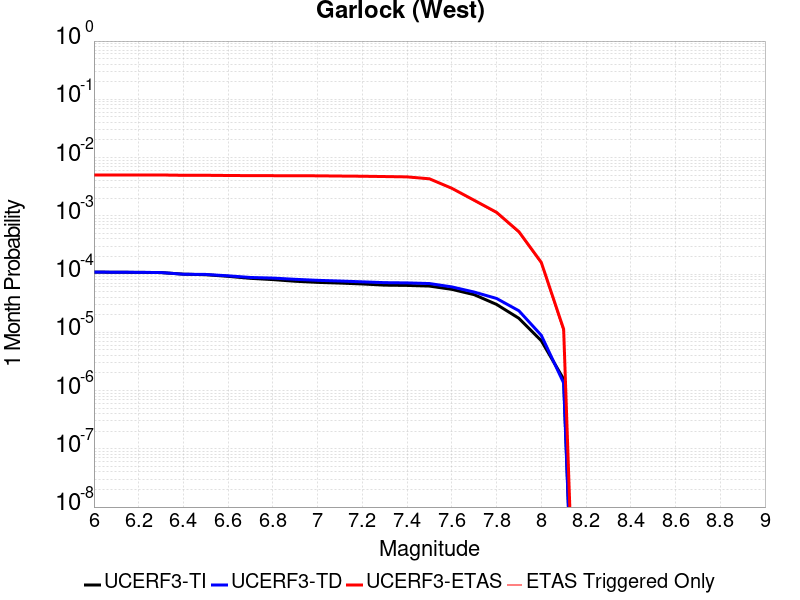 |  | 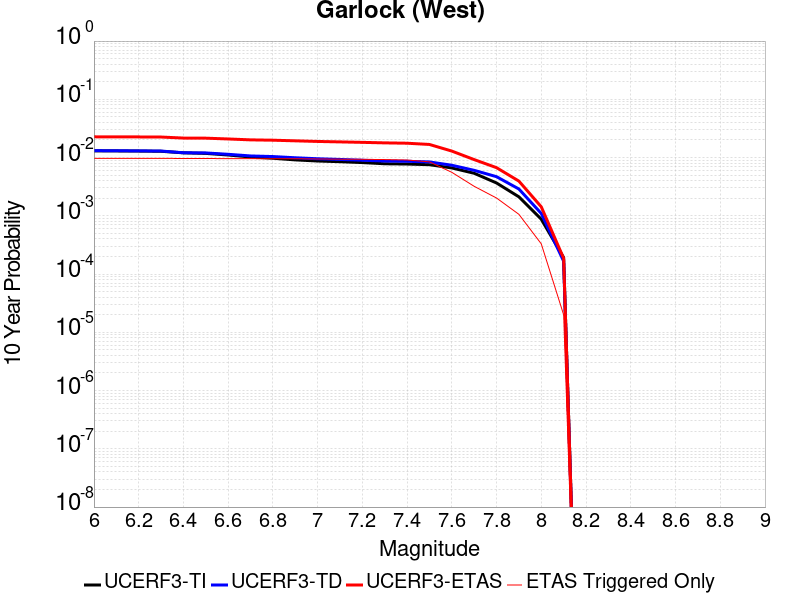 |

| Magnitude | 1 wk TI Prob | 1 wk TD Prob | 1 wk ETAS Prob | 1 wk ETAS/TD Gain | 1 wk ETAS Triggered Only | 1 mo TI Prob | 1 mo TD Prob | 1 mo ETAS Prob | 1 mo ETAS/TD Gain | 1 mo ETAS Triggered Only | 1 yr TI Prob | 1 yr TD Prob | 1 yr ETAS Prob | 1 yr ETAS/TD Gain | 1 yr ETAS Triggered Only | 10 yr TI Prob | 10 yr TD Prob | 10 yr ETAS Prob | 10 yr ETAS/TD Gain | 10 yr ETAS Triggered Only |
|-----|-----|-----|-----|-----|-----|-----|-----|-----|-----|-----|-----|-----|-----|-----|-----|-----|-----|-----|-----|-----|
| 6.0 | 2.5181727E-5 | 2.51973E-5 | 0.003806509 | 151.06813 | 0.0037814071 | 1.0791722E-4 | 1.0798398E-4 | 0.005006952 | 46.36755 | 0.0048994976 | 0.0013131002 | 0.0013139155 | 0.008691144 | 6.614691 | 0.0073869345 | 0.013053683 | 0.013141977 | 0.022874182 | 1.7405435 | 0.009861809 |
| 6.1 | 2.5077732E-5 | 2.5098372E-5 | 0.0038064106 | 151.65965 | 0.0037814071 | 1.0747157E-4 | 1.0756004E-4 | 0.0050065303 | 46.546383 | 0.0048994976 | 0.001307681 | 0.0013087603 | 0.0086860275 | 6.636836 | 0.0073869345 | 0.013000126 | 0.013091032 | 0.02282374 | 1.7434638 | 0.009861809 |
| 6.2 | 2.494612E-5 | 2.498005E-5 | 0.0038062925 | 152.37329 | 0.0037814071 | 1.0690756E-4 | 1.0705298E-4 | 0.005006026 | 46.762135 | 0.0048994976 | 0.0013008224 | 0.0013025942 | 0.008679907 | 6.6635537 | 0.0073869345 | 0.012932341 | 0.013030097 | 0.022763405 | 1.7469866 | 0.009861809 |
| 6.3 | 2.4733758E-5 | 2.479942E-5 | 0.0038061126 | 153.47588 | 0.0037814071 | 1.0599751E-4 | 1.06278916E-4 | 0.005005256 | 47.095474 | 0.0048994976 | 0.0012897556 | 0.0012931811 | 0.008670563 | 6.7048326 | 0.0073869345 | 0.012822957 | 0.012937066 | 0.022671292 | 1.7524291 | 0.009861809 |
| 6.4 | 2.3237335E-5 | 2.317873E-5 | 0.0037793731 | 163.0535 | 0.0037562815 | 9.958477E-5 | 9.933365E-5 | 0.004948098 | 49.812912 | 0.0048492462 | 0.0012117702 | 0.001208719 | 0.008536534 | 7.0624638 | 0.0073366836 | 0.012051838 | 0.012101916 | 0.021769913 | 1.7988815 | 0.009786433 |
| 6.5 | 2.2732203E-5 | 2.2993298E-5 | 0.0037791883 | 164.36043 | 0.0037562815 | 9.742009E-5 | 9.8539E-5 | 0.0049473075 | 50.206593 | 0.0048492462 | 0.0011854442 | 0.0011990548 | 0.008526941 | 7.1113853 | 0.0073366836 | 0.011791403 | 0.012006322 | 0.021675255 | 1.8053201 | 0.009786433 |
| 6.6 | 2.1319436E-5 | 2.17735E-5 | 0.0037528481 | 172.35852 | 0.0037311558 | 9.136581E-5 | 9.331167E-5 | 0.0049044206 | 52.559563 | 0.004811558 | 0.001111811 | 0.0011354799 | 0.008438735 | 7.431867 | 0.007311558 | 0.011062649 | 0.011377227 | 0.021015055 | 1.847116 | 0.009748744 |
| 6.7 | 1.970802E-5 | 2.0393396E-5 | 0.0037389104 | 183.33928 | 0.003718593 | 8.446021E-5 | 8.739735E-5 | 0.0048734113 | 55.761543 | 0.0047864323 | 0.001027818 | 0.001063545 | 0.008342228 | 7.8437934 | 0.007286432 | 0.010230771 | 0.010664964 | 0.02028488 | 1.902011 | 0.009723618 |
| 6.8 | 1.8744462E-5 | 1.9901045E-5 | 0.0037258575 | 187.2192 | 0.00370603 | 8.033094E-5 | 8.5287415E-5 | 0.0048587495 | 56.969128 | 0.004773869 | 9.775903E-4 | 0.0010378812 | 0.008304201 | 8.001109 | 0.007273869 | 0.009733009 | 0.01041075 | 0.020008275 | 1.9218858 | 0.0096984925 |
| 6.9 | 1.7559682E-5 | 1.8953415E-5 | 0.0037249133 | 196.52994 | 0.00370603 | 7.5253614E-5 | 8.12264E-5 | 0.004854708 | 59.767612 | 0.004773869 | 9.158276E-4 | 9.884841E-4 | 0.008255163 | 8.351336 | 0.007273869 | 0.0091206245 | 0.009921231 | 0.019523503 | 1.9678508 | 0.0096984925 |
| 7.0 | 1.6794445E-5 | 1.8216237E-5 | 0.0037116164 | 203.75319 | 0.0036934672 | 7.197421E-5 | 7.8067256E-5 | 0.004839002 | 61.98504 | 0.0047613066 | 8.759337E-4 | 9.5005584E-4 | 0.008179362 | 8.609349 | 0.007236181 | 0.008724891 | 0.009540141 | 0.019059008 | 1.9977701 | 0.009610552 |
| 7.1 | 1.6337795E-5 | 1.7717046E-5 | 0.0036859938 | 208.04788 | 0.0036683418 | 7.0017246E-5 | 7.5927994E-5 | 0.0047991876 | 63.20709 | 0.0047236183 | 8.521265E-4 | 9.240326E-4 | 0.008078219 | 8.742353 | 0.0071608042 | 0.008488664 | 0.009281996 | 0.01871622 | 2.0164003 | 0.009522613 |
| 7.2 | 1.5780008E-5 | 1.7165687E-5 | 0.0036728818 | 213.9665 | 0.003655779 | 6.762685E-5 | 7.356516E-5 | 0.004771712 | 64.86375 | 0.0046984926 | 8.2304585E-4 | 8.9528906E-4 | 0.008024579 | 8.963115 | 0.0071356785 | 0.008200042 | 0.008996838 | 0.018383978 | 2.0433822 | 0.009472362 |
| 7.3 | 1.5058865E-5 | 1.6618762E-5 | 0.0036472117 | 219.4635 | 0.0036306533 | 6.45364E-5 | 7.122133E-5 | 0.0047191316 | 66.260086 | 0.004648241 | 7.854473E-4 | 8.667759E-4 | 0.007920958 | 9.138414 | 0.0070603015 | 0.00782677 | 0.008713539 | 0.018028643 | 2.0690382 | 0.009396985 |
| 7.4 | 1.4887923E-5 | 1.6454731E-5 | 0.0035842352 | 217.82399 | 0.0035678393 | 6.380382E-5 | 7.051838E-5 | 0.004655622 | 66.01998 | 0.004585427 | 7.7653467E-4 | 8.582243E-4 | 0.00781205 | 9.102574 | 0.006959799 | 0.0077382675 | 0.008628399 | 0.01779485 | 2.0623584 | 0.009246231 |
| 7.5 | 1.4509299E-5 | 1.6046748E-5 | 0.0033325765 | 207.67923 | 0.0033165829 | 6.218123E-5 | 6.876997E-5 | 0.0043021473 | 62.558514 | 0.0042336686 | 7.567935E-4 | 8.36954E-4 | 0.007263731 | 8.67877 | 0.0064321607 | 0.0075422134 | 0.008416704 | 0.0169498 | 2.0138288 | 0.008605528 |
| 7.6 | 1.2756717E-5 | 1.4050848E-5 | 0.0022878882 | 162.8292 | 0.0022738692 | 5.4670498E-5 | 6.0216535E-5 | 0.0029369278 | 48.772778 | 0.0028768845 | 6.6541E-4 | 7.328904E-4 | 0.0049760095 | 6.789569 | 0.004246231 | 0.006634211 | 0.0073816874 | 0.013018164 | 1.7635756 | 0.005678392 |
| 7.7 | 1.0328985E-5 | 1.1460557E-5 | 0.0014687303 | 128.15523 | 0.0014572864 | 4.4266326E-5 | 4.911575E-5 | 0.0017826989 | 36.29587 | 0.0017336684 | 5.388092E-4 | 5.978206E-4 | 0.0030837706 | 5.1583548 | 0.002487437 | 0.0053750467 | 0.006038511 | 0.009222684 | 1.527311 | 0.0032035175 |
| 7.8 | 7.0306583E-6 | 8.899601E-6 | 9.3853957E-4 | 105.45861 | 9.2964823E-4 | 3.0131043E-5 | 3.814059E-5 | 0.0011185014 | 29.325748 | 0.001080402 | 3.667837E-4 | 4.642629E-4 | 0.0020589996 | 4.434986 | 0.0015954773 | 0.003661789 | 0.0046952725 | 0.0067459005 | 1.4367431 | 0.0020603016 |
| 7.9 | 4.060633E-6 | 5.4653938E-6 | 4.7028696E-4 | 86.04814 | 4.6482412E-4 | 1.7402595E-5 | 2.3422906E-5 | 5.510487E-4 | 23.52606 | 5.276382E-4 | 2.11856E-4 | 2.851367E-4 | 0.001114046 | 3.9070597 | 8.291457E-4 | 0.0021165414 | 0.002884201 | 0.00402412 | 1.3952286 | 0.001143216 |
| 8.0 | 1.6729537E-6 | 2.0775144E-6 | 1.5283097E-4 | 73.56434 | 1.5075377E-4 | 7.169782E-6 | 8.903603E-6 | 1.5965603E-4 | 17.931622 | 1.5075377E-4 | 8.7288594E-5 | 1.0839601E-4 | 3.5962506E-4 | 3.3176966 | 2.5125628E-4 | 8.7254314E-4 | 0.0010969337 | 0.0014483067 | 1.3203229 | 3.517588E-4 |
| 8.1 | 3.6733252E-7 | 3.1489964E-7 | 1.287771E-5 | 40.894646 | 1.2562814E-5 | 1.5742813E-6 | 1.3495693E-6 | 1.3912367E-5 | 10.308745 | 1.2562814E-5 | 1.9166706E-5 | 1.6430899E-5 | 4.1556115E-5 | 2.5291443 | 2.5125628E-5 | 1.9165053E-4 | 1.6638759E-4 | 1.9150904E-4 | 1.1509815 | 2.5125628E-5 |

## Gravel Hills-Harper Lk
*[(top)](#table-of-contents)*

| 1 Week | 1 Month | 1 Year | 10 Year |
|-----|-----|-----|-----|
|  |  |  |  |

| Magnitude | 1 wk TI Prob | 1 wk TD Prob | 1 wk ETAS Prob | 1 wk ETAS/TD Gain | 1 wk ETAS Triggered Only | 1 mo TI Prob | 1 mo TD Prob | 1 mo ETAS Prob | 1 mo ETAS/TD Gain | 1 mo ETAS Triggered Only | 1 yr TI Prob | 1 yr TD Prob | 1 yr ETAS Prob | 1 yr ETAS/TD Gain | 1 yr ETAS Triggered Only | 10 yr TI Prob | 10 yr TD Prob | 10 yr ETAS Prob | 10 yr ETAS/TD Gain | 10 yr ETAS Triggered Only |
|-----|-----|-----|-----|-----|-----|-----|-----|-----|-----|-----|-----|-----|-----|-----|-----|-----|-----|-----|-----|-----|
| 6.0 | 3.0679566E-5 | 3.1464646E-5 | 0.0026193229 | 83.246544 | 0.0025879396 | 1.3147724E-4 | 1.3484273E-4 | 0.0039659846 | 29.411924 | 0.0038316583 | 0.0015995599 | 0.0016406906 | 0.0079619605 | 4.8528104 | 0.0063316585 | 0.015880952 | 0.01630734 | 0.025180345 | 1.5441113 | 0.0090201 |
| 6.1 | 3.0679566E-5 | 3.1464646E-5 | 0.0026193229 | 83.246544 | 0.0025879396 | 1.3147724E-4 | 1.3484273E-4 | 0.0039659846 | 29.411924 | 0.0038316583 | 0.0015995599 | 0.0016406906 | 0.0079619605 | 4.8528104 | 0.0063316585 | 0.015880952 | 0.01630734 | 0.025180345 | 1.5441113 | 0.0090201 |
| 6.2 | 1.514536E-5 | 1.3635206E-5 | 8.930202E-4 | 65.493706 | 8.79397E-4 | 6.490707E-5 | 5.843536E-5 | 0.00141514 | 24.217186 | 0.0013567839 | 7.8995706E-4 | 7.1123015E-4 | 0.0027700663 | 3.894754 | 0.0020603016 | 0.007871548 | 0.0070907404 | 0.010071963 | 1.4204388 | 0.0030025125 |
| 6.3 | 1.514536E-5 | 1.3635206E-5 | 8.930202E-4 | 65.493706 | 8.79397E-4 | 6.490707E-5 | 5.843536E-5 | 0.00141514 | 24.217186 | 0.0013567839 | 7.8995706E-4 | 7.1123015E-4 | 0.0027700663 | 3.894754 | 0.0020603016 | 0.007871548 | 0.0070907404 | 0.010071963 | 1.4204388 | 0.0030025125 |
| 6.4 | 1.2532521E-5 | 1.06896905E-5 | 6.136983E-4 | 57.410297 | 6.0301507E-4 | 5.37097E-5 | 4.581219E-5 | 9.7541785E-4 | 21.291666 | 9.2964823E-4 | 6.537194E-4 | 5.576265E-4 | 0.0019010981 | 3.409268 | 0.0013442211 | 0.0065179965 | 0.005562863 | 0.007474281 | 1.3436034 | 0.0019221106 |
| 6.5 | 1.1094058E-5 | 9.083664E-6 | 3.8596467E-4 | 42.48998 | 3.7688442E-4 | 4.7545094E-5 | 3.892943E-5 | 6.41921E-4 | 16.489351 | 6.0301507E-4 | 5.787078E-4 | 4.7386673E-4 | 0.0013026196 | 2.7489154 | 8.291457E-4 | 0.0057720304 | 0.0047289706 | 0.006016821 | 1.2723322 | 0.0012939698 |
| 6.6 | 9.688328E-6 | 7.5316952E-6 | 2.5878608E-4 | 34.359608 | 2.5125628E-4 | 4.1520743E-5 | 3.227831E-5 | 4.468378E-4 | 13.843284 | 4.1457286E-4 | 5.053978E-4 | 3.9292008E-4 | 9.831403E-4 | 2.5021381 | 5.904523E-4 | 0.0050424994 | 0.0039225104 | 0.004823485 | 1.2296934 | 9.045226E-4 |
| 6.7 | 8.974824E-6 | 6.749413E-6 | 2.0775308E-4 | 30.78091 | 2.0100502E-4 | 3.8462964E-5 | 2.8925748E-5 | 3.42987E-4 | 11.857499 | 3.1407035E-4 | 4.6818596E-4 | 3.5211627E-4 | 7.916599E-4 | 2.2482913 | 4.396985E-4 | 0.004672008 | 0.0035158044 | 0.004191811 | 1.1922766 | 6.7839195E-4 |
| 6.8 | 7.4780046E-6 | 5.1161933E-6 | 9.3055445E-5 | 18.188414 | 8.79397E-5 | 3.20482E-5 | 2.1926366E-5 | 1.4755175E-4 | 6.729421 | 1.2562814E-4 | 3.9011694E-4 | 2.669222E-4 | 4.6787356E-4 | 1.7528462 | 2.0100502E-4 | 0.0038943281 | 0.0026661542 | 0.0029668577 | 1.1127856 | 3.0150753E-4 |
| 6.9 | 6.3409307E-6 | 3.9074966E-6 | 6.6721324E-5 | 17.075209 | 6.281407E-5 | 2.7175134E-5 | 1.6746313E-5 | 1.04684535E-4 | 6.2511992 | 8.79397E-5 | 3.3080703E-4 | 2.0386827E-4 | 3.5459132E-4 | 1.7393157 | 1.5075377E-4 | 0.0033031502 | 0.0020369107 | 0.0022625807 | 1.1107904 | 2.2613065E-4 |
| 7.0 | 5.1239335E-6 | 2.6058565E-6 | 2.773142E-5 | 10.641959 | 2.5125628E-5 | 2.195953E-5 | 1.116791E-5 | 6.141861E-5 | 5.4995613 | 5.0251256E-5 | 2.6732447E-4 | 1.3596108E-4 | 2.1132772E-4 | 1.5543251 | 7.537688E-5 | 0.0026700313 | 0.0013588042 | 0.0014717159 | 1.0830964 | 1.13065325E-4 |
| 7.1 | 4.438899E-6 | 2.0984728E-6 | 2.7224049E-5 | 12.973268 | 2.5125628E-5 | 1.9023713E-5 | 8.993425E-6 | 5.924423E-5 | 6.587505 | 5.0251256E-5 | 2.315891E-4 | 1.0948967E-4 | 1.7229686E-4 | 1.5736358 | 6.281407E-5 | 0.002313479 | 0.0010943791 | 0.0011947716 | 1.0917346 | 1.0050251E-4 |
| 7.2 | 3.50367E-6 | 1.2615716E-6 | 1.38243695E-5 | 10.958054 | 1.2562814E-5 | 1.5015643E-5 | 5.4067245E-6 | 4.3094962E-5 | 7.970623 | 3.768844E-5 | 1.8280011E-4 | 6.582497E-5 | 1.16072915E-4 | 1.7633569 | 5.0251256E-5 | 0.0018264982 | 6.580629E-4 | 7.4594474E-4 | 1.1335462 | 8.79397E-5 |
| 7.3 | 2.561638E-6 | 7.1191585E-7 | 7.1191585E-7 | 1.0 | 0.0 | 1.0978401E-5 | 3.0510646E-6 | 1.561384E-5 | 5.1175056 | 1.2562814E-5 | 1.3365384E-4 | 3.71461E-5 | 4.9708444E-5 | 1.3381876 | 1.2562814E-5 | 0.0013357349 | 3.7140088E-4 | 3.9651716E-4 | 1.0676259 | 2.5125628E-5 |
| 7.4 | 2.0368864E-6 | 5.304837E-7 | 5.304837E-7 | 1.0 | 0.0 | 8.729483E-6 | 2.2734996E-6 | 1.4836285E-5 | 6.525748 | 1.2562814E-5 | 1.06276275E-4 | 2.7679513E-5 | 4.024198E-5 | 1.4538543 | 1.2562814E-5 | 0.0010622547 | 2.767612E-4 | 2.8932054E-4 | 1.0453796 | 1.2562814E-5 |
| 7.5 | 1.1681728E-6 | 3.6030585E-7 | 3.6030585E-7 | 1.0 | 0.0 | 5.0064455E-6 | 1.544167E-6 | 1.544167E-6 | 1.0 | 0.0 | 6.0951766E-5 | 1.8800076E-5 | 1.8800076E-5 | 1.0 | 0.0 | 6.093505E-4 | 1.8798532E-4 | 1.8798532E-4 | 1.0 | 0.0 |
| 7.6 | 1.3154387E-7 | 7.1197384E-8 | 7.1197384E-8 | 1.0 | 0.0 | 5.6375933E-7 | 3.051316E-7 | 3.051316E-7 | 1.0 | 0.0 | 6.863748E-6 | 3.7149728E-6 | 3.7149728E-6 | 1.0 | 0.0 | 6.863536E-5 | 3.7149264E-5 | 3.7149264E-5 | 1.0 | 0.0 |

## McLean Lake
*[(top)](#table-of-contents)*

| 1 Week | 1 Month | 1 Year | 10 Year |
|-----|-----|-----|-----|
|  |  |  |  |

| Magnitude | 1 wk TI Prob | 1 wk TD Prob | 1 wk ETAS Prob | 1 wk ETAS/TD Gain | 1 wk ETAS Triggered Only | 1 mo TI Prob | 1 mo TD Prob | 1 mo ETAS Prob | 1 mo ETAS/TD Gain | 1 mo ETAS Triggered Only | 1 yr TI Prob | 1 yr TD Prob | 1 yr ETAS Prob | 1 yr ETAS/TD Gain | 1 yr ETAS Triggered Only | 10 yr TI Prob | 10 yr TD Prob | 10 yr ETAS Prob | 10 yr ETAS/TD Gain | 10 yr ETAS Triggered Only |
|-----|-----|-----|-----|-----|-----|-----|-----|-----|-----|-----|-----|-----|-----|-----|-----|-----|-----|-----|-----|-----|
| 6.0 | 1.7360222E-5 | 1.8501627E-5 | 0.0014255107 | 77.04786 | 0.0014070352 | 7.439883E-5 | 7.9290556E-5 | 0.0023404178 | 29.516981 | 0.0022613066 | 9.0542925E-4 | 9.6498354E-4 | 0.005207117 | 5.396068 | 0.004246231 | 0.009017491 | 0.0096127745 | 0.016816722 | 1.749414 | 0.007273869 |
| 6.1 | 9.062689E-6 | 9.592193E-6 | 6.6285225E-4 | 69.1033 | 6.532663E-4 | 3.8839516E-5 | 4.1108804E-5 | 0.0011968402 | 29.113964 | 0.0011557789 | 4.727685E-4 | 5.003936E-4 | 0.002722899 | 5.4415145 | 0.002223618 | 0.0047176396 | 0.004993552 | 0.008818576 | 1.7659929 | 0.0038442211 |
| 6.2 | 9.062689E-6 | 9.592193E-6 | 6.6285225E-4 | 69.1033 | 6.532663E-4 | 3.8839516E-5 | 4.1108804E-5 | 0.0011968402 | 29.113964 | 0.0011557789 | 4.727685E-4 | 5.003936E-4 | 0.002722899 | 5.4415145 | 0.002223618 | 0.0047176396 | 0.004993552 | 0.008818576 | 1.7659929 | 0.0038442211 |
| 6.3 | 7.2575485E-6 | 7.66771E-6 | 5.478646E-4 | 71.45088 | 5.40201E-4 | 3.110341E-5 | 3.2861237E-5 | 9.876037E-4 | 30.053759 | 9.5477386E-4 | 3.786182E-4 | 4.0001926E-4 | 0.0021329941 | 5.3322287 | 0.0017336684 | 0.0037797375 | 0.0039936965 | 0.0070843194 | 1.7738751 | 0.003103015 |
| 6.4 | 7.2575485E-6 | 7.66771E-6 | 5.478646E-4 | 71.45088 | 5.40201E-4 | 3.110341E-5 | 3.2861237E-5 | 9.876037E-4 | 30.053759 | 9.5477386E-4 | 3.786182E-4 | 4.0001926E-4 | 0.0021329941 | 5.3322287 | 0.0017336684 | 0.0037797375 | 0.0039936965 | 0.0070843194 | 1.7738751 | 0.003103015 |
| 6.5 | 6.06582E-6 | 6.4038773E-6 | 4.9635046E-4 | 77.50781 | 4.899498E-4 | 2.5996113E-5 | 2.7444936E-5 | 8.5656793E-4 | 31.210419 | 8.291457E-4 | 3.164567E-4 | 3.3409733E-4 | 0.0017783382 | 5.322815 | 0.0014447236 | 0.0031600643 | 0.0033365893 | 0.0059534567 | 1.7842941 | 0.0026256281 |
| 6.6 | 5.598744E-6 | 5.910262E-6 | 4.330434E-4 | 73.269745 | 4.2713567E-4 | 2.3994397E-5 | 2.5329486E-5 | 7.790792E-4 | 30.7578 | 7.5376884E-4 | 2.9209262E-4 | 3.0834923E-4 | 0.0016521559 | 5.358067 | 0.0013442211 | 0.0029170897 | 0.003079843 | 0.0054469025 | 1.7685648 | 0.0023743717 |
| 6.7 | 5.246996E-6 | 5.539162E-6 | 4.07547E-4 | 73.57557 | 4.0201005E-4 | 2.2486933E-5 | 2.3739085E-5 | 7.52365E-4 | 31.69309 | 7.286432E-4 | 2.73744E-4 | 2.8899137E-4 | 0.0015825873 | 5.476244 | 0.0012939698 | 0.0027340704 | 0.0028867796 | 0.005154085 | 1.7854098 | 0.0022738692 |
| 6.8 | 4.02324E-6 | 4.2469046E-6 | 2.8062763E-4 | 66.07816 | 2.763819E-4 | 1.7242342E-5 | 1.8200926E-5 | 5.207043E-4 | 28.608673 | 5.0251256E-4 | 2.099053E-4 | 2.2157968E-4 | 0.001163582 | 5.2513022 | 9.422111E-4 | 0.0020970714 | 0.002214172 | 0.0039314665 | 1.7755923 | 0.0017211055 |
| 6.9 | 6.835972E-7 | 7.1399285E-7 | 2.5839603E-5 | 36.190285 | 2.5125628E-5 | 2.9296991E-6 | 3.0599674E-6 | 4.0748295E-5 | 13.316578 | 3.768844E-5 | 3.56685E-5 | 3.7254784E-5 | 1.503159E-4 | 4.0348077 | 1.13065325E-4 | 3.5662777E-4 | 3.7251666E-4 | 6.362375E-4 | 1.7079437 | 2.638191E-4 |

## Goldstone Lake
*[(top)](#table-of-contents)*

| 1 Week | 1 Month | 1 Year | 10 Year |
|-----|-----|-----|-----|
|  |  |  |  |

| Magnitude | 1 wk TI Prob | 1 wk TD Prob | 1 wk ETAS Prob | 1 wk ETAS/TD Gain | 1 wk ETAS Triggered Only | 1 mo TI Prob | 1 mo TD Prob | 1 mo ETAS Prob | 1 mo ETAS/TD Gain | 1 mo ETAS Triggered Only | 1 yr TI Prob | 1 yr TD Prob | 1 yr ETAS Prob | 1 yr ETAS/TD Gain | 1 yr ETAS Triggered Only | 10 yr TI Prob | 10 yr TD Prob | 10 yr ETAS Prob | 10 yr ETAS/TD Gain | 10 yr ETAS Triggered Only |
|-----|-----|-----|-----|-----|-----|-----|-----|-----|-----|-----|-----|-----|-----|-----|-----|-----|-----|-----|-----|-----|
| 6.0 | 2.671352E-5 | 3.037609E-5 | 0.0014750558 | 48.559765 | 0.0014447236 | 1.1448149E-4 | 1.3017785E-4 | 0.0023409452 | 17.98267 | 0.0022110553 | 0.001392921 | 0.0015839594 | 0.005685493 | 3.5894182 | 0.00410804 | 0.013842222 | 0.015746197 | 0.022126535 | 1.4051987 | 0.006482412 |
| 6.1 | 2.671352E-5 | 3.037609E-5 | 0.0014750558 | 48.559765 | 0.0014447236 | 1.1448149E-4 | 1.3017785E-4 | 0.0023409452 | 17.98267 | 0.0022110553 | 0.001392921 | 0.0015839594 | 0.005685493 | 3.5894182 | 0.00410804 | 0.013842222 | 0.015746197 | 0.022126535 | 1.4051987 | 0.006482412 |
| 6.2 | 1.4197047E-5 | 1.6096245E-5 | 6.944773E-4 | 43.145298 | 6.7839195E-4 | 6.0843064E-5 | 6.8982634E-5 | 0.0011618721 | 16.842964 | 0.0010929648 | 7.4051257E-4 | 8.3963864E-4 | 0.002885658 | 3.4367857 | 0.0020477388 | 0.007380498 | 0.0083743585 | 0.011526134 | 1.3763602 | 0.003178392 |
| 6.3 | 1.4197047E-5 | 1.6096245E-5 | 6.944773E-4 | 43.145298 | 6.7839195E-4 | 6.0843064E-5 | 6.8982634E-5 | 0.0011618721 | 16.842964 | 0.0010929648 | 7.4051257E-4 | 8.3963864E-4 | 0.002885658 | 3.4367857 | 0.0020477388 | 0.007380498 | 0.0083743585 | 0.011526134 | 1.3763602 | 0.003178392 |
| 6.4 | 1.3238931E-5 | 1.500846E-5 | 6.68265E-4 | 44.525887 | 6.532663E-4 | 5.6737044E-5 | 6.4320935E-5 | 0.0011195295 | 17.405367 | 0.0010552764 | 6.9055456E-4 | 7.82924E-4 | 0.0027035298 | 3.4531188 | 0.0019221106 | 0.006884126 | 0.0078112837 | 0.010765413 | 1.3781875 | 0.002977387 |
| 6.5 | 1.3238931E-5 | 1.500846E-5 | 6.68265E-4 | 44.525887 | 6.532663E-4 | 5.6737044E-5 | 6.4320935E-5 | 0.0011195295 | 17.405367 | 0.0010552764 | 6.9055456E-4 | 7.82924E-4 | 0.0027035298 | 3.4531188 | 0.0019221106 | 0.006884126 | 0.0078112837 | 0.010765413 | 1.3781875 | 0.002977387 |
| 6.6 | 1.1328278E-5 | 1.2855166E-5 | 5.279239E-4 | 41.067066 | 5.150754E-4 | 4.8548856E-5 | 5.5092944E-5 | 9.470036E-4 | 17.1892 | 8.919598E-4 | 5.90922E-4 | 6.7064585E-4 | 0.0022650533 | 3.377421 | 0.0015954773 | 0.0058935313 | 0.0066956086 | 0.009116476 | 1.3615605 | 0.002437186 |
| 6.7 | 8.651175E-6 | 9.824565E-6 | 3.615799E-4 | 36.803658 | 3.517588E-4 | 3.707594E-5 | 4.2105108E-5 | 7.079062E-4 | 16.812836 | 6.6582917E-4 | 4.5130608E-4 | 5.1259965E-4 | 0.0017180116 | 3.351566 | 0.0012060301 | 0.0045039062 | 0.005123051 | 0.006960324 | 1.3586286 | 0.0018467336 |
| 6.8 | 1.0215377E-6 | 1.1754702E-6 | 1.1754702E-6 | 1.0 | 0.0 | 4.378012E-6 | 5.0377203E-6 | 1.760047E-5 | 3.4937372 | 1.2562814E-5 | 5.3300988E-5 | 6.1332634E-5 | 9.901876E-5 | 1.6144547 | 3.768844E-5 | 5.3288206E-4 | 6.1316835E-4 | 7.136092E-4 | 1.1638064 | 1.0050251E-4 |
| 6.9 | 7.9360774E-7 | 9.2833966E-7 | 9.2833966E-7 | 1.0 | 0.0 | 3.4011714E-6 | 3.9785928E-6 | 3.9785928E-6 | 1.0 | 0.0 | 4.1408475E-5 | 4.843836E-5 | 4.843836E-5 | 1.0 | 0.0 | 4.140076E-4 | 4.8428503E-4 | 5.0939847E-4 | 1.0518568 | 2.5125628E-5 |
| 7.0 | 7.4382757E-7 | 8.7473285E-7 | 8.7473285E-7 | 1.0 | 0.0 | 3.1878285E-6 | 3.74885E-6 | 3.74885E-6 | 1.0 | 0.0 | 3.8811122E-5 | 4.564136E-5 | 4.564136E-5 | 1.0 | 0.0 | 3.8804344E-4 | 4.5632652E-4 | 4.814407E-4 | 1.0550355 | 2.5125628E-5 |
| 7.1 | 6.4709513E-7 | 7.7113E-7 | 7.7113E-7 | 1.0 | 0.0 | 2.773262E-6 | 3.3048389E-6 | 3.3048389E-6 | 1.0 | 0.0 | 3.376394E-5 | 4.0235733E-5 | 4.0235733E-5 | 1.0 | 0.0 | 3.375881E-4 | 4.0229043E-4 | 4.2740593E-4 | 1.0624313 | 2.5125628E-5 |
| 7.2 | 6.356704E-7 | 7.5883594E-7 | 7.5883594E-7 | 1.0 | 0.0 | 2.7242988E-6 | 3.2521505E-6 | 3.2521505E-6 | 1.0 | 0.0 | 3.3167835E-5 | 3.959427E-5 | 3.959427E-5 | 1.0 | 0.0 | 3.3162883E-4 | 3.958781E-4 | 4.2099378E-4 | 1.063443 | 2.5125628E-5 |
| 7.3 | 5.7695723E-7 | 6.8965653E-7 | 6.8965653E-7 | 1.0 | 0.0 | 2.4726714E-6 | 2.9556677E-6 | 2.9556677E-6 | 1.0 | 0.0 | 3.0104358E-5 | 3.5984718E-5 | 3.5984718E-5 | 1.0 | 0.0 | 3.0100282E-4 | 3.5979465E-4 | 3.8491125E-4 | 1.0698081 | 2.5125628E-5 |
| 7.4 | 5.209647E-7 | 6.193514E-7 | 6.193514E-7 | 1.0 | 0.0 | 2.232704E-6 | 2.6543607E-6 | 2.6543607E-6 | 1.0 | 0.0 | 2.718283E-5 | 3.2316417E-5 | 3.2316417E-5 | 1.0 | 0.0 | 2.7179506E-4 | 3.2312275E-4 | 3.3568149E-4 | 1.0388669 | 1.2562814E-5 |
| 7.5 | 4.512955E-7 | 5.348885E-7 | 5.348885E-7 | 1.0 | 0.0 | 1.934122E-6 | 2.2923775E-6 | 2.2923775E-6 | 1.0 | 0.0 | 2.3547682E-5 | 2.7909393E-5 | 2.7909393E-5 | 1.0 | 0.0 | 2.3545188E-4 | 2.7906417E-4 | 2.916235E-4 | 1.0450051 | 1.2562814E-5 |
| 7.6 | 2.21172E-7 | 2.603961E-7 | 2.603961E-7 | 1.0 | 0.0 | 9.478797E-7 | 1.1159829E-6 | 1.1159829E-6 | 1.0 | 0.0 | 1.1540374E-5 | 1.3587036E-5 | 1.3587036E-5 | 1.0 | 0.0 | 1.1539775E-4 | 1.3586486E-4 | 1.4842597E-4 | 1.092453 | 1.2562814E-5 |

## So Sierra Nevada
*[(top)](#table-of-contents)*

| 1 Week | 1 Month | 1 Year | 10 Year |
|-----|-----|-----|-----|
|  | 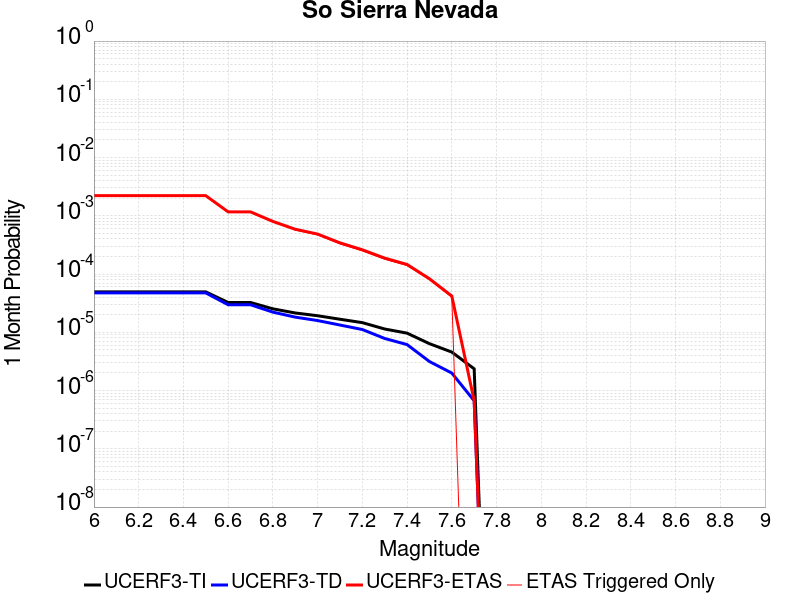 |  |  |

| Magnitude | 1 wk TI Prob | 1 wk TD Prob | 1 wk ETAS Prob | 1 wk ETAS/TD Gain | 1 wk ETAS Triggered Only | 1 mo TI Prob | 1 mo TD Prob | 1 mo ETAS Prob | 1 mo ETAS/TD Gain | 1 mo ETAS Triggered Only | 1 yr TI Prob | 1 yr TD Prob | 1 yr ETAS Prob | 1 yr ETAS/TD Gain | 1 yr ETAS Triggered Only | 10 yr TI Prob | 10 yr TD Prob | 10 yr ETAS Prob | 10 yr ETAS/TD Gain | 10 yr ETAS Triggered Only |
|-----|-----|-----|-----|-----|-----|-----|-----|-----|-----|-----|-----|-----|-----|-----|-----|-----|-----|-----|-----|-----|
| 6.0 | 1.15488665E-5 | 1.1079643E-5 | 0.0015562887 | 140.4638 | 0.0015452261 | 4.9494203E-5 | 4.748339E-5 | 0.0022333092 | 47.033485 | 0.0021859296 | 6.024253E-4 | 5.7796965E-4 | 0.004382302 | 7.582236 | 0.0038065326 | 0.006007948 | 0.005765934 | 0.0110993255 | 1.924983 | 0.0053643216 |
| 6.1 | 1.15488665E-5 | 1.1079643E-5 | 0.0015562887 | 140.4638 | 0.0015452261 | 4.9494203E-5 | 4.748339E-5 | 0.0022333092 | 47.033485 | 0.0021859296 | 6.024253E-4 | 5.7796965E-4 | 0.004382302 | 7.582236 | 0.0038065326 | 0.006007948 | 0.005765934 | 0.0110993255 | 1.924983 | 0.0053643216 |
| 6.2 | 1.15488665E-5 | 1.1079643E-5 | 0.0015562887 | 140.4638 | 0.0015452261 | 4.9494203E-5 | 4.748339E-5 | 0.0022333092 | 47.033485 | 0.0021859296 | 6.024253E-4 | 5.7796965E-4 | 0.004382302 | 7.582236 | 0.0038065326 | 0.006007948 | 0.005765934 | 0.0110993255 | 1.924983 | 0.0053643216 |
| 6.3 | 1.15488665E-5 | 1.1079643E-5 | 0.0015562887 | 140.4638 | 0.0015452261 | 4.9494203E-5 | 4.748339E-5 | 0.0022333092 | 47.033485 | 0.0021859296 | 6.024253E-4 | 5.7796965E-4 | 0.004382302 | 7.582236 | 0.0038065326 | 0.006007948 | 0.005765934 | 0.0110993255 | 1.924983 | 0.0053643216 |
| 6.4 | 1.15488665E-5 | 1.1079643E-5 | 0.0015562887 | 140.4638 | 0.0015452261 | 4.9494203E-5 | 4.748339E-5 | 0.0022333092 | 47.033485 | 0.0021859296 | 6.024253E-4 | 5.7796965E-4 | 0.004382302 | 7.582236 | 0.0038065326 | 0.006007948 | 0.005765934 | 0.0110993255 | 1.924983 | 0.0053643216 |
| 6.5 | 1.15488665E-5 | 1.1079643E-5 | 0.0015562887 | 140.4638 | 0.0015452261 | 4.9494203E-5 | 4.748339E-5 | 0.0022333092 | 47.033485 | 0.0021859296 | 6.024253E-4 | 5.7796965E-4 | 0.004382302 | 7.582236 | 0.0038065326 | 0.006007948 | 0.005765934 | 0.0110993255 | 1.924983 | 0.0053643216 |
| 6.6 | 7.587044E-6 | 6.935635E-6 | 8.109502E-4 | 116.92515 | 8.040201E-4 | 3.2515498E-5 | 2.9723828E-5 | 0.001147781 | 38.614845 | 0.0011180905 | 3.9580427E-4 | 3.6183043E-4 | 0.0022330123 | 6.1714334 | 0.0018718593 | 0.003951 | 0.0036127048 | 0.006303952 | 1.7449397 | 0.002701005 |
| 6.7 | 7.587044E-6 | 6.935635E-6 | 8.109502E-4 | 116.92515 | 8.040201E-4 | 3.2515498E-5 | 2.9723828E-5 | 0.001147781 | 38.614845 | 0.0011180905 | 3.9580427E-4 | 3.6183043E-4 | 0.0022330123 | 6.1714334 | 0.0018718593 | 0.003951 | 0.0036127048 | 0.006303952 | 1.7449397 | 0.002701005 |
| 6.8 | 5.9026956E-6 | 5.1793927E-6 | 5.453776E-4 | 105.29759 | 5.40201E-4 | 2.5297022E-5 | 2.2197215E-5 | 7.885119E-4 | 35.52301 | 7.663317E-4 | 3.0794772E-4 | 2.7021873E-4 | 0.0014884825 | 5.5084352 | 0.001218593 | 0.0030752132 | 0.002699018 | 0.0043528336 | 1.6127472 | 0.0016582914 |
| 6.9 | 5.0118915E-6 | 4.2524252E-6 | 3.8113524E-4 | 89.62773 | 3.7688442E-4 | 2.1479358E-5 | 1.8224557E-5 | 5.709783E-4 | 31.330162 | 5.527638E-4 | 2.614798E-4 | 2.2186211E-4 | 0.0011513041 | 5.1892776 | 9.2964823E-4 | 0.0026117235 | 0.0022164788 | 0.0034699757 | 1.5655353 | 0.0012562814 |
| 7.0 | 4.4924795E-6 | 3.7139177E-6 | 3.177831E-4 | 85.56547 | 3.1407035E-4 | 1.925334E-5 | 1.5916696E-5 | 4.681708E-4 | 29.413818 | 4.522613E-4 | 2.3438422E-4 | 1.9376918E-4 | 9.222712E-4 | 4.7596383 | 7.286432E-4 | 0.0023413717 | 0.0019360651 | 0.0029140676 | 1.5051495 | 9.798995E-4 |
| 7.1 | 3.9118436E-6 | 3.1119775E-6 | 2.4180471E-4 | 77.7013 | 2.3869346E-4 | 1.6764936E-5 | 1.3336982E-5 | 3.5252844E-4 | 26.4324 | 3.3919598E-4 | 2.0409399E-4 | 1.6236622E-4 | 6.7735795E-4 | 4.171791 | 5.150754E-4 | 0.0020390663 | 0.001622532 | 0.002324908 | 1.4328889 | 7.035176E-4 |
| 7.2 | 3.4200818E-6 | 2.6054543E-6 | 1.659216E-4 | 63.68241 | 1.6331658E-4 | 1.4657411E-5 | 1.11661875E-5 | 2.49857E-4 | 22.376213 | 2.3869346E-4 | 1.7843937E-4 | 1.3594035E-4 | 5.253347E-4 | 3.8644495 | 3.8944723E-4 | 0.0017829615 | 0.0013586218 | 0.0018479058 | 1.3601327 | 4.899498E-4 |
| 7.3 | 2.6593618E-6 | 1.8284203E-6 | 1.1489354E-4 | 62.8376 | 1.13065325E-4 | 1.13972155E-5 | 7.836065E-6 | 1.7115136E-4 | 21.841494 | 1.6331658E-4 | 1.3875226E-4 | 9.540021E-5 | 3.5919415E-4 | 3.7651296 | 2.638191E-4 | 0.0013866565 | 9.5362146E-4 | 0.0012799432 | 1.342192 | 3.2663316E-4 |
| 7.4 | 2.2577992E-6 | 1.436438E-6 | 7.6813216E-5 | 53.474785 | 7.537688E-5 | 9.676246E-6 | 6.15615E-6 | 1.3178351E-4 | 21.406809 | 1.2562814E-4 | 1.1780193E-4 | 7.49488E-5 | 2.8850063E-4 | 3.8493028 | 2.1356784E-4 | 0.001177395 | 7.492603E-4 | 0.0010003283 | 1.3350879 | 2.5125628E-4 |
| 7.5 | 1.489319E-6 | 7.353936E-7 | 5.098661E-5 | 69.33241 | 5.0251256E-5 | 6.3827797E-6 | 3.1516831E-6 | 7.852833E-5 | 24.916315 | 7.537688E-5 | 7.770758E-5 | 3.8371072E-5 | 1.5143206E-4 | 3.9465163 | 1.13065325E-4 | 7.7680405E-4 | 3.836449E-4 | 5.0922483E-4 | 1.3273338 | 1.2562814E-4 |
| 7.6 | 1.0680322E-6 | 4.6596554E-7 | 2.5591582E-5 | 54.92162 | 2.5125628E-5 | 4.577273E-6 | 1.9969937E-6 | 3.968536E-5 | 19.872553 | 3.768844E-5 | 5.5726876E-5 | 2.4313129E-5 | 7.456316E-5 | 3.066786 | 5.0251256E-5 | 5.5712904E-4 | 2.4310495E-4 | 3.0590376E-4 | 1.2583197 | 6.281407E-5 |
| 7.7 | 5.509146E-7 | 1.5580486E-7 | 1.5580486E-7 | 1.0 | 0.0 | 2.3610605E-6 | 6.677349E-7 | 6.677349E-7 | 1.0 | 0.0 | 2.8745531E-5 | 8.129644E-6 | 8.129644E-6 | 1.0 | 0.0 | 2.8741814E-4 | 8.1293576E-5 | 8.1293576E-5 | 1.0 | 0.0 |

## Coyote Canyon
*[(top)](#table-of-contents)*

| 1 Week | 1 Month | 1 Year | 10 Year |
|-----|-----|-----|-----|
|  |  |  |  |

| Magnitude | 1 wk TI Prob | 1 wk TD Prob | 1 wk ETAS Prob | 1 wk ETAS/TD Gain | 1 wk ETAS Triggered Only | 1 mo TI Prob | 1 mo TD Prob | 1 mo ETAS Prob | 1 mo ETAS/TD Gain | 1 mo ETAS Triggered Only | 1 yr TI Prob | 1 yr TD Prob | 1 yr ETAS Prob | 1 yr ETAS/TD Gain | 1 yr ETAS Triggered Only | 10 yr TI Prob | 10 yr TD Prob | 10 yr ETAS Prob | 10 yr ETAS/TD Gain | 10 yr ETAS Triggered Only |
|-----|-----|-----|-----|-----|-----|-----|-----|-----|-----|-----|-----|-----|-----|-----|-----|-----|-----|-----|-----|-----|
| 6.0 | 3.5090034E-5 | 4.0364324E-5 | 8.317897E-4 | 20.60705 | 7.914573E-4 | 1.503772E-4 | 1.7297994E-4 | 0.0013662408 | 7.8982615 | 0.0011934673 | 0.0018293047 | 0.0021042528 | 0.004561383 | 2.1676972 | 0.0024623116 | 0.018143194 | 0.020869201 | 0.024989916 | 1.1974543 | 0.004208543 |
| 6.1 | 3.5090034E-5 | 4.0364324E-5 | 8.317897E-4 | 20.60705 | 7.914573E-4 | 1.503772E-4 | 1.7297994E-4 | 0.0013662408 | 7.8982615 | 0.0011934673 | 0.0018293047 | 0.0021042528 | 0.004561383 | 2.1676972 | 0.0024623116 | 0.018143194 | 0.020869201 | 0.024989916 | 1.1974543 | 0.004208543 |
| 6.2 | 1.841879E-5 | 2.1059794E-5 | 5.1099923E-4 | 24.26421 | 4.899498E-4 | 7.8935285E-5 | 9.0253714E-5 | 7.937078E-4 | 8.794185 | 7.035176E-4 | 9.606133E-4 | 0.001098387 | 0.0025038766 | 2.2795944 | 0.0014070352 | 0.0095647145 | 0.010939667 | 0.013201087 | 1.2067174 | 0.002286432 |
| 6.3 | 1.841879E-5 | 2.1059794E-5 | 5.1099923E-4 | 24.26421 | 4.899498E-4 | 7.8935285E-5 | 9.0253714E-5 | 7.937078E-4 | 8.794185 | 7.035176E-4 | 9.606133E-4 | 0.001098387 | 0.0025038766 | 2.2795944 | 0.0014070352 | 0.0095647145 | 0.010939667 | 0.013201087 | 1.2067174 | 0.002286432 |
| 6.4 | 1.712201E-5 | 1.9565212E-5 | 4.8438023E-4 | 24.75722 | 4.6482412E-4 | 7.337798E-5 | 8.3848776E-5 | 7.6218386E-4 | 9.089981 | 6.7839195E-4 | 8.930107E-4 | 0.0010204813 | 0.0023382306 | 2.2913017 | 0.0013190955 | 0.008894307 | 0.010167871 | 0.012319139 | 1.2115752 | 0.0021733667 |
| 6.5 | 1.4744935E-5 | 1.6836972E-5 | 4.4396546E-4 | 26.368486 | 4.2713567E-4 | 6.3191044E-5 | 7.215698E-5 | 7.0025236E-4 | 9.704569 | 6.281407E-4 | 7.6907943E-4 | 8.7825063E-4 | 0.0020957734 | 2.3863044 | 0.001218593 | 0.007664232 | 0.008756994 | 0.010774348 | 1.2303705 | 0.002035176 |
| 6.6 | 1.2017839E-5 | 1.37240895E-5 | 4.03166E-4 | 29.37652 | 3.8944723E-4 | 5.150401E-5 | 5.88167E-5 | 5.9898593E-4 | 10.183944 | 5.40201E-4 | 6.268809E-4 | 7.159466E-4 | 0.0017955751 | 2.5079734 | 0.001080402 | 0.0062511545 | 0.0071450938 | 0.008953686 | 1.2531236 | 0.001821608 |
| 6.7 | 1.00956095E-5 | 1.1533517E-5 | 3.381629E-4 | 29.320019 | 3.2663316E-4 | 4.326618E-5 | 4.942891E-5 | 5.2679225E-4 | 10.657574 | 4.7738693E-4 | 5.266384E-4 | 6.017178E-4 | 0.0015308067 | 2.5440607 | 9.2964823E-4 | 0.005253921 | 0.0060094125 | 0.00755784 | 1.2576671 | 0.0015577889 |

## Lenwood-Lockhart-Old Woman Springs
*[(top)](#table-of-contents)*

| 1 Week | 1 Month | 1 Year | 10 Year |
|-----|-----|-----|-----|
|  |  |  |  |

| Magnitude | 1 wk TI Prob | 1 wk TD Prob | 1 wk ETAS Prob | 1 wk ETAS/TD Gain | 1 wk ETAS Triggered Only | 1 mo TI Prob | 1 mo TD Prob | 1 mo ETAS Prob | 1 mo ETAS/TD Gain | 1 mo ETAS Triggered Only | 1 yr TI Prob | 1 yr TD Prob | 1 yr ETAS Prob | 1 yr ETAS/TD Gain | 1 yr ETAS Triggered Only | 10 yr TI Prob | 10 yr TD Prob | 10 yr ETAS Prob | 10 yr ETAS/TD Gain | 10 yr ETAS Triggered Only |
|-----|-----|-----|-----|-----|-----|-----|-----|-----|-----|-----|-----|-----|-----|-----|-----|-----|-----|-----|-----|-----|
| 6.0 | 3.744542E-5 | 4.396252E-5 | 0.0012499397 | 28.431938 | 0.0012060301 | 1.604705E-4 | 1.8839816E-4 | 0.0020599049 | 10.933784 | 0.0018718593 | 0.0019519776 | 0.0022915069 | 0.005237003 | 2.285397 | 0.0029522614 | 0.019349206 | 0.022696787 | 0.026871199 | 1.1839207 | 0.004271357 |
| 6.1 | 3.744542E-5 | 4.396252E-5 | 0.0012499397 | 28.431938 | 0.0012060301 | 1.604705E-4 | 1.8839816E-4 | 0.0020599049 | 10.933784 | 0.0018718593 | 0.0019519776 | 0.0022915069 | 0.005237003 | 2.285397 | 0.0029522614 | 0.019349206 | 0.022696787 | 0.026871199 | 1.1839207 | 0.004271357 |
| 6.2 | 3.744542E-5 | 4.396252E-5 | 0.0012499397 | 28.431938 | 0.0012060301 | 1.604705E-4 | 1.8839816E-4 | 0.0020599049 | 10.933784 | 0.0018718593 | 0.0019519776 | 0.0022915069 | 0.005237003 | 2.285397 | 0.0029522614 | 0.019349206 | 0.022696787 | 0.026871199 | 1.1839207 | 0.004271357 |
| 6.3 | 2.1079984E-5 | 2.5353434E-5 | 5.5297825E-4 | 21.810783 | 5.276382E-4 | 9.0339665E-5 | 1.0865316E-4 | 9.628317E-4 | 8.861516 | 8.5427135E-4 | 0.0010993304 | 0.0013220694 | 0.0026645134 | 2.0154111 | 0.0013442211 | 0.010939079 | 0.0131442575 | 0.0149915125 | 1.140537 | 0.0018718593 |
| 6.4 | 2.1079984E-5 | 2.5353434E-5 | 5.5297825E-4 | 21.810783 | 5.276382E-4 | 9.0339665E-5 | 1.0865316E-4 | 9.628317E-4 | 8.861516 | 8.5427135E-4 | 0.0010993304 | 0.0013220694 | 0.0026645134 | 2.0154111 | 0.0013442211 | 0.010939079 | 0.0131442575 | 0.0149915125 | 1.140537 | 0.0018718593 |
| 6.5 | 1.7397282E-5 | 2.066241E-5 | 3.9753906E-4 | 19.239723 | 3.7688442E-4 | 7.455765E-5 | 8.8550245E-5 | 6.915119E-4 | 7.8092604 | 6.0301507E-4 | 9.073613E-4 | 0.0010775778 | 0.0019560272 | 1.8152074 | 8.79397E-4 | 0.009036654 | 0.010724821 | 0.011893061 | 1.1089286 | 0.0011809046 |
| 6.6 | 1.52050325E-5 | 1.7679693E-5 | 2.814941E-4 | 15.921889 | 2.638191E-4 | 6.51628E-5 | 7.576796E-5 | 5.6568056E-4 | 7.4659605 | 4.899498E-4 | 7.9306826E-4 | 9.220924E-4 | 0.0016375125 | 1.7758659 | 7.160804E-4 | 0.007902439 | 0.009183526 | 0.010129532 | 1.1030111 | 9.5477386E-4 |
| 6.7 | 1.332523E-5 | 1.5264002E-5 | 2.2882858E-4 | 14.991387 | 2.1356784E-4 | 5.7106878E-5 | 6.5415545E-5 | 4.673993E-4 | 7.1450796 | 4.0201005E-4 | 6.950544E-4 | 7.961491E-4 | 0.0014112369 | 1.7725786 | 6.155779E-4 | 0.006928845 | 0.007933599 | 0.008768629 | 1.1052525 | 8.4170856E-4 |
| 6.8 | 1.1525329E-5 | 1.3030979E-5 | 1.8890809E-4 | 14.496845 | 1.758794E-4 | 4.9393333E-5 | 5.584588E-5 | 3.824608E-4 | 6.848505 | 3.2663316E-4 | 6.011979E-4 | 6.797157E-4 | 0.0012069953 | 1.7757354 | 5.276382E-4 | 0.00599574 | 0.006776819 | 0.007513002 | 1.1086326 | 7.4120605E-4 |
| 6.9 | 1.0253909E-5 | 1.15144385E-5 | 1.6226647E-4 | 14.092434 | 1.5075377E-4 | 4.3944583E-5 | 4.9346683E-5 | 3.5083934E-4 | 7.1096845 | 3.0150753E-4 | 5.3489394E-4 | 6.0063385E-4 | 0.0010651788 | 1.7734245 | 4.6482412E-4 | 0.0053360825 | 0.0059904843 | 0.0066273496 | 1.1063129 | 6.4070354E-4 |
| 7.0 | 8.104563E-6 | 8.991279E-6 | 9.6930184E-5 | 10.780467 | 8.79397E-5 | 3.4733377E-5 | 3.8533497E-5 | 2.2696845E-4 | 5.8901596 | 1.8844221E-4 | 4.2279682E-4 | 4.6904673E-4 | 7.5785595E-4 | 1.6157365 | 2.8894472E-4 | 0.0042199334 | 0.0046808156 | 0.005055936 | 1.08014 | 3.7688442E-4 |
| 7.1 | 6.7986157E-6 | 7.515816E-6 | 7.032941E-5 | 9.357522 | 6.281407E-5 | 2.91366E-5 | 3.2210253E-5 | 1.7039676E-4 | 5.29014 | 1.3819095E-4 | 3.5468035E-4 | 3.920914E-4 | 6.181334E-4 | 1.5765033 | 2.2613065E-4 | 0.003541148 | 0.003914213 | 0.00421454 | 1.0767274 | 3.0150753E-4 |
| 7.2 | 5.6893327E-6 | 6.2800136E-6 | 4.396822E-5 | 7.0012937 | 3.768844E-5 | 2.4382627E-5 | 2.6914078E-5 | 1.3997636E-4 | 5.2008605 | 1.13065325E-4 | 2.9681803E-4 | 3.2763163E-4 | 5.0345337E-4 | 1.5366447 | 1.758794E-4 | 0.002964219 | 0.0032716845 | 0.0035095972 | 1.0727186 | 2.3869346E-4 |
| 7.3 | 4.253348E-6 | 4.7069107E-6 | 2.9832421E-5 | 6.3380046 | 2.5125628E-5 | 1.8228506E-5 | 2.0172329E-5 | 1.0811025E-4 | 5.3593345 | 8.79397E-5 | 2.2190946E-4 | 2.4557224E-4 | 3.8372926E-4 | 1.5625921 | 1.3819095E-4 | 0.00221688 | 0.0024531898 | 0.0026411696 | 1.0766268 | 1.8844221E-4 |
| 7.4 | 2.5448119E-6 | 2.852045E-6 | 2.852045E-6 | 1.0 | 0.0 | 1.0906291E-5 | 1.2223002E-5 | 3.7348324E-5 | 3.055577 | 2.5125628E-5 | 1.3277601E-4 | 1.4880655E-4 | 1.9905032E-4 | 1.3376449 | 5.0251256E-5 | 0.001326967 | 0.0014872311 | 0.001562496 | 1.0506073 | 7.537688E-5 |
| 7.5 | 4.3706837E-8 | 4.562909E-8 | 4.562909E-8 | 1.0 | 0.0 | 1.8731501E-7 | 1.9555324E-7 | 1.9555324E-7 | 1.0 | 0.0 | 2.2805577E-6 | 2.3808586E-6 | 1.4943643E-5 | 6.276577 | 1.2562814E-5 | 2.2805343E-5 | 2.3808387E-5 | 3.63709E-5 | 1.5276508 | 1.2562814E-5 |

## San Andreas (Mojave S)
*[(top)](#table-of-contents)*

| 1 Week | 1 Month | 1 Year | 10 Year |
|-----|-----|-----|-----|
| 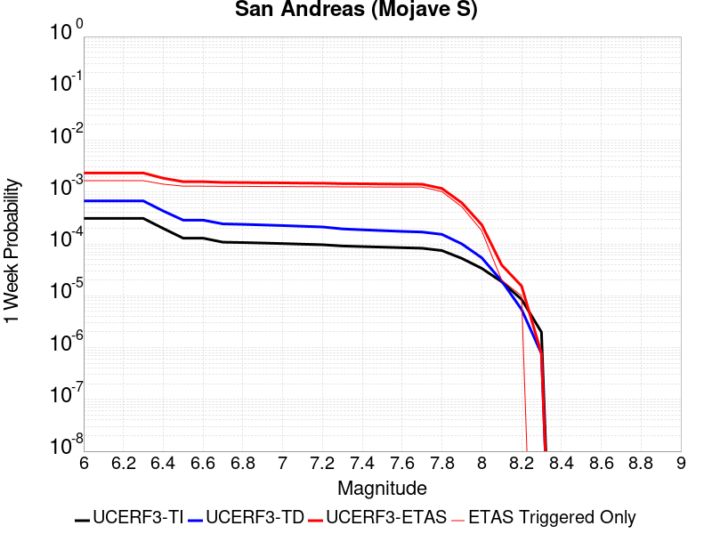 |  | 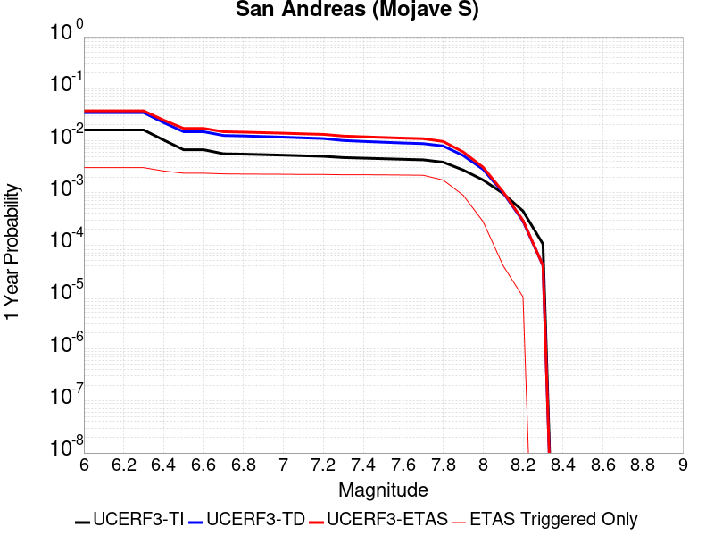 |  |

| Magnitude | 1 wk TI Prob | 1 wk TD Prob | 1 wk ETAS Prob | 1 wk ETAS/TD Gain | 1 wk ETAS Triggered Only | 1 mo TI Prob | 1 mo TD Prob | 1 mo ETAS Prob | 1 mo ETAS/TD Gain | 1 mo ETAS Triggered Only | 1 yr TI Prob | 1 yr TD Prob | 1 yr ETAS Prob | 1 yr ETAS/TD Gain | 1 yr ETAS Triggered Only | 10 yr TI Prob | 10 yr TD Prob | 10 yr ETAS Prob | 10 yr ETAS/TD Gain | 10 yr ETAS Triggered Only |
|-----|-----|-----|-----|-----|-----|-----|-----|-----|-----|-----|-----|-----|-----|-----|-----|-----|-----|-----|-----|-----|
| 6.0 | 3.1064058E-4 | 6.7460834E-4 | 0.002218792 | 3.289008 | 0.0015452261 | 0.0013306376 | 0.0028881032 | 0.0047796094 | 1.6549302 | 0.0018969849 | 0.016080605 | 0.03462235 | 0.037351117 | 1.0788152 | 0.0028266332 | 0.1496549 | 0.28660452 | 0.28940076 | 1.0097563 | 0.003919598 |
| 6.1 | 3.1064058E-4 | 6.7460834E-4 | 0.002218792 | 3.289008 | 0.0015452261 | 0.0013306376 | 0.0028881032 | 0.0047796094 | 1.6549302 | 0.0018969849 | 0.016080605 | 0.03462235 | 0.037351117 | 1.0788152 | 0.0028266332 | 0.1496549 | 0.28660452 | 0.28940076 | 1.0097563 | 0.003919598 |
| 6.2 | 3.1064058E-4 | 6.7460834E-4 | 0.002218792 | 3.289008 | 0.0015452261 | 0.0013306376 | 0.0028881032 | 0.0047796094 | 1.6549302 | 0.0018969849 | 0.016080605 | 0.03462235 | 0.037351117 | 1.0788152 | 0.0028266332 | 0.1496549 | 0.28660452 | 0.28940076 | 1.0097563 | 0.003919598 |
| 6.3 | 3.1064058E-4 | 6.7460834E-4 | 0.002218792 | 3.289008 | 0.0015452261 | 0.0013306376 | 0.0028881032 | 0.0047796094 | 1.6549302 | 0.0018969849 | 0.016080605 | 0.03462235 | 0.037351117 | 1.0788152 | 0.0028266332 | 0.1496549 | 0.28660452 | 0.28940076 | 1.0097563 | 0.003919598 |
| 6.4 | 1.9872203E-4 | 4.3179357E-4 | 0.0017879916 | 4.140848 | 0.0013567839 | 8.5138786E-4 | 0.0018492596 | 0.0035295635 | 1.9086361 | 0.0016834171 | 0.010316478 | 0.02228844 | 0.024720436 | 1.1091146 | 0.002487437 | 0.098504856 | 0.19699748 | 0.19974141 | 1.0139288 | 0.0034170854 |
| 6.5 | 1.291105E-4 | 2.875267E-4 | 0.001556006 | 5.4116926 | 0.0012688442 | 5.5321335E-4 | 0.0012316781 | 0.0027875484 | 2.2632117 | 0.0015577889 | 0.006714592 | 0.0148934 | 0.017133404 | 1.1504024 | 0.0022738692 | 0.065152965 | 0.13803436 | 0.14067657 | 1.0191417 | 0.0030653267 |
| 6.6 | 1.291105E-4 | 2.875267E-4 | 0.001556006 | 5.4116926 | 0.0012688442 | 5.5321335E-4 | 0.0012316781 | 0.0027875484 | 2.2632117 | 0.0015577889 | 0.006714592 | 0.0148934 | 0.017133404 | 1.1504024 | 0.0022738692 | 0.065152965 | 0.13803436 | 0.14067657 | 1.0191417 | 0.0030653267 |
| 6.7 | 1.08001186E-4 | 2.4333889E-4 | 0.0014993146 | 6.161426 | 0.0012562814 | 4.6278012E-4 | 0.0010424647 | 0.002535881 | 2.4325821 | 0.0014949748 | 0.0056198016 | 0.012618446 | 0.014789197 | 1.17203 | 0.0021984924 | 0.054797906 | 0.119176775 | 0.12175506 | 1.0216341 | 0.0029271357 |
| 6.8 | 1.0624356E-4 | 2.3851555E-4 | 0.0014944973 | 6.2658277 | 0.0012562814 | 4.5525006E-4 | 0.0010218095 | 0.0025152569 | 2.461571 | 0.0014949748 | 0.0055285925 | 0.012369843 | 0.014528734 | 1.1745285 | 0.0021859296 | 0.053930566 | 0.11712591 | 0.11969911 | 1.0219696 | 0.0029145728 |
| 6.9 | 1.0393785E-4 | 2.3221898E-4 | 0.0014882087 | 6.4086432 | 0.0012562814 | 4.4537184E-4 | 9.948451E-4 | 0.0024883328 | 2.5012262 | 0.0014949748 | 0.0054089287 | 0.012045221 | 0.014204821 | 1.179291 | 0.0021859296 | 0.05279156 | 0.11442335 | 0.11700443 | 1.0225573 | 0.0029145728 |
| 7.0 | 1.0155622E-4 | 2.2591476E-4 | 0.0014819123 | 6.5596085 | 0.0012562814 | 4.3516833E-4 | 9.6784724E-4 | 0.0024613752 | 2.5431442 | 0.0014949748 | 0.005285311 | 0.0117200995 | 0.01388041 | 1.1843252 | 0.0021859296 | 0.05161361 | 0.111683756 | 0.11427282 | 1.023182 | 0.0029145728 |
| 7.1 | 9.885595E-5 | 2.1879886E-4 | 0.0014748054 | 6.7404623 | 0.0012562814 | 4.2359953E-4 | 9.3737274E-4 | 0.0024309463 | 2.5933614 | 0.0014949748 | 0.0051451353 | 0.011352993 | 0.013514105 | 1.1903563 | 0.0021859296 | 0.05027629 | 0.1085682 | 0.111155145 | 1.0238278 | 0.00290201 |
| 7.2 | 9.6411415E-5 | 2.124288E-4 | 0.0014684433 | 6.9126377 | 0.0012562814 | 4.1312634E-4 | 9.1009185E-4 | 0.002403706 | 2.6411688 | 0.0014949748 | 0.005018219 | 0.011024255 | 0.013186087 | 1.1960977 | 0.0021859296 | 0.049064007 | 0.105758004 | 0.108341865 | 1.0244318 | 0.0028894471 |
| 7.3 | 9.1180635E-5 | 1.9471257E-4 | 0.001438189 | 7.386215 | 0.0012437186 | 3.907156E-4 | 8.342157E-4 | 0.002315391 | 2.7755306 | 0.0014824121 | 0.004746591 | 0.01010939 | 0.012248349 | 1.2115815 | 0.002160804 | 0.046464786 | 0.09795115 | 0.100523576 | 1.0262623 | 0.0028517589 |
| 7.4 | 8.887388E-5 | 1.8719878E-4 | 0.0014306846 | 7.6425953 | 0.0012437186 | 3.8083247E-4 | 8.020339E-4 | 0.002283257 | 2.8468335 | 0.0014824121 | 0.0046267817 | 0.00972114 | 0.011860939 | 1.220118 | 0.002160804 | 0.045316286 | 0.09458615 | 0.09716817 | 1.0272981 | 0.0028517589 |
| 7.5 | 8.6750515E-5 | 1.8051457E-4 | 0.0014114481 | 7.819026 | 0.0012311558 | 3.7173493E-4 | 7.7340455E-4 | 0.002242117 | 2.8990223 | 0.0014698493 | 0.004516484 | 0.009375632 | 0.011503732 | 1.226982 | 0.0021482413 | 0.04425787 | 0.091549896 | 0.09412916 | 1.0281733 | 0.002839196 |
| 7.6 | 8.453092E-5 | 1.7439072E-4 | 0.0014053318 | 8.058524 | 0.0012311558 | 3.6222505E-4 | 7.471748E-4 | 0.0022159258 | 2.9657395 | 0.0014698493 | 0.0044011753 | 0.009058985 | 0.011162867 | 1.2322426 | 0.0021231156 | 0.04315024 | 0.08870898 | 0.09126197 | 1.0287794 | 0.0028015075 |
| 7.7 | 8.259102E-5 | 1.6961215E-4 | 0.0014005591 | 8.257422 | 0.0012311558 | 3.539135E-4 | 7.2670676E-4 | 0.002195488 | 3.0211468 | 0.0014698493 | 0.004300386 | 0.008811831 | 0.010916238 | 1.2388161 | 0.0021231156 | 0.042181134 | 0.08645982 | 0.08901911 | 1.0296009 | 0.0028015075 |
| 7.8 | 7.444844E-5 | 1.5283503E-4 | 0.0011577066 | 7.5748773 | 0.0010050251 | 3.1902574E-4 | 6.548429E-4 | 0.001834974 | 2.8021593 | 0.0011809046 | 0.0038772223 | 0.007943616 | 0.009663513 | 1.216513 | 0.0017336684 | 0.03810269 | 0.078290746 | 0.08042133 | 1.0272137 | 0.0023115578 |
| 7.9 | 5.2586525E-5 | 1.00064186E-4 | 6.276496E-4 | 6.2724695 | 5.276382E-4 | 2.2535135E-4 | 4.2877605E-4 | 0.00104409 | 2.4350474 | 6.155779E-4 | 0.0027402006 | 0.005207864 | 0.0061326707 | 1.1775789 | 9.2964823E-4 | 0.027066574 | 0.052200034 | 0.05345027 | 1.0239509 | 0.0013190955 |
| 8.0 | 3.379877E-5 | 5.4074168E-5 | 2.4250618E-4 | 4.484696 | 1.8844221E-4 | 1.4484383E-4 | 2.3172585E-4 | 4.326843E-4 | 1.8672249 | 2.0100502E-4 | 0.0017620471 | 0.002817614 | 0.0031307994 | 1.1111526 | 3.1407035E-4 | 0.017481409 | 0.028834904 | 0.029249722 | 1.014386 | 4.2713567E-4 |
| 8.1 | 1.8668277E-5 | 1.9309397E-5 | 4.443454E-5 | 2.3011873 | 2.5125628E-5 | 8.000444E-5 | 8.275194E-5 | 1.0787549E-4 | 1.3036008 | 2.5125628E-5 | 9.736188E-4 | 0.0010070398 | 0.0010572404 | 1.0498497 | 5.0251256E-5 | 0.009693642 | 0.010798888 | 0.010861024 | 1.0057539 | 6.281407E-5 |
| 8.2 | 8.541571E-6 | 5.460819E-6 | 1.8023564E-5 | 3.300524 | 1.2562814E-5 | 3.660622E-5 | 2.3403301E-5 | 3.5965822E-5 | 1.5367842 | 1.2562814E-5 | 4.455896E-4 | 2.84898E-4 | 2.9745724E-4 | 1.0440832 | 1.2562814E-5 | 0.0044469717 | 0.0032408056 | 0.0032533277 | 1.0038639 | 1.2562814E-5 |
| 8.3 | 1.983087E-6 | 7.6599065E-7 | 7.6599065E-7 | 1.0 | 0.0 | 8.498917E-6 | 3.282813E-6 | 3.282813E-6 | 1.0 | 0.0 | 1.034694E-4 | 3.9967534E-5 | 3.9967534E-5 | 1.0 | 0.0 | 0.0010342124 | 4.719687E-4 | 4.719687E-4 | 1.0 | 0.0 |

## San Andreas (Mojave N)
*[(top)](#table-of-contents)*

| 1 Week | 1 Month | 1 Year | 10 Year |
|-----|-----|-----|-----|
|  |  |  |  |

| Magnitude | 1 wk TI Prob | 1 wk TD Prob | 1 wk ETAS Prob | 1 wk ETAS/TD Gain | 1 wk ETAS Triggered Only | 1 mo TI Prob | 1 mo TD Prob | 1 mo ETAS Prob | 1 mo ETAS/TD Gain | 1 mo ETAS Triggered Only | 1 yr TI Prob | 1 yr TD Prob | 1 yr ETAS Prob | 1 yr ETAS/TD Gain | 1 yr ETAS Triggered Only | 10 yr TI Prob | 10 yr TD Prob | 10 yr ETAS Prob | 10 yr ETAS/TD Gain | 10 yr ETAS Triggered Only |
|-----|-----|-----|-----|-----|-----|-----|-----|-----|-----|-----|-----|-----|-----|-----|-----|-----|-----|-----|-----|-----|
| 6.0 | 9.877682E-5 | 1.9400702E-4 | 0.0018770975 | 9.67541 | 0.0016834171 | 4.2326056E-4 | 8.311939E-4 | 0.0028395734 | 3.4162588 | 0.0020100502 | 0.0051410277 | 0.010072956 | 0.012983043 | 1.288901 | 0.0029396985 | 0.05023708 | 0.09831428 | 0.101769224 | 1.035142 | 0.0038316583 |
| 6.1 | 9.877682E-5 | 1.9400702E-4 | 0.0018770975 | 9.67541 | 0.0016834171 | 4.2326056E-4 | 8.311939E-4 | 0.0028395734 | 3.4162588 | 0.0020100502 | 0.0051410277 | 0.010072956 | 0.012983043 | 1.288901 | 0.0029396985 | 0.05023708 | 0.09831428 | 0.101769224 | 1.035142 | 0.0038316583 |
| 6.2 | 9.877682E-5 | 1.9400702E-4 | 0.0018770975 | 9.67541 | 0.0016834171 | 4.2326056E-4 | 8.311939E-4 | 0.0028395734 | 3.4162588 | 0.0020100502 | 0.0051410277 | 0.010072956 | 0.012983043 | 1.288901 | 0.0029396985 | 0.05023708 | 0.09831428 | 0.101769224 | 1.035142 | 0.0038316583 |
| 6.3 | 9.877682E-5 | 1.9400702E-4 | 0.0018770975 | 9.67541 | 0.0016834171 | 4.2326056E-4 | 8.311939E-4 | 0.0028395734 | 3.4162588 | 0.0020100502 | 0.0051410277 | 0.010072956 | 0.012983043 | 1.288901 | 0.0029396985 | 0.05023708 | 0.09831428 | 0.101769224 | 1.035142 | 0.0038316583 |
| 6.4 | 9.877682E-5 | 1.9400702E-4 | 0.0018770975 | 9.67541 | 0.0016834171 | 4.2326056E-4 | 8.311939E-4 | 0.0028395734 | 3.4162588 | 0.0020100502 | 0.0051410277 | 0.010072956 | 0.012983043 | 1.288901 | 0.0029396985 | 0.05023708 | 0.09831428 | 0.101769224 | 1.035142 | 0.0038316583 |
| 6.5 | 9.861474E-5 | 1.9374468E-4 | 0.0018768356 | 9.68716 | 0.0016834171 | 4.2256617E-4 | 8.300703E-4 | 0.002838452 | 3.419532 | 0.0020100502 | 0.0051326132 | 0.010059402 | 0.012969529 | 1.2892942 | 0.0029396985 | 0.050156746 | 0.098192066 | 0.10164749 | 1.0351905 | 0.0038316583 |
| 6.6 | 9.861474E-5 | 1.9374468E-4 | 0.0018768356 | 9.68716 | 0.0016834171 | 4.2256617E-4 | 8.300703E-4 | 0.002838452 | 3.419532 | 0.0020100502 | 0.0051326132 | 0.010059402 | 0.012969529 | 1.2892942 | 0.0029396985 | 0.050156746 | 0.098192066 | 0.10164749 | 1.0351905 | 0.0038316583 |
| 6.7 | 9.8552715E-5 | 1.9364421E-4 | 0.0018767354 | 9.691668 | 0.0016834171 | 4.223004E-4 | 8.2964E-4 | 0.0028380225 | 3.420788 | 0.0020100502 | 0.0051293927 | 0.010054212 | 0.012964354 | 1.289445 | 0.0029396985 | 0.050125998 | 0.098145254 | 0.101600856 | 1.0352091 | 0.0038316583 |
| 6.8 | 9.8464974E-5 | 1.9349584E-4 | 0.0018765872 | 9.698334 | 0.0016834171 | 4.219245E-4 | 8.290045E-4 | 0.0028373885 | 3.4226453 | 0.0020100502 | 0.0051248376 | 0.010046546 | 0.012956711 | 1.2896682 | 0.0029396985 | 0.05008251 | 0.09807528 | 0.10153115 | 1.0352368 | 0.0038316583 |
| 6.9 | 9.825824E-5 | 1.9317595E-4 | 0.0018762678 | 9.712741 | 0.0016834171 | 4.2103877E-4 | 8.276344E-4 | 0.0028360211 | 3.4266593 | 0.0020100502 | 0.0051141046 | 0.010030019 | 0.012940233 | 1.2901503 | 0.0029396985 | 0.049980022 | 0.09792438 | 0.101380825 | 1.035297 | 0.0038316583 |
| 7.0 | 9.781462E-5 | 1.924896E-4 | 0.0018755826 | 9.743813 | 0.0016834171 | 4.1913814E-4 | 8.246948E-4 | 0.0028330875 | 3.435316 | 0.0020100502 | 0.005091073 | 0.009994558 | 0.012904876 | 1.2911901 | 0.0029396985 | 0.04976007 | 0.09760077 | 0.10105846 | 1.0354269 | 0.0038316583 |
| 7.1 | 9.7121134E-5 | 1.9150671E-4 | 0.0018746015 | 9.788698 | 0.0016834171 | 4.1616702E-4 | 8.204851E-4 | 0.002828886 | 3.4478214 | 0.0020100502 | 0.005055068 | 0.009943774 | 0.012854241 | 1.2926924 | 0.0029396985 | 0.04941613 | 0.09713728 | 0.10059675 | 1.0356141 | 0.0038316583 |
| 7.2 | 9.663819E-5 | 1.9081456E-4 | 0.0018739104 | 9.820583 | 0.0016834171 | 4.1409794E-4 | 8.175206E-4 | 0.0028259277 | 3.456705 | 0.0020100502 | 0.0050299936 | 0.00990801 | 0.012818582 | 1.2937595 | 0.0029396985 | 0.049176537 | 0.09681055 | 0.10027126 | 1.0357473 | 0.0038316583 |
| 7.3 | 9.6277574E-5 | 1.9033969E-4 | 0.0018734364 | 9.842594 | 0.0016834171 | 4.125529E-4 | 8.154867E-4 | 0.0028238979 | 3.4628372 | 0.0020100502 | 0.0050112694 | 0.009883473 | 0.0127941165 | 1.294496 | 0.0029396985 | 0.04899759 | 0.09658401 | 0.10004559 | 1.0358402 | 0.0038316583 |
| 7.4 | 9.593308E-5 | 1.897375E-4 | 0.0018728352 | 9.870665 | 0.0016834171 | 4.1107697E-4 | 8.129075E-4 | 0.0028213237 | 3.4706578 | 0.0020100502 | 0.0049933824 | 0.009852355 | 0.012763091 | 1.2954355 | 0.0029396985 | 0.04882661 | 0.09630218 | 0.099764846 | 1.0359563 | 0.0038316583 |
| 7.5 | 9.561707E-5 | 1.8919831E-4 | 0.0018722969 | 9.895949 | 0.0016834171 | 4.0972308E-4 | 8.1059814E-4 | 0.0028190191 | 3.4777024 | 0.0020100502 | 0.0049769743 | 0.009824493 | 0.01273531 | 1.2962817 | 0.0029396985 | 0.048669744 | 0.09604836 | 0.099511996 | 1.0360614 | 0.0038316583 |
| 7.6 | 9.418194E-5 | 1.8572104E-4 | 0.0018688255 | 10.06254 | 0.0016834171 | 4.0357444E-4 | 7.957047E-4 | 0.0028041555 | 3.5241158 | 0.0020100502 | 0.004902454 | 0.009644784 | 0.012531247 | 1.2992771 | 0.0029145728 | 0.047957025 | 0.094430685 | 0.097866386 | 1.0363833 | 0.0037939698 |
| 7.7 | 8.202141E-5 | 1.6021315E-4 | 0.0016800701 | 10.486468 | 0.0015201005 | 3.51473E-4 | 6.8644714E-4 | 0.0025068047 | 3.651854 | 0.001821608 | 0.00427079 | 0.008325525 | 0.010929293 | 1.3127452 | 0.0026256281 | 0.04189639 | 0.08223219 | 0.08536828 | 1.0381371 | 0.0034170854 |
| 7.8 | 7.2859846E-5 | 1.4516473E-4 | 0.0011500439 | 7.922338 | 0.0010050251 | 3.1221908E-4 | 6.219862E-4 | 0.0018021562 | 2.8974216 | 0.0011809046 | 0.003794643 | 0.0075464295 | 0.009267015 | 1.2279999 | 0.0017336684 | 0.037304975 | 0.07472468 | 0.07685188 | 1.0284672 | 0.002298995 |
| 7.9 | 5.3874453E-5 | 1.0045676E-4 | 6.28042E-4 | 6.2518635 | 5.276382E-4 | 2.3087008E-4 | 4.3045796E-4 | 0.0010457708 | 2.4294379 | 6.155779E-4 | 0.0028072202 | 0.0052282433 | 0.006153031 | 1.1768831 | 9.2964823E-4 | 0.02772022 | 0.05242443 | 0.053674374 | 1.0238427 | 0.0013190955 |
| 8.0 | 3.468538E-5 | 5.4260272E-5 | 2.4269226E-4 | 4.472743 | 1.8844221E-4 | 1.4864317E-4 | 2.325233E-4 | 4.334816E-4 | 1.8642501 | 2.0100502E-4 | 0.0018082283 | 0.002827298 | 0.0031404803 | 1.110771 | 3.1407035E-4 | 0.017935853 | 0.028947512 | 0.029362282 | 1.0143284 | 4.2713567E-4 |
| 8.1 | 1.9152367E-5 | 1.940263E-5 | 4.452777E-5 | 2.2949347 | 2.5125628E-5 | 8.207899E-5 | 8.3151484E-5 | 1.08275024E-4 | 1.3021418 | 2.5125628E-5 | 9.988535E-4 | 0.0010118998 | 0.0010621002 | 1.04961 | 5.0251256E-5 | 0.009943757 | 0.01085625 | 0.010918383 | 1.0057231 | 6.281407E-5 |
| 8.2 | 8.643924E-6 | 5.4748625E-6 | 1.8037608E-5 | 3.294623 | 1.2562814E-5 | 3.704486E-5 | 2.3463486E-5 | 3.6026006E-5 | 1.5354072 | 1.2562814E-5 | 4.5092785E-4 | 2.8563058E-4 | 2.9818979E-4 | 1.0439702 | 1.2562814E-5 | 0.0045001395 | 0.0032487072 | 0.0032612293 | 1.0038545 | 1.2562814E-5 |
| 8.3 | 1.983087E-6 | 7.6599065E-7 | 7.6599065E-7 | 1.0 | 0.0 | 8.498917E-6 | 3.282813E-6 | 3.282813E-6 | 1.0 | 0.0 | 1.034694E-4 | 3.9967534E-5 | 3.9967534E-5 | 1.0 | 0.0 | 0.0010342124 | 4.719687E-4 | 4.719687E-4 | 1.0 | 0.0 |

## Death Valley (So)
*[(top)](#table-of-contents)*

| 1 Week | 1 Month | 1 Year | 10 Year |
|-----|-----|-----|-----|
|  |  |  |  |

| Magnitude | 1 wk TI Prob | 1 wk TD Prob | 1 wk ETAS Prob | 1 wk ETAS/TD Gain | 1 wk ETAS Triggered Only | 1 mo TI Prob | 1 mo TD Prob | 1 mo ETAS Prob | 1 mo ETAS/TD Gain | 1 mo ETAS Triggered Only | 1 yr TI Prob | 1 yr TD Prob | 1 yr ETAS Prob | 1 yr ETAS/TD Gain | 1 yr ETAS Triggered Only | 10 yr TI Prob | 10 yr TD Prob | 10 yr ETAS Prob | 10 yr ETAS/TD Gain | 10 yr ETAS Triggered Only |
|-----|-----|-----|-----|-----|-----|-----|-----|-----|-----|-----|-----|-----|-----|-----|-----|-----|-----|-----|-----|-----|
| 6.0 | 2.0684236E-5 | 2.5617775E-5 | 7.039924E-4 | 27.48062 | 6.7839195E-4 | 8.864371E-5 | 1.0978594E-4 | 0.0011900694 | 10.839907 | 0.001080402 | 0.0010787029 | 0.0013358411 | 0.0035063047 | 2.6247916 | 0.0021733667 | 0.010734817 | 0.013281397 | 0.016826643 | 1.2669332 | 0.0035929647 |
| 6.1 | 2.0684236E-5 | 2.5617775E-5 | 7.039924E-4 | 27.48062 | 6.7839195E-4 | 8.864371E-5 | 1.0978594E-4 | 0.0011900694 | 10.839907 | 0.001080402 | 0.0010787029 | 0.0013358411 | 0.0035063047 | 2.6247916 | 0.0021733667 | 0.010734817 | 0.013281397 | 0.016826643 | 1.2669332 | 0.0035929647 |
| 6.2 | 2.0684236E-5 | 2.5617775E-5 | 7.039924E-4 | 27.48062 | 6.7839195E-4 | 8.864371E-5 | 1.0978594E-4 | 0.0011900694 | 10.839907 | 0.001080402 | 0.0010787029 | 0.0013358411 | 0.0035063047 | 2.6247916 | 0.0021733667 | 0.010734817 | 0.013281397 | 0.016826643 | 1.2669332 | 0.0035929647 |
| 6.3 | 2.0240292E-5 | 2.511786E-5 | 6.909303E-4 | 27.507528 | 6.6582917E-4 | 8.6741224E-5 | 1.07643624E-4 | 0.001150245 | 10.685677 | 0.0010427135 | 0.0010555626 | 0.00130979 | 0.003405032 | 2.5996778 | 0.00209799 | 0.010505628 | 0.013023956 | 0.016408937 | 1.2599041 | 0.0034296482 |
| 6.4 | 2.0240292E-5 | 2.511786E-5 | 6.909303E-4 | 27.507528 | 6.6582917E-4 | 8.6741224E-5 | 1.07643624E-4 | 0.001150245 | 10.685677 | 0.0010427135 | 0.0010555626 | 0.00130979 | 0.003405032 | 2.5996778 | 0.00209799 | 0.010505628 | 0.013023956 | 0.016408937 | 1.2599041 | 0.0034296482 |
| 6.5 | 1.9962767E-5 | 2.4807114E-5 | 6.529322E-4 | 26.320362 | 6.281407E-4 | 8.55519E-5 | 1.0631196E-4 | 0.0010986688 | 10.334385 | 9.924623E-4 | 0.0010410968 | 0.0012935963 | 0.0033261394 | 2.5712345 | 0.002035176 | 0.010362327 | 0.012863902 | 0.016137822 | 1.2545043 | 0.0033165829 |
| 6.6 | 1.8937297E-5 | 2.3310964E-5 | 5.8862445E-4 | 25.250967 | 5.6532666E-4 | 8.115732E-5 | 9.990039E-5 | 0.0010043327 | 10.05334 | 9.045226E-4 | 9.876423E-4 | 0.0012156231 | 0.0030224693 | 2.4863539 | 0.0018090452 | 0.009832645 | 0.012092789 | 0.014959705 | 1.2370765 | 0.00290201 |
| 6.7 | 1.8621096E-5 | 2.2911607E-5 | 5.505377E-4 | 24.028769 | 5.276382E-4 | 7.980225E-5 | 9.818898E-5 | 9.5237646E-4 | 9.699423 | 8.5427135E-4 | 9.711593E-4 | 0.0011948098 | 0.002913859 | 2.4387639 | 0.0017211055 | 0.009669261 | 0.011886904 | 0.014642697 | 1.2318344 | 0.0027889446 |
| 6.8 | 1.7830353E-5 | 2.1805688E-5 | 4.991822E-4 | 22.892294 | 4.7738693E-4 | 7.641356E-5 | 9.344968E-5 | 8.5970975E-4 | 9.199708 | 7.663317E-4 | 9.29938E-4 | 0.00113717 | 0.0027182845 | 2.3903942 | 0.0015829146 | 0.009260561 | 0.011316354 | 0.0138625875 | 1.2250047 | 0.0025753768 |
| 6.9 | 1.3135183E-5 | 1.5303925E-5 | 3.5449472E-4 | 23.163647 | 3.3919598E-4 | 5.6292425E-5 | 6.558664E-5 | 5.931902E-4 | 9.044376 | 5.276382E-4 | 6.8514474E-4 | 7.982312E-4 | 0.0018903236 | 2.3681405 | 0.0010929648 | 0.006830362 | 0.007954649 | 0.00956236 | 1.2021097 | 0.001620603 |
| 7.0 | 1.1507512E-5 | 1.3154199E-5 | 2.6440716E-4 | 20.10059 | 2.5125628E-4 | 4.9316975E-5 | 5.6373956E-5 | 3.955508E-4 | 7.0165524 | 3.3919598E-4 | 6.002687E-4 | 6.8614254E-4 | 0.0015021651 | 2.1892903 | 8.1658293E-4 | 0.0059864987 | 0.0068409415 | 0.008013767 | 1.1714422 | 0.0011809046 |
| 7.1 | 9.715903E-6 | 1.0865278E-5 | 1.2392938E-4 | 11.406001 | 1.13065325E-4 | 4.1638916E-5 | 4.656467E-5 | 2.0987364E-4 | 4.5071435 | 1.6331658E-4 | 5.068359E-4 | 5.667817E-4 | 9.5600815E-4 | 1.686731 | 3.8944723E-4 | 0.0050568148 | 0.0056538144 | 0.0062284367 | 1.1016344 | 5.7788944E-4 |
| 7.2 | 9.233269E-6 | 1.02863105E-5 | 8.566242E-5 | 8.327808 | 7.537688E-5 | 3.9570554E-5 | 4.4083466E-5 | 1.6970607E-4 | 3.8496535 | 1.2562814E-4 | 4.81665E-4 | 5.3658825E-4 | 8.2537794E-4 | 1.5381961 | 2.8894472E-4 | 0.0048062233 | 0.0053533576 | 0.0057907025 | 1.0816954 | 4.396985E-4 |
| 7.3 | 8.8041315E-6 | 9.808164E-6 | 6.0058926E-5 | 6.123361 | 5.0251256E-5 | 3.7731446E-5 | 4.2034335E-5 | 1.4253262E-4 | 3.390862 | 1.0050251E-4 | 4.592835E-4 | 5.1165203E-4 | 7.1255426E-4 | 1.392654 | 2.0100502E-4 | 0.0045833546 | 0.005105167 | 0.0054051355 | 1.0587578 | 3.0150753E-4 |
| 7.4 | 8.708749E-6 | 9.707175E-6 | 5.9957943E-5 | 6.1766624 | 5.0251256E-5 | 3.7322676E-5 | 4.160154E-5 | 1.4209987E-4 | 3.415736 | 1.0050251E-4 | 4.5430884E-4 | 5.0638523E-4 | 7.0728845E-4 | 1.39674 | 2.0100502E-4 | 0.004533812 | 0.0050527398 | 0.005352724 | 1.0593706 | 3.0150753E-4 |
| 7.5 | 8.612678E-6 | 9.604817E-6 | 5.9855593E-5 | 6.23183 | 5.0251256E-5 | 3.6910955E-5 | 4.1162875E-5 | 1.4166125E-4 | 3.4414809 | 1.0050251E-4 | 4.492982E-4 | 5.01047E-4 | 7.0195127E-4 | 1.400969 | 2.0100502E-4 | 0.004483909 | 0.0049995985 | 0.005299599 | 1.0600048 | 3.0150753E-4 |
| 7.6 | 8.319024E-6 | 9.283916E-6 | 5.9534705E-5 | 6.4126716 | 5.0251256E-5 | 3.5652476E-5 | 3.978763E-5 | 1.4028614E-4 | 3.5258734 | 1.0050251E-4 | 4.3398244E-4 | 4.8431093E-4 | 6.726619E-4 | 1.388905 | 1.8844221E-4 | 0.0043313587 | 0.0048329784 | 0.0051205265 | 1.0594971 | 2.8894472E-4 |
| 7.7 | 7.4718328E-6 | 8.34517E-6 | 5.8596008E-5 | 7.0215473 | 5.0251256E-5 | 3.2021748E-5 | 3.5764548E-5 | 1.237011E-4 | 3.4587634 | 8.79397E-5 | 3.8979502E-4 | 4.353504E-4 | 5.985959E-4 | 1.374975 | 1.6331658E-4 | 0.00389112 | 0.0043453807 | 0.004595545 | 1.0575702 | 2.5125628E-4 |
| 7.8 | 3.4586725E-7 | 3.6482615E-7 | 3.6482615E-7 | 1.0 | 0.0 | 1.4822873E-6 | 1.5635396E-6 | 1.5635396E-6 | 1.0 | 0.0 | 1.80467E-5 | 1.9035933E-5 | 1.9035933E-5 | 1.0 | 0.0 | 1.8045233E-4 | 1.9034347E-4 | 2.0290389E-4 | 1.0659882 | 1.2562814E-5 |
| 7.9 | 2.5591178E-9 | 2.6696718E-9 | 2.6696718E-9 | 1.0 | 0.0 | 1.0967647E-8 | 1.14414505E-8 | 1.14414505E-8 | 1.0 | 0.0 | 1.335311E-7 | 1.3929966E-7 | 1.3929966E-7 | 1.0 | 0.0 | 1.3353102E-6 | 1.3929966E-6 | 1.3929966E-6 | 1.0 | 0.0 |

## Nelson Lake
*[(top)](#table-of-contents)*

| 1 Week | 1 Month | 1 Year | 10 Year |
|-----|-----|-----|-----|
|  |  |  |  |

| Magnitude | 1 wk TI Prob | 1 wk TD Prob | 1 wk ETAS Prob | 1 wk ETAS/TD Gain | 1 wk ETAS Triggered Only | 1 mo TI Prob | 1 mo TD Prob | 1 mo ETAS Prob | 1 mo ETAS/TD Gain | 1 mo ETAS Triggered Only | 1 yr TI Prob | 1 yr TD Prob | 1 yr ETAS Prob | 1 yr ETAS/TD Gain | 1 yr ETAS Triggered Only | 10 yr TI Prob | 10 yr TD Prob | 10 yr ETAS Prob | 10 yr ETAS/TD Gain | 10 yr ETAS Triggered Only |
|-----|-----|-----|-----|-----|-----|-----|-----|-----|-----|-----|-----|-----|-----|-----|-----|-----|-----|-----|-----|-----|
| 6.0 | 9.913453E-6 | 1.0192255E-5 | 3.6194746E-4 | 35.51201 | 3.517588E-4 | 4.2485535E-5 | 4.3680422E-5 | 7.34605E-4 | 16.817719 | 6.909548E-4 | 5.1713863E-4 | 5.316897E-4 | 0.002151431 | 4.0464034 | 0.001620603 | 0.0051593683 | 0.005305204 | 0.008279291 | 1.5605981 | 0.0029899497 |
| 6.1 | 9.913453E-6 | 1.0192255E-5 | 3.6194746E-4 | 35.51201 | 3.517588E-4 | 4.2485535E-5 | 4.3680422E-5 | 7.34605E-4 | 16.817719 | 6.909548E-4 | 5.1713863E-4 | 5.316897E-4 | 0.002151431 | 4.0464034 | 0.001620603 | 0.0051593683 | 0.005305204 | 0.008279291 | 1.5605981 | 0.0029899497 |
| 6.2 | 4.5596407E-6 | 4.696313E-6 | 1.3032387E-4 | 27.75025 | 1.2562814E-4 | 1.954117E-5 | 2.0126909E-5 | 3.3419093E-4 | 16.604187 | 3.1407035E-4 | 2.3788778E-4 | 2.4501883E-4 | 9.358043E-4 | 3.819316 | 6.909548E-4 | 0.0023763329 | 0.0024476128 | 0.0038637363 | 1.5785732 | 0.001419598 |
| 6.3 | 4.5596407E-6 | 4.696313E-6 | 1.3032387E-4 | 27.75025 | 1.2562814E-4 | 1.954117E-5 | 2.0126909E-5 | 3.3419093E-4 | 16.604187 | 3.1407035E-4 | 2.3788778E-4 | 2.4501883E-4 | 9.358043E-4 | 3.819316 | 6.909548E-4 | 0.0023763329 | 0.0024476128 | 0.0038637363 | 1.5785732 | 0.001419598 |
| 6.4 | 3.4025713E-6 | 3.5098972E-6 | 9.1449285E-5 | 26.054691 | 8.79397E-5 | 1.4582367E-5 | 1.5042335E-5 | 2.6629484E-4 | 17.703026 | 2.5125628E-4 | 1.7752586E-4 | 1.8312587E-4 | 6.9810695E-4 | 3.8121698 | 5.150754E-4 | 0.001773841 | 0.0018298327 | 0.0028079392 | 1.5345333 | 9.798995E-4 |
| 6.5 | 2.8352947E-6 | 2.927856E-6 | 6.574174E-5 | 22.453884 | 6.281407E-5 | 1.2151207E-5 | 1.2547898E-5 | 2.0098775E-4 | 16.017641 | 1.8844221E-4 | 1.479309E-4 | 1.5276071E-4 | 5.672702E-4 | 3.7134566 | 4.1457286E-4 | 0.0014783246 | 0.0015266308 | 0.0023545108 | 1.5422921 | 8.291457E-4 |
| 6.6 | 2.251518E-6 | 2.3290677E-6 | 6.5142995E-5 | 27.969559 | 6.281407E-5 | 9.649328E-6 | 9.981683E-6 | 1.7329663E-4 | 17.361464 | 1.6331658E-4 | 1.1747423E-4 | 1.2152085E-4 | 4.606756E-4 | 3.7909184 | 3.3919598E-4 | 0.0011741214 | 0.0012146058 | 0.0019047213 | 1.5681807 | 6.909548E-4 |
| 6.7 | 1.8911853E-6 | 1.9591396E-6 | 6.4773085E-5 | 33.062004 | 6.281407E-5 | 8.105055E-6 | 8.39629E-6 | 1.4658608E-4 | 17.458437 | 1.3819095E-4 | 9.867457E-5 | 1.0222061E-4 | 4.0369734E-4 | 3.9492753 | 3.0150753E-4 | 9.863076E-4 | 0.0010217935 | 0.0016367423 | 1.6018329 | 6.155779E-4 |
| 6.8 | 1.4874814E-6 | 1.5438305E-6 | 3.9232214E-5 | 25.412254 | 3.768844E-5 | 6.374905E-6 | 6.6164025E-6 | 8.199279E-5 | 12.392352 | 7.537688E-5 | 7.76117E-5 | 8.055224E-5 | 3.0666468E-4 | 3.8070285 | 2.2613065E-4 | 7.75846E-4 | 8.0528157E-4 | 0.0012697313 | 1.5767546 | 4.6482412E-4 |
| 6.9 | 6.835972E-7 | 7.1399285E-7 | 2.5839603E-5 | 36.190285 | 2.5125628E-5 | 2.9296991E-6 | 3.0599674E-6 | 4.0748295E-5 | 13.316578 | 3.768844E-5 | 3.56685E-5 | 3.7254784E-5 | 1.503159E-4 | 4.0348077 | 1.13065325E-4 | 3.5662777E-4 | 3.7251666E-4 | 6.362375E-4 | 1.7079437 | 2.638191E-4 |

## Towne Pass
*[(top)](#table-of-contents)*

| 1 Week | 1 Month | 1 Year | 10 Year |
|-----|-----|-----|-----|
|  |  |  |  |

| Magnitude | 1 wk TI Prob | 1 wk TD Prob | 1 wk ETAS Prob | 1 wk ETAS/TD Gain | 1 wk ETAS Triggered Only | 1 mo TI Prob | 1 mo TD Prob | 1 mo ETAS Prob | 1 mo ETAS/TD Gain | 1 mo ETAS Triggered Only | 1 yr TI Prob | 1 yr TD Prob | 1 yr ETAS Prob | 1 yr ETAS/TD Gain | 1 yr ETAS Triggered Only | 10 yr TI Prob | 10 yr TD Prob | 10 yr ETAS Prob | 10 yr ETAS/TD Gain | 10 yr ETAS Triggered Only |
|-----|-----|-----|-----|-----|-----|-----|-----|-----|-----|-----|-----|-----|-----|-----|-----|-----|-----|-----|-----|-----|
| 6.0 | 3.849728E-6 | 3.8945414E-6 | 6.320328E-4 | 162.28683 | 6.281407E-4 | 1.649873E-5 | 1.669081E-5 | 9.840113E-4 | 58.95528 | 9.673367E-4 | 2.0085352E-4 | 2.0319603E-4 | 0.002074675 | 10.210215 | 0.0018718593 | 0.0020067208 | 0.0020305314 | 0.0048012757 | 2.3645415 | 0.002776382 |
| 6.1 | 3.849728E-6 | 3.8945414E-6 | 6.320328E-4 | 162.28683 | 6.281407E-4 | 1.649873E-5 | 1.669081E-5 | 9.840113E-4 | 58.95528 | 9.673367E-4 | 2.0085352E-4 | 2.0319603E-4 | 0.002074675 | 10.210215 | 0.0018718593 | 0.0020067208 | 0.0020305314 | 0.0048012757 | 2.3645415 | 0.002776382 |
| 6.2 | 3.849728E-6 | 3.8945414E-6 | 6.320328E-4 | 162.28683 | 6.281407E-4 | 1.649873E-5 | 1.669081E-5 | 9.840113E-4 | 58.95528 | 9.673367E-4 | 2.0085352E-4 | 2.0319603E-4 | 0.002074675 | 10.210215 | 0.0018718593 | 0.0020067208 | 0.0020305314 | 0.0048012757 | 2.3645415 | 0.002776382 |
| 6.3 | 3.849728E-6 | 3.8945414E-6 | 6.320328E-4 | 162.28683 | 6.281407E-4 | 1.649873E-5 | 1.669081E-5 | 9.840113E-4 | 58.95528 | 9.673367E-4 | 2.0085352E-4 | 2.0319603E-4 | 0.002074675 | 10.210215 | 0.0018718593 | 0.0020067208 | 0.0020305314 | 0.0048012757 | 2.3645415 | 0.002776382 |
| 6.4 | 3.849728E-6 | 3.8945414E-6 | 6.320328E-4 | 162.28683 | 6.281407E-4 | 1.649873E-5 | 1.669081E-5 | 9.840113E-4 | 58.95528 | 9.673367E-4 | 2.0085352E-4 | 2.0319603E-4 | 0.002074675 | 10.210215 | 0.0018718593 | 0.0020067208 | 0.0020305314 | 0.0048012757 | 2.3645415 | 0.002776382 |
| 6.5 | 1.1953545E-6 | 1.203052E-6 | 8.9142646E-5 | 74.097084 | 8.79397E-5 | 5.1229376E-6 | 5.1559277E-6 | 1.1822067E-4 | 22.92908 | 1.13065325E-4 | 6.236998E-5 | 6.277173E-5 | 3.516983E-4 | 5.6028137 | 2.8894472E-4 | 6.235248E-4 | 6.275517E-4 | 0.0010920841 | 1.7402297 | 4.6482412E-4 |
| 6.6 | 1.1953545E-6 | 1.203052E-6 | 8.9142646E-5 | 74.097084 | 8.79397E-5 | 5.1229376E-6 | 5.1559277E-6 | 1.1822067E-4 | 22.92908 | 1.13065325E-4 | 6.236998E-5 | 6.277173E-5 | 3.516983E-4 | 5.6028137 | 2.8894472E-4 | 6.235248E-4 | 6.275517E-4 | 0.0010920841 | 1.7402297 | 4.6482412E-4 |
| 6.7 | 8.375951E-7 | 8.4106705E-7 | 6.365508E-5 | 75.68372 | 6.281407E-5 | 3.5896885E-6 | 3.6045683E-6 | 7.898118E-5 | 21.911411 | 7.537688E-5 | 4.370358E-5 | 4.3884793E-5 | 1.9463195E-4 | 4.4350657 | 1.5075377E-4 | 4.3694986E-4 | 4.38767E-4 | 7.150276E-4 | 1.6296295 | 2.763819E-4 |
| 6.8 | 6.38041E-7 | 6.392156E-7 | 5.089044E-5 | 79.613884 | 5.0251256E-5 | 2.7344586E-6 | 2.7394929E-6 | 6.555339E-5 | 23.929024 | 6.281407E-5 | 3.3291526E-5 | 3.3352855E-5 | 1.4641442E-4 | 4.3898616 | 1.13065325E-4 | 3.3286537E-4 | 3.334823E-4 | 5.344203E-4 | 1.6025447 | 2.0100502E-4 |
| 6.9 | 5.3460053E-7 | 5.345333E-7 | 5.0785762E-5 | 95.00954 | 5.0251256E-5 | 2.2911431E-6 | 2.2908553E-6 | 5.2541996E-5 | 22.935537 | 5.0251256E-5 | 2.789431E-5 | 2.789084E-5 | 1.1582809E-4 | 4.152908 | 8.79397E-5 | 2.789081E-4 | 2.7887672E-4 | 4.1702914E-4 | 1.4953889 | 1.3819095E-4 |
| 7.0 | 3.557783E-7 | 3.5324226E-7 | 5.060448E-5 | 143.25716 | 5.0251256E-5 | 1.5247632E-6 | 1.5138945E-6 | 5.1765073E-5 | 34.193317 | 5.0251256E-5 | 1.8563835E-5 | 1.843152E-5 | 6.8681846E-5 | 3.726326 | 5.0251256E-5 | 1.8562283E-4 | 1.8430075E-4 | 2.5966374E-4 | 1.4089131 | 7.537688E-5 |
| 7.1 | 3.037942E-7 | 3.0002218E-7 | 5.055126E-5 | 168.49176 | 5.0251256E-5 | 1.3019744E-6 | 1.2858087E-6 | 5.1537E-5 | 40.08139 | 5.0251256E-5 | 1.5851423E-5 | 1.5654618E-5 | 6.5905086E-5 | 4.2099457 | 5.0251256E-5 | 1.5850292E-4 | 1.5653588E-4 | 2.3190098E-4 | 1.4814557 | 7.537688E-5 |
| 7.2 | 2.0808248E-7 | 2.0217689E-7 | 2.53278E-5 | 125.275444 | 2.5125628E-5 | 8.917818E-7 | 8.6647213E-7 | 2.5992078E-5 | 29.997593 | 2.5125628E-5 | 1.0857389E-5 | 1.0549252E-5 | 3.5674613E-5 | 3.38172 | 2.5125628E-5 | 1.0856859E-4 | 1.0548797E-4 | 1.5573393E-4 | 1.4763193 | 5.0251256E-5 |
| 7.3 | 1.1162073E-7 | 1.0636894E-7 | 1.2669182E-5 | 119.10603 | 1.2562814E-5 | 4.7837443E-7 | 4.558668E-7 | 1.3018675E-5 | 28.55807 | 1.2562814E-5 | 5.8241935E-6 | 5.550166E-6 | 1.811291E-5 | 3.2634897 | 1.2562814E-5 | 5.8240406E-5 | 5.5500474E-5 | 6.806259E-5 | 1.2263426 | 1.2562814E-5 |

## Bicycle Lake
*[(top)](#table-of-contents)*

| 1 Week | 1 Month | 1 Year | 10 Year |
|-----|-----|-----|-----|
|  |  | 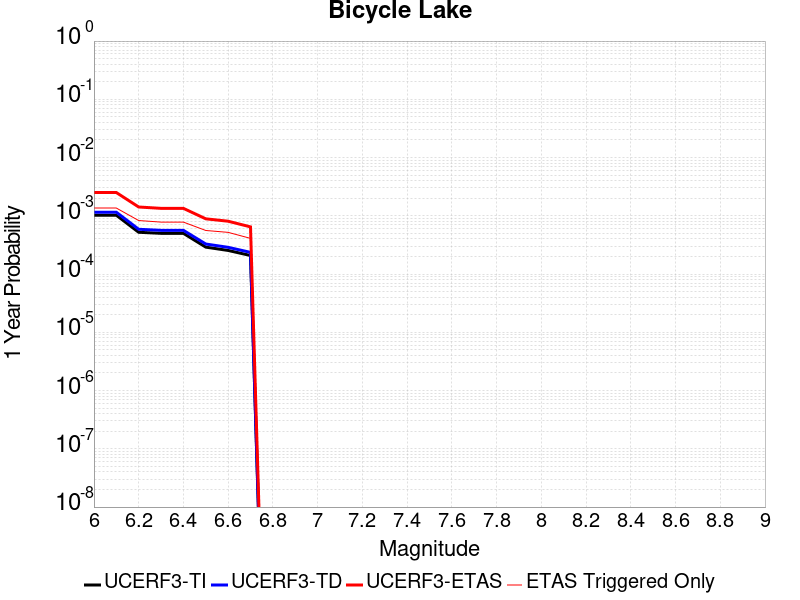 |  |

| Magnitude | 1 wk TI Prob | 1 wk TD Prob | 1 wk ETAS Prob | 1 wk ETAS/TD Gain | 1 wk ETAS Triggered Only | 1 mo TI Prob | 1 mo TD Prob | 1 mo ETAS Prob | 1 mo ETAS/TD Gain | 1 mo ETAS Triggered Only | 1 yr TI Prob | 1 yr TD Prob | 1 yr ETAS Prob | 1 yr ETAS/TD Gain | 1 yr ETAS Triggered Only | 10 yr TI Prob | 10 yr TD Prob | 10 yr ETAS Prob | 10 yr ETAS/TD Gain | 10 yr ETAS Triggered Only |
|-----|-----|-----|-----|-----|-----|-----|-----|-----|-----|-----|-----|-----|-----|-----|-----|-----|-----|-----|-----|-----|
| 6.0 | 1.9621975E-5 | 2.2097078E-5 | 3.9897318E-4 | 18.055471 | 3.7688442E-4 | 8.4091465E-5 | 9.4699084E-5 | 6.2228733E-4 | 6.571207 | 5.276382E-4 | 0.0010233327 | 0.0011524865 | 0.0023571267 | 2.0452533 | 0.0012060301 | 0.01018633 | 0.011478408 | 0.013477804 | 1.1741877 | 0.002022613 |
| 6.1 | 1.9621975E-5 | 2.2097078E-5 | 3.9897318E-4 | 18.055471 | 3.7688442E-4 | 8.4091465E-5 | 9.4699084E-5 | 6.2228733E-4 | 6.571207 | 5.276382E-4 | 0.0010233327 | 0.0011524865 | 0.0023571267 | 2.0452533 | 0.0012060301 | 0.01018633 | 0.011478408 | 0.013477804 | 1.1741877 | 0.002022613 |
| 6.2 | 9.9971285E-6 | 1.1255639E-5 | 2.2482108E-4 | 19.974083 | 2.1356784E-4 | 4.2844134E-5 | 4.8237856E-5 | 3.3716863E-4 | 6.9897103 | 2.8894472E-4 | 5.2150246E-4 | 5.871896E-4 | 0.0012902941 | 2.197406 | 7.035176E-4 | 0.0052028033 | 0.005861487 | 0.0070729367 | 1.2066797 | 0.001218593 |
| 6.3 | 9.589428E-6 | 1.0798346E-5 | 2.2436387E-4 | 20.777615 | 2.1356784E-4 | 4.10969E-5 | 4.62781E-5 | 3.3520945E-4 | 7.2433715 | 2.8894472E-4 | 5.002399E-4 | 5.6334207E-4 | 0.0012287961 | 2.181261 | 6.6582917E-4 | 0.0049911533 | 0.0056242296 | 0.0067860004 | 1.2065653 | 0.0011683417 |
| 6.4 | 9.589428E-6 | 1.0798346E-5 | 2.2436387E-4 | 20.777615 | 2.1356784E-4 | 4.10969E-5 | 4.62781E-5 | 3.3520945E-4 | 7.2433715 | 2.8894472E-4 | 5.002399E-4 | 5.6334207E-4 | 0.0012287961 | 2.181261 | 6.6582917E-4 | 0.0049911533 | 0.0056242296 | 0.0067860004 | 1.2065653 | 0.0011683417 |
| 6.5 | 5.557707E-6 | 6.2856016E-6 | 1.8216389E-4 | 28.98114 | 1.758794E-4 | 2.3818526E-5 | 2.6938165E-5 | 2.656252E-4 | 9.860553 | 2.3869346E-4 | 2.8995197E-4 | 3.2794967E-4 | 8.428561E-4 | 2.5700777 | 5.150754E-4 | 0.0028957394 | 0.0032772934 | 0.0040661567 | 1.2407057 | 7.914573E-4 |
| 6.6 | 4.8742945E-6 | 5.5132896E-6 | 1.6882898E-4 | 30.622185 | 1.6331658E-4 | 2.0889667E-5 | 2.3628318E-5 | 2.4975362E-4 | 10.570098 | 2.2613065E-4 | 2.54302E-4 | 2.87663E-4 | 7.774718E-4 | 2.7027175 | 4.899498E-4 | 0.002540112 | 0.0028754752 | 0.00361455 | 1.257027 | 7.4120605E-4 |
| 6.7 | 3.991108E-6 | 4.5159104E-6 | 1.3014348E-4 | 28.818882 | 1.2562814E-4 | 1.7104636E-5 | 1.9353902E-5 | 1.9522989E-4 | 10.087366 | 1.758794E-4 | 2.0822904E-4 | 2.3563375E-4 | 6.1242934E-4 | 2.5990732 | 3.7688442E-4 | 0.0020803404 | 0.0023563374 | 0.0029453984 | 1.2499901 | 5.904523E-4 |

## San Andreas (San Bernardino N)
*[(top)](#table-of-contents)*

| 1 Week | 1 Month | 1 Year | 10 Year |
|-----|-----|-----|-----|
|  |  |  | 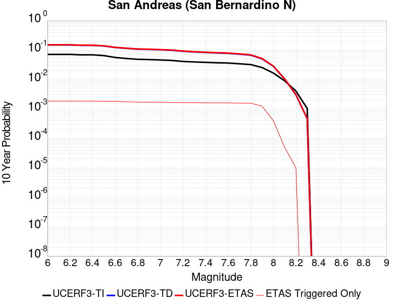 |

| Magnitude | 1 wk TI Prob | 1 wk TD Prob | 1 wk ETAS Prob | 1 wk ETAS/TD Gain | 1 wk ETAS Triggered Only | 1 mo TI Prob | 1 mo TD Prob | 1 mo ETAS Prob | 1 mo ETAS/TD Gain | 1 mo ETAS Triggered Only | 1 yr TI Prob | 1 yr TD Prob | 1 yr ETAS Prob | 1 yr ETAS/TD Gain | 1 yr ETAS Triggered Only | 10 yr TI Prob | 10 yr TD Prob | 10 yr ETAS Prob | 10 yr ETAS/TD Gain | 10 yr ETAS Triggered Only |
|-----|-----|-----|-----|-----|-----|-----|-----|-----|-----|-----|-----|-----|-----|-----|-----|-----|-----|-----|-----|-----|
| 6.0 | 1.4273766E-4 | 3.1606483E-4 | 0.0010068013 | 3.1854262 | 6.909548E-4 | 6.115894E-4 | 0.0013538664 | 0.002156798 | 1.5930656 | 8.040201E-4 | 0.0074207084 | 0.016360244 | 0.017558899 | 1.0732664 | 0.001218593 | 0.07177748 | 0.15026689 | 0.15177207 | 1.0100167 | 0.0017713568 |
| 6.1 | 1.4273766E-4 | 3.1606483E-4 | 0.0010068013 | 3.1854262 | 6.909548E-4 | 6.115894E-4 | 0.0013538664 | 0.002156798 | 1.5930656 | 8.040201E-4 | 0.0074207084 | 0.016360244 | 0.017558899 | 1.0732664 | 0.001218593 | 0.07177748 | 0.15026689 | 0.15177207 | 1.0100167 | 0.0017713568 |
| 6.2 | 1.4273766E-4 | 3.1606483E-4 | 0.0010068013 | 3.1854262 | 6.909548E-4 | 6.115894E-4 | 0.0013538664 | 0.002156798 | 1.5930656 | 8.040201E-4 | 0.0074207084 | 0.016360244 | 0.017558899 | 1.0732664 | 0.001218593 | 0.07177748 | 0.15026689 | 0.15177207 | 1.0100167 | 0.0017713568 |
| 6.3 | 1.3730655E-4 | 3.0511338E-4 | 9.958573E-4 | 3.2638927 | 6.909548E-4 | 5.883239E-4 | 0.0013069791 | 0.0021099483 | 1.6143703 | 8.040201E-4 | 0.0071393442 | 0.015797773 | 0.016997114 | 1.0759184 | 0.001218593 | 0.06914291 | 0.14556676 | 0.14708027 | 1.0103973 | 0.0017713568 |
| 6.4 | 1.3730655E-4 | 3.0511338E-4 | 9.958573E-4 | 3.2638927 | 6.909548E-4 | 5.883239E-4 | 0.0013069791 | 0.0021099483 | 1.6143703 | 8.040201E-4 | 0.0071393442 | 0.015797773 | 0.016997114 | 1.0759184 | 0.001218593 | 0.06914291 | 0.14556676 | 0.14708027 | 1.0103973 | 0.0017713568 |
| 6.5 | 1.2942807E-4 | 2.8925808E-4 | 9.800129E-4 | 3.388023 | 6.909548E-4 | 5.545738E-4 | 0.0012390936 | 0.0020421175 | 1.6480736 | 8.040201E-4 | 0.0067310524 | 0.01498286 | 0.016183196 | 1.0801139 | 0.001218593 | 0.06530788 | 0.13870941 | 0.14021343 | 1.0108429 | 0.0017462311 |
| 6.6 | 1.1125901E-4 | 2.536472E-4 | 9.444267E-4 | 3.7233872 | 6.909548E-4 | 4.767372E-4 | 0.0010866089 | 0.0018897553 | 1.7391311 | 8.040201E-4 | 0.005788839 | 0.013149847 | 0.014352416 | 1.0914512 | 0.001218593 | 0.056403454 | 0.122999296 | 0.12453074 | 1.0124508 | 0.0017462311 |
| 6.7 | 1.02209575E-4 | 2.3499702E-4 | 9.257894E-4 | 3.9395795 | 6.909548E-4 | 4.3796748E-4 | 0.0010067427 | 0.001784853 | 1.7728989 | 7.7889446E-4 | 0.0053192247 | 0.012188629 | 0.01336755 | 1.096723 | 0.0011934673 | 0.051936906 | 0.114790924 | 0.1162811 | 1.0129817 | 0.0016834171 |
| 6.8 | 9.610582E-5 | 2.2025521E-4 | 8.859377E-4 | 4.0223236 | 6.6582917E-4 | 4.1181705E-4 | 9.436101E-4 | 0.0016966676 | 1.79806 | 7.5376884E-4 | 0.0050023515 | 0.011428202 | 0.012558352 | 1.0988914 | 0.001143216 | 0.048912346 | 0.1081929 | 0.10964937 | 1.0134618 | 0.0016331659 |
| 6.9 | 9.3877505E-5 | 2.1481077E-4 | 8.8049687E-4 | 4.098942 | 6.6582917E-4 | 4.0227012E-4 | 9.2029345E-4 | 0.0016733686 | 1.8182989 | 7.5376884E-4 | 0.0048866454 | 0.011147255 | 0.012277728 | 1.1014127 | 0.001143216 | 0.04780577 | 0.10578323 | 0.107243635 | 1.0138056 | 0.0016331659 |
| 7.0 | 9.1019785E-5 | 2.0808022E-4 | 8.737708E-4 | 4.1992016 | 6.6582917E-4 | 3.900265E-4 | 8.914682E-4 | 0.0016445651 | 1.8447826 | 7.5376884E-4 | 0.0047382377 | 0.010799837 | 0.011930707 | 1.1047118 | 0.001143216 | 0.046384744 | 0.102753714 | 0.104219064 | 1.0142608 | 0.0016331659 |
| 7.1 | 8.771155E-5 | 1.9982594E-4 | 8.65522E-4 | 4.33138 | 6.6582917E-4 | 3.758525E-4 | 8.5611636E-4 | 0.00160924 | 1.8796976 | 7.5376884E-4 | 0.0045664064 | 0.0103736 | 0.0115049565 | 1.1090611 | 0.001143216 | 0.044737056 | 0.09906527 | 0.10052532 | 1.0147383 | 0.001620603 |
| 7.2 | 8.0830236E-5 | 1.8388197E-4 | 8.495887E-4 | 4.6202936 | 6.6582917E-4 | 3.4636928E-4 | 7.8782777E-4 | 0.0015410028 | 1.9560148 | 7.5376884E-4 | 0.0042088944 | 0.009549725 | 0.010682023 | 1.1185688 | 0.001143216 | 0.041300658 | 0.09179615 | 0.09324517 | 1.0157852 | 0.0015954773 |
| 7.3 | 7.7668235E-5 | 1.7331762E-4 | 8.3903136E-4 | 4.8410044 | 6.6582917E-4 | 3.328214E-4 | 7.425784E-4 | 0.0014957875 | 2.0143158 | 7.5376884E-4 | 0.0040445733 | 0.009003494 | 0.010123967 | 1.1244488 | 0.0011306533 | 0.03971748 | 0.08706327 | 0.08850837 | 1.0165983 | 0.0015829146 |
| 7.4 | 7.520177E-5 | 1.6551897E-4 | 8.3123794E-4 | 5.02201 | 6.6582917E-4 | 3.2225347E-4 | 7.0917426E-4 | 0.0014624086 | 2.0621285 | 7.5376884E-4 | 0.0039163795 | 0.008600081 | 0.009721011 | 1.1303394 | 0.0011306533 | 0.038480744 | 0.08351955 | 0.08497026 | 1.0173697 | 0.0015829146 |
| 7.5 | 7.274697E-5 | 1.5839566E-4 | 8.115585E-4 | 5.1236157 | 6.532663E-4 | 3.1173544E-4 | 6.78662E-4 | 0.0014193649 | 2.0914166 | 7.4120605E-4 | 0.003788775 | 0.008231463 | 0.00934035 | 1.1347132 | 0.0011180905 | 0.03724827 | 0.08023631 | 0.08168066 | 1.0180012 | 0.0015703518 |
| 7.6 | 7.1185845E-5 | 1.540943E-4 | 8.0726E-4 | 5.23874 | 6.532663E-4 | 3.0504653E-4 | 6.6023704E-4 | 0.0014009537 | 2.121895 | 7.4120605E-4 | 0.0037076178 | 0.008008812 | 0.009117947 | 1.1384895 | 0.0011180905 | 0.036463667 | 0.07822598 | 0.079673484 | 1.0185043 | 0.0015703518 |
| 7.7 | 6.709961E-5 | 1.4318313E-4 | 7.9635595E-4 | 5.5618 | 6.532663E-4 | 2.8753807E-4 | 6.1349774E-4 | 0.0013542491 | 2.207423 | 7.4120605E-4 | 0.003495157 | 0.0074437927 | 0.00855356 | 1.1490864 | 0.0011180905 | 0.034406938 | 0.07305469 | 0.07449868 | 1.0197659 | 0.0015577889 |
| 7.8 | 6.300812E-5 | 1.3202413E-4 | 7.8520423E-4 | 5.9474297 | 6.532663E-4 | 2.7000686E-4 | 5.65695E-4 | 0.0013064818 | 2.3095162 | 7.4120605E-4 | 0.0032823787 | 0.006865616 | 0.00797603 | 1.1617355 | 0.0011180905 | 0.032343175 | 0.06771354 | 0.06916584 | 1.0214478 | 0.0015577889 |
| 7.9 | 4.983037E-5 | 9.723488E-5 | 6.122602E-4 | 6.2967134 | 5.150754E-4 | 2.1354125E-4 | 4.1665437E-4 | 0.0010194182 | 2.4466758 | 6.0301507E-4 | 0.0025967648 | 0.0050609782 | 0.0059734224 | 1.1802901 | 9.1708545E-4 | 0.025666296 | 0.05064886 | 0.05188922 | 1.0244894 | 0.0013065326 |
| 8.0 | 3.2211527E-5 | 5.3304586E-5 | 2.4173675E-4 | 4.5350084 | 1.8844221E-4 | 1.380421E-4 | 2.2842824E-4 | 4.2938735E-4 | 1.8797473 | 2.0100502E-4 | 0.0016793669 | 0.0027775685 | 0.0030907667 | 1.1127598 | 3.1407035E-4 | 0.016667323 | 0.028361378 | 0.0287764 | 1.0146333 | 4.2713567E-4 |
| 8.1 | 1.743376E-5 | 1.8824427E-5 | 4.394958E-5 | 2.3347104 | 2.5125628E-5 | 7.471398E-5 | 8.067362E-5 | 1.0579722E-4 | 1.3114227 | 2.5125628E-5 | 9.0926304E-4 | 9.817594E-4 | 0.0010319613 | 1.0511347 | 5.0251256E-5 | 0.009055517 | 0.010484105 | 0.0105462605 | 1.0059285 | 6.281407E-5 |
| 8.2 | 7.831616E-6 | 5.1551065E-6 | 1.7717855E-5 | 3.4369524 | 1.2562814E-5 | 3.3563636E-5 | 2.2093127E-5 | 3.4655663E-5 | 1.5686175 | 1.2562814E-5 | 4.0856065E-4 | 2.6895068E-4 | 2.8151012E-4 | 1.0466979 | 1.2562814E-5 | 0.004078103 | 0.0030418145 | 0.0030543392 | 1.0041175 | 1.2562814E-5 |
| 8.3 | 1.983087E-6 | 7.6599065E-7 | 7.6599065E-7 | 1.0 | 0.0 | 8.498917E-6 | 3.282813E-6 | 3.282813E-6 | 1.0 | 0.0 | 1.034694E-4 | 3.9967534E-5 | 3.9967534E-5 | 1.0 | 0.0 | 0.0010342124 | 4.719687E-4 | 4.719687E-4 | 1.0 | 0.0 |

## Paradise
*[(top)](#table-of-contents)*

| 1 Week | 1 Month | 1 Year | 10 Year |
|-----|-----|-----|-----|
|  |  |  |  |

| Magnitude | 1 wk TI Prob | 1 wk TD Prob | 1 wk ETAS Prob | 1 wk ETAS/TD Gain | 1 wk ETAS Triggered Only | 1 mo TI Prob | 1 mo TD Prob | 1 mo ETAS Prob | 1 mo ETAS/TD Gain | 1 mo ETAS Triggered Only | 1 yr TI Prob | 1 yr TD Prob | 1 yr ETAS Prob | 1 yr ETAS/TD Gain | 1 yr ETAS Triggered Only | 10 yr TI Prob | 10 yr TD Prob | 10 yr ETAS Prob | 10 yr ETAS/TD Gain | 10 yr ETAS Triggered Only |
|-----|-----|-----|-----|-----|-----|-----|-----|-----|-----|-----|-----|-----|-----|-----|-----|-----|-----|-----|-----|-----|
| 6.0 | 1.4851273E-5 | 1.6694692E-5 | 4.3126065E-4 | 25.832201 | 4.1457286E-4 | 6.364676E-5 | 7.154685E-5 | 6.242711E-4 | 8.7253475 | 5.527638E-4 | 7.7462377E-4 | 8.707584E-4 | 0.0019753233 | 2.2685091 | 0.0011055276 | 0.0077192914 | 0.008675844 | 0.010543917 | 1.2153189 | 0.0018844221 |
| 6.1 | 1.4851273E-5 | 1.6694692E-5 | 4.3126065E-4 | 25.832201 | 4.1457286E-4 | 6.364676E-5 | 7.154685E-5 | 6.242711E-4 | 8.7253475 | 5.527638E-4 | 7.7462377E-4 | 8.707584E-4 | 0.0019753233 | 2.2685091 | 0.0011055276 | 0.0077192914 | 0.008675844 | 0.010543917 | 1.2153189 | 0.0018844221 |
| 6.2 | 1.4851273E-5 | 1.6694692E-5 | 4.3126065E-4 | 25.832201 | 4.1457286E-4 | 6.364676E-5 | 7.154685E-5 | 6.242711E-4 | 8.7253475 | 5.527638E-4 | 7.7462377E-4 | 8.707584E-4 | 0.0019753233 | 2.2685091 | 0.0011055276 | 0.0077192914 | 0.008675844 | 0.010543917 | 1.2153189 | 0.0018844221 |
| 6.3 | 1.0426831E-5 | 1.188862E-5 | 1.3751526E-4 | 11.566966 | 1.2562814E-4 | 4.4685654E-5 | 5.0950268E-5 | 2.268207E-4 | 4.451806 | 1.758794E-4 | 5.43912E-4 | 6.201489E-4 | 0.0010595747 | 1.7085811 | 4.396985E-4 | 0.0054258266 | 0.0061847917 | 0.0069089285 | 1.1170834 | 7.286432E-4 |
| 6.4 | 1.0426831E-5 | 1.188862E-5 | 1.3751526E-4 | 11.566966 | 1.2562814E-4 | 4.4685654E-5 | 5.0950268E-5 | 2.268207E-4 | 4.451806 | 1.758794E-4 | 5.43912E-4 | 6.201489E-4 | 0.0010595747 | 1.7085811 | 4.396985E-4 | 0.0054258266 | 0.0061847917 | 0.0069089285 | 1.1170834 | 7.286432E-4 |
| 6.5 | 9.25027E-6 | 1.06199595E-5 | 8.599604E-5 | 8.097587 | 7.537688E-5 | 3.964341E-5 | 4.551335E-5 | 1.5857353E-4 | 3.4841104 | 1.13065325E-4 | 4.8255164E-4 | 5.53989E-4 | 8.553295E-4 | 1.5439467 | 3.0150753E-4 | 0.0048150513 | 0.0055265795 | 0.0060762884 | 1.0994664 | 5.527638E-4 |
| 6.6 | 7.904275E-6 | 9.159525E-6 | 4.684762E-5 | 5.1146345 | 3.768844E-5 | 3.3875025E-5 | 3.9254537E-5 | 1.1462846E-4 | 2.9201326 | 7.537688E-5 | 4.1235037E-4 | 4.7782314E-4 | 6.2850484E-4 | 1.3153504 | 1.5075377E-4 | 0.0041158604 | 0.0047683544 | 0.005055921 | 1.0603074 | 2.8894472E-4 |
| 6.7 | 7.2061953E-6 | 8.407248E-6 | 4.6095374E-5 | 5.4828134 | 3.768844E-5 | 3.088333E-5 | 3.6030586E-5 | 9.884239E-5 | 2.7432911 | 6.281407E-5 | 3.7593965E-4 | 4.3858777E-4 | 5.767181E-4 | 1.3149434 | 1.3819095E-4 | 0.003753043 | 0.004377591 | 0.0046152393 | 1.0542876 | 2.3869346E-4 |
| 6.8 | 6.6948724E-6 | 7.842166E-6 | 3.2967597E-5 | 4.2038894 | 2.5125628E-5 | 2.8691995E-5 | 3.360887E-5 | 8.385844E-5 | 2.4951282 | 5.0251256E-5 | 3.4926904E-4 | 4.0911473E-4 | 5.221338E-4 | 1.2762527 | 1.13065325E-4 | 0.003487206 | 0.0040839734 | 0.004271646 | 1.0459534 | 1.8844221E-4 |
| 6.9 | 6.0421025E-6 | 7.130621E-6 | 1.9693345E-5 | 2.7617996 | 1.2562814E-5 | 2.5894467E-5 | 3.0559466E-5 | 4.3121894E-5 | 1.4110814 | 1.2562814E-5 | 3.1521954E-4 | 3.7200135E-4 | 4.096758E-4 | 1.101275 | 3.768844E-5 | 0.0031477278 | 0.0037141247 | 0.0037767056 | 1.0168494 | 6.281407E-5 |
| 7.0 | 4.134091E-6 | 5.0803087E-6 | 5.0803087E-6 | 1.0 | 0.0 | 1.7717413E-5 | 2.177258E-5 | 2.177258E-5 | 1.0 | 0.0 | 2.1568815E-4 | 2.6505045E-4 | 2.7760994E-4 | 1.0473852 | 1.2562814E-5 | 0.0021547892 | 0.0026474963 | 0.002685085 | 1.0141978 | 3.768844E-5 |
| 7.1 | 3.7674888E-6 | 4.6318696E-6 | 4.6318696E-6 | 1.0 | 0.0 | 1.6146281E-5 | 1.9850726E-5 | 1.9850726E-5 | 1.0 | 0.0 | 1.9656324E-4 | 2.4165731E-4 | 2.542171E-4 | 1.0519735 | 1.2562814E-5 | 0.0019638946 | 0.002414096 | 0.0024516934 | 1.0155741 | 3.768844E-5 |
| 7.2 | 3.4065345E-6 | 4.156723E-6 | 4.156723E-6 | 1.0 | 0.0 | 1.4599351E-5 | 1.7814415E-5 | 1.7814415E-5 | 1.0 | 0.0 | 1.777326E-4 | 2.1687041E-4 | 2.294305E-4 | 1.0579152 | 1.2562814E-5 | 0.0017759053 | 0.002166736 | 0.0022043427 | 1.0173564 | 3.768844E-5 |
| 7.3 | 2.9934936E-6 | 3.6293168E-6 | 3.6293168E-6 | 1.0 | 0.0 | 1.2829195E-5 | 1.555413E-5 | 1.555413E-5 | 1.0 | 0.0 | 1.5618425E-4 | 1.8935655E-4 | 2.0191699E-4 | 1.0663322 | 1.2562814E-5 | 0.0015607453 | 0.0018920974 | 0.0019297146 | 1.0198811 | 3.768844E-5 |
| 7.4 | 2.4049796E-6 | 2.8889842E-6 | 2.8889842E-6 | 1.0 | 0.0 | 1.0307015E-5 | 1.238131E-5 | 1.238131E-5 | 1.0 | 0.0 | 1.2548068E-4 | 1.5073347E-4 | 1.6329437E-4 | 1.083332 | 1.2562814E-5 | 0.0012540985 | 0.0015064536 | 0.0015315415 | 1.0166535 | 2.5125628E-5 |
| 7.5 | 1.2710091E-6 | 1.5134682E-6 | 1.5134682E-6 | 1.0 | 0.0 | 5.44717E-6 | 6.4862834E-6 | 6.4862834E-6 | 1.0 | 0.0 | 6.631728E-5 | 7.8968886E-5 | 9.153071E-5 | 1.159073 | 1.2562814E-5 | 6.6297496E-4 | 7.8953087E-4 | 8.1463665E-4 | 1.0317984 | 2.5125628E-5 |
| 7.6 | 2.21172E-7 | 2.603961E-7 | 2.603961E-7 | 1.0 | 0.0 | 9.478797E-7 | 1.1159829E-6 | 1.1159829E-6 | 1.0 | 0.0 | 1.1540374E-5 | 1.3587036E-5 | 1.3587036E-5 | 1.0 | 0.0 | 1.1539775E-4 | 1.3586486E-4 | 1.4842597E-4 | 1.092453 | 1.2562814E-5 |

## Garlic Springs
*[(top)](#table-of-contents)*

| 1 Week | 1 Month | 1 Year | 10 Year |
|-----|-----|-----|-----|
| 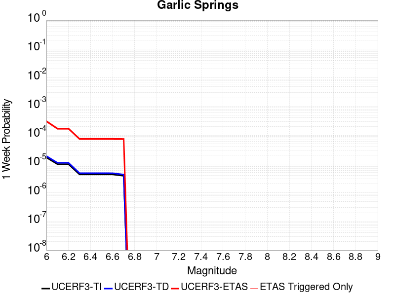 |  |  |  |

| Magnitude | 1 wk TI Prob | 1 wk TD Prob | 1 wk ETAS Prob | 1 wk ETAS/TD Gain | 1 wk ETAS Triggered Only | 1 mo TI Prob | 1 mo TD Prob | 1 mo ETAS Prob | 1 mo ETAS/TD Gain | 1 mo ETAS Triggered Only | 1 yr TI Prob | 1 yr TD Prob | 1 yr ETAS Prob | 1 yr ETAS/TD Gain | 1 yr ETAS Triggered Only | 10 yr TI Prob | 10 yr TD Prob | 10 yr ETAS Prob | 10 yr ETAS/TD Gain | 10 yr ETAS Triggered Only |
|-----|-----|-----|-----|-----|-----|-----|-----|-----|-----|-----|-----|-----|-----|-----|-----|-----|-----|-----|-----|-----|
| 6.0 | 1.6760017E-5 | 1.8776833E-5 | 3.0771614E-4 | 16.388075 | 2.8894472E-4 | 7.182667E-5 | 8.0470316E-5 | 5.326952E-4 | 6.619773 | 4.522613E-4 | 8.7413884E-4 | 9.794032E-4 | 0.0018453883 | 1.8841969 | 8.668342E-4 | 0.008707083 | 0.009762413 | 0.011267673 | 1.1541895 | 0.0015201005 |
| 6.1 | 9.852767E-6 | 1.09735865E-5 | 1.7428838E-4 | 15.882535 | 1.6331658E-4 | 4.222546E-5 | 4.702921E-5 | 2.9827366E-4 | 6.3423066 | 2.5125628E-4 | 5.139737E-4 | 5.7250116E-4 | 0.0011123929 | 1.9430404 | 5.40201E-4 | 0.005127866 | 0.005717221 | 0.0066540455 | 1.1638601 | 9.422111E-4 |
| 6.2 | 9.852767E-6 | 1.09735865E-5 | 1.7428838E-4 | 15.882535 | 1.6331658E-4 | 4.222546E-5 | 4.702921E-5 | 2.9827366E-4 | 6.3423066 | 2.5125628E-4 | 5.139737E-4 | 5.7250116E-4 | 0.0011123929 | 1.9430404 | 5.40201E-4 | 0.005127866 | 0.005717221 | 0.0066540455 | 1.1638601 | 9.422111E-4 |
| 6.3 | 4.3167724E-6 | 4.7780286E-6 | 5.5029046E-5 | 11.517102 | 5.0251256E-5 | 1.8500323E-5 | 2.0477235E-5 | 8.329002E-5 | 4.067445 | 6.281407E-5 | 2.2521814E-4 | 2.4930484E-4 | 4.753791E-4 | 1.9068186 | 2.2613065E-4 | 0.0022499003 | 0.00249251 | 0.0028809865 | 1.1558576 | 3.8944723E-4 |
| 6.4 | 4.3167724E-6 | 4.7780286E-6 | 5.5029046E-5 | 11.517102 | 5.0251256E-5 | 1.8500323E-5 | 2.0477235E-5 | 8.329002E-5 | 4.067445 | 6.281407E-5 | 2.2521814E-4 | 2.4930484E-4 | 4.753791E-4 | 1.9068186 | 2.2613065E-4 | 0.0022499003 | 0.00249251 | 0.0028809865 | 1.1558576 | 3.8944723E-4 |
| 6.5 | 4.3167724E-6 | 4.7780286E-6 | 5.5029046E-5 | 11.517102 | 5.0251256E-5 | 1.8500323E-5 | 2.0477235E-5 | 8.329002E-5 | 4.067445 | 6.281407E-5 | 2.2521814E-4 | 2.4930484E-4 | 4.753791E-4 | 1.9068186 | 2.2613065E-4 | 0.0022499003 | 0.00249251 | 0.0028809865 | 1.1558576 | 3.8944723E-4 |
| 6.6 | 4.301311E-6 | 4.760897E-6 | 5.5011915E-5 | 11.554947 | 5.0251256E-5 | 1.8434059E-5 | 2.0403815E-5 | 8.3216604E-5 | 4.0784826 | 6.281407E-5 | 2.2441156E-4 | 2.4841115E-4 | 4.7448563E-4 | 1.9100819 | 2.2613065E-4 | 0.0022418506 | 0.002483593 | 0.002872073 | 1.1564186 | 3.8944723E-4 |
| 6.7 | 3.8599724E-6 | 4.27106E-6 | 5.45221E-5 | 12.765473 | 5.0251256E-5 | 1.6542634E-5 | 1.8304541E-5 | 8.111746E-5 | 4.431548 | 6.281407E-5 | 2.0138794E-4 | 2.228578E-4 | 4.3637803E-4 | 1.9581008 | 2.1356784E-4 | 0.0020120554 | 0.002228578 | 0.0026046226 | 1.1687374 | 3.7688442E-4 |

## Helendale-So Lockhart
*[(top)](#table-of-contents)*

| 1 Week | 1 Month | 1 Year | 10 Year |
|-----|-----|-----|-----|
| 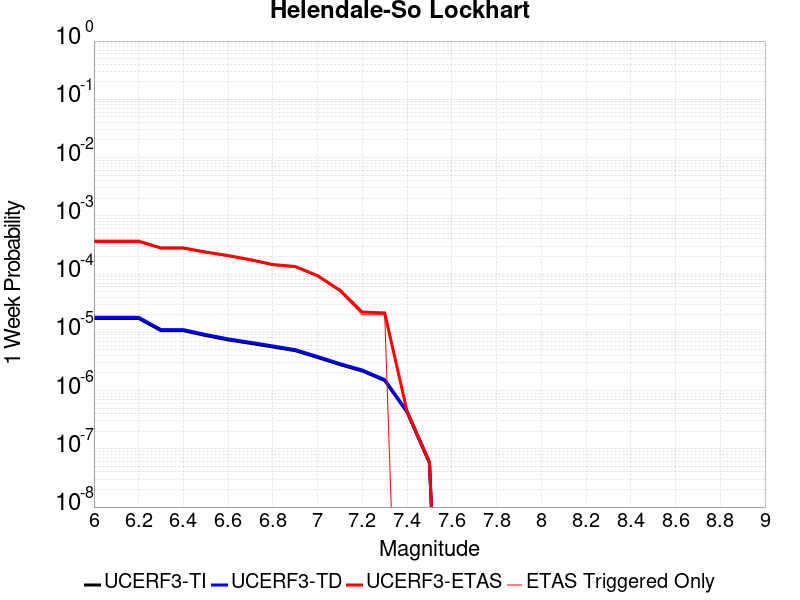 | 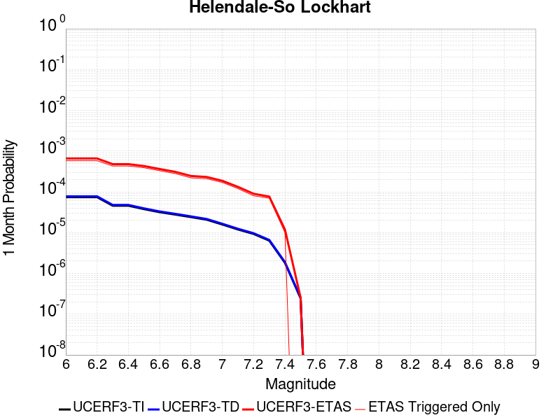 |  |  |

| Magnitude | 1 wk TI Prob | 1 wk TD Prob | 1 wk ETAS Prob | 1 wk ETAS/TD Gain | 1 wk ETAS Triggered Only | 1 mo TI Prob | 1 mo TD Prob | 1 mo ETAS Prob | 1 mo ETAS/TD Gain | 1 mo ETAS Triggered Only | 1 yr TI Prob | 1 yr TD Prob | 1 yr ETAS Prob | 1 yr ETAS/TD Gain | 1 yr ETAS Triggered Only | 10 yr TI Prob | 10 yr TD Prob | 10 yr ETAS Prob | 10 yr ETAS/TD Gain | 10 yr ETAS Triggered Only |
|-----|-----|-----|-----|-----|-----|-----|-----|-----|-----|-----|-----|-----|-----|-----|-----|-----|-----|-----|-----|-----|
| 6.0 | 1.7296055E-5 | 1.8103729E-5 | 4.075439E-4 | 22.5116 | 3.8944723E-4 | 7.412385E-5 | 7.7585224E-5 | 7.056772E-4 | 9.0955105 | 6.281407E-4 | 9.0208417E-4 | 9.4421144E-4 | 0.0019357366 | 2.0501094 | 9.924623E-4 | 0.008984311 | 0.009404116 | 0.0107481405 | 1.1429187 | 0.0013567839 |
| 6.1 | 1.7296055E-5 | 1.8103729E-5 | 4.075439E-4 | 22.5116 | 3.8944723E-4 | 7.412385E-5 | 7.7585224E-5 | 7.056772E-4 | 9.0955105 | 6.281407E-4 | 9.0208417E-4 | 9.4421144E-4 | 0.0019357366 | 2.0501094 | 9.924623E-4 | 0.008984311 | 0.009404116 | 0.0107481405 | 1.1429187 | 0.0013567839 |
| 6.2 | 1.7296055E-5 | 1.8103729E-5 | 4.075439E-4 | 22.5116 | 3.8944723E-4 | 7.412385E-5 | 7.7585224E-5 | 7.056772E-4 | 9.0955105 | 6.281407E-4 | 9.0208417E-4 | 9.4421144E-4 | 0.0019357366 | 2.0501094 | 9.924623E-4 | 0.008984311 | 0.009404116 | 0.0107481405 | 1.1429187 | 0.0013567839 |
| 6.3 | 1.0669118E-5 | 1.1135425E-5 | 3.0007694E-4 | 26.947956 | 2.8894472E-4 | 4.5723988E-5 | 4.772239E-5 | 5.1252433E-4 | 10.739703 | 4.6482412E-4 | 5.5654737E-4 | 5.80868E-4 | 0.0012211994 | 2.1023698 | 6.4070354E-4 | 0.0055515557 | 0.0057937936 | 0.0066930754 | 1.1552147 | 9.045226E-4 |
| 6.4 | 1.0669118E-5 | 1.1135425E-5 | 3.0007694E-4 | 26.947956 | 2.8894472E-4 | 4.5723988E-5 | 4.772239E-5 | 5.1252433E-4 | 10.739703 | 4.6482412E-4 | 5.5654737E-4 | 5.80868E-4 | 0.0012211994 | 2.1023698 | 6.4070354E-4 | 0.0055515557 | 0.0057937936 | 0.0066930754 | 1.1552147 | 9.045226E-4 |
| 6.5 | 8.790038E-6 | 9.170197E-6 | 2.4786146E-4 | 27.029024 | 2.3869346E-4 | 3.767105E-5 | 3.930026E-5 | 4.5385683E-4 | 11.548444 | 4.1457286E-4 | 4.585485E-4 | 4.7837716E-4 | 0.0010434333 | 2.1811938 | 5.6532666E-4 | 0.0045760344 | 0.004773638 | 0.005536312 | 1.1597677 | 7.663317E-4 |
| 6.6 | 7.396949E-6 | 7.715537E-6 | 2.0871901E-4 | 27.05178 | 2.0100502E-4 | 3.1700827E-5 | 3.3066175E-5 | 3.8481335E-4 | 11.637673 | 3.517588E-4 | 3.858892E-4 | 4.025073E-4 | 8.797021E-4 | 2.1855555 | 4.7738693E-4 | 0.003852198 | 0.00401789 | 0.00460597 | 1.1463654 | 5.904523E-4 |
| 6.7 | 6.4600285E-6 | 6.738031E-6 | 1.700535E-4 | 25.237864 | 1.6331658E-4 | 2.7685543E-5 | 2.887696E-5 | 3.1781333E-4 | 11.005775 | 2.8894472E-4 | 3.3701936E-4 | 3.5152107E-4 | 7.533898E-4 | 2.143228 | 4.0201005E-4 | 0.0033650869 | 0.003509732 | 0.003997962 | 1.1391076 | 4.899498E-4 |
| 6.8 | 5.600104E-6 | 5.836009E-6 | 1.3146341E-4 | 22.52625 | 1.2562814E-4 | 2.4000226E-5 | 2.5011232E-5 | 2.3857373E-4 | 9.538664 | 2.1356784E-4 | 2.9216358E-4 | 3.044698E-4 | 6.310035E-4 | 2.0724666 | 3.2663316E-4 | 0.0029177975 | 0.003040588 | 0.0034539003 | 1.1359317 | 4.1457286E-4 |
| 6.9 | 4.839122E-6 | 5.0395092E-6 | 1.1810427E-4 | 23.435669 | 1.13065325E-4 | 2.0738931E-5 | 2.159772E-5 | 2.225984E-4 | 10.306569 | 2.0100502E-4 | 2.5246723E-4 | 2.6292098E-4 | 5.5178977E-4 | 2.0986903 | 2.8894472E-4 | 0.002521806 | 0.002626147 | 0.0029895117 | 1.1383643 | 3.643216E-4 |
| 7.0 | 3.6937633E-6 | 3.845208E-6 | 7.9221805E-5 | 20.602736 | 7.537688E-5 | 1.5830317E-5 | 1.647936E-5 | 1.7979325E-4 | 10.910208 | 1.6331658E-4 | 1.9271708E-4 | 2.0061806E-4 | 4.2670334E-4 | 2.1269438 | 2.2613065E-4 | 0.0019255003 | 0.002004401 | 0.0022676913 | 1.1313561 | 2.638191E-4 |
| 7.1 | 2.7858857E-6 | 2.8978538E-6 | 4.0586187E-5 | 14.005602 | 3.768844E-5 | 1.1939455E-5 | 1.2419316E-5 | 1.2548323E-4 | 10.103877 | 1.13065325E-4 | 1.4535317E-4 | 1.511949E-4 | 3.0192587E-4 | 1.9969317 | 1.5075377E-4 | 0.0014525814 | 0.0015109418 | 0.0016865554 | 1.116228 | 1.758794E-4 |
| 7.2 | 2.1672065E-6 | 2.2540128E-6 | 1.4816798E-5 | 6.57352 | 1.2562814E-5 | 9.2879945E-6 | 9.66002E-6 | 9.7598866E-5 | 10.103381 | 8.79397E-5 | 1.1307546E-4 | 1.1760458E-4 | 2.3065662E-4 | 1.9612893 | 1.13065325E-4 | 0.0011301794 | 0.0011754417 | 0.0013134702 | 1.117427 | 1.3819095E-4 |
| 7.3 | 1.4823496E-6 | 1.5422102E-6 | 1.4105005E-5 | 9.1459675 | 1.2562814E-5 | 6.3529114E-6 | 6.6094562E-6 | 8.198584E-5 | 12.404325 | 7.537688E-5 | 7.734395E-5 | 8.046731E-5 | 1.8096174E-4 | 2.2488852 | 1.0050251E-4 | 7.731704E-4 | 8.0439687E-4 | 9.0481853E-4 | 1.124841 | 1.0050251E-4 |
| 7.4 | 4.2321457E-7 | 4.4108765E-7 | 4.4108765E-7 | 1.0 | 0.0 | 1.8137755E-6 | 1.8903745E-6 | 1.4453165E-5 | 7.645662 | 1.2562814E-5 | 2.2082493E-5 | 2.3015113E-5 | 4.8140162E-5 | 2.0916762 | 2.5125628E-5 | 2.2080299E-4 | 2.3013182E-4 | 2.5525168E-4 | 1.1091541 | 2.5125628E-5 |
| 7.5 | 5.6942316E-8 | 5.9415648E-8 | 5.9415648E-8 | 1.0 | 0.0 | 2.440385E-7 | 2.5463845E-7 | 2.5463845E-7 | 1.0 | 0.0 | 2.9711643E-6 | 3.1002196E-6 | 1.5662994E-5 | 5.052221 | 1.2562814E-5 | 2.9711247E-5 | 3.1001844E-5 | 4.356427E-5 | 1.4052154 | 1.2562814E-5 |

## San Andreas (San Bernardino S)
*[(top)](#table-of-contents)*

| 1 Week | 1 Month | 1 Year | 10 Year |
|-----|-----|-----|-----|
|  |  |  |  |

| Magnitude | 1 wk TI Prob | 1 wk TD Prob | 1 wk ETAS Prob | 1 wk ETAS/TD Gain | 1 wk ETAS Triggered Only | 1 mo TI Prob | 1 mo TD Prob | 1 mo ETAS Prob | 1 mo ETAS/TD Gain | 1 mo ETAS Triggered Only | 1 yr TI Prob | 1 yr TD Prob | 1 yr ETAS Prob | 1 yr ETAS/TD Gain | 1 yr ETAS Triggered Only | 10 yr TI Prob | 10 yr TD Prob | 10 yr ETAS Prob | 10 yr ETAS/TD Gain | 10 yr ETAS Triggered Only |
|-----|-----|-----|-----|-----|-----|-----|-----|-----|-----|-----|-----|-----|-----|-----|-----|-----|-----|-----|-----|-----|
| 6.0 | 1.2336002E-4 | 3.0004102E-4 | 7.144895E-4 | 2.381306 | 4.1457286E-4 | 5.2857865E-4 | 0.0012852824 | 0.0017746025 | 1.3807101 | 4.899498E-4 | 0.006416472 | 0.015540994 | 0.016233578 | 1.044565 | 7.035176E-4 | 0.06234337 | 0.14283717 | 0.14373095 | 1.0062573 | 0.0010427135 |
| 6.1 | 1.2336002E-4 | 3.0004102E-4 | 7.144895E-4 | 2.381306 | 4.1457286E-4 | 5.2857865E-4 | 0.0012852824 | 0.0017746025 | 1.3807101 | 4.899498E-4 | 0.006416472 | 0.015540994 | 0.016233578 | 1.044565 | 7.035176E-4 | 0.06234337 | 0.14283717 | 0.14373095 | 1.0062573 | 0.0010427135 |
| 6.2 | 1.2336002E-4 | 3.0004102E-4 | 7.144895E-4 | 2.381306 | 4.1457286E-4 | 5.2857865E-4 | 0.0012852824 | 0.0017746025 | 1.3807101 | 4.899498E-4 | 0.006416472 | 0.015540994 | 0.016233578 | 1.044565 | 7.035176E-4 | 0.06234337 | 0.14283717 | 0.14373095 | 1.0062573 | 0.0010427135 |
| 6.3 | 1.1712257E-4 | 2.8792414E-4 | 7.0237764E-4 | 2.4394538 | 4.1457286E-4 | 5.018573E-4 | 0.0012334028 | 0.0017227482 | 1.3967443 | 4.899498E-4 | 0.006093008 | 0.014918125 | 0.0156111475 | 1.046455 | 7.035176E-4 | 0.059286322 | 0.13754563 | 0.13844492 | 1.0065382 | 0.0010427135 |
| 6.4 | 1.1712257E-4 | 2.8792414E-4 | 7.0237764E-4 | 2.4394538 | 4.1457286E-4 | 5.018573E-4 | 0.0012334028 | 0.0017227482 | 1.3967443 | 4.899498E-4 | 0.006093008 | 0.014918125 | 0.0156111475 | 1.046455 | 7.035176E-4 | 0.059286322 | 0.13754563 | 0.13844492 | 1.0065382 | 0.0010427135 |
| 6.5 | 1.0689076E-4 | 2.680528E-4 | 6.699551E-4 | 2.49934 | 4.0201005E-4 | 4.5802278E-4 | 0.0011483167 | 0.0016251554 | 1.4152502 | 4.7738693E-4 | 0.0055621783 | 0.01389575 | 0.014577104 | 1.0490332 | 6.909548E-4 | 0.05425003 | 0.12879294 | 0.12969042 | 1.0069684 | 0.0010301508 |
| 6.6 | 9.7648895E-5 | 2.50501E-4 | 6.524104E-4 | 2.604422 | 4.0201005E-4 | 4.1842813E-4 | 0.0010731576 | 0.0015500323 | 1.4443659 | 4.7738693E-4 | 0.005082469 | 0.012991785 | 0.013661364 | 1.0515386 | 6.7839195E-4 | 0.049677886 | 0.12095292 | 0.12182534 | 1.0072129 | 9.924623E-4 |
| 6.7 | 8.757013E-5 | 2.3120902E-4 | 6.331261E-4 | 2.738328 | 4.0201005E-4 | 3.7524657E-4 | 9.905418E-4 | 0.0014674559 | 1.4814678 | 4.7738693E-4 | 0.00455906 | 0.011997245 | 0.012655086 | 1.0548327 | 6.6582917E-4 | 0.04466656 | 0.11226123 | 0.11311997 | 1.0076495 | 9.673367E-4 |
| 6.8 | 8.562978E-5 | 2.2680782E-4 | 6.287267E-4 | 2.772068 | 4.0201005E-4 | 3.6693315E-4 | 9.7169366E-4 | 0.0014486167 | 1.4908162 | 4.7738693E-4 | 0.004458263 | 0.011770263 | 0.012428256 | 1.055903 | 6.6582917E-4 | 0.043698758 | 0.11027153 | 0.1111322 | 1.007805 | 9.673367E-4 |
| 6.9 | 6.124075E-5 | 1.7065753E-4 | 5.474776E-4 | 3.2080486 | 3.7688442E-4 | 2.6243398E-4 | 7.311852E-4 | 0.0011831159 | 1.6180795 | 4.522613E-4 | 0.0031904527 | 0.008866051 | 0.0095010735 | 1.0716242 | 6.4070354E-4 | 0.031450346 | 0.08418263 | 0.085011005 | 1.0098403 | 9.045226E-4 |
| 7.0 | 5.8598747E-5 | 1.649477E-4 | 5.292092E-4 | 3.2083454 | 3.643216E-4 | 2.5111332E-4 | 7.06728E-4 | 0.0011461158 | 1.6217211 | 4.396985E-4 | 0.0030530186 | 0.008570663 | 0.00919342 | 1.0726615 | 6.281407E-4 | 0.03011414 | 0.081500374 | 0.08231963 | 1.0100523 | 8.919598E-4 |
| 7.1 | 5.613814E-5 | 1.5913323E-4 | 5.10836E-4 | 3.2101154 | 3.517588E-4 | 2.4056983E-4 | 6.818221E-4 | 0.0011086665 | 1.626035 | 4.2713567E-4 | 0.0029250039 | 0.008269769 | 0.008880256 | 1.0738215 | 6.155779E-4 | 0.028868021 | 0.07879931 | 0.07959784 | 1.0101337 | 8.668342E-4 |
| 7.2 | 4.991222E-5 | 1.4519796E-4 | 4.9690565E-4 | 3.4222636 | 3.517588E-4 | 2.1389198E-4 | 6.2212895E-4 | 0.0010489989 | 1.6861439 | 4.2713567E-4 | 0.002601025 | 0.007548217 | 0.0081591485 | 1.0809371 | 6.155779E-4 | 0.025707912 | 0.07225321 | 0.0730341 | 1.0108078 | 8.4170856E-4 |
| 7.3 | 4.7410045E-5 | 1.3714004E-4 | 4.888506E-4 | 3.5646088 | 3.517588E-4 | 2.0317009E-4 | 5.8761094E-4 | 0.0010144956 | 1.726475 | 4.2713567E-4 | 0.0024707897 | 0.0071307817 | 0.0077294963 | 1.0839621 | 6.0301507E-4 | 0.024434982 | 0.06853558 | 0.0693079 | 1.0112689 | 8.291457E-4 |
| 7.4 | 4.5556746E-5 | 1.3121912E-4 | 4.8293176E-4 | 3.680346 | 3.517588E-4 | 1.952286E-4 | 5.622468E-4 | 9.891422E-4 | 1.7592672 | 4.2713567E-4 | 0.002374317 | 0.0068239477 | 0.0074228477 | 1.0877645 | 6.0301507E-4 | 0.023491086 | 0.065788016 | 0.066562615 | 1.0117742 | 8.291457E-4 |
| 7.5 | 4.3084514E-5 | 1.2357246E-4 | 4.6272654E-4 | 3.7445762 | 3.3919598E-4 | 1.8463485E-4 | 5.2948913E-4 | 9.4384246E-4 | 1.7825531 | 4.1457286E-4 | 0.0022456115 | 0.0064275465 | 0.007014204 | 1.0912724 | 5.904523E-4 | 0.022230545 | 0.062188786 | 0.06295459 | 1.0123141 | 8.1658293E-4 |
| 7.6 | 3.408608E-5 | 9.83552E-5 | 4.2495623E-4 | 4.320628 | 3.2663316E-4 | 1.4607502E-4 | 4.214543E-4 | 8.232949E-4 | 1.953462 | 4.0201005E-4 | 0.0017770125 | 0.0051191594 | 0.0056815916 | 1.1098682 | 5.6532666E-4 | 0.017628696 | 0.050020292 | 0.05077216 | 1.0150312 | 7.914573E-4 |
| 7.7 | 2.8315713E-5 | 8.248679E-5 | 4.0909302E-4 | 4.959497 | 3.2663316E-4 | 1.2134742E-4 | 3.5346695E-4 | 7.553349E-4 | 2.1369321 | 4.0201005E-4 | 0.0014764034 | 0.0042949775 | 0.004857876 | 1.1310598 | 5.6532666E-4 | 0.01466633 | 0.0422714 | 0.043017372 | 1.0176471 | 7.7889446E-4 |
| 7.8 | 2.6222975E-5 | 7.463088E-5 | 4.0123967E-4 | 5.3763223 | 3.2663316E-4 | 1.1237934E-4 | 3.1980744E-4 | 7.216889E-4 | 2.256636 | 4.0201005E-4 | 0.0013673597 | 0.0038867102 | 0.0044498397 | 1.1448859 | 5.6532666E-4 | 0.013589768 | 0.03843674 | 0.0391857 | 1.0194855 | 7.7889446E-4 |
| 7.9 | 2.1469694E-5 | 5.787864E-5 | 3.593687E-4 | 6.2090044 | 3.0150753E-4 | 9.200973E-5 | 2.4802773E-4 | 6.2481867E-4 | 2.5191483 | 3.7688442E-4 | 0.0011196428 | 0.0030155594 | 0.0035290816 | 1.1702908 | 5.150754E-4 | 0.011140184 | 0.030152109 | 0.030858781 | 1.0234369 | 7.286432E-4 |
| 8.0 | 1.2420249E-5 | 3.131896E-5 | 1.4438074E-4 | 4.610011 | 1.13065325E-4 | 5.322855E-5 | 1.342172E-4 | 2.4726737E-4 | 1.8422925 | 1.13065325E-4 | 6.478649E-4 | 0.0016328706 | 0.0018084629 | 1.1075358 | 1.758794E-4 | 0.0064597935 | 0.016522504 | 0.016769608 | 1.0149556 | 2.5125628E-4 |
| 8.1 | 4.9197724E-6 | 7.822348E-6 | 2.0385065E-5 | 2.606003 | 1.2562814E-5 | 2.1084568E-5 | 3.352392E-5 | 4.6086316E-5 | 1.3747293 | 1.2562814E-5 | 2.566744E-4 | 4.0807744E-4 | 4.3319282E-4 | 1.0615456 | 2.5125628E-5 | 0.002563781 | 0.0043843705 | 0.0044218935 | 1.0085584 | 3.768844E-5 |
| 8.2 | 2.5634774E-6 | 2.9067196E-6 | 1.5469497E-5 | 5.3219776 | 1.2562814E-5 | 1.0986286E-5 | 1.2457311E-5 | 2.5019968E-5 | 2.0084567 | 1.2562814E-5 | 1.3374983E-4 | 1.5165724E-4 | 1.6421816E-4 | 1.0828243 | 1.2562814E-5 | 0.0013366934 | 0.0017049741 | 0.0017175154 | 1.0073558 | 1.2562814E-5 |
| 8.3 | 5.2850464E-7 | 3.2088764E-7 | 3.2088764E-7 | 1.0 | 0.0 | 2.2650179E-6 | 1.375232E-6 | 1.375232E-6 | 1.0 | 0.0 | 2.7576245E-5 | 1.6743334E-5 | 1.6743334E-5 | 1.0 | 0.0 | 2.7572823E-4 | 1.9870348E-4 | 1.9870348E-4 | 1.0 | 0.0 |

## Coyote Lake
*[(top)](#table-of-contents)*

| 1 Week | 1 Month | 1 Year | 10 Year |
|-----|-----|-----|-----|
|  |  |  |  |

| Magnitude | 1 wk TI Prob | 1 wk TD Prob | 1 wk ETAS Prob | 1 wk ETAS/TD Gain | 1 wk ETAS Triggered Only | 1 mo TI Prob | 1 mo TD Prob | 1 mo ETAS Prob | 1 mo ETAS/TD Gain | 1 mo ETAS Triggered Only | 1 yr TI Prob | 1 yr TD Prob | 1 yr ETAS Prob | 1 yr ETAS/TD Gain | 1 yr ETAS Triggered Only | 10 yr TI Prob | 10 yr TD Prob | 10 yr ETAS Prob | 10 yr ETAS/TD Gain | 10 yr ETAS Triggered Only |
|-----|-----|-----|-----|-----|-----|-----|-----|-----|-----|-----|-----|-----|-----|-----|-----|-----|-----|-----|-----|-----|
| 6.0 | 1.980352E-5 | 2.1706745E-5 | 1.8501979E-4 | 8.523608 | 1.6331658E-4 | 8.486947E-5 | 9.302599E-5 | 3.3169726E-4 | 3.5656404 | 2.3869346E-4 | 0.0010327959 | 0.0011320751 | 0.0016967617 | 1.4988067 | 5.6532666E-4 | 0.010280091 | 0.011270258 | 0.012177007 | 1.0804551 | 9.1708545E-4 |
| 6.1 | 1.980352E-5 | 2.1706745E-5 | 1.8501979E-4 | 8.523608 | 1.6331658E-4 | 8.486947E-5 | 9.302599E-5 | 3.3169726E-4 | 3.5656404 | 2.3869346E-4 | 0.0010327959 | 0.0011320751 | 0.0016967617 | 1.4988067 | 5.6532666E-4 | 0.010280091 | 0.011270258 | 0.012177007 | 1.0804551 | 9.1708545E-4 |
| 6.2 | 1.980352E-5 | 2.1706745E-5 | 1.8501979E-4 | 8.523608 | 1.6331658E-4 | 8.486947E-5 | 9.302599E-5 | 3.3169726E-4 | 3.5656404 | 2.3869346E-4 | 0.0010327959 | 0.0011320751 | 0.0016967617 | 1.4988067 | 5.6532666E-4 | 0.010280091 | 0.011270258 | 0.012177007 | 1.0804551 | 9.1708545E-4 |
| 6.3 | 1.5344787E-5 | 1.682067E-5 | 1.550093E-4 | 9.215406 | 1.3819095E-4 | 6.576172E-5 | 7.2086936E-5 | 2.4795366E-4 | 3.4396477 | 1.758794E-4 | 8.003548E-4 | 8.773662E-4 | 0.0012915754 | 1.4721051 | 4.1457286E-4 | 0.007974784 | 0.00874507 | 0.009429982 | 1.0783198 | 6.909548E-4 |
| 6.4 | 1.5344787E-5 | 1.682067E-5 | 1.550093E-4 | 9.215406 | 1.3819095E-4 | 6.576172E-5 | 7.2086936E-5 | 2.4795366E-4 | 3.4396477 | 1.758794E-4 | 8.003548E-4 | 8.773662E-4 | 0.0012915754 | 1.4721051 | 4.1457286E-4 | 0.007974784 | 0.00874507 | 0.009429982 | 1.0783198 | 6.909548E-4 |
| 6.5 | 1.4189697E-5 | 1.5557987E-5 | 1.2862156E-4 | 8.267237 | 1.13065325E-4 | 6.081157E-5 | 6.6675726E-5 | 2.1741944E-4 | 3.2608488 | 1.5075377E-4 | 7.401293E-4 | 8.115349E-4 | 0.0011755609 | 1.4485648 | 3.643216E-4 | 0.0073766913 | 0.008091656 | 0.008689792 | 1.07392 | 6.0301507E-4 |
| 6.6 | 1.3469301E-5 | 1.4771577E-5 | 1.2783523E-4 | 8.654136 | 1.13065325E-4 | 5.7724297E-5 | 6.330556E-5 | 2.1404978E-4 | 3.381216 | 1.5075377E-4 | 7.025667E-4 | 7.7053264E-4 | 0.0011345735 | 1.4724536 | 3.643216E-4 | 0.0070034964 | 0.0076845144 | 0.008270429 | 1.0762461 | 5.904523E-4 |
| 6.7 | 1.3027966E-5 | 1.4281745E-5 | 1.2734545E-4 | 8.916659 | 1.13065325E-4 | 5.5832945E-5 | 6.120638E-5 | 2.1195092E-4 | 3.4628894 | 1.5075377E-4 | 6.7955407E-4 | 7.4499263E-4 | 0.0010964894 | 1.4718124 | 3.517588E-4 | 0.006774798 | 0.0074308286 | 0.008004424 | 1.0771912 | 5.7788944E-4 |
| 6.8 | 5.695434E-6 | 6.2244176E-6 | 4.3912627E-5 | 7.054897 | 3.768844E-5 | 2.4408775E-5 | 2.6675973E-5 | 7.692589E-5 | 2.8837144 | 5.0251256E-5 | 2.971363E-4 | 3.2476155E-4 | 4.126727E-4 | 1.2706944 | 8.79397E-5 | 0.0029673933 | 0.0032458105 | 0.003383553 | 1.042437 | 1.3819095E-4 |
| 6.9 | 4.385688E-6 | 4.7930553E-6 | 4.2481315E-5 | 8.863097 | 3.768844E-5 | 1.879567E-5 | 2.0541665E-5 | 7.079189E-5 | 3.4462585 | 5.0251256E-5 | 2.2881327E-4 | 2.5009477E-4 | 3.2545283E-4 | 1.3013179 | 7.537688E-5 | 0.002285778 | 0.0025009478 | 0.0026137305 | 1.0450959 | 1.13065325E-4 |

## Death Valley (Black Mtns Frontal)
*[(top)](#table-of-contents)*

| 1 Week | 1 Month | 1 Year | 10 Year |
|-----|-----|-----|-----|
|  |  |  |  |

| Magnitude | 1 wk TI Prob | 1 wk TD Prob | 1 wk ETAS Prob | 1 wk ETAS/TD Gain | 1 wk ETAS Triggered Only | 1 mo TI Prob | 1 mo TD Prob | 1 mo ETAS Prob | 1 mo ETAS/TD Gain | 1 mo ETAS Triggered Only | 1 yr TI Prob | 1 yr TD Prob | 1 yr ETAS Prob | 1 yr ETAS/TD Gain | 1 yr ETAS Triggered Only | 10 yr TI Prob | 10 yr TD Prob | 10 yr ETAS Prob | 10 yr ETAS/TD Gain | 10 yr ETAS Triggered Only |
|-----|-----|-----|-----|-----|-----|-----|-----|-----|-----|-----|-----|-----|-----|-----|-----|-----|-----|-----|-----|-----|
| 6.0 | 1.6707214E-5 | 1.867027E-5 | 2.447967E-4 | 13.111579 | 2.2613065E-4 | 7.160038E-5 | 8.001302E-5 | 3.8149644E-4 | 4.767929 | 3.0150753E-4 | 8.71386E-4 | 9.737309E-4 | 0.0015385071 | 1.5800126 | 5.6532666E-4 | 0.00867977 | 0.009695496 | 0.010541486 | 1.0872558 | 8.5427135E-4 |
| 6.1 | 1.6707214E-5 | 1.867027E-5 | 2.447967E-4 | 13.111579 | 2.2613065E-4 | 7.160038E-5 | 8.001302E-5 | 3.8149644E-4 | 4.767929 | 3.0150753E-4 | 8.71386E-4 | 9.737309E-4 | 0.0015385071 | 1.5800126 | 5.6532666E-4 | 0.00867977 | 0.009695496 | 0.010541486 | 1.0872558 | 8.5427135E-4 |
| 6.2 | 1.6707214E-5 | 1.867027E-5 | 2.447967E-4 | 13.111579 | 2.2613065E-4 | 7.160038E-5 | 8.001302E-5 | 3.8149644E-4 | 4.767929 | 3.0150753E-4 | 8.71386E-4 | 9.737309E-4 | 0.0015385071 | 1.5800126 | 5.6532666E-4 | 0.00867977 | 0.009695496 | 0.010541486 | 1.0872558 | 8.5427135E-4 |
| 6.3 | 1.6707214E-5 | 1.867027E-5 | 2.447967E-4 | 13.111579 | 2.2613065E-4 | 7.160038E-5 | 8.001302E-5 | 3.8149644E-4 | 4.767929 | 3.0150753E-4 | 8.71386E-4 | 9.737309E-4 | 0.0015385071 | 1.5800126 | 5.6532666E-4 | 0.00867977 | 0.009695496 | 0.010541486 | 1.0872558 | 8.5427135E-4 |
| 6.4 | 1.5515609E-5 | 1.7338214E-5 | 1.6808936E-4 | 9.694735 | 1.5075377E-4 | 6.649377E-5 | 7.4304546E-5 | 3.004184E-4 | 4.043069 | 2.2613065E-4 | 8.0926094E-4 | 9.042885E-4 | 0.0013686923 | 1.5135571 | 4.6482412E-4 | 0.008063202 | 0.009006773 | 0.009703954 | 1.0774063 | 7.035176E-4 |
| 6.5 | 1.5515609E-5 | 1.7338214E-5 | 1.6808936E-4 | 9.694735 | 1.5075377E-4 | 6.649377E-5 | 7.4304546E-5 | 3.004184E-4 | 4.043069 | 2.2613065E-4 | 8.0926094E-4 | 9.042885E-4 | 0.0013686923 | 1.5135571 | 4.6482412E-4 | 0.008063202 | 0.009006773 | 0.009703954 | 1.0774063 | 7.035176E-4 |
| 6.6 | 1.5041828E-5 | 1.6809145E-5 | 1.6756039E-4 | 9.968406 | 1.5075377E-4 | 6.4463384E-5 | 7.203723E-5 | 2.855897E-4 | 3.9644732 | 2.1356784E-4 | 7.8455906E-4 | 8.767063E-4 | 0.0013034676 | 1.4867778 | 4.2713567E-4 | 0.00781795 | 0.008733132 | 0.009380694 | 1.07415 | 6.532663E-4 |
| 6.7 | 1.4634985E-5 | 1.6356016E-5 | 1.5454472E-4 | 9.448799 | 1.3819095E-4 | 6.271985E-5 | 7.009536E-5 | 2.710863E-4 | 3.8673928 | 2.0100502E-4 | 7.6334673E-4 | 8.5308263E-4 | 0.0012547497 | 1.470842 | 4.0201005E-4 | 0.007607299 | 0.008498715 | 0.009121518 | 1.0732819 | 6.281407E-4 |
| 6.8 | 1.4209158E-5 | 1.5882048E-5 | 1.16382966E-4 | 7.327957 | 1.0050251E-4 | 6.089497E-5 | 6.8064175E-5 | 2.3136965E-4 | 3.3992867 | 1.6331658E-4 | 7.4114406E-4 | 8.2837185E-4 | 0.0011672869 | 1.4091339 | 3.3919598E-4 | 0.007386771 | 0.008253456 | 0.008801658 | 1.0664208 | 5.527638E-4 |
| 6.9 | 1.3780098E-5 | 1.5404594E-5 | 1.15905554E-4 | 7.524091 | 1.0050251E-4 | 5.9056227E-5 | 6.6018045E-5 | 2.2932385E-4 | 3.473654 | 1.6331658E-4 | 7.1877235E-4 | 8.0347876E-4 | 0.0011298495 | 1.4061971 | 3.2663316E-4 | 0.0071645193 | 0.008006332 | 0.008529747 | 1.065375 | 5.276382E-4 |
| 7.0 | 1.3585064E-5 | 1.5188155E-5 | 1.0312652E-4 | 6.7899303 | 8.79397E-5 | 5.8220405E-5 | 6.50905E-5 | 2.0327246E-4 | 3.1229205 | 1.3819095E-4 | 7.086029E-4 | 7.9219416E-4 | 0.0010934628 | 1.3802965 | 3.0150753E-4 | 0.007063476 | 0.007894293 | 0.008380376 | 1.0615739 | 4.899498E-4 |
| 7.1 | 1.3398601E-5 | 1.49813395E-5 | 9.03571E-5 | 6.0313096 | 7.537688E-5 | 5.742131E-5 | 6.420419E-5 | 1.8982426E-4 | 2.9565713 | 1.2562814E-4 | 6.9888023E-4 | 7.8141113E-4 | 0.0010575771 | 1.3534195 | 2.763819E-4 | 0.0069668638 | 0.007787224 | 0.008248429 | 1.0592258 | 4.6482412E-4 |
| 7.2 | 1.3126312E-5 | 1.4679561E-5 | 7.749271E-5 | 5.278953 | 6.281407E-5 | 5.6254412E-5 | 6.291092E-5 | 1.7596914E-4 | 2.797116 | 1.13065325E-4 | 6.846822E-4 | 7.6567667E-4 | 0.0010167406 | 1.327898 | 2.5125628E-4 | 0.006825765 | 0.00763097 | 0.008029913 | 1.0522794 | 4.0201005E-4 |
| 7.3 | 1.2922429E-5 | 1.4453788E-5 | 7.726695E-5 | 5.3457923 | 6.281407E-5 | 5.5380664E-5 | 6.194336E-5 | 1.7500168E-4 | 2.8251886 | 1.13065325E-4 | 6.74051E-4 | 7.53905E-4 | 9.924185E-4 | 1.3163708 | 2.3869346E-4 | 0.006720101 | 0.007514055 | 0.007888108 | 1.0497804 | 3.7688442E-4 |
| 7.4 | 1.2768878E-5 | 1.4283772E-5 | 7.709694E-5 | 5.39752 | 6.281407E-5 | 5.4722615E-5 | 6.1214756E-5 | 1.7427317E-4 | 2.8469143 | 1.13065325E-4 | 6.660441E-4 | 7.4504025E-4 | 9.835559E-4 | 1.3201379 | 2.3869346E-4 | 0.0066405144 | 0.0074260035 | 0.007800089 | 1.0503751 | 3.7688442E-4 |
| 7.5 | 1.2521929E-5 | 1.40120155E-5 | 7.682521E-5 | 5.482809 | 6.281407E-5 | 5.366431E-5 | 6.005014E-5 | 1.7310868E-4 | 2.8827355 | 1.13065325E-4 | 6.531671E-4 | 7.3087064E-4 | 9.693897E-4 | 1.3263491 | 2.3869346E-4 | 0.006512506 | 0.0072852457 | 0.0076593845 | 1.0513557 | 3.7688442E-4 |
| 7.6 | 1.1301089E-5 | 1.2648149E-5 | 7.546142E-5 | 5.966203 | 6.281407E-5 | 4.8432343E-5 | 5.4205255E-5 | 1.6726446E-4 | 3.0857608 | 1.13065325E-4 | 5.895042E-4 | 6.5975444E-4 | 8.6062687E-4 | 1.3044654 | 2.0100502E-4 | 0.0058794282 | 0.00657851 | 0.0069029946 | 1.0493249 | 3.2663316E-4 |
| 7.7 | 9.189108E-6 | 1.0283358E-5 | 7.309678E-5 | 7.1082597 | 6.281407E-5 | 3.93813E-5 | 4.407082E-5 | 1.445689E-4 | 3.280377 | 1.0050251E-4 | 4.7936183E-4 | 5.3643517E-4 | 7.122202E-4 | 1.3276911 | 1.758794E-4 | 0.004783291 | 0.005351914 | 0.005626817 | 1.0513653 | 2.763819E-4 |
| 7.8 | 3.4586725E-7 | 3.6482615E-7 | 3.6482615E-7 | 1.0 | 0.0 | 1.4822873E-6 | 1.5635396E-6 | 1.5635396E-6 | 1.0 | 0.0 | 1.80467E-5 | 1.9035933E-5 | 1.9035933E-5 | 1.0 | 0.0 | 1.8045233E-4 | 1.9034347E-4 | 2.0290389E-4 | 1.0659882 | 1.2562814E-5 |
| 7.9 | 2.5591178E-9 | 2.6696718E-9 | 2.6696718E-9 | 1.0 | 0.0 | 1.0967647E-8 | 1.14414505E-8 | 1.14414505E-8 | 1.0 | 0.0 | 1.335311E-7 | 1.3929966E-7 | 1.3929966E-7 | 1.0 | 0.0 | 1.3353102E-6 | 1.3929966E-6 | 1.3929966E-6 | 1.0 | 0.0 |

## San Andreas (Big Bend)
*[(top)](#table-of-contents)*

| 1 Week | 1 Month | 1 Year | 10 Year |
|-----|-----|-----|-----|
|  |  |  |  |

| Magnitude | 1 wk TI Prob | 1 wk TD Prob | 1 wk ETAS Prob | 1 wk ETAS/TD Gain | 1 wk ETAS Triggered Only | 1 mo TI Prob | 1 mo TD Prob | 1 mo ETAS Prob | 1 mo ETAS/TD Gain | 1 mo ETAS Triggered Only | 1 yr TI Prob | 1 yr TD Prob | 1 yr ETAS Prob | 1 yr ETAS/TD Gain | 1 yr ETAS Triggered Only | 10 yr TI Prob | 10 yr TD Prob | 10 yr ETAS Prob | 10 yr ETAS/TD Gain | 10 yr ETAS Triggered Only |
|-----|-----|-----|-----|-----|-----|-----|-----|-----|-----|-----|-----|-----|-----|-----|-----|-----|-----|-----|-----|-----|
| 6.0 | 1.0179969E-4 | 2.0072258E-4 | 3.765667E-4 | 1.8760554 | 1.758794E-4 | 4.362114E-4 | 8.599571E-4 | 0.0011235493 | 1.3065178 | 2.638191E-4 | 0.0052979486 | 0.010419999 | 0.010855116 | 1.0417578 | 4.396985E-4 | 0.051734097 | 0.10144902 | 0.10209246 | 1.0063424 | 7.160804E-4 |
| 6.1 | 1.0179969E-4 | 2.0072258E-4 | 3.765667E-4 | 1.8760554 | 1.758794E-4 | 4.362114E-4 | 8.599571E-4 | 0.0011235493 | 1.3065178 | 2.638191E-4 | 0.0052979486 | 0.010419999 | 0.010855116 | 1.0417578 | 4.396985E-4 | 0.051734097 | 0.10144902 | 0.10209246 | 1.0063424 | 7.160804E-4 |
| 6.2 | 1.0179969E-4 | 2.0072258E-4 | 3.765667E-4 | 1.8760554 | 1.758794E-4 | 4.362114E-4 | 8.599571E-4 | 0.0011235493 | 1.3065178 | 2.638191E-4 | 0.0052979486 | 0.010419999 | 0.010855116 | 1.0417578 | 4.396985E-4 | 0.051734097 | 0.10144902 | 0.10209246 | 1.0063424 | 7.160804E-4 |
| 6.3 | 1.0179969E-4 | 2.0072258E-4 | 3.765667E-4 | 1.8760554 | 1.758794E-4 | 4.362114E-4 | 8.599571E-4 | 0.0011235493 | 1.3065178 | 2.638191E-4 | 0.0052979486 | 0.010419999 | 0.010855116 | 1.0417578 | 4.396985E-4 | 0.051734097 | 0.10144902 | 0.10209246 | 1.0063424 | 7.160804E-4 |
| 6.4 | 9.1639464E-5 | 1.8429532E-4 | 3.350213E-4 | 1.8178504 | 1.5075377E-4 | 3.9268145E-4 | 7.895982E-4 | 9.778916E-4 | 1.2384673 | 1.8844221E-4 | 0.0047704205 | 0.009571102 | 0.009857281 | 1.0299003 | 2.8894472E-4 | 0.046693064 | 0.09377527 | 0.09416235 | 1.0041277 | 4.2713567E-4 |
| 6.5 | 9.1639464E-5 | 1.8429532E-4 | 3.350213E-4 | 1.8178504 | 1.5075377E-4 | 3.9268145E-4 | 7.895982E-4 | 9.778916E-4 | 1.2384673 | 1.8844221E-4 | 0.0047704205 | 0.009571102 | 0.009857281 | 1.0299003 | 2.8894472E-4 | 0.046693064 | 0.09377527 | 0.09416235 | 1.0041277 | 4.2713567E-4 |
| 6.6 | 9.042622E-5 | 1.823659E-4 | 3.2053166E-4 | 1.7576293 | 1.3819095E-4 | 3.8748336E-4 | 7.8133424E-4 | 9.5707626E-4 | 1.2249255 | 1.758794E-4 | 0.0047074095 | 0.009471365 | 0.009720242 | 1.0262767 | 2.5125628E-4 | 0.046089325 | 0.092869274 | 0.09322256 | 1.0038041 | 3.8944723E-4 |
| 6.7 | 8.9836685E-5 | 1.8150927E-4 | 3.1967513E-4 | 1.7612057 | 1.3819095E-4 | 3.8495753E-4 | 7.776651E-4 | 9.534078E-4 | 1.2259876 | 1.758794E-4 | 0.00467679 | 0.00942708 | 0.0096759675 | 1.0264014 | 2.5125628E-4 | 0.045795817 | 0.09246355 | 0.092816986 | 1.0038224 | 3.8944723E-4 |
| 6.8 | 8.9471854E-5 | 1.8097709E-4 | 3.1914303E-4 | 1.7634444 | 1.3819095E-4 | 3.8339442E-4 | 7.7538576E-4 | 9.511288E-4 | 1.2266524 | 1.758794E-4 | 0.004657841 | 0.009399569 | 0.009648463 | 1.0264794 | 2.5125628E-4 | 0.04561414 | 0.092210755 | 0.09256429 | 1.003834 | 3.8944723E-4 |
| 6.9 | 8.858234E-5 | 1.7979681E-4 | 3.1796293E-4 | 1.7684569 | 1.3819095E-4 | 3.7958333E-4 | 7.703304E-4 | 9.460743E-4 | 1.228141 | 1.758794E-4 | 0.004611638 | 0.009338548 | 0.009587458 | 1.026654 | 2.5125628E-4 | 0.04517103 | 0.09165087 | 0.09200463 | 1.0038598 | 3.8944723E-4 |
| 7.0 | 8.7433385E-5 | 1.7818481E-4 | 3.1635116E-4 | 1.7754103 | 1.3819095E-4 | 3.746607E-4 | 7.634259E-4 | 9.39171E-4 | 1.2302059 | 1.758794E-4 | 0.004551957 | 0.009255203 | 0.009504134 | 1.0268964 | 2.5125628E-4 | 0.044598386 | 0.09088532 | 0.09122795 | 1.0037699 | 3.7688442E-4 |
| 7.1 | 8.684964E-5 | 1.7730435E-4 | 3.154708E-4 | 1.7792615 | 1.3819095E-4 | 3.7215967E-4 | 7.596547E-4 | 9.354005E-4 | 1.2313496 | 1.758794E-4 | 0.0045216335 | 0.009209678 | 0.00945862 | 1.0270305 | 2.5125628E-4 | 0.04430731 | 0.09046686 | 0.09080965 | 1.0037891 | 3.7688442E-4 |
| 7.2 | 8.606521E-5 | 1.762105E-4 | 3.143771E-4 | 1.7840997 | 1.3819095E-4 | 3.6879873E-4 | 7.549695E-4 | 9.307161E-4 | 1.2327864 | 1.758794E-4 | 0.0044808835 | 0.0091531165 | 0.009402073 | 1.0271991 | 2.5125628E-4 | 0.043916024 | 0.089947365 | 0.09027892 | 1.0036861 | 3.643216E-4 |
| 7.3 | 8.568266E-5 | 1.7563057E-4 | 3.0123664E-4 | 1.715172 | 1.2562814E-4 | 3.6715972E-4 | 7.524855E-4 | 9.1567915E-4 | 1.2168729 | 1.6331658E-4 | 0.0044610105 | 0.009123127 | 0.009359643 | 1.0259249 | 2.3869346E-4 | 0.043725148 | 0.08966853 | 0.089988746 | 1.0035712 | 3.517588E-4 |
| 7.4 | 8.5432206E-5 | 1.7525644E-4 | 3.0086256E-4 | 1.716699 | 1.2562814E-4 | 3.6608664E-4 | 7.50883E-4 | 9.14077E-4 | 1.217336 | 1.6331658E-4 | 0.004447999 | 0.009103781 | 0.009340301 | 1.0259805 | 2.3869346E-4 | 0.043600157 | 0.08948871 | 0.089808986 | 1.003579 | 3.517588E-4 |
| 7.5 | 8.4791965E-5 | 1.7394972E-4 | 2.99556E-4 | 1.7220838 | 1.2562814E-4 | 3.633435E-4 | 7.4528606E-4 | 9.084809E-4 | 1.2189695 | 1.6331658E-4 | 0.0044147377 | 0.009036204 | 0.009272741 | 1.0261766 | 2.3869346E-4 | 0.043280575 | 0.088866346 | 0.08918685 | 1.0036066 | 3.517588E-4 |
| 7.6 | 8.241105E-5 | 1.6840403E-4 | 2.814503E-4 | 1.6712801 | 1.13065325E-4 | 3.531424E-4 | 7.215321E-4 | 8.7217713E-4 | 1.2087848 | 1.5075377E-4 | 0.0042910352 | 0.008749358 | 0.008961058 | 1.024196 | 2.1356784E-4 | 0.042091176 | 0.086243294 | 0.086530276 | 1.0033276 | 3.1407035E-4 |
| 7.7 | 7.00432E-5 | 1.42045E-4 | 2.1741119E-4 | 1.5305796 | 7.537688E-5 | 3.001506E-4 | 6.0862233E-4 | 7.0906366E-4 | 1.1650307 | 1.0050251E-4 | 0.0036482112 | 0.0073848404 | 0.0075344807 | 1.0202632 | 1.5075377E-4 | 0.035888977 | 0.07351733 | 0.07373848 | 1.0030081 | 2.3869346E-4 |
| 7.8 | 6.415362E-5 | 1.2968935E-4 | 2.0505645E-4 | 1.5811357 | 7.537688E-5 | 2.749151E-4 | 5.556931E-4 | 6.5613975E-4 | 1.1807592 | 1.0050251E-4 | 0.0033419547 | 0.0067446055 | 0.0068818647 | 1.0203509 | 1.3819095E-4 | 0.03292141 | 0.06725231 | 0.06746323 | 1.0031363 | 2.2613065E-4 |
| 7.9 | 4.939911E-5 | 9.3411545E-5 | 1.5621974E-4 | 1.6723816 | 6.281407E-5 | 2.116933E-4 | 4.0027377E-4 | 4.8817828E-4 | 1.2196109 | 8.79397E-5 | 0.0025743195 | 0.004862453 | 0.0049624667 | 1.0205686 | 1.0050251E-4 | 0.025447013 | 0.048914436 | 0.049069766 | 1.0031755 | 1.6331658E-4 |
| 8.0 | 3.344983E-5 | 5.222685E-5 | 8.991332E-5 | 1.721592 | 3.768844E-5 | 1.4334853E-4 | 2.2381016E-4 | 2.7405017E-4 | 1.224476 | 5.0251256E-5 | 0.0017438711 | 0.0027214854 | 0.0027841288 | 1.023018 | 6.281407E-5 | 0.017302496 | 0.027922187 | 0.02799546 | 1.0026242 | 7.537688E-5 |
| 8.1 | 1.9104898E-5 | 1.9173063E-5 | 3.173564E-5 | 1.6552199 | 1.2562814E-5 | 8.1875565E-5 | 8.216769E-5 | 9.472947E-5 | 1.1528798 | 1.2562814E-5 | 9.963791E-4 | 9.999331E-4 | 0.0010250336 | 1.0251021 | 2.5125628E-5 | 0.009919235 | 0.010749801 | 0.010787085 | 1.0034683 | 3.768844E-5 |
| 8.2 | 8.643924E-6 | 5.4748625E-6 | 1.8037608E-5 | 3.294623 | 1.2562814E-5 | 3.704486E-5 | 2.3463486E-5 | 3.6026006E-5 | 1.5354072 | 1.2562814E-5 | 4.5092785E-4 | 2.8563058E-4 | 2.9818979E-4 | 1.0439702 | 1.2562814E-5 | 0.0045001395 | 0.0032487072 | 0.0032612293 | 1.0038545 | 1.2562814E-5 |
| 8.3 | 1.983087E-6 | 7.6599065E-7 | 7.6599065E-7 | 1.0 | 0.0 | 8.498917E-6 | 3.282813E-6 | 3.282813E-6 | 1.0 | 0.0 | 1.034694E-4 | 3.9967534E-5 | 3.9967534E-5 | 1.0 | 0.0 | 0.0010342124 | 4.719687E-4 | 4.719687E-4 | 1.0 | 0.0 |

## Elsinore (Glen Ivy) rev
*[(top)](#table-of-contents)*

| 1 Week | 1 Month | 1 Year | 10 Year |
|-----|-----|-----|-----|
|  | 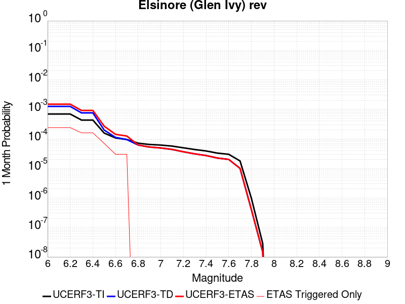 | 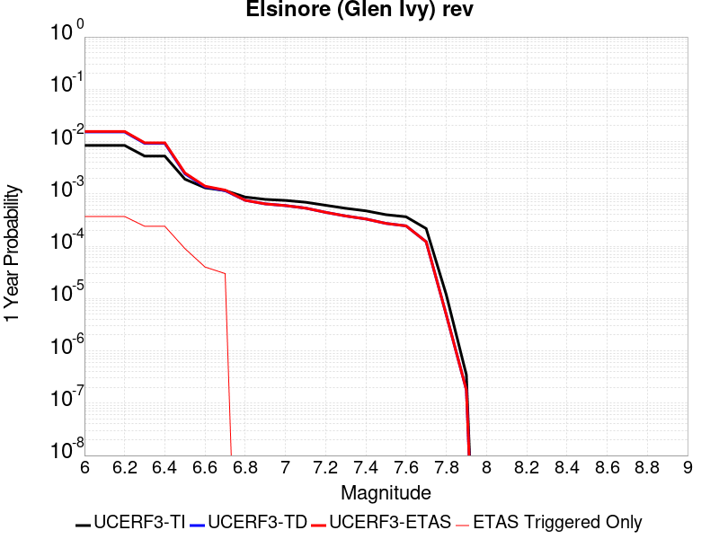 |  |

| Magnitude | 1 wk TI Prob | 1 wk TD Prob | 1 wk ETAS Prob | 1 wk ETAS/TD Gain | 1 wk ETAS Triggered Only | 1 mo TI Prob | 1 mo TD Prob | 1 mo ETAS Prob | 1 mo ETAS/TD Gain | 1 mo ETAS Triggered Only | 1 yr TI Prob | 1 yr TD Prob | 1 yr ETAS Prob | 1 yr ETAS/TD Gain | 1 yr ETAS Triggered Only | 10 yr TI Prob | 10 yr TD Prob | 10 yr ETAS Prob | 10 yr ETAS/TD Gain | 10 yr ETAS Triggered Only |
|-----|-----|-----|-----|-----|-----|-----|-----|-----|-----|-----|-----|-----|-----|-----|-----|-----|-----|-----|-----|-----|
| 6.0 | 1.6204086E-4 | 2.9360707E-4 | 4.9455307E-4 | 1.6844045 | 2.0100502E-4 | 6.94276E-4 | 0.0012578638 | 0.0015338982 | 1.2194469 | 2.763819E-4 | 0.008420097 | 0.015234485 | 0.015642742 | 1.0267982 | 4.1457286E-4 | 0.081081145 | 0.13969168 | 0.1401348 | 1.0031722 | 5.150754E-4 |
| 6.1 | 1.6204086E-4 | 2.9360707E-4 | 4.9455307E-4 | 1.6844045 | 2.0100502E-4 | 6.94276E-4 | 0.0012578638 | 0.0015338982 | 1.2194469 | 2.763819E-4 | 0.008420097 | 0.015234485 | 0.015642742 | 1.0267982 | 4.1457286E-4 | 0.081081145 | 0.13969168 | 0.1401348 | 1.0031722 | 5.150754E-4 |
| 6.2 | 1.6204086E-4 | 2.9360707E-4 | 4.9455307E-4 | 1.6844045 | 2.0100502E-4 | 6.94276E-4 | 0.0012578638 | 0.0015338982 | 1.2194469 | 2.763819E-4 | 0.008420097 | 0.015234485 | 0.015642742 | 1.0267982 | 4.1457286E-4 | 0.081081145 | 0.13969168 | 0.1401348 | 1.0031722 | 5.150754E-4 |
| 6.3 | 1.0111737E-4 | 1.7703383E-4 | 3.152003E-4 | 1.7804525 | 1.3819095E-4 | 4.332882E-4 | 7.5861247E-4 | 9.59465E-4 | 1.264763 | 2.0100502E-4 | 0.005262531 | 0.009217682 | 0.009503963 | 1.0310578 | 2.8894472E-4 | 0.0513964 | 0.0870191 | 0.08736318 | 1.0039542 | 3.7688442E-4 |
| 6.4 | 1.0111737E-4 | 1.7703383E-4 | 3.152003E-4 | 1.7804525 | 1.3819095E-4 | 4.332882E-4 | 7.5861247E-4 | 9.59465E-4 | 1.264763 | 2.0100502E-4 | 0.005262531 | 0.009217682 | 0.009503963 | 1.0310578 | 2.8894472E-4 | 0.0513964 | 0.0870191 | 0.08736318 | 1.0039542 | 3.7688442E-4 |
| 6.5 | 3.6624708E-5 | 4.6391084E-5 | 1.2176447E-4 | 2.6247387 | 7.537688E-5 | 1.569536E-4 | 1.9880582E-4 | 2.8672803E-4 | 1.4422517 | 8.79397E-5 | 0.001909235 | 0.0024181372 | 0.002530929 | 1.0466441 | 1.13065325E-4 | 0.01892915 | 0.023739954 | 0.023874866 | 1.0056828 | 1.3819095E-4 |
| 6.6 | 2.5051324E-5 | 2.614772E-5 | 6.383518E-5 | 2.4413285 | 3.768844E-5 | 1.073584E-4 | 1.12057096E-4 | 1.4974132E-4 | 1.3362948 | 3.768844E-5 | 0.0013063047 | 0.0013634858 | 0.0014136685 | 1.0368048 | 5.0251256E-5 | 0.012986525 | 0.013564618 | 0.01362658 | 1.0045679 | 6.281407E-5 |
| 6.7 | 2.2189772E-5 | 2.2072849E-5 | 5.976046E-5 | 2.7074194 | 3.768844E-5 | 9.509556E-5 | 9.4594696E-5 | 1.3227957E-4 | 1.3983825 | 3.768844E-5 | 0.0011571734 | 0.0011511183 | 0.0011887634 | 1.032703 | 3.768844E-5 | 0.011511663 | 0.011465415 | 0.011502672 | 1.0032494 | 3.768844E-5 |
| 6.8 | 1.6654378E-5 | 1.4437705E-5 | 1.4437705E-5 | 1.0 | 0.0 | 7.137396E-5 | 6.187444E-5 | 6.187444E-5 | 1.0 | 0.0 | 8.686314E-4 | 7.530661E-4 | 7.530661E-4 | 1.0 | 0.0 | 0.008652439 | 0.00751048 | 0.00751048 | 1.0 | 0.0 |
| 6.9 | 1.5042909E-5 | 1.2332022E-5 | 1.2332022E-5 | 1.0 | 0.0 | 6.446802E-5 | 5.285047E-5 | 5.285047E-5 | 1.0 | 0.0 | 7.8461546E-4 | 6.4326765E-4 | 6.4326765E-4 | 1.0 | 0.0 | 0.007818509 | 0.00641828 | 0.00641828 | 1.0 | 0.0 |
| 7.0 | 1.4361385E-5 | 1.1451324E-5 | 1.1451324E-5 | 1.0 | 0.0 | 6.154734E-5 | 4.9076196E-5 | 4.9076196E-5 | 1.0 | 0.0 | 7.490812E-4 | 5.973418E-4 | 5.973418E-4 | 1.0 | 0.0 | 0.007465612 | 0.0059613534 | 0.0059613534 | 1.0 | 0.0 |
| 7.1 | 1.3265571E-5 | 1.0244926E-5 | 1.0244926E-5 | 1.0 | 0.0 | 5.6851208E-5 | 4.39061E-5 | 4.39061E-5 | 1.0 | 0.0 | 6.919436E-4 | 5.344282E-4 | 5.344282E-4 | 1.0 | 0.0 | 0.006897931 | 0.0053347866 | 0.0053347866 | 1.0 | 0.0 |
| 7.2 | 1.1596403E-5 | 8.505067E-6 | 8.505067E-6 | 1.0 | 0.0 | 4.9697923E-5 | 3.6449786E-5 | 3.6449786E-5 | 1.0 | 0.0 | 6.049042E-4 | 4.436875E-4 | 4.436875E-4 | 1.0 | 0.0 | 0.006032603 | 0.0044294316 | 0.0044294316 | 1.0 | 0.0 |
| 7.3 | 1.0150827E-5 | 7.2387597E-6 | 7.2387597E-6 | 1.0 | 0.0 | 4.3502816E-5 | 3.1022897E-5 | 3.1022897E-5 | 1.0 | 0.0 | 5.2951806E-4 | 3.7763975E-4 | 3.7763975E-4 | 1.0 | 0.0 | 0.005282581 | 0.0037703665 | 0.0037703665 | 1.0 | 0.0 |
| 7.4 | 9.080705E-6 | 6.352519E-6 | 6.352519E-6 | 1.0 | 0.0 | 3.8916725E-5 | 2.7224805E-5 | 2.7224805E-5 | 1.0 | 0.0 | 4.7370812E-4 | 3.3141294E-4 | 3.3141294E-4 | 1.0 | 0.0 | 0.004726996 | 0.0033093381 | 0.0033093381 | 1.0 | 0.0 |
| 7.5 | 7.671649E-6 | 5.2256332E-6 | 5.2256332E-6 | 1.0 | 0.0 | 3.287808E-5 | 2.2395385E-5 | 2.2395385E-5 | 1.0 | 0.0 | 4.0021708E-4 | 2.7263095E-4 | 2.7263095E-4 | 1.0 | 0.0 | 0.0039949706 | 0.00272309 | 0.00272309 | 1.0 | 0.0 |
| 7.6 | 6.990086E-6 | 4.687545E-6 | 4.687545E-6 | 1.0 | 0.0 | 2.9957167E-5 | 2.008933E-5 | 2.008933E-5 | 1.0 | 0.0 | 3.6466747E-4 | 2.445613E-4 | 2.445613E-4 | 1.0 | 0.0 | 0.0036406964 | 0.002443038 | 0.002443038 | 1.0 | 0.0 |
| 7.7 | 4.163505E-6 | 2.3295343E-6 | 2.3295343E-6 | 1.0 | 0.0 | 1.7843471E-5 | 9.983683E-6 | 9.983683E-6 | 1.0 | 0.0 | 2.172226E-4 | 1.21545316E-4 | 1.21545316E-4 | 1.0 | 0.0 | 0.0021701038 | 0.0012148614 | 0.0012148614 | 1.0 | 0.0 |
| 7.8 | 2.2692414E-7 | 9.3854695E-8 | 9.3854695E-8 | 1.0 | 0.0 | 9.725317E-7 | 4.0223435E-7 | 4.0223435E-7 | 1.0 | 0.0 | 1.1840509E-5 | 4.8971956E-6 | 4.8971956E-6 | 1.0 | 0.0 | 1.1839878E-4 | 4.8971204E-5 | 4.8971204E-5 | 1.0 | 0.0 |
| 7.9 | 6.676829E-9 | 3.439853E-9 | 3.439853E-9 | 1.0 | 0.0 | 2.861498E-8 | 1.4742227E-8 | 1.4742227E-8 | 1.0 | 0.0 | 3.4838732E-7 | 1.7948659E-7 | 1.7948659E-7 | 1.0 | 0.0 | 3.4838679E-6 | 1.7948646E-6 | 1.7948646E-6 | 1.0 | 0.0 |

## San Andreas (San Gorgonio Pass-Garnet HIll)
*[(top)](#table-of-contents)*

| 1 Week | 1 Month | 1 Year | 10 Year |
|-----|-----|-----|-----|
|  |  | 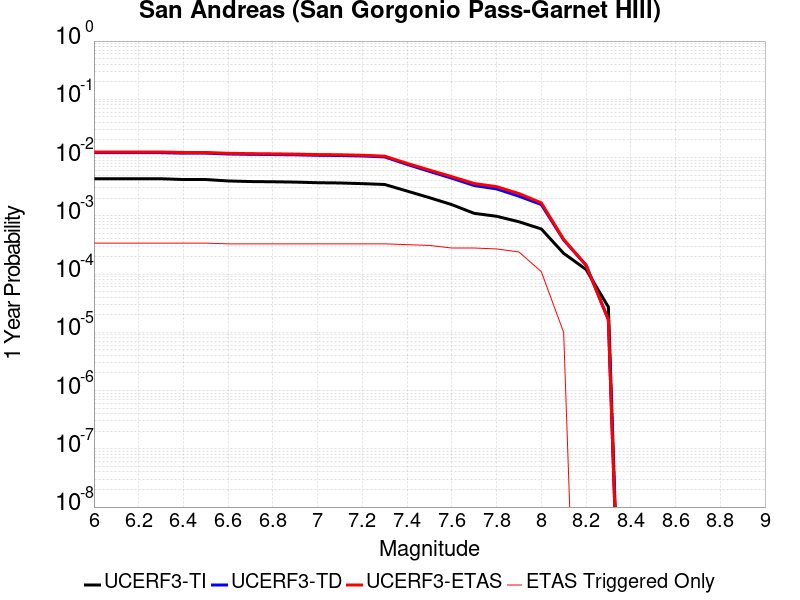 |  |

| Magnitude | 1 wk TI Prob | 1 wk TD Prob | 1 wk ETAS Prob | 1 wk ETAS/TD Gain | 1 wk ETAS Triggered Only | 1 mo TI Prob | 1 mo TD Prob | 1 mo ETAS Prob | 1 mo ETAS/TD Gain | 1 mo ETAS Triggered Only | 1 yr TI Prob | 1 yr TD Prob | 1 yr ETAS Prob | 1 yr ETAS/TD Gain | 1 yr ETAS Triggered Only | 10 yr TI Prob | 10 yr TD Prob | 10 yr ETAS Prob | 10 yr ETAS/TD Gain | 10 yr ETAS Triggered Only |
|-----|-----|-----|-----|-----|-----|-----|-----|-----|-----|-----|-----|-----|-----|-----|-----|-----|-----|-----|-----|-----|
| 6.0 | 8.31567E-5 | 2.3382473E-4 | 4.8502226E-4 | 2.0742984 | 2.5125628E-4 | 3.5633717E-4 | 0.0010017233 | 0.0012652782 | 1.2631013 | 2.638191E-4 | 0.004329778 | 0.012127888 | 0.012462971 | 1.027629 | 3.3919598E-4 | 0.042463828 | 0.11257892 | 0.11303601 | 1.0040601 | 5.150754E-4 |
| 6.1 | 8.31567E-5 | 2.3382473E-4 | 4.8502226E-4 | 2.0742984 | 2.5125628E-4 | 3.5633717E-4 | 0.0010017233 | 0.0012652782 | 1.2631013 | 2.638191E-4 | 0.004329778 | 0.012127888 | 0.012462971 | 1.027629 | 3.3919598E-4 | 0.042463828 | 0.11257892 | 0.11303601 | 1.0040601 | 5.150754E-4 |
| 6.2 | 8.31567E-5 | 2.3382473E-4 | 4.8502226E-4 | 2.0742984 | 2.5125628E-4 | 3.5633717E-4 | 0.0010017233 | 0.0012652782 | 1.2631013 | 2.638191E-4 | 0.004329778 | 0.012127888 | 0.012462971 | 1.027629 | 3.3919598E-4 | 0.042463828 | 0.11257892 | 0.11303601 | 1.0040601 | 5.150754E-4 |
| 6.3 | 8.31567E-5 | 2.3382473E-4 | 4.8502226E-4 | 2.0742984 | 2.5125628E-4 | 3.5633717E-4 | 0.0010017233 | 0.0012652782 | 1.2631013 | 2.638191E-4 | 0.004329778 | 0.012127888 | 0.012462971 | 1.027629 | 3.3919598E-4 | 0.042463828 | 0.11257892 | 0.11303601 | 1.0040601 | 5.150754E-4 |
| 6.4 | 8.059055E-5 | 2.2940808E-4 | 4.8060672E-4 | 2.094986 | 2.5125628E-4 | 3.4534236E-4 | 9.828096E-4 | 0.0012463693 | 1.2681698 | 2.638191E-4 | 0.0041964394 | 0.011900152 | 0.012235311 | 1.0281643 | 3.3919598E-4 | 0.041180745 | 0.11056015 | 0.11101828 | 1.0041437 | 5.150754E-4 |
| 6.5 | 8.059055E-5 | 2.2940808E-4 | 4.8060672E-4 | 2.094986 | 2.5125628E-4 | 3.4534236E-4 | 9.828096E-4 | 0.0012463693 | 1.2681698 | 2.638191E-4 | 0.0041964394 | 0.011900152 | 0.012235311 | 1.0281643 | 3.3919598E-4 | 0.041180745 | 0.11056015 | 0.11101828 | 1.0041437 | 5.150754E-4 |
| 6.6 | 7.619237E-5 | 2.218517E-4 | 4.604922E-4 | 2.0756757 | 2.3869346E-4 | 3.2649786E-4 | 9.5044886E-4 | 0.0012014663 | 1.2641041 | 2.5125628E-4 | 0.0039678677 | 0.01151087 | 0.011833743 | 1.0280495 | 3.2663316E-4 | 0.03897764 | 0.10709683 | 0.107545525 | 1.0041896 | 5.0251256E-4 |
| 6.7 | 7.440636E-5 | 2.1860997E-4 | 4.5725124E-4 | 2.0916305 | 2.3869346E-4 | 3.188454E-4 | 9.3656575E-4 | 0.0011875867 | 1.2680228 | 2.5125628E-4 | 0.0038750346 | 0.011343609 | 0.011666536 | 1.0284679 | 3.2663316E-4 | 0.038081564 | 0.105605274 | 0.106054716 | 1.0042559 | 5.0251256E-4 |
| 6.8 | 7.3735864E-5 | 2.1708169E-4 | 4.5572335E-4 | 2.0993173 | 2.3869346E-4 | 3.1597257E-4 | 9.3002064E-4 | 0.0011810432 | 1.2699108 | 2.5125628E-4 | 0.0038401815 | 0.011264749 | 0.011587703 | 1.0286694 | 3.2663316E-4 | 0.03774495 | 0.10490683 | 0.10535662 | 1.0042876 | 5.0251256E-4 |
| 6.9 | 7.27575E-5 | 2.1477141E-4 | 4.534136E-4 | 2.111145 | 2.3869346E-4 | 3.117806E-4 | 9.201265E-4 | 0.0011711516 | 1.2728158 | 2.5125628E-4 | 0.003789323 | 0.011145527 | 0.0114685185 | 1.0289795 | 3.2663316E-4 | 0.037253562 | 0.103854746 | 0.104305066 | 1.0043361 | 5.0251256E-4 |
| 7.0 | 7.102591E-5 | 2.1061185E-4 | 4.4925505E-4 | 2.1330948 | 2.3869346E-4 | 3.0436125E-4 | 9.023122E-4 | 0.0011533417 | 1.278207 | 2.5125628E-4 | 0.003699303 | 0.010930831 | 0.011253893 | 1.0295552 | 3.2663316E-4 | 0.03638325 | 0.10195695 | 0.10240822 | 1.0044261 | 5.0251256E-4 |
| 7.1 | 7.028513E-5 | 2.0896831E-4 | 4.476119E-4 | 2.1420085 | 2.3869346E-4 | 3.0118722E-4 | 8.9527335E-4 | 0.0011463047 | 1.2803963 | 2.5125628E-4 | 0.0036607897 | 0.010845989 | 0.01116908 | 1.029789 | 3.2663316E-4 | 0.036010686 | 0.101199985 | 0.101651646 | 1.0044631 | 5.0251256E-4 |
| 7.2 | 6.8498244E-5 | 2.0504706E-4 | 4.436916E-4 | 2.1638525 | 2.3869346E-4 | 2.9353087E-4 | 8.784794E-4 | 0.001129515 | 1.2857615 | 2.5125628E-4 | 0.003567883 | 0.010643536 | 0.010966693 | 1.0303618 | 3.2663316E-4 | 0.035111405 | 0.09939202 | 0.09983327 | 1.0044395 | 4.899498E-4 |
| 7.3 | 6.622592E-5 | 1.9732013E-4 | 4.359665E-4 | 2.2094376 | 2.3869346E-4 | 2.8379448E-4 | 8.453858E-4 | 0.0010964297 | 1.2969577 | 2.5125628E-4 | 0.0034497243 | 0.0102444785 | 0.010567766 | 1.0315572 | 3.2663316E-4 | 0.033966612 | 0.095888525 | 0.0963315 | 1.0046196 | 4.899498E-4 |
| 7.4 | 5.1050705E-5 | 1.4689034E-4 | 3.8554874E-4 | 2.6247387 | 2.3869346E-4 | 2.1877038E-4 | 6.29379E-4 | 8.8047714E-4 | 1.3989618 | 2.5125628E-4 | 0.002660276 | 0.0076359594 | 0.007960099 | 1.042449 | 3.2663316E-4 | 0.02628654 | 0.07286301 | 0.07330562 | 1.0060744 | 4.7738693E-4 |
| 7.5 | 3.9302922E-5 | 1.1129847E-4 | 3.3740397E-4 | 3.0315237 | 2.2613065E-4 | 1.6843023E-4 | 4.7690657E-4 | 7.154862E-4 | 1.500265 | 2.3869346E-4 | 0.0020487092 | 0.005790949 | 0.0061032004 | 1.0539206 | 3.1407035E-4 | 0.020299247 | 0.05600951 | 0.0564483 | 1.0078342 | 4.6482412E-4 |
| 7.6 | 2.9851626E-5 | 8.4949745E-5 | 2.8593768E-4 | 3.365963 | 2.0100502E-4 | 1.2792926E-4 | 3.6401965E-4 | 5.7750975E-4 | 1.5864795 | 2.1356784E-4 | 0.0015564259 | 0.0044229585 | 0.0046981177 | 1.0622116 | 2.763819E-4 | 0.0154556995 | 0.04319374 | 0.043602422 | 1.0094616 | 4.2713567E-4 |
| 7.7 | 2.1135214E-5 | 6.3529005E-5 | 2.6452125E-4 | 4.1637874 | 2.0100502E-4 | 9.0576345E-5 | 2.7223877E-4 | 4.8574846E-4 | 1.7842736 | 2.1356784E-4 | 0.0011022091 | 0.0033094748 | 0.003584942 | 1.083236 | 2.763819E-4 | 0.010967582 | 0.032582592 | 0.032983657 | 1.0123092 | 4.1457286E-4 |
| 7.8 | 1.883379E-5 | 5.564028E-5 | 2.4407201E-4 | 4.386606 | 1.8844221E-4 | 8.0713755E-5 | 2.3843657E-4 | 4.3939365E-4 | 1.8428116 | 2.0100502E-4 | 9.822468E-4 | 0.0028991038 | 0.0031621582 | 1.0907364 | 2.638191E-4 | 0.0097791655 | 0.028695205 | 0.02908568 | 1.0136076 | 4.0201005E-4 |
| 7.9 | 1.5156185E-5 | 4.1658426E-5 | 2.3009279E-4 | 5.5233192 | 1.8844221E-4 | 6.495346E-5 | 1.785239E-4 | 3.7949305E-4 | 2.1257267 | 2.0100502E-4 | 7.9052144E-4 | 0.0021713632 | 0.0024220739 | 1.1154623 | 2.5125628E-4 | 0.007877152 | 0.021759422 | 0.022128107 | 1.0169436 | 3.7688442E-4 |
| 8.0 | 1.1405907E-5 | 2.9974231E-5 | 1.3047374E-4 | 4.3528633 | 1.0050251E-4 | 4.8881542E-5 | 1.2845467E-4 | 2.2894428E-4 | 1.7822962 | 1.0050251E-4 | 5.9497025E-4 | 0.0015628147 | 0.0016882465 | 1.0802602 | 1.2562814E-4 | 0.005933798 | 0.015772851 | 0.01595832 | 1.0117588 | 1.8844221E-4 |
| 8.1 | 4.3511436E-6 | 7.369219E-6 | 7.369219E-6 | 1.0 | 0.0 | 1.8647626E-5 | 3.1581985E-5 | 3.1581985E-5 | 1.0 | 0.0 | 2.2701119E-4 | 3.8444297E-4 | 3.9700096E-4 | 1.0326654 | 1.2562814E-5 | 0.0022677942 | 0.0041163345 | 0.004141357 | 1.0060787 | 2.5125628E-5 |
| 8.2 | 2.3042528E-6 | 2.7329415E-6 | 2.7329415E-6 | 1.0 | 0.0 | 9.875332E-6 | 1.1712554E-5 | 1.1712554E-5 | 1.0 | 0.0 | 1.2022553E-4 | 1.4259106E-4 | 1.4259106E-4 | 1.0 | 0.0 | 0.0012016051 | 0.0015979785 | 0.0015979785 | 1.0 | 0.0 |
| 8.3 | 5.202968E-7 | 3.1598344E-7 | 3.1598344E-7 | 1.0 | 0.0 | 2.2298414E-6 | 1.3542141E-6 | 1.3542141E-6 | 1.0 | 0.0 | 2.714798E-5 | 1.6487444E-5 | 1.6487444E-5 | 1.0 | 0.0 | 2.7144665E-4 | 1.9563142E-4 | 1.9563142E-4 | 1.0 | 0.0 |

## San Andreas (Parkfield)
*[(top)](#table-of-contents)*

| 1 Week | 1 Month | 1 Year | 10 Year |
|-----|-----|-----|-----|
|  |  |  | 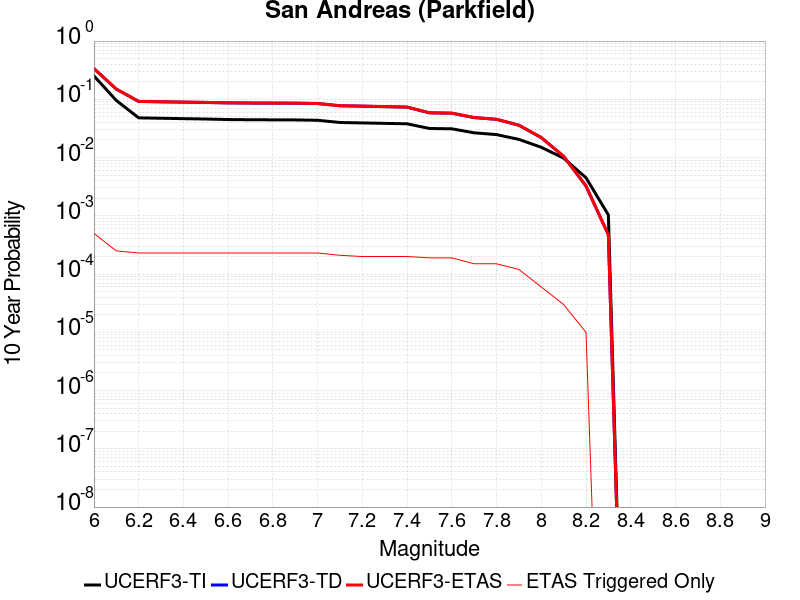 |

| Magnitude | 1 wk TI Prob | 1 wk TD Prob | 1 wk ETAS Prob | 1 wk ETAS/TD Gain | 1 wk ETAS Triggered Only | 1 mo TI Prob | 1 mo TD Prob | 1 mo ETAS Prob | 1 mo ETAS/TD Gain | 1 mo ETAS Triggered Only | 1 yr TI Prob | 1 yr TD Prob | 1 yr ETAS Prob | 1 yr ETAS/TD Gain | 1 yr ETAS Triggered Only | 10 yr TI Prob | 10 yr TD Prob | 10 yr ETAS Prob | 10 yr ETAS/TD Gain | 10 yr ETAS Triggered Only |
|-----|-----|-----|-----|-----|-----|-----|-----|-----|-----|-----|-----|-----|-----|-----|-----|-----|-----|-----|-----|-----|
| 6.0 | 5.556969E-4 | 7.7782426E-4 | 9.535668E-4 | 1.2259413 | 1.758794E-4 | 0.0023793848 | 0.0033298214 | 0.003592762 | 1.0789654 | 2.638191E-4 | 0.028586963 | 0.040191233 | 0.04054091 | 1.0087004 | 3.643216E-4 | 0.25176284 | 0.33716413 | 0.3374889 | 1.0009632 | 4.899498E-4 |
| 6.1 | 1.925858E-4 | 3.0276453E-4 | 4.0323663E-4 | 1.331849 | 1.0050251E-4 | 8.2510663E-4 | 0.0012970108 | 0.001447569 | 1.116081 | 1.5075377E-4 | 0.0099994885 | 0.015778083 | 0.015975917 | 1.0125386 | 2.0100502E-4 | 0.095613256 | 0.1497237 | 0.149948 | 1.0014982 | 2.638191E-4 |
| 6.2 | 9.4306815E-5 | 1.8242796E-4 | 2.8291214E-4 | 1.5508157 | 1.0050251E-4 | 4.0410945E-4 | 7.816011E-4 | 9.1968407E-4 | 1.1766667 | 1.3819095E-4 | 0.0049089384 | 0.009474681 | 0.009648894 | 1.0183872 | 1.758794E-4 | 0.048019063 | 0.09185409 | 0.092070855 | 1.0023599 | 2.3869346E-4 |
| 6.3 | 9.283051E-5 | 1.7939322E-4 | 2.7987768E-4 | 1.5601354 | 1.0050251E-4 | 3.9778434E-4 | 7.686027E-4 | 9.0668746E-4 | 1.1796569 | 1.3819095E-4 | 0.0048322747 | 0.009317789 | 0.009492029 | 1.0186998 | 1.758794E-4 | 0.047285385 | 0.09050704 | 0.090724126 | 1.0023986 | 2.3869346E-4 |
| 6.4 | 9.138826E-5 | 1.770153E-4 | 2.7750002E-4 | 1.5676612 | 1.0050251E-4 | 3.916052E-4 | 7.5841765E-4 | 8.965038E-4 | 1.1820713 | 1.3819095E-4 | 0.0047573745 | 0.00919484 | 0.009369102 | 1.0189521 | 1.758794E-4 | 0.046568092 | 0.08940927 | 0.089626625 | 1.002431 | 2.3869346E-4 |
| 6.5 | 9.000255E-5 | 1.7459576E-4 | 2.7508073E-4 | 1.5755292 | 1.0050251E-4 | 3.8566816E-4 | 7.480541E-4 | 8.8614173E-4 | 1.1845957 | 1.3819095E-4 | 0.0046854047 | 0.009069731 | 0.009244016 | 1.0192161 | 1.758794E-4 | 0.045878403 | 0.088295065 | 0.08851268 | 1.0024647 | 2.3869346E-4 |
| 6.6 | 8.8109264E-5 | 1.7140752E-4 | 2.7189282E-4 | 1.5862361 | 1.0050251E-4 | 3.7755648E-4 | 7.3439797E-4 | 8.7248744E-4 | 1.1880308 | 1.3819095E-4 | 0.0045870654 | 0.008904854 | 0.009079167 | 1.0195751 | 1.758794E-4 | 0.04493529 | 0.0868267 | 0.087044664 | 1.0025104 | 2.3869346E-4 |
| 6.7 | 8.738073E-5 | 1.7007832E-4 | 2.7056373E-4 | 1.5908185 | 1.0050251E-4 | 3.7443507E-4 | 7.287046E-4 | 8.667949E-4 | 1.189501 | 1.3819095E-4 | 0.0045492216 | 0.008836143 | 0.009010469 | 1.0197287 | 1.758794E-4 | 0.04457213 | 0.08622707 | 0.086445175 | 1.0025295 | 2.3869346E-4 |
| 6.8 | 8.710195E-5 | 1.6953335E-4 | 2.7001882E-4 | 1.592718 | 1.0050251E-4 | 3.7324068E-4 | 7.263703E-4 | 8.644609E-4 | 1.1901104 | 1.3819095E-4 | 0.0045347405 | 0.008807961 | 0.008982291 | 1.0197923 | 1.758794E-4 | 0.04443313 | 0.08597467 | 0.08619284 | 1.0025376 | 2.3869346E-4 |
| 6.9 | 8.6801556E-5 | 1.689429E-4 | 2.6942842E-4 | 1.5947899 | 1.0050251E-4 | 3.7195362E-4 | 7.2384125E-4 | 8.619322E-4 | 1.1907752 | 1.3819095E-4 | 0.0045191357 | 0.008777418 | 0.008951753 | 1.0198618 | 1.758794E-4 | 0.044283327 | 0.085700735 | 0.08591897 | 1.0025465 | 2.3869346E-4 |
| 7.0 | 8.5571606E-5 | 1.6647128E-4 | 2.6695707E-4 | 1.6036223 | 1.0050251E-4 | 3.6668387E-4 | 7.132544E-4 | 8.513468E-4 | 1.1936089 | 1.3819095E-4 | 0.004455241 | 0.008649553 | 0.008823912 | 1.020158 | 1.758794E-4 | 0.043669727 | 0.08454914 | 0.084767655 | 1.0025845 | 2.3869346E-4 |
| 7.1 | 7.82589E-5 | 1.5128135E-4 | 2.3920774E-4 | 1.5812111 | 8.79397E-5 | 3.3535215E-4 | 6.481883E-4 | 7.73735E-4 | 1.1936886 | 1.2562814E-4 | 0.0040752706 | 0.007863307 | 0.008025339 | 1.0206062 | 1.6331658E-4 | 0.040013418 | 0.07746111 | 0.077669725 | 1.0026932 | 2.2613065E-4 |
| 7.2 | 7.690929E-5 | 1.4865391E-4 | 2.2401959E-4 | 1.5069876 | 7.537688E-5 | 3.2956956E-4 | 6.369334E-4 | 7.4992666E-4 | 1.1774021 | 1.13065325E-4 | 0.004005129 | 0.007727258 | 0.007876847 | 1.0193586 | 1.5075377E-4 | 0.0393371 | 0.07623427 | 0.07643156 | 1.0025879 | 2.1356784E-4 |
| 7.3 | 7.5543794E-5 | 1.4561978E-4 | 2.2098569E-4 | 1.5175527 | 7.537688E-5 | 3.2371894E-4 | 6.2393624E-4 | 7.36931E-4 | 1.1810999 | 1.13065325E-4 | 0.003934157 | 0.007570127 | 0.00771974 | 1.0197636 | 1.5075377E-4 | 0.038652334 | 0.074797355 | 0.074994944 | 1.0026417 | 2.1356784E-4 |
| 7.4 | 7.4214564E-5 | 1.4262961E-4 | 2.1799575E-4 | 1.5284045 | 7.537688E-5 | 3.1802364E-4 | 6.111273E-4 | 7.241235E-4 | 1.184898 | 1.13065325E-4 | 0.003865065 | 0.00741525 | 0.0075648855 | 1.0201795 | 1.5075377E-4 | 0.03798529 | 0.07337123 | 0.073569134 | 1.0026972 | 2.1356784E-4 |
| 7.5 | 6.149578E-5 | 1.11907226E-4 | 1.8727568E-4 | 1.6734904 | 7.537688E-5 | 2.6352672E-4 | 4.7951436E-4 | 5.9252547E-4 | 1.2356783 | 1.13065325E-4 | 0.0032037178 | 0.0058224914 | 0.0059598777 | 1.0235958 | 1.3819095E-4 | 0.03157923 | 0.058557566 | 0.0587468 | 1.0032316 | 2.0100502E-4 |
| 7.6 | 6.0643448E-5 | 1.10193796E-4 | 1.8556237E-4 | 1.6839639 | 7.537688E-5 | 2.598746E-4 | 4.7217376E-4 | 5.851857E-4 | 1.239344 | 1.13065325E-4 | 0.0031593828 | 0.0057335934 | 0.0058709923 | 1.0239638 | 1.3819095E-4 | 0.031148417 | 0.057718582 | 0.057907984 | 1.0032815 | 2.0100502E-4 |
| 7.7 | 5.1652263E-5 | 9.174698E-5 | 1.545553E-4 | 1.6845818 | 6.281407E-5 | 2.2134806E-4 | 3.931421E-4 | 4.8104723E-4 | 1.2235963 | 8.79397E-5 | 0.002691582 | 0.0047760103 | 0.004876033 | 1.0209427 | 1.0050251E-4 | 0.026592141 | 0.04853623 | 0.048679665 | 1.0029552 | 1.5075377E-4 |
| 7.8 | 4.8090482E-5 | 8.559635E-5 | 1.4840504E-4 | 1.7337776 | 6.281407E-5 | 2.060858E-4 | 3.6678996E-4 | 4.546974E-4 | 1.2396669 | 8.79397E-5 | 0.0025062072 | 0.0044565317 | 0.0045565865 | 1.0224513 | 1.0050251E-4 | 0.024781305 | 0.04530245 | 0.045446374 | 1.0031769 | 1.5075377E-4 |
| 7.9 | 3.970278E-5 | 6.750426E-5 | 1.17752126E-4 | 1.7443658 | 5.0251256E-5 | 1.7014367E-4 | 2.892719E-4 | 3.64627E-4 | 1.2604991 | 7.537688E-5 | 0.002069531 | 0.0035162016 | 0.003603832 | 1.0249219 | 8.79397E-5 | 0.020503636 | 0.035881363 | 0.036002483 | 1.0033755 | 1.2562814E-4 |
| 8.0 | 2.8982335E-5 | 4.069796E-5 | 7.8384866E-5 | 1.9260147 | 3.768844E-5 | 1.2420409E-4 | 1.7440817E-4 | 2.2465066E-4 | 1.2880741 | 5.0251256E-5 | 0.0015111357 | 0.0021213528 | 0.0021840336 | 1.0295476 | 6.281407E-5 | 0.015009012 | 0.022010697 | 0.022084415 | 1.0033492 | 7.537688E-5 |
| 8.1 | 1.8836186E-5 | 1.8681134E-5 | 3.1243715E-5 | 1.6724741 | 1.2562814E-5 | 8.0724014E-5 | 8.005955E-5 | 9.262136E-5 | 1.1569058 | 1.2562814E-5 | 9.823717E-4 | 9.742898E-4 | 9.99391E-4 | 1.0257635 | 2.5125628E-5 | 0.009780403 | 0.010488115 | 0.010525409 | 1.0035558 | 3.768844E-5 |
| 8.2 | 8.643924E-6 | 5.4748625E-6 | 1.8037608E-5 | 3.294623 | 1.2562814E-5 | 3.704486E-5 | 2.3463486E-5 | 3.6026006E-5 | 1.5354072 | 1.2562814E-5 | 4.5092785E-4 | 2.8563058E-4 | 2.9818979E-4 | 1.0439702 | 1.2562814E-5 | 0.0045001395 | 0.0032487072 | 0.0032612293 | 1.0038545 | 1.2562814E-5 |
| 8.3 | 1.983087E-6 | 7.6599065E-7 | 7.6599065E-7 | 1.0 | 0.0 | 8.498917E-6 | 3.282813E-6 | 3.282813E-6 | 1.0 | 0.0 | 1.034694E-4 | 3.9967534E-5 | 3.9967534E-5 | 1.0 | 0.0 | 0.0010342124 | 4.719687E-4 | 4.719687E-4 | 1.0 | 0.0 |

## Red Pass
*[(top)](#table-of-contents)*

| 1 Week | 1 Month | 1 Year | 10 Year |
|-----|-----|-----|-----|
|  |  |  |  |

| Magnitude | 1 wk TI Prob | 1 wk TD Prob | 1 wk ETAS Prob | 1 wk ETAS/TD Gain | 1 wk ETAS Triggered Only | 1 mo TI Prob | 1 mo TD Prob | 1 mo ETAS Prob | 1 mo ETAS/TD Gain | 1 mo ETAS Triggered Only | 1 yr TI Prob | 1 yr TD Prob | 1 yr ETAS Prob | 1 yr ETAS/TD Gain | 1 yr ETAS Triggered Only | 10 yr TI Prob | 10 yr TD Prob | 10 yr ETAS Prob | 10 yr ETAS/TD Gain | 10 yr ETAS Triggered Only |
|-----|-----|-----|-----|-----|-----|-----|-----|-----|-----|-----|-----|-----|-----|-----|-----|-----|-----|-----|-----|-----|
| 6.0 | 8.258278E-6 | 8.551265E-6 | 1.2161562E-4 | 14.221946 | 1.13065325E-4 | 3.539214E-5 | 3.6647863E-5 | 2.3764552E-4 | 6.4845667 | 2.0100502E-4 | 4.308141E-4 | 4.4611428E-4 | 7.474873E-4 | 1.6755512 | 3.0150753E-4 | 0.0042997985 | 0.004453945 | 0.004904192 | 1.1010895 | 4.522613E-4 |
| 6.1 | 3.649988E-6 | 3.7753161E-6 | 1.6338083E-5 | 4.3276067 | 1.2562814E-5 | 1.5642712E-5 | 1.6179853E-5 | 5.3867687E-5 | 3.3293064 | 3.768844E-5 | 1.9043336E-4 | 1.9697666E-4 | 2.9745937E-4 | 1.510125 | 1.0050251E-4 | 0.0019027026 | 0.001968488 | 0.0021941736 | 1.1146492 | 2.2613065E-4 |
| 6.2 | 3.649988E-6 | 3.7753161E-6 | 1.6338083E-5 | 4.3276067 | 1.2562814E-5 | 1.5642712E-5 | 1.6179853E-5 | 5.3867687E-5 | 3.3293064 | 3.768844E-5 | 1.9043336E-4 | 1.9697666E-4 | 2.9745937E-4 | 1.510125 | 1.0050251E-4 | 0.0019027026 | 0.001968488 | 0.0021941736 | 1.1146492 | 2.2613065E-4 |
| 6.3 | 1.3924937E-6 | 1.4411166E-6 | 1.4411166E-6 | 1.0 | 0.0 | 5.9678164E-6 | 6.1762075E-6 | 6.1762075E-6 | 1.0 | 0.0 | 7.265574E-5 | 7.519415E-5 | 8.7756016E-5 | 1.1670592 | 1.2562814E-5 | 7.263199E-4 | 7.518258E-4 | 8.1459264E-4 | 1.0834858 | 6.281407E-5 |
| 6.4 | 1.3924937E-6 | 1.4411166E-6 | 1.4411166E-6 | 1.0 | 0.0 | 5.9678164E-6 | 6.1762075E-6 | 6.1762075E-6 | 1.0 | 0.0 | 7.265574E-5 | 7.519415E-5 | 8.7756016E-5 | 1.1670592 | 1.2562814E-5 | 7.263199E-4 | 7.518258E-4 | 8.1459264E-4 | 1.0834858 | 6.281407E-5 |
| 6.5 | 9.876812E-7 | 1.0221912E-6 | 1.0221912E-6 | 1.0 | 0.0 | 4.2329125E-6 | 4.3808195E-6 | 4.3808195E-6 | 1.0 | 0.0 | 5.153449E-5 | 5.3336476E-5 | 6.5898625E-5 | 1.2355263 | 1.2562814E-5 | 5.1522546E-4 | 5.333648E-4 | 5.8358925E-4 | 1.0941653 | 5.0251256E-5 |

## Ludlow
*[(top)](#table-of-contents)*

| 1 Week | 1 Month | 1 Year | 10 Year |
|-----|-----|-----|-----|
|  |  |  |  |

| Magnitude | 1 wk TI Prob | 1 wk TD Prob | 1 wk ETAS Prob | 1 wk ETAS/TD Gain | 1 wk ETAS Triggered Only | 1 mo TI Prob | 1 mo TD Prob | 1 mo ETAS Prob | 1 mo ETAS/TD Gain | 1 mo ETAS Triggered Only | 1 yr TI Prob | 1 yr TD Prob | 1 yr ETAS Prob | 1 yr ETAS/TD Gain | 1 yr ETAS Triggered Only | 10 yr TI Prob | 10 yr TD Prob | 10 yr ETAS Prob | 10 yr ETAS/TD Gain | 10 yr ETAS Triggered Only |
|-----|-----|-----|-----|-----|-----|-----|-----|-----|-----|-----|-----|-----|-----|-----|-----|-----|-----|-----|-----|-----|
| 6.0 | 2.2407607E-5 | 2.3657254E-5 | 1.367199E-4 | 5.779196 | 1.13065325E-4 | 9.602906E-5 | 1.0138454E-4 | 2.8980765E-4 | 2.8584995 | 1.8844221E-4 | 0.0011685267 | 0.001233702 | 0.0015348375 | 1.244091 | 3.0150753E-4 | 0.011624013 | 0.012273042 | 0.012694935 | 1.0343757 | 4.2713567E-4 |
| 6.1 | 2.2407607E-5 | 2.3657254E-5 | 1.367199E-4 | 5.779196 | 1.13065325E-4 | 9.602906E-5 | 1.0138454E-4 | 2.8980765E-4 | 2.8584995 | 1.8844221E-4 | 0.0011685267 | 0.001233702 | 0.0015348375 | 1.244091 | 3.0150753E-4 | 0.011624013 | 0.012273042 | 0.012694935 | 1.0343757 | 4.2713567E-4 |
| 6.2 | 1.0781252E-5 | 1.1365663E-5 | 4.9053677E-5 | 4.3159537 | 3.768844E-5 | 4.620455E-5 | 4.8709102E-5 | 9.8957906E-5 | 2.0316103 | 5.0251256E-5 | 5.623952E-4 | 5.9287593E-4 | 6.807635E-4 | 1.1482394 | 8.79397E-5 | 0.00560974 | 0.0059133614 | 0.0060632234 | 1.025343 | 1.5075377E-4 |
| 6.3 | 1.0781252E-5 | 1.1365663E-5 | 4.9053677E-5 | 4.3159537 | 3.768844E-5 | 4.620455E-5 | 4.8709102E-5 | 9.8957906E-5 | 2.0316103 | 5.0251256E-5 | 5.623952E-4 | 5.9287593E-4 | 6.807635E-4 | 1.1482394 | 8.79397E-5 | 0.00560974 | 0.0059133614 | 0.0060632234 | 1.025343 | 1.5075377E-4 |
| 6.4 | 7.814439E-6 | 8.237729E-6 | 2.0800439E-5 | 2.525021 | 1.2562814E-5 | 3.3490025E-5 | 3.530408E-5 | 6.042882E-5 | 1.7116667 | 2.5125628E-5 | 4.0766477E-4 | 4.2974384E-4 | 4.9253093E-4 | 1.1461035 | 6.281407E-5 | 0.0040691774 | 0.0042892746 | 0.0044143638 | 1.0291632 | 1.2562814E-4 |
| 6.5 | 6.4986366E-6 | 6.85092E-6 | 1.9413648E-5 | 2.8337288 | 1.2562814E-5 | 2.7851002E-5 | 2.9360759E-5 | 5.448565E-5 | 1.8557303 | 2.5125628E-5 | 3.390332E-4 | 3.5740953E-4 | 4.2020116E-4 | 1.1756854 | 6.281407E-5 | 0.003385164 | 0.0035684432 | 0.0036560693 | 1.0245558 | 8.79397E-5 |
| 6.6 | 5.582177E-6 | 5.8860055E-6 | 1.8448745E-5 | 3.1343405 | 1.2562814E-5 | 2.3923398E-5 | 2.5225498E-5 | 3.7787995E-5 | 1.4980079 | 1.2562814E-5 | 2.9122844E-4 | 3.0707786E-4 | 3.4475475E-4 | 1.1226948 | 3.768844E-5 | 0.0029084706 | 0.003066609 | 0.0031292303 | 1.0204204 | 6.281407E-5 |
| 6.7 | 4.6858763E-6 | 4.940427E-6 | 1.750318E-5 | 3.5428474 | 1.2562814E-5 | 2.0082172E-5 | 2.1173091E-5 | 3.373564E-5 | 1.5933261 | 1.2562814E-5 | 2.4447302E-4 | 2.5775246E-4 | 2.70312E-4 | 1.0487273 | 1.2562814E-5 | 0.0024420423 | 0.0025745912 | 0.0026121826 | 1.0146009 | 3.768844E-5 |
| 6.8 | 3.5584908E-6 | 3.7520183E-6 | 3.7520183E-6 | 1.0 | 0.0 | 1.5250586E-5 | 1.6079981E-5 | 1.6079981E-5 | 1.0 | 0.0 | 1.8566006E-4 | 1.957566E-4 | 1.957566E-4 | 1.0 | 0.0 | 0.0018550502 | 0.0019558826 | 0.0019809592 | 1.0128211 | 2.5125628E-5 |
| 6.9 | 2.532834E-6 | 2.6710034E-6 | 2.6710034E-6 | 1.0 | 0.0 | 1.0854958E-5 | 1.1447109E-5 | 1.1447109E-5 | 1.0 | 0.0 | 1.3215111E-4 | 1.3935992E-4 | 1.3935992E-4 | 1.0 | 0.0 | 0.0013207254 | 0.0013927529 | 0.0014178435 | 1.0180151 | 2.5125628E-5 |
| 7.0 | 1.7083285E-6 | 1.8019439E-6 | 1.8019439E-6 | 1.0 | 0.0 | 7.3213873E-6 | 7.722595E-6 | 7.722595E-6 | 1.0 | 0.0 | 8.913424E-5 | 9.40187E-5 | 9.40187E-5 | 1.0 | 0.0 | 8.9098496E-4 | 9.3980576E-4 | 9.6490775E-4 | 1.0267098 | 2.5125628E-5 |
| 7.1 | 1.0905424E-6 | 1.1497619E-6 | 1.1497619E-6 | 1.0 | 0.0 | 4.6737446E-6 | 4.9275427E-6 | 4.9275427E-6 | 1.0 | 0.0 | 5.6901354E-5 | 5.999128E-5 | 5.999128E-5 | 1.0 | 0.0 | 5.6886784E-4 | 5.997606E-4 | 6.123159E-4 | 1.0209339 | 1.2562814E-5 |
| 7.2 | 6.06668E-7 | 6.387277E-7 | 6.387277E-7 | 1.0 | 0.0 | 2.600003E-6 | 2.7374022E-6 | 2.7374022E-6 | 1.0 | 0.0 | 3.1654577E-5 | 3.3327433E-5 | 3.3327433E-5 | 1.0 | 0.0 | 3.1650066E-4 | 3.3323118E-4 | 3.457898E-4 | 1.0376874 | 1.2562814E-5 |

## Death Valley (No)
*[(top)](#table-of-contents)*

| 1 Week | 1 Month | 1 Year | 10 Year |
|-----|-----|-----|-----|
|  |  |  |  |

| Magnitude | 1 wk TI Prob | 1 wk TD Prob | 1 wk ETAS Prob | 1 wk ETAS/TD Gain | 1 wk ETAS Triggered Only | 1 mo TI Prob | 1 mo TD Prob | 1 mo ETAS Prob | 1 mo ETAS/TD Gain | 1 mo ETAS Triggered Only | 1 yr TI Prob | 1 yr TD Prob | 1 yr ETAS Prob | 1 yr ETAS/TD Gain | 1 yr ETAS Triggered Only | 10 yr TI Prob | 10 yr TD Prob | 10 yr ETAS Prob | 10 yr ETAS/TD Gain | 10 yr ETAS Triggered Only |
|-----|-----|-----|-----|-----|-----|-----|-----|-----|-----|-----|-----|-----|-----|-----|-----|-----|-----|-----|-----|-----|
| 6.0 | 2.0074807E-5 | 2.2500084E-5 | 8.531274E-5 | 3.7916634 | 6.281407E-5 | 8.603206E-5 | 9.642541E-5 | 2.3460304E-4 | 2.4330003 | 1.3819095E-4 | 0.001046937 | 0.0011733545 | 0.001436864 | 1.2245779 | 2.638191E-4 | 0.010420183 | 0.011672506 | 0.012082241 | 1.0351025 | 4.1457286E-4 |
| 6.1 | 2.0074807E-5 | 2.2500084E-5 | 8.531274E-5 | 3.7916634 | 6.281407E-5 | 8.603206E-5 | 9.642541E-5 | 2.3460304E-4 | 2.4330003 | 1.3819095E-4 | 0.001046937 | 0.0011733545 | 0.001436864 | 1.2245779 | 2.638191E-4 | 0.010420183 | 0.011672506 | 0.012082241 | 1.0351025 | 4.1457286E-4 |
| 6.2 | 2.0074807E-5 | 2.2500084E-5 | 8.531274E-5 | 3.7916634 | 6.281407E-5 | 8.603206E-5 | 9.642541E-5 | 2.3460304E-4 | 2.4330003 | 1.3819095E-4 | 0.001046937 | 0.0011733545 | 0.001436864 | 1.2245779 | 2.638191E-4 | 0.010420183 | 0.011672506 | 0.012082241 | 1.0351025 | 4.1457286E-4 |
| 6.3 | 1.9050609E-5 | 2.1336948E-5 | 8.414968E-5 | 3.9438481 | 6.281407E-5 | 8.164292E-5 | 9.1440896E-5 | 2.2961921E-4 | 2.5111217 | 1.3819095E-4 | 9.935491E-4 | 0.001112731 | 0.0013762566 | 1.2368277 | 2.638191E-4 | 0.009891188 | 0.011072419 | 0.011469978 | 1.0359054 | 4.0201005E-4 |
| 6.4 | 1.9050609E-5 | 2.1336948E-5 | 8.414968E-5 | 3.9438481 | 6.281407E-5 | 8.164292E-5 | 9.1440896E-5 | 2.2961921E-4 | 2.5111217 | 1.3819095E-4 | 9.935491E-4 | 0.001112731 | 0.0013762566 | 1.2368277 | 2.638191E-4 | 0.009891188 | 0.011072419 | 0.011469978 | 1.0359054 | 4.0201005E-4 |
| 6.5 | 1.8367004E-5 | 2.0561009E-5 | 8.337379E-5 | 4.0549464 | 6.281407E-5 | 7.8713354E-5 | 8.811567E-5 | 2.2629445E-4 | 2.5681522 | 1.3819095E-4 | 9.5791375E-4 | 0.0010722869 | 0.001335823 | 1.2457702 | 2.638191E-4 | 0.009537951 | 0.0106719155 | 0.011069635 | 1.0372679 | 4.0201005E-4 |
| 6.6 | 1.779439E-5 | 1.9910927E-5 | 8.2723745E-5 | 4.1546907 | 6.281407E-5 | 7.625944E-5 | 8.53298E-5 | 2.1094721E-4 | 2.4721403 | 1.2562814E-4 | 9.280632E-4 | 0.0010384015 | 0.0012893969 | 1.2417133 | 2.5125628E-4 | 0.009241969 | 0.010336253 | 0.010721674 | 1.0372883 | 3.8944723E-4 |
| 6.7 | 1.7025437E-5 | 1.9043426E-5 | 8.18563E-5 | 4.2984023 | 6.281407E-5 | 7.296412E-5 | 8.161216E-5 | 2.0723006E-4 | 2.5392056 | 1.2562814E-4 | 8.87976E-4 | 9.931813E-4 | 0.001244188 | 1.25273 | 2.5125628E-4 | 0.008844362 | 0.009888145 | 0.010273742 | 1.0389959 | 3.8944723E-4 |
| 6.8 | 1.6545107E-5 | 1.8512545E-5 | 8.132545E-5 | 4.3929915 | 6.281407E-5 | 7.090568E-5 | 7.93371E-5 | 2.0495527E-4 | 2.583347 | 1.2562814E-4 | 8.629347E-4 | 9.655073E-4 | 0.001216521 | 1.2599812 | 2.5125628E-4 | 0.008595915 | 0.009613829 | 0.009999532 | 1.0401196 | 3.8944723E-4 |
| 6.9 | 1.615478E-5 | 1.8087594E-5 | 8.090053E-5 | 4.472708 | 6.281407E-5 | 6.9232934E-5 | 7.751599E-5 | 1.9057255E-4 | 2.4584935 | 1.13065325E-4 | 8.4258494E-4 | 9.433546E-4 | 0.001181823 | 1.2527876 | 2.3869346E-4 | 0.008393973 | 0.009394196 | 0.00976754 | 1.039742 | 3.7688442E-4 |
| 7.0 | 1.5894311E-5 | 1.780555E-5 | 8.0618505E-5 | 4.5277176 | 6.281407E-5 | 6.81167E-5 | 7.6307304E-5 | 1.89364E-4 | 2.4815974 | 1.13065325E-4 | 8.2900526E-4 | 9.286515E-4 | 0.0011671233 | 1.2567936 | 2.3869346E-4 | 0.008259195 | 0.009248397 | 0.009621796 | 1.0403744 | 3.7688442E-4 |
| 7.1 | 1.5602263E-5 | 1.7483504E-5 | 8.029648E-5 | 4.5926995 | 6.281407E-5 | 6.6865134E-5 | 7.492718E-5 | 1.8798404E-4 | 2.5088897 | 1.13065325E-4 | 8.137789E-4 | 9.118627E-4 | 0.0011503386 | 1.261526 | 2.3869346E-4 | 0.008108052 | 0.009081894 | 0.009455356 | 1.0411216 | 3.7688442E-4 |
| 7.2 | 1.5323829E-5 | 1.717063E-5 | 7.998362E-5 | 4.6581645 | 6.281407E-5 | 6.56719E-5 | 7.358637E-5 | 1.8664337E-4 | 2.536385 | 1.13065325E-4 | 7.99262E-4 | 8.9555193E-4 | 0.0011340316 | 1.2662935 | 2.3869346E-4 | 0.007963934 | 0.008920107 | 0.009293629 | 1.0418742 | 3.7688442E-4 |
| 7.3 | 1.4556212E-5 | 1.6302456E-5 | 7.91155E-5 | 4.8529806 | 6.281407E-5 | 6.238227E-5 | 6.9865826E-5 | 1.8292325E-4 | 2.6182077 | 1.13065325E-4 | 7.592395E-4 | 8.5029035E-4 | 0.0010887808 | 1.2804812 | 2.3869346E-4 | 0.0075665074 | 0.008471014 | 0.008844706 | 1.0441142 | 3.7688442E-4 |
| 7.4 | 1.411725E-5 | 1.580796E-5 | 7.862104E-5 | 4.9735093 | 6.281407E-5 | 6.0501097E-5 | 6.7746674E-5 | 1.8080435E-4 | 2.6688297 | 1.13065325E-4 | 7.363519E-4 | 8.245094E-4 | 0.0010630061 | 1.2892588 | 2.3869346E-4 | 0.0073391674 | 0.008215138 | 0.008588927 | 1.0454999 | 3.7688442E-4 |
| 7.5 | 1.3503312E-5 | 1.5126289E-5 | 7.793941E-5 | 5.15258 | 6.281407E-5 | 5.7870053E-5 | 6.482538E-5 | 1.7788337E-4 | 2.7440393 | 1.13065325E-4 | 7.043401E-4 | 7.8896893E-4 | 0.0010274741 | 1.3022997 | 2.3869346E-4 | 0.007021119 | 0.007862304 | 0.008236226 | 1.0475588 | 3.7688442E-4 |
| 7.6 | 1.1279839E-5 | 1.2626327E-5 | 7.54396E-5 | 5.9747863 | 6.281407E-5 | 4.834127E-5 | 5.4111737E-5 | 1.6717095E-4 | 3.0893657 | 1.13065325E-4 | 5.88396E-4 | 6.5861654E-4 | 8.594892E-4 | 1.3049918 | 2.0100502E-4 | 0.005868405 | 0.006567199 | 0.0068916865 | 1.0494105 | 3.2663316E-4 |
| 7.7 | 9.189108E-6 | 1.0283358E-5 | 7.309678E-5 | 7.1082597 | 6.281407E-5 | 3.93813E-5 | 4.407082E-5 | 1.445689E-4 | 3.280377 | 1.0050251E-4 | 4.7936183E-4 | 5.3643517E-4 | 7.122202E-4 | 1.3276911 | 1.758794E-4 | 0.004783291 | 0.005351914 | 0.005626817 | 1.0513653 | 2.763819E-4 |
| 7.8 | 3.4586725E-7 | 3.6482615E-7 | 3.6482615E-7 | 1.0 | 0.0 | 1.4822873E-6 | 1.5635396E-6 | 1.5635396E-6 | 1.0 | 0.0 | 1.80467E-5 | 1.9035933E-5 | 1.9035933E-5 | 1.0 | 0.0 | 1.8045233E-4 | 1.9034347E-4 | 2.0290389E-4 | 1.0659882 | 1.2562814E-5 |
| 7.9 | 2.5591178E-9 | 2.6696718E-9 | 2.6696718E-9 | 1.0 | 0.0 | 1.0967647E-8 | 1.14414505E-8 | 1.14414505E-8 | 1.0 | 0.0 | 1.335311E-7 | 1.3929966E-7 | 1.3929966E-7 | 1.0 | 0.0 | 1.3353102E-6 | 1.3929966E-6 | 1.3929966E-6 | 1.0 | 0.0 |

## San Andreas (Carrizo) rev
*[(top)](#table-of-contents)*

| 1 Week | 1 Month | 1 Year | 10 Year |
|-----|-----|-----|-----|
|  |  |  |  |

| Magnitude | 1 wk TI Prob | 1 wk TD Prob | 1 wk ETAS Prob | 1 wk ETAS/TD Gain | 1 wk ETAS Triggered Only | 1 mo TI Prob | 1 mo TD Prob | 1 mo ETAS Prob | 1 mo ETAS/TD Gain | 1 mo ETAS Triggered Only | 1 yr TI Prob | 1 yr TD Prob | 1 yr ETAS Prob | 1 yr ETAS/TD Gain | 1 yr ETAS Triggered Only | 10 yr TI Prob | 10 yr TD Prob | 10 yr ETAS Prob | 10 yr ETAS/TD Gain | 10 yr ETAS Triggered Only |
|-----|-----|-----|-----|-----|-----|-----|-----|-----|-----|-----|-----|-----|-----|-----|-----|-----|-----|-----|-----|-----|
| 6.0 | 1.1674632E-4 | 2.432302E-4 | 3.6882778E-4 | 1.5163733 | 1.2562814E-4 | 5.002454E-4 | 0.0010420004 | 0.0012302462 | 1.1806581 | 1.8844221E-4 | 0.006073493 | 0.012613042 | 0.012873534 | 1.0206525 | 2.638191E-4 | 0.0591016 | 0.12061418 | 0.1209456 | 1.0027478 | 3.7688442E-4 |
| 6.1 | 1.1674632E-4 | 2.432302E-4 | 3.6882778E-4 | 1.5163733 | 1.2562814E-4 | 5.002454E-4 | 0.0010420004 | 0.0012302462 | 1.1806581 | 1.8844221E-4 | 0.006073493 | 0.012613042 | 0.012873534 | 1.0206525 | 2.638191E-4 | 0.0591016 | 0.12061418 | 0.1209456 | 1.0027478 | 3.7688442E-4 |
| 6.2 | 1.1674632E-4 | 2.432302E-4 | 3.6882778E-4 | 1.5163733 | 1.2562814E-4 | 5.002454E-4 | 0.0010420004 | 0.0012302462 | 1.1806581 | 1.8844221E-4 | 0.006073493 | 0.012613042 | 0.012873534 | 1.0206525 | 2.638191E-4 | 0.0591016 | 0.12061418 | 0.1209456 | 1.0027478 | 3.7688442E-4 |
| 6.3 | 1.1674632E-4 | 2.432302E-4 | 3.6882778E-4 | 1.5163733 | 1.2562814E-4 | 5.002454E-4 | 0.0010420004 | 0.0012302462 | 1.1806581 | 1.8844221E-4 | 0.006073493 | 0.012613042 | 0.012873534 | 1.0206525 | 2.638191E-4 | 0.0591016 | 0.12061418 | 0.1209456 | 1.0027478 | 3.7688442E-4 |
| 6.4 | 1.1674632E-4 | 2.432302E-4 | 3.6882778E-4 | 1.5163733 | 1.2562814E-4 | 5.002454E-4 | 0.0010420004 | 0.0012302462 | 1.1806581 | 1.8844221E-4 | 0.006073493 | 0.012613042 | 0.012873534 | 1.0206525 | 2.638191E-4 | 0.0591016 | 0.12061418 | 0.1209456 | 1.0027478 | 3.7688442E-4 |
| 6.5 | 1.13136164E-4 | 2.3643032E-4 | 3.6202875E-4 | 1.5312282 | 1.2562814E-4 | 4.847792E-4 | 0.0010128808 | 0.0012011322 | 1.1858573 | 1.8844221E-4 | 0.0058862255 | 0.012262545 | 0.012523128 | 1.0212504 | 2.638191E-4 | 0.057327334 | 0.117585555 | 0.11791812 | 1.0028284 | 3.7688442E-4 |
| 6.6 | 1.13136164E-4 | 2.3643032E-4 | 3.6202875E-4 | 1.5312282 | 1.2562814E-4 | 4.847792E-4 | 0.0010128808 | 0.0012011322 | 1.1858573 | 1.8844221E-4 | 0.0058862255 | 0.012262545 | 0.012523128 | 1.0212504 | 2.638191E-4 | 0.057327334 | 0.117585555 | 0.11791812 | 1.0028284 | 3.7688442E-4 |
| 6.7 | 1.1149675E-4 | 2.3334254E-4 | 3.5894135E-4 | 1.5382595 | 1.2562814E-4 | 4.777557E-4 | 9.996577E-4 | 0.0011879115 | 1.1883183 | 1.8844221E-4 | 0.0058011734 | 0.012103349 | 0.012363975 | 1.0215334 | 2.638191E-4 | 0.05652051 | 0.1162071 | 0.116540186 | 1.0028664 | 3.7688442E-4 |
| 6.8 | 1.1103589E-4 | 2.3236412E-4 | 3.579631E-4 | 1.5405264 | 1.2562814E-4 | 4.7578133E-4 | 9.954676E-4 | 0.0011837223 | 1.1891117 | 1.8844221E-4 | 0.005777263 | 0.012052901 | 0.012313541 | 1.0216246 | 2.638191E-4 | 0.056293584 | 0.1157674 | 0.116100654 | 1.0028787 | 3.7688442E-4 |
| 6.9 | 1.1053259E-4 | 2.3128795E-4 | 3.5688703E-4 | 1.5430421 | 1.2562814E-4 | 4.7362508E-4 | 9.90859E-4 | 0.0011791146 | 1.1899922 | 1.8844221E-4 | 0.0057511497 | 0.01199741 | 0.012258064 | 1.0217259 | 2.638191E-4 | 0.05604569 | 0.11528359 | 0.11561703 | 1.0028923 | 3.7688442E-4 |
| 7.0 | 1.1005377E-4 | 2.3029637E-4 | 3.5589558E-4 | 1.5453807 | 1.2562814E-4 | 4.7157376E-4 | 9.866126E-4 | 0.0011748689 | 1.1908108 | 1.8844221E-4 | 0.0057263062 | 0.011946279 | 0.0122069465 | 1.02182 | 2.638191E-4 | 0.055809796 | 0.11483591 | 0.11516952 | 1.002905 | 3.7688442E-4 |
| 7.1 | 1.0308142E-4 | 2.1539345E-4 | 3.4099453E-4 | 1.5831239 | 1.2562814E-4 | 4.417027E-4 | 9.227892E-4 | 0.0010985063 | 1.1904196 | 1.758794E-4 | 0.0053644776 | 0.011177397 | 0.011413423 | 1.0211164 | 2.3869346E-4 | 0.052368138 | 0.108092256 | 0.10840599 | 1.0029025 | 3.517588E-4 |
| 7.2 | 1.0027479E-4 | 2.094724E-4 | 3.3507423E-4 | 1.5996103 | 1.2562814E-4 | 4.296783E-4 | 8.9743105E-4 | 0.0010606011 | 1.181819 | 1.6331658E-4 | 0.0052187922 | 0.010871782 | 0.011095455 | 1.0205736 | 2.2613065E-4 | 0.050979212 | 0.10539625 | 0.10568845 | 1.0027725 | 3.2663316E-4 |
| 7.3 | 9.816942E-5 | 2.0422463E-4 | 3.2982713E-4 | 1.6150212 | 1.2562814E-4 | 4.2065824E-4 | 8.7495585E-4 | 0.0010381296 | 1.1864936 | 1.6331658E-4 | 0.005109493 | 0.010600842 | 0.010824575 | 1.0211053 | 2.2613065E-4 | 0.049935985 | 0.102979995 | 0.103273 | 1.0028452 | 3.2663316E-4 |
| 7.4 | 9.5634205E-5 | 1.9791997E-4 | 3.2352324E-4 | 1.6346165 | 1.2562814E-4 | 4.0979648E-4 | 8.479536E-4 | 0.0010111317 | 1.1924375 | 1.6331658E-4 | 0.0049778637 | 0.010275229 | 0.010499036 | 1.0217812 | 2.2613065E-4 | 0.048678253 | 0.10006632 | 0.10036027 | 1.0029376 | 3.2663316E-4 |
| 7.5 | 8.052417E-5 | 1.611261E-4 | 2.86734E-4 | 1.7795627 | 1.2562814E-4 | 3.4505792E-4 | 6.903579E-4 | 8.535617E-4 | 1.2364047 | 1.6331658E-4 | 0.0041929903 | 0.008372796 | 0.008584576 | 1.0252938 | 2.1356784E-4 | 0.04114753 | 0.08281049 | 0.083087035 | 1.0033394 | 3.0150753E-4 |
| 7.6 | 7.897024E-5 | 1.5765853E-4 | 2.7070605E-4 | 1.7170402 | 1.13065325E-4 | 3.384E-4 | 6.755046E-4 | 8.261566E-4 | 1.2230213 | 1.5075377E-4 | 0.0041122385 | 0.008193332 | 0.00839269 | 1.0243318 | 2.0100502E-4 | 0.040369697 | 0.08115171 | 0.0814172 | 1.0032716 | 2.8894472E-4 |
| 7.7 | 6.707427E-5 | 1.3276102E-4 | 2.0812791E-4 | 1.5676882 | 7.537688E-5 | 2.8742946E-4 | 5.688518E-4 | 6.692971E-4 | 1.1765755 | 1.0050251E-4 | 0.003493839 | 0.00690381 | 0.007041047 | 1.0198784 | 1.3819095E-4 | 0.034394164 | 0.069048055 | 0.06924688 | 1.0028795 | 2.1356784E-4 |
| 7.8 | 6.147705E-5 | 1.2197486E-4 | 1.9734255E-4 | 1.6178952 | 7.537688E-5 | 2.6344648E-4 | 5.226447E-4 | 6.2309473E-4 | 1.1921955 | 1.0050251E-4 | 0.0032027436 | 0.006344659 | 0.00646949 | 1.019675 | 1.2562814E-4 | 0.031569764 | 0.06351457 | 0.0637028 | 1.0029637 | 2.0100502E-4 |
| 7.9 | 4.7636717E-5 | 8.87977E-5 | 1.5160619E-4 | 1.7073212 | 6.281407E-5 | 2.0414138E-4 | 3.8050607E-4 | 4.6841233E-4 | 1.2310245 | 8.79397E-5 | 0.0024825884 | 0.0046228287 | 0.0047228667 | 1.02164 | 1.0050251E-4 | 0.024550365 | 0.046628095 | 0.046771817 | 1.0030824 | 1.5075377E-4 |
| 8.0 | 3.3554235E-5 | 5.2136907E-5 | 8.9823385E-5 | 1.7228369 | 3.768844E-5 | 1.4379594E-4 | 2.2342477E-4 | 2.736648E-4 | 1.2248633 | 5.0251256E-5 | 0.0017493097 | 0.002716805 | 0.0027794484 | 1.0230577 | 6.281407E-5 | 0.017356034 | 0.027880952 | 0.027954228 | 1.0026282 | 7.537688E-5 |
| 8.1 | 1.9175432E-5 | 1.9184976E-5 | 3.174755E-5 | 1.654813 | 1.2562814E-5 | 8.217783E-5 | 8.2218736E-5 | 9.478052E-5 | 1.152785 | 1.2562814E-5 | 0.0010000558 | 0.0010005541 | 0.0010256545 | 1.0250866 | 2.5125628E-5 | 0.009955673 | 0.0107580265 | 0.01079531 | 1.0034657 | 3.768844E-5 |
| 8.2 | 8.643924E-6 | 5.4748625E-6 | 1.8037608E-5 | 3.294623 | 1.2562814E-5 | 3.704486E-5 | 2.3463486E-5 | 3.6026006E-5 | 1.5354072 | 1.2562814E-5 | 4.5092785E-4 | 2.8563058E-4 | 2.9818979E-4 | 1.0439702 | 1.2562814E-5 | 0.0045001395 | 0.0032487072 | 0.0032612293 | 1.0038545 | 1.2562814E-5 |
| 8.3 | 1.983087E-6 | 7.6599065E-7 | 7.6599065E-7 | 1.0 | 0.0 | 8.498917E-6 | 3.282813E-6 | 3.282813E-6 | 1.0 | 0.0 | 1.034694E-4 | 3.9967534E-5 | 3.9967534E-5 | 1.0 | 0.0 | 0.0010342124 | 4.719687E-4 | 4.719687E-4 | 1.0 | 0.0 |

## Cady
*[(top)](#table-of-contents)*

| 1 Week | 1 Month | 1 Year | 10 Year |
|-----|-----|-----|-----|
|  |  |  |  |

| Magnitude | 1 wk TI Prob | 1 wk TD Prob | 1 wk ETAS Prob | 1 wk ETAS/TD Gain | 1 wk ETAS Triggered Only | 1 mo TI Prob | 1 mo TD Prob | 1 mo ETAS Prob | 1 mo ETAS/TD Gain | 1 mo ETAS Triggered Only | 1 yr TI Prob | 1 yr TD Prob | 1 yr ETAS Prob | 1 yr ETAS/TD Gain | 1 yr ETAS Triggered Only | 10 yr TI Prob | 10 yr TD Prob | 10 yr ETAS Prob | 10 yr ETAS/TD Gain | 10 yr ETAS Triggered Only |
|-----|-----|-----|-----|-----|-----|-----|-----|-----|-----|-----|-----|-----|-----|-----|-----|-----|-----|-----|-----|-----|
| 6.0 | 1.9892565E-5 | 2.1858728E-5 | 8.4671425E-5 | 3.873575 | 6.281407E-5 | 8.525106E-5 | 9.3677416E-5 | 2.1929378E-4 | 2.3409462 | 1.2562814E-4 | 0.0010374374 | 0.0011400167 | 0.0013658896 | 1.1981312 | 2.2613065E-4 | 0.010326075 | 0.011350701 | 0.011661205 | 1.0273557 | 3.1407035E-4 |
| 6.1 | 1.9892565E-5 | 2.1858728E-5 | 8.4671425E-5 | 3.873575 | 6.281407E-5 | 8.525106E-5 | 9.3677416E-5 | 2.1929378E-4 | 2.3409462 | 1.2562814E-4 | 0.0010374374 | 0.0011400167 | 0.0013658896 | 1.1981312 | 2.2613065E-4 | 0.010326075 | 0.011350701 | 0.011661205 | 1.0273557 | 3.1407035E-4 |
| 6.2 | 1.9892565E-5 | 2.1858728E-5 | 8.4671425E-5 | 3.873575 | 6.281407E-5 | 8.525106E-5 | 9.3677416E-5 | 2.1929378E-4 | 2.3409462 | 1.2562814E-4 | 0.0010374374 | 0.0011400167 | 0.0013658896 | 1.1981312 | 2.2613065E-4 | 0.010326075 | 0.011350701 | 0.011661205 | 1.0273557 | 3.1407035E-4 |
| 6.3 | 1.1117327E-5 | 1.2176583E-5 | 3.7301907E-5 | 3.0634131 | 2.5125628E-5 | 4.764482E-5 | 5.2184492E-5 | 8.987097E-5 | 1.7221776 | 3.768844E-5 | 5.7992124E-4 | 6.351925E-4 | 6.9796667E-4 | 1.098827 | 6.281407E-5 | 0.0057841022 | 0.0063368753 | 0.006474191 | 1.0216693 | 1.3819095E-4 |
| 6.4 | 1.1117327E-5 | 1.2176583E-5 | 3.7301907E-5 | 3.0634131 | 2.5125628E-5 | 4.764482E-5 | 5.2184492E-5 | 8.987097E-5 | 1.7221776 | 3.768844E-5 | 5.7992124E-4 | 6.351925E-4 | 6.9796667E-4 | 1.098827 | 6.281407E-5 | 0.0057841022 | 0.0063368753 | 0.006474191 | 1.0216693 | 1.3819095E-4 |
| 6.5 | 6.103093E-6 | 6.672021E-6 | 6.672021E-6 | 1.0 | 0.0 | 2.615585E-5 | 2.8594131E-5 | 4.1156585E-5 | 1.4393368 | 1.2562814E-5 | 3.1840094E-4 | 3.480905E-4 | 3.6064893E-4 | 1.0360781 | 1.2562814E-5 | 0.0031794512 | 0.0034766865 | 0.003514244 | 1.0108026 | 3.768844E-5 |
| 6.6 | 5.817237E-6 | 6.3656585E-6 | 6.3656585E-6 | 1.0 | 0.0 | 2.4930776E-5 | 2.728118E-5 | 2.728118E-5 | 1.0 | 0.0 | 3.034899E-4 | 3.3211018E-4 | 3.3211018E-4 | 1.0 | 0.0 | 0.0030307577 | 0.0033173605 | 0.0033424029 | 1.0075488 | 2.5125628E-5 |
| 6.7 | 4.8846314E-6 | 5.3405684E-6 | 5.3405684E-6 | 1.0 | 0.0 | 2.0933967E-5 | 2.2888014E-5 | 2.2888014E-5 | 1.0 | 0.0 | 2.5484123E-4 | 2.7863772E-4 | 2.7863772E-4 | 1.0 | 0.0 | 0.0025454918 | 0.0027840391 | 0.002796567 | 1.0044999 | 1.2562814E-5 |
| 6.8 | 1.7788773E-6 | 1.9399079E-6 | 1.9399079E-6 | 1.0 | 0.0 | 7.6237375E-6 | 8.313874E-6 | 8.313874E-6 | 1.0 | 0.0 | 9.281505E-5 | 1.01218284E-4 | 1.01218284E-4 | 1.0 | 0.0 | 9.2776294E-4 | 0.0010118765 | 0.0010244265 | 1.0124028 | 1.2562814E-5 |
| 6.9 | 7.5455404E-7 | 8.297092E-7 | 8.297092E-7 | 1.0 | 0.0 | 3.233799E-6 | 3.5558937E-6 | 3.5558937E-6 | 1.0 | 0.0 | 3.937079E-5 | 4.3292483E-5 | 4.3292483E-5 | 1.0 | 0.0 | 3.9363815E-4 | 4.3287344E-4 | 4.3287344E-4 | 1.0 | 0.0 |
| 7.0 | 6.8578805E-7 | 7.541816E-7 | 7.541816E-7 | 1.0 | 0.0 | 2.9390883E-6 | 3.2322048E-6 | 3.2322048E-6 | 1.0 | 0.0 | 3.578281E-5 | 3.9351715E-5 | 3.9351715E-5 | 1.0 | 0.0 | 3.577705E-4 | 3.9347992E-4 | 3.9347992E-4 | 1.0 | 0.0 |

## San Andreas (Cholame) rev
*[(top)](#table-of-contents)*

| 1 Week | 1 Month | 1 Year | 10 Year |
|-----|-----|-----|-----|
|  |  |  |  |

| Magnitude | 1 wk TI Prob | 1 wk TD Prob | 1 wk ETAS Prob | 1 wk ETAS/TD Gain | 1 wk ETAS Triggered Only | 1 mo TI Prob | 1 mo TD Prob | 1 mo ETAS Prob | 1 mo ETAS/TD Gain | 1 mo ETAS Triggered Only | 1 yr TI Prob | 1 yr TD Prob | 1 yr ETAS Prob | 1 yr ETAS/TD Gain | 1 yr ETAS Triggered Only | 10 yr TI Prob | 10 yr TD Prob | 10 yr ETAS Prob | 10 yr ETAS/TD Gain | 10 yr ETAS Triggered Only |
|-----|-----|-----|-----|-----|-----|-----|-----|-----|-----|-----|-----|-----|-----|-----|-----|-----|-----|-----|-----|-----|
| 6.0 | 1.2302514E-4 | 2.5204287E-4 | 3.9019898E-4 | 1.5481453 | 1.3819095E-4 | 5.27144E-4 | 0.0010797381 | 0.0012554277 | 1.162715 | 1.758794E-4 | 0.0063991086 | 0.0130670825 | 0.013302657 | 1.0180281 | 2.3869346E-4 | 0.06217949 | 0.12439073 | 0.12468773 | 1.0023876 | 3.3919598E-4 |
| 6.1 | 1.2302514E-4 | 2.5204287E-4 | 3.9019898E-4 | 1.5481453 | 1.3819095E-4 | 5.27144E-4 | 0.0010797381 | 0.0012554277 | 1.162715 | 1.758794E-4 | 0.0063991086 | 0.0130670825 | 0.013302657 | 1.0180281 | 2.3869346E-4 | 0.06217949 | 0.12439073 | 0.12468773 | 1.0023876 | 3.3919598E-4 |
| 6.2 | 1.2203569E-4 | 2.5021084E-4 | 3.8836722E-4 | 1.5521599 | 1.3819095E-4 | 5.2290526E-4 | 0.0010718931 | 0.001247584 | 1.163907 | 1.758794E-4 | 0.006347804 | 0.01297271 | 0.013208306 | 1.0181609 | 2.3869346E-4 | 0.061695136 | 0.12357691 | 0.12387419 | 1.0024056 | 3.3919598E-4 |
| 6.3 | 1.2142645E-4 | 2.4907055E-4 | 3.872271E-4 | 1.5546883 | 1.3819095E-4 | 5.202953E-4 | 0.0010670102 | 0.0012427019 | 1.164658 | 1.758794E-4 | 0.006316212 | 0.012913967 | 0.013149578 | 1.0182446 | 2.3869346E-4 | 0.06139677 | 0.12307103 | 0.12336848 | 1.0024168 | 3.3919598E-4 |
| 6.4 | 1.1865206E-4 | 2.44126E-4 | 3.8228324E-4 | 1.5659258 | 1.3819095E-4 | 5.0840975E-4 | 0.0010458364 | 0.0012215319 | 1.1679952 | 1.758794E-4 | 0.006172335 | 0.012659196 | 0.012894868 | 1.0186167 | 2.3869346E-4 | 0.060036868 | 0.1208638 | 0.121162005 | 1.0024673 | 3.3919598E-4 |
| 6.5 | 1.17443946E-4 | 2.4205919E-4 | 3.802167E-4 | 1.5707592 | 1.3819095E-4 | 5.032341E-4 | 0.0010369857 | 0.0012126827 | 1.1694305 | 1.758794E-4 | 0.006109677 | 0.012552682 | 0.01278838 | 1.0187767 | 2.3869346E-4 | 0.059444077 | 0.11993805 | 0.12023657 | 1.0024889 | 3.3919598E-4 |
| 6.6 | 1.13579066E-4 | 2.3514954E-4 | 3.73308E-4 | 1.5875344 | 1.3819095E-4 | 4.866766E-4 | 0.001007396 | 0.0011830983 | 1.1744123 | 1.758794E-4 | 0.0059092017 | 0.012196515 | 0.012432297 | 1.0193319 | 2.3869346E-4 | 0.057545185 | 0.11685214 | 0.11715171 | 1.0025636 | 3.3919598E-4 |
| 6.7 | 1.1271412E-4 | 2.3359268E-4 | 3.7175135E-4 | 1.5914512 | 1.3819095E-4 | 4.829711E-4 | 0.0010007289 | 0.0011764324 | 1.1755754 | 1.758794E-4 | 0.005864331 | 0.012116249 | 0.01235205 | 1.0194616 | 2.3869346E-4 | 0.057119697 | 0.116155714 | 0.11645551 | 1.002581 | 3.3919598E-4 |
| 6.8 | 1.1217975E-4 | 2.3247694E-4 | 3.7063577E-4 | 1.5942905 | 1.3819095E-4 | 4.8068175E-4 | 9.959509E-4 | 0.0011716551 | 1.1764185 | 1.758794E-4 | 0.005836608 | 0.012058721 | 0.012294536 | 1.0195556 | 2.3869346E-4 | 0.056856725 | 0.11565396 | 0.11595393 | 1.0025936 | 3.3919598E-4 |
| 6.9 | 1.1146753E-4 | 2.3096445E-4 | 3.6912347E-4 | 1.5981832 | 1.3819095E-4 | 4.7763053E-4 | 9.894737E-4 | 0.0011651791 | 1.1775746 | 1.758794E-4 | 0.0057996577 | 0.011980731 | 0.012216565 | 1.0196844 | 2.3869346E-4 | 0.056506127 | 0.11497439 | 0.115274586 | 1.002611 | 3.3919598E-4 |
| 7.0 | 1.0965793E-4 | 2.2719789E-4 | 3.6535744E-4 | 1.6081023 | 1.3819095E-4 | 4.698779E-4 | 9.733434E-4 | 0.0011490516 | 1.1805203 | 1.758794E-4 | 0.005705768 | 0.011786487 | 0.012022367 | 1.0200127 | 2.3869346E-4 | 0.055614736 | 0.11327597 | 0.11357674 | 1.0026553 | 3.3919598E-4 |
| 7.1 | 9.927982E-5 | 2.0538924E-4 | 3.3099158E-4 | 1.6115332 | 1.2562814E-4 | 4.2541555E-4 | 8.7994366E-4 | 0.0010431166 | 1.1854357 | 1.6331658E-4 | 0.0051671406 | 0.010660981 | 0.010872272 | 1.0198191 | 2.1356784E-4 | 0.05048634 | 0.1033706 | 0.1036522 | 1.0027242 | 3.1407035E-4 |
| 7.2 | 9.696786E-5 | 2.0043184E-4 | 3.260348E-4 | 1.6266617 | 1.2562814E-4 | 4.1551032E-4 | 8.5871184E-4 | 0.0010218882 | 1.1900246 | 1.6331658E-4 | 0.00504711 | 0.010404981 | 0.010616327 | 1.020312 | 2.1356784E-4 | 0.04934009 | 0.1011086 | 0.101379625 | 1.0026805 | 3.0150753E-4 |
| 7.3 | 9.4727984E-5 | 1.9472468E-4 | 3.2032837E-4 | 1.6450322 | 1.2562814E-4 | 4.0591392E-4 | 8.3426846E-4 | 9.974488E-4 | 1.1955969 | 1.6331658E-4 | 0.0049308087 | 0.010110183 | 0.010321591 | 1.0209105 | 2.1356784E-4 | 0.048228268 | 0.09847952 | 0.09875133 | 1.0027602 | 3.0150753E-4 |
| 7.4 | 9.220358E-5 | 1.8843076E-4 | 3.1403522E-4 | 1.6665815 | 1.2562814E-4 | 3.9509835E-4 | 8.073114E-4 | 9.704961E-4 | 1.2021335 | 1.6331658E-4 | 0.004799717 | 0.009784967 | 0.009996445 | 1.0216125 | 2.1356784E-4 | 0.046973653 | 0.095557496 | 0.095830195 | 1.0028538 | 3.0150753E-4 |
| 7.5 | 7.71631E-5 | 1.5177966E-4 | 2.7738872E-4 | 1.8275751 | 1.2562814E-4 | 3.306571E-4 | 6.503223E-4 | 8.135327E-4 | 1.2509685 | 1.6331658E-4 | 0.0040183207 | 0.007889002 | 0.00808842 | 1.0252781 | 2.0100502E-4 | 0.03946433 | 0.07828531 | 0.07854005 | 1.003254 | 2.763819E-4 |
| 7.6 | 7.5634416E-5 | 1.483744E-4 | 2.6142295E-4 | 1.7619141 | 1.13065325E-4 | 3.241072E-4 | 6.3573546E-4 | 7.863934E-4 | 1.2369821 | 1.5075377E-4 | 0.0039388672 | 0.0077126776 | 0.007899666 | 1.0242443 | 1.8844221E-4 | 0.038697794 | 0.07664872 | 0.07689232 | 1.0031781 | 2.638191E-4 |
| 7.7 | 6.3783E-5 | 1.235872E-4 | 1.9895477E-4 | 1.6098331 | 7.537688E-5 | 2.7332708E-4 | 5.29552E-4 | 6.3000125E-4 | 1.1896873 | 1.0050251E-4 | 0.0033226798 | 0.0064282627 | 0.006553083 | 1.0194175 | 1.2562814E-4 | 0.032734364 | 0.06454029 | 0.06471657 | 1.0027313 | 1.8844221E-4 |
| 7.8 | 5.863422E-5 | 1.1416107E-4 | 1.8952935E-4 | 1.6601925 | 7.537688E-5 | 2.512653E-4 | 4.8917E-4 | 5.896234E-4 | 1.2053547 | 1.0050251E-4 | 0.003054864 | 0.0059394026 | 0.0060642846 | 1.021026 | 1.2562814E-4 | 0.030132094 | 0.059659187 | 0.059836388 | 1.0029702 | 1.8844221E-4 |
| 7.9 | 4.595283E-5 | 8.426331E-5 | 1.4707209E-4 | 1.745387 | 6.281407E-5 | 1.9692584E-4 | 3.610785E-4 | 4.4898645E-4 | 1.2434593 | 8.79397E-5 | 0.0023949358 | 0.0043872762 | 0.0044873375 | 1.0228072 | 1.0050251E-4 | 0.023692891 | 0.044362005 | 0.044494066 | 1.0029769 | 1.3819095E-4 |
| 8.0 | 3.2950178E-5 | 5.0772942E-5 | 8.845947E-5 | 1.7422562 | 3.768844E-5 | 1.412074E-4 | 2.1758018E-4 | 2.6782052E-4 | 1.2309048 | 5.0251256E-5 | 0.0017178444 | 0.0026458222 | 0.0027084702 | 1.0236781 | 6.281407E-5 | 0.017046256 | 0.027180137 | 0.027253466 | 1.0026978 | 7.537688E-5 |
| 8.1 | 1.9177472E-5 | 1.9185145E-5 | 3.1747717E-5 | 1.6548073 | 1.2562814E-5 | 8.218658E-5 | 8.221946E-5 | 9.4781244E-5 | 1.1527835 | 1.2562814E-5 | 0.0010001622 | 0.0010005629 | 0.0010256635 | 1.0250864 | 2.5125628E-5 | 0.009956728 | 0.010758142 | 0.010795426 | 1.0034655 | 3.768844E-5 |
| 8.2 | 8.643924E-6 | 5.4748625E-6 | 1.8037608E-5 | 3.294623 | 1.2562814E-5 | 3.704486E-5 | 2.3463486E-5 | 3.6026006E-5 | 1.5354072 | 1.2562814E-5 | 4.5092785E-4 | 2.8563058E-4 | 2.9818979E-4 | 1.0439702 | 1.2562814E-5 | 0.0045001395 | 0.0032487072 | 0.0032612293 | 1.0038545 | 1.2562814E-5 |
| 8.3 | 1.983087E-6 | 7.6599065E-7 | 7.6599065E-7 | 1.0 | 0.0 | 8.498917E-6 | 3.282813E-6 | 3.282813E-6 | 1.0 | 0.0 | 1.034694E-4 | 3.9967534E-5 | 3.9967534E-5 | 1.0 | 0.0 | 0.0010342124 | 4.719687E-4 | 4.719687E-4 | 1.0 | 0.0 |

## White Wolf (Extension)
*[(top)](#table-of-contents)*

| 1 Week | 1 Month | 1 Year | 10 Year |
|-----|-----|-----|-----|
|  |  |  |  |

| Magnitude | 1 wk TI Prob | 1 wk TD Prob | 1 wk ETAS Prob | 1 wk ETAS/TD Gain | 1 wk ETAS Triggered Only | 1 mo TI Prob | 1 mo TD Prob | 1 mo ETAS Prob | 1 mo ETAS/TD Gain | 1 mo ETAS Triggered Only | 1 yr TI Prob | 1 yr TD Prob | 1 yr ETAS Prob | 1 yr ETAS/TD Gain | 1 yr ETAS Triggered Only | 10 yr TI Prob | 10 yr TD Prob | 10 yr ETAS Prob | 10 yr ETAS/TD Gain | 10 yr ETAS Triggered Only |
|-----|-----|-----|-----|-----|-----|-----|-----|-----|-----|-----|-----|-----|-----|-----|-----|-----|-----|-----|-----|-----|
| 6.0 | 8.222555E-6 | 6.0666657E-6 | 1.0656857E-4 | 17.56625 | 1.0050251E-4 | 3.5239045E-5 | 2.5999774E-5 | 1.7674963E-4 | 6.7981215 | 1.5075377E-4 | 4.289509E-4 | 3.1650788E-4 | 5.42567E-4 | 1.7142289 | 2.2613065E-4 | 0.0042812387 | 0.003161223 | 0.0034868235 | 1.1029983 | 3.2663316E-4 |
| 6.1 | 8.222555E-6 | 6.0666657E-6 | 1.0656857E-4 | 17.56625 | 1.0050251E-4 | 3.5239045E-5 | 2.5999774E-5 | 1.7674963E-4 | 6.7981215 | 1.5075377E-4 | 4.289509E-4 | 3.1650788E-4 | 5.42567E-4 | 1.7142289 | 2.2613065E-4 | 0.0042812387 | 0.003161223 | 0.0034868235 | 1.1029983 | 3.2663316E-4 |
| 6.2 | 8.222555E-6 | 6.0666657E-6 | 1.0656857E-4 | 17.56625 | 1.0050251E-4 | 3.5239045E-5 | 2.5999774E-5 | 1.7674963E-4 | 6.7981215 | 1.5075377E-4 | 4.289509E-4 | 3.1650788E-4 | 5.42567E-4 | 1.7142289 | 2.2613065E-4 | 0.0042812387 | 0.003161223 | 0.0034868235 | 1.1029983 | 3.2663316E-4 |
| 6.3 | 8.222555E-6 | 6.0666657E-6 | 1.0656857E-4 | 17.56625 | 1.0050251E-4 | 3.5239045E-5 | 2.5999774E-5 | 1.7674963E-4 | 6.7981215 | 1.5075377E-4 | 4.289509E-4 | 3.1650788E-4 | 5.42567E-4 | 1.7142289 | 2.2613065E-4 | 0.0042812387 | 0.003161223 | 0.0034868235 | 1.1029983 | 3.2663316E-4 |
| 6.4 | 5.821773E-6 | 3.5571766E-6 | 1.6119946E-5 | 4.5316687 | 1.2562814E-5 | 2.4950215E-5 | 1.5244959E-5 | 6.549545E-5 | 4.2962036 | 5.0251256E-5 | 3.0372653E-4 | 1.8559267E-4 | 2.8607654E-4 | 1.5414215 | 1.0050251E-4 | 0.0030331176 | 0.001854485 | 0.0020300383 | 1.0946641 | 1.758794E-4 |
| 6.5 | 5.766023E-6 | 3.4991106E-6 | 1.606188E-5 | 4.5902753 | 1.2562814E-5 | 2.4711293E-5 | 1.4996108E-5 | 6.524661E-5 | 4.350903 | 5.0251256E-5 | 3.0081844E-4 | 1.8256342E-4 | 2.830476E-4 | 1.5504069 | 1.0050251E-4 | 0.0030041158 | 0.0018242426 | 0.0019998013 | 1.0962363 | 1.758794E-4 |
| 6.6 | 4.643576E-6 | 2.332624E-6 | 1.4895409E-5 | 6.385688 | 1.2562814E-5 | 1.9900888E-5 | 9.996925E-6 | 3.5122303E-5 | 3.5133107 | 2.5125628E-5 | 2.4226638E-4 | 1.2170619E-4 | 1.7195132E-4 | 1.4128397 | 5.0251256E-5 | 0.0024200242 | 0.0012164378 | 0.001291723 | 1.0618899 | 7.537688E-5 |
| 6.7 | 3.9529173E-6 | 1.6483477E-6 | 1.6483477E-6 | 1.0 | 0.0 | 1.6940963E-5 | 7.0643296E-6 | 7.0643296E-6 | 1.0 | 0.0 | 2.0623671E-4 | 8.6005006E-5 | 9.856674E-5 | 1.1460582 | 1.2562814E-5 | 0.002060454 | 8.597357E-4 | 8.8483974E-4 | 1.0291997 | 2.5125628E-5 |
| 6.8 | 3.4377522E-6 | 1.2245237E-6 | 1.2245237E-6 | 1.0 | 0.0 | 1.473314E-5 | 5.2479486E-6 | 5.2479486E-6 | 1.0 | 0.0 | 1.7936122E-4 | 6.3891996E-5 | 7.6454E-5 | 1.1966132 | 1.2562814E-5 | 0.0017921652 | 6.387454E-4 | 6.6385494E-4 | 1.0393108 | 2.5125628E-5 |
| 6.9 | 3.1367306E-6 | 1.0033783E-6 | 1.0033783E-6 | 1.0 | 0.0 | 1.3443062E-5 | 4.3001864E-6 | 4.3001864E-6 | 1.0 | 0.0 | 1.63657E-4 | 5.235359E-5 | 6.4915745E-5 | 1.2399484 | 1.2562814E-5 | 0.0016353652 | 5.2342017E-4 | 5.4853264E-4 | 1.0479777 | 2.5125628E-5 |
| 7.0 | 2.8298145E-6 | 7.4286646E-7 | 7.4286646E-7 | 1.0 | 0.0 | 1.2127721E-5 | 3.1837099E-6 | 3.1837099E-6 | 1.0 | 0.0 | 1.47645E-4 | 3.8761027E-5 | 5.1323357E-5 | 1.3240968 | 1.2562814E-5 | 0.0014754693 | 3.8754768E-4 | 4.1266356E-4 | 1.0648072 | 2.5125628E-5 |
| 7.1 | 2.4091064E-6 | 5.4227525E-7 | 5.4227525E-7 | 1.0 | 0.0 | 1.03247E-5 | 2.3240348E-6 | 2.3240348E-6 | 1.0 | 0.0 | 1.2569598E-4 | 2.8294799E-5 | 4.0857256E-5 | 1.4439847 | 1.2562814E-5 | 0.001256249 | 2.8291598E-4 | 3.080345E-4 | 1.0887843 | 2.5125628E-5 |
| 7.2 | 1.3875518E-6 | 1.0743063E-7 | 1.0743063E-7 | 1.0 | 0.0 | 5.9466374E-6 | 4.6041689E-7 | 4.6041689E-7 | 1.0 | 0.0 | 7.23979E-5 | 5.6055624E-6 | 5.6055624E-6 | 1.0 | 0.0 | 7.2374323E-4 | 5.6054323E-5 | 5.6054323E-5 | 1.0 | 0.0 |
| 7.3 | 7.056077E-7 | 5.002034E-8 | 5.002034E-8 | 1.0 | 0.0 | 3.0240296E-6 | 2.1437286E-7 | 2.1437286E-7 | 1.0 | 0.0 | 3.681694E-5 | 2.609987E-6 | 2.609987E-6 | 1.0 | 0.0 | 3.681084E-4 | 2.609961E-5 | 2.609961E-5 | 1.0 | 0.0 |
| 7.4 | 5.9334678E-8 | 4.8683537E-9 | 4.8683537E-9 | 1.0 | 0.0 | 2.5429145E-7 | 2.0864372E-8 | 2.0864372E-8 | 1.0 | 0.0 | 3.095994E-6 | 2.5402372E-7 | 2.5402372E-7 | 1.0 | 0.0 | 3.095951E-5 | 2.5402353E-6 | 2.5402353E-6 | 1.0 | 0.0 |

## San Andreas (Coachella) rev
*[(top)](#table-of-contents)*

| 1 Week | 1 Month | 1 Year | 10 Year |
|-----|-----|-----|-----|
|  |  |  |  |

| Magnitude | 1 wk TI Prob | 1 wk TD Prob | 1 wk ETAS Prob | 1 wk ETAS/TD Gain | 1 wk ETAS Triggered Only | 1 mo TI Prob | 1 mo TD Prob | 1 mo ETAS Prob | 1 mo ETAS/TD Gain | 1 mo ETAS Triggered Only | 1 yr TI Prob | 1 yr TD Prob | 1 yr ETAS Prob | 1 yr ETAS/TD Gain | 1 yr ETAS Triggered Only | 10 yr TI Prob | 10 yr TD Prob | 10 yr ETAS Prob | 10 yr ETAS/TD Gain | 10 yr ETAS Triggered Only |
|-----|-----|-----|-----|-----|-----|-----|-----|-----|-----|-----|-----|-----|-----|-----|-----|-----|-----|-----|-----|-----|
| 6.0 | 1.1925945E-4 | 3.2729402E-4 | 4.6543975E-4 | 1.4220845 | 1.3819095E-4 | 5.110118E-4 | 0.0014019393 | 0.0015399365 | 1.0984331 | 1.3819095E-4 | 0.0062038354 | 0.016936364 | 0.017109266 | 1.0102088 | 1.758794E-4 | 0.060334753 | 0.15265316 | 0.15291928 | 1.0017433 | 3.1407035E-4 |
| 6.1 | 1.1925945E-4 | 3.2729402E-4 | 4.6543975E-4 | 1.4220845 | 1.3819095E-4 | 5.110118E-4 | 0.0014019393 | 0.0015399365 | 1.0984331 | 1.3819095E-4 | 0.0062038354 | 0.016936364 | 0.017109266 | 1.0102088 | 1.758794E-4 | 0.060334753 | 0.15265316 | 0.15291928 | 1.0017433 | 3.1407035E-4 |
| 6.2 | 1.07432395E-4 | 3.0230157E-4 | 4.4045073E-4 | 1.4569913 | 1.3819095E-4 | 4.603433E-4 | 0.0012949388 | 0.0014329508 | 1.106578 | 1.3819095E-4 | 0.005590286 | 0.015653009 | 0.015826134 | 1.0110602 | 1.758794E-4 | 0.05451731 | 0.14182423 | 0.14209376 | 1.0019004 | 3.1407035E-4 |
| 6.3 | 1.0718766E-4 | 3.0175463E-4 | 4.3990387E-4 | 1.4578198 | 1.3819095E-4 | 4.592948E-4 | 0.0012925972 | 0.0014306095 | 1.1067713 | 1.3819095E-4 | 0.005577586 | 0.015624908 | 0.015798038 | 1.0110805 | 1.758794E-4 | 0.054396555 | 0.14159249 | 0.1418621 | 1.001904 | 3.1407035E-4 |
| 6.4 | 1.0355944E-4 | 2.9383553E-4 | 4.3198589E-4 | 1.4701622 | 1.3819095E-4 | 4.4375064E-4 | 0.0012586913 | 0.0013967083 | 1.1096512 | 1.3819095E-4 | 0.0053892885 | 0.015217941 | 0.015391145 | 1.0113815 | 1.758794E-4 | 0.052604496 | 0.13815255 | 0.13841242 | 1.0018809 | 3.0150753E-4 |
| 6.5 | 1.0227914E-4 | 2.9102986E-4 | 4.291806E-4 | 1.474696 | 1.3819095E-4 | 4.382655E-4 | 0.0012466786 | 0.0013846973 | 1.1107091 | 1.3819095E-4 | 0.0053228354 | 0.01507372 | 0.015246948 | 1.011492 | 1.758794E-4 | 0.051971316 | 0.13693172 | 0.13719194 | 1.0019003 | 3.0150753E-4 |
| 6.6 | 1.0116757E-4 | 2.8868738E-4 | 4.2683844E-4 | 1.478549 | 1.3819095E-4 | 4.3350324E-4 | 0.0012366489 | 0.001374669 | 1.1116081 | 1.3819095E-4 | 0.0052651367 | 0.01495329 | 0.01512654 | 1.0115861 | 1.758794E-4 | 0.051421247 | 0.1359099 | 0.13617043 | 1.0019169 | 3.0150753E-4 |
| 6.7 | 1.0050676E-4 | 2.8727303E-4 | 4.2542428E-4 | 1.4809058 | 1.3819095E-4 | 4.3067214E-4 | 0.0012305931 | 0.001368614 | 1.1121581 | 1.3819095E-4 | 0.005230834 | 0.014880571 | 0.015053832 | 1.0116435 | 1.758794E-4 | 0.051094085 | 0.13529462 | 0.13555534 | 1.001927 | 3.0150753E-4 |
| 6.8 | 9.976819E-5 | 2.853096E-4 | 4.234611E-4 | 1.4842162 | 1.3819095E-4 | 4.2750788E-4 | 0.0012221863 | 0.0013602084 | 1.1129304 | 1.3819095E-4 | 0.0051924936 | 0.0147796115 | 0.0149528915 | 1.0117242 | 1.758794E-4 | 0.050728295 | 0.13444631 | 0.13470729 | 1.0019411 | 3.0150753E-4 |
| 6.9 | 9.77719E-5 | 2.8027873E-4 | 4.1843095E-4 | 1.4929101 | 1.3819095E-4 | 4.1895514E-4 | 0.0012006456 | 0.0013386706 | 1.114959 | 1.3819095E-4 | 0.0050888555 | 0.014520878 | 0.014694204 | 1.0119363 | 1.758794E-4 | 0.049738888 | 0.1322748 | 0.13253644 | 1.0019779 | 3.0150753E-4 |
| 7.0 | 8.500761E-5 | 2.4762485E-4 | 3.857816E-4 | 1.5579276 | 1.3819095E-4 | 3.6426744E-4 | 0.001060821 | 0.0011988654 | 1.1301297 | 1.3819095E-4 | 0.0044259406 | 0.012839786 | 0.013013407 | 1.0135221 | 1.758794E-4 | 0.04338823 | 0.11813272 | 0.118398614 | 1.0022508 | 3.0150753E-4 |
| 7.1 | 8.319876E-5 | 2.4365232E-4 | 3.818096E-4 | 1.5670264 | 1.3819095E-4 | 3.5651738E-4 | 0.0010438096 | 0.0011818563 | 1.1322528 | 1.3819095E-4 | 0.004331963 | 0.012635092 | 0.012808749 | 1.013744 | 1.758794E-4 | 0.042484846 | 0.116353 | 0.11661942 | 1.0022898 | 3.0150753E-4 |
| 7.2 | 7.563917E-5 | 2.2413683E-4 | 3.6229682E-4 | 1.6164091 | 1.3819095E-4 | 3.2412758E-4 | 9.602359E-4 | 0.0010982942 | 1.1437753 | 1.3819095E-4 | 0.0039391145 | 0.011628893 | 0.011802727 | 1.0149485 | 1.758794E-4 | 0.03870018 | 0.10775925 | 0.10802826 | 1.0024965 | 3.0150753E-4 |
| 7.3 | 7.082985E-5 | 2.0729867E-4 | 3.4546098E-4 | 1.6664891 | 1.3819095E-4 | 3.0352117E-4 | 8.881233E-4 | 0.0010261915 | 1.1554606 | 1.3819095E-4 | 0.0036891096 | 0.010759917 | 0.010933904 | 1.0161699 | 1.758794E-4 | 0.03628465 | 0.100282 | 0.100553274 | 1.0027051 | 3.0150753E-4 |
| 7.4 | 5.146215E-5 | 1.4273795E-4 | 2.8090918E-4 | 1.9680064 | 1.3819095E-4 | 2.2053342E-4 | 6.115915E-4 | 7.4969797E-4 | 1.2258148 | 1.3819095E-4 | 0.0026816884 | 0.0074208933 | 0.0075954674 | 1.0235246 | 1.758794E-4 | 0.02649557 | 0.070849575 | 0.07111805 | 1.0037893 | 2.8894472E-4 |
| 7.5 | 4.0285166E-5 | 1.09416E-4 | 2.4759184E-4 | 2.2628486 | 1.3819095E-4 | 1.7263928E-4 | 4.6884175E-4 | 6.0696795E-4 | 1.2946115 | 1.3819095E-4 | 0.002099857 | 0.0056932783 | 0.0058681564 | 1.0307165 | 1.758794E-4 | 0.020801254 | 0.055011146 | 0.0552842 | 1.0049635 | 2.8894472E-4 |
| 7.6 | 3.1168736E-5 | 8.4389096E-5 | 1.9744488E-4 | 2.3396966 | 1.13065325E-4 | 1.3357346E-4 | 3.6161754E-4 | 4.74642E-4 | 1.3125525 | 1.13065325E-4 | 0.0016250437 | 0.0043938323 | 0.004531416 | 1.031313 | 1.3819095E-4 | 0.016132116 | 0.04281005 | 0.04305055 | 1.0056179 | 2.5125628E-4 |
| 7.7 | 2.2100989E-5 | 6.238755E-5 | 1.7544582E-4 | 2.8121927 | 1.13065325E-4 | 9.4715084E-5 | 2.6734784E-4 | 3.8038296E-4 | 1.4228016 | 1.13065325E-4 | 0.001152546 | 0.0032501083 | 0.0033878502 | 1.0423807 | 1.3819095E-4 | 0.011465867 | 0.0319002 | 0.032131277 | 1.0072439 | 2.3869346E-4 |
| 7.8 | 1.7484861E-5 | 5.179572E-5 | 1.5229303E-4 | 2.9402628 | 1.0050251E-4 | 7.493296E-5 | 2.2196278E-4 | 3.22443E-4 | 1.4526894 | 1.0050251E-4 | 9.1192697E-4 | 0.0026990508 | 0.0028243398 | 1.0464196 | 1.2562814E-4 | 0.009081938 | 0.026640115 | 0.026860222 | 1.0082623 | 2.2613065E-4 |
| 7.9 | 1.3967285E-5 | 3.822255E-5 | 1.3872123E-4 | 3.629303 | 1.0050251E-4 | 5.985842E-5 | 1.6380067E-4 | 2.642867E-4 | 1.6134654 | 1.0050251E-4 | 7.2853256E-4 | 0.00199245 | 0.00210529 | 1.0566338 | 1.13065325E-4 | 0.0072614877 | 0.019909438 | 0.02010644 | 1.009895 | 2.0100502E-4 |
| 8.0 | 1.1887396E-5 | 3.106521E-5 | 1.3156461E-4 | 4.2351108 | 1.0050251E-4 | 5.094499E-5 | 1.3312983E-4 | 2.3361896E-4 | 1.7548206 | 1.0050251E-4 | 6.200787E-4 | 0.0016196516 | 0.0017325338 | 1.0696954 | 1.13065325E-4 | 0.006183513 | 0.016279267 | 0.016439926 | 1.0098689 | 1.6331658E-4 |
| 8.1 | 5.100864E-6 | 8.973418E-6 | 8.973418E-6 | 1.0 | 0.0 | 2.1860664E-5 | 3.8456936E-5 | 3.8456936E-5 | 1.0 | 0.0 | 2.6612106E-4 | 4.6811273E-4 | 4.8066967E-4 | 1.0268246 | 1.2562814E-5 | 0.002658026 | 0.004917731 | 0.004942733 | 1.005084 | 2.5125628E-5 |
| 8.2 | 2.3004484E-6 | 2.7864487E-6 | 2.7864487E-6 | 1.0 | 0.0 | 9.859027E-6 | 1.1941868E-5 | 1.1941868E-5 | 1.0 | 0.0 | 1.2002704E-4 | 1.4538258E-4 | 1.4538258E-4 | 1.0 | 0.0 | 0.0011996223 | 0.0015973912 | 0.0015973912 | 1.0 | 0.0 |
| 8.3 | 1.0424446E-7 | 5.8161504E-8 | 5.8161504E-8 | 1.0 | 0.0 | 4.4676187E-7 | 2.4926356E-7 | 2.4926356E-7 | 1.0 | 0.0 | 5.439312E-6 | 3.03478E-6 | 3.03478E-6 | 1.0 | 0.0 | 5.4391792E-5 | 3.190716E-5 | 3.190716E-5 | 1.0 | 0.0 |

## Death Valley (Fish Lake Valley)
*[(top)](#table-of-contents)*

| 1 Week | 1 Month | 1 Year | 10 Year |
|-----|-----|-----|-----|
|  |  | 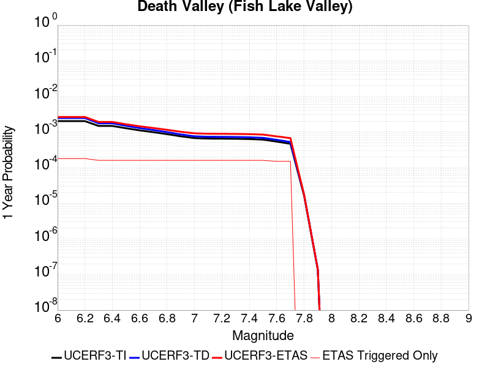 |  |

| Magnitude | 1 wk TI Prob | 1 wk TD Prob | 1 wk ETAS Prob | 1 wk ETAS/TD Gain | 1 wk ETAS Triggered Only | 1 mo TI Prob | 1 mo TD Prob | 1 mo ETAS Prob | 1 mo ETAS/TD Gain | 1 mo ETAS Triggered Only | 1 yr TI Prob | 1 yr TD Prob | 1 yr ETAS Prob | 1 yr ETAS/TD Gain | 1 yr ETAS Triggered Only | 10 yr TI Prob | 10 yr TD Prob | 10 yr ETAS Prob | 10 yr ETAS/TD Gain | 10 yr ETAS Triggered Only |
|-----|-----|-----|-----|-----|-----|-----|-----|-----|-----|-----|-----|-----|-----|-----|-----|-----|-----|-----|-----|-----|
| 6.0 | 3.872328E-5 | 4.7267473E-5 | 1.10078574E-4 | 2.328844 | 6.281407E-5 | 1.6594635E-4 | 2.0256084E-4 | 3.03043E-4 | 1.4960591 | 1.0050251E-4 | 0.0020185246 | 0.002463534 | 0.002651512 | 1.0763042 | 1.8844221E-4 | 0.02000288 | 0.024388181 | 0.024694592 | 1.012564 | 3.1407035E-4 |
| 6.1 | 3.872328E-5 | 4.7267473E-5 | 1.10078574E-4 | 2.328844 | 6.281407E-5 | 1.6594635E-4 | 2.0256084E-4 | 3.03043E-4 | 1.4960591 | 1.0050251E-4 | 0.0020185246 | 0.002463534 | 0.002651512 | 1.0763042 | 1.8844221E-4 | 0.02000288 | 0.024388181 | 0.024694592 | 1.012564 | 3.1407035E-4 |
| 6.2 | 3.872328E-5 | 4.7267473E-5 | 1.10078574E-4 | 2.328844 | 6.281407E-5 | 1.6594635E-4 | 2.0256084E-4 | 3.03043E-4 | 1.4960591 | 1.0050251E-4 | 0.0020185246 | 0.002463534 | 0.002651512 | 1.0763042 | 1.8844221E-4 | 0.02000288 | 0.024388181 | 0.024694592 | 1.012564 | 3.1407035E-4 |
| 6.3 | 2.8356371E-5 | 3.3609853E-5 | 9.642181E-5 | 2.8688557 | 6.281407E-5 | 1.2152165E-4 | 1.4403471E-4 | 2.4452276E-4 | 1.6976655 | 1.0050251E-4 | 0.0014785219 | 0.0017522911 | 0.0019404031 | 1.107352 | 1.8844221E-4 | 0.014687235 | 0.017391782 | 0.017688047 | 1.0170346 | 3.0150753E-4 |
| 6.4 | 2.8356371E-5 | 3.3609853E-5 | 9.642181E-5 | 2.8688557 | 6.281407E-5 | 1.2152165E-4 | 1.4403471E-4 | 2.4452276E-4 | 1.6976655 | 1.0050251E-4 | 0.0014785219 | 0.0017522911 | 0.0019404031 | 1.107352 | 1.8844221E-4 | 0.014687235 | 0.017391782 | 0.017688047 | 1.0170346 | 3.0150753E-4 |
| 6.5 | 2.4448687E-5 | 2.8607552E-5 | 9.1419824E-5 | 3.1956534 | 6.281407E-5 | 1.0477588E-4 | 1.2259831E-4 | 2.2308851E-4 | 1.8196702 | 1.0050251E-4 | 0.0012748998 | 0.0014916632 | 0.0016798242 | 1.1261418 | 1.8844221E-4 | 0.012676105 | 0.014821377 | 0.0151184155 | 1.0200412 | 3.0150753E-4 |
| 6.6 | 2.1298161E-5 | 2.4660083E-5 | 8.74726E-5 | 3.5471334 | 6.281407E-5 | 9.127464E-5 | 1.0568198E-4 | 2.0617388E-4 | 1.9508896 | 1.0050251E-4 | 0.0011107022 | 0.0012859525 | 0.0014741524 | 1.1463506 | 1.8844221E-4 | 0.011051672 | 0.012788526 | 0.013086177 | 1.0232749 | 3.0150753E-4 |
| 6.7 | 1.8959729E-5 | 2.1781025E-5 | 8.4593725E-5 | 3.8838267 | 6.281407E-5 | 8.125345E-5 | 9.334405E-5 | 1.9383719E-4 | 2.0765884 | 1.0050251E-4 | 9.888117E-4 | 0.001135897 | 0.0013241251 | 1.1657088 | 1.8844221E-4 | 0.009844234 | 0.01130357 | 0.01160167 | 1.0263722 | 3.0150753E-4 |
| 6.8 | 1.6691629E-5 | 1.9018353E-5 | 8.1831226E-5 | 4.3027506 | 6.281407E-5 | 7.153359E-5 | 8.150477E-5 | 1.8199909E-4 | 2.232987 | 1.0050251E-4 | 8.7057345E-4 | 9.918857E-4 | 0.001180141 | 1.1897954 | 1.8844221E-4 | 0.008671708 | 0.009876343 | 0.010174873 | 1.0302267 | 3.0150753E-4 |
| 6.9 | 1.450505E-5 | 1.638954E-5 | 7.920258E-5 | 4.832508 | 6.281407E-5 | 6.216302E-5 | 7.0239046E-5 | 1.7073449E-4 | 2.4307635 | 1.0050251E-4 | 7.5657194E-4 | 8.5483363E-4 | 0.0010431147 | 1.2202547 | 1.8844221E-4 | 0.007540013 | 0.008516385 | 0.008815326 | 1.0351018 | 3.0150753E-4 |
| 7.0 | 1.2940855E-5 | 1.4537972E-5 | 7.735113E-5 | 5.320627 | 6.281407E-5 | 5.545963E-5 | 6.230414E-5 | 1.628004E-4 | 2.612995 | 1.0050251E-4 | 6.750118E-4 | 7.5829466E-4 | 9.46594E-4 | 1.2483195 | 1.8844221E-4 | 0.006729651 | 0.0075576897 | 0.0078569185 | 1.0395926 | 3.0150753E-4 |
| 7.1 | 1.2544658E-5 | 1.4078208E-5 | 7.6891396E-5 | 5.461732 | 6.281407E-5 | 5.3761712E-5 | 6.0333812E-5 | 1.6083026E-4 | 2.6656737 | 1.0050251E-4 | 6.5435225E-4 | 7.343222E-4 | 9.22626E-4 | 1.2564322 | 1.8844221E-4 | 0.006524288 | 0.007319551 | 0.0076188515 | 1.0408906 | 3.0150753E-4 |
| 7.2 | 1.2489416E-5 | 1.4015674E-5 | 7.682887E-5 | 5.481639 | 6.281407E-5 | 5.3524967E-5 | 6.0065824E-5 | 1.605623E-4 | 2.6731057 | 1.0050251E-4 | 6.514716E-4 | 7.310616E-4 | 9.193661E-4 | 1.2575767 | 1.8844221E-4 | 0.006495651 | 0.0072871596 | 0.00758647 | 1.0410737 | 3.0150753E-4 |
| 7.3 | 1.2368307E-5 | 1.3879812E-5 | 7.669301E-5 | 5.525508 | 6.281407E-5 | 5.3005948E-5 | 5.9483587E-5 | 1.5998012E-4 | 2.6894834 | 1.0050251E-4 | 6.451563E-4 | 7.2397763E-4 | 9.122834E-4 | 1.2600989 | 1.8844221E-4 | 0.0064328653 | 0.007216782 | 0.0075161136 | 1.0414772 | 3.0150753E-4 |
| 7.4 | 1.2161707E-5 | 1.36478675E-5 | 7.646108E-5 | 5.6024194 | 6.281407E-5 | 5.212056E-5 | 5.8489582E-5 | 1.5898622E-4 | 2.718197 | 1.0050251E-4 | 6.3438306E-4 | 7.118836E-4 | 9.0019166E-4 | 1.2645209 | 1.8844221E-4 | 0.006325751 | 0.0070966207 | 0.0073959883 | 1.0421846 | 3.0150753E-4 |
| 7.5 | 1.1707948E-5 | 1.3145515E-5 | 7.595876E-5 | 5.778302 | 6.281407E-5 | 5.0175953E-5 | 5.6336736E-5 | 1.5683359E-4 | 2.78386 | 1.0050251E-4 | 6.10721E-4 | 6.856895E-4 | 8.740025E-4 | 1.274633 | 1.8844221E-4 | 0.0060904534 | 0.006836321 | 0.0071357675 | 1.0438023 | 3.0150753E-4 |
| 7.6 | 1.0319538E-5 | 1.1579622E-5 | 7.439296E-5 | 6.4244723 | 6.281407E-5 | 4.4225842E-5 | 4.9626036E-5 | 1.5012357E-4 | 3.0250967 | 1.0050251E-4 | 5.383166E-4 | 6.040347E-4 | 7.7980786E-4 | 1.2909985 | 1.758794E-4 | 0.0053701443 | 0.0060244603 | 0.0063116644 | 1.047673 | 2.8894472E-4 |
| 7.7 | 8.937764E-6 | 1.0022779E-5 | 7.283622E-5 | 7.2670684 | 6.281407E-5 | 3.830414E-5 | 4.295409E-5 | 1.4345229E-4 | 3.3396654 | 1.0050251E-4 | 4.6625308E-4 | 5.228456E-4 | 6.98633E-4 | 1.3362129 | 1.758794E-4 | 0.0046527605 | 0.005216664 | 0.0054916046 | 1.0527042 | 2.763819E-4 |
| 7.8 | 3.108007E-7 | 3.284654E-7 | 3.284654E-7 | 1.0 | 0.0 | 1.3320023E-6 | 1.407708E-6 | 1.407708E-6 | 1.0 | 0.0 | 1.6217007E-5 | 1.7138715E-5 | 1.7138715E-5 | 1.0 | 0.0 | 1.6215823E-4 | 1.7137431E-4 | 1.8393497E-4 | 1.0732937 | 1.2562814E-5 |
| 7.9 | 2.5591178E-9 | 2.6696718E-9 | 2.6696718E-9 | 1.0 | 0.0 | 1.0967647E-8 | 1.14414505E-8 | 1.14414505E-8 | 1.0 | 0.0 | 1.335311E-7 | 1.3929966E-7 | 1.3929966E-7 | 1.0 | 0.0 | 1.3353102E-6 | 1.3929966E-6 | 1.3929966E-6 | 1.0 | 0.0 |

## Scodie Lineament
*[(top)](#table-of-contents)*

| 1 Week | 1 Month | 1 Year | 10 Year |
|-----|-----|-----|-----|
|  |  |  |  |

| Magnitude | 1 wk TI Prob | 1 wk TD Prob | 1 wk ETAS Prob | 1 wk ETAS/TD Gain | 1 wk ETAS Triggered Only | 1 mo TI Prob | 1 mo TD Prob | 1 mo ETAS Prob | 1 mo ETAS/TD Gain | 1 mo ETAS Triggered Only | 1 yr TI Prob | 1 yr TD Prob | 1 yr ETAS Prob | 1 yr ETAS/TD Gain | 1 yr ETAS Triggered Only | 10 yr TI Prob | 10 yr TD Prob | 10 yr ETAS Prob | 10 yr ETAS/TD Gain | 10 yr ETAS Triggered Only |
|-----|-----|-----|-----|-----|-----|-----|-----|-----|-----|-----|-----|-----|-----|-----|-----|-----|-----|-----|-----|-----|
| 6.0 | 3.2919327E-6 | 3.0133422E-6 | 6.5827226E-5 | 21.845253 | 6.281407E-5 | 1.4108206E-5 | 1.2914278E-5 | 1.385408E-4 | 10.727723 | 1.2562814E-4 | 1.7175387E-4 | 1.5722317E-4 | 3.8331826E-4 | 2.4380522 | 2.2613065E-4 | 0.0017162118 | 0.0015714309 | 0.0018724647 | 1.1915666 | 3.0150753E-4 |
| 6.1 | 1.8663811E-6 | 1.5490499E-6 | 1.5490499E-6 | 1.0 | 0.0 | 7.998751E-6 | 6.6387715E-6 | 3.1764233E-5 | 4.7846556 | 2.5125628E-5 | 9.738045E-5 | 8.082454E-5 | 1.4363353E-4 | 1.7771031 | 6.281407E-5 | 9.7337784E-4 | 8.080003E-4 | 9.084216E-4 | 1.1242838 | 1.0050251E-4 |
| 6.2 | 1.8663811E-6 | 1.5490499E-6 | 1.5490499E-6 | 1.0 | 0.0 | 7.998751E-6 | 6.6387715E-6 | 3.1764233E-5 | 4.7846556 | 2.5125628E-5 | 9.738045E-5 | 8.082454E-5 | 1.4363353E-4 | 1.7771031 | 6.281407E-5 | 9.7337784E-4 | 8.080003E-4 | 9.084216E-4 | 1.1242838 | 1.0050251E-4 |
| 6.3 | 1.8663811E-6 | 1.5490499E-6 | 1.5490499E-6 | 1.0 | 0.0 | 7.998751E-6 | 6.6387715E-6 | 3.1764233E-5 | 4.7846556 | 2.5125628E-5 | 9.738045E-5 | 8.082454E-5 | 1.4363353E-4 | 1.7771031 | 6.281407E-5 | 9.7337784E-4 | 8.080003E-4 | 9.084216E-4 | 1.1242838 | 1.0050251E-4 |
| 6.4 | 1.8663811E-6 | 1.5490499E-6 | 1.5490499E-6 | 1.0 | 0.0 | 7.998751E-6 | 6.6387715E-6 | 3.1764233E-5 | 4.7846556 | 2.5125628E-5 | 9.738045E-5 | 8.082454E-5 | 1.4363353E-4 | 1.7771031 | 6.281407E-5 | 9.7337784E-4 | 8.080003E-4 | 9.084216E-4 | 1.1242838 | 1.0050251E-4 |
| 6.5 | 1.8106311E-6 | 1.4909839E-6 | 1.4909839E-6 | 1.0 | 0.0 | 7.759824E-6 | 6.3899183E-6 | 3.1515385E-5 | 4.9320483 | 2.5125628E-5 | 9.447177E-5 | 7.7794975E-5 | 1.4060416E-4 | 1.8073682 | 6.281407E-5 | 9.4431615E-4 | 7.7772606E-4 | 8.781504E-4 | 1.1291256 | 1.0050251E-4 |
| 6.6 | 1.2414679E-6 | 8.997558E-7 | 8.997558E-7 | 1.0 | 0.0 | 5.320566E-6 | 3.856091E-6 | 3.856091E-6 | 1.0 | 0.0 | 6.477596E-5 | 4.6946985E-5 | 5.950921E-5 | 1.2675833 | 1.2562814E-5 | 6.475708E-4 | 4.693793E-4 | 4.944932E-4 | 1.0535043 | 2.5125628E-5 |
| 6.7 | 1.1062215E-6 | 7.594311E-7 | 7.594311E-7 | 1.0 | 0.0 | 4.7409408E-6 | 3.2547011E-6 | 3.2547011E-6 | 1.0 | 0.0 | 5.7719422E-5 | 3.9625334E-5 | 3.9625334E-5 | 1.0 | 0.0 | 5.770443E-4 | 3.961897E-4 | 4.0874752E-4 | 1.0316966 | 1.2562814E-5 |
| 6.8 | 1.0006736E-6 | 6.500397E-7 | 6.500397E-7 | 1.0 | 0.0 | 4.288594E-6 | 2.7858816E-6 | 2.7858816E-6 | 1.0 | 0.0 | 5.221238E-5 | 3.3917644E-5 | 3.3917644E-5 | 1.0 | 0.0 | 5.220012E-4 | 3.3913075E-4 | 3.516893E-4 | 1.0370317 | 1.2562814E-5 |
| 6.9 | 9.167364E-7 | 5.631625E-7 | 5.631625E-7 | 1.0 | 0.0 | 3.9288643E-6 | 2.4135516E-6 | 2.4135516E-6 | 1.0 | 0.0 | 4.7832873E-5 | 2.9384651E-5 | 2.9384651E-5 | 1.0 | 0.0 | 4.782258E-4 | 2.9381333E-4 | 3.0637247E-4 | 1.0427452 | 1.2562814E-5 |
| 7.0 | 7.6987664E-7 | 4.113383E-7 | 4.113383E-7 | 1.0 | 0.0 | 3.2994672E-6 | 1.7628774E-6 | 1.7628774E-6 | 1.0 | 0.0 | 4.0170275E-5 | 2.1462862E-5 | 2.1462862E-5 | 1.0 | 0.0 | 4.0163012E-4 | 2.1461173E-4 | 2.2717185E-4 | 1.0585248 | 1.2562814E-5 |
| 7.1 | 7.1038727E-7 | 3.5211494E-7 | 3.5211494E-7 | 1.0 | 0.0 | 3.0445133E-6 | 1.5090633E-6 | 1.5090633E-6 | 1.0 | 0.0 | 3.706632E-5 | 1.8372726E-5 | 1.8372726E-5 | 1.0 | 0.0 | 3.7060137E-4 | 1.8371557E-4 | 1.9627607E-4 | 1.0683693 | 1.2562814E-5 |
| 7.2 | 2.0799602E-7 | 3.1186854E-8 | 3.1186854E-8 | 1.0 | 0.0 | 8.914113E-7 | 1.3365793E-7 | 1.3365793E-7 | 1.0 | 0.0 | 1.0852878E-5 | 1.6272843E-6 | 1.6272843E-6 | 1.0 | 0.0 | 1.08523476E-4 | 1.627273E-5 | 1.627273E-5 | 1.0 | 0.0 |
| 7.3 | 1.5048182E-7 | 1.5945696E-8 | 1.5945696E-8 | 1.0 | 0.0 | 6.449219E-7 | 6.83387E-8 | 6.83387E-8 | 1.0 | 0.0 | 7.851896E-6 | 8.320234E-7 | 8.320234E-7 | 1.0 | 0.0 | 7.851618E-5 | 8.320206E-6 | 8.320206E-6 | 1.0 | 0.0 |
| 7.4 | 5.9334678E-8 | 4.8683537E-9 | 4.8683537E-9 | 1.0 | 0.0 | 2.5429145E-7 | 2.0864372E-8 | 2.0864372E-8 | 1.0 | 0.0 | 3.095994E-6 | 2.5402372E-7 | 2.5402372E-7 | 1.0 | 0.0 | 3.095951E-5 | 2.5402353E-6 | 2.5402353E-6 | 1.0 | 0.0 |

## Manix-Afton Hills
*[(top)](#table-of-contents)*

| 1 Week | 1 Month | 1 Year | 10 Year |
|-----|-----|-----|-----|
|  |  | 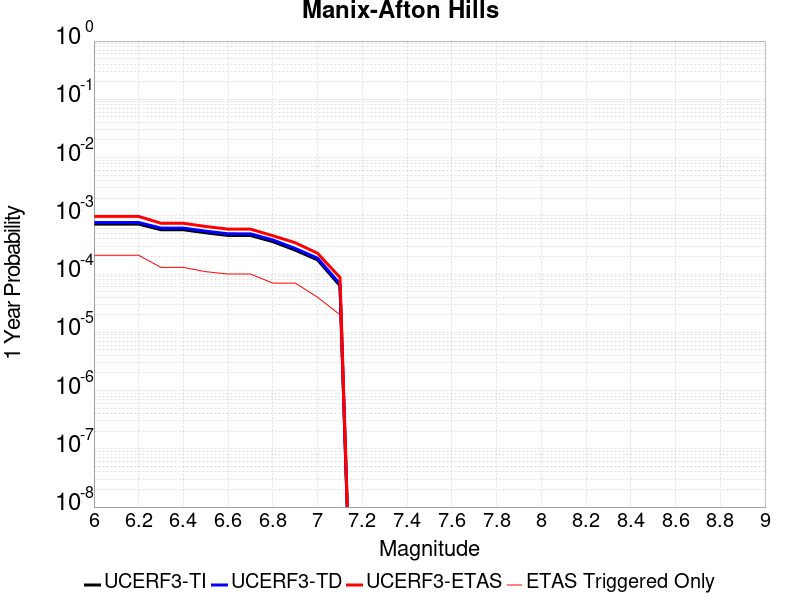 |  |

| Magnitude | 1 wk TI Prob | 1 wk TD Prob | 1 wk ETAS Prob | 1 wk ETAS/TD Gain | 1 wk ETAS Triggered Only | 1 mo TI Prob | 1 mo TD Prob | 1 mo ETAS Prob | 1 mo ETAS/TD Gain | 1 mo ETAS Triggered Only | 1 yr TI Prob | 1 yr TD Prob | 1 yr ETAS Prob | 1 yr ETAS/TD Gain | 1 yr ETAS Triggered Only | 10 yr TI Prob | 10 yr TD Prob | 10 yr ETAS Prob | 10 yr ETAS/TD Gain | 10 yr ETAS Triggered Only |
|-----|-----|-----|-----|-----|-----|-----|-----|-----|-----|-----|-----|-----|-----|-----|-----|-----|-----|-----|-----|-----|
| 6.0 | 1.3783202E-5 | 1.47110895E-5 | 1.4033738E-4 | 9.539564 | 1.2562814E-4 | 5.906953E-5 | 6.30461E-5 | 2.1379036E-4 | 3.3910165 | 1.5075377E-4 | 7.189342E-4 | 7.6733343E-4 | 0.0010058437 | 1.3108301 | 2.3869346E-4 | 0.0071661277 | 0.007648596 | 0.007922864 | 1.0358586 | 2.763819E-4 |
| 6.1 | 1.3783202E-5 | 1.47110895E-5 | 1.4033738E-4 | 9.539564 | 1.2562814E-4 | 5.906953E-5 | 6.30461E-5 | 2.1379036E-4 | 3.3910165 | 1.5075377E-4 | 7.189342E-4 | 7.6733343E-4 | 0.0010058437 | 1.3108301 | 2.3869346E-4 | 0.0071661277 | 0.007648596 | 0.007922864 | 1.0358586 | 2.763819E-4 |
| 6.2 | 1.3783202E-5 | 1.47110895E-5 | 1.4033738E-4 | 9.539564 | 1.2562814E-4 | 5.906953E-5 | 6.30461E-5 | 2.1379036E-4 | 3.3910165 | 1.5075377E-4 | 7.189342E-4 | 7.6733343E-4 | 0.0010058437 | 1.3108301 | 2.3869346E-4 | 0.0071661277 | 0.007648596 | 0.007922864 | 1.0358586 | 2.763819E-4 |
| 6.3 | 1.10494875E-5 | 1.1793136E-5 | 6.20438E-5 | 5.2610097 | 5.0251256E-5 | 4.7354086E-5 | 5.054109E-5 | 1.2591416E-4 | 2.4913228 | 7.537688E-5 | 5.763835E-4 | 6.151744E-4 | 7.5328036E-4 | 1.2244989 | 1.3819095E-4 | 0.005748908 | 0.0061357557 | 0.00629807 | 1.0264539 | 1.6331658E-4 |
| 6.4 | 1.10494875E-5 | 1.1793136E-5 | 6.20438E-5 | 5.2610097 | 5.0251256E-5 | 4.7354086E-5 | 5.054109E-5 | 1.2591416E-4 | 2.4913228 | 7.537688E-5 | 5.763835E-4 | 6.151744E-4 | 7.5328036E-4 | 1.2244989 | 1.3819095E-4 | 0.005748908 | 0.0061357557 | 0.00629807 | 1.0264539 | 1.6331658E-4 |
| 6.5 | 9.788949E-6 | 1.045432E-5 | 4.8142367E-5 | 4.6050215 | 3.768844E-5 | 4.1951964E-5 | 4.480351E-5 | 1.0761477E-4 | 2.4019272 | 6.281407E-5 | 5.1064545E-4 | 5.453555E-4 | 6.5835915E-4 | 1.207211 | 1.13065325E-4 | 0.0050947363 | 0.0054410985 | 0.0055785375 | 1.0252594 | 1.3819095E-4 |
| 6.6 | 8.810006E-6 | 9.4136285E-6 | 4.7101716E-5 | 5.0035667 | 3.768844E-5 | 3.775662E-5 | 4.0343548E-5 | 9.059277E-5 | 2.2455332 | 5.0251256E-5 | 4.5958988E-4 | 4.9108086E-4 | 5.91534E-4 | 1.2045553 | 1.0050251E-4 | 0.0045864056 | 0.004900839 | 0.0050133504 | 1.0229576 | 1.13065325E-4 |
| 6.7 | 8.80128E-6 | 9.404108E-6 | 4.7092195E-5 | 5.00762 | 3.768844E-5 | 3.7719226E-5 | 4.0302748E-5 | 9.055198E-5 | 2.2467942 | 5.0251256E-5 | 4.591348E-4 | 4.9058435E-4 | 5.9103756E-4 | 1.2047623 | 1.0050251E-4 | 0.004581874 | 0.0048958957 | 0.005008408 | 1.0229808 | 1.13065325E-4 |
| 6.8 | 6.8994877E-6 | 7.380076E-6 | 3.250552E-5 | 4.4044967 | 2.5125628E-5 | 2.9568899E-5 | 3.162856E-5 | 6.931581E-5 | 2.1915576 | 3.768844E-5 | 3.5994186E-4 | 3.8501783E-4 | 4.603657E-4 | 1.1956997 | 7.537688E-5 | 0.003593594 | 0.0038443129 | 0.0039319145 | 1.0227873 | 8.79397E-5 |
| 6.9 | 4.9328037E-6 | 5.2709615E-6 | 3.0396457E-5 | 5.7667766 | 2.5125628E-5 | 2.1140417E-5 | 2.2589675E-5 | 6.0277263E-5 | 2.6683547 | 3.768844E-5 | 2.5735417E-4 | 2.7500073E-4 | 3.503569E-4 | 1.2740216 | 7.537688E-5 | 0.0025705635 | 0.0027472095 | 0.0028223793 | 1.0273622 | 7.537688E-5 |
| 7.0 | 3.347973E-6 | 3.59003E-6 | 2.8715567E-5 | 7.9986987 | 2.5125628E-5 | 1.4348378E-5 | 1.5385775E-5 | 5.3073636E-5 | 3.4495263 | 3.768844E-5 | 1.746775E-4 | 1.8730981E-4 | 2.3755166E-4 | 1.2682285 | 5.0251256E-5 | 0.0017454025 | 0.0018719219 | 0.0019220791 | 1.0267944 | 5.0251256E-5 |
| 7.1 | 1.2073567E-6 | 1.293482E-6 | 1.385628E-5 | 10.712387 | 1.2562814E-5 | 5.1743755E-6 | 5.543492E-6 | 3.066898E-5 | 5.53243 | 2.5125628E-5 | 6.29962E-5 | 6.749156E-5 | 9.261549E-5 | 1.372253 | 2.5125628E-5 | 6.297835E-4 | 6.7487074E-4 | 6.999794E-4 | 1.0372051 | 2.5125628E-5 |

## San Andreas (North Branch Mill Creek)
*[(top)](#table-of-contents)*

| 1 Week | 1 Month | 1 Year | 10 Year |
|-----|-----|-----|-----|
|  |  |  |  |

| Magnitude | 1 wk TI Prob | 1 wk TD Prob | 1 wk ETAS Prob | 1 wk ETAS/TD Gain | 1 wk ETAS Triggered Only | 1 mo TI Prob | 1 mo TD Prob | 1 mo ETAS Prob | 1 mo ETAS/TD Gain | 1 mo ETAS Triggered Only | 1 yr TI Prob | 1 yr TD Prob | 1 yr ETAS Prob | 1 yr ETAS/TD Gain | 1 yr ETAS Triggered Only | 10 yr TI Prob | 10 yr TD Prob | 10 yr ETAS Prob | 10 yr ETAS/TD Gain | 10 yr ETAS Triggered Only |
|-----|-----|-----|-----|-----|-----|-----|-----|-----|-----|-----|-----|-----|-----|-----|-----|-----|-----|-----|-----|-----|
| 6.0 | 1.3461156E-5 | 2.3499893E-5 | 1.3656256E-4 | 5.811199 | 1.13065325E-4 | 5.7689394E-5 | 1.00709956E-4 | 2.137639E-4 | 2.1225696 | 1.13065325E-4 | 7.02142E-4 | 0.0012254574 | 0.001363479 | 1.1126287 | 1.3819095E-4 | 0.0069992766 | 0.01222957 | 0.012490163 | 1.0213084 | 2.638191E-4 |
| 6.1 | 1.3461156E-5 | 2.3499893E-5 | 1.3656256E-4 | 5.811199 | 1.13065325E-4 | 5.7689394E-5 | 1.00709956E-4 | 2.137639E-4 | 2.1225696 | 1.13065325E-4 | 7.02142E-4 | 0.0012254574 | 0.001363479 | 1.1126287 | 1.3819095E-4 | 0.0069992766 | 0.01222957 | 0.012490163 | 1.0213084 | 2.638191E-4 |
| 6.2 | 1.3461156E-5 | 2.3499893E-5 | 1.3656256E-4 | 5.811199 | 1.13065325E-4 | 5.7689394E-5 | 1.00709956E-4 | 2.137639E-4 | 2.1225696 | 1.13065325E-4 | 7.02142E-4 | 0.0012254574 | 0.001363479 | 1.1126287 | 1.3819095E-4 | 0.0069992766 | 0.01222957 | 0.012490163 | 1.0213084 | 2.638191E-4 |
| 6.3 | 1.3461156E-5 | 2.3499893E-5 | 1.3656256E-4 | 5.811199 | 1.13065325E-4 | 5.7689394E-5 | 1.00709956E-4 | 2.137639E-4 | 2.1225696 | 1.13065325E-4 | 7.02142E-4 | 0.0012254574 | 0.001363479 | 1.1126287 | 1.3819095E-4 | 0.0069992766 | 0.01222957 | 0.012490163 | 1.0213084 | 2.638191E-4 |
| 6.4 | 1.3461156E-5 | 2.3499893E-5 | 1.3656256E-4 | 5.811199 | 1.13065325E-4 | 5.7689394E-5 | 1.00709956E-4 | 2.137639E-4 | 2.1225696 | 1.13065325E-4 | 7.02142E-4 | 0.0012254574 | 0.001363479 | 1.1126287 | 1.3819095E-4 | 0.0069992766 | 0.01222957 | 0.012490163 | 1.0213084 | 2.638191E-4 |
| 6.5 | 1.3450706E-5 | 2.3488852E-5 | 1.3655152E-4 | 5.813461 | 1.13065325E-4 | 5.764461E-5 | 1.0066265E-4 | 2.1371659E-4 | 2.1230972 | 1.13065325E-4 | 7.0159714E-4 | 0.001224882 | 0.0013629037 | 1.1126816 | 1.3819095E-4 | 0.006993862 | 0.01222388 | 0.012484474 | 1.0213184 | 2.638191E-4 |
| 6.6 | 1.3074523E-5 | 2.3103135E-5 | 1.3616585E-4 | 5.8938255 | 1.13065325E-4 | 5.6032466E-5 | 9.9009696E-5 | 2.1206384E-4 | 2.141849 | 1.13065325E-4 | 6.8198174E-4 | 0.0012047797 | 0.0013428042 | 1.1145641 | 1.3819095E-4 | 0.006798926 | 0.012025044 | 0.012285691 | 1.0216753 | 2.638191E-4 |
| 6.7 | 1.3050216E-5 | 2.3078432E-5 | 1.3614116E-4 | 5.899064 | 1.13065325E-4 | 5.59283E-5 | 9.890384E-5 | 2.1195797E-4 | 2.1430714 | 1.13065325E-4 | 6.8071426E-4 | 0.0012034923 | 0.0013415169 | 1.1146867 | 1.3819095E-4 | 0.0067863287 | 0.012012309 | 0.01227296 | 1.0216986 | 2.638191E-4 |
| 6.8 | 1.29049395E-5 | 2.292684E-5 | 1.3598957E-4 | 5.931457 | 1.13065325E-4 | 5.530571E-5 | 9.825421E-5 | 2.1130842E-4 | 2.1506298 | 1.13065325E-4 | 6.73139E-4 | 0.0011955918 | 0.0013336175 | 1.1154455 | 1.3819095E-4 | 0.0067110364 | 0.011934154 | 0.012194824 | 1.0218424 | 2.638191E-4 |
| 6.9 | 1.2867369E-5 | 2.2886245E-5 | 1.3594898E-4 | 5.940205 | 1.13065325E-4 | 5.51447E-5 | 9.8080236E-5 | 2.1113448E-4 | 2.1526709 | 1.13065325E-4 | 6.711799E-4 | 0.0011934759 | 0.001331502 | 1.1156504 | 1.3819095E-4 | 0.006691564 | 0.011913223 | 0.012173899 | 1.0218812 | 2.638191E-4 |
| 7.0 | 1.2495996E-5 | 2.2286325E-5 | 1.3534914E-4 | 6.073192 | 1.13065325E-4 | 5.3553173E-5 | 9.550934E-5 | 2.0856387E-4 | 2.1837013 | 1.13065325E-4 | 6.518148E-4 | 0.0011622087 | 0.0013002391 | 1.1187656 | 1.3819095E-4 | 0.0064990623 | 0.0116038285 | 0.011864587 | 1.0224717 | 2.638191E-4 |
| 7.1 | 1.2452067E-5 | 2.2231397E-5 | 1.352942E-4 | 6.0857267 | 1.13065325E-4 | 5.3364907E-5 | 9.527396E-5 | 2.083285E-4 | 2.186626 | 1.13065325E-4 | 6.4952404E-4 | 0.0011593461 | 0.0012973768 | 1.1190591 | 1.3819095E-4 | 0.0064762887 | 0.0115755 | 0.011836265 | 1.0225273 | 2.638191E-4 |
| 7.2 | 1.2002777E-5 | 2.1609963E-5 | 1.3467285E-4 | 6.2319794 | 1.13065325E-4 | 5.143946E-5 | 9.2610855E-5 | 2.0566571E-4 | 2.2207518 | 1.13065325E-4 | 6.2609545E-4 | 0.0011269567 | 0.0012649918 | 1.1224849 | 1.3819095E-4 | 0.006243344 | 0.011254923 | 0.011515773 | 1.0231766 | 2.638191E-4 |
| 7.3 | 1.1923425E-5 | 2.1479793E-5 | 1.3454269E-4 | 6.2636867 | 1.13065325E-4 | 5.109939E-5 | 9.205302E-5 | 2.0510794E-4 | 2.22815 | 1.13065325E-4 | 6.219575E-4 | 0.001120172 | 0.0012582082 | 1.1232276 | 1.3819095E-4 | 0.0062021962 | 0.011187789 | 0.011448656 | 1.0233172 | 2.638191E-4 |
| 7.4 | 1.16105175E-5 | 2.0853771E-5 | 1.3391674E-4 | 6.4217033 | 1.13065325E-4 | 4.975841E-5 | 8.937026E-5 | 2.0242548E-4 | 2.2650206 | 1.13065325E-4 | 6.0564023E-4 | 0.0010875424 | 0.001225583 | 1.126929 | 1.3819095E-4 | 0.006039923 | 0.010865397 | 0.011126349 | 1.0240169 | 2.638191E-4 |
| 7.5 | 1.1037265E-5 | 1.9553907E-5 | 1.3261702E-4 | 6.782124 | 1.13065325E-4 | 4.7301706E-5 | 8.379978E-5 | 1.9685563E-4 | 2.3491187 | 1.13065325E-4 | 5.757461E-4 | 0.0010197869 | 0.001157837 | 1.1353714 | 1.3819095E-4 | 0.005742567 | 0.010194898 | 0.010456027 | 1.0256138 | 2.638191E-4 |
| 7.6 | 1.0720915E-5 | 1.899582E-5 | 1.32059E-4 | 6.9520035 | 1.13065325E-4 | 4.5945973E-5 | 8.140812E-5 | 1.9446424E-4 | 2.3887572 | 1.13065325E-4 | 5.592486E-4 | 9.906954E-4 | 0.0011287495 | 1.1393507 | 1.3819095E-4 | 0.005578433 | 0.009906623 | 0.010167828 | 1.0263667 | 2.638191E-4 |
| 7.7 | 9.276279E-6 | 1.6441649E-5 | 1.2950512E-4 | 7.8766503 | 1.13065325E-4 | 3.9754876E-5 | 7.0462316E-5 | 1.8351967E-4 | 2.6045082 | 1.13065325E-4 | 4.839081E-4 | 8.575427E-4 | 9.956151E-4 | 1.1610094 | 1.3819095E-4 | 0.0048285574 | 0.008586041 | 0.008847595 | 1.0304627 | 2.638191E-4 |
| 7.8 | 5.8346777E-6 | 1.1155013E-5 | 1.116564E-4 | 10.009526 | 1.0050251E-4 | 2.5005522E-5 | 4.7806327E-5 | 1.4830404E-4 | 3.1021843 | 1.0050251E-4 | 3.043997E-4 | 5.818867E-4 | 7.074417E-4 | 1.2157723 | 1.2562814E-4 | 0.0030398308 | 0.0058469265 | 0.0060967137 | 1.0427212 | 2.5125628E-4 |
| 7.9 | 4.690204E-6 | 8.509093E-6 | 9.644804E-5 | 11.3347025 | 8.79397E-5 | 2.0100719E-5 | 3.6467034E-5 | 1.2440352E-4 | 3.411397 | 8.79397E-5 | 2.4469878E-4 | 4.4389578E-4 | 5.5691093E-4 | 1.2545984 | 1.13065325E-4 | 0.002444295 | 0.0044707474 | 0.0046958667 | 1.0503539 | 2.2613065E-4 |
| 8.0 | 2.9570454E-6 | 4.846947E-6 | 2.9972452E-5 | 6.18378 | 2.5125628E-5 | 1.267299E-5 | 2.0772464E-5 | 4.589757E-5 | 2.209539 | 2.5125628E-5 | 1.5428272E-4 | 2.5287544E-4 | 2.779947E-4 | 1.0993346 | 2.5125628E-5 | 0.0015417566 | 0.002549644 | 0.0025997674 | 1.0196589 | 5.0251256E-5 |
| 8.1 | 1.6376824E-6 | 2.1968929E-6 | 2.1968929E-6 | 1.0 | 0.0 | 7.01862E-6 | 9.41522E-6 | 9.41522E-6 | 1.0 | 0.0 | 8.544835E-5 | 1.14624294E-4 | 1.14624294E-4 | 1.0 | 0.0 | 8.54155E-4 | 0.0011606582 | 0.0011606582 | 1.0 | 0.0 |
| 8.2 | 6.9631557E-7 | 4.5360213E-7 | 4.5360213E-7 | 1.0 | 0.0 | 2.984206E-6 | 1.9440076E-6 | 1.9440076E-6 | 1.0 | 0.0 | 3.63321E-5 | 2.3668037E-5 | 2.3668037E-5 | 1.0 | 0.0 | 3.6326164E-4 | 2.451564E-4 | 2.451564E-4 | 1.0 | 0.0 |
| 8.3 | 1.7876137E-7 | 8.360375E-8 | 8.360375E-8 | 1.0 | 0.0 | 7.661199E-7 | 3.5830175E-7 | 3.5830175E-7 | 1.0 | 0.0 | 9.32747E-6 | 4.3623154E-6 | 4.3623154E-6 | 1.0 | 0.0 | 9.3270784E-5 | 4.5817014E-5 | 4.5817014E-5 | 1.0 | 0.0 |

## Santa Ynez (West)
*[(top)](#table-of-contents)*

| 1 Week | 1 Month | 1 Year | 10 Year |
|-----|-----|-----|-----|
|  | 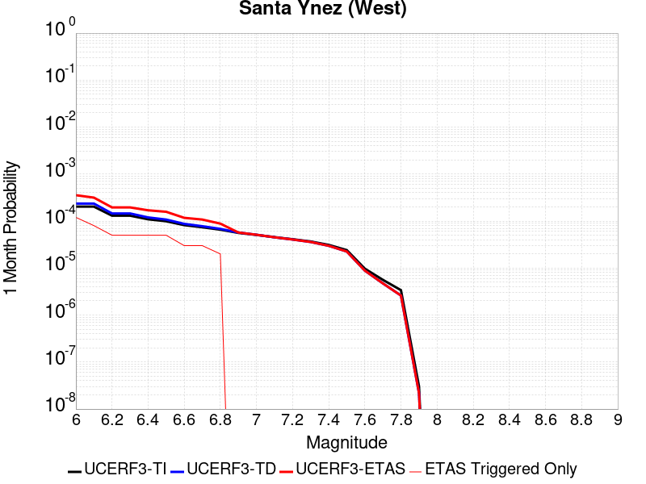 |  |  |

| Magnitude | 1 wk TI Prob | 1 wk TD Prob | 1 wk ETAS Prob | 1 wk ETAS/TD Gain | 1 wk ETAS Triggered Only | 1 mo TI Prob | 1 mo TD Prob | 1 mo ETAS Prob | 1 mo ETAS/TD Gain | 1 mo ETAS Triggered Only | 1 yr TI Prob | 1 yr TD Prob | 1 yr ETAS Prob | 1 yr ETAS/TD Gain | 1 yr ETAS Triggered Only | 10 yr TI Prob | 10 yr TD Prob | 10 yr ETAS Prob | 10 yr ETAS/TD Gain | 10 yr ETAS Triggered Only |
|-----|-----|-----|-----|-----|-----|-----|-----|-----|-----|-----|-----|-----|-----|-----|-----|-----|-----|-----|-----|-----|
| 6.0 | 4.7352758E-5 | 5.4972126E-5 | 1.3034487E-4 | 2.3711083 | 7.537688E-5 | 2.0292461E-4 | 2.3557522E-4 | 3.4861392E-4 | 1.4798412 | 1.13065325E-4 | 0.0024678076 | 0.0028645284 | 0.0030273772 | 1.0568501 | 1.6331658E-4 | 0.024405818 | 0.028304417 | 0.02851194 | 1.0073318 | 2.1356784E-4 |
| 6.1 | 4.7352758E-5 | 5.4972126E-5 | 1.0522062E-4 | 1.9140723 | 5.0251256E-5 | 2.0292461E-4 | 2.3557522E-4 | 3.1093435E-4 | 1.3198941 | 7.537688E-5 | 0.0024678076 | 0.0028645284 | 0.0029772697 | 1.0393578 | 1.13065325E-4 | 0.024405818 | 0.028304417 | 0.02846311 | 1.0056067 | 1.6331658E-4 |
| 6.2 | 3.0415853E-5 | 3.392511E-5 | 7.1612274E-5 | 2.1108928 | 3.768844E-5 | 1.3034715E-4 | 1.4538545E-4 | 1.956294E-4 | 1.3455913 | 5.0251256E-5 | 0.0015858212 | 0.0017686661 | 0.0018439096 | 1.0425426 | 7.537688E-5 | 0.015745522 | 0.017549807 | 0.01767323 | 1.0070328 | 1.2562814E-4 |
| 6.3 | 3.0415853E-5 | 3.392511E-5 | 7.1612274E-5 | 2.1108928 | 3.768844E-5 | 1.3034715E-4 | 1.4538545E-4 | 1.956294E-4 | 1.3455913 | 5.0251256E-5 | 0.0015858212 | 0.0017686661 | 0.0018439096 | 1.0425426 | 7.537688E-5 | 0.015745522 | 0.017549807 | 0.01767323 | 1.0070328 | 1.2562814E-4 |
| 6.4 | 2.5452082E-5 | 2.7912422E-5 | 6.5599816E-5 | 2.3502014 | 3.768844E-5 | 1.09075794E-4 | 1.196193E-4 | 1.6986454E-4 | 1.420043 | 5.0251256E-5 | 0.0013271887 | 0.0014554089 | 0.001530676 | 1.0517155 | 7.537688E-5 | 0.013192902 | 0.014460951 | 0.014584763 | 1.0085617 | 1.2562814E-4 |
| 6.5 | 2.3143784E-5 | 2.5128256E-5 | 6.281575E-5 | 2.4998055 | 3.768844E-5 | 9.9183875E-5 | 1.0768817E-4 | 1.5793402E-4 | 1.4665865 | 5.0251256E-5 | 0.0012068948 | 0.0013103267 | 0.0013856048 | 1.0574499 | 7.537688E-5 | 0.012003611 | 0.01302768 | 0.013151672 | 1.0095176 | 1.2562814E-4 |
| 6.6 | 1.9118515E-5 | 2.035434E-5 | 3.2916898E-5 | 1.6171931 | 1.2562814E-5 | 8.193392E-5 | 8.7230015E-5 | 1.1235345E-4 | 1.2880137 | 2.5125628E-5 | 9.97089E-4 | 0.001061516 | 0.0010991644 | 1.0354667 | 3.768844E-5 | 0.00992627 | 0.010565365 | 0.010627516 | 1.0058825 | 6.281407E-5 |
| 6.7 | 1.722807E-5 | 1.8146347E-5 | 3.0708932E-5 | 1.6922928 | 1.2562814E-5 | 7.3832496E-5 | 7.776777E-5 | 1.0289145E-4 | 1.3230603 | 2.5125628E-5 | 8.985399E-4 | 9.464169E-4 | 9.840697E-4 | 1.0397846 | 3.768844E-5 | 0.008949154 | 0.0094245095 | 0.009486732 | 1.0066022 | 6.281407E-5 |
| 6.8 | 1.5317364E-5 | 1.5926486E-5 | 1.5926486E-5 | 1.0 | 0.0 | 6.56442E-5 | 6.82546E-5 | 8.081656E-5 | 1.1840456 | 1.2562814E-5 | 7.98925E-4 | 8.306873E-4 | 8.55792E-4 | 1.0302217 | 2.5125628E-5 | 0.007960589 | 0.00827631 | 0.008326145 | 1.0060215 | 5.0251256E-5 |
| 6.9 | 1.3071226E-5 | 1.3329624E-5 | 1.3329624E-5 | 1.0 | 0.0 | 5.6018336E-5 | 5.7125722E-5 | 5.7125722E-5 | 1.0 | 0.0 | 6.8180985E-4 | 6.9528597E-4 | 7.078401E-4 | 1.018056 | 1.2562814E-5 | 0.0067972173 | 0.006931367 | 0.0069687944 | 1.0053997 | 3.768844E-5 |
| 7.0 | 1.1836986E-5 | 1.19327815E-5 | 1.19327815E-5 | 1.0 | 0.0 | 5.0728955E-5 | 5.11395E-5 | 5.11395E-5 | 1.0 | 0.0 | 6.1745E-4 | 6.2244723E-4 | 6.350022E-4 | 1.0201703 | 1.2562814E-5 | 0.006157372 | 0.006207231 | 0.0062446855 | 1.006034 | 3.768844E-5 |
| 7.1 | 1.0597169E-5 | 1.0542201E-5 | 1.0542201E-5 | 1.0 | 0.0 | 4.541565E-5 | 4.5180084E-5 | 4.5180084E-5 | 1.0 | 0.0 | 5.5279525E-4 | 5.4992986E-4 | 5.624858E-4 | 1.0228318 | 1.2562814E-5 | 0.0055142213 | 0.005485821 | 0.0055233026 | 1.0068325 | 3.768844E-5 |
| 7.2 | 9.59113E-6 | 9.459144E-6 | 9.459144E-6 | 1.0 | 0.0 | 4.11042E-5 | 4.0538565E-5 | 4.0538565E-5 | 1.0 | 0.0 | 5.0032866E-4 | 4.934463E-4 | 5.060029E-4 | 1.0254468 | 1.2562814E-5 | 0.004992037 | 0.0049236254 | 0.0049611283 | 1.0076169 | 3.768844E-5 |
| 7.3 | 8.586084E-6 | 8.379583E-6 | 8.379583E-6 | 1.0 | 0.0 | 3.679698E-5 | 3.5912013E-5 | 3.5912013E-5 | 1.0 | 0.0 | 4.4791115E-4 | 4.3714207E-4 | 4.4969938E-4 | 1.028726 | 1.2562814E-5 | 0.004470094 | 0.004362933 | 0.004400457 | 1.0086006 | 3.768844E-5 |
| 7.4 | 7.2622997E-6 | 6.9515427E-6 | 6.9515427E-6 | 1.0 | 0.0 | 3.112377E-5 | 2.979199E-5 | 2.979199E-5 | 1.0 | 0.0 | 3.78866E-4 | 3.626581E-4 | 3.7521636E-4 | 1.0346284 | 1.2562814E-5 | 0.0037822074 | 0.0036207628 | 0.0036457975 | 1.0069141 | 2.5125628E-5 |
| 7.5 | 5.627296E-6 | 5.251588E-6 | 5.251588E-6 | 1.0 | 0.0 | 2.411676E-5 | 2.2506614E-5 | 2.2506614E-5 | 1.0 | 0.0 | 2.9358198E-4 | 2.739843E-4 | 2.739843E-4 | 1.0 | 0.0 | 0.0029319443 | 0.002736537 | 0.0027490654 | 1.0045782 | 1.2562814E-5 |
| 7.6 | 2.265244E-6 | 2.0608625E-6 | 2.0608625E-6 | 1.0 | 0.0 | 9.708152E-6 | 8.832238E-6 | 8.832238E-6 | 1.0 | 0.0 | 1.18190335E-4 | 1.0752728E-4 | 1.0752728E-4 | 1.0 | 0.0 | 0.001181275 | 0.0010747612 | 0.0010747612 | 1.0 | 0.0 |
| 7.7 | 1.3099874E-6 | 1.1016252E-6 | 1.1016252E-6 | 1.0 | 0.0 | 5.61422E-6 | 4.7212425E-6 | 4.7212425E-6 | 1.0 | 0.0 | 6.8350986E-5 | 5.7479636E-5 | 5.7479636E-5 | 1.0 | 0.0 | 6.832996E-4 | 5.7465007E-4 | 5.7465007E-4 | 1.0 | 0.0 |
| 7.8 | 7.903951E-7 | 6.0711415E-7 | 6.0711415E-7 | 1.0 | 0.0 | 3.3874032E-6 | 2.6019152E-6 | 2.6019152E-6 | 1.0 | 0.0 | 4.1240855E-5 | 3.167787E-5 | 3.167787E-5 | 1.0 | 0.0 | 4.12332E-4 | 3.167349E-4 | 3.167349E-4 | 1.0 | 0.0 |
| 7.9 | 7.0753297E-9 | 5.0899476E-9 | 5.0899476E-9 | 1.0 | 0.0 | 3.032284E-8 | 2.181406E-8 | 2.181406E-8 | 1.0 | 0.0 | 3.6918053E-7 | 2.6558615E-7 | 2.6558615E-7 | 1.0 | 0.0 | 3.691799E-6 | 2.6558594E-6 | 2.6558594E-6 | 1.0 | 0.0 |

## Calico-Hidalgo
*[(top)](#table-of-contents)*

| 1 Week | 1 Month | 1 Year | 10 Year |
|-----|-----|-----|-----|
|  |  |  |  |

| Magnitude | 1 wk TI Prob | 1 wk TD Prob | 1 wk ETAS Prob | 1 wk ETAS/TD Gain | 1 wk ETAS Triggered Only | 1 mo TI Prob | 1 mo TD Prob | 1 mo ETAS Prob | 1 mo ETAS/TD Gain | 1 mo ETAS Triggered Only | 1 yr TI Prob | 1 yr TD Prob | 1 yr ETAS Prob | 1 yr ETAS/TD Gain | 1 yr ETAS Triggered Only | 10 yr TI Prob | 10 yr TD Prob | 10 yr ETAS Prob | 10 yr ETAS/TD Gain | 10 yr ETAS Triggered Only |
|-----|-----|-----|-----|-----|-----|-----|-----|-----|-----|-----|-----|-----|-----|-----|-----|-----|-----|-----|-----|-----|
| 6.0 | 4.0906612E-5 | 5.0703686E-5 | 1.3863892E-4 | 2.7342968 | 8.79397E-5 | 1.7530227E-4 | 2.172857E-4 | 3.4288655E-4 | 1.5780447 | 1.2562814E-4 | 0.0021322158 | 0.002642648 | 0.0028180627 | 1.0663784 | 1.758794E-4 | 0.02111873 | 0.026152607 | 0.026397292 | 1.009356 | 2.5125628E-4 |
| 6.1 | 4.0906612E-5 | 5.0703686E-5 | 1.3863892E-4 | 2.7342968 | 8.79397E-5 | 1.7530227E-4 | 2.172857E-4 | 3.4288655E-4 | 1.5780447 | 1.2562814E-4 | 0.0021322158 | 0.002642648 | 0.0028180627 | 1.0663784 | 1.758794E-4 | 0.02111873 | 0.026152607 | 0.026397292 | 1.009356 | 2.5125628E-4 |
| 6.2 | 4.0906612E-5 | 5.0703686E-5 | 1.3863892E-4 | 2.7342968 | 8.79397E-5 | 1.7530227E-4 | 2.172857E-4 | 3.4288655E-4 | 1.5780447 | 1.2562814E-4 | 0.0021322158 | 0.002642648 | 0.0028180627 | 1.0663784 | 1.758794E-4 | 0.02111873 | 0.026152607 | 0.026397292 | 1.009356 | 2.5125628E-4 |
| 6.3 | 2.4242801E-5 | 3.0090669E-5 | 8.034041E-5 | 2.6699445 | 5.0251256E-5 | 1.0389358E-4 | 1.2895382E-4 | 1.917598E-4 | 1.4870423 | 6.281407E-5 | 0.0012641704 | 0.0015689151 | 0.0016567168 | 1.0559634 | 8.79397E-5 | 0.01257003 | 0.01558206 | 0.01570573 | 1.0079367 | 1.2562814E-4 |
| 6.4 | 2.4242801E-5 | 3.0090669E-5 | 8.034041E-5 | 2.6699445 | 5.0251256E-5 | 1.0389358E-4 | 1.2895382E-4 | 1.917598E-4 | 1.4870423 | 6.281407E-5 | 0.0012641704 | 0.0015689151 | 0.0016567168 | 1.0559634 | 8.79397E-5 | 0.01257003 | 0.01558206 | 0.01570573 | 1.0079367 | 1.2562814E-4 |
| 6.5 | 2.0286952E-5 | 2.5315738E-5 | 6.300322E-5 | 2.488698 | 3.768844E-5 | 8.694118E-5 | 1.0849161E-4 | 1.5873741E-4 | 1.4631308 | 5.0251256E-5 | 0.0010579949 | 0.001320102 | 0.0013953794 | 1.0570239 | 7.537688E-5 | 0.010529719 | 0.013124538 | 0.013236119 | 1.0085018 | 1.13065325E-4 |
| 6.6 | 2.0269223E-5 | 2.5296687E-5 | 6.2984174E-5 | 2.489819 | 3.768844E-5 | 8.6865206E-5 | 1.08409964E-4 | 1.5865578E-4 | 1.4634796 | 5.0251256E-5 | 0.0010570707 | 0.0013191093 | 0.0013943868 | 1.0570669 | 7.537688E-5 | 0.010520565 | 0.013114728 | 0.01322631 | 1.0085082 | 1.13065325E-4 |
| 6.7 | 1.799852E-5 | 2.25406E-5 | 6.0228194E-5 | 2.671987 | 3.768844E-5 | 7.713423E-5 | 9.659908E-5 | 1.4684549E-4 | 1.520154 | 5.0251256E-5 | 9.3870464E-4 | 0.0011754738 | 0.001250762 | 1.0640494 | 7.537688E-5 | 0.009347493 | 0.011694173 | 0.011805916 | 1.0095555 | 1.13065325E-4 |
| 6.8 | 1.7458793E-5 | 2.184212E-5 | 5.952974E-5 | 2.725456 | 3.768844E-5 | 7.4821255E-5 | 9.3605806E-5 | 1.4385236E-4 | 1.5367888 | 5.0251256E-5 | 9.10568E-4 | 0.0011390693 | 0.0012143604 | 1.0660987 | 7.537688E-5 | 0.009068459 | 0.011333893 | 0.011445677 | 1.0098628 | 1.13065325E-4 |
| 6.9 | 1.542884E-5 | 1.9025927E-5 | 5.6713652E-5 | 2.9808614 | 3.768844E-5 | 6.612192E-5 | 8.153721E-5 | 1.3178437E-4 | 1.6162481 | 5.0251256E-5 | 8.04737E-4 | 9.922766E-4 | 0.0010675787 | 1.0758882 | 7.537688E-5 | 0.008018291 | 0.009879857 | 0.009991806 | 1.011331 | 1.13065325E-4 |
| 7.0 | 1.468253E-5 | 1.8030598E-5 | 5.5718363E-5 | 3.0902114 | 3.768844E-5 | 6.292361E-5 | 7.7271776E-5 | 1.2751915E-4 | 1.6502681 | 5.0251256E-5 | 7.658257E-4 | 9.4039086E-4 | 0.0010156969 | 1.0800794 | 7.537688E-5 | 0.0076319184 | 0.009365481 | 0.009477488 | 1.0119596 | 1.13065325E-4 |
| 7.1 | 1.3139281E-5 | 1.6200942E-5 | 5.3888773E-5 | 3.326274 | 3.768844E-5 | 5.6309986E-5 | 6.943083E-5 | 1.196786E-4 | 1.7237097 | 5.0251256E-5 | 6.853584E-4 | 8.4500515E-4 | 9.2031836E-4 | 1.0891275 | 7.537688E-5 | 0.0068324856 | 0.0084192185 | 0.008531332 | 1.0133164 | 1.13065325E-4 |
| 7.2 | 1.1127404E-5 | 1.3866597E-5 | 3.899188E-5 | 2.8119283 | 2.5125628E-5 | 4.7688E-5 | 5.942698E-5 | 8.455112E-5 | 1.4227732 | 2.5125628E-5 | 5.8044674E-4 | 7.232942E-4 | 7.7350915E-4 | 1.0694253 | 5.0251256E-5 | 0.0057893298 | 0.0072105085 | 0.0072978144 | 1.0121081 | 8.79397E-5 |
| 7.3 | 9.808154E-6 | 1.2176215E-5 | 3.730154E-5 | 3.0634756 | 2.5125628E-5 | 4.2034266E-5 | 5.2182797E-5 | 7.7307115E-5 | 1.4814675 | 2.5125628E-5 | 5.11647E-4 | 6.3515105E-4 | 6.853704E-4 | 1.0790668 | 5.0251256E-5 | 0.0051047057 | 0.006334433 | 0.0064218156 | 1.0137949 | 8.79397E-5 |
| 7.4 | 7.942452E-6 | 9.792144E-6 | 2.2354834E-5 | 2.2829359 | 1.2562814E-5 | 3.4038632E-5 | 4.1965708E-5 | 5.4527995E-5 | 1.2993464 | 1.2562814E-5 | 4.1434157E-4 | 5.1082217E-4 | 5.35935E-4 | 1.0491616 | 2.5125628E-5 | 0.0041356985 | 0.005097421 | 0.005147416 | 1.009808 | 5.0251256E-5 |
| 7.5 | 4.7121216E-6 | 5.772836E-6 | 5.772836E-6 | 1.0 | 0.0 | 2.019465E-5 | 2.4740535E-5 | 2.4740535E-5 | 1.0 | 0.0 | 2.4584212E-4 | 3.0118204E-4 | 3.1374107E-4 | 1.0416992 | 1.2562814E-5 | 0.0024557032 | 0.0030084911 | 0.0030335411 | 1.0083264 | 2.5125628E-5 |
| 7.6 | 2.21172E-7 | 2.603961E-7 | 2.603961E-7 | 1.0 | 0.0 | 9.478797E-7 | 1.1159829E-6 | 1.1159829E-6 | 1.0 | 0.0 | 1.1540374E-5 | 1.3587036E-5 | 1.3587036E-5 | 1.0 | 0.0 | 1.1539775E-4 | 1.3586486E-4 | 1.4842597E-4 | 1.092453 | 1.2562814E-5 |

## Sierra Nevada  (No Extension)
*[(top)](#table-of-contents)*

| 1 Week | 1 Month | 1 Year | 10 Year |
|-----|-----|-----|-----|
|  |  |  |  |

| Magnitude | 1 wk TI Prob | 1 wk TD Prob | 1 wk ETAS Prob | 1 wk ETAS/TD Gain | 1 wk ETAS Triggered Only | 1 mo TI Prob | 1 mo TD Prob | 1 mo ETAS Prob | 1 mo ETAS/TD Gain | 1 mo ETAS Triggered Only | 1 yr TI Prob | 1 yr TD Prob | 1 yr ETAS Prob | 1 yr ETAS/TD Gain | 1 yr ETAS Triggered Only | 10 yr TI Prob | 10 yr TD Prob | 10 yr ETAS Prob | 10 yr ETAS/TD Gain | 10 yr ETAS Triggered Only |
|-----|-----|-----|-----|-----|-----|-----|-----|-----|-----|-----|-----|-----|-----|-----|-----|-----|-----|-----|-----|-----|
| 6.0 | 7.7690465E-6 | 6.976322E-6 | 9.4915405E-5 | 13.605366 | 8.79397E-5 | 3.329549E-5 | 2.9898381E-5 | 1.680852E-4 | 5.621883 | 1.3819095E-4 | 4.0529718E-4 | 3.6398784E-4 | 5.649197E-4 | 1.552029 | 2.0100502E-4 | 0.004045588 | 0.0036374326 | 0.003875258 | 1.0653827 | 2.3869346E-4 |
| 6.1 | 7.7690465E-6 | 6.976322E-6 | 9.4915405E-5 | 13.605366 | 8.79397E-5 | 3.329549E-5 | 2.9898381E-5 | 1.680852E-4 | 5.621883 | 1.3819095E-4 | 4.0529718E-4 | 3.6398784E-4 | 5.649197E-4 | 1.552029 | 2.0100502E-4 | 0.004045588 | 0.0036374326 | 0.003875258 | 1.0653827 | 2.3869346E-4 |
| 6.2 | 7.7690465E-6 | 6.976322E-6 | 9.4915405E-5 | 13.605366 | 8.79397E-5 | 3.329549E-5 | 2.9898381E-5 | 1.680852E-4 | 5.621883 | 1.3819095E-4 | 4.0529718E-4 | 3.6398784E-4 | 5.649197E-4 | 1.552029 | 2.0100502E-4 | 0.004045588 | 0.0036374326 | 0.003875258 | 1.0653827 | 2.3869346E-4 |
| 6.3 | 7.7690465E-6 | 6.976322E-6 | 9.4915405E-5 | 13.605366 | 8.79397E-5 | 3.329549E-5 | 2.9898381E-5 | 1.680852E-4 | 5.621883 | 1.3819095E-4 | 4.0529718E-4 | 3.6398784E-4 | 5.649197E-4 | 1.552029 | 2.0100502E-4 | 0.004045588 | 0.0036374326 | 0.003875258 | 1.0653827 | 2.3869346E-4 |
| 6.4 | 7.7690465E-6 | 6.976322E-6 | 9.4915405E-5 | 13.605366 | 8.79397E-5 | 3.329549E-5 | 2.9898381E-5 | 1.680852E-4 | 5.621883 | 1.3819095E-4 | 4.0529718E-4 | 3.6398784E-4 | 5.649197E-4 | 1.552029 | 2.0100502E-4 | 0.004045588 | 0.0036374326 | 0.003875258 | 1.0653827 | 2.3869346E-4 |
| 6.5 | 7.7690465E-6 | 6.976322E-6 | 9.4915405E-5 | 13.605366 | 8.79397E-5 | 3.329549E-5 | 2.9898381E-5 | 1.680852E-4 | 5.621883 | 1.3819095E-4 | 4.0529718E-4 | 3.6398784E-4 | 5.649197E-4 | 1.552029 | 2.0100502E-4 | 0.004045588 | 0.0036374326 | 0.003875258 | 1.0653827 | 2.3869346E-4 |
| 6.6 | 2.653E-6 | 1.614854E-6 | 7.6991615E-5 | 47.67714 | 7.537688E-5 | 1.136995E-5 | 6.9207845E-6 | 1.074226E-4 | 15.521737 | 1.0050251E-4 | 1.3842035E-4 | 8.425733E-5 | 2.4756015E-4 | 2.9381437 | 1.6331658E-4 | 0.0013833415 | 8.422573E-4 | 0.001043093 | 1.2384493 | 2.0100502E-4 |
| 6.7 | 2.5902466E-6 | 1.5501876E-6 | 7.692695E-5 | 49.62429 | 7.537688E-5 | 1.11010095E-5 | 6.643644E-6 | 1.0714549E-4 | 16.127518 | 1.0050251E-4 | 1.351464E-4 | 8.0883394E-5 | 2.4418675E-4 | 3.0189974 | 1.6331658E-4 | 0.0013506424 | 8.0854254E-4 | 0.001009385 | 1.2484007 | 2.0100502E-4 |
| 6.8 | 2.5853892E-6 | 1.5469877E-6 | 7.692375E-5 | 49.724865 | 7.537688E-5 | 1.1080193E-5 | 6.629931E-6 | 1.07131775E-4 | 16.158808 | 1.0050251E-4 | 1.34893E-4 | 8.071645E-5 | 2.4401984E-4 | 3.0231738 | 1.6331658E-4 | 0.0013481114 | 8.068743E-4 | 0.0010077171 | 1.2489147 | 2.0100502E-4 |
| 6.9 | 2.458257E-6 | 1.4220619E-6 | 7.679884E-5 | 54.00527 | 7.537688E-5 | 1.0535345E-5 | 6.094537E-6 | 1.0659644E-4 | 17.49049 | 1.0050251E-4 | 1.2826028E-4 | 7.4198484E-5 | 2.3750294E-4 | 3.200914 | 1.6331658E-4 | 0.0012818627 | 7.4173906E-4 | 9.42595E-4 | 1.2707906 | 2.0100502E-4 |
| 7.0 | 2.4341468E-6 | 1.3990258E-6 | 7.67758E-5 | 54.878048 | 7.537688E-5 | 1.0432016E-5 | 5.9958115E-6 | 1.0649772E-4 | 17.76202 | 1.0050251E-4 | 1.270024E-4 | 7.2996576E-5 | 2.3630123E-4 | 3.237155 | 1.6331658E-4 | 0.0012692984 | 7.297279E-4 | 9.3058625E-4 | 1.275251 | 2.0100502E-4 |
| 7.1 | 2.3652476E-6 | 1.3339754E-6 | 7.6710756E-5 | 57.505375 | 7.537688E-5 | 1.0136736E-5 | 5.717025E-6 | 1.0621896E-4 | 18.579412 | 1.0050251E-4 | 1.2340778E-4 | 6.9602575E-5 | 2.3290778E-4 | 3.3462524 | 1.6331658E-4 | 0.0012333926 | 6.9580943E-4 | 8.9667464E-4 | 1.2886784 | 2.0100502E-4 |
| 7.2 | 2.272158E-6 | 1.2502821E-6 | 7.6627075E-5 | 61.287827 | 7.537688E-5 | 9.737784E-6 | 5.3583412E-6 | 1.05860316E-4 | 19.756174 | 1.0050251E-4 | 1.1855107E-4 | 6.5235865E-5 | 2.159798E-4 | 3.3107524 | 1.5075377E-4 | 0.0011848784 | 6.5216864E-4 | 8.4048795E-4 | 1.2887586 | 1.8844221E-4 |
| 7.3 | 2.1382127E-6 | 1.1419703E-6 | 7.6518765E-5 | 67.00592 | 7.537688E-5 | 9.163737E-6 | 4.8941492E-6 | 1.0539617E-4 | 21.535137 | 1.0050251E-4 | 1.1156279E-4 | 5.958465E-5 | 2.1032944E-4 | 3.5299265 | 1.5075377E-4 | 0.001115068 | 5.956879E-4 | 7.8401784E-4 | 1.3161554 | 1.8844221E-4 |
| 7.4 | 1.9048055E-6 | 9.575242E-7 | 6.3771535E-5 | 66.60044 | 6.281407E-5 | 8.163426E-6 | 4.1036687E-6 | 9.2043E-5 | 22.429443 | 8.79397E-5 | 9.9385186E-5 | 4.996103E-5 | 1.8814509E-4 | 3.7658367 | 1.3819095E-4 | 9.934074E-4 | 4.994987E-4 | 6.627337E-4 | 1.3267977 | 1.6331658E-4 |
| 7.5 | 1.5373403E-6 | 7.560042E-7 | 5.1007224E-5 | 67.46949 | 5.0251256E-5 | 6.5885843E-6 | 3.2400142E-6 | 7.861666E-5 | 24.264294 | 7.537688E-5 | 8.021306E-5 | 3.9446462E-5 | 1.5250733E-4 | 3.8661852 | 1.13065325E-4 | 8.0184115E-4 | 3.943951E-4 | 5.199737E-4 | 1.3184081 | 1.2562814E-4 |
| 7.6 | 1.0680322E-6 | 4.6596554E-7 | 2.5591582E-5 | 54.92162 | 2.5125628E-5 | 4.577273E-6 | 1.9969937E-6 | 3.968536E-5 | 19.872553 | 3.768844E-5 | 5.5726876E-5 | 2.4313129E-5 | 7.456316E-5 | 3.066786 | 5.0251256E-5 | 5.5712904E-4 | 2.4310495E-4 | 3.0590376E-4 | 1.2583197 | 6.281407E-5 |
| 7.7 | 5.509146E-7 | 1.5580486E-7 | 1.5580486E-7 | 1.0 | 0.0 | 2.3610605E-6 | 6.677349E-7 | 6.677349E-7 | 1.0 | 0.0 | 2.8745531E-5 | 8.129644E-6 | 8.129644E-6 | 1.0 | 0.0 | 2.8741814E-4 | 8.1293576E-5 | 8.1293576E-5 | 1.0 | 0.0 |

## Cleghorn Pass
*[(top)](#table-of-contents)*

| 1 Week | 1 Month | 1 Year | 10 Year |
|-----|-----|-----|-----|
|  |  |  |  |

| Magnitude | 1 wk TI Prob | 1 wk TD Prob | 1 wk ETAS Prob | 1 wk ETAS/TD Gain | 1 wk ETAS Triggered Only | 1 mo TI Prob | 1 mo TD Prob | 1 mo ETAS Prob | 1 mo ETAS/TD Gain | 1 mo ETAS Triggered Only | 1 yr TI Prob | 1 yr TD Prob | 1 yr ETAS Prob | 1 yr ETAS/TD Gain | 1 yr ETAS Triggered Only | 10 yr TI Prob | 10 yr TD Prob | 10 yr ETAS Prob | 10 yr ETAS/TD Gain | 10 yr ETAS Triggered Only |
|-----|-----|-----|-----|-----|-----|-----|-----|-----|-----|-----|-----|-----|-----|-----|-----|-----|-----|-----|-----|-----|
| 6.0 | 1.0522846E-5 | 1.1040642E-5 | 8.6416694E-5 | 7.827144 | 7.537688E-5 | 4.509713E-5 | 4.7316473E-5 | 1.35252E-4 | 2.858455 | 8.79397E-5 | 5.4891926E-4 | 5.759784E-4 | 7.140898E-4 | 1.2397857 | 1.3819095E-4 | 0.0054756533 | 0.005750022 | 0.005949871 | 1.0347563 | 2.0100502E-4 |
| 6.1 | 1.0522846E-5 | 1.1040642E-5 | 8.6416694E-5 | 7.827144 | 7.537688E-5 | 4.509713E-5 | 4.7316473E-5 | 1.35252E-4 | 2.858455 | 8.79397E-5 | 5.4891926E-4 | 5.759784E-4 | 7.140898E-4 | 1.2397857 | 1.3819095E-4 | 0.0054756533 | 0.005750022 | 0.005949871 | 1.0347563 | 2.0100502E-4 |
| 6.2 | 2.1045846E-6 | 2.2082024E-6 | 2.7333776E-5 | 12.378292 | 2.5125628E-5 | 9.019617E-6 | 9.463714E-6 | 3.4589106E-5 | 3.6549187 | 2.5125628E-5 | 1.098083E-4 | 1.1521882E-4 | 1.6546428E-4 | 1.4360874 | 5.0251256E-5 | 0.0010975406 | 0.0011520023 | 0.0012272923 | 1.0653558 | 7.537688E-5 |
| 6.3 | 2.1045846E-6 | 2.2082024E-6 | 2.7333776E-5 | 12.378292 | 2.5125628E-5 | 9.019617E-6 | 9.463714E-6 | 3.4589106E-5 | 3.6549187 | 2.5125628E-5 | 1.098083E-4 | 1.1521882E-4 | 1.6546428E-4 | 1.4360874 | 5.0251256E-5 | 0.0010975406 | 0.0011520023 | 0.0012272923 | 1.0653558 | 7.537688E-5 |
| 6.4 | 1.7259927E-6 | 1.810877E-6 | 1.4373669E-5 | 7.937407 | 1.2562814E-5 | 7.3970905E-6 | 7.760902E-6 | 2.0323618E-5 | 2.6187186 | 1.2562814E-5 | 9.005586E-5 | 9.4488976E-5 | 1.3217387E-4 | 1.3988283 | 3.768844E-5 | 9.001937E-4 | 9.448898E-4 | 9.950936E-4 | 1.0531319 | 5.0251256E-5 |

## Santa Rosa Island
*[(top)](#table-of-contents)*

| 1 Week | 1 Month | 1 Year | 10 Year |
|-----|-----|-----|-----|
| 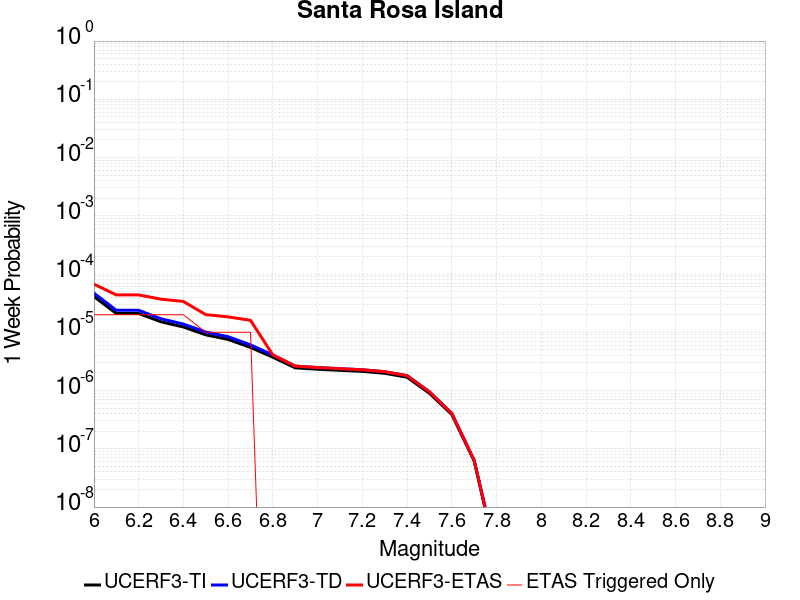 | 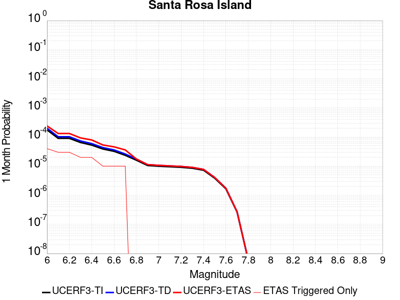 |  |  |

| Magnitude | 1 wk TI Prob | 1 wk TD Prob | 1 wk ETAS Prob | 1 wk ETAS/TD Gain | 1 wk ETAS Triggered Only | 1 mo TI Prob | 1 mo TD Prob | 1 mo ETAS Prob | 1 mo ETAS/TD Gain | 1 mo ETAS Triggered Only | 1 yr TI Prob | 1 yr TD Prob | 1 yr ETAS Prob | 1 yr ETAS/TD Gain | 1 yr ETAS Triggered Only | 10 yr TI Prob | 10 yr TD Prob | 10 yr ETAS Prob | 10 yr ETAS/TD Gain | 10 yr ETAS Triggered Only |
|-----|-----|-----|-----|-----|-----|-----|-----|-----|-----|-----|-----|-----|-----|-----|-----|-----|-----|-----|-----|-----|
| 6.0 | 4.1143165E-5 | 4.7091133E-5 | 7.221558E-5 | 1.5335281 | 2.5125628E-5 | 1.7631594E-4 | 2.0180465E-4 | 2.5204575E-4 | 1.2489592 | 5.0251256E-5 | 0.002144533 | 0.0024544 | 0.0025797198 | 1.0510592 | 1.2562814E-4 | 0.021239553 | 0.024293551 | 0.024489673 | 1.008073 | 2.0100502E-4 |
| 6.1 | 2.1061249E-5 | 2.3864959E-5 | 4.8989987E-5 | 2.0528 | 2.5125628E-5 | 9.0259375E-5 | 1.0227455E-4 | 1.3995914E-4 | 1.368465 | 3.768844E-5 | 0.0010983539 | 0.0012445104 | 0.001294699 | 1.040328 | 5.0251256E-5 | 0.01092941 | 0.012378449 | 0.012465299 | 1.0070163 | 8.79397E-5 |
| 6.2 | 2.1061249E-5 | 2.3864959E-5 | 4.8989987E-5 | 2.0528 | 2.5125628E-5 | 9.0259375E-5 | 1.0227455E-4 | 1.3995914E-4 | 1.368465 | 3.768844E-5 | 0.0010983539 | 0.0012445104 | 0.001294699 | 1.040328 | 5.0251256E-5 | 0.01092941 | 0.012378449 | 0.012465299 | 1.0070163 | 8.79397E-5 |
| 6.3 | 1.5158236E-5 | 1.7074419E-5 | 4.219962E-5 | 2.4715111 | 2.5125628E-5 | 6.496225E-5 | 7.3174095E-5 | 9.829789E-5 | 1.3433427 | 2.5125628E-5 | 7.906284E-4 | 8.905424E-4 | 9.281973E-4 | 1.042283 | 3.768844E-5 | 0.007878214 | 0.008870989 | 0.008933246 | 1.007018 | 6.281407E-5 |
| 6.4 | 1.2341918E-5 | 1.3852917E-5 | 3.8978196E-5 | 2.8137178 | 2.5125628E-5 | 5.2892858E-5 | 5.9368336E-5 | 8.449247E-5 | 1.4231908 | 2.5125628E-5 | 6.437803E-4 | 7.225779E-4 | 7.6023914E-4 | 1.0521206 | 3.768844E-5 | 0.006419184 | 0.007203121 | 0.007265483 | 1.0086576 | 6.281407E-5 |
| 6.5 | 9.061158E-6 | 1.0117031E-5 | 2.2679718E-5 | 2.2417367 | 1.2562814E-5 | 3.883296E-5 | 4.3358013E-5 | 5.592028E-5 | 1.2897335 | 1.2562814E-5 | 4.726887E-4 | 5.277613E-4 | 5.5287365E-4 | 1.0475829 | 2.5125628E-5 | 0.004716845 | 0.0052656173 | 0.005315604 | 1.009493 | 5.0251256E-5 |
| 6.6 | 7.5461685E-6 | 8.400733E-6 | 2.0963442E-5 | 2.49543 | 1.2562814E-5 | 3.2340322E-5 | 3.600267E-5 | 4.8565034E-5 | 1.3489286 | 1.2562814E-5 | 3.936723E-4 | 4.3824865E-4 | 4.6336328E-4 | 1.0573068 | 2.5125628E-5 | 0.003929756 | 0.0043742736 | 0.004424305 | 1.0114377 | 5.0251256E-5 |
| 6.7 | 5.5023775E-6 | 6.087381E-6 | 1.8650118E-5 | 3.0637345 | 1.2562814E-5 | 2.3581404E-5 | 2.6088532E-5 | 3.865102E-5 | 1.4815329 | 1.2562814E-5 | 2.8706578E-4 | 3.1758484E-4 | 3.427025E-4 | 1.0790895 | 2.5125628E-5 | 0.0028669522 | 0.0031716314 | 0.0031966774 | 1.0078969 | 2.5125628E-5 |
| 6.8 | 3.7351679E-6 | 4.0831405E-6 | 4.0831405E-6 | 1.0 | 0.0 | 1.6007763E-5 | 1.749907E-5 | 1.749907E-5 | 1.0 | 0.0 | 1.948771E-4 | 2.1303284E-4 | 2.2559297E-4 | 1.0589586 | 1.2562814E-5 | 0.0019470629 | 0.0021285315 | 0.0021410675 | 1.0058895 | 1.2562814E-5 |
| 6.9 | 2.456366E-6 | 2.6292705E-6 | 2.6292705E-6 | 1.0 | 0.0 | 1.0527241E-5 | 1.1268254E-5 | 1.1268254E-5 | 1.0 | 0.0 | 1.2816161E-4 | 1.3718237E-4 | 1.3718237E-4 | 1.0 | 0.0 | 0.0012808773 | 0.0013709799 | 0.0013709799 | 1.0 | 0.0 |
| 7.0 | 2.3245157E-6 | 2.4827782E-6 | 2.4827782E-6 | 1.0 | 0.0 | 9.962172E-6 | 1.0640435E-5 | 1.0640435E-5 | 1.0 | 0.0 | 1.2128269E-4 | 1.2953962E-4 | 1.2953962E-4 | 1.0 | 0.0 | 0.0012121652 | 0.0012946434 | 0.0012946434 | 1.0 | 0.0 |
| 7.1 | 2.2248344E-6 | 2.37325E-6 | 2.37325E-6 | 1.0 | 0.0 | 9.53497E-6 | 1.0171032E-5 | 1.0171032E-5 | 1.0 | 0.0 | 1.1608207E-4 | 1.2382529E-4 | 1.2382529E-4 | 1.0 | 0.0 | 0.0011602144 | 0.001237565 | 0.001237565 | 1.0 | 0.0 |
| 7.2 | 2.1350402E-6 | 2.276154E-6 | 2.276154E-6 | 1.0 | 0.0 | 9.150141E-6 | 9.754909E-6 | 9.754909E-6 | 1.0 | 0.0 | 1.1139726E-4 | 1.1875956E-4 | 1.1875956E-4 | 1.0 | 0.0 | 0.0011134144 | 0.0011869629 | 0.0011869629 | 1.0 | 0.0 |
| 7.3 | 1.9793572E-6 | 2.108719E-6 | 2.108719E-6 | 1.0 | 0.0 | 8.482932E-6 | 9.037336E-6 | 9.037336E-6 | 1.0 | 0.0 | 1.032748E-4 | 1.10024026E-4 | 1.10024026E-4 | 1.0 | 0.0 | 0.0010322682 | 0.0010996973 | 0.0010996973 | 1.0 | 0.0 |
| 7.4 | 1.6951194E-6 | 1.8045733E-6 | 1.8045733E-6 | 1.0 | 0.0 | 7.264777E-6 | 7.733863E-6 | 7.733863E-6 | 1.0 | 0.0 | 8.844508E-5 | 9.415573E-5 | 9.415573E-5 | 1.0 | 0.0 | 8.840988E-4 | 9.4116E-4 | 9.4116E-4 | 1.0 | 0.0 |
| 7.5 | 8.987207E-7 | 9.5122147E-7 | 9.5122147E-7 | 1.0 | 0.0 | 3.8516546E-6 | 4.076657E-6 | 4.076657E-6 | 1.0 | 0.0 | 4.6892885E-5 | 4.963218E-5 | 4.963218E-5 | 1.0 | 0.0 | 4.688299E-4 | 4.9621216E-4 | 4.9621216E-4 | 1.0 | 0.0 |
| 7.6 | 3.8783037E-7 | 4.052932E-7 | 4.052932E-7 | 1.0 | 0.0 | 1.6621291E-6 | 1.7369698E-6 | 1.7369698E-6 | 1.0 | 0.0 | 2.0236233E-5 | 2.1147409E-5 | 2.1147409E-5 | 1.0 | 0.0 | 2.023439E-4 | 2.1145462E-4 | 2.1145462E-4 | 1.0 | 0.0 |
| 7.7 | 6.181804E-8 | 6.339035E-8 | 6.339035E-8 | 1.0 | 0.0 | 2.6493444E-7 | 2.7167292E-7 | 2.7167292E-7 | 1.0 | 0.0 | 3.225572E-6 | 3.3076128E-6 | 3.3076128E-6 | 1.0 | 0.0 | 3.225525E-5 | 3.307564E-5 | 3.307564E-5 | 1.0 | 0.0 |
| 7.8 | 1.3704449E-9 | 1.3964153E-9 | 1.3964153E-9 | 1.0 | 0.0 | 5.873335E-9 | 5.984637E-9 | 5.984637E-9 | 1.0 | 0.0 | 7.1507856E-8 | 7.286295E-8 | 7.286295E-8 | 1.0 | 0.0 | 7.1507833E-7 | 7.286294E-7 | 7.286294E-7 | 1.0 | 0.0 |

## San Jacinto (San Bernardino)
*[(top)](#table-of-contents)*

| 1 Week | 1 Month | 1 Year | 10 Year |
|-----|-----|-----|-----|
|  |  |  |  |

| Magnitude | 1 wk TI Prob | 1 wk TD Prob | 1 wk ETAS Prob | 1 wk ETAS/TD Gain | 1 wk ETAS Triggered Only | 1 mo TI Prob | 1 mo TD Prob | 1 mo ETAS Prob | 1 mo ETAS/TD Gain | 1 mo ETAS Triggered Only | 1 yr TI Prob | 1 yr TD Prob | 1 yr ETAS Prob | 1 yr ETAS/TD Gain | 1 yr ETAS Triggered Only | 10 yr TI Prob | 10 yr TD Prob | 10 yr ETAS Prob | 10 yr ETAS/TD Gain | 10 yr ETAS Triggered Only |
|-----|-----|-----|-----|-----|-----|-----|-----|-----|-----|-----|-----|-----|-----|-----|-----|-----|-----|-----|-----|-----|
| 6.0 | 3.409352E-5 | 3.5986508E-5 | 9.879832E-5 | 2.7454267 | 6.281407E-5 | 1.461069E-4 | 1.542188E-4 | 2.2958405E-4 | 1.4886905 | 7.537688E-5 | 0.0017774 | 0.0018759987 | 0.0020640874 | 1.1002606 | 1.8844221E-4 | 0.01763251 | 0.019349935 | 0.01957169 | 1.0114603 | 2.2613065E-4 |
| 6.1 | 3.409352E-5 | 3.5986508E-5 | 9.879832E-5 | 2.7454267 | 6.281407E-5 | 1.461069E-4 | 1.542188E-4 | 2.2958405E-4 | 1.4886905 | 7.537688E-5 | 0.0017774 | 0.0018759987 | 0.0020640874 | 1.1002606 | 1.8844221E-4 | 0.01763251 | 0.019349935 | 0.01957169 | 1.0114603 | 2.2613065E-4 |
| 6.2 | 3.409352E-5 | 3.5986508E-5 | 9.879832E-5 | 2.7454267 | 6.281407E-5 | 1.461069E-4 | 1.542188E-4 | 2.2958405E-4 | 1.4886905 | 7.537688E-5 | 0.0017774 | 0.0018759987 | 0.0020640874 | 1.1002606 | 1.8844221E-4 | 0.01763251 | 0.019349935 | 0.01957169 | 1.0114603 | 2.2613065E-4 |
| 6.3 | 3.409352E-5 | 3.5986508E-5 | 9.879832E-5 | 2.7454267 | 6.281407E-5 | 1.461069E-4 | 1.542188E-4 | 2.2958405E-4 | 1.4886905 | 7.537688E-5 | 0.0017774 | 0.0018759987 | 0.0020640874 | 1.1002606 | 1.8844221E-4 | 0.01763251 | 0.019349935 | 0.01957169 | 1.0114603 | 2.2613065E-4 |
| 6.4 | 3.400795E-5 | 3.5879173E-5 | 9.869099E-5 | 2.7506485 | 6.281407E-5 | 1.4574021E-4 | 1.5375883E-4 | 2.2912413E-4 | 1.4901526 | 7.537688E-5 | 0.0017729428 | 0.0018704084 | 0.002058498 | 1.1005608 | 1.8844221E-4 | 0.017588645 | 0.019295016 | 0.019516785 | 1.0114936 | 2.2613065E-4 |
| 6.5 | 3.341482E-5 | 3.5139812E-5 | 9.795168E-5 | 2.7874844 | 6.281407E-5 | 1.4319851E-4 | 1.5059051E-4 | 2.2595604E-4 | 1.5004667 | 7.537688E-5 | 0.0017420477 | 0.0018318989 | 0.0020074563 | 1.0958334 | 1.758794E-4 | 0.017284546 | 0.018916558 | 0.019126087 | 1.0110765 | 2.1356784E-4 |
| 6.6 | 3.3364955E-5 | 3.5077028E-5 | 9.78889E-5 | 2.7906837 | 6.281407E-5 | 1.4298483E-4 | 1.5032147E-4 | 2.2568702E-4 | 1.5013626 | 7.537688E-5 | 0.0017394501 | 0.001828629 | 0.0020041869 | 1.0960051 | 1.758794E-4 | 0.017258976 | 0.018884424 | 0.019093959 | 1.0110956 | 2.1356784E-4 |
| 6.7 | 3.335922E-5 | 3.5066805E-5 | 9.787867E-5 | 2.791206 | 6.281407E-5 | 1.4296026E-4 | 1.5027766E-4 | 2.256432E-4 | 1.5015087 | 7.537688E-5 | 0.0017391514 | 0.0018280965 | 0.0020036544 | 1.0960332 | 1.758794E-4 | 0.017256035 | 0.018879214 | 0.01908875 | 1.0110987 | 2.1356784E-4 |
| 6.8 | 3.327683E-5 | 3.496087E-5 | 9.777275E-5 | 2.7966337 | 6.281407E-5 | 1.4260718E-4 | 1.498237E-4 | 2.2518929E-4 | 1.5030285 | 7.537688E-5 | 0.0017348597 | 0.0018225788 | 0.0019981377 | 1.0963244 | 1.758794E-4 | 0.017213784 | 0.018824987 | 0.019034535 | 1.0111313 | 2.1356784E-4 |
| 6.9 | 3.3235785E-5 | 3.4901823E-5 | 9.77137E-5 | 2.7996733 | 6.281407E-5 | 1.4243131E-4 | 1.4957068E-4 | 2.2493629E-4 | 1.5038795 | 7.537688E-5 | 0.0017327217 | 0.0018195034 | 0.0019950627 | 1.0964875 | 1.758794E-4 | 0.017192734 | 0.018794855 | 0.019004408 | 1.0111495 | 2.1356784E-4 |
| 7.0 | 3.3197095E-5 | 3.4841752E-5 | 9.765364E-5 | 2.802776 | 6.281407E-5 | 1.422655E-4 | 1.4931326E-4 | 2.246789E-4 | 1.5047483 | 7.537688E-5 | 0.0017307063 | 0.0018163746 | 0.0019919346 | 1.096654 | 1.758794E-4 | 0.017172894 | 0.018764233 | 0.018973794 | 1.0111681 | 2.1356784E-4 |
| 7.1 | 3.3129716E-5 | 3.4721965E-5 | 9.7533855E-5 | 2.8089957 | 6.281407E-5 | 1.4197677E-4 | 1.4879994E-4 | 2.241656E-4 | 1.5064899 | 7.537688E-5 | 0.0017271966 | 0.0018101353 | 0.0019856964 | 1.0969878 | 1.758794E-4 | 0.017138338 | 0.018703312 | 0.018912885 | 1.0112052 | 2.1356784E-4 |
| 7.2 | 3.3034008E-5 | 3.458941E-5 | 9.740131E-5 | 2.8159285 | 6.281407E-5 | 1.4156665E-4 | 1.4823192E-4 | 2.2359763E-4 | 1.5084311 | 7.537688E-5 | 0.0017222111 | 0.0018032312 | 0.0019787934 | 1.0973598 | 1.758794E-4 | 0.017089253 | 0.018635705 | 0.018845294 | 1.0112466 | 2.1356784E-4 |
| 7.3 | 3.2956614E-5 | 3.445717E-5 | 9.7269076E-5 | 2.822898 | 6.281407E-5 | 1.4123498E-4 | 1.4766524E-4 | 2.2303099E-4 | 1.5103825 | 7.537688E-5 | 0.0017181796 | 0.0017963431 | 0.0019719065 | 1.0977339 | 1.758794E-4 | 0.017049557 | 0.018568452 | 0.018778056 | 1.011288 | 2.1356784E-4 |
| 7.4 | 3.2915937E-5 | 3.4378863E-5 | 9.719078E-5 | 2.8270502 | 6.281407E-5 | 1.4106068E-4 | 1.4732967E-4 | 2.2269545E-4 | 1.5115452 | 7.537688E-5 | 0.0017160608 | 0.0017922645 | 0.0019678287 | 1.0979567 | 1.758794E-4 | 0.017028693 | 0.018528719 | 0.01873833 | 1.0113127 | 2.1356784E-4 |
| 7.5 | 3.281791E-5 | 3.4243778E-5 | 9.70557E-5 | 2.8342578 | 6.281407E-5 | 1.406406E-4 | 1.4675081E-4 | 2.2211664E-4 | 1.5135633 | 7.537688E-5 | 0.0017109542 | 0.0017852283 | 0.0019607937 | 1.0983434 | 1.758794E-4 | 0.016978411 | 0.018459605 | 0.01866923 | 1.0113559 | 2.1356784E-4 |
| 7.6 | 3.2521442E-5 | 3.396873E-5 | 9.678067E-5 | 2.8491106 | 6.281407E-5 | 1.3937015E-4 | 1.4557215E-4 | 2.2093806E-4 | 1.517722 | 7.537688E-5 | 0.0016955109 | 0.0017709016 | 0.0019464695 | 1.0991404 | 1.758794E-4 | 0.016826328 | 0.018317232 | 0.01852689 | 1.0114459 | 2.1356784E-4 |
| 7.7 | 3.0287873E-5 | 3.245276E-5 | 9.52648E-5 | 2.935491 | 6.281407E-5 | 1.297987E-4 | 1.3907586E-4 | 2.1444226E-4 | 1.5419086 | 7.537688E-5 | 0.0015791537 | 0.0016919347 | 0.0018675164 | 1.1037757 | 1.758794E-4 | 0.01567979 | 0.01752809 | 0.017737916 | 1.0119708 | 2.1356784E-4 |
| 7.8 | 2.6316151E-5 | 2.9663592E-5 | 9.24758E-5 | 3.1174848 | 6.281407E-5 | 1.1277862E-4 | 1.2712348E-4 | 2.0249079E-4 | 1.5928669 | 7.537688E-5 | 0.0013722149 | 0.0015466306 | 0.001722238 | 1.1135418 | 1.758794E-4 | 0.013637724 | 0.016069634 | 0.01627977 | 1.0130765 | 2.1356784E-4 |
| 7.9 | 2.0761147E-5 | 2.34181E-5 | 8.62307E-5 | 3.6822243 | 6.281407E-5 | 8.897331E-5 | 1.0035944E-4 | 1.7572875E-4 | 1.7509938 | 7.537688E-5 | 0.0010827117 | 0.0012211921 | 0.0013968566 | 1.1438469 | 1.758794E-4 | 0.010774517 | 0.012793174 | 0.012991607 | 1.0155109 | 2.0100502E-4 |
| 8.0 | 1.5738568E-5 | 1.6033575E-5 | 6.6284025E-5 | 4.1340766 | 5.0251256E-5 | 6.744926E-5 | 6.871352E-5 | 1.3152327E-4 | 1.9140815 | 6.281407E-5 | 8.2088535E-4 | 8.3626667E-4 | 9.4923744E-4 | 1.1350894 | 1.13065325E-4 | 0.008178596 | 0.008865921 | 0.008990435 | 1.0140442 | 1.2562814E-4 |
| 8.1 | 1.0105832E-5 | 8.3304985E-6 | 2.0893207E-5 | 2.5080383 | 1.2562814E-5 | 4.3309992E-5 | 3.570165E-5 | 4.8264013E-5 | 1.3518708 | 1.2562814E-5 | 5.2717153E-4 | 4.345814E-4 | 4.596961E-4 | 1.0577905 | 2.5125628E-5 | 0.005259227 | 0.004677232 | 0.00470224 | 1.0053468 | 2.5125628E-5 |
| 8.2 | 4.189207E-6 | 1.5784357E-6 | 1.5784357E-6 | 1.0 | 0.0 | 1.7953622E-5 | 6.7647065E-6 | 6.7647065E-6 | 1.0 | 0.0 | 2.1856341E-4 | 8.235722E-5 | 8.235722E-5 | 1.0 | 0.0 | 0.0021834858 | 9.565867E-4 | 9.565867E-4 | 1.0 | 0.0 |
| 8.3 | 1.2758221E-6 | 3.6149942E-7 | 3.6149942E-7 | 1.0 | 0.0 | 5.4677976E-6 | 1.5492824E-6 | 1.5492824E-6 | 1.0 | 0.0 | 6.65684E-5 | 1.8862354E-5 | 1.8862354E-5 | 1.0 | 0.0 | 6.6548464E-4 | 2.2751294E-4 | 2.2751294E-4 | 1.0 | 0.0 |

## San Andreas (Creeping Section) 2011 CFM
*[(top)](#table-of-contents)*

| 1 Week | 1 Month | 1 Year | 10 Year |
|-----|-----|-----|-----|
| 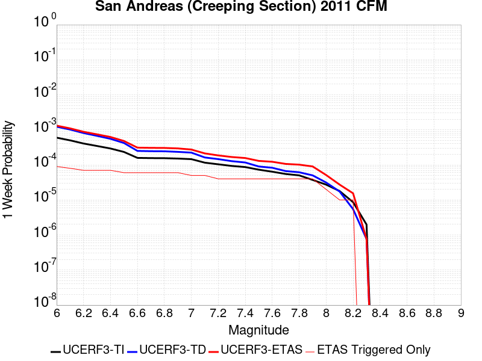 |  | 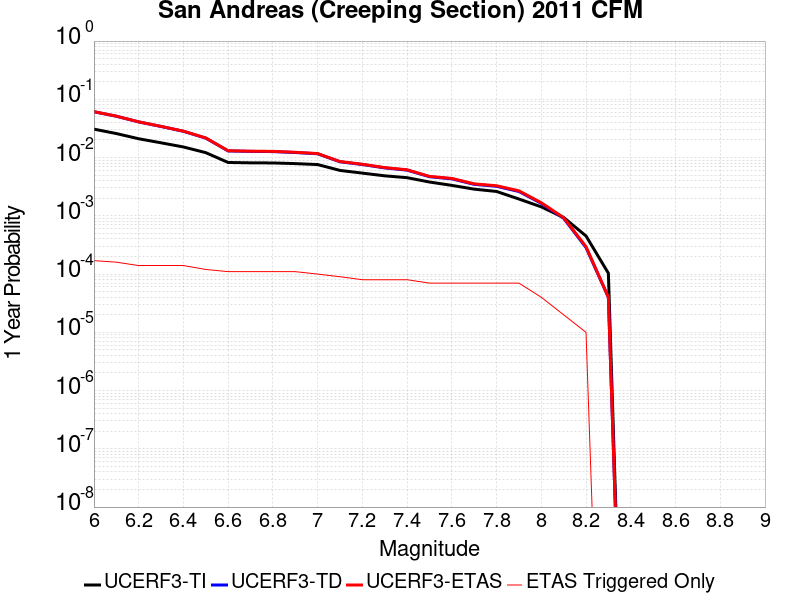 |  |

| Magnitude | 1 wk TI Prob | 1 wk TD Prob | 1 wk ETAS Prob | 1 wk ETAS/TD Gain | 1 wk ETAS Triggered Only | 1 mo TI Prob | 1 mo TD Prob | 1 mo ETAS Prob | 1 mo ETAS/TD Gain | 1 mo ETAS Triggered Only | 1 yr TI Prob | 1 yr TD Prob | 1 yr ETAS Prob | 1 yr ETAS/TD Gain | 1 yr ETAS Triggered Only | 10 yr TI Prob | 10 yr TD Prob | 10 yr ETAS Prob | 10 yr ETAS/TD Gain | 10 yr ETAS Triggered Only |
|-----|-----|-----|-----|-----|-----|-----|-----|-----|-----|-----|-----|-----|-----|-----|-----|-----|-----|-----|-----|-----|
| 6.0 | 5.986481E-4 | 0.001228691 | 0.0012914279 | 1.05106 | 6.281407E-5 | 0.0025631124 | 0.005246795 | 0.0053467704 | 1.0190545 | 1.0050251E-4 | 0.030762846 | 0.061203245 | 0.06133298 | 1.0021197 | 1.3819095E-4 | 0.26835477 | 0.425928 | 0.42603618 | 1.000254 | 1.8844221E-4 |
| 6.1 | 5.015945E-4 | 0.0010230356 | 0.0010732354 | 1.0490695 | 5.0251256E-5 | 0.00214792 | 0.004369436 | 0.0044569913 | 1.0200381 | 8.79397E-5 | 0.025839351 | 0.051246606 | 0.051365796 | 1.0023258 | 1.2562814E-4 | 0.23032776 | 0.37284943 | 0.37295187 | 1.0002747 | 1.6331658E-4 |
| 6.2 | 4.073338E-4 | 8.1157376E-4 | 8.617842E-4 | 1.0618681 | 5.0251256E-5 | 0.0017445484 | 0.0034683137 | 0.003543429 | 1.0216576 | 7.537688E-5 | 0.021034058 | 0.04093177 | 0.041040204 | 1.0026492 | 1.13065325E-4 | 0.19150782 | 0.31302592 | 0.31312948 | 1.0003308 | 1.5075377E-4 |
| 6.3 | 3.464099E-4 | 6.7455834E-4 | 7.247757E-4 | 1.0744448 | 5.0251256E-5 | 0.0014837692 | 0.0028832308 | 0.0029583904 | 1.0260679 | 7.537688E-5 | 0.017915873 | 0.034187846 | 0.034297045 | 1.0031941 | 1.13065325E-4 | 0.16538359 | 0.27130842 | 0.27141827 | 1.000405 | 1.5075377E-4 |
| 6.4 | 2.935057E-4 | 5.5516965E-4 | 6.05393E-4 | 1.0904648 | 5.0251256E-5 | 0.0012572751 | 0.0023727308 | 0.0024479288 | 1.0316926 | 7.537688E-5 | 0.015200248 | 0.02826279 | 0.02837266 | 1.0038874 | 1.13065325E-4 | 0.14201577 | 0.23297668 | 0.23309231 | 1.0004963 | 1.5075377E-4 |
| 6.5 | 2.3409708E-4 | 4.2132285E-4 | 4.7155295E-4 | 1.1192199 | 5.0251256E-5 | 0.0010028875 | 0.0018017791 | 0.0018770202 | 1.0417594 | 7.537688E-5 | 0.012141965 | 0.021586355 | 0.021684688 | 1.0045553 | 1.0050251E-4 | 0.11499573 | 0.1868149 | 0.18692729 | 1.0006015 | 1.3819095E-4 |
| 6.6 | 1.5842178E-4 | 2.5068692E-4 | 3.0092557E-4 | 1.200404 | 5.0251256E-5 | 6.7877385E-4 | 0.0010739256 | 0.0011366722 | 1.0584273 | 6.281407E-5 | 0.0082328 | 0.012995283 | 0.01308208 | 1.006679 | 8.79397E-5 | 0.07934396 | 0.12313759 | 0.12324775 | 1.0008945 | 1.2562814E-4 |
| 6.7 | 1.5616413E-4 | 2.4605254E-4 | 2.9629143E-4 | 1.2041795 | 5.0251256E-5 | 6.691031E-4 | 0.0010540807 | 0.0011168285 | 1.0595285 | 6.281407E-5 | 0.0081159435 | 0.012757154 | 0.012843972 | 1.0068054 | 8.79397E-5 | 0.0782586 | 0.12116472 | 0.12127513 | 1.0009112 | 1.2562814E-4 |
| 6.8 | 1.5538467E-4 | 2.442914E-4 | 2.9453041E-4 | 1.2056519 | 5.0251256E-5 | 6.6576427E-4 | 0.001046539 | 0.0011092874 | 1.059958 | 6.281407E-5 | 0.008075596 | 0.012666538 | 0.012753364 | 1.0068548 | 8.79397E-5 | 0.07788358 | 0.12039561 | 0.12050611 | 1.0009178 | 1.2562814E-4 |
| 6.9 | 1.5153569E-4 | 2.3538464E-4 | 2.8562406E-4 | 1.2134354 | 5.0251256E-5 | 6.49277E-4 | 0.0010084033 | 0.001071154 | 1.0622278 | 6.281407E-5 | 0.007876333 | 0.012208726 | 0.012295593 | 1.0071151 | 8.79397E-5 | 0.07602952 | 0.11646574 | 0.11657674 | 1.0009531 | 1.2562814E-4 |
| 7.0 | 1.4588932E-4 | 2.2395732E-4 | 2.7419731E-4 | 1.2243285 | 5.0251256E-5 | 6.250901E-4 | 9.59466E-4 | 0.0010222198 | 1.0654049 | 6.281407E-5 | 0.0075839474 | 0.011619428 | 0.011706346 | 1.0074804 | 8.79397E-5 | 0.073302895 | 0.11131206 | 0.11142371 | 1.001003 | 1.2562814E-4 |
| 7.1 | 1.1565079E-4 | 1.6281323E-4 | 2.130563E-4 | 1.3085933 | 5.0251256E-5 | 4.955521E-4 | 6.9758523E-4 | 7.603555E-4 | 1.0899822 | 6.281407E-5 | 0.006016669 | 0.008460228 | 0.008547423 | 1.0103066 | 8.79397E-5 | 0.058563538 | 0.08366478 | 0.0837799 | 1.0013759 | 1.2562814E-4 |
| 7.2 | 1.0393792E-4 | 1.4615392E-4 | 1.8383685E-4 | 1.2578305 | 3.768844E-5 | 4.4537216E-4 | 6.262243E-4 | 6.7644415E-4 | 1.0801946 | 5.0251256E-5 | 0.005408933 | 0.0075977976 | 0.007672602 | 1.0098455 | 7.537688E-5 | 0.052791595 | 0.07561503 | 0.07571955 | 1.0013822 | 1.13065325E-4 |
| 7.3 | 9.332884E-5 | 1.2780601E-4 | 1.6548963E-4 | 1.2948502 | 3.768844E-5 | 3.999194E-4 | 5.4762565E-4 | 5.978494E-4 | 1.0917118 | 5.0251256E-5 | 0.0048581534 | 0.0066470946 | 0.00672197 | 1.0112644 | 7.537688E-5 | 0.047533102 | 0.06647954 | 0.066585094 | 1.0015876 | 1.13065325E-4 |
| 7.4 | 8.670252E-5 | 1.1702972E-4 | 1.5471375E-4 | 1.322004 | 3.768844E-5 | 3.715293E-4 | 5.014601E-4 | 5.5168616E-4 | 1.1001596 | 5.0251256E-5 | 0.004513991 | 0.0060883067 | 0.0061632246 | 1.0123053 | 7.537688E-5 | 0.044233937 | 0.061148684 | 0.061254837 | 1.0017359 | 1.13065325E-4 |
| 7.5 | 7.3036405E-5 | 9.005699E-5 | 1.2774204E-4 | 1.4184579 | 3.768844E-5 | 3.129756E-4 | 3.859015E-4 | 4.3613336E-4 | 1.1301676 | 5.0251256E-5 | 0.0038038217 | 0.0046882504 | 0.00475077 | 1.0133353 | 6.281407E-5 | 0.03739367 | 0.047875606 | 0.047971297 | 1.0019988 | 1.0050251E-4 |
| 7.6 | 6.3935775E-5 | 8.280209E-5 | 1.2048741E-4 | 1.4551252 | 3.768844E-5 | 2.7398168E-4 | 3.5481792E-4 | 4.0505134E-4 | 1.1415752 | 5.0251256E-5 | 0.0033306254 | 0.00431137 | 0.004373913 | 1.0145066 | 6.281407E-5 | 0.032811474 | 0.043990135 | 0.044086218 | 1.0021842 | 1.0050251E-4 |
| 7.7 | 5.5050095E-5 | 6.661729E-5 | 1.04303224E-4 | 1.5657079 | 3.768844E-5 | 2.3590765E-4 | 2.8547147E-4 | 3.3570838E-4 | 1.1759788 | 5.0251256E-5 | 0.0028683927 | 0.0034700802 | 0.0035326763 | 1.0180387 | 6.281407E-5 | 0.0283165 | 0.03579509 | 0.03587988 | 1.0023688 | 8.79397E-5 |
| 7.8 | 5.027131E-5 | 6.1627725E-5 | 9.9313846E-5 | 1.6115124 | 3.768844E-5 | 2.1543067E-4 | 2.640921E-4 | 3.1433007E-4 | 1.190229 | 5.0251256E-5 | 0.0026197135 | 0.003210584 | 0.0032731963 | 1.0195019 | 6.281407E-5 | 0.025890453 | 0.03312572 | 0.033210747 | 1.0025668 | 8.79397E-5 |
| 7.9 | 3.7271806E-5 | 5.0224386E-5 | 8.7910936E-5 | 1.7503636 | 3.768844E-5 | 1.5972654E-4 | 2.1522962E-4 | 2.6547007E-4 | 1.2334272 | 5.0251256E-5 | 0.0019429359 | 0.0026172737 | 0.0026799233 | 1.023937 | 6.281407E-5 | 0.019260362 | 0.027066687 | 0.027140025 | 1.0027095 | 7.537688E-5 |
| 8.0 | 2.7310243E-5 | 3.1428404E-5 | 5.6553243E-5 | 1.799431 | 2.5125628E-5 | 1.17038646E-4 | 1.3468621E-4 | 1.7236958E-4 | 1.2797863 | 3.768844E-5 | 0.0014240141 | 0.0016385721 | 0.001688741 | 1.0306175 | 5.0251256E-5 | 0.014149235 | 0.01721387 | 0.017275602 | 1.0035862 | 6.281407E-5 |
| 8.1 | 1.7940547E-5 | 1.7400796E-5 | 2.9963392E-5 | 1.7219552 | 1.2562814E-5 | 7.688579E-5 | 7.457271E-5 | 8.713459E-5 | 1.1684514 | 1.2562814E-5 | 9.3568244E-4 | 9.075451E-4 | 9.3264796E-4 | 1.0276601 | 2.5125628E-5 | 0.009317525 | 0.009799073 | 0.0098363925 | 1.0038084 | 3.768844E-5 |
| 8.2 | 8.643924E-6 | 5.4748625E-6 | 1.8037608E-5 | 3.294623 | 1.2562814E-5 | 3.704486E-5 | 2.3463486E-5 | 3.6026006E-5 | 1.5354072 | 1.2562814E-5 | 4.5092785E-4 | 2.8563058E-4 | 2.9818979E-4 | 1.0439702 | 1.2562814E-5 | 0.0045001395 | 0.0032487072 | 0.0032612293 | 1.0038545 | 1.2562814E-5 |
| 8.3 | 1.983087E-6 | 7.6599065E-7 | 7.6599065E-7 | 1.0 | 0.0 | 8.498917E-6 | 3.282813E-6 | 3.282813E-6 | 1.0 | 0.0 | 1.034694E-4 | 3.9967534E-5 | 3.9967534E-5 | 1.0 | 0.0 | 0.0010342124 | 4.719687E-4 | 4.719687E-4 | 1.0 | 0.0 |

## Baker
*[(top)](#table-of-contents)*

| 1 Week | 1 Month | 1 Year | 10 Year |
|-----|-----|-----|-----|
|  |  |  |  |

| Magnitude | 1 wk TI Prob | 1 wk TD Prob | 1 wk ETAS Prob | 1 wk ETAS/TD Gain | 1 wk ETAS Triggered Only | 1 mo TI Prob | 1 mo TD Prob | 1 mo ETAS Prob | 1 mo ETAS/TD Gain | 1 mo ETAS Triggered Only | 1 yr TI Prob | 1 yr TD Prob | 1 yr ETAS Prob | 1 yr ETAS/TD Gain | 1 yr ETAS Triggered Only | 10 yr TI Prob | 10 yr TD Prob | 10 yr ETAS Prob | 10 yr ETAS/TD Gain | 10 yr ETAS Triggered Only |
|-----|-----|-----|-----|-----|-----|-----|-----|-----|-----|-----|-----|-----|-----|-----|-----|-----|-----|-----|-----|-----|
| 6.0 | 5.695525E-6 | 5.8348373E-6 | 8.1211285E-5 | 13.918346 | 7.537688E-5 | 2.4409164E-5 | 2.5006228E-5 | 1.1294373E-4 | 4.516624 | 8.79397E-5 | 2.9714106E-4 | 3.044123E-4 | 4.174432E-4 | 1.3713086 | 1.13065325E-4 | 0.0029674405 | 0.0030403486 | 0.0032657918 | 1.0741504 | 2.2613065E-4 |
| 6.1 | 5.695525E-6 | 5.8348373E-6 | 8.1211285E-5 | 13.918346 | 7.537688E-5 | 2.4409164E-5 | 2.5006228E-5 | 1.1294373E-4 | 4.516624 | 8.79397E-5 | 2.9714106E-4 | 3.044123E-4 | 4.174432E-4 | 1.3713086 | 1.13065325E-4 | 0.0029674405 | 0.0030403486 | 0.0032657918 | 1.0741504 | 2.2613065E-4 |
| 6.2 | 5.695525E-6 | 5.8348373E-6 | 8.1211285E-5 | 13.918346 | 7.537688E-5 | 2.4409164E-5 | 2.5006228E-5 | 1.1294373E-4 | 4.516624 | 8.79397E-5 | 2.9714106E-4 | 3.044123E-4 | 4.174432E-4 | 1.3713086 | 1.13065325E-4 | 0.0029674405 | 0.0030403486 | 0.0032657918 | 1.0741504 | 2.2613065E-4 |
| 6.3 | 3.2995713E-6 | 3.383667E-6 | 5.3634754E-5 | 15.851072 | 5.0251256E-5 | 1.4140943E-5 | 1.4501353E-5 | 6.475188E-5 | 4.4652305 | 5.0251256E-5 | 1.7215237E-4 | 1.7654014E-4 | 2.3934312E-4 | 1.3557434 | 6.281407E-5 | 0.0017201907 | 0.001764046 | 0.0018643712 | 1.0568722 | 1.0050251E-4 |
| 6.4 | 3.2995713E-6 | 3.383667E-6 | 5.3634754E-5 | 15.851072 | 5.0251256E-5 | 1.4140943E-5 | 1.4501353E-5 | 6.475188E-5 | 4.4652305 | 5.0251256E-5 | 1.7215237E-4 | 1.7654014E-4 | 2.3934312E-4 | 1.3557434 | 6.281407E-5 | 0.0017201907 | 0.001764046 | 0.0018643712 | 1.0568722 | 1.0050251E-4 |
| 6.5 | 2.782202E-6 | 2.8558404E-6 | 5.3106953E-5 | 18.595911 | 5.0251256E-5 | 1.1923668E-5 | 1.223926E-5 | 6.2489904E-5 | 5.1056924 | 5.0251256E-5 | 1.4516099E-4 | 1.4900314E-4 | 2.1180786E-4 | 1.4214993 | 6.281407E-5 | 0.001450662 | 0.0014890651 | 0.0015894179 | 1.0673932 | 1.0050251E-4 |
| 6.6 | 2.3163404E-6 | 2.38092E-6 | 5.263206E-5 | 22.105764 | 5.0251256E-5 | 9.927136E-6 | 1.0203904E-5 | 6.0454648E-5 | 5.924659 | 5.0251256E-5 | 1.20856166E-4 | 1.2422565E-4 | 1.8703192E-4 | 1.5055821 | 6.281407E-5 | 0.0012079047 | 0.0012415823 | 0.00134196 | 1.0808467 | 1.0050251E-4 |
| 6.7 | 2.037056E-6 | 2.0965003E-6 | 3.9784863E-5 | 18.976797 | 3.768844E-5 | 8.7302105E-6 | 8.984972E-6 | 4.6673074E-5 | 5.194571 | 3.768844E-5 | 1.0628513E-4 | 1.093867E-4 | 1.5963246E-4 | 1.4593407 | 5.0251256E-5 | 0.0010623431 | 0.0010933448 | 0.0011560902 | 1.0573884 | 6.281407E-5 |
| 6.8 | 1.8356744E-6 | 1.8915287E-6 | 2.701711E-5 | 14.283215 | 2.5125628E-5 | 7.867153E-6 | 8.106527E-6 | 3.323195E-5 | 4.0994067 | 2.5125628E-5 | 9.577837E-5 | 9.869264E-5 | 1.3637736E-4 | 1.3818393 | 3.768844E-5 | 9.57371E-4 | 9.86502E-4 | 0.0010367037 | 1.0508885 | 5.0251256E-5 |
| 6.9 | 1.6310546E-6 | 1.6832072E-6 | 2.6808793E-5 | 15.927209 | 2.5125628E-5 | 6.9902153E-6 | 7.213726E-6 | 3.2339172E-5 | 4.4830055 | 2.5125628E-5 | 8.510255E-5 | 8.782368E-5 | 1.2550881E-4 | 1.4290999 | 3.768844E-5 | 8.5069967E-4 | 8.7790104E-4 | 9.281082E-4 | 1.05719 | 5.0251256E-5 |
| 7.0 | 1.2058036E-6 | 1.2508665E-6 | 1.3813665E-5 | 11.043277 | 1.2562814E-5 | 5.1677193E-6 | 5.3608455E-6 | 1.7923592E-5 | 3.3434262 | 1.2562814E-5 | 6.291517E-5 | 6.5266366E-5 | 9.039036E-5 | 1.3849454 | 2.5125628E-5 | 6.289736E-4 | 6.524743E-4 | 6.9013814E-4 | 1.0577246 | 3.768844E-5 |
| 7.1 | 1.052382E-6 | 1.0951609E-6 | 1.3657961E-5 | 12.471192 | 1.2562814E-5 | 4.5102006E-6 | 4.693538E-6 | 1.7256294E-5 | 3.6766067 | 1.2562814E-5 | 5.491031E-5 | 5.7142337E-5 | 6.970443E-5 | 1.2198387 | 1.2562814E-5 | 5.4896745E-4 | 5.7127734E-4 | 5.963886E-4 | 1.0439564 | 2.5125628E-5 |
| 7.2 | 1.0067454E-6 | 1.0487711E-6 | 1.3611572E-5 | 12.978592 | 1.2562814E-5 | 4.3146156E-6 | 4.4947255E-6 | 1.7057482E-5 | 3.795 | 1.2562814E-5 | 5.252918E-5 | 5.4721917E-5 | 6.728404E-5 | 1.229563 | 1.2562814E-5 | 5.251676E-4 | 5.470853E-4 | 5.7219714E-4 | 1.0459012 | 2.5125628E-5 |
| 7.3 | 9.3596316E-7 | 9.767723E-7 | 9.767723E-7 | 1.0 | 0.0 | 4.0112645E-6 | 4.1861604E-6 | 4.1861604E-6 | 1.0 | 0.0 | 4.8836053E-5 | 5.096532E-5 | 5.096532E-5 | 1.0 | 0.0 | 4.8825322E-4 | 5.095371E-4 | 5.220935E-4 | 1.0246428 | 1.2562814E-5 |
| 7.4 | 8.8117395E-7 | 9.2076635E-7 | 9.2076635E-7 | 1.0 | 0.0 | 3.7764542E-6 | 3.9461356E-6 | 3.9461356E-6 | 1.0 | 0.0 | 4.5977362E-5 | 4.8043148E-5 | 4.8043148E-5 | 1.0 | 0.0 | 4.596785E-4 | 4.8032837E-4 | 4.928852E-4 | 1.0261421 | 1.2562814E-5 |
| 7.5 | 8.292386E-7 | 8.6745956E-7 | 8.6745956E-7 | 1.0 | 0.0 | 3.5538749E-6 | 3.7176785E-6 | 3.7176785E-6 | 1.0 | 0.0 | 4.326757E-5 | 4.5261804E-5 | 4.5261804E-5 | 1.0 | 0.0 | 4.3259145E-4 | 4.5252658E-4 | 4.6508372E-4 | 1.027749 | 1.2562814E-5 |
| 7.6 | 7.553842E-7 | 7.9144706E-7 | 7.9144706E-7 | 1.0 | 0.0 | 3.2373566E-6 | 3.3919116E-6 | 3.3919116E-6 | 1.0 | 0.0 | 3.9414106E-5 | 4.129575E-5 | 4.129575E-5 | 1.0 | 0.0 | 3.9407116E-4 | 4.1288146E-4 | 4.2543907E-4 | 1.0304146 | 1.2562814E-5 |
| 7.7 | 6.5285366E-7 | 6.852797E-7 | 6.852797E-7 | 1.0 | 0.0 | 2.797941E-6 | 2.9369096E-6 | 2.9369096E-6 | 1.0 | 0.0 | 3.40644E-5 | 3.5756293E-5 | 3.5756293E-5 | 1.0 | 0.0 | 3.405918E-4 | 3.5750607E-4 | 3.700644E-4 | 1.0351275 | 1.2562814E-5 |
| 7.8 | 3.4586725E-7 | 3.6482615E-7 | 3.6482615E-7 | 1.0 | 0.0 | 1.4822873E-6 | 1.5635396E-6 | 1.5635396E-6 | 1.0 | 0.0 | 1.80467E-5 | 1.9035933E-5 | 1.9035933E-5 | 1.0 | 0.0 | 1.8045233E-4 | 1.9034347E-4 | 2.0290389E-4 | 1.0659882 | 1.2562814E-5 |
| 7.9 | 2.5591178E-9 | 2.6696718E-9 | 2.6696718E-9 | 1.0 | 0.0 | 1.0967647E-8 | 1.14414505E-8 | 1.14414505E-8 | 1.0 | 0.0 | 1.335311E-7 | 1.3929966E-7 | 1.3929966E-7 | 1.0 | 0.0 | 1.3353102E-6 | 1.3929966E-6 | 1.3929966E-6 | 1.0 | 0.0 |

## Santa Ynez (East)
*[(top)](#table-of-contents)*

| 1 Week | 1 Month | 1 Year | 10 Year |
|-----|-----|-----|-----|
| 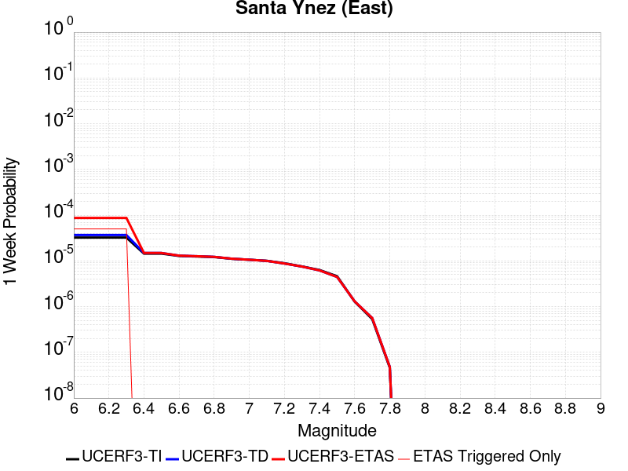 |  |  |  |

| Magnitude | 1 wk TI Prob | 1 wk TD Prob | 1 wk ETAS Prob | 1 wk ETAS/TD Gain | 1 wk ETAS Triggered Only | 1 mo TI Prob | 1 mo TD Prob | 1 mo ETAS Prob | 1 mo ETAS/TD Gain | 1 mo ETAS Triggered Only | 1 yr TI Prob | 1 yr TD Prob | 1 yr ETAS Prob | 1 yr ETAS/TD Gain | 1 yr ETAS Triggered Only | 10 yr TI Prob | 10 yr TD Prob | 10 yr ETAS Prob | 10 yr ETAS/TD Gain | 10 yr ETAS Triggered Only |
|-----|-----|-----|-----|-----|-----|-----|-----|-----|-----|-----|-----|-----|-----|-----|-----|-----|-----|-----|-----|-----|
| 6.0 | 3.2269712E-5 | 3.67505E-5 | 8.699991E-5 | 2.3673122 | 5.0251256E-5 | 1.3829143E-4 | 1.5749598E-4 | 2.2030015E-4 | 1.3987669 | 6.281407E-5 | 0.0016823979 | 0.0019164166 | 0.002041804 | 1.065428 | 1.2562814E-4 | 0.016697178 | 0.019056441 | 0.019253615 | 1.0103469 | 2.0100502E-4 |
| 6.1 | 3.2269712E-5 | 3.67505E-5 | 8.699991E-5 | 2.3673122 | 5.0251256E-5 | 1.3829143E-4 | 1.5749598E-4 | 2.2030015E-4 | 1.3987669 | 6.281407E-5 | 0.0016823979 | 0.0019164166 | 0.002041804 | 1.065428 | 1.2562814E-4 | 0.016697178 | 0.019056441 | 0.019253615 | 1.0103469 | 2.0100502E-4 |
| 6.2 | 3.2269712E-5 | 3.67505E-5 | 8.699991E-5 | 2.3673122 | 5.0251256E-5 | 1.3829143E-4 | 1.5749598E-4 | 2.2030015E-4 | 1.3987669 | 6.281407E-5 | 0.0016823979 | 0.0019164166 | 0.002041804 | 1.065428 | 1.2562814E-4 | 0.016697178 | 0.019056441 | 0.019253615 | 1.0103469 | 2.0100502E-4 |
| 6.3 | 3.2269712E-5 | 3.67505E-5 | 8.699991E-5 | 2.3673122 | 5.0251256E-5 | 1.3829143E-4 | 1.5749598E-4 | 2.2030015E-4 | 1.3987669 | 6.281407E-5 | 0.0016823979 | 0.0019164166 | 0.002041804 | 1.065428 | 1.2562814E-4 | 0.016697178 | 0.019056441 | 0.019253615 | 1.0103469 | 2.0100502E-4 |
| 6.4 | 1.4404779E-5 | 1.4849382E-5 | 1.4849382E-5 | 1.0 | 0.0 | 6.1733306E-5 | 6.363868E-5 | 6.363868E-5 | 1.0 | 0.0 | 7.513438E-4 | 7.745306E-4 | 8.121898E-4 | 1.048622 | 3.768844E-5 | 0.0074880854 | 0.007718862 | 0.0077811913 | 1.0080749 | 6.281407E-5 |
| 6.5 | 1.4404779E-5 | 1.4849382E-5 | 1.4849382E-5 | 1.0 | 0.0 | 6.1733306E-5 | 6.363868E-5 | 6.363868E-5 | 1.0 | 0.0 | 7.513438E-4 | 7.745306E-4 | 8.121898E-4 | 1.048622 | 3.768844E-5 | 0.0074880854 | 0.007718862 | 0.0077811913 | 1.0080749 | 6.281407E-5 |
| 6.6 | 1.280208E-5 | 1.3011947E-5 | 1.3011947E-5 | 1.0 | 0.0 | 5.4864904E-5 | 5.5764307E-5 | 5.5764307E-5 | 1.0 | 0.0 | 6.6777546E-4 | 6.787207E-4 | 7.1638357E-4 | 1.055491 | 3.768844E-5 | 0.006657724 | 0.0067666885 | 0.0068290774 | 1.00922 | 6.281407E-5 |
| 6.7 | 1.2457027E-5 | 1.2628468E-5 | 1.2628468E-5 | 1.0 | 0.0 | 5.3386164E-5 | 5.412089E-5 | 5.412089E-5 | 1.0 | 0.0 | 6.497827E-4 | 6.587243E-4 | 6.963879E-4 | 1.0571766 | 3.768844E-5 | 0.00647886 | 0.006567915 | 0.0066303164 | 1.009501 | 6.281407E-5 |
| 6.8 | 1.2095134E-5 | 1.2230915E-5 | 1.2230915E-5 | 1.0 | 0.0 | 5.1835254E-5 | 5.241716E-5 | 5.241716E-5 | 1.0 | 0.0 | 6.309115E-4 | 6.379937E-4 | 6.6310324E-4 | 1.0393572 | 2.5125628E-5 | 0.0062912325 | 0.006361809 | 0.0064117406 | 1.0078486 | 5.0251256E-5 |
| 6.9 | 1.1104036E-5 | 1.1157347E-5 | 1.1157347E-5 | 1.0 | 0.0 | 4.758786E-5 | 4.781633E-5 | 4.781633E-5 | 1.0 | 0.0 | 5.7922816E-4 | 5.820096E-4 | 5.945651E-4 | 1.0215727 | 1.2562814E-5 | 0.005777207 | 0.0058049993 | 0.0058424687 | 1.0064547 | 3.768844E-5 |
| 7.0 | 1.0577444E-5 | 1.058168E-5 | 1.058168E-5 | 1.0 | 0.0 | 4.5331115E-5 | 4.5349276E-5 | 4.5349276E-5 | 1.0 | 0.0 | 5.5176654E-4 | 5.519888E-4 | 5.6454464E-4 | 1.0227466 | 1.2562814E-5 | 0.0055039856 | 0.0055063153 | 0.0055437963 | 1.0068069 | 3.768844E-5 |
| 7.1 | 1.0021775E-5 | 9.980988E-6 | 9.980988E-6 | 1.0 | 0.0 | 4.294976E-5 | 4.2774966E-5 | 4.2774966E-5 | 1.0 | 0.0 | 5.2278786E-4 | 5.2066194E-4 | 5.332182E-4 | 1.024116 | 1.2562814E-5 | 0.0052155964 | 0.0051945536 | 0.0052320464 | 1.0072176 | 3.768844E-5 |
| 7.2 | 8.874109E-6 | 8.748793E-6 | 8.748793E-6 | 1.0 | 0.0 | 3.8031343E-5 | 3.7494297E-5 | 3.7494297E-5 | 1.0 | 0.0 | 4.629332E-4 | 4.5639853E-4 | 4.689556E-4 | 1.0275134 | 1.2562814E-5 | 0.0046197 | 0.0045547304 | 0.004592247 | 1.0082369 | 3.768844E-5 |
| 7.3 | 7.5504267E-6 | 7.5051175E-6 | 7.5051175E-6 | 1.0 | 0.0 | 3.235857E-5 | 3.21644E-5 | 3.21644E-5 | 1.0 | 0.0 | 3.9389438E-4 | 3.915322E-4 | 4.040901E-4 | 1.0320737 | 1.2562814E-5 | 0.0039319694 | 0.003908531 | 0.003946072 | 1.0096049 | 3.768844E-5 |
| 7.4 | 6.309394E-6 | 6.1831556E-6 | 6.1831556E-6 | 1.0 | 0.0 | 2.703998E-5 | 2.6498974E-5 | 2.6498974E-5 | 1.0 | 0.0 | 3.2916202E-4 | 3.225782E-4 | 3.3513698E-4 | 1.0389324 | 1.2562814E-5 | 0.003286749 | 0.003221197 | 0.0032462417 | 1.007775 | 2.5125628E-5 |
| 7.5 | 4.6103073E-6 | 4.4408903E-6 | 4.4408903E-6 | 1.0 | 0.0 | 1.975831E-5 | 1.9032252E-5 | 1.9032252E-5 | 1.0 | 0.0 | 2.4053088E-4 | 2.3169373E-4 | 2.3169373E-4 | 1.0 | 0.0 | 0.002402707 | 0.002314591 | 0.0023271248 | 1.0054151 | 1.2562814E-5 |
| 7.6 | 1.2858658E-6 | 1.3008173E-6 | 1.3008173E-6 | 1.0 | 0.0 | 5.5108417E-6 | 5.5749197E-6 | 5.5749197E-6 | 1.0 | 0.0 | 6.7092435E-5 | 6.78726E-5 | 6.78726E-5 | 1.0 | 0.0 | 6.707218E-4 | 6.785256E-4 | 6.785256E-4 | 1.0 | 0.0 |
| 7.7 | 5.3302307E-7 | 5.612138E-7 | 5.612138E-7 | 1.0 | 0.0 | 2.2843826E-6 | 2.4052001E-6 | 2.4052001E-6 | 1.0 | 0.0 | 2.7812002E-5 | 2.9282954E-5 | 2.9282954E-5 | 1.0 | 0.0 | 2.7808524E-4 | 2.9279452E-4 | 2.9279452E-4 | 1.0 | 0.0 |
| 7.8 | 4.613933E-8 | 4.80301E-8 | 4.80301E-8 | 1.0 | 0.0 | 1.9773998E-7 | 2.0584326E-7 | 2.0584326E-7 | 1.0 | 0.0 | 2.4074816E-6 | 2.5061388E-6 | 2.5061388E-6 | 1.0 | 0.0 | 2.4074554E-5 | 2.5061116E-5 | 2.5061116E-5 | 1.0 | 0.0 |

## Cleghorn Lake
*[(top)](#table-of-contents)*

| 1 Week | 1 Month | 1 Year | 10 Year |
|-----|-----|-----|-----|
|  |  |  |  |

| Magnitude | 1 wk TI Prob | 1 wk TD Prob | 1 wk ETAS Prob | 1 wk ETAS/TD Gain | 1 wk ETAS Triggered Only | 1 mo TI Prob | 1 mo TD Prob | 1 mo ETAS Prob | 1 mo ETAS/TD Gain | 1 mo ETAS Triggered Only | 1 yr TI Prob | 1 yr TD Prob | 1 yr ETAS Prob | 1 yr ETAS/TD Gain | 1 yr ETAS Triggered Only | 10 yr TI Prob | 10 yr TD Prob | 10 yr ETAS Prob | 10 yr ETAS/TD Gain | 10 yr ETAS Triggered Only |
|-----|-----|-----|-----|-----|-----|-----|-----|-----|-----|-----|-----|-----|-----|-----|-----|-----|-----|-----|-----|-----|
| 6.0 | 1.5467183E-5 | 1.6794203E-5 | 6.704462E-5 | 3.9921284 | 5.0251256E-5 | 6.6286244E-5 | 7.197348E-5 | 1.5990685E-4 | 2.2217467 | 8.79397E-5 | 8.067362E-4 | 8.759797E-4 | 0.0010140496 | 1.1576177 | 1.3819095E-4 | 0.008038137 | 0.008730696 | 0.0089299455 | 1.0228218 | 2.0100502E-4 |
| 6.1 | 1.5467183E-5 | 1.6794203E-5 | 6.704462E-5 | 3.9921284 | 5.0251256E-5 | 6.6286244E-5 | 7.197348E-5 | 1.5990685E-4 | 2.2217467 | 8.79397E-5 | 8.067362E-4 | 8.759797E-4 | 0.0010140496 | 1.1576177 | 1.3819095E-4 | 0.008038137 | 0.008730696 | 0.0089299455 | 1.0228218 | 2.0100502E-4 |
| 6.2 | 1.2624631E-5 | 1.3681544E-5 | 6.3932115E-5 | 4.6728725 | 5.0251256E-5 | 5.410444E-5 | 5.863415E-5 | 1.465687E-4 | 2.4997156 | 8.79397E-5 | 6.585225E-4 | 7.1368564E-4 | 8.5177796E-4 | 1.1934918 | 1.3819095E-4 | 0.0065657445 | 0.0071187317 | 0.007293359 | 1.0245306 | 1.758794E-4 |
| 6.3 | 1.2624631E-5 | 1.3681544E-5 | 6.3932115E-5 | 4.6728725 | 5.0251256E-5 | 5.410444E-5 | 5.863415E-5 | 1.465687E-4 | 2.4997156 | 8.79397E-5 | 6.585225E-4 | 7.1368564E-4 | 8.5177796E-4 | 1.1934918 | 1.3819095E-4 | 0.0065657445 | 0.0071187317 | 0.007293359 | 1.0245306 | 1.758794E-4 |
| 6.4 | 9.417684E-6 | 1.0170118E-5 | 4.7858175E-5 | 4.7057643 | 3.768844E-5 | 4.036088E-5 | 4.3585722E-5 | 1.06397056E-4 | 2.441099 | 6.281407E-5 | 4.912829E-4 | 5.3056807E-4 | 6.184611E-4 | 1.1656584 | 8.79397E-5 | 0.004901982 | 0.005297049 | 0.0054095155 | 1.0212319 | 1.13065325E-4 |
| 6.5 | 9.368219E-6 | 1.0117545E-5 | 4.7805606E-5 | 4.7250204 | 3.768844E-5 | 4.014889E-5 | 4.3360415E-5 | 1.0617176E-4 | 2.4485874 | 6.281407E-5 | 4.8870314E-4 | 5.2782625E-4 | 6.1571953E-4 | 1.1665193 | 8.79397E-5 | 0.004876298 | 0.0052697617 | 0.0053697345 | 1.0189711 | 1.0050251E-4 |
| 6.6 | 7.803798E-6 | 8.441831E-6 | 4.6129953E-5 | 5.464449 | 3.768844E-5 | 3.3444423E-5 | 3.6179E-5 | 9.89908E-5 | 2.7361398 | 6.281407E-5 | 4.0710976E-4 | 4.4043022E-4 | 5.283312E-4 | 1.1995798 | 8.79397E-5 | 0.0040636472 | 0.0043994905 | 0.004499551 | 1.0227436 | 1.0050251E-4 |
| 6.7 | 2.3108669E-6 | 2.4438336E-6 | 1.5006617E-5 | 6.140605 | 1.2562814E-5 | 9.903678E-6 | 1.0473532E-5 | 2.3036215E-5 | 2.1994696 | 1.2562814E-5 | 1.205706E-4 | 1.2750797E-4 | 1.526304E-4 | 1.1970263 | 2.5125628E-5 | 0.001205052 | 0.0012743667 | 0.0013120072 | 1.0295366 | 3.768844E-5 |
| 6.8 | 2.0882828E-6 | 2.2062823E-6 | 2.2062823E-6 | 1.0 | 0.0 | 8.949753E-6 | 9.455462E-6 | 9.455462E-6 | 1.0 | 0.0 | 1.08957785E-4 | 1.1511434E-4 | 1.1511434E-4 | 1.0 | 0.0 | 0.0010890438 | 0.0011505639 | 0.0011631123 | 1.0109062 | 1.2562814E-5 |
| 6.9 | 1.876935E-6 | 1.981051E-6 | 1.981051E-6 | 1.0 | 0.0 | 8.043982E-6 | 8.490192E-6 | 8.490192E-6 | 1.0 | 0.0 | 9.7931086E-5 | 1.03363345E-4 | 1.03363345E-4 | 1.0 | 0.0 | 9.788794E-4 | 0.0010331686 | 0.0010457184 | 1.012147 | 1.2562814E-5 |
| 7.0 | 1.5357559E-6 | 1.6202807E-6 | 1.6202807E-6 | 1.0 | 0.0 | 6.5817944E-6 | 6.9440425E-6 | 6.9440425E-6 | 1.0 | 0.0 | 8.01304E-5 | 8.454057E-5 | 8.454057E-5 | 1.0 | 0.0 | 8.010151E-4 | 8.450965E-4 | 8.576487E-4 | 1.014853 | 1.2562814E-5 |
| 7.1 | 1.0905424E-6 | 1.1497619E-6 | 1.1497619E-6 | 1.0 | 0.0 | 4.6737446E-6 | 4.9275427E-6 | 4.9275427E-6 | 1.0 | 0.0 | 5.6901354E-5 | 5.999128E-5 | 5.999128E-5 | 1.0 | 0.0 | 5.6886784E-4 | 5.997606E-4 | 6.123159E-4 | 1.0209339 | 1.2562814E-5 |
| 7.2 | 6.06668E-7 | 6.387277E-7 | 6.387277E-7 | 1.0 | 0.0 | 2.600003E-6 | 2.7374022E-6 | 2.7374022E-6 | 1.0 | 0.0 | 3.1654577E-5 | 3.3327433E-5 | 3.3327433E-5 | 1.0 | 0.0 | 3.1650066E-4 | 3.3323118E-4 | 3.457898E-4 | 1.0376874 | 1.2562814E-5 |

## Pinto Mtn
*[(top)](#table-of-contents)*

| 1 Week | 1 Month | 1 Year | 10 Year |
|-----|-----|-----|-----|
|  |  |  |  |

| Magnitude | 1 wk TI Prob | 1 wk TD Prob | 1 wk ETAS Prob | 1 wk ETAS/TD Gain | 1 wk ETAS Triggered Only | 1 mo TI Prob | 1 mo TD Prob | 1 mo ETAS Prob | 1 mo ETAS/TD Gain | 1 mo ETAS Triggered Only | 1 yr TI Prob | 1 yr TD Prob | 1 yr ETAS Prob | 1 yr ETAS/TD Gain | 1 yr ETAS Triggered Only | 10 yr TI Prob | 10 yr TD Prob | 10 yr ETAS Prob | 10 yr ETAS/TD Gain | 10 yr ETAS Triggered Only |
|-----|-----|-----|-----|-----|-----|-----|-----|-----|-----|-----|-----|-----|-----|-----|-----|-----|-----|-----|-----|-----|
| 6.0 | 4.4194956E-5 | 4.785362E-5 | 1.1066468E-4 | 2.3125668 | 6.281407E-5 | 1.893932E-4 | 2.0507174E-4 | 3.0555364E-4 | 1.4899842 | 1.0050251E-4 | 0.0023034236 | 0.0024940541 | 0.0026319006 | 1.05527 | 1.3819095E-4 | 0.022796938 | 0.024678145 | 0.024861937 | 1.0074476 | 1.8844221E-4 |
| 6.1 | 4.4194956E-5 | 4.785362E-5 | 1.1066468E-4 | 2.3125668 | 6.281407E-5 | 1.893932E-4 | 2.0507174E-4 | 3.0555364E-4 | 1.4899842 | 1.0050251E-4 | 0.0023034236 | 0.0024940541 | 0.0026319006 | 1.05527 | 1.3819095E-4 | 0.022796938 | 0.024678145 | 0.024861937 | 1.0074476 | 1.8844221E-4 |
| 6.2 | 4.4194956E-5 | 4.785362E-5 | 1.1066468E-4 | 2.3125668 | 6.281407E-5 | 1.893932E-4 | 2.0507174E-4 | 3.0555364E-4 | 1.4899842 | 1.0050251E-4 | 0.0023034236 | 0.0024940541 | 0.0026319006 | 1.05527 | 1.3819095E-4 | 0.022796938 | 0.024678145 | 0.024861937 | 1.0074476 | 1.8844221E-4 |
| 6.3 | 4.4194956E-5 | 4.785362E-5 | 1.1066468E-4 | 2.3125668 | 6.281407E-5 | 1.893932E-4 | 2.0507174E-4 | 3.0555364E-4 | 1.4899842 | 1.0050251E-4 | 0.0023034236 | 0.0024940541 | 0.0026319006 | 1.05527 | 1.3819095E-4 | 0.022796938 | 0.024678145 | 0.024861937 | 1.0074476 | 1.8844221E-4 |
| 6.4 | 3.729929E-5 | 3.9603186E-5 | 1.0241477E-4 | 2.5860236 | 6.281407E-5 | 1.5984432E-4 | 1.6971743E-4 | 2.4508152E-4 | 1.4440563 | 7.537688E-5 | 0.0019443673 | 0.002064445 | 0.00216474 | 1.0485821 | 1.0050251E-4 | 0.019274427 | 0.02046269 | 0.020598054 | 1.0066152 | 1.3819095E-4 |
| 6.5 | 3.729929E-5 | 3.9603186E-5 | 1.0241477E-4 | 2.5860236 | 6.281407E-5 | 1.5984432E-4 | 1.6971743E-4 | 2.4508152E-4 | 1.4440563 | 7.537688E-5 | 0.0019443673 | 0.002064445 | 0.00216474 | 1.0485821 | 1.0050251E-4 | 0.019274427 | 0.02046269 | 0.020598054 | 1.0066152 | 1.3819095E-4 |
| 6.6 | 3.0204548E-5 | 3.1205298E-5 | 9.401741E-5 | 3.012867 | 6.281407E-5 | 1.2944164E-4 | 1.3373033E-4 | 1.96536E-4 | 1.4696442 | 6.281407E-5 | 0.0015748127 | 0.0016269855 | 0.0017022397 | 1.0462538 | 7.537688E-5 | 0.015636992 | 0.01615461 | 0.016253488 | 1.0061208 | 1.0050251E-4 |
| 6.7 | 2.9857754E-5 | 3.081468E-5 | 9.362682E-5 | 3.0383832 | 6.281407E-5 | 1.2795553E-4 | 1.3205643E-4 | 1.9486221E-4 | 1.475598 | 6.281407E-5 | 0.0015567453 | 0.001606636 | 0.0016818917 | 1.0468405 | 7.537688E-5 | 0.015458848 | 0.01595405 | 0.016052948 | 1.006199 | 1.0050251E-4 |
| 6.8 | 2.4819734E-5 | 2.5009364E-5 | 7.525936E-5 | 3.0092475 | 5.0251256E-5 | 1.0636595E-4 | 1.07178705E-4 | 1.5742457E-4 | 1.4688046 | 5.0251256E-5 | 0.0012942362 | 0.0013041412 | 0.001354327 | 1.0384818 | 5.0251256E-5 | 0.012867244 | 0.0129672475 | 0.013041646 | 1.0057375 | 7.537688E-5 |
| 6.9 | 2.331124E-5 | 2.3337643E-5 | 7.3587726E-5 | 3.1531773 | 5.0251256E-5 | 9.990149E-5 | 1.00014746E-4 | 1.5026098E-4 | 1.5023882 | 5.0251256E-5 | 0.001215622 | 0.0012170197 | 0.0012672098 | 1.0412402 | 5.0251256E-5 | 0.012089936 | 0.012105742 | 0.012180205 | 1.0061512 | 7.537688E-5 |
| 7.0 | 2.1818534E-5 | 2.1760772E-5 | 5.9448394E-5 | 2.7319064 | 3.768844E-5 | 9.3504656E-5 | 9.325723E-5 | 1.3094216E-4 | 1.4040966 | 3.768844E-5 | 0.0011378246 | 0.0011348352 | 0.0011724809 | 1.0331728 | 3.768844E-5 | 0.011320163 | 0.011292503 | 0.011354608 | 1.0054996 | 6.281407E-5 |
| 7.1 | 2.066081E-5 | 2.0540418E-5 | 5.8228085E-5 | 2.8348053 | 3.768844E-5 | 8.854332E-5 | 8.8027504E-5 | 1.2571263E-4 | 1.4281063 | 3.768844E-5 | 0.0010774818 | 0.0010712275 | 0.0011088755 | 1.0351448 | 3.768844E-5 | 0.010722724 | 0.010662688 | 0.010724832 | 1.0058283 | 6.281407E-5 |
| 7.2 | 1.8990233E-5 | 1.9053701E-5 | 4.417885E-5 | 2.3186493 | 2.5125628E-5 | 8.138417E-5 | 8.1656275E-5 | 1.0677985E-4 | 1.3076748 | 2.5125628E-5 | 9.904018E-4 | 9.937311E-4 | 0.0010188317 | 1.025259 | 2.5125628E-5 | 0.009859995 | 0.009894874 | 0.009944628 | 1.0050282 | 5.0251256E-5 |
| 7.3 | 1.3335872E-5 | 1.4906372E-5 | 4.0031624E-5 | 2.6855378 | 2.5125628E-5 | 5.7152483E-5 | 6.388296E-5 | 8.900698E-5 | 1.393282 | 2.5125628E-5 | 6.956093E-4 | 7.775102E-4 | 8.026163E-4 | 1.0322903 | 2.5125628E-5 | 0.006934359 | 0.0077491994 | 0.007799061 | 1.0064344 | 5.0251256E-5 |
| 7.4 | 9.414066E-6 | 1.186061E-5 | 2.4423276E-5 | 2.0591922 | 1.2562814E-5 | 4.0345374E-5 | 5.0830247E-5 | 6.339242E-5 | 1.2471398 | 1.2562814E-5 | 4.910942E-4 | 6.1869196E-4 | 6.31247E-4 | 1.0202929 | 1.2562814E-5 | 0.0049001034 | 0.006170644 | 0.0062081 | 1.00607 | 3.768844E-5 |
| 7.5 | 7.2101157E-6 | 9.157893E-6 | 9.157893E-6 | 1.0 | 0.0 | 3.090013E-5 | 3.924757E-5 | 3.924757E-5 | 1.0 | 0.0 | 3.7614413E-4 | 4.7774217E-4 | 4.7774217E-4 | 1.0 | 0.0 | 0.0037550807 | 0.004767927 | 0.00478043 | 1.0026222 | 1.2562814E-5 |
| 7.6 | 3.296375E-6 | 4.5453176E-6 | 4.5453176E-6 | 1.0 | 0.0 | 1.4127245E-5 | 1.9479796E-5 | 1.9479796E-5 | 1.0 | 0.0 | 1.7198564E-4 | 2.3714209E-4 | 2.3714209E-4 | 1.0 | 0.0 | 0.0017185259 | 0.0023690276 | 0.0023815606 | 1.0052904 | 1.2562814E-5 |
| 7.7 | 2.5741092E-6 | 3.584251E-6 | 3.584251E-6 | 1.0 | 0.0 | 1.103185E-5 | 1.5360993E-5 | 1.5360993E-5 | 1.0 | 0.0 | 1.3430449E-4 | 1.8700535E-4 | 1.8700535E-4 | 1.0 | 0.0 | 0.0013422335 | 0.0018686098 | 0.0018686098 | 1.0 | 0.0 |

## Lake Isabella (Seismicity)
*[(top)](#table-of-contents)*

| 1 Week | 1 Month | 1 Year | 10 Year |
|-----|-----|-----|-----|
|  |  |  |  |

| Magnitude | 1 wk TI Prob | 1 wk TD Prob | 1 wk ETAS Prob | 1 wk ETAS/TD Gain | 1 wk ETAS Triggered Only | 1 mo TI Prob | 1 mo TD Prob | 1 mo ETAS Prob | 1 mo ETAS/TD Gain | 1 mo ETAS Triggered Only | 1 yr TI Prob | 1 yr TD Prob | 1 yr ETAS Prob | 1 yr ETAS/TD Gain | 1 yr ETAS Triggered Only | 10 yr TI Prob | 10 yr TD Prob | 10 yr ETAS Prob | 10 yr ETAS/TD Gain | 10 yr ETAS Triggered Only |
|-----|-----|-----|-----|-----|-----|-----|-----|-----|-----|-----|-----|-----|-----|-----|-----|-----|-----|-----|-----|-----|
| 6.0 | 9.431637E-6 | 9.741651E-6 | 5.9992417E-5 | 6.1583414 | 5.0251256E-5 | 4.0420677E-5 | 4.1749343E-5 | 1.2968537E-4 | 3.1062853 | 8.79397E-5 | 4.920106E-4 | 5.0819275E-4 | 6.588699E-4 | 1.296496 | 1.5075377E-4 | 0.004909227 | 0.005071599 | 0.005246586 | 1.0345035 | 1.758794E-4 |
| 6.1 | 9.431637E-6 | 9.741651E-6 | 5.9992417E-5 | 6.1583414 | 5.0251256E-5 | 4.0420677E-5 | 4.1749343E-5 | 1.2968537E-4 | 3.1062853 | 8.79397E-5 | 4.920106E-4 | 5.0819275E-4 | 6.588699E-4 | 1.296496 | 1.5075377E-4 | 0.004909227 | 0.005071599 | 0.005246586 | 1.0345035 | 1.758794E-4 |
| 6.2 | 9.431637E-6 | 9.741651E-6 | 5.9992417E-5 | 6.1583414 | 5.0251256E-5 | 4.0420677E-5 | 4.1749343E-5 | 1.2968537E-4 | 3.1062853 | 8.79397E-5 | 4.920106E-4 | 5.0819275E-4 | 6.588699E-4 | 1.296496 | 1.5075377E-4 | 0.004909227 | 0.005071599 | 0.005246586 | 1.0345035 | 1.758794E-4 |
| 6.3 | 9.431637E-6 | 9.741651E-6 | 5.9992417E-5 | 6.1583414 | 5.0251256E-5 | 4.0420677E-5 | 4.1749343E-5 | 1.2968537E-4 | 3.1062853 | 8.79397E-5 | 4.920106E-4 | 5.0819275E-4 | 6.588699E-4 | 1.296496 | 1.5075377E-4 | 0.004909227 | 0.005071599 | 0.005246586 | 1.0345035 | 1.758794E-4 |
| 6.4 | 5.144063E-6 | 5.3000763E-6 | 1.7862823E-5 | 3.3702958 | 1.2562814E-5 | 2.2045799E-5 | 2.2714434E-5 | 6.040202E-5 | 2.6591911 | 3.768844E-5 | 2.6837454E-4 | 2.765166E-4 | 3.6443197E-4 | 1.3179389 | 8.79397E-5 | 0.0026805066 | 0.0027620657 | 0.0028497626 | 1.0317504 | 8.79397E-5 |
| 6.5 | 5.144063E-6 | 5.3000763E-6 | 1.7862823E-5 | 3.3702958 | 1.2562814E-5 | 2.2045799E-5 | 2.2714434E-5 | 6.040202E-5 | 2.6591911 | 3.768844E-5 | 2.6837454E-4 | 2.765166E-4 | 3.6443197E-4 | 1.3179389 | 8.79397E-5 | 0.0026805066 | 0.0027620657 | 0.0028497626 | 1.0317504 | 8.79397E-5 |
| 6.6 | 3.4009804E-6 | 3.498786E-6 | 3.498786E-6 | 1.0 | 0.0 | 1.4575549E-5 | 1.4994721E-5 | 2.7557346E-5 | 1.8378032 | 1.2562814E-5 | 1.7744285E-4 | 1.8254704E-4 | 2.4534963E-4 | 1.3440351 | 6.281407E-5 | 0.0017730123 | 0.0018241286 | 0.0018868281 | 1.0343723 | 6.281407E-5 |
| 6.7 | 3.3880428E-6 | 3.4856528E-6 | 3.4856528E-6 | 1.0 | 0.0 | 1.4520103E-5 | 1.4938435E-5 | 2.7501063E-5 | 1.84096 | 1.2562814E-5 | 1.767679E-4 | 1.8186188E-4 | 2.4466452E-4 | 1.3453315 | 6.281407E-5 | 0.0017662736 | 0.0018172882 | 0.0018799881 | 1.0345019 | 6.281407E-5 |
| 6.8 | 2.6582E-6 | 2.7337003E-6 | 2.7337003E-6 | 1.0 | 0.0 | 1.1392236E-5 | 1.1715813E-5 | 2.4278479E-5 | 2.072283 | 1.2562814E-5 | 1.3869164E-4 | 1.4263204E-4 | 1.9287612E-4 | 1.3522637 | 5.0251256E-5 | 0.0013860512 | 0.0014255369 | 0.0014757166 | 1.0352005 | 5.0251256E-5 |
| 6.9 | 2.406011E-6 | 2.4743288E-6 | 2.4743288E-6 | 1.0 | 0.0 | 1.0311434E-5 | 1.0604231E-5 | 2.3166911E-5 | 2.1846857 | 1.2562814E-5 | 1.2553448E-4 | 1.2910018E-4 | 1.7934495E-4 | 1.3891921 | 5.0251256E-5 | 0.0012546359 | 0.0012903814 | 0.0013405678 | 1.0388927 | 5.0251256E-5 |
| 7.0 | 1.6953097E-6 | 1.7429371E-6 | 1.7429371E-6 | 1.0 | 0.0 | 7.265593E-6 | 7.469715E-6 | 2.0032436E-5 | 2.6818204 | 1.2562814E-5 | 8.8455E-5 | 9.094104E-5 | 1.2862605E-4 | 1.4143896 | 3.768844E-5 | 8.84198E-4 | 9.09141E-4 | 9.4679516E-4 | 1.0414174 | 3.768844E-5 |
| 7.1 | 3.5013824E-7 | 3.5714822E-7 | 3.5714822E-7 | 1.0 | 0.0 | 1.5005916E-6 | 1.5306344E-6 | 1.5306344E-6 | 1.0 | 0.0 | 1.826955E-5 | 1.8635317E-5 | 1.8635317E-5 | 1.0 | 0.0 | 1.8268047E-4 | 1.863378E-4 | 1.863378E-4 | 1.0 | 0.0 |
| 7.2 | 2.2321095E-7 | 2.2750574E-7 | 2.2750574E-7 | 1.0 | 0.0 | 9.56618E-7 | 9.750242E-7 | 9.750242E-7 | 1.0 | 0.0 | 1.1646762E-5 | 1.1870856E-5 | 1.1870856E-5 | 1.0 | 0.0 | 1.1646151E-4 | 1.1870232E-4 | 1.1870232E-4 | 1.0 | 0.0 |
| 7.3 | 1.5760406E-7 | 1.6060922E-7 | 1.6060922E-7 | 1.0 | 0.0 | 6.7544585E-7 | 6.8832503E-7 | 6.8832503E-7 | 1.0 | 0.0 | 8.223522E-6 | 8.380326E-6 | 8.380326E-6 | 1.0 | 0.0 | 8.2232174E-5 | 8.3800165E-5 | 8.3800165E-5 | 1.0 | 0.0 |
| 7.4 | 1.1216497E-7 | 1.1431706E-7 | 1.1431706E-7 | 1.0 | 0.0 | 4.8070694E-7 | 4.899302E-7 | 4.899302E-7 | 1.0 | 0.0 | 5.852591E-6 | 5.964884E-6 | 5.964884E-6 | 1.0 | 0.0 | 5.8524372E-5 | 5.9647282E-5 | 5.9647282E-5 | 1.0 | 0.0 |
| 7.5 | 4.885185E-8 | 4.9787737E-8 | 4.9787737E-8 | 1.0 | 0.0 | 2.0936506E-7 | 2.13376E-7 | 2.13376E-7 | 1.0 | 0.0 | 2.5490165E-6 | 2.59785E-6 | 2.59785E-6 | 1.0 | 0.0 | 2.5489873E-5 | 2.5978214E-5 | 2.5978214E-5 | 1.0 | 0.0 |
| 7.6 | 1.504641E-9 | 1.5317903E-9 | 1.5317903E-9 | 1.0 | 0.0 | 6.4484613E-9 | 6.5648154E-9 | 6.5648154E-9 | 1.0 | 0.0 | 7.851001E-8 | 7.992663E-8 | 7.992663E-8 | 1.0 | 0.0 | 7.8509987E-7 | 7.992663E-7 | 7.992663E-7 | 1.0 | 0.0 |

## San Jacinto (San Jacinto Valley) rev
*[(top)](#table-of-contents)*

| 1 Week | 1 Month | 1 Year | 10 Year |
|-----|-----|-----|-----|
| 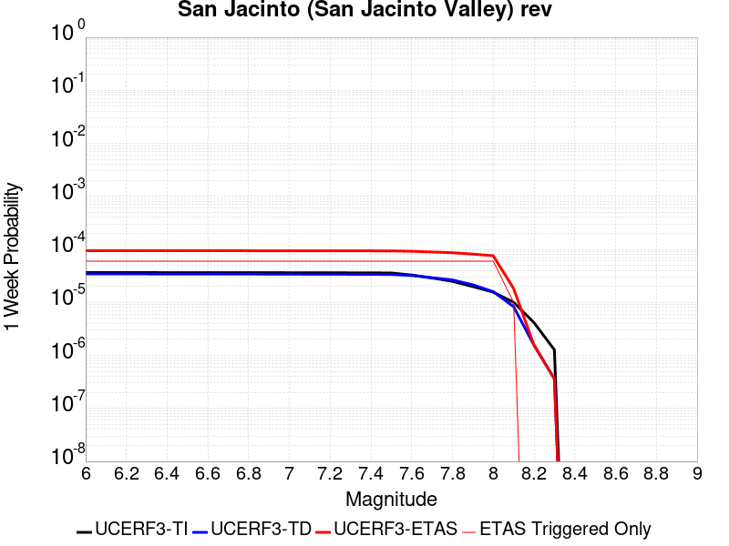 |  |  |  |

| Magnitude | 1 wk TI Prob | 1 wk TD Prob | 1 wk ETAS Prob | 1 wk ETAS/TD Gain | 1 wk ETAS Triggered Only | 1 mo TI Prob | 1 mo TD Prob | 1 mo ETAS Prob | 1 mo ETAS/TD Gain | 1 mo ETAS Triggered Only | 1 yr TI Prob | 1 yr TD Prob | 1 yr ETAS Prob | 1 yr ETAS/TD Gain | 1 yr ETAS Triggered Only | 10 yr TI Prob | 10 yr TD Prob | 10 yr ETAS Prob | 10 yr ETAS/TD Gain | 10 yr ETAS Triggered Only |
|-----|-----|-----|-----|-----|-----|-----|-----|-----|-----|-----|-----|-----|-----|-----|-----|-----|-----|-----|-----|-----|
| 6.0 | 3.652694E-5 | 3.4402394E-5 | 8.465192E-5 | 2.4606404 | 5.0251256E-5 | 1.5653463E-4 | 1.474305E-4 | 2.1023532E-4 | 1.4259961 | 6.281407E-5 | 0.0019041431 | 0.00179349 | 0.0019439734 | 1.0839053 | 1.5075377E-4 | 0.018879099 | 0.018526595 | 0.018699216 | 1.0093175 | 1.758794E-4 |
| 6.1 | 3.652694E-5 | 3.4402394E-5 | 8.465192E-5 | 2.4606404 | 5.0251256E-5 | 1.5653463E-4 | 1.474305E-4 | 2.1023532E-4 | 1.4259961 | 6.281407E-5 | 0.0019041431 | 0.00179349 | 0.0019439734 | 1.0839053 | 1.5075377E-4 | 0.018879099 | 0.018526595 | 0.018699216 | 1.0093175 | 1.758794E-4 |
| 6.2 | 3.652694E-5 | 3.4402394E-5 | 8.465192E-5 | 2.4606404 | 5.0251256E-5 | 1.5653463E-4 | 1.474305E-4 | 2.1023532E-4 | 1.4259961 | 6.281407E-5 | 0.0019041431 | 0.00179349 | 0.0019439734 | 1.0839053 | 1.5075377E-4 | 0.018879099 | 0.018526595 | 0.018699216 | 1.0093175 | 1.758794E-4 |
| 6.3 | 3.652694E-5 | 3.4402394E-5 | 8.465192E-5 | 2.4606404 | 5.0251256E-5 | 1.5653463E-4 | 1.474305E-4 | 2.1023532E-4 | 1.4259961 | 6.281407E-5 | 0.0019041431 | 0.00179349 | 0.0019439734 | 1.0839053 | 1.5075377E-4 | 0.018879099 | 0.018526595 | 0.018699216 | 1.0093175 | 1.758794E-4 |
| 6.4 | 3.646941E-5 | 3.432397E-5 | 8.45735E-5 | 2.4639778 | 5.0251256E-5 | 1.5628811E-4 | 1.4709444E-4 | 2.0989927E-4 | 1.4269694 | 6.281407E-5 | 0.0019011468 | 0.0017894056 | 0.0019398896 | 1.0840971 | 1.5075377E-4 | 0.018849645 | 0.018486476 | 0.018659104 | 1.009338 | 1.758794E-4 |
| 6.5 | 3.646941E-5 | 3.432397E-5 | 8.45735E-5 | 2.4639778 | 5.0251256E-5 | 1.5628811E-4 | 1.4709444E-4 | 2.0989927E-4 | 1.4269694 | 6.281407E-5 | 0.0019011468 | 0.0017894056 | 0.0019398896 | 1.0840971 | 1.5075377E-4 | 0.018849645 | 0.018486476 | 0.018659104 | 1.009338 | 1.758794E-4 |
| 6.6 | 3.6442503E-5 | 3.4287354E-5 | 8.4536885E-5 | 2.4655414 | 5.0251256E-5 | 1.561728E-4 | 1.4693754E-4 | 2.0974239E-4 | 1.4274254 | 6.281407E-5 | 0.0018997455 | 0.0017874985 | 0.0019379827 | 1.0841872 | 1.5075377E-4 | 0.018835869 | 0.018467745 | 0.018640377 | 1.0093477 | 1.758794E-4 |
| 6.7 | 3.6432113E-5 | 3.4272925E-5 | 8.452246E-5 | 2.4661582 | 5.0251256E-5 | 1.5612828E-4 | 1.4687571E-4 | 2.0968055E-4 | 1.4276054 | 6.281407E-5 | 0.0018992044 | 0.0017867472 | 0.0019372316 | 1.0842226 | 1.5075377E-4 | 0.018830549 | 0.018460369 | 0.018633 | 1.0093515 | 1.758794E-4 |
| 6.8 | 3.6409598E-5 | 3.424198E-5 | 8.449152E-5 | 2.4674833 | 5.0251256E-5 | 1.560318E-4 | 1.4674311E-4 | 2.0954796E-4 | 1.4279919 | 6.281407E-5 | 0.0018980318 | 0.0017851355 | 0.0019356201 | 1.0842987 | 1.5075377E-4 | 0.018819023 | 0.018444523 | 0.018617159 | 1.0093597 | 1.758794E-4 |
| 6.9 | 3.638078E-5 | 3.4202407E-5 | 8.4451945E-5 | 2.4691813 | 5.0251256E-5 | 1.5590832E-4 | 1.4657351E-4 | 2.0937838E-4 | 1.4284871 | 6.281407E-5 | 0.0018965311 | 0.001783074 | 0.001933559 | 1.0843964 | 1.5075377E-4 | 0.018804269 | 0.018424258 | 0.018596897 | 1.0093702 | 1.758794E-4 |
| 7.0 | 3.6294874E-5 | 3.408442E-5 | 8.4333966E-5 | 2.4742672 | 5.0251256E-5 | 1.5554018E-4 | 1.4606792E-4 | 2.0887282E-4 | 1.4299705 | 6.281407E-5 | 0.0018920569 | 0.001776929 | 0.0019274149 | 1.0846888 | 1.5075377E-4 | 0.018760284 | 0.018363839 | 0.01853649 | 1.0094016 | 1.758794E-4 |
| 7.1 | 3.6260717E-5 | 3.4040702E-5 | 8.4290245E-5 | 2.4761608 | 5.0251256E-5 | 1.5539382E-4 | 1.4588058E-4 | 2.086855E-4 | 1.4305227 | 6.281407E-5 | 0.001890278 | 0.0017746518 | 0.001925138 | 1.0847976 | 1.5075377E-4 | 0.018742796 | 0.018341439 | 0.018514093 | 1.0094134 | 1.758794E-4 |
| 7.2 | 3.6210204E-5 | 3.397492E-5 | 8.422447E-5 | 2.479019 | 5.0251256E-5 | 1.5517735E-4 | 1.455987E-4 | 2.0840362E-4 | 1.4313564 | 6.281407E-5 | 0.001887647 | 0.0017712255 | 0.0019217122 | 1.0849619 | 1.5075377E-4 | 0.01871693 | 0.01830772 | 0.01848038 | 1.009431 | 1.758794E-4 |
| 7.3 | 3.6119454E-5 | 3.386321E-5 | 8.411276E-5 | 2.4838982 | 5.0251256E-5 | 1.5478847E-4 | 1.4511998E-4 | 2.0792492E-4 | 1.4327796 | 6.281407E-5 | 0.0018829206 | 0.0017654065 | 0.0019158941 | 1.0852425 | 1.5075377E-4 | 0.018670462 | 0.018250274 | 0.018422943 | 1.0094612 | 1.758794E-4 |
| 7.4 | 3.607848E-5 | 3.381071E-5 | 8.4060266E-5 | 2.4862025 | 5.0251256E-5 | 1.5461289E-4 | 1.44895E-4 | 2.0769997E-4 | 1.4334515 | 6.281407E-5 | 0.0018807866 | 0.0017626719 | 0.00191316 | 1.085375 | 1.5075377E-4 | 0.018649481 | 0.018223269 | 0.018395942 | 1.0094755 | 1.758794E-4 |
| 7.5 | 3.5856774E-5 | 3.3620483E-5 | 8.387005E-5 | 2.4946117 | 5.0251256E-5 | 1.5366284E-4 | 1.4407984E-4 | 2.0688486E-4 | 1.4359043 | 6.281407E-5 | 0.0018692396 | 0.0017527633 | 0.0019032528 | 1.0858585 | 1.5075377E-4 | 0.018535944 | 0.018124366 | 0.018297058 | 1.0095282 | 1.758794E-4 |
| 7.6 | 3.286655E-5 | 3.2143445E-5 | 8.239309E-5 | 2.5632935 | 5.0251256E-5 | 1.4084904E-4 | 1.3775036E-4 | 2.0055578E-4 | 1.4559364 | 6.281407E-5 | 0.001713488 | 0.0016758227 | 0.001813782 | 1.0823234 | 1.3819095E-4 | 0.017003361 | 0.017344031 | 0.017504515 | 1.009253 | 1.6331658E-4 |
| 7.7 | 2.8882527E-5 | 2.9236293E-5 | 7.948608E-5 | 2.718747 | 5.0251256E-5 | 1.237764E-4 | 1.2529238E-4 | 1.880986E-4 | 1.5012771 | 6.281407E-5 | 0.0015059357 | 0.0015243685 | 0.0016623489 | 1.0905163 | 1.3819095E-4 | 0.014957713 | 0.015830461 | 0.015991192 | 1.0101533 | 1.6331658E-4 |
| 7.8 | 2.4950225E-5 | 2.6527203E-5 | 7.677713E-5 | 2.894279 | 5.0251256E-5 | 1.0692515E-4 | 1.1368306E-4 | 1.7649E-4 | 1.5524739 | 6.281407E-5 | 0.0013010362 | 0.0013832134 | 0.0015212132 | 1.0997676 | 1.3819095E-4 | 0.012934455 | 0.014411755 | 0.014572717 | 1.0111688 | 1.6331658E-4 |
| 7.9 | 1.9881603E-5 | 2.1507445E-5 | 7.175762E-5 | 3.3364084 | 5.0251256E-5 | 8.520408E-5 | 9.217151E-5 | 1.5497979E-4 | 1.6814283 | 6.281407E-5 | 0.001036866 | 0.0011216112 | 0.0012596472 | 1.1230693 | 1.3819095E-4 | 0.010320415 | 0.011777027 | 0.011926005 | 1.0126499 | 1.5075377E-4 |
| 8.0 | 1.563292E-5 | 1.5937347E-5 | 6.61878E-5 | 4.1530004 | 5.0251256E-5 | 6.6996516E-5 | 6.8301124E-5 | 1.3111091E-4 | 1.919601 | 6.281407E-5 | 8.153773E-4 | 8.3124964E-4 | 9.44221E-4 | 1.1359054 | 1.13065325E-4 | 0.00812392 | 0.008810506 | 0.008935028 | 1.0141332 | 1.2562814E-4 |
| 8.1 | 1.0045313E-5 | 8.301802E-6 | 2.0864512E-5 | 2.5132508 | 1.2562814E-5 | 4.305063E-5 | 3.5578672E-5 | 4.814104E-5 | 1.3530871 | 1.2562814E-5 | 5.2401534E-4 | 4.3308473E-4 | 4.581995E-4 | 1.0579904 | 2.5125628E-5 | 0.0052278144 | 0.0046591135 | 0.0046841223 | 1.0053676 | 2.5125628E-5 |
| 8.2 | 4.1554413E-6 | 1.5655598E-6 | 1.5655598E-6 | 1.0 | 0.0 | 1.7808914E-5 | 6.709525E-6 | 6.709525E-6 | 1.0 | 0.0 | 2.1680194E-4 | 8.168544E-5 | 8.168544E-5 | 1.0 | 0.0 | 0.0021659054 | 9.482903E-4 | 9.482903E-4 | 1.0 | 0.0 |
| 8.3 | 1.2758221E-6 | 3.6149942E-7 | 3.6149942E-7 | 1.0 | 0.0 | 5.4677976E-6 | 1.5492824E-6 | 1.5492824E-6 | 1.0 | 0.0 | 6.65684E-5 | 1.8862354E-5 | 1.8862354E-5 | 1.0 | 0.0 | 6.6548464E-4 | 2.2751294E-4 | 2.2751294E-4 | 1.0 | 0.0 |

## Deep Springs
*[(top)](#table-of-contents)*

| 1 Week | 1 Month | 1 Year | 10 Year |
|-----|-----|-----|-----|
|  |  |  |  |

| Magnitude | 1 wk TI Prob | 1 wk TD Prob | 1 wk ETAS Prob | 1 wk ETAS/TD Gain | 1 wk ETAS Triggered Only | 1 mo TI Prob | 1 mo TD Prob | 1 mo ETAS Prob | 1 mo ETAS/TD Gain | 1 mo ETAS Triggered Only | 1 yr TI Prob | 1 yr TD Prob | 1 yr ETAS Prob | 1 yr ETAS/TD Gain | 1 yr ETAS Triggered Only | 10 yr TI Prob | 10 yr TD Prob | 10 yr ETAS Prob | 10 yr ETAS/TD Gain | 10 yr ETAS Triggered Only |
|-----|-----|-----|-----|-----|-----|-----|-----|-----|-----|-----|-----|-----|-----|-----|-----|-----|-----|-----|-----|-----|
| 6.0 | 1.9810619E-5 | 2.311252E-5 | 7.3362615E-5 | 3.1741505 | 5.0251256E-5 | 8.489989E-5 | 9.905276E-5 | 1.7442218E-4 | 1.7609018 | 7.537688E-5 | 0.001033166 | 0.0012058079 | 0.0013061892 | 1.0832481 | 1.0050251E-4 | 0.010283757 | 0.012042425 | 0.012203774 | 1.0133984 | 1.6331658E-4 |
| 6.1 | 1.9810619E-5 | 2.311252E-5 | 7.3362615E-5 | 3.1741505 | 5.0251256E-5 | 8.489989E-5 | 9.905276E-5 | 1.7442218E-4 | 1.7609018 | 7.537688E-5 | 0.001033166 | 0.0012058079 | 0.0013061892 | 1.0832481 | 1.0050251E-4 | 0.010283757 | 0.012042425 | 0.012203774 | 1.0133984 | 1.6331658E-4 |
| 6.2 | 1.9810619E-5 | 2.311252E-5 | 7.3362615E-5 | 3.1741505 | 5.0251256E-5 | 8.489989E-5 | 9.905276E-5 | 1.7442218E-4 | 1.7609018 | 7.537688E-5 | 0.001033166 | 0.0012058079 | 0.0013061892 | 1.0832481 | 1.0050251E-4 | 0.010283757 | 0.012042425 | 0.012203774 | 1.0133984 | 1.6331658E-4 |
| 6.3 | 1.9810619E-5 | 2.311252E-5 | 7.3362615E-5 | 3.1741505 | 5.0251256E-5 | 8.489989E-5 | 9.905276E-5 | 1.7442218E-4 | 1.7609018 | 7.537688E-5 | 0.001033166 | 0.0012058079 | 0.0013061892 | 1.0832481 | 1.0050251E-4 | 0.010283757 | 0.012042425 | 0.012203774 | 1.0133984 | 1.6331658E-4 |
| 6.4 | 1.9810619E-5 | 2.311252E-5 | 7.3362615E-5 | 3.1741505 | 5.0251256E-5 | 8.489989E-5 | 9.905276E-5 | 1.7442218E-4 | 1.7609018 | 7.537688E-5 | 0.001033166 | 0.0012058079 | 0.0013061892 | 1.0832481 | 1.0050251E-4 | 0.010283757 | 0.012042425 | 0.012203774 | 1.0133984 | 1.6331658E-4 |
| 6.5 | 1.7190405E-5 | 2.0050555E-5 | 7.0300805E-5 | 3.5061774 | 5.0251256E-5 | 7.367108E-5 | 8.593095E-5 | 1.6130136E-4 | 1.8771043 | 7.537688E-5 | 8.9657627E-4 | 0.0010462094 | 0.0011466068 | 1.095963 | 1.0050251E-4 | 0.008929676 | 0.010462056 | 0.010623665 | 1.015447 | 1.6331658E-4 |
| 6.6 | 1.7190405E-5 | 2.0050555E-5 | 7.0300805E-5 | 3.5061774 | 5.0251256E-5 | 7.367108E-5 | 8.593095E-5 | 1.6130136E-4 | 1.8771043 | 7.537688E-5 | 8.9657627E-4 | 0.0010462094 | 0.0011466068 | 1.095963 | 1.0050251E-4 | 0.008929676 | 0.010462056 | 0.010623665 | 1.015447 | 1.6331658E-4 |

## San Jacinto (Anza) rev
*[(top)](#table-of-contents)*

| 1 Week | 1 Month | 1 Year | 10 Year |
|-----|-----|-----|-----|
|  |  |  |  |

| Magnitude | 1 wk TI Prob | 1 wk TD Prob | 1 wk ETAS Prob | 1 wk ETAS/TD Gain | 1 wk ETAS Triggered Only | 1 mo TI Prob | 1 mo TD Prob | 1 mo ETAS Prob | 1 mo ETAS/TD Gain | 1 mo ETAS Triggered Only | 1 yr TI Prob | 1 yr TD Prob | 1 yr ETAS Prob | 1 yr ETAS/TD Gain | 1 yr ETAS Triggered Only | 10 yr TI Prob | 10 yr TD Prob | 10 yr ETAS Prob | 10 yr ETAS/TD Gain | 10 yr ETAS Triggered Only |
|-----|-----|-----|-----|-----|-----|-----|-----|-----|-----|-----|-----|-----|-----|-----|-----|-----|-----|-----|-----|-----|
| 6.0 | 6.3015636E-5 | 4.3302647E-5 | 9.355173E-5 | 2.160416 | 5.0251256E-5 | 2.7003905E-4 | 1.8556965E-4 | 2.4837206E-4 | 1.3384304 | 6.281407E-5 | 0.0032827691 | 0.0022569813 | 0.002382326 | 1.0555364 | 1.2562814E-4 | 0.032346968 | 0.023296192 | 0.023455704 | 1.0068471 | 1.6331658E-4 |
| 6.1 | 6.3015636E-5 | 4.3302647E-5 | 9.355173E-5 | 2.160416 | 5.0251256E-5 | 2.7003905E-4 | 1.8556965E-4 | 2.4837206E-4 | 1.3384304 | 6.281407E-5 | 0.0032827691 | 0.0022569813 | 0.002382326 | 1.0555364 | 1.2562814E-4 | 0.032346968 | 0.023296192 | 0.023455704 | 1.0068471 | 1.6331658E-4 |
| 6.2 | 6.3015636E-5 | 4.3302647E-5 | 9.355173E-5 | 2.160416 | 5.0251256E-5 | 2.7003905E-4 | 1.8556965E-4 | 2.4837206E-4 | 1.3384304 | 6.281407E-5 | 0.0032827691 | 0.0022569813 | 0.002382326 | 1.0555364 | 1.2562814E-4 | 0.032346968 | 0.023296192 | 0.023455704 | 1.0068471 | 1.6331658E-4 |
| 6.3 | 6.3015636E-5 | 4.3302647E-5 | 9.355173E-5 | 2.160416 | 5.0251256E-5 | 2.7003905E-4 | 1.8556965E-4 | 2.4837206E-4 | 1.3384304 | 6.281407E-5 | 0.0032827691 | 0.0022569813 | 0.002382326 | 1.0555364 | 1.2562814E-4 | 0.032346968 | 0.023296192 | 0.023455704 | 1.0068471 | 1.6331658E-4 |
| 6.4 | 6.3015636E-5 | 4.3302647E-5 | 9.355173E-5 | 2.160416 | 5.0251256E-5 | 2.7003905E-4 | 1.8556965E-4 | 2.4837206E-4 | 1.3384304 | 6.281407E-5 | 0.0032827691 | 0.0022569813 | 0.002382326 | 1.0555364 | 1.2562814E-4 | 0.032346968 | 0.023296192 | 0.023455704 | 1.0068471 | 1.6331658E-4 |
| 6.5 | 5.811017E-5 | 4.0082516E-5 | 9.0331756E-5 | 2.253645 | 5.0251256E-5 | 2.4901982E-4 | 1.7177092E-4 | 2.3457421E-4 | 1.3656223 | 6.281407E-5 | 0.0030276014 | 0.002089311 | 0.0022146765 | 1.0600034 | 1.2562814E-4 | 0.02986684 | 0.021593736 | 0.021753527 | 1.0073998 | 1.6331658E-4 |
| 6.6 | 5.811017E-5 | 4.0082516E-5 | 9.0331756E-5 | 2.253645 | 5.0251256E-5 | 2.4901982E-4 | 1.7177092E-4 | 2.3457421E-4 | 1.3656223 | 6.281407E-5 | 0.0030276014 | 0.002089311 | 0.0022146765 | 1.0600034 | 1.2562814E-4 | 0.02986684 | 0.021593736 | 0.021753527 | 1.0073998 | 1.6331658E-4 |
| 6.7 | 5.712442E-5 | 3.9505223E-5 | 8.9754496E-5 | 2.2719653 | 5.0251256E-5 | 2.4479596E-4 | 1.6929714E-4 | 2.3210057E-4 | 1.3709657 | 6.281407E-5 | 0.0029763177 | 0.0020592497 | 0.0021846192 | 1.0608811 | 1.2562814E-4 | 0.029367693 | 0.021285562 | 0.021445403 | 1.0075094 | 1.6331658E-4 |
| 6.8 | 5.6967532E-5 | 3.9361643E-5 | 8.961092E-5 | 2.2766051 | 5.0251256E-5 | 2.4412372E-4 | 1.6868189E-4 | 2.3148536E-4 | 1.372319 | 6.281407E-5 | 0.0029681553 | 0.002051773 | 0.0021771435 | 1.0611035 | 1.2562814E-4 | 0.029288229 | 0.021210281 | 0.021370133 | 1.0075365 | 1.6331658E-4 |
| 6.9 | 5.6211324E-5 | 3.9066435E-5 | 8.931573E-5 | 2.2862523 | 5.0251256E-5 | 2.4088343E-4 | 1.6741687E-4 | 2.3022042E-4 | 1.3751328 | 6.281407E-5 | 0.0029288116 | 0.0020364004 | 0.0021617727 | 1.0615656 | 1.2562814E-4 | 0.028905109 | 0.021049714 | 0.021209592 | 1.0075953 | 1.6331658E-4 |
| 7.0 | 5.4383527E-5 | 3.792697E-5 | 8.817632E-5 | 2.3248975 | 5.0251256E-5 | 2.3305144E-4 | 1.6253405E-4 | 2.2533792E-4 | 1.3864043 | 6.281407E-5 | 0.0028337094 | 0.001977061 | 0.0021024407 | 1.0634172 | 1.2562814E-4 | 0.027978465 | 0.020440677 | 0.020600654 | 1.0078264 | 1.6331658E-4 |
| 7.1 | 5.1393665E-5 | 3.6389913E-5 | 8.663934E-5 | 2.3808615 | 5.0251256E-5 | 2.2023996E-4 | 1.5594746E-4 | 2.1875174E-4 | 1.4027271 | 6.281407E-5 | 0.0026781242 | 0.0018970112 | 0.002022401 | 1.0660986 | 1.2562814E-4 | 0.026460782 | 0.019614287 | 0.0197744 | 1.0081631 | 1.6331658E-4 |
| 7.2 | 4.785222E-5 | 3.4741795E-5 | 8.4991305E-5 | 2.4463706 | 5.0251256E-5 | 2.0506482E-4 | 1.4888494E-4 | 2.1168965E-4 | 1.421834 | 6.281407E-5 | 0.0024938055 | 0.0018111705 | 0.0019365711 | 1.0692374 | 1.2562814E-4 | 0.024660049 | 0.018728992 | 0.01888925 | 1.0085567 | 1.6331658E-4 |
| 7.3 | 4.2143256E-5 | 3.383628E-5 | 8.4085834E-5 | 2.4850793 | 5.0251256E-5 | 1.8060145E-4 | 1.4500458E-4 | 2.0780954E-4 | 1.433124 | 6.281407E-5 | 0.002196605 | 0.0017640047 | 0.0018894111 | 1.071092 | 1.2562814E-4 | 0.02175019 | 0.01823724 | 0.018385246 | 1.0081155 | 1.5075377E-4 |
| 7.4 | 4.0264713E-5 | 3.347446E-5 | 8.372404E-5 | 2.5011315 | 5.0251256E-5 | 1.7255165E-4 | 1.4345412E-4 | 2.0625918E-4 | 1.4378059 | 6.281407E-5 | 0.002098792 | 0.0017451581 | 0.001870567 | 1.071861 | 1.2562814E-4 | 0.020790804 | 0.018041821 | 0.018189855 | 1.008205 | 1.5075377E-4 |
| 7.5 | 3.694492E-5 | 3.218847E-5 | 8.2438106E-5 | 2.561107 | 5.0251256E-5 | 1.5832575E-4 | 1.379433E-4 | 2.007487E-4 | 1.4552987 | 6.281407E-5 | 0.0019259118 | 0.001678169 | 0.0018035863 | 1.0747346 | 1.2562814E-4 | 0.01909306 | 0.01735827 | 0.017506408 | 1.0085341 | 1.5075377E-4 |
| 7.6 | 3.200565E-5 | 2.9504106E-5 | 7.975388E-5 | 2.703145 | 5.0251256E-5 | 1.3715986E-4 | 1.2644005E-4 | 1.8924619E-4 | 1.4967265 | 6.281407E-5 | 0.001668642 | 0.0015383229 | 0.0016512143 | 1.0733861 | 1.13065325E-4 | 0.01656168 | 0.0159463 | 0.016082287 | 1.0085279 | 1.3819095E-4 |
| 7.7 | 2.731642E-5 | 2.6092788E-5 | 7.634273E-5 | 2.9258175 | 5.0251256E-5 | 1.1706512E-4 | 1.1182144E-4 | 1.746285E-4 | 1.5616727 | 6.281407E-5 | 0.001424336 | 0.0013605768 | 0.0014734884 | 1.0829879 | 1.13065325E-4 | 0.014152412 | 0.014167004 | 0.014303238 | 1.0096163 | 1.3819095E-4 |
| 7.8 | 2.3466424E-5 | 2.3504817E-5 | 7.375489E-5 | 3.1378627 | 5.0251256E-5 | 1.0056651E-4 | 1.0073105E-4 | 1.6353879E-4 | 1.6235192 | 6.281407E-5 | 0.0012237094 | 0.0012257113 | 0.0013386381 | 1.0921316 | 1.13065325E-4 | 0.012169928 | 0.012808893 | 0.012945314 | 1.0106505 | 1.3819095E-4 |
| 7.9 | 1.8611925E-5 | 1.8908117E-5 | 6.915842E-5 | 3.657605 | 5.0251256E-5 | 7.9762955E-5 | 8.1032274E-5 | 1.4384126E-4 | 1.7751107 | 6.281407E-5 | 9.7068126E-4 | 9.861222E-4 | 0.001099076 | 1.1145434 | 1.13065325E-4 | 0.0096645225 | 0.010393824 | 0.010518147 | 1.0119612 | 1.2562814E-4 |
| 8.0 | 1.5460775E-5 | 1.5740965E-5 | 6.599143E-5 | 4.192337 | 5.0251256E-5 | 6.6258784E-5 | 6.7459536E-5 | 1.3026937E-4 | 1.9310741 | 6.281407E-5 | 8.0640207E-4 | 8.21011E-4 | 9.3398354E-4 | 1.1376017 | 1.13065325E-4 | 0.008034821 | 0.0087028835 | 0.008827418 | 1.0143096 | 1.2562814E-4 |
| 8.1 | 9.983884E-6 | 8.269952E-6 | 2.0832662E-5 | 2.519079 | 1.2562814E-5 | 4.2787375E-5 | 3.544217E-5 | 4.8004542E-5 | 1.3544469 | 1.2562814E-5 | 5.2081177E-4 | 4.314235E-4 | 4.565383E-4 | 1.0582137 | 2.5125628E-5 | 0.0051959283 | 0.004640022 | 0.004665031 | 1.0053898 | 2.5125628E-5 |
| 8.2 | 4.1226E-6 | 1.5529788E-6 | 1.5529788E-6 | 1.0 | 0.0 | 1.7668166E-5 | 6.6556063E-6 | 6.6556063E-6 | 1.0 | 0.0 | 2.1508869E-4 | 8.102902E-5 | 8.102902E-5 | 1.0 | 0.0 | 0.0021488064 | 9.4050163E-4 | 9.4050163E-4 | 1.0 | 0.0 |
| 8.3 | 1.2750878E-6 | 3.612133E-7 | 3.612133E-7 | 1.0 | 0.0 | 5.4646503E-6 | 1.548056E-6 | 1.548056E-6 | 1.0 | 0.0 | 6.653009E-5 | 1.8847424E-5 | 1.8847424E-5 | 1.0 | 0.0 | 6.6510175E-4 | 2.2734253E-4 | 2.2734253E-4 | 1.0 | 0.0 |

## Brawley (Seismic Zone) alt 1
*[(top)](#table-of-contents)*

| 1 Week | 1 Month | 1 Year | 10 Year |
|-----|-----|-----|-----|
|  |  |  |  |

| Magnitude | 1 wk TI Prob | 1 wk TD Prob | 1 wk ETAS Prob | 1 wk ETAS/TD Gain | 1 wk ETAS Triggered Only | 1 mo TI Prob | 1 mo TD Prob | 1 mo ETAS Prob | 1 mo ETAS/TD Gain | 1 mo ETAS Triggered Only | 1 yr TI Prob | 1 yr TD Prob | 1 yr ETAS Prob | 1 yr ETAS/TD Gain | 1 yr ETAS Triggered Only | 10 yr TI Prob | 10 yr TD Prob | 10 yr ETAS Prob | 10 yr ETAS/TD Gain | 10 yr ETAS Triggered Only |
|-----|-----|-----|-----|-----|-----|-----|-----|-----|-----|-----|-----|-----|-----|-----|-----|-----|-----|-----|-----|-----|
| 6.0 | 2.2521618E-4 | 4.7632487E-4 | 5.265522E-4 | 1.1054476 | 5.0251256E-5 | 9.6485513E-4 | 0.0020398323 | 0.002089981 | 1.0245848 | 5.0251256E-5 | 0.011683988 | 0.024546238 | 0.024632018 | 1.0034946 | 8.79397E-5 | 0.11088423 | 0.21350002 | 0.21362847 | 1.0006016 | 1.6331658E-4 |
| 6.1 | 2.2521618E-4 | 4.7632487E-4 | 5.265522E-4 | 1.1054476 | 5.0251256E-5 | 9.6485513E-4 | 0.0020398323 | 0.002089981 | 1.0245848 | 5.0251256E-5 | 0.011683988 | 0.024546238 | 0.024632018 | 1.0034946 | 8.79397E-5 | 0.11088423 | 0.21350002 | 0.21362847 | 1.0006016 | 1.6331658E-4 |
| 6.2 | 2.198148E-4 | 4.6717093E-4 | 5.173987E-4 | 1.1075147 | 5.0251256E-5 | 9.417233E-4 | 0.0020006616 | 0.0020508124 | 1.0250671 | 5.0251256E-5 | 0.011405343 | 0.024080504 | 0.024166325 | 1.003564 | 8.79397E-5 | 0.10837428 | 0.20993657 | 0.2100656 | 1.0006146 | 1.6331658E-4 |
| 6.3 | 2.1704129E-4 | 4.615278E-4 | 5.117558E-4 | 1.10883 | 5.0251256E-5 | 9.298453E-4 | 0.0019765133 | 0.0020266653 | 1.0253739 | 5.0251256E-5 | 0.011262234 | 0.02379366 | 0.023879508 | 1.003608 | 8.79397E-5 | 0.107082725 | 0.20782755 | 0.20795693 | 1.0006225 | 1.6331658E-4 |
| 6.4 | 1.876142E-4 | 4.00449E-4 | 4.5068015E-4 | 1.125437 | 5.0251256E-5 | 8.038131E-4 | 0.0017150956 | 0.0017652607 | 1.0292492 | 5.0251256E-5 | 0.00974259 | 0.020680401 | 0.020766523 | 1.0041643 | 8.79397E-5 | 0.093263686 | 0.18457815 | 0.18471132 | 1.0007215 | 1.6331658E-4 |
| 6.5 | 1.7390939E-4 | 3.7477075E-4 | 4.2500318E-4 | 1.1340351 | 5.0251256E-5 | 7.45113E-4 | 0.0016051838 | 0.0016553545 | 1.0312554 | 5.0251256E-5 | 0.009034078 | 0.019368723 | 0.01945496 | 1.0044523 | 8.79397E-5 | 0.086755216 | 0.17440031 | 0.17453516 | 1.0007731 | 1.6331658E-4 |
| 6.6 | 1.591791E-4 | 3.4891962E-4 | 3.9915333E-4 | 1.1439693 | 5.0251256E-5 | 6.8201777E-4 | 0.0014945229 | 0.0015446991 | 1.0335734 | 5.0251256E-5 | 0.008271996 | 0.018045569 | 0.018131923 | 1.0047853 | 8.79397E-5 | 0.07970774 | 0.16380852 | 0.1639451 | 1.0008336 | 1.6331658E-4 |
| 6.7 | 1.4268003E-4 | 3.20582E-4 | 3.7081714E-4 | 1.1566998 | 5.0251256E-5 | 6.1134255E-4 | 0.0013732077 | 0.0014233899 | 1.0365438 | 5.0251256E-5 | 0.007417723 | 0.016592601 | 0.016679082 | 1.005212 | 8.79397E-5 | 0.07174956 | 0.15193306 | 0.15207157 | 1.0009116 | 1.6331658E-4 |
| 6.8 | 1.239713E-4 | 2.9053655E-4 | 3.4077323E-4 | 1.17291 | 5.0251256E-5 | 5.3119735E-4 | 0.0012445687 | 0.0012947574 | 1.0403262 | 5.0251256E-5 | 0.0064481674 | 0.015048777 | 0.0151353935 | 1.0057557 | 8.79397E-5 | 0.06264243 | 0.13837762 | 0.13851835 | 1.0010169 | 1.6331658E-4 |
| 6.9 | 1.0180238E-4 | 2.625439E-4 | 3.1278198E-4 | 1.191351 | 5.0251256E-5 | 4.3622297E-4 | 0.0011247073 | 0.001174902 | 1.0446292 | 5.0251256E-5 | 0.005298089 | 0.013608336 | 0.013695079 | 1.0063742 | 8.79397E-5 | 0.05173543 | 0.124961674 | 0.12510458 | 1.0011436 | 1.6331658E-4 |
| 7.0 | 7.6619996E-5 | 2.23993E-4 | 2.74233E-4 | 1.2242928 | 5.0251256E-5 | 3.283301E-4 | 9.5962E-4 | 0.001009823 | 1.0523156 | 5.0251256E-5 | 0.0039900932 | 0.011621496 | 0.011708413 | 1.0074791 | 8.79397E-5 | 0.039192066 | 0.107266866 | 0.107412666 | 1.0013592 | 1.6331658E-4 |
| 7.1 | 7.5127435E-5 | 2.2082464E-4 | 2.710648E-4 | 1.2275115 | 5.0251256E-5 | 3.2193496E-4 | 9.4605127E-4 | 9.96255E-4 | 1.0530666 | 5.0251256E-5 | 0.0039125155 | 0.011458045 | 0.011544976 | 1.007587 | 8.79397E-5 | 0.038443442 | 0.10583085 | 0.10597688 | 1.0013798 | 1.6331658E-4 |
| 7.2 | 6.788582E-5 | 2.0210193E-4 | 2.5234304E-4 | 1.2485929 | 5.0251256E-5 | 2.9090676E-4 | 8.6586666E-4 | 9.1607444E-4 | 1.0579855 | 5.0251256E-5 | 0.0035360386 | 0.0104916105 | 0.010578628 | 1.008294 | 8.79397E-5 | 0.034803 | 0.09750131 | 0.0976487 | 1.0015117 | 1.6331658E-4 |
| 7.3 | 6.399602E-5 | 1.8841137E-4 | 2.3865316E-4 | 1.2666601 | 5.0251256E-5 | 2.7423984E-4 | 8.072303E-4 | 8.57441E-4 | 1.0622011 | 5.0251256E-5 | 0.0033337586 | 0.009784332 | 0.00987141 | 1.0088999 | 8.79397E-5 | 0.03284188 | 0.09139617 | 0.09154455 | 1.0016236 | 1.6331658E-4 |
| 7.4 | 4.506759E-5 | 1.2529209E-4 | 1.7553705E-4 | 1.4010226 | 5.0251256E-5 | 1.9313251E-4 | 5.368565E-4 | 5.870807E-4 | 1.0935525 | 5.0251256E-5 | 0.0023488526 | 0.0065168133 | 0.00660418 | 1.0134064 | 8.79397E-5 | 0.023241805 | 0.062363707 | 0.06250506 | 1.0022665 | 1.5075377E-4 |
| 7.5 | 3.43289E-5 | 9.33541E-5 | 1.4360067E-4 | 1.5382363 | 5.0251256E-5 | 1.4711556E-4 | 4.00028E-4 | 4.5025913E-4 | 1.1255691 | 5.0251256E-5 | 0.0017896603 | 0.0048595266 | 0.004947039 | 1.0180085 | 8.79397E-5 | 0.01775316 | 0.04705519 | 0.04719885 | 1.0030531 | 1.5075377E-4 |
| 7.6 | 2.5980507E-5 | 7.053101E-5 | 9.565487E-5 | 1.3562101 | 2.5125628E-5 | 1.1134028E-4 | 3.0224086E-4 | 3.273589E-4 | 1.083106 | 2.5125628E-5 | 0.001354725 | 0.003673598 | 0.0037236644 | 1.0136287 | 5.0251256E-5 | 0.013464959 | 0.035840835 | 0.03594985 | 1.0030416 | 1.13065325E-4 |
| 7.7 | 1.7292105E-5 | 4.9407296E-5 | 7.453169E-5 | 1.5085157 | 2.5125628E-5 | 7.4106916E-5 | 2.117284E-4 | 2.368487E-4 | 1.118644 | 2.5125628E-5 | 9.018782E-4 | 0.0025747516 | 0.0026248735 | 1.0194666 | 5.0251256E-5 | 0.008982267 | 0.025290398 | 0.025388358 | 1.0038735 | 1.0050251E-4 |
| 7.8 | 1.2927471E-5 | 3.9693266E-5 | 5.2255582E-5 | 1.3164848 | 1.2562814E-5 | 5.5402274E-5 | 1.7010293E-4 | 1.826636E-4 | 1.0738416 | 1.2562814E-5 | 6.743139E-4 | 0.0020690386 | 0.002106649 | 1.0181777 | 3.768844E-5 | 0.0067227143 | 0.020431727 | 0.02051787 | 1.0042162 | 8.79397E-5 |
| 7.9 | 1.0200774E-5 | 2.874569E-5 | 4.1308143E-5 | 1.4370204 | 1.2562814E-5 | 4.371687E-5 | 1.2319001E-4 | 1.3575127E-4 | 1.1019666 | 1.2562814E-5 | 5.321229E-4 | 0.0014988075 | 0.0015238954 | 1.0167387 | 2.5125628E-5 | 0.005308505 | 0.014991644 | 0.015065891 | 1.0049525 | 7.537688E-5 |
| 8.0 | 8.650396E-6 | 2.3277367E-5 | 3.583989E-5 | 1.5396882 | 1.2562814E-5 | 3.70726E-5 | 9.975634E-5 | 1.12317895E-4 | 1.1259224 | 1.2562814E-5 | 4.5126543E-4 | 0.0012138576 | 0.0012389527 | 1.0206739 | 2.5125628E-5 | 0.0045035016 | 0.012211097 | 0.012248325 | 1.0030488 | 3.768844E-5 |
| 8.1 | 3.9368224E-6 | 7.3279825E-6 | 7.3279825E-6 | 1.0 | 0.0 | 1.6871985E-5 | 3.140526E-5 | 3.140526E-5 | 1.0 | 0.0 | 2.0539707E-4 | 3.8229208E-4 | 3.948501E-4 | 1.0328493 | 1.2562814E-5 | 0.0020520731 | 0.004001185 | 0.00402621 | 1.0062544 | 2.5125628E-5 |
| 8.2 | 1.7101195E-6 | 2.217876E-6 | 2.217876E-6 | 1.0 | 0.0 | 7.329063E-6 | 9.505149E-6 | 9.505149E-6 | 1.0 | 0.0 | 8.922769E-5 | 1.1571907E-4 | 1.1571907E-4 | 1.0 | 0.0 | 8.9191867E-4 | 0.0012666774 | 0.0012666774 | 1.0 | 0.0 |
| 8.3 | 3.0346666E-8 | 1.721586E-8 | 1.721586E-8 | 1.0 | 0.0 | 1.3005713E-7 | 7.378226E-8 | 7.378226E-8 | 1.0 | 0.0 | 1.5834444E-6 | 8.9829894E-7 | 8.9829894E-7 | 1.0 | 0.0 | 1.5834332E-5 | 9.367729E-6 | 9.367729E-6 | 1.0 | 0.0 |

## Red Mountain
*[(top)](#table-of-contents)*

| 1 Week | 1 Month | 1 Year | 10 Year |
|-----|-----|-----|-----|
|  |  |  |  |

| Magnitude | 1 wk TI Prob | 1 wk TD Prob | 1 wk ETAS Prob | 1 wk ETAS/TD Gain | 1 wk ETAS Triggered Only | 1 mo TI Prob | 1 mo TD Prob | 1 mo ETAS Prob | 1 mo ETAS/TD Gain | 1 mo ETAS Triggered Only | 1 yr TI Prob | 1 yr TD Prob | 1 yr ETAS Prob | 1 yr ETAS/TD Gain | 1 yr ETAS Triggered Only | 10 yr TI Prob | 10 yr TD Prob | 10 yr ETAS Prob | 10 yr ETAS/TD Gain | 10 yr ETAS Triggered Only |
|-----|-----|-----|-----|-----|-----|-----|-----|-----|-----|-----|-----|-----|-----|-----|-----|-----|-----|-----|-----|-----|
| 6.0 | 4.1810763E-5 | 4.7589947E-5 | 9.783881E-5 | 2.0558715 | 5.0251256E-5 | 1.7917668E-4 | 2.039419E-4 | 2.793034E-4 | 1.3695244 | 7.537688E-5 | 0.0021792934 | 0.0024803306 | 0.0025680522 | 1.0353669 | 8.79397E-5 | 0.021580452 | 0.024544092 | 0.024666635 | 1.0049928 | 1.2562814E-4 |
| 6.1 | 4.1810763E-5 | 4.7589947E-5 | 9.783881E-5 | 2.0558715 | 5.0251256E-5 | 1.7917668E-4 | 2.039419E-4 | 2.793034E-4 | 1.3695244 | 7.537688E-5 | 0.0021792934 | 0.0024803306 | 0.0025680522 | 1.0353669 | 8.79397E-5 | 0.021580452 | 0.024544092 | 0.024666635 | 1.0049928 | 1.2562814E-4 |
| 6.2 | 4.1810763E-5 | 4.7589947E-5 | 9.783881E-5 | 2.0558715 | 5.0251256E-5 | 1.7917668E-4 | 2.039419E-4 | 2.793034E-4 | 1.3695244 | 7.537688E-5 | 0.0021792934 | 0.0024803306 | 0.0025680522 | 1.0353669 | 8.79397E-5 | 0.021580452 | 0.024544092 | 0.024666635 | 1.0049928 | 1.2562814E-4 |
| 6.3 | 4.1810763E-5 | 4.7589947E-5 | 9.783881E-5 | 2.0558715 | 5.0251256E-5 | 1.7917668E-4 | 2.039419E-4 | 2.793034E-4 | 1.3695244 | 7.537688E-5 | 0.0021792934 | 0.0024803306 | 0.0025680522 | 1.0353669 | 8.79397E-5 | 0.021580452 | 0.024544092 | 0.024666635 | 1.0049928 | 1.2562814E-4 |
| 6.4 | 4.1810763E-5 | 4.7589947E-5 | 9.783881E-5 | 2.0558715 | 5.0251256E-5 | 1.7917668E-4 | 2.039419E-4 | 2.793034E-4 | 1.3695244 | 7.537688E-5 | 0.0021792934 | 0.0024803306 | 0.0025680522 | 1.0353669 | 8.79397E-5 | 0.021580452 | 0.024544092 | 0.024666635 | 1.0049928 | 1.2562814E-4 |
| 6.5 | 3.154503E-5 | 3.5359728E-5 | 7.304684E-5 | 2.0658202 | 3.768844E-5 | 1.3518598E-4 | 1.5153342E-4 | 2.1433797E-4 | 1.4144601 | 6.281407E-5 | 0.0016446467 | 0.0018434501 | 0.0019186881 | 1.0408137 | 7.537688E-5 | 0.01632528 | 0.018291233 | 0.018389897 | 1.0053941 | 1.0050251E-4 |
| 6.6 | 3.1535834E-5 | 3.534911E-5 | 7.303622E-5 | 2.0661402 | 3.768844E-5 | 1.3514658E-4 | 1.5148791E-4 | 2.1429246E-4 | 1.4145846 | 6.281407E-5 | 0.0016441676 | 0.001842897 | 0.0019181351 | 1.040826 | 7.537688E-5 | 0.01632056 | 0.018285794 | 0.01838446 | 1.0053957 | 1.0050251E-4 |
| 6.7 | 2.8267326E-5 | 3.146934E-5 | 6.9156595E-5 | 2.1975865 | 3.768844E-5 | 1.2114006E-4 | 1.348621E-4 | 1.976677E-4 | 1.4657023 | 6.281407E-5 | 0.0014738824 | 0.0016407946 | 0.0017160478 | 1.0458639 | 7.537688E-5 | 0.014641452 | 0.016295563 | 0.016394429 | 1.0060669 | 1.0050251E-4 |
| 6.8 | 2.8212884E-5 | 3.1407224E-5 | 6.909449E-5 | 2.199955 | 3.768844E-5 | 1.20906756E-4 | 1.3459593E-4 | 1.9740155E-4 | 1.4666234 | 6.281407E-5 | 0.0014710457 | 0.0016375587 | 0.0017128122 | 1.0459547 | 7.537688E-5 | 0.014613459 | 0.01626368 | 0.016362548 | 1.0060791 | 1.0050251E-4 |
| 6.9 | 2.4227871E-5 | 2.6706979E-5 | 5.1831936E-5 | 1.9407637 | 2.5125628E-5 | 1.03829596E-4 | 1.14453884E-4 | 1.6469939E-4 | 1.4390022 | 5.0251256E-5 | 0.0012633923 | 0.0013926612 | 0.0014553878 | 1.0450408 | 6.281407E-5 | 0.012562336 | 0.013847026 | 0.013933748 | 1.0062629 | 8.79397E-5 |
| 7.0 | 2.348524E-5 | 2.5835763E-5 | 5.096074E-5 | 1.9724884 | 2.5125628E-5 | 1.0064714E-4 | 1.1072042E-4 | 1.6096611E-4 | 1.4538069 | 5.0251256E-5 | 0.0012246901 | 0.0013472632 | 0.0013974467 | 1.0372485 | 5.0251256E-5 | 0.012179627 | 0.01339859 | 0.013472957 | 1.0055504 | 7.537688E-5 |
| 7.1 | 2.2311642E-5 | 2.4462828E-5 | 4.958784E-5 | 2.027069 | 2.5125628E-5 | 9.561782E-5 | 1.048369E-4 | 1.5508289E-4 | 1.4792777 | 5.0251256E-5 | 0.0011635252 | 0.0012757168 | 0.0013259039 | 1.0393404 | 5.0251256E-5 | 0.01157452 | 0.012691451 | 0.012765871 | 1.0058638 | 7.537688E-5 |
| 7.2 | 1.6533986E-5 | 1.7670347E-5 | 4.279553E-5 | 2.421884 | 2.5125628E-5 | 7.085802E-5 | 7.572822E-5 | 1.2597567E-4 | 1.6635234 | 5.0251256E-5 | 8.623549E-4 | 9.216645E-4 | 9.7186945E-4 | 1.0544721 | 5.0251256E-5 | 0.008590161 | 0.009184699 | 0.009259383 | 1.0081314 | 7.537688E-5 |
| 7.3 | 1.4703092E-5 | 1.555952E-5 | 4.0684758E-5 | 2.614782 | 2.5125628E-5 | 6.301173E-5 | 6.66823E-5 | 1.1693021E-4 | 1.7535418 | 5.0251256E-5 | 7.668978E-4 | 8.1161625E-4 | 8.618267E-4 | 1.0618647 | 5.0251256E-5 | 0.0076425658 | 0.008092596 | 0.008167363 | 1.009239 | 7.537688E-5 |
| 7.4 | 6.1331984E-6 | 5.528872E-6 | 1.8091616E-5 | 3.2722077 | 1.2562814E-5 | 2.6284872E-5 | 2.3694953E-5 | 4.8819984E-5 | 2.0603538 | 2.5125628E-5 | 3.199713E-4 | 2.8844838E-4 | 3.1356676E-4 | 1.0870811 | 2.5125628E-5 | 0.0031951098 | 0.0028807942 | 0.0029058475 | 1.0086967 | 2.5125628E-5 |
| 7.5 | 5.954766E-6 | 5.3385015E-6 | 1.7901248E-5 | 3.3532348 | 1.2562814E-5 | 2.5520176E-5 | 2.2879094E-5 | 4.800415E-5 | 2.0981665 | 2.5125628E-5 | 3.1066386E-4 | 2.785179E-4 | 3.0363654E-4 | 1.0901867 | 2.5125628E-5 | 0.003102299 | 0.0027817423 | 0.002806798 | 1.0090072 | 2.5125628E-5 |
| 7.6 | 4.9726646E-6 | 4.315295E-6 | 1.6878055E-5 | 3.911217 | 1.2562814E-5 | 2.1311245E-5 | 1.8493993E-5 | 4.3619155E-5 | 2.3585582 | 2.5125628E-5 | 2.5943352E-4 | 2.2514143E-4 | 2.502614E-4 | 1.1115742 | 2.5125628E-5 | 0.0025913084 | 0.002249168 | 0.002274237 | 1.011146 | 2.5125628E-5 |
| 7.7 | 3.3613894E-6 | 2.8526642E-6 | 1.5415442E-5 | 5.4038754 | 1.2562814E-5 | 1.4405875E-5 | 1.2225649E-5 | 2.4788309E-5 | 2.027566 | 1.2562814E-5 | 1.7537741E-4 | 1.4883737E-4 | 1.6139832E-4 | 1.0843937 | 1.2562814E-5 | 0.0017523908 | 0.0014874031 | 0.0014999473 | 1.0084336 | 1.2562814E-5 |
| 7.8 | 1.1828961E-6 | 1.0122756E-6 | 1.0122756E-6 | 1.0 | 0.0 | 5.069545E-6 | 4.338317E-6 | 4.338317E-6 | 1.0 | 0.0 | 6.171996E-5 | 5.281776E-5 | 5.281776E-5 | 1.0 | 0.0 | 6.170282E-4 | 5.2805495E-4 | 5.2805495E-4 | 1.0 | 0.0 |
| 7.9 | 2.2967266E-7 | 1.8618952E-7 | 1.8618952E-7 | 1.0 | 0.0 | 9.843111E-7 | 7.9795484E-7 | 7.9795484E-7 | 1.0 | 0.0 | 1.19839215E-5 | 9.7150605E-6 | 9.7150605E-6 | 1.0 | 0.0 | 1.1983275E-4 | 9.714664E-5 | 9.714664E-5 | 1.0 | 0.0 |

## San Jacinto (Stepovers Combined)
*[(top)](#table-of-contents)*

| 1 Week | 1 Month | 1 Year | 10 Year |
|-----|-----|-----|-----|
|  |  |  |  |

| Magnitude | 1 wk TI Prob | 1 wk TD Prob | 1 wk ETAS Prob | 1 wk ETAS/TD Gain | 1 wk ETAS Triggered Only | 1 mo TI Prob | 1 mo TD Prob | 1 mo ETAS Prob | 1 mo ETAS/TD Gain | 1 mo ETAS Triggered Only | 1 yr TI Prob | 1 yr TD Prob | 1 yr ETAS Prob | 1 yr ETAS/TD Gain | 1 yr ETAS Triggered Only | 10 yr TI Prob | 10 yr TD Prob | 10 yr ETAS Prob | 10 yr ETAS/TD Gain | 10 yr ETAS Triggered Only |
|-----|-----|-----|-----|-----|-----|-----|-----|-----|-----|-----|-----|-----|-----|-----|-----|-----|-----|-----|-----|-----|
| 6.0 | 4.0667746E-5 | 3.5272755E-5 | 8.552224E-5 | 2.4245975 | 5.0251256E-5 | 1.742787E-4 | 1.5116022E-4 | 2.1396478E-4 | 1.4154835 | 6.281407E-5 | 0.0021197782 | 0.0018388226 | 0.0019642198 | 1.0681943 | 1.2562814E-4 | 0.020996714 | 0.018986892 | 0.019134782 | 1.0077891 | 1.5075377E-4 |
| 6.1 | 4.0667746E-5 | 3.5272755E-5 | 8.552224E-5 | 2.4245975 | 5.0251256E-5 | 1.742787E-4 | 1.5116022E-4 | 2.1396478E-4 | 1.4154835 | 6.281407E-5 | 0.0021197782 | 0.0018388226 | 0.0019642198 | 1.0681943 | 1.2562814E-4 | 0.020996714 | 0.018986892 | 0.019134782 | 1.0077891 | 1.5075377E-4 |
| 6.2 | 4.0667746E-5 | 3.5272755E-5 | 8.552224E-5 | 2.4245975 | 5.0251256E-5 | 1.742787E-4 | 1.5116022E-4 | 2.1396478E-4 | 1.4154835 | 6.281407E-5 | 0.0021197782 | 0.0018388226 | 0.0019642198 | 1.0681943 | 1.2562814E-4 | 0.020996714 | 0.018986892 | 0.019134782 | 1.0077891 | 1.5075377E-4 |
| 6.3 | 4.0667746E-5 | 3.5272755E-5 | 8.552224E-5 | 2.4245975 | 5.0251256E-5 | 1.742787E-4 | 1.5116022E-4 | 2.1396478E-4 | 1.4154835 | 6.281407E-5 | 0.0021197782 | 0.0018388226 | 0.0019642198 | 1.0681943 | 1.2562814E-4 | 0.020996714 | 0.018986892 | 0.019134782 | 1.0077891 | 1.5075377E-4 |
| 6.4 | 4.0577226E-5 | 3.5144654E-5 | 8.5394146E-5 | 2.4297903 | 5.0251256E-5 | 1.738908E-4 | 1.5061127E-4 | 2.1341589E-4 | 1.416998 | 6.281407E-5 | 0.0021150648 | 0.0018321523 | 0.0019575502 | 1.068443 | 1.2562814E-4 | 0.020950472 | 0.018921461 | 0.019069362 | 1.0078166 | 1.5075377E-4 |
| 6.5 | 4.0577226E-5 | 3.5144654E-5 | 8.5394146E-5 | 2.4297903 | 5.0251256E-5 | 1.738908E-4 | 1.5061127E-4 | 2.1341589E-4 | 1.416998 | 6.281407E-5 | 0.0021150648 | 0.0018321523 | 0.0019575502 | 1.068443 | 1.2562814E-4 | 0.020950472 | 0.018921461 | 0.019069362 | 1.0078166 | 1.5075377E-4 |
| 6.6 | 4.053861E-5 | 3.509E-5 | 8.5339496E-5 | 2.4320173 | 5.0251256E-5 | 1.7372532E-4 | 1.5037706E-4 | 2.1318169E-4 | 1.4176476 | 6.281407E-5 | 0.0021130538 | 0.0018293057 | 0.001954704 | 1.0685496 | 1.2562814E-4 | 0.020930743 | 0.018893538 | 0.019041443 | 1.0078284 | 1.5075377E-4 |
| 6.7 | 4.0516545E-5 | 3.5059067E-5 | 8.5308566E-5 | 2.433281 | 5.0251256E-5 | 1.7363077E-4 | 1.5024451E-4 | 2.1304915E-4 | 1.4180162 | 6.281407E-5 | 0.002111905 | 0.001827695 | 0.0019530936 | 1.0686102 | 1.2562814E-4 | 0.020919468 | 0.018877735 | 0.019025642 | 1.007835 | 1.5075377E-4 |
| 6.8 | 4.049434E-5 | 3.5030633E-5 | 8.5280124E-5 | 2.4344444 | 5.0251256E-5 | 1.7353562E-4 | 1.5012265E-4 | 2.1292729E-4 | 1.4183555 | 6.281407E-5 | 0.0021107488 | 0.0018262138 | 0.0019516125 | 1.068666 | 1.2562814E-4 | 0.020908125 | 0.018863149 | 0.019011058 | 1.0078412 | 1.5075377E-4 |
| 6.9 | 4.046386E-5 | 3.499319E-5 | 8.524269E-5 | 2.4359794 | 5.0251256E-5 | 1.73405E-4 | 1.4996222E-4 | 2.1276687E-4 | 1.4188032 | 6.281407E-5 | 0.0021091616 | 0.0018242638 | 0.0019496628 | 1.0687395 | 1.2562814E-4 | 0.020892553 | 0.01884392 | 0.018991834 | 1.0078493 | 1.5075377E-4 |
| 7.0 | 4.036382E-5 | 3.487376E-5 | 8.512326E-5 | 2.4408972 | 5.0251256E-5 | 1.7297632E-4 | 1.4945042E-4 | 2.1225511E-4 | 1.4202375 | 6.281407E-5 | 0.0021039525 | 0.0018180435 | 0.0019434433 | 1.0689751 | 1.2562814E-4 | 0.02084144 | 0.018782536 | 0.018930458 | 1.0078756 | 1.5075377E-4 |
| 7.1 | 4.0343282E-5 | 3.4852223E-5 | 8.5101725E-5 | 2.4417877 | 5.0251256E-5 | 1.7288832E-4 | 1.4935812E-4 | 2.1216282E-4 | 1.4204973 | 6.281407E-5 | 0.002102883 | 0.0018169218 | 0.0019423217 | 1.0690178 | 1.2562814E-4 | 0.020830948 | 0.018771412 | 0.018919336 | 1.0078803 | 1.5075377E-4 |
| 7.2 | 4.0257353E-5 | 3.4756722E-5 | 8.5006235E-5 | 2.4457493 | 5.0251256E-5 | 1.725201E-4 | 1.489489E-4 | 2.117536E-4 | 1.4216528 | 6.281407E-5 | 0.0020984085 | 0.0018119477 | 0.0019373482 | 1.0692075 | 1.2562814E-4 | 0.020787042 | 0.018722152 | 0.018870084 | 1.0079014 | 1.5075377E-4 |
| 7.3 | 3.9940667E-5 | 3.4584376E-5 | 8.48339E-5 | 2.4529543 | 5.0251256E-5 | 1.7116306E-4 | 1.4821035E-4 | 2.1101513E-4 | 1.4237542 | 6.281407E-5 | 0.0020819185 | 0.0018029709 | 0.0019283725 | 1.0695528 | 1.2562814E-4 | 0.020625217 | 0.018630784 | 0.018778728 | 1.0079409 | 1.5075377E-4 |
| 7.4 | 3.9721202E-5 | 3.4469766E-5 | 8.471929E-5 | 2.4577854 | 5.0251256E-5 | 1.7022261E-4 | 1.4771923E-4 | 2.1052401E-4 | 1.4251633 | 6.281407E-5 | 0.0020704903 | 0.0017970012 | 0.0019224036 | 1.0697843 | 1.2562814E-4 | 0.020513052 | 0.018569905 | 0.01871786 | 1.0079675 | 1.5075377E-4 |
| 7.5 | 3.7036873E-5 | 3.3537188E-5 | 8.3786756E-5 | 2.498324 | 5.0251256E-5 | 1.5871979E-4 | 1.437229E-4 | 2.0652794E-4 | 1.436987 | 6.281407E-5 | 0.0019307006 | 0.0017484248 | 0.0018738332 | 1.0717266 | 1.2562814E-4 | 0.019140124 | 0.018071463 | 0.018219493 | 1.0081913 | 1.5075377E-4 |
| 7.6 | 3.2940967E-5 | 3.1317984E-5 | 8.156767E-5 | 2.604499 | 5.0251256E-5 | 1.4116794E-4 | 1.3421304E-4 | 1.9701869E-4 | 1.4679548 | 6.281407E-5 | 0.0017173645 | 0.0016328214 | 0.001745702 | 1.0691323 | 1.13065325E-4 | 0.01704153 | 0.016904354 | 0.017040208 | 1.0080367 | 1.3819095E-4 |
| 7.7 | 2.8236149E-5 | 2.7883889E-5 | 7.8133744E-5 | 2.8021107 | 5.0251256E-5 | 1.2100645E-4 | 1.19496915E-4 | 1.8230348E-4 | 1.5255915 | 6.281407E-5 | 0.0014722579 | 0.001453905 | 0.001566806 | 1.0776535 | 1.13065325E-4 | 0.014625421 | 0.015115095 | 0.015251198 | 1.0090044 | 1.3819095E-4 |
| 7.8 | 2.4329287E-5 | 2.5207537E-5 | 7.545752E-5 | 2.993451 | 5.0251256E-5 | 1.042642E-4 | 1.0802783E-4 | 1.7083512E-4 | 1.5813991 | 6.281407E-5 | 0.0012686774 | 0.0013144462 | 0.0014273629 | 1.0859044 | 1.13065325E-4 | 0.012614589 | 0.013712396 | 0.013848692 | 1.0099397 | 1.3819095E-4 |
| 7.9 | 1.9370926E-5 | 2.0421452E-5 | 7.067168E-5 | 3.460659 | 5.0251256E-5 | 8.301561E-5 | 8.7517576E-5 | 1.5032614E-4 | 1.717668 | 6.281407E-5 | 0.0010102465 | 0.0010650064 | 0.0011779513 | 1.106051 | 1.13065325E-4 | 0.0100566605 | 0.011199483 | 0.011323703 | 1.0110917 | 1.2562814E-4 |
| 8.0 | 1.5583017E-5 | 1.588647E-5 | 6.613693E-5 | 4.163098 | 5.0251256E-5 | 6.6782646E-5 | 6.808309E-5 | 1.3089289E-4 | 1.9225461 | 6.281407E-5 | 8.127754E-4 | 8.285971E-4 | 9.4156875E-4 | 1.1363409 | 1.13065325E-4 | 0.008098091 | 0.008781809 | 0.008906335 | 1.0141798 | 1.2562814E-4 |
| 8.1 | 1.0024873E-5 | 8.292404E-6 | 2.0855114E-5 | 2.514966 | 1.2562814E-5 | 4.2963035E-5 | 3.5538393E-5 | 4.8100763E-5 | 1.3534873 | 1.2562814E-5 | 5.229494E-4 | 4.3259456E-4 | 4.577093E-4 | 1.0580561 | 2.5125628E-5 | 0.0052172043 | 0.0046534105 | 0.0046784193 | 1.0053743 | 2.5125628E-5 |
| 8.2 | 4.142796E-6 | 1.5610041E-6 | 1.5610041E-6 | 1.0 | 0.0 | 1.775472E-5 | 6.69E-6 | 6.69E-6 | 1.0 | 0.0 | 2.1614227E-4 | 8.144774E-5 | 8.144774E-5 | 1.0 | 0.0 | 0.0021593217 | 9.454649E-4 | 9.454649E-4 | 1.0 | 0.0 |
| 8.3 | 1.2750878E-6 | 3.612133E-7 | 3.612133E-7 | 1.0 | 0.0 | 5.4646503E-6 | 1.548056E-6 | 1.548056E-6 | 1.0 | 0.0 | 6.653009E-5 | 1.8847424E-5 | 1.8847424E-5 | 1.0 | 0.0 | 6.6510175E-4 | 2.2734253E-4 | 2.2734253E-4 | 1.0 | 0.0 |

## Mission Ridge-Arroyo Parida-Santa Ana
*[(top)](#table-of-contents)*

| 1 Week | 1 Month | 1 Year | 10 Year |
|-----|-----|-----|-----|
|  |  | 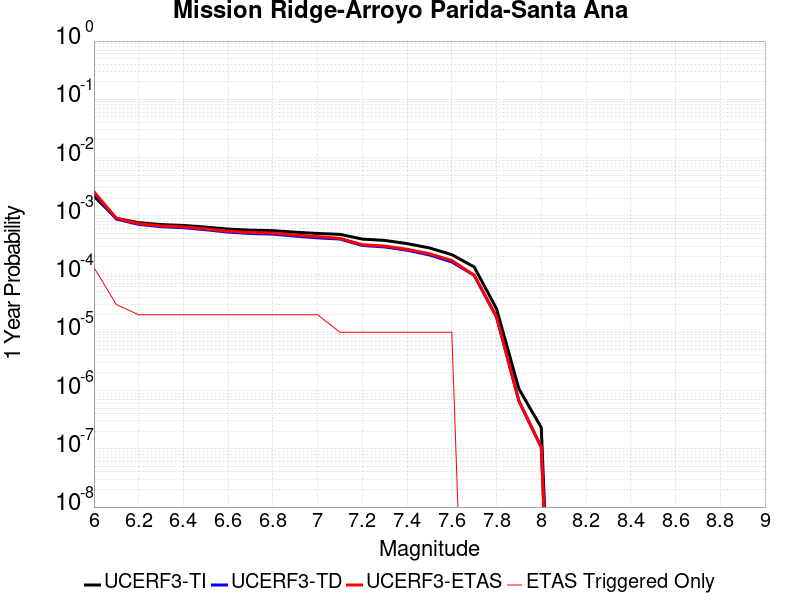 |  |

| Magnitude | 1 wk TI Prob | 1 wk TD Prob | 1 wk ETAS Prob | 1 wk ETAS/TD Gain | 1 wk ETAS Triggered Only | 1 mo TI Prob | 1 mo TD Prob | 1 mo ETAS Prob | 1 mo ETAS/TD Gain | 1 mo ETAS Triggered Only | 1 yr TI Prob | 1 yr TD Prob | 1 yr ETAS Prob | 1 yr ETAS/TD Gain | 1 yr ETAS Triggered Only | 10 yr TI Prob | 10 yr TD Prob | 10 yr ETAS Prob | 10 yr ETAS/TD Gain | 10 yr ETAS Triggered Only |
|-----|-----|-----|-----|-----|-----|-----|-----|-----|-----|-----|-----|-----|-----|-----|-----|-----|-----|-----|-----|-----|
| 6.0 | 4.169034E-5 | 4.7138263E-5 | 7.226271E-5 | 1.5329946 | 2.5125628E-5 | 1.7866064E-4 | 2.0201034E-4 | 2.5225146E-4 | 1.2487056 | 5.0251256E-5 | 0.0021730233 | 0.00245745 | 0.0025577056 | 1.0407965 | 1.0050251E-4 | 0.021518968 | 0.024384614 | 0.02450718 | 1.0050263 | 1.2562814E-4 |
| 6.1 | 1.73813E-5 | 1.6854226E-5 | 1.6854226E-5 | 1.0 | 0.0 | 7.4489166E-5 | 7.223046E-5 | 8.4792366E-5 | 1.1739143 | 1.2562814E-5 | 9.065282E-4 | 8.790618E-4 | 9.041653E-4 | 1.0285572 | 2.5125628E-5 | 0.009028391 | 0.008756988 | 0.0088068 | 1.0056882 | 5.0251256E-5 |
| 6.2 | 1.4622182E-5 | 1.367329E-5 | 1.367329E-5 | 1.0 | 0.0 | 6.2664985E-5 | 5.8598518E-5 | 7.11606E-5 | 1.2143754 | 1.2562814E-5 | 7.6267915E-4 | 7.132073E-4 | 7.257612E-4 | 1.017602 | 1.2562814E-5 | 0.007600669 | 0.007109627 | 0.0071470477 | 1.0052633 | 3.768844E-5 |
| 6.3 | 1.3552434E-5 | 1.2482201E-5 | 1.2482201E-5 | 1.0 | 0.0 | 5.8080568E-5 | 5.3494066E-5 | 6.605621E-5 | 1.2348324 | 1.2562814E-5 | 7.069015E-4 | 6.510988E-4 | 6.636534E-4 | 1.0192822 | 1.2562814E-5 | 0.00704657 | 0.006492275 | 0.0065172375 | 1.003845 | 2.5125628E-5 |
| 6.4 | 1.30977305E-5 | 1.1979156E-5 | 1.1979156E-5 | 1.0 | 0.0 | 5.613192E-5 | 5.1338247E-5 | 6.3900414E-5 | 1.2446941 | 1.2562814E-5 | 6.831918E-4 | 6.248669E-4 | 6.3742185E-4 | 1.0200922 | 1.2562814E-5 | 0.006810953 | 0.0062314444 | 0.006256413 | 1.004007 | 2.5125628E-5 |
| 6.5 | 1.225205E-5 | 1.1048803E-5 | 1.1048803E-5 | 1.0 | 0.0 | 5.2507727E-5 | 4.7351168E-5 | 5.991339E-5 | 1.2652991 | 1.2562814E-5 | 6.3909404E-4 | 5.7635066E-4 | 5.889063E-4 | 1.0217847 | 1.2562814E-5 | 0.006372592 | 0.005748869 | 0.0057738503 | 1.0043454 | 2.5125628E-5 |
| 6.6 | 1.1352241E-5 | 1.0063535E-5 | 1.0063535E-5 | 1.0 | 0.0 | 4.8651553E-5 | 4.3128734E-5 | 5.5691005E-5 | 1.2912738 | 1.2562814E-5 | 5.921717E-4 | 5.2496797E-4 | 5.375242E-4 | 1.023918 | 1.2562814E-5 | 0.0059059616 | 0.0052375244 | 0.0052500213 | 1.0023861 | 1.2562814E-5 |
| 6.7 | 1.0864116E-5 | 9.517027E-6 | 9.517027E-6 | 1.0 | 0.0 | 4.6559664E-5 | 4.0786632E-5 | 5.3348933E-5 | 1.3080004 | 1.2562814E-5 | 5.667165E-4 | 4.964661E-4 | 5.090227E-4 | 1.0252919 | 1.2562814E-5 | 0.005652734 | 0.004953804 | 0.004966304 | 1.0025234 | 1.2562814E-5 |
| 6.8 | 1.0666365E-5 | 9.299779E-6 | 9.299779E-6 | 1.0 | 0.0 | 4.571219E-5 | 3.9855597E-5 | 5.241791E-5 | 1.3151957 | 1.2562814E-5 | 5.564038E-4 | 4.8513585E-4 | 4.9769256E-4 | 1.0258828 | 1.2562814E-5 | 0.005550127 | 0.0048410003 | 0.004853502 | 1.0025826 | 1.2562814E-5 |
| 6.9 | 1.0038665E-5 | 8.592046E-6 | 8.592046E-6 | 1.0 | 0.0 | 4.302214E-5 | 3.682254E-5 | 4.9384893E-5 | 1.3411592 | 1.2562814E-5 | 5.236687E-4 | 4.4822405E-4 | 4.6078122E-4 | 1.0280154 | 1.2562814E-5 | 0.005224364 | 0.004473411 | 0.0044859173 | 1.0027958 | 1.2562814E-5 |
| 7.0 | 9.5379955E-6 | 8.025073E-6 | 8.025073E-6 | 1.0 | 0.0 | 4.0876483E-5 | 3.4392728E-5 | 4.695511E-5 | 1.3652627 | 1.2562814E-5 | 4.975576E-4 | 4.1865272E-4 | 4.3121027E-4 | 1.0299952 | 1.2562814E-5 | 0.00496445 | 0.0041788397 | 0.00419135 | 1.0029937 | 1.2562814E-5 |
| 7.1 | 9.207389E-6 | 7.652375E-6 | 7.652375E-6 | 1.0 | 0.0 | 3.945964E-5 | 3.279549E-5 | 4.535789E-5 | 1.3830527 | 1.2562814E-5 | 4.803152E-4 | 3.9921363E-4 | 4.1177144E-4 | 1.0314564 | 1.2562814E-5 | 0.004792784 | 0.003985161 | 0.0039976737 | 1.0031399 | 1.2562814E-5 |
| 7.2 | 7.638091E-6 | 5.9311183E-6 | 5.9311183E-6 | 1.0 | 0.0 | 3.2734264E-5 | 2.541883E-5 | 3.798133E-5 | 1.49422 | 1.2562814E-5 | 3.984668E-4 | 3.0943064E-4 | 3.2198956E-4 | 1.0405872 | 1.2562814E-5 | 0.0039775306 | 0.0030900547 | 0.0031025787 | 1.004053 | 1.2562814E-5 |
| 7.3 | 7.2500147E-6 | 5.5961527E-6 | 5.5961527E-6 | 1.0 | 0.0 | 3.1071122E-5 | 2.3983293E-5 | 3.6545807E-5 | 1.5238026 | 1.2562814E-5 | 3.7822526E-4 | 2.9195778E-4 | 3.0451693E-4 | 1.043017 | 1.2562814E-5 | 0.0037758215 | 0.0029157975 | 0.0029283238 | 1.004296 | 1.2562814E-5 |
| 7.4 | 6.3899715E-6 | 4.9184964E-6 | 4.9184964E-6 | 1.0 | 0.0 | 2.7385306E-5 | 2.10791E-5 | 3.364165E-5 | 1.5959718 | 1.2562814E-5 | 3.3336508E-4 | 2.5660804E-4 | 2.6916762E-4 | 1.0489446 | 1.2562814E-5 | 0.0033286542 | 0.0025631618 | 0.0025756923 | 1.0048888 | 1.2562814E-5 |
| 7.5 | 5.379025E-6 | 4.0838527E-6 | 4.0838527E-6 | 1.0 | 0.0 | 2.305276E-5 | 1.7502109E-5 | 3.0064703E-5 | 1.7177761 | 1.2562814E-5 | 2.806312E-4 | 2.1306744E-4 | 2.2562758E-4 | 1.0589491 | 1.2562814E-5 | 0.0028027708 | 0.002128643 | 0.002141179 | 1.0058892 | 1.2562814E-5 |
| 7.6 | 4.1270696E-6 | 3.0883439E-6 | 3.0883439E-6 | 1.0 | 0.0 | 1.768732E-5 | 1.3235693E-5 | 2.5798341E-5 | 1.9491493 | 1.2562814E-5 | 2.1532185E-4 | 1.6113273E-4 | 1.7369351E-4 | 1.0779531 | 1.2562814E-5 | 0.0021511333 | 0.001610167 | 0.0016227096 | 1.0077896 | 1.2562814E-5 |
| 7.7 | 2.5406805E-6 | 1.8282013E-6 | 1.8282013E-6 | 1.0 | 0.0 | 1.0888585E-5 | 7.835125E-6 | 7.835125E-6 | 1.0 | 0.0 | 1.3256045E-4 | 9.538854E-5 | 9.538854E-5 | 1.0 | 0.0 | 0.0013248142 | 9.534821E-4 | 9.534821E-4 | 1.0 | 0.0 |
| 7.8 | 4.8608285E-7 | 3.5098864E-7 | 3.5098864E-7 | 1.0 | 0.0 | 2.0832106E-6 | 1.5042363E-6 | 1.5042363E-6 | 1.0 | 0.0 | 2.5362791E-5 | 1.8313924E-5 | 1.8313924E-5 | 1.0 | 0.0 | 2.5359896E-4 | 1.8312426E-4 | 1.8312426E-4 | 1.0 | 0.0 |
| 7.9 | 2.0472514E-8 | 1.2688783E-8 | 1.2688783E-8 | 1.0 | 0.0 | 8.7739345E-8 | 5.43805E-8 | 5.43805E-8 | 1.0 | 0.0 | 1.068226E-6 | 6.6208236E-7 | 6.6208236E-7 | 1.0 | 0.0 | 1.0682209E-5 | 6.620805E-6 | 6.620805E-6 | 1.0 | 0.0 |
| 8.0 | 4.443582E-9 | 2.0321211E-9 | 2.0321211E-9 | 1.0 | 0.0 | 1.9043922E-8 | 8.70909E-9 | 8.70909E-9 | 1.0 | 0.0 | 2.3185973E-7 | 1.0603316E-7 | 1.0603316E-7 | 1.0 | 0.0 | 2.3185949E-6 | 1.0603312E-6 | 1.0603312E-6 | 1.0 | 0.0 |

## Dry Mountain
*[(top)](#table-of-contents)*

| 1 Week | 1 Month | 1 Year | 10 Year |
|-----|-----|-----|-----|
|  |  |  |  |

| Magnitude | 1 wk TI Prob | 1 wk TD Prob | 1 wk ETAS Prob | 1 wk ETAS/TD Gain | 1 wk ETAS Triggered Only | 1 mo TI Prob | 1 mo TD Prob | 1 mo ETAS Prob | 1 mo ETAS/TD Gain | 1 mo ETAS Triggered Only | 1 yr TI Prob | 1 yr TD Prob | 1 yr ETAS Prob | 1 yr ETAS/TD Gain | 1 yr ETAS Triggered Only | 10 yr TI Prob | 10 yr TD Prob | 10 yr ETAS Prob | 10 yr ETAS/TD Gain | 10 yr ETAS Triggered Only |
|-----|-----|-----|-----|-----|-----|-----|-----|-----|-----|-----|-----|-----|-----|-----|-----|-----|-----|-----|-----|-----|
| 6.0 | 6.222801E-6 | 6.439381E-6 | 4.412758E-5 | 6.852767 | 3.768844E-5 | 2.6668875E-5 | 2.7597147E-5 | 6.528455E-5 | 2.3656268 | 3.768844E-5 | 3.2464517E-4 | 3.3595937E-4 | 4.2386953E-4 | 1.261669 | 8.79397E-5 | 0.0032417132 | 0.0033560768 | 0.0034812833 | 1.0373074 | 1.2562814E-4 |
| 6.1 | 6.222801E-6 | 6.439381E-6 | 4.412758E-5 | 6.852767 | 3.768844E-5 | 2.6668875E-5 | 2.7597147E-5 | 6.528455E-5 | 2.3656268 | 3.768844E-5 | 3.2464517E-4 | 3.3595937E-4 | 4.2386953E-4 | 1.261669 | 8.79397E-5 | 0.0032417132 | 0.0033560768 | 0.0034812833 | 1.0373074 | 1.2562814E-4 |
| 6.2 | 6.222801E-6 | 6.439381E-6 | 4.412758E-5 | 6.852767 | 3.768844E-5 | 2.6668875E-5 | 2.7597147E-5 | 6.528455E-5 | 2.3656268 | 3.768844E-5 | 3.2464517E-4 | 3.3595937E-4 | 4.2386953E-4 | 1.261669 | 8.79397E-5 | 0.0032417132 | 0.0033560768 | 0.0034812833 | 1.0373074 | 1.2562814E-4 |
| 6.3 | 6.222801E-6 | 6.439381E-6 | 4.412758E-5 | 6.852767 | 3.768844E-5 | 2.6668875E-5 | 2.7597147E-5 | 6.528455E-5 | 2.3656268 | 3.768844E-5 | 3.2464517E-4 | 3.3595937E-4 | 4.2386953E-4 | 1.261669 | 8.79397E-5 | 0.0032417132 | 0.0033560768 | 0.0034812833 | 1.0373074 | 1.2562814E-4 |
| 6.4 | 6.222801E-6 | 6.439381E-6 | 4.412758E-5 | 6.852767 | 3.768844E-5 | 2.6668875E-5 | 2.7597147E-5 | 6.528455E-5 | 2.3656268 | 3.768844E-5 | 3.2464517E-4 | 3.3595937E-4 | 4.2386953E-4 | 1.261669 | 8.79397E-5 | 0.0032417132 | 0.0033560768 | 0.0034812833 | 1.0373074 | 1.2562814E-4 |
| 6.5 | 2.8528623E-6 | 2.9521684E-6 | 4.0640498E-5 | 13.766321 | 3.768844E-5 | 1.22264955E-5 | 1.2652138E-5 | 5.0340102E-5 | 3.9787824 | 3.768844E-5 | 1.4884741E-4 | 1.540376E-4 | 1.9172023E-4 | 1.2446327 | 3.768844E-5 | 0.0014874774 | 0.0015401616 | 0.0015903355 | 1.032577 | 5.0251256E-5 |
| 6.6 | 2.8528623E-6 | 2.9521684E-6 | 4.0640498E-5 | 13.766321 | 3.768844E-5 | 1.22264955E-5 | 1.2652138E-5 | 5.0340102E-5 | 3.9787824 | 3.768844E-5 | 1.4884741E-4 | 1.540376E-4 | 1.9172023E-4 | 1.2446327 | 3.768844E-5 | 0.0014874774 | 0.0015401616 | 0.0015903355 | 1.032577 | 5.0251256E-5 |
| 6.7 | 2.541E-6 | 2.6293578E-6 | 2.775492E-5 | 10.5557785 | 2.5125628E-5 | 1.0889954E-5 | 1.1268677E-5 | 3.639402E-5 | 3.2296624 | 2.5125628E-5 | 1.3257713E-4 | 1.3719614E-4 | 1.6231832E-4 | 1.1831114 | 2.5125628E-5 | 0.0013249806 | 0.0013719613 | 0.0014095982 | 1.0274328 | 3.768844E-5 |

## Owens Valley
*[(top)](#table-of-contents)*

| 1 Week | 1 Month | 1 Year | 10 Year |
|-----|-----|-----|-----|
|  |  | 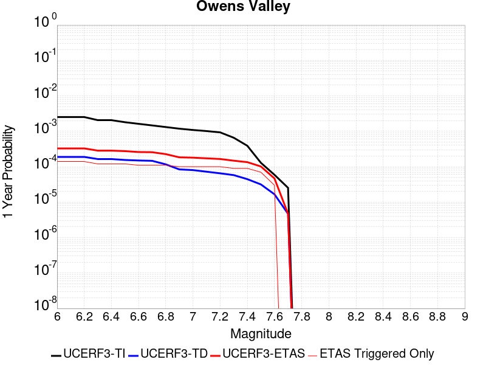 |  |

| Magnitude | 1 wk TI Prob | 1 wk TD Prob | 1 wk ETAS Prob | 1 wk ETAS/TD Gain | 1 wk ETAS Triggered Only | 1 mo TI Prob | 1 mo TD Prob | 1 mo ETAS Prob | 1 mo ETAS/TD Gain | 1 mo ETAS Triggered Only | 1 yr TI Prob | 1 yr TD Prob | 1 yr ETAS Prob | 1 yr ETAS/TD Gain | 1 yr ETAS Triggered Only | 10 yr TI Prob | 10 yr TD Prob | 10 yr ETAS Prob | 10 yr ETAS/TD Gain | 10 yr ETAS Triggered Only |
|-----|-----|-----|-----|-----|-----|-----|-----|-----|-----|-----|-----|-----|-----|-----|-----|-----|-----|-----|-----|-----|
| 6.0 | 4.83821E-5 | 3.626567E-6 | 6.644041E-5 | 18.320469 | 6.281407E-5 | 2.0733538E-4 | 1.5542342E-5 | 1.16043295E-4 | 7.466268 | 1.0050251E-4 | 0.002521386 | 1.8921259E-4 | 3.273774E-4 | 1.7302094 | 1.3819095E-4 | 0.024929691 | 0.001925011 | 0.0020629358 | 1.071649 | 1.3819095E-4 |
| 6.1 | 4.83821E-5 | 3.626567E-6 | 6.644041E-5 | 18.320469 | 6.281407E-5 | 2.0733538E-4 | 1.5542342E-5 | 1.16043295E-4 | 7.466268 | 1.0050251E-4 | 0.002521386 | 1.8921259E-4 | 3.273774E-4 | 1.7302094 | 1.3819095E-4 | 0.024929691 | 0.001925011 | 0.0020629358 | 1.071649 | 1.3819095E-4 |
| 6.2 | 4.83821E-5 | 3.626567E-6 | 6.644041E-5 | 18.320469 | 6.281407E-5 | 2.0733538E-4 | 1.5542342E-5 | 1.16043295E-4 | 7.466268 | 1.0050251E-4 | 0.002521386 | 1.8921259E-4 | 3.273774E-4 | 1.7302094 | 1.3819095E-4 | 0.024929691 | 0.001925011 | 0.0020629358 | 1.071649 | 1.3819095E-4 |
| 6.3 | 3.953008E-5 | 3.1553948E-6 | 5.3406493E-5 | 16.925455 | 5.0251256E-5 | 1.6940363E-4 | 1.3523055E-5 | 8.889892E-5 | 6.573879 | 7.537688E-5 | 0.002060538 | 1.6463149E-4 | 2.776782E-4 | 1.6866652 | 1.13065325E-4 | 0.020415364 | 0.0016592 | 0.0017720776 | 1.0680314 | 1.13065325E-4 |
| 6.4 | 3.953008E-5 | 3.1553948E-6 | 5.3406493E-5 | 16.925455 | 5.0251256E-5 | 1.6940363E-4 | 1.3523055E-5 | 8.889892E-5 | 6.573879 | 7.537688E-5 | 0.002060538 | 1.6463149E-4 | 2.776782E-4 | 1.6866652 | 1.13065325E-4 | 0.020415364 | 0.0016592 | 0.0017720776 | 1.0680314 | 1.13065325E-4 |
| 6.5 | 3.457342E-5 | 2.9715961E-6 | 5.3222702E-5 | 17.910477 | 5.0251256E-5 | 1.4816338E-4 | 1.2735354E-5 | 8.811128E-5 | 6.918636 | 7.537688E-5 | 0.0018023965 | 1.550426E-4 | 2.680904E-4 | 1.7291402 | 1.13065325E-4 | 0.017878477 | 0.001555719 | 0.0016686084 | 1.0725641 | 1.13065325E-4 |
| 6.6 | 3.1127765E-5 | 2.8744932E-6 | 5.3125605E-5 | 18.48173 | 5.0251256E-5 | 1.3339789E-4 | 1.2319203E-5 | 8.769516E-5 | 7.118574 | 7.537688E-5 | 0.0016229092 | 1.4997667E-4 | 2.6302502E-4 | 1.7537731 | 1.13065325E-4 | 0.016111081 | 0.0015012559 | 0.0016141514 | 1.0752008 | 1.13065325E-4 |
| 6.7 | 2.806885E-5 | 2.8104134E-6 | 5.306153E-5 | 18.88033 | 5.0251256E-5 | 1.2028952E-4 | 1.20445775E-5 | 8.742055E-5 | 7.2580843 | 7.537688E-5 | 0.001463541 | 1.4663354E-4 | 2.596823E-4 | 1.770961 | 1.13065325E-4 | 0.014539397 | 0.0014657511 | 0.0015786507 | 1.077025 | 1.13065325E-4 |
| 6.8 | 2.524524E-5 | 2.2353688E-6 | 5.2486514E-5 | 23.480024 | 5.0251256E-5 | 1.0818939E-4 | 9.580118E-6 | 8.495628E-5 | 8.867978 | 7.537688E-5 | 0.0013164099 | 1.16632E-4 | 2.2968414E-4 | 1.9693063 | 1.13065325E-4 | 0.01308639 | 0.0011659812 | 0.0012789146 | 1.0968571 | 1.13065325E-4 |
| 6.9 | 2.2704568E-5 | 1.6081682E-6 | 3.929655E-5 | 24.435596 | 3.768844E-5 | 9.730166E-5 | 6.8921313E-6 | 6.970577E-5 | 10.113819 | 6.281407E-5 | 0.0011840039 | 8.390849E-5 | 1.8440257E-4 | 2.1976628 | 1.0050251E-4 | 0.011777153 | 8.3897985E-4 | 9.39398E-4 | 1.1196908 | 1.0050251E-4 |
| 7.0 | 2.0871712E-5 | 1.5395453E-6 | 3.922793E-5 | 25.480206 | 3.768844E-5 | 8.944713E-5 | 6.598035E-6 | 6.941169E-5 | 10.520056 | 6.281407E-5 | 0.0010884746 | 8.032813E-5 | 1.8082256E-4 | 2.2510493 | 1.0050251E-4 | 0.010831586 | 8.0316263E-4 | 9.035844E-4 | 1.1250329 | 1.0050251E-4 |
| 7.1 | 1.944928E-5 | 1.3864178E-6 | 3.9074806E-5 | 28.184008 | 3.768844E-5 | 8.335139E-5 | 5.941777E-6 | 6.875547E-5 | 11.571534 | 6.281407E-5 | 0.0010143308 | 7.233874E-5 | 1.7283398E-4 | 2.3892312 | 1.0050251E-4 | 0.010097133 | 7.2330976E-4 | 8.2373957E-4 | 1.1388476 | 1.0050251E-4 |
| 7.2 | 1.7876306E-5 | 1.2489141E-6 | 3.893731E-5 | 31.176931 | 3.768844E-5 | 7.6610486E-5 | 5.352478E-6 | 6.816621E-5 | 12.735449 | 6.281407E-5 | 9.3233347E-4 | 6.516448E-5 | 1.6566044E-4 | 2.5421894 | 1.0050251E-4 | 0.009284316 | 6.5159105E-4 | 7.520281E-4 | 1.1541412 | 1.0050251E-4 |
| 7.3 | 1.2618672E-5 | 1.1115209E-6 | 2.6237121E-5 | 23.604704 | 2.5125628E-5 | 5.40789E-5 | 4.763652E-6 | 5.501467E-5 | 11.548842 | 5.0251256E-5 | 6.582117E-4 | 5.799593E-5 | 1.4593053E-4 | 2.51622 | 8.79397E-5 | 0.0065626553 | 5.7994033E-4 | 6.67829E-4 | 1.1515478 | 8.79397E-5 |
| 7.4 | 7.4874442E-6 | 8.5486437E-7 | 2.5980471E-5 | 30.391336 | 2.5125628E-5 | 3.208865E-5 | 3.6636993E-6 | 5.3914773E-5 | 14.715938 | 5.0251256E-5 | 3.906093E-4 | 4.4604632E-5 | 1.325404E-4 | 2.9714494 | 8.79397E-5 | 0.003899234 | 4.4604883E-4 | 5.339493E-4 | 1.1970646 | 8.79397E-5 |
| 7.5 | 2.4734156E-6 | 6.068616E-7 | 2.5732474E-5 | 42.402542 | 2.5125628E-5 | 1.060031E-5 | 2.6008327E-6 | 5.285196E-5 | 20.321167 | 5.0251256E-5 | 1.2905113E-4 | 3.166468E-5 | 1.0703918E-4 | 3.3803966 | 7.537688E-5 | 0.0012897621 | 3.1660203E-4 | 3.9195505E-4 | 1.2380055 | 7.537688E-5 |
| 7.6 | 1.1328841E-6 | 3.196531E-7 | 1.2882463E-5 | 40.301388 | 1.2562814E-5 | 4.8552088E-6 | 1.3699412E-6 | 2.6495534E-5 | 19.340637 | 2.5125628E-5 | 5.9110564E-5 | 1.6678909E-5 | 4.1804116E-5 | 2.506406 | 2.5125628E-5 | 5.9094845E-4 | 1.6677675E-4 | 1.9189819E-4 | 1.1506292 | 2.5125628E-5 |
| 7.7 | 4.8613185E-7 | 8.964689E-8 | 8.964689E-8 | 1.0 | 0.0 | 2.0834207E-6 | 3.8420092E-7 | 3.8420092E-7 | 1.0 | 0.0 | 2.536535E-5 | 4.6776368E-6 | 4.6776368E-6 | 1.0 | 0.0 | 2.5362454E-4 | 4.677545E-5 | 4.677545E-5 | 1.0 | 0.0 |

## Chino alt 1
*[(top)](#table-of-contents)*

| 1 Week | 1 Month | 1 Year | 10 Year |
|-----|-----|-----|-----|
|  |  |  |  |

| Magnitude | 1 wk TI Prob | 1 wk TD Prob | 1 wk ETAS Prob | 1 wk ETAS/TD Gain | 1 wk ETAS Triggered Only | 1 mo TI Prob | 1 mo TD Prob | 1 mo ETAS Prob | 1 mo ETAS/TD Gain | 1 mo ETAS Triggered Only | 1 yr TI Prob | 1 yr TD Prob | 1 yr ETAS Prob | 1 yr ETAS/TD Gain | 1 yr ETAS Triggered Only | 10 yr TI Prob | 10 yr TD Prob | 10 yr ETAS Prob | 10 yr ETAS/TD Gain | 10 yr ETAS Triggered Only |
|-----|-----|-----|-----|-----|-----|-----|-----|-----|-----|-----|-----|-----|-----|-----|-----|-----|-----|-----|-----|-----|
| 6.0 | 3.939946E-5 | 4.8948554E-5 | 9.919735E-5 | 2.0265634 | 5.0251256E-5 | 1.6884391E-4 | 2.097656E-4 | 2.7256648E-4 | 1.299386 | 6.281407E-5 | 0.0020537362 | 0.0025513945 | 0.00263911 | 1.0343794 | 8.79397E-5 | 0.020348595 | 0.025277847 | 0.025412545 | 1.0053287 | 1.3819095E-4 |
| 6.1 | 2.1505624E-5 | 2.6879026E-5 | 6.4566455E-5 | 2.402113 | 3.768844E-5 | 9.2163704E-5 | 1.1519137E-4 | 1.6543684E-4 | 1.4361913 | 5.0251256E-5 | 0.0011215154 | 0.001401664 | 0.00146439 | 1.0447512 | 6.281407E-5 | 0.011158722 | 0.013945141 | 0.014031854 | 1.0062182 | 8.79397E-5 |
| 6.2 | 2.1505624E-5 | 2.6879026E-5 | 6.4566455E-5 | 2.402113 | 3.768844E-5 | 9.2163704E-5 | 1.1519137E-4 | 1.6543684E-4 | 1.4361913 | 5.0251256E-5 | 0.0011215154 | 0.001401664 | 0.00146439 | 1.0447512 | 6.281407E-5 | 0.011158722 | 0.013945141 | 0.014031854 | 1.0062182 | 8.79397E-5 |
| 6.3 | 1.4290785E-5 | 1.8165128E-5 | 4.32903E-5 | 2.3831542 | 2.5125628E-5 | 6.1244784E-5 | 7.784848E-5 | 1.15533985E-4 | 1.484088 | 3.768844E-5 | 7.454001E-4 | 9.4743853E-4 | 9.850912E-4 | 1.0397416 | 3.768844E-5 | 0.007429048 | 0.0094444575 | 0.009494234 | 1.0052705 | 5.0251256E-5 |
| 6.4 | 1.4290785E-5 | 1.8165128E-5 | 4.32903E-5 | 2.3831542 | 2.5125628E-5 | 6.1244784E-5 | 7.784848E-5 | 1.15533985E-4 | 1.484088 | 3.768844E-5 | 7.454001E-4 | 9.4743853E-4 | 9.850912E-4 | 1.0397416 | 3.768844E-5 | 0.007429048 | 0.0094444575 | 0.009494234 | 1.0052705 | 5.0251256E-5 |
| 6.5 | 1.3017944E-5 | 1.6652088E-5 | 4.1777297E-5 | 2.5088325 | 2.5125628E-5 | 5.5789995E-5 | 7.136439E-5 | 1.0905014E-4 | 1.5280751 | 3.768844E-5 | 6.790315E-4 | 8.685589E-4 | 9.062146E-4 | 1.0433543 | 3.768844E-5 | 0.0067696036 | 0.008661949 | 0.008699311 | 1.0043133 | 3.768844E-5 |
| 6.6 | 9.470016E-6 | 1.2039424E-5 | 3.716475E-5 | 3.0869207 | 2.5125628E-5 | 4.058515E-5 | 5.1596704E-5 | 7.672104E-5 | 1.4869368 | 2.5125628E-5 | 4.940122E-4 | 6.280428E-4 | 6.531526E-4 | 1.0399811 | 2.5125628E-5 | 0.004929154 | 0.0062718987 | 0.0062968666 | 1.003981 | 2.5125628E-5 |
| 6.7 | 8.314155E-6 | 1.0407736E-5 | 3.5533103E-5 | 3.4141047 | 2.5125628E-5 | 3.5631605E-5 | 4.4604003E-5 | 6.9728514E-5 | 1.5632792 | 2.5125628E-5 | 4.3372845E-4 | 5.429507E-4 | 5.6806265E-4 | 1.0462509 | 2.5125628E-5 | 0.004328829 | 0.005425775 | 0.0054507647 | 1.0046057 | 2.5125628E-5 |
| 6.8 | 3.4856364E-6 | 3.8133708E-6 | 3.8133708E-6 | 1.0 | 0.0 | 1.4938357E-5 | 1.6342927E-5 | 1.6342927E-5 | 1.0 | 0.0 | 1.8185932E-4 | 1.9895904E-4 | 1.9895904E-4 | 1.0 | 0.0 | 0.0018171056 | 0.0019894864 | 0.0019894864 | 1.0 | 0.0 |
| 6.9 | 2.2645952E-6 | 2.1529022E-6 | 2.1529022E-6 | 1.0 | 0.0 | 9.705372E-6 | 9.226692E-6 | 9.226692E-6 | 1.0 | 0.0 | 1.18156495E-4 | 1.123294E-4 | 1.123294E-4 | 1.0 | 0.0 | 0.0011809369 | 0.0011233423 | 0.0011233423 | 1.0 | 0.0 |
| 7.0 | 1.7864003E-6 | 1.5430785E-6 | 1.5430785E-6 | 1.0 | 0.0 | 7.655979E-6 | 6.613177E-6 | 6.613177E-6 | 1.0 | 0.0 | 9.3207556E-5 | 8.051251E-5 | 8.051251E-5 | 1.0 | 0.0 | 9.316847E-4 | 8.0528046E-4 | 8.0528046E-4 | 1.0 | 0.0 |
| 7.1 | 1.7315456E-6 | 1.4733511E-6 | 1.4733511E-6 | 1.0 | 0.0 | 7.420889E-6 | 6.3143466E-6 | 6.3143466E-6 | 1.0 | 0.0 | 9.034557E-5 | 7.6874516E-5 | 7.6874516E-5 | 1.0 | 0.0 | 9.0308854E-4 | 7.6891703E-4 | 7.6891703E-4 | 1.0 | 0.0 |
| 7.2 | 1.6008337E-6 | 1.3574215E-6 | 1.3574215E-6 | 1.0 | 0.0 | 6.860698E-6 | 5.817508E-6 | 5.817508E-6 | 1.0 | 0.0 | 8.352579E-5 | 7.082591E-5 | 7.082591E-5 | 1.0 | 0.0 | 8.34944E-4 | 7.0845755E-4 | 7.0845755E-4 | 1.0 | 0.0 |
| 7.3 | 1.3320939E-6 | 1.121782E-6 | 1.121782E-6 | 1.0 | 0.0 | 5.7089615E-6 | 4.807629E-6 | 4.807629E-6 | 1.0 | 0.0 | 6.9504385E-5 | 5.8531357E-5 | 5.8531357E-5 | 1.0 | 0.0 | 6.9482654E-4 | 5.8530393E-4 | 5.8530393E-4 | 1.0 | 0.0 |
| 7.4 | 1.114294E-6 | 9.237111E-7 | 9.237111E-7 | 1.0 | 0.0 | 4.775537E-6 | 3.958756E-6 | 3.958756E-6 | 1.0 | 0.0 | 5.8140613E-5 | 4.8196827E-5 | 4.8196827E-5 | 1.0 | 0.0 | 5.81254E-4 | 4.8188053E-4 | 4.8188053E-4 | 1.0 | 0.0 |
| 7.5 | 9.354081E-7 | 7.6234323E-7 | 7.6234323E-7 | 1.0 | 0.0 | 4.0088858E-6 | 3.2671815E-6 | 3.2671815E-6 | 1.0 | 0.0 | 4.8807087E-5 | 3.9777242E-5 | 3.9777242E-5 | 1.0 | 0.0 | 4.879637E-4 | 3.977046E-4 | 3.977046E-4 | 1.0 | 0.0 |
| 7.6 | 8.521771E-7 | 6.88071E-7 | 6.88071E-7 | 1.0 | 0.0 | 3.6521824E-6 | 2.9488726E-6 | 2.9488726E-6 | 1.0 | 0.0 | 4.4464414E-5 | 3.5901965E-5 | 3.5901965E-5 | 1.0 | 0.0 | 4.4455516E-4 | 3.589648E-4 | 3.589648E-4 | 1.0 | 0.0 |
| 7.7 | 2.1803626E-7 | 1.418649E-7 | 1.418649E-7 | 1.0 | 0.0 | 9.344408E-7 | 6.079923E-7 | 6.079923E-7 | 1.0 | 0.0 | 1.1376757E-5 | 7.4022914E-6 | 7.4022914E-6 | 1.0 | 0.0 | 1.13761744E-4 | 7.402141E-5 | 7.402141E-5 | 1.0 | 0.0 |

## Imperial
*[(top)](#table-of-contents)*

| 1 Week | 1 Month | 1 Year | 10 Year |
|-----|-----|-----|-----|
|  | 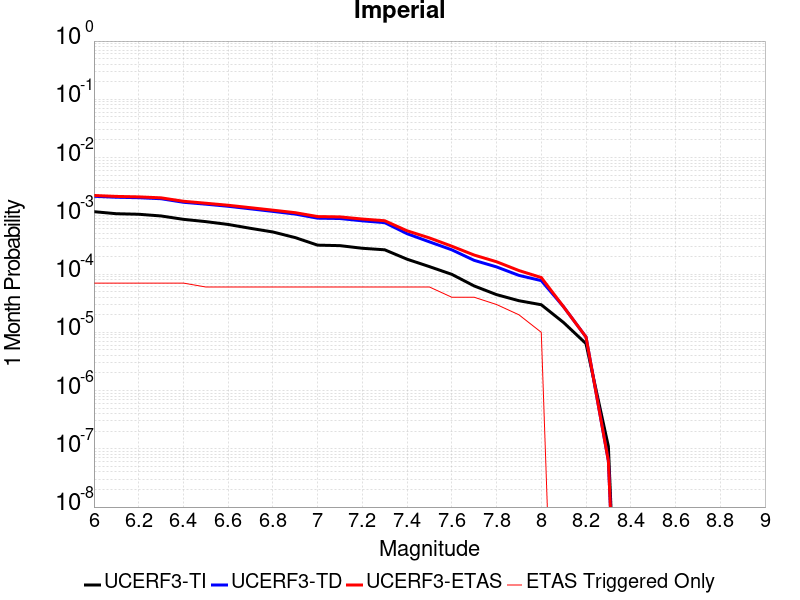 |  |  |

| Magnitude | 1 wk TI Prob | 1 wk TD Prob | 1 wk ETAS Prob | 1 wk ETAS/TD Gain | 1 wk ETAS Triggered Only | 1 mo TI Prob | 1 mo TD Prob | 1 mo ETAS Prob | 1 mo ETAS/TD Gain | 1 mo ETAS Triggered Only | 1 yr TI Prob | 1 yr TD Prob | 1 yr ETAS Prob | 1 yr ETAS/TD Gain | 1 yr ETAS Triggered Only | 10 yr TI Prob | 10 yr TD Prob | 10 yr ETAS Prob | 10 yr ETAS/TD Gain | 10 yr ETAS Triggered Only |
|-----|-----|-----|-----|-----|-----|-----|-----|-----|-----|-----|-----|-----|-----|-----|-----|-----|-----|-----|-----|-----|
| 6.0 | 2.7496446E-4 | 5.0552754E-4 | 5.5575336E-4 | 1.0993533 | 5.0251256E-5 | 0.0011778869 | 0.002164787 | 0.0022149296 | 1.0231627 | 5.0251256E-5 | 0.0142467655 | 0.026038699 | 0.026112113 | 1.0028194 | 7.537688E-5 | 0.13367249 | 0.2280438 | 0.22815047 | 1.0004678 | 1.3819095E-4 |
| 6.1 | 2.5356023E-4 | 4.8656776E-4 | 5.367946E-4 | 1.1032268 | 5.0251256E-5 | 0.001086234 | 0.0020836622 | 0.0021338088 | 1.0240666 | 5.0251256E-5 | 0.013144928 | 0.025071215 | 0.025144702 | 1.0029311 | 7.537688E-5 | 0.123940155 | 0.21947981 | 0.21958767 | 1.0004914 | 1.3819095E-4 |
| 6.2 | 2.4820742E-4 | 4.7752203E-4 | 5.277493E-4 | 1.1051831 | 5.0251256E-5 | 0.0010633124 | 0.0020449557 | 0.0020951042 | 1.024523 | 5.0251256E-5 | 0.01286919 | 0.024611235 | 0.024684757 | 1.0029874 | 7.537688E-5 | 0.12148927 | 0.21598552 | 0.21609387 | 1.0005016 | 1.3819095E-4 |
| 6.3 | 2.3205351E-4 | 4.5890483E-4 | 5.0913304E-4 | 1.1094524 | 5.0251256E-5 | 9.94136E-4 | 0.0019652895 | 0.002015442 | 1.0255191 | 5.0251256E-5 | 0.012036599 | 0.02366133 | 0.023734923 | 1.0031103 | 7.537688E-5 | 0.11405133 | 0.20793462 | 0.20804407 | 1.0005264 | 1.3819095E-4 |
| 6.4 | 2.0304754E-4 | 3.987652E-4 | 4.489964E-4 | 1.1259669 | 5.0251256E-5 | 8.6991355E-4 | 0.0017078889 | 0.0017580544 | 1.0293728 | 5.0251256E-5 | 0.010539869 | 0.020595672 | 0.020669496 | 1.0035845 | 7.537688E-5 | 0.100537635 | 0.1850669 | 0.18517952 | 1.0006086 | 1.3819095E-4 |
| 6.5 | 1.854992E-4 | 3.6988858E-4 | 4.2012127E-4 | 1.1358049 | 5.0251256E-5 | 7.9475436E-4 | 0.0015842861 | 0.0016344577 | 1.0316683 | 5.0251256E-5 | 0.009633281 | 0.01911948 | 0.019193416 | 1.003867 | 7.537688E-5 | 0.0922623 | 0.173298 | 0.17341225 | 1.0006592 | 1.3819095E-4 |
| 6.6 | 1.6586106E-4 | 3.403506E-4 | 3.9058478E-4 | 1.1475953 | 5.0251256E-5 | 7.106394E-4 | 0.0014578402 | 0.0015080182 | 1.0344194 | 5.0251256E-5 | 0.008617763 | 0.01760642 | 0.01768047 | 1.0042058 | 7.537688E-5 | 0.08291132 | 0.16077545 | 0.16089141 | 1.0007213 | 1.3819095E-4 |
| 6.7 | 1.4224656E-4 | 3.076692E-4 | 3.5790497E-4 | 1.1632786 | 5.0251256E-5 | 6.094856E-4 | 0.001317924 | 0.0013681091 | 1.0380789 | 5.0251256E-5 | 0.0073952693 | 0.015929576 | 0.016003752 | 1.0046566 | 7.537688E-5 | 0.07153955 | 0.14648417 | 0.14660211 | 1.0008051 | 1.3819095E-4 |
| 6.8 | 1.2317259E-4 | 2.779122E-4 | 3.2814947E-4 | 1.1807668 | 5.0251256E-5 | 5.2777573E-4 | 0.0011905148 | 0.0012407062 | 1.0421594 | 5.0251256E-5 | 0.0064067547 | 0.0143995695 | 0.014473861 | 1.0051593 | 7.537688E-5 | 0.06225166 | 0.13293684 | 0.13305666 | 1.0009013 | 1.3819095E-4 |
| 6.9 | 9.859898E-5 | 2.5014306E-4 | 3.0038174E-4 | 1.2008399 | 5.0251256E-5 | 4.2249862E-4 | 0.0010716055 | 0.0011218028 | 1.0468432 | 5.0251256E-5 | 0.0051317946 | 0.012969712 | 0.013044111 | 1.0057364 | 7.537688E-5 | 0.05014893 | 0.11940631 | 0.119528 | 1.0010191 | 1.3819095E-4 |
| 7.0 | 7.3191884E-5 | 2.1266776E-4 | 2.6290832E-4 | 1.2362397 | 5.0251256E-5 | 3.136418E-4 | 9.1111806E-4 | 9.6132356E-4 | 1.0551032 | 5.0251256E-5 | 0.003811904 | 0.011037128 | 0.011111673 | 1.006754 | 7.537688E-5 | 0.037471764 | 0.10206493 | 0.10218901 | 1.0012158 | 1.3819095E-4 |
| 7.1 | 7.1760296E-5 | 2.0968143E-4 | 2.5992215E-4 | 1.2396051 | 5.0251256E-5 | 3.0750787E-4 | 8.983284E-4 | 9.4853446E-4 | 1.0558884 | 5.0251256E-5 | 0.003737482 | 0.010882978 | 0.010957534 | 1.0068507 | 7.537688E-5 | 0.03675245 | 0.10070146 | 0.100825734 | 1.001234 | 1.3819095E-4 |
| 7.2 | 6.46614E-5 | 1.9136685E-4 | 2.416085E-4 | 1.2625409 | 5.0251256E-5 | 2.7709085E-4 | 8.1988896E-4 | 8.70099E-4 | 1.0612401 | 5.0251256E-5 | 0.0033683628 | 0.0099370815 | 0.010011709 | 1.0075101 | 7.537688E-5 | 0.033177625 | 0.09250898 | 0.09263439 | 1.0013556 | 1.3819095E-4 |
| 7.3 | 6.088115E-5 | 1.78084E-4 | 2.283263E-4 | 1.282127 | 5.0251256E-5 | 2.6089314E-4 | 7.6299673E-4 | 8.132096E-4 | 1.0658101 | 5.0251256E-5 | 0.0031717476 | 0.009250494 | 0.009325173 | 1.0080731 | 7.537688E-5 | 0.031268585 | 0.08655989 | 0.08668612 | 1.0014583 | 1.3819095E-4 |
| 7.4 | 4.199346E-5 | 1.1510366E-4 | 1.6534913E-4 | 1.4365237 | 5.0251256E-5 | 1.7995955E-4 | 4.9320905E-4 | 5.434355E-4 | 1.1018361 | 5.0251256E-5 | 0.0021888057 | 0.0059884563 | 0.0060633817 | 1.0125116 | 7.537688E-5 | 0.02167372 | 0.057439793 | 0.057558205 | 1.0020615 | 1.2562814E-4 |
| 7.5 | 3.130448E-5 | 8.33328E-5 | 1.3357987E-4 | 1.6029687 | 5.0251256E-5 | 1.3415517E-4 | 3.57092E-4 | 4.073253E-4 | 1.1406733 | 5.0251256E-5 | 0.0016321153 | 0.004338988 | 0.004414038 | 1.0172967 | 7.537688E-5 | 0.016201803 | 0.04213201 | 0.042252343 | 1.0028561 | 1.2562814E-4 |
| 7.6 | 2.3074248E-5 | 6.0844646E-5 | 8.596875E-5 | 1.4129221 | 2.5125628E-5 | 9.888588E-5 | 2.6073685E-4 | 2.8585593E-4 | 1.0963389 | 2.5125628E-5 | 0.0012032706 | 0.0031698733 | 0.0032074424 | 1.0118519 | 3.768844E-5 | 0.011967761 | 0.031026395 | 0.031111605 | 1.0027465 | 8.79397E-5 |
| 7.7 | 1.45864815E-5 | 4.0124698E-5 | 6.524932E-5 | 1.6261635 | 2.5125628E-5 | 6.2511994E-5 | 1.7195169E-4 | 1.97073E-4 | 1.1460952 | 2.5125628E-5 | 7.608177E-4 | 0.0020915072 | 0.0021291168 | 1.017982 | 3.768844E-5 | 0.007582182 | 0.020627763 | 0.020701585 | 1.0035788 | 7.537688E-5 |
| 7.8 | 1.0352979E-5 | 3.0960902E-5 | 4.3523327E-5 | 1.4057512 | 1.2562814E-5 | 4.4369157E-5 | 1.3268284E-4 | 1.4524399E-4 | 1.0946704 | 1.2562814E-5 | 5.400606E-4 | 0.0016142189 | 0.001639304 | 1.0155401 | 2.5125628E-5 | 0.0053875 | 0.016016833 | 0.016078642 | 1.0038589 | 6.281407E-5 |
| 7.9 | 8.137906E-6 | 2.2149103E-5 | 3.4711637E-5 | 1.5671804 | 1.2562814E-5 | 3.4876273E-5 | 9.492128E-5 | 1.074829E-4 | 1.1323372 | 1.2562814E-5 | 4.2453592E-4 | 0.0011550548 | 0.0011801514 | 1.0217277 | 2.5125628E-5 | 0.004237258 | 0.011617903 | 0.0116799865 | 1.0053438 | 6.281407E-5 |
| 8.0 | 6.93792E-6 | 1.8008766E-5 | 3.0571355E-5 | 1.6975819 | 1.2562814E-5 | 2.9733603E-5 | 7.717814E-5 | 8.973999E-5 | 1.1627643 | 1.2562814E-5 | 3.6194647E-4 | 9.3923963E-4 | 9.643416E-4 | 1.0267259 | 2.5125628E-5 | 0.0036135751 | 0.00950155 | 0.009538881 | 1.0039289 | 3.768844E-5 |
| 8.1 | 3.4286315E-6 | 6.379872E-6 | 6.379872E-6 | 1.0 | 0.0 | 1.4694053E-5 | 2.7342023E-5 | 2.7342023E-5 | 1.0 | 0.0 | 1.7888541E-4 | 3.328384E-4 | 3.4539704E-4 | 1.0377319 | 1.2562814E-5 | 0.0017874148 | 0.003486031 | 0.0035110689 | 1.0071824 | 2.5125628E-5 |
| 8.2 | 1.4906886E-6 | 1.9366646E-6 | 1.9366646E-6 | 1.0 | 0.0 | 6.3886496E-6 | 8.299965E-6 | 8.299965E-6 | 1.0 | 0.0 | 7.7779034E-5 | 1.0104742E-4 | 1.0104742E-4 | 1.0 | 0.0 | 7.775182E-4 | 0.0011075331 | 0.0011075331 | 1.0 | 0.0 |
| 8.3 | 2.5758007E-8 | 1.4500102E-8 | 1.4500102E-8 | 1.0 | 0.0 | 1.10391454E-7 | 6.214329E-8 | 6.214329E-8 | 1.0 | 0.0 | 1.3440151E-6 | 7.565946E-7 | 7.565946E-7 | 1.0 | 0.0 | 1.344007E-5 | 7.887763E-6 | 7.887763E-6 | 1.0 | 0.0 |

## Cleghorn
*[(top)](#table-of-contents)*

| 1 Week | 1 Month | 1 Year | 10 Year |
|-----|-----|-----|-----|
|  |  |  |  |

| Magnitude | 1 wk TI Prob | 1 wk TD Prob | 1 wk ETAS Prob | 1 wk ETAS/TD Gain | 1 wk ETAS Triggered Only | 1 mo TI Prob | 1 mo TD Prob | 1 mo ETAS Prob | 1 mo ETAS/TD Gain | 1 mo ETAS Triggered Only | 1 yr TI Prob | 1 yr TD Prob | 1 yr ETAS Prob | 1 yr ETAS/TD Gain | 1 yr ETAS Triggered Only | 10 yr TI Prob | 10 yr TD Prob | 10 yr ETAS Prob | 10 yr ETAS/TD Gain | 10 yr ETAS Triggered Only |
|-----|-----|-----|-----|-----|-----|-----|-----|-----|-----|-----|-----|-----|-----|-----|-----|-----|-----|-----|-----|-----|
| 6.0 | 7.9267165E-6 | 9.831582E-6 | 2.2394273E-5 | 2.2777894 | 1.2562814E-5 | 3.39712E-5 | 4.2134732E-5 | 6.72593E-5 | 1.5962912 | 2.5125628E-5 | 4.1352084E-4 | 5.128803E-4 | 5.6310574E-4 | 1.0979283 | 5.0251256E-5 | 0.004127522 | 0.0051320773 | 0.0052570608 | 1.0243534 | 1.2562814E-4 |
| 6.1 | 7.9267165E-6 | 9.831582E-6 | 2.2394273E-5 | 2.2777894 | 1.2562814E-5 | 3.39712E-5 | 4.2134732E-5 | 6.72593E-5 | 1.5962912 | 2.5125628E-5 | 4.1352084E-4 | 5.128803E-4 | 5.6310574E-4 | 1.0979283 | 5.0251256E-5 | 0.004127522 | 0.0051320773 | 0.0052570608 | 1.0243534 | 1.2562814E-4 |
| 6.2 | 7.9267165E-6 | 9.831582E-6 | 2.2394273E-5 | 2.2777894 | 1.2562814E-5 | 3.39712E-5 | 4.2134732E-5 | 6.72593E-5 | 1.5962912 | 2.5125628E-5 | 4.1352084E-4 | 5.128803E-4 | 5.6310574E-4 | 1.0979283 | 5.0251256E-5 | 0.004127522 | 0.0051320773 | 0.0052570608 | 1.0243534 | 1.2562814E-4 |
| 6.3 | 7.9267165E-6 | 9.831582E-6 | 2.2394273E-5 | 2.2777894 | 1.2562814E-5 | 3.39712E-5 | 4.2134732E-5 | 6.72593E-5 | 1.5962912 | 2.5125628E-5 | 4.1352084E-4 | 5.128803E-4 | 5.6310574E-4 | 1.0979283 | 5.0251256E-5 | 0.004127522 | 0.0051320773 | 0.0052570608 | 1.0243534 | 1.2562814E-4 |
| 6.4 | 4.3445207E-6 | 6.0914435E-6 | 6.0914435E-6 | 1.0 | 0.0 | 1.8619241E-5 | 2.610593E-5 | 2.610593E-5 | 1.0 | 0.0 | 2.2666567E-4 | 3.1779436E-4 | 3.3035318E-4 | 1.0395187 | 1.2562814E-5 | 0.0022643462 | 0.0031875873 | 0.0032502012 | 1.0196431 | 6.281407E-5 |
| 6.5 | 4.3445207E-6 | 6.0914435E-6 | 6.0914435E-6 | 1.0 | 0.0 | 1.8619241E-5 | 2.610593E-5 | 2.610593E-5 | 1.0 | 0.0 | 2.2666567E-4 | 3.1779436E-4 | 3.3035318E-4 | 1.0395187 | 1.2562814E-5 | 0.0022643462 | 0.0031875873 | 0.0032502012 | 1.0196431 | 6.281407E-5 |
| 6.6 | 4.040109E-6 | 5.773851E-6 | 5.773851E-6 | 1.0 | 0.0 | 1.7314638E-5 | 2.4744846E-5 | 2.4744846E-5 | 1.0 | 0.0 | 2.1078532E-4 | 3.012278E-4 | 3.1378682E-4 | 1.0416929 | 1.2562814E-5 | 0.002105855 | 0.003022377 | 0.0030850011 | 1.0207202 | 6.281407E-5 |
| 6.7 | 3.3632055E-6 | 5.067348E-6 | 5.067348E-6 | 1.0 | 0.0 | 1.4413658E-5 | 2.1717027E-5 | 2.1717027E-5 | 1.0 | 0.0 | 1.7547216E-4 | 2.6437303E-4 | 2.7693252E-4 | 1.0475067 | 1.2562814E-5 | 0.0017533366 | 0.0026547113 | 0.002704829 | 1.0188788 | 5.0251256E-5 |
| 6.8 | 3.2902772E-6 | 4.9892556E-6 | 4.9892556E-6 | 1.0 | 0.0 | 1.4101111E-5 | 2.1382351E-5 | 2.1382351E-5 | 1.0 | 0.0 | 1.716675E-4 | 2.6029933E-4 | 2.728589E-4 | 1.0482504 | 1.2562814E-5 | 0.0017153495 | 0.0026140702 | 0.00266419 | 1.0191731 | 5.0251256E-5 |
| 6.9 | 3.031547E-6 | 4.6910186E-6 | 4.6910186E-6 | 1.0 | 0.0 | 1.299228E-5 | 2.0104211E-5 | 2.0104211E-5 | 1.0 | 0.0 | 1.5816953E-4 | 2.4474156E-4 | 2.573013E-4 | 1.0513184 | 1.2562814E-5 | 0.00158057 | 0.0024588439 | 0.0025089714 | 1.0203867 | 5.0251256E-5 |
| 7.0 | 2.8259715E-6 | 4.3705895E-6 | 4.3705895E-6 | 1.0 | 0.0 | 1.211125E-5 | 1.8730963E-5 | 1.8730963E-5 | 1.0 | 0.0 | 1.4744449E-4 | 2.2802586E-4 | 2.4058581E-4 | 1.0550812 | 1.2562814E-5 | 0.001473467 | 0.0022920412 | 0.002342177 | 1.021874 | 5.0251256E-5 |
| 7.1 | 2.5962665E-6 | 4.0658106E-6 | 4.0658106E-6 | 1.0 | 0.0 | 1.1126809E-5 | 1.7424789E-5 | 1.7424789E-5 | 1.0 | 0.0 | 1.3546048E-4 | 2.1212637E-4 | 2.246865E-4 | 1.0592107 | 1.2562814E-5 | 0.0013537793 | 0.002133366 | 0.002170974 | 1.0176286 | 3.768844E-5 |
| 7.2 | 2.3247253E-6 | 3.6763672E-6 | 3.6763672E-6 | 1.0 | 0.0 | 9.96307E-6 | 1.5755764E-5 | 1.5755764E-5 | 1.0 | 0.0 | 1.21293626E-4 | 1.9180974E-4 | 2.0437014E-4 | 1.0654837 | 1.2562814E-5 | 0.0012122744 | 0.0019305905 | 0.0019556675 | 1.0129894 | 2.5125628E-5 |
| 7.3 | 2.056928E-6 | 3.2350938E-6 | 3.2350938E-6 | 1.0 | 0.0 | 8.815376E-6 | 1.3864615E-5 | 1.3864615E-5 | 1.0 | 0.0 | 1.0732192E-4 | 1.6878877E-4 | 1.8134946E-4 | 1.0744166 | 1.2562814E-5 | 0.001072701 | 0.0017008206 | 0.0017259035 | 1.0147475 | 2.5125628E-5 |
| 7.4 | 1.8055999E-6 | 2.8255042E-6 | 2.8255042E-6 | 1.0 | 0.0 | 7.738263E-6 | 1.2109249E-5 | 1.2109249E-5 | 1.0 | 0.0 | 9.4209274E-5 | 1.4742027E-4 | 1.5998122E-4 | 1.0852051 | 1.2562814E-5 | 9.4169343E-4 | 0.0014875771 | 0.0015001212 | 1.0084326 | 1.2562814E-5 |
| 7.5 | 1.4683443E-6 | 2.4247483E-6 | 2.4247483E-6 | 1.0 | 0.0 | 6.292889E-6 | 1.0391738E-5 | 1.0391738E-5 | 1.0 | 0.0 | 7.661323E-5 | 1.2651215E-4 | 1.3907338E-4 | 1.0992887 | 1.2562814E-5 | 7.658682E-4 | 0.0012787961 | 0.0012913429 | 1.0098114 | 1.2562814E-5 |
| 7.6 | 9.804088E-7 | 1.900266E-6 | 1.900266E-6 | 1.0 | 0.0 | 4.201745E-6 | 8.143972E-6 | 8.143972E-6 | 1.0 | 0.0 | 5.1155046E-5 | 9.91484E-5 | 9.91484E-5 | 1.0 | 0.0 | 5.114327E-4 | 0.001005471 | 0.001005471 | 1.0 | 0.0 |
| 7.7 | 7.3434086E-7 | 1.6284146E-6 | 1.6284146E-6 | 1.0 | 0.0 | 3.1471714E-6 | 6.978901E-6 | 6.978901E-6 | 1.0 | 0.0 | 3.831614E-5 | 8.4964835E-5 | 8.4964835E-5 | 1.0 | 0.0 | 3.8309532E-4 | 8.6378685E-4 | 8.6378685E-4 | 1.0 | 0.0 |
| 7.8 | 6.434184E-7 | 1.5220047E-6 | 1.5220047E-6 | 1.0 | 0.0 | 2.7575045E-6 | 6.5228614E-6 | 6.5228614E-6 | 1.0 | 0.0 | 3.35721E-5 | 7.941297E-5 | 7.941297E-5 | 1.0 | 0.0 | 3.3567028E-4 | 8.079678E-4 | 8.079678E-4 | 1.0 | 0.0 |
| 7.9 | 3.4943926E-7 | 7.574459E-7 | 7.574459E-7 | 1.0 | 0.0 | 1.497596E-6 | 3.2461926E-6 | 3.2461926E-6 | 1.0 | 0.0 | 1.8233079E-5 | 3.952169E-5 | 3.952169E-5 | 1.0 | 0.0 | 1.8231584E-4 | 4.040099E-4 | 4.040099E-4 | 1.0 | 0.0 |
| 8.0 | 6.717524E-8 | 5.838828E-8 | 5.838828E-8 | 1.0 | 0.0 | 2.8789387E-7 | 2.5023547E-7 | 2.5023547E-7 | 1.0 | 0.0 | 3.505102E-6 | 3.0466126E-6 | 3.0466126E-6 | 1.0 | 0.0 | 3.5050467E-5 | 3.273506E-5 | 3.273506E-5 | 1.0 | 0.0 |
| 8.1 | 3.1984914E-8 | 1.2956093E-8 | 1.2956093E-8 | 1.0 | 0.0 | 1.370782E-7 | 5.552611E-8 | 5.552611E-8 | 1.0 | 0.0 | 1.6689258E-6 | 6.760302E-7 | 6.760302E-7 | 1.0 | 0.0 | 1.6689133E-5 | 7.74454E-6 | 7.74454E-6 | 1.0 | 0.0 |
| 8.2 | 1.21887656E-8 | 3.6495305E-9 | 3.6495305E-9 | 1.0 | 0.0 | 5.2237567E-8 | 1.5640845E-8 | 1.5640845E-8 | 1.0 | 0.0 | 6.359922E-7 | 1.9042727E-7 | 1.9042727E-7 | 1.0 | 0.0 | 6.3599036E-6 | 2.2470974E-6 | 2.2470974E-6 | 1.0 | 0.0 |

## Elysian Park (Upper)
*[(top)](#table-of-contents)*

| 1 Week | 1 Month | 1 Year | 10 Year |
|-----|-----|-----|-----|
|  |  |  |  |

| Magnitude | 1 wk TI Prob | 1 wk TD Prob | 1 wk ETAS Prob | 1 wk ETAS/TD Gain | 1 wk ETAS Triggered Only | 1 mo TI Prob | 1 mo TD Prob | 1 mo ETAS Prob | 1 mo ETAS/TD Gain | 1 mo ETAS Triggered Only | 1 yr TI Prob | 1 yr TD Prob | 1 yr ETAS Prob | 1 yr ETAS/TD Gain | 1 yr ETAS Triggered Only | 10 yr TI Prob | 10 yr TD Prob | 10 yr ETAS Prob | 10 yr ETAS/TD Gain | 10 yr ETAS Triggered Only |
|-----|-----|-----|-----|-----|-----|-----|-----|-----|-----|-----|-----|-----|-----|-----|-----|-----|-----|-----|-----|-----|
| 6.0 | 3.1876025E-5 | 3.7035516E-5 | 6.216021E-5 | 1.6783948 | 2.5125628E-5 | 1.3660437E-4 | 1.587167E-4 | 1.8383835E-4 | 1.1582798 | 2.5125628E-5 | 0.0016618895 | 0.0019311075 | 0.0019938003 | 1.0324646 | 6.281407E-5 | 0.016495159 | 0.019189782 | 0.019288357 | 1.0051368 | 1.0050251E-4 |
| 6.1 | 3.1876025E-5 | 3.7035516E-5 | 6.216021E-5 | 1.6783948 | 2.5125628E-5 | 1.3660437E-4 | 1.587167E-4 | 1.8383835E-4 | 1.1582798 | 2.5125628E-5 | 0.0016618895 | 0.0019311075 | 0.0019938003 | 1.0324646 | 6.281407E-5 | 0.016495159 | 0.019189782 | 0.019288357 | 1.0051368 | 1.0050251E-4 |
| 6.2 | 3.1876025E-5 | 3.7035516E-5 | 6.216021E-5 | 1.6783948 | 2.5125628E-5 | 1.3660437E-4 | 1.587167E-4 | 1.8383835E-4 | 1.1582798 | 2.5125628E-5 | 0.0016618895 | 0.0019311075 | 0.0019938003 | 1.0324646 | 6.281407E-5 | 0.016495159 | 0.019189782 | 0.019288357 | 1.0051368 | 1.0050251E-4 |
| 6.3 | 3.1876025E-5 | 3.7035516E-5 | 6.216021E-5 | 1.6783948 | 2.5125628E-5 | 1.3660437E-4 | 1.587167E-4 | 1.8383835E-4 | 1.1582798 | 2.5125628E-5 | 0.0016618895 | 0.0019311075 | 0.0019938003 | 1.0324646 | 6.281407E-5 | 0.016495159 | 0.019189782 | 0.019288357 | 1.0051368 | 1.0050251E-4 |
| 6.4 | 1.9273462E-5 | 2.1202266E-5 | 2.1202266E-5 | 1.0 | 0.0 | 8.259794E-5 | 9.086466E-5 | 9.086466E-5 | 1.0 | 0.0 | 0.001005166 | 0.0011058892 | 0.0011309871 | 1.0226947 | 2.5125628E-5 | 0.010006315 | 0.011020724 | 0.011082846 | 1.0056368 | 6.281407E-5 |
| 6.5 | 1.9273462E-5 | 2.1202266E-5 | 2.1202266E-5 | 1.0 | 0.0 | 8.259794E-5 | 9.086466E-5 | 9.086466E-5 | 1.0 | 0.0 | 0.001005166 | 0.0011058892 | 0.0011309871 | 1.0226947 | 2.5125628E-5 | 0.010006315 | 0.011020724 | 0.011082846 | 1.0056368 | 6.281407E-5 |
| 6.6 | 9.813258E-6 | 9.665599E-6 | 9.665599E-6 | 1.0 | 0.0 | 4.205614E-5 | 4.1423376E-5 | 4.1423376E-5 | 1.0 | 0.0 | 5.119132E-4 | 5.0422014E-4 | 5.1677664E-4 | 1.0249028 | 1.2562814E-5 | 0.005107356 | 0.0050314846 | 0.005068984 | 1.0074528 | 3.768844E-5 |
| 6.7 | 9.801478E-6 | 9.653168E-6 | 9.653168E-6 | 1.0 | 0.0 | 4.2005657E-5 | 4.1370105E-5 | 4.1370105E-5 | 1.0 | 0.0 | 5.112989E-4 | 5.035719E-4 | 5.161284E-4 | 1.0249349 | 1.2562814E-5 | 0.0051012407 | 0.0050250315 | 0.0050625303 | 1.0074625 | 3.768844E-5 |
| 6.8 | 8.102489E-6 | 7.773004E-6 | 7.773004E-6 | 1.0 | 0.0 | 3.4724493E-5 | 3.3312477E-5 | 3.3312477E-5 | 1.0 | 0.0 | 4.2268867E-4 | 4.055089E-4 | 4.1806663E-4 | 1.0309678 | 1.2562814E-5 | 0.004218856 | 0.0040481836 | 0.0040732073 | 1.0061815 | 2.5125628E-5 |
| 6.9 | 6.08275E-6 | 5.4814514E-6 | 5.4814514E-6 | 1.0 | 0.0 | 2.6068668E-5 | 2.3491726E-5 | 2.3491726E-5 | 1.0 | 0.0 | 3.173398E-4 | 2.85975E-4 | 2.85975E-4 | 1.0 | 0.0 | 0.0031688702 | 0.0028561477 | 0.0028686747 | 1.004386 | 1.2562814E-5 |
| 7.0 | 5.5995934E-6 | 4.98278E-6 | 4.98278E-6 | 1.0 | 0.0 | 2.3998036E-5 | 2.13546E-5 | 2.13546E-5 | 1.0 | 0.0 | 2.9213692E-4 | 2.599619E-4 | 2.599619E-4 | 1.0 | 0.0 | 0.0029175316 | 0.0025966454 | 0.0026091756 | 1.0048255 | 1.2562814E-5 |
| 7.1 | 4.709881E-6 | 4.0874015E-6 | 4.0874015E-6 | 1.0 | 0.0 | 2.0185047E-5 | 1.7517319E-5 | 1.7517319E-5 | 1.0 | 0.0 | 2.4572524E-4 | 2.132529E-4 | 2.132529E-4 | 1.0 | 0.0 | 0.002454537 | 0.002130524 | 0.00214306 | 1.005884 | 1.2562814E-5 |
| 7.2 | 3.6063436E-6 | 2.9779544E-6 | 2.9779544E-6 | 1.0 | 0.0 | 1.5455667E-5 | 1.27626E-5 | 1.27626E-5 | 1.0 | 0.0 | 1.881565E-4 | 1.5537368E-4 | 1.5537368E-4 | 1.0 | 0.0 | 0.0018799726 | 0.0015526618 | 0.001565205 | 1.0080786 | 1.2562814E-5 |
| 7.3 | 2.471135E-6 | 2.0954615E-6 | 2.0954615E-6 | 1.0 | 0.0 | 1.0590536E-5 | 8.980519E-6 | 8.980519E-6 | 1.0 | 0.0 | 1.2893214E-4 | 1.093324E-4 | 1.093324E-4 | 1.0 | 0.0 | 0.0012885736 | 0.0010927934 | 0.0011053425 | 1.0114836 | 1.2562814E-5 |
| 7.4 | 1.163943E-6 | 1.0275091E-6 | 1.0275091E-6 | 1.0 | 0.0 | 4.988318E-6 | 4.4036033E-6 | 4.4036033E-6 | 1.0 | 0.0 | 6.0731076E-5 | 5.3612584E-5 | 5.3612584E-5 | 1.0 | 0.0 | 6.071448E-4 | 5.359995E-4 | 5.485555E-4 | 1.0234256 | 1.2562814E-5 |
| 7.5 | 4.99459E-7 | 4.917604E-7 | 4.917604E-7 | 1.0 | 0.0 | 2.140537E-6 | 2.1075427E-6 | 2.1075427E-6 | 1.0 | 0.0 | 2.6060725E-5 | 2.5659048E-5 | 2.5659048E-5 | 1.0 | 0.0 | 2.605767E-4 | 2.5656243E-4 | 2.69122E-4 | 1.0489533 | 1.2562814E-5 |
| 7.6 | 2.4667852E-7 | 2.4778336E-7 | 2.4778336E-7 | 1.0 | 0.0 | 1.0571932E-6 | 1.0619283E-6 | 1.0619283E-6 | 1.0 | 0.0 | 1.2871251E-5 | 1.2928905E-5 | 1.2928905E-5 | 1.0 | 0.0 | 1.2870505E-4 | 1.2928189E-4 | 1.4184308E-4 | 1.0971613 | 1.2562814E-5 |
| 7.7 | 8.2312795E-8 | 7.3864456E-8 | 7.3864456E-8 | 1.0 | 0.0 | 3.527691E-7 | 3.165619E-7 | 3.165619E-7 | 1.0 | 0.0 | 4.294955E-6 | 3.8541357E-6 | 3.8541357E-6 | 1.0 | 0.0 | 4.2948723E-5 | 3.8540802E-5 | 5.1103132E-5 | 1.3259488 | 1.2562814E-5 |
| 7.8 | 2.7819295E-8 | 1.7566023E-8 | 1.7566023E-8 | 1.0 | 0.0 | 1.1922555E-7 | 7.5282955E-8 | 7.5282955E-8 | 1.0 | 0.0 | 1.45157E-6 | 9.165697E-7 | 9.165697E-7 | 1.0 | 0.0 | 1.45156055E-5 | 9.165675E-6 | 2.1728374E-5 | 2.3706245 | 1.2562814E-5 |

## Independence rev 2011
*[(top)](#table-of-contents)*

| 1 Week | 1 Month | 1 Year | 10 Year |
|-----|-----|-----|-----|
|  |  |  |  |

| Magnitude | 1 wk TI Prob | 1 wk TD Prob | 1 wk ETAS Prob | 1 wk ETAS/TD Gain | 1 wk ETAS Triggered Only | 1 mo TI Prob | 1 mo TD Prob | 1 mo ETAS Prob | 1 mo ETAS/TD Gain | 1 mo ETAS Triggered Only | 1 yr TI Prob | 1 yr TD Prob | 1 yr ETAS Prob | 1 yr ETAS/TD Gain | 1 yr ETAS Triggered Only | 10 yr TI Prob | 10 yr TD Prob | 10 yr ETAS Prob | 10 yr ETAS/TD Gain | 10 yr ETAS Triggered Only |
|-----|-----|-----|-----|-----|-----|-----|-----|-----|-----|-----|-----|-----|-----|-----|-----|-----|-----|-----|-----|-----|
| 6.0 | 4.422171E-6 | 4.326227E-6 | 5.4577267E-5 | 12.615442 | 5.0251256E-5 | 1.8952025E-5 | 1.8540857E-5 | 8.135376E-5 | 4.38781 | 6.281407E-5 | 2.3071647E-4 | 2.2571455E-4 | 3.010744E-4 | 1.3338724 | 7.537688E-5 | 0.0023047708 | 0.0022551466 | 0.0023804915 | 1.0555817 | 1.2562814E-4 |
| 6.1 | 4.422171E-6 | 4.326227E-6 | 5.4577267E-5 | 12.615442 | 5.0251256E-5 | 1.8952025E-5 | 1.8540857E-5 | 8.135376E-5 | 4.38781 | 6.281407E-5 | 2.3071647E-4 | 2.2571455E-4 | 3.010744E-4 | 1.3338724 | 7.537688E-5 | 0.0023047708 | 0.0022551466 | 0.0023804915 | 1.0555817 | 1.2562814E-4 |
| 6.2 | 4.422171E-6 | 4.326227E-6 | 5.4577267E-5 | 12.615442 | 5.0251256E-5 | 1.8952025E-5 | 1.8540857E-5 | 8.135376E-5 | 4.38781 | 6.281407E-5 | 2.3071647E-4 | 2.2571455E-4 | 3.010744E-4 | 1.3338724 | 7.537688E-5 | 0.0023047708 | 0.0022551466 | 0.0023804915 | 1.0555817 | 1.2562814E-4 |
| 6.3 | 4.422171E-6 | 4.326227E-6 | 5.4577267E-5 | 12.615442 | 5.0251256E-5 | 1.8952025E-5 | 1.8540857E-5 | 8.135376E-5 | 4.38781 | 6.281407E-5 | 2.3071647E-4 | 2.2571455E-4 | 3.010744E-4 | 1.3338724 | 7.537688E-5 | 0.0023047708 | 0.0022551466 | 0.0023804915 | 1.0555817 | 1.2562814E-4 |
| 6.4 | 4.422171E-6 | 4.326227E-6 | 5.4577267E-5 | 12.615442 | 5.0251256E-5 | 1.8952025E-5 | 1.8540857E-5 | 8.135376E-5 | 4.38781 | 6.281407E-5 | 2.3071647E-4 | 2.2571455E-4 | 3.010744E-4 | 1.3338724 | 7.537688E-5 | 0.0023047708 | 0.0022551466 | 0.0023804915 | 1.0555817 | 1.2562814E-4 |
| 6.5 | 4.422171E-6 | 4.326227E-6 | 5.4577267E-5 | 12.615442 | 5.0251256E-5 | 1.8952025E-5 | 1.8540857E-5 | 8.135376E-5 | 4.38781 | 6.281407E-5 | 2.3071647E-4 | 2.2571455E-4 | 3.010744E-4 | 1.3338724 | 7.537688E-5 | 0.0023047708 | 0.0022551466 | 0.0023804915 | 1.0555817 | 1.2562814E-4 |
| 6.6 | 2.663744E-6 | 2.5319862E-6 | 5.2783114E-5 | 20.846525 | 5.0251256E-5 | 1.1415996E-5 | 1.0851327E-5 | 7.366471E-5 | 6.7885447 | 6.281407E-5 | 1.3898089E-4 | 1.3210738E-4 | 2.0747431E-4 | 1.5704974 | 7.537688E-5 | 0.0013889399 | 0.0013203367 | 0.0014207066 | 1.0760183 | 1.0050251E-4 |
| 6.7 | 2.663744E-6 | 2.5319862E-6 | 5.2783114E-5 | 20.846525 | 5.0251256E-5 | 1.1415996E-5 | 1.0851327E-5 | 7.366471E-5 | 6.7885447 | 6.281407E-5 | 1.3898089E-4 | 1.3210738E-4 | 2.0747431E-4 | 1.5704974 | 7.537688E-5 | 0.0013889399 | 0.0013203367 | 0.0014207066 | 1.0760183 | 1.0050251E-4 |
| 6.8 | 1.9716529E-6 | 1.8322585E-6 | 5.2083422E-5 | 28.425806 | 5.0251256E-5 | 8.449913E-6 | 7.852514E-6 | 7.0666094E-5 | 8.999168 | 6.281407E-5 | 1.0287284E-4 | 9.5600284E-5 | 1.7096996E-4 | 1.7883834 | 7.537688E-5 | 0.0010282523 | 9.556045E-4 | 0.001056011 | 1.1050712 | 1.0050251E-4 |
| 6.9 | 1.8788617E-6 | 1.7429993E-6 | 3.9431376E-5 | 22.622715 | 3.768844E-5 | 8.0522395E-6 | 7.4699765E-6 | 5.7720856E-5 | 7.727047 | 5.0251256E-5 | 9.80316E-5 | 9.0943286E-5 | 1.5375165E-4 | 1.6906321 | 6.281407E-5 | 9.798837E-4 | 9.0907275E-4 | 9.969325E-4 | 1.0966476 | 8.79397E-5 |
| 7.0 | 1.5045488E-6 | 1.3849503E-6 | 3.907334E-5 | 28.212809 | 3.768844E-5 | 6.44805E-6 | 5.9354884E-6 | 5.6186447E-5 | 9.4661875 | 5.0251256E-5 | 7.8502184E-5 | 7.226223E-5 | 1.3507176E-4 | 1.869189 | 6.281407E-5 | 7.8474457E-4 | 7.2239246E-4 | 8.102686E-4 | 1.121646 | 8.79397E-5 |
| 7.1 | 1.272341E-6 | 1.1625096E-6 | 2.628811E-5 | 22.613237 | 2.5125628E-5 | 5.4528787E-6 | 4.982175E-6 | 4.267043E-5 | 8.564619 | 3.768844E-5 | 6.6386776E-5 | 6.0656326E-5 | 1.1090453E-4 | 1.8284084 | 5.0251256E-5 | 6.636695E-4 | 6.064009E-4 | 6.817321E-4 | 1.1242267 | 7.537688E-5 |
| 7.2 | 1.0416892E-6 | 9.4098806E-7 | 2.6066593E-5 | 27.7013 | 2.5125628E-5 | 4.464375E-6 | 4.0328E-6 | 4.172109E-5 | 10.345441 | 3.768844E-5 | 5.4352407E-5 | 4.909825E-5 | 9.934704E-5 | 2.0234334 | 5.0251256E-5 | 5.4339116E-4 | 4.9087586E-4 | 5.662158E-4 | 1.1534805 | 7.537688E-5 |
| 7.3 | 7.9450155E-7 | 7.235002E-7 | 1.3286305E-5 | 18.363928 | 1.2562814E-5 | 3.4050022E-6 | 3.1007114E-6 | 2.822626E-5 | 9.103157 | 2.5125628E-5 | 4.1455114E-5 | 3.775052E-5 | 7.5437536E-5 | 1.998318 | 3.768844E-5 | 4.144738E-4 | 3.7744216E-4 | 4.4023254E-4 | 1.1663575 | 6.281407E-5 |
| 7.4 | 5.3893444E-7 | 5.019512E-7 | 1.3064759E-5 | 26.027945 | 1.2562814E-5 | 2.309717E-6 | 2.1512178E-6 | 2.7276792E-5 | 12.679698 | 2.5125628E-5 | 2.8120441E-5 | 2.6190766E-5 | 6.387822E-5 | 2.4389596 | 3.768844E-5 | 2.8116882E-4 | 2.6187726E-4 | 3.2467488E-4 | 1.239798 | 6.281407E-5 |
| 7.5 | 3.8852085E-7 | 3.682554E-7 | 1.2931065E-5 | 35.114395 | 1.2562814E-5 | 1.6650882E-6 | 1.5782365E-6 | 2.6703825E-5 | 16.92004 | 2.5125628E-5 | 2.027226E-5 | 1.9214862E-5 | 5.690258E-5 | 2.9613838 | 3.768844E-5 | 2.0270412E-4 | 1.9213221E-4 | 2.4237382E-4 | 1.261495 | 5.0251256E-5 |
| 7.6 | 2.414929E-7 | 2.345755E-7 | 1.2797386E-5 | 54.55551 | 1.2562814E-5 | 1.0349692E-6 | 1.0053232E-6 | 1.3568125E-5 | 13.496282 | 1.2562814E-5 | 1.2600677E-5 | 1.2239742E-5 | 3.7365062E-5 | 3.0527654 | 2.5125628E-5 | 1.2599962E-4 | 1.223908E-4 | 1.6007463E-4 | 1.3078976 | 3.768844E-5 |
| 7.7 | 6.8298014E-8 | 6.85897E-8 | 6.85897E-8 | 1.0 | 0.0 | 2.9270575E-7 | 2.9395582E-7 | 2.9395582E-7 | 1.0 | 0.0 | 3.5636867E-6 | 3.5789067E-6 | 3.5789067E-6 | 1.0 | 0.0 | 3.5636294E-5 | 3.5788536E-5 | 3.5788536E-5 | 1.0 | 0.0 |

## White Mountains
*[(top)](#table-of-contents)*

| 1 Week | 1 Month | 1 Year | 10 Year |
|-----|-----|-----|-----|
| 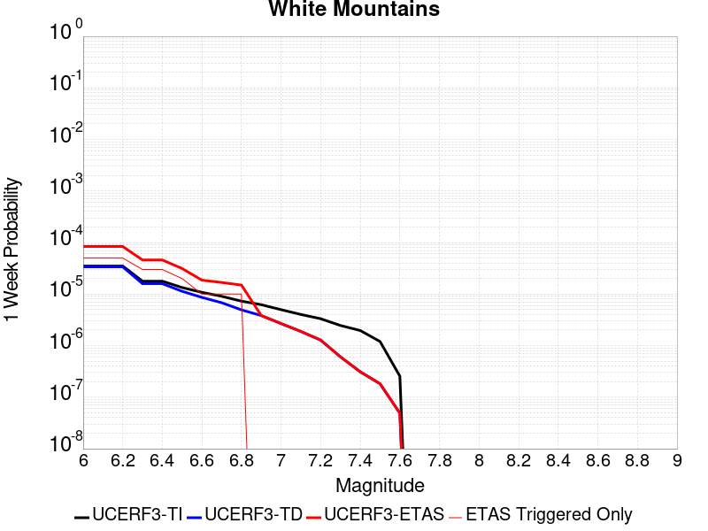 |  |  |  |

| Magnitude | 1 wk TI Prob | 1 wk TD Prob | 1 wk ETAS Prob | 1 wk ETAS/TD Gain | 1 wk ETAS Triggered Only | 1 mo TI Prob | 1 mo TD Prob | 1 mo ETAS Prob | 1 mo ETAS/TD Gain | 1 mo ETAS Triggered Only | 1 yr TI Prob | 1 yr TD Prob | 1 yr ETAS Prob | 1 yr ETAS/TD Gain | 1 yr ETAS Triggered Only | 10 yr TI Prob | 10 yr TD Prob | 10 yr ETAS Prob | 10 yr ETAS/TD Gain | 10 yr ETAS Triggered Only |
|-----|-----|-----|-----|-----|-----|-----|-----|-----|-----|-----|-----|-----|-----|-----|-----|-----|-----|-----|-----|-----|
| 6.0 | 3.503579E-5 | 3.378405E-5 | 8.403361E-5 | 2.4873753 | 5.0251256E-5 | 1.5014476E-4 | 1.4478143E-4 | 2.0758642E-4 | 1.4337916 | 6.281407E-5 | 0.0018264796 | 0.0017614096 | 0.0018491944 | 1.0498378 | 8.79397E-5 | 0.018115403 | 0.017486818 | 0.01761025 | 1.0070585 | 1.2562814E-4 |
| 6.1 | 3.503579E-5 | 3.378405E-5 | 8.403361E-5 | 2.4873753 | 5.0251256E-5 | 1.5014476E-4 | 1.4478143E-4 | 2.0758642E-4 | 1.4337916 | 6.281407E-5 | 0.0018264796 | 0.0017614096 | 0.0018491944 | 1.0498378 | 8.79397E-5 | 0.018115403 | 0.017486818 | 0.01761025 | 1.0070585 | 1.2562814E-4 |
| 6.2 | 3.503579E-5 | 3.378405E-5 | 8.403361E-5 | 2.4873753 | 5.0251256E-5 | 1.5014476E-4 | 1.4478143E-4 | 2.0758642E-4 | 1.4337916 | 6.281407E-5 | 0.0018264796 | 0.0017614096 | 0.0018491944 | 1.0498378 | 8.79397E-5 | 0.018115403 | 0.017486818 | 0.01761025 | 1.0070585 | 1.2562814E-4 |
| 6.3 | 1.7818425E-5 | 1.5916074E-5 | 5.3603915E-5 | 3.3679106 | 3.768844E-5 | 7.636245E-5 | 6.821004E-5 | 1.0589592E-4 | 1.5524974 | 3.768844E-5 | 9.293162E-4 | 8.301551E-4 | 8.803647E-4 | 1.0604821 | 5.0251256E-5 | 0.009254395 | 0.008271999 | 0.008334293 | 1.0075308 | 6.281407E-5 |
| 6.4 | 1.7818425E-5 | 1.5916074E-5 | 5.3603915E-5 | 3.3679106 | 3.768844E-5 | 7.636245E-5 | 6.821004E-5 | 1.0589592E-4 | 1.5524974 | 3.768844E-5 | 9.293162E-4 | 8.301551E-4 | 8.803647E-4 | 1.0604821 | 5.0251256E-5 | 0.009254395 | 0.008271999 | 0.008334293 | 1.0075308 | 6.281407E-5 |
| 6.5 | 1.3397557E-5 | 1.13362685E-5 | 3.6461613E-5 | 3.216368 | 2.5125628E-5 | 5.741684E-5 | 4.858314E-5 | 7.370755E-5 | 1.5171425 | 2.5125628E-5 | 6.988258E-4 | 5.913462E-4 | 6.2901236E-4 | 1.0636955 | 3.768844E-5 | 0.006966323 | 0.005898432 | 0.0059483866 | 1.0084692 | 5.0251256E-5 |
| 6.6 | 1.0818695E-5 | 8.625366E-6 | 2.1188072E-5 | 2.4564838 | 1.2562814E-5 | 4.6365014E-5 | 3.6965357E-5 | 4.9527705E-5 | 1.3398411 | 1.2562814E-5 | 5.6434784E-4 | 4.4996463E-4 | 4.7507894E-4 | 1.055814 | 2.5125628E-5 | 0.005629168 | 0.004490972 | 0.0045284913 | 1.0083543 | 3.768844E-5 |
| 6.7 | 9.067908E-6 | 6.802442E-6 | 1.936517E-5 | 2.8467968 | 1.2562814E-5 | 3.8861883E-5 | 2.9153016E-5 | 4.1715462E-5 | 1.4309142 | 1.2562814E-5 | 4.7304068E-4 | 3.5488335E-4 | 3.674417E-4 | 1.0353873 | 1.2562814E-5 | 0.00472035 | 0.0035434833 | 0.00356852 | 1.0070655 | 2.5125628E-5 |
| 6.8 | 7.295947E-6 | 4.936391E-6 | 1.7499144E-5 | 3.5449264 | 1.2562814E-5 | 3.126797E-5 | 2.1155796E-5 | 3.3718345E-5 | 1.5938112 | 1.2562814E-5 | 3.8062103E-4 | 2.575425E-4 | 2.701021E-4 | 1.048767 | 1.2562814E-5 | 0.0037996976 | 0.0025725532 | 0.0025850837 | 1.0048709 | 1.2562814E-5 |
| 6.9 | 6.2243444E-6 | 3.832213E-6 | 3.832213E-6 | 1.0 | 0.0 | 2.6675489E-5 | 1.642367E-5 | 1.642367E-5 | 1.0 | 0.0 | 3.2472567E-4 | 1.9994036E-4 | 1.9994036E-4 | 1.0 | 0.0 | 0.0032425157 | 0.0019976576 | 0.0019976576 | 1.0 | 0.0 |
| 7.0 | 4.9878413E-6 | 2.6795342E-6 | 2.6795342E-6 | 1.0 | 0.0 | 2.1376287E-5 | 1.14836685E-5 | 1.14836685E-5 | 1.0 | 0.0 | 2.602252E-4 | 1.3980496E-4 | 1.3980496E-4 | 1.0 | 0.0 | 0.002599207 | 0.0013971963 | 0.0013971963 | 1.0 | 0.0 |
| 7.1 | 4.0252844E-6 | 1.8857575E-6 | 1.8857575E-6 | 1.0 | 0.0 | 1.7251105E-5 | 8.081794E-6 | 8.081794E-6 | 1.0 | 0.0 | 2.1001195E-4 | 9.8391516E-5 | 9.8391516E-5 | 1.0 | 0.0 | 0.0020981359 | 9.834924E-4 | 9.834924E-4 | 1.0 | 0.0 |
| 7.2 | 3.3284066E-6 | 1.281964E-6 | 1.281964E-6 | 1.0 | 0.0 | 1.4264522E-5 | 5.494121E-6 | 5.494121E-6 | 1.0 | 0.0 | 1.736567E-4 | 6.688897E-5 | 6.688897E-5 | 1.0 | 0.0 | 0.0017352107 | 6.6869846E-4 | 6.6869846E-4 | 1.0 | 0.0 |
| 7.3 | 2.458226E-6 | 6.05722E-7 | 6.05722E-7 | 1.0 | 0.0 | 1.0535211E-5 | 2.5959491E-6 | 2.5959491E-6 | 1.0 | 0.0 | 1.2825865E-4 | 3.1605257E-5 | 3.1605257E-5 | 1.0 | 0.0 | 0.0012818464 | 3.160114E-4 | 3.160114E-4 | 1.0 | 0.0 |
| 7.4 | 1.965953E-6 | 3.1089303E-7 | 3.1089303E-7 | 1.0 | 0.0 | 8.425486E-6 | 1.332398E-6 | 1.332398E-6 | 1.0 | 0.0 | 1.0257547E-4 | 1.6221828E-5 | 1.6221828E-5 | 1.0 | 0.0 | 0.0010252813 | 1.6220656E-4 | 1.6220656E-4 | 1.0 | 0.0 |
| 7.5 | 1.2014192E-6 | 1.8244253E-7 | 1.8244253E-7 | 1.0 | 0.0 | 5.148929E-6 | 7.8189635E-7 | 7.8189635E-7 | 1.0 | 0.0 | 6.2686406E-5 | 9.519547E-6 | 9.519547E-6 | 1.0 | 0.0 | 6.266873E-4 | 9.519148E-5 | 9.519148E-5 | 1.0 | 0.0 |
| 7.6 | 2.5612175E-7 | 4.8946475E-8 | 4.8946475E-8 | 1.0 | 0.0 | 1.0976642E-6 | 2.0977059E-7 | 2.0977059E-7 | 1.0 | 0.0 | 1.3363979E-5 | 2.5539543E-6 | 2.5539543E-6 | 1.0 | 0.0 | 1.3363175E-4 | 2.5539286E-5 | 2.5539286E-5 | 1.0 | 0.0 |

## Kern Canyon (North Kern) 2011
*[(top)](#table-of-contents)*

| 1 Week | 1 Month | 1 Year | 10 Year |
|-----|-----|-----|-----|
|  |  |  |  |

| Magnitude | 1 wk TI Prob | 1 wk TD Prob | 1 wk ETAS Prob | 1 wk ETAS/TD Gain | 1 wk ETAS Triggered Only | 1 mo TI Prob | 1 mo TD Prob | 1 mo ETAS Prob | 1 mo ETAS/TD Gain | 1 mo ETAS Triggered Only | 1 yr TI Prob | 1 yr TD Prob | 1 yr ETAS Prob | 1 yr ETAS/TD Gain | 1 yr ETAS Triggered Only | 10 yr TI Prob | 10 yr TD Prob | 10 yr ETAS Prob | 10 yr ETAS/TD Gain | 10 yr ETAS Triggered Only |
|-----|-----|-----|-----|-----|-----|-----|-----|-----|-----|-----|-----|-----|-----|-----|-----|-----|-----|-----|-----|-----|
| 6.0 | 6.6264497E-6 | 6.75733E-6 | 4.4445518E-5 | 6.5773787 | 3.768844E-5 | 2.8398761E-5 | 2.895971E-5 | 9.177196E-5 | 3.1689532 | 6.281407E-5 | 3.4570007E-4 | 3.5253543E-4 | 4.5300252E-4 | 1.2849844 | 1.0050251E-4 | 0.0034516277 | 0.0035205502 | 0.003645736 | 1.0355586 | 1.2562814E-4 |
| 6.1 | 6.6264497E-6 | 6.75733E-6 | 4.4445518E-5 | 6.5773787 | 3.768844E-5 | 2.8398761E-5 | 2.895971E-5 | 9.177196E-5 | 3.1689532 | 6.281407E-5 | 3.4570007E-4 | 3.5253543E-4 | 4.5300252E-4 | 1.2849844 | 1.0050251E-4 | 0.0034516277 | 0.0035205502 | 0.003645736 | 1.0355586 | 1.2562814E-4 |
| 6.2 | 6.6264497E-6 | 6.75733E-6 | 4.4445518E-5 | 6.5773787 | 3.768844E-5 | 2.8398761E-5 | 2.895971E-5 | 9.177196E-5 | 3.1689532 | 6.281407E-5 | 3.4570007E-4 | 3.5253543E-4 | 4.5300252E-4 | 1.2849844 | 1.0050251E-4 | 0.0034516277 | 0.0035205502 | 0.003645736 | 1.0355586 | 1.2562814E-4 |
| 6.3 | 6.6264497E-6 | 6.75733E-6 | 4.4445518E-5 | 6.5773787 | 3.768844E-5 | 2.8398761E-5 | 2.895971E-5 | 9.177196E-5 | 3.1689532 | 6.281407E-5 | 3.4570007E-4 | 3.5253543E-4 | 4.5300252E-4 | 1.2849844 | 1.0050251E-4 | 0.0034516277 | 0.0035205502 | 0.003645736 | 1.0355586 | 1.2562814E-4 |
| 6.4 | 6.6264497E-6 | 6.75733E-6 | 4.4445518E-5 | 6.5773787 | 3.768844E-5 | 2.8398761E-5 | 2.895971E-5 | 9.177196E-5 | 3.1689532 | 6.281407E-5 | 3.4570007E-4 | 3.5253543E-4 | 4.5300252E-4 | 1.2849844 | 1.0050251E-4 | 0.0034516277 | 0.0035205502 | 0.003645736 | 1.0355586 | 1.2562814E-4 |
| 6.5 | 3.2162225E-6 | 3.2570915E-6 | 4.094541E-5 | 12.571158 | 3.768844E-5 | 1.3783738E-5 | 1.3958893E-5 | 5.164681E-5 | 3.6999216 | 3.768844E-5 | 1.6780409E-4 | 1.6993708E-4 | 2.2017979E-4 | 1.2956548 | 5.0251256E-5 | 0.0016767744 | 0.001698151 | 0.0017733999 | 1.0443122 | 7.537688E-5 |
| 6.6 | 3.2162225E-6 | 3.2570915E-6 | 4.094541E-5 | 12.571158 | 3.768844E-5 | 1.3783738E-5 | 1.3958893E-5 | 5.164681E-5 | 3.6999216 | 3.768844E-5 | 1.6780409E-4 | 1.6993708E-4 | 2.2017979E-4 | 1.2956548 | 5.0251256E-5 | 0.0016767744 | 0.001698151 | 0.0017733999 | 1.0443122 | 7.537688E-5 |
| 6.7 | 2.1908265E-6 | 2.2071222E-6 | 3.989548E-5 | 18.075792 | 3.768844E-5 | 9.389223E-6 | 9.459061E-6 | 4.7147147E-5 | 4.9843364 | 3.768844E-5 | 1.1430779E-4 | 1.1515819E-4 | 1.6540366E-4 | 1.436317 | 5.0251256E-5 | 0.0011424901 | 0.0011510046 | 0.0012137463 | 1.0545105 | 6.281407E-5 |
| 6.8 | 1.7303895E-6 | 1.7365529E-6 | 3.942493E-5 | 22.702982 | 3.768844E-5 | 7.415934E-6 | 7.4423488E-6 | 4.513051E-5 | 6.0640144 | 3.768844E-5 | 9.028525E-5 | 9.0606925E-5 | 1.2829195E-4 | 1.4159178 | 3.768844E-5 | 9.024858E-4 | 9.057096E-4 | 9.559153E-4 | 1.0554324 | 5.0251256E-5 |
| 6.9 | 1.3700314E-6 | 1.3688622E-6 | 1.3931659E-5 | 10.1775465 | 1.2562814E-5 | 5.87155E-6 | 5.8665396E-6 | 1.842928E-5 | 3.1414227 | 1.2562814E-5 | 7.148377E-5 | 7.142282E-5 | 8.398474E-5 | 1.175881 | 1.2562814E-5 | 7.146078E-4 | 7.140032E-4 | 7.391109E-4 | 1.0351647 | 2.5125628E-5 |
| 7.0 | 1.1467797E-6 | 1.1413804E-6 | 1.370418E-5 | 12.006672 | 1.2562814E-5 | 4.9147607E-6 | 4.8916213E-6 | 1.7454375E-5 | 3.5682185 | 1.2562814E-5 | 5.983557E-5 | 5.9553895E-5 | 7.211596E-5 | 1.2109361 | 1.2562814E-5 | 5.981946E-4 | 5.953825E-4 | 6.2049314E-4 | 1.0421757 | 2.5125628E-5 |
| 7.1 | 9.3952065E-7 | 9.3026904E-7 | 1.34930715E-5 | 14.504483 | 1.2562814E-5 | 4.026511E-6 | 3.9868614E-6 | 1.6549626E-5 | 4.151041 | 1.2562814E-5 | 4.9021666E-5 | 4.8538972E-5 | 6.110118E-5 | 1.2588066 | 1.2562814E-5 | 4.901085E-4 | 4.8528548E-4 | 5.1039894E-4 | 1.0517498 | 2.5125628E-5 |
| 7.2 | 6.858055E-7 | 6.7193E-7 | 1.3234736E-5 | 19.696598 | 1.2562814E-5 | 2.939163E-6 | 2.879697E-6 | 1.5442474E-5 | 5.3625345 | 1.2562814E-5 | 3.5783723E-5 | 3.5059755E-5 | 4.762213E-5 | 1.3583132 | 1.2562814E-5 | 3.5777962E-4 | 3.5054312E-4 | 3.7565996E-4 | 1.0716511 | 2.5125628E-5 |
| 7.3 | 5.1101983E-7 | 4.9393E-7 | 1.3056738E-5 | 26.434391 | 1.2562814E-5 | 2.1900833E-6 | 2.116841E-6 | 1.4679628E-5 | 6.934686 | 1.2562814E-5 | 2.6663936E-5 | 2.5772239E-5 | 3.833473E-5 | 1.4874427 | 1.2562814E-5 | 2.6660739E-4 | 2.57693E-4 | 2.7025255E-4 | 1.0487385 | 1.2562814E-5 |
| 7.4 | 3.4999414E-7 | 3.2995905E-7 | 1.2892769E-5 | 39.073845 | 1.2562814E-5 | 1.499974E-6 | 1.4141094E-6 | 1.3976905E-5 | 9.883892 | 1.2562814E-5 | 1.8262032E-5 | 1.721665E-5 | 2.9779247E-5 | 1.7296773 | 1.2562814E-5 | 1.826053E-4 | 1.7215339E-4 | 1.8471404E-4 | 1.0729619 | 1.2562814E-5 |
| 7.5 | 1.7021522E-7 | 1.4750044E-7 | 1.4750044E-7 | 1.0 | 0.0 | 7.2949354E-7 | 6.321446E-7 | 6.321446E-7 | 1.0 | 0.0 | 8.881548E-6 | 7.696334E-6 | 7.696334E-6 | 1.0 | 0.0 | 8.8811925E-5 | 7.696076E-5 | 7.696076E-5 | 1.0 | 0.0 |
| 7.6 | 2.572245E-8 | 1.7352555E-8 | 1.7352555E-8 | 1.0 | 0.0 | 1.10239064E-7 | 7.436809E-8 | 7.436809E-8 | 1.0 | 0.0 | 1.3421597E-6 | 9.054312E-7 | 9.054312E-7 | 1.0 | 0.0 | 1.3421517E-5 | 9.05428E-6 | 9.05428E-6 | 1.0 | 0.0 |

## Santa Cruz Island
*[(top)](#table-of-contents)*

| 1 Week | 1 Month | 1 Year | 10 Year |
|-----|-----|-----|-----|
|  |  |  |  |

| Magnitude | 1 wk TI Prob | 1 wk TD Prob | 1 wk ETAS Prob | 1 wk ETAS/TD Gain | 1 wk ETAS Triggered Only | 1 mo TI Prob | 1 mo TD Prob | 1 mo ETAS Prob | 1 mo ETAS/TD Gain | 1 mo ETAS Triggered Only | 1 yr TI Prob | 1 yr TD Prob | 1 yr ETAS Prob | 1 yr ETAS/TD Gain | 1 yr ETAS Triggered Only | 10 yr TI Prob | 10 yr TD Prob | 10 yr ETAS Prob | 10 yr ETAS/TD Gain | 10 yr ETAS Triggered Only |
|-----|-----|-----|-----|-----|-----|-----|-----|-----|-----|-----|-----|-----|-----|-----|-----|-----|-----|-----|-----|-----|
| 6.0 | 2.9164563E-5 | 3.1599742E-5 | 5.6724577E-5 | 1.7950962 | 2.5125628E-5 | 1.2498499E-4 | 1.3542121E-4 | 1.7310455E-4 | 1.2782676 | 3.768844E-5 | 0.0015206301 | 0.0016476426 | 0.001697811 | 1.0304487 | 5.0251256E-5 | 0.015102667 | 0.016368 | 0.016466856 | 1.0060397 | 1.0050251E-4 |
| 6.1 | 2.9164563E-5 | 3.1599742E-5 | 5.6724577E-5 | 1.7950962 | 2.5125628E-5 | 1.2498499E-4 | 1.3542121E-4 | 1.7310455E-4 | 1.2782676 | 3.768844E-5 | 0.0015206301 | 0.0016476426 | 0.001697811 | 1.0304487 | 5.0251256E-5 | 0.015102667 | 0.016368 | 0.016466856 | 1.0060397 | 1.0050251E-4 |
| 6.2 | 2.9164563E-5 | 3.1599742E-5 | 5.6724577E-5 | 1.7950962 | 2.5125628E-5 | 1.2498499E-4 | 1.3542121E-4 | 1.7310455E-4 | 1.2782676 | 3.768844E-5 | 0.0015206301 | 0.0016476426 | 0.001697811 | 1.0304487 | 5.0251256E-5 | 0.015102667 | 0.016368 | 0.016466856 | 1.0060397 | 1.0050251E-4 |
| 6.3 | 1.6635553E-5 | 1.780436E-5 | 1.780436E-5 | 1.0 | 0.0 | 7.1293274E-5 | 7.630226E-5 | 8.886412E-5 | 1.1646328 | 1.2562814E-5 | 8.6765E-4 | 9.2860236E-4 | 9.4115356E-4 | 1.0135162 | 1.2562814E-5 | 0.008642701 | 0.009249094 | 0.009273987 | 1.0026914 | 2.5125628E-5 |
| 6.4 | 1.6635553E-5 | 1.780436E-5 | 1.780436E-5 | 1.0 | 0.0 | 7.1293274E-5 | 7.630226E-5 | 8.886412E-5 | 1.1646328 | 1.2562814E-5 | 8.6765E-4 | 9.2860236E-4 | 9.4115356E-4 | 1.0135162 | 1.2562814E-5 | 0.008642701 | 0.009249094 | 0.009273987 | 1.0026914 | 2.5125628E-5 |
| 6.5 | 1.2238748E-5 | 1.3042995E-5 | 1.3042995E-5 | 1.0 | 0.0 | 5.2450723E-5 | 5.5897377E-5 | 6.8459485E-5 | 1.2247353 | 1.2562814E-5 | 6.3840044E-4 | 6.8034173E-4 | 6.92896E-4 | 1.0184529 | 1.2562814E-5 | 0.0063656955 | 0.0067829876 | 0.006807943 | 1.003679 | 2.5125628E-5 |
| 6.6 | 1.0489767E-5 | 1.1156636E-5 | 1.1156636E-5 | 1.0 | 0.0 | 4.495537E-5 | 4.781329E-5 | 6.0375503E-5 | 1.2627348 | 1.2562814E-5 | 5.4719415E-4 | 5.819735E-4 | 5.9452903E-4 | 1.021574 | 1.2562814E-5 | 0.005458487 | 0.0058047357 | 0.0058172257 | 1.0021517 | 1.2562814E-5 |
| 6.7 | 8.699222E-6 | 9.236782E-6 | 9.236782E-6 | 1.0 | 0.0 | 3.7281847E-5 | 3.958561E-5 | 5.2147927E-5 | 1.3173455 | 1.2562814E-5 | 4.5381195E-4 | 4.8184878E-4 | 4.9440557E-4 | 1.0260595 | 1.2562814E-5 | 0.0045288634 | 0.004808108 | 0.0048206104 | 1.0026003 | 1.2562814E-5 |
| 6.8 | 8.307732E-6 | 8.8169045E-6 | 8.8169045E-6 | 1.0 | 0.0 | 3.560408E-5 | 3.7786187E-5 | 5.0348528E-5 | 1.3324585 | 1.2562814E-5 | 4.3339343E-4 | 4.5995016E-4 | 4.7250718E-4 | 1.0273008 | 1.2562814E-5 | 0.004325492 | 0.0045900354 | 0.0046025403 | 1.0027244 | 1.2562814E-5 |
| 6.9 | 8.073121E-6 | 8.564939E-6 | 8.564939E-6 | 1.0 | 0.0 | 3.459863E-5 | 3.6706366E-5 | 4.926872E-5 | 1.342239 | 1.2562814E-5 | 4.2115687E-4 | 4.468088E-4 | 4.5936598E-4 | 1.0281042 | 1.2562814E-5 | 0.004203596 | 0.004459156 | 0.004471663 | 1.0028048 | 1.2562814E-5 |
| 7.0 | 7.617019E-6 | 8.074664E-6 | 8.074664E-6 | 1.0 | 0.0 | 3.264396E-5 | 3.4605247E-5 | 4.7167625E-5 | 1.3630195 | 1.2562814E-5 | 3.9736772E-4 | 4.212378E-4 | 4.3379536E-4 | 1.029811 | 1.2562814E-5 | 0.003966579 | 0.0042044413 | 0.0042169513 | 1.0029755 | 1.2562814E-5 |
| 7.1 | 7.1224836E-6 | 7.545788E-6 | 7.545788E-6 | 1.0 | 0.0 | 3.052457E-5 | 3.2338692E-5 | 4.49011E-5 | 1.3884637 | 1.2562814E-5 | 3.715733E-4 | 3.936528E-4 | 4.0621066E-4 | 1.0319009 | 1.2562814E-5 | 0.003709526 | 0.003929598 | 0.0039421115 | 1.0031844 | 1.2562814E-5 |
| 7.2 | 6.441115E-6 | 6.8273835E-6 | 6.8273835E-6 | 1.0 | 0.0 | 2.7604487E-5 | 2.9259887E-5 | 4.1822335E-5 | 1.4293402 | 1.2562814E-5 | 3.360328E-4 | 3.5618112E-4 | 3.6873948E-4 | 1.0352583 | 1.2562814E-5 | 0.0033552512 | 0.003556131 | 0.003568649 | 1.0035201 | 1.2562814E-5 |
| 7.3 | 5.494274E-6 | 5.8199944E-6 | 5.8199944E-6 | 1.0 | 0.0 | 2.3546674E-5 | 2.4942596E-5 | 2.4942596E-5 | 1.0 | 0.0 | 2.8664304E-4 | 3.0363398E-4 | 3.0363398E-4 | 1.0 | 0.0 | 0.002862736 | 0.0030322142 | 0.0030322142 | 1.0 | 0.0 |
| 7.4 | 4.0802624E-6 | 4.312256E-6 | 4.312256E-6 | 1.0 | 0.0 | 1.7486722E-5 | 1.8480967E-5 | 1.8480967E-5 | 1.0 | 0.0 | 2.1288003E-4 | 2.2498262E-4 | 2.2498262E-4 | 1.0 | 0.0 | 0.0021267622 | 0.0022475575 | 0.0022475575 | 1.0 | 0.0 |
| 7.5 | 2.3584746E-6 | 2.4753094E-6 | 2.4753094E-6 | 1.0 | 0.0 | 1.0107709E-5 | 1.0608426E-5 | 1.0608426E-5 | 1.0 | 0.0 | 1.2305441E-4 | 1.2915E-4 | 1.2915E-4 | 1.0 | 0.0 | 0.0012298629 | 0.0012907543 | 0.0012907543 | 1.0 | 0.0 |
| 7.6 | 9.4981914E-7 | 9.86093E-7 | 9.86093E-7 | 1.0 | 0.0 | 4.0706473E-6 | 4.2261063E-6 | 4.2261063E-6 | 1.0 | 0.0 | 4.9559E-5 | 5.145164E-5 | 5.145164E-5 | 1.0 | 0.0 | 4.954795E-4 | 5.1439856E-4 | 5.1439856E-4 | 1.0 | 0.0 |
| 7.7 | 2.6013532E-7 | 2.6416603E-7 | 2.6416603E-7 | 1.0 | 0.0 | 1.1148652E-6 | 1.1321397E-6 | 1.1321397E-6 | 1.0 | 0.0 | 1.3573399E-5 | 1.3783714E-5 | 1.3783714E-5 | 1.0 | 0.0 | 1.357257E-4 | 1.3782867E-4 | 1.3782867E-4 | 1.0 | 0.0 |
| 7.8 | 4.1522263E-8 | 3.965679E-8 | 3.965679E-8 | 1.0 | 0.0 | 1.7795254E-7 | 1.6995766E-7 | 1.6995766E-7 | 1.0 | 0.0 | 2.16657E-6 | 2.0692328E-6 | 2.0692328E-6 | 1.0 | 0.0 | 2.1665488E-5 | 2.0692156E-5 | 2.0692156E-5 | 1.0 | 0.0 |
| 7.9 | 7.7242046E-10 | 5.9468175E-10 | 5.9468175E-10 | 1.0 | 0.0 | 3.3103735E-9 | 2.5486364E-9 | 2.5486364E-9 | 1.0 | 0.0 | 4.0303796E-8 | 3.1029646E-8 | 3.1029646E-8 | 1.0 | 0.0 | 4.030379E-7 | 3.1029643E-7 | 3.1029643E-7 | 1.0 | 0.0 |

## Mission Creek
*[(top)](#table-of-contents)*

| 1 Week | 1 Month | 1 Year | 10 Year |
|-----|-----|-----|-----|
|  |  |  |  |

| Magnitude | 1 wk TI Prob | 1 wk TD Prob | 1 wk ETAS Prob | 1 wk ETAS/TD Gain | 1 wk ETAS Triggered Only | 1 mo TI Prob | 1 mo TD Prob | 1 mo ETAS Prob | 1 mo ETAS/TD Gain | 1 mo ETAS Triggered Only | 1 yr TI Prob | 1 yr TD Prob | 1 yr ETAS Prob | 1 yr ETAS/TD Gain | 1 yr ETAS Triggered Only | 10 yr TI Prob | 10 yr TD Prob | 10 yr ETAS Prob | 10 yr ETAS/TD Gain | 10 yr ETAS Triggered Only |
|-----|-----|-----|-----|-----|-----|-----|-----|-----|-----|-----|-----|-----|-----|-----|-----|-----|-----|-----|-----|-----|
| 6.0 | 1.1549387E-5 | 1.632237E-5 | 4.1447587E-5 | 2.539312 | 2.5125628E-5 | 4.9496433E-5 | 6.9951224E-5 | 1.0763703E-4 | 1.5387441 | 3.768844E-5 | 6.0245243E-4 | 8.513384E-4 | 9.392032E-4 | 1.1032078 | 8.79397E-5 | 0.006008218 | 0.008509998 | 0.0086221015 | 1.0131731 | 1.13065325E-4 |
| 6.1 | 1.1549387E-5 | 1.632237E-5 | 4.1447587E-5 | 2.539312 | 2.5125628E-5 | 4.9496433E-5 | 6.9951224E-5 | 1.0763703E-4 | 1.5387441 | 3.768844E-5 | 6.0245243E-4 | 8.513384E-4 | 9.392032E-4 | 1.1032078 | 8.79397E-5 | 0.006008218 | 0.008509998 | 0.0086221015 | 1.0131731 | 1.13065325E-4 |
| 6.2 | 1.1549387E-5 | 1.632237E-5 | 4.1447587E-5 | 2.539312 | 2.5125628E-5 | 4.9496433E-5 | 6.9951224E-5 | 1.0763703E-4 | 1.5387441 | 3.768844E-5 | 6.0245243E-4 | 8.513384E-4 | 9.392032E-4 | 1.1032078 | 8.79397E-5 | 0.006008218 | 0.008509998 | 0.0086221015 | 1.0131731 | 1.13065325E-4 |
| 6.3 | 1.1549387E-5 | 1.632237E-5 | 4.1447587E-5 | 2.539312 | 2.5125628E-5 | 4.9496433E-5 | 6.9951224E-5 | 1.0763703E-4 | 1.5387441 | 3.768844E-5 | 6.0245243E-4 | 8.513384E-4 | 9.392032E-4 | 1.1032078 | 8.79397E-5 | 0.006008218 | 0.008509998 | 0.0086221015 | 1.0131731 | 1.13065325E-4 |
| 6.4 | 1.1549387E-5 | 1.632237E-5 | 4.1447587E-5 | 2.539312 | 2.5125628E-5 | 4.9496433E-5 | 6.9951224E-5 | 1.0763703E-4 | 1.5387441 | 3.768844E-5 | 6.0245243E-4 | 8.513384E-4 | 9.392032E-4 | 1.1032078 | 8.79397E-5 | 0.006008218 | 0.008509998 | 0.0086221015 | 1.0131731 | 1.13065325E-4 |
| 6.5 | 1.1549387E-5 | 1.632237E-5 | 4.1447587E-5 | 2.539312 | 2.5125628E-5 | 4.9496433E-5 | 6.9951224E-5 | 1.0763703E-4 | 1.5387441 | 3.768844E-5 | 6.0245243E-4 | 8.513384E-4 | 9.392032E-4 | 1.1032078 | 8.79397E-5 | 0.006008218 | 0.008509998 | 0.0086221015 | 1.0131731 | 1.13065325E-4 |
| 6.6 | 9.202681E-6 | 1.3845646E-5 | 2.6408286E-5 | 1.907335 | 1.2562814E-5 | 3.9439463E-5 | 5.9337188E-5 | 8.4461324E-5 | 1.423413 | 2.5125628E-5 | 4.800697E-4 | 7.221998E-4 | 7.8496855E-4 | 1.0869132 | 6.281407E-5 | 0.004790339 | 0.0072271815 | 0.0073144855 | 1.01208 | 8.79397E-5 |
| 6.7 | 9.019164E-6 | 1.3651316E-5 | 2.6213958E-5 | 1.9202514 | 1.2562814E-5 | 3.8652986E-5 | 5.8504378E-5 | 8.362854E-5 | 1.4294406 | 2.5125628E-5 | 4.7049852E-4 | 7.12067E-4 | 7.748364E-4 | 1.0881509 | 6.281407E-5 | 0.004695036 | 0.007126506 | 0.007213819 | 1.0122519 | 8.79397E-5 |
| 6.8 | 8.673558E-6 | 1.3273427E-5 | 2.5836074E-5 | 1.946451 | 1.2562814E-5 | 3.717186E-5 | 5.6884925E-5 | 8.200912E-5 | 1.4416671 | 2.5125628E-5 | 4.524734E-4 | 6.923627E-4 | 7.551333E-4 | 1.0906614 | 6.281407E-5 | 0.0045155324 | 0.006930694 | 0.0070180246 | 1.0126005 | 8.79397E-5 |
| 6.9 | 7.002255E-6 | 1.1477657E-5 | 2.4040326E-5 | 2.0945327 | 1.2562814E-5 | 3.000932E-5 | 4.9189068E-5 | 7.431346E-5 | 1.5107719 | 2.5125628E-5 | 3.653022E-4 | 5.9871917E-4 | 6.6149567E-4 | 1.1048512 | 6.281407E-5 | 0.0036470229 | 0.005999517 | 0.0060869292 | 1.0145699 | 8.79397E-5 |
| 7.0 | 5.84644E-6 | 9.67498E-6 | 2.2237673E-5 | 2.2984722 | 1.2562814E-5 | 2.5055931E-5 | 4.1463565E-5 | 6.658815E-5 | 1.6059437 | 2.5125628E-5 | 3.0501327E-4 | 5.047066E-4 | 5.674889E-4 | 1.1243938 | 6.281407E-5 | 0.0030459496 | 0.0050638523 | 0.005151347 | 1.0172782 | 8.79397E-5 |
| 7.1 | 5.54703E-6 | 9.329456E-6 | 2.1892152E-5 | 2.3465626 | 1.2562814E-5 | 2.377277E-5 | 3.9982795E-5 | 6.510742E-5 | 1.6283859 | 2.5125628E-5 | 2.8939504E-4 | 4.8668624E-4 | 5.494698E-4 | 1.129002 | 6.281407E-5 | 0.0028901845 | 0.004884446 | 0.0049719564 | 1.0179161 | 8.79397E-5 |
| 7.2 | 4.384709E-6 | 7.68157E-6 | 2.0244288E-5 | 2.635436 | 1.2562814E-5 | 1.8791474E-5 | 3.2920623E-5 | 5.804542E-5 | 1.7631934 | 2.5125628E-5 | 2.2876218E-4 | 4.0073853E-4 | 4.6352742E-4 | 1.156683 | 6.281407E-5 | 0.0022852682 | 0.004028366 | 0.0041159512 | 1.0217422 | 8.79397E-5 |
| 7.3 | 3.7888456E-6 | 6.915452E-6 | 1.9478179E-5 | 2.816617 | 1.2562814E-5 | 1.623781E-5 | 2.9637333E-5 | 5.476222E-5 | 1.8477445 | 2.5125628E-5 | 1.9767738E-4 | 3.6077813E-4 | 4.2356955E-4 | 1.1740444 | 6.281407E-5 | 0.0019750162 | 0.0036301152 | 0.0037177356 | 1.0241371 | 8.79397E-5 |
| 7.4 | 2.1982462E-6 | 5.0237763E-6 | 1.7586528E-5 | 3.5006588 | 1.2562814E-5 | 9.421021E-6 | 2.1530293E-5 | 4.6655383E-5 | 2.1669645 | 2.5125628E-5 | 1.1469489E-4 | 2.621E-4 | 3.2489758E-4 | 1.2395941 | 6.281407E-5 | 0.0011463572 | 0.0026458844 | 0.0027335915 | 1.0331485 | 8.79397E-5 |
| 7.5 | 2.051923E-6 | 4.615016E-6 | 1.7177772E-5 | 3.722148 | 1.2562814E-5 | 8.793926E-6 | 1.9778492E-5 | 4.4903623E-5 | 2.270326 | 2.5125628E-5 | 1.0706078E-4 | 2.4077666E-4 | 3.0357562E-4 | 1.2608182 | 6.281407E-5 | 0.0010700922 | 0.0024335422 | 0.0025212679 | 1.0360485 | 8.79397E-5 |
| 7.6 | 1.8733427E-6 | 4.1233748E-6 | 1.6686137E-5 | 4.0467186 | 1.2562814E-5 | 8.028587E-6 | 1.7671488E-5 | 4.2796673E-5 | 2.4217923 | 2.5125628E-5 | 9.774366E-5 | 2.151292E-4 | 2.7792976E-4 | 1.2919202 | 6.281407E-5 | 9.770069E-4 | 0.0021780801 | 0.0022658284 | 1.0402869 | 8.79397E-5 |
| 7.7 | 1.8411953E-6 | 4.0430496E-6 | 1.6605813E-5 | 4.1072493 | 1.2562814E-5 | 7.890813E-6 | 1.732724E-5 | 4.2452433E-5 | 2.45004 | 2.5125628E-5 | 9.606641E-5 | 2.1093882E-4 | 2.7373963E-4 | 1.2977206 | 6.281407E-5 | 9.6024893E-4 | 0.0021363653 | 0.002224117 | 1.0410753 | 8.79397E-5 |
| 7.8 | 1.7194251E-6 | 3.7104276E-6 | 1.6273196E-5 | 4.3858004 | 1.2562814E-5 | 7.368944E-6 | 1.5901736E-5 | 4.1026964E-5 | 2.5800307 | 2.5125628E-5 | 8.97132E-5 | 1.9358651E-4 | 2.5638842E-4 | 1.3244126 | 6.281407E-5 | 8.967699E-4 | 0.0019623525 | 0.0020501197 | 1.0447254 | 8.79397E-5 |
| 7.9 | 1.4035052E-6 | 2.9500632E-6 | 1.551284E-5 | 5.258477 | 1.2562814E-5 | 6.0150082E-6 | 1.2643067E-5 | 3.7768375E-5 | 2.9872797 | 2.5125628E-5 | 7.3230265E-5 | 1.5391852E-4 | 2.1672292E-4 | 1.4080367 | 6.281407E-5 | 7.3206134E-4 | 0.0015631086 | 0.0016509109 | 1.0561715 | 8.79397E-5 |
| 8.0 | 3.9318823E-7 | 5.528522E-7 | 5.528522E-7 | 1.0 | 0.0 | 1.6850913E-6 | 2.3693647E-6 | 2.3693647E-6 | 1.0 | 0.0 | 2.0515794E-5 | 2.8846638E-5 | 6.653399E-5 | 2.306473 | 3.768844E-5 | 2.0513899E-4 | 2.9899E-4 | 3.4922623E-4 | 1.1680198 | 5.0251256E-5 |
| 8.1 | 1.596793E-7 | 1.1380002E-7 | 1.1380002E-7 | 1.0 | 0.0 | 6.8433974E-7 | 4.877143E-7 | 4.877143E-7 | 1.0 | 0.0 | 8.331805E-6 | 5.937906E-6 | 5.937906E-6 | 1.0 | 0.0 | 8.331492E-5 | 6.549966E-5 | 6.549966E-5 | 1.0 | 0.0 |
| 8.2 | 4.9003038E-8 | 2.5444924E-8 | 2.5444924E-8 | 1.0 | 0.0 | 2.10013E-7 | 1.0904967E-7 | 1.0904967E-7 | 1.0 | 0.0 | 2.5569052E-6 | 1.327679E-6 | 1.327679E-6 | 1.0 | 0.0 | 2.556876E-5 | 1.495635E-5 | 1.495635E-5 | 1.0 | 0.0 |

## Mono Lake 2011 CFM
*[(top)](#table-of-contents)*

| 1 Week | 1 Month | 1 Year | 10 Year |
|-----|-----|-----|-----|
|  |  |  |  |

| Magnitude | 1 wk TI Prob | 1 wk TD Prob | 1 wk ETAS Prob | 1 wk ETAS/TD Gain | 1 wk ETAS Triggered Only | 1 mo TI Prob | 1 mo TD Prob | 1 mo ETAS Prob | 1 mo ETAS/TD Gain | 1 mo ETAS Triggered Only | 1 yr TI Prob | 1 yr TD Prob | 1 yr ETAS Prob | 1 yr ETAS/TD Gain | 1 yr ETAS Triggered Only | 10 yr TI Prob | 10 yr TD Prob | 10 yr ETAS Prob | 10 yr ETAS/TD Gain | 10 yr ETAS Triggered Only |
|-----|-----|-----|-----|-----|-----|-----|-----|-----|-----|-----|-----|-----|-----|-----|-----|-----|-----|-----|-----|-----|
| 6.0 | 2.0341662E-5 | 2.3828166E-5 | 8.664074E-5 | 3.636064 | 6.281407E-5 | 8.717564E-5 | 1.0211971E-4 | 1.774889E-4 | 1.7380474 | 7.537688E-5 | 0.0010608466 | 0.0012431298 | 0.0013309602 | 1.0706526 | 8.79397E-5 | 0.010557966 | 0.012413835 | 0.012525497 | 1.0089949 | 1.13065325E-4 |
| 6.1 | 2.0341662E-5 | 2.3828166E-5 | 8.664074E-5 | 3.636064 | 6.281407E-5 | 8.717564E-5 | 1.0211971E-4 | 1.774889E-4 | 1.7380474 | 7.537688E-5 | 0.0010608466 | 0.0012431298 | 0.0013309602 | 1.0706526 | 8.79397E-5 | 0.010557966 | 0.012413835 | 0.012525497 | 1.0089949 | 1.13065325E-4 |
| 6.2 | 2.0341662E-5 | 2.3828166E-5 | 8.664074E-5 | 3.636064 | 6.281407E-5 | 8.717564E-5 | 1.0211971E-4 | 1.774889E-4 | 1.7380474 | 7.537688E-5 | 0.0010608466 | 0.0012431298 | 0.0013309602 | 1.0706526 | 8.79397E-5 | 0.010557966 | 0.012413835 | 0.012525497 | 1.0089949 | 1.13065325E-4 |
| 6.3 | 2.0341662E-5 | 2.3828166E-5 | 8.664074E-5 | 3.636064 | 6.281407E-5 | 8.717564E-5 | 1.0211971E-4 | 1.774889E-4 | 1.7380474 | 7.537688E-5 | 0.0010608466 | 0.0012431298 | 0.0013309602 | 1.0706526 | 8.79397E-5 | 0.010557966 | 0.012413835 | 0.012525497 | 1.0089949 | 1.13065325E-4 |
| 6.4 | 1.749821E-5 | 2.0490985E-5 | 8.330377E-5 | 4.0653863 | 6.281407E-5 | 7.499018E-5 | 8.781851E-5 | 1.6318877E-4 | 1.8582504 | 7.537688E-5 | 9.1262296E-4 | 0.0010691903 | 0.001157036 | 1.082161 | 8.79397E-5 | 0.009088841 | 0.010691865 | 0.010803722 | 1.0104618 | 1.13065325E-4 |
| 6.5 | 1.749821E-5 | 2.0490985E-5 | 8.330377E-5 | 4.0653863 | 6.281407E-5 | 7.499018E-5 | 8.781851E-5 | 1.6318877E-4 | 1.8582504 | 7.537688E-5 | 9.1262296E-4 | 0.0010691903 | 0.001157036 | 1.082161 | 8.79397E-5 | 0.009088841 | 0.010691865 | 0.010803722 | 1.0104618 | 1.13065325E-4 |

## Bullion Mountains
*[(top)](#table-of-contents)*

| 1 Week | 1 Month | 1 Year | 10 Year |
|-----|-----|-----|-----|
|  |  | 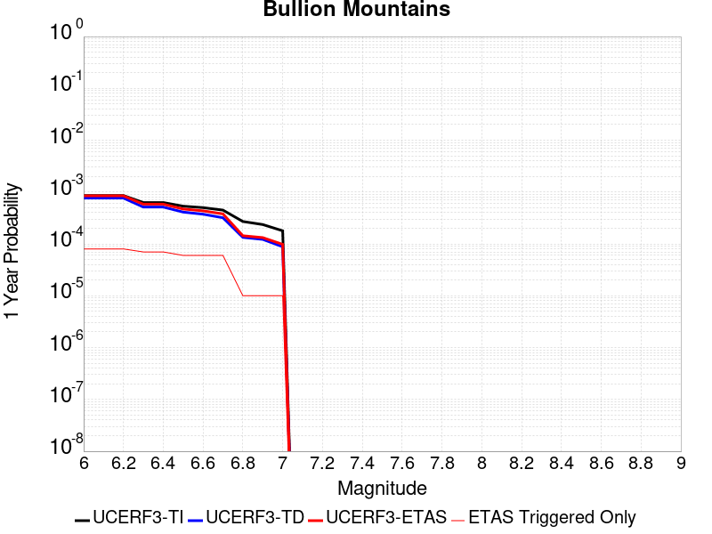 |  |

| Magnitude | 1 wk TI Prob | 1 wk TD Prob | 1 wk ETAS Prob | 1 wk ETAS/TD Gain | 1 wk ETAS Triggered Only | 1 mo TI Prob | 1 mo TD Prob | 1 mo ETAS Prob | 1 mo ETAS/TD Gain | 1 mo ETAS Triggered Only | 1 yr TI Prob | 1 yr TD Prob | 1 yr ETAS Prob | 1 yr ETAS/TD Gain | 1 yr ETAS Triggered Only | 10 yr TI Prob | 10 yr TD Prob | 10 yr ETAS Prob | 10 yr ETAS/TD Gain | 10 yr ETAS Triggered Only |
|-----|-----|-----|-----|-----|-----|-----|-----|-----|-----|-----|-----|-----|-----|-----|-----|-----|-----|-----|-----|-----|
| 6.0 | 1.6420427E-5 | 1.4692089E-5 | 6.494261E-5 | 4.4202433 | 5.0251256E-5 | 7.037136E-5 | 6.296479E-5 | 1.3833694E-4 | 2.197052 | 7.537688E-5 | 8.5643446E-4 | 7.663651E-4 | 8.542374E-4 | 1.1146611 | 8.79397E-5 | 0.008531413 | 0.007641016 | 0.0077532176 | 1.0146841 | 1.13065325E-4 |
| 6.1 | 1.6420427E-5 | 1.4692089E-5 | 6.494261E-5 | 4.4202433 | 5.0251256E-5 | 7.037136E-5 | 6.296479E-5 | 1.3833694E-4 | 2.197052 | 7.537688E-5 | 8.5643446E-4 | 7.663651E-4 | 8.542374E-4 | 1.1146611 | 8.79397E-5 | 0.008531413 | 0.007641016 | 0.0077532176 | 1.0146841 | 1.13065325E-4 |
| 6.2 | 1.6420427E-5 | 1.4692089E-5 | 6.494261E-5 | 4.4202433 | 5.0251256E-5 | 7.037136E-5 | 6.296479E-5 | 1.3833694E-4 | 2.197052 | 7.537688E-5 | 8.5643446E-4 | 7.663651E-4 | 8.542374E-4 | 1.1146611 | 8.79397E-5 | 0.008531413 | 0.007641016 | 0.0077532176 | 1.0146841 | 1.13065325E-4 |
| 6.3 | 1.2046778E-5 | 9.862335E-6 | 6.0113096E-5 | 6.095219 | 5.0251256E-5 | 5.1628023E-5 | 4.2266598E-5 | 1.17640295E-4 | 2.7832923 | 7.537688E-5 | 6.283899E-4 | 5.144975E-4 | 6.0239196E-4 | 1.1708355 | 8.79397E-5 | 0.0062661595 | 0.005135345 | 0.005235331 | 1.0194702 | 1.0050251E-4 |
| 6.4 | 1.2046778E-5 | 9.862335E-6 | 6.0113096E-5 | 6.095219 | 5.0251256E-5 | 5.1628023E-5 | 4.2266598E-5 | 1.17640295E-4 | 2.7832923 | 7.537688E-5 | 6.283899E-4 | 5.144975E-4 | 6.0239196E-4 | 1.1708355 | 8.79397E-5 | 0.0062661595 | 0.005135345 | 0.005235331 | 1.0194702 | 1.0050251E-4 |
| 6.5 | 1.0244343E-5 | 7.879458E-6 | 4.55676E-5 | 5.783088 | 3.768844E-5 | 4.390359E-5 | 3.3768785E-5 | 9.6580734E-5 | 2.8600595 | 6.281407E-5 | 5.343951E-4 | 4.110781E-4 | 4.86424E-4 | 1.1832886 | 7.537688E-5 | 0.005331118 | 0.004105208 | 0.0041802754 | 1.0182859 | 7.537688E-5 |
| 6.6 | 9.605408E-6 | 7.1774966E-6 | 4.486567E-5 | 6.25088 | 3.768844E-5 | 4.1165385E-5 | 3.076045E-5 | 9.357259E-5 | 3.0419772 | 6.281407E-5 | 5.010733E-4 | 3.744645E-4 | 4.4981315E-4 | 1.201217 | 7.537688E-5 | 0.00499945 | 0.003740332 | 0.003815427 | 1.0200771 | 7.537688E-5 |
| 6.7 | 8.60418E-6 | 6.1240044E-6 | 4.3812215E-5 | 7.1541777 | 3.768844E-5 | 3.687454E-5 | 2.624558E-5 | 8.9058E-5 | 3.3932571 | 6.281407E-5 | 4.48855E-4 | 3.1951256E-4 | 3.9486538E-4 | 1.2358367 | 7.537688E-5 | 0.004479495 | 0.0031924439 | 0.00326758 | 1.0235356 | 7.537688E-5 |
| 6.8 | 5.187994E-6 | 2.5631666E-6 | 1.5125948E-5 | 5.9012737 | 1.2562814E-5 | 2.223407E-5 | 1.0984976E-5 | 2.3547653E-5 | 2.1436234 | 1.2562814E-5 | 2.7066618E-4 | 1.3373788E-4 | 1.46299E-4 | 1.0939236 | 1.2562814E-5 | 0.0027033675 | 0.0013369655 | 0.0013495114 | 1.0093839 | 1.2562814E-5 |
| 6.9 | 4.5302368E-6 | 2.3443165E-6 | 1.4907101E-5 | 6.358826 | 1.2562814E-5 | 1.9415156E-5 | 1.0047055E-5 | 2.2609742E-5 | 2.250385 | 1.2562814E-5 | 2.3635388E-4 | 1.2232E-4 | 1.3488127E-4 | 1.1026919 | 1.2562814E-5 | 0.0023610266 | 0.0012229157 | 0.0012354632 | 1.0102602 | 1.2562814E-5 |
| 7.0 | 3.431668E-6 | 1.6882402E-6 | 1.42510335E-5 | 8.441354 | 1.2562814E-5 | 1.4707065E-5 | 7.235315E-6 | 1.9798039E-5 | 2.7363062 | 1.2562814E-5 | 1.7904381E-4 | 8.808996E-5 | 1.0065167E-4 | 1.1426009 | 1.2562814E-5 | 0.0017889962 | 8.808996E-4 | 8.934514E-4 | 1.0142487 | 1.2562814E-5 |

## Pisgah-Bullion Mtn-Mesquite Lk
*[(top)](#table-of-contents)*

| 1 Week | 1 Month | 1 Year | 10 Year |
|-----|-----|-----|-----|
|  | 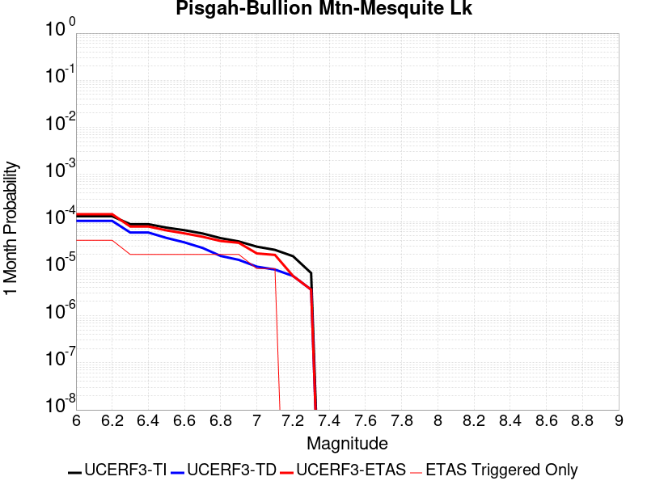 |  |  |

| Magnitude | 1 wk TI Prob | 1 wk TD Prob | 1 wk ETAS Prob | 1 wk ETAS/TD Gain | 1 wk ETAS Triggered Only | 1 mo TI Prob | 1 mo TD Prob | 1 mo ETAS Prob | 1 mo ETAS/TD Gain | 1 mo ETAS Triggered Only | 1 yr TI Prob | 1 yr TD Prob | 1 yr ETAS Prob | 1 yr ETAS/TD Gain | 1 yr ETAS Triggered Only | 10 yr TI Prob | 10 yr TD Prob | 10 yr ETAS Prob | 10 yr ETAS/TD Gain | 10 yr ETAS Triggered Only |
|-----|-----|-----|-----|-----|-----|-----|-----|-----|-----|-----|-----|-----|-----|-----|-----|-----|-----|-----|-----|-----|
| 6.0 | 3.0240792E-5 | 2.4091114E-5 | 7.434116E-5 | 3.085833 | 5.0251256E-5 | 1.2959696E-4 | 1.03244114E-4 | 1.5349018E-4 | 1.4866725 | 5.0251256E-5 | 0.0015767008 | 0.0012563728 | 0.0013065608 | 1.0399468 | 5.0251256E-5 | 0.015655609 | 0.012502721 | 0.012614372 | 1.0089302 | 1.13065325E-4 |
| 6.1 | 3.0240792E-5 | 2.4091114E-5 | 7.434116E-5 | 3.085833 | 5.0251256E-5 | 1.2959696E-4 | 1.03244114E-4 | 1.5349018E-4 | 1.4866725 | 5.0251256E-5 | 0.0015767008 | 0.0012563728 | 0.0013065608 | 1.0399468 | 5.0251256E-5 | 0.015655609 | 0.012502721 | 0.012614372 | 1.0089302 | 1.13065325E-4 |
| 6.2 | 3.0240792E-5 | 2.4091114E-5 | 7.434116E-5 | 3.085833 | 5.0251256E-5 | 1.2959696E-4 | 1.03244114E-4 | 1.5349018E-4 | 1.4866725 | 5.0251256E-5 | 0.0015767008 | 0.0012563728 | 0.0013065608 | 1.0399468 | 5.0251256E-5 | 0.015655609 | 0.012502721 | 0.012614372 | 1.0089302 | 1.13065325E-4 |
| 6.3 | 2.0498217E-5 | 1.36380695E-5 | 3.8763355E-5 | 2.8422904 | 2.5125628E-5 | 8.784654E-5 | 5.844765E-5 | 8.357181E-5 | 1.4298575 | 2.5125628E-5 | 0.0010690069 | 7.1138405E-4 | 7.364918E-4 | 1.0352942 | 2.5125628E-5 | 0.01063879 | 0.0070926943 | 0.0071425894 | 1.0070347 | 5.0251256E-5 |
| 6.4 | 2.0498217E-5 | 1.36380695E-5 | 3.8763355E-5 | 2.8422904 | 2.5125628E-5 | 8.784654E-5 | 5.844765E-5 | 8.357181E-5 | 1.4298575 | 2.5125628E-5 | 0.0010690069 | 7.1138405E-4 | 7.364918E-4 | 1.0352942 | 2.5125628E-5 | 0.01063879 | 0.0070926943 | 0.0071425894 | 1.0070347 | 5.0251256E-5 |
| 6.5 | 1.7316182E-5 | 1.0477042E-5 | 3.5602407E-5 | 3.3981352 | 2.5125628E-5 | 7.42101E-5 | 4.4900895E-5 | 7.0025395E-5 | 1.5595546 | 2.5125628E-5 | 9.0313336E-4 | 5.465413E-4 | 5.716532E-4 | 1.045947 | 2.5125628E-5 | 0.008994718 | 0.0054529672 | 0.00549045 | 1.0068738 | 3.768844E-5 |
| 6.6 | 1.5251077E-5 | 8.414273E-6 | 3.353969E-5 | 3.9860473 | 2.5125628E-5 | 6.536012E-5 | 3.6060712E-5 | 6.1185434E-5 | 1.696734 | 2.5125628E-5 | 7.9546886E-4 | 4.3895794E-4 | 4.6407257E-4 | 1.0572141 | 2.5125628E-5 | 0.007926274 | 0.0043816264 | 0.00441915 | 1.0085638 | 3.768844E-5 |
| 6.7 | 1.2997425E-5 | 6.4114965E-6 | 3.153696E-5 | 4.9188147 | 2.5125628E-5 | 5.570206E-5 | 2.7477578E-5 | 5.2602518E-5 | 1.9143796 | 2.5125628E-5 | 6.7796157E-4 | 3.3449283E-4 | 3.5961004E-4 | 1.0750905 | 2.5125628E-5 | 0.0067589693 | 0.0033403537 | 0.0033653954 | 1.0074967 | 2.5125628E-5 |
| 6.8 | 1.035386E-5 | 4.3332193E-6 | 2.9458739E-5 | 6.7983494 | 2.5125628E-5 | 4.437293E-5 | 1.8570812E-5 | 4.3695974E-5 | 2.3529382 | 2.5125628E-5 | 5.401065E-4 | 2.2607706E-4 | 2.5119702E-4 | 1.1111124 | 2.5125628E-5 | 0.0053879567 | 0.0022585576 | 0.0022836265 | 1.0110995 | 2.5125628E-5 |
| 6.9 | 8.816252E-6 | 3.580638E-6 | 2.8706176E-5 | 8.017056 | 2.5125628E-5 | 3.778339E-5 | 1.5345504E-5 | 4.0470746E-5 | 2.6373034 | 2.5125628E-5 | 4.5991567E-4 | 1.8681608E-4 | 2.11937E-4 | 1.1344688 | 2.5125628E-5 | 0.00458965 | 0.0018666488 | 0.0018917274 | 1.0134351 | 2.5125628E-5 |
| 7.0 | 6.8232207E-6 | 2.5675843E-6 | 1.5130367E-5 | 5.892841 | 1.2562814E-5 | 2.9242048E-5 | 1.1003888E-5 | 2.3566565E-5 | 2.1416578 | 1.2562814E-5 | 3.5596377E-4 | 1.3396442E-4 | 1.4652555E-4 | 1.0937647 | 1.2562814E-5 | 0.0035539411 | 0.0013388677 | 0.0013514137 | 1.0093706 | 1.2562814E-5 |
| 7.1 | 5.837013E-6 | 2.22738E-6 | 1.47901665E-5 | 6.640163 | 1.2562814E-5 | 2.501553E-5 | 9.545881E-6 | 2.2108576E-5 | 2.316033 | 1.2562814E-5 | 3.045215E-4 | 1.16215204E-4 | 1.2877655E-4 | 1.1080871 | 1.2562814E-5 | 0.0030410455 | 0.0011615733 | 0.0011741215 | 1.0108027 | 1.2562814E-5 |
| 7.2 | 4.278052E-6 | 1.6275711E-6 | 1.6275711E-6 | 1.0 | 0.0 | 1.833438E-5 | 6.9752873E-6 | 6.9752873E-6 | 1.0 | 0.0 | 2.231982E-4 | 8.492105E-5 | 8.492105E-5 | 1.0 | 0.0 | 0.0022297418 | 8.489092E-4 | 8.489092E-4 | 1.0 | 0.0 |
| 7.3 | 1.8803692E-6 | 8.344926E-7 | 8.344926E-7 | 1.0 | 0.0 | 8.0587E-6 | 3.5763926E-6 | 3.5763926E-6 | 1.0 | 0.0 | 9.811026E-5 | 4.354186E-5 | 4.354186E-5 | 1.0 | 0.0 | 9.806695E-4 | 4.3534773E-4 | 4.3534773E-4 | 1.0 | 0.0 |

## Pleito
*[(top)](#table-of-contents)*

| 1 Week | 1 Month | 1 Year | 10 Year |
|-----|-----|-----|-----|
|  |  |  |  |

| Magnitude | 1 wk TI Prob | 1 wk TD Prob | 1 wk ETAS Prob | 1 wk ETAS/TD Gain | 1 wk ETAS Triggered Only | 1 mo TI Prob | 1 mo TD Prob | 1 mo ETAS Prob | 1 mo ETAS/TD Gain | 1 mo ETAS Triggered Only | 1 yr TI Prob | 1 yr TD Prob | 1 yr ETAS Prob | 1 yr ETAS/TD Gain | 1 yr ETAS Triggered Only | 10 yr TI Prob | 10 yr TD Prob | 10 yr ETAS Prob | 10 yr ETAS/TD Gain | 10 yr ETAS Triggered Only |
|-----|-----|-----|-----|-----|-----|-----|-----|-----|-----|-----|-----|-----|-----|-----|-----|-----|-----|-----|-----|-----|
| 6.0 | 1.6763008E-5 | 2.4763838E-5 | 7.501385E-5 | 3.0291688 | 5.0251256E-5 | 7.183948E-5 | 1.0612683E-4 | 1.5637276E-4 | 1.4734516 | 5.0251256E-5 | 8.742947E-4 | 0.0012914003 | 0.0013541332 | 1.0485774 | 6.281407E-5 | 0.00870863 | 0.0129538905 | 0.013065491 | 1.0086153 | 1.13065325E-4 |
| 6.1 | 1.6763008E-5 | 2.4763838E-5 | 7.501385E-5 | 3.0291688 | 5.0251256E-5 | 7.183948E-5 | 1.0612683E-4 | 1.5637276E-4 | 1.4734516 | 5.0251256E-5 | 8.742947E-4 | 0.0012914003 | 0.0013541332 | 1.0485774 | 6.281407E-5 | 0.00870863 | 0.0129538905 | 0.013065491 | 1.0086153 | 1.13065325E-4 |
| 6.2 | 1.6763008E-5 | 2.4763838E-5 | 7.501385E-5 | 3.0291688 | 5.0251256E-5 | 7.183948E-5 | 1.0612683E-4 | 1.5637276E-4 | 1.4734516 | 5.0251256E-5 | 8.742947E-4 | 0.0012914003 | 0.0013541332 | 1.0485774 | 6.281407E-5 | 0.00870863 | 0.0129538905 | 0.013065491 | 1.0086153 | 1.13065325E-4 |
| 6.3 | 1.6763008E-5 | 2.4763838E-5 | 7.501385E-5 | 3.0291688 | 5.0251256E-5 | 7.183948E-5 | 1.0612683E-4 | 1.5637276E-4 | 1.4734516 | 5.0251256E-5 | 8.742947E-4 | 0.0012914003 | 0.0013541332 | 1.0485774 | 6.281407E-5 | 0.00870863 | 0.0129538905 | 0.013065491 | 1.0086153 | 1.13065325E-4 |
| 6.4 | 1.6763008E-5 | 2.4763838E-5 | 7.501385E-5 | 3.0291688 | 5.0251256E-5 | 7.183948E-5 | 1.0612683E-4 | 1.5637276E-4 | 1.4734516 | 5.0251256E-5 | 8.742947E-4 | 0.0012914003 | 0.0013541332 | 1.0485774 | 6.281407E-5 | 0.00870863 | 0.0129538905 | 0.013065491 | 1.0086153 | 1.13065325E-4 |
| 6.5 | 1.6763008E-5 | 2.4763838E-5 | 7.501385E-5 | 3.0291688 | 5.0251256E-5 | 7.183948E-5 | 1.0612683E-4 | 1.5637276E-4 | 1.4734516 | 5.0251256E-5 | 8.742947E-4 | 0.0012914003 | 0.0013541332 | 1.0485774 | 6.281407E-5 | 0.00870863 | 0.0129538905 | 0.013065491 | 1.0086153 | 1.13065325E-4 |
| 6.6 | 9.910213E-6 | 1.7214623E-5 | 2.9777222E-5 | 1.7297632 | 1.2562814E-5 | 4.247165E-5 | 7.377489E-5 | 8.633678E-5 | 1.1702732 | 1.2562814E-5 | 5.169696E-4 | 8.978429E-4 | 9.103944E-4 | 1.0139797 | 1.2562814E-5 | 0.0051576863 | 0.009050702 | 0.00908805 | 1.0041264 | 3.768844E-5 |
| 6.7 | 9.910213E-6 | 1.7214623E-5 | 2.9777222E-5 | 1.7297632 | 1.2562814E-5 | 4.247165E-5 | 7.377489E-5 | 8.633678E-5 | 1.1702732 | 1.2562814E-5 | 5.169696E-4 | 8.978429E-4 | 9.103944E-4 | 1.0139797 | 1.2562814E-5 | 0.0051576863 | 0.009050702 | 0.00908805 | 1.0041264 | 3.768844E-5 |
| 6.8 | 8.300162E-6 | 1.5474232E-5 | 1.5474232E-5 | 1.0 | 0.0 | 3.557164E-5 | 6.631646E-5 | 6.631646E-5 | 1.0 | 0.0 | 4.3299864E-4 | 8.071053E-4 | 8.071053E-4 | 1.0 | 0.0 | 0.004321559 | 0.008150139 | 0.008162599 | 1.0015289 | 1.2562814E-5 |
| 6.9 | 8.183114E-6 | 1.5345448E-5 | 1.5345448E-5 | 1.0 | 0.0 | 3.5070017E-5 | 6.576455E-5 | 6.576455E-5 | 1.0 | 0.0 | 4.2689382E-4 | 8.003907E-4 | 8.003907E-4 | 1.0 | 0.0 | 0.0042607468 | 0.008083483 | 0.008095945 | 1.0015416 | 1.2562814E-5 |
| 7.0 | 7.1748823E-6 | 1.413244E-5 | 1.413244E-5 | 1.0 | 0.0 | 3.0749135E-5 | 6.0566195E-5 | 6.0566195E-5 | 1.0 | 0.0 | 3.743064E-4 | 7.371445E-4 | 7.371445E-4 | 1.0 | 0.0 | 0.0037367654 | 0.007454939 | 0.007467408 | 1.0016726 | 1.2562814E-5 |
| 7.1 | 7.1671807E-6 | 1.412281E-5 | 1.412281E-5 | 1.0 | 0.0 | 3.0716128E-5 | 6.052493E-5 | 6.052493E-5 | 1.0 | 0.0 | 3.7390468E-4 | 7.366424E-4 | 7.366424E-4 | 1.0 | 0.0 | 0.0037327618 | 0.0074499524 | 0.0074624214 | 1.0016737 | 1.2562814E-5 |
| 7.2 | 7.0649667E-6 | 1.39701015E-5 | 1.39701015E-5 | 1.0 | 0.0 | 3.0278077E-5 | 5.9870494E-5 | 5.9870494E-5 | 1.0 | 0.0 | 3.6857324E-4 | 7.2868E-4 | 7.2868E-4 | 1.0 | 0.0 | 0.0036796255 | 0.0073707094 | 0.00738318 | 1.0016918 | 1.2562814E-5 |
| 7.3 | 7.02082E-6 | 1.3913556E-5 | 1.3913556E-5 | 1.0 | 0.0 | 3.008888E-5 | 5.9628168E-5 | 5.9628168E-5 | 1.0 | 0.0 | 3.6627054E-4 | 7.2573166E-4 | 7.2573166E-4 | 1.0 | 0.0 | 0.0036566744 | 0.007341209 | 0.0073536793 | 1.0016987 | 1.2562814E-5 |
| 7.4 | 6.987146E-6 | 1.3873118E-5 | 1.3873118E-5 | 1.0 | 0.0 | 2.9944567E-5 | 5.945487E-5 | 5.945487E-5 | 1.0 | 0.0 | 3.6451413E-4 | 7.2362315E-4 | 7.2362315E-4 | 1.0 | 0.0 | 0.0036391679 | 0.007320144 | 0.007332615 | 1.0017036 | 1.2562814E-5 |
| 7.5 | 6.9494554E-6 | 1.3830024E-5 | 1.3830024E-5 | 1.0 | 0.0 | 2.9783041E-5 | 5.9270187E-5 | 5.9270187E-5 | 1.0 | 0.0 | 3.625482E-4 | 7.2137616E-4 | 7.2137616E-4 | 1.0 | 0.0 | 0.0036195726 | 0.0072977724 | 0.007310244 | 1.0017089 | 1.2562814E-5 |
| 7.6 | 6.92694E-6 | 1.3789138E-5 | 1.3789138E-5 | 1.0 | 0.0 | 2.9686547E-5 | 5.909497E-5 | 5.909497E-5 | 1.0 | 0.0 | 3.6137376E-4 | 7.1924424E-4 | 7.1924424E-4 | 1.0 | 0.0 | 0.0036078666 | 0.0072765257 | 0.007288997 | 1.0017139 | 1.2562814E-5 |
| 7.7 | 6.395867E-6 | 1.2668219E-5 | 1.2668219E-5 | 1.0 | 0.0 | 2.741057E-5 | 5.429124E-5 | 5.429124E-5 | 1.0 | 0.0 | 3.336726E-4 | 6.6079566E-4 | 6.6079566E-4 | 1.0 | 0.0 | 0.0033317201 | 0.0066951844 | 0.006707663 | 1.0018638 | 1.2562814E-5 |
| 7.8 | 5.8664327E-6 | 1.153586E-5 | 1.153586E-5 | 1.0 | 0.0 | 2.5141611E-5 | 4.9438466E-5 | 4.9438466E-5 | 1.0 | 0.0 | 3.060561E-4 | 6.017473E-4 | 6.017473E-4 | 1.0 | 0.0 | 0.0030563495 | 0.0061006667 | 0.0061131525 | 1.0020467 | 1.2562814E-5 |
| 7.9 | 3.7167474E-6 | 7.1140853E-6 | 7.1140853E-6 | 1.0 | 0.0 | 1.592882E-5 | 3.0488582E-5 | 3.0488582E-5 | 1.0 | 0.0 | 1.9391612E-4 | 3.7113542E-4 | 3.7113542E-4 | 1.0 | 0.0 | 0.0019374699 | 0.0037674906 | 0.0037674906 | 1.0 | 0.0 |
| 8.0 | 1.0903841E-6 | 1.2879392E-6 | 1.2879392E-6 | 1.0 | 0.0 | 4.6730665E-6 | 5.5197274E-6 | 5.5197274E-6 | 1.0 | 0.0 | 5.68931E-5 | 6.720063E-5 | 6.720063E-5 | 1.0 | 0.0 | 5.6878536E-4 | 6.941948E-4 | 6.941948E-4 | 1.0 | 0.0 |
| 8.1 | 2.6894583E-7 | 1.1060341E-7 | 1.1060341E-7 | 1.0 | 0.0 | 1.1526245E-6 | 4.740145E-7 | 4.740145E-7 | 1.0 | 0.0 | 1.4033113E-5 | 5.7711113E-6 | 5.7711113E-6 | 1.0 | 0.0 | 1.4032227E-4 | 6.456908E-5 | 6.456908E-5 | 1.0 | 0.0 |
| 8.2 | 5.2967013E-9 | 2.4578228E-9 | 2.4578228E-9 | 1.0 | 0.0 | 2.2700148E-8 | 1.0533527E-8 | 1.0533527E-8 | 1.0 | 0.0 | 2.7637427E-7 | 1.2824569E-7 | 1.2824569E-7 | 1.0 | 0.0 | 2.7637393E-6 | 1.4592787E-6 | 1.4592787E-6 | 1.0 | 0.0 |

## Channel Islands Thrust
*[(top)](#table-of-contents)*

| 1 Week | 1 Month | 1 Year | 10 Year |
|-----|-----|-----|-----|
| 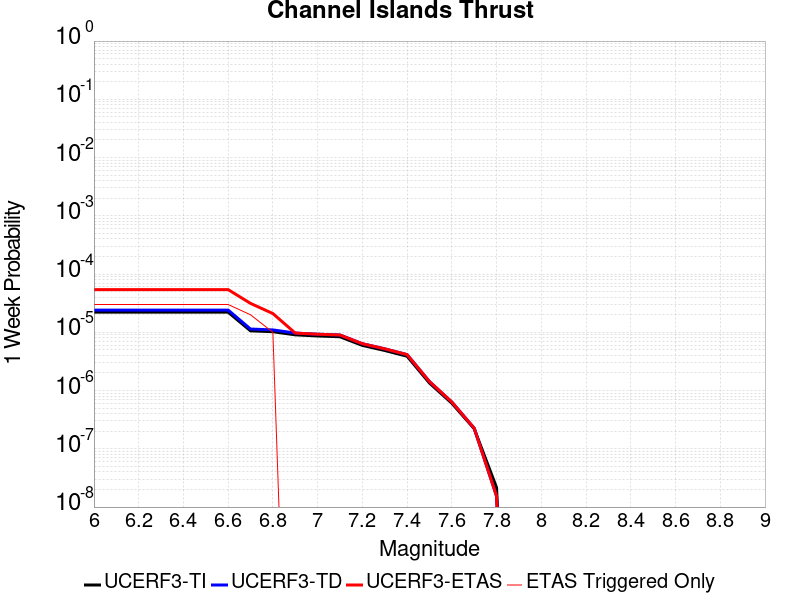 | 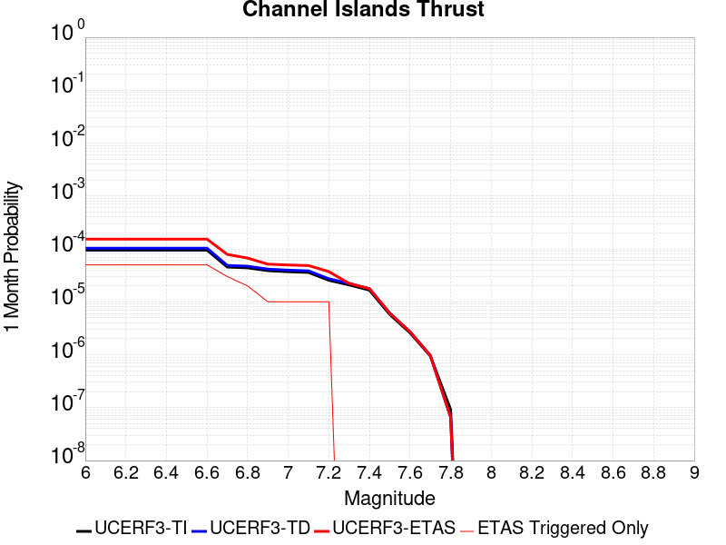 |  |  |

| Magnitude | 1 wk TI Prob | 1 wk TD Prob | 1 wk ETAS Prob | 1 wk ETAS/TD Gain | 1 wk ETAS Triggered Only | 1 mo TI Prob | 1 mo TD Prob | 1 mo ETAS Prob | 1 mo ETAS/TD Gain | 1 mo ETAS Triggered Only | 1 yr TI Prob | 1 yr TD Prob | 1 yr ETAS Prob | 1 yr ETAS/TD Gain | 1 yr ETAS Triggered Only | 10 yr TI Prob | 10 yr TD Prob | 10 yr ETAS Prob | 10 yr ETAS/TD Gain | 10 yr ETAS Triggered Only |
|-----|-----|-----|-----|-----|-----|-----|-----|-----|-----|-----|-----|-----|-----|-----|-----|-----|-----|-----|-----|-----|
| 6.0 | 2.2156251E-5 | 2.4092022E-5 | 6.177956E-5 | 2.564316 | 3.768844E-5 | 9.495191E-5 | 1.03248036E-4 | 1.5349411E-4 | 1.4866539 | 5.0251256E-5 | 0.0011554264 | 0.0012564264 | 0.0013191616 | 1.0499314 | 6.281407E-5 | 0.011494373 | 0.0125038205 | 0.012603066 | 1.0079372 | 1.0050251E-4 |
| 6.1 | 2.2156251E-5 | 2.4092022E-5 | 6.177956E-5 | 2.564316 | 3.768844E-5 | 9.495191E-5 | 1.03248036E-4 | 1.5349411E-4 | 1.4866539 | 5.0251256E-5 | 0.0011554264 | 0.0012564264 | 0.0013191616 | 1.0499314 | 6.281407E-5 | 0.011494373 | 0.0125038205 | 0.012603066 | 1.0079372 | 1.0050251E-4 |
| 6.2 | 2.2156251E-5 | 2.4092022E-5 | 6.177956E-5 | 2.564316 | 3.768844E-5 | 9.495191E-5 | 1.03248036E-4 | 1.5349411E-4 | 1.4866539 | 5.0251256E-5 | 0.0011554264 | 0.0012564264 | 0.0013191616 | 1.0499314 | 6.281407E-5 | 0.011494373 | 0.0125038205 | 0.012603066 | 1.0079372 | 1.0050251E-4 |
| 6.3 | 2.2156251E-5 | 2.4092022E-5 | 6.177956E-5 | 2.564316 | 3.768844E-5 | 9.495191E-5 | 1.03248036E-4 | 1.5349411E-4 | 1.4866539 | 5.0251256E-5 | 0.0011554264 | 0.0012564264 | 0.0013191616 | 1.0499314 | 6.281407E-5 | 0.011494373 | 0.0125038205 | 0.012603066 | 1.0079372 | 1.0050251E-4 |
| 6.4 | 2.2156251E-5 | 2.4092022E-5 | 6.177956E-5 | 2.564316 | 3.768844E-5 | 9.495191E-5 | 1.03248036E-4 | 1.5349411E-4 | 1.4866539 | 5.0251256E-5 | 0.0011554264 | 0.0012564264 | 0.0013191616 | 1.0499314 | 6.281407E-5 | 0.011494373 | 0.0125038205 | 0.012603066 | 1.0079372 | 1.0050251E-4 |
| 6.5 | 2.2156251E-5 | 2.4092022E-5 | 6.177956E-5 | 2.564316 | 3.768844E-5 | 9.495191E-5 | 1.03248036E-4 | 1.5349411E-4 | 1.4866539 | 5.0251256E-5 | 0.0011554264 | 0.0012564264 | 0.0013191616 | 1.0499314 | 6.281407E-5 | 0.011494373 | 0.0125038205 | 0.012603066 | 1.0079372 | 1.0050251E-4 |
| 6.6 | 2.2156251E-5 | 2.4092022E-5 | 6.177956E-5 | 2.564316 | 3.768844E-5 | 9.495191E-5 | 1.03248036E-4 | 1.5349411E-4 | 1.4866539 | 5.0251256E-5 | 0.0011554264 | 0.0012564264 | 0.0013191616 | 1.0499314 | 6.281407E-5 | 0.011494373 | 0.0125038205 | 0.012603066 | 1.0079372 | 1.0050251E-4 |
| 6.7 | 1.0601296E-5 | 1.1379544E-5 | 3.6504887E-5 | 3.2079394 | 2.5125628E-5 | 4.5433335E-5 | 4.876859E-5 | 8.645519E-5 | 1.7727638 | 3.768844E-5 | 5.5301044E-4 | 5.936007E-4 | 6.3126674E-4 | 1.0634536 | 3.768844E-5 | 0.005516363 | 0.005920653 | 0.005970607 | 1.0084372 | 5.0251256E-5 |
| 6.8 | 1.0246747E-5 | 1.0996669E-5 | 2.3559345E-5 | 2.1424074 | 1.2562814E-5 | 4.391389E-5 | 4.7127756E-5 | 7.22522E-5 | 1.5331135 | 2.5125628E-5 | 5.345204E-4 | 5.7363417E-4 | 5.9874536E-4 | 1.0437757 | 2.5125628E-5 | 0.0053323656 | 0.005722025 | 0.0057594976 | 1.0065489 | 3.768844E-5 |
| 6.9 | 9.049551E-6 | 9.699645E-6 | 9.699645E-6 | 1.0 | 0.0 | 3.878322E-5 | 4.1569267E-5 | 5.4131557E-5 | 1.3022014 | 1.2562814E-5 | 4.7208337E-4 | 5.059924E-4 | 5.185488E-4 | 1.0248156 | 1.2562814E-5 | 0.0047108172 | 0.0050488203 | 0.0050613196 | 1.0024757 | 1.2562814E-5 |
| 7.0 | 8.6542195E-6 | 9.274603E-6 | 9.274603E-6 | 1.0 | 0.0 | 3.7088983E-5 | 3.9747716E-5 | 5.231003E-5 | 1.3160512 | 1.2562814E-5 | 4.5146482E-4 | 4.8382508E-4 | 4.963818E-4 | 1.025953 | 1.2562814E-5 | 0.004505487 | 0.004828129 | 0.0048406315 | 1.0025895 | 1.2562814E-5 |
| 7.1 | 8.391028E-6 | 8.992924E-6 | 8.992924E-6 | 1.0 | 0.0 | 3.5961057E-5 | 3.854056E-5 | 5.110289E-5 | 1.3259509 | 1.2562814E-5 | 4.3773788E-4 | 4.6913436E-4 | 4.8169127E-4 | 1.0267662 | 1.2562814E-5 | 0.004368766 | 0.0046818503 | 0.0046943543 | 1.0026708 | 1.2562814E-5 |
| 7.2 | 5.965188E-6 | 6.3716952E-6 | 6.3716952E-6 | 1.0 | 0.0 | 2.556484E-5 | 2.7306982E-5 | 3.9869454E-5 | 1.460046 | 1.2562814E-5 | 3.1120746E-4 | 3.3241234E-4 | 3.44971E-4 | 1.0377803 | 1.2562814E-5 | 0.00310772 | 0.0033192092 | 0.0033317304 | 1.0037724 | 1.2562814E-5 |
| 7.3 | 4.877518E-6 | 5.2060063E-6 | 5.2060063E-6 | 1.0 | 0.0 | 2.0903482E-5 | 2.2311267E-5 | 2.2311267E-5 | 1.0 | 0.0 | 2.5447016E-4 | 2.716063E-4 | 2.716063E-4 | 1.0 | 0.0 | 0.0025417898 | 0.0027127895 | 0.0027127895 | 1.0 | 0.0 |
| 7.4 | 3.8829853E-6 | 4.141863E-6 | 4.141863E-6 | 1.0 | 0.0 | 1.664126E-5 | 1.7750723E-5 | 1.7750723E-5 | 1.0 | 0.0 | 2.0258849E-4 | 2.1609402E-4 | 2.1609402E-4 | 1.0 | 0.0 | 0.002024039 | 0.0021588807 | 0.0021588807 | 1.0 | 0.0 |
| 7.5 | 1.3489616E-6 | 1.4277903E-6 | 1.4277903E-6 | 1.0 | 0.0 | 5.7812517E-6 | 6.119087E-6 | 6.119087E-6 | 1.0 | 0.0 | 7.038446E-5 | 7.449738E-5 | 7.449738E-5 | 1.0 | 0.0 | 7.036218E-4 | 7.44728E-4 | 7.44728E-4 | 1.0 | 0.0 |
| 7.6 | 6.058192E-7 | 6.353778E-7 | 6.353778E-7 | 1.0 | 0.0 | 2.5963652E-6 | 2.7230449E-6 | 2.7230449E-6 | 1.0 | 0.0 | 3.161029E-5 | 3.3152584E-5 | 3.3152584E-5 | 1.0 | 0.0 | 3.1605794E-4 | 3.31478E-4 | 3.31478E-4 | 1.0 | 0.0 |
| 7.7 | 2.2170494E-7 | 2.2607902E-7 | 2.2607902E-7 | 1.0 | 0.0 | 9.5016367E-7 | 9.689098E-7 | 9.689098E-7 | 1.0 | 0.0 | 1.1568181E-5 | 1.1796425E-5 | 1.1796425E-5 | 1.0 | 0.0 | 1.1567579E-4 | 1.1795909E-4 | 1.1795909E-4 | 1.0 | 0.0 |
| 7.8 | 2.1613102E-8 | 1.5466682E-8 | 1.5466682E-8 | 1.0 | 0.0 | 9.262757E-8 | 6.628578E-8 | 6.628578E-8 | 1.0 | 0.0 | 1.1277401E-6 | 8.070291E-7 | 8.070291E-7 | 1.0 | 0.0 | 1.1277344E-5 | 8.070269E-6 | 8.070269E-6 | 1.0 | 0.0 |

## Palos Verdes
*[(top)](#table-of-contents)*

| 1 Week | 1 Month | 1 Year | 10 Year |
|-----|-----|-----|-----|
|  |  |  | 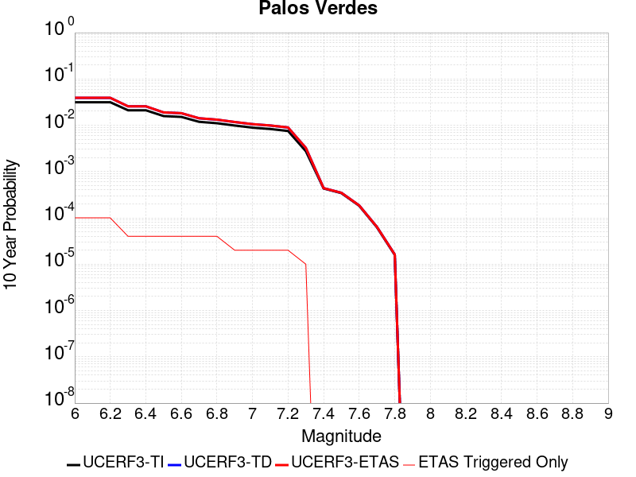 |

| Magnitude | 1 wk TI Prob | 1 wk TD Prob | 1 wk ETAS Prob | 1 wk ETAS/TD Gain | 1 wk ETAS Triggered Only | 1 mo TI Prob | 1 mo TD Prob | 1 mo ETAS Prob | 1 mo ETAS/TD Gain | 1 mo ETAS Triggered Only | 1 yr TI Prob | 1 yr TD Prob | 1 yr ETAS Prob | 1 yr ETAS/TD Gain | 1 yr ETAS Triggered Only | 10 yr TI Prob | 10 yr TD Prob | 10 yr ETAS Prob | 10 yr ETAS/TD Gain | 10 yr ETAS Triggered Only |
|-----|-----|-----|-----|-----|-----|-----|-----|-----|-----|-----|-----|-----|-----|-----|-----|-----|-----|-----|-----|-----|
| 6.0 | 6.126063E-5 | 7.622612E-5 | 1.1391169E-4 | 1.4943918 | 3.768844E-5 | 2.6251914E-4 | 3.2664582E-4 | 3.7688066E-4 | 1.15379 | 5.0251256E-5 | 0.0031914865 | 0.003970174 | 0.004032739 | 1.0157586 | 6.281407E-5 | 0.031460393 | 0.039048895 | 0.039157547 | 1.0027825 | 1.13065325E-4 |
| 6.1 | 6.126063E-5 | 7.622612E-5 | 1.1391169E-4 | 1.4943918 | 3.768844E-5 | 2.6251914E-4 | 3.2664582E-4 | 3.7688066E-4 | 1.15379 | 5.0251256E-5 | 0.0031914865 | 0.003970174 | 0.004032739 | 1.0157586 | 6.281407E-5 | 0.031460393 | 0.039048895 | 0.039157547 | 1.0027825 | 1.13065325E-4 |
| 6.2 | 6.126063E-5 | 7.622612E-5 | 1.1391169E-4 | 1.4943918 | 3.768844E-5 | 2.6251914E-4 | 3.2664582E-4 | 3.7688066E-4 | 1.15379 | 5.0251256E-5 | 0.0031914865 | 0.003970174 | 0.004032739 | 1.0157586 | 6.281407E-5 | 0.031460393 | 0.039048895 | 0.039157547 | 1.0027825 | 1.13065325E-4 |
| 6.3 | 4.0838047E-5 | 4.9749437E-5 | 7.487382E-5 | 1.5050184 | 2.5125628E-5 | 1.7500846E-4 | 2.1319572E-4 | 2.3831599E-4 | 1.1178273 | 2.5125628E-5 | 0.0021286458 | 0.0025927818 | 0.0026303725 | 1.0144982 | 3.768844E-5 | 0.021083709 | 0.025646681 | 0.025695642 | 1.0019091 | 5.0251256E-5 |
| 6.4 | 4.0838047E-5 | 4.9749437E-5 | 7.487382E-5 | 1.5050184 | 2.5125628E-5 | 1.7500846E-4 | 2.1319572E-4 | 2.3831599E-4 | 1.1178273 | 2.5125628E-5 | 0.0021286458 | 0.0025927818 | 0.0026303725 | 1.0144982 | 3.768844E-5 | 0.021083709 | 0.025646681 | 0.025695642 | 1.0019091 | 5.0251256E-5 |
| 6.5 | 3.0512005E-5 | 3.656162E-5 | 6.168633E-5 | 1.687188 | 2.5125628E-5 | 1.3075917E-4 | 1.5668393E-4 | 1.8180562E-4 | 1.1603335 | 2.5125628E-5 | 0.0015908304 | 0.0019060767 | 0.0019436933 | 1.0197351 | 3.768844E-5 | 0.015794903 | 0.018909154 | 0.018958455 | 1.0026072 | 5.0251256E-5 |
| 6.6 | 2.9255087E-5 | 3.515442E-5 | 6.0279166E-5 | 1.7146966 | 2.5125628E-5 | 1.2537291E-4 | 1.5065377E-4 | 1.757756E-4 | 1.1667522 | 2.5125628E-5 | 0.0015253464 | 0.0018327828 | 0.0018704021 | 1.0205258 | 3.768844E-5 | 0.015149189 | 0.018188225 | 0.018237563 | 1.0027126 | 5.0251256E-5 |
| 6.7 | 2.287198E-5 | 2.7248278E-5 | 5.2373223E-5 | 1.9220746 | 2.5125628E-5 | 9.801909E-5 | 1.16773626E-4 | 1.4189632E-4 | 1.2151401 | 2.5125628E-5 | 0.001192729 | 0.0014208833 | 0.0014585182 | 1.026487 | 3.768844E-5 | 0.011863477 | 0.014127217 | 0.014176759 | 1.0035068 | 5.0251256E-5 |
| 6.8 | 2.1325764E-5 | 2.5431877E-5 | 5.0556868E-5 | 1.9879329 | 2.5125628E-5 | 9.139293E-5 | 1.0898971E-4 | 1.341126E-4 | 1.230507 | 2.5125628E-5 | 0.001112141 | 0.0013262323 | 0.0013638707 | 1.02838 | 3.768844E-5 | 0.011065915 | 0.013192211 | 0.0132418 | 1.0037589 | 5.0251256E-5 |
| 6.9 | 1.9009392E-5 | 2.2613547E-5 | 2.2613547E-5 | 1.0 | 0.0 | 8.1466285E-5 | 9.6912096E-5 | 9.6912096E-5 | 1.0 | 0.0 | 9.914007E-4 | 0.0011793535 | 0.0011919015 | 1.0106397 | 1.2562814E-5 | 0.009869894 | 0.011739632 | 0.011764463 | 1.0021151 | 2.5125628E-5 |
| 7.0 | 1.7098473E-5 | 2.0319356E-5 | 2.0319356E-5 | 1.0 | 0.0 | 7.3277115E-5 | 8.708052E-5 | 8.708052E-5 | 1.0 | 0.0 | 8.917837E-4 | 0.001059775 | 0.0010723245 | 1.0118417 | 1.2562814E-5 | 0.008882134 | 0.010555646 | 0.010580507 | 1.0023552 | 2.5125628E-5 |
| 7.1 | 1.5982785E-5 | 1.899476E-5 | 1.899476E-5 | 1.0 | 0.0 | 6.849585E-5 | 8.1404054E-5 | 8.1404054E-5 | 1.0 | 0.0 | 8.336179E-4 | 9.907284E-4 | 0.0010032788 | 1.0126678 | 1.2562814E-5 | 0.008304977 | 0.009871479 | 0.009896358 | 1.0025202 | 2.5125628E-5 |
| 7.2 | 1.4468002E-5 | 1.7197237E-5 | 1.7197237E-5 | 1.0 | 0.0 | 6.200425E-5 | 7.370083E-5 | 7.370083E-5 | 1.0 | 0.0 | 7.546402E-4 | 8.970222E-4 | 9.0957375E-4 | 1.0139924 | 1.2562814E-5 | 0.007520827 | 0.008942284 | 0.008967184 | 1.0027846 | 2.5125628E-5 |
| 7.3 | 5.288233E-6 | 6.2036747E-6 | 6.2036747E-6 | 1.0 | 0.0 | 2.2663658E-5 | 2.6587102E-5 | 2.6587102E-5 | 1.0 | 0.0 | 2.7589512E-4 | 3.236848E-4 | 3.236848E-4 | 1.0 | 0.0 | 0.0027555283 | 0.0032355562 | 0.0032480783 | 1.0038701 | 1.2562814E-5 |
| 7.4 | 8.279556E-7 | 8.408347E-7 | 8.408347E-7 | 1.0 | 0.0 | 3.5483763E-6 | 3.6035726E-6 | 3.6035726E-6 | 1.0 | 0.0 | 4.3200624E-5 | 4.3872686E-5 | 4.3872686E-5 | 1.0 | 0.0 | 4.3192226E-4 | 4.3864746E-4 | 4.3864746E-4 | 1.0 | 0.0 |
| 7.5 | 6.559831E-7 | 6.667229E-7 | 6.667229E-7 | 1.0 | 0.0 | 2.8113532E-6 | 2.857381E-6 | 2.857381E-6 | 1.0 | 0.0 | 3.4227687E-5 | 3.4788125E-5 | 3.4788125E-5 | 1.0 | 0.0 | 3.4222414E-4 | 3.4783344E-4 | 3.4783344E-4 | 1.0 | 0.0 |
| 7.6 | 3.5018968E-7 | 3.5620027E-7 | 3.5620027E-7 | 1.0 | 0.0 | 1.500812E-6 | 1.526572E-6 | 1.526572E-6 | 1.0 | 0.0 | 1.8272232E-5 | 1.8585903E-5 | 1.8585903E-5 | 1.0 | 0.0 | 1.8270731E-4 | 1.8584808E-4 | 1.8584808E-4 | 1.0 | 0.0 |
| 7.7 | 1.1986104E-7 | 1.2198376E-7 | 1.2198376E-7 | 1.0 | 0.0 | 5.1369005E-7 | 5.2278745E-7 | 5.2278745E-7 | 1.0 | 0.0 | 6.2541585E-6 | 6.364919E-6 | 6.364919E-6 | 1.0 | 0.0 | 6.2539824E-5 | 6.364741E-5 | 6.364741E-5 | 1.0 | 0.0 |
| 7.8 | 3.0445005E-8 | 3.1027582E-8 | 3.1027582E-8 | 1.0 | 0.0 | 1.3047858E-7 | 1.3297536E-7 | 1.3297536E-7 | 1.0 | 0.0 | 1.5885756E-6 | 1.6189739E-6 | 1.6189739E-6 | 1.0 | 0.0 | 1.5885644E-5 | 1.6189642E-5 | 1.6189642E-5 | 1.0 | 0.0 |

## Camp Rock 2011
*[(top)](#table-of-contents)*

| 1 Week | 1 Month | 1 Year | 10 Year |
|-----|-----|-----|-----|
|  |  |  |  |

| Magnitude | 1 wk TI Prob | 1 wk TD Prob | 1 wk ETAS Prob | 1 wk ETAS/TD Gain | 1 wk ETAS Triggered Only | 1 mo TI Prob | 1 mo TD Prob | 1 mo ETAS Prob | 1 mo ETAS/TD Gain | 1 mo ETAS Triggered Only | 1 yr TI Prob | 1 yr TD Prob | 1 yr ETAS Prob | 1 yr ETAS/TD Gain | 1 yr ETAS Triggered Only | 10 yr TI Prob | 10 yr TD Prob | 10 yr ETAS Prob | 10 yr ETAS/TD Gain | 10 yr ETAS Triggered Only |
|-----|-----|-----|-----|-----|-----|-----|-----|-----|-----|-----|-----|-----|-----|-----|-----|-----|-----|-----|-----|-----|
| 6.0 | 1.6710783E-5 | 4.25026E-6 | 2.9375782E-5 | 6.9115252 | 2.5125628E-5 | 7.161568E-5 | 1.8215276E-5 | 6.846562E-5 | 3.758692 | 5.0251256E-5 | 8.7157206E-4 | 2.2174895E-4 | 2.9710913E-4 | 1.3398446 | 7.537688E-5 | 0.008681616 | 0.0022153298 | 0.0023281446 | 1.0509247 | 1.13065325E-4 |
| 6.1 | 1.6710783E-5 | 4.25026E-6 | 2.9375782E-5 | 6.9115252 | 2.5125628E-5 | 7.161568E-5 | 1.8215276E-5 | 6.846562E-5 | 3.758692 | 5.0251256E-5 | 8.7157206E-4 | 2.2174895E-4 | 2.9710913E-4 | 1.3398446 | 7.537688E-5 | 0.008681616 | 0.0022153298 | 0.0023281446 | 1.0509247 | 1.13065325E-4 |
| 6.2 | 1.6710783E-5 | 4.25026E-6 | 2.9375782E-5 | 6.9115252 | 2.5125628E-5 | 7.161568E-5 | 1.8215276E-5 | 6.846562E-5 | 3.758692 | 5.0251256E-5 | 8.7157206E-4 | 2.2174895E-4 | 2.9710913E-4 | 1.3398446 | 7.537688E-5 | 0.008681616 | 0.0022153298 | 0.0023281446 | 1.0509247 | 1.13065325E-4 |
| 6.3 | 1.6710783E-5 | 4.25026E-6 | 2.9375782E-5 | 6.9115252 | 2.5125628E-5 | 7.161568E-5 | 1.8215276E-5 | 6.846562E-5 | 3.758692 | 5.0251256E-5 | 8.7157206E-4 | 2.2174895E-4 | 2.9710913E-4 | 1.3398446 | 7.537688E-5 | 0.008681616 | 0.0022153298 | 0.0023281446 | 1.0509247 | 1.13065325E-4 |
| 6.4 | 7.982846E-6 | 3.6820884E-6 | 2.8807624E-5 | 7.8237185 | 2.5125628E-5 | 3.421175E-5 | 1.5780286E-5 | 6.603075E-5 | 4.1843824 | 5.0251256E-5 | 4.1644843E-4 | 1.9210839E-4 | 2.6747078E-4 | 1.3922911 | 7.537688E-5 | 0.0041566887 | 0.001919458 | 0.0020323063 | 1.0587918 | 1.13065325E-4 |
| 6.5 | 7.982846E-6 | 3.6820884E-6 | 2.8807624E-5 | 7.8237185 | 2.5125628E-5 | 3.421175E-5 | 1.5780286E-5 | 6.603075E-5 | 4.1843824 | 5.0251256E-5 | 4.1644843E-4 | 1.9210839E-4 | 2.6747078E-4 | 1.3922911 | 7.537688E-5 | 0.0041566887 | 0.001919458 | 0.0020323063 | 1.0587918 | 1.13065325E-4 |
| 6.6 | 7.048869E-6 | 3.4243571E-6 | 2.8549899E-5 | 8.337302 | 2.5125628E-5 | 3.0209088E-5 | 1.4675736E-5 | 6.492625E-5 | 4.4240546 | 5.0251256E-5 | 3.677336E-4 | 1.7866275E-4 | 2.5402618E-4 | 1.4218194 | 7.537688E-5 | 0.0036712566 | 0.0017852228 | 0.0018980863 | 1.063221 | 1.13065325E-4 |
| 6.7 | 6.987307E-6 | 3.3623348E-6 | 2.8487879E-5 | 8.472648 | 2.5125628E-5 | 2.9945259E-5 | 1.4409929E-5 | 6.466046E-5 | 4.487216 | 5.0251256E-5 | 3.6452254E-4 | 1.7542706E-4 | 2.5079073E-4 | 1.4296011 | 7.537688E-5 | 0.0036392517 | 0.001752917 | 0.001865784 | 1.0643882 | 1.13065325E-4 |
| 6.8 | 6.3737602E-6 | 3.1179077E-6 | 2.8243458E-5 | 9.058465 | 2.5125628E-5 | 2.731583E-5 | 1.3362394E-5 | 6.361298E-5 | 4.760597 | 5.0251256E-5 | 3.3251947E-4 | 1.626753E-4 | 2.3803992E-4 | 1.4632826 | 7.537688E-5 | 0.0033202237 | 0.0016255907 | 0.0017384723 | 1.0694404 | 1.13065325E-4 |
| 6.9 | 6.112211E-6 | 2.9331156E-6 | 2.805867E-5 | 9.566166 | 2.5125628E-5 | 2.6194928E-5 | 1.2570436E-5 | 6.282106E-5 | 4.9975243 | 5.0251256E-5 | 3.1887658E-4 | 1.5303459E-4 | 2.2839993E-4 | 1.4924726 | 7.537688E-5 | 0.003184194 | 0.0015293199 | 0.0016422123 | 1.0738187 | 1.13065325E-4 |
| 7.0 | 5.5140117E-6 | 2.641923E-6 | 2.7767484E-5 | 10.510331 | 2.5125628E-5 | 2.3631264E-5 | 1.132248E-5 | 6.157317E-5 | 5.4381347 | 5.0251256E-5 | 2.8767265E-4 | 1.3784273E-4 | 2.1320922E-4 | 1.5467572 | 7.537688E-5 | 0.0028730053 | 0.0013775975 | 0.001490507 | 1.0819613 | 1.13065325E-4 |
| 7.1 | 4.8151105E-6 | 2.1342705E-6 | 2.7259845E-5 | 12.772442 | 2.5125628E-5 | 2.0636026E-5 | 9.146843E-6 | 5.939764E-5 | 6.4937863 | 5.0251256E-5 | 2.5121463E-4 | 1.1135734E-4 | 1.7416441E-4 | 1.5640138 | 6.281407E-5 | 0.0025093083 | 0.0011130372 | 0.0012134279 | 1.0901952 | 1.0050251E-4 |
| 7.2 | 3.818335E-6 | 1.2937425E-6 | 1.385654E-5 | 10.710432 | 1.2562814E-5 | 1.6364189E-5 | 5.5445994E-6 | 4.323283E-5 | 7.797287 | 3.768844E-5 | 1.9921579E-4 | 6.750349E-5 | 1.17751355E-4 | 1.7443744 | 5.0251256E-5 | 0.0019903728 | 6.748381E-4 | 7.6271844E-4 | 1.1302243 | 8.79397E-5 |
| 7.3 | 2.7166698E-6 | 7.3835776E-7 | 7.3835776E-7 | 1.0 | 0.0 | 1.1642818E-5 | 3.1643867E-6 | 1.572716E-5 | 4.9700503 | 1.2562814E-5 | 1.4174209E-4 | 3.8525748E-5 | 5.1088078E-5 | 1.3260763 | 1.2562814E-5 | 0.0014165172 | 3.851927E-4 | 4.1030862E-4 | 1.0652035 | 2.5125628E-5 |
| 7.4 | 2.0893426E-6 | 5.4618386E-7 | 5.4618386E-7 | 1.0 | 0.0 | 8.954295E-6 | 2.3407858E-6 | 1.490357E-5 | 6.366909 | 1.2562814E-5 | 1.0901308E-4 | 2.84987E-5 | 4.1061157E-5 | 1.440808 | 1.2562814E-5 | 0.0010895962 | 2.84951E-4 | 2.9751024E-4 | 1.044075 | 1.2562814E-5 |
| 7.5 | 1.1681728E-6 | 3.6030585E-7 | 3.6030585E-7 | 1.0 | 0.0 | 5.0064455E-6 | 1.544167E-6 | 1.544167E-6 | 1.0 | 0.0 | 6.0951766E-5 | 1.8800076E-5 | 1.8800076E-5 | 1.0 | 0.0 | 6.093505E-4 | 1.8798532E-4 | 1.8798532E-4 | 1.0 | 0.0 |
| 7.6 | 1.3154387E-7 | 7.1197384E-8 | 7.1197384E-8 | 1.0 | 0.0 | 5.6375933E-7 | 3.051316E-7 | 3.051316E-7 | 1.0 | 0.0 | 6.863748E-6 | 3.7149728E-6 | 3.7149728E-6 | 1.0 | 0.0 | 6.863536E-5 | 3.7149264E-5 | 3.7149264E-5 | 1.0 | 0.0 |

## San Jacinto (Clark) rev
*[(top)](#table-of-contents)*

| 1 Week | 1 Month | 1 Year | 10 Year |
|-----|-----|-----|-----|
|  |  |  |  |

| Magnitude | 1 wk TI Prob | 1 wk TD Prob | 1 wk ETAS Prob | 1 wk ETAS/TD Gain | 1 wk ETAS Triggered Only | 1 mo TI Prob | 1 mo TD Prob | 1 mo ETAS Prob | 1 mo ETAS/TD Gain | 1 mo ETAS Triggered Only | 1 yr TI Prob | 1 yr TD Prob | 1 yr ETAS Prob | 1 yr ETAS/TD Gain | 1 yr ETAS Triggered Only | 10 yr TI Prob | 10 yr TD Prob | 10 yr ETAS Prob | 10 yr ETAS/TD Gain | 10 yr ETAS Triggered Only |
|-----|-----|-----|-----|-----|-----|-----|-----|-----|-----|-----|-----|-----|-----|-----|-----|-----|-----|-----|-----|-----|
| 6.0 | 4.482615E-5 | 2.1154196E-5 | 2.1154196E-5 | 1.0 | 0.0 | 1.9209793E-4 | 9.065773E-5 | 1.0321941E-4 | 1.1385615 | 1.2562814E-5 | 0.0023362834 | 0.0011032083 | 0.001165953 | 1.0568749 | 6.281407E-5 | 0.02311874 | 0.011503847 | 0.011603193 | 1.0086359 | 1.0050251E-4 |
| 6.1 | 4.482615E-5 | 2.1154196E-5 | 2.1154196E-5 | 1.0 | 0.0 | 1.9209793E-4 | 9.065773E-5 | 1.0321941E-4 | 1.1385615 | 1.2562814E-5 | 0.0023362834 | 0.0011032083 | 0.001165953 | 1.0568749 | 6.281407E-5 | 0.02311874 | 0.011503847 | 0.011603193 | 1.0086359 | 1.0050251E-4 |
| 6.2 | 4.482615E-5 | 2.1154196E-5 | 2.1154196E-5 | 1.0 | 0.0 | 1.9209793E-4 | 9.065773E-5 | 1.0321941E-4 | 1.1385615 | 1.2562814E-5 | 0.0023362834 | 0.0011032083 | 0.001165953 | 1.0568749 | 6.281407E-5 | 0.02311874 | 0.011503847 | 0.011603193 | 1.0086359 | 1.0050251E-4 |
| 6.3 | 4.482615E-5 | 2.1154196E-5 | 2.1154196E-5 | 1.0 | 0.0 | 1.9209793E-4 | 9.065773E-5 | 1.0321941E-4 | 1.1385615 | 1.2562814E-5 | 0.0023362834 | 0.0011032083 | 0.001165953 | 1.0568749 | 6.281407E-5 | 0.02311874 | 0.011503847 | 0.011603193 | 1.0086359 | 1.0050251E-4 |
| 6.4 | 4.482615E-5 | 2.1154196E-5 | 2.1154196E-5 | 1.0 | 0.0 | 1.9209793E-4 | 9.065773E-5 | 1.0321941E-4 | 1.1385615 | 1.2562814E-5 | 0.0023362834 | 0.0011032083 | 0.001165953 | 1.0568749 | 6.281407E-5 | 0.02311874 | 0.011503847 | 0.011603193 | 1.0086359 | 1.0050251E-4 |
| 6.5 | 3.7294863E-5 | 1.7356087E-5 | 1.7356087E-5 | 1.0 | 0.0 | 1.5982533E-4 | 7.438113E-5 | 8.6943015E-5 | 1.1688852 | 1.2562814E-5 | 0.0019441366 | 9.052186E-4 | 9.6797576E-4 | 1.0693282 | 6.281407E-5 | 0.01927216 | 0.0094941035 | 0.009593652 | 1.0104853 | 1.0050251E-4 |
| 6.6 | 3.7294863E-5 | 1.7356087E-5 | 1.7356087E-5 | 1.0 | 0.0 | 1.5982533E-4 | 7.438113E-5 | 8.6943015E-5 | 1.1688852 | 1.2562814E-5 | 0.0019441366 | 9.052186E-4 | 9.6797576E-4 | 1.0693282 | 6.281407E-5 | 0.01927216 | 0.0094941035 | 0.009593652 | 1.0104853 | 1.0050251E-4 |
| 6.7 | 3.6039248E-5 | 1.6604314E-5 | 1.6604314E-5 | 1.0 | 0.0 | 1.5444479E-4 | 7.1159426E-5 | 8.3721345E-5 | 1.176532 | 1.2562814E-5 | 0.0018787434 | 8.6602574E-4 | 9.287854E-4 | 1.0724686 | 6.281407E-5 | 0.01862939 | 0.009096047 | 0.009195635 | 1.0109485 | 1.0050251E-4 |
| 6.8 | 3.5031844E-5 | 1.6232942E-5 | 1.6232942E-5 | 1.0 | 0.0 | 1.5012783E-4 | 6.956792E-5 | 8.212986E-5 | 1.1805708 | 1.2562814E-5 | 0.0018262739 | 8.4666436E-4 | 9.0942526E-4 | 1.0741272 | 6.281407E-5 | 0.01811338 | 0.008895969 | 0.008995578 | 1.0111971 | 1.0050251E-4 |
| 6.9 | 3.435112E-5 | 1.6063195E-5 | 1.6063195E-5 | 1.0 | 0.0 | 1.4721078E-4 | 6.884047E-5 | 8.140242E-5 | 1.1824791 | 1.2562814E-5 | 0.0017908178 | 8.3781447E-4 | 9.0057595E-4 | 1.0749109 | 6.281407E-5 | 0.017764548 | 0.008804181 | 0.008903798 | 1.0113149 | 1.0050251E-4 |
| 7.0 | 2.8959772E-5 | 1.4336745E-5 | 1.4336745E-5 | 1.0 | 0.0 | 1.241074E-4 | 6.144176E-5 | 7.40038E-5 | 1.2044544 | 1.2562814E-5 | 0.0015099603 | 7.477995E-4 | 8.105666E-4 | 1.0839357 | 6.281407E-5 | 0.014997416 | 0.007868037 | 0.007967748 | 1.012673 | 1.0050251E-4 |
| 7.1 | 2.6002877E-5 | 1.2829002E-5 | 1.2829002E-5 | 1.0 | 0.0 | 1.11436144E-4 | 5.498029E-5 | 6.7542416E-5 | 1.2284842 | 1.2562814E-5 | 0.0013558907 | 6.691816E-4 | 7.319536E-4 | 1.0938042 | 6.281407E-5 | 0.013476475 | 0.0070465137 | 0.007146308 | 1.0141622 | 1.0050251E-4 |
| 7.2 | 2.2544838E-5 | 1.1262543E-5 | 1.1262543E-5 | 1.0 | 0.0 | 9.661716E-5 | 4.8267157E-5 | 6.0829367E-5 | 1.260264 | 1.2562814E-5 | 0.001175679 | 5.874956E-4 | 6.502728E-4 | 1.1068555 | 6.281407E-5 | 0.011694785 | 0.0061927503 | 0.00629263 | 1.0161285 | 1.0050251E-4 |
| 7.3 | 1.75334E-5 | 1.0811715E-5 | 1.0811715E-5 | 1.0 | 0.0 | 7.514098E-5 | 4.6335106E-5 | 5.8897338E-5 | 1.271117 | 1.2562814E-5 | 9.144575E-4 | 5.6398526E-4 | 6.267639E-4 | 1.1113125 | 6.281407E-5 | 0.009107036 | 0.0059337732 | 0.0060211914 | 1.0147322 | 8.79397E-5 |
| 7.4 | 1.5924552E-5 | 1.0611516E-5 | 1.0611516E-5 | 1.0 | 0.0 | 6.82463E-5 | 4.547714E-5 | 5.8039383E-5 | 1.276232 | 1.2562814E-5 | 8.305819E-4 | 5.535449E-4 | 6.163242E-4 | 1.1134132 | 6.281407E-5 | 0.008274844 | 0.0058210334 | 0.0059084613 | 1.0150193 | 8.79397E-5 |
| 7.5 | 1.3428931E-5 | 9.8519E-6 | 9.8519E-6 | 1.0 | 0.0 | 5.7551293E-5 | 4.2221753E-5 | 5.4784035E-5 | 1.2975311 | 1.2562814E-5 | 7.004617E-4 | 5.1392964E-4 | 5.7671143E-4 | 1.1221603 | 6.281407E-5 | 0.006982579 | 0.0054066023 | 0.0054940665 | 1.0161773 | 8.79397E-5 |
| 7.6 | 1.0688787E-5 | 8.614839E-6 | 8.614839E-6 | 1.0 | 0.0 | 4.5808283E-5 | 3.692022E-5 | 4.9482573E-5 | 1.3402566 | 1.2562814E-5 | 5.5757316E-4 | 4.4941145E-4 | 4.996401E-4 | 1.1117655 | 5.0251256E-5 | 0.005561762 | 0.0047416524 | 0.004816672 | 1.0158213 | 7.537688E-5 |
| 7.7 | 8.81236E-6 | 7.4680274E-6 | 7.4680274E-6 | 1.0 | 0.0 | 3.776671E-5 | 3.2005442E-5 | 4.4567852E-5 | 1.3925086 | 1.2562814E-5 | 4.597127E-4 | 3.8959677E-4 | 4.3982847E-4 | 1.1289325 | 5.0251256E-5 | 0.0045876284 | 0.0041346536 | 0.0042097187 | 1.0181551 | 7.537688E-5 |
| 7.8 | 7.780431E-6 | 6.696579E-6 | 6.696579E-6 | 1.0 | 0.0 | 3.3344273E-5 | 2.8699309E-5 | 4.1261763E-5 | 1.4377267 | 1.2562814E-5 | 4.0589093E-4 | 3.4935825E-4 | 3.9959195E-4 | 1.1437885 | 5.0251256E-5 | 0.0040515037 | 0.0037227906 | 0.003797887 | 1.020172 | 7.537688E-5 |
| 7.9 | 6.5437994E-6 | 5.780382E-6 | 5.780382E-6 | 1.0 | 0.0 | 2.8044553E-5 | 2.477283E-5 | 3.7335332E-5 | 1.5071081 | 1.2562814E-5 | 3.4138895E-4 | 3.0156763E-4 | 3.5180373E-4 | 1.1665832 | 5.0251256E-5 | 0.0034086495 | 0.0032344845 | 0.0032970954 | 1.0193573 | 6.281407E-5 |
| 8.0 | 5.4488164E-6 | 4.8133406E-6 | 4.8133406E-6 | 1.0 | 0.0 | 2.3351862E-5 | 2.062844E-5 | 3.3190994E-5 | 1.608992 | 1.2562814E-5 | 2.8427184E-4 | 2.5112246E-4 | 3.013611E-4 | 1.2000563 | 5.0251256E-5 | 0.0028390845 | 0.002710839 | 0.0027734828 | 1.0231086 | 6.281407E-5 |
| 8.1 | 2.8397242E-6 | 1.3670389E-6 | 1.3670389E-6 | 1.0 | 0.0 | 1.217019E-5 | 5.858725E-6 | 5.858725E-6 | 1.0 | 0.0 | 1.4816198E-4 | 7.132765E-5 | 8.388957E-5 | 1.1761156 | 1.2562814E-5 | 0.0014806325 | 8.115382E-4 | 8.240908E-4 | 1.0154676 | 1.2562814E-5 |
| 8.2 | 2.030244E-6 | 6.318974E-7 | 6.318974E-7 | 1.0 | 0.0 | 8.701017E-6 | 2.708129E-6 | 2.708129E-6 | 1.0 | 0.0 | 1.05929736E-4 | 3.2970976E-5 | 3.2970976E-5 | 1.0 | 0.0 | 0.0010587925 | 3.9486602E-4 | 3.9486602E-4 | 1.0 | 0.0 |
| 8.3 | 1.0659804E-6 | 2.9250086E-7 | 2.9250086E-7 | 1.0 | 0.0 | 4.568479E-6 | 1.2535745E-6 | 1.2535745E-6 | 1.0 | 0.0 | 5.5619817E-5 | 1.5262167E-5 | 1.5262167E-5 | 1.0 | 0.0 | 5.5605895E-4 | 1.8566217E-4 | 1.8566217E-4 | 1.0 | 0.0 |

## Ortigalita (North)
*[(top)](#table-of-contents)*

| 1 Week | 1 Month | 1 Year | 10 Year |
|-----|-----|-----|-----|
|  |  |  |  |

| Magnitude | 1 wk TI Prob | 1 wk TD Prob | 1 wk ETAS Prob | 1 wk ETAS/TD Gain | 1 wk ETAS Triggered Only | 1 mo TI Prob | 1 mo TD Prob | 1 mo ETAS Prob | 1 mo ETAS/TD Gain | 1 mo ETAS Triggered Only | 1 yr TI Prob | 1 yr TD Prob | 1 yr ETAS Prob | 1 yr ETAS/TD Gain | 1 yr ETAS Triggered Only | 10 yr TI Prob | 10 yr TD Prob | 10 yr ETAS Prob | 10 yr ETAS/TD Gain | 10 yr ETAS Triggered Only |
|-----|-----|-----|-----|-----|-----|-----|-----|-----|-----|-----|-----|-----|-----|-----|-----|-----|-----|-----|-----|-----|
| 6.0 | 7.711876E-5 | 1.05064966E-4 | 1.4274946E-4 | 1.3586779 | 3.768844E-5 | 3.3046713E-4 | 4.502116E-4 | 4.8788308E-4 | 1.083675 | 3.768844E-5 | 0.004016016 | 0.0054681194 | 0.0055555785 | 1.0159943 | 8.79397E-5 | 0.039442103 | 0.053454787 | 0.05353803 | 1.0015572 | 8.79397E-5 |
| 6.1 | 4.607858E-5 | 6.0239203E-5 | 7.280126E-5 | 1.2085363 | 1.2562814E-5 | 1.9746469E-4 | 2.5814527E-4 | 2.7070483E-4 | 1.0486531 | 1.2562814E-5 | 0.0024014818 | 0.0031387596 | 0.0031888532 | 1.0159596 | 5.0251256E-5 | 0.023756953 | 0.030975068 | 0.031023763 | 1.001572 | 5.0251256E-5 |
| 6.2 | 4.607858E-5 | 6.0239203E-5 | 7.280126E-5 | 1.2085363 | 1.2562814E-5 | 1.9746469E-4 | 2.5814527E-4 | 2.7070483E-4 | 1.0486531 | 1.2562814E-5 | 0.0024014818 | 0.0031387596 | 0.0031888532 | 1.0159596 | 5.0251256E-5 | 0.023756953 | 0.030975068 | 0.031023763 | 1.001572 | 5.0251256E-5 |
| 6.3 | 3.327423E-5 | 4.2475127E-5 | 5.503741E-5 | 1.2957561 | 1.2562814E-5 | 1.4259605E-4 | 1.8202531E-4 | 1.9458584E-4 | 1.0690043 | 1.2562814E-5 | 0.0017347244 | 0.002214197 | 0.002239267 | 1.0113224 | 2.5125628E-5 | 0.017212452 | 0.021945644 | 0.021970218 | 1.0011197 | 2.5125628E-5 |
| 6.4 | 2.7732503E-5 | 3.4998593E-5 | 4.7560967E-5 | 1.3589394 | 1.2562814E-5 | 1.1884817E-4 | 1.4998685E-4 | 1.6254779E-4 | 1.0837469 | 1.2562814E-5 | 0.001446016 | 0.0018248095 | 0.0018498893 | 1.0137438 | 2.5125628E-5 | 0.014366428 | 0.018121224 | 0.018145893 | 1.0013614 | 2.5125628E-5 |
| 6.5 | 2.7689714E-5 | 3.4948407E-5 | 4.7510784E-5 | 1.3594549 | 1.2562814E-5 | 1.186648E-4 | 1.497718E-4 | 1.6233273E-4 | 1.0838672 | 1.2562814E-5 | 0.0014437864 | 0.0018221956 | 0.0018472754 | 1.0137635 | 2.5125628E-5 | 0.014344421 | 0.01809551 | 0.01812018 | 1.0013634 | 2.5125628E-5 |
| 6.6 | 2.2976905E-5 | 2.8718265E-5 | 4.128072E-5 | 1.4374378 | 1.2562814E-5 | 9.846873E-5 | 1.230739E-4 | 1.3563517E-4 | 1.1020628 | 1.2562814E-5 | 0.0011981975 | 0.0014976363 | 0.0015227244 | 1.0167518 | 2.5125628E-5 | 0.011917574 | 0.014898697 | 0.014923449 | 1.0016613 | 2.5125628E-5 |
| 6.7 | 1.9871539E-5 | 2.4904411E-5 | 2.4904411E-5 | 1.0 | 0.0 | 8.516096E-5 | 1.0673023E-4 | 1.0673023E-4 | 1.0 | 0.0 | 0.0010363415 | 0.0012989145 | 0.0013114611 | 1.0096592 | 1.2562814E-5 | 0.010315218 | 0.012936919 | 0.01294932 | 1.0009586 | 1.2562814E-5 |
| 6.8 | 6.5640475E-6 | 7.6054926E-6 | 7.6054926E-6 | 1.0 | 0.0 | 2.813133E-5 | 3.2594577E-5 | 3.2594577E-5 | 1.0 | 0.0 | 3.424451E-4 | 3.9676955E-4 | 3.9676955E-4 | 1.0 | 0.0 | 0.0034191788 | 0.003960899 | 0.003960899 | 1.0 | 0.0 |
| 6.9 | 5.6219683E-6 | 6.5018376E-6 | 6.5018376E-6 | 1.0 | 0.0 | 2.4093928E-5 | 2.7864735E-5 | 2.7864735E-5 | 1.0 | 0.0 | 2.933041E-4 | 3.3920293E-4 | 3.3920293E-4 | 1.0 | 0.0 | 0.0029291727 | 0.003387109 | 0.003387109 | 1.0 | 0.0 |
| 7.0 | 3.875591E-6 | 4.4847548E-6 | 4.4847548E-6 | 1.0 | 0.0 | 1.6609569E-5 | 1.9220248E-5 | 1.9220248E-5 | 1.0 | 0.0 | 2.0220275E-4 | 2.339835E-4 | 2.339835E-4 | 1.0 | 0.0 | 0.0020201886 | 0.0023375798 | 0.0023375798 | 1.0 | 0.0 |
| 7.1 | 1.6017933E-6 | 1.8570418E-6 | 1.8570418E-6 | 1.0 | 0.0 | 6.8648105E-6 | 7.958732E-6 | 7.958732E-6 | 1.0 | 0.0 | 8.357586E-5 | 9.689432E-5 | 9.689432E-5 | 1.0 | 0.0 | 8.3544437E-4 | 9.686254E-4 | 9.686254E-4 | 1.0 | 0.0 |

## Whittier alt 1
*[(top)](#table-of-contents)*

| 1 Week | 1 Month | 1 Year | 10 Year |
|-----|-----|-----|-----|
|  |  |  | 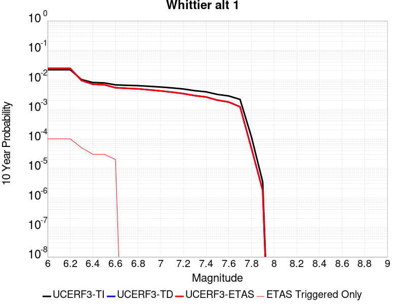 |

| Magnitude | 1 wk TI Prob | 1 wk TD Prob | 1 wk ETAS Prob | 1 wk ETAS/TD Gain | 1 wk ETAS Triggered Only | 1 mo TI Prob | 1 mo TD Prob | 1 mo ETAS Prob | 1 mo ETAS/TD Gain | 1 mo ETAS Triggered Only | 1 yr TI Prob | 1 yr TD Prob | 1 yr ETAS Prob | 1 yr ETAS/TD Gain | 1 yr ETAS Triggered Only | 10 yr TI Prob | 10 yr TD Prob | 10 yr ETAS Prob | 10 yr ETAS/TD Gain | 10 yr ETAS Triggered Only |
|-----|-----|-----|-----|-----|-----|-----|-----|-----|-----|-----|-----|-----|-----|-----|-----|-----|-----|-----|-----|-----|
| 6.0 | 4.2554693E-5 | 4.725218E-5 | 1.1006328E-4 | 2.3292742 | 6.281407E-5 | 1.8236451E-4 | 2.0249544E-4 | 2.6529678E-4 | 1.3101372 | 6.281407E-5 | 0.002218027 | 0.0024629154 | 0.0025381066 | 1.0305294 | 7.537688E-5 | 0.02196019 | 0.024390234 | 0.024488285 | 1.0040201 | 1.0050251E-4 |
| 6.1 | 4.2554693E-5 | 4.725218E-5 | 1.1006328E-4 | 2.3292742 | 6.281407E-5 | 1.8236451E-4 | 2.0249544E-4 | 2.6529678E-4 | 1.3101372 | 6.281407E-5 | 0.002218027 | 0.0024629154 | 0.0025381066 | 1.0305294 | 7.537688E-5 | 0.02196019 | 0.024390234 | 0.024488285 | 1.0040201 | 1.0050251E-4 |
| 6.2 | 4.2554693E-5 | 4.725218E-5 | 1.1006328E-4 | 2.3292742 | 6.281407E-5 | 1.8236451E-4 | 2.0249544E-4 | 2.6529678E-4 | 1.3101372 | 6.281407E-5 | 0.002218027 | 0.0024629154 | 0.0025381066 | 1.0305294 | 7.537688E-5 | 0.02196019 | 0.024390234 | 0.024488285 | 1.0040201 | 1.0050251E-4 |
| 6.3 | 1.9617712E-5 | 1.8268593E-5 | 4.339376E-5 | 2.3753204 | 2.5125628E-5 | 8.40732E-5 | 7.829172E-5 | 1.0341538E-4 | 1.320898 | 2.5125628E-5 | 0.0010231105 | 9.52804E-4 | 9.904566E-4 | 1.0395176 | 3.768844E-5 | 0.01018413 | 0.009490474 | 0.009552692 | 1.0065558 | 6.281407E-5 |
| 6.4 | 1.5611336E-5 | 1.3604271E-5 | 2.6166914E-5 | 1.9234338 | 1.2562814E-5 | 6.690401E-5 | 5.8302747E-5 | 7.086483E-5 | 1.2154629 | 1.2562814E-5 | 8.142519E-4 | 7.0961076E-4 | 7.347186E-4 | 1.0353825 | 2.5125628E-5 | 0.008112748 | 0.0070754145 | 0.0071128365 | 1.005289 | 3.768844E-5 |
| 6.5 | 1.5150166E-5 | 1.3100925E-5 | 2.5663574E-5 | 1.9589132 | 1.2562814E-5 | 6.492767E-5 | 5.6145647E-5 | 6.8707755E-5 | 1.2237414 | 1.2562814E-5 | 7.9020765E-4 | 6.8336475E-4 | 7.084732E-4 | 1.0367424 | 2.5125628E-5 | 0.007874036 | 0.0068145846 | 0.0068520163 | 1.0054929 | 3.768844E-5 |
| 6.6 | 1.295588E-5 | 1.0380725E-5 | 1.0380725E-5 | 1.0 | 0.0 | 5.552402E-5 | 4.4488075E-5 | 4.4488075E-5 | 1.0 | 0.0 | 6.7579525E-4 | 5.4150965E-4 | 5.540657E-4 | 1.023187 | 1.2562814E-5 | 0.006737438 | 0.0054033357 | 0.0054283254 | 1.0046248 | 2.5125628E-5 |
| 6.7 | 1.2542085E-5 | 9.899369E-6 | 9.899369E-6 | 1.0 | 0.0 | 5.3750682E-5 | 4.242519E-5 | 4.242519E-5 | 1.0 | 0.0 | 6.542181E-4 | 5.164061E-4 | 5.164061E-4 | 1.0 | 0.0 | 0.006522954 | 0.0051534795 | 0.0051534795 | 1.0 | 0.0 |
| 6.8 | 1.2195878E-5 | 9.495415E-6 | 9.495415E-6 | 1.0 | 0.0 | 5.2267E-5 | 4.069401E-5 | 4.069401E-5 | 1.0 | 0.0 | 6.36165E-4 | 4.9533875E-4 | 4.9533875E-4 | 1.0 | 0.0 | 0.0063434686 | 0.004943688 | 0.004943688 | 1.0 | 0.0 |
| 6.9 | 1.1580298E-5 | 8.772933E-6 | 8.772933E-6 | 1.0 | 0.0 | 4.9628903E-5 | 3.7597754E-5 | 3.7597754E-5 | 1.0 | 0.0 | 6.040644E-4 | 4.5765814E-4 | 4.5765814E-4 | 1.0 | 0.0 | 0.00602425 | 0.0045684157 | 0.0045684157 | 1.0 | 0.0 |
| 7.0 | 1.0964795E-5 | 8.083994E-6 | 8.083994E-6 | 1.0 | 0.0 | 4.6991136E-5 | 3.4645236E-5 | 3.4645236E-5 | 1.0 | 0.0 | 5.7196687E-4 | 4.2172565E-4 | 4.2172565E-4 | 1.0 | 0.0 | 0.0057049696 | 0.004210462 | 0.004210462 | 1.0 | 0.0 |
| 7.1 | 1.0230601E-5 | 7.3266697E-6 | 7.3266697E-6 | 1.0 | 0.0 | 4.3844695E-5 | 3.1399642E-5 | 3.1399642E-5 | 1.0 | 0.0 | 5.336784E-4 | 3.8222488E-4 | 3.8222488E-4 | 1.0 | 0.0 | 0.005323986 | 0.0038168381 | 0.0038168381 | 1.0 | 0.0 |
| 7.2 | 9.40865E-6 | 6.543289E-6 | 6.543289E-6 | 1.0 | 0.0 | 4.032216E-5 | 2.8042374E-5 | 2.8042374E-5 | 1.0 | 0.0 | 4.908117E-4 | 3.4136363E-4 | 3.4136363E-4 | 1.0 | 0.0 | 0.0048972913 | 0.003409485 | 0.003409485 | 1.0 | 0.0 |
| 7.3 | 8.237384E-6 | 5.5977525E-6 | 5.5977525E-6 | 1.0 | 0.0 | 3.5302593E-5 | 2.3990153E-5 | 2.3990153E-5 | 1.0 | 0.0 | 4.2972428E-4 | 2.92042E-4 | 2.92042E-4 | 1.0 | 0.0 | 0.0042889426 | 0.002916903 | 0.002916903 | 1.0 | 0.0 |
| 7.4 | 7.5316966E-6 | 5.027819E-6 | 5.027819E-6 | 1.0 | 0.0 | 3.2278298E-5 | 2.1547625E-5 | 2.1547625E-5 | 1.0 | 0.0 | 3.9291743E-4 | 2.6231175E-4 | 2.6231175E-4 | 1.0 | 0.0 | 0.0039222343 | 0.0026201333 | 0.0026201333 | 1.0 | 0.0 |
| 7.5 | 6.149649E-6 | 3.933841E-6 | 3.933841E-6 | 1.0 | 0.0 | 2.6355372E-5 | 1.6859214E-5 | 1.6859214E-5 | 1.0 | 0.0 | 3.208294E-4 | 2.052425E-4 | 2.052425E-4 | 1.0 | 0.0 | 0.003203666 | 0.0020506186 | 0.0020506186 | 1.0 | 0.0 |
| 7.6 | 5.457711E-6 | 3.3953788E-6 | 3.3953788E-6 | 1.0 | 0.0 | 2.338998E-5 | 1.4551547E-5 | 1.4551547E-5 | 1.0 | 0.0 | 2.8473578E-4 | 1.771515E-4 | 1.771515E-4 | 1.0 | 0.0 | 0.0028437122 | 0.0017701836 | 0.0017701836 | 1.0 | 0.0 |
| 7.7 | 4.1676276E-6 | 2.3331952E-6 | 2.3331952E-6 | 1.0 | 0.0 | 1.7861139E-5 | 9.999374E-6 | 9.999374E-6 | 1.0 | 0.0 | 2.1743766E-4 | 1.2173632E-4 | 1.2173632E-4 | 1.0 | 0.0 | 0.0021722503 | 0.0012167693 | 0.0012167693 | 1.0 | 0.0 |
| 7.8 | 2.2692414E-7 | 9.3854695E-8 | 9.3854695E-8 | 1.0 | 0.0 | 9.725317E-7 | 4.0223435E-7 | 4.0223435E-7 | 1.0 | 0.0 | 1.1840509E-5 | 4.8971956E-6 | 4.8971956E-6 | 1.0 | 0.0 | 1.1839878E-4 | 4.8971204E-5 | 4.8971204E-5 | 1.0 | 0.0 |
| 7.9 | 6.676829E-9 | 3.439853E-9 | 3.439853E-9 | 1.0 | 0.0 | 2.861498E-8 | 1.4742227E-8 | 1.4742227E-8 | 1.0 | 0.0 | 3.4838732E-7 | 1.7948659E-7 | 1.7948659E-7 | 1.0 | 0.0 | 3.4838679E-6 | 1.7948646E-6 | 1.7948646E-6 | 1.0 | 0.0 |

## Great Valley 09 (Laguna Seca)
*[(top)](#table-of-contents)*

| 1 Week | 1 Month | 1 Year | 10 Year |
|-----|-----|-----|-----|
|  |  |  |  |

| Magnitude | 1 wk TI Prob | 1 wk TD Prob | 1 wk ETAS Prob | 1 wk ETAS/TD Gain | 1 wk ETAS Triggered Only | 1 mo TI Prob | 1 mo TD Prob | 1 mo ETAS Prob | 1 mo ETAS/TD Gain | 1 mo ETAS Triggered Only | 1 yr TI Prob | 1 yr TD Prob | 1 yr ETAS Prob | 1 yr ETAS/TD Gain | 1 yr ETAS Triggered Only | 10 yr TI Prob | 10 yr TD Prob | 10 yr ETAS Prob | 10 yr ETAS/TD Gain | 10 yr ETAS Triggered Only |
|-----|-----|-----|-----|-----|-----|-----|-----|-----|-----|-----|-----|-----|-----|-----|-----|-----|-----|-----|-----|-----|
| 6.0 | 5.4353277E-5 | 7.05022E-5 | 7.05022E-5 | 1.0 | 0.0 | 2.3292181E-4 | 3.0211566E-4 | 3.0211566E-4 | 1.0 | 0.0 | 0.0028321352 | 0.0036721937 | 0.003709744 | 1.0102255 | 3.768844E-5 | 0.02796312 | 0.03611547 | 0.036188126 | 1.0020118 | 7.537688E-5 |
| 6.1 | 4.5578287E-5 | 5.822118E-5 | 5.822118E-5 | 1.0 | 0.0 | 1.953209E-4 | 2.4949326E-4 | 2.4949326E-4 | 1.0 | 0.0 | 0.0023754383 | 0.003033432 | 0.0030584815 | 1.0082577 | 2.5125628E-5 | 0.023502063 | 0.029919548 | 0.029980483 | 1.0020366 | 6.281407E-5 |
| 6.2 | 2.8536782E-5 | 3.4737273E-5 | 3.4737273E-5 | 1.0 | 0.0 | 1.2229476E-4 | 1.4886224E-4 | 1.4886224E-4 | 1.0 | 0.0 | 0.0014879217 | 0.001810813 | 0.001823353 | 1.0069251 | 1.2562814E-5 | 0.014779986 | 0.017958116 | 0.018007465 | 1.002748 | 5.0251256E-5 |
| 6.3 | 2.3698774E-5 | 2.8213295E-5 | 2.8213295E-5 | 1.0 | 0.0 | 1.01562226E-4 | 1.20905075E-4 | 1.20905075E-4 | 1.0 | 0.0 | 0.0012358186 | 0.0014710218 | 0.0014835661 | 1.0085276 | 1.2562814E-5 | 0.012289686 | 0.014611342 | 0.014648479 | 1.0025417 | 3.768844E-5 |
| 6.4 | 1.9191197E-5 | 2.2123184E-5 | 2.2123184E-5 | 1.0 | 0.0 | 8.2245395E-5 | 9.4806666E-5 | 9.4806666E-5 | 1.0 | 0.0 | 0.0010008777 | 0.0011536429 | 0.0011661912 | 1.0108771 | 1.2562814E-5 | 0.009963818 | 0.011476948 | 0.011514204 | 1.0032462 | 3.768844E-5 |
| 6.5 | 1.5203241E-5 | 1.6802203E-5 | 1.6802203E-5 | 1.0 | 0.0 | 6.5155116E-5 | 7.200386E-5 | 7.200386E-5 | 1.0 | 0.0 | 7.9297484E-4 | 8.7626575E-4 | 8.888176E-4 | 1.0143242 | 1.2562814E-5 | 0.007901512 | 0.0087295165 | 0.0087668765 | 1.0042796 | 3.768844E-5 |
| 6.6 | 1.0984925E-5 | 1.1242595E-5 | 1.1242595E-5 | 1.0 | 0.0 | 4.70774E-5 | 4.8181686E-5 | 4.8181686E-5 | 1.0 | 0.0 | 5.730166E-4 | 5.8645656E-4 | 5.8645656E-4 | 1.0 | 0.0 | 0.005715413 | 0.0058494853 | 0.005861975 | 1.0021352 | 1.2562814E-5 |
| 6.7 | 9.134616E-6 | 9.019894E-6 | 9.019894E-6 | 1.0 | 0.0 | 3.9147766E-5 | 3.865613E-5 | 3.865613E-5 | 1.0 | 0.0 | 4.7651984E-4 | 4.7053912E-4 | 4.7053912E-4 | 1.0 | 0.0 | 0.004754993 | 0.0046956735 | 0.0046956735 | 1.0 | 0.0 |
| 6.8 | 7.785589E-6 | 7.4519444E-6 | 7.4519444E-6 | 1.0 | 0.0 | 3.3366385E-5 | 3.1936524E-5 | 3.1936524E-5 | 1.0 | 0.0 | 4.0616E-4 | 3.8875983E-4 | 3.8875983E-4 | 1.0 | 0.0 | 0.0040541845 | 0.0038810016 | 0.0038810016 | 1.0 | 0.0 |
| 6.9 | 5.579095E-6 | 4.898492E-6 | 4.898492E-6 | 1.0 | 0.0 | 2.3910188E-5 | 2.0993377E-5 | 2.0993377E-5 | 1.0 | 0.0 | 2.9106764E-4 | 2.5556577E-4 | 2.5556577E-4 | 1.0 | 0.0 | 0.002906867 | 0.002552856 | 0.002552856 | 1.0 | 0.0 |
| 7.0 | 2.6816688E-6 | 1.5216126E-6 | 1.5216126E-6 | 1.0 | 0.0 | 1.1492816E-5 | 6.521181E-6 | 6.521181E-6 | 1.0 | 0.0 | 1.3991605E-4 | 7.939258E-5 | 7.939258E-5 | 1.0 | 0.0 | 0.0013982799 | 7.9365086E-4 | 7.9365086E-4 | 1.0 | 0.0 |
| 7.1 | 1.9951021E-6 | 7.453827E-7 | 7.453827E-7 | 1.0 | 0.0 | 8.55041E-6 | 3.1944935E-6 | 3.1944935E-6 | 1.0 | 0.0 | 1.0409627E-4 | 3.8892307E-5 | 3.8892307E-5 | 1.0 | 0.0 | 0.0010404752 | 3.8885913E-4 | 3.8885913E-4 | 1.0 | 0.0 |
| 7.2 | 1.9951021E-6 | 7.453827E-7 | 7.453827E-7 | 1.0 | 0.0 | 8.55041E-6 | 3.1944935E-6 | 3.1944935E-6 | 1.0 | 0.0 | 1.0409627E-4 | 3.8892307E-5 | 3.8892307E-5 | 1.0 | 0.0 | 0.0010404752 | 3.8885913E-4 | 3.8885913E-4 | 1.0 | 0.0 |
| 7.3 | 1.7087556E-6 | 6.578881E-7 | 6.578881E-7 | 1.0 | 0.0 | 7.3232177E-6 | 2.8195177E-6 | 2.8195177E-6 | 1.0 | 0.0 | 8.915652E-5 | 3.4327128E-5 | 3.4327128E-5 | 1.0 | 0.0 | 8.9120766E-4 | 3.432223E-4 | 3.432223E-4 | 1.0 | 0.0 |
| 7.4 | 1.3804846E-6 | 6.073852E-7 | 6.073852E-7 | 1.0 | 0.0 | 5.916349E-6 | 2.6030768E-6 | 2.6030768E-6 | 1.0 | 0.0 | 7.2029165E-5 | 3.169204E-5 | 3.169204E-5 | 1.0 | 0.0 | 7.200583E-4 | 3.1687922E-4 | 3.1687922E-4 | 1.0 | 0.0 |
| 7.5 | 1.3804846E-6 | 6.073852E-7 | 6.073852E-7 | 1.0 | 0.0 | 5.916349E-6 | 2.6030768E-6 | 2.6030768E-6 | 1.0 | 0.0 | 7.2029165E-5 | 3.169204E-5 | 3.169204E-5 | 1.0 | 0.0 | 7.200583E-4 | 3.1687922E-4 | 3.1687922E-4 | 1.0 | 0.0 |

## Pine Mtn
*[(top)](#table-of-contents)*

| 1 Week | 1 Month | 1 Year | 10 Year |
|-----|-----|-----|-----|
|  |  |  |  |

| Magnitude | 1 wk TI Prob | 1 wk TD Prob | 1 wk ETAS Prob | 1 wk ETAS/TD Gain | 1 wk ETAS Triggered Only | 1 mo TI Prob | 1 mo TD Prob | 1 mo ETAS Prob | 1 mo ETAS/TD Gain | 1 mo ETAS Triggered Only | 1 yr TI Prob | 1 yr TD Prob | 1 yr ETAS Prob | 1 yr ETAS/TD Gain | 1 yr ETAS Triggered Only | 10 yr TI Prob | 10 yr TD Prob | 10 yr ETAS Prob | 10 yr ETAS/TD Gain | 10 yr ETAS Triggered Only |
|-----|-----|-----|-----|-----|-----|-----|-----|-----|-----|-----|-----|-----|-----|-----|-----|-----|-----|-----|-----|-----|
| 6.0 | 6.894797E-6 | 7.225461E-6 | 1.9788185E-5 | 2.7386742 | 1.2562814E-5 | 2.9548795E-5 | 3.096591E-5 | 5.609076E-5 | 1.8113712 | 2.5125628E-5 | 3.596972E-4 | 3.7694772E-4 | 4.1462196E-4 | 1.0999455 | 3.768844E-5 | 0.0035911554 | 0.003763381 | 0.0038509897 | 1.0232793 | 8.79397E-5 |
| 6.1 | 6.894797E-6 | 7.225461E-6 | 1.9788185E-5 | 2.7386742 | 1.2562814E-5 | 2.9548795E-5 | 3.096591E-5 | 5.609076E-5 | 1.8113712 | 2.5125628E-5 | 3.596972E-4 | 3.7694772E-4 | 4.1462196E-4 | 1.0999455 | 3.768844E-5 | 0.0035911554 | 0.003763381 | 0.0038509897 | 1.0232793 | 8.79397E-5 |
| 6.2 | 6.894797E-6 | 7.225461E-6 | 1.9788185E-5 | 2.7386742 | 1.2562814E-5 | 2.9548795E-5 | 3.096591E-5 | 5.609076E-5 | 1.8113712 | 2.5125628E-5 | 3.596972E-4 | 3.7694772E-4 | 4.1462196E-4 | 1.0999455 | 3.768844E-5 | 0.0035911554 | 0.003763381 | 0.0038509897 | 1.0232793 | 8.79397E-5 |
| 6.3 | 6.894797E-6 | 7.225461E-6 | 1.9788185E-5 | 2.7386742 | 1.2562814E-5 | 2.9548795E-5 | 3.096591E-5 | 5.609076E-5 | 1.8113712 | 2.5125628E-5 | 3.596972E-4 | 3.7694772E-4 | 4.1462196E-4 | 1.0999455 | 3.768844E-5 | 0.0035911554 | 0.003763381 | 0.0038509897 | 1.0232793 | 8.79397E-5 |
| 6.4 | 6.894797E-6 | 7.225461E-6 | 1.9788185E-5 | 2.7386742 | 1.2562814E-5 | 2.9548795E-5 | 3.096591E-5 | 5.609076E-5 | 1.8113712 | 2.5125628E-5 | 3.596972E-4 | 3.7694772E-4 | 4.1462196E-4 | 1.0999455 | 3.768844E-5 | 0.0035911554 | 0.003763381 | 0.0038509897 | 1.0232793 | 8.79397E-5 |
| 6.5 | 6.894797E-6 | 7.225461E-6 | 1.9788185E-5 | 2.7386742 | 1.2562814E-5 | 2.9548795E-5 | 3.096591E-5 | 5.609076E-5 | 1.8113712 | 2.5125628E-5 | 3.596972E-4 | 3.7694772E-4 | 4.1462196E-4 | 1.0999455 | 3.768844E-5 | 0.0035911554 | 0.003763381 | 0.0038509897 | 1.0232793 | 8.79397E-5 |
| 6.6 | 6.894797E-6 | 7.225461E-6 | 1.9788185E-5 | 2.7386742 | 1.2562814E-5 | 2.9548795E-5 | 3.096591E-5 | 5.609076E-5 | 1.8113712 | 2.5125628E-5 | 3.596972E-4 | 3.7694772E-4 | 4.1462196E-4 | 1.0999455 | 3.768844E-5 | 0.0035911554 | 0.003763381 | 0.0038509897 | 1.0232793 | 8.79397E-5 |
| 6.7 | 6.0867933E-6 | 6.3971133E-6 | 1.8959847E-5 | 2.9638128 | 1.2562814E-5 | 2.6085996E-5 | 2.7415923E-5 | 3.9978393E-5 | 1.458218 | 1.2562814E-5 | 3.1755073E-4 | 3.3373994E-4 | 3.5885719E-4 | 1.0752599 | 2.5125628E-5 | 0.0031709734 | 0.0033326065 | 0.0033952112 | 1.0187855 | 6.281407E-5 |
| 6.8 | 5.6530425E-6 | 5.9505956E-6 | 1.8513334E-5 | 3.1111734 | 1.2562814E-5 | 2.42271E-5 | 2.5502315E-5 | 3.806481E-5 | 1.4926021 | 1.2562814E-5 | 2.94925E-4 | 3.104485E-4 | 3.3556632E-4 | 1.0809082 | 2.5125628E-5 | 0.002945339 | 0.0031003528 | 0.0031629722 | 1.0201975 | 6.281407E-5 |
| 6.9 | 4.6015225E-6 | 4.863834E-6 | 1.7426588E-5 | 3.582891 | 1.2562814E-5 | 1.9720663E-5 | 2.0844845E-5 | 3.3407396E-5 | 1.6026695 | 1.2562814E-5 | 2.4007261E-4 | 2.5375787E-4 | 2.663175E-4 | 1.0494945 | 1.2562814E-5 | 0.0023981342 | 0.0025348254 | 0.0025849494 | 1.0197741 | 5.0251256E-5 |
| 7.0 | 4.4875965E-6 | 4.747473E-6 | 1.7310227E-5 | 3.646198 | 1.2562814E-5 | 1.9232413E-5 | 2.0346162E-5 | 3.290872E-5 | 1.6174412 | 1.2562814E-5 | 2.3412947E-4 | 2.4768783E-4 | 2.6024753E-4 | 1.0507078 | 1.2562814E-5 | 0.0023388295 | 0.0024742614 | 0.0025243883 | 1.0202594 | 5.0251256E-5 |
| 7.1 | 3.203907E-6 | 3.4294096E-6 | 3.4294096E-6 | 1.0 | 0.0 | 1.3730958E-5 | 1.4697391E-5 | 1.4697391E-5 | 1.0 | 0.0 | 1.6716159E-4 | 1.789267E-4 | 1.789267E-4 | 1.0 | 0.0 | 0.0016703589 | 0.0017878925 | 0.0018255136 | 1.0210421 | 3.768844E-5 |
| 7.2 | 2.2060601E-6 | 2.3784817E-6 | 2.3784817E-6 | 1.0 | 0.0 | 9.4545085E-6 | 1.0193455E-5 | 1.0193455E-5 | 1.0 | 0.0 | 1.15102564E-4 | 1.240987E-4 | 1.240987E-4 | 1.0 | 0.0 | 0.0011504296 | 0.0012403389 | 0.0012654334 | 1.020232 | 2.5125628E-5 |
| 7.3 | 1.3765207E-6 | 1.5216481E-6 | 1.5216481E-6 | 1.0 | 0.0 | 5.899361E-6 | 6.521333E-6 | 6.521333E-6 | 1.0 | 0.0 | 7.182235E-5 | 7.939443E-5 | 7.939443E-5 | 1.0 | 0.0 | 7.1799144E-4 | 7.936697E-4 | 8.062226E-4 | 1.0158162 | 1.2562814E-5 |
| 7.4 | 1.1245983E-6 | 1.2587075E-6 | 1.2587075E-6 | 1.0 | 0.0 | 4.819698E-6 | 5.39445E-6 | 5.39445E-6 | 1.0 | 0.0 | 5.8678244E-5 | 6.567554E-5 | 6.567554E-5 | 1.0 | 0.0 | 5.866275E-4 | 6.5656955E-4 | 6.5656955E-4 | 1.0 | 0.0 |
| 7.5 | 8.031682E-7 | 9.276951E-7 | 9.276951E-7 | 1.0 | 0.0 | 3.4421448E-6 | 3.9758306E-6 | 3.9758306E-6 | 1.0 | 0.0 | 4.1907308E-5 | 4.840473E-5 | 4.840473E-5 | 1.0 | 0.0 | 4.1899405E-4 | 4.8394862E-4 | 4.8394862E-4 | 1.0 | 0.0 |
| 7.6 | 4.8953444E-7 | 6.003009E-7 | 6.003009E-7 | 1.0 | 0.0 | 2.098003E-6 | 2.5727159E-6 | 2.5727159E-6 | 1.0 | 0.0 | 2.5542888E-5 | 3.1322415E-5 | 3.1322415E-5 | 1.0 | 0.0 | 2.5539953E-4 | 3.1318486E-4 | 3.1318486E-4 | 1.0 | 0.0 |
| 7.7 | 6.634529E-8 | 6.788826E-8 | 6.788826E-8 | 1.0 | 0.0 | 2.843369E-7 | 2.9094966E-7 | 2.9094966E-7 | 1.0 | 0.0 | 3.4617963E-6 | 3.5423066E-6 | 3.5423066E-6 | 1.0 | 0.0 | 3.4617424E-5 | 3.542255E-5 | 3.542255E-5 | 1.0 | 0.0 |
| 7.8 | 9.235578E-9 | 9.488566E-9 | 9.488566E-9 | 1.0 | 0.0 | 3.9581046E-8 | 4.0665284E-8 | 4.0665284E-8 | 1.0 | 0.0 | 4.818991E-7 | 4.950997E-7 | 4.950997E-7 | 1.0 | 0.0 | 4.8189804E-6 | 4.950988E-6 | 4.950988E-6 | 1.0 | 0.0 |

## Lost Hills
*[(top)](#table-of-contents)*

| 1 Week | 1 Month | 1 Year | 10 Year |
|-----|-----|-----|-----|
|  |  |  |  |

| Magnitude | 1 wk TI Prob | 1 wk TD Prob | 1 wk ETAS Prob | 1 wk ETAS/TD Gain | 1 wk ETAS Triggered Only | 1 mo TI Prob | 1 mo TD Prob | 1 mo ETAS Prob | 1 mo ETAS/TD Gain | 1 mo ETAS Triggered Only | 1 yr TI Prob | 1 yr TD Prob | 1 yr ETAS Prob | 1 yr ETAS/TD Gain | 1 yr ETAS Triggered Only | 10 yr TI Prob | 10 yr TD Prob | 10 yr ETAS Prob | 10 yr ETAS/TD Gain | 10 yr ETAS Triggered Only |
|-----|-----|-----|-----|-----|-----|-----|-----|-----|-----|-----|-----|-----|-----|-----|-----|-----|-----|-----|-----|-----|
| 6.0 | 2.233523E-5 | 2.5106583E-5 | 5.0231578E-5 | 2.0007334 | 2.5125628E-5 | 9.571891E-5 | 1.0759615E-4 | 1.3271907E-4 | 1.2334927 | 2.5125628E-5 | 0.0011647546 | 0.001309364 | 0.0013595495 | 1.0383282 | 5.0251256E-5 | 0.011586686 | 0.013033091 | 0.013119884 | 1.0066595 | 8.79397E-5 |
| 6.1 | 2.233523E-5 | 2.5106583E-5 | 5.0231578E-5 | 2.0007334 | 2.5125628E-5 | 9.571891E-5 | 1.0759615E-4 | 1.3271907E-4 | 1.2334927 | 2.5125628E-5 | 0.0011647546 | 0.001309364 | 0.0013595495 | 1.0383282 | 5.0251256E-5 | 0.011586686 | 0.013033091 | 0.013119884 | 1.0066595 | 8.79397E-5 |
| 6.2 | 2.233523E-5 | 2.5106583E-5 | 5.0231578E-5 | 2.0007334 | 2.5125628E-5 | 9.571891E-5 | 1.0759615E-4 | 1.3271907E-4 | 1.2334927 | 2.5125628E-5 | 0.0011647546 | 0.001309364 | 0.0013595495 | 1.0383282 | 5.0251256E-5 | 0.011586686 | 0.013033091 | 0.013119884 | 1.0066595 | 8.79397E-5 |
| 6.3 | 2.233523E-5 | 2.5106583E-5 | 5.0231578E-5 | 2.0007334 | 2.5125628E-5 | 9.571891E-5 | 1.0759615E-4 | 1.3271907E-4 | 1.2334927 | 2.5125628E-5 | 0.0011647546 | 0.001309364 | 0.0013595495 | 1.0383282 | 5.0251256E-5 | 0.011586686 | 0.013033091 | 0.013119884 | 1.0066595 | 8.79397E-5 |
| 6.4 | 1.2288092E-5 | 1.3781108E-5 | 2.6343749E-5 | 1.9115843 | 1.2562814E-5 | 5.2662188E-5 | 5.906108E-5 | 7.162315E-5 | 1.2126963 | 1.2562814E-5 | 6.409735E-4 | 7.189252E-4 | 7.440328E-4 | 1.0349238 | 2.5125628E-5 | 0.006391279 | 0.0071752006 | 0.0072250916 | 1.0069532 | 5.0251256E-5 |
| 6.5 | 1.2288092E-5 | 1.3781108E-5 | 2.6343749E-5 | 1.9115843 | 1.2562814E-5 | 5.2662188E-5 | 5.906108E-5 | 7.162315E-5 | 1.2126963 | 1.2562814E-5 | 6.409735E-4 | 7.189252E-4 | 7.440328E-4 | 1.0349238 | 2.5125628E-5 | 0.006391279 | 0.0071752006 | 0.0072250916 | 1.0069532 | 5.0251256E-5 |
| 6.6 | 8.58281E-6 | 9.63377E-6 | 2.2196464E-5 | 2.3040266 | 1.2562814E-5 | 3.6782953E-5 | 4.12874E-5 | 5.3849697E-5 | 1.3042647 | 1.2562814E-5 | 4.4774043E-4 | 5.026414E-4 | 5.2775437E-4 | 1.049962 | 2.5125628E-5 | 0.0044683935 | 0.005023205 | 0.0050607044 | 1.0074651 | 3.768844E-5 |
| 6.7 | 7.205685E-6 | 8.088302E-6 | 2.0651014E-5 | 2.5531952 | 1.2562814E-5 | 3.088114E-5 | 3.466415E-5 | 4.7226527E-5 | 1.3624026 | 1.2562814E-5 | 3.7591302E-4 | 4.2203604E-4 | 4.3459353E-4 | 1.0297546 | 1.2562814E-5 | 0.0037527776 | 0.0042203604 | 0.00424538 | 1.0059283 | 2.5125628E-5 |

## San Diego Trough north alt1
*[(top)](#table-of-contents)*

| 1 Week | 1 Month | 1 Year | 10 Year |
|-----|-----|-----|-----|
| 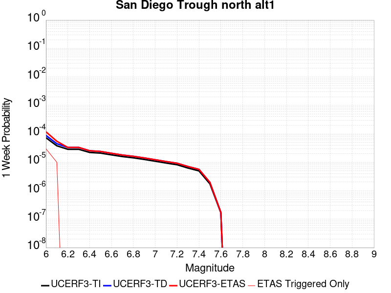 |  |  |  |

| Magnitude | 1 wk TI Prob | 1 wk TD Prob | 1 wk ETAS Prob | 1 wk ETAS/TD Gain | 1 wk ETAS Triggered Only | 1 mo TI Prob | 1 mo TD Prob | 1 mo ETAS Prob | 1 mo ETAS/TD Gain | 1 mo ETAS Triggered Only | 1 yr TI Prob | 1 yr TD Prob | 1 yr ETAS Prob | 1 yr ETAS/TD Gain | 1 yr ETAS Triggered Only | 10 yr TI Prob | 10 yr TD Prob | 10 yr ETAS Prob | 10 yr ETAS/TD Gain | 10 yr ETAS Triggered Only |
|-----|-----|-----|-----|-----|-----|-----|-----|-----|-----|-----|-----|-----|-----|-----|-----|-----|-----|-----|-----|-----|
| 6.0 | 7.329252E-5 | 8.821093E-5 | 1.1333434E-4 | 1.2848107 | 2.5125628E-5 | 3.14073E-4 | 3.7799572E-4 | 4.156699E-4 | 1.0996683 | 3.768844E-5 | 0.0038171355 | 0.004593027 | 0.0046305424 | 1.0081679 | 3.768844E-5 | 0.03752231 | 0.045044992 | 0.045128968 | 1.0018643 | 8.79397E-5 |
| 6.1 | 3.7940346E-5 | 4.4885E-5 | 4.4885E-5 | 1.0 | 0.0 | 1.6259136E-4 | 1.9235066E-4 | 1.9235066E-4 | 1.0 | 0.0 | 0.0019777524 | 0.0023394432 | 0.0023394432 | 1.0 | 0.0 | 0.019602431 | 0.023156688 | 0.023168959 | 1.00053 | 1.2562814E-5 |
| 6.2 | 2.8645263E-5 | 3.329678E-5 | 3.329678E-5 | 1.0 | 0.0 | 1.2275964E-4 | 1.4269284E-4 | 1.4269284E-4 | 1.0 | 0.0 | 0.0014935739 | 0.0017359189 | 0.0017359189 | 1.0 | 0.0 | 0.0148357535 | 0.017226247 | 0.017238595 | 1.0007167 | 1.2562814E-5 |
| 6.3 | 2.8645263E-5 | 3.329678E-5 | 3.329678E-5 | 1.0 | 0.0 | 1.2275964E-4 | 1.4269284E-4 | 1.4269284E-4 | 1.0 | 0.0 | 0.0014935739 | 0.0017359189 | 0.0017359189 | 1.0 | 0.0 | 0.0148357535 | 0.017226247 | 0.017238595 | 1.0007167 | 1.2562814E-5 |
| 6.4 | 2.2204576E-5 | 2.5448318E-5 | 2.5448318E-5 | 1.0 | 0.0 | 9.5159E-5 | 1.0905972E-4 | 1.0905972E-4 | 1.0 | 0.0 | 0.001157945 | 0.0013270034 | 0.0013270034 | 1.0 | 0.0 | 0.011519298 | 0.013191955 | 0.013204352 | 1.0009397 | 1.2562814E-5 |
| 6.5 | 2.1004838E-5 | 2.4024694E-5 | 2.4024694E-5 | 1.0 | 0.0 | 9.0017624E-5 | 1.0295896E-4 | 1.0295896E-4 | 1.0 | 0.0 | 0.0010954136 | 0.0012528138 | 0.0012528138 | 1.0 | 0.0 | 0.010900296 | 0.012458589 | 0.012470995 | 1.0009958 | 1.2562814E-5 |
| 6.6 | 1.820557E-5 | 2.0704787E-5 | 2.0704787E-5 | 1.0 | 0.0 | 7.802154E-5 | 8.873181E-5 | 8.873181E-5 | 1.0 | 0.0 | 9.4949827E-4 | 0.0010797799 | 0.0010797799 | 1.0 | 0.0 | 0.009454516 | 0.010746004 | 0.010758432 | 1.0011564 | 1.2562814E-5 |
| 6.7 | 1.5884485E-5 | 1.7983646E-5 | 1.7983646E-5 | 1.0 | 0.0 | 6.807459E-5 | 7.707051E-5 | 7.707051E-5 | 1.0 | 0.0 | 8.284929E-4 | 9.3793223E-4 | 9.3793223E-4 | 1.0 | 0.0 | 0.008254109 | 0.009340104 | 0.009340104 | 1.0 | 0.0 |
| 6.8 | 1.4331171E-5 | 1.6201066E-5 | 1.6201066E-5 | 1.0 | 0.0 | 6.141786E-5 | 6.94313E-5 | 6.94313E-5 | 1.0 | 0.0 | 7.4750587E-4 | 8.450002E-4 | 8.450002E-4 | 1.0 | 0.0 | 0.0074499645 | 0.008418139 | 0.008418139 | 1.0 | 0.0 |
| 6.9 | 1.2574203E-5 | 1.4205835E-5 | 1.4205835E-5 | 1.0 | 0.0 | 5.3888325E-5 | 6.0880735E-5 | 6.0880735E-5 | 1.0 | 0.0 | 6.558929E-4 | 7.409723E-4 | 7.409723E-4 | 1.0 | 0.0 | 0.0065396037 | 0.007385203 | 0.007385203 | 1.0 | 0.0 |
| 7.0 | 1.0883844E-5 | 1.2289262E-5 | 1.2289262E-5 | 1.0 | 0.0 | 4.664421E-5 | 5.2667205E-5 | 5.2667205E-5 | 1.0 | 0.0 | 5.677453E-4 | 6.4103556E-4 | 6.4103556E-4 | 1.0 | 0.0 | 0.00566297 | 0.006391993 | 0.006391993 | 1.0 | 0.0 |
| 7.1 | 9.393088E-6 | 1.060702E-5 | 1.060702E-5 | 1.0 | 0.0 | 4.025547E-5 | 4.545787E-5 | 4.545787E-5 | 1.0 | 0.0 | 4.900001E-4 | 5.533098E-4 | 5.533098E-4 | 1.0 | 0.0 | 0.0048892107 | 0.005519418 | 0.005519418 | 1.0 | 0.0 |
| 7.2 | 8.190791E-6 | 9.258625E-6 | 9.258625E-6 | 1.0 | 0.0 | 3.510292E-5 | 3.9679224E-5 | 3.9679224E-5 | 1.0 | 0.0 | 4.2729423E-4 | 4.8298817E-4 | 4.8298817E-4 | 1.0 | 0.0 | 0.0042647356 | 0.004819465 | 0.004819465 | 1.0 | 0.0 |
| 7.3 | 6.268162E-6 | 7.089716E-6 | 7.089716E-6 | 1.0 | 0.0 | 2.6863276E-5 | 3.0384144E-5 | 3.0384144E-5 | 1.0 | 0.0 | 3.2701128E-4 | 3.6986457E-4 | 3.6986457E-4 | 1.0 | 0.0 | 0.003265305 | 0.003692536 | 0.003692536 | 1.0 | 0.0 |
| 7.4 | 4.985186E-6 | 5.6426816E-6 | 5.6426816E-6 | 1.0 | 0.0 | 2.1364907E-5 | 2.4182698E-5 | 2.4182698E-5 | 1.0 | 0.0 | 2.600867E-4 | 2.9438498E-4 | 2.9438498E-4 | 1.0 | 0.0 | 0.002597825 | 0.0029399914 | 0.0029399914 | 1.0 | 0.0 |
| 7.5 | 1.7489613E-6 | 1.969678E-6 | 1.969678E-6 | 1.0 | 0.0 | 7.495527E-6 | 8.4414505E-6 | 8.4414505E-6 | 1.0 | 0.0 | 9.125422E-5 | 1.02770035E-4 | 1.02770035E-4 | 1.0 | 0.0 | 9.1216754E-4 | 0.0010272472 | 0.0010272472 | 1.0 | 0.0 |
| 7.6 | 1.6988751E-7 | 1.7533823E-7 | 1.7533823E-7 | 1.0 | 0.0 | 7.2808916E-7 | 7.5144936E-7 | 7.5144936E-7 | 1.0 | 0.0 | 8.864449E-6 | 9.14886E-6 | 9.14886E-6 | 1.0 | 0.0 | 8.8640954E-5 | 9.1485024E-5 | 9.1485024E-5 | 1.0 | 0.0 |

## Big Pine (Central)
*[(top)](#table-of-contents)*

| 1 Week | 1 Month | 1 Year | 10 Year |
|-----|-----|-----|-----|
|  |  |  |  |

| Magnitude | 1 wk TI Prob | 1 wk TD Prob | 1 wk ETAS Prob | 1 wk ETAS/TD Gain | 1 wk ETAS Triggered Only | 1 mo TI Prob | 1 mo TD Prob | 1 mo ETAS Prob | 1 mo ETAS/TD Gain | 1 mo ETAS Triggered Only | 1 yr TI Prob | 1 yr TD Prob | 1 yr ETAS Prob | 1 yr ETAS/TD Gain | 1 yr ETAS Triggered Only | 10 yr TI Prob | 10 yr TD Prob | 10 yr ETAS Prob | 10 yr ETAS/TD Gain | 10 yr ETAS Triggered Only |
|-----|-----|-----|-----|-----|-----|-----|-----|-----|-----|-----|-----|-----|-----|-----|-----|-----|-----|-----|-----|-----|
| 6.0 | 1.2706755E-5 | 1.4250529E-5 | 3.93758E-5 | 2.7631116 | 2.5125628E-5 | 5.4456385E-5 | 6.107247E-5 | 8.619656E-5 | 1.4113816 | 2.5125628E-5 | 6.628048E-4 | 7.433402E-4 | 7.684472E-4 | 1.0337758 | 2.5125628E-5 | 0.006608314 | 0.0074135666 | 0.007488385 | 1.010092 | 7.537688E-5 |
| 6.1 | 8.342579E-6 | 9.510762E-6 | 9.510762E-6 | 1.0 | 0.0 | 3.5753423E-5 | 4.0759893E-5 | 4.0759893E-5 | 1.0 | 0.0 | 4.3521097E-4 | 4.961604E-4 | 4.961604E-4 | 1.0 | 0.0 | 0.0043435963 | 0.0049540824 | 0.0050040847 | 1.0100931 | 5.0251256E-5 |
| 6.2 | 6.923899E-6 | 7.967147E-6 | 7.967147E-6 | 1.0 | 0.0 | 2.9673516E-5 | 3.4144578E-5 | 3.4144578E-5 | 1.0 | 0.0 | 3.6121515E-4 | 4.156502E-4 | 4.156502E-4 | 1.0 | 0.0 | 0.003606286 | 0.0041520367 | 0.0041895686 | 1.0090394 | 3.768844E-5 |
| 6.3 | 2.728396E-6 | 3.4242908E-6 | 3.4242908E-6 | 1.0 | 0.0 | 1.1693074E-5 | 1.4675454E-5 | 1.4675454E-5 | 1.0 | 0.0 | 1.4235388E-4 | 1.7865987E-4 | 1.7865987E-4 | 1.0 | 0.0 | 0.0014226272 | 0.0017866704 | 0.0018117512 | 1.0140377 | 2.5125628E-5 |
| 6.4 | 2.7136944E-6 | 3.408584E-6 | 3.408584E-6 | 1.0 | 0.0 | 1.1630066E-5 | 1.4608141E-5 | 1.4608141E-5 | 1.0 | 0.0 | 1.4158686E-4 | 1.7784047E-4 | 1.7784047E-4 | 1.0 | 0.0 | 0.0014149669 | 0.0017784894 | 0.0018035704 | 1.0141023 | 2.5125628E-5 |
| 6.5 | 2.6971882E-6 | 3.3909291E-6 | 3.3909291E-6 | 1.0 | 0.0 | 1.1559327E-5 | 1.45324775E-5 | 1.45324775E-5 | 1.0 | 0.0 | 1.4072572E-4 | 1.7691942E-4 | 1.7691942E-4 | 1.0 | 0.0 | 0.0014063664 | 0.0017692937 | 0.0017943749 | 1.0141758 | 2.5125628E-5 |
| 6.6 | 2.669092E-6 | 3.3609497E-6 | 3.3609497E-6 | 1.0 | 0.0 | 1.1438916E-5 | 1.4403995E-5 | 1.4403995E-5 | 1.0 | 0.0 | 1.3925991E-4 | 1.753554E-4 | 1.753554E-4 | 1.0 | 0.0 | 0.0013917267 | 0.0017536782 | 0.0017787598 | 1.0143023 | 2.5125628E-5 |
| 6.7 | 2.6408059E-6 | 3.3309752E-6 | 3.3309752E-6 | 1.0 | 0.0 | 1.1317691E-5 | 1.4275535E-5 | 1.4275535E-5 | 1.0 | 0.0 | 1.3778417E-4 | 1.7379165E-4 | 1.7379165E-4 | 1.0 | 0.0 | 0.0013769877 | 0.0017380653 | 0.0017631472 | 1.014431 | 2.5125628E-5 |
| 6.8 | 2.1786943E-6 | 2.8544325E-6 | 2.8544325E-6 | 1.0 | 0.0 | 9.337228E-6 | 1.2233229E-5 | 1.2233229E-5 | 1.0 | 0.0 | 1.1367482E-4 | 1.4893012E-4 | 1.4893012E-4 | 1.0 | 0.0 | 0.0011361669 | 0.0014897975 | 0.0015148857 | 1.01684 | 2.5125628E-5 |
| 6.9 | 1.4411696E-6 | 2.068499E-6 | 2.068499E-6 | 1.0 | 0.0 | 6.1764263E-6 | 8.864968E-6 | 8.864968E-6 | 1.0 | 0.0 | 7.51954E-5 | 1.079259E-4 | 1.079259E-4 | 1.0 | 0.0 | 7.5169955E-4 | 0.0010801847 | 0.0011052832 | 1.0232353 | 2.5125628E-5 |
| 7.0 | 1.0073411E-6 | 1.554261E-6 | 1.554261E-6 | 1.0 | 0.0 | 4.317169E-6 | 6.6611024E-6 | 6.6611024E-6 | 1.0 | 0.0 | 5.2560266E-5 | 8.1096056E-5 | 8.1096056E-5 | 1.0 | 0.0 | 5.2547833E-4 | 8.1210316E-4 | 8.2465576E-4 | 1.0154569 | 1.2562814E-5 |
| 7.1 | 8.947104E-7 | 1.4302494E-6 | 1.4302494E-6 | 1.0 | 0.0 | 3.834468E-6 | 6.129627E-6 | 6.129627E-6 | 1.0 | 0.0 | 4.6683643E-5 | 7.46258E-5 | 7.46258E-5 | 1.0 | 0.0 | 4.6673836E-4 | 7.474457E-4 | 7.5999915E-4 | 1.016795 | 1.2562814E-5 |
| 7.2 | 5.215166E-7 | 1.0111678E-6 | 1.0111678E-6 | 1.0 | 0.0 | 2.2350691E-6 | 4.3335694E-6 | 4.3335694E-6 | 1.0 | 0.0 | 2.7211627E-5 | 5.2759973E-5 | 5.2759973E-5 | 1.0 | 0.0 | 2.7208295E-4 | 5.2890263E-4 | 5.2890263E-4 | 1.0 | 0.0 |
| 7.3 | 4.4024807E-7 | 9.219589E-7 | 9.219589E-7 | 1.0 | 0.0 | 1.8867761E-6 | 3.9512465E-6 | 3.9512465E-6 | 1.0 | 0.0 | 2.2971257E-5 | 4.810541E-5 | 4.810541E-5 | 1.0 | 0.0 | 2.2968883E-4 | 4.8237795E-4 | 4.8237795E-4 | 1.0 | 0.0 |
| 7.4 | 3.6130905E-7 | 8.358523E-7 | 8.358523E-7 | 1.0 | 0.0 | 1.5484665E-6 | 3.5822195E-6 | 3.5822195E-6 | 1.0 | 0.0 | 1.8852415E-5 | 4.3612687E-5 | 4.3612687E-5 | 1.0 | 0.0 | 1.8850817E-4 | 4.374597E-4 | 4.374597E-4 | 1.0 | 0.0 |
| 7.5 | 3.408184E-7 | 8.108147E-7 | 8.108147E-7 | 1.0 | 0.0 | 1.4606494E-6 | 3.4749157E-6 | 3.4749157E-6 | 1.0 | 0.0 | 1.7783263E-5 | 4.2306317E-5 | 4.2306317E-5 | 1.0 | 0.0 | 1.778184E-4 | 4.2437963E-4 | 4.2437963E-4 | 1.0 | 0.0 |
| 7.6 | 3.1428627E-7 | 7.7316E-7 | 7.7316E-7 | 1.0 | 0.0 | 1.3469405E-6 | 3.3135389E-6 | 3.3135389E-6 | 1.0 | 0.0 | 1.6398877E-5 | 4.0341627E-5 | 4.0341627E-5 | 1.0 | 0.0 | 1.6397667E-4 | 4.0471106E-4 | 4.0471106E-4 | 1.0 | 0.0 |
| 7.7 | 1.7972785E-7 | 5.077752E-7 | 5.077752E-7 | 1.0 | 0.0 | 7.70262E-7 | 2.1761778E-6 | 2.1761778E-6 | 1.0 | 0.0 | 9.377899E-6 | 2.6494654E-5 | 2.6494654E-5 | 1.0 | 0.0 | 9.377503E-5 | 2.662899E-4 | 2.662899E-4 | 1.0 | 0.0 |
| 7.8 | 4.9230927E-8 | 1.198079E-7 | 1.198079E-7 | 1.0 | 0.0 | 2.1098968E-7 | 5.134623E-7 | 5.134623E-7 | 1.0 | 0.0 | 2.5687964E-6 | 6.2513873E-6 | 6.2513873E-6 | 1.0 | 0.0 | 2.5687666E-5 | 6.295415E-5 | 6.295415E-5 | 1.0 | 0.0 |
| 7.9 | 3.6805972E-9 | 4.105293E-9 | 4.105293E-9 | 1.0 | 0.0 | 1.5773987E-8 | 1.7594115E-8 | 1.7594115E-8 | 1.0 | 0.0 | 1.9204828E-7 | 2.1420831E-7 | 2.1420831E-7 | 1.0 | 0.0 | 1.920481E-6 | 2.1900614E-6 | 2.1900614E-6 | 1.0 | 0.0 |

## Blue Cut
*[(top)](#table-of-contents)*

| 1 Week | 1 Month | 1 Year | 10 Year |
|-----|-----|-----|-----|
|  |  |  |  |

| Magnitude | 1 wk TI Prob | 1 wk TD Prob | 1 wk ETAS Prob | 1 wk ETAS/TD Gain | 1 wk ETAS Triggered Only | 1 mo TI Prob | 1 mo TD Prob | 1 mo ETAS Prob | 1 mo ETAS/TD Gain | 1 mo ETAS Triggered Only | 1 yr TI Prob | 1 yr TD Prob | 1 yr ETAS Prob | 1 yr ETAS/TD Gain | 1 yr ETAS Triggered Only | 10 yr TI Prob | 10 yr TD Prob | 10 yr ETAS Prob | 10 yr ETAS/TD Gain | 10 yr ETAS Triggered Only |
|-----|-----|-----|-----|-----|-----|-----|-----|-----|-----|-----|-----|-----|-----|-----|-----|-----|-----|-----|-----|-----|
| 6.0 | 2.1227985E-5 | 2.2719574E-5 | 4.784463E-5 | 2.1058772 | 2.5125628E-5 | 9.097391E-5 | 9.73663E-5 | 1.3505107E-4 | 1.3870412 | 3.768844E-5 | 0.0011070445 | 0.0011848481 | 0.0012475877 | 1.0529517 | 6.281407E-5 | 0.011015458 | 0.011791152 | 0.011878055 | 1.0073701 | 8.79397E-5 |
| 6.1 | 2.1227985E-5 | 2.2719574E-5 | 4.784463E-5 | 2.1058772 | 2.5125628E-5 | 9.097391E-5 | 9.73663E-5 | 1.3505107E-4 | 1.3870412 | 3.768844E-5 | 0.0011070445 | 0.0011848481 | 0.0012475877 | 1.0529517 | 6.281407E-5 | 0.011015458 | 0.011791152 | 0.011878055 | 1.0073701 | 8.79397E-5 |
| 6.2 | 2.1227985E-5 | 2.2719574E-5 | 4.784463E-5 | 2.1058772 | 2.5125628E-5 | 9.097391E-5 | 9.73663E-5 | 1.3505107E-4 | 1.3870412 | 3.768844E-5 | 0.0011070445 | 0.0011848481 | 0.0012475877 | 1.0529517 | 6.281407E-5 | 0.011015458 | 0.011791152 | 0.011878055 | 1.0073701 | 8.79397E-5 |
| 6.3 | 1.1613981E-5 | 1.2353542E-5 | 2.49162E-5 | 2.0169277 | 1.2562814E-5 | 4.9773254E-5 | 5.2942745E-5 | 7.8067045E-5 | 1.474556 | 2.5125628E-5 | 6.0582085E-4 | 6.443998E-4 | 6.6950923E-4 | 1.0389656 | 2.5125628E-5 | 0.0060417196 | 0.0064265593 | 0.0064640054 | 1.0058268 | 3.768844E-5 |
| 6.4 | 1.1613981E-5 | 1.2353542E-5 | 2.49162E-5 | 2.0169277 | 1.2562814E-5 | 4.9773254E-5 | 5.2942745E-5 | 7.8067045E-5 | 1.474556 | 2.5125628E-5 | 6.0582085E-4 | 6.443998E-4 | 6.6950923E-4 | 1.0389656 | 2.5125628E-5 | 0.0060417196 | 0.0064265593 | 0.0064640054 | 1.0058268 | 3.768844E-5 |
| 6.5 | 8.931326E-6 | 9.4816E-6 | 2.2044294E-5 | 2.3249552 | 1.2562814E-5 | 3.8276554E-5 | 4.0634844E-5 | 6.575945E-5 | 1.618302 | 2.5125628E-5 | 4.6591737E-4 | 4.946261E-4 | 5.197393E-4 | 1.0507721 | 2.5125628E-5 | 0.0046494175 | 0.004936161 | 0.0049736635 | 1.0075974 | 3.768844E-5 |
| 6.6 | 7.345353E-6 | 7.79028E-6 | 7.79028E-6 | 1.0 | 0.0 | 3.1479703E-5 | 3.338653E-5 | 4.5948924E-5 | 1.3762714 | 1.2562814E-5 | 3.83198E-4 | 4.064132E-4 | 4.1897089E-4 | 1.0308989 | 1.2562814E-5 | 0.0038253788 | 0.0040574907 | 0.0040825144 | 1.0061673 | 2.5125628E-5 |
| 6.7 | 6.2775666E-6 | 6.655149E-6 | 6.655149E-6 | 1.0 | 0.0 | 2.690358E-5 | 2.8521798E-5 | 2.8521798E-5 | 1.0 | 0.0 | 3.2750185E-4 | 3.472051E-4 | 3.472051E-4 | 1.0 | 0.0 | 0.0032701963 | 0.003467367 | 0.0034798863 | 1.0036106 | 1.2562814E-5 |
| 6.8 | 5.5234095E-6 | 5.8551113E-6 | 5.8551113E-6 | 1.0 | 0.0 | 2.367154E-5 | 2.5093133E-5 | 2.5093133E-5 | 1.0 | 0.0 | 2.8816288E-4 | 3.0547334E-4 | 3.0547334E-4 | 1.0 | 0.0 | 0.002877895 | 0.0030512505 | 0.0030637751 | 1.0041047 | 1.2562814E-5 |
| 6.9 | 4.7780054E-6 | 5.0654203E-6 | 5.0654203E-6 | 1.0 | 0.0 | 2.0477004E-5 | 2.1708804E-5 | 2.1708804E-5 | 1.0 | 0.0 | 2.4927902E-4 | 2.642797E-4 | 2.642797E-4 | 1.0 | 0.0 | 0.0024899957 | 0.002640346 | 0.0026528758 | 1.0047455 | 1.2562814E-5 |
| 7.0 | 3.883171E-6 | 4.118487E-6 | 4.118487E-6 | 1.0 | 0.0 | 1.6642054E-5 | 1.7650578E-5 | 1.7650578E-5 | 1.0 | 0.0 | 2.0259817E-4 | 2.1488148E-4 | 2.1488148E-4 | 1.0 | 0.0 | 0.0020241356 | 0.0021474129 | 0.0021599487 | 1.0058377 | 1.2562814E-5 |
| 7.1 | 2.8358215E-6 | 3.0097158E-6 | 3.0097158E-6 | 1.0 | 0.0 | 1.2153464E-5 | 1.2898756E-5 | 1.2898756E-5 | 1.0 | 0.0 | 1.4795837E-4 | 1.5703762E-4 | 1.5703762E-4 | 1.0 | 0.0 | 0.001478599 | 0.0015699116 | 0.0015824547 | 1.0079896 | 1.2562814E-5 |

## San Diego Trough south
*[(top)](#table-of-contents)*

| 1 Week | 1 Month | 1 Year | 10 Year |
|-----|-----|-----|-----|
|  |  |  |  |

| Magnitude | 1 wk TI Prob | 1 wk TD Prob | 1 wk ETAS Prob | 1 wk ETAS/TD Gain | 1 wk ETAS Triggered Only | 1 mo TI Prob | 1 mo TD Prob | 1 mo ETAS Prob | 1 mo ETAS/TD Gain | 1 mo ETAS Triggered Only | 1 yr TI Prob | 1 yr TD Prob | 1 yr ETAS Prob | 1 yr ETAS/TD Gain | 1 yr ETAS Triggered Only | 10 yr TI Prob | 10 yr TD Prob | 10 yr ETAS Prob | 10 yr ETAS/TD Gain | 10 yr ETAS Triggered Only |
|-----|-----|-----|-----|-----|-----|-----|-----|-----|-----|-----|-----|-----|-----|-----|-----|-----|-----|-----|-----|-----|
| 6.0 | 8.279495E-5 | 1.04241306E-4 | 1.1680281E-4 | 1.1205041 | 1.2562814E-5 | 3.5478722E-4 | 4.4667677E-4 | 4.969056E-4 | 1.11245 | 5.0251256E-5 | 0.004310982 | 0.0054256152 | 0.005488089 | 1.0115145 | 6.281407E-5 | 0.042283054 | 0.05299221 | 0.05307549 | 1.0015715 | 8.79397E-5 |
| 6.1 | 4.6961468E-5 | 5.772944E-5 | 7.029153E-5 | 1.2176028 | 1.2562814E-5 | 2.0124791E-4 | 2.473894E-4 | 2.599491E-4 | 1.050769 | 1.2562814E-5 | 0.00244744 | 0.0030079768 | 0.0030205017 | 1.004164 | 1.2562814E-5 | 0.024206603 | 0.029679462 | 0.029703842 | 1.0008215 | 2.5125628E-5 |
| 6.2 | 3.5079658E-5 | 4.214154E-5 | 4.214154E-5 | 1.0 | 0.0 | 1.5033272E-4 | 1.8059435E-4 | 1.8059435E-4 | 1.0 | 0.0 | 0.0018287642 | 0.0021965632 | 0.0021965632 | 1.0 | 0.0 | 0.018137876 | 0.021751117 | 0.021763407 | 1.000565 | 1.2562814E-5 |
| 6.3 | 3.5079658E-5 | 4.214154E-5 | 4.214154E-5 | 1.0 | 0.0 | 1.5033272E-4 | 1.8059435E-4 | 1.8059435E-4 | 1.0 | 0.0 | 0.0018287642 | 0.0021965632 | 0.0021965632 | 1.0 | 0.0 | 0.018137876 | 0.021751117 | 0.021763407 | 1.000565 | 1.2562814E-5 |
| 6.4 | 2.7196904E-5 | 3.2087162E-5 | 3.2087162E-5 | 1.0 | 0.0 | 1.16552954E-4 | 1.3750927E-4 | 1.3750927E-4 | 1.0 | 0.0 | 0.0014181085 | 0.0016729041 | 0.0016729041 | 1.0 | 0.0 | 0.014090929 | 0.016604643 | 0.016616996 | 1.000744 | 1.2562814E-5 |
| 6.5 | 2.5584688E-5 | 3.010164E-5 | 3.010164E-5 | 1.0 | 0.0 | 1.0964406E-4 | 1.2900073E-4 | 1.2900073E-4 | 1.0 | 0.0 | 0.0013340989 | 0.0015694655 | 0.0015694655 | 1.0 | 0.0 | 0.013261181 | 0.015585314 | 0.015597681 | 1.0007935 | 1.2562814E-5 |
| 6.6 | 2.2034688E-5 | 2.5742738E-5 | 2.5742738E-5 | 1.0 | 0.0 | 9.443096E-5 | 1.1032141E-4 | 1.1032141E-4 | 1.0 | 0.0 | 0.0011490905 | 0.0013423424 | 0.0013423424 | 1.0 | 0.0 | 0.011431668 | 0.013343317 | 0.013355712 | 1.000929 | 1.2562814E-5 |
| 6.7 | 1.9394853E-5 | 2.254176E-5 | 2.254176E-5 | 1.0 | 0.0 | 8.311815E-5 | 9.6603995E-5 | 9.6603995E-5 | 1.0 | 0.0 | 0.0010114936 | 0.0011755243 | 0.0011755243 | 1.0 | 0.0 | 0.01006902 | 0.011693766 | 0.011706182 | 1.0010618 | 1.2562814E-5 |
| 6.8 | 1.7615313E-5 | 2.0403182E-5 | 2.0403182E-5 | 1.0 | 0.0 | 7.549201E-5 | 8.74393E-5 | 8.74393E-5 | 1.0 | 0.0 | 9.1872766E-4 | 0.0010640579 | 0.0010640579 | 1.0 | 0.0 | 0.009149387 | 0.010590198 | 0.010590198 | 1.0 | 0.0 |
| 6.9 | 1.5621423E-5 | 1.8026114E-5 | 1.8026114E-5 | 1.0 | 0.0 | 6.6947236E-5 | 7.725251E-5 | 7.725251E-5 | 1.0 | 0.0 | 8.147778E-4 | 9.40147E-4 | 9.40147E-4 | 1.0 | 0.0 | 0.008117969 | 0.009362142 | 0.009362142 | 1.0 | 0.0 |
| 7.0 | 1.3444376E-5 | 1.544809E-5 | 1.544809E-5 | 1.0 | 0.0 | 5.7617483E-5 | 6.620443E-5 | 6.620443E-5 | 1.0 | 0.0 | 7.0126704E-4 | 8.057436E-4 | 8.057436E-4 | 1.0 | 0.0 | 0.006990582 | 0.008028555 | 0.008028555 | 1.0 | 0.0 |
| 7.1 | 1.2268361E-5 | 1.407303E-5 | 1.407303E-5 | 1.0 | 0.0 | 5.2577634E-5 | 6.0311606E-5 | 6.0311606E-5 | 1.0 | 0.0 | 6.399447E-4 | 7.3404907E-4 | 7.3404907E-4 | 1.0 | 0.0 | 0.0063810493 | 0.0073165493 | 0.0073165493 | 1.0 | 0.0 |
| 7.2 | 1.0922655E-5 | 1.2513563E-5 | 1.2513563E-5 | 1.0 | 0.0 | 4.681054E-5 | 5.3628468E-5 | 5.3628468E-5 | 1.0 | 0.0 | 5.697693E-4 | 6.5273355E-4 | 6.5273355E-4 | 1.0 | 0.0 | 0.0056831064 | 0.0065084435 | 0.0065084435 | 1.0 | 0.0 |
| 7.3 | 6.1106753E-6 | 6.928925E-6 | 6.928925E-6 | 1.0 | 0.0 | 2.6188345E-5 | 2.9695057E-5 | 2.9695057E-5 | 1.0 | 0.0 | 3.1879646E-4 | 3.6147775E-4 | 3.6147775E-4 | 1.0 | 0.0 | 0.0031833951 | 0.003608943 | 0.003608943 | 1.0 | 0.0 |
| 7.4 | 4.933187E-6 | 5.5895525E-6 | 5.5895525E-6 | 1.0 | 0.0 | 2.114206E-5 | 2.3955008E-5 | 2.3955008E-5 | 1.0 | 0.0 | 2.5737417E-4 | 2.9161357E-4 | 2.9161357E-4 | 1.0 | 0.0 | 0.002570763 | 0.0029123505 | 0.0029123505 | 1.0 | 0.0 |
| 7.5 | 1.7489613E-6 | 1.969678E-6 | 1.969678E-6 | 1.0 | 0.0 | 7.495527E-6 | 8.4414505E-6 | 8.4414505E-6 | 1.0 | 0.0 | 9.125422E-5 | 1.02770035E-4 | 1.02770035E-4 | 1.0 | 0.0 | 9.1216754E-4 | 0.0010272472 | 0.0010272472 | 1.0 | 0.0 |
| 7.6 | 1.6988751E-7 | 1.7533823E-7 | 1.7533823E-7 | 1.0 | 0.0 | 7.2808916E-7 | 7.5144936E-7 | 7.5144936E-7 | 1.0 | 0.0 | 8.864449E-6 | 9.14886E-6 | 9.14886E-6 | 1.0 | 0.0 | 8.8640954E-5 | 9.1485024E-5 | 9.1485024E-5 | 1.0 | 0.0 |

## Hunting Creek - Bartlett Springs connector 2011
*[(top)](#table-of-contents)*

| 1 Week | 1 Month | 1 Year | 10 Year |
|-----|-----|-----|-----|
|  |  | 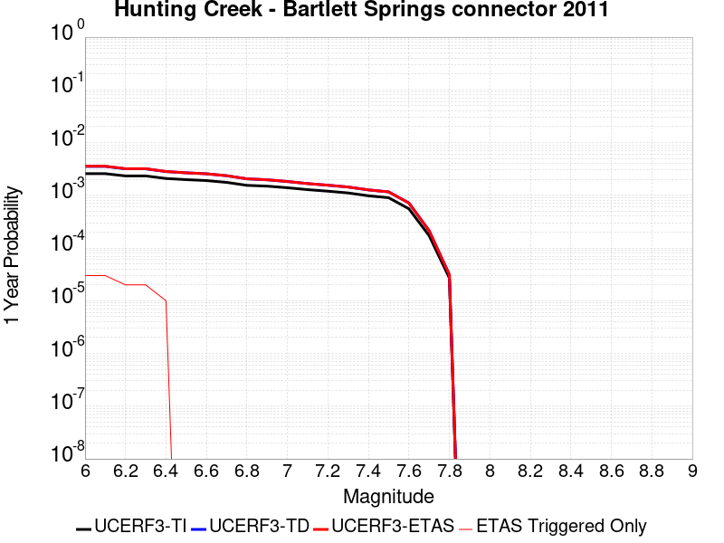 |  |

| Magnitude | 1 wk TI Prob | 1 wk TD Prob | 1 wk ETAS Prob | 1 wk ETAS/TD Gain | 1 wk ETAS Triggered Only | 1 mo TI Prob | 1 mo TD Prob | 1 mo ETAS Prob | 1 mo ETAS/TD Gain | 1 mo ETAS Triggered Only | 1 yr TI Prob | 1 yr TD Prob | 1 yr ETAS Prob | 1 yr ETAS/TD Gain | 1 yr ETAS Triggered Only | 10 yr TI Prob | 10 yr TD Prob | 10 yr ETAS Prob | 10 yr ETAS/TD Gain | 10 yr ETAS Triggered Only |
|-----|-----|-----|-----|-----|-----|-----|-----|-----|-----|-----|-----|-----|-----|-----|-----|-----|-----|-----|-----|-----|
| 6.0 | 4.940016E-5 | 6.786822E-5 | 6.786822E-5 | 1.0 | 0.0 | 2.1169778E-4 | 2.9083234E-4 | 3.0339148E-4 | 1.0431836 | 1.2562814E-5 | 0.002574374 | 0.003535177 | 0.0035727324 | 1.0106233 | 3.768844E-5 | 0.025447546 | 0.034773834 | 0.034834463 | 1.0017436 | 6.281407E-5 |
| 6.1 | 4.940016E-5 | 6.786822E-5 | 6.786822E-5 | 1.0 | 0.0 | 2.1169778E-4 | 2.9083234E-4 | 3.0339148E-4 | 1.0431836 | 1.2562814E-5 | 0.002574374 | 0.003535177 | 0.0035727324 | 1.0106233 | 3.768844E-5 | 0.025447546 | 0.034773834 | 0.034834463 | 1.0017436 | 6.281407E-5 |
| 6.2 | 4.472471E-5 | 6.1002804E-5 | 6.1002804E-5 | 1.0 | 0.0 | 1.9166325E-4 | 2.6141506E-4 | 2.739746E-4 | 1.0480444 | 1.2562814E-5 | 0.0023310026 | 0.003178107 | 0.003203153 | 1.0078807 | 2.5125628E-5 | 0.02306703 | 0.031316914 | 0.03135342 | 1.0011657 | 3.768844E-5 |
| 6.3 | 4.472471E-5 | 6.1002804E-5 | 6.1002804E-5 | 1.0 | 0.0 | 1.9166325E-4 | 2.6141506E-4 | 2.739746E-4 | 1.0480444 | 1.2562814E-5 | 0.0023310026 | 0.003178107 | 0.003203153 | 1.0078807 | 2.5125628E-5 | 0.02306703 | 0.031316914 | 0.03135342 | 1.0011657 | 3.768844E-5 |
| 6.4 | 4.0001003E-5 | 5.4103755E-5 | 5.4103755E-5 | 1.0 | 0.0 | 1.714216E-4 | 2.31853E-4 | 2.4441292E-4 | 1.0541718 | 1.2562814E-5 | 0.0020850603 | 0.0028191248 | 0.002831652 | 1.0044438 | 1.2562814E-5 | 0.02065605 | 0.027828315 | 0.027864955 | 1.0013167 | 3.768844E-5 |
| 6.5 | 3.8033053E-5 | 5.1266547E-5 | 5.1266547E-5 | 1.0 | 0.0 | 1.6298861E-4 | 2.1969559E-4 | 2.1969559E-4 | 1.0 | 0.0 | 0.0019825802 | 0.0026714746 | 0.0026714746 | 1.0 | 0.0 | 0.019649856 | 0.026390454 | 0.026402686 | 1.0004635 | 1.2562814E-5 |
| 6.6 | 3.653754E-5 | 4.913017E-5 | 4.913017E-5 | 1.0 | 0.0 | 1.5658008E-4 | 2.1054115E-4 | 2.1054115E-4 | 1.0 | 0.0 | 0.0019046954 | 0.0025602852 | 0.0025602852 | 1.0 | 0.0 | 0.018884527 | 0.025306415 | 0.025318658 | 1.0004839 | 1.2562814E-5 |
| 6.7 | 3.372024E-5 | 4.514011E-5 | 4.514011E-5 | 1.0 | 0.0 | 1.4450731E-4 | 1.9344354E-4 | 1.9344354E-4 | 1.0 | 0.0 | 0.0017579567 | 0.002352639 | 0.002352639 | 1.0 | 0.0 | 0.017441148 | 0.023278099 | 0.023290368 | 1.0005271 | 1.2562814E-5 |
| 6.8 | 2.9650024E-5 | 3.9411374E-5 | 3.9411374E-5 | 1.0 | 0.0 | 1.2706534E-4 | 1.6889503E-4 | 1.6889503E-4 | 1.0 | 0.0 | 0.0015459227 | 0.0020543463 | 0.0020543463 | 1.0 | 0.0 | 0.015352124 | 0.020351216 | 0.020363523 | 1.0006047 | 1.2562814E-5 |
| 6.9 | 2.860775E-5 | 3.7812544E-5 | 3.7812544E-5 | 1.0 | 0.0 | 1.2259888E-4 | 1.6204377E-4 | 1.6204377E-4 | 1.0 | 0.0 | 0.0014916194 | 0.001971107 | 0.001971107 | 1.0 | 0.0 | 0.014816469 | 0.01953584 | 0.019548157 | 1.0006305 | 1.2562814E-5 |
| 7.0 | 2.6696067E-5 | 3.506726E-5 | 3.506726E-5 | 1.0 | 0.0 | 1.144067E-4 | 1.5027967E-4 | 1.5027967E-4 | 1.0 | 0.0 | 0.0013920115 | 0.0018281302 | 0.0018281302 | 1.0 | 0.0 | 0.013833242 | 0.018131364 | 0.018143699 | 1.0006803 | 1.2562814E-5 |
| 7.1 | 2.456087E-5 | 3.2013093E-5 | 3.2013093E-5 | 1.0 | 0.0 | 1.0525662E-4 | 1.371918E-4 | 1.371918E-4 | 1.0 | 0.0 | 0.001280746 | 0.0016690396 | 0.0016690396 | 1.0 | 0.0 | 0.012733897 | 0.016566366 | 0.01657872 | 1.0007458 | 1.2562814E-5 |
| 7.2 | 2.295761E-5 | 2.9822932E-5 | 2.9822932E-5 | 1.0 | 0.0 | 9.8386045E-5 | 1.2780636E-4 | 1.2780636E-4 | 1.0 | 0.0 | 0.0011971919 | 0.001554941 | 0.001554941 | 1.0 | 0.0 | 0.011907627 | 0.015442089 | 0.015454458 | 1.000801 | 1.2562814E-5 |
| 7.3 | 2.1256936E-5 | 2.7541912E-5 | 2.7541912E-5 | 1.0 | 0.0 | 9.109797E-5 | 1.1803147E-4 | 1.1803147E-4 | 1.0 | 0.0 | 0.0011085535 | 0.0014360948 | 0.0014360948 | 1.0 | 0.0 | 0.011030397 | 0.014269472 | 0.014281856 | 1.0008678 | 1.2562814E-5 |
| 7.4 | 1.8784336E-5 | 2.4306766E-5 | 2.4306766E-5 | 1.0 | 0.0 | 8.050181E-5 | 1.0416774E-4 | 1.0416774E-4 | 1.0 | 0.0 | 9.796688E-4 | 0.001267512 | 0.001267512 | 1.0 | 0.0 | 0.009753612 | 0.012603902 | 0.012616307 | 1.0009842 | 1.2562814E-5 |
| 7.5 | 1.7248298E-5 | 2.2268887E-5 | 2.2268887E-5 | 1.0 | 0.0 | 7.391918E-5 | 9.543464E-5 | 9.543464E-5 | 1.0 | 0.0 | 8.9959445E-4 | 0.0011613049 | 0.0011613049 | 1.0 | 0.0 | 0.008959615 | 0.01155334 | 0.011565757 | 1.0010748 | 1.2562814E-5 |
| 7.6 | 1.0653709E-5 | 1.3722118E-5 | 1.3722118E-5 | 1.0 | 0.0 | 4.5657955E-5 | 5.8807767E-5 | 5.8807767E-5 | 1.0 | 0.0 | 5.557438E-4 | 7.157521E-4 | 7.157521E-4 | 1.0 | 0.0 | 0.0055435603 | 0.0071348166 | 0.0071348166 | 1.0 | 0.0 |
| 7.7 | 3.286316E-6 | 4.0903437E-6 | 4.0903437E-6 | 1.0 | 0.0 | 1.4084137E-5 | 1.7529928E-5 | 1.7529928E-5 | 1.0 | 0.0 | 1.7146087E-4 | 2.1340612E-4 | 2.1340612E-4 | 1.0 | 0.0 | 0.0017132863 | 0.0021320276 | 0.0021320276 | 1.0 | 0.0 |
| 7.8 | 5.1855085E-7 | 5.9720696E-7 | 5.9720696E-7 | 1.0 | 0.0 | 2.222359E-6 | 2.5594559E-6 | 2.5594559E-6 | 1.0 | 0.0 | 2.7056883E-5 | 3.116094E-5 | 3.116094E-5 | 1.0 | 0.0 | 2.705359E-4 | 3.1156495E-4 | 3.1156495E-4 | 1.0 | 0.0 |

## San Pedro Basin
*[(top)](#table-of-contents)*

| 1 Week | 1 Month | 1 Year | 10 Year |
|-----|-----|-----|-----|
|  |  |  | 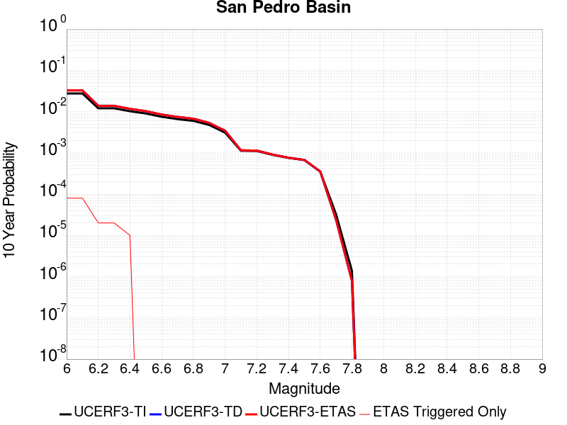 |

| Magnitude | 1 wk TI Prob | 1 wk TD Prob | 1 wk ETAS Prob | 1 wk ETAS/TD Gain | 1 wk ETAS Triggered Only | 1 mo TI Prob | 1 mo TD Prob | 1 mo ETAS Prob | 1 mo ETAS/TD Gain | 1 mo ETAS Triggered Only | 1 yr TI Prob | 1 yr TD Prob | 1 yr ETAS Prob | 1 yr ETAS/TD Gain | 1 yr ETAS Triggered Only | 10 yr TI Prob | 10 yr TD Prob | 10 yr ETAS Prob | 10 yr ETAS/TD Gain | 10 yr ETAS Triggered Only |
|-----|-----|-----|-----|-----|-----|-----|-----|-----|-----|-----|-----|-----|-----|-----|-----|-----|-----|-----|-----|-----|
| 6.0 | 5.3449043E-5 | 6.336954E-5 | 1.3874164E-4 | 2.189406 | 7.537688E-5 | 2.2904722E-4 | 2.715589E-4 | 3.4691533E-4 | 1.2774956 | 7.537688E-5 | 0.0027850836 | 0.0033018254 | 0.0033769533 | 1.0227535 | 7.537688E-5 | 0.027504366 | 0.03258945 | 0.032662373 | 1.0022376 | 7.537688E-5 |
| 6.1 | 5.3449043E-5 | 6.336954E-5 | 1.3874164E-4 | 2.189406 | 7.537688E-5 | 2.2904722E-4 | 2.715589E-4 | 3.4691533E-4 | 1.2774956 | 7.537688E-5 | 0.0027850836 | 0.0033018254 | 0.0033769533 | 1.0227535 | 7.537688E-5 | 0.027504366 | 0.03258945 | 0.032662373 | 1.0022376 | 7.537688E-5 |
| 6.2 | 2.3189454E-5 | 2.6642796E-5 | 5.1767754E-5 | 1.9430301 | 2.5125628E-5 | 9.9379584E-5 | 1.14178685E-4 | 1.3930144E-4 | 1.2200302 | 2.5125628E-5 | 0.0012092749 | 0.0013892864 | 0.0014143771 | 1.0180602 | 2.5125628E-5 | 0.012027155 | 0.013810883 | 0.013835662 | 1.0017941 | 2.5125628E-5 |
| 6.3 | 2.3189454E-5 | 2.6642796E-5 | 5.1767754E-5 | 1.9430301 | 2.5125628E-5 | 9.9379584E-5 | 1.14178685E-4 | 1.3930144E-4 | 1.2200302 | 2.5125628E-5 | 0.0012092749 | 0.0013892864 | 0.0014143771 | 1.0180602 | 2.5125628E-5 | 0.012027155 | 0.013810883 | 0.013835662 | 1.0017941 | 2.5125628E-5 |
| 6.4 | 1.966056E-5 | 2.2463413E-5 | 3.5025943E-5 | 1.5592442 | 1.2562814E-5 | 8.425682E-5 | 9.626844E-5 | 1.0883005E-4 | 1.1304852 | 1.2562814E-5 | 0.001025344 | 0.0011714783 | 0.0011840264 | 1.0107113 | 1.2562814E-5 | 0.010206259 | 0.011657117 | 0.011669533 | 1.0010651 | 1.2562814E-5 |
| 6.5 | 1.7342953E-5 | 1.9745148E-5 | 1.9745148E-5 | 1.0 | 0.0 | 7.4324824E-5 | 8.4619525E-5 | 8.4619525E-5 | 1.0 | 0.0 | 9.04529E-4 | 0.0010297928 | 0.0010297928 | 1.0 | 0.0 | 0.009008561 | 0.010253931 | 0.010253931 | 1.0 | 0.0 |
| 6.6 | 1.439804E-5 | 1.6322716E-5 | 1.6322716E-5 | 1.0 | 0.0 | 6.170443E-5 | 6.99528E-5 | 6.99528E-5 | 1.0 | 0.0 | 7.509924E-4 | 8.513747E-4 | 8.513747E-4 | 1.0 | 0.0 | 0.0074845953 | 0.008484332 | 0.008484332 | 1.0 | 0.0 |
| 6.7 | 1.2634884E-5 | 1.4285297E-5 | 1.4285297E-5 | 1.0 | 0.0 | 5.414838E-5 | 6.1221435E-5 | 6.1221435E-5 | 1.0 | 0.0 | 6.590571E-4 | 7.4514654E-4 | 7.4514654E-4 | 1.0 | 0.0 | 0.006571059 | 0.007429501 | 0.007429501 | 1.0 | 0.0 |
| 6.8 | 1.146091E-5 | 1.2933192E-5 | 1.2933192E-5 | 1.0 | 0.0 | 4.911726E-5 | 5.5426954E-5 | 5.5426954E-5 | 1.0 | 0.0 | 5.9783855E-4 | 6.7464396E-4 | 6.7464396E-4 | 1.0 | 0.0 | 0.0059623276 | 0.006728899 | 0.006728899 | 1.0 | 0.0 |
| 6.9 | 9.109035E-6 | 1.0235011E-5 | 1.0235011E-5 | 1.0 | 0.0 | 3.9038136E-5 | 4.3863754E-5 | 4.3863754E-5 | 1.0 | 0.0 | 4.7518566E-4 | 5.3393835E-4 | 5.3393835E-4 | 1.0 | 0.0 | 0.0047417083 | 0.005329309 | 0.005329309 | 1.0 | 0.0 |
| 7.0 | 5.9351028E-6 | 6.583964E-6 | 6.583964E-6 | 1.0 | 0.0 | 2.5435906E-5 | 2.8216817E-5 | 2.8216817E-5 | 1.0 | 0.0 | 3.0963816E-4 | 3.435092E-4 | 3.435092E-4 | 1.0 | 0.0 | 0.0030920706 | 0.0034320992 | 0.0034320992 | 1.0 | 0.0 |
| 7.1 | 2.1557585E-6 | 2.209648E-6 | 2.209648E-6 | 1.0 | 0.0 | 9.238933E-6 | 9.469887E-6 | 9.469887E-6 | 1.0 | 0.0 | 1.1247819E-4 | 1.1528993E-4 | 1.1528993E-4 | 1.0 | 0.0 | 0.0011242128 | 0.0011523166 | 0.0011523166 | 1.0 | 0.0 |
| 7.2 | 2.1251979E-6 | 2.1779945E-6 | 2.1779945E-6 | 1.0 | 0.0 | 9.107958E-6 | 9.334229E-6 | 9.334229E-6 | 1.0 | 0.0 | 1.1088375E-4 | 1.1363847E-4 | 1.1363847E-4 | 1.0 | 0.0 | 0.0011082845 | 0.0011358189 | 0.0011358189 | 1.0 | 0.0 |
| 7.3 | 1.7145798E-6 | 1.7442874E-6 | 1.7442874E-6 | 1.0 | 0.0 | 7.3481783E-6 | 7.4754967E-6 | 7.4754967E-6 | 1.0 | 0.0 | 8.94604E-5 | 9.1010465E-5 | 9.1010465E-5 | 1.0 | 0.0 | 8.9424395E-4 | 9.0974104E-4 | 9.0974104E-4 | 1.0 | 0.0 |
| 7.4 | 1.4467993E-6 | 1.4641868E-6 | 1.4641868E-6 | 1.0 | 0.0 | 6.200554E-6 | 6.2750714E-6 | 6.2750714E-6 | 1.0 | 0.0 | 7.548913E-5 | 7.639639E-5 | 7.639639E-5 | 1.0 | 0.0 | 7.546349E-4 | 7.6370855E-4 | 7.6370855E-4 | 1.0 | 0.0 |
| 7.5 | 1.2803735E-6 | 1.2931497E-6 | 1.2931497E-6 | 1.0 | 0.0 | 5.487303E-6 | 5.5420587E-6 | 5.5420587E-6 | 1.0 | 0.0 | 6.680587E-5 | 6.7472545E-5 | 6.7472545E-5 | 1.0 | 0.0 | 6.678579E-4 | 6.7452766E-4 | 6.7452766E-4 | 1.0 | 0.0 |
| 7.6 | 6.755009E-7 | 6.769465E-7 | 6.769465E-7 | 1.0 | 0.0 | 2.8950008E-6 | 2.9011965E-6 | 2.9011965E-6 | 1.0 | 0.0 | 3.5246063E-5 | 3.5321555E-5 | 3.5321555E-5 | 1.0 | 0.0 | 3.5240475E-4 | 3.5316512E-4 | 3.5316512E-4 | 1.0 | 0.0 |
| 7.7 | 6.211885E-8 | 4.569953E-8 | 4.569953E-8 | 1.0 | 0.0 | 2.6622362E-7 | 1.9585512E-7 | 1.9585512E-7 | 1.0 | 0.0 | 3.2412677E-6 | 2.3845337E-6 | 2.3845337E-6 | 1.0 | 0.0 | 3.2412205E-5 | 2.3845101E-5 | 2.3845101E-5 | 1.0 | 0.0 |
| 7.8 | 2.6580573E-9 | 1.5138163E-9 | 1.5138163E-9 | 1.0 | 0.0 | 1.1391674E-8 | 6.487784E-9 | 6.487784E-9 | 1.0 | 0.0 | 1.3869362E-7 | 7.898877E-8 | 7.898877E-8 | 1.0 | 0.0 | 1.3869354E-6 | 7.898877E-7 | 7.898877E-7 | 1.0 | 0.0 |

## Green Valley 2011 CFM
*[(top)](#table-of-contents)*

| 1 Week | 1 Month | 1 Year | 10 Year |
|-----|-----|-----|-----|
|  |  |  | 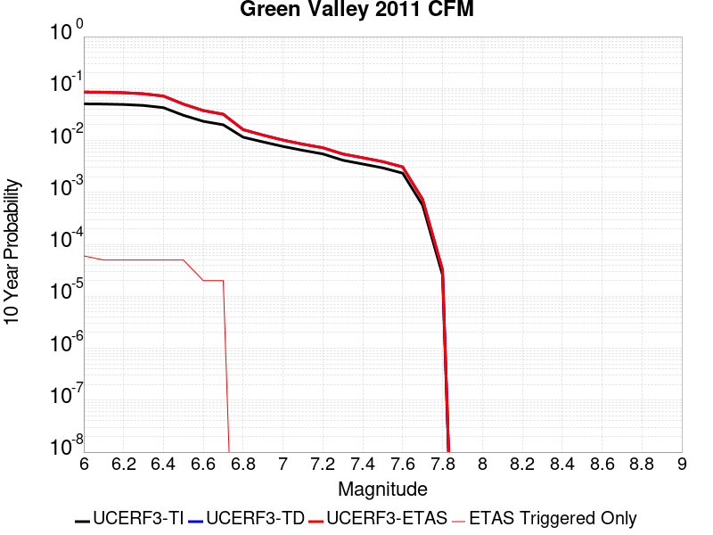 |

| Magnitude | 1 wk TI Prob | 1 wk TD Prob | 1 wk ETAS Prob | 1 wk ETAS/TD Gain | 1 wk ETAS Triggered Only | 1 mo TI Prob | 1 mo TD Prob | 1 mo ETAS Prob | 1 mo ETAS/TD Gain | 1 mo ETAS Triggered Only | 1 yr TI Prob | 1 yr TD Prob | 1 yr ETAS Prob | 1 yr ETAS/TD Gain | 1 yr ETAS Triggered Only | 10 yr TI Prob | 10 yr TD Prob | 10 yr ETAS Prob | 10 yr ETAS/TD Gain | 10 yr ETAS Triggered Only |
|-----|-----|-----|-----|-----|-----|-----|-----|-----|-----|-----|-----|-----|-----|-----|-----|-----|-----|-----|-----|-----|
| 6.0 | 9.9629346E-5 | 1.7305532E-4 | 2.4841918E-4 | 1.4354899 | 7.537688E-5 | 4.2691303E-4 | 7.4143766E-4 | 8.1675866E-4 | 1.1015878 | 7.537688E-5 | 0.0051852856 | 0.008986705 | 0.0090614045 | 1.0083122 | 7.537688E-5 | 0.050659515 | 0.085522056 | 0.08559099 | 1.000806 | 7.537688E-5 |
| 6.1 | 9.88615E-5 | 1.7152846E-4 | 2.3433176E-4 | 1.3661392 | 6.281407E-5 | 4.2362334E-4 | 7.348976E-4 | 7.9766556E-4 | 1.0854104 | 6.281407E-5 | 0.0051454236 | 0.0089077335 | 0.008969988 | 1.0069888 | 6.281407E-5 | 0.050279044 | 0.084809676 | 0.084867164 | 1.0006778 | 6.281407E-5 |
| 6.2 | 9.696895E-5 | 1.6791887E-4 | 2.307224E-4 | 1.374011 | 6.281407E-5 | 4.15515E-4 | 7.194366E-4 | 7.822055E-4 | 1.0872473 | 6.281407E-5 | 0.0050471667 | 0.008721114 | 0.0087833805 | 1.0071397 | 6.281407E-5 | 0.04934063 | 0.0831186 | 0.083176196 | 1.0006928 | 6.281407E-5 |
| 6.3 | 9.275224E-5 | 1.5971228E-4 | 2.225163E-4 | 1.3932323 | 6.281407E-5 | 3.9744904E-4 | 6.842841E-4 | 7.4705516E-4 | 1.0917325 | 6.281407E-5 | 0.0048282105 | 0.008296439 | 0.008358732 | 1.0075084 | 6.281407E-5 | 0.047246475 | 0.07925707 | 0.0793149 | 1.0007297 | 6.281407E-5 |
| 6.4 | 8.391499E-5 | 1.4367796E-4 | 2.06483E-4 | 1.4371238 | 6.281407E-5 | 3.595861E-4 | 6.156248E-4 | 6.784002E-4 | 1.1019702 | 6.281407E-5 | 0.004369175 | 0.0074670846 | 0.0075294296 | 1.0083493 | 6.281407E-5 | 0.04284265 | 0.071630865 | 0.07168918 | 1.0008141 | 6.281407E-5 |
| 6.5 | 5.9519385E-5 | 9.9340905E-5 | 1.6214873E-4 | 1.6322454 | 6.281407E-5 | 2.5505814E-4 | 4.2568138E-4 | 4.8846874E-4 | 1.1474984 | 6.281407E-5 | 0.0031009112 | 0.005168295 | 0.0052307844 | 1.0120909 | 6.281407E-5 | 0.030579966 | 0.050145864 | 0.05020553 | 1.0011898 | 6.281407E-5 |
| 6.6 | 4.5361558E-5 | 7.402609E-5 | 9.914985E-5 | 1.3393908 | 2.5125628E-5 | 1.9439218E-4 | 3.1721895E-4 | 3.423366E-4 | 1.0791808 | 2.5125628E-5 | 0.0023641558 | 0.0038539418 | 0.0038789706 | 1.0064943 | 2.5125628E-5 | 0.023391623 | 0.037665963 | 0.037690144 | 1.000642 | 2.5125628E-5 |
| 6.7 | 3.8808106E-5 | 6.2651976E-5 | 8.7776025E-5 | 1.4010098 | 2.5125628E-5 | 1.6630985E-4 | 2.6848342E-4 | 2.9360232E-4 | 1.0935584 | 2.5125628E-5 | 0.0020229418 | 0.0032626586 | 0.0032877023 | 1.0076759 | 2.5125628E-5 | 0.020046256 | 0.032005914 | 0.032030236 | 1.00076 | 2.5125628E-5 |
| 6.8 | 2.2284667E-5 | 3.1285235E-5 | 3.1285235E-5 | 1.0 | 0.0 | 9.550222E-5 | 1.3407279E-4 | 1.3407279E-4 | 1.0 | 0.0 | 0.0011621192 | 0.0016311078 | 0.0016311078 | 1.0 | 0.0 | 0.011560607 | 0.016165998 | 0.016165998 | 1.0 | 0.0 |
| 6.9 | 1.8050168E-5 | 2.4448054E-5 | 2.4448054E-5 | 1.0 | 0.0 | 7.735557E-5 | 1.047732E-4 | 1.047732E-4 | 1.0 | 0.0 | 9.4139716E-4 | 0.0012748708 | 0.0012748708 | 1.0 | 0.0 | 0.009374191 | 0.012667833 | 0.012667833 | 1.0 | 0.0 |
| 7.0 | 1.4763166E-5 | 1.9582854E-5 | 1.9582854E-5 | 1.0 | 0.0 | 6.326917E-5 | 8.3923835E-5 | 8.3923835E-5 | 1.0 | 0.0 | 7.7002996E-4 | 0.0010212966 | 0.0010212966 | 1.0 | 0.0 | 0.007673672 | 0.010165343 | 0.010165343 | 1.0 | 0.0 |
| 7.1 | 1.2399713E-5 | 1.6303715E-5 | 1.6303715E-5 | 1.0 | 0.0 | 5.3140546E-5 | 6.98712E-5 | 6.98712E-5 | 1.0 | 0.0 | 6.467941E-4 | 8.503518E-4 | 8.503518E-4 | 1.0 | 0.0 | 0.006449148 | 0.008471259 | 0.008471259 | 1.0 | 0.0 |
| 7.2 | 1.0584195E-5 | 1.3921742E-5 | 1.3921742E-5 | 1.0 | 0.0 | 4.5360044E-5 | 5.9663253E-5 | 5.9663253E-5 | 1.0 | 0.0 | 5.521186E-4 | 7.261596E-4 | 7.261596E-4 | 1.0 | 0.0 | 0.0055074887 | 0.007238285 | 0.007238285 | 1.0 | 0.0 |
| 7.3 | 7.998173E-6 | 1.054402E-5 | 1.054402E-5 | 1.0 | 0.0 | 3.4277433E-5 | 4.518788E-5 | 4.518788E-5 | 1.0 | 0.0 | 4.1724785E-4 | 5.500247E-4 | 5.500247E-4 | 1.0 | 0.0 | 0.004164653 | 0.0054868995 | 0.0054868995 | 1.0 | 0.0 |
| 7.4 | 6.7571127E-6 | 8.932697E-6 | 8.932697E-6 | 1.0 | 0.0 | 2.8958733E-5 | 3.828243E-5 | 3.828243E-5 | 1.0 | 0.0 | 3.5251552E-4 | 4.6598984E-4 | 4.6598984E-4 | 1.0 | 0.0 | 0.0035195686 | 0.0046503306 | 0.0046503306 | 1.0 | 0.0 |
| 7.5 | 5.69878E-6 | 7.516314E-6 | 7.516314E-6 | 1.0 | 0.0 | 2.4423114E-5 | 3.221238E-5 | 3.221238E-5 | 1.0 | 0.0 | 2.9731085E-4 | 3.9211605E-4 | 3.9211605E-4 | 1.0 | 0.0 | 0.002969134 | 0.0039143935 | 0.0039143935 | 1.0 | 0.0 |
| 7.6 | 4.503664E-6 | 5.9356807E-6 | 5.9356807E-6 | 1.0 | 0.0 | 1.9301275E-5 | 2.5438389E-5 | 2.5438389E-5 | 1.0 | 0.0 | 2.3496768E-4 | 3.096692E-4 | 3.096692E-4 | 1.0 | 0.0 | 0.002347194 | 0.003092502 | 0.003092502 | 1.0 | 0.0 |
| 7.7 | 1.0873546E-6 | 1.4106979E-6 | 1.4106979E-6 | 1.0 | 0.0 | 4.6600826E-6 | 6.045834E-6 | 6.045834E-6 | 1.0 | 0.0 | 5.6735033E-5 | 7.360557E-5 | 7.360557E-5 | 1.0 | 0.0 | 5.672055E-4 | 7.35814E-4 | 7.35814E-4 | 1.0 | 0.0 |
| 7.8 | 4.9373917E-8 | 6.1777136E-8 | 6.1777136E-8 | 1.0 | 0.0 | 2.1160248E-7 | 2.6475914E-7 | 2.6475914E-7 | 1.0 | 0.0 | 2.5762572E-6 | 3.223439E-6 | 3.223439E-6 | 1.0 | 0.0 | 2.5762274E-5 | 3.2232296E-5 | 3.2232296E-5 | 1.0 | 0.0 |

## Hunting Creek - Berryessa 2011 CFM
*[(top)](#table-of-contents)*

| 1 Week | 1 Month | 1 Year | 10 Year |
|-----|-----|-----|-----|
|  |  |  |  |

| Magnitude | 1 wk TI Prob | 1 wk TD Prob | 1 wk ETAS Prob | 1 wk ETAS/TD Gain | 1 wk ETAS Triggered Only | 1 mo TI Prob | 1 mo TD Prob | 1 mo ETAS Prob | 1 mo ETAS/TD Gain | 1 mo ETAS Triggered Only | 1 yr TI Prob | 1 yr TD Prob | 1 yr ETAS Prob | 1 yr ETAS/TD Gain | 1 yr ETAS Triggered Only | 10 yr TI Prob | 10 yr TD Prob | 10 yr ETAS Prob | 10 yr ETAS/TD Gain | 10 yr ETAS Triggered Only |
|-----|-----|-----|-----|-----|-----|-----|-----|-----|-----|-----|-----|-----|-----|-----|-----|-----|-----|-----|-----|-----|
| 6.0 | 1.1270982E-4 | 2.0012174E-4 | 2.2524234E-4 | 1.1255265 | 2.5125628E-5 | 4.8295266E-4 | 8.5739547E-4 | 8.9505163E-4 | 1.0439192 | 3.768844E-5 | 0.0058641075 | 0.010386313 | 0.010448474 | 1.0059849 | 6.281407E-5 | 0.057117578 | 0.09803703 | 0.09810501 | 1.0006934 | 7.537688E-5 |
| 6.1 | 1.1239393E-4 | 1.9960315E-4 | 2.2472376E-4 | 1.1258528 | 2.5125628E-5 | 4.8159933E-4 | 8.551744E-4 | 8.8027853E-4 | 1.0293555 | 2.5125628E-5 | 0.0058477195 | 0.010359551 | 0.010396849 | 1.0036004 | 3.768844E-5 | 0.056962132 | 0.09779551 | 0.097829506 | 1.0003477 | 3.768844E-5 |
| 6.2 | 7.596265E-5 | 1.2940196E-4 | 1.5452434E-4 | 1.1941421 | 2.5125628E-5 | 3.2551357E-4 | 5.5444165E-4 | 5.7955337E-4 | 1.0452919 | 2.5125628E-5 | 0.0039559277 | 0.0067210156 | 0.0067459727 | 1.0037133 | 2.5125628E-5 | 0.038862433 | 0.0645915 | 0.064615004 | 1.0003638 | 2.5125628E-5 |
| 6.3 | 6.78794E-5 | 1.145119E-4 | 1.3963465E-4 | 1.2193899 | 2.5125628E-5 | 2.9087928E-4 | 4.906513E-4 | 5.157646E-4 | 1.0511836 | 2.5125628E-5 | 0.003535705 | 0.005952679 | 0.0059776553 | 1.0041958 | 2.5125628E-5 | 0.034799766 | 0.057465393 | 0.057489075 | 1.0004121 | 2.5125628E-5 |
| 6.4 | 6.2165134E-5 | 1.0436625E-4 | 1.2948926E-4 | 1.2407197 | 2.5125628E-5 | 2.6639478E-4 | 4.4721062E-4 | 4.7232502E-4 | 1.0561578 | 2.5125628E-5 | 0.0032385332 | 0.005427573 | 0.005452562 | 1.0046041 | 2.5125628E-5 | 0.03191742 | 0.052550517 | 0.05257432 | 1.000453 | 2.5125628E-5 |
| 6.5 | 5.4368087E-5 | 9.071415E-5 | 1.15837494E-4 | 1.2769507 | 2.5125628E-5 | 2.3298527E-4 | 3.8872007E-4 | 4.1383595E-4 | 1.0646117 | 2.5125628E-5 | 0.0028329059 | 0.0047198683 | 0.0047448757 | 1.0052983 | 2.5125628E-5 | 0.027970633 | 0.045880128 | 0.0459041 | 1.0005225 | 2.5125628E-5 |
| 6.6 | 4.729947E-5 | 7.847572E-5 | 1.0359938E-4 | 1.3201456 | 2.5125628E-5 | 2.0269625E-4 | 3.362842E-4 | 3.6140138E-4 | 1.0746903 | 2.5125628E-5 | 0.002465034 | 0.0040849647 | 0.004109988 | 1.0061257 | 2.5125628E-5 | 0.02437869 | 0.03985155 | 0.039875675 | 1.0006053 | 2.5125628E-5 |
| 6.7 | 3.6875328E-5 | 6.0451803E-5 | 8.557591E-5 | 1.4156057 | 2.5125628E-5 | 1.5802756E-4 | 2.59056E-4 | 2.841751E-4 | 1.096964 | 2.5125628E-5 | 0.0019222875 | 0.0031482063 | 0.0031732528 | 1.0079558 | 2.5125628E-5 | 0.019057442 | 0.03089237 | 0.03091672 | 1.0007882 | 2.5125628E-5 |
| 6.8 | 2.0292036E-5 | 2.8976308E-5 | 2.8976308E-5 | 1.0 | 0.0 | 8.6962966E-5 | 1.2417832E-4 | 1.2417832E-4 | 1.0 | 0.0 | 0.0010582599 | 0.0015108072 | 0.0015108072 | 1.0 | 0.0 | 0.010532344 | 0.014978523 | 0.014978523 | 1.0 | 0.0 |
| 6.9 | 1.7871042E-5 | 2.4472254E-5 | 2.4472254E-5 | 1.0 | 0.0 | 7.658793E-5 | 1.048769E-4 | 1.048769E-4 | 1.0 | 0.0 | 9.320591E-4 | 0.0012761299 | 0.0012761299 | 1.0 | 0.0 | 0.009281595 | 0.012679775 | 0.012679775 | 1.0 | 0.0 |
| 7.0 | 1.6415532E-5 | 2.1906277E-5 | 2.1906277E-5 | 1.0 | 0.0 | 7.035038E-5 | 9.3880684E-5 | 9.3880684E-5 | 1.0 | 0.0 | 8.561793E-4 | 0.0011424015 | 0.0011424015 | 1.0 | 0.0 | 0.008528882 | 0.01136452 | 0.01136452 | 1.0 | 0.0 |
| 7.1 | 1.5409885E-5 | 2.0346342E-5 | 2.0346342E-5 | 1.0 | 0.0 | 6.6040695E-5 | 8.7195716E-5 | 8.7195716E-5 | 1.0 | 0.0 | 8.0374884E-4 | 0.0010610938 | 0.0010610938 | 1.0 | 0.0 | 0.00800848 | 0.010560595 | 0.010560595 | 1.0 | 0.0 |
| 7.2 | 1.4497423E-5 | 1.9054964E-5 | 1.9054964E-5 | 1.0 | 0.0 | 6.213033E-5 | 8.166159E-5 | 8.166159E-5 | 1.0 | 0.0 | 7.5617427E-4 | 9.937795E-4 | 9.937795E-4 | 1.0 | 0.0 | 0.0075360634 | 0.009893929 | 0.009893929 | 1.0 | 0.0 |
| 7.3 | 1.3615175E-5 | 1.7826127E-5 | 1.7826127E-5 | 1.0 | 0.0 | 5.8349444E-5 | 7.639547E-5 | 7.639547E-5 | 1.0 | 0.0 | 7.101729E-4 | 9.297209E-4 | 9.297209E-4 | 1.0 | 0.0 | 0.0070790765 | 0.009258823 | 0.009258823 | 1.0 | 0.0 |
| 7.4 | 1.2252825E-5 | 1.602625E-5 | 1.602625E-5 | 1.0 | 0.0 | 5.251105E-5 | 6.868213E-5 | 6.868213E-5 | 1.0 | 0.0 | 6.391345E-4 | 8.35887E-4 | 8.35887E-4 | 1.0 | 0.0 | 0.0063729943 | 0.008327872 | 0.008327872 | 1.0 | 0.0 |
| 7.5 | 1.0913301E-5 | 1.4241117E-5 | 1.4241117E-5 | 1.0 | 0.0 | 4.6770452E-5 | 6.1031948E-5 | 6.1031948E-5 | 1.0 | 0.0 | 5.6928146E-4 | 7.4281334E-4 | 7.4281334E-4 | 1.0 | 0.0 | 0.0056782532 | 0.0074036797 | 0.0074036797 | 1.0 | 0.0 |
| 7.6 | 8.623192E-6 | 1.12346415E-5 | 1.12346415E-5 | 1.0 | 0.0 | 3.6956015E-5 | 4.814759E-5 | 4.814759E-5 | 1.0 | 0.0 | 4.4984656E-4 | 5.8604183E-4 | 5.8604183E-4 | 1.0 | 0.0 | 0.00448937 | 0.0058452785 | 0.0058452785 | 1.0 | 0.0 |
| 7.7 | 2.0993634E-6 | 2.662584E-6 | 2.662584E-6 | 1.0 | 0.0 | 8.997241E-6 | 1.1411025E-5 | 1.1411025E-5 | 1.0 | 0.0 | 1.09535904E-4 | 1.3892044E-4 | 1.3892044E-4 | 1.0 | 0.0 | 0.0010948193 | 0.0013883426 | 0.0013883426 | 1.0 | 0.0 |
| 7.8 | 1.8428308E-7 | 2.167437E-7 | 2.167437E-7 | 1.0 | 0.0 | 7.897844E-7 | 9.289013E-7 | 9.289013E-7 | 1.0 | 0.0 | 9.615583E-6 | 1.1309318E-5 | 1.1309318E-5 | 1.0 | 0.0 | 9.615166E-5 | 1.13086026E-4 | 1.13086026E-4 | 1.0 | 0.0 |

## Tin Mountain
*[(top)](#table-of-contents)*

| 1 Week | 1 Month | 1 Year | 10 Year |
|-----|-----|-----|-----|
|  |  |  |  |

| Magnitude | 1 wk TI Prob | 1 wk TD Prob | 1 wk ETAS Prob | 1 wk ETAS/TD Gain | 1 wk ETAS Triggered Only | 1 mo TI Prob | 1 mo TD Prob | 1 mo ETAS Prob | 1 mo ETAS/TD Gain | 1 mo ETAS Triggered Only | 1 yr TI Prob | 1 yr TD Prob | 1 yr ETAS Prob | 1 yr ETAS/TD Gain | 1 yr ETAS Triggered Only | 10 yr TI Prob | 10 yr TD Prob | 10 yr ETAS Prob | 10 yr ETAS/TD Gain | 10 yr ETAS Triggered Only |
|-----|-----|-----|-----|-----|-----|-----|-----|-----|-----|-----|-----|-----|-----|-----|-----|-----|-----|-----|-----|-----|
| 6.0 | 4.083776E-6 | 4.1815365E-6 | 5.443258E-5 | 13.017364 | 5.0251256E-5 | 1.750178E-5 | 1.792077E-5 | 6.8171124E-5 | 3.804029 | 5.0251256E-5 | 2.1306332E-4 | 2.1816725E-4 | 2.9352767E-4 | 1.3454251 | 7.537688E-5 | 0.0021285915 | 0.0021798965 | 0.002255109 | 1.0345029 | 7.537688E-5 |
| 6.1 | 4.083776E-6 | 4.1815365E-6 | 5.443258E-5 | 13.017364 | 5.0251256E-5 | 1.750178E-5 | 1.792077E-5 | 6.8171124E-5 | 3.804029 | 5.0251256E-5 | 2.1306332E-4 | 2.1816725E-4 | 2.9352767E-4 | 1.3454251 | 7.537688E-5 | 0.0021285915 | 0.0021798965 | 0.002255109 | 1.0345029 | 7.537688E-5 |
| 6.2 | 4.083776E-6 | 4.1815365E-6 | 5.443258E-5 | 13.017364 | 5.0251256E-5 | 1.750178E-5 | 1.792077E-5 | 6.8171124E-5 | 3.804029 | 5.0251256E-5 | 2.1306332E-4 | 2.1816725E-4 | 2.9352767E-4 | 1.3454251 | 7.537688E-5 | 0.0021285915 | 0.0021798965 | 0.002255109 | 1.0345029 | 7.537688E-5 |
| 6.3 | 4.083776E-6 | 4.1815365E-6 | 5.443258E-5 | 13.017364 | 5.0251256E-5 | 1.750178E-5 | 1.792077E-5 | 6.8171124E-5 | 3.804029 | 5.0251256E-5 | 2.1306332E-4 | 2.1816725E-4 | 2.9352767E-4 | 1.3454251 | 7.537688E-5 | 0.0021285915 | 0.0021798965 | 0.002255109 | 1.0345029 | 7.537688E-5 |
| 6.4 | 4.083776E-6 | 4.1815365E-6 | 5.443258E-5 | 13.017364 | 5.0251256E-5 | 1.750178E-5 | 1.792077E-5 | 6.8171124E-5 | 3.804029 | 5.0251256E-5 | 2.1306332E-4 | 2.1816725E-4 | 2.9352767E-4 | 1.3454251 | 7.537688E-5 | 0.0021285915 | 0.0021798965 | 0.002255109 | 1.0345029 | 7.537688E-5 |
| 6.5 | 2.3143427E-6 | 2.3731573E-6 | 2.7498725E-5 | 11.587401 | 2.5125628E-5 | 9.9185745E-6 | 1.0170638E-5 | 3.5296012E-5 | 3.4703832 | 2.5125628E-5 | 1.2075195E-4 | 1.2382126E-4 | 1.7406628E-4 | 1.4057869 | 5.0251256E-5 | 0.0012068636 | 0.0012375986 | 0.0012877877 | 1.0405536 | 5.0251256E-5 |
| 6.6 | 2.3143427E-6 | 2.3731573E-6 | 2.7498725E-5 | 11.587401 | 2.5125628E-5 | 9.9185745E-6 | 1.0170638E-5 | 3.5296012E-5 | 3.4703832 | 2.5125628E-5 | 1.2075195E-4 | 1.2382126E-4 | 1.7406628E-4 | 1.4057869 | 5.0251256E-5 | 0.0012068636 | 0.0012375986 | 0.0012877877 | 1.0405536 | 5.0251256E-5 |
| 6.7 | 1.7029532E-6 | 1.7497915E-6 | 1.43125835E-5 | 8.179594 | 1.2562814E-5 | 7.2983503E-6 | 7.499088E-6 | 2.0061807E-5 | 2.6752331 | 1.2562814E-5 | 8.885379E-5 | 9.1298105E-5 | 1.1642144E-4 | 1.2751791 | 2.5125628E-5 | 8.881827E-4 | 9.1265864E-4 | 9.3776133E-4 | 1.027505 | 2.5125628E-5 |
| 6.8 | 1.2914646E-6 | 1.3299378E-6 | 1.3299378E-6 | 1.0 | 0.0 | 5.534837E-6 | 5.6997237E-6 | 5.6997237E-6 | 1.0 | 0.0 | 6.738455E-5 | 6.939237E-5 | 8.195431E-5 | 1.1810278 | 1.2562814E-5 | 6.736412E-4 | 6.9375033E-4 | 7.0630445E-4 | 1.018096 | 1.2562814E-5 |
| 6.9 | 5.8708974E-7 | 6.1169936E-7 | 6.1169936E-7 | 1.0 | 0.0 | 2.5160964E-6 | 2.6215664E-6 | 2.6215664E-6 | 1.0 | 0.0 | 3.0633044E-5 | 3.1917145E-5 | 3.1917145E-5 | 1.0 | 0.0 | 3.0628822E-4 | 3.191297E-4 | 3.191297E-4 | 1.0 | 0.0 |
| 7.0 | 4.6248786E-7 | 4.832015E-7 | 4.832015E-7 | 1.0 | 0.0 | 1.9820893E-6 | 2.0708624E-6 | 2.0708624E-6 | 1.0 | 0.0 | 2.413167E-5 | 2.5212494E-5 | 2.5212494E-5 | 1.0 | 0.0 | 2.412905E-4 | 2.5210003E-4 | 2.5210003E-4 | 1.0 | 0.0 |
| 7.1 | 3.804606E-7 | 3.987147E-7 | 3.987147E-7 | 1.0 | 0.0 | 1.6305444E-6 | 1.7087764E-6 | 1.7087764E-6 | 1.0 | 0.0 | 1.9851697E-5 | 2.0804187E-5 | 2.0804187E-5 | 1.0 | 0.0 | 1.9849923E-4 | 2.0802575E-4 | 2.0802575E-4 | 1.0 | 0.0 |
| 7.2 | 3.5864858E-7 | 3.7616863E-7 | 3.7616863E-7 | 1.0 | 0.0 | 1.5370645E-6 | 1.6121504E-6 | 1.6121504E-6 | 1.0 | 0.0 | 1.87136E-5 | 1.9627789E-5 | 1.9627789E-5 | 1.0 | 0.0 | 1.8712023E-4 | 1.9626386E-4 | 1.9626386E-4 | 1.0 | 0.0 |
| 7.3 | 3.342063E-7 | 3.506347E-7 | 3.506347E-7 | 1.0 | 0.0 | 1.4323119E-6 | 1.5027196E-6 | 1.5027196E-6 | 1.0 | 0.0 | 1.7438259E-5 | 1.829549E-5 | 1.829549E-5 | 1.0 | 0.0 | 1.743689E-4 | 1.8294314E-4 | 1.8294314E-4 | 1.0 | 0.0 |
| 7.4 | 2.971242E-7 | 3.1165817E-7 | 3.1165817E-7 | 1.0 | 0.0 | 1.2733886E-6 | 1.3356774E-6 | 1.3356774E-6 | 1.0 | 0.0 | 1.5503398E-5 | 1.6261785E-5 | 1.6261785E-5 | 1.0 | 0.0 | 1.5502315E-4 | 1.6260923E-4 | 1.6260923E-4 | 1.0 | 0.0 |
| 7.5 | 1.4326713E-7 | 1.5012525E-7 | 1.5012525E-7 | 1.0 | 0.0 | 6.140018E-7 | 6.433939E-7 | 6.433939E-7 | 1.0 | 0.0 | 7.4754466E-6 | 7.8333205E-6 | 7.8333205E-6 | 1.0 | 0.0 | 7.475195E-5 | 7.833321E-5 | 7.833321E-5 | 1.0 | 0.0 |

## Kern Canyon (South Kern) 2011
*[(top)](#table-of-contents)*

| 1 Week | 1 Month | 1 Year | 10 Year |
|-----|-----|-----|-----|
|  |  |  | 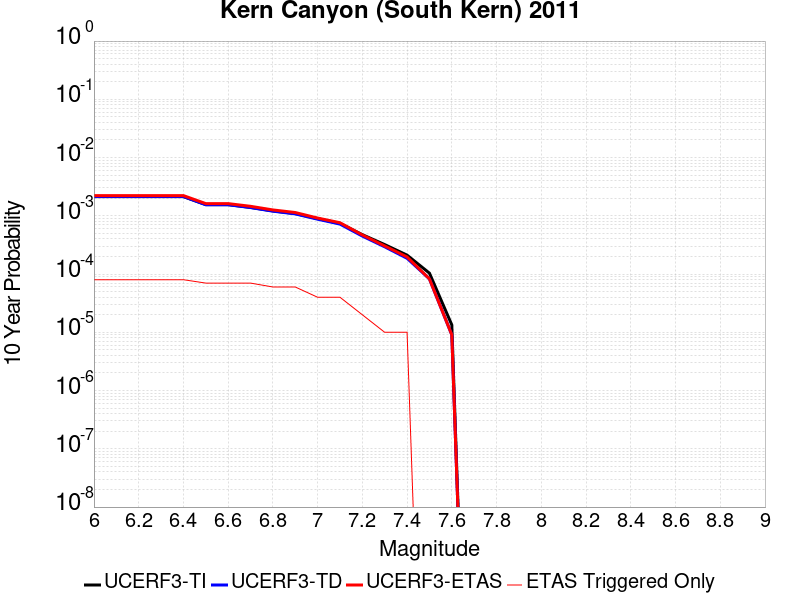 |

| Magnitude | 1 wk TI Prob | 1 wk TD Prob | 1 wk ETAS Prob | 1 wk ETAS/TD Gain | 1 wk ETAS Triggered Only | 1 mo TI Prob | 1 mo TD Prob | 1 mo ETAS Prob | 1 mo ETAS/TD Gain | 1 mo ETAS Triggered Only | 1 yr TI Prob | 1 yr TD Prob | 1 yr ETAS Prob | 1 yr ETAS/TD Gain | 1 yr ETAS Triggered Only | 10 yr TI Prob | 10 yr TD Prob | 10 yr ETAS Prob | 10 yr ETAS/TD Gain | 10 yr ETAS Triggered Only |
|-----|-----|-----|-----|-----|-----|-----|-----|-----|-----|-----|-----|-----|-----|-----|-----|-----|-----|-----|-----|-----|
| 6.0 | 4.105075E-6 | 4.1137264E-6 | 2.923925E-5 | 7.1077285 | 2.5125628E-5 | 1.7593058E-5 | 1.763014E-5 | 5.531792E-5 | 3.13769 | 3.768844E-5 | 2.1417443E-4 | 2.1462646E-4 | 2.6486692E-4 | 1.2340833 | 5.0251256E-5 | 0.0021396813 | 0.0021442557 | 0.002206935 | 1.0292313 | 6.281407E-5 |
| 6.1 | 4.105075E-6 | 4.1137264E-6 | 2.923925E-5 | 7.1077285 | 2.5125628E-5 | 1.7593058E-5 | 1.763014E-5 | 5.531792E-5 | 3.13769 | 3.768844E-5 | 2.1417443E-4 | 2.1462646E-4 | 2.6486692E-4 | 1.2340833 | 5.0251256E-5 | 0.0021396813 | 0.0021442557 | 0.002206935 | 1.0292313 | 6.281407E-5 |
| 6.2 | 4.105075E-6 | 4.1137264E-6 | 2.923925E-5 | 7.1077285 | 2.5125628E-5 | 1.7593058E-5 | 1.763014E-5 | 5.531792E-5 | 3.13769 | 3.768844E-5 | 2.1417443E-4 | 2.1462646E-4 | 2.6486692E-4 | 1.2340833 | 5.0251256E-5 | 0.0021396813 | 0.0021442557 | 0.002206935 | 1.0292313 | 6.281407E-5 |
| 6.3 | 4.105075E-6 | 4.1137264E-6 | 2.923925E-5 | 7.1077285 | 2.5125628E-5 | 1.7593058E-5 | 1.763014E-5 | 5.531792E-5 | 3.13769 | 3.768844E-5 | 2.1417443E-4 | 2.1462646E-4 | 2.6486692E-4 | 1.2340833 | 5.0251256E-5 | 0.0021396813 | 0.0021442557 | 0.002206935 | 1.0292313 | 6.281407E-5 |
| 6.4 | 4.105075E-6 | 4.1137264E-6 | 2.923925E-5 | 7.1077285 | 2.5125628E-5 | 1.7593058E-5 | 1.763014E-5 | 5.531792E-5 | 3.13769 | 3.768844E-5 | 2.1417443E-4 | 2.1462646E-4 | 2.6486692E-4 | 1.2340833 | 5.0251256E-5 | 0.0021396813 | 0.0021442557 | 0.002206935 | 1.0292313 | 6.281407E-5 |
| 6.5 | 2.9849807E-6 | 2.9731548E-6 | 2.8098708E-5 | 9.450806 | 2.5125628E-5 | 1.2792712E-5 | 1.274203E-5 | 5.0429993E-5 | 3.9577675 | 3.768844E-5 | 1.5574014E-4 | 1.5512333E-4 | 1.9280592E-4 | 1.2429203 | 3.768844E-5 | 0.0015563103 | 0.0015501656 | 0.001600339 | 1.0323664 | 5.0251256E-5 |
| 6.6 | 2.9849807E-6 | 2.9731548E-6 | 2.8098708E-5 | 9.450806 | 2.5125628E-5 | 1.2792712E-5 | 1.274203E-5 | 5.0429993E-5 | 3.9577675 | 3.768844E-5 | 1.5574014E-4 | 1.5512333E-4 | 1.9280592E-4 | 1.2429203 | 3.768844E-5 | 0.0015563103 | 0.0015501656 | 0.001600339 | 1.0323664 | 5.0251256E-5 |
| 6.7 | 2.6756725E-6 | 2.6582206E-6 | 2.7783783E-5 | 10.452023 | 2.5125628E-5 | 1.1467117E-5 | 1.1392325E-5 | 4.908034E-5 | 4.308193 | 3.768844E-5 | 1.396032E-4 | 1.3869285E-4 | 1.7637605E-4 | 1.2717026 | 3.768844E-5 | 0.0013951553 | 0.0013860738 | 0.0014362554 | 1.0362041 | 5.0251256E-5 |
| 6.8 | 2.3283721E-6 | 2.3047787E-6 | 2.743035E-5 | 11.90151 | 2.5125628E-5 | 9.9787E-6 | 9.877586E-6 | 4.7565656E-5 | 4.815514 | 3.768844E-5 | 1.214839E-4 | 1.20253055E-4 | 1.5793696E-4 | 1.3133718 | 3.768844E-5 | 0.001214175 | 0.0012018873 | 0.0012520781 | 1.0417601 | 5.0251256E-5 |
| 6.9 | 2.0972677E-6 | 2.0696411E-6 | 2.7195218E-5 | 13.140064 | 2.5125628E-5 | 8.988259E-6 | 8.869861E-6 | 4.655797E-5 | 5.2490077 | 3.768844E-5 | 1.0942656E-4 | 1.0798526E-4 | 1.4566963E-4 | 1.348977 | 3.768844E-5 | 0.0010937268 | 0.0010793337 | 0.0011295307 | 1.0465074 | 5.0251256E-5 |
| 7.0 | 1.7132242E-6 | 1.6787036E-6 | 2.680429E-5 | 15.967257 | 2.5125628E-5 | 7.3423685E-6 | 7.194424E-6 | 3.2319873E-5 | 4.49235 | 2.5125628E-5 | 8.938967E-5 | 8.758863E-5 | 1.12712056E-4 | 1.2868344 | 2.5125628E-5 | 8.935372E-4 | 8.7554497E-4 | 9.132004E-4 | 1.043008 | 3.768844E-5 |
| 7.1 | 1.4215541E-6 | 1.3815752E-6 | 2.6507169E-5 | 19.186193 | 2.5125628E-5 | 6.0923603E-6 | 5.9210233E-6 | 3.1046504E-5 | 5.2434354 | 2.5125628E-5 | 7.417196E-5 | 7.20861E-5 | 9.7209915E-5 | 1.3485252 | 2.5125628E-5 | 7.414721E-4 | 7.206299E-4 | 7.5829116E-4 | 1.0522616 | 3.768844E-5 |
| 7.2 | 9.097853E-7 | 8.6037755E-7 | 1.34231805E-5 | 15.6015005 | 1.2562814E-5 | 3.899074E-6 | 3.6873273E-6 | 1.6250095E-5 | 4.407012 | 1.2562814E-5 | 4.7470192E-5 | 4.4892295E-5 | 5.7454545E-5 | 1.2798308 | 1.2562814E-5 | 4.7460053E-4 | 4.4883334E-4 | 4.739477E-4 | 1.0559547 | 2.5125628E-5 |
| 7.3 | 6.144169E-7 | 5.628206E-7 | 1.3125627E-5 | 23.321156 | 1.2562814E-5 | 2.6332125E-6 | 2.4120861E-6 | 1.497487E-5 | 6.208265 | 1.2562814E-5 | 3.205889E-5 | 2.9366758E-5 | 4.1929205E-5 | 1.4277778 | 1.2562814E-5 | 3.2054266E-4 | 2.936293E-4 | 3.0618842E-4 | 1.042772 | 1.2562814E-5 |
| 7.4 | 4.049844E-7 | 3.5728314E-7 | 1.2920093E-5 | 36.162056 | 1.2562814E-5 | 1.7356463E-6 | 1.5312125E-6 | 1.4094007E-5 | 9.204474 | 1.2562814E-5 | 2.1131287E-5 | 1.8642357E-5 | 3.1204934E-5 | 1.673873 | 1.2562814E-5 | 2.1129279E-4 | 1.8640817E-4 | 1.9896864E-4 | 1.0673815 | 1.2562814E-5 |
| 7.5 | 1.9871162E-7 | 1.583044E-7 | 1.583044E-7 | 1.0 | 0.0 | 8.5162094E-7 | 6.7844724E-7 | 6.7844724E-7 | 1.0 | 0.0 | 1.0368436E-5 | 8.260065E-6 | 8.260065E-6 | 1.0 | 0.0 | 1.0367952E-4 | 8.259767E-5 | 8.259767E-5 | 1.0 | 0.0 |
| 7.6 | 2.572245E-8 | 1.7352555E-8 | 1.7352555E-8 | 1.0 | 0.0 | 1.10239064E-7 | 7.436809E-8 | 7.436809E-8 | 1.0 | 0.0 | 1.3421597E-6 | 9.054312E-7 | 9.054312E-7 | 1.0 | 0.0 | 1.3421517E-5 | 9.05428E-6 | 9.05428E-6 | 1.0 | 0.0 |

## San Jacinto (Coyote Creek)
*[(top)](#table-of-contents)*

| 1 Week | 1 Month | 1 Year | 10 Year |
|-----|-----|-----|-----|
| 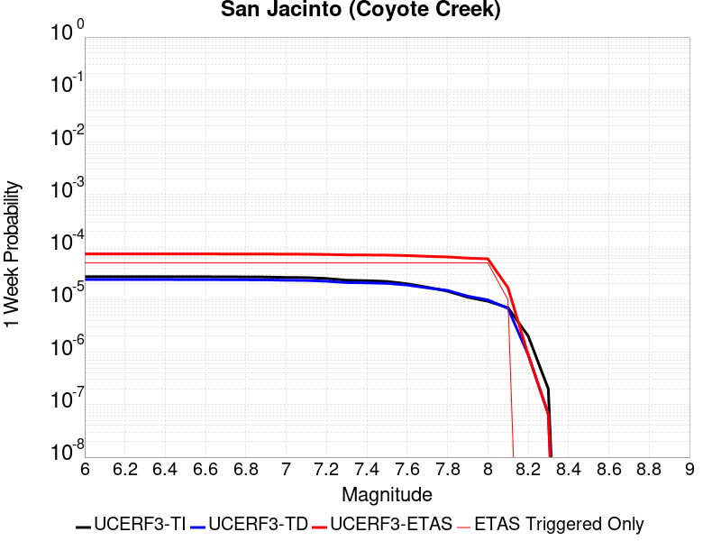 |  |  |  |

| Magnitude | 1 wk TI Prob | 1 wk TD Prob | 1 wk ETAS Prob | 1 wk ETAS/TD Gain | 1 wk ETAS Triggered Only | 1 mo TI Prob | 1 mo TD Prob | 1 mo ETAS Prob | 1 mo ETAS/TD Gain | 1 mo ETAS Triggered Only | 1 yr TI Prob | 1 yr TD Prob | 1 yr ETAS Prob | 1 yr ETAS/TD Gain | 1 yr ETAS Triggered Only | 10 yr TI Prob | 10 yr TD Prob | 10 yr ETAS Prob | 10 yr ETAS/TD Gain | 10 yr ETAS Triggered Only |
|-----|-----|-----|-----|-----|-----|-----|-----|-----|-----|-----|-----|-----|-----|-----|-----|-----|-----|-----|-----|-----|
| 6.0 | 2.7374346E-5 | 2.4145214E-5 | 7.4395255E-5 | 3.0811596 | 5.0251256E-5 | 1.1731335E-4 | 1.034754E-4 | 1.5372146E-4 | 1.4855846 | 5.0251256E-5 | 0.0014273542 | 0.0012590875 | 0.0013218224 | 1.0498258 | 6.281407E-5 | 0.01418221 | 0.012928318 | 0.01299032 | 1.0047958 | 6.281407E-5 |
| 6.1 | 2.7374346E-5 | 2.4145214E-5 | 7.4395255E-5 | 3.0811596 | 5.0251256E-5 | 1.1731335E-4 | 1.034754E-4 | 1.5372146E-4 | 1.4855846 | 5.0251256E-5 | 0.0014273542 | 0.0012590875 | 0.0013218224 | 1.0498258 | 6.281407E-5 | 0.01418221 | 0.012928318 | 0.01299032 | 1.0047958 | 6.281407E-5 |
| 6.2 | 2.7374346E-5 | 2.4145214E-5 | 7.4395255E-5 | 3.0811596 | 5.0251256E-5 | 1.1731335E-4 | 1.034754E-4 | 1.5372146E-4 | 1.4855846 | 5.0251256E-5 | 0.0014273542 | 0.0012590875 | 0.0013218224 | 1.0498258 | 6.281407E-5 | 0.01418221 | 0.012928318 | 0.01299032 | 1.0047958 | 6.281407E-5 |
| 6.3 | 2.7374346E-5 | 2.4145214E-5 | 7.4395255E-5 | 3.0811596 | 5.0251256E-5 | 1.1731335E-4 | 1.034754E-4 | 1.5372146E-4 | 1.4855846 | 5.0251256E-5 | 0.0014273542 | 0.0012590875 | 0.0013218224 | 1.0498258 | 6.281407E-5 | 0.01418221 | 0.012928318 | 0.01299032 | 1.0047958 | 6.281407E-5 |
| 6.4 | 2.7374346E-5 | 2.4145214E-5 | 7.4395255E-5 | 3.0811596 | 5.0251256E-5 | 1.1731335E-4 | 1.034754E-4 | 1.5372146E-4 | 1.4855846 | 5.0251256E-5 | 0.0014273542 | 0.0012590875 | 0.0013218224 | 1.0498258 | 6.281407E-5 | 0.01418221 | 0.012928318 | 0.01299032 | 1.0047958 | 6.281407E-5 |
| 6.5 | 2.7282445E-5 | 2.4031293E-5 | 7.428134E-5 | 3.0910256 | 5.0251256E-5 | 1.16919524E-4 | 1.029872E-4 | 1.5323328E-4 | 1.4878867 | 5.0251256E-5 | 0.0014225657 | 0.0012531505 | 0.0013158859 | 1.0500621 | 6.281407E-5 | 0.014134934 | 0.012869646 | 0.012931651 | 1.004818 | 6.281407E-5 |
| 6.6 | 2.7282445E-5 | 2.4031293E-5 | 7.428134E-5 | 3.0910256 | 5.0251256E-5 | 1.16919524E-4 | 1.029872E-4 | 1.5323328E-4 | 1.4878867 | 5.0251256E-5 | 0.0014225657 | 0.0012531505 | 0.0013158859 | 1.0500621 | 6.281407E-5 | 0.014134934 | 0.012869646 | 0.012931651 | 1.004818 | 6.281407E-5 |
| 6.7 | 2.7216198E-5 | 2.3956412E-5 | 7.4206466E-5 | 3.0975616 | 5.0251256E-5 | 1.1663563E-4 | 1.02666316E-4 | 1.5291241E-4 | 1.4894117 | 5.0251256E-5 | 0.0014191137 | 0.0012492483 | 0.0013119839 | 1.0502187 | 6.281407E-5 | 0.014100855 | 0.0128310565 | 0.012893065 | 1.0048326 | 6.281407E-5 |
| 6.8 | 2.7078617E-5 | 2.387363E-5 | 7.412369E-5 | 3.1048353 | 5.0251256E-5 | 1.1604605E-4 | 1.0231156E-4 | 1.5255768E-4 | 1.4911089 | 5.0251256E-5 | 0.001411945 | 0.0012449342 | 0.00130767 | 1.0503929 | 6.281407E-5 | 0.014030075 | 0.012788199 | 0.01285021 | 1.0048491 | 6.281407E-5 |
| 6.9 | 2.6982952E-5 | 2.3793142E-5 | 7.40432E-5 | 3.1119556 | 5.0251256E-5 | 1.15636096E-4 | 1.0196664E-4 | 1.5221277E-4 | 1.4927703 | 5.0251256E-5 | 0.0014069602 | 0.0012407395 | 0.0013034756 | 1.0505635 | 6.281407E-5 | 0.013980856 | 0.012746515 | 0.012808528 | 1.0048652 | 6.281407E-5 |
| 7.0 | 2.6449972E-5 | 2.3370165E-5 | 7.362025E-5 | 3.150181 | 5.0251256E-5 | 1.1335209E-4 | 1.00154015E-4 | 1.5040024E-4 | 1.5016896 | 5.0251256E-5 | 0.001379188 | 0.0012186957 | 0.0012814332 | 1.0514792 | 6.281407E-5 | 0.0137065975 | 0.0125278765 | 0.0125899045 | 1.0049511 | 6.281407E-5 |
| 7.1 | 2.6257849E-5 | 2.3196202E-5 | 7.3446296E-5 | 3.166307 | 5.0251256E-5 | 1.1252879E-4 | 9.940852E-5 | 1.4965478E-4 | 1.5054523 | 5.0251256E-5 | 0.0013691769 | 0.0012096294 | 0.0012723674 | 1.0518656 | 6.281407E-5 | 0.013607717 | 0.012437741 | 0.012499774 | 1.0049875 | 6.281407E-5 |
| 7.2 | 2.5270041E-5 | 2.2390966E-5 | 7.2641094E-5 | 3.2442145 | 5.0251256E-5 | 1.0829568E-4 | 9.595777E-5 | 1.462042E-4 | 1.5236307 | 5.0251256E-5 | 0.0013177024 | 0.0011676621 | 0.0012304027 | 1.0537319 | 6.281407E-5 | 0.013099162 | 0.012018777 | 0.012080837 | 1.0051636 | 6.281407E-5 |
| 7.3 | 2.339701E-5 | 2.1122814E-5 | 7.137301E-5 | 3.3789537 | 5.0251256E-5 | 1.0026905E-4 | 9.0523215E-5 | 1.4076993E-4 | 1.5550698 | 5.0251256E-5 | 0.001220092 | 0.0011015651 | 0.0011643099 | 1.0569597 | 6.281407E-5 | 0.012134149 | 0.011357696 | 0.011419796 | 1.0054678 | 6.281407E-5 |
| 7.4 | 2.296333E-5 | 2.0853171E-5 | 7.110338E-5 | 3.4097157 | 5.0251256E-5 | 9.841056E-5 | 8.936768E-5 | 1.3961445E-4 | 1.5622476 | 5.0251256E-5 | 0.0011974899 | 0.0010875105 | 0.0011502563 | 1.0576967 | 6.281407E-5 | 0.011910575 | 0.01121681 | 0.011278919 | 1.0055372 | 6.281407E-5 |
| 7.5 | 2.2188895E-5 | 2.0376096E-5 | 7.062633E-5 | 3.4661365 | 5.0251256E-5 | 9.50918E-5 | 8.732321E-5 | 1.3757008E-4 | 1.5754125 | 5.0251256E-5 | 0.0011571277 | 0.0010626436 | 0.0011253909 | 1.0590483 | 6.281407E-5 | 0.011511209 | 0.010966429 | 0.011028553 | 1.0056651 | 6.281407E-5 |
| 7.6 | 2.0013189E-5 | 1.8962366E-5 | 6.921267E-5 | 3.6500018 | 5.0251256E-5 | 8.5767984E-5 | 8.1264756E-5 | 1.3151193E-4 | 1.6183144 | 5.0251256E-5 | 0.001043725 | 9.889511E-4 | 0.0010517031 | 1.0634531 | 6.281407E-5 | 0.010388365 | 0.010224434 | 0.010286605 | 1.0060807 | 6.281407E-5 |
| 7.7 | 1.7230794E-5 | 1.674371E-5 | 6.699412E-5 | 4.0011516 | 5.0251256E-5 | 7.384417E-5 | 7.175679E-5 | 1.22004436E-4 | 1.7002494 | 5.0251256E-5 | 8.986819E-4 | 8.7328954E-4 | 9.3604875E-4 | 1.0718653 | 6.281407E-5 | 0.008950562 | 0.009062956 | 0.009125201 | 1.006868 | 6.281407E-5 |
| 7.8 | 1.4478809E-5 | 1.4990978E-5 | 6.524148E-5 | 4.35205 | 5.0251256E-5 | 6.205057E-5 | 6.424547E-5 | 1.144935E-4 | 1.7821256 | 5.0251256E-5 | 7.552038E-4 | 7.819085E-4 | 8.446735E-4 | 1.0802715 | 6.281407E-5 | 0.0075264242 | 0.008141387 | 0.00820369 | 1.0076526 | 6.281407E-5 |
| 7.9 | 1.1114467E-5 | 1.1645102E-5 | 6.189577E-5 | 5.3151765 | 5.0251256E-5 | 4.7632562E-5 | 4.990663E-5 | 1.00155376E-4 | 2.0068552 | 5.0251256E-5 | 5.797721E-4 | 6.074444E-4 | 6.702203E-4 | 1.1033443 | 6.281407E-5 | 0.0057826187 | 0.0063803247 | 0.006442738 | 1.0097822 | 6.281407E-5 |
| 8.0 | 9.327402E-6 | 9.899186E-6 | 6.0149945E-5 | 6.0762515 | 5.0251256E-5 | 3.9973966E-5 | 4.2424395E-5 | 9.267352E-5 | 2.1844394 | 5.0251256E-5 | 4.8657437E-4 | 5.1639514E-4 | 5.791768E-4 | 1.1215768 | 6.281407E-5 | 0.0048551033 | 0.0054499684 | 0.00551244 | 1.0114628 | 6.281407E-5 |
| 8.1 | 7.0235833E-6 | 6.827495E-6 | 1.9390223E-5 | 2.8400202 | 1.2562814E-5 | 3.0100724E-5 | 2.9260367E-5 | 4.1822816E-5 | 1.4293332 | 1.2562814E-5 | 3.664147E-4 | 3.5618723E-4 | 3.687456E-4 | 1.0352577 | 1.2562814E-5 | 0.003658111 | 0.0037876023 | 0.0038001176 | 1.0033042 | 1.2562814E-5 |
| 8.2 | 2.0358202E-6 | 8.994527E-7 | 8.994527E-7 | 1.0 | 0.0 | 8.724915E-6 | 3.854792E-6 | 3.854792E-6 | 1.0 | 0.0 | 1.06220665E-4 | 4.69311E-5 | 4.69311E-5 | 1.0 | 0.0 | 0.001061699 | 5.3254166E-4 | 5.3254166E-4 | 1.0 | 0.0 |
| 8.3 | 2.0051264E-7 | 6.617272E-8 | 6.617272E-8 | 1.0 | 0.0 | 8.5933965E-7 | 2.8359733E-7 | 2.8359733E-7 | 1.0 | 0.0 | 1.046241E-5 | 3.4527925E-6 | 3.4527925E-6 | 1.0 | 0.0 | 1.0461917E-4 | 4.01389E-5 | 4.01389E-5 | 1.0 | 0.0 |

## Coronado Bank alt1
*[(top)](#table-of-contents)*

| 1 Week | 1 Month | 1 Year | 10 Year |
|-----|-----|-----|-----|
|  |  |  | 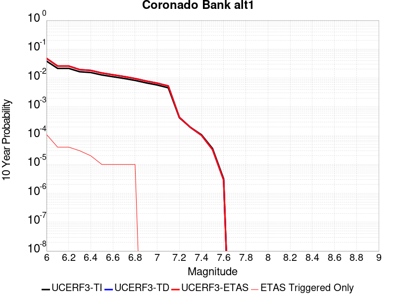 |

| Magnitude | 1 wk TI Prob | 1 wk TD Prob | 1 wk ETAS Prob | 1 wk ETAS/TD Gain | 1 wk ETAS Triggered Only | 1 mo TI Prob | 1 mo TD Prob | 1 mo ETAS Prob | 1 mo ETAS/TD Gain | 1 mo ETAS Triggered Only | 1 yr TI Prob | 1 yr TD Prob | 1 yr ETAS Prob | 1 yr ETAS/TD Gain | 1 yr ETAS Triggered Only | 10 yr TI Prob | 10 yr TD Prob | 10 yr ETAS Prob | 10 yr ETAS/TD Gain | 10 yr ETAS Triggered Only |
|-----|-----|-----|-----|-----|-----|-----|-----|-----|-----|-----|-----|-----|-----|-----|-----|-----|-----|-----|-----|-----|
| 6.0 | 7.533492E-5 | 9.394913E-5 | 1.190724E-4 | 1.2674135 | 2.5125628E-5 | 3.22824E-4 | 4.0258127E-4 | 4.2769677E-4 | 1.0623862 | 2.5125628E-5 | 0.0039233007 | 0.0048909658 | 0.0049284697 | 1.007668 | 3.768844E-5 | 0.03854755 | 0.04790356 | 0.047963366 | 1.0012485 | 6.281407E-5 |
| 6.1 | 4.1807285E-5 | 5.049283E-5 | 7.561719E-5 | 1.4975827 | 2.5125628E-5 | 1.7916178E-4 | 2.1638049E-4 | 2.4150067E-4 | 1.1160927 | 2.5125628E-5 | 0.0021791123 | 0.0026313474 | 0.002656407 | 1.0095235 | 2.5125628E-5 | 0.021578677 | 0.026011046 | 0.02603552 | 1.0009408 | 2.5125628E-5 |
| 6.2 | 4.1807285E-5 | 5.049283E-5 | 7.561719E-5 | 1.4975827 | 2.5125628E-5 | 1.7916178E-4 | 2.1638049E-4 | 2.4150067E-4 | 1.1160927 | 2.5125628E-5 | 0.0021791123 | 0.0026313474 | 0.002656407 | 1.0095235 | 2.5125628E-5 | 0.021578677 | 0.026011046 | 0.02603552 | 1.0009408 | 2.5125628E-5 |
| 6.3 | 3.1793104E-5 | 3.7711117E-5 | 5.0273455E-5 | 1.3331203 | 1.2562814E-5 | 1.3624904E-4 | 1.6160926E-4 | 1.7417005E-4 | 1.0777231 | 1.2562814E-5 | 0.0016575698 | 0.001965848 | 0.0019783862 | 1.0063779 | 1.2562814E-5 | 0.016452603 | 0.019488465 | 0.019500783 | 1.000632 | 1.2562814E-5 |
| 6.4 | 2.9878007E-5 | 3.5335794E-5 | 4.7898164E-5 | 1.355514 | 1.2562814E-5 | 1.2804232E-4 | 1.5143053E-4 | 1.6399144E-4 | 1.0829483 | 1.2562814E-5 | 0.0015578003 | 0.0018421387 | 0.0018546784 | 1.0068071 | 1.2562814E-5 | 0.015469253 | 0.01827244 | 0.018284775 | 1.000675 | 1.2562814E-5 |
| 6.5 | 2.4512565E-5 | 2.8764043E-5 | 4.1326497E-5 | 1.4367416 | 1.2562814E-5 | 1.0504962E-4 | 1.2326881E-4 | 1.3583007E-4 | 1.1019014 | 1.2562814E-5 | 0.0012782287 | 0.0014997921 | 0.0015123361 | 1.0083638 | 1.2562814E-5 | 0.012709012 | 0.014899683 | 0.014912059 | 1.0008307 | 1.2562814E-5 |
| 6.6 | 2.1317413E-5 | 2.490667E-5 | 3.746917E-5 | 1.504383 | 1.2562814E-5 | 9.135714E-5 | 1.0673863E-4 | 1.193001E-4 | 1.1176844 | 1.2562814E-5 | 0.0011117056 | 0.0012987906 | 0.001311337 | 1.0096601 | 1.2562814E-5 | 0.011061605 | 0.012914404 | 0.012926806 | 1.0009602 | 1.2562814E-5 |
| 6.7 | 1.8585655E-5 | 2.163488E-5 | 3.4197423E-5 | 1.5806615 | 1.2562814E-5 | 7.9650374E-5 | 9.271773E-5 | 1.0527938E-4 | 1.1354827 | 1.2562814E-5 | 9.6931186E-4 | 0.0011282742 | 0.0011408229 | 1.011122 | 1.2562814E-5 | 0.0096509475 | 0.011227623 | 0.011240044 | 1.0011064 | 1.2562814E-5 |
| 6.8 | 1.5862879E-5 | 1.8419474E-5 | 3.0982057E-5 | 1.6820272 | 1.2562814E-5 | 6.798199E-5 | 7.893833E-5 | 9.150015E-5 | 1.1591346 | 1.2562814E-5 | 8.273665E-4 | 9.6066965E-4 | 9.732204E-4 | 1.0130646 | 1.2562814E-5 | 0.008242928 | 0.00956715 | 0.009579592 | 1.0013006 | 1.2562814E-5 |
| 6.9 | 1.3021509E-5 | 1.5095265E-5 | 1.5095265E-5 | 1.0 | 0.0 | 5.5805274E-5 | 6.469249E-5 | 6.469249E-5 | 1.0 | 0.0 | 6.792174E-4 | 7.8736455E-4 | 7.8736455E-4 | 1.0 | 0.0 | 0.006771452 | 0.007847573 | 0.007847573 | 1.0 | 0.0 |
| 7.0 | 1.0974371E-5 | 1.2720104E-5 | 1.2720104E-5 | 1.0 | 0.0 | 4.7032172E-5 | 5.451369E-5 | 5.451369E-5 | 1.0 | 0.0 | 5.7246623E-4 | 6.6351966E-4 | 6.6351966E-4 | 1.0 | 0.0 | 0.0057099373 | 0.006617135 | 0.006617135 | 1.0 | 0.0 |
| 7.1 | 8.766221E-6 | 1.01638325E-5 | 1.01638325E-5 | 1.0 | 0.0 | 3.7568978E-5 | 4.355865E-5 | 4.355865E-5 | 1.0 | 0.0 | 4.573063E-4 | 5.3021475E-4 | 5.3021475E-4 | 1.0 | 0.0 | 0.0045636636 | 0.0052911965 | 0.0052911965 | 1.0 | 0.0 |
| 7.2 | 8.026024E-7 | 8.331765E-7 | 8.331765E-7 | 1.0 | 0.0 | 3.43972E-6 | 3.5707515E-6 | 3.5707515E-6 | 1.0 | 0.0 | 4.1877785E-5 | 4.3473043E-5 | 4.3473043E-5 | 1.0 | 0.0 | 4.1869894E-4 | 4.3464647E-4 | 4.3464647E-4 | 1.0 | 0.0 |
| 7.3 | 3.7293114E-7 | 3.7000953E-7 | 3.7000953E-7 | 1.0 | 0.0 | 1.5982754E-6 | 1.5857541E-6 | 1.5857541E-6 | 1.0 | 0.0 | 1.9458828E-5 | 1.9306386E-5 | 1.9306386E-5 | 1.0 | 0.0 | 1.9457124E-4 | 1.9304715E-4 | 1.9304715E-4 | 1.0 | 0.0 |
| 7.4 | 2.0557036E-7 | 1.9674363E-7 | 1.9674363E-7 | 1.0 | 0.0 | 8.810155E-7 | 8.431867E-7 | 8.431867E-7 | 1.0 | 0.0 | 1.0726311E-5 | 1.026575E-5 | 1.026575E-5 | 1.0 | 0.0 | 1.0725793E-4 | 1.0265279E-4 | 1.0265279E-4 | 1.0 | 0.0 |
| 7.5 | 6.845446E-8 | 6.279369E-8 | 6.279369E-8 | 1.0 | 0.0 | 2.9337625E-7 | 2.691158E-7 | 2.691158E-7 | 1.0 | 0.0 | 3.5718497E-6 | 3.2764797E-6 | 3.2764797E-6 | 1.0 | 0.0 | 3.5717923E-5 | 3.2764325E-5 | 3.2764325E-5 | 1.0 | 0.0 |
| 7.6 | 6.0975145E-9 | 5.53185E-9 | 5.53185E-9 | 1.0 | 0.0 | 2.6132206E-8 | 2.370793E-8 | 2.370793E-8 | 1.0 | 0.0 | 3.1815955E-7 | 2.88644E-7 | 2.88644E-7 | 1.0 | 0.0 | 3.181591E-6 | 2.8864374E-6 | 2.8864374E-6 | 1.0 | 0.0 |

## Raymond
*[(top)](#table-of-contents)*

| 1 Week | 1 Month | 1 Year | 10 Year |
|-----|-----|-----|-----|
|  |  |  |  |

| Magnitude | 1 wk TI Prob | 1 wk TD Prob | 1 wk ETAS Prob | 1 wk ETAS/TD Gain | 1 wk ETAS Triggered Only | 1 mo TI Prob | 1 mo TD Prob | 1 mo ETAS Prob | 1 mo ETAS/TD Gain | 1 mo ETAS Triggered Only | 1 yr TI Prob | 1 yr TD Prob | 1 yr ETAS Prob | 1 yr ETAS/TD Gain | 1 yr ETAS Triggered Only | 10 yr TI Prob | 10 yr TD Prob | 10 yr ETAS Prob | 10 yr ETAS/TD Gain | 10 yr ETAS Triggered Only |
|-----|-----|-----|-----|-----|-----|-----|-----|-----|-----|-----|-----|-----|-----|-----|-----|-----|-----|-----|-----|-----|
| 6.0 | 1.5157413E-5 | 1.5810128E-5 | 1.5810128E-5 | 1.0 | 0.0 | 6.4958724E-5 | 6.7756075E-5 | 6.7756075E-5 | 1.0 | 0.0 | 7.905855E-4 | 8.2464307E-4 | 8.371955E-4 | 1.0152217 | 1.2562814E-5 | 0.007877788 | 0.008218348 | 0.008280646 | 1.0075803 | 6.281407E-5 |
| 6.1 | 1.5157413E-5 | 1.5810128E-5 | 1.5810128E-5 | 1.0 | 0.0 | 6.4958724E-5 | 6.7756075E-5 | 6.7756075E-5 | 1.0 | 0.0 | 7.905855E-4 | 8.2464307E-4 | 8.371955E-4 | 1.0152217 | 1.2562814E-5 | 0.007877788 | 0.008218348 | 0.008280646 | 1.0075803 | 6.281407E-5 |
| 6.2 | 1.5157413E-5 | 1.5810128E-5 | 1.5810128E-5 | 1.0 | 0.0 | 6.4958724E-5 | 6.7756075E-5 | 6.7756075E-5 | 1.0 | 0.0 | 7.905855E-4 | 8.2464307E-4 | 8.371955E-4 | 1.0152217 | 1.2562814E-5 | 0.007877788 | 0.008218348 | 0.008280646 | 1.0075803 | 6.281407E-5 |
| 6.3 | 1.5157413E-5 | 1.5810128E-5 | 1.5810128E-5 | 1.0 | 0.0 | 6.4958724E-5 | 6.7756075E-5 | 6.7756075E-5 | 1.0 | 0.0 | 7.905855E-4 | 8.2464307E-4 | 8.371955E-4 | 1.0152217 | 1.2562814E-5 | 0.007877788 | 0.008218348 | 0.008280646 | 1.0075803 | 6.281407E-5 |
| 6.4 | 1.3941944E-5 | 1.445469E-5 | 1.445469E-5 | 1.0 | 0.0 | 5.9749822E-5 | 6.1947336E-5 | 6.1947336E-5 | 1.0 | 0.0 | 7.2721124E-4 | 7.5397117E-4 | 7.6652446E-4 | 1.0166496 | 1.2562814E-5 | 0.007248361 | 0.0075164647 | 0.0075788065 | 1.0082941 | 6.281407E-5 |
| 6.5 | 1.3941944E-5 | 1.445469E-5 | 1.445469E-5 | 1.0 | 0.0 | 5.9749822E-5 | 6.1947336E-5 | 6.1947336E-5 | 1.0 | 0.0 | 7.2721124E-4 | 7.5397117E-4 | 7.6652446E-4 | 1.0166496 | 1.2562814E-5 | 0.007248361 | 0.0075164647 | 0.0075788065 | 1.0082941 | 6.281407E-5 |
| 6.6 | 1.0542609E-5 | 1.0671113E-5 | 1.0671113E-5 | 1.0 | 0.0 | 4.5181827E-5 | 4.573257E-5 | 4.573257E-5 | 1.0 | 0.0 | 5.499499E-4 | 5.5665727E-4 | 5.6921307E-4 | 1.0225557 | 1.2562814E-5 | 0.005485909 | 0.00555319 | 0.0055906693 | 1.0067492 | 3.768844E-5 |
| 6.7 | 1.0542609E-5 | 1.0671113E-5 | 1.0671113E-5 | 1.0 | 0.0 | 4.5181827E-5 | 4.573257E-5 | 4.573257E-5 | 1.0 | 0.0 | 5.499499E-4 | 5.5665727E-4 | 5.6921307E-4 | 1.0225557 | 1.2562814E-5 | 0.005485909 | 0.00555319 | 0.0055906693 | 1.0067492 | 3.768844E-5 |
| 6.8 | 1.0079132E-5 | 1.0176646E-5 | 1.0176646E-5 | 1.0 | 0.0 | 4.3195567E-5 | 4.3613498E-5 | 4.3613498E-5 | 1.0 | 0.0 | 5.257791E-4 | 5.3087034E-4 | 5.434265E-4 | 1.023652 | 1.2562814E-5 | 0.0052453685 | 0.005296571 | 0.00533406 | 1.0070779 | 3.768844E-5 |
| 6.9 | 7.721598E-6 | 7.5489047E-6 | 7.5489047E-6 | 1.0 | 0.0 | 3.3092143E-5 | 3.2352054E-5 | 3.2352054E-5 | 1.0 | 0.0 | 4.0282236E-4 | 3.9381627E-4 | 3.9381627E-4 | 1.0 | 0.0 | 0.0040209293 | 0.0039313175 | 0.0039563444 | 1.006366 | 2.5125628E-5 |
| 7.0 | 7.137566E-6 | 6.9113057E-6 | 6.9113057E-6 | 1.0 | 0.0 | 3.058921E-5 | 2.961955E-5 | 2.961955E-5 | 1.0 | 0.0 | 3.7236E-4 | 3.6055944E-4 | 3.6055944E-4 | 1.0 | 0.0 | 0.0037173668 | 0.0035998628 | 0.003624898 | 1.0069544 | 2.5125628E-5 |
| 7.1 | 5.654976E-6 | 5.29954E-6 | 5.29954E-6 | 1.0 | 0.0 | 2.4235387E-5 | 2.2712118E-5 | 2.2712118E-5 | 1.0 | 0.0 | 2.9502588E-4 | 2.7648517E-4 | 2.7648517E-4 | 1.0 | 0.0 | 0.0029463451 | 0.002761443 | 0.002773971 | 1.0045367 | 1.2562814E-5 |
| 7.2 | 4.9358455E-6 | 4.5266574E-6 | 4.5266574E-6 | 1.0 | 0.0 | 2.1153453E-5 | 1.9399817E-5 | 1.9399817E-5 | 1.0 | 0.0 | 2.5751285E-4 | 2.3616731E-4 | 2.3616731E-4 | 1.0 | 0.0 | 0.0025721465 | 0.0023591854 | 0.0023717186 | 1.0053124 | 1.2562814E-5 |
| 7.3 | 4.2368597E-6 | 3.8056164E-6 | 3.8056164E-6 | 1.0 | 0.0 | 1.8157843E-5 | 1.6309683E-5 | 1.6309683E-5 | 1.0 | 0.0 | 2.2104931E-4 | 1.9855241E-4 | 1.9855241E-4 | 1.0 | 0.0 | 0.0022082955 | 0.0019837688 | 0.0019963067 | 1.0063202 | 1.2562814E-5 |
| 7.4 | 3.4999923E-6 | 3.043744E-6 | 3.043744E-6 | 1.0 | 0.0 | 1.49998805E-5 | 1.3044552E-5 | 1.3044552E-5 | 1.0 | 0.0 | 1.8260824E-4 | 1.5880594E-4 | 1.5880594E-4 | 1.0 | 0.0 | 0.0018245826 | 0.0015869403 | 0.0015994831 | 1.0079038 | 1.2562814E-5 |
| 7.5 | 2.738017E-6 | 2.3020468E-6 | 2.3020468E-6 | 1.0 | 0.0 | 1.1734306E-5 | 9.865878E-6 | 9.865878E-6 | 1.0 | 0.0 | 1.428558E-4 | 1.2011051E-4 | 1.2011051E-4 | 1.0 | 0.0 | 0.0014276401 | 0.0012004703 | 0.0012130181 | 1.0104524 | 1.2562814E-5 |
| 7.6 | 1.8186392E-6 | 1.442312E-6 | 1.442312E-6 | 1.0 | 0.0 | 7.794145E-6 | 6.181323E-6 | 6.181323E-6 | 1.0 | 0.0 | 9.488958E-5 | 7.5255055E-5 | 7.5255055E-5 | 1.0 | 0.0 | 9.4849075E-4 | 7.523072E-4 | 7.6486054E-4 | 1.0166864 | 1.2562814E-5 |
| 7.7 | 1.0660348E-6 | 7.6438056E-7 | 7.6438056E-7 | 1.0 | 0.0 | 4.5687125E-6 | 3.2759126E-6 | 3.2759126E-6 | 1.0 | 0.0 | 5.5622655E-5 | 3.9883522E-5 | 3.9883522E-5 | 1.0 | 0.0 | 5.5608735E-4 | 3.9877277E-4 | 4.1133058E-4 | 1.0314912 | 1.2562814E-5 |
| 7.8 | 6.913602E-7 | 4.3204133E-7 | 4.3204133E-7 | 1.0 | 0.0 | 2.962969E-6 | 1.8516045E-6 | 1.8516045E-6 | 1.0 | 0.0 | 3.607355E-5 | 2.2543056E-5 | 2.2543056E-5 | 1.0 | 0.0 | 3.6067693E-4 | 2.2541556E-4 | 2.3797553E-4 | 1.0557193 | 1.2562814E-5 |
| 7.9 | 7.425201E-8 | 5.3222113E-8 | 5.3222113E-8 | 1.0 | 0.0 | 3.1822285E-7 | 2.2809476E-7 | 2.2809476E-7 | 1.0 | 0.0 | 3.874356E-6 | 2.7770516E-6 | 2.7770516E-6 | 1.0 | 0.0 | 3.8742884E-5 | 2.7770298E-5 | 2.7770298E-5 | 1.0 | 0.0 |

## Santa Ynez River
*[(top)](#table-of-contents)*

| 1 Week | 1 Month | 1 Year | 10 Year |
|-----|-----|-----|-----|
|  |  |  |  |

| Magnitude | 1 wk TI Prob | 1 wk TD Prob | 1 wk ETAS Prob | 1 wk ETAS/TD Gain | 1 wk ETAS Triggered Only | 1 mo TI Prob | 1 mo TD Prob | 1 mo ETAS Prob | 1 mo ETAS/TD Gain | 1 mo ETAS Triggered Only | 1 yr TI Prob | 1 yr TD Prob | 1 yr ETAS Prob | 1 yr ETAS/TD Gain | 1 yr ETAS Triggered Only | 10 yr TI Prob | 10 yr TD Prob | 10 yr ETAS Prob | 10 yr ETAS/TD Gain | 10 yr ETAS Triggered Only |
|-----|-----|-----|-----|-----|-----|-----|-----|-----|-----|-----|-----|-----|-----|-----|-----|-----|-----|-----|-----|-----|
| 6.0 | 1.6396456E-5 | 1.7209435E-5 | 1.7209435E-5 | 1.0 | 0.0 | 7.026863E-5 | 7.375284E-5 | 8.631473E-5 | 1.1703241 | 1.2562814E-5 | 8.551848E-4 | 8.976064E-4 | 9.35261E-4 | 1.04195 | 3.768844E-5 | 0.0085190125 | 0.008943358 | 0.009005611 | 1.0069607 | 6.281407E-5 |
| 6.1 | 1.6396456E-5 | 1.7209435E-5 | 1.7209435E-5 | 1.0 | 0.0 | 7.026863E-5 | 7.375284E-5 | 8.631473E-5 | 1.1703241 | 1.2562814E-5 | 8.551848E-4 | 8.976064E-4 | 9.35261E-4 | 1.04195 | 3.768844E-5 | 0.0085190125 | 0.008943358 | 0.009005611 | 1.0069607 | 6.281407E-5 |
| 6.2 | 1.6396456E-5 | 1.7209435E-5 | 1.7209435E-5 | 1.0 | 0.0 | 7.026863E-5 | 7.375284E-5 | 8.631473E-5 | 1.1703241 | 1.2562814E-5 | 8.551848E-4 | 8.976064E-4 | 9.35261E-4 | 1.04195 | 3.768844E-5 | 0.0085190125 | 0.008943358 | 0.009005611 | 1.0069607 | 6.281407E-5 |
| 6.3 | 9.736976E-6 | 1.012233E-5 | 1.012233E-5 | 1.0 | 0.0 | 4.172923E-5 | 4.338072E-5 | 5.594299E-5 | 1.2895819 | 1.2562814E-5 | 5.0793495E-4 | 5.280373E-4 | 5.531497E-4 | 1.047558 | 2.5125628E-5 | 0.005067755 | 0.005268332 | 0.005305822 | 1.0071161 | 3.768844E-5 |
| 6.4 | 9.736976E-6 | 1.012233E-5 | 1.012233E-5 | 1.0 | 0.0 | 4.172923E-5 | 4.338072E-5 | 5.594299E-5 | 1.2895819 | 1.2562814E-5 | 5.0793495E-4 | 5.280373E-4 | 5.531497E-4 | 1.047558 | 2.5125628E-5 | 0.005067755 | 0.005268332 | 0.005305822 | 1.0071161 | 3.768844E-5 |
| 6.5 | 7.081964E-6 | 7.3298966E-6 | 7.3298966E-6 | 1.0 | 0.0 | 3.035092E-5 | 3.1413474E-5 | 4.397589E-5 | 1.3999054 | 1.2562814E-5 | 3.694598E-4 | 3.8239348E-4 | 3.949515E-4 | 1.0328405 | 1.2562814E-5 | 0.0036884616 | 0.0038175168 | 0.0038425466 | 1.0065565 | 2.5125628E-5 |
| 6.6 | 5.873247E-6 | 6.059743E-6 | 6.059743E-6 | 1.0 | 0.0 | 2.5170815E-5 | 2.5970074E-5 | 2.5970074E-5 | 1.0 | 0.0 | 3.064116E-4 | 3.1614062E-4 | 3.1614062E-4 | 1.0 | 0.0 | 0.0030598943 | 0.0031569963 | 0.0031695196 | 1.0039668 | 1.2562814E-5 |
| 6.7 | 4.973277E-6 | 5.115901E-6 | 5.115901E-6 | 1.0 | 0.0 | 2.1313872E-5 | 2.1925109E-5 | 2.1925109E-5 | 1.0 | 0.0 | 2.5946548E-4 | 2.66906E-4 | 2.66906E-4 | 1.0 | 0.0 | 0.0025916274 | 0.0026659032 | 0.0026784325 | 1.0046998 | 1.2562814E-5 |
| 6.8 | 4.396492E-6 | 4.5109778E-6 | 4.5109778E-6 | 1.0 | 0.0 | 1.884197E-5 | 1.9332621E-5 | 1.9332621E-5 | 1.0 | 0.0 | 2.2937685E-4 | 2.3534958E-4 | 2.3534958E-4 | 1.0 | 0.0 | 0.0022914023 | 0.0023510386 | 0.002363572 | 1.0053309 | 1.2562814E-5 |
| 6.9 | 3.5255632E-6 | 3.6013332E-6 | 3.6013332E-6 | 1.0 | 0.0 | 1.5109469E-5 | 1.5434196E-5 | 1.5434196E-5 | 1.0 | 0.0 | 1.8394225E-4 | 1.8789528E-4 | 1.8789528E-4 | 1.0 | 0.0 | 0.0018379007 | 0.0018773803 | 0.0018899195 | 1.006679 | 1.2562814E-5 |
| 7.0 | 3.211603E-6 | 3.273654E-6 | 3.273654E-6 | 1.0 | 0.0 | 1.376394E-5 | 1.4029872E-5 | 1.4029872E-5 | 1.0 | 0.0 | 1.6756308E-4 | 1.7080043E-4 | 1.7080043E-4 | 1.0 | 0.0 | 0.0016743679 | 0.0017067058 | 0.0017192472 | 1.0073483 | 1.2562814E-5 |
| 7.1 | 2.5094619E-6 | 2.5409204E-6 | 2.5409204E-6 | 1.0 | 0.0 | 1.0754793E-5 | 1.0889614E-5 | 1.0889614E-5 | 1.0 | 0.0 | 1.3093173E-4 | 1.3257304E-4 | 1.3257304E-4 | 1.0 | 0.0 | 0.0013085462 | 0.0013249456 | 0.0013374918 | 1.0094692 | 1.2562814E-5 |
| 7.2 | 2.0515774E-6 | 2.0619375E-6 | 2.0619375E-6 | 1.0 | 0.0 | 8.792445E-6 | 8.836846E-6 | 8.836846E-6 | 1.0 | 0.0 | 1.0704277E-4 | 1.0758333E-4 | 1.0758333E-4 | 1.0 | 0.0 | 0.0010699122 | 0.0010753168 | 0.001087866 | 1.0116704 | 1.2562814E-5 |
| 7.3 | 1.6845745E-6 | 1.6773907E-6 | 1.6773907E-6 | 1.0 | 0.0 | 7.219585E-6 | 7.1887976E-6 | 7.1887976E-6 | 1.0 | 0.0 | 8.78949E-5 | 8.752012E-5 | 8.752012E-5 | 1.0 | 0.0 | 8.7860145E-4 | 8.7485946E-4 | 8.8741124E-4 | 1.0143472 | 1.2562814E-5 |
| 7.4 | 1.3600285E-6 | 1.3333357E-6 | 1.3333357E-6 | 1.0 | 0.0 | 5.82868E-6 | 5.714284E-6 | 5.714284E-6 | 1.0 | 0.0 | 7.096187E-5 | 6.956921E-5 | 6.956921E-5 | 1.0 | 0.0 | 7.0939213E-4 | 6.954765E-4 | 7.080306E-4 | 1.018051 | 1.2562814E-5 |
| 7.5 | 9.735342E-7 | 9.290103E-7 | 9.290103E-7 | 1.0 | 0.0 | 4.172283E-6 | 3.9814668E-6 | 3.9814668E-6 | 1.0 | 0.0 | 5.079636E-5 | 4.8473295E-5 | 4.8473295E-5 | 1.0 | 0.0 | 5.0784746E-4 | 4.8462892E-4 | 4.971857E-4 | 1.02591 | 1.2562814E-5 |
| 7.6 | 5.067187E-7 | 4.77857E-7 | 4.77857E-7 | 1.0 | 0.0 | 2.1716498E-6 | 2.047957E-6 | 2.047957E-6 | 1.0 | 0.0 | 2.6439517E-5 | 2.4933597E-5 | 2.4933597E-5 | 1.0 | 0.0 | 2.643637E-4 | 2.4930874E-4 | 2.4930874E-4 | 1.0 | 0.0 |
| 7.7 | 2.769089E-7 | 2.5759124E-7 | 2.5759124E-7 | 1.0 | 0.0 | 1.1867519E-6 | 1.1039621E-6 | 1.1039621E-6 | 1.0 | 0.0 | 1.4448608E-5 | 1.34406555E-5 | 1.34406555E-5 | 1.0 | 0.0 | 1.444767E-4 | 1.3439846E-4 | 1.3439846E-4 | 1.0 | 0.0 |
| 7.8 | 1.7044663E-7 | 1.5449015E-7 | 1.5449015E-7 | 1.0 | 0.0 | 7.3048534E-7 | 6.621005E-7 | 6.621005E-7 | 1.0 | 0.0 | 8.893623E-6 | 8.061043E-6 | 8.061043E-6 | 1.0 | 0.0 | 8.893267E-5 | 8.060753E-5 | 8.060753E-5 | 1.0 | 0.0 |
| 7.9 | 4.8344287E-8 | 4.0910923E-8 | 4.0910923E-8 | 1.0 | 0.0 | 2.0718979E-7 | 1.7533252E-7 | 1.7533252E-7 | 1.0 | 0.0 | 2.5225327E-6 | 2.1346711E-6 | 2.1346711E-6 | 1.0 | 0.0 | 2.5225041E-5 | 2.1346512E-5 | 2.1346512E-5 | 1.0 | 0.0 |

## San Gabriel
*[(top)](#table-of-contents)*

| 1 Week | 1 Month | 1 Year | 10 Year |
|-----|-----|-----|-----|
|  |  |  |  |

| Magnitude | 1 wk TI Prob | 1 wk TD Prob | 1 wk ETAS Prob | 1 wk ETAS/TD Gain | 1 wk ETAS Triggered Only | 1 mo TI Prob | 1 mo TD Prob | 1 mo ETAS Prob | 1 mo ETAS/TD Gain | 1 mo ETAS Triggered Only | 1 yr TI Prob | 1 yr TD Prob | 1 yr ETAS Prob | 1 yr ETAS/TD Gain | 1 yr ETAS Triggered Only | 10 yr TI Prob | 10 yr TD Prob | 10 yr ETAS Prob | 10 yr ETAS/TD Gain | 10 yr ETAS Triggered Only |
|-----|-----|-----|-----|-----|-----|-----|-----|-----|-----|-----|-----|-----|-----|-----|-----|-----|-----|-----|-----|-----|
| 6.0 | 1.083775E-5 | 1.19851875E-5 | 4.9673177E-5 | 4.1445475 | 3.768844E-5 | 4.6446676E-5 | 5.1364143E-5 | 8.905065E-5 | 1.7337123 | 3.768844E-5 | 5.653415E-4 | 6.251903E-4 | 6.7541015E-4 | 1.0803273 | 5.0251256E-5 | 0.0056390543 | 0.006246409 | 0.006308831 | 1.0099932 | 6.281407E-5 |
| 6.1 | 1.083775E-5 | 1.19851875E-5 | 4.9673177E-5 | 4.1445475 | 3.768844E-5 | 4.6446676E-5 | 5.1364143E-5 | 8.905065E-5 | 1.7337123 | 3.768844E-5 | 5.653415E-4 | 6.251903E-4 | 6.7541015E-4 | 1.0803273 | 5.0251256E-5 | 0.0056390543 | 0.006246409 | 0.006308831 | 1.0099932 | 6.281407E-5 |
| 6.2 | 1.083775E-5 | 1.19851875E-5 | 4.9673177E-5 | 4.1445475 | 3.768844E-5 | 4.6446676E-5 | 5.1364143E-5 | 8.905065E-5 | 1.7337123 | 3.768844E-5 | 5.653415E-4 | 6.251903E-4 | 6.7541015E-4 | 1.0803273 | 5.0251256E-5 | 0.0056390543 | 0.006246409 | 0.006308831 | 1.0099932 | 6.281407E-5 |
| 6.3 | 1.083775E-5 | 1.19851875E-5 | 4.9673177E-5 | 4.1445475 | 3.768844E-5 | 4.6446676E-5 | 5.1364143E-5 | 8.905065E-5 | 1.7337123 | 3.768844E-5 | 5.653415E-4 | 6.251903E-4 | 6.7541015E-4 | 1.0803273 | 5.0251256E-5 | 0.0056390543 | 0.006246409 | 0.006308831 | 1.0099932 | 6.281407E-5 |
| 6.4 | 1.083775E-5 | 1.19851875E-5 | 4.9673177E-5 | 4.1445475 | 3.768844E-5 | 4.6446676E-5 | 5.1364143E-5 | 8.905065E-5 | 1.7337123 | 3.768844E-5 | 5.653415E-4 | 6.251903E-4 | 6.7541015E-4 | 1.0803273 | 5.0251256E-5 | 0.0056390543 | 0.006246409 | 0.006308831 | 1.0099932 | 6.281407E-5 |
| 6.5 | 6.7317824E-6 | 7.716944E-6 | 3.2842378E-5 | 4.2558784 | 2.5125628E-5 | 2.8850178E-5 | 3.3072207E-5 | 5.8197005E-5 | 1.7596952 | 2.5125628E-5 | 3.511943E-4 | 4.0258077E-4 | 4.2769627E-4 | 1.0623863 | 2.5125628E-5 | 0.003506398 | 0.0040296097 | 0.004054634 | 1.0062101 | 2.5125628E-5 |
| 6.6 | 6.7317824E-6 | 7.716944E-6 | 3.2842378E-5 | 4.2558784 | 2.5125628E-5 | 2.8850178E-5 | 3.3072207E-5 | 5.8197005E-5 | 1.7596952 | 2.5125628E-5 | 3.511943E-4 | 4.0258077E-4 | 4.2769627E-4 | 1.0623863 | 2.5125628E-5 | 0.003506398 | 0.0040296097 | 0.004054634 | 1.0062101 | 2.5125628E-5 |
| 6.7 | 6.274881E-6 | 7.2458647E-6 | 3.237131E-5 | 4.4675565 | 2.5125628E-5 | 2.6892068E-5 | 3.1053343E-5 | 5.617819E-5 | 1.8090868 | 2.5125628E-5 | 3.2736175E-4 | 3.780098E-4 | 4.0312595E-4 | 1.0664431 | 2.5125628E-5 | 0.0032687993 | 0.0037847564 | 0.0038097869 | 1.0066135 | 2.5125628E-5 |
| 6.8 | 5.996209E-6 | 6.958585E-6 | 3.2084037E-5 | 4.610713 | 2.5125628E-5 | 2.5697784E-5 | 2.9822171E-5 | 5.494705E-5 | 1.84249 | 2.5125628E-5 | 3.128256E-4 | 3.6302538E-4 | 3.881419E-4 | 1.0691867 | 2.5125628E-5 | 0.003123856 | 0.0036354093 | 0.0036604435 | 1.0068862 | 2.5125628E-5 |
| 6.9 | 5.686331E-6 | 6.6236316E-6 | 3.1749092E-5 | 4.793306 | 2.5125628E-5 | 2.4369761E-5 | 2.8386688E-5 | 5.3511605E-5 | 1.885095 | 2.5125628E-5 | 2.9666146E-4 | 3.4555403E-4 | 3.7067098E-4 | 1.072686 | 2.5125628E-5 | 0.0029626573 | 0.0034612515 | 0.00348629 | 1.007234 | 2.5125628E-5 |
| 7.0 | 5.2329838E-6 | 6.147514E-6 | 3.1272986E-5 | 5.087095 | 2.5125628E-5 | 2.242688E-5 | 2.6346226E-5 | 5.1471194E-5 | 1.9536457 | 2.5125628E-5 | 2.7301308E-4 | 3.2071886E-4 | 3.4583642E-4 | 1.0783165 | 2.5125628E-5 | 0.002726779 | 0.0032136322 | 0.003238677 | 1.0077933 | 2.5125628E-5 |
| 7.1 | 5.135671E-6 | 6.03764E-6 | 3.1163116E-5 | 5.1614733 | 2.5125628E-5 | 2.2009834E-5 | 2.5875348E-5 | 5.1000326E-5 | 1.9710006 | 2.5125628E-5 | 2.6793676E-4 | 3.1498758E-4 | 3.401053E-4 | 1.079742 | 2.5125628E-5 | 0.0026761394 | 0.0031564834 | 0.0031815297 | 1.0079349 | 2.5125628E-5 |
| 7.2 | 4.989062E-6 | 5.87102E-6 | 3.09965E-5 | 5.279577 | 2.5125628E-5 | 2.1381518E-5 | 2.5161276E-5 | 5.028627E-5 | 1.998558 | 2.5125628E-5 | 2.6028889E-4 | 3.0629625E-4 | 3.3141416E-4 | 1.0820054 | 2.5125628E-5 | 0.0025998424 | 0.003069813 | 0.0030948613 | 1.0081596 | 2.5125628E-5 |
| 7.3 | 4.8219395E-6 | 5.702574E-6 | 1.8265317E-5 | 3.202995 | 1.2562814E-5 | 2.0665291E-5 | 2.443938E-5 | 3.7001886E-5 | 1.5140272 | 1.2562814E-5 | 2.5157086E-4 | 2.9750957E-4 | 3.1006863E-4 | 1.042214 | 1.2562814E-5 | 0.0025128627 | 0.0029821852 | 0.0029947106 | 1.0042001 | 1.2562814E-5 |
| 7.4 | 4.7118383E-6 | 5.5911332E-6 | 1.8153876E-5 | 3.2469049 | 1.2562814E-5 | 2.0193436E-5 | 2.3961782E-5 | 3.6524296E-5 | 1.5242729 | 1.2562814E-5 | 2.4582737E-4 | 2.916964E-4 | 3.0425555E-4 | 1.0430555 | 1.2562814E-5 | 0.002455556 | 0.0029242067 | 0.0029367327 | 1.0042835 | 1.2562814E-5 |
| 7.5 | 4.5506545E-6 | 5.4365014E-6 | 1.7999248E-5 | 3.3108144 | 1.2562814E-5 | 1.9502659E-5 | 2.3299088E-5 | 3.586161E-5 | 1.5391852 | 1.2562814E-5 | 2.37419E-4 | 2.8363022E-4 | 2.9618948E-4 | 1.0442804 | 1.2562814E-5 | 0.002371655 | 0.002843753 | 0.00285628 | 1.0044051 | 1.2562814E-5 |
| 7.6 | 4.343636E-6 | 5.2293817E-6 | 1.779213E-5 | 3.4023392 | 1.2562814E-5 | 1.861545E-5 | 2.2411448E-5 | 3.497398E-5 | 1.5605409 | 1.2562814E-5 | 2.2661954E-4 | 2.7282597E-4 | 2.8538535E-4 | 1.0460345 | 1.2562814E-5 | 0.0022638857 | 0.0027359722 | 0.0027485008 | 1.0045792 | 1.2562814E-5 |
| 7.7 | 2.936235E-6 | 2.7440458E-6 | 2.7440458E-6 | 1.0 | 0.0 | 1.2583803E-5 | 1.1760143E-5 | 1.1760143E-5 | 1.0 | 0.0 | 1.5319703E-4 | 1.4317037E-4 | 1.4317037E-4 | 1.0 | 0.0 | 0.0015309147 | 0.0014380751 | 0.0014380751 | 1.0 | 0.0 |
| 7.8 | 1.4541639E-6 | 9.1237047E-7 | 9.1237047E-7 | 1.0 | 0.0 | 6.232116E-6 | 3.9101533E-6 | 3.9101533E-6 | 1.0 | 0.0 | 7.587337E-5 | 4.7605077E-5 | 4.7605077E-5 | 1.0 | 0.0 | 7.584747E-4 | 4.8085177E-4 | 4.8085177E-4 | 1.0 | 0.0 |
| 7.9 | 8.098958E-7 | 2.41753E-7 | 2.41753E-7 | 1.0 | 0.0 | 3.4709774E-6 | 1.0360839E-6 | 1.0360839E-6 | 1.0 | 0.0 | 4.225833E-5 | 1.2614248E-5 | 1.2614248E-5 | 1.0 | 0.0 | 4.2250296E-4 | 1.2921814E-4 | 1.2921814E-4 | 1.0 | 0.0 |
| 8.0 | 5.2473234E-7 | 7.6792055E-8 | 7.6792055E-8 | 1.0 | 0.0 | 2.248851E-6 | 3.2910876E-7 | 3.2910876E-7 | 1.0 | 0.0 | 2.7379416E-5 | 4.0068917E-6 | 4.0068917E-6 | 1.0 | 0.0 | 2.7376044E-4 | 4.21918E-5 | 4.21918E-5 | 1.0 | 0.0 |
| 8.1 | 3.3162388E-7 | 4.1496126E-8 | 4.1496126E-8 | 1.0 | 0.0 | 1.4212444E-6 | 1.7784053E-7 | 1.7784053E-7 | 1.0 | 0.0 | 1.7303513E-5 | 2.1652063E-6 | 2.1652063E-6 | 1.0 | 0.0 | 1.7302166E-4 | 2.2965523E-5 | 2.2965523E-5 | 1.0 | 0.0 |
| 8.2 | 1.0235345E-7 | 1.4043474E-8 | 1.4043474E-8 | 1.0 | 0.0 | 4.3865757E-7 | 6.0186316E-8 | 6.0186316E-8 | 1.0 | 0.0 | 5.340643E-6 | 7.327681E-7 | 7.327681E-7 | 1.0 | 0.0 | 5.3405143E-5 | 7.9273705E-6 | 7.9273705E-6 | 1.0 | 0.0 |

## Calaveras (So) 2011 CFM
*[(top)](#table-of-contents)*

| 1 Week | 1 Month | 1 Year | 10 Year |
|-----|-----|-----|-----|
|  | 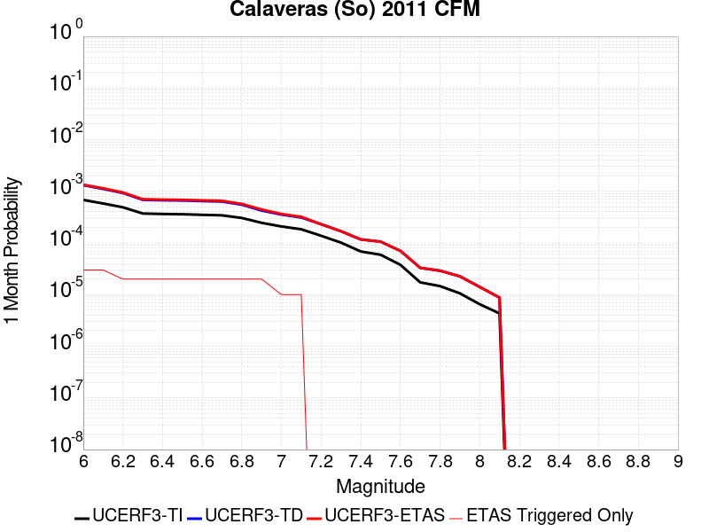 |  |  |

| Magnitude | 1 wk TI Prob | 1 wk TD Prob | 1 wk ETAS Prob | 1 wk ETAS/TD Gain | 1 wk ETAS Triggered Only | 1 mo TI Prob | 1 mo TD Prob | 1 mo ETAS Prob | 1 mo ETAS/TD Gain | 1 mo ETAS Triggered Only | 1 yr TI Prob | 1 yr TD Prob | 1 yr ETAS Prob | 1 yr ETAS/TD Gain | 1 yr ETAS Triggered Only | 10 yr TI Prob | 10 yr TD Prob | 10 yr ETAS Prob | 10 yr ETAS/TD Gain | 10 yr ETAS Triggered Only |
|-----|-----|-----|-----|-----|-----|-----|-----|-----|-----|-----|-----|-----|-----|-----|-----|-----|-----|-----|-----|-----|
| 6.0 | 1.5950744E-4 | 3.071188E-4 | 3.3223673E-4 | 1.0817857 | 2.5125628E-5 | 6.834242E-4 | 0.0013155643 | 0.0013406569 | 1.0190736 | 2.5125628E-5 | 0.00828899 | 0.01585904 | 0.015908495 | 1.0031184 | 5.0251256E-5 | 0.079865426 | 0.14440064 | 0.14445439 | 1.0003722 | 6.281407E-5 |
| 6.1 | 1.3584697E-4 | 2.6036944E-4 | 2.8548852E-4 | 1.0964748 | 2.5125628E-5 | 5.8207137E-4 | 0.0011153965 | 0.0011404941 | 1.0225011 | 2.5125628E-5 | 0.007063716 | 0.013462106 | 0.013511681 | 1.0036825 | 5.0251256E-5 | 0.06843361 | 0.12402854 | 0.12408357 | 1.0004436 | 6.281407E-5 |
| 6.2 | 1.14676266E-4 | 2.1726108E-4 | 2.2982118E-4 | 1.057811 | 1.2562814E-5 | 4.9137714E-4 | 9.307893E-4 | 9.433404E-4 | 1.0134844 | 1.2562814E-5 | 0.0059661185 | 0.011245592 | 0.011282856 | 1.0033137 | 3.768844E-5 | 0.058084648 | 0.105019294 | 0.105064265 | 1.0004282 | 5.0251256E-5 |
| 6.3 | 8.691518E-5 | 1.5987165E-4 | 1.7243245E-4 | 1.0785681 | 1.2562814E-5 | 3.7244044E-4 | 6.8496726E-4 | 6.975215E-4 | 1.0183282 | 1.2562814E-5 | 0.004525038 | 0.008300893 | 0.008325811 | 1.0030017 | 2.5125628E-5 | 0.044339992 | 0.0793347 | 0.079369396 | 1.0004374 | 3.768844E-5 |
| 6.4 | 8.50982E-5 | 1.5693568E-4 | 1.6949653E-4 | 1.0800382 | 1.2562814E-5 | 3.646556E-4 | 6.7239115E-4 | 6.849455E-4 | 1.0186713 | 1.2562814E-5 | 0.0044306475 | 0.008148931 | 0.008173851 | 1.0030582 | 2.5125628E-5 | 0.04343345 | 0.077940844 | 0.07797559 | 1.0004458 | 3.768844E-5 |
| 6.5 | 8.4062965E-5 | 1.5518135E-4 | 1.6774223E-4 | 1.0809431 | 1.2562814E-5 | 3.602201E-4 | 6.648764E-4 | 6.774309E-4 | 1.0188824 | 1.2562814E-5 | 0.004376863 | 0.008058134 | 0.008083057 | 1.0030929 | 2.5125628E-5 | 0.042916555 | 0.077112116 | 0.077146895 | 1.0004511 | 3.768844E-5 |
| 6.6 | 8.194716E-5 | 1.5154095E-4 | 1.6410186E-4 | 1.0828879 | 1.2562814E-5 | 3.5115483E-4 | 6.492825E-4 | 6.6183717E-4 | 1.0193362 | 1.2562814E-5 | 0.0042669317 | 0.007869979 | 0.007894907 | 1.0031675 | 2.5125628E-5 | 0.04185927 | 0.07539739 | 0.07543223 | 1.0004622 | 3.768844E-5 |
| 6.7 | 8.012326E-5 | 1.4821833E-4 | 1.6077928E-4 | 1.0847462 | 1.2562814E-5 | 3.433402E-4 | 6.350497E-4 | 6.476045E-4 | 1.0197699 | 1.2562814E-5 | 0.004172157 | 0.007698474 | 0.0077234064 | 1.0032386 | 2.5125628E-5 | 0.040946912 | 0.073839515 | 0.07387442 | 1.0004727 | 3.768844E-5 |
| 6.8 | 7.119773E-5 | 1.2880519E-4 | 1.4136638E-4 | 1.097521 | 1.2562814E-5 | 3.0509746E-4 | 5.519001E-4 | 5.64456E-4 | 1.0227503 | 1.2562814E-5 | 0.0037082357 | 0.0066958875 | 0.006720845 | 1.0037273 | 2.5125628E-5 | 0.036469642 | 0.06468402 | 0.06471927 | 1.000545 | 3.768844E-5 |
| 6.9 | 5.7343088E-5 | 9.9189E-5 | 1.1175057E-4 | 1.1266427 | 1.2562814E-5 | 2.4573295E-4 | 4.2502693E-4 | 4.375844E-4 | 1.0295451 | 1.2562814E-5 | 0.0029876942 | 0.0051625078 | 0.005187504 | 1.0048418 | 2.5125628E-5 | 0.02947844 | 0.050509132 | 0.050544918 | 1.0007085 | 3.768844E-5 |
| 7.0 | 4.8746577E-5 | 8.284751E-5 | 9.540928E-5 | 1.1516253 | 1.2562814E-5 | 2.0889717E-4 | 3.550128E-4 | 3.6757113E-4 | 1.0353744 | 1.2562814E-5 | 0.0025403565 | 0.004313781 | 0.004338798 | 1.0057994 | 2.5125628E-5 | 0.025115121 | 0.04248505 | 0.042521138 | 1.0008494 | 3.768844E-5 |
| 7.1 | 4.2998014E-5 | 7.264914E-5 | 8.521104E-5 | 1.1729119 | 1.2562814E-5 | 1.8426418E-4 | 3.1131663E-4 | 3.2387555E-4 | 1.0403413 | 1.2562814E-5 | 0.002241108 | 0.0037837527 | 0.0038087834 | 1.0066153 | 2.5125628E-5 | 0.022186412 | 0.037423246 | 0.037459522 | 1.0009694 | 3.768844E-5 |
| 7.2 | 3.221292E-5 | 5.390566E-5 | 5.390566E-5 | 1.0 | 0.0 | 1.3804805E-4 | 2.3100396E-4 | 2.3100396E-4 | 1.0 | 0.0 | 0.0016794393 | 0.0028088738 | 0.0028214012 | 1.00446 | 1.2562814E-5 | 0.016668037 | 0.028035998 | 0.02806042 | 1.0008711 | 2.5125628E-5 |
| 7.3 | 2.3756531E-5 | 3.9471706E-5 | 3.9471706E-5 | 1.0 | 0.0 | 1.0180973E-4 | 1.6915359E-4 | 1.6915359E-4 | 1.0 | 0.0 | 0.0012388286 | 0.0020575167 | 0.0020700537 | 1.0060933 | 1.2562814E-5 | 0.012319452 | 0.02064345 | 0.020668058 | 1.001192 | 2.5125628E-5 |
| 7.4 | 1.5997684E-5 | 2.734085E-5 | 2.734085E-5 | 1.0 | 0.0 | 6.8559704E-5 | 1.1716982E-4 | 1.1716982E-4 | 1.0 | 0.0 | 8.343947E-4 | 0.0014256114 | 0.0014256114 | 1.0 | 0.0 | 0.008312687 | 0.014376549 | 0.014388931 | 1.0008613 | 1.2562814E-5 |
| 7.5 | 1.3814293E-5 | 2.4782603E-5 | 2.4782603E-5 | 1.0 | 0.0 | 5.9202768E-5 | 1.0620684E-4 | 1.0620684E-4 | 1.0 | 0.0 | 7.205553E-4 | 0.0012923037 | 0.0012923037 | 1.0 | 0.0 | 0.007182234 | 0.013055766 | 0.013068165 | 1.0009496 | 1.2562814E-5 |
| 7.6 | 8.817309E-6 | 1.6429829E-5 | 1.6429829E-5 | 1.0 | 0.0 | 3.7787922E-5 | 7.041166E-5 | 7.041166E-5 | 1.0 | 0.0 | 4.5997082E-4 | 8.5692614E-4 | 8.5692614E-4 | 1.0 | 0.0 | 0.004590199 | 0.008719863 | 0.008732317 | 1.0014281 | 1.2562814E-5 |
| 7.7 | 4.0352206E-6 | 7.706877E-6 | 7.706877E-6 | 1.0 | 0.0 | 1.7293689E-5 | 3.3029053E-5 | 3.3029053E-5 | 1.0 | 0.0 | 2.1053031E-4 | 4.020546E-4 | 4.020546E-4 | 1.0 | 0.0 | 0.0021033096 | 0.0041649863 | 0.004177497 | 1.0030037 | 1.2562814E-5 |
| 7.8 | 3.413169E-6 | 6.7868646E-6 | 6.7868646E-6 | 1.0 | 0.0 | 1.4627784E-5 | 2.9086239E-5 | 2.9086239E-5 | 1.0 | 0.0 | 1.7807873E-4 | 3.5406748E-4 | 3.5406748E-4 | 1.0 | 0.0 | 0.0017793609 | 0.0036663096 | 0.0036788264 | 1.003414 | 1.2562814E-5 |
| 7.9 | 2.4740732E-6 | 5.278809E-6 | 5.278809E-6 | 1.0 | 0.0 | 1.06031275E-5 | 2.2623271E-5 | 2.2623271E-5 | 1.0 | 0.0 | 1.2908543E-4 | 2.7540355E-4 | 2.7540355E-4 | 1.0 | 0.0 | 0.0012901047 | 0.002834638 | 0.002834638 | 1.0 | 0.0 |
| 8.0 | 1.5231818E-6 | 3.2887135E-6 | 3.2887135E-6 | 1.0 | 0.0 | 6.527906E-6 | 1.409441E-5 | 1.409441E-5 | 1.0 | 0.0 | 7.9474354E-5 | 1.7158597E-4 | 1.7158597E-4 | 1.0 | 0.0 | 7.944594E-4 | 0.001756374 | 0.001756374 | 1.0 | 0.0 |
| 8.1 | 1.0104524E-6 | 2.0456548E-6 | 2.0456548E-6 | 1.0 | 0.0 | 4.330503E-6 | 8.767062E-6 | 8.767062E-6 | 1.0 | 0.0 | 5.2722597E-5 | 1.06733794E-4 | 1.06733794E-4 | 1.0 | 0.0 | 5.271009E-4 | 0.0010929212 | 0.0010929212 | 1.0 | 0.0 |

## San Jacinto (Lytle Creek connector)
*[(top)](#table-of-contents)*

| 1 Week | 1 Month | 1 Year | 10 Year |
|-----|-----|-----|-----|
|  |  |  |  |

| Magnitude | 1 wk TI Prob | 1 wk TD Prob | 1 wk ETAS Prob | 1 wk ETAS/TD Gain | 1 wk ETAS Triggered Only | 1 mo TI Prob | 1 mo TD Prob | 1 mo ETAS Prob | 1 mo ETAS/TD Gain | 1 mo ETAS Triggered Only | 1 yr TI Prob | 1 yr TD Prob | 1 yr ETAS Prob | 1 yr ETAS/TD Gain | 1 yr ETAS Triggered Only | 10 yr TI Prob | 10 yr TD Prob | 10 yr ETAS Prob | 10 yr ETAS/TD Gain | 10 yr ETAS Triggered Only |
|-----|-----|-----|-----|-----|-----|-----|-----|-----|-----|-----|-----|-----|-----|-----|-----|-----|-----|-----|-----|-----|
| 6.0 | 6.693995E-6 | 6.660216E-6 | 6.660216E-6 | 1.0 | 0.0 | 2.8688235E-5 | 2.854347E-5 | 2.854347E-5 | 1.0 | 0.0 | 3.492233E-4 | 3.4746144E-4 | 3.8513678E-4 | 1.1084303 | 3.768844E-5 | 0.00348675 | 0.0035493854 | 0.0036119765 | 1.0176344 | 6.281407E-5 |
| 6.1 | 6.693995E-6 | 6.660216E-6 | 6.660216E-6 | 1.0 | 0.0 | 2.8688235E-5 | 2.854347E-5 | 2.854347E-5 | 1.0 | 0.0 | 3.492233E-4 | 3.4746144E-4 | 3.8513678E-4 | 1.1084303 | 3.768844E-5 | 0.00348675 | 0.0035493854 | 0.0036119765 | 1.0176344 | 6.281407E-5 |
| 6.2 | 6.693995E-6 | 6.660216E-6 | 6.660216E-6 | 1.0 | 0.0 | 2.8688235E-5 | 2.854347E-5 | 2.854347E-5 | 1.0 | 0.0 | 3.492233E-4 | 3.4746144E-4 | 3.8513678E-4 | 1.1084303 | 3.768844E-5 | 0.00348675 | 0.0035493854 | 0.0036119765 | 1.0176344 | 6.281407E-5 |
| 6.3 | 6.693995E-6 | 6.660216E-6 | 6.660216E-6 | 1.0 | 0.0 | 2.8688235E-5 | 2.854347E-5 | 2.854347E-5 | 1.0 | 0.0 | 3.492233E-4 | 3.4746144E-4 | 3.8513678E-4 | 1.1084303 | 3.768844E-5 | 0.00348675 | 0.0035493854 | 0.0036119765 | 1.0176344 | 6.281407E-5 |
| 6.4 | 6.693995E-6 | 6.660216E-6 | 6.660216E-6 | 1.0 | 0.0 | 2.8688235E-5 | 2.854347E-5 | 2.854347E-5 | 1.0 | 0.0 | 3.492233E-4 | 3.4746144E-4 | 3.8513678E-4 | 1.1084303 | 3.768844E-5 | 0.00348675 | 0.0035493854 | 0.0036119765 | 1.0176344 | 6.281407E-5 |
| 6.5 | 6.6561875E-6 | 6.6204343E-6 | 6.6204343E-6 | 1.0 | 0.0 | 2.8526205E-5 | 2.837298E-5 | 2.837298E-5 | 1.0 | 0.0 | 3.472512E-4 | 3.4538636E-4 | 3.830618E-4 | 1.109082 | 3.768844E-5 | 0.0034670907 | 0.003528701 | 0.0035912932 | 1.0177381 | 6.281407E-5 |
| 6.6 | 6.6561875E-6 | 6.6204343E-6 | 6.6204343E-6 | 1.0 | 0.0 | 2.8526205E-5 | 2.837298E-5 | 2.837298E-5 | 1.0 | 0.0 | 3.472512E-4 | 3.4538636E-4 | 3.830618E-4 | 1.109082 | 3.768844E-5 | 0.0034670907 | 0.003528701 | 0.0035912932 | 1.0177381 | 6.281407E-5 |
| 6.7 | 6.5802237E-6 | 6.539611E-6 | 6.539611E-6 | 1.0 | 0.0 | 2.8200653E-5 | 2.8026603E-5 | 2.8026603E-5 | 1.0 | 0.0 | 3.4328885E-4 | 3.4117055E-4 | 3.7884613E-4 | 1.1104304 | 3.768844E-5 | 0.0034275902 | 0.0034866752 | 0.0035492703 | 1.0179527 | 6.281407E-5 |
| 6.8 | 6.575632E-6 | 6.5341005E-6 | 6.5341005E-6 | 1.0 | 0.0 | 2.8180975E-5 | 2.8002989E-5 | 2.8002989E-5 | 1.0 | 0.0 | 3.4304935E-4 | 3.4088313E-4 | 3.785587E-4 | 1.1105235 | 3.768844E-5 | 0.0034252026 | 0.00348381 | 0.0035464054 | 1.0179675 | 6.281407E-5 |
| 6.9 | 6.570433E-6 | 6.525495E-6 | 6.525495E-6 | 1.0 | 0.0 | 2.8158694E-5 | 2.7966107E-5 | 2.7966107E-5 | 1.0 | 0.0 | 3.4277816E-4 | 3.4043423E-4 | 3.7810983E-4 | 1.1106693 | 3.768844E-5 | 0.0034224992 | 0.0034793352 | 0.0035419308 | 1.0179907 | 6.281407E-5 |
| 7.0 | 6.5643826E-6 | 6.515616E-6 | 6.515616E-6 | 1.0 | 0.0 | 2.8132765E-5 | 2.792377E-5 | 2.792377E-5 | 1.0 | 0.0 | 3.424626E-4 | 3.3991894E-4 | 3.7759455E-4 | 1.1108371 | 3.768844E-5 | 0.0034193532 | 0.0034741985 | 0.0035367943 | 1.0180173 | 6.281407E-5 |
| 7.1 | 6.557402E-6 | 6.5043278E-6 | 6.5043278E-6 | 1.0 | 0.0 | 2.8102848E-5 | 2.7875392E-5 | 2.7875392E-5 | 1.0 | 0.0 | 3.4209844E-4 | 3.3933012E-4 | 3.7700578E-4 | 1.1110295 | 3.768844E-5 | 0.0034157229 | 0.0034683298 | 0.003530926 | 1.0180479 | 6.281407E-5 |
| 7.2 | 6.546394E-6 | 6.4862943E-6 | 6.4862943E-6 | 1.0 | 0.0 | 2.8055672E-5 | 2.7798109E-5 | 2.7798109E-5 | 1.0 | 0.0 | 3.4152428E-4 | 3.3838948E-4 | 3.7606517E-4 | 1.1113383 | 3.768844E-5 | 0.0034099987 | 0.0034589572 | 0.003521554 | 1.018097 | 6.281407E-5 |
| 7.3 | 6.5364216E-6 | 6.4670803E-6 | 6.4670803E-6 | 1.0 | 0.0 | 2.8012933E-5 | 2.7715765E-5 | 2.7715765E-5 | 1.0 | 0.0 | 3.4100408E-4 | 3.3738726E-4 | 3.7506298E-4 | 1.1116691 | 3.768844E-5 | 0.003404813 | 0.0034489788 | 0.0035115762 | 1.0181495 | 6.281407E-5 |
| 7.4 | 6.5269523E-6 | 6.4481674E-6 | 6.4481674E-6 | 1.0 | 0.0 | 2.7972354E-5 | 2.7634711E-5 | 2.7634711E-5 | 1.0 | 0.0 | 3.4051016E-4 | 3.3640073E-4 | 3.740765E-4 | 1.1119967 | 3.768844E-5 | 0.0033998888 | 0.003439161 | 0.003501759 | 1.0182016 | 6.281407E-5 |
| 7.5 | 6.5111835E-6 | 6.424442E-6 | 6.424442E-6 | 1.0 | 0.0 | 2.7904773E-5 | 2.7533031E-5 | 2.7533031E-5 | 1.0 | 0.0 | 3.3968766E-4 | 3.3516317E-4 | 3.72839E-4 | 1.1124103 | 3.768844E-5 | 0.0033916887 | 0.003426834 | 0.0034894329 | 1.0182673 | 6.281407E-5 |
| 7.6 | 6.4768806E-6 | 6.383551E-6 | 6.383551E-6 | 1.0 | 0.0 | 2.7757764E-5 | 2.735779E-5 | 2.735779E-5 | 1.0 | 0.0 | 3.3789838E-4 | 3.3303024E-4 | 3.7070614E-4 | 1.1131306 | 3.768844E-5 | 0.0033738504 | 0.0034055663 | 0.0034681663 | 1.0183817 | 6.281407E-5 |
| 7.7 | 6.1655364E-6 | 6.1760365E-6 | 6.1760365E-6 | 1.0 | 0.0 | 2.642346E-5 | 2.646846E-5 | 2.646846E-5 | 1.0 | 0.0 | 3.2165812E-4 | 3.2220592E-4 | 3.598822E-4 | 1.1169324 | 3.768844E-5 | 0.0032119295 | 0.0032971818 | 0.0033597886 | 1.018988 | 6.281407E-5 |
| 7.8 | 5.5043524E-6 | 5.737097E-6 | 5.737097E-6 | 1.0 | 0.0 | 2.3589868E-5 | 2.4587327E-5 | 2.4587327E-5 | 1.0 | 0.0 | 2.871688E-4 | 2.9930964E-4 | 3.369868E-4 | 1.1258802 | 3.768844E-5 | 0.0028679797 | 0.0030672832 | 0.0031299046 | 1.0204159 | 6.281407E-5 |
| 7.9 | 3.889249E-6 | 4.076761E-6 | 4.076761E-6 | 1.0 | 0.0 | 1.6668104E-5 | 1.7471715E-5 | 1.7471715E-5 | 1.0 | 0.0 | 2.0291525E-4 | 2.1269741E-4 | 2.5037784E-4 | 1.177155 | 3.768844E-5 | 0.0020273007 | 0.0021943315 | 0.0022444725 | 1.0228503 | 5.0251256E-5 |
| 8.0 | 2.668535E-6 | 2.5315155E-6 | 2.5315155E-6 | 1.0 | 0.0 | 1.1436528E-5 | 1.0849307E-5 | 1.0849307E-5 | 1.0 | 0.0 | 1.3923083E-4 | 1.3208234E-4 | 1.4464349E-4 | 1.095101 | 1.2562814E-5 | 0.0013914363 | 0.0013757964 | 0.0014008874 | 1.0182375 | 2.5125628E-5 |
| 8.1 | 1.5911459E-6 | 1.218661E-6 | 1.218661E-6 | 1.0 | 0.0 | 6.8191785E-6 | 5.2228224E-6 | 5.2228224E-6 | 1.0 | 0.0 | 8.3020335E-5 | 6.3586034E-5 | 6.3586034E-5 | 1.0 | 0.0 | 8.298933E-4 | 6.6932244E-4 | 6.6932244E-4 | 1.0 | 0.0 |
| 8.2 | 6.1294963E-7 | 2.1812275E-7 | 2.1812275E-7 | 1.0 | 0.0 | 2.6269242E-6 | 9.3481145E-7 | 9.3481145E-7 | 1.0 | 0.0 | 3.1982334E-5 | 1.138127E-5 | 1.138127E-5 | 1.0 | 0.0 | 3.1977732E-4 | 1.2784546E-4 | 1.2784546E-4 | 1.0 | 0.0 |
| 8.3 | 1.762871E-7 | 4.7546838E-8 | 4.7546838E-8 | 1.0 | 0.0 | 7.5551594E-7 | 2.0377215E-7 | 2.0377215E-7 | 1.0 | 0.0 | 9.1983675E-6 | 2.480923E-6 | 2.480923E-6 | 1.0 | 0.0 | 9.197987E-5 | 2.868753E-5 | 2.868753E-5 | 1.0 | 0.0 |

## Rose Canyon
*[(top)](#table-of-contents)*

| 1 Week | 1 Month | 1 Year | 10 Year |
|-----|-----|-----|-----|
|  |  |  |  |

| Magnitude | 1 wk TI Prob | 1 wk TD Prob | 1 wk ETAS Prob | 1 wk ETAS/TD Gain | 1 wk ETAS Triggered Only | 1 mo TI Prob | 1 mo TD Prob | 1 mo ETAS Prob | 1 mo ETAS/TD Gain | 1 mo ETAS Triggered Only | 1 yr TI Prob | 1 yr TD Prob | 1 yr ETAS Prob | 1 yr ETAS/TD Gain | 1 yr ETAS Triggered Only | 10 yr TI Prob | 10 yr TD Prob | 10 yr ETAS Prob | 10 yr ETAS/TD Gain | 10 yr ETAS Triggered Only |
|-----|-----|-----|-----|-----|-----|-----|-----|-----|-----|-----|-----|-----|-----|-----|-----|-----|-----|-----|-----|-----|
| 6.0 | 4.5923203E-5 | 4.9714225E-5 | 9.9962985E-5 | 2.0107522 | 5.0251256E-5 | 1.9679888E-4 | 2.1304491E-4 | 2.6328547E-4 | 1.2358214 | 5.0251256E-5 | 0.0023933933 | 0.0025909345 | 0.0026535857 | 1.024181 | 6.281407E-5 | 0.023677798 | 0.02563999 | 0.025701195 | 1.002387 | 6.281407E-5 |
| 6.1 | 4.5923203E-5 | 4.9714225E-5 | 8.74008E-5 | 1.758064 | 3.768844E-5 | 1.9679888E-4 | 2.1304491E-4 | 2.5072534E-4 | 1.176866 | 3.768844E-5 | 0.0023933933 | 0.0025909345 | 0.0026410555 | 1.0193448 | 5.0251256E-5 | 0.023677798 | 0.02563999 | 0.025688954 | 1.0019096 | 5.0251256E-5 |
| 6.2 | 2.8844734E-5 | 2.9668723E-5 | 4.2231164E-5 | 1.4234238 | 1.2562814E-5 | 1.2361443E-4 | 1.2714567E-4 | 1.3970688E-4 | 1.0987939 | 1.2562814E-5 | 0.0015039665 | 0.0015468939 | 0.0015594373 | 1.0081087 | 1.2562814E-5 | 0.0149382865 | 0.015374276 | 0.015386646 | 1.0008045 | 1.2562814E-5 |
| 6.3 | 2.3171577E-5 | 2.3161238E-5 | 2.3161238E-5 | 1.0 | 0.0 | 9.9302975E-5 | 9.9258745E-5 | 9.9258745E-5 | 1.0 | 0.0 | 0.0012083431 | 0.0012078186 | 0.0012078186 | 1.0 | 0.0 | 0.012017938 | 0.012022437 | 0.012022437 | 1.0 | 0.0 |
| 6.4 | 2.0066604E-5 | 1.9667024E-5 | 1.9667024E-5 | 1.0 | 0.0 | 8.599689E-5 | 8.4284584E-5 | 8.4284584E-5 | 1.0 | 0.0 | 0.0010465092 | 0.0010256917 | 0.0010256917 | 1.0 | 0.0 | 0.010415946 | 0.010217559 | 0.010217559 | 1.0 | 0.0 |
| 6.5 | 1.776989E-5 | 1.7113807E-5 | 1.7113807E-5 | 1.0 | 0.0 | 7.615444E-5 | 7.334287E-5 | 7.334287E-5 | 1.0 | 0.0 | 9.267859E-4 | 8.925905E-4 | 8.925905E-4 | 1.0 | 0.0 | 0.009229303 | 0.008896211 | 0.008896211 | 1.0 | 0.0 |
| 6.6 | 1.5227364E-5 | 1.433926E-5 | 1.433926E-5 | 1.0 | 0.0 | 6.52585E-5 | 6.1452556E-5 | 6.1452556E-5 | 1.0 | 0.0 | 7.942326E-4 | 7.479332E-4 | 7.479332E-4 | 1.0 | 0.0 | 0.007914 | 0.007458359 | 0.007458359 | 1.0 | 0.0 |
| 6.7 | 1.2703898E-5 | 1.1673274E-5 | 1.1673274E-5 | 1.0 | 0.0 | 5.4444143E-5 | 5.0027378E-5 | 5.0027378E-5 | 1.0 | 0.0 | 6.626558E-4 | 6.089174E-4 | 6.089174E-4 | 1.0 | 0.0 | 0.006606833 | 0.0060750856 | 0.0060750856 | 1.0 | 0.0 |
| 6.8 | 1.1554917E-5 | 1.0609337E-5 | 1.0609337E-5 | 1.0 | 0.0 | 4.9520135E-5 | 4.546782E-5 | 4.546782E-5 | 1.0 | 0.0 | 6.0274085E-4 | 5.5343413E-4 | 5.5343413E-4 | 1.0 | 0.0 | 0.0060110865 | 0.0055225673 | 0.0055225673 | 1.0 | 0.0 |
| 6.9 | 8.732078E-6 | 7.881357E-6 | 7.881357E-6 | 1.0 | 0.0 | 3.7422655E-5 | 3.3776825E-5 | 3.3776825E-5 | 1.0 | 0.0 | 4.5552556E-4 | 4.111582E-4 | 4.111582E-4 | 1.0 | 0.0 | 0.0045459294 | 0.0041048084 | 0.0041048084 | 1.0 | 0.0 |
| 7.0 | 5.9337494E-6 | 5.1074853E-6 | 5.1074853E-6 | 1.0 | 0.0 | 2.5430107E-5 | 2.188904E-5 | 2.188904E-5 | 1.0 | 0.0 | 3.0956755E-4 | 2.664666E-4 | 2.664666E-4 | 1.0 | 0.0 | 0.0030913667 | 0.0026614866 | 0.0026614866 | 1.0 | 0.0 |
| 7.1 | 5.013409E-6 | 4.1773833E-6 | 4.1773833E-6 | 1.0 | 0.0 | 2.1485863E-5 | 1.7902948E-5 | 1.7902948E-5 | 1.0 | 0.0 | 2.6155898E-4 | 2.179467E-4 | 2.179467E-4 | 1.0 | 0.0 | 0.0026125133 | 0.0021773411 | 0.0021773411 | 1.0 | 0.0 |
| 7.2 | 4.120763E-6 | 3.2821383E-6 | 3.2821383E-6 | 1.0 | 0.0 | 1.7660293E-5 | 1.4066231E-5 | 1.4066231E-5 | 1.0 | 0.0 | 2.1499286E-4 | 1.7124301E-4 | 1.7124301E-4 | 1.0 | 0.0 | 0.0021478499 | 0.00171112 | 0.00171112 | 1.0 | 0.0 |
| 7.3 | 3.2081239E-6 | 2.4405372E-6 | 2.4405372E-6 | 1.0 | 0.0 | 1.374903E-5 | 1.0459404E-5 | 1.0459404E-5 | 1.0 | 0.0 | 1.6738157E-4 | 1.2733586E-4 | 1.2733586E-4 | 1.0 | 0.0 | 0.0016725556 | 0.001272636 | 0.001272636 | 1.0 | 0.0 |
| 7.4 | 2.4194755E-6 | 1.7680634E-6 | 1.7680634E-6 | 1.0 | 0.0 | 1.0369139E-5 | 7.577393E-6 | 7.577393E-6 | 1.0 | 0.0 | 1.2623696E-4 | 9.2250906E-5 | 9.2250906E-5 | 1.0 | 0.0 | 0.0012616527 | 9.2213147E-4 | 9.2213147E-4 | 1.0 | 0.0 |
| 7.5 | 1.3842889E-6 | 9.3786275E-7 | 9.3786275E-7 | 1.0 | 0.0 | 5.9326535E-6 | 4.019406E-6 | 4.019406E-6 | 1.0 | 0.0 | 7.222766E-5 | 4.8935202E-5 | 4.8935202E-5 | 1.0 | 0.0 | 7.220419E-4 | 4.892478E-4 | 4.892478E-4 | 1.0 | 0.0 |
| 7.6 | 1.0021575E-6 | 6.411463E-7 | 6.411463E-7 | 1.0 | 0.0 | 4.2949537E-6 | 2.7477672E-6 | 2.7477672E-6 | 1.0 | 0.0 | 5.2289808E-5 | 3.3453573E-5 | 3.3453573E-5 | 1.0 | 0.0 | 5.2277505E-4 | 3.344875E-4 | 3.344875E-4 | 1.0 | 0.0 |
| 7.7 | 8.7620116E-8 | 6.4492404E-8 | 6.4492404E-8 | 1.0 | 0.0 | 3.7551473E-7 | 2.76396E-7 | 2.76396E-7 | 1.0 | 0.0 | 4.5718825E-6 | 3.3651165E-6 | 3.3651165E-6 | 1.0 | 0.0 | 4.5717883E-5 | 3.3650686E-5 | 3.3650686E-5 | 1.0 | 0.0 |

## Oceanic - West Huasna
*[(top)](#table-of-contents)*

| 1 Week | 1 Month | 1 Year | 10 Year |
|-----|-----|-----|-----|
|  |  |  |  |

| Magnitude | 1 wk TI Prob | 1 wk TD Prob | 1 wk ETAS Prob | 1 wk ETAS/TD Gain | 1 wk ETAS Triggered Only | 1 mo TI Prob | 1 mo TD Prob | 1 mo ETAS Prob | 1 mo ETAS/TD Gain | 1 mo ETAS Triggered Only | 1 yr TI Prob | 1 yr TD Prob | 1 yr ETAS Prob | 1 yr ETAS/TD Gain | 1 yr ETAS Triggered Only | 10 yr TI Prob | 10 yr TD Prob | 10 yr ETAS Prob | 10 yr ETAS/TD Gain | 10 yr ETAS Triggered Only |
|-----|-----|-----|-----|-----|-----|-----|-----|-----|-----|-----|-----|-----|-----|-----|-----|-----|-----|-----|-----|-----|
| 6.0 | 3.195567E-5 | 2.7926868E-5 | 6.561426E-5 | 2.3495028 | 3.768844E-5 | 1.3694567E-4 | 1.1968133E-4 | 1.5736526E-4 | 1.3148689 | 3.768844E-5 | 0.0016660384 | 0.0014561893 | 0.0015063675 | 1.0344585 | 5.0251256E-5 | 0.016536033 | 0.014471028 | 0.014532933 | 1.0042778 | 6.281407E-5 |
| 6.1 | 2.1156782E-5 | 1.7573486E-5 | 5.5261266E-5 | 3.1445818 | 3.768844E-5 | 9.066878E-5 | 7.531282E-5 | 1.1299842E-4 | 1.5003877 | 3.768844E-5 | 0.0011033333 | 9.165572E-4 | 9.667624E-4 | 1.0547758 | 5.0251256E-5 | 0.010978713 | 0.009128777 | 0.0091785705 | 1.0054544 | 5.0251256E-5 |
| 6.2 | 1.6195117E-5 | 1.3327152E-5 | 2.58898E-5 | 1.9426354 | 1.2562814E-5 | 6.9405796E-5 | 5.7115132E-5 | 6.9677226E-5 | 1.2199434 | 1.2562814E-5 | 8.44688E-4 | 6.9515745E-4 | 7.202656E-4 | 1.0361186 | 2.5125628E-5 | 0.008414844 | 0.006930123 | 0.0069550746 | 1.0036005 | 2.5125628E-5 |
| 6.3 | 1.3559345E-5 | 1.1179142E-5 | 2.3741817E-5 | 2.12376 | 1.2562814E-5 | 5.811018E-5 | 4.7909736E-5 | 6.047195E-5 | 1.2622058 | 1.2562814E-5 | 7.072618E-4 | 5.831459E-4 | 6.0825684E-4 | 1.0430613 | 2.5125628E-5 | 0.0070501505 | 0.0058162753 | 0.0058412547 | 1.0042948 | 2.5125628E-5 |
| 6.4 | 1.2120619E-5 | 1.0000977E-5 | 2.2563667E-5 | 2.256146 | 1.2562814E-5 | 5.1944477E-5 | 4.2860633E-5 | 5.542291E-5 | 1.293096 | 1.2562814E-5 | 6.322405E-4 | 5.2170374E-4 | 5.4681627E-4 | 1.0481356 | 2.5125628E-5 | 0.006304447 | 0.0052048573 | 0.005229852 | 1.0048022 | 2.5125628E-5 |
| 6.5 | 1.13511915E-5 | 9.3674735E-6 | 2.193017E-5 | 2.3410976 | 1.2562814E-5 | 4.8647056E-5 | 4.01457E-5 | 5.270801E-5 | 1.312918 | 1.2562814E-5 | 5.9211696E-4 | 4.886647E-4 | 5.1377807E-4 | 1.0513918 | 2.5125628E-5 | 0.0059054173 | 0.0048759608 | 0.004900964 | 1.0051278 | 2.5125628E-5 |
| 6.6 | 9.850605E-6 | 8.135418E-6 | 8.135418E-6 | 1.0 | 0.0 | 4.2216197E-5 | 3.4865614E-5 | 3.4865614E-5 | 1.0 | 0.0 | 5.1386096E-4 | 4.2440637E-4 | 4.3696386E-4 | 1.0295883 | 1.2562814E-5 | 0.0051267436 | 0.004235991 | 0.0042485003 | 1.0029532 | 1.2562814E-5 |
| 6.7 | 8.8558645E-6 | 7.318433E-6 | 7.318433E-6 | 1.0 | 0.0 | 3.7953152E-5 | 3.1364336E-5 | 3.1364336E-5 | 1.0 | 0.0 | 4.6198163E-4 | 3.8179406E-4 | 3.9435207E-4 | 1.0328921 | 1.2562814E-5 | 0.004610224 | 0.0038114067 | 0.0038239218 | 1.0032835 | 1.2562814E-5 |
| 6.8 | 7.67136E-6 | 6.391756E-6 | 6.391756E-6 | 1.0 | 0.0 | 3.2876844E-5 | 2.7392953E-5 | 2.7392953E-5 | 1.0 | 0.0 | 4.0020206E-4 | 3.3345833E-4 | 3.4601695E-4 | 1.0376618 | 1.2562814E-5 | 0.003994821 | 0.0033296007 | 0.0033421216 | 1.0037605 | 1.2562814E-5 |
| 6.9 | 6.534529E-6 | 5.4583297E-6 | 5.4583297E-6 | 1.0 | 0.0 | 2.8004823E-5 | 2.3392633E-5 | 2.3392633E-5 | 1.0 | 0.0 | 3.4090536E-4 | 2.847682E-4 | 2.9732744E-4 | 1.0441034 | 1.2562814E-5 | 0.0034038287 | 0.0028440498 | 0.0028565768 | 1.0044047 | 1.2562814E-5 |
| 7.0 | 5.460525E-6 | 4.5699517E-6 | 4.5699517E-6 | 1.0 | 0.0 | 2.3402039E-5 | 1.958536E-5 | 1.958536E-5 | 1.0 | 0.0 | 2.8488258E-4 | 2.3842578E-4 | 2.509856E-4 | 1.0526781 | 1.2562814E-5 | 0.0028451765 | 0.0023817138 | 0.0023942466 | 1.0052621 | 1.2562814E-5 |
| 7.1 | 4.4825083E-6 | 3.7524428E-6 | 3.7524428E-6 | 1.0 | 0.0 | 1.9210609E-5 | 1.60818E-5 | 1.60818E-5 | 1.0 | 0.0 | 2.3386406E-4 | 1.9577841E-4 | 2.0833877E-4 | 1.0641559 | 1.2562814E-5 | 0.002336181 | 0.0019560715 | 0.0019686096 | 1.0064099 | 1.2562814E-5 |
| 7.2 | 2.821708E-6 | 2.4249334E-6 | 2.4249334E-6 | 1.0 | 0.0 | 1.2092979E-5 | 1.039253E-5 | 1.039253E-5 | 1.0 | 0.0 | 1.4722206E-4 | 1.2652173E-4 | 1.2652173E-4 | 1.0 | 0.0 | 0.0014712457 | 0.0012644994 | 0.0012644994 | 1.0 | 0.0 |
| 7.3 | 2.0644757E-6 | 1.7687412E-6 | 1.7687412E-6 | 1.0 | 0.0 | 8.847723E-6 | 7.5802973E-6 | 7.5802973E-6 | 1.0 | 0.0 | 1.0771569E-4 | 9.228622E-5 | 9.228622E-5 | 1.0 | 0.0 | 0.001076635 | 9.2248066E-4 | 9.2248066E-4 | 1.0 | 0.0 |
| 7.4 | 1.6980367E-6 | 1.4379892E-6 | 1.4379892E-6 | 1.0 | 0.0 | 7.27728E-6 | 6.162796E-6 | 6.162796E-6 | 1.0 | 0.0 | 8.8597284E-5 | 7.5029464E-5 | 7.5029464E-5 | 1.0 | 0.0 | 8.8561967E-4 | 7.500429E-4 | 7.500429E-4 | 1.0 | 0.0 |
| 7.5 | 1.3637683E-6 | 1.1302635E-6 | 1.1302635E-6 | 1.0 | 0.0 | 5.844708E-6 | 4.8439774E-6 | 4.8439774E-6 | 1.0 | 0.0 | 7.1156996E-5 | 5.897383E-5 | 5.897383E-5 | 1.0 | 0.0 | 7.1134215E-4 | 5.895833E-4 | 5.895833E-4 | 1.0 | 0.0 |
| 7.6 | 9.802994E-7 | 7.677247E-7 | 7.677247E-7 | 1.0 | 0.0 | 4.2012766E-6 | 3.2902446E-6 | 3.2902446E-6 | 1.0 | 0.0 | 5.1149345E-5 | 4.0057992E-5 | 4.0057992E-5 | 1.0 | 0.0 | 5.113757E-4 | 4.0050913E-4 | 4.0050913E-4 | 1.0 | 0.0 |
| 7.7 | 5.986191E-7 | 4.0050548E-7 | 4.0050548E-7 | 1.0 | 0.0 | 2.5655079E-6 | 1.7164509E-6 | 1.7164509E-6 | 1.0 | 0.0 | 3.1234613E-5 | 2.089759E-5 | 2.089759E-5 | 1.0 | 0.0 | 3.123022E-4 | 2.089576E-4 | 2.089576E-4 | 1.0 | 0.0 |
| 7.8 | 2.9189815E-7 | 1.5285792E-7 | 1.5285792E-7 | 1.0 | 0.0 | 1.2509914E-6 | 6.5510517E-7 | 6.5510517E-7 | 1.0 | 0.0 | 1.5230714E-5 | 7.9758765E-6 | 7.9758765E-6 | 1.0 | 0.0 | 1.522967E-4 | 7.9757214E-5 | 7.9757214E-5 | 1.0 | 0.0 |
| 7.9 | 1.2057845E-7 | 4.621248E-8 | 4.621248E-8 | 1.0 | 0.0 | 5.1676466E-7 | 1.9805347E-7 | 1.9805347E-7 | 1.0 | 0.0 | 6.2915915E-6 | 2.4112983E-6 | 2.4112983E-6 | 1.0 | 0.0 | 6.2914136E-5 | 2.4114026E-5 | 2.4114026E-5 | 1.0 | 0.0 |
| 8.0 | 3.3806387E-9 | 9.011393E-10 | 9.011393E-10 | 1.0 | 0.0 | 1.4488451E-8 | 3.8620254E-9 | 3.8620254E-9 | 1.0 | 0.0 | 1.7639688E-7 | 4.702016E-8 | 4.702016E-8 | 1.0 | 0.0 | 1.7639674E-6 | 4.7129527E-7 | 4.7129527E-7 | 1.0 | 0.0 |

## San Jacinto (Superstition Mtn)
*[(top)](#table-of-contents)*

| 1 Week | 1 Month | 1 Year | 10 Year |
|-----|-----|-----|-----|
|  |  |  |  |

| Magnitude | 1 wk TI Prob | 1 wk TD Prob | 1 wk ETAS Prob | 1 wk ETAS/TD Gain | 1 wk ETAS Triggered Only | 1 mo TI Prob | 1 mo TD Prob | 1 mo ETAS Prob | 1 mo ETAS/TD Gain | 1 mo ETAS Triggered Only | 1 yr TI Prob | 1 yr TD Prob | 1 yr ETAS Prob | 1 yr ETAS/TD Gain | 1 yr ETAS Triggered Only | 10 yr TI Prob | 10 yr TD Prob | 10 yr ETAS Prob | 10 yr ETAS/TD Gain | 10 yr ETAS Triggered Only |
|-----|-----|-----|-----|-----|-----|-----|-----|-----|-----|-----|-----|-----|-----|-----|-----|-----|-----|-----|-----|-----|
| 6.0 | 6.4193904E-5 | 9.599367E-5 | 1.0855528E-4 | 1.1308587 | 1.2562814E-5 | 2.7508775E-4 | 4.1134638E-4 | 4.3646165E-4 | 1.0610563 | 2.5125628E-5 | 0.0033440501 | 0.0049980893 | 0.0050230892 | 1.0050019 | 2.5125628E-5 | 0.03294174 | 0.048823986 | 0.04887178 | 1.000979 | 5.0251256E-5 |
| 6.1 | 6.4193904E-5 | 9.599367E-5 | 1.0855528E-4 | 1.1308587 | 1.2562814E-5 | 2.7508775E-4 | 4.1134638E-4 | 4.3646165E-4 | 1.0610563 | 2.5125628E-5 | 0.0033440501 | 0.0049980893 | 0.0050230892 | 1.0050019 | 2.5125628E-5 | 0.03294174 | 0.048823986 | 0.04887178 | 1.000979 | 5.0251256E-5 |
| 6.2 | 5.7023593E-5 | 8.3144434E-5 | 9.57062E-5 | 1.1510837 | 1.2562814E-5 | 2.4436394E-4 | 3.5629404E-4 | 3.814107E-4 | 1.0704943 | 2.5125628E-5 | 0.002971072 | 0.0043308944 | 0.004355911 | 1.0057764 | 2.5125628E-5 | 0.029316625 | 0.04250403 | 0.042552147 | 1.001132 | 5.0251256E-5 |
| 6.3 | 5.6940098E-5 | 8.298979E-5 | 9.5551564E-5 | 1.1513653 | 1.2562814E-5 | 2.4400617E-4 | 3.5563146E-4 | 3.8074816E-4 | 1.0706257 | 2.5125628E-5 | 0.002966728 | 0.00432286 | 0.0043478766 | 1.0057871 | 2.5125628E-5 | 0.029274331 | 0.042427283 | 0.042475402 | 1.0011342 | 5.0251256E-5 |
| 6.4 | 5.4171585E-5 | 7.7483564E-5 | 9.00454E-5 | 1.1621226 | 1.2562814E-5 | 2.3214328E-4 | 3.3203943E-4 | 3.5715674E-4 | 1.0756454 | 2.5125628E-5 | 0.0028226813 | 0.0040367353 | 0.0040617594 | 1.0061991 | 2.5125628E-5 | 0.02787096 | 0.03971653 | 0.039764788 | 1.001215 | 5.0251256E-5 |
| 6.5 | 4.375144E-5 | 5.642133E-5 | 6.8983434E-5 | 1.2226481 | 1.2562814E-5 | 1.874927E-4 | 2.4178992E-4 | 2.6690948E-4 | 1.10389 | 2.5125628E-5 | 0.0022803338 | 0.002940994 | 0.0029660456 | 1.0085181 | 2.5125628E-5 | 0.022570757 | 0.029236801 | 0.029285584 | 1.0016686 | 5.0251256E-5 |
| 6.6 | 2.772192E-5 | 2.5488358E-5 | 2.5488358E-5 | 1.0 | 0.0 | 1.1880282E-4 | 1.09231354E-4 | 1.09231354E-4 | 1.0 | 0.0 | 0.0014454646 | 0.0013290998 | 0.0013290998 | 1.0 | 0.0 | 0.014360986 | 0.01354049 | 0.01354049 | 1.0 | 0.0 |
| 6.7 | 2.7124124E-5 | 2.4699386E-5 | 2.4699386E-5 | 1.0 | 0.0 | 1.1624106E-4 | 1.05850326E-4 | 1.05850326E-4 | 1.0 | 0.0 | 0.0014143161 | 0.001287985 | 0.001287985 | 1.0 | 0.0 | 0.014053487 | 0.013133943 | 0.013133943 | 1.0 | 0.0 |
| 6.8 | 2.5475807E-5 | 2.216446E-5 | 2.216446E-5 | 1.0 | 0.0 | 1.0917746E-4 | 9.4987154E-5 | 9.4987154E-5 | 1.0 | 0.0 | 0.001328425 | 0.001155867 | 0.001155867 | 1.0 | 0.0 | 0.0132051185 | 0.011822182 | 0.011822182 | 1.0 | 0.0 |
| 6.9 | 2.1162023E-5 | 1.7626244E-5 | 1.7626244E-5 | 1.0 | 0.0 | 9.069123E-5 | 7.5538876E-5 | 7.5538876E-5 | 1.0 | 0.0 | 0.0011036064 | 9.193016E-4 | 9.193016E-4 | 1.0 | 0.0 | 0.010981417 | 0.00944688 | 0.00944688 | 1.0 | 0.0 |
| 7.0 | 1.8754288E-5 | 1.6161559E-5 | 1.6161559E-5 | 1.0 | 0.0 | 8.037304E-5 | 6.9261994E-5 | 6.9261994E-5 | 1.0 | 0.0 | 9.781026E-4 | 8.4294105E-4 | 8.4294105E-4 | 1.0 | 0.0 | 0.009738087 | 0.008670042 | 0.008670042 | 1.0 | 0.0 |
| 7.1 | 1.8678527E-5 | 1.6086702E-5 | 1.6086702E-5 | 1.0 | 0.0 | 8.0048376E-5 | 6.89412E-5 | 6.89412E-5 | 1.0 | 0.0 | 9.7415317E-4 | 8.3903834E-4 | 8.3903834E-4 | 1.0 | 0.0 | 0.009698939 | 0.008630998 | 0.008630998 | 1.0 | 0.0 |
| 7.2 | 1.7804578E-5 | 1.5381282E-5 | 1.5381282E-5 | 1.0 | 0.0 | 7.6303106E-5 | 6.5918124E-5 | 6.5918124E-5 | 1.0 | 0.0 | 9.285943E-4 | 8.022599E-4 | 8.022599E-4 | 1.0 | 0.0 | 0.009247236 | 0.008262311 | 0.008262311 | 1.0 | 0.0 |
| 7.3 | 1.6583685E-5 | 1.4530388E-5 | 1.4530388E-5 | 1.0 | 0.0 | 7.1070994E-5 | 6.227162E-5 | 6.227162E-5 | 1.0 | 0.0 | 8.649459E-4 | 7.5789524E-4 | 7.5789524E-4 | 1.0 | 0.0 | 0.00861587 | 0.007817623 | 0.007817623 | 1.0 | 0.0 |
| 7.4 | 1.6387552E-5 | 1.4395274E-5 | 1.4395274E-5 | 1.0 | 0.0 | 7.023047E-5 | 6.169258E-5 | 6.169258E-5 | 1.0 | 0.0 | 8.5472054E-4 | 7.5085036E-4 | 7.5085036E-4 | 1.0 | 0.0 | 0.008514405 | 0.0077470057 | 0.0077470057 | 1.0 | 0.0 |
| 7.5 | 1.5790754E-5 | 1.4035962E-5 | 1.4035962E-5 | 1.0 | 0.0 | 6.767291E-5 | 6.0152746E-5 | 6.0152746E-5 | 1.0 | 0.0 | 8.236062E-4 | 7.321156E-4 | 7.321156E-4 | 1.0 | 0.0 | 0.008205604 | 0.007557569 | 0.007557569 | 1.0 | 0.0 |
| 7.6 | 1.4248672E-5 | 1.3054932E-5 | 1.3054932E-5 | 1.0 | 0.0 | 6.106431E-5 | 5.594852E-5 | 5.594852E-5 | 1.0 | 0.0 | 7.432043E-4 | 6.8096205E-4 | 6.8096205E-4 | 1.0 | 0.0 | 0.007407237 | 0.0070401574 | 0.0070401574 | 1.0 | 0.0 |
| 7.7 | 1.15449975E-5 | 1.090368E-5 | 1.090368E-5 | 1.0 | 0.0 | 4.947762E-5 | 4.6729223E-5 | 4.6729223E-5 | 1.0 | 0.0 | 6.022235E-4 | 5.687805E-4 | 5.687805E-4 | 1.0 | 0.0 | 0.006005941 | 0.0059101824 | 0.0059101824 | 1.0 | 0.0 |
| 7.8 | 9.1391985E-6 | 9.514299E-6 | 9.514299E-6 | 1.0 | 0.0 | 3.9167408E-5 | 4.0774932E-5 | 4.0774932E-5 | 1.0 | 0.0 | 4.767588E-4 | 4.963223E-4 | 4.963223E-4 | 1.0 | 0.0 | 0.0047573727 | 0.0051766867 | 0.0051766867 | 1.0 | 0.0 |
| 7.9 | 6.973017E-6 | 7.3821784E-6 | 7.3821784E-6 | 1.0 | 0.0 | 2.9884017E-5 | 3.1637526E-5 | 3.1637526E-5 | 1.0 | 0.0 | 3.6377716E-4 | 3.8511935E-4 | 3.8511935E-4 | 1.0 | 0.0 | 0.0036318225 | 0.0040517948 | 0.0040517948 | 1.0 | 0.0 |
| 8.0 | 5.7638235E-6 | 6.259972E-6 | 6.259972E-6 | 1.0 | 0.0 | 2.4701867E-5 | 2.6828178E-5 | 2.6828178E-5 | 1.0 | 0.0 | 3.0070372E-4 | 3.2658462E-4 | 3.2658462E-4 | 1.0 | 0.0 | 0.0030029714 | 0.0034534496 | 0.0034534496 | 1.0 | 0.0 |
| 8.1 | 5.1124434E-6 | 5.4956718E-6 | 5.4956718E-6 | 1.0 | 0.0 | 2.1910288E-5 | 2.355267E-5 | 2.355267E-5 | 1.0 | 0.0 | 2.6672508E-4 | 2.867165E-4 | 2.867165E-4 | 1.0 | 0.0 | 0.0026640517 | 0.003040336 | 0.003040336 | 1.0 | 0.0 |
| 8.2 | 1.1075938E-6 | 5.336568E-7 | 5.336568E-7 | 1.0 | 0.0 | 4.7468216E-6 | 2.2870988E-6 | 2.2870988E-6 | 1.0 | 0.0 | 5.779102E-5 | 2.7845093E-5 | 2.7845093E-5 | 1.0 | 0.0 | 5.777599E-4 | 3.1346595E-4 | 3.1346595E-4 | 1.0 | 0.0 |
| 8.3 | 1.3584393E-8 | 4.473836E-9 | 4.473836E-9 | 1.0 | 0.0 | 5.8218827E-8 | 1.9173582E-8 | 1.9173582E-8 | 1.0 | 0.0 | 7.0881396E-7 | 2.3343837E-7 | 2.3343837E-7 | 1.0 | 0.0 | 7.0881174E-6 | 2.6163038E-6 | 2.6163038E-6 | 1.0 | 0.0 |

## Big Pine (East)
*[(top)](#table-of-contents)*

| 1 Week | 1 Month | 1 Year | 10 Year |
|-----|-----|-----|-----|
|  |  | 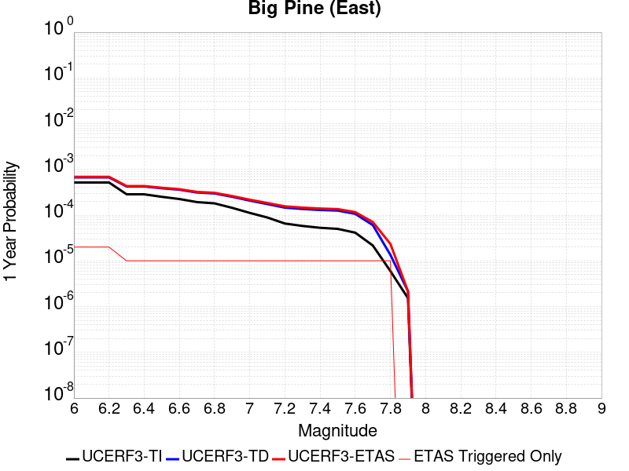 |  |

| Magnitude | 1 wk TI Prob | 1 wk TD Prob | 1 wk ETAS Prob | 1 wk ETAS/TD Gain | 1 wk ETAS Triggered Only | 1 mo TI Prob | 1 mo TD Prob | 1 mo ETAS Prob | 1 mo ETAS/TD Gain | 1 mo ETAS Triggered Only | 1 yr TI Prob | 1 yr TD Prob | 1 yr ETAS Prob | 1 yr ETAS/TD Gain | 1 yr ETAS Triggered Only | 10 yr TI Prob | 10 yr TD Prob | 10 yr ETAS Prob | 10 yr ETAS/TD Gain | 10 yr ETAS Triggered Only |
|-----|-----|-----|-----|-----|-----|-----|-----|-----|-----|-----|-----|-----|-----|-----|-----|-----|-----|-----|-----|-----|
| 6.0 | 9.916913E-6 | 1.2816984E-5 | 1.2816984E-5 | 1.0 | 0.0 | 4.250036E-5 | 5.49289E-5 | 5.49289E-5 | 1.0 | 0.0 | 5.173191E-4 | 6.685763E-4 | 6.685763E-4 | 1.0 | 0.0 | 0.0051611643 | 0.006670441 | 0.006720357 | 1.0074831 | 5.0251256E-5 |
| 6.1 | 9.916913E-6 | 1.2816984E-5 | 1.2816984E-5 | 1.0 | 0.0 | 4.250036E-5 | 5.49289E-5 | 5.49289E-5 | 1.0 | 0.0 | 5.173191E-4 | 6.685763E-4 | 6.685763E-4 | 1.0 | 0.0 | 0.0051611643 | 0.006670441 | 0.006720357 | 1.0074831 | 5.0251256E-5 |
| 6.2 | 9.916913E-6 | 1.2816984E-5 | 1.2816984E-5 | 1.0 | 0.0 | 4.250036E-5 | 5.49289E-5 | 5.49289E-5 | 1.0 | 0.0 | 5.173191E-4 | 6.685763E-4 | 6.685763E-4 | 1.0 | 0.0 | 0.0051611643 | 0.006670441 | 0.006720357 | 1.0074831 | 5.0251256E-5 |
| 6.3 | 5.479711E-6 | 8.112951E-6 | 8.112951E-6 | 1.0 | 0.0 | 2.3484265E-5 | 3.4769346E-5 | 3.4769346E-5 | 1.0 | 0.0 | 2.858834E-4 | 4.2323777E-4 | 4.2323777E-4 | 1.0 | 0.0 | 0.0028551589 | 0.004227244 | 0.004264773 | 1.0088779 | 3.768844E-5 |
| 6.4 | 5.465009E-6 | 8.097245E-6 | 8.097245E-6 | 1.0 | 0.0 | 2.3421257E-5 | 3.4702036E-5 | 3.4702036E-5 | 1.0 | 0.0 | 2.851165E-4 | 4.2241855E-4 | 4.2241855E-4 | 1.0 | 0.0 | 0.0028475097 | 0.0042190826 | 0.004256612 | 1.0088952 | 3.768844E-5 |
| 6.5 | 4.826767E-6 | 7.422301E-6 | 7.422301E-6 | 1.0 | 0.0 | 2.068598E-5 | 3.180949E-5 | 3.180949E-5 | 1.0 | 0.0 | 2.518227E-4 | 3.872145E-4 | 3.872145E-4 | 1.0 | 0.0 | 0.0025153751 | 0.003868283 | 0.0039058255 | 1.0097053 | 3.768844E-5 |
| 6.6 | 4.3146847E-6 | 6.8822374E-6 | 6.8822374E-6 | 1.0 | 0.0 | 1.8491375E-5 | 2.9494982E-5 | 2.9494982E-5 | 1.0 | 0.0 | 2.2510924E-4 | 3.590447E-4 | 3.590447E-4 | 1.0 | 0.0 | 0.0022488134 | 0.0035874986 | 0.003612534 | 1.0069785 | 2.5125628E-5 |
| 6.7 | 3.6968106E-6 | 5.9954727E-6 | 5.9954727E-6 | 1.0 | 0.0 | 1.5843378E-5 | 2.5694639E-5 | 2.5694639E-5 | 1.0 | 0.0 | 1.9287605E-4 | 3.1278885E-4 | 3.1278885E-4 | 1.0 | 0.0 | 0.0019270873 | 0.0031262483 | 0.0031512952 | 1.0080118 | 2.5125628E-5 |
| 6.8 | 3.4671132E-6 | 5.702177E-6 | 5.702177E-6 | 1.0 | 0.0 | 1.4858972E-5 | 2.4437682E-5 | 2.4437682E-5 | 1.0 | 0.0 | 1.8089297E-4 | 2.974896E-4 | 2.974896E-4 | 1.0 | 0.0 | 0.0018074579 | 0.002973667 | 0.002998718 | 1.0084243 | 2.5125628E-5 |
| 6.9 | 2.7686972E-6 | 4.825223E-6 | 4.825223E-6 | 1.0 | 0.0 | 1.1865792E-5 | 2.0679368E-5 | 2.0679368E-5 | 1.0 | 0.0 | 1.4445644E-4 | 2.5174298E-4 | 2.5174298E-4 | 1.0 | 0.0 | 0.0014436257 | 0.0025172636 | 0.002542326 | 1.0099562 | 2.5125628E-5 |
| 7.0 | 2.1472624E-6 | 3.9850406E-6 | 3.9850406E-6 | 1.0 | 0.0 | 9.20252E-6 | 1.7078637E-5 | 1.7078637E-5 | 1.0 | 0.0 | 1.12034926E-4 | 2.079131E-4 | 2.079131E-4 | 1.0 | 0.0 | 0.0011197845 | 0.0020798394 | 0.002092376 | 1.0060277 | 1.2562814E-5 |
| 7.1 | 1.7018335E-6 | 3.344876E-6 | 3.344876E-6 | 1.0 | 0.0 | 7.293552E-6 | 1.4335106E-5 | 1.4335106E-5 | 1.0 | 0.0 | 8.879537E-5 | 1.7451629E-4 | 1.7451629E-4 | 1.0 | 0.0 | 8.87599E-4 | 0.0017464145 | 0.0017589553 | 1.0071809 | 1.2562814E-5 |
| 7.2 | 1.25603E-6 | 2.794484E-6 | 2.794484E-6 | 1.0 | 0.0 | 5.3829745E-6 | 1.1976307E-5 | 1.1976307E-5 | 1.0 | 0.0 | 6.553574E-5 | 1.4580201E-4 | 1.4580201E-4 | 1.0 | 0.0 | 6.551642E-4 | 0.001459661 | 0.001459661 | 1.0 | 0.0 |
| 7.3 | 1.112297E-6 | 2.610332E-6 | 2.610332E-6 | 1.0 | 0.0 | 4.7669787E-6 | 1.118709E-5 | 1.118709E-5 | 1.0 | 0.0 | 5.803642E-5 | 1.3619453E-4 | 1.3619453E-4 | 1.0 | 0.0 | 5.802127E-4 | 0.0013635408 | 0.0013635408 | 1.0 | 0.0 |
| 7.4 | 1.0137181E-6 | 2.4834917E-6 | 2.4834917E-6 | 1.0 | 0.0 | 4.3444993E-6 | 1.0643494E-5 | 1.0643494E-5 | 1.0 | 0.0 | 5.2892992E-5 | 1.2957705E-4 | 1.2957705E-4 | 1.0 | 0.0 | 5.288041E-4 | 0.0012972289 | 0.0012972289 | 1.0 | 0.0 |
| 7.5 | 9.598608E-7 | 2.4071483E-6 | 2.4071483E-6 | 1.0 | 0.0 | 4.1136827E-6 | 1.031631E-5 | 1.031631E-5 | 1.0 | 0.0 | 5.0082934E-5 | 1.2559404E-4 | 1.2559404E-4 | 1.0 | 0.0 | 5.007165E-4 | 0.0012572526 | 0.0012572526 | 1.0 | 0.0 |
| 7.6 | 7.929459E-7 | 2.0448588E-6 | 2.0448588E-6 | 1.0 | 0.0 | 3.3983351E-6 | 8.763653E-6 | 8.763653E-6 | 1.0 | 0.0 | 4.1373947E-5 | 1.06692416E-4 | 1.06692416E-4 | 1.0 | 0.0 | 4.1366243E-4 | 0.0010685222 | 0.0010685222 | 1.0 | 0.0 |
| 7.7 | 4.155788E-7 | 1.1605589E-6 | 1.1605589E-6 | 1.0 | 0.0 | 1.7810507E-6 | 4.9738146E-6 | 4.9738146E-6 | 1.0 | 0.0 | 2.1684076E-5 | 6.0554554E-5 | 6.0554554E-5 | 1.0 | 0.0 | 2.1681961E-4 | 6.0857297E-4 | 6.0857297E-4 | 1.0 | 0.0 |
| 7.8 | 1.14666925E-7 | 2.592015E-7 | 2.592015E-7 | 1.0 | 0.0 | 4.914296E-7 | 1.1108631E-6 | 1.1108631E-6 | 1.0 | 0.0 | 5.9831386E-6 | 1.3524678E-5 | 1.3524678E-5 | 1.0 | 0.0 | 5.9829777E-5 | 1.3634123E-4 | 1.3634123E-4 | 1.0 | 0.0 |
| 7.9 | 2.9231824E-8 | 4.1463963E-8 | 4.1463963E-8 | 1.0 | 0.0 | 1.2527924E-7 | 1.7770269E-7 | 1.7770269E-7 | 1.0 | 0.0 | 1.5252737E-6 | 2.1635283E-6 | 2.1635283E-6 | 1.0 | 0.0 | 1.5252632E-5 | 2.1967755E-5 | 2.1967755E-5 | 1.0 | 0.0 |

## Kern Canyon (Lake Isabella) 2011
*[(top)](#table-of-contents)*

| 1 Week | 1 Month | 1 Year | 10 Year |
|-----|-----|-----|-----|
|  | 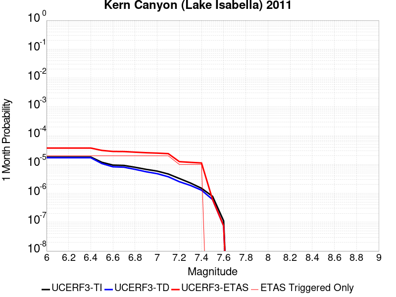 |  |  |

| Magnitude | 1 wk TI Prob | 1 wk TD Prob | 1 wk ETAS Prob | 1 wk ETAS/TD Gain | 1 wk ETAS Triggered Only | 1 mo TI Prob | 1 mo TD Prob | 1 mo ETAS Prob | 1 mo ETAS/TD Gain | 1 mo ETAS Triggered Only | 1 yr TI Prob | 1 yr TD Prob | 1 yr ETAS Prob | 1 yr ETAS/TD Gain | 1 yr ETAS Triggered Only | 10 yr TI Prob | 10 yr TD Prob | 10 yr ETAS Prob | 10 yr ETAS/TD Gain | 10 yr ETAS Triggered Only |
|-----|-----|-----|-----|-----|-----|-----|-----|-----|-----|-----|-----|-----|-----|-----|-----|-----|-----|-----|-----|-----|
| 6.0 | 4.2387383E-6 | 4.001639E-6 | 2.9127166E-5 | 7.2788095 | 2.5125628E-5 | 1.8165894E-5 | 1.7149778E-5 | 4.2274976E-5 | 2.465045 | 2.5125628E-5 | 2.2114732E-4 | 2.087804E-4 | 2.5902118E-4 | 1.2406393 | 5.0251256E-5 | 0.0022092736 | 0.0020860266 | 0.002136173 | 1.0240393 | 5.0251256E-5 |
| 6.1 | 4.2387383E-6 | 4.001639E-6 | 2.9127166E-5 | 7.2788095 | 2.5125628E-5 | 1.8165894E-5 | 1.7149778E-5 | 4.2274976E-5 | 2.465045 | 2.5125628E-5 | 2.2114732E-4 | 2.087804E-4 | 2.5902118E-4 | 1.2406393 | 5.0251256E-5 | 0.0022092736 | 0.0020860266 | 0.002136173 | 1.0240393 | 5.0251256E-5 |
| 6.2 | 4.2387383E-6 | 4.001639E-6 | 2.9127166E-5 | 7.2788095 | 2.5125628E-5 | 1.8165894E-5 | 1.7149778E-5 | 4.2274976E-5 | 2.465045 | 2.5125628E-5 | 2.2114732E-4 | 2.087804E-4 | 2.5902118E-4 | 1.2406393 | 5.0251256E-5 | 0.0022092736 | 0.0020860266 | 0.002136173 | 1.0240393 | 5.0251256E-5 |
| 6.3 | 4.2387383E-6 | 4.001639E-6 | 2.9127166E-5 | 7.2788095 | 2.5125628E-5 | 1.8165894E-5 | 1.7149778E-5 | 4.2274976E-5 | 2.465045 | 2.5125628E-5 | 2.2114732E-4 | 2.087804E-4 | 2.5902118E-4 | 1.2406393 | 5.0251256E-5 | 0.0022092736 | 0.0020860266 | 0.002136173 | 1.0240393 | 5.0251256E-5 |
| 6.4 | 4.2387383E-6 | 4.001639E-6 | 2.9127166E-5 | 7.2788095 | 2.5125628E-5 | 1.8165894E-5 | 1.7149778E-5 | 4.2274976E-5 | 2.465045 | 2.5125628E-5 | 2.2114732E-4 | 2.087804E-4 | 2.5902118E-4 | 1.2406393 | 5.0251256E-5 | 0.0022092736 | 0.0020860266 | 0.002136173 | 1.0240393 | 5.0251256E-5 |
| 6.5 | 2.7857532E-6 | 2.517867E-6 | 2.7643431E-5 | 10.9789095 | 2.5125628E-5 | 1.1938888E-5 | 1.0790815E-5 | 3.591617E-5 | 3.328402 | 2.5125628E-5 | 1.4534626E-4 | 1.3137059E-4 | 1.5649291E-4 | 1.1912326 | 2.5125628E-5 | 0.0014525123 | 0.001312962 | 0.0013380547 | 1.0191115 | 2.5125628E-5 |
| 6.6 | 2.2233348E-6 | 1.9441236E-6 | 2.7069704E-5 | 13.92386 | 2.5125628E-5 | 9.528543E-6 | 8.331932E-6 | 3.3457352E-5 | 4.0155573 | 2.5125628E-5 | 1.1600384E-4 | 1.01436635E-4 | 1.2655972E-4 | 1.2476727 | 2.5125628E-5 | 0.001159433 | 0.001013912 | 0.0010390121 | 1.0247557 | 2.5125628E-5 |
| 6.7 | 2.1635126E-6 | 1.8835036E-6 | 2.7009084E-5 | 14.33981 | 2.5125628E-5 | 9.272164E-6 | 8.072134E-6 | 3.319756E-5 | 4.1126127 | 2.5125628E-5 | 1.1288274E-4 | 9.827388E-5 | 1.2339704E-4 | 1.2556443 | 2.5125628E-5 | 0.0011282542 | 9.823124E-4 | 0.0010074133 | 1.0255529 | 2.5125628E-5 |
| 6.8 | 1.8685711E-6 | 1.5831425E-6 | 2.670873E-5 | 16.870705 | 2.5125628E-5 | 8.008137E-6 | 6.784879E-6 | 3.191034E-5 | 4.7031546 | 2.5125628E-5 | 9.74947E-5 | 8.260282E-5 | 1.0772637E-4 | 1.3041488 | 2.5125628E-5 | 9.745194E-4 | 8.2572614E-4 | 8.50831E-4 | 1.0304034 | 2.5125628E-5 |
| 6.9 | 1.5815071E-6 | 1.3064928E-6 | 2.6432088E-5 | 20.23133 | 2.5125628E-5 | 6.77787E-6 | 5.599243E-6 | 3.0724732E-5 | 5.487301 | 2.5125628E-5 | 8.251744E-5 | 6.816868E-5 | 9.329259E-5 | 1.3685551 | 2.5125628E-5 | 8.248681E-4 | 6.8148033E-4 | 7.0658885E-4 | 1.036844 | 2.5125628E-5 |
| 7.0 | 1.3772564E-6 | 1.1210718E-6 | 2.6246671E-5 | 23.412125 | 2.5125628E-5 | 5.9025137E-6 | 4.8045845E-6 | 2.9930092E-5 | 6.229486 | 2.5125628E-5 | 7.186073E-5 | 5.8494268E-5 | 8.3618426E-5 | 1.4295149 | 2.5125628E-5 | 7.18375E-4 | 5.847908E-4 | 6.099017E-4 | 1.04294 | 2.5125628E-5 |
| 7.1 | 1.0916998E-6 | 8.763777E-7 | 2.6001984E-5 | 29.669836 | 2.5125628E-5 | 4.678705E-6 | 3.7558991E-6 | 2.8881434E-5 | 7.689619 | 2.5125628E-5 | 5.6961744E-5 | 4.5727127E-5 | 7.08516E-5 | 1.5494436 | 2.5125628E-5 | 5.6947145E-4 | 4.571785E-4 | 4.8229267E-4 | 1.054933 | 2.5125628E-5 |
| 7.2 | 7.6277024E-7 | 5.901454E-7 | 1.3152952E-5 | 22.287645 | 1.2562814E-5 | 3.2690114E-6 | 2.5291922E-6 | 1.5091975E-5 | 5.9671125 | 1.2562814E-5 | 3.9799485E-5 | 3.0792486E-5 | 4.3354914E-5 | 1.4079705 | 1.2562814E-5 | 3.9792358E-4 | 3.0788282E-4 | 3.2044176E-4 | 1.0407913 | 1.2562814E-5 |
| 7.3 | 5.3265916E-7 | 4.3824414E-7 | 1.3001053E-5 | 29.666231 | 1.2562814E-5 | 2.282823E-6 | 1.878188E-6 | 1.4440979E-5 | 7.6887827 | 1.2562814E-5 | 2.7793016E-5 | 2.2866701E-5 | 3.5429228E-5 | 1.5493808 | 1.2562814E-5 | 2.778954E-4 | 2.2864387E-4 | 2.4120382E-4 | 1.0549324 | 1.2562814E-5 |
| 7.4 | 3.4946007E-7 | 3.006571E-7 | 1.2863467E-5 | 42.784515 | 1.2562814E-5 | 1.497685E-6 | 1.2885298E-6 | 1.3851328E-5 | 10.749715 | 1.2562814E-5 | 1.8234163E-5 | 1.568774E-5 | 2.8250357E-5 | 1.8007921 | 1.2562814E-5 | 1.8232666E-4 | 1.5686655E-4 | 1.6942738E-4 | 1.0800735 | 1.2562814E-5 |
| 7.5 | 1.8317026E-7 | 1.4244812E-7 | 1.4244812E-7 | 1.0 | 0.0 | 7.850152E-7 | 6.104918E-7 | 6.104918E-7 | 1.0 | 0.0 | 9.557518E-6 | 7.432713E-6 | 7.432713E-6 | 1.0 | 0.0 | 9.5571064E-5 | 7.432472E-5 | 7.432472E-5 | 1.0 | 0.0 |
| 7.6 | 2.572245E-8 | 1.7352555E-8 | 1.7352555E-8 | 1.0 | 0.0 | 1.10239064E-7 | 7.436809E-8 | 7.436809E-8 | 1.0 | 0.0 | 1.3421597E-6 | 9.054312E-7 | 9.054312E-7 | 1.0 | 0.0 | 1.3421517E-5 | 9.05428E-6 | 9.05428E-6 | 1.0 | 0.0 |

## San Clemente
*[(top)](#table-of-contents)*

| 1 Week | 1 Month | 1 Year | 10 Year |
|-----|-----|-----|-----|
|  |  |  |  |

| Magnitude | 1 wk TI Prob | 1 wk TD Prob | 1 wk ETAS Prob | 1 wk ETAS/TD Gain | 1 wk ETAS Triggered Only | 1 mo TI Prob | 1 mo TD Prob | 1 mo ETAS Prob | 1 mo ETAS/TD Gain | 1 mo ETAS Triggered Only | 1 yr TI Prob | 1 yr TD Prob | 1 yr ETAS Prob | 1 yr ETAS/TD Gain | 1 yr ETAS Triggered Only | 10 yr TI Prob | 10 yr TD Prob | 10 yr ETAS Prob | 10 yr ETAS/TD Gain | 10 yr ETAS Triggered Only |
|-----|-----|-----|-----|-----|-----|-----|-----|-----|-----|-----|-----|-----|-----|-----|-----|-----|-----|-----|-----|-----|
| 6.0 | 6.681379E-5 | 8.163422E-5 | 8.163422E-5 | 1.0 | 0.0 | 2.8631336E-4 | 3.498173E-4 | 3.6237572E-4 | 1.0358999 | 1.2562814E-5 | 0.003480294 | 0.0042512873 | 0.004288816 | 1.0088274 | 3.768844E-5 | 0.03426291 | 0.041755714 | 0.041803867 | 1.0011532 | 5.0251256E-5 |
| 6.1 | 6.681379E-5 | 8.163422E-5 | 8.163422E-5 | 1.0 | 0.0 | 2.8631336E-4 | 3.498173E-4 | 3.6237572E-4 | 1.0358999 | 1.2562814E-5 | 0.003480294 | 0.0042512873 | 0.004263797 | 1.0029424 | 1.2562814E-5 | 0.03426291 | 0.041755714 | 0.04177979 | 1.0005766 | 2.5125628E-5 |
| 6.2 | 3.9400576E-5 | 4.6451984E-5 | 4.6451984E-5 | 1.0 | 0.0 | 1.6884868E-4 | 1.9906509E-4 | 2.116254E-4 | 1.0630965 | 1.2562814E-5 | 0.0020537945 | 0.002420985 | 0.0024335172 | 1.0051765 | 1.2562814E-5 | 0.020349167 | 0.02395286 | 0.023977384 | 1.0010239 | 2.5125628E-5 |
| 6.3 | 3.2590255E-5 | 3.7929087E-5 | 3.7929087E-5 | 1.0 | 0.0 | 1.3966505E-4 | 1.6254328E-4 | 1.7510405E-4 | 1.0772765 | 1.2562814E-5 | 0.0016990956 | 0.0019771985 | 0.0019897365 | 1.0063413 | 1.2562814E-5 | 0.01686163 | 0.019599866 | 0.019612182 | 1.0006284 | 1.2562814E-5 |
| 6.4 | 2.9454652E-5 | 3.4097775E-5 | 3.4097775E-5 | 1.0 | 0.0 | 1.2622811E-4 | 1.4612528E-4 | 1.5868626E-4 | 1.0859604 | 1.2562814E-5 | 0.0015357438 | 0.0017776482 | 0.0017901887 | 1.0070546 | 1.2562814E-5 | 0.015251739 | 0.017637458 | 0.017649798 | 1.0006998 | 1.2562814E-5 |
| 6.5 | 2.790836E-5 | 3.2247463E-5 | 3.2247463E-5 | 1.0 | 0.0 | 1.1960178E-4 | 1.3819622E-4 | 1.507573E-4 | 1.090893 | 1.2562814E-5 | 0.001455179 | 0.0016812651 | 0.0016938067 | 1.0074596 | 1.2562814E-5 | 0.014456868 | 0.016688475 | 0.016700828 | 1.0007402 | 1.2562814E-5 |
| 6.6 | 2.2492153E-5 | 2.5762707E-5 | 2.5762707E-5 | 1.0 | 0.0 | 9.639138E-5 | 1.1040701E-4 | 1.2296844E-4 | 1.1137738 | 1.2562814E-5 | 0.0011729331 | 0.0013433908 | 0.0013559368 | 1.009339 | 1.2562814E-5 | 0.011667615 | 0.013354415 | 0.01336681 | 1.0009282 | 1.2562814E-5 |
| 6.7 | 1.9862755E-5 | 2.2666423E-5 | 2.2666423E-5 | 1.0 | 0.0 | 8.512331E-5 | 9.713826E-5 | 1.0969985E-4 | 1.1293167 | 1.2562814E-5 | 0.0010358836 | 0.0011820279 | 0.0011945759 | 1.0106156 | 1.2562814E-5 | 0.010310682 | 0.011758701 | 0.0117711155 | 1.0010558 | 1.2562814E-5 |
| 6.8 | 1.6697575E-5 | 1.897771E-5 | 1.897771E-5 | 1.0 | 0.0 | 7.155907E-5 | 8.133056E-5 | 9.389235E-5 | 1.1544535 | 1.2562814E-5 | 8.7088346E-4 | 9.897591E-4 | 0.0010023095 | 1.0126803 | 1.2562814E-5 | 0.008674784 | 0.0098545365 | 0.009866976 | 1.0012623 | 1.2562814E-5 |
| 6.9 | 1.5218415E-5 | 1.72694E-5 | 1.72694E-5 | 1.0 | 0.0 | 6.522015E-5 | 7.4009666E-5 | 8.657155E-5 | 1.169733 | 1.2562814E-5 | 7.93766E-4 | 9.00704E-4 | 9.132555E-4 | 1.0139352 | 1.2562814E-5 | 0.007909367 | 0.008971481 | 0.008983931 | 1.0013877 | 1.2562814E-5 |
| 7.0 | 1.2392958E-5 | 1.4033016E-5 | 1.4033016E-5 | 1.0 | 0.0 | 5.3111595E-5 | 6.014015E-5 | 7.270221E-5 | 1.2088797 | 1.2562814E-5 | 6.4644177E-4 | 7.319679E-4 | 7.4452156E-4 | 1.0171505 | 1.2562814E-5 | 0.0064456454 | 0.0072963564 | 0.0073088277 | 1.0017092 | 1.2562814E-5 |
| 7.1 | 1.0934128E-5 | 1.2375138E-5 | 1.2375138E-5 | 1.0 | 0.0 | 4.6859706E-5 | 5.303527E-5 | 6.5597415E-5 | 1.2368641 | 1.2562814E-5 | 5.7036756E-4 | 6.455204E-4 | 6.580751E-4 | 1.019449 | 1.2562814E-5 | 0.0056890585 | 0.0064371997 | 0.0064496817 | 1.001939 | 1.2562814E-5 |
| 7.2 | 9.5798805E-6 | 1.0844935E-5 | 1.0844935E-5 | 1.0 | 0.0 | 4.1055984E-5 | 4.6477508E-5 | 5.9039736E-5 | 1.2702862 | 1.2562814E-5 | 4.9974193E-4 | 5.657239E-4 | 5.782796E-4 | 1.022194 | 1.2562814E-5 | 0.0049861963 | 0.0056435615 | 0.0056560533 | 1.0022135 | 1.2562814E-5 |
| 7.3 | 8.0167365E-6 | 9.083918E-6 | 9.083918E-6 | 1.0 | 0.0 | 3.4356988E-5 | 3.8930535E-5 | 5.1492858E-5 | 1.3226857 | 1.2562814E-5 | 4.1821605E-4 | 4.7388324E-4 | 4.8644008E-4 | 1.0264978 | 1.2562814E-5 | 0.0041742986 | 0.0047294297 | 0.004741933 | 1.0026437 | 1.2562814E-5 |
| 7.4 | 2.9581017E-6 | 3.3623792E-6 | 3.3623792E-6 | 1.0 | 0.0 | 1.2677518E-5 | 1.4410146E-5 | 2.6972779E-5 | 1.8717909 | 1.2562814E-5 | 1.5433785E-4 | 1.7543444E-4 | 1.8799506E-4 | 1.0715972 | 1.2562814E-5 | 0.001542307 | 0.0017534546 | 0.0017659954 | 1.0071521 | 1.2562814E-5 |

## North Frontal  (West)
*[(top)](#table-of-contents)*

| 1 Week | 1 Month | 1 Year | 10 Year |
|-----|-----|-----|-----|
|  |  |  | 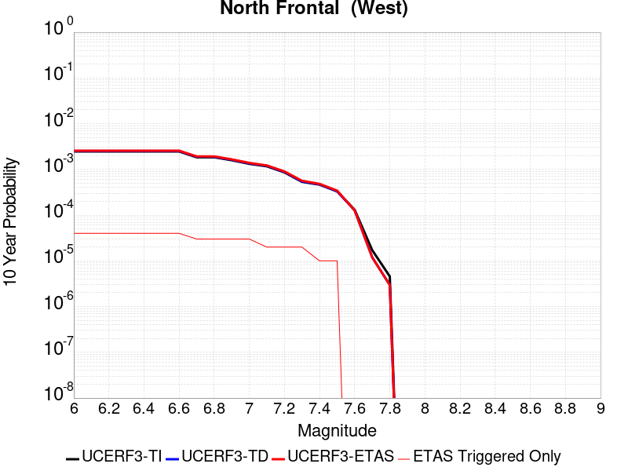 |

| Magnitude | 1 wk TI Prob | 1 wk TD Prob | 1 wk ETAS Prob | 1 wk ETAS/TD Gain | 1 wk ETAS Triggered Only | 1 mo TI Prob | 1 mo TD Prob | 1 mo ETAS Prob | 1 mo ETAS/TD Gain | 1 mo ETAS Triggered Only | 1 yr TI Prob | 1 yr TD Prob | 1 yr ETAS Prob | 1 yr ETAS/TD Gain | 1 yr ETAS Triggered Only | 10 yr TI Prob | 10 yr TD Prob | 10 yr ETAS Prob | 10 yr ETAS/TD Gain | 10 yr ETAS Triggered Only |
|-----|-----|-----|-----|-----|-----|-----|-----|-----|-----|-----|-----|-----|-----|-----|-----|-----|-----|-----|-----|-----|
| 6.0 | 4.7316266E-6 | 4.8526726E-6 | 1.7415427E-5 | 3.5888317 | 1.2562814E-5 | 2.0278241E-5 | 2.0797012E-5 | 3.3359564E-5 | 1.6040556 | 1.2562814E-5 | 2.4685962E-4 | 2.5317568E-4 | 2.7829493E-4 | 1.0992167 | 2.5125628E-5 | 0.0024658558 | 0.0025290183 | 0.0025791426 | 1.0198196 | 5.0251256E-5 |
| 6.1 | 4.7316266E-6 | 4.8526726E-6 | 1.7415427E-5 | 3.5888317 | 1.2562814E-5 | 2.0278241E-5 | 2.0797012E-5 | 3.3359564E-5 | 1.6040556 | 1.2562814E-5 | 2.4685962E-4 | 2.5317568E-4 | 2.7829493E-4 | 1.0992167 | 2.5125628E-5 | 0.0024658558 | 0.0025290183 | 0.0025791426 | 1.0198196 | 5.0251256E-5 |
| 6.2 | 4.7316266E-6 | 4.8526726E-6 | 1.7415427E-5 | 3.5888317 | 1.2562814E-5 | 2.0278241E-5 | 2.0797012E-5 | 3.3359564E-5 | 1.6040556 | 1.2562814E-5 | 2.4685962E-4 | 2.5317568E-4 | 2.7829493E-4 | 1.0992167 | 2.5125628E-5 | 0.0024658558 | 0.0025290183 | 0.0025791426 | 1.0198196 | 5.0251256E-5 |
| 6.3 | 4.7316266E-6 | 4.8526726E-6 | 1.7415427E-5 | 3.5888317 | 1.2562814E-5 | 2.0278241E-5 | 2.0797012E-5 | 3.3359564E-5 | 1.6040556 | 1.2562814E-5 | 2.4685962E-4 | 2.5317568E-4 | 2.7829493E-4 | 1.0992167 | 2.5125628E-5 | 0.0024658558 | 0.0025290183 | 0.0025791426 | 1.0198196 | 5.0251256E-5 |
| 6.4 | 4.7316266E-6 | 4.8526726E-6 | 1.7415427E-5 | 3.5888317 | 1.2562814E-5 | 2.0278241E-5 | 2.0797012E-5 | 3.3359564E-5 | 1.6040556 | 1.2562814E-5 | 2.4685962E-4 | 2.5317568E-4 | 2.7829493E-4 | 1.0992167 | 2.5125628E-5 | 0.0024658558 | 0.0025290183 | 0.0025791426 | 1.0198196 | 5.0251256E-5 |
| 6.5 | 4.7316266E-6 | 4.8526726E-6 | 1.7415427E-5 | 3.5888317 | 1.2562814E-5 | 2.0278241E-5 | 2.0797012E-5 | 3.3359564E-5 | 1.6040556 | 1.2562814E-5 | 2.4685962E-4 | 2.5317568E-4 | 2.7829493E-4 | 1.0992167 | 2.5125628E-5 | 0.0024658558 | 0.0025290183 | 0.0025791426 | 1.0198196 | 5.0251256E-5 |
| 6.6 | 4.7316266E-6 | 4.8526726E-6 | 1.7415427E-5 | 3.5888317 | 1.2562814E-5 | 2.0278241E-5 | 2.0797012E-5 | 3.3359564E-5 | 1.6040556 | 1.2562814E-5 | 2.4685962E-4 | 2.5317568E-4 | 2.7829493E-4 | 1.0992167 | 2.5125628E-5 | 0.0024658558 | 0.0025290183 | 0.0025791426 | 1.0198196 | 5.0251256E-5 |
| 6.7 | 3.5382777E-6 | 3.6308859E-6 | 3.6308859E-6 | 1.0 | 0.0 | 1.516396E-5 | 1.5560852E-5 | 1.5560852E-5 | 1.0 | 0.0 | 1.8460557E-4 | 1.8943768E-4 | 2.019981E-4 | 1.0663037 | 1.2562814E-5 | 0.0018445229 | 0.0018928389 | 0.001930456 | 1.0198734 | 3.768844E-5 |
| 6.8 | 3.5382777E-6 | 3.6308859E-6 | 3.6308859E-6 | 1.0 | 0.0 | 1.516396E-5 | 1.5560852E-5 | 1.5560852E-5 | 1.0 | 0.0 | 1.8460557E-4 | 1.8943768E-4 | 2.019981E-4 | 1.0663037 | 1.2562814E-5 | 0.0018445229 | 0.0018928389 | 0.001930456 | 1.0198734 | 3.768844E-5 |
| 6.9 | 3.0428037E-6 | 3.1227605E-6 | 3.1227605E-6 | 1.0 | 0.0 | 1.30405215E-5 | 1.33831945E-5 | 1.33831945E-5 | 1.0 | 0.0 | 1.5875678E-4 | 1.6292889E-4 | 1.7548967E-4 | 1.0770936 | 1.2562814E-5 | 0.0015864341 | 0.0016281615 | 0.0016657886 | 1.0231102 | 3.768844E-5 |
| 7.0 | 2.538778E-6 | 2.6060904E-6 | 2.6060904E-6 | 1.0 | 0.0 | 1.0880432E-5 | 1.1168913E-5 | 1.1168913E-5 | 1.0 | 0.0 | 1.324612E-4 | 1.3597352E-4 | 1.4853461E-4 | 1.0923791 | 1.2562814E-5 | 0.0013238228 | 0.0013589499 | 0.0013965871 | 1.0276958 | 3.768844E-5 |
| 7.1 | 2.2418935E-6 | 2.3012074E-6 | 2.3012074E-6 | 1.0 | 0.0 | 9.60808E-6 | 9.862282E-6 | 9.862282E-6 | 1.0 | 0.0 | 1.1697209E-4 | 1.2006712E-4 | 1.3262843E-4 | 1.104619 | 1.2562814E-5 | 0.0011691054 | 0.0012000664 | 0.0012251618 | 1.0209117 | 2.5125628E-5 |
| 7.2 | 1.6526745E-6 | 1.6924851E-6 | 1.6924851E-6 | 1.0 | 0.0 | 7.082872E-6 | 7.253489E-6 | 7.253489E-6 | 1.0 | 0.0 | 8.623055E-5 | 8.8307905E-5 | 1.00869605E-4 | 1.142249 | 1.2562814E-5 | 8.61971E-4 | 8.827532E-4 | 9.078566E-4 | 1.0284377 | 2.5125628E-5 |
| 7.3 | 1.0246019E-6 | 1.0442261E-6 | 1.0442261E-6 | 1.0 | 0.0 | 4.391144E-6 | 4.4752474E-6 | 4.4752474E-6 | 1.0 | 0.0 | 5.3460866E-5 | 5.448489E-5 | 6.7047025E-5 | 1.2305617 | 1.2562814E-5 | 5.344801E-4 | 5.4472685E-4 | 5.698388E-4 | 1.0461 | 2.5125628E-5 |
| 7.4 | 8.9045164E-7 | 9.0565584E-7 | 9.0565584E-7 | 1.0 | 0.0 | 3.8162157E-6 | 3.8813773E-6 | 3.8813773E-6 | 1.0 | 0.0 | 4.646144E-5 | 4.7254853E-5 | 5.9817074E-5 | 1.2658398 | 1.2562814E-5 | 4.6451724E-4 | 4.7245892E-4 | 4.850158E-4 | 1.0265777 | 1.2562814E-5 |
| 7.5 | 6.3357E-7 | 6.4027006E-7 | 6.4027006E-7 | 1.0 | 0.0 | 2.7152971E-6 | 2.744012E-6 | 2.744012E-6 | 1.0 | 0.0 | 3.305824E-5 | 3.34079E-5 | 4.5970293E-5 | 1.3760307 | 1.2562814E-5 | 3.3053322E-4 | 3.3403534E-4 | 3.4659397E-4 | 1.0375967 | 1.2562814E-5 |
| 7.6 | 2.5087024E-7 | 2.4361097E-7 | 2.4361097E-7 | 1.0 | 0.0 | 1.0751578E-6 | 1.0440467E-6 | 1.0440467E-6 | 1.0 | 0.0 | 1.3089967E-5 | 1.2711216E-5 | 1.2711216E-5 | 1.0 | 0.0 | 1.3089196E-4 | 1.2710695E-4 | 1.2710695E-4 | 1.0 | 0.0 |
| 7.7 | 3.282987E-8 | 2.2874195E-8 | 2.2874195E-8 | 1.0 | 0.0 | 1.4069944E-7 | 9.803227E-8 | 9.803227E-8 | 1.0 | 0.0 | 1.7130144E-6 | 1.1935423E-6 | 1.1935423E-6 | 1.0 | 0.0 | 1.7130013E-5 | 1.1935367E-5 | 1.1935367E-5 | 1.0 | 0.0 |
| 7.8 | 8.77499E-9 | 5.6815956E-9 | 5.6815956E-9 | 1.0 | 0.0 | 3.7607098E-8 | 2.4349696E-8 | 2.4349696E-8 | 1.0 | 0.0 | 4.578663E-7 | 2.9645753E-7 | 2.9645753E-7 | 1.0 | 0.0 | 4.5786537E-6 | 2.9645726E-6 | 2.9645726E-6 | 1.0 | 0.0 |

## San Andreas (Santa Cruz Mts) 2011 CFM
*[(top)](#table-of-contents)*

| 1 Week | 1 Month | 1 Year | 10 Year |
|-----|-----|-----|-----|
| 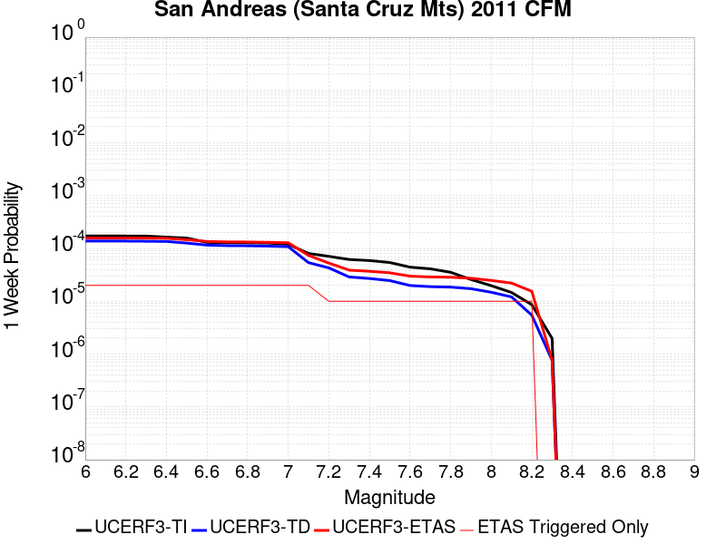 |  |  |  |

| Magnitude | 1 wk TI Prob | 1 wk TD Prob | 1 wk ETAS Prob | 1 wk ETAS/TD Gain | 1 wk ETAS Triggered Only | 1 mo TI Prob | 1 mo TD Prob | 1 mo ETAS Prob | 1 mo ETAS/TD Gain | 1 mo ETAS Triggered Only | 1 yr TI Prob | 1 yr TD Prob | 1 yr ETAS Prob | 1 yr ETAS/TD Gain | 1 yr ETAS Triggered Only | 10 yr TI Prob | 10 yr TD Prob | 10 yr ETAS Prob | 10 yr ETAS/TD Gain | 10 yr ETAS Triggered Only |
|-----|-----|-----|-----|-----|-----|-----|-----|-----|-----|-----|-----|-----|-----|-----|-----|-----|-----|-----|-----|-----|
| 6.0 | 1.7221631E-4 | 1.3793171E-4 | 1.6305388E-4 | 1.1821347 | 2.5125628E-5 | 7.378611E-4 | 5.9100403E-4 | 6.161148E-4 | 1.0424883 | 2.5125628E-5 | 0.008946515 | 0.007172124 | 0.007209542 | 1.0052172 | 3.768844E-5 | 0.08594794 | 0.0705551 | 0.0706018 | 1.000662 | 5.0251256E-5 |
| 6.1 | 1.7221631E-4 | 1.3793171E-4 | 1.6305388E-4 | 1.1821347 | 2.5125628E-5 | 7.378611E-4 | 5.9100403E-4 | 6.161148E-4 | 1.0424883 | 2.5125628E-5 | 0.008946515 | 0.007172124 | 0.007209542 | 1.0052172 | 3.768844E-5 | 0.08594794 | 0.0705551 | 0.0706018 | 1.000662 | 5.0251256E-5 |
| 6.2 | 1.7221631E-4 | 1.3793171E-4 | 1.6305388E-4 | 1.1821347 | 2.5125628E-5 | 7.378611E-4 | 5.9100403E-4 | 6.161148E-4 | 1.0424883 | 2.5125628E-5 | 0.008946515 | 0.007172124 | 0.007209542 | 1.0052172 | 3.768844E-5 | 0.08594794 | 0.0705551 | 0.0706018 | 1.000662 | 5.0251256E-5 |
| 6.3 | 1.716926E-4 | 1.3712609E-4 | 1.6224827E-4 | 1.183205 | 2.5125628E-5 | 7.3561794E-4 | 5.875529E-4 | 6.1266375E-4 | 1.0427381 | 2.5125628E-5 | 0.008919428 | 0.0071303817 | 0.0071678013 | 1.005248 | 3.768844E-5 | 0.08569809 | 0.070167266 | 0.07021399 | 1.0006659 | 5.0251256E-5 |
| 6.4 | 1.6392978E-4 | 1.3588481E-4 | 1.6100702E-4 | 1.1848787 | 2.5125628E-5 | 7.02367E-4 | 5.822355E-4 | 6.0734653E-4 | 1.0431286 | 2.5125628E-5 | 0.008517839 | 0.007066063 | 0.007103485 | 1.005296 | 3.768844E-5 | 0.08198654 | 0.06940135 | 0.06944811 | 1.0006738 | 5.0251256E-5 |
| 6.5 | 1.5742714E-4 | 1.2648388E-4 | 1.5160632E-4 | 1.1986217 | 2.5125628E-5 | 6.745133E-4 | 5.4196286E-4 | 5.6707487E-4 | 1.0463353 | 2.5125628E-5 | 0.00818132 | 0.0065787593 | 0.0066162 | 1.0056912 | 3.768844E-5 | 0.078865945 | 0.06486309 | 0.064910084 | 1.0007244 | 5.0251256E-5 |
| 6.6 | 1.3038084E-4 | 1.1588213E-4 | 1.4100484E-4 | 1.2167954 | 2.5125628E-5 | 5.5865536E-4 | 4.9654447E-4 | 5.2165764E-4 | 1.0505759 | 2.5125628E-5 | 0.006780438 | 0.0060289134 | 0.0060663745 | 1.0062135 | 3.768844E-5 | 0.0657725 | 0.05932738 | 0.05937465 | 1.0007968 | 5.0251256E-5 |
| 6.7 | 1.2867592E-4 | 1.1314701E-4 | 1.382698E-4 | 1.2220367 | 2.5125628E-5 | 5.5135164E-4 | 4.8482692E-4 | 5.099404E-4 | 1.0517988 | 2.5125628E-5 | 0.0066920654 | 0.00588703 | 0.005924497 | 1.0063642 | 3.768844E-5 | 0.06494093 | 0.058038417 | 0.05808575 | 1.0008156 | 5.0251256E-5 |
| 6.8 | 1.2801298E-4 | 1.1252261E-4 | 1.3764542E-4 | 1.2232689 | 2.5125628E-5 | 5.485117E-4 | 4.8215193E-4 | 5.0726545E-4 | 1.0520864 | 2.5125628E-5 | 0.0066577005 | 0.0058546383 | 0.005892106 | 1.0063996 | 3.768844E-5 | 0.06461738 | 0.057752274 | 0.057799622 | 1.0008199 | 5.0251256E-5 |
| 6.9 | 1.269149E-4 | 1.1094465E-4 | 1.360675E-4 | 1.2264448 | 2.5125628E-5 | 5.4380763E-4 | 4.7539172E-4 | 5.005054E-4 | 1.0528274 | 2.5125628E-5 | 0.006600777 | 0.005772772 | 0.0058102426 | 1.006491 | 3.768844E-5 | 0.06408122 | 0.0570241 | 0.057071485 | 1.000831 | 5.0251256E-5 |
| 7.0 | 1.2030331E-4 | 1.0824504E-4 | 1.3336794E-4 | 1.232093 | 2.5125628E-5 | 5.154837E-4 | 4.638261E-4 | 4.8894004E-4 | 1.0541452 | 2.5125628E-5 | 0.006257969 | 0.0056326967 | 0.0056701726 | 1.0066533 | 3.768844E-5 | 0.06084648 | 0.055696685 | 0.055744138 | 1.000852 | 5.0251256E-5 |
| 7.1 | 8.049617E-5 | 5.3926604E-5 | 7.905088E-5 | 1.4658976 | 2.5125628E-5 | 3.4493793E-4 | 2.3109373E-4 | 2.5621356E-4 | 1.1086997 | 2.5125628E-5 | 0.0041915346 | 0.0028099709 | 0.0028475535 | 1.0133747 | 3.768844E-5 | 0.041133516 | 0.029618956 | 0.029667718 | 1.0016463 | 5.0251256E-5 |
| 7.2 | 7.093979E-5 | 4.2937932E-5 | 5.5500204E-5 | 1.2925682 | 1.2562814E-5 | 3.0399222E-4 | 1.8400686E-4 | 1.9656736E-4 | 1.068261 | 1.2562814E-5 | 0.0036948253 | 0.0022380045 | 0.0022630738 | 1.0112016 | 2.5125628E-5 | 0.03633994 | 0.023941692 | 0.023978477 | 1.0015365 | 3.768844E-5 |
| 7.3 | 6.193693E-5 | 2.8894141E-5 | 4.145659E-5 | 1.434775 | 1.2562814E-5 | 2.6541698E-4 | 1.2382616E-4 | 1.3638742E-4 | 1.1014427 | 1.2562814E-5 | 0.0032266637 | 0.0015065427 | 0.0015316305 | 1.0166526 | 2.5125628E-5 | 0.031802133 | 0.016499156 | 0.016536223 | 1.0022466 | 3.768844E-5 |
| 7.4 | 5.906492E-5 | 2.702346E-5 | 3.9585935E-5 | 1.464873 | 1.2562814E-5 | 2.5311083E-4 | 1.1580969E-4 | 1.2837106E-4 | 1.1084656 | 1.2562814E-5 | 0.0030772698 | 0.0014090725 | 0.0014341627 | 1.0178062 | 2.5125628E-5 | 0.030350044 | 0.015471023 | 0.015508127 | 1.0023984 | 3.768844E-5 |
| 7.5 | 5.424296E-5 | 2.4678277E-5 | 3.724078E-5 | 1.5090511 | 1.2562814E-5 | 2.324491E-4 | 1.05759755E-4 | 1.18321244E-4 | 1.1187738 | 1.2562814E-5 | 0.002826395 | 0.0012868657 | 0.001311959 | 1.0194995 | 2.5125628E-5 | 0.027907165 | 0.014163188 | 0.014200342 | 1.0026233 | 3.768844E-5 |
| 7.6 | 4.43084E-5 | 1.990431E-5 | 3.2466873E-5 | 1.631148 | 1.2562814E-5 | 1.8987931E-4 | 8.53014E-5 | 9.786314E-5 | 1.147263 | 1.2562814E-5 | 0.0023093296 | 0.0010380499 | 0.0010631495 | 1.0241795 | 2.5125628E-5 | 0.022854783 | 0.011412679 | 0.011449938 | 1.0032647 | 3.768844E-5 |
| 7.7 | 4.118098E-5 | 1.8936442E-5 | 3.1499017E-5 | 1.6634074 | 1.2562814E-5 | 1.7647797E-4 | 8.115366E-5 | 9.3715455E-5 | 1.1547903 | 1.2562814E-5 | 0.002146502 | 9.875982E-4 | 0.001012699 | 1.025416 | 2.5125628E-5 | 0.021258866 | 0.010870468 | 0.010907747 | 1.0034294 | 3.768844E-5 |
| 7.8 | 3.5408906E-5 | 1.856446E-5 | 3.112704E-5 | 1.6767006 | 1.2562814E-5 | 1.5174363E-4 | 7.955955E-5 | 9.2121365E-5 | 1.157892 | 1.2562814E-5 | 0.0018459131 | 9.682073E-4 | 9.933086E-4 | 1.0259255 | 2.5125628E-5 | 0.018306552 | 0.010652021 | 0.010689307 | 1.0035005 | 3.768844E-5 |
| 7.9 | 2.5860836E-5 | 1.7315993E-5 | 2.987859E-5 | 1.7254909 | 1.2562814E-5 | 1.10827445E-4 | 7.420929E-5 | 8.677117E-5 | 1.1692764 | 1.2562814E-5 | 0.001348489 | 9.031238E-4 | 9.282268E-4 | 1.0277957 | 2.5125628E-5 | 0.013403354 | 0.009907599 | 0.009944914 | 1.0037663 | 3.768844E-5 |
| 8.0 | 1.9777332E-5 | 1.4839596E-5 | 2.7402224E-5 | 1.8465613 | 1.2562814E-5 | 8.4757245E-5 | 6.3596715E-5 | 7.6158736E-5 | 1.1975261 | 1.2562814E-5 | 0.0010314309 | 7.740152E-4 | 7.9912134E-4 | 1.0324363 | 2.5125628E-5 | 0.010266567 | 0.008508967 | 0.008546336 | 1.0043916 | 3.768844E-5 |
| 8.1 | 1.468494E-5 | 1.2107374E-5 | 2.4670037E-5 | 2.0376043 | 1.2562814E-5 | 6.293394E-5 | 5.1887713E-5 | 6.444987E-5 | 1.2421029 | 1.2562814E-5 | 7.6595135E-4 | 6.3155E-4 | 6.566597E-4 | 1.0397589 | 2.5125628E-5 | 0.0076331664 | 0.006969149 | 0.007006575 | 1.0053703 | 3.768844E-5 |
| 8.2 | 8.63836E-6 | 5.469061E-6 | 1.8031806E-5 | 3.2970572 | 1.2562814E-5 | 3.7021015E-5 | 2.3438623E-5 | 3.600114E-5 | 1.5359752 | 1.2562814E-5 | 4.5063766E-4 | 2.8532793E-4 | 2.9788716E-4 | 1.0440168 | 1.2562814E-5 | 0.004497249 | 0.00324569 | 0.003258212 | 1.0038581 | 1.2562814E-5 |
| 8.3 | 1.983087E-6 | 7.6599065E-7 | 7.6599065E-7 | 1.0 | 0.0 | 8.498917E-6 | 3.282813E-6 | 3.282813E-6 | 1.0 | 0.0 | 1.034694E-4 | 3.9967534E-5 | 3.9967534E-5 | 1.0 | 0.0 | 0.0010342124 | 4.719687E-4 | 4.719687E-4 | 1.0 | 0.0 |

## Oak Ridge (Onshore)
*[(top)](#table-of-contents)*

| 1 Week | 1 Month | 1 Year | 10 Year |
|-----|-----|-----|-----|
|  |  | 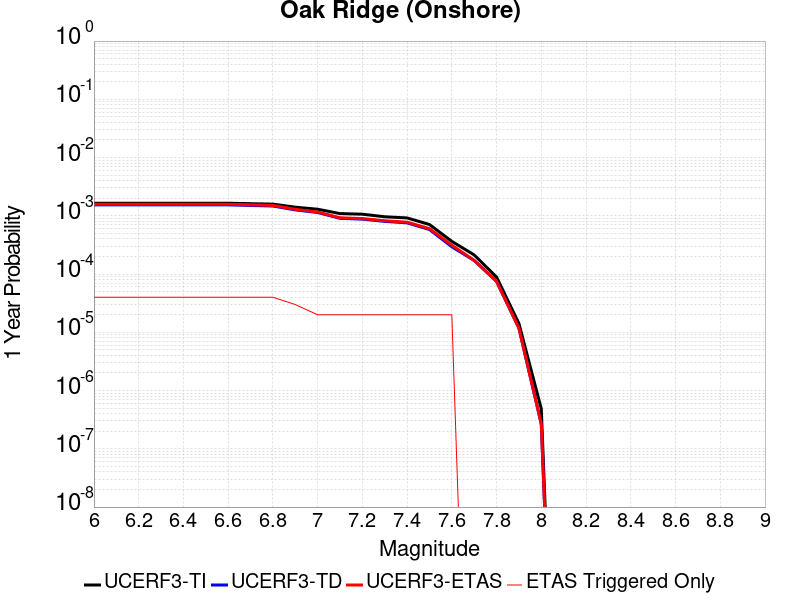 | 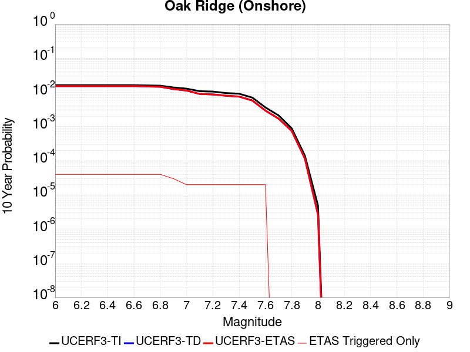 |

| Magnitude | 1 wk TI Prob | 1 wk TD Prob | 1 wk ETAS Prob | 1 wk ETAS/TD Gain | 1 wk ETAS Triggered Only | 1 mo TI Prob | 1 mo TD Prob | 1 mo ETAS Prob | 1 mo ETAS/TD Gain | 1 mo ETAS Triggered Only | 1 yr TI Prob | 1 yr TD Prob | 1 yr ETAS Prob | 1 yr ETAS/TD Gain | 1 yr ETAS Triggered Only | 10 yr TI Prob | 10 yr TD Prob | 10 yr ETAS Prob | 10 yr ETAS/TD Gain | 10 yr ETAS Triggered Only |
|-----|-----|-----|-----|-----|-----|-----|-----|-----|-----|-----|-----|-----|-----|-----|-----|-----|-----|-----|-----|-----|
| 6.0 | 3.155064E-5 | 2.9525974E-5 | 2.9525974E-5 | 1.0 | 0.0 | 1.3521002E-4 | 1.2653397E-4 | 1.5165641E-4 | 1.1985431 | 2.5125628E-5 | 0.001644939 | 0.0015395004 | 0.0015896743 | 1.032591 | 5.0251256E-5 | 0.01632816 | 0.015292859 | 0.015342342 | 1.0032357 | 5.0251256E-5 |
| 6.1 | 3.155064E-5 | 2.9525974E-5 | 2.9525974E-5 | 1.0 | 0.0 | 1.3521002E-4 | 1.2653397E-4 | 1.5165641E-4 | 1.1985431 | 2.5125628E-5 | 0.001644939 | 0.0015395004 | 0.0015896743 | 1.032591 | 5.0251256E-5 | 0.01632816 | 0.015292859 | 0.015342342 | 1.0032357 | 5.0251256E-5 |
| 6.2 | 3.155064E-5 | 2.9525974E-5 | 2.9525974E-5 | 1.0 | 0.0 | 1.3521002E-4 | 1.2653397E-4 | 1.5165641E-4 | 1.1985431 | 2.5125628E-5 | 0.001644939 | 0.0015395004 | 0.0015896743 | 1.032591 | 5.0251256E-5 | 0.01632816 | 0.015292859 | 0.015342342 | 1.0032357 | 5.0251256E-5 |
| 6.3 | 3.155064E-5 | 2.9525974E-5 | 2.9525974E-5 | 1.0 | 0.0 | 1.3521002E-4 | 1.2653397E-4 | 1.5165641E-4 | 1.1985431 | 2.5125628E-5 | 0.001644939 | 0.0015395004 | 0.0015896743 | 1.032591 | 5.0251256E-5 | 0.01632816 | 0.015292859 | 0.015342342 | 1.0032357 | 5.0251256E-5 |
| 6.4 | 3.155064E-5 | 2.9525974E-5 | 2.9525974E-5 | 1.0 | 0.0 | 1.3521002E-4 | 1.2653397E-4 | 1.5165641E-4 | 1.1985431 | 2.5125628E-5 | 0.001644939 | 0.0015395004 | 0.0015896743 | 1.032591 | 5.0251256E-5 | 0.01632816 | 0.015292859 | 0.015342342 | 1.0032357 | 5.0251256E-5 |
| 6.5 | 3.155064E-5 | 2.9525974E-5 | 2.9525974E-5 | 1.0 | 0.0 | 1.3521002E-4 | 1.2653397E-4 | 1.5165641E-4 | 1.1985431 | 2.5125628E-5 | 0.001644939 | 0.0015395004 | 0.0015896743 | 1.032591 | 5.0251256E-5 | 0.01632816 | 0.015292859 | 0.015342342 | 1.0032357 | 5.0251256E-5 |
| 6.6 | 3.155064E-5 | 2.9525974E-5 | 2.9525974E-5 | 1.0 | 0.0 | 1.3521002E-4 | 1.2653397E-4 | 1.5165641E-4 | 1.1985431 | 2.5125628E-5 | 0.001644939 | 0.0015395004 | 0.0015896743 | 1.032591 | 5.0251256E-5 | 0.01632816 | 0.015292859 | 0.015342342 | 1.0032357 | 5.0251256E-5 |
| 6.7 | 3.098897E-5 | 2.8864175E-5 | 2.8864175E-5 | 1.0 | 0.0 | 1.328031E-4 | 1.2369796E-4 | 1.4882047E-4 | 1.2030957 | 2.5125628E-5 | 0.0016156785 | 0.0015050198 | 0.0015551954 | 1.0333389 | 5.0251256E-5 | 0.016039822 | 0.014952714 | 0.015002213 | 1.0033104 | 5.0251256E-5 |
| 6.8 | 3.0449872E-5 | 2.8239372E-5 | 2.8239372E-5 | 1.0 | 0.0 | 1.3049292E-4 | 1.2102048E-4 | 1.4614307E-4 | 1.2075895 | 2.5125628E-5 | 0.0015875935 | 0.0014724657 | 0.0015226429 | 1.034077 | 5.0251256E-5 | 0.015762992 | 0.014631462 | 0.014680978 | 1.0033842 | 5.0251256E-5 |
| 6.9 | 2.697928E-5 | 2.4219773E-5 | 2.4219773E-5 | 1.0 | 0.0 | 1.15620365E-4 | 1.0379502E-4 | 1.2891804E-4 | 1.2420446 | 2.5125628E-5 | 0.0014067689 | 0.0012629933 | 0.0013006341 | 1.0298029 | 3.768844E-5 | 0.0139789665 | 0.01256087 | 0.012598085 | 1.0029628 | 3.768844E-5 |
| 7.0 | 2.4893961E-5 | 2.1862043E-5 | 2.1862043E-5 | 1.0 | 0.0 | 1.0668404E-4 | 9.3691204E-5 | 1.0625284E-4 | 1.1340749 | 1.2562814E-5 | 0.0012981043 | 0.0011401111 | 0.0011652082 | 1.0220127 | 2.5125628E-5 | 0.012905477 | 0.011344905 | 0.011369746 | 1.0021896 | 2.5125628E-5 |
| 7.1 | 2.0945363E-5 | 1.7354487E-5 | 1.7354487E-5 | 1.0 | 0.0 | 8.976275E-5 | 7.437428E-5 | 8.693616E-5 | 1.1689008 | 1.2562814E-5 | 0.0010923136 | 9.051354E-4 | 9.302383E-4 | 1.0277338 | 2.5125628E-5 | 0.0108696 | 0.009015423 | 0.009040322 | 1.0027618 | 2.5125628E-5 |
| 7.2 | 2.0439404E-5 | 1.6809423E-5 | 1.6809423E-5 | 1.0 | 0.0 | 8.7594504E-5 | 7.203843E-5 | 8.460033E-5 | 1.1743779 | 1.2562814E-5 | 0.0010659413 | 8.767196E-4 | 9.0182316E-4 | 1.0286336 | 2.5125628E-5 | 0.010608427 | 0.008733526 | 0.008758432 | 1.0028518 | 2.5125628E-5 |
| 7.3 | 1.8463334E-5 | 1.5381811E-5 | 1.5381811E-5 | 1.0 | 0.0 | 7.912617E-5 | 6.59204E-5 | 7.8482386E-5 | 1.190563 | 1.2562814E-5 | 9.6293533E-4 | 8.0228975E-4 | 8.273952E-4 | 1.0312923 | 2.5125628E-5 | 0.009587734 | 0.007994797 | 0.008019722 | 1.0031177 | 2.5125628E-5 |
| 7.4 | 1.763139E-5 | 1.451684E-5 | 1.451684E-5 | 1.0 | 0.0 | 7.556091E-5 | 6.221356E-5 | 7.47756E-5 | 1.2019179 | 1.2562814E-5 | 9.1956573E-4 | 7.571909E-4 | 7.822975E-4 | 1.0331576 | 2.5125628E-5 | 0.009157699 | 0.007546914 | 0.0075718495 | 1.0033041 | 2.5125628E-5 |
| 7.5 | 1.3594944E-5 | 1.1163356E-5 | 1.1163356E-5 | 1.0 | 0.0 | 5.8262744E-5 | 4.784209E-5 | 6.0404305E-5 | 1.2625766 | 1.2562814E-5 | 7.0911803E-4 | 5.8232434E-4 | 6.074353E-4 | 1.043122 | 2.5125628E-5 | 0.007068595 | 0.0058082556 | 0.0058332356 | 1.0043007 | 2.5125628E-5 |
| 7.6 | 6.9889534E-6 | 5.6367144E-6 | 5.6367144E-6 | 1.0 | 0.0 | 2.9952313E-5 | 2.4157125E-5 | 3.6719637E-5 | 1.5200334 | 1.2562814E-5 | 3.646084E-4 | 2.9407372E-4 | 3.1919198E-4 | 1.0854148 | 2.5125628E-5 | 0.0036401073 | 0.0029368899 | 0.0029619418 | 1.00853 | 2.5125628E-5 |
| 7.7 | 4.0824193E-6 | 3.2832586E-6 | 3.2832586E-6 | 1.0 | 0.0 | 1.7495966E-5 | 1.4071033E-5 | 1.4071033E-5 | 1.0 | 0.0 | 2.1299256E-4 | 1.713015E-4 | 1.713015E-4 | 1.0 | 0.0 | 0.0021278851 | 0.0017117079 | 0.0017117079 | 1.0 | 0.0 |
| 7.8 | 1.7023609E-6 | 1.4370495E-6 | 1.4370495E-6 | 1.0 | 0.0 | 7.295812E-6 | 6.1587693E-6 | 6.1587693E-6 | 1.0 | 0.0 | 8.882289E-5 | 7.498047E-5 | 7.498047E-5 | 1.0 | 0.0 | 8.8787393E-4 | 7.495545E-4 | 7.495545E-4 | 1.0 | 0.0 |
| 7.9 | 2.721225E-7 | 2.2616497E-7 | 2.2616497E-7 | 1.0 | 0.0 | 1.1662388E-6 | 9.692781E-7 | 9.692781E-7 | 1.0 | 0.0 | 1.4198865E-5 | 1.1800899E-5 | 1.1800899E-5 | 1.0 | 0.0 | 1.4197957E-4 | 1.1800301E-4 | 1.1800301E-4 | 1.0 | 0.0 |
| 8.0 | 9.364255E-9 | 5.1206666E-9 | 5.1206666E-9 | 1.0 | 0.0 | 4.0132523E-8 | 2.1945715E-8 | 2.1945715E-8 | 1.0 | 0.0 | 4.8861335E-7 | 2.6718905E-7 | 2.6718905E-7 | 1.0 | 0.0 | 4.8861225E-6 | 2.6718876E-6 | 2.6718876E-6 | 1.0 | 0.0 |

## Clamshell-Sawpit
*[(top)](#table-of-contents)*

| 1 Week | 1 Month | 1 Year | 10 Year |
|-----|-----|-----|-----|
|  | 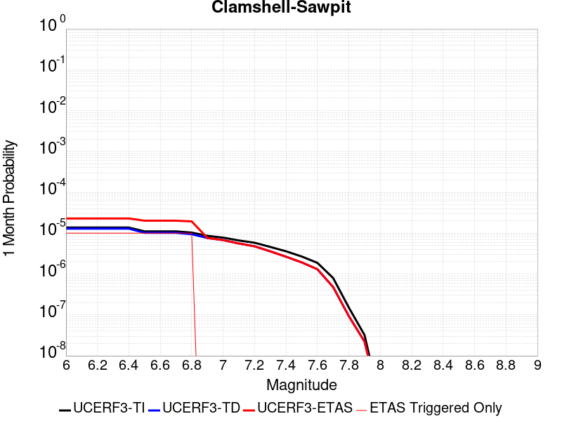 |  |  |

| Magnitude | 1 wk TI Prob | 1 wk TD Prob | 1 wk ETAS Prob | 1 wk ETAS/TD Gain | 1 wk ETAS Triggered Only | 1 mo TI Prob | 1 mo TD Prob | 1 mo ETAS Prob | 1 mo ETAS/TD Gain | 1 mo ETAS Triggered Only | 1 yr TI Prob | 1 yr TD Prob | 1 yr ETAS Prob | 1 yr ETAS/TD Gain | 1 yr ETAS Triggered Only | 10 yr TI Prob | 10 yr TD Prob | 10 yr ETAS Prob | 10 yr ETAS/TD Gain | 10 yr ETAS Triggered Only |
|-----|-----|-----|-----|-----|-----|-----|-----|-----|-----|-----|-----|-----|-----|-----|-----|-----|-----|-----|-----|-----|
| 6.0 | 3.202998E-6 | 3.0127644E-6 | 1.557554E-5 | 5.1698503 | 1.2562814E-5 | 1.3727062E-5 | 1.2911788E-5 | 2.547444E-5 | 1.9729599 | 1.2562814E-5 | 1.6711417E-4 | 1.5719049E-4 | 1.8231216E-4 | 1.1598167 | 2.5125628E-5 | 0.0016698855 | 0.0015708724 | 0.0016085015 | 1.0239544 | 3.768844E-5 |
| 6.1 | 3.202998E-6 | 3.0127644E-6 | 1.557554E-5 | 5.1698503 | 1.2562814E-5 | 1.3727062E-5 | 1.2911788E-5 | 2.547444E-5 | 1.9729599 | 1.2562814E-5 | 1.6711417E-4 | 1.5719049E-4 | 1.8231216E-4 | 1.1598167 | 2.5125628E-5 | 0.0016698855 | 0.0015708724 | 0.0016085015 | 1.0239544 | 3.768844E-5 |
| 6.2 | 3.202998E-6 | 3.0127644E-6 | 1.557554E-5 | 5.1698503 | 1.2562814E-5 | 1.3727062E-5 | 1.2911788E-5 | 2.547444E-5 | 1.9729599 | 1.2562814E-5 | 1.6711417E-4 | 1.5719049E-4 | 1.8231216E-4 | 1.1598167 | 2.5125628E-5 | 0.0016698855 | 0.0015708724 | 0.0016085015 | 1.0239544 | 3.768844E-5 |
| 6.3 | 3.202998E-6 | 3.0127644E-6 | 1.557554E-5 | 5.1698503 | 1.2562814E-5 | 1.3727062E-5 | 1.2911788E-5 | 2.547444E-5 | 1.9729599 | 1.2562814E-5 | 1.6711417E-4 | 1.5719049E-4 | 1.8231216E-4 | 1.1598167 | 2.5125628E-5 | 0.0016698855 | 0.0015708724 | 0.0016085015 | 1.0239544 | 3.768844E-5 |
| 6.4 | 3.202998E-6 | 3.0127644E-6 | 1.557554E-5 | 5.1698503 | 1.2562814E-5 | 1.3727062E-5 | 1.2911788E-5 | 2.547444E-5 | 1.9729599 | 1.2562814E-5 | 1.6711417E-4 | 1.5719049E-4 | 1.8231216E-4 | 1.1598167 | 2.5125628E-5 | 0.0016698855 | 0.0015708724 | 0.0016085015 | 1.0239544 | 3.768844E-5 |
| 6.5 | 2.5862723E-6 | 2.380775E-6 | 1.4943559E-5 | 6.276763 | 1.2562814E-5 | 1.1083977E-5 | 1.0203283E-5 | 2.276597E-5 | 2.2312396 | 1.2562814E-5 | 1.3493907E-4 | 1.2421819E-4 | 1.3677945E-4 | 1.1011225 | 1.2562814E-5 | 0.0013485716 | 0.0012415178 | 0.0012540651 | 1.0101063 | 1.2562814E-5 |
| 6.6 | 2.5862723E-6 | 2.380775E-6 | 1.4943559E-5 | 6.276763 | 1.2562814E-5 | 1.1083977E-5 | 1.0203283E-5 | 2.276597E-5 | 2.2312396 | 1.2562814E-5 | 1.3493907E-4 | 1.2421819E-4 | 1.3677945E-4 | 1.1011225 | 1.2562814E-5 | 0.0013485716 | 0.0012415178 | 0.0012540651 | 1.0101063 | 1.2562814E-5 |
| 6.7 | 2.5862723E-6 | 2.380775E-6 | 1.4943559E-5 | 6.276763 | 1.2562814E-5 | 1.1083977E-5 | 1.0203283E-5 | 2.276597E-5 | 2.2312396 | 1.2562814E-5 | 1.3493907E-4 | 1.2421819E-4 | 1.3677945E-4 | 1.1011225 | 1.2562814E-5 | 0.0013485716 | 0.0012415178 | 0.0012540651 | 1.0101063 | 1.2562814E-5 |
| 6.8 | 2.4098806E-6 | 2.1977307E-6 | 1.4760517E-5 | 6.7162538 | 1.2562814E-5 | 1.0328019E-5 | 9.4188135E-6 | 2.198151E-5 | 2.3337874 | 1.2562814E-5 | 1.2573638E-4 | 1.1466829E-4 | 1.2722966E-4 | 1.1095454 | 1.2562814E-5 | 0.0012566525 | 0.0011461178 | 0.0011586662 | 1.0109487 | 1.2562814E-5 |
| 6.9 | 2.0073985E-6 | 1.7784248E-6 | 1.7784248E-6 | 1.0 | 0.0 | 8.603109E-6 | 7.621799E-6 | 7.621799E-6 | 1.0 | 0.0 | 1.0473781E-4 | 9.279157E-5 | 9.279157E-5 | 1.0 | 0.0 | 0.0010468846 | 9.275401E-4 | 9.275401E-4 | 1.0 | 0.0 |
| 7.0 | 1.8166766E-6 | 1.5807095E-6 | 1.5807095E-6 | 1.0 | 0.0 | 7.785734E-6 | 6.7744522E-6 | 6.7744522E-6 | 1.0 | 0.0 | 9.478718E-5 | 8.247593E-5 | 8.247593E-5 | 1.0 | 0.0 | 9.4746763E-4 | 8.244633E-4 | 8.244633E-4 | 1.0 | 0.0 |
| 7.1 | 1.5471421E-6 | 1.3052961E-6 | 1.3052961E-6 | 1.0 | 0.0 | 6.6305925E-6 | 5.5941146E-6 | 5.5941146E-6 | 1.0 | 0.0 | 8.072447E-5 | 6.8106274E-5 | 6.8106274E-5 | 1.0 | 0.0 | 8.0695155E-4 | 6.808595E-4 | 6.808595E-4 | 1.0 | 0.0 |
| 7.2 | 1.3608037E-6 | 1.1153443E-6 | 1.1153443E-6 | 1.0 | 0.0 | 5.8320024E-6 | 4.7800386E-6 | 4.7800386E-6 | 1.0 | 0.0 | 7.1002316E-5 | 5.8195463E-5 | 5.8195463E-5 | 1.0 | 0.0 | 7.097964E-4 | 5.818069E-4 | 5.818069E-4 | 1.0 | 0.0 |
| 7.3 | 1.0749634E-6 | 8.384254E-7 | 8.384254E-7 | 1.0 | 0.0 | 4.6069777E-6 | 3.593247E-6 | 3.593247E-6 | 1.0 | 0.0 | 5.608851E-5 | 4.374693E-5 | 4.374693E-5 | 1.0 | 0.0 | 5.6074356E-4 | 4.37386E-4 | 4.37386E-4 | 1.0 | 0.0 |
| 7.4 | 8.416856E-7 | 6.200048E-7 | 6.200048E-7 | 1.0 | 0.0 | 3.607219E-6 | 2.6571608E-6 | 2.6571608E-6 | 1.0 | 0.0 | 4.3917007E-5 | 3.2350472E-5 | 3.2350472E-5 | 1.0 | 0.0 | 4.390833E-4 | 3.2345962E-4 | 3.2345962E-4 | 1.0 | 0.0 |
| 7.5 | 6.2779594E-7 | 4.496886E-7 | 4.496886E-7 | 1.0 | 0.0 | 2.6905511E-6 | 1.9272356E-6 | 1.9272356E-6 | 1.0 | 0.0 | 3.275697E-5 | 2.346386E-5 | 2.346386E-5 | 1.0 | 0.0 | 3.275214E-4 | 2.346157E-4 | 2.346157E-4 | 1.0 | 0.0 |
| 7.6 | 4.3822078E-7 | 3.0595405E-7 | 3.0595405E-7 | 1.0 | 0.0 | 1.8780877E-6 | 1.311231E-6 | 1.311231E-6 | 1.0 | 0.0 | 2.2865479E-5 | 1.5964137E-5 | 1.5964137E-5 | 1.0 | 0.0 | 2.2863125E-4 | 1.5963144E-4 | 1.5963144E-4 | 1.0 | 0.0 |
| 7.7 | 1.8704569E-7 | 1.12379205E-7 | 1.12379205E-7 | 1.0 | 0.0 | 8.0162414E-7 | 4.816251E-7 | 4.816251E-7 | 1.0 | 0.0 | 9.75973E-6 | 5.86377E-6 | 5.86377E-6 | 1.0 | 0.0 | 9.7593016E-5 | 5.863622E-5 | 5.863622E-5 | 1.0 | 0.0 |
| 7.8 | 3.5378733E-8 | 2.1838144E-8 | 2.1838144E-8 | 1.0 | 0.0 | 1.5162313E-7 | 9.359204E-8 | 9.359204E-8 | 1.0 | 0.0 | 1.84601E-6 | 1.1394826E-6 | 1.1394826E-6 | 1.0 | 0.0 | 1.8459947E-5 | 1.139477E-5 | 1.139477E-5 | 1.0 | 0.0 |
| 7.9 | 7.504945E-9 | 5.1920326E-9 | 5.1920326E-9 | 1.0 | 0.0 | 3.2164053E-8 | 2.225157E-8 | 2.225157E-8 | 1.0 | 0.0 | 3.9159727E-7 | 2.7091284E-7 | 2.7091284E-7 | 1.0 | 0.0 | 3.915966E-6 | 2.7091257E-6 | 2.7091257E-6 | 1.0 | 0.0 |
| 8.0 | 1.6554036E-10 | 1.4180768E-10 | 1.4180768E-10 | 1.0 | 0.0 | 7.0945894E-10 | 6.077475E-10 | 6.077475E-10 | 1.0 | 0.0 | 8.637662E-9 | 7.3993256E-9 | 7.3993256E-9 | 1.0 | 0.0 | 8.6376616E-8 | 7.3993256E-8 | 7.3993256E-8 | 1.0 | 0.0 |

## Rinconada 2011 CFM
*[(top)](#table-of-contents)*

| 1 Week | 1 Month | 1 Year | 10 Year |
|-----|-----|-----|-----|
|  |  |  |  |

| Magnitude | 1 wk TI Prob | 1 wk TD Prob | 1 wk ETAS Prob | 1 wk ETAS/TD Gain | 1 wk ETAS Triggered Only | 1 mo TI Prob | 1 mo TD Prob | 1 mo ETAS Prob | 1 mo ETAS/TD Gain | 1 mo ETAS Triggered Only | 1 yr TI Prob | 1 yr TD Prob | 1 yr ETAS Prob | 1 yr ETAS/TD Gain | 1 yr ETAS Triggered Only | 10 yr TI Prob | 10 yr TD Prob | 10 yr ETAS Prob | 10 yr ETAS/TD Gain | 10 yr ETAS Triggered Only |
|-----|-----|-----|-----|-----|-----|-----|-----|-----|-----|-----|-----|-----|-----|-----|-----|-----|-----|-----|-----|-----|
| 6.0 | 1.5752368E-5 | 1.6274716E-5 | 1.6274716E-5 | 1.0 | 0.0 | 6.75084E-5 | 6.974694E-5 | 6.974694E-5 | 1.0 | 0.0 | 8.2160486E-4 | 8.488412E-4 | 8.613934E-4 | 1.0147874 | 1.2562814E-5 | 0.008185739 | 0.00845637 | 0.00849374 | 1.0044191 | 3.768844E-5 |
| 6.1 | 1.0966133E-5 | 1.1323029E-5 | 1.1323029E-5 | 1.0 | 0.0 | 4.6996865E-5 | 4.852637E-5 | 4.852637E-5 | 1.0 | 0.0 | 5.720366E-4 | 5.906491E-4 | 5.906491E-4 | 1.0 | 0.0 | 0.0057056635 | 0.0058908886 | 0.0059033777 | 1.00212 | 1.2562814E-5 |
| 6.2 | 1.0966133E-5 | 1.1323029E-5 | 1.1323029E-5 | 1.0 | 0.0 | 4.6996865E-5 | 4.852637E-5 | 4.852637E-5 | 1.0 | 0.0 | 5.720366E-4 | 5.906491E-4 | 5.906491E-4 | 1.0 | 0.0 | 0.0057056635 | 0.0058908886 | 0.0059033777 | 1.00212 | 1.2562814E-5 |
| 6.3 | 8.926149E-6 | 9.212771E-6 | 9.212771E-6 | 1.0 | 0.0 | 3.8254362E-5 | 3.948271E-5 | 3.948271E-5 | 1.0 | 0.0 | 4.6564735E-4 | 4.805963E-4 | 4.805963E-4 | 1.0 | 0.0 | 0.0046467283 | 0.0047956146 | 0.004808117 | 1.0026071 | 1.2562814E-5 |
| 6.4 | 7.676955E-6 | 7.920191E-6 | 7.920191E-6 | 1.0 | 0.0 | 3.290082E-5 | 3.3943234E-5 | 3.3943234E-5 | 1.0 | 0.0 | 4.0049385E-4 | 4.1318068E-4 | 4.1318068E-4 | 1.0 | 0.0 | 0.0039977287 | 0.004124151 | 0.004136662 | 1.0030336 | 1.2562814E-5 |
| 6.5 | 6.1671026E-6 | 6.3589546E-6 | 6.3589546E-6 | 1.0 | 0.0 | 2.6430173E-5 | 2.725238E-5 | 2.725238E-5 | 1.0 | 0.0 | 3.2173982E-4 | 3.317473E-4 | 3.317473E-4 | 1.0 | 0.0 | 0.003212744 | 0.0033125326 | 0.0033250537 | 1.0037799 | 1.2562814E-5 |
| 6.6 | 5.553456E-6 | 5.7248126E-6 | 5.7248126E-6 | 1.0 | 0.0 | 2.3800309E-5 | 2.453468E-5 | 2.453468E-5 | 1.0 | 0.0 | 2.897302E-4 | 2.9866883E-4 | 2.9866883E-4 | 1.0 | 0.0 | 0.0028935277 | 0.002982683 | 0.002982683 | 1.0 | 0.0 |
| 6.7 | 4.787857E-6 | 4.9333094E-6 | 4.9333094E-6 | 1.0 | 0.0 | 2.0519226E-5 | 2.1142583E-5 | 2.1142583E-5 | 1.0 | 0.0 | 2.4979294E-4 | 2.573806E-4 | 2.573806E-4 | 1.0 | 0.0 | 0.0024951235 | 0.0025708308 | 0.0025708308 | 1.0 | 0.0 |
| 6.8 | 3.9955166E-6 | 4.1134763E-6 | 4.1134763E-6 | 1.0 | 0.0 | 1.7123532E-5 | 1.7629065E-5 | 1.7629065E-5 | 1.0 | 0.0 | 2.0845905E-4 | 2.1461274E-4 | 2.1461274E-4 | 1.0 | 0.0 | 0.002082636 | 0.0021440585 | 0.0021440585 | 1.0 | 0.0 |
| 6.9 | 3.4250072E-6 | 3.5224464E-6 | 3.5224464E-6 | 1.0 | 0.0 | 1.46785205E-5 | 1.5096111E-5 | 1.5096111E-5 | 1.0 | 0.0 | 1.7869633E-4 | 1.8377967E-4 | 1.8377967E-4 | 1.0 | 0.0 | 0.001785527 | 0.0018362794 | 0.0018362794 | 1.0 | 0.0 |
| 7.0 | 2.7712713E-6 | 2.8467E-6 | 2.8467E-6 | 1.0 | 0.0 | 1.1876823E-5 | 1.2200086E-5 | 1.2200086E-5 | 1.0 | 0.0 | 1.4459073E-4 | 1.4852593E-4 | 1.4852593E-4 | 1.0 | 0.0 | 0.0014449668 | 0.0014842682 | 0.0014842682 | 1.0 | 0.0 |
| 7.1 | 2.227358E-6 | 2.2856984E-6 | 2.2856984E-6 | 1.0 | 0.0 | 9.545785E-6 | 9.795814E-6 | 9.795814E-6 | 1.0 | 0.0 | 1.16213734E-4 | 1.19257515E-4 | 1.19257515E-4 | 1.0 | 0.0 | 0.0011615298 | 0.0011919362 | 0.0011919362 | 1.0 | 0.0 |
| 7.2 | 1.581796E-6 | 1.6209011E-6 | 1.6209011E-6 | 1.0 | 0.0 | 6.779108E-6 | 6.9467005E-6 | 6.9467005E-6 | 1.0 | 0.0 | 8.253252E-5 | 8.457281E-5 | 8.457281E-5 | 1.0 | 0.0 | 8.250187E-4 | 8.454067E-4 | 8.454067E-4 | 1.0 | 0.0 |
| 7.3 | 1.0306567E-6 | 1.0546477E-6 | 1.0546477E-6 | 1.0 | 0.0 | 4.4170924E-6 | 4.519911E-6 | 4.519911E-6 | 1.0 | 0.0 | 5.3776774E-5 | 5.5028526E-5 | 5.5028526E-5 | 1.0 | 0.0 | 5.376376E-4 | 5.5014924E-4 | 5.5014924E-4 | 1.0 | 0.0 |
| 7.4 | 6.535541E-7 | 6.682742E-7 | 6.682742E-7 | 1.0 | 0.0 | 2.800943E-6 | 2.864029E-6 | 2.864029E-6 | 1.0 | 0.0 | 3.4100947E-5 | 3.4868997E-5 | 3.4868997E-5 | 1.0 | 0.0 | 3.4095717E-4 | 3.4863537E-4 | 3.4863537E-4 | 1.0 | 0.0 |
| 7.5 | 3.2656962E-7 | 3.3316687E-7 | 3.3316687E-7 | 1.0 | 0.0 | 1.3995833E-6 | 1.4278572E-6 | 1.4278572E-6 | 1.0 | 0.0 | 1.7039794E-5 | 1.7384024E-5 | 1.7384024E-5 | 1.0 | 0.0 | 1.7038487E-4 | 1.7382667E-4 | 1.7382667E-4 | 1.0 | 0.0 |
| 7.6 | 9.754343E-8 | 9.82099E-8 | 9.82099E-8 | 1.0 | 0.0 | 4.180432E-7 | 4.208995E-7 | 4.208995E-7 | 1.0 | 0.0 | 5.089664E-6 | 5.1244397E-6 | 5.1244397E-6 | 1.0 | 0.0 | 5.0895473E-5 | 5.1243223E-5 | 5.1243223E-5 | 1.0 | 0.0 |
| 7.7 | 6.0001453E-9 | 5.8490435E-9 | 5.8490435E-9 | 1.0 | 0.0 | 2.5714908E-8 | 2.506733E-8 | 2.506733E-8 | 1.0 | 0.0 | 3.1307894E-7 | 3.051947E-7 | 3.051947E-7 | 1.0 | 0.0 | 3.1307852E-6 | 3.051943E-6 | 3.051943E-6 | 1.0 | 0.0 |
| 7.8 | 7.400003E-11 | 7.4654505E-11 | 7.4654505E-11 | 1.0 | 0.0 | 3.171432E-10 | 3.1994773E-10 | 3.1994773E-10 | 1.0 | 0.0 | 3.861218E-9 | 3.895363E-9 | 3.895363E-9 | 1.0 | 0.0 | 3.861218E-8 | 3.895363E-8 | 3.895363E-8 | 1.0 | 0.0 |

## Oceanside alt1
*[(top)](#table-of-contents)*

| 1 Week | 1 Month | 1 Year | 10 Year |
|-----|-----|-----|-----|
|  |  |  |  |

| Magnitude | 1 wk TI Prob | 1 wk TD Prob | 1 wk ETAS Prob | 1 wk ETAS/TD Gain | 1 wk ETAS Triggered Only | 1 mo TI Prob | 1 mo TD Prob | 1 mo ETAS Prob | 1 mo ETAS/TD Gain | 1 mo ETAS Triggered Only | 1 yr TI Prob | 1 yr TD Prob | 1 yr ETAS Prob | 1 yr ETAS/TD Gain | 1 yr ETAS Triggered Only | 10 yr TI Prob | 10 yr TD Prob | 10 yr ETAS Prob | 10 yr ETAS/TD Gain | 10 yr ETAS Triggered Only |
|-----|-----|-----|-----|-----|-----|-----|-----|-----|-----|-----|-----|-----|-----|-----|-----|-----|-----|-----|-----|-----|
| 6.0 | 1.1617542E-5 | 1.1423493E-5 | 1.1423493E-5 | 1.0 | 0.0 | 4.9788516E-5 | 4.8956997E-5 | 4.8956997E-5 | 1.0 | 0.0 | 6.060066E-4 | 5.9590454E-4 | 6.084599E-4 | 1.0210694 | 1.2562814E-5 | 0.0060435664 | 0.005944664 | 0.0059821284 | 1.0063022 | 3.768844E-5 |
| 6.1 | 1.1617542E-5 | 1.1423493E-5 | 1.1423493E-5 | 1.0 | 0.0 | 4.9788516E-5 | 4.8956997E-5 | 4.8956997E-5 | 1.0 | 0.0 | 6.060066E-4 | 5.9590454E-4 | 6.084599E-4 | 1.0210694 | 1.2562814E-5 | 0.0060435664 | 0.005944664 | 0.0059821284 | 1.0063022 | 3.768844E-5 |
| 6.2 | 1.1617542E-5 | 1.1423493E-5 | 1.1423493E-5 | 1.0 | 0.0 | 4.9788516E-5 | 4.8956997E-5 | 4.8956997E-5 | 1.0 | 0.0 | 6.060066E-4 | 5.9590454E-4 | 6.084599E-4 | 1.0210694 | 1.2562814E-5 | 0.0060435664 | 0.005944664 | 0.0059821284 | 1.0063022 | 3.768844E-5 |
| 6.3 | 1.1617542E-5 | 1.1423493E-5 | 1.1423493E-5 | 1.0 | 0.0 | 4.9788516E-5 | 4.8956997E-5 | 4.8956997E-5 | 1.0 | 0.0 | 6.060066E-4 | 5.9590454E-4 | 6.084599E-4 | 1.0210694 | 1.2562814E-5 | 0.0060435664 | 0.005944664 | 0.0059821284 | 1.0063022 | 3.768844E-5 |
| 6.4 | 1.1617542E-5 | 1.1423493E-5 | 1.1423493E-5 | 1.0 | 0.0 | 4.9788516E-5 | 4.8956997E-5 | 4.8956997E-5 | 1.0 | 0.0 | 6.060066E-4 | 5.9590454E-4 | 6.084599E-4 | 1.0210694 | 1.2562814E-5 | 0.0060435664 | 0.005944664 | 0.0059821284 | 1.0063022 | 3.768844E-5 |
| 6.5 | 1.1617542E-5 | 1.1423493E-5 | 1.1423493E-5 | 1.0 | 0.0 | 4.9788516E-5 | 4.8956997E-5 | 4.8956997E-5 | 1.0 | 0.0 | 6.060066E-4 | 5.9590454E-4 | 6.084599E-4 | 1.0210694 | 1.2562814E-5 | 0.0060435664 | 0.005944664 | 0.0059821284 | 1.0063022 | 3.768844E-5 |
| 6.6 | 7.561768E-6 | 7.1336153E-6 | 7.1336153E-6 | 1.0 | 0.0 | 3.2407173E-5 | 3.0572286E-5 | 3.0572286E-5 | 1.0 | 0.0 | 3.9448592E-4 | 3.7215507E-4 | 3.7215507E-4 | 1.0 | 0.0 | 0.0039378637 | 0.00371543 | 0.0037279462 | 1.0033687 | 1.2562814E-5 |
| 6.7 | 7.1042605E-6 | 6.6556854E-6 | 6.6556854E-6 | 1.0 | 0.0 | 3.0446476E-5 | 2.8524059E-5 | 2.8524059E-5 | 1.0 | 0.0 | 3.706228E-4 | 3.472259E-4 | 3.472259E-4 | 1.0 | 0.0 | 0.0037000529 | 0.003466917 | 0.0034794363 | 1.0036111 | 1.2562814E-5 |
| 6.8 | 6.285554E-6 | 5.799706E-6 | 5.799706E-6 | 1.0 | 0.0 | 2.693781E-5 | 2.4855648E-5 | 2.4855648E-5 | 1.0 | 0.0 | 3.2791847E-4 | 3.0257605E-4 | 3.0257605E-4 | 1.0 | 0.0 | 0.0032743502 | 0.0030216982 | 0.003034223 | 1.004145 | 1.2562814E-5 |
| 6.9 | 6.148883E-6 | 5.6565445E-6 | 5.6565445E-6 | 1.0 | 0.0 | 2.635209E-5 | 2.424211E-5 | 2.424211E-5 | 1.0 | 0.0 | 3.2078946E-4 | 2.9510827E-4 | 2.9510827E-4 | 1.0 | 0.0 | 0.003203268 | 0.0029472208 | 0.0029597466 | 1.00425 | 1.2562814E-5 |
| 7.0 | 5.253857E-6 | 4.722404E-6 | 4.722404E-6 | 1.0 | 0.0 | 2.2516335E-5 | 2.0238718E-5 | 2.0238718E-5 | 1.0 | 0.0 | 2.7410188E-4 | 2.4637886E-4 | 2.4637886E-4 | 1.0 | 0.0 | 0.0027376404 | 0.0024610884 | 0.0024736202 | 1.005092 | 1.2562814E-5 |
| 7.1 | 4.730754E-6 | 4.17851E-6 | 4.17851E-6 | 1.0 | 0.0 | 2.0274503E-5 | 1.7907778E-5 | 1.7907778E-5 | 1.0 | 0.0 | 2.468141E-4 | 2.1800565E-4 | 2.1800565E-4 | 1.0 | 0.0 | 0.0024654015 | 0.0021779444 | 0.0021904798 | 1.0057557 | 1.2562814E-5 |
| 7.2 | 3.7998386E-6 | 3.214026E-6 | 3.214026E-6 | 1.0 | 0.0 | 1.6284921E-5 | 1.37743245E-5 | 1.37743245E-5 | 1.0 | 0.0 | 1.9825088E-4 | 1.6768962E-4 | 1.6768962E-4 | 1.0 | 0.0 | 0.001980741 | 0.001675643 | 0.0016881848 | 1.0074848 | 1.2562814E-5 |
| 7.3 | 3.2656465E-6 | 2.698376E-6 | 2.698376E-6 | 1.0 | 0.0 | 1.3995553E-5 | 1.1564418E-5 | 1.1564418E-5 | 1.0 | 0.0 | 1.7038253E-4 | 1.407878E-4 | 1.407878E-4 | 1.0 | 0.0 | 0.0017025196 | 0.0014069972 | 0.0014195424 | 1.0089163 | 1.2562814E-5 |
| 7.4 | 2.593703E-6 | 2.0680277E-6 | 2.0680277E-6 | 1.0 | 0.0 | 1.1115822E-5 | 8.862946E-6 | 8.862946E-6 | 1.0 | 0.0 | 1.3532673E-4 | 1.0790111E-4 | 1.0790111E-4 | 1.0 | 0.0 | 0.0013524436 | 0.0010784961 | 0.0010910454 | 1.0116359 | 1.2562814E-5 |
| 7.5 | 1.8715585E-6 | 1.4137177E-6 | 1.4137177E-6 | 1.0 | 0.0 | 8.020941E-6 | 6.0587763E-6 | 6.0587763E-6 | 1.0 | 0.0 | 9.7650576E-5 | 7.376316E-5 | 7.376316E-5 | 1.0 | 0.0 | 9.7607676E-4 | 7.3739287E-4 | 7.499464E-4 | 1.0170243 | 1.2562814E-5 |
| 7.6 | 1.2246786E-6 | 8.5268175E-7 | 8.5268175E-7 | 1.0 | 0.0 | 5.248612E-6 | 3.6543456E-6 | 3.6543456E-6 | 1.0 | 0.0 | 6.389998E-5 | 4.4490793E-5 | 4.4490793E-5 | 1.0 | 0.0 | 6.3881604E-4 | 4.4482335E-4 | 4.4482335E-4 | 1.0 | 0.0 |
| 7.7 | 5.140719E-7 | 2.734703E-7 | 2.734703E-7 | 1.0 | 0.0 | 2.2031636E-6 | 1.1720151E-6 | 1.1720151E-6 | 1.0 | 0.0 | 2.6823185E-5 | 1.4269205E-5 | 1.4269205E-5 | 1.0 | 0.0 | 2.6819948E-4 | 1.4268424E-4 | 1.4268424E-4 | 1.0 | 0.0 |
| 7.8 | 1.16056995E-8 | 9.782373E-9 | 9.782373E-9 | 1.0 | 0.0 | 4.9738713E-8 | 4.1924455E-8 | 4.1924455E-8 | 1.0 | 0.0 | 6.0556863E-7 | 5.1043025E-7 | 5.1043025E-7 | 1.0 | 0.0 | 6.05567E-6 | 5.1043025E-6 | 5.1043025E-6 | 1.0 | 0.0 |

## Almanor 2011 CFM
*[(top)](#table-of-contents)*

| 1 Week | 1 Month | 1 Year | 10 Year |
|-----|-----|-----|-----|
|  |  |  |  |

| Magnitude | 1 wk TI Prob | 1 wk TD Prob | 1 wk ETAS Prob | 1 wk ETAS/TD Gain | 1 wk ETAS Triggered Only | 1 mo TI Prob | 1 mo TD Prob | 1 mo ETAS Prob | 1 mo ETAS/TD Gain | 1 mo ETAS Triggered Only | 1 yr TI Prob | 1 yr TD Prob | 1 yr ETAS Prob | 1 yr ETAS/TD Gain | 1 yr ETAS Triggered Only | 10 yr TI Prob | 10 yr TD Prob | 10 yr ETAS Prob | 10 yr ETAS/TD Gain | 10 yr ETAS Triggered Only |
|-----|-----|-----|-----|-----|-----|-----|-----|-----|-----|-----|-----|-----|-----|-----|-----|-----|-----|-----|-----|-----|
| 6.0 | 6.1479834E-5 | 8.32787E-5 | 8.32787E-5 | 1.0 | 0.0 | 2.6345838E-4 | 3.5686578E-4 | 3.5686578E-4 | 1.0 | 0.0 | 0.0032028882 | 0.0043366123 | 0.0043491204 | 1.0028844 | 1.2562814E-5 | 0.031571172 | 0.04258577 | 0.042609826 | 1.0005649 | 2.5125628E-5 |
| 6.1 | 4.4387216E-5 | 5.9770442E-5 | 5.9770442E-5 | 1.0 | 0.0 | 1.9021705E-4 | 2.561381E-4 | 2.561381E-4 | 1.0 | 0.0 | 0.0023134327 | 0.003114426 | 0.0031269498 | 1.0040212 | 1.2562814E-5 | 0.022894967 | 0.030755036 | 0.030779388 | 1.0007918 | 2.5125628E-5 |
| 6.2 | 4.4387216E-5 | 5.9770442E-5 | 5.9770442E-5 | 1.0 | 0.0 | 1.9021705E-4 | 2.561381E-4 | 2.561381E-4 | 1.0 | 0.0 | 0.0023134327 | 0.003114426 | 0.0031269498 | 1.0040212 | 1.2562814E-5 | 0.022894967 | 0.030755036 | 0.030779388 | 1.0007918 | 2.5125628E-5 |
| 6.3 | 2.9523822E-5 | 3.954719E-5 | 3.954719E-5 | 1.0 | 0.0 | 1.2652454E-4 | 1.6947983E-4 | 1.6947983E-4 | 1.0 | 0.0 | 0.0015393476 | 0.0020618725 | 0.0020618725 | 1.0 | 0.0 | 0.015287281 | 0.020460794 | 0.020460794 | 1.0 | 0.0 |
| 6.4 | 2.0512744E-5 | 2.7431617E-5 | 2.7431617E-5 | 1.0 | 0.0 | 8.79088E-5 | 1.175612E-4 | 1.175612E-4 | 1.0 | 0.0 | 0.001069764 | 0.0014307408 | 0.0014307408 | 1.0 | 0.0 | 0.010646289 | 0.014244413 | 0.014244413 | 1.0 | 0.0 |
| 6.5 | 1.6750226E-5 | 2.23913E-5 | 2.23913E-5 | 1.0 | 0.0 | 7.178471E-5 | 9.596152E-5 | 9.596152E-5 | 1.0 | 0.0 | 8.7362836E-4 | 0.0011680633 | 0.0011680633 | 1.0 | 0.0 | 0.008702018 | 0.011649038 | 0.011649038 | 1.0 | 0.0 |
| 6.6 | 1.4745303E-5 | 1.9707952E-5 | 1.9707952E-5 | 1.0 | 0.0 | 6.319262E-5 | 8.446223E-5 | 8.446223E-5 | 1.0 | 0.0 | 7.690986E-4 | 0.0010281964 | 0.0010281964 | 1.0 | 0.0 | 0.0076644225 | 0.010264971 | 0.010264971 | 1.0 | 0.0 |
| 6.7 | 9.951145E-7 | 1.1616347E-6 | 1.1616347E-6 | 1.0 | 0.0 | 4.26477E-6 | 4.9784257E-6 | 4.9784257E-6 | 1.0 | 0.0 | 5.1922336E-5 | 6.0610826E-5 | 6.0610826E-5 | 1.0 | 0.0 | 5.1910203E-4 | 6.059602E-4 | 6.059602E-4 | 1.0 | 0.0 |
| 6.8 | 5.866312E-7 | 6.849384E-7 | 6.849384E-7 | 1.0 | 0.0 | 2.5141312E-6 | 2.9354478E-6 | 2.9354478E-6 | 1.0 | 0.0 | 3.0609117E-5 | 3.5738623E-5 | 3.5738623E-5 | 1.0 | 0.0 | 3.06049E-4 | 3.5734157E-4 | 3.5734157E-4 | 1.0 | 0.0 |

## Sierra Madre
*[(top)](#table-of-contents)*

| 1 Week | 1 Month | 1 Year | 10 Year |
|-----|-----|-----|-----|
|  | 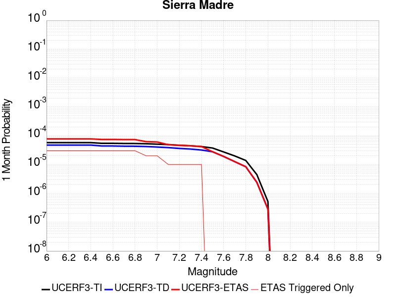 |  |  |

| Magnitude | 1 wk TI Prob | 1 wk TD Prob | 1 wk ETAS Prob | 1 wk ETAS/TD Gain | 1 wk ETAS Triggered Only | 1 mo TI Prob | 1 mo TD Prob | 1 mo ETAS Prob | 1 mo ETAS/TD Gain | 1 mo ETAS Triggered Only | 1 yr TI Prob | 1 yr TD Prob | 1 yr ETAS Prob | 1 yr ETAS/TD Gain | 1 yr ETAS Triggered Only | 10 yr TI Prob | 10 yr TD Prob | 10 yr ETAS Prob | 10 yr ETAS/TD Gain | 10 yr ETAS Triggered Only |
|-----|-----|-----|-----|-----|-----|-----|-----|-----|-----|-----|-----|-----|-----|-----|-----|-----|-----|-----|-----|-----|
| 6.0 | 1.3379373E-5 | 1.10007395E-5 | 2.3563416E-5 | 2.1419847 | 1.2562814E-5 | 5.7338908E-5 | 4.7145186E-5 | 5.9707407E-5 | 1.2664583 | 1.2562814E-5 | 6.978776E-4 | 5.738429E-4 | 5.9895415E-4 | 1.0437597 | 2.5125628E-5 | 0.0069569005 | 0.0057239756 | 0.0057614483 | 1.0065466 | 3.768844E-5 |
| 6.1 | 1.3379373E-5 | 1.10007395E-5 | 2.3563416E-5 | 2.1419847 | 1.2562814E-5 | 5.7338908E-5 | 4.7145186E-5 | 5.9707407E-5 | 1.2664583 | 1.2562814E-5 | 6.978776E-4 | 5.738429E-4 | 5.9895415E-4 | 1.0437597 | 2.5125628E-5 | 0.0069569005 | 0.0057239756 | 0.0057614483 | 1.0065466 | 3.768844E-5 |
| 6.2 | 1.3379373E-5 | 1.10007395E-5 | 2.3563416E-5 | 2.1419847 | 1.2562814E-5 | 5.7338908E-5 | 4.7145186E-5 | 5.9707407E-5 | 1.2664583 | 1.2562814E-5 | 6.978776E-4 | 5.738429E-4 | 5.9895415E-4 | 1.0437597 | 2.5125628E-5 | 0.0069569005 | 0.0057239756 | 0.0057614483 | 1.0065466 | 3.768844E-5 |
| 6.3 | 1.3379373E-5 | 1.10007395E-5 | 2.3563416E-5 | 2.1419847 | 1.2562814E-5 | 5.7338908E-5 | 4.7145186E-5 | 5.9707407E-5 | 1.2664583 | 1.2562814E-5 | 6.978776E-4 | 5.738429E-4 | 5.9895415E-4 | 1.0437597 | 2.5125628E-5 | 0.0069569005 | 0.0057239756 | 0.0057614483 | 1.0065466 | 3.768844E-5 |
| 6.4 | 1.3379373E-5 | 1.10007395E-5 | 2.3563416E-5 | 2.1419847 | 1.2562814E-5 | 5.7338908E-5 | 4.7145186E-5 | 5.9707407E-5 | 1.2664583 | 1.2562814E-5 | 6.978776E-4 | 5.738429E-4 | 5.9895415E-4 | 1.0437597 | 2.5125628E-5 | 0.0069569005 | 0.0057239756 | 0.0057614483 | 1.0065466 | 3.768844E-5 |
| 6.5 | 1.26563245E-5 | 1.0230196E-5 | 2.2792881E-5 | 2.2280004 | 1.2562814E-5 | 5.4240263E-5 | 4.3842967E-5 | 5.6405228E-5 | 1.2865286 | 1.2562814E-5 | 6.601751E-4 | 5.336584E-4 | 5.5877067E-4 | 1.0470567 | 2.5125628E-5 | 0.006582173 | 0.0053240913 | 0.005361579 | 1.0070412 | 3.768844E-5 |
| 6.6 | 1.26563245E-5 | 1.0230196E-5 | 2.2792881E-5 | 2.2280004 | 1.2562814E-5 | 5.4240263E-5 | 4.3842967E-5 | 5.6405228E-5 | 1.2865286 | 1.2562814E-5 | 6.601751E-4 | 5.336584E-4 | 5.5877067E-4 | 1.0470567 | 2.5125628E-5 | 0.006582173 | 0.0053240913 | 0.005361579 | 1.0070412 | 3.768844E-5 |
| 6.7 | 1.2502474E-5 | 1.006634E-5 | 2.2629027E-5 | 2.2479897 | 1.2562814E-5 | 5.3580934E-5 | 4.314075E-5 | 5.570302E-5 | 1.2911928 | 1.2562814E-5 | 6.521526E-4 | 5.251131E-4 | 5.5022555E-4 | 1.047823 | 2.5125628E-5 | 0.0065024206 | 0.0052390425 | 0.0052765333 | 1.0071561 | 3.768844E-5 |
| 6.8 | 1.2454966E-5 | 1.0018625E-5 | 2.2581315E-5 | 2.2539332 | 1.2562814E-5 | 5.3377335E-5 | 4.2936266E-5 | 5.549854E-5 | 1.2925795 | 1.2562814E-5 | 6.4967526E-4 | 5.226247E-4 | 5.4773723E-4 | 1.0480508 | 2.5125628E-5 | 0.006477792 | 0.0052142753 | 0.005251767 | 1.0071902 | 3.768844E-5 |
| 6.9 | 1.2225574E-5 | 9.792602E-6 | 9.792602E-6 | 1.0 | 0.0 | 5.2394265E-5 | 4.1967625E-5 | 4.1967625E-5 | 1.0 | 0.0 | 6.3771347E-4 | 5.108371E-4 | 5.233935E-4 | 1.02458 | 1.2562814E-5 | 0.006358865 | 0.0050969445 | 0.005121942 | 1.0049044 | 2.5125628E-5 |
| 7.0 | 1.182946E-5 | 9.399144E-6 | 9.399144E-6 | 1.0 | 0.0 | 5.06967E-5 | 4.0281426E-5 | 4.0281426E-5 | 1.0 | 0.0 | 6.1705755E-4 | 4.9031706E-4 | 5.028737E-4 | 1.0256093 | 1.2562814E-5 | 0.006153469 | 0.004892664 | 0.004917667 | 1.0051103 | 2.5125628E-5 |
| 7.1 | 1.14369095E-5 | 8.986159E-6 | 8.986159E-6 | 1.0 | 0.0 | 4.9014405E-5 | 3.8511545E-5 | 3.8511545E-5 | 1.0 | 0.0 | 5.9658696E-4 | 4.687782E-4 | 4.813351E-4 | 1.0267864 | 1.2562814E-5 | 0.005949879 | 0.004678199 | 0.0047032074 | 1.0053457 | 2.5125628E-5 |
| 7.2 | 1.0836419E-5 | 8.3995565E-6 | 8.3995565E-6 | 1.0 | 0.0 | 4.644097E-5 | 3.5997607E-5 | 3.5997607E-5 | 1.0 | 0.0 | 5.652721E-4 | 4.3818366E-4 | 4.5074098E-4 | 1.0286577 | 1.2562814E-5 | 0.0056383642 | 0.004373494 | 0.00439851 | 1.0057199 | 2.5125628E-5 |
| 7.3 | 1.0403439E-5 | 8.02082E-6 | 8.02082E-6 | 1.0 | 0.0 | 4.4585406E-5 | 3.4374494E-5 | 3.4374494E-5 | 1.0 | 0.0 | 5.426921E-4 | 4.1843E-4 | 4.3098757E-4 | 1.0300112 | 1.2562814E-5 | 0.005413687 | 0.004176717 | 0.0042017377 | 1.0059905 | 2.5125628E-5 |
| 7.4 | 9.768864E-6 | 7.414448E-6 | 7.414448E-6 | 1.0 | 0.0 | 4.186589E-5 | 3.1775824E-5 | 3.1775824E-5 | 1.0 | 0.0 | 5.09598E-4 | 3.868029E-4 | 3.9936084E-4 | 1.032466 | 1.2562814E-5 | 0.0050843097 | 0.0038615882 | 0.0038866168 | 1.0064814 | 2.5125628E-5 |
| 7.5 | 8.687089E-6 | 6.4501564E-6 | 6.4501564E-6 | 1.0 | 0.0 | 3.722985E-5 | 2.764324E-5 | 2.764324E-5 | 1.0 | 0.0 | 4.5317915E-4 | 3.3650533E-4 | 3.4906392E-4 | 1.0373206 | 1.2562814E-5 | 0.004522561 | 0.0033602451 | 0.0033852863 | 1.0074522 | 2.5125628E-5 |
| 7.6 | 6.3506063E-6 | 4.4303215E-6 | 4.4303215E-6 | 1.0 | 0.0 | 2.72166E-5 | 1.8986955E-5 | 1.8986955E-5 | 1.0 | 0.0 | 3.3131172E-4 | 2.3114192E-4 | 2.4370184E-4 | 1.0543386 | 1.2562814E-5 | 0.003308182 | 0.0023092402 | 0.0023343076 | 1.0108553 | 2.5125628E-5 |
| 7.7 | 4.62223E-6 | 2.932967E-6 | 2.932967E-6 | 1.0 | 0.0 | 1.9809406E-5 | 1.2569798E-5 | 1.2569798E-5 | 1.0 | 0.0 | 2.4115283E-4 | 1.5302657E-4 | 1.5302657E-4 | 1.0 | 0.0 | 0.0024089129 | 0.001529413 | 0.0015419567 | 1.0082016 | 1.2562814E-5 |
| 7.8 | 3.2145008E-6 | 1.9494332E-6 | 1.9494332E-6 | 1.0 | 0.0 | 1.3776359E-5 | 8.3546865E-6 | 8.3546865E-6 | 1.0 | 0.0 | 1.6771426E-4 | 1.0171358E-4 | 1.0171358E-4 | 1.0 | 0.0 | 0.0016758774 | 0.0010168145 | 0.0010293645 | 1.0123425 | 1.2562814E-5 |
| 7.9 | 1.0391769E-6 | 5.6026335E-7 | 5.6026335E-7 | 1.0 | 0.0 | 4.4536077E-6 | 2.4011265E-6 | 2.4011265E-6 | 1.0 | 0.0 | 5.4221324E-5 | 2.9233326E-5 | 2.9233326E-5 | 1.0 | 0.0 | 5.4208096E-4 | 2.9229524E-4 | 2.9229524E-4 | 1.0 | 0.0 |
| 8.0 | 1.210983E-7 | 6.613821E-8 | 6.613821E-8 | 1.0 | 0.0 | 5.1899264E-7 | 2.8344945E-7 | 2.8344945E-7 | 1.0 | 0.0 | 6.3187167E-6 | 3.4509917E-6 | 3.4509917E-6 | 1.0 | 0.0 | 6.318537E-5 | 3.45094E-5 | 3.45094E-5 | 1.0 | 0.0 |

## North Frontal  (East)
*[(top)](#table-of-contents)*

| 1 Week | 1 Month | 1 Year | 10 Year |
|-----|-----|-----|-----|
|  |  |  |  |

| Magnitude | 1 wk TI Prob | 1 wk TD Prob | 1 wk ETAS Prob | 1 wk ETAS/TD Gain | 1 wk ETAS Triggered Only | 1 mo TI Prob | 1 mo TD Prob | 1 mo ETAS Prob | 1 mo ETAS/TD Gain | 1 mo ETAS Triggered Only | 1 yr TI Prob | 1 yr TD Prob | 1 yr ETAS Prob | 1 yr ETAS/TD Gain | 1 yr ETAS Triggered Only | 10 yr TI Prob | 10 yr TD Prob | 10 yr ETAS Prob | 10 yr ETAS/TD Gain | 10 yr ETAS Triggered Only |
|-----|-----|-----|-----|-----|-----|-----|-----|-----|-----|-----|-----|-----|-----|-----|-----|-----|-----|-----|-----|-----|
| 6.0 | 7.135738E-6 | 7.4771765E-6 | 7.4771765E-6 | 1.0 | 0.0 | 3.0581377E-5 | 3.204476E-5 | 3.204476E-5 | 1.0 | 0.0 | 3.7226462E-4 | 3.9009505E-4 | 4.152109E-4 | 1.0643839 | 2.5125628E-5 | 0.0037164164 | 0.0038960609 | 0.0039336025 | 1.0096358 | 3.768844E-5 |
| 6.1 | 7.135738E-6 | 7.4771765E-6 | 7.4771765E-6 | 1.0 | 0.0 | 3.0581377E-5 | 3.204476E-5 | 3.204476E-5 | 1.0 | 0.0 | 3.7226462E-4 | 3.9009505E-4 | 4.152109E-4 | 1.0643839 | 2.5125628E-5 | 0.0037164164 | 0.0038960609 | 0.0039336025 | 1.0096358 | 3.768844E-5 |
| 6.2 | 7.135738E-6 | 7.4771765E-6 | 7.4771765E-6 | 1.0 | 0.0 | 3.0581377E-5 | 3.204476E-5 | 3.204476E-5 | 1.0 | 0.0 | 3.7226462E-4 | 3.9009505E-4 | 4.152109E-4 | 1.0643839 | 2.5125628E-5 | 0.0037164164 | 0.0038960609 | 0.0039336025 | 1.0096358 | 3.768844E-5 |
| 6.3 | 7.135738E-6 | 7.4771765E-6 | 7.4771765E-6 | 1.0 | 0.0 | 3.0581377E-5 | 3.204476E-5 | 3.204476E-5 | 1.0 | 0.0 | 3.7226462E-4 | 3.9009505E-4 | 4.152109E-4 | 1.0643839 | 2.5125628E-5 | 0.0037164164 | 0.0038960609 | 0.0039336025 | 1.0096358 | 3.768844E-5 |
| 6.4 | 7.135738E-6 | 7.4771765E-6 | 7.4771765E-6 | 1.0 | 0.0 | 3.0581377E-5 | 3.204476E-5 | 3.204476E-5 | 1.0 | 0.0 | 3.7226462E-4 | 3.9009505E-4 | 4.152109E-4 | 1.0643839 | 2.5125628E-5 | 0.0037164164 | 0.0038960609 | 0.0039336025 | 1.0096358 | 3.768844E-5 |
| 6.5 | 7.135738E-6 | 7.4771765E-6 | 7.4771765E-6 | 1.0 | 0.0 | 3.0581377E-5 | 3.204476E-5 | 3.204476E-5 | 1.0 | 0.0 | 3.7226462E-4 | 3.9009505E-4 | 4.152109E-4 | 1.0643839 | 2.5125628E-5 | 0.0037164164 | 0.0038960609 | 0.0039336025 | 1.0096358 | 3.768844E-5 |
| 6.6 | 7.135738E-6 | 7.4771765E-6 | 7.4771765E-6 | 1.0 | 0.0 | 3.0581377E-5 | 3.204476E-5 | 3.204476E-5 | 1.0 | 0.0 | 3.7226462E-4 | 3.9009505E-4 | 4.152109E-4 | 1.0643839 | 2.5125628E-5 | 0.0037164164 | 0.0038960609 | 0.0039336025 | 1.0096358 | 3.768844E-5 |
| 6.7 | 7.135738E-6 | 7.4771765E-6 | 7.4771765E-6 | 1.0 | 0.0 | 3.0581377E-5 | 3.204476E-5 | 3.204476E-5 | 1.0 | 0.0 | 3.7226462E-4 | 3.9009505E-4 | 4.152109E-4 | 1.0643839 | 2.5125628E-5 | 0.0037164164 | 0.0038960609 | 0.0039336025 | 1.0096358 | 3.768844E-5 |
| 6.8 | 5.959142E-6 | 6.236683E-6 | 6.236683E-6 | 1.0 | 0.0 | 2.553893E-5 | 2.6728469E-5 | 2.6728469E-5 | 1.0 | 0.0 | 3.108921E-4 | 3.253886E-4 | 3.5050604E-4 | 1.0771922 | 2.5125628E-5 | 0.0031045752 | 0.0032508948 | 0.0032884607 | 1.0115556 | 3.768844E-5 |
| 6.9 | 2.2946929E-6 | 2.3824605E-6 | 2.3824605E-6 | 1.0 | 0.0 | 9.834361E-6 | 1.0210508E-5 | 1.0210508E-5 | 1.0 | 0.0 | 1.1972676E-4 | 1.2430632E-4 | 1.4942882E-4 | 1.2021016 | 2.5125628E-5 | 0.0011966228 | 0.0012424142 | 0.0012800558 | 1.0302972 | 3.768844E-5 |
| 7.0 | 2.2468673E-6 | 2.3321538E-6 | 2.3321538E-6 | 1.0 | 0.0 | 9.629396E-6 | 9.994909E-6 | 9.994909E-6 | 1.0 | 0.0 | 1.1723159E-4 | 1.21681696E-4 | 1.4680426E-4 | 1.2064614 | 2.5125628E-5 | 0.0011716976 | 0.0012161969 | 0.0012538396 | 1.030951 | 3.768844E-5 |
| 7.1 | 1.9921076E-6 | 2.0646032E-6 | 2.0646032E-6 | 1.0 | 0.0 | 8.537577E-6 | 8.848272E-6 | 8.848272E-6 | 1.0 | 0.0 | 1.0394004E-4 | 1.0772282E-4 | 1.3284574E-4 | 1.2332182 | 2.5125628E-5 | 0.0010389143 | 0.0010767487 | 0.0011143966 | 1.0349644 | 3.768844E-5 |
| 7.2 | 1.4524545E-6 | 1.5045148E-6 | 1.5045148E-6 | 1.0 | 0.0 | 6.2247905E-6 | 6.447906E-6 | 6.447906E-6 | 1.0 | 0.0 | 7.5784184E-5 | 7.850068E-5 | 1.03624334E-4 | 1.3200438 | 2.5125628E-5 | 7.575835E-4 | 7.8475394E-4 | 8.224128E-4 | 1.0479882 | 3.768844E-5 |
| 7.3 | 8.9802575E-7 | 9.3087283E-7 | 9.3087283E-7 | 1.0 | 0.0 | 3.848676E-6 | 3.9894494E-6 | 3.9894494E-6 | 1.0 | 0.0 | 4.685662E-5 | 4.857058E-5 | 7.369499E-5 | 1.5172763 | 2.5125628E-5 | 4.6846745E-4 | 4.8561094E-4 | 5.2328105E-4 | 1.0775727 | 3.768844E-5 |
| 7.4 | 7.776139E-7 | 8.0604747E-7 | 8.0604747E-7 | 1.0 | 0.0 | 3.3326266E-6 | 3.4544853E-6 | 3.4544853E-6 | 1.0 | 0.0 | 4.0573974E-5 | 4.2057654E-5 | 6.718223E-5 | 1.597384 | 2.5125628E-5 | 4.0566566E-4 | 4.205077E-4 | 4.4562278E-4 | 1.0597255 | 2.5125628E-5 |
| 7.5 | 5.244417E-7 | 5.441219E-7 | 5.441219E-7 | 1.0 | 0.0 | 2.2476054E-6 | 2.3319494E-6 | 2.3319494E-6 | 1.0 | 0.0 | 2.7364253E-5 | 2.839118E-5 | 5.3516094E-5 | 1.8849549 | 2.5125628E-5 | 2.7360884E-4 | 2.8388205E-4 | 3.0900055E-4 | 1.0884821 | 2.5125628E-5 |
| 7.6 | 1.5489647E-7 | 1.6089504E-7 | 1.6089504E-7 | 1.0 | 0.0 | 6.6384183E-7 | 6.895501E-7 | 6.895501E-7 | 1.0 | 0.0 | 8.082245E-6 | 8.395261E-6 | 8.395261E-6 | 1.0 | 0.0 | 8.08195E-5 | 8.395143E-5 | 8.395143E-5 | 1.0 | 0.0 |

## Calaveras (So) - Paicines extension 2011 CFM
*[(top)](#table-of-contents)*

| 1 Week | 1 Month | 1 Year | 10 Year |
|-----|-----|-----|-----|
|  |  | 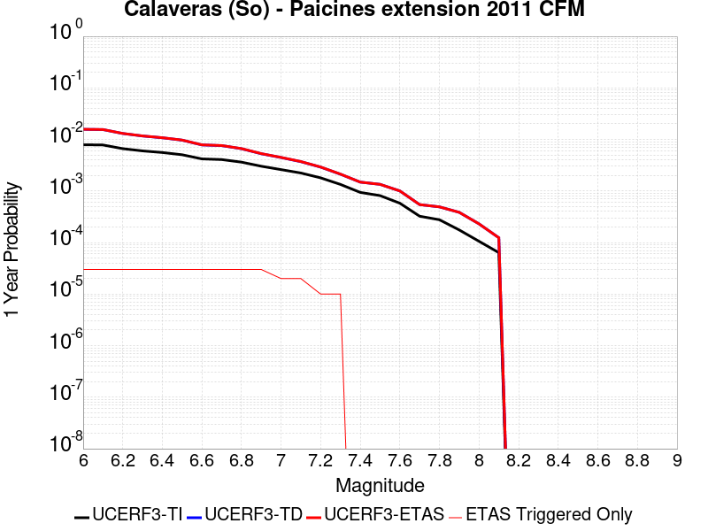 |  |

| Magnitude | 1 wk TI Prob | 1 wk TD Prob | 1 wk ETAS Prob | 1 wk ETAS/TD Gain | 1 wk ETAS Triggered Only | 1 mo TI Prob | 1 mo TD Prob | 1 mo ETAS Prob | 1 mo ETAS/TD Gain | 1 mo ETAS Triggered Only | 1 yr TI Prob | 1 yr TD Prob | 1 yr ETAS Prob | 1 yr ETAS/TD Gain | 1 yr ETAS Triggered Only | 10 yr TI Prob | 10 yr TD Prob | 10 yr ETAS Prob | 10 yr ETAS/TD Gain | 10 yr ETAS Triggered Only |
|-----|-----|-----|-----|-----|-----|-----|-----|-----|-----|-----|-----|-----|-----|-----|-----|-----|-----|-----|-----|-----|
| 6.0 | 1.5183659E-4 | 3.0533716E-4 | 3.1789613E-4 | 1.0411315 | 1.2562814E-5 | 6.5056595E-4 | 0.0013069661 | 0.0013195125 | 1.0095997 | 1.2562814E-5 | 0.007891912 | 0.01569571 | 0.015720442 | 1.0015757 | 2.5125628E-5 | 0.076174594 | 0.13848671 | 0.13851918 | 1.0002345 | 3.768844E-5 |
| 6.1 | 1.5024997E-4 | 3.0227835E-4 | 3.1483738E-4 | 1.0415479 | 1.2562814E-5 | 6.437695E-4 | 0.00129387 | 0.0013064166 | 1.009697 | 1.2562814E-5 | 0.0078097614 | 0.015539104 | 0.015563839 | 1.0015918 | 2.5125628E-5 | 0.075409345 | 0.13715632 | 0.13718885 | 1.0002371 | 3.768844E-5 |
| 6.2 | 1.2743923E-4 | 2.5306802E-4 | 2.6562766E-4 | 1.0496294 | 1.2562814E-5 | 5.460538E-4 | 0.0010841049 | 0.0010966541 | 1.0115756 | 1.2562814E-5 | 0.0066279583 | 0.013046704 | 0.013071502 | 1.0019007 | 2.5125628E-5 | 0.064337276 | 0.11725405 | 0.117287315 | 1.0002837 | 3.768844E-5 |
| 6.3 | 1.1525114E-4 | 2.2595265E-4 | 2.3851263E-4 | 1.0555868 | 1.2562814E-5 | 4.9383997E-4 | 9.6799526E-4 | 9.805459E-4 | 1.0129656 | 1.2562814E-5 | 0.0059959386 | 0.011667927 | 0.01169276 | 1.0021282 | 2.5125628E-5 | 0.058367174 | 0.10637007 | 0.10640375 | 1.0003166 | 3.768844E-5 |
| 6.4 | 1.07200925E-4 | 2.0836305E-4 | 2.2092325E-4 | 1.0602803 | 1.2562814E-5 | 4.5935164E-4 | 8.926636E-4 | 9.052152E-4 | 1.0140609 | 1.2562814E-5 | 0.0055782744 | 0.010772766 | 0.01079762 | 1.0023072 | 2.5125628E-5 | 0.0544031 | 0.09919256 | 0.09922651 | 1.0003422 | 3.768844E-5 |
| 6.5 | 9.69631E-5 | 1.8729115E-4 | 1.9985162E-4 | 1.0670638 | 1.2562814E-5 | 4.1548995E-4 | 8.024135E-4 | 8.149662E-4 | 1.0156437 | 1.2562814E-5 | 0.0050468626 | 0.009694662 | 0.009719544 | 1.0025666 | 2.5125628E-5 | 0.04933773 | 0.090084255 | 0.09011855 | 1.0003806 | 3.768844E-5 |
| 6.6 | 8.0552316E-5 | 1.5070537E-4 | 1.6326629E-4 | 1.0833476 | 1.2562814E-5 | 3.4517853E-4 | 6.456994E-4 | 6.582541E-4 | 1.0194436 | 1.2562814E-5 | 0.0041944524 | 0.007826256 | 0.007851185 | 1.0031853 | 2.5125628E-5 | 0.04116161 | 0.074854024 | 0.07488889 | 1.0004658 | 3.768844E-5 |
| 6.7 | 7.815757E-5 | 1.4610609E-4 | 1.5866707E-4 | 1.0859716 | 1.2562814E-5 | 3.34918E-4 | 6.260017E-4 | 6.3855667E-4 | 1.0200558 | 1.2562814E-5 | 0.004070005 | 0.0075890915 | 0.007614027 | 1.0032856 | 2.5125628E-5 | 0.039962657 | 0.072703585 | 0.072738536 | 1.0004807 | 3.768844E-5 |
| 6.8 | 6.965264E-5 | 1.2721405E-4 | 1.3977526E-4 | 1.0987408 | 1.2562814E-5 | 2.9847719E-4 | 5.450839E-4 | 5.5763987E-4 | 1.0230349 | 1.2562814E-5 | 0.0036279052 | 0.00661342 | 0.0066383793 | 1.003774 | 2.5125628E-5 | 0.03569247 | 0.06379891 | 0.0638342 | 1.000553 | 3.768844E-5 |
| 6.9 | 5.8000453E-5 | 1.01435086E-4 | 1.1399662E-4 | 1.1238382 | 1.2562814E-5 | 2.4854968E-4 | 4.3464993E-4 | 4.4720728E-4 | 1.0288907 | 1.2562814E-5 | 0.0030218933 | 0.0052791284 | 0.005304122 | 1.0047343 | 2.5125628E-5 | 0.029811295 | 0.051501602 | 0.05153735 | 1.0006942 | 3.768844E-5 |
| 7.0 | 4.9865852E-5 | 8.567692E-5 | 9.8238655E-5 | 1.1466175 | 1.2562814E-5 | 2.1369329E-4 | 3.671356E-4 | 3.796938E-4 | 1.0342059 | 1.2562814E-5 | 0.0025986114 | 0.0044608037 | 0.004485817 | 1.0056074 | 2.5125628E-5 | 0.025684336 | 0.043781694 | 0.043817732 | 1.0008231 | 3.768844E-5 |
| 7.1 | 4.283875E-5 | 7.112159E-5 | 8.368351E-5 | 1.176626 | 1.2562814E-5 | 1.8358172E-4 | 3.047715E-4 | 3.173305E-4 | 1.0412079 | 1.2562814E-5 | 0.0022328163 | 0.003704336 | 0.0037293686 | 1.0067576 | 2.5125628E-5 | 0.022105146 | 0.03673583 | 0.036772132 | 1.0009882 | 3.768844E-5 |
| 7.2 | 3.450115E-5 | 5.5776054E-5 | 5.5776054E-5 | 1.0 | 0.0 | 1.478537E-4 | 2.390185E-4 | 2.390185E-4 | 1.0 | 0.0 | 0.0017986323 | 0.0029061958 | 0.002918722 | 1.0043103 | 1.2562814E-5 | 0.017841442 | 0.029079199 | 0.029103594 | 1.0008389 | 2.5125628E-5 |
| 7.3 | 2.5709045E-5 | 4.0588155E-5 | 4.0588155E-5 | 1.0 | 0.0 | 1.1017697E-4 | 1.7393773E-4 | 1.7393773E-4 | 1.0 | 0.0 | 0.0013405791 | 0.002115652 | 0.0021281883 | 1.0059254 | 1.2562814E-5 | 0.013325208 | 0.021297242 | 0.021321833 | 1.0011547 | 2.5125628E-5 |
| 7.4 | 1.8003093E-5 | 2.8509934E-5 | 2.8509934E-5 | 1.0 | 0.0 | 7.715383E-5 | 1.2217973E-4 | 1.2217973E-4 | 1.0 | 0.0 | 9.3894306E-4 | 0.0014865254 | 0.0014865254 | 1.0 | 0.0 | 0.009349857 | 0.015052196 | 0.015064569 | 1.0008221 | 1.2562814E-5 |
| 7.5 | 1.5595824E-5 | 2.5822499E-5 | 2.5822499E-5 | 1.0 | 0.0 | 6.683753E-5 | 1.1066317E-4 | 1.1066317E-4 | 1.0 | 0.0 | 8.134431E-4 | 0.0013464936 | 0.0013464936 | 1.0 | 0.0 | 0.008104719 | 0.01365213 | 0.013664521 | 1.0009077 | 1.2562814E-5 |
| 7.6 | 1.1110309E-5 | 1.9222098E-5 | 1.9222098E-5 | 1.0 | 0.0 | 4.761474E-5 | 8.2377825E-5 | 8.2377825E-5 | 1.0 | 0.0 | 5.795553E-4 | 0.0010024898 | 0.0010024898 | 1.0 | 0.0 | 0.0057804612 | 0.010203943 | 0.010216378 | 1.0012186 | 1.2562814E-5 |
| 7.7 | 6.2140443E-6 | 1.0437076E-5 | 1.0437076E-5 | 1.0 | 0.0 | 2.6631347E-5 | 4.4729557E-5 | 4.4729557E-5 | 1.0 | 0.0 | 3.241884E-4 | 5.444464E-4 | 5.444464E-4 | 1.0 | 0.0 | 0.0032371588 | 0.005619835 | 0.005632327 | 1.0022229 | 1.2562814E-5 |
| 7.8 | 5.305533E-6 | 9.433038E-6 | 9.433038E-6 | 1.0 | 0.0 | 2.27378E-5 | 4.042668E-5 | 4.042668E-5 | 1.0 | 0.0 | 2.7679754E-4 | 4.920837E-4 | 4.920837E-4 | 1.0 | 0.0 | 0.0027645302 | 0.005074324 | 0.0050868234 | 1.0024632 | 1.2562814E-5 |
| 7.9 | 3.363505E-6 | 7.3848937E-6 | 7.3848937E-6 | 1.0 | 0.0 | 1.4414942E-5 | 3.164916E-5 | 3.164916E-5 | 1.0 | 0.0 | 1.7548777E-4 | 3.8526047E-4 | 3.8526047E-4 | 1.0 | 0.0 | 0.0017534926 | 0.003948527 | 0.003948527 | 1.0 | 0.0 |
| 8.0 | 2.0271132E-6 | 4.413104E-6 | 4.413104E-6 | 1.0 | 0.0 | 8.687599E-6 | 1.8913164E-5 | 1.8913164E-5 | 1.0 | 0.0 | 1.05766376E-4 | 2.302435E-4 | 2.302435E-4 | 1.0 | 0.0 | 0.0010571606 | 0.002351099 | 0.002351099 | 1.0 | 0.0 |
| 8.1 | 1.2206116E-6 | 2.3751331E-6 | 2.3751331E-6 | 1.0 | 0.0 | 5.2311816E-6 | 1.0179103E-5 | 1.0179103E-5 | 1.0 | 0.0 | 6.3687774E-5 | 1.2392356E-4 | 1.2392356E-4 | 1.0 | 0.0 | 6.366953E-4 | 0.0012705477 | 0.0012705477 | 1.0 | 0.0 |

## San Cayetano
*[(top)](#table-of-contents)*

| 1 Week | 1 Month | 1 Year | 10 Year |
|-----|-----|-----|-----|
|  |  |  | 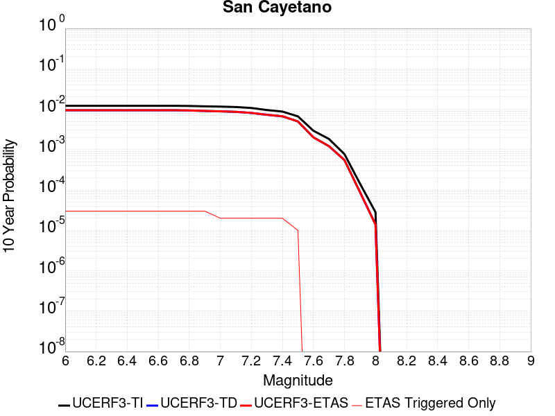 |

| Magnitude | 1 wk TI Prob | 1 wk TD Prob | 1 wk ETAS Prob | 1 wk ETAS/TD Gain | 1 wk ETAS Triggered Only | 1 mo TI Prob | 1 mo TD Prob | 1 mo ETAS Prob | 1 mo ETAS/TD Gain | 1 mo ETAS Triggered Only | 1 yr TI Prob | 1 yr TD Prob | 1 yr ETAS Prob | 1 yr ETAS/TD Gain | 1 yr ETAS Triggered Only | 10 yr TI Prob | 10 yr TD Prob | 10 yr ETAS Prob | 10 yr ETAS/TD Gain | 10 yr ETAS Triggered Only |
|-----|-----|-----|-----|-----|-----|-----|-----|-----|-----|-----|-----|-----|-----|-----|-----|-----|-----|-----|-----|-----|
| 6.0 | 2.3476267E-5 | 1.816928E-5 | 1.816928E-5 | 1.0 | 0.0 | 1.0060869E-4 | 7.786603E-5 | 7.786603E-5 | 1.0 | 0.0 | 0.0012242225 | 9.476103E-4 | 9.601612E-4 | 1.0132447 | 1.2562814E-5 | 0.012175002 | 0.009436584 | 0.009473917 | 1.0039562 | 3.768844E-5 |
| 6.1 | 2.3476267E-5 | 1.816928E-5 | 1.816928E-5 | 1.0 | 0.0 | 1.0060869E-4 | 7.786603E-5 | 7.786603E-5 | 1.0 | 0.0 | 0.0012242225 | 9.476103E-4 | 9.601612E-4 | 1.0132447 | 1.2562814E-5 | 0.012175002 | 0.009436584 | 0.009473917 | 1.0039562 | 3.768844E-5 |
| 6.2 | 2.3476267E-5 | 1.816928E-5 | 1.816928E-5 | 1.0 | 0.0 | 1.0060869E-4 | 7.786603E-5 | 7.786603E-5 | 1.0 | 0.0 | 0.0012242225 | 9.476103E-4 | 9.601612E-4 | 1.0132447 | 1.2562814E-5 | 0.012175002 | 0.009436584 | 0.009473917 | 1.0039562 | 3.768844E-5 |
| 6.3 | 2.3476267E-5 | 1.816928E-5 | 1.816928E-5 | 1.0 | 0.0 | 1.0060869E-4 | 7.786603E-5 | 7.786603E-5 | 1.0 | 0.0 | 0.0012242225 | 9.476103E-4 | 9.601612E-4 | 1.0132447 | 1.2562814E-5 | 0.012175002 | 0.009436584 | 0.009473917 | 1.0039562 | 3.768844E-5 |
| 6.4 | 2.3476267E-5 | 1.816928E-5 | 1.816928E-5 | 1.0 | 0.0 | 1.0060869E-4 | 7.786603E-5 | 7.786603E-5 | 1.0 | 0.0 | 0.0012242225 | 9.476103E-4 | 9.601612E-4 | 1.0132447 | 1.2562814E-5 | 0.012175002 | 0.009436584 | 0.009473917 | 1.0039562 | 3.768844E-5 |
| 6.5 | 2.3476267E-5 | 1.816928E-5 | 1.816928E-5 | 1.0 | 0.0 | 1.0060869E-4 | 7.786603E-5 | 7.786603E-5 | 1.0 | 0.0 | 0.0012242225 | 9.476103E-4 | 9.601612E-4 | 1.0132447 | 1.2562814E-5 | 0.012175002 | 0.009436584 | 0.009473917 | 1.0039562 | 3.768844E-5 |
| 6.6 | 2.3476267E-5 | 1.816928E-5 | 1.816928E-5 | 1.0 | 0.0 | 1.0060869E-4 | 7.786603E-5 | 7.786603E-5 | 1.0 | 0.0 | 0.0012242225 | 9.476103E-4 | 9.601612E-4 | 1.0132447 | 1.2562814E-5 | 0.012175002 | 0.009436584 | 0.009473917 | 1.0039562 | 3.768844E-5 |
| 6.7 | 2.3476267E-5 | 1.816928E-5 | 1.816928E-5 | 1.0 | 0.0 | 1.0060869E-4 | 7.786603E-5 | 7.786603E-5 | 1.0 | 0.0 | 0.0012242225 | 9.476103E-4 | 9.601612E-4 | 1.0132447 | 1.2562814E-5 | 0.012175002 | 0.009436584 | 0.009473917 | 1.0039562 | 3.768844E-5 |
| 6.8 | 2.3241924E-5 | 1.7936987E-5 | 1.7936987E-5 | 1.0 | 0.0 | 9.960445E-5 | 7.687056E-5 | 7.687056E-5 | 1.0 | 0.0 | 0.0012120095 | 9.3550084E-4 | 9.4805186E-4 | 1.0134164 | 1.2562814E-5 | 0.012054204 | 0.009316482 | 0.009353819 | 1.0040077 | 3.768844E-5 |
| 6.9 | 2.2761007E-5 | 1.7432423E-5 | 1.7432423E-5 | 1.0 | 0.0 | 9.7543525E-5 | 7.470827E-5 | 7.470827E-5 | 1.0 | 0.0 | 0.0011869454 | 9.09197E-4 | 9.217484E-4 | 1.0138049 | 1.2562814E-5 | 0.011806256 | 0.009055603 | 0.00909295 | 1.0041242 | 3.768844E-5 |
| 7.0 | 2.240283E-5 | 1.7066168E-5 | 1.7066168E-5 | 1.0 | 0.0 | 9.600859E-5 | 7.313869E-5 | 7.313869E-5 | 1.0 | 0.0 | 0.0011682777 | 8.9010317E-4 | 9.0265484E-4 | 1.0141013 | 1.2562814E-5 | 0.011621549 | 0.008866196 | 0.008891098 | 1.0028087 | 2.5125628E-5 |
| 7.1 | 2.1871154E-5 | 1.6586018E-5 | 1.6586018E-5 | 1.0 | 0.0 | 9.373015E-5 | 7.108101E-5 | 7.108101E-5 | 1.0 | 0.0 | 0.0011405671 | 8.6507114E-4 | 8.776231E-4 | 1.0145097 | 1.2562814E-5 | 0.011347309 | 0.008617838 | 0.008642747 | 1.0028905 | 2.5125628E-5 |
| 7.2 | 2.0714133E-5 | 1.5564561E-5 | 1.5564561E-5 | 1.0 | 0.0 | 8.8771834E-5 | 6.670357E-5 | 6.670357E-5 | 1.0 | 0.0 | 0.0010802611 | 8.1181666E-4 | 8.2436926E-4 | 1.0154624 | 1.2562814E-5 | 0.010750249 | 0.008089285 | 0.008114208 | 1.003081 | 2.5125628E-5 |
| 7.3 | 1.8408395E-5 | 1.3996864E-5 | 1.3996864E-5 | 1.0 | 0.0 | 7.8890735E-5 | 5.99852E-5 | 5.99852E-5 | 1.0 | 0.0 | 9.600714E-4 | 7.300781E-4 | 7.4263173E-4 | 1.017195 | 1.2562814E-5 | 0.009559342 | 0.0072775153 | 0.0073024584 | 1.0034274 | 2.5125628E-5 |
| 7.4 | 1.6856795E-5 | 1.28500815E-5 | 1.28500815E-5 | 1.0 | 0.0 | 7.2241404E-5 | 5.5070628E-5 | 5.5070628E-5 | 1.0 | 0.0 | 8.7918417E-4 | 6.7028153E-4 | 6.828359E-4 | 1.01873 | 1.2562814E-5 | 0.00875714 | 0.0066832784 | 0.006708236 | 1.0037344 | 2.5125628E-5 |
| 7.5 | 1.2822778E-5 | 9.577542E-6 | 9.577542E-6 | 1.0 | 0.0 | 5.495361E-5 | 4.1045972E-5 | 4.1045972E-5 | 1.0 | 0.0 | 6.688548E-4 | 4.996217E-4 | 4.996217E-4 | 1.0 | 0.0 | 0.006668452 | 0.0049851555 | 0.0049976557 | 1.0025074 | 1.2562814E-5 |
| 7.6 | 5.6272684E-6 | 3.854903E-6 | 3.854903E-6 | 1.0 | 0.0 | 2.4116642E-5 | 1.652091E-5 | 1.652091E-5 | 1.0 | 0.0 | 2.9358055E-4 | 2.0112359E-4 | 2.0112359E-4 | 1.0 | 0.0 | 0.0029319301 | 0.0020094267 | 0.0020094267 | 1.0 | 0.0 |
| 7.7 | 3.5261346E-6 | 2.3407013E-6 | 2.3407013E-6 | 1.0 | 0.0 | 1.5111918E-5 | 1.0031539E-5 | 1.0031539E-5 | 1.0 | 0.0 | 1.8397206E-4 | 1.2212721E-4 | 1.2212721E-4 | 1.0 | 0.0 | 0.0018381984 | 0.0012206084 | 0.0012206084 | 1.0 | 0.0 |
| 7.8 | 1.4826929E-6 | 1.056428E-6 | 1.056428E-6 | 1.0 | 0.0 | 6.354383E-6 | 4.5275406E-6 | 4.5275406E-6 | 1.0 | 0.0 | 7.736187E-5 | 5.5121433E-5 | 5.5121433E-5 | 1.0 | 0.0 | 7.733494E-4 | 5.5107963E-4 | 5.5107963E-4 | 1.0 | 0.0 |
| 7.9 | 2.7568166E-7 | 1.6978244E-7 | 1.6978244E-7 | 1.0 | 0.0 | 1.1814923E-6 | 7.2763885E-7 | 7.2763885E-7 | 1.0 | 0.0 | 1.4384574E-5 | 8.858967E-6 | 8.858967E-6 | 1.0 | 0.0 | 1.4383643E-4 | 8.8586174E-5 | 8.8586174E-5 | 1.0 | 0.0 |
| 8.0 | 5.407832E-8 | 2.6887697E-8 | 2.6887697E-8 | 1.0 | 0.0 | 2.3176422E-7 | 1.15232986E-7 | 1.15232986E-7 | 1.0 | 0.0 | 2.8217257E-6 | 1.4029607E-6 | 1.4029607E-6 | 1.0 | 0.0 | 2.8216898E-5 | 1.4029522E-5 | 1.4029522E-5 | 1.0 | 0.0 |

## Concord 2011 CFM
*[(top)](#table-of-contents)*

| 1 Week | 1 Month | 1 Year | 10 Year |
|-----|-----|-----|-----|
|  |  |  |  |

| Magnitude | 1 wk TI Prob | 1 wk TD Prob | 1 wk ETAS Prob | 1 wk ETAS/TD Gain | 1 wk ETAS Triggered Only | 1 mo TI Prob | 1 mo TD Prob | 1 mo ETAS Prob | 1 mo ETAS/TD Gain | 1 mo ETAS Triggered Only | 1 yr TI Prob | 1 yr TD Prob | 1 yr ETAS Prob | 1 yr ETAS/TD Gain | 1 yr ETAS Triggered Only | 10 yr TI Prob | 10 yr TD Prob | 10 yr ETAS Prob | 10 yr ETAS/TD Gain | 10 yr ETAS Triggered Only |
|-----|-----|-----|-----|-----|-----|-----|-----|-----|-----|-----|-----|-----|-----|-----|-----|-----|-----|-----|-----|-----|
| 6.0 | 5.7865112E-5 | 9.759152E-5 | 1.3527628E-4 | 1.386148 | 3.768844E-5 | 2.4796976E-4 | 4.1818706E-4 | 4.5585976E-4 | 1.0900857 | 3.768844E-5 | 0.0030148525 | 0.005079467 | 0.0051169638 | 1.007382 | 3.768844E-5 | 0.029742775 | 0.049248982 | 0.049284812 | 1.0007275 | 3.768844E-5 |
| 6.1 | 5.7865112E-5 | 9.759152E-5 | 1.3527628E-4 | 1.386148 | 3.768844E-5 | 2.4796976E-4 | 4.1818706E-4 | 4.5585976E-4 | 1.0900857 | 3.768844E-5 | 0.0030148525 | 0.005079467 | 0.0051169638 | 1.007382 | 3.768844E-5 | 0.029742775 | 0.049248982 | 0.049284812 | 1.0007275 | 3.768844E-5 |
| 6.2 | 5.6789337E-5 | 9.5795076E-5 | 1.3347992E-4 | 1.39339 | 3.768844E-5 | 2.4336016E-4 | 4.104905E-4 | 4.4816345E-4 | 1.0917755 | 3.768844E-5 | 0.0029588845 | 0.0049861916 | 0.005023692 | 1.0075209 | 3.768844E-5 | 0.029197963 | 0.04836556 | 0.048401423 | 1.0007416 | 3.768844E-5 |
| 6.3 | 5.203322E-5 | 8.803056E-5 | 1.2571568E-4 | 1.4280914 | 3.768844E-5 | 2.2298045E-4 | 3.7722368E-4 | 4.148979E-4 | 1.0998724 | 3.768844E-5 | 0.0027114071 | 0.0045838105 | 0.004621326 | 1.0081844 | 3.768844E-5 | 0.026785625 | 0.04453672 | 0.04457273 | 1.0008086 | 3.768844E-5 |
| 6.4 | 4.7120942E-5 | 7.897404E-5 | 1.166595E-4 | 1.477188 | 3.768844E-5 | 2.0193127E-4 | 3.3842045E-4 | 3.7609614E-4 | 1.111328 | 3.768844E-5 | 0.0024557412 | 0.00411323 | 0.004150763 | 1.009125 | 3.768844E-5 | 0.024287801 | 0.040065527 | 0.040101707 | 1.000903 | 3.768844E-5 |
| 6.5 | 2.9598437E-5 | 4.667486E-5 | 8.436154E-5 | 1.80743 | 3.768844E-5 | 1.2684427E-4 | 2.0002096E-4 | 2.3770187E-4 | 1.1883848 | 3.768844E-5 | 0.001543235 | 0.0024327459 | 0.0024703424 | 1.0154544 | 3.768844E-5 | 0.015325619 | 0.023909973 | 0.02394676 | 1.0015386 | 3.768844E-5 |
| 6.6 | 2.0443718E-5 | 2.998433E-5 | 2.998433E-5 | 1.0 | 0.0 | 8.7613E-5 | 1.2849816E-4 | 1.2849816E-4 | 1.0 | 0.0 | 0.0010661662 | 0.0015633785 | 0.0015633785 | 1.0 | 0.0 | 0.010610655 | 0.015466996 | 0.015466996 | 1.0 | 0.0 |
| 6.7 | 1.798539E-5 | 2.5557381E-5 | 2.5557381E-5 | 1.0 | 0.0 | 7.7077966E-5 | 1.0952716E-4 | 1.0952716E-4 | 1.0 | 0.0 | 9.380202E-4 | 0.001332699 | 0.001332699 | 1.0 | 0.0 | 0.009340706 | 0.013217433 | 0.013217433 | 1.0 | 0.0 |
| 6.8 | 1.613555E-5 | 2.1959211E-5 | 2.1959211E-5 | 1.0 | 0.0 | 6.915052E-5 | 9.4107585E-5 | 9.4107585E-5 | 1.0 | 0.0 | 8.4158237E-4 | 0.0011451716 | 0.0011451716 | 1.0 | 0.0 | 0.008384023 | 0.0113782035 | 0.0113782035 | 1.0 | 0.0 |
| 6.9 | 1.2916435E-5 | 1.7081054E-5 | 1.7081054E-5 | 1.0 | 0.0 | 5.5354973E-5 | 7.32025E-5 | 7.32025E-5 | 1.0 | 0.0 | 6.7373837E-4 | 8.908818E-4 | 8.908818E-4 | 1.0 | 0.0 | 0.006716994 | 0.008867139 | 0.008867139 | 1.0 | 0.0 |
| 7.0 | 9.81129E-6 | 1.2630829E-5 | 1.2630829E-5 | 1.0 | 0.0 | 4.2047708E-5 | 5.413101E-5 | 5.413101E-5 | 1.0 | 0.0 | 5.118106E-4 | 6.588474E-4 | 6.588474E-4 | 1.0 | 0.0 | 0.005106334 | 0.006569153 | 0.006569153 | 1.0 | 0.0 |
| 7.1 | 8.0889195E-6 | 1.0418261E-5 | 1.0418261E-5 | 1.0 | 0.0 | 3.4666336E-5 | 4.4648932E-5 | 4.4648932E-5 | 1.0 | 0.0 | 4.219809E-4 | 5.434662E-4 | 5.434662E-4 | 1.0 | 0.0 | 0.004211805 | 0.0054215975 | 0.0054215975 | 1.0 | 0.0 |
| 7.2 | 6.267438E-6 | 8.115699E-6 | 8.115699E-6 | 1.0 | 0.0 | 2.6860173E-5 | 3.4781104E-5 | 3.4781104E-5 | 1.0 | 0.0 | 3.2697353E-4 | 4.233784E-4 | 4.233784E-4 | 1.0 | 0.0 | 0.0032649285 | 0.004225969 | 0.004225969 | 1.0 | 0.0 |
| 7.3 | 3.6761196E-6 | 4.8401653E-6 | 4.8401653E-6 | 1.0 | 0.0 | 1.5754704E-5 | 2.0743402E-5 | 2.0743402E-5 | 1.0 | 0.0 | 1.9179663E-4 | 2.5252186E-4 | 2.5252186E-4 | 1.0 | 0.0 | 0.0019163118 | 0.002522487 | 0.002522487 | 1.0 | 0.0 |
| 7.4 | 2.8044356E-6 | 3.7096036E-6 | 3.7096036E-6 | 1.0 | 0.0 | 1.2018954E-5 | 1.5898204E-5 | 1.5898204E-5 | 1.0 | 0.0 | 1.4632095E-4 | 1.9354356E-4 | 1.9354356E-4 | 1.0 | 0.0 | 0.0014622464 | 0.0019338481 | 0.0019338481 | 1.0 | 0.0 |
| 7.5 | 2.4578699E-6 | 3.2447442E-6 | 3.2447442E-6 | 1.0 | 0.0 | 1.0533685E-5 | 1.3905973E-5 | 1.3905973E-5 | 1.0 | 0.0 | 1.2824008E-4 | 1.6929218E-4 | 1.6929218E-4 | 1.0 | 0.0 | 0.0012816609 | 0.001691713 | 0.001691713 | 1.0 | 0.0 |
| 7.6 | 1.7713267E-6 | 2.3351192E-6 | 2.3351192E-6 | 1.0 | 0.0 | 7.591378E-6 | 1.0007616E-5 | 1.0007616E-5 | 1.0 | 0.0 | 9.2421105E-5 | 1.21836E-4 | 1.21836E-4 | 1.0 | 0.0 | 9.2382677E-4 | 0.0012177454 | 0.0012177454 | 1.0 | 0.0 |
| 7.7 | 5.1912366E-7 | 6.8290143E-7 | 6.8290143E-7 | 1.0 | 0.0 | 2.2248137E-6 | 2.9267171E-6 | 2.9267171E-6 | 1.0 | 0.0 | 2.708677E-5 | 3.5632213E-5 | 3.5632213E-5 | 1.0 | 0.0 | 2.708347E-4 | 3.5627294E-4 | 3.5627294E-4 | 1.0 | 0.0 |

## Great Valley 07 (Orestimba)
*[(top)](#table-of-contents)*

| 1 Week | 1 Month | 1 Year | 10 Year |
|-----|-----|-----|-----|
|  |  |  |  |

| Magnitude | 1 wk TI Prob | 1 wk TD Prob | 1 wk ETAS Prob | 1 wk ETAS/TD Gain | 1 wk ETAS Triggered Only | 1 mo TI Prob | 1 mo TD Prob | 1 mo ETAS Prob | 1 mo ETAS/TD Gain | 1 mo ETAS Triggered Only | 1 yr TI Prob | 1 yr TD Prob | 1 yr ETAS Prob | 1 yr ETAS/TD Gain | 1 yr ETAS Triggered Only | 10 yr TI Prob | 10 yr TD Prob | 10 yr ETAS Prob | 10 yr ETAS/TD Gain | 10 yr ETAS Triggered Only |
|-----|-----|-----|-----|-----|-----|-----|-----|-----|-----|-----|-----|-----|-----|-----|-----|-----|-----|-----|-----|-----|
| 6.0 | 2.9687902E-5 | 3.27575E-5 | 3.27575E-5 | 1.0 | 0.0 | 1.2722766E-4 | 1.4038214E-4 | 1.4038214E-4 | 1.0 | 0.0 | 0.0015478961 | 0.0017078844 | 0.0017204258 | 1.0073432 | 1.2562814E-5 | 0.015371585 | 0.016955135 | 0.016979836 | 1.0014567 | 2.5125628E-5 |
| 6.1 | 2.9687902E-5 | 3.27575E-5 | 3.27575E-5 | 1.0 | 0.0 | 1.2722766E-4 | 1.4038214E-4 | 1.4038214E-4 | 1.0 | 0.0 | 0.0015478961 | 0.0017078844 | 0.0017204258 | 1.0073432 | 1.2562814E-5 | 0.015371585 | 0.016955135 | 0.016979836 | 1.0014567 | 2.5125628E-5 |
| 6.2 | 1.9231524E-5 | 2.1159167E-5 | 2.1159167E-5 | 1.0 | 0.0 | 8.2418206E-5 | 9.067912E-5 | 9.067912E-5 | 1.0 | 0.0 | 0.0010029797 | 0.0011034822 | 0.0011034822 | 1.0 | 0.0 | 0.00998465 | 0.01098244 | 0.010994866 | 1.0011313 | 1.2562814E-5 |
| 6.3 | 1.324766E-5 | 1.4548534E-5 | 1.4548534E-5 | 1.0 | 0.0 | 5.6774446E-5 | 6.234942E-5 | 6.234942E-5 | 1.0 | 0.0 | 6.910097E-4 | 7.5884897E-4 | 7.5884897E-4 | 1.0 | 0.0 | 0.006888649 | 0.0075635235 | 0.0075759916 | 1.0016484 | 1.2562814E-5 |
| 6.4 | 7.818645E-6 | 8.57284E-6 | 8.57284E-6 | 1.0 | 0.0 | 3.3508048E-5 | 3.6740246E-5 | 3.6740246E-5 | 1.0 | 0.0 | 4.078841E-4 | 4.4722404E-4 | 4.4722404E-4 | 1.0 | 0.0 | 0.004071363 | 0.0044635804 | 0.004476087 | 1.0028019 | 1.2562814E-5 |
| 6.5 | 5.3076565E-6 | 5.8178007E-6 | 5.8178007E-6 | 1.0 | 0.0 | 2.27469E-5 | 2.4933206E-5 | 2.4933206E-5 | 1.0 | 0.0 | 2.7690834E-4 | 3.035216E-4 | 3.035216E-4 | 1.0 | 0.0 | 0.0027656353 | 0.00303128 | 0.0030438046 | 1.0041318 | 1.2562814E-5 |
| 6.6 | 3.6003578E-6 | 3.9484953E-6 | 3.9484953E-6 | 1.0 | 0.0 | 1.5430012E-5 | 1.6922022E-5 | 1.6922022E-5 | 1.0 | 0.0 | 1.8784421E-4 | 2.0600771E-4 | 2.0600771E-4 | 1.0 | 0.0 | 0.0018768552 | 0.0020583214 | 0.0020708584 | 1.0060909 | 1.2562814E-5 |
| 6.7 | 2.5361826E-6 | 2.7834678E-6 | 2.7834678E-6 | 1.0 | 0.0 | 1.0869308E-5 | 1.1929101E-5 | 1.1929101E-5 | 1.0 | 0.0 | 1.3232579E-4 | 1.4522845E-4 | 1.4522845E-4 | 1.0 | 0.0 | 0.0013224703 | 0.0014514653 | 0.0014514653 | 1.0 | 0.0 |
| 6.8 | 1.2115831E-6 | 1.3313797E-6 | 1.3313797E-6 | 1.0 | 0.0 | 5.1924885E-6 | 5.7059065E-6 | 5.7059065E-6 | 1.0 | 0.0 | 6.3216714E-5 | 6.9468166E-5 | 6.9468166E-5 | 1.0 | 0.0 | 6.3198735E-4 | 6.945596E-4 | 6.945596E-4 | 1.0 | 0.0 |

## Eaton Roughs 2011 CFM
*[(top)](#table-of-contents)*

| 1 Week | 1 Month | 1 Year | 10 Year |
|-----|-----|-----|-----|
|  |  | 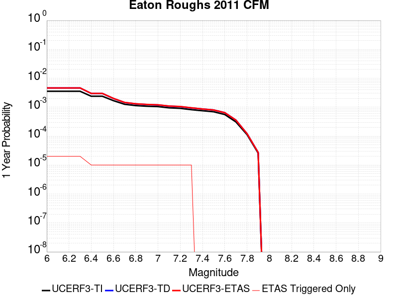 |  |

| Magnitude | 1 wk TI Prob | 1 wk TD Prob | 1 wk ETAS Prob | 1 wk ETAS/TD Gain | 1 wk ETAS Triggered Only | 1 mo TI Prob | 1 mo TD Prob | 1 mo ETAS Prob | 1 mo ETAS/TD Gain | 1 mo ETAS Triggered Only | 1 yr TI Prob | 1 yr TD Prob | 1 yr ETAS Prob | 1 yr ETAS/TD Gain | 1 yr ETAS Triggered Only | 10 yr TI Prob | 10 yr TD Prob | 10 yr ETAS Prob | 10 yr ETAS/TD Gain | 10 yr ETAS Triggered Only |
|-----|-----|-----|-----|-----|-----|-----|-----|-----|-----|-----|-----|-----|-----|-----|-----|-----|-----|-----|-----|-----|
| 6.0 | 6.8044945E-5 | 8.843646E-5 | 1.00998164E-4 | 1.1420422 | 1.2562814E-5 | 2.9158857E-4 | 3.7896493E-4 | 3.9152298E-4 | 1.0331378 | 1.2562814E-5 | 0.0035443127 | 0.0046050907 | 0.0046301004 | 1.0054309 | 2.5125628E-5 | 0.03488314 | 0.04516335 | 0.045199335 | 1.0007968 | 3.768844E-5 |
| 6.1 | 6.8044945E-5 | 8.843646E-5 | 1.00998164E-4 | 1.1420422 | 1.2562814E-5 | 2.9158857E-4 | 3.7896493E-4 | 3.9152298E-4 | 1.0331378 | 1.2562814E-5 | 0.0035443127 | 0.0046050907 | 0.0046301004 | 1.0054309 | 2.5125628E-5 | 0.03488314 | 0.04516335 | 0.045199335 | 1.0007968 | 3.768844E-5 |
| 6.2 | 6.8044945E-5 | 8.843646E-5 | 1.00998164E-4 | 1.1420422 | 1.2562814E-5 | 2.9158857E-4 | 3.7896493E-4 | 3.9152298E-4 | 1.0331378 | 1.2562814E-5 | 0.0035443127 | 0.0046050907 | 0.0046301004 | 1.0054309 | 2.5125628E-5 | 0.03488314 | 0.04516335 | 0.045199335 | 1.0007968 | 3.768844E-5 |
| 6.3 | 6.8044945E-5 | 8.843646E-5 | 1.00998164E-4 | 1.1420422 | 1.2562814E-5 | 2.9158857E-4 | 3.7896493E-4 | 3.9152298E-4 | 1.0331378 | 1.2562814E-5 | 0.0035443127 | 0.0046050907 | 0.0046301004 | 1.0054309 | 2.5125628E-5 | 0.03488314 | 0.04516335 | 0.045199335 | 1.0007968 | 3.768844E-5 |
| 6.4 | 4.5830013E-5 | 5.715427E-5 | 6.971637E-5 | 1.2197927 | 1.2562814E-5 | 1.9639956E-4 | 2.4492692E-4 | 2.5748665E-4 | 1.0512795 | 1.2562814E-5 | 0.0023885423 | 0.0029784471 | 0.0029909725 | 1.0042053 | 1.2562814E-5 | 0.023630321 | 0.029421588 | 0.029433781 | 1.0004144 | 1.2562814E-5 |
| 6.5 | 4.5830013E-5 | 5.715427E-5 | 6.971637E-5 | 1.2197927 | 1.2562814E-5 | 1.9639956E-4 | 2.4492692E-4 | 2.5748665E-4 | 1.0512795 | 1.2562814E-5 | 0.0023885423 | 0.0029784471 | 0.0029909725 | 1.0042053 | 1.2562814E-5 | 0.023630321 | 0.029421588 | 0.029433781 | 1.0004144 | 1.2562814E-5 |
| 6.6 | 3.222194E-5 | 3.8261504E-5 | 5.0823837E-5 | 1.3283283 | 1.2562814E-5 | 1.3808672E-4 | 1.639682E-4 | 1.7652896E-4 | 1.0766048 | 1.2562814E-5 | 0.0016799092 | 0.001994599 | 0.0020071366 | 1.0062859 | 1.2562814E-5 | 0.016672665 | 0.019776601 | 0.019788917 | 1.0006226 | 1.2562814E-5 |
| 6.7 | 2.4155654E-5 | 2.7786238E-5 | 4.0348703E-5 | 1.452111 | 1.2562814E-5 | 1.0352012E-4 | 1.1907848E-4 | 1.316398E-4 | 1.1054877 | 1.2562814E-5 | 0.0012596287 | 0.0014488247 | 0.0014613692 | 1.0086585 | 1.2562814E-5 | 0.012525126 | 0.014394943 | 0.014407325 | 1.0008602 | 1.2562814E-5 |
| 6.8 | 2.1814667E-5 | 2.4940868E-5 | 3.7503367E-5 | 1.5036914 | 1.2562814E-5 | 9.348808E-5 | 1.06885076E-4 | 1.19446544E-4 | 1.1175232 | 1.2562814E-5 | 0.001137623 | 0.0013005526 | 0.0013130992 | 1.009647 | 1.2562814E-5 | 0.011318169 | 0.012930038 | 0.012942439 | 1.000959 | 1.2562814E-5 |
| 6.9 | 2.0700467E-5 | 2.3628932E-5 | 3.619145E-5 | 1.5316583 | 1.2562814E-5 | 8.871327E-5 | 1.01262944E-4 | 1.13824484E-4 | 1.1240487 | 1.2562814E-5 | 0.0010795488 | 0.0012321823 | 0.0012447296 | 1.010183 | 1.2562814E-5 | 0.010743194 | 0.012254035 | 0.012266444 | 1.0010127 | 1.2562814E-5 |
| 7.0 | 2.0104066E-5 | 2.29365E-5 | 3.5499026E-5 | 1.547709 | 1.2562814E-5 | 8.615744E-5 | 9.82956E-5 | 1.10857174E-4 | 1.1277939 | 1.2562814E-5 | 0.0010484619 | 0.0011960949 | 0.0012086427 | 1.0104907 | 1.2562814E-5 | 0.010435291 | 0.011897073 | 0.011909486 | 1.0010434 | 1.2562814E-5 |
| 7.1 | 1.8225232E-5 | 2.0773046E-5 | 3.33356E-5 | 1.6047525 | 1.2562814E-5 | 7.81058E-5 | 8.902431E-5 | 1.0158601E-4 | 1.1411041 | 1.2562814E-5 | 9.5052324E-4 | 0.0010833336 | 0.0010958828 | 1.0115839 | 1.2562814E-5 | 0.009464677 | 0.010780825 | 0.010793253 | 1.0011528 | 1.2562814E-5 |
| 7.2 | 1.7526572E-5 | 1.9993488E-5 | 3.255605E-5 | 1.6283327 | 1.2562814E-5 | 7.511172E-5 | 8.5683576E-5 | 9.824531E-5 | 1.1466061 | 1.2562814E-5 | 9.141015E-4 | 0.0010426997 | 0.0010552495 | 1.0120358 | 1.2562814E-5 | 0.009103506 | 0.010378351 | 0.010390784 | 1.0011979 | 1.2562814E-5 |
| 7.3 | 1.5727232E-5 | 1.8021507E-5 | 3.0584095E-5 | 1.6970887 | 1.2562814E-5 | 6.740067E-5 | 7.723275E-5 | 8.9794594E-5 | 1.1626492 | 1.2562814E-5 | 8.2029426E-4 | 9.399043E-4 | 9.5245533E-4 | 1.0133535 | 1.2562814E-5 | 0.008172729 | 0.009359511 | 0.009371956 | 1.0013297 | 1.2562814E-5 |
| 7.4 | 1.4457361E-5 | 1.6598358E-5 | 1.6598358E-5 | 1.0 | 0.0 | 6.195865E-5 | 7.113389E-5 | 7.113389E-5 | 1.0 | 0.0 | 7.540854E-4 | 8.657119E-4 | 8.657119E-4 | 1.0 | 0.0 | 0.007515317 | 0.008623555 | 0.008623555 | 1.0 | 0.0 |
| 7.5 | 1.33280955E-5 | 1.5345435E-5 | 1.5345435E-5 | 1.0 | 0.0 | 5.711916E-5 | 6.57645E-5 | 6.57645E-5 | 1.0 | 0.0 | 6.9520384E-4 | 8.0038945E-4 | 8.0038945E-4 | 1.0 | 0.0 | 0.00693033 | 0.007975209 | 0.007975209 | 1.0 | 0.0 |
| 7.6 | 1.0699478E-5 | 1.2387815E-5 | 1.2387815E-5 | 1.0 | 0.0 | 4.5854096E-5 | 5.308956E-5 | 5.308956E-5 | 1.0 | 0.0 | 5.581306E-4 | 6.4617425E-4 | 6.4617425E-4 | 1.0 | 0.0 | 0.005567309 | 0.0064430353 | 0.0064430353 | 1.0 | 0.0 |
| 7.7 | 5.9390236E-6 | 6.852951E-6 | 6.852951E-6 | 1.0 | 0.0 | 2.545271E-5 | 2.9369461E-5 | 2.9369461E-5 | 1.0 | 0.0 | 3.0984267E-4 | 3.5751477E-4 | 3.5751477E-4 | 1.0 | 0.0 | 0.0030941102 | 0.0035694204 | 0.0035694204 | 1.0 | 0.0 |
| 7.8 | 2.1622036E-6 | 2.3296996E-6 | 2.3296996E-6 | 1.0 | 0.0 | 9.266554E-6 | 9.984388E-6 | 9.984388E-6 | 1.0 | 0.0 | 1.1281446E-4 | 1.21553225E-4 | 1.21553225E-4 | 1.0 | 0.0 | 0.001127572 | 0.001214873 | 0.001214873 | 1.0 | 0.0 |
| 7.9 | 4.9586197E-7 | 5.2189216E-7 | 5.2189216E-7 | 1.0 | 0.0 | 2.125121E-6 | 2.2366787E-6 | 2.2366787E-6 | 1.0 | 0.0 | 2.5873042E-5 | 2.7231245E-5 | 2.7231245E-5 | 1.0 | 0.0 | 2.5870028E-4 | 2.7228118E-4 | 2.7228118E-4 | 1.0 | 0.0 |

## Cerro Prieto
*[(top)](#table-of-contents)*

| 1 Week | 1 Month | 1 Year | 10 Year |
|-----|-----|-----|-----|
|  |  |  |  |

| Magnitude | 1 wk TI Prob | 1 wk TD Prob | 1 wk ETAS Prob | 1 wk ETAS/TD Gain | 1 wk ETAS Triggered Only | 1 mo TI Prob | 1 mo TD Prob | 1 mo ETAS Prob | 1 mo ETAS/TD Gain | 1 mo ETAS Triggered Only | 1 yr TI Prob | 1 yr TD Prob | 1 yr ETAS Prob | 1 yr ETAS/TD Gain | 1 yr ETAS Triggered Only | 10 yr TI Prob | 10 yr TD Prob | 10 yr ETAS Prob | 10 yr ETAS/TD Gain | 10 yr ETAS Triggered Only |
|-----|-----|-----|-----|-----|-----|-----|-----|-----|-----|-----|-----|-----|-----|-----|-----|-----|-----|-----|-----|-----|
| 6.0 | 2.9101528E-4 | 5.964804E-4 | 6.0903566E-4 | 1.021049 | 1.2562814E-5 | 0.0012466122 | 0.002554082 | 0.0025666128 | 1.0049062 | 1.2562814E-5 | 0.015072231 | 0.03064807 | 0.030660247 | 1.0003973 | 1.2562814E-5 | 0.14089979 | 0.25397858 | 0.25400668 | 1.0001107 | 3.768844E-5 |
| 6.1 | 2.9101528E-4 | 5.964804E-4 | 6.0903566E-4 | 1.021049 | 1.2562814E-5 | 0.0012466122 | 0.002554082 | 0.0025666128 | 1.0049062 | 1.2562814E-5 | 0.015072231 | 0.03064807 | 0.030660247 | 1.0003973 | 1.2562814E-5 | 0.14089979 | 0.25397858 | 0.25400668 | 1.0001107 | 3.768844E-5 |
| 6.2 | 2.9101528E-4 | 5.964804E-4 | 6.0903566E-4 | 1.021049 | 1.2562814E-5 | 0.0012466122 | 0.002554082 | 0.0025666128 | 1.0049062 | 1.2562814E-5 | 0.015072231 | 0.03064807 | 0.030660247 | 1.0003973 | 1.2562814E-5 | 0.14089979 | 0.25397858 | 0.25400668 | 1.0001107 | 3.768844E-5 |
| 6.3 | 2.9101528E-4 | 5.964804E-4 | 6.0903566E-4 | 1.021049 | 1.2562814E-5 | 0.0012466122 | 0.002554082 | 0.0025666128 | 1.0049062 | 1.2562814E-5 | 0.015072231 | 0.03064807 | 0.030660247 | 1.0003973 | 1.2562814E-5 | 0.14089979 | 0.25397858 | 0.25400668 | 1.0001107 | 3.768844E-5 |
| 6.4 | 2.508648E-4 | 5.1397446E-4 | 5.1397446E-4 | 1.0 | 0.0 | 0.0010746918 | 0.0022010866 | 0.0022010866 | 1.0 | 0.0 | 0.013006088 | 0.026471792 | 0.026471792 | 1.0 | 0.0 | 0.12270685 | 0.22440416 | 0.22442365 | 1.0000868 | 2.5125628E-5 |
| 6.5 | 2.508648E-4 | 5.1397446E-4 | 5.1397446E-4 | 1.0 | 0.0 | 0.0010746918 | 0.0022010866 | 0.0022010866 | 1.0 | 0.0 | 0.013006088 | 0.026471792 | 0.026471792 | 1.0 | 0.0 | 0.12270685 | 0.22440416 | 0.22442365 | 1.0000868 | 2.5125628E-5 |
| 6.6 | 2.294914E-4 | 4.7116808E-4 | 4.7116808E-4 | 1.0 | 0.0 | 9.831638E-4 | 0.0020179166 | 0.0020179166 | 1.0 | 0.0 | 0.011904482 | 0.02429866 | 0.02429866 | 1.0 | 0.0 | 0.11286586 | 0.20858558 | 0.20860545 | 1.0000954 | 2.5125628E-5 |
| 6.7 | 1.9621674E-4 | 4.0419117E-4 | 4.0419117E-4 | 1.0 | 0.0 | 8.4065786E-4 | 0.0017312564 | 0.0017312564 | 1.0 | 0.0 | 0.010187071 | 0.020884845 | 0.020884845 | 1.0 | 0.0 | 0.09732539 | 0.18290249 | 0.18292302 | 1.0001123 | 2.5125628E-5 |
| 6.8 | 1.5476145E-4 | 3.056516E-4 | 3.056516E-4 | 1.0 | 0.0 | 6.6309475E-4 | 0.00130938 | 0.00130938 | 1.0 | 0.0 | 0.008043335 | 0.015836509 | 0.015836509 | 1.0 | 0.0 | 0.07758363 | 0.14336355 | 0.14338508 | 1.0001501 | 2.5125628E-5 |
| 6.9 | 1.20509176E-4 | 2.2582515E-4 | 2.2582515E-4 | 1.0 | 0.0 | 5.1636563E-4 | 9.6752634E-4 | 9.6752634E-4 | 1.0 | 0.0 | 0.006268645 | 0.011726342 | 0.011726342 | 1.0 | 0.0 | 0.060947374 | 0.109451205 | 0.10947358 | 1.0002044 | 2.5125628E-5 |
| 7.0 | 9.3269155E-5 | 1.6716642E-4 | 1.6716642E-4 | 1.0 | 0.0 | 3.9966372E-4 | 7.162739E-4 | 7.162739E-4 | 1.0 | 0.0 | 0.0048550544 | 0.008693418 | 0.008693418 | 1.0 | 0.0 | 0.04750344 | 0.08315912 | 0.08317064 | 1.0001385 | 1.2562814E-5 |
| 7.1 | 5.029709E-5 | 8.1718936E-5 | 8.1718936E-5 | 1.0 | 0.0 | 2.1554115E-4 | 3.5019626E-4 | 3.5019626E-4 | 1.0 | 0.0 | 0.0026210553 | 0.0042587193 | 0.0042587193 | 1.0 | 0.0 | 0.025903556 | 0.042365108 | 0.04237714 | 1.000284 | 1.2562814E-5 |
| 7.2 | 6.5445185E-8 | 6.814903E-8 | 6.814903E-8 | 1.0 | 0.0 | 2.8047933E-7 | 2.9206726E-7 | 2.9206726E-7 | 1.0 | 0.0 | 3.4148304E-6 | 3.555919E-6 | 3.555919E-6 | 1.0 | 0.0 | 3.414778E-5 | 3.5559187E-5 | 3.5559187E-5 | 1.0 | 0.0 |

## Cucamonga
*[(top)](#table-of-contents)*

| 1 Week | 1 Month | 1 Year | 10 Year |
|-----|-----|-----|-----|
|  |  |  |  |

| Magnitude | 1 wk TI Prob | 1 wk TD Prob | 1 wk ETAS Prob | 1 wk ETAS/TD Gain | 1 wk ETAS Triggered Only | 1 mo TI Prob | 1 mo TD Prob | 1 mo ETAS Prob | 1 mo ETAS/TD Gain | 1 mo ETAS Triggered Only | 1 yr TI Prob | 1 yr TD Prob | 1 yr ETAS Prob | 1 yr ETAS/TD Gain | 1 yr ETAS Triggered Only | 10 yr TI Prob | 10 yr TD Prob | 10 yr ETAS Prob | 10 yr ETAS/TD Gain | 10 yr ETAS Triggered Only |
|-----|-----|-----|-----|-----|-----|-----|-----|-----|-----|-----|-----|-----|-----|-----|-----|-----|-----|-----|-----|-----|
| 6.0 | 1.1848348E-5 | 1.1737008E-5 | 1.1737008E-5 | 1.0 | 0.0 | 5.0777642E-5 | 5.030051E-5 | 5.030051E-5 | 1.0 | 0.0 | 6.180424E-4 | 6.1223935E-4 | 6.2479445E-4 | 1.0205069 | 1.2562814E-5 | 0.0061632637 | 0.0061067017 | 0.00614416 | 1.0061339 | 3.768844E-5 |
| 6.1 | 1.1848348E-5 | 1.1737008E-5 | 1.1737008E-5 | 1.0 | 0.0 | 5.0777642E-5 | 5.030051E-5 | 5.030051E-5 | 1.0 | 0.0 | 6.180424E-4 | 6.1223935E-4 | 6.2479445E-4 | 1.0205069 | 1.2562814E-5 | 0.0061632637 | 0.0061067017 | 0.00614416 | 1.0061339 | 3.768844E-5 |
| 6.2 | 1.1848348E-5 | 1.1737008E-5 | 1.1737008E-5 | 1.0 | 0.0 | 5.0777642E-5 | 5.030051E-5 | 5.030051E-5 | 1.0 | 0.0 | 6.180424E-4 | 6.1223935E-4 | 6.2479445E-4 | 1.0205069 | 1.2562814E-5 | 0.0061632637 | 0.0061067017 | 0.00614416 | 1.0061339 | 3.768844E-5 |
| 6.3 | 1.1848348E-5 | 1.1737008E-5 | 1.1737008E-5 | 1.0 | 0.0 | 5.0777642E-5 | 5.030051E-5 | 5.030051E-5 | 1.0 | 0.0 | 6.180424E-4 | 6.1223935E-4 | 6.2479445E-4 | 1.0205069 | 1.2562814E-5 | 0.0061632637 | 0.0061067017 | 0.00614416 | 1.0061339 | 3.768844E-5 |
| 6.4 | 1.1848348E-5 | 1.1737008E-5 | 1.1737008E-5 | 1.0 | 0.0 | 5.0777642E-5 | 5.030051E-5 | 5.030051E-5 | 1.0 | 0.0 | 6.180424E-4 | 6.1223935E-4 | 6.2479445E-4 | 1.0205069 | 1.2562814E-5 | 0.0061632637 | 0.0061067017 | 0.00614416 | 1.0061339 | 3.768844E-5 |
| 6.5 | 1.16988695E-5 | 1.15760395E-5 | 1.15760395E-5 | 1.0 | 0.0 | 5.013705E-5 | 4.9610666E-5 | 4.9610666E-5 | 1.0 | 0.0 | 6.102476E-4 | 6.0384517E-4 | 6.164004E-4 | 1.0207921 | 1.2562814E-5 | 0.006085745 | 0.006023216 | 0.0060606776 | 1.0062195 | 3.768844E-5 |
| 6.6 | 1.16988695E-5 | 1.15760395E-5 | 1.15760395E-5 | 1.0 | 0.0 | 5.013705E-5 | 4.9610666E-5 | 4.9610666E-5 | 1.0 | 0.0 | 6.102476E-4 | 6.0384517E-4 | 6.164004E-4 | 1.0207921 | 1.2562814E-5 | 0.006085745 | 0.006023216 | 0.0060606776 | 1.0062195 | 3.768844E-5 |
| 6.7 | 1.1397107E-5 | 1.11149475E-5 | 1.11149475E-5 | 1.0 | 0.0 | 4.884383E-5 | 4.7634636E-5 | 4.7634636E-5 | 1.0 | 0.0 | 5.9451134E-4 | 5.797998E-4 | 5.923554E-4 | 1.021655 | 1.2562814E-5 | 0.005929234 | 0.0057840226 | 0.0058214935 | 1.0064783 | 3.768844E-5 |
| 6.8 | 1.058387E-5 | 9.784992E-6 | 9.784992E-6 | 1.0 | 0.0 | 4.5358654E-5 | 4.193501E-5 | 4.193501E-5 | 1.0 | 0.0 | 5.521017E-4 | 5.1044027E-4 | 5.2299665E-4 | 1.0245992 | 1.2562814E-5 | 0.00550732 | 0.0050936877 | 0.005131184 | 1.0073614 | 3.768844E-5 |
| 6.9 | 9.690046E-6 | 8.57948E-6 | 8.57948E-6 | 1.0 | 0.0 | 4.1528107E-5 | 3.6768684E-5 | 3.6768684E-5 | 1.0 | 0.0 | 5.054874E-4 | 4.475672E-4 | 4.6012437E-4 | 1.0280565 | 1.2562814E-5 | 0.005043391 | 0.004467594 | 0.004505114 | 1.0083983 | 3.768844E-5 |
| 7.0 | 9.381461E-6 | 8.187101E-6 | 8.187101E-6 | 1.0 | 0.0 | 4.020564E-5 | 3.5087105E-5 | 3.5087105E-5 | 1.0 | 0.0 | 4.893937E-4 | 4.2710215E-4 | 4.396596E-4 | 1.0294015 | 1.2562814E-5 | 0.0048831734 | 0.0042637475 | 0.004301275 | 1.0088016 | 3.768844E-5 |
| 7.1 | 8.946492E-6 | 7.781886E-6 | 7.781886E-6 | 1.0 | 0.0 | 3.8341543E-5 | 3.3350516E-5 | 3.3350516E-5 | 1.0 | 0.0 | 4.667083E-4 | 4.0596718E-4 | 4.185249E-4 | 1.0309328 | 1.2562814E-5 | 0.0046572937 | 0.004053192 | 0.004090728 | 1.0092608 | 3.768844E-5 |
| 7.2 | 8.251016E-6 | 6.9752796E-6 | 6.9752796E-6 | 1.0 | 0.0 | 3.5361016E-5 | 2.9893714E-5 | 2.9893714E-5 | 1.0 | 0.0 | 4.3043532E-4 | 3.6389544E-4 | 3.7645368E-4 | 1.0345106 | 1.2562814E-5 | 0.0042960253 | 0.0036339292 | 0.0036589634 | 1.0068891 | 2.5125628E-5 |
| 7.3 | 7.717881E-6 | 6.4863502E-6 | 6.4863502E-6 | 1.0 | 0.0 | 3.3076216E-5 | 2.7798349E-5 | 2.7798349E-5 | 1.0 | 0.0 | 4.026285E-4 | 3.3839257E-4 | 3.5095113E-4 | 1.0371124 | 1.2562814E-5 | 0.004018998 | 0.00337971 | 0.0034047507 | 1.0074091 | 2.5125628E-5 |
| 7.4 | 7.275623E-6 | 6.031997E-6 | 6.031997E-6 | 1.0 | 0.0 | 3.118087E-5 | 2.585116E-5 | 2.585116E-5 | 1.0 | 0.0 | 3.7956095E-4 | 3.1469265E-4 | 3.272515E-4 | 1.0399083 | 1.2562814E-5 | 0.0037891332 | 0.0031434062 | 0.003168453 | 1.007968 | 2.5125628E-5 |
| 7.5 | 6.5109502E-6 | 5.1006014E-6 | 5.1006014E-6 | 1.0 | 0.0 | 2.7903774E-5 | 2.1859538E-5 | 2.1859538E-5 | 1.0 | 0.0 | 3.3967546E-4 | 2.661075E-4 | 2.78667E-4 | 1.047197 | 1.2562814E-5 | 0.0033915674 | 0.002658813 | 0.002683872 | 1.0094248 | 2.5125628E-5 |
| 7.6 | 5.4495326E-6 | 3.90857E-6 | 3.90857E-6 | 1.0 | 0.0 | 2.335493E-5 | 1.6750908E-5 | 1.6750908E-5 | 1.0 | 0.0 | 2.8430918E-4 | 2.0392328E-4 | 2.0392328E-4 | 1.0 | 0.0 | 0.0028394572 | 0.002038282 | 0.0020508193 | 1.0061508 | 1.2562814E-5 |
| 7.7 | 4.7997164E-6 | 3.2002547E-6 | 3.2002547E-6 | 1.0 | 0.0 | 2.057005E-5 | 1.3715306E-5 | 1.3715306E-5 | 1.0 | 0.0 | 2.504116E-4 | 1.6697108E-4 | 1.6697108E-4 | 1.0 | 0.0 | 0.002501296 | 0.0016693877 | 0.0016819295 | 1.0075128 | 1.2562814E-5 |
| 7.8 | 3.3941733E-6 | 2.0641899E-6 | 2.0641899E-6 | 1.0 | 0.0 | 1.4546376E-5 | 8.846498E-6 | 8.846498E-6 | 1.0 | 0.0 | 1.7708774E-4 | 1.07700806E-4 | 1.07700806E-4 | 1.0 | 0.0 | 0.0017694668 | 0.001076723 | 0.0010892723 | 1.0116551 | 1.2562814E-5 |
| 7.9 | 9.750552E-7 | 5.155946E-7 | 5.155946E-7 | 1.0 | 0.0 | 4.178801E-6 | 2.2096892E-6 | 2.2096892E-6 | 1.0 | 0.0 | 5.0875715E-5 | 2.690264E-5 | 2.690264E-5 | 1.0 | 0.0 | 5.086407E-4 | 2.6899425E-4 | 2.6899425E-4 | 1.0 | 0.0 |
| 8.0 | 1.133857E-7 | 6.053707E-8 | 6.053707E-8 | 1.0 | 0.0 | 4.8593864E-7 | 2.5944456E-7 | 2.5944456E-7 | 1.0 | 0.0 | 5.9162867E-6 | 3.158733E-6 | 3.158733E-6 | 1.0 | 0.0 | 5.916129E-5 | 3.1586897E-5 | 3.1586897E-5 | 1.0 | 0.0 |

## Hosgri (Extension)
*[(top)](#table-of-contents)*

| 1 Week | 1 Month | 1 Year | 10 Year |
|-----|-----|-----|-----|
|  |  |  |  |

| Magnitude | 1 wk TI Prob | 1 wk TD Prob | 1 wk ETAS Prob | 1 wk ETAS/TD Gain | 1 wk ETAS Triggered Only | 1 mo TI Prob | 1 mo TD Prob | 1 mo ETAS Prob | 1 mo ETAS/TD Gain | 1 mo ETAS Triggered Only | 1 yr TI Prob | 1 yr TD Prob | 1 yr ETAS Prob | 1 yr ETAS/TD Gain | 1 yr ETAS Triggered Only | 10 yr TI Prob | 10 yr TD Prob | 10 yr ETAS Prob | 10 yr ETAS/TD Gain | 10 yr ETAS Triggered Only |
|-----|-----|-----|-----|-----|-----|-----|-----|-----|-----|-----|-----|-----|-----|-----|-----|-----|-----|-----|-----|-----|
| 6.0 | 1.1369135E-5 | 1.2083072E-5 | 1.2083072E-5 | 1.0 | 0.0 | 4.8723956E-5 | 5.1783692E-5 | 6.4345855E-5 | 1.2425891 | 1.2562814E-5 | 5.9305265E-4 | 6.3030684E-4 | 6.679715E-4 | 1.0597562 | 3.768844E-5 | 0.005914725 | 0.0062874397 | 0.006324891 | 1.0059565 | 3.768844E-5 |
| 6.1 | 6.934979E-6 | 7.324555E-6 | 7.324555E-6 | 1.0 | 0.0 | 2.9721E-5 | 3.1390595E-5 | 4.3953016E-5 | 1.4001969 | 1.2562814E-5 | 3.617931E-4 | 3.8211764E-4 | 4.0723366E-4 | 1.0657285 | 2.5125628E-5 | 0.0036120464 | 0.0038150186 | 0.0038400483 | 1.0065608 | 2.5125628E-5 |
| 6.2 | 6.934979E-6 | 7.324555E-6 | 7.324555E-6 | 1.0 | 0.0 | 2.9721E-5 | 3.1390595E-5 | 4.3953016E-5 | 1.4001969 | 1.2562814E-5 | 3.617931E-4 | 3.8211764E-4 | 4.0723366E-4 | 1.0657285 | 2.5125628E-5 | 0.0036120464 | 0.0038150186 | 0.0038400483 | 1.0065608 | 2.5125628E-5 |
| 6.3 | 4.5484676E-6 | 4.76933E-6 | 4.76933E-6 | 1.0 | 0.0 | 1.9493287E-5 | 2.043983E-5 | 3.3002387E-5 | 1.6146116 | 1.2562814E-5 | 2.3730492E-4 | 2.4882692E-4 | 2.613866E-4 | 1.0504756 | 1.2562814E-5 | 0.0023705168 | 0.0024855258 | 0.0024980572 | 1.0050418 | 1.2562814E-5 |
| 6.4 | 4.218095E-6 | 4.4168614E-6 | 4.4168614E-6 | 1.0 | 0.0 | 1.8077424E-5 | 1.8929271E-5 | 3.1491847E-5 | 1.6636587 | 1.2562814E-5 | 2.2007042E-4 | 2.3043984E-4 | 2.4299975E-4 | 1.0545042 | 1.2562814E-5 | 0.002198526 | 0.0023020422 | 0.0023145762 | 1.0054446 | 1.2562814E-5 |
| 6.5 | 3.717374E-6 | 3.8838775E-6 | 3.8838775E-6 | 1.0 | 0.0 | 1.5931506E-5 | 1.6645085E-5 | 1.6645085E-5 | 1.0 | 0.0 | 1.9394881E-4 | 2.0263524E-4 | 2.0263524E-4 | 1.0 | 0.0 | 0.0019377962 | 0.0020245234 | 0.0020245234 | 1.0 | 0.0 |
| 6.6 | 3.4605036E-6 | 3.608306E-6 | 3.608306E-6 | 1.0 | 0.0 | 1.4830645E-5 | 1.5464078E-5 | 1.5464078E-5 | 1.0 | 0.0 | 1.8054814E-4 | 1.8825903E-4 | 1.8825903E-4 | 1.0 | 0.0 | 0.0018040152 | 0.0018810101 | 0.0018810101 | 1.0 | 0.0 |
| 6.7 | 3.123439E-6 | 3.2465687E-6 | 3.2465687E-6 | 1.0 | 0.0 | 1.33860985E-5 | 1.3913792E-5 | 1.3913792E-5 | 1.0 | 0.0 | 1.6296357E-4 | 1.6938736E-4 | 1.6938736E-4 | 1.0 | 0.0 | 0.001628441 | 0.0016925934 | 0.0016925934 | 1.0 | 0.0 |
| 6.8 | 2.8290783E-6 | 2.9305404E-6 | 2.9305404E-6 | 1.0 | 0.0 | 1.2124565E-5 | 1.2559399E-5 | 1.2559399E-5 | 1.0 | 0.0 | 1.4760658E-4 | 1.5290003E-4 | 1.5290003E-4 | 1.0 | 0.0 | 0.0014750857 | 0.001527957 | 0.001527957 | 1.0 | 0.0 |
| 6.9 | 2.454112E-6 | 2.5283196E-6 | 2.5283196E-6 | 1.0 | 0.0 | 1.0517581E-5 | 1.0835611E-5 | 1.0835611E-5 | 1.0 | 0.0 | 1.2804402E-4 | 1.3191563E-4 | 1.3191563E-4 | 1.0 | 0.0 | 0.0012797028 | 0.0013183793 | 0.0013183793 | 1.0 | 0.0 |
| 7.0 | 2.1008145E-6 | 2.1498704E-6 | 2.1498704E-6 | 1.0 | 0.0 | 9.003459E-6 | 9.213698E-6 | 9.213698E-6 | 1.0 | 0.0 | 1.096116E-4 | 1.1217103E-4 | 1.1217103E-4 | 1.0 | 0.0 | 0.0010955755 | 0.0011211479 | 0.0011211479 | 1.0 | 0.0 |
| 7.1 | 1.744384E-6 | 1.7686352E-6 | 1.7686352E-6 | 1.0 | 0.0 | 7.47591E-6 | 7.5798434E-6 | 7.5798434E-6 | 1.0 | 0.0 | 9.1015405E-5 | 9.22807E-5 | 9.22807E-5 | 1.0 | 0.0 | 9.097813E-4 | 9.2242553E-4 | 9.2242553E-4 | 1.0 | 0.0 |
| 7.2 | 1.5456587E-6 | 1.5562882E-6 | 1.5562882E-6 | 1.0 | 0.0 | 6.6242346E-6 | 6.66979E-6 | 6.66979E-6 | 1.0 | 0.0 | 8.064707E-5 | 8.120168E-5 | 8.120168E-5 | 1.0 | 0.0 | 8.0617814E-4 | 8.117213E-4 | 8.117213E-4 | 1.0 | 0.0 |
| 7.3 | 1.3775123E-6 | 1.3766082E-6 | 1.3766082E-6 | 1.0 | 0.0 | 5.9036106E-6 | 5.899736E-6 | 5.899736E-6 | 1.0 | 0.0 | 7.187409E-5 | 7.182693E-5 | 7.182693E-5 | 1.0 | 0.0 | 7.185085E-4 | 7.180382E-4 | 7.180382E-4 | 1.0 | 0.0 |
| 7.4 | 1.214491E-6 | 1.2023461E-6 | 1.2023461E-6 | 1.0 | 0.0 | 5.2049513E-6 | 5.1529014E-6 | 5.1529014E-6 | 1.0 | 0.0 | 6.336844E-5 | 6.2734776E-5 | 6.2734776E-5 | 1.0 | 0.0 | 6.335037E-4 | 6.271715E-4 | 6.271715E-4 | 1.0 | 0.0 |
| 7.5 | 1.0101123E-6 | 9.842246E-7 | 9.842246E-7 | 1.0 | 0.0 | 4.3290456E-6 | 4.2180986E-6 | 4.2180986E-6 | 1.0 | 0.0 | 5.2704854E-5 | 5.1354145E-5 | 5.1354145E-5 | 1.0 | 0.0 | 5.2692357E-4 | 5.1342335E-4 | 5.1342335E-4 | 1.0 | 0.0 |
| 7.6 | 8.1558215E-7 | 7.765966E-7 | 7.765966E-7 | 1.0 | 0.0 | 3.4953473E-6 | 3.328267E-6 | 3.328267E-6 | 1.0 | 0.0 | 4.255502E-5 | 4.0520903E-5 | 4.0520903E-5 | 1.0 | 0.0 | 4.2546875E-4 | 4.0513556E-4 | 4.0513556E-4 | 1.0 | 0.0 |
| 7.7 | 4.757816E-7 | 4.1308888E-7 | 4.1308888E-7 | 1.0 | 0.0 | 2.0390623E-6 | 1.7703798E-6 | 1.7703798E-6 | 1.0 | 0.0 | 2.4825302E-5 | 2.155416E-5 | 2.155416E-5 | 1.0 | 0.0 | 2.482253E-4 | 2.1552083E-4 | 2.1552083E-4 | 1.0 | 0.0 |
| 7.8 | 2.782787E-7 | 2.0047722E-7 | 2.0047722E-7 | 1.0 | 0.0 | 1.1926223E-6 | 8.5918776E-7 | 8.5918776E-7 | 1.0 | 0.0 | 1.452008E-5 | 1.04605615E-5 | 1.04605615E-5 | 1.0 | 0.0 | 1.4519131E-4 | 1.04600724E-4 | 1.04600724E-4 | 1.0 | 0.0 |
| 7.9 | 1.6948086E-7 | 9.244227E-8 | 9.244227E-8 | 1.0 | 0.0 | 7.2634634E-7 | 3.961811E-7 | 3.961811E-7 | 1.0 | 0.0 | 8.843231E-6 | 4.8234942E-6 | 4.8234942E-6 | 1.0 | 0.0 | 8.842879E-5 | 4.8233902E-5 | 4.8233902E-5 | 1.0 | 0.0 |
| 8.0 | 1.0225492E-7 | 4.4738776E-8 | 4.4738776E-8 | 1.0 | 0.0 | 4.382353E-7 | 1.917376E-7 | 1.917376E-7 | 1.0 | 0.0 | 5.335502E-6 | 2.3344028E-6 | 2.3344028E-6 | 1.0 | 0.0 | 5.335374E-5 | 2.3343786E-5 | 2.3343786E-5 | 1.0 | 0.0 |
| 8.1 | 1.43711345E-8 | 5.787707E-9 | 5.787707E-9 | 1.0 | 0.0 | 6.1590576E-8 | 2.480446E-8 | 2.480446E-8 | 1.0 | 0.0 | 7.4986497E-7 | 3.0199428E-7 | 3.0199428E-7 | 1.0 | 0.0 | 7.4986247E-6 | 3.0199392E-6 | 3.0199392E-6 | 1.0 | 0.0 |

## Redondo Canyon alt 1
*[(top)](#table-of-contents)*

| 1 Week | 1 Month | 1 Year | 10 Year |
|-----|-----|-----|-----|
|  |  |  |  |

| Magnitude | 1 wk TI Prob | 1 wk TD Prob | 1 wk ETAS Prob | 1 wk ETAS/TD Gain | 1 wk ETAS Triggered Only | 1 mo TI Prob | 1 mo TD Prob | 1 mo ETAS Prob | 1 mo ETAS/TD Gain | 1 mo ETAS Triggered Only | 1 yr TI Prob | 1 yr TD Prob | 1 yr ETAS Prob | 1 yr ETAS/TD Gain | 1 yr ETAS Triggered Only | 10 yr TI Prob | 10 yr TD Prob | 10 yr ETAS Prob | 10 yr ETAS/TD Gain | 10 yr ETAS Triggered Only |
|-----|-----|-----|-----|-----|-----|-----|-----|-----|-----|-----|-----|-----|-----|-----|-----|-----|-----|-----|-----|-----|
| 6.0 | 1.0346246E-5 | 1.09813445E-5 | 2.354402E-5 | 2.1440017 | 1.2562814E-5 | 4.43403E-5 | 4.7062502E-5 | 5.9624723E-5 | 1.2669264 | 1.2562814E-5 | 5.3970946E-4 | 5.729142E-4 | 5.854698E-4 | 1.0219153 | 1.2562814E-5 | 0.0053840056 | 0.005722111 | 0.005747093 | 1.0043658 | 2.5125628E-5 |
| 6.1 | 1.0346246E-5 | 1.09813445E-5 | 2.354402E-5 | 2.1440017 | 1.2562814E-5 | 4.43403E-5 | 4.7062502E-5 | 5.9624723E-5 | 1.2669264 | 1.2562814E-5 | 5.3970946E-4 | 5.729142E-4 | 5.854698E-4 | 1.0219153 | 1.2562814E-5 | 0.0053840056 | 0.005722111 | 0.005747093 | 1.0043658 | 2.5125628E-5 |
| 6.2 | 1.0346246E-5 | 1.09813445E-5 | 2.354402E-5 | 2.1440017 | 1.2562814E-5 | 4.43403E-5 | 4.7062502E-5 | 5.9624723E-5 | 1.2669264 | 1.2562814E-5 | 5.3970946E-4 | 5.729142E-4 | 5.854698E-4 | 1.0219153 | 1.2562814E-5 | 0.0053840056 | 0.005722111 | 0.005747093 | 1.0043658 | 2.5125628E-5 |
| 6.3 | 3.2052794E-6 | 3.2361174E-6 | 3.2361174E-6 | 1.0 | 0.0 | 1.373684E-5 | 1.3869023E-5 | 1.3869023E-5 | 1.0 | 0.0 | 1.6723319E-4 | 1.6884625E-4 | 1.6884625E-4 | 1.0 | 0.0 | 0.001671074 | 0.0016875692 | 0.0016875692 | 1.0 | 0.0 |
| 6.4 | 3.2052794E-6 | 3.2361174E-6 | 3.2361174E-6 | 1.0 | 0.0 | 1.373684E-5 | 1.3869023E-5 | 1.3869023E-5 | 1.0 | 0.0 | 1.6723319E-4 | 1.6884625E-4 | 1.6884625E-4 | 1.0 | 0.0 | 0.001671074 | 0.0016875692 | 0.0016875692 | 1.0 | 0.0 |
| 6.5 | 3.2052794E-6 | 3.2361174E-6 | 3.2361174E-6 | 1.0 | 0.0 | 1.373684E-5 | 1.3869023E-5 | 1.3869023E-5 | 1.0 | 0.0 | 1.6723319E-4 | 1.6884625E-4 | 1.6884625E-4 | 1.0 | 0.0 | 0.001671074 | 0.0016875692 | 0.0016875692 | 1.0 | 0.0 |
| 6.6 | 1.948328E-6 | 1.8288681E-6 | 1.8288681E-6 | 1.0 | 0.0 | 8.349951E-6 | 7.837991E-6 | 7.837991E-6 | 1.0 | 0.0 | 1.016559E-4 | 9.542486E-5 | 9.542486E-5 | 1.0 | 0.0 | 0.0010160941 | 9.539858E-4 | 9.539858E-4 | 1.0 | 0.0 |
| 6.7 | 1.948328E-6 | 1.8288681E-6 | 1.8288681E-6 | 1.0 | 0.0 | 8.349951E-6 | 7.837991E-6 | 7.837991E-6 | 1.0 | 0.0 | 1.016559E-4 | 9.542486E-5 | 9.542486E-5 | 1.0 | 0.0 | 0.0010160941 | 9.539858E-4 | 9.539858E-4 | 1.0 | 0.0 |
| 6.8 | 1.1278219E-6 | 9.033076E-7 | 9.033076E-7 | 1.0 | 0.0 | 4.8335132E-6 | 3.871315E-6 | 3.871315E-6 | 1.0 | 0.0 | 5.8846435E-5 | 4.7132668E-5 | 4.7132668E-5 | 1.0 | 0.0 | 5.8830855E-4 | 4.7126875E-4 | 4.7126875E-4 | 1.0 | 0.0 |
| 6.9 | 1.1278219E-6 | 9.033076E-7 | 9.033076E-7 | 1.0 | 0.0 | 4.8335132E-6 | 3.871315E-6 | 3.871315E-6 | 1.0 | 0.0 | 5.8846435E-5 | 4.7132668E-5 | 4.7132668E-5 | 1.0 | 0.0 | 5.8830855E-4 | 4.7126875E-4 | 4.7126875E-4 | 1.0 | 0.0 |
| 7.0 | 1.1278219E-6 | 9.033076E-7 | 9.033076E-7 | 1.0 | 0.0 | 4.8335132E-6 | 3.871315E-6 | 3.871315E-6 | 1.0 | 0.0 | 5.8846435E-5 | 4.7132668E-5 | 4.7132668E-5 | 1.0 | 0.0 | 5.8830855E-4 | 4.7126875E-4 | 4.7126875E-4 | 1.0 | 0.0 |
| 7.1 | 1.0545139E-6 | 8.5692716E-7 | 8.5692716E-7 | 1.0 | 0.0 | 4.5193374E-6 | 3.6725423E-6 | 3.6725423E-6 | 1.0 | 0.0 | 5.5021545E-5 | 4.471271E-5 | 4.471271E-5 | 1.0 | 0.0 | 5.500792E-4 | 4.470789E-4 | 4.470789E-4 | 1.0 | 0.0 |
| 7.2 | 1.0545139E-6 | 8.5692716E-7 | 8.5692716E-7 | 1.0 | 0.0 | 4.5193374E-6 | 3.6725423E-6 | 3.6725423E-6 | 1.0 | 0.0 | 5.5021545E-5 | 4.471271E-5 | 4.471271E-5 | 1.0 | 0.0 | 5.500792E-4 | 4.470789E-4 | 4.470789E-4 | 1.0 | 0.0 |
| 7.3 | 9.505161E-8 | 5.8957607E-8 | 5.8957607E-8 | 1.0 | 0.0 | 4.0736398E-7 | 2.5267545E-7 | 2.5267545E-7 | 1.0 | 0.0 | 4.959645E-6 | 3.0763204E-6 | 3.0763204E-6 | 1.0 | 0.0 | 4.9595343E-5 | 3.0762894E-5 | 3.0762894E-5 | 1.0 | 0.0 |
| 7.4 | 3.9520785E-8 | 2.6987191E-8 | 2.6987191E-8 | 1.0 | 0.0 | 1.6937479E-7 | 1.1565938E-7 | 1.1565938E-7 | 1.0 | 0.0 | 2.062136E-6 | 1.4081523E-6 | 1.4081523E-6 | 1.0 | 0.0 | 2.062117E-5 | 1.4081461E-5 | 1.4081461E-5 | 1.0 | 0.0 |
| 7.5 | 5.6133214E-9 | 3.7368215E-9 | 3.7368215E-9 | 1.0 | 0.0 | 2.4057092E-8 | 1.601495E-8 | 1.601495E-8 | 1.0 | 0.0 | 2.9289507E-7 | 1.9498201E-7 | 1.9498201E-7 | 1.0 | 0.0 | 2.9289467E-6 | 1.9498186E-6 | 1.9498186E-6 | 1.0 | 0.0 |
| 7.6 | 4.1064334E-9 | 2.5957634E-9 | 2.5957634E-9 | 1.0 | 0.0 | 1.7599E-8 | 1.11247E-8 | 1.11247E-8 | 1.0 | 0.0 | 2.142678E-7 | 1.3544322E-7 | 1.3544322E-7 | 1.0 | 0.0 | 2.1426758E-6 | 1.3544316E-6 | 1.3544316E-6 | 1.0 | 0.0 |
| 7.7 | 1.361975E-9 | 6.360824E-10 | 6.360824E-10 | 1.0 | 0.0 | 5.8370353E-9 | 2.7260674E-9 | 2.7260674E-9 | 1.0 | 0.0 | 7.1065905E-8 | 3.318987E-8 | 3.318987E-8 | 1.0 | 0.0 | 7.106588E-7 | 3.318987E-7 | 3.318987E-7 | 1.0 | 0.0 |
| 7.8 | 1.361975E-9 | 6.360824E-10 | 6.360824E-10 | 1.0 | 0.0 | 5.8370353E-9 | 2.7260674E-9 | 2.7260674E-9 | 1.0 | 0.0 | 7.1065905E-8 | 3.318987E-8 | 3.318987E-8 | 1.0 | 0.0 | 7.106588E-7 | 3.318987E-7 | 3.318987E-7 | 1.0 | 0.0 |

## Hayward (No) 2011 CFM
*[(top)](#table-of-contents)*

| 1 Week | 1 Month | 1 Year | 10 Year |
|-----|-----|-----|-----|
|  |  |  |  |

| Magnitude | 1 wk TI Prob | 1 wk TD Prob | 1 wk ETAS Prob | 1 wk ETAS/TD Gain | 1 wk ETAS Triggered Only | 1 mo TI Prob | 1 mo TD Prob | 1 mo ETAS Prob | 1 mo ETAS/TD Gain | 1 mo ETAS Triggered Only | 1 yr TI Prob | 1 yr TD Prob | 1 yr ETAS Prob | 1 yr ETAS/TD Gain | 1 yr ETAS Triggered Only | 10 yr TI Prob | 10 yr TD Prob | 10 yr ETAS Prob | 10 yr ETAS/TD Gain | 10 yr ETAS Triggered Only |
|-----|-----|-----|-----|-----|-----|-----|-----|-----|-----|-----|-----|-----|-----|-----|-----|-----|-----|-----|-----|-----|
| 6.0 | 9.3068506E-5 | 1.739599E-4 | 1.8652053E-4 | 1.0722041 | 1.2562814E-5 | 3.9880406E-4 | 7.453244E-4 | 7.704313E-4 | 1.0336859 | 2.5125628E-5 | 0.0048446343 | 0.009036438 | 0.0090613365 | 1.0027554 | 2.5125628E-5 | 0.047403704 | 0.08637534 | 0.086398296 | 1.0002657 | 2.5125628E-5 |
| 6.1 | 9.055486E-5 | 1.6947114E-4 | 1.8203181E-4 | 1.074117 | 1.2562814E-5 | 3.880345E-4 | 7.261021E-4 | 7.512095E-4 | 1.0345783 | 2.5125628E-5 | 0.0047140904 | 0.008804537 | 0.008829442 | 1.0028286 | 2.5125628E-5 | 0.046153355 | 0.08426854 | 0.08429155 | 1.000273 | 2.5125628E-5 |
| 6.2 | 9.006742E-5 | 1.6867711E-4 | 1.8123782E-4 | 1.0744659 | 1.2562814E-5 | 3.859461E-4 | 7.22701E-4 | 7.478085E-4 | 1.0347412 | 2.5125628E-5 | 0.0046887742 | 0.008763513 | 0.008788418 | 1.002842 | 2.5125628E-5 | 0.0459107 | 0.083892785 | 0.0839158 | 1.0002744 | 2.5125628E-5 |
| 6.3 | 8.8336754E-5 | 1.6547246E-4 | 1.7803321E-4 | 1.0759083 | 1.2562814E-5 | 3.7853114E-4 | 7.089758E-4 | 7.340836E-4 | 1.0354142 | 2.5125628E-5 | 0.004598882 | 0.008597788 | 0.008622698 | 1.0028973 | 2.5125628E-5 | 0.04504866 | 0.08238599 | 0.08240905 | 1.0002799 | 2.5125628E-5 |
| 6.4 | 8.526157E-5 | 1.5974249E-4 | 1.7230329E-4 | 1.0786316 | 1.2562814E-5 | 3.6535555E-4 | 6.8443175E-4 | 7.095402E-4 | 1.0366851 | 2.5125628E-5 | 0.0044391346 | 0.008301278 | 0.008326195 | 1.0030016 | 2.5125628E-5 | 0.043514993 | 0.079682834 | 0.07970596 | 1.0002902 | 2.5125628E-5 |
| 6.5 | 8.152396E-5 | 1.530663E-4 | 1.6562719E-4 | 1.0820618 | 1.2562814E-5 | 3.493416E-4 | 6.558342E-4 | 6.8094337E-4 | 1.0382859 | 2.5125628E-5 | 0.0042449418 | 0.007955698 | 0.007980624 | 1.003133 | 2.5125628E-5 | 0.04164765 | 0.07651369 | 0.076536894 | 1.0003033 | 2.5125628E-5 |
| 6.6 | 7.987405E-5 | 1.5010842E-4 | 1.5010842E-4 | 1.0 | 0.0 | 3.4227243E-4 | 6.4316386E-4 | 6.557186E-4 | 1.0195203 | 1.2562814E-5 | 0.0041592065 | 0.0078025614 | 0.007815027 | 1.0015975 | 1.2562814E-5 | 0.04082218 | 0.07510622 | 0.075117834 | 1.0001547 | 1.2562814E-5 |
| 6.7 | 7.777665E-5 | 1.4650106E-4 | 1.4650106E-4 | 1.0 | 0.0 | 3.332859E-4 | 6.277113E-4 | 6.402662E-4 | 1.0200012 | 1.2562814E-5 | 0.004050208 | 0.00761576 | 0.007628227 | 1.001637 | 1.2562814E-5 | 0.039771806 | 0.073382616 | 0.073394254 | 1.0001587 | 1.2562814E-5 |
| 6.8 | 7.3284005E-5 | 1.3800753E-4 | 1.3800753E-4 | 1.0 | 0.0 | 3.140365E-4 | 5.913274E-4 | 6.0388277E-4 | 1.0212325 | 1.2562814E-5 | 0.0038166929 | 0.0071757827 | 0.0071882554 | 1.0017382 | 1.2562814E-5 | 0.037518036 | 0.06929621 | 0.0693079 | 1.0001687 | 1.2562814E-5 |
| 6.9 | 6.458263E-5 | 1.2131439E-4 | 1.2131439E-4 | 1.0 | 0.0 | 2.7675333E-4 | 5.198157E-4 | 5.32372E-4 | 1.0241553 | 1.2562814E-5 | 0.0033642664 | 0.0063104923 | 0.0063229757 | 1.0019783 | 1.2562814E-5 | 0.033137884 | 0.061225023 | 0.061236817 | 1.0001926 | 1.2562814E-5 |
| 7.0 | 5.3853604E-5 | 1.00250414E-4 | 1.00250414E-4 | 1.0 | 0.0 | 2.3078074E-4 | 4.295742E-4 | 4.4213163E-4 | 1.0292323 | 1.2562814E-5 | 0.0028061352 | 0.0052175885 | 0.0052300855 | 1.0023953 | 1.2562814E-5 | 0.027709642 | 0.0509578 | 0.05096972 | 1.000234 | 1.2562814E-5 |
| 7.1 | 4.4308683E-5 | 8.170626E-5 | 8.170626E-5 | 1.0 | 0.0 | 1.8988053E-4 | 3.501229E-4 | 3.626813E-4 | 1.0358686 | 1.2562814E-5 | 0.0023093442 | 0.0042544557 | 0.004266965 | 1.0029403 | 1.2562814E-5 | 0.022854926 | 0.04182473 | 0.04183677 | 1.0002878 | 1.2562814E-5 |
| 7.2 | 3.295973E-5 | 6.0771144E-5 | 6.0771144E-5 | 1.0 | 0.0 | 1.4124835E-4 | 2.604219E-4 | 2.7298144E-4 | 1.0482277 | 1.2562814E-5 | 0.0017183421 | 0.0031660495 | 0.0031785725 | 1.0039554 | 1.2562814E-5 | 0.017051157 | 0.031369876 | 0.031382043 | 1.0003879 | 1.2562814E-5 |
| 7.3 | 2.452256E-5 | 4.5180346E-5 | 4.5180346E-5 | 1.0 | 0.0 | 1.05092455E-4 | 1.9361576E-4 | 1.9361576E-4 | 1.0 | 0.0 | 0.0012787496 | 0.0023547374 | 0.0023547374 | 1.0 | 0.0 | 0.0127141625 | 0.02344111 | 0.02344111 | 1.0 | 0.0 |
| 7.4 | 1.8829967E-5 | 3.4602548E-5 | 3.4602548E-5 | 1.0 | 0.0 | 8.069736E-5 | 1.4828827E-4 | 1.4828827E-4 | 1.0 | 0.0 | 9.820475E-4 | 0.0018039243 | 0.0018039243 | 1.0 | 0.0 | 0.009777189 | 0.0180195 | 0.0180195 | 1.0 | 0.0 |
| 7.5 | 1.26374125E-5 | 2.2921116E-5 | 2.2921116E-5 | 1.0 | 0.0 | 5.4159216E-5 | 9.822969E-5 | 9.822969E-5 | 1.0 | 0.0 | 6.5918895E-4 | 0.0011952962 | 0.0011952962 | 1.0 | 0.0 | 0.00657237 | 0.011988836 | 0.011988836 | 1.0 | 0.0 |
| 7.6 | 4.666429E-6 | 8.4791645E-6 | 8.4791645E-6 | 1.0 | 0.0 | 1.9998828E-5 | 3.6338777E-5 | 3.6338777E-5 | 1.0 | 0.0 | 2.4345852E-4 | 4.4233602E-4 | 4.4233602E-4 | 1.0 | 0.0 | 0.0024319198 | 0.0044591012 | 0.0044591012 | 1.0 | 0.0 |
| 7.7 | 3.8399318E-7 | 7.133867E-7 | 7.133867E-7 | 1.0 | 0.0 | 1.6456839E-6 | 3.057368E-6 | 3.057368E-6 | 1.0 | 0.0 | 2.003602E-5 | 3.722282E-5 | 3.722282E-5 | 1.0 | 0.0 | 2.0034213E-4 | 3.8614936E-4 | 3.8614936E-4 | 1.0 | 0.0 |
| 7.8 | 2.5637698E-7 | 5.3662194E-7 | 5.3662194E-7 | 1.0 | 0.0 | 1.098758E-6 | 2.299806E-6 | 2.299806E-6 | 1.0 | 0.0 | 1.3377297E-5 | 2.7999782E-5 | 2.7999782E-5 | 1.0 | 0.0 | 1.3376492E-4 | 2.9244382E-4 | 2.9244382E-4 | 1.0 | 0.0 |
| 7.9 | 1.7141245E-7 | 3.7290573E-7 | 3.7290573E-7 | 1.0 | 0.0 | 7.3462456E-7 | 1.5981665E-6 | 1.5981665E-6 | 1.0 | 0.0 | 8.944017E-6 | 1.9457504E-5 | 1.9457504E-5 | 1.0 | 0.0 | 8.943657E-5 | 2.0245428E-4 | 2.0245428E-4 | 1.0 | 0.0 |
| 8.0 | 1.1808895E-7 | 2.7509762E-7 | 2.7509762E-7 | 1.0 | 0.0 | 5.060954E-7 | 1.1789892E-6 | 1.1789892E-6 | 1.0 | 0.0 | 6.161694E-6 | 1.43541E-5 | 1.43541E-5 | 1.0 | 0.0 | 6.161523E-5 | 1.4816441E-4 | 1.4816441E-4 | 1.0 | 0.0 |
| 8.1 | 5.138535E-8 | 1.1229867E-7 | 1.1229867E-7 | 1.0 | 0.0 | 2.2022292E-7 | 4.812799E-7 | 4.812799E-7 | 1.0 | 0.0 | 2.6812106E-6 | 5.8595674E-6 | 5.8595674E-6 | 1.0 | 0.0 | 2.6811784E-5 | 6.0158476E-5 | 6.0158476E-5 | 1.0 | 0.0 |

## Santa Cruz Catalina Ridge alt1
*[(top)](#table-of-contents)*

| 1 Week | 1 Month | 1 Year | 10 Year |
|-----|-----|-----|-----|
|  |  |  |  |

| Magnitude | 1 wk TI Prob | 1 wk TD Prob | 1 wk ETAS Prob | 1 wk ETAS/TD Gain | 1 wk ETAS Triggered Only | 1 mo TI Prob | 1 mo TD Prob | 1 mo ETAS Prob | 1 mo ETAS/TD Gain | 1 mo ETAS Triggered Only | 1 yr TI Prob | 1 yr TD Prob | 1 yr ETAS Prob | 1 yr ETAS/TD Gain | 1 yr ETAS Triggered Only | 10 yr TI Prob | 10 yr TD Prob | 10 yr ETAS Prob | 10 yr ETAS/TD Gain | 10 yr ETAS Triggered Only |
|-----|-----|-----|-----|-----|-----|-----|-----|-----|-----|-----|-----|-----|-----|-----|-----|-----|-----|-----|-----|-----|
| 6.0 | 3.2833184E-5 | 3.65584E-5 | 3.65584E-5 | 1.0 | 0.0 | 1.4070606E-4 | 1.5667039E-4 | 1.5667039E-4 | 1.0 | 0.0 | 0.00171175 | 0.0019059596 | 0.0019184984 | 1.0065788 | 1.2562814E-5 | 0.016986247 | 0.018913029 | 0.01893768 | 1.0013033 | 2.5125628E-5 |
| 6.1 | 1.9835548E-5 | 2.1659505E-5 | 2.1659505E-5 | 1.0 | 0.0 | 8.500672E-5 | 9.282326E-5 | 9.282326E-5 | 1.0 | 0.0 | 0.0010344655 | 0.0011295575 | 0.0011421061 | 1.0111094 | 1.2562814E-5 | 0.010296632 | 0.011240295 | 0.011252717 | 1.0011051 | 1.2562814E-5 |
| 6.2 | 1.9835548E-5 | 2.1659505E-5 | 2.1659505E-5 | 1.0 | 0.0 | 8.500672E-5 | 9.282326E-5 | 9.282326E-5 | 1.0 | 0.0 | 0.0010344655 | 0.0011295575 | 0.0011421061 | 1.0111094 | 1.2562814E-5 | 0.010296632 | 0.011240295 | 0.011252717 | 1.0011051 | 1.2562814E-5 |
| 6.3 | 1.5728183E-5 | 1.703395E-5 | 1.703395E-5 | 1.0 | 0.0 | 6.7404755E-5 | 7.300063E-5 | 7.300063E-5 | 1.0 | 0.0 | 8.2034385E-4 | 8.884264E-4 | 9.0097805E-4 | 1.014128 | 1.2562814E-5 | 0.008173222 | 0.008849427 | 0.008861879 | 1.001407 | 1.2562814E-5 |
| 6.4 | 1.5728183E-5 | 1.703395E-5 | 1.703395E-5 | 1.0 | 0.0 | 6.7404755E-5 | 7.300063E-5 | 7.300063E-5 | 1.0 | 0.0 | 8.2034385E-4 | 8.884264E-4 | 9.0097805E-4 | 1.014128 | 1.2562814E-5 | 0.008173222 | 0.008849427 | 0.008861879 | 1.001407 | 1.2562814E-5 |
| 6.5 | 1.3707734E-5 | 1.4794522E-5 | 1.4794522E-5 | 1.0 | 0.0 | 5.8746107E-5 | 6.3403575E-5 | 6.3403575E-5 | 1.0 | 0.0 | 7.1499916E-4 | 7.716686E-4 | 7.8422175E-4 | 1.0162675 | 1.2562814E-5 | 0.0071270303 | 0.0076902895 | 0.0077027557 | 1.001621 | 1.2562814E-5 |
| 6.6 | 1.2539813E-5 | 1.3510219E-5 | 1.3510219E-5 | 1.0 | 0.0 | 5.3740947E-5 | 5.789967E-5 | 5.789967E-5 | 1.0 | 0.0 | 6.540996E-4 | 7.0470315E-4 | 7.1725715E-4 | 1.0178145 | 1.2562814E-5 | 0.0065217763 | 0.0070249885 | 0.007037463 | 1.0017757 | 1.2562814E-5 |
| 6.7 | 1.1504083E-5 | 1.2377375E-5 | 1.2377375E-5 | 1.0 | 0.0 | 4.930228E-5 | 5.3044827E-5 | 5.3044827E-5 | 1.0 | 0.0 | 6.0008996E-4 | 6.456314E-4 | 6.581861E-4 | 1.0194457 | 1.2562814E-5 | 0.005984721 | 0.006437786 | 0.006450268 | 1.0019388 | 1.2562814E-5 |
| 6.8 | 1.012739E-5 | 1.0877071E-5 | 1.0877071E-5 | 1.0 | 0.0 | 4.340238E-5 | 4.6615194E-5 | 4.6615194E-5 | 1.0 | 0.0 | 5.282958E-4 | 5.673937E-4 | 5.799494E-4 | 1.0221287 | 1.2562814E-5 | 0.0052704164 | 0.0056596193 | 0.005672111 | 1.0022072 | 1.2562814E-5 |
| 6.9 | 8.9607865E-6 | 9.609117E-6 | 9.609117E-6 | 1.0 | 0.0 | 3.8402806E-5 | 4.1181287E-5 | 4.1181287E-5 | 1.0 | 0.0 | 4.6745385E-4 | 5.012679E-4 | 5.012679E-4 | 1.0 | 0.0 | 0.0046647177 | 0.005001492 | 0.005001492 | 1.0 | 0.0 |
| 7.0 | 8.046829E-6 | 8.619746E-6 | 8.619746E-6 | 1.0 | 0.0 | 3.4485955E-5 | 3.694125E-5 | 3.694125E-5 | 1.0 | 0.0 | 4.1978562E-4 | 4.496677E-4 | 4.496677E-4 | 1.0 | 0.0 | 0.004189935 | 0.0044876686 | 0.0044876686 | 1.0 | 0.0 |
| 7.1 | 7.136131E-6 | 7.637656E-6 | 7.637656E-6 | 1.0 | 0.0 | 3.0583058E-5 | 3.2732405E-5 | 3.2732405E-5 | 1.0 | 0.0 | 3.7228514E-4 | 3.9844486E-4 | 3.9844486E-4 | 1.0 | 0.0 | 0.0037166206 | 0.003977381 | 0.003977381 | 1.0 | 0.0 |
| 7.2 | 6.362014E-6 | 6.8049585E-6 | 6.8049585E-6 | 1.0 | 0.0 | 2.726549E-5 | 2.9163786E-5 | 2.9163786E-5 | 1.0 | 0.0 | 3.3190678E-4 | 3.550119E-4 | 3.550119E-4 | 1.0 | 0.0 | 0.0033141149 | 0.003544516 | 0.003544516 | 1.0 | 0.0 |
| 7.3 | 5.004101E-6 | 5.351715E-6 | 5.351715E-6 | 1.0 | 0.0 | 2.1445969E-5 | 2.2935723E-5 | 2.2935723E-5 | 1.0 | 0.0 | 2.6107338E-4 | 2.792072E-4 | 2.792072E-4 | 1.0 | 0.0 | 0.002607669 | 0.0027886187 | 0.0027886187 | 1.0 | 0.0 |
| 7.4 | 3.4901443E-6 | 3.7320526E-6 | 3.7320526E-6 | 1.0 | 0.0 | 1.4957676E-5 | 1.5994416E-5 | 1.5994416E-5 | 1.0 | 0.0 | 1.8209449E-4 | 1.9471499E-4 | 1.9471499E-4 | 1.0 | 0.0 | 0.0018194534 | 0.0019454823 | 0.0019454823 | 1.0 | 0.0 |
| 7.5 | 1.1215045E-6 | 1.189387E-6 | 1.189387E-6 | 1.0 | 0.0 | 4.806439E-6 | 5.097363E-6 | 5.097363E-6 | 1.0 | 0.0 | 5.851682E-5 | 6.205866E-5 | 6.205866E-5 | 1.0 | 0.0 | 5.850142E-4 | 6.2041637E-4 | 6.2041637E-4 | 1.0 | 0.0 |
| 7.6 | 2.8599047E-7 | 2.9951994E-7 | 2.9951994E-7 | 1.0 | 0.0 | 1.2256729E-6 | 1.2836562E-6 | 1.2836562E-6 | 1.0 | 0.0 | 1.4922465E-5 | 1.5628404E-5 | 1.5628404E-5 | 1.0 | 0.0 | 1.4921463E-4 | 1.5627318E-4 | 1.5627318E-4 | 1.0 | 0.0 |
| 7.7 | 2.0781519E-7 | 2.1744323E-7 | 2.1744323E-7 | 1.0 | 0.0 | 8.906362E-7 | 9.3189925E-7 | 9.3189925E-7 | 1.0 | 0.0 | 1.08434415E-5 | 1.13458145E-5 | 1.13458145E-5 | 1.0 | 0.0 | 1.0842913E-4 | 1.1345245E-4 | 1.1345245E-4 | 1.0 | 0.0 |
| 7.8 | 3.614776E-8 | 3.764102E-8 | 3.764102E-8 | 1.0 | 0.0 | 1.5491896E-7 | 1.6131864E-7 | 1.6131864E-7 | 1.0 | 0.0 | 1.8861368E-6 | 1.9640527E-6 | 1.9640527E-6 | 1.0 | 0.0 | 1.8861208E-5 | 1.9640367E-5 | 1.9640367E-5 | 1.0 | 0.0 |

## Monte Vista - Shannon 2011 CFM
*[(top)](#table-of-contents)*

| 1 Week | 1 Month | 1 Year | 10 Year |
|-----|-----|-----|-----|
|  |  |  |  |

| Magnitude | 1 wk TI Prob | 1 wk TD Prob | 1 wk ETAS Prob | 1 wk ETAS/TD Gain | 1 wk ETAS Triggered Only | 1 mo TI Prob | 1 mo TD Prob | 1 mo ETAS Prob | 1 mo ETAS/TD Gain | 1 mo ETAS Triggered Only | 1 yr TI Prob | 1 yr TD Prob | 1 yr ETAS Prob | 1 yr ETAS/TD Gain | 1 yr ETAS Triggered Only | 10 yr TI Prob | 10 yr TD Prob | 10 yr ETAS Prob | 10 yr ETAS/TD Gain | 10 yr ETAS Triggered Only |
|-----|-----|-----|-----|-----|-----|-----|-----|-----|-----|-----|-----|-----|-----|-----|-----|-----|-----|-----|-----|-----|
| 6.0 | 2.7907707E-5 | 2.7584209E-5 | 4.0146675E-5 | 1.4554224 | 1.2562814E-5 | 1.19598975E-4 | 1.1821338E-4 | 1.307747E-4 | 1.1062598 | 1.2562814E-5 | 0.0014551448 | 0.0014384214 | 0.0014509661 | 1.0087212 | 1.2562814E-5 | 0.014456532 | 0.014320195 | 0.01434496 | 1.0017295 | 2.5125628E-5 |
| 6.1 | 2.7907707E-5 | 2.7584209E-5 | 4.0146675E-5 | 1.4554224 | 1.2562814E-5 | 1.19598975E-4 | 1.1821338E-4 | 1.307747E-4 | 1.1062598 | 1.2562814E-5 | 0.0014551448 | 0.0014384214 | 0.0014509661 | 1.0087212 | 1.2562814E-5 | 0.014456532 | 0.014320195 | 0.01434496 | 1.0017295 | 2.5125628E-5 |
| 6.2 | 2.7907707E-5 | 2.7584209E-5 | 4.0146675E-5 | 1.4554224 | 1.2562814E-5 | 1.19598975E-4 | 1.1821338E-4 | 1.307747E-4 | 1.1062598 | 1.2562814E-5 | 0.0014551448 | 0.0014384214 | 0.0014509661 | 1.0087212 | 1.2562814E-5 | 0.014456532 | 0.014320195 | 0.01434496 | 1.0017295 | 2.5125628E-5 |
| 6.3 | 2.7907707E-5 | 2.7584209E-5 | 4.0146675E-5 | 1.4554224 | 1.2562814E-5 | 1.19598975E-4 | 1.1821338E-4 | 1.307747E-4 | 1.1062598 | 1.2562814E-5 | 0.0014551448 | 0.0014384214 | 0.0014509661 | 1.0087212 | 1.2562814E-5 | 0.014456532 | 0.014320195 | 0.01434496 | 1.0017295 | 2.5125628E-5 |
| 6.4 | 2.7907707E-5 | 2.7584209E-5 | 4.0146675E-5 | 1.4554224 | 1.2562814E-5 | 1.19598975E-4 | 1.1821338E-4 | 1.307747E-4 | 1.1062598 | 1.2562814E-5 | 0.0014551448 | 0.0014384214 | 0.0014509661 | 1.0087212 | 1.2562814E-5 | 0.014456532 | 0.014320195 | 0.01434496 | 1.0017295 | 2.5125628E-5 |
| 6.5 | 1.7990213E-5 | 1.6639884E-5 | 1.6639884E-5 | 1.0 | 0.0 | 7.709863E-5 | 7.131221E-5 | 7.131221E-5 | 1.0 | 0.0 | 9.382716E-4 | 8.679467E-4 | 8.679467E-4 | 1.0 | 0.0 | 0.0093431985 | 0.008668941 | 0.008681395 | 1.0014366 | 1.2562814E-5 |
| 6.6 | 9.650407E-6 | 7.4571435E-6 | 7.4571435E-6 | 1.0 | 0.0 | 4.135823E-5 | 3.195884E-5 | 3.195884E-5 | 1.0 | 0.0 | 5.0342013E-4 | 3.8903722E-4 | 3.8903722E-4 | 1.0 | 0.0 | 0.005022812 | 0.0039012418 | 0.0039012418 | 1.0 | 0.0 |
| 6.7 | 9.62828E-6 | 7.4350583E-6 | 7.4350583E-6 | 1.0 | 0.0 | 4.1263404E-5 | 3.186419E-5 | 3.186419E-5 | 1.0 | 0.0 | 5.022661E-4 | 3.878853E-4 | 3.878853E-4 | 1.0 | 0.0 | 0.0050113243 | 0.003889763 | 0.003889763 | 1.0 | 0.0 |
| 6.8 | 6.887523E-6 | 4.4615676E-6 | 4.4615676E-6 | 1.0 | 0.0 | 2.9517621E-5 | 1.9120876E-5 | 1.9120876E-5 | 1.0 | 0.0 | 3.5931775E-4 | 2.3277402E-4 | 2.3277402E-4 | 1.0 | 0.0 | 0.0035873733 | 0.0023424553 | 0.0023424553 | 1.0 | 0.0 |
| 6.9 | 6.2722347E-6 | 3.8034377E-6 | 3.8034377E-6 | 1.0 | 0.0 | 2.6880729E-5 | 1.6300357E-5 | 1.6300357E-5 | 1.0 | 0.0 | 3.2722374E-4 | 1.984408E-4 | 1.984408E-4 | 1.0 | 0.0 | 0.003267423 | 0.0019997752 | 0.0019997752 | 1.0 | 0.0 |
| 7.0 | 5.5320347E-6 | 3.0305885E-6 | 3.0305885E-6 | 1.0 | 0.0 | 2.3708504E-5 | 1.2988182E-5 | 1.2988182E-5 | 1.0 | 0.0 | 2.8861282E-4 | 1.5812147E-4 | 1.5812147E-4 | 1.0 | 0.0 | 0.0028823826 | 0.001597215 | 0.001597215 | 1.0 | 0.0 |
| 7.1 | 3.8794055E-6 | 1.2837862E-6 | 1.2837862E-6 | 1.0 | 0.0 | 1.6625918E-5 | 5.5019295E-6 | 5.5019295E-6 | 1.0 | 0.0 | 2.0240174E-4 | 6.698394E-5 | 6.698394E-5 | 1.0 | 0.0 | 0.002022175 | 6.865884E-4 | 6.865884E-4 | 1.0 | 0.0 |
| 7.2 | 3.4813652E-6 | 9.671046E-7 | 9.671046E-7 | 1.0 | 0.0 | 1.49200505E-5 | 4.1447274E-6 | 4.1447274E-6 | 1.0 | 0.0 | 1.8163648E-4 | 5.0460894E-5 | 5.0460894E-5 | 1.0 | 0.0 | 0.0018148809 | 5.214329E-4 | 5.214329E-4 | 1.0 | 0.0 |
| 7.3 | 3.1682148E-6 | 7.719097E-7 | 7.719097E-7 | 1.0 | 0.0 | 1.3577992E-5 | 3.30818E-6 | 3.30818E-6 | 1.0 | 0.0 | 1.6529951E-4 | 4.027635E-5 | 4.027635E-5 | 1.0 | 0.0 | 0.0016517661 | 4.1960424E-4 | 4.1960424E-4 | 1.0 | 0.0 |
| 7.4 | 2.9707667E-6 | 7.3457204E-7 | 7.3457204E-7 | 1.0 | 0.0 | 1.2731795E-5 | 3.148162E-6 | 3.148162E-6 | 1.0 | 0.0 | 1.5499859E-4 | 3.8328202E-5 | 3.8328202E-5 | 1.0 | 0.0 | 0.0015489052 | 3.9992164E-4 | 3.9992164E-4 | 1.0 | 0.0 |
| 7.5 | 2.3462758E-6 | 6.007889E-7 | 6.007889E-7 | 1.0 | 0.0 | 1.0055429E-5 | 2.574807E-6 | 2.574807E-6 | 1.0 | 0.0 | 1.2241797E-4 | 3.1347827E-5 | 3.1347827E-5 | 1.0 | 0.0 | 0.0012235056 | 3.2839534E-4 | 3.2839534E-4 | 1.0 | 0.0 |
| 7.6 | 2.112783E-6 | 5.251582E-7 | 5.251582E-7 | 1.0 | 0.0 | 9.054753E-6 | 2.250676E-6 | 2.250676E-6 | 1.0 | 0.0 | 1.1023604E-4 | 2.7401638E-5 | 2.7401638E-5 | 1.0 | 0.0 | 0.0011018137 | 2.885138E-4 | 2.885138E-4 | 1.0 | 0.0 |
| 7.7 | 1.7022471E-6 | 4.231601E-7 | 4.231601E-7 | 1.0 | 0.0 | 7.2953244E-6 | 1.8135419E-6 | 1.8135419E-6 | 1.0 | 0.0 | 8.881695E-5 | 2.207965E-5 | 2.207965E-5 | 1.0 | 0.0 | 8.878146E-4 | 2.3398738E-4 | 2.3398738E-4 | 1.0 | 0.0 |
| 7.8 | 7.230914E-7 | 3.7285864E-7 | 3.7285864E-7 | 1.0 | 0.0 | 3.0989595E-6 | 1.5979647E-6 | 1.5979647E-6 | 1.0 | 0.0 | 3.772918E-5 | 1.9455047E-5 | 1.9455047E-5 | 1.0 | 0.0 | 3.7722773E-4 | 2.0726922E-4 | 2.0726922E-4 | 1.0 | 0.0 |
| 7.9 | 4.3588446E-7 | 3.4305793E-7 | 3.4305793E-7 | 1.0 | 0.0 | 1.868075E-6 | 1.4702474E-6 | 1.4702474E-6 | 1.0 | 0.0 | 2.2743576E-5 | 1.7900116E-5 | 1.7900116E-5 | 1.0 | 0.0 | 2.2741247E-4 | 1.8995286E-4 | 1.8995286E-4 | 1.0 | 0.0 |
| 8.0 | 2.3317523E-7 | 3.1513588E-7 | 3.1513588E-7 | 1.0 | 0.0 | 9.99322E-7 | 1.3505817E-6 | 1.3505817E-6 | 1.0 | 0.0 | 1.2166677E-5 | 1.644321E-5 | 1.644321E-5 | 1.0 | 0.0 | 1.21660116E-4 | 1.7399415E-4 | 1.7399415E-4 | 1.0 | 0.0 |
| 8.1 | 1.4662456E-7 | 2.030774E-7 | 2.030774E-7 | 1.0 | 0.0 | 6.283908E-7 | 8.703314E-7 | 8.703314E-7 | 1.0 | 0.0 | 7.650631E-6 | 1.05962345E-5 | 1.05962345E-5 | 1.0 | 0.0 | 7.650368E-5 | 1.113227E-4 | 1.113227E-4 | 1.0 | 0.0 |
| 8.2 | 5.4931775E-9 | 5.07573E-9 | 5.07573E-9 | 1.0 | 0.0 | 2.3542189E-8 | 2.1753127E-8 | 2.1753127E-8 | 1.0 | 0.0 | 2.8662612E-7 | 2.6484432E-7 | 2.6484432E-7 | 1.0 | 0.0 | 2.8662573E-6 | 2.7539324E-6 | 2.7539324E-6 | 1.0 | 0.0 |

## San Gorgonio Pass
*[(top)](#table-of-contents)*

| 1 Week | 1 Month | 1 Year | 10 Year |
|-----|-----|-----|-----|
| 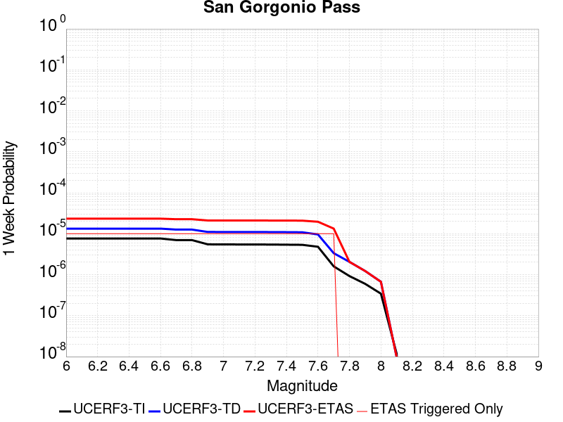 |  |  |  |

| Magnitude | 1 wk TI Prob | 1 wk TD Prob | 1 wk ETAS Prob | 1 wk ETAS/TD Gain | 1 wk ETAS Triggered Only | 1 mo TI Prob | 1 mo TD Prob | 1 mo ETAS Prob | 1 mo ETAS/TD Gain | 1 mo ETAS Triggered Only | 1 yr TI Prob | 1 yr TD Prob | 1 yr ETAS Prob | 1 yr ETAS/TD Gain | 1 yr ETAS Triggered Only | 10 yr TI Prob | 10 yr TD Prob | 10 yr ETAS Prob | 10 yr ETAS/TD Gain | 10 yr ETAS Triggered Only |
|-----|-----|-----|-----|-----|-----|-----|-----|-----|-----|-----|-----|-----|-----|-----|-----|-----|-----|-----|-----|-----|
| 6.0 | 7.644328E-6 | 1.3314231E-5 | 2.5876878E-5 | 1.9435502 | 1.2562814E-5 | 3.2760996E-5 | 5.705979E-5 | 6.962189E-5 | 1.2201568 | 1.2562814E-5 | 3.987921E-4 | 6.944901E-4 | 7.070442E-4 | 1.0180767 | 1.2562814E-5 | 0.003980772 | 0.0069299806 | 0.006954932 | 1.0036005 | 2.5125628E-5 |
| 6.1 | 7.644328E-6 | 1.3314231E-5 | 2.5876878E-5 | 1.9435502 | 1.2562814E-5 | 3.2760996E-5 | 5.705979E-5 | 6.962189E-5 | 1.2201568 | 1.2562814E-5 | 3.987921E-4 | 6.944901E-4 | 7.070442E-4 | 1.0180767 | 1.2562814E-5 | 0.003980772 | 0.0069299806 | 0.006954932 | 1.0036005 | 2.5125628E-5 |
| 6.2 | 7.644328E-6 | 1.3314231E-5 | 2.5876878E-5 | 1.9435502 | 1.2562814E-5 | 3.2760996E-5 | 5.705979E-5 | 6.962189E-5 | 1.2201568 | 1.2562814E-5 | 3.987921E-4 | 6.944901E-4 | 7.070442E-4 | 1.0180767 | 1.2562814E-5 | 0.003980772 | 0.0069299806 | 0.006954932 | 1.0036005 | 2.5125628E-5 |
| 6.3 | 7.644328E-6 | 1.3314231E-5 | 2.5876878E-5 | 1.9435502 | 1.2562814E-5 | 3.2760996E-5 | 5.705979E-5 | 6.962189E-5 | 1.2201568 | 1.2562814E-5 | 3.987921E-4 | 6.944901E-4 | 7.070442E-4 | 1.0180767 | 1.2562814E-5 | 0.003980772 | 0.0069299806 | 0.006954932 | 1.0036005 | 2.5125628E-5 |
| 6.4 | 7.644328E-6 | 1.3314231E-5 | 2.5876878E-5 | 1.9435502 | 1.2562814E-5 | 3.2760996E-5 | 5.705979E-5 | 6.962189E-5 | 1.2201568 | 1.2562814E-5 | 3.987921E-4 | 6.944901E-4 | 7.070442E-4 | 1.0180767 | 1.2562814E-5 | 0.003980772 | 0.0069299806 | 0.006954932 | 1.0036005 | 2.5125628E-5 |
| 6.5 | 7.644328E-6 | 1.3314231E-5 | 2.5876878E-5 | 1.9435502 | 1.2562814E-5 | 3.2760996E-5 | 5.705979E-5 | 6.962189E-5 | 1.2201568 | 1.2562814E-5 | 3.987921E-4 | 6.944901E-4 | 7.070442E-4 | 1.0180767 | 1.2562814E-5 | 0.003980772 | 0.0069299806 | 0.006954932 | 1.0036005 | 2.5125628E-5 |
| 6.6 | 7.644328E-6 | 1.3314231E-5 | 2.5876878E-5 | 1.9435502 | 1.2562814E-5 | 3.2760996E-5 | 5.705979E-5 | 6.962189E-5 | 1.2201568 | 1.2562814E-5 | 3.987921E-4 | 6.944901E-4 | 7.070442E-4 | 1.0180767 | 1.2562814E-5 | 0.003980772 | 0.0069299806 | 0.006954932 | 1.0036005 | 2.5125628E-5 |
| 6.7 | 6.987586E-6 | 1.2618505E-5 | 2.5181162E-5 | 1.995574 | 1.2562814E-5 | 2.9946454E-5 | 5.4078235E-5 | 6.6640365E-5 | 1.2322956 | 1.2562814E-5 | 3.645371E-4 | 6.582117E-4 | 6.707663E-4 | 1.0190737 | 1.2562814E-5 | 0.0036393967 | 0.0065693567 | 0.0065943175 | 1.0037996 | 2.5125628E-5 |
| 6.8 | 6.987586E-6 | 1.2618505E-5 | 2.5181162E-5 | 1.995574 | 1.2562814E-5 | 2.9946454E-5 | 5.4078235E-5 | 6.6640365E-5 | 1.2322956 | 1.2562814E-5 | 3.645371E-4 | 6.582117E-4 | 6.707663E-4 | 1.0190737 | 1.2562814E-5 | 0.0036393967 | 0.0065693567 | 0.0065943175 | 1.0037996 | 2.5125628E-5 |
| 6.9 | 5.504702E-6 | 1.1049368E-5 | 2.3612043E-5 | 2.1369586 | 1.2562814E-5 | 2.3591367E-5 | 4.7353606E-5 | 5.9915827E-5 | 1.2652854 | 1.2562814E-5 | 2.8718702E-4 | 5.7638274E-4 | 5.889383E-4 | 1.0217834 | 1.2562814E-5 | 0.0028681618 | 0.005755309 | 0.0057802903 | 1.0043405 | 2.5125628E-5 |
| 7.0 | 5.4825764E-6 | 1.102571E-5 | 2.3588385E-5 | 2.1393983 | 1.2562814E-5 | 2.3496545E-5 | 4.7252215E-5 | 5.9814436E-5 | 1.2658546 | 1.2562814E-5 | 2.8603288E-4 | 5.751489E-4 | 5.877045E-4 | 1.0218302 | 1.2562814E-5 | 0.00285665 | 0.005743035 | 0.0057680164 | 1.0043498 | 2.5125628E-5 |
| 7.1 | 5.4692787E-6 | 1.101142E-5 | 2.3574095E-5 | 2.140877 | 1.2562814E-5 | 2.3439556E-5 | 4.7190973E-5 | 5.9753194E-5 | 1.2661997 | 1.2562814E-5 | 2.8533922E-4 | 5.744037E-4 | 5.869593E-4 | 1.0218585 | 1.2562814E-5 | 0.0028497311 | 0.0057356213 | 0.005760603 | 1.0043555 | 2.5125628E-5 |
| 7.2 | 5.453661E-6 | 1.0994446E-5 | 2.3557122E-5 | 2.1426384 | 1.2562814E-5 | 2.3372622E-5 | 4.7118232E-5 | 5.9680453E-5 | 1.2666106 | 1.2562814E-5 | 2.8452452E-4 | 5.7351857E-4 | 5.8607414E-4 | 1.0218922 | 1.2562814E-5 | 0.002841605 | 0.0057268157 | 0.0057517975 | 1.0043622 | 2.5125628E-5 |
| 7.3 | 5.4422303E-6 | 1.0981369E-5 | 2.3544046E-5 | 2.143999 | 1.2562814E-5 | 2.3323635E-5 | 4.706219E-5 | 5.9624414E-5 | 1.2669281 | 1.2562814E-5 | 2.8392827E-4 | 5.728366E-4 | 5.8539223E-4 | 1.0219183 | 1.2562814E-5 | 0.0028356577 | 0.005720031 | 0.0057450132 | 1.0043675 | 2.5125628E-5 |
| 7.4 | 5.398595E-6 | 1.0928734E-5 | 2.3491411E-5 | 2.149509 | 1.2562814E-5 | 2.313663E-5 | 4.683662E-5 | 5.9398844E-5 | 1.2682137 | 1.2562814E-5 | 2.8165206E-4 | 5.700917E-4 | 5.826474E-4 | 1.0220239 | 1.2562814E-5 | 0.0028129534 | 0.005692723 | 0.005717706 | 1.0043886 | 2.5125628E-5 |
| 7.5 | 5.3578788E-6 | 1.0855281E-5 | 2.3417959E-5 | 2.1572871 | 1.2562814E-5 | 2.2962136E-5 | 4.6521833E-5 | 5.908406E-5 | 1.2700287 | 1.2562814E-5 | 2.7952815E-4 | 5.662612E-4 | 5.7881686E-4 | 1.0221729 | 1.2562814E-5 | 0.002791768 | 0.0056546377 | 0.0056796214 | 1.0044183 | 2.5125628E-5 |
| 7.6 | 4.8091474E-6 | 9.60368E-6 | 2.2166374E-5 | 2.3081124 | 1.2562814E-5 | 2.0610469E-5 | 4.1158008E-5 | 5.3720305E-5 | 1.3052212 | 1.2562814E-5 | 2.5090357E-4 | 5.0098833E-4 | 5.1354483E-4 | 1.0250635 | 1.2562814E-5 | 0.0025062046 | 0.0050053033 | 0.0050303033 | 1.0049946 | 2.5125628E-5 |
| 7.7 | 1.5991155E-6 | 3.352866E-6 | 1.5915639E-5 | 4.7468753 | 1.2562814E-5 | 6.853334E-6 | 1.4369349E-5 | 2.6931983E-5 | 1.874266 | 1.2562814E-5 | 8.343615E-5 | 1.7493303E-4 | 1.8749364E-4 | 1.0718024 | 1.2562814E-5 | 8.340483E-4 | 0.0017534072 | 0.0017784887 | 1.0143045 | 2.5125628E-5 |
| 7.8 | 9.258398E-7 | 2.0579948E-6 | 2.0579948E-6 | 1.0 | 0.0 | 3.967879E-6 | 8.819949E-6 | 8.819949E-6 | 1.0 | 0.0 | 4.8307855E-5 | 1.073776E-4 | 1.073776E-4 | 1.0 | 0.0 | 4.8297356E-4 | 0.001078687 | 0.0010912362 | 1.0116339 | 1.2562814E-5 |
| 7.9 | 5.975575E-7 | 1.2291794E-6 | 1.2291794E-6 | 1.0 | 0.0 | 2.5609581E-6 | 5.2679006E-6 | 5.2679006E-6 | 1.0 | 0.0 | 3.117922E-5 | 6.4134816E-5 | 6.4134816E-5 | 1.0 | 0.0 | 3.1174847E-4 | 6.463092E-4 | 6.463092E-4 | 1.0 | 0.0 |
| 8.0 | 3.4413725E-7 | 6.7148494E-7 | 6.7148494E-7 | 1.0 | 0.0 | 1.4748731E-6 | 2.8777895E-6 | 2.8777895E-6 | 1.0 | 0.0 | 1.7956432E-5 | 3.503653E-5 | 3.503653E-5 | 1.0 | 0.0 | 1.7954981E-4 | 3.5373896E-4 | 3.5373896E-4 | 1.0 | 0.0 |
| 8.1 | 1.1787731E-8 | 9.634385E-9 | 9.634385E-9 | 1.0 | 0.0 | 5.0518846E-8 | 4.129022E-8 | 4.129022E-8 | 1.0 | 0.0 | 6.1506677E-7 | 5.027083E-7 | 5.027083E-7 | 1.0 | 0.0 | 6.1506507E-6 | 5.2424944E-6 | 5.2424944E-6 | 1.0 | 0.0 |

## Fontana (Seismicity)
*[(top)](#table-of-contents)*

| 1 Week | 1 Month | 1 Year | 10 Year |
|-----|-----|-----|-----|
|  |  |  |  |

| Magnitude | 1 wk TI Prob | 1 wk TD Prob | 1 wk ETAS Prob | 1 wk ETAS/TD Gain | 1 wk ETAS Triggered Only | 1 mo TI Prob | 1 mo TD Prob | 1 mo ETAS Prob | 1 mo ETAS/TD Gain | 1 mo ETAS Triggered Only | 1 yr TI Prob | 1 yr TD Prob | 1 yr ETAS Prob | 1 yr ETAS/TD Gain | 1 yr ETAS Triggered Only | 10 yr TI Prob | 10 yr TD Prob | 10 yr ETAS Prob | 10 yr ETAS/TD Gain | 10 yr ETAS Triggered Only |
|-----|-----|-----|-----|-----|-----|-----|-----|-----|-----|-----|-----|-----|-----|-----|-----|-----|-----|-----|-----|-----|
| 6.0 | 7.1789214E-6 | 7.5520006E-6 | 7.5520006E-6 | 1.0 | 0.0 | 3.076644E-5 | 3.2365548E-5 | 4.4927954E-5 | 1.3881414 | 1.2562814E-5 | 3.7451705E-4 | 3.9402005E-4 | 4.0657792E-4 | 1.0318711 | 1.2562814E-5 | 0.003738865 | 0.003937214 | 0.0039622406 | 1.0063565 | 2.5125628E-5 |
| 6.1 | 7.1789214E-6 | 7.5520006E-6 | 7.5520006E-6 | 1.0 | 0.0 | 3.076644E-5 | 3.2365548E-5 | 4.4927954E-5 | 1.3881414 | 1.2562814E-5 | 3.7451705E-4 | 3.9402005E-4 | 4.0657792E-4 | 1.0318711 | 1.2562814E-5 | 0.003738865 | 0.003937214 | 0.0039622406 | 1.0063565 | 2.5125628E-5 |
| 6.2 | 7.1789214E-6 | 7.5520006E-6 | 7.5520006E-6 | 1.0 | 0.0 | 3.076644E-5 | 3.2365548E-5 | 4.4927954E-5 | 1.3881414 | 1.2562814E-5 | 3.7451705E-4 | 3.9402005E-4 | 4.0657792E-4 | 1.0318711 | 1.2562814E-5 | 0.003738865 | 0.003937214 | 0.0039622406 | 1.0063565 | 2.5125628E-5 |
| 6.3 | 7.1789214E-6 | 7.5520006E-6 | 7.5520006E-6 | 1.0 | 0.0 | 3.076644E-5 | 3.2365548E-5 | 4.4927954E-5 | 1.3881414 | 1.2562814E-5 | 3.7451705E-4 | 3.9402005E-4 | 4.0657792E-4 | 1.0318711 | 1.2562814E-5 | 0.003738865 | 0.003937214 | 0.0039622406 | 1.0063565 | 2.5125628E-5 |
| 6.4 | 7.1789214E-6 | 7.5520006E-6 | 7.5520006E-6 | 1.0 | 0.0 | 3.076644E-5 | 3.2365548E-5 | 4.4927954E-5 | 1.3881414 | 1.2562814E-5 | 3.7451705E-4 | 3.9402005E-4 | 4.0657792E-4 | 1.0318711 | 1.2562814E-5 | 0.003738865 | 0.003937214 | 0.0039622406 | 1.0063565 | 2.5125628E-5 |
| 6.5 | 5.2611317E-6 | 5.532726E-6 | 5.532726E-6 | 1.0 | 0.0 | 2.2547512E-5 | 2.3711682E-5 | 3.62742E-5 | 1.5298028 | 1.2562814E-5 | 2.744814E-4 | 2.8868974E-4 | 3.0124892E-4 | 1.0435041 | 1.2562814E-5 | 0.002741426 | 0.0028868972 | 0.0029119505 | 1.0086782 | 2.5125628E-5 |
| 6.6 | 5.2611317E-6 | 5.532726E-6 | 5.532726E-6 | 1.0 | 0.0 | 2.2547512E-5 | 2.3711682E-5 | 3.62742E-5 | 1.5298028 | 1.2562814E-5 | 2.744814E-4 | 2.8868974E-4 | 3.0124892E-4 | 1.0435041 | 1.2562814E-5 | 0.002741426 | 0.0028868972 | 0.0029119505 | 1.0086782 | 2.5125628E-5 |

## San Jacinto (Borrego)
*[(top)](#table-of-contents)*

| 1 Week | 1 Month | 1 Year | 10 Year |
|-----|-----|-----|-----|
|  |  |  | 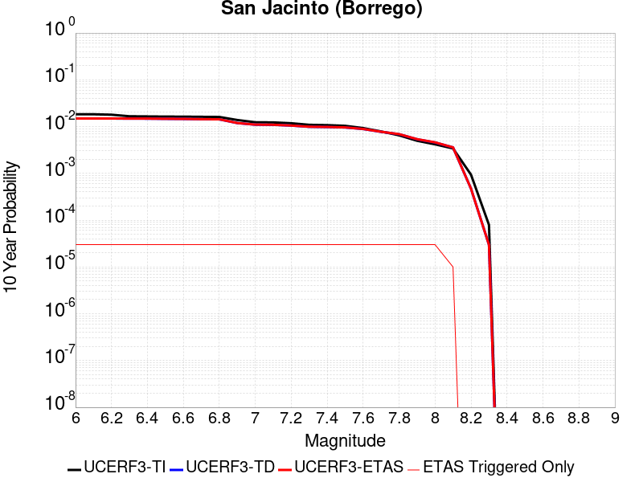 |

| Magnitude | 1 wk TI Prob | 1 wk TD Prob | 1 wk ETAS Prob | 1 wk ETAS/TD Gain | 1 wk ETAS Triggered Only | 1 mo TI Prob | 1 mo TD Prob | 1 mo ETAS Prob | 1 mo ETAS/TD Gain | 1 mo ETAS Triggered Only | 1 yr TI Prob | 1 yr TD Prob | 1 yr ETAS Prob | 1 yr ETAS/TD Gain | 1 yr ETAS Triggered Only | 10 yr TI Prob | 10 yr TD Prob | 10 yr ETAS Prob | 10 yr ETAS/TD Gain | 10 yr ETAS Triggered Only |
|-----|-----|-----|-----|-----|-----|-----|-----|-----|-----|-----|-----|-----|-----|-----|-----|-----|-----|-----|-----|-----|
| 6.0 | 3.543992E-5 | 2.7926513E-5 | 5.3051437E-5 | 1.89968 | 2.5125628E-5 | 1.5187653E-4 | 1.1967963E-4 | 1.4480225E-4 | 1.2099156 | 2.5125628E-5 | 0.0018475284 | 0.0014561379 | 0.0014812269 | 1.0172298 | 2.5125628E-5 | 0.018322436 | 0.014869647 | 0.0148944 | 1.0016646 | 2.5125628E-5 |
| 6.1 | 3.542281E-5 | 2.7926513E-5 | 5.3051437E-5 | 1.89968 | 2.5125628E-5 | 1.5180321E-4 | 1.1967963E-4 | 1.4480225E-4 | 1.2099156 | 2.5125628E-5 | 0.0018466372 | 0.0014561379 | 0.0014812269 | 1.0172298 | 2.5125628E-5 | 0.018313672 | 0.014869647 | 0.0148944 | 1.0016646 | 2.5125628E-5 |
| 6.2 | 3.4688688E-5 | 2.7926511E-5 | 5.3051437E-5 | 1.89968 | 2.5125628E-5 | 1.4865733E-4 | 1.1967963E-4 | 1.4480225E-4 | 1.2099156 | 2.5125628E-5 | 0.0018084005 | 0.0014561379 | 0.0014812269 | 1.0172298 | 2.5125628E-5 | 0.017937548 | 0.014869647 | 0.014894399 | 1.0016646 | 2.5125628E-5 |
| 6.3 | 3.2087122E-5 | 2.7771865E-5 | 5.2896794E-5 | 1.9046901 | 2.5125628E-5 | 1.3750899E-4 | 1.1901691E-4 | 1.4413956E-4 | 1.2110846 | 2.5125628E-5 | 0.0016728862 | 0.00144808 | 0.0014731692 | 1.0173259 | 2.5125628E-5 | 0.016603488 | 0.014790683 | 0.014815437 | 1.0016736 | 2.5125628E-5 |
| 6.4 | 3.1828724E-5 | 2.7738852E-5 | 5.2863783E-5 | 1.9057668 | 2.5125628E-5 | 1.364017E-4 | 1.1887544E-4 | 1.4399808E-4 | 1.2113359 | 2.5125628E-5 | 0.0016594254 | 0.0014463598 | 0.0014714492 | 1.0173465 | 2.5125628E-5 | 0.016470885 | 0.014773762 | 0.014798516 | 1.0016756 | 2.5125628E-5 |
| 6.5 | 3.1563577E-5 | 2.747857E-5 | 5.2603507E-5 | 1.9143466 | 2.5125628E-5 | 1.3526545E-4 | 1.1776006E-4 | 1.4288272E-4 | 1.2133378 | 2.5125628E-5 | 0.0016456128 | 0.0014327979 | 0.0014578876 | 1.0175109 | 2.5125628E-5 | 0.0163348 | 0.014640348 | 0.014665105 | 1.0016911 | 2.5125628E-5 |
| 6.6 | 3.1467625E-5 | 2.7322796E-5 | 5.2447736E-5 | 1.9195597 | 2.5125628E-5 | 1.3485427E-4 | 1.1709251E-4 | 1.422152E-4 | 1.2145542 | 2.5125628E-5 | 0.0016406142 | 0.0014246812 | 0.001449771 | 1.0176108 | 2.5125628E-5 | 0.016285548 | 0.014560594 | 0.014585354 | 1.0017005 | 2.5125628E-5 |
| 6.7 | 3.1223695E-5 | 2.6940816E-5 | 5.2065767E-5 | 1.932598 | 2.5125628E-5 | 1.3380898E-4 | 1.15455594E-4 | 1.4057833E-4 | 1.2175964 | 2.5125628E-5 | 0.0016279068 | 0.0014047775 | 0.0014298679 | 1.0178608 | 2.5125628E-5 | 0.01616033 | 0.014364966 | 0.014389731 | 1.001724 | 2.5125628E-5 |
| 6.8 | 3.1015585E-5 | 2.6761822E-5 | 5.188678E-5 | 1.9388357 | 2.5125628E-5 | 1.3291716E-4 | 1.1468855E-4 | 1.398113E-4 | 1.219052 | 2.5125628E-5 | 0.001617065 | 0.0013954508 | 0.0014205413 | 1.0179802 | 2.5125628E-5 | 0.016053487 | 0.014272246 | 0.014297013 | 1.0017353 | 2.5125628E-5 |
| 6.9 | 2.6641965E-5 | 2.2184247E-5 | 4.7309317E-5 | 2.1325636 | 2.5125628E-5 | 1.1417485E-4 | 9.50719E-5 | 1.2019514E-4 | 1.2642552 | 2.5125628E-5 | 0.0013891924 | 0.0011568897 | 0.0011819862 | 1.0216931 | 2.5125628E-5 | 0.0138054015 | 0.011882438 | 0.0119072655 | 1.0020894 | 2.5125628E-5 |
| 7.0 | 2.3854353E-5 | 2.0479023E-5 | 4.5604138E-5 | 2.2268708 | 2.5125628E-5 | 1.02228936E-4 | 8.77643E-5 | 1.1288773E-4 | 1.2862601 | 2.5125628E-5 | 0.0012439266 | 0.0010680092 | 0.001093108 | 1.0235006 | 2.5125628E-5 | 0.012369866 | 0.0109828 | 0.011007651 | 1.0022626 | 2.5125628E-5 |
| 7.1 | 2.3672901E-5 | 2.031551E-5 | 4.544063E-5 | 2.2367456 | 2.5125628E-5 | 1.0145135E-4 | 8.7063585E-5 | 1.1218702E-4 | 1.2885643 | 2.5125628E-5 | 0.0012344702 | 0.0010594862 | 0.0010845852 | 1.0236897 | 2.5125628E-5 | 0.0122763505 | 0.010897976 | 0.010922828 | 1.0022804 | 2.5125628E-5 |
| 7.2 | 2.2717244E-5 | 1.9542893E-5 | 4.4668028E-5 | 2.2856407 | 2.5125628E-5 | 9.735599E-5 | 8.375258E-5 | 1.088761E-4 | 1.2999731 | 2.5125628E-5 | 0.0011846646 | 0.001019213 | 0.001044313 | 1.0246269 | 2.5125628E-5 | 0.01178369 | 0.010495341 | 0.010520203 | 1.0023688 | 2.5125628E-5 |
| 7.3 | 2.1016205E-5 | 1.8384526E-5 | 4.350969E-5 | 2.3666475 | 2.5125628E-5 | 9.006634E-5 | 7.878846E-5 | 1.03912105E-4 | 1.3188747 | 2.5125628E-5 | 0.001096006 | 9.5882936E-4 | 9.839309E-4 | 1.0261793 | 2.5125628E-5 | 0.010906163 | 0.009890967 | 0.009915844 | 1.0025151 | 2.5125628E-5 |
| 7.4 | 2.0683625E-5 | 1.8187047E-5 | 4.331222E-5 | 2.3814871 | 2.5125628E-5 | 8.86411E-5 | 7.794217E-5 | 1.0306584E-4 | 1.3223373 | 2.5125628E-5 | 0.001078671 | 9.485349E-4 | 9.7363663E-4 | 1.0264637 | 2.5125628E-5 | 0.010734501 | 0.009787692 | 0.009812572 | 1.0025419 | 2.5125628E-5 |
| 7.5 | 1.9993966E-5 | 1.7782075E-5 | 4.2907257E-5 | 2.41295 | 2.5125628E-5 | 8.568561E-5 | 7.620667E-5 | 1.01330384E-4 | 1.3296787 | 2.5125628E-5 | 0.001042723 | 9.2742336E-4 | 9.5252565E-4 | 1.0270667 | 2.5125628E-5 | 0.010378438 | 0.009574614 | 0.009599499 | 1.0025991 | 2.5125628E-5 |
| 7.6 | 1.788966E-5 | 1.6435291E-5 | 4.1560506E-5 | 2.5287356 | 2.5125628E-5 | 7.666772E-5 | 7.043507E-5 | 9.555893E-5 | 1.3566953 | 2.5125628E-5 | 9.3302975E-4 | 8.572113E-4 | 8.823154E-4 | 1.0292858 | 2.5125628E-5 | 0.00929122 | 0.008866487 | 0.00889139 | 1.0028087 | 2.5125628E-5 |
| 7.7 | 1.5125781E-5 | 1.4237377E-5 | 3.9362647E-5 | 2.76474 | 2.5125628E-5 | 6.4823165E-5 | 6.1015908E-5 | 8.6140004E-5 | 1.4117631 | 2.5125628E-5 | 7.889362E-4 | 7.426163E-4 | 7.6772325E-4 | 1.0338088 | 2.5125628E-5 | 0.007861412 | 0.0077142045 | 0.007739136 | 1.0032319 | 2.5125628E-5 |
| 7.8 | 1.250089E-5 | 1.26304985E-5 | 3.775581E-5 | 2.9892573 | 2.5125628E-5 | 5.3574146E-5 | 5.412959E-5 | 7.9253856E-5 | 1.4641503 | 2.5125628E-5 | 6.5207E-4 | 6.588291E-4 | 6.8393815E-4 | 1.0381117 | 2.5125628E-5 | 0.006501599 | 0.0068677636 | 0.0068927165 | 1.0036334 | 2.5125628E-5 |
| 7.9 | 9.561E-6 | 9.754616E-6 | 3.488E-5 | 3.5757427 | 2.5125628E-5 | 4.0975072E-5 | 4.1804833E-5 | 6.692941E-5 | 1.600997 | 2.5125628E-5 | 4.987573E-4 | 5.088555E-4 | 5.339684E-4 | 1.0493516 | 2.5125628E-5 | 0.0049763937 | 0.0053523467 | 0.005377338 | 1.0046692 | 2.5125628E-5 |
| 8.0 | 8.01699E-6 | 8.293488E-6 | 3.3418906E-5 | 4.0295362 | 2.5125628E-5 | 3.4358076E-5 | 3.554304E-5 | 6.066777E-5 | 1.7068821 | 2.5125628E-5 | 4.1822926E-4 | 4.3265108E-4 | 4.5776583E-4 | 1.0580485 | 2.5125628E-5 | 0.0041744304 | 0.004573375 | 0.0045983857 | 1.0054687 | 2.5125628E-5 |
| 8.1 | 6.541947E-6 | 6.4622354E-6 | 1.9024968E-5 | 2.944023 | 1.2562814E-5 | 2.8036617E-5 | 2.7695003E-5 | 4.025747E-5 | 1.4536004 | 1.2562814E-5 | 3.4129233E-4 | 3.37135E-4 | 3.4969358E-4 | 1.0372509 | 1.2562814E-5 | 0.0034076865 | 0.0035806994 | 0.0035932173 | 1.0034959 | 1.2562814E-5 |
| 8.2 | 1.7968189E-6 | 7.9713476E-7 | 7.9713476E-7 | 1.0 | 0.0 | 7.70063E-6 | 3.4162877E-6 | 3.4162877E-6 | 1.0 | 0.0 | 9.3751136E-5 | 4.159253E-5 | 4.159253E-5 | 1.0 | 0.0 | 9.371159E-4 | 4.712058E-4 | 4.712058E-4 | 1.0 | 0.0 |
| 8.3 | 1.5167889E-7 | 4.897714E-8 | 4.897714E-8 | 1.0 | 0.0 | 6.500522E-7 | 2.09902E-7 | 2.09902E-7 | 1.0 | 0.0 | 7.9143565E-6 | 2.5555544E-6 | 2.5555544E-6 | 1.0 | 0.0 | 7.914075E-5 | 2.969505E-5 | 2.969505E-5 | 1.0 | 0.0 |

## Homestead Valley 2011
*[(top)](#table-of-contents)*

| 1 Week | 1 Month | 1 Year | 10 Year |
|-----|-----|-----|-----|
|  |  |  |  |

| Magnitude | 1 wk TI Prob | 1 wk TD Prob | 1 wk ETAS Prob | 1 wk ETAS/TD Gain | 1 wk ETAS Triggered Only | 1 mo TI Prob | 1 mo TD Prob | 1 mo ETAS Prob | 1 mo ETAS/TD Gain | 1 mo ETAS Triggered Only | 1 yr TI Prob | 1 yr TD Prob | 1 yr ETAS Prob | 1 yr ETAS/TD Gain | 1 yr ETAS Triggered Only | 10 yr TI Prob | 10 yr TD Prob | 10 yr ETAS Prob | 10 yr ETAS/TD Gain | 10 yr ETAS Triggered Only |
|-----|-----|-----|-----|-----|-----|-----|-----|-----|-----|-----|-----|-----|-----|-----|-----|-----|-----|-----|-----|-----|
| 6.0 | 1.539795E-5 | 6.286606E-6 | 1.8849341E-5 | 2.9983335 | 1.2562814E-5 | 6.5989545E-5 | 2.6942436E-5 | 5.2067386E-5 | 1.932542 | 2.5125628E-5 | 8.0312655E-4 | 3.279954E-4 | 3.5311276E-4 | 1.0765785 | 2.5125628E-5 | 0.008002302 | 0.0032771337 | 0.0033021772 | 1.0076418 | 2.5125628E-5 |
| 6.1 | 1.539795E-5 | 6.286606E-6 | 1.8849341E-5 | 2.9983335 | 1.2562814E-5 | 6.5989545E-5 | 2.6942436E-5 | 5.2067386E-5 | 1.932542 | 2.5125628E-5 | 8.0312655E-4 | 3.279954E-4 | 3.5311276E-4 | 1.0765785 | 2.5125628E-5 | 0.008002302 | 0.0032771337 | 0.0033021772 | 1.0076418 | 2.5125628E-5 |
| 6.2 | 1.539795E-5 | 6.286606E-6 | 1.8849341E-5 | 2.9983335 | 1.2562814E-5 | 6.5989545E-5 | 2.6942436E-5 | 5.2067386E-5 | 1.932542 | 2.5125628E-5 | 8.0312655E-4 | 3.279954E-4 | 3.5311276E-4 | 1.0765785 | 2.5125628E-5 | 0.008002302 | 0.0032771337 | 0.0033021772 | 1.0076418 | 2.5125628E-5 |
| 6.3 | 1.539795E-5 | 6.286606E-6 | 1.8849341E-5 | 2.9983335 | 1.2562814E-5 | 6.5989545E-5 | 2.6942436E-5 | 5.2067386E-5 | 1.932542 | 2.5125628E-5 | 8.0312655E-4 | 3.279954E-4 | 3.5311276E-4 | 1.0765785 | 2.5125628E-5 | 0.008002302 | 0.0032771337 | 0.0033021772 | 1.0076418 | 2.5125628E-5 |
| 6.4 | 1.539795E-5 | 6.286606E-6 | 1.8849341E-5 | 2.9983335 | 1.2562814E-5 | 6.5989545E-5 | 2.6942436E-5 | 5.2067386E-5 | 1.932542 | 2.5125628E-5 | 8.0312655E-4 | 3.279954E-4 | 3.5311276E-4 | 1.0765785 | 2.5125628E-5 | 0.008002302 | 0.0032771337 | 0.0033021772 | 1.0076418 | 2.5125628E-5 |
| 6.5 | 1.0265258E-5 | 2.8788488E-6 | 1.5441627E-5 | 5.3638196 | 1.2562814E-5 | 4.3993223E-5 | 1.2337905E-5 | 3.746322E-5 | 3.0364332 | 2.5125628E-5 | 5.3548586E-4 | 1.5021059E-4 | 1.7533245E-4 | 1.1672442 | 2.5125628E-5 | 0.005341973 | 0.0015017724 | 0.0015268604 | 1.0167055 | 2.5125628E-5 |
| 6.6 | 6.664671E-6 | 5.348204E-7 | 5.348204E-7 | 1.0 | 0.0 | 2.8562565E-5 | 2.2920863E-6 | 1.4854872E-5 | 6.4809394 | 1.2562814E-5 | 3.476937E-4 | 2.7905911E-5 | 4.0468374E-5 | 1.4501722 | 1.2562814E-5 | 0.003471502 | 2.790357E-4 | 2.91595E-4 | 1.0450097 | 1.2562814E-5 |
| 6.7 | 6.5954046E-6 | 5.348204E-7 | 5.348204E-7 | 1.0 | 0.0 | 2.8265715E-5 | 2.2920863E-6 | 1.4854872E-5 | 6.4809394 | 1.2562814E-5 | 3.4408073E-4 | 2.7905911E-5 | 4.0468374E-5 | 1.4501722 | 1.2562814E-5 | 0.0034354846 | 2.790357E-4 | 2.91595E-4 | 1.0450097 | 1.2562814E-5 |
| 6.8 | 4.648189E-6 | 2.3265572E-7 | 2.3265572E-7 | 1.0 | 0.0 | 1.9920659E-5 | 9.970956E-7 | 1.35598975E-5 | 13.599395 | 1.2562814E-5 | 2.4250703E-4 | 1.2139576E-5 | 2.4702238E-5 | 2.0348518 | 1.2562814E-5 | 0.0024224254 | 1.2138961E-4 | 1.339509E-4 | 1.1034791 | 1.2562814E-5 |
| 6.9 | 4.1428534E-6 | 1.9344557E-7 | 1.9344557E-7 | 1.0 | 0.0 | 1.7754966E-5 | 8.290522E-7 | 1.3391856E-5 | 16.153212 | 1.2562814E-5 | 2.1614527E-4 | 1.0093667E-5 | 2.2656353E-5 | 2.2446108 | 1.2562814E-5 | 0.0021593515 | 1.0093238E-4 | 1.1349393E-4 | 1.1244551 | 1.2562814E-5 |
| 7.0 | 3.0673707E-6 | 1.5367603E-7 | 1.5367603E-7 | 1.0 | 0.0 | 1.3145808E-5 | 6.586114E-7 | 1.3221417E-5 | 20.074686 | 1.2562814E-5 | 1.6003846E-4 | 8.0185655E-6 | 2.058128E-5 | 2.5667033 | 1.2562814E-5 | 0.0015992324 | 8.0182865E-5 | 9.274467E-5 | 1.1566645 | 1.2562814E-5 |
| 7.1 | 2.340854E-6 | 1.468766E-7 | 1.468766E-7 | 1.0 | 0.0 | 1.0032193E-5 | 6.29471E-7 | 1.3192277E-5 | 20.95772 | 1.2562814E-5 | 1.221351E-4 | 7.663783E-6 | 2.0226502E-5 | 2.639232 | 1.2562814E-5 | 0.00122068 | 7.663529E-5 | 8.919714E-5 | 1.1639173 | 1.2562814E-5 |
| 7.2 | 1.3754182E-6 | 1.3922634E-7 | 1.3922634E-7 | 1.0 | 0.0 | 5.8946357E-6 | 5.966842E-7 | 1.3159491E-5 | 22.054365 | 1.2562814E-5 | 7.176483E-5 | 7.2646067E-6 | 1.982733E-5 | 2.7293053 | 1.2562814E-5 | 7.174166E-4 | 7.264379E-5 | 8.5205684E-5 | 1.1729246 | 1.2562814E-5 |
| 7.3 | 1.2573237E-6 | 1.3827146E-7 | 1.3827146E-7 | 1.0 | 0.0 | 5.388519E-6 | 5.9259185E-7 | 1.3155399E-5 | 22.199764 | 1.2562814E-5 | 6.560324E-5 | 7.2147827E-6 | 1.9777506E-5 | 2.7412477 | 1.2562814E-5 | 6.558388E-4 | 7.214558E-5 | 8.4707484E-5 | 1.1741189 | 1.2562814E-5 |
| 7.4 | 1.0994207E-6 | 1.3106106E-7 | 1.3106106E-7 | 1.0 | 0.0 | 4.7117946E-6 | 5.616901E-7 | 1.3124497E-5 | 23.366081 | 1.2562814E-5 | 5.736459E-5 | 6.8385566E-6 | 1.9401285E-5 | 2.8370438 | 1.2562814E-5 | 5.734978E-4 | 6.838355E-5 | 8.094551E-5 | 1.1836985 | 1.2562814E-5 |
| 7.5 | 5.5569126E-7 | 6.772991E-8 | 6.772991E-8 | 1.0 | 0.0 | 2.3815317E-6 | 2.90271E-7 | 2.90271E-7 | 1.0 | 0.0 | 2.8994764E-5 | 3.5340445E-6 | 3.5340445E-6 | 1.0 | 0.0 | 2.899098E-4 | 3.5339945E-5 | 3.5339945E-5 | 1.0 | 0.0 |

## Hayward (So) 2011 CFM
*[(top)](#table-of-contents)*

| 1 Week | 1 Month | 1 Year | 10 Year |
|-----|-----|-----|-----|
|  |  |  |  |

| Magnitude | 1 wk TI Prob | 1 wk TD Prob | 1 wk ETAS Prob | 1 wk ETAS/TD Gain | 1 wk ETAS Triggered Only | 1 mo TI Prob | 1 mo TD Prob | 1 mo ETAS Prob | 1 mo ETAS/TD Gain | 1 mo ETAS Triggered Only | 1 yr TI Prob | 1 yr TD Prob | 1 yr ETAS Prob | 1 yr ETAS/TD Gain | 1 yr ETAS Triggered Only | 10 yr TI Prob | 10 yr TD Prob | 10 yr ETAS Prob | 10 yr ETAS/TD Gain | 10 yr ETAS Triggered Only |
|-----|-----|-----|-----|-----|-----|-----|-----|-----|-----|-----|-----|-----|-----|-----|-----|-----|-----|-----|-----|-----|
| 6.0 | 1.8091932E-4 | 3.570541E-4 | 3.570541E-4 | 1.0 | 0.0 | 7.751381E-4 | 0.0015293444 | 0.0015418879 | 1.008202 | 1.2562814E-5 | 0.00939654 | 0.018463207 | 0.01848787 | 1.0013357 | 2.5125628E-5 | 0.090090066 | 0.16673161 | 0.16675255 | 1.0001255 | 2.5125628E-5 |
| 6.1 | 1.8091932E-4 | 3.570541E-4 | 3.570541E-4 | 1.0 | 0.0 | 7.751381E-4 | 0.0015293444 | 0.0015418879 | 1.008202 | 1.2562814E-5 | 0.00939654 | 0.018463207 | 0.01848787 | 1.0013357 | 2.5125628E-5 | 0.090090066 | 0.16673161 | 0.16675255 | 1.0001255 | 2.5125628E-5 |
| 6.2 | 1.8091932E-4 | 3.570541E-4 | 3.570541E-4 | 1.0 | 0.0 | 7.751381E-4 | 0.0015293444 | 0.0015418879 | 1.008202 | 1.2562814E-5 | 0.00939654 | 0.018463207 | 0.01848787 | 1.0013357 | 2.5125628E-5 | 0.090090066 | 0.16673161 | 0.16675255 | 1.0001255 | 2.5125628E-5 |
| 6.3 | 1.7322872E-4 | 3.426234E-4 | 3.426234E-4 | 1.0 | 0.0 | 7.4219756E-4 | 0.0014675693 | 0.0014801136 | 1.0085478 | 1.2562814E-5 | 0.0089988755 | 0.017723544 | 0.017748225 | 1.0013925 | 2.5125628E-5 | 0.08643075 | 0.16066726 | 0.16068834 | 1.0001312 | 2.5125628E-5 |
| 6.4 | 1.6334097E-4 | 3.234411E-4 | 3.234411E-4 | 1.0 | 0.0 | 6.998449E-4 | 0.0013854484 | 0.0013979939 | 1.0090551 | 1.2562814E-5 | 0.008487372 | 0.016739385 | 0.01676409 | 1.0014758 | 2.5125628E-5 | 0.081704415 | 0.15255594 | 0.15257724 | 1.0001396 | 2.5125628E-5 |
| 6.5 | 1.5600289E-4 | 3.1018828E-4 | 3.1018828E-4 | 1.0 | 0.0 | 6.684125E-4 | 0.0013287093 | 0.0013412555 | 1.0094423 | 1.2562814E-5 | 0.008107598 | 0.016058935 | 0.016083656 | 1.0015395 | 2.5125628E-5 | 0.078181036 | 0.14683272 | 0.14685415 | 1.000146 | 2.5125628E-5 |
| 6.6 | 1.4046066E-4 | 2.8032906E-4 | 2.8032906E-4 | 1.0 | 0.0 | 6.018354E-4 | 0.0012008639 | 0.0012134116 | 1.0104489 | 1.2562814E-5 | 0.0073027555 | 0.014524006 | 0.014548766 | 1.0017048 | 2.5125628E-5 | 0.07067384 | 0.13391982 | 0.13394159 | 1.0001625 | 2.5125628E-5 |
| 6.7 | 1.14696966E-4 | 2.3271477E-4 | 2.3271477E-4 | 1.0 | 0.0 | 4.914658E-4 | 9.969729E-4 | 0.0010095232 | 1.0125884 | 1.2562814E-5 | 0.0059671924 | 0.012071652 | 0.012096475 | 1.0020562 | 2.5125628E-5 | 0.058094822 | 0.11274672 | 0.112769015 | 1.0001978 | 2.5125628E-5 |
| 6.8 | 9.3874296E-5 | 1.8861453E-4 | 1.8861453E-4 | 1.0 | 0.0 | 4.0225635E-4 | 8.0810126E-4 | 8.0810126E-4 | 1.0 | 0.0 | 0.0048864787 | 0.009794984 | 0.009794984 | 1.0 | 0.0 | 0.047804173 | 0.09259856 | 0.09259856 | 1.0 | 0.0 |
| 6.9 | 5.551852E-5 | 1.072948E-4 | 1.072948E-4 | 1.0 | 0.0 | 2.3791482E-4 | 4.5975443E-4 | 4.5975443E-4 | 1.0 | 0.0 | 0.0028927654 | 0.0055832625 | 0.0055832625 | 1.0 | 0.0 | 0.028553981 | 0.054245494 | 0.054245494 | 1.0 | 0.0 |
| 7.0 | 4.2662363E-5 | 8.2464416E-5 | 8.2464416E-5 | 1.0 | 0.0 | 1.8282588E-4 | 3.5337146E-4 | 3.5337146E-4 | 1.0 | 0.0 | 0.0022236328 | 0.0042938837 | 0.0042938837 | 1.0 | 0.0 | 0.022015138 | 0.042064495 | 0.042064495 | 1.0 | 0.0 |
| 7.1 | 3.305886E-5 | 6.3019055E-5 | 6.3019055E-5 | 1.0 | 0.0 | 1.4167312E-4 | 2.700538E-4 | 2.700538E-4 | 1.0 | 0.0 | 0.0017235056 | 0.0032829668 | 0.0032829668 | 1.0 | 0.0 | 0.017101998 | 0.032452874 | 0.032452874 | 1.0 | 0.0 |
| 7.2 | 2.9856887E-5 | 5.7013647E-5 | 5.7013647E-5 | 1.0 | 0.0 | 1.2795182E-4 | 2.4432142E-4 | 2.4432142E-4 | 1.0 | 0.0 | 0.0015567001 | 0.0029705726 | 0.0029705726 | 1.0 | 0.0 | 0.015458403 | 0.029453589 | 0.029453589 | 1.0 | 0.0 |
| 7.3 | 2.4559737E-5 | 4.599088E-5 | 4.599088E-5 | 1.0 | 0.0 | 1.0525176E-4 | 1.9708896E-4 | 1.9708896E-4 | 1.0 | 0.0 | 0.0012806869 | 0.0023969305 | 0.0023969305 | 1.0 | 0.0 | 0.012733313 | 0.023857482 | 0.023857482 | 1.0 | 0.0 |
| 7.4 | 1.9002231E-5 | 3.5049303E-5 | 3.5049303E-5 | 1.0 | 0.0 | 8.143559E-5 | 1.502027E-4 | 1.502027E-4 | 1.0 | 0.0 | 9.910273E-4 | 0.0018271938 | 0.0018271938 | 1.0 | 0.0 | 0.009866194 | 0.018258283 | 0.018258283 | 1.0 | 0.0 |
| 7.5 | 1.2783333E-5 | 2.3330069E-5 | 2.3330069E-5 | 1.0 | 0.0 | 5.4784563E-5 | 9.998221E-5 | 9.998221E-5 | 1.0 | 0.0 | 6.667979E-4 | 0.0012166094 | 0.0012166094 | 1.0 | 0.0 | 0.006648007 | 0.012209582 | 0.012209582 | 1.0 | 0.0 |
| 7.6 | 4.8149627E-6 | 8.887544E-6 | 8.887544E-6 | 1.0 | 0.0 | 2.063539E-5 | 3.8088925E-5 | 3.8088925E-5 | 1.0 | 0.0 | 2.5120692E-4 | 4.636352E-4 | 4.636352E-4 | 1.0 | 0.0 | 0.0025092314 | 0.0046812436 | 0.0046812436 | 1.0 | 0.0 |
| 7.7 | 6.0838227E-7 | 1.2056693E-6 | 1.2056693E-6 | 1.0 | 0.0 | 2.6073499E-6 | 5.1671436E-6 | 5.1671436E-6 | 1.0 | 0.0 | 3.174402E-5 | 6.290816E-5 | 6.290816E-5 | 1.0 | 0.0 | 3.1739488E-4 | 6.5293367E-4 | 6.5293367E-4 | 1.0 | 0.0 |
| 7.8 | 4.5542808E-7 | 9.792182E-7 | 9.792182E-7 | 1.0 | 0.0 | 1.9518332E-6 | 4.1966427E-6 | 4.1966427E-6 | 1.0 | 0.0 | 2.376331E-5 | 5.1092928E-5 | 5.1092928E-5 | 1.0 | 0.0 | 2.3760769E-4 | 5.321372E-4 | 5.321372E-4 | 1.0 | 0.0 |
| 7.9 | 3.3016747E-7 | 7.386335E-7 | 7.386335E-7 | 1.0 | 0.0 | 1.4150027E-6 | 3.1655684E-6 | 3.1655684E-6 | 1.0 | 0.0 | 1.7227521E-5 | 3.8540114E-5 | 3.8540114E-5 | 1.0 | 0.0 | 1.7226185E-4 | 3.9930744E-4 | 3.9930744E-4 | 1.0 | 0.0 |
| 8.0 | 2.347038E-7 | 5.4714894E-7 | 5.4714894E-7 | 1.0 | 0.0 | 1.0058731E-6 | 2.344922E-6 | 2.344922E-6 | 1.0 | 0.0 | 1.2246436E-5 | 2.8549053E-5 | 2.8549053E-5 | 1.0 | 0.0 | 1.2245761E-4 | 2.9355253E-4 | 2.9355253E-4 | 1.0 | 0.0 |
| 8.1 | 1.18822804E-7 | 2.6058973E-7 | 2.6058973E-7 | 1.0 | 0.0 | 5.092405E-7 | 1.1168127E-6 | 1.1168127E-6 | 1.0 | 0.0 | 6.1999854E-6 | 1.359711E-5 | 1.359711E-5 | 1.0 | 0.0 | 6.199812E-5 | 1.3917852E-4 | 1.3917852E-4 | 1.0 | 0.0 |

## Hosgri
*[(top)](#table-of-contents)*

| 1 Week | 1 Month | 1 Year | 10 Year |
|-----|-----|-----|-----|
|  |  |  |  |

| Magnitude | 1 wk TI Prob | 1 wk TD Prob | 1 wk ETAS Prob | 1 wk ETAS/TD Gain | 1 wk ETAS Triggered Only | 1 mo TI Prob | 1 mo TD Prob | 1 mo ETAS Prob | 1 mo ETAS/TD Gain | 1 mo ETAS Triggered Only | 1 yr TI Prob | 1 yr TD Prob | 1 yr ETAS Prob | 1 yr ETAS/TD Gain | 1 yr ETAS Triggered Only | 10 yr TI Prob | 10 yr TD Prob | 10 yr ETAS Prob | 10 yr ETAS/TD Gain | 10 yr ETAS Triggered Only |
|-----|-----|-----|-----|-----|-----|-----|-----|-----|-----|-----|-----|-----|-----|-----|-----|-----|-----|-----|-----|-----|
| 6.0 | 2.883978E-5 | 2.9128416E-5 | 2.9128416E-5 | 1.0 | 0.0 | 1.235932E-4 | 1.2483024E-4 | 1.373915E-4 | 1.1006266 | 1.2562814E-5 | 0.0015037085 | 0.001518776 | 0.0015313197 | 1.008259 | 1.2562814E-5 | 0.01493574 | 0.01508774 | 0.015112486 | 1.0016402 | 2.5125628E-5 |
| 6.1 | 2.883978E-5 | 2.9128416E-5 | 2.9128416E-5 | 1.0 | 0.0 | 1.235932E-4 | 1.2483024E-4 | 1.373915E-4 | 1.1006266 | 1.2562814E-5 | 0.0015037085 | 0.001518776 | 0.0015313197 | 1.008259 | 1.2562814E-5 | 0.01493574 | 0.01508774 | 0.015112486 | 1.0016402 | 2.5125628E-5 |
| 6.2 | 2.883978E-5 | 2.9128416E-5 | 2.9128416E-5 | 1.0 | 0.0 | 1.235932E-4 | 1.2483024E-4 | 1.373915E-4 | 1.1006266 | 1.2562814E-5 | 0.0015037085 | 0.001518776 | 0.0015313197 | 1.008259 | 1.2562814E-5 | 0.01493574 | 0.01508774 | 0.015112486 | 1.0016402 | 2.5125628E-5 |
| 6.3 | 2.2914428E-5 | 2.2641969E-5 | 2.2641969E-5 | 1.0 | 0.0 | 9.8200995E-5 | 9.703343E-5 | 9.703343E-5 | 1.0 | 0.0 | 0.0011949413 | 0.0011807467 | 0.0011807467 | 1.0 | 0.0 | 0.011885363 | 0.011746133 | 0.011758548 | 1.0010569 | 1.2562814E-5 |
| 6.4 | 2.0195741E-5 | 1.969656E-5 | 1.969656E-5 | 1.0 | 0.0 | 8.65503E-5 | 8.4411105E-5 | 8.4411105E-5 | 1.0 | 0.0 | 0.0010532405 | 0.0010272227 | 0.0010272227 | 1.0 | 0.0 | 0.010482626 | 0.010225792 | 0.010225792 | 1.0 | 0.0 |
| 6.5 | 1.9924333E-5 | 1.940898E-5 | 1.940898E-5 | 1.0 | 0.0 | 8.53872E-5 | 8.3178704E-5 | 8.3178704E-5 | 1.0 | 0.0 | 0.0010390934 | 0.0010122322 | 0.0010122322 | 1.0 | 0.0 | 0.010342481 | 0.010077253 | 0.010077253 | 1.0 | 0.0 |
| 6.6 | 1.809694E-5 | 1.74583E-5 | 1.74583E-5 | 1.0 | 0.0 | 7.7556004E-5 | 7.4819145E-5 | 7.4819145E-5 | 1.0 | 0.0 | 9.438353E-4 | 9.105437E-4 | 9.105437E-4 | 1.0 | 0.0 | 0.009398366 | 0.009069073 | 0.009069073 | 1.0 | 0.0 |
| 6.7 | 1.675989E-5 | 1.6042764E-5 | 1.6042764E-5 | 1.0 | 0.0 | 7.182612E-5 | 6.87529E-5 | 6.87529E-5 | 1.0 | 0.0 | 8.7413215E-4 | 8.3674624E-4 | 8.3674624E-4 | 1.0 | 0.0 | 0.008707017 | 0.0083368635 | 0.0083368635 | 1.0 | 0.0 |
| 6.8 | 1.5401129E-5 | 1.4614083E-5 | 1.4614083E-5 | 1.0 | 0.0 | 6.6003166E-5 | 6.2630286E-5 | 6.2630286E-5 | 1.0 | 0.0 | 8.032922E-4 | 7.622578E-4 | 7.622578E-4 | 1.0 | 0.0 | 0.008003947 | 0.007597296 | 0.007597296 | 1.0 | 0.0 |
| 6.9 | 1.356559E-5 | 1.2689968E-5 | 1.2689968E-5 | 1.0 | 0.0 | 5.8136946E-5 | 5.4384444E-5 | 5.4384444E-5 | 1.0 | 0.0 | 7.0758746E-4 | 6.619299E-4 | 6.619299E-4 | 1.0 | 0.0 | 0.007053386 | 0.006600388 | 0.006600388 | 1.0 | 0.0 |
| 7.0 | 1.2030819E-5 | 1.1095962E-5 | 1.1095962E-5 | 1.0 | 0.0 | 5.155963E-5 | 4.7553254E-5 | 4.7553254E-5 | 1.0 | 0.0 | 6.275577E-4 | 5.7880714E-4 | 5.7880714E-4 | 1.0 | 0.0 | 0.006257884 | 0.005773757 | 0.005773757 | 1.0 | 0.0 |
| 7.1 | 1.0972698E-5 | 1.0022179E-5 | 1.0022179E-5 | 1.0 | 0.0 | 4.7025E-5 | 4.2951488E-5 | 4.2951488E-5 | 1.0 | 0.0 | 5.72379E-4 | 5.22809E-4 | 5.22809E-4 | 1.0 | 0.0 | 0.0057090693 | 0.005216542 | 0.005216542 | 1.0 | 0.0 |
| 7.2 | 9.961926E-6 | 9.034746E-6 | 9.034746E-6 | 1.0 | 0.0 | 4.2693267E-5 | 3.8719765E-5 | 3.8719765E-5 | 1.0 | 0.0 | 5.1966653E-4 | 4.713112E-4 | 4.713112E-4 | 1.0 | 0.0 | 0.00518453 | 0.0047038626 | 0.0047038626 | 1.0 | 0.0 |
| 7.3 | 8.700929E-6 | 7.8281E-6 | 7.8281E-6 | 1.0 | 0.0 | 3.7289166E-5 | 3.354857E-5 | 3.354857E-5 | 1.0 | 0.0 | 4.53901E-4 | 4.0837732E-4 | 4.0837732E-4 | 1.0 | 0.0 | 0.00452975 | 0.004077008 | 0.004077008 | 1.0 | 0.0 |
| 7.4 | 7.866285E-6 | 6.998739E-6 | 6.998739E-6 | 1.0 | 0.0 | 3.3712215E-5 | 2.9994251E-5 | 2.9994251E-5 | 1.0 | 0.0 | 4.103689E-4 | 3.6511885E-4 | 3.6511885E-4 | 1.0 | 0.0 | 0.004096119 | 0.0036459267 | 0.0036459267 | 1.0 | 0.0 |
| 7.5 | 6.8381305E-6 | 5.9596955E-6 | 5.9596955E-6 | 1.0 | 0.0 | 2.9305946E-5 | 2.5541302E-5 | 2.5541302E-5 | 1.0 | 0.0 | 3.5674145E-4 | 3.10921E-4 | 3.10921E-4 | 1.0 | 0.0 | 0.0035616932 | 0.0031055948 | 0.0031055948 | 1.0 | 0.0 |
| 7.6 | 5.503376E-6 | 4.5952443E-6 | 4.5952443E-6 | 1.0 | 0.0 | 2.3585684E-5 | 1.9693754E-5 | 1.9693754E-5 | 1.0 | 0.0 | 2.8711787E-4 | 2.397451E-4 | 2.397451E-4 | 1.0 | 0.0 | 0.002867472 | 0.0023955975 | 0.0023955975 | 1.0 | 0.0 |
| 7.7 | 3.6144982E-6 | 2.6522112E-6 | 2.6522112E-6 | 1.0 | 0.0 | 1.5490614E-5 | 1.1366569E-5 | 1.1366569E-5 | 1.0 | 0.0 | 1.8858191E-4 | 1.383792E-4 | 1.383792E-4 | 1.0 | 0.0 | 0.0018842196 | 0.0013836613 | 0.0013836613 | 1.0 | 0.0 |
| 7.8 | 1.9853494E-6 | 1.1361129E-6 | 1.1361129E-6 | 1.0 | 0.0 | 8.508612E-6 | 4.8690463E-6 | 4.8690463E-6 | 1.0 | 0.0 | 1.0358743E-4 | 5.9279027E-5 | 5.9279027E-5 | 1.0 | 0.0 | 0.0010353916 | 5.9336185E-4 | 5.9336185E-4 | 1.0 | 0.0 |
| 7.9 | 1.1818757E-6 | 5.2951856E-7 | 5.2951856E-7 | 1.0 | 0.0 | 5.0651715E-6 | 2.2693632E-6 | 2.2693632E-6 | 1.0 | 0.0 | 6.1666724E-5 | 2.7629147E-5 | 2.7629147E-5 | 1.0 | 0.0 | 6.1649614E-4 | 2.7694515E-4 | 2.7694515E-4 | 1.0 | 0.0 |
| 8.0 | 6.962958E-7 | 2.7139782E-7 | 2.7139782E-7 | 1.0 | 0.0 | 2.9841215E-6 | 1.163133E-6 | 1.163133E-6 | 1.0 | 0.0 | 3.6331072E-5 | 1.4161053E-5 | 1.4161053E-5 | 1.0 | 0.0 | 3.6325134E-4 | 1.4217179E-4 | 1.4217179E-4 | 1.0 | 0.0 |
| 8.1 | 1.5033264E-7 | 6.527624E-8 | 6.527624E-8 | 1.0 | 0.0 | 6.442826E-7 | 2.7975528E-7 | 2.7975528E-7 | 1.0 | 0.0 | 7.844113E-6 | 3.4060151E-6 | 3.4060151E-6 | 1.0 | 0.0 | 7.843835E-5 | 3.407693E-5 | 3.407693E-5 | 1.0 | 0.0 |

## Newport-Inglewood (Offshore)
*[(top)](#table-of-contents)*

| 1 Week | 1 Month | 1 Year | 10 Year |
|-----|-----|-----|-----|
|  |  |  |  |

| Magnitude | 1 wk TI Prob | 1 wk TD Prob | 1 wk ETAS Prob | 1 wk ETAS/TD Gain | 1 wk ETAS Triggered Only | 1 mo TI Prob | 1 mo TD Prob | 1 mo ETAS Prob | 1 mo ETAS/TD Gain | 1 mo ETAS Triggered Only | 1 yr TI Prob | 1 yr TD Prob | 1 yr ETAS Prob | 1 yr ETAS/TD Gain | 1 yr ETAS Triggered Only | 10 yr TI Prob | 10 yr TD Prob | 10 yr ETAS Prob | 10 yr ETAS/TD Gain | 10 yr ETAS Triggered Only |
|-----|-----|-----|-----|-----|-----|-----|-----|-----|-----|-----|-----|-----|-----|-----|-----|-----|-----|-----|-----|-----|
| 6.0 | 1.9626508E-5 | 1.8965357E-5 | 1.8965357E-5 | 1.0 | 0.0 | 8.411089E-5 | 8.1277634E-5 | 8.1277634E-5 | 1.0 | 0.0 | 0.001023569 | 9.891186E-4 | 9.891186E-4 | 1.0 | 0.0 | 0.010188672 | 0.009848503 | 0.009873382 | 1.002526 | 2.5125628E-5 |
| 6.1 | 1.331886E-5 | 1.2218092E-5 | 1.2218092E-5 | 1.0 | 0.0 | 5.707958E-5 | 5.2362207E-5 | 5.2362207E-5 | 1.0 | 0.0 | 6.947222E-4 | 6.3732493E-4 | 6.3732493E-4 | 1.0 | 0.0 | 0.006925544 | 0.006355149 | 0.006380115 | 1.0039284 | 2.5125628E-5 |
| 6.2 | 1.2250852E-5 | 1.1076029E-5 | 1.1076029E-5 | 1.0 | 0.0 | 5.2502597E-5 | 4.7467838E-5 | 4.7467838E-5 | 1.0 | 0.0 | 6.3903164E-4 | 5.777687E-4 | 5.777687E-4 | 1.0 | 0.0 | 0.006371971 | 0.0057627866 | 0.005775277 | 1.0021675 | 1.2562814E-5 |
| 6.3 | 1.2106258E-5 | 1.0918891E-5 | 1.0918891E-5 | 1.0 | 0.0 | 5.1882926E-5 | 4.6794412E-5 | 4.6794412E-5 | 1.0 | 0.0 | 6.3149154E-4 | 5.69574E-4 | 5.69574E-4 | 1.0 | 0.0 | 0.0062970007 | 0.005681259 | 0.0056937505 | 1.0021987 | 1.2562814E-5 |
| 6.4 | 1.1348758E-5 | 1.0109362E-5 | 1.0109362E-5 | 1.0 | 0.0 | 4.8636626E-5 | 4.3325123E-5 | 4.3325123E-5 | 1.0 | 0.0 | 5.919901E-4 | 5.273565E-4 | 5.273565E-4 | 1.0 | 0.0 | 0.005904155 | 0.0052611465 | 0.005273643 | 1.0023752 | 1.2562814E-5 |
| 6.5 | 1.100837E-5 | 9.7433895E-6 | 9.7433895E-6 | 1.0 | 0.0 | 4.7177873E-5 | 4.1756717E-5 | 4.1756717E-5 | 1.0 | 0.0 | 5.7423924E-4 | 5.082702E-4 | 5.082702E-4 | 1.0 | 0.0 | 0.005727576 | 0.0050711688 | 0.005083668 | 1.0024648 | 1.2562814E-5 |
| 6.6 | 1.0634696E-5 | 9.345544E-6 | 9.345544E-6 | 1.0 | 0.0 | 4.557647E-5 | 4.0051716E-5 | 4.0051716E-5 | 1.0 | 0.0 | 5.5475225E-4 | 4.8752132E-4 | 4.8752132E-4 | 1.0 | 0.0 | 0.0055336943 | 0.0048646047 | 0.0048771063 | 1.0025699 | 1.2562814E-5 |
| 6.7 | 9.9780855E-6 | 8.667911E-6 | 8.667911E-6 | 1.0 | 0.0 | 4.276252E-5 | 3.7147664E-5 | 3.7147664E-5 | 1.0 | 0.0 | 5.205093E-4 | 4.5217964E-4 | 4.5217964E-4 | 1.0 | 0.0 | 0.0051929182 | 0.004512675 | 0.004525181 | 1.0027714 | 1.2562814E-5 |
| 6.8 | 9.59546E-6 | 8.27295E-6 | 8.27295E-6 | 1.0 | 0.0 | 4.1122752E-5 | 3.5455025E-5 | 3.5455025E-5 | 1.0 | 0.0 | 5.0055445E-4 | 4.315801E-4 | 4.315801E-4 | 1.0 | 0.0 | 0.004994285 | 0.004307495 | 0.004307495 | 1.0 | 0.0 |
| 6.9 | 9.000614E-6 | 7.70684E-6 | 7.70684E-6 | 1.0 | 0.0 | 3.857349E-5 | 3.30289E-5 | 3.30289E-5 | 1.0 | 0.0 | 4.6953102E-4 | 4.0205332E-4 | 4.0205332E-4 | 1.0 | 0.0 | 0.004685402 | 0.0040133307 | 0.0040133307 | 1.0 | 0.0 |
| 7.0 | 7.4070194E-6 | 6.148904E-6 | 6.148904E-6 | 1.0 | 0.0 | 3.1743984E-5 | 2.635218E-5 | 2.635218E-5 | 1.0 | 0.0 | 3.8641447E-4 | 3.207907E-4 | 3.207907E-4 | 1.0 | 0.0 | 0.0038574322 | 0.0032032963 | 0.0032032963 | 1.0 | 0.0 |
| 7.1 | 6.299615E-6 | 5.0565927E-6 | 5.0565927E-6 | 1.0 | 0.0 | 2.699807E-5 | 2.1670932E-5 | 2.1670932E-5 | 1.0 | 0.0 | 3.2865192E-4 | 2.638118E-4 | 2.638118E-4 | 1.0 | 0.0 | 0.003281663 | 0.002635001 | 0.002635001 | 1.0 | 0.0 |
| 7.2 | 5.096653E-6 | 3.892769E-6 | 3.892769E-6 | 1.0 | 0.0 | 2.1842614E-5 | 1.668319E-5 | 1.668319E-5 | 1.0 | 0.0 | 2.6590136E-4 | 2.0309901E-4 | 2.0309901E-4 | 1.0 | 0.0 | 0.0026558342 | 0.0020291451 | 0.0020291451 | 1.0 | 0.0 |
| 7.3 | 3.9753018E-6 | 2.9099103E-6 | 2.9099103E-6 | 1.0 | 0.0 | 1.7036897E-5 | 1.2470985E-5 | 1.2470985E-5 | 1.0 | 0.0 | 2.0740448E-4 | 1.5182374E-4 | 1.5182374E-4 | 1.0 | 0.0 | 0.00207211 | 0.0015172083 | 0.0015172083 | 1.0 | 0.0 |
| 7.4 | 3.0568392E-6 | 2.1449955E-6 | 2.1449955E-6 | 1.0 | 0.0 | 1.3100675E-5 | 9.192806E-6 | 9.192806E-6 | 1.0 | 0.0 | 1.5948903E-4 | 1.1191672E-4 | 1.1191672E-4 | 1.0 | 0.0 | 0.0015937461 | 0.0011186098 | 0.0011186098 | 1.0 | 0.0 |
| 7.5 | 1.7279019E-6 | 1.1469883E-6 | 1.1469883E-6 | 1.0 | 0.0 | 7.405273E-6 | 4.915655E-6 | 4.915655E-6 | 1.0 | 0.0 | 9.015547E-5 | 5.9846494E-5 | 5.9846494E-5 | 1.0 | 0.0 | 9.01189E-4 | 5.9830764E-4 | 5.9830764E-4 | 1.0 | 0.0 |
| 7.6 | 1.1156416E-6 | 7.223012E-7 | 7.223012E-7 | 1.0 | 0.0 | 4.7813123E-6 | 3.095573E-6 | 3.095573E-6 | 1.0 | 0.0 | 5.821092E-5 | 3.7687976E-5 | 3.7687976E-5 | 1.0 | 0.0 | 5.8195676E-4 | 3.7681818E-4 | 3.7681818E-4 | 1.0 | 0.0 |
| 7.7 | 9.117973E-8 | 6.734145E-8 | 6.734145E-8 | 1.0 | 0.0 | 3.907702E-7 | 2.886062E-7 | 2.886062E-7 | 1.0 | 0.0 | 4.757617E-6 | 3.513775E-6 | 3.513775E-6 | 1.0 | 0.0 | 4.7575148E-5 | 3.5137225E-5 | 3.5137225E-5 | 1.0 | 0.0 |

## Great Valley 08 (Quinto)
*[(top)](#table-of-contents)*

| 1 Week | 1 Month | 1 Year | 10 Year |
|-----|-----|-----|-----|
|  |  |  |  |

| Magnitude | 1 wk TI Prob | 1 wk TD Prob | 1 wk ETAS Prob | 1 wk ETAS/TD Gain | 1 wk ETAS Triggered Only | 1 mo TI Prob | 1 mo TD Prob | 1 mo ETAS Prob | 1 mo ETAS/TD Gain | 1 mo ETAS Triggered Only | 1 yr TI Prob | 1 yr TD Prob | 1 yr ETAS Prob | 1 yr ETAS/TD Gain | 1 yr ETAS Triggered Only | 10 yr TI Prob | 10 yr TD Prob | 10 yr ETAS Prob | 10 yr ETAS/TD Gain | 10 yr ETAS Triggered Only |
|-----|-----|-----|-----|-----|-----|-----|-----|-----|-----|-----|-----|-----|-----|-----|-----|-----|-----|-----|-----|-----|
| 6.0 | 7.737697E-6 | 8.253038E-6 | 8.253038E-6 | 1.0 | 0.0 | 3.3161137E-5 | 3.536979E-5 | 6.049453E-5 | 1.7103446 | 2.5125628E-5 | 4.0366207E-4 | 4.3056096E-4 | 4.5567576E-4 | 1.0583304 | 2.5125628E-5 | 0.004029296 | 0.0042991205 | 0.004324138 | 1.0058192 | 2.5125628E-5 |
| 6.1 | 7.737697E-6 | 8.253038E-6 | 8.253038E-6 | 1.0 | 0.0 | 3.3161137E-5 | 3.536979E-5 | 6.049453E-5 | 1.7103446 | 2.5125628E-5 | 4.0366207E-4 | 4.3056096E-4 | 4.5567576E-4 | 1.0583304 | 2.5125628E-5 | 0.004029296 | 0.0042991205 | 0.004324138 | 1.0058192 | 2.5125628E-5 |
| 6.2 | 7.737697E-6 | 8.253038E-6 | 8.253038E-6 | 1.0 | 0.0 | 3.3161137E-5 | 3.536979E-5 | 6.049453E-5 | 1.7103446 | 2.5125628E-5 | 4.0366207E-4 | 4.3056096E-4 | 4.5567576E-4 | 1.0583304 | 2.5125628E-5 | 0.004029296 | 0.0042991205 | 0.004324138 | 1.0058192 | 2.5125628E-5 |
| 6.3 | 5.374012E-6 | 5.7505736E-6 | 5.7505736E-6 | 1.0 | 0.0 | 2.3031276E-5 | 2.4645145E-5 | 4.9770155E-5 | 2.019471 | 2.5125628E-5 | 2.803697E-4 | 3.0002446E-4 | 3.2514255E-4 | 1.0837201 | 2.5125628E-5 | 0.0028001624 | 0.0029972875 | 0.0030223378 | 1.0083576 | 2.5125628E-5 |
| 6.4 | 5.374012E-6 | 5.7505736E-6 | 5.7505736E-6 | 1.0 | 0.0 | 2.3031276E-5 | 2.4645145E-5 | 4.9770155E-5 | 2.019471 | 2.5125628E-5 | 2.803697E-4 | 3.0002446E-4 | 3.2514255E-4 | 1.0837201 | 2.5125628E-5 | 0.0028001624 | 0.0029972875 | 0.0030223378 | 1.0083576 | 2.5125628E-5 |
| 6.5 | 3.65427E-6 | 3.941324E-6 | 3.941324E-6 | 1.0 | 0.0 | 1.5661062E-5 | 1.689132E-5 | 2.945392E-5 | 1.7437313 | 1.2562814E-5 | 1.9065675E-4 | 2.0563944E-4 | 2.1819968E-4 | 1.0610789 | 1.2562814E-5 | 0.0019049325 | 0.0020551833 | 0.0020677203 | 1.0061002 | 1.2562814E-5 |
| 6.6 | 3.6143538E-6 | 3.8985104E-6 | 3.8985104E-6 | 1.0 | 0.0 | 1.5489995E-5 | 1.6707834E-5 | 2.9270439E-5 | 1.751899 | 1.2562814E-5 | 1.8857437E-4 | 2.0340596E-4 | 2.1596621E-4 | 1.0617497 | 1.2562814E-5 | 0.0018841444 | 0.0020328893 | 0.0020454265 | 1.0061672 | 1.2562814E-5 |
| 6.7 | 2.4821015E-6 | 2.6857067E-6 | 2.6857067E-6 | 1.0 | 0.0 | 1.0637535E-5 | 1.1510153E-5 | 1.1510153E-5 | 1.0 | 0.0 | 1.2950429E-4 | 1.4013276E-4 | 1.4013276E-4 | 1.0 | 0.0 | 0.0012942884 | 0.0014009989 | 0.0014009989 | 1.0 | 0.0 |
| 6.8 | 4.7110538E-7 | 5.193021E-7 | 5.193021E-7 | 1.0 | 0.0 | 2.0190216E-6 | 2.2255786E-6 | 2.2255786E-6 | 1.0 | 0.0 | 2.458131E-5 | 2.70961E-5 | 2.70961E-5 | 1.0 | 0.0 | 2.457859E-4 | 2.7092977E-4 | 2.7092977E-4 | 1.0 | 0.0 |
| 6.9 | 3.958685E-7 | 4.3703452E-7 | 4.3703452E-7 | 1.0 | 0.0 | 1.6965782E-6 | 1.8730038E-6 | 1.8730038E-6 | 1.0 | 0.0 | 2.0655643E-5 | 2.28036E-5 | 2.28036E-5 | 1.0 | 0.0 | 2.0653724E-4 | 2.2801422E-4 | 2.2801422E-4 | 1.0 | 0.0 |
| 7.0 | 2.70294E-7 | 2.9920008E-7 | 2.9920008E-7 | 1.0 | 0.0 | 1.1584025E-6 | 1.2822856E-6 | 1.2822856E-6 | 1.0 | 0.0 | 1.4103458E-5 | 1.5611728E-5 | 1.5611728E-5 | 1.0 | 0.0 | 1.4102564E-4 | 1.5610759E-4 | 1.5610759E-4 | 1.0 | 0.0 |
| 7.1 | 1.4828602E-7 | 1.6469107E-7 | 1.6469107E-7 | 1.0 | 0.0 | 6.3551136E-7 | 7.058187E-7 | 7.058187E-7 | 1.0 | 0.0 | 7.737323E-6 | 8.593317E-6 | 8.593317E-6 | 1.0 | 0.0 | 7.737054E-5 | 8.593065E-5 | 8.593065E-5 | 1.0 | 0.0 |

## Sheephole
*[(top)](#table-of-contents)*

| 1 Week | 1 Month | 1 Year | 10 Year |
|-----|-----|-----|-----|
|  |  |  |  |

| Magnitude | 1 wk TI Prob | 1 wk TD Prob | 1 wk ETAS Prob | 1 wk ETAS/TD Gain | 1 wk ETAS Triggered Only | 1 mo TI Prob | 1 mo TD Prob | 1 mo ETAS Prob | 1 mo ETAS/TD Gain | 1 mo ETAS Triggered Only | 1 yr TI Prob | 1 yr TD Prob | 1 yr ETAS Prob | 1 yr ETAS/TD Gain | 1 yr ETAS Triggered Only | 10 yr TI Prob | 10 yr TD Prob | 10 yr ETAS Prob | 10 yr ETAS/TD Gain | 10 yr ETAS Triggered Only |
|-----|-----|-----|-----|-----|-----|-----|-----|-----|-----|-----|-----|-----|-----|-----|-----|-----|-----|-----|-----|-----|
| 6.0 | 4.5579695E-6 | 4.7412627E-6 | 4.7412627E-6 | 1.0 | 0.0 | 1.9534009E-5 | 2.031957E-5 | 2.031957E-5 | 1.0 | 0.0 | 2.3780059E-4 | 2.473682E-4 | 2.5992794E-4 | 1.0507734 | 1.2562814E-5 | 0.0023754628 | 0.002471473 | 0.0024965366 | 1.0101411 | 2.5125628E-5 |
| 6.1 | 4.5579695E-6 | 4.7412627E-6 | 4.7412627E-6 | 1.0 | 0.0 | 1.9534009E-5 | 2.031957E-5 | 2.031957E-5 | 1.0 | 0.0 | 2.3780059E-4 | 2.473682E-4 | 2.5992794E-4 | 1.0507734 | 1.2562814E-5 | 0.0023754628 | 0.002471473 | 0.0024965366 | 1.0101411 | 2.5125628E-5 |
| 6.2 | 2.6677674E-6 | 2.7873941E-6 | 2.7873941E-6 | 1.0 | 0.0 | 1.1433239E-5 | 1.1945926E-5 | 1.1945926E-5 | 1.0 | 0.0 | 1.3919079E-4 | 1.4543302E-4 | 1.5799401E-4 | 1.0863695 | 1.2562814E-5 | 0.0013910364 | 0.0014534844 | 0.0014785735 | 1.0172614 | 2.5125628E-5 |
| 6.3 | 2.6677674E-6 | 2.7873941E-6 | 2.7873941E-6 | 1.0 | 0.0 | 1.1433239E-5 | 1.1945926E-5 | 1.1945926E-5 | 1.0 | 0.0 | 1.3919079E-4 | 1.4543302E-4 | 1.5799401E-4 | 1.0863695 | 1.2562814E-5 | 0.0013910364 | 0.0014534844 | 0.0014785735 | 1.0172614 | 2.5125628E-5 |
| 6.4 | 2.2159759E-6 | 2.3228788E-6 | 2.3228788E-6 | 1.0 | 0.0 | 9.497005E-6 | 9.955161E-6 | 9.955161E-6 | 1.0 | 0.0 | 1.156199E-4 | 1.2119815E-4 | 1.3375944E-4 | 1.1036426 | 1.2562814E-5 | 0.0011555976 | 0.0012113999 | 0.0012364951 | 1.0207158 | 2.5125628E-5 |
| 6.5 | 2.1986082E-6 | 2.304759E-6 | 2.304759E-6 | 1.0 | 0.0 | 9.4225725E-6 | 9.877506E-6 | 9.877506E-6 | 1.0 | 0.0 | 1.1471378E-4 | 1.2025281E-4 | 1.3281411E-4 | 1.1044575 | 1.2562814E-5 | 0.0011465458 | 0.0012019566 | 0.0012270521 | 1.0208788 | 2.5125628E-5 |
| 6.6 | 1.5232331E-6 | 1.6018919E-6 | 1.6018919E-6 | 1.0 | 0.0 | 6.5281256E-6 | 6.865234E-6 | 6.865234E-6 | 1.0 | 0.0 | 7.947703E-5 | 8.35812E-5 | 9.614297E-5 | 1.1502942 | 1.2562814E-5 | 7.9448614E-4 | 8.3551643E-4 | 8.6062105E-4 | 1.0300468 | 2.5125628E-5 |
| 6.7 | 1.3137362E-6 | 1.382819E-6 | 1.382819E-6 | 1.0 | 0.0 | 5.6302856E-6 | 5.926355E-6 | 5.926355E-6 | 1.0 | 0.0 | 6.854657E-5 | 7.215112E-5 | 8.471303E-5 | 1.1741055 | 1.2562814E-5 | 6.8525434E-4 | 7.212908E-4 | 7.4639835E-4 | 1.0348091 | 2.5125628E-5 |
| 6.8 | 1.2275751E-6 | 1.2922847E-6 | 1.2922847E-6 | 1.0 | 0.0 | 5.2610258E-6 | 5.5383516E-6 | 5.5383516E-6 | 1.0 | 0.0 | 6.4051106E-5 | 6.7427485E-5 | 6.7427485E-5 | 1.0 | 0.0 | 6.4032647E-4 | 6.740836E-4 | 6.8663794E-4 | 1.0186243 | 1.2562814E-5 |
| 6.9 | 1.1837088E-6 | 1.246102E-6 | 1.246102E-6 | 1.0 | 0.0 | 5.0730278E-6 | 5.340427E-6 | 5.340427E-6 | 1.0 | 0.0 | 6.176237E-5 | 6.501789E-5 | 6.501789E-5 | 1.0 | 0.0 | 6.17452E-4 | 6.5000186E-4 | 6.625565E-4 | 1.0193148 | 1.2562814E-5 |
| 7.0 | 9.849371E-7 | 1.0366288E-6 | 1.0366288E-6 | 1.0 | 0.0 | 4.2211523E-6 | 4.442688E-6 | 4.442688E-6 | 1.0 | 0.0 | 5.1391315E-5 | 5.4088487E-5 | 5.4088487E-5 | 1.0 | 0.0 | 5.137943E-4 | 5.407633E-4 | 5.533193E-4 | 1.0232191 | 1.2562814E-5 |
| 7.1 | 8.1643645E-7 | 8.591669E-7 | 8.591669E-7 | 1.0 | 0.0 | 3.4990085E-6 | 3.682139E-6 | 3.682139E-6 | 1.0 | 0.0 | 4.2599597E-5 | 4.482921E-5 | 4.482921E-5 | 1.0 | 0.0 | 4.259143E-4 | 4.4821028E-4 | 4.6076748E-4 | 1.0280163 | 1.2562814E-5 |
| 7.2 | 5.7295756E-7 | 6.029502E-7 | 6.029502E-7 | 1.0 | 0.0 | 2.45553E-6 | 2.58407E-6 | 2.58407E-6 | 1.0 | 0.0 | 2.9895667E-5 | 3.1460666E-5 | 3.1460666E-5 | 1.0 | 0.0 | 2.9891645E-4 | 3.145688E-4 | 3.271277E-4 | 1.039924 | 1.2562814E-5 |

## San Andreas (Peninsula) 2011 CFM
*[(top)](#table-of-contents)*

| 1 Week | 1 Month | 1 Year | 10 Year |
|-----|-----|-----|-----|
|  |  |  |  |

| Magnitude | 1 wk TI Prob | 1 wk TD Prob | 1 wk ETAS Prob | 1 wk ETAS/TD Gain | 1 wk ETAS Triggered Only | 1 mo TI Prob | 1 mo TD Prob | 1 mo ETAS Prob | 1 mo ETAS/TD Gain | 1 mo ETAS Triggered Only | 1 yr TI Prob | 1 yr TD Prob | 1 yr ETAS Prob | 1 yr ETAS/TD Gain | 1 yr ETAS Triggered Only | 10 yr TI Prob | 10 yr TD Prob | 10 yr ETAS Prob | 10 yr ETAS/TD Gain | 10 yr ETAS Triggered Only |
|-----|-----|-----|-----|-----|-----|-----|-----|-----|-----|-----|-----|-----|-----|-----|-----|-----|-----|-----|-----|-----|
| 6.0 | 8.6200685E-5 | 2.52136E-5 | 3.77761E-5 | 1.4982429 | 1.2562814E-5 | 3.6937918E-4 | 1.0805382E-4 | 1.20615274E-4 | 1.1162518 | 1.2562814E-5 | 0.0044879215 | 0.001314763 | 0.0013273093 | 1.0095426 | 1.2562814E-5 | 0.043983612 | 0.014774441 | 0.014799195 | 1.0016755 | 2.5125628E-5 |
| 6.1 | 8.6200685E-5 | 2.52136E-5 | 3.77761E-5 | 1.4982429 | 1.2562814E-5 | 3.6937918E-4 | 1.0805382E-4 | 1.20615274E-4 | 1.1162518 | 1.2562814E-5 | 0.0044879215 | 0.001314763 | 0.0013273093 | 1.0095426 | 1.2562814E-5 | 0.043983612 | 0.014774441 | 0.014799195 | 1.0016755 | 2.5125628E-5 |
| 6.2 | 8.6200685E-5 | 2.52136E-5 | 3.77761E-5 | 1.4982429 | 1.2562814E-5 | 3.6937918E-4 | 1.0805382E-4 | 1.20615274E-4 | 1.1162518 | 1.2562814E-5 | 0.0044879215 | 0.001314763 | 0.0013273093 | 1.0095426 | 1.2562814E-5 | 0.043983612 | 0.014774441 | 0.014799195 | 1.0016755 | 2.5125628E-5 |
| 6.3 | 8.551163E-5 | 2.490552E-5 | 3.746802E-5 | 1.5044063 | 1.2562814E-5 | 3.6642692E-4 | 1.06733576E-4 | 1.1929505E-4 | 1.11769 | 1.2562814E-5 | 0.004452125 | 0.0012987083 | 0.0013112548 | 1.0096607 | 1.2562814E-5 | 0.043639794 | 0.014601416 | 0.014626175 | 1.0016956 | 2.5125628E-5 |
| 6.4 | 8.551163E-5 | 2.490552E-5 | 3.746802E-5 | 1.5044063 | 1.2562814E-5 | 3.6642692E-4 | 1.06733576E-4 | 1.1929505E-4 | 1.11769 | 1.2562814E-5 | 0.004452125 | 0.0012987083 | 0.0013112548 | 1.0096607 | 1.2562814E-5 | 0.043639794 | 0.014601416 | 0.014626175 | 1.0016956 | 2.5125628E-5 |
| 6.5 | 8.511146E-5 | 2.4726973E-5 | 3.7289476E-5 | 1.5080487 | 1.2562814E-5 | 3.647124E-4 | 1.05968444E-4 | 1.18529926E-4 | 1.1185398 | 1.2562814E-5 | 0.004431336 | 0.0012894038 | 0.0013019504 | 1.0097306 | 1.2562814E-5 | 0.04344007 | 0.0145011945 | 0.014525956 | 1.0017076 | 2.5125628E-5 |
| 6.6 | 8.4985084E-5 | 2.4657606E-5 | 3.722011E-5 | 1.5094779 | 1.2562814E-5 | 3.6417096E-4 | 1.05671184E-4 | 1.1823267E-4 | 1.1188734 | 1.2562814E-5 | 0.0044247704 | 0.001285789 | 0.0012983356 | 1.009758 | 1.2562814E-5 | 0.043376986 | 0.014463263 | 0.014488025 | 1.0017121 | 2.5125628E-5 |
| 6.7 | 8.462618E-5 | 2.4486113E-5 | 3.704862E-5 | 1.5130461 | 1.2562814E-5 | 3.6263323E-4 | 1.0493627E-4 | 1.17497766E-4 | 1.1197059 | 1.2562814E-5 | 0.004406125 | 0.0012768519 | 0.0012893986 | 1.0098263 | 1.2562814E-5 | 0.043197807 | 0.01436807 | 0.014392835 | 1.0017235 | 2.5125628E-5 |
| 6.8 | 8.42337E-5 | 2.438192E-5 | 3.6944428E-5 | 1.5152386 | 1.2562814E-5 | 3.6095164E-4 | 1.04489765E-4 | 1.1705127E-4 | 1.1202176 | 1.2562814E-5 | 0.004385734 | 0.0012714221 | 0.0012839689 | 1.0098684 | 1.2562814E-5 | 0.043001823 | 0.014308756 | 0.014333522 | 1.0017308 | 2.5125628E-5 |
| 6.9 | 8.365989E-5 | 2.4186513E-5 | 3.6749025E-5 | 1.5194014 | 1.2562814E-5 | 3.5849313E-4 | 1.03652375E-4 | 1.1621389E-4 | 1.1211889 | 1.2562814E-5 | 0.004355922 | 0.0012612387 | 0.0012737856 | 1.0099481 | 1.2562814E-5 | 0.04271523 | 0.014201242 | 0.01422601 | 1.0017442 | 2.5125628E-5 |
| 7.0 | 8.30936E-5 | 2.3948E-5 | 3.651051E-5 | 1.5245746 | 1.2562814E-5 | 3.560668E-4 | 1.02630256E-4 | 1.15191775E-4 | 1.1223959 | 1.2562814E-5 | 0.004326499 | 0.0012488087 | 0.0012613558 | 1.0100473 | 1.2562814E-5 | 0.042432297 | 0.014072227 | 0.014097 | 1.0017604 | 2.5125628E-5 |
| 7.1 | 8.041264E-5 | 2.3634402E-5 | 3.619692E-5 | 1.5315353 | 1.2562814E-5 | 3.4458007E-4 | 1.0128637E-4 | 1.1384791E-4 | 1.1240201 | 1.2562814E-5 | 0.0041871946 | 0.0012324656 | 0.0012450129 | 1.0101807 | 1.2562814E-5 | 0.041091725 | 0.013895032 | 0.013919808 | 1.0017831 | 2.5125628E-5 |
| 7.2 | 7.8427016E-5 | 2.3058019E-5 | 3.5620542E-5 | 1.5448223 | 1.2562814E-5 | 3.3607247E-4 | 9.8816345E-5 | 1.11377914E-4 | 1.1271204 | 1.2562814E-5 | 0.004084008 | 0.0012024266 | 0.0012149743 | 1.0104353 | 1.2562814E-5 | 0.040097635 | 0.013579085 | 0.013603869 | 1.0018252 | 2.5125628E-5 |
| 7.3 | 7.721087E-5 | 2.2842805E-5 | 3.5405334E-5 | 1.5499555 | 1.2562814E-5 | 3.3086175E-4 | 9.7894066E-5 | 1.1045565E-4 | 1.1283182 | 1.2562814E-5 | 0.004020803 | 0.0011912102 | 0.0012037581 | 1.0105337 | 1.2562814E-5 | 0.03948827 | 0.013462781 | 0.013487568 | 1.0018412 | 2.5125628E-5 |
| 7.4 | 7.3536525E-5 | 2.0960428E-5 | 3.3522978E-5 | 1.599346 | 1.2562814E-5 | 3.1511846E-4 | 8.982732E-5 | 1.0238901E-4 | 1.1398426 | 1.2562814E-5 | 0.0038298194 | 0.0010931002 | 0.0011056493 | 1.0114802 | 1.2562814E-5 | 0.037644852 | 0.012419564 | 0.012444377 | 1.001998 | 2.5125628E-5 |
| 7.5 | 6.806207E-5 | 1.876674E-5 | 3.1329317E-5 | 1.6694065 | 1.2562814E-5 | 2.9166197E-4 | 8.042641E-5 | 9.2988215E-5 | 1.15619 | 1.2562814E-5 | 0.0035452035 | 9.787527E-4 | 9.913032E-4 | 1.012823 | 1.2562814E-5 | 0.034891766 | 0.01117254 | 0.011197384 | 1.0022237 | 2.5125628E-5 |
| 7.6 | 5.6731416E-5 | 1.4177827E-5 | 2.6740463E-5 | 1.8860762 | 1.2562814E-5 | 2.43112E-4 | 6.07607E-5 | 7.332275E-5 | 1.2067463 | 1.2562814E-5 | 0.0029558712 | 7.395106E-4 | 7.520641E-4 | 1.0169754 | 1.2562814E-5 | 0.02916862 | 0.008485565 | 0.008510477 | 1.0029359 | 2.5125628E-5 |
| 7.7 | 4.946994E-5 | 1.3246218E-5 | 2.5808866E-5 | 1.948395 | 1.2562814E-5 | 2.1199681E-4 | 5.6768273E-5 | 6.9330374E-5 | 1.2212874 | 1.2562814E-5 | 0.002578006 | 6.9093466E-4 | 7.034888E-4 | 1.0181698 | 1.2562814E-5 | 0.02548303 | 0.0079078935 | 0.00793282 | 1.0031521 | 2.5125628E-5 |
| 7.8 | 3.9718198E-5 | 1.2982541E-5 | 2.5545192E-5 | 1.9676573 | 1.2562814E-5 | 1.7020974E-4 | 5.5638273E-5 | 6.820039E-5 | 1.2257819 | 1.2562814E-5 | 0.0020703338 | 6.771856E-4 | 6.897399E-4 | 1.018539 | 1.2562814E-5 | 0.020511515 | 0.0077184658 | 0.0077433977 | 1.0032301 | 2.5125628E-5 |
| 7.9 | 2.4115114E-5 | 1.218559E-5 | 2.4748251E-5 | 2.0309439 | 1.2562814E-5 | 1.0334639E-4 | 5.2222913E-5 | 6.478507E-5 | 1.2405487 | 1.2562814E-5 | 0.001257516 | 6.3562865E-4 | 6.4818346E-4 | 1.0197518 | 1.2562814E-5 | 0.012504238 | 0.007159044 | 0.0071839895 | 1.0034845 | 2.5125628E-5 |
| 8.0 | 1.7756569E-5 | 1.1410005E-5 | 2.3972676E-5 | 2.1010225 | 1.2562814E-5 | 7.6097356E-5 | 4.8899106E-5 | 6.14613E-5 | 1.2569004 | 1.2562814E-5 | 9.260915E-4 | 5.951841E-4 | 6.0773944E-4 | 1.0210949 | 1.2562814E-5 | 0.009222416 | 0.006659493 | 0.0066844514 | 1.0037478 | 2.5125628E-5 |
| 8.1 | 1.3159258E-5 | 9.746194E-6 | 2.2308886E-5 | 2.2889843 | 1.2562814E-5 | 5.6395602E-5 | 4.1768737E-5 | 5.4331027E-5 | 1.3007581 | 1.2562814E-5 | 6.864001E-4 | 5.0841586E-4 | 5.2097224E-4 | 1.0246972 | 1.2562814E-5 | 0.0068428386 | 0.005689538 | 0.0057145203 | 1.004391 | 2.5125628E-5 |
| 8.2 | 8.635426E-6 | 5.466912E-6 | 1.8029657E-5 | 3.29796 | 1.2562814E-5 | 3.700844E-5 | 2.3429413E-5 | 3.5991932E-5 | 1.5361859 | 1.2562814E-5 | 4.5048463E-4 | 2.8521585E-4 | 2.9777508E-4 | 1.0440341 | 1.2562814E-5 | 0.004495725 | 0.0032445018 | 0.0032570239 | 1.0038595 | 1.2562814E-5 |
| 8.3 | 1.983087E-6 | 7.6599065E-7 | 7.6599065E-7 | 1.0 | 0.0 | 8.498917E-6 | 3.282813E-6 | 3.282813E-6 | 1.0 | 0.0 | 1.034694E-4 | 3.9967534E-5 | 3.9967534E-5 | 1.0 | 0.0 | 0.0010342124 | 4.719687E-4 | 4.719687E-4 | 1.0 | 0.0 |

## Newport-Inglewood alt 1
*[(top)](#table-of-contents)*

| 1 Week | 1 Month | 1 Year | 10 Year |
|-----|-----|-----|-----|
|  |  |  |  |

| Magnitude | 1 wk TI Prob | 1 wk TD Prob | 1 wk ETAS Prob | 1 wk ETAS/TD Gain | 1 wk ETAS Triggered Only | 1 mo TI Prob | 1 mo TD Prob | 1 mo ETAS Prob | 1 mo ETAS/TD Gain | 1 mo ETAS Triggered Only | 1 yr TI Prob | 1 yr TD Prob | 1 yr ETAS Prob | 1 yr ETAS/TD Gain | 1 yr ETAS Triggered Only | 10 yr TI Prob | 10 yr TD Prob | 10 yr ETAS Prob | 10 yr ETAS/TD Gain | 10 yr ETAS Triggered Only |
|-----|-----|-----|-----|-----|-----|-----|-----|-----|-----|-----|-----|-----|-----|-----|-----|-----|-----|-----|-----|-----|
| 6.0 | 2.9668912E-5 | 3.0404817E-5 | 3.0404817E-5 | 1.0 | 0.0 | 1.2714628E-4 | 1.303026E-4 | 1.303026E-4 | 1.0 | 0.0 | 0.0015469068 | 0.0015857625 | 0.0015857625 | 1.0 | 0.0 | 0.015361829 | 0.015792042 | 0.015816772 | 1.0015659 | 2.5125628E-5 |
| 6.1 | 2.9668912E-5 | 3.0404817E-5 | 3.0404817E-5 | 1.0 | 0.0 | 1.2714628E-4 | 1.303026E-4 | 1.303026E-4 | 1.0 | 0.0 | 0.0015469068 | 0.0015857625 | 0.0015857625 | 1.0 | 0.0 | 0.015361829 | 0.015792042 | 0.015816772 | 1.0015659 | 2.5125628E-5 |
| 6.2 | 2.9668912E-5 | 3.0404817E-5 | 3.0404817E-5 | 1.0 | 0.0 | 1.2714628E-4 | 1.303026E-4 | 1.303026E-4 | 1.0 | 0.0 | 0.0015469068 | 0.0015857625 | 0.0015857625 | 1.0 | 0.0 | 0.015361829 | 0.015792042 | 0.015816772 | 1.0015659 | 2.5125628E-5 |
| 6.3 | 2.9668912E-5 | 3.0404817E-5 | 3.0404817E-5 | 1.0 | 0.0 | 1.2714628E-4 | 1.303026E-4 | 1.303026E-4 | 1.0 | 0.0 | 0.0015469068 | 0.0015857625 | 0.0015857625 | 1.0 | 0.0 | 0.015361829 | 0.015792042 | 0.015816772 | 1.0015659 | 2.5125628E-5 |
| 6.4 | 1.275942E-5 | 1.0272503E-5 | 1.0272503E-5 | 1.0 | 0.0 | 5.4682085E-5 | 4.402429E-5 | 4.402429E-5 | 1.0 | 0.0 | 6.65551E-4 | 5.358681E-4 | 5.358681E-4 | 1.0 | 0.0 | 0.0066356123 | 0.005346184 | 0.0053586797 | 1.0023373 | 1.2562814E-5 |
| 6.5 | 1.275942E-5 | 1.0272503E-5 | 1.0272503E-5 | 1.0 | 0.0 | 5.4682085E-5 | 4.402429E-5 | 4.402429E-5 | 1.0 | 0.0 | 6.65551E-4 | 5.358681E-4 | 5.358681E-4 | 1.0 | 0.0 | 0.0066356123 | 0.005346184 | 0.0053586797 | 1.0023373 | 1.2562814E-5 |
| 6.6 | 1.1255358E-5 | 8.661884E-6 | 8.661884E-6 | 1.0 | 0.0 | 4.8236358E-5 | 3.712184E-5 | 3.712184E-5 | 1.0 | 0.0 | 5.871194E-4 | 4.518664E-4 | 4.518664E-4 | 1.0 | 0.0 | 0.005855706 | 0.004509653 | 0.004522159 | 1.0027732 | 1.2562814E-5 |
| 6.7 | 1.0504745E-5 | 7.8997955E-6 | 7.8997955E-6 | 1.0 | 0.0 | 4.5019555E-5 | 3.3855835E-5 | 3.3855835E-5 | 1.0 | 0.0 | 5.4797524E-4 | 4.1211807E-4 | 4.1211807E-4 | 1.0 | 0.0 | 0.0054662596 | 0.004113668 | 0.004126179 | 1.0030414 | 1.2562814E-5 |
| 6.8 | 1.0476007E-5 | 7.881176E-6 | 7.881176E-6 | 1.0 | 0.0 | 4.4896402E-5 | 3.3776043E-5 | 3.3776043E-5 | 1.0 | 0.0 | 5.464766E-4 | 4.1114696E-4 | 4.1114696E-4 | 1.0 | 0.0 | 0.005451347 | 0.0041039926 | 0.004116504 | 1.0030485 | 1.2562814E-5 |
| 6.9 | 9.076797E-6 | 6.4896312E-6 | 6.4896312E-6 | 1.0 | 0.0 | 3.889998E-5 | 2.781241E-5 | 2.781241E-5 | 1.0 | 0.0 | 4.7350433E-4 | 3.385638E-4 | 3.385638E-4 | 1.0 | 0.0 | 0.004724967 | 0.0033805177 | 0.003393038 | 1.0037037 | 1.2562814E-5 |
| 7.0 | 8.73795E-6 | 6.2120125E-6 | 6.2120125E-6 | 1.0 | 0.0 | 3.7447822E-5 | 2.6622642E-5 | 2.6622642E-5 | 1.0 | 0.0 | 4.5583185E-4 | 3.2408274E-4 | 3.2408274E-4 | 1.0 | 0.0 | 0.0045489795 | 0.0032361327 | 0.0032486548 | 1.0038695 | 1.2562814E-5 |
| 7.1 | 8.391299E-6 | 5.95579E-6 | 5.95579E-6 | 1.0 | 0.0 | 3.5962214E-5 | 2.5524565E-5 | 2.5524565E-5 | 1.0 | 0.0 | 4.37752E-4 | 3.1071753E-4 | 3.1071753E-4 | 1.0 | 0.0 | 0.004368907 | 0.0031028606 | 0.0031153844 | 1.0040362 | 1.2562814E-5 |
| 7.2 | 7.796882E-6 | 5.4965344E-6 | 5.4965344E-6 | 1.0 | 0.0 | 3.341478E-5 | 2.3556364E-5 | 2.3556364E-5 | 1.0 | 0.0 | 4.06749E-4 | 2.867612E-4 | 2.867612E-4 | 1.0 | 0.0 | 0.0040600533 | 0.0028639357 | 0.0028764624 | 1.004374 | 1.2562814E-5 |
| 7.3 | 6.4738833E-6 | 4.6478162E-6 | 4.6478162E-6 | 1.0 | 0.0 | 2.774492E-5 | 1.9919062E-5 | 1.9919062E-5 | 1.0 | 0.0 | 3.3774204E-4 | 2.4248775E-4 | 2.4248775E-4 | 1.0 | 0.0 | 0.0033722918 | 0.0024222482 | 0.0024347806 | 1.0051739 | 1.2562814E-5 |
| 7.4 | 5.382145E-6 | 3.8857597E-6 | 3.8857597E-6 | 1.0 | 0.0 | 2.3066134E-5 | 1.665315E-5 | 1.665315E-5 | 1.0 | 0.0 | 2.8079396E-4 | 2.0273338E-4 | 2.0273338E-4 | 1.0 | 0.0 | 0.0028043943 | 0.0020254988 | 0.0020380362 | 1.0061898 | 1.2562814E-5 |
| 7.5 | 3.648244E-6 | 2.5737843E-6 | 2.5737843E-6 | 1.0 | 0.0 | 1.5635238E-5 | 1.1030458E-5 | 1.1030458E-5 | 1.0 | 0.0 | 1.9034238E-4 | 1.3428765E-4 | 1.3428765E-4 | 1.0 | 0.0 | 0.0019017943 | 0.0013420755 | 0.0013546215 | 1.0093482 | 1.2562814E-5 |
| 7.6 | 2.2906888E-6 | 1.5479842E-6 | 1.5479842E-6 | 1.0 | 0.0 | 9.817201E-6 | 6.634202E-6 | 6.634202E-6 | 1.0 | 0.0 | 1.1951787E-4 | 8.076848E-5 | 8.076848E-5 | 1.0 | 0.0 | 0.0011945361 | 8.07398E-4 | 8.07398E-4 | 1.0 | 0.0 |
| 7.7 | 6.0479874E-7 | 3.397512E-7 | 3.397512E-7 | 1.0 | 0.0 | 2.5919921E-6 | 1.4560758E-6 | 1.4560758E-6 | 1.0 | 0.0 | 3.1557047E-5 | 1.7727592E-5 | 1.7727592E-5 | 1.0 | 0.0 | 3.1552566E-4 | 1.7726317E-4 | 1.7726317E-4 | 1.0 | 0.0 |
| 7.8 | 1.16056995E-8 | 9.782373E-9 | 9.782373E-9 | 1.0 | 0.0 | 4.9738713E-8 | 4.1924455E-8 | 4.1924455E-8 | 1.0 | 0.0 | 6.0556863E-7 | 5.1043025E-7 | 5.1043025E-7 | 1.0 | 0.0 | 6.05567E-6 | 5.1043025E-6 | 5.1043025E-6 | 1.0 | 0.0 |

## Elsinore (Temecula) rev
*[(top)](#table-of-contents)*

| 1 Week | 1 Month | 1 Year | 10 Year |
|-----|-----|-----|-----|
|  |  |  |  |

| Magnitude | 1 wk TI Prob | 1 wk TD Prob | 1 wk ETAS Prob | 1 wk ETAS/TD Gain | 1 wk ETAS Triggered Only | 1 mo TI Prob | 1 mo TD Prob | 1 mo ETAS Prob | 1 mo ETAS/TD Gain | 1 mo ETAS Triggered Only | 1 yr TI Prob | 1 yr TD Prob | 1 yr ETAS Prob | 1 yr ETAS/TD Gain | 1 yr ETAS Triggered Only | 10 yr TI Prob | 10 yr TD Prob | 10 yr ETAS Prob | 10 yr ETAS/TD Gain | 10 yr ETAS Triggered Only |
|-----|-----|-----|-----|-----|-----|-----|-----|-----|-----|-----|-----|-----|-----|-----|-----|-----|-----|-----|-----|-----|
| 6.0 | 2.9514995E-5 | 2.2517117E-5 | 4.7642177E-5 | 2.1158206 | 2.5125628E-5 | 1.264867E-4 | 9.649849E-5 | 1.21621684E-4 | 1.2603482 | 2.5125628E-5 | 0.0015388876 | 0.0011742581 | 0.0011993542 | 1.0213718 | 2.5125628E-5 | 0.015282745 | 0.011696897 | 0.011721729 | 1.0021229 | 2.5125628E-5 |
| 6.1 | 2.9514995E-5 | 2.2517117E-5 | 4.7642177E-5 | 2.1158206 | 2.5125628E-5 | 1.264867E-4 | 9.649849E-5 | 1.21621684E-4 | 1.2603482 | 2.5125628E-5 | 0.0015388876 | 0.0011742581 | 0.0011993542 | 1.0213718 | 2.5125628E-5 | 0.015282745 | 0.011696897 | 0.011721729 | 1.0021229 | 2.5125628E-5 |
| 6.2 | 2.9514995E-5 | 2.2517117E-5 | 4.7642177E-5 | 2.1158206 | 2.5125628E-5 | 1.264867E-4 | 9.649849E-5 | 1.21621684E-4 | 1.2603482 | 2.5125628E-5 | 0.0015388876 | 0.0011742581 | 0.0011993542 | 1.0213718 | 2.5125628E-5 | 0.015282745 | 0.011696897 | 0.011721729 | 1.0021229 | 2.5125628E-5 |
| 6.3 | 2.3223649E-5 | 1.8406454E-5 | 1.8406454E-5 | 1.0 | 0.0 | 9.952613E-5 | 7.888251E-5 | 7.888251E-5 | 1.0 | 0.0 | 0.001211057 | 9.599888E-4 | 9.599888E-4 | 1.0 | 0.0 | 0.012044783 | 0.009569948 | 0.009569948 | 1.0 | 0.0 |
| 6.4 | 2.3223649E-5 | 1.8406454E-5 | 1.8406454E-5 | 1.0 | 0.0 | 9.952613E-5 | 7.888251E-5 | 7.888251E-5 | 1.0 | 0.0 | 0.001211057 | 9.599888E-4 | 9.599888E-4 | 1.0 | 0.0 | 0.012044783 | 0.009569948 | 0.009569948 | 1.0 | 0.0 |
| 6.5 | 1.8338875E-5 | 1.4750118E-5 | 1.4750118E-5 | 1.0 | 0.0 | 7.8592806E-5 | 6.321331E-5 | 6.321331E-5 | 1.0 | 0.0 | 9.5644733E-4 | 7.69359E-4 | 7.69359E-4 | 1.0 | 0.0 | 0.009523412 | 0.0076739118 | 0.0076739118 | 1.0 | 0.0 |
| 6.6 | 1.8223333E-5 | 1.4612673E-5 | 1.4612673E-5 | 1.0 | 0.0 | 7.809766E-5 | 6.262429E-5 | 6.262429E-5 | 1.0 | 0.0 | 9.504242E-4 | 7.6219277E-4 | 7.6219277E-4 | 1.0 | 0.0 | 0.009463696 | 0.0076027405 | 0.0076027405 | 1.0 | 0.0 |
| 6.7 | 1.7512752E-5 | 1.402721E-5 | 1.402721E-5 | 1.0 | 0.0 | 7.505249E-5 | 6.011528E-5 | 6.011528E-5 | 1.0 | 0.0 | 9.13381E-4 | 7.3166634E-4 | 7.3166634E-4 | 1.0 | 0.0 | 0.00909636 | 0.00729892 | 0.00729892 | 1.0 | 0.0 |
| 6.8 | 1.7417142E-5 | 1.3951195E-5 | 1.3951195E-5 | 1.0 | 0.0 | 7.4642754E-5 | 5.9789512E-5 | 5.9789512E-5 | 1.0 | 0.0 | 9.083966E-4 | 7.277028E-4 | 7.277028E-4 | 1.0 | 0.0 | 0.009046922 | 0.0072594886 | 0.0072594886 | 1.0 | 0.0 |
| 6.9 | 1.6402591E-5 | 1.2988613E-5 | 1.2988613E-5 | 1.0 | 0.0 | 7.0294926E-5 | 5.5664343E-5 | 5.5664343E-5 | 1.0 | 0.0 | 8.5550465E-4 | 6.775103E-4 | 6.775103E-4 | 1.0 | 0.0 | 0.008522186 | 0.006760169 | 0.006760169 | 1.0 | 0.0 |
| 7.0 | 1.3912486E-5 | 1.0878233E-5 | 1.0878233E-5 | 1.0 | 0.0 | 5.9623577E-5 | 4.6620182E-5 | 4.6620182E-5 | 1.0 | 0.0 | 7.2567526E-4 | 5.674556E-4 | 5.674556E-4 | 1.0 | 0.0 | 0.0072331014 | 0.005663986 | 0.005663986 | 1.0 | 0.0 |
| 7.1 | 1.3405147E-5 | 1.03274215E-5 | 1.03274215E-5 | 1.0 | 0.0 | 5.7449364E-5 | 4.425964E-5 | 4.425964E-5 | 1.0 | 0.0 | 6.9922156E-4 | 5.3873047E-4 | 5.3873047E-4 | 1.0 | 0.0 | 0.0069702556 | 0.005377577 | 0.005377577 | 1.0 | 0.0 |
| 7.2 | 1.21402E-5 | 8.996737E-6 | 8.996737E-6 | 1.0 | 0.0 | 5.202839E-5 | 3.8556886E-5 | 3.8556886E-5 | 1.0 | 0.0 | 6.332616E-4 | 4.6933076E-4 | 4.6933076E-4 | 1.0 | 0.0 | 0.0063146 | 0.004684821 | 0.004684821 | 1.0 | 0.0 |
| 7.3 | 1.05047775E-5 | 7.571771E-6 | 7.571771E-6 | 1.0 | 0.0 | 4.5019697E-5 | 3.245005E-5 | 3.245005E-5 | 1.0 | 0.0 | 5.4797693E-4 | 3.950092E-4 | 3.950092E-4 | 1.0 | 0.0 | 0.005466277 | 0.00394346 | 0.00394346 | 1.0 | 0.0 |
| 7.4 | 9.624483E-6 | 6.7868696E-6 | 6.7868696E-6 | 1.0 | 0.0 | 4.124713E-5 | 2.9086266E-5 | 2.9086266E-5 | 1.0 | 0.0 | 5.0206814E-4 | 3.5406914E-4 | 3.5406914E-4 | 1.0 | 0.0 | 0.005009353 | 0.003535204 | 0.003535204 | 1.0 | 0.0 |
| 7.5 | 8.215151E-6 | 5.635538E-6 | 5.635538E-6 | 1.0 | 0.0 | 3.5207315E-5 | 2.4152088E-5 | 2.4152088E-5 | 1.0 | 0.0 | 4.2856473E-4 | 2.9401327E-4 | 2.9401327E-4 | 1.0 | 0.0 | 0.004277392 | 0.002936371 | 0.002936371 | 1.0 | 0.0 |
| 7.6 | 6.975058E-6 | 4.676045E-6 | 4.676045E-6 | 1.0 | 0.0 | 2.9892764E-5 | 2.0040046E-5 | 2.0040046E-5 | 1.0 | 0.0 | 3.6388362E-4 | 2.439614E-4 | 2.439614E-4 | 1.0 | 0.0 | 0.0036328835 | 0.002437052 | 0.002437052 | 1.0 | 0.0 |
| 7.7 | 4.159604E-6 | 2.3269924E-6 | 2.3269924E-6 | 1.0 | 0.0 | 1.7826753E-5 | 9.97279E-6 | 9.97279E-6 | 1.0 | 0.0 | 2.1701909E-4 | 1.21412704E-4 | 1.21412704E-4 | 1.0 | 0.0 | 0.0021680726 | 0.0012135367 | 0.0012135367 | 1.0 | 0.0 |
| 7.8 | 2.2692414E-7 | 9.3854695E-8 | 9.3854695E-8 | 1.0 | 0.0 | 9.725317E-7 | 4.0223435E-7 | 4.0223435E-7 | 1.0 | 0.0 | 1.1840509E-5 | 4.8971956E-6 | 4.8971956E-6 | 1.0 | 0.0 | 1.1839878E-4 | 4.8971204E-5 | 4.8971204E-5 | 1.0 | 0.0 |
| 7.9 | 6.676829E-9 | 3.439853E-9 | 3.439853E-9 | 1.0 | 0.0 | 2.861498E-8 | 1.4742227E-8 | 1.4742227E-8 | 1.0 | 0.0 | 3.4838732E-7 | 1.7948659E-7 | 1.7948659E-7 | 1.0 | 0.0 | 3.4838679E-6 | 1.7948646E-6 | 1.7948646E-6 | 1.0 | 0.0 |

## Puente Hills
*[(top)](#table-of-contents)*

| 1 Week | 1 Month | 1 Year | 10 Year |
|-----|-----|-----|-----|
|  |  |  |  |

| Magnitude | 1 wk TI Prob | 1 wk TD Prob | 1 wk ETAS Prob | 1 wk ETAS/TD Gain | 1 wk ETAS Triggered Only | 1 mo TI Prob | 1 mo TD Prob | 1 mo ETAS Prob | 1 mo ETAS/TD Gain | 1 mo ETAS Triggered Only | 1 yr TI Prob | 1 yr TD Prob | 1 yr ETAS Prob | 1 yr ETAS/TD Gain | 1 yr ETAS Triggered Only | 10 yr TI Prob | 10 yr TD Prob | 10 yr ETAS Prob | 10 yr ETAS/TD Gain | 10 yr ETAS Triggered Only |
|-----|-----|-----|-----|-----|-----|-----|-----|-----|-----|-----|-----|-----|-----|-----|-----|-----|-----|-----|-----|-----|
| 6.0 | 1.2101656E-5 | 8.098625E-6 | 8.098625E-6 | 1.0 | 0.0 | 5.1863204E-5 | 3.4707962E-5 | 3.4707962E-5 | 1.0 | 0.0 | 6.312516E-4 | 4.2249315E-4 | 4.2249315E-4 | 1.0 | 0.0 | 0.0062946146 | 0.0042174594 | 0.0042424793 | 1.0059325 | 2.5125628E-5 |
| 6.1 | 1.2101656E-5 | 8.098625E-6 | 8.098625E-6 | 1.0 | 0.0 | 5.1863204E-5 | 3.4707962E-5 | 3.4707962E-5 | 1.0 | 0.0 | 6.312516E-4 | 4.2249315E-4 | 4.2249315E-4 | 1.0 | 0.0 | 0.0062946146 | 0.0042174594 | 0.0042424793 | 1.0059325 | 2.5125628E-5 |
| 6.2 | 1.2101656E-5 | 8.098625E-6 | 8.098625E-6 | 1.0 | 0.0 | 5.1863204E-5 | 3.4707962E-5 | 3.4707962E-5 | 1.0 | 0.0 | 6.312516E-4 | 4.2249315E-4 | 4.2249315E-4 | 1.0 | 0.0 | 0.0062946146 | 0.0042174594 | 0.0042424793 | 1.0059325 | 2.5125628E-5 |
| 6.3 | 1.2101656E-5 | 8.098625E-6 | 8.098625E-6 | 1.0 | 0.0 | 5.1863204E-5 | 3.4707962E-5 | 3.4707962E-5 | 1.0 | 0.0 | 6.312516E-4 | 4.2249315E-4 | 4.2249315E-4 | 1.0 | 0.0 | 0.0062946146 | 0.0042174594 | 0.0042424793 | 1.0059325 | 2.5125628E-5 |
| 6.4 | 1.2101656E-5 | 8.098625E-6 | 8.098625E-6 | 1.0 | 0.0 | 5.1863204E-5 | 3.4707962E-5 | 3.4707962E-5 | 1.0 | 0.0 | 6.312516E-4 | 4.2249315E-4 | 4.2249315E-4 | 1.0 | 0.0 | 0.0062946146 | 0.0042174594 | 0.0042424793 | 1.0059325 | 2.5125628E-5 |
| 6.5 | 1.2101656E-5 | 8.098625E-6 | 8.098625E-6 | 1.0 | 0.0 | 5.1863204E-5 | 3.4707962E-5 | 3.4707962E-5 | 1.0 | 0.0 | 6.312516E-4 | 4.2249315E-4 | 4.2249315E-4 | 1.0 | 0.0 | 0.0062946146 | 0.0042174594 | 0.0042424793 | 1.0059325 | 2.5125628E-5 |
| 6.6 | 1.0222488E-5 | 6.3991847E-6 | 6.3991847E-6 | 1.0 | 0.0 | 4.3809923E-5 | 2.7424803E-5 | 2.7424803E-5 | 1.0 | 0.0 | 5.332553E-4 | 3.3384826E-4 | 3.3384826E-4 | 1.0 | 0.0 | 0.0053197746 | 0.0033337125 | 0.0033462334 | 1.0037558 | 1.2562814E-5 |
| 6.7 | 1.0222488E-5 | 6.3991847E-6 | 6.3991847E-6 | 1.0 | 0.0 | 4.3809923E-5 | 2.7424803E-5 | 2.7424803E-5 | 1.0 | 0.0 | 5.332553E-4 | 3.3384826E-4 | 3.3384826E-4 | 1.0 | 0.0 | 0.0053197746 | 0.0033337125 | 0.0033462334 | 1.0037558 | 1.2562814E-5 |
| 6.8 | 8.6367845E-6 | 5.0282533E-6 | 5.0282533E-6 | 1.0 | 0.0 | 3.7014266E-5 | 2.1549482E-5 | 2.1549482E-5 | 1.0 | 0.0 | 4.505555E-4 | 2.623339E-4 | 2.623339E-4 | 1.0 | 0.0 | 0.004496431 | 0.0026202986 | 0.0026202986 | 1.0 | 0.0 |
| 6.9 | 8.066481E-6 | 4.836117E-6 | 4.836117E-6 | 1.0 | 0.0 | 3.4570177E-5 | 2.0726053E-5 | 2.0726053E-5 | 1.0 | 0.0 | 4.2081063E-4 | 2.52311E-4 | 2.52311E-4 | 1.0 | 0.0 | 0.0042001465 | 0.0025202993 | 0.0025202993 | 1.0 | 0.0 |
| 7.0 | 7.393828E-6 | 4.417296E-6 | 4.417296E-6 | 1.0 | 0.0 | 3.168745E-5 | 1.8931134E-5 | 1.8931134E-5 | 1.0 | 0.0 | 3.857264E-4 | 2.3046264E-4 | 2.3046264E-4 | 1.0 | 0.0 | 0.0038505755 | 0.0023022818 | 0.0023022818 | 1.0 | 0.0 |
| 7.1 | 6.4660953E-6 | 3.8044495E-6 | 3.8044495E-6 | 1.0 | 0.0 | 2.7711543E-5 | 1.6304684E-5 | 1.6304684E-5 | 1.0 | 0.0 | 3.373358E-4 | 1.984918E-4 | 1.984918E-4 | 1.0 | 0.0 | 0.0033682417 | 0.001983181 | 0.001983181 | 1.0 | 0.0 |
| 7.2 | 5.143232E-6 | 2.7865456E-6 | 2.7865456E-6 | 1.0 | 0.0 | 2.2042237E-5 | 1.1942284E-5 | 1.1942284E-5 | 1.0 | 0.0 | 2.6833118E-4 | 1.453877E-4 | 1.453877E-4 | 1.0 | 0.0 | 0.002680074 | 0.0014529356 | 0.0014529356 | 1.0 | 0.0 |
| 7.3 | 3.928255E-6 | 2.0913774E-6 | 2.0913774E-6 | 1.0 | 0.0 | 1.683527E-5 | 8.963015E-6 | 8.963015E-6 | 1.0 | 0.0 | 2.0495013E-4 | 1.0911931E-4 | 1.0911931E-4 | 1.0 | 0.0 | 0.002047612 | 0.001090664 | 0.001090664 | 1.0 | 0.0 |
| 7.4 | 2.7894434E-6 | 1.3546753E-6 | 1.3546753E-6 | 1.0 | 0.0 | 1.1954703E-5 | 5.8057385E-6 | 5.8057385E-6 | 1.0 | 0.0 | 1.4553878E-4 | 7.068262E-5 | 7.068262E-5 | 1.0 | 0.0 | 0.001454435 | 7.066058E-4 | 7.066058E-4 | 1.0 | 0.0 |
| 7.5 | 2.041735E-6 | 8.787305E-7 | 8.787305E-7 | 1.0 | 0.0 | 8.750263E-6 | 3.7659825E-6 | 3.7659825E-6 | 1.0 | 0.0 | 1.06529245E-4 | 4.5849905E-5 | 4.5849905E-5 | 1.0 | 0.0 | 0.0010647819 | 4.5840783E-4 | 4.5840783E-4 | 1.0 | 0.0 |
| 7.6 | 1.6959062E-6 | 6.6986263E-7 | 6.6986263E-7 | 1.0 | 0.0 | 7.268149E-6 | 2.8708366E-6 | 2.8708366E-6 | 1.0 | 0.0 | 8.848612E-5 | 3.4951907E-5 | 3.4951907E-5 | 1.0 | 0.0 | 8.84509E-4 | 3.4946698E-4 | 3.4946698E-4 | 1.0 | 0.0 |
| 7.7 | 1.4767965E-6 | 5.407607E-7 | 5.407607E-7 | 1.0 | 0.0 | 6.3291122E-6 | 2.317544E-6 | 2.317544E-6 | 1.0 | 0.0 | 7.705422E-5 | 2.8215758E-5 | 2.8215758E-5 | 1.0 | 0.0 | 7.702751E-4 | 2.8212433E-4 | 2.8212433E-4 | 1.0 | 0.0 |
| 7.8 | 1.8432911E-7 | 7.28201E-8 | 7.28201E-8 | 1.0 | 0.0 | 7.8998164E-7 | 3.1208612E-7 | 3.1208612E-7 | 1.0 | 0.0 | 9.617985E-6 | 3.7996451E-6 | 3.7996451E-6 | 1.0 | 0.0 | 9.617568E-5 | 3.7996128E-5 | 3.7996128E-5 | 1.0 | 0.0 |

## Bartlett Springs 2011 CFM
*[(top)](#table-of-contents)*

| 1 Week | 1 Month | 1 Year | 10 Year |
|-----|-----|-----|-----|
|  |  | 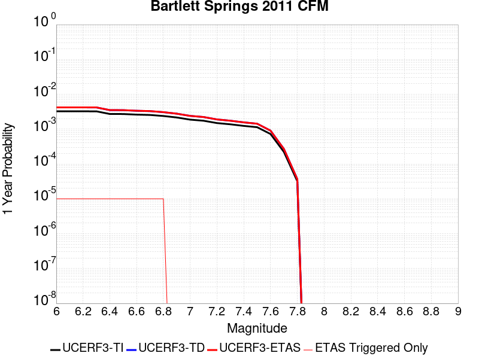 | 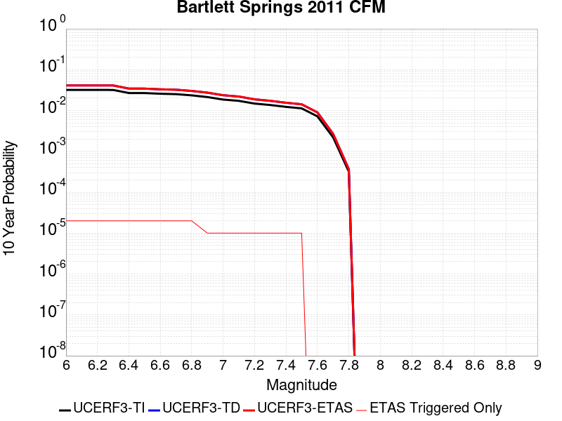 |

| Magnitude | 1 wk TI Prob | 1 wk TD Prob | 1 wk ETAS Prob | 1 wk ETAS/TD Gain | 1 wk ETAS Triggered Only | 1 mo TI Prob | 1 mo TD Prob | 1 mo ETAS Prob | 1 mo ETAS/TD Gain | 1 mo ETAS Triggered Only | 1 yr TI Prob | 1 yr TD Prob | 1 yr ETAS Prob | 1 yr ETAS/TD Gain | 1 yr ETAS Triggered Only | 10 yr TI Prob | 10 yr TD Prob | 10 yr ETAS Prob | 10 yr ETAS/TD Gain | 10 yr ETAS Triggered Only |
|-----|-----|-----|-----|-----|-----|-----|-----|-----|-----|-----|-----|-----|-----|-----|-----|-----|-----|-----|-----|-----|
| 6.0 | 6.2326144E-5 | 8.060613E-5 | 8.060613E-5 | 1.0 | 0.0 | 2.6708472E-4 | 3.454099E-4 | 3.454099E-4 | 1.0 | 0.0 | 0.003246908 | 0.0041973945 | 0.004209905 | 1.0029805 | 1.2562814E-5 | 0.031998757 | 0.04119771 | 0.0412218 | 1.0005847 | 2.5125628E-5 |
| 6.1 | 6.227657E-5 | 8.054363E-5 | 8.054363E-5 | 1.0 | 0.0 | 2.668723E-4 | 3.4514212E-4 | 3.4514212E-4 | 1.0 | 0.0 | 0.0032443295 | 0.004194147 | 0.0042066574 | 1.0029827 | 1.2562814E-5 | 0.031973712 | 0.041166443 | 0.041190535 | 1.0005852 | 2.5125628E-5 |
| 6.2 | 6.22452E-5 | 8.050423E-5 | 8.050423E-5 | 1.0 | 0.0 | 2.6673786E-4 | 3.4497332E-4 | 3.4497332E-4 | 1.0 | 0.0 | 0.0032426978 | 0.0041921 | 0.0042046104 | 1.0029842 | 1.2562814E-5 | 0.03195787 | 0.041146737 | 0.041170828 | 1.0005856 | 2.5125628E-5 |
| 6.3 | 6.219006E-5 | 8.043407E-5 | 8.043407E-5 | 1.0 | 0.0 | 2.6650162E-4 | 3.4467268E-4 | 3.4467268E-4 | 1.0 | 0.0 | 0.00323983 | 0.0041884542 | 0.0042009642 | 1.0029868 | 1.2562814E-5 | 0.031930014 | 0.041111637 | 0.04113573 | 1.000586 | 2.5125628E-5 |
| 6.4 | 5.2175856E-5 | 6.725342E-5 | 6.725342E-5 | 1.0 | 0.0 | 2.2359163E-4 | 2.8819745E-4 | 2.8819745E-4 | 1.0 | 0.0 | 0.0027188298 | 0.0035032115 | 0.0035157304 | 1.0035735 | 1.2562814E-5 | 0.026858058 | 0.034489222 | 0.03451348 | 1.0007033 | 2.5125628E-5 |
| 6.5 | 5.205166E-5 | 6.7096094E-5 | 6.7096094E-5 | 1.0 | 0.0 | 2.2305945E-4 | 2.8752335E-4 | 2.8752335E-4 | 1.0 | 0.0 | 0.0027123666 | 0.0034950306 | 0.0035075496 | 1.0035819 | 1.2562814E-5 | 0.026794989 | 0.034409966 | 0.034434225 | 1.000705 | 2.5125628E-5 |
| 6.6 | 5.0085426E-5 | 6.449277E-5 | 6.449277E-5 | 1.0 | 0.0 | 2.1463417E-4 | 2.763686E-4 | 2.763686E-4 | 1.0 | 0.0 | 0.0026100394 | 0.0033596456 | 0.003372166 | 1.0037267 | 1.2562814E-5 | 0.025795965 | 0.033097573 | 0.033121865 | 1.000734 | 2.5125628E-5 |
| 6.7 | 4.8930866E-5 | 6.3017396E-5 | 6.3017396E-5 | 1.0 | 0.0 | 2.0968684E-4 | 2.7004688E-4 | 2.7004688E-4 | 1.0 | 0.0 | 0.0025499484 | 0.0032829174 | 0.003295439 | 1.0038141 | 1.2562814E-5 | 0.025208864 | 0.03235294 | 0.03237725 | 1.0007515 | 2.5125628E-5 |
| 6.8 | 4.5679535E-5 | 5.8741858E-5 | 5.8741858E-5 | 1.0 | 0.0 | 1.9575475E-4 | 2.5172674E-4 | 2.5172674E-4 | 1.0 | 0.0 | 0.002380709 | 0.0030605064 | 0.0030730308 | 1.0040922 | 1.2562814E-5 | 0.023553653 | 0.03019042 | 0.030214787 | 1.0008072 | 2.5125628E-5 |
| 6.9 | 4.1439176E-5 | 5.3220094E-5 | 5.3220094E-5 | 1.0 | 0.0 | 1.7758438E-4 | 2.2806633E-4 | 2.2806633E-4 | 1.0 | 0.0 | 0.002159946 | 0.0027731995 | 0.0027731995 | 1.0 | 0.0 | 0.021390721 | 0.027390772 | 0.027402991 | 1.0004461 | 1.2562814E-5 |
| 7.0 | 3.5920104E-5 | 4.600871E-5 | 4.600871E-5 | 1.0 | 0.0 | 1.5393422E-4 | 1.9716538E-4 | 1.9716538E-4 | 1.0 | 0.0 | 0.001872538 | 0.0023978627 | 0.0023978627 | 1.0 | 0.0 | 0.018568378 | 0.023723004 | 0.02373527 | 1.000517 | 1.2562814E-5 |
| 7.1 | 3.338812E-5 | 4.2689582E-5 | 4.2689582E-5 | 1.0 | 0.0 | 1.430841E-4 | 1.829426E-4 | 1.829426E-4 | 1.0 | 0.0 | 0.0017406568 | 0.0022250658 | 0.0022250658 | 1.0 | 0.0 | 0.017270854 | 0.02203054 | 0.022042826 | 1.0005577 | 1.2562814E-5 |
| 7.2 | 2.8619615E-5 | 3.6401652E-5 | 3.6401652E-5 | 1.0 | 0.0 | 1.2264973E-4 | 1.5599781E-4 | 1.5599781E-4 | 1.0 | 0.0 | 0.0014922376 | 0.0018976285 | 0.0018976285 | 1.0 | 0.0 | 0.014822568 | 0.01881613 | 0.018828457 | 1.000655 | 1.2562814E-5 |
| 7.3 | 2.6376783E-5 | 3.342276E-5 | 3.342276E-5 | 1.0 | 0.0 | 1.13038455E-4 | 1.4323258E-4 | 1.4323258E-4 | 1.0 | 0.0 | 0.0013753743 | 0.001742471 | 0.001742471 | 1.0 | 0.0 | 0.01366893 | 0.01728972 | 0.017302066 | 1.0007141 | 1.2562814E-5 |
| 7.4 | 2.3738676E-5 | 2.9978975E-5 | 2.9978975E-5 | 1.0 | 0.0 | 1.0173322E-4 | 1.2847505E-4 | 1.2847505E-4 | 1.0 | 0.0 | 0.0012378981 | 0.0015630693 | 0.0015630693 | 1.0 | 0.0 | 0.012310251 | 0.015522073 | 0.015534441 | 1.0007968 | 1.2562814E-5 |
| 7.5 | 2.1789481E-5 | 2.7439388E-5 | 2.7439388E-5 | 1.0 | 0.0 | 9.338015E-5 | 1.1759212E-4 | 1.1759212E-4 | 1.0 | 0.0 | 0.0011363103 | 0.0014307518 | 0.0014307518 | 1.0 | 0.0 | 0.011305175 | 0.014216576 | 0.01422896 | 1.0008711 | 1.2562814E-5 |
| 7.6 | 1.3895281E-5 | 1.7368426E-5 | 1.7368426E-5 | 1.0 | 0.0 | 5.9549846E-5 | 7.4434E-5 | 7.4434E-5 | 1.0 | 0.0 | 7.2477816E-4 | 9.0586004E-4 | 9.0586004E-4 | 1.0 | 0.0 | 0.0072241887 | 0.009022084 | 0.009022084 | 1.0 | 0.0 |
| 7.7 | 4.245981E-6 | 5.1624675E-6 | 5.1624675E-6 | 1.0 | 0.0 | 1.8196934E-5 | 2.2124674E-5 | 2.2124674E-5 | 1.0 | 0.0 | 2.2152514E-4 | 2.693348E-4 | 2.693348E-4 | 1.0 | 0.0 | 0.0022130446 | 0.0026901034 | 0.0026901034 | 1.0 | 0.0 |
| 7.8 | 6.145192E-7 | 7.047006E-7 | 7.047006E-7 | 1.0 | 0.0 | 2.633651E-6 | 3.020142E-6 | 3.020142E-6 | 1.0 | 0.0 | 3.206423E-5 | 3.676962E-5 | 3.676962E-5 | 1.0 | 0.0 | 3.2059604E-4 | 3.6763478E-4 | 3.6763478E-4 | 1.0 | 0.0 |

## Simi-Santa Rosa
*[(top)](#table-of-contents)*

| 1 Week | 1 Month | 1 Year | 10 Year |
|-----|-----|-----|-----|
|  |  |  | 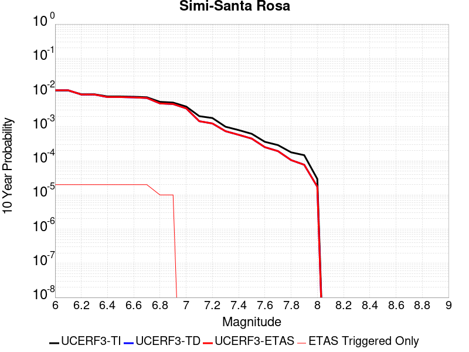 |

| Magnitude | 1 wk TI Prob | 1 wk TD Prob | 1 wk ETAS Prob | 1 wk ETAS/TD Gain | 1 wk ETAS Triggered Only | 1 mo TI Prob | 1 mo TD Prob | 1 mo ETAS Prob | 1 mo ETAS/TD Gain | 1 mo ETAS Triggered Only | 1 yr TI Prob | 1 yr TD Prob | 1 yr ETAS Prob | 1 yr ETAS/TD Gain | 1 yr ETAS Triggered Only | 10 yr TI Prob | 10 yr TD Prob | 10 yr ETAS Prob | 10 yr ETAS/TD Gain | 10 yr ETAS Triggered Only |
|-----|-----|-----|-----|-----|-----|-----|-----|-----|-----|-----|-----|-----|-----|-----|-----|-----|-----|-----|-----|-----|
| 6.0 | 2.198912E-5 | 2.2275442E-5 | 3.4837976E-5 | 1.5639634 | 1.2562814E-5 | 9.4235686E-5 | 9.5462936E-5 | 1.2058616E-4 | 1.2631726 | 2.5125628E-5 | 0.0011467156 | 0.0011616853 | 0.0011867818 | 1.0216035 | 2.5125628E-5 | 0.011408163 | 0.011560575 | 0.011585411 | 1.0021483 | 2.5125628E-5 |
| 6.1 | 2.198912E-5 | 2.2275442E-5 | 3.4837976E-5 | 1.5639634 | 1.2562814E-5 | 9.4235686E-5 | 9.5462936E-5 | 1.2058616E-4 | 1.2631726 | 2.5125628E-5 | 0.0011467156 | 0.0011616853 | 0.0011867818 | 1.0216035 | 2.5125628E-5 | 0.011408163 | 0.011560575 | 0.011585411 | 1.0021483 | 2.5125628E-5 |
| 6.2 | 1.69983E-5 | 1.6668559E-5 | 2.9231163E-5 | 1.7536707 | 1.2562814E-5 | 7.284782E-5 | 7.143489E-5 | 9.6558724E-5 | 1.3517026 | 2.5125628E-5 | 8.865613E-4 | 8.6940196E-4 | 8.945057E-4 | 1.0288748 | 2.5125628E-5 | 0.008830327 | 0.008662928 | 0.008687835 | 1.0028752 | 2.5125628E-5 |
| 6.3 | 1.69983E-5 | 1.6668559E-5 | 2.9231163E-5 | 1.7536707 | 1.2562814E-5 | 7.284782E-5 | 7.143489E-5 | 9.6558724E-5 | 1.3517026 | 2.5125628E-5 | 8.865613E-4 | 8.6940196E-4 | 8.945057E-4 | 1.0288748 | 2.5125628E-5 | 0.008830327 | 0.008662928 | 0.008687835 | 1.0028752 | 2.5125628E-5 |
| 6.4 | 1.4666188E-5 | 1.4052543E-5 | 2.661518E-5 | 1.8939761 | 1.2562814E-5 | 6.285358E-5 | 6.0223934E-5 | 8.5348045E-5 | 1.4171783 | 2.5125628E-5 | 7.6497364E-4 | 7.3300465E-4 | 7.581118E-4 | 1.0342524 | 2.5125628E-5 | 0.0076234564 | 0.007308344 | 0.007333286 | 1.0034128 | 2.5125628E-5 |
| 6.5 | 1.4666188E-5 | 1.4052543E-5 | 2.661518E-5 | 1.8939761 | 1.2562814E-5 | 6.285358E-5 | 6.0223934E-5 | 8.5348045E-5 | 1.4171783 | 2.5125628E-5 | 7.6497364E-4 | 7.3300465E-4 | 7.581118E-4 | 1.0342524 | 2.5125628E-5 | 0.0076234564 | 0.007308344 | 0.007333286 | 1.0034128 | 2.5125628E-5 |
| 6.6 | 1.4377586E-5 | 1.3729583E-5 | 2.6292224E-5 | 1.9150053 | 1.2562814E-5 | 6.1616774E-5 | 5.883988E-5 | 8.3964034E-5 | 1.4269918 | 2.5125628E-5 | 7.4992597E-4 | 7.1616494E-4 | 7.412726E-4 | 1.0350585 | 2.5125628E-5 | 0.007474003 | 0.0071410383 | 0.0071659847 | 1.0034933 | 2.5125628E-5 |
| 6.7 | 1.3881404E-5 | 1.320755E-5 | 2.57702E-5 | 1.9511716 | 1.2562814E-5 | 5.9490372E-5 | 5.66027E-5 | 8.17269E-5 | 1.4438694 | 2.5125628E-5 | 7.240546E-4 | 6.8894465E-4 | 7.14053E-4 | 1.0364447 | 2.5125628E-5 | 0.007217 | 0.006870538 | 0.006895491 | 1.0036318 | 2.5125628E-5 |
| 6.8 | 1.0176516E-5 | 9.154151E-6 | 9.154151E-6 | 1.0 | 0.0 | 4.3612912E-5 | 3.9231574E-5 | 5.1793897E-5 | 1.3202095 | 1.2562814E-5 | 5.308578E-4 | 4.7755634E-4 | 4.9011316E-4 | 1.0262939 | 1.2562814E-5 | 0.0052959146 | 0.004766934 | 0.004779437 | 1.0026228 | 1.2562814E-5 |
| 6.9 | 9.699797E-6 | 8.774719E-6 | 8.774719E-6 | 1.0 | 0.0 | 4.15699E-5 | 3.7605492E-5 | 5.0167833E-5 | 1.334056 | 1.2562814E-5 | 5.05996E-4 | 4.577671E-4 | 4.703242E-4 | 1.0274311 | 1.2562814E-5 | 0.005048454 | 0.0045698597 | 0.004582365 | 1.0027364 | 1.2562814E-5 |
| 7.0 | 7.4049476E-6 | 6.559333E-6 | 6.559333E-6 | 1.0 | 0.0 | 3.1735104E-5 | 2.8111197E-5 | 2.8111197E-5 | 1.0 | 0.0 | 3.8630638E-4 | 3.422127E-4 | 3.422127E-4 | 1.0 | 0.0 | 0.0038563553 | 0.0034180996 | 0.0034180996 | 1.0 | 0.0 |
| 7.1 | 3.873439E-6 | 2.7595095E-6 | 2.7595095E-6 | 1.0 | 0.0 | 1.6600346E-5 | 1.1826417E-5 | 1.1826417E-5 | 1.0 | 0.0 | 2.0209046E-4 | 1.4397735E-4 | 1.4397735E-4 | 1.0 | 0.0 | 0.0020190678 | 0.0014388643 | 0.0014388643 | 1.0 | 0.0 |
| 7.2 | 3.417706E-6 | 2.3676484E-6 | 2.3676484E-6 | 1.0 | 0.0 | 1.4647229E-5 | 1.0147027E-5 | 1.0147027E-5 | 1.0 | 0.0 | 1.7831543E-4 | 1.2353327E-4 | 1.2353327E-4 | 1.0 | 0.0 | 0.0017817242 | 0.0012346683 | 0.0012346683 | 1.0 | 0.0 |
| 7.3 | 1.90225E-6 | 1.4073753E-6 | 1.4073753E-6 | 1.0 | 0.0 | 8.152474E-6 | 6.0315947E-6 | 6.0315947E-6 | 1.0 | 0.0 | 9.9251854E-5 | 7.343221E-5 | 7.343221E-5 | 1.0 | 0.0 | 9.920754E-4 | 7.340817E-4 | 7.340817E-4 | 1.0 | 0.0 |
| 7.4 | 1.5170556E-6 | 1.1024773E-6 | 1.1024773E-6 | 1.0 | 0.0 | 6.5016507E-6 | 4.724894E-6 | 4.724894E-6 | 1.0 | 0.0 | 7.915472E-5 | 5.7524077E-5 | 5.7524077E-5 | 1.0 | 0.0 | 7.9126534E-4 | 5.7509297E-4 | 5.7509297E-4 | 1.0 | 0.0 |
| 7.5 | 1.178732E-6 | 8.535102E-7 | 8.535102E-7 | 1.0 | 0.0 | 5.0516987E-6 | 3.6578958E-6 | 3.6578958E-6 | 1.0 | 0.0 | 6.1502695E-5 | 4.453398E-5 | 4.453398E-5 | 1.0 | 0.0 | 6.148568E-4 | 4.452515E-4 | 4.452515E-4 | 1.0 | 0.0 |
| 7.6 | 6.8722386E-7 | 4.793198E-7 | 4.793198E-7 | 1.0 | 0.0 | 2.9452417E-6 | 2.054226E-6 | 2.054226E-6 | 1.0 | 0.0 | 3.5857727E-5 | 2.5009915E-5 | 2.5009915E-5 | 1.0 | 0.0 | 3.5851944E-4 | 2.5007114E-4 | 2.5007114E-4 | 1.0 | 0.0 |
| 7.7 | 5.5126515E-7 | 3.6731157E-7 | 3.6731157E-7 | 1.0 | 0.0 | 2.3625628E-6 | 1.5741915E-6 | 1.5741915E-6 | 1.0 | 0.0 | 2.8763823E-5 | 1.9165615E-5 | 1.9165615E-5 | 1.0 | 0.0 | 2.87601E-4 | 1.9163972E-4 | 1.9163972E-4 | 1.0 | 0.0 |
| 7.8 | 3.3860243E-7 | 2.0075942E-7 | 2.0075942E-7 | 1.0 | 0.0 | 1.4511525E-6 | 8.6039717E-7 | 8.6039717E-7 | 1.0 | 0.0 | 1.7667637E-5 | 1.0475286E-5 | 1.0475286E-5 | 1.0 | 0.0 | 1.7666233E-4 | 1.04747975E-4 | 1.04747975E-4 | 1.0 | 0.0 |
| 7.9 | 2.7955386E-7 | 1.4649108E-7 | 1.4649108E-7 | 1.0 | 0.0 | 1.1980875E-6 | 6.278188E-7 | 6.278188E-7 | 1.0 | 0.0 | 1.4586617E-5 | 7.643667E-6 | 7.643667E-6 | 1.0 | 0.0 | 1.458566E-4 | 7.643409E-5 | 7.643409E-5 | 1.0 | 0.0 |
| 8.0 | 5.6259015E-8 | 3.3355324E-8 | 3.3355324E-8 | 1.0 | 0.0 | 2.4111003E-7 | 1.4295138E-7 | 1.4295138E-7 | 1.0 | 0.0 | 2.9355108E-6 | 1.7404317E-6 | 1.7404317E-6 | 1.0 | 0.0 | 2.935472E-5 | 1.7404194E-5 | 1.7404194E-5 | 1.0 | 0.0 |

## White Wolf
*[(top)](#table-of-contents)*

| 1 Week | 1 Month | 1 Year | 10 Year |
|-----|-----|-----|-----|
|  |  |  |  |

| Magnitude | 1 wk TI Prob | 1 wk TD Prob | 1 wk ETAS Prob | 1 wk ETAS/TD Gain | 1 wk ETAS Triggered Only | 1 mo TI Prob | 1 mo TD Prob | 1 mo ETAS Prob | 1 mo ETAS/TD Gain | 1 mo ETAS Triggered Only | 1 yr TI Prob | 1 yr TD Prob | 1 yr ETAS Prob | 1 yr ETAS/TD Gain | 1 yr ETAS Triggered Only | 10 yr TI Prob | 10 yr TD Prob | 10 yr ETAS Prob | 10 yr ETAS/TD Gain | 10 yr ETAS Triggered Only |
|-----|-----|-----|-----|-----|-----|-----|-----|-----|-----|-----|-----|-----|-----|-----|-----|-----|-----|-----|-----|-----|
| 6.0 | 2.0037822E-5 | 1.0469162E-6 | 1.0469162E-6 | 1.0 | 0.0 | 8.587355E-5 | 4.486776E-6 | 4.486776E-6 | 1.0 | 0.0 | 0.001045009 | 5.4625183E-5 | 6.7187306E-5 | 1.2299695 | 1.2562814E-5 | 0.010401085 | 5.461226E-4 | 5.712345E-4 | 1.0459821 | 2.5125628E-5 |
| 6.1 | 2.0037822E-5 | 1.0469162E-6 | 1.0469162E-6 | 1.0 | 0.0 | 8.587355E-5 | 4.486776E-6 | 4.486776E-6 | 1.0 | 0.0 | 0.001045009 | 5.4625183E-5 | 6.7187306E-5 | 1.2299695 | 1.2562814E-5 | 0.010401085 | 5.461226E-4 | 5.712345E-4 | 1.0459821 | 2.5125628E-5 |
| 6.2 | 2.0037822E-5 | 1.0469162E-6 | 1.0469162E-6 | 1.0 | 0.0 | 8.587355E-5 | 4.486776E-6 | 4.486776E-6 | 1.0 | 0.0 | 0.001045009 | 5.4625183E-5 | 6.7187306E-5 | 1.2299695 | 1.2562814E-5 | 0.010401085 | 5.461226E-4 | 5.712345E-4 | 1.0459821 | 2.5125628E-5 |
| 6.3 | 2.0037822E-5 | 1.0469162E-6 | 1.0469162E-6 | 1.0 | 0.0 | 8.587355E-5 | 4.486776E-6 | 4.486776E-6 | 1.0 | 0.0 | 0.001045009 | 5.4625183E-5 | 6.7187306E-5 | 1.2299695 | 1.2562814E-5 | 0.010401085 | 5.461226E-4 | 5.712345E-4 | 1.0459821 | 2.5125628E-5 |
| 6.4 | 1.132487E-5 | 1.0469162E-6 | 1.0469162E-6 | 1.0 | 0.0 | 4.8534253E-5 | 4.486776E-6 | 4.486776E-6 | 1.0 | 0.0 | 5.907443E-4 | 5.4625183E-5 | 6.7187306E-5 | 1.2299695 | 1.2562814E-5 | 0.005891764 | 5.461226E-4 | 5.712345E-4 | 1.0459821 | 2.5125628E-5 |
| 6.5 | 1.132487E-5 | 1.0469162E-6 | 1.0469162E-6 | 1.0 | 0.0 | 4.8534253E-5 | 4.486776E-6 | 4.486776E-6 | 1.0 | 0.0 | 5.907443E-4 | 5.4625183E-5 | 6.7187306E-5 | 1.2299695 | 1.2562814E-5 | 0.005891764 | 5.461226E-4 | 5.712345E-4 | 1.0459821 | 2.5125628E-5 |
| 6.6 | 9.347473E-6 | 1.0469162E-6 | 1.0469162E-6 | 1.0 | 0.0 | 4.0059982E-5 | 4.486776E-6 | 4.486776E-6 | 1.0 | 0.0 | 4.8762115E-4 | 5.4625183E-5 | 6.7187306E-5 | 1.2299695 | 1.2562814E-5 | 0.0048655253 | 5.461226E-4 | 5.712345E-4 | 1.0459821 | 2.5125628E-5 |
| 6.7 | 7.842647E-6 | 1.0048342E-6 | 1.0048342E-6 | 1.0 | 0.0 | 3.361091E-5 | 4.3064256E-6 | 4.3064256E-6 | 1.0 | 0.0 | 4.0913603E-4 | 5.2429517E-5 | 6.499168E-5 | 1.2396008 | 1.2562814E-5 | 0.004083836 | 5.2417646E-4 | 5.492889E-4 | 1.0479084 | 2.5125628E-5 |
| 6.8 | 6.26597E-6 | 9.734822E-7 | 9.734822E-7 | 1.0 | 0.0 | 2.685388E-5 | 4.17206E-6 | 4.17206E-6 | 1.0 | 0.0 | 3.2689696E-4 | 5.0793697E-5 | 6.3355874E-5 | 1.2473176 | 1.2562814E-5 | 0.003264165 | 5.078258E-4 | 5.3293863E-4 | 1.0494517 | 2.5125628E-5 |
| 6.9 | 5.258436E-6 | 9.183254E-7 | 9.183254E-7 | 1.0 | 0.0 | 2.2535958E-5 | 3.9356746E-6 | 3.9356746E-6 | 1.0 | 0.0 | 2.7434074E-4 | 4.7915833E-5 | 6.0478043E-5 | 1.2621725 | 1.2562814E-5 | 0.0027400232 | 4.790598E-4 | 5.041734E-4 | 1.0524226 | 2.5125628E-5 |
| 7.0 | 4.675028E-6 | 8.6611794E-7 | 8.6611794E-7 | 1.0 | 0.0 | 2.003568E-5 | 3.7119291E-6 | 3.7119291E-6 | 1.0 | 0.0 | 2.4390711E-4 | 4.5191846E-5 | 5.7754092E-5 | 1.2779759 | 1.2562814E-5 | 0.0024363957 | 4.518313E-4 | 4.7694557E-4 | 1.0555834 | 2.5125628E-5 |
| 7.1 | 2.8270078E-6 | 6.8741696E-7 | 6.8741696E-7 | 1.0 | 0.0 | 1.2115692E-5 | 2.9460696E-6 | 2.9460696E-6 | 1.0 | 0.0 | 1.4749856E-4 | 3.5867848E-5 | 4.843021E-5 | 1.3502402 | 1.2562814E-5 | 0.001474007 | 3.586247E-4 | 3.837413E-4 | 1.0700359 | 2.5125628E-5 |
| 7.2 | 1.6881406E-6 | 2.2706382E-7 | 2.2706382E-7 | 1.0 | 0.0 | 7.2348685E-6 | 9.731303E-7 | 9.731303E-7 | 1.0 | 0.0 | 8.808096E-5 | 1.1847799E-5 | 1.1847799E-5 | 1.0 | 0.0 | 8.8046055E-4 | 1.1847183E-4 | 1.1847183E-4 | 1.0 | 0.0 |
| 7.3 | 9.086107E-7 | 1.5266386E-7 | 1.5266386E-7 | 1.0 | 0.0 | 3.8940398E-6 | 6.5427355E-7 | 6.5427355E-7 | 1.0 | 0.0 | 4.7408903E-5 | 7.965752E-6 | 7.965752E-6 | 1.0 | 0.0 | 4.739879E-4 | 7.965475E-5 | 7.965475E-5 | 1.0 | 0.0 |
| 7.4 | 1.9717383E-7 | 9.003913E-8 | 9.003913E-8 | 1.0 | 0.0 | 8.450304E-7 | 3.8588192E-7 | 3.8588192E-7 | 1.0 | 0.0 | 1.0288197E-5 | 4.6981027E-6 | 4.6981027E-6 | 1.0 | 0.0 | 1.028772E-4 | 4.6980065E-5 | 4.6980065E-5 | 1.0 | 0.0 |
| 7.5 | 1.086975E-7 | 6.6597195E-8 | 6.6597195E-8 | 1.0 | 0.0 | 4.6584634E-7 | 2.8541652E-7 | 2.8541652E-7 | 1.0 | 0.0 | 5.6716644E-6 | 3.474941E-6 | 3.474941E-6 | 1.0 | 0.0 | 5.6715195E-5 | 3.474889E-5 | 3.474889E-5 | 1.0 | 0.0 |
| 7.6 | 2.4217808E-8 | 1.5820765E-8 | 1.5820765E-8 | 1.0 | 0.0 | 1.03790605E-7 | 6.780328E-8 | 6.780328E-8 | 1.0 | 0.0 | 1.2636499E-6 | 8.255046E-7 | 8.255046E-7 | 1.0 | 0.0 | 1.2636427E-5 | 8.2550205E-6 | 8.2550205E-6 | 1.0 | 0.0 |

## Great Valley 10 (Panoche)
*[(top)](#table-of-contents)*

| 1 Week | 1 Month | 1 Year | 10 Year |
|-----|-----|-----|-----|
|  |  |  |  |

| Magnitude | 1 wk TI Prob | 1 wk TD Prob | 1 wk ETAS Prob | 1 wk ETAS/TD Gain | 1 wk ETAS Triggered Only | 1 mo TI Prob | 1 mo TD Prob | 1 mo ETAS Prob | 1 mo ETAS/TD Gain | 1 mo ETAS Triggered Only | 1 yr TI Prob | 1 yr TD Prob | 1 yr ETAS Prob | 1 yr ETAS/TD Gain | 1 yr ETAS Triggered Only | 10 yr TI Prob | 10 yr TD Prob | 10 yr ETAS Prob | 10 yr ETAS/TD Gain | 10 yr ETAS Triggered Only |
|-----|-----|-----|-----|-----|-----|-----|-----|-----|-----|-----|-----|-----|-----|-----|-----|-----|-----|-----|-----|-----|
| 6.0 | 1.6014626E-5 | 1.6575399E-5 | 1.6575399E-5 | 1.0 | 0.0 | 6.863231E-5 | 7.103552E-5 | 7.103552E-5 | 1.0 | 0.0 | 8.35278E-4 | 8.645185E-4 | 8.770704E-4 | 1.014519 | 1.2562814E-5 | 0.008321454 | 0.008612172 | 0.008637081 | 1.0028924 | 2.5125628E-5 |
| 6.1 | 1.6014626E-5 | 1.6575399E-5 | 1.6575399E-5 | 1.0 | 0.0 | 6.863231E-5 | 7.103552E-5 | 7.103552E-5 | 1.0 | 0.0 | 8.35278E-4 | 8.645185E-4 | 8.770704E-4 | 1.014519 | 1.2562814E-5 | 0.008321454 | 0.008612172 | 0.008637081 | 1.0028924 | 2.5125628E-5 |
| 6.2 | 1.56782E-5 | 1.6198446E-5 | 1.6198446E-5 | 1.0 | 0.0 | 6.719056E-5 | 6.94201E-5 | 6.94201E-5 | 1.0 | 0.0 | 8.17738E-4 | 8.4486604E-4 | 8.574182E-4 | 1.014857 | 1.2562814E-5 | 0.008147354 | 0.008417147 | 0.008442061 | 1.00296 | 2.5125628E-5 |
| 6.3 | 1.5263338E-5 | 1.5723514E-5 | 1.5723514E-5 | 1.0 | 0.0 | 6.541267E-5 | 6.738478E-5 | 6.738478E-5 | 1.0 | 0.0 | 7.961082E-4 | 8.201049E-4 | 8.3265745E-4 | 1.015306 | 1.2562814E-5 | 0.007932622 | 0.008171377 | 0.008196297 | 1.0030497 | 2.5125628E-5 |
| 6.4 | 1.4720723E-5 | 1.5099376E-5 | 1.5099376E-5 | 1.0 | 0.0 | 6.308728E-5 | 6.471004E-5 | 6.471004E-5 | 1.0 | 0.0 | 7.67817E-4 | 7.8756385E-4 | 8.0011674E-4 | 1.0159389 | 1.2562814E-5 | 0.007651695 | 0.007848303 | 0.007873232 | 1.0031763 | 2.5125628E-5 |
| 6.5 | 1.408264E-5 | 1.4355969E-5 | 1.4355969E-5 | 1.0 | 0.0 | 6.0352773E-5 | 6.1524166E-5 | 6.1524166E-5 | 1.0 | 0.0 | 7.3454727E-4 | 7.488031E-4 | 7.613565E-4 | 1.0167646 | 1.2562814E-5 | 0.0073212404 | 0.0074633555 | 0.007488294 | 1.0033414 | 2.5125628E-5 |
| 6.6 | 1.3197086E-5 | 1.3321889E-5 | 1.3321889E-5 | 1.0 | 0.0 | 5.6557717E-5 | 5.709259E-5 | 5.709259E-5 | 1.0 | 0.0 | 6.8837265E-4 | 6.9488434E-4 | 6.9488434E-4 | 1.0 | 0.0 | 0.006862442 | 0.0069276537 | 0.006940129 | 1.0018009 | 1.2562814E-5 |
| 6.7 | 1.017583E-5 | 9.745382E-6 | 9.745382E-6 | 1.0 | 0.0 | 4.360997E-5 | 4.176527E-5 | 4.176527E-5 | 1.0 | 0.0 | 5.30822E-4 | 5.0837593E-4 | 5.0837593E-4 | 1.0 | 0.0 | 0.0052955584 | 0.005072382 | 0.005072382 | 1.0 | 0.0 |
| 6.8 | 8.557912E-6 | 7.872707E-6 | 7.872707E-6 | 1.0 | 0.0 | 3.667625E-5 | 3.373975E-5 | 3.373975E-5 | 1.0 | 0.0 | 4.4644187E-4 | 4.1070607E-4 | 4.1070607E-4 | 1.0 | 0.0 | 0.0044554602 | 0.004099677 | 0.004099677 | 1.0 | 0.0 |
| 6.9 | 6.14664E-6 | 5.092071E-6 | 5.092071E-6 | 1.0 | 0.0 | 2.6342475E-5 | 2.1822989E-5 | 2.1822989E-5 | 1.0 | 0.0 | 3.2067244E-4 | 2.6566387E-4 | 2.6566387E-4 | 1.0 | 0.0 | 0.003202101 | 0.002653601 | 0.002653601 | 1.0 | 0.0 |
| 7.0 | 3.2310581E-6 | 1.6951219E-6 | 1.6951219E-6 | 1.0 | 0.0 | 1.3847319E-5 | 7.264788E-6 | 7.264788E-6 | 1.0 | 0.0 | 1.6857806E-4 | 8.8445304E-5 | 8.8445304E-5 | 1.0 | 0.0 | 0.0016845023 | 8.841104E-4 | 8.841104E-4 | 1.0 | 0.0 |
| 7.1 | 2.544492E-6 | 9.1889206E-7 | 9.1889206E-7 | 1.0 | 0.0 | 1.090492E-5 | 3.938103E-6 | 3.938103E-6 | 1.0 | 0.0 | 1.327593E-4 | 4.79454E-5 | 4.79454E-5 | 1.0 | 0.0 | 0.0013268003 | 4.793553E-4 | 4.793553E-4 | 1.0 | 0.0 |
| 7.2 | 2.4479045E-6 | 8.841304E-7 | 8.841304E-7 | 1.0 | 0.0 | 1.0490977E-5 | 3.789125E-6 | 3.789125E-6 | 1.0 | 0.0 | 1.2772017E-4 | 4.6131667E-5 | 4.6131667E-5 | 1.0 | 0.0 | 0.0012764678 | 4.6122566E-4 | 4.6122566E-4 | 1.0 | 0.0 |
| 7.3 | 2.0559578E-6 | 7.892787E-7 | 7.892787E-7 | 1.0 | 0.0 | 8.811218E-6 | 3.3826188E-6 | 3.3826188E-6 | 1.0 | 0.0 | 1.072713E-4 | 4.1182655E-5 | 4.1182655E-5 | 1.0 | 0.0 | 0.0010721954 | 4.1175485E-4 | 4.1175485E-4 | 1.0 | 0.0 |
| 7.4 | 1.727687E-6 | 7.387757E-7 | 7.387757E-7 | 1.0 | 0.0 | 7.404352E-6 | 3.1661782E-6 | 3.1661782E-6 | 1.0 | 0.0 | 9.0144255E-5 | 3.8547583E-5 | 3.8547583E-5 | 1.0 | 0.0 | 9.0107694E-4 | 3.854136E-4 | 3.854136E-4 | 1.0 | 0.0 |
| 7.5 | 1.5002679E-6 | 6.546144E-7 | 6.546144E-7 | 1.0 | 0.0 | 6.4297037E-6 | 2.8054874E-6 | 2.8054874E-6 | 1.0 | 0.0 | 7.827883E-5 | 3.4156317E-5 | 3.4156317E-5 | 1.0 | 0.0 | 7.825126E-4 | 3.4151482E-4 | 3.4151482E-4 | 1.0 | 0.0 |

## San Jose
*[(top)](#table-of-contents)*

| 1 Week | 1 Month | 1 Year | 10 Year |
|-----|-----|-----|-----|
|  |  |  |  |

| Magnitude | 1 wk TI Prob | 1 wk TD Prob | 1 wk ETAS Prob | 1 wk ETAS/TD Gain | 1 wk ETAS Triggered Only | 1 mo TI Prob | 1 mo TD Prob | 1 mo ETAS Prob | 1 mo ETAS/TD Gain | 1 mo ETAS Triggered Only | 1 yr TI Prob | 1 yr TD Prob | 1 yr ETAS Prob | 1 yr ETAS/TD Gain | 1 yr ETAS Triggered Only | 10 yr TI Prob | 10 yr TD Prob | 10 yr ETAS Prob | 10 yr ETAS/TD Gain | 10 yr ETAS Triggered Only |
|-----|-----|-----|-----|-----|-----|-----|-----|-----|-----|-----|-----|-----|-----|-----|-----|-----|-----|-----|-----|-----|
| 6.0 | 5.0851277E-6 | 4.1256726E-6 | 4.1256726E-6 | 1.0 | 0.0 | 2.1793223E-5 | 1.768135E-5 | 1.768135E-5 | 1.0 | 0.0 | 2.653002E-4 | 2.152518E-4 | 2.278119E-4 | 1.0583508 | 1.2562814E-5 | 0.0026498367 | 0.0021507242 | 0.0021757956 | 1.0116572 | 2.5125628E-5 |
| 6.1 | 5.0851277E-6 | 4.1256726E-6 | 4.1256726E-6 | 1.0 | 0.0 | 2.1793223E-5 | 1.768135E-5 | 1.768135E-5 | 1.0 | 0.0 | 2.653002E-4 | 2.152518E-4 | 2.278119E-4 | 1.0583508 | 1.2562814E-5 | 0.0026498367 | 0.0021507242 | 0.0021757956 | 1.0116572 | 2.5125628E-5 |
| 6.2 | 5.0851277E-6 | 4.1256726E-6 | 4.1256726E-6 | 1.0 | 0.0 | 2.1793223E-5 | 1.768135E-5 | 1.768135E-5 | 1.0 | 0.0 | 2.653002E-4 | 2.152518E-4 | 2.278119E-4 | 1.0583508 | 1.2562814E-5 | 0.0026498367 | 0.0021507242 | 0.0021757956 | 1.0116572 | 2.5125628E-5 |
| 6.3 | 5.0851277E-6 | 4.1256726E-6 | 4.1256726E-6 | 1.0 | 0.0 | 2.1793223E-5 | 1.768135E-5 | 1.768135E-5 | 1.0 | 0.0 | 2.653002E-4 | 2.152518E-4 | 2.278119E-4 | 1.0583508 | 1.2562814E-5 | 0.0026498367 | 0.0021507242 | 0.0021757956 | 1.0116572 | 2.5125628E-5 |
| 6.4 | 4.3115124E-6 | 3.3237832E-6 | 3.3237832E-6 | 1.0 | 0.0 | 1.8477778E-5 | 1.424472E-5 | 1.424472E-5 | 1.0 | 0.0 | 2.2494372E-4 | 1.7341787E-4 | 1.8597851E-4 | 1.0724299 | 1.2562814E-5 | 0.0022471617 | 0.0017330751 | 0.0017581573 | 1.0144726 | 2.5125628E-5 |
| 6.5 | 4.3115124E-6 | 3.3237832E-6 | 3.3237832E-6 | 1.0 | 0.0 | 1.8477778E-5 | 1.424472E-5 | 1.424472E-5 | 1.0 | 0.0 | 2.2494372E-4 | 1.7341787E-4 | 1.8597851E-4 | 1.0724299 | 1.2562814E-5 | 0.0022471617 | 0.0017330751 | 0.0017581573 | 1.0144726 | 2.5125628E-5 |
| 6.6 | 3.110396E-6 | 2.0799866E-6 | 2.0799866E-6 | 1.0 | 0.0 | 1.33302E-5 | 8.9141995E-6 | 8.9141995E-6 | 1.0 | 0.0 | 1.622831E-4 | 1.0852526E-4 | 1.0852526E-4 | 1.0 | 0.0 | 0.0016216465 | 0.0010847825 | 0.0010973318 | 1.0115684 | 1.2562814E-5 |
| 6.7 | 3.110396E-6 | 2.0799866E-6 | 2.0799866E-6 | 1.0 | 0.0 | 1.33302E-5 | 8.9141995E-6 | 8.9141995E-6 | 1.0 | 0.0 | 1.622831E-4 | 1.0852526E-4 | 1.0852526E-4 | 1.0 | 0.0 | 0.0016216465 | 0.0010847825 | 0.0010973318 | 1.0115684 | 1.2562814E-5 |
| 6.8 | 2.856651E-6 | 1.902435E-6 | 1.902435E-6 | 1.0 | 0.0 | 1.2242733E-5 | 8.153269E-6 | 8.153269E-6 | 1.0 | 0.0 | 1.4904508E-4 | 9.926178E-5 | 9.926178E-5 | 1.0 | 0.0 | 0.0014894515 | 9.922314E-4 | 0.0010047817 | 1.0126486 | 1.2562814E-5 |
| 6.9 | 2.1618725E-6 | 1.4186642E-6 | 1.4186642E-6 | 1.0 | 0.0 | 9.265135E-6 | 6.0799757E-6 | 6.0799757E-6 | 1.0 | 0.0 | 1.12797185E-4 | 7.402128E-5 | 7.402128E-5 | 1.0 | 0.0 | 0.0011273995 | 7.4000744E-4 | 7.525609E-4 | 1.0169641 | 1.2562814E-5 |
| 7.0 | 1.9684312E-6 | 1.3256331E-6 | 1.3256331E-6 | 1.0 | 0.0 | 8.436106E-6 | 5.681273E-6 | 5.681273E-6 | 1.0 | 0.0 | 1.02704755E-4 | 6.9167385E-5 | 6.9167385E-5 | 1.0 | 0.0 | 0.001026573 | 6.914992E-4 | 7.040533E-4 | 1.018155 | 1.2562814E-5 |
| 7.1 | 1.6070337E-6 | 1.1155087E-6 | 1.1155087E-6 | 1.0 | 0.0 | 6.887269E-6 | 4.780743E-6 | 4.780743E-6 | 1.0 | 0.0 | 8.384928E-5 | 5.8204052E-5 | 5.8204052E-5 | 1.0 | 0.0 | 8.3817646E-4 | 5.819267E-4 | 5.9448223E-4 | 1.0215757 | 1.2562814E-5 |
| 7.2 | 1.0631658E-6 | 6.4037624E-7 | 6.4037624E-7 | 1.0 | 0.0 | 4.556417E-6 | 2.7444669E-6 | 2.7444669E-6 | 1.0 | 0.0 | 5.5472963E-5 | 3.3413387E-5 | 3.3413387E-5 | 1.0 | 0.0 | 5.545912E-4 | 3.3411747E-4 | 3.3411747E-4 | 1.0 | 0.0 |
| 7.3 | 7.060711E-7 | 4.5824706E-7 | 4.5824706E-7 | 1.0 | 0.0 | 3.0260155E-6 | 1.9639147E-6 | 1.9639147E-6 | 1.0 | 0.0 | 3.6841117E-5 | 2.3910407E-5 | 2.3910407E-5 | 1.0 | 0.0 | 3.6835007E-4 | 2.3911172E-4 | 2.3911172E-4 | 1.0 | 0.0 |
| 7.4 | 3.3677085E-7 | 2.3233133E-7 | 2.3233133E-7 | 1.0 | 0.0 | 1.4433028E-6 | 9.957054E-7 | 9.957054E-7 | 1.0 | 0.0 | 1.757207E-5 | 1.21226485E-5 | 1.21226485E-5 | 1.0 | 0.0 | 1.7570681E-4 | 1.2125263E-4 | 1.2125263E-4 | 1.0 | 0.0 |
| 7.5 | 3.129161E-7 | 1.9530925E-7 | 1.9530925E-7 | 1.0 | 0.0 | 1.3410682E-6 | 8.370394E-7 | 8.370394E-7 | 1.0 | 0.0 | 1.6327383E-5 | 1.0190909E-5 | 1.0190909E-5 | 1.0 | 0.0 | 1.6326184E-4 | 1.0193714E-4 | 1.0193714E-4 | 1.0 | 0.0 |
| 7.6 | 2.8008668E-7 | 1.4242323E-7 | 1.4242323E-7 | 1.0 | 0.0 | 1.2003709E-6 | 6.1038514E-7 | 6.1038514E-7 | 1.0 | 0.0 | 1.46144175E-5 | 7.4314153E-6 | 7.4314153E-6 | 1.0 | 0.0 | 1.4613457E-4 | 7.434427E-5 | 7.434427E-5 | 1.0 | 0.0 |
| 7.7 | 2.7852005E-7 | 1.4016913E-7 | 1.4016913E-7 | 1.0 | 0.0 | 1.1936568E-6 | 6.007248E-7 | 6.007248E-7 | 1.0 | 0.0 | 1.4532674E-5 | 7.3138012E-6 | 7.3138012E-6 | 1.0 | 0.0 | 1.4531724E-4 | 7.316821E-5 | 7.316821E-5 | 1.0 | 0.0 |
| 7.8 | 1.1810797E-7 | 7.5190094E-8 | 7.5190094E-8 | 1.0 | 0.0 | 5.0617695E-7 | 3.222432E-7 | 3.222432E-7 | 1.0 | 0.0 | 6.1626865E-6 | 3.9233046E-6 | 3.9233046E-6 | 1.0 | 0.0 | 6.162516E-5 | 3.9250725E-5 | 3.9250725E-5 | 1.0 | 0.0 |

## Calaveras (Central) 2011 CFM
*[(top)](#table-of-contents)*

| 1 Week | 1 Month | 1 Year | 10 Year |
|-----|-----|-----|-----|
|  |  |  |  |

| Magnitude | 1 wk TI Prob | 1 wk TD Prob | 1 wk ETAS Prob | 1 wk ETAS/TD Gain | 1 wk ETAS Triggered Only | 1 mo TI Prob | 1 mo TD Prob | 1 mo ETAS Prob | 1 mo ETAS/TD Gain | 1 mo ETAS Triggered Only | 1 yr TI Prob | 1 yr TD Prob | 1 yr ETAS Prob | 1 yr ETAS/TD Gain | 1 yr ETAS Triggered Only | 10 yr TI Prob | 10 yr TD Prob | 10 yr ETAS Prob | 10 yr ETAS/TD Gain | 10 yr ETAS Triggered Only |
|-----|-----|-----|-----|-----|-----|-----|-----|-----|-----|-----|-----|-----|-----|-----|-----|-----|-----|-----|-----|-----|
| 6.0 | 1.5010907E-4 | 2.481574E-4 | 2.6071706E-4 | 1.0506119 | 1.2562814E-5 | 6.4316596E-4 | 0.0010621005 | 0.00107465 | 1.0118157 | 1.2562814E-5 | 0.0078024664 | 0.012850073 | 0.012874876 | 1.0019301 | 2.5125628E-5 | 0.07534136 | 0.120401435 | 0.12042353 | 1.0001836 | 2.5125628E-5 |
| 6.1 | 1.4521465E-4 | 2.397987E-4 | 2.523585E-4 | 1.0523764 | 1.2562814E-5 | 6.222001E-4 | 0.0010263061 | 0.001038856 | 1.0122283 | 1.2562814E-5 | 0.0075490056 | 0.012419341 | 0.012444155 | 1.001998 | 2.5125628E-5 | 0.07297657 | 0.11667323 | 0.11669542 | 1.0001903 | 2.5125628E-5 |
| 6.2 | 1.429998E-4 | 2.3911126E-4 | 2.5167107E-4 | 1.0525271 | 1.2562814E-5 | 6.127123E-4 | 0.0010233623 | 0.0010359122 | 1.0122634 | 1.2562814E-5 | 0.007434286 | 0.01238394 | 0.012408755 | 1.0020038 | 2.5125628E-5 | 0.07190444 | 0.1163272 | 0.1163494 | 1.0001909 | 2.5125628E-5 |
| 6.3 | 1.3536277E-4 | 2.3242626E-4 | 2.4498615E-4 | 1.0540382 | 1.2562814E-5 | 5.799972E-4 | 9.947343E-4 | 0.0010072846 | 1.0126168 | 1.2562814E-5 | 0.0070386264 | 0.012040132 | 0.012064955 | 1.0020617 | 2.5125628E-5 | 0.0681982 | 0.11323977 | 0.11326206 | 1.0001967 | 2.5125628E-5 |
| 6.4 | 1.2993296E-4 | 2.2666177E-4 | 2.3922173E-4 | 1.0554128 | 1.2562814E-5 | 5.5673666E-4 | 9.700479E-4 | 9.825985E-4 | 1.0129381 | 1.2562814E-5 | 0.006757223 | 0.011742937 | 0.011767768 | 1.0021145 | 2.5125628E-5 | 0.06555412 | 0.11051771 | 0.11054006 | 1.0002022 | 2.5125628E-5 |
| 6.5 | 1.0498927E-4 | 1.7981697E-4 | 1.9237753E-4 | 1.0698519 | 1.2562814E-5 | 4.498764E-4 | 7.704157E-4 | 7.829688E-4 | 1.016294 | 1.2562814E-5 | 0.005463498 | 0.00933924 | 0.009364132 | 1.0026652 | 2.5125628E-5 | 0.053311124 | 0.089199215 | 0.089222096 | 1.0002565 | 2.5125628E-5 |
| 6.6 | 1.0157505E-4 | 1.7469203E-4 | 1.8725265E-4 | 1.0719016 | 1.2562814E-5 | 4.35249E-4 | 7.484645E-4 | 7.610179E-4 | 1.0167723 | 1.2562814E-5 | 0.0052862884 | 0.009074297 | 0.009099194 | 1.0027437 | 2.5125628E-5 | 0.05162293 | 0.08677671 | 0.08679966 | 1.0002644 | 2.5125628E-5 |
| 6.7 | 9.660386E-5 | 1.6728524E-4 | 1.7984596E-4 | 1.0750856 | 1.2562814E-5 | 4.1395082E-4 | 7.1673887E-4 | 7.292927E-4 | 1.0175152 | 1.2562814E-5 | 0.0050282106 | 0.008691208 | 0.008716116 | 1.0028658 | 2.5125628E-5 | 0.049159497 | 0.083266065 | 0.083289094 | 1.0002767 | 2.5125628E-5 |
| 6.8 | 9.089927E-5 | 1.5643016E-4 | 1.6899101E-4 | 1.0802969 | 1.2562814E-5 | 3.8951015E-4 | 6.702439E-4 | 6.8279833E-4 | 1.0187311 | 1.2562814E-5 | 0.0047319788 | 0.008129478 | 0.0081544 | 1.0030656 | 2.5125628E-5 | 0.046324775 | 0.078159414 | 0.07818258 | 1.0002964 | 2.5125628E-5 |
| 6.9 | 7.353187E-5 | 1.2295354E-4 | 1.3551481E-4 | 1.1021627 | 1.2562814E-5 | 3.150985E-4 | 5.2683795E-4 | 5.393941E-4 | 1.0238332 | 1.2562814E-5 | 0.0038295772 | 0.006395508 | 0.006420473 | 1.0039035 | 2.5125628E-5 | 0.037642512 | 0.062187865 | 0.062211428 | 1.0003788 | 2.5125628E-5 |
| 7.0 | 5.746064E-5 | 9.3887444E-5 | 1.0644908E-4 | 1.1337947 | 1.2562814E-5 | 2.4623662E-4 | 4.0231308E-4 | 4.1487085E-4 | 1.0312139 | 1.2562814E-5 | 0.0029938098 | 0.004887232 | 0.004912235 | 1.005116 | 2.5125628E-5 | 0.02953797 | 0.04798685 | 0.04801077 | 1.0004984 | 2.5125628E-5 |
| 7.1 | 4.9557195E-5 | 8.052461E-5 | 9.308641E-5 | 1.1559995 | 1.2562814E-5 | 2.123707E-4 | 3.4506017E-4 | 3.5761864E-4 | 1.0363951 | 1.2562814E-5 | 0.0025825473 | 0.0041930773 | 0.004218098 | 1.005967 | 2.5125628E-5 | 0.0255274 | 0.041373078 | 0.041397166 | 1.0005822 | 2.5125628E-5 |
| 7.2 | 3.687595E-5 | 5.9524526E-5 | 5.9524526E-5 | 1.0 | 0.0 | 1.5803022E-4 | 2.5508032E-4 | 2.5508032E-4 | 1.0 | 0.0 | 0.0019223199 | 0.0031012094 | 0.0031137331 | 1.0040383 | 1.2562814E-5 | 0.01905776 | 0.030883716 | 0.03089589 | 1.0003942 | 1.2562814E-5 |
| 7.3 | 2.5846984E-5 | 4.247213E-5 | 4.247213E-5 | 1.0 | 0.0 | 1.1076809E-4 | 1.8201082E-4 | 1.8201082E-4 | 1.0 | 0.0 | 0.0013477671 | 0.002213747 | 0.002226282 | 1.0056623 | 1.2562814E-5 | 0.013396223 | 0.02217554 | 0.022187823 | 1.000554 | 1.2562814E-5 |
| 7.4 | 1.7747854E-5 | 2.9936204E-5 | 2.9936204E-5 | 1.0 | 0.0 | 7.6060016E-5 | 1.2829172E-4 | 1.2829172E-4 | 1.0 | 0.0 | 9.2563726E-4 | 0.0015608355 | 0.0015608355 | 1.0 | 0.0 | 0.009217911 | 0.015709236 | 0.015709236 | 1.0 | 0.0 |
| 7.5 | 1.4883479E-5 | 2.6243379E-5 | 2.6243379E-5 | 1.0 | 0.0 | 6.378478E-5 | 1.1246678E-4 | 1.1246678E-4 | 1.0 | 0.0 | 7.76303E-4 | 0.0013684258 | 0.0013684258 | 1.0 | 0.0 | 0.0077359667 | 0.013802425 | 0.013802425 | 1.0 | 0.0 |
| 7.6 | 8.166975E-6 | 1.4963478E-5 | 1.4963478E-5 | 1.0 | 0.0 | 3.5000852E-5 | 6.412763E-5 | 6.412763E-5 | 1.0 | 0.0 | 4.2605202E-4 | 7.804755E-4 | 7.804755E-4 | 1.0 | 0.0 | 0.004252361 | 0.00793984 | 0.00793984 | 1.0 | 0.0 |
| 7.7 | 3.3858064E-6 | 6.253914E-6 | 6.253914E-6 | 1.0 | 0.0 | 1.4510518E-5 | 2.6802214E-5 | 2.6802214E-5 | 1.0 | 0.0 | 1.7665124E-4 | 3.2626814E-4 | 3.2626814E-4 | 1.0 | 0.0 | 0.0017651088 | 0.0033882293 | 0.0033882293 | 1.0 | 0.0 |
| 7.8 | 2.7721615E-6 | 5.3663807E-6 | 5.3663807E-6 | 1.0 | 0.0 | 1.1880637E-5 | 2.2998573E-5 | 2.2998573E-5 | 1.0 | 0.0 | 1.4463716E-4 | 2.799717E-4 | 2.799717E-4 | 1.0 | 0.0 | 0.0014454306 | 0.0029074624 | 0.0029074624 | 1.0 | 0.0 |
| 7.9 | 1.9736292E-6 | 4.1284193E-6 | 4.1284193E-6 | 1.0 | 0.0 | 8.4583835E-6 | 1.7693106E-5 | 1.7693106E-5 | 1.0 | 0.0 | 1.0297595E-4 | 2.1539231E-4 | 2.1539231E-4 | 1.0 | 0.0 | 0.0010292825 | 0.0022236116 | 0.0022236116 | 1.0 | 0.0 |
| 8.0 | 1.1767289E-6 | 2.5544743E-6 | 2.5544743E-6 | 1.0 | 0.0 | 5.0431145E-6 | 1.0947701E-5 | 1.0947701E-5 | 1.0 | 0.0 | 6.139818E-5 | 1.3328013E-4 | 1.3328013E-4 | 1.0 | 0.0 | 6.1381224E-4 | 0.0013660848 | 0.0013660848 | 1.0 | 0.0 |
| 8.1 | 7.5112825E-7 | 1.5409794E-6 | 1.5409794E-6 | 1.0 | 0.0 | 3.2191172E-6 | 6.6041807E-6 | 6.6041807E-6 | 1.0 | 0.0 | 3.9192048E-5 | 8.0402955E-5 | 8.0402955E-5 | 1.0 | 0.0 | 3.9185135E-4 | 8.235564E-4 | 8.235564E-4 | 1.0 | 0.0 |

## Great Valley 05 Pittsburg - Kirby Hills alt1
*[(top)](#table-of-contents)*

| 1 Week | 1 Month | 1 Year | 10 Year |
|-----|-----|-----|-----|
|  |  |  |  |

| Magnitude | 1 wk TI Prob | 1 wk TD Prob | 1 wk ETAS Prob | 1 wk ETAS/TD Gain | 1 wk ETAS Triggered Only | 1 mo TI Prob | 1 mo TD Prob | 1 mo ETAS Prob | 1 mo ETAS/TD Gain | 1 mo ETAS Triggered Only | 1 yr TI Prob | 1 yr TD Prob | 1 yr ETAS Prob | 1 yr ETAS/TD Gain | 1 yr ETAS Triggered Only | 10 yr TI Prob | 10 yr TD Prob | 10 yr ETAS Prob | 10 yr ETAS/TD Gain | 10 yr ETAS Triggered Only |
|-----|-----|-----|-----|-----|-----|-----|-----|-----|-----|-----|-----|-----|-----|-----|-----|-----|-----|-----|-----|-----|
| 6.0 | 4.187212E-5 | 5.3442072E-5 | 5.3442072E-5 | 1.0 | 0.0 | 1.794396E-4 | 2.290231E-4 | 2.290231E-4 | 1.0 | 0.0 | 0.002182488 | 0.0027857882 | 0.0027983158 | 1.004497 | 1.2562814E-5 | 0.021611776 | 0.02760304 | 0.027627472 | 1.0008851 | 2.5125628E-5 |
| 6.1 | 4.187212E-5 | 5.3442072E-5 | 5.3442072E-5 | 1.0 | 0.0 | 1.794396E-4 | 2.290231E-4 | 2.290231E-4 | 1.0 | 0.0 | 0.002182488 | 0.0027857882 | 0.0027983158 | 1.004497 | 1.2562814E-5 | 0.021611776 | 0.02760304 | 0.027627472 | 1.0008851 | 2.5125628E-5 |
| 6.2 | 1.7353306E-5 | 2.2154374E-5 | 2.2154374E-5 | 1.0 | 0.0 | 7.436919E-5 | 9.494618E-5 | 9.494618E-5 | 1.0 | 0.0 | 9.050688E-4 | 0.0011557543 | 0.0011557543 | 1.0 | 0.0 | 0.009013915 | 0.011535114 | 0.011535114 | 1.0 | 0.0 |
| 6.3 | 1.7353306E-5 | 2.2154374E-5 | 2.2154374E-5 | 1.0 | 0.0 | 7.436919E-5 | 9.494618E-5 | 9.494618E-5 | 1.0 | 0.0 | 9.050688E-4 | 0.0011557543 | 0.0011557543 | 1.0 | 0.0 | 0.009013915 | 0.011535114 | 0.011535114 | 1.0 | 0.0 |
| 6.4 | 1.4028824E-5 | 1.7900597E-5 | 1.7900597E-5 | 1.0 | 0.0 | 6.0122147E-5 | 7.671684E-5 | 7.671684E-5 | 1.0 | 0.0 | 7.3174125E-4 | 9.340275E-4 | 9.340275E-4 | 1.0 | 0.0 | 0.0072933645 | 0.009338138 | 0.009338138 | 1.0 | 0.0 |

## Hat Creek-McArthur-Mayfield
*[(top)](#table-of-contents)*

| 1 Week | 1 Month | 1 Year | 10 Year |
|-----|-----|-----|-----|
|  |  |  |  |

| Magnitude | 1 wk TI Prob | 1 wk TD Prob | 1 wk ETAS Prob | 1 wk ETAS/TD Gain | 1 wk ETAS Triggered Only | 1 mo TI Prob | 1 mo TD Prob | 1 mo ETAS Prob | 1 mo ETAS/TD Gain | 1 mo ETAS Triggered Only | 1 yr TI Prob | 1 yr TD Prob | 1 yr ETAS Prob | 1 yr ETAS/TD Gain | 1 yr ETAS Triggered Only | 10 yr TI Prob | 10 yr TD Prob | 10 yr ETAS Prob | 10 yr ETAS/TD Gain | 10 yr ETAS Triggered Only |
|-----|-----|-----|-----|-----|-----|-----|-----|-----|-----|-----|-----|-----|-----|-----|-----|-----|-----|-----|-----|-----|
| 6.0 | 3.967457E-5 | 4.315831E-5 | 5.5720582E-5 | 1.2910743 | 1.2562814E-5 | 1.7002279E-4 | 1.8495171E-4 | 1.9751221E-4 | 1.0679122 | 1.2562814E-5 | 0.002068062 | 0.002249576 | 0.0022621106 | 1.005572 | 1.2562814E-5 | 0.02048922 | 0.022280399 | 0.022292681 | 1.0005513 | 1.2562814E-5 |
| 6.1 | 2.5044013E-5 | 2.7071164E-5 | 2.7071164E-5 | 1.0 | 0.0 | 1.0732707E-4 | 1.1601429E-4 | 1.1601429E-4 | 1.0 | 0.0 | 0.0013059238 | 0.0014115906 | 0.0014241356 | 1.0088872 | 1.2562814E-5 | 0.01298276 | 0.01402966 | 0.014042047 | 1.0008829 | 1.2562814E-5 |
| 6.2 | 2.5044013E-5 | 2.7071164E-5 | 2.7071164E-5 | 1.0 | 0.0 | 1.0732707E-4 | 1.1601429E-4 | 1.1601429E-4 | 1.0 | 0.0 | 0.0013059238 | 0.0014115906 | 0.0014241356 | 1.0088872 | 1.2562814E-5 | 0.01298276 | 0.01402966 | 0.014042047 | 1.0008829 | 1.2562814E-5 |
| 6.3 | 1.6624012E-5 | 1.7891072E-5 | 1.7891072E-5 | 1.0 | 0.0 | 7.124382E-5 | 7.6673816E-5 | 7.6673816E-5 | 1.0 | 0.0 | 8.670483E-4 | 9.331125E-4 | 9.456636E-4 | 1.0134507 | 1.2562814E-5 | 0.008636732 | 0.009292879 | 0.009305325 | 1.0013393 | 1.2562814E-5 |
| 6.4 | 1.6624012E-5 | 1.7891072E-5 | 1.7891072E-5 | 1.0 | 0.0 | 7.124382E-5 | 7.6673816E-5 | 7.6673816E-5 | 1.0 | 0.0 | 8.670483E-4 | 9.331125E-4 | 9.456636E-4 | 1.0134507 | 1.2562814E-5 | 0.008636732 | 0.009292879 | 0.009305325 | 1.0013393 | 1.2562814E-5 |
| 6.5 | 1.3394842E-5 | 1.4392137E-5 | 1.4392137E-5 | 1.0 | 0.0 | 5.7405203E-5 | 6.167916E-5 | 6.167916E-5 | 1.0 | 0.0 | 6.986842E-4 | 7.506906E-4 | 7.63244E-4 | 1.0167224 | 1.2562814E-5 | 0.006964916 | 0.0074821403 | 0.0074946093 | 1.0016664 | 1.2562814E-5 |
| 6.6 | 1.1137514E-5 | 1.1954546E-5 | 1.1954546E-5 | 1.0 | 0.0 | 4.7731326E-5 | 5.1232782E-5 | 5.1232782E-5 | 1.0 | 0.0 | 5.809739E-4 | 6.2358467E-4 | 6.3613965E-4 | 1.0201336 | 1.2562814E-5 | 0.005794574 | 0.00621877 | 0.006231255 | 1.0020076 | 1.2562814E-5 |
| 6.7 | 7.0200663E-6 | 7.5242897E-6 | 7.5242897E-6 | 1.0 | 0.0 | 3.008565E-5 | 3.2246568E-5 | 3.2246568E-5 | 1.0 | 0.0 | 3.6623122E-4 | 3.925328E-4 | 3.925328E-4 | 1.0 | 0.0 | 0.0036562826 | 0.0039185574 | 0.0039185574 | 1.0 | 0.0 |
| 6.8 | 5.940172E-6 | 6.3654766E-6 | 6.3654766E-6 | 1.0 | 0.0 | 2.545763E-5 | 2.7280335E-5 | 2.7280335E-5 | 1.0 | 0.0 | 3.0990256E-4 | 3.3208873E-4 | 3.3208873E-4 | 1.0 | 0.0 | 0.0030947074 | 0.0033160534 | 0.0033160534 | 1.0 | 0.0 |
| 6.9 | 4.129831E-6 | 4.423547E-6 | 4.423547E-6 | 1.0 | 0.0 | 1.7699154E-5 | 1.8957926E-5 | 1.8957926E-5 | 1.0 | 0.0 | 2.154659E-4 | 2.3078908E-4 | 2.3078908E-4 | 1.0 | 0.0 | 0.002152571 | 0.0023055724 | 0.0023055724 | 1.0 | 0.0 |
| 7.0 | 2.6512955E-6 | 2.8374002E-6 | 2.8374002E-6 | 1.0 | 0.0 | 1.1362646E-5 | 1.2160232E-5 | 1.2160232E-5 | 1.0 | 0.0 | 1.3833142E-4 | 1.480412E-4 | 1.480412E-4 | 1.0 | 0.0 | 0.0013824535 | 0.0014794683 | 0.0014794683 | 1.0 | 0.0 |
| 7.1 | 1.2992575E-6 | 1.3909317E-6 | 1.3909317E-6 | 1.0 | 0.0 | 5.568235E-6 | 5.961124E-6 | 5.961124E-6 | 1.0 | 0.0 | 6.779115E-5 | 7.257448E-5 | 7.257448E-5 | 1.0 | 0.0 | 6.7770475E-4 | 7.2552945E-4 | 7.2552945E-4 | 1.0 | 0.0 |
| 7.2 | 4.968191E-7 | 5.3271475E-7 | 5.3271475E-7 | 1.0 | 0.0 | 2.1292228E-6 | 2.283062E-6 | 2.283062E-6 | 1.0 | 0.0 | 2.592298E-5 | 2.7796052E-5 | 2.7796052E-5 | 1.0 | 0.0 | 2.5919956E-4 | 2.7793812E-4 | 2.7793812E-4 | 1.0 | 0.0 |

## Calaveras (No) 2011 CFM
*[(top)](#table-of-contents)*

| 1 Week | 1 Month | 1 Year | 10 Year |
|-----|-----|-----|-----|
|  |  |  |  |

| Magnitude | 1 wk TI Prob | 1 wk TD Prob | 1 wk ETAS Prob | 1 wk ETAS/TD Gain | 1 wk ETAS Triggered Only | 1 mo TI Prob | 1 mo TD Prob | 1 mo ETAS Prob | 1 mo ETAS/TD Gain | 1 mo ETAS Triggered Only | 1 yr TI Prob | 1 yr TD Prob | 1 yr ETAS Prob | 1 yr ETAS/TD Gain | 1 yr ETAS Triggered Only | 10 yr TI Prob | 10 yr TD Prob | 10 yr ETAS Prob | 10 yr ETAS/TD Gain | 10 yr ETAS Triggered Only |
|-----|-----|-----|-----|-----|-----|-----|-----|-----|-----|-----|-----|-----|-----|-----|-----|-----|-----|-----|-----|-----|
| 6.0 | 4.8694856E-5 | 6.747121E-5 | 6.747121E-5 | 1.0 | 0.0 | 2.0867554E-4 | 2.8913133E-4 | 2.8913133E-4 | 1.0 | 0.0 | 0.0025376645 | 0.003514627 | 0.0035271456 | 1.0035619 | 1.2562814E-5 | 0.02508881 | 0.034771245 | 0.034795497 | 1.0006975 | 2.5125628E-5 |
| 6.1 | 4.8694856E-5 | 6.747121E-5 | 6.747121E-5 | 1.0 | 0.0 | 2.0867554E-4 | 2.8913133E-4 | 2.8913133E-4 | 1.0 | 0.0 | 0.0025376645 | 0.003514627 | 0.0035271456 | 1.0035619 | 1.2562814E-5 | 0.02508881 | 0.034771245 | 0.034795497 | 1.0006975 | 2.5125628E-5 |
| 6.2 | 4.7541962E-5 | 6.580218E-5 | 6.580218E-5 | 1.0 | 0.0 | 2.0373536E-4 | 2.8197994E-4 | 2.8197994E-4 | 1.0 | 0.0 | 0.0024776561 | 0.003427859 | 0.0034403787 | 1.0036523 | 1.2562814E-5 | 0.024502134 | 0.033932675 | 0.03395695 | 1.0007154 | 2.5125628E-5 |
| 6.3 | 4.6717287E-5 | 6.4635555E-5 | 6.4635555E-5 | 1.0 | 0.0 | 2.0020158E-4 | 2.7698115E-4 | 2.7698115E-4 | 1.0 | 0.0 | 0.0024347296 | 0.0033672103 | 0.0033797307 | 1.0037184 | 1.2562814E-5 | 0.024082264 | 0.033345193 | 0.033369478 | 1.0007284 | 2.5125628E-5 |
| 6.4 | 4.6276386E-5 | 6.399742E-5 | 6.399742E-5 | 1.0 | 0.0 | 1.983123E-4 | 2.7424688E-4 | 2.7424688E-4 | 1.0 | 0.0 | 0.0024117786 | 0.0033340224 | 0.0033465433 | 1.0037555 | 1.2562814E-5 | 0.02385771 | 0.033024073 | 0.03304837 | 1.0007358 | 2.5125628E-5 |
| 6.5 | 4.5720994E-5 | 6.319881E-5 | 6.319881E-5 | 1.0 | 0.0 | 1.9593239E-4 | 2.70825E-4 | 2.70825E-4 | 1.0 | 0.0 | 0.002382867 | 0.0032924965 | 0.003305018 | 1.003803 | 1.2562814E-5 | 0.023574775 | 0.032622032 | 0.03264634 | 1.000745 | 2.5125628E-5 |
| 6.6 | 4.549134E-5 | 6.28519E-5 | 6.28519E-5 | 1.0 | 0.0 | 1.949483E-4 | 2.6933852E-4 | 2.6933852E-4 | 1.0 | 0.0 | 0.0023709119 | 0.0032744533 | 0.003286975 | 1.003824 | 1.2562814E-5 | 0.023457756 | 0.032447387 | 0.032471698 | 1.0007492 | 2.5125628E-5 |
| 6.7 | 3.701047E-5 | 5.0359427E-5 | 5.0359427E-5 | 1.0 | 0.0 | 1.5860666E-4 | 2.1580851E-4 | 2.1580851E-4 | 1.0 | 0.0 | 0.0019293258 | 0.002624346 | 0.0026368757 | 1.0047745 | 1.2562814E-5 | 0.019126613 | 0.026125323 | 0.026137559 | 1.0004683 | 1.2562814E-5 |
| 6.8 | 3.5523568E-5 | 4.8341022E-5 | 4.8341022E-5 | 1.0 | 0.0 | 1.5223498E-4 | 2.071596E-4 | 2.071596E-4 | 1.0 | 0.0 | 0.0018518851 | 0.0025192937 | 0.0025318249 | 1.0049741 | 1.2562814E-5 | 0.018365284 | 0.025097553 | 0.0251098 | 1.000488 | 1.2562814E-5 |
| 6.9 | 3.2946147E-5 | 4.466269E-5 | 4.466269E-5 | 1.0 | 0.0 | 1.4119013E-4 | 1.9139773E-4 | 1.9139773E-4 | 1.0 | 0.0 | 0.0017176344 | 0.0023278191 | 0.0023403526 | 1.0053842 | 1.2562814E-5 | 0.017044188 | 0.023219598 | 0.02323187 | 1.0005285 | 1.2562814E-5 |
| 7.0 | 2.7682381E-5 | 3.702223E-5 | 3.702223E-5 | 1.0 | 0.0 | 1.1863338E-4 | 1.5865723E-4 | 1.5865723E-4 | 1.0 | 0.0 | 0.0014434044 | 0.0019299705 | 0.001942509 | 1.0064968 | 1.2562814E-5 | 0.01434065 | 0.01931092 | 0.01932324 | 1.000638 | 1.2562814E-5 |
| 7.1 | 2.471967E-5 | 3.328669E-5 | 3.328669E-5 | 1.0 | 0.0 | 1.05937135E-4 | 1.4264962E-4 | 1.4264962E-4 | 1.0 | 0.0 | 0.0012890215 | 0.0017354045 | 0.0017479454 | 1.0072266 | 1.2562814E-5 | 0.0128157 | 0.017385952 | 0.017398296 | 1.00071 | 1.2562814E-5 |
| 7.2 | 1.9748062E-5 | 2.6774684E-5 | 2.6774684E-5 | 1.0 | 0.0 | 8.463181E-5 | 1.1474373E-4 | 1.1474373E-4 | 1.0 | 0.0 | 0.0010299052 | 0.0013961331 | 0.0014086784 | 1.0089858 | 1.2562814E-5 | 0.01025145 | 0.014030739 | 0.014043125 | 1.0008829 | 1.2562814E-5 |
| 7.3 | 1.1603734E-5 | 1.5783844E-5 | 1.5783844E-5 | 1.0 | 0.0 | 4.9729337E-5 | 6.764337E-5 | 6.764337E-5 | 1.0 | 0.0 | 6.052865E-4 | 8.232611E-4 | 8.358135E-4 | 1.0152472 | 1.2562814E-5 | 0.0060364045 | 0.008308666 | 0.008321124 | 1.0014994 | 1.2562814E-5 |
| 7.4 | 4.885381E-6 | 6.0349853E-6 | 6.0349853E-6 | 1.0 | 0.0 | 2.0937177E-5 | 2.5863968E-5 | 2.5863968E-5 | 1.0 | 0.0 | 2.5488032E-4 | 3.148485E-4 | 3.148485E-4 | 1.0 | 0.0 | 0.0025458818 | 0.0032010598 | 0.0032010598 | 1.0 | 0.0 |
| 7.5 | 3.0571264E-6 | 4.155299E-6 | 4.155299E-6 | 1.0 | 0.0 | 1.3101904E-5 | 1.7808303E-5 | 1.7808303E-5 | 1.0 | 0.0 | 1.5950401E-4 | 2.1679462E-4 | 2.1679462E-4 | 1.0 | 0.0 | 0.0015938957 | 0.002221121 | 0.002221121 | 1.0 | 0.0 |
| 7.6 | 1.764948E-6 | 2.7955498E-6 | 2.7955498E-6 | 1.0 | 0.0 | 7.564041E-6 | 1.1980874E-5 | 1.1980874E-5 | 1.0 | 0.0 | 9.208831E-5 | 1.4585744E-4 | 1.4585744E-4 | 1.0 | 0.0 | 9.205016E-4 | 0.0015123509 | 0.0015123509 | 1.0 | 0.0 |
| 7.7 | 1.3173734E-6 | 2.058471E-6 | 2.058471E-6 | 1.0 | 0.0 | 5.645874E-6 | 8.8219895E-6 | 8.8219895E-6 | 1.0 | 0.0 | 6.873634E-5 | 1.0740245E-4 | 1.0740245E-4 | 1.0 | 0.0 | 6.8715087E-4 | 0.0011261401 | 0.0011261401 | 1.0 | 0.0 |
| 7.8 | 9.4429885E-7 | 1.5489635E-6 | 1.5489635E-6 | 1.0 | 0.0 | 4.0469886E-6 | 6.638398E-6 | 6.638398E-6 | 1.0 | 0.0 | 4.9270973E-5 | 8.081952E-5 | 8.081952E-5 | 1.0 | 0.0 | 4.926005E-4 | 8.5014524E-4 | 8.5014524E-4 | 1.0 | 0.0 |
| 7.9 | 6.388233E-7 | 1.1148749E-6 | 1.1148749E-6 | 1.0 | 0.0 | 2.7378112E-6 | 4.7780263E-6 | 4.7780263E-6 | 1.0 | 0.0 | 3.3332344E-5 | 5.817093E-5 | 5.817093E-5 | 1.0 | 0.0 | 3.3327343E-4 | 6.0963054E-4 | 6.0963054E-4 | 1.0 | 0.0 |
| 8.0 | 3.087986E-7 | 5.7543696E-7 | 5.7543696E-7 | 1.0 | 0.0 | 1.323422E-6 | 2.466156E-6 | 2.466156E-6 | 1.0 | 0.0 | 1.6112543E-5 | 3.002504E-5 | 3.002504E-5 | 1.0 | 0.0 | 1.6111376E-4 | 3.110302E-4 | 3.110302E-4 | 1.0 | 0.0 |
| 8.1 | 1.6725647E-7 | 2.7410047E-7 | 2.7410047E-7 | 1.0 | 0.0 | 7.168133E-7 | 1.1747159E-6 | 1.1747159E-6 | 1.0 | 0.0 | 8.7271665E-6 | 1.4302073E-5 | 1.4302073E-5 | 1.0 | 0.0 | 8.726824E-5 | 1.48486E-4 | 1.48486E-4 | 1.0 | 0.0 |

## South Cuyama
*[(top)](#table-of-contents)*

| 1 Week | 1 Month | 1 Year | 10 Year |
|-----|-----|-----|-----|
| 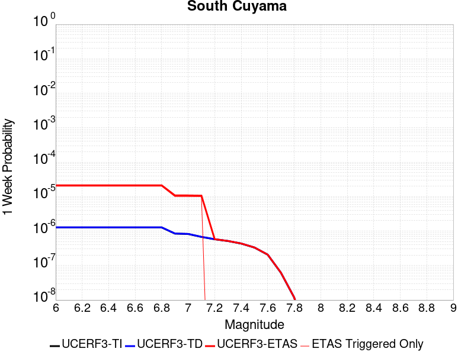 |  |  |  |

| Magnitude | 1 wk TI Prob | 1 wk TD Prob | 1 wk ETAS Prob | 1 wk ETAS/TD Gain | 1 wk ETAS Triggered Only | 1 mo TI Prob | 1 mo TD Prob | 1 mo ETAS Prob | 1 mo ETAS/TD Gain | 1 mo ETAS Triggered Only | 1 yr TI Prob | 1 yr TD Prob | 1 yr ETAS Prob | 1 yr ETAS/TD Gain | 1 yr ETAS Triggered Only | 10 yr TI Prob | 10 yr TD Prob | 10 yr ETAS Prob | 10 yr ETAS/TD Gain | 10 yr ETAS Triggered Only |
|-----|-----|-----|-----|-----|-----|-----|-----|-----|-----|-----|-----|-----|-----|-----|-----|-----|-----|-----|-----|-----|
| 6.0 | 1.2747308E-6 | 1.2818697E-6 | 2.6407466E-5 | 20.60074 | 2.5125628E-5 | 5.4631205E-6 | 5.4937163E-6 | 3.0619205E-5 | 5.5734963 | 2.5125628E-5 | 6.6511464E-5 | 6.6884015E-5 | 9.200796E-5 | 1.3756346 | 2.5125628E-5 | 6.649156E-4 | 6.686458E-4 | 6.9375464E-4 | 1.0375518 | 2.5125628E-5 |
| 6.1 | 1.2747308E-6 | 1.2818697E-6 | 2.6407466E-5 | 20.60074 | 2.5125628E-5 | 5.4631205E-6 | 5.4937163E-6 | 3.0619205E-5 | 5.5734963 | 2.5125628E-5 | 6.6511464E-5 | 6.6884015E-5 | 9.200796E-5 | 1.3756346 | 2.5125628E-5 | 6.649156E-4 | 6.686458E-4 | 6.9375464E-4 | 1.0375518 | 2.5125628E-5 |
| 6.2 | 1.2747308E-6 | 1.2818697E-6 | 2.6407466E-5 | 20.60074 | 2.5125628E-5 | 5.4631205E-6 | 5.4937163E-6 | 3.0619205E-5 | 5.5734963 | 2.5125628E-5 | 6.6511464E-5 | 6.6884015E-5 | 9.200796E-5 | 1.3756346 | 2.5125628E-5 | 6.649156E-4 | 6.686458E-4 | 6.9375464E-4 | 1.0375518 | 2.5125628E-5 |
| 6.3 | 1.2747308E-6 | 1.2818697E-6 | 2.6407466E-5 | 20.60074 | 2.5125628E-5 | 5.4631205E-6 | 5.4937163E-6 | 3.0619205E-5 | 5.5734963 | 2.5125628E-5 | 6.6511464E-5 | 6.6884015E-5 | 9.200796E-5 | 1.3756346 | 2.5125628E-5 | 6.649156E-4 | 6.686458E-4 | 6.9375464E-4 | 1.0375518 | 2.5125628E-5 |
| 6.4 | 1.2747308E-6 | 1.2818697E-6 | 2.6407466E-5 | 20.60074 | 2.5125628E-5 | 5.4631205E-6 | 5.4937163E-6 | 3.0619205E-5 | 5.5734963 | 2.5125628E-5 | 6.6511464E-5 | 6.6884015E-5 | 9.200796E-5 | 1.3756346 | 2.5125628E-5 | 6.649156E-4 | 6.686458E-4 | 6.9375464E-4 | 1.0375518 | 2.5125628E-5 |
| 6.5 | 1.2747308E-6 | 1.2818697E-6 | 2.6407466E-5 | 20.60074 | 2.5125628E-5 | 5.4631205E-6 | 5.4937163E-6 | 3.0619205E-5 | 5.5734963 | 2.5125628E-5 | 6.6511464E-5 | 6.6884015E-5 | 9.200796E-5 | 1.3756346 | 2.5125628E-5 | 6.649156E-4 | 6.686458E-4 | 6.9375464E-4 | 1.0375518 | 2.5125628E-5 |
| 6.6 | 1.2747308E-6 | 1.2818697E-6 | 2.6407466E-5 | 20.60074 | 2.5125628E-5 | 5.4631205E-6 | 5.4937163E-6 | 3.0619205E-5 | 5.5734963 | 2.5125628E-5 | 6.6511464E-5 | 6.6884015E-5 | 9.200796E-5 | 1.3756346 | 2.5125628E-5 | 6.649156E-4 | 6.686458E-4 | 6.9375464E-4 | 1.0375518 | 2.5125628E-5 |
| 6.7 | 1.2747308E-6 | 1.2818697E-6 | 2.6407466E-5 | 20.60074 | 2.5125628E-5 | 5.4631205E-6 | 5.4937163E-6 | 3.0619205E-5 | 5.5734963 | 2.5125628E-5 | 6.6511464E-5 | 6.6884015E-5 | 9.200796E-5 | 1.3756346 | 2.5125628E-5 | 6.649156E-4 | 6.686458E-4 | 6.9375464E-4 | 1.0375518 | 2.5125628E-5 |
| 6.8 | 1.2747308E-6 | 1.2818697E-6 | 2.6407466E-5 | 20.60074 | 2.5125628E-5 | 5.4631205E-6 | 5.4937163E-6 | 3.0619205E-5 | 5.5734963 | 2.5125628E-5 | 6.6511464E-5 | 6.6884015E-5 | 9.200796E-5 | 1.3756346 | 2.5125628E-5 | 6.649156E-4 | 6.686458E-4 | 6.9375464E-4 | 1.0375518 | 2.5125628E-5 |
| 6.9 | 8.4566324E-7 | 8.507883E-7 | 1.3413592E-5 | 15.766075 | 1.2562814E-5 | 3.624266E-6 | 3.6462304E-6 | 1.6208998E-5 | 4.4454126 | 1.2562814E-5 | 4.4124543E-5 | 4.439196E-5 | 5.6954217E-5 | 1.282985 | 1.2562814E-5 | 4.4115784E-4 | 4.4383196E-4 | 4.563892E-4 | 1.0282928 | 1.2562814E-5 |
| 7.0 | 8.2277904E-7 | 8.27782E-7 | 1.3390586E-5 | 16.176464 | 1.2562814E-5 | 3.526191E-6 | 3.5476323E-6 | 1.6110402E-5 | 4.54117 | 1.2562814E-5 | 4.293053E-5 | 4.3191576E-5 | 5.5753848E-5 | 1.29085 | 1.2562814E-5 | 4.292224E-4 | 4.3183283E-4 | 4.4439023E-4 | 1.0290793 | 1.2562814E-5 |
| 7.1 | 6.7661887E-7 | 6.80913E-7 | 1.3243719E-5 | 19.449942 | 1.2562814E-5 | 2.899792E-6 | 2.9181954E-6 | 1.5480973E-5 | 5.3049817 | 1.2562814E-5 | 3.5304394E-5 | 3.5528454E-5 | 4.809082E-5 | 1.3535861 | 1.2562814E-5 | 3.5298787E-4 | 3.552281E-4 | 3.6778647E-4 | 1.035353 | 1.2562814E-5 |
| 7.2 | 5.783336E-7 | 5.8211907E-7 | 5.8211907E-7 | 1.0 | 0.0 | 2.4785702E-6 | 2.4947938E-6 | 2.4947938E-6 | 1.0 | 0.0 | 3.0176174E-5 | 3.0373692E-5 | 3.0373692E-5 | 1.0 | 0.0 | 3.0172078E-4 | 3.0369565E-4 | 3.0369565E-4 | 1.0 | 0.0 |
| 7.3 | 5.136759E-7 | 5.170938E-7 | 5.170938E-7 | 1.0 | 0.0 | 2.2014663E-6 | 2.2161144E-6 | 2.2161144E-6 | 1.0 | 0.0 | 2.6802521E-5 | 2.698086E-5 | 2.698086E-5 | 1.0 | 0.0 | 2.679929E-4 | 2.6977606E-4 | 2.6977606E-4 | 1.0 | 0.0 |
| 7.4 | 4.3370295E-7 | 4.3665364E-7 | 4.3665364E-7 | 1.0 | 0.0 | 1.8587256E-6 | 1.8713713E-6 | 1.8713713E-6 | 1.0 | 0.0 | 2.2629749E-5 | 2.278371E-5 | 2.278371E-5 | 1.0 | 0.0 | 2.2627445E-4 | 2.278139E-4 | 2.278139E-4 | 1.0 | 0.0 |
| 7.5 | 3.3242574E-7 | 3.3476465E-7 | 3.3476465E-7 | 1.0 | 0.0 | 1.4246809E-6 | 1.4347048E-6 | 1.4347048E-6 | 1.0 | 0.0 | 1.7345352E-5 | 1.7467393E-5 | 1.7467393E-5 | 1.0 | 0.0 | 1.7343998E-4 | 1.7466032E-4 | 1.7466032E-4 | 1.0 | 0.0 |
| 7.6 | 2.0627535E-7 | 2.07789E-7 | 2.07789E-7 | 1.0 | 0.0 | 8.840369E-7 | 8.90524E-7 | 8.90524E-7 | 1.0 | 0.0 | 1.0763096E-5 | 1.0842076E-5 | 1.0842076E-5 | 1.0 | 0.0 | 1.0762575E-4 | 1.0841556E-4 | 1.0841556E-4 | 1.0 | 0.0 |
| 7.7 | 6.15236E-8 | 6.1983044E-8 | 6.1983044E-8 | 1.0 | 0.0 | 2.6367252E-7 | 2.656416E-7 | 2.656416E-7 | 1.0 | 0.0 | 3.2102084E-6 | 3.2341818E-6 | 3.2341818E-6 | 1.0 | 0.0 | 3.210162E-5 | 3.234136E-5 | 3.234136E-5 | 1.0 | 0.0 |
| 7.8 | 1.1765573E-8 | 1.1873414E-8 | 1.1873414E-8 | 1.0 | 0.0 | 5.0423886E-8 | 5.0886058E-8 | 5.0886058E-8 | 1.0 | 0.0 | 6.1391063E-7 | 6.195376E-7 | 6.195376E-7 | 1.0 | 0.0 | 6.1390897E-6 | 6.19536E-6 | 6.19536E-6 | 1.0 | 0.0 |
| 7.9 | 6.0381755E-10 | 6.10058E-10 | 6.10058E-10 | 1.0 | 0.0 | 2.5877895E-9 | 2.614534E-9 | 2.614534E-9 | 1.0 | 0.0 | 3.1506335E-8 | 3.1831952E-8 | 3.1831952E-8 | 1.0 | 0.0 | 3.1506332E-7 | 3.183195E-7 | 3.183195E-7 | 1.0 | 0.0 |

## Hayward (So) extension 2011 CFM
*[(top)](#table-of-contents)*

| 1 Week | 1 Month | 1 Year | 10 Year |
|-----|-----|-----|-----|
|  |  |  |  |

| Magnitude | 1 wk TI Prob | 1 wk TD Prob | 1 wk ETAS Prob | 1 wk ETAS/TD Gain | 1 wk ETAS Triggered Only | 1 mo TI Prob | 1 mo TD Prob | 1 mo ETAS Prob | 1 mo ETAS/TD Gain | 1 mo ETAS Triggered Only | 1 yr TI Prob | 1 yr TD Prob | 1 yr ETAS Prob | 1 yr ETAS/TD Gain | 1 yr ETAS Triggered Only | 10 yr TI Prob | 10 yr TD Prob | 10 yr ETAS Prob | 10 yr ETAS/TD Gain | 10 yr ETAS Triggered Only |
|-----|-----|-----|-----|-----|-----|-----|-----|-----|-----|-----|-----|-----|-----|-----|-----|-----|-----|-----|-----|-----|
| 6.0 | 1.1721256E-4 | 2.3697627E-4 | 2.3697627E-4 | 1.0 | 0.0 | 5.022428E-4 | 0.0010129517 | 0.0010255018 | 1.0123897 | 1.2562814E-5 | 0.0060976758 | 0.012248711 | 0.012273529 | 1.0020262 | 2.5125628E-5 | 0.0593305 | 0.112843215 | 0.11286551 | 1.0001975 | 2.5125628E-5 |
| 6.1 | 6.99169E-5 | 1.3822885E-4 | 1.3822885E-4 | 1.0 | 0.0 | 2.9960944E-4 | 5.9128006E-4 | 5.9128006E-4 | 1.0 | 0.0 | 0.0036416445 | 0.0071720886 | 0.0071845613 | 1.001739 | 1.2562814E-5 | 0.035825435 | 0.067803554 | 0.06781527 | 1.0001727 | 1.2562814E-5 |
| 6.2 | 6.99169E-5 | 1.3822885E-4 | 1.3822885E-4 | 1.0 | 0.0 | 2.9960944E-4 | 5.9128006E-4 | 5.9128006E-4 | 1.0 | 0.0 | 0.0036416445 | 0.0071720886 | 0.0071845613 | 1.001739 | 1.2562814E-5 | 0.035825435 | 0.067803554 | 0.06781527 | 1.0001727 | 1.2562814E-5 |
| 6.3 | 6.970908E-5 | 1.379104E-4 | 1.379104E-4 | 1.0 | 0.0 | 2.9871898E-4 | 5.899159E-4 | 5.899159E-4 | 1.0 | 0.0 | 0.0036308395 | 0.007155625 | 0.007168098 | 1.0017431 | 1.2562814E-5 | 0.035720866 | 0.067652516 | 0.06766423 | 1.0001731 | 1.2562814E-5 |
| 6.4 | 6.9517155E-5 | 1.375792E-4 | 1.375792E-4 | 1.0 | 0.0 | 2.9789665E-4 | 5.884971E-4 | 5.884971E-4 | 1.0 | 0.0 | 0.0036208609 | 0.0071385372 | 0.0071510104 | 1.0017473 | 1.2562814E-5 | 0.03562429 | 0.06749655 | 0.06750827 | 1.0001736 | 1.2562814E-5 |
| 6.5 | 4.786248E-5 | 9.41498E-5 | 9.41498E-5 | 1.0 | 0.0 | 2.0510878E-4 | 4.034394E-4 | 4.034394E-4 | 1.0 | 0.0 | 0.0024943394 | 0.004901227 | 0.0049137287 | 1.0025506 | 1.2562814E-5 | 0.02466527 | 0.046901822 | 0.046913795 | 1.0002553 | 1.2562814E-5 |
| 6.6 | 4.4662214E-5 | 8.881654E-5 | 8.881654E-5 | 1.0 | 0.0 | 1.9139545E-4 | 3.805894E-4 | 3.805894E-4 | 1.0 | 0.0 | 0.0023277493 | 0.0046242937 | 0.0046367985 | 1.0027041 | 1.2562814E-5 | 0.02303517 | 0.044293344 | 0.04430535 | 1.0002711 | 1.2562814E-5 |
| 6.7 | 3.884542E-5 | 7.8648096E-5 | 7.8648096E-5 | 1.0 | 0.0 | 1.6646975E-4 | 3.370222E-4 | 3.370222E-4 | 1.0 | 0.0 | 0.002024885 | 0.0040959697 | 0.004108481 | 1.0030545 | 1.2562814E-5 | 0.020065336 | 0.039333146 | 0.039345216 | 1.0003068 | 1.2562814E-5 |
| 6.8 | 3.4221863E-5 | 6.855653E-5 | 6.855653E-5 | 1.0 | 0.0 | 1.4665688E-4 | 2.93783E-4 | 2.93783E-4 | 1.0 | 0.0 | 0.0017840851 | 0.0035713627 | 0.0035713627 | 1.0 | 0.0 | 0.017698295 | 0.034421004 | 0.034421004 | 1.0 | 0.0 |
| 6.9 | 1.6927712E-5 | 3.0061563E-5 | 3.0061563E-5 | 1.0 | 0.0 | 7.2545314E-5 | 1.2882923E-4 | 1.2882923E-4 | 1.0 | 0.0 | 8.828813E-4 | 0.0015674243 | 0.0015674243 | 1.0 | 0.0 | 0.008793819 | 0.01546327 | 0.01546327 | 1.0 | 0.0 |
| 7.0 | 1.2509653E-5 | 2.2462571E-5 | 2.2462571E-5 | 1.0 | 0.0 | 5.3611697E-5 | 9.6264856E-5 | 9.6264856E-5 | 1.0 | 0.0 | 6.525269E-4 | 0.0011714385 | 0.0011714385 | 1.0 | 0.0 | 0.0065061417 | 0.01158231 | 0.01158231 | 1.0 | 0.0 |
| 7.1 | 8.751583E-6 | 1.4925648E-5 | 1.4925648E-5 | 1.0 | 0.0 | 3.750624E-5 | 6.3965526E-5 | 6.3965526E-5 | 1.0 | 0.0 | 4.5654282E-4 | 7.785079E-4 | 7.785079E-4 | 1.0 | 0.0 | 0.0045560603 | 0.007763496 | 0.007763496 | 1.0 | 0.0 |
| 7.2 | 6.354379E-6 | 1.1498636E-5 | 1.1498636E-5 | 1.0 | 0.0 | 2.7232769E-5 | 4.9278966E-5 | 4.9278966E-5 | 1.0 | 0.0 | 3.3150852E-4 | 5.99811E-4 | 5.99811E-4 | 1.0 | 0.0 | 0.0033101442 | 0.0060003046 | 0.0060003046 | 1.0 | 0.0 |
| 7.3 | 4.645554E-6 | 8.818172E-6 | 8.818172E-6 | 1.0 | 0.0 | 1.9909365E-5 | 3.779164E-5 | 3.779164E-5 | 1.0 | 0.0 | 2.4236954E-4 | 4.6002E-4 | 4.6002E-4 | 1.0 | 0.0 | 0.0024210536 | 0.004610708 | 0.004610708 | 1.0 | 0.0 |
| 7.4 | 4.23437E-6 | 7.992532E-6 | 7.992532E-6 | 1.0 | 0.0 | 1.8147173E-5 | 3.425328E-5 | 3.425328E-5 | 1.0 | 0.0 | 2.2091944E-4 | 4.1695772E-4 | 4.1695772E-4 | 1.0 | 0.0 | 0.0022069993 | 0.004181972 | 0.004181972 | 1.0 | 0.0 |
| 7.5 | 2.2187417E-6 | 3.9522306E-6 | 3.9522306E-6 | 1.0 | 0.0 | 9.508858E-6 | 1.6938036E-5 | 1.6938036E-5 | 1.0 | 0.0 | 1.157642E-4 | 2.0620368E-4 | 2.0620368E-4 | 1.0 | 0.0 | 0.0011570391 | 0.0020734754 | 0.0020734754 | 1.0 | 0.0 |
| 7.6 | 2.7952495E-8 | 3.878529E-8 | 3.878529E-8 | 1.0 | 0.0 | 1.1979641E-7 | 1.6622266E-7 | 1.6622266E-7 | 1.0 | 0.0 | 1.4585203E-6 | 2.0237592E-6 | 2.0237592E-6 | 1.0 | 0.0 | 1.4585107E-5 | 2.0328182E-5 | 2.0328182E-5 | 1.0 | 0.0 |
| 7.7 | 1.7192724E-8 | 2.3436517E-8 | 2.3436517E-8 | 1.0 | 0.0 | 7.36831E-8 | 1.0044221E-7 | 1.0044221E-7 | 1.0 | 0.0 | 8.9709135E-7 | 1.2228833E-6 | 1.2228833E-6 | 1.0 | 0.0 | 8.970877E-6 | 1.2296933E-5 | 1.2296933E-5 | 1.0 | 0.0 |

## San Luis Range 2011 CFM
*[(top)](#table-of-contents)*

| 1 Week | 1 Month | 1 Year | 10 Year |
|-----|-----|-----|-----|
|  |  |  |  |

| Magnitude | 1 wk TI Prob | 1 wk TD Prob | 1 wk ETAS Prob | 1 wk ETAS/TD Gain | 1 wk ETAS Triggered Only | 1 mo TI Prob | 1 mo TD Prob | 1 mo ETAS Prob | 1 mo ETAS/TD Gain | 1 mo ETAS Triggered Only | 1 yr TI Prob | 1 yr TD Prob | 1 yr ETAS Prob | 1 yr ETAS/TD Gain | 1 yr ETAS Triggered Only | 10 yr TI Prob | 10 yr TD Prob | 10 yr ETAS Prob | 10 yr ETAS/TD Gain | 10 yr ETAS Triggered Only |
|-----|-----|-----|-----|-----|-----|-----|-----|-----|-----|-----|-----|-----|-----|-----|-----|-----|-----|-----|-----|-----|
| 6.0 | 8.8368415E-6 | 8.965454E-6 | 3.4090855E-5 | 3.8024685 | 2.5125628E-5 | 3.787163E-5 | 3.842285E-5 | 6.3547515E-5 | 1.653899 | 2.5125628E-5 | 4.609895E-4 | 4.677057E-4 | 4.928196E-4 | 1.0536959 | 2.5125628E-5 | 0.0046003438 | 0.0046679964 | 0.004693005 | 1.0053574 | 2.5125628E-5 |
| 6.1 | 8.8368415E-6 | 8.965454E-6 | 3.4090855E-5 | 3.8024685 | 2.5125628E-5 | 3.787163E-5 | 3.842285E-5 | 6.3547515E-5 | 1.653899 | 2.5125628E-5 | 4.609895E-4 | 4.677057E-4 | 4.928196E-4 | 1.0536959 | 2.5125628E-5 | 0.0046003438 | 0.0046679964 | 0.004693005 | 1.0053574 | 2.5125628E-5 |
| 6.2 | 8.8368415E-6 | 8.965454E-6 | 3.4090855E-5 | 3.8024685 | 2.5125628E-5 | 3.787163E-5 | 3.842285E-5 | 6.3547515E-5 | 1.653899 | 2.5125628E-5 | 4.609895E-4 | 4.677057E-4 | 4.928196E-4 | 1.0536959 | 2.5125628E-5 | 0.0046003438 | 0.0046679964 | 0.004693005 | 1.0053574 | 2.5125628E-5 |
| 6.3 | 8.8368415E-6 | 8.965454E-6 | 3.4090855E-5 | 3.8024685 | 2.5125628E-5 | 3.787163E-5 | 3.842285E-5 | 6.3547515E-5 | 1.653899 | 2.5125628E-5 | 4.609895E-4 | 4.677057E-4 | 4.928196E-4 | 1.0536959 | 2.5125628E-5 | 0.0046003438 | 0.0046679964 | 0.004693005 | 1.0053574 | 2.5125628E-5 |
| 6.4 | 3.9094193E-6 | 3.9412025E-6 | 1.6503967E-5 | 4.187546 | 1.2562814E-5 | 1.6754546E-5 | 1.689076E-5 | 2.9453362E-5 | 1.7437558 | 1.2562814E-5 | 2.039675E-4 | 2.056259E-4 | 2.1818612E-4 | 1.061083 | 1.2562814E-5 | 0.0020378039 | 0.0020543851 | 0.0020669221 | 1.0061026 | 1.2562814E-5 |
| 6.5 | 3.9094193E-6 | 3.9412025E-6 | 1.6503967E-5 | 4.187546 | 1.2562814E-5 | 1.6754546E-5 | 1.689076E-5 | 2.9453362E-5 | 1.7437558 | 1.2562814E-5 | 2.039675E-4 | 2.056259E-4 | 2.1818612E-4 | 1.061083 | 1.2562814E-5 | 0.0020378039 | 0.0020543851 | 0.0020669221 | 1.0061026 | 1.2562814E-5 |
| 6.6 | 3.0587726E-6 | 3.0753883E-6 | 1.5638163E-5 | 5.0849395 | 1.2562814E-5 | 1.3108959E-5 | 1.318017E-5 | 2.5742818E-5 | 1.9531478 | 1.2562814E-5 | 1.595899E-4 | 1.6045687E-4 | 1.7301766E-4 | 1.0782815 | 1.2562814E-5 | 0.0015947534 | 0.0016034221 | 0.0016159648 | 1.0078224 | 1.2562814E-5 |
| 6.7 | 2.6160574E-6 | 2.6251273E-6 | 1.51879085E-5 | 5.785589 | 1.2562814E-5 | 1.1211626E-5 | 1.1250498E-5 | 2.381317E-5 | 2.1166327 | 1.2562814E-5 | 1.3649299E-4 | 1.3696625E-4 | 1.4952735E-4 | 1.0917094 | 1.2562814E-5 | 0.0013640919 | 0.0013688246 | 0.0013813702 | 1.0091653 | 1.2562814E-5 |
| 6.8 | 2.5110312E-6 | 2.51814E-6 | 1.5080923E-5 | 5.988913 | 1.2562814E-5 | 1.0761518E-5 | 1.0791985E-5 | 2.3354663E-5 | 2.164075 | 1.2562814E-5 | 1.310136E-4 | 1.3138456E-4 | 1.4394571E-4 | 1.0956061 | 1.2562814E-5 | 0.0013093639 | 0.0013130746 | 0.0013256209 | 1.0095549 | 1.2562814E-5 |
| 6.9 | 1.8564405E-6 | 1.852487E-6 | 1.4415278E-5 | 7.781581 | 1.2562814E-5 | 7.95615E-6 | 7.939206E-6 | 2.050192E-5 | 2.582364 | 1.2562814E-5 | 9.686181E-5 | 9.665557E-5 | 1.09217166E-4 | 1.1299626 | 1.2562814E-5 | 9.68196E-4 | 9.661373E-4 | 9.78688E-4 | 1.0129906 | 1.2562814E-5 |
| 7.0 | 1.546127E-6 | 1.5369537E-6 | 1.4099748E-5 | 9.173827 | 1.2562814E-5 | 6.626242E-6 | 6.586928E-6 | 1.914966E-5 | 2.9072216 | 1.2562814E-5 | 8.06715E-5 | 8.0192905E-5 | 9.275471E-5 | 1.1566448 | 1.2562814E-5 | 8.0642226E-4 | 8.016404E-4 | 8.141931E-4 | 1.0156589 | 1.2562814E-5 |
| 7.1 | 1.3368208E-6 | 1.3235326E-6 | 1.388633E-5 | 10.491869 | 1.2562814E-5 | 5.7292195E-6 | 5.67227E-6 | 1.8235012E-5 | 3.2147646 | 1.2562814E-5 | 6.975101E-5 | 6.905771E-5 | 8.1619655E-5 | 1.181905 | 1.2562814E-5 | 6.972912E-4 | 6.9036294E-4 | 7.029171E-4 | 1.0181849 | 1.2562814E-5 |
| 7.2 | 1.0623363E-6 | 1.0454368E-6 | 1.0454368E-6 | 1.0 | 0.0 | 4.5528623E-6 | 4.4804356E-6 | 4.4804356E-6 | 1.0 | 0.0 | 5.5429686E-5 | 5.4547938E-5 | 5.4547938E-5 | 1.0 | 0.0 | 5.5415864E-4 | 5.4534577E-4 | 5.4534577E-4 | 1.0 | 0.0 |
| 7.3 | 7.831679E-7 | 7.7273904E-7 | 7.7273904E-7 | 1.0 | 0.0 | 3.3564295E-6 | 3.3117344E-6 | 3.3117344E-6 | 1.0 | 0.0 | 4.086376E-5 | 4.0319625E-5 | 4.0319625E-5 | 1.0 | 0.0 | 4.0856248E-4 | 4.031232E-4 | 4.031232E-4 | 1.0 | 0.0 |
| 7.4 | 5.9558846E-7 | 5.910636E-7 | 5.910636E-7 | 1.0 | 0.0 | 2.5525194E-6 | 2.5331274E-6 | 2.5331274E-6 | 1.0 | 0.0 | 3.107648E-5 | 3.084039E-5 | 3.084039E-5 | 1.0 | 0.0 | 3.1072134E-4 | 3.083612E-4 | 3.083612E-4 | 1.0 | 0.0 |
| 7.5 | 4.1616502E-7 | 4.119631E-7 | 4.119631E-7 | 1.0 | 0.0 | 1.7835631E-6 | 1.7655549E-6 | 1.7655549E-6 | 1.0 | 0.0 | 2.1714664E-5 | 2.149542E-5 | 2.149542E-5 | 1.0 | 0.0 | 2.1712543E-4 | 2.1493346E-4 | 2.1493346E-4 | 1.0 | 0.0 |
| 7.6 | 2.3816014E-7 | 2.3376548E-7 | 2.3376548E-7 | 1.0 | 0.0 | 1.0206859E-6 | 1.0018516E-6 | 1.0018516E-6 | 1.0 | 0.0 | 1.242678E-5 | 1.2197475E-5 | 1.2197475E-5 | 1.0 | 0.0 | 1.2426086E-4 | 1.2196808E-4 | 1.2196808E-4 | 1.0 | 0.0 |
| 7.7 | 9.918777E-8 | 9.3867584E-8 | 9.3867584E-8 | 1.0 | 0.0 | 4.2509038E-7 | 4.0228957E-7 | 4.0228957E-7 | 1.0 | 0.0 | 5.1754632E-6 | 4.8978645E-6 | 4.8978645E-6 | 1.0 | 0.0 | 5.1753424E-5 | 4.897757E-5 | 4.897757E-5 | 1.0 | 0.0 |
| 7.8 | 3.4982556E-8 | 2.968655E-8 | 2.968655E-8 | 1.0 | 0.0 | 1.4992524E-7 | 1.2722806E-7 | 1.2722806E-7 | 1.0 | 0.0 | 1.8253382E-6 | 1.5490006E-6 | 1.5490006E-6 | 1.0 | 0.0 | 1.8253233E-5 | 1.5489897E-5 | 1.5489897E-5 | 1.0 | 0.0 |
| 7.9 | 1.6624908E-8 | 1.1477036E-8 | 1.1477036E-8 | 1.0 | 0.0 | 7.12496E-8 | 4.91873E-8 | 4.91873E-8 | 1.0 | 0.0 | 8.6746354E-7 | 5.988552E-7 | 5.988552E-7 | 1.0 | 0.0 | 8.674601E-6 | 5.988536E-6 | 5.988536E-6 | 1.0 | 0.0 |
| 8.0 | 6.3352315E-9 | 3.0888412E-9 | 3.0888412E-9 | 1.0 | 0.0 | 2.715099E-8 | 1.3237893E-8 | 1.3237893E-8 | 1.0 | 0.0 | 3.3056327E-7 | 1.6117131E-7 | 1.6117131E-7 | 1.0 | 0.0 | 3.3056278E-6 | 1.611712E-6 | 1.611712E-6 | 1.0 | 0.0 |

## Elsinore (Stepovers Combined)
*[(top)](#table-of-contents)*

| 1 Week | 1 Month | 1 Year | 10 Year |
|-----|-----|-----|-----|
|  |  | 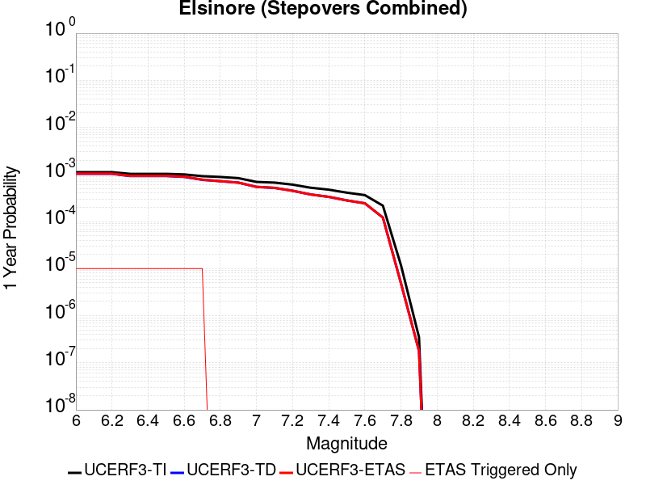 |  |

| Magnitude | 1 wk TI Prob | 1 wk TD Prob | 1 wk ETAS Prob | 1 wk ETAS/TD Gain | 1 wk ETAS Triggered Only | 1 mo TI Prob | 1 mo TD Prob | 1 mo ETAS Prob | 1 mo ETAS/TD Gain | 1 mo ETAS Triggered Only | 1 yr TI Prob | 1 yr TD Prob | 1 yr ETAS Prob | 1 yr ETAS/TD Gain | 1 yr ETAS Triggered Only | 10 yr TI Prob | 10 yr TD Prob | 10 yr ETAS Prob | 10 yr ETAS/TD Gain | 10 yr ETAS Triggered Only |
|-----|-----|-----|-----|-----|-----|-----|-----|-----|-----|-----|-----|-----|-----|-----|-----|-----|-----|-----|-----|-----|
| 6.0 | 2.144392E-5 | 1.9760193E-5 | 3.2322758E-5 | 1.6357511 | 1.2562814E-5 | 9.189928E-5 | 8.468392E-5 | 9.724566E-5 | 1.1483369 | 1.2562814E-5 | 0.0011182994 | 0.0010305607 | 0.0010431105 | 1.0121777 | 1.2562814E-5 | 0.011126885 | 0.010264917 | 0.010277351 | 1.0012113 | 1.2562814E-5 |
| 6.1 | 2.144392E-5 | 1.9760193E-5 | 3.2322758E-5 | 1.6357511 | 1.2562814E-5 | 9.189928E-5 | 8.468392E-5 | 9.724566E-5 | 1.1483369 | 1.2562814E-5 | 0.0011182994 | 0.0010305607 | 0.0010431105 | 1.0121777 | 1.2562814E-5 | 0.011126885 | 0.010264917 | 0.010277351 | 1.0012113 | 1.2562814E-5 |
| 6.2 | 2.144392E-5 | 1.9760193E-5 | 3.2322758E-5 | 1.6357511 | 1.2562814E-5 | 9.189928E-5 | 8.468392E-5 | 9.724566E-5 | 1.1483369 | 1.2562814E-5 | 0.0011182994 | 0.0010305607 | 0.0010431105 | 1.0121777 | 1.2562814E-5 | 0.011126885 | 0.010264917 | 0.010277351 | 1.0012113 | 1.2562814E-5 |
| 6.3 | 1.9751555E-5 | 1.7741453E-5 | 3.0304043E-5 | 1.7080926 | 1.2562814E-5 | 8.4646774E-5 | 7.603267E-5 | 8.8594534E-5 | 1.1652166 | 1.2562814E-5 | 0.0010300872 | 9.253213E-4 | 9.378725E-4 | 1.0135641 | 1.2562814E-5 | 0.010253254 | 0.009221276 | 0.009233723 | 1.0013498 | 1.2562814E-5 |
| 6.4 | 1.9751555E-5 | 1.7741453E-5 | 3.0304043E-5 | 1.7080926 | 1.2562814E-5 | 8.4646774E-5 | 7.603267E-5 | 8.8594534E-5 | 1.1652166 | 1.2562814E-5 | 0.0010300872 | 9.253213E-4 | 9.378725E-4 | 1.0135641 | 1.2562814E-5 | 0.010253254 | 0.009221276 | 0.009233723 | 1.0013498 | 1.2562814E-5 |
| 6.5 | 1.9751555E-5 | 1.7741453E-5 | 3.0304043E-5 | 1.7080926 | 1.2562814E-5 | 8.4646774E-5 | 7.603267E-5 | 8.8594534E-5 | 1.1652166 | 1.2562814E-5 | 0.0010300872 | 9.253213E-4 | 9.378725E-4 | 1.0135641 | 1.2562814E-5 | 0.010253254 | 0.009221276 | 0.009233723 | 1.0013498 | 1.2562814E-5 |
| 6.6 | 1.9188685E-5 | 1.7003393E-5 | 2.9565994E-5 | 1.738829 | 1.2562814E-5 | 8.2234634E-5 | 7.286974E-5 | 8.543164E-5 | 1.1723884 | 1.2562814E-5 | 0.0010007467 | 8.868442E-4 | 8.9939585E-4 | 1.0141532 | 1.2562814E-5 | 0.00996252 | 0.0088398475 | 0.008852299 | 1.0014086 | 1.2562814E-5 |
| 6.7 | 1.7608272E-5 | 1.4732616E-5 | 2.7295246E-5 | 1.8527086 | 1.2562814E-5 | 7.546184E-5 | 6.3138315E-5 | 7.5700336E-5 | 1.1989603 | 1.2562814E-5 | 9.183606E-4 | 7.684476E-4 | 7.8100077E-4 | 1.0163357 | 1.2562814E-5 | 0.009145746 | 0.00766491 | 0.0076773767 | 1.0016265 | 1.2562814E-5 |
| 6.8 | 1.697165E-5 | 1.3783365E-5 | 1.3783365E-5 | 1.0 | 0.0 | 7.273361E-5 | 5.9070277E-5 | 5.9070277E-5 | 1.0 | 0.0 | 8.8517193E-4 | 7.18952E-4 | 7.18952E-4 | 1.0 | 0.0 | 0.008816543 | 0.007172675 | 0.007172675 | 1.0 | 0.0 |
| 6.9 | 1.600365E-5 | 1.2846671E-5 | 1.2846671E-5 | 1.0 | 0.0 | 6.858527E-5 | 5.5056043E-5 | 5.5056043E-5 | 1.0 | 0.0 | 8.347058E-4 | 6.7010894E-4 | 6.7010894E-4 | 1.0 | 0.0 | 0.008315775 | 0.0066867657 | 0.0066867657 | 1.0 | 0.0 |
| 7.0 | 1.3314581E-5 | 1.0447548E-5 | 1.0447548E-5 | 1.0 | 0.0 | 5.7061243E-5 | 4.4774453E-5 | 4.4774453E-5 | 1.0 | 0.0 | 6.944992E-4 | 5.449953E-4 | 5.449953E-4 | 1.0 | 0.0 | 0.006923327 | 0.0054405155 | 0.0054405155 | 1.0 | 0.0 |
| 7.1 | 1.2865345E-5 | 9.937536E-6 | 9.937536E-6 | 1.0 | 0.0 | 5.5136024E-5 | 4.258876E-5 | 4.258876E-5 | 1.0 | 0.0 | 6.710743E-4 | 5.183973E-4 | 5.183973E-4 | 1.0 | 0.0 | 0.0066905143 | 0.0051752133 | 0.0051752133 | 1.0 | 0.0 |
| 7.2 | 1.1650051E-5 | 8.633809E-6 | 8.633809E-6 | 1.0 | 0.0 | 4.9927836E-5 | 3.7001522E-5 | 3.7001522E-5 | 1.0 | 0.0 | 6.0770183E-4 | 4.504022E-4 | 4.504022E-4 | 1.0 | 0.0 | 0.0060604266 | 0.0044963174 | 0.0044963174 | 1.0 | 0.0 |
| 7.3 | 1.0008533E-5 | 7.2010425E-6 | 7.2010425E-6 | 1.0 | 0.0 | 4.2893007E-5 | 3.0861254E-5 | 3.0861254E-5 | 1.0 | 0.0 | 5.220972E-4 | 3.7567242E-4 | 3.7567242E-4 | 1.0 | 0.0 | 0.005208723 | 0.003750761 | 0.003750761 | 1.0 | 0.0 |
| 7.4 | 9.116759E-6 | 6.410068E-6 | 6.410068E-6 | 1.0 | 0.0 | 3.907124E-5 | 2.747144E-5 | 2.747144E-5 | 1.0 | 0.0 | 4.7558855E-4 | 3.3441483E-4 | 3.3441483E-4 | 1.0 | 0.0 | 0.00474572 | 0.0033392678 | 0.0033392678 | 1.0 | 0.0 |
| 7.5 | 7.870524E-6 | 5.3825365E-6 | 5.3825365E-6 | 1.0 | 0.0 | 3.3730383E-5 | 2.3067816E-5 | 2.3067816E-5 | 1.0 | 0.0 | 4.1059E-4 | 2.8081573E-4 | 2.8081573E-4 | 1.0 | 0.0 | 0.0040983222 | 0.0028047354 | 0.0028047354 | 1.0 | 0.0 |
| 7.6 | 6.9774537E-6 | 4.6776067E-6 | 4.6776067E-6 | 1.0 | 0.0 | 2.990303E-5 | 2.0046738E-5 | 2.0046738E-5 | 1.0 | 0.0 | 3.640086E-4 | 2.4404288E-4 | 2.4404288E-4 | 1.0 | 0.0 | 0.003634129 | 0.0024378651 | 0.0024378651 | 1.0 | 0.0 |
| 7.7 | 4.1616954E-6 | 2.32834E-6 | 2.32834E-6 | 1.0 | 0.0 | 1.7835715E-5 | 9.978567E-6 | 9.978567E-6 | 1.0 | 0.0 | 2.171282E-4 | 1.2148302E-4 | 1.2148302E-4 | 1.0 | 0.0 | 0.0021691616 | 0.0012142392 | 0.0012142392 | 1.0 | 0.0 |
| 7.8 | 2.2692414E-7 | 9.3854695E-8 | 9.3854695E-8 | 1.0 | 0.0 | 9.725317E-7 | 4.0223435E-7 | 4.0223435E-7 | 1.0 | 0.0 | 1.1840509E-5 | 4.8971956E-6 | 4.8971956E-6 | 1.0 | 0.0 | 1.1839878E-4 | 4.8971204E-5 | 4.8971204E-5 | 1.0 | 0.0 |
| 7.9 | 6.676829E-9 | 3.439853E-9 | 3.439853E-9 | 1.0 | 0.0 | 2.861498E-8 | 1.4742227E-8 | 1.4742227E-8 | 1.0 | 0.0 | 3.4838732E-7 | 1.7948659E-7 | 1.7948659E-7 | 1.0 | 0.0 | 3.4838679E-6 | 1.7948646E-6 | 1.7948646E-6 | 1.0 | 0.0 |

## Channel Islands Western Deep Ramp
*[(top)](#table-of-contents)*

| 1 Week | 1 Month | 1 Year | 10 Year |
|-----|-----|-----|-----|
|  |  |  |  |

| Magnitude | 1 wk TI Prob | 1 wk TD Prob | 1 wk ETAS Prob | 1 wk ETAS/TD Gain | 1 wk ETAS Triggered Only | 1 mo TI Prob | 1 mo TD Prob | 1 mo ETAS Prob | 1 mo ETAS/TD Gain | 1 mo ETAS Triggered Only | 1 yr TI Prob | 1 yr TD Prob | 1 yr ETAS Prob | 1 yr ETAS/TD Gain | 1 yr ETAS Triggered Only | 10 yr TI Prob | 10 yr TD Prob | 10 yr ETAS Prob | 10 yr ETAS/TD Gain | 10 yr ETAS Triggered Only |
|-----|-----|-----|-----|-----|-----|-----|-----|-----|-----|-----|-----|-----|-----|-----|-----|-----|-----|-----|-----|-----|
| 6.0 | 6.0213506E-6 | 6.2548684E-6 | 6.2548684E-6 | 1.0 | 0.0 | 2.5805533E-5 | 2.6806329E-5 | 3.9368806E-5 | 1.4686385 | 1.2562814E-5 | 3.1413708E-4 | 3.2632265E-4 | 3.3888136E-4 | 1.0384855 | 1.2562814E-5 | 0.0031369338 | 0.0032588763 | 0.0032713981 | 1.0038424 | 1.2562814E-5 |
| 6.1 | 6.0213506E-6 | 6.2548684E-6 | 6.2548684E-6 | 1.0 | 0.0 | 2.5805533E-5 | 2.6806329E-5 | 3.9368806E-5 | 1.4686385 | 1.2562814E-5 | 3.1413708E-4 | 3.2632265E-4 | 3.3888136E-4 | 1.0384855 | 1.2562814E-5 | 0.0031369338 | 0.0032588763 | 0.0032713981 | 1.0038424 | 1.2562814E-5 |
| 6.2 | 6.0213506E-6 | 6.2548684E-6 | 6.2548684E-6 | 1.0 | 0.0 | 2.5805533E-5 | 2.6806329E-5 | 3.9368806E-5 | 1.4686385 | 1.2562814E-5 | 3.1413708E-4 | 3.2632265E-4 | 3.3888136E-4 | 1.0384855 | 1.2562814E-5 | 0.0031369338 | 0.0032588763 | 0.0032713981 | 1.0038424 | 1.2562814E-5 |
| 6.3 | 6.0213506E-6 | 6.2548684E-6 | 6.2548684E-6 | 1.0 | 0.0 | 2.5805533E-5 | 2.6806329E-5 | 3.9368806E-5 | 1.4686385 | 1.2562814E-5 | 3.1413708E-4 | 3.2632265E-4 | 3.3888136E-4 | 1.0384855 | 1.2562814E-5 | 0.0031369338 | 0.0032588763 | 0.0032713981 | 1.0038424 | 1.2562814E-5 |
| 6.4 | 6.0213506E-6 | 6.2548684E-6 | 6.2548684E-6 | 1.0 | 0.0 | 2.5805533E-5 | 2.6806329E-5 | 3.9368806E-5 | 1.4686385 | 1.2562814E-5 | 3.1413708E-4 | 3.2632265E-4 | 3.3888136E-4 | 1.0384855 | 1.2562814E-5 | 0.0031369338 | 0.0032588763 | 0.0032713981 | 1.0038424 | 1.2562814E-5 |
| 6.5 | 6.0213506E-6 | 6.2548684E-6 | 6.2548684E-6 | 1.0 | 0.0 | 2.5805533E-5 | 2.6806329E-5 | 3.9368806E-5 | 1.4686385 | 1.2562814E-5 | 3.1413708E-4 | 3.2632265E-4 | 3.3888136E-4 | 1.0384855 | 1.2562814E-5 | 0.0031369338 | 0.0032588763 | 0.0032713981 | 1.0038424 | 1.2562814E-5 |
| 6.6 | 6.0213506E-6 | 6.2548684E-6 | 6.2548684E-6 | 1.0 | 0.0 | 2.5805533E-5 | 2.6806329E-5 | 3.9368806E-5 | 1.4686385 | 1.2562814E-5 | 3.1413708E-4 | 3.2632265E-4 | 3.3888136E-4 | 1.0384855 | 1.2562814E-5 | 0.0031369338 | 0.0032588763 | 0.0032713981 | 1.0038424 | 1.2562814E-5 |
| 6.7 | 5.313309E-6 | 5.5252403E-6 | 5.5252403E-6 | 1.0 | 0.0 | 2.2771126E-5 | 2.367941E-5 | 3.6241927E-5 | 1.5305248 | 1.2562814E-5 | 2.772032E-4 | 2.8826276E-4 | 3.0082196E-4 | 1.0435686 | 1.2562814E-5 | 0.0027685766 | 0.0028792918 | 0.0028918183 | 1.0043505 | 1.2562814E-5 |
| 6.8 | 5.313309E-6 | 5.5252403E-6 | 5.5252403E-6 | 1.0 | 0.0 | 2.2771126E-5 | 2.367941E-5 | 3.6241927E-5 | 1.5305248 | 1.2562814E-5 | 2.772032E-4 | 2.8826276E-4 | 3.0082196E-4 | 1.0435686 | 1.2562814E-5 | 0.0027685766 | 0.0028792918 | 0.0028918183 | 1.0043505 | 1.2562814E-5 |
| 6.9 | 4.744377E-6 | 4.9394303E-6 | 4.9394303E-6 | 1.0 | 0.0 | 2.0332885E-5 | 2.1168837E-5 | 3.3731387E-5 | 1.5934454 | 1.2562814E-5 | 2.4752476E-4 | 2.5770385E-4 | 2.702634E-4 | 1.0487365 | 1.2562814E-5 | 0.0024724922 | 0.0025744175 | 0.002586948 | 1.0048673 | 1.2562814E-5 |
| 7.0 | 4.722209E-6 | 4.9164732E-6 | 4.9164732E-6 | 1.0 | 0.0 | 2.0237881E-5 | 2.107045E-5 | 3.3632998E-5 | 1.5962164 | 1.2562814E-5 | 2.4636835E-4 | 2.5650626E-4 | 2.6906584E-4 | 1.048964 | 1.2562814E-5 | 0.002460954 | 0.0025624693 | 0.002575 | 1.0048901 | 1.2562814E-5 |
| 7.1 | 4.611174E-6 | 4.801409E-6 | 4.801409E-6 | 1.0 | 0.0 | 1.9762025E-5 | 2.0577325E-5 | 3.313988E-5 | 1.6105047 | 1.2562814E-5 | 2.4057609E-4 | 2.5050386E-4 | 2.6306353E-4 | 1.0501376 | 1.2562814E-5 | 0.002403158 | 0.002502582 | 0.0025151132 | 1.0050074 | 1.2562814E-5 |
| 7.2 | 4.043994E-6 | 4.2120264E-6 | 4.2120264E-6 | 1.0 | 0.0 | 1.7331287E-5 | 1.8051438E-5 | 3.0614025E-5 | 1.6959327 | 1.2562814E-5 | 2.10988E-4 | 2.1975765E-4 | 2.3231772E-4 | 1.057154 | 1.2562814E-5 | 0.002107878 | 0.0021957543 | 0.0022082895 | 1.0057088 | 1.2562814E-5 |
| 7.3 | 2.1233036E-6 | 2.2297875E-6 | 2.2297875E-6 | 1.0 | 0.0 | 9.099841E-6 | 9.556197E-6 | 9.556197E-6 | 1.0 | 0.0 | 1.1078493E-4 | 1.1634055E-4 | 1.1634055E-4 | 1.0 | 0.0 | 0.0011072971 | 0.001162802 | 0.001162802 | 1.0 | 0.0 |
| 7.4 | 1.9051884E-6 | 2.0014973E-6 | 2.0014973E-6 | 1.0 | 0.0 | 8.165067E-6 | 8.577817E-6 | 8.577817E-6 | 1.0 | 0.0 | 9.940516E-5 | 1.0442998E-4 | 1.0442998E-4 | 1.0 | 0.0 | 9.93607E-4 | 0.0010438144 | 0.0010438144 | 1.0 | 0.0 |
| 7.5 | 1.2408497E-6 | 1.3038839E-6 | 1.3038839E-6 | 1.0 | 0.0 | 5.317916E-6 | 5.588062E-6 | 5.588062E-6 | 1.0 | 0.0 | 6.4743705E-5 | 6.8032554E-5 | 6.8032554E-5 | 1.0 | 0.0 | 6.4724847E-4 | 6.8011944E-4 | 6.8011944E-4 | 1.0 | 0.0 |
| 7.6 | 6.5440025E-7 | 6.886718E-7 | 6.886718E-7 | 1.0 | 0.0 | 2.8045695E-6 | 2.9514472E-6 | 2.9514472E-6 | 1.0 | 0.0 | 3.4145098E-5 | 3.593329E-5 | 3.593329E-5 | 1.0 | 0.0 | 3.4139853E-4 | 3.5927625E-4 | 3.5927625E-4 | 1.0 | 0.0 |
| 7.7 | 3.985963E-7 | 4.1930787E-7 | 4.1930787E-7 | 1.0 | 0.0 | 1.7082689E-6 | 1.7970326E-6 | 1.7970326E-6 | 1.0 | 0.0 | 2.0797976E-5 | 2.1878664E-5 | 2.1878664E-5 | 1.0 | 0.0 | 2.0796029E-4 | 2.1876628E-4 | 2.1876628E-4 | 1.0 | 0.0 |
| 7.8 | 3.706329E-8 | 3.8591796E-8 | 3.8591796E-8 | 1.0 | 0.0 | 1.5884267E-7 | 1.653934E-7 | 1.653934E-7 | 1.0 | 0.0 | 1.9339077E-6 | 2.0136629E-6 | 2.0136629E-6 | 1.0 | 0.0 | 1.933891E-5 | 2.0136458E-5 | 2.0136458E-5 | 1.0 | 0.0 |

## Fickle Hill (alt1)
*[(top)](#table-of-contents)*

| 1 Week | 1 Month | 1 Year | 10 Year |
|-----|-----|-----|-----|
| 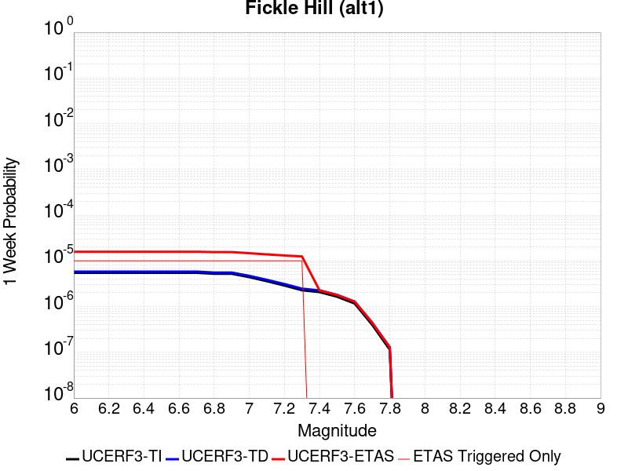 |  |  | 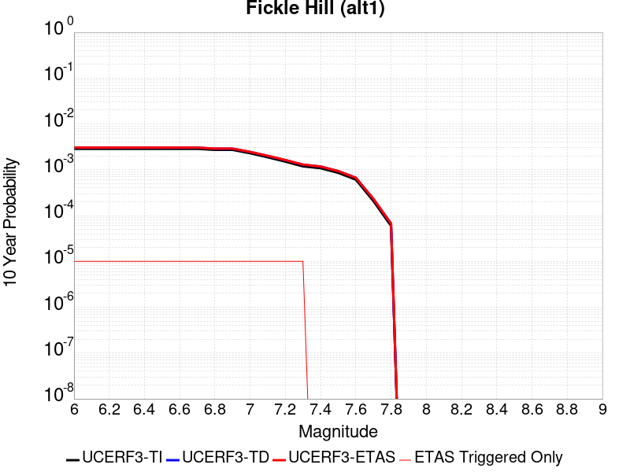 |

| Magnitude | 1 wk TI Prob | 1 wk TD Prob | 1 wk ETAS Prob | 1 wk ETAS/TD Gain | 1 wk ETAS Triggered Only | 1 mo TI Prob | 1 mo TD Prob | 1 mo ETAS Prob | 1 mo ETAS/TD Gain | 1 mo ETAS Triggered Only | 1 yr TI Prob | 1 yr TD Prob | 1 yr ETAS Prob | 1 yr ETAS/TD Gain | 1 yr ETAS Triggered Only | 10 yr TI Prob | 10 yr TD Prob | 10 yr ETAS Prob | 10 yr ETAS/TD Gain | 10 yr ETAS Triggered Only |
|-----|-----|-----|-----|-----|-----|-----|-----|-----|-----|-----|-----|-----|-----|-----|-----|-----|-----|-----|-----|-----|
| 6.0 | 5.491893E-6 | 5.826998E-6 | 1.838974E-5 | 3.1559544 | 1.2562814E-5 | 2.3536471E-5 | 2.4972622E-5 | 3.7535123E-5 | 1.5030509 | 1.2562814E-5 | 2.8651886E-4 | 3.040015E-4 | 3.165605E-4 | 1.0413123 | 1.2562814E-5 | 0.0028614972 | 0.0030360806 | 0.0030486053 | 1.0041252 | 1.2562814E-5 |
| 6.1 | 5.491893E-6 | 5.826998E-6 | 1.838974E-5 | 3.1559544 | 1.2562814E-5 | 2.3536471E-5 | 2.4972622E-5 | 3.7535123E-5 | 1.5030509 | 1.2562814E-5 | 2.8651886E-4 | 3.040015E-4 | 3.165605E-4 | 1.0413123 | 1.2562814E-5 | 0.0028614972 | 0.0030360806 | 0.0030486053 | 1.0041252 | 1.2562814E-5 |
| 6.2 | 5.491893E-6 | 5.826998E-6 | 1.838974E-5 | 3.1559544 | 1.2562814E-5 | 2.3536471E-5 | 2.4972622E-5 | 3.7535123E-5 | 1.5030509 | 1.2562814E-5 | 2.8651886E-4 | 3.040015E-4 | 3.165605E-4 | 1.0413123 | 1.2562814E-5 | 0.0028614972 | 0.0030360806 | 0.0030486053 | 1.0041252 | 1.2562814E-5 |
| 6.3 | 5.491893E-6 | 5.826998E-6 | 1.838974E-5 | 3.1559544 | 1.2562814E-5 | 2.3536471E-5 | 2.4972622E-5 | 3.7535123E-5 | 1.5030509 | 1.2562814E-5 | 2.8651886E-4 | 3.040015E-4 | 3.165605E-4 | 1.0413123 | 1.2562814E-5 | 0.0028614972 | 0.0030360806 | 0.0030486053 | 1.0041252 | 1.2562814E-5 |
| 6.4 | 5.491893E-6 | 5.826998E-6 | 1.838974E-5 | 3.1559544 | 1.2562814E-5 | 2.3536471E-5 | 2.4972622E-5 | 3.7535123E-5 | 1.5030509 | 1.2562814E-5 | 2.8651886E-4 | 3.040015E-4 | 3.165605E-4 | 1.0413123 | 1.2562814E-5 | 0.0028614972 | 0.0030360806 | 0.0030486053 | 1.0041252 | 1.2562814E-5 |
| 6.5 | 5.491893E-6 | 5.826998E-6 | 1.838974E-5 | 3.1559544 | 1.2562814E-5 | 2.3536471E-5 | 2.4972622E-5 | 3.7535123E-5 | 1.5030509 | 1.2562814E-5 | 2.8651886E-4 | 3.040015E-4 | 3.165605E-4 | 1.0413123 | 1.2562814E-5 | 0.0028614972 | 0.0030360806 | 0.0030486053 | 1.0041252 | 1.2562814E-5 |
| 6.6 | 5.491893E-6 | 5.826998E-6 | 1.838974E-5 | 3.1559544 | 1.2562814E-5 | 2.3536471E-5 | 2.4972622E-5 | 3.7535123E-5 | 1.5030509 | 1.2562814E-5 | 2.8651886E-4 | 3.040015E-4 | 3.165605E-4 | 1.0413123 | 1.2562814E-5 | 0.0028614972 | 0.0030360806 | 0.0030486053 | 1.0041252 | 1.2562814E-5 |
| 6.7 | 5.491893E-6 | 5.826998E-6 | 1.838974E-5 | 3.1559544 | 1.2562814E-5 | 2.3536471E-5 | 2.4972622E-5 | 3.7535123E-5 | 1.5030509 | 1.2562814E-5 | 2.8651886E-4 | 3.040015E-4 | 3.165605E-4 | 1.0413123 | 1.2562814E-5 | 0.0028614972 | 0.0030360806 | 0.0030486053 | 1.0041252 | 1.2562814E-5 |
| 6.8 | 5.2207747E-6 | 5.5457263E-6 | 1.810847E-5 | 3.265302 | 1.2562814E-5 | 2.2374557E-5 | 2.3767194E-5 | 3.632971E-5 | 1.5285654 | 1.2562814E-5 | 2.7237617E-4 | 2.8932936E-4 | 3.0188853E-4 | 1.0434079 | 1.2562814E-5 | 0.0027204256 | 0.002889745 | 0.0029022715 | 1.0043348 | 1.2562814E-5 |
| 6.9 | 5.2186956E-6 | 5.5435466E-6 | 1.8106291E-5 | 3.2661927 | 1.2562814E-5 | 2.2365646E-5 | 2.3757853E-5 | 3.632037E-5 | 1.5287732 | 1.2562814E-5 | 2.722677E-4 | 2.8921568E-4 | 3.0177485E-4 | 1.043425 | 1.2562814E-5 | 0.0027193436 | 0.0028886108 | 0.0029011373 | 1.0043365 | 1.2562814E-5 |
| 7.0 | 4.403045E-6 | 4.69848E-6 | 1.7261234E-5 | 3.6737912 | 1.2562814E-5 | 1.8870056E-5 | 2.0136196E-5 | 3.2698757E-5 | 1.6238796 | 1.2562814E-5 | 2.297187E-4 | 2.4513193E-4 | 2.5769166E-4 | 1.0512366 | 1.2562814E-5 | 0.0022948137 | 0.0024487455 | 0.0024612776 | 1.0051178 | 1.2562814E-5 |
| 7.1 | 3.5911396E-6 | 3.8479548E-6 | 1.641072E-5 | 4.26479 | 1.2562814E-5 | 1.5390508E-5 | 1.6491134E-5 | 2.9053743E-5 | 1.7617794 | 1.2562814E-5 | 1.8736332E-4 | 2.0076182E-4 | 2.133221E-4 | 1.0625632 | 1.2562814E-5 | 0.0018720542 | 0.002005878 | 0.0020184156 | 1.0062504 | 1.2562814E-5 |
| 7.2 | 2.888171E-6 | 3.114158E-6 | 1.5676933E-5 | 5.034084 | 1.2562814E-5 | 1.2377816E-5 | 1.3346325E-5 | 2.5908972E-5 | 1.9412813 | 1.2562814E-5 | 1.5068949E-4 | 1.6247964E-4 | 1.7504042E-4 | 1.0773067 | 1.2562814E-5 | 0.0015058735 | 0.0016236332 | 0.0016361756 | 1.0077249 | 1.2562814E-5 |
| 7.3 | 2.275019E-6 | 2.4675212E-6 | 1.5030304E-5 | 6.0912566 | 1.2562814E-5 | 9.750045E-6 | 1.0575049E-5 | 2.3137729E-5 | 2.187955 | 1.2562814E-5 | 1.1870033E-4 | 1.2874375E-4 | 1.4130495E-4 | 1.0975674 | 1.2562814E-5 | 0.0011863695 | 0.0012867056 | 0.0012992523 | 1.009751 | 1.2562814E-5 |
| 7.4 | 2.076662E-6 | 2.2576116E-6 | 2.2576116E-6 | 1.0 | 0.0 | 8.8999495E-6 | 9.675444E-6 | 9.675444E-6 | 1.0 | 0.0 | 1.08351494E-4 | 1.1779229E-4 | 1.1779229E-4 | 1.0 | 0.0 | 0.0010829868 | 0.0011773116 | 0.0011773116 | 1.0 | 0.0 |
| 7.5 | 1.6450799E-6 | 1.7954102E-6 | 1.7954102E-6 | 1.0 | 0.0 | 7.0503233E-6 | 7.694593E-6 | 7.694593E-6 | 1.0 | 0.0 | 8.5834305E-5 | 9.367772E-5 | 9.367772E-5 | 1.0 | 0.0 | 8.580116E-4 | 9.3639E-4 | 9.3639E-4 | 1.0 | 0.0 |
| 7.6 | 1.168891E-6 | 1.282952E-6 | 1.282952E-6 | 1.0 | 0.0 | 5.009523E-6 | 5.4983543E-6 | 5.4983543E-6 | 1.0 | 0.0 | 6.098924E-5 | 6.694047E-5 | 6.694047E-5 | 1.0 | 0.0 | 6.09725E-4 | 6.6920865E-4 | 6.6920865E-4 | 1.0 | 0.0 |
| 7.7 | 3.9871026E-7 | 4.4271442E-7 | 4.4271442E-7 | 1.0 | 0.0 | 1.708757E-6 | 1.8973462E-6 | 1.8973462E-6 | 1.0 | 0.0 | 2.0803918E-5 | 2.3099954E-5 | 2.3099954E-5 | 1.0 | 0.0 | 2.0801972E-4 | 2.3097637E-4 | 2.3097637E-4 | 1.0 | 0.0 |
| 7.8 | 1.14295965E-7 | 1.2853816E-7 | 1.2853816E-7 | 1.0 | 0.0 | 4.8983975E-7 | 5.5087776E-7 | 5.5087776E-7 | 1.0 | 0.0 | 5.9637828E-6 | 6.7069177E-6 | 6.7069177E-6 | 1.0 | 0.0 | 5.9636226E-5 | 6.70673E-5 | 6.70673E-5 | 1.0 | 0.0 |

## Great Valley 04b Gordon Valley
*[(top)](#table-of-contents)*

| 1 Week | 1 Month | 1 Year | 10 Year |
|-----|-----|-----|-----|
|  |  |  | 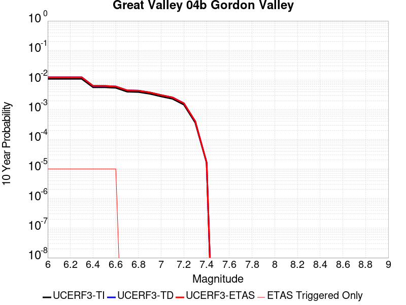 |

| Magnitude | 1 wk TI Prob | 1 wk TD Prob | 1 wk ETAS Prob | 1 wk ETAS/TD Gain | 1 wk ETAS Triggered Only | 1 mo TI Prob | 1 mo TD Prob | 1 mo ETAS Prob | 1 mo ETAS/TD Gain | 1 mo ETAS Triggered Only | 1 yr TI Prob | 1 yr TD Prob | 1 yr ETAS Prob | 1 yr ETAS/TD Gain | 1 yr ETAS Triggered Only | 10 yr TI Prob | 10 yr TD Prob | 10 yr ETAS Prob | 10 yr ETAS/TD Gain | 10 yr ETAS Triggered Only |
|-----|-----|-----|-----|-----|-----|-----|-----|-----|-----|-----|-----|-----|-----|-----|-----|-----|-----|-----|-----|-----|
| 6.0 | 2.1181217E-5 | 2.3981953E-5 | 3.6544465E-5 | 1.523832 | 1.2562814E-5 | 9.077348E-5 | 1.0277669E-4 | 1.1533821E-4 | 1.1222215 | 1.2562814E-5 | 0.0011046068 | 0.0012507546 | 0.0012633017 | 1.0100316 | 1.2562814E-5 | 0.010991322 | 0.012453599 | 0.012466005 | 1.0009962 | 1.2562814E-5 |
| 6.1 | 2.1181217E-5 | 2.3981953E-5 | 3.6544465E-5 | 1.523832 | 1.2562814E-5 | 9.077348E-5 | 1.0277669E-4 | 1.1533821E-4 | 1.1222215 | 1.2562814E-5 | 0.0011046068 | 0.0012507546 | 0.0012633017 | 1.0100316 | 1.2562814E-5 | 0.010991322 | 0.012453599 | 0.012466005 | 1.0009962 | 1.2562814E-5 |
| 6.2 | 2.1181217E-5 | 2.3981953E-5 | 3.6544465E-5 | 1.523832 | 1.2562814E-5 | 9.077348E-5 | 1.0277669E-4 | 1.1533821E-4 | 1.1222215 | 1.2562814E-5 | 0.0011046068 | 0.0012507546 | 0.0012633017 | 1.0100316 | 1.2562814E-5 | 0.010991322 | 0.012453599 | 0.012466005 | 1.0009962 | 1.2562814E-5 |
| 6.3 | 2.1181217E-5 | 2.3981953E-5 | 3.6544465E-5 | 1.523832 | 1.2562814E-5 | 9.077348E-5 | 1.0277669E-4 | 1.1533821E-4 | 1.1222215 | 1.2562814E-5 | 0.0011046068 | 0.0012507546 | 0.0012633017 | 1.0100316 | 1.2562814E-5 | 0.010991322 | 0.012453599 | 0.012466005 | 1.0009962 | 1.2562814E-5 |
| 6.4 | 1.0988268E-5 | 1.2254499E-5 | 2.4817158E-5 | 2.0251467 | 1.2562814E-5 | 4.7091726E-5 | 5.2518313E-5 | 6.5080465E-5 | 1.2391957 | 1.2562814E-5 | 5.731909E-4 | 6.392388E-4 | 6.5179355E-4 | 1.0196402 | 1.2562814E-5 | 0.005717147 | 0.0063755875 | 0.00638807 | 1.0019579 | 1.2562814E-5 |
| 6.5 | 1.0988268E-5 | 1.2254499E-5 | 2.4817158E-5 | 2.0251467 | 1.2562814E-5 | 4.7091726E-5 | 5.2518313E-5 | 6.5080465E-5 | 1.2391957 | 1.2562814E-5 | 5.731909E-4 | 6.392388E-4 | 6.5179355E-4 | 1.0196402 | 1.2562814E-5 | 0.005717147 | 0.0063755875 | 0.00638807 | 1.0019579 | 1.2562814E-5 |
| 6.6 | 1.0517822E-5 | 1.1724062E-5 | 2.4286728E-5 | 2.0715284 | 1.2562814E-5 | 4.5075605E-5 | 5.02451E-5 | 6.280728E-5 | 1.2500181 | 1.2562814E-5 | 5.4865726E-4 | 6.11578E-4 | 6.2413316E-4 | 1.020529 | 1.2562814E-5 | 0.0054730466 | 0.0061005033 | 0.0061129895 | 1.0020467 | 1.2562814E-5 |
| 6.7 | 7.789219E-6 | 8.6776445E-6 | 8.6776445E-6 | 1.0 | 0.0 | 3.3381937E-5 | 3.7189402E-5 | 3.7189402E-5 | 1.0 | 0.0 | 4.063493E-4 | 4.526921E-4 | 4.526921E-4 | 1.0 | 0.0 | 0.004056071 | 0.0045182165 | 0.0045182165 | 1.0 | 0.0 |
| 6.8 | 7.5850853E-6 | 8.452389E-6 | 8.452389E-6 | 1.0 | 0.0 | 3.2507105E-5 | 3.622405E-5 | 3.622405E-5 | 1.0 | 0.0 | 3.957021E-4 | 4.409437E-4 | 4.409437E-4 | 1.0 | 0.0 | 0.0039499826 | 0.0044012 | 0.0044012 | 1.0 | 0.0 |
| 6.9 | 6.604105E-6 | 7.3585493E-6 | 7.3585493E-6 | 1.0 | 0.0 | 2.8303E-5 | 3.153628E-5 | 3.153628E-5 | 1.0 | 0.0 | 3.4453452E-4 | 3.8389044E-4 | 3.8389044E-4 | 1.0 | 0.0 | 0.0034400085 | 0.0038326595 | 0.0038326595 | 1.0 | 0.0 |
| 7.0 | 5.3701115E-6 | 5.9884183E-6 | 5.9884183E-6 | 1.0 | 0.0 | 2.301456E-5 | 2.5664414E-5 | 2.5664414E-5 | 1.0 | 0.0 | 2.8016625E-4 | 3.1242234E-4 | 3.1242234E-4 | 1.0 | 0.0 | 0.0027981328 | 0.00312012 | 0.00312012 | 1.0 | 0.0 |
| 7.1 | 4.4685607E-6 | 4.986478E-6 | 4.986478E-6 | 1.0 | 0.0 | 1.9150835E-5 | 2.1370459E-5 | 2.1370459E-5 | 1.0 | 0.0 | 2.3313647E-4 | 2.6015675E-4 | 2.6015675E-4 | 1.0 | 0.0 | 0.0023289204 | 0.0025987667 | 0.0025987667 | 1.0 | 0.0 |
| 7.2 | 2.833378E-6 | 3.164419E-6 | 3.164419E-6 | 1.0 | 0.0 | 1.2142991E-5 | 1.3561736E-5 | 1.3561736E-5 | 1.0 | 0.0 | 1.4783088E-4 | 1.6510337E-4 | 1.6510337E-4 | 1.0 | 0.0 | 0.0014773258 | 0.0016499789 | 0.0016499789 | 1.0 | 0.0 |
| 7.3 | 7.0087293E-7 | 7.7728157E-7 | 7.7728157E-7 | 1.0 | 0.0 | 3.0037377E-6 | 3.3312049E-6 | 3.3312049E-6 | 1.0 | 0.0 | 3.656989E-5 | 4.0557123E-5 | 4.0557123E-5 | 1.0 | 0.0 | 3.6563876E-4 | 4.055422E-4 | 4.055422E-4 | 1.0 | 0.0 |
| 7.4 | 3.112171E-8 | 3.2068368E-8 | 3.2068368E-8 | 1.0 | 0.0 | 1.3337875E-7 | 1.3743585E-7 | 1.3743585E-7 | 1.0 | 0.0 | 1.6238852E-6 | 1.6732803E-6 | 1.6732803E-6 | 1.0 | 0.0 | 1.6238733E-5 | 1.6732685E-5 | 1.6732685E-5 | 1.0 | 0.0 |

## San Juan
*[(top)](#table-of-contents)*

| 1 Week | 1 Month | 1 Year | 10 Year |
|-----|-----|-----|-----|
|  |  |  | 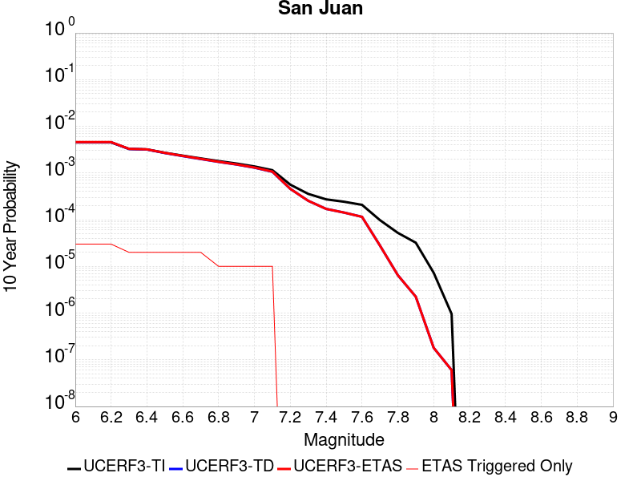 |

| Magnitude | 1 wk TI Prob | 1 wk TD Prob | 1 wk ETAS Prob | 1 wk ETAS/TD Gain | 1 wk ETAS Triggered Only | 1 mo TI Prob | 1 mo TD Prob | 1 mo ETAS Prob | 1 mo ETAS/TD Gain | 1 mo ETAS Triggered Only | 1 yr TI Prob | 1 yr TD Prob | 1 yr ETAS Prob | 1 yr ETAS/TD Gain | 1 yr ETAS Triggered Only | 10 yr TI Prob | 10 yr TD Prob | 10 yr ETAS Prob | 10 yr ETAS/TD Gain | 10 yr ETAS Triggered Only |
|-----|-----|-----|-----|-----|-----|-----|-----|-----|-----|-----|-----|-----|-----|-----|-----|-----|-----|-----|-----|-----|
| 6.0 | 8.682808E-6 | 8.7491635E-6 | 2.1311867E-5 | 2.435875 | 1.2562814E-5 | 3.72115E-5 | 3.74959E-5 | 5.0058246E-5 | 1.3350325 | 1.2562814E-5 | 4.5295584E-4 | 4.564218E-4 | 4.689789E-4 | 1.027512 | 1.2562814E-5 | 0.004520337 | 0.004555385 | 0.0045678904 | 1.0027453 | 1.2562814E-5 |
| 6.1 | 8.682808E-6 | 8.7491635E-6 | 2.1311867E-5 | 2.435875 | 1.2562814E-5 | 3.72115E-5 | 3.74959E-5 | 5.0058246E-5 | 1.3350325 | 1.2562814E-5 | 4.5295584E-4 | 4.564218E-4 | 4.689789E-4 | 1.027512 | 1.2562814E-5 | 0.004520337 | 0.004555385 | 0.0045678904 | 1.0027453 | 1.2562814E-5 |
| 6.2 | 8.682808E-6 | 8.7491635E-6 | 2.1311867E-5 | 2.435875 | 1.2562814E-5 | 3.72115E-5 | 3.74959E-5 | 5.0058246E-5 | 1.3350325 | 1.2562814E-5 | 4.5295584E-4 | 4.564218E-4 | 4.689789E-4 | 1.027512 | 1.2562814E-5 | 0.004520337 | 0.004555385 | 0.0045678904 | 1.0027453 | 1.2562814E-5 |
| 6.3 | 6.3054235E-6 | 6.2825848E-6 | 6.2825848E-6 | 1.0 | 0.0 | 2.7022963E-5 | 2.6925094E-5 | 2.6925094E-5 | 1.0 | 0.0 | 3.2895492E-4 | 3.2776513E-4 | 3.2776513E-4 | 1.0 | 0.0 | 0.003284684 | 0.003273017 | 0.003273017 | 1.0 | 0.0 |
| 6.4 | 6.1490473E-6 | 6.1144656E-6 | 6.1144656E-6 | 1.0 | 0.0 | 2.6352795E-5 | 2.6204598E-5 | 2.6204598E-5 | 1.0 | 0.0 | 3.2079802E-4 | 3.1899565E-4 | 3.1899565E-4 | 1.0 | 0.0 | 0.0032033534 | 0.0031855737 | 0.0031855737 | 1.0 | 0.0 |
| 6.5 | 5.204848E-6 | 5.137233E-6 | 5.137233E-6 | 1.0 | 0.0 | 2.23063E-5 | 2.2016533E-5 | 2.2016533E-5 | 1.0 | 0.0 | 2.7154534E-4 | 2.6801927E-4 | 2.6801927E-4 | 1.0 | 0.0 | 0.0027121378 | 0.0026771144 | 0.0026771144 | 1.0 | 0.0 |
| 6.6 | 4.5179986E-6 | 4.4150297E-6 | 4.4150297E-6 | 1.0 | 0.0 | 1.9362706E-5 | 1.8921424E-5 | 1.8921424E-5 | 1.0 | 0.0 | 2.3571544E-4 | 2.3034477E-4 | 2.3034477E-4 | 1.0 | 0.0 | 0.0023546559 | 0.0023011973 | 0.0023011973 | 1.0 | 0.0 |
| 6.7 | 3.9442616E-6 | 3.819828E-6 | 3.819828E-6 | 1.0 | 0.0 | 1.6903869E-5 | 1.6370592E-5 | 1.6370592E-5 | 1.0 | 0.0 | 2.0578515E-4 | 1.992944E-4 | 1.992944E-4 | 1.0 | 0.0 | 0.002055947 | 0.0019912818 | 0.0019912818 | 1.0 | 0.0 |
| 6.8 | 3.4536245E-6 | 3.3163353E-6 | 3.3163353E-6 | 1.0 | 0.0 | 1.4801163E-5 | 1.4212792E-5 | 1.4212792E-5 | 1.0 | 0.0 | 1.8018926E-4 | 1.7302761E-4 | 1.7302761E-4 | 1.0 | 0.0 | 0.0018004322 | 0.0017290477 | 0.0017290477 | 1.0 | 0.0 |
| 6.9 | 3.059865E-6 | 2.9120315E-6 | 2.9120315E-6 | 1.0 | 0.0 | 1.3113641E-5 | 1.2480078E-5 | 1.2480078E-5 | 1.0 | 0.0 | 1.596469E-4 | 1.5193493E-4 | 1.5193493E-4 | 1.0 | 0.0 | 0.0015953224 | 0.0015184252 | 0.0015184252 | 1.0 | 0.0 |
| 7.0 | 2.6504351E-6 | 2.4920002E-6 | 2.4920002E-6 | 1.0 | 0.0 | 1.1358958E-5 | 1.0679961E-5 | 1.0679961E-5 | 1.0 | 0.0 | 1.3828653E-4 | 1.300213E-4 | 1.300213E-4 | 1.0 | 0.0 | 0.0013820052 | 0.0012995641 | 0.0012995641 | 1.0 | 0.0 |
| 7.1 | 2.2039317E-6 | 2.0338296E-6 | 2.0338296E-6 | 1.0 | 0.0 | 9.445387E-6 | 8.716386E-6 | 8.716386E-6 | 1.0 | 0.0 | 1.1499152E-4 | 1.0611736E-4 | 1.0611736E-4 | 1.0 | 0.0 | 0.0011493203 | 0.0010607769 | 0.0010607769 | 1.0 | 0.0 |
| 7.2 | 1.0786707E-6 | 8.7701903E-7 | 8.7701903E-7 | 1.0 | 0.0 | 4.622866E-6 | 3.7586476E-6 | 3.7586476E-6 | 1.0 | 0.0 | 5.628194E-5 | 4.5760586E-5 | 4.5760586E-5 | 1.0 | 0.0 | 5.6267687E-4 | 4.5757066E-4 | 4.5757066E-4 | 1.0 | 0.0 |
| 7.3 | 6.846433E-7 | 4.868805E-7 | 4.868805E-7 | 1.0 | 0.0 | 2.9341822E-6 | 2.086629E-6 | 2.086629E-6 | 1.0 | 0.0 | 3.5723086E-5 | 2.5404412E-5 | 2.5404412E-5 | 1.0 | 0.0 | 3.571734E-4 | 2.540486E-4 | 2.540486E-4 | 1.0 | 0.0 |
| 7.4 | 5.23043E-7 | 3.2628162E-7 | 3.2628162E-7 | 1.0 | 0.0 | 2.2416111E-6 | 1.398349E-6 | 1.398349E-6 | 1.0 | 0.0 | 2.7291273E-5 | 1.7024766E-5 | 1.7024766E-5 | 1.0 | 0.0 | 2.7287923E-4 | 1.7026656E-4 | 1.7026656E-4 | 1.0 | 0.0 |
| 7.5 | 4.648444E-7 | 2.7234944E-7 | 2.7234944E-7 | 1.0 | 0.0 | 1.9921886E-6 | 1.1672114E-6 | 1.1672114E-6 | 1.0 | 0.0 | 2.4254627E-5 | 1.42107065E-5 | 1.42107065E-5 | 1.0 | 0.0 | 2.425198E-4 | 1.421276E-4 | 1.421276E-4 | 1.0 | 0.0 |
| 7.6 | 3.9906567E-7 | 2.2083314E-7 | 2.2083314E-7 | 1.0 | 0.0 | 1.7102802E-6 | 9.464274E-7 | 9.464274E-7 | 1.0 | 0.0 | 2.0822463E-5 | 1.1522693E-5 | 1.1522693E-5 | 1.0 | 0.0 | 2.0820512E-4 | 1.15245566E-4 | 1.15245566E-4 | 1.0 | 0.0 |
| 7.7 | 1.8784601E-7 | 5.3666906E-8 | 5.3666906E-8 | 1.0 | 0.0 | 8.0505407E-7 | 2.30001E-7 | 2.30001E-7 | 1.0 | 0.0 | 9.80149E-6 | 2.8002585E-6 | 2.8002585E-6 | 1.0 | 0.0 | 9.801057E-5 | 2.8011282E-5 | 2.8011282E-5 | 1.0 | 0.0 |
| 7.8 | 1.00154914E-7 | 1.2415832E-8 | 1.2415832E-8 | 1.0 | 0.0 | 4.2923529E-7 | 5.3210716E-8 | 5.3210716E-8 | 1.0 | 0.0 | 5.225927E-6 | 6.4784024E-7 | 6.4784024E-7 | 1.0 | 0.0 | 5.225804E-5 | 6.484273E-6 | 6.484273E-6 | 1.0 | 0.0 |
| 7.9 | 6.171429E-8 | 4.2966155E-9 | 4.2966155E-9 | 1.0 | 0.0 | 2.6448978E-7 | 1.8414067E-8 | 1.8414067E-8 | 1.0 | 0.0 | 3.2201583E-6 | 2.2419121E-7 | 2.2419121E-7 | 1.0 | 0.0 | 3.2201115E-5 | 2.2472002E-6 | 2.2472002E-6 | 1.0 | 0.0 |
| 8.0 | 1.3974572E-8 | 3.3788217E-10 | 3.3788217E-10 | 1.0 | 0.0 | 5.989102E-8 | 1.448067E-9 | 1.448067E-9 | 1.0 | 0.0 | 7.2917294E-7 | 1.763022E-8 | 1.763022E-8 | 1.0 | 0.0 | 7.2917055E-6 | 1.8060365E-7 | 1.8060365E-7 | 1.0 | 0.0 |
| 8.1 | 1.8403477E-9 | 1.1302803E-10 | 1.1302803E-10 | 1.0 | 0.0 | 7.887204E-9 | 4.844063E-10 | 4.844063E-10 | 1.0 | 0.0 | 9.602671E-8 | 5.8976446E-9 | 5.8976446E-9 | 1.0 | 0.0 | 9.602667E-7 | 6.021993E-8 | 6.021993E-8 | 1.0 | 0.0 |

## Sargent 2011 CFM
*[(top)](#table-of-contents)*

| 1 Week | 1 Month | 1 Year | 10 Year |
|-----|-----|-----|-----|
|  |  |  |  |

| Magnitude | 1 wk TI Prob | 1 wk TD Prob | 1 wk ETAS Prob | 1 wk ETAS/TD Gain | 1 wk ETAS Triggered Only | 1 mo TI Prob | 1 mo TD Prob | 1 mo ETAS Prob | 1 mo ETAS/TD Gain | 1 mo ETAS Triggered Only | 1 yr TI Prob | 1 yr TD Prob | 1 yr ETAS Prob | 1 yr ETAS/TD Gain | 1 yr ETAS Triggered Only | 10 yr TI Prob | 10 yr TD Prob | 10 yr ETAS Prob | 10 yr ETAS/TD Gain | 10 yr ETAS Triggered Only |
|-----|-----|-----|-----|-----|-----|-----|-----|-----|-----|-----|-----|-----|-----|-----|-----|-----|-----|-----|-----|-----|
| 6.0 | 3.7327867E-5 | 3.664913E-5 | 3.664913E-5 | 1.0 | 0.0 | 1.5996677E-4 | 1.5706103E-4 | 1.6962187E-4 | 1.0799743 | 1.2562814E-5 | 0.0019458556 | 0.0019110236 | 0.0019235625 | 1.0065613 | 1.2562814E-5 | 0.01928905 | 0.019018095 | 0.019030418 | 1.000648 | 1.2562814E-5 |
| 6.1 | 2.3771476E-5 | 1.8479273E-5 | 1.8479273E-5 | 1.0 | 0.0 | 1.01873775E-4 | 7.919498E-5 | 7.919498E-5 | 1.0 | 0.0 | 0.0012396075 | 9.638493E-4 | 9.638493E-4 | 1.0 | 0.0 | 0.012327154 | 0.009636091 | 0.009636091 | 1.0 | 0.0 |
| 6.2 | 2.3112721E-5 | 1.7710632E-5 | 1.7710632E-5 | 1.0 | 0.0 | 9.9050754E-5 | 7.590099E-5 | 7.590099E-5 | 1.0 | 0.0 | 0.0012052758 | 9.237792E-4 | 9.237792E-4 | 1.0 | 0.0 | 0.011987597 | 0.009238743 | 0.009238743 | 1.0 | 0.0 |
| 6.3 | 1.728509E-5 | 1.0458927E-5 | 1.0458927E-5 | 1.0 | 0.0 | 7.407686E-5 | 4.482347E-5 | 4.482347E-5 | 1.0 | 0.0 | 9.015125E-4 | 5.456343E-4 | 5.456343E-4 | 1.0 | 0.0 | 0.008978641 | 0.0054791216 | 0.0054791216 | 1.0 | 0.0 |
| 6.4 | 1.48395575E-5 | 7.4559816E-6 | 7.4559816E-6 | 1.0 | 0.0 | 6.3596555E-5 | 3.195403E-5 | 3.195403E-5 | 1.0 | 0.0 | 7.7401294E-4 | 3.8900663E-4 | 3.8900663E-4 | 1.0 | 0.0 | 0.0077132257 | 0.003918666 | 0.003918666 | 1.0 | 0.0 |
| 6.5 | 1.4358964E-5 | 6.894759E-6 | 6.894759E-6 | 1.0 | 0.0 | 6.1536964E-5 | 2.9548846E-5 | 2.9548846E-5 | 1.0 | 0.0 | 7.48955E-4 | 3.5973339E-4 | 3.5973339E-4 | 1.0 | 0.0 | 0.0074643586 | 0.0036269152 | 0.0036269152 | 1.0 | 0.0 |
| 6.6 | 9.772591E-6 | 1.3736154E-6 | 1.3736154E-6 | 1.0 | 0.0 | 4.188186E-5 | 5.88691E-6 | 5.88691E-6 | 1.0 | 0.0 | 5.097923E-4 | 7.16708E-5 | 7.16708E-5 | 1.0 | 0.0 | 0.005086244 | 7.483097E-4 | 7.483097E-4 | 1.0 | 0.0 |
| 6.7 | 9.752745E-6 | 1.3523068E-6 | 1.3523068E-6 | 1.0 | 0.0 | 4.179681E-5 | 5.795587E-6 | 5.795587E-6 | 1.0 | 0.0 | 5.0875737E-4 | 7.055902E-5 | 7.055902E-5 | 1.0 | 0.0 | 0.005075942 | 7.371994E-4 | 7.371994E-4 | 1.0 | 0.0 |
| 6.8 | 9.608213E-6 | 1.2361709E-6 | 1.2361709E-6 | 1.0 | 0.0 | 4.1177405E-5 | 5.2978644E-6 | 5.2978644E-6 | 1.0 | 0.0 | 5.012196E-4 | 6.449961E-5 | 6.449961E-5 | 1.0 | 0.0 | 0.005000906 | 6.7634037E-4 | 6.7634037E-4 | 1.0 | 0.0 |
| 6.9 | 9.427164E-6 | 1.12094E-6 | 1.12094E-6 | 1.0 | 0.0 | 4.04015E-5 | 4.80402E-6 | 4.80402E-6 | 1.0 | 0.0 | 4.9177726E-4 | 5.8487396E-5 | 5.8487396E-5 | 1.0 | 0.0 | 0.004906904 | 6.1557174E-4 | 6.1557174E-4 | 1.0 | 0.0 |
| 7.0 | 9.247601E-6 | 9.873988E-7 | 9.873988E-7 | 1.0 | 0.0 | 3.9631974E-5 | 4.2317024E-6 | 4.2317024E-6 | 1.0 | 0.0 | 4.8241246E-4 | 5.1519775E-5 | 5.1519775E-5 | 1.0 | 0.0 | 0.0048136655 | 5.4542476E-4 | 5.4542476E-4 | 1.0 | 0.0 |
| 7.1 | 8.995454E-6 | 8.2711284E-7 | 8.2711284E-7 | 1.0 | 0.0 | 3.8551374E-5 | 3.5447645E-6 | 3.5447645E-6 | 1.0 | 0.0 | 4.6926187E-4 | 4.3156666E-5 | 4.3156666E-5 | 1.0 | 0.0 | 0.004682722 | 4.609069E-4 | 4.609069E-4 | 1.0 | 0.0 |
| 7.2 | 8.520861E-6 | 5.2766507E-7 | 5.2766507E-7 | 1.0 | 0.0 | 3.6517464E-5 | 2.2614197E-6 | 2.2614197E-6 | 1.0 | 0.0 | 4.445094E-4 | 2.7532446E-5 | 2.7532446E-5 | 1.0 | 0.0 | 0.004436213 | 3.0297207E-4 | 3.0297207E-4 | 1.0 | 0.0 |
| 7.3 | 8.043592E-6 | 3.456507E-7 | 3.456507E-7 | 1.0 | 0.0 | 3.4472083E-5 | 1.4813593E-6 | 1.4813593E-6 | 1.0 | 0.0 | 4.196168E-4 | 1.8035402E-5 | 1.8035402E-5 | 1.0 | 0.0 | 0.004188253 | 2.0669671E-4 | 2.0669671E-4 | 1.0 | 0.0 |
| 7.4 | 7.662316E-6 | 2.928958E-7 | 2.928958E-7 | 1.0 | 0.0 | 3.2838085E-5 | 1.2552671E-6 | 1.2552671E-6 | 1.0 | 0.0 | 3.9973034E-4 | 1.528277E-5 | 1.528277E-5 | 1.0 | 0.0 | 0.0039901207 | 1.7736501E-4 | 1.7736501E-4 | 1.0 | 0.0 |
| 7.5 | 6.961638E-6 | 2.3574503E-7 | 2.3574503E-7 | 1.0 | 0.0 | 2.9835252E-5 | 1.0103355E-6 | 1.0103355E-6 | 1.0 | 0.0 | 3.6318362E-4 | 1.2300766E-5 | 1.2300766E-5 | 1.0 | 0.0 | 0.0036259065 | 1.4409334E-4 | 1.4409334E-4 | 1.0 | 0.0 |
| 7.6 | 6.282332E-6 | 1.6892966E-7 | 1.6892966E-7 | 1.0 | 0.0 | 2.6924003E-5 | 7.2398404E-7 | 7.2398404E-7 | 1.0 | 0.0 | 3.2775043E-4 | 8.814471E-6 | 8.814471E-6 | 1.0 | 0.0 | 0.0032726745 | 1.05050465E-4 | 1.05050465E-4 | 1.0 | 0.0 |
| 7.7 | 4.934408E-6 | 5.001089E-8 | 5.001089E-8 | 1.0 | 0.0 | 2.114729E-5 | 2.1433237E-7 | 2.1433237E-7 | 1.0 | 0.0 | 2.5743784E-4 | 2.6094935E-6 | 2.6094935E-6 | 1.0 | 0.0 | 0.0025713982 | 3.2545366E-5 | 3.2545366E-5 | 1.0 | 0.0 |
| 7.8 | 2.373212E-6 | 3.5172643E-8 | 3.5172643E-8 | 1.0 | 0.0 | 1.0170869E-5 | 1.507399E-7 | 1.507399E-7 | 1.0 | 0.0 | 1.238233E-4 | 1.8352566E-6 | 1.8352566E-6 | 1.0 | 0.0 | 0.0012375432 | 2.4125171E-5 | 2.4125171E-5 | 1.0 | 0.0 |
| 7.9 | 1.8227792E-6 | 3.0619603E-8 | 3.0619603E-8 | 1.0 | 0.0 | 7.811887E-6 | 1.3122687E-7 | 1.3122687E-7 | 1.0 | 0.0 | 9.510558E-5 | 1.5976858E-6 | 1.5976858E-6 | 1.0 | 0.0 | 9.5064886E-4 | 2.1410624E-5 | 2.1410624E-5 | 1.0 | 0.0 |
| 8.0 | 1.9095137E-7 | 1.326461E-8 | 1.326461E-8 | 1.0 | 0.0 | 8.1836276E-7 | 5.684833E-8 | 5.684833E-8 | 1.0 | 0.0 | 9.963521E-6 | 6.921282E-7 | 6.921282E-7 | 1.0 | 0.0 | 9.963074E-5 | 8.463319E-6 | 8.463319E-6 | 1.0 | 0.0 |

## Point Reyes 2011 CFM
*[(top)](#table-of-contents)*

| 1 Week | 1 Month | 1 Year | 10 Year |
|-----|-----|-----|-----|
|  |  |  |  |

| Magnitude | 1 wk TI Prob | 1 wk TD Prob | 1 wk ETAS Prob | 1 wk ETAS/TD Gain | 1 wk ETAS Triggered Only | 1 mo TI Prob | 1 mo TD Prob | 1 mo ETAS Prob | 1 mo ETAS/TD Gain | 1 mo ETAS Triggered Only | 1 yr TI Prob | 1 yr TD Prob | 1 yr ETAS Prob | 1 yr ETAS/TD Gain | 1 yr ETAS Triggered Only | 10 yr TI Prob | 10 yr TD Prob | 10 yr ETAS Prob | 10 yr ETAS/TD Gain | 10 yr ETAS Triggered Only |
|-----|-----|-----|-----|-----|-----|-----|-----|-----|-----|-----|-----|-----|-----|-----|-----|-----|-----|-----|-----|-----|
| 6.0 | 8.8644965E-6 | 8.967163E-6 | 2.1529864E-5 | 2.4009671 | 1.2562814E-5 | 3.7990147E-5 | 3.843017E-5 | 5.09925E-5 | 1.3268872 | 1.2562814E-5 | 4.624319E-4 | 4.6779314E-4 | 4.8035008E-4 | 1.026843 | 1.2562814E-5 | 0.0046147075 | 0.004668713 | 0.004681217 | 1.0026783 | 1.2562814E-5 |
| 6.1 | 4.526405E-6 | 4.5392185E-6 | 4.5392185E-6 | 1.0 | 0.0 | 1.9398734E-5 | 1.9453653E-5 | 1.9453653E-5 | 1.0 | 0.0 | 2.36154E-4 | 2.3682354E-4 | 2.3682354E-4 | 1.0 | 0.0 | 0.002359032 | 0.0023658178 | 0.0023658178 | 1.0 | 0.0 |
| 6.2 | 4.526405E-6 | 4.5392185E-6 | 4.5392185E-6 | 1.0 | 0.0 | 1.9398734E-5 | 1.9453653E-5 | 1.9453653E-5 | 1.0 | 0.0 | 2.36154E-4 | 2.3682354E-4 | 2.3682354E-4 | 1.0 | 0.0 | 0.002359032 | 0.0023658178 | 0.0023658178 | 1.0 | 0.0 |
| 6.3 | 2.6842322E-6 | 2.660676E-6 | 2.660676E-6 | 1.0 | 0.0 | 1.1503801E-5 | 1.1402849E-5 | 1.1402849E-5 | 1.0 | 0.0 | 1.4004979E-4 | 1.3882104E-4 | 1.3882104E-4 | 1.0 | 0.0 | 0.0013996155 | 0.0013873649 | 0.0013873649 | 1.0 | 0.0 |
| 6.4 | 2.6842322E-6 | 2.660676E-6 | 2.660676E-6 | 1.0 | 0.0 | 1.1503801E-5 | 1.1402849E-5 | 1.1402849E-5 | 1.0 | 0.0 | 1.4004979E-4 | 1.3882104E-4 | 1.3882104E-4 | 1.0 | 0.0 | 0.0013996155 | 0.0013873649 | 0.0013873649 | 1.0 | 0.0 |
| 6.5 | 1.9281833E-6 | 1.8906262E-6 | 1.8906262E-6 | 1.0 | 0.0 | 8.263617E-6 | 8.102659E-6 | 8.102659E-6 | 1.0 | 0.0 | 1.0060489E-4 | 9.86455E-5 | 9.86455E-5 | 1.0 | 0.0 | 0.0010055936 | 9.860279E-4 | 9.860279E-4 | 1.0 | 0.0 |
| 6.6 | 1.4726726E-6 | 1.4269577E-6 | 1.4269577E-6 | 1.0 | 0.0 | 6.3114385E-6 | 6.1155188E-6 | 6.1155188E-6 | 1.0 | 0.0 | 7.683905E-5 | 7.445395E-5 | 7.445395E-5 | 1.0 | 0.0 | 7.6812494E-4 | 7.4429717E-4 | 7.4429717E-4 | 1.0 | 0.0 |
| 6.7 | 8.572307E-7 | 8.007212E-7 | 8.007212E-7 | 1.0 | 0.0 | 3.6738406E-6 | 3.431658E-6 | 3.431658E-6 | 1.0 | 0.0 | 4.472809E-5 | 4.1779647E-5 | 4.1779647E-5 | 1.0 | 0.0 | 4.471909E-4 | 4.1772184E-4 | 4.1772184E-4 | 1.0 | 0.0 |
| 6.8 | 6.6745434E-7 | 6.0773E-7 | 6.0773E-7 | 1.0 | 0.0 | 2.8605155E-6 | 2.6045543E-6 | 2.6045543E-6 | 1.0 | 0.0 | 3.482622E-5 | 3.171E-5 | 3.171E-5 | 1.0 | 0.0 | 3.4820763E-4 | 3.1705803E-4 | 3.1705803E-4 | 1.0 | 0.0 |
| 6.9 | 4.291521E-7 | 3.6535937E-7 | 3.6535937E-7 | 1.0 | 0.0 | 1.839222E-6 | 1.565825E-6 | 1.565825E-6 | 1.0 | 0.0 | 2.2392298E-5 | 1.9063755E-5 | 1.9063755E-5 | 1.0 | 0.0 | 2.2390042E-4 | 1.9062385E-4 | 1.9062385E-4 | 1.0 | 0.0 |
| 7.0 | 2.6812808E-7 | 2.0187414E-7 | 2.0187414E-7 | 1.0 | 0.0 | 1.1491198E-6 | 8.651746E-7 | 8.651746E-7 | 1.0 | 0.0 | 1.3990444E-5 | 1.0533451E-5 | 1.0533451E-5 | 1.0 | 0.0 | 1.3989564E-4 | 1.0533186E-4 | 1.0533186E-4 | 1.0 | 0.0 |
| 7.1 | 1.9451231E-7 | 1.2725499E-7 | 1.2725499E-7 | 1.0 | 0.0 | 8.336239E-7 | 5.453784E-7 | 5.453784E-7 | 1.0 | 0.0 | 1.0149324E-5 | 6.6399616E-6 | 6.6399616E-6 | 1.0 | 0.0 | 1.014886E-4 | 6.639991E-5 | 6.639991E-5 | 1.0 | 0.0 |
| 7.2 | 1.6715143E-7 | 1.00428394E-7 | 1.00428394E-7 | 1.0 | 0.0 | 7.1636305E-7 | 4.3040734E-7 | 4.3040734E-7 | 1.0 | 0.0 | 8.721685E-6 | 5.2401965E-6 | 5.2401965E-6 | 1.0 | 0.0 | 8.721343E-5 | 5.2402997E-5 | 5.2402997E-5 | 1.0 | 0.0 |
| 7.3 | 1.5503173E-7 | 9.0131024E-8 | 9.0131024E-8 | 1.0 | 0.0 | 6.644215E-7 | 3.8627576E-7 | 3.8627576E-7 | 1.0 | 0.0 | 8.089301E-6 | 4.702897E-6 | 4.702897E-6 | 1.0 | 0.0 | 8.089007E-5 | 4.7030244E-5 | 4.7030244E-5 | 1.0 | 0.0 |
| 7.4 | 1.4251614E-7 | 8.097624E-8 | 8.097624E-8 | 1.0 | 0.0 | 6.1078333E-7 | 3.47041E-7 | 3.47041E-7 | 1.0 | 0.0 | 7.4362615E-6 | 4.225216E-6 | 4.225216E-6 | 1.0 | 0.0 | 7.436013E-5 | 4.2253625E-5 | 4.2253625E-5 | 1.0 | 0.0 |
| 7.5 | 1.2710186E-7 | 7.0296394E-8 | 7.0296394E-8 | 1.0 | 0.0 | 5.447221E-7 | 3.0127023E-7 | 3.0127023E-7 | 1.0 | 0.0 | 6.6319717E-6 | 3.667959E-6 | 3.667959E-6 | 1.0 | 0.0 | 6.6317734E-5 | 3.6681253E-5 | 3.6681253E-5 | 1.0 | 0.0 |
| 7.6 | 1.0144708E-7 | 5.4952274E-8 | 5.4952274E-8 | 1.0 | 0.0 | 4.347731E-7 | 2.3550973E-7 | 2.3550973E-7 | 1.0 | 0.0 | 5.2933497E-6 | 2.8673273E-6 | 2.8673273E-6 | 1.0 | 0.0 | 5.293224E-5 | 2.8675171E-5 | 2.8675171E-5 | 1.0 | 0.0 |
| 7.7 | 7.090527E-8 | 3.98231E-8 | 3.98231E-8 | 1.0 | 0.0 | 3.038797E-7 | 1.7067042E-7 | 1.7067042E-7 | 1.0 | 0.0 | 3.699729E-6 | 2.0779103E-6 | 2.0779103E-6 | 1.0 | 0.0 | 3.6996673E-5 | 2.0781177E-5 | 2.0781177E-5 | 1.0 | 0.0 |
| 7.8 | 3.8712045E-8 | 2.7440025E-8 | 2.7440025E-8 | 1.0 | 0.0 | 1.6590876E-7 | 1.176001E-7 | 1.176001E-7 | 1.0 | 0.0 | 2.0199373E-6 | 1.4317802E-6 | 1.4317802E-6 | 1.0 | 0.0 | 2.0199188E-5 | 1.4319979E-5 | 1.4319979E-5 | 1.0 | 0.0 |
| 7.9 | 1.7068782E-8 | 1.1833354E-8 | 1.1833354E-8 | 1.0 | 0.0 | 7.315192E-8 | 5.0714362E-8 | 5.0714362E-8 | 1.0 | 0.0 | 8.906242E-7 | 6.174472E-7 | 6.174472E-7 | 1.0 | 0.0 | 8.906207E-6 | 6.1767228E-6 | 6.1767228E-6 | 1.0 | 0.0 |
| 8.0 | 1.0172592E-8 | 7.0280843E-9 | 7.0280843E-9 | 1.0 | 0.0 | 4.359682E-8 | 3.0120354E-8 | 3.0120354E-8 | 1.0 | 0.0 | 5.3079117E-7 | 3.6671526E-7 | 3.6671526E-7 | 1.0 | 0.0 | 5.307899E-6 | 3.6694146E-6 | 3.6694146E-6 | 1.0 | 0.0 |
| 8.1 | 3.7861243E-9 | 3.5452439E-9 | 3.5452439E-9 | 1.0 | 0.0 | 1.6226247E-8 | 1.5193901E-8 | 1.5193901E-8 | 1.0 | 0.0 | 1.9755454E-7 | 1.8498575E-7 | 1.8498575E-7 | 1.0 | 0.0 | 1.9755437E-6 | 1.8518531E-6 | 1.8518531E-6 | 1.0 | 0.0 |

## Garberville - Briceland 2011 CFM
*[(top)](#table-of-contents)*

| 1 Week | 1 Month | 1 Year | 10 Year |
|-----|-----|-----|-----|
|  |  |  |  |

| Magnitude | 1 wk TI Prob | 1 wk TD Prob | 1 wk ETAS Prob | 1 wk ETAS/TD Gain | 1 wk ETAS Triggered Only | 1 mo TI Prob | 1 mo TD Prob | 1 mo ETAS Prob | 1 mo ETAS/TD Gain | 1 mo ETAS Triggered Only | 1 yr TI Prob | 1 yr TD Prob | 1 yr ETAS Prob | 1 yr ETAS/TD Gain | 1 yr ETAS Triggered Only | 10 yr TI Prob | 10 yr TD Prob | 10 yr ETAS Prob | 10 yr ETAS/TD Gain | 10 yr ETAS Triggered Only |
|-----|-----|-----|-----|-----|-----|-----|-----|-----|-----|-----|-----|-----|-----|-----|-----|-----|-----|-----|-----|-----|
| 6.0 | 4.8399295E-5 | 6.452381E-5 | 7.708582E-5 | 1.1946878 | 1.2562814E-5 | 2.0740906E-4 | 2.7650563E-4 | 2.8906498E-4 | 1.0454216 | 1.2562814E-5 | 0.002522281 | 0.003362017 | 0.0033745377 | 1.0037241 | 1.2562814E-5 | 0.024938442 | 0.03317861 | 0.033190757 | 1.0003661 | 1.2562814E-5 |
| 6.1 | 4.8399295E-5 | 6.452381E-5 | 7.708582E-5 | 1.1946878 | 1.2562814E-5 | 2.0740906E-4 | 2.7650563E-4 | 2.8906498E-4 | 1.0454216 | 1.2562814E-5 | 0.002522281 | 0.003362017 | 0.0033745377 | 1.0037241 | 1.2562814E-5 | 0.024938442 | 0.03317861 | 0.033190757 | 1.0003661 | 1.2562814E-5 |
| 6.2 | 4.8399295E-5 | 6.452381E-5 | 7.708582E-5 | 1.1946878 | 1.2562814E-5 | 2.0740906E-4 | 2.7650563E-4 | 2.8906498E-4 | 1.0454216 | 1.2562814E-5 | 0.002522281 | 0.003362017 | 0.0033745377 | 1.0037241 | 1.2562814E-5 | 0.024938442 | 0.03317861 | 0.033190757 | 1.0003661 | 1.2562814E-5 |
| 6.3 | 4.8399295E-5 | 6.452381E-5 | 7.708582E-5 | 1.1946878 | 1.2562814E-5 | 2.0740906E-4 | 2.7650563E-4 | 2.8906498E-4 | 1.0454216 | 1.2562814E-5 | 0.002522281 | 0.003362017 | 0.0033745377 | 1.0037241 | 1.2562814E-5 | 0.024938442 | 0.03317861 | 0.033190757 | 1.0003661 | 1.2562814E-5 |
| 6.4 | 4.8399295E-5 | 6.452381E-5 | 7.708582E-5 | 1.1946878 | 1.2562814E-5 | 2.0740906E-4 | 2.7650563E-4 | 2.8906498E-4 | 1.0454216 | 1.2562814E-5 | 0.002522281 | 0.003362017 | 0.0033745377 | 1.0037241 | 1.2562814E-5 | 0.024938442 | 0.03317861 | 0.033190757 | 1.0003661 | 1.2562814E-5 |
| 6.5 | 4.8399295E-5 | 6.452381E-5 | 7.708582E-5 | 1.1946878 | 1.2562814E-5 | 2.0740906E-4 | 2.7650563E-4 | 2.8906498E-4 | 1.0454216 | 1.2562814E-5 | 0.002522281 | 0.003362017 | 0.0033745377 | 1.0037241 | 1.2562814E-5 | 0.024938442 | 0.03317861 | 0.033190757 | 1.0003661 | 1.2562814E-5 |
| 6.6 | 4.8399295E-5 | 6.452381E-5 | 7.708582E-5 | 1.1946878 | 1.2562814E-5 | 2.0740906E-4 | 2.7650563E-4 | 2.8906498E-4 | 1.0454216 | 1.2562814E-5 | 0.002522281 | 0.003362017 | 0.0033745377 | 1.0037241 | 1.2562814E-5 | 0.024938442 | 0.03317861 | 0.033190757 | 1.0003661 | 1.2562814E-5 |
| 6.7 | 3.495179E-5 | 4.6308873E-5 | 5.8871105E-5 | 1.2712705 | 1.2562814E-5 | 1.4978478E-4 | 1.9845461E-4 | 2.1101494E-4 | 1.0632906 | 1.2562814E-5 | 0.0018221042 | 0.002414053 | 0.0024265856 | 1.0051914 | 1.2562814E-5 | 0.018072363 | 0.023930617 | 0.023942878 | 1.0005124 | 1.2562814E-5 |
| 6.8 | 2.7517597E-5 | 3.6241618E-5 | 4.8803977E-5 | 1.346628 | 1.2562814E-5 | 1.1792722E-4 | 1.5531474E-4 | 1.678756E-4 | 1.0808736 | 1.2562814E-5 | 0.0014348183 | 0.0018897996 | 0.0019023386 | 1.0066352 | 1.2562814E-5 | 0.014255894 | 0.018783508 | 0.018795835 | 1.0006562 | 1.2562814E-5 |
| 6.9 | 2.74461E-5 | 3.6159345E-5 | 4.8721704E-5 | 1.3474166 | 1.2562814E-5 | 1.1762084E-4 | 1.5496218E-4 | 1.6752305E-4 | 1.0810577 | 1.2562814E-5 | 0.001431093 | 0.0018855145 | 0.0018980537 | 1.0066502 | 1.2562814E-5 | 0.014219119 | 0.018741382 | 0.01875371 | 1.0006578 | 1.2562814E-5 |
| 7.0 | 1.9023773E-5 | 2.4707579E-5 | 3.727008E-5 | 1.5084474 | 1.2562814E-5 | 8.152791E-5 | 1.0588763E-4 | 1.1844912E-4 | 1.1186303 | 1.2562814E-5 | 9.921503E-4 | 0.0012888284 | 0.0013013751 | 1.0097349 | 1.2562814E-5 | 0.009877323 | 0.012852574 | 0.012864975 | 1.0009649 | 1.2562814E-5 |
| 7.1 | 5.566844E-6 | 6.512147E-6 | 6.512147E-6 | 1.0 | 0.0 | 2.3857683E-5 | 2.7908927E-5 | 2.7908927E-5 | 1.0 | 0.0 | 2.9042858E-4 | 3.3974246E-4 | 3.3974246E-4 | 1.0 | 0.0 | 0.002900493 | 0.0033926512 | 0.0033926512 | 1.0 | 0.0 |
| 7.2 | 4.011353E-6 | 4.6746213E-6 | 4.6746213E-6 | 1.0 | 0.0 | 1.7191402E-5 | 2.0033956E-5 | 2.0033956E-5 | 1.0 | 0.0 | 2.0928521E-4 | 2.4388955E-4 | 2.4388955E-4 | 1.0 | 0.0 | 0.0020908823 | 0.0024365564 | 0.0024365564 | 1.0 | 0.0 |
| 7.3 | 2.0974871E-6 | 2.4395908E-6 | 2.4395908E-6 | 1.0 | 0.0 | 8.989199E-6 | 1.0455362E-5 | 1.0455362E-5 | 1.0 | 0.0 | 1.09438006E-4 | 1.272891E-4 | 1.272891E-4 | 1.0 | 0.0 | 0.0010938413 | 0.0012724071 | 0.0012724071 | 1.0 | 0.0 |

## Mad River (alt1)
*[(top)](#table-of-contents)*

| 1 Week | 1 Month | 1 Year | 10 Year |
|-----|-----|-----|-----|
|  | 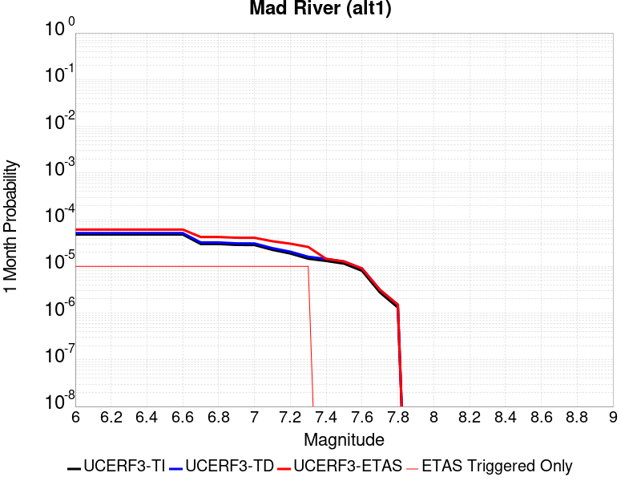 |  |  |

| Magnitude | 1 wk TI Prob | 1 wk TD Prob | 1 wk ETAS Prob | 1 wk ETAS/TD Gain | 1 wk ETAS Triggered Only | 1 mo TI Prob | 1 mo TD Prob | 1 mo ETAS Prob | 1 mo ETAS/TD Gain | 1 mo ETAS Triggered Only | 1 yr TI Prob | 1 yr TD Prob | 1 yr ETAS Prob | 1 yr ETAS/TD Gain | 1 yr ETAS Triggered Only | 10 yr TI Prob | 10 yr TD Prob | 10 yr ETAS Prob | 10 yr ETAS/TD Gain | 10 yr ETAS Triggered Only |
|-----|-----|-----|-----|-----|-----|-----|-----|-----|-----|-----|-----|-----|-----|-----|-----|-----|-----|-----|-----|-----|
| 6.0 | 1.1255216E-5 | 1.2039658E-5 | 2.4602321E-5 | 2.04344 | 1.2562814E-5 | 4.8235746E-5 | 5.1597595E-5 | 6.4159765E-5 | 1.2434641 | 1.2562814E-5 | 5.87112E-4 | 6.280341E-4 | 6.4058905E-4 | 1.0199908 | 1.2562814E-5 | 0.0058556325 | 0.006264031 | 0.0062765153 | 1.001993 | 1.2562814E-5 |
| 6.1 | 1.1255216E-5 | 1.2039658E-5 | 2.4602321E-5 | 2.04344 | 1.2562814E-5 | 4.8235746E-5 | 5.1597595E-5 | 6.4159765E-5 | 1.2434641 | 1.2562814E-5 | 5.87112E-4 | 6.280341E-4 | 6.4058905E-4 | 1.0199908 | 1.2562814E-5 | 0.0058556325 | 0.006264031 | 0.0062765153 | 1.001993 | 1.2562814E-5 |
| 6.2 | 1.1255216E-5 | 1.2039658E-5 | 2.4602321E-5 | 2.04344 | 1.2562814E-5 | 4.8235746E-5 | 5.1597595E-5 | 6.4159765E-5 | 1.2434641 | 1.2562814E-5 | 5.87112E-4 | 6.280341E-4 | 6.4058905E-4 | 1.0199908 | 1.2562814E-5 | 0.0058556325 | 0.006264031 | 0.0062765153 | 1.001993 | 1.2562814E-5 |
| 6.3 | 1.1255216E-5 | 1.2039658E-5 | 2.4602321E-5 | 2.04344 | 1.2562814E-5 | 4.8235746E-5 | 5.1597595E-5 | 6.4159765E-5 | 1.2434641 | 1.2562814E-5 | 5.87112E-4 | 6.280341E-4 | 6.4058905E-4 | 1.0199908 | 1.2562814E-5 | 0.0058556325 | 0.006264031 | 0.0062765153 | 1.001993 | 1.2562814E-5 |
| 6.4 | 1.1255216E-5 | 1.2039658E-5 | 2.4602321E-5 | 2.04344 | 1.2562814E-5 | 4.8235746E-5 | 5.1597595E-5 | 6.4159765E-5 | 1.2434641 | 1.2562814E-5 | 5.87112E-4 | 6.280341E-4 | 6.4058905E-4 | 1.0199908 | 1.2562814E-5 | 0.0058556325 | 0.006264031 | 0.0062765153 | 1.001993 | 1.2562814E-5 |
| 6.5 | 1.1255216E-5 | 1.2039658E-5 | 2.4602321E-5 | 2.04344 | 1.2562814E-5 | 4.8235746E-5 | 5.1597595E-5 | 6.4159765E-5 | 1.2434641 | 1.2562814E-5 | 5.87112E-4 | 6.280341E-4 | 6.4058905E-4 | 1.0199908 | 1.2562814E-5 | 0.0058556325 | 0.006264031 | 0.0062765153 | 1.001993 | 1.2562814E-5 |
| 6.6 | 1.1255216E-5 | 1.2039658E-5 | 2.4602321E-5 | 2.04344 | 1.2562814E-5 | 4.8235746E-5 | 5.1597595E-5 | 6.4159765E-5 | 1.2434641 | 1.2562814E-5 | 5.87112E-4 | 6.280341E-4 | 6.4058905E-4 | 1.0199908 | 1.2562814E-5 | 0.0058556325 | 0.006264031 | 0.0062765153 | 1.001993 | 1.2562814E-5 |
| 6.7 | 7.0564884E-6 | 7.6054325E-6 | 2.016815E-5 | 2.6518085 | 1.2562814E-5 | 3.0241743E-5 | 3.2594315E-5 | 4.515672E-5 | 1.385417 | 1.2562814E-5 | 3.68131E-4 | 3.967657E-4 | 4.0932355E-4 | 1.0316505 | 1.2562814E-5 | 0.0036752177 | 0.0039607957 | 0.0039733085 | 1.0031593 | 1.2562814E-5 |
| 6.8 | 7.0564884E-6 | 7.6054325E-6 | 2.016815E-5 | 2.6518085 | 1.2562814E-5 | 3.0241743E-5 | 3.2594315E-5 | 4.515672E-5 | 1.385417 | 1.2562814E-5 | 3.68131E-4 | 3.967657E-4 | 4.0932355E-4 | 1.0316505 | 1.2562814E-5 | 0.0036752177 | 0.0039607957 | 0.0039733085 | 1.0031593 | 1.2562814E-5 |
| 6.9 | 6.727494E-6 | 7.2572843E-6 | 1.9820007E-5 | 2.73105 | 1.2562814E-5 | 2.8831799E-5 | 3.110229E-5 | 4.3664713E-5 | 1.4039067 | 1.2562814E-5 | 3.509706E-4 | 3.786067E-4 | 3.9116477E-4 | 1.0331692 | 1.2562814E-5 | 0.003504168 | 0.0037798323 | 0.0037923476 | 1.003311 | 1.2562814E-5 |
| 7.0 | 6.7021124E-6 | 7.2301245E-6 | 1.9792848E-5 | 2.737553 | 1.2562814E-5 | 2.8723021E-5 | 3.098589E-5 | 4.3548316E-5 | 1.405424 | 1.2562814E-5 | 3.4964667E-4 | 3.7719007E-4 | 3.8974814E-4 | 1.0332937 | 1.2562814E-5 | 0.0034909705 | 0.003765714 | 0.0037782295 | 1.0033236 | 1.2562814E-5 |
| 7.1 | 5.2784667E-6 | 5.7322395E-6 | 1.8294983E-5 | 3.1915941 | 1.2562814E-5 | 2.2621804E-5 | 2.4566516E-5 | 3.712902E-5 | 1.511367 | 1.2562814E-5 | 2.7538565E-4 | 2.990572E-4 | 3.1161623E-4 | 1.0419955 | 1.2562814E-5 | 0.0027504463 | 0.0029866395 | 0.0029991649 | 1.0041938 | 1.2562814E-5 |
| 7.2 | 4.4085446E-6 | 4.819547E-6 | 1.7382301E-5 | 3.6066253 | 1.2562814E-5 | 1.8893625E-5 | 2.0655041E-5 | 3.3217595E-5 | 1.6082077 | 1.2562814E-5 | 2.3000561E-4 | 2.514465E-4 | 2.6400614E-4 | 1.0499496 | 1.2562814E-5 | 0.0022976769 | 0.0025116608 | 0.002524192 | 1.0049893 | 1.2562814E-5 |
| 7.3 | 3.4060627E-6 | 3.7531752E-6 | 1.6315942E-5 | 4.347237 | 1.2562814E-5 | 1.459733E-5 | 1.6084938E-5 | 2.864755E-5 | 1.7810171 | 1.2562814E-5 | 1.77708E-4 | 1.9581676E-4 | 2.0837711E-4 | 1.0641434 | 1.2562814E-5 | 0.0017756595 | 0.0019564657 | 0.0019690038 | 1.0064086 | 1.2562814E-5 |
| 7.4 | 3.0570902E-6 | 3.3802967E-6 | 3.3802967E-6 | 1.0 | 0.0 | 1.310175E-5 | 1.4486906E-5 | 1.4486906E-5 | 1.0 | 0.0 | 1.5950213E-4 | 1.7636403E-4 | 1.7636403E-4 | 1.0 | 0.0 | 0.0015938769 | 0.0017622622 | 0.0017622622 | 1.0 | 0.0 |
| 7.5 | 2.674048E-6 | 2.9692678E-6 | 2.9692678E-6 | 1.0 | 0.0 | 1.1460155E-5 | 1.27253725E-5 | 1.27253725E-5 | 1.0 | 0.0 | 1.3951845E-4 | 1.5492059E-4 | 1.5492059E-4 | 1.0 | 0.0 | 0.0013943089 | 0.0015481455 | 0.0015481455 | 1.0 | 0.0 |
| 7.6 | 1.8806261E-6 | 2.1046062E-6 | 2.1046062E-6 | 1.0 | 0.0 | 8.059801E-6 | 9.01971E-6 | 9.01971E-6 | 1.0 | 0.0 | 9.812366E-5 | 1.0980956E-4 | 1.0980956E-4 | 1.0 | 0.0 | 9.808034E-4 | 0.0010975654 | 0.0010975654 | 1.0 | 0.0 |
| 7.7 | 6.461283E-7 | 7.3407836E-7 | 7.3407836E-7 | 1.0 | 0.0 | 2.7691183E-6 | 3.1460463E-6 | 3.1460463E-6 | 1.0 | 0.0 | 3.371349E-5 | 3.8302456E-5 | 3.8302456E-5 | 1.0 | 0.0 | 3.370838E-4 | 3.8296005E-4 | 3.8296005E-4 | 1.0 | 0.0 |
| 7.8 | 3.0785324E-7 | 3.5290012E-7 | 3.5290012E-7 | 1.0 | 0.0 | 1.3193703E-6 | 1.5124282E-6 | 1.5124282E-6 | 1.0 | 0.0 | 1.6063215E-5 | 1.8413664E-5 | 1.8413664E-5 | 1.0 | 0.0 | 1.6062055E-4 | 1.8412202E-4 | 1.8412202E-4 | 1.0 | 0.0 |

## Pitas Point (Lower West)
*[(top)](#table-of-contents)*

| 1 Week | 1 Month | 1 Year | 10 Year |
|-----|-----|-----|-----|
|  |  |  |  |

| Magnitude | 1 wk TI Prob | 1 wk TD Prob | 1 wk ETAS Prob | 1 wk ETAS/TD Gain | 1 wk ETAS Triggered Only | 1 mo TI Prob | 1 mo TD Prob | 1 mo ETAS Prob | 1 mo ETAS/TD Gain | 1 mo ETAS Triggered Only | 1 yr TI Prob | 1 yr TD Prob | 1 yr ETAS Prob | 1 yr ETAS/TD Gain | 1 yr ETAS Triggered Only | 10 yr TI Prob | 10 yr TD Prob | 10 yr ETAS Prob | 10 yr ETAS/TD Gain | 10 yr ETAS Triggered Only |
|-----|-----|-----|-----|-----|-----|-----|-----|-----|-----|-----|-----|-----|-----|-----|-----|-----|-----|-----|-----|-----|
| 6.0 | 8.151497E-6 | 7.855762E-6 | 2.0418478E-5 | 2.599172 | 1.2562814E-5 | 3.493452E-5 | 3.3667122E-5 | 4.6229514E-5 | 1.3731353 | 1.2562814E-5 | 4.252448E-4 | 4.0982084E-4 | 4.223785E-4 | 1.0306418 | 1.2562814E-5 | 0.0042443196 | 0.0040907315 | 0.004103243 | 1.0030584 | 1.2562814E-5 |
| 6.1 | 8.151497E-6 | 7.855762E-6 | 2.0418478E-5 | 2.599172 | 1.2562814E-5 | 3.493452E-5 | 3.3667122E-5 | 4.6229514E-5 | 1.3731353 | 1.2562814E-5 | 4.252448E-4 | 4.0982084E-4 | 4.223785E-4 | 1.0306418 | 1.2562814E-5 | 0.0042443196 | 0.0040907315 | 0.004103243 | 1.0030584 | 1.2562814E-5 |
| 6.2 | 8.151497E-6 | 7.855762E-6 | 2.0418478E-5 | 2.599172 | 1.2562814E-5 | 3.493452E-5 | 3.3667122E-5 | 4.6229514E-5 | 1.3731353 | 1.2562814E-5 | 4.252448E-4 | 4.0982084E-4 | 4.223785E-4 | 1.0306418 | 1.2562814E-5 | 0.0042443196 | 0.0040907315 | 0.004103243 | 1.0030584 | 1.2562814E-5 |
| 6.3 | 8.151497E-6 | 7.855762E-6 | 2.0418478E-5 | 2.599172 | 1.2562814E-5 | 3.493452E-5 | 3.3667122E-5 | 4.6229514E-5 | 1.3731353 | 1.2562814E-5 | 4.252448E-4 | 4.0982084E-4 | 4.223785E-4 | 1.0306418 | 1.2562814E-5 | 0.0042443196 | 0.0040907315 | 0.004103243 | 1.0030584 | 1.2562814E-5 |
| 6.4 | 8.151497E-6 | 7.855762E-6 | 2.0418478E-5 | 2.599172 | 1.2562814E-5 | 3.493452E-5 | 3.3667122E-5 | 4.6229514E-5 | 1.3731353 | 1.2562814E-5 | 4.252448E-4 | 4.0982084E-4 | 4.223785E-4 | 1.0306418 | 1.2562814E-5 | 0.0042443196 | 0.0040907315 | 0.004103243 | 1.0030584 | 1.2562814E-5 |
| 6.5 | 8.151497E-6 | 7.855762E-6 | 2.0418478E-5 | 2.599172 | 1.2562814E-5 | 3.493452E-5 | 3.3667122E-5 | 4.6229514E-5 | 1.3731353 | 1.2562814E-5 | 4.252448E-4 | 4.0982084E-4 | 4.223785E-4 | 1.0306418 | 1.2562814E-5 | 0.0042443196 | 0.0040907315 | 0.004103243 | 1.0030584 | 1.2562814E-5 |
| 6.6 | 8.151497E-6 | 7.855762E-6 | 2.0418478E-5 | 2.599172 | 1.2562814E-5 | 3.493452E-5 | 3.3667122E-5 | 4.6229514E-5 | 1.3731353 | 1.2562814E-5 | 4.252448E-4 | 4.0982084E-4 | 4.223785E-4 | 1.0306418 | 1.2562814E-5 | 0.0042443196 | 0.0040907315 | 0.004103243 | 1.0030584 | 1.2562814E-5 |
| 6.7 | 8.151497E-6 | 7.855762E-6 | 2.0418478E-5 | 2.599172 | 1.2562814E-5 | 3.493452E-5 | 3.3667122E-5 | 4.6229514E-5 | 1.3731353 | 1.2562814E-5 | 4.252448E-4 | 4.0982084E-4 | 4.223785E-4 | 1.0306418 | 1.2562814E-5 | 0.0042443196 | 0.0040907315 | 0.004103243 | 1.0030584 | 1.2562814E-5 |
| 6.8 | 8.151497E-6 | 7.855762E-6 | 2.0418478E-5 | 2.599172 | 1.2562814E-5 | 3.493452E-5 | 3.3667122E-5 | 4.6229514E-5 | 1.3731353 | 1.2562814E-5 | 4.252448E-4 | 4.0982084E-4 | 4.223785E-4 | 1.0306418 | 1.2562814E-5 | 0.0042443196 | 0.0040907315 | 0.004103243 | 1.0030584 | 1.2562814E-5 |
| 6.9 | 8.151497E-6 | 7.855762E-6 | 2.0418478E-5 | 2.599172 | 1.2562814E-5 | 3.493452E-5 | 3.3667122E-5 | 4.6229514E-5 | 1.3731353 | 1.2562814E-5 | 4.252448E-4 | 4.0982084E-4 | 4.223785E-4 | 1.0306418 | 1.2562814E-5 | 0.0042443196 | 0.0040907315 | 0.004103243 | 1.0030584 | 1.2562814E-5 |
| 7.0 | 8.103535E-6 | 7.805192E-6 | 2.0367908E-5 | 2.6095333 | 1.2562814E-5 | 3.4728975E-5 | 3.3450397E-5 | 4.6012792E-5 | 1.3755529 | 1.2562814E-5 | 4.2274324E-4 | 4.0718322E-4 | 4.197409E-4 | 1.0308404 | 1.2562814E-5 | 0.0042193993 | 0.004064452 | 0.0040769638 | 1.0030783 | 1.2562814E-5 |
| 7.1 | 7.853298E-6 | 7.540883E-6 | 2.0103602E-5 | 2.6659482 | 1.2562814E-5 | 3.3656554E-5 | 3.2317676E-5 | 4.4880082E-5 | 1.3887163 | 1.2562814E-5 | 4.096915E-4 | 3.9339735E-4 | 4.0595522E-4 | 1.0319216 | 1.2562814E-5 | 0.00408937 | 0.0039270855 | 0.003939599 | 1.0031865 | 1.2562814E-5 |
| 7.2 | 7.771102E-6 | 7.453165E-6 | 2.0015885E-5 | 2.6855552 | 1.2562814E-5 | 3.33043E-5 | 3.194175E-5 | 4.4504162E-5 | 1.3932914 | 1.2562814E-5 | 4.0540437E-4 | 3.8882208E-4 | 4.0138E-4 | 1.0322974 | 1.2562814E-5 | 0.0040466557 | 0.0038814936 | 0.0038940075 | 1.003224 | 1.2562814E-5 |
| 7.3 | 7.3945344E-6 | 7.0492697E-6 | 1.9611995E-5 | 2.7821314 | 1.2562814E-5 | 3.1690477E-5 | 3.021081E-5 | 4.2773245E-5 | 1.4158258 | 1.2562814E-5 | 3.8576324E-4 | 3.6775516E-4 | 3.8031334E-4 | 1.0341482 | 1.2562814E-5 | 0.0038509427 | 0.0036715334 | 0.00368405 | 1.0034091 | 1.2562814E-5 |
| 7.4 | 6.964645E-6 | 6.5901186E-6 | 1.915285E-5 | 2.9062982 | 1.2562814E-5 | 2.9848137E-5 | 2.8243063E-5 | 4.080552E-5 | 1.4447981 | 1.2562814E-5 | 3.6334046E-4 | 3.4380553E-4 | 3.56364E-4 | 1.0365279 | 1.2562814E-5 | 0.0036274698 | 0.0034327896 | 0.0034453094 | 1.0036471 | 1.2562814E-5 |
| 7.5 | 6.6525035E-6 | 6.259157E-6 | 1.8821893E-5 | 3.007097 | 1.2562814E-5 | 2.851042E-5 | 2.6824686E-5 | 3.9387163E-5 | 1.4683177 | 1.2562814E-5 | 3.4705905E-4 | 3.265421E-4 | 3.391008E-4 | 1.0384597 | 1.2562814E-5 | 0.0034651754 | 0.0032606742 | 0.003273196 | 1.0038402 | 1.2562814E-5 |
| 7.6 | 5.613338E-6 | 5.151386E-6 | 1.7714136E-5 | 3.4387124 | 1.2562814E-5 | 2.405694E-5 | 2.2077185E-5 | 3.463972E-5 | 1.569028 | 1.2562814E-5 | 2.928539E-4 | 2.6875688E-4 | 2.8131632E-4 | 1.0467316 | 1.2562814E-5 | 0.0029246826 | 0.0026843501 | 0.0026968792 | 1.0046674 | 1.2562814E-5 |
| 7.7 | 4.494704E-6 | 3.996911E-6 | 1.6559676E-5 | 4.1431184 | 1.2562814E-5 | 1.9262876E-5 | 1.7129507E-5 | 2.9692106E-5 | 1.7333894 | 1.2562814E-5 | 2.3450027E-4 | 2.0853203E-4 | 2.2109222E-4 | 1.0602314 | 1.2562814E-5 | 0.0023425296 | 0.0020833875 | 0.0020959242 | 1.0060174 | 1.2562814E-5 |
| 7.8 | 2.6075882E-6 | 2.1836374E-6 | 2.1836374E-6 | 1.0 | 0.0 | 1.117533E-5 | 9.358413E-6 | 9.358413E-6 | 1.0 | 0.0 | 1.3605114E-4 | 1.1393277E-4 | 1.1393277E-4 | 1.0 | 0.0 | 0.0013596788 | 0.0011387484 | 0.0011387484 | 1.0 | 0.0 |
| 7.9 | 4.045984E-7 | 3.242375E-7 | 3.242375E-7 | 1.0 | 0.0 | 1.733992E-6 | 1.3895885E-6 | 1.3895885E-6 | 1.0 | 0.0 | 2.1111147E-5 | 1.6918111E-5 | 1.6918111E-5 | 1.0 | 0.0 | 2.1109142E-4 | 1.6916855E-4 | 1.6916855E-4 | 1.0 | 0.0 |
| 8.0 | 7.791402E-9 | 5.683497E-9 | 5.683497E-9 | 1.0 | 0.0 | 3.3391725E-8 | 2.4357844E-8 | 2.4357844E-8 | 1.0 | 0.0 | 4.0654416E-7 | 2.9655675E-7 | 2.9655675E-7 | 1.0 | 0.0 | 4.065434E-6 | 2.9655655E-6 | 2.9655655E-6 | 1.0 | 0.0 |

## South Klamath Lake West
*[(top)](#table-of-contents)*

| 1 Week | 1 Month | 1 Year | 10 Year |
|-----|-----|-----|-----|
|  |  |  | 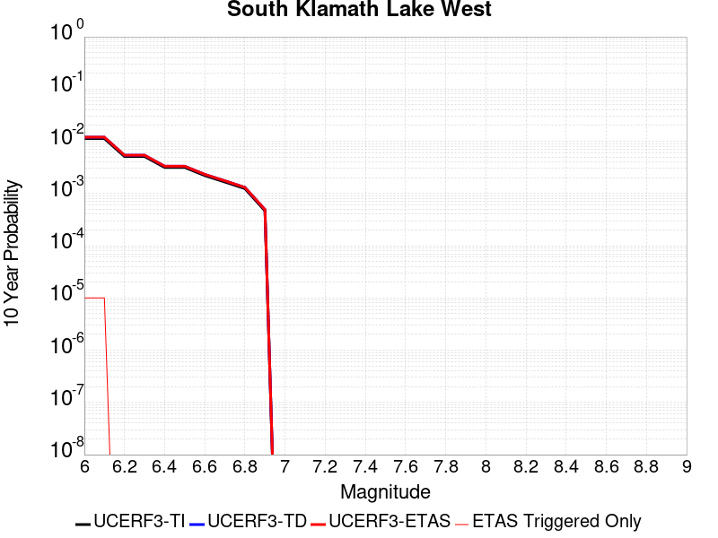 |

| Magnitude | 1 wk TI Prob | 1 wk TD Prob | 1 wk ETAS Prob | 1 wk ETAS/TD Gain | 1 wk ETAS Triggered Only | 1 mo TI Prob | 1 mo TD Prob | 1 mo ETAS Prob | 1 mo ETAS/TD Gain | 1 mo ETAS Triggered Only | 1 yr TI Prob | 1 yr TD Prob | 1 yr ETAS Prob | 1 yr ETAS/TD Gain | 1 yr ETAS Triggered Only | 10 yr TI Prob | 10 yr TD Prob | 10 yr ETAS Prob | 10 yr ETAS/TD Gain | 10 yr ETAS Triggered Only |
|-----|-----|-----|-----|-----|-----|-----|-----|-----|-----|-----|-----|-----|-----|-----|-----|-----|-----|-----|-----|-----|
| 6.0 | 2.174025E-5 | 2.3042025E-5 | 3.560455E-5 | 1.5452006 | 1.2562814E-5 | 9.3169176E-5 | 9.874817E-5 | 1.11309746E-4 | 1.1272081 | 1.2562814E-5 | 0.0011337444 | 0.0012016617 | 0.0012142094 | 1.010442 | 1.2562814E-5 | 0.011279777 | 0.0119582405 | 0.011970653 | 1.001038 | 1.2562814E-5 |
| 6.1 | 2.174025E-5 | 2.3042025E-5 | 3.560455E-5 | 1.5452006 | 1.2562814E-5 | 9.3169176E-5 | 9.874817E-5 | 1.11309746E-4 | 1.1272081 | 1.2562814E-5 | 0.0011337444 | 0.0012016617 | 0.0012142094 | 1.010442 | 1.2562814E-5 | 0.011279777 | 0.0119582405 | 0.011970653 | 1.001038 | 1.2562814E-5 |
| 6.2 | 9.834929E-6 | 1.0393841E-5 | 1.0393841E-5 | 1.0 | 0.0 | 4.2149015E-5 | 4.4544326E-5 | 4.4544326E-5 | 1.0 | 0.0 | 5.1304343E-4 | 5.422012E-4 | 5.422012E-4 | 1.0 | 0.0 | 0.0051186057 | 0.0054096854 | 0.0054096854 | 1.0 | 0.0 |
| 6.3 | 9.834929E-6 | 1.0393841E-5 | 1.0393841E-5 | 1.0 | 0.0 | 4.2149015E-5 | 4.4544326E-5 | 4.4544326E-5 | 1.0 | 0.0 | 5.1304343E-4 | 5.422012E-4 | 5.422012E-4 | 1.0 | 0.0 | 0.0051186057 | 0.0054096854 | 0.0054096854 | 1.0 | 0.0 |
| 6.4 | 6.066321E-6 | 6.40043E-6 | 6.40043E-6 | 1.0 | 0.0 | 2.5998259E-5 | 2.743014E-5 | 2.743014E-5 | 1.0 | 0.0 | 3.1648282E-4 | 3.3391351E-4 | 3.3391351E-4 | 1.0 | 0.0 | 0.0031603249 | 0.0033343881 | 0.0033343881 | 1.0 | 0.0 |
| 6.5 | 6.066321E-6 | 6.40043E-6 | 6.40043E-6 | 1.0 | 0.0 | 2.5998259E-5 | 2.743014E-5 | 2.743014E-5 | 1.0 | 0.0 | 3.1648282E-4 | 3.3391351E-4 | 3.3391351E-4 | 1.0 | 0.0 | 0.0031603249 | 0.0033343881 | 0.0033343881 | 1.0 | 0.0 |
| 6.6 | 4.2321803E-6 | 4.461291E-6 | 4.461291E-6 | 1.0 | 0.0 | 1.8137789E-5 | 1.9119685E-5 | 1.9119685E-5 | 1.0 | 0.0 | 2.208052E-4 | 2.3275832E-4 | 2.3275832E-4 | 1.0 | 0.0 | 0.0022058594 | 0.0023252473 | 0.0023252473 | 1.0 | 0.0 |
| 6.7 | 3.186646E-6 | 3.360305E-6 | 3.360305E-6 | 1.0 | 0.0 | 1.3656982E-5 | 1.4401232E-5 | 1.4401232E-5 | 1.0 | 0.0 | 1.6626107E-4 | 1.7532158E-4 | 1.7532158E-4 | 1.0 | 0.0 | 0.0016613674 | 0.0017518997 | 0.0017518997 | 1.0 | 0.0 |
| 6.8 | 2.380121E-6 | 2.510907E-6 | 2.510907E-6 | 1.0 | 0.0 | 1.0200479E-5 | 1.07609885E-5 | 1.07609885E-5 | 1.0 | 0.0 | 1.2418375E-4 | 1.3100762E-4 | 1.3100762E-4 | 1.0 | 0.0 | 0.0012411437 | 0.0013093497 | 0.0013093497 | 1.0 | 0.0 |
| 6.9 | 8.928287E-7 | 9.4302504E-7 | 9.4302504E-7 | 1.0 | 0.0 | 3.826403E-6 | 4.0415307E-6 | 4.0415307E-6 | 1.0 | 0.0 | 4.658546E-5 | 4.9204747E-5 | 4.9204747E-5 | 1.0 | 0.0 | 4.6575698E-4 | 4.9196015E-4 | 4.9196015E-4 | 1.0 | 0.0 |

## San Andreas (Offshore) 2011 CFM
*[(top)](#table-of-contents)*

| 1 Week | 1 Month | 1 Year | 10 Year |
|-----|-----|-----|-----|
|  |  |  | 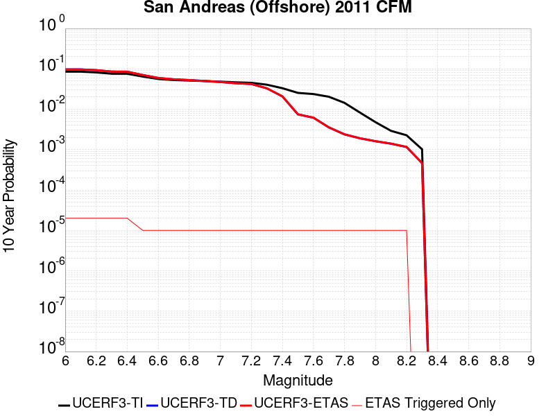 |

| Magnitude | 1 wk TI Prob | 1 wk TD Prob | 1 wk ETAS Prob | 1 wk ETAS/TD Gain | 1 wk ETAS Triggered Only | 1 mo TI Prob | 1 mo TD Prob | 1 mo ETAS Prob | 1 mo ETAS/TD Gain | 1 mo ETAS Triggered Only | 1 yr TI Prob | 1 yr TD Prob | 1 yr ETAS Prob | 1 yr ETAS/TD Gain | 1 yr ETAS Triggered Only | 10 yr TI Prob | 10 yr TD Prob | 10 yr ETAS Prob | 10 yr ETAS/TD Gain | 10 yr ETAS Triggered Only |
|-----|-----|-----|-----|-----|-----|-----|-----|-----|-----|-----|-----|-----|-----|-----|-----|-----|-----|-----|-----|-----|
| 6.0 | 1.7072787E-4 | 1.9226041E-4 | 2.0482081E-4 | 1.0653301 | 1.2562814E-5 | 7.3148566E-4 | 8.237154E-4 | 8.362679E-4 | 1.0152389 | 1.2562814E-5 | 0.008869528 | 0.0099831335 | 0.009995571 | 1.0012459 | 1.2562814E-5 | 0.085237645 | 0.09682738 | 0.09683873 | 1.0001172 | 1.2562814E-5 |
| 6.1 | 1.7072787E-4 | 1.9226041E-4 | 2.0482081E-4 | 1.0653301 | 1.2562814E-5 | 7.3148566E-4 | 8.237154E-4 | 8.362679E-4 | 1.0152389 | 1.2562814E-5 | 0.008869528 | 0.0099831335 | 0.009995571 | 1.0012459 | 1.2562814E-5 | 0.085237645 | 0.09682738 | 0.09683873 | 1.0001172 | 1.2562814E-5 |
| 6.2 | 1.6312556E-4 | 1.8407789E-4 | 1.9663839E-4 | 1.0682347 | 1.2562814E-5 | 6.989222E-4 | 7.8866904E-4 | 8.01222E-4 | 1.0159166 | 1.2562814E-5 | 0.008476226 | 0.009560268 | 0.009572712 | 1.0013015 | 1.2562814E-5 | 0.08160117 | 0.09284818 | 0.09285958 | 1.0001228 | 1.2562814E-5 |
| 6.3 | 1.5103363E-4 | 1.6880741E-4 | 1.813681E-4 | 1.0744084 | 1.2562814E-5 | 6.471264E-4 | 7.232619E-4 | 7.358156E-4 | 1.0173571 | 1.2562814E-5 | 0.007850339 | 0.008770605 | 0.008783056 | 1.0014198 | 1.2562814E-5 | 0.075787395 | 0.085489064 | 0.08550055 | 1.0001343 | 1.2562814E-5 |
| 6.4 | 1.5047993E-4 | 1.676667E-4 | 1.802274E-4 | 1.0749147 | 1.2562814E-5 | 6.4475456E-4 | 7.1837584E-4 | 7.309296E-4 | 1.0174752 | 1.2562814E-5 | 0.007821669 | 0.008711592 | 0.008724046 | 1.0014296 | 1.2562814E-5 | 0.0755203 | 0.08496926 | 0.084980756 | 1.0001353 | 1.2562814E-5 |
| 6.5 | 1.2760791E-4 | 1.3735025E-4 | 1.4991133E-4 | 1.091453 | 1.2562814E-5 | 5.467764E-4 | 5.885125E-4 | 6.010679E-4 | 1.0213342 | 1.2562814E-5 | 0.0066367025 | 0.0071418737 | 0.007154347 | 1.0017464 | 1.2562814E-5 | 0.064419635 | 0.07025001 | 0.070261694 | 1.0001663 | 1.2562814E-5 |
| 6.6 | 1.1063525E-4 | 1.15566356E-4 | 1.2812772E-4 | 1.108694 | 1.2562814E-5 | 4.740649E-4 | 4.9519143E-4 | 5.0774805E-4 | 1.025357 | 1.2562814E-5 | 0.0057564764 | 0.006012491 | 0.0060249786 | 1.0020769 | 1.2562814E-5 | 0.05609626 | 0.05948894 | 0.059500758 | 1.0001986 | 1.2562814E-5 |
| 6.7 | 1.0391049E-4 | 1.0645922E-4 | 1.19020704E-4 | 1.1179934 | 1.2562814E-5 | 4.4525467E-4 | 4.5617504E-4 | 4.6873212E-4 | 1.0275269 | 1.2562814E-5 | 0.0054075094 | 0.005539975 | 0.0055524684 | 1.0022551 | 1.2562814E-5 | 0.052778035 | 0.05498876 | 0.055000633 | 1.0002159 | 1.2562814E-5 |
| 6.8 | 1.0096706E-4 | 1.01582686E-4 | 1.1414422E-4 | 1.1236583 | 1.2562814E-5 | 4.3264418E-4 | 4.3528268E-4 | 4.4784002E-4 | 1.0288488 | 1.2562814E-5 | 0.0052547283 | 0.005286866 | 0.0052993624 | 1.0023637 | 1.2562814E-5 | 0.051321987 | 0.052687574 | 0.052699476 | 1.0002259 | 1.2562814E-5 |
| 6.9 | 9.800265E-5 | 9.588748E-5 | 1.0844909E-4 | 1.1310036 | 1.2562814E-5 | 4.1994374E-4 | 4.1088252E-4 | 4.234402E-4 | 1.0305626 | 1.2562814E-5 | 0.0051008356 | 0.0049911886 | 0.005003689 | 1.0025045 | 1.2562814E-5 | 0.049853306 | 0.05001504 | 0.050026976 | 1.0002387 | 1.2562814E-5 |
| 7.0 | 9.4642375E-5 | 9.002143E-5 | 1.0258311E-4 | 1.139541 | 1.2562814E-5 | 4.0554712E-4 | 3.8574997E-4 | 3.9830792E-4 | 1.0325546 | 1.2562814E-5 | 0.004926363 | 0.0046865544 | 0.0046990584 | 1.002668 | 1.2562814E-5 | 0.048185747 | 0.047196057 | 0.047208026 | 1.0002537 | 1.2562814E-5 |
| 7.1 | 9.0996844E-5 | 8.354169E-5 | 9.610345E-5 | 1.1503652 | 1.2562814E-5 | 3.8992817E-4 | 3.5798753E-4 | 3.7054587E-4 | 1.0350803 | 1.2562814E-5 | 0.004737046 | 0.004349944 | 0.0043624523 | 1.0028754 | 1.2562814E-5 | 0.04637333 | 0.044047635 | 0.044059645 | 1.0002726 | 1.2562814E-5 |
| 7.2 | 8.848287E-5 | 7.9818135E-5 | 9.237995E-5 | 1.1573805 | 1.2562814E-5 | 3.791572E-4 | 3.4203375E-4 | 3.5459225E-4 | 1.0367172 | 1.2562814E-5 | 0.004606472 | 0.0041564633 | 0.004168974 | 1.0030099 | 1.2562814E-5 | 0.045121472 | 0.042191572 | 0.042203605 | 1.0002851 | 1.2562814E-5 |
| 7.3 | 7.9280784E-5 | 6.1276216E-5 | 7.383826E-5 | 1.2050068 | 1.2562814E-5 | 3.3973053E-4 | 2.625865E-4 | 2.75146E-4 | 1.04783 | 1.2562814E-5 | 0.004128377 | 0.0031924061 | 0.003204929 | 1.0039227 | 1.2562814E-5 | 0.040525194 | 0.032904375 | 0.032916527 | 1.0003692 | 1.2562814E-5 |
| 7.4 | 6.468038E-5 | 3.7933212E-5 | 5.049555E-5 | 1.3311698 | 1.2562814E-5 | 2.771722E-4 | 1.625611E-4 | 1.7512188E-4 | 1.077268 | 1.2562814E-5 | 0.0033693502 | 0.0019774425 | 0.0019899807 | 1.0063405 | 1.2562814E-5 | 0.0331872 | 0.02082181 | 0.02083411 | 1.0005908 | 1.2562814E-5 |
| 7.5 | 4.930574E-5 | 1.2703362E-5 | 2.5266016E-5 | 1.9889237 | 1.2562814E-5 | 2.1129321E-4 | 5.444185E-5 | 6.700398E-5 | 1.230744 | 1.2562814E-5 | 0.0025694598 | 6.6262955E-4 | 6.7518407E-4 | 1.0189464 | 1.2562814E-5 | 0.02539953 | 0.007481418 | 0.007493887 | 1.0016667 | 1.2562814E-5 |
| 7.6 | 4.612566E-5 | 1.0336213E-5 | 2.2898897E-5 | 2.215405 | 1.2562814E-5 | 1.9766642E-4 | 4.429731E-5 | 5.6859568E-5 | 1.2835896 | 1.2562814E-5 | 0.0024039324 | 5.391877E-4 | 5.517437E-4 | 1.0232869 | 1.2562814E-5 | 0.023780935 | 0.006172099 | 0.0061845845 | 1.0020229 | 1.2562814E-5 |
| 7.7 | 3.9435414E-5 | 5.574925E-6 | 1.8137669E-5 | 3.2534373 | 1.2562814E-5 | 1.6899795E-4 | 2.3892318E-5 | 3.6454832E-5 | 1.5257971 | 1.2562814E-5 | 0.0020556084 | 2.9085035E-4 | 3.034095E-4 | 1.0431808 | 1.2562814E-5 | 0.020366974 | 0.0035420412 | 0.0035545593 | 1.0035342 | 1.2562814E-5 |
| 7.8 | 2.7787428E-5 | 3.7553348E-6 | 1.6318101E-5 | 4.345312 | 1.2562814E-5 | 1.1908354E-4 | 1.6094193E-5 | 2.8656805E-5 | 1.780568 | 1.2562814E-5 | 0.0014488777 | 1.9592921E-4 | 2.0848957E-4 | 1.0641066 | 1.2562814E-5 | 0.014394675 | 0.0023877125 | 0.0024002453 | 1.0052489 | 1.2562814E-5 |
| 7.9 | 1.590671E-5 | 3.04085E-6 | 1.5603626E-5 | 5.1313367 | 1.2562814E-5 | 6.816983E-5 | 1.303215E-5 | 2.55948E-5 | 1.9639738 | 1.2562814E-5 | 8.2965166E-4 | 1.586549E-4 | 1.7121572E-4 | 1.0791707 | 1.2562814E-5 | 0.008265611 | 0.001904262 | 0.0019168009 | 1.0065846 | 1.2562814E-5 |
| 8.0 | 9.193638E-6 | 2.5920847E-6 | 1.5154867E-5 | 5.846594 | 1.2562814E-5 | 3.940071E-5 | 1.1108887E-5 | 2.367156E-5 | 2.130867 | 1.2562814E-5 | 4.7959806E-4 | 1.3524233E-4 | 1.4780344E-4 | 1.0928786 | 1.2562814E-5 | 0.0047856434 | 0.0016115032 | 0.0016240458 | 1.0077832 | 1.2562814E-5 |
| 8.1 | 5.601576E-6 | 2.2343472E-6 | 1.4797133E-5 | 6.6225758 | 1.2562814E-5 | 2.4006533E-5 | 9.575739E-6 | 2.2138433E-5 | 2.3119295 | 1.2562814E-5 | 2.9224035E-4 | 1.16578405E-4 | 1.2913975E-4 | 1.1077502 | 1.2562814E-5 | 0.0029185633 | 0.0014020674 | 0.0014146125 | 1.0089476 | 1.2562814E-5 |
| 8.2 | 4.3508785E-6 | 1.857566E-6 | 1.4420357E-5 | 7.7630386 | 1.2562814E-5 | 1.864649E-5 | 7.960973E-6 | 2.0523687E-5 | 2.5780375 | 1.2562814E-5 | 2.2699735E-4 | 9.692056E-5 | 1.0948216E-4 | 1.1296071 | 1.2562814E-5 | 0.0022676561 | 0.0011594221 | 0.0011719704 | 1.0108229 | 1.2562814E-5 |
| 8.3 | 1.9573292E-6 | 7.514906E-7 | 7.514906E-7 | 1.0 | 0.0 | 8.388526E-6 | 3.22067E-6 | 3.22067E-6 | 1.0 | 0.0 | 1.0212552E-4 | 3.921097E-5 | 3.921097E-5 | 1.0 | 0.0 | 0.001020786 | 4.640846E-4 | 4.640846E-4 | 1.0 | 0.0 |

## West Napa 2011 CFM
*[(top)](#table-of-contents)*

| 1 Week | 1 Month | 1 Year | 10 Year |
|-----|-----|-----|-----|
|  |  |  |  |

| Magnitude | 1 wk TI Prob | 1 wk TD Prob | 1 wk ETAS Prob | 1 wk ETAS/TD Gain | 1 wk ETAS Triggered Only | 1 mo TI Prob | 1 mo TD Prob | 1 mo ETAS Prob | 1 mo ETAS/TD Gain | 1 mo ETAS Triggered Only | 1 yr TI Prob | 1 yr TD Prob | 1 yr ETAS Prob | 1 yr ETAS/TD Gain | 1 yr ETAS Triggered Only | 10 yr TI Prob | 10 yr TD Prob | 10 yr ETAS Prob | 10 yr ETAS/TD Gain | 10 yr ETAS Triggered Only |
|-----|-----|-----|-----|-----|-----|-----|-----|-----|-----|-----|-----|-----|-----|-----|-----|-----|-----|-----|-----|-----|
| 6.0 | 3.773104E-5 | 4.452845E-5 | 4.452845E-5 | 1.0 | 0.0 | 1.6169442E-4 | 1.9082405E-4 | 1.9082405E-4 | 1.0 | 0.0 | 0.001966852 | 0.0023211248 | 0.0023211248 | 1.0 | 0.0 | 0.019495348 | 0.023002245 | 0.02301452 | 1.0005336 | 1.2562814E-5 |
| 6.1 | 3.773104E-5 | 4.452845E-5 | 4.452845E-5 | 1.0 | 0.0 | 1.6169442E-4 | 1.9082405E-4 | 1.9082405E-4 | 1.0 | 0.0 | 0.001966852 | 0.0023211248 | 0.0023211248 | 1.0 | 0.0 | 0.019495348 | 0.023002245 | 0.02301452 | 1.0005336 | 1.2562814E-5 |
| 6.2 | 3.773104E-5 | 4.452845E-5 | 4.452845E-5 | 1.0 | 0.0 | 1.6169442E-4 | 1.9082405E-4 | 1.9082405E-4 | 1.0 | 0.0 | 0.001966852 | 0.0023211248 | 0.0023211248 | 1.0 | 0.0 | 0.019495348 | 0.023002245 | 0.02301452 | 1.0005336 | 1.2562814E-5 |
| 6.3 | 2.147964E-5 | 2.4987039E-5 | 2.4987039E-5 | 1.0 | 0.0 | 9.2052345E-5 | 1.0708343E-4 | 1.0708343E-4 | 1.0 | 0.0 | 0.001120161 | 0.0013030528 | 0.0013030528 | 1.0 | 0.0 | 0.011145315 | 0.0129647385 | 0.0129647385 | 1.0 | 0.0 |
| 6.4 | 2.147964E-5 | 2.4987039E-5 | 2.4987039E-5 | 1.0 | 0.0 | 9.2052345E-5 | 1.0708343E-4 | 1.0708343E-4 | 1.0 | 0.0 | 0.001120161 | 0.0013030528 | 0.0013030528 | 1.0 | 0.0 | 0.011145315 | 0.0129647385 | 0.0129647385 | 1.0 | 0.0 |
| 6.5 | 1.688201E-5 | 1.9547346E-5 | 1.9547346E-5 | 1.0 | 0.0 | 7.234947E-5 | 8.377206E-5 | 8.377206E-5 | 1.0 | 0.0 | 8.804988E-4 | 0.0010195201 | 0.0010195201 | 1.0 | 0.0 | 0.008770182 | 0.010157098 | 0.010157098 | 1.0 | 0.0 |
| 6.6 | 1.6846381E-5 | 1.9507039E-5 | 1.9507039E-5 | 1.0 | 0.0 | 7.219678E-5 | 8.359933E-5 | 8.359933E-5 | 1.0 | 0.0 | 8.7864127E-4 | 0.001017419 | 0.001017419 | 1.0 | 0.0 | 0.008751754 | 0.010136279 | 0.010136279 | 1.0 | 0.0 |
| 6.7 | 1.3396501E-5 | 1.5467655E-5 | 1.5467655E-5 | 1.0 | 0.0 | 5.7412315E-5 | 6.628862E-5 | 6.628862E-5 | 1.0 | 0.0 | 6.9877075E-4 | 8.0682867E-4 | 8.0682867E-4 | 1.0 | 0.0 | 0.0069657755 | 0.008046719 | 0.008046719 | 1.0 | 0.0 |
| 6.8 | 1.0139058E-5 | 1.1672149E-5 | 1.1672149E-5 | 1.0 | 0.0 | 4.3452383E-5 | 5.0022853E-5 | 5.0022853E-5 | 1.0 | 0.0 | 5.289043E-4 | 6.0891354E-4 | 6.0891354E-4 | 1.0 | 0.0 | 0.005276473 | 0.006079373 | 0.006079373 | 1.0 | 0.0 |
| 6.9 | 7.761281E-6 | 8.890694E-6 | 8.890694E-6 | 1.0 | 0.0 | 3.326221E-5 | 3.8102706E-5 | 3.8102706E-5 | 1.0 | 0.0 | 4.0489217E-4 | 4.6385307E-4 | 4.6385307E-4 | 1.0 | 0.0 | 0.0040415525 | 0.004635363 | 0.004635363 | 1.0 | 0.0 |
| 7.0 | 2.2109202E-6 | 2.3666025E-6 | 2.3666025E-6 | 1.0 | 0.0 | 9.475338E-6 | 1.0142544E-5 | 1.0142544E-5 | 1.0 | 0.0 | 1.1535613E-4 | 1.2347854E-4 | 1.2347854E-4 | 1.0 | 0.0 | 0.0011529627 | 0.0012355851 | 0.0012355851 | 1.0 | 0.0 |
| 7.1 | 1.9008926E-6 | 2.0132914E-6 | 2.0132914E-6 | 1.0 | 0.0 | 8.146657E-6 | 8.6283635E-6 | 8.6283635E-6 | 1.0 | 0.0 | 9.918104E-5 | 1.05045285E-4 | 1.05045285E-4 | 1.0 | 0.0 | 9.913679E-4 | 0.001051437 | 0.001051437 | 1.0 | 0.0 |
| 7.2 | 1.8495944E-6 | 1.9560982E-6 | 1.9560982E-6 | 1.0 | 0.0 | 7.926808E-6 | 8.383251E-6 | 8.383251E-6 | 1.0 | 0.0 | 9.650462E-5 | 1.0206133E-4 | 1.0206133E-4 | 1.0 | 0.0 | 9.6462725E-4 | 0.0010216252 | 0.0010216252 | 1.0 | 0.0 |
| 7.3 | 1.7883189E-6 | 1.8880608E-6 | 1.8880608E-6 | 1.0 | 0.0 | 7.664201E-6 | 8.091664E-6 | 8.091664E-6 | 1.0 | 0.0 | 9.330765E-5 | 9.8511584E-5 | 9.8511584E-5 | 1.0 | 0.0 | 9.3268487E-4 | 9.861597E-4 | 9.861597E-4 | 1.0 | 0.0 |
| 7.4 | 1.6520572E-6 | 1.741484E-6 | 1.741484E-6 | 1.0 | 0.0 | 7.0802257E-6 | 7.463482E-6 | 7.463482E-6 | 1.0 | 0.0 | 8.6198335E-5 | 9.086413E-5 | 9.086413E-5 | 1.0 | 0.0 | 8.616491E-4 | 9.0974604E-4 | 9.0974604E-4 | 1.0 | 0.0 |
| 7.5 | 1.4040345E-6 | 1.4800074E-6 | 1.4800074E-6 | 1.0 | 0.0 | 6.0172765E-6 | 6.3428733E-6 | 6.3428733E-6 | 1.0 | 0.0 | 7.325788E-5 | 7.7221775E-5 | 7.7221775E-5 | 1.0 | 0.0 | 7.3233736E-4 | 7.7339396E-4 | 7.7339396E-4 | 1.0 | 0.0 |
| 7.6 | 1.3013842E-7 | 1.4415936E-7 | 1.4415936E-7 | 1.0 | 0.0 | 5.57736E-7 | 6.1782566E-7 | 6.1782566E-7 | 1.0 | 0.0 | 6.790414E-6 | 7.5220014E-6 | 7.5220014E-6 | 1.0 | 0.0 | 6.790207E-5 | 7.614869E-5 | 7.614869E-5 | 1.0 | 0.0 |
| 7.7 | 8.541512E-8 | 9.716316E-8 | 9.716316E-8 | 1.0 | 0.0 | 3.6606474E-7 | 4.1641349E-7 | 4.1641349E-7 | 1.0 | 0.0 | 4.456829E-6 | 5.0698222E-6 | 5.0698222E-6 | 1.0 | 0.0 | 4.4567398E-5 | 5.160297E-5 | 5.160297E-5 | 1.0 | 0.0 |
| 7.8 | 5.6074793E-8 | 6.89534E-8 | 6.89534E-8 | 1.0 | 0.0 | 2.403205E-7 | 2.9551452E-7 | 2.9551452E-7 | 1.0 | 0.0 | 2.9258983E-6 | 3.5978833E-6 | 3.5978833E-6 | 1.0 | 0.0 | 2.9258597E-5 | 3.681433E-5 | 3.681433E-5 | 1.0 | 0.0 |
| 7.9 | 2.9475839E-8 | 3.8566046E-8 | 3.8566046E-8 | 1.0 | 0.0 | 1.2632502E-7 | 1.6528305E-7 | 1.6528305E-7 | 1.0 | 0.0 | 1.538006E-6 | 2.0123193E-6 | 2.0123193E-6 | 1.0 | 0.0 | 1.5379954E-5 | 2.0665891E-5 | 2.0665891E-5 | 1.0 | 0.0 |
| 8.0 | 1.3337122E-8 | 2.163124E-8 | 2.163124E-8 | 1.0 | 0.0 | 5.7159088E-8 | 9.270532E-8 | 9.270532E-8 | 1.0 | 0.0 | 6.959117E-7 | 1.1286867E-6 | 1.1286867E-6 | 1.0 | 0.0 | 6.959095E-6 | 1.1645628E-5 | 1.1645628E-5 | 1.0 | 0.0 |
| 8.1 | 2.6589986E-10 | 4.8615456E-10 | 4.8615456E-10 | 1.0 | 0.0 | 1.1395708E-9 | 2.0835205E-9 | 2.0835205E-9 | 1.0 | 0.0 | 1.3874274E-8 | 2.536686E-8 | 2.536686E-8 | 1.0 | 0.0 | 1.3874273E-7 | 2.6035906E-7 | 2.6035906E-7 | 1.0 | 0.0 |

## Sierra Madre (San Fernando)
*[(top)](#table-of-contents)*

| 1 Week | 1 Month | 1 Year | 10 Year |
|-----|-----|-----|-----|
|  |  |  |  |

| Magnitude | 1 wk TI Prob | 1 wk TD Prob | 1 wk ETAS Prob | 1 wk ETAS/TD Gain | 1 wk ETAS Triggered Only | 1 mo TI Prob | 1 mo TD Prob | 1 mo ETAS Prob | 1 mo ETAS/TD Gain | 1 mo ETAS Triggered Only | 1 yr TI Prob | 1 yr TD Prob | 1 yr ETAS Prob | 1 yr ETAS/TD Gain | 1 yr ETAS Triggered Only | 10 yr TI Prob | 10 yr TD Prob | 10 yr ETAS Prob | 10 yr ETAS/TD Gain | 10 yr ETAS Triggered Only |
|-----|-----|-----|-----|-----|-----|-----|-----|-----|-----|-----|-----|-----|-----|-----|-----|-----|-----|-----|-----|-----|
| 6.0 | 1.0346413E-5 | 6.2872605E-6 | 6.2872605E-6 | 1.0 | 0.0 | 4.4341014E-5 | 2.694513E-5 | 2.694513E-5 | 1.0 | 0.0 | 5.3971814E-4 | 3.280087E-4 | 3.4056738E-4 | 1.0382876 | 1.2562814E-5 | 0.0053840918 | 0.0032753581 | 0.0032878798 | 1.003823 | 1.2562814E-5 |
| 6.1 | 1.0346413E-5 | 6.2872605E-6 | 6.2872605E-6 | 1.0 | 0.0 | 4.4341014E-5 | 2.694513E-5 | 2.694513E-5 | 1.0 | 0.0 | 5.3971814E-4 | 3.280087E-4 | 3.4056738E-4 | 1.0382876 | 1.2562814E-5 | 0.0053840918 | 0.0032753581 | 0.0032878798 | 1.003823 | 1.2562814E-5 |
| 6.2 | 1.0346413E-5 | 6.2872605E-6 | 6.2872605E-6 | 1.0 | 0.0 | 4.4341014E-5 | 2.694513E-5 | 2.694513E-5 | 1.0 | 0.0 | 5.3971814E-4 | 3.280087E-4 | 3.4056738E-4 | 1.0382876 | 1.2562814E-5 | 0.0053840918 | 0.0032753581 | 0.0032878798 | 1.003823 | 1.2562814E-5 |
| 6.3 | 1.0346413E-5 | 6.2872605E-6 | 6.2872605E-6 | 1.0 | 0.0 | 4.4341014E-5 | 2.694513E-5 | 2.694513E-5 | 1.0 | 0.0 | 5.3971814E-4 | 3.280087E-4 | 3.4056738E-4 | 1.0382876 | 1.2562814E-5 | 0.0053840918 | 0.0032753581 | 0.0032878798 | 1.003823 | 1.2562814E-5 |
| 6.4 | 1.0249558E-5 | 6.2872605E-6 | 6.2872605E-6 | 1.0 | 0.0 | 4.392594E-5 | 2.694513E-5 | 2.694513E-5 | 1.0 | 0.0 | 5.3466705E-4 | 3.280087E-4 | 3.4056738E-4 | 1.0382876 | 1.2562814E-5 | 0.0053338245 | 0.0032753581 | 0.0032878798 | 1.003823 | 1.2562814E-5 |
| 6.5 | 1.0249558E-5 | 6.2872605E-6 | 6.2872605E-6 | 1.0 | 0.0 | 4.392594E-5 | 2.694513E-5 | 2.694513E-5 | 1.0 | 0.0 | 5.3466705E-4 | 3.280087E-4 | 3.4056738E-4 | 1.0382876 | 1.2562814E-5 | 0.0053338245 | 0.0032753581 | 0.0032878798 | 1.003823 | 1.2562814E-5 |
| 6.6 | 9.9035515E-6 | 6.2872605E-6 | 6.2872605E-6 | 1.0 | 0.0 | 4.2443102E-5 | 2.694513E-5 | 2.694513E-5 | 1.0 | 0.0 | 5.166222E-4 | 3.280087E-4 | 3.4056738E-4 | 1.0382876 | 1.2562814E-5 | 0.0051542283 | 0.0032753581 | 0.0032878798 | 1.003823 | 1.2562814E-5 |
| 6.7 | 9.87217E-6 | 6.2746817E-6 | 6.2746817E-6 | 1.0 | 0.0 | 4.2308613E-5 | 2.689122E-5 | 2.689122E-5 | 1.0 | 0.0 | 5.149856E-4 | 3.2735255E-4 | 3.3991123E-4 | 1.0383644 | 1.2562814E-5 | 0.005137938 | 0.0032688158 | 0.0032813377 | 1.0038307 | 1.2562814E-5 |
| 6.8 | 9.4359175E-6 | 6.1786586E-6 | 6.1786586E-6 | 1.0 | 0.0 | 4.043902E-5 | 2.6479704E-5 | 2.6479704E-5 | 1.0 | 0.0 | 4.9223384E-4 | 3.2234378E-4 | 3.3490255E-4 | 1.0389608 | 1.2562814E-5 | 0.0049114493 | 0.0032188739 | 0.0032313962 | 1.0038903 | 1.2562814E-5 |
| 6.9 | 8.700447E-6 | 6.039922E-6 | 6.039922E-6 | 1.0 | 0.0 | 3.72871E-5 | 2.5885129E-5 | 2.5885129E-5 | 1.0 | 0.0 | 4.5387587E-4 | 3.1510694E-4 | 3.276658E-4 | 1.0398558 | 1.2562814E-5 | 0.0045295 | 0.003146711 | 0.0031592343 | 1.0039798 | 1.2562814E-5 |
| 7.0 | 8.648878E-6 | 6.0148373E-6 | 6.0148373E-6 | 1.0 | 0.0 | 3.7066096E-5 | 2.5777625E-5 | 2.5777625E-5 | 1.0 | 0.0 | 4.5118626E-4 | 3.1379846E-4 | 3.2635735E-4 | 1.0400221 | 1.2562814E-5 | 0.004502713 | 0.003133663 | 0.0031461865 | 1.0039964 | 1.2562814E-5 |
| 7.1 | 8.505786E-6 | 5.9244676E-6 | 5.9244676E-6 | 1.0 | 0.0 | 3.645286E-5 | 2.5390334E-5 | 2.5390334E-5 | 1.0 | 0.0 | 4.437232E-4 | 3.0908454E-4 | 3.2164349E-4 | 1.0406327 | 1.2562814E-5 | 0.0044283825 | 0.0030866556 | 0.0030991796 | 1.0040575 | 1.2562814E-5 |
| 7.2 | 8.139752E-6 | 5.6987624E-6 | 5.6987624E-6 | 1.0 | 0.0 | 3.4884186E-5 | 2.4423045E-5 | 2.4423045E-5 | 1.0 | 0.0 | 4.246322E-4 | 2.9731105E-4 | 3.0987014E-4 | 1.0422422 | 1.2562814E-5 | 0.004238217 | 0.0029692391 | 0.0029817645 | 1.0042185 | 1.2562814E-5 |
| 7.3 | 7.8816E-6 | 5.552077E-6 | 5.552077E-6 | 1.0 | 0.0 | 3.3777847E-5 | 2.3794404E-5 | 2.3794404E-5 | 1.0 | 0.0 | 4.111677E-4 | 2.896594E-4 | 3.0221857E-4 | 1.0433584 | 1.2562814E-5 | 0.004104078 | 0.0028929242 | 0.0029054505 | 1.00433 | 1.2562814E-5 |
| 7.4 | 7.5810603E-6 | 5.3563126E-6 | 5.3563126E-6 | 1.0 | 0.0 | 3.2489854E-5 | 2.2955428E-5 | 2.2955428E-5 | 1.0 | 0.0 | 3.9549218E-4 | 2.7944756E-4 | 2.9200685E-4 | 1.0449433 | 1.2562814E-5 | 0.0039478904 | 0.0027910667 | 0.0028035943 | 1.0044885 | 1.2562814E-5 |
| 7.5 | 6.349153E-6 | 4.407576E-6 | 4.407576E-6 | 1.0 | 0.0 | 2.7210372E-5 | 1.888948E-5 | 1.888948E-5 | 1.0 | 0.0 | 3.312359E-4 | 2.2995596E-4 | 2.4251587E-4 | 1.0546188 | 1.2562814E-5 | 0.0033074263 | 0.0022972622 | 0.002309796 | 1.0054561 | 1.2562814E-5 |
| 7.6 | 4.430576E-6 | 2.8905868E-6 | 2.8905868E-6 | 1.0 | 0.0 | 1.8988047E-5 | 1.2388171E-5 | 1.2388171E-5 | 1.0 | 0.0 | 2.3115493E-4 | 1.5081577E-4 | 1.633767E-4 | 1.0832865 | 1.2562814E-5 | 0.0023091463 | 0.0015071568 | 0.0015197006 | 1.0083228 | 1.2562814E-5 |
| 7.7 | 3.005066E-6 | 1.7510115E-6 | 1.7510115E-6 | 1.0 | 0.0 | 1.2878791E-5 | 7.504313E-6 | 7.504313E-6 | 1.0 | 0.0 | 1.56788E-4 | 9.1361195E-5 | 9.1361195E-5 | 1.0 | 0.0 | 0.0015667742 | 9.132375E-4 | 9.132375E-4 | 1.0 | 0.0 |
| 7.8 | 1.8459098E-6 | 1.0582091E-6 | 1.0582091E-6 | 1.0 | 0.0 | 7.911018E-6 | 4.535174E-6 | 4.535174E-6 | 1.0 | 0.0 | 9.631238E-5 | 5.5214347E-5 | 5.5214347E-5 | 1.0 | 0.0 | 9.627065E-4 | 5.5200676E-4 | 5.5200676E-4 | 1.0 | 0.0 |
| 7.9 | 9.839262E-7 | 5.23421E-7 | 5.23421E-7 | 1.0 | 0.0 | 4.2168194E-6 | 2.2432312E-6 | 2.2432312E-6 | 1.0 | 0.0 | 5.1338568E-5 | 2.7310998E-5 | 2.7310998E-5 | 1.0 | 0.0 | 5.132671E-4 | 2.730767E-4 | 2.730767E-4 | 1.0 | 0.0 |
| 8.0 | 1.210983E-7 | 6.613821E-8 | 6.613821E-8 | 1.0 | 0.0 | 5.1899264E-7 | 2.8344945E-7 | 2.8344945E-7 | 1.0 | 0.0 | 6.3187167E-6 | 3.4509917E-6 | 3.4509917E-6 | 1.0 | 0.0 | 6.318537E-5 | 3.45094E-5 | 3.45094E-5 | 1.0 | 0.0 |

## Keddie Ridge 2011 CFM
*[(top)](#table-of-contents)*

| 1 Week | 1 Month | 1 Year | 10 Year |
|-----|-----|-----|-----|
|  |  |  |  |

| Magnitude | 1 wk TI Prob | 1 wk TD Prob | 1 wk ETAS Prob | 1 wk ETAS/TD Gain | 1 wk ETAS Triggered Only | 1 mo TI Prob | 1 mo TD Prob | 1 mo ETAS Prob | 1 mo ETAS/TD Gain | 1 mo ETAS Triggered Only | 1 yr TI Prob | 1 yr TD Prob | 1 yr ETAS Prob | 1 yr ETAS/TD Gain | 1 yr ETAS Triggered Only | 10 yr TI Prob | 10 yr TD Prob | 10 yr ETAS Prob | 10 yr ETAS/TD Gain | 10 yr ETAS Triggered Only |
|-----|-----|-----|-----|-----|-----|-----|-----|-----|-----|-----|-----|-----|-----|-----|-----|-----|-----|-----|-----|-----|
| 6.0 | 2.2591947E-5 | 2.5189187E-5 | 2.5189187E-5 | 1.0 | 0.0 | 9.6819036E-5 | 1.07949636E-4 | 1.07949636E-4 | 1.0 | 0.0 | 0.0011781343 | 0.0013135736 | 0.0013135736 | 1.0 | 0.0 | 0.011719079 | 0.013066036 | 0.013078434 | 1.0009489 | 1.2562814E-5 |
| 6.1 | 2.2591947E-5 | 2.5189187E-5 | 2.5189187E-5 | 1.0 | 0.0 | 9.6819036E-5 | 1.07949636E-4 | 1.07949636E-4 | 1.0 | 0.0 | 0.0011781343 | 0.0013135736 | 0.0013135736 | 1.0 | 0.0 | 0.011719079 | 0.013066036 | 0.013078434 | 1.0009489 | 1.2562814E-5 |
| 6.2 | 1.3775145E-5 | 1.5322817E-5 | 1.5322817E-5 | 1.0 | 0.0 | 5.9035E-5 | 6.566771E-5 | 6.566771E-5 | 1.0 | 0.0 | 7.185141E-4 | 7.9923525E-4 | 7.9923525E-4 | 1.0 | 0.0 | 0.0071619535 | 0.007966028 | 0.00797849 | 1.0015645 | 1.2562814E-5 |
| 6.3 | 9.705435E-6 | 1.0768351E-5 | 1.0768351E-5 | 1.0 | 0.0 | 4.1594063E-5 | 4.614933E-5 | 4.614933E-5 | 1.0 | 0.0 | 5.0629E-4 | 5.6173565E-4 | 5.6173565E-4 | 1.0 | 0.0 | 0.005051381 | 0.0056043873 | 0.0056043873 | 1.0 | 0.0 |
| 6.4 | 7.2549733E-6 | 8.027269E-6 | 8.027269E-6 | 1.0 | 0.0 | 3.109237E-5 | 3.4402172E-5 | 3.4402172E-5 | 1.0 | 0.0 | 3.7848388E-4 | 4.187739E-4 | 4.187739E-4 | 1.0 | 0.0 | 0.003778399 | 0.0041806344 | 0.0041806344 | 1.0 | 0.0 |
| 6.5 | 5.983293E-6 | 6.613024E-6 | 6.613024E-6 | 1.0 | 0.0 | 2.5642432E-5 | 2.8341263E-5 | 2.8341263E-5 | 1.0 | 0.0 | 3.1215188E-4 | 3.4500696E-4 | 3.4500696E-4 | 1.0 | 0.0 | 0.0031171376 | 0.0034453757 | 0.0034453757 | 1.0 | 0.0 |
| 6.6 | 4.0336154E-6 | 4.4578046E-6 | 4.4578046E-6 | 1.0 | 0.0 | 1.728681E-5 | 1.9104758E-5 | 1.9104758E-5 | 1.0 | 0.0 | 2.1044657E-4 | 2.3257964E-4 | 2.3257964E-4 | 1.0 | 0.0 | 0.002102474 | 0.0023237579 | 0.0023237579 | 1.0 | 0.0 |
| 6.7 | 1.5832104E-6 | 1.7816087E-6 | 1.7816087E-6 | 1.0 | 0.0 | 6.7851697E-6 | 7.635445E-6 | 7.635445E-6 | 1.0 | 0.0 | 8.260631E-5 | 9.295785E-5 | 9.295785E-5 | 1.0 | 0.0 | 8.2575605E-4 | 9.2921633E-4 | 9.2921633E-4 | 1.0 | 0.0 |
| 6.8 | 7.5177275E-7 | 8.5902946E-7 | 8.5902946E-7 | 1.0 | 0.0 | 3.221879E-6 | 3.6815507E-6 | 3.6815507E-6 | 1.0 | 0.0 | 3.9225673E-5 | 4.4822125E-5 | 4.4822125E-5 | 1.0 | 0.0 | 3.921875E-4 | 4.481474E-4 | 4.481474E-4 | 1.0 | 0.0 |

## Bennett Valley 2011 CFM
*[(top)](#table-of-contents)*

| 1 Week | 1 Month | 1 Year | 10 Year |
|-----|-----|-----|-----|
|  | 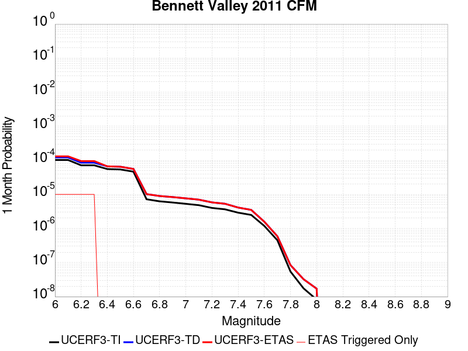 |  |  |

| Magnitude | 1 wk TI Prob | 1 wk TD Prob | 1 wk ETAS Prob | 1 wk ETAS/TD Gain | 1 wk ETAS Triggered Only | 1 mo TI Prob | 1 mo TD Prob | 1 mo ETAS Prob | 1 mo ETAS/TD Gain | 1 mo ETAS Triggered Only | 1 yr TI Prob | 1 yr TD Prob | 1 yr ETAS Prob | 1 yr ETAS/TD Gain | 1 yr ETAS Triggered Only | 10 yr TI Prob | 10 yr TD Prob | 10 yr ETAS Prob | 10 yr ETAS/TD Gain | 10 yr ETAS Triggered Only |
|-----|-----|-----|-----|-----|-----|-----|-----|-----|-----|-----|-----|-----|-----|-----|-----|-----|-----|-----|-----|-----|
| 6.0 | 2.3893934E-5 | 2.8238892E-5 | 2.8238892E-5 | 1.0 | 0.0 | 1.0239855E-4 | 1.2101925E-4 | 1.3358054E-4 | 1.1037959 | 1.2562814E-5 | 0.0012459893 | 0.0014725985 | 0.0014851427 | 1.0085185 | 1.2562814E-5 | 0.012390262 | 0.014651061 | 0.01466344 | 1.000845 | 1.2562814E-5 |
| 6.1 | 2.3893934E-5 | 2.8238892E-5 | 2.8238892E-5 | 1.0 | 0.0 | 1.0239855E-4 | 1.2101925E-4 | 1.3358054E-4 | 1.1037959 | 1.2562814E-5 | 0.0012459893 | 0.0014725985 | 0.0014851427 | 1.0085185 | 1.2562814E-5 | 0.012390262 | 0.014651061 | 0.01466344 | 1.000845 | 1.2562814E-5 |
| 6.2 | 1.6657146E-5 | 1.9853778E-5 | 1.9853778E-5 | 1.0 | 0.0 | 7.138582E-5 | 8.508564E-5 | 9.764738E-5 | 1.1476365 | 1.2562814E-5 | 8.6877577E-4 | 0.0010355669 | 0.0010481167 | 1.0121188 | 1.2562814E-5 | 0.008653872 | 0.010325688 | 0.010338121 | 1.0012041 | 1.2562814E-5 |
| 6.3 | 1.6657146E-5 | 1.9853778E-5 | 1.9853778E-5 | 1.0 | 0.0 | 7.138582E-5 | 8.508564E-5 | 9.764738E-5 | 1.1476365 | 1.2562814E-5 | 8.6877577E-4 | 0.0010355669 | 0.0010481167 | 1.0121188 | 1.2562814E-5 | 0.008653872 | 0.010325688 | 0.010338121 | 1.0012041 | 1.2562814E-5 |
| 6.4 | 1.29418495E-5 | 1.5567497E-5 | 1.5567497E-5 | 1.0 | 0.0 | 5.546389E-5 | 6.671687E-5 | 6.671687E-5 | 1.0 | 0.0 | 6.7506364E-4 | 8.121055E-4 | 8.121055E-4 | 1.0 | 0.0 | 0.0067301663 | 0.008108527 | 0.008108527 | 1.0 | 0.0 |
| 6.5 | 1.2582504E-5 | 1.5134528E-5 | 1.5134528E-5 | 1.0 | 0.0 | 5.39239E-5 | 6.4861386E-5 | 6.4861386E-5 | 1.0 | 0.0 | 6.563257E-4 | 7.895315E-4 | 7.895315E-4 | 1.0 | 0.0 | 0.006543907 | 0.007884431 | 0.007884431 | 1.0 | 0.0 |
| 6.6 | 1.0846706E-5 | 1.3036779E-5 | 1.3036779E-5 | 1.0 | 0.0 | 4.6485053E-5 | 5.5871435E-5 | 5.5871435E-5 | 1.0 | 0.0 | 5.6580856E-4 | 6.801508E-4 | 6.801508E-4 | 1.0 | 0.0 | 0.005643701 | 0.0067976876 | 0.0067976876 | 1.0 | 0.0 |
| 6.7 | 1.6803231E-6 | 2.377857E-6 | 2.377857E-6 | 1.0 | 0.0 | 7.2013645E-6 | 1.0190777E-5 | 1.0190777E-5 | 1.0 | 0.0 | 8.7673085E-5 | 1.2406579E-4 | 1.2406579E-4 | 1.0 | 0.0 | 8.76385E-4 | 0.0012444059 | 0.0012444059 | 1.0 | 0.0 |
| 6.8 | 1.4609833E-6 | 2.0939308E-6 | 2.0939308E-6 | 1.0 | 0.0 | 6.261342E-6 | 8.973958E-6 | 8.973958E-6 | 1.0 | 0.0 | 7.6229175E-5 | 1.09252534E-4 | 1.09252534E-4 | 1.0 | 0.0 | 7.620303E-4 | 0.0010963855 | 0.0010963855 | 1.0 | 0.0 |
| 6.9 | 1.3492396E-6 | 1.945872E-6 | 1.945872E-6 | 1.0 | 0.0 | 5.7824427E-6 | 8.339425E-6 | 8.339425E-6 | 1.0 | 0.0 | 7.0398964E-5 | 1.0152783E-4 | 1.0152783E-4 | 1.0 | 0.0 | 7.037667E-4 | 0.001019182 | 0.001019182 | 1.0 | 0.0 |
| 7.0 | 1.2347921E-6 | 1.7888614E-6 | 1.7888614E-6 | 1.0 | 0.0 | 5.291955E-6 | 7.6665265E-6 | 7.6665265E-6 | 1.0 | 0.0 | 6.442765E-5 | 9.333601E-5 | 9.333601E-5 | 1.0 | 0.0 | 6.440897E-4 | 9.373206E-4 | 9.373206E-4 | 1.0 | 0.0 |
| 7.1 | 1.1262973E-6 | 1.6358822E-6 | 1.6358822E-6 | 1.0 | 0.0 | 4.8269794E-6 | 7.010905E-6 | 7.010905E-6 | 1.0 | 0.0 | 5.876689E-5 | 8.535448E-5 | 8.535448E-5 | 1.0 | 0.0 | 5.875135E-4 | 8.575462E-4 | 8.575462E-4 | 1.0 | 0.0 |
| 7.2 | 9.351744E-7 | 1.3611456E-6 | 1.3611456E-6 | 1.0 | 0.0 | 4.007884E-6 | 5.8334676E-6 | 5.8334676E-6 | 1.0 | 0.0 | 4.8794896E-5 | 7.102018E-5 | 7.102018E-5 | 1.0 | 0.0 | 4.878418E-4 | 7.1425125E-4 | 7.1425125E-4 | 1.0 | 0.0 |
| 7.3 | 8.5039534E-7 | 1.2386469E-6 | 1.2386469E-6 | 1.0 | 0.0 | 3.6445463E-6 | 5.308476E-6 | 5.308476E-6 | 1.0 | 0.0 | 4.437145E-5 | 6.4628795E-5 | 6.4628795E-5 | 1.0 | 0.0 | 4.436259E-4 | 6.50087E-4 | 6.50087E-4 | 1.0 | 0.0 |
| 7.4 | 6.7875015E-7 | 9.600462E-7 | 9.600462E-7 | 1.0 | 0.0 | 2.908926E-6 | 4.114477E-6 | 4.114477E-6 | 1.0 | 0.0 | 3.54156E-5 | 5.0092618E-5 | 5.0092618E-5 | 1.0 | 0.0 | 3.5409955E-4 | 5.0410116E-4 | 5.0410116E-4 | 1.0 | 0.0 |
| 7.5 | 5.826867E-7 | 8.188238E-7 | 8.188238E-7 | 1.0 | 0.0 | 2.4972264E-6 | 3.5092403E-6 | 3.5092403E-6 | 1.0 | 0.0 | 3.0403306E-5 | 4.2724172E-5 | 4.2724172E-5 | 1.0 | 0.0 | 3.0399146E-4 | 4.3002292E-4 | 4.3002292E-4 | 1.0 | 0.0 |
| 7.6 | 2.7734902E-7 | 3.682212E-7 | 3.682212E-7 | 1.0 | 0.0 | 1.1886381E-6 | 1.5780898E-6 | 1.5780898E-6 | 1.0 | 0.0 | 1.4471572E-5 | 1.9213076E-5 | 1.9213076E-5 | 1.0 | 0.0 | 1.447063E-4 | 1.9312318E-4 | 1.9312318E-4 | 1.0 | 0.0 |
| 7.7 | 1.0530888E-7 | 1.3748802E-7 | 1.3748802E-7 | 1.0 | 0.0 | 4.513237E-7 | 5.892342E-7 | 5.892342E-7 | 1.0 | 0.0 | 5.4948523E-6 | 7.1739028E-6 | 7.1739028E-6 | 1.0 | 0.0 | 5.4947162E-5 | 7.256238E-5 | 7.256238E-5 | 1.0 | 0.0 |
| 7.8 | 1.2714258E-8 | 1.9632653E-8 | 1.9632653E-8 | 1.0 | 0.0 | 5.448968E-8 | 8.413994E-8 | 8.413994E-8 | 1.0 | 0.0 | 6.6341164E-7 | 1.0244033E-6 | 1.0244033E-6 | 1.0 | 0.0 | 6.6340967E-6 | 1.0658104E-5 | 1.0658104E-5 | 1.0 | 0.0 |
| 7.9 | 4.075888E-9 | 7.559692E-9 | 7.559692E-9 | 1.0 | 0.0 | 1.7468091E-8 | 3.239868E-8 | 3.239868E-8 | 1.0 | 0.0 | 2.12674E-7 | 3.9445388E-7 | 3.9445388E-7 | 1.0 | 0.0 | 2.1267379E-6 | 4.194808E-6 | 4.194808E-6 | 1.0 | 0.0 |
| 8.0 | 1.9126138E-9 | 3.995532E-9 | 3.995532E-9 | 1.0 | 0.0 | 8.196917E-9 | 1.7123707E-8 | 1.7123707E-8 | 1.0 | 0.0 | 9.9797454E-8 | 2.0848113E-7 | 2.0848113E-7 | 1.0 | 0.0 | 9.979741E-7 | 2.197992E-6 | 2.197992E-6 | 1.0 | 0.0 |

## Elsinore (Coyote Mountains)
*[(top)](#table-of-contents)*

| 1 Week | 1 Month | 1 Year | 10 Year |
|-----|-----|-----|-----|
|  |  |  |  |

| Magnitude | 1 wk TI Prob | 1 wk TD Prob | 1 wk ETAS Prob | 1 wk ETAS/TD Gain | 1 wk ETAS Triggered Only | 1 mo TI Prob | 1 mo TD Prob | 1 mo ETAS Prob | 1 mo ETAS/TD Gain | 1 mo ETAS Triggered Only | 1 yr TI Prob | 1 yr TD Prob | 1 yr ETAS Prob | 1 yr ETAS/TD Gain | 1 yr ETAS Triggered Only | 10 yr TI Prob | 10 yr TD Prob | 10 yr ETAS Prob | 10 yr ETAS/TD Gain | 10 yr ETAS Triggered Only |
|-----|-----|-----|-----|-----|-----|-----|-----|-----|-----|-----|-----|-----|-----|-----|-----|-----|-----|-----|-----|-----|
| 6.0 | 4.20513E-5 | 4.8631882E-5 | 6.1194085E-5 | 1.2583121 | 1.2562814E-5 | 1.8020741E-4 | 2.0840895E-4 | 2.2096914E-4 | 1.0602671 | 1.2562814E-5 | 0.0021918174 | 0.002535 | 0.002547531 | 1.0049431 | 1.2562814E-5 | 0.021703249 | 0.025111282 | 0.02512353 | 1.0004877 | 1.2562814E-5 |
| 6.1 | 4.20513E-5 | 4.8631882E-5 | 6.1194085E-5 | 1.2583121 | 1.2562814E-5 | 1.8020741E-4 | 2.0840895E-4 | 2.2096914E-4 | 1.0602671 | 1.2562814E-5 | 0.0021918174 | 0.002535 | 0.002547531 | 1.0049431 | 1.2562814E-5 | 0.021703249 | 0.025111282 | 0.02512353 | 1.0004877 | 1.2562814E-5 |
| 6.2 | 2.3413893E-5 | 2.469566E-5 | 3.7258164E-5 | 1.5086927 | 1.2562814E-5 | 1.0034139E-4 | 1.0583479E-4 | 1.1839628E-4 | 1.1186895 | 1.2562814E-5 | 0.0012209718 | 0.0012878707 | 0.0013004172 | 1.0097421 | 1.2562814E-5 | 0.012142851 | 0.01281264 | 0.012825042 | 1.000968 | 1.2562814E-5 |
| 6.3 | 2.3413893E-5 | 2.469566E-5 | 3.7258164E-5 | 1.5086927 | 1.2562814E-5 | 1.0034139E-4 | 1.0583479E-4 | 1.1839628E-4 | 1.1186895 | 1.2562814E-5 | 0.0012209718 | 0.0012878707 | 0.0013004172 | 1.0097421 | 1.2562814E-5 | 0.012142851 | 0.01281264 | 0.012825042 | 1.000968 | 1.2562814E-5 |
| 6.4 | 1.6894814E-5 | 1.6568361E-5 | 2.9130968E-5 | 1.7582287 | 1.2562814E-5 | 7.240433E-5 | 7.1005554E-5 | 8.356747E-5 | 1.1769147 | 1.2562814E-5 | 8.811662E-4 | 8.6418656E-4 | 8.767385E-4 | 1.0145246 | 1.2562814E-5 | 0.0087768035 | 0.00861194 | 0.008624395 | 1.0014462 | 1.2562814E-5 |
| 6.5 | 1.6894814E-5 | 1.6568361E-5 | 2.9130968E-5 | 1.7582287 | 1.2562814E-5 | 7.240433E-5 | 7.1005554E-5 | 8.356747E-5 | 1.1769147 | 1.2562814E-5 | 8.811662E-4 | 8.6418656E-4 | 8.767385E-4 | 1.0145246 | 1.2562814E-5 | 0.0087768035 | 0.00861194 | 0.008624395 | 1.0014462 | 1.2562814E-5 |
| 6.6 | 1.1910969E-5 | 1.0530774E-5 | 2.3093455E-5 | 2.1929495 | 1.2562814E-5 | 5.1046012E-5 | 4.5131183E-5 | 5.769343E-5 | 1.2783496 | 1.2562814E-5 | 6.21308E-4 | 5.4934516E-4 | 5.619011E-4 | 1.0228561 | 1.2562814E-5 | 0.0061957375 | 0.005481174 | 0.0054936684 | 1.0022794 | 1.2562814E-5 |
| 6.7 | 9.1486E-6 | 7.2028593E-6 | 7.2028593E-6 | 1.0 | 0.0 | 3.9207694E-5 | 3.0869054E-5 | 3.0869054E-5 | 1.0 | 0.0 | 4.7724912E-4 | 3.757697E-4 | 3.757697E-4 | 1.0 | 0.0 | 0.0047622547 | 0.0037517229 | 0.0037517229 | 1.0 | 0.0 |
| 6.8 | 7.90441E-6 | 5.7290276E-6 | 5.7290276E-6 | 1.0 | 0.0 | 3.3875604E-5 | 2.4552752E-5 | 2.4552752E-5 | 1.0 | 0.0 | 4.1235742E-4 | 2.9889002E-4 | 2.9889002E-4 | 1.0 | 0.0 | 0.0041159308 | 0.002985009 | 0.002985009 | 1.0 | 0.0 |
| 6.9 | 7.77015E-6 | 5.582982E-6 | 5.582982E-6 | 1.0 | 0.0 | 3.3300217E-5 | 2.3926852E-5 | 2.3926852E-5 | 1.0 | 0.0 | 4.0535472E-4 | 2.9127175E-4 | 2.9127175E-4 | 1.0 | 0.0 | 0.004046161 | 0.002909027 | 0.002909027 | 1.0 | 0.0 |
| 7.0 | 7.675798E-6 | 5.47984E-6 | 5.47984E-6 | 1.0 | 0.0 | 3.289586E-5 | 2.3484827E-5 | 2.3484827E-5 | 1.0 | 0.0 | 4.004335E-4 | 2.858915E-4 | 2.858915E-4 | 1.0 | 0.0 | 0.003997127 | 0.0028553635 | 0.0028553635 | 1.0 | 0.0 |
| 7.1 | 7.447814E-6 | 5.238714E-6 | 5.238714E-6 | 1.0 | 0.0 | 3.191881E-5 | 2.2451446E-5 | 2.2451446E-5 | 1.0 | 0.0 | 3.8854225E-4 | 2.7331332E-4 | 2.7331332E-4 | 1.0 | 0.0 | 0.003878636 | 0.0027298962 | 0.0027298962 | 1.0 | 0.0 |
| 7.2 | 7.128185E-6 | 4.905372E-6 | 4.905372E-6 | 1.0 | 0.0 | 3.0549007E-5 | 2.102286E-5 | 2.102286E-5 | 1.0 | 0.0 | 3.7187067E-4 | 2.5592445E-4 | 2.5592445E-4 | 1.0 | 0.0 | 0.00371249 | 0.0025564157 | 0.0025564157 | 1.0 | 0.0 |
| 7.3 | 7.0913875E-6 | 4.874047E-6 | 4.874047E-6 | 1.0 | 0.0 | 3.0391306E-5 | 2.0888614E-5 | 2.0888614E-5 | 1.0 | 0.0 | 3.6995133E-4 | 2.5429038E-4 | 2.5429038E-4 | 1.0 | 0.0 | 0.0036933604 | 0.0025401122 | 0.0025401122 | 1.0 | 0.0 |
| 7.4 | 7.051521E-6 | 4.837899E-6 | 4.837899E-6 | 1.0 | 0.0 | 3.0220453E-5 | 2.0733693E-5 | 2.0733693E-5 | 1.0 | 0.0 | 3.6787192E-4 | 2.5240466E-4 | 2.5240466E-4 | 1.0 | 0.0 | 0.0036726352 | 0.0025212981 | 0.0025212981 | 1.0 | 0.0 |
| 7.5 | 6.910666E-6 | 4.733448E-6 | 4.733448E-6 | 1.0 | 0.0 | 2.9616802E-5 | 2.0286056E-5 | 2.0286056E-5 | 1.0 | 0.0 | 3.605249E-4 | 2.4695593E-4 | 2.4695593E-4 | 1.0 | 0.0 | 0.0035994058 | 0.0024669329 | 0.0024669329 | 1.0 | 0.0 |
| 7.6 | 6.341753E-6 | 4.3065565E-6 | 4.3065565E-6 | 1.0 | 0.0 | 2.7178658E-5 | 1.8456547E-5 | 1.8456547E-5 | 1.0 | 0.0 | 3.3084993E-4 | 2.2468645E-4 | 2.2468645E-4 | 1.0 | 0.0 | 0.0033035777 | 0.002244708 | 0.002244708 | 1.0 | 0.0 |
| 7.7 | 3.9205916E-6 | 2.2439415E-6 | 2.2439415E-6 | 1.0 | 0.0 | 1.6802427E-5 | 9.616861E-6 | 9.616861E-6 | 1.0 | 0.0 | 2.0455034E-4 | 1.1707973E-4 | 1.1707973E-4 | 1.0 | 0.0 | 0.0020436216 | 0.0011702535 | 0.0011702535 | 1.0 | 0.0 |
| 7.8 | 2.0846227E-7 | 8.486417E-8 | 8.486417E-8 | 1.0 | 0.0 | 8.9340944E-7 | 3.6370355E-7 | 3.6370355E-7 | 1.0 | 0.0 | 1.0877206E-5 | 4.428085E-6 | 4.428085E-6 | 1.0 | 0.0 | 1.0876673E-4 | 4.4280296E-5 | 4.4280296E-5 | 1.0 | 0.0 |
| 7.9 | 4.4969806E-9 | 2.2691855E-9 | 2.2691855E-9 | 1.0 | 0.0 | 1.9272775E-8 | 9.72508E-9 | 9.72508E-9 | 1.0 | 0.0 | 2.3464601E-7 | 1.18402845E-7 | 1.18402845E-7 | 1.0 | 0.0 | 2.3464577E-6 | 1.184028E-6 | 1.184028E-6 | 1.0 | 0.0 |

## Butano 2011 CFM
*[(top)](#table-of-contents)*

| 1 Week | 1 Month | 1 Year | 10 Year |
|-----|-----|-----|-----|
|  |  |  |  |

| Magnitude | 1 wk TI Prob | 1 wk TD Prob | 1 wk ETAS Prob | 1 wk ETAS/TD Gain | 1 wk ETAS Triggered Only | 1 mo TI Prob | 1 mo TD Prob | 1 mo ETAS Prob | 1 mo ETAS/TD Gain | 1 mo ETAS Triggered Only | 1 yr TI Prob | 1 yr TD Prob | 1 yr ETAS Prob | 1 yr ETAS/TD Gain | 1 yr ETAS Triggered Only | 10 yr TI Prob | 10 yr TD Prob | 10 yr ETAS Prob | 10 yr ETAS/TD Gain | 10 yr ETAS Triggered Only |
|-----|-----|-----|-----|-----|-----|-----|-----|-----|-----|-----|-----|-----|-----|-----|-----|-----|-----|-----|-----|-----|
| 6.0 | 9.561135E-6 | 6.2256954E-6 | 6.2256954E-6 | 1.0 | 0.0 | 4.097565E-5 | 2.6681291E-5 | 2.6681291E-5 | 1.0 | 0.0 | 4.9876433E-4 | 3.247985E-4 | 3.3735723E-4 | 1.0386662 | 1.2562814E-5 | 0.004976464 | 0.003260905 | 0.0032734268 | 1.00384 | 1.2562814E-5 |
| 6.1 | 9.561135E-6 | 6.2256954E-6 | 6.2256954E-6 | 1.0 | 0.0 | 4.097565E-5 | 2.6681291E-5 | 2.6681291E-5 | 1.0 | 0.0 | 4.9876433E-4 | 3.247985E-4 | 3.3735723E-4 | 1.0386662 | 1.2562814E-5 | 0.004976464 | 0.003260905 | 0.0032734268 | 1.00384 | 1.2562814E-5 |
| 6.2 | 8.364741E-6 | 4.9787805E-6 | 4.9787805E-6 | 1.0 | 0.0 | 3.5848396E-5 | 2.1337464E-5 | 2.1337464E-5 | 1.0 | 0.0 | 4.3636683E-4 | 2.5975425E-4 | 2.723138E-4 | 1.0483516 | 1.2562814E-5 | 0.0043551093 | 0.0026121214 | 0.0026246512 | 1.0047969 | 1.2562814E-5 |
| 6.3 | 8.364741E-6 | 4.9787805E-6 | 4.9787805E-6 | 1.0 | 0.0 | 3.5848396E-5 | 2.1337464E-5 | 2.1337464E-5 | 1.0 | 0.0 | 4.3636683E-4 | 2.5975425E-4 | 2.723138E-4 | 1.0483516 | 1.2562814E-5 | 0.0043551093 | 0.0026121214 | 0.0026246512 | 1.0047969 | 1.2562814E-5 |
| 6.4 | 7.768282E-6 | 4.3567284E-6 | 4.3567284E-6 | 1.0 | 0.0 | 3.329221E-5 | 1.8671566E-5 | 1.8671566E-5 | 1.0 | 0.0 | 4.0525728E-4 | 2.2730397E-4 | 2.3986393E-4 | 1.0552562 | 1.2562814E-5 | 0.0040451903 | 0.0022883145 | 0.0023008487 | 1.0054774 | 1.2562814E-5 |
| 6.5 | 7.673437E-6 | 4.2562915E-6 | 4.2562915E-6 | 1.0 | 0.0 | 3.2885746E-5 | 1.8241128E-5 | 1.8241128E-5 | 1.0 | 0.0 | 4.0031038E-4 | 2.2206445E-4 | 2.3462449E-4 | 1.0565603 | 1.2562814E-5 | 0.0039959005 | 0.002236025 | 0.0022485598 | 1.0056058 | 1.2562814E-5 |
| 6.6 | 7.5244197E-6 | 4.101255E-6 | 4.101255E-6 | 1.0 | 0.0 | 3.2247113E-5 | 1.7576695E-5 | 1.7576695E-5 | 1.0 | 0.0 | 3.9253788E-4 | 2.1397659E-4 | 2.2653671E-4 | 1.0586987 | 1.2562814E-5 | 0.003918452 | 0.0021553051 | 0.0021678407 | 1.0058162 | 1.2562814E-5 |
| 6.7 | 6.4921405E-6 | 3.0413205E-6 | 3.0413205E-6 | 1.0 | 0.0 | 2.7823162E-5 | 1.3034165E-5 | 1.3034165E-5 | 1.0 | 0.0 | 3.3869434E-4 | 1.586795E-4 | 1.7124032E-4 | 1.0791584 | 1.2562814E-5 | 0.003381786 | 0.0016031476 | 0.0016156903 | 1.0078238 | 1.2562814E-5 |
| 6.8 | 6.2890294E-6 | 2.8280872E-6 | 2.8280872E-6 | 1.0 | 0.0 | 2.6952705E-5 | 1.2120317E-5 | 1.2120317E-5 | 1.0 | 0.0 | 3.2809976E-4 | 1.4755495E-4 | 1.601159E-4 | 1.0851274 | 1.2562814E-5 | 0.0032761577 | 0.0014920565 | 0.0015046006 | 1.0084072 | 1.2562814E-5 |
| 6.9 | 6.0965517E-6 | 2.6346027E-6 | 2.6346027E-6 | 1.0 | 0.0 | 2.6127816E-5 | 1.1291106E-5 | 1.1291106E-5 | 1.0 | 0.0 | 3.1805973E-4 | 1.374606E-4 | 1.5002169E-4 | 1.0913795 | 1.2562814E-5 | 0.0031760489 | 0.001391243 | 0.0014037883 | 1.0090173 | 1.2562814E-5 |
| 7.0 | 5.566252E-6 | 2.1520116E-6 | 2.1520116E-6 | 1.0 | 0.0 | 2.3855147E-5 | 9.222874E-6 | 9.222874E-6 | 1.0 | 0.0 | 2.9039773E-4 | 1.1228274E-4 | 1.2484414E-4 | 1.1118729 | 1.2562814E-5 | 0.0029001853 | 0.0011397449 | 0.0011522934 | 1.0110099 | 1.2562814E-5 |
| 7.1 | 3.878588E-6 | 1.6034423E-6 | 1.6034423E-6 | 1.0 | 0.0 | 1.6622414E-5 | 6.8718773E-6 | 6.8718773E-6 | 1.0 | 0.0 | 2.023591E-4 | 8.36619E-5 | 9.622366E-5 | 1.1501491 | 1.2562814E-5 | 0.0020217493 | 8.533922E-4 | 8.659443E-4 | 1.0147085 | 1.2562814E-5 |
| 7.2 | 3.7038085E-6 | 1.4845051E-6 | 1.4845051E-6 | 1.0 | 0.0 | 1.587337E-5 | 6.362149E-6 | 6.362149E-6 | 1.0 | 0.0 | 1.9324113E-4 | 7.745641E-5 | 9.001826E-5 | 1.1621795 | 1.2562814E-5 | 0.0019307317 | 7.913504E-4 | 8.039032E-4 | 1.0158626 | 1.2562814E-5 |
| 7.3 | 3.5277278E-6 | 1.3926247E-6 | 1.3926247E-6 | 1.0 | 0.0 | 1.5118746E-5 | 5.9683775E-6 | 5.9683775E-6 | 1.0 | 0.0 | 1.8405518E-4 | 7.266257E-5 | 8.522448E-5 | 1.1728799 | 1.2562814E-5 | 0.0018390282 | 7.433578E-4 | 7.559113E-4 | 1.0168875 | 1.2562814E-5 |
| 7.4 | 3.3711294E-6 | 1.3298818E-6 | 1.3298818E-6 | 1.0 | 0.0 | 1.4447617E-5 | 5.699481E-6 | 5.699481E-6 | 1.0 | 0.0 | 1.7588554E-4 | 6.9388974E-5 | 8.1950915E-5 | 1.1810366 | 1.2562814E-5 | 0.0017574639 | 7.10591E-4 | 7.2314485E-4 | 1.0176668 | 1.2562814E-5 |
| 7.5 | 3.0496426E-6 | 1.2188874E-6 | 1.2188874E-6 | 1.0 | 0.0 | 1.3069831E-5 | 5.223793E-6 | 5.223793E-6 | 1.0 | 0.0 | 1.5911358E-4 | 6.359782E-5 | 7.6159835E-5 | 1.1975228 | 1.2562814E-5 | 0.001589997 | 6.526465E-4 | 6.652011E-4 | 1.0192364 | 1.2562814E-5 |
| 7.6 | 2.2179781E-6 | 8.870908E-7 | 8.870908E-7 | 1.0 | 0.0 | 9.505586E-6 | 3.801812E-6 | 3.801812E-6 | 1.0 | 0.0 | 1.1572436E-4 | 4.6286077E-5 | 5.884831E-5 | 1.2714041 | 1.2562814E-5 | 0.0011566412 | 4.7951055E-4 | 4.920673E-4 | 1.0261867 | 1.2562814E-5 |
| 7.7 | 1.7519328E-6 | 6.9309675E-7 | 6.9309675E-7 | 1.0 | 0.0 | 7.508262E-6 | 2.9704113E-6 | 2.9704113E-6 | 1.0 | 0.0 | 9.140925E-5 | 3.6164158E-5 | 4.8726517E-5 | 1.3473705 | 1.2562814E-5 | 9.137166E-4 | 3.7759746E-4 | 3.9015553E-4 | 1.0332578 | 1.2562814E-5 |
| 7.8 | 1.1478974E-6 | 6.174061E-7 | 6.174061E-7 | 1.0 | 0.0 | 4.9195505E-6 | 2.6460236E-6 | 2.6460236E-6 | 1.0 | 0.0 | 5.9893882E-5 | 3.221486E-5 | 4.477727E-5 | 1.389957 | 1.2562814E-5 | 5.9877743E-4 | 3.377777E-4 | 3.5033625E-4 | 1.03718 | 1.2562814E-5 |
| 7.9 | 6.1154634E-7 | 5.581767E-7 | 5.581767E-7 | 1.0 | 0.0 | 2.6209104E-6 | 2.3921834E-6 | 2.3921834E-6 | 1.0 | 0.0 | 3.1909116E-5 | 2.9124443E-5 | 4.1686893E-5 | 1.4313369 | 1.2562814E-5 | 3.1904536E-4 | 3.0563958E-4 | 3.1819855E-4 | 1.0410908 | 1.2562814E-5 |
| 8.0 | 4.6520046E-7 | 5.189283E-7 | 5.189283E-7 | 1.0 | 0.0 | 1.9937147E-6 | 2.2239765E-6 | 2.2239765E-6 | 1.0 | 0.0 | 2.4273206E-5 | 2.7076578E-5 | 3.9639053E-5 | 1.4639609 | 1.2562814E-5 | 2.4270554E-4 | 2.8419052E-4 | 2.967498E-4 | 1.044193 | 1.2562814E-5 |
| 8.1 | 2.8425194E-7 | 3.0570487E-7 | 3.0570487E-7 | 1.0 | 0.0 | 1.218222E-6 | 1.3101632E-6 | 1.3101632E-6 | 1.0 | 0.0 | 1.4831752E-5 | 1.5951118E-5 | 2.8513732E-5 | 1.7875694 | 1.2562814E-5 | 1.4830762E-4 | 1.6740595E-4 | 1.7996665E-4 | 1.0750314 | 1.2562814E-5 |
| 8.2 | 5.585778E-8 | 4.0522167E-8 | 4.0522167E-8 | 1.0 | 0.0 | 2.3939046E-7 | 1.7366644E-7 | 1.7366644E-7 | 1.0 | 0.0 | 2.914575E-6 | 2.1143867E-6 | 2.1143867E-6 | 1.0 | 0.0 | 2.9145367E-5 | 2.2976306E-5 | 2.2976306E-5 | 1.0 | 0.0 |
| 8.3 | 1.0371215E-10 | 5.356804E-11 | 5.356804E-11 | 1.0 | 0.0 | 4.4448079E-10 | 2.2957702E-10 | 2.2957702E-10 | 1.0 | 0.0 | 5.4115543E-9 | 2.795101E-9 | 2.795101E-9 | 1.0 | 0.0 | 5.4115542E-8 | 3.2150194E-8 | 3.2150194E-8 | 1.0 | 0.0 |

## Hollywood
*[(top)](#table-of-contents)*

| 1 Week | 1 Month | 1 Year | 10 Year |
|-----|-----|-----|-----|
|  |  |  |  |

| Magnitude | 1 wk TI Prob | 1 wk TD Prob | 1 wk ETAS Prob | 1 wk ETAS/TD Gain | 1 wk ETAS Triggered Only | 1 mo TI Prob | 1 mo TD Prob | 1 mo ETAS Prob | 1 mo ETAS/TD Gain | 1 mo ETAS Triggered Only | 1 yr TI Prob | 1 yr TD Prob | 1 yr ETAS Prob | 1 yr ETAS/TD Gain | 1 yr ETAS Triggered Only | 10 yr TI Prob | 10 yr TD Prob | 10 yr ETAS Prob | 10 yr ETAS/TD Gain | 10 yr ETAS Triggered Only |
|-----|-----|-----|-----|-----|-----|-----|-----|-----|-----|-----|-----|-----|-----|-----|-----|-----|-----|-----|-----|-----|
| 6.0 | 1.24487615E-5 | 1.2593226E-5 | 1.2593226E-5 | 1.0 | 0.0 | 5.3350745E-5 | 5.3969878E-5 | 5.3969878E-5 | 1.0 | 0.0 | 6.4935174E-4 | 6.568898E-4 | 6.568898E-4 | 1.0 | 0.0 | 0.0064745755 | 0.006549969 | 0.0065624495 | 1.0019054 | 1.2562814E-5 |
| 6.1 | 1.24487615E-5 | 1.2593226E-5 | 1.2593226E-5 | 1.0 | 0.0 | 5.3350745E-5 | 5.3969878E-5 | 5.3969878E-5 | 1.0 | 0.0 | 6.4935174E-4 | 6.568898E-4 | 6.568898E-4 | 1.0 | 0.0 | 0.0064745755 | 0.006549969 | 0.0065624495 | 1.0019054 | 1.2562814E-5 |
| 6.2 | 1.24487615E-5 | 1.2593226E-5 | 1.2593226E-5 | 1.0 | 0.0 | 5.3350745E-5 | 5.3969878E-5 | 5.3969878E-5 | 1.0 | 0.0 | 6.4935174E-4 | 6.568898E-4 | 6.568898E-4 | 1.0 | 0.0 | 0.0064745755 | 0.006549969 | 0.0065624495 | 1.0019054 | 1.2562814E-5 |
| 6.3 | 1.24487615E-5 | 1.2593226E-5 | 1.2593226E-5 | 1.0 | 0.0 | 5.3350745E-5 | 5.3969878E-5 | 5.3969878E-5 | 1.0 | 0.0 | 6.4935174E-4 | 6.568898E-4 | 6.568898E-4 | 1.0 | 0.0 | 0.0064745755 | 0.006549969 | 0.0065624495 | 1.0019054 | 1.2562814E-5 |
| 6.4 | 1.2431024E-5 | 1.2573839E-5 | 1.2573839E-5 | 1.0 | 0.0 | 5.327473E-5 | 5.3886797E-5 | 5.3886797E-5 | 1.0 | 0.0 | 6.4842677E-4 | 6.558789E-4 | 6.558789E-4 | 1.0 | 0.0 | 0.0064653796 | 0.0065399194 | 0.0065524 | 1.0019084 | 1.2562814E-5 |
| 6.5 | 1.1242222E-5 | 1.13178E-5 | 1.13178E-5 | 1.0 | 0.0 | 4.8180063E-5 | 4.850397E-5 | 4.850397E-5 | 1.0 | 0.0 | 5.864344E-4 | 5.9037853E-4 | 5.9037853E-4 | 1.0 | 0.0 | 0.0058488925 | 0.005888388 | 0.0059008766 | 1.002121 | 1.2562814E-5 |
| 6.6 | 1.1234066E-5 | 1.13089145E-5 | 1.13089145E-5 | 1.0 | 0.0 | 4.8145106E-5 | 4.846589E-5 | 4.846589E-5 | 1.0 | 0.0 | 5.86009E-4 | 5.8991514E-4 | 5.8991514E-4 | 1.0 | 0.0 | 0.005844661 | 0.0058837784 | 0.0058962675 | 1.0021226 | 1.2562814E-5 |
| 6.7 | 1.12294E-5 | 1.1303658E-5 | 1.1303658E-5 | 1.0 | 0.0 | 4.812511E-5 | 4.8443362E-5 | 4.8443362E-5 | 1.0 | 0.0 | 5.857657E-4 | 5.89641E-4 | 5.89641E-4 | 1.0 | 0.0 | 0.0058422405 | 0.005881052 | 0.0058935406 | 1.0021236 | 1.2562814E-5 |
| 6.8 | 1.0252819E-5 | 1.0218445E-5 | 1.0218445E-5 | 1.0 | 0.0 | 4.3939912E-5 | 4.379261E-5 | 4.379261E-5 | 1.0 | 0.0 | 5.3483713E-4 | 5.330467E-4 | 5.330467E-4 | 1.0 | 0.0 | 0.005335517 | 0.005317908 | 0.0053304033 | 1.0023499 | 1.2562814E-5 |
| 6.9 | 9.252289E-6 | 9.110306E-6 | 9.110306E-6 | 1.0 | 0.0 | 3.9652066E-5 | 3.9043593E-5 | 3.9043593E-5 | 1.0 | 0.0 | 4.8265693E-4 | 4.752537E-4 | 4.752537E-4 | 1.0 | 0.0 | 0.0048161 | 0.004742547 | 0.00475505 | 1.0026364 | 1.2562814E-5 |
| 7.0 | 8.474604E-6 | 8.258257E-6 | 8.258257E-6 | 1.0 | 0.0 | 3.6319227E-5 | 3.539206E-5 | 3.539206E-5 | 1.0 | 0.0 | 4.4209688E-4 | 4.3081454E-4 | 4.3081454E-4 | 1.0 | 0.0 | 0.004412184 | 0.004299944 | 0.004312453 | 1.0029091 | 1.2562814E-5 |
| 7.1 | 6.643643E-6 | 6.2683675E-6 | 6.2683675E-6 | 1.0 | 0.0 | 2.8472443E-5 | 2.6864158E-5 | 2.6864158E-5 | 1.0 | 0.0 | 3.4659685E-4 | 3.2702246E-4 | 3.2702246E-4 | 1.0 | 0.0 | 0.0034605677 | 0.0032654584 | 0.0032654584 | 1.0 | 0.0 |
| 7.2 | 5.549002E-6 | 5.108709E-6 | 5.108709E-6 | 1.0 | 0.0 | 2.378122E-5 | 2.1894284E-5 | 2.1894284E-5 | 1.0 | 0.0 | 2.8949787E-4 | 2.6653046E-4 | 2.6653046E-4 | 1.0 | 0.0 | 0.0028912104 | 0.0026621243 | 0.0026621243 | 1.0 | 0.0 |
| 7.3 | 4.3059727E-6 | 3.9598885E-6 | 3.9598885E-6 | 1.0 | 0.0 | 1.8454039E-5 | 1.6970842E-5 | 1.6970842E-5 | 1.0 | 0.0 | 2.2465475E-4 | 2.066005E-4 | 2.066005E-4 | 1.0 | 0.0 | 0.0022442779 | 0.0020640944 | 0.0020640944 | 1.0 | 0.0 |
| 7.4 | 2.8550733E-6 | 2.7012966E-6 | 2.7012966E-6 | 1.0 | 0.0 | 1.2235971E-5 | 1.1576934E-5 | 1.1576934E-5 | 1.0 | 0.0 | 1.4896276E-4 | 1.409401E-4 | 1.409401E-4 | 1.0 | 0.0 | 0.0014886294 | 0.0014085122 | 0.0014085122 | 1.0 | 0.0 |
| 7.5 | 1.9927045E-6 | 1.8976367E-6 | 1.8976367E-6 | 1.0 | 0.0 | 8.540134E-6 | 8.132703E-6 | 8.132703E-6 | 1.0 | 0.0 | 1.0397117E-4 | 9.90112E-5 | 9.90112E-5 | 1.0 | 0.0 | 0.0010392254 | 9.896745E-4 | 9.896745E-4 | 1.0 | 0.0 |
| 7.6 | 1.345084E-6 | 1.2216007E-6 | 1.2216007E-6 | 1.0 | 0.0 | 5.764633E-6 | 5.235421E-6 | 5.235421E-6 | 1.0 | 0.0 | 7.018215E-5 | 6.3739404E-5 | 6.3739404E-5 | 1.0 | 0.0 | 7.0159987E-4 | 6.3721323E-4 | 6.3721323E-4 | 1.0 | 0.0 |
| 7.7 | 7.6835164E-7 | 6.277697E-7 | 6.277697E-7 | 1.0 | 0.0 | 3.2929315E-6 | 2.6904388E-6 | 2.6904388E-6 | 1.0 | 0.0 | 4.00907E-5 | 3.2755615E-5 | 3.2755615E-5 | 1.0 | 0.0 | 4.0083472E-4 | 3.2750933E-4 | 3.2750933E-4 | 1.0 | 0.0 |
| 7.8 | 3.6562128E-7 | 2.453479E-7 | 2.453479E-7 | 1.0 | 0.0 | 1.5669474E-6 | 1.0514907E-6 | 1.0514907E-6 | 1.0 | 0.0 | 1.9077417E-5 | 1.2801827E-5 | 1.2801827E-5 | 1.0 | 0.0 | 1.907578E-4 | 1.2801126E-4 | 1.2801126E-4 | 1.0 | 0.0 |
| 7.9 | 7.5024424E-8 | 5.3816795E-8 | 5.3816795E-8 | 1.0 | 0.0 | 3.215332E-7 | 2.306434E-7 | 2.306434E-7 | 1.0 | 0.0 | 3.91466E-6 | 2.808081E-6 | 2.808081E-6 | 1.0 | 0.0 | 3.9145907E-5 | 2.8080585E-5 | 2.8080585E-5 | 1.0 | 0.0 |

## Pitas Point (Lower)-Montalvo
*[(top)](#table-of-contents)*

| 1 Week | 1 Month | 1 Year | 10 Year |
|-----|-----|-----|-----|
|  |  |  | 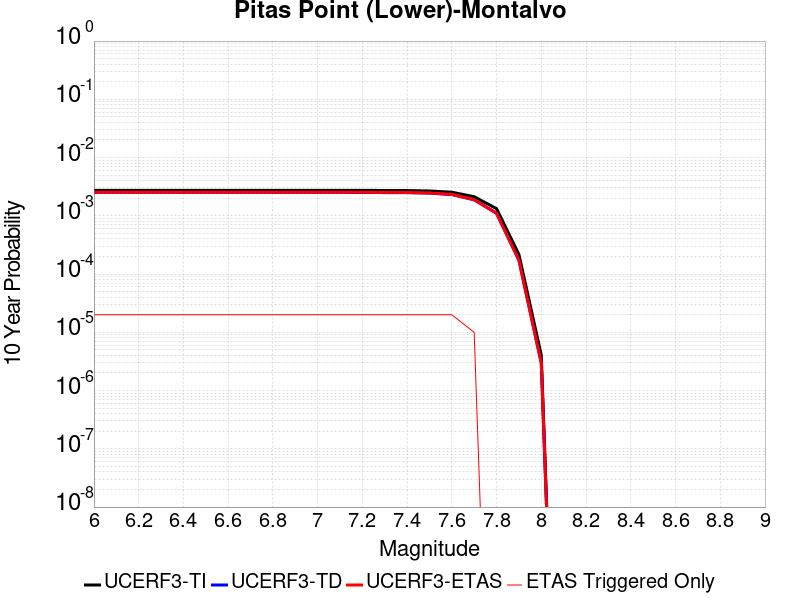 |

| Magnitude | 1 wk TI Prob | 1 wk TD Prob | 1 wk ETAS Prob | 1 wk ETAS/TD Gain | 1 wk ETAS Triggered Only | 1 mo TI Prob | 1 mo TD Prob | 1 mo ETAS Prob | 1 mo ETAS/TD Gain | 1 mo ETAS Triggered Only | 1 yr TI Prob | 1 yr TD Prob | 1 yr ETAS Prob | 1 yr ETAS/TD Gain | 1 yr ETAS Triggered Only | 10 yr TI Prob | 10 yr TD Prob | 10 yr ETAS Prob | 10 yr ETAS/TD Gain | 10 yr ETAS Triggered Only |
|-----|-----|-----|-----|-----|-----|-----|-----|-----|-----|-----|-----|-----|-----|-----|-----|-----|-----|-----|-----|-----|
| 6.0 | 5.2543637E-6 | 4.8378706E-6 | 1.7400624E-5 | 3.5967526 | 1.2562814E-5 | 2.2518509E-5 | 2.0733567E-5 | 3.329612E-5 | 1.6059041 | 1.2562814E-5 | 2.7412834E-4 | 2.5240227E-4 | 2.649619E-4 | 1.0497605 | 1.2562814E-5 | 0.0027379042 | 0.0025211885 | 0.0025337196 | 1.0049703 | 1.2562814E-5 |
| 6.1 | 5.2543637E-6 | 4.8378706E-6 | 1.7400624E-5 | 3.5967526 | 1.2562814E-5 | 2.2518509E-5 | 2.0733567E-5 | 3.329612E-5 | 1.6059041 | 1.2562814E-5 | 2.7412834E-4 | 2.5240227E-4 | 2.649619E-4 | 1.0497605 | 1.2562814E-5 | 0.0027379042 | 0.0025211885 | 0.0025337196 | 1.0049703 | 1.2562814E-5 |
| 6.2 | 5.2543637E-6 | 4.8378706E-6 | 1.7400624E-5 | 3.5967526 | 1.2562814E-5 | 2.2518509E-5 | 2.0733567E-5 | 3.329612E-5 | 1.6059041 | 1.2562814E-5 | 2.7412834E-4 | 2.5240227E-4 | 2.649619E-4 | 1.0497605 | 1.2562814E-5 | 0.0027379042 | 0.0025211885 | 0.0025337196 | 1.0049703 | 1.2562814E-5 |
| 6.3 | 5.2543637E-6 | 4.8378706E-6 | 1.7400624E-5 | 3.5967526 | 1.2562814E-5 | 2.2518509E-5 | 2.0733567E-5 | 3.329612E-5 | 1.6059041 | 1.2562814E-5 | 2.7412834E-4 | 2.5240227E-4 | 2.649619E-4 | 1.0497605 | 1.2562814E-5 | 0.0027379042 | 0.0025211885 | 0.0025337196 | 1.0049703 | 1.2562814E-5 |
| 6.4 | 5.2543637E-6 | 4.8378706E-6 | 1.7400624E-5 | 3.5967526 | 1.2562814E-5 | 2.2518509E-5 | 2.0733567E-5 | 3.329612E-5 | 1.6059041 | 1.2562814E-5 | 2.7412834E-4 | 2.5240227E-4 | 2.649619E-4 | 1.0497605 | 1.2562814E-5 | 0.0027379042 | 0.0025211885 | 0.0025337196 | 1.0049703 | 1.2562814E-5 |
| 6.5 | 5.2543637E-6 | 4.8378706E-6 | 1.7400624E-5 | 3.5967526 | 1.2562814E-5 | 2.2518509E-5 | 2.0733567E-5 | 3.329612E-5 | 1.6059041 | 1.2562814E-5 | 2.7412834E-4 | 2.5240227E-4 | 2.649619E-4 | 1.0497605 | 1.2562814E-5 | 0.0027379042 | 0.0025211885 | 0.0025337196 | 1.0049703 | 1.2562814E-5 |
| 6.6 | 5.2543637E-6 | 4.8378706E-6 | 1.7400624E-5 | 3.5967526 | 1.2562814E-5 | 2.2518509E-5 | 2.0733567E-5 | 3.329612E-5 | 1.6059041 | 1.2562814E-5 | 2.7412834E-4 | 2.5240227E-4 | 2.649619E-4 | 1.0497605 | 1.2562814E-5 | 0.0027379042 | 0.0025211885 | 0.0025337196 | 1.0049703 | 1.2562814E-5 |
| 6.7 | 5.2543637E-6 | 4.8378706E-6 | 1.7400624E-5 | 3.5967526 | 1.2562814E-5 | 2.2518509E-5 | 2.0733567E-5 | 3.329612E-5 | 1.6059041 | 1.2562814E-5 | 2.7412834E-4 | 2.5240227E-4 | 2.649619E-4 | 1.0497605 | 1.2562814E-5 | 0.0027379042 | 0.0025211885 | 0.0025337196 | 1.0049703 | 1.2562814E-5 |
| 6.8 | 5.2543637E-6 | 4.8378706E-6 | 1.7400624E-5 | 3.5967526 | 1.2562814E-5 | 2.2518509E-5 | 2.0733567E-5 | 3.329612E-5 | 1.6059041 | 1.2562814E-5 | 2.7412834E-4 | 2.5240227E-4 | 2.649619E-4 | 1.0497605 | 1.2562814E-5 | 0.0027379042 | 0.0025211885 | 0.0025337196 | 1.0049703 | 1.2562814E-5 |
| 6.9 | 5.2543637E-6 | 4.8378706E-6 | 1.7400624E-5 | 3.5967526 | 1.2562814E-5 | 2.2518509E-5 | 2.0733567E-5 | 3.329612E-5 | 1.6059041 | 1.2562814E-5 | 2.7412834E-4 | 2.5240227E-4 | 2.649619E-4 | 1.0497605 | 1.2562814E-5 | 0.0027379042 | 0.0025211885 | 0.0025337196 | 1.0049703 | 1.2562814E-5 |
| 7.0 | 5.2543637E-6 | 4.8378706E-6 | 1.7400624E-5 | 3.5967526 | 1.2562814E-5 | 2.2518509E-5 | 2.0733567E-5 | 3.329612E-5 | 1.6059041 | 1.2562814E-5 | 2.7412834E-4 | 2.5240227E-4 | 2.649619E-4 | 1.0497605 | 1.2562814E-5 | 0.0027379042 | 0.0025211885 | 0.0025337196 | 1.0049703 | 1.2562814E-5 |
| 7.1 | 5.2543637E-6 | 4.8378706E-6 | 1.7400624E-5 | 3.5967526 | 1.2562814E-5 | 2.2518509E-5 | 2.0733567E-5 | 3.329612E-5 | 1.6059041 | 1.2562814E-5 | 2.7412834E-4 | 2.5240227E-4 | 2.649619E-4 | 1.0497605 | 1.2562814E-5 | 0.0027379042 | 0.0025211885 | 0.0025337196 | 1.0049703 | 1.2562814E-5 |
| 7.2 | 5.2458695E-6 | 4.8290244E-6 | 1.7391778E-5 | 3.6015098 | 1.2562814E-5 | 2.2482105E-5 | 2.0695656E-5 | 3.325821E-5 | 1.6070141 | 1.2562814E-5 | 2.7368523E-4 | 2.519408E-4 | 2.6450044E-4 | 1.0498515 | 1.2562814E-5 | 0.0027334841 | 0.0025165842 | 0.0025291154 | 1.0049795 | 1.2562814E-5 |
| 7.3 | 5.22665E-6 | 4.8089414E-6 | 1.7371694E-5 | 3.6123738 | 1.2562814E-5 | 2.2399736E-5 | 2.0609588E-5 | 3.3172142E-5 | 1.609549 | 1.2562814E-5 | 2.7268266E-4 | 2.5089315E-4 | 2.6345282E-4 | 1.0500598 | 1.2562814E-5 | 0.002723483 | 0.0025061315 | 0.002518663 | 1.0050002 | 1.2562814E-5 |
| 7.4 | 5.210642E-6 | 4.792154E-6 | 1.7354907E-5 | 3.6215255 | 1.2562814E-5 | 2.233113E-5 | 2.0537642E-5 | 3.3100197E-5 | 1.6116844 | 1.2562814E-5 | 2.718476E-4 | 2.5001742E-4 | 2.625771E-4 | 1.0502352 | 1.2562814E-5 | 0.002715153 | 0.0024973939 | 0.0025099253 | 1.0050178 | 1.2562814E-5 |
| 7.5 | 5.1226016E-6 | 4.7000403E-6 | 1.7262795E-5 | 3.6729035 | 1.2562814E-5 | 2.1953823E-5 | 2.0142877E-5 | 3.2705437E-5 | 1.6236726 | 1.2562814E-5 | 2.67255E-4 | 2.4521223E-4 | 2.5777196E-4 | 1.0512198 | 1.2562814E-5 | 0.0026693381 | 0.0024494485 | 0.0024619803 | 1.0051162 | 1.2562814E-5 |
| 7.6 | 4.8796987E-6 | 4.4449403E-6 | 1.7007698E-5 | 3.8263052 | 1.2562814E-5 | 2.0912828E-5 | 1.9049607E-5 | 3.161218E-5 | 1.6594664 | 1.2562814E-5 | 2.5458392E-4 | 2.3190459E-4 | 2.444645E-4 | 1.0541598 | 1.2562814E-5 | 0.0025429246 | 0.0023166565 | 0.0023291903 | 1.0054103 | 1.2562814E-5 |
| 7.7 | 4.0834398E-6 | 3.6091124E-6 | 1.6171882E-5 | 4.4808474 | 1.2562814E-5 | 1.7500339E-5 | 1.5467534E-5 | 2.8030154E-5 | 1.8121928 | 1.2562814E-5 | 2.1304579E-4 | 1.8830119E-4 | 2.0086163E-4 | 1.066704 | 1.2562814E-5 | 0.0021284167 | 0.00188144 | 0.0018939793 | 1.0066646 | 1.2562814E-5 |
| 7.8 | 2.5445438E-6 | 2.121228E-6 | 2.121228E-6 | 1.0 | 0.0 | 1.0905142E-5 | 9.090945E-6 | 9.090945E-6 | 1.0 | 0.0 | 1.3276201E-4 | 1.1067669E-4 | 1.1067669E-4 | 1.0 | 0.0 | 0.0013268272 | 0.0011062203 | 0.0011062203 | 1.0 | 0.0 |
| 7.9 | 4.1677114E-7 | 3.3293693E-7 | 3.3293693E-7 | 1.0 | 0.0 | 1.7861609E-6 | 1.4268718E-6 | 1.4268718E-6 | 1.0 | 0.0 | 2.1746291E-5 | 1.737203E-5 | 1.737203E-5 | 1.0 | 0.0 | 2.1744163E-4 | 1.7370703E-4 | 1.7370703E-4 | 1.0 | 0.0 |
| 8.0 | 7.791402E-9 | 5.683497E-9 | 5.683497E-9 | 1.0 | 0.0 | 3.3391725E-8 | 2.4357844E-8 | 2.4357844E-8 | 1.0 | 0.0 | 4.0654416E-7 | 2.9655675E-7 | 2.9655675E-7 | 1.0 | 0.0 | 4.065434E-6 | 2.9655655E-6 | 2.9655655E-6 | 1.0 | 0.0 |

## Superstition Hills
*[(top)](#table-of-contents)*

| 1 Week | 1 Month | 1 Year | 10 Year |
|-----|-----|-----|-----|
|  |  |  |  |

| Magnitude | 1 wk TI Prob | 1 wk TD Prob | 1 wk ETAS Prob | 1 wk ETAS/TD Gain | 1 wk ETAS Triggered Only | 1 mo TI Prob | 1 mo TD Prob | 1 mo ETAS Prob | 1 mo ETAS/TD Gain | 1 mo ETAS Triggered Only | 1 yr TI Prob | 1 yr TD Prob | 1 yr ETAS Prob | 1 yr ETAS/TD Gain | 1 yr ETAS Triggered Only | 10 yr TI Prob | 10 yr TD Prob | 10 yr ETAS Prob | 10 yr ETAS/TD Gain | 10 yr ETAS Triggered Only |
|-----|-----|-----|-----|-----|-----|-----|-----|-----|-----|-----|-----|-----|-----|-----|-----|-----|-----|-----|-----|-----|
| 6.0 | 6.6865185E-5 | 1.41376995E-5 | 1.41376995E-5 | 1.0 | 0.0 | 2.8653358E-4 | 6.0588824E-5 | 6.0588824E-5 | 1.0 | 0.0 | 0.0034829667 | 7.374355E-4 | 7.374355E-4 | 1.0 | 0.0 | 0.03428881 | 0.0075204074 | 0.007532876 | 1.001658 | 1.2562814E-5 |
| 6.1 | 6.544851E-5 | 1.41376995E-5 | 1.41376995E-5 | 1.0 | 0.0 | 2.8046346E-4 | 6.0588824E-5 | 6.0588824E-5 | 1.0 | 0.0 | 0.0034092965 | 7.374355E-4 | 7.374355E-4 | 1.0 | 0.0 | 0.033574644 | 0.007520407 | 0.007532875 | 1.001658 | 1.2562814E-5 |
| 6.2 | 6.544851E-5 | 1.41376995E-5 | 1.41376995E-5 | 1.0 | 0.0 | 2.8046346E-4 | 6.0588824E-5 | 6.0588824E-5 | 1.0 | 0.0 | 0.0034092965 | 7.374355E-4 | 7.374355E-4 | 1.0 | 0.0 | 0.033574644 | 0.007520407 | 0.007532875 | 1.001658 | 1.2562814E-5 |
| 6.3 | 5.2402065E-5 | 1.4137698E-5 | 1.4137698E-5 | 1.0 | 0.0 | 2.2456095E-4 | 6.058882E-5 | 6.058882E-5 | 1.0 | 0.0 | 0.0027306017 | 7.374354E-4 | 7.374354E-4 | 1.0 | 0.0 | 0.02697292 | 0.007520402 | 0.00753287 | 1.001658 | 1.2562814E-5 |
| 6.4 | 4.542238E-5 | 1.4137698E-5 | 1.4137698E-5 | 1.0 | 0.0 | 1.9465282E-4 | 6.0588816E-5 | 6.0588816E-5 | 1.0 | 0.0 | 0.0023673223 | 7.3743536E-4 | 7.3743536E-4 | 1.0 | 0.0 | 0.023422617 | 0.0075203986 | 0.007532867 | 1.001658 | 1.2562814E-5 |
| 6.5 | 2.9672969E-5 | 1.4137696E-5 | 1.4137696E-5 | 1.0 | 0.0 | 1.2716366E-4 | 6.058881E-5 | 6.058881E-5 | 1.0 | 0.0 | 0.0015471181 | 7.374353E-4 | 7.374353E-4 | 1.0 | 0.0 | 0.015363912 | 0.007520392 | 0.0075328606 | 1.001658 | 1.2562814E-5 |
| 6.6 | 2.6056105E-5 | 1.3803458E-5 | 1.3803458E-5 | 1.0 | 0.0 | 1.1166424E-4 | 5.9156428E-5 | 5.9156428E-5 | 1.0 | 0.0 | 0.0013586642 | 7.200076E-4 | 7.200076E-4 | 1.0 | 0.0 | 0.013503874 | 0.0073448285 | 0.0073448285 | 1.0 | 0.0 |
| 6.7 | 1.4611248E-5 | 1.3383359E-5 | 1.3383359E-5 | 1.0 | 0.0 | 6.261813E-5 | 5.7356083E-5 | 5.7356083E-5 | 1.0 | 0.0 | 7.6210906E-4 | 6.981025E-4 | 6.981025E-4 | 1.0 | 0.0 | 0.0075950073 | 0.00712602 | 0.00712602 | 1.0 | 0.0 |
| 6.8 | 1.30607E-5 | 1.09787925E-5 | 1.09787925E-5 | 1.0 | 0.0 | 5.597323E-5 | 4.705117E-5 | 4.705117E-5 | 1.0 | 0.0 | 6.8126095E-4 | 5.7270617E-4 | 5.7270617E-4 | 1.0 | 0.0 | 0.006791762 | 0.00587438 | 0.00587438 | 1.0 | 0.0 |
| 6.9 | 1.0443096E-5 | 8.195349E-6 | 8.195349E-6 | 1.0 | 0.0 | 4.4755358E-5 | 3.5122466E-5 | 3.5122466E-5 | 1.0 | 0.0 | 5.447602E-4 | 4.2753448E-4 | 4.2753448E-4 | 1.0 | 0.0 | 0.005434267 | 0.0044094524 | 0.0044094524 | 1.0 | 0.0 |
| 7.0 | 8.045912E-6 | 6.739692E-6 | 6.739692E-6 | 1.0 | 0.0 | 3.4482026E-5 | 2.888408E-5 | 2.888408E-5 | 1.0 | 0.0 | 4.197378E-4 | 3.5160795E-4 | 3.5160795E-4 | 1.0 | 0.0 | 0.0041894587 | 0.0036334093 | 0.0036334093 | 1.0 | 0.0 |
| 7.1 | 8.045912E-6 | 6.739692E-6 | 6.739692E-6 | 1.0 | 0.0 | 3.4482026E-5 | 2.888408E-5 | 2.888408E-5 | 1.0 | 0.0 | 4.197378E-4 | 3.5160795E-4 | 3.5160795E-4 | 1.0 | 0.0 | 0.0041894587 | 0.0036334093 | 0.0036334093 | 1.0 | 0.0 |
| 7.2 | 7.375506E-6 | 6.2466297E-6 | 6.2466297E-6 | 1.0 | 0.0 | 3.1608928E-5 | 2.6771E-5 | 2.6771E-5 | 1.0 | 0.0 | 3.8477074E-4 | 3.2588904E-4 | 3.2588904E-4 | 1.0 | 0.0 | 0.003841052 | 0.003373887 | 0.003373887 | 1.0 | 0.0 |
| 7.3 | 6.6063913E-6 | 5.7990574E-6 | 5.7990574E-6 | 1.0 | 0.0 | 2.8312797E-5 | 2.485287E-5 | 2.485287E-5 | 1.0 | 0.0 | 3.446538E-4 | 3.025424E-4 | 3.025424E-4 | 1.0 | 0.0 | 0.0034411973 | 0.003138153 | 0.003138153 | 1.0 | 0.0 |
| 7.4 | 6.4313126E-6 | 5.680481E-6 | 5.680481E-6 | 1.0 | 0.0 | 2.7562477E-5 | 2.4344696E-5 | 2.4344696E-5 | 1.0 | 0.0 | 3.355215E-4 | 2.9635706E-4 | 2.9635706E-4 | 1.0 | 0.0 | 0.0033501536 | 0.0030759154 | 0.0030759154 | 1.0 | 0.0 |
| 7.5 | 6.0742927E-6 | 5.4763104E-6 | 5.4763104E-6 | 1.0 | 0.0 | 2.6032423E-5 | 2.3469694E-5 | 2.3469694E-5 | 1.0 | 0.0 | 3.1689866E-4 | 2.8570674E-4 | 2.8570674E-4 | 1.0 | 0.0 | 0.0031644711 | 0.002967756 | 0.002967756 | 1.0 | 0.0 |
| 7.6 | 5.6987187E-6 | 5.294521E-6 | 5.294521E-6 | 1.0 | 0.0 | 2.4422852E-5 | 2.269061E-5 | 2.269061E-5 | 1.0 | 0.0 | 2.9730765E-4 | 2.7622381E-4 | 2.7622381E-4 | 1.0 | 0.0 | 0.002969102 | 0.0028710118 | 0.0028710118 | 1.0 | 0.0 |
| 7.7 | 5.1658035E-6 | 4.925535E-6 | 4.925535E-6 | 1.0 | 0.0 | 2.2138971E-5 | 2.1109268E-5 | 2.1109268E-5 | 1.0 | 0.0 | 2.6950863E-4 | 2.5697565E-4 | 2.5697565E-4 | 1.0 | 0.0 | 0.00269182 | 0.0026760625 | 0.0026760625 | 1.0 | 0.0 |
| 7.8 | 3.6864697E-6 | 4.1964995E-6 | 4.1964995E-6 | 1.0 | 0.0 | 1.579906E-5 | 1.7984876E-5 | 1.7984876E-5 | 1.0 | 0.0 | 1.9233658E-4 | 2.1894433E-4 | 2.1894433E-4 | 1.0 | 0.0 | 0.0019217018 | 0.0022892624 | 0.0022892624 | 1.0 | 0.0 |
| 7.9 | 3.0265903E-6 | 3.5637288E-6 | 3.5637288E-6 | 1.0 | 0.0 | 1.2971037E-5 | 1.5273037E-5 | 1.5273037E-5 | 1.0 | 0.0 | 1.5791094E-4 | 1.859338E-4 | 1.859338E-4 | 1.0 | 0.0 | 0.0015779877 | 0.0019534735 | 0.0019534735 | 1.0 | 0.0 |
| 8.0 | 2.5271493E-6 | 3.0867361E-6 | 3.0867361E-6 | 1.0 | 0.0 | 1.0830595E-5 | 1.3228804E-5 | 1.3228804E-5 | 1.0 | 0.0 | 1.3185451E-4 | 1.610492E-4 | 1.610492E-4 | 1.0 | 0.0 | 0.0013177631 | 0.0016973554 | 0.0016973554 | 1.0 | 0.0 |
| 8.1 | 2.3749135E-6 | 2.917377E-6 | 2.917377E-6 | 1.0 | 0.0 | 1.0178161E-5 | 1.25029865E-5 | 1.25029865E-5 | 1.0 | 0.0 | 1.2391206E-4 | 1.5221364E-4 | 1.5221364E-4 | 1.0 | 0.0 | 0.0012384299 | 0.001604949 | 0.001604949 | 1.0 | 0.0 |
| 8.2 | 1.7186406E-9 | 1.1440594E-9 | 1.1440594E-9 | 1.0 | 0.0 | 7.3656024E-9 | 4.9031117E-9 | 4.9031117E-9 | 1.0 | 0.0 | 8.9676206E-8 | 5.969538E-8 | 5.969538E-8 | 1.0 | 0.0 | 8.9676166E-7 | 6.389059E-7 | 6.389059E-7 | 1.0 | 0.0 |

## San Gregorio (North) 2011 CFM
*[(top)](#table-of-contents)*

| 1 Week | 1 Month | 1 Year | 10 Year |
|-----|-----|-----|-----|
|  |  |  |  |

| Magnitude | 1 wk TI Prob | 1 wk TD Prob | 1 wk ETAS Prob | 1 wk ETAS/TD Gain | 1 wk ETAS Triggered Only | 1 mo TI Prob | 1 mo TD Prob | 1 mo ETAS Prob | 1 mo ETAS/TD Gain | 1 mo ETAS Triggered Only | 1 yr TI Prob | 1 yr TD Prob | 1 yr ETAS Prob | 1 yr ETAS/TD Gain | 1 yr ETAS Triggered Only | 10 yr TI Prob | 10 yr TD Prob | 10 yr ETAS Prob | 10 yr ETAS/TD Gain | 10 yr ETAS Triggered Only |
|-----|-----|-----|-----|-----|-----|-----|-----|-----|-----|-----|-----|-----|-----|-----|-----|-----|-----|-----|-----|-----|
| 6.0 | 5.0283932E-5 | 4.3057815E-5 | 4.3057815E-5 | 1.0 | 0.0 | 2.1548476E-4 | 1.8452053E-4 | 1.9708103E-4 | 1.068071 | 1.2562814E-5 | 0.0026203706 | 0.002244237 | 0.0022567718 | 1.0055852 | 1.2562814E-5 | 0.02589687 | 0.022293162 | 0.022305446 | 1.000551 | 1.2562814E-5 |
| 6.1 | 5.0283932E-5 | 4.3057815E-5 | 4.3057815E-5 | 1.0 | 0.0 | 2.1548476E-4 | 1.8452053E-4 | 1.9708103E-4 | 1.068071 | 1.2562814E-5 | 0.0026203706 | 0.002244237 | 0.0022567718 | 1.0055852 | 1.2562814E-5 | 0.02589687 | 0.022293162 | 0.022305446 | 1.000551 | 1.2562814E-5 |
| 6.2 | 4.2998647E-5 | 3.4441564E-5 | 3.4441564E-5 | 1.0 | 0.0 | 1.842669E-4 | 1.475984E-4 | 1.6015935E-4 | 1.0851023 | 1.2562814E-5 | 0.0022411412 | 0.00179554 | 0.0018080802 | 1.0069841 | 1.2562814E-5 | 0.022186736 | 0.017886506 | 0.017898845 | 1.0006897 | 1.2562814E-5 |
| 6.3 | 4.2998647E-5 | 3.4441564E-5 | 3.4441564E-5 | 1.0 | 0.0 | 1.842669E-4 | 1.475984E-4 | 1.6015935E-4 | 1.0851023 | 1.2562814E-5 | 0.0022411412 | 0.00179554 | 0.0018080802 | 1.0069841 | 1.2562814E-5 | 0.022186736 | 0.017886506 | 0.017898845 | 1.0006897 | 1.2562814E-5 |
| 6.4 | 4.1101295E-5 | 3.2326872E-5 | 3.2326872E-5 | 1.0 | 0.0 | 1.7613651E-4 | 1.3853642E-4 | 1.510975E-4 | 1.0906699 | 1.2562814E-5 | 0.0021423528 | 0.0016853869 | 0.0016979285 | 1.0074414 | 1.2562814E-5 | 0.02121817 | 0.016801886 | 0.016814237 | 1.0007352 | 1.2562814E-5 |
| 6.5 | 4.1032585E-5 | 3.2244905E-5 | 3.2244905E-5 | 1.0 | 0.0 | 1.7584208E-4 | 1.3818518E-4 | 1.5074626E-4 | 1.0909003 | 1.2562814E-5 | 0.0021387753 | 0.0016811171 | 0.0016936588 | 1.0074604 | 1.2562814E-5 | 0.021183075 | 0.016759839 | 0.016772192 | 1.0007371 | 1.2562814E-5 |
| 6.6 | 4.011629E-5 | 3.1266558E-5 | 3.1266558E-5 | 1.0 | 0.0 | 1.7191563E-4 | 1.339927E-4 | 1.4655382E-4 | 1.0937449 | 1.2562814E-5 | 0.0020910634 | 0.0016301516 | 0.0016426939 | 1.007694 | 1.2562814E-5 | 0.020714961 | 0.01625741 | 0.01626977 | 1.0007602 | 1.2562814E-5 |
| 6.7 | 3.8583938E-5 | 2.9453593E-5 | 2.9453593E-5 | 1.0 | 0.0 | 1.6534925E-4 | 1.2622366E-4 | 1.3878489E-4 | 1.0995157 | 1.2562814E-5 | 0.0020112682 | 0.0015357039 | 0.0015482474 | 1.008168 | 1.2562814E-5 | 0.019931622 | 0.015325955 | 0.015338325 | 1.0008072 | 1.2562814E-5 |
| 6.8 | 3.44341E-5 | 2.4450854E-5 | 2.4450854E-5 | 1.0 | 0.0 | 1.4756636E-4 | 1.0478523E-4 | 1.0478523E-4 | 1.0 | 0.0 | 0.0017951399 | 0.0012750238 | 0.0012750238 | 1.0 | 0.0 | 0.017807078 | 0.012751131 | 0.012751131 | 1.0 | 0.0 |
| 6.9 | 3.221199E-5 | 2.1778029E-5 | 2.1778029E-5 | 1.0 | 0.0 | 1.3804408E-4 | 9.333112E-5 | 9.333112E-5 | 1.0 | 0.0 | 0.0016793909 | 0.0011357224 | 0.0011357224 | 1.0 | 0.0 | 0.01666756 | 0.011372583 | 0.011372583 | 1.0 | 0.0 |
| 7.0 | 2.9186718E-5 | 1.8146875E-5 | 1.8146875E-5 | 1.0 | 0.0 | 1.2507994E-4 | 7.7770026E-5 | 7.7770026E-5 | 1.0 | 0.0 | 0.0015217843 | 9.464431E-4 | 9.464431E-4 | 1.0 | 0.0 | 0.015114053 | 0.009496798 | 0.009496798 | 1.0 | 0.0 |
| 7.1 | 2.6840138E-5 | 1.5284508E-5 | 1.5284508E-5 | 1.0 | 0.0 | 1.1502409E-4 | 6.55034E-5 | 6.55034E-5 | 1.0 | 0.0 | 0.0013995186 | 7.9721404E-4 | 7.9721404E-4 | 1.0 | 0.0 | 0.013907375 | 0.008015723 | 0.008015723 | 1.0 | 0.0 |
| 7.2 | 2.453002E-5 | 1.2606672E-5 | 1.2606672E-5 | 1.0 | 0.0 | 1.05124425E-4 | 5.4027478E-5 | 5.4027478E-5 | 1.0 | 0.0 | 0.0012791384 | 6.575866E-4 | 6.575866E-4 | 1.0 | 0.0 | 0.012718005 | 0.00662763 | 0.00662763 | 1.0 | 0.0 |
| 7.3 | 2.3330727E-5 | 1.1488677E-5 | 1.1488677E-5 | 1.0 | 0.0 | 9.9985E-5 | 4.923626E-5 | 4.923626E-5 | 1.0 | 0.0 | 0.0012166376 | 5.9928704E-4 | 5.9928704E-4 | 1.0 | 0.0 | 0.012099981 | 0.006046564 | 0.006046564 | 1.0 | 0.0 |
| 7.4 | 2.2136466E-5 | 1.0368981E-5 | 1.0368981E-5 | 1.0 | 0.0 | 9.486712E-5 | 4.4437733E-5 | 4.4437733E-5 | 1.0 | 0.0 | 0.0011543952 | 5.4089533E-4 | 5.4089533E-4 | 1.0 | 0.0 | 0.011484168 | 0.005464249 | 0.005464249 | 1.0 | 0.0 |
| 7.5 | 2.0994974E-5 | 9.427217E-6 | 9.427217E-6 | 1.0 | 0.0 | 8.997535E-5 | 4.0401734E-5 | 4.0401734E-5 | 1.0 | 0.0 | 0.0010948994 | 4.9178035E-4 | 4.9178035E-4 | 1.0 | 0.0 | 0.010895205 | 0.004973358 | 0.004973358 | 1.0 | 0.0 |
| 7.6 | 1.7091823E-5 | 6.893766E-6 | 6.893766E-6 | 1.0 | 0.0 | 7.3248615E-5 | 2.9544377E-5 | 2.9544377E-5 | 1.0 | 0.0 | 8.9143694E-4 | 3.596435E-4 | 3.596435E-4 | 1.0 | 0.0 | 0.008878695 | 0.0036482841 | 0.0036482841 | 1.0 | 0.0 |
| 7.7 | 1.2772179E-5 | 4.0208706E-6 | 4.0208706E-6 | 1.0 | 0.0 | 5.473676E-5 | 1.7232189E-5 | 1.7232189E-5 | 1.0 | 0.0 | 6.6621625E-4 | 2.0978172E-4 | 2.0978172E-4 | 1.0 | 0.0 | 0.006642225 | 0.002136922 | 0.002136922 | 1.0 | 0.0 |
| 7.8 | 7.041923E-6 | 1.940626E-6 | 1.940626E-6 | 1.0 | 0.0 | 3.017932E-5 | 8.316942E-6 | 8.316942E-6 | 1.0 | 0.0 | 3.6737128E-4 | 1.0125406E-4 | 1.0125406E-4 | 1.0 | 0.0 | 0.0036676454 | 0.0010379003 | 0.0010379003 | 1.0 | 0.0 |
| 7.9 | 2.946768E-6 | 1.0033551E-6 | 1.0033551E-6 | 1.0 | 0.0 | 1.2628945E-5 | 4.300086E-6 | 4.300086E-6 | 1.0 | 0.0 | 1.5374656E-4 | 5.235229E-5 | 5.235229E-5 | 1.0 | 0.0 | 0.0015364023 | 5.3400313E-4 | 5.3400313E-4 | 1.0 | 0.0 |
| 8.0 | 1.1433375E-6 | 5.18146E-7 | 5.18146E-7 | 1.0 | 0.0 | 4.9000087E-6 | 2.2206239E-6 | 2.2206239E-6 | 1.0 | 0.0 | 5.965597E-5 | 2.703576E-5 | 2.703576E-5 | 1.0 | 0.0 | 5.963996E-4 | 2.7398416E-4 | 2.7398416E-4 | 1.0 | 0.0 |
| 8.1 | 2.6675295E-7 | 1.62899E-7 | 1.62899E-7 | 1.0 | 0.0 | 1.1432264E-6 | 6.9813836E-7 | 6.9813836E-7 | 1.0 | 0.0 | 1.3918692E-5 | 8.499802E-6 | 8.499802E-6 | 1.0 | 0.0 | 1.391782E-4 | 8.63795E-5 | 8.63795E-5 | 1.0 | 0.0 |
| 8.2 | 1.2704569E-8 | 9.431393E-9 | 9.431393E-9 | 1.0 | 0.0 | 5.444815E-8 | 4.042026E-8 | 4.042026E-8 | 1.0 | 0.0 | 6.629061E-7 | 4.9211656E-7 | 4.9211656E-7 | 1.0 | 0.0 | 6.629041E-6 | 5.1121438E-6 | 5.1121438E-6 | 1.0 | 0.0 |

## Malibu Coast (Extension) alt 1
*[(top)](#table-of-contents)*

| 1 Week | 1 Month | 1 Year | 10 Year |
|-----|-----|-----|-----|
| 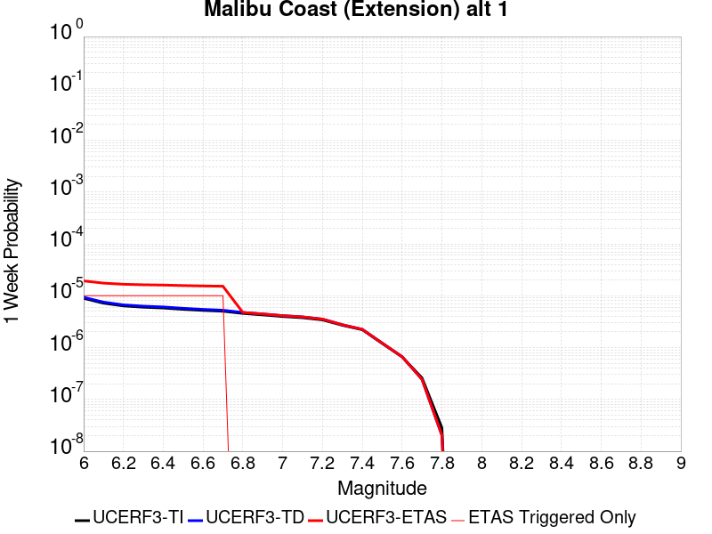 | 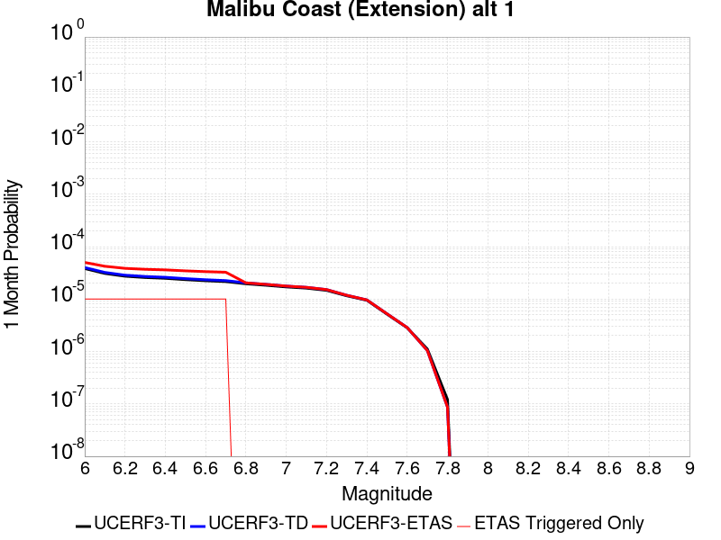 |  |  |

| Magnitude | 1 wk TI Prob | 1 wk TD Prob | 1 wk ETAS Prob | 1 wk ETAS/TD Gain | 1 wk ETAS Triggered Only | 1 mo TI Prob | 1 mo TD Prob | 1 mo ETAS Prob | 1 mo ETAS/TD Gain | 1 mo ETAS Triggered Only | 1 yr TI Prob | 1 yr TD Prob | 1 yr ETAS Prob | 1 yr ETAS/TD Gain | 1 yr ETAS Triggered Only | 10 yr TI Prob | 10 yr TD Prob | 10 yr ETAS Prob | 10 yr ETAS/TD Gain | 10 yr ETAS Triggered Only |
|-----|-----|-----|-----|-----|-----|-----|-----|-----|-----|-----|-----|-----|-----|-----|-----|-----|-----|-----|-----|-----|
| 6.0 | 8.930738E-6 | 9.329276E-6 | 2.1891972E-5 | 2.3465886 | 1.2562814E-5 | 3.827403E-5 | 3.998201E-5 | 5.2544317E-5 | 1.3141991 | 1.2562814E-5 | 4.6588664E-4 | 4.8667393E-4 | 4.9923063E-4 | 1.0258011 | 1.2562814E-5 | 0.0046491115 | 0.004856264 | 0.004868766 | 1.0025743 | 1.2562814E-5 |
| 6.1 | 7.199952E-6 | 7.5302964E-6 | 2.0093015E-5 | 2.6682901 | 1.2562814E-5 | 3.0856572E-5 | 3.2272303E-5 | 4.4834713E-5 | 1.3892628 | 1.2562814E-5 | 3.75614E-4 | 3.9284505E-4 | 4.0540294E-4 | 1.0319664 | 1.2562814E-5 | 0.0037497976 | 0.003921572 | 0.003934086 | 1.003191 | 1.2562814E-5 |
| 6.2 | 6.3721413E-6 | 6.6667917E-6 | 1.9229521E-5 | 2.8843741 | 1.2562814E-5 | 2.7308892E-5 | 2.8571652E-5 | 4.1134106E-5 | 1.4396825 | 1.2562814E-5 | 3.3243504E-4 | 3.4780471E-4 | 3.6036316E-4 | 1.0361078 | 1.2562814E-5 | 0.0033193815 | 0.0034726437 | 0.003485163 | 1.0036051 | 1.2562814E-5 |
| 6.3 | 6.016345E-6 | 6.295158E-6 | 1.8857892E-5 | 2.9956186 | 1.2562814E-5 | 2.578408E-5 | 2.6978973E-5 | 3.9541446E-5 | 1.4656395 | 1.2562814E-5 | 3.1387596E-4 | 3.2841982E-4 | 3.409785E-4 | 1.0382397 | 1.2562814E-5 | 0.00313433 | 0.0032793807 | 0.0032919024 | 1.0038183 | 1.2562814E-5 |
| 6.4 | 5.8104883E-6 | 6.0795446E-6 | 1.8642282E-5 | 3.0663946 | 1.2562814E-5 | 2.4901856E-5 | 2.6054933E-5 | 3.8617418E-5 | 1.4821539 | 1.2562814E-5 | 3.031379E-4 | 3.1717293E-4 | 3.2973176E-4 | 1.0395962 | 1.2562814E-5 | 0.0030272473 | 0.0031672374 | 0.0031797604 | 1.0039539 | 1.2562814E-5 |
| 6.5 | 5.476925E-6 | 5.7275133E-6 | 1.8290255E-5 | 3.1934025 | 1.2562814E-5 | 2.3472323E-5 | 2.4546256E-5 | 3.7108763E-5 | 1.5117891 | 1.2562814E-5 | 2.8573806E-4 | 2.9880996E-4 | 3.1136905E-4 | 1.0420302 | 1.2562814E-5 | 0.0028537093 | 0.002984114 | 0.002996639 | 1.0041974 | 1.2562814E-5 |
| 6.6 | 5.222387E-6 | 5.45858E-6 | 1.8021325E-5 | 3.301468 | 1.2562814E-5 | 2.2381464E-5 | 2.3393704E-5 | 3.5956225E-5 | 1.5370044 | 1.2562814E-5 | 2.7246025E-4 | 2.8478142E-4 | 2.9734065E-4 | 1.0441014 | 1.2562814E-5 | 0.0027212645 | 0.0028441956 | 0.0028567226 | 1.0044044 | 1.2562814E-5 |
| 6.7 | 5.0337076E-6 | 5.259103E-6 | 1.782185E-5 | 3.3887625 | 1.2562814E-5 | 2.1572854E-5 | 2.253882E-5 | 3.510135E-5 | 1.557373 | 1.2562814E-5 | 2.6261783E-4 | 2.7437587E-4 | 2.8693522E-4 | 1.0457743 | 1.2562814E-5 | 0.002623077 | 0.002740401 | 0.0027529295 | 1.0045717 | 1.2562814E-5 |
| 6.8 | 4.5675624E-6 | 4.7587164E-6 | 4.7587164E-6 | 1.0 | 0.0 | 1.9575122E-5 | 2.039434E-5 | 2.039434E-5 | 1.0 | 0.0 | 2.3830103E-4 | 2.48273E-4 | 2.48273E-4 | 1.0 | 0.0 | 0.0023804565 | 0.002479976 | 0.002479976 | 1.0 | 0.0 |
| 6.9 | 4.2802412E-6 | 4.4520207E-6 | 4.4520207E-6 | 1.0 | 0.0 | 1.8343762E-5 | 1.907995E-5 | 1.907995E-5 | 1.0 | 0.0 | 2.2331243E-4 | 2.3227377E-4 | 2.3227377E-4 | 1.0 | 0.0 | 0.0022308815 | 0.0023203269 | 0.0023203269 | 1.0 | 0.0 |
| 7.0 | 3.9794063E-6 | 4.130099E-6 | 4.130099E-6 | 1.0 | 0.0 | 1.7054486E-5 | 1.7700306E-5 | 1.7700306E-5 | 1.0 | 0.0 | 2.0761859E-4 | 2.1548003E-4 | 2.1548003E-4 | 1.0 | 0.0 | 0.0020742472 | 0.0021527244 | 0.0021527244 | 1.0 | 0.0 |
| 7.1 | 3.7730424E-6 | 3.911217E-6 | 3.911217E-6 | 1.0 | 0.0 | 1.6170083E-5 | 1.6762251E-5 | 1.6762251E-5 | 1.0 | 0.0 | 1.9685295E-4 | 2.0406142E-4 | 2.0406142E-4 | 1.0 | 0.0 | 0.0019667868 | 0.0020387534 | 0.0020387534 | 1.0 | 0.0 |
| 7.2 | 3.424985E-6 | 3.541337E-6 | 3.541337E-6 | 1.0 | 0.0 | 1.4678424E-5 | 1.5177071E-5 | 1.5177071E-5 | 1.0 | 0.0 | 1.7869516E-4 | 1.8476529E-4 | 1.8476529E-4 | 1.0 | 0.0 | 0.0017855153 | 0.0018461287 | 0.0018461287 | 1.0 | 0.0 |
| 7.3 | 2.6966375E-6 | 2.7596534E-6 | 2.7596534E-6 | 1.0 | 0.0 | 1.15569665E-5 | 1.1827032E-5 | 1.1827032E-5 | 1.0 | 0.0 | 1.4069698E-4 | 1.4398464E-4 | 1.4398464E-4 | 1.0 | 0.0 | 0.0014060794 | 0.0014389176 | 0.0014389176 | 1.0 | 0.0 |
| 7.4 | 2.215957E-6 | 2.249378E-6 | 2.249378E-6 | 1.0 | 0.0 | 9.496924E-6 | 9.640156E-6 | 9.640156E-6 | 1.0 | 0.0 | 1.1561892E-4 | 1.17362615E-4 | 1.17362615E-4 | 1.0 | 0.0 | 0.0011555878 | 0.0011730101 | 0.0011730101 | 1.0 | 0.0 |
| 7.5 | 1.2040218E-6 | 1.2219067E-6 | 1.2219067E-6 | 1.0 | 0.0 | 5.160083E-6 | 5.2367322E-6 | 5.2367322E-6 | 1.0 | 0.0 | 6.2822204E-5 | 6.375537E-5 | 6.375537E-5 | 1.0 | 0.0 | 6.280445E-4 | 6.3737266E-4 | 6.3737266E-4 | 1.0 | 0.0 |
| 7.6 | 6.6157446E-7 | 6.678975E-7 | 6.678975E-7 | 1.0 | 0.0 | 2.835316E-6 | 2.8624147E-6 | 2.8624147E-6 | 1.0 | 0.0 | 3.4519428E-5 | 3.484936E-5 | 3.484936E-5 | 1.0 | 0.0 | 3.4514067E-4 | 3.4844046E-4 | 3.4844046E-4 | 1.0 | 0.0 |
| 7.7 | 2.6012302E-7 | 2.4357593E-7 | 2.4357593E-7 | 1.0 | 0.0 | 1.1148124E-6 | 1.0438964E-6 | 1.0438964E-6 | 1.0 | 0.0 | 1.3572758E-5 | 1.2709375E-5 | 1.2709375E-5 | 1.0 | 0.0 | 1.3571928E-4 | 1.2708755E-4 | 1.2708755E-4 | 1.0 | 0.0 |
| 7.8 | 2.8323132E-8 | 2.0266649E-8 | 2.0266649E-8 | 1.0 | 0.0 | 1.2138484E-7 | 8.685707E-8 | 8.685707E-8 | 1.0 | 0.0 | 1.4778595E-6 | 1.0574844E-6 | 1.0574844E-6 | 1.0 | 0.0 | 1.4778497E-5 | 1.0574801E-5 | 1.0574801E-5 | 1.0 | 0.0 |

## Burnt Mtn
*[(top)](#table-of-contents)*

| 1 Week | 1 Month | 1 Year | 10 Year |
|-----|-----|-----|-----|
|  |  | 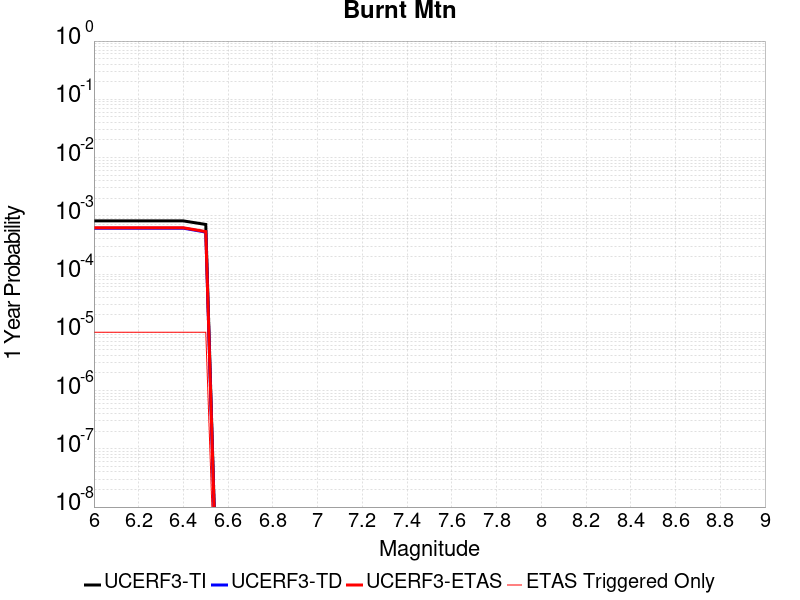 |  |

| Magnitude | 1 wk TI Prob | 1 wk TD Prob | 1 wk ETAS Prob | 1 wk ETAS/TD Gain | 1 wk ETAS Triggered Only | 1 mo TI Prob | 1 mo TD Prob | 1 mo ETAS Prob | 1 mo ETAS/TD Gain | 1 mo ETAS Triggered Only | 1 yr TI Prob | 1 yr TD Prob | 1 yr ETAS Prob | 1 yr ETAS/TD Gain | 1 yr ETAS Triggered Only | 10 yr TI Prob | 10 yr TD Prob | 10 yr ETAS Prob | 10 yr ETAS/TD Gain | 10 yr ETAS Triggered Only |
|-----|-----|-----|-----|-----|-----|-----|-----|-----|-----|-----|-----|-----|-----|-----|-----|-----|-----|-----|-----|-----|
| 6.0 | 1.5673151E-5 | 1.1749407E-5 | 1.1749407E-5 | 1.0 | 0.0 | 6.716892E-5 | 5.0354356E-5 | 6.291654E-5 | 1.2494756 | 1.2562814E-5 | 8.1747473E-4 | 6.1302073E-4 | 6.2557583E-4 | 1.0204808 | 1.2562814E-5 | 0.008144741 | 0.006125938 | 0.006138424 | 1.0020382 | 1.2562814E-5 |
| 6.1 | 1.5673151E-5 | 1.1749407E-5 | 1.1749407E-5 | 1.0 | 0.0 | 6.716892E-5 | 5.0354356E-5 | 6.291654E-5 | 1.2494756 | 1.2562814E-5 | 8.1747473E-4 | 6.1302073E-4 | 6.2557583E-4 | 1.0204808 | 1.2562814E-5 | 0.008144741 | 0.006125938 | 0.006138424 | 1.0020382 | 1.2562814E-5 |
| 6.2 | 1.5673151E-5 | 1.1749407E-5 | 1.1749407E-5 | 1.0 | 0.0 | 6.716892E-5 | 5.0354356E-5 | 6.291654E-5 | 1.2494756 | 1.2562814E-5 | 8.1747473E-4 | 6.1302073E-4 | 6.2557583E-4 | 1.0204808 | 1.2562814E-5 | 0.008144741 | 0.006125938 | 0.006138424 | 1.0020382 | 1.2562814E-5 |
| 6.3 | 1.5673151E-5 | 1.1749407E-5 | 1.1749407E-5 | 1.0 | 0.0 | 6.716892E-5 | 5.0354356E-5 | 6.291654E-5 | 1.2494756 | 1.2562814E-5 | 8.1747473E-4 | 6.1302073E-4 | 6.2557583E-4 | 1.0204808 | 1.2562814E-5 | 0.008144741 | 0.006125938 | 0.006138424 | 1.0020382 | 1.2562814E-5 |
| 6.4 | 1.5673151E-5 | 1.1749407E-5 | 1.1749407E-5 | 1.0 | 0.0 | 6.716892E-5 | 5.0354356E-5 | 6.291654E-5 | 1.2494756 | 1.2562814E-5 | 8.1747473E-4 | 6.1302073E-4 | 6.2557583E-4 | 1.0204808 | 1.2562814E-5 | 0.008144741 | 0.006125938 | 0.006138424 | 1.0020382 | 1.2562814E-5 |
| 6.5 | 1.36191375E-5 | 1.0078299E-5 | 1.0078299E-5 | 1.0 | 0.0 | 5.8366426E-5 | 4.3192707E-5 | 5.575498E-5 | 1.2908424 | 1.2562814E-5 | 7.103795E-4 | 5.2587123E-4 | 5.3842744E-4 | 1.0238769 | 1.2562814E-5 | 0.0070811296 | 0.0052587125 | 0.005271209 | 1.0023764 | 1.2562814E-5 |

## Skinner Flat 2011 CFM
*[(top)](#table-of-contents)*

| 1 Week | 1 Month | 1 Year | 10 Year |
|-----|-----|-----|-----|
|  | 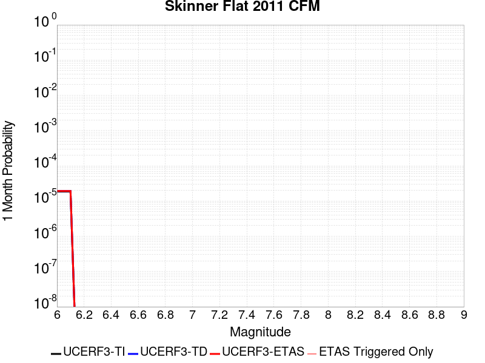 |  |  |

| Magnitude | 1 wk TI Prob | 1 wk TD Prob | 1 wk ETAS Prob | 1 wk ETAS/TD Gain | 1 wk ETAS Triggered Only | 1 mo TI Prob | 1 mo TD Prob | 1 mo ETAS Prob | 1 mo ETAS/TD Gain | 1 mo ETAS Triggered Only | 1 yr TI Prob | 1 yr TD Prob | 1 yr ETAS Prob | 1 yr ETAS/TD Gain | 1 yr ETAS Triggered Only | 10 yr TI Prob | 10 yr TD Prob | 10 yr ETAS Prob | 10 yr ETAS/TD Gain | 10 yr ETAS Triggered Only |
|-----|-----|-----|-----|-----|-----|-----|-----|-----|-----|-----|-----|-----|-----|-----|-----|-----|-----|-----|-----|-----|
| 6.0 | 4.3279074E-6 | 4.484953E-6 | 4.484953E-6 | 1.0 | 0.0 | 1.8548042E-5 | 1.9221226E-5 | 1.9221226E-5 | 1.0 | 0.0 | 2.2579901E-4 | 2.3401844E-4 | 2.3401844E-4 | 1.0 | 0.0 | 0.002255697 | 0.0023401843 | 0.0023527178 | 1.0053557 | 1.2562814E-5 |
| 6.1 | 4.3279074E-6 | 4.484953E-6 | 4.484953E-6 | 1.0 | 0.0 | 1.8548042E-5 | 1.9221226E-5 | 1.9221226E-5 | 1.0 | 0.0 | 2.2579901E-4 | 2.3401844E-4 | 2.3401844E-4 | 1.0 | 0.0 | 0.002255697 | 0.0023401843 | 0.0023401843 | 1.0 | 0.0 |

## Owens Valley Keough Hot Springs
*[(top)](#table-of-contents)*

| 1 Week | 1 Month | 1 Year | 10 Year |
|-----|-----|-----|-----|
| 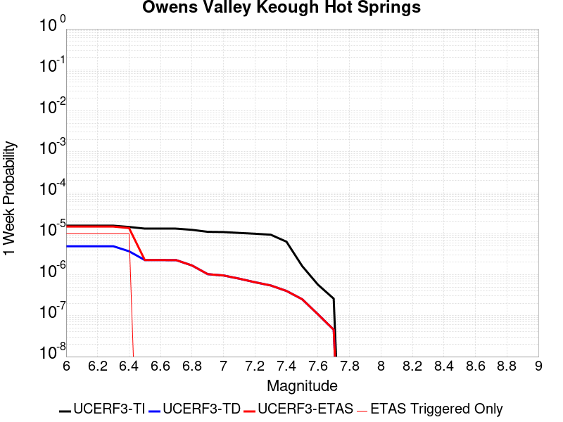 |  |  |  |

| Magnitude | 1 wk TI Prob | 1 wk TD Prob | 1 wk ETAS Prob | 1 wk ETAS/TD Gain | 1 wk ETAS Triggered Only | 1 mo TI Prob | 1 mo TD Prob | 1 mo ETAS Prob | 1 mo ETAS/TD Gain | 1 mo ETAS Triggered Only | 1 yr TI Prob | 1 yr TD Prob | 1 yr ETAS Prob | 1 yr ETAS/TD Gain | 1 yr ETAS Triggered Only | 10 yr TI Prob | 10 yr TD Prob | 10 yr ETAS Prob | 10 yr ETAS/TD Gain | 10 yr ETAS Triggered Only |
|-----|-----|-----|-----|-----|-----|-----|-----|-----|-----|-----|-----|-----|-----|-----|-----|-----|-----|-----|-----|-----|
| 6.0 | 1.5708529E-5 | 4.950656E-6 | 4.950656E-6 | 1.0 | 0.0 | 6.7320536E-5 | 2.1216953E-5 | 2.1216953E-5 | 1.0 | 0.0 | 8.193192E-4 | 2.582909E-4 | 2.582909E-4 | 1.0 | 0.0 | 0.008163051 | 0.0025805652 | 0.0025930954 | 1.0048556 | 1.2562814E-5 |
| 6.1 | 1.5708529E-5 | 4.950656E-6 | 4.950656E-6 | 1.0 | 0.0 | 6.7320536E-5 | 2.1216953E-5 | 2.1216953E-5 | 1.0 | 0.0 | 8.193192E-4 | 2.582909E-4 | 2.582909E-4 | 1.0 | 0.0 | 0.008163051 | 0.0025805652 | 0.0025930954 | 1.0048556 | 1.2562814E-5 |
| 6.2 | 1.5708529E-5 | 4.950656E-6 | 4.950656E-6 | 1.0 | 0.0 | 6.7320536E-5 | 2.1216953E-5 | 2.1216953E-5 | 1.0 | 0.0 | 8.193192E-4 | 2.582909E-4 | 2.582909E-4 | 1.0 | 0.0 | 0.008163051 | 0.0025805652 | 0.0025930954 | 1.0048556 | 1.2562814E-5 |
| 6.3 | 1.5708529E-5 | 4.950656E-6 | 4.950656E-6 | 1.0 | 0.0 | 6.7320536E-5 | 2.1216953E-5 | 2.1216953E-5 | 1.0 | 0.0 | 8.193192E-4 | 2.582909E-4 | 2.582909E-4 | 1.0 | 0.0 | 0.008163051 | 0.0025805652 | 0.0025930954 | 1.0048556 | 1.2562814E-5 |
| 6.4 | 1.4622509E-5 | 3.7265204E-6 | 3.7265204E-6 | 1.0 | 0.0 | 6.266639E-5 | 1.5970723E-5 | 1.5970723E-5 | 1.0 | 0.0 | 7.626962E-4 | 1.944295E-4 | 1.944295E-4 | 1.0 | 0.0 | 0.007600839 | 0.0019430731 | 0.0019556114 | 1.0064529 | 1.2562814E-5 |
| 6.5 | 1.3335527E-5 | 2.2777172E-6 | 2.2777172E-6 | 1.0 | 0.0 | 5.7151006E-5 | 9.761612E-6 | 9.761612E-6 | 1.0 | 0.0 | 6.955913E-4 | 1.18841825E-4 | 1.18841825E-4 | 1.0 | 0.0 | 0.0069341804 | 0.0011880046 | 0.0011880046 | 1.0 | 0.0 |
| 6.6 | 1.3332855E-5 | 2.2748663E-6 | 2.2748663E-6 | 1.0 | 0.0 | 5.7139558E-5 | 9.749395E-6 | 9.749395E-6 | 1.0 | 0.0 | 6.9545204E-4 | 1.186931E-4 | 1.186931E-4 | 1.0 | 0.0 | 0.0069327964 | 0.0011865189 | 0.0011865189 | 1.0 | 0.0 |
| 6.7 | 1.3318214E-5 | 2.2640966E-6 | 2.2640966E-6 | 1.0 | 0.0 | 5.707681E-5 | 9.703239E-6 | 9.703239E-6 | 1.0 | 0.0 | 6.946886E-4 | 1.1813121E-4 | 1.1813121E-4 | 1.0 | 0.0 | 0.0069252094 | 0.001180906 | 0.001180906 | 1.0 | 0.0 |
| 6.8 | 1.2441338E-5 | 1.6777863E-6 | 1.6777863E-6 | 1.0 | 0.0 | 5.331893E-5 | 7.1904947E-6 | 7.1904947E-6 | 1.0 | 0.0 | 6.489646E-4 | 8.7541055E-5 | 8.7541055E-5 | 1.0 | 0.0 | 0.0064707273 | 8.752499E-4 | 8.752499E-4 | 1.0 | 0.0 |
| 6.9 | 1.1130476E-5 | 1.0303868E-6 | 1.0303868E-6 | 1.0 | 0.0 | 4.7701167E-5 | 4.415936E-6 | 4.415936E-6 | 1.0 | 0.0 | 5.806069E-4 | 5.3762706E-5 | 5.3762706E-5 | 1.0 | 0.0 | 0.0057909233 | 5.37651E-4 | 5.37651E-4 | 1.0 | 0.0 |
| 7.0 | 1.0986073E-5 | 9.579413E-7 | 9.579413E-7 | 1.0 | 0.0 | 4.7082318E-5 | 4.1054564E-6 | 4.1054564E-6 | 1.0 | 0.0 | 5.730765E-4 | 4.99828E-5 | 4.99828E-5 | 1.0 | 0.0 | 0.0057160086 | 4.9986853E-4 | 4.9986853E-4 | 1.0 | 0.0 |
| 7.1 | 1.0451338E-5 | 8.0002656E-7 | 8.0002656E-7 | 1.0 | 0.0 | 4.4790682E-5 | 3.4286807E-6 | 3.4286807E-6 | 1.0 | 0.0 | 5.451901E-4 | 4.1743395E-5 | 4.1743395E-5 | 1.0 | 0.0 | 0.005438545 | 4.1750458E-4 | 4.1750458E-4 | 1.0 | 0.0 |
| 7.2 | 9.989061E-6 | 6.544956E-7 | 6.544956E-7 | 1.0 | 0.0 | 4.280956E-5 | 2.804978E-6 | 2.804978E-6 | 1.0 | 0.0 | 5.2108173E-4 | 3.4150078E-5 | 3.4150078E-5 | 1.0 | 0.0 | 0.0051986156 | 3.415851E-4 | 3.415851E-4 | 1.0 | 0.0 |
| 7.3 | 9.465365E-6 | 5.4600474E-7 | 5.4600474E-7 | 1.0 | 0.0 | 4.056522E-5 | 2.3400182E-6 | 2.3400182E-6 | 1.0 | 0.0 | 4.937696E-4 | 2.8489352E-5 | 2.8489352E-5 | 1.0 | 0.0 | 0.0049267393 | 2.8498896E-4 | 2.8498896E-4 | 1.0 | 0.0 |
| 7.4 | 6.3824805E-6 | 4.016335E-7 | 4.016335E-7 | 1.0 | 0.0 | 2.73532E-5 | 1.7212853E-6 | 1.7212853E-6 | 1.0 | 0.0 | 3.3297433E-4 | 2.095645E-5 | 2.095645E-5 | 1.0 | 0.0 | 0.0033247585 | 2.0963654E-4 | 2.0963654E-4 | 1.0 | 0.0 |
| 7.5 | 1.6192645E-6 | 2.516124E-7 | 2.516124E-7 | 1.0 | 0.0 | 6.9396865E-6 | 1.0783383E-6 | 1.0783383E-6 | 1.0 | 0.0 | 8.448741E-5 | 1.31286915E-5 | 1.31286915E-5 | 1.0 | 0.0 | 8.4455294E-4 | 1.3127929E-4 | 1.3127929E-4 | 1.0 | 0.0 |
| 7.6 | 5.7062545E-7 | 1.07924045E-7 | 1.07924045E-7 | 1.0 | 0.0 | 2.4455355E-6 | 4.6253152E-7 | 4.6253152E-7 | 1.0 | 0.0 | 2.9773988E-5 | 5.6313074E-6 | 5.6313074E-6 | 1.0 | 0.0 | 2.977E-4 | 5.6311732E-5 | 5.6311732E-5 | 1.0 | 0.0 |
| 7.7 | 2.5988817E-7 | 4.5457977E-8 | 4.5457977E-8 | 1.0 | 0.0 | 1.113806E-6 | 1.9481989E-7 | 1.9481989E-7 | 1.0 | 0.0 | 1.3560503E-5 | 2.3719301E-6 | 2.3719301E-6 | 1.0 | 0.0 | 1.3559677E-4 | 2.371909E-5 | 2.371909E-5 | 1.0 | 0.0 |

## Malibu Coast alt 1
*[(top)](#table-of-contents)*

| 1 Week | 1 Month | 1 Year | 10 Year |
|-----|-----|-----|-----|
|  |  | 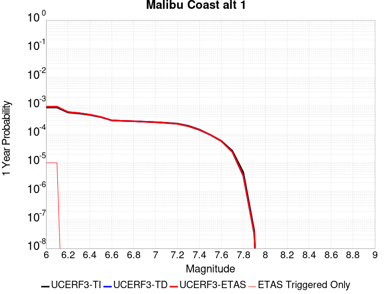 |  |

| Magnitude | 1 wk TI Prob | 1 wk TD Prob | 1 wk ETAS Prob | 1 wk ETAS/TD Gain | 1 wk ETAS Triggered Only | 1 mo TI Prob | 1 mo TD Prob | 1 mo ETAS Prob | 1 mo ETAS/TD Gain | 1 mo ETAS Triggered Only | 1 yr TI Prob | 1 yr TD Prob | 1 yr ETAS Prob | 1 yr ETAS/TD Gain | 1 yr ETAS Triggered Only | 10 yr TI Prob | 10 yr TD Prob | 10 yr ETAS Prob | 10 yr ETAS/TD Gain | 10 yr ETAS Triggered Only |
|-----|-----|-----|-----|-----|-----|-----|-----|-----|-----|-----|-----|-----|-----|-----|-----|-----|-----|-----|-----|-----|
| 6.0 | 1.6572556E-5 | 1.7598066E-5 | 3.016066E-5 | 1.7138622 | 1.2562814E-5 | 7.102331E-5 | 7.541821E-5 | 8.798008E-5 | 1.1665628 | 1.2562814E-5 | 8.6436566E-4 | 9.178488E-4 | 9.304001E-4 | 1.0136746 | 1.2562814E-5 | 0.0086101135 | 0.009142512 | 0.0091549605 | 1.0013615 | 1.2562814E-5 |
| 6.1 | 1.6572556E-5 | 1.7598066E-5 | 3.016066E-5 | 1.7138622 | 1.2562814E-5 | 7.102331E-5 | 7.541821E-5 | 8.798008E-5 | 1.1665628 | 1.2562814E-5 | 8.6436566E-4 | 9.178488E-4 | 9.304001E-4 | 1.0136746 | 1.2562814E-5 | 0.0086101135 | 0.009142512 | 0.0091549605 | 1.0013615 | 1.2562814E-5 |
| 6.2 | 1.1085717E-5 | 1.1557147E-5 | 1.1557147E-5 | 1.0 | 0.0 | 4.750935E-5 | 4.952971E-5 | 4.952971E-5 | 1.0 | 0.0 | 5.782728E-4 | 6.028609E-4 | 6.028609E-4 | 1.0 | 0.0 | 0.0057677035 | 0.0060126255 | 0.0060126255 | 1.0 | 0.0 |
| 6.3 | 1.0208568E-5 | 1.0592237E-5 | 1.0592237E-5 | 1.0 | 0.0 | 4.375027E-5 | 4.539453E-5 | 4.539453E-5 | 1.0 | 0.0 | 5.325294E-4 | 5.5254117E-4 | 5.5254117E-4 | 1.0 | 0.0 | 0.0053125503 | 0.0055119814 | 0.0055119814 | 1.0 | 0.0 |
| 6.4 | 9.0682315E-6 | 9.342637E-6 | 9.342637E-6 | 1.0 | 0.0 | 3.8863272E-5 | 4.003927E-5 | 4.003927E-5 | 1.0 | 0.0 | 4.730576E-4 | 4.8737114E-4 | 4.8737114E-4 | 1.0 | 0.0 | 0.0047205184 | 0.004863236 | 0.004863236 | 1.0 | 0.0 |
| 6.5 | 7.605796E-6 | 7.748587E-6 | 7.748587E-6 | 1.0 | 0.0 | 3.259586E-5 | 3.3207816E-5 | 3.3207816E-5 | 1.0 | 0.0 | 3.9678233E-4 | 4.0423148E-4 | 4.0423148E-4 | 1.0 | 0.0 | 0.0039607463 | 0.0040351 | 0.0040351 | 1.0 | 0.0 |
| 6.6 | 5.889873E-6 | 5.8795385E-6 | 5.8795385E-6 | 1.0 | 0.0 | 2.5242069E-5 | 2.519778E-5 | 2.519778E-5 | 1.0 | 0.0 | 3.0727885E-4 | 3.0673988E-4 | 3.0673988E-4 | 1.0 | 0.0 | 0.003068543 | 0.0030631777 | 0.0030631777 | 1.0 | 0.0 |
| 6.7 | 5.66586E-6 | 5.641641E-6 | 5.641641E-6 | 1.0 | 0.0 | 2.428203E-5 | 2.417824E-5 | 2.417824E-5 | 1.0 | 0.0 | 2.955936E-4 | 2.9433038E-4 | 2.9433038E-4 | 1.0 | 0.0 | 0.0029520073 | 0.0029394177 | 0.0029394177 | 1.0 | 0.0 |
| 6.8 | 5.521556E-6 | 5.489427E-6 | 5.489427E-6 | 1.0 | 0.0 | 2.3663597E-5 | 2.3525903E-5 | 2.3525903E-5 | 1.0 | 0.0 | 2.880662E-4 | 2.8639034E-4 | 2.8639034E-4 | 1.0 | 0.0 | 0.0028769306 | 0.002860224 | 0.002860224 | 1.0 | 0.0 |
| 6.9 | 5.29752E-6 | 5.2499317E-6 | 5.2499317E-6 | 1.0 | 0.0 | 2.270346E-5 | 2.2499513E-5 | 2.2499513E-5 | 1.0 | 0.0 | 2.7637955E-4 | 2.7389723E-4 | 2.7389723E-4 | 1.0 | 0.0 | 0.0027603607 | 0.0027356069 | 0.0027356069 | 1.0 | 0.0 |
| 7.0 | 5.106743E-6 | 5.0476788E-6 | 5.0476788E-6 | 1.0 | 0.0 | 2.1885859E-5 | 2.163273E-5 | 2.163273E-5 | 1.0 | 0.0 | 2.6642776E-4 | 2.6334674E-4 | 2.6334674E-4 | 1.0 | 0.0 | 0.0026610855 | 0.0026303562 | 0.0026303562 | 1.0 | 0.0 |
| 7.1 | 4.8469647E-6 | 4.770373E-6 | 4.770373E-6 | 1.0 | 0.0 | 2.0772539E-5 | 2.0444295E-5 | 2.0444295E-5 | 1.0 | 0.0 | 2.528763E-4 | 2.4888094E-4 | 2.4888094E-4 | 1.0 | 0.0 | 0.0025258875 | 0.00248603 | 0.00248603 | 1.0 | 0.0 |
| 7.2 | 4.545514E-6 | 4.4481935E-6 | 4.4481935E-6 | 1.0 | 0.0 | 1.9480629E-5 | 1.9063547E-5 | 1.9063547E-5 | 1.0 | 0.0 | 2.3715083E-4 | 2.3207403E-4 | 2.3207403E-4 | 1.0 | 0.0 | 0.0023689792 | 0.0023183243 | 0.0023183243 | 1.0 | 0.0 |
| 7.3 | 3.794097E-6 | 3.6519348E-6 | 3.6519348E-6 | 1.0 | 0.0 | 1.6260314E-5 | 1.5651056E-5 | 1.5651056E-5 | 1.0 | 0.0 | 1.9795135E-4 | 1.9053498E-4 | 1.9053498E-4 | 1.0 | 0.0 | 0.001977751 | 0.0019037209 | 0.0019037209 | 1.0 | 0.0 |
| 7.4 | 2.808217E-6 | 2.719077E-6 | 2.719077E-6 | 1.0 | 0.0 | 1.203516E-5 | 1.1653135E-5 | 1.1653135E-5 | 1.0 | 0.0 | 1.4651821E-4 | 1.418677E-4 | 1.418677E-4 | 1.0 | 0.0 | 0.0014642165 | 0.001417774 | 0.001417774 | 1.0 | 0.0 |
| 7.5 | 1.83809E-6 | 1.8190691E-6 | 1.8190691E-6 | 1.0 | 0.0 | 7.877505E-6 | 7.795988E-6 | 7.795988E-6 | 1.0 | 0.0 | 9.59044E-5 | 9.491203E-5 | 9.491203E-5 | 1.0 | 0.0 | 9.5863023E-4 | 9.48717E-4 | 9.48717E-4 | 1.0 | 0.0 |
| 7.6 | 1.1292672E-6 | 1.1001447E-6 | 1.1001447E-6 | 1.0 | 0.0 | 4.839708E-6 | 4.714897E-6 | 4.714897E-6 | 1.0 | 0.0 | 5.8921847E-5 | 5.7402376E-5 | 5.7402376E-5 | 1.0 | 0.0 | 5.890623E-4 | 5.738771E-4 | 5.738771E-4 | 1.0 | 0.0 |
| 7.7 | 5.065272E-7 | 4.609151E-7 | 4.609151E-7 | 1.0 | 0.0 | 2.170829E-6 | 1.975349E-6 | 1.975349E-6 | 1.0 | 0.0 | 2.6429525E-5 | 2.404962E-5 | 2.404962E-5 | 1.0 | 0.0 | 2.642638E-4 | 2.4047129E-4 | 2.4047129E-4 | 1.0 | 0.0 |
| 7.8 | 8.952991E-8 | 6.707874E-8 | 6.707874E-8 | 1.0 | 0.0 | 3.8369956E-7 | 2.8748025E-7 | 2.8748025E-7 | 1.0 | 0.0 | 4.671532E-6 | 3.5000667E-6 | 3.5000667E-6 | 1.0 | 0.0 | 4.671434E-5 | 3.5000136E-5 | 3.5000136E-5 | 1.0 | 0.0 |
| 7.9 | 8.007447E-10 | 6.1608785E-10 | 6.1608785E-10 | 1.0 | 0.0 | 3.4317629E-9 | 2.6403764E-9 | 2.6403764E-9 | 1.0 | 0.0 | 4.1781714E-8 | 3.2146584E-8 | 3.2146584E-8 | 1.0 | 0.0 | 4.1781706E-7 | 3.214658E-7 | 3.214658E-7 | 1.0 | 0.0 |

## Franklin 2011 CFM
*[(top)](#table-of-contents)*

| 1 Week | 1 Month | 1 Year | 10 Year |
|-----|-----|-----|-----|
|  |  |  |  |

| Magnitude | 1 wk TI Prob | 1 wk TD Prob | 1 wk ETAS Prob | 1 wk ETAS/TD Gain | 1 wk ETAS Triggered Only | 1 mo TI Prob | 1 mo TD Prob | 1 mo ETAS Prob | 1 mo ETAS/TD Gain | 1 mo ETAS Triggered Only | 1 yr TI Prob | 1 yr TD Prob | 1 yr ETAS Prob | 1 yr ETAS/TD Gain | 1 yr ETAS Triggered Only | 10 yr TI Prob | 10 yr TD Prob | 10 yr ETAS Prob | 10 yr ETAS/TD Gain | 10 yr ETAS Triggered Only |
|-----|-----|-----|-----|-----|-----|-----|-----|-----|-----|-----|-----|-----|-----|-----|-----|-----|-----|-----|-----|-----|
| 6.0 | 1.845602E-5 | 2.021262E-5 | 3.277518E-5 | 1.6215206 | 1.2562814E-5 | 7.9094825E-5 | 8.66228E-5 | 9.918453E-5 | 1.1450164 | 1.2562814E-5 | 9.6255407E-4 | 0.0010541513 | 0.0010667009 | 1.011905 | 1.2562814E-5 | 0.009583955 | 0.0105088325 | 0.010521263 | 1.0011829 | 1.2562814E-5 |
| 6.1 | 1.845602E-5 | 2.021262E-5 | 3.277518E-5 | 1.6215206 | 1.2562814E-5 | 7.9094825E-5 | 8.66228E-5 | 9.918453E-5 | 1.1450164 | 1.2562814E-5 | 9.6255407E-4 | 0.0010541513 | 0.0010667009 | 1.011905 | 1.2562814E-5 | 0.009583955 | 0.0105088325 | 0.010521263 | 1.0011829 | 1.2562814E-5 |
| 6.2 | 1.845602E-5 | 2.021262E-5 | 3.277518E-5 | 1.6215206 | 1.2562814E-5 | 7.9094825E-5 | 8.66228E-5 | 9.918453E-5 | 1.1450164 | 1.2562814E-5 | 9.6255407E-4 | 0.0010541513 | 0.0010667009 | 1.011905 | 1.2562814E-5 | 0.009583955 | 0.0105088325 | 0.010521263 | 1.0011829 | 1.2562814E-5 |
| 6.3 | 1.3813506E-5 | 1.5154827E-5 | 2.7717451E-5 | 1.828952 | 1.2562814E-5 | 5.9199396E-5 | 6.4947686E-5 | 7.7509685E-5 | 1.1934172 | 1.2562814E-5 | 7.205143E-4 | 7.9045893E-4 | 8.030118E-4 | 1.0158805 | 1.2562814E-5 | 0.007181826 | 0.007891679 | 0.007904143 | 1.0015793 | 1.2562814E-5 |
| 6.4 | 1.3813506E-5 | 1.5154827E-5 | 2.7717451E-5 | 1.828952 | 1.2562814E-5 | 5.9199396E-5 | 6.4947686E-5 | 7.7509685E-5 | 1.1934172 | 1.2562814E-5 | 7.205143E-4 | 7.9045893E-4 | 8.030118E-4 | 1.0158805 | 1.2562814E-5 | 0.007181826 | 0.007891679 | 0.007904143 | 1.0015793 | 1.2562814E-5 |
| 6.5 | 1.1308949E-5 | 1.24178005E-5 | 2.4980458E-5 | 2.0116653 | 1.2562814E-5 | 4.8466023E-5 | 5.3218067E-5 | 6.5780216E-5 | 1.2360504 | 1.2562814E-5 | 5.899141E-4 | 6.4773945E-4 | 6.602941E-4 | 1.0193822 | 1.2562814E-5 | 0.0058835056 | 0.006473166 | 0.006485647 | 1.0019282 | 1.2562814E-5 |
| 6.6 | 1.0813164E-5 | 1.1876023E-5 | 2.4438688E-5 | 2.0578175 | 1.2562814E-5 | 4.6341313E-5 | 5.089626E-5 | 6.3458436E-5 | 1.2468193 | 1.2562814E-5 | 5.640594E-4 | 6.1948766E-4 | 6.320427E-4 | 1.0202668 | 1.2562814E-5 | 0.005626298 | 0.006192243 | 0.0062047285 | 1.0020162 | 1.2562814E-5 |
| 6.7 | 1.0706348E-5 | 1.1757787E-5 | 2.4320454E-5 | 2.068455 | 1.2562814E-5 | 4.5883542E-5 | 5.0389554E-5 | 6.295173E-5 | 1.2493013 | 1.2562814E-5 | 5.5848894E-4 | 6.13322E-4 | 6.258771E-4 | 1.0204706 | 1.2562814E-5 | 0.005570874 | 0.0061309286 | 0.0061434144 | 1.0020366 | 1.2562814E-5 |
| 6.8 | 9.443655E-6 | 1.0349109E-5 | 1.0349109E-5 | 1.0 | 0.0 | 4.0472176E-5 | 4.435258E-5 | 4.435258E-5 | 1.0 | 0.0 | 4.9263734E-4 | 5.398602E-4 | 5.398602E-4 | 1.0 | 0.0 | 0.0049154665 | 0.005400073 | 0.005400073 | 1.0 | 0.0 |
| 6.9 | 8.7001645E-6 | 9.522179E-6 | 9.522179E-6 | 1.0 | 0.0 | 3.728589E-5 | 4.0808707E-5 | 4.0808707E-5 | 1.0 | 0.0 | 4.538611E-4 | 4.96734E-4 | 4.96734E-4 | 1.0 | 0.0 | 0.0045293528 | 0.0049708076 | 0.0049708076 | 1.0 | 0.0 |
| 7.0 | 8.074731E-6 | 8.815796E-6 | 8.815796E-6 | 1.0 | 0.0 | 3.460553E-5 | 3.7781443E-5 | 3.7781443E-5 | 1.0 | 0.0 | 4.212409E-4 | 4.5989305E-4 | 4.5989305E-4 | 1.0 | 0.0 | 0.004204433 | 0.0046039694 | 0.0046039694 | 1.0 | 0.0 |
| 7.1 | 7.3370957E-6 | 7.96167E-6 | 7.96167E-6 | 1.0 | 0.0 | 3.1444317E-5 | 3.4121003E-5 | 3.4121003E-5 | 1.0 | 0.0 | 3.8276732E-4 | 4.1534504E-4 | 4.1534504E-4 | 1.0 | 0.0 | 0.0038210868 | 0.0041600848 | 0.0041600848 | 1.0 | 0.0 |
| 7.2 | 5.1750103E-6 | 5.45711E-6 | 5.45711E-6 | 1.0 | 0.0 | 2.2178427E-5 | 2.3387407E-5 | 2.3387407E-5 | 1.0 | 0.0 | 2.699889E-4 | 2.847048E-4 | 2.847048E-4 | 1.0 | 0.0 | 0.002696611 | 0.0028573172 | 0.0028573172 | 1.0 | 0.0 |
| 7.3 | 3.5221371E-6 | 3.7960522E-6 | 3.7960522E-6 | 1.0 | 0.0 | 1.5094786E-5 | 1.6268694E-5 | 1.6268694E-5 | 1.0 | 0.0 | 1.8376352E-4 | 1.9805344E-4 | 1.9805344E-4 | 1.0 | 0.0 | 0.0018361164 | 0.001992203 | 0.001992203 | 1.0 | 0.0 |
| 7.4 | 2.5749775E-6 | 2.818195E-6 | 2.818195E-6 | 1.0 | 0.0 | 1.1035571E-5 | 1.2077923E-5 | 1.2077923E-5 | 1.0 | 0.0 | 1.343498E-4 | 1.4703887E-4 | 1.4703887E-4 | 1.0 | 0.0 | 0.001342686 | 0.0014816395 | 0.0014816395 | 1.0 | 0.0 |
| 7.5 | 1.3642131E-6 | 1.5497415E-6 | 1.5497415E-6 | 1.0 | 0.0 | 5.8466144E-6 | 6.6417324E-6 | 6.6417324E-6 | 1.0 | 0.0 | 7.1180206E-5 | 8.086011E-5 | 8.086011E-5 | 1.0 | 0.0 | 7.115741E-4 | 8.1911724E-4 | 8.1911724E-4 | 1.0 | 0.0 |
| 7.6 | 5.329124E-7 | 6.70109E-7 | 6.70109E-7 | 1.0 | 0.0 | 2.2839083E-6 | 2.8718923E-6 | 2.8718923E-6 | 1.0 | 0.0 | 2.7806227E-5 | 3.4964734E-5 | 3.4964734E-5 | 1.0 | 0.0 | 2.780275E-4 | 3.5998525E-4 | 3.5998525E-4 | 1.0 | 0.0 |
| 7.7 | 4.199127E-7 | 5.486773E-7 | 5.486773E-7 | 1.0 | 0.0 | 1.7996247E-6 | 2.351472E-6 | 2.351472E-6 | 1.0 | 0.0 | 2.191021E-5 | 2.8628798E-5 | 2.8628798E-5 | 1.0 | 0.0 | 2.190805E-4 | 2.9645552E-4 | 2.9645552E-4 | 1.0 | 0.0 |
| 7.8 | 2.2586491E-7 | 3.066155E-7 | 3.066155E-7 | 1.0 | 0.0 | 9.67992E-7 | 1.3140657E-6 | 1.3140657E-6 | 1.0 | 0.0 | 1.178524E-5 | 1.5998634E-5 | 1.5998634E-5 | 1.0 | 0.0 | 1.17846146E-4 | 1.6628981E-4 | 1.6628981E-4 | 1.0 | 0.0 |
| 7.9 | 1.4568845E-7 | 2.1202585E-7 | 2.1202585E-7 | 1.0 | 0.0 | 6.243789E-7 | 9.086819E-7 | 9.086819E-7 | 1.0 | 0.0 | 7.601787E-6 | 1.1063146E-5 | 1.1063146E-5 | 1.0 | 0.0 | 7.601527E-5 | 1.1508061E-4 | 1.1508061E-4 | 1.0 | 0.0 |
| 8.0 | 5.2868224E-8 | 9.996793E-8 | 9.996793E-8 | 1.0 | 0.0 | 2.2657808E-7 | 4.2843388E-7 | 4.2843388E-7 | 1.0 | 0.0 | 2.7585847E-6 | 5.21617E-6 | 5.21617E-6 | 1.0 | 0.0 | 2.7585504E-5 | 5.4014814E-5 | 5.4014814E-5 | 1.0 | 0.0 |
| 8.1 | 2.654434E-9 | 4.7226045E-9 | 4.7226045E-9 | 1.0 | 0.0 | 1.1376145E-8 | 2.0239735E-8 | 2.0239735E-8 | 1.0 | 0.0 | 1.3850456E-7 | 2.4641872E-7 | 2.4641872E-7 | 1.0 | 0.0 | 1.3850448E-6 | 2.5336271E-6 | 2.5336271E-6 | 1.0 | 0.0 |

## Santa Susana alt 1
*[(top)](#table-of-contents)*

| 1 Week | 1 Month | 1 Year | 10 Year |
|-----|-----|-----|-----|
|  | 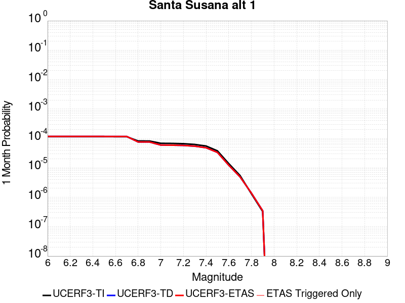 |  |  |

| Magnitude | 1 wk TI Prob | 1 wk TD Prob | 1 wk ETAS Prob | 1 wk ETAS/TD Gain | 1 wk ETAS Triggered Only | 1 mo TI Prob | 1 mo TD Prob | 1 mo ETAS Prob | 1 mo ETAS/TD Gain | 1 mo ETAS Triggered Only | 1 yr TI Prob | 1 yr TD Prob | 1 yr ETAS Prob | 1 yr ETAS/TD Gain | 1 yr ETAS Triggered Only | 10 yr TI Prob | 10 yr TD Prob | 10 yr ETAS Prob | 10 yr ETAS/TD Gain | 10 yr ETAS Triggered Only |
|-----|-----|-----|-----|-----|-----|-----|-----|-----|-----|-----|-----|-----|-----|-----|-----|-----|-----|-----|-----|-----|
| 6.0 | 2.674877E-5 | 2.7198023E-5 | 2.7198023E-5 | 1.0 | 0.0 | 1.1463255E-4 | 1.1655839E-4 | 1.1655839E-4 | 1.0 | 0.0 | 0.0013947578 | 0.0014182882 | 0.0014308331 | 1.0088452 | 1.2562814E-5 | 0.013860362 | 0.014104128 | 0.014116514 | 1.0008782 | 1.2562814E-5 |
| 6.1 | 2.674877E-5 | 2.7198023E-5 | 2.7198023E-5 | 1.0 | 0.0 | 1.1463255E-4 | 1.1655839E-4 | 1.1655839E-4 | 1.0 | 0.0 | 0.0013947578 | 0.0014182882 | 0.0014308331 | 1.0088452 | 1.2562814E-5 | 0.013860362 | 0.014104128 | 0.014116514 | 1.0008782 | 1.2562814E-5 |
| 6.2 | 2.674877E-5 | 2.7198023E-5 | 2.7198023E-5 | 1.0 | 0.0 | 1.1463255E-4 | 1.1655839E-4 | 1.1655839E-4 | 1.0 | 0.0 | 0.0013947578 | 0.0014182882 | 0.0014308331 | 1.0088452 | 1.2562814E-5 | 0.013860362 | 0.014104128 | 0.014116514 | 1.0008782 | 1.2562814E-5 |
| 6.3 | 2.674877E-5 | 2.7198023E-5 | 2.7198023E-5 | 1.0 | 0.0 | 1.1463255E-4 | 1.1655839E-4 | 1.1655839E-4 | 1.0 | 0.0 | 0.0013947578 | 0.0014182882 | 0.0014308331 | 1.0088452 | 1.2562814E-5 | 0.013860362 | 0.014104128 | 0.014116514 | 1.0008782 | 1.2562814E-5 |
| 6.4 | 2.674877E-5 | 2.7198023E-5 | 2.7198023E-5 | 1.0 | 0.0 | 1.1463255E-4 | 1.1655839E-4 | 1.1655839E-4 | 1.0 | 0.0 | 0.0013947578 | 0.0014182882 | 0.0014308331 | 1.0088452 | 1.2562814E-5 | 0.013860362 | 0.014104128 | 0.014116514 | 1.0008782 | 1.2562814E-5 |
| 6.5 | 2.674877E-5 | 2.7198023E-5 | 2.7198023E-5 | 1.0 | 0.0 | 1.1463255E-4 | 1.1655839E-4 | 1.1655839E-4 | 1.0 | 0.0 | 0.0013947578 | 0.0014182882 | 0.0014308331 | 1.0088452 | 1.2562814E-5 | 0.013860362 | 0.014104128 | 0.014116514 | 1.0008782 | 1.2562814E-5 |
| 6.6 | 2.6647976E-5 | 2.7074359E-5 | 2.7074359E-5 | 1.0 | 0.0 | 1.14200615E-4 | 1.1602845E-4 | 1.1602845E-4 | 1.0 | 0.0 | 0.0013895056 | 0.0014118447 | 0.0014243899 | 1.0088856 | 1.2562814E-5 | 0.013808494 | 0.014040513 | 0.0140529 | 1.0008821 | 1.2562814E-5 |
| 6.7 | 2.6647976E-5 | 2.7074359E-5 | 2.7074359E-5 | 1.0 | 0.0 | 1.14200615E-4 | 1.1602845E-4 | 1.1602845E-4 | 1.0 | 0.0 | 0.0013895056 | 0.0014118447 | 0.0014243899 | 1.0088856 | 1.2562814E-5 | 0.013808494 | 0.014040513 | 0.0140529 | 1.0008821 | 1.2562814E-5 |
| 6.8 | 1.9073179E-5 | 1.7637283E-5 | 1.7637283E-5 | 1.0 | 0.0 | 8.1739636E-5 | 7.558627E-5 | 7.558627E-5 | 1.0 | 0.0 | 9.947256E-4 | 9.198925E-4 | 9.3244377E-4 | 1.0136442 | 1.2562814E-5 | 0.009902848 | 0.009163101 | 0.009175549 | 1.0013585 | 1.2562814E-5 |
| 6.9 | 1.9041876E-5 | 1.7619415E-5 | 1.7619415E-5 | 1.0 | 0.0 | 8.160549E-5 | 7.55097E-5 | 7.55097E-5 | 1.0 | 0.0 | 9.930939E-4 | 9.1896096E-4 | 9.315122E-4 | 1.0136582 | 1.2562814E-5 | 0.0098866755 | 0.0091538625 | 0.009166311 | 1.0013598 | 1.2562814E-5 |
| 7.0 | 1.5917482E-5 | 1.3863864E-5 | 1.3863864E-5 | 1.0 | 0.0 | 6.8215995E-5 | 5.9415237E-5 | 5.9415237E-5 | 1.0 | 0.0 | 8.302132E-4 | 7.231451E-4 | 7.356988E-4 | 1.0173599 | 1.2562814E-5 | 0.008271185 | 0.0072088144 | 0.0072212867 | 1.0017301 | 1.2562814E-5 |
| 7.1 | 1.577788E-5 | 1.3743872E-5 | 1.3743872E-5 | 1.0 | 0.0 | 6.761774E-5 | 5.8901005E-5 | 5.8901005E-5 | 1.0 | 0.0 | 8.2293496E-4 | 7.1688846E-4 | 7.294422E-4 | 1.0175115 | 1.2562814E-5 | 0.008198941 | 0.007146652 | 0.007159125 | 1.0017453 | 1.2562814E-5 |
| 7.2 | 1.5416446E-5 | 1.3469944E-5 | 1.3469944E-5 | 1.0 | 0.0 | 6.606882E-5 | 5.772708E-5 | 5.772708E-5 | 1.0 | 0.0 | 8.0409093E-4 | 7.026052E-4 | 7.1515917E-4 | 1.0178678 | 1.2562814E-5 | 0.008011877 | 0.0070047234 | 0.007017198 | 1.0017809 | 1.2562814E-5 |
| 7.3 | 1.4534083E-5 | 1.2717879E-5 | 1.2717879E-5 | 1.0 | 0.0 | 6.228744E-5 | 5.4504082E-5 | 5.4504082E-5 | 1.0 | 0.0 | 7.580857E-4 | 6.633896E-4 | 6.759441E-4 | 1.0189247 | 1.2562814E-5 | 0.007555048 | 0.0066149444 | 0.006627424 | 1.0018866 | 1.2562814E-5 |
| 7.4 | 1.2858995E-5 | 1.1229652E-5 | 1.1229652E-5 | 1.0 | 0.0 | 5.5108816E-5 | 4.8126214E-5 | 4.8126214E-5 | 1.0 | 0.0 | 6.7074323E-4 | 5.857831E-4 | 5.9833855E-4 | 1.0214336 | 1.2562814E-5 | 0.0066872234 | 0.005843165 | 0.0058556544 | 1.0021374 | 1.2562814E-5 |
| 7.5 | 8.827668E-6 | 7.805457E-6 | 7.805457E-6 | 1.0 | 0.0 | 3.7832317E-5 | 3.3451546E-5 | 3.3451546E-5 | 1.0 | 0.0 | 4.605111E-4 | 4.071989E-4 | 4.197566E-4 | 1.0308392 | 1.2562814E-5 | 0.0045955796 | 0.0040647765 | 0.0040772883 | 1.0030781 | 1.2562814E-5 |
| 7.6 | 3.2533426E-6 | 2.871988E-6 | 2.871988E-6 | 1.0 | 0.0 | 1.3942822E-5 | 1.2308465E-5 | 1.2308465E-5 | 1.0 | 0.0 | 1.6974064E-4 | 1.4984563E-4 | 1.6240655E-4 | 1.0838258 | 1.2562814E-5 | 0.0016961104 | 0.0014974826 | 0.0015100266 | 1.0083767 | 1.2562814E-5 |
| 7.7 | 1.2751709E-6 | 1.1491089E-6 | 1.1491089E-6 | 1.0 | 0.0 | 5.4650063E-6 | 4.9247437E-6 | 4.9247437E-6 | 1.0 | 0.0 | 6.653442E-5 | 5.9957198E-5 | 5.9957198E-5 | 1.0 | 0.0 | 6.6514505E-4 | 5.994191E-4 | 5.994191E-4 | 1.0 | 0.0 |
| 7.8 | 3.067544E-7 | 3.2400436E-7 | 3.2400436E-7 | 1.0 | 0.0 | 1.3146611E-6 | 1.3885895E-6 | 1.3885895E-6 | 1.0 | 0.0 | 1.600588E-5 | 1.6905957E-5 | 1.6905957E-5 | 1.0 | 0.0 | 1.6004729E-4 | 1.6904772E-4 | 1.6904772E-4 | 1.0 | 0.0 |
| 7.9 | 7.622999E-8 | 8.087964E-8 | 8.087964E-8 | 1.0 | 0.0 | 3.2669993E-7 | 3.4662696E-7 | 3.4662696E-7 | 1.0 | 0.0 | 3.977564E-6 | 4.2201773E-6 | 4.2201773E-6 | 1.0 | 0.0 | 3.977493E-5 | 4.220118E-5 | 4.220118E-5 | 1.0 | 0.0 |

## Big Lagoon - Bald Mtn 2011 CFM
*[(top)](#table-of-contents)*

| 1 Week | 1 Month | 1 Year | 10 Year |
|-----|-----|-----|-----|
|  |  |  |  |

| Magnitude | 1 wk TI Prob | 1 wk TD Prob | 1 wk ETAS Prob | 1 wk ETAS/TD Gain | 1 wk ETAS Triggered Only | 1 mo TI Prob | 1 mo TD Prob | 1 mo ETAS Prob | 1 mo ETAS/TD Gain | 1 mo ETAS Triggered Only | 1 yr TI Prob | 1 yr TD Prob | 1 yr ETAS Prob | 1 yr ETAS/TD Gain | 1 yr ETAS Triggered Only | 10 yr TI Prob | 10 yr TD Prob | 10 yr ETAS Prob | 10 yr ETAS/TD Gain | 10 yr ETAS Triggered Only |
|-----|-----|-----|-----|-----|-----|-----|-----|-----|-----|-----|-----|-----|-----|-----|-----|-----|-----|-----|-----|-----|
| 6.0 | 1.8699735E-5 | 1.985018E-5 | 1.985018E-5 | 1.0 | 0.0 | 8.013926E-5 | 8.5069645E-5 | 8.5069645E-5 | 1.0 | 0.0 | 9.752587E-4 | 0.0010352687 | 0.0010478185 | 1.0121223 | 1.2562814E-5 | 0.009709897 | 0.010308274 | 0.010320707 | 1.0012062 | 1.2562814E-5 |
| 6.1 | 1.8699735E-5 | 1.985018E-5 | 1.985018E-5 | 1.0 | 0.0 | 8.013926E-5 | 8.5069645E-5 | 8.5069645E-5 | 1.0 | 0.0 | 9.752587E-4 | 0.0010352687 | 0.0010478185 | 1.0121223 | 1.2562814E-5 | 0.009709897 | 0.010308274 | 0.010320707 | 1.0012062 | 1.2562814E-5 |
| 6.2 | 1.8699735E-5 | 1.985018E-5 | 1.985018E-5 | 1.0 | 0.0 | 8.013926E-5 | 8.5069645E-5 | 8.5069645E-5 | 1.0 | 0.0 | 9.752587E-4 | 0.0010352687 | 0.0010478185 | 1.0121223 | 1.2562814E-5 | 0.009709897 | 0.010308274 | 0.010320707 | 1.0012062 | 1.2562814E-5 |
| 6.3 | 1.8699735E-5 | 1.985018E-5 | 1.985018E-5 | 1.0 | 0.0 | 8.013926E-5 | 8.5069645E-5 | 8.5069645E-5 | 1.0 | 0.0 | 9.752587E-4 | 0.0010352687 | 0.0010478185 | 1.0121223 | 1.2562814E-5 | 0.009709897 | 0.010308274 | 0.010320707 | 1.0012062 | 1.2562814E-5 |
| 6.4 | 1.8699735E-5 | 1.985018E-5 | 1.985018E-5 | 1.0 | 0.0 | 8.013926E-5 | 8.5069645E-5 | 8.5069645E-5 | 1.0 | 0.0 | 9.752587E-4 | 0.0010352687 | 0.0010478185 | 1.0121223 | 1.2562814E-5 | 0.009709897 | 0.010308274 | 0.010320707 | 1.0012062 | 1.2562814E-5 |
| 6.5 | 1.8699735E-5 | 1.985018E-5 | 1.985018E-5 | 1.0 | 0.0 | 8.013926E-5 | 8.5069645E-5 | 8.5069645E-5 | 1.0 | 0.0 | 9.752587E-4 | 0.0010352687 | 0.0010478185 | 1.0121223 | 1.2562814E-5 | 0.009709897 | 0.010308274 | 0.010320707 | 1.0012062 | 1.2562814E-5 |
| 6.6 | 1.8699735E-5 | 1.985018E-5 | 1.985018E-5 | 1.0 | 0.0 | 8.013926E-5 | 8.5069645E-5 | 8.5069645E-5 | 1.0 | 0.0 | 9.752587E-4 | 0.0010352687 | 0.0010478185 | 1.0121223 | 1.2562814E-5 | 0.009709897 | 0.010308274 | 0.010320707 | 1.0012062 | 1.2562814E-5 |
| 6.7 | 1.8699735E-5 | 1.985018E-5 | 1.985018E-5 | 1.0 | 0.0 | 8.013926E-5 | 8.5069645E-5 | 8.5069645E-5 | 1.0 | 0.0 | 9.752587E-4 | 0.0010352687 | 0.0010478185 | 1.0121223 | 1.2562814E-5 | 0.009709897 | 0.010308274 | 0.010320707 | 1.0012062 | 1.2562814E-5 |
| 6.8 | 1.18505095E-5 | 1.2499804E-5 | 1.2499804E-5 | 1.0 | 0.0 | 5.078691E-5 | 5.3569514E-5 | 5.3569514E-5 | 1.0 | 0.0 | 6.181552E-4 | 6.520185E-4 | 6.520185E-4 | 1.0 | 0.0 | 0.006164385 | 0.0065015587 | 0.0065015587 | 1.0 | 0.0 |
| 6.9 | 1.18505095E-5 | 1.2499804E-5 | 1.2499804E-5 | 1.0 | 0.0 | 5.078691E-5 | 5.3569514E-5 | 5.3569514E-5 | 1.0 | 0.0 | 6.181552E-4 | 6.520185E-4 | 6.520185E-4 | 1.0 | 0.0 | 0.006164385 | 0.0065015587 | 0.0065015587 | 1.0 | 0.0 |
| 7.0 | 9.719786E-6 | 1.0235487E-5 | 1.0235487E-5 | 1.0 | 0.0 | 4.1655563E-5 | 4.386565E-5 | 4.386565E-5 | 1.0 | 0.0 | 5.0703844E-4 | 5.3393573E-4 | 5.3393573E-4 | 1.0 | 0.0 | 0.005058831 | 0.0053267754 | 0.0053267754 | 1.0 | 0.0 |
| 7.1 | 8.523418E-6 | 8.969463E-6 | 8.969463E-6 | 1.0 | 0.0 | 3.652842E-5 | 3.844E-5 | 3.844E-5 | 1.0 | 0.0 | 4.4464276E-4 | 4.6790804E-4 | 4.6790804E-4 | 1.0 | 0.0 | 0.0044375416 | 0.004669392 | 0.004669392 | 1.0 | 0.0 |
| 7.2 | 7.378894E-6 | 7.761112E-6 | 7.761112E-6 | 1.0 | 0.0 | 3.162345E-5 | 3.326149E-5 | 3.326149E-5 | 1.0 | 0.0 | 3.8494746E-4 | 4.048843E-4 | 4.048843E-4 | 1.0 | 0.0 | 0.0038428132 | 0.0040415623 | 0.0040415623 | 1.0 | 0.0 |
| 7.3 | 6.4640294E-6 | 6.7924434E-6 | 6.7924434E-6 | 1.0 | 0.0 | 2.7702688E-5 | 2.9110151E-5 | 2.9110151E-5 | 1.0 | 0.0 | 3.3722803E-4 | 3.5435913E-4 | 3.5435913E-4 | 1.0 | 0.0 | 0.0033671674 | 0.0035380109 | 0.0035380109 | 1.0 | 0.0 |
| 7.4 | 5.9959093E-6 | 6.2988E-6 | 6.2988E-6 | 1.0 | 0.0 | 2.5696501E-5 | 2.6994581E-5 | 2.6994581E-5 | 1.0 | 0.0 | 3.1280998E-4 | 3.2861007E-4 | 3.2861007E-4 | 1.0 | 0.0 | 0.0031237002 | 0.0032813034 | 0.0032813034 | 1.0 | 0.0 |
| 7.5 | 4.929265E-6 | 5.176396E-6 | 5.176396E-6 | 1.0 | 0.0 | 2.112525E-5 | 2.2184367E-5 | 2.2184367E-5 | 1.0 | 0.0 | 2.5716957E-4 | 2.700616E-4 | 2.700616E-4 | 1.0 | 0.0 | 0.0025687215 | 0.002697375 | 0.002697375 | 1.0 | 0.0 |
| 7.6 | 3.8982403E-6 | 4.0889267E-6 | 4.0889267E-6 | 1.0 | 0.0 | 1.6706637E-5 | 1.7523857E-5 | 1.7523857E-5 | 1.0 | 0.0 | 2.0338432E-4 | 2.1333233E-4 | 2.1333233E-4 | 1.0 | 0.0 | 0.0020319829 | 0.002131303 | 0.002131303 | 1.0 | 0.0 |
| 7.7 | 2.820968E-6 | 2.9572116E-6 | 2.9572116E-6 | 1.0 | 0.0 | 1.2089806E-5 | 1.2673704E-5 | 1.2673704E-5 | 1.0 | 0.0 | 1.4718344E-4 | 1.5429159E-4 | 1.5429159E-4 | 1.0 | 0.0 | 0.00147086 | 0.0015418624 | 0.0015418624 | 1.0 | 0.0 |
| 7.8 | 1.9314455E-6 | 2.0260186E-6 | 2.0260186E-6 | 1.0 | 0.0 | 8.277597E-6 | 8.682909E-6 | 8.682909E-6 | 1.0 | 0.0 | 1.0077508E-4 | 1.0570941E-4 | 1.0570941E-4 | 1.0 | 0.0 | 0.0010072939 | 0.0010566041 | 0.0010566041 | 1.0 | 0.0 |
| 7.9 | 4.9586197E-7 | 5.2189216E-7 | 5.2189216E-7 | 1.0 | 0.0 | 2.125121E-6 | 2.2366787E-6 | 2.2366787E-6 | 1.0 | 0.0 | 2.5873042E-5 | 2.7231245E-5 | 2.7231245E-5 | 1.0 | 0.0 | 2.5870028E-4 | 2.7228118E-4 | 2.7228118E-4 | 1.0 | 0.0 |

## Rodgers Creek - Healdsburg 2011 CFM
*[(top)](#table-of-contents)*

| 1 Week | 1 Month | 1 Year | 10 Year |
|-----|-----|-----|-----|
|  |  |  |  |

| Magnitude | 1 wk TI Prob | 1 wk TD Prob | 1 wk ETAS Prob | 1 wk ETAS/TD Gain | 1 wk ETAS Triggered Only | 1 mo TI Prob | 1 mo TD Prob | 1 mo ETAS Prob | 1 mo ETAS/TD Gain | 1 mo ETAS Triggered Only | 1 yr TI Prob | 1 yr TD Prob | 1 yr ETAS Prob | 1 yr ETAS/TD Gain | 1 yr ETAS Triggered Only | 10 yr TI Prob | 10 yr TD Prob | 10 yr ETAS Prob | 10 yr ETAS/TD Gain | 10 yr ETAS Triggered Only |
|-----|-----|-----|-----|-----|-----|-----|-----|-----|-----|-----|-----|-----|-----|-----|-----|-----|-----|-----|-----|-----|
| 6.0 | 7.390182E-5 | 1.3136698E-4 | 1.3136698E-4 | 1.0 | 0.0 | 3.1668364E-4 | 5.6287815E-4 | 5.754339E-4 | 1.0223063 | 1.2562814E-5 | 0.0038488081 | 0.0068315 | 0.0068439776 | 1.0018264 | 1.2562814E-5 | 0.037828278 | 0.06619178 | 0.06620351 | 1.0001773 | 1.2562814E-5 |
| 6.1 | 7.318768E-5 | 1.3034661E-4 | 1.3034661E-4 | 1.0 | 0.0 | 3.1362378E-4 | 5.585081E-4 | 5.710639E-4 | 1.022481 | 1.2562814E-5 | 0.0038116854 | 0.0067786723 | 0.0067911497 | 1.0018407 | 1.2562814E-5 | 0.037469655 | 0.06569639 | 0.06570812 | 1.0001787 | 1.2562814E-5 |
| 6.2 | 7.1379836E-5 | 1.2727521E-4 | 1.2727521E-4 | 1.0 | 0.0 | 3.058777E-4 | 5.453505E-4 | 5.5790646E-4 | 1.0230236 | 1.2562814E-5 | 0.003717703 | 0.0066194604 | 0.00663194 | 1.0018853 | 1.2562814E-5 | 0.0365612 | 0.06421462 | 0.064226374 | 1.0001831 | 1.2562814E-5 |
| 6.3 | 6.9255926E-5 | 1.2382054E-4 | 1.2382054E-4 | 1.0 | 0.0 | 2.9677735E-4 | 5.3055194E-4 | 5.431081E-4 | 1.0236661 | 1.2562814E-5 | 0.0036072785 | 0.006440372 | 0.0064528543 | 1.0019381 | 1.2562814E-5 | 0.035492823 | 0.06254096 | 0.062552735 | 1.0001884 | 1.2562814E-5 |
| 6.4 | 6.6757144E-5 | 1.1958744E-4 | 1.1958744E-4 | 1.0 | 0.0 | 2.8607066E-4 | 5.1241735E-4 | 5.2497373E-4 | 1.0245042 | 1.2562814E-5 | 0.0034773487 | 0.0062209065 | 0.0062333914 | 1.0020069 | 1.2562814E-5 | 0.034234364 | 0.060490217 | 0.06050202 | 1.0001951 | 1.2562814E-5 |
| 6.5 | 6.5735134E-5 | 1.1808043E-4 | 1.1808043E-4 | 1.0 | 0.0 | 2.8169158E-4 | 5.0596124E-4 | 5.1851774E-4 | 1.024817 | 1.2562814E-5 | 0.003424202 | 0.0061427657 | 0.0061552515 | 1.0020325 | 1.2562814E-5 | 0.03371918 | 0.059755135 | 0.05976695 | 1.0001976 | 1.2562814E-5 |
| 6.6 | 6.289601E-5 | 1.1343802E-4 | 1.1343802E-4 | 1.0 | 0.0 | 2.6952647E-4 | 4.8607276E-4 | 4.9862947E-4 | 1.025833 | 1.2562814E-5 | 0.0032765474 | 0.005901959 | 0.0059144474 | 1.002116 | 1.2562814E-5 | 0.032286562 | 0.057494484 | 0.057506327 | 1.000206 | 1.2562814E-5 |
| 6.7 | 6.115274E-5 | 1.1060895E-4 | 1.1060895E-4 | 1.0 | 0.0 | 2.6205686E-4 | 4.7395262E-4 | 4.8650947E-4 | 1.0264939 | 1.2562814E-5 | 0.0031858748 | 0.0057551847 | 0.005767675 | 1.0021703 | 1.2562814E-5 | 0.031405866 | 0.05611298 | 0.056124836 | 1.0002114 | 1.2562814E-5 |
| 6.8 | 5.9232367E-5 | 1.0728244E-4 | 1.0728244E-4 | 1.0 | 0.0 | 2.538283E-4 | 4.597012E-4 | 4.7225825E-4 | 1.0273156 | 1.2562814E-5 | 0.0030859804 | 0.0055825757 | 0.0055950684 | 1.0022378 | 1.2562814E-5 | 0.030434765 | 0.054479737 | 0.054491617 | 1.000218 | 1.2562814E-5 |
| 6.9 | 5.4030377E-5 | 9.8224424E-5 | 9.8224424E-5 | 1.0 | 0.0 | 2.315382E-4 | 4.2089424E-4 | 4.3345176E-4 | 1.0298353 | 1.2562814E-5 | 0.0028153337 | 0.005112413 | 0.0051249117 | 1.0024447 | 1.2562814E-5 | 0.027799325 | 0.05001516 | 0.05002709 | 1.0002387 | 1.2562814E-5 |
| 7.0 | 4.8260714E-5 | 8.740524E-5 | 8.740524E-5 | 1.0 | 0.0 | 2.0681522E-4 | 3.745404E-4 | 3.870985E-4 | 1.0335294 | 1.2562814E-5 | 0.0025150678 | 0.004550549 | 0.004563055 | 1.0027481 | 1.2562814E-5 | 0.024867928 | 0.044667665 | 0.044679668 | 1.0002687 | 1.2562814E-5 |
| 7.1 | 4.0294493E-5 | 7.389041E-5 | 7.389041E-5 | 1.0 | 0.0 | 1.7267925E-4 | 3.1663495E-4 | 3.291938E-4 | 1.0396634 | 1.2562814E-5 | 0.0021003427 | 0.0038482544 | 0.0038607689 | 1.003252 | 1.2562814E-5 | 0.02080602 | 0.037923392 | 0.037935477 | 1.0003186 | 1.2562814E-5 |
| 7.2 | 3.096388E-5 | 5.697752E-5 | 5.697752E-5 | 1.0 | 0.0 | 1.326956E-4 | 2.4416664E-4 | 2.5672637E-4 | 1.0514393 | 1.2562814E-5 | 0.0016143717 | 0.0029686983 | 0.0029812239 | 1.0042192 | 1.2562814E-5 | 0.01602694 | 0.029436996 | 0.02944919 | 1.0004143 | 1.2562814E-5 |
| 7.3 | 2.3615226E-5 | 4.3628002E-5 | 4.3628002E-5 | 1.0 | 0.0 | 1.0120418E-4 | 1.8696384E-4 | 1.8696384E-4 | 1.0 | 0.0 | 0.0012314644 | 0.002273922 | 0.002273922 | 1.0 | 0.0 | 0.0122466255 | 0.022636993 | 0.022636993 | 1.0 | 0.0 |
| 7.4 | 1.8251132E-5 | 3.3541033E-5 | 3.3541033E-5 | 1.0 | 0.0 | 7.821679E-5 | 1.4373941E-4 | 1.4373941E-4 | 1.0 | 0.0 | 9.518733E-4 | 0.0017486324 | 0.0017486324 | 1.0 | 0.0 | 0.009478063 | 0.017465532 | 0.017465532 | 1.0 | 0.0 |
| 7.5 | 1.2411432E-5 | 2.246003E-5 | 2.246003E-5 | 1.0 | 0.0 | 5.3190768E-5 | 9.625375E-5 | 9.625375E-5 | 1.0 | 0.0 | 6.4740516E-4 | 0.0011712653 | 0.0011712653 | 1.0 | 0.0 | 0.006455223 | 0.011743283 | 0.011743283 | 1.0 | 0.0 |
| 7.6 | 4.4771446E-6 | 8.083989E-6 | 8.083989E-6 | 1.0 | 0.0 | 1.918762E-5 | 3.4645214E-5 | 3.4645214E-5 | 1.0 | 0.0 | 2.3358424E-4 | 4.2172507E-4 | 4.2172507E-4 | 1.0 | 0.0 | 0.0023333887 | 0.004246066 | 0.004246066 | 1.0 | 0.0 |
| 7.7 | 2.157941E-7 | 3.5349316E-7 | 3.5349316E-7 | 1.0 | 0.0 | 9.248315E-7 | 1.5149698E-6 | 1.5149698E-6 | 1.0 | 0.0 | 1.1259765E-5 | 1.8444602E-5 | 1.8444602E-5 | 1.0 | 0.0 | 1.1259195E-4 | 1.9069147E-4 | 1.9069147E-4 | 1.0 | 0.0 |
| 7.8 | 9.9623286E-8 | 1.989979E-7 | 1.989979E-7 | 1.0 | 0.0 | 4.269569E-7 | 8.528478E-7 | 8.528478E-7 | 1.0 | 0.0 | 5.1981874E-6 | 1.0383373E-5 | 1.0383373E-5 | 1.0 | 0.0 | 5.198066E-5 | 1.09018714E-4 | 1.09018714E-4 | 1.0 | 0.0 |
| 7.9 | 5.6745257E-8 | 1.1773924E-7 | 1.1773924E-7 | 1.0 | 0.0 | 2.4319394E-7 | 5.0459664E-7 | 5.0459664E-7 | 1.0 | 0.0 | 2.960882E-6 | 6.1434466E-6 | 6.1434466E-6 | 1.0 | 0.0 | 2.9608427E-5 | 6.470911E-5 | 6.470911E-5 | 1.0 | 0.0 |
| 8.0 | 2.8614323E-8 | 6.57845E-8 | 6.57845E-8 | 1.0 | 0.0 | 1.2263281E-7 | 2.8193355E-7 | 2.8193355E-7 | 1.0 | 0.0 | 1.4930534E-6 | 3.4325356E-6 | 3.4325356E-6 | 1.0 | 0.0 | 1.4930434E-5 | 3.582588E-5 | 3.582588E-5 | 1.0 | 0.0 |
| 8.1 | 3.5045191E-9 | 8.965783E-9 | 8.965783E-9 | 1.0 | 0.0 | 1.5019367E-8 | 3.8424783E-8 | 3.8424783E-8 | 1.0 | 0.0 | 1.8286079E-7 | 4.6782165E-7 | 4.6782165E-7 | 1.0 | 0.0 | 1.8286064E-6 | 4.8327956E-6 | 4.8327956E-6 | 1.0 | 0.0 |

## Gillem - Big Crack 2011 CFM
*[(top)](#table-of-contents)*

| 1 Week | 1 Month | 1 Year | 10 Year |
|-----|-----|-----|-----|
|  |  |  |  |

| Magnitude | 1 wk TI Prob | 1 wk TD Prob | 1 wk ETAS Prob | 1 wk ETAS/TD Gain | 1 wk ETAS Triggered Only | 1 mo TI Prob | 1 mo TD Prob | 1 mo ETAS Prob | 1 mo ETAS/TD Gain | 1 mo ETAS Triggered Only | 1 yr TI Prob | 1 yr TD Prob | 1 yr ETAS Prob | 1 yr ETAS/TD Gain | 1 yr ETAS Triggered Only | 10 yr TI Prob | 10 yr TD Prob | 10 yr ETAS Prob | 10 yr ETAS/TD Gain | 10 yr ETAS Triggered Only |
|-----|-----|-----|-----|-----|-----|-----|-----|-----|-----|-----|-----|-----|-----|-----|-----|-----|-----|-----|-----|-----|
| 6.0 | 2.196852E-5 | 2.3604485E-5 | 2.3604485E-5 | 1.0 | 0.0 | 9.4147406E-5 | 1.01158665E-4 | 1.01158665E-4 | 1.0 | 0.0 | 0.0011456419 | 0.0012309998 | 0.0012309998 | 1.0 | 0.0 | 0.011397537 | 0.012250669 | 0.012263078 | 1.0010129 | 1.2562814E-5 |
| 6.1 | 9.992795E-6 | 1.071189E-5 | 1.071189E-5 | 1.0 | 0.0 | 4.2825563E-5 | 4.5907396E-5 | 4.5907396E-5 | 1.0 | 0.0 | 5.2127644E-4 | 5.587975E-4 | 5.587975E-4 | 1.0 | 0.0 | 0.0052005537 | 0.0055757347 | 0.0055757347 | 1.0 | 0.0 |
| 6.2 | 9.992795E-6 | 1.071189E-5 | 1.071189E-5 | 1.0 | 0.0 | 4.2825563E-5 | 4.5907396E-5 | 4.5907396E-5 | 1.0 | 0.0 | 5.2127644E-4 | 5.587975E-4 | 5.587975E-4 | 1.0 | 0.0 | 0.0052005537 | 0.0055757347 | 0.0055757347 | 1.0 | 0.0 |
| 6.3 | 4.6127884E-6 | 4.942657E-6 | 4.942657E-6 | 1.0 | 0.0 | 1.9768944E-5 | 2.1182668E-5 | 2.1182668E-5 | 1.0 | 0.0 | 2.406603E-4 | 2.5787292E-4 | 2.5787292E-4 | 1.0 | 0.0 | 0.0024039985 | 0.0025761751 | 0.0025761751 | 1.0 | 0.0 |
| 6.4 | 4.6127884E-6 | 4.942657E-6 | 4.942657E-6 | 1.0 | 0.0 | 1.9768944E-5 | 2.1182668E-5 | 2.1182668E-5 | 1.0 | 0.0 | 2.406603E-4 | 2.5787292E-4 | 2.5787292E-4 | 1.0 | 0.0 | 0.0024039985 | 0.0025761751 | 0.0025761751 | 1.0 | 0.0 |
| 6.5 | 2.716712E-6 | 2.9111113E-6 | 2.9111113E-6 | 1.0 | 0.0 | 1.1643E-5 | 1.24761455E-5 | 1.24761455E-5 | 1.0 | 0.0 | 1.417443E-4 | 1.5188892E-4 | 1.5188892E-4 | 1.0 | 0.0 | 0.0014165393 | 0.001518089 | 0.001518089 | 1.0 | 0.0 |
| 6.6 | 1.3818255E-6 | 1.4820689E-6 | 1.4820689E-6 | 1.0 | 0.0 | 5.922096E-6 | 6.3517155E-6 | 6.3517155E-6 | 1.0 | 0.0 | 7.209913E-5 | 7.7330624E-5 | 7.7330624E-5 | 1.0 | 0.0 | 7.2075747E-4 | 7.7315804E-4 | 7.7315804E-4 | 1.0 | 0.0 |

## San Luis Range - Pecho 2011 CFM
*[(top)](#table-of-contents)*

| 1 Week | 1 Month | 1 Year | 10 Year |
|-----|-----|-----|-----|
|  |  |  |  |

| Magnitude | 1 wk TI Prob | 1 wk TD Prob | 1 wk ETAS Prob | 1 wk ETAS/TD Gain | 1 wk ETAS Triggered Only | 1 mo TI Prob | 1 mo TD Prob | 1 mo ETAS Prob | 1 mo ETAS/TD Gain | 1 mo ETAS Triggered Only | 1 yr TI Prob | 1 yr TD Prob | 1 yr ETAS Prob | 1 yr ETAS/TD Gain | 1 yr ETAS Triggered Only | 10 yr TI Prob | 10 yr TD Prob | 10 yr ETAS Prob | 10 yr ETAS/TD Gain | 10 yr ETAS Triggered Only |
|-----|-----|-----|-----|-----|-----|-----|-----|-----|-----|-----|-----|-----|-----|-----|-----|-----|-----|-----|-----|-----|
| 6.0 | 1.687423E-6 | 1.6921945E-6 | 1.6921945E-6 | 1.0 | 0.0 | 7.231793E-6 | 7.252243E-6 | 7.252243E-6 | 1.0 | 0.0 | 8.804352E-5 | 8.829273E-5 | 1.0085443E-4 | 1.1422734 | 1.2562814E-5 | 8.8008645E-4 | 8.826004E-4 | 8.951521E-4 | 1.0142213 | 1.2562814E-5 |
| 6.1 | 1.687423E-6 | 1.6921945E-6 | 1.6921945E-6 | 1.0 | 0.0 | 7.231793E-6 | 7.252243E-6 | 7.252243E-6 | 1.0 | 0.0 | 8.804352E-5 | 8.829273E-5 | 1.0085443E-4 | 1.1422734 | 1.2562814E-5 | 8.8008645E-4 | 8.826004E-4 | 8.951521E-4 | 1.0142213 | 1.2562814E-5 |
| 6.2 | 1.0765672E-6 | 1.0770541E-6 | 1.0770541E-6 | 1.0 | 0.0 | 4.613851E-6 | 4.6159385E-6 | 4.6159385E-6 | 1.0 | 0.0 | 5.617219E-5 | 5.6197663E-5 | 5.6197663E-5 | 1.0 | 0.0 | 5.6157995E-4 | 5.618408E-4 | 5.618408E-4 | 1.0 | 0.0 |
| 6.3 | 8.523104E-7 | 8.513022E-7 | 8.513022E-7 | 1.0 | 0.0 | 3.6527538E-6 | 3.6484332E-6 | 3.6484332E-6 | 1.0 | 0.0 | 4.447137E-5 | 4.44188E-5 | 4.44188E-5 | 1.0 | 0.0 | 4.4462472E-4 | 4.4410242E-4 | 4.4410242E-4 | 1.0 | 0.0 |
| 6.4 | 8.523104E-7 | 8.513022E-7 | 8.513022E-7 | 1.0 | 0.0 | 3.6527538E-6 | 3.6484332E-6 | 3.6484332E-6 | 1.0 | 0.0 | 4.447137E-5 | 4.44188E-5 | 4.44188E-5 | 1.0 | 0.0 | 4.4462472E-4 | 4.4410242E-4 | 4.4410242E-4 | 1.0 | 0.0 |
| 6.5 | 7.0029404E-7 | 6.976439E-7 | 6.976439E-7 | 1.0 | 0.0 | 3.0012568E-6 | 2.989899E-6 | 2.989899E-6 | 1.0 | 0.0 | 3.6539688E-5 | 3.640143E-5 | 3.640143E-5 | 1.0 | 0.0 | 3.653368E-4 | 3.6395635E-4 | 3.6395635E-4 | 1.0 | 0.0 |
| 6.6 | 5.583906E-7 | 5.54283E-7 | 5.54283E-7 | 1.0 | 0.0 | 2.3931002E-6 | 2.3754965E-6 | 2.3754965E-6 | 1.0 | 0.0 | 2.9135606E-5 | 2.8921293E-5 | 2.8921293E-5 | 1.0 | 0.0 | 2.9131788E-4 | 2.8917604E-4 | 2.8917604E-4 | 1.0 | 0.0 |
| 6.7 | 4.73441E-7 | 4.6830664E-7 | 4.6830664E-7 | 1.0 | 0.0 | 2.0290313E-6 | 2.007027E-6 | 2.007027E-6 | 1.0 | 0.0 | 2.4703175E-5 | 2.4435283E-5 | 2.4435283E-5 | 1.0 | 0.0 | 2.470043E-4 | 2.4432642E-4 | 2.4432642E-4 | 1.0 | 0.0 |
| 6.8 | 4.1466086E-7 | 4.0877956E-7 | 4.0877956E-7 | 1.0 | 0.0 | 1.7771167E-6 | 1.7519112E-6 | 1.7519112E-6 | 1.0 | 0.0 | 2.1636182E-5 | 2.1329313E-5 | 2.1329313E-5 | 1.0 | 0.0 | 2.1634075E-4 | 2.13273E-4 | 2.13273E-4 | 1.0 | 0.0 |
| 6.9 | 3.2056641E-7 | 3.1329304E-7 | 3.1329304E-7 | 1.0 | 0.0 | 1.3738553E-6 | 1.3426838E-6 | 1.3426838E-6 | 1.0 | 0.0 | 1.6726559E-5 | 1.6347054E-5 | 1.6347054E-5 | 1.0 | 0.0 | 1.67253E-4 | 1.6345867E-4 | 1.6345867E-4 | 1.0 | 0.0 |
| 7.0 | 2.6315942E-7 | 2.548968E-7 | 2.548968E-7 | 1.0 | 0.0 | 1.1278256E-6 | 1.0924143E-6 | 1.0924143E-6 | 1.0 | 0.0 | 1.3731191E-5 | 1.3300064E-5 | 1.3300064E-5 | 1.0 | 0.0 | 1.3730342E-4 | 1.3299276E-4 | 1.3299276E-4 | 1.0 | 0.0 |
| 7.1 | 2.1832436E-7 | 2.0917318E-7 | 2.0917318E-7 | 1.0 | 0.0 | 9.356755E-7 | 8.964562E-7 | 8.964562E-7 | 1.0 | 0.0 | 1.13917895E-5 | 1.0914299E-5 | 1.0914299E-5 | 1.0 | 0.0 | 1.1391206E-4 | 1.0913769E-4 | 1.0913769E-4 | 1.0 | 0.0 |
| 7.2 | 1.7393015E-7 | 1.6376598E-7 | 1.6376598E-7 | 1.0 | 0.0 | 7.454147E-7 | 7.0185393E-7 | 7.0185393E-7 | 1.0 | 0.0 | 9.075386E-6 | 8.545038E-6 | 8.545038E-6 | 1.0 | 0.0 | 9.075015E-5 | 8.544713E-5 | 8.544713E-5 | 1.0 | 0.0 |
| 7.3 | 1.3744894E-7 | 1.2638625E-7 | 1.2638625E-7 | 1.0 | 0.0 | 5.890667E-7 | 5.4165525E-7 | 5.4165525E-7 | 1.0 | 0.0 | 7.1718637E-6 | 6.5946324E-6 | 6.5946324E-6 | 1.0 | 0.0 | 7.171632E-5 | 6.594438E-5 | 6.594438E-5 | 1.0 | 0.0 |
| 7.4 | 1.0915278E-7 | 9.72754E-8 | 9.72754E-8 | 1.0 | 0.0 | 4.6779755E-7 | 4.1689447E-7 | 4.1689447E-7 | 1.0 | 0.0 | 5.6954204E-6 | 5.0756785E-6 | 5.0756785E-6 | 1.0 | 0.0 | 5.6952744E-5 | 5.0755632E-5 | 5.0755632E-5 | 1.0 | 0.0 |
| 7.5 | 9.490291E-8 | 8.257137E-8 | 8.257137E-8 | 1.0 | 0.0 | 4.0672668E-7 | 3.5387725E-7 | 3.5387725E-7 | 1.0 | 0.0 | 4.9518862E-6 | 4.308447E-6 | 4.308447E-6 | 1.0 | 0.0 | 4.951776E-5 | 4.308364E-5 | 4.308364E-5 | 1.0 | 0.0 |
| 7.6 | 7.256678E-8 | 5.9425346E-8 | 5.9425346E-8 | 1.0 | 0.0 | 3.1100043E-7 | 2.5468003E-7 | 2.5468003E-7 | 1.0 | 0.0 | 3.7864236E-6 | 3.1007248E-6 | 3.1007248E-6 | 1.0 | 0.0 | 3.7863592E-5 | 3.100682E-5 | 3.100682E-5 | 1.0 | 0.0 |
| 7.7 | 5.446273E-8 | 4.0579426E-8 | 4.0579426E-8 | 1.0 | 0.0 | 2.3341168E-7 | 1.739118E-7 | 1.739118E-7 | 1.0 | 0.0 | 2.8417835E-6 | 2.1173742E-6 | 2.1173742E-6 | 1.0 | 0.0 | 2.8417471E-5 | 2.117354E-5 | 2.117354E-5 | 1.0 | 0.0 |
| 7.8 | 3.5850867E-8 | 2.1520547E-8 | 2.1520547E-8 | 1.0 | 0.0 | 1.5364655E-7 | 9.2230906E-8 | 9.2230906E-8 | 1.0 | 0.0 | 1.8706452E-6 | 1.1229107E-6 | 1.1229107E-6 | 1.0 | 0.0 | 1.8706294E-5 | 1.1229051E-5 | 1.1229051E-5 | 1.0 | 0.0 |
| 7.9 | 2.45879E-8 | 1.1394765E-8 | 1.1394765E-8 | 1.0 | 0.0 | 1.0537671E-7 | 4.88347E-8 | 4.88347E-8 | 1.0 | 0.0 | 1.2829606E-6 | 5.945623E-7 | 5.945623E-7 | 1.0 | 0.0 | 1.2829532E-5 | 5.9456074E-6 | 5.9456074E-6 | 1.0 | 0.0 |
| 8.0 | 1.8151761E-8 | 7.4411712E-9 | 7.4411712E-9 | 1.0 | 0.0 | 7.779326E-8 | 3.1890732E-8 | 3.1890732E-8 | 1.0 | 0.0 | 9.4713255E-7 | 3.882696E-7 | 3.882696E-7 | 1.0 | 0.0 | 9.471285E-6 | 3.8826893E-6 | 3.8826893E-6 | 1.0 | 0.0 |
| 8.1 | 9.559205E-9 | 4.1004897E-9 | 4.1004897E-9 | 1.0 | 0.0 | 4.096802E-8 | 1.7573525E-8 | 1.7573525E-8 | 1.0 | 0.0 | 4.9878554E-7 | 2.1395765E-7 | 2.1395765E-7 | 1.0 | 0.0 | 4.987844E-6 | 2.1395745E-6 | 2.1395745E-6 | 1.0 | 0.0 |

## San Andreas (North Coast) 2011 CFM
*[(top)](#table-of-contents)*

| 1 Week | 1 Month | 1 Year | 10 Year |
|-----|-----|-----|-----|
|  |  |  |  |

| Magnitude | 1 wk TI Prob | 1 wk TD Prob | 1 wk ETAS Prob | 1 wk ETAS/TD Gain | 1 wk ETAS Triggered Only | 1 mo TI Prob | 1 mo TD Prob | 1 mo ETAS Prob | 1 mo ETAS/TD Gain | 1 mo ETAS Triggered Only | 1 yr TI Prob | 1 yr TD Prob | 1 yr ETAS Prob | 1 yr ETAS/TD Gain | 1 yr ETAS Triggered Only | 10 yr TI Prob | 10 yr TD Prob | 10 yr ETAS Prob | 10 yr ETAS/TD Gain | 10 yr ETAS Triggered Only |
|-----|-----|-----|-----|-----|-----|-----|-----|-----|-----|-----|-----|-----|-----|-----|-----|-----|-----|-----|-----|-----|
| 6.0 | 1.5333705E-4 | 7.1106435E-5 | 8.3668354E-5 | 1.1766636 | 1.2562814E-5 | 6.5699324E-4 | 3.0470645E-4 | 3.1726543E-4 | 1.0412167 | 1.2562814E-5 | 0.007969595 | 0.0037035241 | 0.0037160404 | 1.0033796 | 1.2562814E-5 | 0.0768977 | 0.03935284 | 0.039364908 | 1.0003067 | 1.2562814E-5 |
| 6.1 | 1.5333705E-4 | 7.1106435E-5 | 8.3668354E-5 | 1.1766636 | 1.2562814E-5 | 6.5699324E-4 | 3.0470645E-4 | 3.1726543E-4 | 1.0412167 | 1.2562814E-5 | 0.007969595 | 0.0037035241 | 0.0037160404 | 1.0033796 | 1.2562814E-5 | 0.0768977 | 0.03935284 | 0.039364908 | 1.0003067 | 1.2562814E-5 |
| 6.2 | 1.3912938E-4 | 6.050204E-5 | 7.306409E-5 | 1.2076303 | 1.2562814E-5 | 5.961325E-4 | 2.5926883E-4 | 2.7182838E-4 | 1.0484422 | 1.2562814E-5 | 0.007233787 | 0.003152056 | 0.0031645792 | 1.003973 | 1.2562814E-5 | 0.07002798 | 0.03369227 | 0.033704408 | 1.0003603 | 1.2562814E-5 |
| 6.3 | 1.3912938E-4 | 6.050204E-5 | 7.306409E-5 | 1.2076303 | 1.2562814E-5 | 5.961325E-4 | 2.5926883E-4 | 2.7182838E-4 | 1.0484422 | 1.2562814E-5 | 0.007233787 | 0.003152056 | 0.0031645792 | 1.003973 | 1.2562814E-5 | 0.07002798 | 0.03369227 | 0.033704408 | 1.0003603 | 1.2562814E-5 |
| 6.4 | 1.2623647E-4 | 5.0442024E-5 | 6.3004205E-5 | 1.2490419 | 1.2562814E-5 | 5.4090127E-4 | 2.161623E-4 | 2.2872239E-4 | 1.058105 | 1.2562814E-5 | 0.0065656058 | 0.0026286195 | 0.0026411493 | 1.0047667 | 1.2562814E-5 | 0.06374981 | 0.028303223 | 0.02831543 | 1.0004313 | 1.2562814E-5 |
| 6.5 | 1.1736096E-4 | 4.3523814E-5 | 5.608608E-5 | 1.2886298 | 1.2562814E-5 | 5.028786E-4 | 1.8651738E-4 | 1.9907785E-4 | 1.067342 | 1.2562814E-5 | 0.006105373 | 0.0022685004 | 0.0022810346 | 1.0055254 | 1.2562814E-5 | 0.05940335 | 0.024579322 | 0.024591574 | 1.0004985 | 1.2562814E-5 |
| 6.6 | 1.1586959E-4 | 4.2423668E-5 | 5.498595E-5 | 1.2961149 | 1.2562814E-5 | 4.964894E-4 | 1.8180315E-4 | 1.9436367E-4 | 1.0690886 | 1.2562814E-5 | 0.006028018 | 0.0022112224 | 0.0022237576 | 1.0056689 | 1.2562814E-5 | 0.058671024 | 0.023984991 | 0.023997253 | 1.0005112 | 1.2562814E-5 |
| 6.7 | 1.13693764E-4 | 4.073593E-5 | 5.329823E-5 | 1.3083838 | 1.2562814E-5 | 4.87168E-4 | 1.7457096E-4 | 1.8713158E-4 | 1.0719514 | 1.2562814E-5 | 0.005915152 | 0.0021233456 | 0.0021358817 | 1.005904 | 1.2562814E-5 | 0.057601593 | 0.023076393 | 0.023088666 | 1.0005318 | 1.2562814E-5 |
| 6.8 | 1.1204889E-4 | 3.9953447E-5 | 5.251576E-5 | 1.3144237 | 1.2562814E-5 | 4.8012115E-4 | 1.7121792E-4 | 1.8377858E-4 | 1.0733607 | 1.2562814E-5 | 0.005829819 | 0.002082601 | 0.0020951377 | 1.0060197 | 1.2562814E-5 | 0.05679232 | 0.022636656 | 0.022648934 | 1.0005424 | 1.2562814E-5 |
| 6.9 | 1.1005794E-4 | 3.900957E-5 | 5.1571893E-5 | 1.3220319 | 1.2562814E-5 | 4.7159163E-4 | 1.6717325E-4 | 1.7973396E-4 | 1.075136 | 1.2562814E-5 | 0.0057265228 | 0.0020334502 | 0.0020459874 | 1.0061655 | 1.2562814E-5 | 0.055811852 | 0.022102542 | 0.022114826 | 1.0005559 | 1.2562814E-5 |
| 7.0 | 1.0647948E-4 | 3.7166337E-5 | 4.9728682E-5 | 1.3380034 | 1.2562814E-5 | 4.562608E-4 | 1.5927466E-4 | 1.7183548E-4 | 1.0788625 | 1.2562814E-5 | 0.0055408357 | 0.0019374598 | 0.0019499983 | 1.0064716 | 1.2562814E-5 | 0.054047033 | 0.021062272 | 0.02107457 | 1.0005839 | 1.2562814E-5 |
| 7.1 | 1.04795035E-4 | 3.6215948E-5 | 4.8778307E-5 | 1.3468736 | 1.2562814E-5 | 4.4904428E-4 | 1.5520205E-4 | 1.6776292E-4 | 1.0809324 | 1.2562814E-5 | 0.0054534175 | 0.0018879628 | 0.0019005019 | 1.0066416 | 1.2562814E-5 | 0.053215165 | 0.020530313 | 0.020542618 | 1.0005994 | 1.2562814E-5 |
| 7.2 | 1.02724036E-4 | 3.5124547E-5 | 4.768692E-5 | 1.3576522 | 1.2562814E-5 | 4.401716E-4 | 1.5052517E-4 | 1.630861E-4 | 1.0834473 | 1.2562814E-5 | 0.0053459285 | 0.0018311188 | 0.0018436586 | 1.0068482 | 1.2562814E-5 | 0.052191395 | 0.019919246 | 0.019931559 | 1.0006181 | 1.2562814E-5 |
| 7.3 | 1.00650694E-4 | 3.4592013E-5 | 4.7154394E-5 | 1.3631583 | 1.2562814E-5 | 4.312888E-4 | 1.4824314E-4 | 1.6080409E-4 | 1.084732 | 1.2562814E-5 | 0.005238306 | 0.0018033815 | 0.0018159216 | 1.0069537 | 1.2562814E-5 | 0.051165357 | 0.019596443 | 0.019608758 | 1.0006285 | 1.2562814E-5 |
| 7.4 | 9.672919E-5 | 3.338123E-5 | 4.5943623E-5 | 1.3763311 | 1.2562814E-5 | 4.144878E-4 | 1.4305465E-4 | 1.5561566E-4 | 1.0878057 | 1.2562814E-5 | 0.005034718 | 0.0017403142 | 0.0017528551 | 1.0072061 | 1.2562814E-5 | 0.049221683 | 0.018869769 | 0.018882094 | 1.0006531 | 1.2562814E-5 |
| 7.5 | 8.7600405E-5 | 2.2700917E-5 | 3.5263445E-5 | 1.553393 | 1.2562814E-5 | 3.753763E-4 | 9.728602E-5 | 1.0984761E-4 | 1.1291202 | 1.2562814E-5 | 0.0045606326 | 0.0011838155 | 0.0011963635 | 1.0105996 | 1.2562814E-5 | 0.04468165 | 0.013130207 | 0.013142604 | 1.0009443 | 1.2562814E-5 |
| 7.6 | 7.9562284E-5 | 1.9226305E-5 | 3.1788877E-5 | 1.6534054 | 1.2562814E-5 | 3.4093665E-4 | 8.239586E-5 | 9.4957635E-5 | 1.1524564 | 1.2562814E-5 | 0.0041430052 | 0.0010027094 | 0.0010152597 | 1.0125163 | 1.2562814E-5 | 0.040666126 | 0.011221658 | 0.01123408 | 1.001107 | 1.2562814E-5 |
| 7.7 | 6.3866544E-5 | 1.1941707E-5 | 2.450437E-5 | 2.051999 | 1.2562814E-5 | 2.7368503E-4 | 5.117774E-5 | 6.373991E-5 | 1.2454616 | 1.2562814E-5 | 0.0033270244 | 6.2291115E-4 | 6.3546613E-4 | 1.0201553 | 1.2562814E-5 | 0.032776527 | 0.007210334 | 0.007222806 | 1.0017297 | 1.2562814E-5 |
| 7.8 | 4.2543215E-5 | 9.076524E-6 | 2.1639225E-5 | 2.384087 | 1.2562814E-5 | 1.8231533E-4 | 3.8898812E-5 | 5.146114E-5 | 1.3229488 | 1.2562814E-5 | 0.0022174292 | 4.7349022E-4 | 4.8604707E-4 | 1.0265198 | 1.2562814E-5 | 0.021954332 | 0.005490525 | 0.005503019 | 1.0022756 | 1.2562814E-5 |
| 7.9 | 2.2636612E-5 | 7.81435E-6 | 2.0377065E-5 | 2.607647 | 1.2562814E-5 | 9.7010445E-5 | 3.3489643E-5 | 4.6052035E-5 | 1.3751128 | 1.2562814E-5 | 0.0011804621 | 4.076602E-4 | 4.202179E-4 | 1.0308043 | 1.2562814E-5 | 0.011742111 | 0.0046832846 | 0.0046957885 | 1.0026699 | 1.2562814E-5 |
| 8.0 | 1.5167874E-5 | 7.0494675E-6 | 1.9612193E-5 | 2.7820814 | 1.2562814E-5 | 6.500356E-5 | 3.0211655E-5 | 4.277409E-5 | 1.4158142 | 1.2562814E-5 | 7.9113094E-4 | 3.677649E-4 | 3.803231E-4 | 1.0341474 | 1.2562814E-5 | 0.007883203 | 0.004215588 | 0.0042280974 | 1.0029675 | 1.2562814E-5 |
| 8.1 | 1.0681047E-5 | 6.386992E-6 | 1.8949726E-5 | 2.966925 | 1.2562814E-5 | 4.5775112E-5 | 2.7372536E-5 | 3.9935006E-5 | 1.4589443 | 1.2562814E-5 | 5.5716943E-4 | 3.3320975E-4 | 3.4576838E-4 | 1.0376898 | 1.2562814E-5 | 0.0055577457 | 0.003817393 | 0.0038299079 | 1.0032784 | 1.2562814E-5 |
| 8.2 | 8.226114E-6 | 5.1150587E-6 | 1.7677809E-5 | 3.4560325 | 1.2562814E-5 | 3.52543E-5 | 2.1921496E-5 | 3.4484034E-5 | 1.5730695 | 1.2562814E-5 | 4.2913653E-4 | 2.668616E-4 | 2.7942107E-4 | 1.0470636 | 1.2562814E-5 | 0.004283088 | 0.0030450926 | 0.0030576172 | 1.0041131 | 1.2562814E-5 |
| 8.3 | 1.983087E-6 | 7.6599065E-7 | 7.6599065E-7 | 1.0 | 0.0 | 8.498917E-6 | 3.282813E-6 | 3.282813E-6 | 1.0 | 0.0 | 1.034694E-4 | 3.9967534E-5 | 3.9967534E-5 | 1.0 | 0.0 | 0.0010342124 | 4.719687E-4 | 4.719687E-4 | 1.0 | 0.0 |

## Johnson Valley (No) 2011 rev
*[(top)](#table-of-contents)*

| 1 Week | 1 Month | 1 Year | 10 Year |
|-----|-----|-----|-----|
|  |  |  |  |

| Magnitude | 1 wk TI Prob | 1 wk TD Prob | 1 wk ETAS Prob | 1 wk ETAS/TD Gain | 1 wk ETAS Triggered Only | 1 mo TI Prob | 1 mo TD Prob | 1 mo ETAS Prob | 1 mo ETAS/TD Gain | 1 mo ETAS Triggered Only | 1 yr TI Prob | 1 yr TD Prob | 1 yr ETAS Prob | 1 yr ETAS/TD Gain | 1 yr ETAS Triggered Only | 10 yr TI Prob | 10 yr TD Prob | 10 yr ETAS Prob | 10 yr ETAS/TD Gain | 10 yr ETAS Triggered Only |
|-----|-----|-----|-----|-----|-----|-----|-----|-----|-----|-----|-----|-----|-----|-----|-----|-----|-----|-----|-----|-----|
| 6.0 | 2.577707E-5 | 1.2900938E-5 | 1.2900938E-5 | 1.0 | 0.0 | 1.1046848E-4 | 5.5288787E-5 | 6.78509E-5 | 1.2272092 | 1.2562814E-5 | 0.0013441239 | 6.7297276E-4 | 6.855271E-4 | 1.0186551 | 1.2562814E-5 | 0.013360229 | 0.006713257 | 0.0067257355 | 1.0018588 | 1.2562814E-5 |
| 6.1 | 2.577707E-5 | 1.2900938E-5 | 1.2900938E-5 | 1.0 | 0.0 | 1.1046848E-4 | 5.5288787E-5 | 6.78509E-5 | 1.2272092 | 1.2562814E-5 | 0.0013441239 | 6.7297276E-4 | 6.855271E-4 | 1.0186551 | 1.2562814E-5 | 0.013360229 | 0.006713257 | 0.0067257355 | 1.0018588 | 1.2562814E-5 |
| 6.2 | 2.577707E-5 | 1.2900938E-5 | 1.2900938E-5 | 1.0 | 0.0 | 1.1046848E-4 | 5.5288787E-5 | 6.78509E-5 | 1.2272092 | 1.2562814E-5 | 0.0013441239 | 6.7297276E-4 | 6.855271E-4 | 1.0186551 | 1.2562814E-5 | 0.013360229 | 0.006713257 | 0.0067257355 | 1.0018588 | 1.2562814E-5 |
| 6.3 | 2.577707E-5 | 1.2900938E-5 | 1.2900938E-5 | 1.0 | 0.0 | 1.1046848E-4 | 5.5288787E-5 | 6.78509E-5 | 1.2272092 | 1.2562814E-5 | 0.0013441239 | 6.7297276E-4 | 6.855271E-4 | 1.0186551 | 1.2562814E-5 | 0.013360229 | 0.006713257 | 0.0067257355 | 1.0018588 | 1.2562814E-5 |
| 6.4 | 1.5296591E-5 | 7.536742E-6 | 7.536742E-6 | 1.0 | 0.0 | 6.555518E-5 | 3.2300028E-5 | 3.2300028E-5 | 1.0 | 0.0 | 7.97842E-4 | 3.9320064E-4 | 3.9320064E-4 | 1.0 | 0.0 | 0.007949836 | 0.0039268904 | 0.0039268904 | 1.0 | 0.0 |
| 6.5 | 1.5296591E-5 | 7.536742E-6 | 7.536742E-6 | 1.0 | 0.0 | 6.555518E-5 | 3.2300028E-5 | 3.2300028E-5 | 1.0 | 0.0 | 7.97842E-4 | 3.9320064E-4 | 3.9320064E-4 | 1.0 | 0.0 | 0.007949836 | 0.0039268904 | 0.0039268904 | 1.0 | 0.0 |
| 6.6 | 1.3289383E-5 | 5.9917306E-6 | 5.9917306E-6 | 1.0 | 0.0 | 5.6953253E-5 | 2.5678688E-5 | 2.5678688E-5 | 1.0 | 0.0 | 6.9318525E-4 | 3.1261015E-4 | 3.1261015E-4 | 1.0 | 0.0 | 0.0069102696 | 0.0031233684 | 0.0031233684 | 1.0 | 0.0 |
| 6.7 | 1.3289383E-5 | 5.9917306E-6 | 5.9917306E-6 | 1.0 | 0.0 | 5.6953253E-5 | 2.5678688E-5 | 2.5678688E-5 | 1.0 | 0.0 | 6.9318525E-4 | 3.1261015E-4 | 3.1261015E-4 | 1.0 | 0.0 | 0.0069102696 | 0.0031233684 | 0.0031233684 | 1.0 | 0.0 |
| 6.8 | 8.330789E-6 | 2.9211888E-6 | 2.9211888E-6 | 1.0 | 0.0 | 3.570289E-5 | 1.2519352E-5 | 1.2519352E-5 | 1.0 | 0.0 | 4.34596E-4 | 1.5241816E-4 | 1.5241816E-4 | 1.0 | 0.0 | 0.0043374705 | 0.0015236961 | 0.0015236961 | 1.0 | 0.0 |
| 6.9 | 7.2359003E-6 | 2.3013247E-6 | 2.3013247E-6 | 1.0 | 0.0 | 3.1010633E-5 | 9.8628125E-6 | 9.8628125E-6 | 1.0 | 0.0 | 3.7748902E-4 | 1.2007845E-4 | 1.2007845E-4 | 1.0 | 0.0 | 0.0037684843 | 0.0012006586 | 0.0012006586 | 1.0 | 0.0 |
| 7.0 | 6.5149957E-6 | 2.088482E-6 | 2.088482E-6 | 1.0 | 0.0 | 2.792111E-5 | 8.950637E-6 | 8.950637E-6 | 1.0 | 0.0 | 3.398865E-4 | 1.0897385E-4 | 1.0897385E-4 | 1.0 | 0.0 | 0.003393671 | 0.0010897239 | 0.0010897239 | 1.0 | 0.0 |
| 7.1 | 1.1662233E-6 | 2.8802024E-8 | 2.8802024E-8 | 1.0 | 0.0 | 4.9980904E-6 | 1.2343725E-7 | 1.2343725E-7 | 1.0 | 0.0 | 6.0850052E-5 | 1.5028476E-6 | 1.5028476E-6 | 1.0 | 0.0 | 6.083339E-4 | 1.50283895E-5 | 1.50283895E-5 | 1.0 | 0.0 |
| 7.2 | 5.413881E-7 | 2.8802024E-8 | 2.8802024E-8 | 1.0 | 0.0 | 2.3202326E-6 | 1.2343725E-7 | 1.2343725E-7 | 1.0 | 0.0 | 2.8248465E-5 | 1.5028476E-6 | 1.5028476E-6 | 1.0 | 0.0 | 2.8244875E-4 | 1.50283895E-5 | 1.50283895E-5 | 1.0 | 0.0 |
| 7.3 | 5.076821E-7 | 2.8802024E-8 | 2.8802024E-8 | 1.0 | 0.0 | 2.1757785E-6 | 1.2343723E-7 | 1.2343723E-7 | 1.0 | 0.0 | 2.648978E-5 | 1.5028475E-6 | 1.5028475E-6 | 1.0 | 0.0 | 2.6486625E-4 | 1.50283895E-5 | 1.50283895E-5 | 1.0 | 0.0 |
| 7.4 | 4.7568687E-7 | 2.8783948E-8 | 2.8783948E-8 | 1.0 | 0.0 | 2.0386565E-6 | 1.2335977E-7 | 1.2335977E-7 | 1.0 | 0.0 | 2.482036E-5 | 1.5019043E-6 | 1.5019043E-6 | 1.0 | 0.0 | 2.4817587E-4 | 1.5018958E-5 | 1.5018958E-5 | 1.0 | 0.0 |
| 7.5 | 3.435626E-7 | 2.5357679E-8 | 2.5357679E-8 | 1.0 | 0.0 | 1.4724103E-6 | 1.0867576E-7 | 1.0867576E-7 | 1.0 | 0.0 | 1.7926448E-5 | 1.3231268E-6 | 1.3231268E-6 | 1.0 | 0.0 | 1.7925001E-4 | 1.3231205E-5 | 1.3231205E-5 | 1.0 | 0.0 |

## Hector Mine
*[(top)](#table-of-contents)*

| 1 Week | 1 Month | 1 Year | 10 Year |
|-----|-----|-----|-----|
|  |  |  | 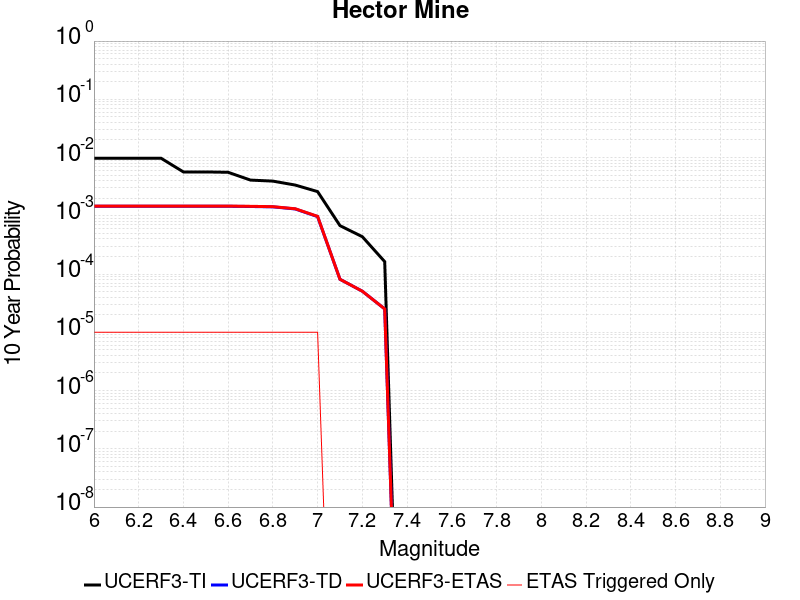 |

| Magnitude | 1 wk TI Prob | 1 wk TD Prob | 1 wk ETAS Prob | 1 wk ETAS/TD Gain | 1 wk ETAS Triggered Only | 1 mo TI Prob | 1 mo TD Prob | 1 mo ETAS Prob | 1 mo ETAS/TD Gain | 1 mo ETAS Triggered Only | 1 yr TI Prob | 1 yr TD Prob | 1 yr ETAS Prob | 1 yr ETAS/TD Gain | 1 yr ETAS Triggered Only | 10 yr TI Prob | 10 yr TD Prob | 10 yr ETAS Prob | 10 yr ETAS/TD Gain | 10 yr ETAS Triggered Only |
|-----|-----|-----|-----|-----|-----|-----|-----|-----|-----|-----|-----|-----|-----|-----|-----|-----|-----|-----|-----|-----|
| 6.0 | 1.8760093E-5 | 2.7963818E-6 | 1.535916E-5 | 5.492512 | 1.2562814E-5 | 8.039792E-5 | 1.1984461E-5 | 2.4547124E-5 | 2.0482461 | 1.2562814E-5 | 9.78405E-4 | 1.4590504E-4 | 1.5846602E-4 | 1.0860901 | 1.2562814E-5 | 0.009741086 | 0.0014584847 | 0.0014710291 | 1.0086011 | 1.2562814E-5 |
| 6.1 | 1.8760093E-5 | 2.7963818E-6 | 1.535916E-5 | 5.492512 | 1.2562814E-5 | 8.039792E-5 | 1.1984461E-5 | 2.4547124E-5 | 2.0482461 | 1.2562814E-5 | 9.78405E-4 | 1.4590504E-4 | 1.5846602E-4 | 1.0860901 | 1.2562814E-5 | 0.009741086 | 0.0014584847 | 0.0014710291 | 1.0086011 | 1.2562814E-5 |
| 6.2 | 1.8760093E-5 | 2.7963818E-6 | 1.535916E-5 | 5.492512 | 1.2562814E-5 | 8.039792E-5 | 1.1984461E-5 | 2.4547124E-5 | 2.0482461 | 1.2562814E-5 | 9.78405E-4 | 1.4590504E-4 | 1.5846602E-4 | 1.0860901 | 1.2562814E-5 | 0.009741086 | 0.0014584847 | 0.0014710291 | 1.0086011 | 1.2562814E-5 |
| 6.3 | 1.8760093E-5 | 2.7963818E-6 | 1.535916E-5 | 5.492512 | 1.2562814E-5 | 8.039792E-5 | 1.1984461E-5 | 2.4547124E-5 | 2.0482461 | 1.2562814E-5 | 9.78405E-4 | 1.4590504E-4 | 1.5846602E-4 | 1.0860901 | 1.2562814E-5 | 0.009741086 | 0.0014584847 | 0.0014710291 | 1.0086011 | 1.2562814E-5 |
| 6.4 | 1.0888055E-5 | 2.7963818E-6 | 1.535916E-5 | 5.492512 | 1.2562814E-5 | 4.666226E-5 | 1.1984461E-5 | 2.4547124E-5 | 2.0482461 | 1.2562814E-5 | 5.679649E-4 | 1.4590504E-4 | 1.5846602E-4 | 1.0860901 | 1.2562814E-5 | 0.0056651547 | 0.0014584847 | 0.0014710291 | 1.0086011 | 1.2562814E-5 |
| 6.5 | 1.0888055E-5 | 2.7963818E-6 | 1.535916E-5 | 5.492512 | 1.2562814E-5 | 4.666226E-5 | 1.1984461E-5 | 2.4547124E-5 | 2.0482461 | 1.2562814E-5 | 5.679649E-4 | 1.4590504E-4 | 1.5846602E-4 | 1.0860901 | 1.2562814E-5 | 0.0056651547 | 0.0014584847 | 0.0014710291 | 1.0086011 | 1.2562814E-5 |
| 6.6 | 1.0730738E-5 | 2.7963818E-6 | 1.535916E-5 | 5.492512 | 1.2562814E-5 | 4.5988065E-5 | 1.1984461E-5 | 2.4547124E-5 | 2.0482461 | 1.2562814E-5 | 5.5976084E-4 | 1.4590504E-4 | 1.5846602E-4 | 1.0860901 | 1.2562814E-5 | 0.0055835294 | 0.0014584847 | 0.0014710291 | 1.0086011 | 1.2562814E-5 |
| 6.7 | 7.881326E-6 | 2.7710626E-6 | 1.5333842E-5 | 5.5335603 | 1.2562814E-5 | 3.3776672E-5 | 1.1875951E-5 | 2.4438616E-5 | 2.057824 | 1.2562814E-5 | 4.111534E-4 | 1.445841E-4 | 1.571451E-4 | 1.0868767 | 1.2562814E-5 | 0.0041039353 | 0.0014452925 | 0.0014578371 | 1.0086796 | 1.2562814E-5 |
| 6.8 | 7.5683483E-6 | 2.7328138E-6 | 1.5295593E-5 | 5.597013 | 1.2562814E-5 | 3.2435375E-5 | 1.1712029E-5 | 2.4274696E-5 | 2.0726295 | 1.2562814E-5 | 3.9482914E-4 | 1.4258861E-4 | 1.5514964E-4 | 1.0880928 | 1.2562814E-5 | 0.0039412836 | 0.0014253634 | 0.0014379082 | 1.0088012 | 1.2562814E-5 |
| 6.9 | 6.473048E-6 | 2.5138945E-6 | 1.5076677E-5 | 5.997339 | 1.2562814E-5 | 2.7741338E-5 | 1.07738115E-5 | 2.333649E-5 | 2.1660385 | 1.2562814E-5 | 3.3769844E-4 | 1.3116724E-4 | 1.4372841E-4 | 1.0957645 | 1.2562814E-5 | 0.0033718573 | 0.0013112876 | 0.0013238341 | 1.009568 | 1.2562814E-5 |
| 7.0 | 4.9959954E-6 | 1.8565124E-6 | 1.4419303E-5 | 7.7668767 | 1.2562814E-5 | 2.1411232E-5 | 7.956478E-6 | 2.0519192E-5 | 2.5789292 | 1.2562814E-5 | 2.6065056E-4 | 9.686937E-5 | 1.0943097E-4 | 1.1296756 | 1.2562814E-5 | 0.0026034506 | 9.6862105E-4 | 9.811717E-4 | 1.0129572 | 1.2562814E-5 |
| 7.1 | 1.2997541E-6 | 1.5602147E-7 | 1.5602147E-7 | 1.0 | 0.0 | 5.5703626E-6 | 6.686633E-7 | 6.686633E-7 | 1.0 | 0.0 | 6.7817055E-5 | 8.140949E-6 | 8.140949E-6 | 1.0 | 0.0 | 6.779636E-4 | 8.1406906E-5 | 8.1406906E-5 | 1.0 | 0.0 |
| 7.2 | 8.392699E-7 | 9.727592E-8 | 9.727592E-8 | 1.0 | 0.0 | 3.596866E-6 | 4.1689677E-7 | 4.1689677E-7 | 1.0 | 0.0 | 4.3790962E-5 | 5.0757085E-6 | 5.0757085E-6 | 1.0 | 0.0 | 4.3782333E-4 | 5.0756116E-5 | 5.0756116E-5 | 1.0 | 0.0 |
| 7.3 | 3.13015E-7 | 4.829262E-8 | 4.829262E-8 | 1.0 | 0.0 | 1.3414921E-6 | 2.0696835E-7 | 2.0696835E-7 | 1.0 | 0.0 | 1.6332544E-5 | 2.5198376E-6 | 2.5198376E-6 | 1.0 | 0.0 | 1.6331344E-4 | 2.5198176E-5 | 2.5198176E-5 | 1.0 | 0.0 |

## Emerson-Copper Mtn 2011
*[(top)](#table-of-contents)*

| 1 Week | 1 Month | 1 Year | 10 Year |
|-----|-----|-----|-----|
|  |  | 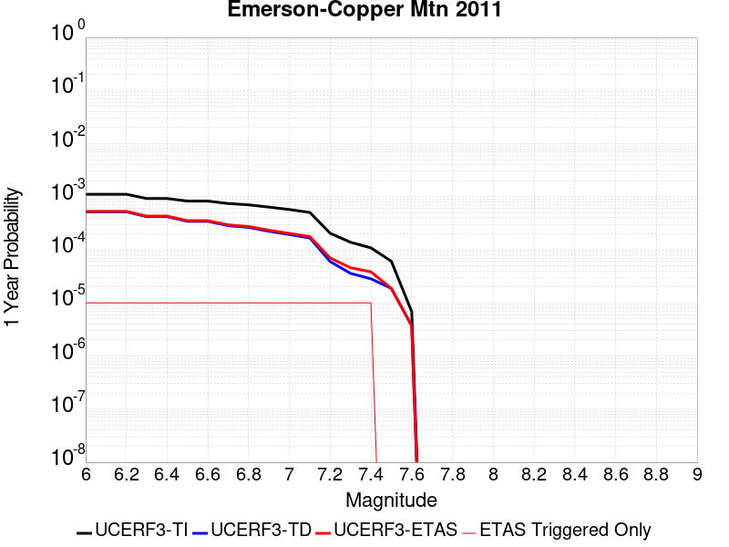 |  |

| Magnitude | 1 wk TI Prob | 1 wk TD Prob | 1 wk ETAS Prob | 1 wk ETAS/TD Gain | 1 wk ETAS Triggered Only | 1 mo TI Prob | 1 mo TD Prob | 1 mo ETAS Prob | 1 mo ETAS/TD Gain | 1 mo ETAS Triggered Only | 1 yr TI Prob | 1 yr TD Prob | 1 yr ETAS Prob | 1 yr ETAS/TD Gain | 1 yr ETAS Triggered Only | 10 yr TI Prob | 10 yr TD Prob | 10 yr ETAS Prob | 10 yr ETAS/TD Gain | 10 yr ETAS Triggered Only |
|-----|-----|-----|-----|-----|-----|-----|-----|-----|-----|-----|-----|-----|-----|-----|-----|-----|-----|-----|-----|-----|
| 6.0 | 2.1364202E-5 | 9.968114E-6 | 9.968114E-6 | 1.0 | 0.0 | 9.1557646E-5 | 4.2719836E-5 | 5.528211E-5 | 1.2940619 | 1.2562814E-5 | 0.0011141442 | 5.199986E-4 | 5.3255487E-4 | 1.0241468 | 1.2562814E-5 | 0.011085749 | 0.005188688 | 0.0052011856 | 1.0024086 | 1.2562814E-5 |
| 6.1 | 2.1364202E-5 | 9.968114E-6 | 9.968114E-6 | 1.0 | 0.0 | 9.1557646E-5 | 4.2719836E-5 | 5.528211E-5 | 1.2940619 | 1.2562814E-5 | 0.0011141442 | 5.199986E-4 | 5.3255487E-4 | 1.0241468 | 1.2562814E-5 | 0.011085749 | 0.005188688 | 0.0052011856 | 1.0024086 | 1.2562814E-5 |
| 6.2 | 2.1364202E-5 | 9.968114E-6 | 9.968114E-6 | 1.0 | 0.0 | 9.1557646E-5 | 4.2719836E-5 | 5.528211E-5 | 1.2940619 | 1.2562814E-5 | 0.0011141442 | 5.199986E-4 | 5.3255487E-4 | 1.0241468 | 1.2562814E-5 | 0.011085749 | 0.005188688 | 0.0052011856 | 1.0024086 | 1.2562814E-5 |
| 6.3 | 1.7751237E-5 | 8.089227E-6 | 8.089227E-6 | 1.0 | 0.0 | 7.607452E-5 | 3.466769E-5 | 4.7230067E-5 | 1.3623656 | 1.2562814E-5 | 9.258136E-4 | 4.2200365E-4 | 4.3456117E-4 | 1.0297569 | 1.2562814E-5 | 0.00921966 | 0.0042126453 | 0.0042251553 | 1.0029696 | 1.2562814E-5 |
| 6.4 | 1.7751237E-5 | 8.089227E-6 | 8.089227E-6 | 1.0 | 0.0 | 7.607452E-5 | 3.466769E-5 | 4.7230067E-5 | 1.3623656 | 1.2562814E-5 | 9.258136E-4 | 4.2200365E-4 | 4.3456117E-4 | 1.0297569 | 1.2562814E-5 | 0.00921966 | 0.0042126453 | 0.0042251553 | 1.0029696 | 1.2562814E-5 |
| 6.5 | 1.5886664E-5 | 6.603819E-6 | 6.603819E-6 | 1.0 | 0.0 | 6.808392E-5 | 2.8301802E-5 | 4.086426E-5 | 1.4438748 | 1.2562814E-5 | 8.286065E-4 | 3.4452465E-4 | 3.5708313E-4 | 1.0364516 | 1.2562814E-5 | 0.008255237 | 0.0034403696 | 0.0034528892 | 1.003639 | 1.2562814E-5 |
| 6.6 | 1.5886664E-5 | 6.603819E-6 | 6.603819E-6 | 1.0 | 0.0 | 6.808392E-5 | 2.8301802E-5 | 4.086426E-5 | 1.4438748 | 1.2562814E-5 | 8.286065E-4 | 3.4452465E-4 | 3.5708313E-4 | 1.0364516 | 1.2562814E-5 | 0.008255237 | 0.0034403696 | 0.0034528892 | 1.003639 | 1.2562814E-5 |
| 6.7 | 1.428471E-5 | 5.470403E-6 | 5.470403E-6 | 1.0 | 0.0 | 6.121875E-5 | 2.3444394E-5 | 3.6006913E-5 | 1.5358433 | 1.2562814E-5 | 7.450834E-4 | 2.8540206E-4 | 2.979613E-4 | 1.0440054 | 1.2562814E-5 | 0.007425902 | 0.0028507432 | 0.0028632702 | 1.0043943 | 1.2562814E-5 |
| 6.8 | 1.3490684E-5 | 5.073699E-6 | 5.073699E-6 | 1.0 | 0.0 | 5.7815934E-5 | 2.1744265E-5 | 3.4306806E-5 | 1.5777404 | 1.2562814E-5 | 7.0368167E-4 | 2.6470813E-4 | 2.7726762E-4 | 1.0474466 | 1.2562814E-5 | 0.007014576 | 0.002644309 | 0.0026568386 | 1.0047383 | 1.2562814E-5 |
| 6.9 | 1.2235421E-5 | 4.289677E-6 | 4.289677E-6 | 1.0 | 0.0 | 5.2436466E-5 | 1.838422E-5 | 3.0946805E-5 | 1.6833351 | 1.2562814E-5 | 6.38227E-4 | 2.238085E-4 | 2.363685E-4 | 1.0561194 | 1.2562814E-5 | 0.0063639707 | 0.0022361854 | 0.00224872 | 1.0056055 | 1.2562814E-5 |
| 7.0 | 1.1009851E-5 | 3.7189886E-6 | 3.7189886E-6 | 1.0 | 0.0 | 4.7184225E-5 | 1.5938444E-5 | 2.8501057E-5 | 1.7881957 | 1.2562814E-5 | 5.743165E-4 | 1.9403672E-4 | 2.0659709E-4 | 1.064732 | 1.2562814E-5 | 0.005728345 | 0.0019390108 | 0.0019515492 | 1.0064664 | 1.2562814E-5 |
| 7.1 | 9.726373E-6 | 3.2117953E-6 | 3.2117953E-6 | 1.0 | 0.0 | 4.168379E-5 | 1.3764783E-5 | 2.6327425E-5 | 1.9126654 | 1.2562814E-5 | 5.07382E-4 | 1.6757673E-4 | 1.8013743E-4 | 1.074955 | 1.2562814E-5 | 0.0050622504 | 0.0016748349 | 0.0016873766 | 1.0074884 | 1.2562814E-5 |
| 7.2 | 3.9335127E-6 | 1.1524792E-6 | 1.1524792E-6 | 1.0 | 0.0 | 1.6857803E-5 | 4.9391874E-6 | 1.750194E-5 | 3.5434856 | 1.2562814E-5 | 2.0522442E-4 | 6.0133007E-5 | 7.269507E-5 | 1.2089045 | 1.2562814E-5 | 0.00205035 | 6.011733E-4 | 6.137286E-4 | 1.0208846 | 1.2562814E-5 |
| 7.3 | 2.661632E-6 | 6.911505E-7 | 6.911505E-7 | 1.0 | 0.0 | 1.14069435E-5 | 2.9620703E-6 | 1.5524847E-5 | 5.241215 | 1.2562814E-5 | 1.3887069E-4 | 3.6062618E-5 | 4.862498E-5 | 1.3483485 | 1.2562814E-5 | 0.0013878393 | 3.605687E-4 | 3.73127E-4 | 1.0348291 | 1.2562814E-5 |
| 7.4 | 2.0893426E-6 | 5.4618386E-7 | 5.4618386E-7 | 1.0 | 0.0 | 8.954295E-6 | 2.3407858E-6 | 1.490357E-5 | 6.366909 | 1.2562814E-5 | 1.0901308E-4 | 2.84987E-5 | 4.1061157E-5 | 1.440808 | 1.2562814E-5 | 0.0010895962 | 2.84951E-4 | 2.9751024E-4 | 1.044075 | 1.2562814E-5 |
| 7.5 | 1.1681728E-6 | 3.6030585E-7 | 3.6030585E-7 | 1.0 | 0.0 | 5.0064455E-6 | 1.544167E-6 | 1.544167E-6 | 1.0 | 0.0 | 6.0951766E-5 | 1.8800076E-5 | 1.8800076E-5 | 1.0 | 0.0 | 6.093505E-4 | 1.8798532E-4 | 1.8798532E-4 | 1.0 | 0.0 |
| 7.6 | 1.3154387E-7 | 7.1197384E-8 | 7.1197384E-8 | 1.0 | 0.0 | 5.6375933E-7 | 3.051316E-7 | 3.051316E-7 | 1.0 | 0.0 | 6.863748E-6 | 3.7149728E-6 | 3.7149728E-6 | 1.0 | 0.0 | 6.863536E-5 | 3.7149264E-5 | 3.7149264E-5 | 1.0 | 0.0 |

## Great Valley 03a Dunnigan Hills
*[(top)](#table-of-contents)*

| 1 Week | 1 Month | 1 Year | 10 Year |
|-----|-----|-----|-----|
|  |  |  |  |

| Magnitude | 1 wk TI Prob | 1 wk TD Prob | 1 wk ETAS Prob | 1 wk ETAS/TD Gain | 1 wk ETAS Triggered Only | 1 mo TI Prob | 1 mo TD Prob | 1 mo ETAS Prob | 1 mo ETAS/TD Gain | 1 mo ETAS Triggered Only | 1 yr TI Prob | 1 yr TD Prob | 1 yr ETAS Prob | 1 yr ETAS/TD Gain | 1 yr ETAS Triggered Only | 10 yr TI Prob | 10 yr TD Prob | 10 yr ETAS Prob | 10 yr ETAS/TD Gain | 10 yr ETAS Triggered Only |
|-----|-----|-----|-----|-----|-----|-----|-----|-----|-----|-----|-----|-----|-----|-----|-----|-----|-----|-----|-----|-----|
| 6.0 | 1.6591328E-5 | 1.8107954E-5 | 3.067054E-5 | 1.6937606 | 1.2562814E-5 | 7.110376E-5 | 7.7603596E-5 | 9.0165435E-5 | 1.1618719 | 1.2562814E-5 | 8.6534437E-4 | 9.444834E-4 | 9.5703435E-4 | 1.0132887 | 1.2562814E-5 | 0.008619824 | 0.009411525 | 0.009423969 | 1.0013223 | 1.2562814E-5 |
| 6.1 | 8.041125E-6 | 8.769726E-6 | 8.769726E-6 | 1.0 | 0.0 | 3.4461507E-5 | 3.7584115E-5 | 3.7584115E-5 | 1.0 | 0.0 | 4.194881E-4 | 4.5751085E-4 | 4.5751085E-4 | 1.0 | 0.0 | 0.004186971 | 0.004567687 | 0.004567687 | 1.0 | 0.0 |
| 6.2 | 3.2807004E-6 | 3.5795688E-6 | 3.5795688E-6 | 1.0 | 0.0 | 1.4060069E-5 | 1.5340942E-5 | 1.5340942E-5 | 1.0 | 0.0 | 1.7116789E-4 | 1.8676413E-4 | 1.8676413E-4 | 1.0 | 0.0 | 0.0017103611 | 0.0018664796 | 0.0018664796 | 1.0 | 0.0 |
| 6.3 | 1.9339366E-6 | 2.1103806E-6 | 2.1103806E-6 | 1.0 | 0.0 | 8.288273E-6 | 9.044474E-6 | 9.044474E-6 | 1.0 | 0.0 | 1.00905054E-4 | 1.1011375E-4 | 1.1011375E-4 | 1.0 | 0.0 | 0.0010085925 | 0.0011008718 | 0.0011008718 | 1.0 | 0.0 |
| 6.4 | 1.3142635E-6 | 1.4339867E-6 | 1.4339867E-6 | 1.0 | 0.0 | 5.6325457E-6 | 6.145657E-6 | 6.145657E-6 | 1.0 | 0.0 | 6.857408E-5 | 7.482337E-5 | 7.482337E-5 | 1.0 | 0.0 | 6.8552926E-4 | 7.4823375E-4 | 7.4823375E-4 | 1.0 | 0.0 |

## Robinson Creek
*[(top)](#table-of-contents)*

| 1 Week | 1 Month | 1 Year | 10 Year |
|-----|-----|-----|-----|
|  |  |  |  |

| Magnitude | 1 wk TI Prob | 1 wk TD Prob | 1 wk ETAS Prob | 1 wk ETAS/TD Gain | 1 wk ETAS Triggered Only | 1 mo TI Prob | 1 mo TD Prob | 1 mo ETAS Prob | 1 mo ETAS/TD Gain | 1 mo ETAS Triggered Only | 1 yr TI Prob | 1 yr TD Prob | 1 yr ETAS Prob | 1 yr ETAS/TD Gain | 1 yr ETAS Triggered Only | 10 yr TI Prob | 10 yr TD Prob | 10 yr ETAS Prob | 10 yr ETAS/TD Gain | 10 yr ETAS Triggered Only |
|-----|-----|-----|-----|-----|-----|-----|-----|-----|-----|-----|-----|-----|-----|-----|-----|-----|-----|-----|-----|-----|
| 6.0 | 1.3705327E-5 | 1.5285013E-5 | 2.7847635E-5 | 1.8218914 | 1.2562814E-5 | 5.8735794E-5 | 6.55072E-5 | 7.806919E-5 | 1.1917651 | 1.2562814E-5 | 7.1487366E-4 | 7.9755014E-4 | 8.1010297E-4 | 1.0157392 | 1.2562814E-5 | 0.0071257832 | 0.007975501 | 0.007987964 | 1.0015626 | 1.2562814E-5 |
| 6.1 | 1.3705327E-5 | 1.5285013E-5 | 2.7847635E-5 | 1.8218914 | 1.2562814E-5 | 5.8735794E-5 | 6.55072E-5 | 7.806919E-5 | 1.1917651 | 1.2562814E-5 | 7.1487366E-4 | 7.9755014E-4 | 8.1010297E-4 | 1.0157392 | 1.2562814E-5 | 0.0071257832 | 0.007975501 | 0.007987964 | 1.0015626 | 1.2562814E-5 |
| 6.2 | 1.3705327E-5 | 1.5285013E-5 | 2.7847635E-5 | 1.8218914 | 1.2562814E-5 | 5.8735794E-5 | 6.55072E-5 | 7.806919E-5 | 1.1917651 | 1.2562814E-5 | 7.1487366E-4 | 7.9755014E-4 | 8.1010297E-4 | 1.0157392 | 1.2562814E-5 | 0.0071257832 | 0.007975501 | 0.007987964 | 1.0015626 | 1.2562814E-5 |
| 6.3 | 1.3705327E-5 | 1.5285013E-5 | 2.7847635E-5 | 1.8218914 | 1.2562814E-5 | 5.8735794E-5 | 6.55072E-5 | 7.806919E-5 | 1.1917651 | 1.2562814E-5 | 7.1487366E-4 | 7.9755014E-4 | 8.1010297E-4 | 1.0157392 | 1.2562814E-5 | 0.0071257832 | 0.007975501 | 0.007987964 | 1.0015626 | 1.2562814E-5 |
| 6.4 | 1.3705327E-5 | 1.5285013E-5 | 2.7847635E-5 | 1.8218914 | 1.2562814E-5 | 5.8735794E-5 | 6.55072E-5 | 7.806919E-5 | 1.1917651 | 1.2562814E-5 | 7.1487366E-4 | 7.9755014E-4 | 8.1010297E-4 | 1.0157392 | 1.2562814E-5 | 0.0071257832 | 0.007975501 | 0.007987964 | 1.0015626 | 1.2562814E-5 |

## Los Osos 2011
*[(top)](#table-of-contents)*

| 1 Week | 1 Month | 1 Year | 10 Year |
|-----|-----|-----|-----|
|  |  |  |  |

| Magnitude | 1 wk TI Prob | 1 wk TD Prob | 1 wk ETAS Prob | 1 wk ETAS/TD Gain | 1 wk ETAS Triggered Only | 1 mo TI Prob | 1 mo TD Prob | 1 mo ETAS Prob | 1 mo ETAS/TD Gain | 1 mo ETAS Triggered Only | 1 yr TI Prob | 1 yr TD Prob | 1 yr ETAS Prob | 1 yr ETAS/TD Gain | 1 yr ETAS Triggered Only | 10 yr TI Prob | 10 yr TD Prob | 10 yr ETAS Prob | 10 yr ETAS/TD Gain | 10 yr ETAS Triggered Only |
|-----|-----|-----|-----|-----|-----|-----|-----|-----|-----|-----|-----|-----|-----|-----|-----|-----|-----|-----|-----|-----|
| 6.0 | 4.8871775E-6 | 4.9814835E-6 | 1.7544235E-5 | 3.5218897 | 1.2562814E-5 | 2.0944879E-5 | 2.1349055E-5 | 3.39116E-5 | 1.5884356 | 1.2562814E-5 | 2.5497406E-4 | 2.5989654E-4 | 2.724561E-4 | 1.0483252 | 1.2562814E-5 | 0.002546817 | 0.0025962002 | 0.0026087305 | 1.0048263 | 1.2562814E-5 |
| 6.1 | 4.8871775E-6 | 4.9814835E-6 | 1.7544235E-5 | 3.5218897 | 1.2562814E-5 | 2.0944879E-5 | 2.1349055E-5 | 3.39116E-5 | 1.5884356 | 1.2562814E-5 | 2.5497406E-4 | 2.5989654E-4 | 2.724561E-4 | 1.0483252 | 1.2562814E-5 | 0.002546817 | 0.0025962002 | 0.0026087305 | 1.0048263 | 1.2562814E-5 |
| 6.2 | 4.8871775E-6 | 4.9814835E-6 | 1.7544235E-5 | 3.5218897 | 1.2562814E-5 | 2.0944879E-5 | 2.1349055E-5 | 3.39116E-5 | 1.5884356 | 1.2562814E-5 | 2.5497406E-4 | 2.5989654E-4 | 2.724561E-4 | 1.0483252 | 1.2562814E-5 | 0.002546817 | 0.0025962002 | 0.0026087305 | 1.0048263 | 1.2562814E-5 |
| 6.3 | 4.8871775E-6 | 4.9814835E-6 | 1.7544235E-5 | 3.5218897 | 1.2562814E-5 | 2.0944879E-5 | 2.1349055E-5 | 3.39116E-5 | 1.5884356 | 1.2562814E-5 | 2.5497406E-4 | 2.5989654E-4 | 2.724561E-4 | 1.0483252 | 1.2562814E-5 | 0.002546817 | 0.0025962002 | 0.0026087305 | 1.0048263 | 1.2562814E-5 |
| 6.4 | 4.8871775E-6 | 4.9814835E-6 | 1.7544235E-5 | 3.5218897 | 1.2562814E-5 | 2.0944879E-5 | 2.1349055E-5 | 3.39116E-5 | 1.5884356 | 1.2562814E-5 | 2.5497406E-4 | 2.5989654E-4 | 2.724561E-4 | 1.0483252 | 1.2562814E-5 | 0.002546817 | 0.0025962002 | 0.0026087305 | 1.0048263 | 1.2562814E-5 |
| 6.5 | 3.1724062E-6 | 3.223395E-6 | 3.223395E-6 | 1.0 | 0.0 | 1.3595956E-5 | 1.3814477E-5 | 1.3814477E-5 | 1.0 | 0.0 | 1.6551818E-4 | 1.681784E-4 | 1.681784E-4 | 1.0 | 0.0 | 0.0016539496 | 0.0016805249 | 0.0016805249 | 1.0 | 0.0 |
| 6.6 | 3.1022591E-6 | 3.1511045E-6 | 3.1511045E-6 | 1.0 | 0.0 | 1.3295328E-5 | 1.3504664E-5 | 1.3504664E-5 | 1.0 | 0.0 | 1.618586E-4 | 1.64407E-4 | 1.64407E-4 | 1.0 | 0.0 | 0.0016174077 | 0.0016428665 | 0.0016428665 | 1.0 | 0.0 |
| 6.7 | 2.611518E-6 | 2.6491832E-6 | 2.6491832E-6 | 1.0 | 0.0 | 1.1192172E-5 | 1.1353593E-5 | 1.1353593E-5 | 1.0 | 0.0 | 1.3625617E-4 | 1.3822126E-4 | 1.3822126E-4 | 1.0 | 0.0 | 0.0013617266 | 0.0013813575 | 0.0013813575 | 1.0 | 0.0 |
| 6.8 | 2.4780884E-6 | 2.5121592E-6 | 2.5121592E-6 | 1.0 | 0.0 | 1.0620336E-5 | 1.0766353E-5 | 1.0766353E-5 | 1.0 | 0.0 | 1.2929492E-4 | 1.3107249E-4 | 1.3107249E-4 | 1.0 | 0.0 | 0.0012921972 | 0.001309956 | 0.001309956 | 1.0 | 0.0 |
| 6.9 | 2.1376322E-6 | 2.1635055E-6 | 2.1635055E-6 | 1.0 | 0.0 | 9.161248E-6 | 9.272134E-6 | 9.272134E-6 | 1.0 | 0.0 | 1.1153249E-4 | 1.128824E-4 | 1.128824E-4 | 1.0 | 0.0 | 0.0011147653 | 0.0011282525 | 0.0011282525 | 1.0 | 0.0 |
| 7.0 | 1.9282882E-6 | 1.9494585E-6 | 1.9494585E-6 | 1.0 | 0.0 | 8.264066E-6 | 8.354796E-6 | 8.354796E-6 | 1.0 | 0.0 | 1.0061036E-4 | 1.017149E-4 | 1.017149E-4 | 1.0 | 0.0 | 0.0010056482 | 0.0010166848 | 0.0010166848 | 1.0 | 0.0 |
| 7.1 | 1.6353226E-6 | 1.6501118E-6 | 1.6501118E-6 | 1.0 | 0.0 | 7.0085066E-6 | 7.0718884E-6 | 7.0718884E-6 | 1.0 | 0.0 | 8.532523E-5 | 8.609685E-5 | 8.609685E-5 | 1.0 | 0.0 | 8.529247E-4 | 8.6063566E-4 | 8.6063566E-4 | 1.0 | 0.0 |
| 7.2 | 1.4446276E-6 | 1.4553341E-6 | 1.4553341E-6 | 1.0 | 0.0 | 6.191247E-6 | 6.237131E-6 | 6.237131E-6 | 1.0 | 0.0 | 7.537582E-5 | 7.593443E-5 | 7.593443E-5 | 1.0 | 0.0 | 7.535026E-4 | 7.590854E-4 | 7.590854E-4 | 1.0 | 0.0 |
| 7.3 | 1.2014582E-6 | 1.2069073E-6 | 1.2069073E-6 | 1.0 | 0.0 | 5.149096E-6 | 5.1724496E-6 | 5.1724496E-6 | 1.0 | 0.0 | 6.268844E-5 | 6.297276E-5 | 6.297276E-5 | 1.0 | 0.0 | 6.267076E-4 | 6.295495E-4 | 6.295495E-4 | 1.0 | 0.0 |
| 7.4 | 9.707733E-7 | 9.709773E-7 | 9.709773E-7 | 1.0 | 0.0 | 4.16045E-6 | 4.161325E-6 | 4.161325E-6 | 1.0 | 0.0 | 5.0652303E-5 | 5.066295E-5 | 5.066295E-5 | 1.0 | 0.0 | 5.064076E-4 | 5.065143E-4 | 5.065143E-4 | 1.0 | 0.0 |
| 7.5 | 7.174908E-7 | 7.1149134E-7 | 7.1149134E-7 | 1.0 | 0.0 | 3.074957E-6 | 3.0492452E-6 | 3.0492452E-6 | 1.0 | 0.0 | 3.743696E-5 | 3.712393E-5 | 3.712393E-5 | 1.0 | 0.0 | 3.7430652E-4 | 3.7117745E-4 | 3.7117745E-4 | 1.0 | 0.0 |
| 7.6 | 4.5535776E-7 | 4.420792E-7 | 4.420792E-7 | 1.0 | 0.0 | 1.9515319E-6 | 1.8946238E-6 | 1.8946238E-6 | 1.0 | 0.0 | 2.3759641E-5 | 2.3066801E-5 | 2.3066801E-5 | 1.0 | 0.0 | 2.37571E-4 | 2.3064416E-4 | 2.3064416E-4 | 1.0 | 0.0 |
| 7.7 | 2.1173553E-7 | 1.9060796E-7 | 1.9060796E-7 | 1.0 | 0.0 | 9.0743765E-7 | 8.1689103E-7 | 8.1689103E-7 | 1.0 | 0.0 | 1.1047998E-5 | 9.945603E-6 | 9.945603E-6 | 1.0 | 0.0 | 1.1047449E-4 | 9.945161E-5 | 9.945161E-5 | 1.0 | 0.0 |
| 7.8 | 9.873608E-8 | 7.3675665E-8 | 7.3675665E-8 | 1.0 | 0.0 | 4.2315455E-7 | 3.157528E-7 | 3.157528E-7 | 1.0 | 0.0 | 5.1518946E-6 | 3.8442836E-6 | 3.8442836E-6 | 1.0 | 0.0 | 5.1517753E-5 | 3.8442176E-5 | 3.8442176E-5 | 1.0 | 0.0 |
| 7.9 | 5.4399106E-8 | 3.1880155E-8 | 3.1880155E-8 | 1.0 | 0.0 | 2.33139E-7 | 1.3662923E-7 | 1.3662923E-7 | 1.0 | 0.0 | 2.8384638E-6 | 1.6634596E-6 | 1.6634596E-6 | 1.0 | 0.0 | 2.8384275E-5 | 1.6634473E-5 | 1.6634473E-5 | 1.0 | 0.0 |
| 8.0 | 1.817203E-8 | 8.420727E-9 | 8.420727E-9 | 1.0 | 0.0 | 7.7880124E-8 | 3.608883E-8 | 3.608883E-8 | 1.0 | 0.0 | 9.481901E-7 | 4.393814E-7 | 4.393814E-7 | 1.0 | 0.0 | 9.481861E-6 | 4.3938057E-6 | 4.3938057E-6 | 1.0 | 0.0 |

## Santa Susana East (connector)
*[(top)](#table-of-contents)*

| 1 Week | 1 Month | 1 Year | 10 Year |
|-----|-----|-----|-----|
|  |  |  |  |

| Magnitude | 1 wk TI Prob | 1 wk TD Prob | 1 wk ETAS Prob | 1 wk ETAS/TD Gain | 1 wk ETAS Triggered Only | 1 mo TI Prob | 1 mo TD Prob | 1 mo ETAS Prob | 1 mo ETAS/TD Gain | 1 mo ETAS Triggered Only | 1 yr TI Prob | 1 yr TD Prob | 1 yr ETAS Prob | 1 yr ETAS/TD Gain | 1 yr ETAS Triggered Only | 10 yr TI Prob | 10 yr TD Prob | 10 yr ETAS Prob | 10 yr ETAS/TD Gain | 10 yr ETAS Triggered Only |
|-----|-----|-----|-----|-----|-----|-----|-----|-----|-----|-----|-----|-----|-----|-----|-----|-----|-----|-----|-----|-----|
| 6.0 | 2.858397E-5 | 3.202091E-5 | 3.202091E-5 | 1.0 | 0.0 | 1.2249697E-4 | 1.3722685E-4 | 1.3722685E-4 | 1.0 | 0.0 | 0.0014903803 | 0.0016697381 | 0.00168228 | 1.0075113 | 1.2562814E-5 | 0.014804244 | 0.016599052 | 0.016611407 | 1.0007442 | 1.2562814E-5 |
| 6.1 | 2.858397E-5 | 3.202091E-5 | 3.202091E-5 | 1.0 | 0.0 | 1.2249697E-4 | 1.3722685E-4 | 1.3722685E-4 | 1.0 | 0.0 | 0.0014903803 | 0.0016697381 | 0.00168228 | 1.0075113 | 1.2562814E-5 | 0.014804244 | 0.016599052 | 0.016611407 | 1.0007442 | 1.2562814E-5 |
| 6.2 | 2.858397E-5 | 3.202091E-5 | 3.202091E-5 | 1.0 | 0.0 | 1.2249697E-4 | 1.3722685E-4 | 1.3722685E-4 | 1.0 | 0.0 | 0.0014903803 | 0.0016697381 | 0.00168228 | 1.0075113 | 1.2562814E-5 | 0.014804244 | 0.016599052 | 0.016611407 | 1.0007442 | 1.2562814E-5 |
| 6.3 | 1.943582E-5 | 2.036718E-5 | 2.036718E-5 | 1.0 | 0.0 | 8.329371E-5 | 8.7285625E-5 | 8.7285625E-5 | 1.0 | 0.0 | 0.001013629 | 0.0010622967 | 0.0010748461 | 1.0118135 | 1.2562814E-5 | 0.010090181 | 0.010583619 | 0.010596048 | 1.0011744 | 1.2562814E-5 |
| 6.4 | 1.943582E-5 | 2.036718E-5 | 2.036718E-5 | 1.0 | 0.0 | 8.329371E-5 | 8.7285625E-5 | 8.7285625E-5 | 1.0 | 0.0 | 0.001013629 | 0.0010622967 | 0.0010748461 | 1.0118135 | 1.2562814E-5 | 0.010090181 | 0.010583619 | 0.010596048 | 1.0011744 | 1.2562814E-5 |
| 6.5 | 1.943582E-5 | 2.036718E-5 | 2.036718E-5 | 1.0 | 0.0 | 8.329371E-5 | 8.7285625E-5 | 8.7285625E-5 | 1.0 | 0.0 | 0.001013629 | 0.0010622967 | 0.0010748461 | 1.0118135 | 1.2562814E-5 | 0.010090181 | 0.010583619 | 0.010596048 | 1.0011744 | 1.2562814E-5 |
| 6.6 | 1.943582E-5 | 2.036718E-5 | 2.036718E-5 | 1.0 | 0.0 | 8.329371E-5 | 8.7285625E-5 | 8.7285625E-5 | 1.0 | 0.0 | 0.001013629 | 0.0010622967 | 0.0010748461 | 1.0118135 | 1.2562814E-5 | 0.010090181 | 0.010583619 | 0.010596048 | 1.0011744 | 1.2562814E-5 |
| 6.7 | 1.9404439E-5 | 2.03546E-5 | 2.03546E-5 | 1.0 | 0.0 | 8.3159226E-5 | 8.723172E-5 | 8.723172E-5 | 1.0 | 0.0 | 0.0010119933 | 0.0010616409 | 0.0010741905 | 1.0118208 | 1.2562814E-5 | 0.010073971 | 0.010577125 | 0.010589554 | 1.0011752 | 1.2562814E-5 |
| 6.8 | 1.2217526E-5 | 1.1592998E-5 | 1.1592998E-5 | 1.0 | 0.0 | 5.2359774E-5 | 4.9683425E-5 | 4.9683425E-5 | 1.0 | 0.0 | 6.372938E-4 | 6.0474465E-4 | 6.1729987E-4 | 1.0207611 | 1.2562814E-5 | 0.0063546924 | 0.006033037 | 0.0060455236 | 1.0020698 | 1.2562814E-5 |
| 6.9 | 1.2217526E-5 | 1.1592998E-5 | 1.1592998E-5 | 1.0 | 0.0 | 5.2359774E-5 | 4.9683425E-5 | 4.9683425E-5 | 1.0 | 0.0 | 6.372938E-4 | 6.0474465E-4 | 6.1729987E-4 | 1.0207611 | 1.2562814E-5 | 0.0063546924 | 0.006033037 | 0.0060455236 | 1.0020698 | 1.2562814E-5 |
| 7.0 | 9.276017E-6 | 8.059113E-6 | 8.059113E-6 | 1.0 | 0.0 | 3.9753755E-5 | 3.4538618E-5 | 3.4538618E-5 | 1.0 | 0.0 | 4.8389446E-4 | 4.2042998E-4 | 4.329875E-4 | 1.0298684 | 1.2562814E-5 | 0.0048284214 | 0.0041970722 | 0.004209582 | 1.0029807 | 1.2562814E-5 |
| 7.1 | 9.130355E-6 | 7.942286E-6 | 7.942286E-6 | 1.0 | 0.0 | 3.9129503E-5 | 3.4037945E-5 | 3.4037945E-5 | 1.0 | 0.0 | 4.7629757E-4 | 4.1433662E-4 | 4.2689423E-4 | 1.0303078 | 1.2562814E-5 | 0.00475278 | 0.004136367 | 0.0041488777 | 1.0030246 | 1.2562814E-5 |
| 7.2 | 8.851015E-6 | 7.741445E-6 | 7.741445E-6 | 1.0 | 0.0 | 3.7932372E-5 | 3.317722E-5 | 3.317722E-5 | 1.0 | 0.0 | 4.6172875E-4 | 4.038612E-4 | 4.1641894E-4 | 1.0310942 | 1.2562814E-5 | 0.0046077054 | 0.0040319953 | 0.0040445076 | 1.0031033 | 1.2562814E-5 |
| 7.3 | 8.573006E-6 | 7.550166E-6 | 7.550166E-6 | 1.0 | 0.0 | 3.6740938E-5 | 3.2357475E-5 | 3.2357475E-5 | 1.0 | 0.0 | 4.472291E-4 | 3.9388443E-4 | 4.064423E-4 | 1.031882 | 1.2562814E-5 | 0.004463301 | 0.0039325804 | 0.003945094 | 1.0031819 | 1.2562814E-5 |
| 7.4 | 7.852282E-6 | 6.817687E-6 | 6.817687E-6 | 1.0 | 0.0 | 3.36522E-5 | 2.9218349E-5 | 2.9218349E-5 | 1.0 | 0.0 | 4.096385E-4 | 3.5567835E-4 | 3.6823668E-4 | 1.0353081 | 1.2562814E-5 | 0.0040888423 | 0.0035517553 | 0.0035642735 | 1.0035245 | 1.2562814E-5 |
| 7.5 | 4.8869324E-6 | 4.279055E-6 | 4.279055E-6 | 1.0 | 0.0 | 2.0943828E-5 | 1.8338687E-5 | 1.8338687E-5 | 1.0 | 0.0 | 2.5496128E-4 | 2.232523E-4 | 2.358123E-4 | 1.0562593 | 1.2562814E-5 | 0.0025466895 | 0.0022304445 | 0.0022429794 | 1.0056199 | 1.2562814E-5 |
| 7.6 | 1.3894544E-6 | 1.1568179E-6 | 1.1568179E-6 | 1.0 | 0.0 | 5.954791E-6 | 4.957783E-6 | 4.957783E-6 | 1.0 | 0.0 | 7.249717E-5 | 6.0359558E-5 | 7.292161E-5 | 1.2081205 | 1.2562814E-5 | 7.247352E-4 | 6.0345343E-4 | 6.1600865E-4 | 1.0208056 | 1.2562814E-5 |
| 7.7 | 2.9924632E-7 | 2.371928E-7 | 2.371928E-7 | 1.0 | 0.0 | 1.2824837E-6 | 1.0165402E-6 | 1.0165402E-6 | 1.0 | 0.0 | 1.5614127E-5 | 1.2376314E-5 | 1.2376314E-5 | 1.0 | 0.0 | 1.5613029E-4 | 1.2375697E-4 | 1.2375697E-4 | 1.0 | 0.0 |
| 7.8 | 4.8188564E-8 | 2.6323061E-8 | 2.6323061E-8 | 1.0 | 0.0 | 2.065224E-7 | 1.1281311E-7 | 1.1281311E-7 | 1.0 | 0.0 | 2.5144072E-6 | 1.3734989E-6 | 1.3734989E-6 | 1.0 | 0.0 | 2.5143789E-5 | 1.3734912E-5 | 1.3734912E-5 | 1.0 | 0.0 |
| 7.9 | 2.6127251E-9 | 2.7681102E-9 | 2.7681102E-9 | 1.0 | 0.0 | 1.1197393E-8 | 1.186333E-8 | 1.186333E-8 | 1.0 | 0.0 | 1.3632825E-7 | 1.4443603E-7 | 1.4443603E-7 | 1.0 | 0.0 | 1.3632817E-6 | 1.4443604E-6 | 1.4443604E-6 | 1.0 | 0.0 |

## Monterey Bay-Tularcitos
*[(top)](#table-of-contents)*

| 1 Week | 1 Month | 1 Year | 10 Year |
|-----|-----|-----|-----|
|  |  |  |  |

| Magnitude | 1 wk TI Prob | 1 wk TD Prob | 1 wk ETAS Prob | 1 wk ETAS/TD Gain | 1 wk ETAS Triggered Only | 1 mo TI Prob | 1 mo TD Prob | 1 mo ETAS Prob | 1 mo ETAS/TD Gain | 1 mo ETAS Triggered Only | 1 yr TI Prob | 1 yr TD Prob | 1 yr ETAS Prob | 1 yr ETAS/TD Gain | 1 yr ETAS Triggered Only | 10 yr TI Prob | 10 yr TD Prob | 10 yr ETAS Prob | 10 yr ETAS/TD Gain | 10 yr ETAS Triggered Only |
|-----|-----|-----|-----|-----|-----|-----|-----|-----|-----|-----|-----|-----|-----|-----|-----|-----|-----|-----|-----|-----|
| 6.0 | 3.0131365E-5 | 3.279877E-5 | 3.279877E-5 | 1.0 | 0.0 | 1.2912804E-4 | 1.4055918E-4 | 1.4055918E-4 | 1.0 | 0.0 | 0.001571 | 0.0017100703 | 0.0017226116 | 1.0073338 | 1.2562814E-5 | 0.015599402 | 0.016979916 | 0.016992265 | 1.0007273 | 1.2562814E-5 |
| 6.1 | 3.0131365E-5 | 3.279877E-5 | 3.279877E-5 | 1.0 | 0.0 | 1.2912804E-4 | 1.4055918E-4 | 1.4055918E-4 | 1.0 | 0.0 | 0.001571 | 0.0017100703 | 0.0017226116 | 1.0073338 | 1.2562814E-5 | 0.015599402 | 0.016979916 | 0.016992265 | 1.0007273 | 1.2562814E-5 |
| 6.2 | 3.0131365E-5 | 3.279877E-5 | 3.279877E-5 | 1.0 | 0.0 | 1.2912804E-4 | 1.4055918E-4 | 1.4055918E-4 | 1.0 | 0.0 | 0.001571 | 0.0017100703 | 0.0017226116 | 1.0073338 | 1.2562814E-5 | 0.015599402 | 0.016979916 | 0.016992265 | 1.0007273 | 1.2562814E-5 |
| 6.3 | 1.6998249E-5 | 1.8330798E-5 | 1.8330798E-5 | 1.0 | 0.0 | 7.28476E-5 | 7.85583E-5 | 7.85583E-5 | 1.0 | 0.0 | 8.865586E-4 | 9.5604634E-4 | 9.5604634E-4 | 1.0 | 0.0 | 0.0088303005 | 0.009521258 | 0.009521258 | 1.0 | 0.0 |
| 6.4 | 1.6998249E-5 | 1.8330798E-5 | 1.8330798E-5 | 1.0 | 0.0 | 7.28476E-5 | 7.85583E-5 | 7.85583E-5 | 1.0 | 0.0 | 8.865586E-4 | 9.5604634E-4 | 9.5604634E-4 | 1.0 | 0.0 | 0.0088303005 | 0.009521258 | 0.009521258 | 1.0 | 0.0 |
| 6.5 | 1.27470785E-5 | 1.3693312E-5 | 1.3693312E-5 | 1.0 | 0.0 | 5.4629192E-5 | 5.8684363E-5 | 5.8684363E-5 | 1.0 | 0.0 | 6.649074E-4 | 7.1425823E-4 | 7.1425823E-4 | 1.0 | 0.0 | 0.0066292146 | 0.007120678 | 0.007120678 | 1.0 | 0.0 |
| 6.6 | 1.2739422E-5 | 1.36854E-5 | 1.36854E-5 | 1.0 | 0.0 | 5.4596385E-5 | 5.8650454E-5 | 5.8650454E-5 | 1.0 | 0.0 | 6.645082E-4 | 7.1384566E-4 | 7.1384566E-4 | 1.0 | 0.0 | 0.0066252467 | 0.007116579 | 0.007116579 | 1.0 | 0.0 |
| 6.7 | 1.0160109E-5 | 1.0885755E-5 | 1.0885755E-5 | 1.0 | 0.0 | 4.35426E-5 | 4.665244E-5 | 4.665244E-5 | 1.0 | 0.0 | 5.300022E-4 | 5.6785246E-4 | 5.6785246E-4 | 1.0 | 0.0 | 0.005287399 | 0.0056647263 | 0.0056647263 | 1.0 | 0.0 |
| 6.8 | 8.349859E-6 | 8.932587E-6 | 8.932587E-6 | 1.0 | 0.0 | 3.578462E-5 | 3.8281985E-5 | 3.8281985E-5 | 1.0 | 0.0 | 4.3559066E-4 | 4.6598914E-4 | 4.6598914E-4 | 1.0 | 0.0 | 0.004347378 | 0.004650685 | 0.004650685 | 1.0 | 0.0 |
| 6.9 | 5.193639E-6 | 5.53643E-6 | 5.53643E-6 | 1.0 | 0.0 | 2.2258262E-5 | 2.372736E-5 | 2.372736E-5 | 1.0 | 0.0 | 2.7096065E-4 | 2.8884556E-4 | 2.8884556E-4 | 1.0 | 0.0 | 0.0027063051 | 0.0028850222 | 0.0028850222 | 1.0 | 0.0 |
| 7.0 | 4.359381E-6 | 4.643366E-6 | 4.643366E-6 | 1.0 | 0.0 | 1.8682927E-5 | 1.9900004E-5 | 1.9900004E-5 | 1.0 | 0.0 | 2.274409E-4 | 2.422586E-4 | 2.422586E-4 | 1.0 | 0.0 | 0.0022720827 | 0.002420238 | 0.002420238 | 1.0 | 0.0 |
| 7.1 | 3.0398533E-6 | 3.2310427E-6 | 3.2310427E-6 | 1.0 | 0.0 | 1.3027877E-5 | 1.3847267E-5 | 1.3847267E-5 | 1.0 | 0.0 | 1.5860285E-4 | 1.6858005E-4 | 1.6858005E-4 | 1.0 | 0.0 | 0.001584897 | 0.0016847793 | 0.0016847793 | 1.0 | 0.0 |
| 7.2 | 1.642335E-6 | 1.7333153E-6 | 1.7333153E-6 | 1.0 | 0.0 | 7.0385595E-6 | 7.428485E-6 | 7.428485E-6 | 1.0 | 0.0 | 8.569109E-5 | 9.044012E-5 | 9.044012E-5 | 1.0 | 0.0 | 8.5658056E-4 | 9.042358E-4 | 9.042358E-4 | 1.0 | 0.0 |
| 7.3 | 3.356842E-7 | 3.2952389E-7 | 3.2952389E-7 | 1.0 | 0.0 | 1.4386458E-6 | 1.4122444E-6 | 1.4122444E-6 | 1.0 | 0.0 | 1.7515373E-5 | 1.7193941E-5 | 1.7193941E-5 | 1.0 | 0.0 | 1.7513991E-4 | 1.719262E-4 | 1.719262E-4 | 1.0 | 0.0 |
| 7.4 | 2.1973483E-7 | 2.1006413E-7 | 2.1006413E-7 | 1.0 | 0.0 | 9.417204E-7 | 9.0027453E-7 | 9.0027453E-7 | 1.0 | 0.0 | 1.1465385E-5 | 1.0960787E-5 | 1.0960787E-5 | 1.0 | 0.0 | 1.1464794E-4 | 1.096025E-4 | 1.096025E-4 | 1.0 | 0.0 |
| 7.5 | 1.1944135E-7 | 1.0696043E-7 | 1.0696043E-7 | 1.0 | 0.0 | 5.118914E-7 | 4.5840173E-7 | 4.5840173E-7 | 1.0 | 0.0 | 6.23226E-6 | 5.581027E-6 | 5.581027E-6 | 1.0 | 0.0 | 6.2320854E-5 | 5.5808883E-5 | 5.5808883E-5 | 1.0 | 0.0 |
| 7.6 | 4.636058E-8 | 3.336489E-8 | 3.336489E-8 | 1.0 | 0.0 | 1.9868818E-7 | 1.4299238E-7 | 1.4299238E-7 | 1.0 | 0.0 | 2.419026E-6 | 1.7409308E-6 | 1.7409308E-6 | 1.0 | 0.0 | 2.4189996E-5 | 1.7409173E-5 | 1.7409173E-5 | 1.0 | 0.0 |
| 7.7 | 1.8588572E-8 | 8.003744E-9 | 8.003744E-9 | 1.0 | 0.0 | 7.9665305E-8 | 3.430176E-8 | 3.430176E-8 | 1.0 | 0.0 | 9.699246E-7 | 4.1762385E-7 | 4.1762385E-7 | 1.0 | 0.0 | 9.699204E-6 | 4.176231E-6 | 4.176231E-6 | 1.0 | 0.0 |
| 7.8 | 2.7960154E-9 | 7.6099427E-10 | 7.6099427E-10 | 1.0 | 0.0 | 1.1982923E-8 | 3.2614043E-9 | 3.2614043E-9 | 1.0 | 0.0 | 1.4589209E-7 | 3.9707597E-8 | 3.9707597E-8 | 1.0 | 0.0 | 1.4589199E-6 | 3.9707595E-7 | 3.9707595E-7 | 1.0 | 0.0 |

## Elmore Ranch
*[(top)](#table-of-contents)*

| 1 Week | 1 Month | 1 Year | 10 Year |
|-----|-----|-----|-----|
|  |  |  |  |

| Magnitude | 1 wk TI Prob | 1 wk TD Prob | 1 wk ETAS Prob | 1 wk ETAS/TD Gain | 1 wk ETAS Triggered Only | 1 mo TI Prob | 1 mo TD Prob | 1 mo ETAS Prob | 1 mo ETAS/TD Gain | 1 mo ETAS Triggered Only | 1 yr TI Prob | 1 yr TD Prob | 1 yr ETAS Prob | 1 yr ETAS/TD Gain | 1 yr ETAS Triggered Only | 10 yr TI Prob | 10 yr TD Prob | 10 yr ETAS Prob | 10 yr ETAS/TD Gain | 10 yr ETAS Triggered Only |
|-----|-----|-----|-----|-----|-----|-----|-----|-----|-----|-----|-----|-----|-----|-----|-----|-----|-----|-----|-----|-----|
| 6.0 | 9.102099E-5 | 8.952015E-5 | 8.952015E-5 | 1.0 | 0.0 | 3.9003167E-4 | 3.8361453E-4 | 3.8361453E-4 | 1.0 | 0.0 | 0.0047383 | 0.004662009 | 0.004662009 | 1.0 | 0.0 | 0.046385348 | 0.045870975 | 0.04588296 | 1.0002613 | 1.2562814E-5 |
| 6.1 | 3.8306698E-5 | 4.1498504E-5 | 4.1498504E-5 | 1.0 | 0.0 | 1.6416123E-4 | 1.7784268E-4 | 1.7784268E-4 | 1.0 | 0.0 | 0.0019968306 | 0.0021631396 | 0.0021631396 | 1.0 | 0.0 | 0.019789828 | 0.021628205 | 0.021640496 | 1.0005683 | 1.2562814E-5 |
| 6.2 | 3.8306698E-5 | 4.1498504E-5 | 4.1498504E-5 | 1.0 | 0.0 | 1.6416123E-4 | 1.7784268E-4 | 1.7784268E-4 | 1.0 | 0.0 | 0.0019968306 | 0.0021631396 | 0.0021631396 | 1.0 | 0.0 | 0.019789828 | 0.021628205 | 0.021640496 | 1.0005683 | 1.2562814E-5 |
| 6.3 | 3.3197924E-5 | 3.6554302E-5 | 3.6554302E-5 | 1.0 | 0.0 | 1.4226905E-4 | 1.5665586E-4 | 1.5665586E-4 | 1.0 | 0.0 | 0.0017307495 | 0.001905917 | 0.001905917 | 1.0 | 0.0 | 0.017173318 | 0.01908996 | 0.019102283 | 1.0006455 | 1.2562814E-5 |
| 6.4 | 2.5148964E-5 | 2.7420487E-5 | 2.7420487E-5 | 1.0 | 0.0 | 1.0777682E-4 | 1.17514726E-4 | 1.17514726E-4 | 1.0 | 0.0 | 0.0013113929 | 0.0014304507 | 0.0014304507 | 1.0 | 0.0 | 0.01303681 | 0.014387194 | 0.014399576 | 1.0008606 | 1.2562814E-5 |
| 6.5 | 2.5148964E-5 | 2.7420487E-5 | 2.7420487E-5 | 1.0 | 0.0 | 1.0777682E-4 | 1.17514726E-4 | 1.17514726E-4 | 1.0 | 0.0 | 0.0013113929 | 0.0014304507 | 0.0014304507 | 1.0 | 0.0 | 0.01303681 | 0.014387194 | 0.014399576 | 1.0008606 | 1.2562814E-5 |

## Hartley Springs 2011 CFM
*[(top)](#table-of-contents)*

| 1 Week | 1 Month | 1 Year | 10 Year |
|-----|-----|-----|-----|
|  |  |  |  |

| Magnitude | 1 wk TI Prob | 1 wk TD Prob | 1 wk ETAS Prob | 1 wk ETAS/TD Gain | 1 wk ETAS Triggered Only | 1 mo TI Prob | 1 mo TD Prob | 1 mo ETAS Prob | 1 mo ETAS/TD Gain | 1 mo ETAS Triggered Only | 1 yr TI Prob | 1 yr TD Prob | 1 yr ETAS Prob | 1 yr ETAS/TD Gain | 1 yr ETAS Triggered Only | 10 yr TI Prob | 10 yr TD Prob | 10 yr ETAS Prob | 10 yr ETAS/TD Gain | 10 yr ETAS Triggered Only |
|-----|-----|-----|-----|-----|-----|-----|-----|-----|-----|-----|-----|-----|-----|-----|-----|-----|-----|-----|-----|-----|
| 6.0 | 1.4352418E-5 | 1.4434182E-5 | 2.6996815E-5 | 1.8703392 | 1.2562814E-5 | 6.1508916E-5 | 6.1860235E-5 | 7.442228E-5 | 1.2030712 | 1.2562814E-5 | 7.486137E-4 | 7.5305253E-4 | 7.656059E-4 | 1.01667 | 1.2562814E-5 | 0.007460968 | 0.0075211283 | 0.007533597 | 1.0016577 | 1.2562814E-5 |
| 6.1 | 1.4352418E-5 | 1.4434182E-5 | 2.6996815E-5 | 1.8703392 | 1.2562814E-5 | 6.1508916E-5 | 6.1860235E-5 | 7.442228E-5 | 1.2030712 | 1.2562814E-5 | 7.486137E-4 | 7.5305253E-4 | 7.656059E-4 | 1.01667 | 1.2562814E-5 | 0.007460968 | 0.0075211283 | 0.007533597 | 1.0016577 | 1.2562814E-5 |
| 6.2 | 1.4352418E-5 | 1.4434182E-5 | 2.6996815E-5 | 1.8703392 | 1.2562814E-5 | 6.1508916E-5 | 6.1860235E-5 | 7.442228E-5 | 1.2030712 | 1.2562814E-5 | 7.486137E-4 | 7.5305253E-4 | 7.656059E-4 | 1.01667 | 1.2562814E-5 | 0.007460968 | 0.0075211283 | 0.007533597 | 1.0016577 | 1.2562814E-5 |
| 6.3 | 1.4352418E-5 | 1.4434182E-5 | 2.6996815E-5 | 1.8703392 | 1.2562814E-5 | 6.1508916E-5 | 6.1860235E-5 | 7.442228E-5 | 1.2030712 | 1.2562814E-5 | 7.486137E-4 | 7.5305253E-4 | 7.656059E-4 | 1.01667 | 1.2562814E-5 | 0.007460968 | 0.0075211283 | 0.007533597 | 1.0016577 | 1.2562814E-5 |
| 6.4 | 1.4352418E-5 | 1.4434182E-5 | 2.6996815E-5 | 1.8703392 | 1.2562814E-5 | 6.1508916E-5 | 6.1860235E-5 | 7.442228E-5 | 1.2030712 | 1.2562814E-5 | 7.486137E-4 | 7.5305253E-4 | 7.656059E-4 | 1.01667 | 1.2562814E-5 | 0.007460968 | 0.0075211283 | 0.007533597 | 1.0016577 | 1.2562814E-5 |
| 6.5 | 1.2279858E-5 | 1.2133106E-5 | 2.4695768E-5 | 2.0354035 | 1.2562814E-5 | 5.26269E-5 | 5.1998883E-5 | 6.456104E-5 | 1.2415853 | 1.2562814E-5 | 6.4054417E-4 | 6.3306064E-4 | 6.456155E-4 | 1.019832 | 1.2562814E-5 | 0.0063870098 | 0.006328085 | 0.006340568 | 1.0019727 | 1.2562814E-5 |
| 6.6 | 1.2279858E-5 | 1.2133106E-5 | 2.4695768E-5 | 2.0354035 | 1.2562814E-5 | 5.26269E-5 | 5.1998883E-5 | 6.456104E-5 | 1.2415853 | 1.2562814E-5 | 6.4054417E-4 | 6.3306064E-4 | 6.456155E-4 | 1.019832 | 1.2562814E-5 | 0.0063870098 | 0.006328085 | 0.006340568 | 1.0019727 | 1.2562814E-5 |
| 6.7 | 2.1282601E-6 | 8.8948315E-7 | 8.8948315E-7 | 1.0 | 0.0 | 9.121083E-6 | 3.8120663E-6 | 3.8120663E-6 | 1.0 | 0.0 | 1.11043526E-4 | 4.641118E-5 | 4.641118E-5 | 1.0 | 0.0 | 0.0011098806 | 4.6404017E-4 | 4.6404017E-4 | 1.0 | 0.0 |
| 6.8 | 2.00516E-6 | 8.517597E-7 | 8.517597E-7 | 1.0 | 0.0 | 8.593515E-6 | 3.650395E-6 | 3.650395E-6 | 1.0 | 0.0 | 1.04621024E-4 | 4.444291E-5 | 4.444291E-5 | 1.0 | 0.0 | 0.0010457177 | 4.4436535E-4 | 4.4436535E-4 | 1.0 | 0.0 |
| 6.9 | 2.00516E-6 | 8.517597E-7 | 8.517597E-7 | 1.0 | 0.0 | 8.593515E-6 | 3.650395E-6 | 3.650395E-6 | 1.0 | 0.0 | 1.04621024E-4 | 4.444291E-5 | 4.444291E-5 | 1.0 | 0.0 | 0.0010457177 | 4.4436535E-4 | 4.4436535E-4 | 1.0 | 0.0 |
| 7.0 | 1.8366732E-6 | 8.237307E-7 | 8.237307E-7 | 1.0 | 0.0 | 7.871433E-6 | 3.5302712E-6 | 3.5302712E-6 | 1.0 | 0.0 | 9.583048E-5 | 4.298046E-5 | 4.298046E-5 | 1.0 | 0.0 | 9.5789164E-4 | 4.2974652E-4 | 4.2974652E-4 | 1.0 | 0.0 |
| 7.1 | 1.5097997E-6 | 7.1902616E-7 | 7.1902616E-7 | 1.0 | 0.0 | 6.470554E-6 | 3.0815384E-6 | 3.0815384E-6 | 1.0 | 0.0 | 7.877615E-5 | 3.7517326E-5 | 3.7517326E-5 | 1.0 | 0.0 | 7.874823E-4 | 3.7513362E-4 | 3.7513362E-4 | 1.0 | 0.0 |
| 7.2 | 1.3490993E-6 | 6.405254E-7 | 6.405254E-7 | 1.0 | 0.0 | 5.7818415E-6 | 2.7451074E-6 | 2.7451074E-6 | 1.0 | 0.0 | 7.0391645E-5 | 3.3421402E-5 | 3.3421402E-5 | 1.0 | 0.0 | 7.0369354E-4 | 3.341867E-4 | 3.341867E-4 | 1.0 | 0.0 |
| 7.3 | 7.900015E-7 | 4.0889498E-7 | 4.0889498E-7 | 1.0 | 0.0 | 3.3857161E-6 | 1.752407E-6 | 1.752407E-6 | 1.0 | 0.0 | 4.1220315E-5 | 2.1335554E-5 | 2.1335554E-5 | 1.0 | 0.0 | 4.121267E-4 | 2.1335555E-4 | 2.1335555E-4 | 1.0 | 0.0 |

## San Joaquin Hills
*[(top)](#table-of-contents)*

| 1 Week | 1 Month | 1 Year | 10 Year |
|-----|-----|-----|-----|
|  |  |  |  |

| Magnitude | 1 wk TI Prob | 1 wk TD Prob | 1 wk ETAS Prob | 1 wk ETAS/TD Gain | 1 wk ETAS Triggered Only | 1 mo TI Prob | 1 mo TD Prob | 1 mo ETAS Prob | 1 mo ETAS/TD Gain | 1 mo ETAS Triggered Only | 1 yr TI Prob | 1 yr TD Prob | 1 yr ETAS Prob | 1 yr ETAS/TD Gain | 1 yr ETAS Triggered Only | 10 yr TI Prob | 10 yr TD Prob | 10 yr ETAS Prob | 10 yr ETAS/TD Gain | 10 yr ETAS Triggered Only |
|-----|-----|-----|-----|-----|-----|-----|-----|-----|-----|-----|-----|-----|-----|-----|-----|-----|-----|-----|-----|-----|
| 6.0 | 3.4525704E-6 | 2.8139818E-6 | 2.8139818E-6 | 1.0 | 0.0 | 1.4796647E-5 | 1.2059867E-5 | 1.2059867E-5 | 1.0 | 0.0 | 1.8013427E-4 | 1.4681912E-4 | 1.4681912E-4 | 1.0 | 0.0 | 0.0017998833 | 0.0014672345 | 0.0014797788 | 1.0085497 | 1.2562814E-5 |
| 6.1 | 3.4525704E-6 | 2.8139818E-6 | 2.8139818E-6 | 1.0 | 0.0 | 1.4796647E-5 | 1.2059867E-5 | 1.2059867E-5 | 1.0 | 0.0 | 1.8013427E-4 | 1.4681912E-4 | 1.4681912E-4 | 1.0 | 0.0 | 0.0017998833 | 0.0014672345 | 0.0014797788 | 1.0085497 | 1.2562814E-5 |
| 6.2 | 3.4525704E-6 | 2.8139818E-6 | 2.8139818E-6 | 1.0 | 0.0 | 1.4796647E-5 | 1.2059867E-5 | 1.2059867E-5 | 1.0 | 0.0 | 1.8013427E-4 | 1.4681912E-4 | 1.4681912E-4 | 1.0 | 0.0 | 0.0017998833 | 0.0014672345 | 0.0014797788 | 1.0085497 | 1.2562814E-5 |
| 6.3 | 3.4525704E-6 | 2.8139818E-6 | 2.8139818E-6 | 1.0 | 0.0 | 1.4796647E-5 | 1.2059867E-5 | 1.2059867E-5 | 1.0 | 0.0 | 1.8013427E-4 | 1.4681912E-4 | 1.4681912E-4 | 1.0 | 0.0 | 0.0017998833 | 0.0014672345 | 0.0014797788 | 1.0085497 | 1.2562814E-5 |
| 6.4 | 3.4525704E-6 | 2.8139818E-6 | 2.8139818E-6 | 1.0 | 0.0 | 1.4796647E-5 | 1.2059867E-5 | 1.2059867E-5 | 1.0 | 0.0 | 1.8013427E-4 | 1.4681912E-4 | 1.4681912E-4 | 1.0 | 0.0 | 0.0017998833 | 0.0014672345 | 0.0014797788 | 1.0085497 | 1.2562814E-5 |
| 6.5 | 3.4525704E-6 | 2.8139818E-6 | 2.8139818E-6 | 1.0 | 0.0 | 1.4796647E-5 | 1.2059867E-5 | 1.2059867E-5 | 1.0 | 0.0 | 1.8013427E-4 | 1.4681912E-4 | 1.4681912E-4 | 1.0 | 0.0 | 0.0017998833 | 0.0014672345 | 0.0014797788 | 1.0085497 | 1.2562814E-5 |
| 6.6 | 3.4525704E-6 | 2.8139818E-6 | 2.8139818E-6 | 1.0 | 0.0 | 1.4796647E-5 | 1.2059867E-5 | 1.2059867E-5 | 1.0 | 0.0 | 1.8013427E-4 | 1.4681912E-4 | 1.4681912E-4 | 1.0 | 0.0 | 0.0017998833 | 0.0014672345 | 0.0014797788 | 1.0085497 | 1.2562814E-5 |
| 6.7 | 3.4525704E-6 | 2.8139818E-6 | 2.8139818E-6 | 1.0 | 0.0 | 1.4796647E-5 | 1.2059867E-5 | 1.2059867E-5 | 1.0 | 0.0 | 1.8013427E-4 | 1.4681912E-4 | 1.4681912E-4 | 1.0 | 0.0 | 0.0017998833 | 0.0014672345 | 0.0014797788 | 1.0085497 | 1.2562814E-5 |
| 6.8 | 3.388654E-6 | 2.7484202E-6 | 2.7484202E-6 | 1.0 | 0.0 | 1.4522722E-5 | 1.1778891E-5 | 1.1778891E-5 | 1.0 | 0.0 | 1.767998E-4 | 1.4339869E-4 | 1.4339869E-4 | 1.0 | 0.0 | 0.001766592 | 0.0014330745 | 0.0014456193 | 1.0087538 | 1.2562814E-5 |
| 6.9 | 3.2694352E-6 | 2.6283346E-6 | 2.6283346E-6 | 1.0 | 0.0 | 1.401179E-5 | 1.1264243E-5 | 1.1264243E-5 | 1.0 | 0.0 | 1.7058018E-4 | 1.3713364E-4 | 1.3713364E-4 | 1.0 | 0.0 | 0.0017044931 | 0.0013705015 | 0.0013830471 | 1.009154 | 1.2562814E-5 |
| 7.0 | 3.246912E-6 | 2.6069915E-6 | 2.6069915E-6 | 1.0 | 0.0 | 1.39152635E-5 | 1.1172774E-5 | 1.1172774E-5 | 1.0 | 0.0 | 1.6940516E-4 | 1.3602014E-4 | 1.3602014E-4 | 1.0 | 0.0 | 0.0016927607 | 0.0013593802 | 0.0013719259 | 1.0092291 | 1.2562814E-5 |
| 7.1 | 3.1864927E-6 | 2.5523198E-6 | 2.5523198E-6 | 1.0 | 0.0 | 1.3656326E-5 | 1.0938467E-5 | 1.0938467E-5 | 1.0 | 0.0 | 1.6625308E-4 | 1.3316782E-4 | 1.3316782E-4 | 1.0 | 0.0 | 0.0016612876 | 0.0013308912 | 0.0013434374 | 1.0094268 | 1.2562814E-5 |
| 7.2 | 3.0220644E-6 | 2.3991677E-6 | 2.3991677E-6 | 1.0 | 0.0 | 1.295164E-5 | 1.0282108E-5 | 1.0282108E-5 | 1.0 | 0.0 | 1.576748E-4 | 1.2517757E-4 | 1.2517757E-4 | 1.0 | 0.0 | 0.0015756298 | 0.0012510809 | 0.001263628 | 1.010029 | 1.2562814E-5 |
| 7.3 | 2.787619E-6 | 2.2173858E-6 | 2.2173858E-6 | 1.0 | 0.0 | 1.1946884E-5 | 9.503048E-6 | 9.503048E-6 | 1.0 | 0.0 | 1.454436E-4 | 1.1569356E-4 | 1.1569356E-4 | 1.0 | 0.0 | 0.0014534845 | 0.0011563431 | 0.0011688914 | 1.0108517 | 1.2562814E-5 |
| 7.4 | 2.4593792E-6 | 1.9226306E-6 | 1.9226306E-6 | 1.0 | 0.0 | 1.0540153E-5 | 8.23982E-6 | 8.23982E-6 | 1.0 | 0.0 | 1.2831882E-4 | 1.0031529E-4 | 1.0031529E-4 | 1.0 | 0.0 | 0.0012824474 | 0.0010027088 | 0.0010152591 | 1.0125163 | 1.2562814E-5 |
| 7.5 | 1.926764E-6 | 1.4383021E-6 | 1.4383021E-6 | 1.0 | 0.0 | 8.257534E-6 | 6.1641376E-6 | 6.1641376E-6 | 1.0 | 0.0 | 1.00530844E-4 | 7.504586E-5 | 7.504586E-5 | 1.0 | 0.0 | 0.0010048538 | 7.502115E-4 | 7.627649E-4 | 1.0167332 | 1.2562814E-5 |
| 7.6 | 1.1609359E-6 | 8.14558E-7 | 8.14558E-7 | 1.0 | 0.0 | 4.97543E-6 | 3.4909585E-6 | 3.4909585E-6 | 1.0 | 0.0 | 6.0574173E-5 | 4.2501633E-5 | 4.2501633E-5 | 1.0 | 0.0 | 6.055767E-4 | 4.249394E-4 | 4.249394E-4 | 1.0 | 0.0 |
| 7.7 | 5.1168536E-7 | 2.7155914E-7 | 2.7155914E-7 | 1.0 | 0.0 | 2.1929354E-6 | 1.1638244E-6 | 1.1638244E-6 | 1.0 | 0.0 | 2.669866E-5 | 1.41694845E-5 | 1.41694845E-5 | 1.0 | 0.0 | 2.6695454E-4 | 1.4168715E-4 | 1.4168715E-4 | 1.0 | 0.0 |
| 7.8 | 1.16056995E-8 | 9.782373E-9 | 9.782373E-9 | 1.0 | 0.0 | 4.9738713E-8 | 4.1924455E-8 | 4.1924455E-8 | 1.0 | 0.0 | 6.0556863E-7 | 5.1043025E-7 | 5.1043025E-7 | 1.0 | 0.0 | 6.05567E-6 | 5.1043025E-6 | 5.1043025E-6 | 1.0 | 0.0 |

## Honey Lake 2011 CFM
*[(top)](#table-of-contents)*

| 1 Week | 1 Month | 1 Year | 10 Year |
|-----|-----|-----|-----|
| 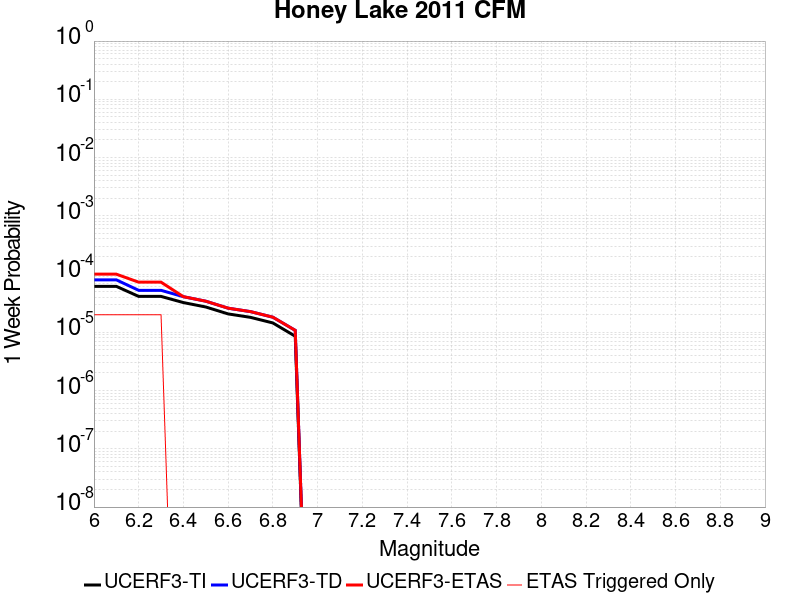 |  |  |  |

| Magnitude | 1 wk TI Prob | 1 wk TD Prob | 1 wk ETAS Prob | 1 wk ETAS/TD Gain | 1 wk ETAS Triggered Only | 1 mo TI Prob | 1 mo TD Prob | 1 mo ETAS Prob | 1 mo ETAS/TD Gain | 1 mo ETAS Triggered Only | 1 yr TI Prob | 1 yr TD Prob | 1 yr ETAS Prob | 1 yr ETAS/TD Gain | 1 yr ETAS Triggered Only | 10 yr TI Prob | 10 yr TD Prob | 10 yr ETAS Prob | 10 yr ETAS/TD Gain | 10 yr ETAS Triggered Only |
|-----|-----|-----|-----|-----|-----|-----|-----|-----|-----|-----|-----|-----|-----|-----|-----|-----|-----|-----|-----|-----|
| 6.0 | 6.155506E-5 | 7.954667E-5 | 9.210848E-5 | 1.1579175 | 1.2562814E-5 | 2.6378073E-4 | 3.40873E-4 | 3.5343153E-4 | 1.0368422 | 1.2562814E-5 | 0.0032068014 | 0.0041427943 | 0.004155305 | 1.0030199 | 1.2562814E-5 | 0.03160919 | 0.040702924 | 0.040714975 | 1.0002961 | 1.2562814E-5 |
| 6.1 | 6.155506E-5 | 7.954667E-5 | 9.210848E-5 | 1.1579175 | 1.2562814E-5 | 2.6378073E-4 | 3.40873E-4 | 3.5343153E-4 | 1.0368422 | 1.2562814E-5 | 0.0032068014 | 0.0041427943 | 0.004155305 | 1.0030199 | 1.2562814E-5 | 0.03160919 | 0.040702924 | 0.040714975 | 1.0002961 | 1.2562814E-5 |
| 6.2 | 4.1335024E-5 | 5.257629E-5 | 6.513845E-5 | 1.2389319 | 1.2562814E-5 | 1.7713808E-4 | 2.253086E-4 | 2.3786859E-4 | 1.0557457 | 1.2562814E-5 | 0.0021545228 | 0.0027398595 | 0.002752388 | 1.0045726 | 1.2562814E-5 | 0.021337535 | 0.027076708 | 0.02708893 | 1.0004514 | 1.2562814E-5 |
| 6.3 | 4.1335024E-5 | 5.257629E-5 | 6.513845E-5 | 1.2389319 | 1.2562814E-5 | 1.7713808E-4 | 2.253086E-4 | 2.3786859E-4 | 1.0557457 | 1.2562814E-5 | 0.0021545228 | 0.0027398595 | 0.002752388 | 1.0045726 | 1.2562814E-5 | 0.021337535 | 0.027076708 | 0.02708893 | 1.0004514 | 1.2562814E-5 |
| 6.4 | 3.2393702E-5 | 4.0887444E-5 | 4.0887444E-5 | 1.0 | 0.0 | 1.3882275E-4 | 1.7522085E-4 | 1.7522085E-4 | 1.0 | 0.0 | 0.0016888566 | 0.002131335 | 0.002131335 | 1.0 | 0.0 | 0.016760793 | 0.02111982 | 0.02111982 | 1.0 | 0.0 |
| 6.5 | 2.7205504E-5 | 3.4211684E-5 | 3.4211684E-5 | 1.0 | 0.0 | 1.1658981E-4 | 1.4661385E-4 | 1.4661385E-4 | 1.0 | 0.0 | 0.0014185566 | 0.0017836588 | 0.0017836588 | 1.0 | 0.0 | 0.014095354 | 0.017702932 | 0.017702932 | 1.0 | 0.0 |
| 6.6 | 2.069265E-5 | 2.5955307E-5 | 2.5955307E-5 | 1.0 | 0.0 | 8.867977E-5 | 1.1123277E-4 | 1.1123277E-4 | 1.0 | 0.0 | 0.0010791414 | 0.0013535038 | 0.0013535038 | 1.0 | 0.0 | 0.010739161 | 0.013461002 | 0.013461002 | 1.0 | 0.0 |
| 6.7 | 1.8060919E-5 | 2.2656828E-5 | 2.2656828E-5 | 1.0 | 0.0 | 7.7401644E-5 | 9.709754E-5 | 9.709754E-5 | 1.0 | 0.0 | 9.419576E-4 | 0.0011816026 | 0.0011816026 | 1.0 | 0.0 | 0.009379748 | 0.011761238 | 0.011761238 | 1.0 | 0.0 |
| 6.8 | 1.4474663E-5 | 1.818127E-5 | 1.818127E-5 | 1.0 | 0.0 | 6.203279E-5 | 7.791784E-5 | 7.791784E-5 | 1.0 | 0.0 | 7.5498753E-4 | 9.483136E-4 | 9.483136E-4 | 1.0 | 0.0 | 0.007524277 | 0.009450192 | 0.009450192 | 1.0 | 0.0 |
| 6.9 | 8.564552E-6 | 1.0802308E-5 | 1.0802308E-5 | 1.0 | 0.0 | 3.6704707E-5 | 4.6295158E-5 | 4.6295158E-5 | 1.0 | 0.0 | 4.4678818E-4 | 5.635644E-4 | 5.635644E-4 | 1.0 | 0.0 | 0.0044589094 | 0.0056278477 | 0.0056278477 | 1.0 | 0.0 |

## Laguna Salada
*[(top)](#table-of-contents)*

| 1 Week | 1 Month | 1 Year | 10 Year |
|-----|-----|-----|-----|
|  |  |  |  |

| Magnitude | 1 wk TI Prob | 1 wk TD Prob | 1 wk ETAS Prob | 1 wk ETAS/TD Gain | 1 wk ETAS Triggered Only | 1 mo TI Prob | 1 mo TD Prob | 1 mo ETAS Prob | 1 mo ETAS/TD Gain | 1 mo ETAS Triggered Only | 1 yr TI Prob | 1 yr TD Prob | 1 yr ETAS Prob | 1 yr ETAS/TD Gain | 1 yr ETAS Triggered Only | 10 yr TI Prob | 10 yr TD Prob | 10 yr ETAS Prob | 10 yr ETAS/TD Gain | 10 yr ETAS Triggered Only |
|-----|-----|-----|-----|-----|-----|-----|-----|-----|-----|-----|-----|-----|-----|-----|-----|-----|-----|-----|-----|-----|
| 6.0 | 4.6465593E-5 | 4.634639E-5 | 5.8908623E-5 | 1.2710509 | 1.2562814E-5 | 1.9912305E-4 | 1.9861311E-4 | 2.1117342E-4 | 1.0632402 | 1.2562814E-5 | 0.0024216278 | 0.002415429 | 0.0024279614 | 1.0051885 | 1.2562814E-5 | 0.02395408 | 0.023975259 | 0.02398752 | 1.0005114 | 1.2562814E-5 |
| 6.1 | 3.982297E-5 | 3.7246125E-5 | 3.7246125E-5 | 1.0 | 0.0 | 1.706587E-4 | 1.5961716E-4 | 1.5961716E-4 | 1.0 | 0.0 | 0.0020757897 | 0.0019417295 | 0.0019417295 | 1.0 | 0.0 | 0.020565065 | 0.019331863 | 0.019331863 | 1.0 | 0.0 |
| 6.2 | 3.6067784E-5 | 3.2602693E-5 | 3.2602693E-5 | 1.0 | 0.0 | 1.5456705E-4 | 1.3971896E-4 | 1.3971896E-4 | 1.0 | 0.0 | 0.0018802295 | 0.0016998611 | 0.0016998611 | 1.0 | 0.0 | 0.018644003 | 0.016949628 | 0.016949628 | 1.0 | 0.0 |
| 6.3 | 3.2859112E-5 | 2.8849448E-5 | 2.8849448E-5 | 1.0 | 0.0 | 1.4081717E-4 | 1.2363521E-4 | 1.2363521E-4 | 1.0 | 0.0 | 0.0017131006 | 0.0015043203 | 0.0015043203 | 1.0 | 0.0 | 0.016999546 | 0.015018767 | 0.015018767 | 1.0 | 0.0 |
| 6.4 | 2.9132116E-5 | 2.4852965E-5 | 2.4852965E-5 | 1.0 | 0.0 | 1.2484594E-4 | 1.0650887E-4 | 1.0650887E-4 | 1.0 | 0.0 | 0.0015189396 | 0.001296065 | 0.001296065 | 1.0 | 0.0 | 0.015085992 | 0.012956262 | 0.012956262 | 1.0 | 0.0 |
| 6.5 | 2.7075037E-5 | 2.2825836E-5 | 2.2825836E-5 | 1.0 | 0.0 | 1.1603071E-4 | 9.7821845E-5 | 9.7821845E-5 | 1.0 | 0.0 | 0.0014117584 | 0.0011904186 | 0.0011904186 | 1.0 | 0.0 | 0.014028233 | 0.011907749 | 0.011907749 | 1.0 | 0.0 |
| 6.6 | 2.2367465E-5 | 1.8573526E-5 | 1.8573526E-5 | 1.0 | 0.0 | 9.5857045E-5 | 7.959886E-5 | 7.959886E-5 | 1.0 | 0.0 | 0.0011664346 | 9.6876756E-4 | 9.6876756E-4 | 1.0 | 0.0 | 0.011603311 | 0.009702191 | 0.009702191 | 1.0 | 0.0 |
| 6.7 | 1.9458053E-5 | 1.5914242E-5 | 1.5914242E-5 | 1.0 | 0.0 | 8.338899E-5 | 6.8202564E-5 | 6.8202564E-5 | 1.0 | 0.0 | 0.001014788 | 8.3013024E-4 | 8.3013024E-4 | 1.0 | 0.0 | 0.010101665 | 0.0083209425 | 0.0083209425 | 1.0 | 0.0 |
| 6.8 | 1.0767866E-5 | 9.18435E-6 | 9.18435E-6 | 1.0 | 0.0 | 4.614718E-5 | 3.9361294E-5 | 3.9361294E-5 | 1.0 | 0.0 | 5.6169706E-4 | 4.7918706E-4 | 4.7918706E-4 | 1.0 | 0.0 | 0.0056027942 | 0.0048096925 | 0.0048096925 | 1.0 | 0.0 |
| 6.9 | 2.1384765E-6 | 1.7913675E-6 | 1.7913675E-6 | 1.0 | 0.0 | 9.164866E-6 | 7.677269E-6 | 7.677269E-6 | 1.0 | 0.0 | 1.1157654E-4 | 9.346713E-5 | 9.346713E-5 | 1.0 | 0.0 | 0.0011152053 | 9.343165E-4 | 9.343165E-4 | 1.0 | 0.0 |
| 7.0 | 2.0952946E-6 | 1.7493046E-6 | 1.7493046E-6 | 1.0 | 0.0 | 8.979802E-6 | 7.4970003E-6 | 7.4970003E-6 | 1.0 | 0.0 | 1.0932361E-4 | 9.1272545E-5 | 9.1272545E-5 | 1.0 | 0.0 | 0.0010926984 | 9.123888E-4 | 9.123888E-4 | 1.0 | 0.0 |
| 7.1 | 1.7887576E-6 | 1.4500254E-6 | 1.4500254E-6 | 1.0 | 0.0 | 7.666081E-6 | 6.2143813E-6 | 6.2143813E-6 | 1.0 | 0.0 | 9.333054E-5 | 7.565777E-5 | 7.565777E-5 | 1.0 | 0.0 | 9.329135E-4 | 7.563506E-4 | 7.563506E-4 | 1.0 | 0.0 |
| 7.2 | 9.723109E-7 | 7.135619E-7 | 7.135619E-7 | 1.0 | 0.0 | 4.16704E-6 | 3.0581198E-6 | 3.0581198E-6 | 1.0 | 0.0 | 5.073253E-5 | 3.7232137E-5 | 3.7232137E-5 | 1.0 | 0.0 | 5.072095E-4 | 3.7227524E-4 | 3.7227524E-4 | 1.0 | 0.0 |

## Mount Diablo Thrust South
*[(top)](#table-of-contents)*

| 1 Week | 1 Month | 1 Year | 10 Year |
|-----|-----|-----|-----|
| 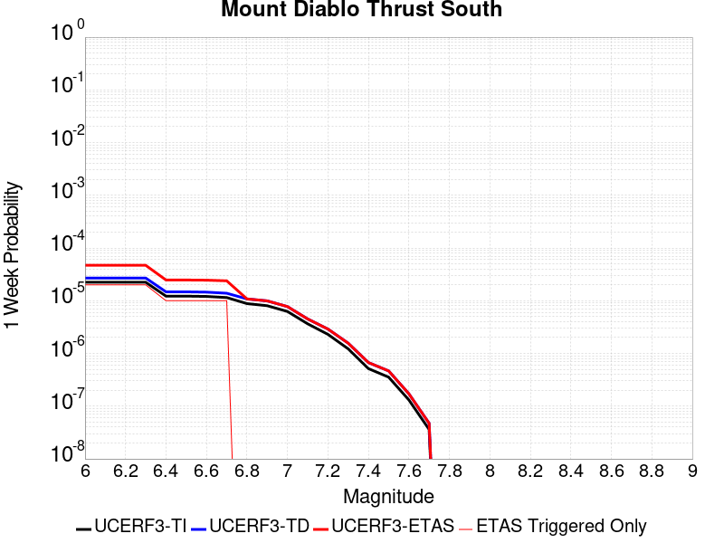 | 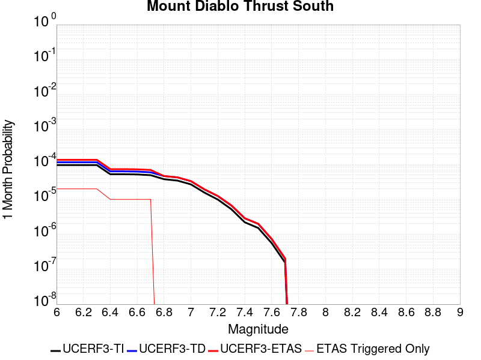 |  |  |

| Magnitude | 1 wk TI Prob | 1 wk TD Prob | 1 wk ETAS Prob | 1 wk ETAS/TD Gain | 1 wk ETAS Triggered Only | 1 mo TI Prob | 1 mo TD Prob | 1 mo ETAS Prob | 1 mo ETAS/TD Gain | 1 mo ETAS Triggered Only | 1 yr TI Prob | 1 yr TD Prob | 1 yr ETAS Prob | 1 yr ETAS/TD Gain | 1 yr ETAS Triggered Only | 10 yr TI Prob | 10 yr TD Prob | 10 yr ETAS Prob | 10 yr ETAS/TD Gain | 10 yr ETAS Triggered Only |
|-----|-----|-----|-----|-----|-----|-----|-----|-----|-----|-----|-----|-----|-----|-----|-----|-----|-----|-----|-----|-----|
| 6.0 | 2.2377444E-5 | 2.695623E-5 | 3.9518705E-5 | 1.4660324 | 1.2562814E-5 | 9.5899806E-5 | 1.1552271E-4 | 1.2808407E-4 | 1.108735 | 1.2562814E-5 | 0.0011669548 | 0.0014057803 | 0.0014183255 | 1.008924 | 1.2562814E-5 | 0.011608457 | 0.013988447 | 0.014000834 | 1.0008855 | 1.2562814E-5 |
| 6.1 | 2.2377444E-5 | 2.695623E-5 | 3.9518705E-5 | 1.4660324 | 1.2562814E-5 | 9.5899806E-5 | 1.1552271E-4 | 1.2808407E-4 | 1.108735 | 1.2562814E-5 | 0.0011669548 | 0.0014057803 | 0.0014183255 | 1.008924 | 1.2562814E-5 | 0.011608457 | 0.013988447 | 0.014000834 | 1.0008855 | 1.2562814E-5 |
| 6.2 | 2.2377444E-5 | 2.695623E-5 | 3.9518705E-5 | 1.4660324 | 1.2562814E-5 | 9.5899806E-5 | 1.1552271E-4 | 1.2808407E-4 | 1.108735 | 1.2562814E-5 | 0.0011669548 | 0.0014057803 | 0.0014183255 | 1.008924 | 1.2562814E-5 | 0.011608457 | 0.013988447 | 0.014000834 | 1.0008855 | 1.2562814E-5 |
| 6.3 | 2.2377444E-5 | 2.695623E-5 | 3.9518705E-5 | 1.4660324 | 1.2562814E-5 | 9.5899806E-5 | 1.1552271E-4 | 1.2808407E-4 | 1.108735 | 1.2562814E-5 | 0.0011669548 | 0.0014057803 | 0.0014183255 | 1.008924 | 1.2562814E-5 | 0.011608457 | 0.013988447 | 0.014000834 | 1.0008855 | 1.2562814E-5 |
| 6.4 | 1.2228463E-5 | 1.4747655E-5 | 1.4747655E-5 | 1.0 | 0.0 | 5.2406645E-5 | 6.320278E-5 | 6.320278E-5 | 1.0 | 0.0 | 6.378641E-4 | 7.6923496E-4 | 7.6923496E-4 | 1.0 | 0.0 | 0.0063603627 | 0.0076671084 | 0.0076671084 | 1.0 | 0.0 |
| 6.5 | 1.2228463E-5 | 1.4747655E-5 | 1.4747655E-5 | 1.0 | 0.0 | 5.2406645E-5 | 6.320278E-5 | 6.320278E-5 | 1.0 | 0.0 | 6.378641E-4 | 7.6923496E-4 | 7.6923496E-4 | 1.0 | 0.0 | 0.0063603627 | 0.0076671084 | 0.0076671084 | 1.0 | 0.0 |
| 6.6 | 1.2068118E-5 | 1.4552453E-5 | 1.4552453E-5 | 1.0 | 0.0 | 5.1719482E-5 | 6.2366234E-5 | 6.2366234E-5 | 1.0 | 0.0 | 6.2950276E-4 | 7.590571E-4 | 7.590571E-4 | 1.0 | 0.0 | 0.006277225 | 0.0075660287 | 0.0075660287 | 1.0 | 0.0 |
| 6.7 | 1.1499428E-5 | 1.3875117E-5 | 1.3875117E-5 | 1.0 | 0.0 | 4.9282335E-5 | 5.94635E-5 | 5.94635E-5 | 1.0 | 0.0 | 5.9984723E-4 | 7.237403E-4 | 7.237403E-4 | 1.0 | 0.0 | 0.0059823063 | 0.0072152023 | 0.0072152023 | 1.0 | 0.0 |
| 6.8 | 8.82118E-6 | 1.0830408E-5 | 1.0830408E-5 | 1.0 | 0.0 | 3.780451E-5 | 4.641524E-5 | 4.641524E-5 | 1.0 | 0.0 | 4.601727E-4 | 5.6496455E-4 | 5.6496455E-4 | 1.0 | 0.0 | 0.0045922096 | 0.005635934 | 0.005635934 | 1.0 | 0.0 |
| 6.9 | 8.047112E-6 | 9.9393765E-6 | 9.9393765E-6 | 1.0 | 0.0 | 3.4487166E-5 | 4.259666E-5 | 4.259666E-5 | 1.0 | 0.0 | 4.1980037E-4 | 5.1849615E-4 | 5.1849615E-4 | 1.0 | 0.0 | 0.004190082 | 0.0051734787 | 0.0051734787 | 1.0 | 0.0 |
| 7.0 | 6.2574763E-6 | 7.748453E-6 | 7.748453E-6 | 1.0 | 0.0 | 2.681748E-5 | 3.3207252E-5 | 3.3207252E-5 | 1.0 | 0.0 | 3.264539E-4 | 4.0422694E-4 | 4.0422694E-4 | 1.0 | 0.0 | 0.0032597475 | 0.004035359 | 0.004035359 | 1.0 | 0.0 |
| 7.1 | 3.6485903E-6 | 4.512883E-6 | 4.512883E-6 | 1.0 | 0.0 | 1.5636722E-5 | 1.9340787E-5 | 1.9340787E-5 | 1.0 | 0.0 | 1.9036046E-4 | 2.3544904E-4 | 2.3544904E-4 | 1.0 | 0.0 | 0.0019019748 | 0.0023520947 | 0.0023520947 | 1.0 | 0.0 |
| 7.2 | 2.3034274E-6 | 2.9054847E-6 | 2.9054847E-6 | 1.0 | 0.0 | 9.871795E-6 | 1.2452019E-5 | 1.2452019E-5 | 1.0 | 0.0 | 1.2018247E-4 | 1.5159303E-4 | 1.5159303E-4 | 1.0 | 0.0 | 0.0012011749 | 0.0015149695 | 0.0015149695 | 1.0 | 0.0 |
| 7.3 | 1.224035E-6 | 1.567953E-6 | 1.567953E-6 | 1.0 | 0.0 | 5.245854E-6 | 6.7197816E-6 | 6.7197816E-6 | 1.0 | 0.0 | 6.38664E-5 | 8.181038E-5 | 8.181038E-5 | 1.0 | 0.0 | 6.384805E-4 | 8.1784575E-4 | 8.1784575E-4 | 1.0 | 0.0 |
| 7.4 | 5.1601154E-7 | 6.72323E-7 | 6.72323E-7 | 1.0 | 0.0 | 2.2114762E-6 | 2.8813813E-6 | 2.8813813E-6 | 1.0 | 0.0 | 2.6924388E-5 | 3.508027E-5 | 3.508027E-5 | 1.0 | 0.0 | 2.6921128E-4 | 3.507647E-4 | 3.507647E-4 | 1.0 | 0.0 |
| 7.5 | 3.552894E-7 | 4.6652323E-7 | 4.6652323E-7 | 1.0 | 0.0 | 1.5226678E-6 | 1.9993838E-6 | 1.9993838E-6 | 1.0 | 0.0 | 1.8538323E-5 | 2.434224E-5 | 2.434224E-5 | 1.0 | 0.0 | 1.8536777E-4 | 2.4340794E-4 | 2.4340794E-4 | 1.0 | 0.0 |
| 7.6 | 1.3124082E-7 | 1.7191535E-7 | 1.7191535E-7 | 1.0 | 0.0 | 5.6246057E-7 | 7.367799E-7 | 7.367799E-7 | 1.0 | 0.0 | 6.8479358E-6 | 8.970267E-6 | 8.970267E-6 | 1.0 | 0.0 | 6.8477246E-5 | 8.9703215E-5 | 8.9703215E-5 | 1.0 | 0.0 |
| 7.7 | 3.6193022E-8 | 4.733273E-8 | 4.733273E-8 | 1.0 | 0.0 | 1.5511293E-7 | 2.0285455E-7 | 2.0285455E-7 | 1.0 | 0.0 | 1.8884983E-6 | 2.4697524E-6 | 2.4697524E-6 | 1.0 | 0.0 | 1.8884823E-5 | 2.4697838E-5 | 2.4697838E-5 | 1.0 | 0.0 |

## Sisar
*[(top)](#table-of-contents)*

| 1 Week | 1 Month | 1 Year | 10 Year |
|-----|-----|-----|-----|
|  |  |  |  |

| Magnitude | 1 wk TI Prob | 1 wk TD Prob | 1 wk ETAS Prob | 1 wk ETAS/TD Gain | 1 wk ETAS Triggered Only | 1 mo TI Prob | 1 mo TD Prob | 1 mo ETAS Prob | 1 mo ETAS/TD Gain | 1 mo ETAS Triggered Only | 1 yr TI Prob | 1 yr TD Prob | 1 yr ETAS Prob | 1 yr ETAS/TD Gain | 1 yr ETAS Triggered Only | 10 yr TI Prob | 10 yr TD Prob | 10 yr ETAS Prob | 10 yr ETAS/TD Gain | 10 yr ETAS Triggered Only |
|-----|-----|-----|-----|-----|-----|-----|-----|-----|-----|-----|-----|-----|-----|-----|-----|-----|-----|-----|-----|-----|
| 6.0 | 4.544193E-6 | 3.839576E-6 | 3.839576E-6 | 1.0 | 0.0 | 1.9474966E-5 | 1.6455224E-5 | 2.9017832E-5 | 1.7634418 | 1.2562814E-5 | 2.3708193E-4 | 2.0032428E-4 | 2.1288458E-4 | 1.0626998 | 1.2562814E-5 | 0.0023682916 | 0.002001471 | 0.0020140084 | 1.0062642 | 1.2562814E-5 |
| 6.1 | 4.544193E-6 | 3.839576E-6 | 3.839576E-6 | 1.0 | 0.0 | 1.9474966E-5 | 1.6455224E-5 | 2.9017832E-5 | 1.7634418 | 1.2562814E-5 | 2.3708193E-4 | 2.0032428E-4 | 2.1288458E-4 | 1.0626998 | 1.2562814E-5 | 0.0023682916 | 0.002001471 | 0.0020140084 | 1.0062642 | 1.2562814E-5 |
| 6.2 | 4.544193E-6 | 3.839576E-6 | 3.839576E-6 | 1.0 | 0.0 | 1.9474966E-5 | 1.6455224E-5 | 2.9017832E-5 | 1.7634418 | 1.2562814E-5 | 2.3708193E-4 | 2.0032428E-4 | 2.1288458E-4 | 1.0626998 | 1.2562814E-5 | 0.0023682916 | 0.002001471 | 0.0020140084 | 1.0062642 | 1.2562814E-5 |
| 6.3 | 4.544193E-6 | 3.839576E-6 | 3.839576E-6 | 1.0 | 0.0 | 1.9474966E-5 | 1.6455224E-5 | 2.9017832E-5 | 1.7634418 | 1.2562814E-5 | 2.3708193E-4 | 2.0032428E-4 | 2.1288458E-4 | 1.0626998 | 1.2562814E-5 | 0.0023682916 | 0.002001471 | 0.0020140084 | 1.0062642 | 1.2562814E-5 |
| 6.4 | 4.544193E-6 | 3.839576E-6 | 3.839576E-6 | 1.0 | 0.0 | 1.9474966E-5 | 1.6455224E-5 | 2.9017832E-5 | 1.7634418 | 1.2562814E-5 | 2.3708193E-4 | 2.0032428E-4 | 2.1288458E-4 | 1.0626998 | 1.2562814E-5 | 0.0023682916 | 0.002001471 | 0.0020140084 | 1.0062642 | 1.2562814E-5 |
| 6.5 | 4.544193E-6 | 3.839576E-6 | 3.839576E-6 | 1.0 | 0.0 | 1.9474966E-5 | 1.6455224E-5 | 2.9017832E-5 | 1.7634418 | 1.2562814E-5 | 2.3708193E-4 | 2.0032428E-4 | 2.1288458E-4 | 1.0626998 | 1.2562814E-5 | 0.0023682916 | 0.002001471 | 0.0020140084 | 1.0062642 | 1.2562814E-5 |
| 6.6 | 4.544193E-6 | 3.839576E-6 | 3.839576E-6 | 1.0 | 0.0 | 1.9474966E-5 | 1.6455224E-5 | 2.9017832E-5 | 1.7634418 | 1.2562814E-5 | 2.3708193E-4 | 2.0032428E-4 | 2.1288458E-4 | 1.0626998 | 1.2562814E-5 | 0.0023682916 | 0.002001471 | 0.0020140084 | 1.0062642 | 1.2562814E-5 |
| 6.7 | 4.544193E-6 | 3.839576E-6 | 3.839576E-6 | 1.0 | 0.0 | 1.9474966E-5 | 1.6455224E-5 | 2.9017832E-5 | 1.7634418 | 1.2562814E-5 | 2.3708193E-4 | 2.0032428E-4 | 2.1288458E-4 | 1.0626998 | 1.2562814E-5 | 0.0023682916 | 0.002001471 | 0.0020140084 | 1.0062642 | 1.2562814E-5 |
| 6.8 | 4.544193E-6 | 3.839576E-6 | 3.839576E-6 | 1.0 | 0.0 | 1.9474966E-5 | 1.6455224E-5 | 2.9017832E-5 | 1.7634418 | 1.2562814E-5 | 2.3708193E-4 | 2.0032428E-4 | 2.1288458E-4 | 1.0626998 | 1.2562814E-5 | 0.0023682916 | 0.002001471 | 0.0020140084 | 1.0062642 | 1.2562814E-5 |
| 6.9 | 4.542225E-6 | 3.8375383E-6 | 3.8375383E-6 | 1.0 | 0.0 | 1.9466532E-5 | 1.6446491E-5 | 2.9009097E-5 | 1.7638474 | 1.2562814E-5 | 2.3697925E-4 | 2.0021795E-4 | 2.1277825E-4 | 1.0627332 | 1.2562814E-5 | 0.002367267 | 0.0020004094 | 0.002012947 | 1.0062675 | 1.2562814E-5 |
| 7.0 | 4.5278484E-6 | 3.822602E-6 | 3.822602E-6 | 1.0 | 0.0 | 1.940492E-5 | 1.638248E-5 | 2.8945089E-5 | 1.7668319 | 1.2562814E-5 | 2.3622929E-4 | 1.9943877E-4 | 2.1199908E-4 | 1.0629783 | 1.2562814E-5 | 0.0023597833 | 0.0019926317 | 0.0020051694 | 1.0062921 | 1.2562814E-5 |
| 7.1 | 4.5132488E-6 | 3.8073897E-6 | 3.8073897E-6 | 1.0 | 0.0 | 1.9342351E-5 | 1.6317284E-5 | 2.8879893E-5 | 1.7698958 | 1.2562814E-5 | 2.3546767E-4 | 1.9864515E-4 | 2.1120548E-4 | 1.0632299 | 1.2562814E-5 | 0.0023521832 | 0.0019847096 | 0.0019972476 | 1.0063173 | 1.2562814E-5 |
| 7.2 | 4.448859E-6 | 3.7398502E-6 | 3.7398502E-6 | 1.0 | 0.0 | 1.9066398E-5 | 1.6027832E-5 | 2.8590444E-5 | 1.7837999 | 1.2562814E-5 | 2.3210866E-4 | 1.9512173E-4 | 2.0768208E-4 | 1.064372 | 1.2562814E-5 | 0.0023186638 | 0.0019495375 | 0.001962076 | 1.0064315 | 1.2562814E-5 |
| 7.3 | 4.3424366E-6 | 3.6336846E-6 | 3.6336846E-6 | 1.0 | 0.0 | 1.861031E-5 | 1.5572843E-5 | 2.813546E-5 | 1.8067003 | 1.2562814E-5 | 2.2655698E-4 | 1.895832E-4 | 2.0214364E-4 | 1.0662528 | 1.2562814E-5 | 0.0022632615 | 0.0018942481 | 0.0019067872 | 1.0066196 | 1.2562814E-5 |
| 7.4 | 4.218641E-6 | 3.5330384E-6 | 3.5330384E-6 | 1.0 | 0.0 | 1.8079765E-5 | 1.5141507E-5 | 2.770413E-5 | 1.8296812 | 1.2562814E-5 | 2.2009891E-4 | 1.8433259E-4 | 1.9689309E-4 | 1.0681404 | 1.2562814E-5 | 0.0021988105 | 0.0018418302 | 0.0018543699 | 1.0068083 | 1.2562814E-5 |
| 7.5 | 3.983779E-6 | 3.3478068E-6 | 3.3478068E-6 | 1.0 | 0.0 | 1.7073227E-5 | 1.4347666E-5 | 2.69103E-5 | 1.8755872 | 1.2562814E-5 | 2.0784672E-4 | 1.7466917E-4 | 1.8722979E-4 | 1.0719109 | 1.2562814E-5 | 0.0020765243 | 0.0017453518 | 0.0017578927 | 1.0071853 | 1.2562814E-5 |
| 7.6 | 2.777393E-6 | 2.35225E-6 | 2.35225E-6 | 1.0 | 0.0 | 1.1903058E-5 | 1.0081033E-5 | 2.264372E-5 | 2.2461705 | 1.2562814E-5 | 1.449101E-4 | 1.2272975E-4 | 1.3529102E-4 | 1.102349 | 1.2562814E-5 | 0.0014481564 | 0.0012266274 | 0.0012391747 | 1.0102292 | 1.2562814E-5 |
| 7.7 | 1.9028433E-6 | 1.593867E-6 | 1.593867E-6 | 1.0 | 0.0 | 8.155017E-6 | 6.8308404E-6 | 6.8308404E-6 | 1.0 | 0.0 | 9.928281E-5 | 8.3162355E-5 | 8.3162355E-5 | 1.0 | 0.0 | 9.923846E-4 | 8.313171E-4 | 8.313171E-4 | 1.0 | 0.0 |
| 7.8 | 4.9095956E-7 | 4.3583708E-7 | 4.3583708E-7 | 1.0 | 0.0 | 2.1041105E-6 | 1.8678718E-6 | 1.8678718E-6 | 1.0 | 0.0 | 2.5617246E-5 | 2.2741104E-5 | 2.2741104E-5 | 1.0 | 0.0 | 2.5614293E-4 | 2.2738794E-4 | 2.2738794E-4 | 1.0 | 0.0 |
| 7.9 | 1.16657894E-7 | 1.0335569E-7 | 1.0335569E-7 | 1.0 | 0.0 | 4.999623E-7 | 4.4295288E-7 | 4.4295288E-7 | 1.0 | 0.0 | 6.087024E-6 | 5.3929384E-6 | 5.3929384E-6 | 1.0 | 0.0 | 6.0868573E-5 | 5.3928103E-5 | 5.3928103E-5 | 1.0 | 0.0 |
| 8.0 | 2.5100346E-9 | 1.7067566E-9 | 1.7067566E-9 | 1.0 | 0.0 | 1.0757291E-8 | 7.3146724E-9 | 7.3146724E-9 | 1.0 | 0.0 | 1.3097001E-7 | 8.905613E-8 | 8.905613E-8 | 1.0 | 0.0 | 1.3096993E-6 | 8.9056095E-7 | 8.9056095E-7 | 1.0 | 0.0 |

## Santa Monica alt 1
*[(top)](#table-of-contents)*

| 1 Week | 1 Month | 1 Year | 10 Year |
|-----|-----|-----|-----|
|  |  |  |  |

| Magnitude | 1 wk TI Prob | 1 wk TD Prob | 1 wk ETAS Prob | 1 wk ETAS/TD Gain | 1 wk ETAS Triggered Only | 1 mo TI Prob | 1 mo TD Prob | 1 mo ETAS Prob | 1 mo ETAS/TD Gain | 1 mo ETAS Triggered Only | 1 yr TI Prob | 1 yr TD Prob | 1 yr ETAS Prob | 1 yr ETAS/TD Gain | 1 yr ETAS Triggered Only | 10 yr TI Prob | 10 yr TD Prob | 10 yr ETAS Prob | 10 yr ETAS/TD Gain | 10 yr ETAS Triggered Only |
|-----|-----|-----|-----|-----|-----|-----|-----|-----|-----|-----|-----|-----|-----|-----|-----|-----|-----|-----|-----|-----|
| 6.0 | 1.1066008E-5 | 1.148031E-5 | 1.148031E-5 | 1.0 | 0.0 | 4.742488E-5 | 4.920048E-5 | 4.920048E-5 | 1.0 | 0.0 | 5.7724497E-4 | 5.9886515E-4 | 5.9886515E-4 | 1.0 | 0.0 | 0.005757478 | 0.0059739 | 0.005986388 | 1.0020903 | 1.2562814E-5 |
| 6.1 | 1.1066008E-5 | 1.148031E-5 | 1.148031E-5 | 1.0 | 0.0 | 4.742488E-5 | 4.920048E-5 | 4.920048E-5 | 1.0 | 0.0 | 5.7724497E-4 | 5.9886515E-4 | 5.9886515E-4 | 1.0 | 0.0 | 0.005757478 | 0.0059739 | 0.005986388 | 1.0020903 | 1.2562814E-5 |
| 6.2 | 1.1066008E-5 | 1.148031E-5 | 1.148031E-5 | 1.0 | 0.0 | 4.742488E-5 | 4.920048E-5 | 4.920048E-5 | 1.0 | 0.0 | 5.7724497E-4 | 5.9886515E-4 | 5.9886515E-4 | 1.0 | 0.0 | 0.005757478 | 0.0059739 | 0.005986388 | 1.0020903 | 1.2562814E-5 |
| 6.3 | 1.1066008E-5 | 1.148031E-5 | 1.148031E-5 | 1.0 | 0.0 | 4.742488E-5 | 4.920048E-5 | 4.920048E-5 | 1.0 | 0.0 | 5.7724497E-4 | 5.9886515E-4 | 5.9886515E-4 | 1.0 | 0.0 | 0.005757478 | 0.0059739 | 0.005986388 | 1.0020903 | 1.2562814E-5 |
| 6.4 | 1.1066008E-5 | 1.148031E-5 | 1.148031E-5 | 1.0 | 0.0 | 4.742488E-5 | 4.920048E-5 | 4.920048E-5 | 1.0 | 0.0 | 5.7724497E-4 | 5.9886515E-4 | 5.9886515E-4 | 1.0 | 0.0 | 0.005757478 | 0.0059739 | 0.005986388 | 1.0020903 | 1.2562814E-5 |
| 6.5 | 8.183544E-6 | 8.335432E-6 | 8.335432E-6 | 1.0 | 0.0 | 3.5071862E-5 | 3.57228E-5 | 3.57228E-5 | 1.0 | 0.0 | 4.2691626E-4 | 4.3483984E-4 | 4.3483984E-4 | 1.0 | 0.0 | 0.0042609703 | 0.0043400554 | 0.004352564 | 1.002882 | 1.2562814E-5 |
| 6.6 | 8.1543285E-6 | 8.303646E-6 | 8.303646E-6 | 1.0 | 0.0 | 3.4946657E-5 | 3.5586578E-5 | 3.5586578E-5 | 1.0 | 0.0 | 4.2539247E-4 | 4.3318202E-4 | 4.3318202E-4 | 1.0 | 0.0 | 0.0042457907 | 0.004323542 | 0.0043360502 | 1.0028931 | 1.2562814E-5 |
| 6.7 | 8.110878E-6 | 8.257042E-6 | 8.257042E-6 | 1.0 | 0.0 | 3.4760444E-5 | 3.5386853E-5 | 3.5386853E-5 | 1.0 | 0.0 | 4.231262E-4 | 4.3075136E-4 | 4.3075136E-4 | 1.0 | 0.0 | 0.0042232145 | 0.0042993296 | 0.004311838 | 1.0029094 | 1.2562814E-5 |
| 6.8 | 7.644036E-6 | 7.75106E-6 | 7.75106E-6 | 1.0 | 0.0 | 3.275974E-5 | 3.3218414E-5 | 3.3218414E-5 | 1.0 | 0.0 | 3.9877684E-4 | 4.0436056E-4 | 4.0436056E-4 | 1.0 | 0.0 | 0.00398062 | 0.0040363944 | 0.0040489063 | 1.0030998 | 1.2562814E-5 |
| 6.9 | 7.3698293E-6 | 7.455719E-6 | 7.455719E-6 | 1.0 | 0.0 | 3.15846E-5 | 3.19527E-5 | 3.19527E-5 | 1.0 | 0.0 | 3.8447464E-4 | 3.8895605E-4 | 3.8895605E-4 | 1.0 | 0.0 | 0.0038381014 | 0.0038828964 | 0.0038954103 | 1.0032228 | 1.2562814E-5 |
| 7.0 | 7.209872E-6 | 7.2856255E-6 | 7.2856255E-6 | 1.0 | 0.0 | 3.0899086E-5 | 3.1223743E-5 | 3.1223743E-5 | 1.0 | 0.0 | 3.7613141E-4 | 3.8008415E-4 | 3.8008415E-4 | 1.0 | 0.0 | 0.0037549543 | 0.0037944836 | 0.0038069987 | 1.0032983 | 1.2562814E-5 |
| 7.1 | 5.603456E-6 | 5.5238925E-6 | 5.5238925E-6 | 1.0 | 0.0 | 2.4014591E-5 | 2.3673612E-5 | 2.3673612E-5 | 1.0 | 0.0 | 2.923384E-4 | 2.881885E-4 | 2.881885E-4 | 1.0 | 0.0 | 0.0029195412 | 0.0028781896 | 0.0028781896 | 1.0 | 0.0 |
| 7.2 | 4.7483613E-6 | 4.5911324E-6 | 4.5911324E-6 | 1.0 | 0.0 | 2.0349962E-5 | 1.9676136E-5 | 1.9676136E-5 | 1.0 | 0.0 | 2.4773262E-4 | 2.3953074E-4 | 2.3953074E-4 | 1.0 | 0.0 | 0.0024745662 | 0.0023927398 | 0.0023927398 | 1.0 | 0.0 |
| 7.3 | 3.829015E-6 | 3.6342253E-6 | 3.6342253E-6 | 1.0 | 0.0 | 1.6409962E-5 | 1.5575159E-5 | 1.5575159E-5 | 1.0 | 0.0 | 1.9977297E-4 | 1.8961114E-4 | 1.8961114E-4 | 1.0 | 0.0 | 0.0019959346 | 0.0018945024 | 0.0018945024 | 1.0 | 0.0 |
| 7.4 | 2.610755E-6 | 2.4995716E-6 | 2.4995716E-6 | 1.0 | 0.0 | 1.1188902E-5 | 1.0712406E-5 | 1.0712406E-5 | 1.0 | 0.0 | 1.3621636E-4 | 1.3041578E-4 | 1.3041578E-4 | 1.0 | 0.0 | 0.001361329 | 0.0013033969 | 0.0013033969 | 1.0 | 0.0 |
| 7.5 | 1.792146E-6 | 1.7584184E-6 | 1.7584184E-6 | 1.0 | 0.0 | 7.680603E-6 | 7.536057E-6 | 7.536057E-6 | 1.0 | 0.0 | 9.3507326E-5 | 9.1747665E-5 | 9.1747665E-5 | 1.0 | 0.0 | 9.3467993E-4 | 9.1710105E-4 | 9.1710105E-4 | 1.0 | 0.0 |
| 7.6 | 1.1473018E-6 | 1.1029152E-6 | 1.1029152E-6 | 1.0 | 0.0 | 4.9169985E-6 | 4.726771E-6 | 4.726771E-6 | 1.0 | 0.0 | 5.986281E-5 | 5.7546935E-5 | 5.7546935E-5 | 1.0 | 0.0 | 5.984669E-4 | 5.7532196E-4 | 5.7532196E-4 | 1.0 | 0.0 |
| 7.7 | 5.330919E-7 | 4.7452556E-7 | 4.7452556E-7 | 1.0 | 0.0 | 2.2846775E-6 | 2.0336795E-6 | 2.0336795E-6 | 1.0 | 0.0 | 2.7815593E-5 | 2.4759778E-5 | 2.4759778E-5 | 1.0 | 0.0 | 2.7812112E-4 | 2.4757133E-4 | 2.4757133E-4 | 1.0 | 0.0 |
| 7.8 | 1.1668574E-7 | 8.2966224E-8 | 8.2966224E-8 | 1.0 | 0.0 | 5.000816E-7 | 3.5556948E-7 | 3.5556948E-7 | 1.0 | 0.0 | 6.0884768E-6 | 4.32905E-6 | 4.32905E-6 | 1.0 | 0.0 | 6.08831E-5 | 4.3289692E-5 | 4.3289692E-5 | 1.0 | 0.0 |
| 7.9 | 8.007447E-10 | 6.1608785E-10 | 6.1608785E-10 | 1.0 | 0.0 | 3.4317629E-9 | 2.6403764E-9 | 2.6403764E-9 | 1.0 | 0.0 | 4.1781714E-8 | 3.2146584E-8 | 3.2146584E-8 | 1.0 | 0.0 | 4.1781706E-7 | 3.214658E-7 | 3.214658E-7 | 1.0 | 0.0 |

## Rocky Ledge 2011 CFM
*[(top)](#table-of-contents)*

| 1 Week | 1 Month | 1 Year | 10 Year |
|-----|-----|-----|-----|
|  |  |  |  |

| Magnitude | 1 wk TI Prob | 1 wk TD Prob | 1 wk ETAS Prob | 1 wk ETAS/TD Gain | 1 wk ETAS Triggered Only | 1 mo TI Prob | 1 mo TD Prob | 1 mo ETAS Prob | 1 mo ETAS/TD Gain | 1 mo ETAS Triggered Only | 1 yr TI Prob | 1 yr TD Prob | 1 yr ETAS Prob | 1 yr ETAS/TD Gain | 1 yr ETAS Triggered Only | 10 yr TI Prob | 10 yr TD Prob | 10 yr ETAS Prob | 10 yr ETAS/TD Gain | 10 yr ETAS Triggered Only |
|-----|-----|-----|-----|-----|-----|-----|-----|-----|-----|-----|-----|-----|-----|-----|-----|-----|-----|-----|-----|-----|
| 6.0 | 8.7550525E-6 | 9.486605E-6 | 9.486605E-6 | 1.0 | 0.0 | 3.7521113E-5 | 4.0656712E-5 | 4.0656712E-5 | 1.0 | 0.0 | 4.567238E-4 | 4.949655E-4 | 4.949655E-4 | 1.0 | 0.0 | 0.0045578624 | 0.0049467194 | 0.00495922 | 1.0025271 | 1.2562814E-5 |
| 6.1 | 8.7550525E-6 | 9.486605E-6 | 9.486605E-6 | 1.0 | 0.0 | 3.7521113E-5 | 4.0656712E-5 | 4.0656712E-5 | 1.0 | 0.0 | 4.567238E-4 | 4.949655E-4 | 4.949655E-4 | 1.0 | 0.0 | 0.0045578624 | 0.0049467194 | 0.00495922 | 1.0025271 | 1.2562814E-5 |
| 6.2 | 7.442295E-6 | 8.06304E-6 | 8.06304E-6 | 1.0 | 0.0 | 3.189516E-5 | 3.4555887E-5 | 3.4555887E-5 | 1.0 | 0.0 | 3.8825438E-4 | 4.2071793E-4 | 4.2071793E-4 | 1.0 | 0.0 | 0.0038757676 | 0.004207179 | 0.004219689 | 1.0029734 | 1.2562814E-5 |

