# Parent Section Magnitude-Probability Distributions

Only fault sections with at least one triggered aftershock are plotted. Sections are sorted by total supraseismogenic trigger rate (decreasing)

## Table Of Contents

* [Tank Canyon](#tank-canyon)
* [Garlock (Central)](#garlock-central)
* [Little Lake](#little-lake)
* [Owl Lake](#owl-lake)
* [Airport Lake](#airport-lake)
* [Panamint Valley](#panamint-valley)
* [Garlock (East)](#garlock-east)
* [Blackwater](#blackwater)
* [Hunter Mountain-Saline Valley](#hunter-mountain-saline-valley)
* [Ash Hill](#ash-hill)
* [Garlock (West)](#garlock-west)
* [Gravel Hills-Harper Lk](#gravel-hills-harper-lk)
* [McLean Lake](#mclean-lake)
* [Goldstone Lake](#goldstone-lake)
* [So Sierra Nevada](#so-sierra-nevada)
* [Coyote Canyon](#coyote-canyon)
* [San Andreas (Mojave S)](#san-andreas-mojave-s)
* [Lenwood-Lockhart-Old Woman Springs](#lenwood-lockhart-old-woman-springs)
* [San Andreas (Mojave N)](#san-andreas-mojave-n)
* [Death Valley (So)](#death-valley-so)
* [Nelson Lake](#nelson-lake)
* [Towne Pass](#towne-pass)
* [Bicycle Lake](#bicycle-lake)
* [Paradise](#paradise)
* [San Andreas (San Bernardino N)](#san-andreas-san-bernardino-n)
* [Garlic Springs](#garlic-springs)
* [Helendale-So Lockhart](#helendale-so-lockhart)
* [San Andreas (San Bernardino S)](#san-andreas-san-bernardino-s)
* [Coyote Lake](#coyote-lake)
* [Death Valley (Black Mtns Frontal)](#death-valley-black-mtns-frontal)
* [San Andreas (Big Bend)](#san-andreas-big-bend)
* [Elsinore (Glen Ivy) rev](#elsinore-glen-ivy-rev)
* [San Andreas (San Gorgonio Pass-Garnet HIll)](#san-andreas-san-gorgonio-pass-garnet-hill)
* [San Andreas (Parkfield)](#san-andreas-parkfield)
* [Red Pass](#red-pass)
* [Ludlow](#ludlow)
* [San Andreas (Carrizo) rev](#san-andreas-carrizo-rev)
* [Cady](#cady)
* [Death Valley (No)](#death-valley-no)
* [San Andreas (Cholame) rev](#san-andreas-cholame-rev)
* [San Andreas (Coachella) rev](#san-andreas-coachella-rev)
* [White Wolf (Extension)](#white-wolf-extension)
* [Scodie Lineament](#scodie-lineament)
* [Death Valley (Fish Lake Valley)](#death-valley-fish-lake-valley)
* [Santa Ynez (West)](#santa-ynez-west)
* [Calico-Hidalgo](#calico-hidalgo)
* [Cleghorn Pass](#cleghorn-pass)
* [Cleghorn Lake](#cleghorn-lake)
* [Sierra Nevada  (No Extension)](#sierra-nevada--no-extension)
* [San Jacinto (San Bernardino)](#san-jacinto-san-bernardino)
* [Manix-Afton Hills](#manix-afton-hills)
* [San Andreas (Creeping Section) 2011 CFM](#san-andreas-creeping-section-2011-cfm)
* [Baker](#baker)
* [San Andreas (North Branch Mill Creek)](#san-andreas-north-branch-mill-creek)
* [Santa Ynez (East)](#santa-ynez-east)
* [Lake Isabella (Seismicity)](#lake-isabella-seismicity)
* [Mission Ridge-Arroyo Parida-Santa Ana](#mission-ridge-arroyo-parida-santa-ana)
* [Brawley (Seismic Zone) alt 1](#brawley-seismic-zone-alt-1)
* [Santa Rosa Island](#santa-rosa-island)
* [Pinto Mtn](#pinto-mtn)
* [Imperial](#imperial)
* [Red Mountain](#red-mountain)
* [San Jacinto (San Jacinto Valley) rev](#san-jacinto-san-jacinto-valley-rev)
* [San Jacinto (Stepovers Combined)](#san-jacinto-stepovers-combined)
* [San Jacinto (Anza) rev](#san-jacinto-anza-rev)
* [Deep Springs](#deep-springs)
* [Cleghorn](#cleghorn)
* [Owens Valley](#owens-valley)
* [Dry Mountain](#dry-mountain)
* [Chino alt 1](#chino-alt-1)
* [Kern Canyon (North Kern) 2011](#kern-canyon-north-kern-2011)
* [Independence rev 2011](#independence-rev-2011)
* [White Mountains](#white-mountains)
* [Coronado Bank alt1](#coronado-bank-alt1)
* [Camp Rock 2011](#camp-rock-2011)
* [Santa Cruz Island](#santa-cruz-island)
* [Channel Islands Thrust](#channel-islands-thrust)
* [Ortigalita (North)](#ortigalita-north)
* [Elysian Park (Upper)](#elysian-park-upper)
* [Big Pine (Central)](#big-pine-central)
* [Pisgah-Bullion Mtn-Mesquite Lk](#pisgah-bullion-mtn-mesquite-lk)
* [Palos Verdes](#palos-verdes)
* [Mono Lake 2011 CFM](#mono-lake-2011-cfm)
* [Whittier alt 1](#whittier-alt-1)
* [Pleito](#pleito)
* [Mission Creek](#mission-creek)
* [Bullion Mountains](#bullion-mountains)
* [San Diego Trough north alt1](#san-diego-trough-north-alt1)
* [Pine Mtn](#pine-mtn)
* [Blue Cut](#blue-cut)
* [San Clemente](#san-clemente)
* [San Pedro Basin](#san-pedro-basin)
* [Lost Hills](#lost-hills)
* [San Jacinto (Clark) rev](#san-jacinto-clark-rev)
* [Kern Canyon (South Kern) 2011](#kern-canyon-south-kern-2011)
* [San Diego Trough south](#san-diego-trough-south)
* [Tin Mountain](#tin-mountain)
* [Great Valley 09 (Laguna Seca)](#great-valley-09-laguna-seca)
* [Oceanic - West Huasna](#oceanic---west-huasna)
* [San Jacinto (Lytle Creek connector)](#san-jacinto-lytle-creek-connector)
* [Rose Canyon](#rose-canyon)
* [Hunting Creek - Berryessa 2011 CFM](#hunting-creek---berryessa-2011-cfm)
* [Calaveras (So) 2011 CFM](#calaveras-so-2011-cfm)
* [Cucamonga](#cucamonga)
* [Great Valley 07 (Orestimba)](#great-valley-07-orestimba)
* [Hunting Creek - Bartlett Springs connector 2011](#hunting-creek---bartlett-springs-connector-2011)
* [Green Valley 2011 CFM](#green-valley-2011-cfm)
* [San Gabriel](#san-gabriel)
* [Big Pine (East)](#big-pine-east)
* [San Jacinto (Coyote Creek)](#san-jacinto-coyote-creek)
* [San Andreas (Santa Cruz Mts) 2011 CFM](#san-andreas-santa-cruz-mts-2011-cfm)
* [Raymond](#raymond)
* [Sierra Madre](#sierra-madre)
* [Santa Ynez River](#santa-ynez-river)
* [Rinconada 2011 CFM](#rinconada-2011-cfm)
* [San Jacinto (Superstition Mtn)](#san-jacinto-superstition-mtn)
* [Calaveras (So) - Paicines extension 2011 CFM](#calaveras-so---paicines-extension-2011-cfm)
* [Kern Canyon (Lake Isabella) 2011](#kern-canyon-lake-isabella-2011)
* [Oak Ridge (Onshore)](#oak-ridge-onshore)
* [North Frontal  (West)](#north-frontal--west)
* [Sheephole](#sheephole)
* [Newport-Inglewood alt 1](#newport-inglewood-alt-1)
* [Hat Creek-McArthur-Mayfield](#hat-creek-mcarthur-mayfield)
* [San Cayetano](#san-cayetano)
* [Eaton Roughs 2011 CFM](#eaton-roughs-2011-cfm)
* [Great Valley 08 (Quinto)](#great-valley-08-quinto)
* [San Juan](#san-juan)
* [Clamshell-Sawpit](#clamshell-sawpit)
* [Ventura-Pitas Point](#ventura-pitas-point)
* [Cerro Prieto](#cerro-prieto)
* [North Frontal  (East)](#north-frontal--east)
* [Santa Cruz Catalina Ridge alt1](#santa-cruz-catalina-ridge-alt1)
* [Redondo Canyon alt 1](#redondo-canyon-alt-1)
* [Concord 2011 CFM](#concord-2011-cfm)
* [Oceanside alt1](#oceanside-alt1)
* [Fontana (Seismicity)](#fontana-seismicity)
* [Hosgri (Extension)](#hosgri-extension)
* [White Wolf](#white-wolf)
* [Almanor 2011 CFM](#almanor-2011-cfm)
* [San Jacinto (Borrego)](#san-jacinto-borrego)
* [Elsinore (Temecula) rev](#elsinore-temecula-rev)
* [Bartlett Springs 2011 CFM](#bartlett-springs-2011-cfm)
* [San Andreas (Peninsula) 2011 CFM](#san-andreas-peninsula-2011-cfm)
* [Hosgri](#hosgri)
* [Hayward (So) 2011 CFM](#hayward-so-2011-cfm)
* [Newport-Inglewood (Offshore)](#newport-inglewood-offshore)
* [Mount Diablo Thrust South](#mount-diablo-thrust-south)
* [Great Valley 03a Dunnigan Hills](#great-valley-03a-dunnigan-hills)
* [Owens Valley Keough Hot Springs](#owens-valley-keough-hot-springs)
* [Puente Hills](#puente-hills)
* [South Cuyama](#south-cuyama)
* [Johnson Valley (No) 2011 rev](#johnson-valley-no-2011-rev)
* [San Andreas (Offshore) 2011 CFM](#san-andreas-offshore-2011-cfm)
* [Hayward (So) extension 2011 CFM](#hayward-so-extension-2011-cfm)
* [Calaveras (Central) 2011 CFM](#calaveras-central-2011-cfm)
* [Great Valley 10 (Panoche)](#great-valley-10-panoche)
* [Pitas Point (Lower West)](#pitas-point-lower-west)
* [Simi-Santa Rosa](#simi-santa-rosa)
* [Honey Lake 2011 CFM](#honey-lake-2011-cfm)
* [Hayward (No) 2011 CFM](#hayward-no-2011-cfm)
* [San Luis Range 2011 CFM](#san-luis-range-2011-cfm)
* [Gillem - Big Crack 2011 CFM](#gillem---big-crack-2011-cfm)
* [La Panza 2011](#la-panza-2011)
* [Monte Vista - Shannon 2011 CFM](#monte-vista---shannon-2011-cfm)
* [Great Valley 05 Pittsburg - Kirby Hills alt1](#great-valley-05-pittsburg---kirby-hills-alt1)
* [San Jose](#san-jose)
* [Calaveras (No) 2011 CFM](#calaveras-no-2011-cfm)
* [San Gorgonio Pass](#san-gorgonio-pass)
* [Pitas Point (Lower)-Montalvo](#pitas-point-lower-montalvo)
* [Homestead Valley 2011](#homestead-valley-2011)
* [Butano 2011 CFM](#butano-2011-cfm)
* [Clayton](#clayton)
* [Robinson Creek](#robinson-creek)
* [Pittville 2011 CFM](#pittville-2011-cfm)
* [San Gregorio (North) 2011 CFM](#san-gregorio-north-2011-cfm)
* [Sierra Madre (San Fernando)](#sierra-madre-san-fernando)
* [Point Reyes 2011 CFM](#point-reyes-2011-cfm)
* [Bennett Valley 2011 CFM](#bennett-valley-2011-cfm)
* [West Napa 2011 CFM](#west-napa-2011-cfm)
* [Sisar](#sisar)
* [Anaheim](#anaheim)
* [Big Lagoon - Bald Mtn 2011 CFM](#big-lagoon---bald-mtn-2011-cfm)
* [Fickle Hill (alt1)](#fickle-hill-alt1)
* [Earthquake Valley (No  Extension)](#earthquake-valley-no--extension)
* [Hollywood](#hollywood)
* [Malibu Coast (Extension) alt 1](#malibu-coast-extension-alt-1)
* [Los Osos 2011](#los-osos-2011)
* [Rodgers Creek - Healdsburg 2011 CFM](#rodgers-creek---healdsburg-2011-cfm)
* [Santa Susana East (connector)](#santa-susana-east-connector)
* [Hector Mine](#hector-mine)
* [Burnt Mtn](#burnt-mtn)
* [Elmore Ranch](#elmore-ranch)
* [Skinner Flat 2011 CFM](#skinner-flat-2011-cfm)
* [Great Valley 04b Gordon Valley](#great-valley-04b-gordon-valley)
* [Keddie Ridge 2011 CFM](#keddie-ridge-2011-cfm)
* [San Luis Range - Pecho 2011 CFM](#san-luis-range---pecho-2011-cfm)
* [Rocky Ledge 2011 CFM](#rocky-ledge-2011-cfm)
* [Elsinore (Coyote Mountains)](#elsinore-coyote-mountains)
* [Mad River (alt1)](#mad-river-alt1)
* [Hartley Springs 2011 CFM](#hartley-springs-2011-cfm)
* [San Joaquin Hills](#san-joaquin-hills)
* [Laguna Salada](#laguna-salada)
* [Santa Susana alt 1](#santa-susana-alt-1)
* [Malibu Coast alt 1](#malibu-coast-alt-1)
* [Superstition Hills](#superstition-hills)
* [Ortigalita (South)](#ortigalita-south)
* [Greenville (So) 2011 CFM](#greenville-so-2011-cfm)
* [Channel Islands Western Deep Ramp](#channel-islands-western-deep-ramp)
* [South Klamath Lake West](#south-klamath-lake-west)
* [East Huasna 2011 CFM](#east-huasna-2011-cfm)
* [Elsinore (Stepovers Combined)](#elsinore-stepovers-combined)
* [Sargent 2011 CFM](#sargent-2011-cfm)
* [Franklin 2011 CFM](#franklin-2011-cfm)
* [Emerson-Copper Mtn 2011](#emerson-copper-mtn-2011)
* [San Andreas (North Coast) 2011 CFM](#san-andreas-north-coast-2011-cfm)
* [Garberville - Briceland 2011 CFM](#garberville---briceland-2011-cfm)
* [Monterey Bay-Tularcitos](#monterey-bay-tularcitos)
* [Santa Monica alt 1](#santa-monica-alt-1)

## Tank Canyon
*[(top)](#table-of-contents)*

| 1 Week | 1 Month | 1 Year | 10 Year |
|-----|-----|-----|-----|
|  |  |  |  |

| Magnitude | 1 wk TI Prob | 1 wk TD Prob | 1 wk ETAS Prob | 1 wk ETAS/TD Gain | 1 wk ETAS Triggered Only | 1 mo TI Prob | 1 mo TD Prob | 1 mo ETAS Prob | 1 mo ETAS/TD Gain | 1 mo ETAS Triggered Only | 1 yr TI Prob | 1 yr TD Prob | 1 yr ETAS Prob | 1 yr ETAS/TD Gain | 1 yr ETAS Triggered Only | 10 yr TI Prob | 10 yr TD Prob | 10 yr ETAS Prob | 10 yr ETAS/TD Gain | 10 yr ETAS Triggered Only |
|-----|-----|-----|-----|-----|-----|-----|-----|-----|-----|-----|-----|-----|-----|-----|-----|-----|-----|-----|-----|-----|
| 6.0 | 4.8284557E-5 | 5.796445E-5 | 0.033886004 | 584.59973 | 0.03383 | 2.0691741E-4 | 2.4839927E-4 | 0.046146996 | 185.77751 | 0.04591 | 0.0025163088 | 0.0030207336 | 0.073716536 | 24.40352 | 0.07091 | 0.02488006 | 0.029863616 | 0.12418027 | 4.1582465 | 0.09722 |
| 6.1 | 1.7796336E-5 | 2.0873378E-5 | 0.011640631 | 557.67834 | 0.01162 | 7.626778E-5 | 8.945448E-5 | 0.016138019 | 180.40482 | 0.01605 | 9.281647E-4 | 0.0010886024 | 0.027060298 | 24.857838 | 0.026 | 0.009242975 | 0.010836642 | 0.04710926 | 4.3472195 | 0.03667 |
| 6.2 | 1.7796336E-5 | 2.0873378E-5 | 0.011640631 | 557.67834 | 0.01162 | 7.626778E-5 | 8.945448E-5 | 0.016138019 | 180.40482 | 0.01605 | 9.281647E-4 | 0.0010886024 | 0.027060298 | 24.857838 | 0.026 | 0.009242975 | 0.010836642 | 0.04710926 | 4.3472195 | 0.03667 |
| 6.3 | 1.3515912E-5 | 1.5759651E-5 | 0.008355628 | 530.19116 | 0.00834 | 5.792405E-5 | 6.7539746E-5 | 0.011506767 | 170.3703 | 0.01144 | 7.049971E-4 | 8.2200987E-4 | 0.019336779 | 23.523779 | 0.01853 | 0.007027647 | 0.008192157 | 0.034167603 | 4.17077 | 0.02619 |
| 6.4 | 1.0870146E-5 | 1.2618114E-5 | 0.006362538 | 504.23843 | 0.00635 | 4.658551E-5 | 5.4076605E-5 | 0.008793604 | 162.61383 | 0.00874 | 5.67031E-4 | 6.582015E-4 | 0.014469105 | 21.982788 | 0.01382 | 0.005655863 | 0.006564382 | 0.026095327 | 3.9752908 | 0.01966 |
| 6.5 | 7.964826E-6 | 9.196184E-6 | 0.0038791606 | 421.82288 | 0.00387 | 3.4134522E-5 | 3.941168E-5 | 0.0054491987 | 138.26353 | 0.00541 | 4.1550855E-4 | 4.797421E-4 | 0.008955674 | 18.667683 | 0.00848 | 0.0041473247 | 0.004788209 | 0.01678051 | 3.5045485 | 0.01205 |
| 6.6 | 6.6317E-6 | 7.612378E-6 | 0.002807591 | 368.81918 | 0.0028 | 2.8421264E-5 | 3.262412E-5 | 0.0039724954 | 121.765594 | 0.00394 | 3.4597394E-4 | 3.9713533E-4 | 0.006604669 | 16.630777 | 0.00621 | 0.0034543579 | 0.0039652516 | 0.012839921 | 3.2381103 | 0.00891 |
| 6.7 | 4.793663E-6 | 5.4308593E-6 | 0.001435423 | 264.30865 | 0.00143 | 2.0544108E-5 | 2.3274928E-5 | 0.002043228 | 87.78665 | 0.00202 | 2.500958E-4 | 2.833398E-4 | 0.003592402 | 12.678778 | 0.00331 | 0.0024981452 | 0.0028303189 | 0.0077064787 | 2.7228305 | 0.00489 |
| 6.8 | 4.382823E-6 | 4.969325E-6 | 0.001294963 | 260.5913 | 0.00129 | 1.8783392E-5 | 2.1296957E-5 | 0.0018612578 | 87.39548 | 0.00184 | 2.286638E-4 | 2.5926388E-4 | 0.0032784808 | 12.645344 | 0.00302 | 0.0022842865 | 0.0025901233 | 0.0070285974 | 2.713615 | 0.00445 |
| 6.9 | 2.729601E-6 | 3.0735862E-6 | 6.3307164E-4 | 205.97166 | 6.3E-4 | 1.1698237E-5 | 1.3172453E-5 | 9.331603E-4 | 70.841805 | 9.2E-4 | 1.4241673E-4 | 1.6036403E-4 | 0.0016201299 | 10.102826 | 0.00146 | 0.001423255 | 0.0016024808 | 0.0037490355 | 2.3395197 | 0.00215 |
| 7.0 | 1.8987357E-6 | 2.126971E-6 | 2.9212635E-4 | 137.34384 | 2.9E-4 | 8.137413E-6 | 9.115562E-6 | 4.3911164E-4 | 48.17165 | 4.3E-4 | 9.90685E-5 | 1.1097702E-4 | 7.9090154E-4 | 7.126715 | 6.8E-4 | 9.902435E-4 | 0.0011092846 | 0.0020682197 | 1.8644626 | 9.6E-4 |
| 7.1 | 1.4928986E-6 | 1.6641525E-6 | 1.516639E-4 | 91.13582 | 1.5E-4 | 6.398121E-6 | 7.132066E-6 | 2.5713028E-4 | 36.052708 | 2.5E-4 | 7.789434E-5 | 8.6830034E-5 | 4.7679618E-4 | 5.491143 | 3.9E-4 | 7.786704E-4 | 8.6801895E-4 | 0.0014475154 | 1.6676081 | 5.8E-4 |
| 7.2 | 1.069082E-6 | 1.1828765E-6 | 7.1182796E-5 | 60.177704 | 7.0E-5 | 4.581772E-6 | 5.0694644E-6 | 1.4506876E-4 | 28.61619 | 1.4E-4 | 5.5781646E-5 | 6.171951E-5 | 2.917053E-4 | 4.7263064 | 2.3E-4 | 5.576765E-4 | 6.1707594E-4 | 9.06897E-4 | 1.4696684 | 2.9E-4 |
| 7.3 | 8.776551E-7 | 9.770151E-7 | 5.0976967E-5 | 52.17623 | 5.0E-5 | 3.7613736E-6 | 4.187204E-6 | 1.1418675E-4 | 27.270405 | 1.1E-4 | 4.579376E-5 | 5.0978535E-5 | 2.1097038E-4 | 4.138416 | 1.6E-4 | 4.5784327E-4 | 5.097194E-4 | 7.196124E-4 | 1.4117813 | 2.1E-4 |
| 7.4 | 7.55721E-7 | 8.5103835E-7 | 4.0851006E-5 | 48.001366 | 4.0E-5 | 3.2388E-6 | 3.6473052E-6 | 9.364698E-5 | 25.675663 | 9.0E-5 | 3.9431678E-5 | 4.4405555E-5 | 1.8439934E-4 | 4.152619 | 1.4E-4 | 3.942468E-4 | 4.4401767E-4 | 6.039466E-4 | 1.360186 | 1.6E-4 |
| 7.5 | 5.587665E-7 | 6.305732E-7 | 4.0630548E-5 | 64.43431 | 4.0E-5 | 2.3947114E-6 | 2.7024564E-6 | 7.270227E-5 | 26.90229 | 7.0E-5 | 2.915522E-5 | 3.2902408E-5 | 1.5289846E-4 | 4.6470294 | 1.2E-4 | 2.9151395E-4 | 3.2902407E-4 | 4.489846E-4 | 1.3645949 | 1.2E-4 |

## Garlock (Central)
*[(top)](#table-of-contents)*

| 1 Week | 1 Month | 1 Year | 10 Year |
|-----|-----|-----|-----|
|  |  |  |  |

| Magnitude | 1 wk TI Prob | 1 wk TD Prob | 1 wk ETAS Prob | 1 wk ETAS/TD Gain | 1 wk ETAS Triggered Only | 1 mo TI Prob | 1 mo TD Prob | 1 mo ETAS Prob | 1 mo ETAS/TD Gain | 1 mo ETAS Triggered Only | 1 yr TI Prob | 1 yr TD Prob | 1 yr ETAS Prob | 1 yr ETAS/TD Gain | 1 yr ETAS Triggered Only | 10 yr TI Prob | 10 yr TD Prob | 10 yr ETAS Prob | 10 yr ETAS/TD Gain | 10 yr ETAS Triggered Only |
|-----|-----|-----|-----|-----|-----|-----|-----|-----|-----|-----|-----|-----|-----|-----|-----|-----|-----|-----|-----|-----|
| 6.0 | 5.5131142E-5 | 7.02476E-5 | 0.04087738 | 581.9043 | 0.04081 | 2.3625491E-4 | 3.0102677E-4 | 0.053914882 | 179.10329 | 0.05363 | 0.0028726095 | 0.003658906 | 0.081144355 | 22.177217 | 0.07777 | 0.028357591 | 0.036136657 | 0.13388203 | 3.7048817 | 0.10141 |
| 6.1 | 5.5131142E-5 | 7.02476E-5 | 0.04087738 | 581.9043 | 0.04081 | 2.3625491E-4 | 3.0102677E-4 | 0.053914882 | 179.10329 | 0.05363 | 0.0028726095 | 0.003658906 | 0.081144355 | 22.177217 | 0.07777 | 0.028357591 | 0.036136657 | 0.13388203 | 3.7048817 | 0.10141 |
| 6.2 | 4.216245E-5 | 5.1661802E-5 | 0.027290255 | 528.2482 | 0.02724 | 1.806837E-4 | 2.213891E-4 | 0.036283404 | 163.88974 | 0.03607 | 0.0021976046 | 0.002692112 | 0.055240266 | 20.519304 | 0.05269 | 0.021759989 | 0.026701318 | 0.09420931 | 3.5282645 | 0.06936 |
| 6.3 | 4.216245E-5 | 5.1661802E-5 | 0.027290255 | 528.2482 | 0.02724 | 1.806837E-4 | 2.213891E-4 | 0.036283404 | 163.88974 | 0.03607 | 0.0021976046 | 0.002692112 | 0.055240266 | 20.519304 | 0.05269 | 0.021759989 | 0.026701318 | 0.09420931 | 3.5282645 | 0.06936 |
| 6.4 | 3.6858168E-5 | 4.411026E-5 | 0.022003142 | 498.82138 | 0.02196 | 1.5795401E-4 | 1.8903041E-4 | 0.029133558 | 154.121 | 0.02895 | 0.0019213937 | 0.0022990413 | 0.04471131 | 19.447805 | 0.04251 | 0.019048655 | 0.022866098 | 0.077908054 | 3.4071422 | 0.05633 |
| 6.5 | 3.39199E-5 | 4.0018425E-5 | 0.019879224 | 496.7518 | 0.01984 | 1.453629E-4 | 1.7149639E-4 | 0.026446989 | 154.2131 | 0.02628 | 0.0017683565 | 0.0020859907 | 0.040805053 | 19.561474 | 0.0388 | 0.017543508 | 0.020758783 | 0.070739254 | 3.4076781 | 0.05104 |
| 6.6 | 3.3571985E-5 | 3.947258E-5 | 0.019808693 | 501.83423 | 0.01977 | 1.4387199E-4 | 1.6915736E-4 | 0.02634473 | 155.74097 | 0.02618 | 0.0017502342 | 0.0020575672 | 0.040628042 | 19.74567 | 0.03865 | 0.017365133 | 0.020480042 | 0.070298426 | 3.4325335 | 0.05086 |
| 6.7 | 3.2580007E-5 | 3.808902E-5 | 0.019107362 | 501.65015 | 0.01907 | 1.3962112E-4 | 1.6322857E-4 | 0.02533912 | 155.23703 | 0.02518 | 0.0016985617 | 0.0019855178 | 0.038912054 | 19.597937 | 0.037 | 0.016856372 | 0.019770874 | 0.067557044 | 3.4169984 | 0.04875 |
| 6.8 | 3.2185937E-5 | 3.7516216E-5 | 0.018736815 | 499.43243 | 0.0187 | 1.3793244E-4 | 1.60774E-4 | 0.02481681 | 154.35835 | 0.02466 | 0.0016780337 | 0.0019556875 | 0.038114835 | 19.489225 | 0.03623 | 0.016654192 | 0.019477878 | 0.0662782 | 3.4027424 | 0.04773 |
| 6.9 | 3.165394E-5 | 3.672075E-5 | 0.018226054 | 496.34204 | 0.01819 | 1.3565269E-4 | 1.5736527E-4 | 0.024103597 | 153.16972 | 0.02395 | 0.0016503202 | 0.00191426 | 0.037136707 | 19.400032 | 0.03529 | 0.01638118 | 0.019071518 | 0.06465527 | 3.3901477 | 0.04647 |
| 7.0 | 3.0903822E-5 | 3.562591E-5 | 0.017624998 | 494.72418 | 0.01759 | 1.3243823E-4 | 1.5267366E-4 | 0.023349132 | 152.9349 | 0.0232 | 0.0016112428 | 0.0018572382 | 0.035973758 | 19.36949 | 0.03418 | 0.015996104 | 0.018513493 | 0.06267057 | 3.3851295 | 0.04499 |
| 7.1 | 3.0069863E-5 | 3.4392175E-5 | 0.017023807 | 494.99072 | 0.01699 | 1.2886449E-4 | 1.4738683E-4 | 0.022544086 | 152.95862 | 0.0224 | 0.0015677959 | 0.0017929787 | 0.034753773 | 19.38326 | 0.03302 | 0.01556781 | 0.01788099 | 0.060603168 | 3.3892512 | 0.0435 |
| 7.2 | 2.7957109E-5 | 3.128141E-5 | 0.014560827 | 465.47855 | 0.01453 | 1.1981068E-4 | 1.3405642E-4 | 0.019251494 | 143.60739 | 0.01912 | 0.0014577188 | 0.0016309345 | 0.029745007 | 18.238014 | 0.02816 | 0.014481937 | 0.016284352 | 0.052917924 | 3.249618 | 0.03724 |
| 7.3 | 2.4519275E-5 | 2.6714602E-5 | 0.010386438 | 388.79254 | 0.01036 | 1.0507837E-4 | 1.1448621E-4 | 0.013692931 | 119.603325 | 0.01358 | 0.0012785783 | 0.001392993 | 0.021554869 | 15.473781 | 0.02019 | 0.012712469 | 0.01392861 | 0.040384904 | 2.899421 | 0.02683 |
| 7.4 | 2.3225532E-5 | 2.5199166E-5 | 0.0094149625 | 373.62198 | 0.00939 | 9.95342E-5 | 1.0799204E-4 | 0.012466657 | 115.44052 | 0.01236 | 0.0012111551 | 0.0013140244 | 0.019719807 | 15.007184 | 0.01843 | 0.012045753 | 0.013146196 | 0.037245166 | 2.8331516 | 0.02442 |
| 7.5 | 2.097765E-5 | 2.2483406E-5 | 0.007072325 | 314.55753 | 0.00705 | 8.9901114E-5 | 9.6353964E-5 | 0.009435454 | 97.92492 | 0.00934 | 0.0010939965 | 0.00117249 | 0.015305899 | 13.054183 | 0.01415 | 0.010886264 | 0.0117406575 | 0.03045829 | 2.5942576 | 0.01894 |
| 7.6 | 1.511254E-5 | 1.5990969E-5 | 0.004135925 | 258.6413 | 0.00412 | 6.476642E-5 | 6.8530964E-5 | 0.0055481554 | 80.958374 | 0.00548 | 7.882459E-4 | 8.34053E-4 | 0.008987247 | 10.775392 | 0.00816 | 0.007854558 | 0.008383867 | 0.019132987 | 2.2821193 | 0.01084 |
| 7.7 | 9.934069E-6 | 1.0678523E-5 | 0.0014706629 | 137.72157 | 0.00146 | 4.2573887E-5 | 4.5764296E-5 | 0.0018456819 | 40.33017 | 0.0018 | 5.182138E-4 | 5.570383E-4 | 0.0030956233 | 5.5572906 | 0.00254 | 0.00517007 | 0.005627419 | 0.008819355 | 1.5672114 | 0.00321 |
| 7.8 | 6.7562896E-6 | 8.42837E-6 | 9.2842063E-4 | 110.154236 | 9.2E-4 | 2.8955206E-5 | 3.6121084E-5 | 0.001146081 | 31.728863 | 0.00111 | 3.5247262E-4 | 4.3968562E-4 | 0.002018991 | 4.5918965 | 0.00158 | 0.0035191406 | 0.004446416 | 0.0064574345 | 1.4522785 | 0.00202 |
| 7.9 | 3.975453E-6 | 5.3710532E-6 | 4.5536863E-4 | 84.782005 | 4.5E-4 | 1.7037546E-5 | 2.3018596E-5 | 5.3300685E-4 | 23.155489 | 5.1E-4 | 2.0741238E-4 | 2.8021546E-4 | 0.0010599969 | 3.7827923 | 7.8E-4 | 0.002072189 | 0.0028335669 | 0.0038905633 | 1.3730268 | 0.00106 |
| 8.0 | 1.6729537E-6 | 2.0775192E-6 | 1.520772E-4 | 73.20135 | 1.5E-4 | 7.169782E-6 | 8.903624E-6 | 1.5890229E-4 | 17.846924 | 1.5E-4 | 8.7288594E-5 | 1.0839626E-4 | 3.3837132E-4 | 3.1216145 | 2.3E-4 | 8.7254314E-4 | 0.001096854 | 0.001426492 | 1.3005304 | 3.3E-4 |
| 8.1 | 3.6733252E-7 | 3.1489736E-7 | 1.0314894E-5 | 32.756367 | 1.0E-5 | 1.5742813E-6 | 1.3495595E-6 | 1.1349546E-5 | 8.409815 | 1.0E-5 | 1.9166706E-5 | 1.643078E-5 | 3.643045E-5 | 2.2172077 | 2.0E-5 | 1.9165053E-4 | 1.662928E-4 | 1.8628947E-4 | 1.1202497 | 2.0E-5 |

## Little Lake
*[(top)](#table-of-contents)*

| 1 Week | 1 Month | 1 Year | 10 Year |
|-----|-----|-----|-----|
|  |  | 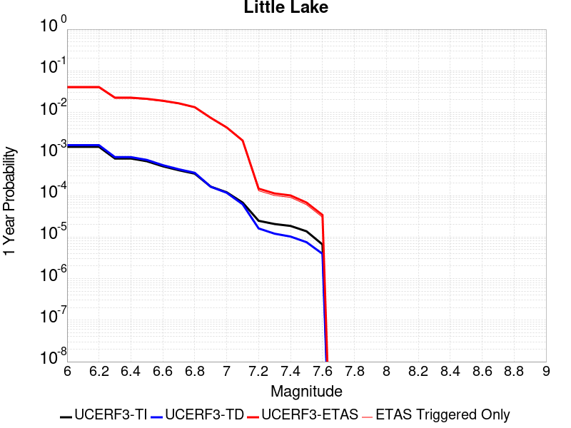 |  |

| Magnitude | 1 wk TI Prob | 1 wk TD Prob | 1 wk ETAS Prob | 1 wk ETAS/TD Gain | 1 wk ETAS Triggered Only | 1 mo TI Prob | 1 mo TD Prob | 1 mo ETAS Prob | 1 mo ETAS/TD Gain | 1 mo ETAS Triggered Only | 1 yr TI Prob | 1 yr TD Prob | 1 yr ETAS Prob | 1 yr ETAS/TD Gain | 1 yr ETAS Triggered Only | 10 yr TI Prob | 10 yr TD Prob | 10 yr ETAS Prob | 10 yr ETAS/TD Gain | 10 yr ETAS Triggered Only |
|-----|-----|-----|-----|-----|-----|-----|-----|-----|-----|-----|-----|-----|-----|-----|-----|-----|-----|-----|-----|-----|
| 6.0 | 2.8424427E-5 | 3.1205716E-5 | 0.02329048 | 746.353 | 0.02326 | 1.2181328E-4 | 1.3373268E-4 | 0.02914985 | 217.97105 | 0.02902 | 0.0014820677 | 0.0016271125 | 0.04076333 | 25.052559 | 0.0392 | 0.014722223 | 0.016165398 | 0.064688124 | 4.001641 | 0.04932 |
| 6.1 | 2.8424427E-5 | 3.1205716E-5 | 0.02329048 | 746.353 | 0.02326 | 1.2181328E-4 | 1.3373268E-4 | 0.02914985 | 217.97105 | 0.02902 | 0.0014820677 | 0.0016271125 | 0.04076333 | 25.052559 | 0.0392 | 0.014722223 | 0.016165398 | 0.064688124 | 4.001641 | 0.04932 |
| 6.2 | 2.8424427E-5 | 3.1205716E-5 | 0.02329048 | 746.353 | 0.02326 | 1.2181328E-4 | 1.3373268E-4 | 0.02914985 | 217.97105 | 0.02902 | 0.0014820677 | 0.0016271125 | 0.04076333 | 25.052559 | 0.0392 | 0.014722223 | 0.016165398 | 0.064688124 | 4.001641 | 0.04932 |
| 6.3 | 1.48860645E-5 | 1.6081383E-5 | 0.013175869 | 819.32434 | 0.01316 | 6.379586E-5 | 6.8918554E-5 | 0.01642779 | 238.36528 | 0.01636 | 7.7643775E-4 | 8.387886E-4 | 0.022620503 | 26.968061 | 0.0218 | 0.007737305 | 0.008359045 | 0.03524243 | 4.2160835 | 0.02711 |
| 6.4 | 1.48860645E-5 | 1.6081383E-5 | 0.013175869 | 819.32434 | 0.01316 | 6.379586E-5 | 6.8918554E-5 | 0.01642779 | 238.36528 | 0.01636 | 7.7643775E-4 | 8.387886E-4 | 0.022620503 | 26.968061 | 0.0218 | 0.007737305 | 0.008359045 | 0.03524243 | 4.2160835 | 0.02711 |
| 6.5 | 1.2797581E-5 | 1.376556E-5 | 0.0123735955 | 898.8807 | 0.01236 | 5.4845623E-5 | 5.8994065E-5 | 0.015428088 | 261.51932 | 0.01537 | 6.675408E-4 | 7.1804173E-4 | 0.02119333 | 29.515455 | 0.02049 | 0.006655392 | 0.007159767 | 0.032367982 | 4.5208144 | 0.02539 |
| 6.6 | 9.661896E-6 | 1.0289033E-5 | 0.011160174 | 1084.667 | 0.01115 | 4.1407468E-5 | 4.40952E-5 | 0.013923483 | 315.7596 | 0.01388 | 5.040193E-4 | 5.36743E-4 | 0.019046802 | 35.485886 | 0.01852 | 0.005028777 | 0.0053560715 | 0.028004114 | 5.2284803 | 0.02277 |
| 6.7 | 7.767871E-6 | 8.199681E-6 | 0.00974812 | 1188.8413 | 0.00974 | 3.329045E-5 | 3.5141096E-5 | 0.0120947175 | 344.17587 | 0.01206 | 4.0523586E-4 | 4.2777258E-4 | 0.01653088 | 38.64409 | 0.01611 | 0.004044977 | 0.004270843 | 0.02406594 | 5.6349387 | 0.01988 |
| 6.8 | 6.4235196E-6 | 6.735739E-6 | 0.007886683 | 1170.8711 | 0.00788 | 2.752908E-5 | 2.8867207E-5 | 0.009798585 | 339.43655 | 0.00977 | 3.35115E-4 | 3.5141438E-4 | 0.013346846 | 37.980362 | 0.013 | 0.003346101 | 0.0035098472 | 0.01929425 | 5.497177 | 0.01584 |
| 6.9 | 3.1283696E-6 | 3.1121751E-6 | 0.0046130978 | 1482.2745 | 0.00461 | 1.3407229E-5 | 1.33378335E-5 | 0.005543264 | 415.60452 | 0.00553 | 1.6322079E-4 | 1.6237753E-4 | 0.007401202 | 45.580208 | 0.00724 | 0.0016310095 | 0.0016227372 | 0.010298636 | 6.3464594 | 0.00869 |
| 7.0 | 2.290603E-6 | 2.2286763E-6 | 0.0026222228 | 1176.5831 | 0.00262 | 9.816834E-6 | 9.551441E-6 | 0.0031595214 | 330.79004 | 0.00315 | 1.19513395E-4 | 1.1628362E-4 | 0.004345792 | 37.372345 | 0.00423 | 0.0011944914 | 0.0011623299 | 0.0063063437 | 5.425606 | 0.00515 |
| 7.1 | 1.293693E-6 | 1.1776774E-6 | 0.0013211761 | 1121.8489 | 0.00132 | 5.5443866E-6 | 5.047183E-6 | 0.0015950392 | 316.02563 | 0.00159 | 6.750081E-5 | 6.1448416E-5 | 0.002101323 | 34.196537 | 0.00204 | 6.7480316E-4 | 6.1438273E-4 | 0.003032896 | 4.9364924 | 0.00242 |
| 7.2 | 4.715842E-7 | 3.091732E-7 | 7.030915E-5 | 227.41023 | 7.0E-5 | 2.0210737E-6 | 1.3250274E-6 | 8.132492E-5 | 61.37603 | 8.0E-5 | 2.4606294E-5 | 1.6132095E-5 | 1.4613E-4 | 9.05834 | 1.3E-4 | 2.460357E-4 | 1.6130977E-4 | 3.012872E-4 | 1.8677553 | 1.4E-4 |
| 7.3 | 3.9430947E-7 | 2.3096938E-7 | 5.023096E-5 | 217.47885 | 5.0E-5 | 1.6898966E-6 | 9.898685E-7 | 6.098981E-5 | 61.614056 | 6.0E-5 | 2.0574296E-5 | 1.2051582E-5 | 1.1205038E-4 | 9.297565 | 1.0E-4 | 2.0572392E-4 | 1.2050936E-4 | 2.3049611E-4 | 1.9126822 | 1.1E-4 |
| 7.4 | 3.547123E-7 | 1.9678579E-7 | 4.0196777E-5 | 204.26666 | 4.0E-5 | 1.5201948E-6 | 8.433674E-7 | 5.0843326E-5 | 60.286095 | 5.0E-5 | 1.8508214E-5 | 1.02679505E-5 | 1.00267025E-4 | 9.765048 | 9.0E-5 | 1.8506673E-4 | 1.0267482E-4 | 1.9266558E-4 | 1.8764638 | 9.0E-5 |
| 7.5 | 2.6354266E-7 | 1.4422719E-7 | 3.0144223E-5 | 209.00514 | 3.0E-5 | 1.129468E-6 | 6.1811636E-7 | 4.061809E-5 | 65.71269 | 4.0E-5 | 1.3751187E-5 | 7.525541E-6 | 6.752509E-5 | 8.972789 | 6.0E-5 | 1.3750336E-4 | 7.5252916E-5 | 1.352484E-4 | 1.7972513 | 6.0E-5 |
| 7.6 | 1.269913E-7 | 7.572344E-8 | 1.00757225E-5 | 133.0595 | 1.0E-5 | 5.4424834E-7 | 3.24529E-7 | 2.0324522E-5 | 62.627754 | 2.0E-5 | 6.6262032E-6 | 3.9511337E-6 | 3.3951015E-5 | 8.592728 | 3.0E-5 | 6.626006E-5 | 3.9510673E-5 | 6.9509486E-5 | 1.7592585 | 3.0E-5 |

## Owl Lake
*[(top)](#table-of-contents)*

| 1 Week | 1 Month | 1 Year | 10 Year |
|-----|-----|-----|-----|
|  |  |  |  |

| Magnitude | 1 wk TI Prob | 1 wk TD Prob | 1 wk ETAS Prob | 1 wk ETAS/TD Gain | 1 wk ETAS Triggered Only | 1 mo TI Prob | 1 mo TD Prob | 1 mo ETAS Prob | 1 mo ETAS/TD Gain | 1 mo ETAS Triggered Only | 1 yr TI Prob | 1 yr TD Prob | 1 yr ETAS Prob | 1 yr ETAS/TD Gain | 1 yr ETAS Triggered Only | 10 yr TI Prob | 10 yr TD Prob | 10 yr ETAS Prob | 10 yr ETAS/TD Gain | 10 yr ETAS Triggered Only |
|-----|-----|-----|-----|-----|-----|-----|-----|-----|-----|-----|-----|-----|-----|-----|-----|-----|-----|-----|-----|-----|
| 6.0 | 5.0320643E-5 | 6.6358676E-5 | 0.012085561 | 182.1248 | 0.01202 | 2.1564208E-4 | 2.843643E-4 | 0.016919633 | 59.499847 | 0.01664 | 0.0026222812 | 0.003457547 | 0.029118516 | 8.421726 | 0.02575 | 0.02591553 | 0.034141295 | 0.06886391 | 2.0170271 | 0.03595 |
| 6.1 | 5.0320643E-5 | 6.6358676E-5 | 0.012085561 | 182.1248 | 0.01202 | 2.1564208E-4 | 2.843643E-4 | 0.016919633 | 59.499847 | 0.01664 | 0.0026222812 | 0.003457547 | 0.029118516 | 8.421726 | 0.02575 | 0.02591553 | 0.034141295 | 0.06886391 | 2.0170271 | 0.03595 |
| 6.2 | 2.4125871E-5 | 3.0980515E-5 | 0.009080701 | 293.11005 | 0.00905 | 1.0339249E-4 | 1.3276804E-4 | 0.012551119 | 94.53419 | 0.01242 | 0.0012580766 | 0.0016154252 | 0.020554781 | 12.724068 | 0.01897 | 0.012509781 | 0.016070755 | 0.04161356 | 2.5893965 | 0.02596 |
| 6.3 | 1.7433485E-5 | 2.2355545E-5 | 0.007942178 | 355.2666 | 0.00792 | 7.471279E-5 | 9.580685E-5 | 0.0109547665 | 114.34221 | 0.01086 | 9.0924866E-4 | 0.001165962 | 0.017456945 | 14.972139 | 0.01631 | 0.009055373 | 0.0116291465 | 0.033551212 | 2.8850968 | 0.02218 |
| 6.4 | 1.7433485E-5 | 2.2355545E-5 | 0.007942178 | 355.2666 | 0.00792 | 7.471279E-5 | 9.580685E-5 | 0.0109547665 | 114.34221 | 0.01086 | 9.0924866E-4 | 0.001165962 | 0.017456945 | 14.972139 | 0.01631 | 0.009055373 | 0.0116291465 | 0.033551212 | 2.8850968 | 0.02218 |
| 6.5 | 1.5182742E-5 | 1.9429277E-5 | 0.007589282 | 390.61063 | 0.00757 | 6.506727E-5 | 8.3266525E-5 | 0.010382409 | 124.68887 | 0.0103 | 7.919061E-4 | 0.0010134344 | 0.016387837 | 16.170595 | 0.01539 | 0.0078909 | 0.010118678 | 0.030747805 | 3.0387175 | 0.02084 |
| 6.6 | 6.7271576E-6 | 8.547518E-6 | 0.006178495 | 722.8408 | 0.00617 | 2.8830356E-5 | 3.6631736E-5 | 0.008206332 | 224.02248 | 0.00817 | 3.5095305E-4 | 4.4590578E-4 | 0.012060724 | 27.047697 | 0.01162 | 0.0035039932 | 0.0044680187 | 0.019620016 | 4.3912115 | 0.01522 |
| 6.7 | 6.682835E-6 | 8.479961E-6 | 0.0061784275 | 728.5915 | 0.00617 | 2.8640408E-5 | 3.6342215E-5 | 0.008206045 | 225.79926 | 0.00817 | 3.4864116E-4 | 4.423823E-4 | 0.012047246 | 27.232658 | 0.01161 | 0.003480947 | 0.0044329325 | 0.019575508 | 4.4159274 | 0.01521 |
| 6.8 | 6.5774975E-6 | 8.326427E-6 | 0.006158275 | 739.60596 | 0.00615 | 2.8188972E-5 | 3.5684232E-5 | 0.008185393 | 229.38405 | 0.00815 | 3.4314668E-4 | 4.3437455E-4 | 0.01201934 | 27.670452 | 0.01159 | 0.0034261728 | 0.0043531056 | 0.019467026 | 4.471986 | 0.01518 |
| 6.9 | 6.363419E-6 | 7.999591E-6 | 0.0061179507 | 764.783 | 0.00611 | 2.727151E-5 | 3.428354E-5 | 0.008134006 | 237.25688 | 0.0081 | 3.3198006E-4 | 4.1732774E-4 | 0.01193252 | 28.592684 | 0.01152 | 0.0033148455 | 0.0041830647 | 0.019190026 | 4.5875516 | 0.01507 |
| 7.0 | 6.1342453E-6 | 7.631779E-6 | 0.006107585 | 800.28326 | 0.0061 | 2.6289357E-5 | 3.2707245E-5 | 0.008102443 | 247.72624 | 0.00807 | 3.2002592E-4 | 3.9814346E-4 | 0.0118435845 | 29.747028 | 0.01145 | 0.0031956544 | 0.003991739 | 0.018901983 | 4.7352753 | 0.01497 |
| 7.1 | 5.842926E-6 | 7.142312E-6 | 0.0059670997 | 835.4577 | 0.00596 | 2.504087E-5 | 3.060958E-5 | 0.00787037 | 257.12112 | 0.00784 | 3.0482994E-4 | 3.7261334E-4 | 0.011548447 | 30.993114 | 0.01118 | 0.0030441214 | 0.0037371595 | 0.018272635 | 4.8894444 | 0.01459 |
| 7.2 | 4.77173E-6 | 5.358478E-6 | 0.0041553364 | 775.4695 | 0.00415 | 2.045011E-5 | 2.2964727E-5 | 0.0054128408 | 235.70238 | 0.00539 | 2.4895166E-4 | 2.7956374E-4 | 0.007957417 | 28.463694 | 0.00768 | 0.0024867293 | 0.0028086212 | 0.012920142 | 4.6001725 | 0.01014 |
| 7.3 | 3.0494948E-6 | 2.710356E-6 | 0.0012727069 | 469.57184 | 0.00127 | 1.3069198E-5 | 1.1615762E-5 | 0.0016515967 | 142.18584 | 0.00164 | 1.5910587E-4 | 1.4141288E-4 | 0.002431089 | 17.191425 | 0.00229 | 0.0015899199 | 0.0014231089 | 0.0044188397 | 3.1050608 | 0.003 |
| 7.4 | 2.7263884E-6 | 2.3055634E-6 | 9.923032E-4 | 430.39517 | 9.9E-4 | 1.1684469E-5 | 9.880949E-6 | 0.0012698685 | 128.51686 | 0.00126 | 1.4224913E-4 | 1.2029401E-4 | 0.0018500859 | 15.379701 | 0.00173 | 0.0014215811 | 0.0012110578 | 0.0033784297 | 2.789652 | 0.00217 |
| 7.5 | 2.6090431E-6 | 2.1655019E-6 | 9.221635E-4 | 425.84286 | 9.2E-4 | 1.1181565E-5 | 9.2806895E-6 | 0.0011592701 | 124.912056 | 0.00115 | 1.3612706E-4 | 1.1298663E-4 | 0.0016628115 | 14.716887 | 0.00155 | 0.001360437 | 0.0011378126 | 0.0030955826 | 2.7206435 | 0.00196 |
| 7.6 | 2.3008756E-6 | 1.8726826E-6 | 7.218713E-4 | 385.4745 | 7.2E-4 | 9.860858E-6 | 8.025758E-6 | 8.6801883E-4 | 108.15413 | 8.6E-4 | 1.20049335E-4 | 9.770931E-5 | 0.0012475969 | 12.7684555 | 0.00115 | 0.001199845 | 9.848307E-4 | 0.0024433928 | 2.4810283 | 0.00146 |
| 7.7 | 1.7184348E-6 | 1.341808E-6 | 4.713412E-4 | 351.2732 | 4.7E-4 | 7.3646997E-6 | 5.750593E-6 | 5.4574746E-4 | 94.90282 | 5.4E-4 | 8.966153E-5 | 7.0011265E-5 | 7.6996227E-4 | 10.997691 | 7.0E-4 | 8.962536E-4 | 7.0769014E-4 | 0.0015371027 | 2.1719997 | 8.3E-4 |
| 7.8 | 8.4612907E-7 | 8.4054994E-7 | 2.1084037E-4 | 250.83621 | 2.1E-4 | 3.6262625E-6 | 3.602352E-6 | 2.4360149E-4 | 67.622894 | 2.4E-4 | 4.4148852E-5 | 4.3857777E-5 | 3.6384375E-4 | 8.295992 | 3.2E-4 | 4.414008E-4 | 4.4386165E-4 | 8.436841E-4 | 1.9007818 | 4.0E-4 |
| 7.9 | 2.716738E-7 | 3.7681625E-7 | 4.0376803E-5 | 107.1525 | 4.0E-5 | 1.1643157E-6 | 1.6149258E-6 | 4.161486E-5 | 25.7689 | 4.0E-5 | 1.4175452E-5 | 1.9661555E-5 | 6.966057E-5 | 3.5429838 | 5.0E-5 | 1.4174548E-4 | 1.9829652E-4 | 2.7828064E-4 | 1.4033562 | 8.0E-5 |
| 8.0 | 2.1995428E-8 | 3.3853325E-8 | 3.3853325E-8 | 1.0 | 0.0 | 9.426611E-8 | 1.4508568E-7 | 1.4508568E-7 | 1.0 | 0.0 | 1.1476893E-6 | 1.7664173E-6 | 1.1766399E-5 | 6.661166 | 1.0E-5 | 1.14768345E-5 | 1.7869768E-5 | 2.786959E-5 | 1.5595943 | 1.0E-5 |

## Airport Lake
*[(top)](#table-of-contents)*

| 1 Week | 1 Month | 1 Year | 10 Year |
|-----|-----|-----|-----|
|  |  | 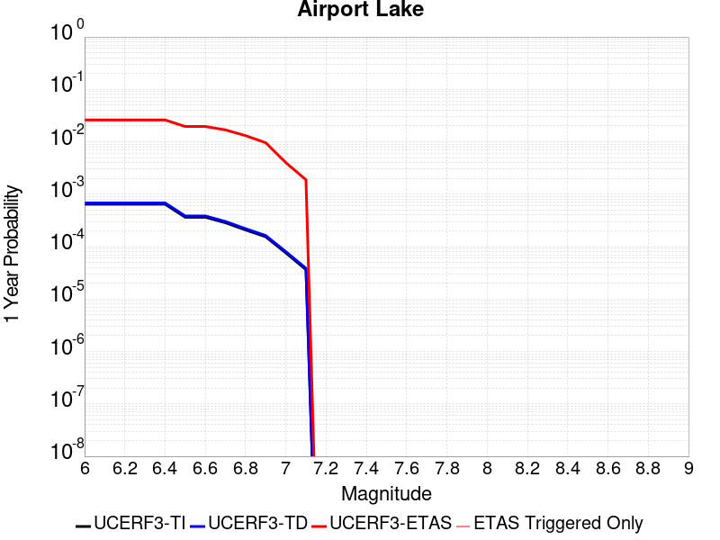 |  |

| Magnitude | 1 wk TI Prob | 1 wk TD Prob | 1 wk ETAS Prob | 1 wk ETAS/TD Gain | 1 wk ETAS Triggered Only | 1 mo TI Prob | 1 mo TD Prob | 1 mo ETAS Prob | 1 mo ETAS/TD Gain | 1 mo ETAS Triggered Only | 1 yr TI Prob | 1 yr TD Prob | 1 yr ETAS Prob | 1 yr ETAS/TD Gain | 1 yr ETAS Triggered Only | 10 yr TI Prob | 10 yr TD Prob | 10 yr ETAS Prob | 10 yr ETAS/TD Gain | 10 yr ETAS Triggered Only |
|-----|-----|-----|-----|-----|-----|-----|-----|-----|-----|-----|-----|-----|-----|-----|-----|-----|-----|-----|-----|-----|
| 6.0 | 1.2387061E-5 | 1.3103157E-5 | 0.015902895 | 1213.669 | 0.01589 | 5.3086325E-5 | 5.615534E-5 | 0.019585058 | 348.76575 | 0.01953 | 6.461343E-4 | 6.8350515E-4 | 0.026126103 | 38.22371 | 0.02546 | 0.0064425888 | 0.0068168393 | 0.037307564 | 5.4728537 | 0.0307 |
| 6.1 | 1.2387061E-5 | 1.3103157E-5 | 0.015902895 | 1213.669 | 0.01589 | 5.3086325E-5 | 5.615534E-5 | 0.019585058 | 348.76575 | 0.01953 | 6.461343E-4 | 6.8350515E-4 | 0.026126103 | 38.22371 | 0.02546 | 0.0064425888 | 0.0068168393 | 0.037307564 | 5.4728537 | 0.0307 |
| 6.2 | 1.2387061E-5 | 1.3103157E-5 | 0.015902895 | 1213.669 | 0.01589 | 5.3086325E-5 | 5.615534E-5 | 0.019585058 | 348.76575 | 0.01953 | 6.461343E-4 | 6.8350515E-4 | 0.026126103 | 38.22371 | 0.02546 | 0.0064425888 | 0.0068168393 | 0.037307564 | 5.4728537 | 0.0307 |
| 6.3 | 1.2387061E-5 | 1.3103157E-5 | 0.015902895 | 1213.669 | 0.01589 | 5.3086325E-5 | 5.615534E-5 | 0.019585058 | 348.76575 | 0.01953 | 6.461343E-4 | 6.8350515E-4 | 0.026126103 | 38.22371 | 0.02546 | 0.0064425888 | 0.0068168393 | 0.037307564 | 5.4728537 | 0.0307 |
| 6.4 | 1.2387061E-5 | 1.3103157E-5 | 0.015902895 | 1213.669 | 0.01589 | 5.3086325E-5 | 5.615534E-5 | 0.019585058 | 348.76575 | 0.01953 | 6.461343E-4 | 6.8350515E-4 | 0.026126103 | 38.22371 | 0.02546 | 0.0064425888 | 0.0068168393 | 0.037307564 | 5.4728537 | 0.0307 |
| 6.5 | 6.9922594E-6 | 7.384925E-6 | 0.012127295 | 1642.1691 | 0.01212 | 2.996648E-5 | 3.1649324E-5 | 0.01487118 | 469.8735 | 0.01484 | 3.6478083E-4 | 3.8526783E-4 | 0.019607859 | 50.894096 | 0.01923 | 0.003641826 | 0.0038465366 | 0.027056912 | 7.034097 | 0.0233 |
| 6.6 | 6.9922594E-6 | 7.384925E-6 | 0.012127295 | 1642.1691 | 0.01212 | 2.996648E-5 | 3.1649324E-5 | 0.01487118 | 469.8735 | 0.01484 | 3.6478083E-4 | 3.8526783E-4 | 0.019607859 | 50.894096 | 0.01923 | 0.003641826 | 0.0038465366 | 0.027056912 | 7.034097 | 0.0233 |
| 6.7 | 5.477277E-6 | 5.7860684E-6 | 0.010365726 | 1791.4973 | 0.01036 | 2.3473833E-5 | 2.4797222E-5 | 0.012704483 | 512.3349 | 0.01268 | 2.8575645E-4 | 3.0186825E-4 | 0.01688686 | 55.941162 | 0.01659 | 0.0028538927 | 0.003014966 | 0.023114184 | 7.666483 | 0.02016 |
| 6.8 | 3.9950432E-6 | 4.2190873E-6 | 0.008134184 | 1927.949 | 0.00813 | 1.7121502E-5 | 1.8081691E-5 | 0.009967902 | 551.2704 | 0.00995 | 2.0843433E-4 | 2.2012512E-4 | 0.013117285 | 59.590134 | 0.0129 | 0.0020823893 | 0.0021993418 | 0.017665252 | 8.0320635 | 0.0155 |
| 6.9 | 2.95695E-6 | 3.1230243E-6 | 0.0059731044 | 1912.6025 | 0.00597 | 1.2672582E-5 | 1.3384334E-5 | 0.0072332877 | 540.4294 | 0.00722 | 1.5427776E-4 | 1.6294434E-4 | 0.009601406 | 58.92445 | 0.00944 | 0.001541707 | 0.0016284712 | 0.012800248 | 7.8602858 | 0.01119 |
| 7.0 | 1.456072E-6 | 1.540812E-6 | 0.002451537 | 1591.0682 | 0.00245 | 6.2402937E-6 | 6.603469E-6 | 0.002946584 | 446.2176 | 0.00294 | 7.597293E-5 | 8.039528E-5 | 0.0040100794 | 49.87954 | 0.00393 | 7.594696E-4 | 8.0376083E-4 | 0.0056298785 | 7.0044203 | 0.00483 |
| 7.1 | 6.995192E-7 | 7.4089746E-7 | 0.00120074 | 1620.6561 | 0.0012 | 2.997936E-6 | 3.1752747E-6 | 0.0014531707 | 457.65195 | 0.00145 | 3.649926E-5 | 3.865897E-5 | 0.0018885875 | 48.852505 | 0.00185 | 3.6493264E-4 | 3.865897E-4 | 0.0025957352 | 6.714445 | 0.00221 |

## Panamint Valley
*[(top)](#table-of-contents)*

| 1 Week | 1 Month | 1 Year | 10 Year |
|-----|-----|-----|-----|
| 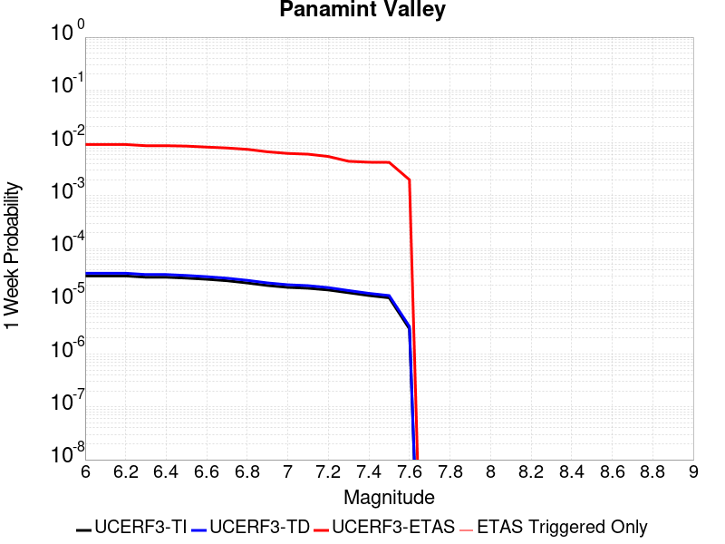 | 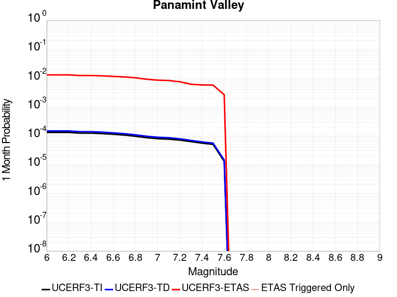 | 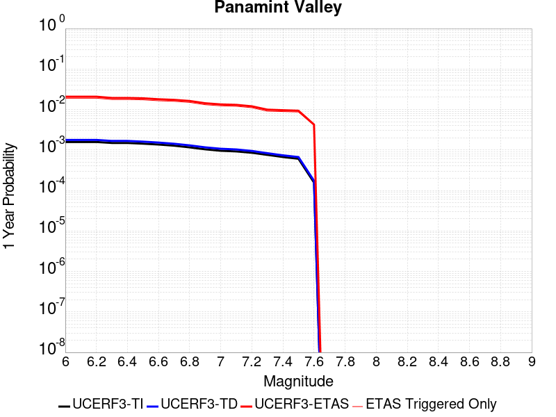 | 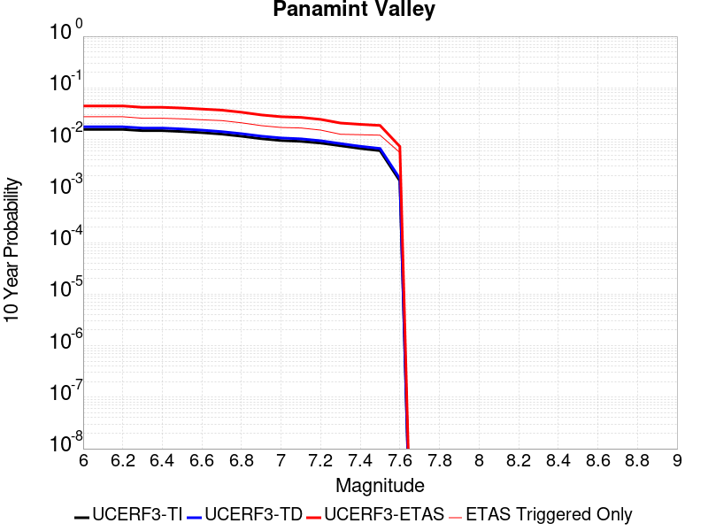 |

| Magnitude | 1 wk TI Prob | 1 wk TD Prob | 1 wk ETAS Prob | 1 wk ETAS/TD Gain | 1 wk ETAS Triggered Only | 1 mo TI Prob | 1 mo TD Prob | 1 mo ETAS Prob | 1 mo ETAS/TD Gain | 1 mo ETAS Triggered Only | 1 yr TI Prob | 1 yr TD Prob | 1 yr ETAS Prob | 1 yr ETAS/TD Gain | 1 yr ETAS Triggered Only | 10 yr TI Prob | 10 yr TD Prob | 10 yr ETAS Prob | 10 yr ETAS/TD Gain | 10 yr ETAS Triggered Only |
|-----|-----|-----|-----|-----|-----|-----|-----|-----|-----|-----|-----|-----|-----|-----|-----|-----|-----|-----|-----|-----|
| 6.0 | 3.0211835E-5 | 3.3984263E-5 | 0.009133675 | 268.7619 | 0.0091 | 1.2947287E-4 | 1.4563887E-4 | 0.0128437895 | 88.18929 | 0.0127 | 0.0015751923 | 0.0017717406 | 0.022035774 | 12.437359 | 0.0203 | 0.015640736 | 0.017583003 | 0.04544435 | 2.5845613 | 0.02836 |
| 6.1 | 3.0211835E-5 | 3.3984263E-5 | 0.009133675 | 268.7619 | 0.0091 | 1.2947287E-4 | 1.4563887E-4 | 0.0128437895 | 88.18929 | 0.0127 | 0.0015751923 | 0.0017717406 | 0.022035774 | 12.437359 | 0.0203 | 0.015640736 | 0.017583003 | 0.04544435 | 2.5845613 | 0.02836 |
| 6.2 | 3.0211835E-5 | 3.3984263E-5 | 0.009133675 | 268.7619 | 0.0091 | 1.2947287E-4 | 1.4563887E-4 | 0.0128437895 | 88.18929 | 0.0127 | 0.0015751923 | 0.0017717406 | 0.022035774 | 12.437359 | 0.0203 | 0.015640736 | 0.017583003 | 0.04544435 | 2.5845613 | 0.02836 |
| 6.3 | 2.8573924E-5 | 3.2102445E-5 | 0.008701824 | 271.06424 | 0.00867 | 1.2245393E-4 | 1.375748E-4 | 0.012155921 | 88.35863 | 0.01202 | 0.001489857 | 0.0016737141 | 0.020841578 | 12.452292 | 0.0192 | 0.01479908 | 0.016618038 | 0.042923506 | 2.5829468 | 0.02675 |
| 6.4 | 2.8573924E-5 | 3.2102445E-5 | 0.008701824 | 271.06424 | 0.00867 | 1.2245393E-4 | 1.375748E-4 | 0.012155921 | 88.35863 | 0.01202 | 0.001489857 | 0.0016737141 | 0.020841578 | 12.452292 | 0.0192 | 0.01479908 | 0.016618038 | 0.042923506 | 2.5829468 | 0.02675 |
| 6.5 | 2.7468774E-5 | 3.0828138E-5 | 0.008510566 | 276.06488 | 0.00848 | 1.1771801E-4 | 1.3211406E-4 | 0.011880562 | 89.92655 | 0.01175 | 0.0014322745 | 0.0016073292 | 0.02029724 | 12.627929 | 0.01872 | 0.014230782 | 0.015963882 | 0.04153898 | 2.60206 | 0.02599 |
| 6.6 | 2.6135967E-5 | 2.9252153E-5 | 0.008149015 | 278.5783 | 0.00812 | 1.1200648E-4 | 1.2536049E-4 | 0.0113639515 | 90.650185 | 0.01124 | 0.0013628257 | 0.0015252219 | 0.01941789 | 12.73119 | 0.01792 | 0.013544982 | 0.015154343 | 0.039667152 | 2.6175435 | 0.02489 |
| 6.7 | 2.4498746E-5 | 2.7341044E-5 | 0.007817128 | 285.91183 | 0.00779 | 1.04990395E-4 | 1.17170785E-4 | 0.010905907 | 93.07701 | 0.01079 | 0.0012775084 | 0.0014256459 | 0.018501267 | 12.977464 | 0.0171 | 0.012701893 | 0.014171593 | 0.03751601 | 2.6472685 | 0.02368 |
| 6.8 | 2.2244329E-5 | 2.4935374E-5 | 0.007294754 | 292.54642 | 0.00727 | 9.532935E-5 | 1.0686163E-4 | 0.010165786 | 95.13036 | 0.01006 | 0.0011600169 | 0.0013002857 | 0.017029807 | 13.096972 | 0.01575 | 0.011539802 | 0.012932955 | 0.034293085 | 2.6516047 | 0.02164 |
| 6.9 | 1.9902658E-5 | 2.2290182E-5 | 0.0065621445 | 294.39618 | 0.00654 | 8.529431E-5 | 9.552596E-5 | 0.009084667 | 95.101555 | 0.00899 | 0.0010379635 | 0.0011624265 | 0.015076234 | 12.969624 | 0.01393 | 0.010331288 | 0.011569021 | 0.030408517 | 2.6284432 | 0.01906 |
| 7.0 | 1.8353881E-5 | 2.056605E-5 | 0.006100441 | 296.62674 | 0.00608 | 7.865712E-5 | 8.813734E-5 | 0.008417403 | 95.50326 | 0.00833 | 9.5722964E-4 | 0.0010725616 | 0.013978704 | 13.033009 | 0.01292 | 0.009531168 | 0.01067939 | 0.028002394 | 2.6220968 | 0.01751 |
| 7.1 | 1.7667631E-5 | 1.9772435E-5 | 0.005909656 | 298.88358 | 0.00589 | 7.571623E-5 | 8.4736355E-5 | 0.008174051 | 96.46451 | 0.00809 | 9.2145515E-4 | 0.0010311945 | 0.013558263 | 13.148115 | 0.01254 | 0.009176437 | 0.0102695925 | 0.027085112 | 2.6374085 | 0.01699 |
| 7.2 | 1.6381597E-5 | 1.8158042E-5 | 0.005298062 | 291.77496 | 0.00528 | 7.020495E-5 | 7.781795E-5 | 0.0073972484 | 95.05837 | 0.00732 | 8.544101E-4 | 9.470391E-4 | 0.012166404 | 12.846781 | 0.01123 | 0.008511325 | 0.009435269 | 0.024402702 | 2.5863283 | 0.01511 |
| 7.3 | 1.4520491E-5 | 1.596657E-5 | 0.004325898 | 270.9347 | 0.00431 | 6.222919E-5 | 6.842646E-5 | 0.006058017 | 88.53325 | 0.00599 | 7.57377E-4 | 8.327899E-4 | 0.00997517 | 11.978015 | 0.00915 | 0.0075480095 | 0.008300399 | 0.020567724 | 2.4779196 | 0.01237 |
| 7.4 | 1.2852287E-5 | 1.41454875E-5 | 0.0041140877 | 290.84097 | 0.0041 | 5.5080065E-5 | 6.06222E-5 | 0.0057602767 | 95.019264 | 0.0057 | 6.7039346E-4 | 7.378411E-4 | 0.009501371 | 12.877257 | 0.00877 | 0.0066837464 | 0.007357429 | 0.019110316 | 2.5974178 | 0.01184 |
| 7.5 | 1.1637851E-5 | 1.2836868E-5 | 0.0040827845 | 318.05145 | 0.00407 | 4.987555E-5 | 5.5014076E-5 | 0.0056647053 | 102.96829 | 0.00561 | 6.070656E-4 | 6.696062E-4 | 0.009283834 | 13.864617 | 0.00862 | 0.006054099 | 0.0066793845 | 0.018211836 | 2.7265742 | 0.01161 |
| 7.6 | 3.0068115E-6 | 3.3330623E-6 | 0.0018833268 | 565.044 | 0.00188 | 1.2886271E-5 | 1.4284516E-5 | 0.002634247 | 184.41277 | 0.00262 | 1.5687906E-4 | 1.7390738E-4 | 0.0041532153 | 23.881765 | 0.00398 | 0.0015676835 | 0.0017397973 | 0.0070505417 | 4.0525074 | 0.00532 |

## Garlock (East)
*[(top)](#table-of-contents)*

| 1 Week | 1 Month | 1 Year | 10 Year |
|-----|-----|-----|-----|
| 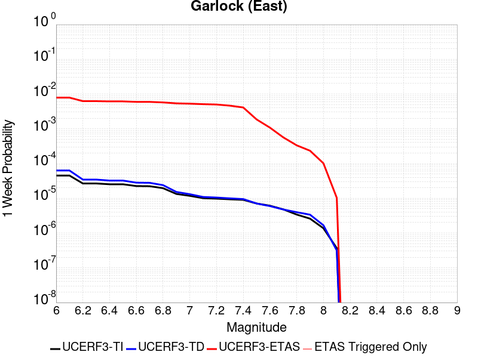 | 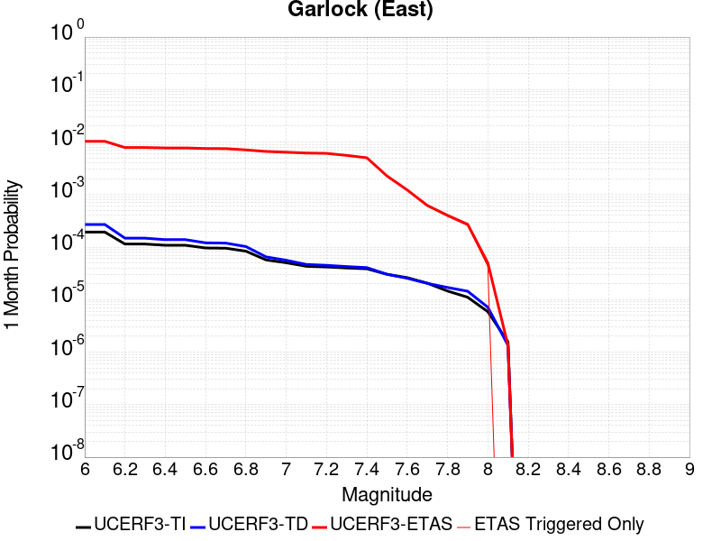 | 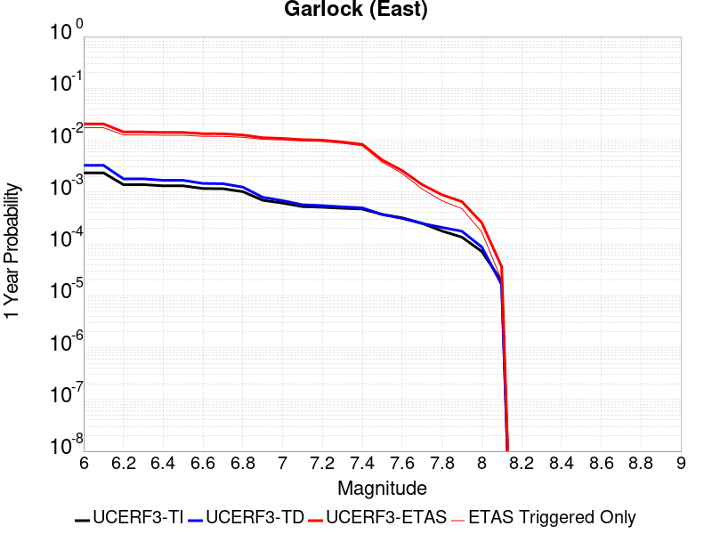 | 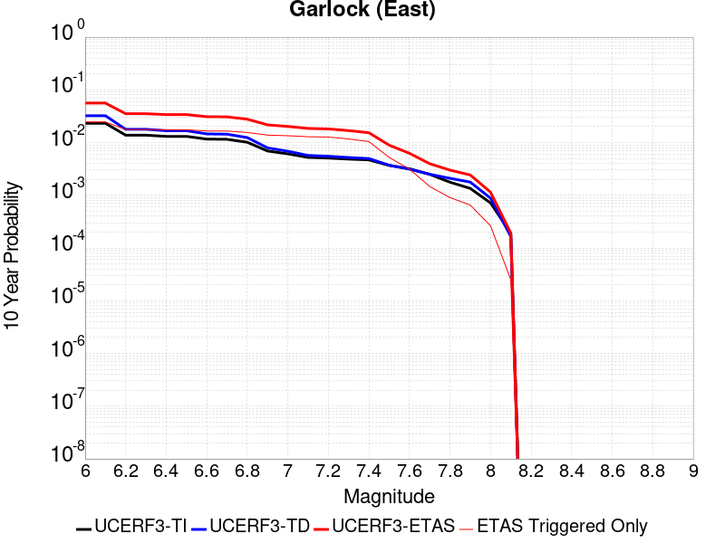 |

| Magnitude | 1 wk TI Prob | 1 wk TD Prob | 1 wk ETAS Prob | 1 wk ETAS/TD Gain | 1 wk ETAS Triggered Only | 1 mo TI Prob | 1 mo TD Prob | 1 mo ETAS Prob | 1 mo ETAS/TD Gain | 1 mo ETAS Triggered Only | 1 yr TI Prob | 1 yr TD Prob | 1 yr ETAS Prob | 1 yr ETAS/TD Gain | 1 yr ETAS Triggered Only | 10 yr TI Prob | 10 yr TD Prob | 10 yr ETAS Prob | 10 yr ETAS/TD Gain | 10 yr ETAS Triggered Only |
|-----|-----|-----|-----|-----|-----|-----|-----|-----|-----|-----|-----|-----|-----|-----|-----|-----|-----|-----|-----|-----|
| 6.0 | 4.5092507E-5 | 6.2904815E-5 | 0.007872414 | 125.148026 | 0.00781 | 1.9323928E-4 | 2.6956675E-4 | 0.010946687 | 40.60845 | 0.01068 | 0.0023501497 | 0.003277482 | 0.020650355 | 6.3006773 | 0.01743 | 0.023254504 | 0.03235377 | 0.056138515 | 1.7351459 | 0.02458 |
| 6.1 | 4.5092507E-5 | 6.2904815E-5 | 0.007872414 | 125.148026 | 0.00781 | 1.9323928E-4 | 2.6956675E-4 | 0.010946687 | 40.60845 | 0.01068 | 0.0023501497 | 0.003277482 | 0.020650355 | 6.3006773 | 0.01743 | 0.023254504 | 0.03235377 | 0.056138515 | 1.7351459 | 0.02458 |
| 6.2 | 2.6674514E-5 | 3.4511588E-5 | 0.0062342975 | 180.6436 | 0.0062 | 1.1431433E-4 | 1.4789861E-4 | 0.008286695 | 56.029568 | 0.00814 | 0.0013908884 | 0.0017992114 | 0.014416469 | 8.01266 | 0.01264 | 0.01382215 | 0.017872788 | 0.03511894 | 1.9649392 | 0.01756 |
| 6.3 | 2.6674514E-5 | 3.4511588E-5 | 0.0062342975 | 180.6436 | 0.0062 | 1.1431433E-4 | 1.4789861E-4 | 0.008286695 | 56.029568 | 0.00814 | 0.0013908884 | 0.0017992114 | 0.014416469 | 8.01266 | 0.01264 | 0.01382215 | 0.017872788 | 0.03511894 | 1.9649392 | 0.01756 |
| 6.4 | 2.5312667E-5 | 3.2340467E-5 | 0.006132143 | 189.61208 | 0.0061 | 1.0847834E-4 | 1.3859481E-4 | 0.008157483 | 58.858505 | 0.00802 | 0.0013199237 | 0.0016861152 | 0.01413509 | 8.383228 | 0.01247 | 0.013121112 | 0.016772287 | 0.03379196 | 2.0147498 | 0.01731 |
| 6.5 | 2.5312667E-5 | 3.2340467E-5 | 0.006132143 | 189.61208 | 0.0061 | 1.0847834E-4 | 1.3859481E-4 | 0.008157483 | 58.858505 | 0.00802 | 0.0013199237 | 0.0016861152 | 0.01413509 | 8.383228 | 0.01247 | 0.013121112 | 0.016772287 | 0.03379196 | 2.0147498 | 0.01731 |
| 6.6 | 2.246556E-5 | 2.8134691E-5 | 0.005947968 | 211.41046 | 0.00592 | 9.627742E-5 | 1.2057181E-4 | 0.007879636 | 65.35223 | 0.00776 | 0.0011715472 | 0.0014669969 | 0.01334954 | 9.099911 | 0.0119 | 0.011653901 | 0.014613169 | 0.030812928 | 2.1085727 | 0.01644 |
| 6.7 | 2.2241198E-5 | 2.7804432E-5 | 0.00593764 | 213.55014 | 0.00591 | 9.531594E-5 | 1.1915654E-4 | 0.007868233 | 66.032745 | 0.00775 | 0.0011598538 | 0.0014497889 | 0.0133025795 | 9.175529 | 0.01187 | 0.011538187 | 0.014442829 | 0.030586256 | 2.1177468 | 0.01638 |
| 6.8 | 1.9528685E-5 | 2.3898969E-5 | 0.005723763 | 239.49832 | 0.0057 | 8.369167E-5 | 1.0242024E-4 | 0.00752166 | 73.4392 | 0.00742 | 0.0010184698 | 0.0012462728 | 0.01261209 | 10.119847 | 0.01138 | 0.010138147 | 0.012436723 | 0.027694575 | 2.2268386 | 0.01545 |
| 6.9 | 1.3318621E-5 | 1.5198818E-5 | 0.005385117 | 354.31158 | 0.00537 | 5.7078556E-5 | 6.51362E-5 | 0.006974686 | 107.07849 | 0.00691 | 6.9470983E-4 | 7.927504E-4 | 0.011184506 | 14.108483 | 0.0104 | 0.0069254204 | 0.007940721 | 0.021571616 | 2.7165816 | 0.01374 |
| 7.0 | 1.1760853E-5 | 1.3107653E-5 | 0.0052730385 | 402.28702 | 0.00526 | 5.0402683E-5 | 5.6174475E-5 | 0.0067857965 | 120.79858 | 0.00673 | 6.134799E-4 | 6.8371464E-4 | 0.010816782 | 15.820609 | 0.01014 | 0.0061178906 | 0.006857401 | 0.020105924 | 2.9320033 | 0.01334 |
| 7.1 | 1.0064758E-5 | 1.0902761E-5 | 0.005100847 | 467.84915 | 0.00509 | 4.3133965E-5 | 4.67253E-5 | 0.0065464214 | 140.10443 | 0.0065 | 5.2502943E-4 | 5.6873553E-4 | 0.0102532245 | 18.028107 | 0.00969 | 0.005237907 | 0.0057133473 | 0.01838056 | 3.2171261 | 0.01274 |
| 7.2 | 9.768808E-6 | 1.0498628E-5 | 0.0049904464 | 475.34268 | 0.00498 | 4.186565E-5 | 4.499337E-5 | 0.006414707 | 142.57005 | 0.00637 | 5.095951E-4 | 5.4766005E-4 | 0.010022468 | 18.300528 | 0.00948 | 0.0050842804 | 0.005503584 | 0.017914899 | 3.2551332 | 0.01248 |
| 7.3 | 9.344516E-6 | 9.9442705E-6 | 0.0046198983 | 464.57892 | 0.00461 | 4.004731E-5 | 4.2617627E-5 | 0.005882369 | 138.02666 | 0.00584 | 4.8746695E-4 | 5.187495E-4 | 0.009244221 | 17.820202 | 0.00873 | 0.0048639905 | 0.005215269 | 0.01667519 | 3.1973784 | 0.01152 |
| 7.4 | 9.023491E-6 | 9.490441E-6 | 0.0040994515 | 431.95584 | 0.00409 | 3.867153E-5 | 4.0672705E-5 | 0.0052604605 | 129.33638 | 0.00522 | 4.7072413E-4 | 4.95081E-4 | 0.008331199 | 16.827951 | 0.00784 | 0.004697283 | 0.0049787266 | 0.015267246 | 3.0664964 | 0.01034 |
| 7.5 | 7.081253E-6 | 7.0873994E-6 | 0.0018570743 | 262.02478 | 0.00185 | 3.0347876E-5 | 3.0374218E-5 | 0.002410302 | 79.353546 | 0.00238 | 3.6942272E-4 | 3.697441E-4 | 0.0041583427 | 11.246543 | 0.00379 | 0.003688092 | 0.0037244745 | 0.008815442 | 2.3668957 | 0.00511 |
| 7.6 | 6.116396E-6 | 5.9589424E-6 | 0.0010759525 | 180.56099 | 0.00107 | 2.6212863E-5 | 2.5538076E-5 | 0.0014555015 | 56.99339 | 0.00143 | 3.1909486E-4 | 3.1088197E-4 | 0.00260017 | 8.36385 | 0.00229 | 0.0031863707 | 0.0031359126 | 0.006196285 | 1.9759114 | 0.00307 |
| 7.7 | 4.797145E-6 | 4.7571157E-6 | 5.647545E-4 | 118.717834 | 5.6E-4 | 2.055903E-5 | 2.0387479E-5 | 7.30373E-4 | 35.824585 | 7.1E-4 | 2.5027743E-4 | 2.481894E-4 | 0.001397904 | 5.6324077 | 0.00115 | 0.0024999576 | 0.0025094065 | 0.0040056426 | 1.5962509 | 0.0015 |
| 7.8 | 3.4028885E-6 | 3.978375E-6 | 3.3397705E-4 | 83.94811 | 3.3E-4 | 1.4583726E-5 | 1.7050066E-5 | 4.2704307E-4 | 25.046417 | 4.1E-4 | 1.775424E-4 | 2.0756487E-4 | 8.874237E-4 | 4.2754045 | 6.8E-4 | 0.0017740062 | 0.0021012141 | 0.002989344 | 1.4226747 | 8.9E-4 |
| 7.9 | 2.5928412E-6 | 3.372436E-6 | 2.3337165E-4 | 69.19973 | 2.3E-4 | 1.1112129E-5 | 1.4453217E-5 | 2.9444916E-4 | 20.37257 | 2.8E-4 | 1.3528178E-4 | 1.7595377E-4 | 6.558693E-4 | 3.7275093 | 4.8E-4 | 0.0013519945 | 0.0017812426 | 0.0024001382 | 1.3474516 | 6.2E-4 |
| 8.0 | 1.3743648E-6 | 1.6734741E-6 | 1.0167331E-4 | 60.75583 | 1.0E-4 | 5.8901214E-6 | 7.1720124E-6 | 1.071713E-4 | 14.942988 | 1.0E-4 | 7.1709874E-5 | 8.731578E-5 | 2.5730094E-4 | 2.9467862 | 1.7E-4 | 7.1686733E-4 | 8.837377E-4 | 0.0011335168 | 1.2826394 | 2.5E-4 |
| 8.1 | 3.6733252E-7 | 3.1489736E-7 | 1.0314894E-5 | 32.756367 | 1.0E-5 | 1.5742813E-6 | 1.3495595E-6 | 1.1349546E-5 | 8.409815 | 1.0E-5 | 1.9166706E-5 | 1.643078E-5 | 3.643045E-5 | 2.2172077 | 2.0E-5 | 1.9165053E-4 | 1.662928E-4 | 1.8628947E-4 | 1.1202497 | 2.0E-5 |

## Blackwater
*[(top)](#table-of-contents)*

| 1 Week | 1 Month | 1 Year | 10 Year |
|-----|-----|-----|-----|
| 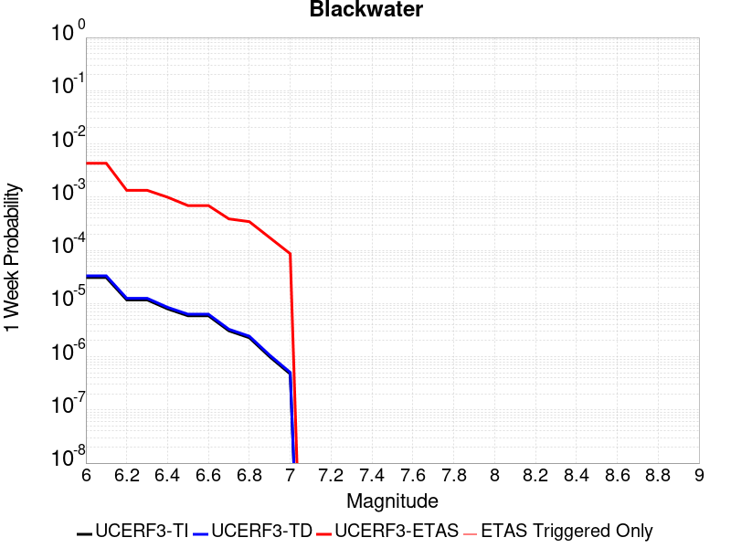 |  | 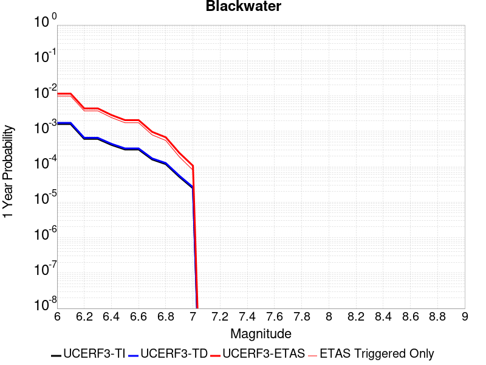 | 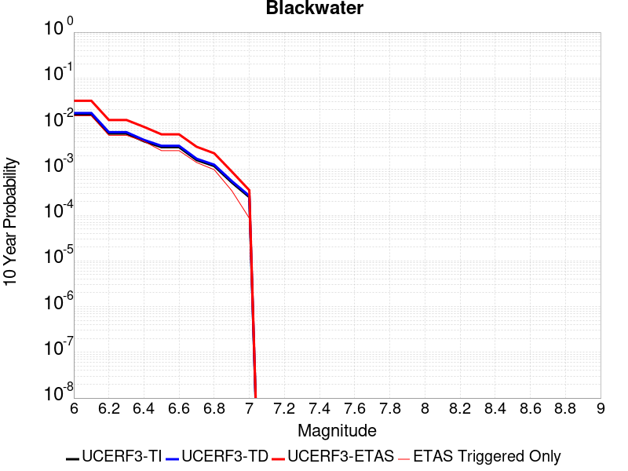 |

| Magnitude | 1 wk TI Prob | 1 wk TD Prob | 1 wk ETAS Prob | 1 wk ETAS/TD Gain | 1 wk ETAS Triggered Only | 1 mo TI Prob | 1 mo TD Prob | 1 mo ETAS Prob | 1 mo ETAS/TD Gain | 1 mo ETAS Triggered Only | 1 yr TI Prob | 1 yr TD Prob | 1 yr ETAS Prob | 1 yr ETAS/TD Gain | 1 yr ETAS Triggered Only | 10 yr TI Prob | 10 yr TD Prob | 10 yr ETAS Prob | 10 yr ETAS/TD Gain | 10 yr ETAS Triggered Only |
|-----|-----|-----|-----|-----|-----|-----|-----|-----|-----|-----|-----|-----|-----|-----|-----|-----|-----|-----|-----|-----|
| 6.0 | 3.0708583E-5 | 3.3095846E-5 | 0.004342953 | 131.22351 | 0.00431 | 1.3160157E-4 | 1.4183241E-4 | 0.0062109716 | 43.79092 | 0.00607 | 0.0016010714 | 0.0017255784 | 0.011538616 | 6.6868105 | 0.00983 | 0.015895851 | 0.017135633 | 0.031249566 | 1.8236598 | 0.01436 |
| 6.1 | 3.0708583E-5 | 3.3095846E-5 | 0.004342953 | 131.22351 | 0.00431 | 1.3160157E-4 | 1.4183241E-4 | 0.0062109716 | 43.79092 | 0.00607 | 0.0016010714 | 0.0017255784 | 0.011538616 | 6.6868105 | 0.00983 | 0.015895851 | 0.017135633 | 0.031249566 | 1.8236598 | 0.01436 |
| 6.2 | 1.1707779E-5 | 1.2545122E-5 | 0.0016925241 | 134.91492 | 0.00168 | 5.017523E-5 | 5.3763757E-5 | 0.0023336413 | 43.40547 | 0.00228 | 6.107122E-4 | 6.5438676E-4 | 0.0044219196 | 6.757349 | 0.00377 | 0.006090366 | 0.0065255696 | 0.012079092 | 1.8510402 | 0.00559 |
| 6.3 | 1.1707779E-5 | 1.2545122E-5 | 0.0016925241 | 134.91492 | 0.00168 | 5.017523E-5 | 5.3763757E-5 | 0.0023336413 | 43.40547 | 0.00228 | 6.107122E-4 | 6.5438676E-4 | 0.0044219196 | 6.757349 | 0.00377 | 0.006090366 | 0.0065255696 | 0.012079092 | 1.8510402 | 0.00559 |
| 6.4 | 7.929244E-6 | 8.480098E-6 | 0.0010484713 | 123.63905 | 0.00104 | 3.3982033E-5 | 3.6342793E-5 | 0.0014562912 | 40.070976 | 0.00142 | 4.136527E-4 | 4.423877E-4 | 0.0028813083 | 6.513084 | 0.00244 | 0.0041288356 | 0.0044154758 | 0.008069271 | 1.8274975 | 0.00367 |
| 6.5 | 5.8832115E-6 | 6.285991E-6 | 8.2628086E-4 | 131.44798 | 8.2E-4 | 2.521352E-5 | 2.6939697E-5 | 0.0011169104 | 41.45965 | 0.00109 | 3.0693135E-4 | 3.27944E-4 | 0.0020673734 | 6.304044 | 0.00174 | 0.0030650778 | 0.0032748538 | 0.005906208 | 1.8035029 | 0.00264 |
| 6.6 | 5.8832115E-6 | 6.285991E-6 | 8.2628086E-4 | 131.44798 | 8.2E-4 | 2.521352E-5 | 2.6939697E-5 | 0.0011169104 | 41.45965 | 0.00109 | 3.0693135E-4 | 3.27944E-4 | 0.0020673734 | 6.304044 | 0.00174 | 0.0030650778 | 0.0032748538 | 0.005906208 | 1.8035029 | 0.00264 |
| 6.7 | 3.0715053E-6 | 3.2814662E-6 | 3.332804E-4 | 101.564476 | 3.3E-4 | 1.3163528E-5 | 1.4063357E-5 | 4.940566E-4 | 35.13077 | 4.8E-4 | 1.6025416E-4 | 1.7120909E-4 | 9.6107385E-4 | 5.613451 | 7.9E-4 | 0.0016013865 | 0.0017108864 | 0.0028888676 | 1.6885209 | 0.00118 |
| 6.8 | 2.2722281E-6 | 2.4287538E-6 | 2.324282E-4 | 95.69855 | 2.3E-4 | 9.738084E-6 | 1.0408908E-5 | 3.4040547E-4 | 32.703285 | 3.3E-4 | 1.1855473E-4 | 1.26722E-4 | 6.766523E-4 | 5.339659 | 5.5E-4 | 0.001184915 | 0.0012665876 | 0.002055587 | 1.6229331 | 7.9E-4 |
| 6.9 | 9.952399E-7 | 1.0653489E-6 | 9.106525E-5 | 85.47928 | 9.0E-5 | 4.265307E-6 | 4.5657757E-6 | 1.3456518E-4 | 29.472578 | 1.3E-4 | 5.1928873E-5 | 5.5587418E-5 | 2.4557687E-4 | 4.4178495 | 1.9E-4 | 5.191674E-4 | 5.557858E-4 | 8.356301E-4 | 1.5035113 | 2.8E-4 |
| 7.0 | 4.7385504E-7 | 5.0755597E-7 | 4.0507537E-5 | 79.809006 | 4.0E-5 | 2.0308057E-6 | 2.1752398E-6 | 5.217513E-5 | 23.985922 | 5.0E-5 | 2.4724779E-5 | 2.6483543E-5 | 1.0648143E-4 | 4.0206637 | 8.0E-5 | 2.4722028E-4 | 2.6483546E-4 | 3.7480632E-4 | 1.4152423 | 1.1E-4 |

## Hunter Mountain-Saline Valley
*[(top)](#table-of-contents)*

| 1 Week | 1 Month | 1 Year | 10 Year |
|-----|-----|-----|-----|
| 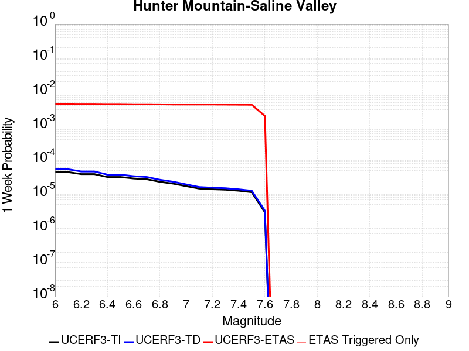 | 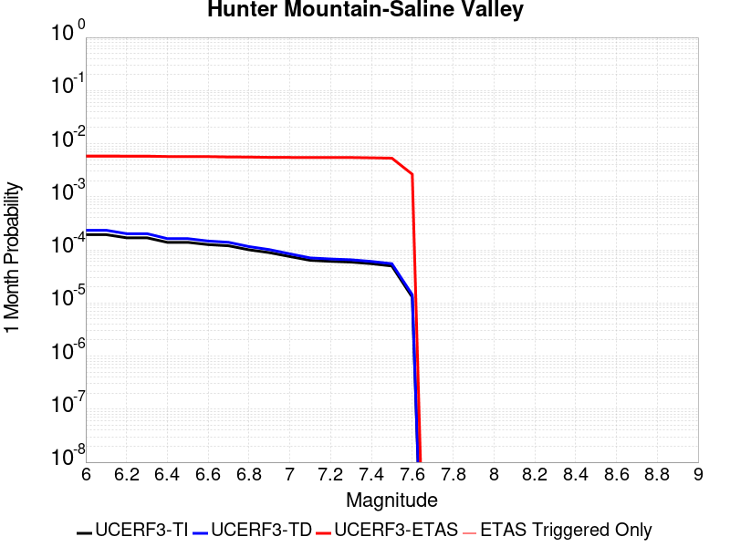 | 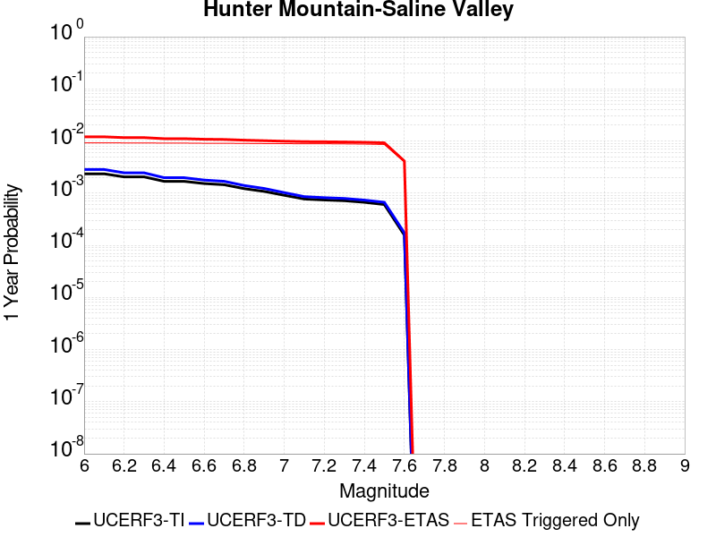 | 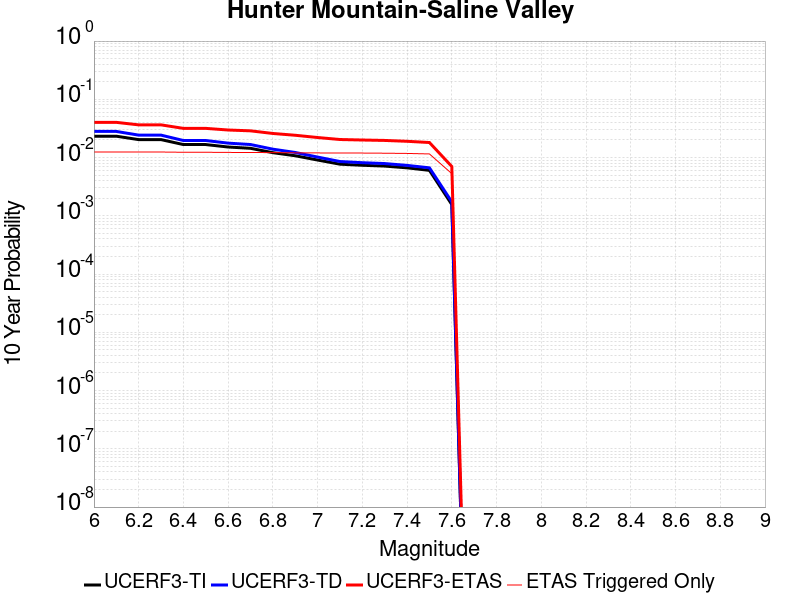 |

| Magnitude | 1 wk TI Prob | 1 wk TD Prob | 1 wk ETAS Prob | 1 wk ETAS/TD Gain | 1 wk ETAS Triggered Only | 1 mo TI Prob | 1 mo TD Prob | 1 mo ETAS Prob | 1 mo ETAS/TD Gain | 1 mo ETAS Triggered Only | 1 yr TI Prob | 1 yr TD Prob | 1 yr ETAS Prob | 1 yr ETAS/TD Gain | 1 yr ETAS Triggered Only | 10 yr TI Prob | 10 yr TD Prob | 10 yr ETAS Prob | 10 yr ETAS/TD Gain | 10 yr ETAS Triggered Only |
|-----|-----|-----|-----|-----|-----|-----|-----|-----|-----|-----|-----|-----|-----|-----|-----|-----|-----|-----|-----|-----|
| 6.0 | 4.5103672E-5 | 5.456906E-5 | 0.0043543344 | 79.79493 | 0.0043 | 1.9328714E-4 | 2.3384714E-4 | 0.006192453 | 26.480776 | 0.00596 | 0.002350731 | 0.0028435462 | 0.012037328 | 4.23321 | 0.00922 | 0.023260195 | 0.028092625 | 0.04022203 | 1.4317647 | 0.01248 |
| 6.1 | 4.5103672E-5 | 5.456906E-5 | 0.0043543344 | 79.79493 | 0.0043 | 1.9328714E-4 | 2.3384714E-4 | 0.006192453 | 26.480776 | 0.00596 | 0.002350731 | 0.0028435462 | 0.012037328 | 4.23321 | 0.00922 | 0.023260195 | 0.028092625 | 0.04022203 | 1.4317647 | 0.01248 |
| 6.2 | 3.9363465E-5 | 4.706271E-5 | 0.0043268614 | 91.93821 | 0.00428 | 1.6868966E-4 | 2.016826E-4 | 0.0061404845 | 30.446278 | 0.00594 | 0.002051862 | 0.0024528534 | 0.011620312 | 4.737467 | 0.00919 | 0.020330196 | 0.024274187 | 0.036421973 | 1.5004405 | 0.01245 |
| 6.3 | 3.9363465E-5 | 4.706271E-5 | 0.0043268614 | 91.93821 | 0.00428 | 1.6868966E-4 | 2.016826E-4 | 0.0061404845 | 30.446278 | 0.00594 | 0.002051862 | 0.0024528534 | 0.011620312 | 4.737467 | 0.00919 | 0.020330196 | 0.024274187 | 0.036421973 | 1.5004405 | 0.01245 |
| 6.4 | 3.2311684E-5 | 3.795112E-5 | 0.00428779 | 112.98191 | 0.00425 | 1.384713E-4 | 1.6263791E-4 | 0.0060616783 | 37.271004 | 0.0059 | 0.0016845843 | 0.001978387 | 0.011080344 | 5.600696 | 0.00912 | 0.016718714 | 0.019617118 | 0.031705238 | 1.6162027 | 0.01233 |
| 6.5 | 3.2311684E-5 | 3.795112E-5 | 0.00428779 | 112.98191 | 0.00425 | 1.384713E-4 | 1.6263791E-4 | 0.0060616783 | 37.271004 | 0.0059 | 0.0016845843 | 0.001978387 | 0.011080344 | 5.600696 | 0.00912 | 0.016718714 | 0.019617118 | 0.031705238 | 1.6162027 | 0.01233 |
| 6.6 | 2.9305844E-5 | 3.418196E-5 | 0.004244038 | 124.160164 | 0.00421 | 1.2559042E-4 | 1.4648624E-4 | 0.0059956294 | 40.929638 | 0.00585 | 0.0015279909 | 0.0017820727 | 0.0108159445 | 6.0693064 | 0.00905 | 0.015175272 | 0.017686324 | 0.029719668 | 1.6803756 | 0.01225 |
| 6.7 | 2.7826512E-5 | 3.2344353E-5 | 0.0042422083 | 131.15761 | 0.00421 | 1.19251024E-4 | 1.3861163E-4 | 0.005977802 | 43.126266 | 0.00584 | 0.0014509142 | 0.0016863506 | 0.010711106 | 6.351649 | 0.00904 | 0.014414776 | 0.016743818 | 0.02875921 | 1.7176015 | 0.01222 |
| 6.8 | 2.3389874E-5 | 2.6866792E-5 | 0.0042067543 | 156.57823 | 0.00418 | 1.0023846E-4 | 1.1513857E-4 | 0.00592447 | 51.455124 | 0.00581 | 0.00121972 | 0.001400958 | 0.010378364 | 7.408047 | 0.00899 | 0.01213047 | 0.013928067 | 0.025918702 | 1.8608973 | 0.01216 |
| 6.9 | 2.069209E-5 | 2.357011E-5 | 0.0041634724 | 176.64206 | 0.00414 | 8.867737E-5 | 1.0101105E-4 | 0.0058604293 | 58.017704 | 0.00576 | 0.0010791123 | 0.0012291519 | 0.010138188 | 8.2481165 | 0.00892 | 0.010738871 | 0.012229158 | 0.024141673 | 1.9741077 | 0.01206 |
| 7.0 | 1.7462342E-5 | 1.9633622E-5 | 0.0041495524 | 211.3493 | 0.00413 | 7.483646E-5 | 8.414151E-5 | 0.005833658 | 69.331505 | 0.00575 | 9.1075303E-4 | 0.0010239641 | 0.009904861 | 9.673055 | 0.00889 | 0.009070295 | 0.010196688 | 0.022084225 | 2.1658235 | 0.01201 |
| 7.1 | 1.4807709E-5 | 1.6441827E-5 | 0.004146374 | 252.18451 | 0.00413 | 6.3460066E-5 | 7.046316E-5 | 0.005820058 | 82.597176 | 0.00575 | 7.723524E-4 | 8.575678E-4 | 0.009719961 | 11.334335 | 0.00887 | 0.007696735 | 0.008546168 | 0.02041387 | 2.3886578 | 0.01197 |
| 7.2 | 1.4180048E-5 | 1.5698413E-5 | 0.0041456334 | 264.07977 | 0.00413 | 6.077022E-5 | 6.727727E-5 | 0.0058168904 | 86.46145 | 0.00575 | 7.396263E-4 | 8.1880915E-4 | 0.009671555 | 11.811732 | 0.00886 | 0.0073716943 | 0.008161469 | 0.02001394 | 2.4522471 | 0.01195 |
| 7.3 | 1.3730402E-5 | 1.5172151E-5 | 0.00411511 | 271.22787 | 0.0041 | 5.8843252E-5 | 6.502197E-5 | 0.00578465 | 88.96455 | 0.00572 | 7.161811E-4 | 7.9137104E-4 | 0.009584407 | 12.111141 | 0.0088 | 0.007138774 | 0.007889058 | 0.019675337 | 2.4940033 | 0.01188 |
| 7.4 | 1.2810095E-5 | 1.4109353E-5 | 0.004084052 | 289.45706 | 0.00407 | 5.489925E-5 | 6.0467344E-5 | 0.005720125 | 94.59859 | 0.00566 | 6.681934E-4 | 7.3595706E-4 | 0.00944954 | 12.839797 | 0.00872 | 0.006661878 | 0.0073386896 | 0.019022314 | 2.5920587 | 0.01177 |
| 7.5 | 1.1595659E-5 | 1.2800734E-5 | 0.004052749 | 316.60287 | 0.00404 | 4.9694736E-5 | 5.485922E-5 | 0.0056245537 | 102.52704 | 0.00557 | 6.0486543E-4 | 6.67722E-4 | 0.0092319995 | 13.826113 | 0.00857 | 0.006032217 | 0.006660632 | 0.018123768 | 2.7210283 | 0.01154 |
| 7.6 | 2.997694E-6 | 3.3251877E-6 | 0.0018833189 | 566.37976 | 0.00188 | 1.28471975E-5 | 1.4250767E-5 | 0.0026242135 | 184.14543 | 0.00261 | 1.564034E-4 | 1.7349655E-4 | 0.0041328096 | 23.820702 | 0.00396 | 0.0015629337 | 0.0017356955 | 0.0070264963 | 4.048231 | 0.0053 |

## Ash Hill
*[(top)](#table-of-contents)*

| 1 Week | 1 Month | 1 Year | 10 Year |
|-----|-----|-----|-----|
| 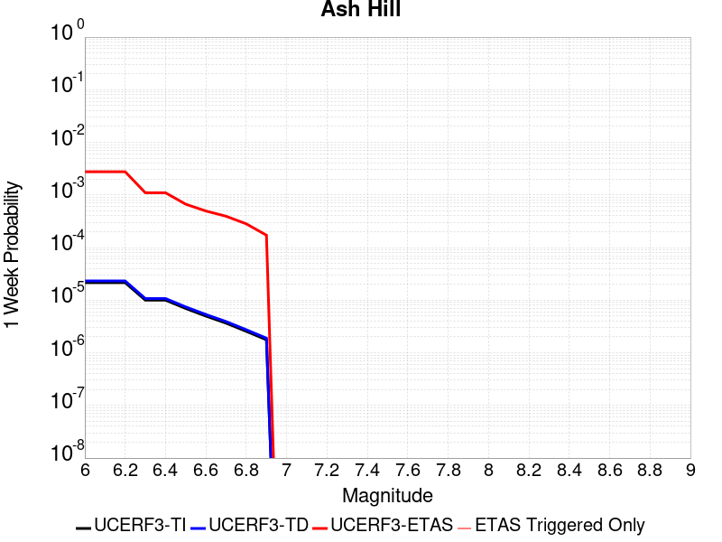 | 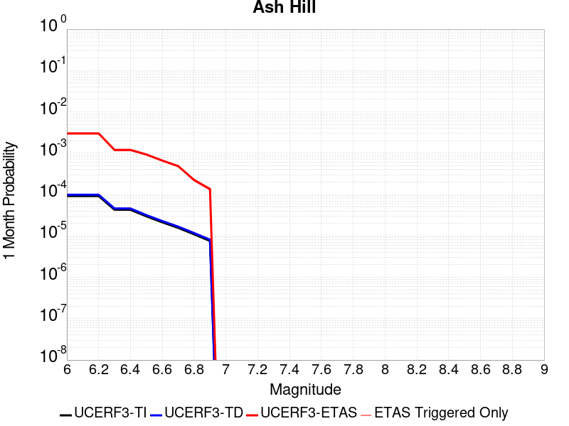 | 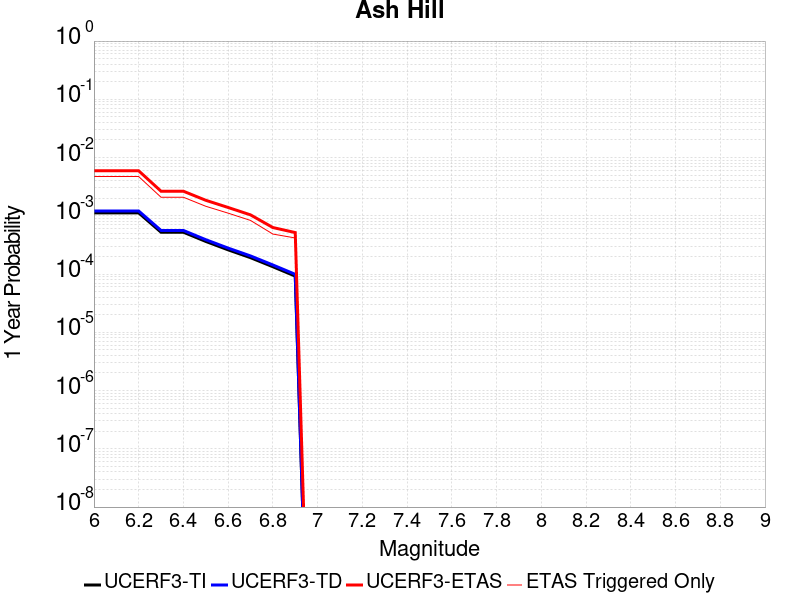 | 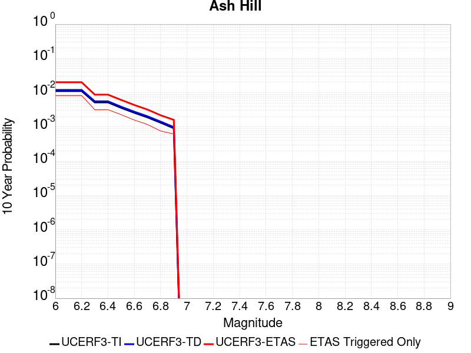 |

| Magnitude | 1 wk TI Prob | 1 wk TD Prob | 1 wk ETAS Prob | 1 wk ETAS/TD Gain | 1 wk ETAS Triggered Only | 1 mo TI Prob | 1 mo TD Prob | 1 mo ETAS Prob | 1 mo ETAS/TD Gain | 1 mo ETAS Triggered Only | 1 yr TI Prob | 1 yr TD Prob | 1 yr ETAS Prob | 1 yr ETAS/TD Gain | 1 yr ETAS Triggered Only | 10 yr TI Prob | 10 yr TD Prob | 10 yr ETAS Prob | 10 yr ETAS/TD Gain | 10 yr ETAS Triggered Only |
|-----|-----|-----|-----|-----|-----|-----|-----|-----|-----|-----|-----|-----|-----|-----|-----|-----|-----|-----|-----|-----|
| 6.0 | 2.1545662E-5 | 2.3194447E-5 | 0.002763131 | 119.12898 | 0.00274 | 9.2335285E-5 | 9.940143E-5 | 0.0039090225 | 39.325615 | 0.00381 | 0.0011236023 | 0.0012096206 | 0.007591891 | 6.2762585 | 0.00639 | 0.011179381 | 0.012038348 | 0.02153266 | 1.7886722 | 0.00961 |
| 6.1 | 2.1545662E-5 | 2.3194447E-5 | 0.002763131 | 119.12898 | 0.00274 | 9.2335285E-5 | 9.940143E-5 | 0.0039090225 | 39.325615 | 0.00381 | 0.0011236023 | 0.0012096206 | 0.007591891 | 6.2762585 | 0.00639 | 0.011179381 | 0.012038348 | 0.02153266 | 1.7886722 | 0.00961 |
| 6.2 | 2.1545662E-5 | 2.3194447E-5 | 0.002763131 | 119.12898 | 0.00274 | 9.2335285E-5 | 9.940143E-5 | 0.0039090225 | 39.325615 | 0.00381 | 0.0011236023 | 0.0012096206 | 0.007591891 | 6.2762585 | 0.00639 | 0.011179381 | 0.012038348 | 0.02153266 | 1.7886722 | 0.00961 |
| 6.3 | 1.0025529E-5 | 1.0746934E-5 | 0.0011007353 | 102.42318 | 0.00109 | 4.2965847E-5 | 4.605755E-5 | 0.0015659876 | 34.000668 | 0.00152 | 5.229836E-4 | 5.6061964E-4 | 0.0030692124 | 5.474679 | 0.00251 | 0.005217545 | 0.0055933665 | 0.009521273 | 1.7022437 | 0.00395 |
| 6.4 | 1.0025529E-5 | 1.0746934E-5 | 0.0011007353 | 102.42318 | 0.00109 | 4.2965847E-5 | 4.605755E-5 | 0.0015659876 | 34.000668 | 0.00152 | 5.229836E-4 | 5.6061964E-4 | 0.0030692124 | 5.474679 | 0.00251 | 0.005217545 | 0.0055933665 | 0.009521273 | 1.7022437 | 0.00395 |
| 6.5 | 6.9617327E-6 | 7.456634E-6 | 6.674517E-4 | 89.51112 | 6.6E-4 | 2.9835655E-5 | 3.195666E-5 | 9.819263E-4 | 30.726812 | 9.5E-4 | 3.6318856E-4 | 3.8901155E-4 | 0.0019683968 | 5.059996 | 0.00158 | 0.0036259557 | 0.0038841602 | 0.0064142947 | 1.651398 | 0.00254 |
| 6.6 | 4.9919777E-6 | 5.3466883E-6 | 4.9534405E-4 | 92.64503 | 4.9E-4 | 2.1394015E-5 | 2.2914215E-5 | 6.728993E-4 | 29.366022 | 6.5E-4 | 2.60441E-4 | 2.7895154E-4 | 0.0013986392 | 5.013914 | 0.00112 | 0.0026013597 | 0.0027866727 | 0.004581657 | 1.6441317 | 0.0018 |
| 6.7 | 3.6630722E-6 | 3.924624E-6 | 3.9392308E-4 | 100.37219 | 3.9E-4 | 1.5698786E-5 | 1.681974E-5 | 5.068115E-4 | 30.131947 | 4.9E-4 | 1.9111596E-4 | 2.0476682E-4 | 0.001024599 | 5.003735 | 8.2E-4 | 0.0019095168 | 0.0020463446 | 0.0034235206 | 1.6729933 | 0.00138 |
| 6.8 | 2.5599613E-6 | 2.744925E-6 | 2.8274415E-4 | 103.00615 | 2.8E-4 | 1.0971216E-5 | 1.1763939E-5 | 3.3176018E-4 | 28.201452 | 3.2E-4 | 1.3356637E-4 | 1.4322149E-4 | 6.731456E-4 | 4.7000318 | 5.3E-4 | 0.0013348613 | 0.0014317769 | 0.0023504596 | 1.6416382 | 9.2E-4 |
| 6.9 | 1.7684905E-6 | 1.8968707E-6 | 1.7189655E-4 | 90.62112 | 1.7E-4 | 7.579223E-6 | 8.129446E-6 | 2.0812782E-4 | 25.601723 | 2.0E-4 | 9.2273134E-5 | 9.8976E-5 | 4.4894137E-4 | 4.5358605 | 3.5E-4 | 9.223483E-4 | 9.8976E-4 | 0.001579176 | 1.595514 | 5.9E-4 |

## Garlock (West)
*[(top)](#table-of-contents)*

| 1 Week | 1 Month | 1 Year | 10 Year |
|-----|-----|-----|-----|
| 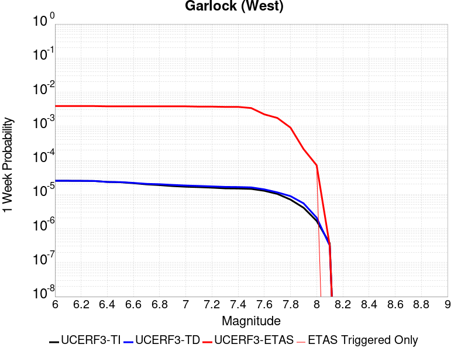 | 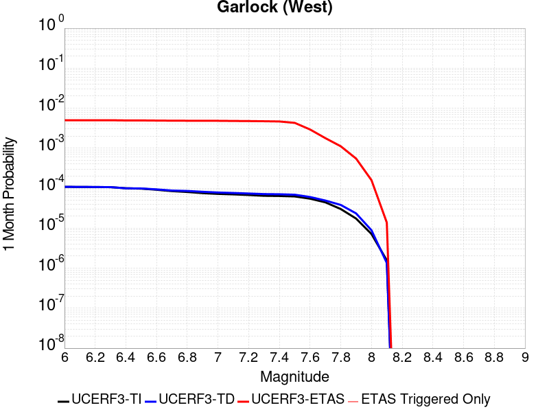 | 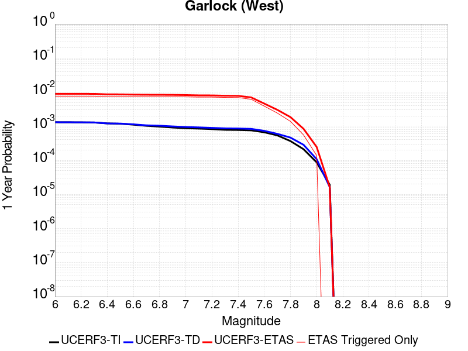 | 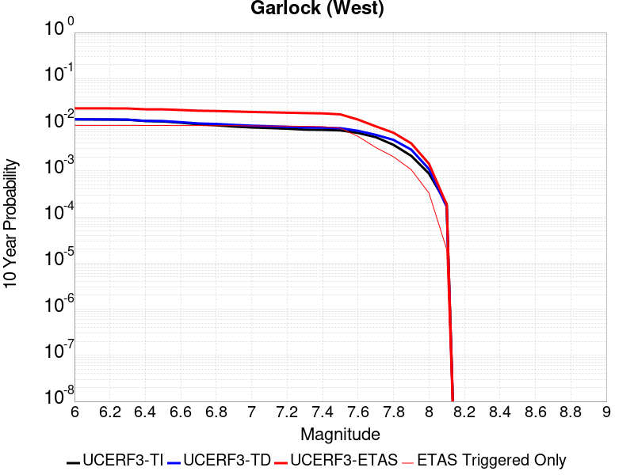 |

| Magnitude | 1 wk TI Prob | 1 wk TD Prob | 1 wk ETAS Prob | 1 wk ETAS/TD Gain | 1 wk ETAS Triggered Only | 1 mo TI Prob | 1 mo TD Prob | 1 mo ETAS Prob | 1 mo ETAS/TD Gain | 1 mo ETAS Triggered Only | 1 yr TI Prob | 1 yr TD Prob | 1 yr ETAS Prob | 1 yr ETAS/TD Gain | 1 yr ETAS Triggered Only | 10 yr TI Prob | 10 yr TD Prob | 10 yr ETAS Prob | 10 yr ETAS/TD Gain | 10 yr ETAS Triggered Only |
|-----|-----|-----|-----|-----|-----|-----|-----|-----|-----|-----|-----|-----|-----|-----|-----|-----|-----|-----|-----|-----|
| 6.0 | 2.5181727E-5 | 2.5197181E-5 | 0.0037751028 | 149.82242 | 0.00375 | 1.0791722E-4 | 1.0798347E-4 | 0.005027452 | 46.55761 | 0.00492 | 0.0013131002 | 0.0013139093 | 0.0086143045 | 6.55624 | 0.00731 | 0.013053683 | 0.013141794 | 0.022714319 | 1.7284032 | 0.0097 |
| 6.1 | 2.5077732E-5 | 2.5098223E-5 | 0.003775004 | 150.40921 | 0.00375 | 1.0747157E-4 | 1.075594E-4 | 0.00502703 | 46.737247 | 0.00492 | 0.001307681 | 0.0013087525 | 0.008609186 | 6.5781617 | 0.00731 | 0.013000126 | 0.013090835 | 0.022663854 | 1.7312764 | 0.0097 |
| 6.2 | 2.494612E-5 | 2.4979914E-5 | 0.0037748863 | 151.11685 | 0.00375 | 1.0690756E-4 | 1.070524E-4 | 0.005026526 | 46.95388 | 0.00492 | 0.0013008224 | 0.0013025872 | 0.008603065 | 6.6045985 | 0.00731 | 0.012932341 | 0.013029906 | 0.022603516 | 1.7347413 | 0.0097 |
| 6.3 | 2.4733758E-5 | 2.4799276E-5 | 0.0037747063 | 152.21034 | 0.00375 | 1.0599751E-4 | 1.06278305E-4 | 0.0050257556 | 47.28863 | 0.00492 | 0.0012897556 | 0.0012931736 | 0.00859372 | 6.6454496 | 0.00731 | 0.012822957 | 0.0129368715 | 0.022511384 | 1.7400949 | 0.0097 |
| 6.4 | 2.3237335E-5 | 2.3178607E-5 | 0.0037530921 | 161.92052 | 0.00373 | 9.958477E-5 | 9.933313E-5 | 0.0049688495 | 50.02208 | 0.00487 | 0.0012117702 | 0.0012087126 | 0.008459938 | 6.9991302 | 0.00726 | 0.012051838 | 0.012101731 | 0.021615192 | 1.7861239 | 0.00963 |
| 6.5 | 2.2732203E-5 | 2.2992977E-5 | 0.0037529073 | 163.21973 | 0.00373 | 9.742009E-5 | 9.8537625E-5 | 0.004968058 | 50.417877 | 0.00487 | 0.0011854442 | 0.0011990381 | 0.008450333 | 7.0475936 | 0.00726 | 0.011791403 | 0.012006035 | 0.021520417 | 1.7924665 | 0.00963 |
| 6.6 | 2.1319436E-5 | 2.1773201E-5 | 0.0037216926 | 170.92996 | 0.0037 | 9.136581E-5 | 9.3310395E-5 | 0.00492286 | 52.75789 | 0.00483 | 0.001111811 | 0.0011354643 | 0.008357255 | 7.360209 | 0.00723 | 0.011062649 | 0.011376952 | 0.020857846 | 1.8333423 | 0.00959 |
| 6.7 | 1.970802E-5 | 2.0393094E-5 | 0.003710318 | 181.93991 | 0.00369 | 8.446021E-5 | 8.739606E-5 | 0.0048969756 | 56.031998 | 0.00481 | 0.001027818 | 0.0010635294 | 0.008265861 | 7.7721047 | 0.00721 | 0.010230771 | 0.0106646875 | 0.020132627 | 1.887784 | 0.00957 |
| 6.8 | 1.8744462E-5 | 1.9900775E-5 | 0.0036998275 | 185.91374 | 0.00368 | 8.033094E-5 | 8.528626E-5 | 0.004884877 | 57.27625 | 0.0048 | 9.775903E-4 | 0.0010378672 | 0.008230395 | 7.930104 | 0.0072 | 0.009733009 | 0.010410495 | 0.019861074 | 1.9077935 | 0.00955 |
| 6.9 | 1.7559682E-5 | 1.8953151E-5 | 0.0036988833 | 195.15929 | 0.00368 | 7.5253614E-5 | 8.122527E-5 | 0.0048808353 | 60.09011 | 0.0048 | 9.158276E-4 | 9.884704E-4 | 0.008181353 | 8.276781 | 0.0072 | 0.0091206245 | 0.009921073 | 0.019376326 | 1.9530475 | 0.00955 |
| 7.0 | 1.6794445E-5 | 1.8215967E-5 | 0.0036881492 | 202.46793 | 0.00367 | 7.197421E-5 | 7.806611E-5 | 0.004857693 | 62.22538 | 0.00478 | 8.759337E-4 | 9.5004175E-4 | 0.008103239 | 8.52935 | 0.00716 | 0.008724891 | 0.009539958 | 0.01890971 | 1.9821587 | 0.00946 |
| 7.1 | 1.6337795E-5 | 1.771677E-5 | 0.0036576523 | 206.45143 | 0.00364 | 7.0017246E-5 | 7.592681E-5 | 0.004815567 | 63.4238 | 0.00474 | 8.521265E-4 | 9.2401815E-4 | 0.008007467 | 8.665919 | 0.00709 | 0.008488664 | 0.009281721 | 0.018574659 | 2.0012085 | 0.00938 |
| 7.2 | 1.5780008E-5 | 1.71654E-5 | 0.003647103 | 212.4683 | 0.00363 | 6.762685E-5 | 7.3563926E-5 | 0.0047832173 | 65.02123 | 0.00471 | 8.2304585E-4 | 8.952741E-4 | 0.007948954 | 8.878793 | 0.00706 | 0.008200042 | 0.008996559 | 0.018242622 | 2.027733 | 0.00933 |
| 7.3 | 1.5058865E-5 | 1.6618484E-5 | 0.0036165586 | 217.62268 | 0.0036 | 6.45364E-5 | 7.122013E-5 | 0.004720889 | 66.28588 | 0.00465 | 7.854473E-4 | 8.667614E-4 | 0.007840712 | 9.045986 | 0.00698 | 0.00782677 | 0.008713263 | 0.017872753 | 2.0512123 | 0.00924 |
| 7.4 | 1.4887923E-5 | 1.6454453E-5 | 0.003566396 | 216.74353 | 0.00355 | 6.380382E-5 | 7.0517184E-5 | 0.0046601933 | 66.08593 | 0.00459 | 7.7653467E-4 | 8.5820974E-4 | 0.007722314 | 8.998166 | 0.00687 | 0.0077382675 | 0.008628101 | 0.017629758 | 2.0432951 | 0.00908 |
| 7.5 | 1.4509299E-5 | 1.6046468E-5 | 0.0033259934 | 207.27261 | 0.00331 | 6.218123E-5 | 6.876877E-5 | 0.0043184767 | 62.797054 | 0.00425 | 7.567935E-4 | 8.369394E-4 | 0.0071916166 | 8.592756 | 0.00636 | 0.0075422134 | 0.008416411 | 0.016785376 | 1.9943628 | 0.00844 |
| 7.6 | 1.2756717E-5 | 1.4050529E-5 | 0.0022740187 | 161.84578 | 0.00226 | 5.4670498E-5 | 6.0215163E-5 | 0.0029700398 | 49.323788 | 0.00291 | 6.6541E-4 | 7.328737E-4 | 0.0049697664 | 6.781204 | 0.00424 | 0.006634211 | 0.007381374 | 0.012920186 | 1.7503768 | 0.00558 |
| 7.7 | 1.0328985E-5 | 1.146033E-5 | 0.0014714436 | 128.39452 | 0.00146 | 4.4266326E-5 | 4.9114777E-5 | 0.0018490264 | 37.64705 | 0.0018 | 5.388092E-4 | 5.9780874E-4 | 0.0031362902 | 5.2463107 | 0.00254 | 0.0053750467 | 0.006038286 | 0.009228903 | 1.5283978 | 0.00321 |
| 7.8 | 7.0306583E-6 | 8.899537E-6 | 9.2889136E-4 | 104.37525 | 9.2E-4 | 3.0131043E-5 | 3.8140315E-5 | 0.001148098 | 30.101954 | 0.00111 | 3.667837E-4 | 4.6425956E-4 | 0.002043526 | 4.4016886 | 0.00158 | 0.003661789 | 0.0046950667 | 0.0067055826 | 1.4282188 | 0.00202 |
| 7.9 | 4.060633E-6 | 5.465412E-6 | 4.5546296E-4 | 83.33552 | 4.5E-4 | 1.7402595E-5 | 2.3422985E-5 | 5.3341105E-4 | 22.772974 | 5.1E-4 | 2.11856E-4 | 2.8513762E-4 | 0.0010649152 | 3.7347412 | 7.8E-4 | 0.0021165414 | 0.002884143 | 0.0039410857 | 1.3664669 | 0.00106 |
| 8.0 | 1.6729537E-6 | 2.0775192E-6 | 1.520772E-4 | 73.20135 | 1.5E-4 | 7.169782E-6 | 8.903624E-6 | 1.5890229E-4 | 17.846924 | 1.5E-4 | 8.7288594E-5 | 1.0839626E-4 | 3.3837132E-4 | 3.1216145 | 2.3E-4 | 8.7254314E-4 | 0.001096854 | 0.001426492 | 1.3005304 | 3.3E-4 |
| 8.1 | 3.6733252E-7 | 3.1489736E-7 | 1.0314894E-5 | 32.756367 | 1.0E-5 | 1.5742813E-6 | 1.3495595E-6 | 1.1349546E-5 | 8.409815 | 1.0E-5 | 1.9166706E-5 | 1.643078E-5 | 3.643045E-5 | 2.2172077 | 2.0E-5 | 1.9165053E-4 | 1.662928E-4 | 1.8628947E-4 | 1.1202497 | 2.0E-5 |

## Gravel Hills-Harper Lk
*[(top)](#table-of-contents)*

| 1 Week | 1 Month | 1 Year | 10 Year |
|-----|-----|-----|-----|
| 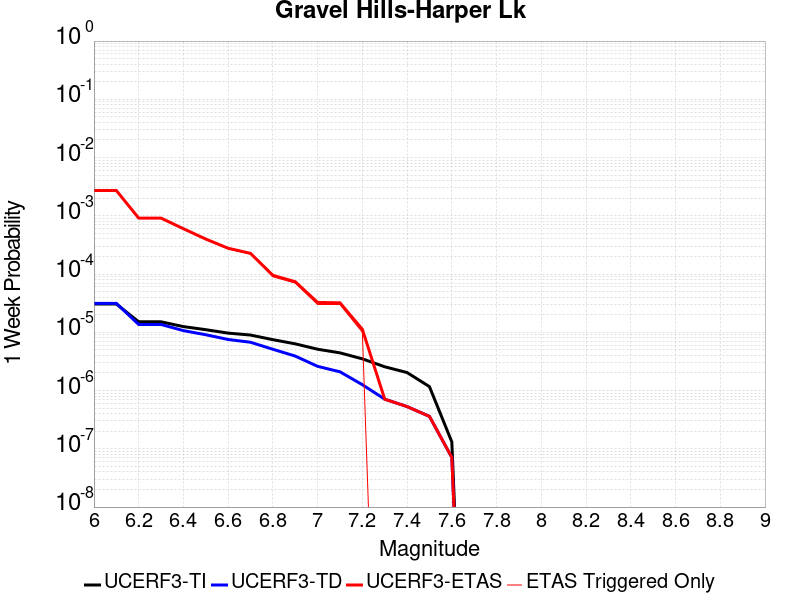 | 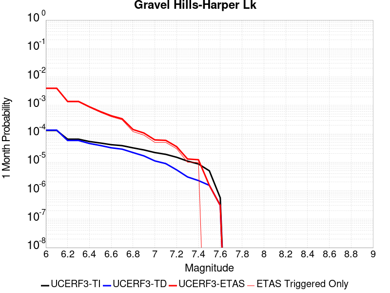 | 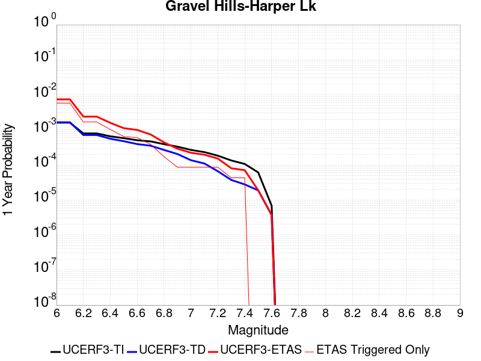 | 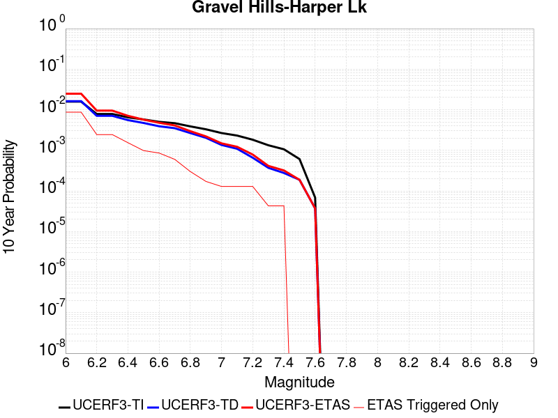 |

| Magnitude | 1 wk TI Prob | 1 wk TD Prob | 1 wk ETAS Prob | 1 wk ETAS/TD Gain | 1 wk ETAS Triggered Only | 1 mo TI Prob | 1 mo TD Prob | 1 mo ETAS Prob | 1 mo ETAS/TD Gain | 1 mo ETAS Triggered Only | 1 yr TI Prob | 1 yr TD Prob | 1 yr ETAS Prob | 1 yr ETAS/TD Gain | 1 yr ETAS Triggered Only | 10 yr TI Prob | 10 yr TD Prob | 10 yr ETAS Prob | 10 yr ETAS/TD Gain | 10 yr ETAS Triggered Only |
|-----|-----|-----|-----|-----|-----|-----|-----|-----|-----|-----|-----|-----|-----|-----|-----|-----|-----|-----|-----|-----|
| 6.0 | 3.0679566E-5 | 3.1464628E-5 | 0.00272138 | 86.49014 | 0.00269 | 1.3147724E-4 | 1.3484266E-4 | 0.0040043206 | 29.696247 | 0.00387 | 0.0015995599 | 0.00164069 | 0.007970288 | 4.8578877 | 0.00634 | 0.015880952 | 0.016307337 | 0.025190083 | 1.5447085 | 0.00903 |
| 6.1 | 3.0679566E-5 | 3.1464628E-5 | 0.00272138 | 86.49014 | 0.00269 | 1.3147724E-4 | 1.3484266E-4 | 0.0040043206 | 29.696247 | 0.00387 | 0.0015995599 | 0.00164069 | 0.007970288 | 4.8578877 | 0.00634 | 0.015880952 | 0.016307337 | 0.025190083 | 1.5447085 | 0.00903 |
| 6.2 | 1.514536E-5 | 1.36352E-5 | 9.136229E-4 | 67.00473 | 9.0E-4 | 6.490707E-5 | 5.843533E-5 | 0.0013783582 | 23.587753 | 0.00132 | 7.8995706E-4 | 7.112298E-4 | 0.0027198002 | 3.8240807 | 0.00201 | 0.007871548 | 0.007090737 | 0.010039678 | 1.4158863 | 0.00297 |
| 6.3 | 1.514536E-5 | 1.36352E-5 | 9.136229E-4 | 67.00473 | 9.0E-4 | 6.490707E-5 | 5.843533E-5 | 0.0013783582 | 23.587753 | 0.00132 | 7.8995706E-4 | 7.112298E-4 | 0.0027198002 | 3.8240807 | 0.00201 | 0.007871548 | 0.007090737 | 0.010039678 | 1.4158863 | 0.00297 |
| 6.4 | 1.2532521E-5 | 1.0689684E-5 | 6.006834E-4 | 56.19281 | 5.9E-4 | 5.37097E-5 | 4.581216E-5 | 8.9577324E-4 | 19.553177 | 8.5E-4 | 6.537194E-4 | 5.5762613E-4 | 0.0018169235 | 3.2583184 | 0.00126 | 0.0065179965 | 0.005562859 | 0.0073926235 | 1.3289251 | 0.00184 |
| 6.5 | 1.1094058E-5 | 9.083657E-6 | 3.990801E-4 | 43.93386 | 3.9E-4 | 4.7545094E-5 | 3.89294E-5 | 6.089072E-4 | 15.641321 | 5.7E-4 | 5.787078E-4 | 4.7386638E-4 | 0.0012934778 | 2.7296257 | 8.2E-4 | 0.0057720304 | 0.004728967 | 0.0060128667 | 1.2714969 | 0.00129 |
| 6.6 | 9.688328E-6 | 7.531688E-6 | 2.7752965E-4 | 36.848267 | 2.7E-4 | 4.1520743E-5 | 3.227828E-5 | 4.3226537E-4 | 13.391834 | 4.0E-4 | 5.053978E-4 | 3.9291973E-4 | 9.826879E-4 | 2.500989 | 5.9E-4 | 0.0050424994 | 0.0039225067 | 0.0048289374 | 1.2310845 | 9.1E-4 |
| 6.7 | 8.974824E-6 | 6.749406E-6 | 2.2674791E-4 | 33.59524 | 2.2E-4 | 3.8462964E-5 | 2.8925719E-5 | 3.3891675E-4 | 11.716797 | 3.1E-4 | 4.6818596E-4 | 3.5211592E-4 | 8.0195745E-4 | 2.2775383 | 4.5E-4 | 0.004672008 | 0.003515801 | 0.004203375 | 1.1955669 | 6.9E-4 |
| 6.8 | 7.4780046E-6 | 5.1161865E-6 | 9.511573E-5 | 18.591139 | 9.0E-5 | 3.20482E-5 | 2.1926337E-5 | 1.4192371E-4 | 6.4727507 | 1.2E-4 | 3.9011694E-4 | 2.6692182E-4 | 4.5687112E-4 | 1.7116289 | 1.9E-4 | 0.0038943281 | 0.0026661505 | 0.0029553773 | 1.108481 | 2.9E-4 |
| 6.9 | 6.3409307E-6 | 3.907489E-6 | 7.390721E-5 | 18.914248 | 7.0E-5 | 2.7175134E-5 | 1.674628E-5 | 1.06744774E-4 | 6.374238 | 9.0E-5 | 3.3080703E-4 | 2.0386786E-4 | 3.538373E-4 | 1.7356206 | 1.5E-4 | 0.0033031502 | 0.0020369065 | 0.0022564586 | 1.1077869 | 2.2E-4 |
| 7.0 | 5.1239335E-6 | 2.6058492E-6 | 3.260577E-5 | 12.512531 | 3.0E-5 | 2.195953E-5 | 1.1167879E-5 | 6.1167324E-5 | 5.477076 | 5.0E-5 | 2.6732447E-4 | 1.359607E-4 | 2.1594983E-4 | 1.5883254 | 8.0E-5 | 0.0026700313 | 0.0013588005 | 0.0014786373 | 1.0881932 | 1.2E-4 |
| 7.1 | 4.438899E-6 | 2.0984692E-6 | 3.2098407E-5 | 15.296105 | 3.0E-5 | 1.9023713E-5 | 8.99341E-6 | 5.899296E-5 | 6.5595765 | 5.0E-5 | 2.315891E-4 | 1.0948948E-4 | 1.7948182E-4 | 1.6392608 | 7.0E-5 | 0.002313479 | 0.0010943774 | 0.0012042569 | 1.1004038 | 1.1E-4 |
| 7.2 | 3.50367E-6 | 1.2615715E-6 | 1.1261559E-5 | 8.926612 | 1.0E-5 | 1.5015643E-5 | 5.406724E-6 | 3.5406563E-5 | 6.5486164 | 3.0E-5 | 1.8280011E-4 | 6.5824956E-5 | 1.1582167E-4 | 1.7595403 | 5.0E-5 | 0.0018264982 | 6.580628E-4 | 7.380102E-4 | 1.1214889 | 8.0E-5 |
| 7.3 | 2.561638E-6 | 7.118686E-7 | 7.118686E-7 | 1.0 | 0.0 | 1.0978401E-5 | 3.050862E-6 | 1.30508315E-5 | 4.2777524 | 1.0E-5 | 1.3365384E-4 | 3.7143633E-5 | 4.714326E-5 | 1.2692151 | 1.0E-5 | 0.0013357349 | 3.7137623E-4 | 3.913688E-4 | 1.0538337 | 2.0E-5 |
| 7.4 | 2.0368864E-6 | 5.304471E-7 | 5.304471E-7 | 1.0 | 0.0 | 8.729483E-6 | 2.2733427E-6 | 1.227332E-5 | 5.398799 | 1.0E-5 | 1.06276275E-4 | 2.76776E-5 | 3.7677324E-5 | 1.361293 | 1.0E-5 | 0.0010622547 | 2.767421E-4 | 2.8673932E-4 | 1.0361247 | 1.0E-5 |
| 7.5 | 1.1681728E-6 | 3.6028484E-7 | 3.6028484E-7 | 1.0 | 0.0 | 5.0064455E-6 | 1.544077E-6 | 1.544077E-6 | 1.0 | 0.0 | 6.0951766E-5 | 1.879898E-5 | 1.879898E-5 | 1.0 | 0.0 | 6.093505E-4 | 1.8797436E-4 | 1.8797436E-4 | 1.0 | 0.0 |
| 7.6 | 1.3154387E-7 | 7.1196716E-8 | 7.1196716E-8 | 1.0 | 0.0 | 5.6375933E-7 | 3.0512876E-7 | 3.0512876E-7 | 1.0 | 0.0 | 6.863748E-6 | 3.714938E-6 | 3.714938E-6 | 1.0 | 0.0 | 6.863536E-5 | 3.7148915E-5 | 3.7148915E-5 | 1.0 | 0.0 |

## McLean Lake
*[(top)](#table-of-contents)*

| 1 Week | 1 Month | 1 Year | 10 Year |
|-----|-----|-----|-----|
| 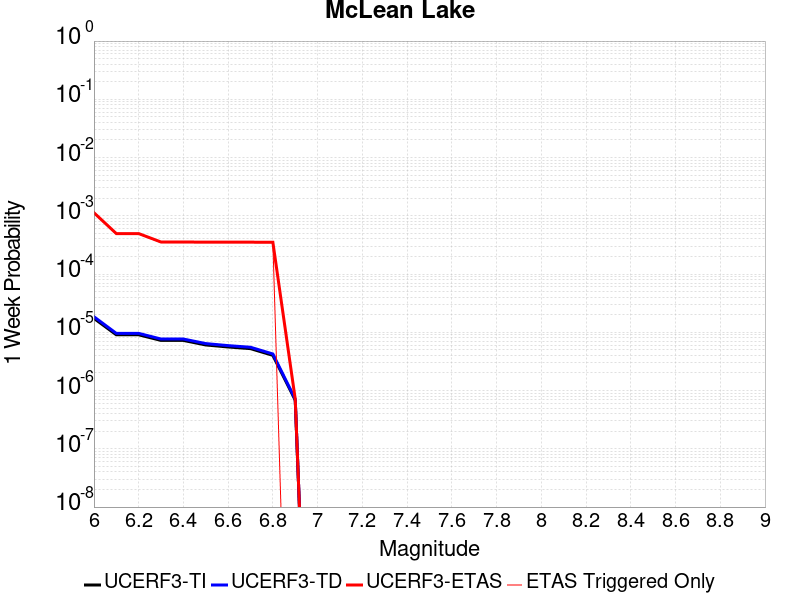 | 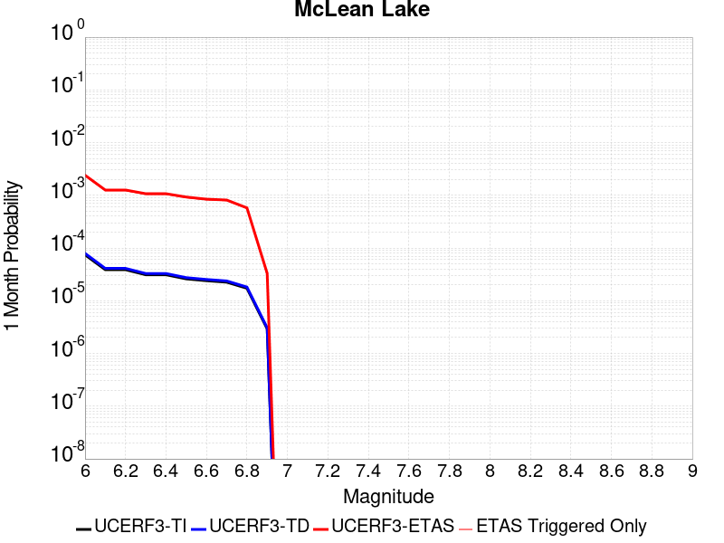 | 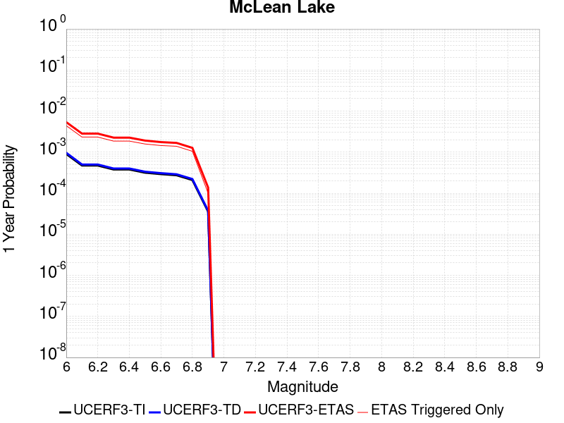 | 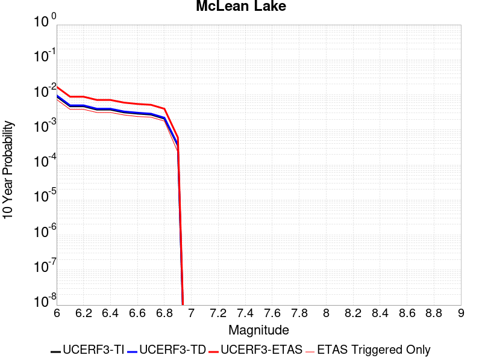 |

| Magnitude | 1 wk TI Prob | 1 wk TD Prob | 1 wk ETAS Prob | 1 wk ETAS/TD Gain | 1 wk ETAS Triggered Only | 1 mo TI Prob | 1 mo TD Prob | 1 mo ETAS Prob | 1 mo ETAS/TD Gain | 1 mo ETAS Triggered Only | 1 yr TI Prob | 1 yr TD Prob | 1 yr ETAS Prob | 1 yr ETAS/TD Gain | 1 yr ETAS Triggered Only | 10 yr TI Prob | 10 yr TD Prob | 10 yr ETAS Prob | 10 yr ETAS/TD Gain | 10 yr ETAS Triggered Only |
|-----|-----|-----|-----|-----|-----|-----|-----|-----|-----|-----|-----|-----|-----|-----|-----|-----|-----|-----|-----|-----|
| 6.0 | 1.7360222E-5 | 1.8501627E-5 | 0.001458475 | 78.82955 | 0.00144 | 7.439883E-5 | 7.9290556E-5 | 0.002409106 | 30.383265 | 0.00233 | 9.0542925E-4 | 9.6498354E-4 | 0.0053807185 | 5.5759687 | 0.00442 | 0.009017491 | 0.0096127745 | 0.016902024 | 1.7582878 | 0.00736 |
| 6.1 | 9.062689E-6 | 9.592193E-6 | 7.095855E-4 | 73.97531 | 7.0E-4 | 3.8839516E-5 | 4.1108804E-5 | 0.0012610586 | 30.676123 | 0.00122 | 4.727685E-4 | 5.003936E-4 | 0.0028292276 | 5.6540046 | 0.00233 | 0.0047176396 | 0.004993552 | 0.008814377 | 1.7651517 | 0.00384 |
| 6.2 | 9.062689E-6 | 9.592193E-6 | 7.095855E-4 | 73.97531 | 7.0E-4 | 3.8839516E-5 | 4.1108804E-5 | 0.0012610586 | 30.676123 | 0.00122 | 4.727685E-4 | 5.003936E-4 | 0.0028292276 | 5.6540046 | 0.00233 | 0.0047176396 | 0.004993552 | 0.008814377 | 1.7651517 | 0.00384 |
| 6.3 | 7.2575485E-6 | 7.66771E-6 | 6.076631E-4 | 79.249626 | 6.0E-4 | 3.110341E-5 | 3.2861237E-5 | 0.001072827 | 32.64719 | 0.00104 | 3.786182E-4 | 4.0001926E-4 | 0.0022592752 | 5.6479163 | 0.00186 | 0.0037797375 | 0.0039936965 | 0.0071111964 | 1.7806051 | 0.00313 |
| 6.4 | 7.2575485E-6 | 7.66771E-6 | 6.076631E-4 | 79.249626 | 6.0E-4 | 3.110341E-5 | 3.2861237E-5 | 0.001072827 | 32.64719 | 0.00104 | 3.786182E-4 | 4.0001926E-4 | 0.0022592752 | 5.6479163 | 0.00186 | 0.0037797375 | 0.0039936965 | 0.0071111964 | 1.7806051 | 0.00313 |
| 6.5 | 6.06582E-6 | 6.4038773E-6 | 5.4640044E-4 | 85.32338 | 5.4E-4 | 2.5996113E-5 | 2.7444936E-5 | 9.274202E-4 | 33.792034 | 9.0E-4 | 3.164567E-4 | 3.3409733E-4 | 0.0019135695 | 5.7275805 | 0.00158 | 0.0031600643 | 0.0033365893 | 0.005987714 | 1.7945613 | 0.00266 |
| 6.6 | 5.598744E-6 | 5.910262E-6 | 4.759075E-4 | 80.52223 | 4.7E-4 | 2.3994397E-5 | 2.5329486E-5 | 8.453087E-4 | 33.372517 | 8.2E-4 | 2.9209262E-4 | 3.0834923E-4 | 0.0017579021 | 5.70101 | 0.00145 | 0.0029170897 | 0.003079843 | 0.0054724514 | 1.7768605 | 0.0024 |
| 6.7 | 5.246996E-6 | 5.539162E-6 | 4.4553672E-4 | 80.43396 | 4.4E-4 | 2.2486933E-5 | 2.3739085E-5 | 8.1372034E-4 | 34.27766 | 7.9E-4 | 2.73744E-4 | 2.8899137E-4 | 0.0016785897 | 5.808442 | 0.00139 | 0.0027340704 | 0.0028867796 | 0.00518014 | 1.7944356 | 0.0023 |
| 6.8 | 4.02324E-6 | 4.2469046E-6 | 3.4424546E-4 | 81.05797 | 3.4E-4 | 1.7242342E-5 | 1.8200926E-5 | 5.781907E-4 | 31.767105 | 5.6E-4 | 2.099053E-4 | 2.2157968E-4 | 0.001271347 | 5.7376513 | 0.00105 | 0.0020970714 | 0.002214172 | 0.0039902306 | 1.8021322 | 0.00178 |
| 6.9 | 6.835972E-7 | 7.1399285E-7 | 2.0713978E-5 | 29.011465 | 2.0E-5 | 2.9296991E-6 | 3.0599674E-6 | 3.3059874E-5 | 10.803996 | 3.0E-5 | 3.56685E-5 | 3.7254784E-5 | 1.3725106E-4 | 3.684119 | 1.0E-4 | 3.5662777E-4 | 3.7251666E-4 | 6.0243096E-4 | 1.617192 | 2.3E-4 |

## Goldstone Lake
*[(top)](#table-of-contents)*

| 1 Week | 1 Month | 1 Year | 10 Year |
|-----|-----|-----|-----|
| 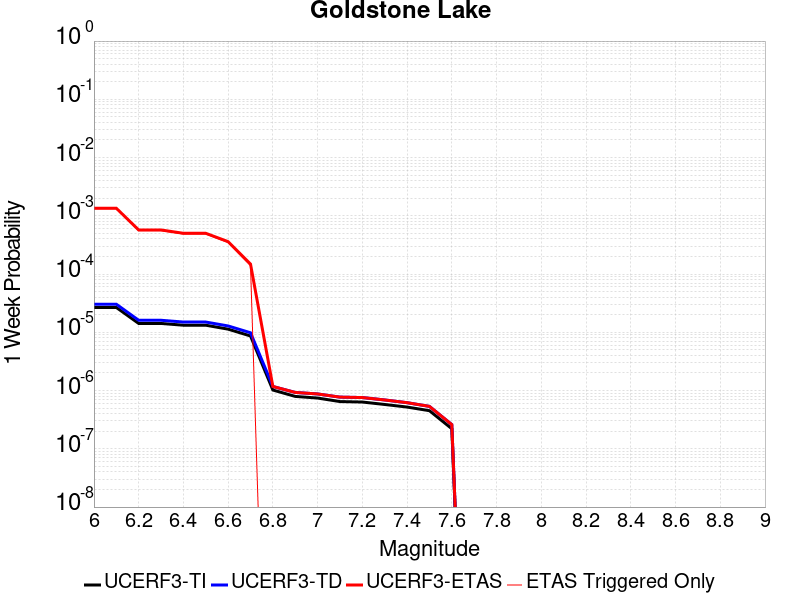 | 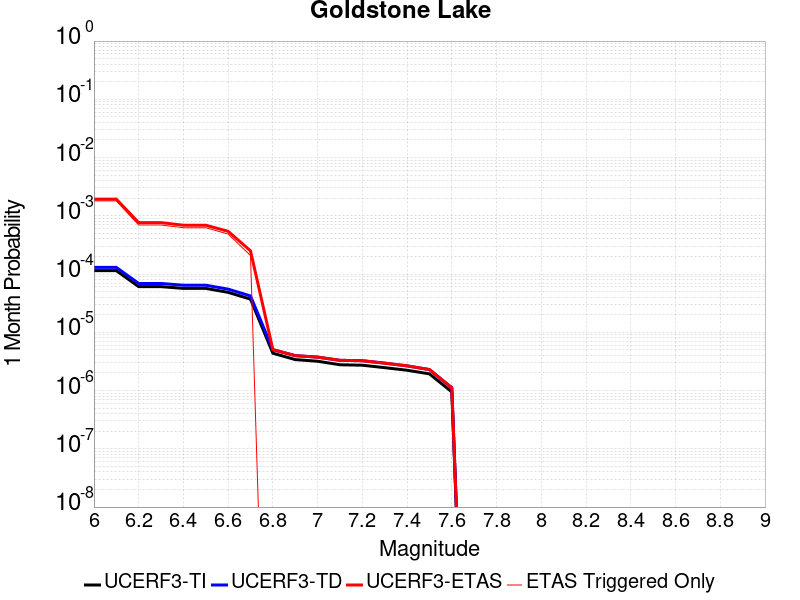 | 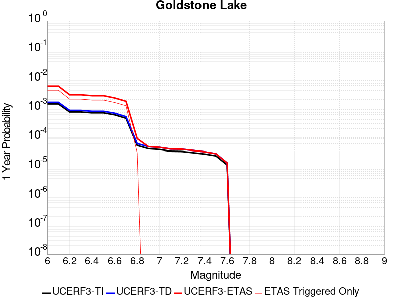 | 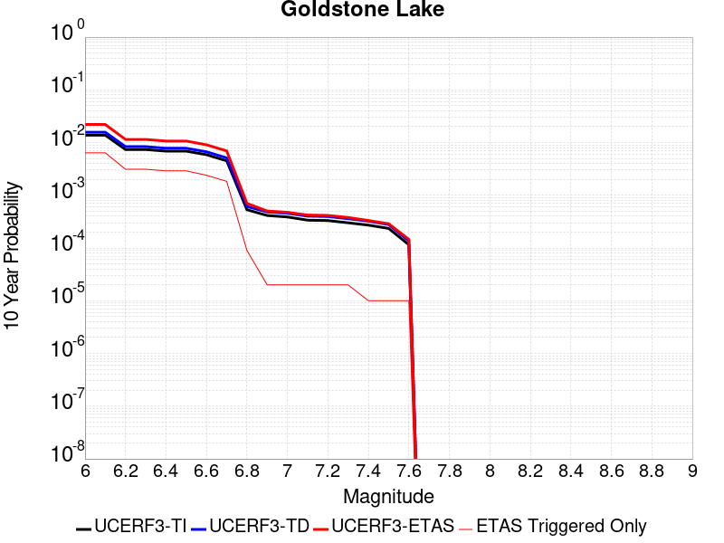 |

| Magnitude | 1 wk TI Prob | 1 wk TD Prob | 1 wk ETAS Prob | 1 wk ETAS/TD Gain | 1 wk ETAS Triggered Only | 1 mo TI Prob | 1 mo TD Prob | 1 mo ETAS Prob | 1 mo ETAS/TD Gain | 1 mo ETAS Triggered Only | 1 yr TI Prob | 1 yr TD Prob | 1 yr ETAS Prob | 1 yr ETAS/TD Gain | 1 yr ETAS Triggered Only | 10 yr TI Prob | 10 yr TD Prob | 10 yr ETAS Prob | 10 yr ETAS/TD Gain | 10 yr ETAS Triggered Only |
|-----|-----|-----|-----|-----|-----|-----|-----|-----|-----|-----|-----|-----|-----|-----|-----|-----|-----|-----|-----|-----|
| 6.0 | 2.671352E-5 | 3.0376103E-5 | 0.0015003314 | 49.391834 | 0.00147 | 1.1448149E-4 | 1.3017791E-4 | 0.0023198929 | 17.82094 | 0.00219 | 0.001392921 | 0.0015839601 | 0.00568745 | 3.5906522 | 0.00411 | 0.013842222 | 0.015746202 | 0.022055268 | 1.4006723 | 0.00641 |
| 6.1 | 2.671352E-5 | 3.0376103E-5 | 0.0015003314 | 49.391834 | 0.00147 | 1.1448149E-4 | 1.3017791E-4 | 0.0023198929 | 17.82094 | 0.00219 | 0.001392921 | 0.0015839601 | 0.00568745 | 3.5906522 | 0.00411 | 0.013842222 | 0.015746202 | 0.022055268 | 1.4006723 | 0.00641 |
| 6.2 | 1.4197047E-5 | 1.6096254E-5 | 7.1608496E-4 | 44.48768 | 7.0E-4 | 6.0843064E-5 | 6.898268E-5 | 0.0011689068 | 16.944931 | 0.0011 | 7.4051257E-4 | 8.3963916E-4 | 0.0028779262 | 3.427575 | 0.00204 | 0.007380498 | 0.008374364 | 0.011468236 | 1.3694456 | 0.00312 |
| 6.3 | 1.4197047E-5 | 1.6096254E-5 | 7.1608496E-4 | 44.48768 | 7.0E-4 | 6.0843064E-5 | 6.898268E-5 | 0.0011689068 | 16.944931 | 0.0011 | 7.4051257E-4 | 8.3963916E-4 | 0.0028779262 | 3.427575 | 0.00204 | 0.007380498 | 0.008374364 | 0.011468236 | 1.3694456 | 0.00312 |
| 6.4 | 1.3238931E-5 | 1.500847E-5 | 6.849984E-4 | 45.640793 | 6.7E-4 | 5.6737044E-5 | 6.432098E-5 | 0.001104254 | 17.167868 | 0.00104 | 6.9055456E-4 | 7.8292453E-4 | 0.0026714448 | 3.4121358 | 0.00189 | 0.006884126 | 0.007811289 | 0.010698558 | 1.3696277 | 0.00291 |
| 6.5 | 1.3238931E-5 | 1.500847E-5 | 6.849984E-4 | 45.640793 | 6.7E-4 | 5.6737044E-5 | 6.432098E-5 | 0.001104254 | 17.167868 | 0.00104 | 6.9055456E-4 | 7.8292453E-4 | 0.0026714448 | 3.4121358 | 0.00189 | 0.006884126 | 0.007811289 | 0.010698558 | 1.3696277 | 0.00291 |
| 6.6 | 1.1328278E-5 | 1.2855176E-5 | 5.3284847E-4 | 41.450115 | 5.2E-4 | 4.8548856E-5 | 5.5092984E-5 | 9.2504505E-4 | 16.790615 | 8.7E-4 | 5.90922E-4 | 6.706464E-4 | 0.0022296002 | 3.3245542 | 0.00156 | 0.0058935313 | 0.0066956137 | 0.009079544 | 1.3560436 | 0.0024 |
| 6.7 | 8.651175E-6 | 9.824575E-6 | 3.7982094E-4 | 38.660294 | 3.7E-4 | 3.707594E-5 | 4.2105148E-5 | 7.1207696E-4 | 16.911873 | 6.7E-4 | 4.5130608E-4 | 5.126002E-4 | 0.0017219799 | 3.3593044 | 0.00121 | 0.0045039062 | 0.0051230565 | 0.0069536297 | 1.3573207 | 0.00184 |
| 6.8 | 1.0215377E-6 | 1.1754802E-6 | 1.1754802E-6 | 1.0 | 0.0 | 4.378012E-6 | 5.037763E-6 | 1.5037713E-5 | 2.984998 | 1.0E-5 | 5.3300988E-5 | 6.133315E-5 | 9.133131E-5 | 1.4891019 | 3.0E-5 | 5.3288206E-4 | 6.131735E-4 | 7.0311833E-4 | 1.1466874 | 9.0E-5 |
| 6.9 | 7.9360774E-7 | 9.283496E-7 | 9.283496E-7 | 1.0 | 0.0 | 3.4011714E-6 | 3.9786355E-6 | 3.9786355E-6 | 1.0 | 0.0 | 4.1408475E-5 | 4.843888E-5 | 4.843888E-5 | 1.0 | 0.0 | 4.140076E-4 | 4.842902E-4 | 5.0428056E-4 | 1.0412775 | 2.0E-5 |
| 7.0 | 7.4382757E-7 | 8.747428E-7 | 8.747428E-7 | 1.0 | 0.0 | 3.1878285E-6 | 3.7488926E-6 | 3.7488926E-6 | 1.0 | 0.0 | 3.8811122E-5 | 4.564188E-5 | 4.564188E-5 | 1.0 | 0.0 | 3.8804344E-4 | 4.563317E-4 | 4.7632257E-4 | 1.0438077 | 2.0E-5 |
| 7.1 | 6.4709513E-7 | 7.711399E-7 | 7.711399E-7 | 1.0 | 0.0 | 2.773262E-6 | 3.3048816E-6 | 3.3048816E-6 | 1.0 | 0.0 | 3.376394E-5 | 4.023625E-5 | 4.023625E-5 | 1.0 | 0.0 | 3.375881E-4 | 4.022956E-4 | 4.2228756E-4 | 1.0496947 | 2.0E-5 |
| 7.2 | 6.356704E-7 | 7.588459E-7 | 7.588459E-7 | 1.0 | 0.0 | 2.7242988E-6 | 3.252193E-6 | 3.252193E-6 | 1.0 | 0.0 | 3.3167835E-5 | 3.959479E-5 | 3.959479E-5 | 1.0 | 0.0 | 3.3162883E-4 | 3.9588328E-4 | 4.1587537E-4 | 1.0504999 | 2.0E-5 |
| 7.3 | 5.7695723E-7 | 6.896648E-7 | 6.896648E-7 | 1.0 | 0.0 | 2.4726714E-6 | 2.9557032E-6 | 2.9557032E-6 | 1.0 | 0.0 | 3.0104358E-5 | 3.598515E-5 | 3.598515E-5 | 1.0 | 0.0 | 3.0100282E-4 | 3.5979896E-4 | 3.7979177E-4 | 1.0555665 | 2.0E-5 |
| 7.4 | 5.209647E-7 | 6.193583E-7 | 6.193583E-7 | 1.0 | 0.0 | 2.232704E-6 | 2.6543903E-6 | 2.6543903E-6 | 1.0 | 0.0 | 2.718283E-5 | 3.2316777E-5 | 3.2316777E-5 | 1.0 | 0.0 | 2.7179506E-4 | 3.2312635E-4 | 3.331231E-4 | 1.0309377 | 1.0E-5 |
| 7.5 | 4.512955E-7 | 5.3489487E-7 | 5.3489487E-7 | 1.0 | 0.0 | 1.934122E-6 | 2.2924048E-6 | 2.2924048E-6 | 1.0 | 0.0 | 2.3547682E-5 | 2.7909726E-5 | 2.7909726E-5 | 1.0 | 0.0 | 2.3545188E-4 | 2.7906752E-4 | 2.8906474E-4 | 1.0358236 | 1.0E-5 |
| 7.6 | 2.21172E-7 | 2.6040198E-7 | 2.6040198E-7 | 1.0 | 0.0 | 9.478797E-7 | 1.1160082E-6 | 1.1160082E-6 | 1.0 | 0.0 | 1.1540374E-5 | 1.3587343E-5 | 1.3587343E-5 | 1.0 | 0.0 | 1.1539775E-4 | 1.3586794E-4 | 1.4586658E-4 | 1.0735909 | 1.0E-5 |

## So Sierra Nevada
*[(top)](#table-of-contents)*

| 1 Week | 1 Month | 1 Year | 10 Year |
|-----|-----|-----|-----|
| 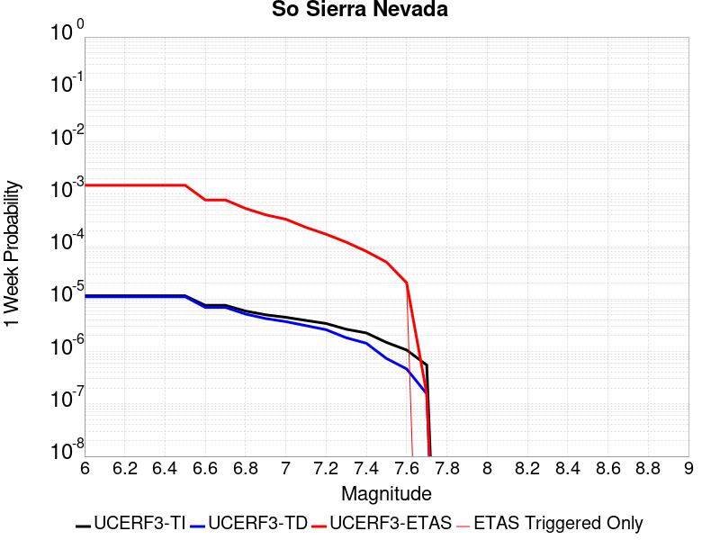 | 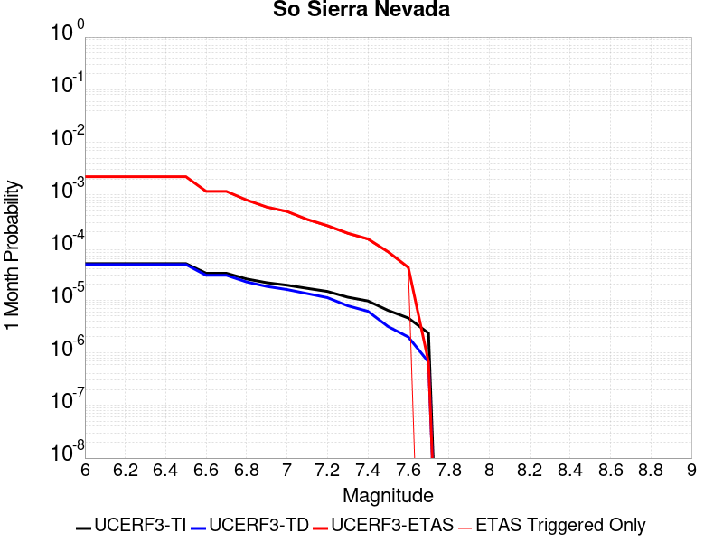 | 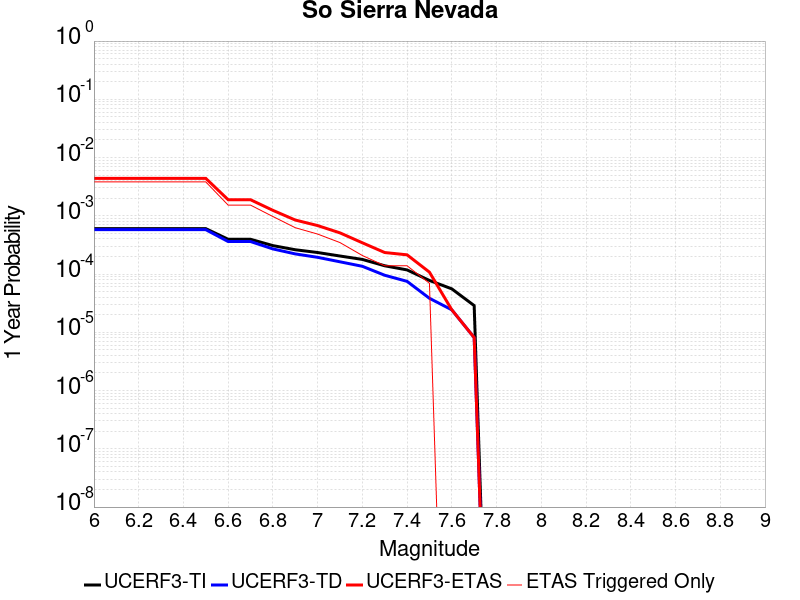 | 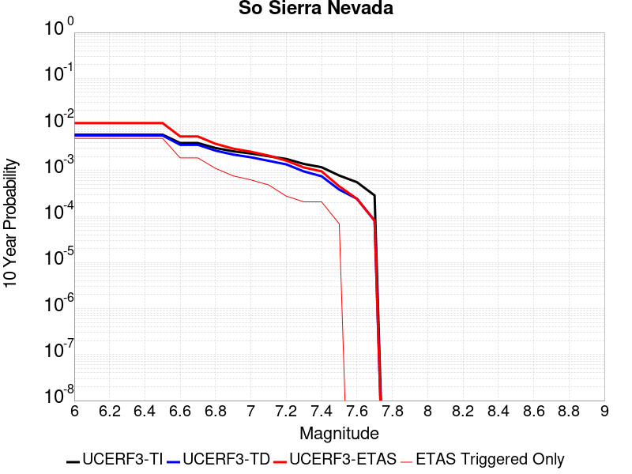 |

| Magnitude | 1 wk TI Prob | 1 wk TD Prob | 1 wk ETAS Prob | 1 wk ETAS/TD Gain | 1 wk ETAS Triggered Only | 1 mo TI Prob | 1 mo TD Prob | 1 mo ETAS Prob | 1 mo ETAS/TD Gain | 1 mo ETAS Triggered Only | 1 yr TI Prob | 1 yr TD Prob | 1 yr ETAS Prob | 1 yr ETAS/TD Gain | 1 yr ETAS Triggered Only | 10 yr TI Prob | 10 yr TD Prob | 10 yr ETAS Prob | 10 yr ETAS/TD Gain | 10 yr ETAS Triggered Only |
|-----|-----|-----|-----|-----|-----|-----|-----|-----|-----|-----|-----|-----|-----|-----|-----|-----|-----|-----|-----|-----|
| 6.0 | 1.15488665E-5 | 1.1079612E-5 | 0.0014810633 | 133.67467 | 0.00147 | 4.9494203E-5 | 4.7483256E-5 | 0.0022173803 | 46.69815 | 0.00217 | 6.024253E-4 | 5.779681E-4 | 0.004285824 | 7.41533 | 0.00371 | 0.006007948 | 0.005765918 | 0.010866339 | 1.8845809 | 0.00513 |
| 6.1 | 1.15488665E-5 | 1.1079612E-5 | 0.0014810633 | 133.67467 | 0.00147 | 4.9494203E-5 | 4.7483256E-5 | 0.0022173803 | 46.69815 | 0.00217 | 6.024253E-4 | 5.779681E-4 | 0.004285824 | 7.41533 | 0.00371 | 0.006007948 | 0.005765918 | 0.010866339 | 1.8845809 | 0.00513 |
| 6.2 | 1.15488665E-5 | 1.1079612E-5 | 0.0014810633 | 133.67467 | 0.00147 | 4.9494203E-5 | 4.7483256E-5 | 0.0022173803 | 46.69815 | 0.00217 | 6.024253E-4 | 5.779681E-4 | 0.004285824 | 7.41533 | 0.00371 | 0.006007948 | 0.005765918 | 0.010866339 | 1.8845809 | 0.00513 |
| 6.3 | 1.15488665E-5 | 1.1079612E-5 | 0.0014810633 | 133.67467 | 0.00147 | 4.9494203E-5 | 4.7483256E-5 | 0.0022173803 | 46.69815 | 0.00217 | 6.024253E-4 | 5.779681E-4 | 0.004285824 | 7.41533 | 0.00371 | 0.006007948 | 0.005765918 | 0.010866339 | 1.8845809 | 0.00513 |
| 6.4 | 1.15488665E-5 | 1.1079612E-5 | 0.0014810633 | 133.67467 | 0.00147 | 4.9494203E-5 | 4.7483256E-5 | 0.0022173803 | 46.69815 | 0.00217 | 6.024253E-4 | 5.779681E-4 | 0.004285824 | 7.41533 | 0.00371 | 0.006007948 | 0.005765918 | 0.010866339 | 1.8845809 | 0.00513 |
| 6.5 | 1.15488665E-5 | 1.1079612E-5 | 0.0014810633 | 133.67467 | 0.00147 | 4.9494203E-5 | 4.7483256E-5 | 0.0022173803 | 46.69815 | 0.00217 | 6.024253E-4 | 5.779681E-4 | 0.004285824 | 7.41533 | 0.00371 | 0.006007948 | 0.005765918 | 0.010866339 | 1.8845809 | 0.00513 |
| 6.6 | 7.587044E-6 | 6.9356042E-6 | 7.7693025E-4 | 112.02056 | 7.7E-4 | 3.2515498E-5 | 2.9723697E-5 | 0.0011696898 | 39.352097 | 0.00114 | 3.9580427E-4 | 3.6182883E-4 | 0.0022311523 | 6.1663194 | 0.00187 | 0.003951 | 0.0036126887 | 0.0062032957 | 1.7170856 | 0.0026 |
| 6.7 | 7.587044E-6 | 6.9356042E-6 | 7.7693025E-4 | 112.02056 | 7.7E-4 | 3.2515498E-5 | 2.9723697E-5 | 0.0011696898 | 39.352097 | 0.00114 | 3.9580427E-4 | 3.6182883E-4 | 0.0022311523 | 6.1663194 | 0.00187 | 0.003951 | 0.0036126887 | 0.0062032957 | 1.7170856 | 0.0026 |
| 6.8 | 5.9026956E-6 | 5.179362E-6 | 5.351766E-4 | 103.32868 | 5.3E-4 | 2.5297022E-5 | 2.2197082E-5 | 8.0217974E-4 | 36.138973 | 7.8E-4 | 3.0794772E-4 | 2.7021713E-4 | 0.0015198793 | 5.6246595 | 0.00125 | 0.0030752132 | 0.002699002 | 0.0043246024 | 1.602297 | 0.00163 |
| 6.9 | 5.0118915E-6 | 4.2523943E-6 | 4.042507E-4 | 95.06425 | 4.0E-4 | 2.1479358E-5 | 1.8224424E-5 | 5.88214E-4 | 32.27614 | 5.7E-4 | 2.614798E-4 | 2.2186051E-4 | 0.0011616519 | 5.2359567 | 9.4E-4 | 0.0026117235 | 0.0022164627 | 0.0034237807 | 1.5447049 | 0.00121 |
| 7.0 | 4.4924795E-6 | 3.7138868E-6 | 3.3371267E-4 | 89.85537 | 3.3E-4 | 1.925334E-5 | 1.5916565E-5 | 4.8590908E-4 | 30.528517 | 4.7E-4 | 2.3438422E-4 | 1.9376757E-4 | 9.236261E-4 | 4.76667 | 7.3E-4 | 0.0023413717 | 0.0019360491 | 0.0028642486 | 1.4794297 | 9.3E-4 |
| 7.1 | 3.9118436E-6 | 3.1119469E-6 | 2.3311123E-4 | 74.908485 | 2.3E-4 | 1.6764936E-5 | 1.333685E-5 | 3.4333245E-4 | 25.743143 | 3.3E-4 | 2.0409399E-4 | 1.6236462E-4 | 6.7228184E-4 | 4.1405683 | 5.1E-4 | 0.0020390663 | 0.0016225161 | 0.0022814453 | 1.4061157 | 6.6E-4 |
| 7.2 | 3.4200818E-6 | 2.6054236E-6 | 1.7260498E-4 | 66.24834 | 1.7E-4 | 1.4657411E-5 | 1.11660565E-5 | 2.6116325E-4 | 23.389032 | 2.5E-4 | 1.7843937E-4 | 1.3593875E-4 | 5.45883E-4 | 4.015654 | 4.1E-4 | 0.0017829615 | 0.0013586058 | 0.00184794 | 1.3601738 | 4.9E-4 |
| 7.3 | 2.6593618E-6 | 1.8283897E-6 | 1.2182817E-4 | 66.6314 | 1.2E-4 | 1.13972155E-5 | 7.8359335E-6 | 1.8783452E-4 | 23.970917 | 1.8E-4 | 1.3875226E-4 | 9.539862E-5 | 3.9537E-4 | 4.1443996 | 3.0E-4 | 0.0013866565 | 9.536055E-4 | 0.0013032717 | 1.3666781 | 3.5E-4 |
| 7.4 | 2.2577992E-6 | 1.4364078E-6 | 8.1436294E-5 | 56.694412 | 8.0E-5 | 9.676246E-6 | 6.1560204E-6 | 1.4615516E-4 | 23.741825 | 1.4E-4 | 1.1780193E-4 | 7.4947224E-5 | 3.249285E-4 | 4.3354306 | 2.5E-4 | 0.001177395 | 7.4924453E-4 | 0.0010290347 | 1.3734298 | 2.8E-4 |
| 7.5 | 1.489319E-6 | 7.353661E-7 | 5.073533E-5 | 68.99329 | 5.0E-5 | 6.3827797E-6 | 3.1515651E-6 | 8.315131E-5 | 26.384132 | 8.0E-5 | 7.770758E-5 | 3.8369635E-5 | 1.6836464E-4 | 4.3879657 | 1.3E-4 | 7.7680405E-4 | 3.8363054E-4 | 5.235768E-4 | 1.3647945 | 1.4E-4 |
| 7.6 | 1.0680322E-6 | 4.65941E-7 | 2.0465932E-5 | 43.92387 | 2.0E-5 | 4.577273E-6 | 1.9968884E-6 | 4.199681E-5 | 21.031124 | 4.0E-5 | 5.5726876E-5 | 2.4311848E-5 | 9.431015E-5 | 3.8791845 | 7.0E-5 | 5.5712904E-4 | 2.4309216E-4 | 3.2307272E-4 | 1.3290133 | 8.0E-5 |
| 7.7 | 5.509146E-7 | 1.5578539E-7 | 1.5578539E-7 | 1.0 | 0.0 | 2.3610605E-6 | 6.676515E-7 | 6.676515E-7 | 1.0 | 0.0 | 2.8745531E-5 | 8.128628E-6 | 8.128628E-6 | 1.0 | 0.0 | 2.8741814E-4 | 8.128342E-5 | 8.128342E-5 | 1.0 | 0.0 |

## Coyote Canyon
*[(top)](#table-of-contents)*

| 1 Week | 1 Month | 1 Year | 10 Year |
|-----|-----|-----|-----|
| 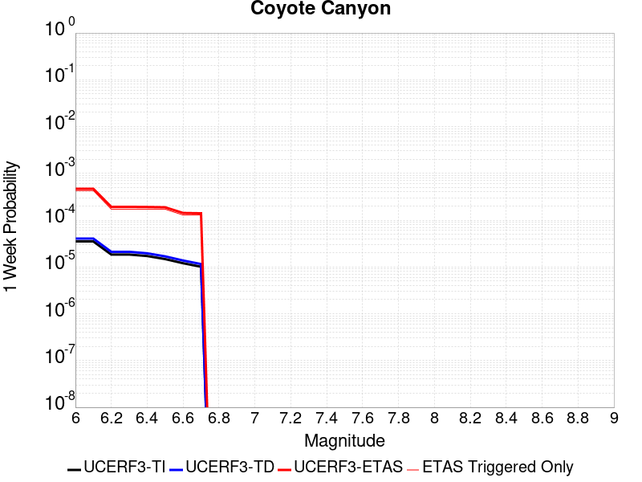 | 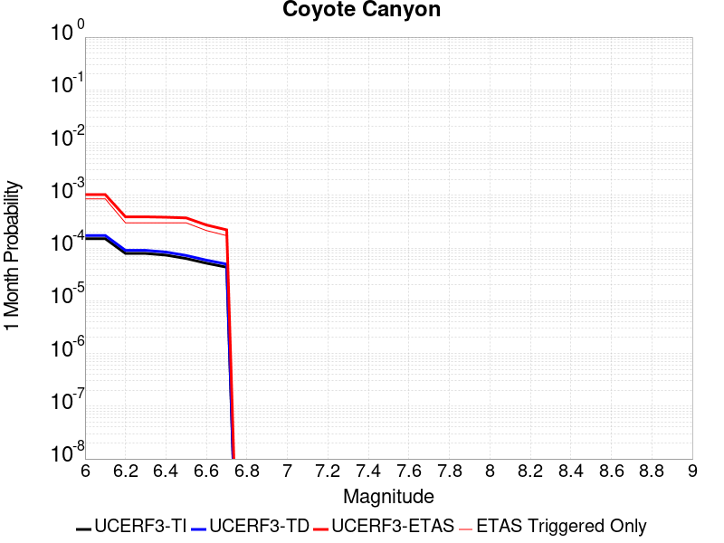 | 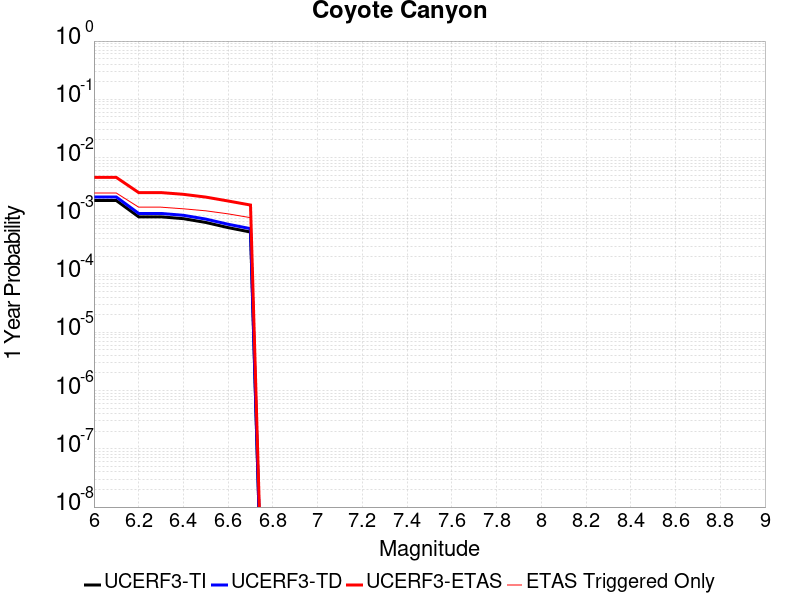 | 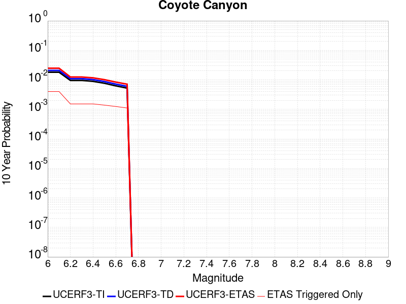 |

| Magnitude | 1 wk TI Prob | 1 wk TD Prob | 1 wk ETAS Prob | 1 wk ETAS/TD Gain | 1 wk ETAS Triggered Only | 1 mo TI Prob | 1 mo TD Prob | 1 mo ETAS Prob | 1 mo ETAS/TD Gain | 1 mo ETAS Triggered Only | 1 yr TI Prob | 1 yr TD Prob | 1 yr ETAS Prob | 1 yr ETAS/TD Gain | 1 yr ETAS Triggered Only | 10 yr TI Prob | 10 yr TD Prob | 10 yr ETAS Prob | 10 yr ETAS/TD Gain | 10 yr ETAS Triggered Only |
|-----|-----|-----|-----|-----|-----|-----|-----|-----|-----|-----|-----|-----|-----|-----|-----|-----|-----|-----|-----|-----|
| 6.0 | 3.5090034E-5 | 4.0364317E-5 | 8.7033084E-4 | 21.561886 | 8.3E-4 | 1.503772E-4 | 1.7297991E-4 | 0.0014927515 | 8.629624 | 0.00132 | 0.0018293047 | 0.0021042533 | 0.0047087613 | 2.237735 | 0.00261 | 0.018143194 | 0.020869205 | 0.025157798 | 1.2054986 | 0.00438 |
| 6.1 | 3.5090034E-5 | 4.0364317E-5 | 8.7033084E-4 | 21.561886 | 8.3E-4 | 1.503772E-4 | 1.7297991E-4 | 0.0014927515 | 8.629624 | 0.00132 | 0.0018293047 | 0.0021042533 | 0.0047087613 | 2.237735 | 0.00261 | 0.018143194 | 0.020869205 | 0.025157798 | 1.2054986 | 0.00438 |
| 6.2 | 1.841879E-5 | 2.1059794E-5 | 5.410488E-4 | 25.69108 | 5.2E-4 | 7.8935285E-5 | 9.025371E-5 | 8.901815E-4 | 9.863102 | 8.0E-4 | 9.606133E-4 | 0.0010983871 | 0.0026366955 | 2.4005158 | 0.00154 | 0.0095647145 | 0.010939668 | 0.013293631 | 1.2151769 | 0.00238 |
| 6.3 | 1.841879E-5 | 2.1059794E-5 | 5.410488E-4 | 25.69108 | 5.2E-4 | 7.8935285E-5 | 9.025371E-5 | 8.901815E-4 | 9.863102 | 8.0E-4 | 9.606133E-4 | 0.0010983871 | 0.0026366955 | 2.4005158 | 0.00154 | 0.0095647145 | 0.010939668 | 0.013293631 | 1.2151769 | 0.00238 |
| 6.4 | 1.712201E-5 | 1.9565212E-5 | 4.9955584E-4 | 25.53286 | 4.8E-4 | 7.337798E-5 | 8.3848776E-5 | 8.337859E-4 | 9.943924 | 7.5E-4 | 8.930107E-4 | 0.0010204813 | 0.0024690016 | 2.4194481 | 0.00145 | 0.008894307 | 0.010167871 | 0.01241479 | 1.2209822 | 0.00227 |
| 6.5 | 1.4744935E-5 | 1.6836972E-5 | 4.668294E-4 | 27.726446 | 4.5E-4 | 6.3191044E-5 | 7.215698E-5 | 7.7210646E-4 | 10.700371 | 7.0E-4 | 7.6907943E-4 | 8.782507E-4 | 0.0022070827 | 2.513044 | 0.00133 | 0.007664232 | 0.008756994 | 0.01085843 | 1.2399722 | 0.00212 |
| 6.6 | 1.2017839E-5 | 1.3724089E-5 | 4.2371848E-4 | 30.874067 | 4.1E-4 | 5.150401E-5 | 5.88167E-5 | 6.687808E-4 | 11.370594 | 6.1E-4 | 6.268809E-4 | 7.159466E-4 | 0.0018951017 | 2.6469877 | 0.00118 | 0.0062511545 | 0.0071450938 | 0.009011661 | 1.2612376 | 0.00188 |
| 6.7 | 1.00956095E-5 | 1.1533517E-5 | 3.515296E-4 | 30.47896 | 3.4E-4 | 4.326618E-5 | 4.942891E-5 | 5.794027E-4 | 11.72194 | 5.3E-4 | 5.266384E-4 | 6.017178E-4 | 0.00161111 | 2.6775177 | 0.00101 | 0.005253921 | 0.0060094125 | 0.007609737 | 1.2663031 | 0.00161 |

## San Andreas (Mojave S)
*[(top)](#table-of-contents)*

| 1 Week | 1 Month | 1 Year | 10 Year |
|-----|-----|-----|-----|
| 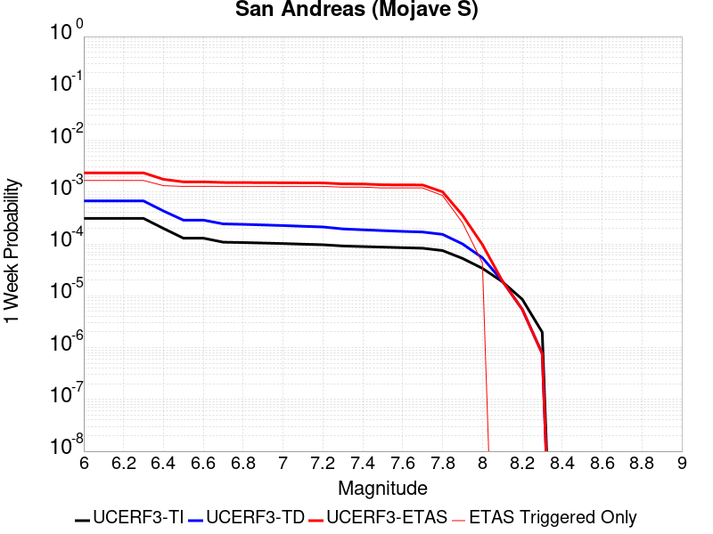 | 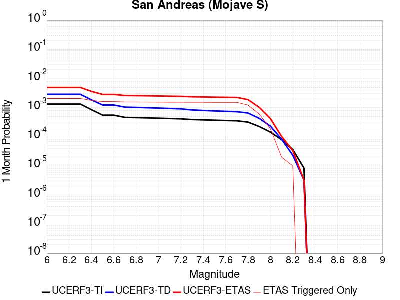 | 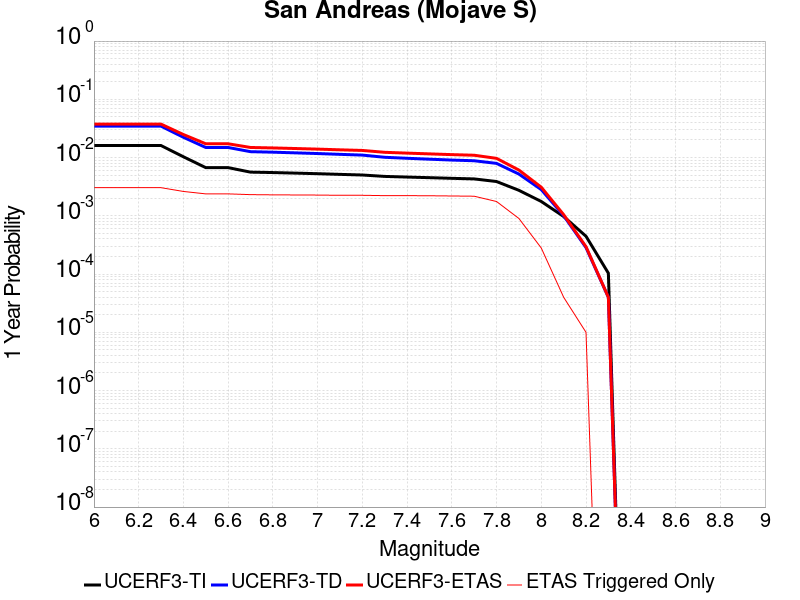 | 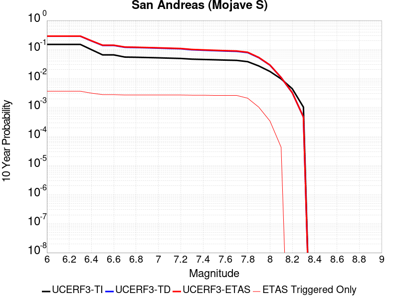 |

| Magnitude | 1 wk TI Prob | 1 wk TD Prob | 1 wk ETAS Prob | 1 wk ETAS/TD Gain | 1 wk ETAS Triggered Only | 1 mo TI Prob | 1 mo TD Prob | 1 mo ETAS Prob | 1 mo ETAS/TD Gain | 1 mo ETAS Triggered Only | 1 yr TI Prob | 1 yr TD Prob | 1 yr ETAS Prob | 1 yr ETAS/TD Gain | 1 yr ETAS Triggered Only | 10 yr TI Prob | 10 yr TD Prob | 10 yr ETAS Prob | 10 yr ETAS/TD Gain | 10 yr ETAS Triggered Only |
|-----|-----|-----|-----|-----|-----|-----|-----|-----|-----|-----|-----|-----|-----|-----|-----|-----|-----|-----|-----|-----|
| 6.0 | 3.1064058E-4 | 6.7462435E-4 | 0.0023335044 | 3.4589686 | 0.00166 | 0.0013306376 | 0.002888172 | 0.0049422225 | 1.7111939 | 0.00206 | 0.016080605 | 0.034565594 | 0.037500516 | 1.0849087 | 0.00304 | 0.1496549 | 0.28654557 | 0.28947788 | 1.0102333 | 0.00411 |
| 6.1 | 3.1064058E-4 | 6.7462435E-4 | 0.0023335044 | 3.4589686 | 0.00166 | 0.0013306376 | 0.002888172 | 0.0049422225 | 1.7111939 | 0.00206 | 0.016080605 | 0.034565594 | 0.037500516 | 1.0849087 | 0.00304 | 0.1496549 | 0.28654557 | 0.28947788 | 1.0102333 | 0.00411 |
| 6.2 | 3.1064058E-4 | 6.7462435E-4 | 0.0023335044 | 3.4589686 | 0.00166 | 0.0013306376 | 0.002888172 | 0.0049422225 | 1.7111939 | 0.00206 | 0.016080605 | 0.034565594 | 0.037500516 | 1.0849087 | 0.00304 | 0.1496549 | 0.28654557 | 0.28947788 | 1.0102333 | 0.00411 |
| 6.3 | 3.1064058E-4 | 6.7462435E-4 | 0.0023335044 | 3.4589686 | 0.00166 | 0.0013306376 | 0.002888172 | 0.0049422225 | 1.7111939 | 0.00206 | 0.016080605 | 0.034565594 | 0.037500516 | 1.0849087 | 0.00304 | 0.1496549 | 0.28654557 | 0.28947788 | 1.0102333 | 0.00411 |
| 6.4 | 1.9872203E-4 | 4.3181062E-4 | 0.0018511974 | 4.287059 | 0.00142 | 8.5138786E-4 | 0.0018493326 | 0.0036260409 | 1.9607294 | 0.00178 | 0.010316478 | 0.02228931 | 0.024850912 | 1.1149251 | 0.00262 | 0.098504856 | 0.19686839 | 0.19971149 | 1.0144416 | 0.00354 |
| 6.5 | 1.291105E-4 | 2.8754136E-4 | 0.0015871676 | 5.5197887 | 0.0013 | 5.5321335E-4 | 0.0012317409 | 0.0028497456 | 2.3135917 | 0.00162 | 0.006714592 | 0.014894155 | 0.017238706 | 1.1574142 | 0.00238 | 0.065152965 | 0.13800792 | 0.14074907 | 1.0198622 | 0.00318 |
| 6.6 | 1.291105E-4 | 2.8754136E-4 | 0.0015871676 | 5.5197887 | 0.0013 | 5.5321335E-4 | 0.0012317409 | 0.0028497456 | 2.3135917 | 0.00162 | 0.006714592 | 0.014894155 | 0.017238706 | 1.1574142 | 0.00238 | 0.065152965 | 0.13800792 | 0.14074907 | 1.0198622 | 0.00318 |
| 6.7 | 1.08001186E-4 | 2.4335351E-4 | 0.0015330396 | 6.29964 | 0.00129 | 4.6278012E-4 | 0.0010425274 | 0.0026108907 | 2.5043857 | 0.00157 | 0.0056198016 | 0.0126192 | 0.014900049 | 1.1807444 | 0.00231 | 0.054797906 | 0.11918431 | 0.12186199 | 1.0224667 | 0.00304 |
| 6.8 | 1.0624356E-4 | 2.3853009E-4 | 0.0015282223 | 6.4068327 | 0.00129 | 4.5525006E-4 | 0.0010218718 | 0.0025902675 | 2.5348263 | 0.00157 | 0.0055285925 | 0.012370593 | 0.014632264 | 1.1828264 | 0.00229 | 0.053930566 | 0.11713308 | 0.11979934 | 1.0227627 | 0.00302 |
| 6.9 | 1.0393785E-4 | 2.3223337E-4 | 0.0015119361 | 6.510417 | 0.00128 | 4.4537184E-4 | 9.949068E-4 | 0.0025533547 | 2.5664263 | 0.00156 | 0.0054089287 | 0.012045963 | 0.014298499 | 1.186995 | 0.00228 | 0.05279156 | 0.114433445 | 0.117099 | 1.0232935 | 0.00301 |
| 7.0 | 1.0155622E-4 | 2.2592908E-4 | 0.0015056399 | 6.664215 | 0.00128 | 4.3516833E-4 | 9.6790853E-4 | 0.0025164082 | 2.5998409 | 0.00155 | 0.005285311 | 0.011720838 | 0.013964232 | 1.1914022 | 0.00227 | 0.05161361 | 0.11169745 | 0.11436236 | 1.0238583 | 0.003 |
| 7.1 | 9.885595E-5 | 2.188132E-4 | 0.0014885353 | 6.8027673 | 0.00127 | 4.2359953E-4 | 9.374342E-4 | 0.0024759904 | 2.641242 | 0.00154 | 0.0051451353 | 0.011353733 | 0.013578188 | 1.1959227 | 0.00225 | 0.05027629 | 0.10857607 | 0.11122359 | 1.0243841 | 0.00297 |
| 7.2 | 9.6411415E-5 | 2.1244297E-4 | 0.0014821732 | 6.9768047 | 0.00127 | 4.1312634E-4 | 9.101525E-4 | 0.002448751 | 2.690484 | 0.00154 | 0.005018219 | 0.011024987 | 0.0132501805 | 1.2018318 | 0.00225 | 0.049064007 | 0.1057697 | 0.10840768 | 1.0249407 | 0.00295 |
| 7.3 | 9.1180635E-5 | 1.9472656E-4 | 0.0014544812 | 7.469352 | 0.00126 | 3.907156E-4 | 8.342756E-4 | 0.0023629991 | 2.8323963 | 0.00153 | 0.004746591 | 0.010110112 | 0.012307668 | 1.2173622 | 0.00222 | 0.046464786 | 0.09796176 | 0.10058669 | 1.0267955 | 0.00291 |
| 7.4 | 8.887388E-5 | 1.872126E-4 | 0.0014469767 | 7.729056 | 0.00126 | 3.8083247E-4 | 8.020931E-4 | 0.002330866 | 2.9059792 | 0.00153 | 0.0046267817 | 0.009721855 | 0.011920272 | 1.2261314 | 0.00222 | 0.045316286 | 0.094593845 | 0.09721953 | 1.0277574 | 0.0029 |
| 7.5 | 8.6750515E-5 | 1.80528E-4 | 0.0014303024 | 7.9228835 | 0.00125 | 3.7173493E-4 | 7.734621E-4 | 0.0022922864 | 2.96367 | 0.00152 | 0.004516484 | 0.009376327 | 0.011565604 | 1.23349 | 0.00221 | 0.04425787 | 0.09155606 | 0.094181456 | 1.0286753 | 0.00289 |
| 7.6 | 8.453092E-5 | 1.7440386E-4 | 0.0014241858 | 8.166022 | 0.00125 | 3.6222505E-4 | 7.4723107E-4 | 0.0022660953 | 3.0326567 | 0.00152 | 0.0044011753 | 0.009059664 | 0.011229823 | 1.2395408 | 0.00219 | 0.04315024 | 0.08871447 | 0.09132075 | 1.0293783 | 0.00286 |
| 7.7 | 8.259102E-5 | 1.6962511E-4 | 0.001419413 | 8.367942 | 0.00125 | 3.539135E-4 | 7.267622E-4 | 0.0022456576 | 3.089948 | 0.00152 | 0.004300386 | 0.0088125 | 0.010963378 | 1.2440711 | 0.00217 | 0.042181134 | 0.086465426 | 0.08905987 | 1.0300055 | 0.00284 |
| 7.8 | 7.444844E-5 | 1.528469E-4 | 0.001172691 | 7.672324 | 0.00102 | 3.1902574E-4 | 6.5489375E-4 | 0.0018840883 | 2.8769372 | 0.00123 | 0.0038772223 | 0.007944231 | 0.009690249 | 1.2197844 | 0.00176 | 0.03810269 | 0.078293875 | 0.08043223 | 1.0273119 | 0.00232 |
| 7.9 | 5.2586525E-5 | 1.0007023E-4 | 6.200182E-4 | 6.1958303 | 5.2E-4 | 2.2535135E-4 | 4.2880196E-4 | 0.0010285446 | 2.3986473 | 6.0E-4 | 0.0027402006 | 0.005208178 | 0.0061034905 | 1.1719052 | 9.0E-4 | 0.027066574 | 0.052201588 | 0.053395815 | 1.0228772 | 0.00126 |
| 8.0 | 3.379877E-5 | 5.4075565E-5 | 2.3406582E-4 | 4.3284955 | 1.8E-4 | 1.4484383E-4 | 2.3173184E-4 | 4.2168782E-4 | 1.8197232 | 1.9E-4 | 0.0017620471 | 0.0028176866 | 0.0030968979 | 1.0990922 | 2.8E-4 | 0.017481409 | 0.028835917 | 0.029224383 | 1.0134716 | 4.0E-4 |
| 8.1 | 1.8668277E-5 | 1.9308145E-5 | 3.9307757E-5 | 2.0358124 | 2.0E-5 | 8.000444E-5 | 8.274657E-5 | 1.0274491E-4 | 1.2416818 | 2.0E-5 | 9.736188E-4 | 0.0010069745 | 0.0010469343 | 1.039683 | 4.0E-5 | 0.009693642 | 0.010798624 | 0.0108480835 | 1.0045803 | 5.0E-5 |
| 8.2 | 8.541571E-6 | 5.4596358E-6 | 1.5459582E-5 | 2.831614 | 1.0E-5 | 3.660622E-5 | 2.339823E-5 | 3.3397995E-5 | 1.4273728 | 1.0E-5 | 4.455896E-4 | 2.848363E-4 | 2.9483344E-4 | 1.0350978 | 1.0E-5 | 0.0044469717 | 0.003240283 | 0.0032502508 | 1.0030762 | 1.0E-5 |
| 8.3 | 1.983087E-6 | 7.6564595E-7 | 7.6564595E-7 | 1.0 | 0.0 | 8.498917E-6 | 3.281336E-6 | 3.281336E-6 | 1.0 | 0.0 | 1.034694E-4 | 3.9949547E-5 | 3.9949547E-5 | 1.0 | 0.0 | 0.0010342124 | 4.717979E-4 | 4.717979E-4 | 1.0 | 0.0 |

## Lenwood-Lockhart-Old Woman Springs
*[(top)](#table-of-contents)*

| 1 Week | 1 Month | 1 Year | 10 Year |
|-----|-----|-----|-----|
| 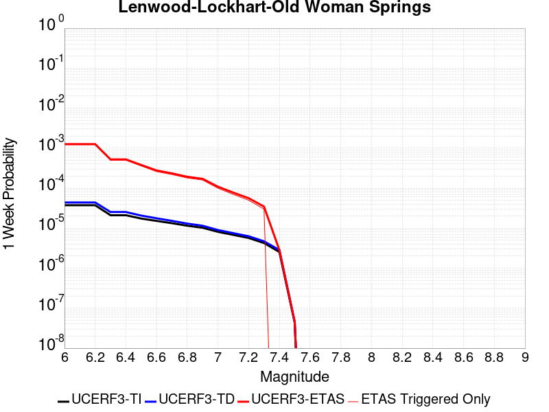 | 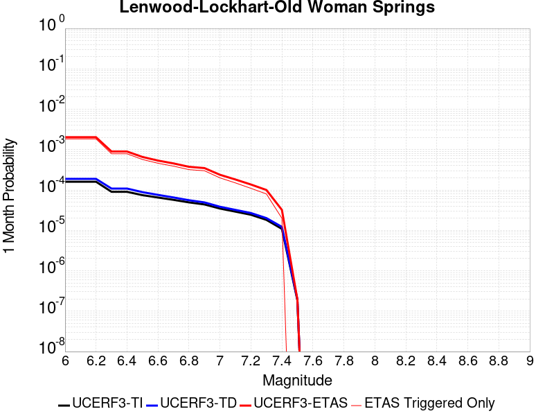 | 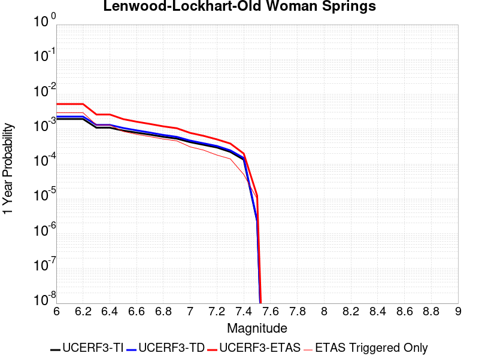 | 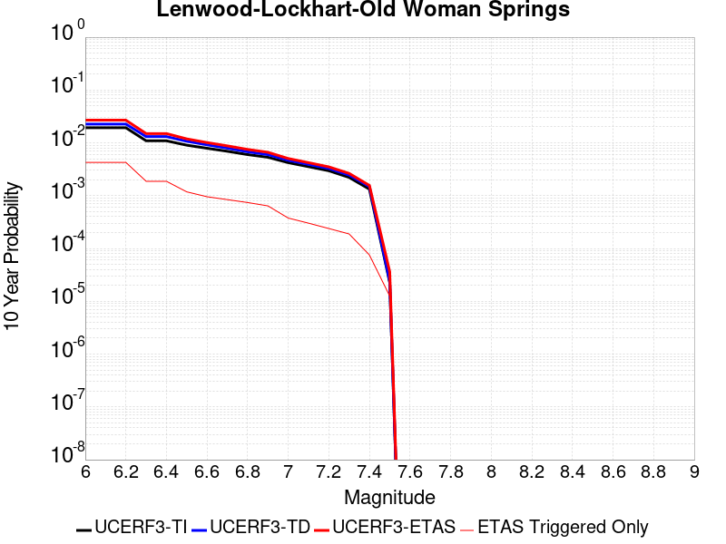 |

| Magnitude | 1 wk TI Prob | 1 wk TD Prob | 1 wk ETAS Prob | 1 wk ETAS/TD Gain | 1 wk ETAS Triggered Only | 1 mo TI Prob | 1 mo TD Prob | 1 mo ETAS Prob | 1 mo ETAS/TD Gain | 1 mo ETAS Triggered Only | 1 yr TI Prob | 1 yr TD Prob | 1 yr ETAS Prob | 1 yr ETAS/TD Gain | 1 yr ETAS Triggered Only | 10 yr TI Prob | 10 yr TD Prob | 10 yr ETAS Prob | 10 yr ETAS/TD Gain | 10 yr ETAS Triggered Only |
|-----|-----|-----|-----|-----|-----|-----|-----|-----|-----|-----|-----|-----|-----|-----|-----|-----|-----|-----|-----|-----|
| 6.0 | 3.744542E-5 | 4.396349E-5 | 0.0012639099 | 28.74908 | 0.00122 | 1.604705E-4 | 1.8840231E-4 | 0.0020280557 | 10.764495 | 0.00184 | 0.0019519776 | 0.0022915571 | 0.0052447743 | 2.288738 | 0.00296 | 0.019349206 | 0.022697281 | 0.02688991 | 1.1847194 | 0.00429 |
| 6.1 | 3.744542E-5 | 4.396349E-5 | 0.0012639099 | 28.74908 | 0.00122 | 1.604705E-4 | 1.8840231E-4 | 0.0020280557 | 10.764495 | 0.00184 | 0.0019519776 | 0.0022915571 | 0.0052447743 | 2.288738 | 0.00296 | 0.019349206 | 0.022697281 | 0.02688991 | 1.1847194 | 0.00429 |
| 6.2 | 3.744542E-5 | 4.396349E-5 | 0.0012639099 | 28.74908 | 0.00122 | 1.604705E-4 | 1.8840231E-4 | 0.0020280557 | 10.764495 | 0.00184 | 0.0019519776 | 0.0022915571 | 0.0052447743 | 2.288738 | 0.00296 | 0.019349206 | 0.022697281 | 0.02688991 | 1.1847194 | 0.00429 |
| 6.3 | 2.1079984E-5 | 2.5354384E-5 | 5.253417E-4 | 20.719955 | 5.0E-4 | 9.0339665E-5 | 1.0865723E-4 | 8.985714E-4 | 8.26978 | 7.9E-4 | 0.0010993304 | 0.0013221189 | 0.002630387 | 1.9895236 | 0.00131 | 0.010939079 | 0.013144747 | 0.015029641 | 1.1433952 | 0.00191 |
| 6.4 | 2.1079984E-5 | 2.5354384E-5 | 5.253417E-4 | 20.719955 | 5.0E-4 | 9.0339665E-5 | 1.0865723E-4 | 8.985714E-4 | 8.26978 | 7.9E-4 | 0.0010993304 | 0.0013221189 | 0.002630387 | 1.9895236 | 0.00131 | 0.010939079 | 0.013144747 | 0.015029641 | 1.1433952 | 0.00191 |
| 6.5 | 1.7397282E-5 | 2.0663285E-5 | 3.8065584E-4 | 18.421846 | 3.6E-4 | 7.455765E-5 | 8.8554E-5 | 6.585035E-4 | 7.4361806 | 5.7E-4 | 9.073613E-4 | 0.0010776235 | 0.0019366967 | 1.7971925 | 8.6E-4 | 0.009036654 | 0.010725273 | 0.011932189 | 1.11253 | 0.00122 |
| 6.6 | 1.52050325E-5 | 1.7680086E-5 | 2.7767548E-4 | 15.705551 | 2.6E-4 | 6.51628E-5 | 7.576964E-5 | 5.3573475E-4 | 7.0705733 | 4.6E-4 | 7.9306826E-4 | 9.221128E-4 | 0.001631458 | 1.7692609 | 7.1E-4 | 0.007902439 | 0.009183729 | 0.0101745445 | 1.1078882 | 0.001 |
| 6.7 | 1.332523E-5 | 1.5264379E-5 | 2.3526102E-4 | 15.412419 | 2.2E-4 | 5.7106878E-5 | 6.541716E-5 | 4.5539165E-4 | 6.961348 | 3.9E-4 | 6.950544E-4 | 7.9616875E-4 | 0.0014056831 | 1.7655592 | 6.1E-4 | 0.006928845 | 0.0079337945 | 0.008816733 | 1.1112883 | 8.9E-4 |
| 6.8 | 1.1525329E-5 | 1.3031365E-5 | 1.9302902E-4 | 14.812648 | 1.8E-4 | 4.9393333E-5 | 5.5847537E-5 | 3.7582967E-4 | 6.7295656 | 3.2E-4 | 6.011979E-4 | 6.7973585E-4 | 0.0011993824 | 1.7644831 | 5.2E-4 | 0.00599574 | 0.0067770192 | 0.007551733 | 1.1143148 | 7.8E-4 |
| 6.9 | 1.0253909E-5 | 1.1514835E-5 | 1.7151299E-4 | 14.894959 | 1.6E-4 | 4.3944583E-5 | 4.934838E-5 | 3.4933357E-4 | 7.078927 | 3.0E-4 | 5.3489394E-4 | 6.006545E-4 | 0.0010603782 | 1.7653713 | 4.6E-4 | 0.0053360825 | 0.0059906896 | 0.006676556 | 1.1144887 | 6.9E-4 |
| 7.0 | 8.104563E-6 | 8.99143E-6 | 1.08990534E-4 | 12.121601 | 1.0E-4 | 3.4733377E-5 | 3.853415E-5 | 2.3852644E-4 | 6.190002 | 2.0E-4 | 4.2279682E-4 | 4.6905465E-4 | 7.7890925E-4 | 1.6605937 | 3.1E-4 | 0.0042199334 | 0.0046808943 | 0.005128788 | 1.0956855 | 4.5E-4 |
| 7.1 | 6.7986157E-6 | 7.5159796E-6 | 7.7515455E-5 | 10.313419 | 7.0E-5 | 2.91366E-5 | 3.2210955E-5 | 1.8220613E-4 | 5.6566505 | 1.5E-4 | 3.5468035E-4 | 3.9209996E-4 | 6.420019E-4 | 1.6373426 | 2.5E-4 | 0.003541148 | 0.003914298 | 0.004272889 | 1.0916106 | 3.6E-4 |
| 7.2 | 5.6893327E-6 | 6.280132E-6 | 5.627982E-5 | 8.961566 | 5.0E-5 | 2.4382627E-5 | 2.6914584E-5 | 1.3691162E-4 | 5.0868936 | 1.1E-4 | 2.9681803E-4 | 3.276378E-4 | 5.0757884E-4 | 1.5492072 | 1.8E-4 | 0.002964219 | 0.003271746 | 0.00355083 | 1.0853012 | 2.8E-4 |
| 7.3 | 4.253348E-6 | 4.707075E-6 | 3.4706933E-5 | 7.3733554 | 3.0E-5 | 1.8228506E-5 | 2.017303E-5 | 1.0017142E-4 | 4.9656105 | 8.0E-5 | 2.2190946E-4 | 2.455808E-4 | 3.8554642E-4 | 1.5699371 | 1.4E-4 | 0.00221688 | 0.0024532753 | 0.00266276 | 1.0853899 | 2.1E-4 |
| 7.4 | 2.5448119E-6 | 2.8520594E-6 | 2.8520594E-6 | 1.0 | 0.0 | 1.0906291E-5 | 1.2223064E-5 | 3.222282E-5 | 2.636231 | 2.0E-5 | 1.3277601E-4 | 1.4880729E-4 | 1.9879985E-4 | 1.335955 | 5.0E-5 | 0.001326967 | 0.0014872387 | 0.0015671197 | 1.0537109 | 8.0E-5 |
| 7.5 | 4.3706837E-8 | 4.562909E-8 | 4.562909E-8 | 1.0 | 0.0 | 1.8731501E-7 | 1.9555324E-7 | 1.9555324E-7 | 1.0 | 0.0 | 2.2805577E-6 | 2.3808586E-6 | 1.2380835E-5 | 5.2001553 | 1.0E-5 | 2.2805343E-5 | 2.3808387E-5 | 3.3808148E-5 | 1.4200101 | 1.0E-5 |

## San Andreas (Mojave N)
*[(top)](#table-of-contents)*

| 1 Week | 1 Month | 1 Year | 10 Year |
|-----|-----|-----|-----|
| 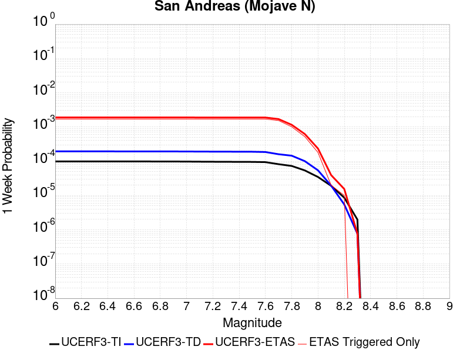 | 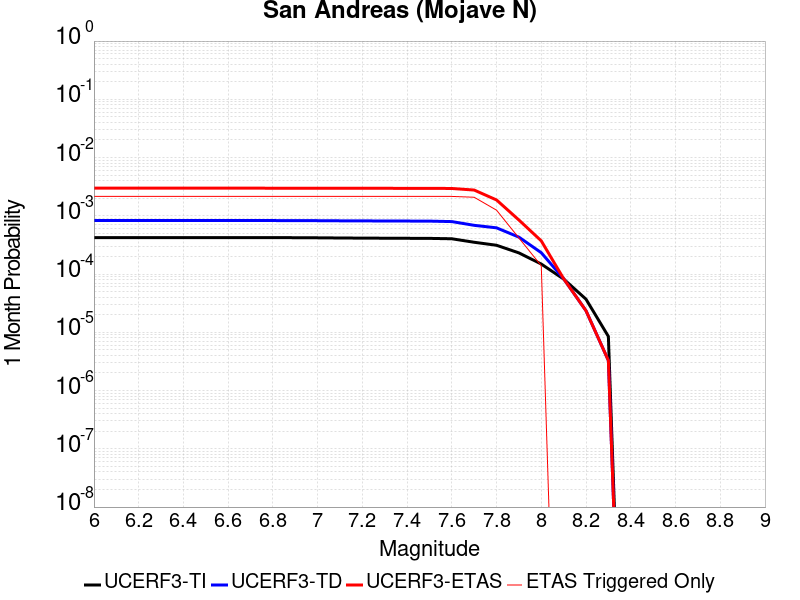 | 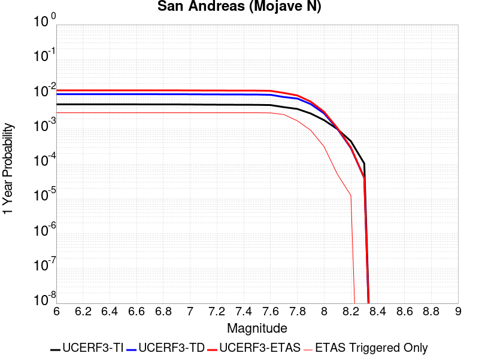 | 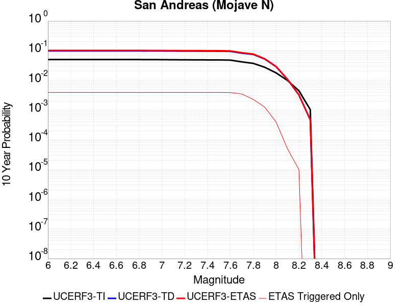 |

| Magnitude | 1 wk TI Prob | 1 wk TD Prob | 1 wk ETAS Prob | 1 wk ETAS/TD Gain | 1 wk ETAS Triggered Only | 1 mo TI Prob | 1 mo TD Prob | 1 mo ETAS Prob | 1 mo ETAS/TD Gain | 1 mo ETAS Triggered Only | 1 yr TI Prob | 1 yr TD Prob | 1 yr ETAS Prob | 1 yr ETAS/TD Gain | 1 yr ETAS Triggered Only | 10 yr TI Prob | 10 yr TD Prob | 10 yr ETAS Prob | 10 yr ETAS/TD Gain | 10 yr ETAS Triggered Only |
|-----|-----|-----|-----|-----|-----|-----|-----|-----|-----|-----|-----|-----|-----|-----|-----|-----|-----|-----|-----|-----|
| 6.0 | 9.877682E-5 | 1.9402112E-4 | 0.0018936913 | 9.760233 | 0.0017 | 4.2326056E-4 | 8.312543E-4 | 0.002919517 | 3.5121827 | 0.00209 | 0.0051410277 | 0.010073684 | 0.013092959 | 1.2997191 | 0.00305 | 0.05023708 | 0.09832245 | 0.101839 | 1.0357654 | 0.0039 |
| 6.1 | 9.877682E-5 | 1.9402112E-4 | 0.0018936913 | 9.760233 | 0.0017 | 4.2326056E-4 | 8.312543E-4 | 0.002919517 | 3.5121827 | 0.00209 | 0.0051410277 | 0.010073684 | 0.013092959 | 1.2997191 | 0.00305 | 0.05023708 | 0.09832245 | 0.101839 | 1.0357654 | 0.0039 |
| 6.2 | 9.877682E-5 | 1.9402112E-4 | 0.0018936913 | 9.760233 | 0.0017 | 4.2326056E-4 | 8.312543E-4 | 0.002919517 | 3.5121827 | 0.00209 | 0.0051410277 | 0.010073684 | 0.013092959 | 1.2997191 | 0.00305 | 0.05023708 | 0.09832245 | 0.101839 | 1.0357654 | 0.0039 |
| 6.3 | 9.877682E-5 | 1.9402112E-4 | 0.0018936913 | 9.760233 | 0.0017 | 4.2326056E-4 | 8.312543E-4 | 0.002919517 | 3.5121827 | 0.00209 | 0.0051410277 | 0.010073684 | 0.013092959 | 1.2997191 | 0.00305 | 0.05023708 | 0.09832245 | 0.101839 | 1.0357654 | 0.0039 |
| 6.4 | 9.877682E-5 | 1.9402112E-4 | 0.0018936913 | 9.760233 | 0.0017 | 4.2326056E-4 | 8.312543E-4 | 0.002919517 | 3.5121827 | 0.00209 | 0.0051410277 | 0.010073684 | 0.013092959 | 1.2997191 | 0.00305 | 0.05023708 | 0.09832245 | 0.101839 | 1.0357654 | 0.0039 |
| 6.5 | 9.861474E-5 | 1.937588E-4 | 0.0018934294 | 9.772095 | 0.0017 | 4.2256617E-4 | 8.3013077E-4 | 0.002918396 | 3.5155857 | 0.00209 | 0.0051326132 | 0.0100601325 | 0.013079449 | 1.3001269 | 0.00305 | 0.050156746 | 0.09820035 | 0.10171737 | 1.0358148 | 0.0039 |
| 6.6 | 9.861474E-5 | 1.937588E-4 | 0.0018934294 | 9.772095 | 0.0017 | 4.2256617E-4 | 8.3013077E-4 | 0.002918396 | 3.5155857 | 0.00209 | 0.0051326132 | 0.0100601325 | 0.013079449 | 1.3001269 | 0.00305 | 0.050156746 | 0.09820035 | 0.10171737 | 1.0358148 | 0.0039 |
| 6.7 | 9.8552715E-5 | 1.9365833E-4 | 0.0018933291 | 9.776647 | 0.0017 | 4.223004E-4 | 8.2970044E-4 | 0.0029179663 | 3.5168915 | 0.00209 | 0.0051293927 | 0.010054941 | 0.013074274 | 1.3002834 | 0.00305 | 0.050125998 | 0.09815356 | 0.10167076 | 1.0358337 | 0.0039 |
| 6.8 | 9.8464974E-5 | 1.9350994E-4 | 0.001893181 | 9.783379 | 0.0017 | 4.219245E-4 | 8.290649E-4 | 0.002917332 | 3.5188224 | 0.00209 | 0.0051248376 | 0.010047276 | 0.013066631 | 1.3005149 | 0.00305 | 0.05008251 | 0.09808378 | 0.10160125 | 1.035862 | 0.0039 |
| 6.9 | 9.825824E-5 | 1.9319002E-4 | 0.0018928616 | 9.797926 | 0.0017 | 4.2103877E-4 | 8.276947E-4 | 0.002915965 | 3.5229957 | 0.00209 | 0.0051141046 | 0.010030746 | 0.013050153 | 1.3010151 | 0.00305 | 0.049980022 | 0.097932965 | 0.101451024 | 1.0359231 | 0.0039 |
| 7.0 | 9.781462E-5 | 1.9250368E-4 | 0.0018921765 | 9.8293 | 0.0017 | 4.1913814E-4 | 8.247551E-4 | 0.0029130313 | 3.5319955 | 0.00209 | 0.005091073 | 0.009995285 | 0.0130148 | 1.3020939 | 0.00305 | 0.04976007 | 0.09760912 | 0.101128444 | 1.0360553 | 0.0039 |
| 7.1 | 9.7121134E-5 | 1.9152075E-4 | 0.0018911952 | 9.874622 | 0.0017 | 4.1616702E-4 | 8.205452E-4 | 0.0029088303 | 3.544997 | 0.00209 | 0.005055068 | 0.0099444995 | 0.012964169 | 1.3036522 | 0.00305 | 0.04941613 | 0.09714571 | 0.100666836 | 1.0362458 | 0.0039 |
| 7.2 | 9.663819E-5 | 1.9082859E-4 | 0.0018905042 | 9.906818 | 0.0017 | 4.1409794E-4 | 8.175807E-4 | 0.002905872 | 3.5542326 | 0.00209 | 0.0050299936 | 0.009908735 | 0.012928514 | 1.3047593 | 0.00305 | 0.049176537 | 0.09681883 | 0.10034123 | 1.0363814 | 0.0039 |
| 7.3 | 9.6277574E-5 | 1.9035369E-4 | 0.0018900301 | 9.929044 | 0.0017 | 4.125529E-4 | 8.1554666E-4 | 0.0029038421 | 3.5606084 | 0.00209 | 0.0050112694 | 0.009884195 | 0.012904049 | 1.3055234 | 0.00305 | 0.04899759 | 0.09659228 | 0.10011557 | 1.0364759 | 0.0039 |
| 7.4 | 9.593308E-5 | 1.8975153E-4 | 0.0018894289 | 9.957384 | 0.0017 | 4.1107697E-4 | 8.129676E-4 | 0.0029012684 | 3.5687382 | 0.00209 | 0.0049933824 | 0.009853081 | 0.012873028 | 1.3064978 | 0.00305 | 0.04882661 | 0.09630986 | 0.09983425 | 1.0365943 | 0.0039 |
| 7.5 | 9.561707E-5 | 1.8921228E-4 | 0.0018888906 | 9.982918 | 0.0017 | 4.0972308E-4 | 8.106579E-4 | 0.0028989636 | 3.5760627 | 0.00209 | 0.0049769743 | 0.009825215 | 0.012845247 | 1.3073758 | 0.00305 | 0.048669744 | 0.096056245 | 0.09958163 | 1.0367012 | 0.0039 |
| 7.6 | 9.418194E-5 | 1.8573487E-4 | 0.0018854191 | 10.151132 | 0.0017 | 4.0357444E-4 | 7.95764E-4 | 0.002884101 | 3.624317 | 0.00209 | 0.004902454 | 0.009645499 | 0.012646273 | 1.3111062 | 0.00303 | 0.047957025 | 0.094437465 | 0.097941995 | 1.0371095 | 0.00387 |
| 7.7 | 8.202141E-5 | 1.6022482E-4 | 0.001699978 | 10.609955 | 0.00154 | 3.51473E-4 | 6.8649714E-4 | 0.0025851927 | 3.7657735 | 0.0019 | 0.00427079 | 0.008326128 | 0.011023481 | 1.3239625 | 0.00272 | 0.04189639 | 0.082237914 | 0.085431725 | 1.0388362 | 0.00348 |
| 7.8 | 7.2859846E-5 | 1.4517571E-4 | 0.001155029 | 7.9560766 | 0.00101 | 3.1221908E-4 | 6.2203326E-4 | 0.0018412744 | 2.96009 | 0.00122 | 0.003794643 | 0.0075469986 | 0.009283791 | 1.2301302 | 0.00175 | 0.037304975 | 0.07472766 | 0.076855786 | 1.0284784 | 0.0023 |
| 7.9 | 5.3874453E-5 | 1.00462625E-4 | 6.2041037E-4 | 6.1755342 | 5.2E-4 | 2.3087008E-4 | 4.3048308E-4 | 0.0010302248 | 2.393183 | 6.0E-4 | 0.0028072202 | 0.0052285474 | 0.0061238417 | 1.171232 | 9.0E-4 | 0.02772022 | 0.052425884 | 0.053619828 | 1.022774 | 0.00126 |
| 8.0 | 3.468538E-5 | 5.4261534E-5 | 2.3425177E-4 | 4.317087 | 1.8E-4 | 1.4864317E-4 | 2.3252872E-4 | 4.2248453E-4 | 1.8169134 | 1.9E-4 | 0.0018082283 | 0.0028273636 | 0.003106572 | 1.0987521 | 2.8E-4 | 0.017935853 | 0.028948462 | 0.029336883 | 1.0134176 | 4.0E-4 |
| 8.1 | 1.9152367E-5 | 1.9401303E-5 | 3.9400915E-5 | 2.0308387 | 2.0E-5 | 8.207899E-5 | 8.3145795E-5 | 1.0314413E-4 | 1.2405213 | 2.0E-5 | 9.988535E-4 | 0.0010118305 | 0.0010517901 | 1.0394924 | 4.0E-5 | 0.009943757 | 0.01085595 | 0.010905408 | 1.0045558 | 5.0E-5 |
| 8.2 | 8.643924E-6 | 5.473668E-6 | 1.5473614E-5 | 2.8269184 | 1.0E-5 | 3.704486E-5 | 2.3458366E-5 | 3.345813E-5 | 1.4262772 | 1.0E-5 | 4.5092785E-4 | 2.8556827E-4 | 2.955654E-4 | 1.035008 | 1.0E-5 | 0.0045001395 | 0.0032481793 | 0.003258147 | 1.0030687 | 1.0E-5 |
| 8.3 | 1.983087E-6 | 7.6564595E-7 | 7.6564595E-7 | 1.0 | 0.0 | 8.498917E-6 | 3.281336E-6 | 3.281336E-6 | 1.0 | 0.0 | 1.034694E-4 | 3.9949547E-5 | 3.9949547E-5 | 1.0 | 0.0 | 0.0010342124 | 4.717979E-4 | 4.717979E-4 | 1.0 | 0.0 |

## Death Valley (So)
*[(top)](#table-of-contents)*

| 1 Week | 1 Month | 1 Year | 10 Year |
|-----|-----|-----|-----|
| 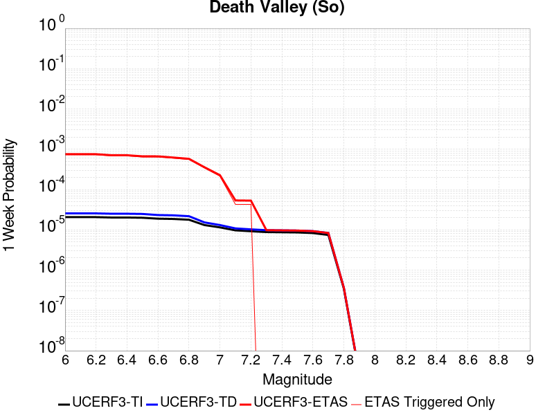 | 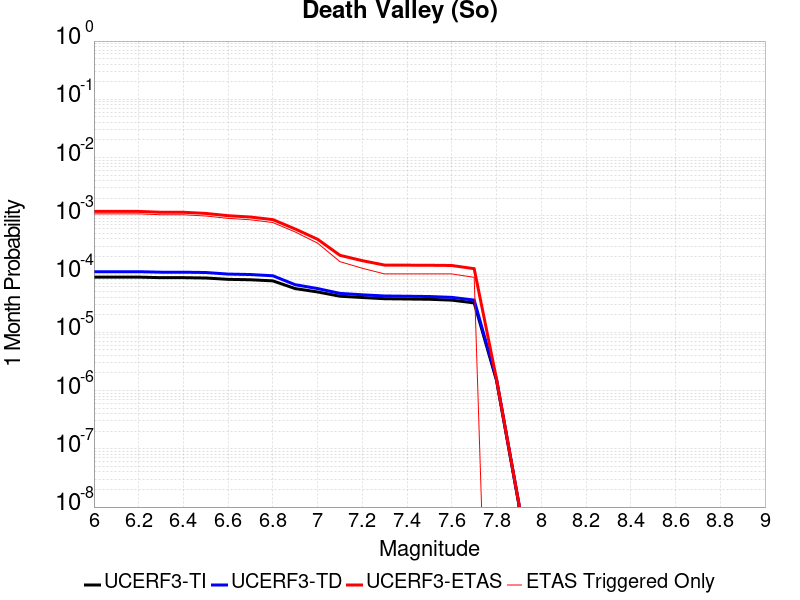 | 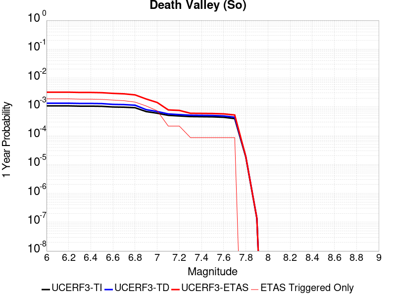 |  |

| Magnitude | 1 wk TI Prob | 1 wk TD Prob | 1 wk ETAS Prob | 1 wk ETAS/TD Gain | 1 wk ETAS Triggered Only | 1 mo TI Prob | 1 mo TD Prob | 1 mo ETAS Prob | 1 mo ETAS/TD Gain | 1 mo ETAS Triggered Only | 1 yr TI Prob | 1 yr TD Prob | 1 yr ETAS Prob | 1 yr ETAS/TD Gain | 1 yr ETAS Triggered Only | 10 yr TI Prob | 10 yr TD Prob | 10 yr ETAS Prob | 10 yr ETAS/TD Gain | 10 yr ETAS Triggered Only |
|-----|-----|-----|-----|-----|-----|-----|-----|-----|-----|-----|-----|-----|-----|-----|-----|-----|-----|-----|-----|-----|
| 6.0 | 2.0684236E-5 | 2.5618314E-5 | 7.855988E-4 | 30.665518 | 7.6E-4 | 8.864371E-5 | 1.0978825E-4 | 0.0012796598 | 11.655708 | 0.00117 | 0.0010787029 | 0.0013358692 | 0.0036228101 | 2.7119496 | 0.00229 | 0.010734817 | 0.013279985 | 0.016891379 | 1.2719427 | 0.00366 |
| 6.1 | 2.0684236E-5 | 2.5618314E-5 | 7.855988E-4 | 30.665518 | 7.6E-4 | 8.864371E-5 | 1.0978825E-4 | 0.0012796598 | 11.655708 | 0.00117 | 0.0010787029 | 0.0013358692 | 0.0036228101 | 2.7119496 | 0.00229 | 0.010734817 | 0.013279985 | 0.016891379 | 1.2719427 | 0.00366 |
| 6.2 | 2.0684236E-5 | 2.5618314E-5 | 7.855988E-4 | 30.665518 | 7.6E-4 | 8.864371E-5 | 1.0978825E-4 | 0.0012796598 | 11.655708 | 0.00117 | 0.0010787029 | 0.0013358692 | 0.0036228101 | 2.7119496 | 0.00229 | 0.010734817 | 0.013279985 | 0.016891379 | 1.2719427 | 0.00366 |
| 6.3 | 2.0240292E-5 | 2.51184E-5 | 7.7509956E-4 | 30.857841 | 7.5E-4 | 8.6741224E-5 | 1.0764593E-4 | 0.0012475232 | 11.589135 | 0.00114 | 0.0010555626 | 0.001309818 | 0.0035269102 | 2.692672 | 0.00222 | 0.010505628 | 0.013022543 | 0.016476965 | 1.2652647 | 0.0035 |
| 6.4 | 2.0240292E-5 | 2.51184E-5 | 7.7509956E-4 | 30.857841 | 7.5E-4 | 8.6741224E-5 | 1.0764593E-4 | 0.0012475232 | 11.589135 | 0.00114 | 0.0010555626 | 0.001309818 | 0.0035269102 | 2.692672 | 0.00222 | 0.010505628 | 0.013022543 | 0.016476965 | 1.2652647 | 0.0035 |
| 6.5 | 1.9962767E-5 | 2.4807652E-5 | 7.447898E-4 | 30.022583 | 7.2E-4 | 8.55519E-5 | 1.0631427E-4 | 0.0012061973 | 11.345583 | 0.0011 | 0.0010410968 | 0.0012936244 | 0.0034508302 | 2.6675675 | 0.00216 | 0.010362327 | 0.01286249 | 0.016218757 | 1.2609345 | 0.0034 |
| 6.6 | 1.8937297E-5 | 2.3311462E-5 | 6.7329634E-4 | 28.88263 | 6.5E-4 | 8.115732E-5 | 9.990252E-5 | 0.0011098016 | 11.108845 | 0.00101 | 9.876423E-4 | 0.0012156491 | 0.0031632786 | 2.6021314 | 0.00195 | 0.009832645 | 0.0120915035 | 0.015094745 | 1.2483763 | 0.00304 |
| 6.7 | 1.8621096E-5 | 2.2912098E-5 | 6.1289856E-4 | 26.749998 | 5.9E-4 | 7.980225E-5 | 9.8191085E-5 | 0.0010380988 | 10.57223 | 9.4E-4 | 9.711593E-4 | 0.0011948354 | 0.003042625 | 2.5464804 | 0.00185 | 0.009669261 | 0.011885625 | 0.014770919 | 1.2427549 | 0.00292 |
| 6.8 | 1.7830353E-5 | 2.1806083E-5 | 5.717941E-4 | 26.22177 | 5.5E-4 | 7.641356E-5 | 9.3451374E-5 | 9.4337197E-4 | 10.0947895 | 8.5E-4 | 9.29938E-4 | 0.0011371907 | 0.0028552348 | 2.5107791 | 0.00172 | 0.009260561 | 0.01131609 | 0.014015197 | 1.2385194 | 0.00273 |
| 6.9 | 1.3135183E-5 | 1.5304031E-5 | 4.152979E-4 | 27.136507 | 4.0E-4 | 5.6292425E-5 | 6.558709E-5 | 6.555484E-4 | 9.995083 | 5.9E-4 | 6.8514474E-4 | 7.982367E-4 | 0.0019573108 | 2.452043 | 0.00116 | 0.006830362 | 0.007955158 | 0.009621793 | 1.2095038 | 0.00168 |
| 7.0 | 1.1507512E-5 | 1.3154237E-5 | 2.8315067E-4 | 21.525434 | 2.7E-4 | 4.9316975E-5 | 5.637412E-5 | 4.2635325E-4 | 7.5629253 | 3.7E-4 | 6.002687E-4 | 6.861445E-4 | 0.0015355613 | 2.237956 | 8.5E-4 | 0.0059864987 | 0.0068414924 | 0.008053146 | 1.1771036 | 0.00122 |
| 7.1 | 9.715903E-6 | 1.0865287E-5 | 1.3086398E-4 | 12.044228 | 1.2E-4 | 4.1638916E-5 | 4.6564706E-5 | 2.1655679E-4 | 4.650664 | 1.7E-4 | 5.068359E-4 | 5.667821E-4 | 9.465667E-4 | 1.6700717 | 3.8E-4 | 0.0050568148 | 0.005653834 | 0.0062305545 | 1.1020052 | 5.8E-4 |
| 7.2 | 9.233269E-6 | 1.0286314E-5 | 7.02857E-5 | 6.8329334 | 6.0E-5 | 3.9570554E-5 | 4.408348E-5 | 1.4407907E-4 | 3.2683234 | 1.0E-4 | 4.81665E-4 | 5.365884E-4 | 7.964489E-4 | 1.4842827 | 2.6E-4 | 0.0048062233 | 0.0053533595 | 0.005751218 | 1.0743195 | 4.0E-4 |
| 7.3 | 8.8041315E-6 | 9.808164E-6 | 4.980777E-5 | 5.078195 | 4.0E-5 | 3.7731446E-5 | 4.2034335E-5 | 1.2203097E-4 | 2.903126 | 8.0E-5 | 4.592835E-4 | 5.1165203E-4 | 6.815651E-4 | 1.332087 | 1.7E-4 | 0.0045833546 | 0.005105167 | 0.005353891 | 1.04872 | 2.5E-4 |
| 7.4 | 8.708749E-6 | 9.707175E-6 | 4.9706785E-5 | 5.120623 | 4.0E-5 | 3.7322676E-5 | 4.160154E-5 | 1.2159821E-4 | 2.9229257 | 8.0E-5 | 4.5430884E-4 | 5.0638523E-4 | 6.7629915E-4 | 1.3355428 | 1.7E-4 | 0.004533812 | 0.0050527398 | 0.0053014765 | 1.0492281 | 2.5E-4 |
| 7.5 | 8.612678E-6 | 9.604817E-6 | 4.9604434E-5 | 5.164537 | 4.0E-5 | 3.6910955E-5 | 4.1162875E-5 | 1.2115958E-4 | 2.9434187 | 8.0E-5 | 4.492982E-4 | 5.01047E-4 | 6.709618E-4 | 1.3391196 | 1.7E-4 | 0.004483909 | 0.0049995985 | 0.0052483487 | 1.049754 | 2.5E-4 |
| 7.6 | 8.319024E-6 | 9.283916E-6 | 4.9283546E-5 | 5.3084865 | 4.0E-5 | 3.5652476E-5 | 3.978763E-5 | 1.1978445E-4 | 3.010595 | 8.0E-5 | 4.3398244E-4 | 4.8431093E-4 | 6.442334E-4 | 1.3302063 | 1.6E-4 | 0.0043313587 | 0.0048329784 | 0.0050718184 | 1.0494188 | 2.4E-4 |
| 7.7 | 7.4718328E-6 | 8.34517E-6 | 4.8344835E-5 | 5.793152 | 4.0E-5 | 3.2021748E-5 | 3.5764548E-5 | 1.0576204E-4 | 2.9571755 | 7.0E-5 | 3.8979502E-4 | 4.353504E-4 | 5.752894E-4 | 1.3214401 | 1.4E-4 | 0.00389112 | 0.0043453807 | 0.004554468 | 1.0481172 | 2.1E-4 |
| 7.8 | 3.4586725E-7 | 3.6482615E-7 | 3.6482615E-7 | 1.0 | 0.0 | 1.4822873E-6 | 1.5635396E-6 | 1.5635396E-6 | 1.0 | 0.0 | 1.80467E-5 | 1.9035933E-5 | 1.9035933E-5 | 1.0 | 0.0 | 1.8045233E-4 | 1.9034347E-4 | 2.0034157E-4 | 1.0525266 | 1.0E-5 |
| 7.9 | 2.5591178E-9 | 2.6696718E-9 | 2.6696718E-9 | 1.0 | 0.0 | 1.0967647E-8 | 1.14414505E-8 | 1.14414505E-8 | 1.0 | 0.0 | 1.335311E-7 | 1.3929966E-7 | 1.3929966E-7 | 1.0 | 0.0 | 1.3353102E-6 | 1.3929966E-6 | 1.3929966E-6 | 1.0 | 0.0 |

## Nelson Lake
*[(top)](#table-of-contents)*

| 1 Week | 1 Month | 1 Year | 10 Year |
|-----|-----|-----|-----|
| 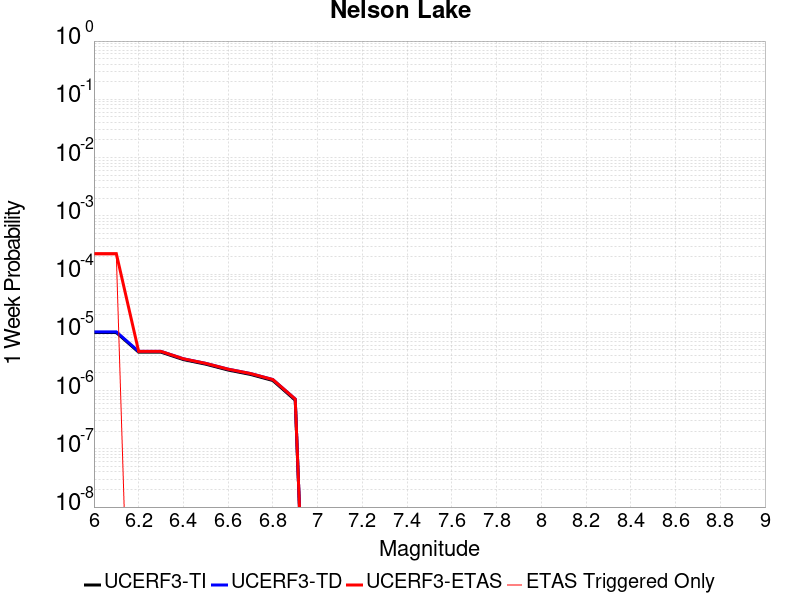 | 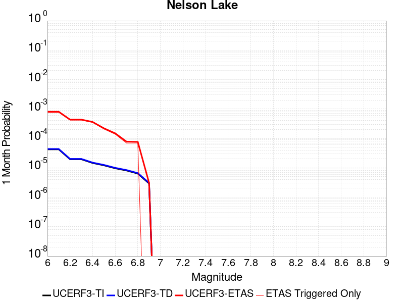 | 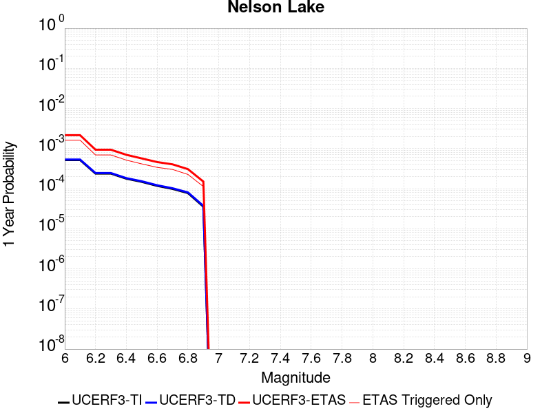 | 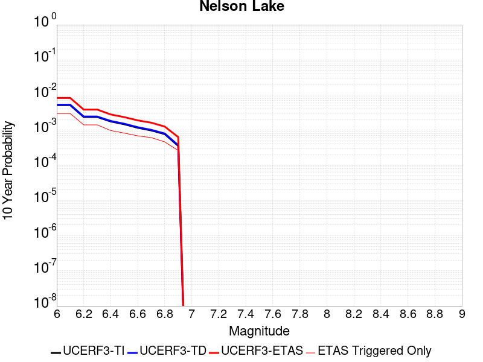 |

| Magnitude | 1 wk TI Prob | 1 wk TD Prob | 1 wk ETAS Prob | 1 wk ETAS/TD Gain | 1 wk ETAS Triggered Only | 1 mo TI Prob | 1 mo TD Prob | 1 mo ETAS Prob | 1 mo ETAS/TD Gain | 1 mo ETAS Triggered Only | 1 yr TI Prob | 1 yr TD Prob | 1 yr ETAS Prob | 1 yr ETAS/TD Gain | 1 yr ETAS Triggered Only | 10 yr TI Prob | 10 yr TD Prob | 10 yr ETAS Prob | 10 yr ETAS/TD Gain | 10 yr ETAS Triggered Only |
|-----|-----|-----|-----|-----|-----|-----|-----|-----|-----|-----|-----|-----|-----|-----|-----|-----|-----|-----|-----|-----|
| 6.0 | 9.913453E-6 | 1.0192255E-5 | 3.901884E-4 | 38.28283 | 3.8E-4 | 4.2485535E-5 | 4.3680422E-5 | 7.4364984E-4 | 17.024786 | 7.0E-4 | 5.1713863E-4 | 5.316897E-4 | 0.002220791 | 4.1768556 | 0.00169 | 0.0051593683 | 0.005305204 | 0.008299235 | 1.5643574 | 0.00301 |
| 6.1 | 9.913453E-6 | 1.0192255E-5 | 3.901884E-4 | 38.28283 | 3.8E-4 | 4.2485535E-5 | 4.3680422E-5 | 7.4364984E-4 | 17.024786 | 7.0E-4 | 5.1713863E-4 | 5.316897E-4 | 0.002220791 | 4.1768556 | 0.00169 | 0.0051593683 | 0.005305204 | 0.008299235 | 1.5643574 | 0.00301 |
| 6.2 | 4.5596407E-6 | 4.696313E-6 | 1.14695795E-4 | 24.42252 | 1.1E-4 | 1.954117E-5 | 2.0126909E-5 | 3.2012086E-4 | 15.905119 | 3.0E-4 | 2.3788778E-4 | 2.4501883E-4 | 9.348498E-4 | 3.8154202 | 6.9E-4 | 0.0023763329 | 0.0024476128 | 0.0038342106 | 1.5665103 | 0.00139 |
| 6.3 | 4.5596407E-6 | 4.696313E-6 | 1.14695795E-4 | 24.42252 | 1.1E-4 | 1.954117E-5 | 2.0126909E-5 | 3.2012086E-4 | 15.905119 | 3.0E-4 | 2.3788778E-4 | 2.4501883E-4 | 9.348498E-4 | 3.8154202 | 6.9E-4 | 0.0023763329 | 0.0024476128 | 0.0038342106 | 1.5665103 | 0.00139 |
| 6.4 | 3.4025713E-6 | 3.5098972E-6 | 8.3509614E-5 | 23.79261 | 8.0E-5 | 1.4582367E-5 | 1.5042335E-5 | 2.3503903E-4 | 15.625169 | 2.2E-4 | 1.7752586E-4 | 1.8312587E-4 | 6.530398E-4 | 3.5660706 | 4.7E-4 | 0.001773841 | 0.0018298327 | 0.002758131 | 1.5073133 | 9.3E-4 |
| 6.5 | 2.8352947E-6 | 2.927856E-6 | 6.2927684E-5 | 21.49275 | 6.0E-5 | 1.2151207E-5 | 1.2547898E-5 | 1.8254576E-4 | 14.547915 | 1.7E-4 | 1.479309E-4 | 1.5276071E-4 | 5.3270266E-4 | 3.4871707 | 3.8E-4 | 0.0014783246 | 0.0015266308 | 0.0022954554 | 1.5036087 | 7.7E-4 |
| 6.6 | 2.251518E-6 | 2.3290677E-6 | 6.232893E-5 | 26.761322 | 6.0E-5 | 9.649328E-6 | 9.981683E-6 | 1.5998019E-4 | 16.027374 | 1.5E-4 | 1.1747423E-4 | 1.2152085E-4 | 4.4148197E-4 | 3.632973 | 3.2E-4 | 0.0011741214 | 0.0012146058 | 0.0018638162 | 1.5345031 | 6.5E-4 |
| 6.7 | 1.8911853E-6 | 1.9591396E-6 | 6.195902E-5 | 31.625628 | 6.0E-5 | 8.105055E-6 | 8.39629E-6 | 1.383952E-4 | 16.4829 | 1.3E-4 | 9.867457E-5 | 1.0222061E-4 | 3.9219097E-4 | 3.8367112 | 2.9E-4 | 9.863076E-4 | 0.0010217935 | 0.0015812212 | 1.547496 | 5.6E-4 |
| 6.8 | 1.4874814E-6 | 1.5438305E-6 | 4.1543768E-5 | 26.90954 | 4.0E-5 | 6.374905E-6 | 6.6164025E-6 | 8.661587E-5 | 13.091083 | 8.0E-5 | 7.76117E-5 | 8.055224E-5 | 3.0053454E-4 | 3.7309268 | 2.2E-4 | 7.75846E-4 | 8.0528157E-4 | 0.0012249433 | 1.5211368 | 4.2E-4 |
| 6.9 | 6.835972E-7 | 7.1399285E-7 | 2.0713978E-5 | 29.011465 | 2.0E-5 | 2.9296991E-6 | 3.0599674E-6 | 3.3059874E-5 | 10.803996 | 3.0E-5 | 3.56685E-5 | 3.7254784E-5 | 1.3725106E-4 | 3.684119 | 1.0E-4 | 3.5662777E-4 | 3.7251666E-4 | 6.0243096E-4 | 1.617192 | 2.3E-4 |

## Towne Pass
*[(top)](#table-of-contents)*

| 1 Week | 1 Month | 1 Year | 10 Year |
|-----|-----|-----|-----|
| 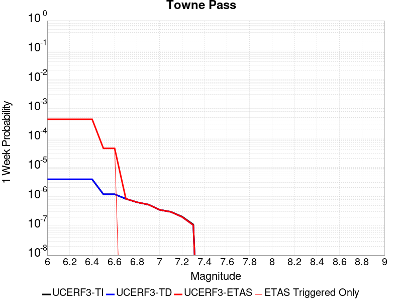 | 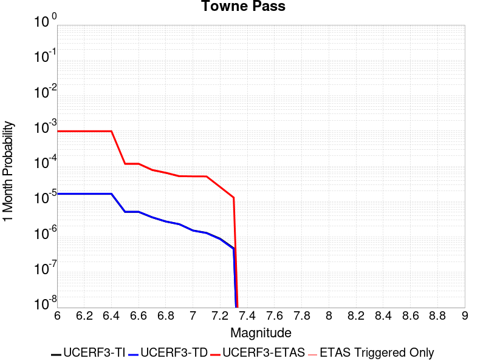 | 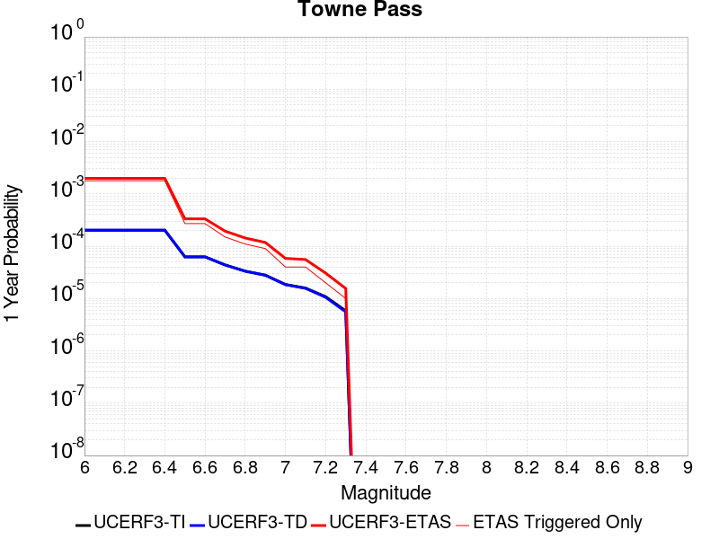 | 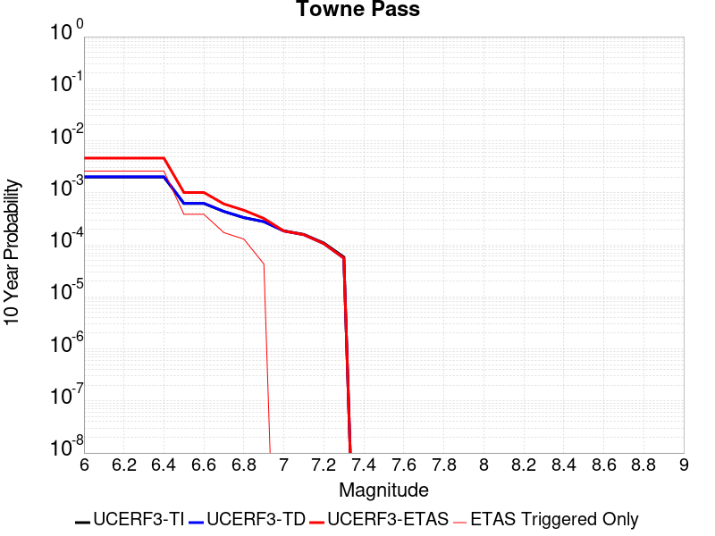 |

| Magnitude | 1 wk TI Prob | 1 wk TD Prob | 1 wk ETAS Prob | 1 wk ETAS/TD Gain | 1 wk ETAS Triggered Only | 1 mo TI Prob | 1 mo TD Prob | 1 mo ETAS Prob | 1 mo ETAS/TD Gain | 1 mo ETAS Triggered Only | 1 yr TI Prob | 1 yr TD Prob | 1 yr ETAS Prob | 1 yr ETAS/TD Gain | 1 yr ETAS Triggered Only | 10 yr TI Prob | 10 yr TD Prob | 10 yr ETAS Prob | 10 yr ETAS/TD Gain | 10 yr ETAS Triggered Only |
|-----|-----|-----|-----|-----|-----|-----|-----|-----|-----|-----|-----|-----|-----|-----|-----|-----|-----|-----|-----|-----|
| 6.0 | 3.849728E-6 | 3.894542E-6 | 5.9389224E-4 | 152.49348 | 5.9E-4 | 1.649873E-5 | 1.6690812E-5 | 9.166758E-4 | 54.920982 | 9.0E-4 | 2.0085352E-4 | 2.0319606E-4 | 0.0019828344 | 9.758232 | 0.00178 | 0.0020067208 | 0.0020305319 | 0.00470509 | 2.3171713 | 0.00268 |
| 6.1 | 3.849728E-6 | 3.894542E-6 | 5.9389224E-4 | 152.49348 | 5.9E-4 | 1.649873E-5 | 1.6690812E-5 | 9.166758E-4 | 54.920982 | 9.0E-4 | 2.0085352E-4 | 2.0319606E-4 | 0.0019828344 | 9.758232 | 0.00178 | 0.0020067208 | 0.0020305319 | 0.00470509 | 2.3171713 | 0.00268 |
| 6.2 | 3.849728E-6 | 3.894542E-6 | 5.9389224E-4 | 152.49348 | 5.9E-4 | 1.649873E-5 | 1.6690812E-5 | 9.166758E-4 | 54.920982 | 9.0E-4 | 2.0085352E-4 | 2.0319606E-4 | 0.0019828344 | 9.758232 | 0.00178 | 0.0020067208 | 0.0020305319 | 0.00470509 | 2.3171713 | 0.00268 |
| 6.3 | 3.849728E-6 | 3.894542E-6 | 5.9389224E-4 | 152.49348 | 5.9E-4 | 1.649873E-5 | 1.6690812E-5 | 9.166758E-4 | 54.920982 | 9.0E-4 | 2.0085352E-4 | 2.0319606E-4 | 0.0019828344 | 9.758232 | 0.00178 | 0.0020067208 | 0.0020305319 | 0.00470509 | 2.3171713 | 0.00268 |
| 6.4 | 3.849728E-6 | 3.894542E-6 | 5.9389224E-4 | 152.49348 | 5.9E-4 | 1.649873E-5 | 1.6690812E-5 | 9.166758E-4 | 54.920982 | 9.0E-4 | 2.0085352E-4 | 2.0319606E-4 | 0.0019828344 | 9.758232 | 0.00178 | 0.0020067208 | 0.0020305319 | 0.00470509 | 2.3171713 | 0.00268 |
| 6.5 | 1.1953545E-6 | 1.2030526E-6 | 8.1202954E-5 | 67.49743 | 8.0E-5 | 5.1229376E-6 | 5.15593E-6 | 1.2515532E-4 | 24.274052 | 1.2E-4 | 6.236998E-5 | 6.277176E-5 | 3.327548E-4 | 5.3010273 | 2.7E-4 | 6.235248E-4 | 6.2755204E-4 | 0.0010872633 | 1.7325469 | 4.6E-4 |
| 6.6 | 1.1953545E-6 | 1.2030526E-6 | 8.1202954E-5 | 67.49743 | 8.0E-5 | 5.1229376E-6 | 5.15593E-6 | 1.2515532E-4 | 24.274052 | 1.2E-4 | 6.236998E-5 | 6.277176E-5 | 3.327548E-4 | 5.3010273 | 2.7E-4 | 6.235248E-4 | 6.2755204E-4 | 0.0010872633 | 1.7325469 | 4.6E-4 |
| 6.7 | 8.375951E-7 | 8.410676E-7 | 6.0841016E-5 | 72.337845 | 6.0E-5 | 3.5896885E-6 | 3.6045708E-6 | 8.360428E-5 | 23.193962 | 8.0E-5 | 4.370358E-5 | 4.3884826E-5 | 1.9387824E-4 | 4.417888 | 1.5E-4 | 4.3694986E-4 | 4.3876728E-4 | 7.2864007E-4 | 1.6606526 | 2.9E-4 |
| 6.8 | 6.38041E-7 | 6.3921624E-7 | 5.0639184E-5 | 79.22074 | 5.0E-5 | 2.7344586E-6 | 2.7394954E-6 | 7.2739305E-5 | 26.55208 | 7.0E-5 | 3.3291526E-5 | 3.3352884E-5 | 1.4334921E-4 | 4.2979555 | 1.1E-4 | 3.3286537E-4 | 3.334826E-4 | 5.534092E-4 | 1.6594846 | 2.2E-4 |
| 6.9 | 5.3460053E-7 | 5.345339E-7 | 5.053451E-5 | 94.53939 | 5.0E-5 | 2.2911431E-6 | 2.2908578E-6 | 6.229072E-5 | 27.191004 | 6.0E-5 | 2.789431E-5 | 2.7890868E-5 | 1.1788836E-4 | 4.2267723 | 9.0E-5 | 2.789081E-4 | 2.78877E-4 | 4.388324E-4 | 1.5735697 | 1.6E-4 |
| 7.0 | 3.557783E-7 | 3.5324283E-7 | 4.035323E-5 | 114.23651 | 4.0E-5 | 1.5247632E-6 | 1.513897E-6 | 4.1513835E-5 | 27.421835 | 4.0E-5 | 1.8563835E-5 | 1.8431549E-5 | 5.843081E-5 | 3.170152 | 4.0E-5 | 1.8562283E-4 | 1.8430105E-4 | 2.642863E-4 | 1.4339924 | 8.0E-5 |
| 7.1 | 3.037942E-7 | 3.0002275E-7 | 4.0300012E-5 | 134.32318 | 4.0E-5 | 1.3019744E-6 | 1.2858112E-6 | 4.128576E-5 | 32.108727 | 4.0E-5 | 1.5851423E-5 | 1.5654647E-5 | 5.565402E-5 | 3.555112 | 4.0E-5 | 1.5850292E-4 | 1.5653619E-4 | 2.3652367E-4 | 1.510984 | 8.0E-5 |
| 7.2 | 2.0808248E-7 | 2.0217735E-7 | 2.0202173E-5 | 99.923035 | 2.0E-5 | 8.917818E-7 | 8.6647407E-7 | 2.0866457E-5 | 24.082033 | 2.0E-5 | 1.0857389E-5 | 1.0549275E-5 | 3.0549065E-5 | 2.895845 | 2.0E-5 | 1.0856859E-4 | 1.0548821E-4 | 1.6548188E-4 | 1.5687239 | 6.0E-5 |
| 7.3 | 1.1162073E-7 | 1.0636902E-7 | 1.0106368E-5 | 95.01232 | 1.0E-5 | 4.7837443E-7 | 4.5586717E-7 | 1.0455863E-5 | 22.936205 | 1.0E-5 | 5.8241935E-6 | 5.5501705E-6 | 1.5550115E-5 | 2.8017364 | 1.0E-5 | 5.8240406E-5 | 5.550052E-5 | 8.5498854E-5 | 1.5405054 | 3.0E-5 |

## Bicycle Lake
*[(top)](#table-of-contents)*

| 1 Week | 1 Month | 1 Year | 10 Year |
|-----|-----|-----|-----|
| 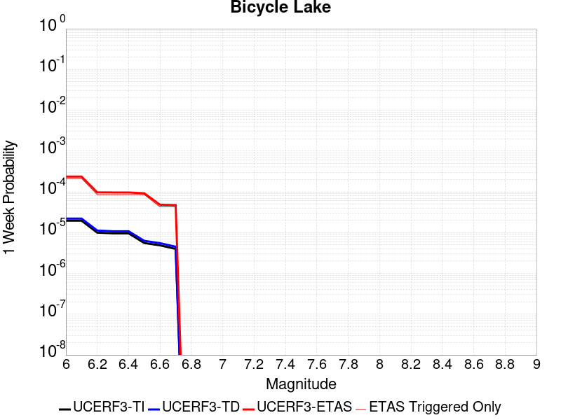 | 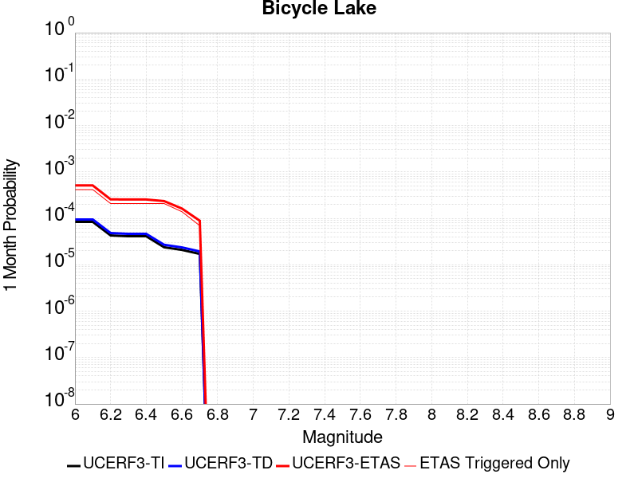 | 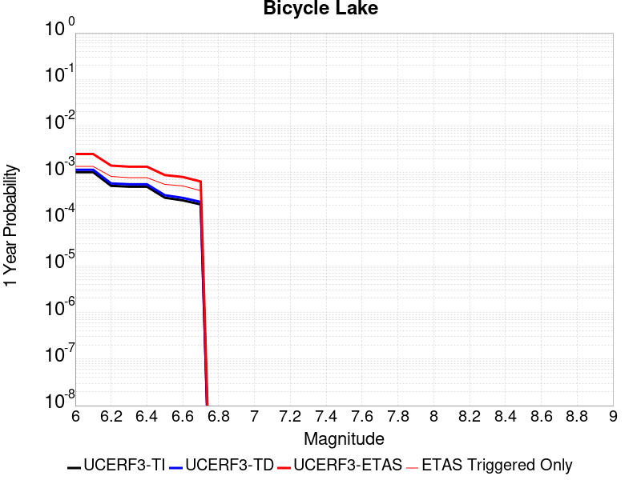 | 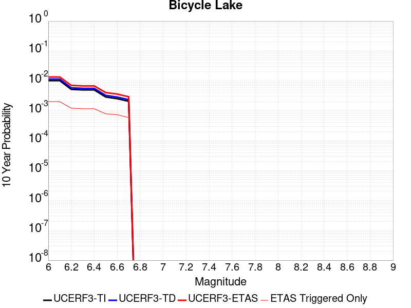 |

| Magnitude | 1 wk TI Prob | 1 wk TD Prob | 1 wk ETAS Prob | 1 wk ETAS/TD Gain | 1 wk ETAS Triggered Only | 1 mo TI Prob | 1 mo TD Prob | 1 mo ETAS Prob | 1 mo ETAS/TD Gain | 1 mo ETAS Triggered Only | 1 yr TI Prob | 1 yr TD Prob | 1 yr ETAS Prob | 1 yr ETAS/TD Gain | 1 yr ETAS Triggered Only | 10 yr TI Prob | 10 yr TD Prob | 10 yr ETAS Prob | 10 yr ETAS/TD Gain | 10 yr ETAS Triggered Only |
|-----|-----|-----|-----|-----|-----|-----|-----|-----|-----|-----|-----|-----|-----|-----|-----|-----|-----|-----|-----|-----|
| 6.0 | 1.9621975E-5 | 2.2097078E-5 | 4.420878E-4 | 20.006618 | 4.2E-4 | 8.4091465E-5 | 9.4699084E-5 | 6.9464225E-4 | 7.3352585 | 6.0E-4 | 0.0010233327 | 0.0011524865 | 0.0025109192 | 2.178697 | 0.00136 | 0.01018633 | 0.011478408 | 0.013583959 | 1.1834358 | 0.00213 |
| 6.1 | 1.9621975E-5 | 2.2097078E-5 | 4.420878E-4 | 20.006618 | 4.2E-4 | 8.4091465E-5 | 9.4699084E-5 | 6.9464225E-4 | 7.3352585 | 6.0E-4 | 0.0010233327 | 0.0011524865 | 0.0025109192 | 2.178697 | 0.00136 | 0.01018633 | 0.011478408 | 0.013583959 | 1.1834358 | 0.00213 |
| 6.2 | 9.9971285E-6 | 1.125564E-5 | 2.712527E-4 | 24.099272 | 2.6E-4 | 4.2844134E-5 | 4.8237856E-5 | 4.1822E-4 | 8.669954 | 3.7E-4 | 5.2150246E-4 | 5.871897E-4 | 0.0014167023 | 2.4126825 | 8.3E-4 | 0.0052028033 | 0.005861487 | 0.007183691 | 1.2255749 | 0.00133 |
| 6.3 | 9.589428E-6 | 1.0798346E-5 | 2.7079554E-4 | 25.077501 | 2.6E-4 | 4.10969E-5 | 4.62781E-5 | 4.1626097E-4 | 8.994773 | 3.7E-4 | 5.002399E-4 | 5.6334207E-4 | 0.0013429027 | 2.3838139 | 7.8E-4 | 0.0049911533 | 0.0056242296 | 0.0068870867 | 1.2245387 | 0.00127 |
| 6.4 | 9.589428E-6 | 1.0798346E-5 | 2.7079554E-4 | 25.077501 | 2.6E-4 | 4.10969E-5 | 4.62781E-5 | 4.1626097E-4 | 8.994773 | 3.7E-4 | 5.002399E-4 | 5.6334207E-4 | 0.0013429027 | 2.3838139 | 7.8E-4 | 0.0049911533 | 0.0056242296 | 0.0068870867 | 1.2245387 | 0.00127 |
| 6.5 | 5.557707E-6 | 6.2856016E-6 | 2.0628434E-4 | 32.818554 | 2.0E-4 | 2.3818526E-5 | 2.6938165E-5 | 3.0693063E-4 | 11.393895 | 2.8E-4 | 2.8995197E-4 | 3.279497E-4 | 8.87766E-4 | 2.707019 | 5.6E-4 | 0.0028957394 | 0.0032772934 | 0.0040946063 | 1.2493864 | 8.2E-4 |
| 6.6 | 4.8742945E-6 | 5.5132896E-6 | 1.855123E-4 | 33.648205 | 1.8E-4 | 2.0889667E-5 | 2.3628318E-5 | 2.8362218E-4 | 12.003486 | 2.6E-4 | 2.54302E-4 | 2.87663E-4 | 8.075134E-4 | 2.8071508 | 5.2E-4 | 0.002540112 | 0.0028754752 | 0.0036233186 | 1.2600764 | 7.5E-4 |
| 6.7 | 3.991108E-6 | 4.5159104E-6 | 1.4451527E-4 | 32.00136 | 1.4E-4 | 1.7104636E-5 | 1.9353902E-5 | 2.2934984E-4 | 11.850315 | 2.1E-4 | 2.0822904E-4 | 2.3563375E-4 | 6.4553716E-4 | 2.7395785 | 4.1E-4 | 0.0020803404 | 0.0023563374 | 0.0029649 | 1.2582663 | 6.1E-4 |

## Paradise
*[(top)](#table-of-contents)*

| 1 Week | 1 Month | 1 Year | 10 Year |
|-----|-----|-----|-----|
| 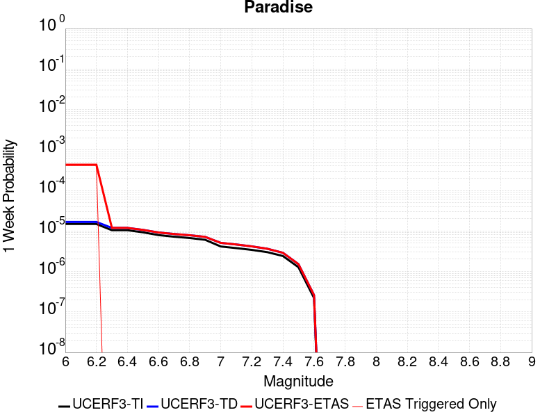 | 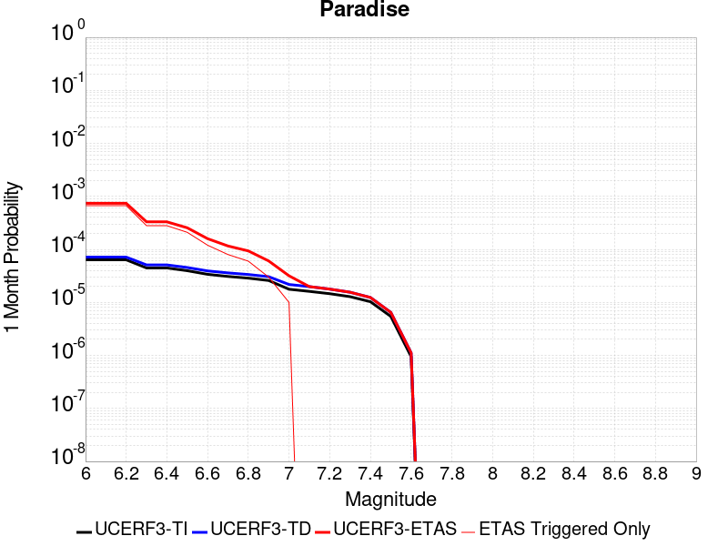 | 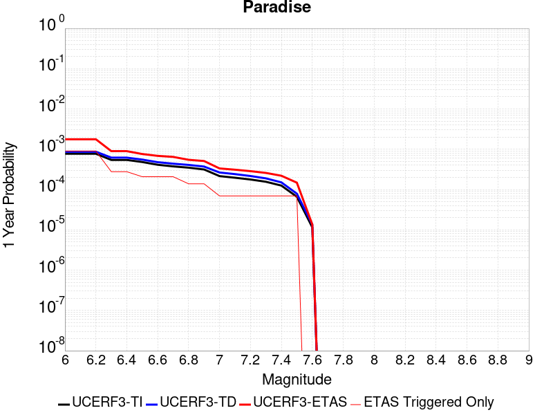 | 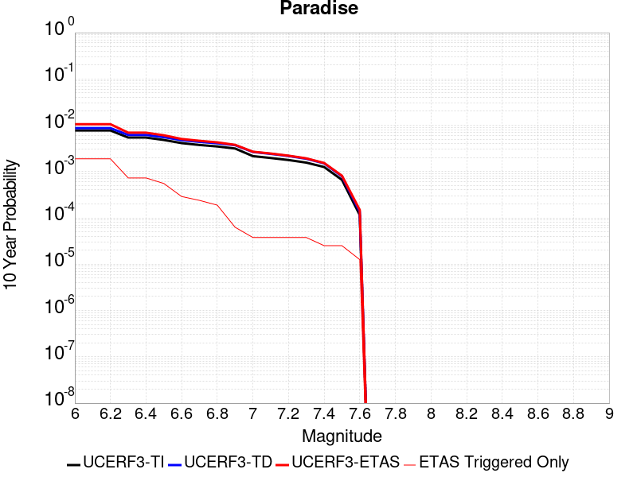 |

| Magnitude | 1 wk TI Prob | 1 wk TD Prob | 1 wk ETAS Prob | 1 wk ETAS/TD Gain | 1 wk ETAS Triggered Only | 1 mo TI Prob | 1 mo TD Prob | 1 mo ETAS Prob | 1 mo ETAS/TD Gain | 1 mo ETAS Triggered Only | 1 yr TI Prob | 1 yr TD Prob | 1 yr ETAS Prob | 1 yr ETAS/TD Gain | 1 yr ETAS Triggered Only | 10 yr TI Prob | 10 yr TD Prob | 10 yr ETAS Prob | 10 yr ETAS/TD Gain | 10 yr ETAS Triggered Only |
|-----|-----|-----|-----|-----|-----|-----|-----|-----|-----|-----|-----|-----|-----|-----|-----|-----|-----|-----|-----|-----|
| 6.0 | 1.4851273E-5 | 1.6694768E-5 | 4.966867E-4 | 29.751041 | 4.8E-4 | 6.364676E-5 | 7.154718E-5 | 7.4149924E-4 | 10.36378 | 6.7E-4 | 7.7462377E-4 | 8.707624E-4 | 0.0021296653 | 2.4457479 | 0.00126 | 0.0077192914 | 0.008675884 | 0.010718012 | 1.2353798 | 0.00206 |
| 6.1 | 1.4851273E-5 | 1.6694768E-5 | 4.966867E-4 | 29.751041 | 4.8E-4 | 6.364676E-5 | 7.154718E-5 | 7.4149924E-4 | 10.36378 | 6.7E-4 | 7.7462377E-4 | 8.707624E-4 | 0.0021296653 | 2.4457479 | 0.00126 | 0.0077192914 | 0.008675884 | 0.010718012 | 1.2353798 | 0.00206 |
| 6.2 | 1.4851273E-5 | 1.6694768E-5 | 4.966867E-4 | 29.751041 | 4.8E-4 | 6.364676E-5 | 7.154718E-5 | 7.4149924E-4 | 10.36378 | 6.7E-4 | 7.7462377E-4 | 8.707624E-4 | 0.0021296653 | 2.4457479 | 0.00126 | 0.0077192914 | 0.008675884 | 0.010718012 | 1.2353798 | 0.00206 |
| 6.3 | 1.0426831E-5 | 1.1888697E-5 | 2.1188632E-4 | 17.8225 | 2.0E-4 | 4.4685654E-5 | 5.09506E-5 | 3.3093634E-4 | 6.4952393 | 2.8E-4 | 5.43912E-4 | 6.201529E-4 | 0.0011498242 | 1.8540978 | 5.3E-4 | 0.0054258266 | 0.0061848317 | 0.0070196367 | 1.1349761 | 8.4E-4 |
| 6.4 | 1.0426831E-5 | 1.1888697E-5 | 2.1188632E-4 | 17.8225 | 2.0E-4 | 4.4685654E-5 | 5.09506E-5 | 3.3093634E-4 | 6.4952393 | 2.8E-4 | 5.43912E-4 | 6.201529E-4 | 0.0011498242 | 1.8540978 | 5.3E-4 | 0.0054258266 | 0.0061848317 | 0.0070196367 | 1.1349761 | 8.4E-4 |
| 6.5 | 9.25027E-6 | 1.0620037E-5 | 1.6061844E-4 | 15.124094 | 1.5E-4 | 3.964341E-5 | 4.551368E-5 | 2.5550413E-4 | 5.6137877 | 2.1E-4 | 4.8255164E-4 | 5.5399304E-4 | 9.43777E-4 | 1.7035899 | 3.9E-4 | 0.0048150513 | 0.0055266195 | 0.006182972 | 1.118762 | 6.6E-4 |
| 6.6 | 7.904275E-6 | 9.159602E-6 | 6.9159054E-5 | 7.5504427 | 6.0E-5 | 3.3875025E-5 | 3.925487E-5 | 1.5925016E-4 | 4.0568256 | 1.2E-4 | 4.1235037E-4 | 4.7782718E-4 | 6.777316E-4 | 1.4183614 | 2.0E-4 | 0.0041158604 | 0.004768395 | 0.005116726 | 1.07305 | 3.5E-4 |
| 6.7 | 7.2061953E-6 | 8.407326E-6 | 5.8406906E-5 | 6.947144 | 5.0E-5 | 3.088333E-5 | 3.603092E-5 | 1.1602804E-4 | 3.2202353 | 8.0E-5 | 3.7593965E-4 | 4.3859181E-4 | 5.88526E-4 | 1.3418536 | 1.5E-4 | 0.003753043 | 0.004377631 | 0.004636493 | 1.0591328 | 2.6E-4 |
| 6.8 | 6.6948724E-6 | 7.842242E-6 | 3.7842008E-5 | 4.8254066 | 3.0E-5 | 2.8691995E-5 | 3.3609194E-5 | 9.360718E-5 | 2.7851658 | 6.0E-5 | 3.4926904E-4 | 4.091187E-4 | 5.2906957E-4 | 1.2931935 | 1.2E-4 | 0.003487206 | 0.0040840125 | 0.004293155 | 1.05121 | 2.1E-4 |
| 6.9 | 6.0421025E-6 | 7.1306963E-6 | 2.7130554E-5 | 3.8047552 | 2.0E-5 | 2.5894467E-5 | 3.0559786E-5 | 6.0558872E-5 | 1.9816523 | 3.0E-5 | 3.1521954E-4 | 3.7200528E-4 | 4.3198297E-4 | 1.1612281 | 6.0E-5 | 0.0031477278 | 0.0037141638 | 0.0038137925 | 1.026824 | 1.0E-4 |
| 7.0 | 4.134091E-6 | 5.0803824E-6 | 5.0803824E-6 | 1.0 | 0.0 | 1.7717413E-5 | 2.1772896E-5 | 3.1772677E-5 | 1.4592767 | 1.0E-5 | 2.1568815E-4 | 2.650543E-4 | 2.9504634E-4 | 1.1131544 | 3.0E-5 | 0.0021547892 | 0.0026475347 | 0.0026974024 | 1.0188355 | 5.0E-5 |
| 7.1 | 3.7674888E-6 | 4.631936E-6 | 4.631936E-6 | 1.0 | 0.0 | 1.6146281E-5 | 1.9851012E-5 | 1.9851012E-5 | 1.0 | 0.0 | 1.9656324E-4 | 2.4166079E-4 | 2.6165595E-4 | 1.0827407 | 2.0E-5 | 0.0019638946 | 0.0024141306 | 0.002454034 | 1.0165291 | 4.0E-5 |
| 7.2 | 3.4065345E-6 | 4.156782E-6 | 4.156782E-6 | 1.0 | 0.0 | 1.4599351E-5 | 1.7814667E-5 | 1.7814667E-5 | 1.0 | 0.0 | 1.777326E-4 | 2.168735E-4 | 2.3686915E-4 | 1.0921997 | 2.0E-5 | 0.0017759053 | 0.0021667667 | 0.00220668 | 1.0184207 | 4.0E-5 |
| 7.3 | 2.9934936E-6 | 3.6293673E-6 | 3.6293673E-6 | 1.0 | 0.0 | 1.2829195E-5 | 1.5554348E-5 | 1.5554348E-5 | 1.0 | 0.0 | 1.5618425E-4 | 1.8935918E-4 | 1.993573E-4 | 1.0527997 | 1.0E-5 | 0.0015607453 | 0.0018921237 | 0.001922067 | 1.0158252 | 3.0E-5 |
| 7.4 | 2.4049796E-6 | 2.8890186E-6 | 2.8890186E-6 | 1.0 | 0.0 | 1.0307015E-5 | 1.2381457E-5 | 1.2381457E-5 | 1.0 | 0.0 | 1.2548068E-4 | 1.5073526E-4 | 1.6073375E-4 | 1.0663315 | 1.0E-5 | 0.0012540985 | 0.0015064715 | 0.0015264414 | 1.0132561 | 2.0E-5 |
| 7.5 | 1.2710091E-6 | 1.5134859E-6 | 1.5134859E-6 | 1.0 | 0.0 | 5.44717E-6 | 6.4863593E-6 | 6.4863593E-6 | 1.0 | 0.0 | 6.631728E-5 | 7.896981E-5 | 8.896902E-5 | 1.1266207 | 1.0E-5 | 6.6297496E-4 | 7.895401E-4 | 8.095243E-4 | 1.0253112 | 2.0E-5 |
| 7.6 | 2.21172E-7 | 2.6040198E-7 | 2.6040198E-7 | 1.0 | 0.0 | 9.478797E-7 | 1.1160082E-6 | 1.1160082E-6 | 1.0 | 0.0 | 1.1540374E-5 | 1.3587343E-5 | 1.3587343E-5 | 1.0 | 0.0 | 1.1539775E-4 | 1.3586794E-4 | 1.4586658E-4 | 1.0735909 | 1.0E-5 |

## San Andreas (San Bernardino N)
*[(top)](#table-of-contents)*

| 1 Week | 1 Month | 1 Year | 10 Year |
|-----|-----|-----|-----|
| 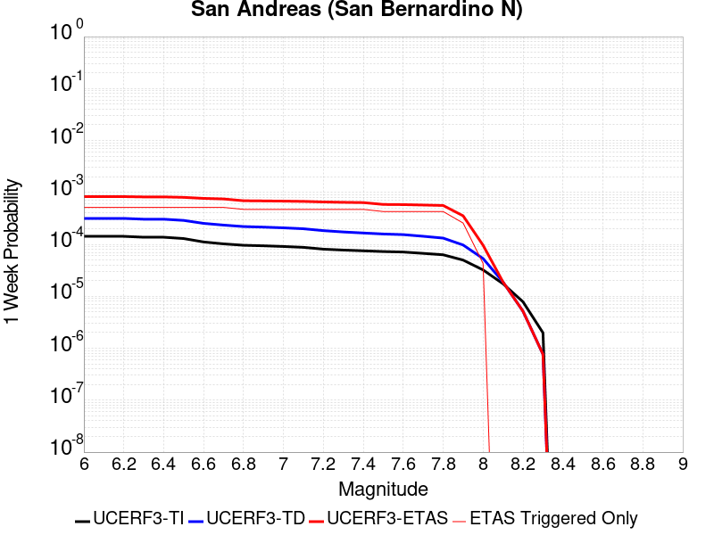 | 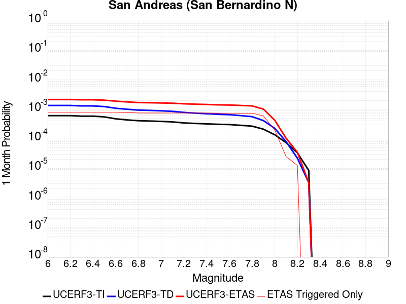 | 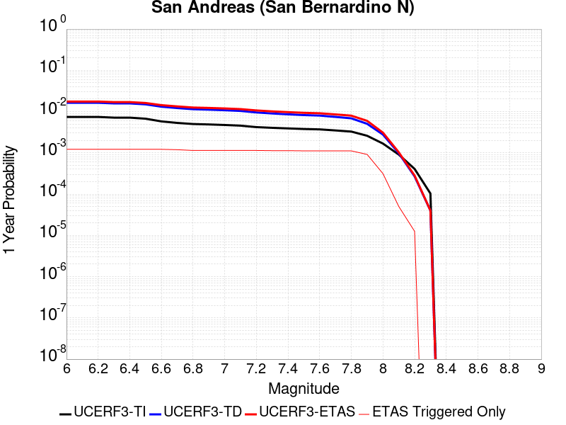 | 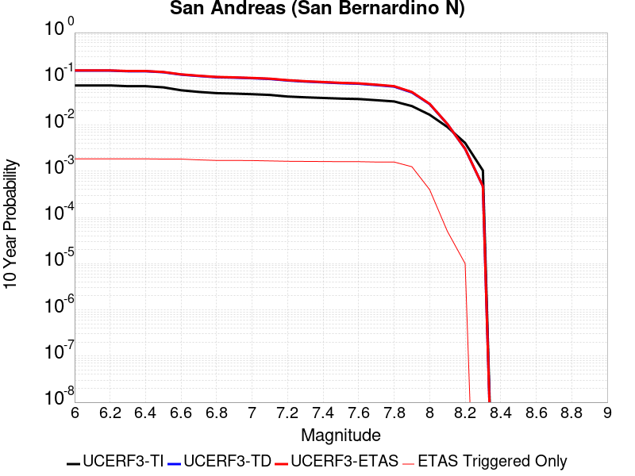 |

| Magnitude | 1 wk TI Prob | 1 wk TD Prob | 1 wk ETAS Prob | 1 wk ETAS/TD Gain | 1 wk ETAS Triggered Only | 1 mo TI Prob | 1 mo TD Prob | 1 mo ETAS Prob | 1 mo ETAS/TD Gain | 1 mo ETAS Triggered Only | 1 yr TI Prob | 1 yr TD Prob | 1 yr ETAS Prob | 1 yr ETAS/TD Gain | 1 yr ETAS Triggered Only | 10 yr TI Prob | 10 yr TD Prob | 10 yr ETAS Prob | 10 yr ETAS/TD Gain | 10 yr ETAS Triggered Only |
|-----|-----|-----|-----|-----|-----|-----|-----|-----|-----|-----|-----|-----|-----|-----|-----|-----|-----|-----|-----|-----|
| 6.0 | 1.4273766E-4 | 3.160784E-4 | 0.0010658413 | 3.372079 | 7.5E-4 | 6.115894E-4 | 0.0013539245 | 0.0022427195 | 1.6564584 | 8.9E-4 | 0.0074207084 | 0.016360939 | 0.017659344 | 1.07936 | 0.00132 | 0.07177748 | 0.15021163 | 0.15178373 | 1.010466 | 0.00185 |
| 6.1 | 1.4273766E-4 | 3.160784E-4 | 0.0010658413 | 3.372079 | 7.5E-4 | 6.115894E-4 | 0.0013539245 | 0.0022427195 | 1.6564584 | 8.9E-4 | 0.0074207084 | 0.016360939 | 0.017659344 | 1.07936 | 0.00132 | 0.07177748 | 0.15021163 | 0.15178373 | 1.010466 | 0.00185 |
| 6.2 | 1.4273766E-4 | 3.160784E-4 | 0.0010658413 | 3.372079 | 7.5E-4 | 6.115894E-4 | 0.0013539245 | 0.0022427195 | 1.6564584 | 8.9E-4 | 0.0074207084 | 0.016360939 | 0.017659344 | 1.07936 | 0.00132 | 0.07177748 | 0.15021163 | 0.15178373 | 1.010466 | 0.00185 |
| 6.3 | 1.3730655E-4 | 3.0512668E-4 | 0.0010548978 | 3.4572456 | 7.5E-4 | 5.883239E-4 | 0.001307036 | 0.0021958728 | 1.68004 | 8.9E-4 | 0.0071393442 | 0.015798455 | 0.017097602 | 1.0822325 | 0.00132 | 0.06914291 | 0.1455135 | 0.14709431 | 1.0108635 | 0.00185 |
| 6.4 | 1.3730655E-4 | 3.0512668E-4 | 0.0010548978 | 3.4572456 | 7.5E-4 | 5.883239E-4 | 0.001307036 | 0.0021958728 | 1.68004 | 8.9E-4 | 0.0071393442 | 0.015798455 | 0.017097602 | 1.0822325 | 0.00132 | 0.06914291 | 0.1455135 | 0.14709431 | 1.0108635 | 0.00185 |
| 6.5 | 1.2942807E-4 | 2.8927144E-4 | 0.0010390545 | 3.5919704 | 7.5E-4 | 5.545738E-4 | 0.0012391509 | 0.002128048 | 1.7173438 | 8.9E-4 | 0.0067310524 | 0.014983548 | 0.01628377 | 1.0867766 | 0.00132 | 0.06530788 | 0.13865088 | 0.14022714 | 1.0113686 | 0.00183 |
| 6.6 | 1.1125901E-4 | 2.5365927E-4 | 0.001003469 | 3.9559724 | 7.5E-4 | 4.767372E-4 | 0.0010866605 | 0.0019756933 | 1.818133 | 8.9E-4 | 0.005788839 | 0.0131504685 | 0.014453109 | 1.0990566 | 0.00132 | 0.056403454 | 0.12300496 | 0.12460986 | 1.0130475 | 0.00183 |
| 6.7 | 1.02209575E-4 | 2.3500937E-4 | 9.748355E-4 | 4.1480703 | 7.4E-4 | 4.3796748E-4 | 0.0010067957 | 0.0018659298 | 1.8533351 | 8.6E-4 | 0.0053192247 | 0.012189267 | 0.013453665 | 1.1037304 | 0.00128 | 0.051936906 | 0.114792764 | 0.11635073 | 1.013572 | 0.00176 |
| 6.8 | 9.610582E-5 | 2.2026796E-4 | 9.4010937E-4 | 4.268026 | 7.2E-4 | 4.1181705E-4 | 9.436647E-4 | 0.001782872 | 1.8893067 | 8.4E-4 | 0.0050023515 | 0.011428859 | 0.012644802 | 1.1063923 | 0.00123 | 0.048912346 | 0.10820469 | 0.10972966 | 1.0140934 | 0.00171 |
| 6.9 | 9.3877505E-5 | 2.1482339E-4 | 9.346687E-4 | 4.35087 | 7.2E-4 | 4.0227012E-4 | 9.203475E-4 | 0.0017595744 | 1.9118587 | 8.4E-4 | 0.0048866454 | 0.011147907 | 0.012364195 | 1.1091046 | 0.00123 | 0.04780577 | 0.105798274 | 0.10732736 | 1.0144528 | 0.00171 |
| 7.0 | 9.1019785E-5 | 2.0809306E-4 | 9.279432E-4 | 4.4592705 | 7.2E-4 | 3.900265E-4 | 8.915232E-4 | 0.0017207832 | 1.9301609 | 8.3E-4 | 0.0047382377 | 0.0108004995 | 0.012007323 | 1.1117377 | 0.00122 | 0.046384744 | 0.10276815 | 0.10429345 | 1.014842 | 0.0017 |
| 7.1 | 8.771155E-5 | 1.9983841E-4 | 8.996985E-4 | 4.50213 | 7.0E-4 | 3.758525E-4 | 8.5616973E-4 | 0.0016654762 | 1.9452641 | 8.1E-4 | 0.0045664064 | 0.010374243 | 0.011561794 | 1.1144711 | 0.0012 | 0.044737056 | 0.09907644 | 0.10058098 | 1.0151857 | 0.00167 |
| 7.2 | 8.0830236E-5 | 1.8389444E-4 | 8.837657E-4 | 4.8058314 | 7.0E-4 | 3.4636928E-4 | 7.8788114E-4 | 0.0015972429 | 2.0272639 | 8.1E-4 | 0.0042088944 | 0.009550368 | 0.010738908 | 1.1244496 | 0.0012 | 0.041300658 | 0.09180518 | 0.09329463 | 1.0162239 | 0.00164 |
| 7.3 | 7.7668235E-5 | 1.7333007E-4 | 8.7320874E-4 | 5.0378375 | 7.0E-4 | 3.328214E-4 | 7.426318E-4 | 0.0015520302 | 2.0899055 | 8.1E-4 | 0.0040445733 | 0.009004138 | 0.010183423 | 1.1309714 | 0.00119 | 0.03971748 | 0.08706761 | 0.08855569 | 1.017091 | 0.00163 |
| 7.4 | 7.520177E-5 | 1.655312E-4 | 8.654153E-4 | 5.2281103 | 7.0E-4 | 3.2225347E-4 | 7.092266E-4 | 0.0015186521 | 2.1412792 | 8.1E-4 | 0.0039163795 | 0.008600714 | 0.009780479 | 1.1371707 | 0.00119 | 0.038480744 | 0.08352157 | 0.08500626 | 1.0177761 | 0.00162 |
| 7.5 | 7.274697E-5 | 1.584075E-4 | 8.482982E-4 | 5.355164 | 6.9E-4 | 3.1173544E-4 | 6.7871273E-4 | 0.0014781697 | 2.177902 | 8.0E-4 | 0.003788775 | 0.008232076 | 0.009402362 | 1.1421617 | 0.00118 | 0.03724827 | 0.08023654 | 0.08171736 | 1.0184556 | 0.00161 |
| 7.6 | 7.1185845E-5 | 1.5410586E-4 | 8.439995E-4 | 5.476752 | 6.9E-4 | 3.0504653E-4 | 6.602866E-4 | 0.0014597584 | 2.2107952 | 8.0E-4 | 0.0037076178 | 0.0080094095 | 0.009179958 | 1.1461468 | 0.00118 | 0.036463667 | 0.07822661 | 0.07971067 | 1.0189712 | 0.00161 |
| 7.7 | 6.709961E-5 | 1.4319421E-4 | 8.330954E-4 | 5.8179407 | 6.9E-4 | 2.8753807E-4 | 6.135452E-4 | 0.0014130543 | 2.3030975 | 8.0E-4 | 0.003495157 | 0.0074443663 | 0.008595731 | 1.1546625 | 0.00116 | 0.034406938 | 0.07305558 | 0.074520156 | 1.0200474 | 0.00158 |
| 7.8 | 6.300812E-5 | 1.320343E-4 | 8.219432E-4 | 6.2252245 | 6.9E-4 | 2.7000686E-4 | 5.657386E-4 | 0.0013652861 | 2.4132807 | 8.0E-4 | 0.0032823787 | 0.006866143 | 0.008018179 | 1.1677849 | 0.00116 | 0.032343175 | 0.06771385 | 0.06918686 | 1.0217534 | 0.00158 |
| 7.9 | 4.983037E-5 | 9.7241085E-5 | 6.0719147E-4 | 6.244187 | 5.1E-4 | 2.1354125E-4 | 4.1668097E-4 | 0.0010064351 | 2.4153614 | 5.9E-4 | 0.0025967648 | 0.0050613005 | 0.005946796 | 1.1749542 | 8.9E-4 | 0.025666296 | 0.050650507 | 0.051837195 | 1.0234289 | 0.00125 |
| 8.0 | 3.2211527E-5 | 5.3306234E-5 | 2.3329664E-4 | 4.376536 | 1.8E-4 | 1.380421E-4 | 2.2843528E-4 | 4.183919E-4 | 1.8315554 | 1.9E-4 | 0.0016793669 | 0.0027776542 | 0.0030568766 | 1.1005244 | 2.8E-4 | 0.016667323 | 0.028362568 | 0.028751224 | 1.0137031 | 4.0E-4 |
| 8.1 | 1.743376E-5 | 1.8823403E-5 | 3.8823026E-5 | 2.0624871 | 2.0E-5 | 7.471398E-5 | 8.066923E-5 | 1.0066762E-4 | 1.247906 | 2.0E-5 | 9.0926304E-4 | 9.81706E-4 | 0.0010216667 | 1.0407054 | 4.0E-5 | 0.009055517 | 0.010483979 | 0.010533456 | 1.0047191 | 5.0E-5 |
| 8.2 | 7.831616E-6 | 5.1540533E-6 | 1.5154002E-5 | 2.9402106 | 1.0E-5 | 3.3563636E-5 | 2.2088612E-5 | 3.2088392E-5 | 1.4527119 | 1.0E-5 | 4.0856065E-4 | 2.6889573E-4 | 2.7889304E-4 | 1.0371791 | 1.0E-5 | 0.004078103 | 0.0030413668 | 0.0030513364 | 1.003278 | 1.0E-5 |
| 8.3 | 1.983087E-6 | 7.6564595E-7 | 7.6564595E-7 | 1.0 | 0.0 | 8.498917E-6 | 3.281336E-6 | 3.281336E-6 | 1.0 | 0.0 | 1.034694E-4 | 3.9949547E-5 | 3.9949547E-5 | 1.0 | 0.0 | 0.0010342124 | 4.717979E-4 | 4.717979E-4 | 1.0 | 0.0 |

## Garlic Springs
*[(top)](#table-of-contents)*

| 1 Week | 1 Month | 1 Year | 10 Year |
|-----|-----|-----|-----|
| 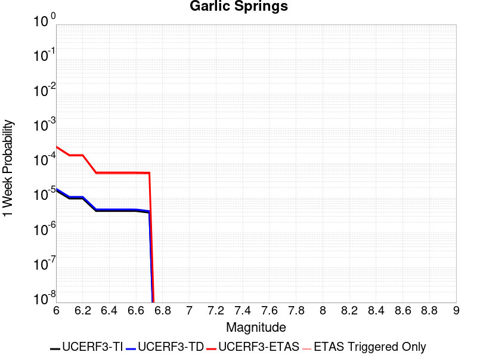 | 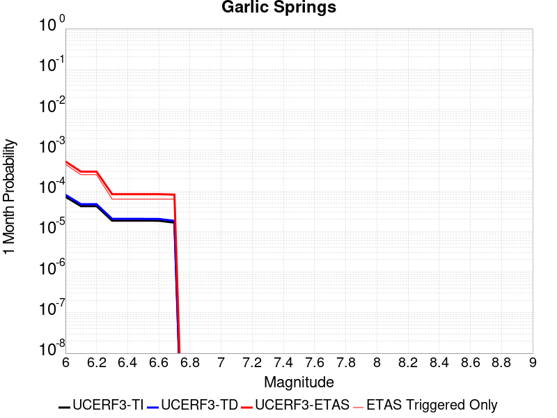 | 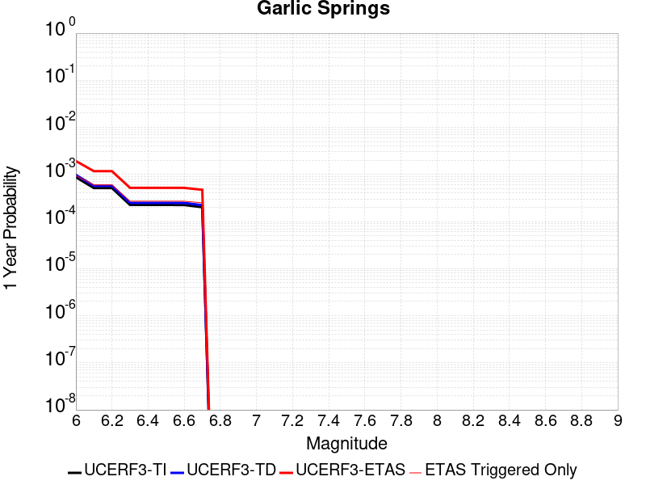 | 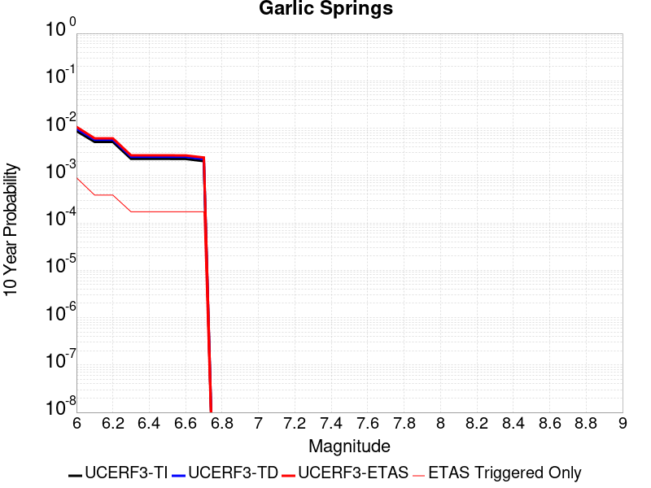 |

| Magnitude | 1 wk TI Prob | 1 wk TD Prob | 1 wk ETAS Prob | 1 wk ETAS/TD Gain | 1 wk ETAS Triggered Only | 1 mo TI Prob | 1 mo TD Prob | 1 mo ETAS Prob | 1 mo ETAS/TD Gain | 1 mo ETAS Triggered Only | 1 yr TI Prob | 1 yr TD Prob | 1 yr ETAS Prob | 1 yr ETAS/TD Gain | 1 yr ETAS Triggered Only | 10 yr TI Prob | 10 yr TD Prob | 10 yr ETAS Prob | 10 yr ETAS/TD Gain | 10 yr ETAS Triggered Only |
|-----|-----|-----|-----|-----|-----|-----|-----|-----|-----|-----|-----|-----|-----|-----|-----|-----|-----|-----|-----|-----|
| 6.0 | 1.6760017E-5 | 1.8776833E-5 | 3.0877138E-4 | 16.444275 | 2.9E-4 | 7.182667E-5 | 8.0470316E-5 | 5.504325E-4 | 6.840193 | 4.7E-4 | 8.7413884E-4 | 9.794032E-4 | 0.0019284728 | 1.9690285 | 9.5E-4 | 0.008707083 | 0.009762413 | 0.011326988 | 1.1602652 | 0.00158 |
| 6.1 | 9.852767E-6 | 1.0973587E-5 | 1.7097183E-4 | 15.580305 | 1.6E-4 | 4.222546E-5 | 4.702921E-5 | 3.0701698E-4 | 6.5282187 | 2.6E-4 | 5.139737E-4 | 5.7250116E-4 | 0.0011721577 | 2.047433 | 6.0E-4 | 0.005127866 | 0.005717221 | 0.006701561 | 1.172171 | 9.9E-4 |
| 6.2 | 9.852767E-6 | 1.0973587E-5 | 1.7097183E-4 | 15.580305 | 1.6E-4 | 4.222546E-5 | 4.702921E-5 | 3.0701698E-4 | 6.5282187 | 2.6E-4 | 5.139737E-4 | 5.7250116E-4 | 0.0011721577 | 2.047433 | 6.0E-4 | 0.005127866 | 0.005717221 | 0.006701561 | 1.172171 | 9.9E-4 |
| 6.3 | 4.3167724E-6 | 4.7780286E-6 | 7.4777694E-5 | 15.650324 | 7.0E-5 | 1.8500323E-5 | 2.0477235E-5 | 1.1047539E-4 | 5.395035 | 9.0E-5 | 2.2521814E-4 | 2.4930484E-4 | 5.1923754E-4 | 2.0827415 | 2.7E-4 | 0.0022499003 | 0.00249251 | 0.002901488 | 1.1640828 | 4.1E-4 |
| 6.4 | 4.3167724E-6 | 4.7780286E-6 | 7.4777694E-5 | 15.650324 | 7.0E-5 | 1.8500323E-5 | 2.0477235E-5 | 1.1047539E-4 | 5.395035 | 9.0E-5 | 2.2521814E-4 | 2.4930484E-4 | 5.1923754E-4 | 2.0827415 | 2.7E-4 | 0.0022499003 | 0.00249251 | 0.002901488 | 1.1640828 | 4.1E-4 |
| 6.5 | 4.3167724E-6 | 4.7780286E-6 | 7.4777694E-5 | 15.650324 | 7.0E-5 | 1.8500323E-5 | 2.0477235E-5 | 1.1047539E-4 | 5.395035 | 9.0E-5 | 2.2521814E-4 | 2.4930484E-4 | 5.1923754E-4 | 2.0827415 | 2.7E-4 | 0.0022499003 | 0.00249251 | 0.002901488 | 1.1640828 | 4.1E-4 |
| 6.6 | 4.301311E-6 | 4.760897E-6 | 7.4760566E-5 | 15.703041 | 7.0E-5 | 1.8434059E-5 | 2.0403815E-5 | 1.10401976E-4 | 5.41085 | 9.0E-5 | 2.2441156E-4 | 2.4841115E-4 | 5.183441E-4 | 2.0866377 | 2.7E-4 | 0.0022418506 | 0.002483593 | 0.0028925748 | 1.1646734 | 4.1E-4 |
| 6.7 | 3.8599724E-6 | 4.27106E-6 | 7.427076E-5 | 17.389305 | 7.0E-5 | 1.6542634E-5 | 1.8304541E-5 | 1.083029E-4 | 5.9167223 | 9.0E-5 | 2.0138794E-4 | 2.228578E-4 | 4.728021E-4 | 2.1215415 | 2.5E-4 | 0.0020120554 | 0.002228578 | 0.0026177089 | 1.1746095 | 3.9E-4 |

## Helendale-So Lockhart
*[(top)](#table-of-contents)*

| 1 Week | 1 Month | 1 Year | 10 Year |
|-----|-----|-----|-----|
| 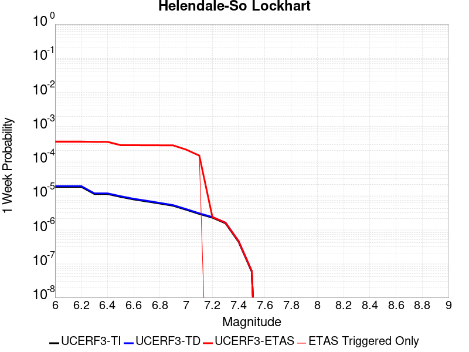 | 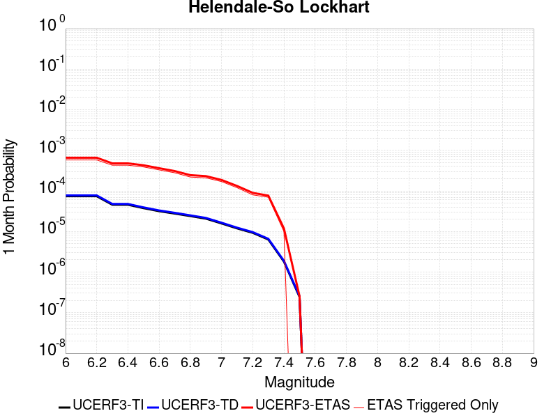 | 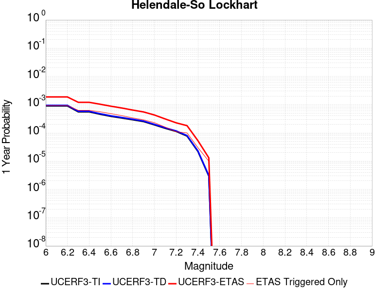 | 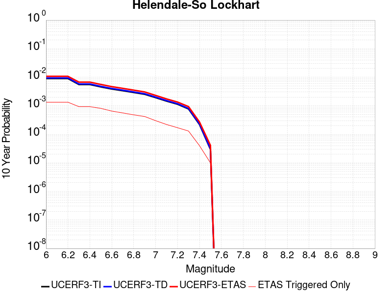 |

| Magnitude | 1 wk TI Prob | 1 wk TD Prob | 1 wk ETAS Prob | 1 wk ETAS/TD Gain | 1 wk ETAS Triggered Only | 1 mo TI Prob | 1 mo TD Prob | 1 mo ETAS Prob | 1 mo ETAS/TD Gain | 1 mo ETAS Triggered Only | 1 yr TI Prob | 1 yr TD Prob | 1 yr ETAS Prob | 1 yr ETAS/TD Gain | 1 yr ETAS Triggered Only | 10 yr TI Prob | 10 yr TD Prob | 10 yr ETAS Prob | 10 yr ETAS/TD Gain | 10 yr ETAS Triggered Only |
|-----|-----|-----|-----|-----|-----|-----|-----|-----|-----|-----|-----|-----|-----|-----|-----|-----|-----|-----|-----|-----|
| 6.0 | 1.7296055E-5 | 1.8103729E-5 | 3.680974E-4 | 20.332684 | 3.5E-4 | 7.412385E-5 | 7.7585224E-5 | 6.575402E-4 | 8.475071 | 5.8E-4 | 9.0208417E-4 | 9.4421144E-4 | 0.0018733334 | 1.9840189 | 9.3E-4 | 0.008984311 | 0.009404116 | 0.010721609 | 1.1400974 | 0.00133 |
| 6.1 | 1.7296055E-5 | 1.8103729E-5 | 3.680974E-4 | 20.332684 | 3.5E-4 | 7.412385E-5 | 7.7585224E-5 | 6.575402E-4 | 8.475071 | 5.8E-4 | 9.0208417E-4 | 9.4421144E-4 | 0.0018733334 | 1.9840189 | 9.3E-4 | 0.008984311 | 0.009404116 | 0.010721609 | 1.1400974 | 0.00133 |
| 6.2 | 1.7296055E-5 | 1.8103729E-5 | 3.680974E-4 | 20.332684 | 3.5E-4 | 7.412385E-5 | 7.7585224E-5 | 6.575402E-4 | 8.475071 | 5.8E-4 | 9.0208417E-4 | 9.4421144E-4 | 0.0018733334 | 1.9840189 | 9.3E-4 | 0.008984311 | 0.009404116 | 0.010721609 | 1.1400974 | 0.00133 |
| 6.3 | 1.0669118E-5 | 1.1135425E-5 | 2.811324E-4 | 25.246674 | 2.7E-4 | 4.5723988E-5 | 4.772239E-5 | 4.7770186E-4 | 10.0100155 | 4.3E-4 | 5.5654737E-4 | 5.80868E-4 | 0.001210502 | 2.0839539 | 6.3E-4 | 0.0055515557 | 0.0057937936 | 0.0067184055 | 1.1595865 | 9.3E-4 |
| 6.4 | 1.0669118E-5 | 1.1135425E-5 | 2.811324E-4 | 25.246674 | 2.7E-4 | 4.5723988E-5 | 4.772239E-5 | 4.7770186E-4 | 10.0100155 | 4.3E-4 | 5.5654737E-4 | 5.80868E-4 | 0.001210502 | 2.0839539 | 6.3E-4 | 0.0055515557 | 0.0057937936 | 0.0067184055 | 1.1595865 | 9.3E-4 |
| 6.5 | 8.790038E-6 | 9.170197E-6 | 2.3916809E-4 | 26.08102 | 2.3E-4 | 3.767105E-5 | 3.930026E-5 | 4.2928493E-4 | 10.923208 | 3.9E-4 | 4.585485E-4 | 4.7837716E-4 | 0.0010381093 | 2.1700644 | 5.6E-4 | 0.0045760344 | 0.004773638 | 0.005579772 | 1.1688719 | 8.1E-4 |
| 6.6 | 7.396949E-6 | 7.715537E-6 | 2.07714E-4 | 26.921522 | 2.0E-4 | 3.1700827E-5 | 3.3066175E-5 | 3.6305527E-4 | 10.979657 | 3.3E-4 | 3.858892E-4 | 4.025073E-4 | 8.823141E-4 | 2.192045 | 4.8E-4 | 0.003852198 | 0.00401789 | 0.0046652784 | 1.1611265 | 6.5E-4 |
| 6.7 | 6.4600285E-6 | 6.738031E-6 | 1.7673688E-4 | 26.229752 | 1.7E-4 | 2.7685543E-5 | 2.887696E-5 | 3.0886888E-4 | 10.696032 | 2.8E-4 | 3.3701936E-4 | 3.5152107E-4 | 7.613769E-4 | 2.1659498 | 4.1E-4 | 0.0033650869 | 0.003509732 | 0.0040677665 | 1.1589963 | 5.6E-4 |
| 6.8 | 5.600104E-6 | 5.836009E-6 | 1.4583519E-4 | 24.988855 | 1.4E-4 | 2.4000226E-5 | 2.5011232E-5 | 2.4500574E-4 | 9.795828 | 2.2E-4 | 2.9216358E-4 | 3.044698E-4 | 6.4436626E-4 | 2.1163554 | 3.4E-4 | 0.0029177975 | 0.003040588 | 0.0035191285 | 1.1573842 | 4.8E-4 |
| 6.9 | 4.839122E-6 | 5.0395092E-6 | 1.3503885E-4 | 26.796032 | 1.3E-4 | 2.0738931E-5 | 2.159772E-5 | 2.3159318E-4 | 10.723039 | 2.1E-4 | 2.5246723E-4 | 2.6292098E-4 | 5.528447E-4 | 2.102703 | 2.9E-4 | 0.002521806 | 0.002626147 | 0.003045044 | 1.1595101 | 4.2E-4 |
| 7.0 | 3.6937633E-6 | 3.845208E-6 | 9.3844865E-5 | 24.405666 | 9.0E-5 | 1.5830317E-5 | 1.647936E-5 | 1.8647657E-4 | 11.315764 | 1.7E-4 | 1.9271708E-4 | 2.0061806E-4 | 4.305719E-4 | 2.1462271 | 2.3E-4 | 0.0019255003 | 0.002004401 | 0.0023037996 | 1.1493707 | 3.0E-4 |
| 7.1 | 2.7858857E-6 | 2.8978538E-6 | 5.289771E-5 | 18.254099 | 5.0E-5 | 1.1939455E-5 | 1.2419316E-5 | 1.3241783E-4 | 10.662249 | 1.2E-4 | 1.4535317E-4 | 1.511949E-4 | 3.111707E-4 | 2.0580769 | 1.6E-4 | 0.0014525814 | 0.0015109418 | 0.0017306093 | 1.1453846 | 2.2E-4 |
| 7.2 | 2.1672065E-6 | 2.2540128E-6 | 2.2253967E-5 | 9.873044 | 2.0E-5 | 9.2879945E-6 | 9.66002E-6 | 8.965925E-5 | 9.281476 | 8.0E-5 | 1.1307546E-4 | 1.1760458E-4 | 2.2759165E-4 | 1.9352278 | 1.1E-4 | 0.0011301794 | 0.0011754417 | 0.0013452418 | 1.1444565 | 1.7E-4 |
| 7.3 | 1.4823496E-6 | 1.5422102E-6 | 2.1542179E-5 | 13.968381 | 2.0E-5 | 6.3529114E-6 | 6.6094562E-6 | 7.6608994E-5 | 11.5908165 | 7.0E-5 | 7.734395E-5 | 8.046731E-5 | 1.8045926E-4 | 2.2426407 | 1.0E-4 | 7.731704E-4 | 8.0439687E-4 | 9.3429233E-4 | 1.1614817 | 1.3E-4 |
| 7.4 | 4.2321457E-7 | 4.4108765E-7 | 4.4108765E-7 | 1.0 | 0.0 | 1.8137755E-6 | 1.8903745E-6 | 1.1890355E-5 | 6.289947 | 1.0E-5 | 2.2082493E-5 | 2.3015113E-5 | 5.3014424E-5 | 2.3034613 | 3.0E-5 | 2.2080299E-4 | 2.3013182E-4 | 2.701226E-4 | 1.1737734 | 4.0E-5 |
| 7.5 | 5.6942316E-8 | 5.9415648E-8 | 5.9415648E-8 | 1.0 | 0.0 | 2.440385E-7 | 2.5463845E-7 | 2.5463845E-7 | 1.0 | 0.0 | 2.9711643E-6 | 3.1002196E-6 | 1.3100189E-5 | 4.225568 | 1.0E-5 | 2.9711247E-5 | 3.1001844E-5 | 4.100153E-5 | 1.3225515 | 1.0E-5 |

## San Andreas (San Bernardino S)
*[(top)](#table-of-contents)*

| 1 Week | 1 Month | 1 Year | 10 Year |
|-----|-----|-----|-----|
| 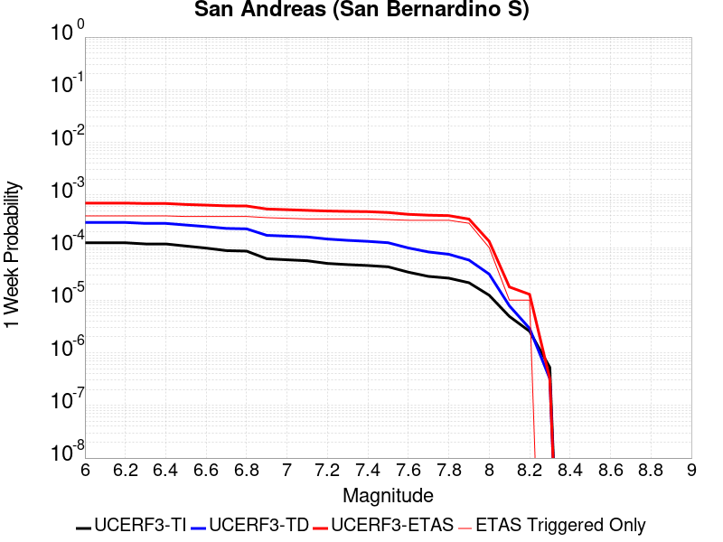 | 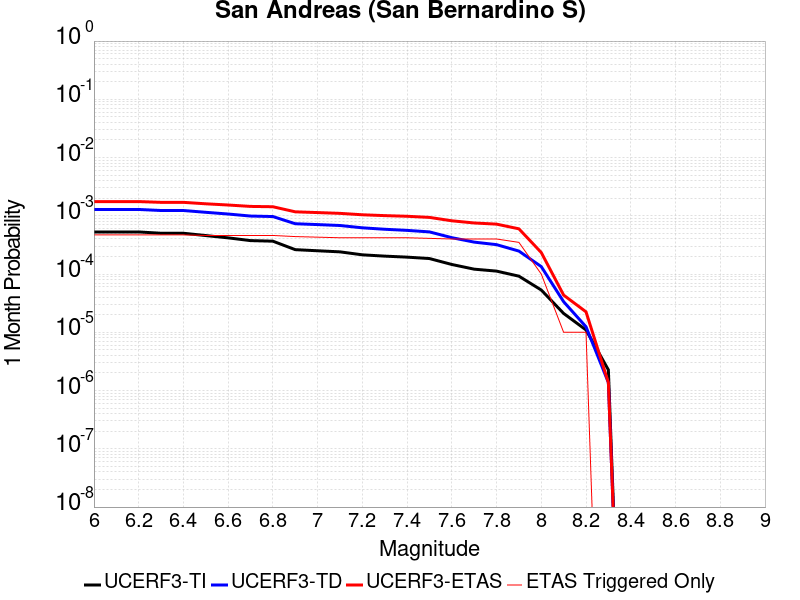 | 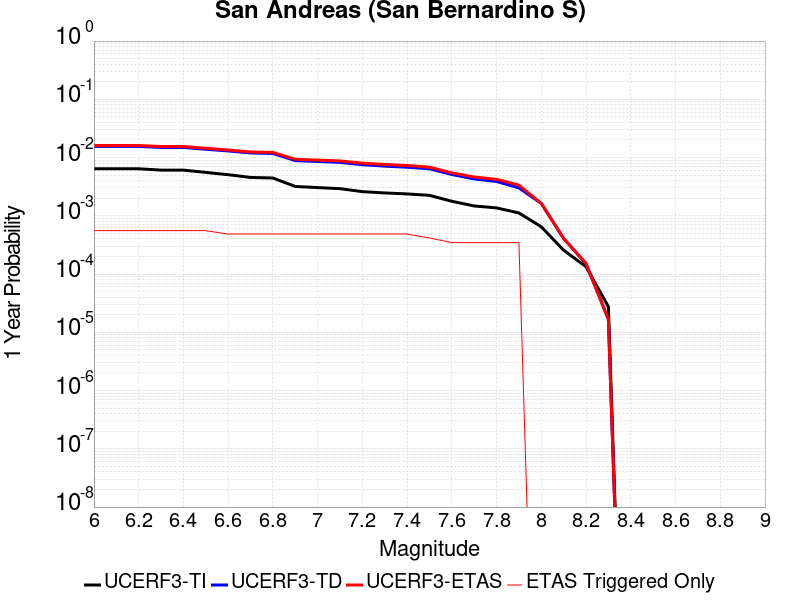 | 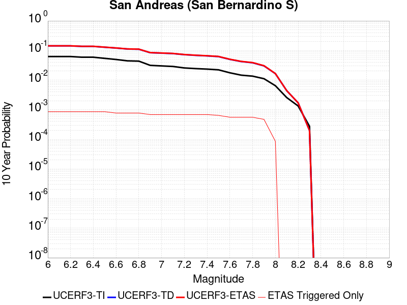 |

| Magnitude | 1 wk TI Prob | 1 wk TD Prob | 1 wk ETAS Prob | 1 wk ETAS/TD Gain | 1 wk ETAS Triggered Only | 1 mo TI Prob | 1 mo TD Prob | 1 mo ETAS Prob | 1 mo ETAS/TD Gain | 1 mo ETAS Triggered Only | 1 yr TI Prob | 1 yr TD Prob | 1 yr ETAS Prob | 1 yr ETAS/TD Gain | 1 yr ETAS Triggered Only | 10 yr TI Prob | 10 yr TD Prob | 10 yr ETAS Prob | 10 yr ETAS/TD Gain | 10 yr ETAS Triggered Only |
|-----|-----|-----|-----|-----|-----|-----|-----|-----|-----|-----|-----|-----|-----|-----|-----|-----|-----|-----|-----|-----|
| 6.0 | 1.2336002E-4 | 3.0005194E-4 | 6.9993193E-4 | 2.3327026 | 4.0E-4 | 5.2857865E-4 | 0.0012853292 | 0.0017547251 | 1.365195 | 4.7E-4 | 0.006416472 | 0.015541554 | 0.016210986 | 1.0430737 | 6.8E-4 | 0.06234337 | 0.14294699 | 0.14380404 | 1.0059956 | 0.001 |
| 6.1 | 1.2336002E-4 | 3.0005194E-4 | 6.9993193E-4 | 2.3327026 | 4.0E-4 | 5.2857865E-4 | 0.0012853292 | 0.0017547251 | 1.365195 | 4.7E-4 | 0.006416472 | 0.015541554 | 0.016210986 | 1.0430737 | 6.8E-4 | 0.06234337 | 0.14294699 | 0.14380404 | 1.0059956 | 0.001 |
| 6.2 | 1.2336002E-4 | 3.0005194E-4 | 6.9993193E-4 | 2.3327026 | 4.0E-4 | 5.2857865E-4 | 0.0012853292 | 0.0017547251 | 1.365195 | 4.7E-4 | 0.006416472 | 0.015541554 | 0.016210986 | 1.0430737 | 6.8E-4 | 0.06234337 | 0.14294699 | 0.14380404 | 1.0059956 | 0.001 |
| 6.3 | 1.1712257E-4 | 2.8793467E-4 | 6.878195E-4 | 2.388804 | 4.0E-4 | 5.018573E-4 | 0.0012334478 | 0.001702868 | 1.3805758 | 4.7E-4 | 0.006093008 | 0.014918666 | 0.015588521 | 1.0449005 | 6.8E-4 | 0.059286322 | 0.13765779 | 0.13852012 | 1.0062644 | 0.001 |
| 6.4 | 1.1712257E-4 | 2.8793467E-4 | 6.878195E-4 | 2.388804 | 4.0E-4 | 5.018573E-4 | 0.0012334478 | 0.001702868 | 1.3805758 | 4.7E-4 | 0.006093008 | 0.014918666 | 0.015588521 | 1.0449005 | 6.8E-4 | 0.059286322 | 0.13765779 | 0.13852012 | 1.0062644 | 0.001 |
| 6.5 | 1.0689076E-4 | 2.6806415E-4 | 6.579596E-4 | 2.4544857 | 3.9E-4 | 4.5802278E-4 | 0.0011483653 | 0.001607837 | 1.4001094 | 4.6E-4 | 0.0055621783 | 0.013896335 | 0.014557024 | 1.0475441 | 6.7E-4 | 0.05425003 | 0.1288989 | 0.1297613 | 1.0066904 | 9.9E-4 |
| 6.6 | 9.7648895E-5 | 2.505129E-4 | 6.4041524E-4 | 2.556416 | 3.9E-4 | 4.1842813E-4 | 0.0010732086 | 0.0015327149 | 1.4281613 | 4.6E-4 | 0.005082469 | 0.012992399 | 0.013643824 | 1.050139 | 6.6E-4 | 0.049677886 | 0.121077746 | 0.12192151 | 1.0069687 | 9.6E-4 |
| 6.7 | 8.757013E-5 | 2.3122175E-4 | 6.2113156E-4 | 2.6863024 | 3.9E-4 | 3.7524657E-4 | 9.905964E-4 | 0.0014501406 | 1.4639068 | 4.6E-4 | 0.00455906 | 0.011997902 | 0.012640104 | 1.0535262 | 6.5E-4 | 0.04466656 | 0.112373024 | 0.11320739 | 1.007425 | 9.4E-4 |
| 6.8 | 8.562978E-5 | 2.2682057E-4 | 6.167321E-4 | 2.7190309 | 3.9E-4 | 3.6693315E-4 | 9.7174826E-4 | 0.0014313012 | 1.4729136 | 4.6E-4 | 0.004458263 | 0.011770921 | 0.01241327 | 1.0545708 | 6.5E-4 | 0.043698758 | 0.11037863 | 0.111214876 | 1.0075761 | 9.4E-4 |
| 6.9 | 6.124075E-5 | 1.7066885E-4 | 5.406057E-4 | 3.167571 | 3.7E-4 | 2.6243398E-4 | 7.312337E-4 | 0.001170912 | 1.6012828 | 4.4E-4 | 0.0031904527 | 0.008866636 | 0.009491051 | 1.0704229 | 6.3E-4 | 0.031450346 | 0.08420262 | 0.08500852 | 1.009571 | 8.8E-4 |
| 7.0 | 5.8598747E-5 | 1.6495936E-4 | 5.249E-4 | 3.1819959 | 3.6E-4 | 2.5111332E-4 | 7.067779E-4 | 0.001136474 | 1.6079648 | 4.3E-4 | 0.0030530186 | 0.008571265 | 0.009185951 | 1.0717148 | 6.2E-4 | 0.03011414 | 0.08151562 | 0.0823147 | 1.0098028 | 8.7E-4 |
| 7.1 | 5.613814E-5 | 1.5914452E-4 | 5.090888E-4 | 3.198909 | 3.5E-4 | 2.4056983E-4 | 6.818704E-4 | 0.001101584 | 1.6155329 | 4.2E-4 | 0.0029250039 | 0.008270353 | 0.008875308 | 1.0731474 | 6.1E-4 | 0.028868021 | 0.07881268 | 0.07959569 | 1.009935 | 8.5E-4 |
| 7.2 | 4.991222E-5 | 1.4520933E-4 | 4.951585E-4 | 3.4099636 | 3.5E-4 | 2.1389198E-4 | 6.221777E-4 | 0.0010419163 | 1.6746284 | 4.2E-4 | 0.002601025 | 0.0075488063 | 0.008154201 | 1.0801975 | 6.1E-4 | 0.025707912 | 0.07226191 | 0.073031925 | 1.010656 | 8.3E-4 |
| 7.3 | 4.7410045E-5 | 1.371513E-4 | 4.871033E-4 | 3.5515761 | 3.5E-4 | 2.0317009E-4 | 5.8765925E-4 | 0.0010074124 | 1.7142799 | 4.2E-4 | 0.0024707897 | 0.0071313656 | 0.0077270865 | 1.0835353 | 6.0E-4 | 0.024434982 | 0.068541944 | 0.06930574 | 1.0111434 | 8.2E-4 |
| 7.4 | 4.5556746E-5 | 1.3123035E-4 | 4.8118443E-4 | 3.666716 | 3.5E-4 | 1.952286E-4 | 5.6229485E-4 | 9.820587E-4 | 1.7465191 | 4.2E-4 | 0.002374317 | 0.0068245293 | 0.0074204346 | 1.0873182 | 6.0E-4 | 0.023491086 | 0.06579143 | 0.06655748 | 1.0116436 | 8.2E-4 |
| 7.5 | 4.3084514E-5 | 1.2358342E-4 | 4.635414E-4 | 3.750838 | 3.4E-4 | 1.8463485E-4 | 5.2953605E-4 | 9.393189E-4 | 1.7738527 | 4.1E-4 | 0.0022456115 | 0.0064281146 | 0.007014322 | 1.0911943 | 5.9E-4 | 0.022230545 | 0.062190283 | 0.06294991 | 1.0122145 | 8.1E-4 |
| 7.6 | 3.408608E-5 | 9.836477E-5 | 4.283323E-4 | 4.35453 | 3.3E-4 | 1.4607502E-4 | 4.214953E-4 | 8.213267E-4 | 1.9486023 | 4.0E-4 | 0.0017770125 | 0.005119656 | 0.0056867376 | 1.1107656 | 5.7E-4 | 0.017628696 | 0.05002244 | 0.05076342 | 1.014813 | 7.8E-4 |
| 7.7 | 2.8315713E-5 | 8.2495724E-5 | 4.124685E-4 | 4.9998775 | 3.3E-4 | 1.2134742E-4 | 3.5350522E-4 | 7.533638E-4 | 2.131125 | 4.0E-4 | 0.0014764034 | 0.004295442 | 0.004862993 | 1.1321288 | 5.7E-4 | 0.01466633 | 0.042272415 | 0.043009866 | 1.0174452 | 7.7E-4 |
| 7.8 | 2.6222975E-5 | 7.463898E-5 | 4.0461434E-4 | 5.4209523 | 3.3E-4 | 1.1237934E-4 | 3.1984213E-4 | 7.197142E-4 | 2.250217 | 4.0E-4 | 0.0013673597 | 0.003887131 | 0.0044549154 | 1.1460677 | 5.7E-4 | 0.013589768 | 0.038437475 | 0.039177876 | 1.0192626 | 7.7E-4 |
| 7.9 | 2.1469694E-5 | 5.7884805E-5 | 3.4786802E-4 | 6.0096602 | 2.9E-4 | 9.200973E-5 | 2.4805416E-4 | 5.9796736E-4 | 2.4106321 | 3.5E-4 | 0.0011196428 | 0.00301588 | 0.0035044022 | 1.1619833 | 4.9E-4 | 0.011140184 | 0.030153265 | 0.03082246 | 1.0221931 | 6.9E-4 |
| 8.0 | 1.2420249E-5 | 3.1321662E-5 | 1.3131853E-4 | 4.1925783 | 1.0E-4 | 5.322855E-5 | 1.342288E-4 | 2.3421537E-4 | 1.7448967 | 1.0E-4 | 6.478649E-4 | 0.0016330116 | 0.0017827667 | 1.0917048 | 1.5E-4 | 0.0064597935 | 0.01652369 | 0.01674989 | 1.0136894 | 2.3E-4 |
| 8.1 | 4.9197724E-6 | 7.822525E-6 | 1.7822445E-5 | 2.2783496 | 1.0E-5 | 2.1084568E-5 | 3.3524673E-5 | 4.352434E-5 | 1.2982777 | 1.0E-5 | 2.566744E-4 | 4.080866E-4 | 4.2807843E-4 | 1.0489892 | 2.0E-5 | 0.002563781 | 0.004384557 | 0.004414425 | 1.0068122 | 3.0E-5 |
| 8.2 | 2.5634774E-6 | 2.9065757E-6 | 1.29065465E-5 | 4.4404645 | 1.0E-5 | 1.0986286E-5 | 1.2456694E-5 | 2.245657E-5 | 1.8027712 | 1.0E-5 | 1.3374983E-4 | 1.5164974E-4 | 1.6164822E-4 | 1.0659314 | 1.0E-5 | 0.0013366934 | 0.001704941 | 0.001714924 | 1.0058553 | 1.0E-5 |
| 8.3 | 5.2850464E-7 | 3.2080476E-7 | 3.2080476E-7 | 1.0 | 0.0 | 2.2650179E-6 | 1.3748769E-6 | 1.3748769E-6 | 1.0 | 0.0 | 2.7576245E-5 | 1.673901E-5 | 1.673901E-5 | 1.0 | 0.0 | 2.7572823E-4 | 1.986671E-4 | 1.986671E-4 | 1.0 | 0.0 |

## Coyote Lake
*[(top)](#table-of-contents)*

| 1 Week | 1 Month | 1 Year | 10 Year |
|-----|-----|-----|-----|
| 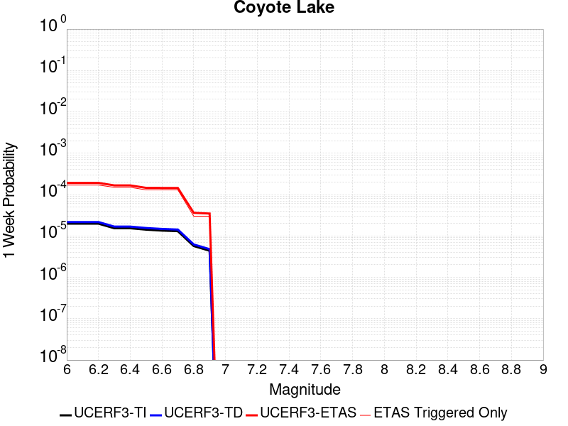 | 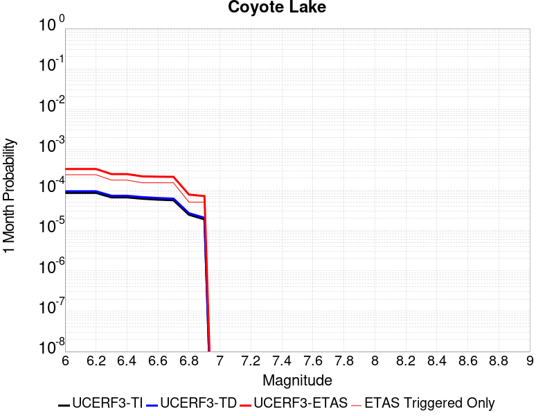 | 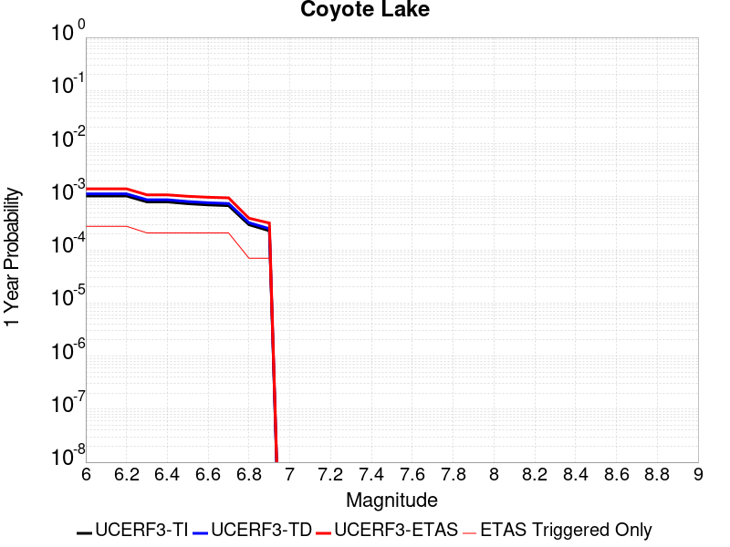 | 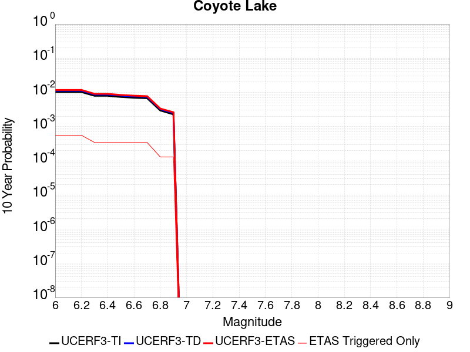 |

| Magnitude | 1 wk TI Prob | 1 wk TD Prob | 1 wk ETAS Prob | 1 wk ETAS/TD Gain | 1 wk ETAS Triggered Only | 1 mo TI Prob | 1 mo TD Prob | 1 mo ETAS Prob | 1 mo ETAS/TD Gain | 1 mo ETAS Triggered Only | 1 yr TI Prob | 1 yr TD Prob | 1 yr ETAS Prob | 1 yr ETAS/TD Gain | 1 yr ETAS Triggered Only | 10 yr TI Prob | 10 yr TD Prob | 10 yr ETAS Prob | 10 yr ETAS/TD Gain | 10 yr ETAS Triggered Only |
|-----|-----|-----|-----|-----|-----|-----|-----|-----|-----|-----|-----|-----|-----|-----|-----|-----|-----|-----|-----|-----|
| 6.0 | 1.980352E-5 | 2.1706745E-5 | 1.9170306E-4 | 8.831497 | 1.7E-4 | 8.486947E-5 | 9.302599E-5 | 3.6300087E-4 | 3.9021444 | 2.7E-4 | 0.0010327959 | 0.0011320751 | 0.0017413845 | 1.5382235 | 6.1E-4 | 0.010280091 | 0.011270258 | 0.012199664 | 1.0824654 | 9.4E-4 |
| 6.1 | 1.980352E-5 | 2.1706745E-5 | 1.9170306E-4 | 8.831497 | 1.7E-4 | 8.486947E-5 | 9.302599E-5 | 3.6300087E-4 | 3.9021444 | 2.7E-4 | 0.0010327959 | 0.0011320751 | 0.0017413845 | 1.5382235 | 6.1E-4 | 0.010280091 | 0.011270258 | 0.012199664 | 1.0824654 | 9.4E-4 |
| 6.2 | 1.980352E-5 | 2.1706745E-5 | 1.9170306E-4 | 8.831497 | 1.7E-4 | 8.486947E-5 | 9.302599E-5 | 3.6300087E-4 | 3.9021444 | 2.7E-4 | 0.0010327959 | 0.0011320751 | 0.0017413845 | 1.5382235 | 6.1E-4 | 0.010280091 | 0.011270258 | 0.012199664 | 1.0824654 | 9.4E-4 |
| 6.3 | 1.5344787E-5 | 1.682067E-5 | 1.6681815E-4 | 9.91745 | 1.5E-4 | 6.576172E-5 | 7.2086936E-5 | 2.9207108E-4 | 4.0516505 | 2.2E-4 | 8.003548E-4 | 8.773662E-4 | 0.0013569451 | 1.5466119 | 4.8E-4 | 0.007974784 | 0.00874507 | 0.009478598 | 1.0838791 | 7.4E-4 |
| 6.4 | 1.5344787E-5 | 1.682067E-5 | 1.6681815E-4 | 9.91745 | 1.5E-4 | 6.576172E-5 | 7.2086936E-5 | 2.9207108E-4 | 4.0516505 | 2.2E-4 | 8.003548E-4 | 8.773662E-4 | 0.0013569451 | 1.5466119 | 4.8E-4 | 0.007974784 | 0.00874507 | 0.009478598 | 1.0838791 | 7.4E-4 |
| 6.5 | 1.4189697E-5 | 1.5557987E-5 | 1.4555597E-4 | 9.355707 | 1.3E-4 | 6.081157E-5 | 6.6675726E-5 | 2.5666304E-4 | 3.849423 | 1.9E-4 | 7.401293E-4 | 8.115349E-4 | 0.0012411859 | 1.5294302 | 4.3E-4 | 0.0073766913 | 0.008091656 | 0.008746316 | 1.0809056 | 6.6E-4 |
| 6.6 | 1.3469301E-5 | 1.4771577E-5 | 1.4476966E-4 | 9.800555 | 1.3E-4 | 5.7724297E-5 | 6.330556E-5 | 2.5329355E-4 | 4.0011263 | 1.9E-4 | 7.025667E-4 | 7.7053264E-4 | 0.0012002013 | 1.5576255 | 4.3E-4 | 0.0070034964 | 0.0076845144 | 0.008329519 | 1.0839357 | 6.5E-4 |
| 6.7 | 1.3027966E-5 | 1.4281745E-5 | 1.4427988E-4 | 10.102399 | 1.3E-4 | 5.5832945E-5 | 6.120638E-5 | 2.5119475E-4 | 4.1040616 | 1.9E-4 | 6.7955407E-4 | 7.4499263E-4 | 0.0011546871 | 1.549931 | 4.1E-4 | 0.006774798 | 0.0074308286 | 0.008056147 | 1.084152 | 6.3E-4 |
| 6.8 | 5.695434E-6 | 6.2244176E-6 | 3.622423E-5 | 5.819698 | 3.0E-5 | 2.4408775E-5 | 2.6675973E-5 | 7.667464E-5 | 2.874296 | 5.0E-5 | 2.971363E-4 | 3.2476155E-4 | 4.1473232E-4 | 1.2770364 | 9.0E-5 | 0.0029673933 | 0.0032458105 | 0.0034052911 | 1.0491344 | 1.6E-4 |
| 6.9 | 4.385688E-6 | 4.7930553E-6 | 3.4792913E-5 | 7.2590256 | 3.0E-5 | 1.879567E-5 | 2.0541665E-5 | 7.054064E-5 | 3.4340272 | 5.0E-5 | 2.2881327E-4 | 2.5009477E-4 | 3.2007726E-4 | 1.2798239 | 7.0E-5 | 0.002285778 | 0.0025009478 | 0.0026306226 | 1.0518503 | 1.3E-4 |

## Death Valley (Black Mtns Frontal)
*[(top)](#table-of-contents)*

| 1 Week | 1 Month | 1 Year | 10 Year |
|-----|-----|-----|-----|
| 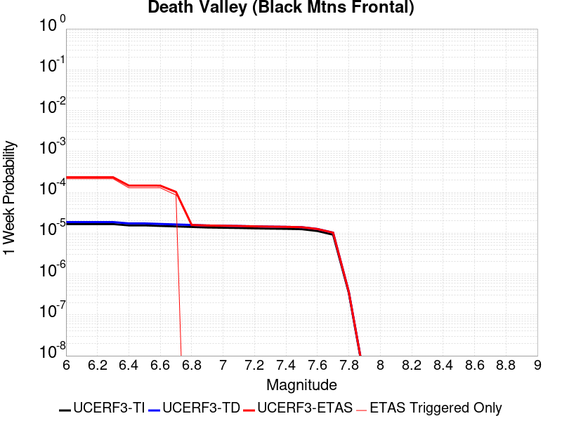 | 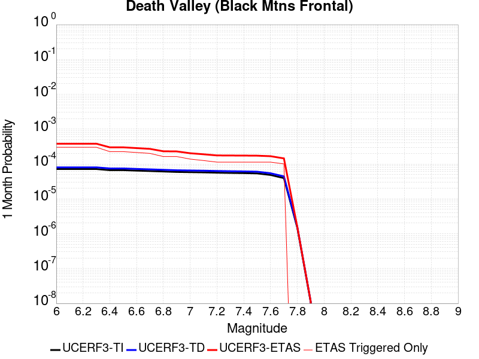 | 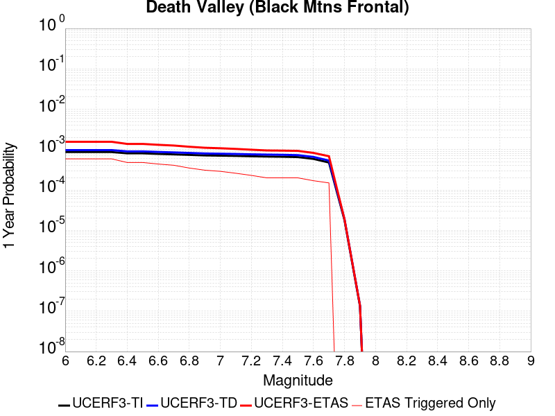 | 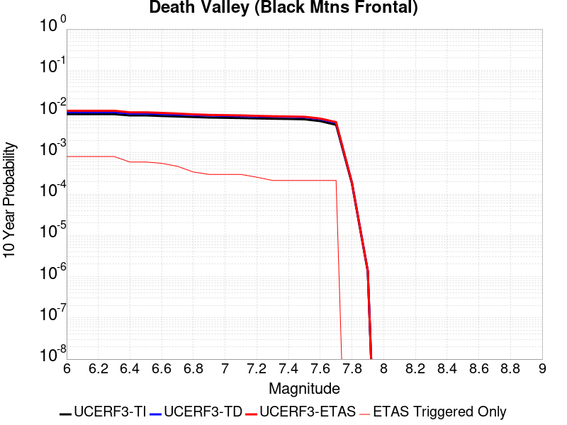 |

| Magnitude | 1 wk TI Prob | 1 wk TD Prob | 1 wk ETAS Prob | 1 wk ETAS/TD Gain | 1 wk ETAS Triggered Only | 1 mo TI Prob | 1 mo TD Prob | 1 mo ETAS Prob | 1 mo ETAS/TD Gain | 1 mo ETAS Triggered Only | 1 yr TI Prob | 1 yr TD Prob | 1 yr ETAS Prob | 1 yr ETAS/TD Gain | 1 yr ETAS Triggered Only | 10 yr TI Prob | 10 yr TD Prob | 10 yr ETAS Prob | 10 yr ETAS/TD Gain | 10 yr ETAS Triggered Only |
|-----|-----|-----|-----|-----|-----|-----|-----|-----|-----|-----|-----|-----|-----|-----|-----|-----|-----|-----|-----|-----|
| 6.0 | 1.6707214E-5 | 1.867027E-5 | 2.586658E-4 | 13.854423 | 2.4E-4 | 7.160038E-5 | 8.001303E-5 | 3.9998742E-4 | 4.9990287 | 3.2E-4 | 8.71386E-4 | 9.737309E-4 | 0.0015631564 | 1.6053269 | 5.9E-4 | 0.00867977 | 0.009695496 | 0.010507546 | 1.0837554 | 8.2E-4 |
| 6.1 | 1.6707214E-5 | 1.867027E-5 | 2.586658E-4 | 13.854423 | 2.4E-4 | 7.160038E-5 | 8.001303E-5 | 3.9998742E-4 | 4.9990287 | 3.2E-4 | 8.71386E-4 | 9.737309E-4 | 0.0015631564 | 1.6053269 | 5.9E-4 | 0.00867977 | 0.009695496 | 0.010507546 | 1.0837554 | 8.2E-4 |
| 6.2 | 1.6707214E-5 | 1.867027E-5 | 2.586658E-4 | 13.854423 | 2.4E-4 | 7.160038E-5 | 8.001303E-5 | 3.9998742E-4 | 4.9990287 | 3.2E-4 | 8.71386E-4 | 9.737309E-4 | 0.0015631564 | 1.6053269 | 5.9E-4 | 0.00867977 | 0.009695496 | 0.010507546 | 1.0837554 | 8.2E-4 |
| 6.3 | 1.6707214E-5 | 1.867027E-5 | 2.586658E-4 | 13.854423 | 2.4E-4 | 7.160038E-5 | 8.001303E-5 | 3.9998742E-4 | 4.9990287 | 3.2E-4 | 8.71386E-4 | 9.737309E-4 | 0.0015631564 | 1.6053269 | 5.9E-4 | 0.00867977 | 0.009695496 | 0.010507546 | 1.0837554 | 8.2E-4 |
| 6.4 | 1.5515609E-5 | 1.7338214E-5 | 1.9733509E-4 | 11.381513 | 1.8E-4 | 6.649377E-5 | 7.4304546E-5 | 3.142867E-4 | 4.2297106 | 2.4E-4 | 8.0926094E-4 | 9.042885E-4 | 0.0013838544 | 1.5303241 | 4.8E-4 | 0.008063202 | 0.009006773 | 0.009670738 | 1.0737184 | 6.7E-4 |
| 6.5 | 1.5515609E-5 | 1.7338214E-5 | 1.9733509E-4 | 11.381513 | 1.8E-4 | 6.649377E-5 | 7.4304546E-5 | 3.142867E-4 | 4.2297106 | 2.4E-4 | 8.0926094E-4 | 9.042885E-4 | 0.0013838544 | 1.5303241 | 4.8E-4 | 0.008063202 | 0.009006773 | 0.009670738 | 1.0737184 | 6.7E-4 |
| 6.6 | 1.5041828E-5 | 1.6809145E-5 | 1.9680613E-4 | 11.708277 | 1.8E-4 | 6.4463384E-5 | 7.203723E-5 | 3.0202066E-4 | 4.192563 | 2.3E-4 | 7.8455906E-4 | 8.767063E-4 | 0.0013163206 | 1.5014384 | 4.4E-4 | 0.00781795 | 0.008733132 | 0.009347718 | 1.070374 | 6.2E-4 |
| 6.7 | 1.4634985E-5 | 1.6356016E-5 | 1.763534E-4 | 10.782173 | 1.6E-4 | 6.271985E-5 | 7.009536E-5 | 2.8008065E-4 | 3.9957087 | 2.1E-4 | 7.6334673E-4 | 8.5308263E-4 | 0.0012627329 | 1.4801999 | 4.1E-4 | 0.007607299 | 0.008498715 | 0.009083701 | 1.0688323 | 5.9E-4 |
| 6.8 | 1.4209158E-5 | 1.5882048E-5 | 1.3588014E-4 | 8.555581 | 1.2E-4 | 6.089497E-5 | 6.8064175E-5 | 2.380526E-4 | 3.4974728 | 1.7E-4 | 7.4114406E-4 | 8.2837185E-4 | 0.001178082 | 1.4221655 | 3.5E-4 | 0.007386771 | 0.008253456 | 0.008769165 | 1.0624839 | 5.2E-4 |
| 6.9 | 1.3780098E-5 | 1.5404594E-5 | 1.054032E-4 | 6.8423233 | 9.0E-5 | 5.9056227E-5 | 6.6018045E-5 | 2.060088E-4 | 3.1204925 | 1.4E-4 | 7.1877235E-4 | 8.0347876E-4 | 0.0011132297 | 1.3855122 | 3.1E-4 | 0.0071645193 | 0.008006332 | 0.008472569 | 1.0582335 | 4.7E-4 |
| 7.0 | 1.3585064E-5 | 1.5188155E-5 | 9.518694E-5 | 6.2671824 | 8.0E-5 | 5.8220405E-5 | 6.50905E-5 | 1.850827E-4 | 2.843467 | 1.2E-4 | 7.086029E-4 | 7.9219416E-4 | 0.0010819645 | 1.3657819 | 2.9E-4 | 0.007063476 | 0.007894293 | 0.00833082 | 1.0552964 | 4.4E-4 |
| 7.1 | 1.3398601E-5 | 1.49813395E-5 | 8.498029E-5 | 5.6724095 | 7.0E-5 | 5.742131E-5 | 6.420419E-5 | 1.7419714E-4 | 2.7131739 | 1.1E-4 | 6.9888023E-4 | 7.8141113E-4 | 0.0010412079 | 1.3324714 | 2.6E-4 | 0.0069668638 | 0.007787224 | 0.008194031 | 1.0522404 | 4.1E-4 |
| 7.2 | 1.3126312E-5 | 1.4679561E-5 | 6.4678825E-5 | 4.4060464 | 5.0E-5 | 5.6254412E-5 | 6.291092E-5 | 1.5290525E-4 | 2.4305043 | 9.0E-5 | 6.846822E-4 | 7.6567667E-4 | 9.955006E-4 | 1.3001579 | 2.3E-4 | 0.006825765 | 0.00763097 | 0.0079783 | 1.0455158 | 3.5E-4 |
| 7.3 | 1.2922429E-5 | 1.4453788E-5 | 6.445307E-5 | 4.459251 | 5.0E-5 | 5.5380664E-5 | 6.194336E-5 | 1.5193778E-4 | 2.45285 | 9.0E-5 | 6.74051E-4 | 7.53905E-4 | 9.537542E-4 | 1.2650855 | 2.0E-4 | 0.006720101 | 0.007514055 | 0.007821726 | 1.040946 | 3.1E-4 |
| 7.4 | 1.2768878E-5 | 1.4283772E-5 | 6.428306E-5 | 4.5004263 | 5.0E-5 | 5.4722615E-5 | 6.1214756E-5 | 1.5120924E-4 | 2.4701438 | 9.0E-5 | 6.660441E-4 | 7.4504025E-4 | 9.4489125E-4 | 1.2682419 | 2.0E-4 | 0.0066405144 | 0.0074260035 | 0.0077337013 | 1.0414352 | 3.1E-4 |
| 7.5 | 1.2521929E-5 | 1.40120155E-5 | 6.4011314E-5 | 4.568316 | 5.0E-5 | 5.366431E-5 | 6.005014E-5 | 1.5004474E-4 | 2.4986575 | 9.0E-5 | 6.531671E-4 | 7.3087064E-4 | 9.307245E-4 | 1.2734462 | 2.0E-4 | 0.006512506 | 0.0072852457 | 0.0075929873 | 1.0422418 | 3.1E-4 |
| 7.6 | 1.1301089E-5 | 1.2648149E-5 | 6.2647516E-5 | 4.953098 | 5.0E-5 | 4.8432343E-5 | 5.4205255E-5 | 1.4420037E-4 | 2.6602657 | 9.0E-5 | 5.895042E-4 | 6.5975444E-4 | 8.296423E-4 | 1.2575016 | 1.7E-4 | 0.0058794282 | 0.00657851 | 0.0068467343 | 1.0407727 | 2.7E-4 |
| 7.7 | 9.189108E-6 | 1.0283358E-5 | 6.0282844E-5 | 5.862175 | 5.0E-5 | 3.93813E-5 | 4.407082E-5 | 1.240673E-4 | 2.81518 | 8.0E-5 | 4.7936183E-4 | 5.3643517E-4 | 6.863547E-4 | 1.2794737 | 1.5E-4 | 0.004783291 | 0.005351914 | 0.005580683 | 1.0427452 | 2.3E-4 |
| 7.8 | 3.4586725E-7 | 3.6482615E-7 | 3.6482615E-7 | 1.0 | 0.0 | 1.4822873E-6 | 1.5635396E-6 | 1.5635396E-6 | 1.0 | 0.0 | 1.80467E-5 | 1.9035933E-5 | 1.9035933E-5 | 1.0 | 0.0 | 1.8045233E-4 | 1.9034347E-4 | 2.0034157E-4 | 1.0525266 | 1.0E-5 |
| 7.9 | 2.5591178E-9 | 2.6696718E-9 | 2.6696718E-9 | 1.0 | 0.0 | 1.0967647E-8 | 1.14414505E-8 | 1.14414505E-8 | 1.0 | 0.0 | 1.335311E-7 | 1.3929966E-7 | 1.3929966E-7 | 1.0 | 0.0 | 1.3353102E-6 | 1.3929966E-6 | 1.3929966E-6 | 1.0 | 0.0 |

## San Andreas (Big Bend)
*[(top)](#table-of-contents)*

| 1 Week | 1 Month | 1 Year | 10 Year |
|-----|-----|-----|-----|
| 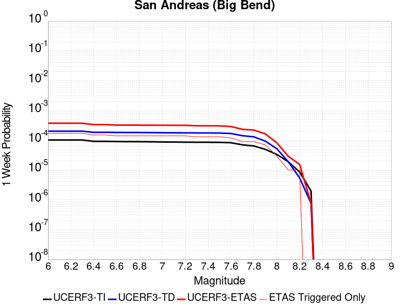 | 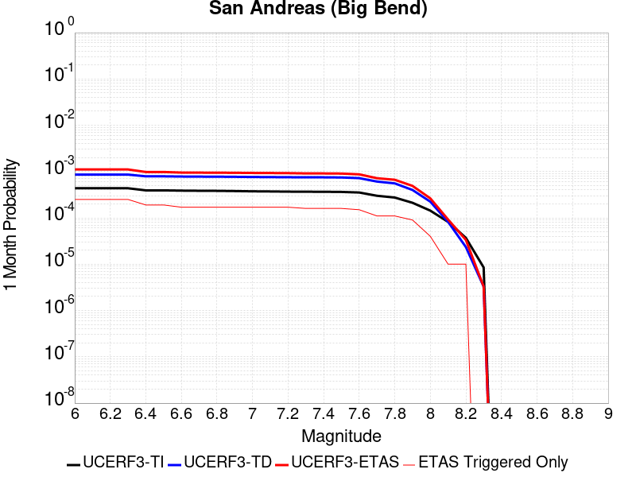 | 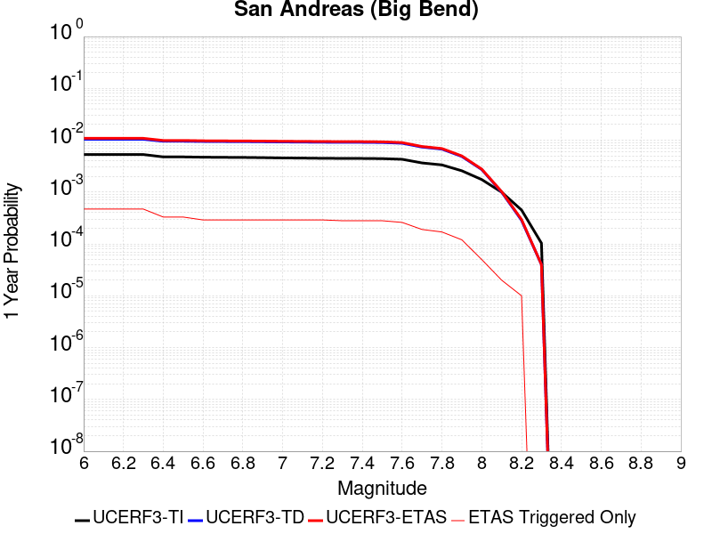 | 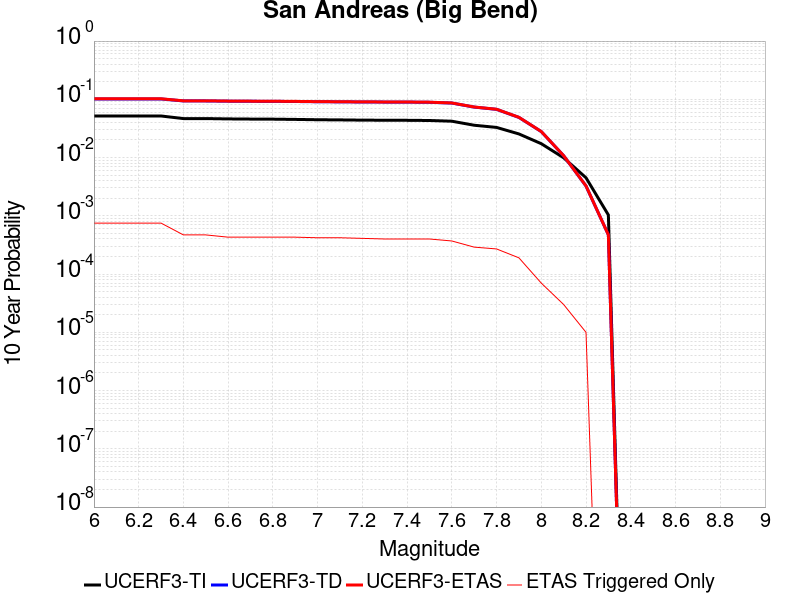 |

| Magnitude | 1 wk TI Prob | 1 wk TD Prob | 1 wk ETAS Prob | 1 wk ETAS/TD Gain | 1 wk ETAS Triggered Only | 1 mo TI Prob | 1 mo TD Prob | 1 mo ETAS Prob | 1 mo ETAS/TD Gain | 1 mo ETAS Triggered Only | 1 yr TI Prob | 1 yr TD Prob | 1 yr ETAS Prob | 1 yr ETAS/TD Gain | 1 yr ETAS Triggered Only | 10 yr TI Prob | 10 yr TD Prob | 10 yr ETAS Prob | 10 yr ETAS/TD Gain | 10 yr ETAS Triggered Only |
|-----|-----|-----|-----|-----|-----|-----|-----|-----|-----|-----|-----|-----|-----|-----|-----|-----|-----|-----|-----|-----|
| 6.0 | 1.0179969E-4 | 2.0073925E-4 | 3.7070512E-4 | 1.8466997 | 1.7E-4 | 4.362114E-4 | 8.6002843E-4 | 0.0011098135 | 1.290438 | 2.5E-4 | 0.0052979486 | 0.010420859 | 0.010885961 | 1.0446318 | 4.7E-4 | 0.051734097 | 0.101455905 | 0.10212982 | 1.0066423 | 7.5E-4 |
| 6.1 | 1.0179969E-4 | 2.0073925E-4 | 3.7070512E-4 | 1.8466997 | 1.7E-4 | 4.362114E-4 | 8.6002843E-4 | 0.0011098135 | 1.290438 | 2.5E-4 | 0.0052979486 | 0.010420859 | 0.010885961 | 1.0446318 | 4.7E-4 | 0.051734097 | 0.101455905 | 0.10212982 | 1.0066423 | 7.5E-4 |
| 6.2 | 1.0179969E-4 | 2.0073925E-4 | 3.7070512E-4 | 1.8466997 | 1.7E-4 | 4.362114E-4 | 8.6002843E-4 | 0.0011098135 | 1.290438 | 2.5E-4 | 0.0052979486 | 0.010420859 | 0.010885961 | 1.0446318 | 4.7E-4 | 0.051734097 | 0.101455905 | 0.10212982 | 1.0066423 | 7.5E-4 |
| 6.3 | 1.0179969E-4 | 2.0073925E-4 | 3.7070512E-4 | 1.8466997 | 1.7E-4 | 4.362114E-4 | 8.6002843E-4 | 0.0011098135 | 1.290438 | 2.5E-4 | 0.0052979486 | 0.010420859 | 0.010885961 | 1.0446318 | 4.7E-4 | 0.051734097 | 0.101455905 | 0.10212982 | 1.0066423 | 7.5E-4 |
| 6.4 | 9.1639464E-5 | 1.8430917E-4 | 3.3428153E-4 | 1.8136998 | 1.5E-4 | 3.9268145E-4 | 7.896575E-4 | 9.795076E-4 | 1.2404206 | 1.9E-4 | 0.0047704205 | 0.009571818 | 0.00989866 | 1.0341462 | 3.3E-4 | 0.046693064 | 0.09378695 | 0.09421287 | 1.0045414 | 4.7E-4 |
| 6.5 | 9.1639464E-5 | 1.8430917E-4 | 3.3428153E-4 | 1.8136998 | 1.5E-4 | 3.9268145E-4 | 7.896575E-4 | 9.795076E-4 | 1.2404206 | 1.9E-4 | 0.0047704205 | 0.009571818 | 0.00989866 | 1.0341462 | 3.3E-4 | 0.046693064 | 0.09378695 | 0.09421287 | 1.0045414 | 4.7E-4 |
| 6.6 | 9.042622E-5 | 1.8238011E-4 | 3.2235458E-4 | 1.7674875 | 1.4E-4 | 3.8748336E-4 | 7.813951E-4 | 9.512623E-4 | 1.2173896 | 1.7E-4 | 0.0047074095 | 0.0094721 | 0.0097593535 | 1.0303262 | 2.9E-4 | 0.046089325 | 0.09287721 | 0.09326728 | 1.0041997 | 4.3E-4 |
| 6.7 | 8.9836685E-5 | 1.8152347E-4 | 3.2149805E-4 | 1.7711102 | 1.4E-4 | 3.8495753E-4 | 7.7772595E-4 | 9.4759377E-4 | 1.218416 | 1.7E-4 | 0.00467679 | 0.009427815 | 0.00971508 | 1.03047 | 2.9E-4 | 0.045795817 | 0.09247148 | 0.09286172 | 1.0042201 | 4.3E-4 |
| 6.8 | 8.9471854E-5 | 1.8099119E-4 | 3.2096586E-4 | 1.7733783 | 1.4E-4 | 3.8339442E-4 | 7.754462E-4 | 9.4531436E-4 | 1.2190586 | 1.7E-4 | 0.004657841 | 0.009400298 | 0.009687572 | 1.0305601 | 2.9E-4 | 0.04561414 | 0.0922192 | 0.092609555 | 1.0042328 | 4.3E-4 |
| 6.9 | 8.858234E-5 | 1.7981093E-4 | 3.1978576E-4 | 1.7784556 | 1.4E-4 | 3.7958333E-4 | 7.7039085E-4 | 9.402599E-4 | 1.2204973 | 1.7E-4 | 0.004611638 | 0.009339278 | 0.009626569 | 1.0307616 | 2.9E-4 | 0.04517103 | 0.09165911 | 0.09204969 | 1.0042613 | 4.3E-4 |
| 7.0 | 8.7433385E-5 | 1.7819891E-4 | 3.1817396E-4 | 1.785499 | 1.4E-4 | 3.746607E-4 | 7.6348626E-4 | 9.3335647E-4 | 1.2224928 | 1.7E-4 | 0.004551957 | 0.009255932 | 0.0095432475 | 1.0310413 | 2.9E-4 | 0.044598386 | 0.09089323 | 0.09127505 | 1.0042008 | 4.2E-4 |
| 7.1 | 8.684964E-5 | 1.7731842E-4 | 3.172936E-4 | 1.7894001 | 1.4E-4 | 3.7215967E-4 | 7.597149E-4 | 9.295858E-4 | 1.2235981 | 1.7E-4 | 0.0045216335 | 0.009210405 | 0.009497734 | 1.0311961 | 2.9E-4 | 0.04430731 | 0.09047475 | 0.09085675 | 1.0042222 | 4.2E-4 |
| 7.2 | 8.606521E-5 | 1.7622454E-4 | 3.1619988E-4 | 1.794301 | 1.4E-4 | 3.6879873E-4 | 7.550296E-4 | 9.249012E-4 | 1.2249868 | 1.7E-4 | 0.0044808835 | 0.009153842 | 0.009441187 | 1.0313907 | 2.9E-4 | 0.043916024 | 0.08995518 | 0.0903283 | 1.0041478 | 4.1E-4 |
| 7.3 | 8.568266E-5 | 1.7564454E-4 | 3.056217E-4 | 1.7400012 | 1.3E-4 | 3.6715972E-4 | 7.5254537E-4 | 9.1242493E-4 | 1.2124518 | 1.6E-4 | 0.0044610105 | 0.00912385 | 0.009401295 | 1.0304087 | 2.8E-4 | 0.043725148 | 0.08967623 | 0.09004036 | 1.0040605 | 4.0E-4 |
| 7.4 | 8.5432206E-5 | 1.752704E-4 | 3.052476E-4 | 1.7415811 | 1.3E-4 | 3.6608664E-4 | 7.509428E-4 | 9.1082265E-4 | 1.2129055 | 1.6E-4 | 0.004447999 | 0.009104501 | 0.009381953 | 1.0304741 | 2.8E-4 | 0.043600157 | 0.08949642 | 0.08986062 | 1.0040694 | 4.0E-4 |
| 7.5 | 8.4791965E-5 | 1.7396381E-4 | 3.039412E-4 | 1.7471519 | 1.3E-4 | 3.633435E-4 | 7.4534636E-4 | 9.052271E-4 | 1.2145053 | 1.6E-4 | 0.0044147377 | 0.009036932 | 0.009314402 | 1.030704 | 2.8E-4 | 0.043280575 | 0.08887209 | 0.08923654 | 1.0041008 | 4.0E-4 |
| 7.6 | 8.241105E-5 | 1.6841735E-4 | 2.8839713E-4 | 1.7123957 | 1.2E-4 | 3.531424E-4 | 7.2158914E-4 | 8.714809E-4 | 1.2077246 | 1.5E-4 | 0.0042910352 | 0.008750047 | 0.0090077715 | 1.0294541 | 2.6E-4 | 0.042091176 | 0.08625032 | 0.08658841 | 1.0039198 | 3.7E-4 |
| 7.7 | 7.00432E-5 | 1.4205615E-4 | 2.3204336E-4 | 1.6334623 | 9.0E-5 | 3.001506E-4 | 6.0867006E-4 | 7.186031E-4 | 1.1806118 | 1.1E-4 | 0.0036482112 | 0.0073854174 | 0.0075740144 | 1.0255364 | 1.9E-4 | 0.035888977 | 0.07352299 | 0.07379167 | 1.0036544 | 2.9E-4 |
| 7.8 | 6.415362E-5 | 1.2969968E-4 | 2.1968801E-4 | 1.6938207 | 9.0E-5 | 2.749151E-4 | 5.557374E-4 | 6.6567626E-4 | 1.1978252 | 1.1E-4 | 0.0033419547 | 0.0067451415 | 0.006913995 | 1.0250334 | 1.7E-4 | 0.03292141 | 0.06725514 | 0.06750698 | 1.0037446 | 2.7E-4 |
| 7.9 | 4.939911E-5 | 9.341721E-5 | 1.6341067E-4 | 1.7492565 | 7.0E-5 | 2.116933E-4 | 4.0029807E-4 | 4.9026206E-4 | 1.2247424 | 9.0E-5 | 0.0025743195 | 0.004862747 | 0.0049821637 | 1.0245574 | 1.2E-4 | 0.025447013 | 0.048915803 | 0.04909651 | 1.0036942 | 1.9E-4 |
| 8.0 | 3.344983E-5 | 5.2228E-5 | 8.2226434E-5 | 1.5743746 | 3.0E-5 | 1.4334853E-4 | 2.2381509E-4 | 2.6380614E-4 | 1.178679 | 4.0E-5 | 0.0017438711 | 0.0027215453 | 0.0027714092 | 1.0183219 | 5.0E-5 | 0.017302496 | 0.027923161 | 0.027991207 | 1.0024369 | 7.0E-5 |
| 8.1 | 1.9104898E-5 | 1.9171663E-5 | 2.917147E-5 | 1.5215932 | 1.0E-5 | 8.1875565E-5 | 8.2161685E-5 | 9.216086E-5 | 1.1217012 | 1.0E-5 | 9.963791E-4 | 9.9986E-4 | 0.00101984 | 1.0199828 | 2.0E-5 | 0.009919235 | 0.010749552 | 0.01077923 | 1.0027608 | 3.0E-5 |
| 8.2 | 8.643924E-6 | 5.473668E-6 | 1.5473614E-5 | 2.8269184 | 1.0E-5 | 3.704486E-5 | 2.3458366E-5 | 3.345813E-5 | 1.4262772 | 1.0E-5 | 4.5092785E-4 | 2.8556827E-4 | 2.955654E-4 | 1.035008 | 1.0E-5 | 0.0045001395 | 0.0032481793 | 0.003258147 | 1.0030687 | 1.0E-5 |
| 8.3 | 1.983087E-6 | 7.6564595E-7 | 7.6564595E-7 | 1.0 | 0.0 | 8.498917E-6 | 3.281336E-6 | 3.281336E-6 | 1.0 | 0.0 | 1.034694E-4 | 3.9949547E-5 | 3.9949547E-5 | 1.0 | 0.0 | 0.0010342124 | 4.717979E-4 | 4.717979E-4 | 1.0 | 0.0 |

## Elsinore (Glen Ivy) rev
*[(top)](#table-of-contents)*

| 1 Week | 1 Month | 1 Year | 10 Year |
|-----|-----|-----|-----|
| 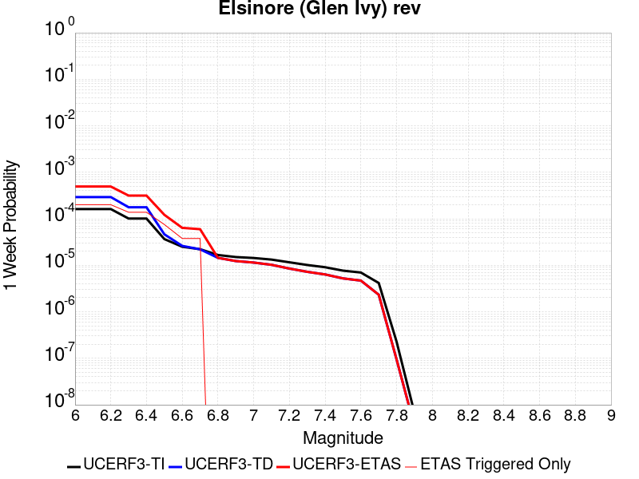 | 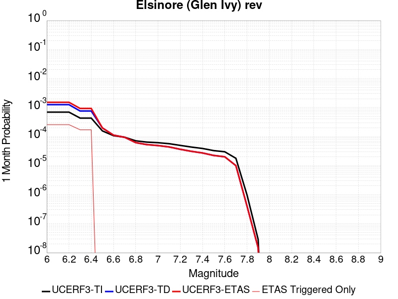 | 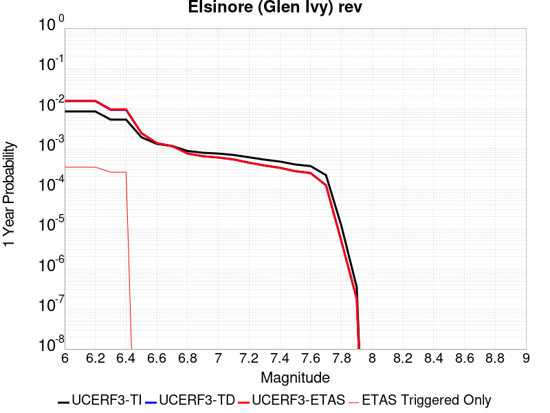 | 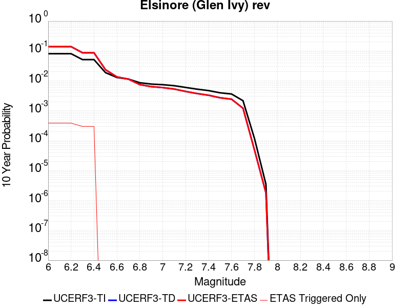 |

| Magnitude | 1 wk TI Prob | 1 wk TD Prob | 1 wk ETAS Prob | 1 wk ETAS/TD Gain | 1 wk ETAS Triggered Only | 1 mo TI Prob | 1 mo TD Prob | 1 mo ETAS Prob | 1 mo ETAS/TD Gain | 1 mo ETAS Triggered Only | 1 yr TI Prob | 1 yr TD Prob | 1 yr ETAS Prob | 1 yr ETAS/TD Gain | 1 yr ETAS Triggered Only | 10 yr TI Prob | 10 yr TD Prob | 10 yr ETAS Prob | 10 yr ETAS/TD Gain | 10 yr ETAS Triggered Only |
|-----|-----|-----|-----|-----|-----|-----|-----|-----|-----|-----|-----|-----|-----|-----|-----|-----|-----|-----|-----|-----|
| 6.0 | 1.6204086E-4 | 2.937271E-4 | 4.6367716E-4 | 1.5785985 | 1.7E-4 | 6.94276E-4 | 0.0012583778 | 0.0014980758 | 1.1904818 | 2.4E-4 | 0.008420097 | 0.0152346175 | 0.015598981 | 1.0239168 | 3.7E-4 | 0.081081145 | 0.13962454 | 0.14005473 | 1.0030811 | 5.0E-4 |
| 6.1 | 1.6204086E-4 | 2.937271E-4 | 4.6367716E-4 | 1.5785985 | 1.7E-4 | 6.94276E-4 | 0.0012583778 | 0.0014980758 | 1.1904818 | 2.4E-4 | 0.008420097 | 0.0152346175 | 0.015598981 | 1.0239168 | 3.7E-4 | 0.081081145 | 0.13962454 | 0.14005473 | 1.0030811 | 5.0E-4 |
| 6.2 | 1.6204086E-4 | 2.937271E-4 | 4.6367716E-4 | 1.5785985 | 1.7E-4 | 6.94276E-4 | 0.0012583778 | 0.0014980758 | 1.1904818 | 2.4E-4 | 0.008420097 | 0.0152346175 | 0.015598981 | 1.0239168 | 3.7E-4 | 0.081081145 | 0.13962454 | 0.14005473 | 1.0030811 | 5.0E-4 |
| 6.3 | 1.0111737E-4 | 1.7703463E-4 | 2.8701514E-4 | 1.6212374 | 1.1E-4 | 4.332882E-4 | 7.5861585E-4 | 9.184945E-4 | 1.2107505 | 1.6E-4 | 0.005262531 | 0.0092177205 | 0.009455509 | 1.0257968 | 2.4E-4 | 0.0513964 | 0.08707393 | 0.087393455 | 1.0036696 | 3.5E-4 |
| 6.4 | 1.0111737E-4 | 1.7703463E-4 | 2.8701514E-4 | 1.6212374 | 1.1E-4 | 4.332882E-4 | 7.5861585E-4 | 9.184945E-4 | 1.2107505 | 1.6E-4 | 0.005262531 | 0.0092177205 | 0.009455509 | 1.0257968 | 2.4E-4 | 0.0513964 | 0.08707393 | 0.087393455 | 1.0036696 | 3.5E-4 |
| 6.5 | 3.6624708E-5 | 4.6391986E-5 | 1.063892E-4 | 2.2932668 | 6.0E-5 | 1.569536E-4 | 1.9880968E-4 | 2.6879576E-4 | 1.3520255 | 7.0E-5 | 0.001909235 | 0.0024181814 | 0.0025079637 | 1.0371281 | 9.0E-5 | 0.01892915 | 0.023697061 | 0.023814218 | 1.004944 | 1.2E-4 |
| 6.6 | 2.5051324E-5 | 2.6147465E-5 | 5.614668E-5 | 2.1473088 | 3.0E-5 | 1.073584E-4 | 1.12056E-4 | 1.4205264E-4 | 1.2676933 | 3.0E-5 | 0.0013063047 | 0.0013634725 | 0.0014034179 | 1.0292969 | 4.0E-5 | 0.012986525 | 0.013565759 | 0.013615081 | 1.0036358 | 5.0E-5 |
| 6.7 | 2.2189772E-5 | 2.2072489E-5 | 5.2071828E-5 | 2.359128 | 3.0E-5 | 9.509556E-5 | 9.459316E-5 | 1.2459033E-4 | 1.3171177 | 3.0E-5 | 0.0011571734 | 0.0011510996 | 0.0011810651 | 1.0260321 | 3.0E-5 | 0.011511663 | 0.0114663225 | 0.011495979 | 1.0025864 | 3.0E-5 |
| 6.8 | 1.6654378E-5 | 1.44376E-5 | 1.44376E-5 | 1.0 | 0.0 | 7.137396E-5 | 6.187399E-5 | 6.187399E-5 | 1.0 | 0.0 | 8.686314E-4 | 7.5306057E-4 | 7.5306057E-4 | 1.0 | 0.0 | 0.008652439 | 0.0075100763 | 0.0075100763 | 1.0 | 0.0 |
| 6.9 | 1.5042909E-5 | 1.2331886E-5 | 1.2331886E-5 | 1.0 | 0.0 | 6.446802E-5 | 5.2849886E-5 | 5.2849886E-5 | 1.0 | 0.0 | 7.8461546E-4 | 6.4326054E-4 | 6.4326054E-4 | 1.0 | 0.0 | 0.007818509 | 0.006417925 | 0.006417925 | 1.0 | 0.0 |
| 7.0 | 1.4361385E-5 | 1.1451172E-5 | 1.1451172E-5 | 1.0 | 0.0 | 6.154734E-5 | 4.9075545E-5 | 4.9075545E-5 | 1.0 | 0.0 | 7.490812E-4 | 5.973339E-4 | 5.973339E-4 | 1.0 | 0.0 | 0.007465612 | 0.005960982 | 0.005960982 | 1.0 | 0.0 |
| 7.1 | 1.3265571E-5 | 1.0244736E-5 | 1.0244736E-5 | 1.0 | 0.0 | 5.6851208E-5 | 4.3905282E-5 | 4.3905282E-5 | 1.0 | 0.0 | 6.919436E-4 | 5.344183E-4 | 5.344183E-4 | 1.0 | 0.0 | 0.006897931 | 0.0053346003 | 0.0053346003 | 1.0 | 0.0 |
| 7.2 | 1.1596403E-5 | 8.504847E-6 | 8.504847E-6 | 1.0 | 0.0 | 4.9697923E-5 | 3.6448844E-5 | 3.6448844E-5 | 1.0 | 0.0 | 6.049042E-4 | 4.4367602E-4 | 4.4367602E-4 | 1.0 | 0.0 | 0.006032603 | 0.004429357 | 0.004429357 | 1.0 | 0.0 |
| 7.3 | 1.0150827E-5 | 7.238537E-6 | 7.238537E-6 | 1.0 | 0.0 | 4.3502816E-5 | 3.102194E-5 | 3.102194E-5 | 1.0 | 0.0 | 5.2951806E-4 | 3.776281E-4 | 3.776281E-4 | 1.0 | 0.0 | 0.005282581 | 0.003770271 | 0.003770271 | 1.0 | 0.0 |
| 7.4 | 9.080705E-6 | 6.352307E-6 | 6.352307E-6 | 1.0 | 0.0 | 3.8916725E-5 | 2.7223898E-5 | 2.7223898E-5 | 1.0 | 0.0 | 4.7370812E-4 | 3.314019E-4 | 3.314019E-4 | 1.0 | 0.0 | 0.004726996 | 0.0033092257 | 0.0033092257 | 1.0 | 0.0 |
| 7.5 | 7.671649E-6 | 5.225419E-6 | 5.225419E-6 | 1.0 | 0.0 | 3.287808E-5 | 2.2394468E-5 | 2.2394468E-5 | 1.0 | 0.0 | 4.0021708E-4 | 2.7261977E-4 | 2.7261977E-4 | 1.0 | 0.0 | 0.0039949706 | 0.0027229784 | 0.0027229784 | 1.0 | 0.0 |
| 7.6 | 6.990086E-6 | 4.687336E-6 | 4.687336E-6 | 1.0 | 0.0 | 2.9957167E-5 | 2.0088435E-5 | 2.0088435E-5 | 1.0 | 0.0 | 3.6466747E-4 | 2.445504E-4 | 2.445504E-4 | 1.0 | 0.0 | 0.0036406964 | 0.0024429292 | 0.0024429292 | 1.0 | 0.0 |
| 7.7 | 4.163505E-6 | 2.329331E-6 | 2.329331E-6 | 1.0 | 0.0 | 1.7843471E-5 | 9.982813E-6 | 9.982813E-6 | 1.0 | 0.0 | 2.172226E-4 | 1.2153471E-4 | 1.2153471E-4 | 1.0 | 0.0 | 0.0021701038 | 0.0012147555 | 0.0012147555 | 1.0 | 0.0 |
| 7.8 | 2.2692414E-7 | 9.384417E-8 | 9.384417E-8 | 1.0 | 0.0 | 9.725317E-7 | 4.0218927E-7 | 4.0218927E-7 | 1.0 | 0.0 | 1.1840509E-5 | 4.8966467E-6 | 4.8966467E-6 | 1.0 | 0.0 | 1.1839878E-4 | 4.8965718E-5 | 4.8965718E-5 | 1.0 | 0.0 |
| 7.9 | 6.676829E-9 | 3.4397174E-9 | 3.4397174E-9 | 1.0 | 0.0 | 2.861498E-8 | 1.4741646E-8 | 1.4741646E-8 | 1.0 | 0.0 | 3.4838732E-7 | 1.7947953E-7 | 1.7947953E-7 | 1.0 | 0.0 | 3.4838679E-6 | 1.794794E-6 | 1.794794E-6 | 1.0 | 0.0 |

## San Andreas (San Gorgonio Pass-Garnet HIll)
*[(top)](#table-of-contents)*

| 1 Week | 1 Month | 1 Year | 10 Year |
|-----|-----|-----|-----|
| 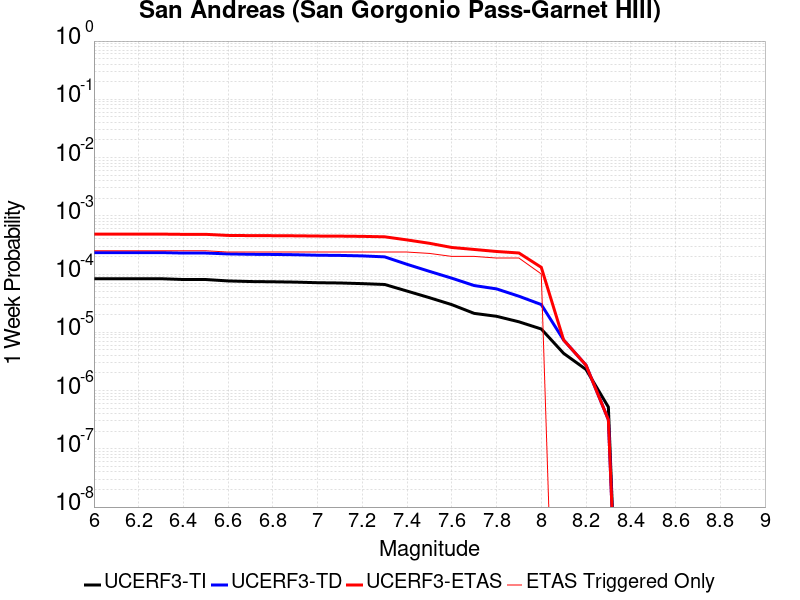 | 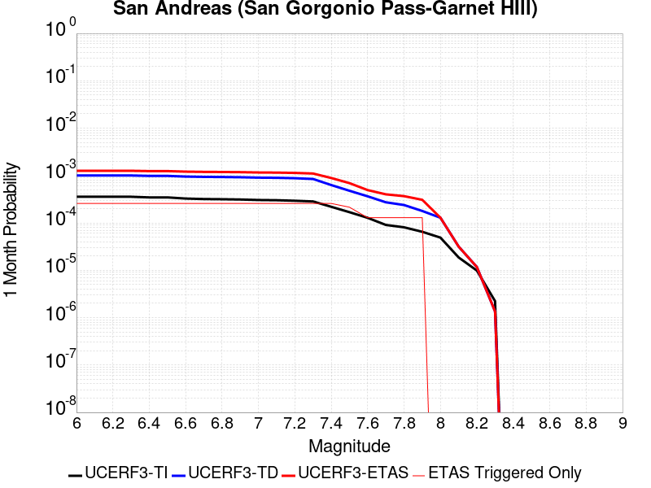 | 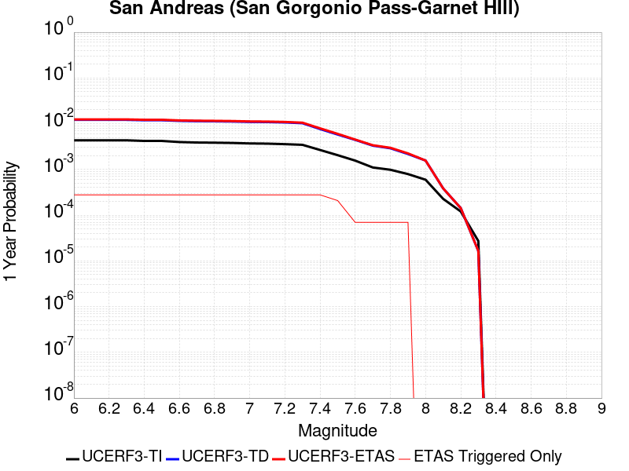 | 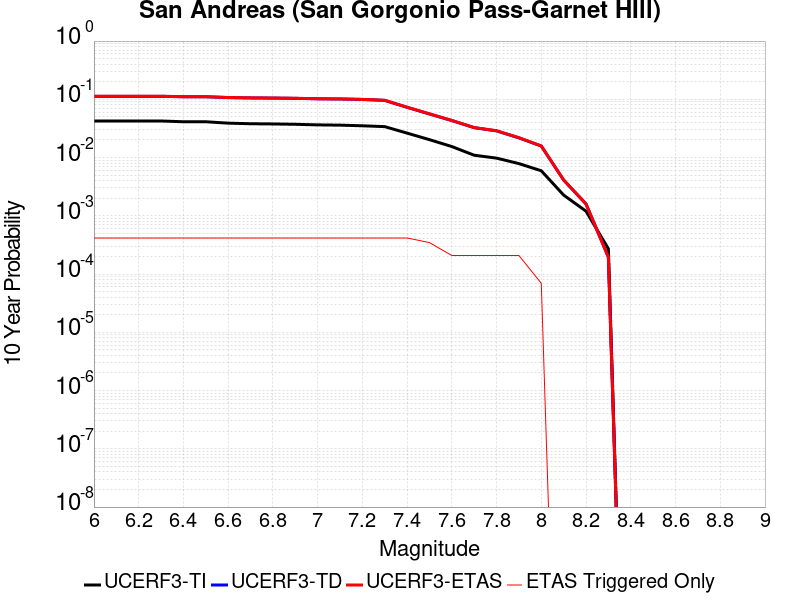 |

| Magnitude | 1 wk TI Prob | 1 wk TD Prob | 1 wk ETAS Prob | 1 wk ETAS/TD Gain | 1 wk ETAS Triggered Only | 1 mo TI Prob | 1 mo TD Prob | 1 mo ETAS Prob | 1 mo ETAS/TD Gain | 1 mo ETAS Triggered Only | 1 yr TI Prob | 1 yr TD Prob | 1 yr ETAS Prob | 1 yr ETAS/TD Gain | 1 yr ETAS Triggered Only | 10 yr TI Prob | 10 yr TD Prob | 10 yr ETAS Prob | 10 yr ETAS/TD Gain | 10 yr ETAS Triggered Only |
|-----|-----|-----|-----|-----|-----|-----|-----|-----|-----|-----|-----|-----|-----|-----|-----|-----|-----|-----|-----|-----|
| 6.0 | 8.31567E-5 | 2.3384395E-4 | 4.7378783E-4 | 2.0260854 | 2.4E-4 | 3.5633717E-4 | 0.0010018025 | 0.001251552 | 1.2493001 | 2.5E-4 | 0.004329778 | 0.012128622 | 0.012464498 | 1.0276929 | 3.4E-4 | 0.042463828 | 0.11258187 | 0.113052204 | 1.0041777 | 5.3E-4 |
| 6.1 | 8.31567E-5 | 2.3384395E-4 | 4.7378783E-4 | 2.0260854 | 2.4E-4 | 3.5633717E-4 | 0.0010018025 | 0.001251552 | 1.2493001 | 2.5E-4 | 0.004329778 | 0.012128622 | 0.012464498 | 1.0276929 | 3.4E-4 | 0.042463828 | 0.11258187 | 0.113052204 | 1.0041777 | 5.3E-4 |
| 6.2 | 8.31567E-5 | 2.3384395E-4 | 4.7378783E-4 | 2.0260854 | 2.4E-4 | 3.5633717E-4 | 0.0010018025 | 0.001251552 | 1.2493001 | 2.5E-4 | 0.004329778 | 0.012128622 | 0.012464498 | 1.0276929 | 3.4E-4 | 0.042463828 | 0.11258187 | 0.113052204 | 1.0041777 | 5.3E-4 |
| 6.3 | 8.31567E-5 | 2.3384395E-4 | 4.7378783E-4 | 2.0260854 | 2.4E-4 | 3.5633717E-4 | 0.0010018025 | 0.001251552 | 1.2493001 | 2.5E-4 | 0.004329778 | 0.012128622 | 0.012464498 | 1.0276929 | 3.4E-4 | 0.042463828 | 0.11258187 | 0.113052204 | 1.0041777 | 5.3E-4 |
| 6.4 | 8.059055E-5 | 2.2941893E-4 | 4.6936388E-4 | 2.0458813 | 2.4E-4 | 3.4534236E-4 | 9.828559E-4 | 0.0012326102 | 1.2541108 | 2.5E-4 | 0.0041964394 | 0.011900819 | 0.012236773 | 1.0282295 | 3.4E-4 | 0.041180745 | 0.110562965 | 0.11102547 | 1.0041832 | 5.2E-4 |
| 6.5 | 8.059055E-5 | 2.2941893E-4 | 4.6936388E-4 | 2.0458813 | 2.4E-4 | 3.4534236E-4 | 9.828559E-4 | 0.0012326102 | 1.2541108 | 2.5E-4 | 0.0041964394 | 0.011900819 | 0.012236773 | 1.0282295 | 3.4E-4 | 0.041180745 | 0.110562965 | 0.11102547 | 1.0041832 | 5.2E-4 |
| 6.6 | 7.619237E-5 | 2.2186468E-4 | 4.5181366E-4 | 2.036438 | 2.3E-4 | 3.2649786E-4 | 9.5050444E-4 | 0.0011902764 | 1.2522575 | 2.4E-4 | 0.0039678677 | 0.0115115335 | 0.011837735 | 1.0283369 | 3.3E-4 | 0.03897764 | 0.10709954 | 0.10755492 | 1.004252 | 5.1E-4 |
| 6.7 | 7.440636E-5 | 2.1862281E-4 | 4.4857254E-4 | 2.0518103 | 2.3E-4 | 3.188454E-4 | 9.3662075E-4 | 0.0011763959 | 1.2560003 | 2.4E-4 | 0.0038750346 | 0.011344268 | 0.011670524 | 1.0287596 | 3.3E-4 | 0.038081564 | 0.1056081 | 0.10606424 | 1.0043192 | 5.1E-4 |
| 6.8 | 7.3735864E-5 | 2.1709445E-4 | 4.4704453E-4 | 2.0592167 | 2.3E-4 | 3.1597257E-4 | 9.300753E-4 | 0.0011698521 | 1.2578037 | 2.4E-4 | 0.0038401815 | 0.011265406 | 0.011591689 | 1.0289632 | 3.3E-4 | 0.03774495 | 0.104909696 | 0.10536619 | 1.0043514 | 5.1E-4 |
| 6.9 | 7.27575E-5 | 2.1478413E-4 | 4.4473473E-4 | 2.0706127 | 2.3E-4 | 3.117806E-4 | 9.20181E-4 | 0.0011599602 | 1.2605783 | 2.4E-4 | 0.003789323 | 0.011146182 | 0.011472504 | 1.0292766 | 3.3E-4 | 0.037253562 | 0.10385753 | 0.104314566 | 1.0044006 | 5.1E-4 |
| 7.0 | 7.102591E-5 | 2.1062451E-4 | 4.4057606E-4 | 2.0917606 | 2.3E-4 | 3.0436125E-4 | 9.023664E-4 | 0.0011421499 | 1.2657273 | 2.4E-4 | 0.003699303 | 0.010931484 | 0.011257877 | 1.029858 | 3.3E-4 | 0.03638325 | 0.101959534 | 0.102417536 | 1.0044919 | 5.1E-4 |
| 7.1 | 7.028513E-5 | 2.0898094E-4 | 4.3893288E-4 | 2.100349 | 2.3E-4 | 3.0118722E-4 | 8.953274E-4 | 0.0011351125 | 1.2678183 | 2.4E-4 | 0.0036607897 | 0.010846641 | 0.011173062 | 1.0300941 | 3.3E-4 | 0.036010686 | 0.10120243 | 0.10166082 | 1.0045294 | 5.1E-4 |
| 7.2 | 6.8498244E-5 | 2.050596E-4 | 4.3501242E-4 | 2.121395 | 2.3E-4 | 2.9353087E-4 | 8.7853306E-4 | 0.0011183223 | 1.2729427 | 2.4E-4 | 0.003567883 | 0.0106441835 | 0.010970671 | 1.0306728 | 3.3E-4 | 0.035111405 | 0.09939449 | 0.09984479 | 1.0045304 | 5.0E-4 |
| 7.3 | 6.622592E-5 | 1.9733235E-4 | 4.2728696E-4 | 2.1653163 | 2.3E-4 | 2.8379448E-4 | 8.4543816E-4 | 0.0010852353 | 1.2836365 | 2.4E-4 | 0.0034497243 | 0.010245111 | 0.010571729 | 1.0318805 | 3.3E-4 | 0.033966612 | 0.095891245 | 0.0963433 | 1.0047143 | 5.0E-4 |
| 7.4 | 5.1050705E-5 | 1.4690042E-4 | 3.7686664E-4 | 2.5654564 | 2.3E-4 | 2.1877038E-4 | 6.294222E-4 | 8.6927117E-4 | 1.381062 | 2.4E-4 | 0.002660276 | 0.007636482 | 0.007954039 | 1.0415841 | 3.2E-4 | 0.02628654 | 0.07286554 | 0.07331056 | 1.0061074 | 4.8E-4 |
| 7.5 | 3.9302922E-5 | 1.11307076E-4 | 3.312826E-4 | 2.976294 | 2.2E-4 | 1.6843023E-4 | 4.7694342E-4 | 7.068337E-4 | 1.4820075 | 2.3E-4 | 0.0020487092 | 0.0057913954 | 0.0060996 | 1.0532176 | 3.1E-4 | 0.020299247 | 0.05601151 | 0.056455184 | 1.0079211 | 4.7E-4 |
| 7.6 | 2.9851626E-5 | 8.4956984E-5 | 2.8494E-4 | 3.3539324 | 2.0E-4 | 1.2792926E-4 | 3.6405068E-4 | 5.739742E-4 | 1.5766327 | 2.1E-4 | 0.0015564259 | 0.0044233347 | 0.0047020963 | 1.0630207 | 2.8E-4 | 0.0154556995 | 0.043196145 | 0.043607574 | 1.0095246 | 4.3E-4 |
| 7.7 | 2.1135214E-5 | 6.353527E-5 | 2.6352255E-4 | 4.147658 | 2.0E-4 | 9.0576345E-5 | 2.722656E-4 | 4.8220844E-4 | 1.7710956 | 2.1E-4 | 0.0011022091 | 0.0033098008 | 0.003588874 | 1.0843172 | 2.8E-4 | 0.010967582 | 0.03258456 | 0.032990877 | 1.0124695 | 4.2E-4 |
| 7.8 | 1.883379E-5 | 5.564576E-5 | 2.456352E-4 | 4.414266 | 1.9E-4 | 8.0713755E-5 | 2.3846005E-4 | 4.3841236E-4 | 1.8385149 | 2.0E-4 | 9.822468E-4 | 0.002899389 | 0.0031686062 | 1.0928531 | 2.7E-4 | 0.0097791655 | 0.028696978 | 0.029095212 | 1.0138773 | 4.1E-4 |
| 7.9 | 1.5156185E-5 | 4.1662403E-5 | 2.216549E-4 | 5.320262 | 1.8E-4 | 6.495346E-5 | 1.7854095E-4 | 3.6850703E-4 | 2.0639915 | 1.9E-4 | 7.9052144E-4 | 0.0021715704 | 0.002411049 | 1.1102791 | 2.4E-4 | 0.007877152 | 0.021760946 | 0.022122893 | 1.0166329 | 3.7E-4 |
| 8.0 | 1.1405907E-5 | 2.9976925E-5 | 1.19974226E-4 | 4.002219 | 9.0E-5 | 4.8881542E-5 | 1.2846621E-4 | 2.1845466E-4 | 1.7004833 | 9.0E-5 | 5.9497025E-4 | 0.0015629551 | 0.0016727832 | 1.0702695 | 1.1E-4 | 0.005933798 | 0.015774013 | 0.015951173 | 1.0112312 | 1.8E-4 |
| 8.1 | 4.3511436E-6 | 7.369465E-6 | 7.369465E-6 | 1.0 | 0.0 | 1.8647626E-5 | 3.158304E-5 | 3.158304E-5 | 1.0 | 0.0 | 2.2701119E-4 | 3.844558E-4 | 3.9445196E-4 | 1.0260007 | 1.0E-5 | 0.0022677942 | 0.0041165445 | 0.0041364618 | 1.0048385 | 2.0E-5 |
| 8.2 | 2.3042528E-6 | 2.7328301E-6 | 2.7328301E-6 | 1.0 | 0.0 | 9.875332E-6 | 1.1712076E-5 | 1.1712076E-5 | 1.0 | 0.0 | 1.2022553E-4 | 1.4258524E-4 | 1.4258524E-4 | 1.0 | 0.0 | 0.0012016051 | 0.0015979637 | 0.0015979637 | 1.0 | 0.0 |
| 8.3 | 5.202968E-7 | 3.1590292E-7 | 3.1590292E-7 | 1.0 | 0.0 | 2.2298414E-6 | 1.353869E-6 | 1.353869E-6 | 1.0 | 0.0 | 2.714798E-5 | 1.6483244E-5 | 1.6483244E-5 | 1.0 | 0.0 | 2.7144665E-4 | 1.955901E-4 | 1.955901E-4 | 1.0 | 0.0 |

## San Andreas (Parkfield)
*[(top)](#table-of-contents)*

| 1 Week | 1 Month | 1 Year | 10 Year |
|-----|-----|-----|-----|
| 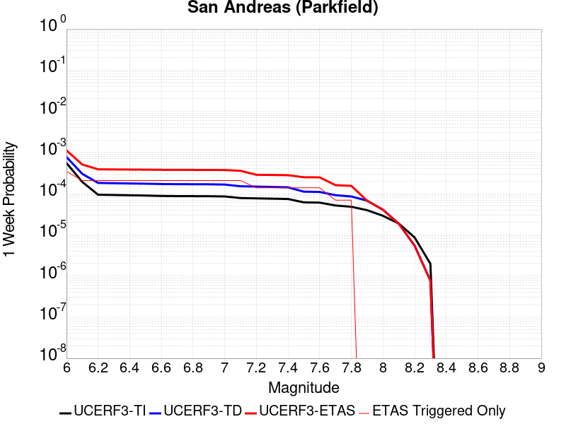 | 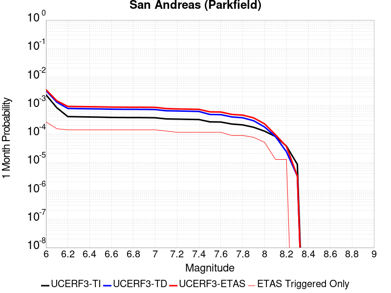 | 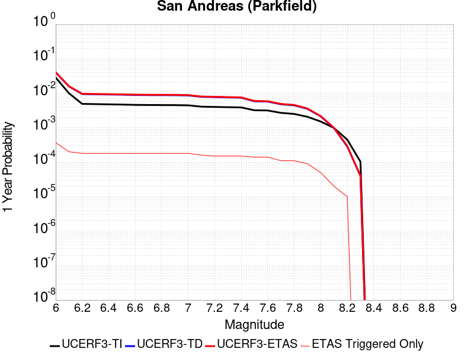 | 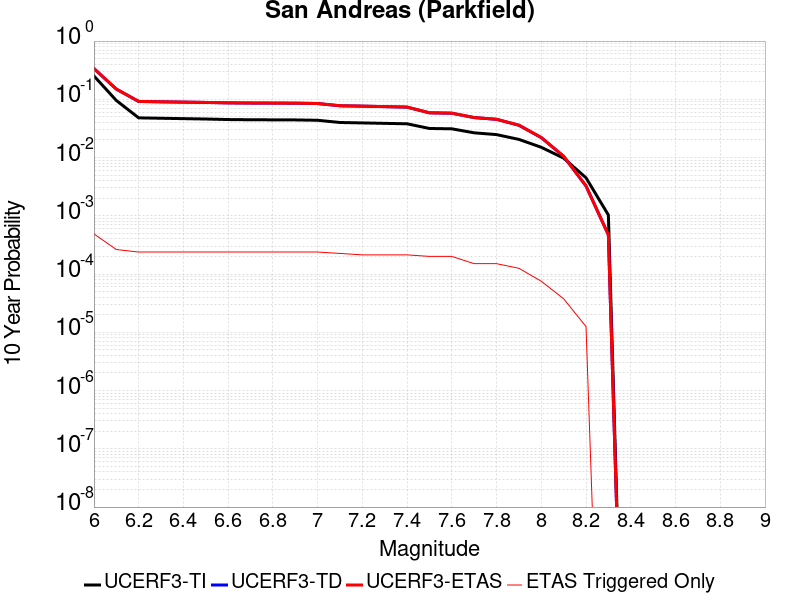 |

| Magnitude | 1 wk TI Prob | 1 wk TD Prob | 1 wk ETAS Prob | 1 wk ETAS/TD Gain | 1 wk ETAS Triggered Only | 1 mo TI Prob | 1 mo TD Prob | 1 mo ETAS Prob | 1 mo ETAS/TD Gain | 1 mo ETAS Triggered Only | 1 yr TI Prob | 1 yr TD Prob | 1 yr ETAS Prob | 1 yr ETAS/TD Gain | 1 yr ETAS Triggered Only | 10 yr TI Prob | 10 yr TD Prob | 10 yr ETAS Prob | 10 yr ETAS/TD Gain | 10 yr ETAS Triggered Only |
|-----|-----|-----|-----|-----|-----|-----|-----|-----|-----|-----|-----|-----|-----|-----|-----|-----|-----|-----|-----|-----|
| 6.0 | 5.556969E-4 | 7.778562E-4 | 9.47724E-4 | 1.2183794 | 1.7E-4 | 0.0023793848 | 0.0033299583 | 0.003569159 | 1.071833 | 2.4E-4 | 0.028586963 | 0.040235043 | 0.040590156 | 1.008826 | 3.7E-4 | 0.25176284 | 0.3371973 | 0.3375287 | 1.0009828 | 5.0E-4 |
| 6.1 | 1.925858E-4 | 3.0278185E-4 | 4.0275158E-4 | 1.3301708 | 1.0E-4 | 8.2510663E-4 | 0.001297085 | 0.0014369034 | 1.1077943 | 1.4E-4 | 0.0099994885 | 0.01577393 | 0.015970776 | 1.0124792 | 2.0E-4 | 0.095613256 | 0.14975825 | 0.1499708 | 1.0014193 | 2.5E-4 |
| 6.2 | 9.4306815E-5 | 1.8243887E-4 | 2.8242063E-4 | 1.5480288 | 1.0E-4 | 4.0410945E-4 | 7.8164786E-4 | 9.1154623E-4 | 1.1661853 | 1.3E-4 | 0.0049089384 | 0.009475246 | 0.009653541 | 1.0188168 | 1.8E-4 | 0.048019063 | 0.0918565 | 0.09206538 | 1.0022739 | 2.3E-4 |
| 6.3 | 9.283051E-5 | 1.794041E-4 | 2.7938615E-4 | 1.5573008 | 1.0E-4 | 3.9778434E-4 | 7.686494E-4 | 8.9854945E-4 | 1.1689979 | 1.3E-4 | 0.0048322747 | 0.009318355 | 0.009496677 | 1.0191367 | 1.8E-4 | 0.047285385 | 0.090509474 | 0.09071866 | 1.0023112 | 2.3E-4 |
| 6.4 | 9.138826E-5 | 1.7702584E-4 | 2.7700813E-4 | 1.5647893 | 1.0E-4 | 3.916052E-4 | 7.5846276E-4 | 8.8836416E-4 | 1.1712693 | 1.3E-4 | 0.0047573745 | 0.009195387 | 0.009373732 | 1.019395 | 1.8E-4 | 0.046568092 | 0.0894136 | 0.089623034 | 1.0023423 | 2.3E-4 |
| 6.5 | 9.000255E-5 | 1.746064E-4 | 2.7458894E-4 | 1.5726167 | 1.0E-4 | 3.8566816E-4 | 7.4809964E-4 | 8.780024E-4 | 1.1736436 | 1.3E-4 | 0.0046854047 | 0.009070284 | 0.009248652 | 1.019665 | 1.8E-4 | 0.045878403 | 0.08829608 | 0.08850577 | 1.0023749 | 2.3E-4 |
| 6.6 | 8.8109264E-5 | 1.7141816E-4 | 2.7140102E-4 | 1.5832688 | 1.0E-4 | 3.7755648E-4 | 7.3444354E-4 | 8.643481E-4 | 1.1768748 | 1.3E-4 | 0.0045870654 | 0.008905404 | 0.009083801 | 1.0200324 | 1.8E-4 | 0.04493529 | 0.08682707 | 0.0870371 | 1.002419 | 2.3E-4 |
| 6.7 | 8.738073E-5 | 1.7008898E-4 | 2.70072E-4 | 1.5878276 | 1.0E-4 | 3.7443507E-4 | 7.287503E-4 | 8.586556E-4 | 1.1782576 | 1.3E-4 | 0.0045492216 | 0.008836695 | 0.009015104 | 1.0201896 | 1.8E-4 | 0.04457213 | 0.0862268 | 0.086436965 | 1.0024374 | 2.3E-4 |
| 6.8 | 8.710195E-5 | 1.6954402E-4 | 2.6952705E-4 | 1.5897174 | 1.0E-4 | 3.7324068E-4 | 7.26416E-4 | 8.563216E-4 | 1.1788309 | 1.3E-4 | 0.0045347405 | 0.008808513 | 0.008986928 | 1.0202547 | 1.8E-4 | 0.04443313 | 0.08597436 | 0.08618458 | 1.0024452 | 2.3E-4 |
| 6.9 | 8.6801556E-5 | 1.6895356E-4 | 2.6893665E-4 | 1.5917786 | 1.0E-4 | 3.7195362E-4 | 7.238869E-4 | 8.5379276E-4 | 1.1794561 | 1.3E-4 | 0.0045191357 | 0.0087779695 | 0.0089563895 | 1.0203259 | 1.8E-4 | 0.044283327 | 0.08570042 | 0.08591071 | 1.0024538 | 2.3E-4 |
| 7.0 | 8.5571606E-5 | 1.664819E-4 | 2.6646524E-4 | 1.6005659 | 1.0E-4 | 3.6668387E-4 | 7.132999E-4 | 8.432072E-4 | 1.1821215 | 1.3E-4 | 0.004455241 | 0.008650103 | 0.008828546 | 1.020629 | 1.8E-4 | 0.043669727 | 0.08454836 | 0.084758915 | 1.0024903 | 2.3E-4 |
| 7.1 | 7.82589E-5 | 1.5128969E-4 | 2.4127607E-4 | 1.5947952 | 9.0E-5 | 3.3535215E-4 | 6.4822397E-4 | 7.681462E-4 | 1.1850013 | 1.2E-4 | 0.0040752706 | 0.007863738 | 0.00802248 | 1.0201865 | 1.6E-4 | 0.040013418 | 0.077460445 | 0.077654175 | 1.002501 | 2.1E-4 |
| 7.2 | 7.690929E-5 | 1.4866212E-4 | 2.2865023E-4 | 1.538053 | 8.0E-5 | 3.2956956E-4 | 6.369685E-4 | 7.4689847E-4 | 1.172583 | 1.1E-4 | 0.004005129 | 0.0077276826 | 0.007876524 | 1.0192608 | 1.5E-4 | 0.0393371 | 0.07623341 | 0.07641816 | 1.0024235 | 2.0E-4 |
| 7.3 | 7.5543794E-5 | 1.4562748E-4 | 2.2561583E-4 | 1.5492669 | 8.0E-5 | 3.2371894E-4 | 6.239692E-4 | 7.339006E-4 | 1.1761807 | 1.1E-4 | 0.003934157 | 0.0075705256 | 0.00771939 | 1.0196637 | 1.5E-4 | 0.038652334 | 0.07479777 | 0.074982814 | 1.0024738 | 2.0E-4 |
| 7.4 | 7.4214564E-5 | 1.4263717E-4 | 2.2262576E-4 | 1.5607836 | 8.0E-5 | 3.1802364E-4 | 6.1115966E-4 | 7.2109245E-4 | 1.1798757 | 1.1E-4 | 0.003865065 | 0.0074156416 | 0.007564529 | 1.0200775 | 1.5E-4 | 0.03798529 | 0.07337152 | 0.07355685 | 1.0025258 | 2.0E-4 |
| 7.5 | 6.149578E-5 | 1.1191443E-4 | 1.9190548E-4 | 1.7147518 | 8.0E-5 | 2.6352672E-4 | 4.795452E-4 | 5.8949244E-4 | 1.229274 | 1.1E-4 | 0.0032037178 | 0.005822865 | 0.0059620496 | 1.0239031 | 1.4E-4 | 0.03157923 | 0.058559462 | 0.058738336 | 1.0030546 | 1.9E-4 |
| 7.6 | 6.0643448E-5 | 1.102009E-4 | 1.9019208E-4 | 1.7258669 | 8.0E-5 | 2.598746E-4 | 4.7220418E-4 | 5.821522E-4 | 1.2328401 | 1.1E-4 | 0.0031593828 | 0.005733962 | 0.005873159 | 1.0242759 | 1.4E-4 | 0.031148417 | 0.05772042 | 0.05789945 | 1.0031017 | 1.9E-4 |
| 7.7 | 5.1652263E-5 | 9.175265E-5 | 1.6174623E-4 | 1.7628508 | 7.0E-5 | 2.2134806E-4 | 3.9316638E-4 | 4.83131E-4 | 1.2288207 | 9.0E-5 | 0.002691582 | 0.0047763046 | 0.004885779 | 1.0229204 | 1.1E-4 | 0.026592141 | 0.04853641 | 0.04867913 | 1.0029404 | 1.5E-4 |
| 7.8 | 4.8090482E-5 | 8.560165E-5 | 1.5559566E-4 | 1.8176712 | 7.0E-5 | 2.060858E-4 | 3.6681266E-4 | 4.5677964E-4 | 1.2452668 | 9.0E-5 | 0.0025062072 | 0.004456807 | 0.004566317 | 1.0245713 | 1.1E-4 | 0.024781305 | 0.045302264 | 0.045445472 | 1.0031611 | 1.5E-4 |
| 7.9 | 3.970278E-5 | 6.7507375E-5 | 1.17504E-4 | 1.7406099 | 5.0E-5 | 1.7014367E-4 | 2.8928524E-4 | 3.59265E-4 | 1.2419057 | 7.0E-5 | 0.002069531 | 0.0035163634 | 0.003606047 | 1.0255046 | 9.0E-5 | 0.020503636 | 0.03588176 | 0.035997454 | 1.0032244 | 1.2E-4 |
| 8.0 | 2.8982335E-5 | 4.0698153E-5 | 7.069693E-5 | 1.7371042 | 3.0E-5 | 1.2420409E-4 | 1.7440901E-4 | 2.1440203E-4 | 1.229306 | 4.0E-5 | 0.0015111357 | 0.0021213628 | 0.0021712568 | 1.0235198 | 5.0E-5 | 0.015009012 | 0.02201118 | 0.02206986 | 1.0026659 | 6.0E-5 |
| 8.1 | 1.8836186E-5 | 1.867974E-5 | 2.8679553E-5 | 1.5353293 | 1.0E-5 | 8.0724014E-5 | 8.005358E-5 | 9.0052774E-5 | 1.1249063 | 1.0E-5 | 9.823717E-4 | 9.742171E-4 | 9.941976E-4 | 1.0205094 | 2.0E-5 | 0.009780403 | 0.010487711 | 0.010517396 | 1.0028305 | 3.0E-5 |
| 8.2 | 8.643924E-6 | 5.473668E-6 | 1.5473614E-5 | 2.8269184 | 1.0E-5 | 3.704486E-5 | 2.3458366E-5 | 3.345813E-5 | 1.4262772 | 1.0E-5 | 4.5092785E-4 | 2.8556827E-4 | 2.955654E-4 | 1.035008 | 1.0E-5 | 0.0045001395 | 0.0032481793 | 0.003258147 | 1.0030687 | 1.0E-5 |
| 8.3 | 1.983087E-6 | 7.6564595E-7 | 7.6564595E-7 | 1.0 | 0.0 | 8.498917E-6 | 3.281336E-6 | 3.281336E-6 | 1.0 | 0.0 | 1.034694E-4 | 3.9949547E-5 | 3.9949547E-5 | 1.0 | 0.0 | 0.0010342124 | 4.717979E-4 | 4.717979E-4 | 1.0 | 0.0 |

## Red Pass
*[(top)](#table-of-contents)*

| 1 Week | 1 Month | 1 Year | 10 Year |
|-----|-----|-----|-----|
| 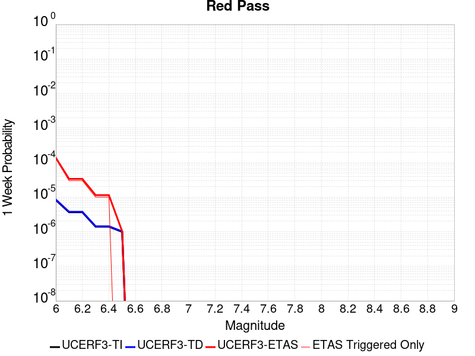 | 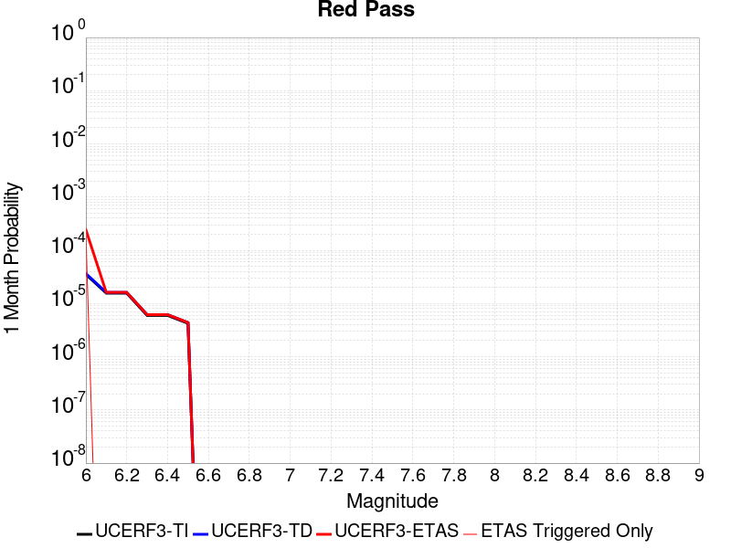 | 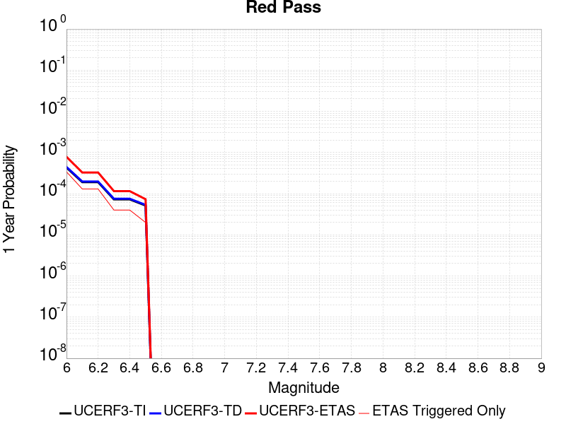 | 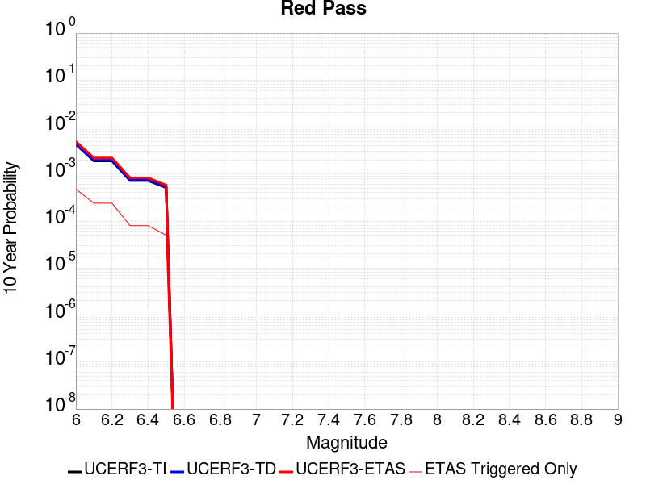 |

| Magnitude | 1 wk TI Prob | 1 wk TD Prob | 1 wk ETAS Prob | 1 wk ETAS/TD Gain | 1 wk ETAS Triggered Only | 1 mo TI Prob | 1 mo TD Prob | 1 mo ETAS Prob | 1 mo ETAS/TD Gain | 1 mo ETAS Triggered Only | 1 yr TI Prob | 1 yr TD Prob | 1 yr ETAS Prob | 1 yr ETAS/TD Gain | 1 yr ETAS Triggered Only | 10 yr TI Prob | 10 yr TD Prob | 10 yr ETAS Prob | 10 yr ETAS/TD Gain | 10 yr ETAS Triggered Only |
|-----|-----|-----|-----|-----|-----|-----|-----|-----|-----|-----|-----|-----|-----|-----|-----|-----|-----|-----|-----|-----|
| 6.0 | 8.258278E-6 | 8.551265E-6 | 1.3855015E-4 | 16.2023 | 1.3E-4 | 3.539214E-5 | 3.6647863E-5 | 2.566398E-4 | 7.002858 | 2.2E-4 | 4.308141E-4 | 4.4611428E-4 | 7.859626E-4 | 1.7617966 | 3.4E-4 | 0.0042997985 | 0.004453945 | 0.004931807 | 1.1072897 | 4.8E-4 |
| 6.1 | 3.649988E-6 | 3.7753161E-6 | 3.3775203E-5 | 8.946324 | 3.0E-5 | 1.5642712E-5 | 1.6179853E-5 | 7.617888E-5 | 4.708256 | 6.0E-5 | 1.9043336E-4 | 1.9697666E-4 | 3.2695106E-4 | 1.6598467 | 1.3E-4 | 0.0019027026 | 0.001968488 | 0.0022080156 | 1.121681 | 2.4E-4 |
| 6.2 | 3.649988E-6 | 3.7753161E-6 | 3.3775203E-5 | 8.946324 | 3.0E-5 | 1.5642712E-5 | 1.6179853E-5 | 7.617888E-5 | 4.708256 | 6.0E-5 | 1.9043336E-4 | 1.9697666E-4 | 3.2695106E-4 | 1.6598467 | 1.3E-4 | 0.0019027026 | 0.001968488 | 0.0022080156 | 1.121681 | 2.4E-4 |
| 6.3 | 1.3924937E-6 | 1.4411166E-6 | 1.1441102E-5 | 7.9390535 | 1.0E-5 | 5.9678164E-6 | 6.1762075E-6 | 2.6176083E-5 | 4.238213 | 2.0E-5 | 7.265574E-5 | 7.519415E-5 | 1.1519114E-4 | 1.5319163 | 4.0E-5 | 7.263199E-4 | 7.518258E-4 | 8.3176565E-4 | 1.1063277 | 8.0E-5 |
| 6.4 | 1.3924937E-6 | 1.4411166E-6 | 1.1441102E-5 | 7.9390535 | 1.0E-5 | 5.9678164E-6 | 6.1762075E-6 | 2.6176083E-5 | 4.238213 | 2.0E-5 | 7.265574E-5 | 7.519415E-5 | 1.1519114E-4 | 1.5319163 | 4.0E-5 | 7.263199E-4 | 7.518258E-4 | 8.3176565E-4 | 1.1063277 | 8.0E-5 |
| 6.5 | 9.876812E-7 | 1.0221912E-6 | 1.0221912E-6 | 1.0 | 0.0 | 4.2329125E-6 | 4.3808195E-6 | 4.3808195E-6 | 1.0 | 0.0 | 5.153449E-5 | 5.3336476E-5 | 7.333541E-5 | 1.3749579 | 2.0E-5 | 5.1522546E-4 | 5.333648E-4 | 5.833381E-4 | 1.0936944 | 5.0E-5 |

## Ludlow
*[(top)](#table-of-contents)*

| 1 Week | 1 Month | 1 Year | 10 Year |
|-----|-----|-----|-----|
| 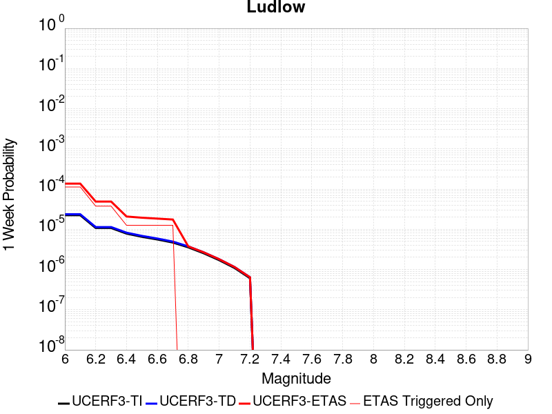 | 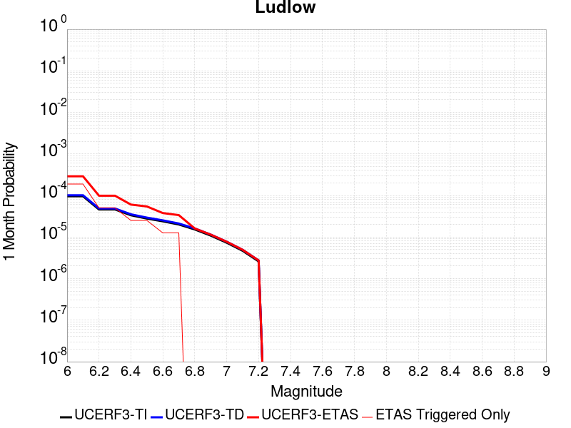 | 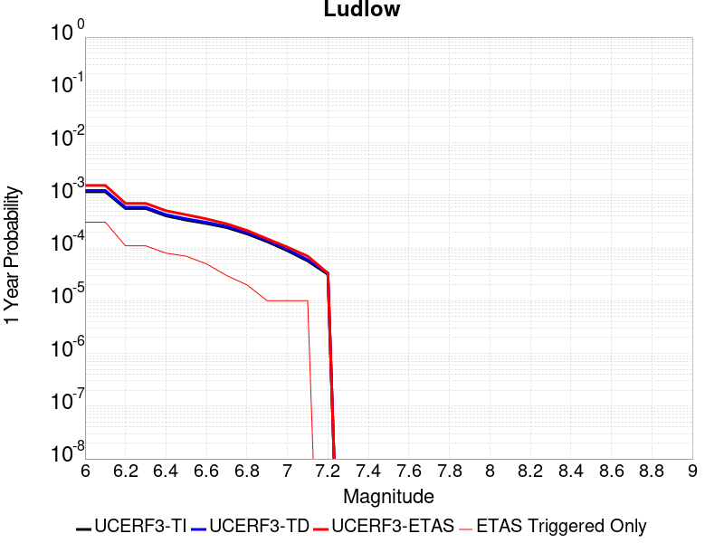 | 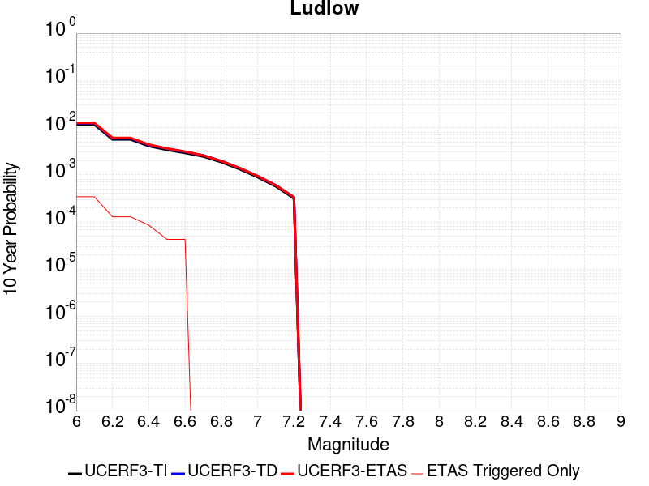 |

| Magnitude | 1 wk TI Prob | 1 wk TD Prob | 1 wk ETAS Prob | 1 wk ETAS/TD Gain | 1 wk ETAS Triggered Only | 1 mo TI Prob | 1 mo TD Prob | 1 mo ETAS Prob | 1 mo ETAS/TD Gain | 1 mo ETAS Triggered Only | 1 yr TI Prob | 1 yr TD Prob | 1 yr ETAS Prob | 1 yr ETAS/TD Gain | 1 yr ETAS Triggered Only | 10 yr TI Prob | 10 yr TD Prob | 10 yr ETAS Prob | 10 yr ETAS/TD Gain | 10 yr ETAS Triggered Only |
|-----|-----|-----|-----|-----|-----|-----|-----|-----|-----|-----|-----|-----|-----|-----|-----|-----|-----|-----|-----|-----|
| 6.0 | 2.2407607E-5 | 2.3657254E-5 | 1.4365441E-4 | 6.07232 | 1.2E-4 | 9.602906E-5 | 1.0138454E-4 | 2.913653E-4 | 2.873863 | 1.9E-4 | 0.0011685267 | 0.001233702 | 0.0015433194 | 1.2509663 | 3.1E-4 | 0.011624013 | 0.012273042 | 0.01267801 | 1.0329965 | 4.1E-4 |
| 6.1 | 2.2407607E-5 | 2.3657254E-5 | 1.4365441E-4 | 6.07232 | 1.2E-4 | 9.602906E-5 | 1.0138454E-4 | 2.913653E-4 | 2.873863 | 1.9E-4 | 0.0011685267 | 0.001233702 | 0.0015433194 | 1.2509663 | 3.1E-4 | 0.011624013 | 0.012273042 | 0.01267801 | 1.0329965 | 4.1E-4 |
| 6.2 | 1.0781252E-5 | 1.1365663E-5 | 6.136509E-5 | 5.399165 | 5.0E-5 | 4.620455E-5 | 4.8709102E-5 | 1.08706176E-4 | 2.2317426 | 6.0E-5 | 5.623952E-4 | 5.9287593E-4 | 7.0281076E-4 | 1.1854262 | 1.1E-4 | 0.00560974 | 0.0059133614 | 0.006072415 | 1.0268973 | 1.6E-4 |
| 6.3 | 1.0781252E-5 | 1.1365663E-5 | 6.136509E-5 | 5.399165 | 5.0E-5 | 4.620455E-5 | 4.8709102E-5 | 1.08706176E-4 | 2.2317426 | 6.0E-5 | 5.623952E-4 | 5.9287593E-4 | 7.0281076E-4 | 1.1854262 | 1.1E-4 | 0.00560974 | 0.0059133614 | 0.006072415 | 1.0268973 | 1.6E-4 |
| 6.4 | 7.814439E-6 | 8.237729E-6 | 3.8237482E-5 | 4.6417503 | 3.0E-5 | 3.3490025E-5 | 3.530408E-5 | 7.530267E-5 | 2.1329734 | 4.0E-5 | 4.0766477E-4 | 4.2974384E-4 | 5.0970947E-4 | 1.1860774 | 8.0E-5 | 0.0040691774 | 0.0042892746 | 0.0044187168 | 1.0301782 | 1.3E-4 |
| 6.5 | 6.4986366E-6 | 6.85092E-6 | 2.6850783E-5 | 3.919296 | 2.0E-5 | 2.7851002E-5 | 2.9360759E-5 | 5.9359878E-5 | 2.0217419 | 3.0E-5 | 3.390332E-4 | 3.5740953E-4 | 4.273845E-4 | 1.1957837 | 7.0E-5 | 0.003385164 | 0.0035684432 | 0.0036581222 | 1.0251311 | 9.0E-5 |
| 6.6 | 5.582177E-6 | 5.8860055E-6 | 2.5885887E-5 | 4.39787 | 2.0E-5 | 2.3923398E-5 | 2.5225498E-5 | 4.5224995E-5 | 1.7928286 | 2.0E-5 | 2.9122844E-4 | 3.0707786E-4 | 3.5706253E-4 | 1.1627752 | 5.0E-5 | 0.0029084706 | 0.003066609 | 0.003136394 | 1.0227566 | 7.0E-5 |
| 6.7 | 4.6858763E-6 | 4.940427E-6 | 2.494033E-5 | 5.048213 | 2.0E-5 | 2.0082172E-5 | 2.1173091E-5 | 4.117267E-5 | 1.9445752 | 2.0E-5 | 2.4447302E-4 | 2.5775246E-4 | 2.877447E-4 | 1.1163608 | 3.0E-5 | 0.0024420423 | 0.0025745912 | 0.0026244626 | 1.0193706 | 5.0E-5 |
| 6.8 | 3.5584908E-6 | 3.7520183E-6 | 1.3751981E-5 | 3.6652222 | 1.0E-5 | 1.5250586E-5 | 1.6079981E-5 | 2.607982E-5 | 1.6218812 | 1.0E-5 | 1.8566006E-4 | 1.957566E-4 | 2.1575269E-4 | 1.1021477 | 2.0E-5 | 0.0018550502 | 0.0019558826 | 0.0019958045 | 1.0204111 | 4.0E-5 |
| 6.9 | 2.532834E-6 | 2.6710034E-6 | 2.6710034E-6 | 1.0 | 0.0 | 1.0854958E-5 | 1.1447109E-5 | 1.1447109E-5 | 1.0 | 0.0 | 1.3215111E-4 | 1.3935992E-4 | 1.4935853E-4 | 1.0717466 | 1.0E-5 | 0.0013207254 | 0.0013927529 | 0.0014227111 | 1.0215101 | 3.0E-5 |
| 7.0 | 1.7083285E-6 | 1.8019439E-6 | 1.8019439E-6 | 1.0 | 0.0 | 7.3213873E-6 | 7.722595E-6 | 7.722595E-6 | 1.0 | 0.0 | 8.913424E-5 | 9.40187E-5 | 1.0401776E-4 | 1.1063519 | 1.0E-5 | 8.9098496E-4 | 9.3980576E-4 | 9.697775E-4 | 1.0318915 | 3.0E-5 |
| 7.1 | 1.0905424E-6 | 1.1497619E-6 | 1.1497619E-6 | 1.0 | 0.0 | 4.6737446E-6 | 4.9275427E-6 | 4.9275427E-6 | 1.0 | 0.0 | 5.6901354E-5 | 5.999128E-5 | 6.999068E-5 | 1.1666809 | 1.0E-5 | 5.6886784E-4 | 5.997606E-4 | 6.197486E-4 | 1.0333266 | 2.0E-5 |
| 7.2 | 6.06668E-7 | 6.387277E-7 | 6.387277E-7 | 1.0 | 0.0 | 2.600003E-6 | 2.7374022E-6 | 2.7374022E-6 | 1.0 | 0.0 | 3.1654577E-5 | 3.3327433E-5 | 3.3327433E-5 | 1.0 | 0.0 | 3.1650066E-4 | 3.3323118E-4 | 3.4322785E-4 | 1.0299993 | 1.0E-5 |

## San Andreas (Carrizo) rev
*[(top)](#table-of-contents)*

| 1 Week | 1 Month | 1 Year | 10 Year |
|-----|-----|-----|-----|
| 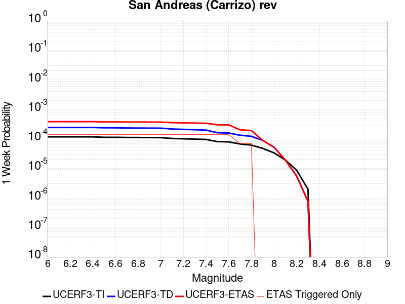 | 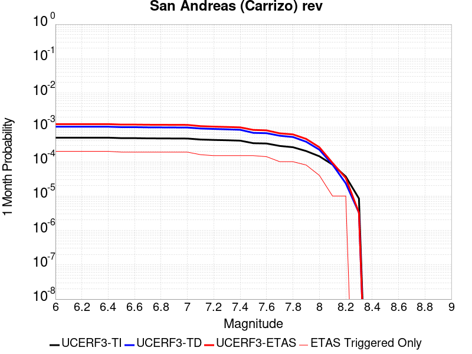 | 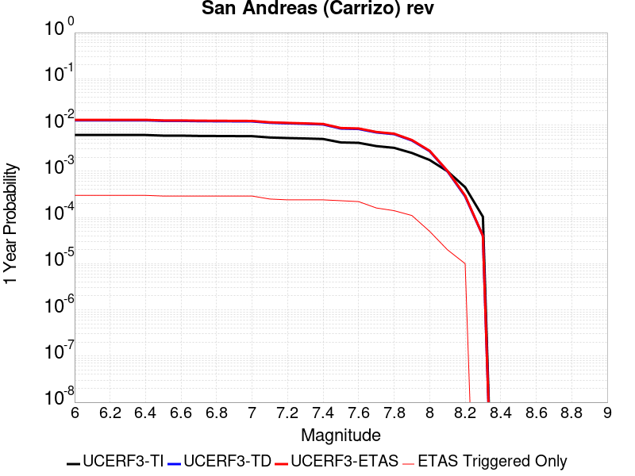 | 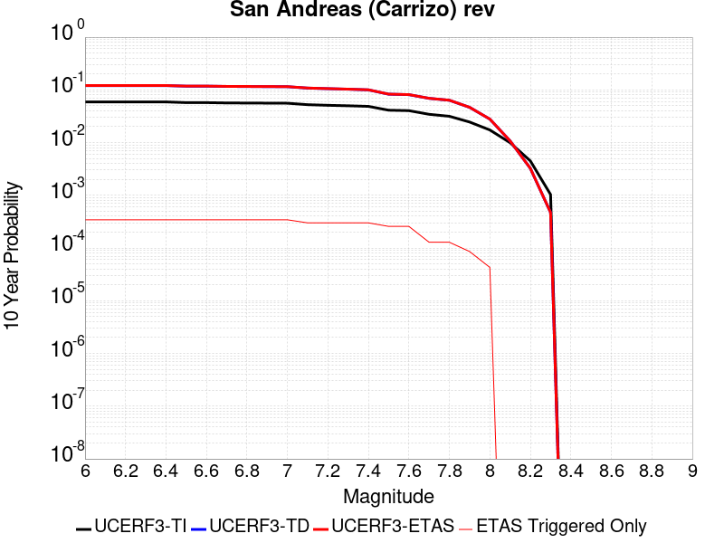 |

| Magnitude | 1 wk TI Prob | 1 wk TD Prob | 1 wk ETAS Prob | 1 wk ETAS/TD Gain | 1 wk ETAS Triggered Only | 1 mo TI Prob | 1 mo TD Prob | 1 mo ETAS Prob | 1 mo ETAS/TD Gain | 1 mo ETAS Triggered Only | 1 yr TI Prob | 1 yr TD Prob | 1 yr ETAS Prob | 1 yr ETAS/TD Gain | 1 yr ETAS Triggered Only | 10 yr TI Prob | 10 yr TD Prob | 10 yr ETAS Prob | 10 yr ETAS/TD Gain | 10 yr ETAS Triggered Only |
|-----|-----|-----|-----|-----|-----|-----|-----|-----|-----|-----|-----|-----|-----|-----|-----|-----|-----|-----|-----|-----|
| 6.0 | 1.1674632E-4 | 2.4324407E-4 | 3.932076E-4 | 1.6165146 | 1.5E-4 | 5.002454E-4 | 0.0010420597 | 0.0012418512 | 1.1917276 | 2.0E-4 | 0.006073493 | 0.012613757 | 0.012909973 | 1.0234835 | 3.0E-4 | 0.0591016 | 0.120640226 | 0.12100956 | 1.0030614 | 4.2E-4 |
| 6.1 | 1.1674632E-4 | 2.4324407E-4 | 3.932076E-4 | 1.6165146 | 1.5E-4 | 5.002454E-4 | 0.0010420597 | 0.0012418512 | 1.1917276 | 2.0E-4 | 0.006073493 | 0.012613757 | 0.012909973 | 1.0234835 | 3.0E-4 | 0.0591016 | 0.120640226 | 0.12100956 | 1.0030614 | 4.2E-4 |
| 6.2 | 1.1674632E-4 | 2.4324407E-4 | 3.932076E-4 | 1.6165146 | 1.5E-4 | 5.002454E-4 | 0.0010420597 | 0.0012418512 | 1.1917276 | 2.0E-4 | 0.006073493 | 0.012613757 | 0.012909973 | 1.0234835 | 3.0E-4 | 0.0591016 | 0.120640226 | 0.12100956 | 1.0030614 | 4.2E-4 |
| 6.3 | 1.1674632E-4 | 2.4324407E-4 | 3.932076E-4 | 1.6165146 | 1.5E-4 | 5.002454E-4 | 0.0010420597 | 0.0012418512 | 1.1917276 | 2.0E-4 | 0.006073493 | 0.012613757 | 0.012909973 | 1.0234835 | 3.0E-4 | 0.0591016 | 0.120640226 | 0.12100956 | 1.0030614 | 4.2E-4 |
| 6.4 | 1.1674632E-4 | 2.4324407E-4 | 3.932076E-4 | 1.6165146 | 1.5E-4 | 5.002454E-4 | 0.0010420597 | 0.0012418512 | 1.1917276 | 2.0E-4 | 0.006073493 | 0.012613757 | 0.012909973 | 1.0234835 | 3.0E-4 | 0.0591016 | 0.120640226 | 0.12100956 | 1.0030614 | 4.2E-4 |
| 6.5 | 1.13136164E-4 | 2.3644442E-4 | 3.764113E-4 | 1.5919653 | 1.4E-4 | 4.847792E-4 | 0.0010129412 | 0.0012027487 | 1.1873826 | 1.9E-4 | 0.0058862255 | 0.012263271 | 0.012549714 | 1.0233579 | 2.9E-4 | 0.057327334 | 0.11761008 | 0.11797186 | 1.0030761 | 4.1E-4 |
| 6.6 | 1.13136164E-4 | 2.3644442E-4 | 3.764113E-4 | 1.5919653 | 1.4E-4 | 4.847792E-4 | 0.0010129412 | 0.0012027487 | 1.1873826 | 1.9E-4 | 0.0058862255 | 0.012263271 | 0.012549714 | 1.0233579 | 2.9E-4 | 0.057327334 | 0.11761008 | 0.11797186 | 1.0030761 | 4.1E-4 |
| 6.7 | 1.1149675E-4 | 2.3335687E-4 | 3.733242E-4 | 1.5997995 | 1.4E-4 | 4.777557E-4 | 9.997191E-4 | 0.0011895291 | 1.1898634 | 1.9E-4 | 0.0058011734 | 0.012104088 | 0.012390578 | 1.0236689 | 2.9E-4 | 0.05652051 | 0.1162291 | 0.116591446 | 1.0031176 | 4.1E-4 |
| 6.8 | 1.1103589E-4 | 2.3237852E-4 | 3.7234597E-4 | 1.6023253 | 1.4E-4 | 4.7578133E-4 | 9.955293E-4 | 0.0011853401 | 1.1906632 | 1.9E-4 | 0.005777263 | 0.012053643 | 0.012340148 | 1.0237691 | 2.9E-4 | 0.056293584 | 0.11578894 | 0.11615147 | 1.0031309 | 4.1E-4 |
| 6.9 | 1.1053259E-4 | 2.3130233E-4 | 3.7126994E-4 | 1.6051284 | 1.4E-4 | 4.7362508E-4 | 9.909206E-4 | 0.0011807324 | 1.1915509 | 1.9E-4 | 0.0057511497 | 0.011998152 | 0.012284673 | 1.0238804 | 2.9E-4 | 0.05604569 | 0.11530445 | 0.11566717 | 1.0031458 | 4.1E-4 |
| 7.0 | 1.1005377E-4 | 2.3031076E-4 | 3.7027852E-4 | 1.6077343 | 1.4E-4 | 4.7157376E-4 | 9.866742E-4 | 0.0011764868 | 1.1923761 | 1.9E-4 | 0.0057263062 | 0.011947021 | 0.012233556 | 1.0239838 | 2.9E-4 | 0.055809796 | 0.11485658 | 0.11521949 | 1.0031596 | 4.1E-4 |
| 7.1 | 1.0308142E-4 | 2.1540876E-4 | 3.353829E-4 | 1.5569603 | 1.2E-4 | 4.417027E-4 | 9.228548E-4 | 0.0010827072 | 1.173215 | 1.6E-4 | 0.0053644776 | 0.011178188 | 0.011425394 | 1.022115 | 2.5E-4 | 0.052368138 | 0.10809042 | 0.10842043 | 1.0030531 | 3.7E-4 |
| 7.2 | 1.0027479E-4 | 2.094876E-4 | 3.2946246E-4 | 1.5727062 | 1.2E-4 | 4.296783E-4 | 8.9749607E-4 | 0.0010473614 | 1.1669817 | 1.5E-4 | 0.0052187922 | 0.010872566 | 0.011109957 | 1.0218339 | 2.4E-4 | 0.050979212 | 0.10539086 | 0.10570397 | 1.0029709 | 3.5E-4 |
| 7.3 | 9.816942E-5 | 2.0423878E-4 | 3.2421426E-4 | 1.5874276 | 1.2E-4 | 4.2065824E-4 | 8.7501644E-4 | 0.0010248852 | 1.1712754 | 1.5E-4 | 0.005109493 | 0.010601572 | 0.010839027 | 1.0223981 | 2.4E-4 | 0.049935985 | 0.10297546 | 0.10328942 | 1.0030489 | 3.5E-4 |
| 7.4 | 9.5634205E-5 | 1.9793298E-4 | 3.1790923E-4 | 1.6061457 | 1.2E-4 | 4.0979648E-4 | 8.4800937E-4 | 9.978822E-4 | 1.1767348 | 1.5E-4 | 0.0049778637 | 0.010275901 | 0.010513435 | 1.0231156 | 2.4E-4 | 0.048678253 | 0.100067884 | 0.10038286 | 1.0031476 | 3.5E-4 |
| 7.5 | 8.052417E-5 | 1.6113915E-4 | 2.811198E-4 | 1.744578 | 1.2E-4 | 3.4505792E-4 | 6.9041376E-4 | 8.4031024E-4 | 1.217111 | 1.5E-4 | 0.0041929903 | 0.008373471 | 0.008601545 | 1.0272377 | 2.3E-4 | 0.04114753 | 0.082815245 | 0.08311792 | 1.0036547 | 3.3E-4 |
| 7.6 | 7.897024E-5 | 1.5767086E-4 | 2.6765352E-4 | 1.6975459 | 1.1E-4 | 3.384E-4 | 6.755574E-4 | 8.1546284E-4 | 1.2070962 | 1.4E-4 | 0.0041122385 | 0.00819397 | 0.008412167 | 1.026629 | 2.2E-4 | 0.040369697 | 0.08115866 | 0.08145269 | 1.0036229 | 3.2E-4 |
| 7.7 | 6.707427E-5 | 1.3277122E-4 | 2.127606E-4 | 1.6024601 | 8.0E-5 | 2.8742946E-4 | 5.688955E-4 | 6.688386E-4 | 1.1756792 | 1.0E-4 | 0.003493839 | 0.0069043385 | 0.0070632338 | 1.0230138 | 1.6E-4 | 0.034394164 | 0.06905339 | 0.06928613 | 1.0033704 | 2.5E-4 |
| 7.8 | 6.147705E-5 | 1.2198445E-4 | 2.0197469E-4 | 1.6557413 | 8.0E-5 | 2.6344648E-4 | 5.226858E-4 | 6.2263355E-4 | 1.1912196 | 1.0E-4 | 0.0032027436 | 0.006345156 | 0.006484268 | 1.021924 | 1.4E-4 | 0.031569764 | 0.0635172 | 0.06373259 | 1.003391 | 2.3E-4 |
| 7.9 | 4.7636717E-5 | 8.8802946E-5 | 1.4879763E-4 | 1.6755933 | 6.0E-5 | 2.0414138E-4 | 3.8052857E-4 | 4.6049812E-4 | 1.2101539 | 8.0E-5 | 0.0024825884 | 0.004623101 | 0.004732593 | 1.0236835 | 1.1E-4 | 0.024550365 | 0.046629366 | 0.046791438 | 1.0034758 | 1.7E-4 |
| 8.0 | 3.3554235E-5 | 5.2138024E-5 | 8.213646E-5 | 1.5753658 | 3.0E-5 | 1.4379594E-4 | 2.2342955E-4 | 2.634206E-4 | 1.1789874 | 4.0E-5 | 0.0017493097 | 0.002716863 | 0.0027667272 | 1.0183536 | 5.0E-5 | 0.017356034 | 0.027881905 | 0.027949953 | 1.0024406 | 7.0E-5 |
| 8.1 | 1.9175432E-5 | 1.9183564E-5 | 2.9183373E-5 | 1.5212696 | 1.0E-5 | 8.217783E-5 | 8.221269E-5 | 9.221186E-5 | 1.1216258 | 1.0E-5 | 0.0010000558 | 0.0010004805 | 0.0010204605 | 1.0199704 | 2.0E-5 | 0.009955673 | 0.010757771 | 0.010787448 | 1.0027586 | 3.0E-5 |
| 8.2 | 8.643924E-6 | 5.473668E-6 | 1.5473614E-5 | 2.8269184 | 1.0E-5 | 3.704486E-5 | 2.3458366E-5 | 3.345813E-5 | 1.4262772 | 1.0E-5 | 4.5092785E-4 | 2.8556827E-4 | 2.955654E-4 | 1.035008 | 1.0E-5 | 0.0045001395 | 0.0032481793 | 0.003258147 | 1.0030687 | 1.0E-5 |
| 8.3 | 1.983087E-6 | 7.6564595E-7 | 7.6564595E-7 | 1.0 | 0.0 | 8.498917E-6 | 3.281336E-6 | 3.281336E-6 | 1.0 | 0.0 | 1.034694E-4 | 3.9949547E-5 | 3.9949547E-5 | 1.0 | 0.0 | 0.0010342124 | 4.717979E-4 | 4.717979E-4 | 1.0 | 0.0 |

## Cady
*[(top)](#table-of-contents)*

| 1 Week | 1 Month | 1 Year | 10 Year |
|-----|-----|-----|-----|
| 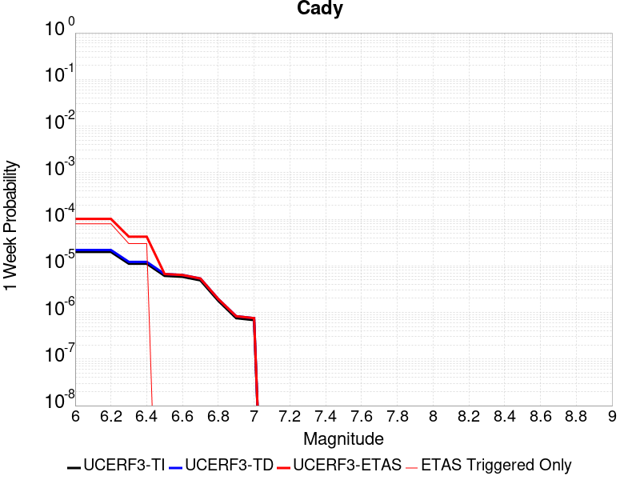 | 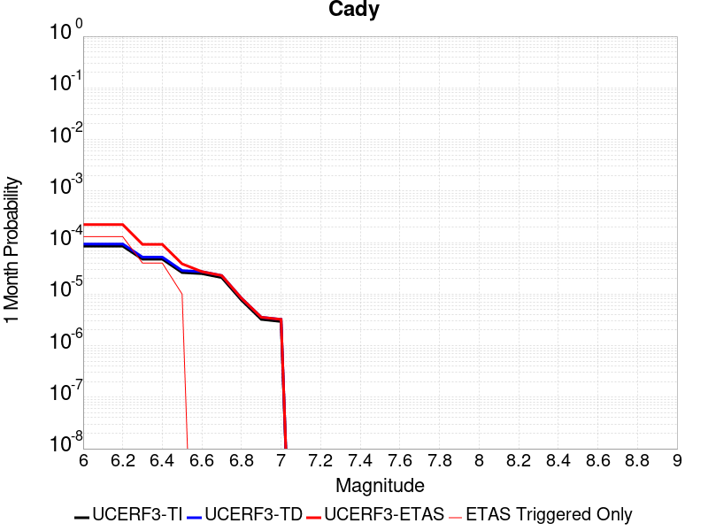 | 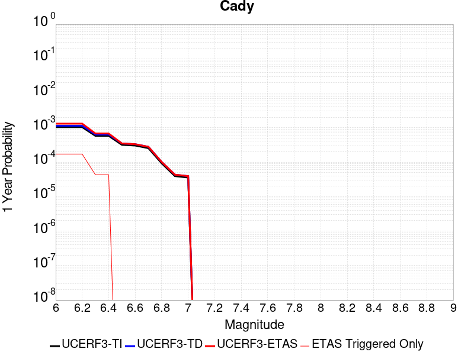 |  |

| Magnitude | 1 wk TI Prob | 1 wk TD Prob | 1 wk ETAS Prob | 1 wk ETAS/TD Gain | 1 wk ETAS Triggered Only | 1 mo TI Prob | 1 mo TD Prob | 1 mo ETAS Prob | 1 mo ETAS/TD Gain | 1 mo ETAS Triggered Only | 1 yr TI Prob | 1 yr TD Prob | 1 yr ETAS Prob | 1 yr ETAS/TD Gain | 1 yr ETAS Triggered Only | 10 yr TI Prob | 10 yr TD Prob | 10 yr ETAS Prob | 10 yr ETAS/TD Gain | 10 yr ETAS Triggered Only |
|-----|-----|-----|-----|-----|-----|-----|-----|-----|-----|-----|-----|-----|-----|-----|-----|-----|-----|-----|-----|-----|
| 6.0 | 1.9892565E-5 | 2.1858728E-5 | 1.0185698E-4 | 4.6597853 | 8.0E-5 | 8.525106E-5 | 9.3677416E-5 | 2.2366524E-4 | 2.3876112 | 1.3E-4 | 0.0010374374 | 0.0011400167 | 0.0013497773 | 1.1839979 | 2.1E-4 | 0.010326075 | 0.011350701 | 0.011676955 | 1.0287431 | 3.3E-4 |
| 6.1 | 1.9892565E-5 | 2.1858728E-5 | 1.0185698E-4 | 4.6597853 | 8.0E-5 | 8.525106E-5 | 9.3677416E-5 | 2.2366524E-4 | 2.3876112 | 1.3E-4 | 0.0010374374 | 0.0011400167 | 0.0013497773 | 1.1839979 | 2.1E-4 | 0.010326075 | 0.011350701 | 0.011676955 | 1.0287431 | 3.3E-4 |
| 6.2 | 1.9892565E-5 | 2.1858728E-5 | 1.0185698E-4 | 4.6597853 | 8.0E-5 | 8.525106E-5 | 9.3677416E-5 | 2.2366524E-4 | 2.3876112 | 1.3E-4 | 0.0010374374 | 0.0011400167 | 0.0013497773 | 1.1839979 | 2.1E-4 | 0.010326075 | 0.011350701 | 0.011676955 | 1.0287431 | 3.3E-4 |
| 6.3 | 1.1117327E-5 | 1.2176583E-5 | 4.217622E-5 | 3.4637153 | 3.0E-5 | 4.764482E-5 | 5.2184492E-5 | 9.21824E-5 | 1.7664713 | 4.0E-5 | 5.7992124E-4 | 6.351925E-4 | 6.9515436E-4 | 1.0943996 | 6.0E-5 | 0.0057841022 | 0.0063368753 | 0.0064660516 | 1.0203848 | 1.3E-4 |
| 6.4 | 1.1117327E-5 | 1.2176583E-5 | 4.217622E-5 | 3.4637153 | 3.0E-5 | 4.764482E-5 | 5.2184492E-5 | 9.21824E-5 | 1.7664713 | 4.0E-5 | 5.7992124E-4 | 6.351925E-4 | 6.9515436E-4 | 1.0943996 | 6.0E-5 | 0.0057841022 | 0.0063368753 | 0.0064660516 | 1.0203848 | 1.3E-4 |
| 6.5 | 6.103093E-6 | 6.672021E-6 | 6.672021E-6 | 1.0 | 0.0 | 2.615585E-5 | 2.8594131E-5 | 3.8593847E-5 | 1.3497121 | 1.0E-5 | 3.1840094E-4 | 3.480905E-4 | 3.58087E-4 | 1.0287181 | 1.0E-5 | 0.0031794512 | 0.0034766865 | 0.0035165476 | 1.0114652 | 4.0E-5 |
| 6.6 | 5.817237E-6 | 6.3656585E-6 | 6.3656585E-6 | 1.0 | 0.0 | 2.4930776E-5 | 2.728118E-5 | 2.728118E-5 | 1.0 | 0.0 | 3.034899E-4 | 3.3211018E-4 | 3.3211018E-4 | 1.0 | 0.0 | 0.0030307577 | 0.0033173605 | 0.003347261 | 1.0090133 | 3.0E-5 |
| 6.7 | 4.8846314E-6 | 5.3405684E-6 | 5.3405684E-6 | 1.0 | 0.0 | 2.0933967E-5 | 2.2888014E-5 | 2.2888014E-5 | 1.0 | 0.0 | 2.5484123E-4 | 2.7863772E-4 | 2.7863772E-4 | 1.0 | 0.0 | 0.0025454918 | 0.0027840391 | 0.0028039834 | 1.0071638 | 2.0E-5 |
| 6.8 | 1.7788773E-6 | 1.9399079E-6 | 1.9399079E-6 | 1.0 | 0.0 | 7.6237375E-6 | 8.313874E-6 | 8.313874E-6 | 1.0 | 0.0 | 9.281505E-5 | 1.01218284E-4 | 1.01218284E-4 | 1.0 | 0.0 | 9.2776294E-4 | 0.0010118765 | 0.0010218663 | 1.0098727 | 1.0E-5 |
| 6.9 | 7.5455404E-7 | 8.297092E-7 | 8.297092E-7 | 1.0 | 0.0 | 3.233799E-6 | 3.5558937E-6 | 3.5558937E-6 | 1.0 | 0.0 | 3.937079E-5 | 4.3292483E-5 | 4.3292483E-5 | 1.0 | 0.0 | 3.9363815E-4 | 4.3287344E-4 | 4.3287344E-4 | 1.0 | 0.0 |
| 7.0 | 6.8578805E-7 | 7.541816E-7 | 7.541816E-7 | 1.0 | 0.0 | 2.9390883E-6 | 3.2322048E-6 | 3.2322048E-6 | 1.0 | 0.0 | 3.578281E-5 | 3.9351715E-5 | 3.9351715E-5 | 1.0 | 0.0 | 3.577705E-4 | 3.9347992E-4 | 3.9347992E-4 | 1.0 | 0.0 |

## Death Valley (No)
*[(top)](#table-of-contents)*

| 1 Week | 1 Month | 1 Year | 10 Year |
|-----|-----|-----|-----|
| 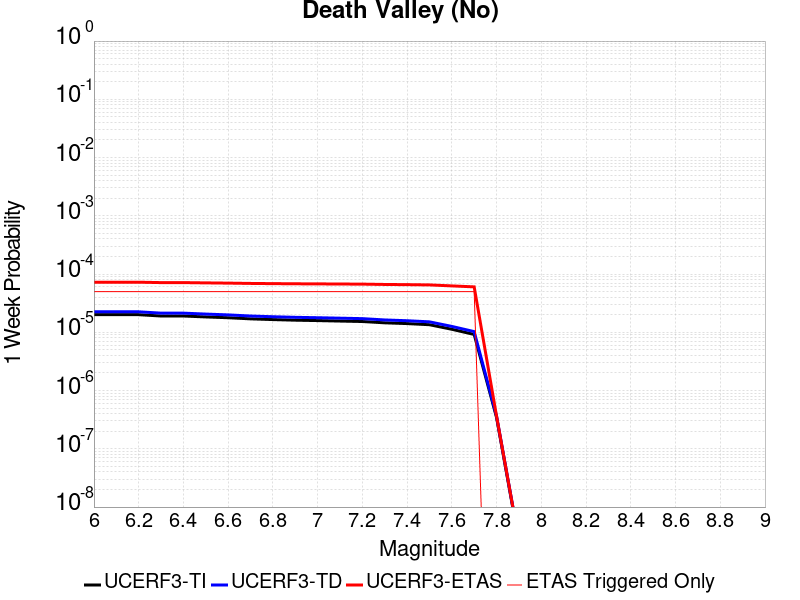 | 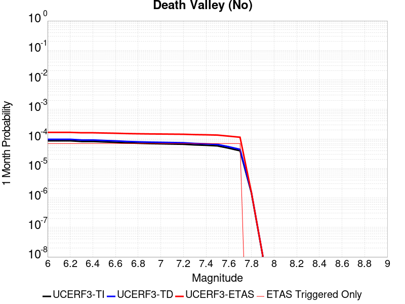 | 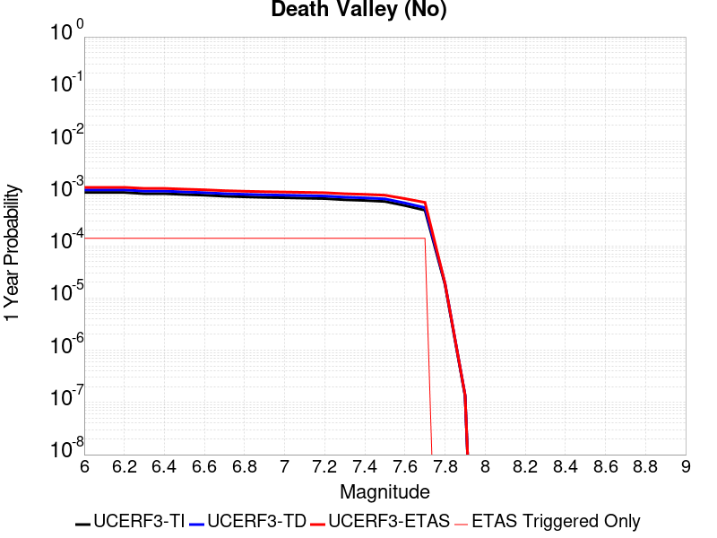 | 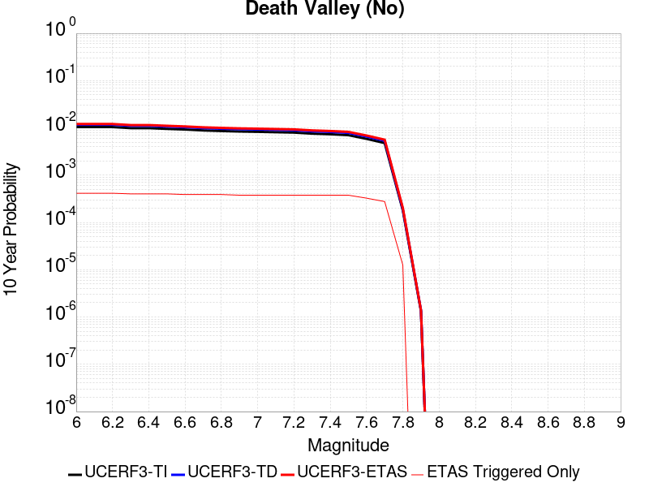 |

| Magnitude | 1 wk TI Prob | 1 wk TD Prob | 1 wk ETAS Prob | 1 wk ETAS/TD Gain | 1 wk ETAS Triggered Only | 1 mo TI Prob | 1 mo TD Prob | 1 mo ETAS Prob | 1 mo ETAS/TD Gain | 1 mo ETAS Triggered Only | 1 yr TI Prob | 1 yr TD Prob | 1 yr ETAS Prob | 1 yr ETAS/TD Gain | 1 yr ETAS Triggered Only | 10 yr TI Prob | 10 yr TD Prob | 10 yr ETAS Prob | 10 yr ETAS/TD Gain | 10 yr ETAS Triggered Only |
|-----|-----|-----|-----|-----|-----|-----|-----|-----|-----|-----|-----|-----|-----|-----|-----|-----|-----|-----|-----|-----|
| 6.0 | 2.0074807E-5 | 2.2500084E-5 | 7.249896E-5 | 3.222164 | 5.0E-5 | 8.603206E-5 | 9.642541E-5 | 2.064148E-4 | 2.1406682 | 1.1E-4 | 0.001046937 | 0.0011733545 | 0.0013930963 | 1.1872766 | 2.2E-4 | 0.010420183 | 0.011672506 | 0.012018421 | 1.029635 | 3.5E-4 |
| 6.1 | 2.0074807E-5 | 2.2500084E-5 | 7.249896E-5 | 3.222164 | 5.0E-5 | 8.603206E-5 | 9.642541E-5 | 2.064148E-4 | 2.1406682 | 1.1E-4 | 0.001046937 | 0.0011733545 | 0.0013930963 | 1.1872766 | 2.2E-4 | 0.010420183 | 0.011672506 | 0.012018421 | 1.029635 | 3.5E-4 |
| 6.2 | 2.0074807E-5 | 2.2500084E-5 | 7.249896E-5 | 3.222164 | 5.0E-5 | 8.603206E-5 | 9.642541E-5 | 2.064148E-4 | 2.1406682 | 1.1E-4 | 0.001046937 | 0.0011733545 | 0.0013930963 | 1.1872766 | 2.2E-4 | 0.010420183 | 0.011672506 | 0.012018421 | 1.029635 | 3.5E-4 |
| 6.3 | 1.9050609E-5 | 2.1336948E-5 | 7.133588E-5 | 3.343303 | 5.0E-5 | 8.164292E-5 | 9.1440896E-5 | 2.0143084E-4 | 2.202853 | 1.1E-4 | 9.935491E-4 | 0.001112731 | 0.0013324863 | 1.1974918 | 2.2E-4 | 0.009891188 | 0.011072419 | 0.011408654 | 1.0303669 | 3.4E-4 |
| 6.4 | 1.9050609E-5 | 2.1336948E-5 | 7.133588E-5 | 3.343303 | 5.0E-5 | 8.164292E-5 | 9.1440896E-5 | 2.0143084E-4 | 2.202853 | 1.1E-4 | 9.935491E-4 | 0.001112731 | 0.0013324863 | 1.1974918 | 2.2E-4 | 0.009891188 | 0.011072419 | 0.011408654 | 1.0303669 | 3.4E-4 |
| 6.5 | 1.8367004E-5 | 2.0561009E-5 | 7.055998E-5 | 3.4317374 | 5.0E-5 | 7.8713354E-5 | 8.811567E-5 | 1.9810598E-4 | 2.248249 | 1.1E-4 | 9.5791375E-4 | 0.0010722869 | 0.0012920509 | 1.204949 | 2.2E-4 | 0.009537951 | 0.0106719155 | 0.011008287 | 1.0315193 | 3.4E-4 |
| 6.6 | 1.779439E-5 | 1.9910927E-5 | 6.990993E-5 | 3.511134 | 5.0E-5 | 7.625944E-5 | 8.53298E-5 | 1.8532126E-4 | 2.1718235 | 1.0E-4 | 9.280632E-4 | 0.0010384015 | 0.0012481834 | 1.2020239 | 2.1E-4 | 0.009241969 | 0.010336253 | 0.010662842 | 1.0315964 | 3.3E-4 |
| 6.7 | 1.7025437E-5 | 1.9043426E-5 | 6.904247E-5 | 3.625528 | 5.0E-5 | 7.296412E-5 | 8.161216E-5 | 1.81604E-4 | 2.2252076 | 1.0E-4 | 8.87976E-4 | 9.931813E-4 | 0.0012029727 | 1.2112317 | 2.1E-4 | 0.008844362 | 0.009888145 | 0.010214882 | 1.0330433 | 3.3E-4 |
| 6.8 | 1.6545107E-5 | 1.8512545E-5 | 6.851162E-5 | 3.7008212 | 5.0E-5 | 7.090568E-5 | 7.93371E-5 | 1.7932917E-4 | 2.2603443 | 1.0E-4 | 8.629347E-4 | 9.655073E-4 | 0.0011753045 | 1.2172922 | 2.1E-4 | 0.008595915 | 0.009613829 | 0.009940656 | 1.0339955 | 3.3E-4 |
| 6.9 | 1.615478E-5 | 1.8087594E-5 | 6.808669E-5 | 3.7642756 | 5.0E-5 | 6.9232934E-5 | 7.751599E-5 | 1.6750902E-4 | 2.1609607 | 9.0E-5 | 8.4258494E-4 | 9.433546E-4 | 0.001143166 | 1.2118094 | 2.0E-4 | 0.008393973 | 0.009394196 | 0.009711189 | 1.0337436 | 3.2E-4 |
| 7.0 | 1.5894311E-5 | 1.780555E-5 | 6.7804656E-5 | 3.8080633 | 5.0E-5 | 6.81167E-5 | 7.6307304E-5 | 1.6630044E-4 | 2.1793516 | 9.0E-5 | 8.2900526E-4 | 9.286515E-4 | 0.0011284658 | 1.2151661 | 2.0E-4 | 0.008259195 | 0.009248397 | 0.009565438 | 1.0342805 | 3.2E-4 |
| 7.1 | 1.5602263E-5 | 1.7483504E-5 | 6.748263E-5 | 3.8597887 | 5.0E-5 | 6.6865134E-5 | 7.492718E-5 | 1.6492044E-4 | 2.2010763 | 9.0E-5 | 8.137789E-4 | 9.118627E-4 | 0.0011116803 | 1.2191312 | 2.0E-4 | 0.008108052 | 0.009081894 | 0.0093989875 | 1.034915 | 3.2E-4 |
| 7.2 | 1.5323829E-5 | 1.717063E-5 | 6.716977E-5 | 3.911899 | 5.0E-5 | 6.56719E-5 | 7.358637E-5 | 1.6357975E-4 | 2.2229626 | 9.0E-5 | 7.99262E-4 | 8.9555193E-4 | 0.0010953728 | 1.2231259 | 2.0E-4 | 0.007963934 | 0.008920107 | 0.009237252 | 1.035554 | 3.2E-4 |
| 7.3 | 1.4556212E-5 | 1.6302456E-5 | 6.630164E-5 | 4.0669727 | 5.0E-5 | 6.238227E-5 | 6.9865826E-5 | 1.5985954E-4 | 2.2880933 | 9.0E-5 | 7.592395E-4 | 8.5029035E-4 | 0.0010501203 | 1.2350137 | 2.0E-4 | 0.0075665074 | 0.008471014 | 0.0087883035 | 1.0374559 | 3.2E-4 |
| 7.4 | 1.411725E-5 | 1.580796E-5 | 6.580717E-5 | 4.1629133 | 5.0E-5 | 6.0501097E-5 | 6.7746674E-5 | 1.5774058E-4 | 2.3283885 | 9.0E-5 | 7.363519E-4 | 8.245094E-4 | 0.0010243446 | 1.2423685 | 2.0E-4 | 0.0073391674 | 0.008215138 | 0.008522592 | 1.0374252 | 3.1E-4 |
| 7.5 | 1.3503312E-5 | 1.5126289E-5 | 6.512553E-5 | 4.3054533 | 5.0E-5 | 5.7870053E-5 | 6.482538E-5 | 1.5481954E-4 | 2.3882551 | 9.0E-5 | 7.043401E-4 | 7.8896893E-4 | 9.888111E-4 | 1.2532954 | 2.0E-4 | 0.007021119 | 0.007862304 | 0.008169867 | 1.0391186 | 3.1E-4 |
| 7.6 | 1.1279839E-5 | 1.2626327E-5 | 6.2625695E-5 | 4.95993 | 5.0E-5 | 4.834127E-5 | 5.4111737E-5 | 1.4410686E-4 | 2.663135 | 9.0E-5 | 5.88396E-4 | 6.5861654E-4 | 8.285046E-4 | 1.2579468 | 1.7E-4 | 0.005868405 | 0.006567199 | 0.0068354253 | 1.0408434 | 2.7E-4 |
| 7.7 | 9.189108E-6 | 1.0283358E-5 | 6.0282844E-5 | 5.862175 | 5.0E-5 | 3.93813E-5 | 4.407082E-5 | 1.240673E-4 | 2.81518 | 8.0E-5 | 4.7936183E-4 | 5.3643517E-4 | 6.863547E-4 | 1.2794737 | 1.5E-4 | 0.004783291 | 0.005351914 | 0.005580683 | 1.0427452 | 2.3E-4 |
| 7.8 | 3.4586725E-7 | 3.6482615E-7 | 3.6482615E-7 | 1.0 | 0.0 | 1.4822873E-6 | 1.5635396E-6 | 1.5635396E-6 | 1.0 | 0.0 | 1.80467E-5 | 1.9035933E-5 | 1.9035933E-5 | 1.0 | 0.0 | 1.8045233E-4 | 1.9034347E-4 | 2.0034157E-4 | 1.0525266 | 1.0E-5 |
| 7.9 | 2.5591178E-9 | 2.6696718E-9 | 2.6696718E-9 | 1.0 | 0.0 | 1.0967647E-8 | 1.14414505E-8 | 1.14414505E-8 | 1.0 | 0.0 | 1.335311E-7 | 1.3929966E-7 | 1.3929966E-7 | 1.0 | 0.0 | 1.3353102E-6 | 1.3929966E-6 | 1.3929966E-6 | 1.0 | 0.0 |

## San Andreas (Cholame) rev
*[(top)](#table-of-contents)*

| 1 Week | 1 Month | 1 Year | 10 Year |
|-----|-----|-----|-----|
| 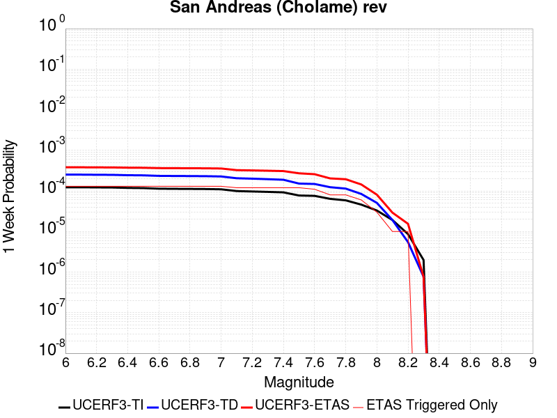 | 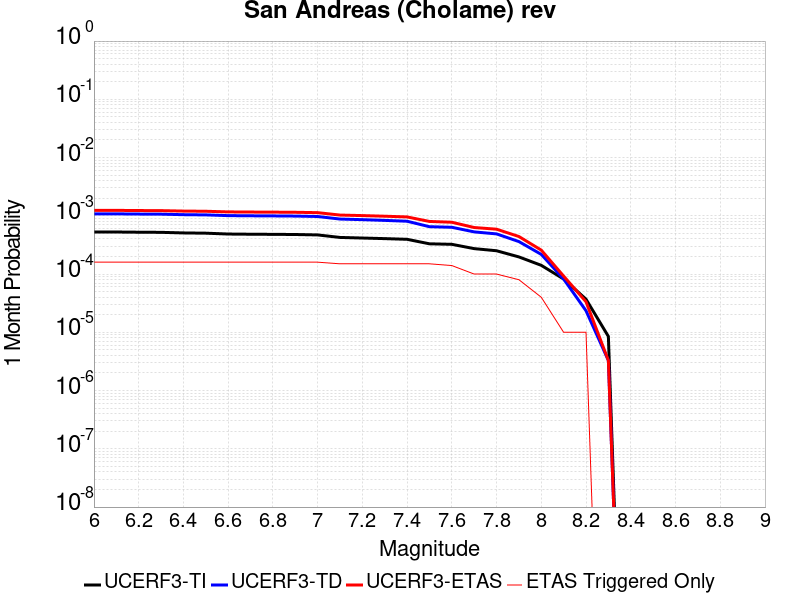 | 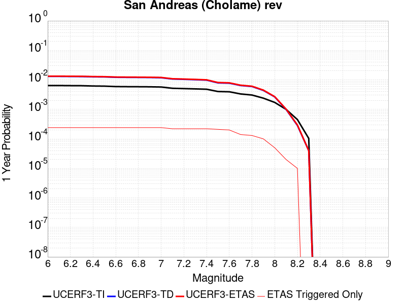 | 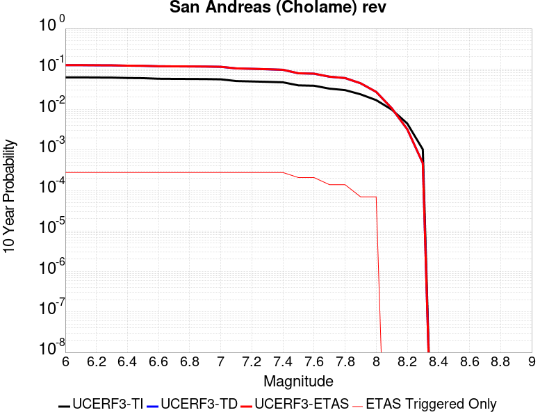 |

| Magnitude | 1 wk TI Prob | 1 wk TD Prob | 1 wk ETAS Prob | 1 wk ETAS/TD Gain | 1 wk ETAS Triggered Only | 1 mo TI Prob | 1 mo TD Prob | 1 mo ETAS Prob | 1 mo ETAS/TD Gain | 1 mo ETAS Triggered Only | 1 yr TI Prob | 1 yr TD Prob | 1 yr ETAS Prob | 1 yr ETAS/TD Gain | 1 yr ETAS Triggered Only | 10 yr TI Prob | 10 yr TD Prob | 10 yr ETAS Prob | 10 yr ETAS/TD Gain | 10 yr ETAS Triggered Only |
|-----|-----|-----|-----|-----|-----|-----|-----|-----|-----|-----|-----|-----|-----|-----|-----|-----|-----|-----|-----|-----|
| 6.0 | 1.2302514E-4 | 2.5205986E-4 | 3.820271E-4 | 1.5156205 | 1.3E-4 | 5.27144E-4 | 0.0010798109 | 0.0012396382 | 1.1480141 | 1.6E-4 | 0.0063991086 | 0.013067958 | 0.013304821 | 1.0181255 | 2.4E-4 | 0.06217949 | 0.12438412 | 0.124690585 | 1.0024638 | 3.5E-4 |
| 6.1 | 1.2302514E-4 | 2.5205986E-4 | 3.820271E-4 | 1.5156205 | 1.3E-4 | 5.27144E-4 | 0.0010798109 | 0.0012396382 | 1.1480141 | 1.6E-4 | 0.0063991086 | 0.013067958 | 0.013304821 | 1.0181255 | 2.4E-4 | 0.06217949 | 0.12438412 | 0.124690585 | 1.0024638 | 3.5E-4 |
| 6.2 | 1.2203569E-4 | 2.502277E-4 | 3.8019515E-4 | 1.5193968 | 1.3E-4 | 5.2290526E-4 | 0.0010719653 | 0.0012317938 | 1.1490985 | 1.6E-4 | 0.006347804 | 0.012973578 | 0.013210464 | 1.0182592 | 2.4E-4 | 0.061695136 | 0.123571314 | 0.12387806 | 1.0024824 | 3.5E-4 |
| 6.3 | 1.2142645E-4 | 2.4908737E-4 | 3.79055E-4 | 1.5217752 | 1.3E-4 | 5.202953E-4 | 0.0010670823 | 0.0012269116 | 1.1497816 | 1.6E-4 | 0.006316212 | 0.012914834 | 0.013151734 | 1.0183433 | 2.4E-4 | 0.06139677 | 0.12306532 | 0.12337225 | 1.002494 | 3.5E-4 |
| 6.4 | 1.1865206E-4 | 2.4414246E-4 | 3.741107E-4 | 1.532346 | 1.3E-4 | 5.0840975E-4 | 0.0010459068 | 0.0012057394 | 1.1528172 | 1.6E-4 | 0.006172335 | 0.012660044 | 0.012897005 | 1.0187173 | 2.4E-4 | 0.060036868 | 0.12085904 | 0.12116674 | 1.002546 | 3.5E-4 |
| 6.5 | 1.17443946E-4 | 2.4207575E-4 | 3.7204428E-4 | 1.5368919 | 1.3E-4 | 5.032341E-4 | 0.0010370566 | 0.0011968906 | 1.1541228 | 1.6E-4 | 0.006109677 | 0.012553536 | 0.0127905235 | 1.0188781 | 2.4E-4 | 0.059444077 | 0.11993008 | 0.1202381 | 1.0025684 | 3.5E-4 |
| 6.6 | 1.13579066E-4 | 2.3516564E-4 | 3.6513506E-4 | 1.5526719 | 1.3E-4 | 4.866766E-4 | 0.001007465 | 0.0011673038 | 1.1586545 | 1.6E-4 | 0.0059092017 | 0.012197345 | 0.012434417 | 1.0194364 | 2.4E-4 | 0.057545185 | 0.1168492 | 0.1171583 | 1.0026453 | 3.5E-4 |
| 6.7 | 1.1271412E-4 | 2.336088E-4 | 3.6357844E-4 | 1.5563558 | 1.3E-4 | 4.829711E-4 | 0.001000798 | 0.0011606378 | 1.1597124 | 1.6E-4 | 0.005864331 | 0.012117079 | 0.012354171 | 1.0195668 | 2.4E-4 | 0.057119697 | 0.11615275 | 0.1164621 | 1.0026633 | 3.5E-4 |
| 6.8 | 1.1217975E-4 | 2.3249313E-4 | 3.624629E-4 | 1.5590264 | 1.3E-4 | 4.8068175E-4 | 9.960202E-4 | 0.0011558607 | 1.1604793 | 1.6E-4 | 0.005836608 | 0.012059555 | 0.012296661 | 1.0196612 | 2.4E-4 | 0.056856725 | 0.11565061 | 0.115960136 | 1.0026764 | 3.5E-4 |
| 6.9 | 1.1146753E-4 | 2.3098059E-4 | 3.6095057E-4 | 1.5626879 | 1.3E-4 | 4.7763053E-4 | 9.895428E-4 | 0.0011493844 | 1.1615309 | 1.6E-4 | 0.0057996577 | 0.011981564 | 0.012218688 | 1.0197908 | 2.4E-4 | 0.056506127 | 0.11497027 | 0.115280025 | 1.0026942 | 3.5E-4 |
| 7.0 | 1.0965793E-4 | 2.2721413E-4 | 3.571846E-4 | 1.5720176 | 1.3E-4 | 4.698779E-4 | 9.734129E-4 | 0.0011332572 | 1.1642101 | 1.6E-4 | 0.005705768 | 0.011787324 | 0.012024495 | 1.0201209 | 2.4E-4 | 0.055614736 | 0.11327011 | 0.11358047 | 1.0027399 | 3.5E-4 |
| 7.1 | 9.927982E-5 | 2.0540332E-4 | 3.2537867E-4 | 1.5840964 | 1.2E-4 | 4.2541555E-4 | 8.8000396E-4 | 0.001029872 | 1.1703038 | 1.5E-4 | 0.0051671406 | 0.010661708 | 0.010879363 | 1.0204146 | 2.2E-4 | 0.05048634 | 0.10336573 | 0.10366162 | 1.0028626 | 3.3E-4 |
| 7.2 | 9.696786E-5 | 2.0044584E-4 | 3.204218E-4 | 1.5985454 | 1.2E-4 | 4.1551032E-4 | 8.587718E-4 | 0.001008643 | 1.1745181 | 1.5E-4 | 0.00504711 | 0.010405703 | 0.010623414 | 1.0209223 | 2.2E-4 | 0.04934009 | 0.10110233 | 0.10138998 | 1.0028452 | 3.2E-4 |
| 7.3 | 9.4727984E-5 | 1.9473763E-4 | 3.1471427E-4 | 1.6160938 | 1.2E-4 | 4.0591392E-4 | 8.343239E-4 | 9.841988E-4 | 1.1796362 | 1.5E-4 | 0.0049308087 | 0.010110851 | 0.010328626 | 1.0215389 | 2.2E-4 | 0.048228268 | 0.09847412 | 0.09876261 | 1.0029296 | 3.2E-4 |
| 7.4 | 9.220358E-5 | 1.8844259E-4 | 3.0841996E-4 | 1.6366787 | 1.2E-4 | 3.9509835E-4 | 8.07362E-4 | 9.5724093E-4 | 1.1856402 | 1.5E-4 | 0.004799717 | 0.009785578 | 0.010003425 | 1.0222621 | 2.2E-4 | 0.046973653 | 0.09555831 | 0.095847726 | 1.0030288 | 3.2E-4 |
| 7.5 | 7.71631E-5 | 1.5179155E-4 | 2.7177334E-4 | 1.7904378 | 1.2E-4 | 3.306571E-4 | 6.5037323E-4 | 8.0027565E-4 | 1.2304868 | 1.5E-4 | 0.0040183207 | 0.007889617 | 0.00809796 | 1.0264072 | 2.1E-4 | 0.03946433 | 0.078289196 | 0.07856571 | 1.0035319 | 3.0E-4 |
| 7.6 | 7.5634416E-5 | 1.4838556E-4 | 2.5836923E-4 | 1.741202 | 1.1E-4 | 3.241072E-4 | 6.357833E-4 | 7.7569427E-4 | 1.2200608 | 1.4E-4 | 0.0039388672 | 0.007713256 | 0.007911713 | 1.0257294 | 2.0E-4 | 0.038697794 | 0.076654874 | 0.07692265 | 1.0034932 | 2.9E-4 |
| 7.7 | 6.3783E-5 | 1.2359623E-4 | 2.0358634E-4 | 1.6471889 | 8.0E-5 | 2.7332708E-4 | 5.2959064E-4 | 6.295377E-4 | 1.1887251 | 1.0E-4 | 0.0033226798 | 0.0064287307 | 0.0065678307 | 1.0216372 | 1.4E-4 | 0.032734364 | 0.06454488 | 0.06475068 | 1.0031885 | 2.2E-4 |
| 7.8 | 5.863422E-5 | 1.14169685E-4 | 1.9416056E-4 | 1.7006314 | 8.0E-5 | 2.512653E-4 | 4.892069E-4 | 5.8915804E-4 | 1.2043124 | 1.0E-4 | 0.003054864 | 0.0059398497 | 0.006069077 | 1.021756 | 1.3E-4 | 0.030132094 | 0.05966162 | 0.05985909 | 1.0033098 | 2.1E-4 |
| 7.9 | 4.595283E-5 | 8.426815E-5 | 1.4426309E-4 | 1.7119528 | 6.0E-5 | 1.9692584E-4 | 3.6109926E-4 | 4.4107036E-4 | 1.2214657 | 8.0E-5 | 0.0023949358 | 0.0043875277 | 0.004487089 | 1.0226918 | 1.0E-4 | 0.023692891 | 0.044363137 | 0.044506483 | 1.0032312 | 1.5E-4 |
| 8.0 | 3.2950178E-5 | 5.077396E-5 | 8.0772435E-5 | 1.590824 | 3.0E-5 | 1.412074E-4 | 2.1758456E-4 | 2.5757586E-4 | 1.1837965 | 4.0E-5 | 0.0017178444 | 0.0026458753 | 0.002695743 | 1.0188473 | 5.0E-5 | 0.017046256 | 0.027181072 | 0.02724917 | 1.0025053 | 7.0E-5 |
| 8.1 | 1.9177472E-5 | 1.9183733E-5 | 2.9183542E-5 | 1.5212649 | 1.0E-5 | 8.218658E-5 | 8.221342E-5 | 9.221259E-5 | 1.1216247 | 1.0E-5 | 0.0010001622 | 0.0010004893 | 0.0010204694 | 1.0199702 | 2.0E-5 | 0.009956728 | 0.010757887 | 0.010787563 | 1.0027586 | 3.0E-5 |
| 8.2 | 8.643924E-6 | 5.473668E-6 | 1.5473614E-5 | 2.8269184 | 1.0E-5 | 3.704486E-5 | 2.3458366E-5 | 3.345813E-5 | 1.4262772 | 1.0E-5 | 4.5092785E-4 | 2.8556827E-4 | 2.955654E-4 | 1.035008 | 1.0E-5 | 0.0045001395 | 0.0032481793 | 0.003258147 | 1.0030687 | 1.0E-5 |
| 8.3 | 1.983087E-6 | 7.6564595E-7 | 7.6564595E-7 | 1.0 | 0.0 | 8.498917E-6 | 3.281336E-6 | 3.281336E-6 | 1.0 | 0.0 | 1.034694E-4 | 3.9949547E-5 | 3.9949547E-5 | 1.0 | 0.0 | 0.0010342124 | 4.717979E-4 | 4.717979E-4 | 1.0 | 0.0 |

## San Andreas (Coachella) rev
*[(top)](#table-of-contents)*

| 1 Week | 1 Month | 1 Year | 10 Year |
|-----|-----|-----|-----|
| 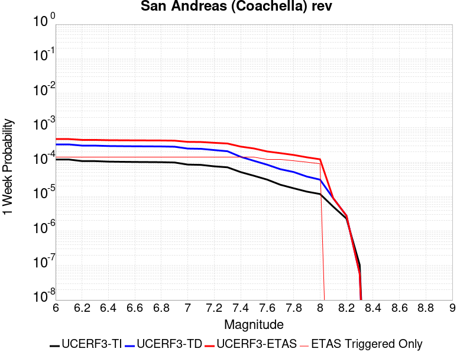 | 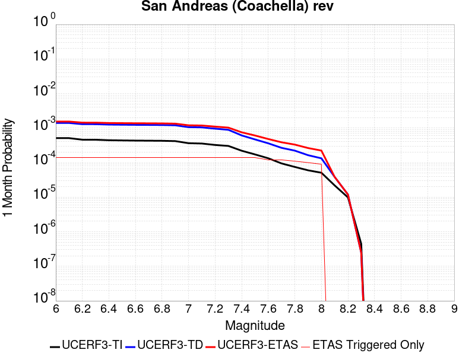 | 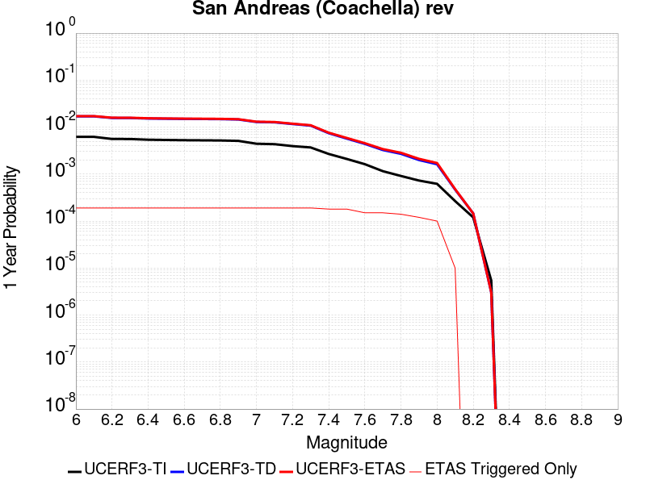 | 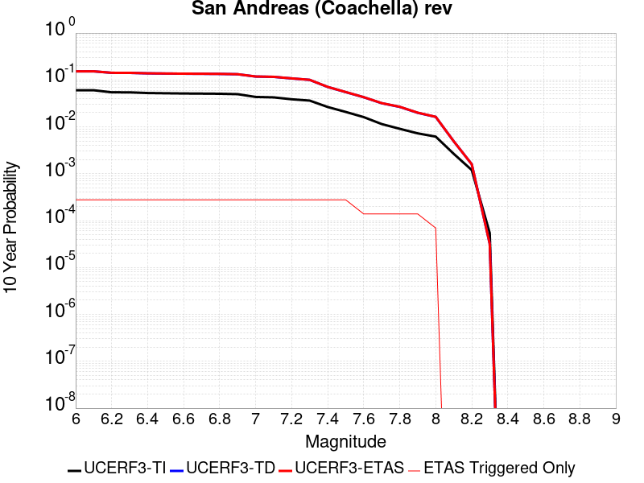 |

| Magnitude | 1 wk TI Prob | 1 wk TD Prob | 1 wk ETAS Prob | 1 wk ETAS/TD Gain | 1 wk ETAS Triggered Only | 1 mo TI Prob | 1 mo TD Prob | 1 mo ETAS Prob | 1 mo ETAS/TD Gain | 1 mo ETAS Triggered Only | 1 yr TI Prob | 1 yr TD Prob | 1 yr ETAS Prob | 1 yr ETAS/TD Gain | 1 yr ETAS Triggered Only | 10 yr TI Prob | 10 yr TD Prob | 10 yr ETAS Prob | 10 yr ETAS/TD Gain | 10 yr ETAS Triggered Only |
|-----|-----|-----|-----|-----|-----|-----|-----|-----|-----|-----|-----|-----|-----|-----|-----|-----|-----|-----|-----|-----|
| 6.0 | 1.1925945E-4 | 3.273077E-4 | 4.6726188E-4 | 1.427592 | 1.4E-4 | 5.110118E-4 | 0.001401998 | 0.0015418017 | 1.0997175 | 1.4E-4 | 0.0062038354 | 0.016937068 | 0.017123848 | 1.011028 | 1.9E-4 | 0.060334753 | 0.15267672 | 0.15295634 | 1.0018314 | 3.3E-4 |
| 6.1 | 1.1925945E-4 | 3.273077E-4 | 4.6726188E-4 | 1.427592 | 1.4E-4 | 5.110118E-4 | 0.001401998 | 0.0015418017 | 1.0997175 | 1.4E-4 | 0.0062038354 | 0.016937068 | 0.017123848 | 1.011028 | 1.9E-4 | 0.060334753 | 0.15267672 | 0.15295634 | 1.0018314 | 3.3E-4 |
| 6.2 | 1.07432395E-4 | 3.0231563E-4 | 4.422733E-4 | 1.4629521 | 1.4E-4 | 4.603433E-4 | 0.001294999 | 0.0014348178 | 1.1079682 | 1.4E-4 | 0.005590286 | 0.015653731 | 0.015840756 | 1.0119476 | 1.9E-4 | 0.05451731 | 0.14182784 | 0.14211103 | 1.0019968 | 3.3E-4 |
| 6.3 | 1.0718766E-4 | 3.0176868E-4 | 4.4172644E-4 | 1.4637915 | 1.4E-4 | 4.592948E-4 | 0.0012926573 | 0.0014324763 | 1.1081641 | 1.4E-4 | 0.005577586 | 0.01562563 | 0.015812661 | 1.0119696 | 1.9E-4 | 0.054396555 | 0.14159605 | 0.14187934 | 1.0020006 | 3.3E-4 |
| 6.4 | 1.0355944E-4 | 2.9384956E-4 | 4.338084E-4 | 1.4762943 | 1.4E-4 | 4.4375064E-4 | 0.0012587514 | 0.0013985751 | 1.1110814 | 1.4E-4 | 0.0053892885 | 0.015218662 | 0.01540577 | 1.0122947 | 1.9E-4 | 0.052604496 | 0.13815795 | 0.13843374 | 1.0019962 | 3.2E-4 |
| 6.5 | 1.0227914E-4 | 2.9104383E-4 | 4.310031E-4 | 1.4808872 | 1.4E-4 | 4.382655E-4 | 0.0012467385 | 0.0013865639 | 1.112153 | 1.4E-4 | 0.0053228354 | 0.015074439 | 0.015261575 | 1.0124141 | 1.9E-4 | 0.051971316 | 0.13694239 | 0.13721856 | 1.0020168 | 3.2E-4 |
| 6.6 | 1.0116757E-4 | 2.8870135E-4 | 4.2866092E-4 | 1.4847902 | 1.4E-4 | 4.3350324E-4 | 0.0012367087 | 0.0013765356 | 1.1130637 | 1.4E-4 | 0.0052651367 | 0.014954008 | 0.015141168 | 1.0125157 | 1.9E-4 | 0.051421247 | 0.13591973 | 0.13619624 | 1.0020343 | 3.2E-4 |
| 6.7 | 1.0050676E-4 | 2.8728697E-4 | 4.2724676E-4 | 1.4871776 | 1.4E-4 | 4.3067214E-4 | 0.0012306528 | 0.0013704805 | 1.1136208 | 1.4E-4 | 0.005230834 | 0.014881288 | 0.01506846 | 1.0125777 | 1.9E-4 | 0.051094085 | 0.13530464 | 0.13558136 | 1.002045 | 3.2E-4 |
| 6.8 | 9.976819E-5 | 2.8532353E-4 | 4.252836E-4 | 1.4905311 | 1.4E-4 | 4.2750788E-4 | 0.001222246 | 0.0013620749 | 1.1144032 | 1.4E-4 | 0.0051924936 | 0.014780328 | 0.01496752 | 1.0126649 | 1.9E-4 | 0.050728295 | 0.13445628 | 0.13473324 | 1.0020599 | 3.2E-4 |
| 6.9 | 9.77719E-5 | 2.802926E-4 | 4.2025335E-4 | 1.499338 | 1.4E-4 | 4.1895514E-4 | 0.0012007048 | 0.0013405367 | 1.1164582 | 1.4E-4 | 0.0050888555 | 0.0145215895 | 0.014708831 | 1.0128939 | 1.9E-4 | 0.049738888 | 0.13228476 | 0.13256243 | 1.002099 | 3.2E-4 |
| 7.0 | 8.500761E-5 | 2.4763815E-4 | 3.8760348E-4 | 1.565201 | 1.4E-4 | 3.6426744E-4 | 0.0010608779 | 0.0012007294 | 1.1318262 | 1.4E-4 | 0.0044259406 | 0.01284047 | 0.013028031 | 1.014607 | 1.9E-4 | 0.04338823 | 0.11813616 | 0.11841835 | 1.0023887 | 3.2E-4 |
| 7.1 | 8.319876E-5 | 2.4366553E-4 | 3.836314E-4 | 1.5744181 | 1.4E-4 | 3.5651738E-4 | 0.0010438662 | 0.00118372 | 1.1339768 | 1.4E-4 | 0.004331963 | 0.012635773 | 0.012823372 | 1.0148467 | 1.9E-4 | 0.042484846 | 0.11635632 | 0.116639085 | 1.0024302 | 3.2E-4 |
| 7.2 | 7.563917E-5 | 2.2414974E-4 | 3.6411837E-4 | 1.6244425 | 1.4E-4 | 3.2412758E-4 | 9.602912E-4 | 0.0011001567 | 1.1456491 | 1.4E-4 | 0.0039391145 | 0.011629559 | 0.01181735 | 1.0161477 | 1.9E-4 | 0.03870018 | 0.10776202 | 0.10804753 | 1.0026495 | 3.2E-4 |
| 7.3 | 7.082985E-5 | 2.07311E-4 | 3.4728198E-4 | 1.6751739 | 1.4E-4 | 3.0352117E-4 | 8.881761E-4 | 0.0010280517 | 1.1574864 | 1.4E-4 | 0.0036891096 | 0.010760553 | 0.010948509 | 1.0174671 | 1.9E-4 | 0.03628465 | 0.10028403 | 0.100571945 | 1.0028709 | 3.2E-4 |
| 7.4 | 5.146215E-5 | 1.4274761E-4 | 2.8272762E-4 | 1.9806119 | 1.4E-4 | 2.2053342E-4 | 6.1163295E-4 | 7.515473E-4 | 1.2287555 | 1.4E-4 | 0.0026816884 | 0.0074213943 | 0.0076000583 | 1.0240742 | 1.8E-4 | 0.02649557 | 0.07085049 | 0.07112923 | 1.0039343 | 3.0E-4 |
| 7.5 | 4.0285166E-5 | 1.0942422E-4 | 2.4940888E-4 | 2.2792842 | 1.4E-4 | 1.7263928E-4 | 4.6887697E-4 | 6.0881133E-4 | 1.2984458 | 1.4E-4 | 0.002099857 | 0.0056937044 | 0.0058726794 | 1.0314338 | 1.8E-4 | 0.020801254 | 0.055013083 | 0.055296578 | 1.0051533 | 3.0E-4 |
| 7.6 | 3.1168736E-5 | 8.439599E-5 | 2.0438587E-4 | 2.4217484 | 1.2E-4 | 1.3357346E-4 | 3.616471E-4 | 4.8160373E-4 | 1.3316952 | 1.2E-4 | 0.0016250437 | 0.004394191 | 0.0045435317 | 1.033986 | 1.5E-4 | 0.016132116 | 0.042812478 | 0.043061346 | 1.005813 | 2.6E-4 |
| 7.7 | 2.2100989E-5 | 6.239345E-5 | 1.8238596E-4 | 2.923159 | 1.2E-4 | 9.4715084E-5 | 2.6737314E-4 | 3.8734105E-4 | 1.448691 | 1.2E-4 | 0.001152546 | 0.0032504152 | 0.0033999276 | 1.045998 | 1.5E-4 | 0.011465867 | 0.031902168 | 0.032144193 | 1.0075865 | 2.5E-4 |
| 7.8 | 1.7484861E-5 | 5.180078E-5 | 1.6179508E-4 | 3.12341 | 1.1E-4 | 7.493296E-5 | 2.2198448E-4 | 3.3196007E-4 | 1.4954201 | 1.1E-4 | 9.1192697E-4 | 0.0026993142 | 0.0028389364 | 1.051725 | 1.4E-4 | 0.009081938 | 0.026641788 | 0.026875393 | 1.0087684 | 2.4E-4 |
| 7.9 | 1.3967285E-5 | 3.8226146E-5 | 1.3822233E-4 | 3.6159105 | 1.0E-4 | 5.985842E-5 | 1.6381606E-4 | 2.6379968E-4 | 1.6103407 | 1.0E-4 | 7.2853256E-4 | 0.0019926373 | 0.0021123982 | 1.0601017 | 1.2E-4 | 0.0072614877 | 0.019911002 | 0.020116821 | 1.0103369 | 2.1E-4 |
| 8.0 | 1.1887396E-5 | 3.106798E-5 | 1.2106518E-4 | 3.896783 | 9.0E-5 | 5.094499E-5 | 1.331417E-4 | 2.2312971E-4 | 1.6758815 | 9.0E-5 | 6.200787E-4 | 0.0016197958 | 0.0017196338 | 1.0616362 | 1.0E-4 | 0.006183513 | 0.016280567 | 0.016437963 | 1.0096676 | 1.6E-4 |
| 8.1 | 5.100864E-6 | 8.973766E-6 | 8.973766E-6 | 1.0 | 0.0 | 2.1860664E-5 | 3.845843E-5 | 3.845843E-5 | 1.0 | 0.0 | 2.6612106E-4 | 4.6813092E-4 | 4.7812623E-4 | 1.0213516 | 1.0E-5 | 0.002658026 | 0.004918092 | 0.0049379934 | 1.0040466 | 2.0E-5 |
| 8.2 | 2.3004484E-6 | 2.7863473E-6 | 2.7863473E-6 | 1.0 | 0.0 | 9.859027E-6 | 1.19414335E-5 | 1.19414335E-5 | 1.0 | 0.0 | 1.2002704E-4 | 1.4537729E-4 | 1.4537729E-4 | 1.0 | 0.0 | 0.0011996223 | 0.0015973782 | 0.0015973782 | 1.0 | 0.0 |
| 8.3 | 1.0424446E-7 | 5.814421E-8 | 5.814421E-8 | 1.0 | 0.0 | 4.4676187E-7 | 2.4918944E-7 | 2.4918944E-7 | 1.0 | 0.0 | 5.439312E-6 | 3.0338776E-6 | 3.0338776E-6 | 1.0 | 0.0 | 5.4391792E-5 | 3.189592E-5 | 3.189592E-5 | 1.0 | 0.0 |

## White Wolf (Extension)
*[(top)](#table-of-contents)*

| 1 Week | 1 Month | 1 Year | 10 Year |
|-----|-----|-----|-----|
| 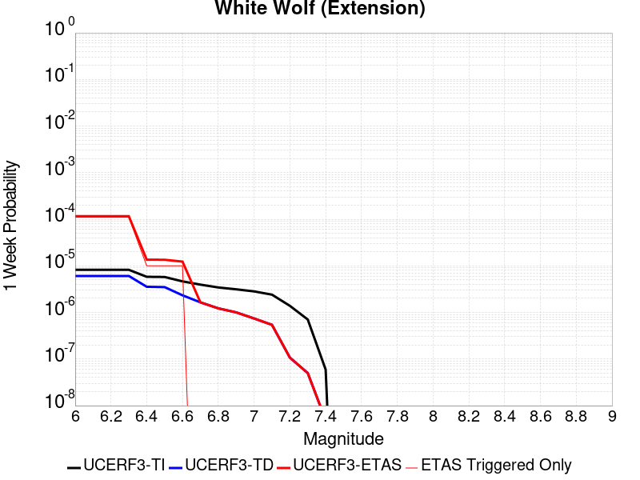 | 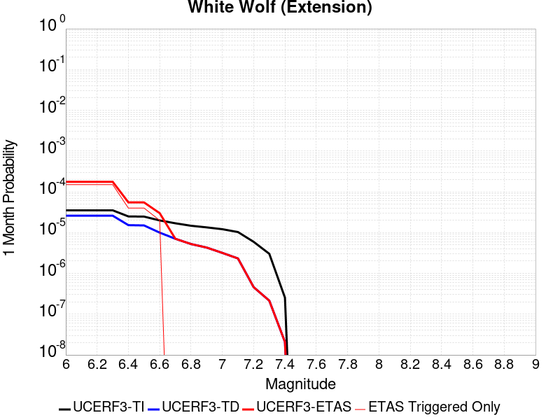 | 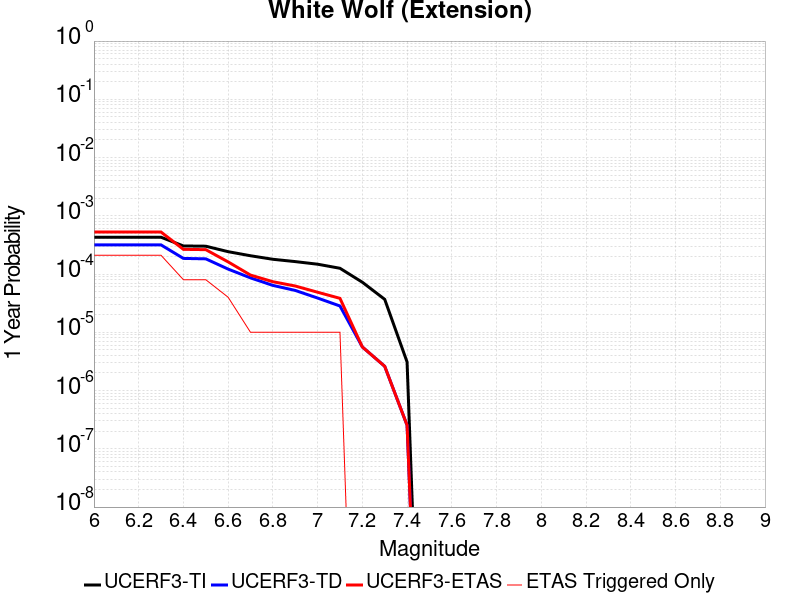 | 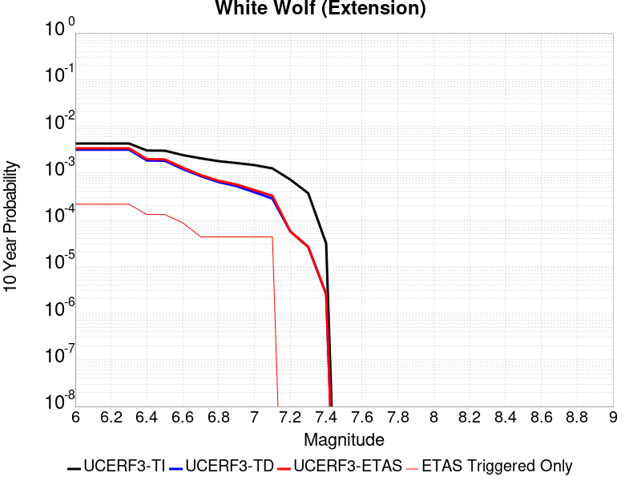 |

| Magnitude | 1 wk TI Prob | 1 wk TD Prob | 1 wk ETAS Prob | 1 wk ETAS/TD Gain | 1 wk ETAS Triggered Only | 1 mo TI Prob | 1 mo TD Prob | 1 mo ETAS Prob | 1 mo ETAS/TD Gain | 1 mo ETAS Triggered Only | 1 yr TI Prob | 1 yr TD Prob | 1 yr ETAS Prob | 1 yr ETAS/TD Gain | 1 yr ETAS Triggered Only | 10 yr TI Prob | 10 yr TD Prob | 10 yr ETAS Prob | 10 yr ETAS/TD Gain | 10 yr ETAS Triggered Only |
|-----|-----|-----|-----|-----|-----|-----|-----|-----|-----|-----|-----|-----|-----|-----|-----|-----|-----|-----|-----|-----|
| 6.0 | 8.222555E-6 | 6.066615E-6 | 1.16065945E-4 | 19.131912 | 1.1E-4 | 3.5239045E-5 | 2.5999556E-5 | 1.7599565E-4 | 6.7691793 | 1.5E-4 | 4.289509E-4 | 3.1650523E-4 | 5.2643876E-4 | 1.6632861 | 2.1E-4 | 0.0042812387 | 0.0031611966 | 0.0034702166 | 1.0977541 | 3.1E-4 |
| 6.1 | 8.222555E-6 | 6.066615E-6 | 1.16065945E-4 | 19.131912 | 1.1E-4 | 3.5239045E-5 | 2.5999556E-5 | 1.7599565E-4 | 6.7691793 | 1.5E-4 | 4.289509E-4 | 3.1650523E-4 | 5.2643876E-4 | 1.6632861 | 2.1E-4 | 0.0042812387 | 0.0031611966 | 0.0034702166 | 1.0977541 | 3.1E-4 |
| 6.2 | 8.222555E-6 | 6.066615E-6 | 1.16065945E-4 | 19.131912 | 1.1E-4 | 3.5239045E-5 | 2.5999556E-5 | 1.7599565E-4 | 6.7691793 | 1.5E-4 | 4.289509E-4 | 3.1650523E-4 | 5.2643876E-4 | 1.6632861 | 2.1E-4 | 0.0042812387 | 0.0031611966 | 0.0034702166 | 1.0977541 | 3.1E-4 |
| 6.3 | 8.222555E-6 | 6.066615E-6 | 1.16065945E-4 | 19.131912 | 1.1E-4 | 3.5239045E-5 | 2.5999556E-5 | 1.7599565E-4 | 6.7691793 | 1.5E-4 | 4.289509E-4 | 3.1650523E-4 | 5.2643876E-4 | 1.6632861 | 2.1E-4 | 0.0042812387 | 0.0031611966 | 0.0034702166 | 1.0977541 | 3.1E-4 |
| 6.4 | 5.821773E-6 | 3.5571256E-6 | 1.355709E-5 | 3.8112485 | 1.0E-5 | 2.4950215E-5 | 1.5244741E-5 | 5.524413E-5 | 3.6238155 | 4.0E-5 | 3.0372653E-4 | 1.8559002E-4 | 2.6557516E-4 | 1.4309777 | 8.0E-5 | 0.0030331176 | 0.0018544586 | 0.0020141618 | 1.0861186 | 1.6E-4 |
| 6.5 | 5.766023E-6 | 3.4990599E-6 | 1.3499025E-5 | 3.8579006 | 1.0E-5 | 2.4711293E-5 | 1.49958905E-5 | 5.499529E-5 | 3.6673574 | 4.0E-5 | 3.0081844E-4 | 1.8256076E-4 | 2.6254615E-4 | 1.4381303 | 8.0E-5 | 0.0030041158 | 0.0018242161 | 0.0019839243 | 1.0875489 | 1.6E-4 |
| 6.6 | 4.643576E-6 | 2.3325733E-6 | 1.233255E-5 | 5.287101 | 1.0E-5 | 1.9900888E-5 | 9.9967065E-6 | 2.9996507E-5 | 3.000639 | 2.0E-5 | 2.4226638E-4 | 1.2170354E-4 | 1.6169867E-4 | 1.3286275 | 4.0E-5 | 0.0024200242 | 0.0012164112 | 0.001296314 | 1.0656872 | 8.0E-5 |
| 6.7 | 3.9529173E-6 | 1.6482975E-6 | 1.6482975E-6 | 1.0 | 0.0 | 1.6940963E-5 | 7.064114E-6 | 7.064114E-6 | 1.0 | 0.0 | 2.0623671E-4 | 8.600239E-5 | 9.6001524E-5 | 1.1162659 | 1.0E-5 | 0.002060454 | 8.597095E-4 | 8.796923E-4 | 1.0232437 | 2.0E-5 |
| 6.8 | 3.4377522E-6 | 1.2244764E-6 | 1.2244764E-6 | 1.0 | 0.0 | 1.473314E-5 | 5.247746E-6 | 5.247746E-6 | 1.0 | 0.0 | 1.7936122E-4 | 6.388952E-5 | 7.3888885E-5 | 1.1565102 | 1.0E-5 | 0.0017921652 | 6.3872064E-4 | 6.5870787E-4 | 1.0312926 | 2.0E-5 |
| 6.9 | 3.1367306E-6 | 1.0033316E-6 | 1.0033316E-6 | 1.0 | 0.0 | 1.3443062E-5 | 4.299986E-6 | 4.299986E-6 | 1.0 | 0.0 | 1.63657E-4 | 5.2351144E-5 | 6.235062E-5 | 1.1910077 | 1.0E-5 | 0.0016353652 | 5.233958E-4 | 5.433853E-4 | 1.038192 | 2.0E-5 |
| 7.0 | 2.8298145E-6 | 7.4282326E-7 | 7.4282326E-7 | 1.0 | 0.0 | 1.2127721E-5 | 3.1835248E-6 | 3.1835248E-6 | 1.0 | 0.0 | 1.47645E-4 | 3.8758775E-5 | 4.8758386E-5 | 1.2579961 | 1.0E-5 | 0.0014754693 | 3.8752513E-4 | 4.075174E-4 | 1.0515896 | 2.0E-5 |
| 7.1 | 2.4091064E-6 | 5.4223835E-7 | 5.4223835E-7 | 1.0 | 0.0 | 1.03247E-5 | 2.3238767E-6 | 2.3238767E-6 | 1.0 | 0.0 | 1.2569598E-4 | 2.8292874E-5 | 3.829259E-5 | 1.3534359 | 1.0E-5 | 0.001256249 | 2.8289677E-4 | 3.028911E-4 | 1.0706772 | 2.0E-5 |
| 7.2 | 1.3875518E-6 | 1.0740268E-7 | 1.0740268E-7 | 1.0 | 0.0 | 5.9466374E-6 | 4.6029712E-7 | 4.6029712E-7 | 1.0 | 0.0 | 7.23979E-5 | 5.604104E-6 | 5.604104E-6 | 1.0 | 0.0 | 7.2374323E-4 | 5.6039742E-5 | 5.6039742E-5 | 1.0 | 0.0 |
| 7.3 | 7.056077E-7 | 5.0002956E-8 | 5.0002956E-8 | 1.0 | 0.0 | 3.0240296E-6 | 2.1429837E-7 | 2.1429837E-7 | 1.0 | 0.0 | 3.681694E-5 | 2.60908E-6 | 2.60908E-6 | 1.0 | 0.0 | 3.681084E-4 | 2.609054E-5 | 2.609054E-5 | 1.0 | 0.0 |
| 7.4 | 5.9334678E-8 | 4.8638475E-9 | 4.8638475E-9 | 1.0 | 0.0 | 2.5429145E-7 | 2.084506E-8 | 2.084506E-8 | 1.0 | 0.0 | 3.095994E-6 | 2.5378858E-7 | 2.5378858E-7 | 1.0 | 0.0 | 3.095951E-5 | 2.5378843E-6 | 2.5378843E-6 | 1.0 | 0.0 |

## Scodie Lineament
*[(top)](#table-of-contents)*

| 1 Week | 1 Month | 1 Year | 10 Year |
|-----|-----|-----|-----|
| 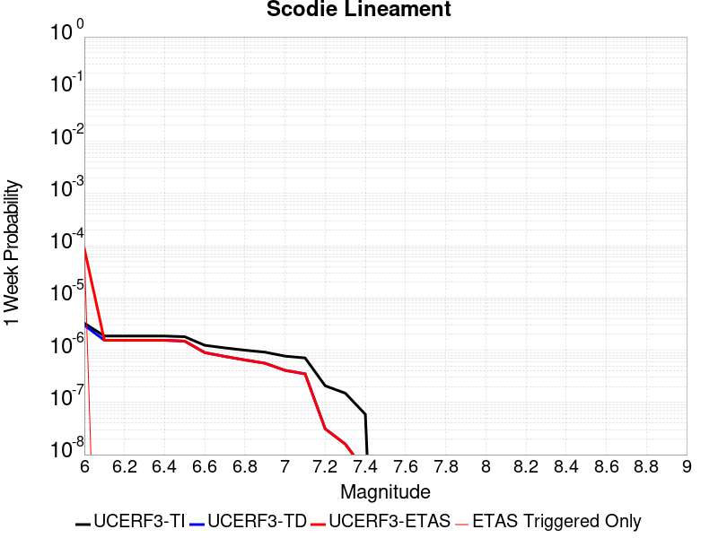 | 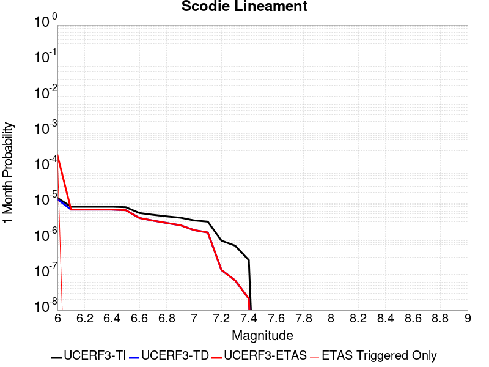 | 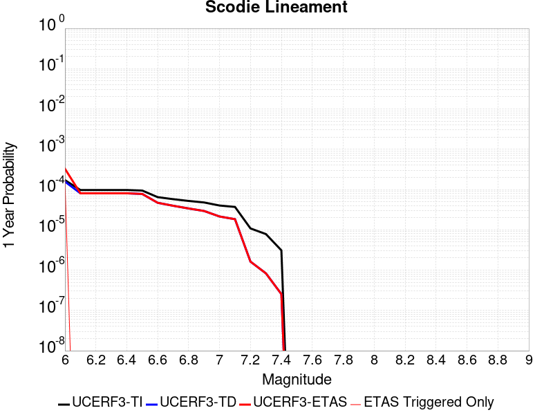 | 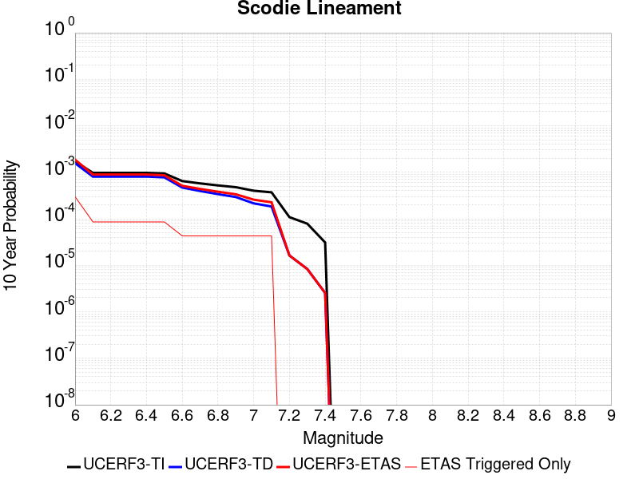 |

| Magnitude | 1 wk TI Prob | 1 wk TD Prob | 1 wk ETAS Prob | 1 wk ETAS/TD Gain | 1 wk ETAS Triggered Only | 1 mo TI Prob | 1 mo TD Prob | 1 mo ETAS Prob | 1 mo ETAS/TD Gain | 1 mo ETAS Triggered Only | 1 yr TI Prob | 1 yr TD Prob | 1 yr ETAS Prob | 1 yr ETAS/TD Gain | 1 yr ETAS Triggered Only | 10 yr TI Prob | 10 yr TD Prob | 10 yr ETAS Prob | 10 yr ETAS/TD Gain | 10 yr ETAS Triggered Only |
|-----|-----|-----|-----|-----|-----|-----|-----|-----|-----|-----|-----|-----|-----|-----|-----|-----|-----|-----|-----|-----|
| 6.0 | 3.2919327E-6 | 3.0133303E-6 | 7.301312E-5 | 24.230042 | 7.0E-5 | 1.4108206E-5 | 1.2914227E-5 | 1.3291268E-4 | 10.291958 | 1.2E-4 | 1.7175387E-4 | 1.5722254E-4 | 3.7718797E-4 | 2.3990703 | 2.2E-4 | 0.0017162118 | 0.0015714248 | 0.0018709534 | 1.1906096 | 3.0E-4 |
| 6.1 | 1.8663811E-6 | 1.5490382E-6 | 1.5490382E-6 | 1.0 | 0.0 | 7.998751E-6 | 6.6387206E-6 | 2.6638589E-5 | 4.0126085 | 2.0E-5 | 9.738045E-5 | 8.082393E-5 | 1.3081988E-4 | 1.6185787 | 5.0E-5 | 9.7337784E-4 | 8.079941E-4 | 8.8792946E-4 | 1.0989306 | 8.0E-5 |
| 6.2 | 1.8663811E-6 | 1.5490382E-6 | 1.5490382E-6 | 1.0 | 0.0 | 7.998751E-6 | 6.6387206E-6 | 2.6638589E-5 | 4.0126085 | 2.0E-5 | 9.738045E-5 | 8.082393E-5 | 1.3081988E-4 | 1.6185787 | 5.0E-5 | 9.7337784E-4 | 8.079941E-4 | 8.8792946E-4 | 1.0989306 | 8.0E-5 |
| 6.3 | 1.8663811E-6 | 1.5490382E-6 | 1.5490382E-6 | 1.0 | 0.0 | 7.998751E-6 | 6.6387206E-6 | 2.6638589E-5 | 4.0126085 | 2.0E-5 | 9.738045E-5 | 8.082393E-5 | 1.3081988E-4 | 1.6185787 | 5.0E-5 | 9.7337784E-4 | 8.079941E-4 | 8.8792946E-4 | 1.0989306 | 8.0E-5 |
| 6.4 | 1.8663811E-6 | 1.5490382E-6 | 1.5490382E-6 | 1.0 | 0.0 | 7.998751E-6 | 6.6387206E-6 | 2.6638589E-5 | 4.0126085 | 2.0E-5 | 9.738045E-5 | 8.082393E-5 | 1.3081988E-4 | 1.6185787 | 5.0E-5 | 9.7337784E-4 | 8.079941E-4 | 8.8792946E-4 | 1.0989306 | 8.0E-5 |
| 6.5 | 1.8106311E-6 | 1.4909722E-6 | 1.4909722E-6 | 1.0 | 0.0 | 7.759824E-6 | 6.389868E-6 | 2.638974E-5 | 4.1299353 | 2.0E-5 | 9.447177E-5 | 7.779436E-5 | 1.2779047E-4 | 1.6426702 | 5.0E-5 | 9.4431615E-4 | 7.7771995E-4 | 8.576577E-4 | 1.1027848 | 8.0E-5 |
| 6.6 | 1.2414679E-6 | 8.9974395E-7 | 8.9974395E-7 | 1.0 | 0.0 | 5.320566E-6 | 3.85604E-6 | 3.85604E-6 | 1.0 | 0.0 | 6.477596E-5 | 4.6946367E-5 | 5.6945897E-5 | 1.212999 | 1.0E-5 | 6.475708E-4 | 4.6937316E-4 | 4.893638E-4 | 1.04259 | 2.0E-5 |
| 6.7 | 1.1062215E-6 | 7.594193E-7 | 7.594193E-7 | 1.0 | 0.0 | 4.7409408E-6 | 3.2546504E-6 | 3.2546504E-6 | 1.0 | 0.0 | 5.7719422E-5 | 3.962472E-5 | 3.962472E-5 | 1.0 | 0.0 | 5.770443E-4 | 3.9618355E-4 | 4.0617958E-4 | 1.0252309 | 1.0E-5 |
| 6.8 | 1.0006736E-6 | 6.5002786E-7 | 6.5002786E-7 | 1.0 | 0.0 | 4.288594E-6 | 2.7858312E-6 | 2.7858312E-6 | 1.0 | 0.0 | 5.221238E-5 | 3.391703E-5 | 3.391703E-5 | 1.0 | 0.0 | 5.220012E-4 | 3.3912458E-4 | 3.491212E-4 | 1.0294777 | 1.0E-5 |
| 6.9 | 9.167364E-7 | 5.6315065E-7 | 5.6315065E-7 | 1.0 | 0.0 | 3.9288643E-6 | 2.413501E-6 | 2.413501E-6 | 1.0 | 0.0 | 4.7832873E-5 | 2.9384037E-5 | 2.9384037E-5 | 1.0 | 0.0 | 4.782258E-4 | 2.9380718E-4 | 3.0380423E-4 | 1.0340259 | 1.0E-5 |
| 7.0 | 7.6987664E-7 | 4.113265E-7 | 4.113265E-7 | 1.0 | 0.0 | 3.2994672E-6 | 1.7628269E-6 | 1.7628269E-6 | 1.0 | 0.0 | 4.0170275E-5 | 2.1462245E-5 | 2.1462245E-5 | 1.0 | 0.0 | 4.0163012E-4 | 2.1460558E-4 | 2.2460344E-4 | 1.0465871 | 1.0E-5 |
| 7.1 | 7.1038727E-7 | 3.5210306E-7 | 3.5210306E-7 | 1.0 | 0.0 | 3.0445133E-6 | 1.5090123E-6 | 1.5090123E-6 | 1.0 | 0.0 | 3.706632E-5 | 1.8372106E-5 | 1.8372106E-5 | 1.0 | 0.0 | 3.7060137E-4 | 1.8370937E-4 | 1.9370753E-4 | 1.0544238 | 1.0E-5 |
| 7.2 | 2.0799602E-7 | 3.1178534E-8 | 3.1178534E-8 | 1.0 | 0.0 | 8.914113E-7 | 1.3362228E-7 | 1.3362228E-7 | 1.0 | 0.0 | 1.0852878E-5 | 1.6268501E-6 | 1.6268501E-6 | 1.0 | 0.0 | 1.08523476E-4 | 1.626839E-5 | 1.626839E-5 | 1.0 | 0.0 |
| 7.3 | 1.5048182E-7 | 1.5939106E-8 | 1.5939106E-8 | 1.0 | 0.0 | 6.449219E-7 | 6.8310456E-8 | 6.8310456E-8 | 1.0 | 0.0 | 7.851896E-6 | 8.316795E-7 | 8.316795E-7 | 1.0 | 0.0 | 7.851618E-5 | 8.316767E-6 | 8.316767E-6 | 1.0 | 0.0 |
| 7.4 | 5.9334678E-8 | 4.8638475E-9 | 4.8638475E-9 | 1.0 | 0.0 | 2.5429145E-7 | 2.084506E-8 | 2.084506E-8 | 1.0 | 0.0 | 3.095994E-6 | 2.5378858E-7 | 2.5378858E-7 | 1.0 | 0.0 | 3.095951E-5 | 2.5378843E-6 | 2.5378843E-6 | 1.0 | 0.0 |

## Death Valley (Fish Lake Valley)
*[(top)](#table-of-contents)*

| 1 Week | 1 Month | 1 Year | 10 Year |
|-----|-----|-----|-----|
| 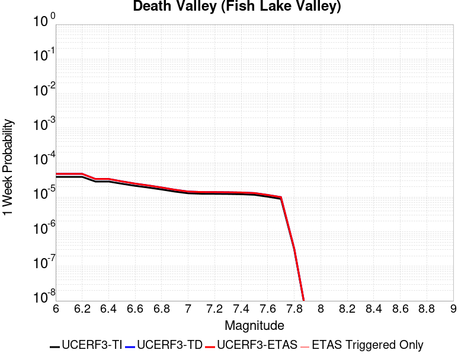 | 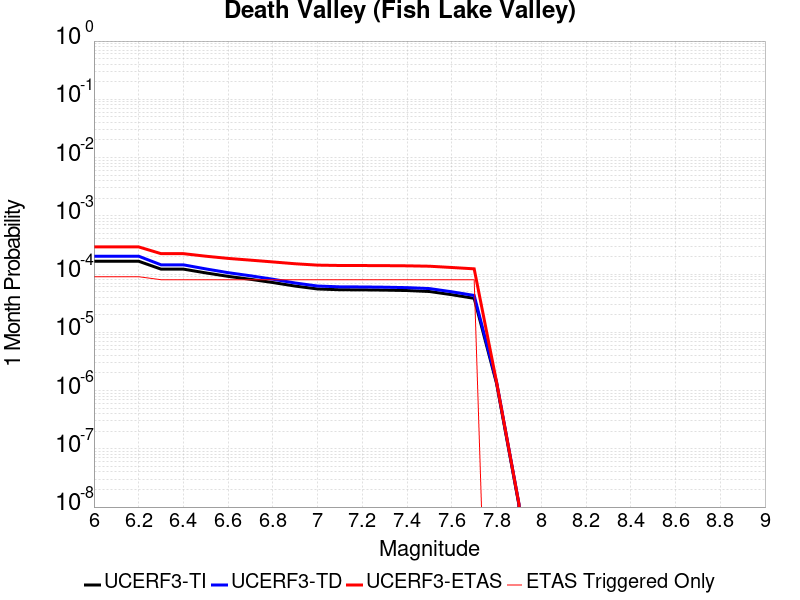 | 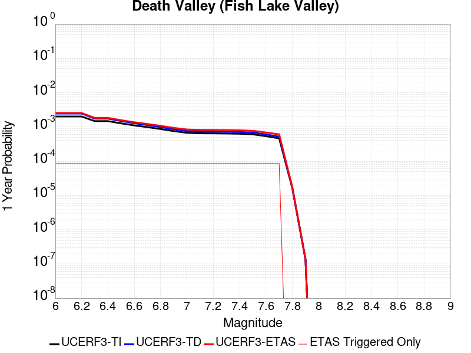 | 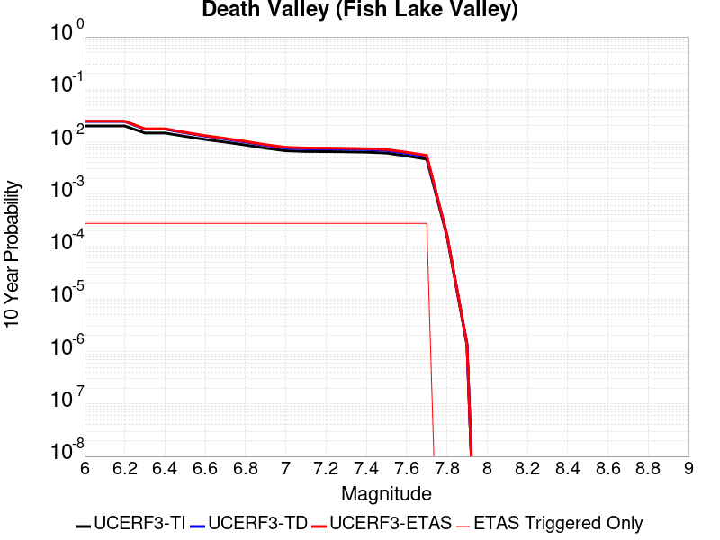 |

| Magnitude | 1 wk TI Prob | 1 wk TD Prob | 1 wk ETAS Prob | 1 wk ETAS/TD Gain | 1 wk ETAS Triggered Only | 1 mo TI Prob | 1 mo TD Prob | 1 mo ETAS Prob | 1 mo ETAS/TD Gain | 1 mo ETAS Triggered Only | 1 yr TI Prob | 1 yr TD Prob | 1 yr ETAS Prob | 1 yr ETAS/TD Gain | 1 yr ETAS Triggered Only | 10 yr TI Prob | 10 yr TD Prob | 10 yr ETAS Prob | 10 yr ETAS/TD Gain | 10 yr ETAS Triggered Only |
|-----|-----|-----|-----|-----|-----|-----|-----|-----|-----|-----|-----|-----|-----|-----|-----|-----|-----|-----|-----|-----|
| 6.0 | 3.872328E-5 | 4.7265705E-5 | 9.726334E-5 | 2.0577996 | 5.0E-5 | 1.6594635E-4 | 2.0255324E-4 | 2.9253503E-4 | 1.4442376 | 9.0E-5 | 0.0020185246 | 0.0024635606 | 0.0026431172 | 1.0728849 | 1.8E-4 | 0.02000288 | 0.024388338 | 0.024671264 | 1.011601 | 2.9E-4 |
| 6.1 | 3.872328E-5 | 4.7265705E-5 | 9.726334E-5 | 2.0577996 | 5.0E-5 | 1.6594635E-4 | 2.0255324E-4 | 2.9253503E-4 | 1.4442376 | 9.0E-5 | 0.0020185246 | 0.0024635606 | 0.0026431172 | 1.0728849 | 1.8E-4 | 0.02000288 | 0.024388338 | 0.024671264 | 1.011601 | 2.9E-4 |
| 6.2 | 3.872328E-5 | 4.7265705E-5 | 9.726334E-5 | 2.0577996 | 5.0E-5 | 1.6594635E-4 | 2.0255324E-4 | 2.9253503E-4 | 1.4442376 | 9.0E-5 | 0.0020185246 | 0.0024635606 | 0.0026431172 | 1.0728849 | 1.8E-4 | 0.02000288 | 0.024388338 | 0.024671264 | 1.011601 | 2.9E-4 |
| 6.3 | 2.8356371E-5 | 3.360979E-5 | 8.360811E-5 | 2.4876118 | 5.0E-5 | 1.2152165E-4 | 1.4403443E-4 | 2.2402291E-4 | 1.5553428 | 8.0E-5 | 0.0014785219 | 0.0017522788 | 0.0019119984 | 1.0911497 | 1.6E-4 | 0.014687235 | 0.017391816 | 0.017637469 | 1.0141246 | 2.5E-4 |
| 6.4 | 2.8356371E-5 | 3.360979E-5 | 8.360811E-5 | 2.4876118 | 5.0E-5 | 1.2152165E-4 | 1.4403443E-4 | 2.2402291E-4 | 1.5553428 | 8.0E-5 | 0.0014785219 | 0.0017522788 | 0.0019119984 | 1.0911497 | 1.6E-4 | 0.014687235 | 0.017391816 | 0.017637469 | 1.0141246 | 2.5E-4 |
| 6.5 | 2.4448687E-5 | 2.8607585E-5 | 7.860616E-5 | 2.7477381 | 5.0E-5 | 1.0477588E-4 | 1.2259845E-4 | 2.0258864E-4 | 1.6524569 | 8.0E-5 | 0.0012748998 | 0.0014916616 | 0.001651423 | 1.1071029 | 1.6E-4 | 0.012676105 | 0.014821392 | 0.015067686 | 1.0166175 | 2.5E-4 |
| 6.6 | 2.1298161E-5 | 2.4660083E-5 | 7.465885E-5 | 3.027518 | 5.0E-5 | 9.127464E-5 | 1.0568197E-4 | 1.8567352E-4 | 1.7569082 | 8.0E-5 | 0.0011107022 | 0.0012859512 | 0.0014457455 | 1.1242615 | 1.6E-4 | 0.011051672 | 0.01278853 | 0.013035333 | 1.0192988 | 2.5E-4 |
| 6.7 | 1.8959729E-5 | 2.1781027E-5 | 7.1779934E-5 | 3.295526 | 5.0E-5 | 8.125345E-5 | 9.334406E-5 | 1.733366E-4 | 1.8569643 | 8.0E-5 | 9.888117E-4 | 0.001135897 | 0.0012957152 | 1.1406978 | 1.6E-4 | 0.009844234 | 0.01130357 | 0.011550744 | 1.0218669 | 2.5E-4 |
| 6.8 | 1.6691629E-5 | 1.9018351E-5 | 6.90174E-5 | 3.6289897 | 5.0E-5 | 7.153359E-5 | 8.150477E-5 | 1.6149825E-4 | 1.9814576 | 8.0E-5 | 8.7057345E-4 | 9.918857E-4 | 0.001151727 | 1.1611489 | 1.6E-4 | 0.008671708 | 0.009876343 | 0.010123875 | 1.025063 | 2.5E-4 |
| 6.9 | 1.450505E-5 | 1.638954E-5 | 6.638872E-5 | 4.0506763 | 5.0E-5 | 6.216302E-5 | 7.0239046E-5 | 1.5023342E-4 | 2.1388876 | 8.0E-5 | 7.5657194E-4 | 8.5483363E-4 | 0.0010146969 | 1.1870109 | 1.6E-4 | 0.007540013 | 0.008516386 | 0.008764257 | 1.0291052 | 2.5E-4 |
| 7.0 | 1.2940855E-5 | 1.4537972E-5 | 6.453724E-5 | 4.4392195 | 5.0E-5 | 5.545963E-5 | 6.230414E-5 | 1.4229915E-4 | 2.283944 | 8.0E-5 | 6.750118E-4 | 7.5829466E-4 | 9.1817335E-4 | 1.2108397 | 1.6E-4 | 0.006729651 | 0.0075576897 | 0.0078058005 | 1.0328289 | 2.5E-4 |
| 7.1 | 1.2544658E-5 | 1.4078208E-5 | 6.40775E-5 | 4.5515385 | 5.0E-5 | 5.3761712E-5 | 6.0333812E-5 | 1.4032898E-4 | 2.3258762 | 8.0E-5 | 6.5435225E-4 | 7.343222E-4 | 8.942047E-4 | 1.217728 | 1.6E-4 | 0.006524288 | 0.007319551 | 0.007567721 | 1.0339051 | 2.5E-4 |
| 7.2 | 1.2489416E-5 | 1.4015674E-5 | 6.4014974E-5 | 4.5673847 | 5.0E-5 | 5.3524967E-5 | 6.0065824E-5 | 1.4006102E-4 | 2.331792 | 8.0E-5 | 6.514716E-4 | 7.310616E-4 | 8.909447E-4 | 1.2186998 | 1.6E-4 | 0.006495651 | 0.0072871596 | 0.007535338 | 1.0340569 | 2.5E-4 |
| 7.3 | 1.2368307E-5 | 1.3879812E-5 | 6.387912E-5 | 4.602304 | 5.0E-5 | 5.3005948E-5 | 5.9483587E-5 | 1.3947883E-4 | 2.3448288 | 8.0E-5 | 6.451563E-4 | 7.2397763E-4 | 8.838618E-4 | 1.2208413 | 1.6E-4 | 0.0064328653 | 0.007216782 | 0.0074649774 | 1.0343915 | 2.5E-4 |
| 7.4 | 1.2161707E-5 | 1.36478675E-5 | 6.364719E-5 | 4.663526 | 5.0E-5 | 5.212056E-5 | 5.8489582E-5 | 1.384849E-4 | 2.3676848 | 8.0E-5 | 6.3438306E-4 | 7.118836E-4 | 8.717697E-4 | 1.2245959 | 1.6E-4 | 0.006325751 | 0.0070966207 | 0.0073448466 | 1.034978 | 2.5E-4 |
| 7.5 | 1.1707948E-5 | 1.3145515E-5 | 6.314486E-5 | 4.803529 | 5.0E-5 | 5.0175953E-5 | 5.6336736E-5 | 1.3633222E-4 | 2.4199526 | 8.0E-5 | 6.10721E-4 | 6.856895E-4 | 8.455798E-4 | 1.2331817 | 1.6E-4 | 0.0060904534 | 0.006836321 | 0.0070846123 | 1.0363194 | 2.5E-4 |
| 7.6 | 1.0319538E-5 | 1.1579622E-5 | 6.157904E-5 | 5.31788 | 5.0E-5 | 4.4225842E-5 | 4.9626036E-5 | 1.2962207E-4 | 2.6119769 | 8.0E-5 | 5.383166E-4 | 6.040347E-4 | 7.539441E-4 | 1.2481802 | 1.5E-4 | 0.0053701443 | 0.0060244603 | 0.0062630144 | 1.0395976 | 2.4E-4 |
| 7.7 | 8.937764E-6 | 1.0022779E-5 | 6.0022277E-5 | 5.9885864 | 5.0E-5 | 3.830414E-5 | 4.295409E-5 | 1.2295066E-4 | 2.8623736 | 8.0E-5 | 4.6625308E-4 | 5.228456E-4 | 6.727672E-4 | 1.2867416 | 1.5E-4 | 0.0046527605 | 0.005216664 | 0.0054454645 | 1.0438595 | 2.3E-4 |
| 7.8 | 3.108007E-7 | 3.284654E-7 | 3.284654E-7 | 1.0 | 0.0 | 1.3320023E-6 | 1.407708E-6 | 1.407708E-6 | 1.0 | 0.0 | 1.6217007E-5 | 1.7138715E-5 | 1.7138715E-5 | 1.0 | 0.0 | 1.6215823E-4 | 1.7137431E-4 | 1.813726E-4 | 1.0583419 | 1.0E-5 |
| 7.9 | 2.5591178E-9 | 2.6696718E-9 | 2.6696718E-9 | 1.0 | 0.0 | 1.0967647E-8 | 1.14414505E-8 | 1.14414505E-8 | 1.0 | 0.0 | 1.335311E-7 | 1.3929966E-7 | 1.3929966E-7 | 1.0 | 0.0 | 1.3353102E-6 | 1.3929966E-6 | 1.3929966E-6 | 1.0 | 0.0 |

## Santa Ynez (West)
*[(top)](#table-of-contents)*

| 1 Week | 1 Month | 1 Year | 10 Year |
|-----|-----|-----|-----|
| 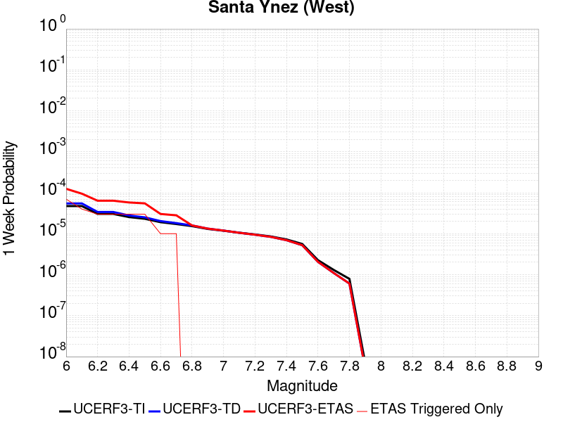 | 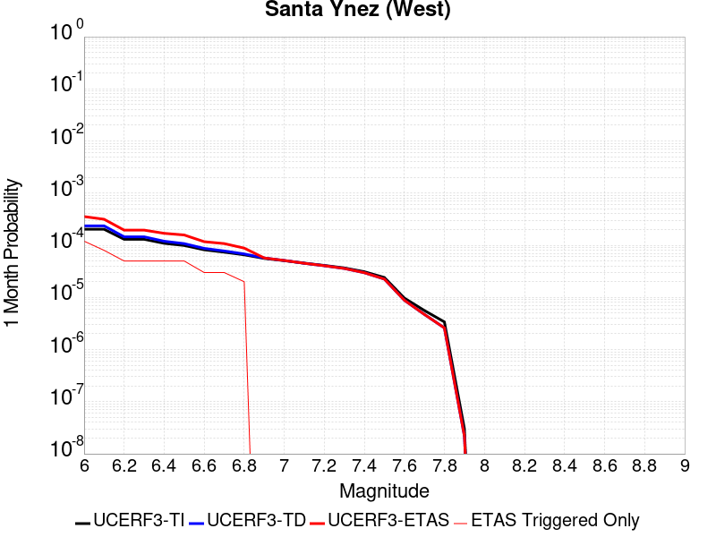 | 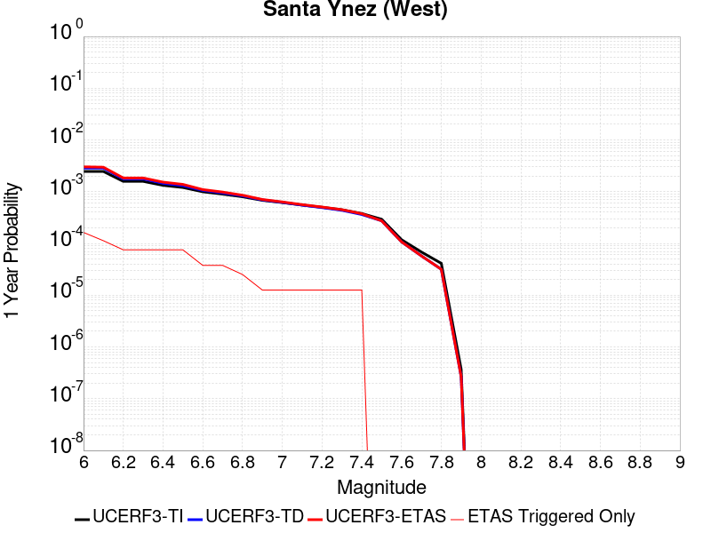 | 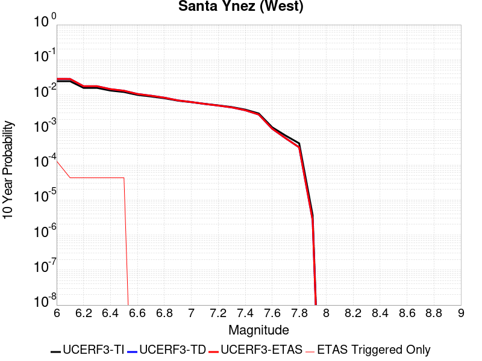 |

| Magnitude | 1 wk TI Prob | 1 wk TD Prob | 1 wk ETAS Prob | 1 wk ETAS/TD Gain | 1 wk ETAS Triggered Only | 1 mo TI Prob | 1 mo TD Prob | 1 mo ETAS Prob | 1 mo ETAS/TD Gain | 1 mo ETAS Triggered Only | 1 yr TI Prob | 1 yr TD Prob | 1 yr ETAS Prob | 1 yr ETAS/TD Gain | 1 yr ETAS Triggered Only | 10 yr TI Prob | 10 yr TD Prob | 10 yr ETAS Prob | 10 yr ETAS/TD Gain | 10 yr ETAS Triggered Only |
|-----|-----|-----|-----|-----|-----|-----|-----|-----|-----|-----|-----|-----|-----|-----|-----|-----|-----|-----|-----|-----|
| 6.0 | 4.7352758E-5 | 5.497084E-5 | 1.2496699E-4 | 2.2733324 | 7.0E-5 | 2.0292461E-4 | 2.3556968E-4 | 3.5554142E-4 | 1.5092834 | 1.2E-4 | 0.0024678076 | 0.002864558 | 0.0030440423 | 1.0626569 | 1.8E-4 | 0.024405818 | 0.028304456 | 0.02854738 | 1.0085825 | 2.5E-4 |
| 6.1 | 4.7352758E-5 | 5.497084E-5 | 9.4968644E-5 | 1.7276186 | 4.0E-5 | 2.0292461E-4 | 2.3556968E-4 | 3.1555083E-4 | 1.3395222 | 8.0E-5 | 0.0024678076 | 0.002864558 | 0.0029941855 | 1.0452522 | 1.3E-4 | 0.024405818 | 0.028304456 | 0.028489077 | 1.0065228 | 1.9E-4 |
| 6.2 | 3.0415853E-5 | 3.3925004E-5 | 6.392399E-5 | 1.8842735 | 3.0E-5 | 1.3034715E-4 | 1.4538495E-4 | 1.953777E-4 | 1.3438646 | 5.0E-5 | 0.0015858212 | 0.0017686592 | 0.0018485177 | 1.045152 | 8.0E-5 | 0.015745522 | 0.01754978 | 0.017667674 | 1.0067177 | 1.2E-4 |
| 6.3 | 3.0415853E-5 | 3.3925004E-5 | 6.392399E-5 | 1.8842735 | 3.0E-5 | 1.3034715E-4 | 1.4538495E-4 | 1.953777E-4 | 1.3438646 | 5.0E-5 | 0.0015858212 | 0.0017686592 | 0.0018485177 | 1.045152 | 8.0E-5 | 0.015745522 | 0.01754978 | 0.017667674 | 1.0067177 | 1.2E-4 |
| 6.4 | 2.5452082E-5 | 2.7912318E-5 | 5.7911482E-5 | 2.0747643 | 3.0E-5 | 1.09075794E-4 | 1.1961885E-4 | 1.6961287E-4 | 1.4179443 | 5.0E-5 | 0.0013271887 | 0.0014554056 | 0.0015352891 | 1.0548875 | 8.0E-5 | 0.013192902 | 0.01446091 | 0.014579175 | 1.0081782 | 1.2E-4 |
| 6.5 | 2.3143784E-5 | 2.5128133E-5 | 5.5127377E-5 | 2.193851 | 3.0E-5 | 9.9183875E-5 | 1.07687636E-4 | 1.5768225E-4 | 1.4642558 | 5.0E-5 | 0.0012068948 | 0.001310323 | 0.0013902182 | 1.0609736 | 8.0E-5 | 0.012003611 | 0.013027638 | 0.0131460745 | 1.0090911 | 1.2E-4 |
| 6.6 | 1.9118515E-5 | 2.0354244E-5 | 3.0354042E-5 | 1.4912881 | 1.0E-5 | 8.193392E-5 | 8.722961E-5 | 1.1722699E-4 | 1.34389 | 3.0E-5 | 9.97089E-4 | 0.001061511 | 0.0011114579 | 1.0470526 | 5.0E-5 | 0.00992627 | 0.010565317 | 0.010634577 | 1.0065554 | 7.0E-5 |
| 6.7 | 1.722807E-5 | 1.8146253E-5 | 2.8146073E-5 | 1.551068 | 1.0E-5 | 7.3832496E-5 | 7.776737E-5 | 1.0776504E-4 | 1.3857359 | 3.0E-5 | 8.985399E-4 | 9.4641204E-4 | 9.963647E-4 | 1.0527811 | 5.0E-5 | 0.008949154 | 0.009424461 | 0.009493802 | 1.0073575 | 7.0E-5 |
| 6.8 | 1.5317364E-5 | 1.5926391E-5 | 1.5926391E-5 | 1.0 | 0.0 | 6.56442E-5 | 6.82542E-5 | 8.825283E-5 | 1.2930022 | 2.0E-5 | 7.98925E-4 | 8.3068234E-4 | 8.706491E-4 | 1.0481132 | 4.0E-5 | 0.007960589 | 0.008276261 | 0.0083357645 | 1.0071896 | 6.0E-5 |
| 6.9 | 1.3071226E-5 | 1.332953E-5 | 1.332953E-5 | 1.0 | 0.0 | 5.6018336E-5 | 5.712532E-5 | 5.712532E-5 | 1.0 | 0.0 | 6.8180985E-4 | 6.952811E-4 | 7.1526715E-4 | 1.0287453 | 2.0E-5 | 0.0067972173 | 0.0069313184 | 0.006971041 | 1.0057309 | 4.0E-5 |
| 7.0 | 1.1836986E-5 | 1.1932688E-5 | 1.1932688E-5 | 1.0 | 0.0 | 5.0728955E-5 | 5.1139097E-5 | 5.1139097E-5 | 1.0 | 0.0 | 6.1745E-4 | 6.2244234E-4 | 6.4242986E-4 | 1.0321115 | 2.0E-5 | 0.006157372 | 0.0062071825 | 0.006246934 | 1.0064042 | 4.0E-5 |
| 7.1 | 1.0597169E-5 | 1.0542107E-5 | 1.0542107E-5 | 1.0 | 0.0 | 4.541565E-5 | 4.5179684E-5 | 4.5179684E-5 | 1.0 | 0.0 | 5.5279525E-4 | 5.4992497E-4 | 5.5991946E-4 | 1.0181743 | 1.0E-5 | 0.0055142213 | 0.005485772 | 0.0055156075 | 1.0054387 | 3.0E-5 |
| 7.2 | 9.59113E-6 | 9.45905E-6 | 9.45905E-6 | 1.0 | 0.0 | 4.11042E-5 | 4.053816E-5 | 4.053816E-5 | 1.0 | 0.0 | 5.0032866E-4 | 4.934414E-4 | 5.034365E-4 | 1.0202558 | 1.0E-5 | 0.004992037 | 0.0049235765 | 0.0049534286 | 1.0060631 | 3.0E-5 |
| 7.3 | 8.586084E-6 | 8.379489E-6 | 8.379489E-6 | 1.0 | 0.0 | 3.679698E-5 | 3.591161E-5 | 3.591161E-5 | 1.0 | 0.0 | 4.4791115E-4 | 4.3713715E-4 | 4.4713277E-4 | 1.0228661 | 1.0E-5 | 0.004470094 | 0.004362884 | 0.0043927534 | 1.0068462 | 3.0E-5 |
| 7.4 | 7.2622997E-6 | 6.9514485E-6 | 6.9514485E-6 | 1.0 | 0.0 | 3.112377E-5 | 2.9791589E-5 | 2.9791589E-5 | 1.0 | 0.0 | 3.78866E-4 | 3.6265317E-4 | 3.7264955E-4 | 1.0275645 | 1.0E-5 | 0.0037822074 | 0.003620714 | 0.0036406417 | 1.0055038 | 2.0E-5 |
| 7.5 | 5.627296E-6 | 5.2514984E-6 | 5.2514984E-6 | 1.0 | 0.0 | 2.411676E-5 | 2.2506232E-5 | 2.2506232E-5 | 1.0 | 0.0 | 2.9358198E-4 | 2.7397962E-4 | 2.7397962E-4 | 1.0 | 0.0 | 0.0029319443 | 0.0027364905 | 0.002746463 | 1.0036443 | 1.0E-5 |
| 7.6 | 2.265244E-6 | 2.0608632E-6 | 2.0608632E-6 | 1.0 | 0.0 | 9.708152E-6 | 8.832241E-6 | 8.832241E-6 | 1.0 | 0.0 | 1.18190335E-4 | 1.0752732E-4 | 1.0752732E-4 | 1.0 | 0.0 | 0.001181275 | 0.0010747615 | 0.0010747615 | 1.0 | 0.0 |
| 7.7 | 1.3099874E-6 | 1.1016228E-6 | 1.1016228E-6 | 1.0 | 0.0 | 5.61422E-6 | 4.7212325E-6 | 4.7212325E-6 | 1.0 | 0.0 | 6.8350986E-5 | 5.7479516E-5 | 5.7479516E-5 | 1.0 | 0.0 | 6.832996E-4 | 5.7464885E-4 | 5.7464885E-4 | 1.0 | 0.0 |
| 7.8 | 7.903951E-7 | 6.0710704E-7 | 6.0710704E-7 | 1.0 | 0.0 | 3.3874032E-6 | 2.601885E-6 | 2.601885E-6 | 1.0 | 0.0 | 4.1240855E-5 | 3.16775E-5 | 3.16775E-5 | 1.0 | 0.0 | 4.12332E-4 | 3.167312E-4 | 3.167312E-4 | 1.0 | 0.0 |
| 7.9 | 7.0753297E-9 | 5.090092E-9 | 5.090092E-9 | 1.0 | 0.0 | 3.032284E-8 | 2.181468E-8 | 2.181468E-8 | 1.0 | 0.0 | 3.6918053E-7 | 2.655937E-7 | 2.655937E-7 | 1.0 | 0.0 | 3.691799E-6 | 2.6559348E-6 | 2.6559348E-6 | 1.0 | 0.0 |

## Calico-Hidalgo
*[(top)](#table-of-contents)*

| 1 Week | 1 Month | 1 Year | 10 Year |
|-----|-----|-----|-----|
| 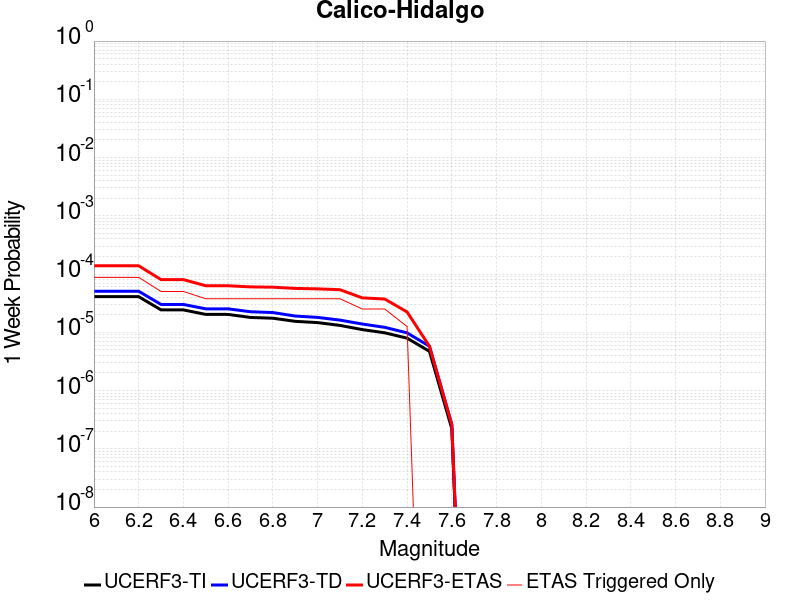 | 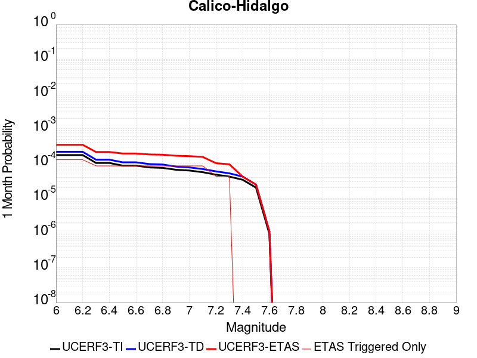 | 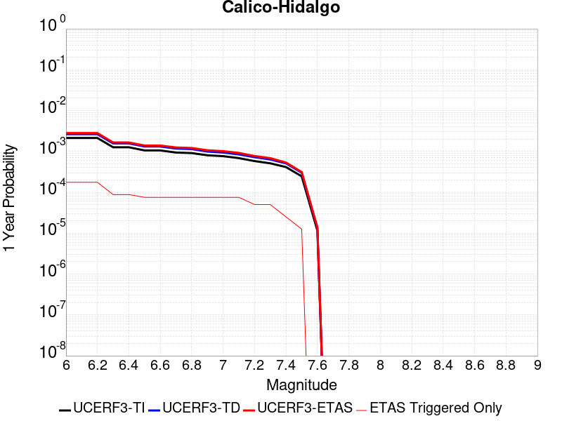 | 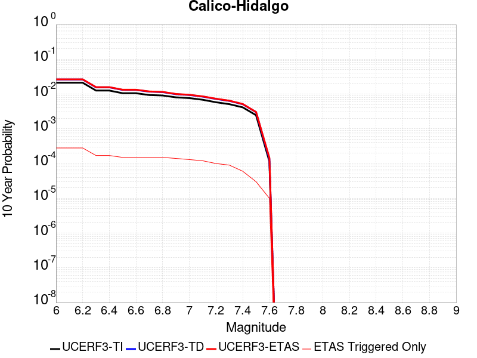 |

| Magnitude | 1 wk TI Prob | 1 wk TD Prob | 1 wk ETAS Prob | 1 wk ETAS/TD Gain | 1 wk ETAS Triggered Only | 1 mo TI Prob | 1 mo TD Prob | 1 mo ETAS Prob | 1 mo ETAS/TD Gain | 1 mo ETAS Triggered Only | 1 yr TI Prob | 1 yr TD Prob | 1 yr ETAS Prob | 1 yr ETAS/TD Gain | 1 yr ETAS Triggered Only | 10 yr TI Prob | 10 yr TD Prob | 10 yr ETAS Prob | 10 yr ETAS/TD Gain | 10 yr ETAS Triggered Only |
|-----|-----|-----|-----|-----|-----|-----|-----|-----|-----|-----|-----|-----|-----|-----|-----|-----|-----|-----|-----|-----|
| 6.0 | 4.0906612E-5 | 5.0704355E-5 | 1.307003E-4 | 2.5776937 | 8.0E-5 | 1.7530227E-4 | 2.1728857E-4 | 3.372625E-4 | 1.552141 | 1.2E-4 | 0.0021322158 | 0.002642678 | 0.0028122289 | 1.0641587 | 1.7E-4 | 0.02111873 | 0.026152814 | 0.026425492 | 1.0104263 | 2.8E-4 |
| 6.1 | 4.0906612E-5 | 5.0704355E-5 | 1.307003E-4 | 2.5776937 | 8.0E-5 | 1.7530227E-4 | 2.1728857E-4 | 3.372625E-4 | 1.552141 | 1.2E-4 | 0.0021322158 | 0.002642678 | 0.0028122289 | 1.0641587 | 1.7E-4 | 0.02111873 | 0.026152814 | 0.026425492 | 1.0104263 | 2.8E-4 |
| 6.2 | 4.0906612E-5 | 5.0704355E-5 | 1.307003E-4 | 2.5776937 | 8.0E-5 | 1.7530227E-4 | 2.1728857E-4 | 3.372625E-4 | 1.552141 | 1.2E-4 | 0.0021322158 | 0.002642678 | 0.0028122289 | 1.0641587 | 1.7E-4 | 0.02111873 | 0.026152814 | 0.026425492 | 1.0104263 | 2.8E-4 |
| 6.3 | 2.4242801E-5 | 3.0090967E-5 | 8.008946E-5 | 2.6615782 | 5.0E-5 | 1.0389358E-4 | 1.289551E-4 | 1.9894607E-4 | 1.5427545 | 7.0E-5 | 0.0012641704 | 0.0015689312 | 0.0016687743 | 1.0636376 | 1.0E-4 | 0.01257003 | 0.015582229 | 0.01574958 | 1.0107399 | 1.7E-4 |
| 6.4 | 2.4242801E-5 | 3.0090967E-5 | 8.008946E-5 | 2.6615782 | 5.0E-5 | 1.0389358E-4 | 1.289551E-4 | 1.9894607E-4 | 1.5427545 | 7.0E-5 | 0.0012641704 | 0.0015689312 | 0.0016687743 | 1.0636376 | 1.0E-4 | 0.01257003 | 0.015582229 | 0.01574958 | 1.0107399 | 1.7E-4 |
| 6.5 | 2.0286952E-5 | 2.5316054E-5 | 5.5315297E-5 | 2.1849887 | 3.0E-5 | 8.694118E-5 | 1.0849296E-4 | 1.5848754E-4 | 1.4608094 | 5.0E-5 | 0.0010579949 | 0.0013201186 | 0.0014000129 | 1.0605206 | 8.0E-5 | 0.010529719 | 0.013124701 | 0.013272732 | 1.0112789 | 1.5E-4 |
| 6.6 | 2.0269223E-5 | 2.5297004E-5 | 5.5296245E-5 | 2.1858811 | 3.0E-5 | 8.6865206E-5 | 1.08411325E-4 | 1.584059E-4 | 1.4611565 | 5.0E-5 | 0.0010570707 | 0.0013191258 | 0.0013990202 | 1.0605662 | 8.0E-5 | 0.010520565 | 0.01311489 | 0.013262923 | 1.0112873 | 1.5E-4 |
| 6.7 | 1.799852E-5 | 2.2540933E-5 | 5.2540257E-5 | 2.330882 | 3.0E-5 | 7.713423E-5 | 9.660051E-5 | 1.4659567E-4 | 1.5175456 | 5.0E-5 | 9.3870464E-4 | 0.0011754911 | 0.0012553971 | 1.0679767 | 8.0E-5 | 0.009347493 | 0.011694346 | 0.011842592 | 1.0126767 | 1.5E-4 |
| 6.8 | 1.7458793E-5 | 2.184258E-5 | 5.1841926E-5 | 2.373434 | 3.0E-5 | 7.4821255E-5 | 9.360778E-5 | 1.436031E-4 | 1.5340936 | 5.0E-5 | 9.10568E-4 | 0.0011390933 | 0.0012190022 | 1.0701513 | 8.0E-5 | 0.009068459 | 0.011334131 | 0.011482431 | 1.0130844 | 1.5E-4 |
| 6.9 | 1.542884E-5 | 1.9026285E-5 | 4.9025715E-5 | 2.576736 | 3.0E-5 | 6.612192E-5 | 8.153875E-5 | 1.3153467E-4 | 1.6131554 | 5.0E-5 | 8.04737E-4 | 9.922953E-4 | 0.0010722158 | 1.0805411 | 8.0E-5 | 0.008018291 | 0.009880043 | 0.01001866 | 1.01403 | 1.4E-4 |
| 7.0 | 1.468253E-5 | 1.803109E-5 | 4.803055E-5 | 2.6637628 | 3.0E-5 | 6.292361E-5 | 7.727389E-5 | 1.2727003E-4 | 1.6469991 | 5.0E-5 | 7.658257E-4 | 9.4041653E-4 | 0.0010203413 | 1.0849887 | 8.0E-5 | 0.0076319184 | 0.009365736 | 0.009494519 | 1.0137504 | 1.3E-4 |
| 7.1 | 1.3139281E-5 | 1.620139E-5 | 4.6200905E-5 | 2.851663 | 3.0E-5 | 5.6309986E-5 | 6.943275E-5 | 1.0942997E-4 | 1.5760571 | 4.0E-5 | 6.853584E-4 | 8.4502844E-4 | 9.1496925E-4 | 1.0827675 | 7.0E-5 | 0.0068324856 | 0.008419449 | 0.008538439 | 1.0141327 | 1.2E-4 |
| 7.2 | 1.1127404E-5 | 1.3867038E-5 | 3.386676E-5 | 2.442249 | 2.0E-5 | 4.7688E-5 | 5.9428872E-5 | 7.9427686E-5 | 1.3365167 | 2.0E-5 | 5.8044674E-4 | 7.233172E-4 | 7.7328103E-4 | 1.069076 | 5.0E-5 | 0.0057893298 | 0.007210737 | 0.007310016 | 1.0137682 | 1.0E-4 |
| 7.3 | 9.808154E-6 | 1.2176586E-5 | 3.2176344E-5 | 2.6424766 | 2.0E-5 | 4.2034266E-5 | 5.2184383E-5 | 7.218334E-5 | 1.3832364 | 2.0E-5 | 5.11647E-4 | 6.351704E-4 | 6.7514495E-4 | 1.0629352 | 4.0E-5 | 0.0051047057 | 0.006334625 | 0.0064240554 | 1.0141176 | 9.0E-5 |
| 7.4 | 7.942452E-6 | 9.792348E-6 | 1.979225E-5 | 2.0211957 | 1.0E-5 | 3.4038632E-5 | 4.1966585E-5 | 5.1966163E-5 | 1.2382748 | 1.0E-5 | 4.1434157E-4 | 5.108328E-4 | 5.308226E-4 | 1.0391318 | 2.0E-5 | 0.0041356985 | 0.005097527 | 0.0051572216 | 1.0117104 | 6.0E-5 |
| 7.5 | 4.7121216E-6 | 5.7729717E-6 | 5.7729717E-6 | 1.0 | 0.0 | 2.019465E-5 | 2.4741115E-5 | 2.4741115E-5 | 1.0 | 0.0 | 2.4584212E-4 | 3.011891E-4 | 3.111861E-4 | 1.0331917 | 1.0E-5 | 0.0024557032 | 0.0030085614 | 0.0030384713 | 1.0099416 | 3.0E-5 |
| 7.6 | 2.21172E-7 | 2.6040198E-7 | 2.6040198E-7 | 1.0 | 0.0 | 9.478797E-7 | 1.1160082E-6 | 1.1160082E-6 | 1.0 | 0.0 | 1.1540374E-5 | 1.3587343E-5 | 1.3587343E-5 | 1.0 | 0.0 | 1.1539775E-4 | 1.3586794E-4 | 1.4586658E-4 | 1.0735909 | 1.0E-5 |

## Cleghorn Pass
*[(top)](#table-of-contents)*

| 1 Week | 1 Month | 1 Year | 10 Year |
|-----|-----|-----|-----|
| 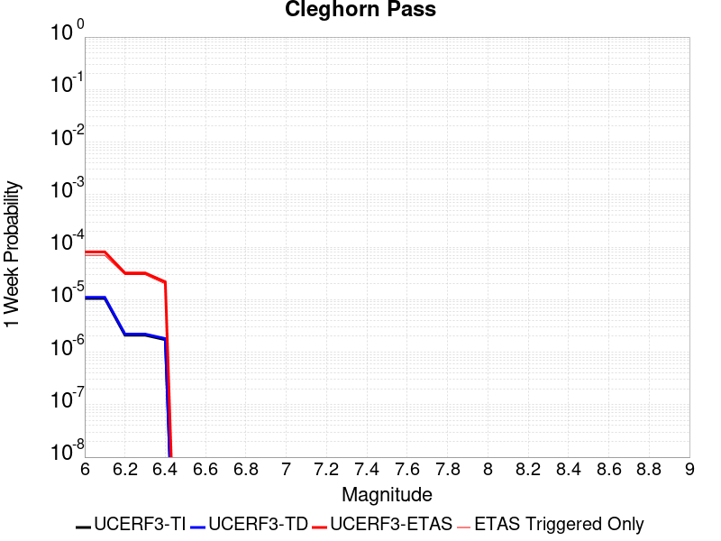 | 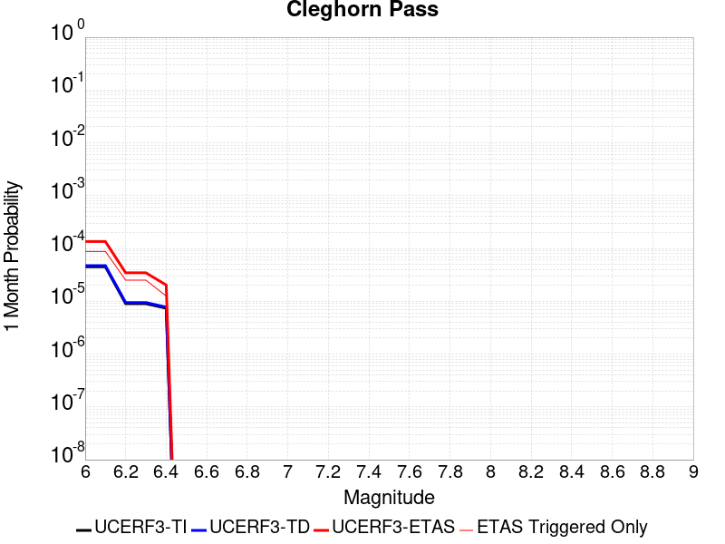 | 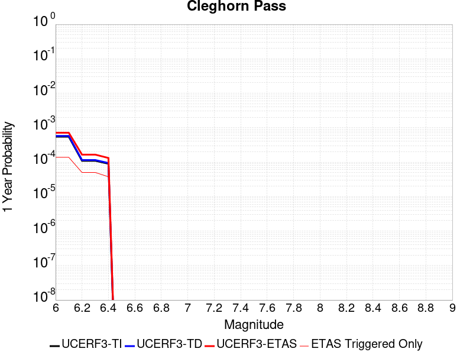 | 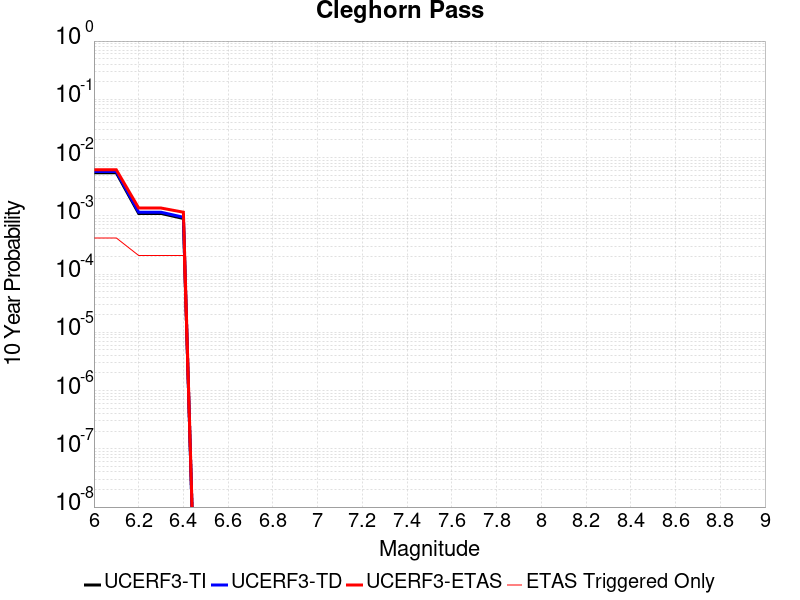 |

| Magnitude | 1 wk TI Prob | 1 wk TD Prob | 1 wk ETAS Prob | 1 wk ETAS/TD Gain | 1 wk ETAS Triggered Only | 1 mo TI Prob | 1 mo TD Prob | 1 mo ETAS Prob | 1 mo ETAS/TD Gain | 1 mo ETAS Triggered Only | 1 yr TI Prob | 1 yr TD Prob | 1 yr ETAS Prob | 1 yr ETAS/TD Gain | 1 yr ETAS Triggered Only | 10 yr TI Prob | 10 yr TD Prob | 10 yr ETAS Prob | 10 yr ETAS/TD Gain | 10 yr ETAS Triggered Only |
|-----|-----|-----|-----|-----|-----|-----|-----|-----|-----|-----|-----|-----|-----|-----|-----|-----|-----|-----|-----|-----|
| 6.0 | 1.0522846E-5 | 1.1040642E-5 | 8.103987E-5 | 7.3401413 | 7.0E-5 | 4.509713E-5 | 4.7316473E-5 | 1.3731222E-4 | 2.901996 | 9.0E-5 | 5.4891926E-4 | 5.759784E-4 | 7.25892E-4 | 1.2602764 | 1.5E-4 | 0.0054756533 | 0.005750022 | 0.0059786993 | 1.0397699 | 2.3E-4 |
| 6.1 | 1.0522846E-5 | 1.1040642E-5 | 8.103987E-5 | 7.3401413 | 7.0E-5 | 4.509713E-5 | 4.7316473E-5 | 1.3731222E-4 | 2.901996 | 9.0E-5 | 5.4891926E-4 | 5.759784E-4 | 7.25892E-4 | 1.2602764 | 1.5E-4 | 0.0054756533 | 0.005750022 | 0.0059786993 | 1.0397699 | 2.3E-4 |
| 6.2 | 2.1045846E-6 | 2.2082024E-6 | 3.2208136E-5 | 14.585681 | 3.0E-5 | 9.019617E-6 | 9.463714E-6 | 3.946343E-5 | 4.169973 | 3.0E-5 | 1.098083E-4 | 1.1521882E-4 | 1.6521306E-4 | 1.4339069 | 5.0E-5 | 0.0010975406 | 0.0011520023 | 0.0012319101 | 1.0693643 | 8.0E-5 |
| 6.3 | 2.1045846E-6 | 2.2082024E-6 | 3.2208136E-5 | 14.585681 | 3.0E-5 | 9.019617E-6 | 9.463714E-6 | 3.946343E-5 | 4.169973 | 3.0E-5 | 1.098083E-4 | 1.1521882E-4 | 1.6521306E-4 | 1.4339069 | 5.0E-5 | 0.0010975406 | 0.0011520023 | 0.0012319101 | 1.0693643 | 8.0E-5 |
| 6.4 | 1.7259927E-6 | 1.810877E-6 | 2.1810842E-5 | 12.044352 | 2.0E-5 | 7.3970905E-6 | 7.760902E-6 | 2.7760747E-5 | 3.5770001 | 2.0E-5 | 9.005586E-5 | 9.4488976E-5 | 1.344852E-4 | 1.4232898 | 4.0E-5 | 9.001937E-4 | 9.448898E-4 | 0.0010048331 | 1.0634395 | 6.0E-5 |

## Cleghorn Lake
*[(top)](#table-of-contents)*

| 1 Week | 1 Month | 1 Year | 10 Year |
|-----|-----|-----|-----|
| 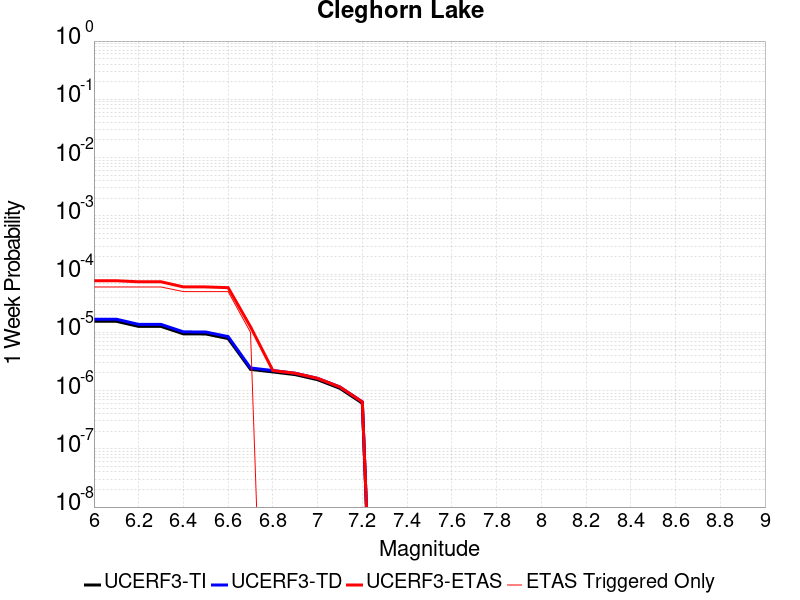 | 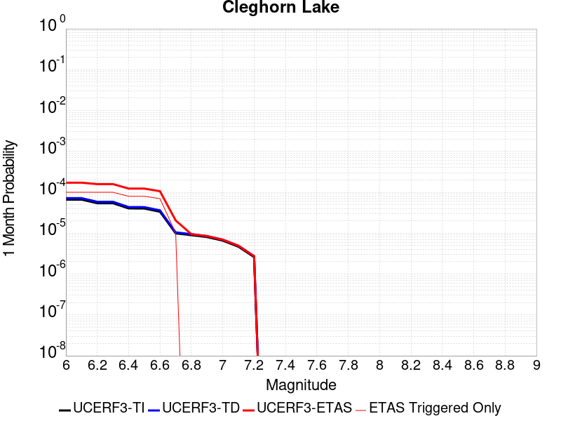 | 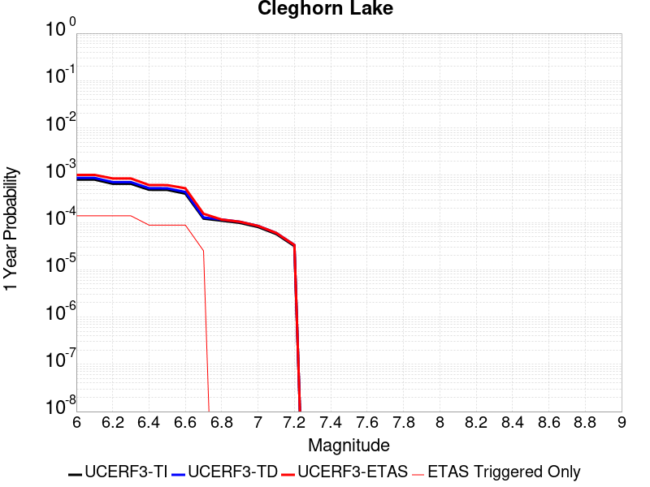 | 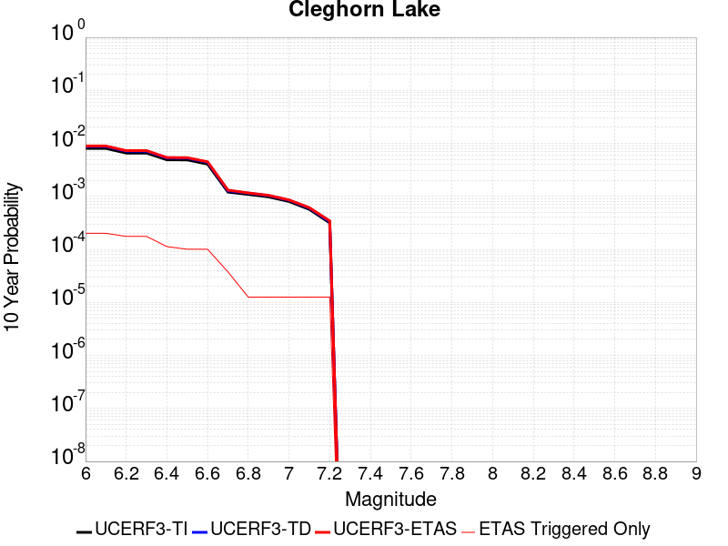 |

| Magnitude | 1 wk TI Prob | 1 wk TD Prob | 1 wk ETAS Prob | 1 wk ETAS/TD Gain | 1 wk ETAS Triggered Only | 1 mo TI Prob | 1 mo TD Prob | 1 mo ETAS Prob | 1 mo ETAS/TD Gain | 1 mo ETAS Triggered Only | 1 yr TI Prob | 1 yr TD Prob | 1 yr ETAS Prob | 1 yr ETAS/TD Gain | 1 yr ETAS Triggered Only | 10 yr TI Prob | 10 yr TD Prob | 10 yr ETAS Prob | 10 yr ETAS/TD Gain | 10 yr ETAS Triggered Only |
|-----|-----|-----|-----|-----|-----|-----|-----|-----|-----|-----|-----|-----|-----|-----|-----|-----|-----|-----|-----|-----|
| 6.0 | 1.5467183E-5 | 1.6794203E-5 | 7.67932E-5 | 4.5726013 | 6.0E-5 | 6.6286244E-5 | 7.197348E-5 | 1.7196628E-4 | 2.3893006 | 1.0E-4 | 8.067362E-4 | 8.759797E-4 | 0.001055822 | 1.2053043 | 1.8E-4 | 0.008038137 | 0.008730696 | 0.008998338 | 1.0306554 | 2.7E-4 |
| 6.1 | 1.5467183E-5 | 1.6794203E-5 | 7.67932E-5 | 4.5726013 | 6.0E-5 | 6.6286244E-5 | 7.197348E-5 | 1.7196628E-4 | 2.3893006 | 1.0E-4 | 8.067362E-4 | 8.759797E-4 | 0.001055822 | 1.2053043 | 1.8E-4 | 0.008038137 | 0.008730696 | 0.008998338 | 1.0306554 | 2.7E-4 |
| 6.2 | 1.2624631E-5 | 1.3681544E-5 | 7.368073E-5 | 5.38541 | 6.0E-5 | 5.410444E-5 | 5.863415E-5 | 1.5862829E-4 | 2.705391 | 1.0E-4 | 6.585225E-4 | 7.1368564E-4 | 8.7357144E-4 | 1.2240283 | 1.6E-4 | 0.0065657445 | 0.0071187317 | 0.0073470944 | 1.0320791 | 2.3E-4 |
| 6.3 | 1.2624631E-5 | 1.3681544E-5 | 7.368073E-5 | 5.38541 | 6.0E-5 | 5.410444E-5 | 5.863415E-5 | 1.5862829E-4 | 2.705391 | 1.0E-4 | 6.585225E-4 | 7.1368564E-4 | 8.7357144E-4 | 1.2240283 | 1.6E-4 | 0.0065657445 | 0.0071187317 | 0.0073470944 | 1.0320791 | 2.3E-4 |
| 6.4 | 9.417684E-6 | 1.0170118E-5 | 6.016961E-5 | 5.916314 | 5.0E-5 | 4.036088E-5 | 4.3585722E-5 | 1.2358224E-4 | 2.8353834 | 8.0E-5 | 4.912829E-4 | 5.3056807E-4 | 6.405097E-4 | 1.207215 | 1.1E-4 | 0.004901982 | 0.005297049 | 0.0054562017 | 1.0300455 | 1.6E-4 |
| 6.5 | 9.368219E-6 | 1.0117545E-5 | 6.011704E-5 | 5.9418607 | 5.0E-5 | 4.014889E-5 | 4.3360415E-5 | 1.2335695E-4 | 2.8449209 | 8.0E-5 | 4.8870314E-4 | 5.2782625E-4 | 6.377682E-4 | 1.2082919 | 1.1E-4 | 0.004876298 | 0.0052697617 | 0.005418971 | 1.0283142 | 1.5E-4 |
| 6.6 | 7.803798E-6 | 8.441831E-6 | 5.844141E-5 | 6.922836 | 5.0E-5 | 3.3444423E-5 | 3.6179E-5 | 1.0617646E-4 | 2.9347541 | 7.0E-5 | 4.0710976E-4 | 4.4043022E-4 | 5.403862E-4 | 1.2269508 | 1.0E-4 | 0.0040636472 | 0.0043994905 | 0.0045289183 | 1.0294188 | 1.3E-4 |
| 6.7 | 2.3108669E-6 | 2.4438336E-6 | 1.2443809E-5 | 5.0919213 | 1.0E-5 | 9.903678E-6 | 1.0473532E-5 | 2.0473428E-5 | 1.9547777 | 1.0E-5 | 1.205706E-4 | 1.2750797E-4 | 1.5750415E-4 | 1.2352494 | 3.0E-5 | 0.001205052 | 0.0012743667 | 0.0013143158 | 1.0313481 | 4.0E-5 |
| 6.8 | 2.0882828E-6 | 2.2062823E-6 | 2.2062823E-6 | 1.0 | 0.0 | 8.949753E-6 | 9.455462E-6 | 9.455462E-6 | 1.0 | 0.0 | 1.08957785E-4 | 1.1511434E-4 | 1.2511319E-4 | 1.0868602 | 1.0E-5 | 0.0010890438 | 0.0011505639 | 0.0011705409 | 1.0173628 | 2.0E-5 |
| 6.9 | 1.876935E-6 | 1.981051E-6 | 1.981051E-6 | 1.0 | 0.0 | 8.043982E-6 | 8.490192E-6 | 8.490192E-6 | 1.0 | 0.0 | 9.7931086E-5 | 1.03363345E-4 | 1.1336231E-4 | 1.0967361 | 1.0E-5 | 9.788794E-4 | 0.0010331686 | 0.001053148 | 1.0193379 | 2.0E-5 |
| 7.0 | 1.5357559E-6 | 1.6202807E-6 | 1.6202807E-6 | 1.0 | 0.0 | 6.5817944E-6 | 6.9440425E-6 | 6.9440425E-6 | 1.0 | 0.0 | 8.01304E-5 | 8.454057E-5 | 9.453972E-5 | 1.1182764 | 1.0E-5 | 8.010151E-4 | 8.450965E-4 | 8.650796E-4 | 1.0236459 | 2.0E-5 |
| 7.1 | 1.0905424E-6 | 1.1497619E-6 | 1.1497619E-6 | 1.0 | 0.0 | 4.6737446E-6 | 4.9275427E-6 | 4.9275427E-6 | 1.0 | 0.0 | 5.6901354E-5 | 5.999128E-5 | 6.999068E-5 | 1.1666809 | 1.0E-5 | 5.6886784E-4 | 5.997606E-4 | 6.197486E-4 | 1.0333266 | 2.0E-5 |
| 7.2 | 6.06668E-7 | 6.387277E-7 | 6.387277E-7 | 1.0 | 0.0 | 2.600003E-6 | 2.7374022E-6 | 2.7374022E-6 | 1.0 | 0.0 | 3.1654577E-5 | 3.3327433E-5 | 3.3327433E-5 | 1.0 | 0.0 | 3.1650066E-4 | 3.3323118E-4 | 3.4322785E-4 | 1.0299993 | 1.0E-5 |

## Sierra Nevada  (No Extension)
*[(top)](#table-of-contents)*

| 1 Week | 1 Month | 1 Year | 10 Year |
|-----|-----|-----|-----|
|  | 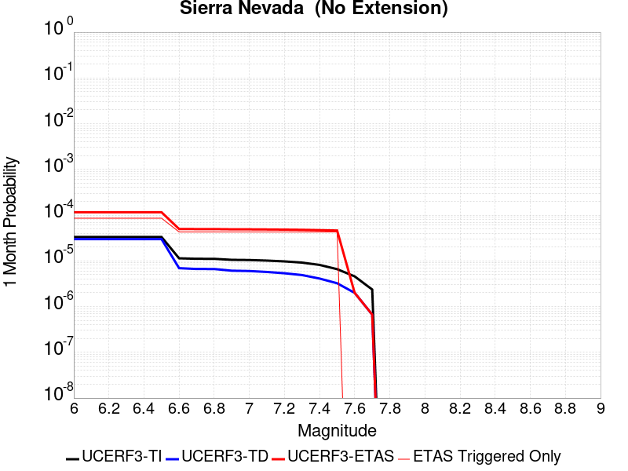 | 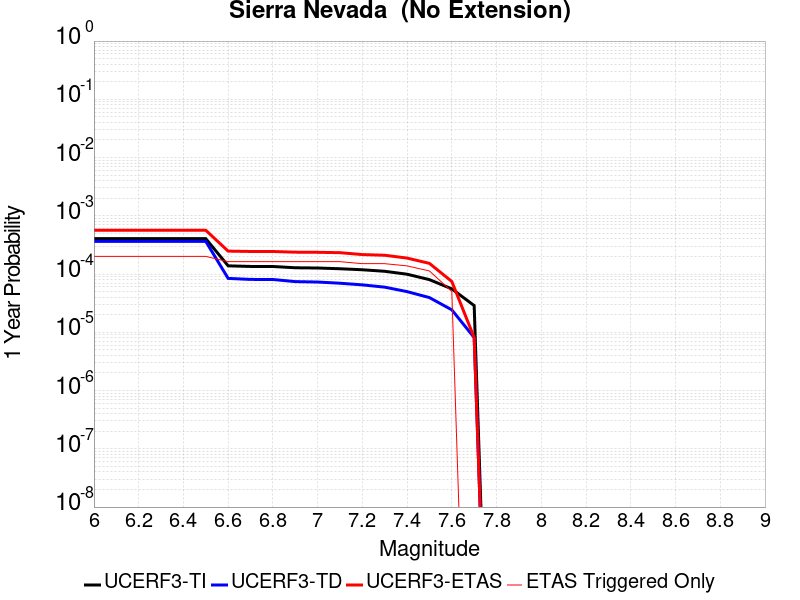 | 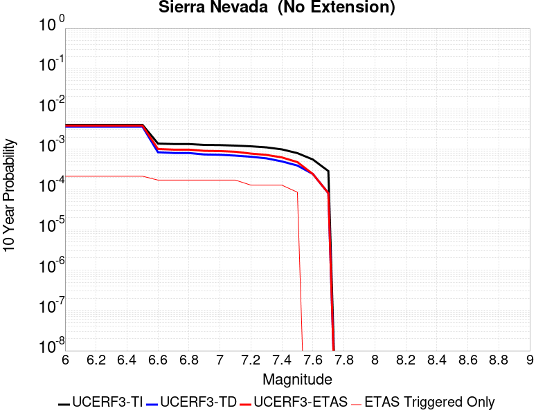 |

| Magnitude | 1 wk TI Prob | 1 wk TD Prob | 1 wk ETAS Prob | 1 wk ETAS/TD Gain | 1 wk ETAS Triggered Only | 1 mo TI Prob | 1 mo TD Prob | 1 mo ETAS Prob | 1 mo ETAS/TD Gain | 1 mo ETAS Triggered Only | 1 yr TI Prob | 1 yr TD Prob | 1 yr ETAS Prob | 1 yr ETAS/TD Gain | 1 yr ETAS Triggered Only | 10 yr TI Prob | 10 yr TD Prob | 10 yr ETAS Prob | 10 yr ETAS/TD Gain | 10 yr ETAS Triggered Only |
|-----|-----|-----|-----|-----|-----|-----|-----|-----|-----|-----|-----|-----|-----|-----|-----|-----|-----|-----|-----|-----|
| 6.0 | 7.7690465E-6 | 6.9762887E-6 | 9.697566E-5 | 13.900752 | 9.0E-5 | 3.329549E-5 | 2.989824E-5 | 1.6989405E-4 | 5.6824102 | 1.4E-4 | 4.0529718E-4 | 3.6398612E-4 | 5.83906E-4 | 1.6041987 | 2.2E-4 | 0.004045588 | 0.0036374154 | 0.0038865062 | 1.0684801 | 2.5E-4 |
| 6.1 | 7.7690465E-6 | 6.9762887E-6 | 9.697566E-5 | 13.900752 | 9.0E-5 | 3.329549E-5 | 2.989824E-5 | 1.6989405E-4 | 5.6824102 | 1.4E-4 | 4.0529718E-4 | 3.6398612E-4 | 5.83906E-4 | 1.6041987 | 2.2E-4 | 0.004045588 | 0.0036374154 | 0.0038865062 | 1.0684801 | 2.5E-4 |
| 6.2 | 7.7690465E-6 | 6.9762887E-6 | 9.697566E-5 | 13.900752 | 9.0E-5 | 3.329549E-5 | 2.989824E-5 | 1.6989405E-4 | 5.6824102 | 1.4E-4 | 4.0529718E-4 | 3.6398612E-4 | 5.83906E-4 | 1.6041987 | 2.2E-4 | 0.004045588 | 0.0036374154 | 0.0038865062 | 1.0684801 | 2.5E-4 |
| 6.3 | 7.7690465E-6 | 6.9762887E-6 | 9.697566E-5 | 13.900752 | 9.0E-5 | 3.329549E-5 | 2.989824E-5 | 1.6989405E-4 | 5.6824102 | 1.4E-4 | 4.0529718E-4 | 3.6398612E-4 | 5.83906E-4 | 1.6041987 | 2.2E-4 | 0.004045588 | 0.0036374154 | 0.0038865062 | 1.0684801 | 2.5E-4 |
| 6.4 | 7.7690465E-6 | 6.9762887E-6 | 9.697566E-5 | 13.900752 | 9.0E-5 | 3.329549E-5 | 2.989824E-5 | 1.6989405E-4 | 5.6824102 | 1.4E-4 | 4.0529718E-4 | 3.6398612E-4 | 5.83906E-4 | 1.6041987 | 2.2E-4 | 0.004045588 | 0.0036374154 | 0.0038865062 | 1.0684801 | 2.5E-4 |
| 6.5 | 7.7690465E-6 | 6.9762887E-6 | 9.697566E-5 | 13.900752 | 9.0E-5 | 3.329549E-5 | 2.989824E-5 | 1.6989405E-4 | 5.6824102 | 1.4E-4 | 4.0529718E-4 | 3.6398612E-4 | 5.83906E-4 | 1.6041987 | 2.2E-4 | 0.004045588 | 0.0036374154 | 0.0038865062 | 1.0684801 | 2.5E-4 |
| 6.6 | 2.653E-6 | 1.6148208E-6 | 7.1614704E-5 | 44.348392 | 7.0E-5 | 1.136995E-5 | 6.9206426E-6 | 1.0691995E-4 | 15.449426 | 1.0E-4 | 1.3842035E-4 | 8.42556E-5 | 2.6424043E-4 | 3.1361766 | 1.8E-4 | 0.0013833415 | 8.4224E-4 | 0.0010520631 | 1.2491251 | 2.1E-4 |
| 6.7 | 2.5902466E-6 | 1.5501544E-6 | 7.155004E-5 | 46.156723 | 7.0E-5 | 1.11010095E-5 | 6.643502E-6 | 1.0664284E-4 | 16.052202 | 1.0E-4 | 1.351464E-4 | 8.088166E-5 | 2.6086712E-4 | 3.2252934 | 1.8E-4 | 0.0013506424 | 8.0852525E-4 | 0.0010183555 | 1.2595222 | 2.1E-4 |
| 6.8 | 2.5853892E-6 | 1.5469546E-6 | 7.154685E-5 | 46.250126 | 7.0E-5 | 1.1080193E-5 | 6.629789E-6 | 1.0662912E-4 | 16.083336 | 1.0E-4 | 1.34893E-4 | 8.071472E-5 | 2.6070018E-4 | 3.2298965 | 1.8E-4 | 0.0013481114 | 8.06857E-4 | 0.0010166876 | 1.2600591 | 2.1E-4 |
| 6.9 | 2.458257E-6 | 1.422029E-6 | 7.142193E-5 | 50.225372 | 7.0E-5 | 1.0535345E-5 | 6.0943958E-6 | 1.0609379E-4 | 17.408419 | 1.0E-4 | 1.2826028E-4 | 7.419676E-5 | 2.541834E-4 | 3.425802 | 1.8E-4 | 0.0012818627 | 7.4172183E-4 | 9.515661E-4 | 1.282915 | 2.1E-4 |
| 7.0 | 2.4341468E-6 | 1.3989927E-6 | 7.139889E-5 | 51.03593 | 7.0E-5 | 1.0432016E-5 | 5.9956697E-6 | 1.0599507E-4 | 17.678604 | 1.0E-4 | 1.270024E-4 | 7.299485E-5 | 2.529817E-4 | 3.4657474 | 1.8E-4 | 0.0012692984 | 7.297107E-4 | 9.3955745E-4 | 1.2875752 | 2.1E-4 |
| 7.1 | 2.3652476E-6 | 1.3339427E-6 | 7.133385E-5 | 53.47595 | 7.0E-5 | 1.0136736E-5 | 5.716885E-6 | 1.0571631E-4 | 18.491943 | 1.0E-4 | 1.2340778E-4 | 6.9600865E-5 | 2.4958834E-4 | 3.5859947 | 1.8E-4 | 0.0012333926 | 6.957924E-4 | 9.0564624E-4 | 1.3016042 | 2.1E-4 |
| 7.2 | 2.272158E-6 | 1.2502497E-6 | 7.1250164E-5 | 56.988747 | 7.0E-5 | 9.737784E-6 | 5.358202E-6 | 1.0535766E-4 | 19.662876 | 1.0E-4 | 1.1855107E-4 | 6.523417E-5 | 2.3522308E-4 | 3.6058261 | 1.7E-4 | 0.0011848784 | 6.5215176E-4 | 8.5202133E-4 | 1.3064771 | 2.0E-4 |
| 7.3 | 2.1382127E-6 | 1.1419382E-6 | 7.114186E-5 | 62.299217 | 7.0E-5 | 9.163737E-6 | 4.894012E-6 | 1.0489352E-4 | 21.433033 | 1.0E-4 | 1.1156279E-4 | 5.9582977E-5 | 2.2957285E-4 | 3.852994 | 1.7E-4 | 0.001115068 | 5.956712E-4 | 7.9555204E-4 | 1.3355557 | 2.0E-4 |
| 7.4 | 1.9048055E-6 | 9.574928E-7 | 6.0957434E-5 | 63.663593 | 6.0E-5 | 8.163426E-6 | 4.103534E-6 | 9.410317E-5 | 22.932224 | 9.0E-5 | 9.9385186E-5 | 4.995939E-5 | 2.099514E-4 | 4.202441 | 1.6E-4 | 9.934074E-4 | 4.9948227E-4 | 6.7939237E-4 | 1.3601931 | 1.8E-4 |
| 7.5 | 1.5373403E-6 | 7.559763E-7 | 5.0755938E-5 | 67.13959 | 5.0E-5 | 6.5885843E-6 | 3.2398946E-6 | 8.323963E-5 | 25.692081 | 8.0E-5 | 8.021306E-5 | 3.9445007E-5 | 1.6943988E-4 | 4.2955976 | 1.3E-4 | 8.0184115E-4 | 3.9438053E-4 | 5.343253E-4 | 1.3548471 | 1.4E-4 |
| 7.6 | 1.0680322E-6 | 4.65941E-7 | 2.0465932E-5 | 43.92387 | 2.0E-5 | 4.577273E-6 | 1.9968884E-6 | 4.199681E-5 | 21.031124 | 4.0E-5 | 5.5726876E-5 | 2.4311848E-5 | 9.431015E-5 | 3.8791845 | 7.0E-5 | 5.5712904E-4 | 2.4309216E-4 | 3.2307272E-4 | 1.3290133 | 8.0E-5 |
| 7.7 | 5.509146E-7 | 1.5578539E-7 | 1.5578539E-7 | 1.0 | 0.0 | 2.3610605E-6 | 6.676515E-7 | 6.676515E-7 | 1.0 | 0.0 | 2.8745531E-5 | 8.128628E-6 | 8.128628E-6 | 1.0 | 0.0 | 2.8741814E-4 | 8.128342E-5 | 8.128342E-5 | 1.0 | 0.0 |

## San Jacinto (San Bernardino)
*[(top)](#table-of-contents)*

| 1 Week | 1 Month | 1 Year | 10 Year |
|-----|-----|-----|-----|
| 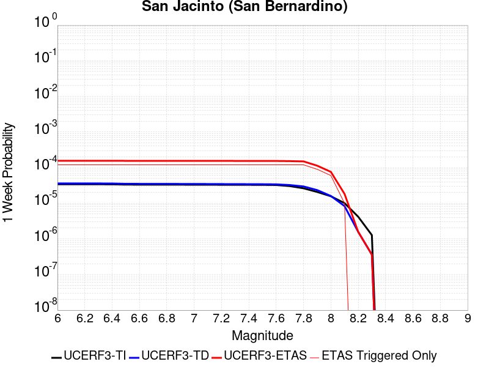 | 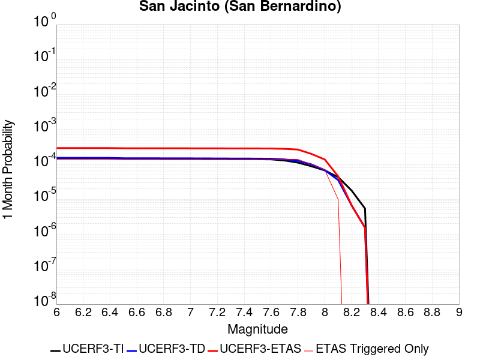 | 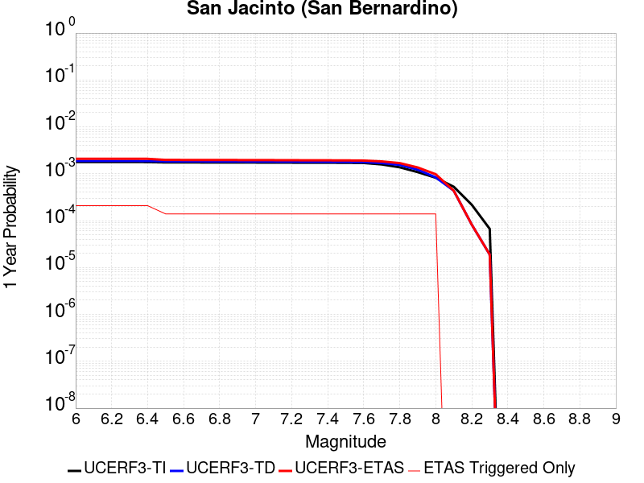 | 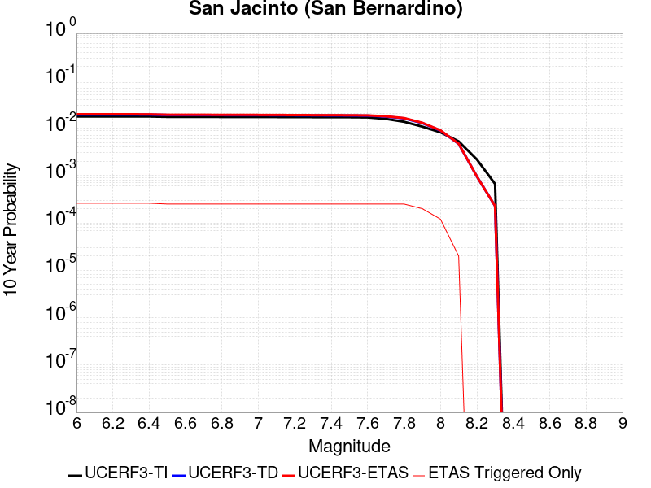 |

| Magnitude | 1 wk TI Prob | 1 wk TD Prob | 1 wk ETAS Prob | 1 wk ETAS/TD Gain | 1 wk ETAS Triggered Only | 1 mo TI Prob | 1 mo TD Prob | 1 mo ETAS Prob | 1 mo ETAS/TD Gain | 1 mo ETAS Triggered Only | 1 yr TI Prob | 1 yr TD Prob | 1 yr ETAS Prob | 1 yr ETAS/TD Gain | 1 yr ETAS Triggered Only | 10 yr TI Prob | 10 yr TD Prob | 10 yr ETAS Prob | 10 yr ETAS/TD Gain | 10 yr ETAS Triggered Only |
|-----|-----|-----|-----|-----|-----|-----|-----|-----|-----|-----|-----|-----|-----|-----|-----|-----|-----|-----|-----|-----|
| 6.0 | 3.409352E-5 | 3.598562E-5 | 1.559813E-4 | 4.3345456 | 1.2E-4 | 1.461069E-4 | 1.5421498E-4 | 2.941934E-4 | 1.9076836 | 1.4E-4 | 0.0017774 | 0.0018759521 | 0.0021055206 | 1.1223744 | 2.3E-4 | 0.01763251 | 0.019349992 | 0.019604962 | 1.0131767 | 2.6E-4 |
| 6.1 | 3.409352E-5 | 3.598562E-5 | 1.559813E-4 | 4.3345456 | 1.2E-4 | 1.461069E-4 | 1.5421498E-4 | 2.941934E-4 | 1.9076836 | 1.4E-4 | 0.0017774 | 0.0018759521 | 0.0021055206 | 1.1223744 | 2.3E-4 | 0.01763251 | 0.019349992 | 0.019604962 | 1.0131767 | 2.6E-4 |
| 6.2 | 3.409352E-5 | 3.598562E-5 | 1.559813E-4 | 4.3345456 | 1.2E-4 | 1.461069E-4 | 1.5421498E-4 | 2.941934E-4 | 1.9076836 | 1.4E-4 | 0.0017774 | 0.0018759521 | 0.0021055206 | 1.1223744 | 2.3E-4 | 0.01763251 | 0.019349992 | 0.019604962 | 1.0131767 | 2.6E-4 |
| 6.3 | 3.409352E-5 | 3.598562E-5 | 1.559813E-4 | 4.3345456 | 1.2E-4 | 1.461069E-4 | 1.5421498E-4 | 2.941934E-4 | 1.9076836 | 1.4E-4 | 0.0017774 | 0.0018759521 | 0.0021055206 | 1.1223744 | 2.3E-4 | 0.01763251 | 0.019349992 | 0.019604962 | 1.0131767 | 2.6E-4 |
| 6.4 | 3.400795E-5 | 3.5878285E-5 | 1.5587398E-4 | 4.3445215 | 1.2E-4 | 1.4574021E-4 | 1.5375503E-4 | 2.937335E-4 | 1.9103993 | 1.4E-4 | 0.0017729428 | 0.0018703619 | 0.0020999317 | 1.1227409 | 2.3E-4 | 0.017588645 | 0.019295074 | 0.019550057 | 1.013215 | 2.6E-4 |
| 6.5 | 3.341482E-5 | 3.5138914E-5 | 1.551347E-4 | 4.4148974 | 1.2E-4 | 1.4319851E-4 | 1.5058667E-4 | 2.9056557E-4 | 1.9295572 | 1.4E-4 | 0.0017420477 | 0.0018318522 | 0.0020514491 | 1.119877 | 2.2E-4 | 0.017284546 | 0.018916616 | 0.019161887 | 1.0129659 | 2.5E-4 |
| 6.6 | 3.3364955E-5 | 3.5076133E-5 | 1.5507192E-4 | 4.4210095 | 1.2E-4 | 1.4298483E-4 | 1.5031763E-4 | 2.902966E-4 | 1.9312211 | 1.4E-4 | 0.0017394501 | 0.0018285823 | 0.00204818 | 1.1200918 | 2.2E-4 | 0.017258976 | 0.01888448 | 0.019129759 | 1.0129883 | 2.5E-4 |
| 6.7 | 3.335922E-5 | 3.5065907E-5 | 1.550617E-4 | 4.4220076 | 1.2E-4 | 1.4296026E-4 | 1.5027382E-4 | 2.9025276E-4 | 1.9314927 | 1.4E-4 | 0.0017391514 | 0.0018280497 | 0.0020476475 | 1.1201268 | 2.2E-4 | 0.017256035 | 0.018879272 | 0.019124553 | 1.012992 | 2.5E-4 |
| 6.8 | 3.327683E-5 | 3.4959972E-5 | 1.5495578E-4 | 4.432377 | 1.2E-4 | 1.4260718E-4 | 1.4981985E-4 | 2.897989E-4 | 1.9343156 | 1.4E-4 | 0.0017348597 | 0.001822532 | 0.002042131 | 1.1204911 | 2.2E-4 | 0.017213784 | 0.018825045 | 0.019070338 | 1.0130302 | 2.5E-4 |
| 6.9 | 3.3235785E-5 | 3.4900928E-5 | 1.5489674E-4 | 4.4381843 | 1.2E-4 | 1.4243131E-4 | 1.4956683E-4 | 2.895459E-4 | 1.9358964 | 1.4E-4 | 0.0017327217 | 0.0018194567 | 0.0020390563 | 1.1206952 | 2.2E-4 | 0.017192734 | 0.018794911 | 0.019040212 | 1.0130515 | 2.5E-4 |
| 7.0 | 3.3197095E-5 | 3.4840854E-5 | 1.5483667E-4 | 4.4441123 | 1.2E-4 | 1.422655E-4 | 1.4930942E-4 | 2.8928852E-4 | 1.9375101 | 1.4E-4 | 0.0017307063 | 0.0018163278 | 0.0020359282 | 1.1209035 | 2.2E-4 | 0.017172894 | 0.01876429 | 0.019009598 | 1.0130732 | 2.5E-4 |
| 7.1 | 3.3129716E-5 | 3.4721066E-5 | 1.547169E-4 | 4.455995 | 1.2E-4 | 1.4197677E-4 | 1.4879608E-4 | 2.8877525E-4 | 1.940745 | 1.4E-4 | 0.0017271966 | 0.0018100884 | 0.0020296902 | 1.1213211 | 2.2E-4 | 0.017138338 | 0.018703366 | 0.01894869 | 1.0131166 | 2.5E-4 |
| 7.2 | 3.3034008E-5 | 3.4588513E-5 | 1.5458436E-4 | 4.46924 | 1.2E-4 | 1.4156665E-4 | 1.4822806E-4 | 2.8820732E-4 | 1.9443505 | 1.4E-4 | 0.0017222111 | 0.0018031843 | 0.0020227875 | 1.1217864 | 2.2E-4 | 0.017089253 | 0.01863575 | 0.01888109 | 1.0131651 | 2.5E-4 |
| 7.3 | 3.2956614E-5 | 3.4456265E-5 | 1.5445214E-4 | 4.482556 | 1.2E-4 | 1.4123498E-4 | 1.4766137E-4 | 2.876407E-4 | 1.9479753 | 1.4E-4 | 0.0017181796 | 0.0017962961 | 0.0020159008 | 1.1222543 | 2.2E-4 | 0.017049557 | 0.018568495 | 0.018813854 | 1.0132136 | 2.5E-4 |
| 7.4 | 3.2915937E-5 | 3.4377957E-5 | 1.5437383E-4 | 4.4904885 | 1.2E-4 | 1.4106068E-4 | 1.473258E-4 | 2.8730516E-4 | 1.9501349 | 1.4E-4 | 0.0017160608 | 0.0017922173 | 0.002011823 | 1.122533 | 2.2E-4 | 0.017028693 | 0.018528769 | 0.018774137 | 1.0132425 | 2.5E-4 |
| 7.5 | 3.281791E-5 | 3.424287E-5 | 1.5423876E-4 | 4.504259 | 1.2E-4 | 1.406406E-4 | 1.4674691E-4 | 2.8672637E-4 | 1.9538835 | 1.4E-4 | 0.0017109542 | 0.0017851809 | 0.0020047883 | 1.1230168 | 2.2E-4 | 0.016978411 | 0.018459652 | 0.018705036 | 1.013293 | 2.5E-4 |
| 7.6 | 3.2521442E-5 | 3.396782E-5 | 1.5396375E-4 | 4.5326357 | 1.2E-4 | 1.3937015E-4 | 1.4556825E-4 | 2.8554787E-4 | 1.9616082 | 1.4E-4 | 0.0016955109 | 0.0017708542 | 0.0019904645 | 1.1240138 | 2.2E-4 | 0.016826328 | 0.018317295 | 0.018562716 | 1.0133983 | 2.5E-4 |
| 7.7 | 3.0287873E-5 | 3.245191E-5 | 1.5244802E-4 | 4.697659 | 1.2E-4 | 1.297987E-4 | 1.3907222E-4 | 2.7905274E-4 | 2.0065312 | 1.4E-4 | 0.0015791537 | 0.0016918903 | 0.001911518 | 1.1298121 | 2.2E-4 | 0.01567979 | 0.017528199 | 0.017773816 | 1.0140127 | 2.5E-4 |
| 7.8 | 2.6316151E-5 | 2.9662837E-5 | 1.4965927E-4 | 5.0453463 | 1.2E-4 | 1.1277862E-4 | 1.2712025E-4 | 2.6710244E-4 | 2.1011794 | 1.4E-4 | 0.0013722149 | 0.0015465913 | 0.001766251 | 1.1420283 | 2.2E-4 | 0.013637724 | 0.016069878 | 0.01631586 | 1.0153071 | 2.5E-4 |
| 7.9 | 2.0761147E-5 | 2.3417291E-5 | 1.1341518E-4 | 4.843224 | 9.0E-5 | 8.897331E-5 | 1.0035596E-4 | 2.0034592E-4 | 1.996353 | 1.0E-4 | 0.0010827117 | 0.0012211498 | 0.00140093 | 1.147222 | 1.8E-4 | 0.010774517 | 0.012793272 | 0.012990713 | 1.0154332 | 2.0E-4 |
| 8.0 | 1.5738568E-5 | 1.6032505E-5 | 7.6031545E-5 | 4.7423368 | 6.0E-5 | 6.744926E-5 | 6.8708934E-5 | 1.3870413E-4 | 2.0187204 | 7.0E-5 | 8.2088535E-4 | 8.3621085E-4 | 9.461189E-4 | 1.1314358 | 1.1E-4 | 0.008178596 | 0.008865741 | 0.008984677 | 1.0134152 | 1.2E-4 |
| 8.1 | 1.0105832E-5 | 8.329479E-6 | 1.8329396E-5 | 2.2005453 | 1.0E-5 | 4.3309992E-5 | 3.569728E-5 | 4.569692E-5 | 1.2801234 | 1.0E-5 | 5.2717153E-4 | 4.3452822E-4 | 4.5451953E-4 | 1.0460069 | 2.0E-5 | 0.005259227 | 0.0046768794 | 0.0046967855 | 1.0042564 | 2.0E-5 |
| 8.2 | 4.189207E-6 | 1.577699E-6 | 1.577699E-6 | 1.0 | 0.0 | 1.7953622E-5 | 6.7615497E-6 | 6.7615497E-6 | 1.0 | 0.0 | 2.1856341E-4 | 8.231879E-5 | 8.231879E-5 | 1.0 | 0.0 | 0.0021834858 | 9.562628E-4 | 9.562628E-4 | 1.0 | 0.0 |
| 8.3 | 1.2758221E-6 | 3.612677E-7 | 3.612677E-7 | 1.0 | 0.0 | 5.4677976E-6 | 1.5482892E-6 | 1.5482892E-6 | 1.0 | 0.0 | 6.65684E-5 | 1.8850264E-5 | 1.8850264E-5 | 1.0 | 0.0 | 6.6548464E-4 | 2.2739546E-4 | 2.2739546E-4 | 1.0 | 0.0 |

## Manix-Afton Hills
*[(top)](#table-of-contents)*

| 1 Week | 1 Month | 1 Year | 10 Year |
|-----|-----|-----|-----|
| 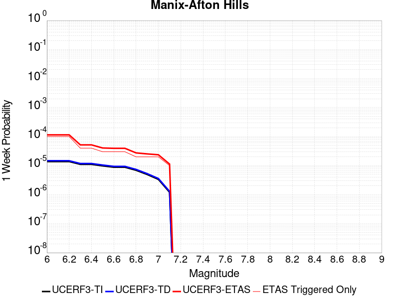 | 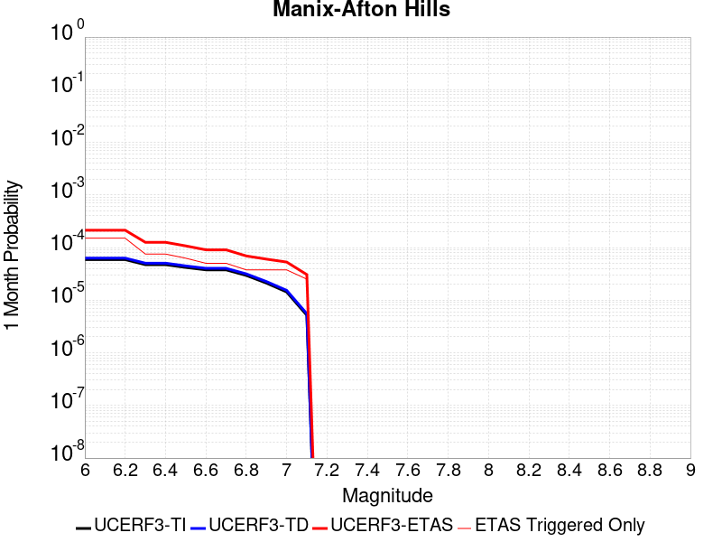 | 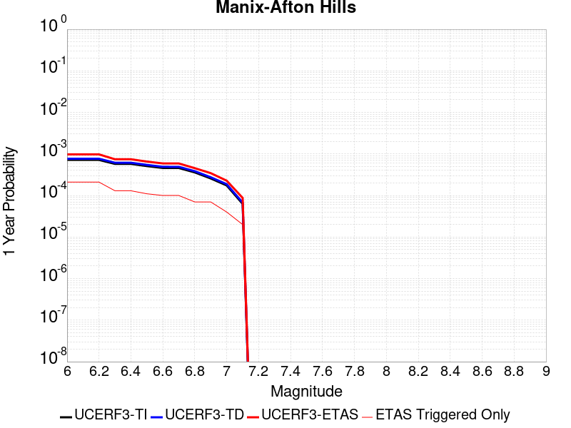 | 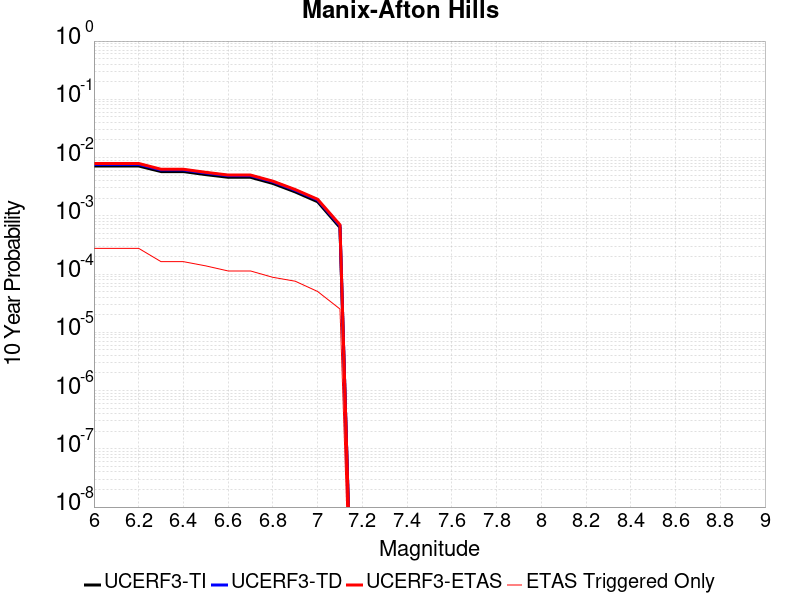 |

| Magnitude | 1 wk TI Prob | 1 wk TD Prob | 1 wk ETAS Prob | 1 wk ETAS/TD Gain | 1 wk ETAS Triggered Only | 1 mo TI Prob | 1 mo TD Prob | 1 mo ETAS Prob | 1 mo ETAS/TD Gain | 1 mo ETAS Triggered Only | 1 yr TI Prob | 1 yr TD Prob | 1 yr ETAS Prob | 1 yr ETAS/TD Gain | 1 yr ETAS Triggered Only | 10 yr TI Prob | 10 yr TD Prob | 10 yr ETAS Prob | 10 yr ETAS/TD Gain | 10 yr ETAS Triggered Only |
|-----|-----|-----|-----|-----|-----|-----|-----|-----|-----|-----|-----|-----|-----|-----|-----|-----|-----|-----|-----|-----|
| 6.0 | 1.3783202E-5 | 1.47110895E-5 | 1.1470962E-4 | 7.797493 | 1.0E-4 | 5.906953E-5 | 6.30461E-5 | 1.8303854E-4 | 2.903249 | 1.2E-4 | 7.189342E-4 | 7.6733343E-4 | 9.771723E-4 | 1.273465 | 2.1E-4 | 0.0071661277 | 0.007648596 | 0.00788676 | 1.0311383 | 2.4E-4 |
| 6.1 | 1.3783202E-5 | 1.47110895E-5 | 1.1470962E-4 | 7.797493 | 1.0E-4 | 5.906953E-5 | 6.30461E-5 | 1.8303854E-4 | 2.903249 | 1.2E-4 | 7.189342E-4 | 7.6733343E-4 | 9.771723E-4 | 1.273465 | 2.1E-4 | 0.0071661277 | 0.007648596 | 0.00788676 | 1.0311383 | 2.4E-4 |
| 6.2 | 1.3783202E-5 | 1.47110895E-5 | 1.1470962E-4 | 7.797493 | 1.0E-4 | 5.906953E-5 | 6.30461E-5 | 1.8303854E-4 | 2.903249 | 1.2E-4 | 7.189342E-4 | 7.6733343E-4 | 9.771723E-4 | 1.273465 | 2.1E-4 | 0.0071661277 | 0.007648596 | 0.00788676 | 1.0311383 | 2.4E-4 |
| 6.3 | 1.10494875E-5 | 1.1793136E-5 | 5.1792664E-5 | 4.3917637 | 4.0E-5 | 4.7354086E-5 | 5.054109E-5 | 1.1053806E-4 | 2.1870928 | 6.0E-5 | 5.763835E-4 | 6.151744E-4 | 7.4509444E-4 | 1.2111921 | 1.3E-4 | 0.005748908 | 0.0061357557 | 0.0062848353 | 1.0242969 | 1.5E-4 |
| 6.4 | 1.10494875E-5 | 1.1793136E-5 | 5.1792664E-5 | 4.3917637 | 4.0E-5 | 4.7354086E-5 | 5.054109E-5 | 1.1053806E-4 | 2.1870928 | 6.0E-5 | 5.763835E-4 | 6.151744E-4 | 7.4509444E-4 | 1.2111921 | 1.3E-4 | 0.005748908 | 0.0061357557 | 0.0062848353 | 1.0242969 | 1.5E-4 |
| 6.5 | 9.788949E-6 | 1.045432E-5 | 4.0454004E-5 | 3.8695972 | 3.0E-5 | 4.1951964E-5 | 4.480351E-5 | 9.480127E-5 | 2.115934 | 5.0E-5 | 5.1064545E-4 | 5.453555E-4 | 6.552955E-4 | 1.2015933 | 1.1E-4 | 0.0050947363 | 0.0054410985 | 0.005570391 | 1.0237622 | 1.3E-4 |
| 6.6 | 8.810006E-6 | 9.4136285E-6 | 3.9413346E-5 | 4.186839 | 3.0E-5 | 3.775662E-5 | 4.0343548E-5 | 8.034193E-5 | 1.9914445 | 4.0E-5 | 4.5958988E-4 | 4.9108086E-4 | 5.9103174E-4 | 1.2035325 | 1.0E-4 | 0.0045864056 | 0.004900839 | 0.0050103 | 1.0223352 | 1.1E-4 |
| 6.7 | 8.80128E-6 | 9.404108E-6 | 3.9403825E-5 | 4.1900654 | 3.0E-5 | 3.7719226E-5 | 4.0302748E-5 | 8.0301135E-5 | 1.9924482 | 4.0E-5 | 4.591348E-4 | 4.9058435E-4 | 5.905353E-4 | 1.2037386 | 1.0E-4 | 0.004581874 | 0.0048958957 | 0.0050053573 | 1.0223578 | 1.1E-4 |
| 6.8 | 6.8994877E-6 | 7.380076E-6 | 2.7379929E-5 | 3.7099793 | 2.0E-5 | 2.9568899E-5 | 3.162856E-5 | 6.162761E-5 | 1.9484799 | 3.0E-5 | 3.5994186E-4 | 3.8501783E-4 | 4.549909E-4 | 1.1817398 | 7.0E-5 | 0.003593594 | 0.0038443129 | 0.003924005 | 1.02073 | 8.0E-5 |
| 6.9 | 4.9328037E-6 | 5.2709615E-6 | 2.5270856E-5 | 4.794354 | 2.0E-5 | 2.1140417E-5 | 2.2589675E-5 | 5.2588995E-5 | 2.3280103 | 3.0E-5 | 2.5735417E-4 | 2.7500073E-4 | 3.4498147E-4 | 1.2544748 | 7.0E-5 | 0.0025705635 | 0.0027472095 | 0.0028170173 | 1.0254104 | 7.0E-5 |
| 7.0 | 3.347973E-6 | 3.59003E-6 | 2.3589959E-5 | 6.5709643 | 2.0E-5 | 1.4348378E-5 | 1.5385775E-5 | 4.5385314E-5 | 2.949823 | 3.0E-5 | 1.746775E-4 | 1.8730981E-4 | 2.2730233E-4 | 1.2135099 | 4.0E-5 | 0.0017454025 | 0.0018719219 | 0.001911847 | 1.0213284 | 4.0E-5 |
| 7.1 | 1.2073567E-6 | 1.293482E-6 | 1.12934695E-5 | 8.73106 | 1.0E-5 | 5.1743755E-6 | 5.543492E-6 | 2.554338E-5 | 4.6078143 | 2.0E-5 | 6.29962E-5 | 6.749156E-5 | 8.749021E-5 | 1.2963134 | 2.0E-5 | 6.297835E-4 | 6.7487074E-4 | 6.9485727E-4 | 1.0296153 | 2.0E-5 |

## San Andreas (Creeping Section) 2011 CFM
*[(top)](#table-of-contents)*

| 1 Week | 1 Month | 1 Year | 10 Year |
|-----|-----|-----|-----|
|  | 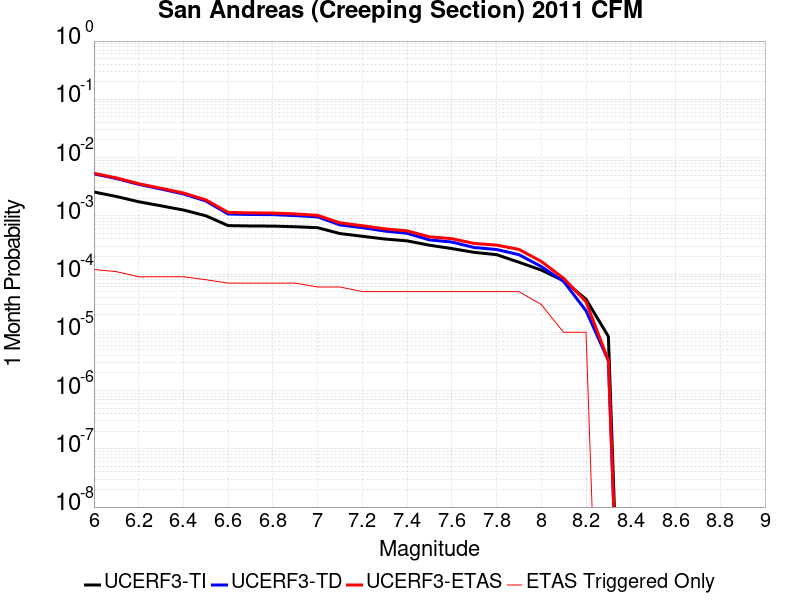 | 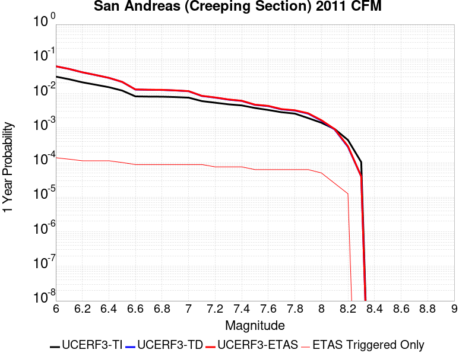 | 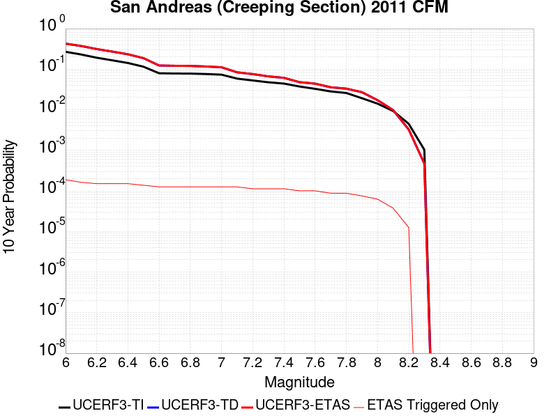 |

| Magnitude | 1 wk TI Prob | 1 wk TD Prob | 1 wk ETAS Prob | 1 wk ETAS/TD Gain | 1 wk ETAS Triggered Only | 1 mo TI Prob | 1 mo TD Prob | 1 mo ETAS Prob | 1 mo ETAS/TD Gain | 1 mo ETAS Triggered Only | 1 yr TI Prob | 1 yr TD Prob | 1 yr ETAS Prob | 1 yr ETAS/TD Gain | 1 yr ETAS Triggered Only | 10 yr TI Prob | 10 yr TD Prob | 10 yr ETAS Prob | 10 yr ETAS/TD Gain | 10 yr ETAS Triggered Only |
|-----|-----|-----|-----|-----|-----|-----|-----|-----|-----|-----|-----|-----|-----|-----|-----|-----|-----|-----|-----|-----|
| 6.0 | 5.986481E-4 | 0.0012275929 | 0.0013174824 | 1.0732242 | 9.0E-5 | 0.0025631124 | 0.005245547 | 0.005364917 | 1.0227566 | 1.2E-4 | 0.030762846 | 0.06120491 | 0.061364505 | 1.0026076 | 1.7E-4 | 0.26835477 | 0.42593494 | 0.4260555 | 1.000283 | 2.1E-4 |
| 6.1 | 5.015945E-4 | 0.0010217986 | 0.0011017168 | 1.0782133 | 8.0E-5 | 0.00214792 | 0.0043678596 | 0.004477379 | 1.025074 | 1.1E-4 | 0.025839351 | 0.05124837 | 0.05140017 | 1.002962 | 1.6E-4 | 0.23032776 | 0.37285668 | 0.37297583 | 1.0003196 | 1.9E-4 |
| 6.2 | 4.073338E-4 | 8.1073755E-4 | 8.8068075E-4 | 1.0862712 | 7.0E-5 | 0.0017445484 | 0.0034671477 | 0.0035568357 | 1.0258679 | 9.0E-5 | 0.021034058 | 0.04093317 | 0.041067436 | 1.0032802 | 1.4E-4 | 0.19150782 | 0.31303346 | 0.31315026 | 1.0003731 | 1.7E-4 |
| 6.3 | 3.464099E-4 | 6.7391695E-4 | 7.4386975E-4 | 1.1038004 | 7.0E-5 | 0.0014837692 | 0.0028829593 | 0.0029727 | 1.0311279 | 9.0E-5 | 0.017915873 | 0.034189582 | 0.034324795 | 1.0039548 | 1.4E-4 | 0.16538359 | 0.2713166 | 0.27144045 | 1.0004566 | 1.7E-4 |
| 6.4 | 2.935057E-4 | 5.5442745E-4 | 6.2438863E-4 | 1.1261864 | 7.0E-5 | 0.0012572751 | 0.0023725363 | 0.0024623228 | 1.0378441 | 9.0E-5 | 0.015200248 | 0.02826451 | 0.028400553 | 1.0048132 | 1.4E-4 | 0.14201577 | 0.23298529 | 0.23311567 | 1.0005597 | 1.7E-4 |
| 6.5 | 2.3409708E-4 | 4.2093755E-4 | 4.809123E-4 | 1.142479 | 6.0E-5 | 0.0010028875 | 0.0018019684 | 0.0018818243 | 1.0443159 | 8.0E-5 | 0.012141965 | 0.021587461 | 0.021704871 | 1.0054388 | 1.2E-4 | 0.11499573 | 0.18682368 | 0.18694566 | 1.0006529 | 1.5E-4 |
| 6.6 | 1.5842178E-4 | 2.506933E-4 | 3.1067827E-4 | 1.2392763 | 6.0E-5 | 6.7877385E-4 | 0.0010739497 | 0.0011438746 | 1.06511 | 7.0E-5 | 0.0082328 | 0.012995575 | 0.013104145 | 1.0083544 | 1.1E-4 | 0.07934396 | 0.12314638 | 0.12326914 | 1.0009968 | 1.4E-4 |
| 6.7 | 1.5616413E-4 | 2.4605883E-4 | 3.0604406E-4 | 1.2437842 | 6.0E-5 | 6.691031E-4 | 0.0010541069 | 0.001124033 | 1.066337 | 7.0E-5 | 0.0081159435 | 0.01275744 | 0.012866037 | 1.0085124 | 1.1E-4 | 0.0782586 | 0.12117351 | 0.12129655 | 1.0010154 | 1.4E-4 |
| 6.8 | 1.5538467E-4 | 2.4429744E-4 | 3.042828E-4 | 1.2455423 | 6.0E-5 | 6.6576427E-4 | 0.0010465645 | 0.0011164913 | 1.0668155 | 7.0E-5 | 0.008075596 | 0.012666838 | 0.012775445 | 1.0085741 | 1.1E-4 | 0.07788358 | 0.120404355 | 0.1205275 | 1.0010227 | 1.4E-4 |
| 6.9 | 1.5153569E-4 | 2.3539034E-4 | 2.953762E-4 | 1.2548357 | 6.0E-5 | 6.49277E-4 | 0.0010084276 | 0.001078357 | 1.069345 | 7.0E-5 | 0.007876333 | 0.01220901 | 0.012317668 | 1.0088997 | 1.1E-4 | 0.07602952 | 0.11647445 | 0.116598144 | 1.001062 | 1.4E-4 |
| 7.0 | 1.4588932E-4 | 2.2396253E-4 | 2.7395133E-4 | 1.2232016 | 5.0E-5 | 6.250901E-4 | 9.5948833E-4 | 0.0010194308 | 1.0624733 | 6.0E-5 | 0.0075839474 | 0.011619697 | 0.011718535 | 1.0085061 | 1.0E-4 | 0.073302895 | 0.11132046 | 0.11143599 | 1.0010378 | 1.3E-4 |
| 7.1 | 1.1565079E-4 | 1.6281738E-4 | 2.1280925E-4 | 1.3070425 | 5.0E-5 | 4.955521E-4 | 6.9760304E-4 | 7.575612E-4 | 1.0859488 | 6.0E-5 | 0.006016669 | 0.0084604435 | 0.008549682 | 1.0105478 | 9.0E-5 | 0.058563538 | 0.08367046 | 0.08378042 | 1.0013142 | 1.2E-4 |
| 7.2 | 1.0393792E-4 | 1.4615769E-4 | 1.8615184E-4 | 1.273637 | 4.0E-5 | 4.4537216E-4 | 6.2624045E-4 | 6.7620917E-4 | 1.0797915 | 5.0E-5 | 0.005408933 | 0.0075979927 | 0.0076773847 | 1.010449 | 8.0E-5 | 0.052791595 | 0.07561969 | 0.075721376 | 1.0013447 | 1.1E-4 |
| 7.3 | 9.332884E-5 | 1.2780898E-4 | 1.6780387E-4 | 1.312927 | 4.0E-5 | 3.999194E-4 | 5.4763845E-4 | 5.9761107E-4 | 1.0912511 | 5.0E-5 | 0.0048581534 | 0.006647249 | 0.006726717 | 1.011955 | 8.0E-5 | 0.047533102 | 0.06648326 | 0.06658594 | 1.0015446 | 1.1E-4 |
| 7.4 | 8.670252E-5 | 1.17032345E-4 | 1.5702767E-4 | 1.3417459 | 4.0E-5 | 3.715293E-4 | 5.0147134E-4 | 5.514463E-4 | 1.0996566 | 5.0E-5 | 0.004513991 | 0.006088443 | 0.0061679557 | 1.0130596 | 8.0E-5 | 0.044233937 | 0.061151642 | 0.06125492 | 1.0016888 | 1.1E-4 |
| 7.5 | 7.3036405E-5 | 9.005856E-5 | 1.3005496E-4 | 1.4441154 | 4.0E-5 | 3.129756E-4 | 3.8590826E-4 | 4.3588897E-4 | 1.1295145 | 5.0E-5 | 0.0038038217 | 0.0046883323 | 0.004758004 | 1.0148606 | 7.0E-5 | 0.03739367 | 0.047877792 | 0.047973003 | 1.0019886 | 1.0E-4 |
| 7.6 | 6.3935775E-5 | 8.280385E-5 | 1.2280053E-4 | 1.4830294 | 4.0E-5 | 2.7398168E-4 | 3.5482543E-4 | 4.0480768E-4 | 1.1408644 | 5.0E-5 | 0.0033306254 | 0.004311461 | 0.0043811593 | 1.0161659 | 7.0E-5 | 0.032811474 | 0.04399201 | 0.044087607 | 1.0021732 | 1.0E-4 |
| 7.7 | 5.5050095E-5 | 6.6618326E-5 | 1.0661566E-4 | 1.6003953 | 4.0E-5 | 2.3590765E-4 | 2.854759E-4 | 3.3546163E-4 | 1.1750962 | 5.0E-5 | 0.0028683927 | 0.003470134 | 0.003539891 | 1.0201021 | 7.0E-5 | 0.0283165 | 0.035796214 | 0.03588299 | 1.0024242 | 9.0E-5 |
| 7.8 | 5.027131E-5 | 6.162871E-5 | 1.0162624E-4 | 1.6490082 | 4.0E-5 | 2.1543067E-4 | 2.640963E-4 | 3.140831E-4 | 1.1892749 | 5.0E-5 | 0.0026197135 | 0.003210635 | 0.0032804103 | 1.0217326 | 7.0E-5 | 0.025890453 | 0.03312666 | 0.03321368 | 1.0026269 | 9.0E-5 |
| 7.9 | 3.7271806E-5 | 5.022507E-5 | 9.022306E-5 | 1.796375 | 4.0E-5 | 1.5972654E-4 | 2.1523255E-4 | 2.6522178E-4 | 1.2322569 | 5.0E-5 | 0.0019429359 | 0.002617309 | 0.002687126 | 1.026675 | 7.0E-5 | 0.019260362 | 0.027067466 | 0.0271453 | 1.0028756 | 8.0E-5 |
| 8.0 | 2.7310243E-5 | 3.1427757E-5 | 5.142713E-5 | 1.6363602 | 2.0E-5 | 1.17038646E-4 | 1.3468343E-4 | 1.646794E-4 | 1.2227145 | 3.0E-5 | 0.0014240141 | 0.0016385383 | 0.0016784729 | 1.024372 | 4.0E-5 | 0.014149235 | 0.01721386 | 0.017262999 | 1.0028546 | 5.0E-5 |
| 8.1 | 1.7940547E-5 | 1.7399378E-5 | 2.7399203E-5 | 1.5747232 | 1.0E-5 | 7.688579E-5 | 7.456663E-5 | 8.456589E-5 | 1.1340983 | 1.0E-5 | 9.3568244E-4 | 9.074711E-4 | 9.27453E-4 | 1.0220193 | 2.0E-5 | 0.009317525 | 0.009798636 | 0.009828341 | 1.0030316 | 3.0E-5 |
| 8.2 | 8.643924E-6 | 5.473668E-6 | 1.5473614E-5 | 2.8269184 | 1.0E-5 | 3.704486E-5 | 2.3458366E-5 | 3.345813E-5 | 1.4262772 | 1.0E-5 | 4.5092785E-4 | 2.8556827E-4 | 2.955654E-4 | 1.035008 | 1.0E-5 | 0.0045001395 | 0.0032481793 | 0.003258147 | 1.0030687 | 1.0E-5 |
| 8.3 | 1.983087E-6 | 7.6564595E-7 | 7.6564595E-7 | 1.0 | 0.0 | 8.498917E-6 | 3.281336E-6 | 3.281336E-6 | 1.0 | 0.0 | 1.034694E-4 | 3.9949547E-5 | 3.9949547E-5 | 1.0 | 0.0 | 0.0010342124 | 4.717979E-4 | 4.717979E-4 | 1.0 | 0.0 |

## Baker
*[(top)](#table-of-contents)*

| 1 Week | 1 Month | 1 Year | 10 Year |
|-----|-----|-----|-----|
| 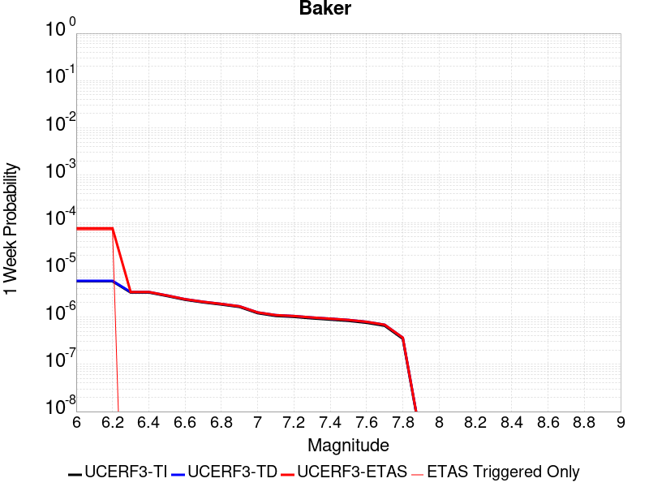 | 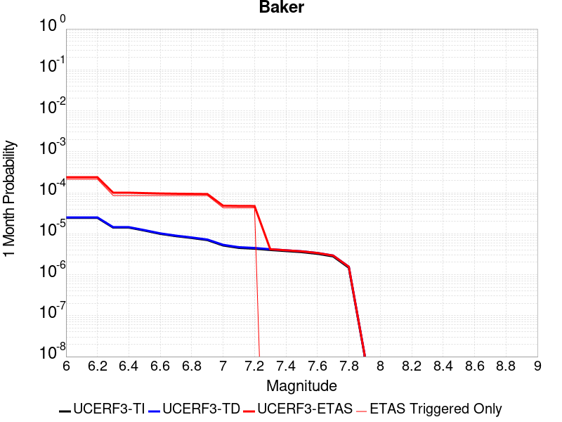 | 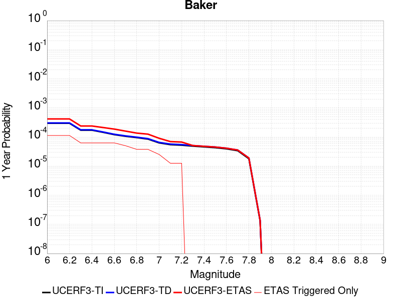 | 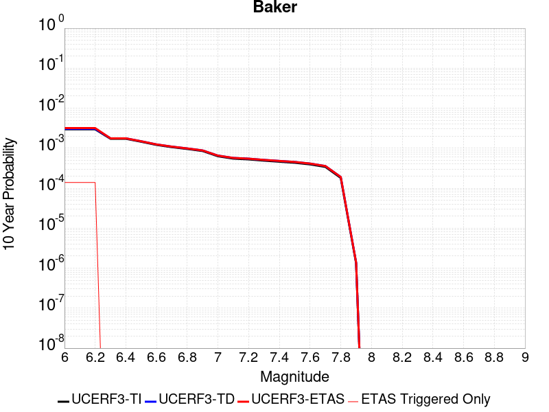 |

| Magnitude | 1 wk TI Prob | 1 wk TD Prob | 1 wk ETAS Prob | 1 wk ETAS/TD Gain | 1 wk ETAS Triggered Only | 1 mo TI Prob | 1 mo TD Prob | 1 mo ETAS Prob | 1 mo ETAS/TD Gain | 1 mo ETAS Triggered Only | 1 yr TI Prob | 1 yr TD Prob | 1 yr ETAS Prob | 1 yr ETAS/TD Gain | 1 yr ETAS Triggered Only | 10 yr TI Prob | 10 yr TD Prob | 10 yr ETAS Prob | 10 yr ETAS/TD Gain | 10 yr ETAS Triggered Only |
|-----|-----|-----|-----|-----|-----|-----|-----|-----|-----|-----|-----|-----|-----|-----|-----|-----|-----|-----|-----|-----|
| 6.0 | 5.695525E-6 | 5.8348373E-6 | 6.583449E-5 | 11.283004 | 6.0E-5 | 2.4409164E-5 | 2.5006228E-5 | 9.500448E-5 | 3.7992327 | 7.0E-5 | 2.9714106E-4 | 3.044123E-4 | 4.0438186E-4 | 1.3284018 | 1.0E-4 | 0.0029674405 | 0.0030403486 | 0.0032696493 | 1.0754192 | 2.3E-4 |
| 6.1 | 5.695525E-6 | 5.8348373E-6 | 6.583449E-5 | 11.283004 | 6.0E-5 | 2.4409164E-5 | 2.5006228E-5 | 9.500448E-5 | 3.7992327 | 7.0E-5 | 2.9714106E-4 | 3.044123E-4 | 4.0438186E-4 | 1.3284018 | 1.0E-4 | 0.0029674405 | 0.0030403486 | 0.0032696493 | 1.0754192 | 2.3E-4 |
| 6.2 | 5.695525E-6 | 5.8348373E-6 | 6.583449E-5 | 11.283004 | 6.0E-5 | 2.4409164E-5 | 2.5006228E-5 | 9.500448E-5 | 3.7992327 | 7.0E-5 | 2.9714106E-4 | 3.044123E-4 | 4.0438186E-4 | 1.3284018 | 1.0E-4 | 0.0029674405 | 0.0030403486 | 0.0032696493 | 1.0754192 | 2.3E-4 |
| 6.3 | 3.2995713E-6 | 3.383667E-6 | 4.338353E-5 | 12.821454 | 4.0E-5 | 1.4140943E-5 | 1.4501353E-5 | 5.450077E-5 | 3.7583234 | 4.0E-5 | 1.7215237E-4 | 1.7654014E-4 | 2.2653131E-4 | 1.2831718 | 5.0E-5 | 0.0017201907 | 0.001764046 | 0.001873852 | 1.0622467 | 1.1E-4 |
| 6.4 | 3.2995713E-6 | 3.383667E-6 | 4.338353E-5 | 12.821454 | 4.0E-5 | 1.4140943E-5 | 1.4501353E-5 | 5.450077E-5 | 3.7583234 | 4.0E-5 | 1.7215237E-4 | 1.7654014E-4 | 2.2653131E-4 | 1.2831718 | 5.0E-5 | 0.0017201907 | 0.001764046 | 0.001873852 | 1.0622467 | 1.1E-4 |
| 6.5 | 2.782202E-6 | 2.8558404E-6 | 4.2855725E-5 | 15.006345 | 4.0E-5 | 1.1923668E-5 | 1.223926E-5 | 5.223877E-5 | 4.2681313 | 4.0E-5 | 1.4516099E-4 | 1.4900314E-4 | 1.989957E-4 | 1.3355134 | 5.0E-5 | 0.001450662 | 0.0014890651 | 0.0015889162 | 1.0670562 | 1.0E-4 |
| 6.6 | 2.3163404E-6 | 2.38092E-6 | 4.2380823E-5 | 17.800188 | 4.0E-5 | 9.927136E-6 | 1.0203904E-5 | 5.0203496E-5 | 4.920028 | 4.0E-5 | 1.20856166E-4 | 1.2422565E-4 | 1.7421944E-4 | 1.4024434 | 5.0E-5 | 0.0012079047 | 0.0012415823 | 0.0013414582 | 1.0804424 | 1.0E-4 |
| 6.7 | 2.037056E-6 | 2.0965003E-6 | 3.209644E-5 | 15.30953 | 3.0E-5 | 8.7302105E-6 | 8.984972E-6 | 3.89847E-5 | 4.3388786 | 3.0E-5 | 1.0628513E-4 | 1.093867E-4 | 1.4938232E-4 | 1.3656352 | 4.0E-5 | 0.0010623431 | 0.0010933448 | 0.0011632682 | 1.0639538 | 7.0E-5 |
| 6.8 | 1.8356744E-6 | 1.8915287E-6 | 2.189149E-5 | 11.573439 | 2.0E-5 | 7.867153E-6 | 8.106527E-6 | 2.8106366E-5 | 3.4671278 | 2.0E-5 | 9.577837E-5 | 9.869264E-5 | 1.2868967E-4 | 1.303944 | 3.0E-5 | 9.57371E-4 | 9.86502E-4 | 0.0010464429 | 1.060761 | 6.0E-5 |
| 6.9 | 1.6310546E-6 | 1.6832072E-6 | 2.1683174E-5 | 12.882058 | 2.0E-5 | 6.9902153E-6 | 7.213726E-6 | 2.7213582E-5 | 3.7724724 | 2.0E-5 | 8.510255E-5 | 8.782368E-5 | 1.1782105E-4 | 1.3415635 | 3.0E-5 | 8.5069967E-4 | 8.7790104E-4 | 9.278572E-4 | 1.0569041 | 5.0E-5 |
| 7.0 | 1.2058036E-6 | 1.2508665E-6 | 1.1250854E-5 | 8.994448 | 1.0E-5 | 5.1677193E-6 | 5.3608455E-6 | 1.5360793E-5 | 2.8653674 | 1.0E-5 | 6.291517E-5 | 6.5266366E-5 | 8.526506E-5 | 1.3064165 | 2.0E-5 | 6.289736E-4 | 6.524743E-4 | 6.924482E-4 | 1.0612651 | 4.0E-5 |
| 7.1 | 1.052382E-6 | 1.0951609E-6 | 1.109515E-5 | 10.131069 | 1.0E-5 | 4.5102006E-6 | 4.693538E-6 | 1.4693491E-5 | 3.1305788 | 1.0E-5 | 5.491031E-5 | 5.7142337E-5 | 6.7141766E-5 | 1.1749916 | 1.0E-5 | 5.4896745E-4 | 5.7127734E-4 | 6.0126017E-4 | 1.0524839 | 3.0E-5 |
| 7.2 | 1.0067454E-6 | 1.0487711E-6 | 1.1048761E-5 | 10.53496 | 1.0E-5 | 4.3146156E-6 | 4.4947255E-6 | 1.4494681E-5 | 3.22482 | 1.0E-5 | 5.252918E-5 | 5.4721917E-5 | 6.472137E-5 | 1.1827321 | 1.0E-5 | 5.251676E-4 | 5.470853E-4 | 5.6707434E-4 | 1.0365374 | 2.0E-5 |
| 7.3 | 9.3596316E-7 | 9.767723E-7 | 9.767723E-7 | 1.0 | 0.0 | 4.0112645E-6 | 4.1861604E-6 | 4.1861604E-6 | 1.0 | 0.0 | 4.8836053E-5 | 5.096532E-5 | 5.096532E-5 | 1.0 | 0.0 | 4.8825322E-4 | 5.095371E-4 | 5.19532E-4 | 1.0196157 | 1.0E-5 |
| 7.4 | 8.8117395E-7 | 9.2076635E-7 | 9.2076635E-7 | 1.0 | 0.0 | 3.7764542E-6 | 3.9461356E-6 | 3.9461356E-6 | 1.0 | 0.0 | 4.5977362E-5 | 4.8043148E-5 | 4.8043148E-5 | 1.0 | 0.0 | 4.596785E-4 | 4.8032837E-4 | 4.903236E-4 | 1.020809 | 1.0E-5 |
| 7.5 | 8.292386E-7 | 8.6745956E-7 | 8.6745956E-7 | 1.0 | 0.0 | 3.5538749E-6 | 3.7176785E-6 | 3.7176785E-6 | 1.0 | 0.0 | 4.326757E-5 | 4.5261804E-5 | 4.5261804E-5 | 1.0 | 0.0 | 4.3259145E-4 | 4.5252658E-4 | 4.6252206E-4 | 1.0220882 | 1.0E-5 |
| 7.6 | 7.553842E-7 | 7.9144706E-7 | 7.9144706E-7 | 1.0 | 0.0 | 3.2373566E-6 | 3.3919116E-6 | 3.3919116E-6 | 1.0 | 0.0 | 3.9414106E-5 | 4.129575E-5 | 4.129575E-5 | 1.0 | 0.0 | 3.9407116E-4 | 4.1288146E-4 | 4.2287732E-4 | 1.02421 | 1.0E-5 |
| 7.7 | 6.5285366E-7 | 6.852797E-7 | 6.852797E-7 | 1.0 | 0.0 | 2.797941E-6 | 2.9369096E-6 | 2.9369096E-6 | 1.0 | 0.0 | 3.40644E-5 | 3.5756293E-5 | 3.5756293E-5 | 1.0 | 0.0 | 3.405918E-4 | 3.5750607E-4 | 3.675025E-4 | 1.0279616 | 1.0E-5 |
| 7.8 | 3.4586725E-7 | 3.6482615E-7 | 3.6482615E-7 | 1.0 | 0.0 | 1.4822873E-6 | 1.5635396E-6 | 1.5635396E-6 | 1.0 | 0.0 | 1.80467E-5 | 1.9035933E-5 | 1.9035933E-5 | 1.0 | 0.0 | 1.8045233E-4 | 1.9034347E-4 | 2.0034157E-4 | 1.0525266 | 1.0E-5 |
| 7.9 | 2.5591178E-9 | 2.6696718E-9 | 2.6696718E-9 | 1.0 | 0.0 | 1.0967647E-8 | 1.14414505E-8 | 1.14414505E-8 | 1.0 | 0.0 | 1.335311E-7 | 1.3929966E-7 | 1.3929966E-7 | 1.0 | 0.0 | 1.3353102E-6 | 1.3929966E-6 | 1.3929966E-6 | 1.0 | 0.0 |

## San Andreas (North Branch Mill Creek)
*[(top)](#table-of-contents)*

| 1 Week | 1 Month | 1 Year | 10 Year |
|-----|-----|-----|-----|
| 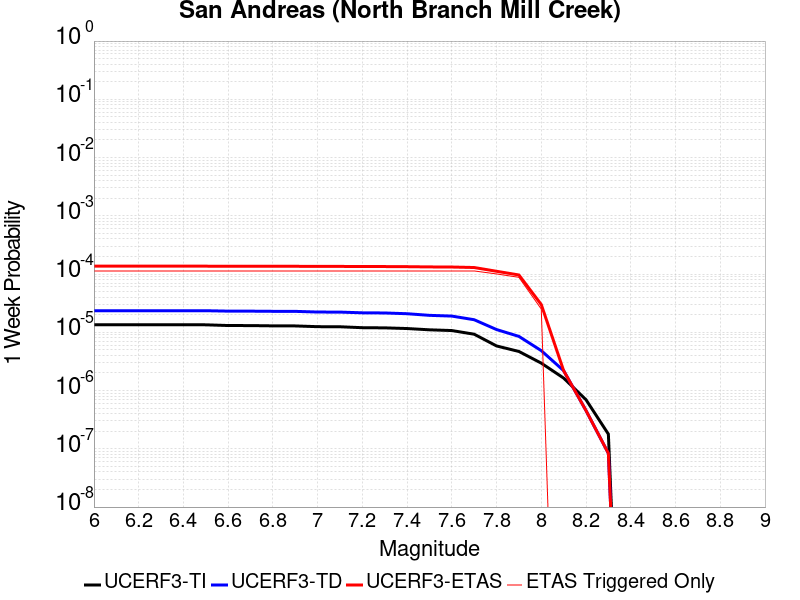 | 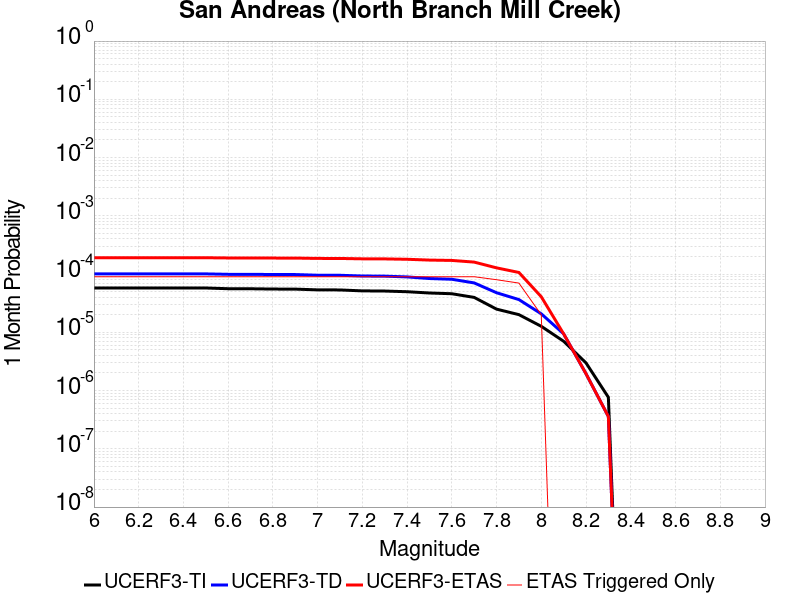 | 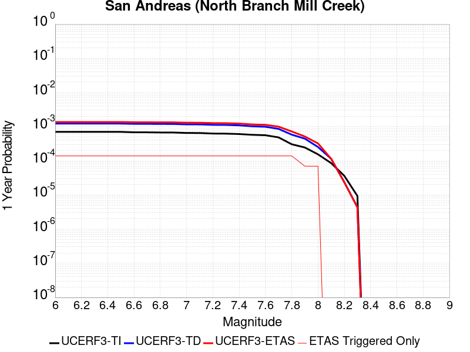 | 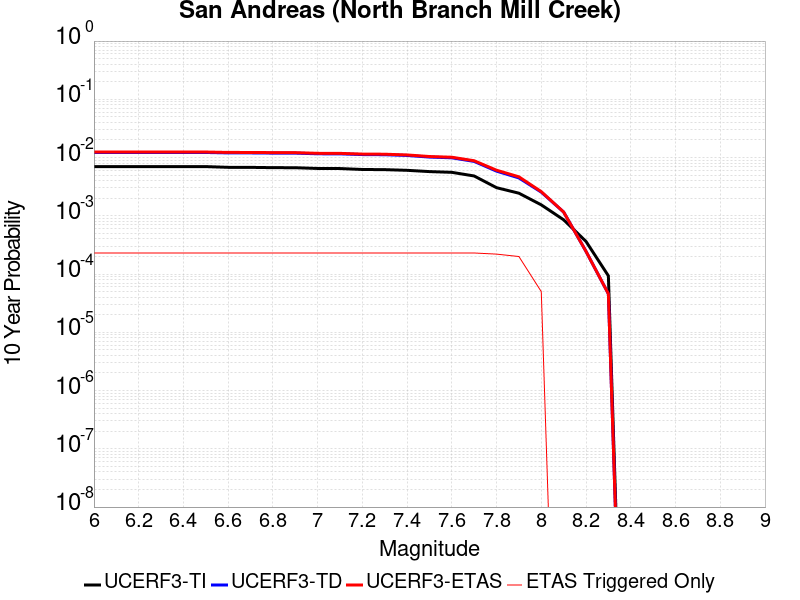 |

| Magnitude | 1 wk TI Prob | 1 wk TD Prob | 1 wk ETAS Prob | 1 wk ETAS/TD Gain | 1 wk ETAS Triggered Only | 1 mo TI Prob | 1 mo TD Prob | 1 mo ETAS Prob | 1 mo ETAS/TD Gain | 1 mo ETAS Triggered Only | 1 yr TI Prob | 1 yr TD Prob | 1 yr ETAS Prob | 1 yr ETAS/TD Gain | 1 yr ETAS Triggered Only | 10 yr TI Prob | 10 yr TD Prob | 10 yr ETAS Prob | 10 yr ETAS/TD Gain | 10 yr ETAS Triggered Only |
|-----|-----|-----|-----|-----|-----|-----|-----|-----|-----|-----|-----|-----|-----|-----|-----|-----|-----|-----|-----|-----|
| 6.0 | 1.3461156E-5 | 2.3500992E-5 | 1.1349888E-4 | 4.8295355 | 9.0E-5 | 5.7689394E-5 | 1.00714664E-4 | 1.907056E-4 | 1.8935237 | 9.0E-5 | 7.02142E-4 | 0.0012255146 | 0.0013453675 | 1.097798 | 1.2E-4 | 0.0069992766 | 0.012228744 | 0.012455932 | 1.0185782 | 2.3E-4 |
| 6.1 | 1.3461156E-5 | 2.3500992E-5 | 1.1349888E-4 | 4.8295355 | 9.0E-5 | 5.7689394E-5 | 1.00714664E-4 | 1.907056E-4 | 1.8935237 | 9.0E-5 | 7.02142E-4 | 0.0012255146 | 0.0013453675 | 1.097798 | 1.2E-4 | 0.0069992766 | 0.012228744 | 0.012455932 | 1.0185782 | 2.3E-4 |
| 6.2 | 1.3461156E-5 | 2.3500992E-5 | 1.1349888E-4 | 4.8295355 | 9.0E-5 | 5.7689394E-5 | 1.00714664E-4 | 1.907056E-4 | 1.8935237 | 9.0E-5 | 7.02142E-4 | 0.0012255146 | 0.0013453675 | 1.097798 | 1.2E-4 | 0.0069992766 | 0.012228744 | 0.012455932 | 1.0185782 | 2.3E-4 |
| 6.3 | 1.3461156E-5 | 2.3500992E-5 | 1.1349888E-4 | 4.8295355 | 9.0E-5 | 5.7689394E-5 | 1.00714664E-4 | 1.907056E-4 | 1.8935237 | 9.0E-5 | 7.02142E-4 | 0.0012255146 | 0.0013453675 | 1.097798 | 1.2E-4 | 0.0069992766 | 0.012228744 | 0.012455932 | 1.0185782 | 2.3E-4 |
| 6.4 | 1.3461156E-5 | 2.3500992E-5 | 1.1349888E-4 | 4.8295355 | 9.0E-5 | 5.7689394E-5 | 1.00714664E-4 | 1.907056E-4 | 1.8935237 | 9.0E-5 | 7.02142E-4 | 0.0012255146 | 0.0013453675 | 1.097798 | 1.2E-4 | 0.0069992766 | 0.012228744 | 0.012455932 | 1.0185782 | 2.3E-4 |
| 6.5 | 1.3450706E-5 | 2.348995E-5 | 1.1348784E-4 | 4.8313355 | 9.0E-5 | 5.764461E-5 | 1.00667356E-4 | 1.9065829E-4 | 1.8939437 | 9.0E-5 | 7.0159714E-4 | 0.0012249392 | 0.0013447923 | 1.097844 | 1.2E-4 | 0.006993862 | 0.012223054 | 0.012450242 | 1.0185869 | 2.3E-4 |
| 6.6 | 1.3074523E-5 | 2.3104236E-5 | 1.13102156E-4 | 4.8952994 | 9.0E-5 | 5.6032466E-5 | 9.901441E-5 | 1.890055E-4 | 1.9088686 | 9.0E-5 | 6.8198174E-4 | 0.001204837 | 0.0013246925 | 1.0994785 | 1.2E-4 | 0.006798926 | 0.012024219 | 0.0122514535 | 1.018898 | 2.3E-4 |
| 6.7 | 1.3050216E-5 | 2.3079532E-5 | 1.13077454E-4 | 4.899469 | 9.0E-5 | 5.59283E-5 | 9.890855E-5 | 1.8889965E-4 | 1.9098414 | 9.0E-5 | 6.8071426E-4 | 0.0012035496 | 0.0013234052 | 1.099585 | 1.2E-4 | 0.0067863287 | 0.012011484 | 0.012238721 | 1.0189184 | 2.3E-4 |
| 6.8 | 1.29049395E-5 | 2.2927941E-5 | 1.12925874E-4 | 4.9252515 | 9.0E-5 | 5.530571E-5 | 9.825892E-5 | 1.8825008E-4 | 1.9158574 | 9.0E-5 | 6.73139E-4 | 0.001195649 | 0.0013155056 | 1.1002439 | 1.2E-4 | 0.0067110364 | 0.011933329 | 0.012160583 | 1.0190438 | 2.3E-4 |
| 6.9 | 1.2867369E-5 | 2.2887343E-5 | 1.1288528E-4 | 4.9322143 | 9.0E-5 | 5.51447E-5 | 9.808494E-5 | 1.8807611E-4 | 1.917482 | 9.0E-5 | 6.711799E-4 | 0.0011935332 | 0.00131339 | 1.1004218 | 1.2E-4 | 0.006691564 | 0.011912397 | 0.0121396575 | 1.0190777 | 2.3E-4 |
| 7.0 | 1.2495996E-5 | 2.2287419E-5 | 1.12285416E-4 | 5.0380626 | 9.0E-5 | 5.3553173E-5 | 9.551403E-5 | 1.8550543E-4 | 1.9421799 | 9.0E-5 | 6.518148E-4 | 0.0011622658 | 0.0012821263 | 1.1031266 | 1.2E-4 | 0.0064990623 | 0.011603 | 0.011830331 | 1.0195924 | 2.3E-4 |
| 7.1 | 1.2452067E-5 | 2.2232492E-5 | 1.1223049E-4 | 5.0480394 | 9.0E-5 | 5.3364907E-5 | 9.527864E-5 | 1.8527007E-4 | 1.9445078 | 9.0E-5 | 6.4952404E-4 | 0.001159403 | 0.0012792639 | 1.1033815 | 1.2E-4 | 0.0064762887 | 0.011574671 | 0.011802008 | 1.0196409 | 2.3E-4 |
| 7.2 | 1.2002777E-5 | 2.1611015E-5 | 1.1160907E-4 | 5.164453 | 9.0E-5 | 5.143946E-5 | 9.261536E-5 | 1.8260702E-4 | 1.9716711 | 9.0E-5 | 6.2609545E-4 | 0.0011270114 | 0.0012468761 | 1.1063563 | 1.2E-4 | 0.006243344 | 0.011254058 | 0.0114814695 | 1.020207 | 2.3E-4 |
| 7.3 | 1.1923425E-5 | 2.1480853E-5 | 1.1147892E-4 | 5.1896877 | 9.0E-5 | 5.109939E-5 | 9.205757E-5 | 1.8204929E-4 | 1.9775591 | 9.0E-5 | 6.219575E-4 | 0.0011202273 | 0.0012400929 | 1.1070011 | 1.2E-4 | 0.0062021962 | 0.011186945 | 0.011414372 | 1.0203297 | 2.3E-4 |
| 7.4 | 1.16105175E-5 | 2.0854808E-5 | 1.1085293E-4 | 5.3154616 | 9.0E-5 | 4.975841E-5 | 8.93747E-5 | 1.7936666E-4 | 2.0069065 | 9.0E-5 | 6.0564023E-4 | 0.0010875963 | 0.0012074659 | 1.1102151 | 1.2E-4 | 0.006039923 | 0.010864409 | 0.01109191 | 1.0209401 | 2.3E-4 |
| 7.5 | 1.1037265E-5 | 1.9554842E-5 | 1.0955308E-4 | 5.6023507 | 9.0E-5 | 4.7301706E-5 | 8.380379E-5 | 1.7379624E-4 | 2.073847 | 9.0E-5 | 5.757461E-4 | 0.0010198357 | 0.0011397133 | 1.117546 | 1.2E-4 | 0.005742567 | 0.010195527 | 0.0104231825 | 1.0223289 | 2.3E-4 |
| 7.6 | 1.0720915E-5 | 1.8996727E-5 | 1.0899502E-4 | 5.737568 | 9.0E-5 | 4.5945973E-5 | 8.141202E-5 | 1.714047E-4 | 2.105398 | 9.0E-5 | 5.592486E-4 | 9.907428E-4 | 0.0011106239 | 1.1210012 | 1.2E-4 | 0.005578433 | 0.009907238 | 0.01013496 | 1.0229853 | 2.3E-4 |
| 7.7 | 9.276279E-6 | 1.6442464E-5 | 1.0644098E-4 | 6.473542 | 9.0E-5 | 3.9754876E-5 | 7.046581E-5 | 1.6045947E-4 | 2.2771251 | 9.0E-5 | 4.839081E-4 | 8.5758517E-4 | 9.774823E-4 | 1.1398078 | 1.2E-4 | 0.0048285574 | 0.008586576 | 0.008814601 | 1.026556 | 2.3E-4 |
| 7.8 | 5.8346777E-6 | 1.11555855E-5 | 9.1154696E-5 | 8.171216 | 8.0E-5 | 2.5005522E-5 | 4.7808775E-5 | 1.2780495E-4 | 2.673253 | 8.0E-5 | 3.043997E-4 | 5.819165E-4 | 6.918525E-4 | 1.1889205 | 1.1E-4 | 0.0030398308 | 0.0058473335 | 0.0060660467 | 1.037404 | 2.2E-4 |
| 7.9 | 4.690204E-6 | 8.509473E-6 | 7.850888E-5 | 9.226056 | 7.0E-5 | 2.0100719E-5 | 3.6468664E-5 | 1.0646611E-4 | 2.9193861 | 7.0E-5 | 2.4469878E-4 | 4.439156E-4 | 5.438712E-4 | 1.225168 | 1.0E-4 | 0.002444295 | 0.004471165 | 0.0046702707 | 1.0445311 | 2.0E-4 |
| 8.0 | 2.9570454E-6 | 4.8470656E-6 | 2.484697E-5 | 5.126188 | 2.0E-5 | 1.267299E-5 | 2.0772974E-5 | 4.0772557E-5 | 1.9627695 | 2.0E-5 | 1.5428272E-4 | 2.5288164E-4 | 2.7287658E-4 | 1.0790684 | 2.0E-5 | 0.0015417566 | 0.002549932 | 0.0025998047 | 1.0195583 | 5.0E-5 |
| 8.1 | 1.6376824E-6 | 2.1968672E-6 | 2.1968672E-6 | 1.0 | 0.0 | 7.01862E-6 | 9.415111E-6 | 9.415111E-6 | 1.0 | 0.0 | 8.544835E-5 | 1.1462297E-4 | 1.1462297E-4 | 1.0 | 0.0 | 8.54155E-4 | 0.0011607445 | 0.0011607445 | 1.0 | 0.0 |
| 8.2 | 6.9631557E-7 | 4.535001E-7 | 4.535001E-7 | 1.0 | 0.0 | 2.984206E-6 | 1.9435704E-6 | 1.9435704E-6 | 1.0 | 0.0 | 3.63321E-5 | 2.3662713E-5 | 2.3662713E-5 | 1.0 | 0.0 | 3.6326164E-4 | 2.4510184E-4 | 2.4510184E-4 | 1.0 | 0.0 |
| 8.3 | 1.7876137E-7 | 8.357368E-8 | 8.357368E-8 | 1.0 | 0.0 | 7.661199E-7 | 3.5817288E-7 | 3.5817288E-7 | 1.0 | 0.0 | 9.32747E-6 | 4.3607465E-6 | 4.3607465E-6 | 1.0 | 0.0 | 9.3270784E-5 | 4.5800018E-5 | 4.5800018E-5 | 1.0 | 0.0 |

## Santa Ynez (East)
*[(top)](#table-of-contents)*

| 1 Week | 1 Month | 1 Year | 10 Year |
|-----|-----|-----|-----|
| 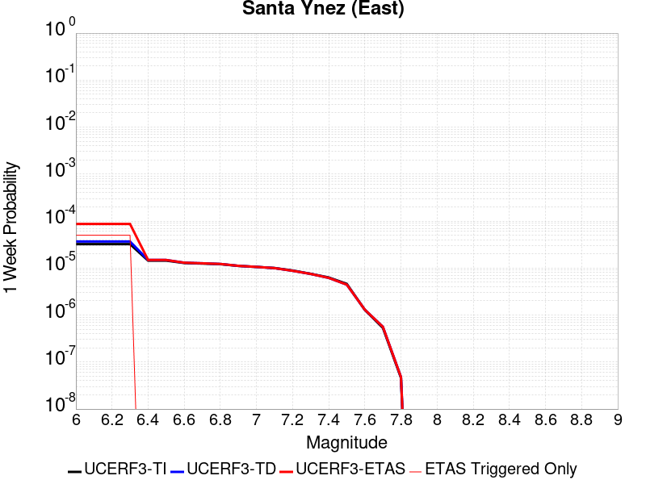 | 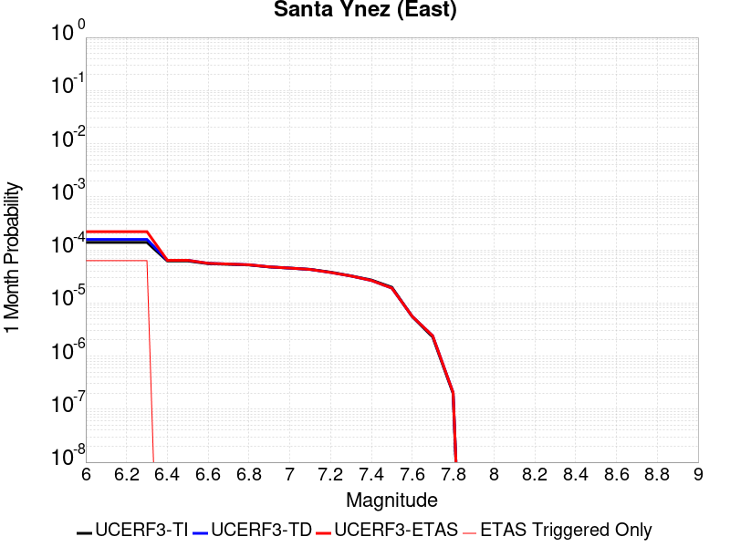 | 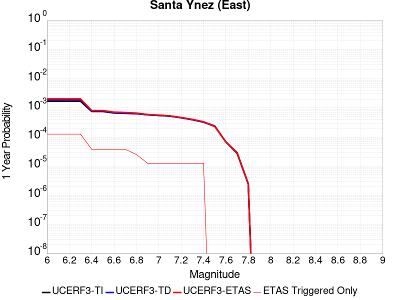 | 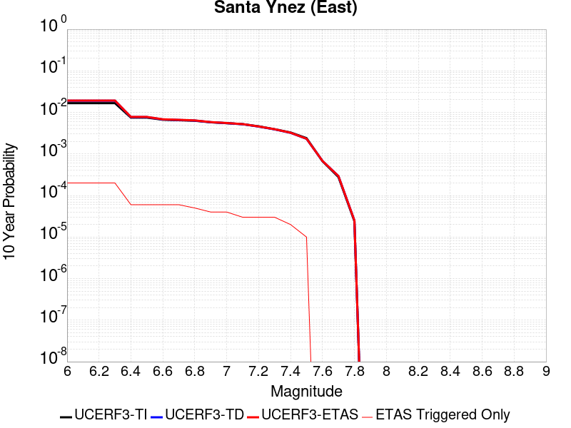 |

| Magnitude | 1 wk TI Prob | 1 wk TD Prob | 1 wk ETAS Prob | 1 wk ETAS/TD Gain | 1 wk ETAS Triggered Only | 1 mo TI Prob | 1 mo TD Prob | 1 mo ETAS Prob | 1 mo ETAS/TD Gain | 1 mo ETAS Triggered Only | 1 yr TI Prob | 1 yr TD Prob | 1 yr ETAS Prob | 1 yr ETAS/TD Gain | 1 yr ETAS Triggered Only | 10 yr TI Prob | 10 yr TD Prob | 10 yr ETAS Prob | 10 yr ETAS/TD Gain | 10 yr ETAS Triggered Only |
|-----|-----|-----|-----|-----|-----|-----|-----|-----|-----|-----|-----|-----|-----|-----|-----|-----|-----|-----|-----|-----|
| 6.0 | 3.2269712E-5 | 3.6750775E-5 | 8.6748936E-5 | 2.3604655 | 5.0E-5 | 1.3829143E-4 | 1.5749714E-4 | 2.1748769E-4 | 1.3808993 | 6.0E-5 | 0.0016823979 | 0.0019164253 | 0.0020461762 | 1.0677047 | 1.3E-4 | 0.016697178 | 0.019056438 | 0.019252626 | 1.0102952 | 2.0E-4 |
| 6.1 | 3.2269712E-5 | 3.6750775E-5 | 8.6748936E-5 | 2.3604655 | 5.0E-5 | 1.3829143E-4 | 1.5749714E-4 | 2.1748769E-4 | 1.3808993 | 6.0E-5 | 0.0016823979 | 0.0019164253 | 0.0020461762 | 1.0677047 | 1.3E-4 | 0.016697178 | 0.019056438 | 0.019252626 | 1.0102952 | 2.0E-4 |
| 6.2 | 3.2269712E-5 | 3.6750775E-5 | 8.6748936E-5 | 2.3604655 | 5.0E-5 | 1.3829143E-4 | 1.5749714E-4 | 2.1748769E-4 | 1.3808993 | 6.0E-5 | 0.0016823979 | 0.0019164253 | 0.0020461762 | 1.0677047 | 1.3E-4 | 0.016697178 | 0.019056438 | 0.019252626 | 1.0102952 | 2.0E-4 |
| 6.3 | 3.2269712E-5 | 3.6750775E-5 | 8.6748936E-5 | 2.3604655 | 5.0E-5 | 1.3829143E-4 | 1.5749714E-4 | 2.1748769E-4 | 1.3808993 | 6.0E-5 | 0.0016823979 | 0.0019164253 | 0.0020461762 | 1.0677047 | 1.3E-4 | 0.016697178 | 0.019056438 | 0.019252626 | 1.0102952 | 2.0E-4 |
| 6.4 | 1.4404779E-5 | 1.48492945E-5 | 1.48492945E-5 | 1.0 | 0.0 | 6.1733306E-5 | 6.363831E-5 | 6.363831E-5 | 1.0 | 0.0 | 7.513438E-4 | 7.7452604E-4 | 8.144951E-4 | 1.0516045 | 4.0E-5 | 0.0074880854 | 0.007718817 | 0.0077783535 | 1.0077132 | 6.0E-5 |
| 6.5 | 1.4404779E-5 | 1.48492945E-5 | 1.48492945E-5 | 1.0 | 0.0 | 6.1733306E-5 | 6.363831E-5 | 6.363831E-5 | 1.0 | 0.0 | 7.513438E-4 | 7.7452604E-4 | 8.144951E-4 | 1.0516045 | 4.0E-5 | 0.0074880854 | 0.007718817 | 0.0077783535 | 1.0077132 | 6.0E-5 |
| 6.6 | 1.280208E-5 | 1.301186E-5 | 1.301186E-5 | 1.0 | 0.0 | 5.4864904E-5 | 5.5763932E-5 | 5.5763932E-5 | 1.0 | 0.0 | 6.6777546E-4 | 6.7871617E-4 | 7.18689E-4 | 1.0588948 | 4.0E-5 | 0.006657724 | 0.0067666434 | 0.0068262373 | 1.0088071 | 6.0E-5 |
| 6.7 | 1.2457027E-5 | 1.262838E-5 | 1.262838E-5 | 1.0 | 0.0 | 5.3386164E-5 | 5.4120515E-5 | 5.4120515E-5 | 1.0 | 0.0 | 6.497827E-4 | 6.5871974E-4 | 6.986934E-4 | 1.0606838 | 4.0E-5 | 0.00647886 | 0.00656787 | 0.0066274754 | 1.0090754 | 6.0E-5 |
| 6.8 | 1.2095134E-5 | 1.2230827E-5 | 1.2230827E-5 | 1.0 | 0.0 | 5.1835254E-5 | 5.2416784E-5 | 5.2416784E-5 | 1.0 | 0.0 | 6.309115E-4 | 6.3798914E-4 | 6.6797E-4 | 1.0469928 | 3.0E-5 | 0.0062912325 | 0.006361764 | 0.006411446 | 1.0078094 | 5.0E-5 |
| 6.9 | 1.1104036E-5 | 1.115726E-5 | 1.115726E-5 | 1.0 | 0.0 | 4.758786E-5 | 4.781596E-5 | 4.781596E-5 | 1.0 | 0.0 | 5.7922816E-4 | 5.82005E-4 | 6.019934E-4 | 1.034344 | 2.0E-5 | 0.005777207 | 0.0058049536 | 0.0058447216 | 1.0068507 | 4.0E-5 |
| 7.0 | 1.0577444E-5 | 1.05815925E-5 | 1.05815925E-5 | 1.0 | 0.0 | 4.5331115E-5 | 4.53489E-5 | 4.53489E-5 | 1.0 | 0.0 | 5.5176654E-4 | 5.5198424E-4 | 5.7197316E-4 | 1.0362129 | 2.0E-5 | 0.0055039856 | 0.00550627 | 0.0055460497 | 1.0072244 | 4.0E-5 |
| 7.1 | 1.0021775E-5 | 9.9809E-6 | 9.9809E-6 | 1.0 | 0.0 | 4.294976E-5 | 4.277459E-5 | 4.277459E-5 | 1.0 | 0.0 | 5.2278786E-4 | 5.206574E-4 | 5.306522E-4 | 1.0191965 | 1.0E-5 | 0.0052155964 | 0.005194508 | 0.0052243522 | 1.0057453 | 3.0E-5 |
| 7.2 | 8.874109E-6 | 8.748706E-6 | 8.748706E-6 | 1.0 | 0.0 | 3.8031343E-5 | 3.7493923E-5 | 3.7493923E-5 | 1.0 | 0.0 | 4.629332E-4 | 4.56394E-4 | 4.6638944E-4 | 1.0219009 | 1.0E-5 | 0.0046197 | 0.0045546847 | 0.0045845485 | 1.0065566 | 3.0E-5 |
| 7.3 | 7.5504267E-6 | 7.5050243E-6 | 7.5050243E-6 | 1.0 | 0.0 | 3.235857E-5 | 3.2164E-5 | 3.2164E-5 | 1.0 | 0.0 | 3.9389438E-4 | 3.9152734E-4 | 4.0152343E-4 | 1.025531 | 1.0E-5 | 0.0039319694 | 0.0039084824 | 0.0039383653 | 1.0076456 | 3.0E-5 |
| 7.4 | 6.309394E-6 | 6.183062E-6 | 6.183062E-6 | 1.0 | 0.0 | 2.703998E-5 | 2.6498574E-5 | 2.6498574E-5 | 1.0 | 0.0 | 3.2916202E-4 | 3.2257332E-4 | 3.325701E-4 | 1.0309907 | 1.0E-5 | 0.003286749 | 0.0032211484 | 0.0032410838 | 1.006189 | 2.0E-5 |
| 7.5 | 4.6103073E-6 | 4.4408016E-6 | 4.4408016E-6 | 1.0 | 0.0 | 1.975831E-5 | 1.9031871E-5 | 1.9031871E-5 | 1.0 | 0.0 | 2.4053088E-4 | 2.316891E-4 | 2.316891E-4 | 1.0 | 0.0 | 0.002402707 | 0.002314545 | 0.0023245218 | 1.0043105 | 1.0E-5 |
| 7.6 | 1.2858658E-6 | 1.3008196E-6 | 1.3008196E-6 | 1.0 | 0.0 | 5.5108417E-6 | 5.574929E-6 | 5.574929E-6 | 1.0 | 0.0 | 6.7092435E-5 | 6.787272E-5 | 6.787272E-5 | 1.0 | 0.0 | 6.707218E-4 | 6.7852676E-4 | 6.7852676E-4 | 1.0 | 0.0 |
| 7.7 | 5.3302307E-7 | 5.612138E-7 | 5.612138E-7 | 1.0 | 0.0 | 2.2843826E-6 | 2.4052001E-6 | 2.4052001E-6 | 1.0 | 0.0 | 2.7812002E-5 | 2.9282955E-5 | 2.9282955E-5 | 1.0 | 0.0 | 2.7808524E-4 | 2.9279455E-4 | 2.9279455E-4 | 1.0 | 0.0 |
| 7.8 | 4.613933E-8 | 4.80301E-8 | 4.80301E-8 | 1.0 | 0.0 | 1.9773998E-7 | 2.0584326E-7 | 2.0584326E-7 | 1.0 | 0.0 | 2.4074816E-6 | 2.5061388E-6 | 2.5061388E-6 | 1.0 | 0.0 | 2.4074554E-5 | 2.5061116E-5 | 2.5061116E-5 | 1.0 | 0.0 |

## Lake Isabella (Seismicity)
*[(top)](#table-of-contents)*

| 1 Week | 1 Month | 1 Year | 10 Year |
|-----|-----|-----|-----|
| 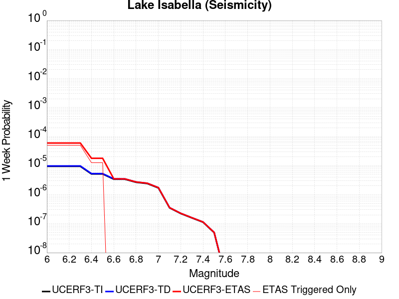 | 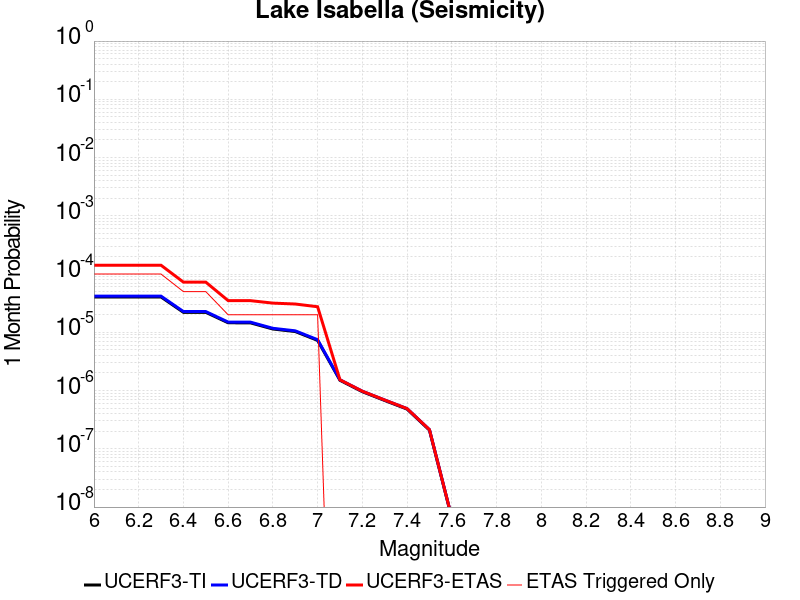 | 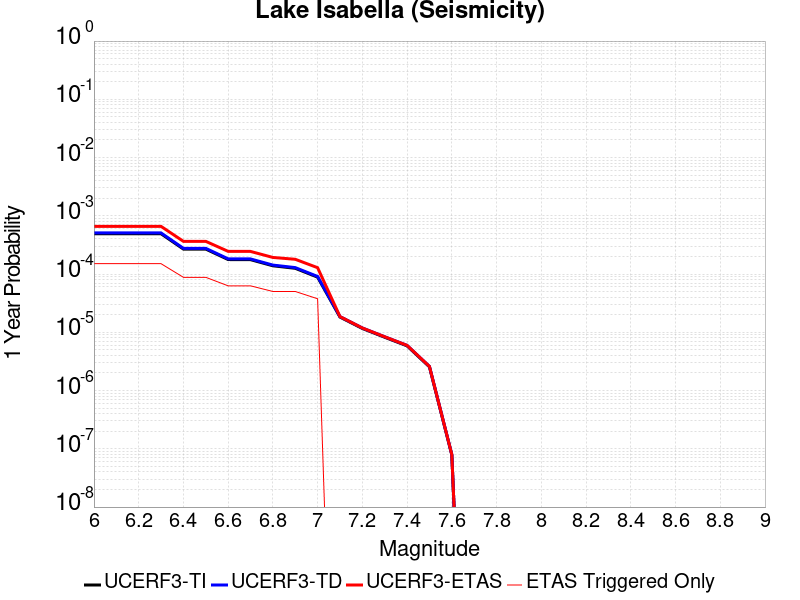 | 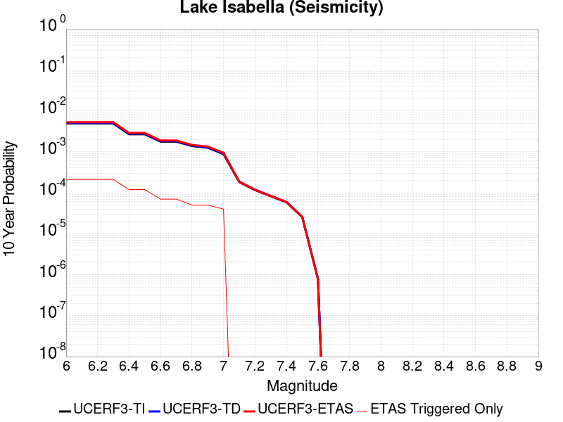 |

| Magnitude | 1 wk TI Prob | 1 wk TD Prob | 1 wk ETAS Prob | 1 wk ETAS/TD Gain | 1 wk ETAS Triggered Only | 1 mo TI Prob | 1 mo TD Prob | 1 mo ETAS Prob | 1 mo ETAS/TD Gain | 1 mo ETAS Triggered Only | 1 yr TI Prob | 1 yr TD Prob | 1 yr ETAS Prob | 1 yr ETAS/TD Gain | 1 yr ETAS Triggered Only | 10 yr TI Prob | 10 yr TD Prob | 10 yr ETAS Prob | 10 yr ETAS/TD Gain | 10 yr ETAS Triggered Only |
|-----|-----|-----|-----|-----|-----|-----|-----|-----|-----|-----|-----|-----|-----|-----|-----|-----|-----|-----|-----|-----|
| 6.0 | 9.431637E-6 | 9.741651E-6 | 5.9741164E-5 | 6.13255 | 5.0E-5 | 4.0420677E-5 | 4.1749343E-5 | 1.4174517E-4 | 3.3951473 | 1.0E-4 | 4.920106E-4 | 5.0819275E-4 | 6.6811143E-4 | 1.3146812 | 1.6E-4 | 0.004909227 | 0.005071599 | 0.005280534 | 1.0411971 | 2.1E-4 |
| 6.1 | 9.431637E-6 | 9.741651E-6 | 5.9741164E-5 | 6.13255 | 5.0E-5 | 4.0420677E-5 | 4.1749343E-5 | 1.4174517E-4 | 3.3951473 | 1.0E-4 | 4.920106E-4 | 5.0819275E-4 | 6.6811143E-4 | 1.3146812 | 1.6E-4 | 0.004909227 | 0.005071599 | 0.005280534 | 1.0411971 | 2.1E-4 |
| 6.2 | 9.431637E-6 | 9.741651E-6 | 5.9741164E-5 | 6.13255 | 5.0E-5 | 4.0420677E-5 | 4.1749343E-5 | 1.4174517E-4 | 3.3951473 | 1.0E-4 | 4.920106E-4 | 5.0819275E-4 | 6.6811143E-4 | 1.3146812 | 1.6E-4 | 0.004909227 | 0.005071599 | 0.005280534 | 1.0411971 | 2.1E-4 |
| 6.3 | 9.431637E-6 | 9.741651E-6 | 5.9741164E-5 | 6.13255 | 5.0E-5 | 4.0420677E-5 | 4.1749343E-5 | 1.4174517E-4 | 3.3951473 | 1.0E-4 | 4.920106E-4 | 5.0819275E-4 | 6.6811143E-4 | 1.3146812 | 1.6E-4 | 0.004909227 | 0.005071599 | 0.005280534 | 1.0411971 | 2.1E-4 |
| 6.4 | 5.144063E-6 | 5.3000763E-6 | 2.529997E-5 | 4.773511 | 2.0E-5 | 2.2045799E-5 | 2.2714434E-5 | 7.27133E-5 | 3.2011936 | 5.0E-5 | 2.6837454E-4 | 2.765166E-4 | 3.664917E-4 | 1.3253877 | 9.0E-5 | 0.0026805066 | 0.0027620657 | 0.0028817342 | 1.0433258 | 1.2E-4 |
| 6.5 | 5.144063E-6 | 5.3000763E-6 | 2.529997E-5 | 4.773511 | 2.0E-5 | 2.2045799E-5 | 2.2714434E-5 | 7.27133E-5 | 3.2011936 | 5.0E-5 | 2.6837454E-4 | 2.765166E-4 | 3.664917E-4 | 1.3253877 | 9.0E-5 | 0.0026805066 | 0.0027620657 | 0.0028817342 | 1.0433258 | 1.2E-4 |
| 6.6 | 3.4009804E-6 | 3.498786E-6 | 3.498786E-6 | 1.0 | 0.0 | 1.4575549E-5 | 1.4994721E-5 | 3.499442E-5 | 2.3337827 | 2.0E-5 | 1.7744285E-4 | 1.8254704E-4 | 2.4253609E-4 | 1.3286225 | 6.0E-5 | 0.0017730123 | 0.0018241286 | 0.0018940009 | 1.0383044 | 7.0E-5 |
| 6.7 | 3.3880428E-6 | 3.4856528E-6 | 3.4856528E-6 | 1.0 | 0.0 | 1.4520103E-5 | 1.4938435E-5 | 3.4938137E-5 | 2.3388083 | 2.0E-5 | 1.767679E-4 | 1.8186188E-4 | 2.4185097E-4 | 1.3298607 | 6.0E-5 | 0.0017662736 | 0.0018172882 | 0.001887161 | 1.0384489 | 7.0E-5 |
| 6.8 | 2.6582E-6 | 2.7337003E-6 | 2.7337003E-6 | 1.0 | 0.0 | 1.1392236E-5 | 1.1715813E-5 | 3.171558E-5 | 2.7070744 | 2.0E-5 | 1.3869164E-4 | 1.4263204E-4 | 1.926249E-4 | 1.3505024 | 5.0E-5 | 0.0013860512 | 0.0014255369 | 0.0014754656 | 1.0350245 | 5.0E-5 |
| 6.9 | 2.406011E-6 | 2.4743288E-6 | 2.4743288E-6 | 1.0 | 0.0 | 1.0311434E-5 | 1.0604231E-5 | 3.060402E-5 | 2.8860197 | 2.0E-5 | 1.2553448E-4 | 1.2910018E-4 | 1.7909372E-4 | 1.3872461 | 5.0E-5 | 0.0012546359 | 0.0012903814 | 0.001340317 | 1.0386982 | 5.0E-5 |
| 7.0 | 1.6953097E-6 | 1.7429371E-6 | 1.7429371E-6 | 1.0 | 0.0 | 7.265593E-6 | 7.469715E-6 | 2.7469567E-5 | 3.6774583 | 2.0E-5 | 8.8455E-5 | 9.094104E-5 | 1.3093739E-4 | 1.4398054 | 4.0E-5 | 8.84198E-4 | 9.09141E-4 | 9.491046E-4 | 1.0439576 | 4.0E-5 |
| 7.1 | 3.5013824E-7 | 3.5714822E-7 | 3.5714822E-7 | 1.0 | 0.0 | 1.5005916E-6 | 1.5306344E-6 | 1.5306344E-6 | 1.0 | 0.0 | 1.826955E-5 | 1.8635317E-5 | 1.8635317E-5 | 1.0 | 0.0 | 1.8268047E-4 | 1.863378E-4 | 1.863378E-4 | 1.0 | 0.0 |
| 7.2 | 2.2321095E-7 | 2.2750574E-7 | 2.2750574E-7 | 1.0 | 0.0 | 9.56618E-7 | 9.750242E-7 | 9.750242E-7 | 1.0 | 0.0 | 1.1646762E-5 | 1.1870856E-5 | 1.1870856E-5 | 1.0 | 0.0 | 1.1646151E-4 | 1.1870232E-4 | 1.1870232E-4 | 1.0 | 0.0 |
| 7.3 | 1.5760406E-7 | 1.6060922E-7 | 1.6060922E-7 | 1.0 | 0.0 | 6.7544585E-7 | 6.8832503E-7 | 6.8832503E-7 | 1.0 | 0.0 | 8.223522E-6 | 8.380326E-6 | 8.380326E-6 | 1.0 | 0.0 | 8.2232174E-5 | 8.3800165E-5 | 8.3800165E-5 | 1.0 | 0.0 |
| 7.4 | 1.1216497E-7 | 1.1431706E-7 | 1.1431706E-7 | 1.0 | 0.0 | 4.8070694E-7 | 4.899302E-7 | 4.899302E-7 | 1.0 | 0.0 | 5.852591E-6 | 5.964884E-6 | 5.964884E-6 | 1.0 | 0.0 | 5.8524372E-5 | 5.9647282E-5 | 5.9647282E-5 | 1.0 | 0.0 |
| 7.5 | 4.885185E-8 | 4.9787737E-8 | 4.9787737E-8 | 1.0 | 0.0 | 2.0936506E-7 | 2.13376E-7 | 2.13376E-7 | 1.0 | 0.0 | 2.5490165E-6 | 2.59785E-6 | 2.59785E-6 | 1.0 | 0.0 | 2.5489873E-5 | 2.5978214E-5 | 2.5978214E-5 | 1.0 | 0.0 |
| 7.6 | 1.504641E-9 | 1.5317903E-9 | 1.5317903E-9 | 1.0 | 0.0 | 6.4484613E-9 | 6.5648154E-9 | 6.5648154E-9 | 1.0 | 0.0 | 7.851001E-8 | 7.992663E-8 | 7.992663E-8 | 1.0 | 0.0 | 7.8509987E-7 | 7.992663E-7 | 7.992663E-7 | 1.0 | 0.0 |

## Mission Ridge-Arroyo Parida-Santa Ana
*[(top)](#table-of-contents)*

| 1 Week | 1 Month | 1 Year | 10 Year |
|-----|-----|-----|-----|
| 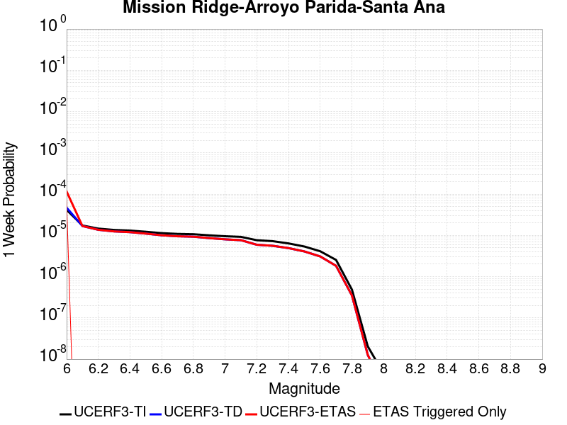 | 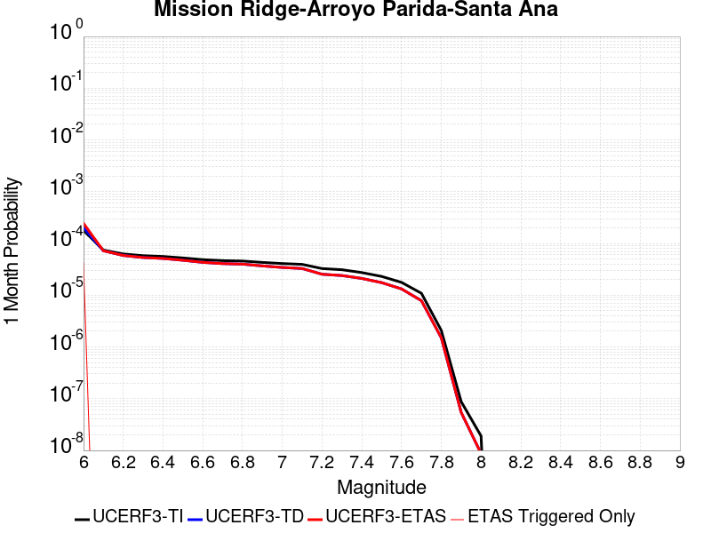 |  | 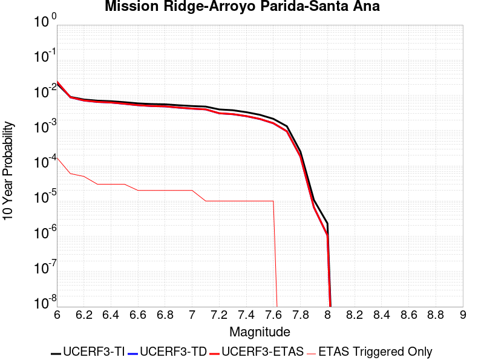 |

| Magnitude | 1 wk TI Prob | 1 wk TD Prob | 1 wk ETAS Prob | 1 wk ETAS/TD Gain | 1 wk ETAS Triggered Only | 1 mo TI Prob | 1 mo TD Prob | 1 mo ETAS Prob | 1 mo ETAS/TD Gain | 1 mo ETAS Triggered Only | 1 yr TI Prob | 1 yr TD Prob | 1 yr ETAS Prob | 1 yr ETAS/TD Gain | 1 yr ETAS Triggered Only | 10 yr TI Prob | 10 yr TD Prob | 10 yr ETAS Prob | 10 yr ETAS/TD Gain | 10 yr ETAS Triggered Only |
|-----|-----|-----|-----|-----|-----|-----|-----|-----|-----|-----|-----|-----|-----|-----|-----|-----|-----|-----|-----|-----|
| 6.0 | 4.169034E-5 | 4.7137048E-5 | 8.713516E-5 | 1.8485495 | 4.0E-5 | 1.7866064E-4 | 2.0200513E-4 | 2.7199098E-4 | 1.3464558 | 7.0E-5 | 0.0021730233 | 0.0024574657 | 0.0025871464 | 1.05277 | 1.3E-4 | 0.021518968 | 0.02438483 | 0.024550684 | 1.0068016 | 1.7E-4 |
| 6.1 | 1.73813E-5 | 1.6854203E-5 | 1.6854203E-5 | 1.0 | 0.0 | 7.4489166E-5 | 7.223036E-5 | 8.2229635E-5 | 1.138436 | 1.0E-5 | 9.065282E-4 | 8.790605E-4 | 9.090341E-4 | 1.0340973 | 3.0E-5 | 0.009028391 | 0.008757128 | 0.008816604 | 1.0067916 | 6.0E-5 |
| 6.2 | 1.4622182E-5 | 1.3673262E-5 | 1.3673262E-5 | 1.0 | 0.0 | 6.2664985E-5 | 5.85984E-5 | 6.8597816E-5 | 1.1706431 | 1.0E-5 | 7.6267915E-4 | 7.132059E-4 | 7.331916E-4 | 1.0280224 | 2.0E-5 | 0.007600669 | 0.007109767 | 0.0071594114 | 1.0069826 | 5.0E-5 |
| 6.3 | 1.3552434E-5 | 1.2482174E-5 | 1.2482174E-5 | 1.0 | 0.0 | 5.8080568E-5 | 5.349395E-5 | 6.349342E-5 | 1.1869271 | 1.0E-5 | 7.069015E-4 | 6.510974E-4 | 6.7108433E-4 | 1.0306973 | 2.0E-5 | 0.00704657 | 0.006492415 | 0.00652222 | 1.0045907 | 3.0E-5 |
| 6.4 | 1.30977305E-5 | 1.1979128E-5 | 1.1979128E-5 | 1.0 | 0.0 | 5.613192E-5 | 5.133813E-5 | 6.133762E-5 | 1.194777 | 1.0E-5 | 6.831918E-4 | 6.2486547E-4 | 6.44853E-4 | 1.0319868 | 2.0E-5 | 0.006810953 | 0.006231584 | 0.006261397 | 1.0047842 | 3.0E-5 |
| 6.5 | 1.225205E-5 | 1.1048776E-5 | 1.1048776E-5 | 1.0 | 0.0 | 5.2507727E-5 | 4.735105E-5 | 5.735058E-5 | 1.2111785 | 1.0E-5 | 6.3909404E-4 | 5.7634927E-4 | 5.963377E-4 | 1.0346812 | 2.0E-5 | 0.006372592 | 0.005749009 | 0.0057788366 | 1.0051883 | 3.0E-5 |
| 6.6 | 1.1352241E-5 | 1.0063508E-5 | 1.0063508E-5 | 1.0 | 0.0 | 4.8651553E-5 | 4.3128617E-5 | 5.3128188E-5 | 1.2318546 | 1.0E-5 | 5.921717E-4 | 5.249665E-4 | 5.44956E-4 | 1.0380777 | 2.0E-5 | 0.0059059616 | 0.0052376646 | 0.0052575595 | 1.0037985 | 2.0E-5 |
| 6.7 | 1.0864116E-5 | 9.517E-6 | 9.517E-6 | 1.0 | 0.0 | 4.6559664E-5 | 4.0786515E-5 | 5.0786108E-5 | 1.245169 | 1.0E-5 | 5.667165E-4 | 4.964647E-4 | 5.164548E-4 | 1.0402648 | 2.0E-5 | 0.005652734 | 0.0049539437 | 0.0049738446 | 1.0040172 | 2.0E-5 |
| 6.8 | 1.0666365E-5 | 9.299752E-6 | 9.299752E-6 | 1.0 | 0.0 | 4.571219E-5 | 3.985548E-5 | 4.9855083E-5 | 1.2508966 | 1.0E-5 | 5.564038E-4 | 4.8513446E-4 | 5.0512474E-4 | 1.0412056 | 2.0E-5 | 0.005550127 | 0.00484114 | 0.0048610433 | 1.0041113 | 2.0E-5 |
| 6.9 | 1.0038665E-5 | 8.592018E-6 | 8.592018E-6 | 1.0 | 0.0 | 4.302214E-5 | 3.682243E-5 | 4.6822057E-5 | 1.2715636 | 1.0E-5 | 5.236687E-4 | 4.4822265E-4 | 4.6821366E-4 | 1.0446007 | 2.0E-5 | 0.005224364 | 0.0044735507 | 0.0044934615 | 1.0044507 | 2.0E-5 |
| 7.0 | 9.5379955E-6 | 8.025047E-6 | 8.025047E-6 | 1.0 | 0.0 | 4.0876483E-5 | 3.439261E-5 | 4.439227E-5 | 1.2907501 | 1.0E-5 | 4.975576E-4 | 4.1865133E-4 | 4.3864295E-4 | 1.0477525 | 2.0E-5 | 0.00496445 | 0.00417898 | 0.0041988962 | 1.0047659 | 2.0E-5 |
| 7.1 | 9.207389E-6 | 7.652347E-6 | 7.652347E-6 | 1.0 | 0.0 | 3.945964E-5 | 3.2795375E-5 | 4.2795047E-5 | 1.304911 | 1.0E-5 | 4.803152E-4 | 3.992122E-4 | 4.092082E-4 | 1.0250393 | 1.0E-5 | 0.004792784 | 0.003985301 | 0.003995261 | 1.0024992 | 1.0E-5 |
| 7.2 | 7.638091E-6 | 5.9310923E-6 | 5.9310923E-6 | 1.0 | 0.0 | 3.2734264E-5 | 2.5418722E-5 | 3.5418467E-5 | 1.3934008 | 1.0E-5 | 3.984668E-4 | 3.094293E-4 | 3.194262E-4 | 1.0323075 | 1.0E-5 | 0.0039775306 | 0.0030901956 | 0.0031001647 | 1.003226 | 1.0E-5 |
| 7.3 | 7.2500147E-6 | 5.596131E-6 | 5.596131E-6 | 1.0 | 0.0 | 3.1071122E-5 | 2.3983199E-5 | 3.398296E-5 | 1.4169486 | 1.0E-5 | 3.7822526E-4 | 2.9195662E-4 | 3.019537E-4 | 1.0342417 | 1.0E-5 | 0.0037758215 | 0.0029159402 | 0.0029259112 | 1.0034194 | 1.0E-5 |
| 7.4 | 6.3899715E-6 | 4.9184864E-6 | 4.9184864E-6 | 1.0 | 0.0 | 2.7385306E-5 | 2.1079059E-5 | 3.107885E-5 | 1.4743944 | 1.0E-5 | 3.3336508E-4 | 2.566075E-4 | 2.6660494E-4 | 1.03896 | 1.0E-5 | 0.0033286542 | 0.002563311 | 0.0025732853 | 1.0038912 | 1.0E-5 |
| 7.5 | 5.379025E-6 | 4.0838477E-6 | 4.0838477E-6 | 1.0 | 0.0 | 2.305276E-5 | 1.7502087E-5 | 2.7501912E-5 | 1.5713505 | 1.0E-5 | 2.806312E-4 | 2.1306718E-4 | 2.2306504E-4 | 1.0469235 | 1.0E-5 | 0.0028027708 | 0.0021286402 | 0.0021386188 | 1.0046878 | 1.0E-5 |
| 7.6 | 4.1270696E-6 | 3.0883373E-6 | 3.0883373E-6 | 1.0 | 0.0 | 1.768732E-5 | 1.32356645E-5 | 2.3235532E-5 | 1.7555244 | 1.0E-5 | 2.1532185E-4 | 1.6113237E-4 | 1.7113076E-4 | 1.0620508 | 1.0E-5 | 0.0021511333 | 0.0016101635 | 0.0016201474 | 1.0062006 | 1.0E-5 |
| 7.7 | 2.5406805E-6 | 1.8282044E-6 | 1.8282044E-6 | 1.0 | 0.0 | 1.0888585E-5 | 7.835139E-6 | 7.835139E-6 | 1.0 | 0.0 | 1.3256045E-4 | 9.53887E-5 | 9.53887E-5 | 1.0 | 0.0 | 0.0013248142 | 9.534837E-4 | 9.534837E-4 | 1.0 | 0.0 |
| 7.8 | 4.8608285E-7 | 3.509864E-7 | 3.509864E-7 | 1.0 | 0.0 | 2.0832106E-6 | 1.5042266E-6 | 1.5042266E-6 | 1.0 | 0.0 | 2.5362791E-5 | 1.8313805E-5 | 1.8313805E-5 | 1.0 | 0.0 | 2.5359896E-4 | 1.8312308E-4 | 1.8312308E-4 | 1.0 | 0.0 |
| 7.9 | 2.0472514E-8 | 1.2688718E-8 | 1.2688718E-8 | 1.0 | 0.0 | 8.7739345E-8 | 5.438022E-8 | 5.438022E-8 | 1.0 | 0.0 | 1.068226E-6 | 6.6207895E-7 | 6.6207895E-7 | 1.0 | 0.0 | 1.0682209E-5 | 6.620771E-6 | 6.620771E-6 | 1.0 | 0.0 |
| 8.0 | 4.443582E-9 | 2.032067E-9 | 2.032067E-9 | 1.0 | 0.0 | 1.9043922E-8 | 8.7088585E-9 | 8.7088585E-9 | 1.0 | 0.0 | 2.3185973E-7 | 1.0603035E-7 | 1.0603035E-7 | 1.0 | 0.0 | 2.3185949E-6 | 1.0603031E-6 | 1.0603031E-6 | 1.0 | 0.0 |

## Brawley (Seismic Zone) alt 1
*[(top)](#table-of-contents)*

| 1 Week | 1 Month | 1 Year | 10 Year |
|-----|-----|-----|-----|
|  | 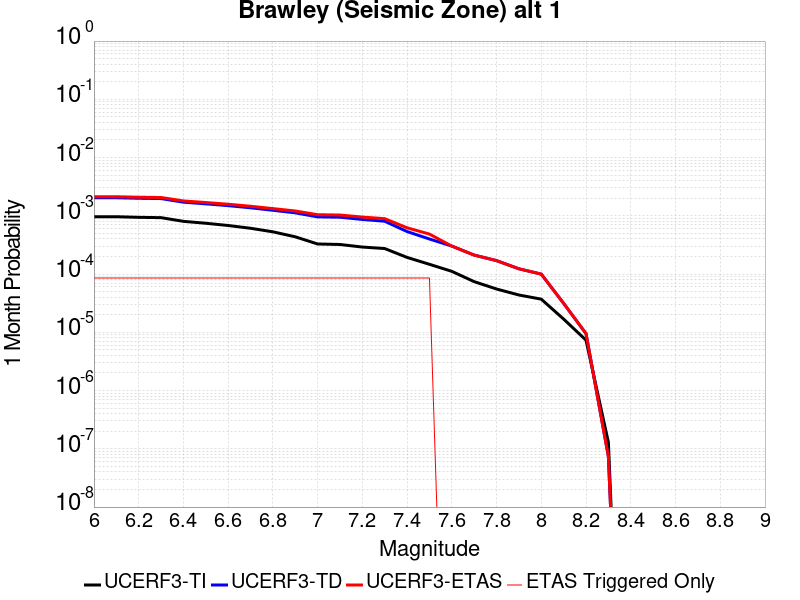 | 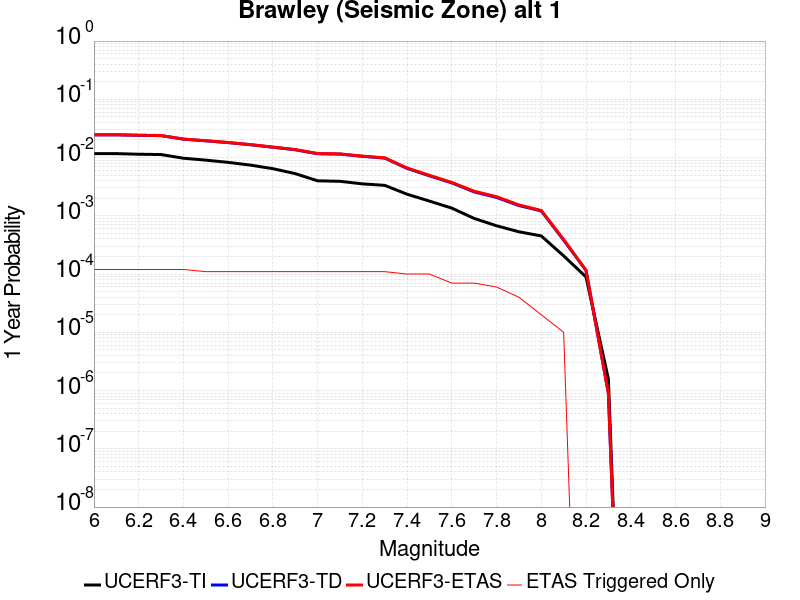 | 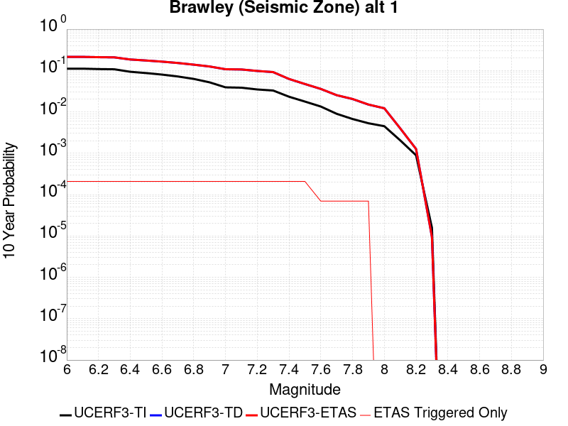 |

| Magnitude | 1 wk TI Prob | 1 wk TD Prob | 1 wk ETAS Prob | 1 wk ETAS/TD Gain | 1 wk ETAS Triggered Only | 1 mo TI Prob | 1 mo TD Prob | 1 mo ETAS Prob | 1 mo ETAS/TD Gain | 1 mo ETAS Triggered Only | 1 yr TI Prob | 1 yr TD Prob | 1 yr ETAS Prob | 1 yr ETAS/TD Gain | 1 yr ETAS Triggered Only | 10 yr TI Prob | 10 yr TD Prob | 10 yr ETAS Prob | 10 yr ETAS/TD Gain | 10 yr ETAS Triggered Only |
|-----|-----|-----|-----|-----|-----|-----|-----|-----|-----|-----|-----|-----|-----|-----|-----|-----|-----|-----|-----|-----|
| 6.0 | 2.2521618E-4 | 4.763429E-4 | 5.463095E-4 | 1.146883 | 7.0E-5 | 9.6485513E-4 | 0.0020399094 | 0.0021097667 | 1.0342453 | 7.0E-5 | 0.011683988 | 0.024544531 | 0.024661586 | 1.0047691 | 1.2E-4 | 0.11088423 | 0.21349923 | 0.21365653 | 1.0007367 | 2.0E-4 |
| 6.1 | 2.2521618E-4 | 4.763429E-4 | 5.463095E-4 | 1.146883 | 7.0E-5 | 9.6485513E-4 | 0.0020399094 | 0.0021097667 | 1.0342453 | 7.0E-5 | 0.011683988 | 0.024544531 | 0.024661586 | 1.0047691 | 1.2E-4 | 0.11088423 | 0.21349923 | 0.21365653 | 1.0007367 | 2.0E-4 |
| 6.2 | 2.198148E-4 | 4.6718874E-4 | 5.37156E-4 | 1.1497624 | 7.0E-5 | 9.417233E-4 | 0.0020007377 | 0.0020705976 | 1.0349171 | 7.0E-5 | 0.011405343 | 0.024078513 | 0.024195625 | 1.0048637 | 1.2E-4 | 0.10837428 | 0.20993572 | 0.21009374 | 1.0007527 | 2.0E-4 |
| 6.3 | 2.1704129E-4 | 4.615455E-4 | 5.315132E-4 | 1.1515944 | 7.0E-5 | 9.298453E-4 | 0.0019765892 | 0.002046451 | 1.0353445 | 7.0E-5 | 0.011262234 | 0.023792034 | 0.02390918 | 1.0049237 | 1.2E-4 | 0.107082725 | 0.20782684 | 0.20798527 | 1.0007623 | 2.0E-4 |
| 6.4 | 1.876142E-4 | 4.004663E-4 | 4.7043827E-4 | 1.1747262 | 7.0E-5 | 8.038131E-4 | 0.0017151695 | 0.0017850494 | 1.0407423 | 7.0E-5 | 0.00974259 | 0.020678662 | 0.02079618 | 1.0056831 | 1.2E-4 | 0.093263686 | 0.18457787 | 0.18474095 | 1.0008836 | 2.0E-4 |
| 6.5 | 1.7390939E-4 | 3.7478763E-4 | 4.3476516E-4 | 1.1600306 | 6.0E-5 | 7.45113E-4 | 0.0016052561 | 0.0016651598 | 1.0373172 | 6.0E-5 | 0.009034078 | 0.019367293 | 0.019475162 | 1.0055697 | 1.1E-4 | 0.086755216 | 0.17440015 | 0.17455702 | 1.0008994 | 1.9E-4 |
| 6.6 | 1.591791E-4 | 3.4893592E-4 | 4.08915E-4 | 1.1718913 | 6.0E-5 | 6.8201777E-4 | 0.0014945926 | 0.001554503 | 1.0400847 | 6.0E-5 | 0.008271996 | 0.018045008 | 0.018153023 | 1.0059859 | 1.1E-4 | 0.07970774 | 0.16380787 | 0.16396675 | 1.0009699 | 1.9E-4 |
| 6.7 | 1.4268003E-4 | 3.2059717E-4 | 3.8057796E-4 | 1.1870908 | 6.0E-5 | 6.1134255E-4 | 0.0013732726 | 0.0014331902 | 1.0436312 | 6.0E-5 | 0.007417723 | 0.01659171 | 0.016699884 | 1.0065198 | 1.1E-4 | 0.07174956 | 0.15193594 | 0.15209706 | 1.0010605 | 1.9E-4 |
| 6.8 | 1.239713E-4 | 2.9055026E-4 | 3.5053285E-4 | 1.2064447 | 6.0E-5 | 5.3119735E-4 | 0.0012446274 | 0.0013045527 | 1.0481472 | 6.0E-5 | 0.0064481674 | 0.015049482 | 0.015157826 | 1.0071992 | 1.1E-4 | 0.06264243 | 0.13838051 | 0.13854422 | 1.001183 | 1.9E-4 |
| 6.9 | 1.0180238E-4 | 2.6255674E-4 | 3.22541E-4 | 1.228462 | 6.0E-5 | 4.3622297E-4 | 0.0011247622 | 0.0011846948 | 1.0532846 | 6.0E-5 | 0.005298089 | 0.013608998 | 0.0137175005 | 1.0079728 | 1.1E-4 | 0.05173543 | 0.12496473 | 0.12513098 | 1.0013304 | 1.9E-4 |
| 7.0 | 7.6619996E-5 | 2.2400476E-4 | 2.8399134E-4 | 1.2677914 | 6.0E-5 | 3.283301E-4 | 9.596704E-4 | 0.0010196128 | 1.0624615 | 6.0E-5 | 0.0039900932 | 0.011622103 | 0.011730824 | 1.0093547 | 1.1E-4 | 0.039192066 | 0.10726982 | 0.10743944 | 1.0015812 | 1.9E-4 |
| 7.1 | 7.5127435E-5 | 2.2083633E-4 | 2.808231E-4 | 1.2716345 | 6.0E-5 | 3.2193496E-4 | 9.461013E-4 | 0.0010060446 | 1.0633582 | 6.0E-5 | 0.0039125155 | 0.011458648 | 0.011567388 | 1.0094898 | 1.1E-4 | 0.038443442 | 0.10583378 | 0.10600367 | 1.0016053 | 1.9E-4 |
| 7.2 | 6.788582E-5 | 2.0211334E-4 | 2.621012E-4 | 1.2968031 | 6.0E-5 | 2.9090676E-4 | 8.6591556E-4 | 9.2586357E-4 | 1.0692308 | 6.0E-5 | 0.0035360386 | 0.0104922 | 0.010601046 | 1.010374 | 1.1E-4 | 0.034803 | 0.097503684 | 0.09767516 | 1.0017587 | 1.9E-4 |
| 7.3 | 6.399602E-5 | 1.8842232E-4 | 2.48411E-4 | 1.3183737 | 6.0E-5 | 2.7423984E-4 | 8.0727716E-4 | 8.672287E-4 | 1.0742639 | 6.0E-5 | 0.0033337586 | 0.009784897 | 0.00989382 | 1.0111318 | 1.1E-4 | 0.03284188 | 0.091397986 | 0.09157062 | 1.0018889 | 1.9E-4 |
| 7.4 | 4.506759E-5 | 1.2530042E-4 | 1.852929E-4 | 1.4787892 | 6.0E-5 | 1.9313251E-4 | 5.3689216E-4 | 5.968599E-4 | 1.1116943 | 6.0E-5 | 0.0023488526 | 0.006517245 | 0.0066165933 | 1.0152439 | 1.0E-4 | 0.023241805 | 0.062364522 | 0.06252392 | 1.002556 | 1.7E-4 |
| 7.5 | 3.43289E-5 | 9.336103E-5 | 1.5335543E-4 | 1.6426064 | 6.0E-5 | 1.4711556E-4 | 4.0005764E-4 | 4.6003365E-4 | 1.1499184 | 6.0E-5 | 0.0017896603 | 0.004859886 | 0.0049594003 | 1.0204766 | 1.0E-4 | 0.01775316 | 0.047057066 | 0.047219068 | 1.0034426 | 1.7E-4 |
| 7.6 | 2.5980507E-5 | 7.053672E-5 | 1.105339E-4 | 1.5670404 | 4.0E-5 | 1.1134028E-4 | 3.0226534E-4 | 3.4225325E-4 | 1.132294 | 4.0E-5 | 0.001354725 | 0.0036738948 | 0.0037436376 | 1.0189834 | 7.0E-5 | 0.013464959 | 0.03584298 | 0.035968322 | 1.0034969 | 1.3E-4 |
| 7.7 | 1.7292105E-5 | 4.9412036E-5 | 8.941006E-5 | 1.8094794 | 4.0E-5 | 7.4106916E-5 | 2.1174872E-4 | 2.5174025E-4 | 1.1888632 | 4.0E-5 | 9.018782E-4 | 0.0025749984 | 0.002644818 | 1.0271145 | 7.0E-5 | 0.008982267 | 0.025292097 | 0.025409061 | 1.0046246 | 1.2E-4 |
| 7.8 | 1.2927471E-5 | 3.9697254E-5 | 6.969606E-5 | 1.7556897 | 3.0E-5 | 5.5402274E-5 | 1.7012001E-4 | 2.0011491E-4 | 1.1763161 | 3.0E-5 | 6.743139E-4 | 0.0020692463 | 0.0021291221 | 1.028936 | 6.0E-5 | 0.0067227143 | 0.020433145 | 0.020540897 | 1.0052735 | 1.1E-4 |
| 7.9 | 1.0200774E-5 | 2.8748475E-5 | 4.87479E-5 | 1.695669 | 2.0E-5 | 4.371687E-5 | 1.2320194E-4 | 1.4319948E-4 | 1.1623151 | 2.0E-5 | 5.321229E-4 | 0.0014989526 | 0.0015388926 | 1.0266453 | 4.0E-5 | 0.005308505 | 0.014992895 | 0.015081545 | 1.0059129 | 9.0E-5 |
| 8.0 | 8.650396E-6 | 2.3279512E-5 | 3.3279277E-5 | 1.4295523 | 1.0E-5 | 3.70726E-5 | 9.976552E-5 | 1.0976452E-4 | 1.100225 | 1.0E-5 | 4.5126543E-4 | 0.0012139693 | 0.001233945 | 1.0164549 | 2.0E-5 | 0.0045035016 | 0.012212164 | 0.012251675 | 1.0032355 | 4.0E-5 |
| 8.1 | 3.9368224E-6 | 7.3283345E-6 | 7.3283345E-6 | 1.0 | 0.0 | 1.6871985E-5 | 3.1406773E-5 | 3.1406773E-5 | 1.0 | 0.0 | 2.0539707E-4 | 3.8231048E-4 | 3.9230665E-4 | 1.0261468 | 1.0E-5 | 0.0020520731 | 0.0040015313 | 0.0040214513 | 1.0049781 | 2.0E-5 |
| 8.2 | 1.7101195E-6 | 2.2178374E-6 | 2.2178374E-6 | 1.0 | 0.0 | 7.329063E-6 | 9.504983E-6 | 9.504983E-6 | 1.0 | 0.0 | 8.922769E-5 | 1.15717055E-4 | 1.15717055E-4 | 1.0 | 0.0 | 8.9191867E-4 | 0.00126669 | 0.00126669 | 1.0 | 0.0 |
| 8.3 | 3.0346666E-8 | 1.721086E-8 | 1.721086E-8 | 1.0 | 0.0 | 1.3005713E-7 | 7.376083E-8 | 7.376083E-8 | 1.0 | 0.0 | 1.5834444E-6 | 8.98038E-7 | 8.98038E-7 | 1.0 | 0.0 | 1.5834332E-5 | 9.36379E-6 | 9.36379E-6 | 1.0 | 0.0 |

## Santa Rosa Island
*[(top)](#table-of-contents)*

| 1 Week | 1 Month | 1 Year | 10 Year |
|-----|-----|-----|-----|
| 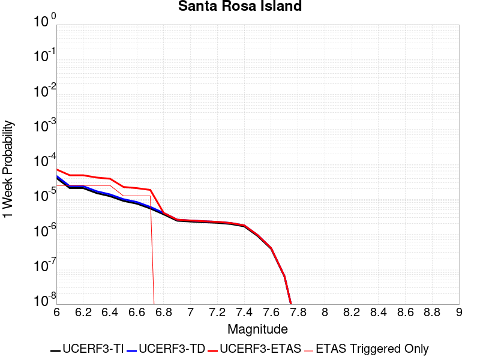 | 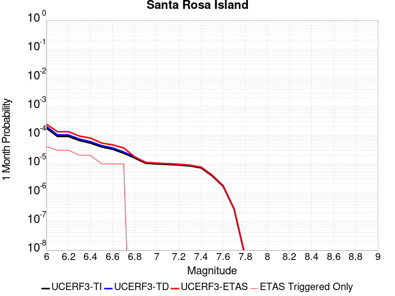 | 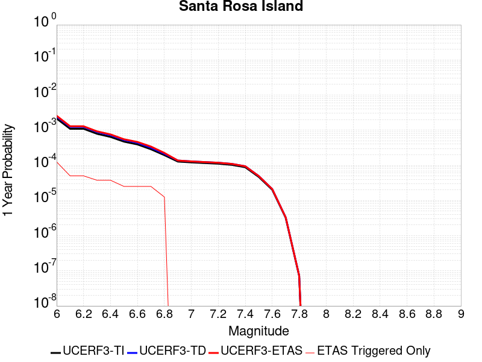 | 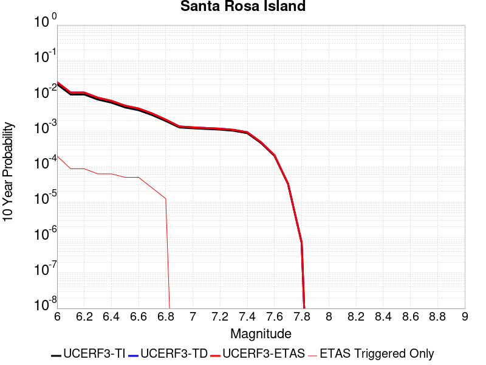 |

| Magnitude | 1 wk TI Prob | 1 wk TD Prob | 1 wk ETAS Prob | 1 wk ETAS/TD Gain | 1 wk ETAS Triggered Only | 1 mo TI Prob | 1 mo TD Prob | 1 mo ETAS Prob | 1 mo ETAS/TD Gain | 1 mo ETAS Triggered Only | 1 yr TI Prob | 1 yr TD Prob | 1 yr ETAS Prob | 1 yr ETAS/TD Gain | 1 yr ETAS Triggered Only | 10 yr TI Prob | 10 yr TD Prob | 10 yr ETAS Prob | 10 yr ETAS/TD Gain | 10 yr ETAS Triggered Only |
|-----|-----|-----|-----|-----|-----|-----|-----|-----|-----|-----|-----|-----|-----|-----|-----|-----|-----|-----|-----|-----|
| 6.0 | 4.1143165E-5 | 4.709113E-5 | 6.7090186E-5 | 1.4246885 | 2.0E-5 | 1.7631594E-4 | 2.0180462E-4 | 2.4179654E-4 | 1.1981715 | 4.0E-5 | 0.002144533 | 0.0024543991 | 0.0025541536 | 1.0406432 | 1.0E-4 | 0.021239553 | 0.024293557 | 0.024449669 | 1.0064261 | 1.6E-4 |
| 6.1 | 2.1061249E-5 | 2.3864959E-5 | 4.3864482E-5 | 1.8380288 | 2.0E-5 | 9.0259375E-5 | 1.0227455E-4 | 1.3227148E-4 | 1.2932981 | 3.0E-5 | 0.0010983539 | 0.0012445103 | 0.0012844605 | 1.0321012 | 4.0E-5 | 0.01092941 | 0.01237845 | 0.0124475835 | 1.005585 | 7.0E-5 |
| 6.2 | 2.1061249E-5 | 2.3864959E-5 | 4.3864482E-5 | 1.8380288 | 2.0E-5 | 9.0259375E-5 | 1.0227455E-4 | 1.3227148E-4 | 1.2932981 | 3.0E-5 | 0.0010983539 | 0.0012445103 | 0.0012844605 | 1.0321012 | 4.0E-5 | 0.01092941 | 0.01237845 | 0.0124475835 | 1.005585 | 7.0E-5 |
| 6.3 | 1.5158236E-5 | 1.7074419E-5 | 3.7074078E-5 | 2.171323 | 2.0E-5 | 6.496225E-5 | 7.3174095E-5 | 9.317263E-5 | 1.2733008 | 2.0E-5 | 7.906284E-4 | 8.9054246E-4 | 9.2051574E-4 | 1.0336573 | 3.0E-5 | 0.007878214 | 0.00887099 | 0.008920547 | 1.0055864 | 5.0E-5 |
| 6.4 | 1.2341918E-5 | 1.3852917E-5 | 3.385264E-5 | 2.4437194 | 2.0E-5 | 5.2892858E-5 | 5.9368336E-5 | 7.936715E-5 | 1.33686 | 2.0E-5 | 6.437803E-4 | 7.225779E-4 | 7.5255625E-4 | 1.041488 | 3.0E-5 | 0.006419184 | 0.0072031217 | 0.0072527616 | 1.0068915 | 5.0E-5 |
| 6.5 | 9.061158E-6 | 1.0117032E-5 | 2.011693E-5 | 1.9884223 | 1.0E-5 | 3.883296E-5 | 4.3358017E-5 | 5.335758E-5 | 1.2306279 | 1.0E-5 | 4.726887E-4 | 5.277613E-4 | 5.4775074E-4 | 1.0378759 | 2.0E-5 | 0.004716845 | 0.0052656177 | 0.005305407 | 1.0075564 | 4.0E-5 |
| 6.6 | 7.5461685E-6 | 8.400734E-6 | 1.840065E-5 | 2.1903622 | 1.0E-5 | 3.2340322E-5 | 3.600267E-5 | 4.600231E-5 | 1.2777472 | 1.0E-5 | 3.936723E-4 | 4.3824868E-4 | 4.582399E-4 | 1.0456161 | 2.0E-5 | 0.003929756 | 0.0043742736 | 0.004414099 | 1.0091044 | 4.0E-5 |
| 6.7 | 5.5023775E-6 | 6.087381E-6 | 1.608732E-5 | 2.6427326 | 1.0E-5 | 2.3581404E-5 | 2.6088532E-5 | 3.6088273E-5 | 1.3833002 | 1.0E-5 | 2.8706578E-4 | 3.1758484E-4 | 3.3757847E-4 | 1.0629553 | 2.0E-5 | 0.0028669522 | 0.0031716316 | 0.0031915682 | 1.0062859 | 2.0E-5 |
| 6.8 | 3.7351679E-6 | 4.0831405E-6 | 4.0831405E-6 | 1.0 | 0.0 | 1.6007763E-5 | 1.7499071E-5 | 1.7499071E-5 | 1.0 | 0.0 | 1.948771E-4 | 2.1303285E-4 | 2.2303071E-4 | 1.0469311 | 1.0E-5 | 0.0019470629 | 0.0021285315 | 0.00213851 | 1.004688 | 1.0E-5 |
| 6.9 | 2.456366E-6 | 2.6292707E-6 | 2.6292707E-6 | 1.0 | 0.0 | 1.0527241E-5 | 1.1268255E-5 | 1.1268255E-5 | 1.0 | 0.0 | 1.2816161E-4 | 1.3718239E-4 | 1.3718239E-4 | 1.0 | 0.0 | 0.0012808773 | 0.0013709799 | 0.0013709799 | 1.0 | 0.0 |
| 7.0 | 2.3245157E-6 | 2.4827784E-6 | 2.4827784E-6 | 1.0 | 0.0 | 9.962172E-6 | 1.0640436E-5 | 1.0640436E-5 | 1.0 | 0.0 | 1.2128269E-4 | 1.2953962E-4 | 1.2953962E-4 | 1.0 | 0.0 | 0.0012121652 | 0.0012946434 | 0.0012946434 | 1.0 | 0.0 |
| 7.1 | 2.2248344E-6 | 2.37325E-6 | 2.37325E-6 | 1.0 | 0.0 | 9.53497E-6 | 1.0171032E-5 | 1.0171032E-5 | 1.0 | 0.0 | 1.1608207E-4 | 1.238253E-4 | 1.238253E-4 | 1.0 | 0.0 | 0.0011602144 | 0.0012375651 | 0.0012375651 | 1.0 | 0.0 |
| 7.2 | 2.1350402E-6 | 2.2761542E-6 | 2.2761542E-6 | 1.0 | 0.0 | 9.150141E-6 | 9.75491E-6 | 9.75491E-6 | 1.0 | 0.0 | 1.1139726E-4 | 1.1875957E-4 | 1.1875957E-4 | 1.0 | 0.0 | 0.0011134144 | 0.0011869629 | 0.0011869629 | 1.0 | 0.0 |
| 7.3 | 1.9793572E-6 | 2.1087192E-6 | 2.1087192E-6 | 1.0 | 0.0 | 8.482932E-6 | 9.037337E-6 | 9.037337E-6 | 1.0 | 0.0 | 1.032748E-4 | 1.1002403E-4 | 1.1002403E-4 | 1.0 | 0.0 | 0.0010322682 | 0.0010996974 | 0.0010996974 | 1.0 | 0.0 |
| 7.4 | 1.6951194E-6 | 1.8045735E-6 | 1.8045735E-6 | 1.0 | 0.0 | 7.264777E-6 | 7.733864E-6 | 7.733864E-6 | 1.0 | 0.0 | 8.844508E-5 | 9.415574E-5 | 9.415574E-5 | 1.0 | 0.0 | 8.840988E-4 | 9.411601E-4 | 9.411601E-4 | 1.0 | 0.0 |
| 7.5 | 8.987207E-7 | 9.512216E-7 | 9.512216E-7 | 1.0 | 0.0 | 3.8516546E-6 | 4.0766577E-6 | 4.0766577E-6 | 1.0 | 0.0 | 4.6892885E-5 | 4.9632188E-5 | 4.9632188E-5 | 1.0 | 0.0 | 4.688299E-4 | 4.962122E-4 | 4.962122E-4 | 1.0 | 0.0 |
| 7.6 | 3.8783037E-7 | 4.0529335E-7 | 4.0529335E-7 | 1.0 | 0.0 | 1.6621291E-6 | 1.7369704E-6 | 1.7369704E-6 | 1.0 | 0.0 | 2.0236233E-5 | 2.1147416E-5 | 2.1147416E-5 | 1.0 | 0.0 | 2.023439E-4 | 2.114547E-4 | 2.114547E-4 | 1.0 | 0.0 |
| 7.7 | 6.181804E-8 | 6.339047E-8 | 6.339047E-8 | 1.0 | 0.0 | 2.6493444E-7 | 2.7167343E-7 | 2.7167343E-7 | 1.0 | 0.0 | 3.225572E-6 | 3.307619E-6 | 3.307619E-6 | 1.0 | 0.0 | 3.225525E-5 | 3.3075703E-5 | 3.3075703E-5 | 1.0 | 0.0 |
| 7.8 | 1.3704449E-9 | 1.3964153E-9 | 1.3964153E-9 | 1.0 | 0.0 | 5.873335E-9 | 5.984637E-9 | 5.984637E-9 | 1.0 | 0.0 | 7.1507856E-8 | 7.286295E-8 | 7.286295E-8 | 1.0 | 0.0 | 7.1507833E-7 | 7.286294E-7 | 7.286294E-7 | 1.0 | 0.0 |

## Pinto Mtn
*[(top)](#table-of-contents)*

| 1 Week | 1 Month | 1 Year | 10 Year |
|-----|-----|-----|-----|
| 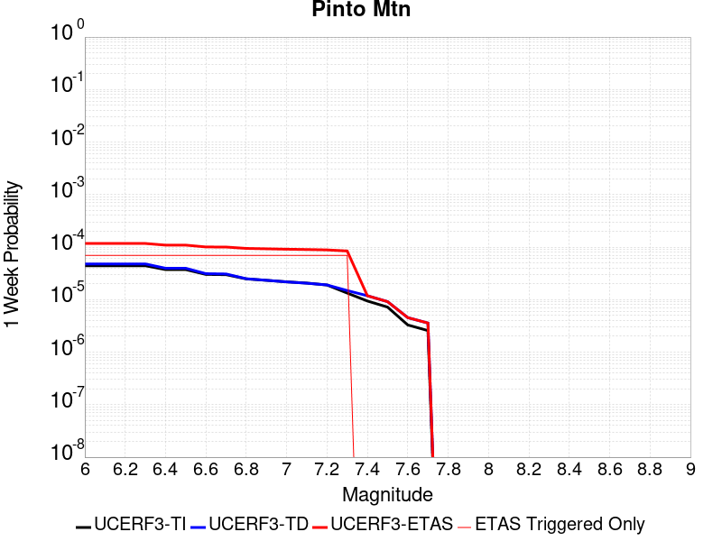 | 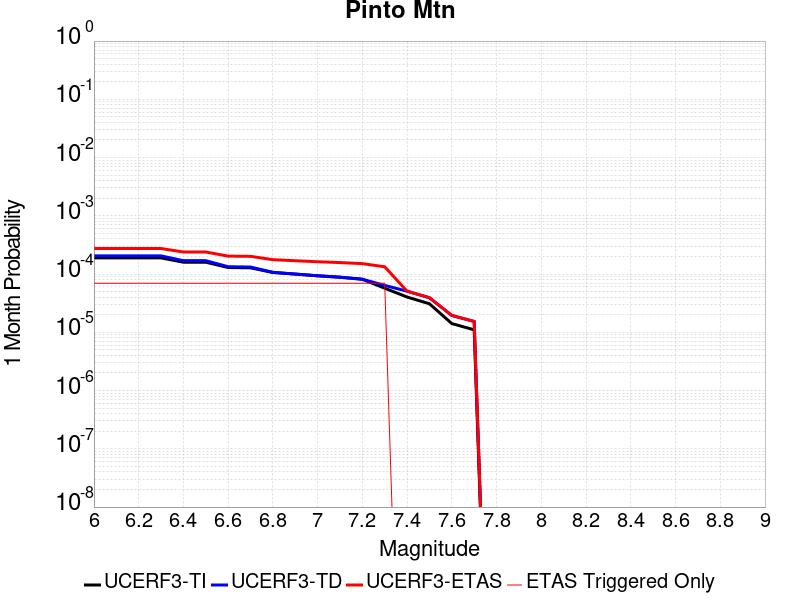 | 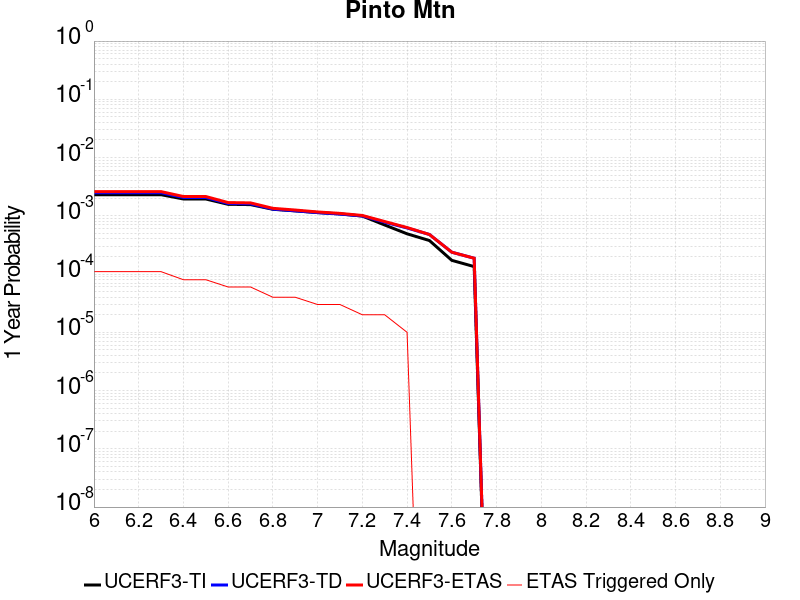 | 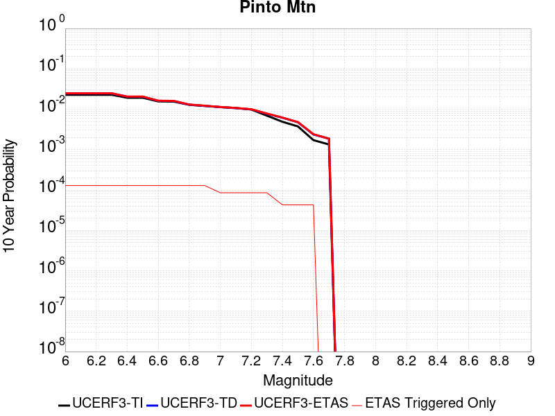 |

| Magnitude | 1 wk TI Prob | 1 wk TD Prob | 1 wk ETAS Prob | 1 wk ETAS/TD Gain | 1 wk ETAS Triggered Only | 1 mo TI Prob | 1 mo TD Prob | 1 mo ETAS Prob | 1 mo ETAS/TD Gain | 1 mo ETAS Triggered Only | 1 yr TI Prob | 1 yr TD Prob | 1 yr ETAS Prob | 1 yr ETAS/TD Gain | 1 yr ETAS Triggered Only | 10 yr TI Prob | 10 yr TD Prob | 10 yr ETAS Prob | 10 yr ETAS/TD Gain | 10 yr ETAS Triggered Only |
|-----|-----|-----|-----|-----|-----|-----|-----|-----|-----|-----|-----|-----|-----|-----|-----|-----|-----|-----|-----|-----|
| 6.0 | 4.4194956E-5 | 4.7853926E-5 | 9.785153E-5 | 2.0447965 | 5.0E-5 | 1.893932E-4 | 2.0507304E-4 | 2.8505662E-4 | 1.3900249 | 8.0E-5 | 0.0023034236 | 0.0024940688 | 0.0026037944 | 1.0439947 | 1.1E-4 | 0.022796938 | 0.024678305 | 0.024853863 | 1.0071138 | 1.8E-4 |
| 6.1 | 4.4194956E-5 | 4.7853926E-5 | 9.785153E-5 | 2.0447965 | 5.0E-5 | 1.893932E-4 | 2.0507304E-4 | 2.8505662E-4 | 1.3900249 | 8.0E-5 | 0.0023034236 | 0.0024940688 | 0.0026037944 | 1.0439947 | 1.1E-4 | 0.022796938 | 0.024678305 | 0.024853863 | 1.0071138 | 1.8E-4 |
| 6.2 | 4.4194956E-5 | 4.7853926E-5 | 9.785153E-5 | 2.0447965 | 5.0E-5 | 1.893932E-4 | 2.0507304E-4 | 2.8505662E-4 | 1.3900249 | 8.0E-5 | 0.0023034236 | 0.0024940688 | 0.0026037944 | 1.0439947 | 1.1E-4 | 0.022796938 | 0.024678305 | 0.024853863 | 1.0071138 | 1.8E-4 |
| 6.3 | 4.4194956E-5 | 4.7853926E-5 | 9.785153E-5 | 2.0447965 | 5.0E-5 | 1.893932E-4 | 2.0507304E-4 | 2.8505662E-4 | 1.3900249 | 8.0E-5 | 0.0023034236 | 0.0024940688 | 0.0026037944 | 1.0439947 | 1.1E-4 | 0.022796938 | 0.024678305 | 0.024853863 | 1.0071138 | 1.8E-4 |
| 6.4 | 3.729929E-5 | 3.960349E-5 | 8.960151E-5 | 2.262465 | 5.0E-5 | 1.5984432E-4 | 1.6971873E-4 | 2.2970854E-4 | 1.3534662 | 6.0E-5 | 0.0019443673 | 0.0020644604 | 0.0021442953 | 1.038671 | 8.0E-5 | 0.019274427 | 0.020462848 | 0.020599984 | 1.0067017 | 1.4E-4 |
| 6.5 | 3.729929E-5 | 3.960349E-5 | 8.960151E-5 | 2.262465 | 5.0E-5 | 1.5984432E-4 | 1.6971873E-4 | 2.2970854E-4 | 1.3534662 | 6.0E-5 | 0.0019443673 | 0.0020644604 | 0.0021442953 | 1.038671 | 8.0E-5 | 0.019274427 | 0.020462848 | 0.020599984 | 1.0067017 | 1.4E-4 |
| 6.6 | 3.0204548E-5 | 3.12056E-5 | 8.120404E-5 | 2.6022265 | 5.0E-5 | 1.2944164E-4 | 1.3373162E-4 | 1.8372494E-4 | 1.3738332 | 5.0E-5 | 0.0015748127 | 0.0016270012 | 0.0016869036 | 1.0368177 | 6.0E-5 | 0.015636992 | 0.016154764 | 0.016262988 | 1.0066991 | 1.1E-4 |
| 6.7 | 2.9857754E-5 | 3.0814987E-5 | 8.081344E-5 | 2.6225371 | 5.0E-5 | 1.2795553E-4 | 1.3205773E-4 | 1.8205112E-4 | 1.3785723 | 5.0E-5 | 0.0015567453 | 0.0016066517 | 0.0016665553 | 1.0372847 | 6.0E-5 | 0.015458848 | 0.015954204 | 0.01606245 | 1.0067847 | 1.1E-4 |
| 6.8 | 2.4819734E-5 | 2.5009665E-5 | 6.5008666E-5 | 2.5993416 | 4.0E-5 | 1.0636595E-4 | 1.0718E-4 | 1.4717571E-4 | 1.3731639 | 4.0E-5 | 0.0012942362 | 0.001304157 | 0.0013441049 | 1.0306312 | 4.0E-5 | 0.012867244 | 0.012967403 | 0.013046366 | 1.0060893 | 8.0E-5 |
| 6.9 | 2.331124E-5 | 2.3337945E-5 | 6.3337015E-5 | 2.713907 | 4.0E-5 | 9.990149E-5 | 1.0001605E-4 | 1.4001204E-4 | 1.3998958 | 4.0E-5 | 0.001215622 | 0.0012170355 | 0.0012569868 | 1.0328268 | 4.0E-5 | 0.012089936 | 0.012105897 | 0.012184929 | 1.0065284 | 8.0E-5 |
| 7.0 | 2.1818534E-5 | 2.1761074E-5 | 5.176042E-5 | 2.3785784 | 3.0E-5 | 9.3504656E-5 | 9.3258524E-5 | 1.2325573E-4 | 1.3216565 | 3.0E-5 | 0.0011378246 | 0.0011348509 | 0.0011648169 | 1.0264052 | 3.0E-5 | 0.011320163 | 0.01129266 | 0.011361869 | 1.0061287 | 7.0E-5 |
| 7.1 | 2.066081E-5 | 2.0540718E-5 | 5.05401E-5 | 2.4604838 | 3.0E-5 | 8.854332E-5 | 8.8028784E-5 | 1.18026146E-4 | 1.3407676 | 3.0E-5 | 0.0010774818 | 0.0010712431 | 0.001101211 | 1.0279748 | 3.0E-5 | 0.010722724 | 0.0106628435 | 0.010732097 | 1.0064949 | 7.0E-5 |
| 7.2 | 1.8990233E-5 | 1.9054001E-5 | 3.9053622E-5 | 2.0496283 | 2.0E-5 | 8.138417E-5 | 8.165756E-5 | 1.01655925E-4 | 1.2449052 | 2.0E-5 | 9.904018E-4 | 9.937467E-4 | 0.0010137268 | 1.0201058 | 2.0E-5 | 0.009859995 | 0.009895029 | 0.009954435 | 1.0060036 | 6.0E-5 |
| 7.3 | 1.3335872E-5 | 1.4906713E-5 | 3.4906414E-5 | 2.3416574 | 2.0E-5 | 5.7152483E-5 | 6.388442E-5 | 8.388314E-5 | 1.3130454 | 2.0E-5 | 6.956093E-4 | 7.77528E-4 | 7.975124E-4 | 1.0257026 | 2.0E-5 | 0.006934359 | 0.007749376 | 0.0078089107 | 1.0076826 | 6.0E-5 |
| 7.4 | 9.414066E-6 | 1.186096E-5 | 2.1860842E-5 | 1.8430921 | 1.0E-5 | 4.0345374E-5 | 5.083175E-5 | 6.083124E-5 | 1.1967175 | 1.0E-5 | 4.910942E-4 | 6.1871024E-4 | 6.2870403E-4 | 1.0161526 | 1.0E-5 | 0.0049001034 | 0.0061708256 | 0.0062205167 | 1.0080526 | 5.0E-5 |
| 7.5 | 7.2101157E-6 | 9.158192E-6 | 9.158192E-6 | 1.0 | 0.0 | 3.090013E-5 | 3.9248847E-5 | 3.9248847E-5 | 1.0 | 0.0 | 3.7614413E-4 | 4.7775774E-4 | 4.7775774E-4 | 1.0 | 0.0 | 0.0037550807 | 0.004768082 | 0.0047879866 | 1.0041746 | 2.0E-5 |
| 7.6 | 3.296375E-6 | 4.5455017E-6 | 4.5455017E-6 | 1.0 | 0.0 | 1.4127245E-5 | 1.9480583E-5 | 1.9480583E-5 | 1.0 | 0.0 | 1.7198564E-4 | 2.3715167E-4 | 2.3715167E-4 | 1.0 | 0.0 | 0.0017185259 | 0.0023691233 | 0.0023790996 | 1.004211 | 1.0E-5 |
| 7.7 | 2.5741092E-6 | 3.5844084E-6 | 3.5844084E-6 | 1.0 | 0.0 | 1.103185E-5 | 1.5361667E-5 | 1.5361667E-5 | 1.0 | 0.0 | 1.3430449E-4 | 1.8701357E-4 | 1.8701357E-4 | 1.0 | 0.0 | 0.0013422335 | 0.0018686918 | 0.0018686918 | 1.0 | 0.0 |

## Imperial
*[(top)](#table-of-contents)*

| 1 Week | 1 Month | 1 Year | 10 Year |
|-----|-----|-----|-----|
| 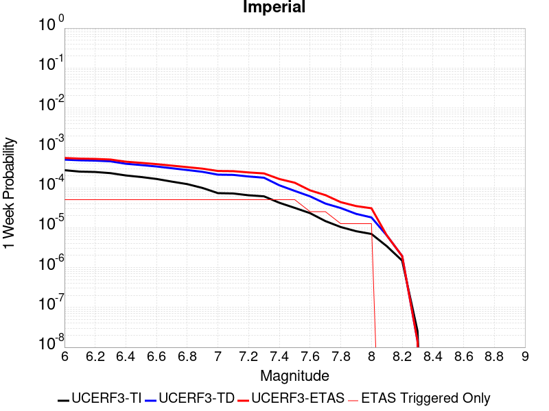 | 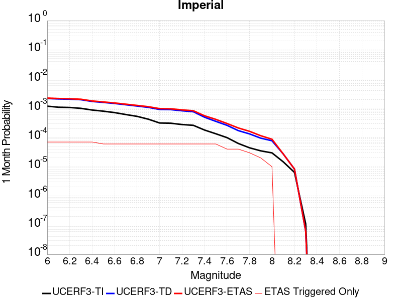 | 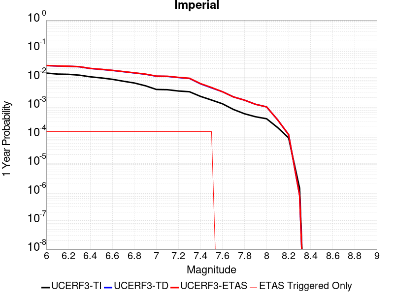 | 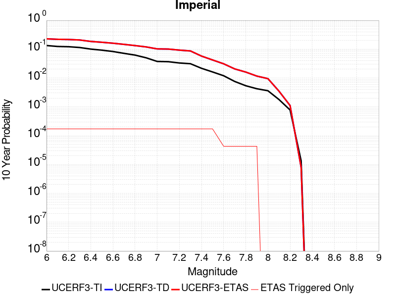 |

| Magnitude | 1 wk TI Prob | 1 wk TD Prob | 1 wk ETAS Prob | 1 wk ETAS/TD Gain | 1 wk ETAS Triggered Only | 1 mo TI Prob | 1 mo TD Prob | 1 mo ETAS Prob | 1 mo ETAS/TD Gain | 1 mo ETAS Triggered Only | 1 yr TI Prob | 1 yr TD Prob | 1 yr ETAS Prob | 1 yr ETAS/TD Gain | 1 yr ETAS Triggered Only | 10 yr TI Prob | 10 yr TD Prob | 10 yr ETAS Prob | 10 yr ETAS/TD Gain | 10 yr ETAS Triggered Only |
|-----|-----|-----|-----|-----|-----|-----|-----|-----|-----|-----|-----|-----|-----|-----|-----|-----|-----|-----|-----|-----|
| 6.0 | 2.7496446E-4 | 5.055345E-4 | 5.7549914E-4 | 1.1383973 | 7.0E-5 | 0.0011778869 | 0.002164817 | 0.0022346654 | 1.0322653 | 7.0E-5 | 0.0142467655 | 0.026048409 | 0.026145805 | 1.003739 | 1.0E-4 | 0.13367249 | 0.22807029 | 0.22820152 | 1.0005754 | 1.7E-4 |
| 6.1 | 2.5356023E-4 | 4.8657708E-4 | 5.56543E-4 | 1.1437922 | 7.0E-5 | 0.001086234 | 0.002083702 | 0.002153556 | 1.033524 | 7.0E-5 | 0.013144928 | 0.02507094 | 0.025168432 | 1.0038887 | 1.0E-4 | 0.123940155 | 0.21949561 | 0.2196283 | 1.0006045 | 1.7E-4 |
| 6.2 | 2.4820742E-4 | 4.775311E-4 | 5.474977E-4 | 1.1465173 | 7.0E-5 | 0.0010633124 | 0.0020449946 | 0.0021148515 | 1.0341599 | 7.0E-5 | 0.01286919 | 0.024610676 | 0.024708215 | 1.0039632 | 1.0E-4 | 0.12148927 | 0.21600136 | 0.21613465 | 1.000617 | 1.7E-4 |
| 6.3 | 2.3205351E-4 | 4.5892023E-4 | 5.2888814E-4 | 1.152462 | 7.0E-5 | 9.94136E-4 | 0.0019653554 | 0.0020352178 | 1.035547 | 7.0E-5 | 0.012036599 | 0.023661187 | 0.02375882 | 1.0041263 | 1.0E-4 | 0.11405133 | 0.20793827 | 0.20807292 | 1.0006475 | 1.7E-4 |
| 6.4 | 2.0304754E-4 | 3.9878016E-4 | 4.6875223E-4 | 1.1754653 | 7.0E-5 | 8.6991355E-4 | 0.0017079529 | 0.0017778334 | 1.0409148 | 7.0E-5 | 0.010539869 | 0.020595418 | 0.020693358 | 1.0047555 | 1.0E-4 | 0.100537635 | 0.18507113 | 0.18520966 | 1.0007485 | 1.7E-4 |
| 6.5 | 1.854992E-4 | 3.6990462E-4 | 4.2988244E-4 | 1.162144 | 6.0E-5 | 7.9475436E-4 | 0.0015843548 | 0.0016442597 | 1.0378103 | 6.0E-5 | 0.009633281 | 0.01911443 | 0.01920271 | 1.0046185 | 9.0E-5 | 0.0922623 | 0.1733039 | 0.17343616 | 1.0007632 | 1.6E-4 |
| 6.6 | 1.6586106E-4 | 3.4036173E-4 | 4.0034132E-4 | 1.176223 | 6.0E-5 | 7.106394E-4 | 0.0014578878 | 0.0015178004 | 1.0410954 | 6.0E-5 | 0.008617763 | 0.017607626 | 0.01769604 | 1.0050215 | 9.0E-5 | 0.08291132 | 0.16078055 | 0.16091482 | 1.0008352 | 1.6E-4 |
| 6.7 | 1.4224656E-4 | 3.076812E-4 | 3.6766275E-4 | 1.194947 | 6.0E-5 | 6.094856E-4 | 0.0013179756 | 0.0013778964 | 1.0454644 | 6.0E-5 | 0.0073952693 | 0.015928522 | 0.016017087 | 1.0055603 | 9.0E-5 | 0.07153955 | 0.14648798 | 0.14662455 | 1.0009322 | 1.6E-4 |
| 6.8 | 1.2317259E-4 | 2.779231E-4 | 3.3790641E-4 | 1.2158271 | 6.0E-5 | 5.2777573E-4 | 0.0011905615 | 0.00125049 | 1.0503364 | 6.0E-5 | 0.0064067547 | 0.014400131 | 0.014488835 | 1.0061599 | 9.0E-5 | 0.06225166 | 0.13294089 | 0.13307962 | 1.0010436 | 1.6E-4 |
| 6.9 | 9.859898E-5 | 2.5015484E-4 | 3.1013982E-4 | 1.2397915 | 6.0E-5 | 4.2249862E-4 | 0.0010716559 | 0.0011315916 | 1.0559281 | 6.0E-5 | 0.0051317946 | 0.012970319 | 0.013059151 | 1.0068489 | 9.0E-5 | 0.05014893 | 0.119408876 | 0.119549766 | 1.0011799 | 1.6E-4 |
| 7.0 | 7.3191884E-5 | 2.1267848E-4 | 2.7266573E-4 | 1.282056 | 6.0E-5 | 3.136418E-4 | 9.11164E-4 | 9.711093E-4 | 1.0657898 | 6.0E-5 | 0.003811904 | 0.011037681 | 0.011126688 | 1.0080639 | 9.0E-5 | 0.037471764 | 0.10206756 | 0.10221123 | 1.0014076 | 1.6E-4 |
| 7.1 | 7.1760296E-5 | 2.0969207E-4 | 2.696795E-4 | 1.2860738 | 6.0E-5 | 3.0750787E-4 | 8.9837395E-4 | 9.5832004E-4 | 1.0667273 | 6.0E-5 | 0.003737482 | 0.010883528 | 0.010972548 | 1.0081794 | 9.0E-5 | 0.03675245 | 0.10070406 | 0.10084795 | 1.0014288 | 1.6E-4 |
| 7.2 | 6.46614E-5 | 1.9137723E-4 | 2.5136574E-4 | 1.3134569 | 6.0E-5 | 2.7709085E-4 | 8.199333E-4 | 8.798841E-4 | 1.0731167 | 6.0E-5 | 0.0033683628 | 0.009937617 | 0.010026723 | 1.0089664 | 9.0E-5 | 0.033177625 | 0.092511006 | 0.0926562 | 1.0015695 | 1.6E-4 |
| 7.3 | 6.088115E-5 | 1.780939E-4 | 2.3808322E-4 | 1.3368409 | 6.0E-5 | 2.6089314E-4 | 7.6303916E-4 | 8.229934E-4 | 1.0785729 | 6.0E-5 | 0.0031717476 | 0.009251006 | 0.009340174 | 1.0096387 | 9.0E-5 | 0.031268585 | 0.08656135 | 0.0867075 | 1.0016884 | 1.6E-4 |
| 7.4 | 4.199346E-5 | 1.1511097E-4 | 1.7510405E-4 | 1.5211762 | 6.0E-5 | 1.7995955E-4 | 4.932403E-4 | 5.5321073E-4 | 1.1215845 | 6.0E-5 | 0.0021888057 | 0.005988835 | 0.006068356 | 1.0132782 | 8.0E-5 | 0.02167372 | 0.05744024 | 0.057572197 | 1.0022973 | 1.4E-4 |
| 7.5 | 3.130448E-5 | 8.333871E-5 | 1.4333372E-4 | 1.7198936 | 6.0E-5 | 1.3415517E-4 | 3.5711733E-4 | 4.170959E-4 | 1.1679521 | 6.0E-5 | 0.0016321153 | 0.0043392954 | 0.004418948 | 1.0183562 | 8.0E-5 | 0.016201803 | 0.042133506 | 0.042267606 | 1.0031828 | 1.4E-4 |
| 7.6 | 2.3074248E-5 | 6.0849357E-5 | 1.00846926E-4 | 1.6573211 | 4.0E-5 | 9.888588E-5 | 2.6075702E-4 | 3.007466E-4 | 1.1533595 | 4.0E-5 | 0.0012032706 | 0.0031701182 | 0.0032199598 | 1.0157223 | 5.0E-5 | 0.011967761 | 0.03102816 | 0.031125057 | 1.0031229 | 1.0E-4 |
| 7.7 | 1.45864815E-5 | 4.0128452E-5 | 8.012685E-5 | 1.9967589 | 4.0E-5 | 6.2511994E-5 | 1.7196777E-4 | 2.119609E-4 | 1.2325617 | 4.0E-5 | 7.608177E-4 | 0.0020917025 | 0.002141598 | 1.023854 | 5.0E-5 | 0.007582182 | 0.02062909 | 0.020717233 | 1.0042728 | 9.0E-5 |
| 7.8 | 1.0352979E-5 | 3.096395E-5 | 6.0963022E-5 | 1.9688387 | 3.0E-5 | 4.4369157E-5 | 1.326959E-4 | 1.6269193E-4 | 1.2260509 | 3.0E-5 | 5.400606E-4 | 0.0016143778 | 0.0016543132 | 1.0247374 | 4.0E-5 | 0.0053875 | 0.016017893 | 0.01609661 | 1.0049144 | 8.0E-5 |
| 7.9 | 8.137906E-6 | 2.2151205E-5 | 4.215076E-5 | 1.9028654 | 2.0E-5 | 3.4876273E-5 | 9.493029E-5 | 1.1492839E-4 | 1.2106609 | 2.0E-5 | 4.2453592E-4 | 0.0011551644 | 0.0011851297 | 1.0259403 | 3.0E-5 | 0.004237258 | 0.011618842 | 0.011688029 | 1.0059547 | 7.0E-5 |
| 8.0 | 6.93792E-6 | 1.8010365E-5 | 2.8010185E-5 | 1.5552258 | 1.0E-5 | 2.9733603E-5 | 7.7185E-5 | 8.718423E-5 | 1.1295488 | 1.0E-5 | 3.6194647E-4 | 9.3932304E-4 | 9.593042E-4 | 1.021272 | 2.0E-5 | 0.0036135751 | 0.009502415 | 0.009542035 | 1.0041695 | 4.0E-5 |
| 8.1 | 3.4286315E-6 | 6.380179E-6 | 6.380179E-6 | 1.0 | 0.0 | 1.4694053E-5 | 2.734334E-5 | 2.734334E-5 | 1.0 | 0.0 | 1.7888541E-4 | 3.3285443E-4 | 3.428511E-4 | 1.0300331 | 1.0E-5 | 0.0017874148 | 0.0034863674 | 0.0035062977 | 1.0057167 | 2.0E-5 |
| 8.2 | 1.4906886E-6 | 1.936633E-6 | 1.936633E-6 | 1.0 | 0.0 | 6.3886496E-6 | 8.2998295E-6 | 8.2998295E-6 | 1.0 | 0.0 | 7.7779034E-5 | 1.0104576E-4 | 1.0104576E-4 | 1.0 | 0.0 | 7.775182E-4 | 0.0011075423 | 0.0011075423 | 1.0 | 0.0 |
| 8.3 | 2.5758007E-8 | 1.4495866E-8 | 1.4495866E-8 | 1.0 | 0.0 | 1.10391454E-7 | 6.212514E-8 | 6.212514E-8 | 1.0 | 0.0 | 1.3440151E-6 | 7.563736E-7 | 7.563736E-7 | 1.0 | 0.0 | 1.344007E-5 | 7.884359E-6 | 7.884359E-6 | 1.0 | 0.0 |

## Red Mountain
*[(top)](#table-of-contents)*

| 1 Week | 1 Month | 1 Year | 10 Year |
|-----|-----|-----|-----|
| 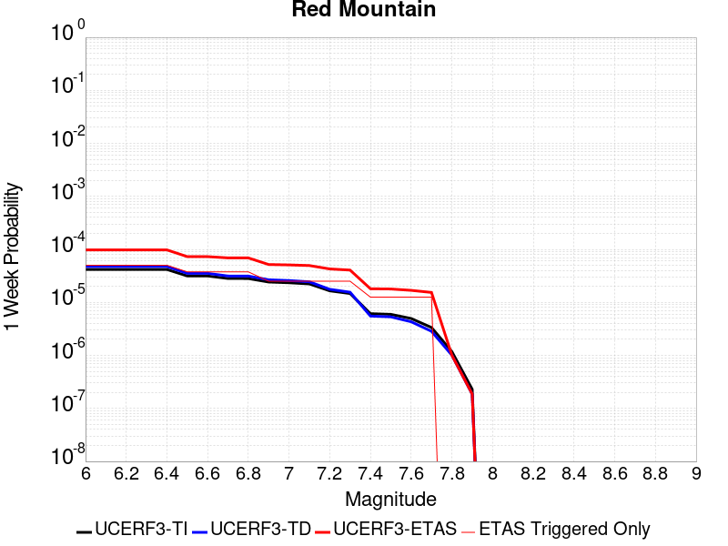 | 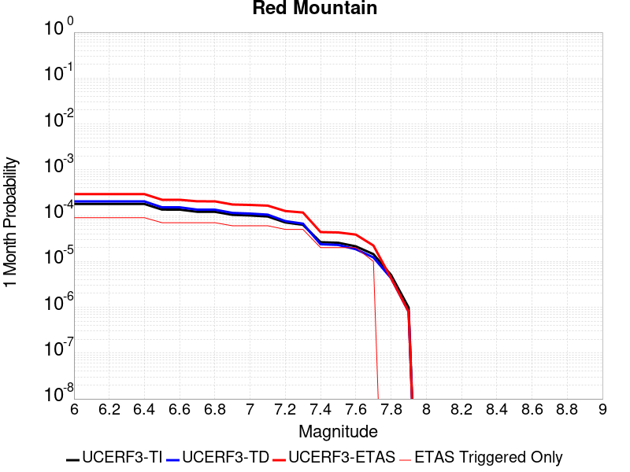 | 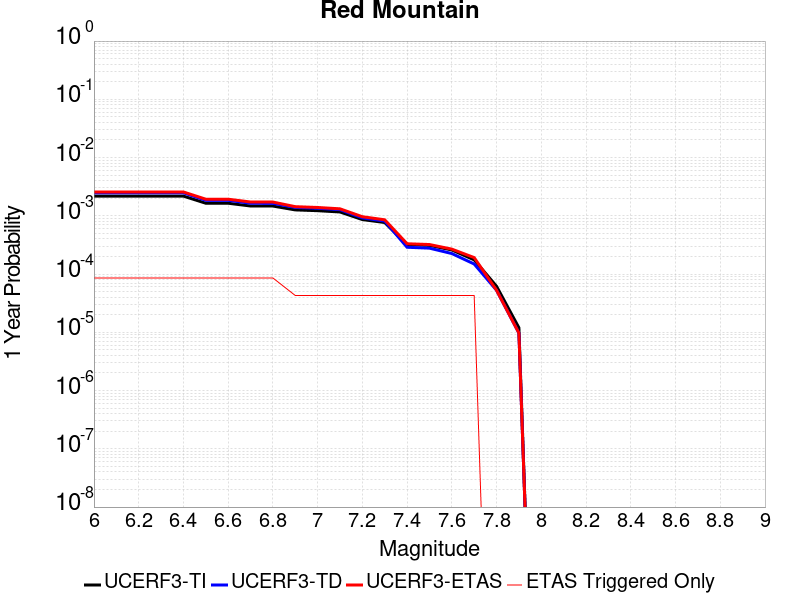 |  |

| Magnitude | 1 wk TI Prob | 1 wk TD Prob | 1 wk ETAS Prob | 1 wk ETAS/TD Gain | 1 wk ETAS Triggered Only | 1 mo TI Prob | 1 mo TD Prob | 1 mo ETAS Prob | 1 mo ETAS/TD Gain | 1 mo ETAS Triggered Only | 1 yr TI Prob | 1 yr TD Prob | 1 yr ETAS Prob | 1 yr ETAS/TD Gain | 1 yr ETAS Triggered Only | 10 yr TI Prob | 10 yr TD Prob | 10 yr ETAS Prob | 10 yr ETAS/TD Gain | 10 yr ETAS Triggered Only |
|-----|-----|-----|-----|-----|-----|-----|-----|-----|-----|-----|-----|-----|-----|-----|-----|-----|-----|-----|-----|-----|
| 6.0 | 4.1810763E-5 | 4.7590016E-5 | 9.758764E-5 | 2.0505905 | 5.0E-5 | 1.7917668E-4 | 2.039422E-4 | 2.9392383E-4 | 1.4412115 | 9.0E-5 | 0.0021792934 | 0.0024803334 | 0.0025900605 | 1.0442389 | 1.1E-4 | 0.021580452 | 0.02454411 | 0.024680674 | 1.005564 | 1.4E-4 |
| 6.1 | 4.1810763E-5 | 4.7590016E-5 | 9.758764E-5 | 2.0505905 | 5.0E-5 | 1.7917668E-4 | 2.039422E-4 | 2.9392383E-4 | 1.4412115 | 9.0E-5 | 0.0021792934 | 0.0024803334 | 0.0025900605 | 1.0442389 | 1.1E-4 | 0.021580452 | 0.02454411 | 0.024680674 | 1.005564 | 1.4E-4 |
| 6.2 | 4.1810763E-5 | 4.7590016E-5 | 9.758764E-5 | 2.0505905 | 5.0E-5 | 1.7917668E-4 | 2.039422E-4 | 2.9392383E-4 | 1.4412115 | 9.0E-5 | 0.0021792934 | 0.0024803334 | 0.0025900605 | 1.0442389 | 1.1E-4 | 0.021580452 | 0.02454411 | 0.024680674 | 1.005564 | 1.4E-4 |
| 6.3 | 4.1810763E-5 | 4.7590016E-5 | 9.758764E-5 | 2.0505905 | 5.0E-5 | 1.7917668E-4 | 2.039422E-4 | 2.9392383E-4 | 1.4412115 | 9.0E-5 | 0.0021792934 | 0.0024803334 | 0.0025900605 | 1.0442389 | 1.1E-4 | 0.021580452 | 0.02454411 | 0.024680674 | 1.005564 | 1.4E-4 |
| 6.4 | 4.1810763E-5 | 4.7590016E-5 | 9.758764E-5 | 2.0505905 | 5.0E-5 | 1.7917668E-4 | 2.039422E-4 | 2.9392383E-4 | 1.4412115 | 9.0E-5 | 0.0021792934 | 0.0024803334 | 0.0025900605 | 1.0442389 | 1.1E-4 | 0.021580452 | 0.02454411 | 0.024680674 | 1.005564 | 1.4E-4 |
| 6.5 | 3.154503E-5 | 3.5359757E-5 | 7.5358344E-5 | 2.1311896 | 4.0E-5 | 1.3518598E-4 | 1.5153353E-4 | 2.2152293E-4 | 1.461874 | 7.0E-5 | 0.0016446467 | 0.0018434518 | 0.0019332859 | 1.0487314 | 9.0E-5 | 0.01632528 | 0.018291244 | 0.018399233 | 1.0059038 | 1.1E-4 |
| 6.6 | 3.1535834E-5 | 3.5349138E-5 | 7.534772E-5 | 2.1315293 | 4.0E-5 | 1.3514658E-4 | 1.5148803E-4 | 2.2147743E-4 | 1.4620126 | 7.0E-5 | 0.0016441676 | 0.0018428987 | 0.0019327329 | 1.0487461 | 9.0E-5 | 0.01632056 | 0.018285805 | 0.018393794 | 1.0059056 | 1.1E-4 |
| 6.7 | 2.8267326E-5 | 3.1469353E-5 | 7.1468094E-5 | 2.2710378 | 4.0E-5 | 1.2114006E-4 | 1.3486217E-4 | 2.0485274E-4 | 1.5189785 | 7.0E-5 | 0.0014738824 | 0.0016407954 | 0.0017306478 | 1.0547614 | 9.0E-5 | 0.014641452 | 0.01629557 | 0.01640378 | 1.0066403 | 1.1E-4 |
| 6.8 | 2.8212884E-5 | 3.1407242E-5 | 7.1405986E-5 | 2.2735517 | 4.0E-5 | 1.20906756E-4 | 1.3459599E-4 | 2.0458657E-4 | 1.5200049 | 7.0E-5 | 0.0014710457 | 0.0016375595 | 0.0017274121 | 1.0548699 | 9.0E-5 | 0.014613459 | 0.016263688 | 0.016371898 | 1.0066535 | 1.1E-4 |
| 6.9 | 2.4227871E-5 | 2.6706994E-5 | 5.6706194E-5 | 2.1232712 | 3.0E-5 | 1.03829596E-4 | 1.1445395E-4 | 1.7444708E-4 | 1.5241683 | 6.0E-5 | 0.0012633923 | 0.0013926621 | 0.0014725506 | 1.057364 | 8.0E-5 | 0.012562336 | 0.0138470335 | 0.013945649 | 1.0071218 | 1.0E-4 |
| 7.0 | 2.348524E-5 | 2.5835778E-5 | 5.5835004E-5 | 2.1611505 | 3.0E-5 | 1.0064714E-4 | 1.10720495E-4 | 1.7071384E-4 | 1.5418451 | 6.0E-5 | 0.0012246901 | 0.001347264 | 0.0014171697 | 1.0518872 | 7.0E-5 | 0.012179627 | 0.013398598 | 0.013487392 | 1.0066271 | 9.0E-5 |
| 7.1 | 2.2311642E-5 | 2.4462845E-5 | 5.446211E-5 | 2.2263196 | 3.0E-5 | 9.561782E-5 | 1.04836974E-4 | 1.6483068E-4 | 1.5722572 | 6.0E-5 | 0.0011635252 | 0.0012757176 | 0.0013456283 | 1.0548011 | 7.0E-5 | 0.01157452 | 0.01269146 | 0.012780317 | 1.0070014 | 9.0E-5 |
| 7.2 | 1.6533986E-5 | 1.7670362E-5 | 4.7669833E-5 | 2.6977282 | 3.0E-5 | 7.085802E-5 | 7.572828E-5 | 1.257245E-4 | 1.6602052 | 5.0E-5 | 8.623549E-4 | 9.2166534E-4 | 9.8161E-4 | 1.0650395 | 6.0E-5 | 0.008590161 | 0.009184707 | 0.009263972 | 1.0086302 | 8.0E-5 |
| 7.3 | 1.4703092E-5 | 1.5559537E-5 | 4.555907E-5 | 2.928048 | 3.0E-5 | 6.301173E-5 | 6.668237E-5 | 1.1667904E-4 | 1.7497734 | 5.0E-5 | 7.668978E-4 | 8.1161706E-4 | 8.715684E-4 | 1.0738665 | 6.0E-5 | 0.0076425658 | 0.008092604 | 0.008171956 | 1.0098056 | 8.0E-5 |
| 7.4 | 6.1331984E-6 | 5.5288874E-6 | 1.5528833E-5 | 2.8086722 | 1.0E-5 | 2.6284872E-5 | 2.3695018E-5 | 4.3694545E-5 | 1.8440393 | 2.0E-5 | 3.199713E-4 | 2.884492E-4 | 3.1844055E-4 | 1.1039745 | 3.0E-5 | 0.0031951098 | 0.0028808024 | 0.002910716 | 1.0103837 | 3.0E-5 |
| 7.5 | 5.954766E-6 | 5.338517E-6 | 1.5338464E-5 | 2.8731694 | 1.0E-5 | 2.5520176E-5 | 2.2879161E-5 | 4.2878703E-5 | 1.874138 | 2.0E-5 | 3.1066386E-4 | 2.785187E-4 | 3.0851035E-4 | 1.1076827 | 3.0E-5 | 0.003102299 | 0.0027817504 | 0.0028116668 | 1.0107546 | 3.0E-5 |
| 7.6 | 4.9726646E-6 | 4.315309E-6 | 1.4315266E-5 | 3.317321 | 1.0E-5 | 2.1311245E-5 | 1.8494053E-5 | 3.8493683E-5 | 2.0814087 | 2.0E-5 | 2.5943352E-4 | 2.2514217E-4 | 2.551354E-4 | 1.1332191 | 3.0E-5 | 0.0025913084 | 0.0022491754 | 0.002279108 | 1.0133082 | 3.0E-5 |
| 7.7 | 3.3613894E-6 | 2.8526886E-6 | 1.285266E-5 | 4.505455 | 1.0E-5 | 1.4405875E-5 | 1.22257525E-5 | 2.2225631E-5 | 1.8179356 | 1.0E-5 | 1.7537741E-4 | 1.4883863E-4 | 1.5883715E-4 | 1.0671768 | 1.0E-5 | 0.0017523908 | 0.0014874157 | 0.0014974009 | 1.006713 | 1.0E-5 |
| 7.8 | 1.1828961E-6 | 1.0122935E-6 | 1.0122935E-6 | 1.0 | 0.0 | 5.069545E-6 | 4.338394E-6 | 4.338394E-6 | 1.0 | 0.0 | 6.171996E-5 | 5.281869E-5 | 5.281869E-5 | 1.0 | 0.0 | 6.170282E-4 | 5.280643E-4 | 5.280643E-4 | 1.0 | 0.0 |
| 7.9 | 2.2967266E-7 | 1.861919E-7 | 1.861919E-7 | 1.0 | 0.0 | 9.843111E-7 | 7.97965E-7 | 7.97965E-7 | 1.0 | 0.0 | 1.19839215E-5 | 9.715184E-6 | 9.715184E-6 | 1.0 | 0.0 | 1.1983275E-4 | 9.714788E-5 | 9.714788E-5 | 1.0 | 0.0 |

## San Jacinto (San Jacinto Valley) rev
*[(top)](#table-of-contents)*

| 1 Week | 1 Month | 1 Year | 10 Year |
|-----|-----|-----|-----|
| 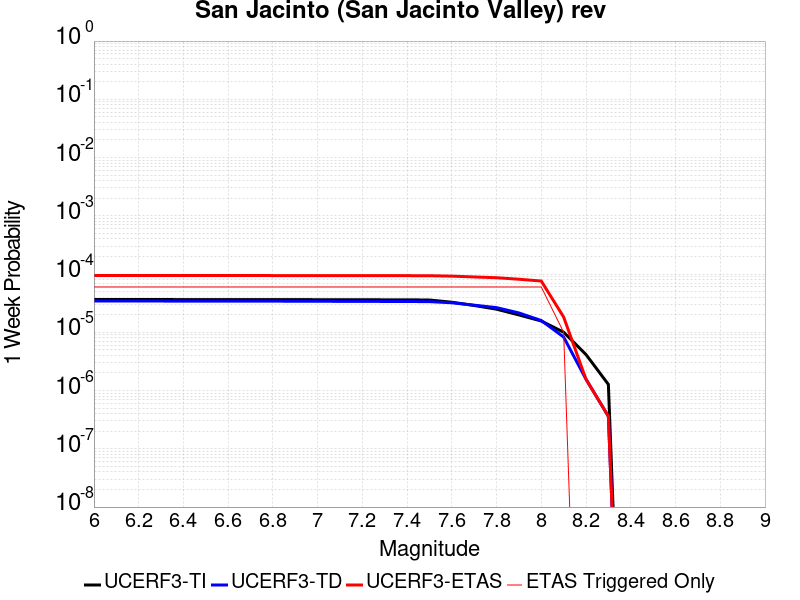 | 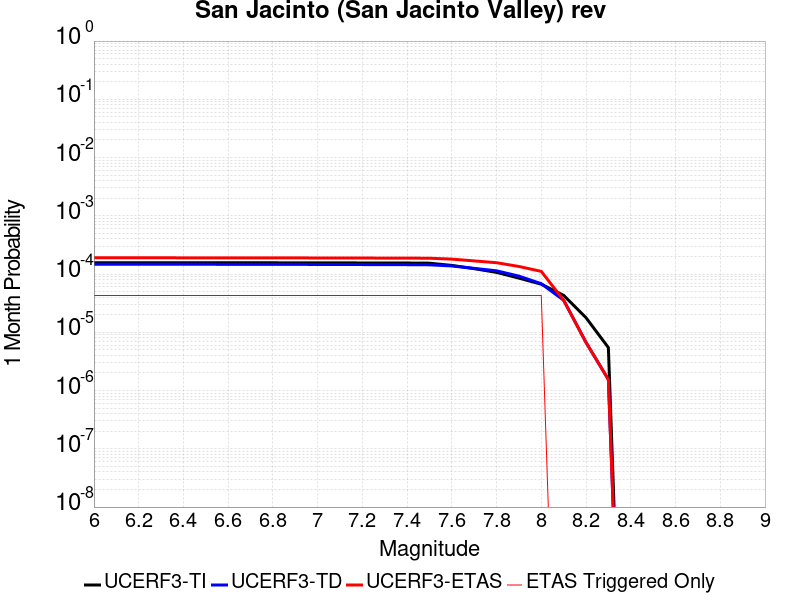 |  | 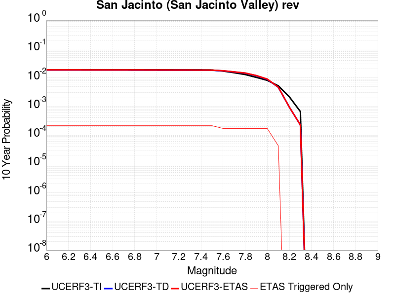 |

| Magnitude | 1 wk TI Prob | 1 wk TD Prob | 1 wk ETAS Prob | 1 wk ETAS/TD Gain | 1 wk ETAS Triggered Only | 1 mo TI Prob | 1 mo TD Prob | 1 mo ETAS Prob | 1 mo ETAS/TD Gain | 1 mo ETAS Triggered Only | 1 yr TI Prob | 1 yr TD Prob | 1 yr ETAS Prob | 1 yr ETAS/TD Gain | 1 yr ETAS Triggered Only | 10 yr TI Prob | 10 yr TD Prob | 10 yr ETAS Prob | 10 yr ETAS/TD Gain | 10 yr ETAS Triggered Only |
|-----|-----|-----|-----|-----|-----|-----|-----|-----|-----|-----|-----|-----|-----|-----|-----|-----|-----|-----|-----|-----|
| 6.0 | 3.652694E-5 | 3.4401106E-5 | 9.4399045E-5 | 2.74407 | 6.0E-5 | 1.5653463E-4 | 1.4742499E-4 | 2.1741466E-4 | 1.4747478 | 7.0E-5 | 0.0019041431 | 0.0017934233 | 0.0019331722 | 1.0779229 | 1.4E-4 | 0.018879099 | 0.018526303 | 0.018683337 | 1.0084764 | 1.6E-4 |
| 6.1 | 3.652694E-5 | 3.4401106E-5 | 9.4399045E-5 | 2.74407 | 6.0E-5 | 1.5653463E-4 | 1.4742499E-4 | 2.1741466E-4 | 1.4747478 | 7.0E-5 | 0.0019041431 | 0.0017934233 | 0.0019331722 | 1.0779229 | 1.4E-4 | 0.018879099 | 0.018526303 | 0.018683337 | 1.0084764 | 1.6E-4 |
| 6.2 | 3.652694E-5 | 3.4401106E-5 | 9.4399045E-5 | 2.74407 | 6.0E-5 | 1.5653463E-4 | 1.4742499E-4 | 2.1741466E-4 | 1.4747478 | 7.0E-5 | 0.0019041431 | 0.0017934233 | 0.0019331722 | 1.0779229 | 1.4E-4 | 0.018879099 | 0.018526303 | 0.018683337 | 1.0084764 | 1.6E-4 |
| 6.3 | 3.652694E-5 | 3.4401106E-5 | 9.4399045E-5 | 2.74407 | 6.0E-5 | 1.5653463E-4 | 1.4742499E-4 | 2.1741466E-4 | 1.4747478 | 7.0E-5 | 0.0019041431 | 0.0017934233 | 0.0019331722 | 1.0779229 | 1.4E-4 | 0.018879099 | 0.018526303 | 0.018683337 | 1.0084764 | 1.6E-4 |
| 6.4 | 3.646941E-5 | 3.432268E-5 | 9.432062E-5 | 2.7480552 | 6.0E-5 | 1.5628811E-4 | 1.4708891E-4 | 2.1707862E-4 | 1.4758326 | 7.0E-5 | 0.0019011468 | 0.0017893389 | 0.0019290884 | 1.0781012 | 1.4E-4 | 0.018849645 | 0.018486181 | 0.018643225 | 1.0084951 | 1.6E-4 |
| 6.5 | 3.646941E-5 | 3.432268E-5 | 9.432062E-5 | 2.7480552 | 6.0E-5 | 1.5628811E-4 | 1.4708891E-4 | 2.1707862E-4 | 1.4758326 | 7.0E-5 | 0.0019011468 | 0.0017893389 | 0.0019290884 | 1.0781012 | 1.4E-4 | 0.018849645 | 0.018486181 | 0.018643225 | 1.0084951 | 1.6E-4 |
| 6.6 | 3.6442503E-5 | 3.4286066E-5 | 9.428401E-5 | 2.749922 | 6.0E-5 | 1.561728E-4 | 1.4693203E-4 | 2.1692173E-4 | 1.4763408 | 7.0E-5 | 0.0018997455 | 0.001787432 | 0.0019271817 | 1.0781846 | 1.4E-4 | 0.018835869 | 0.01846745 | 0.018624496 | 1.0085039 | 1.6E-4 |
| 6.7 | 3.6432113E-5 | 3.427164E-5 | 9.4269584E-5 | 2.7506585 | 6.0E-5 | 1.5612828E-4 | 1.4687021E-4 | 2.1685993E-4 | 1.4765413 | 7.0E-5 | 0.0018992044 | 0.0017866807 | 0.0019264305 | 1.0782176 | 1.4E-4 | 0.018830549 | 0.018460074 | 0.018617122 | 1.0085074 | 1.6E-4 |
| 6.8 | 3.6409598E-5 | 3.4240697E-5 | 9.423865E-5 | 2.7522407 | 6.0E-5 | 1.560318E-4 | 1.4673761E-4 | 2.1672733E-4 | 1.476972 | 7.0E-5 | 0.0018980318 | 0.0017850689 | 0.001924819 | 1.0782883 | 1.4E-4 | 0.018819023 | 0.018444229 | 0.018601278 | 1.0085148 | 1.6E-4 |
| 6.9 | 3.638078E-5 | 3.4201123E-5 | 9.4199066E-5 | 2.7542684 | 6.0E-5 | 1.5590832E-4 | 1.4656801E-4 | 2.1655775E-4 | 1.4775239 | 7.0E-5 | 0.0018965311 | 0.0017830075 | 0.001922758 | 1.078379 | 1.4E-4 | 0.018804269 | 0.018423963 | 0.018581014 | 1.0085243 | 1.6E-4 |
| 7.0 | 3.6294874E-5 | 3.408314E-5 | 9.408109E-5 | 2.7603412 | 6.0E-5 | 1.5554018E-4 | 1.4606243E-4 | 2.1605221E-4 | 1.4791771 | 7.0E-5 | 0.0018920569 | 0.0017768623 | 0.0019166135 | 1.0786506 | 1.4E-4 | 0.018760284 | 0.018363545 | 0.018520607 | 1.0085529 | 1.6E-4 |
| 7.1 | 3.6260717E-5 | 3.403942E-5 | 9.403738E-5 | 2.762602 | 6.0E-5 | 1.5539382E-4 | 1.4587509E-4 | 2.1586489E-4 | 1.4797926 | 7.0E-5 | 0.001890278 | 0.0017745851 | 0.0019143367 | 1.0787517 | 1.4E-4 | 0.018742796 | 0.018341139 | 0.018498205 | 1.0085635 | 1.6E-4 |
| 7.2 | 3.6210204E-5 | 3.397364E-5 | 9.3971605E-5 | 2.766015 | 6.0E-5 | 1.5517735E-4 | 1.455932E-4 | 2.1558302E-4 | 1.4807217 | 7.0E-5 | 0.001887647 | 0.0017711588 | 0.0019109108 | 1.0789043 | 1.4E-4 | 0.01871693 | 0.018307408 | 0.01846448 | 1.0085796 | 1.6E-4 |
| 7.3 | 3.6119454E-5 | 3.386193E-5 | 9.38599E-5 | 2.7718415 | 6.0E-5 | 1.5478847E-4 | 1.4511449E-4 | 2.1510433E-4 | 1.4823078 | 7.0E-5 | 0.0018829206 | 0.0017653398 | 0.0019050926 | 1.0791649 | 1.4E-4 | 0.018670462 | 0.01824996 | 0.018407041 | 1.0086071 | 1.6E-4 |
| 7.4 | 3.607848E-5 | 3.380943E-5 | 9.38074E-5 | 2.7745929 | 6.0E-5 | 1.5461289E-4 | 1.4488952E-4 | 2.1487937E-4 | 1.4830568 | 7.0E-5 | 0.0018807866 | 0.0017626052 | 0.0019023584 | 1.0792879 | 1.4E-4 | 0.018649481 | 0.018222956 | 0.01838004 | 1.0086201 | 1.6E-4 |
| 7.5 | 3.5856774E-5 | 3.3619202E-5 | 9.3617185E-5 | 2.7846344 | 6.0E-5 | 1.5366284E-4 | 1.4407437E-4 | 2.1406428E-4 | 1.4857903 | 7.0E-5 | 0.0018692396 | 0.0017526967 | 0.0018924513 | 1.079737 | 1.4E-4 | 0.018535944 | 0.018124057 | 0.018281156 | 1.0086681 | 1.6E-4 |
| 7.6 | 3.286655E-5 | 3.2142278E-5 | 9.214035E-5 | 2.8666403 | 6.0E-5 | 1.4084904E-4 | 1.3774536E-4 | 2.077357E-4 | 1.5081141 | 7.0E-5 | 0.001713488 | 0.0016757617 | 0.0018055438 | 1.0774467 | 1.3E-4 | 0.017003361 | 0.017343804 | 0.017491203 | 1.0084987 | 1.5E-4 |
| 7.7 | 2.8882527E-5 | 2.9235205E-5 | 8.923345E-5 | 3.0522602 | 6.0E-5 | 1.237764E-4 | 1.2528773E-4 | 1.9527896E-4 | 1.5586439 | 7.0E-5 | 0.0015059357 | 0.0015243118 | 0.0016541136 | 1.0851544 | 1.3E-4 | 0.014957713 | 0.015830338 | 0.015977964 | 1.0093255 | 1.5E-4 |
| 7.8 | 2.4950225E-5 | 2.6526219E-5 | 8.6524626E-5 | 3.261853 | 6.0E-5 | 1.0692515E-4 | 1.1367885E-4 | 1.836709E-4 | 1.6156998 | 7.0E-5 | 0.0013010362 | 0.0013831621 | 0.0015129823 | 1.0938575 | 1.3E-4 | 0.012934455 | 0.01441176 | 0.014559598 | 1.0102582 | 1.5E-4 |
| 7.9 | 1.9881603E-5 | 2.150649E-5 | 8.15052E-5 | 3.7897954 | 6.0E-5 | 8.520408E-5 | 9.216742E-5 | 1.6216097E-4 | 1.7594174 | 7.0E-5 | 0.001036866 | 0.0011215615 | 0.0012514157 | 1.1157799 | 1.3E-4 | 0.010320415 | 0.011776998 | 0.011915349 | 1.0117476 | 1.4E-4 |
| 8.0 | 1.563292E-5 | 1.5936288E-5 | 7.593533E-5 | 4.764932 | 6.0E-5 | 6.6996516E-5 | 6.829659E-5 | 1.3829181E-4 | 2.0248713 | 7.0E-5 | 8.153773E-4 | 8.3119445E-4 | 9.4110303E-4 | 1.1322297 | 1.1E-4 | 0.00812392 | 0.008810331 | 0.008929274 | 1.0135003 | 1.2E-4 |
| 8.1 | 1.0045313E-5 | 8.300794E-6 | 1.830071E-5 | 2.204694 | 1.0E-5 | 4.305063E-5 | 3.557435E-5 | 4.5573994E-5 | 1.2810915 | 1.0E-5 | 5.2401534E-4 | 4.3303217E-4 | 4.530235E-4 | 1.046166 | 2.0E-5 | 0.0052278144 | 0.0046587666 | 0.0046786736 | 1.0042729 | 2.0E-5 |
| 8.2 | 4.1554413E-6 | 1.5648296E-6 | 1.5648296E-6 | 1.0 | 0.0 | 1.7808914E-5 | 6.7063957E-6 | 6.7063957E-6 | 1.0 | 0.0 | 2.1680194E-4 | 8.164734E-5 | 8.164734E-5 | 1.0 | 0.0 | 0.0021659054 | 9.479703E-4 | 9.479703E-4 | 1.0 | 0.0 |
| 8.3 | 1.2758221E-6 | 3.612677E-7 | 3.612677E-7 | 1.0 | 0.0 | 5.4677976E-6 | 1.5482892E-6 | 1.5482892E-6 | 1.0 | 0.0 | 6.65684E-5 | 1.8850264E-5 | 1.8850264E-5 | 1.0 | 0.0 | 6.6548464E-4 | 2.2739546E-4 | 2.2739546E-4 | 1.0 | 0.0 |

## San Jacinto (Stepovers Combined)
*[(top)](#table-of-contents)*

| 1 Week | 1 Month | 1 Year | 10 Year |
|-----|-----|-----|-----|
| 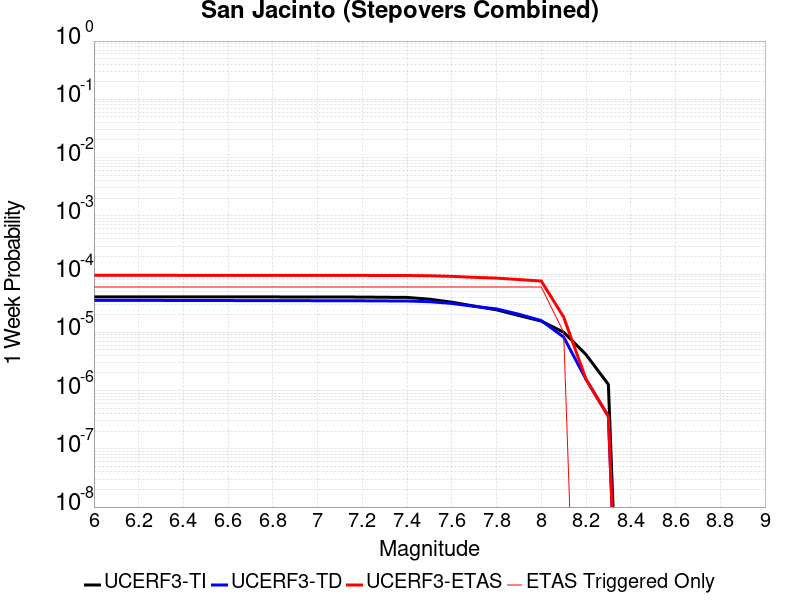 | 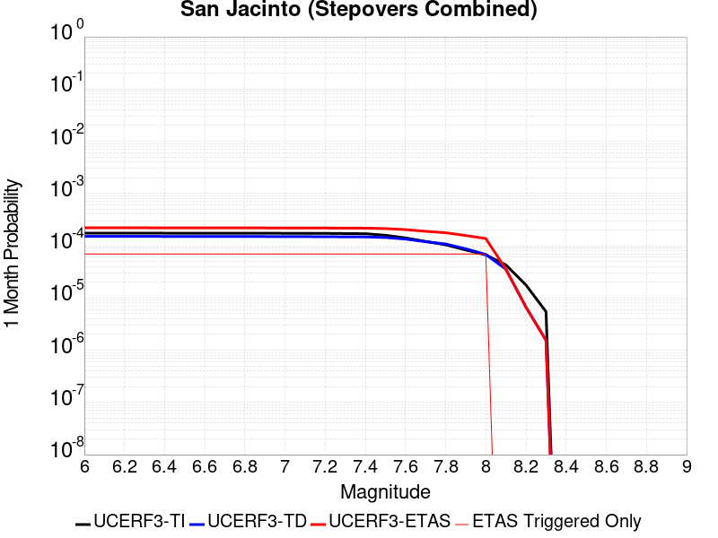 | 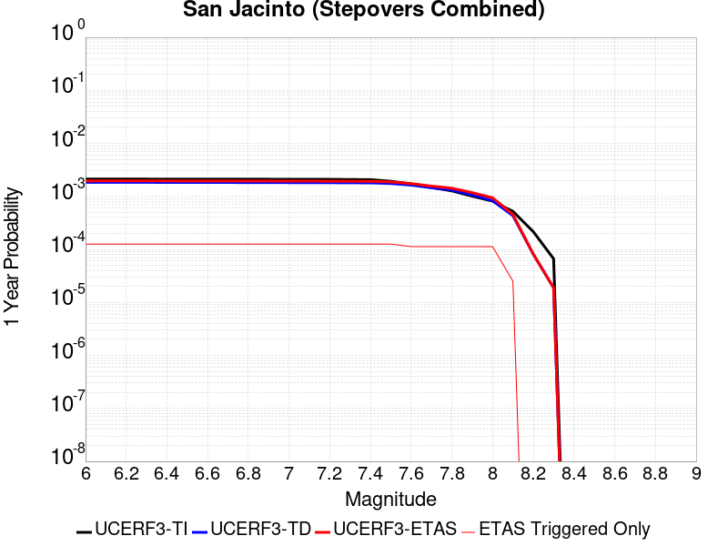 | 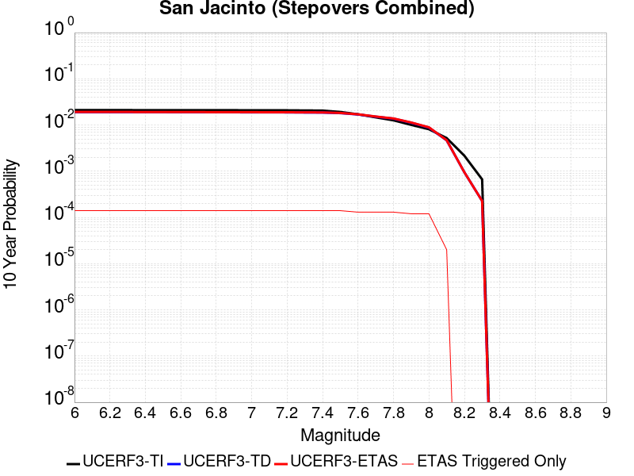 |

| Magnitude | 1 wk TI Prob | 1 wk TD Prob | 1 wk ETAS Prob | 1 wk ETAS/TD Gain | 1 wk ETAS Triggered Only | 1 mo TI Prob | 1 mo TD Prob | 1 mo ETAS Prob | 1 mo ETAS/TD Gain | 1 mo ETAS Triggered Only | 1 yr TI Prob | 1 yr TD Prob | 1 yr ETAS Prob | 1 yr ETAS/TD Gain | 1 yr ETAS Triggered Only | 10 yr TI Prob | 10 yr TD Prob | 10 yr ETAS Prob | 10 yr ETAS/TD Gain | 10 yr ETAS Triggered Only |
|-----|-----|-----|-----|-----|-----|-----|-----|-----|-----|-----|-----|-----|-----|-----|-----|-----|-----|-----|-----|-----|
| 6.0 | 4.0667746E-5 | 3.5271103E-5 | 9.526899E-5 | 2.7010493 | 6.0E-5 | 1.742787E-4 | 1.5115313E-4 | 2.2114255E-4 | 1.4630365 | 7.0E-5 | 0.0021197782 | 0.0018387372 | 0.0019585167 | 1.0651422 | 1.2E-4 | 0.020996714 | 0.018986495 | 0.019123837 | 1.0072336 | 1.4E-4 |
| 6.1 | 4.0667746E-5 | 3.5271103E-5 | 9.526899E-5 | 2.7010493 | 6.0E-5 | 1.742787E-4 | 1.5115313E-4 | 2.2114255E-4 | 1.4630365 | 7.0E-5 | 0.0021197782 | 0.0018387372 | 0.0019585167 | 1.0651422 | 1.2E-4 | 0.020996714 | 0.018986495 | 0.019123837 | 1.0072336 | 1.4E-4 |
| 6.2 | 4.0667746E-5 | 3.5271103E-5 | 9.526899E-5 | 2.7010493 | 6.0E-5 | 1.742787E-4 | 1.5115313E-4 | 2.2114255E-4 | 1.4630365 | 7.0E-5 | 0.0021197782 | 0.0018387372 | 0.0019585167 | 1.0651422 | 1.2E-4 | 0.020996714 | 0.018986495 | 0.019123837 | 1.0072336 | 1.4E-4 |
| 6.3 | 4.0667746E-5 | 3.5271103E-5 | 9.526899E-5 | 2.7010493 | 6.0E-5 | 1.742787E-4 | 1.5115313E-4 | 2.2114255E-4 | 1.4630365 | 7.0E-5 | 0.0021197782 | 0.0018387372 | 0.0019585167 | 1.0651422 | 1.2E-4 | 0.020996714 | 0.018986495 | 0.019123837 | 1.0072336 | 1.4E-4 |
| 6.4 | 4.0577226E-5 | 3.5143014E-5 | 9.514091E-5 | 2.7072494 | 6.0E-5 | 1.738908E-4 | 1.5060425E-4 | 2.205937E-4 | 1.4647243 | 7.0E-5 | 0.0021150648 | 0.0018320669 | 0.0019518471 | 1.0653797 | 1.2E-4 | 0.020950472 | 0.018921062 | 0.019058414 | 1.0072591 | 1.4E-4 |
| 6.5 | 4.0577226E-5 | 3.5143014E-5 | 9.514091E-5 | 2.7072494 | 6.0E-5 | 1.738908E-4 | 1.5060425E-4 | 2.205937E-4 | 1.4647243 | 7.0E-5 | 0.0021150648 | 0.0018320669 | 0.0019518471 | 1.0653797 | 1.2E-4 | 0.020950472 | 0.018921062 | 0.019058414 | 1.0072591 | 1.4E-4 |
| 6.6 | 4.053861E-5 | 3.5088357E-5 | 9.508625E-5 | 2.709909 | 6.0E-5 | 1.7372532E-4 | 1.5037002E-4 | 2.2035949E-4 | 1.4654483 | 7.0E-5 | 0.0021130538 | 0.0018292206 | 0.0019490011 | 1.0654817 | 1.2E-4 | 0.020930743 | 0.01889314 | 0.019030495 | 1.0072701 | 1.4E-4 |
| 6.7 | 4.0516545E-5 | 3.505743E-5 | 9.505533E-5 | 2.7114174 | 6.0E-5 | 1.7363077E-4 | 1.502375E-4 | 2.2022698E-4 | 1.4658589 | 7.0E-5 | 0.002111905 | 0.0018276101 | 0.0019473907 | 1.0655395 | 1.2E-4 | 0.020919468 | 0.018877337 | 0.019014694 | 1.0072763 | 1.4E-4 |
| 6.8 | 4.049434E-5 | 3.5028992E-5 | 9.5026895E-5 | 2.7128067 | 6.0E-5 | 1.7353562E-4 | 1.5011564E-4 | 2.2010512E-4 | 1.4662372 | 7.0E-5 | 0.0021107488 | 0.0018261289 | 0.0019459098 | 1.0655928 | 1.2E-4 | 0.020908125 | 0.018862749 | 0.019000107 | 1.007282 | 1.4E-4 |
| 6.9 | 4.046386E-5 | 3.4991554E-5 | 9.498945E-5 | 2.7146394 | 6.0E-5 | 1.73405E-4 | 1.499552E-4 | 2.199447E-4 | 1.4667361 | 7.0E-5 | 0.0021091616 | 0.0018241788 | 0.00194396 | 1.065663 | 1.2E-4 | 0.020892553 | 0.018843522 | 0.018980885 | 1.0072896 | 1.4E-4 |
| 7.0 | 4.036382E-5 | 3.4872126E-5 | 9.487003E-5 | 2.720512 | 6.0E-5 | 1.7297632E-4 | 1.4944343E-4 | 2.1943296E-4 | 1.4683347 | 7.0E-5 | 0.0021039525 | 0.0018179584 | 0.0019377404 | 1.0658882 | 1.2E-4 | 0.02084144 | 0.018782137 | 0.018919507 | 1.0073138 | 1.4E-4 |
| 7.1 | 4.0343282E-5 | 3.485059E-5 | 9.4848496E-5 | 2.7215753 | 6.0E-5 | 1.7288832E-4 | 1.4935112E-4 | 2.1934067E-4 | 1.4686241 | 7.0E-5 | 0.002102883 | 0.0018168368 | 0.0019366187 | 1.0659288 | 1.2E-4 | 0.020830948 | 0.018771008 | 0.01890838 | 1.0073183 | 1.4E-4 |
| 7.2 | 4.0257353E-5 | 3.475509E-5 | 9.4753E-5 | 2.726306 | 6.0E-5 | 1.725201E-4 | 1.489419E-4 | 2.1893147E-4 | 1.4699119 | 7.0E-5 | 0.0020984085 | 0.0018118626 | 0.0019316451 | 1.0661101 | 1.2E-4 | 0.020787042 | 0.018721746 | 0.018859126 | 1.0073379 | 1.4E-4 |
| 7.3 | 3.9940667E-5 | 3.458276E-5 | 9.458068E-5 | 2.7349086 | 6.0E-5 | 1.7116306E-4 | 1.4820343E-4 | 2.1819305E-4 | 1.4722538 | 7.0E-5 | 0.0020819185 | 0.0018028866 | 0.0019226703 | 1.0664399 | 1.2E-4 | 0.020625217 | 0.018630387 | 0.01876778 | 1.0073746 | 1.4E-4 |
| 7.4 | 3.9721202E-5 | 3.4468165E-5 | 9.44661E-5 | 2.7406766 | 6.0E-5 | 1.7022261E-4 | 1.4771236E-4 | 2.1770202E-4 | 1.473824 | 7.0E-5 | 0.0020704903 | 0.0017969179 | 0.0019167023 | 1.066661 | 1.2E-4 | 0.020513052 | 0.018569522 | 0.018706921 | 1.0073992 | 1.4E-4 |
| 7.5 | 3.7036873E-5 | 3.3535776E-5 | 9.353376E-5 | 2.7890742 | 6.0E-5 | 1.5871979E-4 | 1.4371685E-4 | 2.137068E-4 | 1.4869988 | 7.0E-5 | 0.0019307006 | 0.0017483513 | 0.0018681415 | 1.0685161 | 1.2E-4 | 0.019140124 | 0.018071128 | 0.018208599 | 1.0076072 | 1.4E-4 |
| 7.6 | 3.2940967E-5 | 3.13167E-5 | 9.1314825E-5 | 2.9158506 | 6.0E-5 | 1.4116794E-4 | 1.3420754E-4 | 2.0419815E-4 | 1.5215102 | 7.0E-5 | 0.0017173645 | 0.0016327545 | 0.0017425749 | 1.0672609 | 1.1E-4 | 0.01704153 | 0.016904091 | 0.017031893 | 1.0075605 | 1.3E-4 |
| 7.7 | 2.8236149E-5 | 2.7882697E-5 | 8.7881024E-5 | 3.151812 | 6.0E-5 | 1.2100645E-4 | 1.1949181E-4 | 1.8948344E-4 | 1.5857443 | 7.0E-5 | 0.0014722579 | 0.0014538429 | 0.001563683 | 1.0755515 | 1.1E-4 | 0.014625421 | 0.015114912 | 0.015242946 | 1.0084708 | 1.3E-4 |
| 7.8 | 2.4329287E-5 | 2.5206451E-5 | 8.520494E-5 | 3.380283 | 6.0E-5 | 1.042642E-4 | 1.08023174E-4 | 1.7801562E-4 | 1.6479391 | 7.0E-5 | 0.0012686774 | 0.0013143895 | 0.001424245 | 1.0835791 | 1.1E-4 | 0.012614589 | 0.013712341 | 0.013840558 | 1.0093505 | 1.3E-4 |
| 7.9 | 1.9370926E-5 | 2.0420413E-5 | 8.041919E-5 | 3.9381764 | 6.0E-5 | 8.301561E-5 | 8.751312E-5 | 1.5750699E-4 | 1.79981 | 7.0E-5 | 0.0010102465 | 0.0010649522 | 0.0011748351 | 1.103181 | 1.1E-4 | 0.0100566605 | 0.011199402 | 0.011318058 | 1.0105948 | 1.2E-4 |
| 8.0 | 1.5583017E-5 | 1.5885415E-5 | 7.588446E-5 | 4.7769895 | 6.0E-5 | 6.6782646E-5 | 6.807858E-5 | 1.3807381E-4 | 2.0281537 | 7.0E-5 | 8.127754E-4 | 8.2854216E-4 | 9.3845103E-4 | 1.1326534 | 1.1E-4 | 0.008098091 | 0.008781636 | 0.008900583 | 1.0135449 | 1.2E-4 |
| 8.1 | 1.0024873E-5 | 8.291399E-6 | 1.8291317E-5 | 2.206059 | 1.0E-5 | 4.2963035E-5 | 3.553409E-5 | 4.5533732E-5 | 1.2814099 | 1.0E-5 | 5.229494E-4 | 4.3254215E-4 | 4.525335E-4 | 1.0462183 | 2.0E-5 | 0.0052172043 | 0.0046530655 | 0.0046729725 | 1.0042782 | 2.0E-5 |
| 8.2 | 4.142796E-6 | 1.5602761E-6 | 1.5602761E-6 | 1.0 | 0.0 | 1.775472E-5 | 6.6868806E-6 | 6.6868806E-6 | 1.0 | 0.0 | 2.1614227E-4 | 8.140976E-5 | 8.140976E-5 | 1.0 | 0.0 | 0.0021593217 | 9.4514614E-4 | 9.4514614E-4 | 1.0 | 0.0 |
| 8.3 | 1.2750878E-6 | 3.609817E-7 | 3.609817E-7 | 1.0 | 0.0 | 5.4646503E-6 | 1.5470634E-6 | 1.5470634E-6 | 1.0 | 0.0 | 6.653009E-5 | 1.8835339E-5 | 1.8835339E-5 | 1.0 | 0.0 | 6.6510175E-4 | 2.272251E-4 | 2.272251E-4 | 1.0 | 0.0 |

## San Jacinto (Anza) rev
*[(top)](#table-of-contents)*

| 1 Week | 1 Month | 1 Year | 10 Year |
|-----|-----|-----|-----|
| 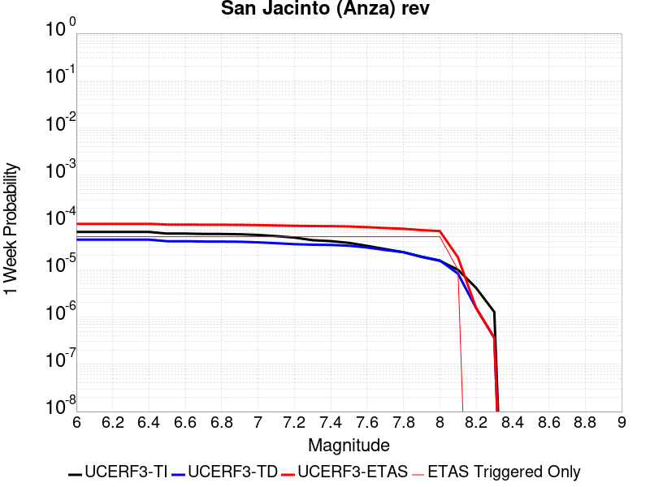 | 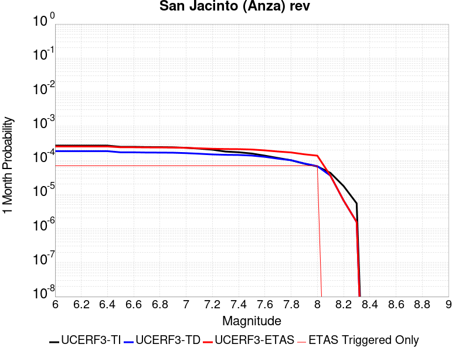 | 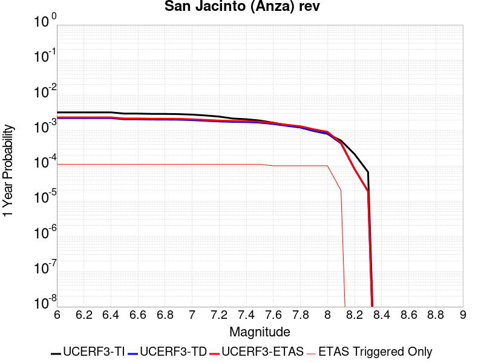 | 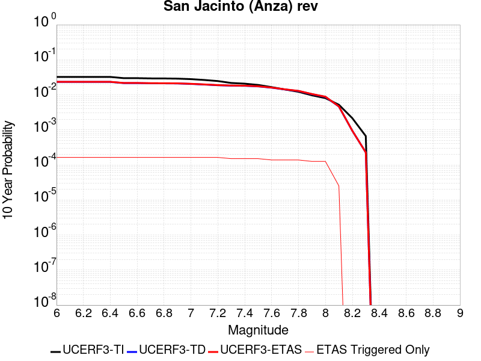 |

| Magnitude | 1 wk TI Prob | 1 wk TD Prob | 1 wk ETAS Prob | 1 wk ETAS/TD Gain | 1 wk ETAS Triggered Only | 1 mo TI Prob | 1 mo TD Prob | 1 mo ETAS Prob | 1 mo ETAS/TD Gain | 1 mo ETAS Triggered Only | 1 yr TI Prob | 1 yr TD Prob | 1 yr ETAS Prob | 1 yr ETAS/TD Gain | 1 yr ETAS Triggered Only | 10 yr TI Prob | 10 yr TD Prob | 10 yr ETAS Prob | 10 yr ETAS/TD Gain | 10 yr ETAS Triggered Only |
|-----|-----|-----|-----|-----|-----|-----|-----|-----|-----|-----|-----|-----|-----|-----|-----|-----|-----|-----|-----|-----|
| 6.0 | 6.3015636E-5 | 4.3298347E-5 | 9.3296185E-5 | 2.1547284 | 5.0E-5 | 2.7003905E-4 | 1.8555121E-4 | 2.4554008E-4 | 1.3233008 | 6.0E-5 | 0.0032827691 | 0.0022567573 | 0.002366509 | 1.0486325 | 1.1E-4 | 0.032346968 | 0.02329361 | 0.02343035 | 1.0058702 | 1.4E-4 |
| 6.1 | 6.3015636E-5 | 4.3298347E-5 | 9.3296185E-5 | 2.1547284 | 5.0E-5 | 2.7003905E-4 | 1.8555121E-4 | 2.4554008E-4 | 1.3233008 | 6.0E-5 | 0.0032827691 | 0.0022567573 | 0.002366509 | 1.0486325 | 1.1E-4 | 0.032346968 | 0.02329361 | 0.02343035 | 1.0058702 | 1.4E-4 |
| 6.2 | 6.3015636E-5 | 4.3298347E-5 | 9.3296185E-5 | 2.1547284 | 5.0E-5 | 2.7003905E-4 | 1.8555121E-4 | 2.4554008E-4 | 1.3233008 | 6.0E-5 | 0.0032827691 | 0.0022567573 | 0.002366509 | 1.0486325 | 1.1E-4 | 0.032346968 | 0.02329361 | 0.02343035 | 1.0058702 | 1.4E-4 |
| 6.3 | 6.3015636E-5 | 4.3298347E-5 | 9.3296185E-5 | 2.1547284 | 5.0E-5 | 2.7003905E-4 | 1.8555121E-4 | 2.4554008E-4 | 1.3233008 | 6.0E-5 | 0.0032827691 | 0.0022567573 | 0.002366509 | 1.0486325 | 1.1E-4 | 0.032346968 | 0.02329361 | 0.02343035 | 1.0058702 | 1.4E-4 |
| 6.4 | 6.3015636E-5 | 4.3298347E-5 | 9.3296185E-5 | 2.1547284 | 5.0E-5 | 2.7003905E-4 | 1.8555121E-4 | 2.4554008E-4 | 1.3233008 | 6.0E-5 | 0.0032827691 | 0.0022567573 | 0.002366509 | 1.0486325 | 1.1E-4 | 0.032346968 | 0.02329361 | 0.02343035 | 1.0058702 | 1.4E-4 |
| 6.5 | 5.811017E-5 | 4.0080286E-5 | 9.007828E-5 | 2.247446 | 5.0E-5 | 2.4901982E-4 | 1.7176138E-4 | 2.3175107E-4 | 1.3492619 | 6.0E-5 | 0.0030276014 | 0.0020891947 | 0.0021989648 | 1.0525419 | 1.1E-4 | 0.02986684 | 0.021590833 | 0.021727812 | 1.0063442 | 1.4E-4 |
| 6.6 | 5.811017E-5 | 4.0080286E-5 | 9.007828E-5 | 2.247446 | 5.0E-5 | 2.4901982E-4 | 1.7176138E-4 | 2.3175107E-4 | 1.3492619 | 6.0E-5 | 0.0030276014 | 0.0020891947 | 0.0021989648 | 1.0525419 | 1.1E-4 | 0.02986684 | 0.021590833 | 0.021727812 | 1.0063442 | 1.4E-4 |
| 6.7 | 5.712442E-5 | 3.950301E-5 | 8.950104E-5 | 2.2656763 | 5.0E-5 | 2.4479596E-4 | 1.6928767E-4 | 2.2927752E-4 | 1.3543663 | 6.0E-5 | 0.0029763177 | 0.0020591344 | 0.002168908 | 1.0533105 | 1.1E-4 | 0.029367693 | 0.021282919 | 0.021419939 | 1.006438 | 1.4E-4 |
| 6.8 | 5.6967532E-5 | 3.93593E-5 | 8.935733E-5 | 2.2702978 | 5.0E-5 | 2.4412372E-4 | 1.6867183E-4 | 2.2866171E-4 | 1.3556603 | 6.0E-5 | 0.0029681553 | 0.0020516508 | 0.0021614253 | 1.0535053 | 1.1E-4 | 0.029288229 | 0.02120852 | 0.02134555 | 1.0064611 | 1.4E-4 |
| 6.9 | 5.6211324E-5 | 3.9064216E-5 | 8.906226E-5 | 2.2798939 | 5.0E-5 | 2.4088343E-4 | 1.6740736E-4 | 2.2739731E-4 | 1.3583472 | 6.0E-5 | 0.0029288116 | 0.0020362847 | 0.0021460608 | 1.0539099 | 1.1E-4 | 0.028905109 | 0.021047527 | 0.02118458 | 1.0065116 | 1.4E-4 |
| 7.0 | 5.4383527E-5 | 3.7925012E-5 | 8.7923116E-5 | 2.3183413 | 5.0E-5 | 2.3305144E-4 | 1.6252567E-4 | 2.2251591E-4 | 1.3691125 | 6.0E-5 | 0.0028337094 | 0.001976959 | 0.0020867416 | 1.055531 | 1.1E-4 | 0.027978465 | 0.02044095 | 0.020578088 | 1.006709 | 1.4E-4 |
| 7.1 | 5.1393665E-5 | 3.638787E-5 | 8.638605E-5 | 2.3740342 | 5.0E-5 | 2.2023996E-4 | 1.5593872E-4 | 2.1592937E-4 | 1.3847065 | 6.0E-5 | 0.0026781242 | 0.0018969048 | 0.002006696 | 1.0578792 | 1.1E-4 | 0.026460782 | 0.019616077 | 0.019753331 | 1.006997 | 1.4E-4 |
| 7.2 | 4.785222E-5 | 3.4738845E-5 | 8.4737105E-5 | 2.439261 | 5.0E-5 | 2.0506482E-4 | 1.4887229E-4 | 2.0886335E-4 | 1.4029701 | 6.0E-5 | 0.0024938055 | 0.0018110167 | 0.0019208175 | 1.0606294 | 1.1E-4 | 0.024660049 | 0.018728783 | 0.01886616 | 1.0073351 | 1.4E-4 |
| 7.3 | 4.2143256E-5 | 3.3834414E-5 | 8.383272E-5 | 2.4777353 | 5.0E-5 | 1.8060145E-4 | 1.449966E-4 | 2.0498788E-4 | 1.4137429 | 6.0E-5 | 0.002196605 | 0.0017639075 | 0.0018737135 | 1.0622516 | 1.1E-4 | 0.02175019 | 0.018236695 | 0.018364325 | 1.0069985 | 1.3E-4 |
| 7.4 | 4.0264713E-5 | 3.3472694E-5 | 8.347102E-5 | 2.4937048 | 5.0E-5 | 1.7255165E-4 | 1.4344654E-4 | 2.0343793E-4 | 1.4182143 | 6.0E-5 | 0.002098792 | 0.0017450659 | 0.001854874 | 1.0629249 | 1.1E-4 | 0.020790804 | 0.018041389 | 0.018169044 | 1.0070757 | 1.3E-4 |
| 7.5 | 3.694492E-5 | 3.2186905E-5 | 8.2185295E-5 | 2.5533767 | 5.0E-5 | 1.5832575E-4 | 1.379366E-4 | 1.9792833E-4 | 1.4349225 | 6.0E-5 | 0.0019259118 | 0.0016780876 | 0.001787903 | 1.0654408 | 1.1E-4 | 0.01909306 | 0.017357888 | 0.017485632 | 1.0073594 | 1.3E-4 |
| 7.6 | 3.200565E-5 | 2.9502702E-5 | 7.950123E-5 | 2.69471 | 5.0E-5 | 1.3715986E-4 | 1.2643404E-4 | 1.8642645E-4 | 1.4744958 | 6.0E-5 | 0.001668642 | 0.0015382497 | 0.001638096 | 1.064909 | 1.0E-4 | 0.01656168 | 0.015946016 | 0.016064104 | 1.0074054 | 1.2E-4 |
| 7.7 | 2.731642E-5 | 2.6091477E-5 | 7.6090175E-5 | 2.9162846 | 5.0E-5 | 1.1706512E-4 | 1.11815825E-4 | 1.7180911E-4 | 1.5365367 | 6.0E-5 | 0.001424336 | 0.0013605085 | 0.0014603725 | 1.0734019 | 1.0E-4 | 0.014152412 | 0.0141668 | 0.0142851 | 1.0083505 | 1.2E-4 |
| 7.8 | 2.3466424E-5 | 2.3503619E-5 | 7.3502444E-5 | 3.127282 | 5.0E-5 | 1.0056651E-4 | 1.0072591E-4 | 1.6071986E-4 | 1.5956159 | 6.0E-5 | 0.0012237094 | 0.0012256489 | 0.0013255263 | 1.0814894 | 1.0E-4 | 0.012169928 | 0.012808796 | 0.012927259 | 1.0092486 | 1.2E-4 |
| 7.9 | 1.8611925E-5 | 1.890698E-5 | 6.890603E-5 | 3.644476 | 5.0E-5 | 7.9762955E-5 | 8.10274E-5 | 1.4102254E-4 | 1.7404302 | 6.0E-5 | 9.7068126E-4 | 9.860628E-4 | 0.0010859643 | 1.1013135 | 1.0E-4 | 0.0096645225 | 0.010393705 | 0.010502562 | 1.0104734 | 1.1E-4 |
| 8.0 | 1.5460775E-5 | 1.5739915E-5 | 6.573913E-5 | 4.176587 | 5.0E-5 | 6.6258784E-5 | 6.745504E-5 | 1.27451E-4 | 1.8894213 | 6.0E-5 | 8.0640207E-4 | 8.2095637E-4 | 9.2087424E-4 | 1.1217091 | 1.0E-4 | 0.008034821 | 0.008702706 | 0.008811749 | 1.0125297 | 1.1E-4 |
| 8.1 | 9.983884E-6 | 8.268954E-6 | 1.8268871E-5 | 2.2093327 | 1.0E-5 | 4.2787375E-5 | 3.5437897E-5 | 4.5437544E-5 | 1.2821738 | 1.0E-5 | 5.2081177E-4 | 4.313715E-4 | 4.5136287E-4 | 1.0463438 | 2.0E-5 | 0.0051959283 | 0.00463968 | 0.0046595875 | 1.0042907 | 2.0E-5 |
| 8.2 | 4.1226E-6 | 1.5522551E-6 | 1.5522551E-6 | 1.0 | 0.0 | 1.7668166E-5 | 6.6525045E-6 | 6.6525045E-6 | 1.0 | 0.0 | 2.1508869E-4 | 8.099126E-5 | 8.099126E-5 | 1.0 | 0.0 | 0.0021488064 | 9.401847E-4 | 9.401847E-4 | 1.0 | 0.0 |
| 8.3 | 1.2750878E-6 | 3.609817E-7 | 3.609817E-7 | 1.0 | 0.0 | 5.4646503E-6 | 1.5470634E-6 | 1.5470634E-6 | 1.0 | 0.0 | 6.653009E-5 | 1.8835339E-5 | 1.8835339E-5 | 1.0 | 0.0 | 6.6510175E-4 | 2.272251E-4 | 2.272251E-4 | 1.0 | 0.0 |

## Deep Springs
*[(top)](#table-of-contents)*

| 1 Week | 1 Month | 1 Year | 10 Year |
|-----|-----|-----|-----|
| 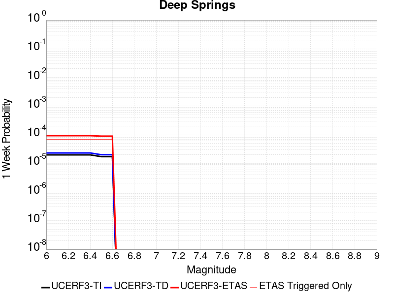 | 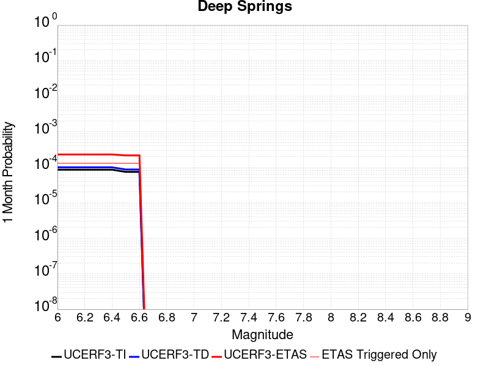 | 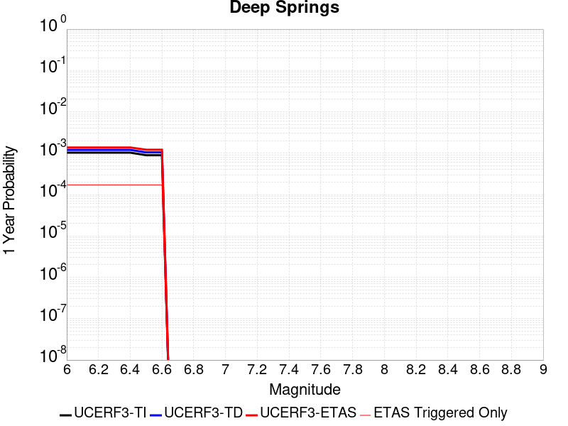 |  |

| Magnitude | 1 wk TI Prob | 1 wk TD Prob | 1 wk ETAS Prob | 1 wk ETAS/TD Gain | 1 wk ETAS Triggered Only | 1 mo TI Prob | 1 mo TD Prob | 1 mo ETAS Prob | 1 mo ETAS/TD Gain | 1 mo ETAS Triggered Only | 1 yr TI Prob | 1 yr TD Prob | 1 yr ETAS Prob | 1 yr ETAS/TD Gain | 1 yr ETAS Triggered Only | 10 yr TI Prob | 10 yr TD Prob | 10 yr ETAS Prob | 10 yr ETAS/TD Gain | 10 yr ETAS Triggered Only |
|-----|-----|-----|-----|-----|-----|-----|-----|-----|-----|-----|-----|-----|-----|-----|-----|-----|-----|-----|-----|-----|
| 6.0 | 1.9810619E-5 | 2.311252E-5 | 7.311136E-5 | 3.1632798 | 5.0E-5 | 8.489989E-5 | 9.9052755E-5 | 1.6904583E-4 | 1.7066242 | 7.0E-5 | 0.001033166 | 0.0012058078 | 0.0012956993 | 1.0745487 | 9.0E-5 | 0.010283757 | 0.01204243 | 0.012180744 | 1.0114856 | 1.4E-4 |
| 6.1 | 1.9810619E-5 | 2.311252E-5 | 7.311136E-5 | 3.1632798 | 5.0E-5 | 8.489989E-5 | 9.9052755E-5 | 1.6904583E-4 | 1.7066242 | 7.0E-5 | 0.001033166 | 0.0012058078 | 0.0012956993 | 1.0745487 | 9.0E-5 | 0.010283757 | 0.01204243 | 0.012180744 | 1.0114856 | 1.4E-4 |
| 6.2 | 1.9810619E-5 | 2.311252E-5 | 7.311136E-5 | 3.1632798 | 5.0E-5 | 8.489989E-5 | 9.9052755E-5 | 1.6904583E-4 | 1.7066242 | 7.0E-5 | 0.001033166 | 0.0012058078 | 0.0012956993 | 1.0745487 | 9.0E-5 | 0.010283757 | 0.01204243 | 0.012180744 | 1.0114856 | 1.4E-4 |
| 6.3 | 1.9810619E-5 | 2.311252E-5 | 7.311136E-5 | 3.1632798 | 5.0E-5 | 8.489989E-5 | 9.9052755E-5 | 1.6904583E-4 | 1.7066242 | 7.0E-5 | 0.001033166 | 0.0012058078 | 0.0012956993 | 1.0745487 | 9.0E-5 | 0.010283757 | 0.01204243 | 0.012180744 | 1.0114856 | 1.4E-4 |
| 6.4 | 1.9810619E-5 | 2.311252E-5 | 7.311136E-5 | 3.1632798 | 5.0E-5 | 8.489989E-5 | 9.9052755E-5 | 1.6904583E-4 | 1.7066242 | 7.0E-5 | 0.001033166 | 0.0012058078 | 0.0012956993 | 1.0745487 | 9.0E-5 | 0.010283757 | 0.01204243 | 0.012180744 | 1.0114856 | 1.4E-4 |
| 6.5 | 1.7190405E-5 | 2.0050558E-5 | 7.004956E-5 | 3.4936461 | 5.0E-5 | 7.367108E-5 | 8.593096E-5 | 1.5592495E-4 | 1.8145374 | 7.0E-5 | 8.9657627E-4 | 0.0010462092 | 0.001136115 | 1.0859349 | 9.0E-5 | 0.008929676 | 0.010462061 | 0.010600596 | 1.0132416 | 1.4E-4 |
| 6.6 | 1.7190405E-5 | 2.0050558E-5 | 7.004956E-5 | 3.4936461 | 5.0E-5 | 7.367108E-5 | 8.593096E-5 | 1.5592495E-4 | 1.8145374 | 7.0E-5 | 8.9657627E-4 | 0.0010462092 | 0.001136115 | 1.0859349 | 9.0E-5 | 0.008929676 | 0.010462061 | 0.010600596 | 1.0132416 | 1.4E-4 |

## Cleghorn
*[(top)](#table-of-contents)*

| 1 Week | 1 Month | 1 Year | 10 Year |
|-----|-----|-----|-----|
| 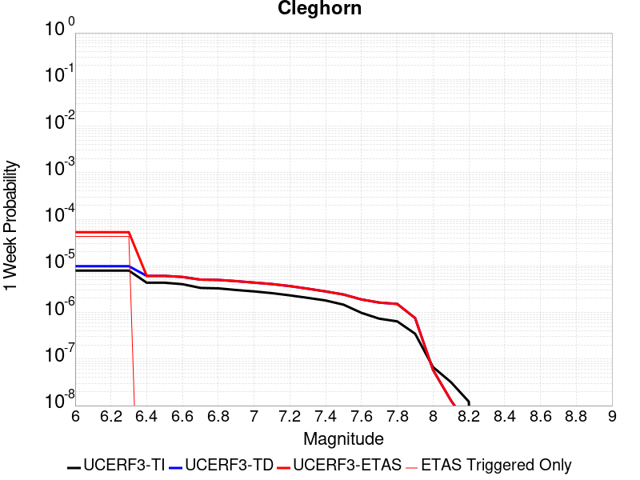 | 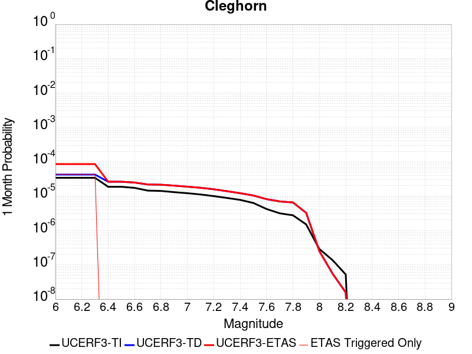 | 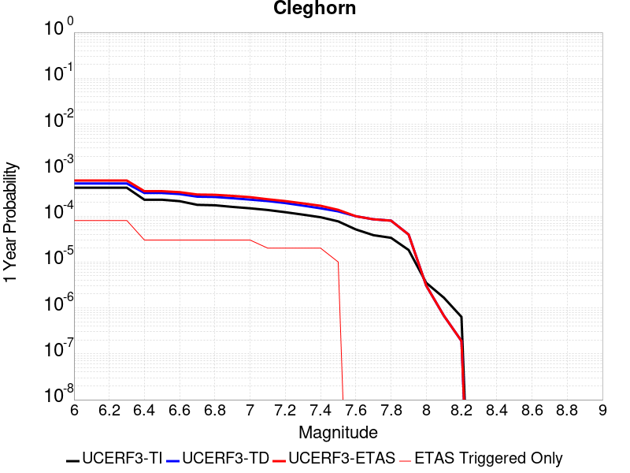 |  |

| Magnitude | 1 wk TI Prob | 1 wk TD Prob | 1 wk ETAS Prob | 1 wk ETAS/TD Gain | 1 wk ETAS Triggered Only | 1 mo TI Prob | 1 mo TD Prob | 1 mo ETAS Prob | 1 mo ETAS/TD Gain | 1 mo ETAS Triggered Only | 1 yr TI Prob | 1 yr TD Prob | 1 yr ETAS Prob | 1 yr ETAS/TD Gain | 1 yr ETAS Triggered Only | 10 yr TI Prob | 10 yr TD Prob | 10 yr ETAS Prob | 10 yr ETAS/TD Gain | 10 yr ETAS Triggered Only |
|-----|-----|-----|-----|-----|-----|-----|-----|-----|-----|-----|-----|-----|-----|-----|-----|-----|-----|-----|-----|-----|
| 6.0 | 7.9267165E-6 | 9.831764E-6 | 4.983137E-5 | 5.0684056 | 4.0E-5 | 3.39712E-5 | 4.2135514E-5 | 9.213341E-5 | 2.1865976 | 5.0E-5 | 4.1352084E-4 | 5.1288976E-4 | 5.928487E-4 | 1.1558989 | 8.0E-5 | 0.004127522 | 0.005132214 | 0.005271496 | 1.0271387 | 1.4E-4 |
| 6.1 | 7.9267165E-6 | 9.831764E-6 | 4.983137E-5 | 5.0684056 | 4.0E-5 | 3.39712E-5 | 4.2135514E-5 | 9.213341E-5 | 2.1865976 | 5.0E-5 | 4.1352084E-4 | 5.1288976E-4 | 5.928487E-4 | 1.1558989 | 8.0E-5 | 0.004127522 | 0.005132214 | 0.005271496 | 1.0271387 | 1.4E-4 |
| 6.2 | 7.9267165E-6 | 9.831764E-6 | 4.983137E-5 | 5.0684056 | 4.0E-5 | 3.39712E-5 | 4.2135514E-5 | 9.213341E-5 | 2.1865976 | 5.0E-5 | 4.1352084E-4 | 5.1288976E-4 | 5.928487E-4 | 1.1558989 | 8.0E-5 | 0.004127522 | 0.005132214 | 0.005271496 | 1.0271387 | 1.4E-4 |
| 6.3 | 7.9267165E-6 | 9.831764E-6 | 4.983137E-5 | 5.0684056 | 4.0E-5 | 3.39712E-5 | 4.2135514E-5 | 9.213341E-5 | 2.1865976 | 5.0E-5 | 4.1352084E-4 | 5.1288976E-4 | 5.928487E-4 | 1.1558989 | 8.0E-5 | 0.004127522 | 0.005132214 | 0.005271496 | 1.0271387 | 1.4E-4 |
| 6.4 | 4.3445207E-6 | 6.0916254E-6 | 2.6091504E-5 | 4.283176 | 2.0E-5 | 1.8619241E-5 | 2.6106709E-5 | 4.6106186E-5 | 1.7660666 | 2.0E-5 | 2.2666567E-4 | 3.1780385E-4 | 3.4779432E-4 | 1.0943679 | 3.0E-5 | 0.0022643462 | 0.0031877246 | 0.0032575014 | 1.0218892 | 7.0E-5 |
| 6.5 | 4.3445207E-6 | 6.0916254E-6 | 2.6091504E-5 | 4.283176 | 2.0E-5 | 1.8619241E-5 | 2.6106709E-5 | 4.6106186E-5 | 1.7660666 | 2.0E-5 | 2.2666567E-4 | 3.1780385E-4 | 3.4779432E-4 | 1.0943679 | 3.0E-5 | 0.0022643462 | 0.0031877246 | 0.0032575014 | 1.0218892 | 7.0E-5 |
| 6.6 | 4.040109E-6 | 5.774033E-6 | 2.5773918E-5 | 4.463763 | 2.0E-5 | 1.7314638E-5 | 2.4745626E-5 | 4.474513E-5 | 1.8082036 | 2.0E-5 | 2.1078532E-4 | 3.0123728E-4 | 3.3122825E-4 | 1.0995593 | 3.0E-5 | 0.002105855 | 0.0030225143 | 0.0030923027 | 1.0230895 | 7.0E-5 |
| 6.7 | 3.3632055E-6 | 5.06753E-6 | 2.506743E-5 | 4.9466763 | 2.0E-5 | 1.4413658E-5 | 2.1717806E-5 | 4.1717372E-5 | 1.9208833 | 2.0E-5 | 1.7547216E-4 | 2.643825E-4 | 2.943746E-4 | 1.113442 | 3.0E-5 | 0.0017533366 | 0.0026548486 | 0.0027146894 | 1.0225402 | 6.0E-5 |
| 6.8 | 3.2902772E-6 | 4.9894375E-6 | 2.4989338E-5 | 5.008448 | 2.0E-5 | 1.4101111E-5 | 2.138313E-5 | 4.1382704E-5 | 1.9352968 | 2.0E-5 | 1.716675E-4 | 2.6030882E-4 | 2.9030102E-4 | 1.1152177 | 3.0E-5 | 0.0017153495 | 0.0026142076 | 0.0026740506 | 1.0228915 | 6.0E-5 |
| 6.9 | 3.031547E-6 | 4.6911987E-6 | 2.4691104E-5 | 5.263283 | 2.0E-5 | 1.299228E-5 | 2.0104984E-5 | 4.0104584E-5 | 1.9947582 | 2.0E-5 | 1.5816953E-4 | 2.4475096E-4 | 2.7474362E-4 | 1.1225436 | 3.0E-5 | 0.00158057 | 0.0024589805 | 0.002518833 | 1.0243404 | 6.0E-5 |
| 7.0 | 2.8259715E-6 | 4.3707637E-6 | 2.4370676E-5 | 5.575839 | 2.0E-5 | 1.211125E-5 | 1.8731711E-5 | 3.8731338E-5 | 2.067688 | 2.0E-5 | 1.4744449E-4 | 2.2803496E-4 | 2.5802813E-4 | 1.1315287 | 3.0E-5 | 0.001473467 | 0.0022921748 | 0.0023520372 | 1.026116 | 6.0E-5 |
| 7.1 | 2.5962665E-6 | 4.065983E-6 | 1.4065942E-5 | 3.45942 | 1.0E-5 | 1.1126809E-5 | 1.7425526E-5 | 2.7425353E-5 | 1.5738608 | 1.0E-5 | 1.3546048E-4 | 2.1213535E-4 | 2.321311E-4 | 1.0942594 | 2.0E-5 | 0.0013537793 | 0.0021334959 | 0.0021734105 | 1.0187086 | 4.0E-5 |
| 7.2 | 2.3247253E-6 | 3.6765352E-6 | 1.3676498E-5 | 3.719942 | 1.0E-5 | 9.96307E-6 | 1.5756486E-5 | 2.5756328E-5 | 1.6346493 | 1.0E-5 | 1.21293626E-4 | 1.9181852E-4 | 2.1181468E-4 | 1.1042452 | 2.0E-5 | 0.0012122744 | 0.0019307166 | 0.0019606587 | 1.0155083 | 3.0E-5 |
| 7.3 | 2.056928E-6 | 3.235253E-6 | 1.3235221E-5 | 4.0909386 | 1.0E-5 | 8.815376E-6 | 1.3865297E-5 | 2.3865157E-5 | 1.7212151 | 1.0E-5 | 1.0732192E-4 | 1.6879707E-4 | 1.887937E-4 | 1.1184654 | 2.0E-5 | 0.001072701 | 0.0017009423 | 0.0017308913 | 1.0176073 | 3.0E-5 |
| 7.4 | 1.8055999E-6 | 2.8256538E-6 | 1.2825625E-5 | 4.538994 | 1.0E-5 | 7.738263E-6 | 1.210989E-5 | 2.2109769E-5 | 1.8257613 | 1.0E-5 | 9.4209274E-5 | 1.4742807E-4 | 1.6742513E-4 | 1.1356394 | 2.0E-5 | 9.4169343E-4 | 0.0014876705 | 0.0015076407 | 1.0134238 | 2.0E-5 |
| 7.5 | 1.4683443E-6 | 2.4248943E-6 | 2.4248943E-6 | 1.0 | 0.0 | 6.292889E-6 | 1.0392363E-5 | 1.0392363E-5 | 1.0 | 0.0 | 7.661323E-5 | 1.2651978E-4 | 1.365185E-4 | 1.0790291 | 1.0E-5 | 7.658682E-4 | 0.0012788812 | 0.0012888685 | 1.0078093 | 1.0E-5 |
| 7.6 | 9.804088E-7 | 1.9004091E-6 | 1.9004091E-6 | 1.0 | 0.0 | 4.201745E-6 | 8.144585E-6 | 8.144585E-6 | 1.0 | 0.0 | 5.1155046E-5 | 9.915586E-5 | 9.915586E-5 | 1.0 | 0.0 | 5.114327E-4 | 0.0010055583 | 0.0010055583 | 1.0 | 0.0 |
| 7.7 | 7.3434086E-7 | 1.6285549E-6 | 1.6285549E-6 | 1.0 | 0.0 | 3.1471714E-6 | 6.9795024E-6 | 6.9795024E-6 | 1.0 | 0.0 | 3.831614E-5 | 8.4972155E-5 | 8.4972155E-5 | 1.0 | 0.0 | 3.8309532E-4 | 8.6387293E-4 | 8.6387293E-4 | 1.0 | 0.0 |
| 7.8 | 6.434184E-7 | 1.5221389E-6 | 1.5221389E-6 | 1.0 | 0.0 | 2.7575045E-6 | 6.523436E-6 | 6.523436E-6 | 1.0 | 0.0 | 3.35721E-5 | 7.9419966E-5 | 7.9419966E-5 | 1.0 | 0.0 | 3.3567028E-4 | 8.080443E-4 | 8.080443E-4 | 1.0 | 0.0 |
| 7.9 | 3.4943926E-7 | 7.5750586E-7 | 7.5750586E-7 | 1.0 | 0.0 | 1.497596E-6 | 3.2464498E-6 | 3.2464498E-6 | 1.0 | 0.0 | 1.8233079E-5 | 3.9524817E-5 | 3.9524817E-5 | 1.0 | 0.0 | 1.8231584E-4 | 4.0401975E-4 | 4.0401975E-4 | 1.0 | 0.0 |
| 8.0 | 6.717524E-8 | 5.837515E-8 | 5.837515E-8 | 1.0 | 0.0 | 2.8789387E-7 | 2.501792E-7 | 2.501792E-7 | 1.0 | 0.0 | 3.505102E-6 | 3.0459275E-6 | 3.0459275E-6 | 1.0 | 0.0 | 3.5050467E-5 | 3.2751934E-5 | 3.2751934E-5 | 1.0 | 0.0 |
| 8.1 | 3.1984914E-8 | 1.2949885E-8 | 1.2949885E-8 | 1.0 | 0.0 | 1.370782E-7 | 5.549951E-8 | 5.549951E-8 | 1.0 | 0.0 | 1.6689258E-6 | 6.757063E-7 | 6.757063E-7 | 1.0 | 0.0 | 1.6689133E-5 | 7.741151E-6 | 7.741151E-6 | 1.0 | 0.0 |
| 8.2 | 1.21887656E-8 | 3.6471115E-9 | 3.6471115E-9 | 1.0 | 0.0 | 5.2237567E-8 | 1.563048E-8 | 1.563048E-8 | 1.0 | 0.0 | 6.359922E-7 | 1.9030107E-7 | 1.9030107E-7 | 1.0 | 0.0 | 6.3599036E-6 | 2.245849E-6 | 2.245849E-6 | 1.0 | 0.0 |

## Owens Valley
*[(top)](#table-of-contents)*

| 1 Week | 1 Month | 1 Year | 10 Year |
|-----|-----|-----|-----|
| 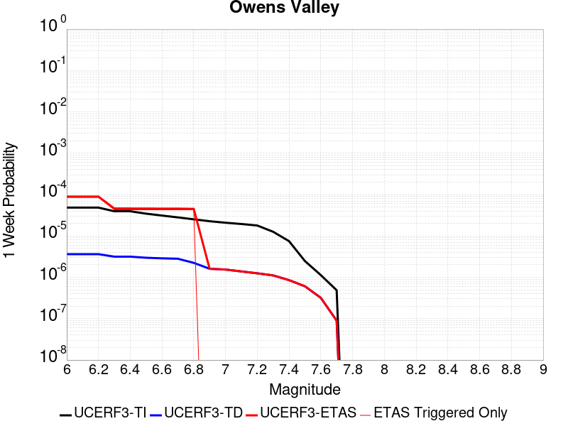 | 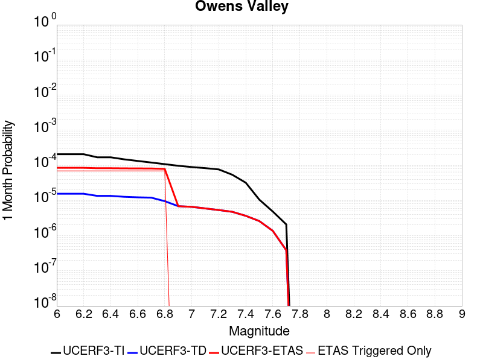 | 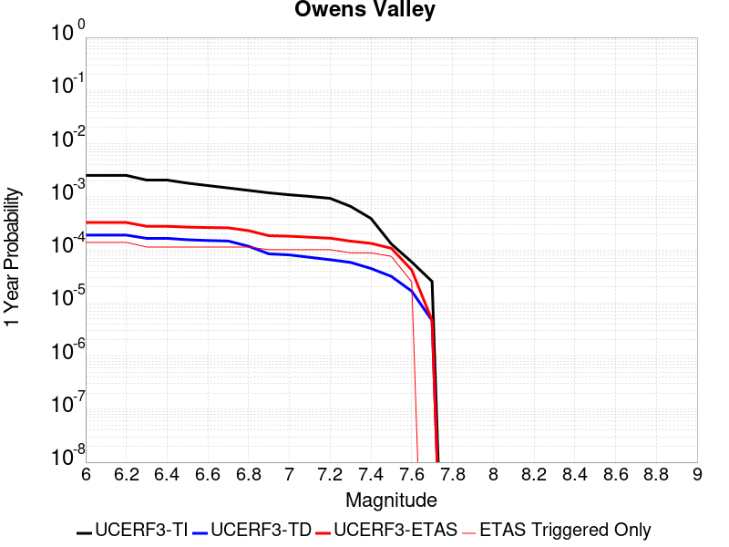 | 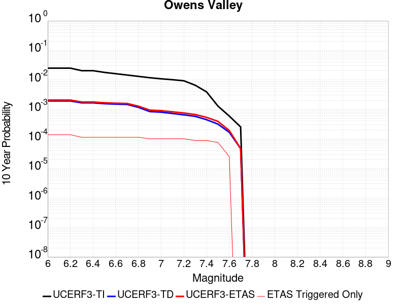 |

| Magnitude | 1 wk TI Prob | 1 wk TD Prob | 1 wk ETAS Prob | 1 wk ETAS/TD Gain | 1 wk ETAS Triggered Only | 1 mo TI Prob | 1 mo TD Prob | 1 mo ETAS Prob | 1 mo ETAS/TD Gain | 1 mo ETAS Triggered Only | 1 yr TI Prob | 1 yr TD Prob | 1 yr ETAS Prob | 1 yr ETAS/TD Gain | 1 yr ETAS Triggered Only | 10 yr TI Prob | 10 yr TD Prob | 10 yr ETAS Prob | 10 yr ETAS/TD Gain | 10 yr ETAS Triggered Only |
|-----|-----|-----|-----|-----|-----|-----|-----|-----|-----|-----|-----|-----|-----|-----|-----|-----|-----|-----|-----|-----|
| 6.0 | 4.83821E-5 | 3.6210524E-6 | 5.362087E-5 | 14.80809 | 5.0E-5 | 2.0733538E-4 | 1.551871E-5 | 9.551747E-5 | 6.154988 | 8.0E-5 | 0.002521386 | 1.889249E-4 | 3.2889843E-4 | 1.7408953 | 1.4E-4 | 0.024929691 | 0.0019297141 | 0.002069444 | 1.0724096 | 1.4E-4 |
| 6.1 | 4.83821E-5 | 3.6210524E-6 | 5.362087E-5 | 14.80809 | 5.0E-5 | 2.0733538E-4 | 1.551871E-5 | 9.551747E-5 | 6.154988 | 8.0E-5 | 0.002521386 | 1.889249E-4 | 3.2889843E-4 | 1.7408953 | 1.4E-4 | 0.024929691 | 0.0019297141 | 0.002069444 | 1.0724096 | 1.4E-4 |
| 6.2 | 4.83821E-5 | 3.6210524E-6 | 5.362087E-5 | 14.80809 | 5.0E-5 | 2.0733538E-4 | 1.551871E-5 | 9.551747E-5 | 6.154988 | 8.0E-5 | 0.002521386 | 1.889249E-4 | 3.2889843E-4 | 1.7408953 | 1.4E-4 | 0.024929691 | 0.0019297141 | 0.002069444 | 1.0724096 | 1.4E-4 |
| 6.3 | 3.953008E-5 | 3.1530958E-6 | 4.315297E-5 | 13.6859045 | 4.0E-5 | 1.6940363E-4 | 1.3513202E-5 | 7.351239E-5 | 5.4400425 | 6.0E-5 | 0.002060538 | 1.6451156E-4 | 2.844918E-4 | 1.7293121 | 1.2E-4 | 0.020415364 | 0.0016621627 | 0.0017819633 | 1.0720751 | 1.2E-4 |
| 6.4 | 3.953008E-5 | 3.1530958E-6 | 4.315297E-5 | 13.6859045 | 4.0E-5 | 1.6940363E-4 | 1.3513202E-5 | 7.351239E-5 | 5.4400425 | 6.0E-5 | 0.002060538 | 1.6451156E-4 | 2.844918E-4 | 1.7293121 | 1.2E-4 | 0.020415364 | 0.0016621627 | 0.0017819633 | 1.0720751 | 1.2E-4 |
| 6.5 | 3.457342E-5 | 2.9707387E-6 | 4.297062E-5 | 14.464624 | 4.0E-5 | 1.4816338E-4 | 1.273168E-5 | 7.2730916E-5 | 5.712594 | 6.0E-5 | 0.0018023965 | 1.5499788E-4 | 2.7497928E-4 | 1.7740842 | 1.2E-4 | 0.017878477 | 0.0015563119 | 0.0016761251 | 1.0769854 | 1.2E-4 |
| 6.6 | 3.1127765E-5 | 2.8737306E-6 | 4.2873617E-5 | 14.919149 | 4.0E-5 | 1.3339789E-4 | 1.2315934E-5 | 7.23152E-5 | 5.8716774 | 6.0E-5 | 0.0016229092 | 1.4993687E-4 | 2.5992037E-4 | 1.7335321 | 1.1E-4 | 0.016111081 | 0.0015013438 | 0.0016111786 | 1.0731577 | 1.1E-4 |
| 6.7 | 2.806885E-5 | 2.8101606E-6 | 4.2810047E-5 | 15.234022 | 4.0E-5 | 1.2028952E-4 | 1.2043493E-5 | 7.204277E-5 | 5.981883 | 6.0E-5 | 0.001463541 | 1.4662035E-4 | 2.5660422E-4 | 1.750127 | 1.1E-4 | 0.014539397 | 0.0014656087 | 0.0015754475 | 1.0749441 | 1.1E-4 |
| 6.8 | 2.524524E-5 | 2.2351392E-6 | 4.223505E-5 | 18.895937 | 4.0E-5 | 1.0818939E-4 | 9.579134E-6 | 6.957856E-5 | 7.263554 | 6.0E-5 | 0.0013164099 | 1.16620016E-4 | 2.266072E-4 | 1.9431243 | 1.1E-4 | 0.01308639 | 0.001165827 | 0.0012756989 | 1.0942436 | 1.1E-4 |
| 6.9 | 2.2704568E-5 | 1.6079711E-6 | 3.1607924E-5 | 19.657022 | 3.0E-5 | 9.730166E-5 | 6.8912864E-6 | 5.689094E-5 | 8.255489 | 5.0E-5 | 0.0011840039 | 8.38982E-5 | 1.838898E-4 | 2.1918206 | 1.0E-4 | 0.011777153 | 8.38853E-4 | 9.3876914E-4 | 1.1191103 | 1.0E-4 |
| 7.0 | 2.0871712E-5 | 1.5393621E-6 | 3.1539315E-5 | 20.488562 | 3.0E-5 | 8.944713E-5 | 6.5972495E-6 | 5.659692E-5 | 8.578866 | 5.0E-5 | 0.0010884746 | 8.031857E-5 | 1.8031054E-4 | 2.2449422 | 1.0E-4 | 0.010831586 | 8.030395E-4 | 9.029592E-4 | 1.1244268 | 1.0E-4 |
| 7.1 | 1.944928E-5 | 1.3862556E-6 | 3.1386215E-5 | 22.641 | 3.0E-5 | 8.335139E-5 | 5.941082E-6 | 5.5940785E-5 | 9.415926 | 5.0E-5 | 0.0010143308 | 7.233028E-5 | 1.7232305E-4 | 2.3824468 | 1.0E-4 | 0.010097133 | 7.2319806E-4 | 8.231257E-4 | 1.1381747 | 1.0E-4 |
| 7.2 | 1.7876306E-5 | 1.2487686E-6 | 3.1248732E-5 | 25.023636 | 3.0E-5 | 7.6610486E-5 | 5.3518543E-6 | 5.5351586E-5 | 10.342506 | 5.0E-5 | 9.3233347E-4 | 6.515689E-5 | 1.6515037E-4 | 2.5346572 | 1.0E-4 | 0.009284316 | 6.5148395E-4 | 7.514188E-4 | 1.1533958 | 1.0E-4 |
| 7.3 | 1.2618672E-5 | 1.1113839E-6 | 2.1111362E-5 | 18.995562 | 2.0E-5 | 5.40789E-5 | 4.763065E-6 | 4.4762874E-5 | 9.397913 | 4.0E-5 | 6.582117E-4 | 5.7988782E-5 | 1.4798356E-4 | 2.5519342 | 9.0E-5 | 0.0065626553 | 5.7983754E-4 | 6.6978537E-4 | 1.1551259 | 9.0E-5 |
| 7.4 | 7.4874442E-6 | 8.547518E-7 | 2.0854735E-5 | 24.398586 | 2.0E-5 | 3.208865E-5 | 3.6632168E-6 | 4.366307E-5 | 11.919325 | 4.0E-5 | 3.906093E-4 | 4.4598757E-5 | 1.3459474E-4 | 3.0179036 | 9.0E-5 | 0.003899234 | 4.459579E-4 | 5.3591776E-4 | 1.2017227 | 9.0E-5 |
| 7.5 | 2.4734156E-6 | 6.0679935E-7 | 2.0606787E-5 | 33.959805 | 2.0E-5 | 1.060031E-5 | 2.6005662E-6 | 4.2600463E-5 | 16.381226 | 4.0E-5 | 1.2905113E-4 | 3.1661435E-5 | 1.0165922E-4 | 3.2108214 | 7.0E-5 | 0.0012897621 | 3.1656958E-4 | 3.865474E-4 | 1.2210504 | 7.0E-5 |
| 7.6 | 1.1328841E-6 | 3.1961991E-7 | 1.0319617E-5 | 32.28715 | 1.0E-5 | 4.8552088E-6 | 1.369799E-6 | 2.1369771E-5 | 15.600662 | 2.0E-5 | 5.9110564E-5 | 1.6677177E-5 | 4.6676676E-5 | 2.7988355 | 3.0E-5 | 5.9094845E-4 | 1.6675945E-4 | 1.9675444E-4 | 1.1798699 | 3.0E-5 |
| 7.7 | 4.8613185E-7 | 8.962742E-8 | 8.962742E-8 | 1.0 | 0.0 | 2.0834207E-6 | 3.8411747E-7 | 3.8411747E-7 | 1.0 | 0.0 | 2.536535E-5 | 4.676621E-6 | 4.676621E-6 | 1.0 | 0.0 | 2.5362454E-4 | 4.676529E-5 | 4.676529E-5 | 1.0 | 0.0 |

## Dry Mountain
*[(top)](#table-of-contents)*

| 1 Week | 1 Month | 1 Year | 10 Year |
|-----|-----|-----|-----|
| 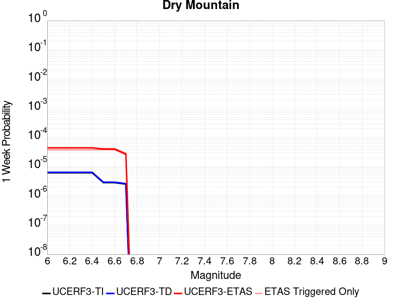 | 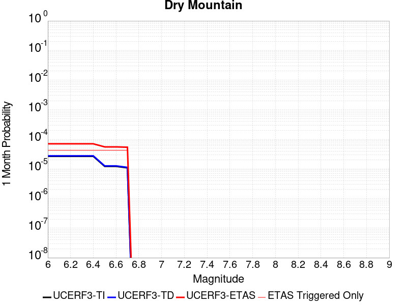 | 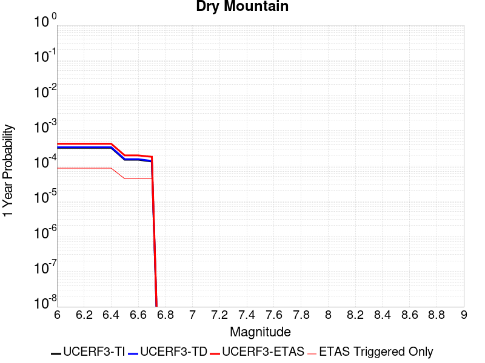 | 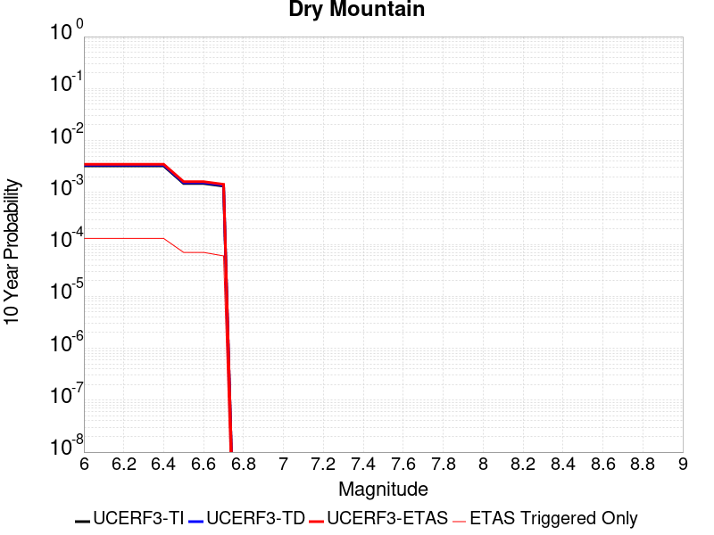 |

| Magnitude | 1 wk TI Prob | 1 wk TD Prob | 1 wk ETAS Prob | 1 wk ETAS/TD Gain | 1 wk ETAS Triggered Only | 1 mo TI Prob | 1 mo TD Prob | 1 mo ETAS Prob | 1 mo ETAS/TD Gain | 1 mo ETAS Triggered Only | 1 yr TI Prob | 1 yr TD Prob | 1 yr ETAS Prob | 1 yr ETAS/TD Gain | 1 yr ETAS Triggered Only | 10 yr TI Prob | 10 yr TD Prob | 10 yr ETAS Prob | 10 yr ETAS/TD Gain | 10 yr ETAS Triggered Only |
|-----|-----|-----|-----|-----|-----|-----|-----|-----|-----|-----|-----|-----|-----|-----|-----|-----|-----|-----|-----|-----|
| 6.0 | 6.222801E-6 | 6.439381E-6 | 5.6439058E-5 | 8.764671 | 5.0E-5 | 2.6668875E-5 | 2.7597147E-5 | 7.759577E-5 | 2.8117316 | 5.0E-5 | 3.2464517E-4 | 3.3595937E-4 | 4.359258E-4 | 1.2975551 | 1.0E-4 | 0.0032417132 | 0.0033560768 | 0.0034856405 | 1.0386057 | 1.3E-4 |
| 6.1 | 6.222801E-6 | 6.439381E-6 | 5.6439058E-5 | 8.764671 | 5.0E-5 | 2.6668875E-5 | 2.7597147E-5 | 7.759577E-5 | 2.8117316 | 5.0E-5 | 3.2464517E-4 | 3.3595937E-4 | 4.359258E-4 | 1.2975551 | 1.0E-4 | 0.0032417132 | 0.0033560768 | 0.0034856405 | 1.0386057 | 1.3E-4 |
| 6.2 | 6.222801E-6 | 6.439381E-6 | 5.6439058E-5 | 8.764671 | 5.0E-5 | 2.6668875E-5 | 2.7597147E-5 | 7.759577E-5 | 2.8117316 | 5.0E-5 | 3.2464517E-4 | 3.3595937E-4 | 4.359258E-4 | 1.2975551 | 1.0E-4 | 0.0032417132 | 0.0033560768 | 0.0034856405 | 1.0386057 | 1.3E-4 |
| 6.3 | 6.222801E-6 | 6.439381E-6 | 5.6439058E-5 | 8.764671 | 5.0E-5 | 2.6668875E-5 | 2.7597147E-5 | 7.759577E-5 | 2.8117316 | 5.0E-5 | 3.2464517E-4 | 3.3595937E-4 | 4.359258E-4 | 1.2975551 | 1.0E-4 | 0.0032417132 | 0.0033560768 | 0.0034856405 | 1.0386057 | 1.3E-4 |
| 6.4 | 6.222801E-6 | 6.439381E-6 | 5.6439058E-5 | 8.764671 | 5.0E-5 | 2.6668875E-5 | 2.7597147E-5 | 7.759577E-5 | 2.8117316 | 5.0E-5 | 3.2464517E-4 | 3.3595937E-4 | 4.359258E-4 | 1.2975551 | 1.0E-4 | 0.0032417132 | 0.0033560768 | 0.0034856405 | 1.0386057 | 1.3E-4 |
| 6.5 | 2.8528623E-6 | 2.9521684E-6 | 5.2952022E-5 | 17.936653 | 5.0E-5 | 1.22264955E-5 | 1.2652138E-5 | 6.26515E-5 | 4.9518514 | 5.0E-5 | 1.4884741E-4 | 1.540376E-4 | 2.1402835E-4 | 1.3894553 | 6.0E-5 | 0.0014874774 | 0.0015401616 | 0.0016100538 | 1.0453798 | 7.0E-5 |
| 6.6 | 2.8528623E-6 | 2.9521684E-6 | 5.2952022E-5 | 17.936653 | 5.0E-5 | 1.22264955E-5 | 1.2652138E-5 | 6.26515E-5 | 4.9518514 | 5.0E-5 | 1.4884741E-4 | 1.540376E-4 | 2.1402835E-4 | 1.3894553 | 6.0E-5 | 0.0014874774 | 0.0015401616 | 0.0016100538 | 1.0453798 | 7.0E-5 |
| 6.7 | 2.541E-6 | 2.6293578E-6 | 4.2629254E-5 | 16.2128 | 4.0E-5 | 1.0889954E-5 | 1.1268677E-5 | 5.1268227E-5 | 4.5496225 | 4.0E-5 | 1.3257713E-4 | 1.3719614E-4 | 1.8718927E-4 | 1.3643918 | 5.0E-5 | 0.0013249806 | 0.0013719613 | 0.001431879 | 1.043673 | 6.0E-5 |

## Chino alt 1
*[(top)](#table-of-contents)*

| 1 Week | 1 Month | 1 Year | 10 Year |
|-----|-----|-----|-----|
| 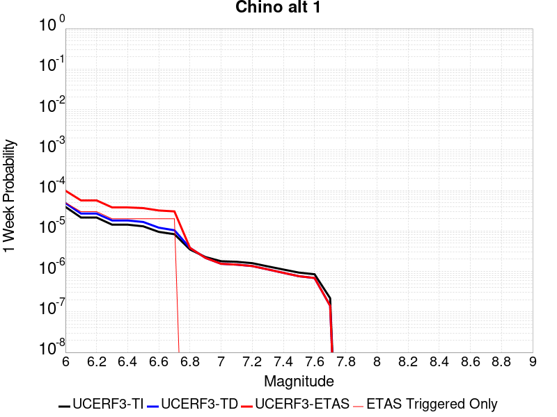 | 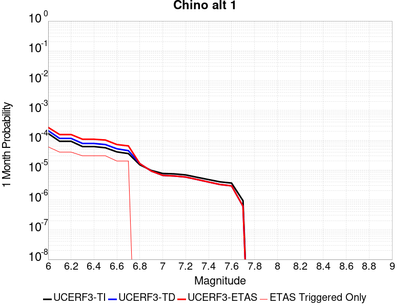 | 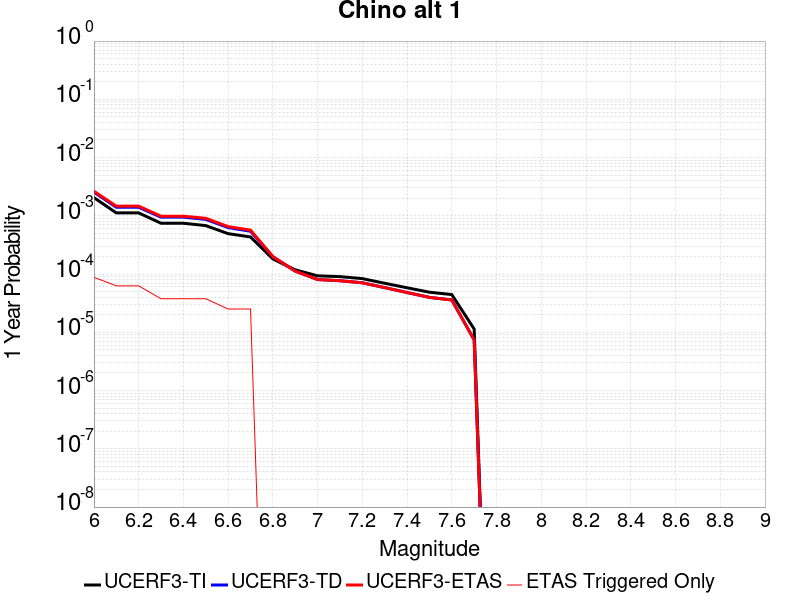 | 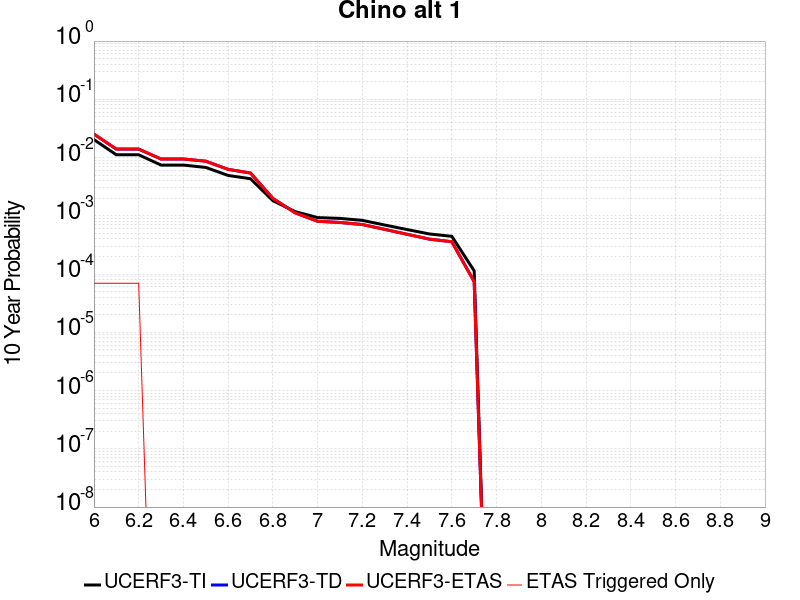 |

| Magnitude | 1 wk TI Prob | 1 wk TD Prob | 1 wk ETAS Prob | 1 wk ETAS/TD Gain | 1 wk ETAS Triggered Only | 1 mo TI Prob | 1 mo TD Prob | 1 mo ETAS Prob | 1 mo ETAS/TD Gain | 1 mo ETAS Triggered Only | 1 yr TI Prob | 1 yr TD Prob | 1 yr ETAS Prob | 1 yr ETAS/TD Gain | 1 yr ETAS Triggered Only | 10 yr TI Prob | 10 yr TD Prob | 10 yr ETAS Prob | 10 yr ETAS/TD Gain | 10 yr ETAS Triggered Only |
|-----|-----|-----|-----|-----|-----|-----|-----|-----|-----|-----|-----|-----|-----|-----|-----|-----|-----|-----|-----|-----|
| 6.0 | 3.939946E-5 | 4.894798E-5 | 9.894554E-5 | 2.0214427 | 5.0E-5 | 1.6884391E-4 | 2.0976314E-4 | 2.6975054E-4 | 1.2859769 | 6.0E-5 | 0.0020537362 | 0.002551385 | 0.0026411554 | 1.035185 | 9.0E-5 | 0.020348595 | 0.025280168 | 0.02541663 | 1.0053979 | 1.4E-4 |
| 6.1 | 2.1505624E-5 | 2.6878823E-5 | 5.6878016E-5 | 2.1160903 | 3.0E-5 | 9.2163704E-5 | 1.15190494E-4 | 1.5518589E-4 | 1.3472109 | 4.0E-5 | 0.0011215154 | 0.0014016517 | 0.0014515815 | 1.0356222 | 5.0E-5 | 0.011158722 | 0.013947425 | 0.0140164485 | 1.0049489 | 7.0E-5 |
| 6.2 | 2.1505624E-5 | 2.6878823E-5 | 5.6878016E-5 | 2.1160903 | 3.0E-5 | 9.2163704E-5 | 1.15190494E-4 | 1.5518589E-4 | 1.3472109 | 4.0E-5 | 0.0011215154 | 0.0014016517 | 0.0014515815 | 1.0356222 | 5.0E-5 | 0.011158722 | 0.013947425 | 0.0140164485 | 1.0049489 | 7.0E-5 |
| 6.3 | 1.4290785E-5 | 1.8164832E-5 | 3.8164468E-5 | 2.1010087 | 2.0E-5 | 6.1244784E-5 | 7.784722E-5 | 1.0784488E-4 | 1.3853402 | 3.0E-5 | 7.454001E-4 | 9.4742293E-4 | 9.773945E-4 | 1.0316348 | 3.0E-5 | 0.007429048 | 0.00944674 | 0.009486362 | 1.0041943 | 4.0E-5 |
| 6.4 | 1.4290785E-5 | 1.8164832E-5 | 3.8164468E-5 | 2.1010087 | 2.0E-5 | 6.1244784E-5 | 7.784722E-5 | 1.0784488E-4 | 1.3853402 | 3.0E-5 | 7.454001E-4 | 9.4742293E-4 | 9.773945E-4 | 1.0316348 | 3.0E-5 | 0.007429048 | 0.00944674 | 0.009486362 | 1.0041943 | 4.0E-5 |
| 6.5 | 1.3017944E-5 | 1.6651793E-5 | 3.6651458E-5 | 2.201052 | 2.0E-5 | 5.5789995E-5 | 7.1363116E-5 | 1.0136098E-4 | 1.4203552 | 3.0E-5 | 6.790315E-4 | 8.6854334E-4 | 8.985173E-4 | 1.0345106 | 3.0E-5 | 0.0067696036 | 0.008664233 | 0.008693973 | 1.0034325 | 3.0E-5 |
| 6.6 | 9.470016E-6 | 1.2039209E-5 | 3.203897E-5 | 2.6612186 | 2.0E-5 | 4.058515E-5 | 5.159578E-5 | 7.1594746E-5 | 1.3876086 | 2.0E-5 | 4.940122E-4 | 6.280315E-4 | 6.4801896E-4 | 1.0318255 | 2.0E-5 | 0.004929154 | 0.006273248 | 0.006293122 | 1.0031681 | 2.0E-5 |
| 6.7 | 8.314155E-6 | 1.040749E-5 | 3.0407282E-5 | 2.9216728 | 2.0E-5 | 3.5631605E-5 | 4.4602948E-5 | 6.4602056E-5 | 1.4483808 | 2.0E-5 | 4.3372845E-4 | 5.4293784E-4 | 5.62927E-4 | 1.0368166 | 2.0E-5 | 0.004328829 | 0.0054270807 | 0.0054469723 | 1.0036652 | 2.0E-5 |
| 6.8 | 3.4856364E-6 | 3.8134033E-6 | 3.8134033E-6 | 1.0 | 0.0 | 1.4938357E-5 | 1.6343065E-5 | 1.6343065E-5 | 1.0 | 0.0 | 1.8185932E-4 | 1.9896074E-4 | 1.9896074E-4 | 1.0 | 0.0 | 0.0018171056 | 0.0019894529 | 0.0019894529 | 1.0 | 0.0 |
| 6.9 | 2.2645952E-6 | 2.152909E-6 | 2.152909E-6 | 1.0 | 0.0 | 9.705372E-6 | 9.226722E-6 | 9.226722E-6 | 1.0 | 0.0 | 1.18156495E-4 | 1.12329755E-4 | 1.12329755E-4 | 1.0 | 0.0 | 0.0011809369 | 0.0011233138 | 0.0011233138 | 1.0 | 0.0 |
| 7.0 | 1.7864003E-6 | 1.5430741E-6 | 1.5430741E-6 | 1.0 | 0.0 | 7.655979E-6 | 6.613158E-6 | 6.613158E-6 | 1.0 | 0.0 | 9.3207556E-5 | 8.051228E-5 | 8.051228E-5 | 1.0 | 0.0 | 9.316847E-4 | 8.052856E-4 | 8.052856E-4 | 1.0 | 0.0 |
| 7.1 | 1.7315456E-6 | 1.4733466E-6 | 1.4733466E-6 | 1.0 | 0.0 | 7.420889E-6 | 6.314328E-6 | 6.314328E-6 | 1.0 | 0.0 | 9.034557E-5 | 7.687428E-5 | 7.687428E-5 | 1.0 | 0.0 | 9.0308854E-4 | 7.68921E-4 | 7.68921E-4 | 1.0 | 0.0 |
| 7.2 | 1.6008337E-6 | 1.3574178E-6 | 1.3574178E-6 | 1.0 | 0.0 | 6.860698E-6 | 5.817492E-6 | 5.817492E-6 | 1.0 | 0.0 | 8.352579E-5 | 7.082572E-5 | 7.082572E-5 | 1.0 | 0.0 | 8.34944E-4 | 7.0846075E-4 | 7.0846075E-4 | 1.0 | 0.0 |
| 7.3 | 1.3320939E-6 | 1.1217794E-6 | 1.1217794E-6 | 1.0 | 0.0 | 5.7089615E-6 | 4.8076176E-6 | 4.8076176E-6 | 1.0 | 0.0 | 6.9504385E-5 | 5.853122E-5 | 5.853122E-5 | 1.0 | 0.0 | 6.9482654E-4 | 5.8530655E-4 | 5.8530655E-4 | 1.0 | 0.0 |
| 7.4 | 1.114294E-6 | 9.237087E-7 | 9.237087E-7 | 1.0 | 0.0 | 4.775537E-6 | 3.9587458E-6 | 3.9587458E-6 | 1.0 | 0.0 | 5.8140613E-5 | 4.81967E-5 | 4.81967E-5 | 1.0 | 0.0 | 5.81254E-4 | 4.8187698E-4 | 4.8187698E-4 | 1.0 | 0.0 |
| 7.5 | 9.354081E-7 | 7.6233886E-7 | 7.6233886E-7 | 1.0 | 0.0 | 4.0088858E-6 | 3.2671626E-6 | 3.2671626E-6 | 1.0 | 0.0 | 4.8807087E-5 | 3.9777013E-5 | 3.9777013E-5 | 1.0 | 0.0 | 4.879637E-4 | 3.9770233E-4 | 3.9770233E-4 | 1.0 | 0.0 |
| 7.6 | 8.521771E-7 | 6.880688E-7 | 6.880688E-7 | 1.0 | 0.0 | 3.6521824E-6 | 2.948863E-6 | 2.948863E-6 | 1.0 | 0.0 | 4.4464414E-5 | 3.590185E-5 | 3.590185E-5 | 1.0 | 0.0 | 4.4455516E-4 | 3.5896365E-4 | 3.5896365E-4 | 1.0 | 0.0 |
| 7.7 | 2.1803626E-7 | 1.4186368E-7 | 1.4186368E-7 | 1.0 | 0.0 | 9.344408E-7 | 6.0798715E-7 | 6.0798715E-7 | 1.0 | 0.0 | 1.1376757E-5 | 7.4022278E-6 | 7.4022278E-6 | 1.0 | 0.0 | 1.13761744E-4 | 7.402077E-5 | 7.402077E-5 | 1.0 | 0.0 |

## Kern Canyon (North Kern) 2011
*[(top)](#table-of-contents)*

| 1 Week | 1 Month | 1 Year | 10 Year |
|-----|-----|-----|-----|
| 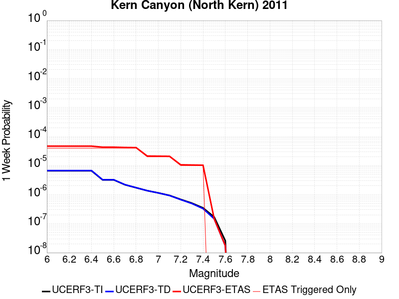 | 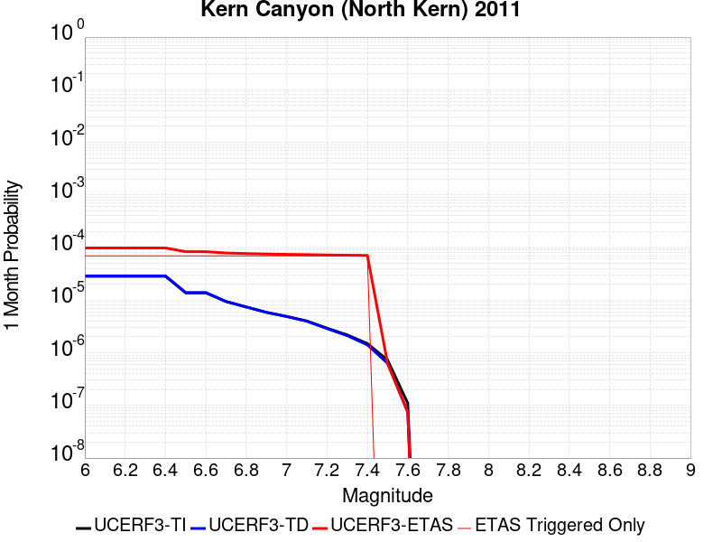 | 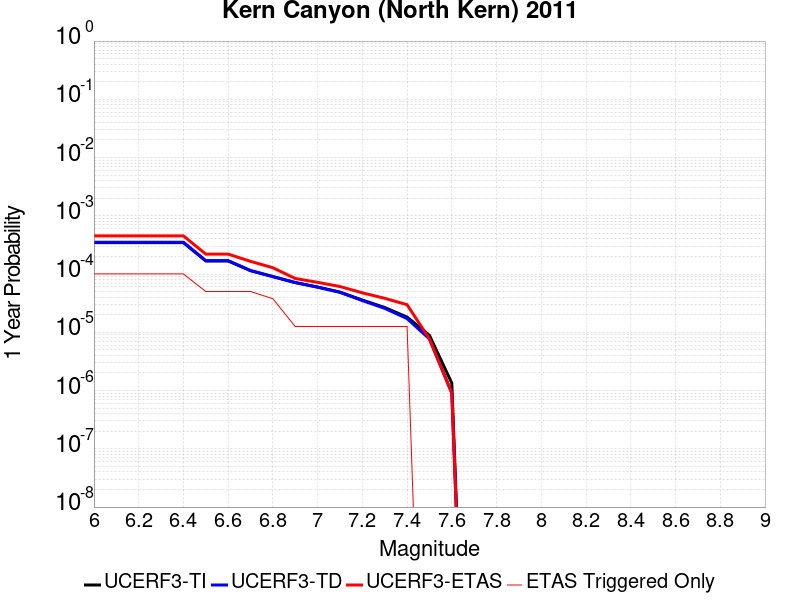 | 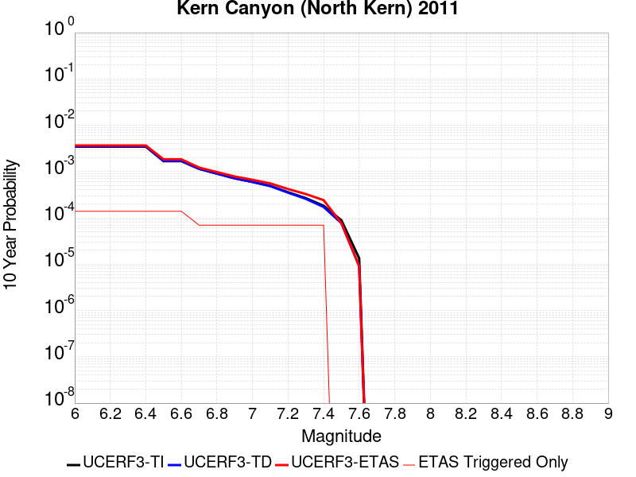 |

| Magnitude | 1 wk TI Prob | 1 wk TD Prob | 1 wk ETAS Prob | 1 wk ETAS/TD Gain | 1 wk ETAS Triggered Only | 1 mo TI Prob | 1 mo TD Prob | 1 mo ETAS Prob | 1 mo ETAS/TD Gain | 1 mo ETAS Triggered Only | 1 yr TI Prob | 1 yr TD Prob | 1 yr ETAS Prob | 1 yr ETAS/TD Gain | 1 yr ETAS Triggered Only | 10 yr TI Prob | 10 yr TD Prob | 10 yr ETAS Prob | 10 yr ETAS/TD Gain | 10 yr ETAS Triggered Only |
|-----|-----|-----|-----|-----|-----|-----|-----|-----|-----|-----|-----|-----|-----|-----|-----|-----|-----|-----|-----|-----|
| 6.0 | 6.6264497E-6 | 6.75733E-6 | 4.675706E-5 | 6.9194574 | 4.0E-5 | 2.8398761E-5 | 2.895971E-5 | 1.0895739E-4 | 3.7623787 | 8.0E-5 | 3.4570007E-4 | 3.5253543E-4 | 4.6249665E-4 | 1.3119154 | 1.1E-4 | 0.0034516277 | 0.0035205502 | 0.0036500925 | 1.0367961 | 1.3E-4 |
| 6.1 | 6.6264497E-6 | 6.75733E-6 | 4.675706E-5 | 6.9194574 | 4.0E-5 | 2.8398761E-5 | 2.895971E-5 | 1.0895739E-4 | 3.7623787 | 8.0E-5 | 3.4570007E-4 | 3.5253543E-4 | 4.6249665E-4 | 1.3119154 | 1.1E-4 | 0.0034516277 | 0.0035205502 | 0.0036500925 | 1.0367961 | 1.3E-4 |
| 6.2 | 6.6264497E-6 | 6.75733E-6 | 4.675706E-5 | 6.9194574 | 4.0E-5 | 2.8398761E-5 | 2.895971E-5 | 1.0895739E-4 | 3.7623787 | 8.0E-5 | 3.4570007E-4 | 3.5253543E-4 | 4.6249665E-4 | 1.3119154 | 1.1E-4 | 0.0034516277 | 0.0035205502 | 0.0036500925 | 1.0367961 | 1.3E-4 |
| 6.3 | 6.6264497E-6 | 6.75733E-6 | 4.675706E-5 | 6.9194574 | 4.0E-5 | 2.8398761E-5 | 2.895971E-5 | 1.0895739E-4 | 3.7623787 | 8.0E-5 | 3.4570007E-4 | 3.5253543E-4 | 4.6249665E-4 | 1.3119154 | 1.1E-4 | 0.0034516277 | 0.0035205502 | 0.0036500925 | 1.0367961 | 1.3E-4 |
| 6.4 | 6.6264497E-6 | 6.75733E-6 | 4.675706E-5 | 6.9194574 | 4.0E-5 | 2.8398761E-5 | 2.895971E-5 | 1.0895739E-4 | 3.7623787 | 8.0E-5 | 3.4570007E-4 | 3.5253543E-4 | 4.6249665E-4 | 1.3119154 | 1.1E-4 | 0.0034516277 | 0.0035205502 | 0.0036500925 | 1.0367961 | 1.3E-4 |
| 6.5 | 3.2162225E-6 | 3.2570915E-6 | 4.325696E-5 | 13.280855 | 4.0E-5 | 1.3783738E-5 | 1.3958894E-5 | 5.3958334E-5 | 3.8655167 | 4.0E-5 | 1.6780409E-4 | 1.6993708E-4 | 2.1992858E-4 | 1.2941766 | 5.0E-5 | 0.0016767744 | 0.001698151 | 0.0017680322 | 1.0411513 | 7.0E-5 |
| 6.6 | 3.2162225E-6 | 3.2570915E-6 | 4.325696E-5 | 13.280855 | 4.0E-5 | 1.3783738E-5 | 1.3958894E-5 | 5.3958334E-5 | 3.8655167 | 4.0E-5 | 1.6780409E-4 | 1.6993708E-4 | 2.1992858E-4 | 1.2941766 | 5.0E-5 | 0.0016767744 | 0.001698151 | 0.0017680322 | 1.0411513 | 7.0E-5 |
| 6.7 | 2.1908265E-6 | 2.2071222E-6 | 4.2207033E-5 | 19.123106 | 4.0E-5 | 9.389223E-6 | 9.459062E-6 | 4.9458682E-5 | 5.228709 | 4.0E-5 | 1.1430779E-4 | 1.1515819E-4 | 1.6515244E-4 | 1.4341353 | 5.0E-5 | 0.0011424901 | 0.0011510046 | 0.0012109355 | 1.0520684 | 6.0E-5 |
| 6.8 | 1.7303895E-6 | 1.736553E-6 | 4.1736483E-5 | 24.034098 | 4.0E-5 | 7.415934E-6 | 7.442349E-6 | 4.7442052E-5 | 6.374607 | 4.0E-5 | 9.028525E-5 | 9.060693E-5 | 1.3060331E-4 | 1.4414274 | 4.0E-5 | 9.024858E-4 | 9.0570963E-4 | 9.556644E-4 | 1.0551553 | 5.0E-5 |
| 6.9 | 1.3700314E-6 | 1.3688623E-6 | 2.1368834E-5 | 15.610653 | 2.0E-5 | 5.87155E-6 | 5.86654E-6 | 2.5866422E-5 | 4.4091444 | 2.0E-5 | 7.148377E-5 | 7.142283E-5 | 9.14214E-5 | 1.2800025 | 2.0E-5 | 7.146078E-4 | 7.140033E-4 | 7.4398186E-4 | 1.0419866 | 3.0E-5 |
| 7.0 | 1.1467797E-6 | 1.1413805E-6 | 2.1141357E-5 | 18.52262 | 2.0E-5 | 4.9147607E-6 | 4.8916218E-6 | 2.4891524E-5 | 5.0886035 | 2.0E-5 | 5.983557E-5 | 5.95539E-5 | 7.955271E-5 | 1.3358102 | 2.0E-5 | 5.981946E-4 | 5.9538253E-4 | 6.253647E-4 | 1.0503578 | 3.0E-5 |
| 7.1 | 9.3952065E-7 | 9.3026915E-7 | 2.093025E-5 | 22.499134 | 2.0E-5 | 4.026511E-6 | 3.986862E-6 | 2.3986782E-5 | 6.016457 | 2.0E-5 | 4.9021666E-5 | 4.853898E-5 | 6.853801E-5 | 1.41202 | 2.0E-5 | 4.901085E-4 | 4.8528553E-4 | 5.15271E-4 | 1.0617893 | 3.0E-5 |
| 7.2 | 6.858055E-7 | 6.7193014E-7 | 1.06719235E-5 | 15.882489 | 1.0E-5 | 2.939163E-6 | 2.8796974E-6 | 1.2879668E-5 | 4.472577 | 1.0E-5 | 3.5783723E-5 | 3.5059762E-5 | 4.5059413E-5 | 1.2852173 | 1.0E-5 | 3.5777962E-4 | 3.5054318E-4 | 3.7053617E-4 | 1.0570343 | 2.0E-5 |
| 7.3 | 5.1101983E-7 | 4.939301E-7 | 1.0493925E-5 | 21.245771 | 1.0E-5 | 2.1900833E-6 | 2.1168414E-6 | 1.21168205E-5 | 5.7240095 | 1.0E-5 | 2.6663936E-5 | 2.5772246E-5 | 3.5771987E-5 | 1.3880043 | 1.0E-5 | 2.6660739E-4 | 2.5769303E-4 | 2.6769046E-4 | 1.0387958 | 1.0E-5 |
| 7.4 | 3.4999414E-7 | 3.2995916E-7 | 1.0329956E-5 | 31.306772 | 1.0E-5 | 1.499974E-6 | 1.4141099E-6 | 1.1414096E-5 | 8.071576 | 1.0E-5 | 1.8262032E-5 | 1.7216655E-5 | 2.7216482E-5 | 1.580823 | 1.0E-5 | 1.826053E-4 | 1.7215345E-4 | 1.8215172E-4 | 1.0580777 | 1.0E-5 |
| 7.5 | 1.7021522E-7 | 1.4750053E-7 | 1.4750053E-7 | 1.0 | 0.0 | 7.2949354E-7 | 6.32145E-7 | 6.32145E-7 | 1.0 | 0.0 | 8.881548E-6 | 7.696339E-6 | 7.696339E-6 | 1.0 | 0.0 | 8.8811925E-5 | 7.696081E-5 | 7.696081E-5 | 1.0 | 0.0 |
| 7.6 | 2.572245E-8 | 1.735264E-8 | 1.735264E-8 | 1.0 | 0.0 | 1.10239064E-7 | 7.436845E-8 | 7.436845E-8 | 1.0 | 0.0 | 1.3421597E-6 | 9.0543557E-7 | 9.0543557E-7 | 1.0 | 0.0 | 1.3421517E-5 | 9.054324E-6 | 9.054324E-6 | 1.0 | 0.0 |

## Independence rev 2011
*[(top)](#table-of-contents)*

| 1 Week | 1 Month | 1 Year | 10 Year |
|-----|-----|-----|-----|
| 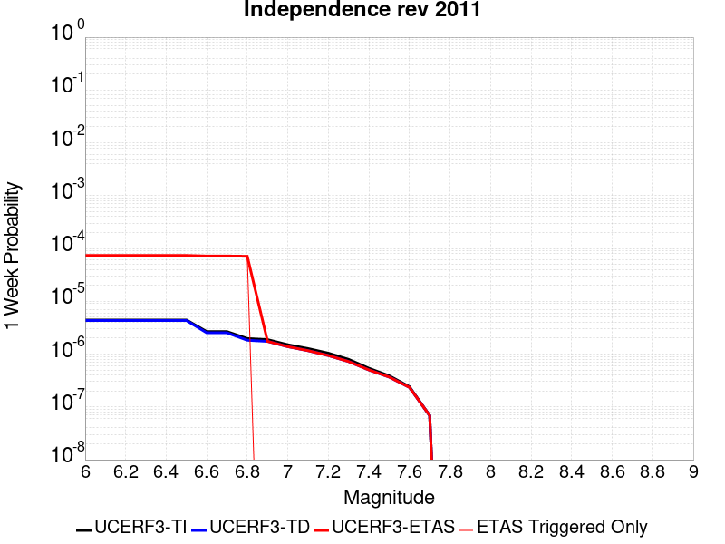 | 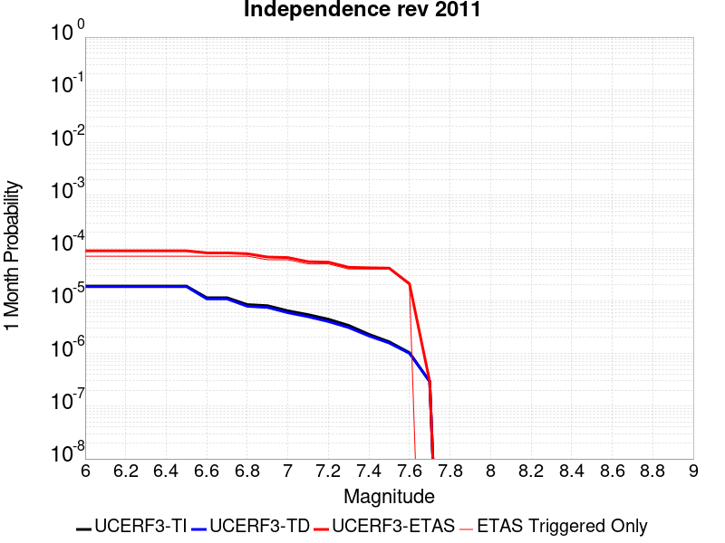 | 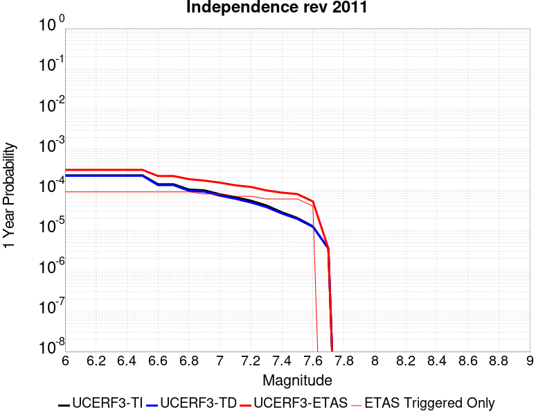 | 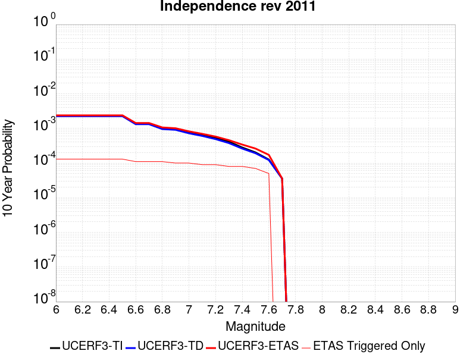 |

| Magnitude | 1 wk TI Prob | 1 wk TD Prob | 1 wk ETAS Prob | 1 wk ETAS/TD Gain | 1 wk ETAS Triggered Only | 1 mo TI Prob | 1 mo TD Prob | 1 mo ETAS Prob | 1 mo ETAS/TD Gain | 1 mo ETAS Triggered Only | 1 yr TI Prob | 1 yr TD Prob | 1 yr ETAS Prob | 1 yr ETAS/TD Gain | 1 yr ETAS Triggered Only | 10 yr TI Prob | 10 yr TD Prob | 10 yr ETAS Prob | 10 yr ETAS/TD Gain | 10 yr ETAS Triggered Only |
|-----|-----|-----|-----|-----|-----|-----|-----|-----|-----|-----|-----|-----|-----|-----|-----|-----|-----|-----|-----|-----|
| 6.0 | 4.422171E-6 | 4.3262253E-6 | 5.432601E-5 | 12.557369 | 5.0E-5 | 1.8952025E-5 | 1.8540852E-5 | 8.853956E-5 | 4.775377 | 7.0E-5 | 2.3071647E-4 | 2.2571447E-4 | 3.1569414E-4 | 1.3986439 | 9.0E-5 | 0.0023047708 | 0.0022551457 | 0.0023848526 | 1.057516 | 1.3E-4 |
| 6.1 | 4.422171E-6 | 4.3262253E-6 | 5.432601E-5 | 12.557369 | 5.0E-5 | 1.8952025E-5 | 1.8540852E-5 | 8.853956E-5 | 4.775377 | 7.0E-5 | 2.3071647E-4 | 2.2571447E-4 | 3.1569414E-4 | 1.3986439 | 9.0E-5 | 0.0023047708 | 0.0022551457 | 0.0023848526 | 1.057516 | 1.3E-4 |
| 6.2 | 4.422171E-6 | 4.3262253E-6 | 5.432601E-5 | 12.557369 | 5.0E-5 | 1.8952025E-5 | 1.8540852E-5 | 8.853956E-5 | 4.775377 | 7.0E-5 | 2.3071647E-4 | 2.2571447E-4 | 3.1569414E-4 | 1.3986439 | 9.0E-5 | 0.0023047708 | 0.0022551457 | 0.0023848526 | 1.057516 | 1.3E-4 |
| 6.3 | 4.422171E-6 | 4.3262253E-6 | 5.432601E-5 | 12.557369 | 5.0E-5 | 1.8952025E-5 | 1.8540852E-5 | 8.853956E-5 | 4.775377 | 7.0E-5 | 2.3071647E-4 | 2.2571447E-4 | 3.1569414E-4 | 1.3986439 | 9.0E-5 | 0.0023047708 | 0.0022551457 | 0.0023848526 | 1.057516 | 1.3E-4 |
| 6.4 | 4.422171E-6 | 4.3262253E-6 | 5.432601E-5 | 12.557369 | 5.0E-5 | 1.8952025E-5 | 1.8540852E-5 | 8.853956E-5 | 4.775377 | 7.0E-5 | 2.3071647E-4 | 2.2571447E-4 | 3.1569414E-4 | 1.3986439 | 9.0E-5 | 0.0023047708 | 0.0022551457 | 0.0023848526 | 1.057516 | 1.3E-4 |
| 6.5 | 4.422171E-6 | 4.3262253E-6 | 5.432601E-5 | 12.557369 | 5.0E-5 | 1.8952025E-5 | 1.8540852E-5 | 8.853956E-5 | 4.775377 | 7.0E-5 | 2.3071647E-4 | 2.2571447E-4 | 3.1569414E-4 | 1.3986439 | 9.0E-5 | 0.0023047708 | 0.0022551457 | 0.0023848526 | 1.057516 | 1.3E-4 |
| 6.6 | 2.663744E-6 | 2.5319846E-6 | 5.2531857E-5 | 20.747307 | 5.0E-5 | 1.1415996E-5 | 1.08513195E-5 | 8.085056E-5 | 7.450758 | 7.0E-5 | 1.3898089E-4 | 1.321073E-4 | 2.220954E-4 | 1.6811744 | 9.0E-5 | 0.0013889399 | 0.0013203359 | 0.0014301906 | 1.0832021 | 1.1E-4 |
| 6.7 | 2.663744E-6 | 2.5319846E-6 | 5.2531857E-5 | 20.747307 | 5.0E-5 | 1.1415996E-5 | 1.08513195E-5 | 8.085056E-5 | 7.450758 | 7.0E-5 | 1.3898089E-4 | 1.321073E-4 | 2.220954E-4 | 1.6811744 | 9.0E-5 | 0.0013889399 | 0.0013203359 | 0.0014301906 | 1.0832021 | 1.1E-4 |
| 6.8 | 1.9716529E-6 | 1.8322567E-6 | 5.1832165E-5 | 28.288704 | 5.0E-5 | 8.449913E-6 | 7.852505E-6 | 7.785195E-5 | 9.914282 | 7.0E-5 | 1.0287284E-4 | 9.560019E-5 | 1.8559159E-4 | 1.9413307 | 9.0E-5 | 0.0010282523 | 9.5560355E-4 | 0.0010654985 | 1.1150005 | 1.1E-4 |
| 6.9 | 1.8788617E-6 | 1.7429976E-6 | 4.174293E-5 | 23.94893 | 4.0E-5 | 8.0522395E-6 | 7.4699688E-6 | 6.746952E-5 | 9.032102 | 6.0E-5 | 9.80316E-5 | 9.09432E-5 | 1.7093592E-4 | 1.87959 | 8.0E-5 | 9.798837E-4 | 9.090718E-4 | 0.0010089809 | 1.1099023 | 1.0E-4 |
| 7.0 | 1.5045488E-6 | 1.3849498E-6 | 4.1384894E-5 | 29.881874 | 4.0E-5 | 6.44805E-6 | 5.9354857E-6 | 6.593513E-5 | 11.108633 | 6.0E-5 | 7.8502184E-5 | 7.226219E-5 | 1.5225641E-4 | 2.1069996 | 8.0E-5 | 7.8474457E-4 | 7.223921E-4 | 8.223198E-4 | 1.138329 | 1.0E-4 |
| 7.1 | 1.272341E-6 | 1.1625089E-6 | 3.1162475E-5 | 26.806225 | 3.0E-5 | 5.4528787E-6 | 4.9821715E-6 | 5.4981923E-5 | 11.035734 | 5.0E-5 | 6.6386776E-5 | 6.0656283E-5 | 1.3065204E-4 | 2.1539736 | 7.0E-5 | 6.636695E-4 | 6.064005E-4 | 6.963459E-4 | 1.1483268 | 9.0E-5 |
| 7.2 | 1.0416892E-6 | 9.409871E-7 | 3.094096E-5 | 32.881386 | 3.0E-5 | 4.464375E-6 | 4.032796E-6 | 5.4032593E-5 | 13.398296 | 5.0E-5 | 5.4352407E-5 | 4.9098202E-5 | 1.19094766E-4 | 2.4256442 | 7.0E-5 | 5.4339116E-4 | 4.908754E-4 | 5.808312E-4 | 1.1832559 | 9.0E-5 |
| 7.3 | 7.9450155E-7 | 7.2350036E-7 | 2.0723486E-5 | 28.643366 | 2.0E-5 | 3.4050022E-6 | 3.1007123E-6 | 4.3100586E-5 | 13.900222 | 4.0E-5 | 4.1455114E-5 | 3.7750528E-5 | 9.774826E-5 | 2.5893216 | 6.0E-5 | 4.144738E-4 | 3.7744228E-4 | 4.5741207E-4 | 1.2118729 | 8.0E-5 |
| 7.4 | 5.3893444E-7 | 5.0195166E-7 | 2.0501942E-5 | 40.844456 | 2.0E-5 | 2.309717E-6 | 2.1512196E-6 | 4.2151132E-5 | 19.594063 | 4.0E-5 | 2.8120441E-5 | 2.6190788E-5 | 8.618922E-5 | 3.2908218 | 6.0E-5 | 2.8116882E-4 | 2.6187746E-4 | 3.4185653E-4 | 1.3054063 | 8.0E-5 |
| 7.5 | 3.8852085E-7 | 3.6825622E-7 | 2.0368248E-5 | 55.30999 | 2.0E-5 | 1.6650882E-6 | 1.57824E-6 | 4.1578176E-5 | 26.344646 | 4.0E-5 | 2.027226E-5 | 1.9214905E-5 | 7.921375E-5 | 4.1225157 | 6.0E-5 | 2.0270412E-4 | 1.9213265E-4 | 2.621192E-4 | 1.3642616 | 7.0E-5 |
| 7.6 | 2.414929E-7 | 2.3457605E-7 | 1.0234574E-5 | 43.63009 | 1.0E-5 | 1.0349692E-6 | 1.0053255E-6 | 2.1005306E-5 | 20.894033 | 2.0E-5 | 1.2600677E-5 | 1.2239771E-5 | 5.223928E-5 | 4.267995 | 4.0E-5 | 1.2599962E-4 | 1.223911E-4 | 1.7238497E-4 | 1.4084765 | 5.0E-5 |
| 7.7 | 6.8298014E-8 | 6.8589785E-8 | 6.8589785E-8 | 1.0 | 0.0 | 2.9270575E-7 | 2.939562E-7 | 2.939562E-7 | 1.0 | 0.0 | 3.5636867E-6 | 3.5789112E-6 | 3.5789112E-6 | 1.0 | 0.0 | 3.5636294E-5 | 3.5788584E-5 | 3.5788584E-5 | 1.0 | 0.0 |

## White Mountains
*[(top)](#table-of-contents)*

| 1 Week | 1 Month | 1 Year | 10 Year |
|-----|-----|-----|-----|
| 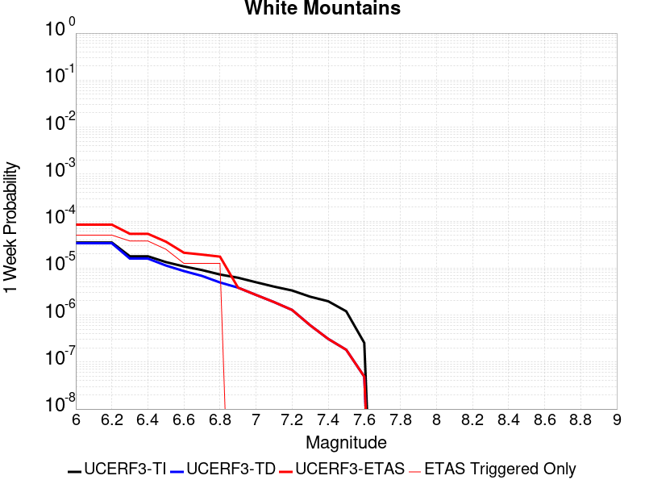 | 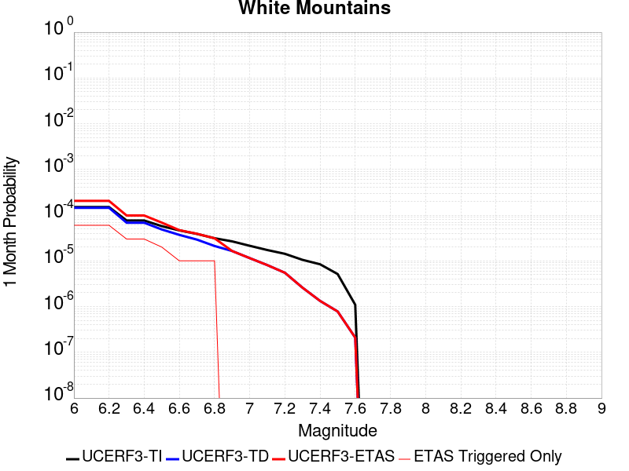 | 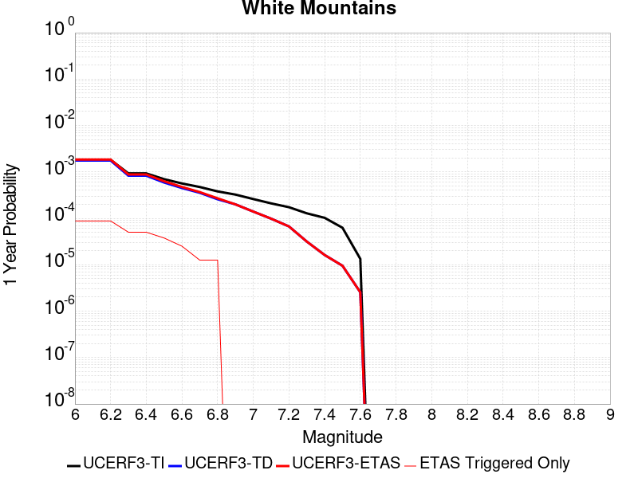 | 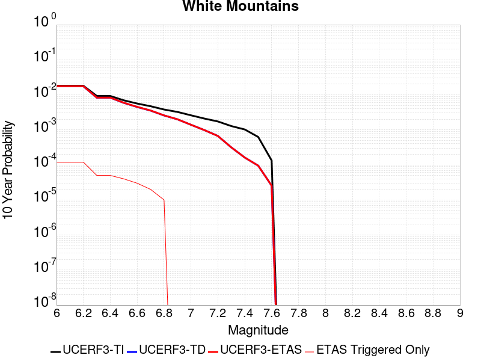 |

| Magnitude | 1 wk TI Prob | 1 wk TD Prob | 1 wk ETAS Prob | 1 wk ETAS/TD Gain | 1 wk ETAS Triggered Only | 1 mo TI Prob | 1 mo TD Prob | 1 mo ETAS Prob | 1 mo ETAS/TD Gain | 1 mo ETAS Triggered Only | 1 yr TI Prob | 1 yr TD Prob | 1 yr ETAS Prob | 1 yr ETAS/TD Gain | 1 yr ETAS Triggered Only | 10 yr TI Prob | 10 yr TD Prob | 10 yr ETAS Prob | 10 yr ETAS/TD Gain | 10 yr ETAS Triggered Only |
|-----|-----|-----|-----|-----|-----|-----|-----|-----|-----|-----|-----|-----|-----|-----|-----|-----|-----|-----|-----|-----|
| 6.0 | 3.503579E-5 | 3.3784127E-5 | 8.3782434E-5 | 2.4799352 | 5.0E-5 | 1.5014476E-4 | 1.4478175E-4 | 2.0477307E-4 | 1.4143568 | 6.0E-5 | 0.0018264796 | 0.0017614134 | 0.0018412725 | 1.045338 | 8.0E-5 | 0.018115403 | 0.017486857 | 0.017604759 | 1.0067422 | 1.2E-4 |
| 6.1 | 3.503579E-5 | 3.3784127E-5 | 8.3782434E-5 | 2.4799352 | 5.0E-5 | 1.5014476E-4 | 1.4478175E-4 | 2.0477307E-4 | 1.4143568 | 6.0E-5 | 0.0018264796 | 0.0017614134 | 0.0018412725 | 1.045338 | 8.0E-5 | 0.018115403 | 0.017486857 | 0.017604759 | 1.0067422 | 1.2E-4 |
| 6.2 | 3.503579E-5 | 3.3784127E-5 | 8.3782434E-5 | 2.4799352 | 5.0E-5 | 1.5014476E-4 | 1.4478175E-4 | 2.0477307E-4 | 1.4143568 | 6.0E-5 | 0.0018264796 | 0.0017614134 | 0.0018412725 | 1.045338 | 8.0E-5 | 0.018115403 | 0.017486857 | 0.017604759 | 1.0067422 | 1.2E-4 |
| 6.3 | 1.7818425E-5 | 1.591616E-5 | 4.591568E-5 | 2.884847 | 3.0E-5 | 7.636245E-5 | 6.821041E-5 | 9.820836E-5 | 1.4397856 | 3.0E-5 | 9.293162E-4 | 8.301596E-4 | 8.7012636E-4 | 1.0481435 | 4.0E-5 | 0.009254395 | 0.0082720425 | 0.008321629 | 1.0059944 | 5.0E-5 |
| 6.4 | 1.7818425E-5 | 1.591616E-5 | 4.591568E-5 | 2.884847 | 3.0E-5 | 7.636245E-5 | 6.821041E-5 | 9.820836E-5 | 1.4397856 | 3.0E-5 | 9.293162E-4 | 8.301596E-4 | 8.7012636E-4 | 1.0481435 | 4.0E-5 | 0.009254395 | 0.0082720425 | 0.008321629 | 1.0059944 | 5.0E-5 |
| 6.5 | 1.3397557E-5 | 1.1336374E-5 | 3.133615E-5 | 2.7642126 | 2.0E-5 | 5.741684E-5 | 4.8583595E-5 | 6.858262E-5 | 1.4116416 | 2.0E-5 | 6.988258E-4 | 5.913517E-4 | 6.2133395E-4 | 1.0507013 | 3.0E-5 | 0.006966323 | 0.005898487 | 0.0059382506 | 1.0067414 | 4.0E-5 |
| 6.6 | 1.0818695E-5 | 8.625434E-6 | 1.8625347E-5 | 2.1593518 | 1.0E-5 | 4.6365014E-5 | 3.6965648E-5 | 4.6965277E-5 | 1.2705114 | 1.0E-5 | 5.6434784E-4 | 4.4996818E-4 | 4.6995917E-4 | 1.0444276 | 2.0E-5 | 0.005629168 | 0.0044910074 | 0.0045208726 | 1.00665 | 3.0E-5 |
| 6.7 | 9.067908E-6 | 6.802476E-6 | 1.6802407E-5 | 2.470043 | 1.0E-5 | 3.8861883E-5 | 2.915316E-5 | 3.915287E-5 | 1.343006 | 1.0E-5 | 4.7304068E-4 | 3.548851E-4 | 3.6488156E-4 | 1.0281681 | 1.0E-5 | 0.00472035 | 0.003543501 | 0.0035634302 | 1.0056242 | 2.0E-5 |
| 6.8 | 7.295947E-6 | 4.9364285E-6 | 1.4936379E-5 | 3.025746 | 1.0E-5 | 3.126797E-5 | 2.1155956E-5 | 3.1155745E-5 | 1.4726701 | 1.0E-5 | 3.8062103E-4 | 2.5754445E-4 | 2.6754188E-4 | 1.0388182 | 1.0E-5 | 0.0037996976 | 0.0025725728 | 0.002582547 | 1.0038772 | 1.0E-5 |
| 6.9 | 6.2243444E-6 | 3.8322546E-6 | 3.8322546E-6 | 1.0 | 0.0 | 2.6675489E-5 | 1.6423846E-5 | 1.6423846E-5 | 1.0 | 0.0 | 3.2472567E-4 | 1.9994251E-4 | 1.9994251E-4 | 1.0 | 0.0 | 0.0032425157 | 0.001997679 | 0.001997679 | 1.0 | 0.0 |
| 7.0 | 4.9878413E-6 | 2.679564E-6 | 2.679564E-6 | 1.0 | 0.0 | 2.1376287E-5 | 1.1483797E-5 | 1.1483797E-5 | 1.0 | 0.0 | 2.602252E-4 | 1.3980652E-4 | 1.3980652E-4 | 1.0 | 0.0 | 0.002599207 | 0.0013972119 | 0.0013972119 | 1.0 | 0.0 |
| 7.1 | 4.0252844E-6 | 1.885702E-6 | 1.885702E-6 | 1.0 | 0.0 | 1.7251105E-5 | 8.081555E-6 | 8.081555E-6 | 1.0 | 0.0 | 2.1001195E-4 | 9.838863E-5 | 9.838863E-5 | 1.0 | 0.0 | 0.0020981359 | 9.834635E-4 | 9.834635E-4 | 1.0 | 0.0 |
| 7.2 | 3.3284066E-6 | 1.2818929E-6 | 1.2818929E-6 | 1.0 | 0.0 | 1.4264522E-5 | 5.4938155E-6 | 5.4938155E-6 | 1.0 | 0.0 | 1.736567E-4 | 6.688525E-5 | 6.688525E-5 | 1.0 | 0.0 | 0.0017352107 | 6.6866126E-4 | 6.6866126E-4 | 1.0 | 0.0 |
| 7.3 | 2.458226E-6 | 6.056684E-7 | 6.056684E-7 | 1.0 | 0.0 | 1.0535211E-5 | 2.5957193E-6 | 2.5957193E-6 | 1.0 | 0.0 | 1.2825865E-4 | 3.160246E-5 | 3.160246E-5 | 1.0 | 0.0 | 0.0012818464 | 3.1598343E-4 | 3.1598343E-4 | 1.0 | 0.0 |
| 7.4 | 1.965953E-6 | 3.1084684E-7 | 3.1084684E-7 | 1.0 | 0.0 | 8.425486E-6 | 1.3322001E-6 | 1.3322001E-6 | 1.0 | 0.0 | 1.0257547E-4 | 1.6219417E-5 | 1.6219417E-5 | 1.0 | 0.0 | 0.0010252813 | 1.6218246E-4 | 1.6218246E-4 | 1.0 | 0.0 |
| 7.5 | 1.2014192E-6 | 1.8241002E-7 | 1.8241002E-7 | 1.0 | 0.0 | 5.148929E-6 | 7.8175697E-7 | 7.8175697E-7 | 1.0 | 0.0 | 6.2686406E-5 | 9.51785E-6 | 9.51785E-6 | 1.0 | 0.0 | 6.266873E-4 | 9.517451E-5 | 9.517451E-5 | 1.0 | 0.0 |
| 7.6 | 2.5612175E-7 | 4.893784E-8 | 4.893784E-8 | 1.0 | 0.0 | 1.0976642E-6 | 2.0973359E-7 | 2.0973359E-7 | 1.0 | 0.0 | 1.3363979E-5 | 2.5535037E-6 | 2.5535037E-6 | 1.0 | 0.0 | 1.3363175E-4 | 2.553478E-5 | 2.553478E-5 | 1.0 | 0.0 |

## Coronado Bank alt1
*[(top)](#table-of-contents)*

| 1 Week | 1 Month | 1 Year | 10 Year |
|-----|-----|-----|-----|
| 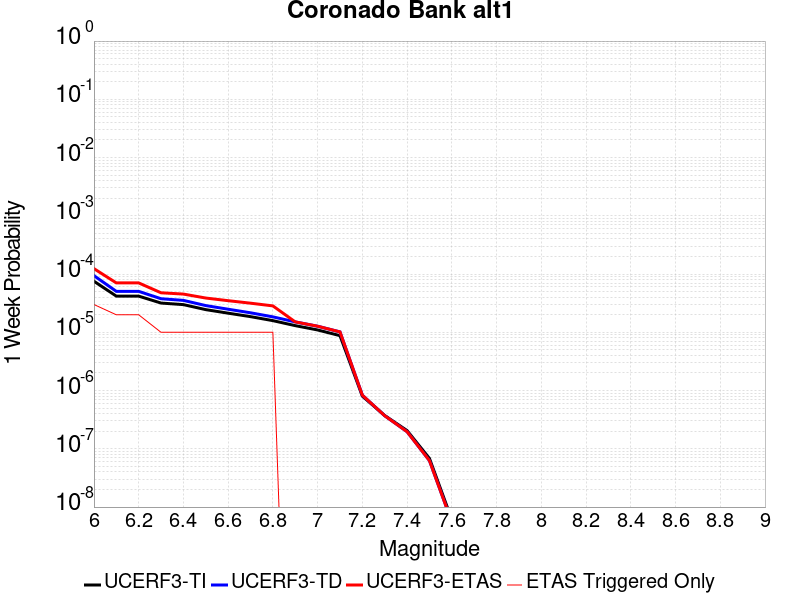 | 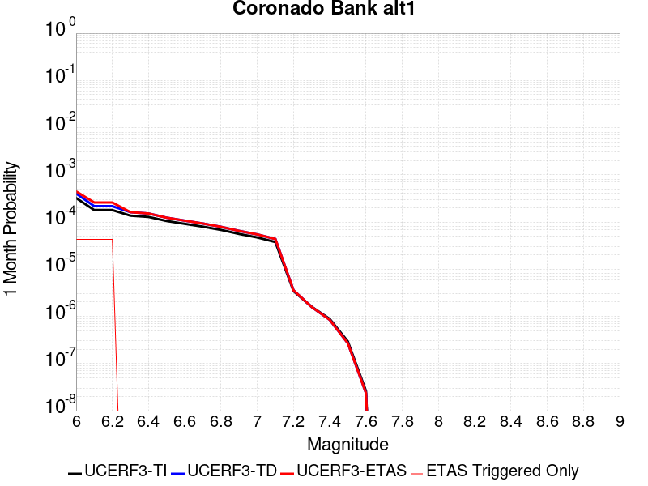 | 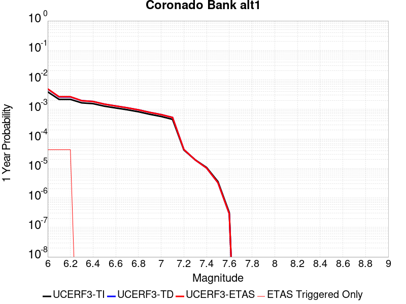 | 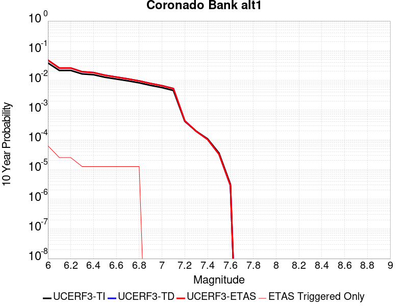 |

| Magnitude | 1 wk TI Prob | 1 wk TD Prob | 1 wk ETAS Prob | 1 wk ETAS/TD Gain | 1 wk ETAS Triggered Only | 1 mo TI Prob | 1 mo TD Prob | 1 mo ETAS Prob | 1 mo ETAS/TD Gain | 1 mo ETAS Triggered Only | 1 yr TI Prob | 1 yr TD Prob | 1 yr ETAS Prob | 1 yr ETAS/TD Gain | 1 yr ETAS Triggered Only | 10 yr TI Prob | 10 yr TD Prob | 10 yr ETAS Prob | 10 yr ETAS/TD Gain | 10 yr ETAS Triggered Only |
|-----|-----|-----|-----|-----|-----|-----|-----|-----|-----|-----|-----|-----|-----|-----|-----|-----|-----|-----|-----|-----|
| 6.0 | 7.533492E-5 | 9.3951705E-5 | 1.2394889E-4 | 1.319283 | 3.0E-5 | 3.22824E-4 | 4.025903E-4 | 4.5257015E-4 | 1.1241457 | 5.0E-5 | 0.0039233007 | 0.004891121 | 0.0049607786 | 1.0142417 | 7.0E-5 | 0.03854755 | 0.047904 | 0.048008732 | 1.0021863 | 1.1E-4 |
| 6.1 | 4.1807285E-5 | 5.0493105E-5 | 7.04921E-5 | 1.3960737 | 2.0E-5 | 1.7916178E-4 | 2.1638138E-4 | 2.3637705E-4 | 1.0924094 | 2.0E-5 | 0.0021791123 | 0.0026313365 | 0.002651284 | 1.0075808 | 2.0E-5 | 0.021578677 | 0.026011124 | 0.026050083 | 1.0014977 | 4.0E-5 |
| 6.2 | 4.1807285E-5 | 5.0493105E-5 | 7.04921E-5 | 1.3960737 | 2.0E-5 | 1.7916178E-4 | 2.1638138E-4 | 2.3637705E-4 | 1.0924094 | 2.0E-5 | 0.0021791123 | 0.0026313365 | 0.002651284 | 1.0075808 | 2.0E-5 | 0.021578677 | 0.026011124 | 0.026050083 | 1.0014977 | 4.0E-5 |
| 6.3 | 3.1793104E-5 | 3.7711125E-5 | 4.771075E-5 | 1.2651638 | 1.0E-5 | 1.3624904E-4 | 1.6160926E-4 | 1.7160765E-4 | 1.0618676 | 1.0E-5 | 0.0016575698 | 0.001965849 | 0.0019758292 | 1.0050769 | 1.0E-5 | 0.016452603 | 0.019488495 | 0.01951791 | 1.0015094 | 3.0E-5 |
| 6.4 | 2.9878007E-5 | 3.5335797E-5 | 4.5335444E-5 | 1.2829891 | 1.0E-5 | 1.2804232E-4 | 1.5143053E-4 | 1.6142902E-4 | 1.0660269 | 1.0E-5 | 0.0015578003 | 0.0018421395 | 0.0018521211 | 1.0054184 | 1.0E-5 | 0.015469253 | 0.018272463 | 0.0182921 | 1.0010746 | 2.0E-5 |
| 6.5 | 2.4512565E-5 | 2.8764101E-5 | 3.8763814E-5 | 1.3476455 | 1.0E-5 | 1.0504962E-4 | 1.2326906E-4 | 1.3326782E-4 | 1.0811133 | 1.0E-5 | 0.0012782287 | 0.0014997943 | 0.0015097794 | 1.0066576 | 1.0E-5 | 0.012709012 | 0.0148996925 | 0.014909544 | 1.0006611 | 1.0E-5 |
| 6.6 | 2.1317413E-5 | 2.490667E-5 | 3.490642E-5 | 1.4014889 | 1.0E-5 | 9.135714E-5 | 1.0673863E-4 | 1.1673757E-4 | 1.0936768 | 1.0E-5 | 0.0011117056 | 0.0012987903 | 0.0013087774 | 1.0076895 | 1.0E-5 | 0.011061605 | 0.012914407 | 0.012924278 | 1.0007644 | 1.0E-5 |
| 6.7 | 1.8585655E-5 | 2.1634882E-5 | 3.1634663E-5 | 1.4622066 | 1.0E-5 | 7.9650374E-5 | 9.271774E-5 | 1.0271681E-4 | 1.1078442 | 1.0E-5 | 9.6931186E-4 | 0.0011282744 | 0.001138263 | 1.0088531 | 1.0E-5 | 0.0096509475 | 0.011227623 | 0.0112375105 | 1.0008807 | 1.0E-5 |
| 6.8 | 1.5862879E-5 | 1.8419476E-5 | 2.8419292E-5 | 1.5428936 | 1.0E-5 | 6.798199E-5 | 7.8938334E-5 | 8.8937544E-5 | 1.1266712 | 1.0E-5 | 8.273665E-4 | 9.606697E-4 | 9.7066007E-4 | 1.0103995 | 1.0E-5 | 0.008242928 | 0.009567151 | 0.0095770545 | 1.0010352 | 1.0E-5 |
| 6.9 | 1.3021509E-5 | 1.5095266E-5 | 1.5095266E-5 | 1.0 | 0.0 | 5.5805274E-5 | 6.46925E-5 | 6.46925E-5 | 1.0 | 0.0 | 6.792174E-4 | 7.873646E-4 | 7.873646E-4 | 1.0 | 0.0 | 0.006771452 | 0.007847573 | 0.007847573 | 1.0 | 0.0 |
| 7.0 | 1.0974371E-5 | 1.2720105E-5 | 1.2720105E-5 | 1.0 | 0.0 | 4.7032172E-5 | 5.4513697E-5 | 5.4513697E-5 | 1.0 | 0.0 | 5.7246623E-4 | 6.635197E-4 | 6.635197E-4 | 1.0 | 0.0 | 0.0057099373 | 0.0066171354 | 0.0066171354 | 1.0 | 0.0 |
| 7.1 | 8.766221E-6 | 1.0163833E-5 | 1.0163833E-5 | 1.0 | 0.0 | 3.7568978E-5 | 4.3558655E-5 | 4.3558655E-5 | 1.0 | 0.0 | 4.573063E-4 | 5.302148E-4 | 5.302148E-4 | 1.0 | 0.0 | 0.0045636636 | 0.005291197 | 0.005291197 | 1.0 | 0.0 |
| 7.2 | 8.026024E-7 | 8.331776E-7 | 8.331776E-7 | 1.0 | 0.0 | 3.43972E-6 | 3.5707562E-6 | 3.5707562E-6 | 1.0 | 0.0 | 4.1877785E-5 | 4.34731E-5 | 4.34731E-5 | 1.0 | 0.0 | 4.1869894E-4 | 4.3464705E-4 | 4.3464705E-4 | 1.0 | 0.0 |
| 7.3 | 3.7293114E-7 | 3.700106E-7 | 3.700106E-7 | 1.0 | 0.0 | 1.5982754E-6 | 1.5857588E-6 | 1.5857588E-6 | 1.0 | 0.0 | 1.9458828E-5 | 1.9306442E-5 | 1.9306442E-5 | 1.0 | 0.0 | 1.9457124E-4 | 1.9304773E-4 | 1.9304773E-4 | 1.0 | 0.0 |
| 7.4 | 2.0557036E-7 | 1.9674441E-7 | 1.9674441E-7 | 1.0 | 0.0 | 8.810155E-7 | 8.4319004E-7 | 8.4319004E-7 | 1.0 | 0.0 | 1.0726311E-5 | 1.02657905E-5 | 1.02657905E-5 | 1.0 | 0.0 | 1.0725793E-4 | 1.026532E-4 | 1.026532E-4 | 1.0 | 0.0 |
| 7.5 | 6.845446E-8 | 6.2794086E-8 | 6.2794086E-8 | 1.0 | 0.0 | 2.9337625E-7 | 2.6911746E-7 | 2.6911746E-7 | 1.0 | 0.0 | 3.5718497E-6 | 3.2765004E-6 | 3.2765004E-6 | 1.0 | 0.0 | 3.5717923E-5 | 3.276453E-5 | 3.276453E-5 | 1.0 | 0.0 |
| 7.6 | 6.0975145E-9 | 5.531901E-9 | 5.531901E-9 | 1.0 | 0.0 | 2.6132206E-8 | 2.3708148E-8 | 2.3708148E-8 | 1.0 | 0.0 | 3.1815955E-7 | 2.8864667E-7 | 2.8864667E-7 | 1.0 | 0.0 | 3.181591E-6 | 2.886464E-6 | 2.886464E-6 | 1.0 | 0.0 |

## Camp Rock 2011
*[(top)](#table-of-contents)*

| 1 Week | 1 Month | 1 Year | 10 Year |
|-----|-----|-----|-----|
| 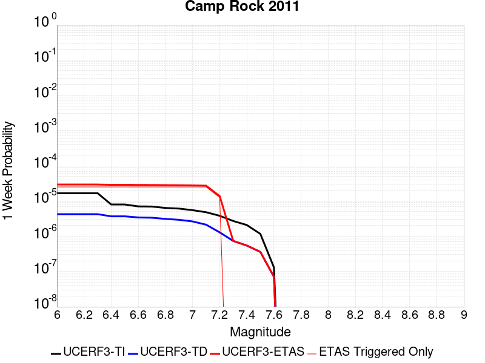 | 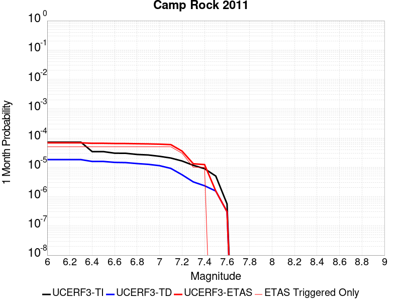 | 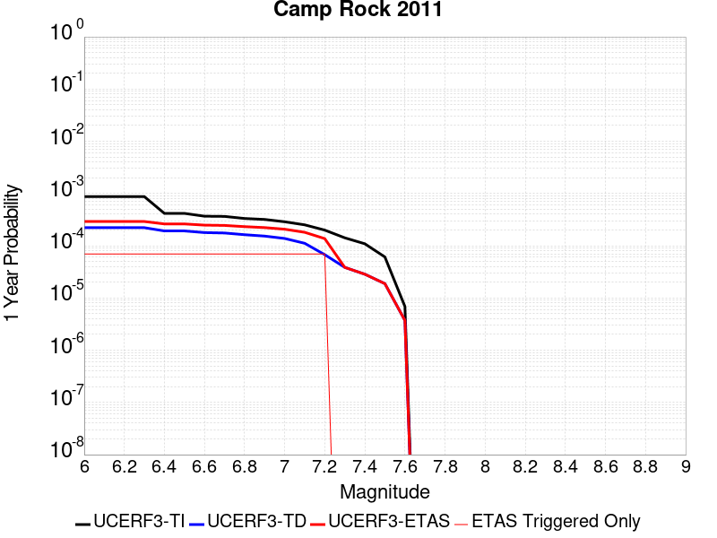 | 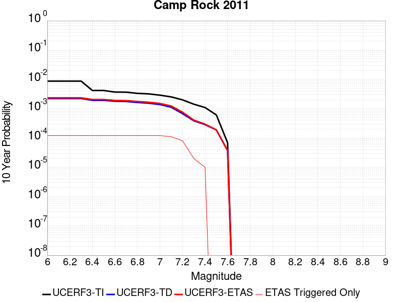 |

| Magnitude | 1 wk TI Prob | 1 wk TD Prob | 1 wk ETAS Prob | 1 wk ETAS/TD Gain | 1 wk ETAS Triggered Only | 1 mo TI Prob | 1 mo TD Prob | 1 mo ETAS Prob | 1 mo ETAS/TD Gain | 1 mo ETAS Triggered Only | 1 yr TI Prob | 1 yr TD Prob | 1 yr ETAS Prob | 1 yr ETAS/TD Gain | 1 yr ETAS Triggered Only | 10 yr TI Prob | 10 yr TD Prob | 10 yr ETAS Prob | 10 yr ETAS/TD Gain | 10 yr ETAS Triggered Only |
|-----|-----|-----|-----|-----|-----|-----|-----|-----|-----|-----|-----|-----|-----|-----|-----|-----|-----|-----|-----|-----|
| 6.0 | 1.6710783E-5 | 4.249999E-6 | 3.424987E-5 | 8.058795 | 3.0E-5 | 7.161568E-5 | 1.8214158E-5 | 6.8213245E-5 | 3.7450674 | 5.0E-5 | 8.7157206E-4 | 2.2173533E-4 | 3.017176E-4 | 1.3607105 | 8.0E-5 | 0.008681616 | 0.0022151938 | 0.002334928 | 1.0540513 | 1.2E-4 |
| 6.1 | 1.6710783E-5 | 4.249999E-6 | 3.424987E-5 | 8.058795 | 3.0E-5 | 7.161568E-5 | 1.8214158E-5 | 6.8213245E-5 | 3.7450674 | 5.0E-5 | 8.7157206E-4 | 2.2173533E-4 | 3.017176E-4 | 1.3607105 | 8.0E-5 | 0.008681616 | 0.0022151938 | 0.002334928 | 1.0540513 | 1.2E-4 |
| 6.2 | 1.6710783E-5 | 4.249999E-6 | 3.424987E-5 | 8.058795 | 3.0E-5 | 7.161568E-5 | 1.8214158E-5 | 6.8213245E-5 | 3.7450674 | 5.0E-5 | 8.7157206E-4 | 2.2173533E-4 | 3.017176E-4 | 1.3607105 | 8.0E-5 | 0.008681616 | 0.0022151938 | 0.002334928 | 1.0540513 | 1.2E-4 |
| 6.3 | 1.6710783E-5 | 4.249999E-6 | 3.424987E-5 | 8.058795 | 3.0E-5 | 7.161568E-5 | 1.8214158E-5 | 6.8213245E-5 | 3.7450674 | 5.0E-5 | 8.7157206E-4 | 2.2173533E-4 | 3.017176E-4 | 1.3607105 | 8.0E-5 | 0.008681616 | 0.0022151938 | 0.002334928 | 1.0540513 | 1.2E-4 |
| 6.4 | 7.982846E-6 | 3.6820359E-6 | 3.3681925E-5 | 9.147636 | 3.0E-5 | 3.421175E-5 | 1.578006E-5 | 6.577927E-5 | 4.1685057 | 5.0E-5 | 4.1644843E-4 | 1.9210564E-4 | 2.7209028E-4 | 1.4163575 | 8.0E-5 | 0.0041566887 | 0.0019194306 | 0.0020392004 | 1.0623986 | 1.2E-4 |
| 6.5 | 7.982846E-6 | 3.6820359E-6 | 3.3681925E-5 | 9.147636 | 3.0E-5 | 3.421175E-5 | 1.578006E-5 | 6.577927E-5 | 4.1685057 | 5.0E-5 | 4.1644843E-4 | 1.9210564E-4 | 2.7209028E-4 | 1.4163575 | 8.0E-5 | 0.0041566887 | 0.0019194306 | 0.0020392004 | 1.0623986 | 1.2E-4 |
| 6.6 | 7.048869E-6 | 3.4242998E-6 | 3.3424196E-5 | 9.760885 | 3.0E-5 | 3.0209088E-5 | 1.467549E-5 | 6.467476E-5 | 4.406991 | 5.0E-5 | 3.677336E-4 | 1.7865976E-4 | 2.5864548E-4 | 1.4476985 | 8.0E-5 | 0.0036712566 | 0.0017851929 | 0.0019049786 | 1.0670996 | 1.2E-4 |
| 6.7 | 6.987307E-6 | 3.3622775E-6 | 3.3362176E-5 | 9.922494 | 3.0E-5 | 2.9945259E-5 | 1.4409683E-5 | 6.440896E-5 | 4.469839 | 5.0E-5 | 3.6452254E-4 | 1.7542407E-4 | 2.5541004E-4 | 1.4559578 | 8.0E-5 | 0.0036392517 | 0.0017528872 | 0.0018726768 | 1.0683385 | 1.2E-4 |
| 6.8 | 6.3737602E-6 | 3.1178672E-6 | 3.3117773E-5 | 10.621932 | 3.0E-5 | 2.731583E-5 | 1.3362222E-5 | 6.336156E-5 | 4.7418427 | 5.0E-5 | 3.3251947E-4 | 1.6267318E-4 | 2.4266017E-4 | 1.4917035 | 8.0E-5 | 0.0033202237 | 0.0016255698 | 0.0017453746 | 1.0737003 | 1.2E-4 |
| 6.9 | 6.112211E-6 | 2.933078E-6 | 3.293299E-5 | 11.228133 | 3.0E-5 | 2.6194928E-5 | 1.2570275E-5 | 6.256965E-5 | 4.9775877 | 5.0E-5 | 3.1887658E-4 | 1.5303263E-4 | 2.3302039E-4 | 1.5226843 | 8.0E-5 | 0.003184194 | 0.0015293002 | 0.0016491167 | 1.0783472 | 1.2E-4 |
| 7.0 | 5.5140117E-6 | 2.64191E-6 | 3.264183E-5 | 12.3553915 | 3.0E-5 | 2.3631264E-5 | 1.1322423E-5 | 6.132186E-5 | 5.415966 | 5.0E-5 | 2.8767265E-4 | 1.3784204E-4 | 2.1783101E-4 | 1.5802945 | 8.0E-5 | 0.0028730053 | 0.0013775907 | 0.0014974254 | 1.0869886 | 1.2E-4 |
| 7.1 | 4.8151105E-6 | 2.1342612E-6 | 3.2134198E-5 | 15.056357 | 3.0E-5 | 2.0636026E-5 | 9.146803E-6 | 5.9146347E-5 | 6.466341 | 5.0E-5 | 2.5121463E-4 | 1.1135685E-4 | 1.8134905E-4 | 1.6285397 | 7.0E-5 | 0.0025093083 | 0.0011130325 | 0.00122291 | 1.0987191 | 1.1E-4 |
| 7.2 | 3.818335E-6 | 1.2937372E-6 | 1.1293724E-5 | 8.729535 | 1.0E-5 | 1.6364189E-5 | 5.5445767E-6 | 3.554441E-5 | 6.4106627 | 3.0E-5 | 1.9921579E-4 | 6.750321E-5 | 1.1749984E-4 | 1.7406554 | 5.0E-5 | 0.0019903728 | 6.7483535E-4 | 7.5478136E-4 | 1.1184675 | 8.0E-5 |
| 7.3 | 2.7166698E-6 | 7.383078E-7 | 7.383078E-7 | 1.0 | 0.0 | 1.1642818E-5 | 3.1641725E-6 | 1.3164141E-5 | 4.1603737 | 1.0E-5 | 1.4174209E-4 | 3.852314E-5 | 4.8522754E-5 | 1.2595743 | 1.0E-5 | 0.0014165172 | 3.8516664E-4 | 4.0515893E-4 | 1.0519056 | 2.0E-5 |
| 7.4 | 2.0893426E-6 | 5.4614605E-7 | 5.4614605E-7 | 1.0 | 0.0 | 8.954295E-6 | 2.340624E-6 | 1.2340601E-5 | 5.272355 | 1.0E-5 | 1.0901308E-4 | 2.8496728E-5 | 3.8496444E-5 | 1.3509074 | 1.0E-5 | 0.0010895962 | 2.849313E-4 | 2.9492844E-4 | 1.0350862 | 1.0E-5 |
| 7.5 | 1.1681728E-6 | 3.6028484E-7 | 3.6028484E-7 | 1.0 | 0.0 | 5.0064455E-6 | 1.544077E-6 | 1.544077E-6 | 1.0 | 0.0 | 6.0951766E-5 | 1.879898E-5 | 1.879898E-5 | 1.0 | 0.0 | 6.093505E-4 | 1.8797436E-4 | 1.8797436E-4 | 1.0 | 0.0 |
| 7.6 | 1.3154387E-7 | 7.1196716E-8 | 7.1196716E-8 | 1.0 | 0.0 | 5.6375933E-7 | 3.0512876E-7 | 3.0512876E-7 | 1.0 | 0.0 | 6.863748E-6 | 3.714938E-6 | 3.714938E-6 | 1.0 | 0.0 | 6.863536E-5 | 3.7148915E-5 | 3.7148915E-5 | 1.0 | 0.0 |

## Santa Cruz Island
*[(top)](#table-of-contents)*

| 1 Week | 1 Month | 1 Year | 10 Year |
|-----|-----|-----|-----|
| 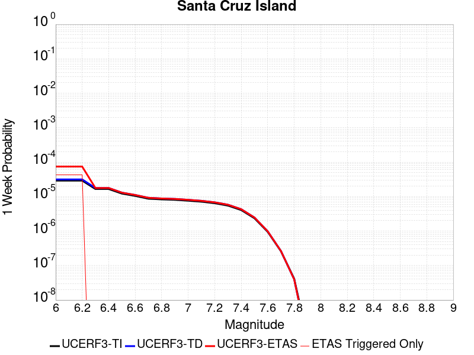 | 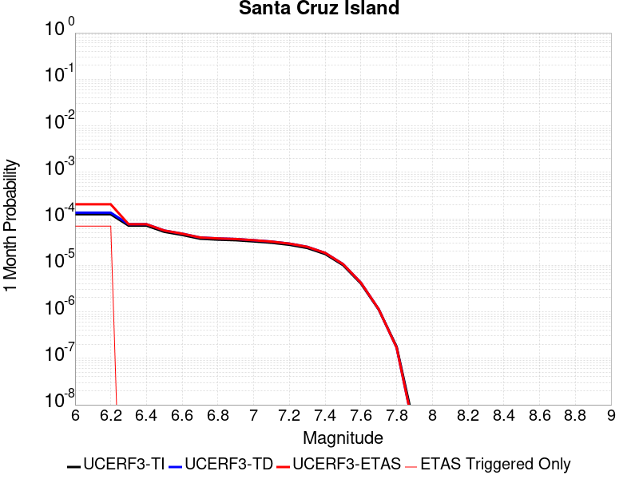 | 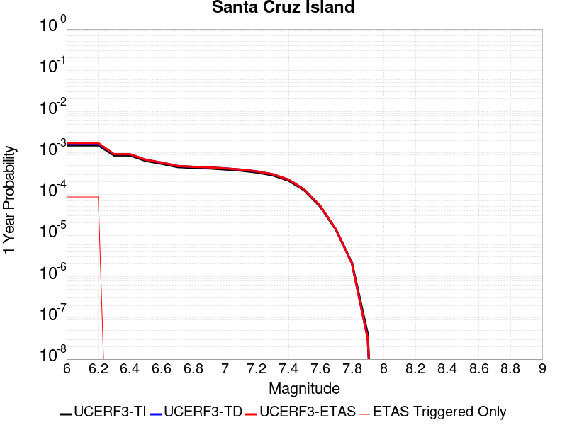 | 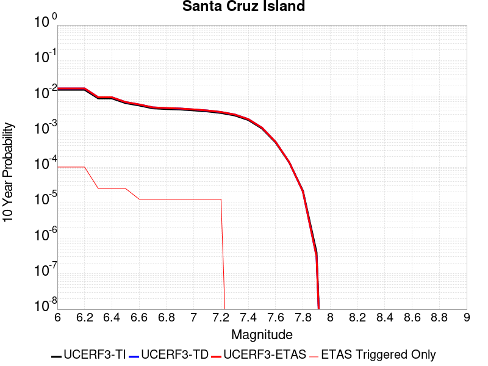 |

| Magnitude | 1 wk TI Prob | 1 wk TD Prob | 1 wk ETAS Prob | 1 wk ETAS/TD Gain | 1 wk ETAS Triggered Only | 1 mo TI Prob | 1 mo TD Prob | 1 mo ETAS Prob | 1 mo ETAS/TD Gain | 1 mo ETAS Triggered Only | 1 yr TI Prob | 1 yr TD Prob | 1 yr ETAS Prob | 1 yr ETAS/TD Gain | 1 yr ETAS Triggered Only | 10 yr TI Prob | 10 yr TD Prob | 10 yr ETAS Prob | 10 yr ETAS/TD Gain | 10 yr ETAS Triggered Only |
|-----|-----|-----|-----|-----|-----|-----|-----|-----|-----|-----|-----|-----|-----|-----|-----|-----|-----|-----|-----|-----|
| 6.0 | 2.9164563E-5 | 3.1599742E-5 | 6.1598796E-5 | 1.9493448 | 3.0E-5 | 1.2498499E-4 | 1.3542121E-4 | 1.8541444E-4 | 1.3691684 | 5.0E-5 | 0.0015206301 | 0.0016476426 | 0.0017175272 | 1.0424149 | 7.0E-5 | 0.015102667 | 0.016368 | 0.016476199 | 1.0066104 | 1.1E-4 |
| 6.1 | 2.9164563E-5 | 3.1599742E-5 | 6.1598796E-5 | 1.9493448 | 3.0E-5 | 1.2498499E-4 | 1.3542121E-4 | 1.8541444E-4 | 1.3691684 | 5.0E-5 | 0.0015206301 | 0.0016476426 | 0.0017175272 | 1.0424149 | 7.0E-5 | 0.015102667 | 0.016368 | 0.016476199 | 1.0066104 | 1.1E-4 |
| 6.2 | 2.9164563E-5 | 3.1599742E-5 | 6.1598796E-5 | 1.9493448 | 3.0E-5 | 1.2498499E-4 | 1.3542121E-4 | 1.8541444E-4 | 1.3691684 | 5.0E-5 | 0.0015206301 | 0.0016476426 | 0.0017175272 | 1.0424149 | 7.0E-5 | 0.015102667 | 0.016368 | 0.016476199 | 1.0066104 | 1.1E-4 |
| 6.3 | 1.6635553E-5 | 1.780436E-5 | 1.780436E-5 | 1.0 | 0.0 | 7.1293274E-5 | 7.630227E-5 | 9.630074E-5 | 1.2620955 | 2.0E-5 | 8.6765E-4 | 9.286024E-4 | 9.585745E-4 | 1.0322766 | 3.0E-5 | 0.008642701 | 0.009249094 | 0.009288724 | 1.0042847 | 4.0E-5 |
| 6.4 | 1.6635553E-5 | 1.780436E-5 | 1.780436E-5 | 1.0 | 0.0 | 7.1293274E-5 | 7.630227E-5 | 9.630074E-5 | 1.2620955 | 2.0E-5 | 8.6765E-4 | 9.286024E-4 | 9.585745E-4 | 1.0322766 | 3.0E-5 | 0.008642701 | 0.009249094 | 0.009288724 | 1.0042847 | 4.0E-5 |
| 6.5 | 1.2238748E-5 | 1.3042996E-5 | 1.3042996E-5 | 1.0 | 0.0 | 5.2450723E-5 | 5.5897377E-5 | 7.5896256E-5 | 1.3577785 | 2.0E-5 | 6.3840044E-4 | 6.8034173E-4 | 7.0032815E-4 | 1.029377 | 2.0E-5 | 0.0063656955 | 0.006782988 | 0.0068127844 | 1.0043929 | 3.0E-5 |
| 6.6 | 1.0489767E-5 | 1.1156636E-5 | 1.1156636E-5 | 1.0 | 0.0 | 4.495537E-5 | 4.781329E-5 | 6.781233E-5 | 1.4182737 | 2.0E-5 | 5.4719415E-4 | 5.819736E-4 | 6.019619E-4 | 1.0343459 | 2.0E-5 | 0.005458487 | 0.005804736 | 0.00582462 | 1.0034255 | 2.0E-5 |
| 6.7 | 8.699222E-6 | 9.236783E-6 | 9.236783E-6 | 1.0 | 0.0 | 3.7281847E-5 | 3.958561E-5 | 4.958522E-5 | 1.252607 | 1.0E-5 | 4.5381195E-4 | 4.818488E-4 | 4.9184397E-4 | 1.0207434 | 1.0E-5 | 0.0045288634 | 0.004808108 | 0.00481806 | 1.0020698 | 1.0E-5 |
| 6.8 | 8.307732E-6 | 8.8169045E-6 | 8.8169045E-6 | 1.0 | 0.0 | 3.560408E-5 | 3.7786187E-5 | 4.7785812E-5 | 1.264637 | 1.0E-5 | 4.3339343E-4 | 4.5995016E-4 | 4.6994555E-4 | 1.0217315 | 1.0E-5 | 0.004325492 | 0.0045900354 | 0.0045999894 | 1.0021687 | 1.0E-5 |
| 6.9 | 8.073121E-6 | 8.564939E-6 | 8.564939E-6 | 1.0 | 0.0 | 3.459863E-5 | 3.670637E-5 | 4.6706E-5 | 1.2724223 | 1.0E-5 | 4.2115687E-4 | 4.4680882E-4 | 4.5680435E-4 | 1.0223709 | 1.0E-5 | 0.004203596 | 0.004459156 | 0.0044691116 | 1.0022326 | 1.0E-5 |
| 7.0 | 7.617019E-6 | 8.074665E-6 | 8.074665E-6 | 1.0 | 0.0 | 3.264396E-5 | 3.4605247E-5 | 4.46049E-5 | 1.2889636 | 1.0E-5 | 3.9736772E-4 | 4.2123784E-4 | 4.3123364E-4 | 1.0237296 | 1.0E-5 | 0.003966579 | 0.0042044413 | 0.0042143995 | 1.0023685 | 1.0E-5 |
| 7.1 | 7.1224836E-6 | 7.5457883E-6 | 7.5457883E-6 | 1.0 | 0.0 | 3.052457E-5 | 3.2338692E-5 | 4.2338368E-5 | 1.3092171 | 1.0E-5 | 3.715733E-4 | 3.9365282E-4 | 4.0364888E-4 | 1.0253931 | 1.0E-5 | 0.003709526 | 0.0039295983 | 0.0039395588 | 1.0025347 | 1.0E-5 |
| 7.2 | 6.441115E-6 | 6.8273835E-6 | 6.8273835E-6 | 1.0 | 0.0 | 2.7604487E-5 | 2.9259889E-5 | 3.9259598E-5 | 1.3417548 | 1.0E-5 | 3.360328E-4 | 3.5618115E-4 | 3.6617758E-4 | 1.0280656 | 1.0E-5 | 0.0033552512 | 0.0035561312 | 0.0035660956 | 1.002802 | 1.0E-5 |
| 7.3 | 5.494274E-6 | 5.8199944E-6 | 5.8199944E-6 | 1.0 | 0.0 | 2.3546674E-5 | 2.4942596E-5 | 2.4942596E-5 | 1.0 | 0.0 | 2.8664304E-4 | 3.03634E-4 | 3.03634E-4 | 1.0 | 0.0 | 0.002862736 | 0.0030322145 | 0.0030322145 | 1.0 | 0.0 |
| 7.4 | 4.0802624E-6 | 4.3122564E-6 | 4.3122564E-6 | 1.0 | 0.0 | 1.7486722E-5 | 1.8480969E-5 | 1.8480969E-5 | 1.0 | 0.0 | 2.1288003E-4 | 2.2498264E-4 | 2.2498264E-4 | 1.0 | 0.0 | 0.0021267622 | 0.0022475577 | 0.0022475577 | 1.0 | 0.0 |
| 7.5 | 2.3584746E-6 | 2.4753099E-6 | 2.4753099E-6 | 1.0 | 0.0 | 1.0107709E-5 | 1.0608428E-5 | 1.0608428E-5 | 1.0 | 0.0 | 1.2305441E-4 | 1.2915001E-4 | 1.2915001E-4 | 1.0 | 0.0 | 0.0012298629 | 0.0012907545 | 0.0012907545 | 1.0 | 0.0 |
| 7.6 | 9.4981914E-7 | 9.860934E-7 | 9.860934E-7 | 1.0 | 0.0 | 4.0706473E-6 | 4.2261076E-6 | 4.2261076E-6 | 1.0 | 0.0 | 4.9559E-5 | 5.1451658E-5 | 5.1451658E-5 | 1.0 | 0.0 | 4.954795E-4 | 5.1439874E-4 | 5.1439874E-4 | 1.0 | 0.0 |
| 7.7 | 2.6013532E-7 | 2.6416632E-7 | 2.6416632E-7 | 1.0 | 0.0 | 1.1148652E-6 | 1.1321408E-6 | 1.1321408E-6 | 1.0 | 0.0 | 1.3573399E-5 | 1.3783729E-5 | 1.3783729E-5 | 1.0 | 0.0 | 1.357257E-4 | 1.378288E-4 | 1.378288E-4 | 1.0 | 0.0 |
| 7.8 | 4.1522263E-8 | 3.965698E-8 | 3.965698E-8 | 1.0 | 0.0 | 1.7795254E-7 | 1.6995848E-7 | 1.6995848E-7 | 1.0 | 0.0 | 2.16657E-6 | 2.0692428E-6 | 2.0692428E-6 | 1.0 | 0.0 | 2.1665488E-5 | 2.0692256E-5 | 2.0692256E-5 | 1.0 | 0.0 |
| 7.9 | 7.7242046E-10 | 5.9475225E-10 | 5.9475225E-10 | 1.0 | 0.0 | 3.3103735E-9 | 2.5489382E-9 | 2.5489382E-9 | 1.0 | 0.0 | 4.0303796E-8 | 3.1033323E-8 | 3.1033323E-8 | 1.0 | 0.0 | 4.030379E-7 | 3.103332E-7 | 3.103332E-7 | 1.0 | 0.0 |

## Channel Islands Thrust
*[(top)](#table-of-contents)*

| 1 Week | 1 Month | 1 Year | 10 Year |
|-----|-----|-----|-----|
| 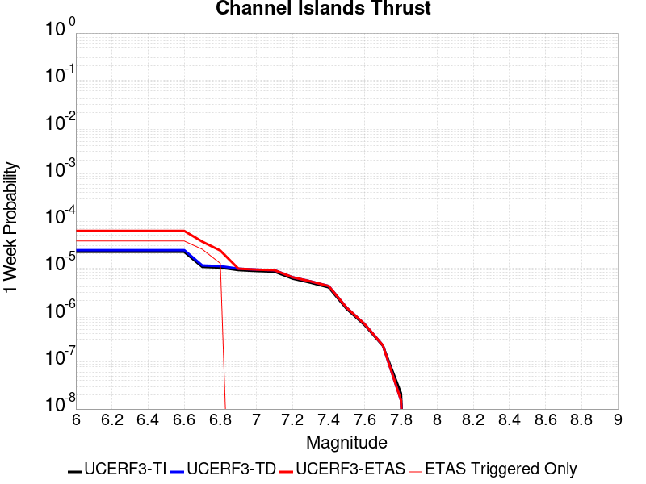 | 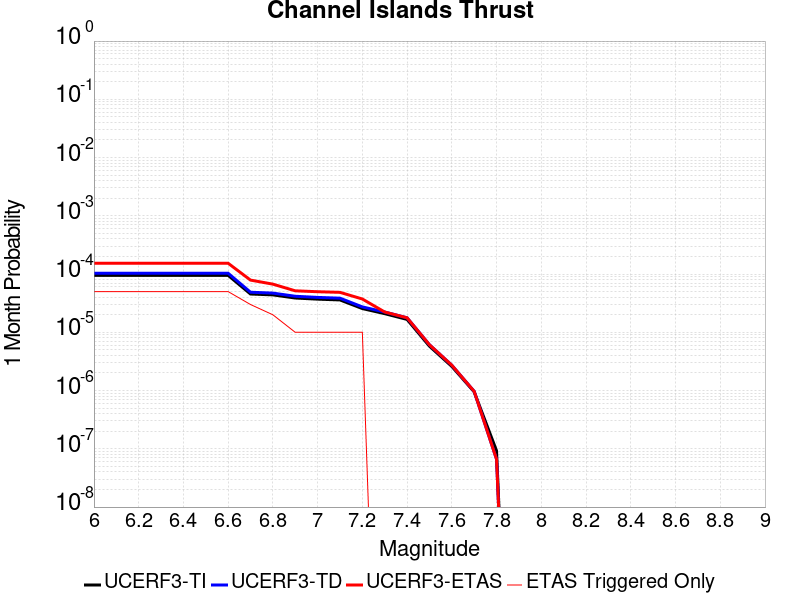 | 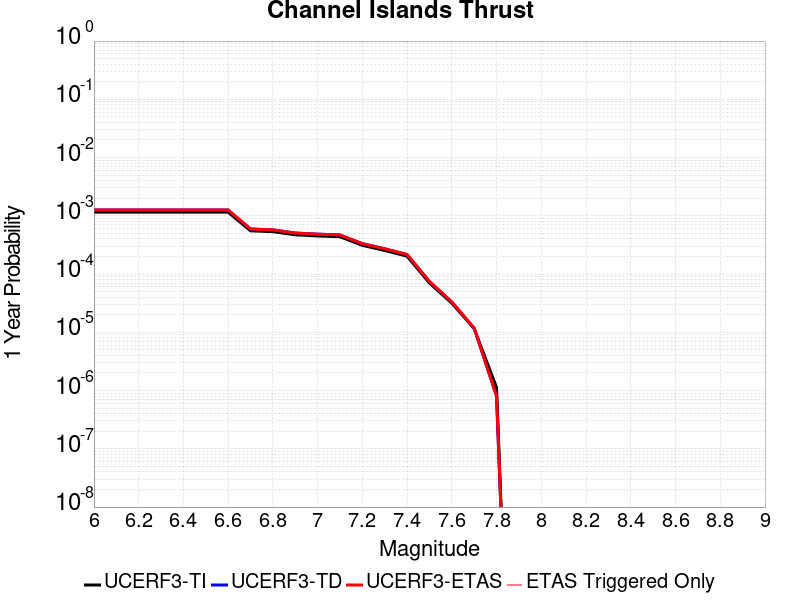 | 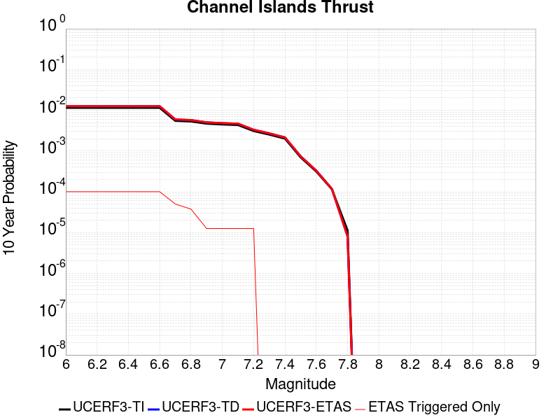 |

| Magnitude | 1 wk TI Prob | 1 wk TD Prob | 1 wk ETAS Prob | 1 wk ETAS/TD Gain | 1 wk ETAS Triggered Only | 1 mo TI Prob | 1 mo TD Prob | 1 mo ETAS Prob | 1 mo ETAS/TD Gain | 1 mo ETAS Triggered Only | 1 yr TI Prob | 1 yr TD Prob | 1 yr ETAS Prob | 1 yr ETAS/TD Gain | 1 yr ETAS Triggered Only | 10 yr TI Prob | 10 yr TD Prob | 10 yr ETAS Prob | 10 yr ETAS/TD Gain | 10 yr ETAS Triggered Only |
|-----|-----|-----|-----|-----|-----|-----|-----|-----|-----|-----|-----|-----|-----|-----|-----|-----|-----|-----|-----|-----|
| 6.0 | 2.2156251E-5 | 2.4092022E-5 | 5.40913E-5 | 2.2451954 | 3.0E-5 | 9.495191E-5 | 1.03248036E-4 | 1.5324287E-4 | 1.4842207 | 5.0E-5 | 0.0011554264 | 0.0012564266 | 0.0013263385 | 1.0556436 | 7.0E-5 | 0.011494373 | 0.0125038205 | 0.0126025705 | 1.0078975 | 1.0E-4 |
| 6.1 | 2.2156251E-5 | 2.4092022E-5 | 5.40913E-5 | 2.2451954 | 3.0E-5 | 9.495191E-5 | 1.03248036E-4 | 1.5324287E-4 | 1.4842207 | 5.0E-5 | 0.0011554264 | 0.0012564266 | 0.0013263385 | 1.0556436 | 7.0E-5 | 0.011494373 | 0.0125038205 | 0.0126025705 | 1.0078975 | 1.0E-4 |
| 6.2 | 2.2156251E-5 | 2.4092022E-5 | 5.40913E-5 | 2.2451954 | 3.0E-5 | 9.495191E-5 | 1.03248036E-4 | 1.5324287E-4 | 1.4842207 | 5.0E-5 | 0.0011554264 | 0.0012564266 | 0.0013263385 | 1.0556436 | 7.0E-5 | 0.011494373 | 0.0125038205 | 0.0126025705 | 1.0078975 | 1.0E-4 |
| 6.3 | 2.2156251E-5 | 2.4092022E-5 | 5.40913E-5 | 2.2451954 | 3.0E-5 | 9.495191E-5 | 1.03248036E-4 | 1.5324287E-4 | 1.4842207 | 5.0E-5 | 0.0011554264 | 0.0012564266 | 0.0013263385 | 1.0556436 | 7.0E-5 | 0.011494373 | 0.0125038205 | 0.0126025705 | 1.0078975 | 1.0E-4 |
| 6.4 | 2.2156251E-5 | 2.4092022E-5 | 5.40913E-5 | 2.2451954 | 3.0E-5 | 9.495191E-5 | 1.03248036E-4 | 1.5324287E-4 | 1.4842207 | 5.0E-5 | 0.0011554264 | 0.0012564266 | 0.0013263385 | 1.0556436 | 7.0E-5 | 0.011494373 | 0.0125038205 | 0.0126025705 | 1.0078975 | 1.0E-4 |
| 6.5 | 2.2156251E-5 | 2.4092022E-5 | 5.40913E-5 | 2.2451954 | 3.0E-5 | 9.495191E-5 | 1.03248036E-4 | 1.5324287E-4 | 1.4842207 | 5.0E-5 | 0.0011554264 | 0.0012564266 | 0.0013263385 | 1.0556436 | 7.0E-5 | 0.011494373 | 0.0125038205 | 0.0126025705 | 1.0078975 | 1.0E-4 |
| 6.6 | 2.2156251E-5 | 2.4092022E-5 | 5.40913E-5 | 2.2451954 | 3.0E-5 | 9.495191E-5 | 1.03248036E-4 | 1.5324287E-4 | 1.4842207 | 5.0E-5 | 0.0011554264 | 0.0012564266 | 0.0013263385 | 1.0556436 | 7.0E-5 | 0.011494373 | 0.0125038205 | 0.0126025705 | 1.0078975 | 1.0E-4 |
| 6.7 | 1.0601296E-5 | 1.1379544E-5 | 3.1379317E-5 | 2.7575197 | 2.0E-5 | 4.5433335E-5 | 4.876859E-5 | 7.876712E-5 | 1.61512 | 3.0E-5 | 5.5301044E-4 | 5.936007E-4 | 6.235829E-4 | 1.050509 | 3.0E-5 | 0.005516363 | 0.005920653 | 0.0059604165 | 1.006716 | 4.0E-5 |
| 6.8 | 1.0246747E-5 | 1.0996669E-5 | 2.0996558E-5 | 1.9093562 | 1.0E-5 | 4.391389E-5 | 4.7127756E-5 | 6.712681E-5 | 1.4243584 | 2.0E-5 | 5.345204E-4 | 5.7363417E-4 | 5.936227E-4 | 1.0348455 | 2.0E-5 | 0.0053323656 | 0.005722025 | 0.0057518533 | 1.0052129 | 3.0E-5 |
| 6.9 | 9.049551E-6 | 9.699645E-6 | 9.699645E-6 | 1.0 | 0.0 | 3.878322E-5 | 4.1569267E-5 | 5.156885E-5 | 1.2405523 | 1.0E-5 | 4.7208337E-4 | 5.059924E-4 | 5.1598734E-4 | 1.0197531 | 1.0E-5 | 0.0047108172 | 0.0050488203 | 0.00505877 | 1.0019706 | 1.0E-5 |
| 7.0 | 8.6542195E-6 | 9.274603E-6 | 9.274603E-6 | 1.0 | 0.0 | 3.7088983E-5 | 3.9747716E-5 | 4.974732E-5 | 1.2515768 | 1.0E-5 | 4.5146482E-4 | 4.8382508E-4 | 4.9382023E-4 | 1.0206586 | 1.0E-5 | 0.004505487 | 0.0048281294 | 0.004838081 | 1.0020612 | 1.0E-5 |
| 7.1 | 8.391028E-6 | 8.992925E-6 | 8.992925E-6 | 1.0 | 0.0 | 3.5961057E-5 | 3.8540562E-5 | 4.8540176E-5 | 1.2594569 | 1.0E-5 | 4.3773788E-4 | 4.6913436E-4 | 4.791297E-4 | 1.0213058 | 1.0E-5 | 0.004368766 | 0.0046818503 | 0.0046918034 | 1.0021259 | 1.0E-5 |
| 7.2 | 5.965188E-6 | 6.3716957E-6 | 6.3716957E-6 | 1.0 | 0.0 | 2.556484E-5 | 2.7306984E-5 | 3.7306712E-5 | 1.3661966 | 1.0E-5 | 3.1120746E-4 | 3.3241237E-4 | 3.4240904E-4 | 1.0300732 | 1.0E-5 | 0.00310772 | 0.0033192094 | 0.0033291762 | 1.0030028 | 1.0E-5 |
| 7.3 | 4.877518E-6 | 5.206007E-6 | 5.206007E-6 | 1.0 | 0.0 | 2.0903482E-5 | 2.231127E-5 | 2.231127E-5 | 1.0 | 0.0 | 2.5447016E-4 | 2.716063E-4 | 2.716063E-4 | 1.0 | 0.0 | 0.0025417898 | 0.0027127897 | 0.0027127897 | 1.0 | 0.0 |
| 7.4 | 3.8829853E-6 | 4.141863E-6 | 4.141863E-6 | 1.0 | 0.0 | 1.664126E-5 | 1.7750723E-5 | 1.7750723E-5 | 1.0 | 0.0 | 2.0258849E-4 | 2.1609403E-4 | 2.1609403E-4 | 1.0 | 0.0 | 0.002024039 | 0.002158881 | 0.002158881 | 1.0 | 0.0 |
| 7.5 | 1.3489616E-6 | 1.4277905E-6 | 1.4277905E-6 | 1.0 | 0.0 | 5.7812517E-6 | 6.119088E-6 | 6.119088E-6 | 1.0 | 0.0 | 7.038446E-5 | 7.449739E-5 | 7.449739E-5 | 1.0 | 0.0 | 7.036218E-4 | 7.4472814E-4 | 7.4472814E-4 | 1.0 | 0.0 |
| 7.6 | 6.058192E-7 | 6.35378E-7 | 6.35378E-7 | 1.0 | 0.0 | 2.5963652E-6 | 2.7230458E-6 | 2.7230458E-6 | 1.0 | 0.0 | 3.161029E-5 | 3.3152595E-5 | 3.3152595E-5 | 1.0 | 0.0 | 3.1605794E-4 | 3.314781E-4 | 3.314781E-4 | 1.0 | 0.0 |
| 7.7 | 2.2170494E-7 | 2.2607924E-7 | 2.2607924E-7 | 1.0 | 0.0 | 9.5016367E-7 | 9.689107E-7 | 9.689107E-7 | 1.0 | 0.0 | 1.1568181E-5 | 1.17964355E-5 | 1.17964355E-5 | 1.0 | 0.0 | 1.1567579E-4 | 1.179592E-4 | 1.179592E-4 | 1.0 | 0.0 |
| 7.8 | 2.1613102E-8 | 1.5466837E-8 | 1.5466837E-8 | 1.0 | 0.0 | 9.262757E-8 | 6.628645E-8 | 6.628645E-8 | 1.0 | 0.0 | 1.1277401E-6 | 8.070372E-7 | 8.070372E-7 | 1.0 | 0.0 | 1.1277344E-5 | 8.07035E-6 | 8.07035E-6 | 1.0 | 0.0 |

## Ortigalita (North)
*[(top)](#table-of-contents)*

| 1 Week | 1 Month | 1 Year | 10 Year |
|-----|-----|-----|-----|
| 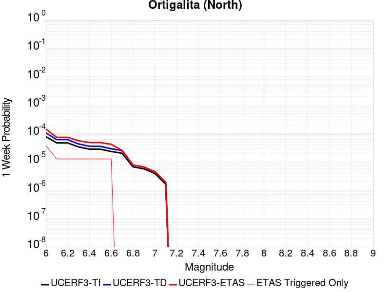 | 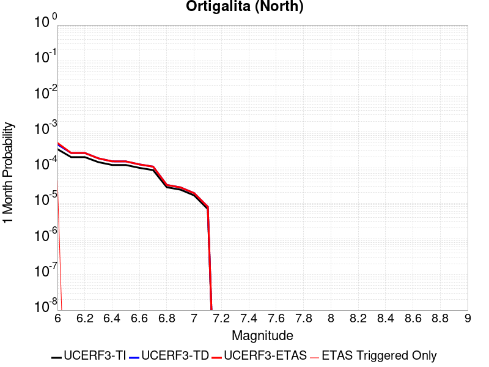 | 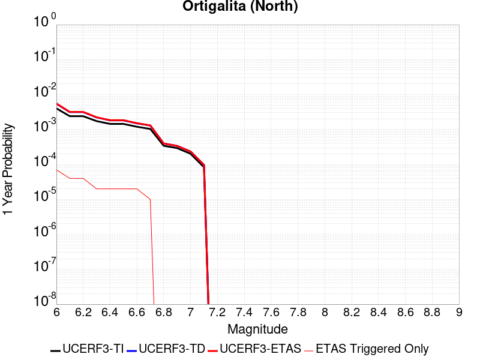 | 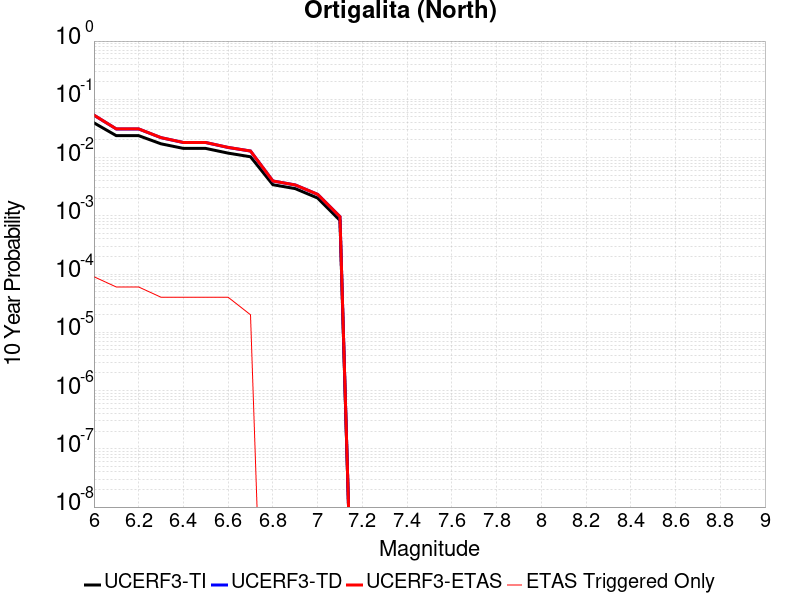 |

| Magnitude | 1 wk TI Prob | 1 wk TD Prob | 1 wk ETAS Prob | 1 wk ETAS/TD Gain | 1 wk ETAS Triggered Only | 1 mo TI Prob | 1 mo TD Prob | 1 mo ETAS Prob | 1 mo ETAS/TD Gain | 1 mo ETAS Triggered Only | 1 yr TI Prob | 1 yr TD Prob | 1 yr ETAS Prob | 1 yr ETAS/TD Gain | 1 yr ETAS Triggered Only | 10 yr TI Prob | 10 yr TD Prob | 10 yr ETAS Prob | 10 yr ETAS/TD Gain | 10 yr ETAS Triggered Only |
|-----|-----|-----|-----|-----|-----|-----|-----|-----|-----|-----|-----|-----|-----|-----|-----|-----|-----|-----|-----|-----|
| 6.0 | 7.711876E-5 | 1.0505308E-4 | 1.3504992E-4 | 1.28554 | 3.0E-5 | 3.3046713E-4 | 4.501601E-4 | 4.8014658E-4 | 1.066613 | 3.0E-5 | 0.004016016 | 0.0054680547 | 0.005537672 | 1.0127317 | 7.0E-5 | 0.039442103 | 0.053455614 | 0.0535408 | 1.0015936 | 9.0E-5 |
| 6.1 | 4.607858E-5 | 6.0239887E-5 | 7.0239286E-5 | 1.165993 | 1.0E-5 | 1.9746469E-4 | 2.5814763E-4 | 2.6814506E-4 | 1.0387275 | 1.0E-5 | 0.0024014818 | 0.0031387366 | 0.0031786112 | 1.012704 | 4.0E-5 | 0.023756953 | 0.030975312 | 0.031033453 | 1.0018771 | 6.0E-5 |
| 6.2 | 4.607858E-5 | 6.0239887E-5 | 7.0239286E-5 | 1.165993 | 1.0E-5 | 1.9746469E-4 | 2.5814763E-4 | 2.6814506E-4 | 1.0387275 | 1.0E-5 | 0.0024014818 | 0.0031387366 | 0.0031786112 | 1.012704 | 4.0E-5 | 0.023756953 | 0.030975312 | 0.031033453 | 1.0018771 | 6.0E-5 |
| 6.3 | 3.327423E-5 | 4.2476124E-5 | 5.2475698E-5 | 1.2354164 | 1.0E-5 | 1.4259605E-4 | 1.8202956E-4 | 1.9202773E-4 | 1.0549262 | 1.0E-5 | 0.0017347244 | 0.002214206 | 0.0022341616 | 1.0090126 | 2.0E-5 | 0.017212452 | 0.02194574 | 0.021984862 | 1.0017827 | 4.0E-5 |
| 6.4 | 2.7732503E-5 | 3.4999008E-5 | 4.4998655E-5 | 1.2857124 | 1.0E-5 | 1.1884817E-4 | 1.499886E-4 | 1.599871E-4 | 1.0666617 | 1.0E-5 | 0.001446016 | 0.0018248158 | 0.0018447792 | 1.01094 | 2.0E-5 | 0.014366428 | 0.018121297 | 0.018160572 | 1.0021673 | 4.0E-5 |
| 6.5 | 2.7689714E-5 | 3.4948822E-5 | 4.4948472E-5 | 1.2861227 | 1.0E-5 | 1.186648E-4 | 1.4977354E-4 | 1.5977204E-4 | 1.0667574 | 1.0E-5 | 0.0014437864 | 0.0018222018 | 0.0018421654 | 1.0109557 | 2.0E-5 | 0.014344421 | 0.018095585 | 0.01813486 | 1.0021704 | 4.0E-5 |
| 6.6 | 2.2976905E-5 | 2.871829E-5 | 3.8718004E-5 | 1.3482001 | 1.0E-5 | 9.846873E-5 | 1.23074E-4 | 1.3307277E-4 | 1.081242 | 1.0E-5 | 0.0011981975 | 0.0014976348 | 0.0015176049 | 1.0133344 | 2.0E-5 | 0.011917574 | 0.014898733 | 0.0149381375 | 1.0026448 | 4.0E-5 |
| 6.7 | 1.9871539E-5 | 2.4904637E-5 | 2.4904637E-5 | 1.0 | 0.0 | 8.516096E-5 | 1.067312E-4 | 1.067312E-4 | 1.0 | 0.0 | 0.0010363415 | 0.0012989199 | 0.0013089069 | 1.0076888 | 1.0E-5 | 0.010315218 | 0.012936938 | 0.012956679 | 1.001526 | 2.0E-5 |
| 6.8 | 6.5640475E-6 | 7.6054926E-6 | 7.6054926E-6 | 1.0 | 0.0 | 2.813133E-5 | 3.2594577E-5 | 3.2594577E-5 | 1.0 | 0.0 | 3.424451E-4 | 3.9676955E-4 | 3.9676955E-4 | 1.0 | 0.0 | 0.0034191788 | 0.003960899 | 0.003960899 | 1.0 | 0.0 |
| 6.9 | 5.6219683E-6 | 6.5018376E-6 | 6.5018376E-6 | 1.0 | 0.0 | 2.4093928E-5 | 2.7864735E-5 | 2.7864735E-5 | 1.0 | 0.0 | 2.933041E-4 | 3.3920293E-4 | 3.3920293E-4 | 1.0 | 0.0 | 0.0029291727 | 0.003387109 | 0.003387109 | 1.0 | 0.0 |
| 7.0 | 3.875591E-6 | 4.4847548E-6 | 4.4847548E-6 | 1.0 | 0.0 | 1.6609569E-5 | 1.9220248E-5 | 1.9220248E-5 | 1.0 | 0.0 | 2.0220275E-4 | 2.339835E-4 | 2.339835E-4 | 1.0 | 0.0 | 0.0020201886 | 0.0023375798 | 0.0023375798 | 1.0 | 0.0 |
| 7.1 | 1.6017933E-6 | 1.8570418E-6 | 1.8570418E-6 | 1.0 | 0.0 | 6.8648105E-6 | 7.958732E-6 | 7.958732E-6 | 1.0 | 0.0 | 8.357586E-5 | 9.689432E-5 | 9.689432E-5 | 1.0 | 0.0 | 8.3544437E-4 | 9.686254E-4 | 9.686254E-4 | 1.0 | 0.0 |

## Elysian Park (Upper)
*[(top)](#table-of-contents)*

| 1 Week | 1 Month | 1 Year | 10 Year |
|-----|-----|-----|-----|
| 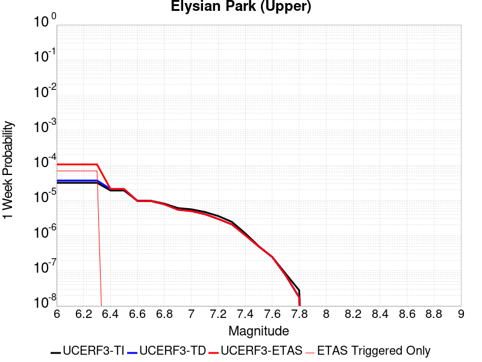 | 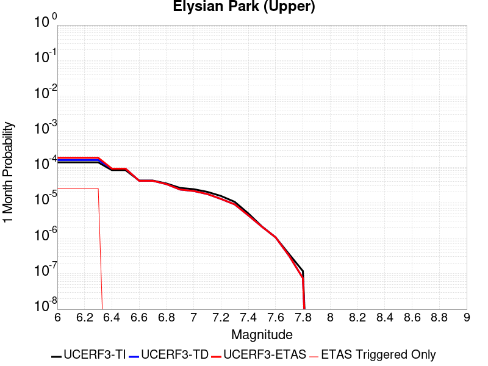 |  | 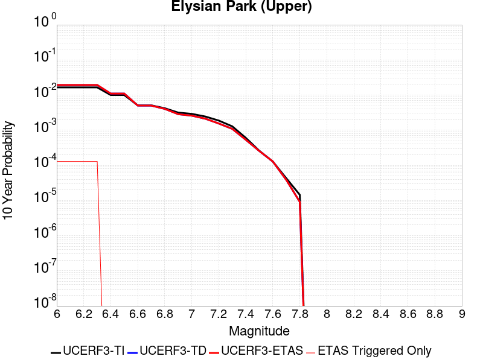 |

| Magnitude | 1 wk TI Prob | 1 wk TD Prob | 1 wk ETAS Prob | 1 wk ETAS/TD Gain | 1 wk ETAS Triggered Only | 1 mo TI Prob | 1 mo TD Prob | 1 mo ETAS Prob | 1 mo ETAS/TD Gain | 1 mo ETAS Triggered Only | 1 yr TI Prob | 1 yr TD Prob | 1 yr ETAS Prob | 1 yr ETAS/TD Gain | 1 yr ETAS Triggered Only | 10 yr TI Prob | 10 yr TD Prob | 10 yr ETAS Prob | 10 yr ETAS/TD Gain | 10 yr ETAS Triggered Only |
|-----|-----|-----|-----|-----|-----|-----|-----|-----|-----|-----|-----|-----|-----|-----|-----|-----|-----|-----|-----|-----|
| 6.0 | 3.1876025E-5 | 3.7035275E-5 | 5.7034536E-5 | 1.5400057 | 2.0E-5 | 1.3660437E-4 | 1.5871569E-4 | 1.7871251E-4 | 1.1259915 | 2.0E-5 | 0.0016618895 | 0.001931122 | 0.001991006 | 1.03101 | 6.0E-5 | 0.016495159 | 0.019189863 | 0.019278135 | 1.0045999 | 9.0E-5 |
| 6.1 | 3.1876025E-5 | 3.7035275E-5 | 5.7034536E-5 | 1.5400057 | 2.0E-5 | 1.3660437E-4 | 1.5871569E-4 | 1.7871251E-4 | 1.1259915 | 2.0E-5 | 0.0016618895 | 0.001931122 | 0.001991006 | 1.03101 | 6.0E-5 | 0.016495159 | 0.019189863 | 0.019278135 | 1.0045999 | 9.0E-5 |
| 6.2 | 3.1876025E-5 | 3.7035275E-5 | 5.7034536E-5 | 1.5400057 | 2.0E-5 | 1.3660437E-4 | 1.5871569E-4 | 1.7871251E-4 | 1.1259915 | 2.0E-5 | 0.0016618895 | 0.001931122 | 0.001991006 | 1.03101 | 6.0E-5 | 0.016495159 | 0.019189863 | 0.019278135 | 1.0045999 | 9.0E-5 |
| 6.3 | 3.1876025E-5 | 3.7035275E-5 | 5.7034536E-5 | 1.5400057 | 2.0E-5 | 1.3660437E-4 | 1.5871569E-4 | 1.7871251E-4 | 1.1259915 | 2.0E-5 | 0.0016618895 | 0.001931122 | 0.001991006 | 1.03101 | 6.0E-5 | 0.016495159 | 0.019189863 | 0.019278135 | 1.0045999 | 9.0E-5 |
| 6.4 | 1.9273462E-5 | 2.120244E-5 | 2.120244E-5 | 1.0 | 0.0 | 8.259794E-5 | 9.086542E-5 | 9.086542E-5 | 1.0 | 0.0 | 0.001005166 | 0.0011058967 | 0.0011258746 | 1.0180649 | 2.0E-5 | 0.010006315 | 0.011020744 | 0.011070193 | 1.0044869 | 5.0E-5 |
| 6.5 | 1.9273462E-5 | 2.120244E-5 | 2.120244E-5 | 1.0 | 0.0 | 8.259794E-5 | 9.086542E-5 | 9.086542E-5 | 1.0 | 0.0 | 0.001005166 | 0.0011058967 | 0.0011258746 | 1.0180649 | 2.0E-5 | 0.010006315 | 0.011020744 | 0.011070193 | 1.0044869 | 5.0E-5 |
| 6.6 | 9.813258E-6 | 9.665589E-6 | 9.665589E-6 | 1.0 | 0.0 | 4.205614E-5 | 4.1423333E-5 | 4.1423333E-5 | 1.0 | 0.0 | 5.119132E-4 | 5.042196E-4 | 5.1421457E-4 | 1.0198226 | 1.0E-5 | 0.005107356 | 0.0050314795 | 0.0050613284 | 1.0059325 | 3.0E-5 |
| 6.7 | 9.801478E-6 | 9.653158E-6 | 9.653158E-6 | 1.0 | 0.0 | 4.2005657E-5 | 4.137006E-5 | 4.137006E-5 | 1.0 | 0.0 | 5.112989E-4 | 5.0357135E-4 | 5.135663E-4 | 1.0198481 | 1.0E-5 | 0.0051012407 | 0.005025026 | 0.0050548753 | 1.0059401 | 3.0E-5 |
| 6.8 | 8.102489E-6 | 7.772994E-6 | 7.772994E-6 | 1.0 | 0.0 | 3.4724493E-5 | 3.3312434E-5 | 3.3312434E-5 | 1.0 | 0.0 | 4.2268867E-4 | 4.0550836E-4 | 4.1550433E-4 | 1.0246505 | 1.0E-5 | 0.004218856 | 0.0040481784 | 0.004068097 | 1.0049205 | 2.0E-5 |
| 6.9 | 6.08275E-6 | 5.481441E-6 | 5.481441E-6 | 1.0 | 0.0 | 2.6068668E-5 | 2.3491682E-5 | 2.3491682E-5 | 1.0 | 0.0 | 3.173398E-4 | 2.8597447E-4 | 2.8597447E-4 | 1.0 | 0.0 | 0.0031688702 | 0.0028561424 | 0.0028661138 | 1.0034913 | 1.0E-5 |
| 7.0 | 5.5995934E-6 | 4.9827686E-6 | 4.9827686E-6 | 1.0 | 0.0 | 2.3998036E-5 | 2.1354552E-5 | 2.1354552E-5 | 1.0 | 0.0 | 2.9213692E-4 | 2.5996132E-4 | 2.5996132E-4 | 1.0 | 0.0 | 0.0029175316 | 0.0025966396 | 0.0026066136 | 1.0038412 | 1.0E-5 |
| 7.1 | 4.709881E-6 | 4.0873906E-6 | 4.0873906E-6 | 1.0 | 0.0 | 2.0185047E-5 | 1.7517272E-5 | 1.7517272E-5 | 1.0 | 0.0 | 2.4572524E-4 | 2.1325232E-4 | 2.1325232E-4 | 1.0 | 0.0 | 0.002454537 | 0.0021305184 | 0.002140497 | 1.0046837 | 1.0E-5 |
| 7.2 | 3.6063436E-6 | 2.9779412E-6 | 2.9779412E-6 | 1.0 | 0.0 | 1.5455667E-5 | 1.27625435E-5 | 1.27625435E-5 | 1.0 | 0.0 | 1.881565E-4 | 1.55373E-4 | 1.55373E-4 | 1.0 | 0.0 | 0.0018799726 | 0.0015526549 | 0.0015626394 | 1.0064306 | 1.0E-5 |
| 7.3 | 2.471135E-6 | 2.0954562E-6 | 2.0954562E-6 | 1.0 | 0.0 | 1.0590536E-5 | 8.980496E-6 | 8.980496E-6 | 1.0 | 0.0 | 1.2893214E-4 | 1.0933213E-4 | 1.0933213E-4 | 1.0 | 0.0 | 0.0012885736 | 0.0010927906 | 0.0011027798 | 1.0091408 | 1.0E-5 |
| 7.4 | 1.163943E-6 | 1.0275061E-6 | 1.0275061E-6 | 1.0 | 0.0 | 4.988318E-6 | 4.40359E-6 | 4.40359E-6 | 1.0 | 0.0 | 6.0731076E-5 | 5.361242E-5 | 5.361242E-5 | 1.0 | 0.0 | 6.071448E-4 | 5.3599785E-4 | 5.459925E-4 | 1.0186468 | 1.0E-5 |
| 7.5 | 4.99459E-7 | 4.917601E-7 | 4.917601E-7 | 1.0 | 0.0 | 2.140537E-6 | 2.1075416E-6 | 2.1075416E-6 | 1.0 | 0.0 | 2.6060725E-5 | 2.5659032E-5 | 2.5659032E-5 | 1.0 | 0.0 | 2.605767E-4 | 2.5656226E-4 | 2.665597E-4 | 1.0389669 | 1.0E-5 |
| 7.6 | 2.4667852E-7 | 2.4778313E-7 | 2.4778313E-7 | 1.0 | 0.0 | 1.0571932E-6 | 1.0619274E-6 | 1.0619274E-6 | 1.0 | 0.0 | 1.2871251E-5 | 1.2928893E-5 | 1.2928893E-5 | 1.0 | 0.0 | 1.2870505E-4 | 1.2928178E-4 | 1.3928048E-4 | 1.0773405 | 1.0E-5 |
| 7.7 | 8.2312795E-8 | 7.3864214E-8 | 7.3864214E-8 | 1.0 | 0.0 | 3.527691E-7 | 3.165609E-7 | 3.165609E-7 | 1.0 | 0.0 | 4.294955E-6 | 3.854123E-6 | 3.854123E-6 | 1.0 | 0.0 | 4.2948723E-5 | 3.854068E-5 | 4.8540292E-5 | 1.2594562 | 1.0E-5 |
| 7.8 | 2.7819295E-8 | 1.7565618E-8 | 1.7565618E-8 | 1.0 | 0.0 | 1.1922555E-7 | 7.528122E-8 | 7.528122E-8 | 1.0 | 0.0 | 1.45157E-6 | 9.1654863E-7 | 9.1654863E-7 | 1.0 | 0.0 | 1.45156055E-5 | 9.165463E-6 | 1.916537E-5 | 2.0910423 | 1.0E-5 |

## Big Pine (Central)
*[(top)](#table-of-contents)*

| 1 Week | 1 Month | 1 Year | 10 Year |
|-----|-----|-----|-----|
| 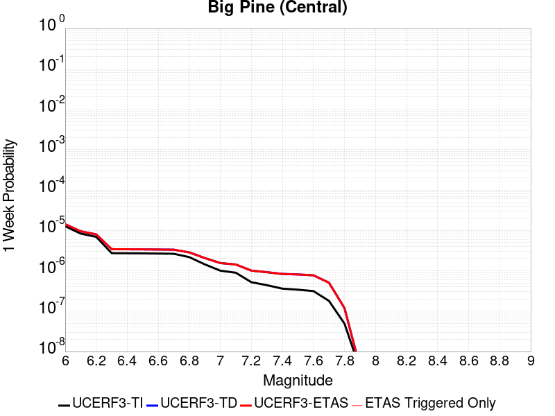 | 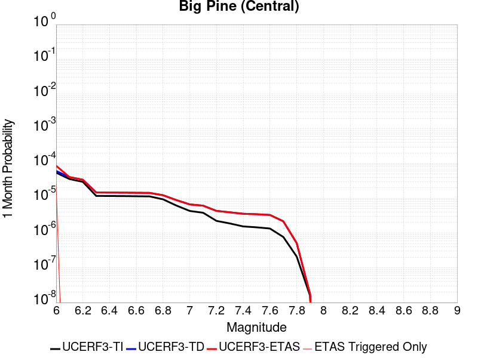 | 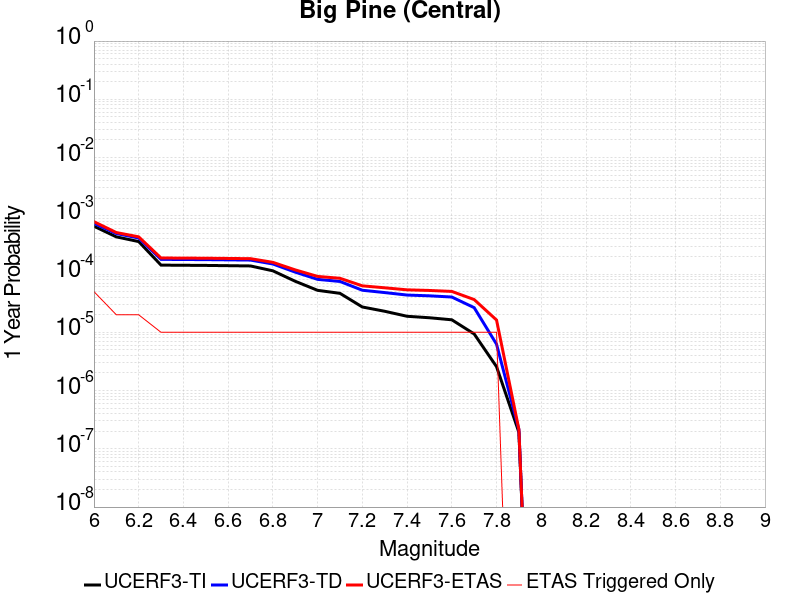 | 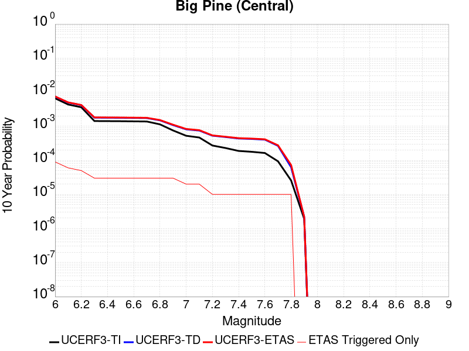 |

| Magnitude | 1 wk TI Prob | 1 wk TD Prob | 1 wk ETAS Prob | 1 wk ETAS/TD Gain | 1 wk ETAS Triggered Only | 1 mo TI Prob | 1 mo TD Prob | 1 mo ETAS Prob | 1 mo ETAS/TD Gain | 1 mo ETAS Triggered Only | 1 yr TI Prob | 1 yr TD Prob | 1 yr ETAS Prob | 1 yr ETAS/TD Gain | 1 yr ETAS Triggered Only | 10 yr TI Prob | 10 yr TD Prob | 10 yr ETAS Prob | 10 yr ETAS/TD Gain | 10 yr ETAS Triggered Only |
|-----|-----|-----|-----|-----|-----|-----|-----|-----|-----|-----|-----|-----|-----|-----|-----|-----|-----|-----|-----|-----|
| 6.0 | 1.2706755E-5 | 1.4250602E-5 | 3.425032E-5 | 2.4034295 | 2.0E-5 | 5.4456385E-5 | 6.107279E-5 | 8.1071565E-5 | 1.3274581 | 2.0E-5 | 6.628048E-4 | 7.433441E-4 | 7.933069E-4 | 1.0672137 | 5.0E-5 | 0.006608314 | 0.007413639 | 0.007502972 | 1.0120498 | 9.0E-5 |
| 6.1 | 8.342579E-6 | 9.510835E-6 | 9.510835E-6 | 1.0 | 0.0 | 3.5753423E-5 | 4.076021E-5 | 4.076021E-5 | 1.0 | 0.0 | 4.3521097E-4 | 4.9616426E-4 | 5.1615434E-4 | 1.0402893 | 2.0E-5 | 0.0043435963 | 0.004954155 | 0.005013858 | 1.0120511 | 6.0E-5 |
| 6.2 | 6.923899E-6 | 7.967221E-6 | 7.967221E-6 | 1.0 | 0.0 | 2.9673516E-5 | 3.4144894E-5 | 3.4144894E-5 | 1.0 | 0.0 | 3.6121515E-4 | 4.1565404E-4 | 4.3564572E-4 | 1.0480969 | 2.0E-5 | 0.003606286 | 0.0041521094 | 0.0042019016 | 1.0119921 | 5.0E-5 |
| 6.3 | 2.728396E-6 | 3.4243646E-6 | 3.4243646E-6 | 1.0 | 0.0 | 1.1693074E-5 | 1.4675771E-5 | 1.4675771E-5 | 1.0 | 0.0 | 1.4235388E-4 | 1.7866373E-4 | 1.8866194E-4 | 1.055961 | 1.0E-5 | 0.0014226272 | 0.0017867433 | 0.0018166897 | 1.0167603 | 3.0E-5 |
| 6.4 | 2.7136944E-6 | 3.4086581E-6 | 3.4086581E-6 | 1.0 | 0.0 | 1.1630066E-5 | 1.4608458E-5 | 1.4608458E-5 | 1.0 | 0.0 | 1.4158686E-4 | 1.7784433E-4 | 1.8784255E-4 | 1.056219 | 1.0E-5 | 0.0014149669 | 0.0017785623 | 0.001808509 | 1.0168376 | 3.0E-5 |
| 6.5 | 2.6971882E-6 | 3.3910032E-6 | 3.3910032E-6 | 1.0 | 0.0 | 1.1559327E-5 | 1.4532795E-5 | 1.4532795E-5 | 1.0 | 0.0 | 1.4072572E-4 | 1.7692328E-4 | 1.869215E-4 | 1.0565116 | 1.0E-5 | 0.0014063664 | 0.0017693666 | 0.0017993135 | 1.0169252 | 3.0E-5 |
| 6.6 | 2.669092E-6 | 3.3610236E-6 | 3.3610236E-6 | 1.0 | 0.0 | 1.1438916E-5 | 1.4404312E-5 | 1.4404312E-5 | 1.0 | 0.0 | 1.3925991E-4 | 1.7535927E-4 | 1.8535751E-4 | 1.0570158 | 1.0E-5 | 0.0013917267 | 0.0017537511 | 0.0017836984 | 1.0170761 | 3.0E-5 |
| 6.7 | 2.6408059E-6 | 3.3310494E-6 | 3.3310494E-6 | 1.0 | 0.0 | 1.1317691E-5 | 1.4275853E-5 | 1.4275853E-5 | 1.0 | 0.0 | 1.3778417E-4 | 1.737955E-4 | 1.8379377E-4 | 1.0575289 | 1.0E-5 | 0.0013769877 | 0.0017381381 | 0.001768086 | 1.0172298 | 3.0E-5 |
| 6.8 | 2.1786943E-6 | 2.8545066E-6 | 2.8545066E-6 | 1.0 | 0.0 | 9.337228E-6 | 1.2233547E-5 | 1.2233547E-5 | 1.0 | 0.0 | 1.1367482E-4 | 1.4893398E-4 | 1.5893248E-4 | 1.0671339 | 1.0E-5 | 0.0011361669 | 0.0014898704 | 0.0015198257 | 1.020106 | 3.0E-5 |
| 6.9 | 1.4411696E-6 | 2.0685677E-6 | 2.0685677E-6 | 1.0 | 0.0 | 6.1764263E-6 | 8.865261E-6 | 8.865261E-6 | 1.0 | 0.0 | 7.51954E-5 | 1.0792949E-4 | 1.1792841E-4 | 1.0926431 | 1.0E-5 | 7.5169955E-4 | 0.0010802548 | 0.0011102224 | 1.0277412 | 3.0E-5 |
| 7.0 | 1.0073411E-6 | 1.5543274E-6 | 1.5543274E-6 | 1.0 | 0.0 | 4.317169E-6 | 6.661387E-6 | 6.661387E-6 | 1.0 | 0.0 | 5.2560266E-5 | 8.109952E-5 | 9.109871E-5 | 1.1232953 | 1.0E-5 | 5.2547833E-4 | 8.1217213E-4 | 8.321559E-4 | 1.0246053 | 2.0E-5 |
| 7.1 | 8.947104E-7 | 1.430316E-6 | 1.430316E-6 | 1.0 | 0.0 | 3.834468E-6 | 6.1299124E-6 | 6.1299124E-6 | 1.0 | 0.0 | 4.6683643E-5 | 7.462928E-5 | 8.462853E-5 | 1.1339856 | 1.0E-5 | 4.6673836E-4 | 7.4751483E-4 | 7.6749985E-4 | 1.0267353 | 2.0E-5 |
| 7.2 | 5.215166E-7 | 1.0112277E-6 | 1.0112277E-6 | 1.0 | 0.0 | 2.2350691E-6 | 4.333826E-6 | 4.333826E-6 | 1.0 | 0.0 | 2.7211627E-5 | 5.27631E-5 | 6.276257E-5 | 1.1895164 | 1.0E-5 | 2.7208295E-4 | 5.289683E-4 | 5.3896295E-4 | 1.0188947 | 1.0E-5 |
| 7.3 | 4.4024807E-7 | 9.220183E-7 | 9.220183E-7 | 1.0 | 0.0 | 1.8867761E-6 | 3.951501E-6 | 3.951501E-6 | 1.0 | 0.0 | 2.2971257E-5 | 4.8108504E-5 | 5.8108024E-5 | 1.2078534 | 1.0E-5 | 2.2968883E-4 | 4.824433E-4 | 4.924385E-4 | 1.0207179 | 1.0E-5 |
| 7.4 | 3.6130905E-7 | 8.359109E-7 | 8.359109E-7 | 1.0 | 0.0 | 1.5484665E-6 | 3.5824705E-6 | 3.5824705E-6 | 1.0 | 0.0 | 1.8852415E-5 | 4.3615746E-5 | 5.361531E-5 | 1.229265 | 1.0E-5 | 1.8850817E-4 | 4.3752496E-4 | 4.4752058E-4 | 1.0228459 | 1.0E-5 |
| 7.5 | 3.408184E-7 | 8.1087245E-7 | 8.1087245E-7 | 1.0 | 0.0 | 1.4606494E-6 | 3.475163E-6 | 3.475163E-6 | 1.0 | 0.0 | 1.7783263E-5 | 4.230933E-5 | 5.2308907E-5 | 1.2363445 | 1.0E-5 | 1.778184E-4 | 4.2444657E-4 | 4.344423E-4 | 1.02355 | 1.0E-5 |
| 7.6 | 3.1428627E-7 | 7.732167E-7 | 7.732167E-7 | 1.0 | 0.0 | 1.3469405E-6 | 3.313782E-6 | 3.313782E-6 | 1.0 | 0.0 | 1.6398877E-5 | 4.0344585E-5 | 5.034418E-5 | 1.2478547 | 1.0E-5 | 1.6397667E-4 | 4.0477706E-4 | 4.14773E-4 | 1.0246949 | 1.0E-5 |
| 7.7 | 1.7972785E-7 | 5.0782415E-7 | 5.0782415E-7 | 1.0 | 0.0 | 7.70262E-7 | 2.1763874E-6 | 2.1763874E-6 | 1.0 | 0.0 | 9.377899E-6 | 2.6497206E-5 | 3.6496942E-5 | 1.3773882 | 1.0E-5 | 9.377503E-5 | 2.6633305E-4 | 2.7633036E-4 | 1.037537 | 1.0E-5 |
| 7.8 | 4.9230927E-8 | 1.1981747E-7 | 1.1981747E-7 | 1.0 | 0.0 | 2.1098968E-7 | 5.135033E-7 | 5.135033E-7 | 1.0 | 0.0 | 2.5687964E-6 | 6.2518866E-6 | 1.6251824E-5 | 2.599507 | 1.0E-5 | 2.5687666E-5 | 6.2971965E-5 | 7.2971336E-5 | 1.1587908 | 1.0E-5 |
| 7.9 | 3.6805972E-9 | 4.1051638E-9 | 4.1051638E-9 | 1.0 | 0.0 | 1.5773987E-8 | 1.7593557E-8 | 1.7593557E-8 | 1.0 | 0.0 | 1.9204828E-7 | 2.1420155E-7 | 2.1420155E-7 | 1.0 | 0.0 | 1.920481E-6 | 2.1898923E-6 | 2.1898923E-6 | 1.0 | 0.0 |

## Pisgah-Bullion Mtn-Mesquite Lk
*[(top)](#table-of-contents)*

| 1 Week | 1 Month | 1 Year | 10 Year |
|-----|-----|-----|-----|
| 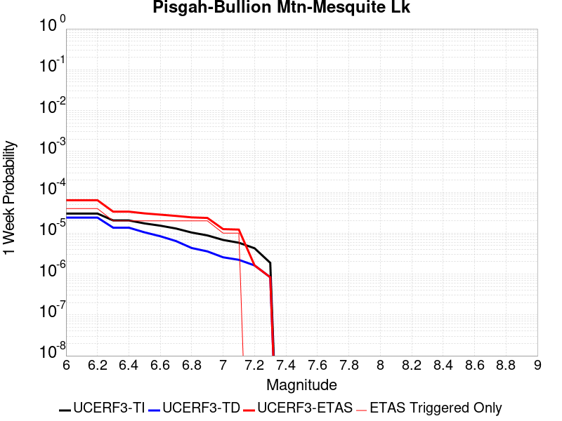 | 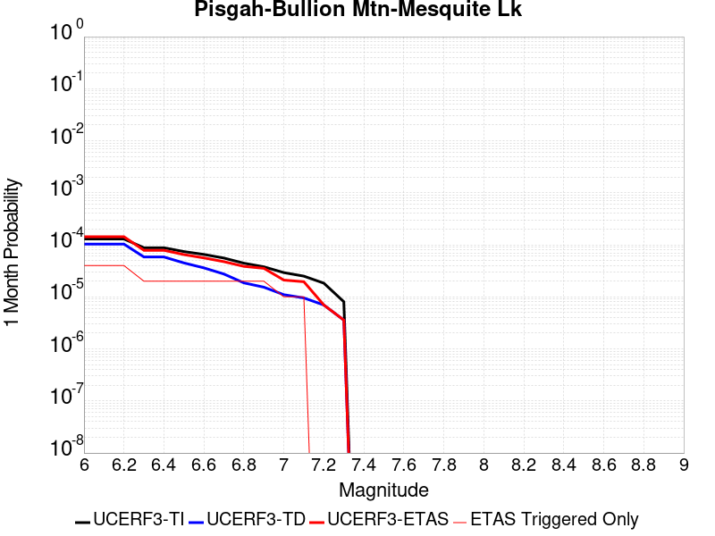 |  | 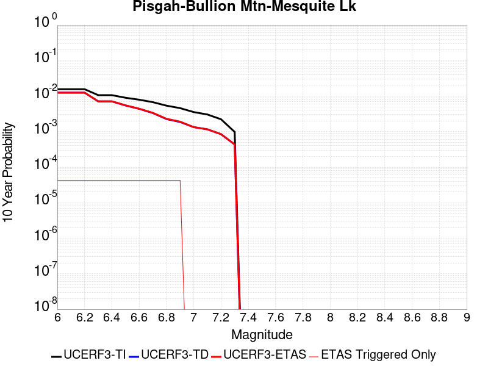 |

| Magnitude | 1 wk TI Prob | 1 wk TD Prob | 1 wk ETAS Prob | 1 wk ETAS/TD Gain | 1 wk ETAS Triggered Only | 1 mo TI Prob | 1 mo TD Prob | 1 mo ETAS Prob | 1 mo ETAS/TD Gain | 1 mo ETAS Triggered Only | 1 yr TI Prob | 1 yr TD Prob | 1 yr ETAS Prob | 1 yr ETAS/TD Gain | 1 yr ETAS Triggered Only | 10 yr TI Prob | 10 yr TD Prob | 10 yr ETAS Prob | 10 yr ETAS/TD Gain | 10 yr ETAS Triggered Only |
|-----|-----|-----|-----|-----|-----|-----|-----|-----|-----|-----|-----|-----|-----|-----|-----|-----|-----|-----|-----|-----|
| 6.0 | 3.0240792E-5 | 2.40909E-5 | 6.408994E-5 | 2.660338 | 4.0E-5 | 1.2959696E-4 | 1.032432E-4 | 1.4323907E-4 | 1.3873948 | 4.0E-5 | 0.0015767008 | 0.0012563618 | 0.001306299 | 1.0397475 | 5.0E-5 | 0.015655609 | 0.012502613 | 0.012601363 | 1.0078983 | 1.0E-4 |
| 6.1 | 3.0240792E-5 | 2.40909E-5 | 6.408994E-5 | 2.660338 | 4.0E-5 | 1.2959696E-4 | 1.032432E-4 | 1.4323907E-4 | 1.3873948 | 4.0E-5 | 0.0015767008 | 0.0012563618 | 0.001306299 | 1.0397475 | 5.0E-5 | 0.015655609 | 0.012502613 | 0.012601363 | 1.0078983 | 1.0E-4 |
| 6.2 | 3.0240792E-5 | 2.40909E-5 | 6.408994E-5 | 2.660338 | 4.0E-5 | 1.2959696E-4 | 1.032432E-4 | 1.4323907E-4 | 1.3873948 | 4.0E-5 | 0.0015767008 | 0.0012563618 | 0.001306299 | 1.0397475 | 5.0E-5 | 0.015655609 | 0.012502613 | 0.012601363 | 1.0078983 | 1.0E-4 |
| 6.3 | 2.0498217E-5 | 1.3638054E-5 | 3.363778E-5 | 2.4664648 | 2.0E-5 | 8.784654E-5 | 5.8447586E-5 | 7.8446414E-5 | 1.3421669 | 2.0E-5 | 0.0010690069 | 7.1138324E-4 | 7.4136193E-4 | 1.0421413 | 3.0E-5 | 0.01063879 | 0.0070926864 | 0.007142332 | 1.0069995 | 5.0E-5 |
| 6.4 | 2.0498217E-5 | 1.3638054E-5 | 3.363778E-5 | 2.4664648 | 2.0E-5 | 8.784654E-5 | 5.8447586E-5 | 7.8446414E-5 | 1.3421669 | 2.0E-5 | 0.0010690069 | 7.1138324E-4 | 7.4136193E-4 | 1.0421413 | 3.0E-5 | 0.01063879 | 0.0070926864 | 0.007142332 | 1.0069995 | 5.0E-5 |
| 6.5 | 1.7316182E-5 | 1.04769715E-5 | 3.0476762E-5 | 2.9089286 | 2.0E-5 | 7.42101E-5 | 4.490059E-5 | 6.4899694E-5 | 1.4454085 | 2.0E-5 | 9.0313336E-4 | 5.465376E-4 | 5.7652115E-4 | 1.0548611 | 3.0E-5 | 0.008994718 | 0.00545293 | 0.005492712 | 1.0072955 | 4.0E-5 |
| 6.6 | 1.5251077E-5 | 8.414133E-6 | 2.8413964E-5 | 3.376933 | 2.0E-5 | 6.536012E-5 | 3.606011E-5 | 5.605939E-5 | 1.5546094 | 2.0E-5 | 7.9546886E-4 | 4.3895066E-4 | 4.5894188E-4 | 1.0455432 | 2.0E-5 | 0.007926274 | 0.0043815537 | 0.004411422 | 1.0068169 | 3.0E-5 |
| 6.7 | 1.2997425E-5 | 6.4112146E-6 | 2.6411086E-5 | 4.1195135 | 2.0E-5 | 5.570206E-5 | 2.7476372E-5 | 4.747582E-5 | 1.7278782 | 2.0E-5 | 6.7796157E-4 | 3.3447813E-4 | 3.5447144E-4 | 1.0597746 | 2.0E-5 | 0.0067589693 | 0.003340207 | 0.0033601404 | 1.0059676 | 2.0E-5 |
| 6.8 | 1.035386E-5 | 4.333145E-6 | 2.4333058E-5 | 5.615565 | 2.0E-5 | 4.437293E-5 | 1.8570496E-5 | 3.8570124E-5 | 2.0769572 | 2.0E-5 | 5.401065E-4 | 2.260732E-4 | 2.4606867E-4 | 1.088447 | 2.0E-5 | 0.0053879567 | 0.002258519 | 0.0022784737 | 1.0088353 | 2.0E-5 |
| 6.9 | 8.816252E-6 | 3.5805879E-6 | 2.3580516E-5 | 6.5856547 | 2.0E-5 | 3.778339E-5 | 1.534529E-5 | 3.5344983E-5 | 2.3033116 | 2.0E-5 | 4.5991567E-4 | 1.8681347E-4 | 2.0680974E-4 | 1.1070386 | 2.0E-5 | 0.00458965 | 0.0018666228 | 0.0018865855 | 1.0106945 | 2.0E-5 |
| 7.0 | 6.8232207E-6 | 2.5674399E-6 | 1.2567414E-5 | 4.8949203 | 1.0E-5 | 2.9242048E-5 | 1.100327E-5 | 2.100316E-5 | 1.9088107 | 1.0E-5 | 3.5596377E-4 | 1.3395688E-4 | 1.4395555E-4 | 1.0746409 | 1.0E-5 | 0.0035539411 | 0.0013387925 | 0.0013487791 | 1.0074594 | 1.0E-5 |
| 7.1 | 5.837013E-6 | 2.2273143E-6 | 1.2227292E-5 | 5.489702 | 1.0E-5 | 2.501553E-5 | 9.5456E-6 | 1.9545503E-5 | 2.047593 | 1.0E-5 | 3.045215E-4 | 1.1621177E-4 | 1.2621061E-4 | 1.0860398 | 1.0E-5 | 0.0030410455 | 0.001161539 | 0.0011715274 | 1.0085993 | 1.0E-5 |
| 7.2 | 4.278052E-6 | 1.6275065E-6 | 1.6275065E-6 | 1.0 | 0.0 | 1.833438E-5 | 6.975011E-6 | 6.975011E-6 | 1.0 | 0.0 | 2.231982E-4 | 8.491768E-5 | 8.491768E-5 | 1.0 | 0.0 | 0.0022297418 | 8.4887556E-4 | 8.4887556E-4 | 1.0 | 0.0 |
| 7.3 | 1.8803692E-6 | 8.344788E-7 | 8.344788E-7 | 1.0 | 0.0 | 8.0587E-6 | 3.5763337E-6 | 3.5763337E-6 | 1.0 | 0.0 | 9.811026E-5 | 4.354114E-5 | 4.354114E-5 | 1.0 | 0.0 | 9.806695E-4 | 4.3534054E-4 | 4.3534054E-4 | 1.0 | 0.0 |

## Palos Verdes
*[(top)](#table-of-contents)*

| 1 Week | 1 Month | 1 Year | 10 Year |
|-----|-----|-----|-----|
| 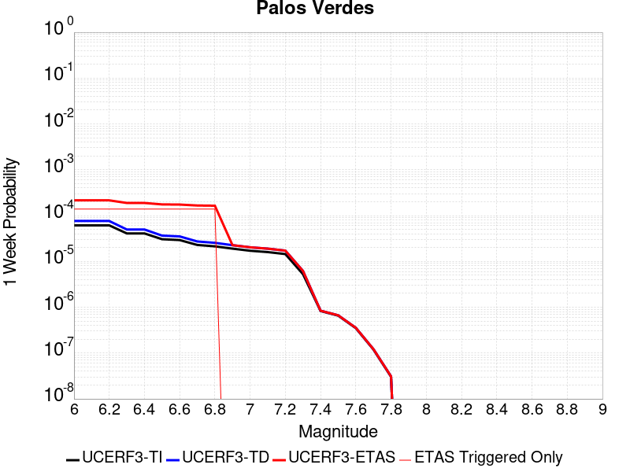 | 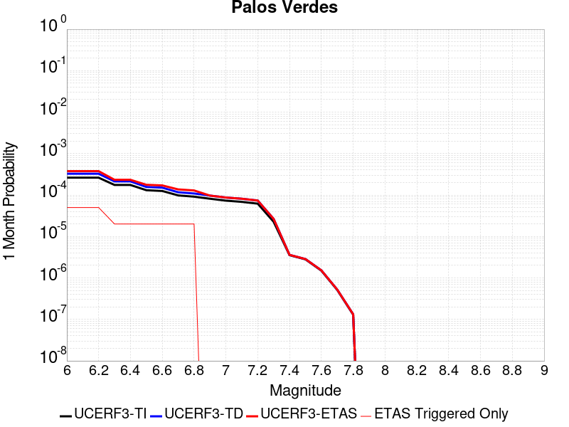 | 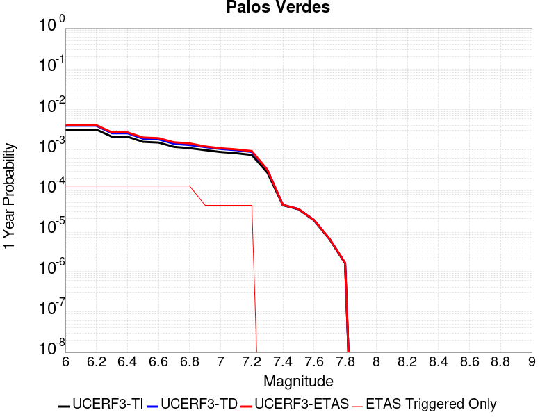 | 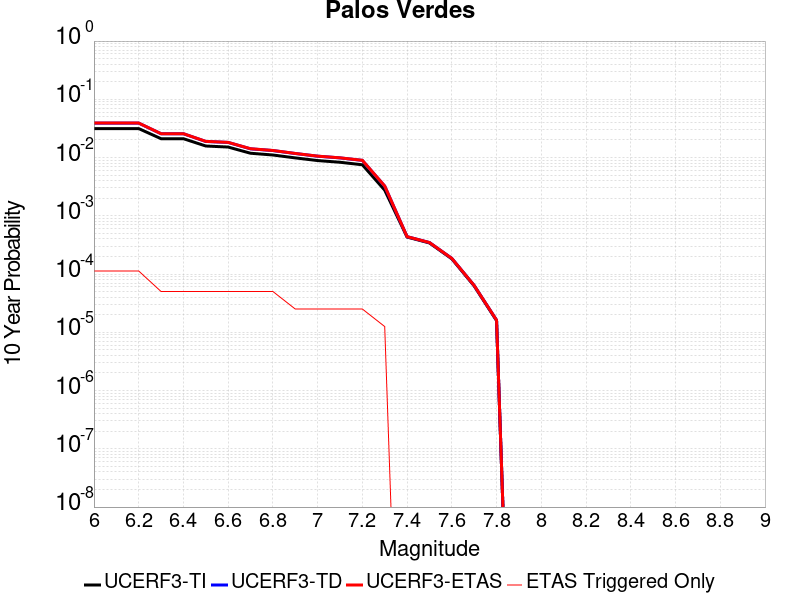 |

| Magnitude | 1 wk TI Prob | 1 wk TD Prob | 1 wk ETAS Prob | 1 wk ETAS/TD Gain | 1 wk ETAS Triggered Only | 1 mo TI Prob | 1 mo TD Prob | 1 mo ETAS Prob | 1 mo ETAS/TD Gain | 1 mo ETAS Triggered Only | 1 yr TI Prob | 1 yr TD Prob | 1 yr ETAS Prob | 1 yr ETAS/TD Gain | 1 yr ETAS Triggered Only | 10 yr TI Prob | 10 yr TD Prob | 10 yr ETAS Prob | 10 yr ETAS/TD Gain | 10 yr ETAS Triggered Only |
|-----|-----|-----|-----|-----|-----|-----|-----|-----|-----|-----|-----|-----|-----|-----|-----|-----|-----|-----|-----|-----|
| 6.0 | 6.126063E-5 | 7.622572E-5 | 1.0622344E-4 | 1.3935379 | 3.0E-5 | 2.6251914E-4 | 3.266441E-4 | 3.7662778E-4 | 1.1530218 | 5.0E-5 | 0.0031914865 | 0.0039701737 | 0.0040299357 | 1.0150527 | 6.0E-5 | 0.031460393 | 0.03904909 | 0.039145183 | 1.0024608 | 1.0E-4 |
| 6.1 | 6.126063E-5 | 7.622572E-5 | 1.0622344E-4 | 1.3935379 | 3.0E-5 | 2.6251914E-4 | 3.266441E-4 | 3.7662778E-4 | 1.1530218 | 5.0E-5 | 0.0031914865 | 0.0039701737 | 0.0040299357 | 1.0150527 | 6.0E-5 | 0.031460393 | 0.03904909 | 0.039145183 | 1.0024608 | 1.0E-4 |
| 6.2 | 6.126063E-5 | 7.622572E-5 | 1.0622344E-4 | 1.3935379 | 3.0E-5 | 2.6251914E-4 | 3.266441E-4 | 3.7662778E-4 | 1.1530218 | 5.0E-5 | 0.0031914865 | 0.0039701737 | 0.0040299357 | 1.0150527 | 6.0E-5 | 0.031460393 | 0.03904909 | 0.039145183 | 1.0024608 | 1.0E-4 |
| 6.3 | 4.0838047E-5 | 4.9749007E-5 | 6.974801E-5 | 1.401998 | 2.0E-5 | 1.7500846E-4 | 2.1319388E-4 | 2.3318961E-4 | 1.0937914 | 2.0E-5 | 0.0021286458 | 0.002592754 | 0.0026226763 | 1.0115407 | 3.0E-5 | 0.021083709 | 0.025646746 | 0.02568572 | 1.0015197 | 4.0E-5 |
| 6.4 | 4.0838047E-5 | 4.9749007E-5 | 6.974801E-5 | 1.401998 | 2.0E-5 | 1.7500846E-4 | 2.1319388E-4 | 2.3318961E-4 | 1.0937914 | 2.0E-5 | 0.0021286458 | 0.002592754 | 0.0026226763 | 1.0115407 | 3.0E-5 | 0.021083709 | 0.025646746 | 0.02568572 | 1.0015197 | 4.0E-5 |
| 6.5 | 3.0512005E-5 | 3.6561592E-5 | 5.6560864E-5 | 1.5470021 | 2.0E-5 | 1.3075917E-4 | 1.566838E-4 | 1.7668068E-4 | 1.1276256 | 2.0E-5 | 0.0015908304 | 0.001906072 | 0.0019360149 | 1.0157092 | 3.0E-5 | 0.015794903 | 0.018909173 | 0.018948415 | 1.0020754 | 4.0E-5 |
| 6.6 | 2.9255087E-5 | 3.5154393E-5 | 5.5153687E-5 | 1.5688989 | 2.0E-5 | 1.2537291E-4 | 1.5065364E-4 | 1.7065063E-4 | 1.1327349 | 2.0E-5 | 0.0015253464 | 0.0018327782 | 0.0018627233 | 1.0163386 | 3.0E-5 | 0.015149189 | 0.018188244 | 0.018227516 | 1.0021592 | 4.0E-5 |
| 6.7 | 2.287198E-5 | 2.724828E-5 | 4.7247733E-5 | 1.7339714 | 2.0E-5 | 9.801909E-5 | 1.16773626E-4 | 1.367713E-4 | 1.1712515 | 2.0E-5 | 0.001192729 | 0.0014208833 | 0.0014508407 | 1.0210836 | 3.0E-5 | 0.011863477 | 0.014127217 | 0.014166652 | 1.0027914 | 4.0E-5 |
| 6.8 | 2.1325764E-5 | 2.5431878E-5 | 4.543137E-5 | 1.7863946 | 2.0E-5 | 9.139293E-5 | 1.0898972E-4 | 1.2898754E-4 | 1.1834836 | 2.0E-5 | 0.001112141 | 0.0013262323 | 0.0013561925 | 1.0225905 | 3.0E-5 | 0.011065915 | 0.013192211 | 0.0132316835 | 1.002992 | 4.0E-5 |
| 6.9 | 1.9009392E-5 | 2.2613547E-5 | 2.2613547E-5 | 1.0 | 0.0 | 8.1466285E-5 | 9.6912096E-5 | 9.6912096E-5 | 1.0 | 0.0 | 9.914007E-4 | 0.0011793535 | 0.0011893417 | 1.0084692 | 1.0E-5 | 0.009869894 | 0.011739633 | 0.011759398 | 1.0016836 | 2.0E-5 |
| 7.0 | 1.7098473E-5 | 2.0319356E-5 | 2.0319356E-5 | 1.0 | 0.0 | 7.3277115E-5 | 8.708052E-5 | 8.708052E-5 | 1.0 | 0.0 | 8.917837E-4 | 0.001059775 | 0.0010697644 | 1.009426 | 1.0E-5 | 0.008882134 | 0.010555646 | 0.010575435 | 1.0018747 | 2.0E-5 |
| 7.1 | 1.5982785E-5 | 1.899476E-5 | 1.899476E-5 | 1.0 | 0.0 | 6.849585E-5 | 8.1404054E-5 | 8.1404054E-5 | 1.0 | 0.0 | 8.336179E-4 | 9.907284E-4 | 0.0010007184 | 1.0100836 | 1.0E-5 | 0.008304977 | 0.009871479 | 0.009891282 | 1.002006 | 2.0E-5 |
| 7.2 | 1.4468002E-5 | 1.7197237E-5 | 1.7197237E-5 | 1.0 | 0.0 | 6.200425E-5 | 7.370083E-5 | 7.370083E-5 | 1.0 | 0.0 | 7.546402E-4 | 8.970222E-4 | 9.0701325E-4 | 1.011138 | 1.0E-5 | 0.007520827 | 0.008942284 | 0.008962105 | 1.0022166 | 2.0E-5 |
| 7.3 | 5.288233E-6 | 6.2036747E-6 | 6.2036747E-6 | 1.0 | 0.0 | 2.2663658E-5 | 2.6587102E-5 | 2.6587102E-5 | 1.0 | 0.0 | 2.7589512E-4 | 3.236848E-4 | 3.236848E-4 | 1.0 | 0.0 | 0.0027555283 | 0.0032355562 | 0.003245524 | 1.0030806 | 1.0E-5 |
| 7.4 | 8.279556E-7 | 8.408347E-7 | 8.408347E-7 | 1.0 | 0.0 | 3.5483763E-6 | 3.6035726E-6 | 3.6035726E-6 | 1.0 | 0.0 | 4.3200624E-5 | 4.3872686E-5 | 4.3872686E-5 | 1.0 | 0.0 | 4.3192226E-4 | 4.3864746E-4 | 4.3864746E-4 | 1.0 | 0.0 |
| 7.5 | 6.559831E-7 | 6.667229E-7 | 6.667229E-7 | 1.0 | 0.0 | 2.8113532E-6 | 2.857381E-6 | 2.857381E-6 | 1.0 | 0.0 | 3.4227687E-5 | 3.4788125E-5 | 3.4788125E-5 | 1.0 | 0.0 | 3.4222414E-4 | 3.4783344E-4 | 3.4783344E-4 | 1.0 | 0.0 |
| 7.6 | 3.5018968E-7 | 3.5620027E-7 | 3.5620027E-7 | 1.0 | 0.0 | 1.500812E-6 | 1.526572E-6 | 1.526572E-6 | 1.0 | 0.0 | 1.8272232E-5 | 1.8585903E-5 | 1.8585903E-5 | 1.0 | 0.0 | 1.8270731E-4 | 1.8584808E-4 | 1.8584808E-4 | 1.0 | 0.0 |
| 7.7 | 1.1986104E-7 | 1.2198376E-7 | 1.2198376E-7 | 1.0 | 0.0 | 5.1369005E-7 | 5.2278745E-7 | 5.2278745E-7 | 1.0 | 0.0 | 6.2541585E-6 | 6.364919E-6 | 6.364919E-6 | 1.0 | 0.0 | 6.2539824E-5 | 6.364741E-5 | 6.364741E-5 | 1.0 | 0.0 |
| 7.8 | 3.0445005E-8 | 3.1027582E-8 | 3.1027582E-8 | 1.0 | 0.0 | 1.3047858E-7 | 1.3297536E-7 | 1.3297536E-7 | 1.0 | 0.0 | 1.5885756E-6 | 1.6189739E-6 | 1.6189739E-6 | 1.0 | 0.0 | 1.5885644E-5 | 1.6189642E-5 | 1.6189642E-5 | 1.0 | 0.0 |

## Mono Lake 2011 CFM
*[(top)](#table-of-contents)*

| 1 Week | 1 Month | 1 Year | 10 Year |
|-----|-----|-----|-----|
| 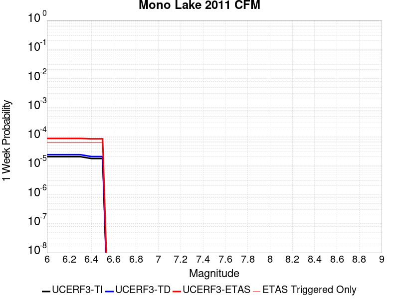 | 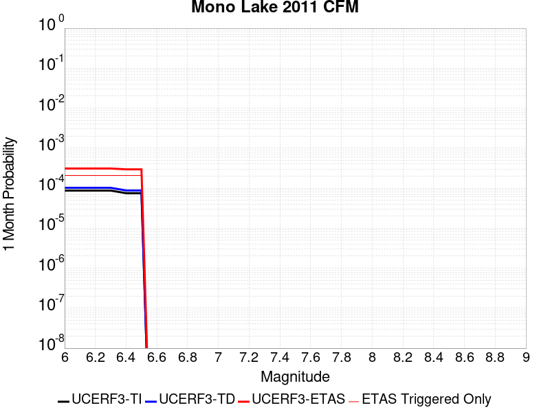 | 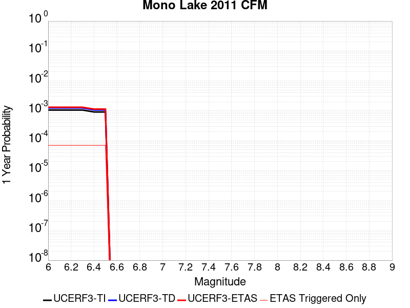 | 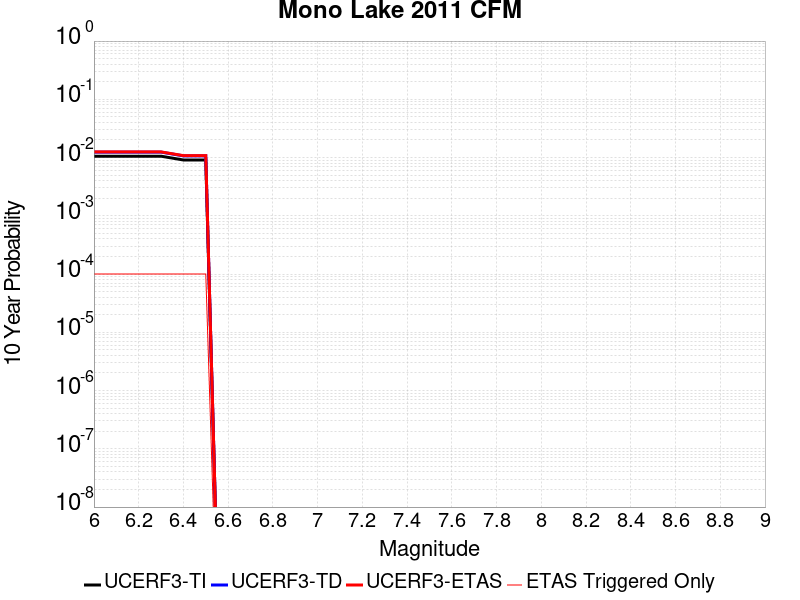 |

| Magnitude | 1 wk TI Prob | 1 wk TD Prob | 1 wk ETAS Prob | 1 wk ETAS/TD Gain | 1 wk ETAS Triggered Only | 1 mo TI Prob | 1 mo TD Prob | 1 mo ETAS Prob | 1 mo ETAS/TD Gain | 1 mo ETAS Triggered Only | 1 yr TI Prob | 1 yr TD Prob | 1 yr ETAS Prob | 1 yr ETAS/TD Gain | 1 yr ETAS Triggered Only | 10 yr TI Prob | 10 yr TD Prob | 10 yr ETAS Prob | 10 yr ETAS/TD Gain | 10 yr ETAS Triggered Only |
|-----|-----|-----|-----|-----|-----|-----|-----|-----|-----|-----|-----|-----|-----|-----|-----|-----|-----|-----|-----|-----|
| 6.0 | 2.0341662E-5 | 2.3828192E-5 | 7.3827E-5 | 3.0983047 | 5.0E-5 | 8.717564E-5 | 1.0211982E-4 | 1.6211369E-4 | 1.5874851 | 6.0E-5 | 0.0010608466 | 0.0012431308 | 0.0013130438 | 1.0562395 | 7.0E-5 | 0.010557966 | 0.012413842 | 0.0125126 | 1.0079556 | 1.0E-4 |
| 6.1 | 2.0341662E-5 | 2.3828192E-5 | 7.3827E-5 | 3.0983047 | 5.0E-5 | 8.717564E-5 | 1.0211982E-4 | 1.6211369E-4 | 1.5874851 | 6.0E-5 | 0.0010608466 | 0.0012431308 | 0.0013130438 | 1.0562395 | 7.0E-5 | 0.010557966 | 0.012413842 | 0.0125126 | 1.0079556 | 1.0E-4 |
| 6.2 | 2.0341662E-5 | 2.3828192E-5 | 7.3827E-5 | 3.0983047 | 5.0E-5 | 8.717564E-5 | 1.0211982E-4 | 1.6211369E-4 | 1.5874851 | 6.0E-5 | 0.0010608466 | 0.0012431308 | 0.0013130438 | 1.0562395 | 7.0E-5 | 0.010557966 | 0.012413842 | 0.0125126 | 1.0079556 | 1.0E-4 |
| 6.3 | 2.0341662E-5 | 2.3828192E-5 | 7.3827E-5 | 3.0983047 | 5.0E-5 | 8.717564E-5 | 1.0211982E-4 | 1.6211369E-4 | 1.5874851 | 6.0E-5 | 0.0010608466 | 0.0012431308 | 0.0013130438 | 1.0562395 | 7.0E-5 | 0.010557966 | 0.012413842 | 0.0125126 | 1.0079556 | 1.0E-4 |
| 6.4 | 1.749821E-5 | 2.049101E-5 | 7.048999E-5 | 3.4400444 | 5.0E-5 | 7.499018E-5 | 8.781861E-5 | 1.4781335E-4 | 1.6831665 | 6.0E-5 | 9.1262296E-4 | 0.0010691914 | 0.0011391166 | 1.0654 | 7.0E-5 | 0.009088841 | 0.01069187 | 0.010790802 | 1.0092529 | 1.0E-4 |
| 6.5 | 1.749821E-5 | 2.049101E-5 | 7.048999E-5 | 3.4400444 | 5.0E-5 | 7.499018E-5 | 8.781861E-5 | 1.4781335E-4 | 1.6831665 | 6.0E-5 | 9.1262296E-4 | 0.0010691914 | 0.0011391166 | 1.0654 | 7.0E-5 | 0.009088841 | 0.01069187 | 0.010790802 | 1.0092529 | 1.0E-4 |

## Whittier alt 1
*[(top)](#table-of-contents)*

| 1 Week | 1 Month | 1 Year | 10 Year |
|-----|-----|-----|-----|
| 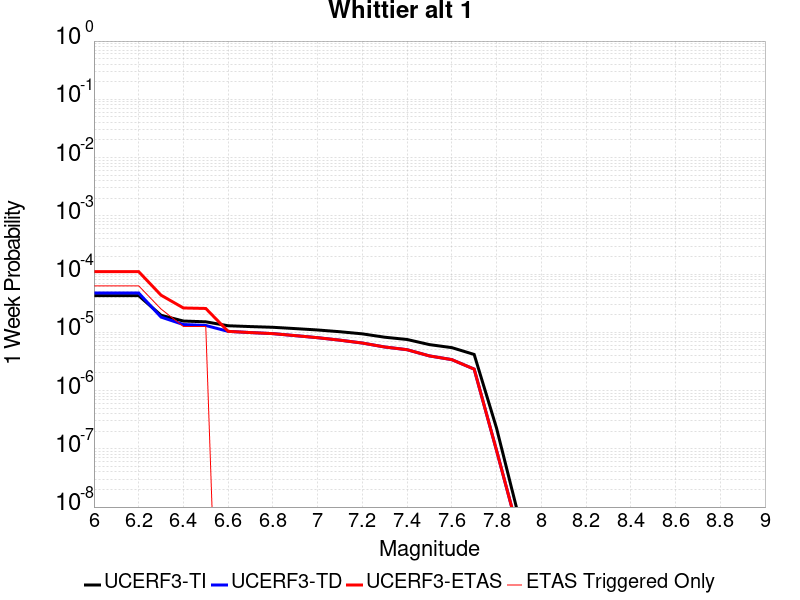 | 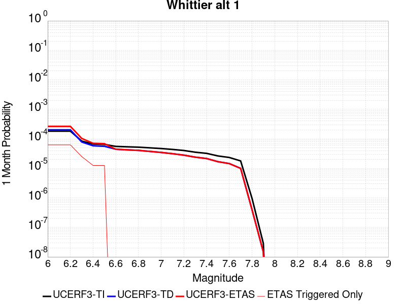 | 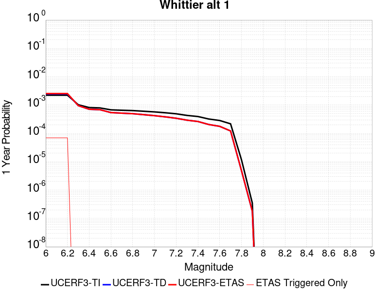 | 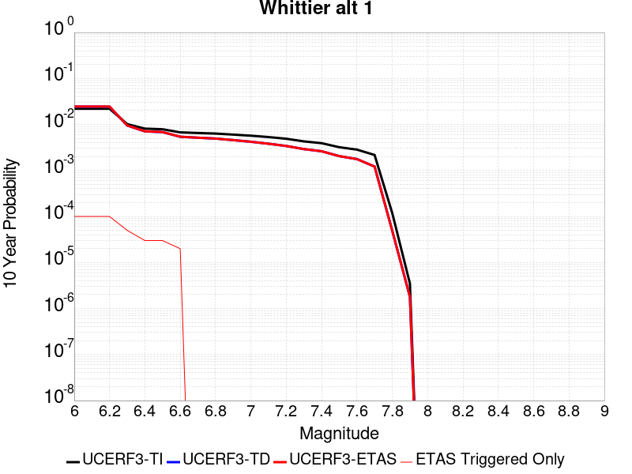 |

| Magnitude | 1 wk TI Prob | 1 wk TD Prob | 1 wk ETAS Prob | 1 wk ETAS/TD Gain | 1 wk ETAS Triggered Only | 1 mo TI Prob | 1 mo TD Prob | 1 mo ETAS Prob | 1 mo ETAS/TD Gain | 1 mo ETAS Triggered Only | 1 yr TI Prob | 1 yr TD Prob | 1 yr ETAS Prob | 1 yr ETAS/TD Gain | 1 yr ETAS Triggered Only | 10 yr TI Prob | 10 yr TD Prob | 10 yr ETAS Prob | 10 yr ETAS/TD Gain | 10 yr ETAS Triggered Only |
|-----|-----|-----|-----|-----|-----|-----|-----|-----|-----|-----|-----|-----|-----|-----|-----|-----|-----|-----|-----|-----|
| 6.0 | 4.2554693E-5 | 4.7252182E-5 | 9.7249824E-5 | 2.0581021 | 5.0E-5 | 1.8236451E-4 | 2.0249544E-4 | 2.5248533E-4 | 1.2468691 | 5.0E-5 | 0.002218027 | 0.0024629163 | 0.0025427195 | 1.0324018 | 8.0E-5 | 0.02196019 | 0.024390263 | 0.024487825 | 1.004 | 1.0E-4 |
| 6.1 | 4.2554693E-5 | 4.7252182E-5 | 9.7249824E-5 | 2.0581021 | 5.0E-5 | 1.8236451E-4 | 2.0249544E-4 | 2.5248533E-4 | 1.2468691 | 5.0E-5 | 0.002218027 | 0.0024629163 | 0.0025427195 | 1.0324018 | 8.0E-5 | 0.02196019 | 0.024390263 | 0.024487825 | 1.004 | 1.0E-4 |
| 6.2 | 4.2554693E-5 | 4.7252182E-5 | 9.7249824E-5 | 2.0581021 | 5.0E-5 | 1.8236451E-4 | 2.0249544E-4 | 2.5248533E-4 | 1.2468691 | 5.0E-5 | 0.002218027 | 0.0024629163 | 0.0025427195 | 1.0324018 | 8.0E-5 | 0.02196019 | 0.024390263 | 0.024487825 | 1.004 | 1.0E-4 |
| 6.3 | 1.9617712E-5 | 1.826841E-5 | 3.8268045E-5 | 2.094766 | 2.0E-5 | 8.40732E-5 | 7.829095E-5 | 9.8289376E-5 | 1.2554374 | 2.0E-5 | 0.0010231105 | 9.527944E-4 | 9.827658E-4 | 1.0314564 | 3.0E-5 | 0.01018413 | 0.0094904 | 0.009539925 | 1.0052185 | 5.0E-5 |
| 6.4 | 1.5611336E-5 | 1.3604089E-5 | 2.3603954E-5 | 1.7350631 | 1.0E-5 | 6.690401E-5 | 5.8301972E-5 | 6.8301386E-5 | 1.1715108 | 1.0E-5 | 8.142519E-4 | 7.096013E-4 | 7.295871E-4 | 1.0281649 | 2.0E-5 | 0.008112748 | 0.0070753377 | 0.0071051256 | 1.0042101 | 3.0E-5 |
| 6.5 | 1.5150166E-5 | 1.3100744E-5 | 2.3100612E-5 | 1.7633054 | 1.0E-5 | 6.492767E-5 | 5.614487E-5 | 6.6144305E-5 | 1.1781007 | 1.0E-5 | 7.9020765E-4 | 6.8335526E-4 | 7.033416E-4 | 1.0292474 | 2.0E-5 | 0.007874036 | 0.006814508 | 0.006844303 | 1.0043724 | 3.0E-5 |
| 6.6 | 1.295588E-5 | 1.0380544E-5 | 1.0380544E-5 | 1.0 | 0.0 | 5.552402E-5 | 4.44873E-5 | 4.44873E-5 | 1.0 | 0.0 | 6.7579525E-4 | 5.415002E-4 | 5.5149477E-4 | 1.0184572 | 1.0E-5 | 0.006737438 | 0.005403343 | 0.0054232352 | 1.0036814 | 2.0E-5 |
| 6.7 | 1.2542085E-5 | 9.899189E-6 | 9.899189E-6 | 1.0 | 0.0 | 5.3750682E-5 | 4.2424414E-5 | 4.2424414E-5 | 1.0 | 0.0 | 6.542181E-4 | 5.163967E-4 | 5.163967E-4 | 1.0 | 0.0 | 0.006522954 | 0.005153464 | 0.005153464 | 1.0 | 0.0 |
| 6.8 | 1.2195878E-5 | 9.49523E-6 | 9.49523E-6 | 1.0 | 0.0 | 5.2267E-5 | 4.069322E-5 | 4.069322E-5 | 1.0 | 0.0 | 6.36165E-4 | 4.9532915E-4 | 4.9532915E-4 | 1.0 | 0.0 | 0.0063434686 | 0.0049436963 | 0.0049436963 | 1.0 | 0.0 |
| 6.9 | 1.1580298E-5 | 8.772739E-6 | 8.772739E-6 | 1.0 | 0.0 | 4.9628903E-5 | 3.759692E-5 | 3.759692E-5 | 1.0 | 0.0 | 6.040644E-4 | 4.5764804E-4 | 4.5764804E-4 | 1.0 | 0.0 | 0.00602425 | 0.0045684646 | 0.0045684646 | 1.0 | 0.0 |
| 7.0 | 1.0964795E-5 | 8.083794E-6 | 8.083794E-6 | 1.0 | 0.0 | 4.6991136E-5 | 3.4644378E-5 | 3.4644378E-5 | 1.0 | 0.0 | 5.7196687E-4 | 4.217152E-4 | 4.217152E-4 | 1.0 | 0.0 | 0.0057049696 | 0.004210459 | 0.004210459 | 1.0 | 0.0 |
| 7.1 | 1.0230601E-5 | 7.32646E-6 | 7.32646E-6 | 1.0 | 0.0 | 4.3844695E-5 | 3.1398744E-5 | 3.1398744E-5 | 1.0 | 0.0 | 5.336784E-4 | 3.8221394E-4 | 3.8221394E-4 | 1.0 | 0.0 | 0.005323986 | 0.0038167592 | 0.0038167592 | 1.0 | 0.0 |
| 7.2 | 9.40865E-6 | 6.5430822E-6 | 6.5430822E-6 | 1.0 | 0.0 | 4.032216E-5 | 2.8041486E-5 | 2.8041486E-5 | 1.0 | 0.0 | 4.908117E-4 | 3.4135283E-4 | 3.4135283E-4 | 1.0 | 0.0 | 0.0048972913 | 0.0034094024 | 0.0034094024 | 1.0 | 0.0 |
| 7.3 | 8.237384E-6 | 5.5975433E-6 | 5.5975433E-6 | 1.0 | 0.0 | 3.5302593E-5 | 2.3989258E-5 | 2.3989258E-5 | 1.0 | 0.0 | 4.2972428E-4 | 2.920311E-4 | 2.920311E-4 | 1.0 | 0.0 | 0.0042889426 | 0.0029167992 | 0.0029167992 | 1.0 | 0.0 |
| 7.4 | 7.5316966E-6 | 5.0276153E-6 | 5.0276153E-6 | 1.0 | 0.0 | 3.2278298E-5 | 2.154675E-5 | 2.154675E-5 | 1.0 | 0.0 | 3.9291743E-4 | 2.623011E-4 | 2.623011E-4 | 1.0 | 0.0 | 0.0039222343 | 0.0026200267 | 0.0026200267 | 1.0 | 0.0 |
| 7.5 | 6.149649E-6 | 3.9336355E-6 | 3.9336355E-6 | 1.0 | 0.0 | 2.6355372E-5 | 1.6858336E-5 | 1.6858336E-5 | 1.0 | 0.0 | 3.208294E-4 | 2.052318E-4 | 2.052318E-4 | 1.0 | 0.0 | 0.003203666 | 0.0020505118 | 0.0020505118 | 1.0 | 0.0 |
| 7.6 | 5.457711E-6 | 3.3951796E-6 | 3.3951796E-6 | 1.0 | 0.0 | 2.338998E-5 | 1.4550694E-5 | 1.4550694E-5 | 1.0 | 0.0 | 2.8473578E-4 | 1.771411E-4 | 1.771411E-4 | 1.0 | 0.0 | 0.0028437122 | 0.0017700798 | 0.0017700798 | 1.0 | 0.0 |
| 7.7 | 4.1676276E-6 | 2.3329922E-6 | 2.3329922E-6 | 1.0 | 0.0 | 1.7861139E-5 | 9.998504E-6 | 9.998504E-6 | 1.0 | 0.0 | 2.1743766E-4 | 1.2172572E-4 | 1.2172572E-4 | 1.0 | 0.0 | 0.0021722503 | 0.0012166635 | 0.0012166635 | 1.0 | 0.0 |
| 7.8 | 2.2692414E-7 | 9.384417E-8 | 9.384417E-8 | 1.0 | 0.0 | 9.725317E-7 | 4.0218927E-7 | 4.0218927E-7 | 1.0 | 0.0 | 1.1840509E-5 | 4.8966467E-6 | 4.8966467E-6 | 1.0 | 0.0 | 1.1839878E-4 | 4.8965718E-5 | 4.8965718E-5 | 1.0 | 0.0 |
| 7.9 | 6.676829E-9 | 3.4397174E-9 | 3.4397174E-9 | 1.0 | 0.0 | 2.861498E-8 | 1.4741646E-8 | 1.4741646E-8 | 1.0 | 0.0 | 3.4838732E-7 | 1.7947953E-7 | 1.7947953E-7 | 1.0 | 0.0 | 3.4838679E-6 | 1.794794E-6 | 1.794794E-6 | 1.0 | 0.0 |

## Pleito
*[(top)](#table-of-contents)*

| 1 Week | 1 Month | 1 Year | 10 Year |
|-----|-----|-----|-----|
| 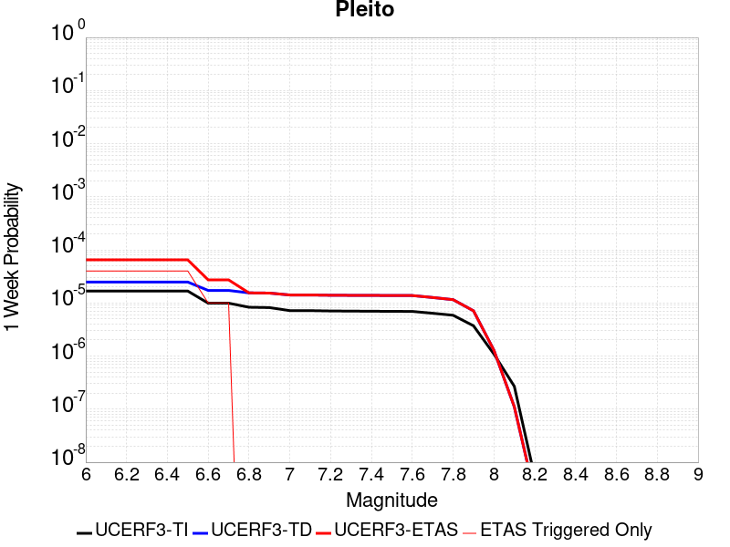 | 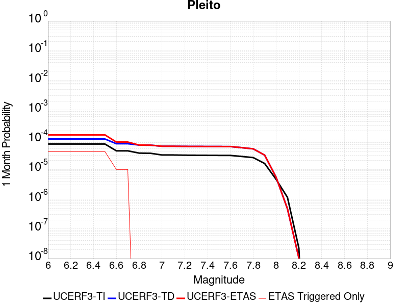 | 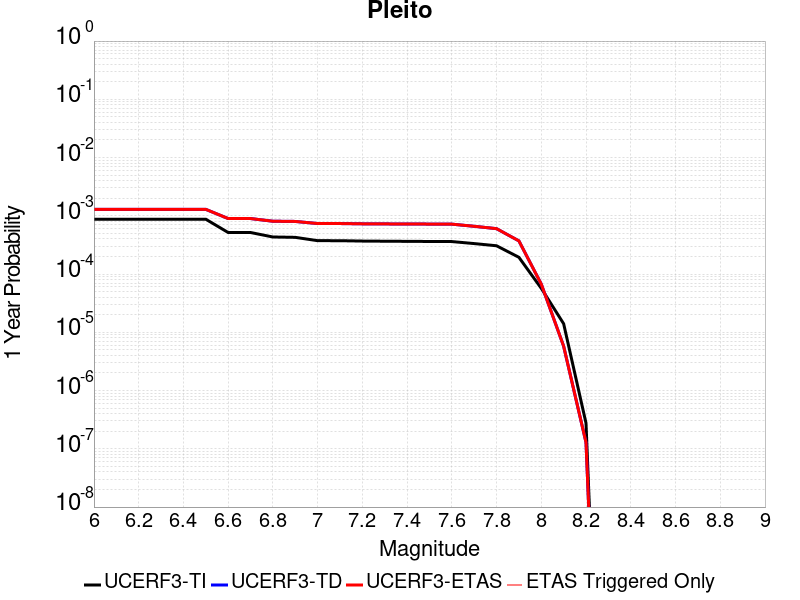 | 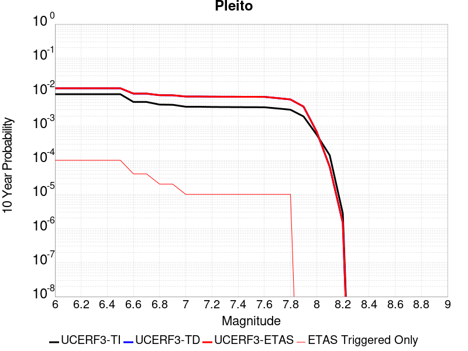 |

| Magnitude | 1 wk TI Prob | 1 wk TD Prob | 1 wk ETAS Prob | 1 wk ETAS/TD Gain | 1 wk ETAS Triggered Only | 1 mo TI Prob | 1 mo TD Prob | 1 mo ETAS Prob | 1 mo ETAS/TD Gain | 1 mo ETAS Triggered Only | 1 yr TI Prob | 1 yr TD Prob | 1 yr ETAS Prob | 1 yr ETAS/TD Gain | 1 yr ETAS Triggered Only | 10 yr TI Prob | 10 yr TD Prob | 10 yr ETAS Prob | 10 yr ETAS/TD Gain | 10 yr ETAS Triggered Only |
|-----|-----|-----|-----|-----|-----|-----|-----|-----|-----|-----|-----|-----|-----|-----|-----|-----|-----|-----|-----|-----|
| 6.0 | 1.6763008E-5 | 2.4764735E-5 | 6.476374E-5 | 2.61516 | 4.0E-5 | 7.183948E-5 | 1.0613067E-4 | 1.4612642E-4 | 1.3768538 | 4.0E-5 | 8.742947E-4 | 0.001291447 | 0.0013513695 | 1.0463995 | 6.0E-5 | 0.00870863 | 0.012954412 | 0.013053116 | 1.0076194 | 1.0E-4 |
| 6.1 | 1.6763008E-5 | 2.4764735E-5 | 6.476374E-5 | 2.61516 | 4.0E-5 | 7.183948E-5 | 1.0613067E-4 | 1.4612642E-4 | 1.3768538 | 4.0E-5 | 8.742947E-4 | 0.001291447 | 0.0013513695 | 1.0463995 | 6.0E-5 | 0.00870863 | 0.012954412 | 0.013053116 | 1.0076194 | 1.0E-4 |
| 6.2 | 1.6763008E-5 | 2.4764735E-5 | 6.476374E-5 | 2.61516 | 4.0E-5 | 7.183948E-5 | 1.0613067E-4 | 1.4612642E-4 | 1.3768538 | 4.0E-5 | 8.742947E-4 | 0.001291447 | 0.0013513695 | 1.0463995 | 6.0E-5 | 0.00870863 | 0.012954412 | 0.013053116 | 1.0076194 | 1.0E-4 |
| 6.3 | 1.6763008E-5 | 2.4764735E-5 | 6.476374E-5 | 2.61516 | 4.0E-5 | 7.183948E-5 | 1.0613067E-4 | 1.4612642E-4 | 1.3768538 | 4.0E-5 | 8.742947E-4 | 0.001291447 | 0.0013513695 | 1.0463995 | 6.0E-5 | 0.00870863 | 0.012954412 | 0.013053116 | 1.0076194 | 1.0E-4 |
| 6.4 | 1.6763008E-5 | 2.4764735E-5 | 6.476374E-5 | 2.61516 | 4.0E-5 | 7.183948E-5 | 1.0613067E-4 | 1.4612642E-4 | 1.3768538 | 4.0E-5 | 8.742947E-4 | 0.001291447 | 0.0013513695 | 1.0463995 | 6.0E-5 | 0.00870863 | 0.012954412 | 0.013053116 | 1.0076194 | 1.0E-4 |
| 6.5 | 1.6763008E-5 | 2.4764735E-5 | 6.476374E-5 | 2.61516 | 4.0E-5 | 7.183948E-5 | 1.0613067E-4 | 1.4612642E-4 | 1.3768538 | 4.0E-5 | 8.742947E-4 | 0.001291447 | 0.0013513695 | 1.0463995 | 6.0E-5 | 0.00870863 | 0.012954412 | 0.013053116 | 1.0076194 | 1.0E-4 |
| 6.6 | 9.910213E-6 | 1.721552E-5 | 2.7215348E-5 | 1.5808612 | 1.0E-5 | 4.247165E-5 | 7.3778734E-5 | 8.3777995E-5 | 1.1355304 | 1.0E-5 | 5.169696E-4 | 8.9788967E-4 | 9.1787166E-4 | 1.0222545 | 2.0E-5 | 0.0051576863 | 0.009051226 | 0.009090864 | 1.0043793 | 4.0E-5 |
| 6.7 | 9.910213E-6 | 1.721552E-5 | 2.7215348E-5 | 1.5808612 | 1.0E-5 | 4.247165E-5 | 7.3778734E-5 | 8.3777995E-5 | 1.1355304 | 1.0E-5 | 5.169696E-4 | 8.9788967E-4 | 9.1787166E-4 | 1.0222545 | 2.0E-5 | 0.0051576863 | 0.009051226 | 0.009090864 | 1.0043793 | 4.0E-5 |
| 6.8 | 8.300162E-6 | 1.5475129E-5 | 1.5475129E-5 | 1.0 | 0.0 | 3.557164E-5 | 6.63203E-5 | 6.63203E-5 | 1.0 | 0.0 | 4.3299864E-4 | 8.07152E-4 | 8.1714394E-4 | 1.0123793 | 1.0E-5 | 0.004321559 | 0.008150663 | 0.0081705 | 1.0024338 | 2.0E-5 |
| 6.9 | 8.183114E-6 | 1.5346344E-5 | 1.5346344E-5 | 1.0 | 0.0 | 3.5070017E-5 | 6.57684E-5 | 6.57684E-5 | 1.0 | 0.0 | 4.2689382E-4 | 8.0043747E-4 | 8.1042945E-4 | 1.0124831 | 1.0E-5 | 0.0042607468 | 0.008084008 | 0.008103847 | 1.002454 | 2.0E-5 |
| 7.0 | 7.1748823E-6 | 1.4133306E-5 | 1.4133306E-5 | 1.0 | 0.0 | 3.0749135E-5 | 6.0569906E-5 | 6.0569906E-5 | 1.0 | 0.0 | 3.743064E-4 | 7.3718966E-4 | 7.3718966E-4 | 1.0 | 0.0 | 0.0037367654 | 0.0074553755 | 0.007465301 | 1.0013313 | 1.0E-5 |
| 7.1 | 7.1671807E-6 | 1.4123676E-5 | 1.4123676E-5 | 1.0 | 0.0 | 3.0716128E-5 | 6.0528637E-5 | 6.0528637E-5 | 1.0 | 0.0 | 3.7390468E-4 | 7.366875E-4 | 7.366875E-4 | 1.0 | 0.0 | 0.0037327618 | 0.0074503883 | 0.0074603134 | 1.0013322 | 1.0E-5 |
| 7.2 | 7.0649667E-6 | 1.3970962E-5 | 1.3970962E-5 | 1.0 | 0.0 | 3.0278077E-5 | 5.987418E-5 | 5.987418E-5 | 1.0 | 0.0 | 3.6857324E-4 | 7.287248E-4 | 7.287248E-4 | 1.0 | 0.0 | 0.0036796255 | 0.0073711374 | 0.007381064 | 1.0013466 | 1.0E-5 |
| 7.3 | 7.02082E-6 | 1.3914415E-5 | 1.3914415E-5 | 1.0 | 0.0 | 3.008888E-5 | 5.9631846E-5 | 5.9631846E-5 | 1.0 | 0.0 | 3.6627054E-4 | 7.257764E-4 | 7.257764E-4 | 1.0 | 0.0 | 0.0036566744 | 0.0073416373 | 0.0073515642 | 1.0013521 | 1.0E-5 |
| 7.4 | 6.987146E-6 | 1.3873975E-5 | 1.3873975E-5 | 1.0 | 0.0 | 2.9944567E-5 | 5.9458544E-5 | 5.9458544E-5 | 1.0 | 0.0 | 3.6451413E-4 | 7.2366785E-4 | 7.2366785E-4 | 1.0 | 0.0 | 0.0036391679 | 0.007320571 | 0.007330498 | 1.001356 | 1.0E-5 |
| 7.5 | 6.9494554E-6 | 1.383088E-5 | 1.383088E-5 | 1.0 | 0.0 | 2.9783041E-5 | 5.9273858E-5 | 5.9273858E-5 | 1.0 | 0.0 | 3.625482E-4 | 7.2142074E-4 | 7.2142074E-4 | 1.0 | 0.0 | 0.0036195726 | 0.007298199 | 0.007308126 | 1.0013602 | 1.0E-5 |
| 7.6 | 6.92694E-6 | 1.3789992E-5 | 1.3789992E-5 | 1.0 | 0.0 | 2.9686547E-5 | 5.909863E-5 | 5.909863E-5 | 1.0 | 0.0 | 3.6137376E-4 | 7.192888E-4 | 7.192888E-4 | 1.0 | 0.0 | 0.0036078666 | 0.007276951 | 0.0072868783 | 1.0013642 | 1.0E-5 |
| 7.7 | 6.395867E-6 | 1.26690065E-5 | 1.26690065E-5 | 1.0 | 0.0 | 2.741057E-5 | 5.4294615E-5 | 5.4294615E-5 | 1.0 | 0.0 | 3.336726E-4 | 6.6083675E-4 | 6.6083675E-4 | 1.0 | 0.0 | 0.0033317201 | 0.0066955453 | 0.0067054783 | 1.0014836 | 1.0E-5 |
| 7.8 | 5.8664327E-6 | 1.1536581E-5 | 1.1536581E-5 | 1.0 | 0.0 | 2.5141611E-5 | 4.9441554E-5 | 4.9441554E-5 | 1.0 | 0.0 | 3.060561E-4 | 6.0178485E-4 | 6.0178485E-4 | 1.0 | 0.0 | 0.0030563495 | 0.0061010164 | 0.0061109555 | 1.0016291 | 1.0E-5 |
| 7.9 | 3.7167474E-6 | 7.1145205E-6 | 7.1145205E-6 | 1.0 | 0.0 | 1.592882E-5 | 3.0490448E-5 | 3.0490448E-5 | 1.0 | 0.0 | 1.9391612E-4 | 3.7115812E-4 | 3.7115812E-4 | 1.0 | 0.0 | 0.0019374699 | 0.0037676243 | 0.0037676243 | 1.0 | 0.0 |
| 8.0 | 1.0903841E-6 | 1.2879104E-6 | 1.2879104E-6 | 1.0 | 0.0 | 4.6730665E-6 | 5.5196047E-6 | 5.5196047E-6 | 1.0 | 0.0 | 5.68931E-5 | 6.719913E-5 | 6.719913E-5 | 1.0 | 0.0 | 5.6878536E-4 | 6.942094E-4 | 6.942094E-4 | 1.0 | 0.0 |
| 8.1 | 2.6894583E-7 | 1.1056095E-7 | 1.1056095E-7 | 1.0 | 0.0 | 1.1526245E-6 | 4.7383253E-7 | 4.7383253E-7 | 1.0 | 0.0 | 1.4033113E-5 | 5.768896E-6 | 5.768896E-6 | 1.0 | 0.0 | 1.4032227E-4 | 6.454915E-5 | 6.454915E-5 | 1.0 | 0.0 |
| 8.2 | 5.2967013E-9 | 2.4567874E-9 | 2.4567874E-9 | 1.0 | 0.0 | 2.2700148E-8 | 1.0529089E-8 | 1.0529089E-8 | 1.0 | 0.0 | 2.7637427E-7 | 1.2819166E-7 | 1.2819166E-7 | 1.0 | 0.0 | 2.7637393E-6 | 1.4588004E-6 | 1.4588004E-6 | 1.0 | 0.0 |

## Mission Creek
*[(top)](#table-of-contents)*

| 1 Week | 1 Month | 1 Year | 10 Year |
|-----|-----|-----|-----|
| 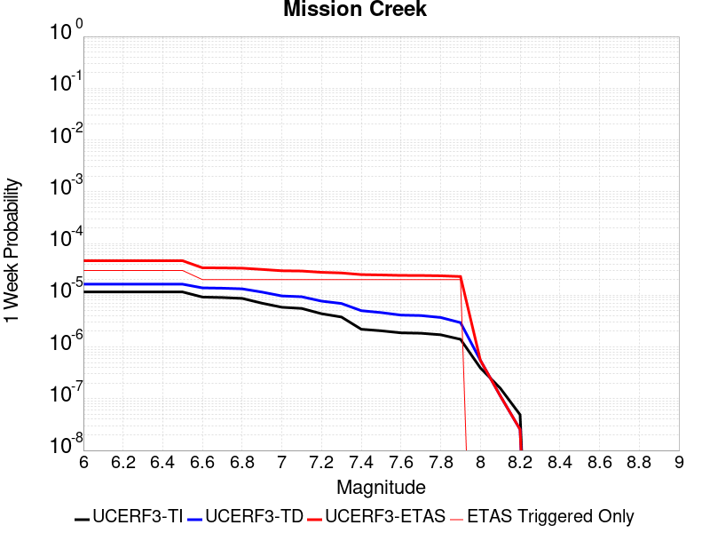 | 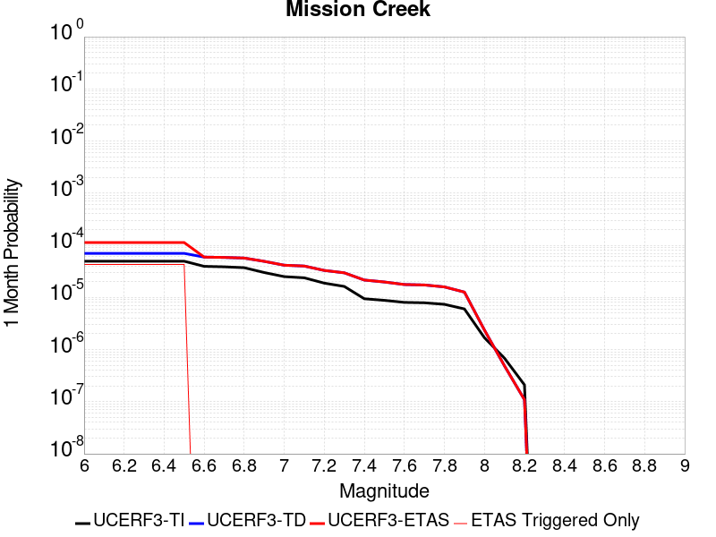 | 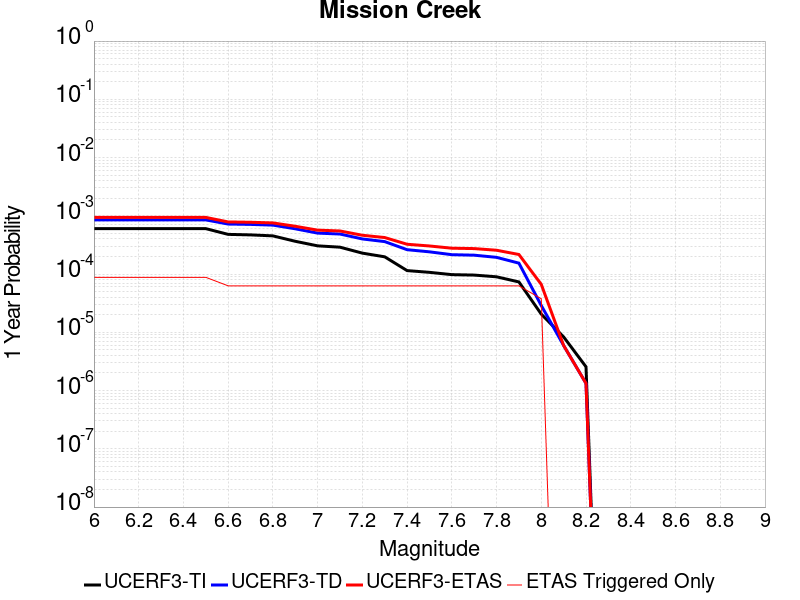 | 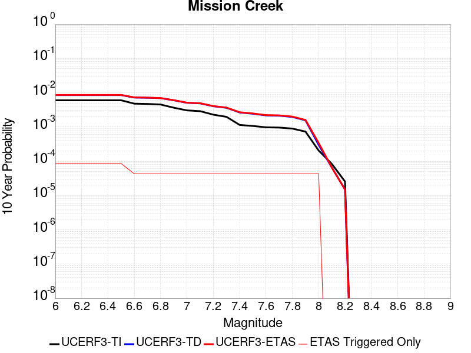 |

| Magnitude | 1 wk TI Prob | 1 wk TD Prob | 1 wk ETAS Prob | 1 wk ETAS/TD Gain | 1 wk ETAS Triggered Only | 1 mo TI Prob | 1 mo TD Prob | 1 mo ETAS Prob | 1 mo ETAS/TD Gain | 1 mo ETAS Triggered Only | 1 yr TI Prob | 1 yr TD Prob | 1 yr ETAS Prob | 1 yr ETAS/TD Gain | 1 yr ETAS Triggered Only | 10 yr TI Prob | 10 yr TD Prob | 10 yr ETAS Prob | 10 yr ETAS/TD Gain | 10 yr ETAS Triggered Only |
|-----|-----|-----|-----|-----|-----|-----|-----|-----|-----|-----|-----|-----|-----|-----|-----|-----|-----|-----|-----|-----|
| 6.0 | 1.1549387E-5 | 1.6322783E-5 | 4.6322293E-5 | 2.837892 | 3.0E-5 | 4.9496433E-5 | 6.995299E-5 | 1.0995019E-4 | 1.5717726 | 4.0E-5 | 6.0245243E-4 | 8.5135986E-4 | 9.312918E-4 | 1.0938873 | 8.0E-5 | 0.006008218 | 0.008510157 | 0.008609305 | 1.0116507 | 1.0E-4 |
| 6.1 | 1.1549387E-5 | 1.6322783E-5 | 4.6322293E-5 | 2.837892 | 3.0E-5 | 4.9496433E-5 | 6.995299E-5 | 1.0995019E-4 | 1.5717726 | 4.0E-5 | 6.0245243E-4 | 8.5135986E-4 | 9.312918E-4 | 1.0938873 | 8.0E-5 | 0.006008218 | 0.008510157 | 0.008609305 | 1.0116507 | 1.0E-4 |
| 6.2 | 1.1549387E-5 | 1.6322783E-5 | 4.6322293E-5 | 2.837892 | 3.0E-5 | 4.9496433E-5 | 6.995299E-5 | 1.0995019E-4 | 1.5717726 | 4.0E-5 | 6.0245243E-4 | 8.5135986E-4 | 9.312918E-4 | 1.0938873 | 8.0E-5 | 0.006008218 | 0.008510157 | 0.008609305 | 1.0116507 | 1.0E-4 |
| 6.3 | 1.1549387E-5 | 1.6322783E-5 | 4.6322293E-5 | 2.837892 | 3.0E-5 | 4.9496433E-5 | 6.995299E-5 | 1.0995019E-4 | 1.5717726 | 4.0E-5 | 6.0245243E-4 | 8.5135986E-4 | 9.312918E-4 | 1.0938873 | 8.0E-5 | 0.006008218 | 0.008510157 | 0.008609305 | 1.0116507 | 1.0E-4 |
| 6.4 | 1.1549387E-5 | 1.6322783E-5 | 4.6322293E-5 | 2.837892 | 3.0E-5 | 4.9496433E-5 | 6.995299E-5 | 1.0995019E-4 | 1.5717726 | 4.0E-5 | 6.0245243E-4 | 8.5135986E-4 | 9.312918E-4 | 1.0938873 | 8.0E-5 | 0.006008218 | 0.008510157 | 0.008609305 | 1.0116507 | 1.0E-4 |
| 6.5 | 1.1549387E-5 | 1.6322783E-5 | 4.6322293E-5 | 2.837892 | 3.0E-5 | 4.9496433E-5 | 6.995299E-5 | 1.0995019E-4 | 1.5717726 | 4.0E-5 | 6.0245243E-4 | 8.5135986E-4 | 9.312918E-4 | 1.0938873 | 8.0E-5 | 0.006008218 | 0.008510157 | 0.008609305 | 1.0116507 | 1.0E-4 |
| 6.6 | 9.202681E-6 | 1.3846059E-5 | 3.3845783E-5 | 2.4444344 | 2.0E-5 | 3.9439463E-5 | 5.9338956E-5 | 8.9337176E-5 | 1.5055401 | 3.0E-5 | 4.800697E-4 | 7.2222133E-4 | 7.82178E-4 | 1.083017 | 6.0E-5 | 0.004790339 | 0.0072273402 | 0.007306762 | 1.0109891 | 8.0E-5 |
| 6.7 | 9.019164E-6 | 1.3651728E-5 | 3.3651457E-5 | 2.4649959 | 2.0E-5 | 3.8652986E-5 | 5.8506146E-5 | 8.850439E-5 | 1.5127367 | 3.0E-5 | 4.7049852E-4 | 7.1208854E-4 | 7.720458E-4 | 1.0841992 | 6.0E-5 | 0.004695036 | 0.0071266647 | 0.0072060945 | 1.0111455 | 8.0E-5 |
| 6.8 | 8.673558E-6 | 1.3273839E-5 | 3.3273573E-5 | 2.5067031 | 2.0E-5 | 3.717186E-5 | 5.688669E-5 | 8.688498E-5 | 1.5273341 | 3.0E-5 | 4.524734E-4 | 6.923842E-4 | 7.5234263E-4 | 1.0865971 | 6.0E-5 | 0.0045155324 | 0.0069308523 | 0.007010298 | 1.0114626 | 8.0E-5 |
| 6.9 | 7.002255E-6 | 1.1478069E-5 | 3.1477837E-5 | 2.7424335 | 2.0E-5 | 3.000932E-5 | 4.9190832E-5 | 7.9189354E-5 | 1.6098398 | 3.0E-5 | 3.653022E-4 | 5.9874065E-4 | 6.587047E-4 | 1.1001503 | 6.0E-5 | 0.0036470229 | 0.005999676 | 0.006079196 | 1.013254 | 8.0E-5 |
| 7.0 | 5.84644E-6 | 9.675359E-6 | 2.9675166E-5 | 3.0670867 | 2.0E-5 | 2.5055931E-5 | 4.146519E-5 | 7.146395E-5 | 1.7234684 | 3.0E-5 | 3.0501327E-4 | 5.047263E-4 | 5.6469603E-4 | 1.1188163 | 6.0E-5 | 0.0030459496 | 0.005063994 | 0.005143589 | 1.0157179 | 8.0E-5 |
| 7.1 | 5.54703E-6 | 9.329834E-6 | 2.9329647E-5 | 3.1436408 | 2.0E-5 | 2.377277E-5 | 3.9984414E-5 | 6.9983216E-5 | 1.7502624 | 3.0E-5 | 2.8939504E-4 | 4.8670598E-4 | 5.4667675E-4 | 1.1232177 | 6.0E-5 | 0.0028901845 | 0.0048845876 | 0.0049641966 | 1.016298 | 8.0E-5 |
| 7.2 | 4.384709E-6 | 7.681918E-6 | 2.7681765E-5 | 3.6034966 | 2.0E-5 | 1.8791474E-5 | 3.292211E-5 | 6.292112E-5 | 1.9112117 | 3.0E-5 | 2.2876218E-4 | 4.0075663E-4 | 4.6073258E-4 | 1.1496568 | 6.0E-5 | 0.0022852682 | 0.004028542 | 0.0041082194 | 1.0197783 | 8.0E-5 |
| 7.3 | 3.7888456E-6 | 6.915788E-6 | 2.691565E-5 | 3.8919137 | 2.0E-5 | 1.623781E-5 | 2.9638775E-5 | 5.9637885E-5 | 2.0121577 | 3.0E-5 | 1.9767738E-4 | 3.6079568E-4 | 4.2077404E-4 | 1.1662391 | 6.0E-5 | 0.0019750162 | 0.00363027 | 0.0037099796 | 1.0219569 | 8.0E-5 |
| 7.4 | 2.1982462E-6 | 5.0241033E-6 | 2.5024003E-5 | 4.98079 | 2.0E-5 | 9.421021E-6 | 2.1531694E-5 | 5.153105E-5 | 2.393265 | 3.0E-5 | 1.1469489E-4 | 2.6211704E-4 | 3.221013E-4 | 1.2288454 | 6.0E-5 | 0.0011463572 | 0.0026460327 | 0.002725821 | 1.030154 | 8.0E-5 |
| 7.5 | 2.051923E-6 | 4.6153277E-6 | 2.4615236E-5 | 5.333367 | 2.0E-5 | 8.793926E-6 | 1.9779825E-5 | 4.977923E-5 | 2.516667 | 3.0E-5 | 1.0706078E-4 | 2.4079291E-4 | 3.0077845E-4 | 1.2491168 | 6.0E-5 | 0.0010700922 | 0.0024335932 | 0.0025133984 | 1.0327932 | 8.0E-5 |
| 7.6 | 1.8733427E-6 | 4.1236603E-6 | 2.4123578E-5 | 5.85004 | 2.0E-5 | 8.028587E-6 | 1.7672712E-5 | 4.767218E-5 | 2.6975024 | 3.0E-5 | 9.774366E-5 | 2.151441E-4 | 2.751312E-4 | 1.2788229 | 6.0E-5 | 9.770069E-4 | 0.0021782513 | 0.002258077 | 1.0366467 | 8.0E-5 |
| 7.7 | 1.8411953E-6 | 4.0433315E-6 | 2.4043251E-5 | 5.946396 | 2.0E-5 | 7.890813E-6 | 1.732845E-5 | 4.732793E-5 | 2.731227 | 3.0E-5 | 9.606641E-5 | 2.1095353E-4 | 2.7094086E-4 | 1.2843628 | 6.0E-5 | 9.6024893E-4 | 0.0021365292 | 0.0022163582 | 1.0373639 | 8.0E-5 |
| 7.8 | 1.7194251E-6 | 3.71068E-6 | 2.3710605E-5 | 6.3898277 | 2.0E-5 | 7.368944E-6 | 1.5902819E-5 | 4.590234E-5 | 2.886428 | 3.0E-5 | 8.97132E-5 | 1.9359968E-4 | 2.5358808E-4 | 1.3098578 | 6.0E-5 | 8.967699E-4 | 0.0019624757 | 0.0020423187 | 1.0406848 | 8.0E-5 |
| 7.9 | 1.4035052E-6 | 2.9502596E-6 | 2.29502E-5 | 7.779044 | 2.0E-5 | 6.0150082E-6 | 1.2643909E-5 | 4.264353E-5 | 3.372654 | 3.0E-5 | 7.3230265E-5 | 1.5392878E-4 | 2.1391954E-4 | 1.3897307 | 6.0E-5 | 7.3206134E-4 | 0.0015631174 | 0.0016429923 | 1.0510998 | 8.0E-5 |
| 8.0 | 3.9318823E-7 | 5.528477E-7 | 5.528477E-7 | 1.0 | 0.0 | 1.6850913E-6 | 2.3693453E-6 | 2.3693453E-6 | 1.0 | 0.0 | 2.0515794E-5 | 2.8846403E-5 | 5.8845537E-5 | 2.039961 | 3.0E-5 | 2.0513899E-4 | 2.990952E-4 | 3.3908326E-4 | 1.1336967 | 4.0E-5 |
| 8.1 | 1.596793E-7 | 1.13775044E-7 | 1.13775044E-7 | 1.0 | 0.0 | 6.8433974E-7 | 4.876072E-7 | 4.876072E-7 | 1.0 | 0.0 | 8.331805E-6 | 5.936602E-6 | 5.936602E-6 | 1.0 | 0.0 | 8.331492E-5 | 6.5494125E-5 | 6.5494125E-5 | 1.0 | 0.0 |
| 8.2 | 4.9003038E-8 | 2.5435753E-8 | 2.5435753E-8 | 1.0 | 0.0 | 2.10013E-7 | 1.09010365E-7 | 1.09010365E-7 | 1.0 | 0.0 | 2.5569052E-6 | 1.3272004E-6 | 1.3272004E-6 | 1.0 | 0.0 | 2.556876E-5 | 1.4952613E-5 | 1.4952613E-5 | 1.0 | 0.0 |

## Bullion Mountains
*[(top)](#table-of-contents)*

| 1 Week | 1 Month | 1 Year | 10 Year |
|-----|-----|-----|-----|
| 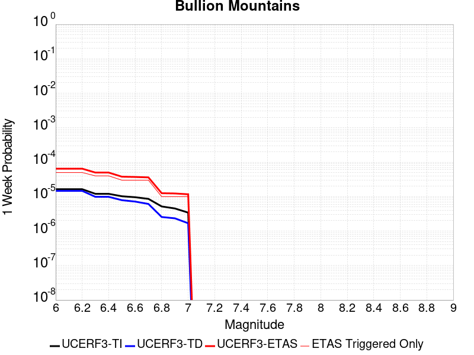 | 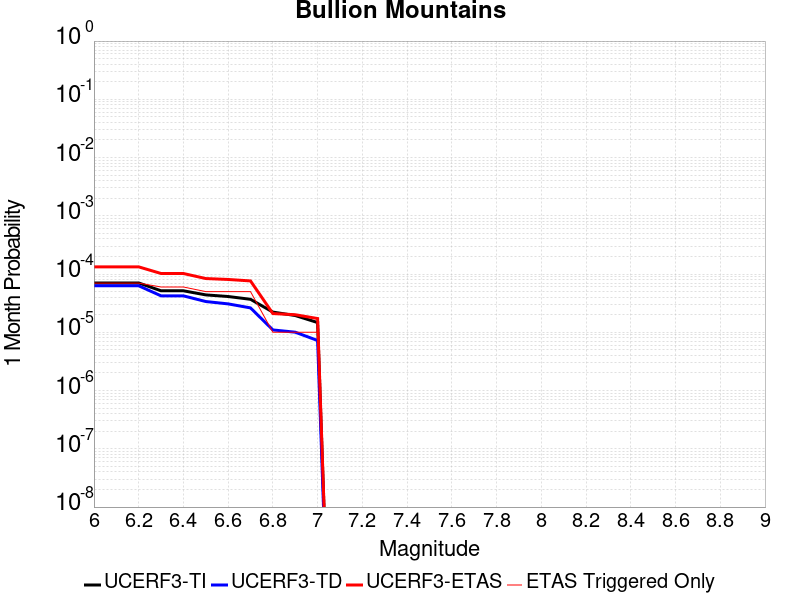 | 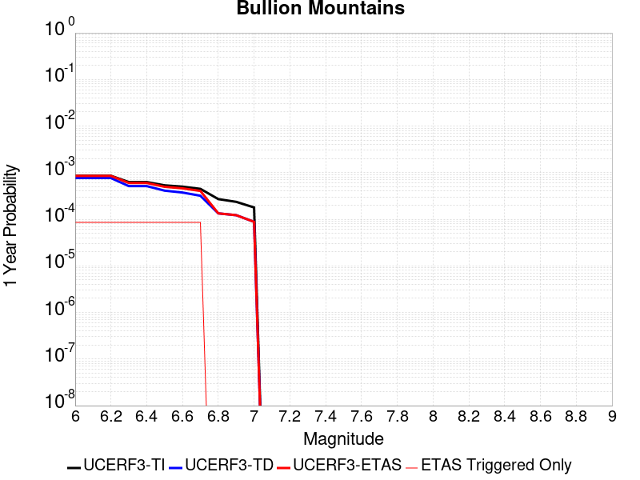 | 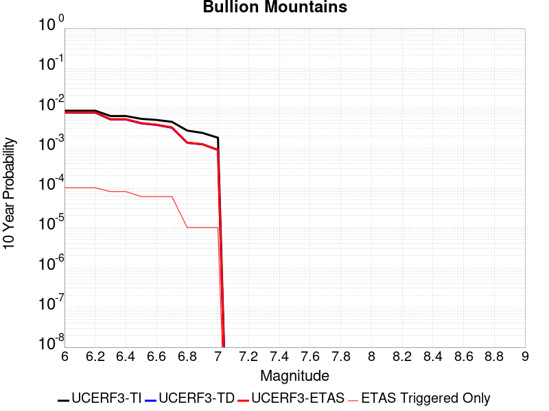 |

| Magnitude | 1 wk TI Prob | 1 wk TD Prob | 1 wk ETAS Prob | 1 wk ETAS/TD Gain | 1 wk ETAS Triggered Only | 1 mo TI Prob | 1 mo TD Prob | 1 mo ETAS Prob | 1 mo ETAS/TD Gain | 1 mo ETAS Triggered Only | 1 yr TI Prob | 1 yr TD Prob | 1 yr ETAS Prob | 1 yr ETAS/TD Gain | 1 yr ETAS Triggered Only | 10 yr TI Prob | 10 yr TD Prob | 10 yr ETAS Prob | 10 yr ETAS/TD Gain | 10 yr ETAS Triggered Only |
|-----|-----|-----|-----|-----|-----|-----|-----|-----|-----|-----|-----|-----|-----|-----|-----|-----|-----|-----|-----|-----|
| 6.0 | 1.6420427E-5 | 1.4692009E-5 | 6.4691274E-5 | 4.4031606 | 5.0E-5 | 7.037136E-5 | 6.296445E-5 | 1.3296005E-4 | 2.1116683 | 7.0E-5 | 8.5643446E-4 | 7.6636096E-4 | 8.4629963E-4 | 1.1043094 | 8.0E-5 | 0.008531413 | 0.0076409746 | 0.0077402107 | 1.0129874 | 1.0E-4 |
| 6.1 | 1.6420427E-5 | 1.4692009E-5 | 6.4691274E-5 | 4.4031606 | 5.0E-5 | 7.037136E-5 | 6.296445E-5 | 1.3296005E-4 | 2.1116683 | 7.0E-5 | 8.5643446E-4 | 7.6636096E-4 | 8.4629963E-4 | 1.1043094 | 8.0E-5 | 0.008531413 | 0.0076409746 | 0.0077402107 | 1.0129874 | 1.0E-4 |
| 6.2 | 1.6420427E-5 | 1.4692009E-5 | 6.4691274E-5 | 4.4031606 | 5.0E-5 | 7.037136E-5 | 6.296445E-5 | 1.3296005E-4 | 2.1116683 | 7.0E-5 | 8.5643446E-4 | 7.6636096E-4 | 8.4629963E-4 | 1.1043094 | 8.0E-5 | 0.008531413 | 0.0076409746 | 0.0077402107 | 1.0129874 | 1.0E-4 |
| 6.3 | 1.2046778E-5 | 9.862255E-6 | 4.986186E-5 | 5.0558276 | 4.0E-5 | 5.1628023E-5 | 4.2266256E-5 | 1.02263715E-4 | 2.4195123 | 6.0E-5 | 6.283899E-4 | 5.144933E-4 | 5.844573E-4 | 1.1359862 | 7.0E-5 | 0.0062661595 | 0.0051353034 | 0.005214893 | 1.0154984 | 8.0E-5 |
| 6.4 | 1.2046778E-5 | 9.862255E-6 | 4.986186E-5 | 5.0558276 | 4.0E-5 | 5.1628023E-5 | 4.2266256E-5 | 1.02263715E-4 | 2.4195123 | 6.0E-5 | 6.283899E-4 | 5.144933E-4 | 5.844573E-4 | 1.1359862 | 7.0E-5 | 0.0062661595 | 0.0051353034 | 0.005214893 | 1.0154984 | 8.0E-5 |
| 6.5 | 1.0244343E-5 | 7.879378E-6 | 3.787914E-5 | 4.807377 | 3.0E-5 | 4.390359E-5 | 3.3768443E-5 | 8.3766754E-5 | 2.4806223 | 5.0E-5 | 5.343951E-4 | 4.1107394E-4 | 4.7104928E-4 | 1.1458992 | 6.0E-5 | 0.005331118 | 0.0041051665 | 0.00416492 | 1.0145557 | 6.0E-5 |
| 6.6 | 9.605408E-6 | 7.1774166E-6 | 3.71772E-5 | 5.1797466 | 3.0E-5 | 4.1165385E-5 | 3.0760108E-5 | 8.0758575E-5 | 2.6254318 | 5.0E-5 | 5.010733E-4 | 3.7446033E-4 | 4.3443785E-4 | 1.1601706 | 6.0E-5 | 0.00499945 | 0.0037402906 | 0.0038000662 | 1.0159816 | 6.0E-5 |
| 6.7 | 8.60418E-6 | 6.123926E-6 | 3.6123743E-5 | 5.898788 | 3.0E-5 | 3.687454E-5 | 2.6245243E-5 | 7.624393E-5 | 2.9050572 | 5.0E-5 | 4.48855E-4 | 3.195085E-4 | 3.7948933E-4 | 1.1877284 | 6.0E-5 | 0.004479495 | 0.0031924031 | 0.0032522115 | 1.0187346 | 6.0E-5 |
| 6.8 | 5.187994E-6 | 2.563117E-6 | 1.2563091E-5 | 4.9014897 | 1.0E-5 | 2.223407E-5 | 1.0984763E-5 | 2.0984653E-5 | 1.9103419 | 1.0E-5 | 2.7066618E-4 | 1.3373529E-4 | 1.4373395E-4 | 1.0747646 | 1.0E-5 | 0.0027033675 | 0.0013369396 | 0.0013469262 | 1.0074698 | 1.0E-5 |
| 6.9 | 4.5302368E-6 | 2.3442778E-6 | 1.2344254E-5 | 5.265696 | 1.0E-5 | 1.9415156E-5 | 1.0046889E-5 | 2.004679E-5 | 1.995323 | 1.0E-5 | 2.3635388E-4 | 1.2231797E-4 | 1.3231675E-4 | 1.0817441 | 1.0E-5 | 0.0023610266 | 0.0012228956 | 0.0012328833 | 1.0081673 | 1.0E-5 |
| 7.0 | 3.431668E-6 | 1.6882177E-6 | 1.1688201E-5 | 6.9233966 | 1.0E-5 | 1.4707065E-5 | 7.2352186E-6 | 1.7235147E-5 | 2.3821182 | 1.0E-5 | 1.7904381E-4 | 8.808879E-5 | 9.8087905E-5 | 1.1135118 | 1.0E-5 | 0.0017889962 | 8.8088785E-4 | 8.908791E-4 | 1.0113422 | 1.0E-5 |

## San Diego Trough north alt1
*[(top)](#table-of-contents)*

| 1 Week | 1 Month | 1 Year | 10 Year |
|-----|-----|-----|-----|
| 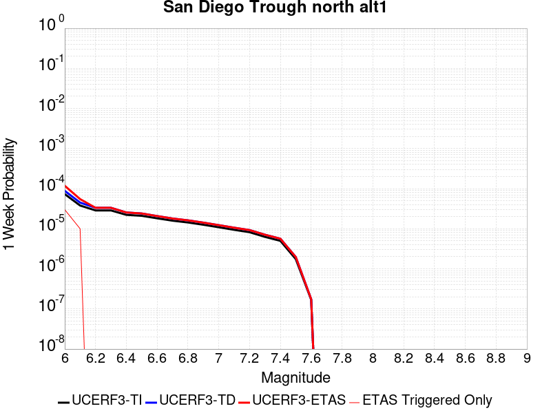 | 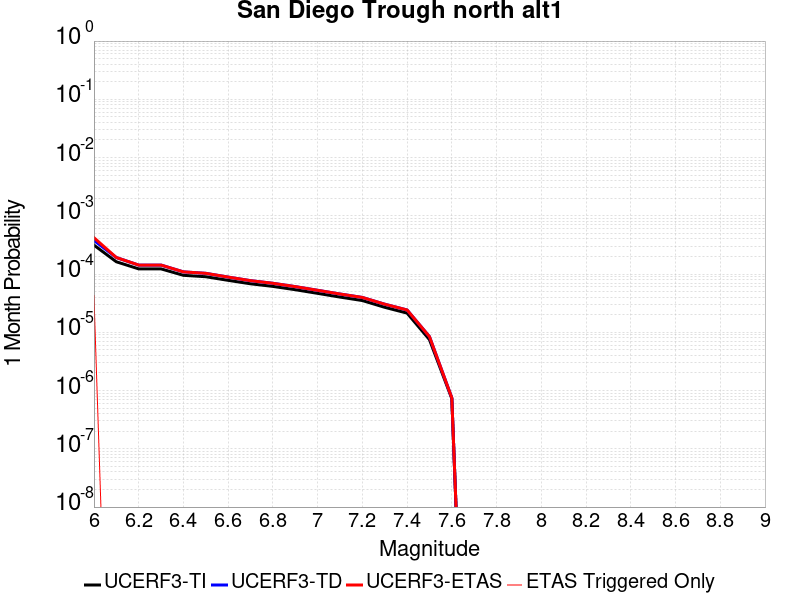 | 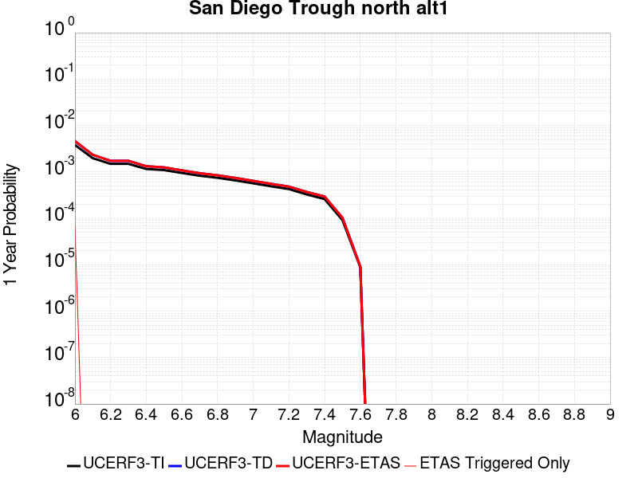 | 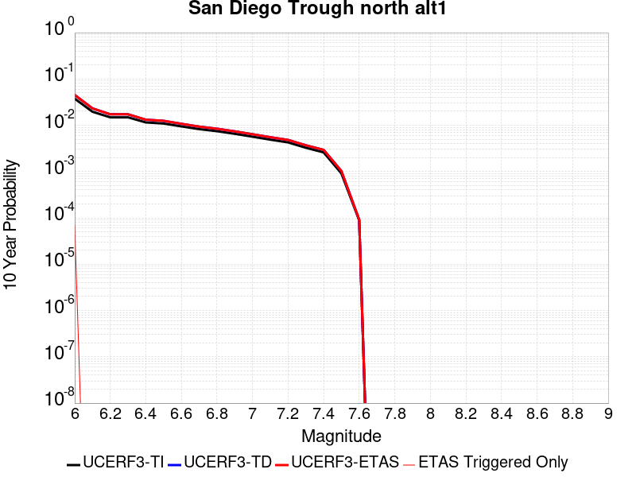 |

| Magnitude | 1 wk TI Prob | 1 wk TD Prob | 1 wk ETAS Prob | 1 wk ETAS/TD Gain | 1 wk ETAS Triggered Only | 1 mo TI Prob | 1 mo TD Prob | 1 mo ETAS Prob | 1 mo ETAS/TD Gain | 1 mo ETAS Triggered Only | 1 yr TI Prob | 1 yr TD Prob | 1 yr ETAS Prob | 1 yr ETAS/TD Gain | 1 yr ETAS Triggered Only | 10 yr TI Prob | 10 yr TD Prob | 10 yr ETAS Prob | 10 yr ETAS/TD Gain | 10 yr ETAS Triggered Only |
|-----|-----|-----|-----|-----|-----|-----|-----|-----|-----|-----|-----|-----|-----|-----|-----|-----|-----|-----|-----|-----|
| 6.0 | 7.329252E-5 | 8.821269E-5 | 1.18210046E-4 | 1.3400571 | 3.0E-5 | 3.14073E-4 | 3.7800326E-4 | 4.1798814E-4 | 1.1057792 | 4.0E-5 | 0.0038171355 | 0.0045930487 | 0.004642819 | 1.010836 | 5.0E-5 | 0.03752231 | 0.045045137 | 0.045131084 | 1.001908 | 9.0E-5 |
| 6.1 | 3.7940346E-5 | 4.4884906E-5 | 5.488446E-5 | 1.222782 | 1.0E-5 | 1.6259136E-4 | 1.9235026E-4 | 2.0234832E-4 | 1.0519785 | 1.0E-5 | 0.0019777524 | 0.002339431 | 0.0023494076 | 1.0042646 | 1.0E-5 | 0.019602431 | 0.023156732 | 0.02317627 | 1.0008436 | 2.0E-5 |
| 6.2 | 2.8645263E-5 | 3.329672E-5 | 3.329672E-5 | 1.0 | 0.0 | 1.2275964E-4 | 1.4269259E-4 | 1.4269259E-4 | 1.0 | 0.0 | 0.0014935739 | 0.0017359206 | 0.0017359206 | 1.0 | 0.0 | 0.0148357535 | 0.017226268 | 0.017236095 | 1.0005705 | 1.0E-5 |
| 6.3 | 2.8645263E-5 | 3.329672E-5 | 3.329672E-5 | 1.0 | 0.0 | 1.2275964E-4 | 1.4269259E-4 | 1.4269259E-4 | 1.0 | 0.0 | 0.0014935739 | 0.0017359206 | 0.0017359206 | 1.0 | 0.0 | 0.0148357535 | 0.017226268 | 0.017236095 | 1.0005705 | 1.0E-5 |
| 6.4 | 2.2204576E-5 | 2.544832E-5 | 2.544832E-5 | 1.0 | 0.0 | 9.5159E-5 | 1.0905972E-4 | 1.0905972E-4 | 1.0 | 0.0 | 0.001157945 | 0.0013270028 | 0.0013270028 | 1.0 | 0.0 | 0.011519298 | 0.013191959 | 0.013201827 | 1.000748 | 1.0E-5 |
| 6.5 | 2.1004838E-5 | 2.4024695E-5 | 2.4024695E-5 | 1.0 | 0.0 | 9.0017624E-5 | 1.0295897E-4 | 1.0295897E-4 | 1.0 | 0.0 | 0.0010954136 | 0.0012528135 | 0.0012528135 | 1.0 | 0.0 | 0.010900296 | 0.012458592 | 0.0124684675 | 1.0007926 | 1.0E-5 |
| 6.6 | 1.820557E-5 | 2.070479E-5 | 2.070479E-5 | 1.0 | 0.0 | 7.802154E-5 | 8.8731824E-5 | 8.8731824E-5 | 1.0 | 0.0 | 9.4949827E-4 | 0.0010797799 | 0.0010797799 | 1.0 | 0.0 | 0.009454516 | 0.010746005 | 0.0107558975 | 1.0009205 | 1.0E-5 |
| 6.7 | 1.5884485E-5 | 1.7983646E-5 | 1.7983646E-5 | 1.0 | 0.0 | 6.807459E-5 | 7.707051E-5 | 7.707051E-5 | 1.0 | 0.0 | 8.284929E-4 | 9.3793223E-4 | 9.3793223E-4 | 1.0 | 0.0 | 0.008254109 | 0.009340104 | 0.009340104 | 1.0 | 0.0 |
| 6.8 | 1.4331171E-5 | 1.6201066E-5 | 1.6201066E-5 | 1.0 | 0.0 | 6.141786E-5 | 6.94313E-5 | 6.94313E-5 | 1.0 | 0.0 | 7.4750587E-4 | 8.450002E-4 | 8.450002E-4 | 1.0 | 0.0 | 0.0074499645 | 0.008418139 | 0.008418139 | 1.0 | 0.0 |
| 6.9 | 1.2574203E-5 | 1.4205835E-5 | 1.4205835E-5 | 1.0 | 0.0 | 5.3888325E-5 | 6.0880735E-5 | 6.0880735E-5 | 1.0 | 0.0 | 6.558929E-4 | 7.409723E-4 | 7.409723E-4 | 1.0 | 0.0 | 0.0065396037 | 0.007385203 | 0.007385203 | 1.0 | 0.0 |
| 7.0 | 1.0883844E-5 | 1.2289262E-5 | 1.2289262E-5 | 1.0 | 0.0 | 4.664421E-5 | 5.2667205E-5 | 5.2667205E-5 | 1.0 | 0.0 | 5.677453E-4 | 6.4103556E-4 | 6.4103556E-4 | 1.0 | 0.0 | 0.00566297 | 0.006391993 | 0.006391993 | 1.0 | 0.0 |
| 7.1 | 9.393088E-6 | 1.060702E-5 | 1.060702E-5 | 1.0 | 0.0 | 4.025547E-5 | 4.545787E-5 | 4.545787E-5 | 1.0 | 0.0 | 4.900001E-4 | 5.533098E-4 | 5.533098E-4 | 1.0 | 0.0 | 0.0048892107 | 0.005519418 | 0.005519418 | 1.0 | 0.0 |
| 7.2 | 8.190791E-6 | 9.258625E-6 | 9.258625E-6 | 1.0 | 0.0 | 3.510292E-5 | 3.9679224E-5 | 3.9679224E-5 | 1.0 | 0.0 | 4.2729423E-4 | 4.8298817E-4 | 4.8298817E-4 | 1.0 | 0.0 | 0.0042647356 | 0.004819465 | 0.004819465 | 1.0 | 0.0 |
| 7.3 | 6.268162E-6 | 7.089716E-6 | 7.089716E-6 | 1.0 | 0.0 | 2.6863276E-5 | 3.0384144E-5 | 3.0384144E-5 | 1.0 | 0.0 | 3.2701128E-4 | 3.6986457E-4 | 3.6986457E-4 | 1.0 | 0.0 | 0.003265305 | 0.003692536 | 0.003692536 | 1.0 | 0.0 |
| 7.4 | 4.985186E-6 | 5.6426816E-6 | 5.6426816E-6 | 1.0 | 0.0 | 2.1364907E-5 | 2.4182698E-5 | 2.4182698E-5 | 1.0 | 0.0 | 2.600867E-4 | 2.9438498E-4 | 2.9438498E-4 | 1.0 | 0.0 | 0.002597825 | 0.0029399914 | 0.0029399914 | 1.0 | 0.0 |
| 7.5 | 1.7489613E-6 | 1.969678E-6 | 1.969678E-6 | 1.0 | 0.0 | 7.495527E-6 | 8.4414505E-6 | 8.4414505E-6 | 1.0 | 0.0 | 9.125422E-5 | 1.02770035E-4 | 1.02770035E-4 | 1.0 | 0.0 | 9.1216754E-4 | 0.0010272472 | 0.0010272472 | 1.0 | 0.0 |
| 7.6 | 1.6988751E-7 | 1.7533823E-7 | 1.7533823E-7 | 1.0 | 0.0 | 7.2808916E-7 | 7.5144936E-7 | 7.5144936E-7 | 1.0 | 0.0 | 8.864449E-6 | 9.14886E-6 | 9.14886E-6 | 1.0 | 0.0 | 8.8640954E-5 | 9.1485024E-5 | 9.1485024E-5 | 1.0 | 0.0 |

## Pine Mtn
*[(top)](#table-of-contents)*

| 1 Week | 1 Month | 1 Year | 10 Year |
|-----|-----|-----|-----|
| 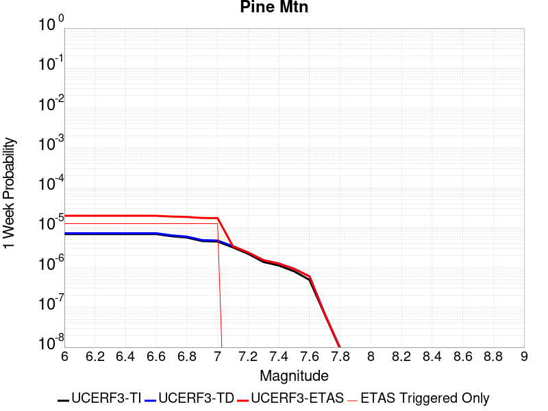 | 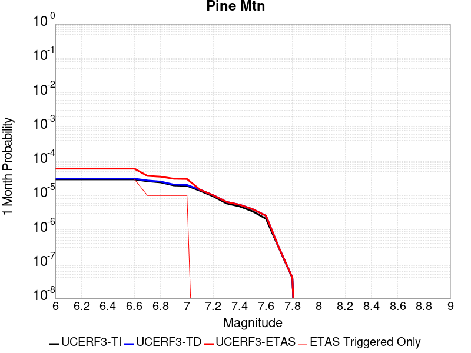 |  |  |

| Magnitude | 1 wk TI Prob | 1 wk TD Prob | 1 wk ETAS Prob | 1 wk ETAS/TD Gain | 1 wk ETAS Triggered Only | 1 mo TI Prob | 1 mo TD Prob | 1 mo ETAS Prob | 1 mo ETAS/TD Gain | 1 mo ETAS Triggered Only | 1 yr TI Prob | 1 yr TD Prob | 1 yr ETAS Prob | 1 yr ETAS/TD Gain | 1 yr ETAS Triggered Only | 10 yr TI Prob | 10 yr TD Prob | 10 yr ETAS Prob | 10 yr ETAS/TD Gain | 10 yr ETAS Triggered Only |
|-----|-----|-----|-----|-----|-----|-----|-----|-----|-----|-----|-----|-----|-----|-----|-----|-----|-----|-----|-----|-----|
| 6.0 | 6.894797E-6 | 7.2254716E-6 | 2.7225327E-5 | 3.7679653 | 2.0E-5 | 2.9548795E-5 | 3.0965955E-5 | 6.0965027E-5 | 1.9687759 | 3.0E-5 | 3.596972E-4 | 3.7694827E-4 | 4.2692944E-4 | 1.1325942 | 5.0E-5 | 0.0035911554 | 0.0037633865 | 0.0038530477 | 1.0238246 | 9.0E-5 |
| 6.1 | 6.894797E-6 | 7.2254716E-6 | 2.7225327E-5 | 3.7679653 | 2.0E-5 | 2.9548795E-5 | 3.0965955E-5 | 6.0965027E-5 | 1.9687759 | 3.0E-5 | 3.596972E-4 | 3.7694827E-4 | 4.2692944E-4 | 1.1325942 | 5.0E-5 | 0.0035911554 | 0.0037633865 | 0.0038530477 | 1.0238246 | 9.0E-5 |
| 6.2 | 6.894797E-6 | 7.2254716E-6 | 2.7225327E-5 | 3.7679653 | 2.0E-5 | 2.9548795E-5 | 3.0965955E-5 | 6.0965027E-5 | 1.9687759 | 3.0E-5 | 3.596972E-4 | 3.7694827E-4 | 4.2692944E-4 | 1.1325942 | 5.0E-5 | 0.0035911554 | 0.0037633865 | 0.0038530477 | 1.0238246 | 9.0E-5 |
| 6.3 | 6.894797E-6 | 7.2254716E-6 | 2.7225327E-5 | 3.7679653 | 2.0E-5 | 2.9548795E-5 | 3.0965955E-5 | 6.0965027E-5 | 1.9687759 | 3.0E-5 | 3.596972E-4 | 3.7694827E-4 | 4.2692944E-4 | 1.1325942 | 5.0E-5 | 0.0035911554 | 0.0037633865 | 0.0038530477 | 1.0238246 | 9.0E-5 |
| 6.4 | 6.894797E-6 | 7.2254716E-6 | 2.7225327E-5 | 3.7679653 | 2.0E-5 | 2.9548795E-5 | 3.0965955E-5 | 6.0965027E-5 | 1.9687759 | 3.0E-5 | 3.596972E-4 | 3.7694827E-4 | 4.2692944E-4 | 1.1325942 | 5.0E-5 | 0.0035911554 | 0.0037633865 | 0.0038530477 | 1.0238246 | 9.0E-5 |
| 6.5 | 6.894797E-6 | 7.2254716E-6 | 2.7225327E-5 | 3.7679653 | 2.0E-5 | 2.9548795E-5 | 3.0965955E-5 | 6.0965027E-5 | 1.9687759 | 3.0E-5 | 3.596972E-4 | 3.7694827E-4 | 4.2692944E-4 | 1.1325942 | 5.0E-5 | 0.0035911554 | 0.0037633865 | 0.0038530477 | 1.0238246 | 9.0E-5 |
| 6.6 | 6.894797E-6 | 7.2254716E-6 | 2.7225327E-5 | 3.7679653 | 2.0E-5 | 2.9548795E-5 | 3.0965955E-5 | 6.0965027E-5 | 1.9687759 | 3.0E-5 | 3.596972E-4 | 3.7694827E-4 | 4.2692944E-4 | 1.1325942 | 5.0E-5 | 0.0035911554 | 0.0037633865 | 0.0038530477 | 1.0238246 | 9.0E-5 |
| 6.7 | 6.0867933E-6 | 6.397124E-6 | 1.639706E-5 | 2.5631926 | 1.0E-5 | 2.6085996E-5 | 2.7415968E-5 | 3.7415695E-5 | 1.364741 | 1.0E-5 | 3.1755073E-4 | 3.337405E-4 | 3.537338E-4 | 1.0599068 | 2.0E-5 | 0.0031709734 | 0.0033326119 | 0.0033824453 | 1.0149533 | 5.0E-5 |
| 6.8 | 5.6530425E-6 | 5.950606E-6 | 1.5950547E-5 | 2.6804912 | 1.0E-5 | 2.42271E-5 | 2.5502359E-5 | 3.5502104E-5 | 1.3921106 | 1.0E-5 | 2.94925E-4 | 3.1044905E-4 | 3.3044282E-4 | 1.0644028 | 2.0E-5 | 0.002945339 | 0.0031003582 | 0.0031502033 | 1.0160772 | 5.0E-5 |
| 6.9 | 4.6015225E-6 | 4.8638444E-6 | 1.48637955E-5 | 3.0559769 | 1.0E-5 | 1.9720663E-5 | 2.084489E-5 | 3.084468E-5 | 1.4797239 | 1.0E-5 | 2.4007261E-4 | 2.5375842E-4 | 2.6375588E-4 | 1.0393976 | 1.0E-5 | 0.0023981342 | 0.002534831 | 0.0025747295 | 1.0157402 | 4.0E-5 |
| 7.0 | 4.4875965E-6 | 4.7474837E-6 | 1.4747436E-5 | 3.106369 | 1.0E-5 | 1.9232413E-5 | 2.0346208E-5 | 3.0346004E-5 | 1.4914821 | 1.0E-5 | 2.3412947E-4 | 2.4768838E-4 | 2.576859E-4 | 1.0403633 | 1.0E-5 | 0.0023388295 | 0.0024742668 | 0.002514168 | 1.0161264 | 4.0E-5 |
| 7.1 | 3.203907E-6 | 3.42942E-6 | 3.42942E-6 | 1.0 | 0.0 | 1.3730958E-5 | 1.4697435E-5 | 1.4697435E-5 | 1.0 | 0.0 | 1.6716159E-4 | 1.7892725E-4 | 1.7892725E-4 | 1.0 | 0.0 | 0.0016703589 | 0.001787898 | 0.0018178443 | 1.0167495 | 3.0E-5 |
| 7.2 | 2.2060601E-6 | 2.3784874E-6 | 2.3784874E-6 | 1.0 | 0.0 | 9.4545085E-6 | 1.019348E-5 | 1.019348E-5 | 1.0 | 0.0 | 1.15102564E-4 | 1.2409901E-4 | 1.2409901E-4 | 1.0 | 0.0 | 0.0011504296 | 0.0012403419 | 0.0012603172 | 1.0161046 | 2.0E-5 |
| 7.3 | 1.3765207E-6 | 1.5216535E-6 | 1.5216535E-6 | 1.0 | 0.0 | 5.899361E-6 | 6.5213567E-6 | 6.5213567E-6 | 1.0 | 0.0 | 7.182235E-5 | 7.939472E-5 | 7.939472E-5 | 1.0 | 0.0 | 7.1799144E-4 | 7.9367263E-4 | 8.036647E-4 | 1.0125897 | 1.0E-5 |
| 7.4 | 1.1245983E-6 | 1.2587126E-6 | 1.2587126E-6 | 1.0 | 0.0 | 4.819698E-6 | 5.394472E-6 | 5.394472E-6 | 1.0 | 0.0 | 5.8678244E-5 | 6.56758E-5 | 6.56758E-5 | 1.0 | 0.0 | 5.866275E-4 | 6.565722E-4 | 6.565722E-4 | 1.0 | 0.0 |
| 7.5 | 8.031682E-7 | 9.276999E-7 | 9.276999E-7 | 1.0 | 0.0 | 3.4421448E-6 | 3.975851E-6 | 3.975851E-6 | 1.0 | 0.0 | 4.1907308E-5 | 4.840498E-5 | 4.840498E-5 | 1.0 | 0.0 | 4.1899405E-4 | 4.8395112E-4 | 4.8395112E-4 | 1.0 | 0.0 |
| 7.6 | 4.8953444E-7 | 6.0030544E-7 | 6.0030544E-7 | 1.0 | 0.0 | 2.098003E-6 | 2.5727354E-6 | 2.5727354E-6 | 1.0 | 0.0 | 2.5542888E-5 | 3.1322652E-5 | 3.1322652E-5 | 1.0 | 0.0 | 2.5539953E-4 | 3.1318725E-4 | 3.1318725E-4 | 1.0 | 0.0 |
| 7.7 | 6.634529E-8 | 6.788826E-8 | 6.788826E-8 | 1.0 | 0.0 | 2.843369E-7 | 2.9094966E-7 | 2.9094966E-7 | 1.0 | 0.0 | 3.4617963E-6 | 3.5423066E-6 | 3.5423066E-6 | 1.0 | 0.0 | 3.4617424E-5 | 3.542255E-5 | 3.542255E-5 | 1.0 | 0.0 |
| 7.8 | 9.235578E-9 | 9.488566E-9 | 9.488566E-9 | 1.0 | 0.0 | 3.9581046E-8 | 4.0665284E-8 | 4.0665284E-8 | 1.0 | 0.0 | 4.818991E-7 | 4.950997E-7 | 4.950997E-7 | 1.0 | 0.0 | 4.8189804E-6 | 4.950988E-6 | 4.950988E-6 | 1.0 | 0.0 |

## Blue Cut
*[(top)](#table-of-contents)*

| 1 Week | 1 Month | 1 Year | 10 Year |
|-----|-----|-----|-----|
| 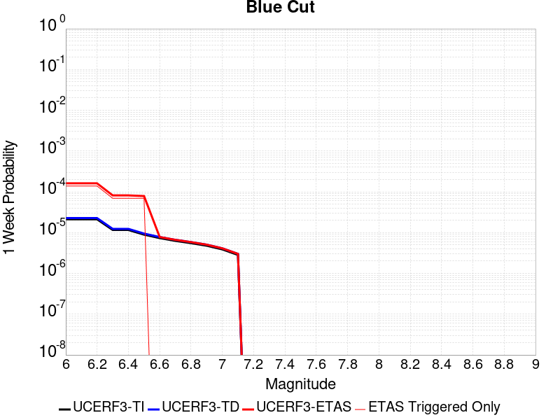 | 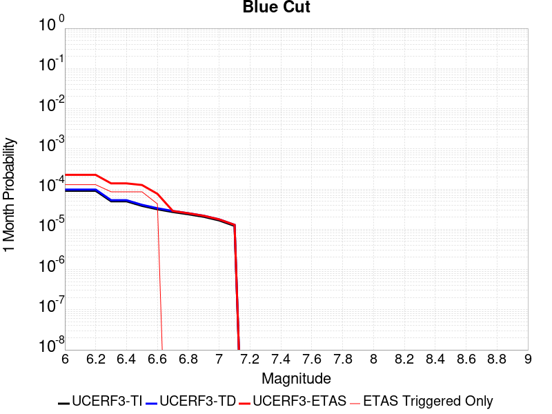 | 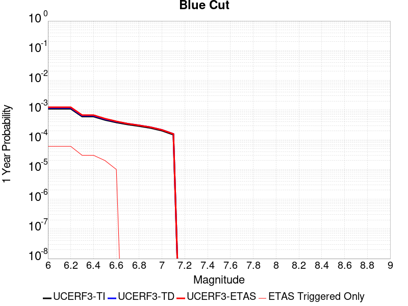 | 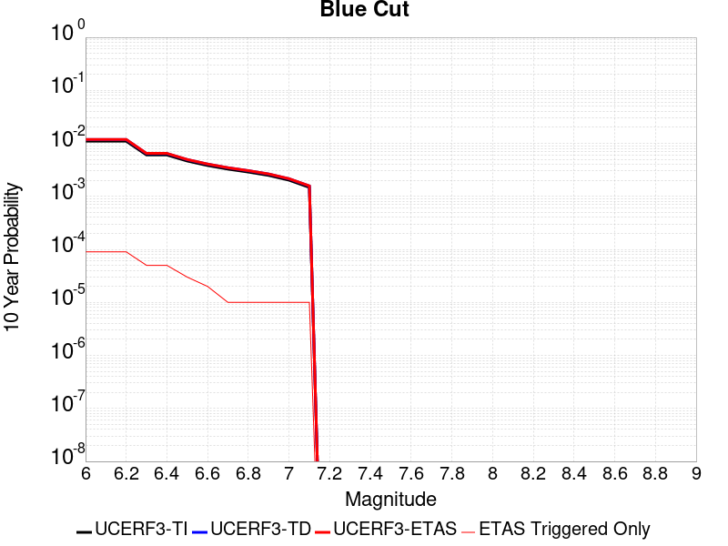 |

| Magnitude | 1 wk TI Prob | 1 wk TD Prob | 1 wk ETAS Prob | 1 wk ETAS/TD Gain | 1 wk ETAS Triggered Only | 1 mo TI Prob | 1 mo TD Prob | 1 mo ETAS Prob | 1 mo ETAS/TD Gain | 1 mo ETAS Triggered Only | 1 yr TI Prob | 1 yr TD Prob | 1 yr ETAS Prob | 1 yr ETAS/TD Gain | 1 yr ETAS Triggered Only | 10 yr TI Prob | 10 yr TD Prob | 10 yr ETAS Prob | 10 yr ETAS/TD Gain | 10 yr ETAS Triggered Only |
|-----|-----|-----|-----|-----|-----|-----|-----|-----|-----|-----|-----|-----|-----|-----|-----|-----|-----|-----|-----|-----|
| 6.0 | 2.1227985E-5 | 2.2719574E-5 | 5.2718893E-5 | 2.3204172 | 3.0E-5 | 9.097391E-5 | 9.73663E-5 | 1.3736241E-4 | 1.4107797 | 4.0E-5 | 0.0011070445 | 0.0011848481 | 0.001244777 | 1.0505794 | 6.0E-5 | 0.011015458 | 0.011791152 | 0.01188009 | 1.0075428 | 9.0E-5 |
| 6.1 | 2.1227985E-5 | 2.2719574E-5 | 5.2718893E-5 | 2.3204172 | 3.0E-5 | 9.097391E-5 | 9.73663E-5 | 1.3736241E-4 | 1.4107797 | 4.0E-5 | 0.0011070445 | 0.0011848481 | 0.001244777 | 1.0505794 | 6.0E-5 | 0.011015458 | 0.011791152 | 0.01188009 | 1.0075428 | 9.0E-5 |
| 6.2 | 2.1227985E-5 | 2.2719574E-5 | 5.2718893E-5 | 2.3204172 | 3.0E-5 | 9.097391E-5 | 9.73663E-5 | 1.3736241E-4 | 1.4107797 | 4.0E-5 | 0.0011070445 | 0.0011848481 | 0.001244777 | 1.0505794 | 6.0E-5 | 0.011015458 | 0.011791152 | 0.01188009 | 1.0075428 | 9.0E-5 |
| 6.3 | 1.1613981E-5 | 1.2353542E-5 | 3.2353295E-5 | 2.618949 | 2.0E-5 | 4.9773254E-5 | 5.2942745E-5 | 8.294116E-5 | 1.5666199 | 3.0E-5 | 6.0582085E-4 | 6.443998E-4 | 6.7438046E-4 | 1.046525 | 3.0E-5 | 0.0060417196 | 0.0064265593 | 0.006476238 | 1.0077302 | 5.0E-5 |
| 6.4 | 1.1613981E-5 | 1.2353542E-5 | 3.2353295E-5 | 2.618949 | 2.0E-5 | 4.9773254E-5 | 5.2942745E-5 | 8.294116E-5 | 1.5666199 | 3.0E-5 | 6.0582085E-4 | 6.443998E-4 | 6.7438046E-4 | 1.046525 | 3.0E-5 | 0.0060417196 | 0.0064265593 | 0.006476238 | 1.0077302 | 5.0E-5 |
| 6.5 | 8.931326E-6 | 9.4816E-6 | 1.9481506E-5 | 2.0546644 | 1.0E-5 | 3.8276554E-5 | 4.0634844E-5 | 6.0634033E-5 | 1.4921684 | 2.0E-5 | 4.6591737E-4 | 4.946261E-4 | 5.146162E-4 | 1.0404146 | 2.0E-5 | 0.0046494175 | 0.004936161 | 0.004966013 | 1.0060476 | 3.0E-5 |
| 6.6 | 7.345353E-6 | 7.79028E-6 | 7.79028E-6 | 1.0 | 0.0 | 3.1479703E-5 | 3.338653E-5 | 4.3386193E-5 | 1.299512 | 1.0E-5 | 3.83198E-4 | 4.064132E-4 | 4.164091E-4 | 1.0245955 | 1.0E-5 | 0.0038253788 | 0.0040574907 | 0.00407741 | 1.0049092 | 2.0E-5 |
| 6.7 | 6.2775666E-6 | 6.655149E-6 | 6.655149E-6 | 1.0 | 0.0 | 2.690358E-5 | 2.8521798E-5 | 2.8521798E-5 | 1.0 | 0.0 | 3.2750185E-4 | 3.472051E-4 | 3.472051E-4 | 1.0 | 0.0 | 0.0032701963 | 0.003467367 | 0.0034773324 | 1.002874 | 1.0E-5 |
| 6.8 | 5.5234095E-6 | 5.8551113E-6 | 5.8551113E-6 | 1.0 | 0.0 | 2.367154E-5 | 2.5093133E-5 | 2.5093133E-5 | 1.0 | 0.0 | 2.8816288E-4 | 3.0547334E-4 | 3.0547334E-4 | 1.0 | 0.0 | 0.002877895 | 0.0030512505 | 0.00306122 | 1.0032673 | 1.0E-5 |
| 6.9 | 4.7780054E-6 | 5.0654203E-6 | 5.0654203E-6 | 1.0 | 0.0 | 2.0477004E-5 | 2.1708804E-5 | 2.1708804E-5 | 1.0 | 0.0 | 2.4927902E-4 | 2.642797E-4 | 2.642797E-4 | 1.0 | 0.0 | 0.0024899957 | 0.002640346 | 0.0026503198 | 1.0037774 | 1.0E-5 |
| 7.0 | 3.883171E-6 | 4.118487E-6 | 4.118487E-6 | 1.0 | 0.0 | 1.6642054E-5 | 1.7650578E-5 | 1.7650578E-5 | 1.0 | 0.0 | 2.0259817E-4 | 2.1488148E-4 | 2.1488148E-4 | 1.0 | 0.0 | 0.0020241356 | 0.0021474129 | 0.0021573913 | 1.0046468 | 1.0E-5 |
| 7.1 | 2.8358215E-6 | 3.0097158E-6 | 3.0097158E-6 | 1.0 | 0.0 | 1.2153464E-5 | 1.2898756E-5 | 1.2898756E-5 | 1.0 | 0.0 | 1.4795837E-4 | 1.5703762E-4 | 1.5703762E-4 | 1.0 | 0.0 | 0.001478599 | 0.0015699116 | 0.001579896 | 1.0063598 | 1.0E-5 |

## San Clemente
*[(top)](#table-of-contents)*

| 1 Week | 1 Month | 1 Year | 10 Year |
|-----|-----|-----|-----|
| 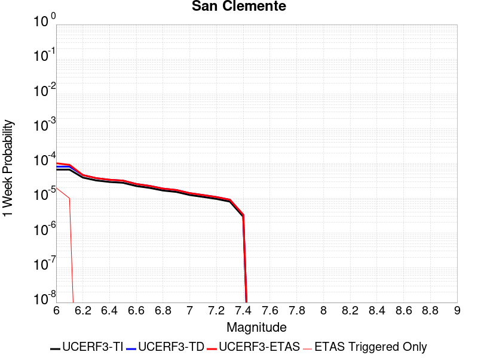 | 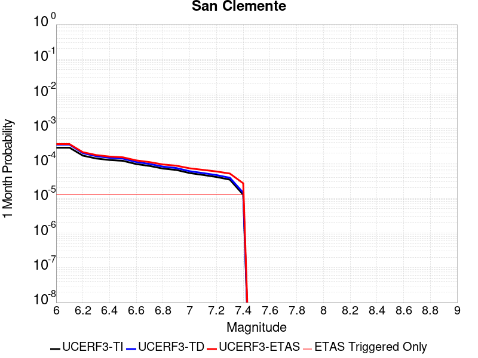 | 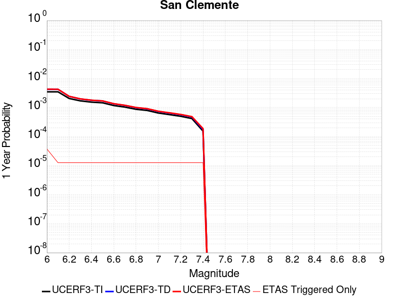 | 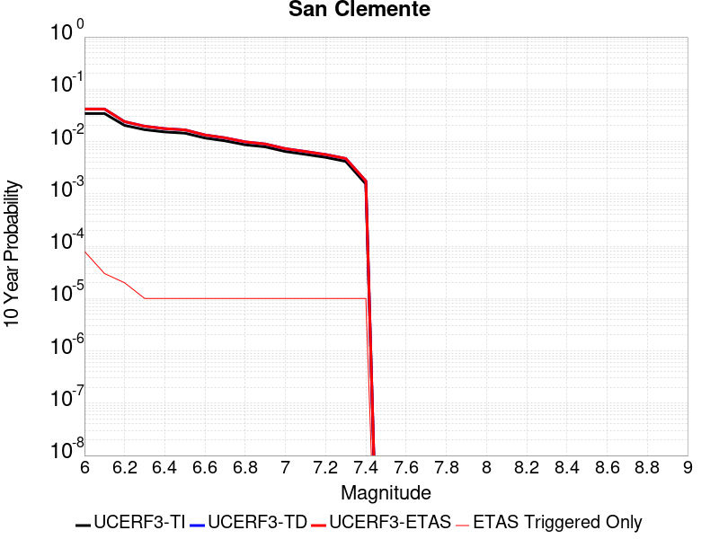 |

| Magnitude | 1 wk TI Prob | 1 wk TD Prob | 1 wk ETAS Prob | 1 wk ETAS/TD Gain | 1 wk ETAS Triggered Only | 1 mo TI Prob | 1 mo TD Prob | 1 mo ETAS Prob | 1 mo ETAS/TD Gain | 1 mo ETAS Triggered Only | 1 yr TI Prob | 1 yr TD Prob | 1 yr ETAS Prob | 1 yr ETAS/TD Gain | 1 yr ETAS Triggered Only | 10 yr TI Prob | 10 yr TD Prob | 10 yr ETAS Prob | 10 yr ETAS/TD Gain | 10 yr ETAS Triggered Only |
|-----|-----|-----|-----|-----|-----|-----|-----|-----|-----|-----|-----|-----|-----|-----|-----|-----|-----|-----|-----|-----|
| 6.0 | 6.681379E-5 | 8.163834E-5 | 1.016367E-4 | 1.2449629 | 2.0E-5 | 2.8631336E-4 | 3.4983488E-4 | 3.798244E-4 | 1.0857247 | 3.0E-5 | 0.003480294 | 0.00425141 | 0.0043011974 | 1.0117108 | 5.0E-5 | 0.03426291 | 0.04175603 | 0.04183269 | 1.001836 | 8.0E-5 |
| 6.1 | 6.681379E-5 | 8.163834E-5 | 9.163752E-5 | 1.1224815 | 1.0E-5 | 2.8631336E-4 | 3.4983488E-4 | 3.698279E-4 | 1.0571498 | 2.0E-5 | 0.003480294 | 0.00425141 | 0.0042713247 | 1.0046843 | 2.0E-5 | 0.03426291 | 0.04175603 | 0.04178478 | 1.0006884 | 3.0E-5 |
| 6.2 | 3.9400576E-5 | 4.6452373E-5 | 4.6452373E-5 | 1.0 | 0.0 | 1.6884868E-4 | 1.9906677E-4 | 2.0906478E-4 | 1.0502244 | 1.0E-5 | 0.0020537945 | 0.0024209984 | 0.0024309743 | 1.0041205 | 1.0E-5 | 0.020349167 | 0.023952903 | 0.023972424 | 1.0008149 | 2.0E-5 |
| 6.3 | 3.2590255E-5 | 3.792912E-5 | 3.792912E-5 | 1.0 | 0.0 | 1.3966505E-4 | 1.6254342E-4 | 1.725418E-4 | 1.061512 | 1.0E-5 | 0.0016990956 | 0.0019772002 | 0.0019871802 | 1.0050477 | 1.0E-5 | 0.01686163 | 0.019599883 | 0.019609686 | 1.0005002 | 1.0E-5 |
| 6.4 | 2.9454652E-5 | 3.4097764E-5 | 3.4097764E-5 | 1.0 | 0.0 | 1.2622811E-4 | 1.4612524E-4 | 1.5612377E-4 | 1.0684245 | 1.0E-5 | 0.0015357438 | 0.0017776493 | 0.0017876315 | 1.0056154 | 1.0E-5 | 0.015251739 | 0.01763747 | 0.017647294 | 1.000557 | 1.0E-5 |
| 6.5 | 2.790836E-5 | 3.2247463E-5 | 3.2247463E-5 | 1.0 | 0.0 | 1.1960178E-4 | 1.3819624E-4 | 1.4819486E-4 | 1.0723509 | 1.0E-5 | 0.001455179 | 0.0016812662 | 0.0016912494 | 1.0059379 | 1.0E-5 | 0.014456868 | 0.016688485 | 0.016698318 | 1.0005893 | 1.0E-5 |
| 6.6 | 2.2492153E-5 | 2.5762702E-5 | 2.5762702E-5 | 1.0 | 0.0 | 9.639138E-5 | 1.1040699E-4 | 1.20405886E-4 | 1.090564 | 1.0E-5 | 0.0011729331 | 0.0013433909 | 0.0013533775 | 1.0074339 | 1.0E-5 | 0.011667615 | 0.013354417 | 0.013364283 | 1.0007389 | 1.0E-5 |
| 6.7 | 1.9862755E-5 | 2.2666423E-5 | 2.2666423E-5 | 1.0 | 0.0 | 8.512331E-5 | 9.713826E-5 | 1.0713729E-4 | 1.102936 | 1.0E-5 | 0.0010358836 | 0.0011820279 | 0.0011920161 | 1.00845 | 1.0E-5 | 0.010310682 | 0.011758701 | 0.011768583 | 1.0008404 | 1.0E-5 |
| 6.8 | 1.6697575E-5 | 1.897771E-5 | 1.897771E-5 | 1.0 | 0.0 | 7.155907E-5 | 8.133056E-5 | 9.132974E-5 | 1.1229451 | 1.0E-5 | 8.7088346E-4 | 9.897591E-4 | 9.997492E-4 | 1.0100935 | 1.0E-5 | 0.008674784 | 0.0098545365 | 0.009864438 | 1.0010048 | 1.0E-5 |
| 6.9 | 1.5218415E-5 | 1.72694E-5 | 1.72694E-5 | 1.0 | 0.0 | 6.522015E-5 | 7.4009666E-5 | 8.400893E-5 | 1.1351075 | 1.0E-5 | 7.93766E-4 | 9.00704E-4 | 9.10695E-4 | 1.0110924 | 1.0E-5 | 0.007909367 | 0.008971481 | 0.008981391 | 1.0011046 | 1.0E-5 |
| 7.0 | 1.2392958E-5 | 1.4033016E-5 | 1.4033016E-5 | 1.0 | 0.0 | 5.3111595E-5 | 6.014015E-5 | 7.013955E-5 | 1.1662682 | 1.0E-5 | 6.4644177E-4 | 7.319679E-4 | 7.419606E-4 | 1.0136518 | 1.0E-5 | 0.0064456454 | 0.0072963564 | 0.007306284 | 1.0013605 | 1.0E-5 |
| 7.1 | 1.0934128E-5 | 1.2375138E-5 | 1.2375138E-5 | 1.0 | 0.0 | 4.6859706E-5 | 5.303527E-5 | 6.3034735E-5 | 1.1885438 | 1.0E-5 | 5.7036756E-4 | 6.455204E-4 | 6.5551396E-4 | 1.0154814 | 1.0E-5 | 0.0056890585 | 0.0064371997 | 0.0064471355 | 1.0015435 | 1.0E-5 |
| 7.2 | 9.5798805E-6 | 1.0844935E-5 | 1.0844935E-5 | 1.0 | 0.0 | 4.1055984E-5 | 4.6477508E-5 | 5.647704E-5 | 1.2151479 | 1.0E-5 | 4.9974193E-4 | 5.657239E-4 | 5.7571824E-4 | 1.0176665 | 1.0E-5 | 0.0049861963 | 0.0056435615 | 0.005653505 | 1.0017619 | 1.0E-5 |
| 7.3 | 8.0167365E-6 | 9.083918E-6 | 9.083918E-6 | 1.0 | 0.0 | 3.4356988E-5 | 3.8930535E-5 | 4.8930146E-5 | 1.2568578 | 1.0E-5 | 4.1821605E-4 | 4.7388324E-4 | 4.8387848E-4 | 1.0210923 | 1.0E-5 | 0.0041742986 | 0.0047294297 | 0.004739383 | 1.0021044 | 1.0E-5 |
| 7.4 | 2.9581017E-6 | 3.3623792E-6 | 3.3623792E-6 | 1.0 | 0.0 | 1.2677518E-5 | 1.4410146E-5 | 2.4410001E-5 | 1.6939455 | 1.0E-5 | 1.5433785E-4 | 1.7543444E-4 | 1.8543268E-4 | 1.0569913 | 1.0E-5 | 0.001542307 | 0.0017534546 | 0.0017634371 | 1.0056931 | 1.0E-5 |

## San Pedro Basin
*[(top)](#table-of-contents)*

| 1 Week | 1 Month | 1 Year | 10 Year |
|-----|-----|-----|-----|
| 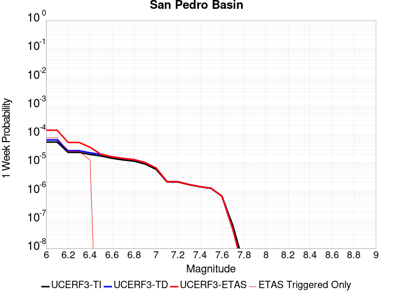 | 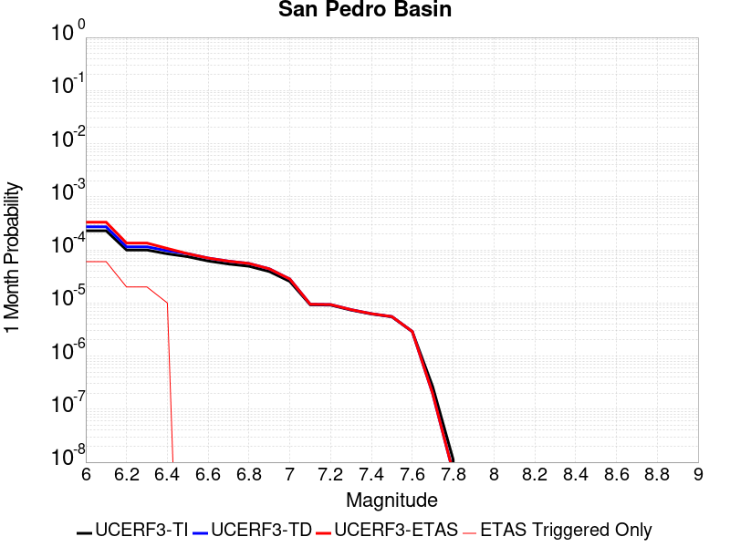 | 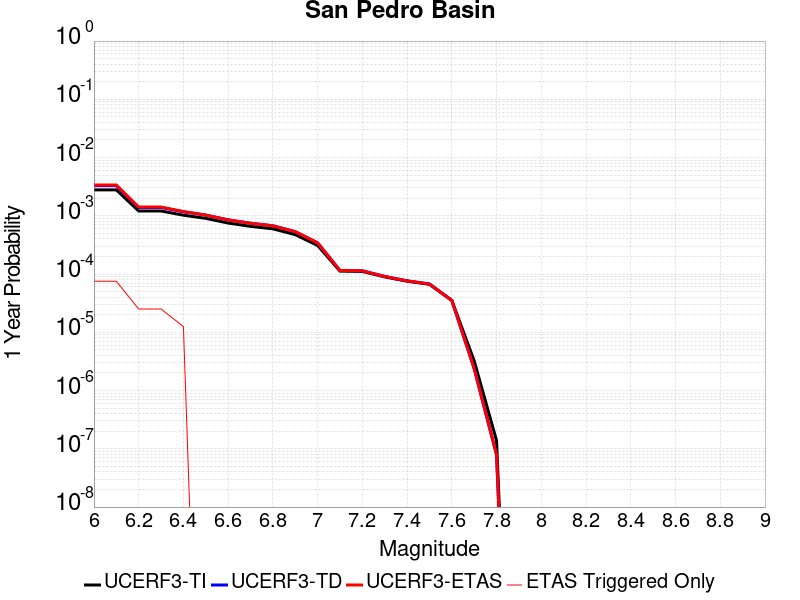 | 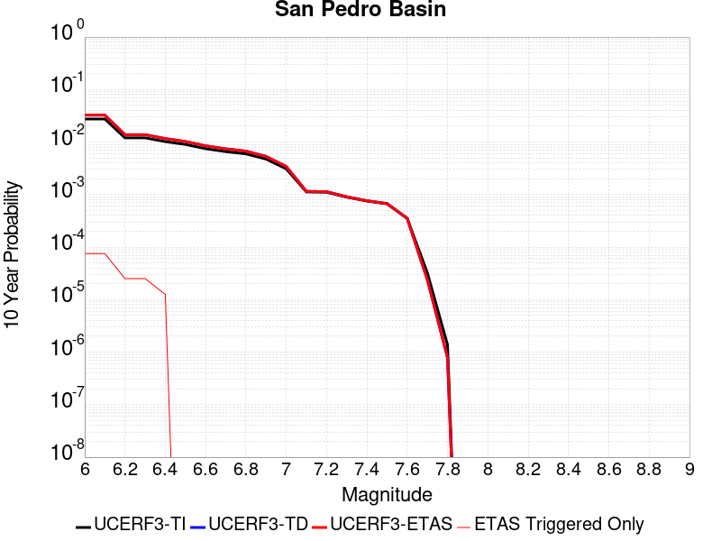 |

| Magnitude | 1 wk TI Prob | 1 wk TD Prob | 1 wk ETAS Prob | 1 wk ETAS/TD Gain | 1 wk ETAS Triggered Only | 1 mo TI Prob | 1 mo TD Prob | 1 mo ETAS Prob | 1 mo ETAS/TD Gain | 1 mo ETAS Triggered Only | 1 yr TI Prob | 1 yr TD Prob | 1 yr ETAS Prob | 1 yr ETAS/TD Gain | 1 yr ETAS Triggered Only | 10 yr TI Prob | 10 yr TD Prob | 10 yr ETAS Prob | 10 yr ETAS/TD Gain | 10 yr ETAS Triggered Only |
|-----|-----|-----|-----|-----|-----|-----|-----|-----|-----|-----|-----|-----|-----|-----|-----|-----|-----|-----|-----|-----|
| 6.0 | 5.3449043E-5 | 6.337018E-5 | 1.2336638E-4 | 1.9467576 | 6.0E-5 | 2.2904722E-4 | 2.7156167E-4 | 3.315454E-4 | 1.2208843 | 6.0E-5 | 0.0027850836 | 0.0033018515 | 0.0033716203 | 1.0211302 | 7.0E-5 | 0.027504366 | 0.03258948 | 0.032666873 | 1.0023748 | 8.0E-5 |
| 6.1 | 5.3449043E-5 | 6.337018E-5 | 1.2336638E-4 | 1.9467576 | 6.0E-5 | 2.2904722E-4 | 2.7156167E-4 | 3.315454E-4 | 1.2208843 | 6.0E-5 | 0.0027850836 | 0.0033018515 | 0.0033716203 | 1.0211302 | 7.0E-5 | 0.027504366 | 0.03258948 | 0.032666873 | 1.0023748 | 8.0E-5 |
| 6.2 | 2.3189454E-5 | 2.6642829E-5 | 4.6642297E-5 | 1.750651 | 2.0E-5 | 9.9379584E-5 | 1.1417881E-4 | 1.3417653E-4 | 1.1751438 | 2.0E-5 | 0.0012092749 | 0.0013892875 | 0.0014092597 | 1.0143759 | 2.0E-5 | 0.012027155 | 0.01381089 | 0.013830613 | 1.0014281 | 2.0E-5 |
| 6.3 | 2.3189454E-5 | 2.6642829E-5 | 4.6642297E-5 | 1.750651 | 2.0E-5 | 9.9379584E-5 | 1.1417881E-4 | 1.3417653E-4 | 1.1751438 | 2.0E-5 | 0.0012092749 | 0.0013892875 | 0.0014092597 | 1.0143759 | 2.0E-5 | 0.012027155 | 0.01381089 | 0.013830613 | 1.0014281 | 2.0E-5 |
| 6.4 | 1.966056E-5 | 2.246342E-5 | 3.2463195E-5 | 1.4451581 | 1.0E-5 | 8.425682E-5 | 9.626848E-5 | 1.06267515E-4 | 1.1038662 | 1.0E-5 | 0.001025344 | 0.0011714787 | 0.001181467 | 1.0085262 | 1.0E-5 | 0.010206259 | 0.011657119 | 0.011667003 | 1.0008478 | 1.0E-5 |
| 6.5 | 1.7342953E-5 | 1.9745152E-5 | 1.9745152E-5 | 1.0 | 0.0 | 7.4324824E-5 | 8.461954E-5 | 8.461954E-5 | 1.0 | 0.0 | 9.04529E-4 | 0.0010297929 | 0.0010297929 | 1.0 | 0.0 | 0.009008561 | 0.010253932 | 0.010253932 | 1.0 | 0.0 |
| 6.6 | 1.439804E-5 | 1.6322716E-5 | 1.6322716E-5 | 1.0 | 0.0 | 6.170443E-5 | 6.99528E-5 | 6.99528E-5 | 1.0 | 0.0 | 7.509924E-4 | 8.513747E-4 | 8.513747E-4 | 1.0 | 0.0 | 0.0074845953 | 0.008484333 | 0.008484333 | 1.0 | 0.0 |
| 6.7 | 1.2634884E-5 | 1.4285298E-5 | 1.4285298E-5 | 1.0 | 0.0 | 5.414838E-5 | 6.122144E-5 | 6.122144E-5 | 1.0 | 0.0 | 6.590571E-4 | 7.451466E-4 | 7.451466E-4 | 1.0 | 0.0 | 0.006571059 | 0.007429502 | 0.007429502 | 1.0 | 0.0 |
| 6.8 | 1.146091E-5 | 1.2933193E-5 | 1.2933193E-5 | 1.0 | 0.0 | 4.911726E-5 | 5.542696E-5 | 5.542696E-5 | 1.0 | 0.0 | 5.9783855E-4 | 6.74644E-4 | 6.74644E-4 | 1.0 | 0.0 | 0.0059623276 | 0.0067288997 | 0.0067288997 | 1.0 | 0.0 |
| 6.9 | 9.109035E-6 | 1.0235013E-5 | 1.0235013E-5 | 1.0 | 0.0 | 3.9038136E-5 | 4.386376E-5 | 4.386376E-5 | 1.0 | 0.0 | 4.7518566E-4 | 5.339384E-4 | 5.339384E-4 | 1.0 | 0.0 | 0.0047417083 | 0.0053293095 | 0.0053293095 | 1.0 | 0.0 |
| 7.0 | 5.9351028E-6 | 6.583965E-6 | 6.583965E-6 | 1.0 | 0.0 | 2.5435906E-5 | 2.821682E-5 | 2.821682E-5 | 1.0 | 0.0 | 3.0963816E-4 | 3.4350925E-4 | 3.4350925E-4 | 1.0 | 0.0 | 0.0030920706 | 0.0034320997 | 0.0034320997 | 1.0 | 0.0 |
| 7.1 | 2.1557585E-6 | 2.2096492E-6 | 2.2096492E-6 | 1.0 | 0.0 | 9.238933E-6 | 9.469892E-6 | 9.469892E-6 | 1.0 | 0.0 | 1.1247819E-4 | 1.15289986E-4 | 1.15289986E-4 | 1.0 | 0.0 | 0.0011242128 | 0.0011523172 | 0.0011523172 | 1.0 | 0.0 |
| 7.2 | 2.1251979E-6 | 2.1779954E-6 | 2.1779954E-6 | 1.0 | 0.0 | 9.107958E-6 | 9.334234E-6 | 9.334234E-6 | 1.0 | 0.0 | 1.1088375E-4 | 1.13638525E-4 | 1.13638525E-4 | 1.0 | 0.0 | 0.0011082845 | 0.0011358195 | 0.0011358195 | 1.0 | 0.0 |
| 7.3 | 1.7145798E-6 | 1.7442885E-6 | 1.7442885E-6 | 1.0 | 0.0 | 7.3481783E-6 | 7.475501E-6 | 7.475501E-6 | 1.0 | 0.0 | 8.94604E-5 | 9.1010515E-5 | 9.1010515E-5 | 1.0 | 0.0 | 8.9424395E-4 | 9.0974156E-4 | 9.0974156E-4 | 1.0 | 0.0 |
| 7.4 | 1.4467993E-6 | 1.4641878E-6 | 1.4641878E-6 | 1.0 | 0.0 | 6.200554E-6 | 6.275076E-6 | 6.275076E-6 | 1.0 | 0.0 | 7.548913E-5 | 7.639644E-5 | 7.639644E-5 | 1.0 | 0.0 | 7.546349E-4 | 7.6370913E-4 | 7.6370913E-4 | 1.0 | 0.0 |
| 7.5 | 1.2803735E-6 | 1.2931506E-6 | 1.2931506E-6 | 1.0 | 0.0 | 5.487303E-6 | 5.5420624E-6 | 5.5420624E-6 | 1.0 | 0.0 | 6.680587E-5 | 6.747259E-5 | 6.747259E-5 | 1.0 | 0.0 | 6.678579E-4 | 6.745281E-4 | 6.745281E-4 | 1.0 | 0.0 |
| 7.6 | 6.755009E-7 | 6.76947E-7 | 6.76947E-7 | 1.0 | 0.0 | 2.8950008E-6 | 2.9011985E-6 | 2.9011985E-6 | 1.0 | 0.0 | 3.5246063E-5 | 3.532158E-5 | 3.532158E-5 | 1.0 | 0.0 | 3.5240475E-4 | 3.5316538E-4 | 3.5316538E-4 | 1.0 | 0.0 |
| 7.7 | 6.211885E-8 | 4.5699714E-8 | 4.5699714E-8 | 1.0 | 0.0 | 2.6622362E-7 | 1.9585592E-7 | 1.9585592E-7 | 1.0 | 0.0 | 3.2412677E-6 | 2.3845432E-6 | 2.3845432E-6 | 1.0 | 0.0 | 3.2412205E-5 | 2.3845198E-5 | 2.3845198E-5 | 1.0 | 0.0 |
| 7.8 | 2.6580573E-9 | 1.5138054E-9 | 1.5138054E-9 | 1.0 | 0.0 | 1.1391674E-8 | 6.4877375E-9 | 6.4877375E-9 | 1.0 | 0.0 | 1.3869362E-7 | 7.89882E-8 | 7.89882E-8 | 1.0 | 0.0 | 1.3869354E-6 | 7.89882E-7 | 7.89882E-7 | 1.0 | 0.0 |

## Lost Hills
*[(top)](#table-of-contents)*

| 1 Week | 1 Month | 1 Year | 10 Year |
|-----|-----|-----|-----|
| 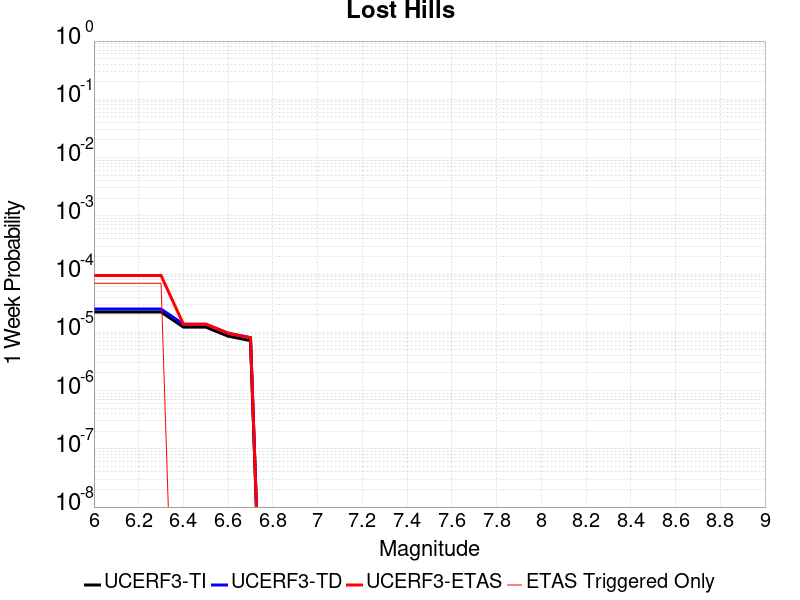 | 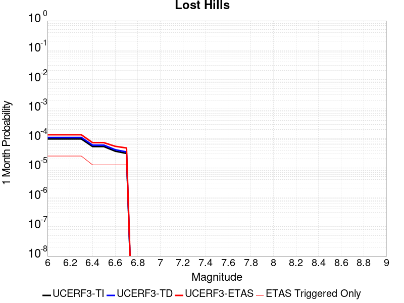 | 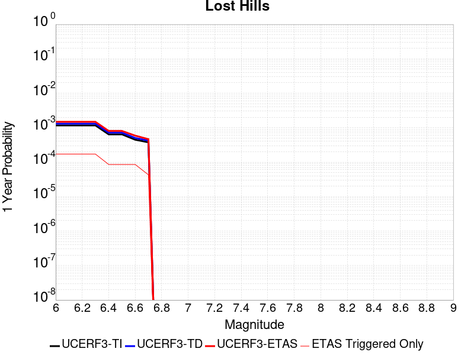 | 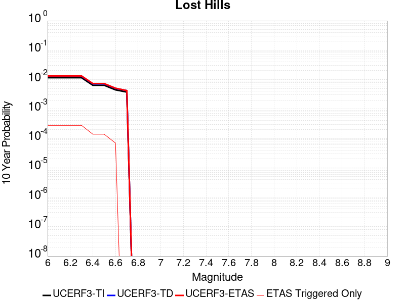 |

| Magnitude | 1 wk TI Prob | 1 wk TD Prob | 1 wk ETAS Prob | 1 wk ETAS/TD Gain | 1 wk ETAS Triggered Only | 1 mo TI Prob | 1 mo TD Prob | 1 mo ETAS Prob | 1 mo ETAS/TD Gain | 1 mo ETAS Triggered Only | 1 yr TI Prob | 1 yr TD Prob | 1 yr ETAS Prob | 1 yr ETAS/TD Gain | 1 yr ETAS Triggered Only | 10 yr TI Prob | 10 yr TD Prob | 10 yr ETAS Prob | 10 yr ETAS/TD Gain | 10 yr ETAS Triggered Only |
|-----|-----|-----|-----|-----|-----|-----|-----|-----|-----|-----|-----|-----|-----|-----|-----|-----|-----|-----|-----|-----|
| 6.0 | 2.233523E-5 | 2.5106583E-5 | 4.510608E-5 | 1.7965839 | 2.0E-5 | 9.571891E-5 | 1.0759615E-4 | 1.27594E-4 | 1.1858603 | 2.0E-5 | 0.0011647546 | 0.001309364 | 0.0013493117 | 1.0305092 | 4.0E-5 | 0.011586686 | 0.013033091 | 0.013112049 | 1.0060582 | 8.0E-5 |
| 6.1 | 2.233523E-5 | 2.5106583E-5 | 4.510608E-5 | 1.7965839 | 2.0E-5 | 9.571891E-5 | 1.0759615E-4 | 1.27594E-4 | 1.1858603 | 2.0E-5 | 0.0011647546 | 0.001309364 | 0.0013493117 | 1.0305092 | 4.0E-5 | 0.011586686 | 0.013033091 | 0.013112049 | 1.0060582 | 8.0E-5 |
| 6.2 | 2.233523E-5 | 2.5106583E-5 | 4.510608E-5 | 1.7965839 | 2.0E-5 | 9.571891E-5 | 1.0759615E-4 | 1.27594E-4 | 1.1858603 | 2.0E-5 | 0.0011647546 | 0.001309364 | 0.0013493117 | 1.0305092 | 4.0E-5 | 0.011586686 | 0.013033091 | 0.013112049 | 1.0060582 | 8.0E-5 |
| 6.3 | 2.233523E-5 | 2.5106583E-5 | 4.510608E-5 | 1.7965839 | 2.0E-5 | 9.571891E-5 | 1.0759615E-4 | 1.27594E-4 | 1.1858603 | 2.0E-5 | 0.0011647546 | 0.001309364 | 0.0013493117 | 1.0305092 | 4.0E-5 | 0.011586686 | 0.013033091 | 0.013112049 | 1.0060582 | 8.0E-5 |
| 6.4 | 1.2288092E-5 | 1.3781108E-5 | 2.3780969E-5 | 1.7256211 | 1.0E-5 | 5.2662188E-5 | 5.906108E-5 | 6.906049E-5 | 1.1693063 | 1.0E-5 | 6.409735E-4 | 7.189252E-4 | 7.3891087E-4 | 1.0277992 | 2.0E-5 | 0.006391279 | 0.0071752006 | 0.0072149136 | 1.0055348 | 4.0E-5 |
| 6.5 | 1.2288092E-5 | 1.3781108E-5 | 2.3780969E-5 | 1.7256211 | 1.0E-5 | 5.2662188E-5 | 5.906108E-5 | 6.906049E-5 | 1.1693063 | 1.0E-5 | 6.409735E-4 | 7.189252E-4 | 7.3891087E-4 | 1.0277992 | 2.0E-5 | 0.006391279 | 0.0071752006 | 0.0072149136 | 1.0055348 | 4.0E-5 |
| 6.6 | 8.58281E-6 | 9.63377E-6 | 1.9633673E-5 | 2.0380054 | 1.0E-5 | 3.6782953E-5 | 4.12874E-5 | 5.128699E-5 | 1.2421947 | 1.0E-5 | 4.4774043E-4 | 5.026414E-4 | 5.2263134E-4 | 1.0397698 | 2.0E-5 | 0.0044683935 | 0.005023205 | 0.0050530545 | 1.0059422 | 3.0E-5 |
| 6.7 | 7.205685E-6 | 8.088302E-6 | 1.8088222E-5 | 2.2363434 | 1.0E-5 | 3.088114E-5 | 3.466415E-5 | 4.4663804E-5 | 1.2884725 | 1.0E-5 | 3.7591302E-4 | 4.2203604E-4 | 4.320318E-4 | 1.0236846 | 1.0E-5 | 0.0037527776 | 0.0042203604 | 0.004240276 | 1.0047189 | 2.0E-5 |

## San Jacinto (Clark) rev
*[(top)](#table-of-contents)*

| 1 Week | 1 Month | 1 Year | 10 Year |
|-----|-----|-----|-----|
|  | 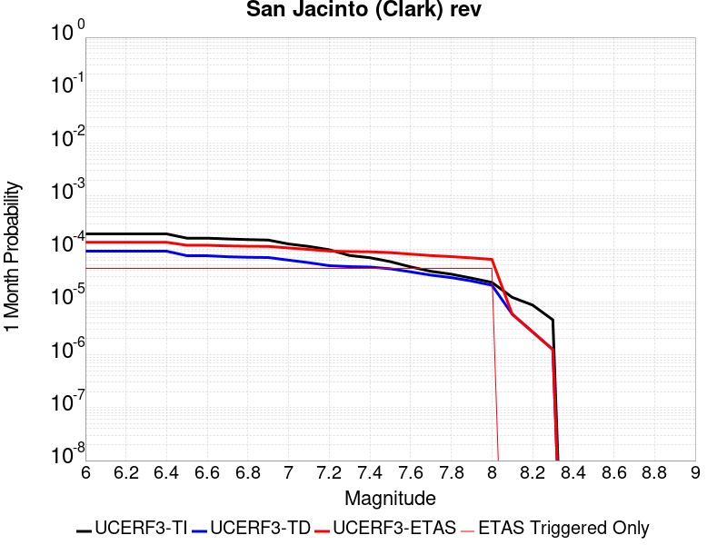 | 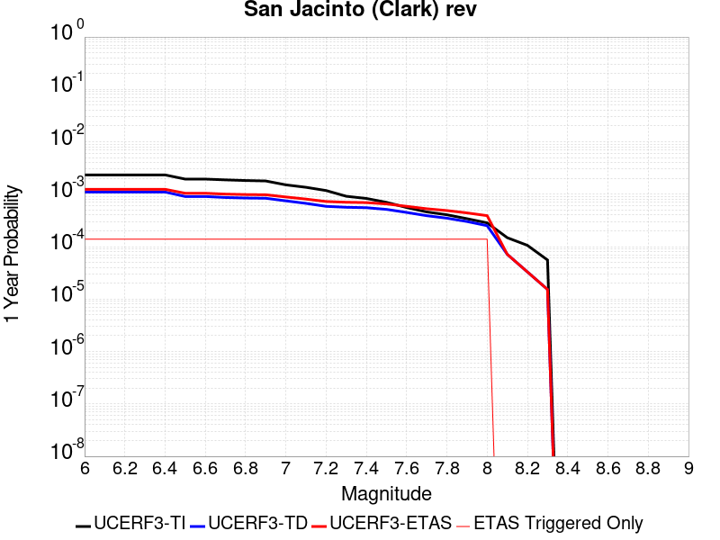 | 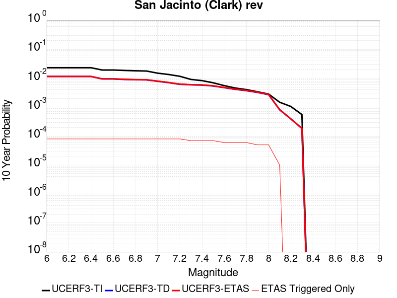 |

| Magnitude | 1 wk TI Prob | 1 wk TD Prob | 1 wk ETAS Prob | 1 wk ETAS/TD Gain | 1 wk ETAS Triggered Only | 1 mo TI Prob | 1 mo TD Prob | 1 mo ETAS Prob | 1 mo ETAS/TD Gain | 1 mo ETAS Triggered Only | 1 yr TI Prob | 1 yr TD Prob | 1 yr ETAS Prob | 1 yr ETAS/TD Gain | 1 yr ETAS Triggered Only | 10 yr TI Prob | 10 yr TD Prob | 10 yr ETAS Prob | 10 yr ETAS/TD Gain | 10 yr ETAS Triggered Only |
|-----|-----|-----|-----|-----|-----|-----|-----|-----|-----|-----|-----|-----|-----|-----|-----|-----|-----|-----|-----|-----|
| 6.0 | 4.482615E-5 | 2.1153059E-5 | 2.1153059E-5 | 1.0 | 0.0 | 1.9209793E-4 | 9.065287E-5 | 1.0065197E-4 | 1.1103009 | 1.0E-5 | 0.0023362834 | 0.0011031491 | 0.001153094 | 1.0452747 | 5.0E-5 | 0.02311874 | 0.011485709 | 0.01156479 | 1.0068852 | 8.0E-5 |
| 6.1 | 4.482615E-5 | 2.1153059E-5 | 2.1153059E-5 | 1.0 | 0.0 | 1.9209793E-4 | 9.065287E-5 | 1.0065197E-4 | 1.1103009 | 1.0E-5 | 0.0023362834 | 0.0011031491 | 0.001153094 | 1.0452747 | 5.0E-5 | 0.02311874 | 0.011485709 | 0.01156479 | 1.0068852 | 8.0E-5 |
| 6.2 | 4.482615E-5 | 2.1153059E-5 | 2.1153059E-5 | 1.0 | 0.0 | 1.9209793E-4 | 9.065287E-5 | 1.0065197E-4 | 1.1103009 | 1.0E-5 | 0.0023362834 | 0.0011031491 | 0.001153094 | 1.0452747 | 5.0E-5 | 0.02311874 | 0.011485709 | 0.01156479 | 1.0068852 | 8.0E-5 |
| 6.3 | 4.482615E-5 | 2.1153059E-5 | 2.1153059E-5 | 1.0 | 0.0 | 1.9209793E-4 | 9.065287E-5 | 1.0065197E-4 | 1.1103009 | 1.0E-5 | 0.0023362834 | 0.0011031491 | 0.001153094 | 1.0452747 | 5.0E-5 | 0.02311874 | 0.011485709 | 0.01156479 | 1.0068852 | 8.0E-5 |
| 6.4 | 4.482615E-5 | 2.1153059E-5 | 2.1153059E-5 | 1.0 | 0.0 | 1.9209793E-4 | 9.065287E-5 | 1.0065197E-4 | 1.1103009 | 1.0E-5 | 0.0023362834 | 0.0011031491 | 0.001153094 | 1.0452747 | 5.0E-5 | 0.02311874 | 0.011485709 | 0.01156479 | 1.0068852 | 8.0E-5 |
| 6.5 | 3.7294863E-5 | 1.7354667E-5 | 1.7354667E-5 | 1.0 | 0.0 | 1.5982533E-4 | 7.437504E-5 | 8.4374304E-5 | 1.1344436 | 1.0E-5 | 0.0019441366 | 9.051445E-4 | 9.5509924E-4 | 1.0551898 | 5.0E-5 | 0.01927216 | 0.009485902 | 0.009565144 | 1.0083536 | 8.0E-5 |
| 6.6 | 3.7294863E-5 | 1.7354667E-5 | 1.7354667E-5 | 1.0 | 0.0 | 1.5982533E-4 | 7.437504E-5 | 8.4374304E-5 | 1.1344436 | 1.0E-5 | 0.0019441366 | 9.051445E-4 | 9.5509924E-4 | 1.0551898 | 5.0E-5 | 0.01927216 | 0.009485902 | 0.009565144 | 1.0083536 | 8.0E-5 |
| 6.7 | 3.6039248E-5 | 1.6602684E-5 | 1.6602684E-5 | 1.0 | 0.0 | 1.5444479E-4 | 7.115244E-5 | 8.115173E-5 | 1.1405333 | 1.0E-5 | 0.0018787434 | 8.659408E-4 | 9.158975E-4 | 1.0576906 | 5.0E-5 | 0.01862939 | 0.009088189 | 0.009167463 | 1.0087227 | 8.0E-5 |
| 6.8 | 3.5031844E-5 | 1.6231123E-5 | 1.6231123E-5 | 1.0 | 0.0 | 1.5012783E-4 | 6.956012E-5 | 7.9559424E-5 | 1.1437505 | 1.0E-5 | 0.0018262739 | 8.4656954E-4 | 8.965272E-4 | 1.0590119 | 5.0E-5 | 0.01811338 | 0.008888788 | 0.008968077 | 1.0089201 | 8.0E-5 |
| 6.9 | 3.435112E-5 | 1.6061658E-5 | 1.6061658E-5 | 1.0 | 0.0 | 1.4721078E-4 | 6.8833884E-5 | 7.8833196E-5 | 1.1452672 | 1.0E-5 | 0.0017908178 | 8.377344E-4 | 8.876925E-4 | 1.0596348 | 5.0E-5 | 0.017764548 | 0.008796512 | 0.008875808 | 1.0090145 | 8.0E-5 |
| 7.0 | 2.8959772E-5 | 1.43355255E-5 | 1.43355255E-5 | 1.0 | 0.0 | 1.241074E-4 | 6.1436534E-5 | 7.143592E-5 | 1.1627595 | 1.0E-5 | 0.0015099603 | 7.477359E-4 | 7.976985E-4 | 1.0668185 | 5.0E-5 | 0.014997416 | 0.007868331 | 0.007947702 | 1.0100874 | 8.0E-5 |
| 7.1 | 2.6002877E-5 | 1.2827699E-5 | 1.2827699E-5 | 1.0 | 0.0 | 1.11436144E-4 | 5.4974706E-5 | 6.4974156E-5 | 1.1818918 | 1.0E-5 | 0.0013558907 | 6.6911365E-4 | 7.1908016E-4 | 1.0746757 | 5.0E-5 | 0.013476475 | 0.0070483433 | 0.0071277795 | 1.0112702 | 8.0E-5 |
| 7.2 | 2.2544838E-5 | 1.1260331E-5 | 1.1260331E-5 | 1.0 | 0.0 | 9.661716E-5 | 4.825768E-5 | 5.8257196E-5 | 1.2072109 | 1.0E-5 | 0.001175679 | 5.873803E-4 | 6.373509E-4 | 1.0850737 | 5.0E-5 | 0.011694785 | 0.00619256 | 0.0062720645 | 1.0128387 | 8.0E-5 |
| 7.3 | 1.75334E-5 | 1.0810585E-5 | 1.0810585E-5 | 1.0 | 0.0 | 7.514098E-5 | 4.6330264E-5 | 5.63298E-5 | 1.2158316 | 1.0E-5 | 9.144575E-4 | 5.6392635E-4 | 6.1389816E-4 | 1.0886141 | 5.0E-5 | 0.009107036 | 0.0059332196 | 0.0060028043 | 1.0117279 | 7.0E-5 |
| 7.4 | 1.5924552E-5 | 1.0610475E-5 | 1.0610475E-5 | 1.0 | 0.0 | 6.82463E-5 | 4.547268E-5 | 5.5472225E-5 | 1.2199023 | 1.0E-5 | 8.305819E-4 | 5.534906E-4 | 6.034629E-4 | 1.0902858 | 5.0E-5 | 0.008274844 | 0.0058205863 | 0.005890179 | 1.0119563 | 7.0E-5 |
| 7.5 | 1.3428931E-5 | 9.851045E-6 | 9.851045E-6 | 1.0 | 0.0 | 5.7551293E-5 | 4.221809E-5 | 5.2217667E-5 | 1.2368553 | 1.0E-5 | 7.004617E-4 | 5.1388505E-4 | 5.638594E-4 | 1.0972481 | 5.0E-5 | 0.006982579 | 0.005406209 | 0.0054758303 | 1.0128781 | 7.0E-5 |
| 7.6 | 1.0688787E-5 | 8.614091E-6 | 8.614091E-6 | 1.0 | 0.0 | 4.5808283E-5 | 3.6917012E-5 | 4.691664E-5 | 1.2708678 | 1.0E-5 | 5.5757316E-4 | 4.4937237E-4 | 4.893544E-4 | 1.088973 | 4.0E-5 | 0.005561762 | 0.0047413614 | 0.004801077 | 1.0125946 | 6.0E-5 |
| 7.7 | 8.81236E-6 | 7.4673385E-6 | 7.4673385E-6 | 1.0 | 0.0 | 3.776671E-5 | 3.200249E-5 | 4.2002168E-5 | 1.3124657 | 1.0E-5 | 4.597127E-4 | 3.8956082E-4 | 4.2954527E-4 | 1.1026397 | 4.0E-5 | 0.0045876284 | 0.0041344194 | 0.004194171 | 1.0144523 | 6.0E-5 |
| 7.8 | 7.780431E-6 | 6.695928E-6 | 6.695928E-6 | 1.0 | 0.0 | 3.3344273E-5 | 2.8696519E-5 | 3.869623E-5 | 1.3484644 | 1.0E-5 | 4.0589093E-4 | 3.4932428E-4 | 3.893103E-4 | 1.1144668 | 4.0E-5 | 0.0040515037 | 0.0037226272 | 0.003782404 | 1.0160576 | 6.0E-5 |
| 7.9 | 6.5437994E-6 | 5.7797783E-6 | 5.7797783E-6 | 1.0 | 0.0 | 2.8044553E-5 | 2.4770245E-5 | 3.4769997E-5 | 1.4037002 | 1.0E-5 | 3.4138895E-4 | 3.0153614E-4 | 3.415241E-4 | 1.132614 | 4.0E-5 | 0.0034086495 | 0.0032343294 | 0.0032841677 | 1.0154091 | 5.0E-5 |
| 8.0 | 5.4488164E-6 | 4.812793E-6 | 4.812793E-6 | 1.0 | 0.0 | 2.3351862E-5 | 2.0626094E-5 | 3.0625888E-5 | 1.4848127 | 1.0E-5 | 2.8427184E-4 | 2.510939E-4 | 2.9108385E-4 | 1.159263 | 4.0E-5 | 0.0028390845 | 0.0027107038 | 0.0027605682 | 1.0183954 | 5.0E-5 |
| 8.1 | 2.8397242E-6 | 1.3665673E-6 | 1.3665673E-6 | 1.0 | 0.0 | 1.217019E-5 | 5.856704E-6 | 5.856704E-6 | 1.0 | 0.0 | 1.4816198E-4 | 7.1303046E-5 | 8.1302336E-5 | 1.1402365 | 1.0E-5 | 0.0014806325 | 8.113543E-4 | 8.213462E-4 | 1.012315 | 1.0E-5 |
| 8.2 | 2.030244E-6 | 6.3151083E-7 | 6.3151083E-7 | 1.0 | 0.0 | 8.701017E-6 | 2.7064723E-6 | 2.7064723E-6 | 1.0 | 0.0 | 1.05929736E-4 | 3.2950808E-5 | 3.2950808E-5 | 1.0 | 0.0 | 0.0010587925 | 3.9470522E-4 | 3.9470522E-4 | 1.0 | 0.0 |
| 8.3 | 1.0659804E-6 | 2.9230563E-7 | 2.9230563E-7 | 1.0 | 0.0 | 4.568479E-6 | 1.2527379E-6 | 1.2527379E-6 | 1.0 | 0.0 | 5.5619817E-5 | 1.5251981E-5 | 1.5251981E-5 | 1.0 | 0.0 | 5.5605895E-4 | 1.8556409E-4 | 1.8556409E-4 | 1.0 | 0.0 |

## Kern Canyon (South Kern) 2011
*[(top)](#table-of-contents)*

| 1 Week | 1 Month | 1 Year | 10 Year |
|-----|-----|-----|-----|
| 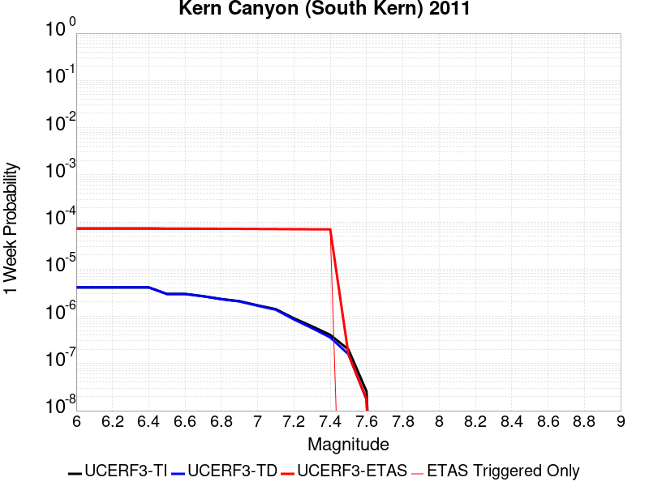 | 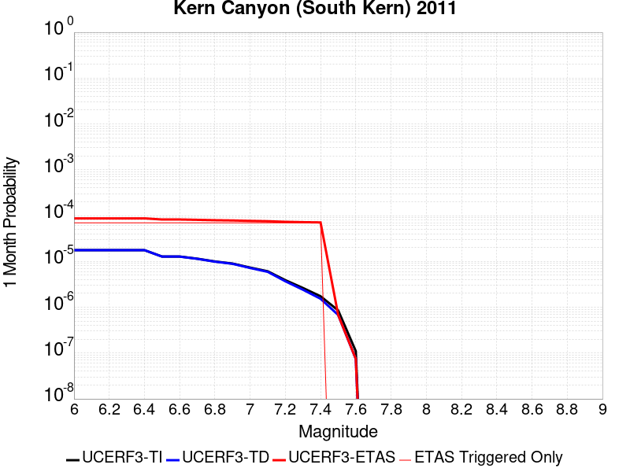 | 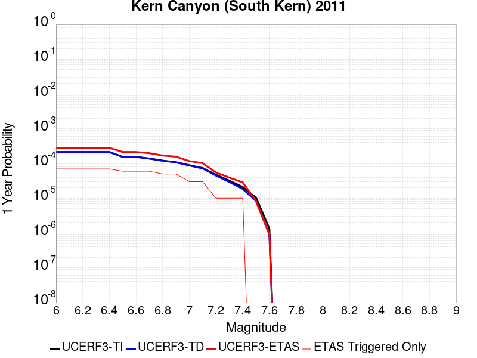 | 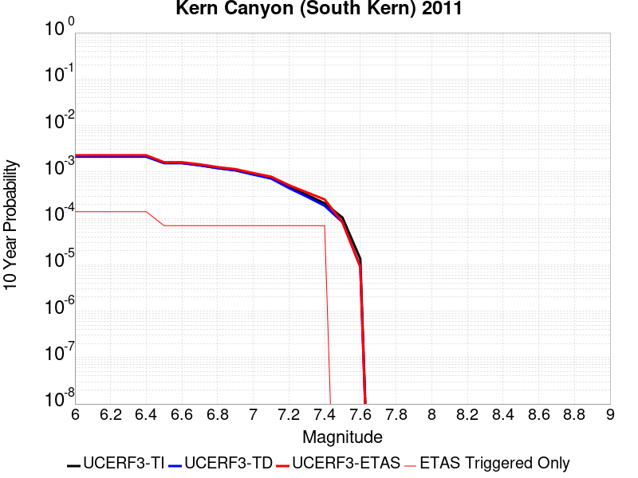 |

| Magnitude | 1 wk TI Prob | 1 wk TD Prob | 1 wk ETAS Prob | 1 wk ETAS/TD Gain | 1 wk ETAS Triggered Only | 1 mo TI Prob | 1 mo TD Prob | 1 mo ETAS Prob | 1 mo ETAS/TD Gain | 1 mo ETAS Triggered Only | 1 yr TI Prob | 1 yr TD Prob | 1 yr ETAS Prob | 1 yr ETAS/TD Gain | 1 yr ETAS Triggered Only | 10 yr TI Prob | 10 yr TD Prob | 10 yr ETAS Prob | 10 yr ETAS/TD Gain | 10 yr ETAS Triggered Only |
|-----|-----|-----|-----|-----|-----|-----|-----|-----|-----|-----|-----|-----|-----|-----|-----|-----|-----|-----|-----|-----|
| 6.0 | 4.105075E-6 | 4.113726E-6 | 4.411356E-5 | 10.723505 | 4.0E-5 | 1.7593058E-5 | 1.7630138E-5 | 6.7629255E-5 | 3.8360026 | 5.0E-5 | 2.1417443E-4 | 2.1462643E-4 | 2.846114E-4 | 1.326078 | 7.0E-5 | 0.0021396813 | 0.0021442554 | 0.0022240838 | 1.037229 | 8.0E-5 |
| 6.1 | 4.105075E-6 | 4.113726E-6 | 4.411356E-5 | 10.723505 | 4.0E-5 | 1.7593058E-5 | 1.7630138E-5 | 6.7629255E-5 | 3.8360026 | 5.0E-5 | 2.1417443E-4 | 2.1462643E-4 | 2.846114E-4 | 1.326078 | 7.0E-5 | 0.0021396813 | 0.0021442554 | 0.0022240838 | 1.037229 | 8.0E-5 |
| 6.2 | 4.105075E-6 | 4.113726E-6 | 4.411356E-5 | 10.723505 | 4.0E-5 | 1.7593058E-5 | 1.7630138E-5 | 6.7629255E-5 | 3.8360026 | 5.0E-5 | 2.1417443E-4 | 2.1462643E-4 | 2.846114E-4 | 1.326078 | 7.0E-5 | 0.0021396813 | 0.0021442554 | 0.0022240838 | 1.037229 | 8.0E-5 |
| 6.3 | 4.105075E-6 | 4.113726E-6 | 4.411356E-5 | 10.723505 | 4.0E-5 | 1.7593058E-5 | 1.7630138E-5 | 6.7629255E-5 | 3.8360026 | 5.0E-5 | 2.1417443E-4 | 2.1462643E-4 | 2.846114E-4 | 1.326078 | 7.0E-5 | 0.0021396813 | 0.0021442554 | 0.0022240838 | 1.037229 | 8.0E-5 |
| 6.4 | 4.105075E-6 | 4.113726E-6 | 4.411356E-5 | 10.723505 | 4.0E-5 | 1.7593058E-5 | 1.7630138E-5 | 6.7629255E-5 | 3.8360026 | 5.0E-5 | 2.1417443E-4 | 2.1462643E-4 | 2.846114E-4 | 1.326078 | 7.0E-5 | 0.0021396813 | 0.0021442554 | 0.0022240838 | 1.037229 | 8.0E-5 |
| 6.5 | 2.9849807E-6 | 2.973154E-6 | 4.2973035E-5 | 14.453686 | 4.0E-5 | 1.2792712E-5 | 1.2742028E-5 | 6.274139E-5 | 4.923972 | 5.0E-5 | 1.5574014E-4 | 1.551233E-4 | 2.1511399E-4 | 1.3867291 | 6.0E-5 | 0.0015563103 | 0.0015501654 | 0.0016200568 | 1.0450865 | 7.0E-5 |
| 6.6 | 2.9849807E-6 | 2.973154E-6 | 4.2973035E-5 | 14.453686 | 4.0E-5 | 1.2792712E-5 | 1.2742028E-5 | 6.274139E-5 | 4.923972 | 5.0E-5 | 1.5574014E-4 | 1.551233E-4 | 2.1511399E-4 | 1.3867291 | 6.0E-5 | 0.0015563103 | 0.0015501654 | 0.0016200568 | 1.0450865 | 7.0E-5 |
| 6.7 | 2.6756725E-6 | 2.6582202E-6 | 4.2658114E-5 | 16.047623 | 4.0E-5 | 1.1467117E-5 | 1.1392323E-5 | 6.139175E-5 | 5.3888707 | 5.0E-5 | 1.396032E-4 | 1.386928E-4 | 1.9868449E-4 | 1.4325508 | 6.0E-5 | 0.0013951553 | 0.0013860734 | 0.0014559764 | 1.0504323 | 7.0E-5 |
| 6.8 | 2.3283721E-6 | 2.3047783E-6 | 3.230471E-5 | 14.016407 | 3.0E-5 | 9.9787E-6 | 9.877584E-6 | 4.9877188E-5 | 5.0495334 | 4.0E-5 | 1.214839E-4 | 1.2025302E-4 | 1.70247E-4 | 1.41574 | 5.0E-5 | 0.001214175 | 0.001201887 | 0.0012618148 | 1.0498616 | 6.0E-5 |
| 6.9 | 2.0972677E-6 | 2.0696405E-6 | 3.206958E-5 | 15.495241 | 3.0E-5 | 8.988259E-6 | 8.869858E-6 | 4.8869504E-5 | 5.509615 | 4.0E-5 | 1.0942656E-4 | 1.0798523E-4 | 1.5797983E-4 | 1.4629763 | 5.0E-5 | 0.0010937268 | 0.0010793334 | 0.0011392686 | 1.0555298 | 6.0E-5 |
| 7.0 | 1.7132242E-6 | 1.6787029E-6 | 3.1678654E-5 | 18.87091 | 3.0E-5 | 7.3423685E-6 | 7.1944214E-6 | 3.7194204E-5 | 5.1698675 | 3.0E-5 | 8.938967E-5 | 8.75886E-5 | 1.1758597E-4 | 1.3424803 | 3.0E-5 | 8.935372E-4 | 8.755446E-4 | 9.155096E-4 | 1.0456458 | 4.0E-5 |
| 7.1 | 1.4215541E-6 | 1.3815746E-6 | 3.1381533E-5 | 22.714323 | 3.0E-5 | 6.0923603E-6 | 5.9210206E-6 | 3.5920842E-5 | 6.0666637 | 3.0E-5 | 7.417196E-5 | 7.208607E-5 | 1.02083904E-4 | 1.4161391 | 3.0E-5 | 7.414721E-4 | 7.206296E-4 | 7.606007E-4 | 1.055467 | 4.0E-5 |
| 7.2 | 9.097853E-7 | 8.60377E-7 | 1.0860368E-5 | 12.622803 | 1.0E-5 | 3.899074E-6 | 3.6873246E-6 | 1.3687288E-5 | 3.7119834 | 1.0E-5 | 4.7470192E-5 | 4.4892266E-5 | 5.4891814E-5 | 1.2227455 | 1.0E-5 | 4.7460053E-4 | 4.4883305E-4 | 4.6882406E-4 | 1.04454 | 2.0E-5 |
| 7.3 | 6.144169E-7 | 5.628199E-7 | 1.0562814E-5 | 18.767664 | 1.0E-5 | 2.6332125E-6 | 2.4120832E-6 | 1.2412059E-5 | 5.1457844 | 1.0E-5 | 3.205889E-5 | 2.9366722E-5 | 3.9366427E-5 | 1.3405116 | 1.0E-5 | 3.2054266E-4 | 2.9362892E-4 | 3.0362597E-4 | 1.0340466 | 1.0E-5 |
| 7.4 | 4.049844E-7 | 3.5728252E-7 | 1.0357279E-5 | 28.989046 | 1.0E-5 | 1.7356463E-6 | 1.5312098E-6 | 1.1531194E-5 | 7.5307736 | 1.0E-5 | 2.1131287E-5 | 1.8642324E-5 | 2.8642136E-5 | 1.5364038 | 1.0E-5 | 2.1129279E-4 | 1.8640784E-4 | 1.9640598E-4 | 1.0536358 | 1.0E-5 |
| 7.5 | 1.9871162E-7 | 1.5830383E-7 | 1.5830383E-7 | 1.0 | 0.0 | 8.5162094E-7 | 6.784448E-7 | 6.784448E-7 | 1.0 | 0.0 | 1.0368436E-5 | 8.260035E-6 | 8.260035E-6 | 1.0 | 0.0 | 1.0367952E-4 | 8.259736E-5 | 8.259736E-5 | 1.0 | 0.0 |
| 7.6 | 2.572245E-8 | 1.735264E-8 | 1.735264E-8 | 1.0 | 0.0 | 1.10239064E-7 | 7.436845E-8 | 7.436845E-8 | 1.0 | 0.0 | 1.3421597E-6 | 9.0543557E-7 | 9.0543557E-7 | 1.0 | 0.0 | 1.3421517E-5 | 9.054324E-6 | 9.054324E-6 | 1.0 | 0.0 |

## San Diego Trough south
*[(top)](#table-of-contents)*

| 1 Week | 1 Month | 1 Year | 10 Year |
|-----|-----|-----|-----|
|  | 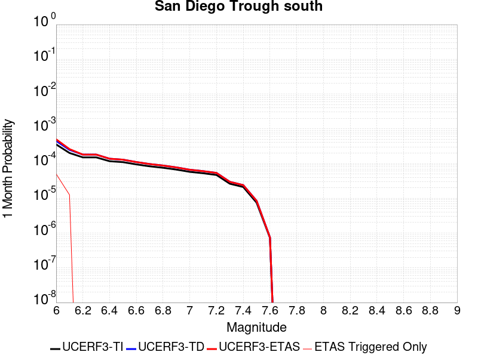 | 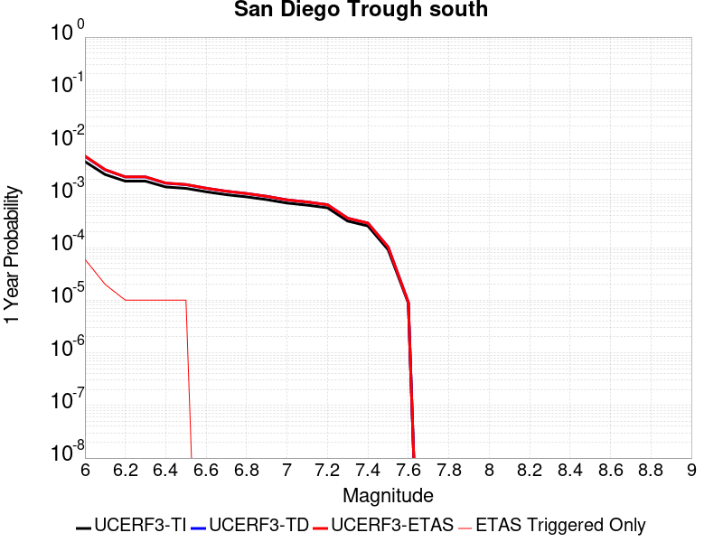 | 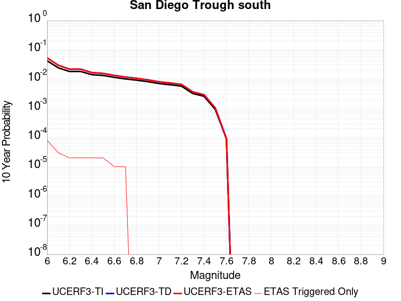 |

| Magnitude | 1 wk TI Prob | 1 wk TD Prob | 1 wk ETAS Prob | 1 wk ETAS/TD Gain | 1 wk ETAS Triggered Only | 1 mo TI Prob | 1 mo TD Prob | 1 mo ETAS Prob | 1 mo ETAS/TD Gain | 1 mo ETAS Triggered Only | 1 yr TI Prob | 1 yr TD Prob | 1 yr ETAS Prob | 1 yr ETAS/TD Gain | 1 yr ETAS Triggered Only | 10 yr TI Prob | 10 yr TD Prob | 10 yr ETAS Prob | 10 yr ETAS/TD Gain | 10 yr ETAS Triggered Only |
|-----|-----|-----|-----|-----|-----|-----|-----|-----|-----|-----|-----|-----|-----|-----|-----|-----|-----|-----|-----|-----|
| 6.0 | 8.279495E-5 | 1.0425541E-4 | 1.2425332E-4 | 1.1918166 | 2.0E-5 | 3.5478722E-4 | 4.4673498E-4 | 4.9671263E-4 | 1.1118731 | 5.0E-5 | 0.004310982 | 0.0054259133 | 0.0054855878 | 1.010998 | 6.0E-5 | 0.042283054 | 0.05299303 | 0.05306879 | 1.0014297 | 8.0E-5 |
| 6.1 | 4.6961468E-5 | 5.773024E-5 | 7.7729084E-5 | 1.3464189 | 2.0E-5 | 2.0124791E-4 | 2.473905E-4 | 2.6738556E-4 | 1.0808239 | 2.0E-5 | 0.00244744 | 0.003007886 | 0.0030278258 | 1.0066292 | 2.0E-5 | 0.024206603 | 0.029679636 | 0.029708745 | 1.0009807 | 3.0E-5 |
| 6.2 | 3.5079658E-5 | 4.214258E-5 | 5.2142157E-5 | 1.2372797 | 1.0E-5 | 1.5033272E-4 | 1.8059829E-4 | 1.9059649E-4 | 1.0553615 | 1.0E-5 | 0.0018287642 | 0.002196587 | 0.002206565 | 1.0045425 | 1.0E-5 | 0.018137876 | 0.021751188 | 0.021770753 | 1.0008994 | 2.0E-5 |
| 6.3 | 3.5079658E-5 | 4.214258E-5 | 5.2142157E-5 | 1.2372797 | 1.0E-5 | 1.5033272E-4 | 1.8059829E-4 | 1.9059649E-4 | 1.0553615 | 1.0E-5 | 0.0018287642 | 0.002196587 | 0.002206565 | 1.0045425 | 1.0E-5 | 0.018137876 | 0.021751188 | 0.021770753 | 1.0008994 | 2.0E-5 |
| 6.4 | 2.7196904E-5 | 3.208715E-5 | 4.208683E-5 | 1.3116412 | 1.0E-5 | 1.16552954E-4 | 1.3750911E-4 | 1.4750773E-4 | 1.0727124 | 1.0E-5 | 0.0014181085 | 0.0016728995 | 0.0016828828 | 1.0059676 | 1.0E-5 | 0.014090929 | 0.016604666 | 0.016624333 | 1.0011845 | 2.0E-5 |
| 6.5 | 2.5584688E-5 | 3.0101632E-5 | 4.010133E-5 | 1.3321979 | 1.0E-5 | 1.0964406E-4 | 1.2900059E-4 | 1.3899931E-4 | 1.077509 | 1.0E-5 | 0.0013340989 | 0.0015694627 | 0.001579447 | 1.0063616 | 1.0E-5 | 0.013261181 | 0.015585332 | 0.01560502 | 1.0012633 | 2.0E-5 |
| 6.6 | 2.2034688E-5 | 2.574271E-5 | 2.574271E-5 | 1.0 | 0.0 | 9.443096E-5 | 1.1032127E-4 | 1.1032127E-4 | 1.0 | 0.0 | 0.0011490905 | 0.0013423412 | 0.0013423412 | 1.0 | 0.0 | 0.011431668 | 0.013343325 | 0.013353191 | 1.0007395 | 1.0E-5 |
| 6.7 | 1.9394853E-5 | 2.254176E-5 | 2.254176E-5 | 1.0 | 0.0 | 8.311815E-5 | 9.6604E-5 | 9.6604E-5 | 1.0 | 0.0 | 0.0010114936 | 0.0011755243 | 0.0011755243 | 1.0 | 0.0 | 0.01006902 | 0.011693766 | 0.01170365 | 1.0008452 | 1.0E-5 |
| 6.8 | 1.7615313E-5 | 2.0403182E-5 | 2.0403182E-5 | 1.0 | 0.0 | 7.549201E-5 | 8.743931E-5 | 8.743931E-5 | 1.0 | 0.0 | 9.1872766E-4 | 0.0010640579 | 0.0010640579 | 1.0 | 0.0 | 0.009149387 | 0.010590198 | 0.010590198 | 1.0 | 0.0 |
| 6.9 | 1.5621423E-5 | 1.8026114E-5 | 1.8026114E-5 | 1.0 | 0.0 | 6.6947236E-5 | 7.725251E-5 | 7.725251E-5 | 1.0 | 0.0 | 8.147778E-4 | 9.40147E-4 | 9.40147E-4 | 1.0 | 0.0 | 0.008117969 | 0.009362142 | 0.009362142 | 1.0 | 0.0 |
| 7.0 | 1.3444376E-5 | 1.544809E-5 | 1.544809E-5 | 1.0 | 0.0 | 5.7617483E-5 | 6.620443E-5 | 6.620443E-5 | 1.0 | 0.0 | 7.0126704E-4 | 8.057436E-4 | 8.057436E-4 | 1.0 | 0.0 | 0.006990582 | 0.008028555 | 0.008028555 | 1.0 | 0.0 |
| 7.1 | 1.2268361E-5 | 1.407303E-5 | 1.407303E-5 | 1.0 | 0.0 | 5.2577634E-5 | 6.0311606E-5 | 6.0311606E-5 | 1.0 | 0.0 | 6.399447E-4 | 7.3404907E-4 | 7.3404907E-4 | 1.0 | 0.0 | 0.0063810493 | 0.0073165493 | 0.0073165493 | 1.0 | 0.0 |
| 7.2 | 1.0922655E-5 | 1.2513563E-5 | 1.2513563E-5 | 1.0 | 0.0 | 4.681054E-5 | 5.3628468E-5 | 5.3628468E-5 | 1.0 | 0.0 | 5.697693E-4 | 6.5273355E-4 | 6.5273355E-4 | 1.0 | 0.0 | 0.0056831064 | 0.0065084435 | 0.0065084435 | 1.0 | 0.0 |
| 7.3 | 6.1106753E-6 | 6.928925E-6 | 6.928925E-6 | 1.0 | 0.0 | 2.6188345E-5 | 2.9695057E-5 | 2.9695057E-5 | 1.0 | 0.0 | 3.1879646E-4 | 3.6147775E-4 | 3.6147775E-4 | 1.0 | 0.0 | 0.0031833951 | 0.003608943 | 0.003608943 | 1.0 | 0.0 |
| 7.4 | 4.933187E-6 | 5.5895525E-6 | 5.5895525E-6 | 1.0 | 0.0 | 2.114206E-5 | 2.3955008E-5 | 2.3955008E-5 | 1.0 | 0.0 | 2.5737417E-4 | 2.9161357E-4 | 2.9161357E-4 | 1.0 | 0.0 | 0.002570763 | 0.0029123505 | 0.0029123505 | 1.0 | 0.0 |
| 7.5 | 1.7489613E-6 | 1.969678E-6 | 1.969678E-6 | 1.0 | 0.0 | 7.495527E-6 | 8.4414505E-6 | 8.4414505E-6 | 1.0 | 0.0 | 9.125422E-5 | 1.02770035E-4 | 1.02770035E-4 | 1.0 | 0.0 | 9.1216754E-4 | 0.0010272472 | 0.0010272472 | 1.0 | 0.0 |
| 7.6 | 1.6988751E-7 | 1.7533823E-7 | 1.7533823E-7 | 1.0 | 0.0 | 7.2808916E-7 | 7.5144936E-7 | 7.5144936E-7 | 1.0 | 0.0 | 8.864449E-6 | 9.14886E-6 | 9.14886E-6 | 1.0 | 0.0 | 8.8640954E-5 | 9.1485024E-5 | 9.1485024E-5 | 1.0 | 0.0 |

## Tin Mountain
*[(top)](#table-of-contents)*

| 1 Week | 1 Month | 1 Year | 10 Year |
|-----|-----|-----|-----|
| 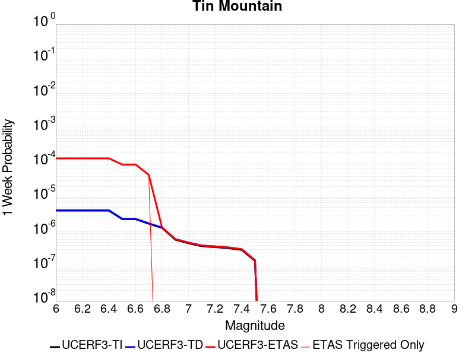 |  | 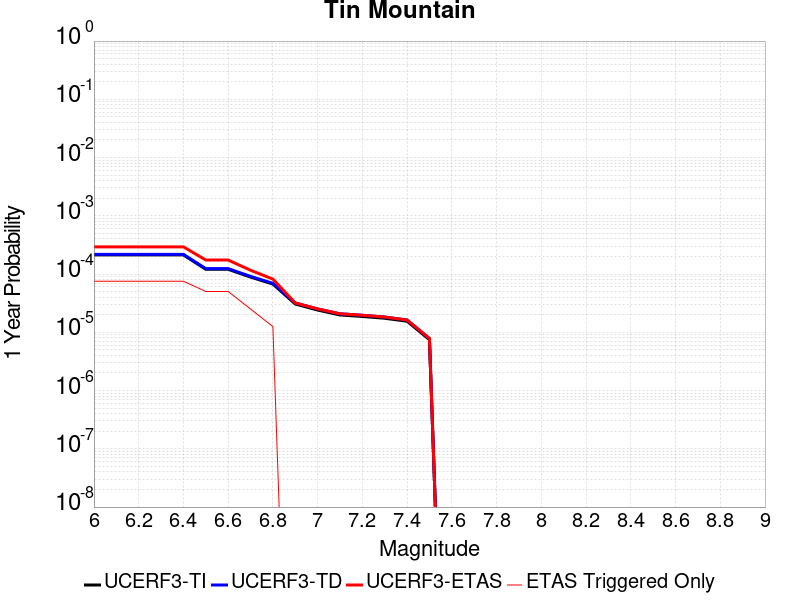 | 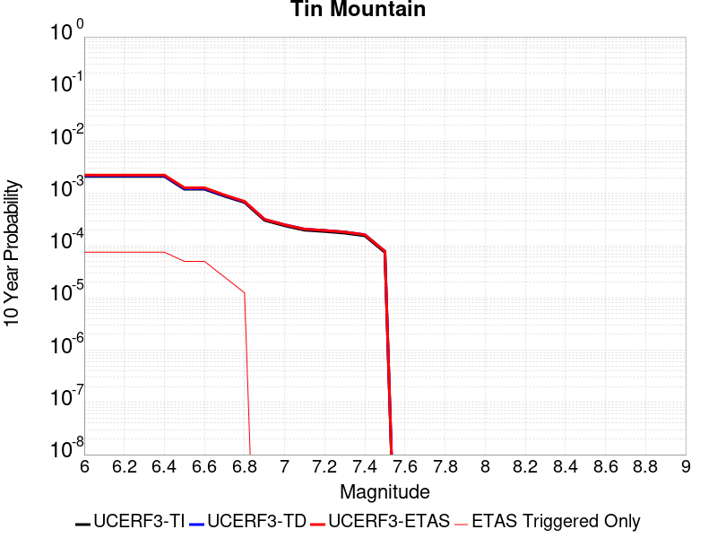 |

| Magnitude | 1 wk TI Prob | 1 wk TD Prob | 1 wk ETAS Prob | 1 wk ETAS/TD Gain | 1 wk ETAS Triggered Only | 1 mo TI Prob | 1 mo TD Prob | 1 mo ETAS Prob | 1 mo ETAS/TD Gain | 1 mo ETAS Triggered Only | 1 yr TI Prob | 1 yr TD Prob | 1 yr ETAS Prob | 1 yr ETAS/TD Gain | 1 yr ETAS Triggered Only | 10 yr TI Prob | 10 yr TD Prob | 10 yr ETAS Prob | 10 yr ETAS/TD Gain | 10 yr ETAS Triggered Only |
|-----|-----|-----|-----|-----|-----|-----|-----|-----|-----|-----|-----|-----|-----|-----|-----|-----|-----|-----|-----|-----|
| 6.0 | 4.083776E-6 | 4.1815365E-6 | 5.4181328E-5 | 12.957276 | 5.0E-5 | 1.750178E-5 | 1.792077E-5 | 6.791987E-5 | 3.7900088 | 5.0E-5 | 2.1306332E-4 | 2.1816725E-4 | 2.8815196E-4 | 1.3207848 | 7.0E-5 | 0.0021285915 | 0.0021798965 | 0.0022497438 | 1.0320417 | 7.0E-5 |
| 6.1 | 4.083776E-6 | 4.1815365E-6 | 5.4181328E-5 | 12.957276 | 5.0E-5 | 1.750178E-5 | 1.792077E-5 | 6.791987E-5 | 3.7900088 | 5.0E-5 | 2.1306332E-4 | 2.1816725E-4 | 2.8815196E-4 | 1.3207848 | 7.0E-5 | 0.0021285915 | 0.0021798965 | 0.0022497438 | 1.0320417 | 7.0E-5 |
| 6.2 | 4.083776E-6 | 4.1815365E-6 | 5.4181328E-5 | 12.957276 | 5.0E-5 | 1.750178E-5 | 1.792077E-5 | 6.791987E-5 | 3.7900088 | 5.0E-5 | 2.1306332E-4 | 2.1816725E-4 | 2.8815196E-4 | 1.3207848 | 7.0E-5 | 0.0021285915 | 0.0021798965 | 0.0022497438 | 1.0320417 | 7.0E-5 |
| 6.3 | 4.083776E-6 | 4.1815365E-6 | 5.4181328E-5 | 12.957276 | 5.0E-5 | 1.750178E-5 | 1.792077E-5 | 6.791987E-5 | 3.7900088 | 5.0E-5 | 2.1306332E-4 | 2.1816725E-4 | 2.8815196E-4 | 1.3207848 | 7.0E-5 | 0.0021285915 | 0.0021798965 | 0.0022497438 | 1.0320417 | 7.0E-5 |
| 6.4 | 4.083776E-6 | 4.1815365E-6 | 5.4181328E-5 | 12.957276 | 5.0E-5 | 1.750178E-5 | 1.792077E-5 | 6.791987E-5 | 3.7900088 | 5.0E-5 | 2.1306332E-4 | 2.1816725E-4 | 2.8815196E-4 | 1.3207848 | 7.0E-5 | 0.0021285915 | 0.0021798965 | 0.0022497438 | 1.0320417 | 7.0E-5 |
| 6.5 | 2.3143427E-6 | 2.3731573E-6 | 2.237311E-5 | 9.427572 | 2.0E-5 | 9.9185745E-6 | 1.0170638E-5 | 3.0170435E-5 | 2.966425 | 2.0E-5 | 1.2075195E-4 | 1.2382126E-4 | 1.6381631E-4 | 1.3230063 | 4.0E-5 | 0.0012068636 | 0.0012375986 | 0.0012775491 | 1.0322807 | 4.0E-5 |
| 6.6 | 2.3143427E-6 | 2.3731573E-6 | 2.237311E-5 | 9.427572 | 2.0E-5 | 9.9185745E-6 | 1.0170638E-5 | 3.0170435E-5 | 2.966425 | 2.0E-5 | 1.2075195E-4 | 1.2382126E-4 | 1.6381631E-4 | 1.3230063 | 4.0E-5 | 0.0012068636 | 0.0012375986 | 0.0012775491 | 1.0322807 | 4.0E-5 |
| 6.7 | 1.7029532E-6 | 1.7497915E-6 | 1.1749774E-5 | 6.7149568 | 1.0E-5 | 7.2983503E-6 | 7.499088E-6 | 1.7499013E-5 | 2.3334856 | 1.0E-5 | 8.885379E-5 | 9.1298105E-5 | 1.1129628E-4 | 1.2190425 | 2.0E-5 | 8.881827E-4 | 9.1265864E-4 | 9.3264034E-4 | 1.021894 | 2.0E-5 |
| 6.8 | 1.2914646E-6 | 1.3299378E-6 | 1.3299378E-6 | 1.0 | 0.0 | 5.534837E-6 | 5.6997237E-6 | 5.6997237E-6 | 1.0 | 0.0 | 6.738455E-5 | 6.939237E-5 | 7.939168E-5 | 1.144098 | 1.0E-5 | 6.736412E-4 | 6.9375033E-4 | 7.037434E-4 | 1.0144044 | 1.0E-5 |
| 6.9 | 5.8708974E-7 | 6.1169936E-7 | 6.1169936E-7 | 1.0 | 0.0 | 2.5160964E-6 | 2.6215664E-6 | 2.6215664E-6 | 1.0 | 0.0 | 3.0633044E-5 | 3.1917145E-5 | 3.1917145E-5 | 1.0 | 0.0 | 3.0628822E-4 | 3.191297E-4 | 3.191297E-4 | 1.0 | 0.0 |
| 7.0 | 4.6248786E-7 | 4.832015E-7 | 4.832015E-7 | 1.0 | 0.0 | 1.9820893E-6 | 2.0708624E-6 | 2.0708624E-6 | 1.0 | 0.0 | 2.413167E-5 | 2.5212494E-5 | 2.5212494E-5 | 1.0 | 0.0 | 2.412905E-4 | 2.5210003E-4 | 2.5210003E-4 | 1.0 | 0.0 |
| 7.1 | 3.804606E-7 | 3.987147E-7 | 3.987147E-7 | 1.0 | 0.0 | 1.6305444E-6 | 1.7087764E-6 | 1.7087764E-6 | 1.0 | 0.0 | 1.9851697E-5 | 2.0804187E-5 | 2.0804187E-5 | 1.0 | 0.0 | 1.9849923E-4 | 2.0802575E-4 | 2.0802575E-4 | 1.0 | 0.0 |
| 7.2 | 3.5864858E-7 | 3.7616863E-7 | 3.7616863E-7 | 1.0 | 0.0 | 1.5370645E-6 | 1.6121504E-6 | 1.6121504E-6 | 1.0 | 0.0 | 1.87136E-5 | 1.9627789E-5 | 1.9627789E-5 | 1.0 | 0.0 | 1.8712023E-4 | 1.9626386E-4 | 1.9626386E-4 | 1.0 | 0.0 |
| 7.3 | 3.342063E-7 | 3.506347E-7 | 3.506347E-7 | 1.0 | 0.0 | 1.4323119E-6 | 1.5027196E-6 | 1.5027196E-6 | 1.0 | 0.0 | 1.7438259E-5 | 1.829549E-5 | 1.829549E-5 | 1.0 | 0.0 | 1.743689E-4 | 1.8294314E-4 | 1.8294314E-4 | 1.0 | 0.0 |
| 7.4 | 2.971242E-7 | 3.1165817E-7 | 3.1165817E-7 | 1.0 | 0.0 | 1.2733886E-6 | 1.3356774E-6 | 1.3356774E-6 | 1.0 | 0.0 | 1.5503398E-5 | 1.6261785E-5 | 1.6261785E-5 | 1.0 | 0.0 | 1.5502315E-4 | 1.6260923E-4 | 1.6260923E-4 | 1.0 | 0.0 |
| 7.5 | 1.4326713E-7 | 1.5012525E-7 | 1.5012525E-7 | 1.0 | 0.0 | 6.140018E-7 | 6.433939E-7 | 6.433939E-7 | 1.0 | 0.0 | 7.4754466E-6 | 7.8333205E-6 | 7.8333205E-6 | 1.0 | 0.0 | 7.475195E-5 | 7.833321E-5 | 7.833321E-5 | 1.0 | 0.0 |

## Great Valley 09 (Laguna Seca)
*[(top)](#table-of-contents)*

| 1 Week | 1 Month | 1 Year | 10 Year |
|-----|-----|-----|-----|
|  |  | 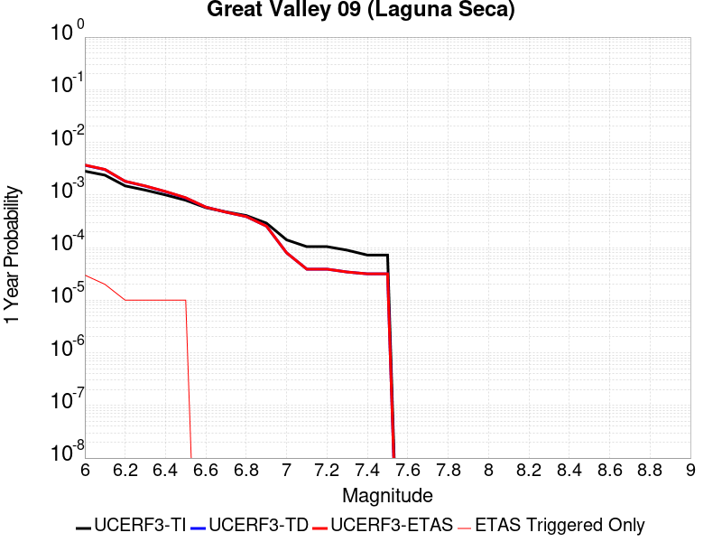 | 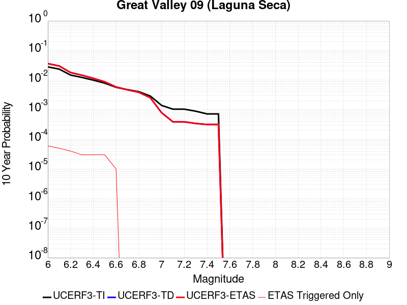 |

| Magnitude | 1 wk TI Prob | 1 wk TD Prob | 1 wk ETAS Prob | 1 wk ETAS/TD Gain | 1 wk ETAS Triggered Only | 1 mo TI Prob | 1 mo TD Prob | 1 mo ETAS Prob | 1 mo ETAS/TD Gain | 1 mo ETAS Triggered Only | 1 yr TI Prob | 1 yr TD Prob | 1 yr ETAS Prob | 1 yr ETAS/TD Gain | 1 yr ETAS Triggered Only | 10 yr TI Prob | 10 yr TD Prob | 10 yr ETAS Prob | 10 yr ETAS/TD Gain | 10 yr ETAS Triggered Only |
|-----|-----|-----|-----|-----|-----|-----|-----|-----|-----|-----|-----|-----|-----|-----|-----|-----|-----|-----|-----|-----|
| 6.0 | 5.4353277E-5 | 7.050019E-5 | 7.050019E-5 | 1.0 | 0.0 | 2.3292181E-4 | 3.0211007E-4 | 3.0211007E-4 | 1.0 | 0.0 | 0.0028321352 | 0.0036720056 | 0.0037018955 | 1.00814 | 3.0E-5 | 0.02796312 | 0.036115844 | 0.03617368 | 1.0016013 | 6.0E-5 |
| 6.1 | 4.5578287E-5 | 5.822054E-5 | 5.822054E-5 | 1.0 | 0.0 | 1.953209E-4 | 2.4949352E-4 | 2.4949352E-4 | 1.0 | 0.0 | 0.0023754383 | 0.0030333549 | 0.0030532943 | 1.0065733 | 2.0E-5 | 0.023502063 | 0.029919893 | 0.029968396 | 1.0016211 | 5.0E-5 |
| 6.2 | 2.8536782E-5 | 3.4736422E-5 | 3.4736422E-5 | 1.0 | 0.0 | 1.2229476E-4 | 1.4886161E-4 | 1.4886161E-4 | 1.0 | 0.0 | 0.0014879217 | 0.0018108576 | 0.0018208395 | 1.0055122 | 1.0E-5 | 0.014779986 | 0.017958276 | 0.017997557 | 1.0021874 | 4.0E-5 |
| 6.3 | 2.3698774E-5 | 2.8213344E-5 | 2.8213344E-5 | 1.0 | 0.0 | 1.01562226E-4 | 1.2090833E-4 | 1.2090833E-4 | 1.0 | 0.0 | 0.0012358186 | 0.001471051 | 0.0014810363 | 1.0067879 | 1.0E-5 | 0.012289686 | 0.014611455 | 0.014641016 | 1.0020232 | 3.0E-5 |
| 6.4 | 1.9191197E-5 | 2.212289E-5 | 2.212289E-5 | 1.0 | 0.0 | 8.2245395E-5 | 9.4808805E-5 | 9.4808805E-5 | 1.0 | 0.0 | 0.0010008777 | 0.0011536906 | 0.0011636791 | 1.0086578 | 1.0E-5 | 0.009963818 | 0.011477022 | 0.011506678 | 1.0025839 | 3.0E-5 |
| 6.5 | 1.5203241E-5 | 1.6801298E-5 | 1.6801298E-5 | 1.0 | 0.0 | 6.5155116E-5 | 7.200338E-5 | 7.200338E-5 | 1.0 | 0.0 | 7.9297484E-4 | 8.76301E-4 | 8.8629226E-4 | 1.0114017 | 1.0E-5 | 0.007901512 | 0.008729581 | 0.008759319 | 1.0034066 | 3.0E-5 |
| 6.6 | 1.0984925E-5 | 1.12425605E-5 | 1.12425605E-5 | 1.0 | 0.0 | 4.70774E-5 | 4.8181533E-5 | 4.8181533E-5 | 1.0 | 0.0 | 5.730166E-4 | 5.8645604E-4 | 5.8645604E-4 | 1.0 | 0.0 | 0.005715413 | 0.0058494755 | 0.005859417 | 1.0016996 | 1.0E-5 |
| 6.7 | 9.134616E-6 | 9.019868E-6 | 9.019868E-6 | 1.0 | 0.0 | 3.9147766E-5 | 3.865602E-5 | 3.865602E-5 | 1.0 | 0.0 | 4.7651984E-4 | 4.7053778E-4 | 4.7053778E-4 | 1.0 | 0.0 | 0.004754993 | 0.00469566 | 0.00469566 | 1.0 | 0.0 |
| 6.8 | 7.785589E-6 | 7.4519185E-6 | 7.4519185E-6 | 1.0 | 0.0 | 3.3366385E-5 | 3.1936415E-5 | 3.1936415E-5 | 1.0 | 0.0 | 4.0616E-4 | 3.887585E-4 | 3.887585E-4 | 1.0 | 0.0 | 0.0040541845 | 0.003880988 | 0.003880988 | 1.0 | 0.0 |
| 6.9 | 5.579095E-6 | 4.8984666E-6 | 4.8984666E-6 | 1.0 | 0.0 | 2.3910188E-5 | 2.0993268E-5 | 2.0993268E-5 | 1.0 | 0.0 | 2.9106764E-4 | 2.5556443E-4 | 2.5556443E-4 | 1.0 | 0.0 | 0.002906867 | 0.0025528427 | 0.0025528427 | 1.0 | 0.0 |
| 7.0 | 2.6816688E-6 | 1.521587E-6 | 1.521587E-6 | 1.0 | 0.0 | 1.1492816E-5 | 6.521071E-6 | 6.521071E-6 | 1.0 | 0.0 | 1.3991605E-4 | 7.939124E-5 | 7.939124E-5 | 1.0 | 0.0 | 0.0013982799 | 7.936375E-4 | 7.936375E-4 | 1.0 | 0.0 |
| 7.1 | 1.9951021E-6 | 7.45357E-7 | 7.45357E-7 | 1.0 | 0.0 | 8.55041E-6 | 3.1943835E-6 | 3.1943835E-6 | 1.0 | 0.0 | 1.0409627E-4 | 3.889097E-5 | 3.889097E-5 | 1.0 | 0.0 | 0.0010404752 | 3.8884574E-4 | 3.8884574E-4 | 1.0 | 0.0 |
| 7.2 | 1.9951021E-6 | 7.45357E-7 | 7.45357E-7 | 1.0 | 0.0 | 8.55041E-6 | 3.1943835E-6 | 3.1943835E-6 | 1.0 | 0.0 | 1.0409627E-4 | 3.889097E-5 | 3.889097E-5 | 1.0 | 0.0 | 0.0010404752 | 3.8884574E-4 | 3.8884574E-4 | 1.0 | 0.0 |
| 7.3 | 1.7087556E-6 | 6.578663E-7 | 6.578663E-7 | 1.0 | 0.0 | 7.3232177E-6 | 2.819424E-6 | 2.819424E-6 | 1.0 | 0.0 | 8.915652E-5 | 3.432599E-5 | 3.432599E-5 | 1.0 | 0.0 | 8.9120766E-4 | 3.432109E-4 | 3.432109E-4 | 1.0 | 0.0 |
| 7.4 | 1.3804846E-6 | 6.0737113E-7 | 6.0737113E-7 | 1.0 | 0.0 | 5.916349E-6 | 2.6030168E-6 | 2.6030168E-6 | 1.0 | 0.0 | 7.2029165E-5 | 3.169131E-5 | 3.169131E-5 | 1.0 | 0.0 | 7.200583E-4 | 3.168719E-4 | 3.168719E-4 | 1.0 | 0.0 |
| 7.5 | 1.3804846E-6 | 6.0737113E-7 | 6.0737113E-7 | 1.0 | 0.0 | 5.916349E-6 | 2.6030168E-6 | 2.6030168E-6 | 1.0 | 0.0 | 7.2029165E-5 | 3.169131E-5 | 3.169131E-5 | 1.0 | 0.0 | 7.200583E-4 | 3.168719E-4 | 3.168719E-4 | 1.0 | 0.0 |

## Oceanic - West Huasna
*[(top)](#table-of-contents)*

| 1 Week | 1 Month | 1 Year | 10 Year |
|-----|-----|-----|-----|
| 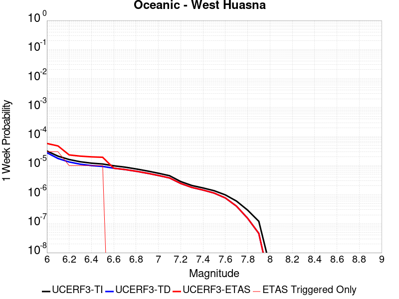 | 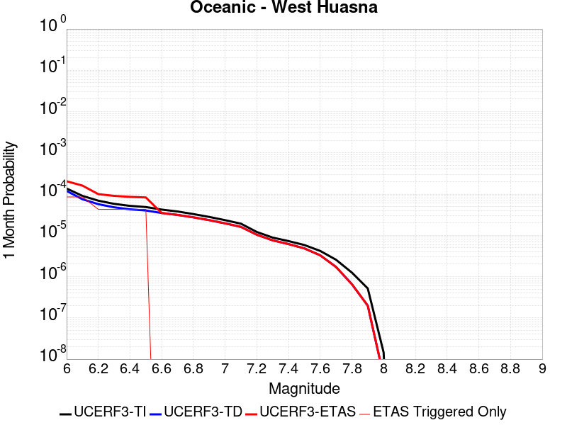 | 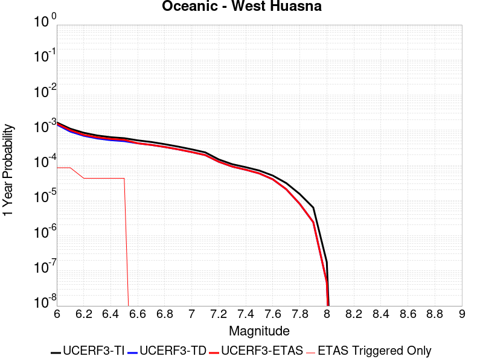 | 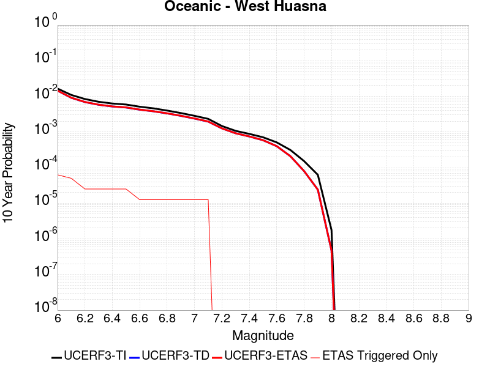 |

| Magnitude | 1 wk TI Prob | 1 wk TD Prob | 1 wk ETAS Prob | 1 wk ETAS/TD Gain | 1 wk ETAS Triggered Only | 1 mo TI Prob | 1 mo TD Prob | 1 mo ETAS Prob | 1 mo ETAS/TD Gain | 1 mo ETAS Triggered Only | 1 yr TI Prob | 1 yr TD Prob | 1 yr ETAS Prob | 1 yr ETAS/TD Gain | 1 yr ETAS Triggered Only | 10 yr TI Prob | 10 yr TD Prob | 10 yr ETAS Prob | 10 yr ETAS/TD Gain | 10 yr ETAS Triggered Only |
|-----|-----|-----|-----|-----|-----|-----|-----|-----|-----|-----|-----|-----|-----|-----|-----|-----|-----|-----|-----|-----|
| 6.0 | 3.195567E-5 | 2.7926368E-5 | 5.792553E-5 | 2.0742235 | 3.0E-5 | 1.3694567E-4 | 1.19679185E-4 | 1.496756E-4 | 1.2506402 | 3.0E-5 | 0.0016660384 | 0.0014561634 | 0.0015160759 | 1.0411441 | 6.0E-5 | 0.016536033 | 0.01447077 | 0.014539758 | 1.0047673 | 7.0E-5 |
| 6.1 | 2.1156782E-5 | 1.7573117E-5 | 4.757259E-5 | 2.707123 | 3.0E-5 | 9.066878E-5 | 7.531123E-5 | 1.0530898E-4 | 1.398317 | 3.0E-5 | 0.0011033333 | 9.1653795E-4 | 9.6649217E-4 | 1.0545031 | 5.0E-5 | 0.010978713 | 0.009128587 | 0.009178131 | 1.0054272 | 5.0E-5 |
| 6.2 | 1.6195117E-5 | 1.3327227E-5 | 2.3327093E-5 | 1.7503337 | 1.0E-5 | 6.9405796E-5 | 5.7115452E-5 | 6.711488E-5 | 1.175074 | 1.0E-5 | 8.44688E-4 | 6.9516135E-4 | 7.251405E-4 | 1.0431254 | 3.0E-5 | 0.008414844 | 0.0069301617 | 0.006959954 | 1.0042989 | 3.0E-5 |
| 6.3 | 1.3559345E-5 | 1.1179013E-5 | 2.1178901E-5 | 1.8945234 | 1.0E-5 | 5.811018E-5 | 4.7909183E-5 | 5.7908703E-5 | 1.2087183 | 1.0E-5 | 7.072618E-4 | 5.8313913E-4 | 6.1312167E-4 | 1.0514157 | 3.0E-5 | 0.0070501505 | 0.005816208 | 0.0058460333 | 1.005128 | 3.0E-5 |
| 6.4 | 1.2120619E-5 | 1.0000874E-5 | 2.0000774E-5 | 1.9999026 | 1.0E-5 | 5.1944477E-5 | 4.2860185E-5 | 5.285976E-5 | 1.2333068 | 1.0E-5 | 6.322405E-4 | 5.216983E-4 | 5.5168266E-4 | 1.0574745 | 3.0E-5 | 0.006304447 | 0.005204804 | 0.0052346475 | 1.0057338 | 3.0E-5 |
| 6.5 | 1.13511915E-5 | 9.367378E-6 | 1.9367284E-5 | 2.0675244 | 1.0E-5 | 4.8647056E-5 | 4.0145293E-5 | 5.0144892E-5 | 1.2490852 | 1.0E-5 | 5.9211696E-4 | 4.886598E-4 | 5.186451E-4 | 1.0613624 | 3.0E-5 | 0.0059054173 | 0.0048759114 | 0.004905765 | 1.0061227 | 3.0E-5 |
| 6.6 | 9.850605E-6 | 8.1353155E-6 | 8.1353155E-6 | 1.0 | 0.0 | 4.2216197E-5 | 3.4865174E-5 | 3.4865174E-5 | 1.0 | 0.0 | 5.1386096E-4 | 4.2440102E-4 | 4.4439253E-4 | 1.0471052 | 2.0E-5 | 0.0051267436 | 0.0042359377 | 0.004255853 | 1.0047015 | 2.0E-5 |
| 6.7 | 8.8558645E-6 | 7.318341E-6 | 7.318341E-6 | 1.0 | 0.0 | 3.7953152E-5 | 3.1363943E-5 | 3.1363943E-5 | 1.0 | 0.0 | 4.6198163E-4 | 3.8178926E-4 | 4.0178164E-4 | 1.052365 | 2.0E-5 | 0.004610224 | 0.0038113592 | 0.003831283 | 1.0052274 | 2.0E-5 |
| 6.8 | 7.67136E-6 | 6.39169E-6 | 6.39169E-6 | 1.0 | 0.0 | 3.2876844E-5 | 2.739267E-5 | 2.739267E-5 | 1.0 | 0.0 | 4.0020206E-4 | 3.3345487E-4 | 3.534482E-4 | 1.0599581 | 2.0E-5 | 0.003994821 | 0.0033295664 | 0.0033494998 | 1.0059868 | 2.0E-5 |
| 6.9 | 6.534529E-6 | 5.458261E-6 | 5.458261E-6 | 1.0 | 0.0 | 2.8004823E-5 | 2.3392338E-5 | 2.3392338E-5 | 1.0 | 0.0 | 3.4090536E-4 | 2.8476462E-4 | 3.0475893E-4 | 1.0702134 | 2.0E-5 | 0.0034038287 | 0.002844014 | 0.002863957 | 1.0070124 | 2.0E-5 |
| 7.0 | 5.460525E-6 | 4.5699203E-6 | 4.5699203E-6 | 1.0 | 0.0 | 2.3402039E-5 | 1.9585226E-5 | 1.9585226E-5 | 1.0 | 0.0 | 2.8488258E-4 | 2.3842414E-4 | 2.5841937E-4 | 1.0838641 | 2.0E-5 | 0.0028451765 | 0.0023816973 | 0.0024016497 | 1.0083773 | 2.0E-5 |
| 7.1 | 4.4825083E-6 | 3.7524153E-6 | 3.7524153E-6 | 1.0 | 0.0 | 1.9210609E-5 | 1.6081682E-5 | 1.6081682E-5 | 1.0 | 0.0 | 2.3386406E-4 | 1.9577699E-4 | 2.1577306E-4 | 1.1021371 | 2.0E-5 | 0.002336181 | 0.001956057 | 0.001976018 | 1.0102047 | 2.0E-5 |
| 7.2 | 2.821708E-6 | 2.424941E-6 | 2.424941E-6 | 1.0 | 0.0 | 1.2092979E-5 | 1.0392562E-5 | 1.0392562E-5 | 1.0 | 0.0 | 1.4722206E-4 | 1.265221E-4 | 1.265221E-4 | 1.0 | 0.0 | 0.0014712457 | 0.0012645032 | 0.0012645032 | 1.0 | 0.0 |
| 7.3 | 2.0644757E-6 | 1.7687502E-6 | 1.7687502E-6 | 1.0 | 0.0 | 8.847723E-6 | 7.580336E-6 | 7.580336E-6 | 1.0 | 0.0 | 1.0771569E-4 | 9.228668E-5 | 9.228668E-5 | 1.0 | 0.0 | 0.001076635 | 9.224854E-4 | 9.224854E-4 | 1.0 | 0.0 |
| 7.4 | 1.6980367E-6 | 1.4379966E-6 | 1.4379966E-6 | 1.0 | 0.0 | 7.27728E-6 | 6.1628284E-6 | 6.1628284E-6 | 1.0 | 0.0 | 8.8597284E-5 | 7.502986E-5 | 7.502986E-5 | 1.0 | 0.0 | 8.8561967E-4 | 7.5004686E-4 | 7.5004686E-4 | 1.0 | 0.0 |
| 7.5 | 1.3637683E-6 | 1.1302697E-6 | 1.1302697E-6 | 1.0 | 0.0 | 5.844708E-6 | 4.844004E-6 | 4.844004E-6 | 1.0 | 0.0 | 7.1156996E-5 | 5.897415E-5 | 5.897415E-5 | 1.0 | 0.0 | 7.1134215E-4 | 5.8958656E-4 | 5.8958656E-4 | 1.0 | 0.0 |
| 7.6 | 9.802994E-7 | 7.6772847E-7 | 7.6772847E-7 | 1.0 | 0.0 | 4.2012766E-6 | 3.2902608E-6 | 3.2902608E-6 | 1.0 | 0.0 | 5.1149345E-5 | 4.005819E-5 | 4.005819E-5 | 1.0 | 0.0 | 5.113757E-4 | 4.0051117E-4 | 4.0051117E-4 | 1.0 | 0.0 |
| 7.7 | 5.986191E-7 | 4.0050708E-7 | 4.0050708E-7 | 1.0 | 0.0 | 2.5655079E-6 | 1.7164577E-6 | 1.7164577E-6 | 1.0 | 0.0 | 3.1234613E-5 | 2.0897673E-5 | 2.0897673E-5 | 1.0 | 0.0 | 3.123022E-4 | 2.0895849E-4 | 2.0895849E-4 | 1.0 | 0.0 |
| 7.8 | 2.9189815E-7 | 1.5285202E-7 | 1.5285202E-7 | 1.0 | 0.0 | 1.2509914E-6 | 6.5507993E-7 | 6.5507993E-7 | 1.0 | 0.0 | 1.5230714E-5 | 7.975569E-6 | 7.975569E-6 | 1.0 | 0.0 | 1.522967E-4 | 7.97542E-5 | 7.97542E-5 | 1.0 | 0.0 |
| 7.9 | 1.2057845E-7 | 4.6208047E-8 | 4.6208047E-8 | 1.0 | 0.0 | 5.1676466E-7 | 1.9803447E-7 | 1.9803447E-7 | 1.0 | 0.0 | 6.2915915E-6 | 2.411067E-6 | 2.411067E-6 | 1.0 | 0.0 | 6.2914136E-5 | 2.4111772E-5 | 2.4111772E-5 | 1.0 | 0.0 |
| 8.0 | 3.3806387E-9 | 9.0093144E-10 | 9.0093144E-10 | 1.0 | 0.0 | 1.4488451E-8 | 3.8611354E-9 | 3.8611354E-9 | 1.0 | 0.0 | 1.7639688E-7 | 4.7009323E-8 | 4.7009323E-8 | 1.0 | 0.0 | 1.7639674E-6 | 4.712806E-7 | 4.712806E-7 | 1.0 | 0.0 |

## San Jacinto (Lytle Creek connector)
*[(top)](#table-of-contents)*

| 1 Week | 1 Month | 1 Year | 10 Year |
|-----|-----|-----|-----|
| 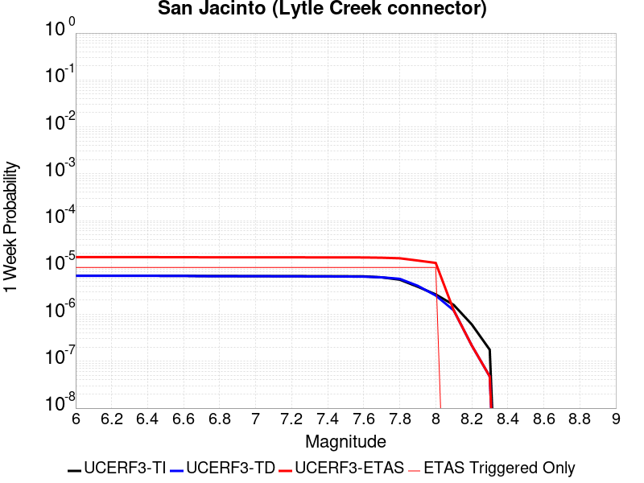 | 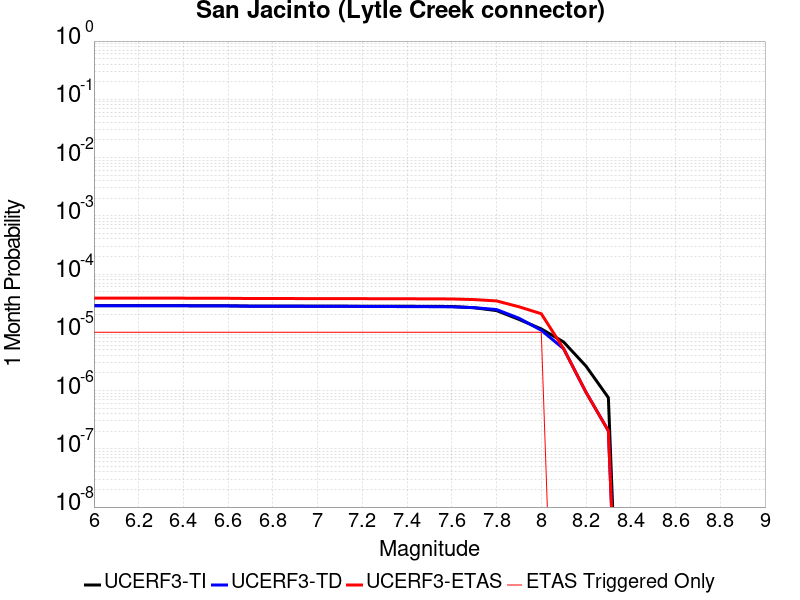 | 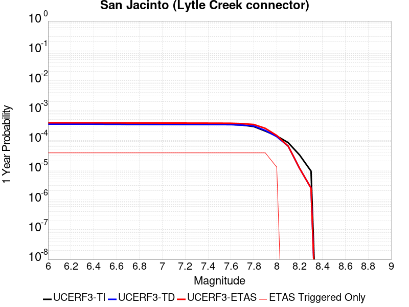 | 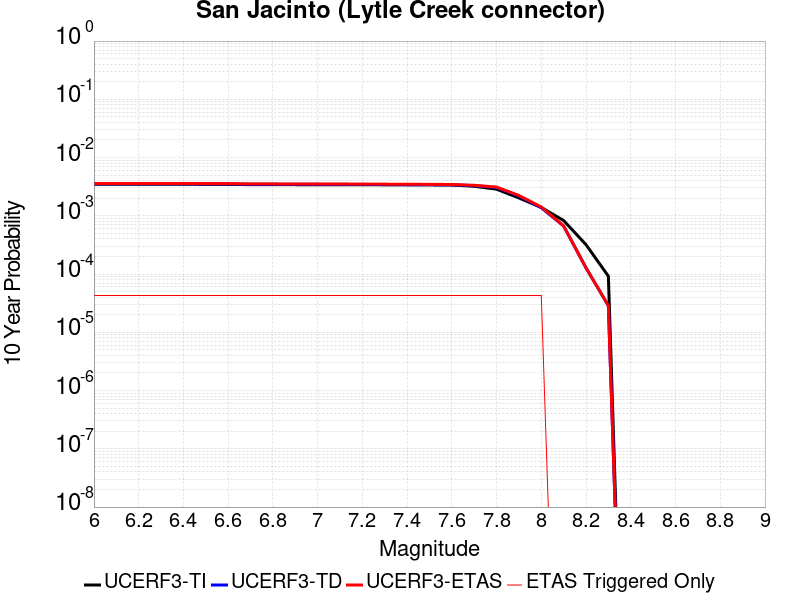 |

| Magnitude | 1 wk TI Prob | 1 wk TD Prob | 1 wk ETAS Prob | 1 wk ETAS/TD Gain | 1 wk ETAS Triggered Only | 1 mo TI Prob | 1 mo TD Prob | 1 mo ETAS Prob | 1 mo ETAS/TD Gain | 1 mo ETAS Triggered Only | 1 yr TI Prob | 1 yr TD Prob | 1 yr ETAS Prob | 1 yr ETAS/TD Gain | 1 yr ETAS Triggered Only | 10 yr TI Prob | 10 yr TD Prob | 10 yr ETAS Prob | 10 yr ETAS/TD Gain | 10 yr ETAS Triggered Only |
|-----|-----|-----|-----|-----|-----|-----|-----|-----|-----|-----|-----|-----|-----|-----|-----|-----|-----|-----|-----|-----|
| 6.0 | 6.693995E-6 | 6.660123E-6 | 1.6660057E-5 | 2.501464 | 1.0E-5 | 2.8688235E-5 | 2.8543072E-5 | 3.854279E-5 | 1.3503377 | 1.0E-5 | 3.492233E-4 | 3.4745657E-4 | 3.8744268E-4 | 1.1150823 | 4.0E-5 | 0.00348675 | 0.0035491167 | 0.0036089038 | 1.0168456 | 6.0E-5 |
| 6.1 | 6.693995E-6 | 6.660123E-6 | 1.6660057E-5 | 2.501464 | 1.0E-5 | 2.8688235E-5 | 2.8543072E-5 | 3.854279E-5 | 1.3503377 | 1.0E-5 | 3.492233E-4 | 3.4745657E-4 | 3.8744268E-4 | 1.1150823 | 4.0E-5 | 0.00348675 | 0.0035491167 | 0.0036089038 | 1.0168456 | 6.0E-5 |
| 6.2 | 6.693995E-6 | 6.660123E-6 | 1.6660057E-5 | 2.501464 | 1.0E-5 | 2.8688235E-5 | 2.8543072E-5 | 3.854279E-5 | 1.3503377 | 1.0E-5 | 3.492233E-4 | 3.4745657E-4 | 3.8744268E-4 | 1.1150823 | 4.0E-5 | 0.00348675 | 0.0035491167 | 0.0036089038 | 1.0168456 | 6.0E-5 |
| 6.3 | 6.693995E-6 | 6.660123E-6 | 1.6660057E-5 | 2.501464 | 1.0E-5 | 2.8688235E-5 | 2.8543072E-5 | 3.854279E-5 | 1.3503377 | 1.0E-5 | 3.492233E-4 | 3.4745657E-4 | 3.8744268E-4 | 1.1150823 | 4.0E-5 | 0.00348675 | 0.0035491167 | 0.0036089038 | 1.0168456 | 6.0E-5 |
| 6.4 | 6.693995E-6 | 6.660123E-6 | 1.6660057E-5 | 2.501464 | 1.0E-5 | 2.8688235E-5 | 2.8543072E-5 | 3.854279E-5 | 1.3503377 | 1.0E-5 | 3.492233E-4 | 3.4745657E-4 | 3.8744268E-4 | 1.1150823 | 4.0E-5 | 0.00348675 | 0.0035491167 | 0.0036089038 | 1.0168456 | 6.0E-5 |
| 6.5 | 6.6561875E-6 | 6.620341E-6 | 1.6620275E-5 | 2.5104861 | 1.0E-5 | 2.8526205E-5 | 2.8372582E-5 | 3.8372298E-5 | 1.352443 | 1.0E-5 | 3.472512E-4 | 3.453815E-4 | 3.853677E-4 | 1.1157739 | 4.0E-5 | 0.0034670907 | 0.0035284322 | 0.0035882206 | 1.0169448 | 6.0E-5 |
| 6.6 | 6.6561875E-6 | 6.620341E-6 | 1.6620275E-5 | 2.5104861 | 1.0E-5 | 2.8526205E-5 | 2.8372582E-5 | 3.8372298E-5 | 1.352443 | 1.0E-5 | 3.472512E-4 | 3.453815E-4 | 3.853677E-4 | 1.1157739 | 4.0E-5 | 0.0034670907 | 0.0035284322 | 0.0035882206 | 1.0169448 | 6.0E-5 |
| 6.7 | 6.5802237E-6 | 6.539518E-6 | 1.6539452E-5 | 2.5291548 | 1.0E-5 | 2.8200653E-5 | 2.8026205E-5 | 3.8025923E-5 | 1.3567989 | 1.0E-5 | 3.4328885E-4 | 3.4116567E-4 | 3.8115203E-4 | 1.1172051 | 4.0E-5 | 0.0034275902 | 0.0034864065 | 0.0035461974 | 1.0171497 | 6.0E-5 |
| 6.8 | 6.575632E-6 | 6.5340073E-6 | 1.6533942E-5 | 2.5304444 | 1.0E-5 | 2.8180975E-5 | 2.8002589E-5 | 3.800231E-5 | 1.3570999 | 1.0E-5 | 3.4304935E-4 | 3.4087826E-4 | 3.8086463E-4 | 1.117304 | 4.0E-5 | 0.0034252026 | 0.0034835413 | 0.0035433325 | 1.0171639 | 6.0E-5 |
| 6.9 | 6.570433E-6 | 6.525401E-6 | 1.6525337E-5 | 2.5324628 | 1.0E-5 | 2.8158694E-5 | 2.7965707E-5 | 3.7965427E-5 | 1.3575708 | 1.0E-5 | 3.4277816E-4 | 3.4042934E-4 | 3.8041573E-4 | 1.1174587 | 4.0E-5 | 0.0034224992 | 0.0034790665 | 0.0035388577 | 1.017186 | 6.0E-5 |
| 7.0 | 6.5643826E-6 | 6.5155223E-6 | 1.6515458E-5 | 2.5347865 | 1.0E-5 | 2.8132765E-5 | 2.7923368E-5 | 3.7923088E-5 | 1.3581129 | 1.0E-5 | 3.424626E-4 | 3.3991406E-4 | 3.7990045E-4 | 1.1176368 | 4.0E-5 | 0.0034193532 | 0.0034739296 | 0.0035337212 | 1.0172116 | 6.0E-5 |
| 7.1 | 6.557402E-6 | 6.504234E-6 | 1.650417E-5 | 2.53745 | 1.0E-5 | 2.8102848E-5 | 2.7874992E-5 | 3.7874714E-5 | 1.3587345 | 1.0E-5 | 3.4209844E-4 | 3.3932526E-4 | 3.7931168E-4 | 1.117841 | 4.0E-5 | 0.0034157229 | 0.0034680606 | 0.0035278525 | 1.0172408 | 6.0E-5 |
| 7.2 | 6.546394E-6 | 6.4862006E-6 | 1.6486136E-5 | 2.5417247 | 1.0E-5 | 2.8055672E-5 | 2.7797707E-5 | 3.779743E-5 | 1.3597319 | 1.0E-5 | 3.4152428E-4 | 3.383846E-4 | 3.7837104E-4 | 1.1181687 | 4.0E-5 | 0.0034099987 | 0.0034586883 | 0.0035184806 | 1.0172876 | 6.0E-5 |
| 7.3 | 6.5364216E-6 | 6.4669857E-6 | 1.6466922E-5 | 2.5463054 | 1.0E-5 | 2.8012933E-5 | 2.771536E-5 | 3.7715083E-5 | 1.3608007 | 1.0E-5 | 3.4100408E-4 | 3.373823E-4 | 3.7736882E-4 | 1.1185199 | 4.0E-5 | 0.003404813 | 0.0034487103 | 0.0035085033 | 1.0173378 | 6.0E-5 |
| 7.4 | 6.5269523E-6 | 6.4480723E-6 | 1.6448008E-5 | 2.550841 | 1.0E-5 | 2.7972354E-5 | 2.7634303E-5 | 3.7634025E-5 | 1.3618591 | 1.0E-5 | 3.4051016E-4 | 3.3639578E-4 | 3.7638232E-4 | 1.1188675 | 4.0E-5 | 0.0033998888 | 0.0034388923 | 0.0034986858 | 1.0173875 | 6.0E-5 |
| 7.5 | 6.5111835E-6 | 6.424346E-6 | 1.6424281E-5 | 2.5565686 | 1.0E-5 | 2.7904773E-5 | 2.753262E-5 | 3.7532347E-5 | 1.3631955 | 1.0E-5 | 3.3968766E-4 | 3.3515817E-4 | 3.7514477E-4 | 1.1193067 | 4.0E-5 | 0.0033916887 | 0.0034265644 | 0.0034863588 | 1.0174502 | 6.0E-5 |
| 7.6 | 6.4768806E-6 | 6.383454E-6 | 1.638339E-5 | 2.56654 | 1.0E-5 | 2.7757764E-5 | 2.7357375E-5 | 3.7357102E-5 | 1.3655221 | 1.0E-5 | 3.3789838E-4 | 3.330252E-4 | 3.730119E-4 | 1.120071 | 4.0E-5 | 0.0033738504 | 0.0034052972 | 0.0034650927 | 1.0175596 | 6.0E-5 |
| 7.7 | 6.1655364E-6 | 6.1759456E-6 | 1.6175884E-5 | 2.6191752 | 1.0E-5 | 2.642346E-5 | 2.646807E-5 | 3.6467805E-5 | 1.3778037 | 1.0E-5 | 3.2165812E-4 | 3.2220117E-4 | 3.6218826E-4 | 1.124106 | 4.0E-5 | 0.0032119295 | 0.0032969362 | 0.0033567385 | 1.0181388 | 6.0E-5 |
| 7.8 | 5.5043524E-6 | 5.7370175E-6 | 1.573696E-5 | 2.7430558 | 1.0E-5 | 2.3589868E-5 | 2.4586987E-5 | 3.458674E-5 | 1.4067092 | 1.0E-5 | 2.871688E-4 | 2.993055E-4 | 3.3929353E-4 | 1.1336027 | 4.0E-5 | 0.0028679797 | 0.0030670585 | 0.0031268746 | 1.0195028 | 6.0E-5 |
| 7.9 | 3.889249E-6 | 4.0766436E-6 | 1.4076603E-5 | 3.4529884 | 1.0E-5 | 1.6668104E-5 | 1.7471213E-5 | 2.7471038E-5 | 1.57236 | 1.0E-5 | 2.0291525E-4 | 2.126913E-4 | 2.526828E-4 | 1.188026 | 4.0E-5 | 0.0020273007 | 0.0021941073 | 0.0022439978 | 1.0227383 | 5.0E-5 |
| 8.0 | 2.668535E-6 | 2.5313454E-6 | 1.253132E-5 | 4.9504585 | 1.0E-5 | 1.1436528E-5 | 1.0848577E-5 | 2.0848469E-5 | 1.9217699 | 1.0E-5 | 1.3923083E-4 | 1.3207346E-4 | 1.5207082E-4 | 1.1514109 | 2.0E-5 | 0.0013914363 | 0.0013755665 | 0.0014055253 | 1.0217792 | 3.0E-5 |
| 8.1 | 1.5911459E-6 | 1.2185134E-6 | 1.2185134E-6 | 1.0 | 0.0 | 6.8191785E-6 | 5.2221894E-6 | 5.2221894E-6 | 1.0 | 0.0 | 8.3020335E-5 | 6.357832E-5 | 6.357832E-5 | 1.0 | 0.0 | 8.298933E-4 | 6.6911156E-4 | 6.6911156E-4 | 1.0 | 0.0 |
| 8.2 | 6.1294963E-7 | 2.1802066E-7 | 2.1802066E-7 | 1.0 | 0.0 | 2.6269242E-6 | 9.3437393E-7 | 9.3437393E-7 | 1.0 | 0.0 | 3.1982334E-5 | 1.1375943E-5 | 1.1375943E-5 | 1.0 | 0.0 | 3.1977732E-4 | 1.2778955E-4 | 1.2778955E-4 | 1.0 | 0.0 |
| 8.3 | 1.762871E-7 | 4.7516316E-8 | 4.7516316E-8 | 1.0 | 0.0 | 7.5551594E-7 | 2.0364133E-7 | 2.0364133E-7 | 1.0 | 0.0 | 9.1983675E-6 | 2.4793305E-6 | 2.4793305E-6 | 1.0 | 0.0 | 9.197987E-5 | 2.8671833E-5 | 2.8671833E-5 | 1.0 | 0.0 |

## Rose Canyon
*[(top)](#table-of-contents)*

| 1 Week | 1 Month | 1 Year | 10 Year |
|-----|-----|-----|-----|
| 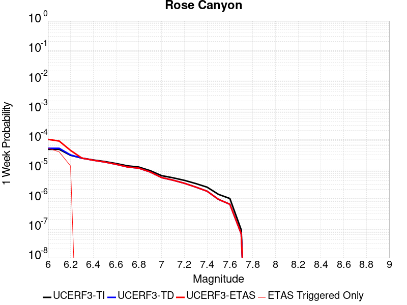 | 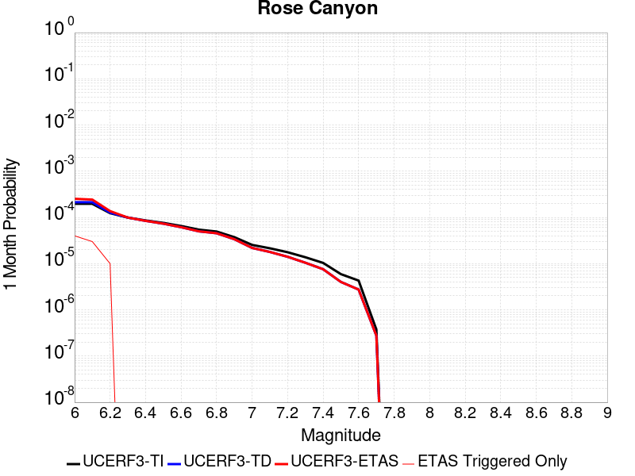 | 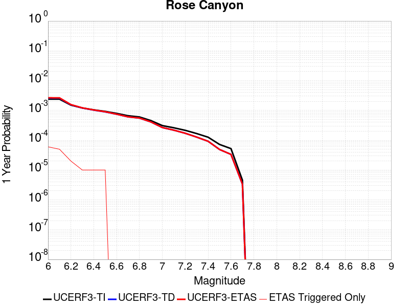 | 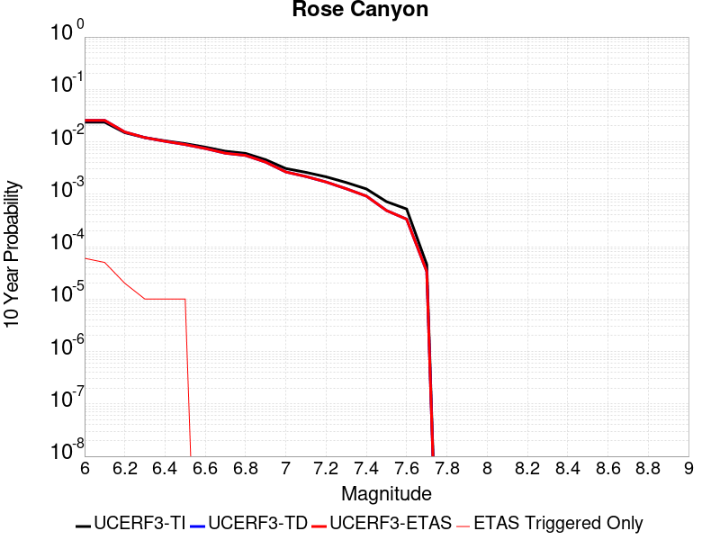 |

| Magnitude | 1 wk TI Prob | 1 wk TD Prob | 1 wk ETAS Prob | 1 wk ETAS/TD Gain | 1 wk ETAS Triggered Only | 1 mo TI Prob | 1 mo TD Prob | 1 mo ETAS Prob | 1 mo ETAS/TD Gain | 1 mo ETAS Triggered Only | 1 yr TI Prob | 1 yr TD Prob | 1 yr ETAS Prob | 1 yr ETAS/TD Gain | 1 yr ETAS Triggered Only | 10 yr TI Prob | 10 yr TD Prob | 10 yr ETAS Prob | 10 yr ETAS/TD Gain | 10 yr ETAS Triggered Only |
|-----|-----|-----|-----|-----|-----|-----|-----|-----|-----|-----|-----|-----|-----|-----|-----|-----|-----|-----|-----|-----|
| 6.0 | 4.5923203E-5 | 4.9714607E-5 | 8.9712616E-5 | 1.8045526 | 4.0E-5 | 1.9679888E-4 | 2.1304654E-4 | 2.5303802E-4 | 1.1877124 | 4.0E-5 | 0.0023933933 | 0.0025909478 | 0.0026507925 | 1.0230975 | 6.0E-5 | 0.023677798 | 0.025618518 | 0.02567698 | 1.002282 | 6.0E-5 |
| 6.1 | 4.5923203E-5 | 4.9714607E-5 | 7.9713114E-5 | 1.6034144 | 3.0E-5 | 1.9679888E-4 | 2.1304654E-4 | 2.4304015E-4 | 1.1407843 | 3.0E-5 | 0.0023933933 | 0.0025909478 | 0.0026408182 | 1.019248 | 5.0E-5 | 0.023677798 | 0.025618518 | 0.025667237 | 1.0019017 | 5.0E-5 |
| 6.2 | 2.8844734E-5 | 2.9669678E-5 | 3.9669383E-5 | 1.3370345 | 1.0E-5 | 1.2361443E-4 | 1.2714976E-4 | 1.371485E-4 | 1.0786374 | 1.0E-5 | 0.0015039665 | 0.001546976 | 0.0015669451 | 1.0129085 | 2.0E-5 | 0.0149382865 | 0.015364873 | 0.015384566 | 1.0012816 | 2.0E-5 |
| 6.3 | 2.3171577E-5 | 2.3162425E-5 | 2.3162425E-5 | 1.0 | 0.0 | 9.9302975E-5 | 9.926383E-5 | 9.926383E-5 | 1.0 | 0.0 | 0.0012083431 | 0.0012078804 | 0.0012178684 | 1.008269 | 1.0E-5 | 0.012017938 | 0.012012152 | 0.012022032 | 1.0008225 | 1.0E-5 |
| 6.4 | 2.0066604E-5 | 1.9668067E-5 | 1.9668067E-5 | 1.0 | 0.0 | 8.599689E-5 | 8.428905E-5 | 8.428905E-5 | 1.0 | 0.0 | 0.0010465092 | 0.001025746 | 0.0010357358 | 1.009739 | 1.0E-5 | 0.010415946 | 0.010211479 | 0.010221377 | 1.0009693 | 1.0E-5 |
| 6.5 | 1.776989E-5 | 1.7115402E-5 | 1.7115402E-5 | 1.0 | 0.0 | 7.615444E-5 | 7.33497E-5 | 7.33497E-5 | 1.0 | 0.0 | 9.267859E-4 | 8.926737E-4 | 9.0266473E-4 | 1.0111923 | 1.0E-5 | 0.009229303 | 0.008874663 | 0.008884574 | 1.0011168 | 1.0E-5 |
| 6.6 | 1.5227364E-5 | 1.4340872E-5 | 1.4340872E-5 | 1.0 | 0.0 | 6.52585E-5 | 6.145947E-5 | 6.145947E-5 | 1.0 | 0.0 | 7.942326E-4 | 7.480173E-4 | 7.480173E-4 | 1.0 | 0.0 | 0.007914 | 0.0074410336 | 0.0074410336 | 1.0 | 0.0 |
| 6.7 | 1.2703898E-5 | 1.1674277E-5 | 1.1674277E-5 | 1.0 | 0.0 | 5.4444143E-5 | 5.0031682E-5 | 5.0031682E-5 | 1.0 | 0.0 | 6.626558E-4 | 6.089697E-4 | 6.089697E-4 | 1.0 | 0.0 | 0.006606833 | 0.0060623093 | 0.0060623093 | 1.0 | 0.0 |
| 6.8 | 1.1554917E-5 | 1.0610384E-5 | 1.0610384E-5 | 1.0 | 0.0 | 4.9520135E-5 | 4.547231E-5 | 4.547231E-5 | 1.0 | 0.0 | 6.0274085E-4 | 5.5348873E-4 | 5.5348873E-4 | 1.0 | 0.0 | 0.0060110865 | 0.005504414 | 0.005504414 | 1.0 | 0.0 |
| 6.9 | 8.732078E-6 | 7.882285E-6 | 7.882285E-6 | 1.0 | 0.0 | 3.7422655E-5 | 3.37808E-5 | 3.37808E-5 | 1.0 | 0.0 | 4.5552556E-4 | 4.112066E-4 | 4.112066E-4 | 1.0 | 0.0 | 0.0045459294 | 0.004089515 | 0.004089515 | 1.0 | 0.0 |
| 7.0 | 5.9337494E-6 | 5.107436E-6 | 5.107436E-6 | 1.0 | 0.0 | 2.5430107E-5 | 2.1888829E-5 | 2.1888829E-5 | 1.0 | 0.0 | 3.0956755E-4 | 2.6646405E-4 | 2.6646405E-4 | 1.0 | 0.0 | 0.0030913667 | 0.002661461 | 0.002661461 | 1.0 | 0.0 |
| 7.1 | 5.013409E-6 | 4.17734E-6 | 4.17734E-6 | 1.0 | 0.0 | 2.1485863E-5 | 1.7902763E-5 | 1.7902763E-5 | 1.0 | 0.0 | 2.6155898E-4 | 2.1794444E-4 | 2.1794444E-4 | 1.0 | 0.0 | 0.0026125133 | 0.0021773188 | 0.0021773188 | 1.0 | 0.0 |
| 7.2 | 4.120763E-6 | 3.2820917E-6 | 3.2820917E-6 | 1.0 | 0.0 | 1.7660293E-5 | 1.4066032E-5 | 1.4066032E-5 | 1.0 | 0.0 | 2.1499286E-4 | 1.7124058E-4 | 1.7124058E-4 | 1.0 | 0.0 | 0.0021478499 | 0.0017110958 | 0.0017110958 | 1.0 | 0.0 |
| 7.3 | 3.2081239E-6 | 2.4404965E-6 | 2.4404965E-6 | 1.0 | 0.0 | 1.374903E-5 | 1.0459229E-5 | 1.0459229E-5 | 1.0 | 0.0 | 1.6738157E-4 | 1.2733374E-4 | 1.2733374E-4 | 1.0 | 0.0 | 0.0016725556 | 0.0012726148 | 0.0012726148 | 1.0 | 0.0 |
| 7.4 | 2.4194755E-6 | 1.7680321E-6 | 1.7680321E-6 | 1.0 | 0.0 | 1.0369139E-5 | 7.5772587E-6 | 7.5772587E-6 | 1.0 | 0.0 | 1.2623696E-4 | 9.224927E-5 | 9.224927E-5 | 1.0 | 0.0 | 0.0012616527 | 9.221151E-4 | 9.221151E-4 | 1.0 | 0.0 |
| 7.5 | 1.3842889E-6 | 9.3782967E-7 | 9.3782967E-7 | 1.0 | 0.0 | 5.9326535E-6 | 4.019264E-6 | 4.019264E-6 | 1.0 | 0.0 | 7.222766E-5 | 4.8933474E-5 | 4.8933474E-5 | 1.0 | 0.0 | 7.220419E-4 | 4.8923056E-4 | 4.8923056E-4 | 1.0 | 0.0 |
| 7.6 | 1.0021575E-6 | 6.4113493E-7 | 6.4113493E-7 | 1.0 | 0.0 | 4.2949537E-6 | 2.7477186E-6 | 2.7477186E-6 | 1.0 | 0.0 | 5.2289808E-5 | 3.345298E-5 | 3.345298E-5 | 1.0 | 0.0 | 5.2277505E-4 | 3.344816E-4 | 3.344816E-4 | 1.0 | 0.0 |
| 7.7 | 8.7620116E-8 | 6.449304E-8 | 6.449304E-8 | 1.0 | 0.0 | 3.7551473E-7 | 2.763987E-7 | 2.763987E-7 | 1.0 | 0.0 | 4.5718825E-6 | 3.3651493E-6 | 3.3651493E-6 | 1.0 | 0.0 | 4.5717883E-5 | 3.3651013E-5 | 3.3651013E-5 | 1.0 | 0.0 |

## Hunting Creek - Berryessa 2011 CFM
*[(top)](#table-of-contents)*

| 1 Week | 1 Month | 1 Year | 10 Year |
|-----|-----|-----|-----|
| 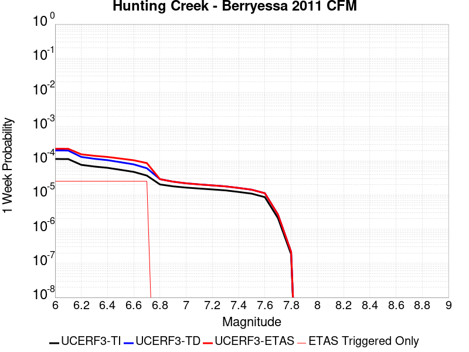 | 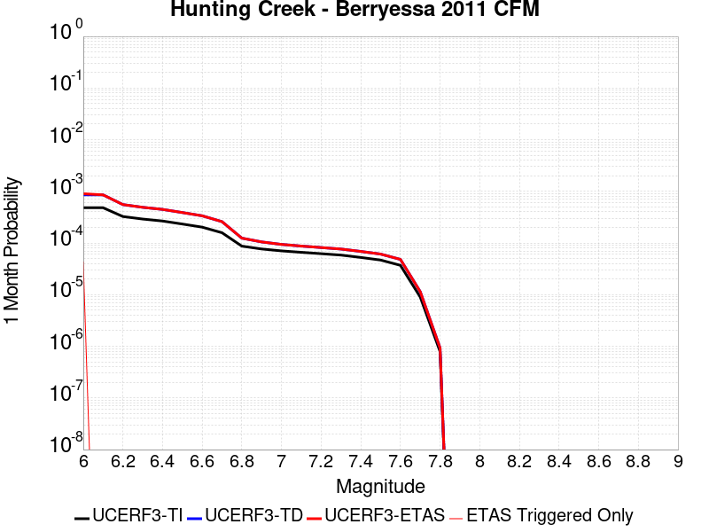 | 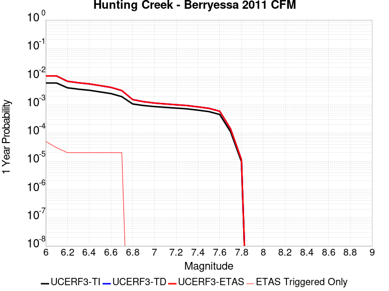 | 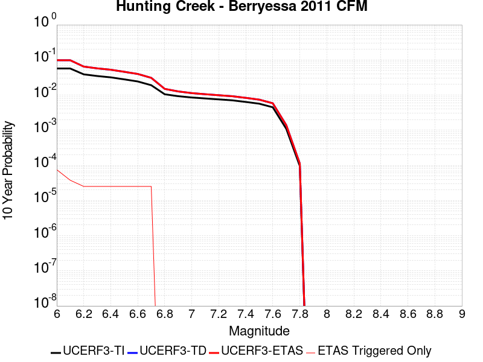 |

| Magnitude | 1 wk TI Prob | 1 wk TD Prob | 1 wk ETAS Prob | 1 wk ETAS/TD Gain | 1 wk ETAS Triggered Only | 1 mo TI Prob | 1 mo TD Prob | 1 mo ETAS Prob | 1 mo ETAS/TD Gain | 1 mo ETAS Triggered Only | 1 yr TI Prob | 1 yr TD Prob | 1 yr ETAS Prob | 1 yr ETAS/TD Gain | 1 yr ETAS Triggered Only | 10 yr TI Prob | 10 yr TD Prob | 10 yr ETAS Prob | 10 yr ETAS/TD Gain | 10 yr ETAS Triggered Only |
|-----|-----|-----|-----|-----|-----|-----|-----|-----|-----|-----|-----|-----|-----|-----|-----|-----|-----|-----|-----|-----|
| 6.0 | 1.1270982E-4 | 2.0028367E-4 | 2.2027966E-4 | 1.0998384 | 2.0E-5 | 4.8295266E-4 | 8.579912E-4 | 8.879655E-4 | 1.0349354 | 3.0E-5 | 0.0058641075 | 0.010386173 | 0.010435653 | 1.0047641 | 5.0E-5 | 0.057117578 | 0.09804048 | 0.0980946 | 1.0005519 | 6.0E-5 |
| 6.1 | 1.1239393E-4 | 1.9976508E-4 | 2.1976109E-4 | 1.1000975 | 2.0E-5 | 4.8159933E-4 | 8.557703E-4 | 8.757532E-4 | 1.0233507 | 2.0E-5 | 0.0058477195 | 0.010359417 | 0.010389105 | 1.0028659 | 3.0E-5 | 0.056962132 | 0.09779895 | 0.09782602 | 1.0002768 | 3.0E-5 |
| 6.2 | 7.596265E-5 | 1.2933646E-4 | 1.4933388E-4 | 1.1546154 | 2.0E-5 | 3.2551357E-4 | 5.5415573E-4 | 5.7414465E-4 | 1.036071 | 2.0E-5 | 0.0039559277 | 0.0067213587 | 0.0067412243 | 1.0029556 | 2.0E-5 | 0.038862433 | 0.06459229 | 0.064610995 | 1.0002897 | 2.0E-5 |
| 6.3 | 6.78794E-5 | 1.1448377E-4 | 1.3448148E-4 | 1.1746773 | 2.0E-5 | 2.9087928E-4 | 4.9052597E-4 | 5.1051617E-4 | 1.0407525 | 2.0E-5 | 0.003535705 | 0.005952661 | 0.005972542 | 1.0033399 | 2.0E-5 | 0.034799766 | 0.057466213 | 0.057485063 | 1.0003281 | 2.0E-5 |
| 6.4 | 6.2165134E-5 | 1.0434825E-4 | 1.2434616E-4 | 1.1916459 | 2.0E-5 | 2.6639478E-4 | 4.4711027E-4 | 4.6710132E-4 | 1.0447117 | 2.0E-5 | 0.0032385332 | 0.0054274183 | 0.00544731 | 1.003665 | 2.0E-5 | 0.03191742 | 0.05255138 | 0.052570328 | 1.0003606 | 2.0E-5 |
| 6.5 | 5.4368087E-5 | 9.070258E-5 | 1.1070076E-4 | 1.2204809 | 2.0E-5 | 2.3298527E-4 | 3.886537E-4 | 4.0864592E-4 | 1.0514396 | 2.0E-5 | 0.0028329059 | 0.0047197016 | 0.004739607 | 1.0042175 | 2.0E-5 | 0.027970633 | 0.045881182 | 0.045900263 | 1.0004159 | 2.0E-5 |
| 6.6 | 4.729947E-5 | 7.847101E-5 | 9.8469434E-5 | 1.2548512 | 2.0E-5 | 2.0269625E-4 | 3.3624718E-4 | 3.5624043E-4 | 1.05946 | 2.0E-5 | 0.002465034 | 0.004084746 | 0.004104664 | 1.0048763 | 2.0E-5 | 0.02437869 | 0.03985269 | 0.03987189 | 1.0004818 | 2.0E-5 |
| 6.7 | 3.6875328E-5 | 6.0443555E-5 | 8.044235E-5 | 1.3308672 | 2.0E-5 | 1.5802756E-4 | 2.5900968E-4 | 2.790045E-4 | 1.0771972 | 2.0E-5 | 0.0019222875 | 0.0031482724 | 0.0031682095 | 1.0063326 | 2.0E-5 | 0.019057442 | 0.03089371 | 0.030913092 | 1.0006274 | 2.0E-5 |
| 6.8 | 2.0292036E-5 | 2.8976721E-5 | 2.8976721E-5 | 1.0 | 0.0 | 8.6962966E-5 | 1.2417998E-4 | 1.2417998E-4 | 1.0 | 0.0 | 0.0010582599 | 0.0015108302 | 0.0015108302 | 1.0 | 0.0 | 0.010532344 | 0.0149790775 | 0.0149790775 | 1.0 | 0.0 |
| 6.9 | 1.7871042E-5 | 2.4472653E-5 | 2.4472653E-5 | 1.0 | 0.0 | 7.658793E-5 | 1.04878585E-4 | 1.04878585E-4 | 1.0 | 0.0 | 9.320591E-4 | 0.0012761486 | 0.0012761486 | 1.0 | 0.0 | 0.009281595 | 0.012680395 | 0.012680395 | 1.0 | 0.0 |
| 7.0 | 1.6415532E-5 | 2.1906566E-5 | 2.1906566E-5 | 1.0 | 0.0 | 7.035038E-5 | 9.388191E-5 | 9.388191E-5 | 1.0 | 0.0 | 8.561793E-4 | 0.0011424144 | 0.0011424144 | 1.0 | 0.0 | 0.008528882 | 0.011365017 | 0.011365017 | 1.0 | 0.0 |
| 7.1 | 1.5409885E-5 | 2.0346588E-5 | 2.0346588E-5 | 1.0 | 0.0 | 6.6040695E-5 | 8.719676E-5 | 8.719676E-5 | 1.0 | 0.0 | 8.0374884E-4 | 0.0010611062 | 0.0010611062 | 1.0 | 0.0 | 0.00800848 | 0.010560924 | 0.010560924 | 1.0 | 0.0 |
| 7.2 | 1.4497423E-5 | 1.905519E-5 | 1.905519E-5 | 1.0 | 0.0 | 6.213033E-5 | 8.166256E-5 | 8.166256E-5 | 1.0 | 0.0 | 7.5617427E-4 | 9.937913E-4 | 9.937913E-4 | 1.0 | 0.0 | 0.0075360634 | 0.00989425 | 0.00989425 | 1.0 | 0.0 |
| 7.3 | 1.3615175E-5 | 1.7826347E-5 | 1.7826347E-5 | 1.0 | 0.0 | 5.8349444E-5 | 7.6396405E-5 | 7.6396405E-5 | 1.0 | 0.0 | 7.101729E-4 | 9.297323E-4 | 9.297323E-4 | 1.0 | 0.0 | 0.0070790765 | 0.009259124 | 0.009259124 | 1.0 | 0.0 |
| 7.4 | 1.2252825E-5 | 1.6026455E-5 | 1.6026455E-5 | 1.0 | 0.0 | 5.251105E-5 | 6.868302E-5 | 6.868302E-5 | 1.0 | 0.0 | 6.391345E-4 | 8.3589775E-4 | 8.3589775E-4 | 1.0 | 0.0 | 0.0063729943 | 0.008328172 | 0.008328172 | 1.0 | 0.0 |
| 7.5 | 1.0913301E-5 | 1.4241286E-5 | 1.4241286E-5 | 1.0 | 0.0 | 4.6770452E-5 | 6.103267E-5 | 6.103267E-5 | 1.0 | 0.0 | 5.6928146E-4 | 7.428222E-4 | 7.428222E-4 | 1.0 | 0.0 | 0.0056782532 | 0.0074039865 | 0.0074039865 | 1.0 | 0.0 |
| 7.6 | 8.623192E-6 | 1.12347825E-5 | 1.12347825E-5 | 1.0 | 0.0 | 3.6956015E-5 | 4.8148195E-5 | 4.8148195E-5 | 1.0 | 0.0 | 4.4984656E-4 | 5.8604917E-4 | 5.8604917E-4 | 1.0 | 0.0 | 0.00448937 | 0.005845504 | 0.005845504 | 1.0 | 0.0 |
| 7.7 | 2.0993634E-6 | 2.66264E-6 | 2.66264E-6 | 1.0 | 0.0 | 8.997241E-6 | 1.1411265E-5 | 1.1411265E-5 | 1.0 | 0.0 | 1.09535904E-4 | 1.3892337E-4 | 1.3892337E-4 | 1.0 | 0.0 | 0.0010948193 | 0.0013883994 | 0.0013883994 | 1.0 | 0.0 |
| 7.8 | 1.8428308E-7 | 2.1674624E-7 | 2.1674624E-7 | 1.0 | 0.0 | 7.897844E-7 | 9.289122E-7 | 9.289122E-7 | 1.0 | 0.0 | 9.615583E-6 | 1.130945E-5 | 1.130945E-5 | 1.0 | 0.0 | 9.615166E-5 | 1.1308173E-4 | 1.1308173E-4 | 1.0 | 0.0 |

## Calaveras (So) 2011 CFM
*[(top)](#table-of-contents)*

| 1 Week | 1 Month | 1 Year | 10 Year |
|-----|-----|-----|-----|
| 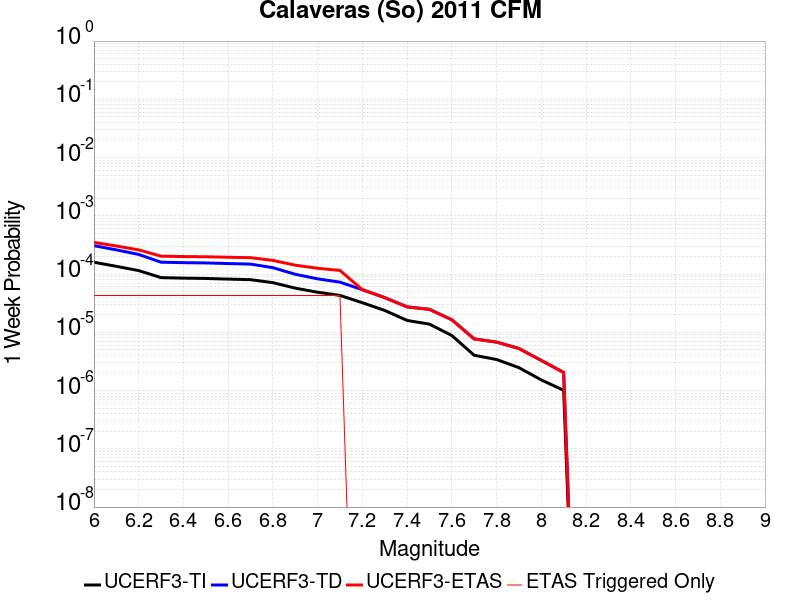 | 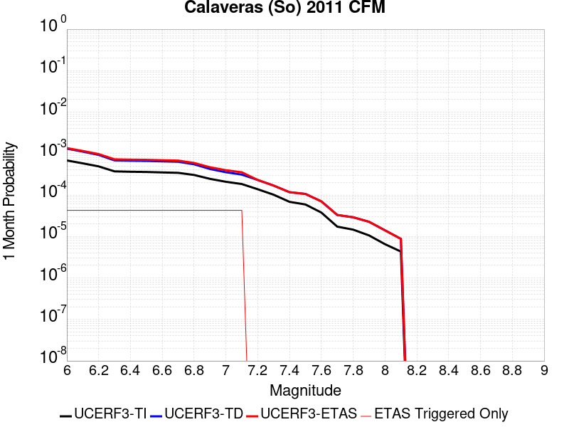 | 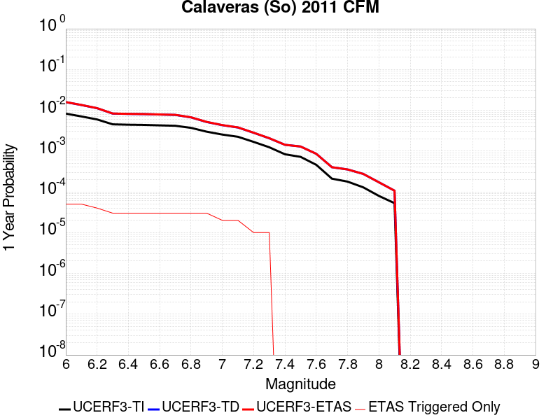 | 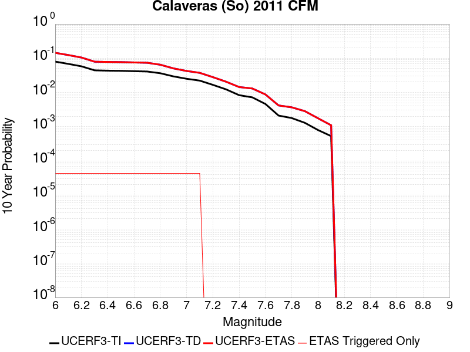 |

| Magnitude | 1 wk TI Prob | 1 wk TD Prob | 1 wk ETAS Prob | 1 wk ETAS/TD Gain | 1 wk ETAS Triggered Only | 1 mo TI Prob | 1 mo TD Prob | 1 mo ETAS Prob | 1 mo ETAS/TD Gain | 1 mo ETAS Triggered Only | 1 yr TI Prob | 1 yr TD Prob | 1 yr ETAS Prob | 1 yr ETAS/TD Gain | 1 yr ETAS Triggered Only | 10 yr TI Prob | 10 yr TD Prob | 10 yr ETAS Prob | 10 yr ETAS/TD Gain | 10 yr ETAS Triggered Only |
|-----|-----|-----|-----|-----|-----|-----|-----|-----|-----|-----|-----|-----|-----|-----|-----|-----|-----|-----|-----|-----|
| 6.0 | 1.5950744E-4 | 3.0713255E-4 | 3.3712335E-4 | 1.0976477 | 3.0E-5 | 6.834242E-4 | 0.001315409 | 0.0013453695 | 1.0227766 | 3.0E-5 | 0.00828899 | 0.015858326 | 0.015907533 | 1.0031029 | 5.0E-5 | 0.079865426 | 0.14440185 | 0.14445318 | 1.0003555 | 6.0E-5 |
| 6.1 | 1.3584697E-4 | 2.603514E-4 | 2.9034357E-4 | 1.1151989 | 3.0E-5 | 5.8207137E-4 | 0.0011151754 | 0.001145142 | 1.0268716 | 3.0E-5 | 0.007063716 | 0.013461385 | 0.0135107115 | 1.0036644 | 5.0E-5 | 0.06843361 | 0.124029994 | 0.12408255 | 1.0004238 | 6.0E-5 |
| 6.2 | 1.14676266E-4 | 2.1714384E-4 | 2.371395E-4 | 1.0920849 | 2.0E-5 | 4.9137714E-4 | 9.30223E-4 | 9.502044E-4 | 1.0214802 | 2.0E-5 | 0.0059661185 | 0.011245058 | 0.011284608 | 1.0035172 | 4.0E-5 | 0.058084648 | 0.10502057 | 0.105065316 | 1.000426 | 5.0E-5 |
| 6.3 | 8.691518E-5 | 1.5987935E-4 | 1.7987614E-4 | 1.1250744 | 2.0E-5 | 3.7244044E-4 | 6.849807E-4 | 7.04967E-4 | 1.0291779 | 2.0E-5 | 0.004525038 | 0.008301122 | 0.008330873 | 1.003584 | 3.0E-5 | 0.044339992 | 0.0793365 | 0.07937333 | 1.0004642 | 4.0E-5 |
| 6.4 | 8.50982E-5 | 1.5694331E-4 | 1.7694017E-4 | 1.1274146 | 2.0E-5 | 3.646556E-4 | 6.724042E-4 | 6.923908E-4 | 1.029724 | 2.0E-5 | 0.0044306475 | 0.008149155 | 0.008178911 | 1.0036514 | 3.0E-5 | 0.04343345 | 0.07794268 | 0.07797956 | 1.0004731 | 4.0E-5 |
| 6.5 | 8.4062965E-5 | 1.5518743E-4 | 1.7518432E-4 | 1.1288564 | 2.0E-5 | 3.602201E-4 | 6.6488347E-4 | 6.848702E-4 | 1.0300604 | 2.0E-5 | 0.004376863 | 0.008058365 | 0.008088123 | 1.0036929 | 3.0E-5 | 0.042916555 | 0.07711388 | 0.0771508 | 1.0004787 | 4.0E-5 |
| 6.6 | 8.194716E-5 | 1.5154552E-4 | 1.7154249E-4 | 1.1319536 | 2.0E-5 | 3.5115483E-4 | 6.492843E-4 | 6.6927134E-4 | 1.0307832 | 2.0E-5 | 0.0042669317 | 0.007870209 | 0.007899973 | 1.0037818 | 3.0E-5 | 0.04185927 | 0.07539919 | 0.075436175 | 1.0004905 | 4.0E-5 |
| 6.7 | 8.012326E-5 | 1.4822475E-4 | 1.6822178E-4 | 1.1349102 | 2.0E-5 | 3.433402E-4 | 6.350612E-4 | 6.550485E-4 | 1.031473 | 2.0E-5 | 0.004172157 | 0.007698701 | 0.00772847 | 1.0038668 | 3.0E-5 | 0.040946912 | 0.07384132 | 0.07387836 | 1.0005018 | 4.0E-5 |
| 6.8 | 7.119773E-5 | 1.2881879E-4 | 1.4881622E-4 | 1.1552368 | 2.0E-5 | 3.0509746E-4 | 5.519494E-4 | 5.719383E-4 | 1.0362152 | 2.0E-5 | 0.0037082357 | 0.006696066 | 0.006725865 | 1.0044502 | 3.0E-5 | 0.036469642 | 0.06468575 | 0.06472316 | 1.0005784 | 4.0E-5 |
| 6.9 | 5.7343088E-5 | 9.919277E-5 | 1.19190794E-4 | 1.2016076 | 2.0E-5 | 2.4573295E-4 | 4.25043E-4 | 4.4503447E-4 | 1.047034 | 2.0E-5 | 0.0029876942 | 0.005162694 | 0.005192539 | 1.0057809 | 3.0E-5 | 0.02947844 | 0.05051036 | 0.05054834 | 1.000752 | 4.0E-5 |
| 7.0 | 4.8746577E-5 | 8.2850725E-5 | 9.284989E-5 | 1.120689 | 1.0E-5 | 2.0889717E-4 | 3.5502657E-4 | 3.65023E-4 | 1.0281569 | 1.0E-5 | 0.0025403565 | 0.004313948 | 0.0043338616 | 1.0046161 | 2.0E-5 | 0.025115121 | 0.042485245 | 0.04251397 | 1.0006762 | 3.0E-5 |
| 7.1 | 4.2998014E-5 | 7.265203E-5 | 8.2651306E-5 | 1.1376324 | 1.0E-5 | 1.8426418E-4 | 3.1132903E-4 | 3.213259E-4 | 1.0321103 | 1.0E-5 | 0.002241108 | 0.003783903 | 0.0038038276 | 1.0052656 | 2.0E-5 | 0.022186412 | 0.037423562 | 0.03745244 | 1.0007716 | 3.0E-5 |
| 7.2 | 3.221292E-5 | 5.390791E-5 | 5.390791E-5 | 1.0 | 0.0 | 1.3804805E-4 | 2.3101359E-4 | 2.3101359E-4 | 1.0 | 0.0 | 0.0016794393 | 0.0028089907 | 0.0028189626 | 1.00355 | 1.0E-5 | 0.016668037 | 0.02803602 | 0.028055461 | 1.0006933 | 2.0E-5 |
| 7.3 | 2.3756531E-5 | 3.9473416E-5 | 3.9473416E-5 | 1.0 | 0.0 | 1.0180973E-4 | 1.6916092E-4 | 1.6916092E-4 | 1.0 | 0.0 | 0.0012388286 | 0.0020576057 | 0.0020675852 | 1.00485 | 1.0E-5 | 0.012319452 | 0.020643145 | 0.020662732 | 1.0009488 | 2.0E-5 |
| 7.4 | 1.5997684E-5 | 2.7342163E-5 | 2.7342163E-5 | 1.0 | 0.0 | 6.8559704E-5 | 1.1717545E-4 | 1.1717545E-4 | 1.0 | 0.0 | 8.343947E-4 | 0.00142568 | 0.00142568 | 1.0 | 0.0 | 0.008312687 | 0.014376011 | 0.014385867 | 1.0006856 | 1.0E-5 |
| 7.5 | 1.3814293E-5 | 2.4783874E-5 | 2.4783874E-5 | 1.0 | 0.0 | 5.9202768E-5 | 1.062123E-4 | 1.062123E-4 | 1.0 | 0.0 | 7.205553E-4 | 0.00129237 | 0.00129237 | 1.0 | 0.0 | 0.007182234 | 0.013055085 | 0.013064954 | 1.000756 | 1.0E-5 |
| 7.6 | 8.817309E-6 | 1.6430757E-5 | 1.6430757E-5 | 1.0 | 0.0 | 3.7787922E-5 | 7.0415634E-5 | 7.0415634E-5 | 1.0 | 0.0 | 4.5997082E-4 | 8.569745E-4 | 8.569745E-4 | 1.0 | 0.0 | 0.004590199 | 0.008719284 | 0.008729197 | 1.0011369 | 1.0E-5 |
| 7.7 | 4.0352206E-6 | 7.707318E-6 | 7.707318E-6 | 1.0 | 0.0 | 1.7293689E-5 | 3.3030945E-5 | 3.3030945E-5 | 1.0 | 0.0 | 2.1053031E-4 | 4.0207763E-4 | 4.0207763E-4 | 1.0 | 0.0 | 0.0021033096 | 0.004165172 | 0.0041751307 | 1.0023909 | 1.0E-5 |
| 7.8 | 3.413169E-6 | 6.787282E-6 | 6.787282E-6 | 1.0 | 0.0 | 1.4627784E-5 | 2.9088029E-5 | 2.9088029E-5 | 1.0 | 0.0 | 1.7807873E-4 | 3.5408925E-4 | 3.5408925E-4 | 1.0 | 0.0 | 0.0017793609 | 0.0036665166 | 0.00367648 | 1.0027174 | 1.0E-5 |
| 7.9 | 2.4740732E-6 | 5.2791843E-6 | 5.2791843E-6 | 1.0 | 0.0 | 1.06031275E-5 | 2.262488E-5 | 2.262488E-5 | 1.0 | 0.0 | 1.2908543E-4 | 2.7542314E-4 | 2.7542314E-4 | 1.0 | 0.0 | 0.0012901047 | 0.0028347955 | 0.0028347955 | 1.0 | 0.0 |
| 8.0 | 1.5231818E-6 | 3.2889548E-6 | 3.2889548E-6 | 1.0 | 0.0 | 6.527906E-6 | 1.40954435E-5 | 1.40954435E-5 | 1.0 | 0.0 | 7.9474354E-5 | 1.7159856E-4 | 1.7159856E-4 | 1.0 | 0.0 | 7.944594E-4 | 0.0017564303 | 0.0017564303 | 1.0 | 0.0 |
| 8.1 | 1.0104524E-6 | 2.045782E-6 | 2.045782E-6 | 1.0 | 0.0 | 4.330503E-6 | 8.767608E-6 | 8.767608E-6 | 1.0 | 0.0 | 5.2722597E-5 | 1.0674043E-4 | 1.0674043E-4 | 1.0 | 0.0 | 5.271009E-4 | 0.001092934 | 0.001092934 | 1.0 | 0.0 |

## Cucamonga
*[(top)](#table-of-contents)*

| 1 Week | 1 Month | 1 Year | 10 Year |
|-----|-----|-----|-----|
| 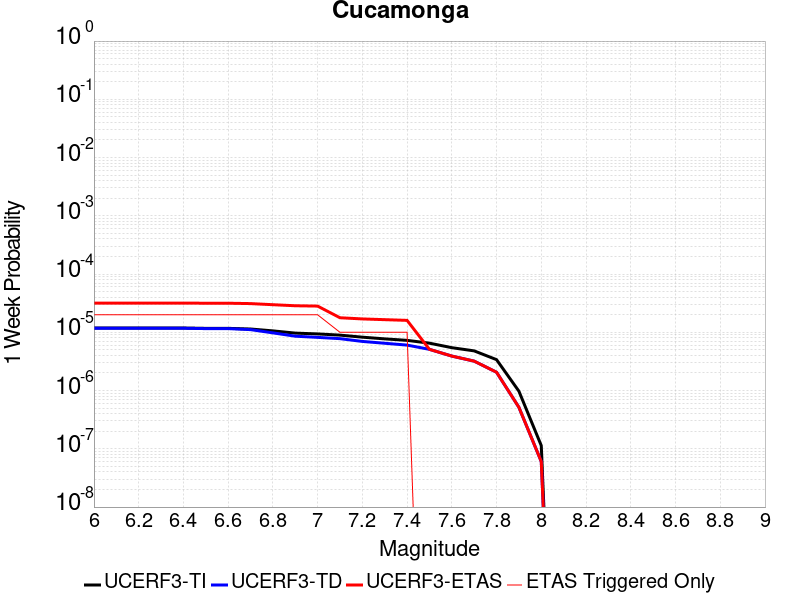 | 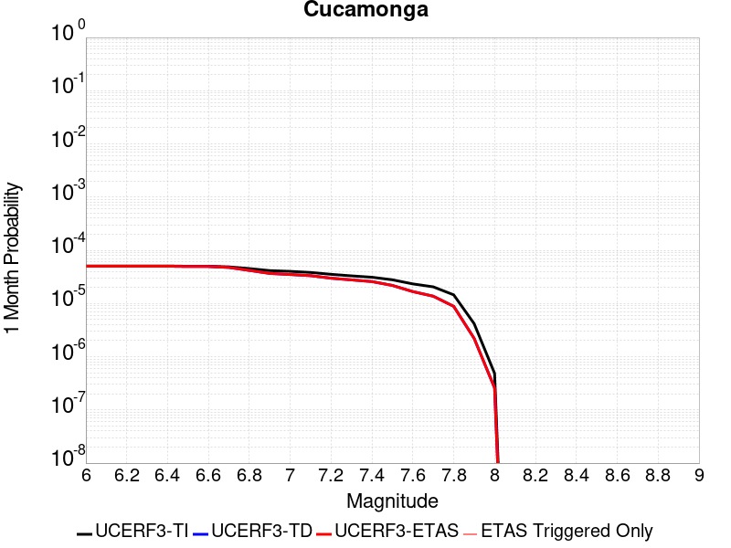 | 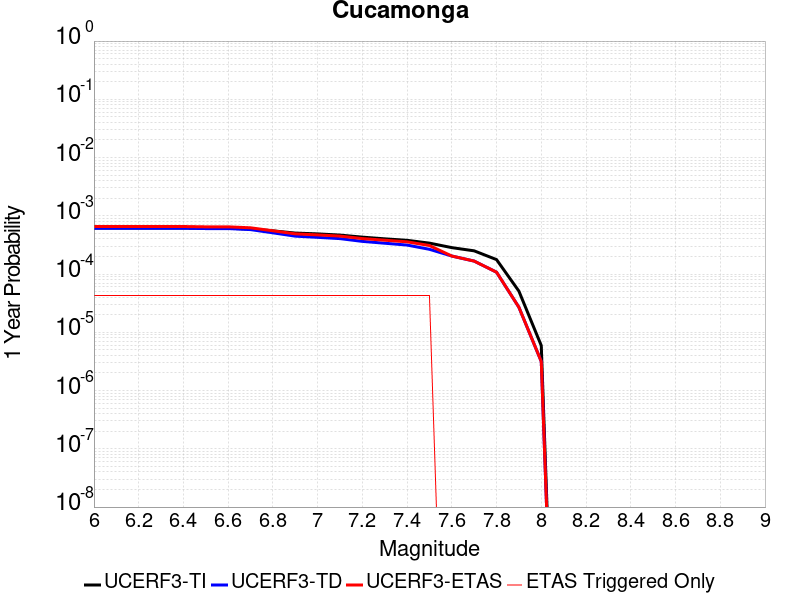 | 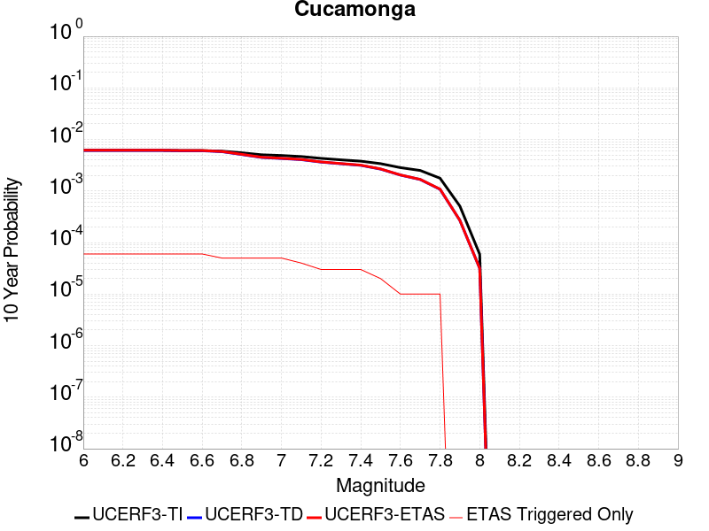 |

| Magnitude | 1 wk TI Prob | 1 wk TD Prob | 1 wk ETAS Prob | 1 wk ETAS/TD Gain | 1 wk ETAS Triggered Only | 1 mo TI Prob | 1 mo TD Prob | 1 mo ETAS Prob | 1 mo ETAS/TD Gain | 1 mo ETAS Triggered Only | 1 yr TI Prob | 1 yr TD Prob | 1 yr ETAS Prob | 1 yr ETAS/TD Gain | 1 yr ETAS Triggered Only | 10 yr TI Prob | 10 yr TD Prob | 10 yr ETAS Prob | 10 yr ETAS/TD Gain | 10 yr ETAS Triggered Only |
|-----|-----|-----|-----|-----|-----|-----|-----|-----|-----|-----|-----|-----|-----|-----|-----|-----|-----|-----|-----|-----|
| 6.0 | 1.1848348E-5 | 1.1737109E-5 | 3.1736876E-5 | 2.703977 | 2.0E-5 | 5.0777642E-5 | 5.0300943E-5 | 7.029994E-5 | 1.3975868 | 2.0E-5 | 6.180424E-4 | 6.122446E-4 | 6.4222625E-4 | 1.04897 | 3.0E-5 | 0.0061632637 | 0.006106745 | 0.0061663785 | 1.0097651 | 6.0E-5 |
| 6.1 | 1.1848348E-5 | 1.1737109E-5 | 3.1736876E-5 | 2.703977 | 2.0E-5 | 5.0777642E-5 | 5.0300943E-5 | 7.029994E-5 | 1.3975868 | 2.0E-5 | 6.180424E-4 | 6.122446E-4 | 6.4222625E-4 | 1.04897 | 3.0E-5 | 0.0061632637 | 0.006106745 | 0.0061663785 | 1.0097651 | 6.0E-5 |
| 6.2 | 1.1848348E-5 | 1.1737109E-5 | 3.1736876E-5 | 2.703977 | 2.0E-5 | 5.0777642E-5 | 5.0300943E-5 | 7.029994E-5 | 1.3975868 | 2.0E-5 | 6.180424E-4 | 6.122446E-4 | 6.4222625E-4 | 1.04897 | 3.0E-5 | 0.0061632637 | 0.006106745 | 0.0061663785 | 1.0097651 | 6.0E-5 |
| 6.3 | 1.1848348E-5 | 1.1737109E-5 | 3.1736876E-5 | 2.703977 | 2.0E-5 | 5.0777642E-5 | 5.0300943E-5 | 7.029994E-5 | 1.3975868 | 2.0E-5 | 6.180424E-4 | 6.122446E-4 | 6.4222625E-4 | 1.04897 | 3.0E-5 | 0.0061632637 | 0.006106745 | 0.0061663785 | 1.0097651 | 6.0E-5 |
| 6.4 | 1.1848348E-5 | 1.1737109E-5 | 3.1736876E-5 | 2.703977 | 2.0E-5 | 5.0777642E-5 | 5.0300943E-5 | 7.029994E-5 | 1.3975868 | 2.0E-5 | 6.180424E-4 | 6.122446E-4 | 6.4222625E-4 | 1.04897 | 3.0E-5 | 0.0061632637 | 0.006106745 | 0.0061663785 | 1.0097651 | 6.0E-5 |
| 6.5 | 1.16988695E-5 | 1.157614E-5 | 3.157591E-5 | 2.7276716 | 2.0E-5 | 5.013705E-5 | 4.9611102E-5 | 6.9610105E-5 | 1.4031156 | 2.0E-5 | 6.102476E-4 | 6.0385047E-4 | 6.338323E-4 | 1.0496511 | 3.0E-5 | 0.006085745 | 0.0060232594 | 0.006082898 | 1.0099014 | 6.0E-5 |
| 6.6 | 1.16988695E-5 | 1.157614E-5 | 3.157591E-5 | 2.7276716 | 2.0E-5 | 5.013705E-5 | 4.9611102E-5 | 6.9610105E-5 | 1.4031156 | 2.0E-5 | 6.102476E-4 | 6.0385047E-4 | 6.338323E-4 | 1.0496511 | 3.0E-5 | 0.006085745 | 0.0060232594 | 0.006082898 | 1.0099014 | 6.0E-5 |
| 6.7 | 1.1397107E-5 | 1.1115039E-5 | 3.1114818E-5 | 2.7993438 | 2.0E-5 | 4.884383E-5 | 4.7635025E-5 | 6.763407E-5 | 1.4198391 | 2.0E-5 | 5.9451134E-4 | 5.798046E-4 | 6.097872E-4 | 1.0517116 | 3.0E-5 | 0.005929234 | 0.005784061 | 0.0058337715 | 1.0085944 | 5.0E-5 |
| 6.8 | 1.058387E-5 | 9.785037E-6 | 2.9784842E-5 | 3.043917 | 2.0E-5 | 4.5358654E-5 | 4.1935207E-5 | 6.193437E-5 | 1.4769062 | 2.0E-5 | 5.521017E-4 | 5.1044265E-4 | 5.4042734E-4 | 1.0587425 | 3.0E-5 | 0.00550732 | 0.005093702 | 0.0051434473 | 1.0097661 | 5.0E-5 |
| 6.9 | 9.690046E-6 | 8.579504E-6 | 2.8579332E-5 | 3.3311172 | 2.0E-5 | 4.1528107E-5 | 3.6768783E-5 | 5.6768047E-5 | 1.5439197 | 2.0E-5 | 5.054874E-4 | 4.475684E-4 | 4.7755498E-4 | 1.0669988 | 3.0E-5 | 0.005043391 | 0.0044675954 | 0.004517372 | 1.0111417 | 5.0E-5 |
| 7.0 | 9.381461E-6 | 8.18712E-6 | 2.8186956E-5 | 3.4428415 | 2.0E-5 | 4.020564E-5 | 3.508719E-5 | 5.5086486E-5 | 1.5699886 | 2.0E-5 | 4.893937E-4 | 4.2710314E-4 | 4.5709033E-4 | 1.0702107 | 3.0E-5 | 0.0048831734 | 0.004263747 | 0.004313534 | 1.0116768 | 5.0E-5 |
| 7.1 | 8.946492E-6 | 7.781904E-6 | 1.7781826E-5 | 2.2850225 | 1.0E-5 | 3.8341543E-5 | 3.3350592E-5 | 4.335026E-5 | 1.2998347 | 1.0E-5 | 4.667083E-4 | 4.0596814E-4 | 4.2596002E-4 | 1.049245 | 2.0E-5 | 0.0046572937 | 0.0040531927 | 0.0040930305 | 1.0098288 | 4.0E-5 |
| 7.2 | 8.251016E-6 | 6.9752878E-6 | 1.6975218E-5 | 2.4336226 | 1.0E-5 | 3.5361016E-5 | 2.9893748E-5 | 3.989345E-5 | 1.3345081 | 1.0E-5 | 4.3043532E-4 | 3.6389584E-4 | 3.8388858E-4 | 1.0549408 | 2.0E-5 | 0.0042960253 | 0.0036339252 | 0.003663816 | 1.0082256 | 3.0E-5 |
| 7.3 | 7.717881E-6 | 6.4863584E-6 | 1.6486294E-5 | 2.541687 | 1.0E-5 | 3.3076216E-5 | 2.7798384E-5 | 3.7798105E-5 | 1.3597231 | 1.0E-5 | 4.026285E-4 | 3.38393E-4 | 3.5838623E-4 | 1.0590829 | 2.0E-5 | 0.004018998 | 0.0033797103 | 0.003409609 | 1.0088465 | 3.0E-5 |
| 7.4 | 7.275623E-6 | 6.032004E-6 | 1.6031943E-5 | 2.6578138 | 1.0E-5 | 3.118087E-5 | 2.5851192E-5 | 3.585093E-5 | 1.3868194 | 1.0E-5 | 3.7956095E-4 | 3.1469302E-4 | 3.3468672E-4 | 1.063534 | 2.0E-5 | 0.0037891332 | 0.0031434046 | 0.0031733103 | 1.0095137 | 3.0E-5 |
| 7.5 | 6.5109502E-6 | 5.100593E-6 | 5.100593E-6 | 1.0 | 0.0 | 2.7903774E-5 | 2.1859503E-5 | 2.1859503E-5 | 1.0 | 0.0 | 3.3967546E-4 | 2.661071E-4 | 2.7610443E-4 | 1.0375688 | 1.0E-5 | 0.0033915674 | 0.0026588016 | 0.0026787485 | 1.0075022 | 2.0E-5 |
| 7.6 | 5.4495326E-6 | 3.908547E-6 | 3.908547E-6 | 1.0 | 0.0 | 2.335493E-5 | 1.6750808E-5 | 1.6750808E-5 | 1.0 | 0.0 | 2.8430918E-4 | 2.0392207E-4 | 2.0392207E-4 | 1.0 | 0.0 | 0.0028394572 | 0.0020382616 | 0.0020482412 | 1.0048962 | 1.0E-5 |
| 7.7 | 4.7997164E-6 | 3.2002263E-6 | 3.2002263E-6 | 1.0 | 0.0 | 2.057005E-5 | 1.3715184E-5 | 1.3715184E-5 | 1.0 | 0.0 | 2.504116E-4 | 1.6696959E-4 | 1.6696959E-4 | 1.0 | 0.0 | 0.002501296 | 0.0016693701 | 0.0016793534 | 1.0059803 | 1.0E-5 |
| 7.8 | 3.3941733E-6 | 2.0641678E-6 | 2.0641678E-6 | 1.0 | 0.0 | 1.4546376E-5 | 8.846404E-6 | 8.846404E-6 | 1.0 | 0.0 | 1.7708774E-4 | 1.07699656E-4 | 1.07699656E-4 | 1.0 | 0.0 | 0.0017694668 | 0.0010766032 | 0.0010865924 | 1.0092784 | 1.0E-5 |
| 7.9 | 9.750552E-7 | 5.155798E-7 | 5.155798E-7 | 1.0 | 0.0 | 4.178801E-6 | 2.2096258E-6 | 2.2096258E-6 | 1.0 | 0.0 | 5.0875715E-5 | 2.6901867E-5 | 2.6901867E-5 | 1.0 | 0.0 | 5.086407E-4 | 2.689865E-4 | 2.689865E-4 | 1.0 | 0.0 |
| 8.0 | 1.133857E-7 | 6.053372E-8 | 6.053372E-8 | 1.0 | 0.0 | 4.8593864E-7 | 2.594302E-7 | 2.594302E-7 | 1.0 | 0.0 | 5.9162867E-6 | 3.1585582E-6 | 3.1585582E-6 | 1.0 | 0.0 | 5.916129E-5 | 3.158515E-5 | 3.158515E-5 | 1.0 | 0.0 |

## Great Valley 07 (Orestimba)
*[(top)](#table-of-contents)*

| 1 Week | 1 Month | 1 Year | 10 Year |
|-----|-----|-----|-----|
| 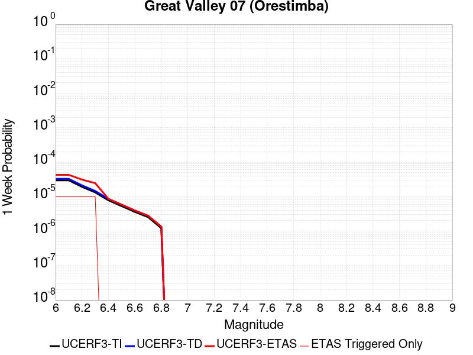 | 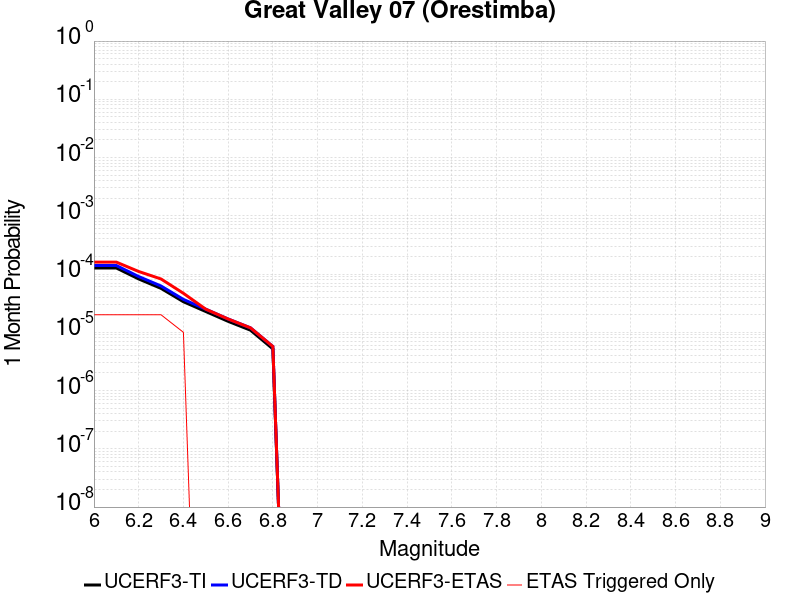 | 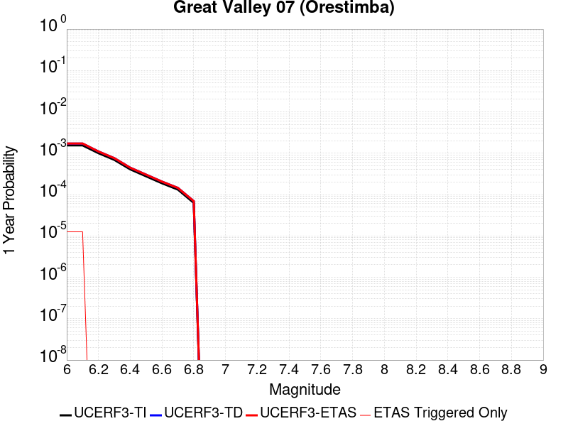 | 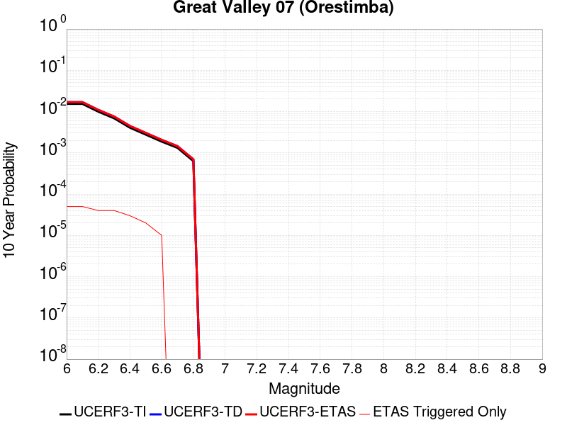 |

| Magnitude | 1 wk TI Prob | 1 wk TD Prob | 1 wk ETAS Prob | 1 wk ETAS/TD Gain | 1 wk ETAS Triggered Only | 1 mo TI Prob | 1 mo TD Prob | 1 mo ETAS Prob | 1 mo ETAS/TD Gain | 1 mo ETAS Triggered Only | 1 yr TI Prob | 1 yr TD Prob | 1 yr ETAS Prob | 1 yr ETAS/TD Gain | 1 yr ETAS Triggered Only | 10 yr TI Prob | 10 yr TD Prob | 10 yr ETAS Prob | 10 yr ETAS/TD Gain | 10 yr ETAS Triggered Only |
|-----|-----|-----|-----|-----|-----|-----|-----|-----|-----|-----|-----|-----|-----|-----|-----|-----|-----|-----|-----|-----|
| 6.0 | 2.9687902E-5 | 3.27575E-5 | 4.2757172E-5 | 1.3052636 | 1.0E-5 | 1.2722766E-4 | 1.4038214E-4 | 1.6037932E-4 | 1.1424483 | 2.0E-5 | 0.0015478961 | 0.0017078844 | 0.0017378331 | 1.0175356 | 3.0E-5 | 0.015371585 | 0.016955135 | 0.017004289 | 1.0028989 | 5.0E-5 |
| 6.1 | 2.9687902E-5 | 3.27575E-5 | 4.2757172E-5 | 1.3052636 | 1.0E-5 | 1.2722766E-4 | 1.4038214E-4 | 1.6037932E-4 | 1.1424483 | 2.0E-5 | 0.0015478961 | 0.0017078844 | 0.0017378331 | 1.0175356 | 3.0E-5 | 0.015371585 | 0.016955135 | 0.017004289 | 1.0028989 | 5.0E-5 |
| 6.2 | 1.9231524E-5 | 2.1159167E-5 | 3.1158954E-5 | 1.4725984 | 1.0E-5 | 8.2418206E-5 | 9.067912E-5 | 1.10677305E-4 | 1.2205379 | 2.0E-5 | 0.0010029797 | 0.0011034822 | 0.0011234601 | 1.0181044 | 2.0E-5 | 0.00998465 | 0.010982441 | 0.011022001 | 1.0036021 | 4.0E-5 |
| 6.3 | 1.324766E-5 | 1.4548534E-5 | 2.4548388E-5 | 1.6873446 | 1.0E-5 | 5.6774446E-5 | 6.234942E-5 | 8.2348175E-5 | 1.3207529 | 2.0E-5 | 6.910097E-4 | 7.5884897E-4 | 7.788338E-4 | 1.0263357 | 2.0E-5 | 0.006888649 | 0.0075635235 | 0.007603221 | 1.0052485 | 4.0E-5 |
| 6.4 | 7.818645E-6 | 8.57284E-6 | 8.57284E-6 | 1.0 | 0.0 | 3.3508048E-5 | 3.6740246E-5 | 4.673988E-5 | 1.2721711 | 1.0E-5 | 4.078841E-4 | 4.4722404E-4 | 4.5721958E-4 | 1.0223502 | 1.0E-5 | 0.004071363 | 0.0044635804 | 0.0044934466 | 1.0066911 | 3.0E-5 |
| 6.5 | 5.3076565E-6 | 5.8178007E-6 | 5.8178007E-6 | 1.0 | 0.0 | 2.27469E-5 | 2.4933206E-5 | 2.4933206E-5 | 1.0 | 0.0 | 2.7690834E-4 | 3.035216E-4 | 3.035216E-4 | 1.0 | 0.0 | 0.0027656353 | 0.00303128 | 0.0030512193 | 1.0065778 | 2.0E-5 |
| 6.6 | 3.6003578E-6 | 3.9484953E-6 | 3.9484953E-6 | 1.0 | 0.0 | 1.5430012E-5 | 1.6922022E-5 | 1.6922022E-5 | 1.0 | 0.0 | 1.8784421E-4 | 2.0600771E-4 | 2.0600771E-4 | 1.0 | 0.0 | 0.0018768552 | 0.0020583214 | 0.0020683007 | 1.0048484 | 1.0E-5 |
| 6.7 | 2.5361826E-6 | 2.7834678E-6 | 2.7834678E-6 | 1.0 | 0.0 | 1.0869308E-5 | 1.1929101E-5 | 1.1929101E-5 | 1.0 | 0.0 | 1.3232579E-4 | 1.4522845E-4 | 1.4522845E-4 | 1.0 | 0.0 | 0.0013224703 | 0.0014514653 | 0.0014514653 | 1.0 | 0.0 |
| 6.8 | 1.2115831E-6 | 1.3313797E-6 | 1.3313797E-6 | 1.0 | 0.0 | 5.1924885E-6 | 5.7059065E-6 | 5.7059065E-6 | 1.0 | 0.0 | 6.3216714E-5 | 6.9468166E-5 | 6.9468166E-5 | 1.0 | 0.0 | 6.3198735E-4 | 6.945596E-4 | 6.945596E-4 | 1.0 | 0.0 |

## Hunting Creek - Bartlett Springs connector 2011
*[(top)](#table-of-contents)*

| 1 Week | 1 Month | 1 Year | 10 Year |
|-----|-----|-----|-----|
| 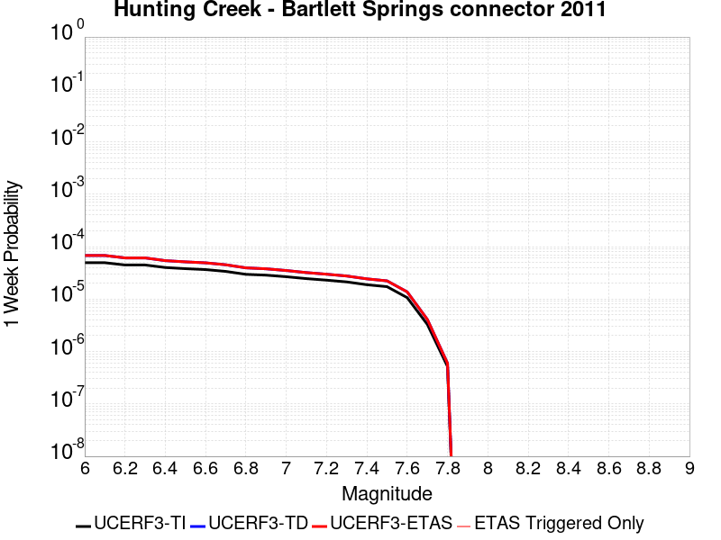 | 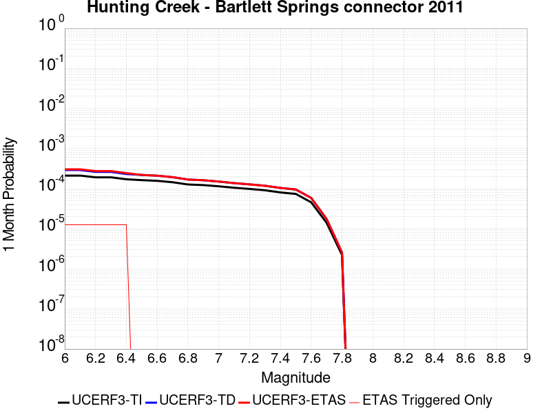 | 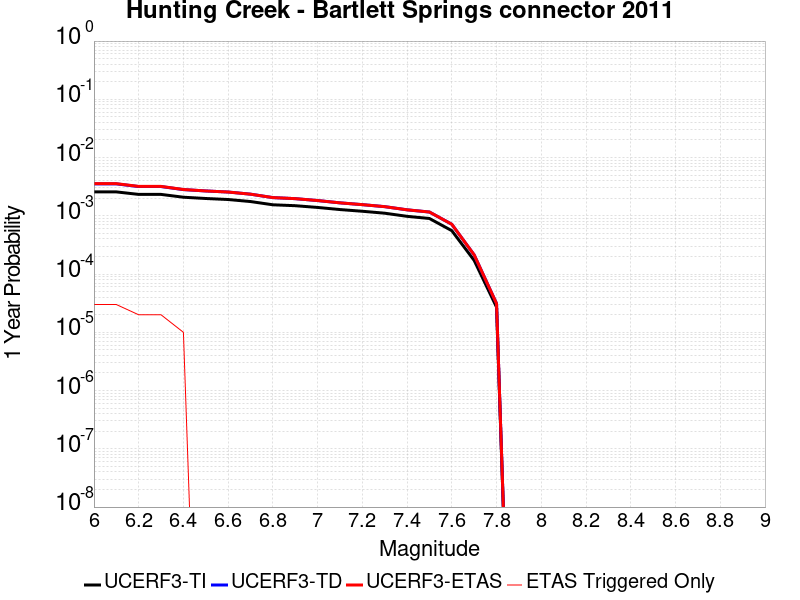 | 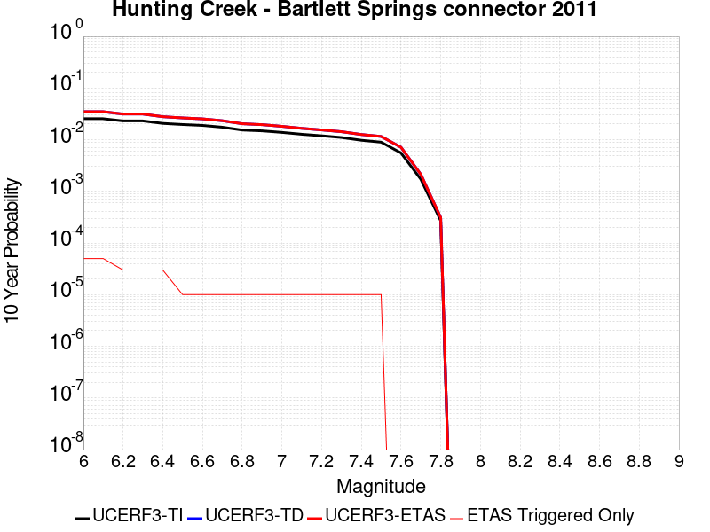 |

| Magnitude | 1 wk TI Prob | 1 wk TD Prob | 1 wk ETAS Prob | 1 wk ETAS/TD Gain | 1 wk ETAS Triggered Only | 1 mo TI Prob | 1 mo TD Prob | 1 mo ETAS Prob | 1 mo ETAS/TD Gain | 1 mo ETAS Triggered Only | 1 yr TI Prob | 1 yr TD Prob | 1 yr ETAS Prob | 1 yr ETAS/TD Gain | 1 yr ETAS Triggered Only | 10 yr TI Prob | 10 yr TD Prob | 10 yr ETAS Prob | 10 yr ETAS/TD Gain | 10 yr ETAS Triggered Only |
|-----|-----|-----|-----|-----|-----|-----|-----|-----|-----|-----|-----|-----|-----|-----|-----|-----|-----|-----|-----|-----|
| 6.0 | 4.940016E-5 | 6.7870766E-5 | 6.7870766E-5 | 1.0 | 0.0 | 2.1169778E-4 | 2.9084194E-4 | 3.0083905E-4 | 1.0343729 | 1.0E-5 | 0.002574374 | 0.0035350819 | 0.0035649757 | 1.0084563 | 3.0E-5 | 0.025447546 | 0.03477475 | 0.03482301 | 1.0013878 | 5.0E-5 |
| 6.1 | 4.940016E-5 | 6.7870766E-5 | 6.7870766E-5 | 1.0 | 0.0 | 2.1169778E-4 | 2.9084194E-4 | 3.0083905E-4 | 1.0343729 | 1.0E-5 | 0.002574374 | 0.0035350819 | 0.0035649757 | 1.0084563 | 3.0E-5 | 0.025447546 | 0.03477475 | 0.03482301 | 1.0013878 | 5.0E-5 |
| 6.2 | 4.472471E-5 | 6.100572E-5 | 6.100572E-5 | 1.0 | 0.0 | 1.9166325E-4 | 2.6142647E-4 | 2.7142384E-4 | 1.0382416 | 1.0E-5 | 0.0023310026 | 0.0031781218 | 0.0031980583 | 1.006273 | 2.0E-5 | 0.02306703 | 0.031317808 | 0.03134687 | 1.0009279 | 3.0E-5 |
| 6.3 | 4.472471E-5 | 6.100572E-5 | 6.100572E-5 | 1.0 | 0.0 | 1.9166325E-4 | 2.6142647E-4 | 2.7142384E-4 | 1.0382416 | 1.0E-5 | 0.0023310026 | 0.0031781218 | 0.0031980583 | 1.006273 | 2.0E-5 | 0.02306703 | 0.031317808 | 0.03134687 | 1.0009279 | 3.0E-5 |
| 6.4 | 4.0001003E-5 | 5.410516E-5 | 5.410516E-5 | 1.0 | 0.0 | 1.714216E-4 | 2.318579E-4 | 2.418556E-4 | 1.0431199 | 1.0E-5 | 0.0020850603 | 0.0028191686 | 0.0028291403 | 1.0035372 | 1.0E-5 | 0.02065605 | 0.027829198 | 0.027858363 | 1.001048 | 3.0E-5 |
| 6.5 | 3.8033053E-5 | 5.126649E-5 | 5.126649E-5 | 1.0 | 0.0 | 1.6298861E-4 | 2.1969521E-4 | 2.1969521E-4 | 1.0 | 0.0 | 0.0019825802 | 0.0026714848 | 0.0026714848 | 1.0 | 0.0 | 0.019649856 | 0.026391273 | 0.02640101 | 1.000369 | 1.0E-5 |
| 6.6 | 3.653754E-5 | 4.912955E-5 | 4.912955E-5 | 1.0 | 0.0 | 1.5658008E-4 | 2.1053842E-4 | 2.1053842E-4 | 1.0 | 0.0 | 0.0019046954 | 0.0025602889 | 0.0025602889 | 1.0 | 0.0 | 0.018884527 | 0.025307199 | 0.025316946 | 1.0003852 | 1.0E-5 |
| 6.7 | 3.372024E-5 | 4.5140216E-5 | 4.5140216E-5 | 1.0 | 0.0 | 1.4450731E-4 | 1.9344388E-4 | 1.9344388E-4 | 1.0 | 0.0 | 0.0017579567 | 0.0023526535 | 0.0023526535 | 1.0 | 0.0 | 0.017441148 | 0.023278862 | 0.023288628 | 1.0004196 | 1.0E-5 |
| 6.8 | 2.9650024E-5 | 3.9411647E-5 | 3.9411647E-5 | 1.0 | 0.0 | 1.2706534E-4 | 1.6889606E-4 | 1.6889606E-4 | 1.0 | 0.0 | 0.0015459227 | 0.0020543607 | 0.0020543607 | 1.0 | 0.0 | 0.015352124 | 0.020351961 | 0.020361759 | 1.0004814 | 1.0E-5 |
| 6.9 | 2.860775E-5 | 3.7812886E-5 | 3.7812886E-5 | 1.0 | 0.0 | 1.2259888E-4 | 1.620452E-4 | 1.620452E-4 | 1.0 | 0.0 | 0.0014916194 | 0.0019711219 | 0.0019711219 | 1.0 | 0.0 | 0.014816469 | 0.019536555 | 0.01954636 | 1.0005019 | 1.0E-5 |
| 7.0 | 2.6696067E-5 | 3.5067544E-5 | 3.5067544E-5 | 1.0 | 0.0 | 1.144067E-4 | 1.5028086E-4 | 1.5028086E-4 | 1.0 | 0.0 | 0.0013920115 | 0.0018281427 | 0.0018281427 | 1.0 | 0.0 | 0.013833242 | 0.01813184 | 0.018141657 | 1.0005416 | 1.0E-5 |
| 7.1 | 2.456087E-5 | 3.2013326E-5 | 3.2013326E-5 | 1.0 | 0.0 | 1.0525662E-4 | 1.3719281E-4 | 1.3719281E-4 | 1.0 | 0.0 | 0.001280746 | 0.0016690517 | 0.0016690517 | 1.0 | 0.0 | 0.012733897 | 0.016566671 | 0.016576506 | 1.0005937 | 1.0E-5 |
| 7.2 | 2.295761E-5 | 2.9823148E-5 | 2.9823148E-5 | 1.0 | 0.0 | 9.8386045E-5 | 1.2780727E-4 | 1.2780727E-4 | 1.0 | 0.0 | 0.0011971919 | 0.0015549522 | 0.0015549522 | 1.0 | 0.0 | 0.011907627 | 0.015442378 | 0.015452223 | 1.0006375 | 1.0E-5 |
| 7.3 | 2.1256936E-5 | 2.7542124E-5 | 2.7542124E-5 | 1.0 | 0.0 | 9.109797E-5 | 1.1803238E-4 | 1.1803238E-4 | 1.0 | 0.0 | 0.0011085535 | 0.0014361058 | 0.0014361058 | 1.0 | 0.0 | 0.011030397 | 0.014269741 | 0.014279598 | 1.0006908 | 1.0E-5 |
| 7.4 | 1.8784336E-5 | 2.430697E-5 | 2.430697E-5 | 1.0 | 0.0 | 8.050181E-5 | 1.0416861E-4 | 1.0416861E-4 | 1.0 | 0.0 | 9.796688E-4 | 0.0012675226 | 0.0012675226 | 1.0 | 0.0 | 0.009753612 | 0.012604194 | 0.012614068 | 1.0007834 | 1.0E-5 |
| 7.5 | 1.7248298E-5 | 2.2269056E-5 | 2.2269056E-5 | 1.0 | 0.0 | 7.391918E-5 | 9.543537E-5 | 9.543537E-5 | 1.0 | 0.0 | 8.9959445E-4 | 0.0011613137 | 0.0011613137 | 1.0 | 0.0 | 0.008959615 | 0.011553645 | 0.011563529 | 1.0008556 | 1.0E-5 |
| 7.6 | 1.0653709E-5 | 1.3722259E-5 | 1.3722259E-5 | 1.0 | 0.0 | 4.5657955E-5 | 5.880837E-5 | 5.880837E-5 | 1.0 | 0.0 | 5.557438E-4 | 7.157594E-4 | 7.157594E-4 | 1.0 | 0.0 | 0.0055435603 | 0.0071350415 | 0.0071350415 | 1.0 | 0.0 |
| 7.7 | 3.286316E-6 | 4.0903997E-6 | 4.0903997E-6 | 1.0 | 0.0 | 1.4084137E-5 | 1.7530168E-5 | 1.7530168E-5 | 1.0 | 0.0 | 1.7146087E-4 | 2.1340905E-4 | 2.1340905E-4 | 1.0 | 0.0 | 0.0017132863 | 0.0021320845 | 0.0021320845 | 1.0 | 0.0 |
| 7.8 | 5.1855085E-7 | 5.972095E-7 | 5.972095E-7 | 1.0 | 0.0 | 2.222359E-6 | 2.5594668E-6 | 2.5594668E-6 | 1.0 | 0.0 | 2.7056883E-5 | 3.1161075E-5 | 3.1161075E-5 | 1.0 | 0.0 | 2.705359E-4 | 3.1156064E-4 | 3.1156064E-4 | 1.0 | 0.0 |

## Green Valley 2011 CFM
*[(top)](#table-of-contents)*

| 1 Week | 1 Month | 1 Year | 10 Year |
|-----|-----|-----|-----|
| 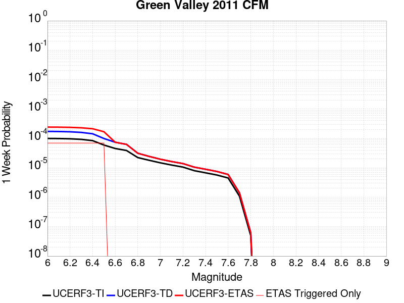 | 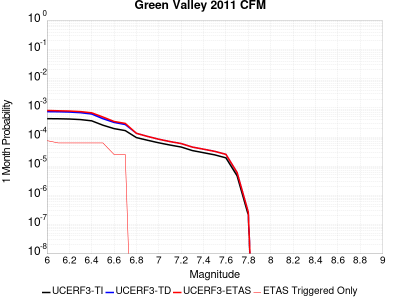 | 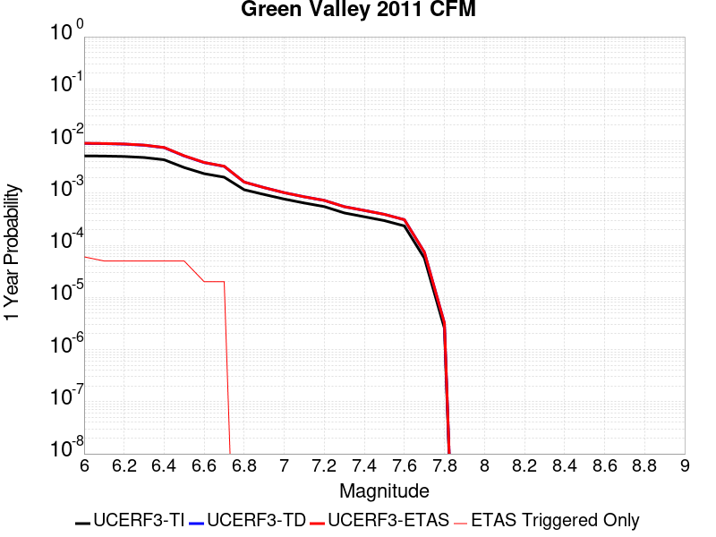 | 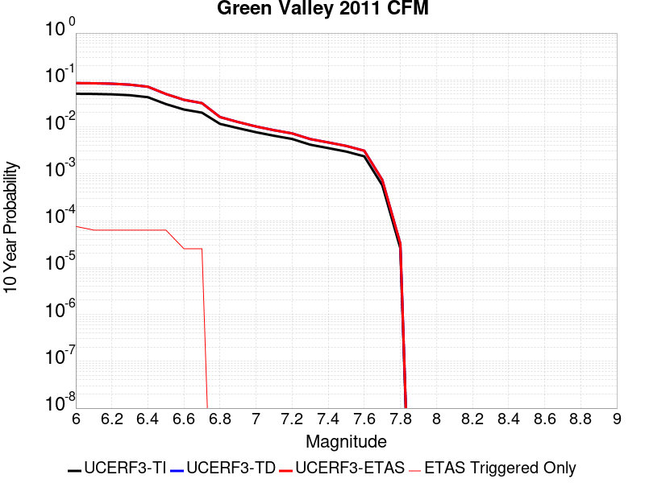 |

| Magnitude | 1 wk TI Prob | 1 wk TD Prob | 1 wk ETAS Prob | 1 wk ETAS/TD Gain | 1 wk ETAS Triggered Only | 1 mo TI Prob | 1 mo TD Prob | 1 mo ETAS Prob | 1 mo ETAS/TD Gain | 1 mo ETAS Triggered Only | 1 yr TI Prob | 1 yr TD Prob | 1 yr ETAS Prob | 1 yr ETAS/TD Gain | 1 yr ETAS Triggered Only | 10 yr TI Prob | 10 yr TD Prob | 10 yr ETAS Prob | 10 yr ETAS/TD Gain | 10 yr ETAS Triggered Only |
|-----|-----|-----|-----|-----|-----|-----|-----|-----|-----|-----|-----|-----|-----|-----|-----|-----|-----|-----|-----|-----|
| 6.0 | 9.9629346E-5 | 1.7302863E-4 | 2.3301825E-4 | 1.3467034 | 6.0E-5 | 4.2691303E-4 | 7.41326E-4 | 8.0128154E-4 | 1.0808761 | 6.0E-5 | 0.0051852856 | 0.00898692 | 0.00904638 | 1.0066164 | 6.0E-5 | 0.050659515 | 0.08553951 | 0.08559438 | 1.0006415 | 6.0E-5 |
| 6.1 | 9.88615E-5 | 1.7150163E-4 | 2.2149306E-4 | 1.2914925 | 5.0E-5 | 4.2362334E-4 | 7.347854E-4 | 7.847487E-4 | 1.0679971 | 5.0E-5 | 0.0051454236 | 0.008907947 | 0.0089575015 | 1.005563 | 5.0E-5 | 0.050279044 | 0.08482712 | 0.08487287 | 1.0005394 | 5.0E-5 |
| 6.2 | 9.696895E-5 | 1.6789208E-4 | 2.1788369E-4 | 1.2977604 | 5.0E-5 | 4.15515E-4 | 7.1932544E-4 | 7.692895E-4 | 1.0694596 | 5.0E-5 | 0.0050471667 | 0.00872133 | 0.008770893 | 1.0056831 | 5.0E-5 | 0.04934063 | 0.08313578 | 0.08318163 | 1.0005515 | 5.0E-5 |
| 6.3 | 9.275224E-5 | 1.5968543E-4 | 2.0967744E-4 | 1.3130656 | 5.0E-5 | 3.9744904E-4 | 6.841728E-4 | 7.341386E-4 | 1.073031 | 5.0E-5 | 0.0048282105 | 0.008296652 | 0.008346236 | 1.0059766 | 5.0E-5 | 0.047246475 | 0.07927481 | 0.07932085 | 1.0005807 | 5.0E-5 |
| 6.4 | 8.391499E-5 | 1.4365884E-4 | 1.9365165E-4 | 1.3479968 | 5.0E-5 | 3.595861E-4 | 6.155238E-4 | 6.65493E-4 | 1.0811816 | 5.0E-5 | 0.004369175 | 0.007467181 | 0.0075168074 | 1.0066459 | 5.0E-5 | 0.04284265 | 0.07164672 | 0.07169314 | 1.0006479 | 5.0E-5 |
| 6.5 | 5.9519385E-5 | 9.932622E-5 | 1.4932126E-4 | 1.5033417 | 5.0E-5 | 2.5505814E-4 | 4.2560388E-4 | 4.7558258E-4 | 1.1174301 | 5.0E-5 | 0.0031009112 | 0.005168341 | 0.0052180826 | 1.0096242 | 5.0E-5 | 0.030579966 | 0.05014692 | 0.050194412 | 1.0009471 | 5.0E-5 |
| 6.6 | 4.5361558E-5 | 7.4019794E-5 | 9.4018316E-5 | 1.270178 | 2.0E-5 | 1.9439218E-4 | 3.1717744E-4 | 3.371711E-4 | 1.0630362 | 2.0E-5 | 0.0023641558 | 0.0038538678 | 0.0038737906 | 1.0051696 | 2.0E-5 | 0.023391623 | 0.03766727 | 0.037686516 | 1.0005109 | 2.0E-5 |
| 6.7 | 3.8808106E-5 | 6.264382E-5 | 8.264257E-5 | 1.3192453 | 2.0E-5 | 1.6630985E-4 | 2.6843755E-4 | 2.884322E-4 | 1.0744852 | 2.0E-5 | 0.0020229418 | 0.0032627317 | 0.0032826664 | 1.0061098 | 2.0E-5 | 0.020046256 | 0.032007415 | 0.032026775 | 1.0006049 | 2.0E-5 |
| 6.8 | 2.2284667E-5 | 3.128574E-5 | 3.128574E-5 | 1.0 | 0.0 | 9.550222E-5 | 1.3407487E-4 | 1.3407487E-4 | 1.0 | 0.0 | 0.0011621192 | 0.0016311383 | 0.0016311383 | 1.0 | 0.0 | 0.011560607 | 0.01616672 | 0.01616672 | 1.0 | 0.0 |
| 6.9 | 1.8050168E-5 | 2.4448536E-5 | 2.4448536E-5 | 1.0 | 0.0 | 7.735557E-5 | 1.0477527E-4 | 1.0477527E-4 | 1.0 | 0.0 | 9.4139716E-4 | 0.0012748954 | 0.0012748954 | 1.0 | 0.0 | 0.009374191 | 0.012669067 | 0.012669067 | 1.0 | 0.0 |
| 7.0 | 1.4763166E-5 | 1.9583236E-5 | 1.9583236E-5 | 1.0 | 0.0 | 6.326917E-5 | 8.3925464E-5 | 8.3925464E-5 | 1.0 | 0.0 | 7.7002996E-4 | 0.001021315 | 0.001021315 | 1.0 | 0.0 | 0.007673672 | 0.01016625 | 0.01016625 | 1.0 | 0.0 |
| 7.1 | 1.2399713E-5 | 1.6304042E-5 | 1.6304042E-5 | 1.0 | 0.0 | 5.3140546E-5 | 6.987261E-5 | 6.987261E-5 | 1.0 | 0.0 | 6.467941E-4 | 8.5036893E-4 | 8.5036893E-4 | 1.0 | 0.0 | 0.006449148 | 0.008471781 | 0.008471781 | 1.0 | 0.0 |
| 7.2 | 1.0584195E-5 | 1.39220465E-5 | 1.39220465E-5 | 1.0 | 0.0 | 4.5360044E-5 | 5.966456E-5 | 5.966456E-5 | 1.0 | 0.0 | 5.521186E-4 | 7.2617555E-4 | 7.2617555E-4 | 1.0 | 0.0 | 0.0055074887 | 0.0072386027 | 0.0072386027 | 1.0 | 0.0 |
| 7.3 | 7.998173E-6 | 1.0544255E-5 | 1.0544255E-5 | 1.0 | 0.0 | 3.4277433E-5 | 4.5188888E-5 | 4.5188888E-5 | 1.0 | 0.0 | 4.1724785E-4 | 5.500369E-4 | 5.500369E-4 | 1.0 | 0.0 | 0.004164653 | 0.005487135 | 0.005487135 | 1.0 | 0.0 |
| 7.4 | 6.7571127E-6 | 8.932903E-6 | 8.932903E-6 | 1.0 | 0.0 | 2.8958733E-5 | 3.8283313E-5 | 3.8283313E-5 | 1.0 | 0.0 | 3.5251552E-4 | 4.660006E-4 | 4.660006E-4 | 1.0 | 0.0 | 0.0035195686 | 0.004650633 | 0.004650633 | 1.0 | 0.0 |
| 7.5 | 5.69878E-6 | 7.516483E-6 | 7.516483E-6 | 1.0 | 0.0 | 2.4423114E-5 | 3.2213105E-5 | 3.2213105E-5 | 1.0 | 0.0 | 2.9731085E-4 | 3.9212484E-4 | 3.9212484E-4 | 1.0 | 0.0 | 0.002969134 | 0.0039147018 | 0.0039147018 | 1.0 | 0.0 |
| 7.6 | 4.503664E-6 | 5.9358217E-6 | 5.9358217E-6 | 1.0 | 0.0 | 1.9301275E-5 | 2.5438992E-5 | 2.5438992E-5 | 1.0 | 0.0 | 2.3496768E-4 | 3.0967654E-4 | 3.0967654E-4 | 1.0 | 0.0 | 0.002347194 | 0.0030927279 | 0.0030927279 | 1.0 | 0.0 |
| 7.7 | 1.0873546E-6 | 1.410754E-6 | 1.410754E-6 | 1.0 | 0.0 | 4.6600826E-6 | 6.0460743E-6 | 6.0460743E-6 | 1.0 | 0.0 | 5.6735033E-5 | 7.36085E-5 | 7.36085E-5 | 1.0 | 0.0 | 5.672055E-4 | 7.3587085E-4 | 7.3587085E-4 | 1.0 | 0.0 |
| 7.8 | 4.9373917E-8 | 6.177967E-8 | 6.177967E-8 | 1.0 | 0.0 | 2.1160248E-7 | 2.6477002E-7 | 2.6477002E-7 | 1.0 | 0.0 | 2.5762572E-6 | 3.2235714E-6 | 3.2235714E-6 | 1.0 | 0.0 | 2.5762274E-5 | 3.2228E-5 | 3.2228E-5 | 1.0 | 0.0 |

## San Gabriel
*[(top)](#table-of-contents)*

| 1 Week | 1 Month | 1 Year | 10 Year |
|-----|-----|-----|-----|
| 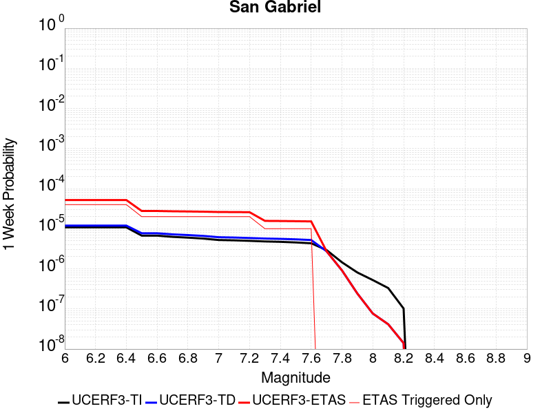 | 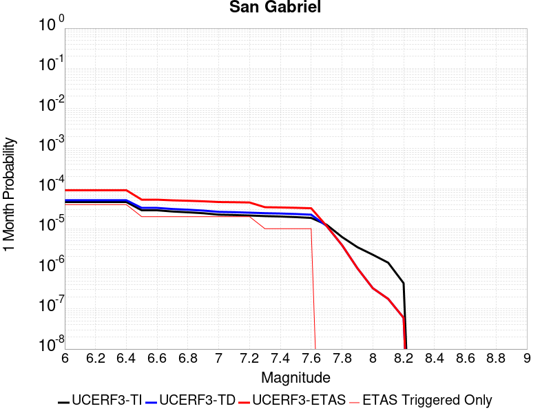 | 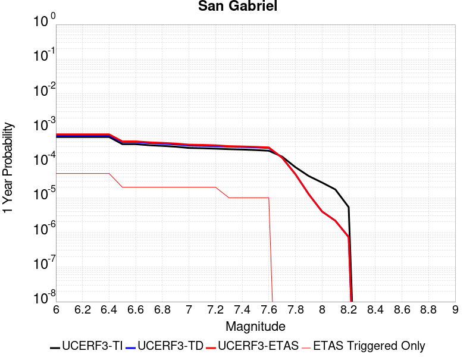 | 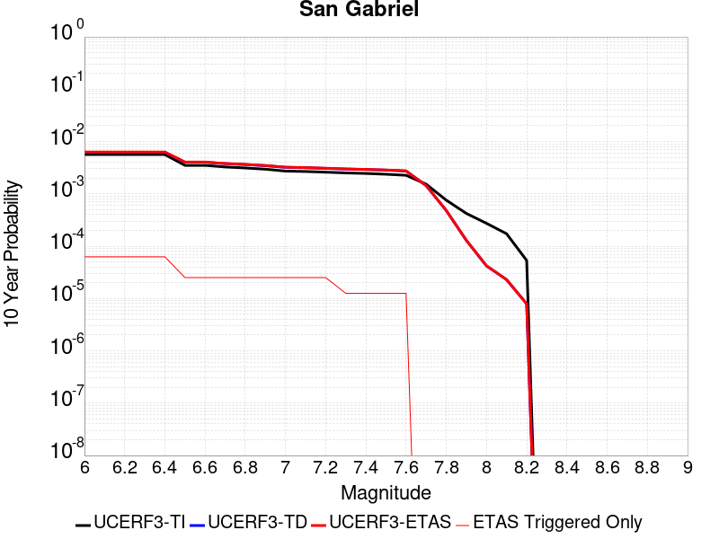 |

| Magnitude | 1 wk TI Prob | 1 wk TD Prob | 1 wk ETAS Prob | 1 wk ETAS/TD Gain | 1 wk ETAS Triggered Only | 1 mo TI Prob | 1 mo TD Prob | 1 mo ETAS Prob | 1 mo ETAS/TD Gain | 1 mo ETAS Triggered Only | 1 yr TI Prob | 1 yr TD Prob | 1 yr ETAS Prob | 1 yr ETAS/TD Gain | 1 yr ETAS Triggered Only | 10 yr TI Prob | 10 yr TD Prob | 10 yr ETAS Prob | 10 yr ETAS/TD Gain | 10 yr ETAS Triggered Only |
|-----|-----|-----|-----|-----|-----|-----|-----|-----|-----|-----|-----|-----|-----|-----|-----|-----|-----|-----|-----|-----|
| 6.0 | 1.083775E-5 | 1.198525E-5 | 5.198477E-5 | 4.3373957 | 4.0E-5 | 4.6446676E-5 | 5.1364408E-5 | 9.136235E-5 | 1.7787093 | 4.0E-5 | 5.653415E-4 | 6.251936E-4 | 6.751623E-4 | 1.0799252 | 5.0E-5 | 0.0056390543 | 0.0062463325 | 0.0063059577 | 1.0095457 | 6.0E-5 |
| 6.1 | 1.083775E-5 | 1.198525E-5 | 5.198477E-5 | 4.3373957 | 4.0E-5 | 4.6446676E-5 | 5.1364408E-5 | 9.136235E-5 | 1.7787093 | 4.0E-5 | 5.653415E-4 | 6.251936E-4 | 6.751623E-4 | 1.0799252 | 5.0E-5 | 0.0056390543 | 0.0062463325 | 0.0063059577 | 1.0095457 | 6.0E-5 |
| 6.2 | 1.083775E-5 | 1.198525E-5 | 5.198477E-5 | 4.3373957 | 4.0E-5 | 4.6446676E-5 | 5.1364408E-5 | 9.136235E-5 | 1.7787093 | 4.0E-5 | 5.653415E-4 | 6.251936E-4 | 6.751623E-4 | 1.0799252 | 5.0E-5 | 0.0056390543 | 0.0062463325 | 0.0063059577 | 1.0095457 | 6.0E-5 |
| 6.3 | 1.083775E-5 | 1.198525E-5 | 5.198477E-5 | 4.3373957 | 4.0E-5 | 4.6446676E-5 | 5.1364408E-5 | 9.136235E-5 | 1.7787093 | 4.0E-5 | 5.653415E-4 | 6.251936E-4 | 6.751623E-4 | 1.0799252 | 5.0E-5 | 0.0056390543 | 0.0062463325 | 0.0063059577 | 1.0095457 | 6.0E-5 |
| 6.4 | 1.083775E-5 | 1.198525E-5 | 5.198477E-5 | 4.3373957 | 4.0E-5 | 4.6446676E-5 | 5.1364408E-5 | 9.136235E-5 | 1.7787093 | 4.0E-5 | 5.653415E-4 | 6.251936E-4 | 6.751623E-4 | 1.0799252 | 5.0E-5 | 0.0056390543 | 0.0062463325 | 0.0063059577 | 1.0095457 | 6.0E-5 |
| 6.5 | 6.7317824E-6 | 7.717007E-6 | 2.7716853E-5 | 3.5916584 | 2.0E-5 | 2.8850178E-5 | 3.3072472E-5 | 5.3071813E-5 | 1.6047125 | 2.0E-5 | 3.511943E-4 | 4.0258403E-4 | 4.2257598E-4 | 1.049659 | 2.0E-5 | 0.003506398 | 0.004029533 | 0.0040494525 | 1.0049434 | 2.0E-5 |
| 6.6 | 6.7317824E-6 | 7.717007E-6 | 2.7716853E-5 | 3.5916584 | 2.0E-5 | 2.8850178E-5 | 3.3072472E-5 | 5.3071813E-5 | 1.6047125 | 2.0E-5 | 3.511943E-4 | 4.0258403E-4 | 4.2257598E-4 | 1.049659 | 2.0E-5 | 0.003506398 | 0.004029533 | 0.0040494525 | 1.0049434 | 2.0E-5 |
| 6.7 | 6.274881E-6 | 7.2459275E-6 | 2.7245782E-5 | 3.7601511 | 2.0E-5 | 2.6892068E-5 | 3.105361E-5 | 5.105299E-5 | 1.6440275 | 2.0E-5 | 3.2736175E-4 | 3.7801306E-4 | 3.980055E-4 | 1.0528883 | 2.0E-5 | 0.0032687993 | 0.0037846796 | 0.0038046038 | 1.0052645 | 2.0E-5 |
| 6.8 | 5.996209E-6 | 6.958647E-6 | 2.6958509E-5 | 3.8741019 | 2.0E-5 | 2.5697784E-5 | 2.9822439E-5 | 4.9821843E-5 | 1.6706159 | 2.0E-5 | 3.128256E-4 | 3.6302864E-4 | 3.8302137E-4 | 1.0550721 | 2.0E-5 | 0.003123856 | 0.0036353325 | 0.0036552597 | 1.0054816 | 2.0E-5 |
| 6.9 | 5.686331E-6 | 6.6236917E-6 | 2.662356E-5 | 4.019444 | 2.0E-5 | 2.4369761E-5 | 2.8386947E-5 | 4.838638E-5 | 1.7045292 | 2.0E-5 | 2.9666146E-4 | 3.4555717E-4 | 3.6555025E-4 | 1.0578575 | 2.0E-5 | 0.0029626573 | 0.0034611735 | 0.0034811043 | 1.0057584 | 2.0E-5 |
| 7.0 | 5.2329838E-6 | 6.1475757E-6 | 2.6147452E-5 | 4.253295 | 2.0E-5 | 2.242688E-5 | 2.6346492E-5 | 4.6345966E-5 | 1.7590944 | 2.0E-5 | 2.7301308E-4 | 3.207221E-4 | 3.4071566E-4 | 1.0623393 | 2.0E-5 | 0.002726779 | 0.0032135549 | 0.0032334907 | 1.0062037 | 2.0E-5 |
| 7.1 | 5.135671E-6 | 6.0377E-6 | 2.603758E-5 | 4.3124995 | 2.0E-5 | 2.2009834E-5 | 2.5875606E-5 | 4.5875087E-5 | 1.7729088 | 2.0E-5 | 2.6793676E-4 | 3.1499073E-4 | 3.3498442E-4 | 1.0634739 | 2.0E-5 | 0.0026761394 | 0.0031564054 | 0.0031763422 | 1.0063163 | 2.0E-5 |
| 7.2 | 4.989062E-6 | 5.8710784E-6 | 2.587096E-5 | 4.406509 | 2.0E-5 | 2.1381518E-5 | 2.5161527E-5 | 4.5161025E-5 | 1.7948443 | 2.0E-5 | 2.6028889E-4 | 3.0629928E-4 | 3.2629314E-4 | 1.0652757 | 2.0E-5 | 0.0025998424 | 0.003069734 | 0.0030896724 | 1.0064952 | 2.0E-5 |
| 7.3 | 4.8219395E-6 | 5.7026323E-6 | 1.5702575E-5 | 2.7535663 | 1.0E-5 | 2.0665291E-5 | 2.4439627E-5 | 3.4439385E-5 | 1.4091616 | 1.0E-5 | 2.5157086E-4 | 2.975126E-4 | 3.0750962E-4 | 1.033602 | 1.0E-5 | 0.0025128627 | 0.002982106 | 0.0029920763 | 1.0033433 | 1.0E-5 |
| 7.4 | 4.7118383E-6 | 5.5911896E-6 | 1.5591133E-5 | 2.7885182 | 1.0E-5 | 2.0193436E-5 | 2.3962024E-5 | 3.3961784E-5 | 1.417317 | 1.0E-5 | 2.4582737E-4 | 2.9169934E-4 | 3.0169642E-4 | 1.0342718 | 1.0E-5 | 0.002455556 | 0.0029241266 | 0.0029340973 | 1.0034099 | 1.0E-5 |
| 7.5 | 4.5506545E-6 | 5.4365555E-6 | 1.54365E-5 | 2.83939 | 1.0E-5 | 1.9502659E-5 | 2.329932E-5 | 3.3299086E-5 | 1.429187 | 1.0E-5 | 2.37419E-4 | 2.8363304E-4 | 2.936302E-4 | 1.0352468 | 1.0E-5 | 0.002371655 | 0.0028436715 | 0.0028536431 | 1.0035065 | 1.0E-5 |
| 7.6 | 4.343636E-6 | 5.2294336E-6 | 1.52293815E-5 | 2.912243 | 1.0E-5 | 1.861545E-5 | 2.241167E-5 | 3.2411444E-5 | 1.4461861 | 1.0E-5 | 2.2661954E-4 | 2.7282868E-4 | 2.8282593E-4 | 1.036643 | 1.0E-5 | 0.0022638857 | 0.0027358893 | 0.002745862 | 1.0036451 | 1.0E-5 |
| 7.7 | 2.936235E-6 | 2.743946E-6 | 2.743946E-6 | 1.0 | 0.0 | 1.2583803E-5 | 1.1759716E-5 | 1.1759716E-5 | 1.0 | 0.0 | 1.5319703E-4 | 1.4316518E-4 | 1.4316518E-4 | 1.0 | 0.0 | 0.0015309147 | 0.0014379849 | 0.0014379849 | 1.0 | 0.0 |
| 7.8 | 1.4541639E-6 | 9.122518E-7 | 9.122518E-7 | 1.0 | 0.0 | 6.232116E-6 | 3.9096444E-6 | 3.9096444E-6 | 1.0 | 0.0 | 7.587337E-5 | 4.7598885E-5 | 4.7598885E-5 | 1.0 | 0.0 | 7.584747E-4 | 4.8078224E-4 | 4.8078224E-4 | 1.0 | 0.0 |
| 7.9 | 8.098958E-7 | 2.4165956E-7 | 2.4165956E-7 | 1.0 | 0.0 | 3.4709774E-6 | 1.0356835E-6 | 1.0356835E-6 | 1.0 | 0.0 | 4.225833E-5 | 1.2609373E-5 | 1.2609373E-5 | 1.0 | 0.0 | 4.2250296E-4 | 1.2917137E-4 | 1.2917137E-4 | 1.0 | 0.0 |
| 8.0 | 5.2473234E-7 | 7.672734E-8 | 7.672734E-8 | 1.0 | 0.0 | 2.248851E-6 | 3.2883142E-7 | 3.2883142E-7 | 1.0 | 0.0 | 2.7379416E-5 | 4.003515E-6 | 4.003515E-6 | 1.0 | 0.0 | 2.7376044E-4 | 4.215796E-5 | 4.215796E-5 | 1.0 | 0.0 |
| 8.1 | 3.3162388E-7 | 4.1457096E-8 | 4.1457096E-8 | 1.0 | 0.0 | 1.4212444E-6 | 1.7767324E-7 | 1.7767324E-7 | 1.0 | 0.0 | 1.7303513E-5 | 2.1631695E-6 | 2.1631695E-6 | 1.0 | 0.0 | 1.7302166E-4 | 2.294416E-5 | 2.294416E-5 | 1.0 | 0.0 |
| 8.2 | 1.0235345E-7 | 1.4032201E-8 | 1.4032201E-8 | 1.0 | 0.0 | 4.3865757E-7 | 6.013801E-8 | 6.013801E-8 | 1.0 | 0.0 | 5.340643E-6 | 7.3217996E-7 | 7.3217996E-7 | 1.0 | 0.0 | 5.3405143E-5 | 7.921925E-6 | 7.921925E-6 | 1.0 | 0.0 |

## Big Pine (East)
*[(top)](#table-of-contents)*

| 1 Week | 1 Month | 1 Year | 10 Year |
|-----|-----|-----|-----|
| 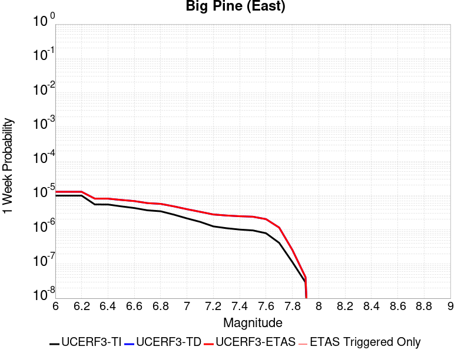 | 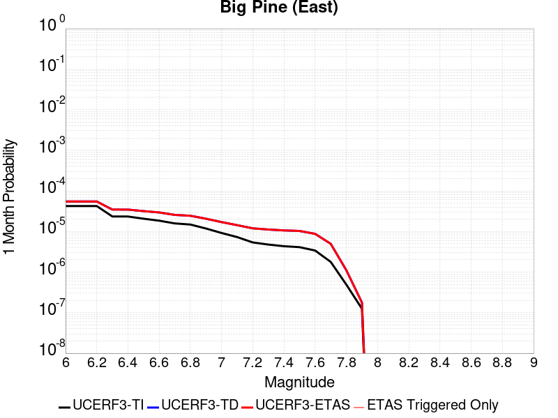 |  | 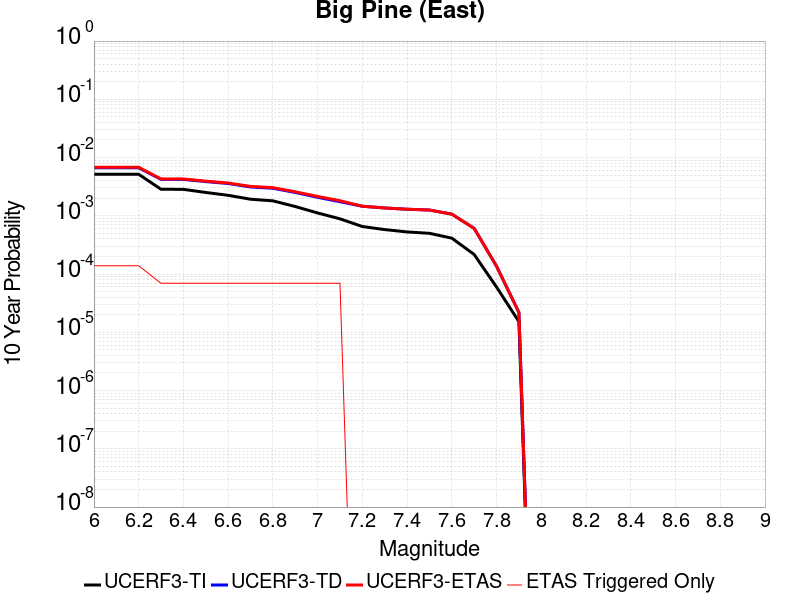 |

| Magnitude | 1 wk TI Prob | 1 wk TD Prob | 1 wk ETAS Prob | 1 wk ETAS/TD Gain | 1 wk ETAS Triggered Only | 1 mo TI Prob | 1 mo TD Prob | 1 mo ETAS Prob | 1 mo ETAS/TD Gain | 1 mo ETAS Triggered Only | 1 yr TI Prob | 1 yr TD Prob | 1 yr ETAS Prob | 1 yr ETAS/TD Gain | 1 yr ETAS Triggered Only | 10 yr TI Prob | 10 yr TD Prob | 10 yr ETAS Prob | 10 yr ETAS/TD Gain | 10 yr ETAS Triggered Only |
|-----|-----|-----|-----|-----|-----|-----|-----|-----|-----|-----|-----|-----|-----|-----|-----|-----|-----|-----|-----|-----|
| 6.0 | 9.916913E-6 | 1.28172705E-5 | 1.28172705E-5 | 1.0 | 0.0 | 4.250036E-5 | 5.493013E-5 | 5.493013E-5 | 1.0 | 0.0 | 5.173191E-4 | 6.685912E-4 | 6.885778E-4 | 1.0298936 | 2.0E-5 | 0.0051611643 | 0.006670449 | 0.0067300485 | 1.0089349 | 6.0E-5 |
| 6.1 | 9.916913E-6 | 1.28172705E-5 | 1.28172705E-5 | 1.0 | 0.0 | 4.250036E-5 | 5.493013E-5 | 5.493013E-5 | 1.0 | 0.0 | 5.173191E-4 | 6.685912E-4 | 6.885778E-4 | 1.0298936 | 2.0E-5 | 0.0051611643 | 0.006670449 | 0.0067300485 | 1.0089349 | 6.0E-5 |
| 6.2 | 9.916913E-6 | 1.28172705E-5 | 1.28172705E-5 | 1.0 | 0.0 | 4.250036E-5 | 5.493013E-5 | 5.493013E-5 | 1.0 | 0.0 | 5.173191E-4 | 6.685912E-4 | 6.885778E-4 | 1.0298936 | 2.0E-5 | 0.0051611643 | 0.006670449 | 0.0067300485 | 1.0089349 | 6.0E-5 |
| 6.3 | 5.479711E-6 | 8.1132375E-6 | 8.1132375E-6 | 1.0 | 0.0 | 2.3484265E-5 | 3.4770575E-5 | 3.4770575E-5 | 1.0 | 0.0 | 2.858834E-4 | 4.232527E-4 | 4.3324847E-4 | 1.0236166 | 1.0E-5 | 0.0028551589 | 0.0042272513 | 0.004267082 | 1.0094224 | 4.0E-5 |
| 6.4 | 5.465009E-6 | 8.0975315E-6 | 8.0975315E-6 | 1.0 | 0.0 | 2.3421257E-5 | 3.4703262E-5 | 3.4703262E-5 | 1.0 | 0.0 | 2.851165E-4 | 4.2243348E-4 | 4.3242925E-4 | 1.0236623 | 1.0E-5 | 0.0028475097 | 0.00421909 | 0.0042589214 | 1.0094407 | 4.0E-5 |
| 6.5 | 4.826767E-6 | 7.4225877E-6 | 7.4225877E-6 | 1.0 | 0.0 | 2.068598E-5 | 3.1810716E-5 | 3.1810716E-5 | 1.0 | 0.0 | 2.518227E-4 | 3.8722943E-4 | 3.9722555E-4 | 1.0258145 | 1.0E-5 | 0.0025153751 | 0.0038682907 | 0.003908136 | 1.0103005 | 4.0E-5 |
| 6.6 | 4.3146847E-6 | 6.8825234E-6 | 6.8825234E-6 | 1.0 | 0.0 | 1.8491375E-5 | 2.949621E-5 | 2.949621E-5 | 1.0 | 0.0 | 2.2510924E-4 | 3.5905963E-4 | 3.6905604E-4 | 1.0278405 | 1.0E-5 | 0.0022488134 | 0.0035875062 | 0.0036173984 | 1.0083324 | 3.0E-5 |
| 6.7 | 3.6968106E-6 | 5.9957474E-6 | 5.9957474E-6 | 1.0 | 0.0 | 1.5843378E-5 | 2.5695816E-5 | 2.5695816E-5 | 1.0 | 0.0 | 1.9287605E-4 | 3.128032E-4 | 3.2280007E-4 | 1.0319589 | 1.0E-5 | 0.0019270873 | 0.0031262499 | 0.003156156 | 1.0095662 | 3.0E-5 |
| 6.8 | 3.4671132E-6 | 5.7024477E-6 | 5.7024477E-6 | 1.0 | 0.0 | 1.4858972E-5 | 2.4438841E-5 | 2.4438841E-5 | 1.0 | 0.0 | 1.8089297E-4 | 2.9750372E-4 | 3.0750074E-4 | 1.0336031 | 1.0E-5 | 0.0018074579 | 0.0029736666 | 0.0030035775 | 1.0100585 | 3.0E-5 |
| 6.9 | 2.7686972E-6 | 4.8254797E-6 | 4.8254797E-6 | 1.0 | 0.0 | 1.1865792E-5 | 2.0680467E-5 | 2.0680467E-5 | 1.0 | 0.0 | 1.4445644E-4 | 2.5175634E-4 | 2.6175383E-4 | 1.039711 | 1.0E-5 | 0.0014436257 | 0.002517256 | 0.0025471803 | 1.0118878 | 3.0E-5 |
| 7.0 | 2.1472624E-6 | 3.985277E-6 | 3.985277E-6 | 1.0 | 0.0 | 9.20252E-6 | 1.707965E-5 | 1.707965E-5 | 1.0 | 0.0 | 1.12034926E-4 | 2.0792543E-4 | 2.1792336E-4 | 1.0480841 | 1.0E-5 | 0.0011197845 | 0.0020798238 | 0.0020997822 | 1.0095962 | 2.0E-5 |
| 7.1 | 1.7018335E-6 | 3.3450835E-6 | 3.3450835E-6 | 1.0 | 0.0 | 7.293552E-6 | 1.4335996E-5 | 1.4335996E-5 | 1.0 | 0.0 | 8.879537E-5 | 1.7452713E-4 | 1.8452539E-4 | 1.0572877 | 1.0E-5 | 8.87599E-4 | 0.0017463792 | 0.0017663443 | 1.0114323 | 2.0E-5 |
| 7.2 | 1.25603E-6 | 2.794679E-6 | 2.794679E-6 | 1.0 | 0.0 | 5.3829745E-6 | 1.1977142E-5 | 1.1977142E-5 | 1.0 | 0.0 | 6.553574E-5 | 1.4581217E-4 | 1.5581072E-4 | 1.0685713 | 1.0E-5 | 6.551642E-4 | 0.0014596173 | 0.0014696027 | 1.0068411 | 1.0E-5 |
| 7.3 | 1.112297E-6 | 2.610519E-6 | 2.610519E-6 | 1.0 | 0.0 | 4.7669787E-6 | 1.1187892E-5 | 1.1187892E-5 | 1.0 | 0.0 | 5.803642E-5 | 1.3620428E-4 | 1.4620292E-4 | 1.0734091 | 1.0E-5 | 5.802127E-4 | 0.001363502 | 0.0013734883 | 1.0073241 | 1.0E-5 |
| 7.4 | 1.0137181E-6 | 2.4836752E-6 | 2.4836752E-6 | 1.0 | 0.0 | 4.3444993E-6 | 1.064428E-5 | 1.064428E-5 | 1.0 | 0.0 | 5.2892992E-5 | 1.2958662E-4 | 1.3958532E-4 | 1.0771585 | 1.0E-5 | 5.288041E-4 | 0.0012971918 | 0.0013071789 | 1.007699 | 1.0E-5 |
| 7.5 | 9.598608E-7 | 2.407328E-6 | 2.407328E-6 | 1.0 | 0.0 | 4.1136827E-6 | 1.03170805E-5 | 1.03170805E-5 | 1.0 | 0.0 | 5.0082934E-5 | 1.2560343E-4 | 1.3560218E-4 | 1.0796057 | 1.0E-5 | 5.007165E-4 | 0.0012572132 | 0.0012672007 | 1.0079441 | 1.0E-5 |
| 7.6 | 7.929459E-7 | 2.0450152E-6 | 2.0450152E-6 | 1.0 | 0.0 | 3.3983351E-6 | 8.764322E-6 | 8.764322E-6 | 1.0 | 0.0 | 4.1373947E-5 | 1.0670057E-4 | 1.16699506E-4 | 1.0937102 | 1.0E-5 | 4.1366243E-4 | 0.0010685825 | 0.0010785719 | 1.0093482 | 1.0E-5 |
| 7.7 | 4.155788E-7 | 1.1606729E-6 | 1.1606729E-6 | 1.0 | 0.0 | 1.7810507E-6 | 4.974303E-6 | 4.974303E-6 | 1.0 | 0.0 | 2.1684076E-5 | 6.05605E-5 | 7.0559894E-5 | 1.1651142 | 1.0E-5 | 2.1681961E-4 | 6.085995E-4 | 6.185935E-4 | 1.0164212 | 1.0E-5 |
| 7.8 | 1.14666925E-7 | 2.592197E-7 | 2.592197E-7 | 1.0 | 0.0 | 4.914296E-7 | 1.1109411E-6 | 1.1109411E-6 | 1.0 | 0.0 | 5.9831386E-6 | 1.3525627E-5 | 2.3525492E-5 | 1.7393272 | 1.0E-5 | 5.9829777E-5 | 1.3636416E-4 | 1.463628E-4 | 1.073323 | 1.0E-5 |
| 7.9 | 2.9231824E-8 | 4.1462318E-8 | 4.1462318E-8 | 1.0 | 0.0 | 1.2527924E-7 | 1.7769564E-7 | 1.7769564E-7 | 1.0 | 0.0 | 1.5252737E-6 | 2.1634426E-6 | 2.1634426E-6 | 1.0 | 0.0 | 1.5252632E-5 | 2.197062E-5 | 2.197062E-5 | 1.0 | 0.0 |

## San Jacinto (Coyote Creek)
*[(top)](#table-of-contents)*

| 1 Week | 1 Month | 1 Year | 10 Year |
|-----|-----|-----|-----|
| 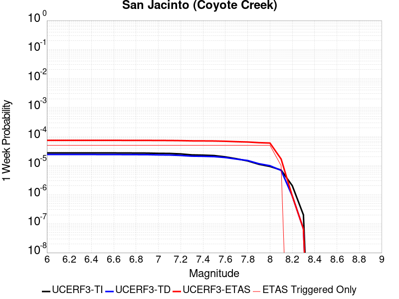 | 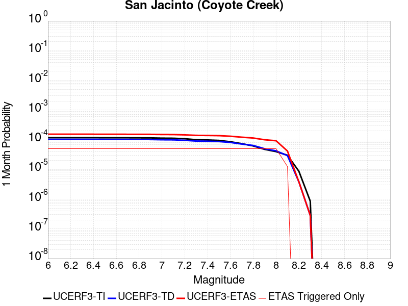 |  | 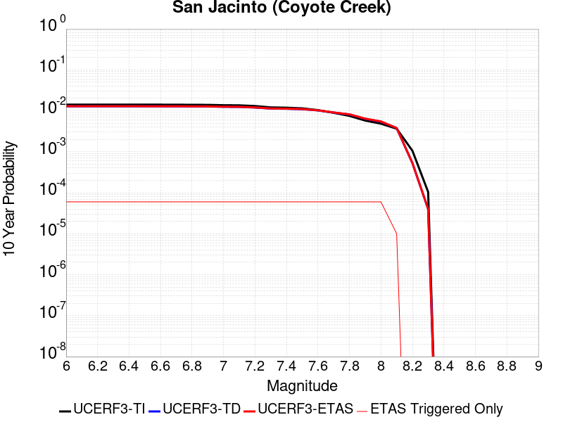 |

| Magnitude | 1 wk TI Prob | 1 wk TD Prob | 1 wk ETAS Prob | 1 wk ETAS/TD Gain | 1 wk ETAS Triggered Only | 1 mo TI Prob | 1 mo TD Prob | 1 mo ETAS Prob | 1 mo ETAS/TD Gain | 1 mo ETAS Triggered Only | 1 yr TI Prob | 1 yr TD Prob | 1 yr ETAS Prob | 1 yr ETAS/TD Gain | 1 yr ETAS Triggered Only | 10 yr TI Prob | 10 yr TD Prob | 10 yr ETAS Prob | 10 yr ETAS/TD Gain | 10 yr ETAS Triggered Only |
|-----|-----|-----|-----|-----|-----|-----|-----|-----|-----|-----|-----|-----|-----|-----|-----|-----|-----|-----|-----|-----|
| 6.0 | 2.7374346E-5 | 2.41444E-5 | 7.4143194E-5 | 3.0708237 | 5.0E-5 | 1.1731335E-4 | 1.034719E-4 | 1.5346672E-4 | 1.483173 | 5.0E-5 | 0.0014273542 | 0.001259045 | 0.0013189694 | 1.0475951 | 6.0E-5 | 0.01418221 | 0.012928195 | 0.012987419 | 1.004581 | 6.0E-5 |
| 6.1 | 2.7374346E-5 | 2.41444E-5 | 7.4143194E-5 | 3.0708237 | 5.0E-5 | 1.1731335E-4 | 1.034719E-4 | 1.5346672E-4 | 1.483173 | 5.0E-5 | 0.0014273542 | 0.001259045 | 0.0013189694 | 1.0475951 | 6.0E-5 | 0.01418221 | 0.012928195 | 0.012987419 | 1.004581 | 6.0E-5 |
| 6.2 | 2.7374346E-5 | 2.41444E-5 | 7.4143194E-5 | 3.0708237 | 5.0E-5 | 1.1731335E-4 | 1.034719E-4 | 1.5346672E-4 | 1.483173 | 5.0E-5 | 0.0014273542 | 0.001259045 | 0.0013189694 | 1.0475951 | 6.0E-5 | 0.01418221 | 0.012928195 | 0.012987419 | 1.004581 | 6.0E-5 |
| 6.3 | 2.7374346E-5 | 2.41444E-5 | 7.4143194E-5 | 3.0708237 | 5.0E-5 | 1.1731335E-4 | 1.034719E-4 | 1.5346672E-4 | 1.483173 | 5.0E-5 | 0.0014273542 | 0.001259045 | 0.0013189694 | 1.0475951 | 6.0E-5 | 0.01418221 | 0.012928195 | 0.012987419 | 1.004581 | 6.0E-5 |
| 6.4 | 2.7374346E-5 | 2.41444E-5 | 7.4143194E-5 | 3.0708237 | 5.0E-5 | 1.1731335E-4 | 1.034719E-4 | 1.5346672E-4 | 1.483173 | 5.0E-5 | 0.0014273542 | 0.001259045 | 0.0013189694 | 1.0475951 | 6.0E-5 | 0.01418221 | 0.012928195 | 0.012987419 | 1.004581 | 6.0E-5 |
| 6.5 | 2.7282445E-5 | 2.4030476E-5 | 7.4029274E-5 | 3.0806413 | 5.0E-5 | 1.16919524E-4 | 1.0298371E-4 | 1.5297855E-4 | 1.4854637 | 5.0E-5 | 0.0014225657 | 0.001253108 | 0.0013130329 | 1.0478209 | 6.0E-5 | 0.014134934 | 0.012869522 | 0.01292875 | 1.0046022 | 6.0E-5 |
| 6.6 | 2.7282445E-5 | 2.4030476E-5 | 7.4029274E-5 | 3.0806413 | 5.0E-5 | 1.16919524E-4 | 1.0298371E-4 | 1.5297855E-4 | 1.4854637 | 5.0E-5 | 0.0014225657 | 0.001253108 | 0.0013130329 | 1.0478209 | 6.0E-5 | 0.014134934 | 0.012869522 | 0.01292875 | 1.0046022 | 6.0E-5 |
| 6.7 | 2.7216198E-5 | 2.3955597E-5 | 7.39544E-5 | 3.0871449 | 5.0E-5 | 1.1663563E-4 | 1.02662816E-4 | 1.5265768E-4 | 1.4869813 | 5.0E-5 | 0.0014191137 | 0.0012492058 | 0.0013091308 | 1.0479705 | 6.0E-5 | 0.014100855 | 0.012830934 | 0.012890164 | 1.0046161 | 6.0E-5 |
| 6.8 | 2.7078617E-5 | 2.3872815E-5 | 7.387162E-5 | 3.0943825 | 5.0E-5 | 1.1604605E-4 | 1.0230807E-4 | 1.5230295E-4 | 1.48867 | 5.0E-5 | 0.001411945 | 0.0012448917 | 0.0013048169 | 1.048137 | 6.0E-5 | 0.014030075 | 0.0127880825 | 0.012847315 | 1.0046319 | 6.0E-5 |
| 6.9 | 2.6982952E-5 | 2.3792329E-5 | 7.379114E-5 | 3.1014676 | 5.0E-5 | 1.15636096E-4 | 1.0196315E-4 | 1.5195805E-4 | 1.4903232 | 5.0E-5 | 0.0014069602 | 0.0012406971 | 0.0013006227 | 1.0482999 | 6.0E-5 | 0.013980856 | 0.012746378 | 0.012805614 | 1.0046473 | 6.0E-5 |
| 7.0 | 2.6449972E-5 | 2.3369357E-5 | 7.336819E-5 | 3.139504 | 5.0E-5 | 1.1335209E-4 | 1.0015055E-4 | 1.5014554E-4 | 1.4991983 | 5.0E-5 | 0.001379188 | 0.0012186535 | 0.0012785804 | 1.0491747 | 6.0E-5 | 0.0137065975 | 0.012527733 | 0.012586981 | 1.0047294 | 6.0E-5 |
| 7.1 | 2.6257849E-5 | 2.3195396E-5 | 7.3194235E-5 | 3.1555502 | 5.0E-5 | 1.1252879E-4 | 9.940507E-5 | 1.494001E-4 | 1.5029424 | 5.0E-5 | 0.0013691769 | 0.0012095873 | 0.0012695148 | 1.0495437 | 6.0E-5 | 0.013607717 | 0.012437661 | 0.012496915 | 1.0047641 | 6.0E-5 |
| 7.2 | 2.5270041E-5 | 2.2390155E-5 | 7.238903E-5 | 3.2330742 | 5.0E-5 | 1.0829568E-4 | 9.5954296E-5 | 1.459495E-4 | 1.5210314 | 5.0E-5 | 0.0013177024 | 0.0011676198 | 0.0012275497 | 1.0513266 | 6.0E-5 | 0.013099162 | 0.0120187905 | 0.012078069 | 1.0049322 | 6.0E-5 |
| 7.3 | 2.339701E-5 | 2.1122027E-5 | 7.112097E-5 | 3.367147 | 5.0E-5 | 1.0026905E-4 | 9.051985E-5 | 1.4051532E-4 | 1.5523151 | 5.0E-5 | 0.001220092 | 0.001101524 | 0.0011614579 | 1.05441 | 6.0E-5 | 0.012134149 | 0.011357642 | 0.0114169605 | 1.0052228 | 6.0E-5 |
| 7.4 | 2.296333E-5 | 2.0852396E-5 | 7.0851354E-5 | 3.397756 | 5.0E-5 | 9.841056E-5 | 8.936436E-5 | 1.393599E-4 | 1.5594572 | 5.0E-5 | 0.0011974899 | 0.0010874701 | 0.0011474048 | 1.0551139 | 6.0E-5 | 0.011910575 | 0.011216754 | 0.011276081 | 1.0052892 | 6.0E-5 |
| 7.5 | 2.2188895E-5 | 2.037534E-5 | 7.037432E-5 | 3.4538965 | 5.0E-5 | 9.50918E-5 | 8.731998E-5 | 1.3731561E-4 | 1.5725566 | 5.0E-5 | 0.0011571277 | 0.0010626042 | 0.0011225406 | 1.0564051 | 6.0E-5 | 0.011511209 | 0.010966369 | 0.011025711 | 1.0054113 | 6.0E-5 |
| 7.6 | 2.0013189E-5 | 1.8961666E-5 | 6.896072E-5 | 3.6368492 | 5.0E-5 | 8.5767984E-5 | 8.126176E-5 | 1.312577E-4 | 1.6152456 | 5.0E-5 | 0.001043725 | 9.889146E-4 | 0.0010488553 | 1.0606126 | 6.0E-5 | 0.010388365 | 0.010224371 | 0.010283758 | 1.0058084 | 6.0E-5 |
| 7.7 | 1.7230794E-5 | 1.6743043E-5 | 6.674221E-5 | 3.986265 | 5.0E-5 | 7.384417E-5 | 7.175393E-5 | 1.2175034E-4 | 1.6967759 | 5.0E-5 | 8.986819E-4 | 8.732547E-4 | 9.3320233E-4 | 1.0686485 | 6.0E-5 | 0.008950562 | 0.00906292 | 0.009122376 | 1.0065603 | 6.0E-5 |
| 7.8 | 1.4478809E-5 | 1.499039E-5 | 6.498964E-5 | 4.33542 | 5.0E-5 | 6.205057E-5 | 6.424295E-5 | 1.1423974E-4 | 1.7782456 | 5.0E-5 | 7.552038E-4 | 7.8187784E-4 | 8.41831E-4 | 1.0766783 | 6.0E-5 | 0.0075264242 | 0.008141388 | 0.0082009 | 1.0073098 | 6.0E-5 |
| 7.9 | 1.1114467E-5 | 1.1644517E-5 | 6.1643936E-5 | 5.2938166 | 5.0E-5 | 4.7632562E-5 | 4.990412E-5 | 9.990163E-5 | 2.0018713 | 5.0E-5 | 5.797721E-4 | 6.074139E-4 | 6.6737743E-4 | 1.0987195 | 6.0E-5 | 0.0057826187 | 0.0063803545 | 0.0064399717 | 1.0093439 | 6.0E-5 |
| 8.0 | 9.327402E-6 | 9.8986575E-6 | 5.9898164E-5 | 6.05114 | 5.0E-5 | 3.9973966E-5 | 4.2422133E-5 | 9.2420014E-5 | 2.17858 | 5.0E-5 | 4.8657437E-4 | 5.163676E-4 | 5.7633664E-4 | 1.1161363 | 6.0E-5 | 0.0048551033 | 0.00544994 | 0.005509613 | 1.0109493 | 6.0E-5 |
| 8.1 | 7.0235833E-6 | 6.826985E-6 | 1.6826916E-5 | 2.4647655 | 1.0E-5 | 3.0100724E-5 | 2.9258183E-5 | 3.9257888E-5 | 1.3417747 | 1.0E-5 | 3.664147E-4 | 3.5616063E-4 | 3.661571E-4 | 1.0280672 | 1.0E-5 | 0.003658111 | 0.0037874572 | 0.0037974194 | 1.0026304 | 1.0E-5 |
| 8.2 | 2.0358202E-6 | 8.9912584E-7 | 8.9912584E-7 | 1.0 | 0.0 | 8.724915E-6 | 3.853391E-6 | 3.853391E-6 | 1.0 | 0.0 | 1.06220665E-4 | 4.6914047E-5 | 4.6914047E-5 | 1.0 | 0.0 | 0.001061699 | 5.3239096E-4 | 5.3239096E-4 | 1.0 | 0.0 |
| 8.3 | 2.0051264E-7 | 6.61379E-8 | 6.61379E-8 | 1.0 | 0.0 | 8.5933965E-7 | 2.8344812E-7 | 2.8344812E-7 | 1.0 | 0.0 | 1.046241E-5 | 3.450976E-6 | 3.450976E-6 | 1.0 | 0.0 | 1.0461917E-4 | 4.0120205E-5 | 4.0120205E-5 | 1.0 | 0.0 |

## San Andreas (Santa Cruz Mts) 2011 CFM
*[(top)](#table-of-contents)*

| 1 Week | 1 Month | 1 Year | 10 Year |
|-----|-----|-----|-----|
| 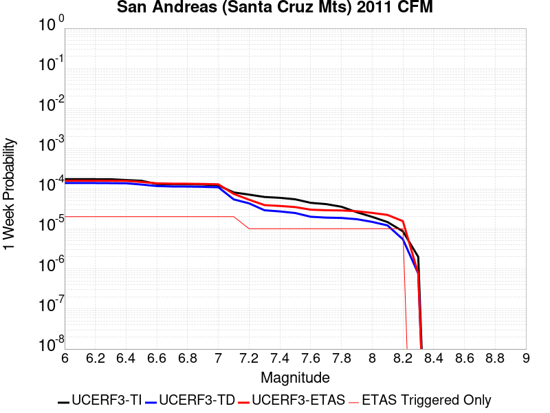 | 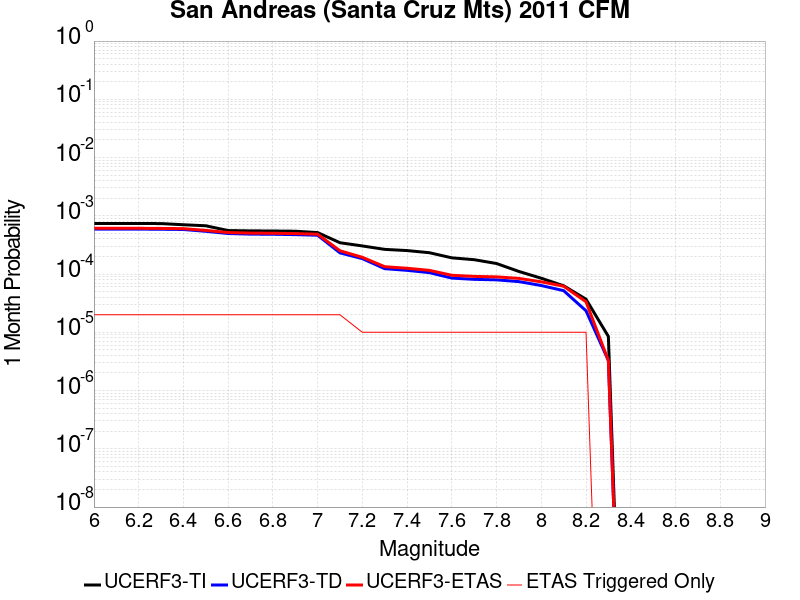 | 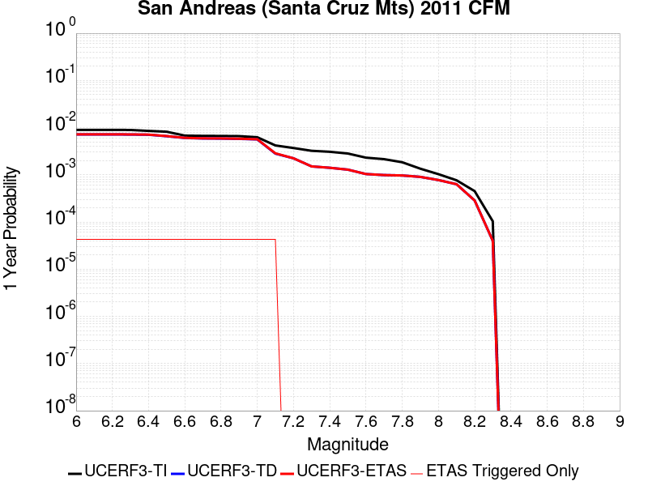 | 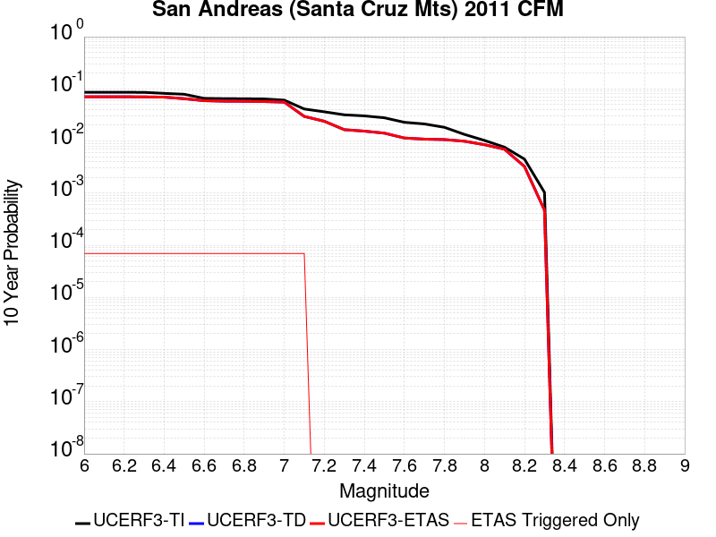 |

| Magnitude | 1 wk TI Prob | 1 wk TD Prob | 1 wk ETAS Prob | 1 wk ETAS/TD Gain | 1 wk ETAS Triggered Only | 1 mo TI Prob | 1 mo TD Prob | 1 mo ETAS Prob | 1 mo ETAS/TD Gain | 1 mo ETAS Triggered Only | 1 yr TI Prob | 1 yr TD Prob | 1 yr ETAS Prob | 1 yr ETAS/TD Gain | 1 yr ETAS Triggered Only | 10 yr TI Prob | 10 yr TD Prob | 10 yr ETAS Prob | 10 yr ETAS/TD Gain | 10 yr ETAS Triggered Only |
|-----|-----|-----|-----|-----|-----|-----|-----|-----|-----|-----|-----|-----|-----|-----|-----|-----|-----|-----|-----|-----|
| 6.0 | 1.7221631E-4 | 1.3792426E-4 | 1.579215E-4 | 1.1449871 | 2.0E-5 | 7.378611E-4 | 5.9097214E-4 | 6.109603E-4 | 1.0338225 | 2.0E-5 | 0.008946515 | 0.0071717235 | 0.007211437 | 1.0055375 | 4.0E-5 | 0.08594794 | 0.07054796 | 0.07059444 | 1.0006588 | 5.0E-5 |
| 6.1 | 1.7221631E-4 | 1.3792426E-4 | 1.579215E-4 | 1.1449871 | 2.0E-5 | 7.378611E-4 | 5.9097214E-4 | 6.109603E-4 | 1.0338225 | 2.0E-5 | 0.008946515 | 0.0071717235 | 0.007211437 | 1.0055375 | 4.0E-5 | 0.08594794 | 0.07054796 | 0.07059444 | 1.0006588 | 5.0E-5 |
| 6.2 | 1.7221631E-4 | 1.3792426E-4 | 1.579215E-4 | 1.1449871 | 2.0E-5 | 7.378611E-4 | 5.9097214E-4 | 6.109603E-4 | 1.0338225 | 2.0E-5 | 0.008946515 | 0.0071717235 | 0.007211437 | 1.0055375 | 4.0E-5 | 0.08594794 | 0.07054796 | 0.07059444 | 1.0006588 | 5.0E-5 |
| 6.3 | 1.716926E-4 | 1.3711878E-4 | 1.5711605E-4 | 1.145839 | 2.0E-5 | 7.3561794E-4 | 5.8752164E-4 | 6.075099E-4 | 1.0340213 | 2.0E-5 | 0.008919428 | 0.007129989 | 0.007169704 | 1.00557 | 4.0E-5 | 0.08569809 | 0.07015993 | 0.07020642 | 1.0006627 | 5.0E-5 |
| 6.4 | 1.6392978E-4 | 1.3587909E-4 | 1.5587638E-4 | 1.1471697 | 2.0E-5 | 7.02367E-4 | 5.82211E-4 | 6.021994E-4 | 1.0343318 | 2.0E-5 | 0.008517839 | 0.0070657525 | 0.0071054697 | 1.0056211 | 4.0E-5 | 0.08198654 | 0.069394976 | 0.069441505 | 1.0006706 | 5.0E-5 |
| 6.5 | 1.5742714E-4 | 1.2647794E-4 | 1.4647542E-4 | 1.1581104 | 2.0E-5 | 6.745133E-4 | 5.419374E-4 | 5.6192663E-4 | 1.0368847 | 2.0E-5 | 0.00818132 | 0.0065784375 | 0.0066181743 | 1.0060405 | 4.0E-5 | 0.078865945 | 0.06486093 | 0.06490769 | 1.0007209 | 5.0E-5 |
| 6.6 | 1.3038084E-4 | 1.1587992E-4 | 1.358776E-4 | 1.1725725 | 2.0E-5 | 5.5865536E-4 | 4.96535E-4 | 5.1652506E-4 | 1.0402591 | 2.0E-5 | 0.006780438 | 0.006028784 | 0.006068543 | 1.0065949 | 4.0E-5 | 0.0657725 | 0.059330538 | 0.05937757 | 1.0007927 | 5.0E-5 |
| 6.7 | 1.2867592E-4 | 1.1314491E-4 | 1.3314265E-4 | 1.1767445 | 2.0E-5 | 5.5135164E-4 | 4.8481792E-4 | 5.048082E-4 | 1.0412326 | 2.0E-5 | 0.0066920654 | 0.005886907 | 0.0059266714 | 1.0067548 | 4.0E-5 | 0.06494093 | 0.058041416 | 0.058088515 | 1.0008115 | 5.0E-5 |
| 6.8 | 1.2801298E-4 | 1.12520516E-4 | 1.3251827E-4 | 1.1777253 | 2.0E-5 | 5.485117E-4 | 4.8214293E-4 | 5.021333E-4 | 1.0414615 | 2.0E-5 | 0.0066577005 | 0.0058545293 | 0.0058942954 | 1.0067923 | 4.0E-5 | 0.06461738 | 0.05775524 | 0.057802353 | 1.0008157 | 5.0E-5 |
| 6.9 | 1.269149E-4 | 1.1094256E-4 | 1.3094033E-4 | 1.1802535 | 2.0E-5 | 5.4380763E-4 | 4.7538272E-4 | 4.953732E-4 | 1.0420513 | 2.0E-5 | 0.006600777 | 0.005772663 | 0.005812432 | 1.0068892 | 4.0E-5 | 0.06408122 | 0.057027116 | 0.057074267 | 1.0008267 | 5.0E-5 |
| 7.0 | 1.2030331E-4 | 1.0824356E-4 | 1.282414E-4 | 1.1847485 | 2.0E-5 | 5.154837E-4 | 4.638198E-4 | 4.8381052E-4 | 1.0431002 | 2.0E-5 | 0.006257969 | 0.0056326203 | 0.0056723948 | 1.0070615 | 4.0E-5 | 0.06084648 | 0.055699922 | 0.055747136 | 1.0008477 | 5.0E-5 |
| 7.1 | 8.049617E-5 | 5.392429E-5 | 7.392321E-5 | 1.3708704 | 2.0E-5 | 3.4493793E-4 | 2.3108382E-4 | 2.510792E-4 | 1.0865287 | 2.0E-5 | 0.0041915346 | 0.0028098505 | 0.0028397662 | 1.0106467 | 3.0E-5 | 0.041133516 | 0.029618833 | 0.029657647 | 1.0013105 | 4.0E-5 |
| 7.2 | 7.093979E-5 | 4.2935415E-5 | 5.2934985E-5 | 1.232898 | 1.0E-5 | 3.0399222E-4 | 1.8399608E-4 | 1.9399423E-4 | 1.0543389 | 1.0E-5 | 0.0036948253 | 0.0022378736 | 0.0022578288 | 1.0089171 | 2.0E-5 | 0.03633994 | 0.023941126 | 0.023970408 | 1.0012231 | 3.0E-5 |
| 7.3 | 6.193693E-5 | 2.8891074E-5 | 3.8890787E-5 | 1.3461176 | 1.0E-5 | 2.6541698E-4 | 1.2381302E-4 | 1.3381179E-4 | 1.0807569 | 1.0E-5 | 0.0032266637 | 0.001506383 | 0.0015263528 | 1.0132568 | 2.0E-5 | 0.031802133 | 0.016497677 | 0.016527183 | 1.0017885 | 3.0E-5 |
| 7.4 | 5.906492E-5 | 2.7020369E-5 | 3.7020098E-5 | 1.3700812 | 1.0E-5 | 2.5311083E-4 | 1.1579645E-4 | 1.2579528E-4 | 1.0863484 | 1.0E-5 | 0.0030772698 | 0.0014089114 | 0.0014288833 | 1.0141754 | 2.0E-5 | 0.030350044 | 0.0154695045 | 0.0154990405 | 1.0019093 | 3.0E-5 |
| 7.5 | 5.424296E-5 | 2.4675093E-5 | 3.4674846E-5 | 1.405257 | 1.0E-5 | 2.324491E-4 | 1.0574612E-4 | 1.1574506E-4 | 1.0945561 | 1.0E-5 | 0.002826395 | 0.0012866998 | 0.0013066741 | 1.0155237 | 2.0E-5 | 0.027907165 | 0.014161854 | 0.014191429 | 1.0020883 | 3.0E-5 |
| 7.6 | 4.43084E-5 | 1.990151E-5 | 2.9901312E-5 | 1.5024644 | 1.0E-5 | 1.8987931E-4 | 8.528939E-5 | 9.5288546E-5 | 1.1172379 | 1.0E-5 | 0.0023093296 | 0.001037904 | 0.0010578833 | 1.0192496 | 2.0E-5 | 0.022854783 | 0.011411123 | 0.011440781 | 1.002599 | 3.0E-5 |
| 7.7 | 4.118098E-5 | 1.8933848E-5 | 2.8933659E-5 | 1.5281447 | 1.0E-5 | 1.7647797E-4 | 8.1142534E-5 | 9.114172E-5 | 1.12323 | 1.0E-5 | 0.002146502 | 9.874629E-4 | 0.0010074432 | 1.0202339 | 2.0E-5 | 0.021258866 | 0.010868995 | 0.010898669 | 1.0027301 | 3.0E-5 |
| 7.8 | 3.5408906E-5 | 1.856201E-5 | 2.8561824E-5 | 1.5387248 | 1.0E-5 | 1.5174363E-4 | 7.954905E-5 | 8.954825E-5 | 1.1256986 | 1.0E-5 | 0.0018459131 | 9.6807955E-4 | 9.880601E-4 | 1.0206394 | 2.0E-5 | 0.018306552 | 0.0106506655 | 0.010680346 | 1.0027868 | 3.0E-5 |
| 7.9 | 2.5860836E-5 | 1.7313954E-5 | 2.7313781E-5 | 1.5775588 | 1.0E-5 | 1.10827445E-4 | 7.420055E-5 | 8.419981E-5 | 1.1347599 | 1.0E-5 | 0.001348489 | 9.030175E-4 | 9.2299946E-4 | 1.022128 | 2.0E-5 | 0.013403354 | 0.009906601 | 0.009936304 | 1.0029982 | 3.0E-5 |
| 8.0 | 1.9777332E-5 | 1.4837888E-5 | 2.4837738E-5 | 1.6739404 | 1.0E-5 | 8.4757245E-5 | 6.3589396E-5 | 7.358876E-5 | 1.157249 | 1.0E-5 | 0.0010314309 | 7.739261E-4 | 7.939106E-4 | 1.0258223 | 2.0E-5 | 0.010266567 | 0.008508087 | 0.008537832 | 1.003496 | 3.0E-5 |
| 8.1 | 1.468494E-5 | 1.2105831E-5 | 2.210571E-5 | 1.8260382 | 1.0E-5 | 6.293394E-5 | 5.1881103E-5 | 6.1880586E-5 | 1.1927384 | 1.0E-5 | 7.6595135E-4 | 6.3146953E-4 | 6.5145694E-4 | 1.0316522 | 2.0E-5 | 0.0076331664 | 0.0069684954 | 0.0069982866 | 1.0042751 | 3.0E-5 |
| 8.2 | 8.63836E-6 | 5.4678667E-6 | 1.5467813E-5 | 2.8288567 | 1.0E-5 | 3.7021015E-5 | 2.3433504E-5 | 3.343327E-5 | 1.4267294 | 1.0E-5 | 4.5063766E-4 | 2.8526565E-4 | 2.9526278E-4 | 1.035045 | 1.0E-5 | 0.004497249 | 0.003245162 | 0.0032551298 | 1.0030715 | 1.0E-5 |
| 8.3 | 1.983087E-6 | 7.6564595E-7 | 7.6564595E-7 | 1.0 | 0.0 | 8.498917E-6 | 3.281336E-6 | 3.281336E-6 | 1.0 | 0.0 | 1.034694E-4 | 3.9949547E-5 | 3.9949547E-5 | 1.0 | 0.0 | 0.0010342124 | 4.717979E-4 | 4.717979E-4 | 1.0 | 0.0 |

## Raymond
*[(top)](#table-of-contents)*

| 1 Week | 1 Month | 1 Year | 10 Year |
|-----|-----|-----|-----|
|  |  | 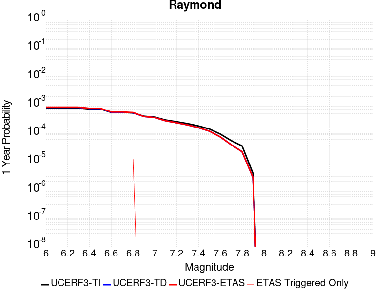 | 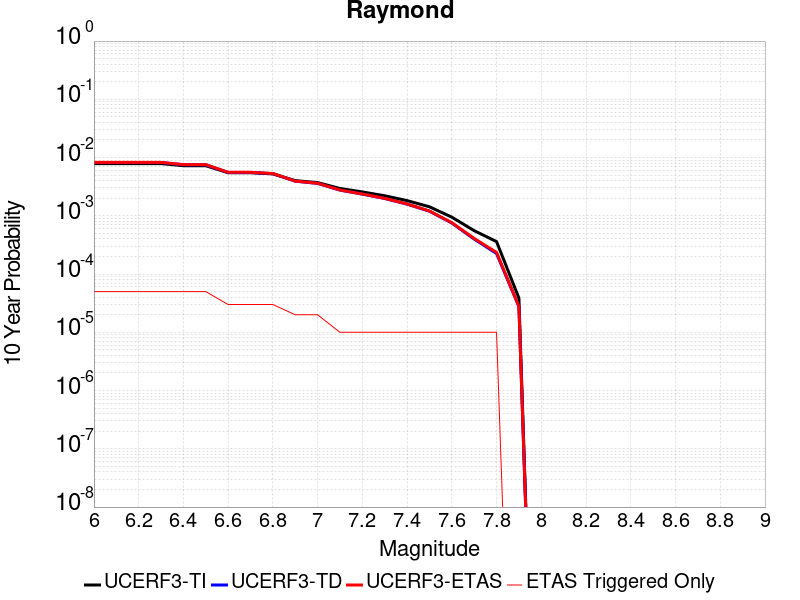 |

| Magnitude | 1 wk TI Prob | 1 wk TD Prob | 1 wk ETAS Prob | 1 wk ETAS/TD Gain | 1 wk ETAS Triggered Only | 1 mo TI Prob | 1 mo TD Prob | 1 mo ETAS Prob | 1 mo ETAS/TD Gain | 1 mo ETAS Triggered Only | 1 yr TI Prob | 1 yr TD Prob | 1 yr ETAS Prob | 1 yr ETAS/TD Gain | 1 yr ETAS Triggered Only | 10 yr TI Prob | 10 yr TD Prob | 10 yr ETAS Prob | 10 yr ETAS/TD Gain | 10 yr ETAS Triggered Only |
|-----|-----|-----|-----|-----|-----|-----|-----|-----|-----|-----|-----|-----|-----|-----|-----|-----|-----|-----|-----|-----|
| 6.0 | 1.5157413E-5 | 1.5810125E-5 | 1.5810125E-5 | 1.0 | 0.0 | 6.4958724E-5 | 6.775606E-5 | 6.775606E-5 | 1.0 | 0.0 | 7.905855E-4 | 8.246429E-4 | 8.3463464E-4 | 1.0121164 | 1.0E-5 | 0.007877788 | 0.008218355 | 0.008267944 | 1.0060339 | 5.0E-5 |
| 6.1 | 1.5157413E-5 | 1.5810125E-5 | 1.5810125E-5 | 1.0 | 0.0 | 6.4958724E-5 | 6.775606E-5 | 6.775606E-5 | 1.0 | 0.0 | 7.905855E-4 | 8.246429E-4 | 8.3463464E-4 | 1.0121164 | 1.0E-5 | 0.007877788 | 0.008218355 | 0.008267944 | 1.0060339 | 5.0E-5 |
| 6.2 | 1.5157413E-5 | 1.5810125E-5 | 1.5810125E-5 | 1.0 | 0.0 | 6.4958724E-5 | 6.775606E-5 | 6.775606E-5 | 1.0 | 0.0 | 7.905855E-4 | 8.246429E-4 | 8.3463464E-4 | 1.0121164 | 1.0E-5 | 0.007877788 | 0.008218355 | 0.008267944 | 1.0060339 | 5.0E-5 |
| 6.3 | 1.5157413E-5 | 1.5810125E-5 | 1.5810125E-5 | 1.0 | 0.0 | 6.4958724E-5 | 6.775606E-5 | 6.775606E-5 | 1.0 | 0.0 | 7.905855E-4 | 8.246429E-4 | 8.3463464E-4 | 1.0121164 | 1.0E-5 | 0.007877788 | 0.008218355 | 0.008267944 | 1.0060339 | 5.0E-5 |
| 6.4 | 1.3941944E-5 | 1.4454688E-5 | 1.4454688E-5 | 1.0 | 0.0 | 5.9749822E-5 | 6.194732E-5 | 6.194732E-5 | 1.0 | 0.0 | 7.2721124E-4 | 7.53971E-4 | 7.6396344E-4 | 1.0132531 | 1.0E-5 | 0.007248361 | 0.007516471 | 0.0075660953 | 1.006602 | 5.0E-5 |
| 6.5 | 1.3941944E-5 | 1.4454688E-5 | 1.4454688E-5 | 1.0 | 0.0 | 5.9749822E-5 | 6.194732E-5 | 6.194732E-5 | 1.0 | 0.0 | 7.2721124E-4 | 7.53971E-4 | 7.6396344E-4 | 1.0132531 | 1.0E-5 | 0.007248361 | 0.007516471 | 0.0075660953 | 1.006602 | 5.0E-5 |
| 6.6 | 1.0542609E-5 | 1.067111E-5 | 1.067111E-5 | 1.0 | 0.0 | 4.5181827E-5 | 4.573256E-5 | 4.573256E-5 | 1.0 | 0.0 | 5.499499E-4 | 5.566571E-4 | 5.666515E-4 | 1.0179543 | 1.0E-5 | 0.005485909 | 0.0055531966 | 0.0055830297 | 1.0053723 | 3.0E-5 |
| 6.7 | 1.0542609E-5 | 1.067111E-5 | 1.067111E-5 | 1.0 | 0.0 | 4.5181827E-5 | 4.573256E-5 | 4.573256E-5 | 1.0 | 0.0 | 5.499499E-4 | 5.566571E-4 | 5.666515E-4 | 1.0179543 | 1.0E-5 | 0.005485909 | 0.0055531966 | 0.0055830297 | 1.0053723 | 3.0E-5 |
| 6.8 | 1.0079132E-5 | 1.0176644E-5 | 1.0176644E-5 | 1.0 | 0.0 | 4.3195567E-5 | 4.3613487E-5 | 4.3613487E-5 | 1.0 | 0.0 | 5.257791E-4 | 5.308702E-4 | 5.408649E-4 | 1.018827 | 1.0E-5 | 0.0052453685 | 0.0052965777 | 0.0053264187 | 1.0056341 | 3.0E-5 |
| 6.9 | 7.721598E-6 | 7.548902E-6 | 7.548902E-6 | 1.0 | 0.0 | 3.3092143E-5 | 3.2352043E-5 | 3.2352043E-5 | 1.0 | 0.0 | 4.0282236E-4 | 3.9381615E-4 | 3.9381615E-4 | 1.0 | 0.0 | 0.0040209293 | 0.003931324 | 0.0039512455 | 1.0050673 | 2.0E-5 |
| 7.0 | 7.137566E-6 | 6.911303E-6 | 6.911303E-6 | 1.0 | 0.0 | 3.058921E-5 | 2.961954E-5 | 2.961954E-5 | 1.0 | 0.0 | 3.7236E-4 | 3.605593E-4 | 3.605593E-4 | 1.0 | 0.0 | 0.0037173668 | 0.003599869 | 0.003619797 | 1.0055357 | 2.0E-5 |
| 7.1 | 5.654976E-6 | 5.299538E-6 | 5.299538E-6 | 1.0 | 0.0 | 2.4235387E-5 | 2.2712107E-5 | 2.2712107E-5 | 1.0 | 0.0 | 2.9502588E-4 | 2.7648505E-4 | 2.7648505E-4 | 1.0 | 0.0 | 0.0029463451 | 0.0027614492 | 0.0027714216 | 1.0036113 | 1.0E-5 |
| 7.2 | 4.9358455E-6 | 4.526655E-6 | 4.526655E-6 | 1.0 | 0.0 | 2.1153453E-5 | 1.9399806E-5 | 1.9399806E-5 | 1.0 | 0.0 | 2.5751285E-4 | 2.3616718E-4 | 2.3616718E-4 | 1.0 | 0.0 | 0.0025721465 | 0.002359192 | 0.0023691682 | 1.0042287 | 1.0E-5 |
| 7.3 | 4.2368597E-6 | 3.8056128E-6 | 3.8056128E-6 | 1.0 | 0.0 | 1.8157843E-5 | 1.6309668E-5 | 1.6309668E-5 | 1.0 | 0.0 | 2.2104931E-4 | 1.9855222E-4 | 1.9855222E-4 | 1.0 | 0.0 | 0.0022082955 | 0.0019837746 | 0.0019937549 | 1.0050309 | 1.0E-5 |
| 7.4 | 3.4999923E-6 | 3.0437407E-6 | 3.0437407E-6 | 1.0 | 0.0 | 1.49998805E-5 | 1.3044538E-5 | 1.3044538E-5 | 1.0 | 0.0 | 1.8260824E-4 | 1.5880575E-4 | 1.5880575E-4 | 1.0 | 0.0 | 0.0018245826 | 0.0015869461 | 0.0015969302 | 1.0062914 | 1.0E-5 |
| 7.5 | 2.738017E-6 | 2.3020405E-6 | 2.3020405E-6 | 1.0 | 0.0 | 1.1734306E-5 | 9.865851E-6 | 9.865851E-6 | 1.0 | 0.0 | 1.428558E-4 | 1.20110184E-4 | 1.20110184E-4 | 1.0 | 0.0 | 0.0014276401 | 0.0012004747 | 0.0012104627 | 1.0083201 | 1.0E-5 |
| 7.6 | 1.8186392E-6 | 1.442302E-6 | 1.442302E-6 | 1.0 | 0.0 | 7.794145E-6 | 6.1812802E-6 | 6.1812802E-6 | 1.0 | 0.0 | 9.488958E-5 | 7.5254524E-5 | 7.5254524E-5 | 1.0 | 0.0 | 9.4849075E-4 | 7.5230957E-4 | 7.623021E-4 | 1.0132824 | 1.0E-5 |
| 7.7 | 1.0660348E-6 | 7.6437E-7 | 7.6437E-7 | 1.0 | 0.0 | 4.5687125E-6 | 3.2758674E-6 | 3.2758674E-6 | 1.0 | 0.0 | 5.5622655E-5 | 3.988297E-5 | 3.988297E-5 | 1.0 | 0.0 | 5.5608735E-4 | 3.9877492E-4 | 4.0877092E-4 | 1.0250669 | 1.0E-5 |
| 7.8 | 6.913602E-7 | 4.3202903E-7 | 4.3202903E-7 | 1.0 | 0.0 | 2.962969E-6 | 1.8515517E-6 | 1.8515517E-6 | 1.0 | 0.0 | 3.607355E-5 | 2.2542416E-5 | 2.2542416E-5 | 1.0 | 0.0 | 3.6067693E-4 | 2.2541684E-4 | 2.3541458E-4 | 1.0443523 | 1.0E-5 |
| 7.9 | 7.425201E-8 | 5.322267E-8 | 5.322267E-8 | 1.0 | 0.0 | 3.1822285E-7 | 2.2809714E-7 | 2.2809714E-7 | 1.0 | 0.0 | 3.874356E-6 | 2.7770805E-6 | 2.7770805E-6 | 1.0 | 0.0 | 3.8742884E-5 | 2.7770588E-5 | 2.7770588E-5 | 1.0 | 0.0 |

## Sierra Madre
*[(top)](#table-of-contents)*

| 1 Week | 1 Month | 1 Year | 10 Year |
|-----|-----|-----|-----|
| 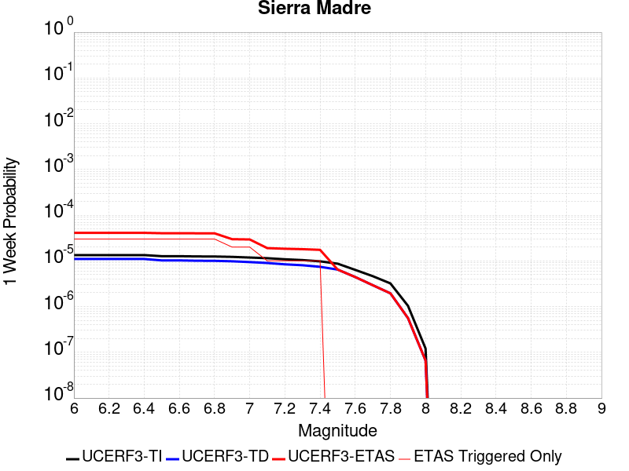 | 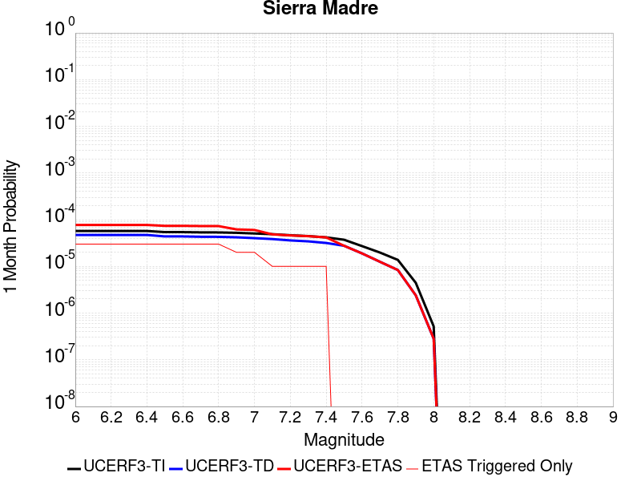 | 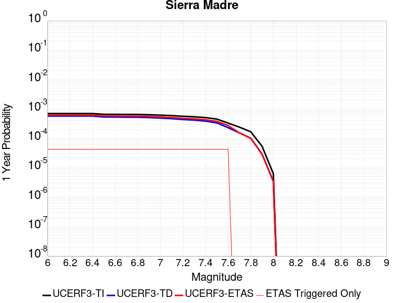 | 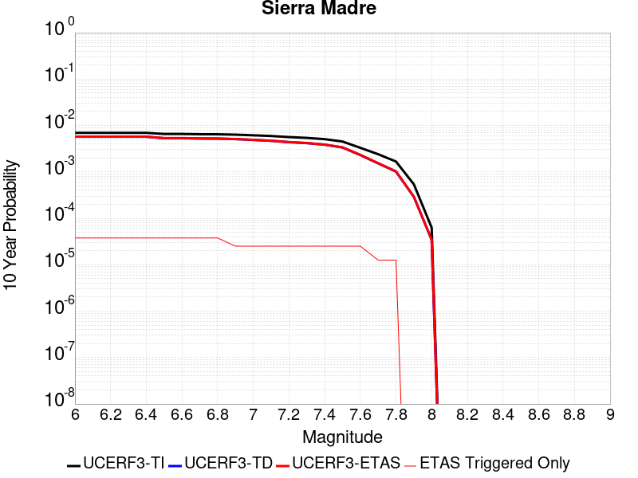 |

| Magnitude | 1 wk TI Prob | 1 wk TD Prob | 1 wk ETAS Prob | 1 wk ETAS/TD Gain | 1 wk ETAS Triggered Only | 1 mo TI Prob | 1 mo TD Prob | 1 mo ETAS Prob | 1 mo ETAS/TD Gain | 1 mo ETAS Triggered Only | 1 yr TI Prob | 1 yr TD Prob | 1 yr ETAS Prob | 1 yr ETAS/TD Gain | 1 yr ETAS Triggered Only | 10 yr TI Prob | 10 yr TD Prob | 10 yr ETAS Prob | 10 yr ETAS/TD Gain | 10 yr ETAS Triggered Only |
|-----|-----|-----|-----|-----|-----|-----|-----|-----|-----|-----|-----|-----|-----|-----|-----|-----|-----|-----|-----|-----|
| 6.0 | 1.3379373E-5 | 1.1000776E-5 | 4.1000447E-5 | 3.7270503 | 3.0E-5 | 5.7338908E-5 | 4.714534E-5 | 7.714392E-5 | 1.6363001 | 3.0E-5 | 6.978776E-4 | 5.738448E-4 | 6.1382185E-4 | 1.0696653 | 4.0E-5 | 0.0069569005 | 0.0057238447 | 0.0057735587 | 1.0086854 | 5.0E-5 |
| 6.1 | 1.3379373E-5 | 1.1000776E-5 | 4.1000447E-5 | 3.7270503 | 3.0E-5 | 5.7338908E-5 | 4.714534E-5 | 7.714392E-5 | 1.6363001 | 3.0E-5 | 6.978776E-4 | 5.738448E-4 | 6.1382185E-4 | 1.0696653 | 4.0E-5 | 0.0069569005 | 0.0057238447 | 0.0057735587 | 1.0086854 | 5.0E-5 |
| 6.2 | 1.3379373E-5 | 1.1000776E-5 | 4.1000447E-5 | 3.7270503 | 3.0E-5 | 5.7338908E-5 | 4.714534E-5 | 7.714392E-5 | 1.6363001 | 3.0E-5 | 6.978776E-4 | 5.738448E-4 | 6.1382185E-4 | 1.0696653 | 4.0E-5 | 0.0069569005 | 0.0057238447 | 0.0057735587 | 1.0086854 | 5.0E-5 |
| 6.3 | 1.3379373E-5 | 1.1000776E-5 | 4.1000447E-5 | 3.7270503 | 3.0E-5 | 5.7338908E-5 | 4.714534E-5 | 7.714392E-5 | 1.6363001 | 3.0E-5 | 6.978776E-4 | 5.738448E-4 | 6.1382185E-4 | 1.0696653 | 4.0E-5 | 0.0069569005 | 0.0057238447 | 0.0057735587 | 1.0086854 | 5.0E-5 |
| 6.4 | 1.3379373E-5 | 1.1000776E-5 | 4.1000447E-5 | 3.7270503 | 3.0E-5 | 5.7338908E-5 | 4.714534E-5 | 7.714392E-5 | 1.6363001 | 3.0E-5 | 6.978776E-4 | 5.738448E-4 | 6.1382185E-4 | 1.0696653 | 4.0E-5 | 0.0069569005 | 0.0057238447 | 0.0057735587 | 1.0086854 | 5.0E-5 |
| 6.5 | 1.26563245E-5 | 1.0230232E-5 | 4.0229927E-5 | 3.9324548 | 3.0E-5 | 5.4240263E-5 | 4.384312E-5 | 7.38418E-5 | 1.6842278 | 3.0E-5 | 6.601751E-4 | 5.3366035E-4 | 5.73639E-4 | 1.0749141 | 4.0E-5 | 0.006582173 | 0.0053239604 | 0.005373694 | 1.0093415 | 5.0E-5 |
| 6.6 | 1.26563245E-5 | 1.0230232E-5 | 4.0229927E-5 | 3.9324548 | 3.0E-5 | 5.4240263E-5 | 4.384312E-5 | 7.38418E-5 | 1.6842278 | 3.0E-5 | 6.601751E-4 | 5.3366035E-4 | 5.73639E-4 | 1.0749141 | 4.0E-5 | 0.006582173 | 0.0053239604 | 0.005373694 | 1.0093415 | 5.0E-5 |
| 6.7 | 1.2502474E-5 | 1.00663765E-5 | 4.0066076E-5 | 3.9801884 | 3.0E-5 | 5.3580934E-5 | 4.3140906E-5 | 7.3139614E-5 | 1.6953657 | 3.0E-5 | 6.521526E-4 | 5.25115E-4 | 5.65094E-4 | 1.0761338 | 4.0E-5 | 0.0065024206 | 0.0052389116 | 0.0052886494 | 1.009494 | 5.0E-5 |
| 6.8 | 1.2454966E-5 | 1.0018662E-5 | 4.001836E-5 | 3.994382 | 3.0E-5 | 5.3377335E-5 | 4.293642E-5 | 7.293513E-5 | 1.6986775 | 3.0E-5 | 6.4967526E-4 | 5.226266E-4 | 5.626057E-4 | 1.0764965 | 4.0E-5 | 0.006477792 | 0.0052141445 | 0.0052638836 | 1.0095392 | 5.0E-5 |
| 6.9 | 1.2225574E-5 | 9.792639E-6 | 2.9792443E-5 | 3.0423305 | 2.0E-5 | 5.2394265E-5 | 4.196778E-5 | 6.1966944E-5 | 1.476536 | 2.0E-5 | 6.3771347E-4 | 5.10839E-4 | 5.408237E-4 | 1.0586969 | 3.0E-5 | 0.006358865 | 0.0050968137 | 0.00513661 | 1.0078081 | 4.0E-5 |
| 7.0 | 1.182946E-5 | 9.399179E-6 | 2.9398992E-5 | 3.1278253 | 2.0E-5 | 5.06967E-5 | 4.0281582E-5 | 6.0280778E-5 | 1.4964849 | 2.0E-5 | 6.1705755E-4 | 4.903189E-4 | 5.203042E-4 | 1.0611547 | 3.0E-5 | 0.006153469 | 0.004892533 | 0.0049323374 | 1.0081357 | 4.0E-5 |
| 7.1 | 1.14369095E-5 | 8.986194E-6 | 1.8986104E-5 | 2.1128082 | 1.0E-5 | 4.9014405E-5 | 3.85117E-5 | 4.8511312E-5 | 1.2596513 | 1.0E-5 | 5.9658696E-4 | 4.6878002E-4 | 4.8877066E-4 | 1.0426439 | 2.0E-5 | 0.005949879 | 0.0046780678 | 0.0047079273 | 1.006383 | 3.0E-5 |
| 7.2 | 1.0836419E-5 | 8.39959E-6 | 1.8399505E-5 | 2.1905243 | 1.0E-5 | 4.644097E-5 | 3.599775E-5 | 4.599739E-5 | 1.2777852 | 1.0E-5 | 5.652721E-4 | 4.3818538E-4 | 4.5817663E-4 | 1.0456228 | 2.0E-5 | 0.0056383642 | 0.0043733614 | 0.0044032303 | 1.0068297 | 3.0E-5 |
| 7.3 | 1.0403439E-5 | 8.020854E-6 | 1.8020773E-5 | 2.24674 | 1.0E-5 | 4.4585406E-5 | 3.437464E-5 | 4.4374297E-5 | 1.2909021 | 1.0E-5 | 5.426921E-4 | 4.184318E-4 | 4.3842342E-4 | 1.0477775 | 2.0E-5 | 0.005413687 | 0.004176585 | 0.0042064595 | 1.0071529 | 3.0E-5 |
| 7.4 | 9.768864E-6 | 7.4144855E-6 | 1.7414412E-5 | 2.3487012 | 1.0E-5 | 4.186589E-5 | 3.1775984E-5 | 4.1775667E-5 | 1.3146931 | 1.0E-5 | 5.09598E-4 | 3.868048E-4 | 4.0679707E-4 | 1.0516857 | 2.0E-5 | 0.0050843097 | 0.0038614576 | 0.0038913419 | 1.0077391 | 3.0E-5 |
| 7.5 | 8.687089E-6 | 6.450183E-6 | 6.450183E-6 | 1.0 | 0.0 | 3.722985E-5 | 2.7643353E-5 | 2.7643353E-5 | 1.0 | 0.0 | 4.5317915E-4 | 3.3650672E-4 | 3.4650334E-4 | 1.0297071 | 1.0E-5 | 0.004522561 | 0.003360109 | 0.0033800418 | 1.0059322 | 2.0E-5 |
| 7.6 | 6.3506063E-6 | 4.430329E-6 | 4.430329E-6 | 1.0 | 0.0 | 2.72166E-5 | 1.8986988E-5 | 1.8986988E-5 | 1.0 | 0.0 | 3.3131172E-4 | 2.3114232E-4 | 2.4114E-4 | 1.0432534 | 1.0E-5 | 0.003308182 | 0.0023090935 | 0.0023290473 | 1.0086414 | 2.0E-5 |
| 7.7 | 4.62223E-6 | 2.9329542E-6 | 2.9329542E-6 | 1.0 | 0.0 | 1.9809406E-5 | 1.2569743E-5 | 1.2569743E-5 | 1.0 | 0.0 | 2.4115283E-4 | 1.5302589E-4 | 1.5302589E-4 | 1.0 | 0.0 | 0.0024089129 | 0.0015292577 | 0.0015392425 | 1.0065291 | 1.0E-5 |
| 7.8 | 3.2145008E-6 | 1.949411E-6 | 1.949411E-6 | 1.0 | 0.0 | 1.3776359E-5 | 8.354592E-6 | 8.354592E-6 | 1.0 | 0.0 | 1.6771426E-4 | 1.01712416E-4 | 1.01712416E-4 | 1.0 | 0.0 | 0.0016758774 | 0.0010166786 | 0.0010266685 | 1.009826 | 1.0E-5 |
| 7.9 | 1.0391769E-6 | 5.602482E-7 | 5.602482E-7 | 1.0 | 0.0 | 4.4536077E-6 | 2.4010617E-6 | 2.4010617E-6 | 1.0 | 0.0 | 5.4221324E-5 | 2.9232539E-5 | 2.9232539E-5 | 1.0 | 0.0 | 5.4208096E-4 | 2.9228735E-4 | 2.9228735E-4 | 1.0 | 0.0 |
| 8.0 | 1.210983E-7 | 6.613497E-8 | 6.613497E-8 | 1.0 | 0.0 | 5.1899264E-7 | 2.8343558E-7 | 2.8343558E-7 | 1.0 | 0.0 | 6.3187167E-6 | 3.4508228E-6 | 3.4508228E-6 | 1.0 | 0.0 | 6.318537E-5 | 3.450771E-5 | 3.450771E-5 | 1.0 | 0.0 |

## Santa Ynez River
*[(top)](#table-of-contents)*

| 1 Week | 1 Month | 1 Year | 10 Year |
|-----|-----|-----|-----|
|  | 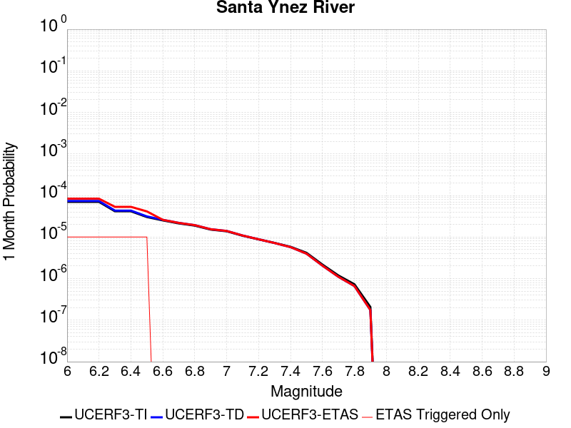 | 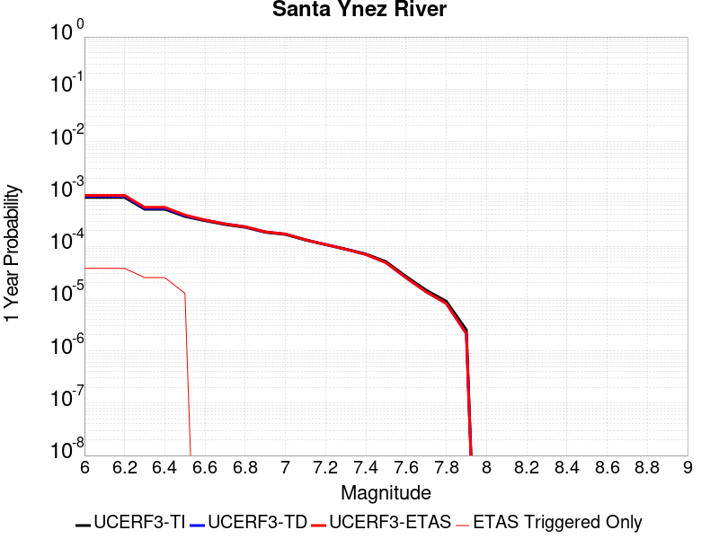 | 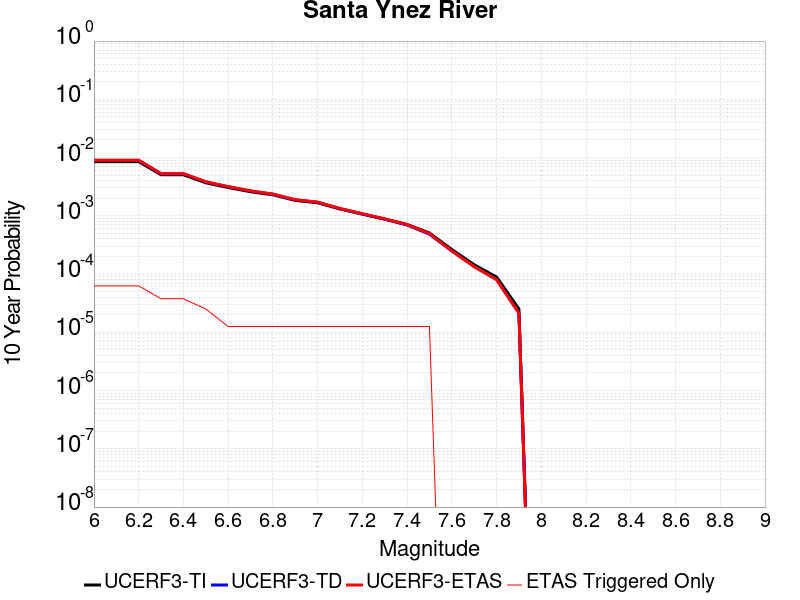 |

| Magnitude | 1 wk TI Prob | 1 wk TD Prob | 1 wk ETAS Prob | 1 wk ETAS/TD Gain | 1 wk ETAS Triggered Only | 1 mo TI Prob | 1 mo TD Prob | 1 mo ETAS Prob | 1 mo ETAS/TD Gain | 1 mo ETAS Triggered Only | 1 yr TI Prob | 1 yr TD Prob | 1 yr ETAS Prob | 1 yr ETAS/TD Gain | 1 yr ETAS Triggered Only | 10 yr TI Prob | 10 yr TD Prob | 10 yr ETAS Prob | 10 yr ETAS/TD Gain | 10 yr ETAS Triggered Only |
|-----|-----|-----|-----|-----|-----|-----|-----|-----|-----|-----|-----|-----|-----|-----|-----|-----|-----|-----|-----|-----|
| 6.0 | 1.6396456E-5 | 1.7209444E-5 | 1.7209444E-5 | 1.0 | 0.0 | 7.026863E-5 | 7.3752875E-5 | 8.375214E-5 | 1.1355779 | 1.0E-5 | 8.551848E-4 | 8.976069E-4 | 9.2758E-4 | 1.0333922 | 3.0E-5 | 0.0085190125 | 0.008943363 | 0.008992916 | 1.0055407 | 5.0E-5 |
| 6.1 | 1.6396456E-5 | 1.7209444E-5 | 1.7209444E-5 | 1.0 | 0.0 | 7.026863E-5 | 7.3752875E-5 | 8.375214E-5 | 1.1355779 | 1.0E-5 | 8.551848E-4 | 8.976069E-4 | 9.2758E-4 | 1.0333922 | 3.0E-5 | 0.0085190125 | 0.008943363 | 0.008992916 | 1.0055407 | 5.0E-5 |
| 6.2 | 1.6396456E-5 | 1.7209444E-5 | 1.7209444E-5 | 1.0 | 0.0 | 7.026863E-5 | 7.3752875E-5 | 8.375214E-5 | 1.1355779 | 1.0E-5 | 8.551848E-4 | 8.976069E-4 | 9.2758E-4 | 1.0333922 | 3.0E-5 | 0.0085190125 | 0.008943363 | 0.008992916 | 1.0055407 | 5.0E-5 |
| 6.3 | 9.736976E-6 | 1.01223395E-5 | 1.01223395E-5 | 1.0 | 0.0 | 4.172923E-5 | 4.338076E-5 | 5.3380325E-5 | 1.2305069 | 1.0E-5 | 5.0793495E-4 | 5.280378E-4 | 5.480272E-4 | 1.0378561 | 2.0E-5 | 0.005067755 | 0.0052683367 | 0.0052981786 | 1.0056643 | 3.0E-5 |
| 6.4 | 9.736976E-6 | 1.01223395E-5 | 1.01223395E-5 | 1.0 | 0.0 | 4.172923E-5 | 4.338076E-5 | 5.3380325E-5 | 1.2305069 | 1.0E-5 | 5.0793495E-4 | 5.280378E-4 | 5.480272E-4 | 1.0378561 | 2.0E-5 | 0.005067755 | 0.0052683367 | 0.0052981786 | 1.0056643 | 3.0E-5 |
| 6.5 | 7.081964E-6 | 7.329905E-6 | 7.329905E-6 | 1.0 | 0.0 | 3.035092E-5 | 3.141351E-5 | 4.1413197E-5 | 1.3183243 | 1.0E-5 | 3.694598E-4 | 3.8239395E-4 | 3.9239012E-4 | 1.026141 | 1.0E-5 | 0.0036884616 | 0.0038175215 | 0.003837445 | 1.005219 | 2.0E-5 |
| 6.6 | 5.873247E-6 | 6.0597517E-6 | 6.0597517E-6 | 1.0 | 0.0 | 2.5170815E-5 | 2.5970112E-5 | 2.5970112E-5 | 1.0 | 0.0 | 3.064116E-4 | 3.161411E-4 | 3.161411E-4 | 1.0 | 0.0 | 0.0030598943 | 0.003157001 | 0.0031669694 | 1.0031576 | 1.0E-5 |
| 6.7 | 4.973277E-6 | 5.11591E-6 | 5.11591E-6 | 1.0 | 0.0 | 2.1313872E-5 | 2.1925147E-5 | 2.1925147E-5 | 1.0 | 0.0 | 2.5946548E-4 | 2.6690646E-4 | 2.6690646E-4 | 1.0 | 0.0 | 0.0025916274 | 0.0026659078 | 0.0026758811 | 1.003741 | 1.0E-5 |
| 6.8 | 4.396492E-6 | 4.510987E-6 | 4.510987E-6 | 1.0 | 0.0 | 1.884197E-5 | 1.933266E-5 | 1.933266E-5 | 1.0 | 0.0 | 2.2937685E-4 | 2.3535005E-4 | 2.3535005E-4 | 1.0 | 0.0 | 0.0022914023 | 0.0023510433 | 0.0023610198 | 1.0042434 | 1.0E-5 |
| 6.9 | 3.5255632E-6 | 3.6013423E-6 | 3.6013423E-6 | 1.0 | 0.0 | 1.5109469E-5 | 1.5434234E-5 | 1.5434234E-5 | 1.0 | 0.0 | 1.8394225E-4 | 1.8789574E-4 | 1.8789574E-4 | 1.0 | 0.0 | 0.0018379007 | 0.001877385 | 0.0018873662 | 1.0053166 | 1.0E-5 |
| 7.0 | 3.211603E-6 | 3.273663E-6 | 3.273663E-6 | 1.0 | 0.0 | 1.376394E-5 | 1.402991E-5 | 1.402991E-5 | 1.0 | 0.0 | 1.6756308E-4 | 1.708009E-4 | 1.708009E-4 | 1.0 | 0.0 | 0.0016743679 | 0.0017067104 | 0.0017166934 | 1.0058492 | 1.0E-5 |
| 7.1 | 2.5094619E-6 | 2.5409295E-6 | 2.5409295E-6 | 1.0 | 0.0 | 1.0754793E-5 | 1.0889652E-5 | 1.0889652E-5 | 1.0 | 0.0 | 1.3093173E-4 | 1.325735E-4 | 1.325735E-4 | 1.0 | 0.0 | 0.0013085462 | 0.0013249503 | 0.0013349369 | 1.0075375 | 1.0E-5 |
| 7.2 | 2.0515774E-6 | 2.0619466E-6 | 2.0619466E-6 | 1.0 | 0.0 | 8.792445E-6 | 8.836884E-6 | 8.836884E-6 | 1.0 | 0.0 | 1.0704277E-4 | 1.0758379E-4 | 1.0758379E-4 | 1.0 | 0.0 | 0.0010699122 | 0.0010753215 | 0.0010853106 | 1.0092895 | 1.0E-5 |
| 7.3 | 1.6845745E-6 | 1.6773996E-6 | 1.6773996E-6 | 1.0 | 0.0 | 7.219585E-6 | 7.1888358E-6 | 7.1888358E-6 | 1.0 | 0.0 | 8.78949E-5 | 8.752059E-5 | 8.752059E-5 | 1.0 | 0.0 | 8.7860145E-4 | 8.7486405E-4 | 8.8485534E-4 | 1.0114204 | 1.0E-5 |
| 7.4 | 1.3600285E-6 | 1.3333447E-6 | 1.3333447E-6 | 1.0 | 0.0 | 5.82868E-6 | 5.714322E-6 | 5.714322E-6 | 1.0 | 0.0 | 7.096187E-5 | 6.956967E-5 | 6.956967E-5 | 1.0 | 0.0 | 7.0939213E-4 | 6.9548114E-4 | 7.054742E-4 | 1.0143685 | 1.0E-5 |
| 7.5 | 9.735342E-7 | 9.2901894E-7 | 9.2901894E-7 | 1.0 | 0.0 | 4.172283E-6 | 3.9815036E-6 | 3.9815036E-6 | 1.0 | 0.0 | 5.079636E-5 | 4.8473747E-5 | 4.8473747E-5 | 1.0 | 0.0 | 5.0784746E-4 | 4.8463346E-4 | 4.946286E-4 | 1.0206242 | 1.0E-5 |
| 7.6 | 5.067187E-7 | 4.778609E-7 | 4.778609E-7 | 1.0 | 0.0 | 2.1716498E-6 | 2.0479738E-6 | 2.0479738E-6 | 1.0 | 0.0 | 2.6439517E-5 | 2.4933803E-5 | 2.4933803E-5 | 1.0 | 0.0 | 2.643637E-4 | 2.493108E-4 | 2.493108E-4 | 1.0 | 0.0 |
| 7.7 | 2.769089E-7 | 2.5759346E-7 | 2.5759346E-7 | 1.0 | 0.0 | 1.1867519E-6 | 1.1039714E-6 | 1.1039714E-6 | 1.0 | 0.0 | 1.4448608E-5 | 1.344077E-5 | 1.344077E-5 | 1.0 | 0.0 | 1.444767E-4 | 1.343996E-4 | 1.343996E-4 | 1.0 | 0.0 |
| 7.8 | 1.7044663E-7 | 1.5449208E-7 | 1.5449208E-7 | 1.0 | 0.0 | 7.3048534E-7 | 6.6210873E-7 | 6.6210873E-7 | 1.0 | 0.0 | 8.893623E-6 | 8.061144E-6 | 8.061144E-6 | 1.0 | 0.0 | 8.893267E-5 | 8.060854E-5 | 8.060854E-5 | 1.0 | 0.0 |
| 7.9 | 4.8344287E-8 | 4.0911143E-8 | 4.0911143E-8 | 1.0 | 0.0 | 2.0718979E-7 | 1.7533345E-7 | 1.7533345E-7 | 1.0 | 0.0 | 2.5225327E-6 | 2.1346827E-6 | 2.1346827E-6 | 1.0 | 0.0 | 2.5225041E-5 | 2.1346626E-5 | 2.1346626E-5 | 1.0 | 0.0 |

## Rinconada 2011 CFM
*[(top)](#table-of-contents)*

| 1 Week | 1 Month | 1 Year | 10 Year |
|-----|-----|-----|-----|
|  |  | 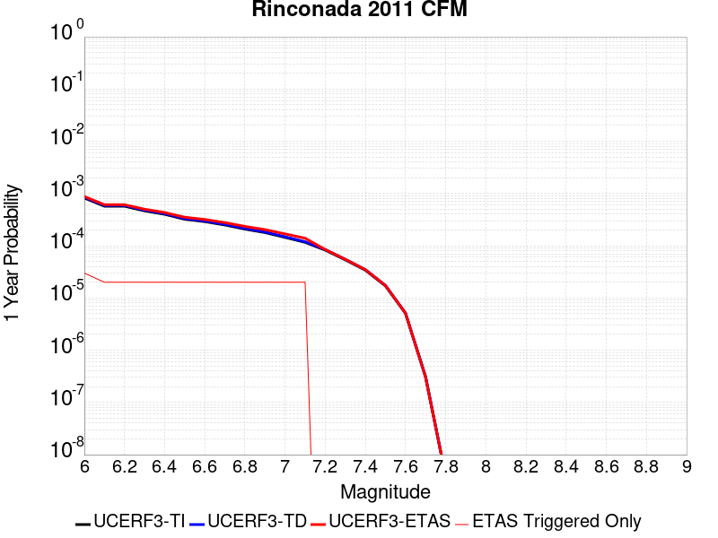 | 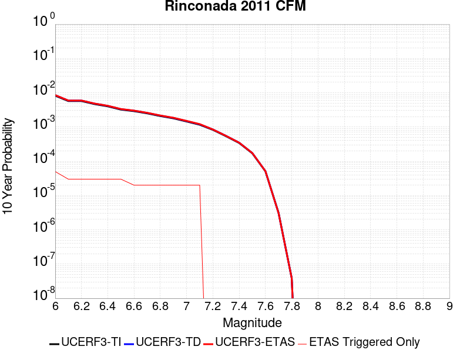 |

| Magnitude | 1 wk TI Prob | 1 wk TD Prob | 1 wk ETAS Prob | 1 wk ETAS/TD Gain | 1 wk ETAS Triggered Only | 1 mo TI Prob | 1 mo TD Prob | 1 mo ETAS Prob | 1 mo ETAS/TD Gain | 1 mo ETAS Triggered Only | 1 yr TI Prob | 1 yr TD Prob | 1 yr ETAS Prob | 1 yr ETAS/TD Gain | 1 yr ETAS Triggered Only | 10 yr TI Prob | 10 yr TD Prob | 10 yr ETAS Prob | 10 yr ETAS/TD Gain | 10 yr ETAS Triggered Only |
|-----|-----|-----|-----|-----|-----|-----|-----|-----|-----|-----|-----|-----|-----|-----|-----|-----|-----|-----|-----|-----|
| 6.0 | 1.5752368E-5 | 1.6274716E-5 | 1.6274716E-5 | 1.0 | 0.0 | 6.75084E-5 | 6.974694E-5 | 6.974694E-5 | 1.0 | 0.0 | 8.2160486E-4 | 8.488413E-4 | 8.788158E-4 | 1.0353123 | 3.0E-5 | 0.008185739 | 0.00845637 | 0.008505947 | 1.0058627 | 5.0E-5 |
| 6.1 | 1.0966133E-5 | 1.1323029E-5 | 1.1323029E-5 | 1.0 | 0.0 | 4.6996865E-5 | 4.852637E-5 | 4.852637E-5 | 1.0 | 0.0 | 5.720366E-4 | 5.9064914E-4 | 6.106373E-4 | 1.033841 | 2.0E-5 | 0.0057056635 | 0.005890889 | 0.0059207124 | 1.0050626 | 3.0E-5 |
| 6.2 | 1.0966133E-5 | 1.1323029E-5 | 1.1323029E-5 | 1.0 | 0.0 | 4.6996865E-5 | 4.852637E-5 | 4.852637E-5 | 1.0 | 0.0 | 5.720366E-4 | 5.9064914E-4 | 6.106373E-4 | 1.033841 | 2.0E-5 | 0.0057056635 | 0.005890889 | 0.0059207124 | 1.0050626 | 3.0E-5 |
| 6.3 | 8.926149E-6 | 9.212772E-6 | 9.212772E-6 | 1.0 | 0.0 | 3.8254362E-5 | 3.948271E-5 | 3.948271E-5 | 1.0 | 0.0 | 4.6564735E-4 | 4.8059633E-4 | 5.005867E-4 | 1.041595 | 2.0E-5 | 0.0046467283 | 0.0047956146 | 0.0048254705 | 1.0062257 | 3.0E-5 |
| 6.4 | 7.676955E-6 | 7.920191E-6 | 7.920191E-6 | 1.0 | 0.0 | 3.290082E-5 | 3.3943234E-5 | 3.3943234E-5 | 1.0 | 0.0 | 4.0049385E-4 | 4.131807E-4 | 4.3317245E-4 | 1.048385 | 2.0E-5 | 0.0039977287 | 0.004124151 | 0.0041540274 | 1.0072442 | 3.0E-5 |
| 6.5 | 6.1671026E-6 | 6.358955E-6 | 6.358955E-6 | 1.0 | 0.0 | 2.6430173E-5 | 2.725238E-5 | 2.725238E-5 | 1.0 | 0.0 | 3.2173982E-4 | 3.317473E-4 | 3.5174066E-4 | 1.0602669 | 2.0E-5 | 0.003212744 | 0.0033125326 | 0.0033424331 | 1.0090265 | 3.0E-5 |
| 6.6 | 5.553456E-6 | 5.7248126E-6 | 5.7248126E-6 | 1.0 | 0.0 | 2.3800309E-5 | 2.4534682E-5 | 2.4534682E-5 | 1.0 | 0.0 | 2.897302E-4 | 2.9866886E-4 | 3.1866287E-4 | 1.0669438 | 2.0E-5 | 0.0028935277 | 0.0029826832 | 0.0030026236 | 1.0066854 | 2.0E-5 |
| 6.7 | 4.787857E-6 | 4.93331E-6 | 4.93331E-6 | 1.0 | 0.0 | 2.0519226E-5 | 2.1142585E-5 | 2.1142585E-5 | 1.0 | 0.0 | 2.4979294E-4 | 2.573806E-4 | 2.7737545E-4 | 1.077686 | 2.0E-5 | 0.0024951235 | 0.002570831 | 0.0025907794 | 1.0077596 | 2.0E-5 |
| 6.8 | 3.9955166E-6 | 4.1134763E-6 | 4.1134763E-6 | 1.0 | 0.0 | 1.7123532E-5 | 1.7629065E-5 | 1.7629065E-5 | 1.0 | 0.0 | 2.0845905E-4 | 2.1461275E-4 | 2.3460847E-4 | 1.0931711 | 2.0E-5 | 0.002082636 | 0.0021440587 | 0.0021640158 | 1.0093081 | 2.0E-5 |
| 6.9 | 3.4250072E-6 | 3.5224466E-6 | 3.5224466E-6 | 1.0 | 0.0 | 1.46785205E-5 | 1.5096112E-5 | 1.5096112E-5 | 1.0 | 0.0 | 1.7869633E-4 | 1.8377969E-4 | 2.0377601E-4 | 1.108806 | 2.0E-5 | 0.001785527 | 0.0018362795 | 0.0018562428 | 1.0108715 | 2.0E-5 |
| 7.0 | 2.7712713E-6 | 2.8467002E-6 | 2.8467002E-6 | 1.0 | 0.0 | 1.1876823E-5 | 1.22000865E-5 | 1.22000865E-5 | 1.0 | 0.0 | 1.4459073E-4 | 1.4852594E-4 | 1.6852298E-4 | 1.1346366 | 2.0E-5 | 0.0014449668 | 0.0014842683 | 0.0015042387 | 1.0134547 | 2.0E-5 |
| 7.1 | 2.227358E-6 | 2.2856987E-6 | 2.2856987E-6 | 1.0 | 0.0 | 9.545785E-6 | 9.795815E-6 | 9.795815E-6 | 1.0 | 0.0 | 1.16213734E-4 | 1.1925753E-4 | 1.3925515E-4 | 1.1676843 | 2.0E-5 | 0.0011615298 | 0.0011919363 | 0.0012119125 | 1.0167594 | 2.0E-5 |
| 7.2 | 1.581796E-6 | 1.6209015E-6 | 1.6209015E-6 | 1.0 | 0.0 | 6.779108E-6 | 6.946702E-6 | 6.946702E-6 | 1.0 | 0.0 | 8.253252E-5 | 8.4572814E-5 | 8.4572814E-5 | 1.0 | 0.0 | 8.250187E-4 | 8.4540684E-4 | 8.4540684E-4 | 1.0 | 0.0 |
| 7.3 | 1.0306567E-6 | 1.054648E-6 | 1.054648E-6 | 1.0 | 0.0 | 4.4170924E-6 | 4.519912E-6 | 4.519912E-6 | 1.0 | 0.0 | 5.3776774E-5 | 5.502854E-5 | 5.502854E-5 | 1.0 | 0.0 | 5.376376E-4 | 5.501494E-4 | 5.501494E-4 | 1.0 | 0.0 |
| 7.4 | 6.535541E-7 | 6.682744E-7 | 6.682744E-7 | 1.0 | 0.0 | 2.800943E-6 | 2.8640302E-6 | 2.8640302E-6 | 1.0 | 0.0 | 3.4100947E-5 | 3.4869012E-5 | 3.4869012E-5 | 1.0 | 0.0 | 3.4095717E-4 | 3.486355E-4 | 3.486355E-4 | 1.0 | 0.0 |
| 7.5 | 3.2656962E-7 | 3.3316712E-7 | 3.3316712E-7 | 1.0 | 0.0 | 1.3995833E-6 | 1.4278584E-6 | 1.4278584E-6 | 1.0 | 0.0 | 1.7039794E-5 | 1.7384036E-5 | 1.7384036E-5 | 1.0 | 0.0 | 1.7038487E-4 | 1.738268E-4 | 1.738268E-4 | 1.0 | 0.0 |
| 7.6 | 9.754343E-8 | 9.821017E-8 | 9.821017E-8 | 1.0 | 0.0 | 4.180432E-7 | 4.2090065E-7 | 4.2090065E-7 | 1.0 | 0.0 | 5.089664E-6 | 5.1244533E-6 | 5.1244533E-6 | 1.0 | 0.0 | 5.0895473E-5 | 5.124336E-5 | 5.124336E-5 | 1.0 | 0.0 |
| 7.7 | 6.0001453E-9 | 5.8491207E-9 | 5.8491207E-9 | 1.0 | 0.0 | 2.5714908E-8 | 2.506766E-8 | 2.506766E-8 | 1.0 | 0.0 | 3.1307894E-7 | 3.051987E-7 | 3.051987E-7 | 1.0 | 0.0 | 3.1307852E-6 | 3.0519832E-6 | 3.0519832E-6 | 1.0 | 0.0 |
| 7.8 | 7.400003E-11 | 7.4654505E-11 | 7.4654505E-11 | 1.0 | 0.0 | 3.171432E-10 | 3.1994773E-10 | 3.1994773E-10 | 1.0 | 0.0 | 3.861218E-9 | 3.895363E-9 | 3.895363E-9 | 1.0 | 0.0 | 3.861218E-8 | 3.895363E-8 | 3.895363E-8 | 1.0 | 0.0 |

## San Jacinto (Superstition Mtn)
*[(top)](#table-of-contents)*

| 1 Week | 1 Month | 1 Year | 10 Year |
|-----|-----|-----|-----|
| 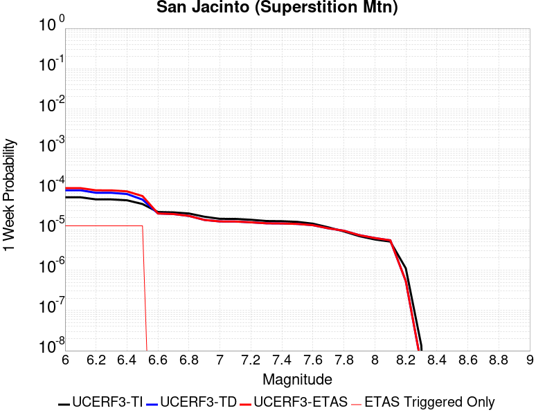 | 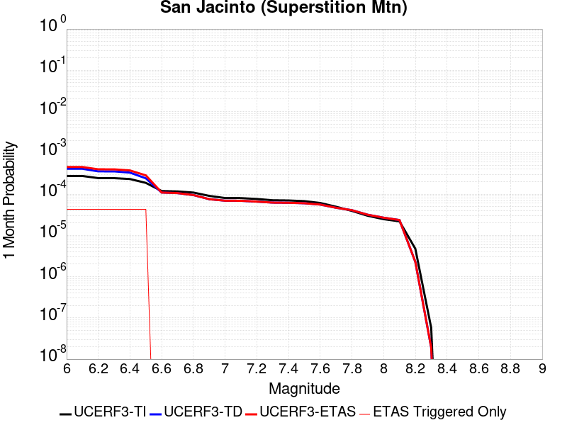 | 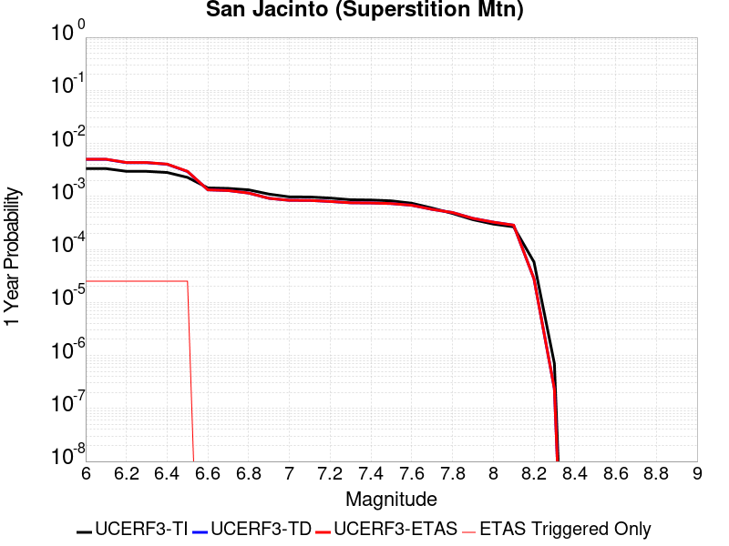 | 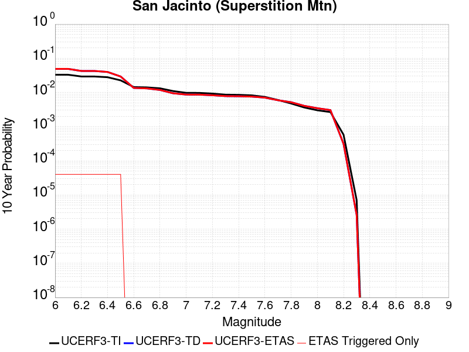 |

| Magnitude | 1 wk TI Prob | 1 wk TD Prob | 1 wk ETAS Prob | 1 wk ETAS/TD Gain | 1 wk ETAS Triggered Only | 1 mo TI Prob | 1 mo TD Prob | 1 mo ETAS Prob | 1 mo ETAS/TD Gain | 1 mo ETAS Triggered Only | 1 yr TI Prob | 1 yr TD Prob | 1 yr ETAS Prob | 1 yr ETAS/TD Gain | 1 yr ETAS Triggered Only | 10 yr TI Prob | 10 yr TD Prob | 10 yr ETAS Prob | 10 yr ETAS/TD Gain | 10 yr ETAS Triggered Only |
|-----|-----|-----|-----|-----|-----|-----|-----|-----|-----|-----|-----|-----|-----|-----|-----|-----|-----|-----|-----|-----|
| 6.0 | 6.4193904E-5 | 9.599558E-5 | 1.0599462E-4 | 1.1041615 | 1.0E-5 | 2.7508775E-4 | 4.1135435E-4 | 4.3134612E-4 | 1.0485998 | 2.0E-5 | 0.0033440501 | 0.0049981694 | 0.0050180694 | 1.0039815 | 2.0E-5 | 0.03294174 | 0.048820045 | 0.04885809 | 1.0007794 | 4.0E-5 |
| 6.1 | 6.4193904E-5 | 9.599558E-5 | 1.0599462E-4 | 1.1041615 | 1.0E-5 | 2.7508775E-4 | 4.1135435E-4 | 4.3134612E-4 | 1.0485998 | 2.0E-5 | 0.0033440501 | 0.0049981694 | 0.0050180694 | 1.0039815 | 2.0E-5 | 0.03294174 | 0.048820045 | 0.04885809 | 1.0007794 | 4.0E-5 |
| 6.2 | 5.7023593E-5 | 8.3144616E-5 | 9.314378E-5 | 1.1202624 | 1.0E-5 | 2.4436394E-4 | 3.5629462E-4 | 3.762875E-4 | 1.0561134 | 2.0E-5 | 0.002971072 | 0.0043309047 | 0.004350818 | 1.004598 | 2.0E-5 | 0.029316625 | 0.042502448 | 0.04254075 | 1.0009011 | 4.0E-5 |
| 6.3 | 5.6940098E-5 | 8.298998E-5 | 9.298915E-5 | 1.1204865 | 1.0E-5 | 2.4400617E-4 | 3.5563204E-4 | 3.7562495E-4 | 1.0562179 | 2.0E-5 | 0.002966728 | 0.00432287 | 0.0043427837 | 1.0046066 | 2.0E-5 | 0.029274331 | 0.04242582 | 0.042464122 | 1.0009028 | 4.0E-5 |
| 6.4 | 5.4171585E-5 | 7.748391E-5 | 8.748314E-5 | 1.1290491 | 1.0E-5 | 2.3214328E-4 | 3.3204095E-4 | 3.520343E-4 | 1.0602136 | 2.0E-5 | 0.0028226813 | 0.0040367534 | 0.0040566726 | 1.0049344 | 2.0E-5 | 0.02787096 | 0.039715026 | 0.039753437 | 1.0009671 | 4.0E-5 |
| 6.5 | 4.375144E-5 | 5.6421442E-5 | 6.642088E-5 | 1.1772276 | 1.0E-5 | 1.874927E-4 | 2.417904E-4 | 2.6178558E-4 | 1.0826963 | 2.0E-5 | 0.0022803338 | 0.002941 | 0.002960941 | 1.0067804 | 2.0E-5 | 0.022570757 | 0.029235592 | 0.029274423 | 1.0013282 | 4.0E-5 |
| 6.6 | 2.772192E-5 | 2.5488029E-5 | 2.5488029E-5 | 1.0 | 0.0 | 1.1880282E-4 | 1.0922994E-4 | 1.0922994E-4 | 1.0 | 0.0 | 0.0014454646 | 0.0013290826 | 0.0013290826 | 1.0 | 0.0 | 0.014360986 | 0.013540891 | 0.013540891 | 1.0 | 0.0 |
| 6.7 | 2.7124124E-5 | 2.4699055E-5 | 2.4699055E-5 | 1.0 | 0.0 | 1.1624106E-4 | 1.0584891E-4 | 1.0584891E-4 | 1.0 | 0.0 | 0.0014143161 | 0.0012879678 | 0.0012879678 | 1.0 | 0.0 | 0.014053487 | 0.013134248 | 0.013134248 | 1.0 | 0.0 |
| 6.8 | 2.5475807E-5 | 2.2164071E-5 | 2.2164071E-5 | 1.0 | 0.0 | 1.0917746E-4 | 9.498548E-5 | 9.498548E-5 | 1.0 | 0.0 | 0.001328425 | 0.0011558468 | 0.0011558468 | 1.0 | 0.0 | 0.0132051185 | 0.011821818 | 0.011821818 | 1.0 | 0.0 |
| 6.9 | 2.1162023E-5 | 1.762564E-5 | 1.762564E-5 | 1.0 | 0.0 | 9.069123E-5 | 7.553629E-5 | 7.553629E-5 | 1.0 | 0.0 | 0.0011036064 | 9.1927015E-4 | 9.1927015E-4 | 1.0 | 0.0 | 0.010981417 | 0.009446762 | 0.009446762 | 1.0 | 0.0 |
| 7.0 | 1.8754288E-5 | 1.616099E-5 | 1.616099E-5 | 1.0 | 0.0 | 8.037304E-5 | 6.9259564E-5 | 6.9259564E-5 | 1.0 | 0.0 | 9.781026E-4 | 8.429114E-4 | 8.429114E-4 | 1.0 | 0.0 | 0.009738087 | 0.008669995 | 0.008669995 | 1.0 | 0.0 |
| 7.1 | 1.8678527E-5 | 1.6086136E-5 | 1.6086136E-5 | 1.0 | 0.0 | 8.0048376E-5 | 6.8938774E-5 | 6.8938774E-5 | 1.0 | 0.0 | 9.7415317E-4 | 8.3900883E-4 | 8.3900883E-4 | 1.0 | 0.0 | 0.009698939 | 0.008631011 | 0.008631011 | 1.0 | 0.0 |
| 7.2 | 1.7804578E-5 | 1.5380709E-5 | 1.5380709E-5 | 1.0 | 0.0 | 7.6303106E-5 | 6.591567E-5 | 6.591567E-5 | 1.0 | 0.0 | 9.285943E-4 | 8.022301E-4 | 8.022301E-4 | 1.0 | 0.0 | 0.009247236 | 0.008262424 | 0.008262424 | 1.0 | 0.0 |
| 7.3 | 1.6583685E-5 | 1.4529837E-5 | 1.4529837E-5 | 1.0 | 0.0 | 7.1070994E-5 | 6.226926E-5 | 6.226926E-5 | 1.0 | 0.0 | 8.649459E-4 | 7.5786654E-4 | 7.5786654E-4 | 1.0 | 0.0 | 0.00861587 | 0.007817646 | 0.007817646 | 1.0 | 0.0 |
| 7.4 | 1.6387552E-5 | 1.4394727E-5 | 1.4394727E-5 | 1.0 | 0.0 | 7.023047E-5 | 6.169024E-5 | 6.169024E-5 | 1.0 | 0.0 | 8.5472054E-4 | 7.508219E-4 | 7.508219E-4 | 1.0 | 0.0 | 0.008514405 | 0.0077470187 | 0.0077470187 | 1.0 | 0.0 |
| 7.5 | 1.5790754E-5 | 1.40354305E-5 | 1.40354305E-5 | 1.0 | 0.0 | 6.767291E-5 | 6.015047E-5 | 6.015047E-5 | 1.0 | 0.0 | 8.236062E-4 | 7.320879E-4 | 7.320879E-4 | 1.0 | 0.0 | 0.008205604 | 0.007557581 | 0.007557581 | 1.0 | 0.0 |
| 7.6 | 1.4248672E-5 | 1.3054444E-5 | 1.3054444E-5 | 1.0 | 0.0 | 6.106431E-5 | 5.5946428E-5 | 5.5946428E-5 | 1.0 | 0.0 | 7.432043E-4 | 6.809366E-4 | 6.809366E-4 | 1.0 | 0.0 | 0.007407237 | 0.007040175 | 0.007040175 | 1.0 | 0.0 |
| 7.7 | 1.15449975E-5 | 1.0903222E-5 | 1.0903222E-5 | 1.0 | 0.0 | 4.947762E-5 | 4.672726E-5 | 4.672726E-5 | 1.0 | 0.0 | 6.022235E-4 | 5.6875666E-4 | 5.6875666E-4 | 1.0 | 0.0 | 0.006005941 | 0.0059102564 | 0.0059102564 | 1.0 | 0.0 |
| 7.8 | 9.1391985E-6 | 9.5139185E-6 | 9.5139185E-6 | 1.0 | 0.0 | 3.9167408E-5 | 4.0773306E-5 | 4.0773306E-5 | 1.0 | 0.0 | 4.767588E-4 | 4.963025E-4 | 4.963025E-4 | 1.0 | 0.0 | 0.0047573727 | 0.005176809 | 0.005176809 | 1.0 | 0.0 |
| 7.9 | 6.973017E-6 | 7.3817937E-6 | 7.3817937E-6 | 1.0 | 0.0 | 2.9884017E-5 | 3.163588E-5 | 3.163588E-5 | 1.0 | 0.0 | 3.6377716E-4 | 3.8509927E-4 | 3.8509927E-4 | 1.0 | 0.0 | 0.0036318225 | 0.004051976 | 0.004051976 | 1.0 | 0.0 |
| 8.0 | 5.7638235E-6 | 6.259641E-6 | 6.259641E-6 | 1.0 | 0.0 | 2.4701867E-5 | 2.682676E-5 | 2.682676E-5 | 1.0 | 0.0 | 3.0070372E-4 | 3.2656736E-4 | 3.2656736E-4 | 1.0 | 0.0 | 0.0030029714 | 0.0034535413 | 0.0034535413 | 1.0 | 0.0 |
| 8.1 | 5.1124434E-6 | 5.4953657E-6 | 5.4953657E-6 | 1.0 | 0.0 | 2.1910288E-5 | 2.3551356E-5 | 2.3551356E-5 | 1.0 | 0.0 | 2.6672508E-4 | 2.8670052E-4 | 2.8670052E-4 | 1.0 | 0.0 | 0.0026640517 | 0.0030403896 | 0.0030403896 | 1.0 | 0.0 |
| 8.2 | 1.1075938E-6 | 5.3348367E-7 | 5.3348367E-7 | 1.0 | 0.0 | 4.7468216E-6 | 2.2863567E-6 | 2.2863567E-6 | 1.0 | 0.0 | 5.779102E-5 | 2.7836059E-5 | 2.7836059E-5 | 1.0 | 0.0 | 5.777599E-4 | 3.133962E-4 | 3.133962E-4 | 1.0 | 0.0 |
| 8.3 | 1.3584393E-8 | 4.4718784E-9 | 4.4718784E-9 | 1.0 | 0.0 | 5.8218827E-8 | 1.9165192E-8 | 1.9165192E-8 | 1.0 | 0.0 | 7.0881396E-7 | 2.3333622E-7 | 2.3333622E-7 | 1.0 | 0.0 | 7.0881174E-6 | 2.6140672E-6 | 2.6140672E-6 | 1.0 | 0.0 |

## Calaveras (So) - Paicines extension 2011 CFM
*[(top)](#table-of-contents)*

| 1 Week | 1 Month | 1 Year | 10 Year |
|-----|-----|-----|-----|
| 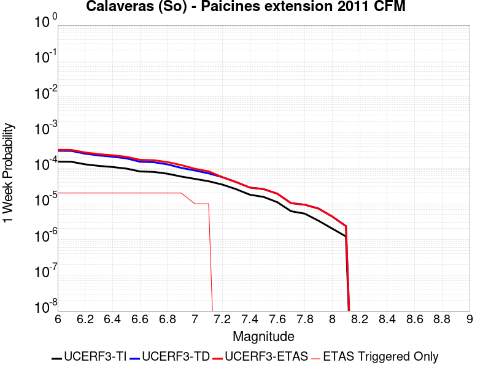 | 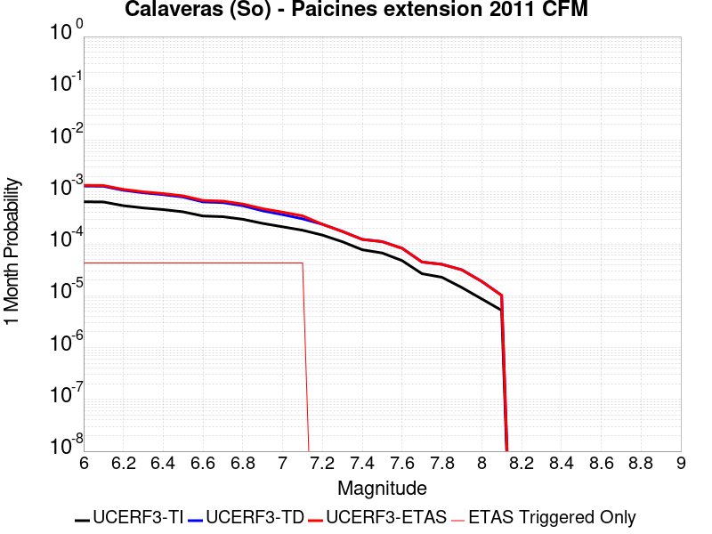 | 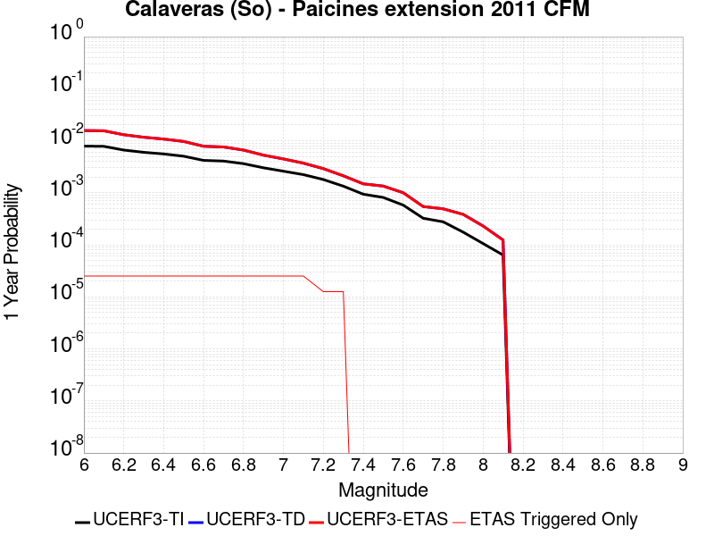 | 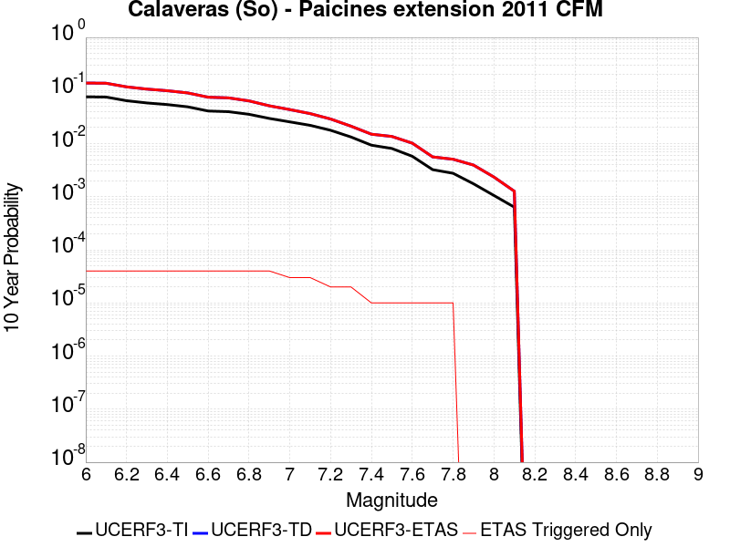 |

| Magnitude | 1 wk TI Prob | 1 wk TD Prob | 1 wk ETAS Prob | 1 wk ETAS/TD Gain | 1 wk ETAS Triggered Only | 1 mo TI Prob | 1 mo TD Prob | 1 mo ETAS Prob | 1 mo ETAS/TD Gain | 1 mo ETAS Triggered Only | 1 yr TI Prob | 1 yr TD Prob | 1 yr ETAS Prob | 1 yr ETAS/TD Gain | 1 yr ETAS Triggered Only | 10 yr TI Prob | 10 yr TD Prob | 10 yr ETAS Prob | 10 yr ETAS/TD Gain | 10 yr ETAS Triggered Only |
|-----|-----|-----|-----|-----|-----|-----|-----|-----|-----|-----|-----|-----|-----|-----|-----|-----|-----|-----|-----|-----|
| 6.0 | 1.5183659E-4 | 3.0520977E-4 | 3.2520367E-4 | 1.0655087 | 2.0E-5 | 6.5056595E-4 | 0.0013068188 | 0.0013267926 | 1.0152843 | 2.0E-5 | 0.007891912 | 0.015696203 | 0.015725734 | 1.0018812 | 3.0E-5 | 0.076174594 | 0.13848905 | 0.1385235 | 1.0002488 | 4.0E-5 |
| 6.1 | 1.5024997E-4 | 3.021517E-4 | 3.2214564E-4 | 1.0661719 | 2.0E-5 | 6.437695E-4 | 0.0012937278 | 0.001313702 | 1.0154392 | 2.0E-5 | 0.0078097614 | 0.015539596 | 0.01556913 | 1.0019006 | 3.0E-5 | 0.075409345 | 0.13715863 | 0.13719314 | 1.0002517 | 4.0E-5 |
| 6.2 | 1.2743923E-4 | 2.5313982E-4 | 2.7313476E-4 | 1.0789877 | 2.0E-5 | 5.460538E-4 | 0.0010839999 | 0.0011039783 | 1.0184302 | 2.0E-5 | 0.0066279583 | 0.013046881 | 0.01307649 | 1.0022694 | 3.0E-5 | 0.064337276 | 0.117256075 | 0.11729138 | 1.0003011 | 4.0E-5 |
| 6.3 | 1.1525114E-4 | 2.2599236E-4 | 2.4598785E-4 | 1.0884786 | 2.0E-5 | 4.9383997E-4 | 9.678718E-4 | 9.878525E-4 | 1.020644 | 2.0E-5 | 0.0059959386 | 0.011668079 | 0.011697729 | 1.0025411 | 3.0E-5 | 0.058367174 | 0.106372125 | 0.106407866 | 1.000336 | 4.0E-5 |
| 6.4 | 1.07200925E-4 | 2.0840544E-4 | 2.2840127E-4 | 1.0959468 | 2.0E-5 | 4.5935164E-4 | 8.926123E-4 | 9.1259443E-4 | 1.0223862 | 2.0E-5 | 0.0055782744 | 0.010772959 | 0.010802636 | 1.0027548 | 3.0E-5 | 0.0544031 | 0.099194765 | 0.0992308 | 1.0003632 | 4.0E-5 |
| 6.5 | 9.69631E-5 | 1.8734725E-4 | 2.073435E-4 | 1.1067337 | 2.0E-5 | 4.1548995E-4 | 8.024631E-4 | 8.22447E-4 | 1.0249033 | 2.0E-5 | 0.0050468626 | 0.009694842 | 0.009724551 | 1.0030644 | 3.0E-5 | 0.04933773 | 0.090086564 | 0.09012296 | 1.000404 | 4.0E-5 |
| 6.6 | 8.0552316E-5 | 1.507068E-4 | 1.7070377E-4 | 1.132688 | 2.0E-5 | 3.4517853E-4 | 6.4569083E-4 | 6.656779E-4 | 1.0309546 | 2.0E-5 | 0.0041944524 | 0.007826508 | 0.007856273 | 1.0038031 | 3.0E-5 | 0.04116161 | 0.0748563 | 0.07489331 | 1.0004944 | 4.0E-5 |
| 6.7 | 7.815757E-5 | 1.4611272E-4 | 1.6610979E-4 | 1.1368606 | 2.0E-5 | 3.34918E-4 | 6.26014E-4 | 6.4600154E-4 | 1.0319282 | 2.0E-5 | 0.004070005 | 0.007589312 | 0.007619084 | 1.0039229 | 3.0E-5 | 0.039962657 | 0.07270582 | 0.07274291 | 1.0005102 | 4.0E-5 |
| 6.8 | 6.965264E-5 | 1.2722758E-4 | 1.4722504E-4 | 1.1571786 | 2.0E-5 | 2.9847719E-4 | 5.4513285E-4 | 5.6512194E-4 | 1.0366683 | 2.0E-5 | 0.0036279052 | 0.0066135945 | 0.006643396 | 1.0045061 | 3.0E-5 | 0.03569247 | 0.063801065 | 0.06383851 | 1.000587 | 4.0E-5 |
| 6.9 | 5.8000453E-5 | 1.01439E-4 | 1.2143698E-4 | 1.1971428 | 2.0E-5 | 2.4854968E-4 | 4.346666E-4 | 4.5465791E-4 | 1.0459923 | 2.0E-5 | 0.0030218933 | 0.005279322 | 0.005309164 | 1.0056525 | 3.0E-5 | 0.029811295 | 0.051502965 | 0.051540904 | 1.0007367 | 4.0E-5 |
| 7.0 | 4.9865852E-5 | 8.568029E-5 | 9.5679425E-5 | 1.1167029 | 1.0E-5 | 2.1369329E-4 | 3.6715003E-4 | 3.7714635E-4 | 1.0272268 | 1.0E-5 | 0.0025986114 | 0.004460979 | 0.0044808895 | 1.0044633 | 2.0E-5 | 0.025684336 | 0.043782018 | 0.043810703 | 1.0006552 | 3.0E-5 |
| 7.1 | 4.283875E-5 | 7.1124625E-5 | 8.1123915E-5 | 1.1405883 | 1.0E-5 | 1.8358172E-4 | 3.0478454E-4 | 3.1478147E-4 | 1.0328001 | 1.0E-5 | 0.0022328163 | 0.003704494 | 0.00372442 | 1.0053788 | 2.0E-5 | 0.022105146 | 0.03673582 | 0.036764722 | 1.0007867 | 3.0E-5 |
| 7.2 | 3.450115E-5 | 5.5778568E-5 | 5.5778568E-5 | 1.0 | 0.0 | 1.478537E-4 | 2.3902925E-4 | 2.3902925E-4 | 1.0 | 0.0 | 0.0017986323 | 0.0029063264 | 0.0029162974 | 1.0034307 | 1.0E-5 | 0.017841442 | 0.029079042 | 0.02909846 | 1.0006678 | 2.0E-5 |
| 7.3 | 2.5709045E-5 | 4.059001E-5 | 4.059001E-5 | 1.0 | 0.0 | 1.1017697E-4 | 1.7394568E-4 | 1.7394568E-4 | 1.0 | 0.0 | 0.0013405791 | 0.0021157486 | 0.0021257275 | 1.0047165 | 1.0E-5 | 0.013325208 | 0.02129686 | 0.021316435 | 1.0009191 | 2.0E-5 |
| 7.4 | 1.8003093E-5 | 2.8511378E-5 | 2.8511378E-5 | 1.0 | 0.0 | 7.715383E-5 | 1.2218591E-4 | 1.2218591E-4 | 1.0 | 0.0 | 9.3894306E-4 | 0.0014866006 | 0.0014866006 | 1.0 | 0.0 | 0.009349857 | 0.015051589 | 0.015061439 | 1.0006543 | 1.0E-5 |
| 7.5 | 1.5595824E-5 | 2.5823752E-5 | 2.5823752E-5 | 1.0 | 0.0 | 6.683753E-5 | 1.10668545E-4 | 1.10668545E-4 | 1.0 | 0.0 | 8.134431E-4 | 0.0013465589 | 0.0013465589 | 1.0 | 0.0 | 0.008104719 | 0.013651571 | 0.013661435 | 1.0007225 | 1.0E-5 |
| 7.6 | 1.1110309E-5 | 1.9223195E-5 | 1.9223195E-5 | 1.0 | 0.0 | 4.761474E-5 | 8.2382525E-5 | 8.2382525E-5 | 1.0 | 0.0 | 5.795553E-4 | 0.0010025471 | 0.0010025471 | 1.0 | 0.0 | 0.0057804612 | 0.01020344 | 0.010213338 | 1.00097 | 1.0E-5 |
| 7.7 | 6.2140443E-6 | 1.04376995E-5 | 1.04376995E-5 | 1.0 | 0.0 | 2.6631347E-5 | 4.4732235E-5 | 4.4732235E-5 | 1.0 | 0.0 | 3.241884E-4 | 5.4447894E-4 | 5.4447894E-4 | 1.0 | 0.0 | 0.0032371588 | 0.005620102 | 0.005630046 | 1.0017693 | 1.0E-5 |
| 7.8 | 5.305533E-6 | 9.433651E-6 | 9.433651E-6 | 1.0 | 0.0 | 2.27378E-5 | 4.0429306E-5 | 4.0429306E-5 | 1.0 | 0.0 | 2.7679754E-4 | 4.9211574E-4 | 4.9211574E-4 | 1.0 | 0.0 | 0.0027645302 | 0.005074622 | 0.0050845714 | 1.0019606 | 1.0E-5 |
| 7.9 | 3.363505E-6 | 7.3854467E-6 | 7.3854467E-6 | 1.0 | 0.0 | 1.4414942E-5 | 3.1651532E-5 | 3.1651532E-5 | 1.0 | 0.0 | 1.7548777E-4 | 3.8528934E-4 | 3.8528934E-4 | 1.0 | 0.0 | 0.0017534926 | 0.003948784 | 0.003948784 | 1.0 | 0.0 |
| 8.0 | 2.0271132E-6 | 4.4134235E-6 | 4.4134235E-6 | 1.0 | 0.0 | 8.687599E-6 | 1.8914534E-5 | 1.8914534E-5 | 1.0 | 0.0 | 1.05766376E-4 | 2.3026018E-4 | 2.3026018E-4 | 1.0 | 0.0 | 0.0010571606 | 0.002351194 | 0.002351194 | 1.0 | 0.0 |
| 8.1 | 1.2206116E-6 | 2.3752666E-6 | 2.3752666E-6 | 1.0 | 0.0 | 5.2311816E-6 | 1.0179674E-5 | 1.0179674E-5 | 1.0 | 0.0 | 6.3687774E-5 | 1.2393051E-4 | 1.2393051E-4 | 1.0 | 0.0 | 6.366953E-4 | 0.0012705618 | 0.0012705618 | 1.0 | 0.0 |

## Kern Canyon (Lake Isabella) 2011
*[(top)](#table-of-contents)*

| 1 Week | 1 Month | 1 Year | 10 Year |
|-----|-----|-----|-----|
| 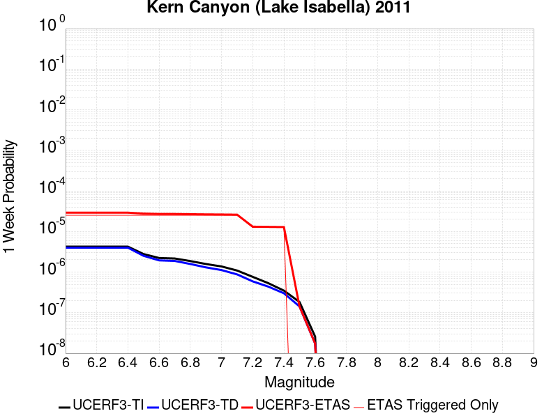 | 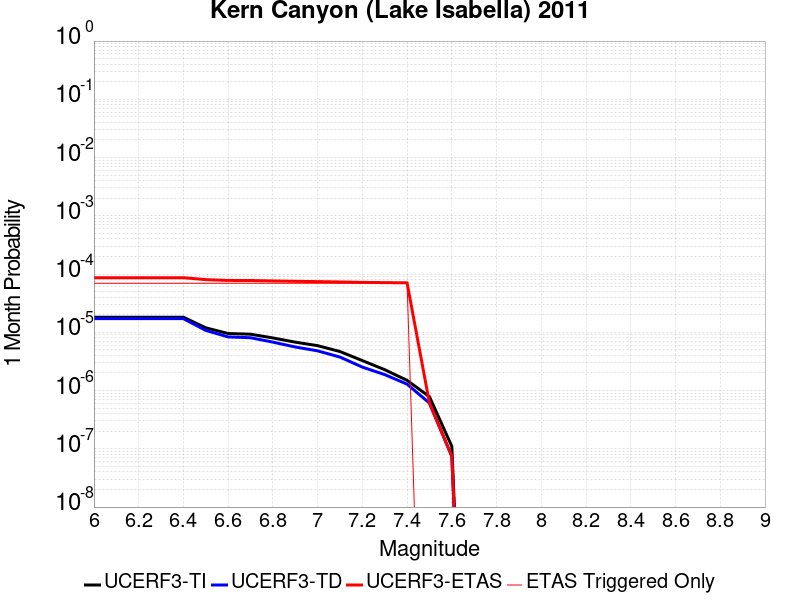 | 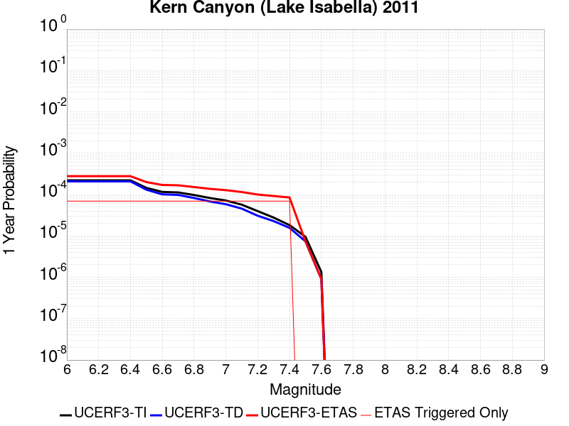 | 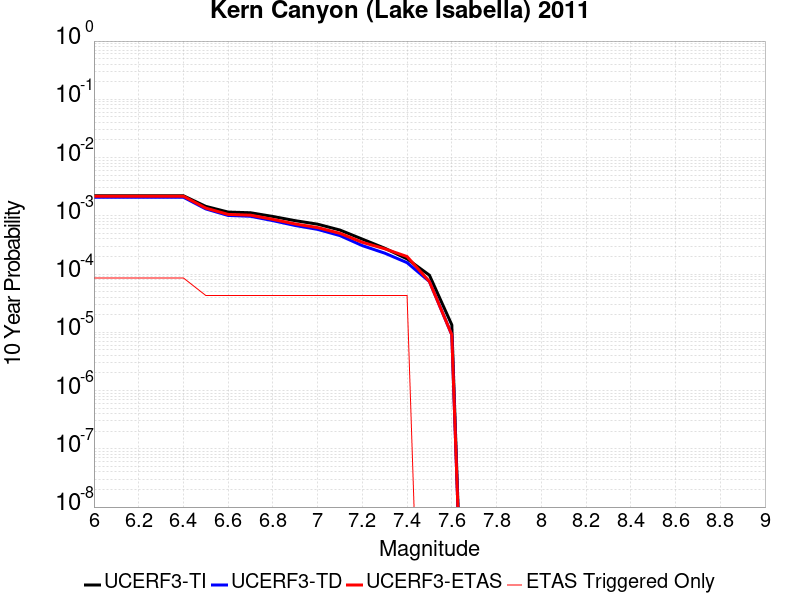 |

| Magnitude | 1 wk TI Prob | 1 wk TD Prob | 1 wk ETAS Prob | 1 wk ETAS/TD Gain | 1 wk ETAS Triggered Only | 1 mo TI Prob | 1 mo TD Prob | 1 mo ETAS Prob | 1 mo ETAS/TD Gain | 1 mo ETAS Triggered Only | 1 yr TI Prob | 1 yr TD Prob | 1 yr ETAS Prob | 1 yr ETAS/TD Gain | 1 yr ETAS Triggered Only | 10 yr TI Prob | 10 yr TD Prob | 10 yr ETAS Prob | 10 yr ETAS/TD Gain | 10 yr ETAS Triggered Only |
|-----|-----|-----|-----|-----|-----|-----|-----|-----|-----|-----|-----|-----|-----|-----|-----|-----|-----|-----|-----|-----|
| 6.0 | 4.2387383E-6 | 4.0016344E-6 | 2.4001554E-5 | 5.997938 | 2.0E-5 | 1.8165894E-5 | 1.7149758E-5 | 3.7149417E-5 | 2.1661773 | 2.0E-5 | 2.2114732E-4 | 2.0878017E-4 | 2.4877183E-4 | 1.1915491 | 4.0E-5 | 0.0022092736 | 0.002086024 | 0.0021259408 | 1.0191352 | 4.0E-5 |
| 6.1 | 4.2387383E-6 | 4.0016344E-6 | 2.4001554E-5 | 5.997938 | 2.0E-5 | 1.8165894E-5 | 1.7149758E-5 | 3.7149417E-5 | 2.1661773 | 2.0E-5 | 2.2114732E-4 | 2.0878017E-4 | 2.4877183E-4 | 1.1915491 | 4.0E-5 | 0.0022092736 | 0.002086024 | 0.0021259408 | 1.0191352 | 4.0E-5 |
| 6.2 | 4.2387383E-6 | 4.0016344E-6 | 2.4001554E-5 | 5.997938 | 2.0E-5 | 1.8165894E-5 | 1.7149758E-5 | 3.7149417E-5 | 2.1661773 | 2.0E-5 | 2.2114732E-4 | 2.0878017E-4 | 2.4877183E-4 | 1.1915491 | 4.0E-5 | 0.0022092736 | 0.002086024 | 0.0021259408 | 1.0191352 | 4.0E-5 |
| 6.3 | 4.2387383E-6 | 4.0016344E-6 | 2.4001554E-5 | 5.997938 | 2.0E-5 | 1.8165894E-5 | 1.7149758E-5 | 3.7149417E-5 | 2.1661773 | 2.0E-5 | 2.2114732E-4 | 2.0878017E-4 | 2.4877183E-4 | 1.1915491 | 4.0E-5 | 0.0022092736 | 0.002086024 | 0.0021259408 | 1.0191352 | 4.0E-5 |
| 6.4 | 4.2387383E-6 | 4.0016344E-6 | 2.4001554E-5 | 5.997938 | 2.0E-5 | 1.8165894E-5 | 1.7149758E-5 | 3.7149417E-5 | 2.1661773 | 2.0E-5 | 2.2114732E-4 | 2.0878017E-4 | 2.4877183E-4 | 1.1915491 | 4.0E-5 | 0.0022092736 | 0.002086024 | 0.0021259408 | 1.0191352 | 4.0E-5 |
| 6.5 | 2.7857532E-6 | 2.5178624E-6 | 2.2517812E-5 | 8.943226 | 2.0E-5 | 1.1938888E-5 | 1.0790796E-5 | 3.079058E-5 | 2.8534114 | 2.0E-5 | 1.4534626E-4 | 1.3137035E-4 | 1.5136773E-4 | 1.1522213 | 2.0E-5 | 0.0014525123 | 0.0013129596 | 0.0013329334 | 1.0152128 | 2.0E-5 |
| 6.6 | 2.2233348E-6 | 1.944119E-6 | 2.194408E-5 | 11.2874155 | 2.0E-5 | 9.528543E-6 | 8.331913E-6 | 2.8331746E-5 | 3.4003892 | 2.0E-5 | 1.1600384E-4 | 1.014364E-4 | 1.2143437E-4 | 1.1971478 | 2.0E-5 | 0.001159433 | 0.0010139096 | 0.0010338894 | 1.0197057 | 2.0E-5 |
| 6.7 | 2.1635126E-6 | 1.8834991E-6 | 2.1883461E-5 | 11.618515 | 2.0E-5 | 9.272164E-6 | 8.072114E-6 | 2.8071952E-5 | 3.4776456 | 2.0E-5 | 1.1288274E-4 | 9.827364E-5 | 1.1827167E-4 | 1.2034934 | 2.0E-5 | 0.0011282542 | 9.8231E-4 | 0.0010022903 | 1.0203402 | 2.0E-5 |
| 6.8 | 1.8685711E-6 | 1.583138E-6 | 2.1583106E-5 | 13.633118 | 2.0E-5 | 8.008137E-6 | 6.7848596E-6 | 2.6784724E-5 | 3.9477196 | 2.0E-5 | 9.74947E-5 | 8.2602586E-5 | 1.02600934E-4 | 1.2421032 | 2.0E-5 | 9.745194E-4 | 8.2572375E-4 | 8.457072E-4 | 1.0242012 | 2.0E-5 |
| 6.9 | 1.5815071E-6 | 1.3064887E-6 | 2.1306463E-5 | 16.308187 | 2.0E-5 | 6.77787E-6 | 5.5992255E-6 | 2.5599113E-5 | 4.5719028 | 2.0E-5 | 8.251744E-5 | 6.816846E-5 | 8.81671E-5 | 1.2933708 | 2.0E-5 | 8.248681E-4 | 6.8147824E-4 | 7.014646E-4 | 1.029328 | 2.0E-5 |
| 7.0 | 1.3772564E-6 | 1.1210681E-6 | 2.1121046E-5 | 18.840109 | 2.0E-5 | 5.9025137E-6 | 4.8045686E-6 | 2.4804473E-5 | 5.1626844 | 2.0E-5 | 7.186073E-5 | 5.8494075E-5 | 7.849291E-5 | 1.341895 | 2.0E-5 | 7.18375E-4 | 5.8478885E-4 | 6.0477713E-4 | 1.0341804 | 2.0E-5 |
| 7.1 | 1.0916998E-6 | 8.7637505E-7 | 2.0876358E-5 | 23.82126 | 2.0E-5 | 4.678705E-6 | 3.7558877E-6 | 2.3755812E-5 | 6.3249526 | 2.0E-5 | 5.6961744E-5 | 4.5726985E-5 | 6.5726075E-5 | 1.4373585 | 2.0E-5 | 5.6947145E-4 | 4.571771E-4 | 4.7716798E-4 | 1.0437267 | 2.0E-5 |
| 7.2 | 7.6277024E-7 | 5.901439E-7 | 1.0590138E-5 | 17.945011 | 1.0E-5 | 3.2690114E-6 | 2.5291856E-6 | 1.252916E-5 | 4.9538317 | 1.0E-5 | 3.9799485E-5 | 3.0792406E-5 | 4.07921E-5 | 1.3247454 | 1.0E-5 | 3.9792358E-4 | 3.07882E-4 | 3.1787893E-4 | 1.03247 | 1.0E-5 |
| 7.3 | 5.3265916E-7 | 4.3824264E-7 | 1.0438238E-5 | 23.8184 | 1.0E-5 | 2.282823E-6 | 1.8781814E-6 | 1.1878163E-5 | 6.3242893 | 1.0E-5 | 2.7793016E-5 | 2.2866623E-5 | 3.2866392E-5 | 1.4373087 | 1.0E-5 | 2.778954E-4 | 2.2864307E-4 | 2.3864079E-4 | 1.0437263 | 1.0E-5 |
| 7.4 | 3.4946007E-7 | 3.0065647E-7 | 1.0300653E-5 | 34.260544 | 1.0E-5 | 1.497685E-6 | 1.2885271E-6 | 1.12885145E-5 | 8.760789 | 1.0E-5 | 1.8234163E-5 | 1.5687707E-5 | 2.568755E-5 | 1.6374319 | 1.0E-5 | 1.8232666E-4 | 1.5686621E-4 | 1.6686464E-4 | 1.0637386 | 1.0E-5 |
| 7.5 | 1.8317026E-7 | 1.4244755E-7 | 1.4244755E-7 | 1.0 | 0.0 | 7.850152E-7 | 6.1048934E-7 | 6.1048934E-7 | 1.0 | 0.0 | 9.557518E-6 | 7.432683E-6 | 7.432683E-6 | 1.0 | 0.0 | 9.5571064E-5 | 7.432442E-5 | 7.432442E-5 | 1.0 | 0.0 |
| 7.6 | 2.572245E-8 | 1.735264E-8 | 1.735264E-8 | 1.0 | 0.0 | 1.10239064E-7 | 7.436845E-8 | 7.436845E-8 | 1.0 | 0.0 | 1.3421597E-6 | 9.0543557E-7 | 9.0543557E-7 | 1.0 | 0.0 | 1.3421517E-5 | 9.054324E-6 | 9.054324E-6 | 1.0 | 0.0 |

## Oak Ridge (Onshore)
*[(top)](#table-of-contents)*

| 1 Week | 1 Month | 1 Year | 10 Year |
|-----|-----|-----|-----|
|  | 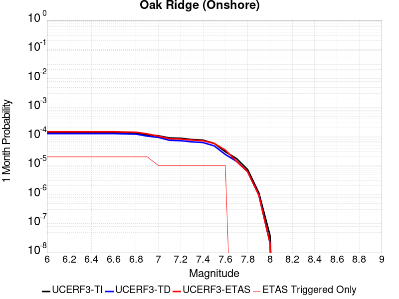 | 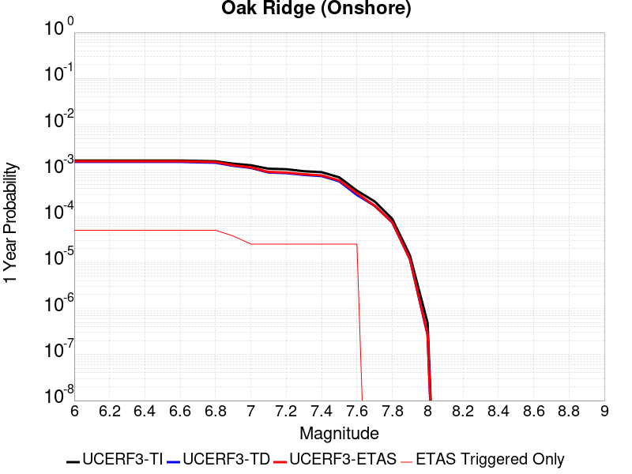 | 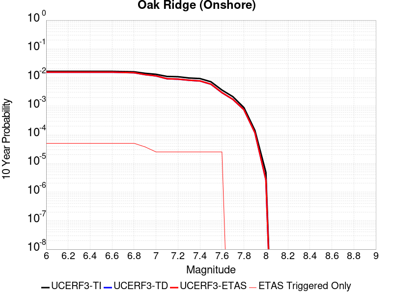 |

| Magnitude | 1 wk TI Prob | 1 wk TD Prob | 1 wk ETAS Prob | 1 wk ETAS/TD Gain | 1 wk ETAS Triggered Only | 1 mo TI Prob | 1 mo TD Prob | 1 mo ETAS Prob | 1 mo ETAS/TD Gain | 1 mo ETAS Triggered Only | 1 yr TI Prob | 1 yr TD Prob | 1 yr ETAS Prob | 1 yr ETAS/TD Gain | 1 yr ETAS Triggered Only | 10 yr TI Prob | 10 yr TD Prob | 10 yr ETAS Prob | 10 yr ETAS/TD Gain | 10 yr ETAS Triggered Only |
|-----|-----|-----|-----|-----|-----|-----|-----|-----|-----|-----|-----|-----|-----|-----|-----|-----|-----|-----|-----|-----|
| 6.0 | 3.155064E-5 | 2.9526076E-5 | 2.9526076E-5 | 1.0 | 0.0 | 1.3521002E-4 | 1.265344E-4 | 1.4653188E-4 | 1.1580398 | 2.0E-5 | 0.001644939 | 0.0015395058 | 0.0015794443 | 1.0259423 | 4.0E-5 | 0.01632816 | 0.015293054 | 0.015332443 | 1.0025755 | 4.0E-5 |
| 6.1 | 3.155064E-5 | 2.9526076E-5 | 2.9526076E-5 | 1.0 | 0.0 | 1.3521002E-4 | 1.265344E-4 | 1.4653188E-4 | 1.1580398 | 2.0E-5 | 0.001644939 | 0.0015395058 | 0.0015794443 | 1.0259423 | 4.0E-5 | 0.01632816 | 0.015293054 | 0.015332443 | 1.0025755 | 4.0E-5 |
| 6.2 | 3.155064E-5 | 2.9526076E-5 | 2.9526076E-5 | 1.0 | 0.0 | 1.3521002E-4 | 1.265344E-4 | 1.4653188E-4 | 1.1580398 | 2.0E-5 | 0.001644939 | 0.0015395058 | 0.0015794443 | 1.0259423 | 4.0E-5 | 0.01632816 | 0.015293054 | 0.015332443 | 1.0025755 | 4.0E-5 |
| 6.3 | 3.155064E-5 | 2.9526076E-5 | 2.9526076E-5 | 1.0 | 0.0 | 1.3521002E-4 | 1.265344E-4 | 1.4653188E-4 | 1.1580398 | 2.0E-5 | 0.001644939 | 0.0015395058 | 0.0015794443 | 1.0259423 | 4.0E-5 | 0.01632816 | 0.015293054 | 0.015332443 | 1.0025755 | 4.0E-5 |
| 6.4 | 3.155064E-5 | 2.9526076E-5 | 2.9526076E-5 | 1.0 | 0.0 | 1.3521002E-4 | 1.265344E-4 | 1.4653188E-4 | 1.1580398 | 2.0E-5 | 0.001644939 | 0.0015395058 | 0.0015794443 | 1.0259423 | 4.0E-5 | 0.01632816 | 0.015293054 | 0.015332443 | 1.0025755 | 4.0E-5 |
| 6.5 | 3.155064E-5 | 2.9526076E-5 | 2.9526076E-5 | 1.0 | 0.0 | 1.3521002E-4 | 1.265344E-4 | 1.4653188E-4 | 1.1580398 | 2.0E-5 | 0.001644939 | 0.0015395058 | 0.0015794443 | 1.0259423 | 4.0E-5 | 0.01632816 | 0.015293054 | 0.015332443 | 1.0025755 | 4.0E-5 |
| 6.6 | 3.155064E-5 | 2.9526076E-5 | 2.9526076E-5 | 1.0 | 0.0 | 1.3521002E-4 | 1.265344E-4 | 1.4653188E-4 | 1.1580398 | 2.0E-5 | 0.001644939 | 0.0015395058 | 0.0015794443 | 1.0259423 | 4.0E-5 | 0.01632816 | 0.015293054 | 0.015332443 | 1.0025755 | 4.0E-5 |
| 6.7 | 3.098897E-5 | 2.8864279E-5 | 2.8864279E-5 | 1.0 | 0.0 | 1.328031E-4 | 1.236984E-4 | 1.4369593E-4 | 1.1616635 | 2.0E-5 | 0.0016156785 | 0.0015050253 | 0.0015449651 | 1.0265377 | 4.0E-5 | 0.016039822 | 0.014952909 | 0.014992312 | 1.0026351 | 4.0E-5 |
| 6.8 | 3.0449872E-5 | 2.8239476E-5 | 2.8239476E-5 | 1.0 | 0.0 | 1.3049292E-4 | 1.2102092E-4 | 1.410185E-4 | 1.1652406 | 2.0E-5 | 0.0015875935 | 0.001472471 | 0.0015124121 | 1.0271252 | 4.0E-5 | 0.015762992 | 0.014631658 | 0.014671072 | 1.0026938 | 4.0E-5 |
| 6.9 | 2.697928E-5 | 2.4219877E-5 | 2.4219877E-5 | 1.0 | 0.0 | 1.15620365E-4 | 1.03795464E-4 | 1.2379339E-4 | 1.1926666 | 2.0E-5 | 0.0014067689 | 0.0012629988 | 0.0012929608 | 1.023723 | 3.0E-5 | 0.0139789665 | 0.012561066 | 0.01259069 | 1.0023583 | 3.0E-5 |
| 7.0 | 2.4893961E-5 | 2.1862146E-5 | 2.1862146E-5 | 1.0 | 0.0 | 1.0668404E-4 | 9.369165E-5 | 1.0369071E-4 | 1.1067231 | 1.0E-5 | 0.0012981043 | 0.0011401166 | 0.0011600938 | 1.0175221 | 2.0E-5 | 0.012905477 | 0.011345102 | 0.011364875 | 1.0017428 | 2.0E-5 |
| 7.1 | 2.0945363E-5 | 1.7354592E-5 | 1.7354592E-5 | 1.0 | 0.0 | 8.976275E-5 | 7.437473E-5 | 8.437399E-5 | 1.1344442 | 1.0E-5 | 0.0010923136 | 9.0514094E-4 | 9.251228E-4 | 1.022076 | 2.0E-5 | 0.0108696 | 0.009015621 | 0.00903544 | 1.0021983 | 2.0E-5 |
| 7.2 | 2.0439404E-5 | 1.680953E-5 | 1.680953E-5 | 1.0 | 0.0 | 8.7594504E-5 | 7.203888E-5 | 8.203816E-5 | 1.138804 | 1.0E-5 | 0.0010659413 | 8.767251E-4 | 8.967076E-4 | 1.0227922 | 2.0E-5 | 0.010608427 | 0.008733723 | 0.008753548 | 1.00227 | 2.0E-5 |
| 7.3 | 1.8463334E-5 | 1.5381947E-5 | 1.5381947E-5 | 1.0 | 0.0 | 7.912617E-5 | 6.592098E-5 | 7.5920325E-5 | 1.1516868 | 1.0E-5 | 9.6293533E-4 | 8.0229685E-4 | 8.2228077E-4 | 1.0249084 | 2.0E-5 | 0.009587734 | 0.0079950085 | 0.008014848 | 1.0024816 | 2.0E-5 |
| 7.4 | 1.763139E-5 | 1.4516977E-5 | 1.4516977E-5 | 1.0 | 0.0 | 7.556091E-5 | 6.221415E-5 | 7.221353E-5 | 1.1607251 | 1.0E-5 | 9.1956573E-4 | 7.57198E-4 | 7.771829E-4 | 1.0263932 | 2.0E-5 | 0.009157699 | 0.007547126 | 0.007566975 | 1.00263 | 2.0E-5 |
| 7.5 | 1.3594944E-5 | 1.1163363E-5 | 1.1163363E-5 | 1.0 | 0.0 | 5.8262744E-5 | 4.7842117E-5 | 5.784164E-5 | 1.2090108 | 1.0E-5 | 7.0911803E-4 | 5.8232463E-4 | 6.0231297E-4 | 1.0343251 | 2.0E-5 | 0.007068595 | 0.005808362 | 0.0058282455 | 1.0034233 | 2.0E-5 |
| 7.6 | 6.9889534E-6 | 5.6367194E-6 | 5.6367194E-6 | 1.0 | 0.0 | 2.9952313E-5 | 2.4157147E-5 | 3.4156907E-5 | 1.4139462 | 1.0E-5 | 3.646084E-4 | 2.94074E-4 | 3.140681E-4 | 1.0679901 | 2.0E-5 | 0.0036401073 | 0.0029368924 | 0.0029568337 | 1.0067899 | 2.0E-5 |
| 7.7 | 4.0824193E-6 | 3.2832731E-6 | 3.2832731E-6 | 1.0 | 0.0 | 1.7495966E-5 | 1.4071096E-5 | 1.4071096E-5 | 1.0 | 0.0 | 2.1299256E-4 | 1.7130225E-4 | 1.7130225E-4 | 1.0 | 0.0 | 0.0021278851 | 0.0017117155 | 0.0017117155 | 1.0 | 0.0 |
| 7.8 | 1.7023609E-6 | 1.43706E-6 | 1.43706E-6 | 1.0 | 0.0 | 7.295812E-6 | 6.158814E-6 | 6.158814E-6 | 1.0 | 0.0 | 8.882289E-5 | 7.4981006E-5 | 7.4981006E-5 | 1.0 | 0.0 | 8.8787393E-4 | 7.4955984E-4 | 7.4955984E-4 | 1.0 | 0.0 |
| 7.9 | 2.721225E-7 | 2.261692E-7 | 2.261692E-7 | 1.0 | 0.0 | 1.1662388E-6 | 9.692963E-7 | 9.692963E-7 | 1.0 | 0.0 | 1.4198865E-5 | 1.1801121E-5 | 1.1801121E-5 | 1.0 | 0.0 | 1.4197957E-4 | 1.1800523E-4 | 1.1800523E-4 | 1.0 | 0.0 |
| 8.0 | 9.364255E-9 | 5.1204916E-9 | 5.1204916E-9 | 1.0 | 0.0 | 4.0132523E-8 | 2.1944963E-8 | 2.1944963E-8 | 1.0 | 0.0 | 4.8861335E-7 | 2.671799E-7 | 2.671799E-7 | 1.0 | 0.0 | 4.8861225E-6 | 2.6717962E-6 | 2.6717962E-6 | 1.0 | 0.0 |

## North Frontal  (West)
*[(top)](#table-of-contents)*

| 1 Week | 1 Month | 1 Year | 10 Year |
|-----|-----|-----|-----|
| 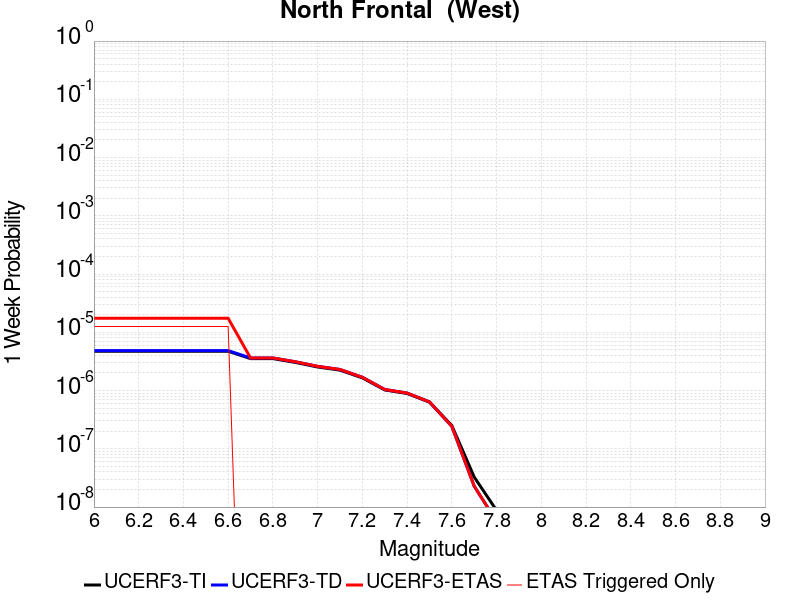 | 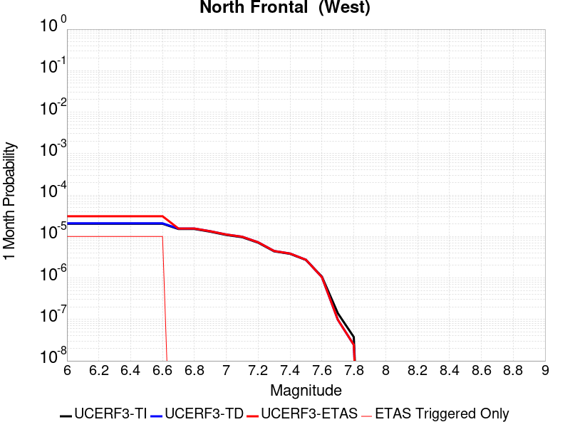 | 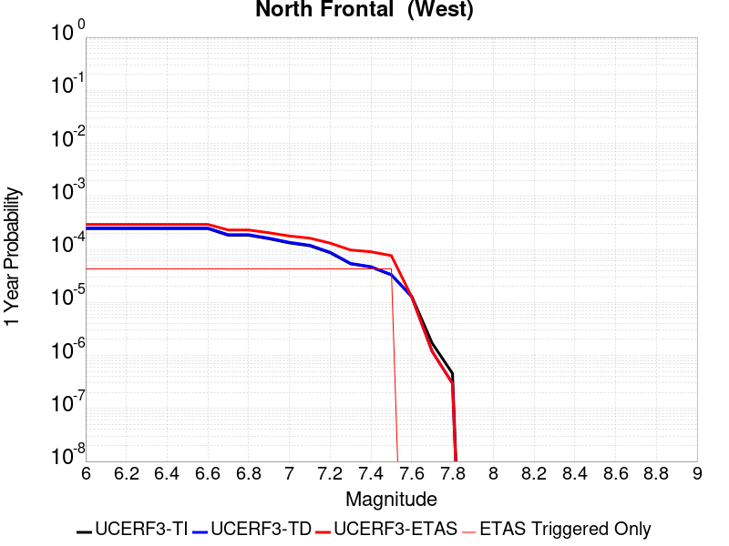 | 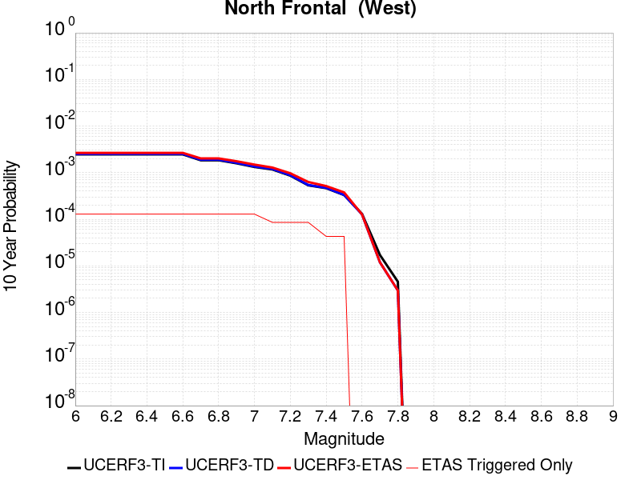 |

| Magnitude | 1 wk TI Prob | 1 wk TD Prob | 1 wk ETAS Prob | 1 wk ETAS/TD Gain | 1 wk ETAS Triggered Only | 1 mo TI Prob | 1 mo TD Prob | 1 mo ETAS Prob | 1 mo ETAS/TD Gain | 1 mo ETAS Triggered Only | 1 yr TI Prob | 1 yr TD Prob | 1 yr ETAS Prob | 1 yr ETAS/TD Gain | 1 yr ETAS Triggered Only | 10 yr TI Prob | 10 yr TD Prob | 10 yr ETAS Prob | 10 yr ETAS/TD Gain | 10 yr ETAS Triggered Only |
|-----|-----|-----|-----|-----|-----|-----|-----|-----|-----|-----|-----|-----|-----|-----|-----|-----|-----|-----|-----|-----|
| 6.0 | 4.7316266E-6 | 4.852674E-6 | 1.4852625E-5 | 3.0607095 | 1.0E-5 | 2.0278241E-5 | 2.0797017E-5 | 3.0796808E-5 | 1.4808282 | 1.0E-5 | 2.4685962E-4 | 2.5317573E-4 | 2.7317068E-4 | 1.0789765 | 2.0E-5 | 0.0024658558 | 0.002529019 | 0.002568918 | 1.0157764 | 4.0E-5 |
| 6.1 | 4.7316266E-6 | 4.852674E-6 | 1.4852625E-5 | 3.0607095 | 1.0E-5 | 2.0278241E-5 | 2.0797017E-5 | 3.0796808E-5 | 1.4808282 | 1.0E-5 | 2.4685962E-4 | 2.5317573E-4 | 2.7317068E-4 | 1.0789765 | 2.0E-5 | 0.0024658558 | 0.002529019 | 0.002568918 | 1.0157764 | 4.0E-5 |
| 6.2 | 4.7316266E-6 | 4.852674E-6 | 1.4852625E-5 | 3.0607095 | 1.0E-5 | 2.0278241E-5 | 2.0797017E-5 | 3.0796808E-5 | 1.4808282 | 1.0E-5 | 2.4685962E-4 | 2.5317573E-4 | 2.7317068E-4 | 1.0789765 | 2.0E-5 | 0.0024658558 | 0.002529019 | 0.002568918 | 1.0157764 | 4.0E-5 |
| 6.3 | 4.7316266E-6 | 4.852674E-6 | 1.4852625E-5 | 3.0607095 | 1.0E-5 | 2.0278241E-5 | 2.0797017E-5 | 3.0796808E-5 | 1.4808282 | 1.0E-5 | 2.4685962E-4 | 2.5317573E-4 | 2.7317068E-4 | 1.0789765 | 2.0E-5 | 0.0024658558 | 0.002529019 | 0.002568918 | 1.0157764 | 4.0E-5 |
| 6.4 | 4.7316266E-6 | 4.852674E-6 | 1.4852625E-5 | 3.0607095 | 1.0E-5 | 2.0278241E-5 | 2.0797017E-5 | 3.0796808E-5 | 1.4808282 | 1.0E-5 | 2.4685962E-4 | 2.5317573E-4 | 2.7317068E-4 | 1.0789765 | 2.0E-5 | 0.0024658558 | 0.002529019 | 0.002568918 | 1.0157764 | 4.0E-5 |
| 6.5 | 4.7316266E-6 | 4.852674E-6 | 1.4852625E-5 | 3.0607095 | 1.0E-5 | 2.0278241E-5 | 2.0797017E-5 | 3.0796808E-5 | 1.4808282 | 1.0E-5 | 2.4685962E-4 | 2.5317573E-4 | 2.7317068E-4 | 1.0789765 | 2.0E-5 | 0.0024658558 | 0.002529019 | 0.002568918 | 1.0157764 | 4.0E-5 |
| 6.6 | 4.7316266E-6 | 4.852674E-6 | 1.4852625E-5 | 3.0607095 | 1.0E-5 | 2.0278241E-5 | 2.0797017E-5 | 3.0796808E-5 | 1.4808282 | 1.0E-5 | 2.4685962E-4 | 2.5317573E-4 | 2.7317068E-4 | 1.0789765 | 2.0E-5 | 0.0024658558 | 0.002529019 | 0.002568918 | 1.0157764 | 4.0E-5 |
| 6.7 | 3.5382777E-6 | 3.6308872E-6 | 3.6308872E-6 | 1.0 | 0.0 | 1.516396E-5 | 1.5560858E-5 | 1.5560858E-5 | 1.0 | 0.0 | 1.8460557E-4 | 1.8943775E-4 | 1.9943585E-4 | 1.0527778 | 1.0E-5 | 0.0018445229 | 0.0018928396 | 0.0019227827 | 1.0158192 | 3.0E-5 |
| 6.8 | 3.5382777E-6 | 3.6308872E-6 | 3.6308872E-6 | 1.0 | 0.0 | 1.516396E-5 | 1.5560858E-5 | 1.5560858E-5 | 1.0 | 0.0 | 1.8460557E-4 | 1.8943775E-4 | 1.9943585E-4 | 1.0527778 | 1.0E-5 | 0.0018445229 | 0.0018928396 | 0.0019227827 | 1.0158192 | 3.0E-5 |
| 6.9 | 3.0428037E-6 | 3.1227619E-6 | 3.1227619E-6 | 1.0 | 0.0 | 1.30405215E-5 | 1.3383201E-5 | 1.3383201E-5 | 1.0 | 0.0 | 1.5875678E-4 | 1.6292896E-4 | 1.7292734E-4 | 1.0613664 | 1.0E-5 | 0.0015864341 | 0.0016281622 | 0.0016581134 | 1.0183957 | 3.0E-5 |
| 7.0 | 2.538778E-6 | 2.6060916E-6 | 2.6060916E-6 | 1.0 | 0.0 | 1.0880432E-5 | 1.116892E-5 | 1.116892E-5 | 1.0 | 0.0 | 1.324612E-4 | 1.3597358E-4 | 1.4597223E-4 | 1.0735337 | 1.0E-5 | 0.0013238228 | 0.0013589506 | 0.0013889099 | 1.0220459 | 3.0E-5 |
| 7.1 | 2.2418935E-6 | 2.3012087E-6 | 2.3012087E-6 | 1.0 | 0.0 | 9.60808E-6 | 9.862288E-6 | 9.862288E-6 | 1.0 | 0.0 | 1.1697209E-4 | 1.2006718E-4 | 1.3006598E-4 | 1.0832767 | 1.0E-5 | 0.0011691054 | 0.0012000671 | 0.001220043 | 1.0166458 | 2.0E-5 |
| 7.2 | 1.6526745E-6 | 1.6924864E-6 | 1.6924864E-6 | 1.0 | 0.0 | 7.082872E-6 | 7.2534945E-6 | 7.2534945E-6 | 1.0 | 0.0 | 8.623055E-5 | 8.830797E-5 | 9.830709E-5 | 1.1132301 | 1.0E-5 | 8.61971E-4 | 8.8275387E-4 | 9.027362E-4 | 1.0226364 | 2.0E-5 |
| 7.3 | 1.0246019E-6 | 1.0442274E-6 | 1.0442274E-6 | 1.0 | 0.0 | 4.391144E-6 | 4.4752533E-6 | 4.4752533E-6 | 1.0 | 0.0 | 5.3460866E-5 | 5.4484964E-5 | 6.448442E-5 | 1.1835269 | 1.0E-5 | 5.344801E-4 | 5.4472755E-4 | 5.6471664E-4 | 1.0366956 | 2.0E-5 |
| 7.4 | 8.9045164E-7 | 9.056572E-7 | 9.056572E-7 | 1.0 | 0.0 | 3.8162157E-6 | 3.881383E-6 | 3.881383E-6 | 1.0 | 0.0 | 4.646144E-5 | 4.725492E-5 | 5.725445E-5 | 1.2116082 | 1.0E-5 | 4.6451724E-4 | 4.7245962E-4 | 4.824549E-4 | 1.0211558 | 1.0E-5 |
| 7.5 | 6.3357E-7 | 6.4027137E-7 | 6.4027137E-7 | 1.0 | 0.0 | 2.7152971E-6 | 2.7440176E-6 | 2.7440176E-6 | 1.0 | 0.0 | 3.305824E-5 | 3.340797E-5 | 4.3407636E-5 | 1.2993197 | 1.0E-5 | 3.3053322E-4 | 3.3403604E-4 | 3.440327E-4 | 1.0299269 | 1.0E-5 |
| 7.6 | 2.5087024E-7 | 2.436123E-7 | 2.436123E-7 | 1.0 | 0.0 | 1.0751578E-6 | 1.0440525E-6 | 1.0440525E-6 | 1.0 | 0.0 | 1.3089967E-5 | 1.2711286E-5 | 1.2711286E-5 | 1.0 | 0.0 | 1.3089196E-4 | 1.2710765E-4 | 1.2710765E-4 | 1.0 | 0.0 |
| 7.7 | 3.282987E-8 | 2.2875435E-8 | 2.2875435E-8 | 1.0 | 0.0 | 1.4069944E-7 | 9.8037575E-8 | 9.8037575E-8 | 1.0 | 0.0 | 1.7130144E-6 | 1.193607E-6 | 1.193607E-6 | 1.0 | 0.0 | 1.7130013E-5 | 1.1936014E-5 | 1.1936014E-5 | 1.0 | 0.0 |
| 7.8 | 8.77499E-9 | 5.6817466E-9 | 5.6817466E-9 | 1.0 | 0.0 | 3.7607098E-8 | 2.4350342E-8 | 2.4350342E-8 | 1.0 | 0.0 | 4.578663E-7 | 2.964654E-7 | 2.964654E-7 | 1.0 | 0.0 | 4.5786537E-6 | 2.9646512E-6 | 2.9646512E-6 | 1.0 | 0.0 |

## Sheephole
*[(top)](#table-of-contents)*

| 1 Week | 1 Month | 1 Year | 10 Year |
|-----|-----|-----|-----|
| 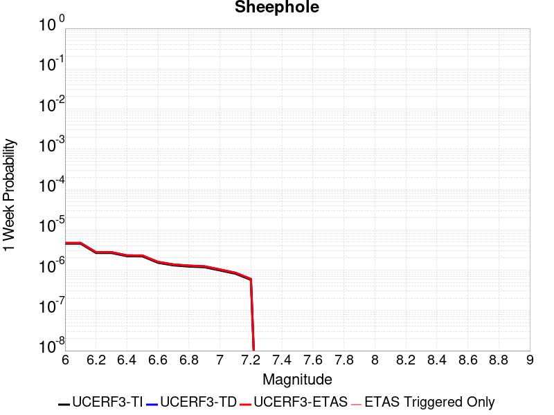 | 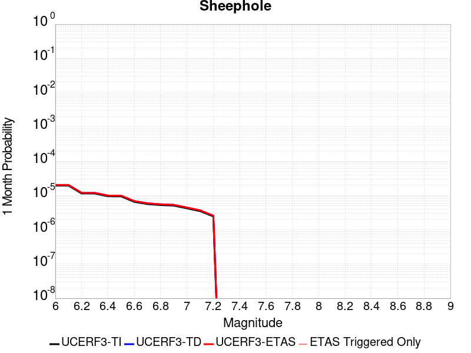 | 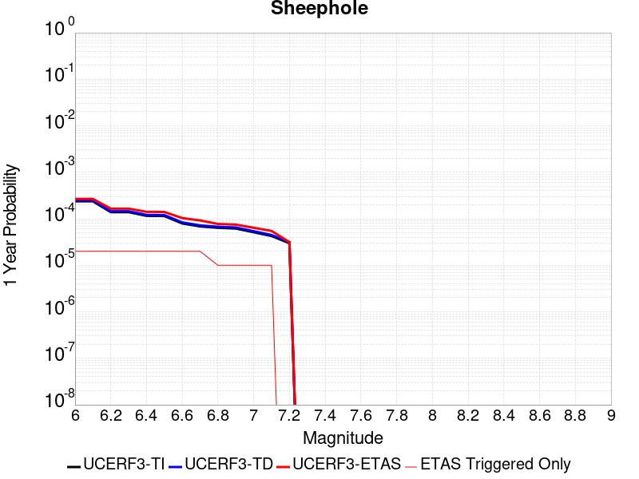 | 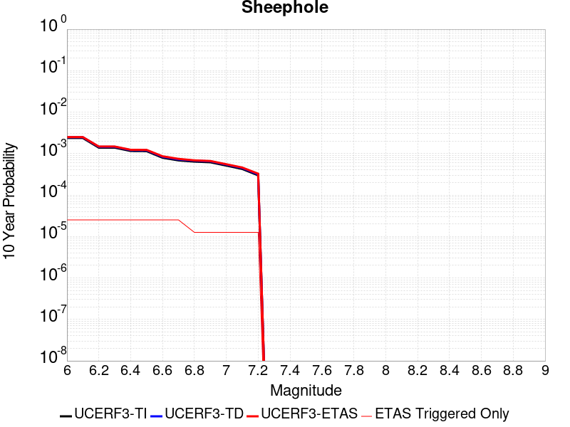 |

| Magnitude | 1 wk TI Prob | 1 wk TD Prob | 1 wk ETAS Prob | 1 wk ETAS/TD Gain | 1 wk ETAS Triggered Only | 1 mo TI Prob | 1 mo TD Prob | 1 mo ETAS Prob | 1 mo ETAS/TD Gain | 1 mo ETAS Triggered Only | 1 yr TI Prob | 1 yr TD Prob | 1 yr ETAS Prob | 1 yr ETAS/TD Gain | 1 yr ETAS Triggered Only | 10 yr TI Prob | 10 yr TD Prob | 10 yr ETAS Prob | 10 yr ETAS/TD Gain | 10 yr ETAS Triggered Only |
|-----|-----|-----|-----|-----|-----|-----|-----|-----|-----|-----|-----|-----|-----|-----|-----|-----|-----|-----|-----|-----|
| 6.0 | 4.5579695E-6 | 4.7412627E-6 | 4.7412627E-6 | 1.0 | 0.0 | 1.9534009E-5 | 2.031957E-5 | 2.031957E-5 | 1.0 | 0.0 | 2.3780059E-4 | 2.473682E-4 | 2.6736327E-4 | 1.0808312 | 2.0E-5 | 0.0023754628 | 0.002471473 | 0.0025113742 | 1.0161446 | 4.0E-5 |
| 6.1 | 4.5579695E-6 | 4.7412627E-6 | 4.7412627E-6 | 1.0 | 0.0 | 1.9534009E-5 | 2.031957E-5 | 2.031957E-5 | 1.0 | 0.0 | 2.3780059E-4 | 2.473682E-4 | 2.6736327E-4 | 1.0808312 | 2.0E-5 | 0.0023754628 | 0.002471473 | 0.0025113742 | 1.0161446 | 4.0E-5 |
| 6.2 | 2.6677674E-6 | 2.7873941E-6 | 2.7873941E-6 | 1.0 | 0.0 | 1.1433239E-5 | 1.1945926E-5 | 1.1945926E-5 | 1.0 | 0.0 | 1.3919079E-4 | 1.4543302E-4 | 1.6543012E-4 | 1.1375003 | 2.0E-5 | 0.0013910364 | 0.0014534844 | 0.0014934263 | 1.0274801 | 4.0E-5 |
| 6.3 | 2.6677674E-6 | 2.7873941E-6 | 2.7873941E-6 | 1.0 | 0.0 | 1.1433239E-5 | 1.1945926E-5 | 1.1945926E-5 | 1.0 | 0.0 | 1.3919079E-4 | 1.4543302E-4 | 1.6543012E-4 | 1.1375003 | 2.0E-5 | 0.0013910364 | 0.0014534844 | 0.0014934263 | 1.0274801 | 4.0E-5 |
| 6.4 | 2.2159759E-6 | 2.3228788E-6 | 2.3228788E-6 | 1.0 | 0.0 | 9.497005E-6 | 9.955161E-6 | 9.955161E-6 | 1.0 | 0.0 | 1.156199E-4 | 1.2119815E-4 | 1.4119573E-4 | 1.164999 | 2.0E-5 | 0.0011555976 | 0.0012113999 | 0.0012513514 | 1.0329796 | 4.0E-5 |
| 6.5 | 2.1986082E-6 | 2.304759E-6 | 2.304759E-6 | 1.0 | 0.0 | 9.4225725E-6 | 9.877506E-6 | 9.877506E-6 | 1.0 | 0.0 | 1.1471378E-4 | 1.2025281E-4 | 1.402504E-4 | 1.1662962 | 2.0E-5 | 0.0011465458 | 0.0012019566 | 0.0012419085 | 1.0332391 | 4.0E-5 |
| 6.6 | 1.5232331E-6 | 1.6018919E-6 | 1.6018919E-6 | 1.0 | 0.0 | 6.5281256E-6 | 6.865234E-6 | 6.865234E-6 | 1.0 | 0.0 | 7.947703E-5 | 8.35812E-5 | 1.03579536E-4 | 1.2392683 | 2.0E-5 | 7.9448614E-4 | 8.3551643E-4 | 8.6549134E-4 | 1.0358759 | 3.0E-5 |
| 6.7 | 1.3137362E-6 | 1.382819E-6 | 1.382819E-6 | 1.0 | 0.0 | 5.6302856E-6 | 5.926355E-6 | 5.926355E-6 | 1.0 | 0.0 | 6.854657E-5 | 7.215112E-5 | 9.2149676E-5 | 1.277176 | 2.0E-5 | 6.8525434E-4 | 7.212908E-4 | 7.512692E-4 | 1.0415621 | 3.0E-5 |
| 6.8 | 1.2275751E-6 | 1.2922847E-6 | 1.2922847E-6 | 1.0 | 0.0 | 5.2610258E-6 | 5.5383516E-6 | 5.5383516E-6 | 1.0 | 0.0 | 6.4051106E-5 | 6.7427485E-5 | 7.7426805E-5 | 1.1482974 | 1.0E-5 | 6.4032647E-4 | 6.740836E-4 | 6.940701E-4 | 1.0296499 | 2.0E-5 |
| 6.9 | 1.1837088E-6 | 1.246102E-6 | 1.246102E-6 | 1.0 | 0.0 | 5.0730278E-6 | 5.340427E-6 | 5.340427E-6 | 1.0 | 0.0 | 6.176237E-5 | 6.501789E-5 | 7.501724E-5 | 1.1537938 | 1.0E-5 | 6.17452E-4 | 6.5000186E-4 | 6.6998886E-4 | 1.0307492 | 2.0E-5 |
| 7.0 | 9.849371E-7 | 1.0366288E-6 | 1.0366288E-6 | 1.0 | 0.0 | 4.2211523E-6 | 4.442688E-6 | 4.442688E-6 | 1.0 | 0.0 | 5.1391315E-5 | 5.4088487E-5 | 6.4087944E-5 | 1.1848723 | 1.0E-5 | 5.137943E-4 | 5.407633E-4 | 5.6075247E-4 | 1.0369648 | 2.0E-5 |
| 7.1 | 8.1643645E-7 | 8.591669E-7 | 8.591669E-7 | 1.0 | 0.0 | 3.4990085E-6 | 3.682139E-6 | 3.682139E-6 | 1.0 | 0.0 | 4.2599597E-5 | 4.482921E-5 | 5.482876E-5 | 1.2230588 | 1.0E-5 | 4.259143E-4 | 4.4821028E-4 | 4.6820132E-4 | 1.0446019 | 2.0E-5 |
| 7.2 | 5.7295756E-7 | 6.029502E-7 | 6.029502E-7 | 1.0 | 0.0 | 2.45553E-6 | 2.58407E-6 | 2.58407E-6 | 1.0 | 0.0 | 2.9895667E-5 | 3.1460666E-5 | 3.1460666E-5 | 1.0 | 0.0 | 2.9891645E-4 | 3.145688E-4 | 3.2456568E-4 | 1.0317795 | 1.0E-5 |

## Newport-Inglewood alt 1
*[(top)](#table-of-contents)*

| 1 Week | 1 Month | 1 Year | 10 Year |
|-----|-----|-----|-----|
| 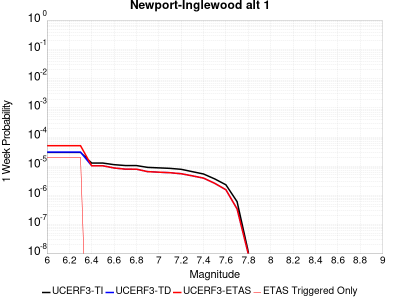 | 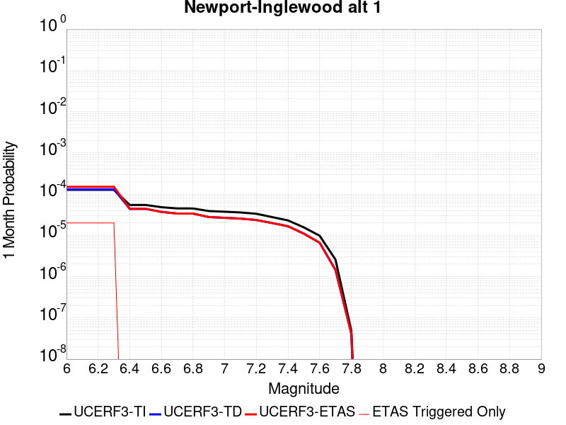 | 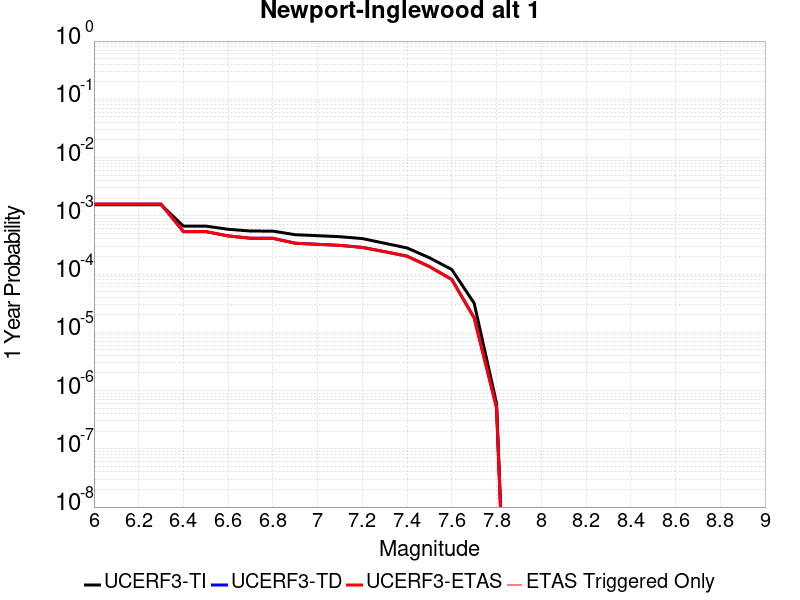 | 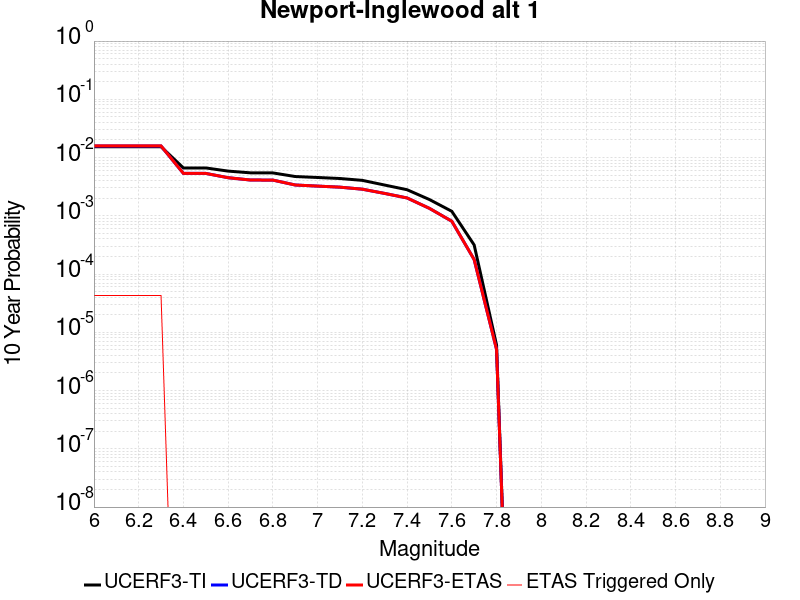 |

| Magnitude | 1 wk TI Prob | 1 wk TD Prob | 1 wk ETAS Prob | 1 wk ETAS/TD Gain | 1 wk ETAS Triggered Only | 1 mo TI Prob | 1 mo TD Prob | 1 mo ETAS Prob | 1 mo ETAS/TD Gain | 1 mo ETAS Triggered Only | 1 yr TI Prob | 1 yr TD Prob | 1 yr ETAS Prob | 1 yr ETAS/TD Gain | 1 yr ETAS Triggered Only | 10 yr TI Prob | 10 yr TD Prob | 10 yr ETAS Prob | 10 yr ETAS/TD Gain | 10 yr ETAS Triggered Only |
|-----|-----|-----|-----|-----|-----|-----|-----|-----|-----|-----|-----|-----|-----|-----|-----|-----|-----|-----|-----|-----|
| 6.0 | 2.9668912E-5 | 3.0404828E-5 | 5.0404222E-5 | 1.6577703 | 2.0E-5 | 1.2714628E-4 | 1.3030265E-4 | 1.5030004E-4 | 1.1534688 | 2.0E-5 | 0.0015469068 | 0.0015857654 | 0.0016057338 | 1.0125922 | 2.0E-5 | 0.015361829 | 0.01579211 | 0.015831478 | 1.0024929 | 4.0E-5 |
| 6.1 | 2.9668912E-5 | 3.0404828E-5 | 5.0404222E-5 | 1.6577703 | 2.0E-5 | 1.2714628E-4 | 1.3030265E-4 | 1.5030004E-4 | 1.1534688 | 2.0E-5 | 0.0015469068 | 0.0015857654 | 0.0016057338 | 1.0125922 | 2.0E-5 | 0.015361829 | 0.01579211 | 0.015831478 | 1.0024929 | 4.0E-5 |
| 6.2 | 2.9668912E-5 | 3.0404828E-5 | 5.0404222E-5 | 1.6577703 | 2.0E-5 | 1.2714628E-4 | 1.3030265E-4 | 1.5030004E-4 | 1.1534688 | 2.0E-5 | 0.0015469068 | 0.0015857654 | 0.0016057338 | 1.0125922 | 2.0E-5 | 0.015361829 | 0.01579211 | 0.015831478 | 1.0024929 | 4.0E-5 |
| 6.3 | 2.9668912E-5 | 3.0404828E-5 | 5.0404222E-5 | 1.6577703 | 2.0E-5 | 1.2714628E-4 | 1.3030265E-4 | 1.5030004E-4 | 1.1534688 | 2.0E-5 | 0.0015469068 | 0.0015857654 | 0.0016057338 | 1.0125922 | 2.0E-5 | 0.015361829 | 0.01579211 | 0.015831478 | 1.0024929 | 4.0E-5 |
| 6.4 | 1.275942E-5 | 1.02725335E-5 | 1.02725335E-5 | 1.0 | 0.0 | 5.4682085E-5 | 4.4024422E-5 | 4.4024422E-5 | 1.0 | 0.0 | 6.65551E-4 | 5.358697E-4 | 5.358697E-4 | 1.0 | 0.0 | 0.0066356123 | 0.0053462 | 0.0053561465 | 1.0018605 | 1.0E-5 |
| 6.5 | 1.275942E-5 | 1.02725335E-5 | 1.02725335E-5 | 1.0 | 0.0 | 5.4682085E-5 | 4.4024422E-5 | 4.4024422E-5 | 1.0 | 0.0 | 6.65551E-4 | 5.358697E-4 | 5.358697E-4 | 1.0 | 0.0 | 0.0066356123 | 0.0053462 | 0.0053561465 | 1.0018605 | 1.0E-5 |
| 6.6 | 1.1255358E-5 | 8.661911E-6 | 8.661911E-6 | 1.0 | 0.0 | 4.8236358E-5 | 3.7121958E-5 | 3.7121958E-5 | 1.0 | 0.0 | 5.871194E-4 | 4.5186782E-4 | 4.5186782E-4 | 1.0 | 0.0 | 0.005855706 | 0.0045096674 | 0.0045196223 | 1.0022075 | 1.0E-5 |
| 6.7 | 1.0504745E-5 | 7.8998455E-6 | 7.8998455E-6 | 1.0 | 0.0 | 4.5019555E-5 | 3.385605E-5 | 3.385605E-5 | 1.0 | 0.0 | 5.4797524E-4 | 4.121207E-4 | 4.121207E-4 | 1.0 | 0.0 | 0.0054662596 | 0.004113694 | 0.004123653 | 1.0024209 | 1.0E-5 |
| 6.8 | 1.0476007E-5 | 7.881227E-6 | 7.881227E-6 | 1.0 | 0.0 | 4.4896402E-5 | 3.3776258E-5 | 3.3776258E-5 | 1.0 | 0.0 | 5.464766E-4 | 4.1114958E-4 | 4.1114958E-4 | 1.0 | 0.0 | 0.005451347 | 0.004104019 | 0.004113978 | 1.0024266 | 1.0E-5 |
| 6.9 | 9.076797E-6 | 6.4896567E-6 | 6.4896567E-6 | 1.0 | 0.0 | 3.889998E-5 | 2.7812519E-5 | 2.7812519E-5 | 1.0 | 0.0 | 4.7350433E-4 | 3.3856515E-4 | 3.3856515E-4 | 1.0 | 0.0 | 0.004724967 | 0.003380531 | 0.003390497 | 1.0029482 | 1.0E-5 |
| 7.0 | 8.73795E-6 | 6.2120503E-6 | 6.2120503E-6 | 1.0 | 0.0 | 3.7447822E-5 | 2.6622802E-5 | 2.6622802E-5 | 1.0 | 0.0 | 4.5583185E-4 | 3.2408469E-4 | 3.2408469E-4 | 1.0 | 0.0 | 0.0045489795 | 0.0032361522 | 0.00324612 | 1.0030801 | 1.0E-5 |
| 7.1 | 8.391299E-6 | 5.9557533E-6 | 5.9557533E-6 | 1.0 | 0.0 | 3.5962214E-5 | 2.5524409E-5 | 2.5524409E-5 | 1.0 | 0.0 | 4.37752E-4 | 3.1071564E-4 | 3.1071564E-4 | 1.0 | 0.0 | 0.004368907 | 0.0031028416 | 0.0031128104 | 1.0032128 | 1.0E-5 |
| 7.2 | 7.796882E-6 | 5.4964826E-6 | 5.4964826E-6 | 1.0 | 0.0 | 3.341478E-5 | 2.3556144E-5 | 2.3556144E-5 | 1.0 | 0.0 | 4.06749E-4 | 2.867585E-4 | 2.867585E-4 | 1.0 | 0.0 | 0.0040600533 | 0.002863909 | 0.0028738803 | 1.0034817 | 1.0E-5 |
| 7.3 | 6.4738833E-6 | 4.6477753E-6 | 4.6477753E-6 | 1.0 | 0.0 | 2.774492E-5 | 1.9918885E-5 | 1.9918885E-5 | 1.0 | 0.0 | 3.3774204E-4 | 2.424856E-4 | 2.424856E-4 | 1.0 | 0.0 | 0.0033722918 | 0.0024222268 | 0.0024322027 | 1.0041184 | 1.0E-5 |
| 7.4 | 5.382145E-6 | 3.8857215E-6 | 3.8857215E-6 | 1.0 | 0.0 | 2.3066134E-5 | 1.6652988E-5 | 1.6652988E-5 | 1.0 | 0.0 | 2.8079396E-4 | 2.0273139E-4 | 2.0273139E-4 | 1.0 | 0.0 | 0.0028043943 | 0.002025479 | 0.0020354588 | 1.0049272 | 1.0E-5 |
| 7.5 | 3.648244E-6 | 2.5737634E-6 | 2.5737634E-6 | 1.0 | 0.0 | 1.5635238E-5 | 1.1030369E-5 | 1.1030369E-5 | 1.0 | 0.0 | 1.9034238E-4 | 1.3428657E-4 | 1.3428657E-4 | 1.0 | 0.0 | 0.0019017943 | 0.0013420646 | 0.0013520513 | 1.0074412 | 1.0E-5 |
| 7.6 | 2.2906888E-6 | 1.547986E-6 | 1.547986E-6 | 1.0 | 0.0 | 9.817201E-6 | 6.634209E-6 | 6.634209E-6 | 1.0 | 0.0 | 1.1951787E-4 | 8.076857E-5 | 8.076857E-5 | 1.0 | 0.0 | 0.0011945361 | 8.073989E-4 | 8.073989E-4 | 1.0 | 0.0 |
| 7.7 | 6.0479874E-7 | 3.397468E-7 | 3.397468E-7 | 1.0 | 0.0 | 2.5919921E-6 | 1.456057E-6 | 1.456057E-6 | 1.0 | 0.0 | 3.1557047E-5 | 1.7727363E-5 | 1.7727363E-5 | 1.0 | 0.0 | 3.1552566E-4 | 1.7726087E-4 | 1.7726087E-4 | 1.0 | 0.0 |
| 7.8 | 1.16056995E-8 | 9.782997E-9 | 9.782997E-9 | 1.0 | 0.0 | 4.9738713E-8 | 4.1927127E-8 | 4.1927127E-8 | 1.0 | 0.0 | 6.0556863E-7 | 5.1046277E-7 | 5.1046277E-7 | 1.0 | 0.0 | 6.05567E-6 | 5.1046277E-6 | 5.1046277E-6 | 1.0 | 0.0 |

## Hat Creek-McArthur-Mayfield
*[(top)](#table-of-contents)*

| 1 Week | 1 Month | 1 Year | 10 Year |
|-----|-----|-----|-----|
| 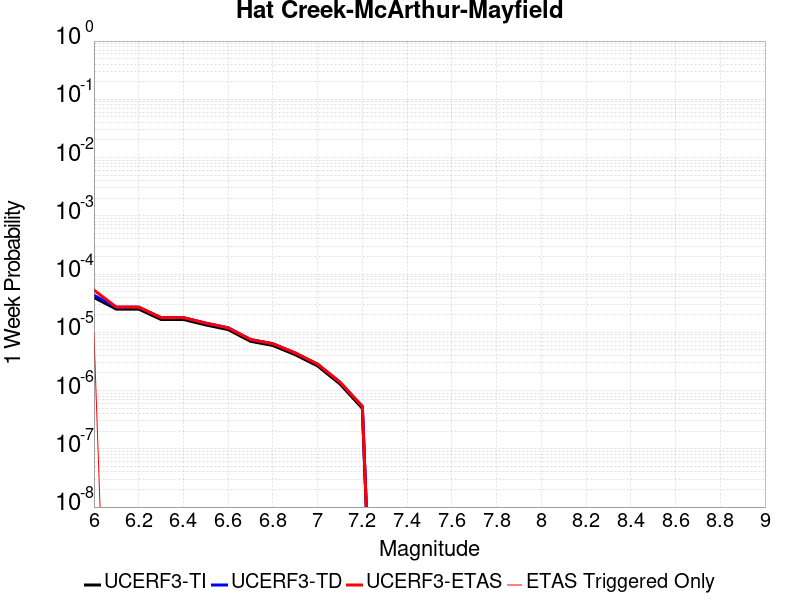 | 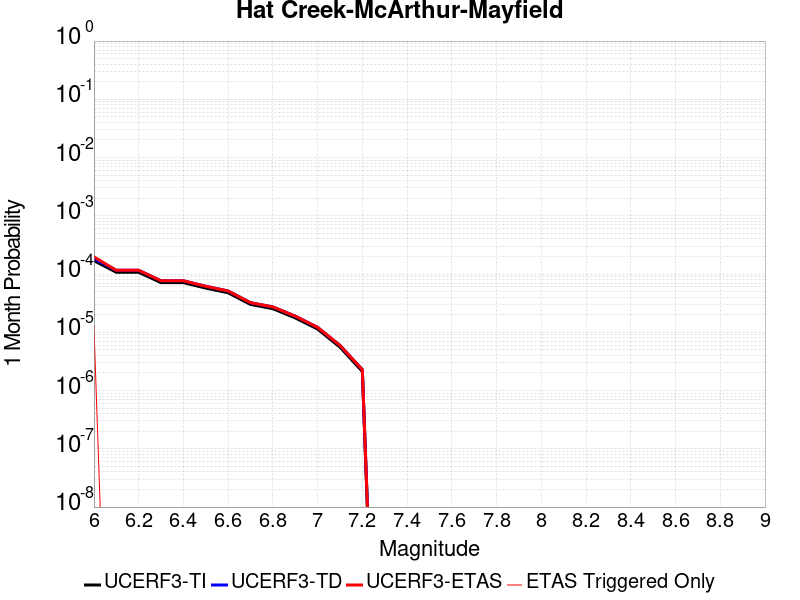 | 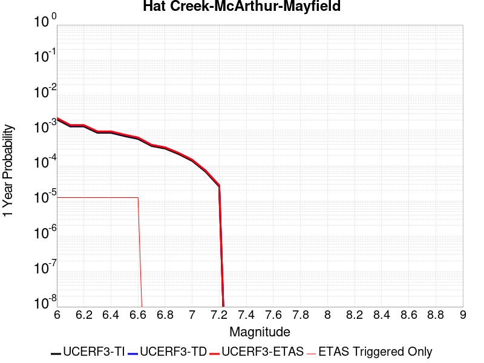 | 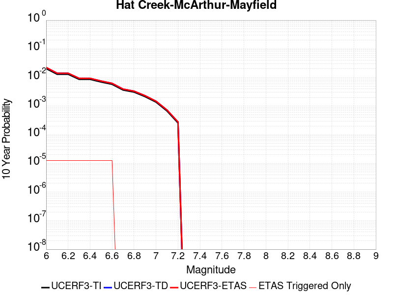 |

| Magnitude | 1 wk TI Prob | 1 wk TD Prob | 1 wk ETAS Prob | 1 wk ETAS/TD Gain | 1 wk ETAS Triggered Only | 1 mo TI Prob | 1 mo TD Prob | 1 mo ETAS Prob | 1 mo ETAS/TD Gain | 1 mo ETAS Triggered Only | 1 yr TI Prob | 1 yr TD Prob | 1 yr ETAS Prob | 1 yr ETAS/TD Gain | 1 yr ETAS Triggered Only | 10 yr TI Prob | 10 yr TD Prob | 10 yr ETAS Prob | 10 yr ETAS/TD Gain | 10 yr ETAS Triggered Only |
|-----|-----|-----|-----|-----|-----|-----|-----|-----|-----|-----|-----|-----|-----|-----|-----|-----|-----|-----|-----|-----|
| 6.0 | 3.967457E-5 | 4.315831E-5 | 5.3157877E-5 | 1.231695 | 1.0E-5 | 1.7002279E-4 | 1.8495171E-4 | 1.9494987E-4 | 1.0540582 | 1.0E-5 | 0.002068062 | 0.002249576 | 0.0022595534 | 1.0044353 | 1.0E-5 | 0.02048922 | 0.022280399 | 0.022299953 | 1.0008776 | 2.0E-5 |
| 6.1 | 2.5044013E-5 | 2.7071164E-5 | 2.7071164E-5 | 1.0 | 0.0 | 1.0732707E-4 | 1.1601429E-4 | 1.1601429E-4 | 1.0 | 0.0 | 0.0013059238 | 0.0014115906 | 0.0014215765 | 1.0070742 | 1.0E-5 | 0.01298276 | 0.01402966 | 0.01404938 | 1.0014056 | 2.0E-5 |
| 6.2 | 2.5044013E-5 | 2.7071164E-5 | 2.7071164E-5 | 1.0 | 0.0 | 1.0732707E-4 | 1.1601429E-4 | 1.1601429E-4 | 1.0 | 0.0 | 0.0013059238 | 0.0014115906 | 0.0014215765 | 1.0070742 | 1.0E-5 | 0.01298276 | 0.01402966 | 0.01404938 | 1.0014056 | 2.0E-5 |
| 6.3 | 1.6624012E-5 | 1.7891072E-5 | 1.7891072E-5 | 1.0 | 0.0 | 7.124382E-5 | 7.6673816E-5 | 7.6673816E-5 | 1.0 | 0.0 | 8.670483E-4 | 9.331125E-4 | 9.4310316E-4 | 1.0107068 | 1.0E-5 | 0.008636732 | 0.009292879 | 0.009302787 | 1.0010661 | 1.0E-5 |
| 6.4 | 1.6624012E-5 | 1.7891072E-5 | 1.7891072E-5 | 1.0 | 0.0 | 7.124382E-5 | 7.6673816E-5 | 7.6673816E-5 | 1.0 | 0.0 | 8.670483E-4 | 9.331125E-4 | 9.4310316E-4 | 1.0107068 | 1.0E-5 | 0.008636732 | 0.009292879 | 0.009302787 | 1.0010661 | 1.0E-5 |
| 6.5 | 1.3394842E-5 | 1.4392137E-5 | 1.4392137E-5 | 1.0 | 0.0 | 5.7405203E-5 | 6.167916E-5 | 6.167916E-5 | 1.0 | 0.0 | 6.986842E-4 | 7.506906E-4 | 7.606831E-4 | 1.013311 | 1.0E-5 | 0.006964916 | 0.0074821403 | 0.007492066 | 1.0013266 | 1.0E-5 |
| 6.6 | 1.1137514E-5 | 1.1954546E-5 | 1.1954546E-5 | 1.0 | 0.0 | 4.7731326E-5 | 5.1232782E-5 | 5.1232782E-5 | 1.0 | 0.0 | 5.809739E-4 | 6.2358467E-4 | 6.335784E-4 | 1.0160263 | 1.0E-5 | 0.005794574 | 0.00621877 | 0.0062287077 | 1.001598 | 1.0E-5 |
| 6.7 | 7.0200663E-6 | 7.5242897E-6 | 7.5242897E-6 | 1.0 | 0.0 | 3.008565E-5 | 3.2246568E-5 | 3.2246568E-5 | 1.0 | 0.0 | 3.6623122E-4 | 3.925328E-4 | 3.925328E-4 | 1.0 | 0.0 | 0.0036562826 | 0.0039185574 | 0.0039185574 | 1.0 | 0.0 |
| 6.8 | 5.940172E-6 | 6.3654766E-6 | 6.3654766E-6 | 1.0 | 0.0 | 2.545763E-5 | 2.7280335E-5 | 2.7280335E-5 | 1.0 | 0.0 | 3.0990256E-4 | 3.3208873E-4 | 3.3208873E-4 | 1.0 | 0.0 | 0.0030947074 | 0.0033160534 | 0.0033160534 | 1.0 | 0.0 |
| 6.9 | 4.129831E-6 | 4.423547E-6 | 4.423547E-6 | 1.0 | 0.0 | 1.7699154E-5 | 1.8957926E-5 | 1.8957926E-5 | 1.0 | 0.0 | 2.154659E-4 | 2.3078908E-4 | 2.3078908E-4 | 1.0 | 0.0 | 0.002152571 | 0.0023055724 | 0.0023055724 | 1.0 | 0.0 |
| 7.0 | 2.6512955E-6 | 2.8374002E-6 | 2.8374002E-6 | 1.0 | 0.0 | 1.1362646E-5 | 1.2160232E-5 | 1.2160232E-5 | 1.0 | 0.0 | 1.3833142E-4 | 1.480412E-4 | 1.480412E-4 | 1.0 | 0.0 | 0.0013824535 | 0.0014794683 | 0.0014794683 | 1.0 | 0.0 |
| 7.1 | 1.2992575E-6 | 1.3909317E-6 | 1.3909317E-6 | 1.0 | 0.0 | 5.568235E-6 | 5.961124E-6 | 5.961124E-6 | 1.0 | 0.0 | 6.779115E-5 | 7.257448E-5 | 7.257448E-5 | 1.0 | 0.0 | 6.7770475E-4 | 7.2552945E-4 | 7.2552945E-4 | 1.0 | 0.0 |
| 7.2 | 4.968191E-7 | 5.3271475E-7 | 5.3271475E-7 | 1.0 | 0.0 | 2.1292228E-6 | 2.283062E-6 | 2.283062E-6 | 1.0 | 0.0 | 2.592298E-5 | 2.7796052E-5 | 2.7796052E-5 | 1.0 | 0.0 | 2.5919956E-4 | 2.7793812E-4 | 2.7793812E-4 | 1.0 | 0.0 |

## San Cayetano
*[(top)](#table-of-contents)*

| 1 Week | 1 Month | 1 Year | 10 Year |
|-----|-----|-----|-----|
|  | 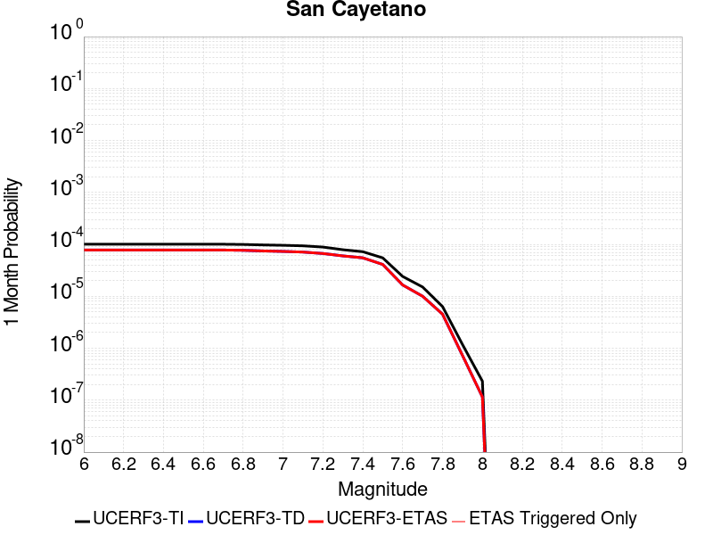 | 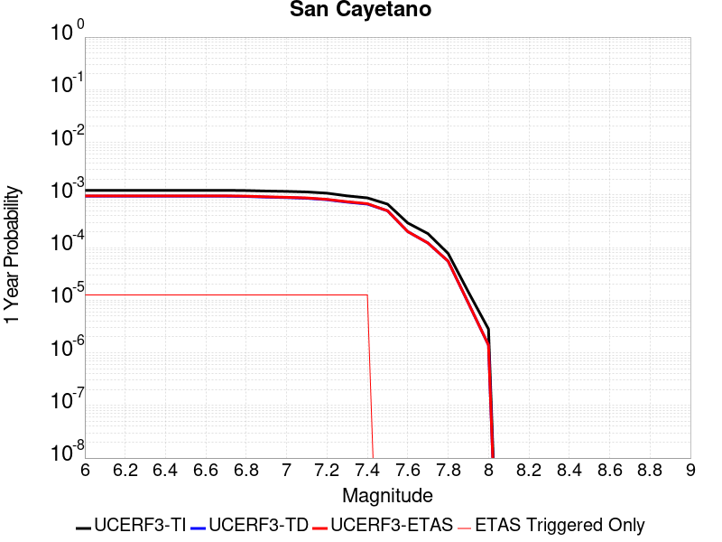 | 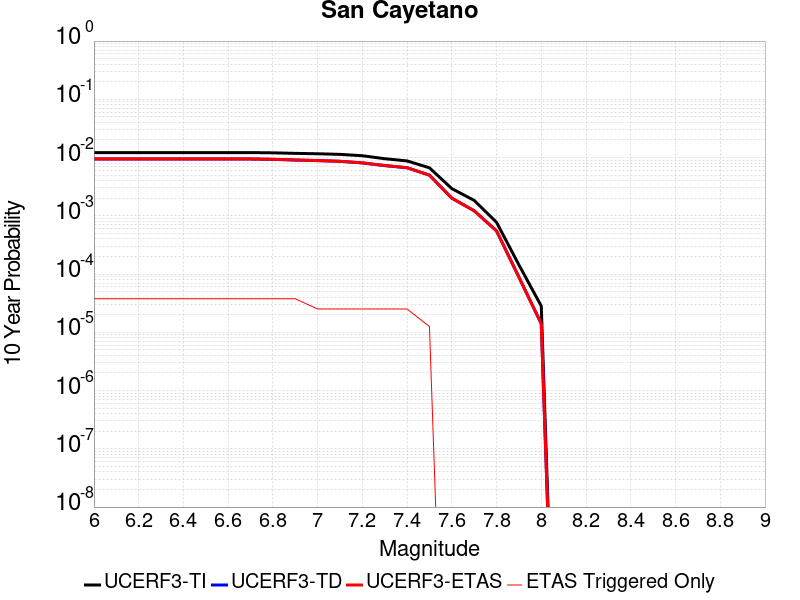 |

| Magnitude | 1 wk TI Prob | 1 wk TD Prob | 1 wk ETAS Prob | 1 wk ETAS/TD Gain | 1 wk ETAS Triggered Only | 1 mo TI Prob | 1 mo TD Prob | 1 mo ETAS Prob | 1 mo ETAS/TD Gain | 1 mo ETAS Triggered Only | 1 yr TI Prob | 1 yr TD Prob | 1 yr ETAS Prob | 1 yr ETAS/TD Gain | 1 yr ETAS Triggered Only | 10 yr TI Prob | 10 yr TD Prob | 10 yr ETAS Prob | 10 yr ETAS/TD Gain | 10 yr ETAS Triggered Only |
|-----|-----|-----|-----|-----|-----|-----|-----|-----|-----|-----|-----|-----|-----|-----|-----|-----|-----|-----|-----|-----|
| 6.0 | 2.3476267E-5 | 1.8169216E-5 | 1.8169216E-5 | 1.0 | 0.0 | 1.0060869E-4 | 7.786576E-5 | 7.786576E-5 | 1.0 | 0.0 | 0.0012242225 | 9.4760704E-4 | 9.575976E-4 | 1.0105429 | 1.0E-5 | 0.012175002 | 0.00943675 | 0.0094664665 | 1.003149 | 3.0E-5 |
| 6.1 | 2.3476267E-5 | 1.8169216E-5 | 1.8169216E-5 | 1.0 | 0.0 | 1.0060869E-4 | 7.786576E-5 | 7.786576E-5 | 1.0 | 0.0 | 0.0012242225 | 9.4760704E-4 | 9.575976E-4 | 1.0105429 | 1.0E-5 | 0.012175002 | 0.00943675 | 0.0094664665 | 1.003149 | 3.0E-5 |
| 6.2 | 2.3476267E-5 | 1.8169216E-5 | 1.8169216E-5 | 1.0 | 0.0 | 1.0060869E-4 | 7.786576E-5 | 7.786576E-5 | 1.0 | 0.0 | 0.0012242225 | 9.4760704E-4 | 9.575976E-4 | 1.0105429 | 1.0E-5 | 0.012175002 | 0.00943675 | 0.0094664665 | 1.003149 | 3.0E-5 |
| 6.3 | 2.3476267E-5 | 1.8169216E-5 | 1.8169216E-5 | 1.0 | 0.0 | 1.0060869E-4 | 7.786576E-5 | 7.786576E-5 | 1.0 | 0.0 | 0.0012242225 | 9.4760704E-4 | 9.575976E-4 | 1.0105429 | 1.0E-5 | 0.012175002 | 0.00943675 | 0.0094664665 | 1.003149 | 3.0E-5 |
| 6.4 | 2.3476267E-5 | 1.8169216E-5 | 1.8169216E-5 | 1.0 | 0.0 | 1.0060869E-4 | 7.786576E-5 | 7.786576E-5 | 1.0 | 0.0 | 0.0012242225 | 9.4760704E-4 | 9.575976E-4 | 1.0105429 | 1.0E-5 | 0.012175002 | 0.00943675 | 0.0094664665 | 1.003149 | 3.0E-5 |
| 6.5 | 2.3476267E-5 | 1.8169216E-5 | 1.8169216E-5 | 1.0 | 0.0 | 1.0060869E-4 | 7.786576E-5 | 7.786576E-5 | 1.0 | 0.0 | 0.0012242225 | 9.4760704E-4 | 9.575976E-4 | 1.0105429 | 1.0E-5 | 0.012175002 | 0.00943675 | 0.0094664665 | 1.003149 | 3.0E-5 |
| 6.6 | 2.3476267E-5 | 1.8169216E-5 | 1.8169216E-5 | 1.0 | 0.0 | 1.0060869E-4 | 7.786576E-5 | 7.786576E-5 | 1.0 | 0.0 | 0.0012242225 | 9.4760704E-4 | 9.575976E-4 | 1.0105429 | 1.0E-5 | 0.012175002 | 0.00943675 | 0.0094664665 | 1.003149 | 3.0E-5 |
| 6.7 | 2.3476267E-5 | 1.8169216E-5 | 1.8169216E-5 | 1.0 | 0.0 | 1.0060869E-4 | 7.786576E-5 | 7.786576E-5 | 1.0 | 0.0 | 0.0012242225 | 9.4760704E-4 | 9.575976E-4 | 1.0105429 | 1.0E-5 | 0.012175002 | 0.00943675 | 0.0094664665 | 1.003149 | 3.0E-5 |
| 6.8 | 2.3241924E-5 | 1.7936945E-5 | 1.7936945E-5 | 1.0 | 0.0 | 9.960445E-5 | 7.687038E-5 | 7.687038E-5 | 1.0 | 0.0 | 0.0012120095 | 9.354987E-4 | 9.4548933E-4 | 1.0106795 | 1.0E-5 | 0.012054204 | 0.0093166195 | 0.00934634 | 1.00319 | 3.0E-5 |
| 6.9 | 2.2761007E-5 | 1.7432383E-5 | 1.7432383E-5 | 1.0 | 0.0 | 9.7543525E-5 | 7.47081E-5 | 7.47081E-5 | 1.0 | 0.0 | 0.0011869454 | 9.09195E-4 | 9.1918587E-4 | 1.0109887 | 1.0E-5 | 0.011806256 | 0.009055741 | 0.00908547 | 1.0032828 | 3.0E-5 |
| 7.0 | 2.240283E-5 | 1.7066137E-5 | 1.7066137E-5 | 1.0 | 0.0 | 9.600859E-5 | 7.313856E-5 | 7.313856E-5 | 1.0 | 0.0 | 0.0011682777 | 8.9010154E-4 | 9.0009265E-4 | 1.0112246 | 1.0E-5 | 0.011621549 | 0.008866336 | 0.008886159 | 1.0022358 | 2.0E-5 |
| 7.1 | 2.1871154E-5 | 1.658602E-5 | 1.658602E-5 | 1.0 | 0.0 | 9.373015E-5 | 7.108103E-5 | 7.108103E-5 | 1.0 | 0.0 | 0.0011405671 | 8.6507126E-4 | 8.750626E-4 | 1.0115497 | 1.0E-5 | 0.011347309 | 0.008617996 | 0.008637824 | 1.0023007 | 2.0E-5 |
| 7.2 | 2.0714133E-5 | 1.5564563E-5 | 1.5564563E-5 | 1.0 | 0.0 | 8.8771834E-5 | 6.670358E-5 | 6.670358E-5 | 1.0 | 0.0 | 0.0010802611 | 8.118168E-4 | 8.2180864E-4 | 1.012308 | 1.0E-5 | 0.010750249 | 0.008089443 | 0.008109281 | 1.0024524 | 2.0E-5 |
| 7.3 | 1.8408395E-5 | 1.3996829E-5 | 1.3996829E-5 | 1.0 | 0.0 | 7.8890735E-5 | 5.9985046E-5 | 5.9985046E-5 | 1.0 | 0.0 | 9.600714E-4 | 7.300762E-4 | 7.400689E-4 | 1.0136873 | 1.0E-5 | 0.009559342 | 0.0072776447 | 0.007297499 | 1.0027281 | 2.0E-5 |
| 7.4 | 1.6856795E-5 | 1.285006E-5 | 1.285006E-5 | 1.0 | 0.0 | 7.2241404E-5 | 5.5070537E-5 | 5.5070537E-5 | 1.0 | 0.0 | 8.7918417E-4 | 6.7028037E-4 | 6.802737E-4 | 1.0149091 | 1.0E-5 | 0.00875714 | 0.0066834087 | 0.006703275 | 1.0029725 | 2.0E-5 |
| 7.5 | 1.2822778E-5 | 9.577415E-6 | 9.577415E-6 | 1.0 | 0.0 | 5.495361E-5 | 4.1045427E-5 | 4.1045427E-5 | 1.0 | 0.0 | 6.688548E-4 | 4.9961504E-4 | 4.9961504E-4 | 1.0 | 0.0 | 0.006668452 | 0.0049851923 | 0.004995142 | 1.0019959 | 1.0E-5 |
| 7.6 | 5.6272684E-6 | 3.854899E-6 | 3.854899E-6 | 1.0 | 0.0 | 2.4116642E-5 | 1.6520893E-5 | 1.6520893E-5 | 1.0 | 0.0 | 2.9358055E-4 | 2.0112342E-4 | 2.0112342E-4 | 1.0 | 0.0 | 0.0029319301 | 0.0020094248 | 0.0020094248 | 1.0 | 0.0 |
| 7.7 | 3.5261346E-6 | 2.3407094E-6 | 2.3407094E-6 | 1.0 | 0.0 | 1.5111918E-5 | 1.0031574E-5 | 1.0031574E-5 | 1.0 | 0.0 | 1.8397206E-4 | 1.2212765E-4 | 1.2212765E-4 | 1.0 | 0.0 | 0.0018381984 | 0.0012206127 | 0.0012206127 | 1.0 | 0.0 |
| 7.8 | 1.4826929E-6 | 1.0564395E-6 | 1.0564395E-6 | 1.0 | 0.0 | 6.354383E-6 | 4.52759E-6 | 4.52759E-6 | 1.0 | 0.0 | 7.736187E-5 | 5.5122033E-5 | 5.5122033E-5 | 1.0 | 0.0 | 7.733494E-4 | 5.510856E-4 | 5.510856E-4 | 1.0 | 0.0 |
| 7.9 | 2.7568166E-7 | 1.6977887E-7 | 1.6977887E-7 | 1.0 | 0.0 | 1.1814923E-6 | 7.276235E-7 | 7.276235E-7 | 1.0 | 0.0 | 1.4384574E-5 | 8.85878E-6 | 8.85878E-6 | 1.0 | 0.0 | 1.4383643E-4 | 8.858431E-5 | 8.858431E-5 | 1.0 | 0.0 |
| 8.0 | 5.407832E-8 | 2.688677E-8 | 2.688677E-8 | 1.0 | 0.0 | 2.3176422E-7 | 1.15229014E-7 | 1.15229014E-7 | 1.0 | 0.0 | 2.8217257E-6 | 1.4029123E-6 | 1.4029123E-6 | 1.0 | 0.0 | 2.8216898E-5 | 1.40290385E-5 | 1.40290385E-5 | 1.0 | 0.0 |

## Eaton Roughs 2011 CFM
*[(top)](#table-of-contents)*

| 1 Week | 1 Month | 1 Year | 10 Year |
|-----|-----|-----|-----|
| 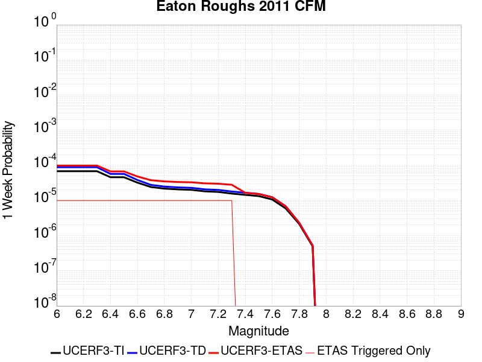 | 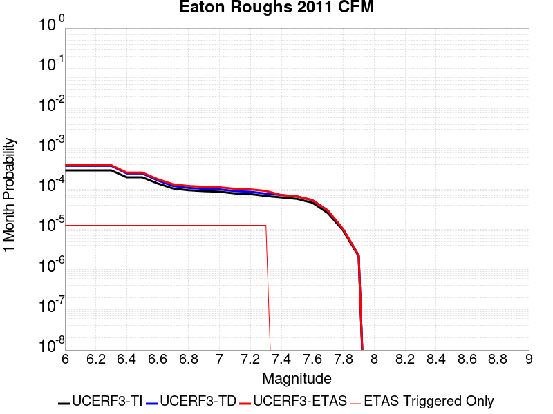 | 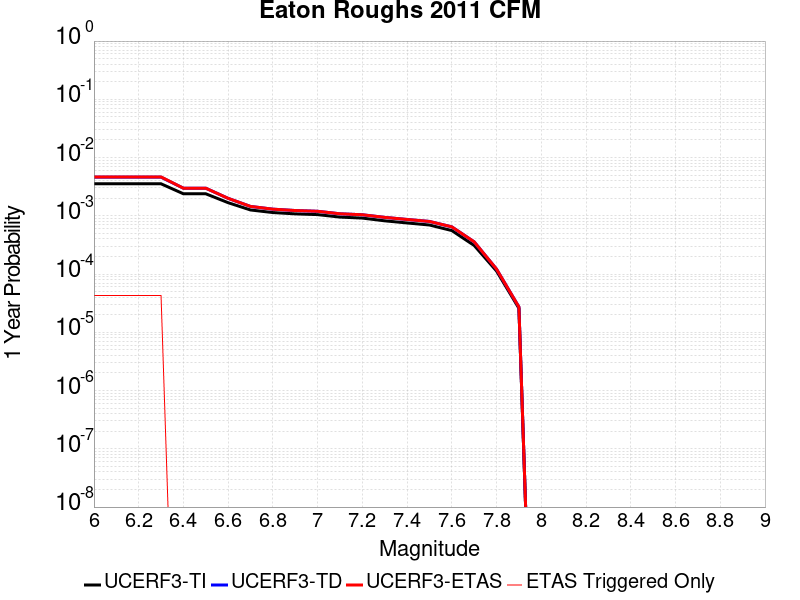 | 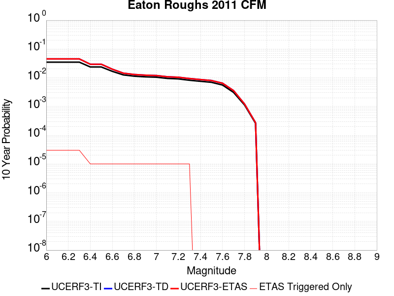 |

| Magnitude | 1 wk TI Prob | 1 wk TD Prob | 1 wk ETAS Prob | 1 wk ETAS/TD Gain | 1 wk ETAS Triggered Only | 1 mo TI Prob | 1 mo TD Prob | 1 mo ETAS Prob | 1 mo ETAS/TD Gain | 1 mo ETAS Triggered Only | 1 yr TI Prob | 1 yr TD Prob | 1 yr ETAS Prob | 1 yr ETAS/TD Gain | 1 yr ETAS Triggered Only | 10 yr TI Prob | 10 yr TD Prob | 10 yr ETAS Prob | 10 yr ETAS/TD Gain | 10 yr ETAS Triggered Only |
|-----|-----|-----|-----|-----|-----|-----|-----|-----|-----|-----|-----|-----|-----|-----|-----|-----|-----|-----|-----|-----|
| 6.0 | 6.8044945E-5 | 8.8434645E-5 | 9.843376E-5 | 1.1130679 | 1.0E-5 | 2.9158857E-4 | 3.7895713E-4 | 3.8895337E-4 | 1.0263782 | 1.0E-5 | 0.0035443127 | 0.0046046837 | 0.0046245917 | 1.0043234 | 2.0E-5 | 0.03488314 | 0.04516368 | 0.045192324 | 1.0006342 | 3.0E-5 |
| 6.1 | 6.8044945E-5 | 8.8434645E-5 | 9.843376E-5 | 1.1130679 | 1.0E-5 | 2.9158857E-4 | 3.7895713E-4 | 3.8895337E-4 | 1.0263782 | 1.0E-5 | 0.0035443127 | 0.0046046837 | 0.0046245917 | 1.0043234 | 2.0E-5 | 0.03488314 | 0.04516368 | 0.045192324 | 1.0006342 | 3.0E-5 |
| 6.2 | 6.8044945E-5 | 8.8434645E-5 | 9.843376E-5 | 1.1130679 | 1.0E-5 | 2.9158857E-4 | 3.7895713E-4 | 3.8895337E-4 | 1.0263782 | 1.0E-5 | 0.0035443127 | 0.0046046837 | 0.0046245917 | 1.0043234 | 2.0E-5 | 0.03488314 | 0.04516368 | 0.045192324 | 1.0006342 | 3.0E-5 |
| 6.3 | 6.8044945E-5 | 8.8434645E-5 | 9.843376E-5 | 1.1130679 | 1.0E-5 | 2.9158857E-4 | 3.7895713E-4 | 3.8895337E-4 | 1.0263782 | 1.0E-5 | 0.0035443127 | 0.0046046837 | 0.0046245917 | 1.0043234 | 2.0E-5 | 0.03488314 | 0.04516368 | 0.045192324 | 1.0006342 | 3.0E-5 |
| 6.4 | 4.5830013E-5 | 5.71553E-5 | 6.715473E-5 | 1.1749519 | 1.0E-5 | 1.9639956E-4 | 2.4493135E-4 | 2.549289E-4 | 1.0408177 | 1.0E-5 | 0.0023885423 | 0.002978342 | 0.0029883122 | 1.0033475 | 1.0E-5 | 0.023630321 | 0.029421948 | 0.029431652 | 1.0003299 | 1.0E-5 |
| 6.5 | 4.5830013E-5 | 5.71553E-5 | 6.715473E-5 | 1.1749519 | 1.0E-5 | 1.9639956E-4 | 2.4493135E-4 | 2.549289E-4 | 1.0408177 | 1.0E-5 | 0.0023885423 | 0.002978342 | 0.0029883122 | 1.0033475 | 1.0E-5 | 0.023630321 | 0.029421948 | 0.029431652 | 1.0003299 | 1.0E-5 |
| 6.6 | 3.222194E-5 | 3.8262962E-5 | 4.826258E-5 | 1.2613393 | 1.0E-5 | 1.3808672E-4 | 1.6397446E-4 | 1.7397282E-4 | 1.0609751 | 1.0E-5 | 0.0016799092 | 0.0019946485 | 0.0020046285 | 1.0050035 | 1.0E-5 | 0.016672665 | 0.019776754 | 0.019786557 | 1.0004957 | 1.0E-5 |
| 6.7 | 2.4155654E-5 | 2.7786275E-5 | 3.7785994E-5 | 1.35988 | 1.0E-5 | 1.0352012E-4 | 1.1907864E-4 | 1.2907745E-4 | 1.0839682 | 1.0E-5 | 0.0012596287 | 0.0014488265 | 0.001458812 | 1.0068921 | 1.0E-5 | 0.012525126 | 0.01439499 | 0.014404845 | 1.0006847 | 1.0E-5 |
| 6.8 | 2.1814667E-5 | 2.4940904E-5 | 3.4940655E-5 | 1.4009378 | 1.0E-5 | 9.348808E-5 | 1.0688523E-4 | 1.1688416E-4 | 1.0935483 | 1.0E-5 | 0.001137623 | 0.0013005546 | 0.0013105415 | 1.007679 | 1.0E-5 | 0.011318169 | 0.012930086 | 0.012939956 | 1.0007634 | 1.0E-5 |
| 6.9 | 2.0700467E-5 | 2.362897E-5 | 3.3628734E-5 | 1.4231993 | 1.0E-5 | 8.871327E-5 | 1.01263104E-4 | 1.1126209E-4 | 1.0987426 | 1.0E-5 | 0.0010795488 | 0.0012321841 | 0.0012421719 | 1.0081056 | 1.0E-5 | 0.010743194 | 0.012254083 | 0.01226396 | 1.0008061 | 1.0E-5 |
| 7.0 | 2.0104066E-5 | 2.2936536E-5 | 3.2936307E-5 | 1.4359757 | 1.0E-5 | 8.615744E-5 | 9.829576E-5 | 1.0829477E-4 | 1.1017238 | 1.0E-5 | 0.0010484619 | 0.0011960969 | 0.0012060849 | 1.0083505 | 1.0E-5 | 0.010435291 | 0.01189712 | 0.011907001 | 1.0008305 | 1.0E-5 |
| 7.1 | 1.8225232E-5 | 2.0773083E-5 | 3.0772877E-5 | 1.4813823 | 1.0E-5 | 7.81058E-5 | 8.902447E-5 | 9.902358E-5 | 1.1123186 | 1.0E-5 | 9.5052324E-4 | 0.0010833355 | 0.0010933247 | 1.0092207 | 1.0E-5 | 0.009464677 | 0.010780873 | 0.010790764 | 1.0009176 | 1.0E-5 |
| 7.2 | 1.7526572E-5 | 1.9993524E-5 | 2.9993325E-5 | 1.500152 | 1.0E-5 | 7.511172E-5 | 8.568373E-5 | 9.568287E-5 | 1.1166983 | 1.0E-5 | 9.141015E-4 | 0.0010427017 | 0.0010526913 | 1.0095805 | 1.0E-5 | 0.009103506 | 0.010378398 | 0.010388294 | 1.0009536 | 1.0E-5 |
| 7.3 | 1.5727232E-5 | 1.8021543E-5 | 2.8021363E-5 | 1.5548815 | 1.0E-5 | 6.740067E-5 | 7.72329E-5 | 8.723213E-5 | 1.1294684 | 1.0E-5 | 8.2029426E-4 | 9.399062E-4 | 9.498968E-4 | 1.0106294 | 1.0E-5 | 0.008172729 | 0.009359558 | 0.009369465 | 1.0010585 | 1.0E-5 |
| 7.4 | 1.4457361E-5 | 1.6598395E-5 | 1.6598395E-5 | 1.0 | 0.0 | 6.195865E-5 | 7.113405E-5 | 7.113405E-5 | 1.0 | 0.0 | 7.540854E-4 | 8.657138E-4 | 8.657138E-4 | 1.0 | 0.0 | 0.007515317 | 0.008623603 | 0.008623603 | 1.0 | 0.0 |
| 7.5 | 1.33280955E-5 | 1.5345471E-5 | 1.5345471E-5 | 1.0 | 0.0 | 5.711916E-5 | 6.576465E-5 | 6.576465E-5 | 1.0 | 0.0 | 6.9520384E-4 | 8.0039137E-4 | 8.0039137E-4 | 1.0 | 0.0 | 0.00693033 | 0.007975256 | 0.007975256 | 1.0 | 0.0 |
| 7.6 | 1.0699478E-5 | 1.2387852E-5 | 1.2387852E-5 | 1.0 | 0.0 | 4.5854096E-5 | 5.3089716E-5 | 5.3089716E-5 | 1.0 | 0.0 | 5.581306E-4 | 6.461761E-4 | 6.461761E-4 | 1.0 | 0.0 | 0.005567309 | 0.0064430824 | 0.0064430824 | 1.0 | 0.0 |
| 7.7 | 5.9390236E-6 | 6.8529853E-6 | 6.8529853E-6 | 1.0 | 0.0 | 2.545271E-5 | 2.9369607E-5 | 2.9369607E-5 | 1.0 | 0.0 | 3.0984267E-4 | 3.5751655E-4 | 3.5751655E-4 | 1.0 | 0.0 | 0.0030941102 | 0.0035694393 | 0.0035694393 | 1.0 | 0.0 |
| 7.8 | 2.1622036E-6 | 2.329702E-6 | 2.329702E-6 | 1.0 | 0.0 | 9.266554E-6 | 9.984399E-6 | 9.984399E-6 | 1.0 | 0.0 | 1.1281446E-4 | 1.21553356E-4 | 1.21553356E-4 | 1.0 | 0.0 | 0.001127572 | 0.0012148687 | 0.0012148687 | 1.0 | 0.0 |
| 7.9 | 4.9586197E-7 | 5.2189216E-7 | 5.2189216E-7 | 1.0 | 0.0 | 2.125121E-6 | 2.2366787E-6 | 2.2366787E-6 | 1.0 | 0.0 | 2.5873042E-5 | 2.7231245E-5 | 2.7231245E-5 | 1.0 | 0.0 | 2.5870028E-4 | 2.7228118E-4 | 2.7228118E-4 | 1.0 | 0.0 |

## Great Valley 08 (Quinto)
*[(top)](#table-of-contents)*

| 1 Week | 1 Month | 1 Year | 10 Year |
|-----|-----|-----|-----|
|  | 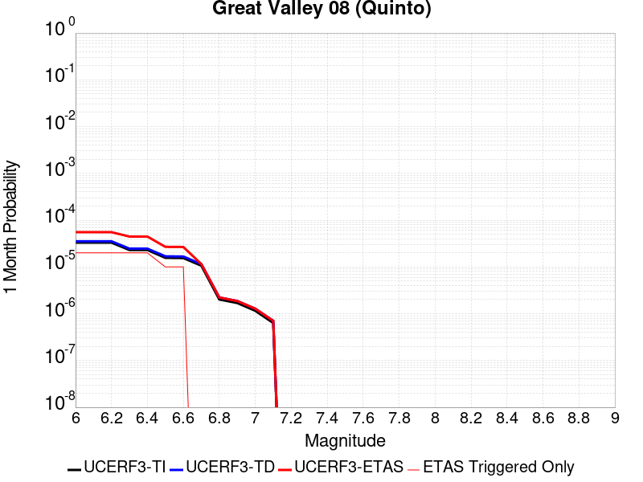 | 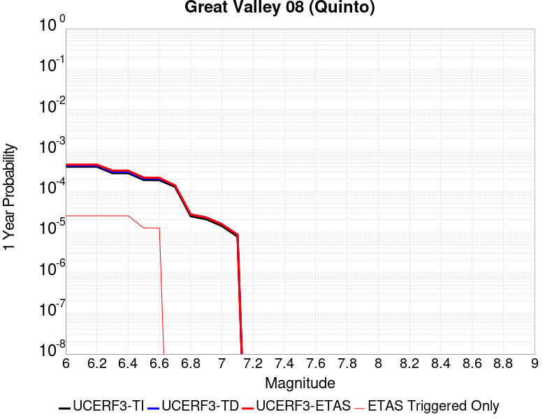 | 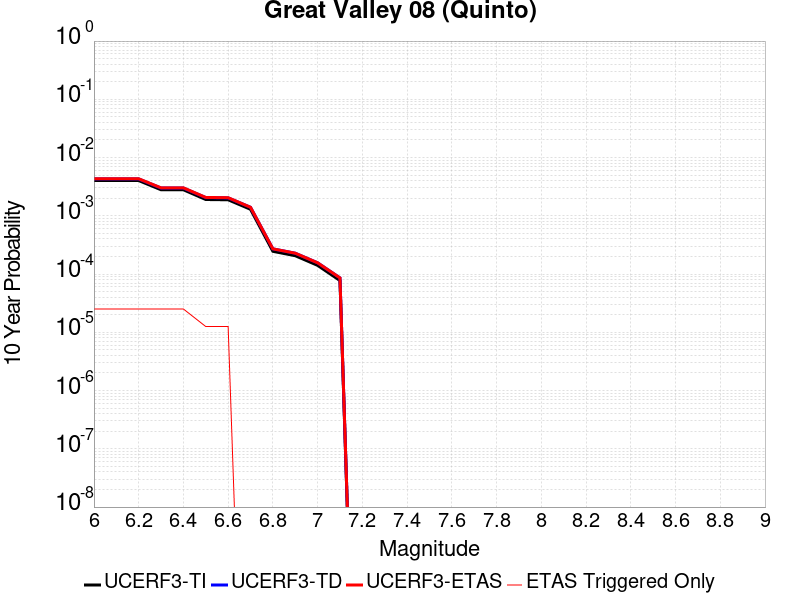 |

| Magnitude | 1 wk TI Prob | 1 wk TD Prob | 1 wk ETAS Prob | 1 wk ETAS/TD Gain | 1 wk ETAS Triggered Only | 1 mo TI Prob | 1 mo TD Prob | 1 mo ETAS Prob | 1 mo ETAS/TD Gain | 1 mo ETAS Triggered Only | 1 yr TI Prob | 1 yr TD Prob | 1 yr ETAS Prob | 1 yr ETAS/TD Gain | 1 yr ETAS Triggered Only | 10 yr TI Prob | 10 yr TD Prob | 10 yr ETAS Prob | 10 yr ETAS/TD Gain | 10 yr ETAS Triggered Only |
|-----|-----|-----|-----|-----|-----|-----|-----|-----|-----|-----|-----|-----|-----|-----|-----|-----|-----|-----|-----|-----|
| 6.0 | 7.737697E-6 | 8.253038E-6 | 8.253038E-6 | 1.0 | 0.0 | 3.3161137E-5 | 3.536979E-5 | 5.536908E-5 | 1.5654343 | 2.0E-5 | 4.0366207E-4 | 4.3056096E-4 | 4.5055235E-4 | 1.0464311 | 2.0E-5 | 0.004029296 | 0.0042991205 | 0.0043289918 | 1.0069481 | 3.0E-5 |
| 6.1 | 7.737697E-6 | 8.253038E-6 | 8.253038E-6 | 1.0 | 0.0 | 3.3161137E-5 | 3.536979E-5 | 5.536908E-5 | 1.5654343 | 2.0E-5 | 4.0366207E-4 | 4.3056096E-4 | 4.5055235E-4 | 1.0464311 | 2.0E-5 | 0.004029296 | 0.0042991205 | 0.0043289918 | 1.0069481 | 3.0E-5 |
| 6.2 | 7.737697E-6 | 8.253038E-6 | 8.253038E-6 | 1.0 | 0.0 | 3.3161137E-5 | 3.536979E-5 | 5.536908E-5 | 1.5654343 | 2.0E-5 | 4.0366207E-4 | 4.3056096E-4 | 4.5055235E-4 | 1.0464311 | 2.0E-5 | 0.004029296 | 0.0042991205 | 0.0043289918 | 1.0069481 | 3.0E-5 |
| 6.3 | 5.374012E-6 | 5.7505736E-6 | 5.7505736E-6 | 1.0 | 0.0 | 2.3031276E-5 | 2.4645145E-5 | 4.4644654E-5 | 1.8114989 | 2.0E-5 | 2.803697E-4 | 3.0002446E-4 | 3.2001847E-4 | 1.0666412 | 2.0E-5 | 0.0028001624 | 0.0029972875 | 0.0030271974 | 1.009979 | 3.0E-5 |
| 6.4 | 5.374012E-6 | 5.7505736E-6 | 5.7505736E-6 | 1.0 | 0.0 | 2.3031276E-5 | 2.4645145E-5 | 4.4644654E-5 | 1.8114989 | 2.0E-5 | 2.803697E-4 | 3.0002446E-4 | 3.2001847E-4 | 1.0666412 | 2.0E-5 | 0.0028001624 | 0.0029972875 | 0.0030271974 | 1.009979 | 3.0E-5 |
| 6.5 | 3.65427E-6 | 3.941324E-6 | 3.941324E-6 | 1.0 | 0.0 | 1.5661062E-5 | 1.689132E-5 | 2.689115E-5 | 1.5920101 | 1.0E-5 | 1.9065675E-4 | 2.0563944E-4 | 2.156374E-4 | 1.0486188 | 1.0E-5 | 0.0019049325 | 0.0020551833 | 0.0020651626 | 1.0048558 | 1.0E-5 |
| 6.6 | 3.6143538E-6 | 3.8985104E-6 | 3.8985104E-6 | 1.0 | 0.0 | 1.5489995E-5 | 1.6707834E-5 | 2.6707668E-5 | 1.5985116 | 1.0E-5 | 1.8857437E-4 | 2.0340596E-4 | 2.1340392E-4 | 1.0491527 | 1.0E-5 | 0.0018841444 | 0.0020328893 | 0.0020428689 | 1.0049092 | 1.0E-5 |
| 6.7 | 2.4821015E-6 | 2.6857067E-6 | 2.6857067E-6 | 1.0 | 0.0 | 1.0637535E-5 | 1.1510153E-5 | 1.1510153E-5 | 1.0 | 0.0 | 1.2950429E-4 | 1.4013276E-4 | 1.4013276E-4 | 1.0 | 0.0 | 0.0012942884 | 0.0014009989 | 0.0014009989 | 1.0 | 0.0 |
| 6.8 | 4.7110538E-7 | 5.193021E-7 | 5.193021E-7 | 1.0 | 0.0 | 2.0190216E-6 | 2.2255786E-6 | 2.2255786E-6 | 1.0 | 0.0 | 2.458131E-5 | 2.70961E-5 | 2.70961E-5 | 1.0 | 0.0 | 2.457859E-4 | 2.7092977E-4 | 2.7092977E-4 | 1.0 | 0.0 |
| 6.9 | 3.958685E-7 | 4.3703452E-7 | 4.3703452E-7 | 1.0 | 0.0 | 1.6965782E-6 | 1.8730038E-6 | 1.8730038E-6 | 1.0 | 0.0 | 2.0655643E-5 | 2.28036E-5 | 2.28036E-5 | 1.0 | 0.0 | 2.0653724E-4 | 2.2801422E-4 | 2.2801422E-4 | 1.0 | 0.0 |
| 7.0 | 2.70294E-7 | 2.9920008E-7 | 2.9920008E-7 | 1.0 | 0.0 | 1.1584025E-6 | 1.2822856E-6 | 1.2822856E-6 | 1.0 | 0.0 | 1.4103458E-5 | 1.5611728E-5 | 1.5611728E-5 | 1.0 | 0.0 | 1.4102564E-4 | 1.5610759E-4 | 1.5610759E-4 | 1.0 | 0.0 |
| 7.1 | 1.4828602E-7 | 1.6469107E-7 | 1.6469107E-7 | 1.0 | 0.0 | 6.3551136E-7 | 7.058187E-7 | 7.058187E-7 | 1.0 | 0.0 | 7.737323E-6 | 8.593317E-6 | 8.593317E-6 | 1.0 | 0.0 | 7.737054E-5 | 8.593065E-5 | 8.593065E-5 | 1.0 | 0.0 |

## San Juan
*[(top)](#table-of-contents)*

| 1 Week | 1 Month | 1 Year | 10 Year |
|-----|-----|-----|-----|
| 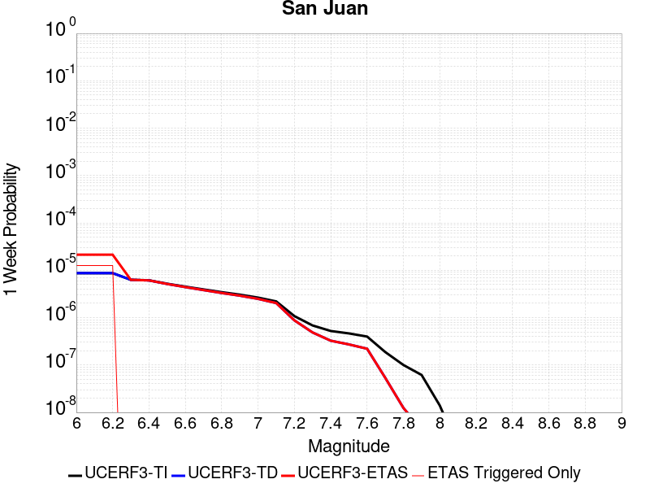 |  | 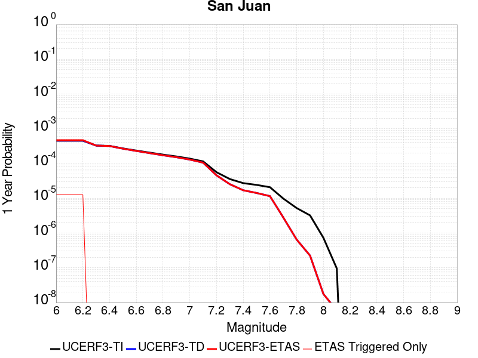 | 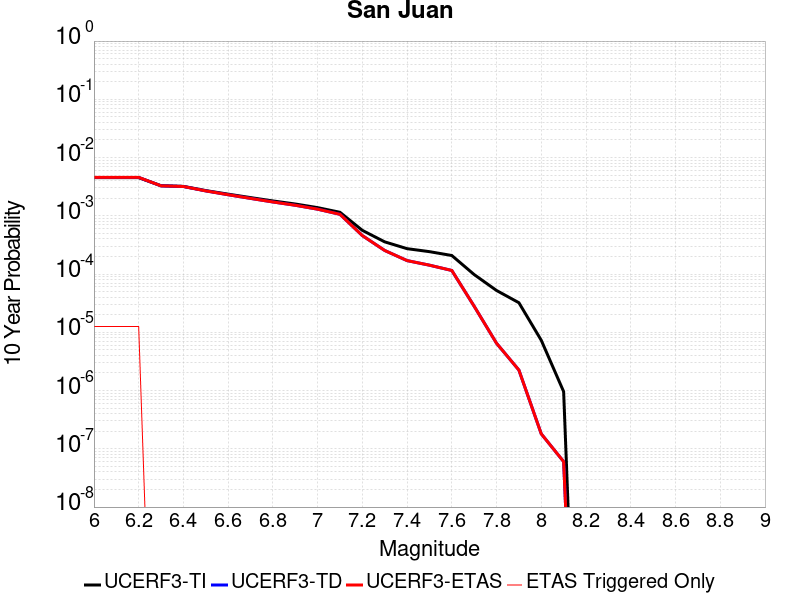 |

| Magnitude | 1 wk TI Prob | 1 wk TD Prob | 1 wk ETAS Prob | 1 wk ETAS/TD Gain | 1 wk ETAS Triggered Only | 1 mo TI Prob | 1 mo TD Prob | 1 mo ETAS Prob | 1 mo ETAS/TD Gain | 1 mo ETAS Triggered Only | 1 yr TI Prob | 1 yr TD Prob | 1 yr ETAS Prob | 1 yr ETAS/TD Gain | 1 yr ETAS Triggered Only | 10 yr TI Prob | 10 yr TD Prob | 10 yr ETAS Prob | 10 yr ETAS/TD Gain | 10 yr ETAS Triggered Only |
|-----|-----|-----|-----|-----|-----|-----|-----|-----|-----|-----|-----|-----|-----|-----|-----|-----|-----|-----|-----|-----|
| 6.0 | 8.682808E-6 | 8.74917E-6 | 2.8748995E-5 | 3.2859113 | 2.0E-5 | 3.72115E-5 | 3.749593E-5 | 5.749518E-5 | 1.5333712 | 2.0E-5 | 4.5295584E-4 | 4.5642213E-4 | 4.76413E-4 | 1.043799 | 2.0E-5 | 0.004520337 | 0.004555389 | 0.004585252 | 1.0065556 | 3.0E-5 |
| 6.1 | 8.682808E-6 | 8.74917E-6 | 2.8748995E-5 | 3.2859113 | 2.0E-5 | 3.72115E-5 | 3.749593E-5 | 5.749518E-5 | 1.5333712 | 2.0E-5 | 4.5295584E-4 | 4.5642213E-4 | 4.76413E-4 | 1.043799 | 2.0E-5 | 0.004520337 | 0.004555389 | 0.004585252 | 1.0065556 | 3.0E-5 |
| 6.2 | 8.682808E-6 | 8.74917E-6 | 2.8748995E-5 | 3.2859113 | 2.0E-5 | 3.72115E-5 | 3.749593E-5 | 5.749518E-5 | 1.5333712 | 2.0E-5 | 4.5295584E-4 | 4.5642213E-4 | 4.76413E-4 | 1.043799 | 2.0E-5 | 0.004520337 | 0.004555389 | 0.004585252 | 1.0065556 | 3.0E-5 |
| 6.3 | 6.3054235E-6 | 6.282591E-6 | 1.6282529E-5 | 2.59169 | 1.0E-5 | 2.7022963E-5 | 2.692512E-5 | 3.6924852E-5 | 1.3713903 | 1.0E-5 | 3.2895492E-4 | 3.2776545E-4 | 3.3776215E-4 | 1.0304996 | 1.0E-5 | 0.003284684 | 0.0032730205 | 0.003292955 | 1.0060905 | 2.0E-5 |
| 6.4 | 6.1490473E-6 | 6.1144706E-6 | 1.6114409E-5 | 2.6354547 | 1.0E-5 | 2.6352795E-5 | 2.6204618E-5 | 3.6204357E-5 | 1.3816022 | 1.0E-5 | 3.2079802E-4 | 3.189959E-4 | 3.289927E-4 | 1.0313383 | 1.0E-5 | 0.0032033534 | 0.0031855768 | 0.003205513 | 1.0062582 | 2.0E-5 |
| 6.5 | 5.204848E-6 | 5.137238E-6 | 1.5137187E-5 | 2.9465613 | 1.0E-5 | 2.23063E-5 | 2.2016555E-5 | 3.2016334E-5 | 1.4541937 | 1.0E-5 | 2.7154534E-4 | 2.6801953E-4 | 2.7801684E-4 | 1.0373007 | 1.0E-5 | 0.0027121378 | 0.0026771172 | 0.0026970638 | 1.0074507 | 2.0E-5 |
| 6.6 | 4.5179986E-6 | 4.415036E-6 | 1.4414992E-5 | 3.2649772 | 1.0E-5 | 1.9362706E-5 | 1.892145E-5 | 2.8921262E-5 | 1.5284907 | 1.0E-5 | 2.3571544E-4 | 2.303451E-4 | 2.403428E-4 | 1.0434031 | 1.0E-5 | 0.0023546559 | 0.0023012008 | 0.0023211548 | 1.0086712 | 2.0E-5 |
| 6.7 | 3.9442616E-6 | 3.8198336E-6 | 1.3819796E-5 | 3.6179051 | 1.0E-5 | 1.6903869E-5 | 1.6370615E-5 | 2.6370451E-5 | 1.6108406 | 1.0E-5 | 2.0578515E-4 | 1.9929469E-4 | 2.092927E-4 | 1.050167 | 1.0E-5 | 0.002055947 | 0.001991285 | 0.0020112451 | 1.0100237 | 2.0E-5 |
| 6.8 | 3.4536245E-6 | 3.3163408E-6 | 1.3316308E-5 | 4.015362 | 1.0E-5 | 1.4801163E-5 | 1.4212815E-5 | 2.4212673E-5 | 1.7035804 | 1.0E-5 | 1.8018926E-4 | 1.7302789E-4 | 1.8302616E-4 | 1.0577842 | 1.0E-5 | 0.0018004322 | 0.001729051 | 0.0017390337 | 1.0057735 | 1.0E-5 |
| 6.9 | 3.059865E-6 | 2.9120363E-6 | 1.2912007E-5 | 4.434013 | 1.0E-5 | 1.3113641E-5 | 1.2480099E-5 | 2.2479975E-5 | 1.8012657 | 1.0E-5 | 1.596469E-4 | 1.5193518E-4 | 1.6193367E-4 | 1.0658076 | 1.0E-5 | 0.0015953224 | 0.0015184281 | 0.0015284129 | 1.0065757 | 1.0E-5 |
| 7.0 | 2.6504351E-6 | 2.492005E-6 | 1.249198E-5 | 5.012823 | 1.0E-5 | 1.1358958E-5 | 1.0679981E-5 | 2.0679874E-5 | 1.9363213 | 1.0E-5 | 1.3828653E-4 | 1.3002155E-4 | 1.4002025E-4 | 1.0769004 | 1.0E-5 | 0.0013820052 | 0.001299567 | 0.0013095541 | 1.0076848 | 1.0E-5 |
| 7.1 | 2.2039317E-6 | 2.0338366E-6 | 1.2033816E-5 | 5.9168057 | 1.0E-5 | 9.445387E-6 | 8.716416E-6 | 1.871633E-5 | 2.1472504 | 1.0E-5 | 1.1499152E-4 | 1.0611773E-4 | 1.1611667E-4 | 1.0942249 | 1.0E-5 | 0.0011493203 | 0.0010607811 | 0.0010707704 | 1.009417 | 1.0E-5 |
| 7.2 | 1.0786707E-6 | 8.770239E-7 | 8.770239E-7 | 1.0 | 0.0 | 4.622866E-6 | 3.7586685E-6 | 3.7586685E-6 | 1.0 | 0.0 | 5.628194E-5 | 4.576084E-5 | 4.576084E-5 | 1.0 | 0.0 | 5.6267687E-4 | 4.5757365E-4 | 4.5757365E-4 | 1.0 | 0.0 |
| 7.3 | 6.846433E-7 | 4.868812E-7 | 4.868812E-7 | 1.0 | 0.0 | 2.9341822E-6 | 2.086632E-6 | 2.086632E-6 | 1.0 | 0.0 | 3.5723086E-5 | 2.5404452E-5 | 2.5404452E-5 | 1.0 | 0.0 | 3.571734E-4 | 2.5405022E-4 | 2.5405022E-4 | 1.0 | 0.0 |
| 7.4 | 5.23043E-7 | 3.2627884E-7 | 3.2627884E-7 | 1.0 | 0.0 | 2.2416111E-6 | 1.3983371E-6 | 1.3983371E-6 | 1.0 | 0.0 | 2.7291273E-5 | 1.7024622E-5 | 1.7024622E-5 | 1.0 | 0.0 | 2.7287923E-4 | 1.7026608E-4 | 1.7026608E-4 | 1.0 | 0.0 |
| 7.5 | 4.648444E-7 | 2.723464E-7 | 2.723464E-7 | 1.0 | 0.0 | 1.9921886E-6 | 1.1671983E-6 | 1.1671983E-6 | 1.0 | 0.0 | 2.4254627E-5 | 1.4210547E-5 | 1.4210547E-5 | 1.0 | 0.0 | 2.425198E-4 | 1.4212691E-4 | 1.4212691E-4 | 1.0 | 0.0 |
| 7.6 | 3.9906567E-7 | 2.2083036E-7 | 2.2083036E-7 | 1.0 | 0.0 | 1.7102802E-6 | 9.4641547E-7 | 9.4641547E-7 | 1.0 | 0.0 | 2.0822463E-5 | 1.1522548E-5 | 1.1522548E-5 | 1.0 | 0.0 | 2.0820512E-4 | 1.15244526E-4 | 1.15244526E-4 | 1.0 | 0.0 |
| 7.7 | 1.8784601E-7 | 5.366277E-8 | 5.366277E-8 | 1.0 | 0.0 | 8.0505407E-7 | 2.2998329E-7 | 2.2998329E-7 | 1.0 | 0.0 | 9.80149E-6 | 2.800043E-6 | 2.800043E-6 | 1.0 | 0.0 | 9.801057E-5 | 2.8008939E-5 | 2.8008939E-5 | 1.0 | 0.0 |
| 7.8 | 1.00154914E-7 | 1.2412917E-8 | 1.2412917E-8 | 1.0 | 0.0 | 4.2923529E-7 | 5.3198217E-8 | 5.3198217E-8 | 1.0 | 0.0 | 5.225927E-6 | 6.476881E-7 | 6.476881E-7 | 1.0 | 0.0 | 5.225804E-5 | 6.4827886E-6 | 6.4827886E-6 | 1.0 | 0.0 |
| 7.9 | 6.171429E-8 | 4.2946513E-9 | 4.2946513E-9 | 1.0 | 0.0 | 2.6448978E-7 | 1.8405647E-8 | 1.8405647E-8 | 1.0 | 0.0 | 3.2201583E-6 | 2.2408874E-7 | 2.2408874E-7 | 1.0 | 0.0 | 3.2201115E-5 | 2.2462114E-6 | 2.2462114E-6 | 1.0 | 0.0 |
| 8.0 | 1.3974572E-8 | 3.3737857E-10 | 3.3737857E-10 | 1.0 | 0.0 | 5.989102E-8 | 1.4459075E-9 | 1.4459075E-9 | 1.0 | 0.0 | 7.2917294E-7 | 1.760392E-8 | 1.760392E-8 | 1.0 | 0.0 | 7.2917055E-6 | 1.8038004E-7 | 1.8038004E-7 | 1.0 | 0.0 |
| 8.1 | 1.8403477E-9 | 1.1291601E-10 | 1.1291601E-10 | 1.0 | 0.0 | 7.887204E-9 | 4.839261E-10 | 4.839261E-10 | 1.0 | 0.0 | 9.602671E-8 | 5.8917977E-9 | 5.8917977E-9 | 1.0 | 0.0 | 9.602667E-7 | 6.0206084E-8 | 6.0206084E-8 | 1.0 | 0.0 |

## Clamshell-Sawpit
*[(top)](#table-of-contents)*

| 1 Week | 1 Month | 1 Year | 10 Year |
|-----|-----|-----|-----|
| 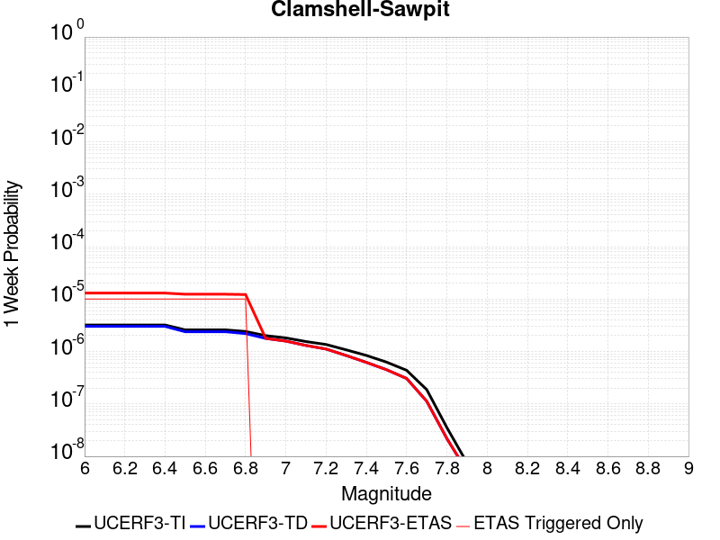 | 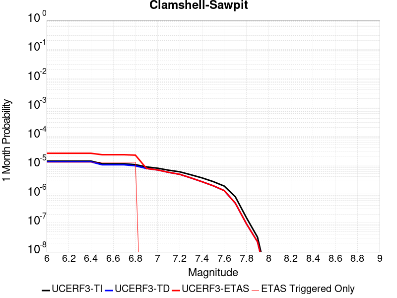 | 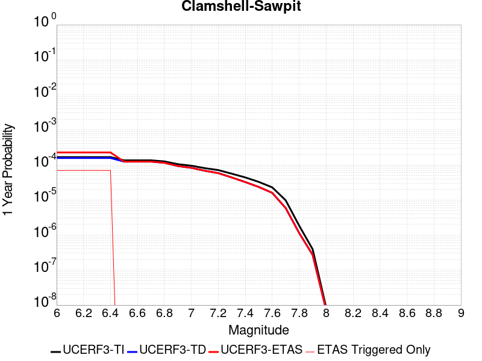 | 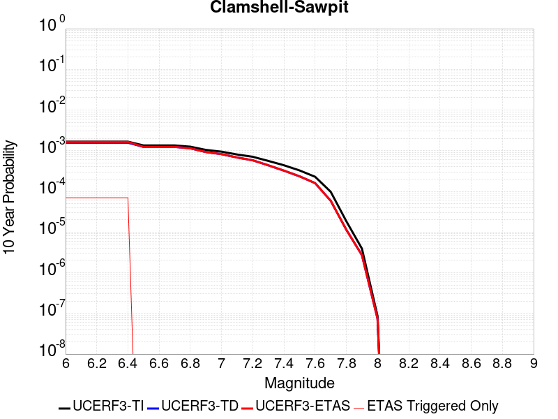 |

| Magnitude | 1 wk TI Prob | 1 wk TD Prob | 1 wk ETAS Prob | 1 wk ETAS/TD Gain | 1 wk ETAS Triggered Only | 1 mo TI Prob | 1 mo TD Prob | 1 mo ETAS Prob | 1 mo ETAS/TD Gain | 1 mo ETAS Triggered Only | 1 yr TI Prob | 1 yr TD Prob | 1 yr ETAS Prob | 1 yr ETAS/TD Gain | 1 yr ETAS Triggered Only | 10 yr TI Prob | 10 yr TD Prob | 10 yr ETAS Prob | 10 yr ETAS/TD Gain | 10 yr ETAS Triggered Only |
|-----|-----|-----|-----|-----|-----|-----|-----|-----|-----|-----|-----|-----|-----|-----|-----|-----|-----|-----|-----|-----|
| 6.0 | 3.202998E-6 | 3.0127642E-6 | 1.3012734E-5 | 4.319201 | 1.0E-5 | 1.3727062E-5 | 1.2911787E-5 | 2.2911658E-5 | 1.7744762 | 1.0E-5 | 1.6711417E-4 | 1.5719047E-4 | 1.7718734E-4 | 1.1272142 | 2.0E-5 | 0.0016698855 | 0.0015708723 | 0.0016008251 | 1.0190676 | 3.0E-5 |
| 6.1 | 3.202998E-6 | 3.0127642E-6 | 1.3012734E-5 | 4.319201 | 1.0E-5 | 1.3727062E-5 | 1.2911787E-5 | 2.2911658E-5 | 1.7744762 | 1.0E-5 | 1.6711417E-4 | 1.5719047E-4 | 1.7718734E-4 | 1.1272142 | 2.0E-5 | 0.0016698855 | 0.0015708723 | 0.0016008251 | 1.0190676 | 3.0E-5 |
| 6.2 | 3.202998E-6 | 3.0127642E-6 | 1.3012734E-5 | 4.319201 | 1.0E-5 | 1.3727062E-5 | 1.2911787E-5 | 2.2911658E-5 | 1.7744762 | 1.0E-5 | 1.6711417E-4 | 1.5719047E-4 | 1.7718734E-4 | 1.1272142 | 2.0E-5 | 0.0016698855 | 0.0015708723 | 0.0016008251 | 1.0190676 | 3.0E-5 |
| 6.3 | 3.202998E-6 | 3.0127642E-6 | 1.3012734E-5 | 4.319201 | 1.0E-5 | 1.3727062E-5 | 1.2911787E-5 | 2.2911658E-5 | 1.7744762 | 1.0E-5 | 1.6711417E-4 | 1.5719047E-4 | 1.7718734E-4 | 1.1272142 | 2.0E-5 | 0.0016698855 | 0.0015708723 | 0.0016008251 | 1.0190676 | 3.0E-5 |
| 6.4 | 3.202998E-6 | 3.0127642E-6 | 1.3012734E-5 | 4.319201 | 1.0E-5 | 1.3727062E-5 | 1.2911787E-5 | 2.2911658E-5 | 1.7744762 | 1.0E-5 | 1.6711417E-4 | 1.5719047E-4 | 1.7718734E-4 | 1.1272142 | 2.0E-5 | 0.0016698855 | 0.0015708723 | 0.0016008251 | 1.0190676 | 3.0E-5 |
| 6.5 | 2.5862723E-6 | 2.3807747E-6 | 1.2380751E-5 | 5.200303 | 1.0E-5 | 1.1083977E-5 | 1.0203283E-5 | 2.020318E-5 | 1.9800668 | 1.0E-5 | 1.3493907E-4 | 1.2421819E-4 | 1.3421694E-4 | 1.0804935 | 1.0E-5 | 0.0013485716 | 0.0012415178 | 0.0012515055 | 1.0080446 | 1.0E-5 |
| 6.6 | 2.5862723E-6 | 2.3807747E-6 | 1.2380751E-5 | 5.200303 | 1.0E-5 | 1.1083977E-5 | 1.0203283E-5 | 2.020318E-5 | 1.9800668 | 1.0E-5 | 1.3493907E-4 | 1.2421819E-4 | 1.3421694E-4 | 1.0804935 | 1.0E-5 | 0.0013485716 | 0.0012415178 | 0.0012515055 | 1.0080446 | 1.0E-5 |
| 6.7 | 2.5862723E-6 | 2.3807747E-6 | 1.2380751E-5 | 5.200303 | 1.0E-5 | 1.1083977E-5 | 1.0203283E-5 | 2.020318E-5 | 1.9800668 | 1.0E-5 | 1.3493907E-4 | 1.2421819E-4 | 1.3421694E-4 | 1.0804935 | 1.0E-5 | 0.0013485716 | 0.0012415178 | 0.0012515055 | 1.0080446 | 1.0E-5 |
| 6.8 | 2.4098806E-6 | 2.1977307E-6 | 1.2197709E-5 | 5.550138 | 1.0E-5 | 1.0328019E-5 | 9.4188135E-6 | 1.941872E-5 | 2.0616949 | 1.0E-5 | 1.2573638E-4 | 1.14668284E-4 | 1.2466715E-4 | 1.087198 | 1.0E-5 | 0.0012566525 | 0.0011461178 | 0.0011561064 | 1.0087152 | 1.0E-5 |
| 6.9 | 2.0073985E-6 | 1.7784247E-6 | 1.7784247E-6 | 1.0 | 0.0 | 8.603109E-6 | 7.6217984E-6 | 7.6217984E-6 | 1.0 | 0.0 | 1.0473781E-4 | 9.279157E-5 | 9.279157E-5 | 1.0 | 0.0 | 0.0010468846 | 9.2754007E-4 | 9.2754007E-4 | 1.0 | 0.0 |
| 7.0 | 1.8166766E-6 | 1.5807094E-6 | 1.5807094E-6 | 1.0 | 0.0 | 7.785734E-6 | 6.774452E-6 | 6.774452E-6 | 1.0 | 0.0 | 9.478718E-5 | 8.247593E-5 | 8.247593E-5 | 1.0 | 0.0 | 9.4746763E-4 | 8.244633E-4 | 8.244633E-4 | 1.0 | 0.0 |
| 7.1 | 1.5471421E-6 | 1.3052961E-6 | 1.3052961E-6 | 1.0 | 0.0 | 6.6305925E-6 | 5.5941146E-6 | 5.5941146E-6 | 1.0 | 0.0 | 8.072447E-5 | 6.810627E-5 | 6.810627E-5 | 1.0 | 0.0 | 8.0695155E-4 | 6.8085943E-4 | 6.8085943E-4 | 1.0 | 0.0 |
| 7.2 | 1.3608037E-6 | 1.1153442E-6 | 1.1153442E-6 | 1.0 | 0.0 | 5.8320024E-6 | 4.780038E-6 | 4.780038E-6 | 1.0 | 0.0 | 7.1002316E-5 | 5.8195455E-5 | 5.8195455E-5 | 1.0 | 0.0 | 7.097964E-4 | 5.818068E-4 | 5.818068E-4 | 1.0 | 0.0 |
| 7.3 | 1.0749634E-6 | 8.384255E-7 | 8.384255E-7 | 1.0 | 0.0 | 4.6069777E-6 | 3.5932474E-6 | 3.5932474E-6 | 1.0 | 0.0 | 5.608851E-5 | 4.3746935E-5 | 4.3746935E-5 | 1.0 | 0.0 | 5.6074356E-4 | 4.3738607E-4 | 4.3738607E-4 | 1.0 | 0.0 |
| 7.4 | 8.416856E-7 | 6.2000527E-7 | 6.2000527E-7 | 1.0 | 0.0 | 3.607219E-6 | 2.657163E-6 | 2.657163E-6 | 1.0 | 0.0 | 4.3917007E-5 | 3.2350497E-5 | 3.2350497E-5 | 1.0 | 0.0 | 4.390833E-4 | 3.2345986E-4 | 3.2345986E-4 | 1.0 | 0.0 |
| 7.5 | 6.2779594E-7 | 4.4968908E-7 | 4.4968908E-7 | 1.0 | 0.0 | 2.6905511E-6 | 1.9272377E-6 | 1.9272377E-6 | 1.0 | 0.0 | 3.275697E-5 | 2.3463885E-5 | 2.3463885E-5 | 1.0 | 0.0 | 3.275214E-4 | 2.3461595E-4 | 2.3461595E-4 | 1.0 | 0.0 |
| 7.6 | 4.3822078E-7 | 3.059551E-7 | 3.059551E-7 | 1.0 | 0.0 | 1.8780877E-6 | 1.3112356E-6 | 1.3112356E-6 | 1.0 | 0.0 | 2.2865479E-5 | 1.5964191E-5 | 1.5964191E-5 | 1.0 | 0.0 | 2.2863125E-4 | 1.5963199E-4 | 1.5963199E-4 | 1.0 | 0.0 |
| 7.7 | 1.8704569E-7 | 1.12379E-7 | 1.12379E-7 | 1.0 | 0.0 | 8.0162414E-7 | 4.8162417E-7 | 4.8162417E-7 | 1.0 | 0.0 | 9.75973E-6 | 5.8637593E-6 | 5.8637593E-6 | 1.0 | 0.0 | 9.7593016E-5 | 5.863611E-5 | 5.863611E-5 | 1.0 | 0.0 |
| 7.8 | 3.5378733E-8 | 2.1838002E-8 | 2.1838002E-8 | 1.0 | 0.0 | 1.5162313E-7 | 9.359143E-8 | 9.359143E-8 | 1.0 | 0.0 | 1.84601E-6 | 1.1394751E-6 | 1.1394751E-6 | 1.0 | 0.0 | 1.8459947E-5 | 1.1394695E-5 | 1.1394695E-5 | 1.0 | 0.0 |
| 7.9 | 7.504945E-9 | 5.1921663E-9 | 5.1921663E-9 | 1.0 | 0.0 | 3.2164053E-8 | 2.2252141E-8 | 2.2252141E-8 | 1.0 | 0.0 | 3.9159727E-7 | 2.709198E-7 | 2.709198E-7 | 1.0 | 0.0 | 3.915966E-6 | 2.7091953E-6 | 2.7091953E-6 | 1.0 | 0.0 |
| 8.0 | 1.6554036E-10 | 1.418149E-10 | 1.418149E-10 | 1.0 | 0.0 | 7.0945894E-10 | 6.0777794E-10 | 6.0777794E-10 | 1.0 | 0.0 | 8.637662E-9 | 7.3996964E-9 | 7.3996964E-9 | 1.0 | 0.0 | 8.6376616E-8 | 7.3996965E-8 | 7.3996965E-8 | 1.0 | 0.0 |

## Ventura-Pitas Point
*[(top)](#table-of-contents)*

| 1 Week | 1 Month | 1 Year | 10 Year |
|-----|-----|-----|-----|
| 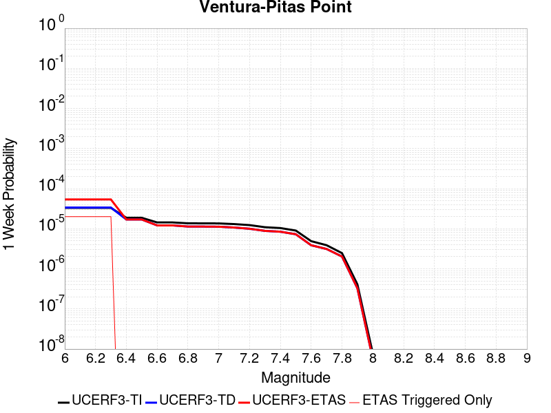 | 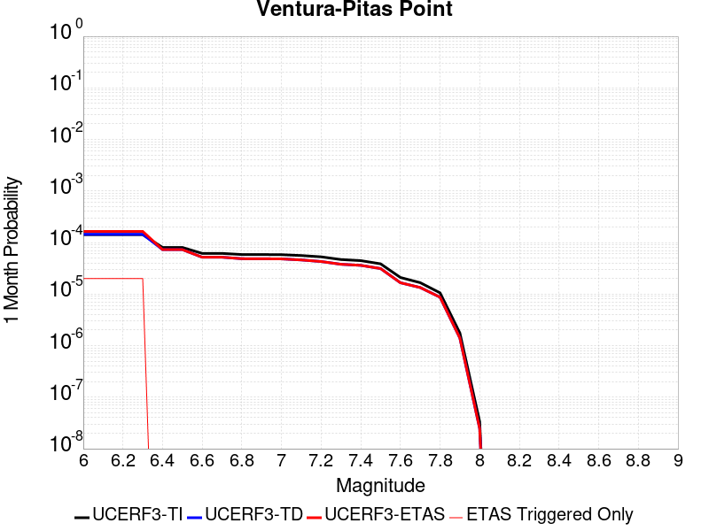 | 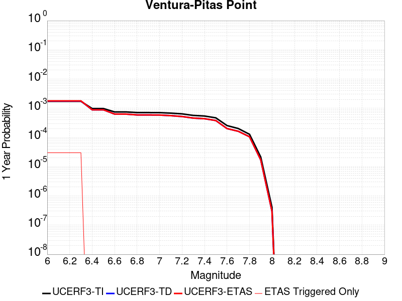 | 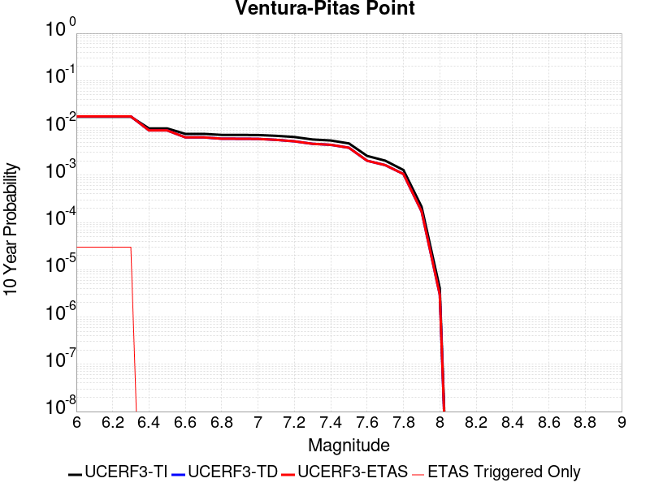 |

| Magnitude | 1 wk TI Prob | 1 wk TD Prob | 1 wk ETAS Prob | 1 wk ETAS/TD Gain | 1 wk ETAS Triggered Only | 1 mo TI Prob | 1 mo TD Prob | 1 mo ETAS Prob | 1 mo ETAS/TD Gain | 1 mo ETAS Triggered Only | 1 yr TI Prob | 1 yr TD Prob | 1 yr ETAS Prob | 1 yr ETAS/TD Gain | 1 yr ETAS Triggered Only | 10 yr TI Prob | 10 yr TD Prob | 10 yr ETAS Prob | 10 yr ETAS/TD Gain | 10 yr ETAS Triggered Only |
|-----|-----|-----|-----|-----|-----|-----|-----|-----|-----|-----|-----|-----|-----|-----|-----|-----|-----|-----|-----|-----|
| 6.0 | 3.3179622E-5 | 3.373519E-5 | 5.373451E-5 | 1.5928328 | 2.0E-5 | 1.4219063E-4 | 1.4457281E-4 | 1.6456992E-4 | 1.1383185 | 2.0E-5 | 0.0017297962 | 0.0017590097 | 0.0017889569 | 1.017025 | 3.0E-5 | 0.017163932 | 0.017476497 | 0.017505974 | 1.0016866 | 3.0E-5 |
| 6.1 | 3.3179622E-5 | 3.373519E-5 | 5.373451E-5 | 1.5928328 | 2.0E-5 | 1.4219063E-4 | 1.4457281E-4 | 1.6456992E-4 | 1.1383185 | 2.0E-5 | 0.0017297962 | 0.0017590097 | 0.0017889569 | 1.017025 | 3.0E-5 | 0.017163932 | 0.017476497 | 0.017505974 | 1.0016866 | 3.0E-5 |
| 6.2 | 3.3179622E-5 | 3.373519E-5 | 5.373451E-5 | 1.5928328 | 2.0E-5 | 1.4219063E-4 | 1.4457281E-4 | 1.6456992E-4 | 1.1383185 | 2.0E-5 | 0.0017297962 | 0.0017590097 | 0.0017889569 | 1.017025 | 3.0E-5 | 0.017163932 | 0.017476497 | 0.017505974 | 1.0016866 | 3.0E-5 |
| 6.3 | 3.3179622E-5 | 3.373519E-5 | 5.373451E-5 | 1.5928328 | 2.0E-5 | 1.4219063E-4 | 1.4457281E-4 | 1.6456992E-4 | 1.1383185 | 2.0E-5 | 0.0017297962 | 0.0017590097 | 0.0017889569 | 1.017025 | 3.0E-5 | 0.017163932 | 0.017476497 | 0.017505974 | 1.0016866 | 3.0E-5 |
| 6.4 | 1.8754668E-5 | 1.7019594E-5 | 1.7019594E-5 | 1.0 | 0.0 | 8.037467E-5 | 7.2939205E-5 | 7.2939205E-5 | 1.0 | 0.0 | 9.781223E-4 | 8.8769617E-4 | 8.8769617E-4 | 1.0 | 0.0 | 0.009738282 | 0.008843943 | 0.008843943 | 1.0 | 0.0 |
| 6.5 | 1.8754668E-5 | 1.7019594E-5 | 1.7019594E-5 | 1.0 | 0.0 | 8.037467E-5 | 7.2939205E-5 | 7.2939205E-5 | 1.0 | 0.0 | 9.781223E-4 | 8.8769617E-4 | 8.8769617E-4 | 1.0 | 0.0 | 0.009738282 | 0.008843943 | 0.008843943 | 1.0 | 0.0 |
| 6.6 | 1.4361558E-5 | 1.2122258E-5 | 1.2122258E-5 | 1.0 | 0.0 | 6.154808E-5 | 5.1951512E-5 | 5.1951512E-5 | 1.0 | 0.0 | 7.490902E-4 | 6.323284E-4 | 6.323284E-4 | 1.0 | 0.0 | 0.0074657016 | 0.006305652 | 0.006305652 | 1.0 | 0.0 |
| 6.7 | 1.4361558E-5 | 1.2122258E-5 | 1.2122258E-5 | 1.0 | 0.0 | 6.154808E-5 | 5.1951512E-5 | 5.1951512E-5 | 1.0 | 0.0 | 7.490902E-4 | 6.323284E-4 | 6.323284E-4 | 1.0 | 0.0 | 0.0074657016 | 0.006305652 | 0.006305652 | 1.0 | 0.0 |
| 6.8 | 1.3663846E-5 | 1.1344401E-5 | 1.1344401E-5 | 1.0 | 0.0 | 5.8558027E-5 | 4.8617967E-5 | 4.8617967E-5 | 1.0 | 0.0 | 7.127108E-4 | 5.917649E-4 | 5.917649E-4 | 1.0 | 0.0 | 0.007104293 | 0.0059022107 | 0.0059022107 | 1.0 | 0.0 |
| 6.9 | 1.3644157E-5 | 1.1322501E-5 | 1.1322501E-5 | 1.0 | 0.0 | 5.8473648E-5 | 4.8524114E-5 | 4.8524114E-5 | 1.0 | 0.0 | 7.116841E-4 | 5.906229E-4 | 5.906229E-4 | 1.0 | 0.0 | 0.007094092 | 0.0058908514 | 0.0058908514 | 1.0 | 0.0 |
| 7.0 | 1.3568845E-5 | 1.12420685E-5 | 1.12420685E-5 | 1.0 | 0.0 | 5.8150898E-5 | 4.8179416E-5 | 4.8179416E-5 | 1.0 | 0.0 | 7.077572E-4 | 5.8642845E-4 | 5.8642845E-4 | 1.0 | 0.0 | 0.007055073 | 0.005849128 | 0.005849128 | 1.0 | 0.0 |
| 7.1 | 1.306572E-5 | 1.0720521E-5 | 1.0720521E-5 | 1.0 | 0.0 | 5.599474E-5 | 4.594429E-5 | 4.594429E-5 | 1.0 | 0.0 | 6.815227E-4 | 5.5923004E-4 | 5.5923004E-4 | 1.0 | 0.0 | 0.0067943637 | 0.005578536 | 0.005578536 | 1.0 | 0.0 |
| 7.2 | 1.232604E-5 | 9.995121E-6 | 9.995121E-6 | 1.0 | 0.0 | 5.2824813E-5 | 4.283554E-5 | 4.283554E-5 | 1.0 | 0.0 | 6.429523E-4 | 5.2139966E-4 | 5.2139966E-4 | 1.0 | 0.0 | 0.0064109527 | 0.005202059 | 0.005202059 | 1.0 | 0.0 |
| 7.3 | 1.0917261E-5 | 8.843812E-6 | 8.843812E-6 | 1.0 | 0.0 | 4.678742E-5 | 3.7901507E-5 | 3.7901507E-5 | 1.0 | 0.0 | 5.69488E-4 | 4.6135474E-4 | 4.6135474E-4 | 1.0 | 0.0 | 0.0056803077 | 0.004604239 | 0.004604239 | 1.0 | 0.0 |
| 7.4 | 1.039959E-5 | 8.42354E-6 | 8.42354E-6 | 1.0 | 0.0 | 4.456891E-5 | 3.6100395E-5 | 3.6100395E-5 | 1.0 | 0.0 | 5.424914E-4 | 4.394352E-4 | 4.394352E-4 | 1.0 | 0.0 | 0.0054116896 | 0.0043859277 | 0.0043859277 | 1.0 | 0.0 |
| 7.5 | 9.015877E-6 | 7.29752E-6 | 7.29752E-6 | 1.0 | 0.0 | 3.86389E-5 | 3.1274718E-5 | 3.1274718E-5 | 1.0 | 0.0 | 4.7032707E-4 | 3.8070456E-4 | 3.8070456E-4 | 1.0 | 0.0 | 0.004693329 | 0.003800772 | 0.003800772 | 1.0 | 0.0 |
| 7.6 | 4.900162E-6 | 3.874119E-6 | 3.874119E-6 | 1.0 | 0.0 | 2.1000526E-5 | 1.6603262E-5 | 1.6603262E-5 | 1.0 | 0.0 | 2.556514E-4 | 2.0212609E-4 | 2.0212609E-4 | 1.0 | 0.0 | 0.0025535747 | 0.002019436 | 0.002019436 | 1.0 | 0.0 |
| 7.7 | 3.8850626E-6 | 3.12676E-6 | 3.12676E-6 | 1.0 | 0.0 | 1.6650163E-5 | 1.3400332E-5 | 1.3400332E-5 | 1.0 | 0.0 | 2.0269687E-4 | 1.6313691E-4 | 1.6313691E-4 | 1.0 | 0.0 | 0.002025121 | 0.0016301809 | 0.0016301809 | 1.0 | 0.0 |
| 7.8 | 2.4654719E-6 | 2.029902E-6 | 2.029902E-6 | 1.0 | 0.0 | 1.0566265E-5 | 8.699551E-6 | 8.699551E-6 | 1.0 | 0.0 | 1.2863669E-4 | 1.0591193E-4 | 1.0591193E-4 | 1.0 | 0.0 | 0.0012856225 | 0.0010586192 | 0.0010586192 | 1.0 | 0.0 |
| 7.9 | 4.095894E-7 | 3.2765078E-7 | 3.2765078E-7 | 1.0 | 0.0 | 1.7553821E-6 | 1.4042168E-6 | 1.4042168E-6 | 1.0 | 0.0 | 2.1371567E-5 | 1.709621E-5 | 1.709621E-5 | 1.0 | 0.0 | 2.1369511E-4 | 1.7094925E-4 | 1.7094925E-4 | 1.0 | 0.0 |
| 8.0 | 7.791402E-9 | 5.6836056E-9 | 5.6836056E-9 | 1.0 | 0.0 | 3.3391725E-8 | 2.4358311E-8 | 2.4358311E-8 | 1.0 | 0.0 | 4.0654416E-7 | 2.965624E-7 | 2.965624E-7 | 1.0 | 0.0 | 4.065434E-6 | 2.9656223E-6 | 2.9656223E-6 | 1.0 | 0.0 |

## Cerro Prieto
*[(top)](#table-of-contents)*

| 1 Week | 1 Month | 1 Year | 10 Year |
|-----|-----|-----|-----|
| 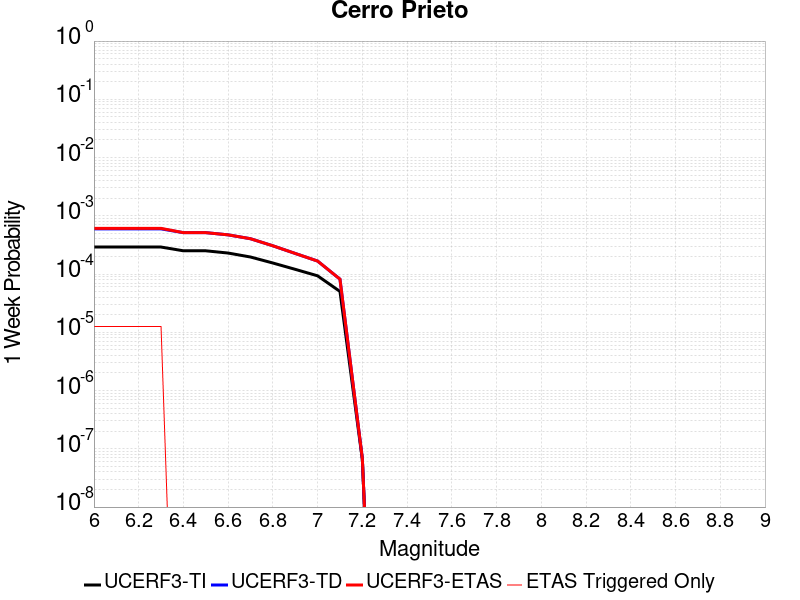 | 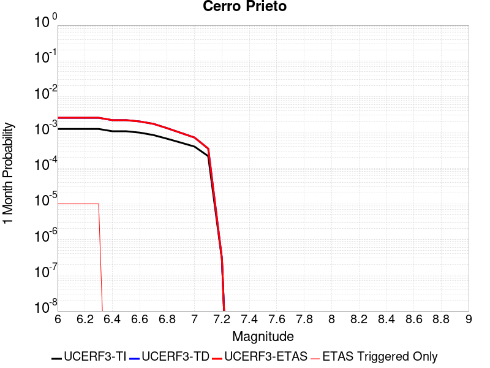 | 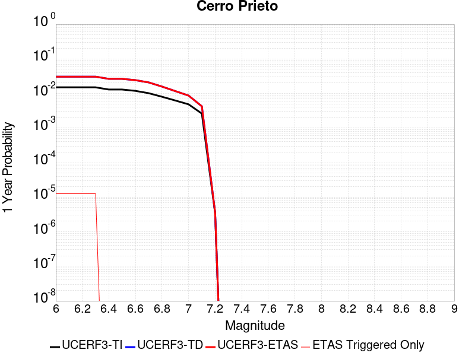 | 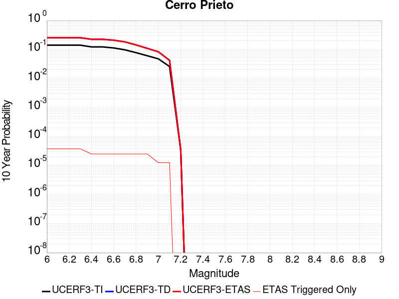 |

| Magnitude | 1 wk TI Prob | 1 wk TD Prob | 1 wk ETAS Prob | 1 wk ETAS/TD Gain | 1 wk ETAS Triggered Only | 1 mo TI Prob | 1 mo TD Prob | 1 mo ETAS Prob | 1 mo ETAS/TD Gain | 1 mo ETAS Triggered Only | 1 yr TI Prob | 1 yr TD Prob | 1 yr ETAS Prob | 1 yr ETAS/TD Gain | 1 yr ETAS Triggered Only | 10 yr TI Prob | 10 yr TD Prob | 10 yr ETAS Prob | 10 yr ETAS/TD Gain | 10 yr ETAS Triggered Only |
|-----|-----|-----|-----|-----|-----|-----|-----|-----|-----|-----|-----|-----|-----|-----|-----|-----|-----|-----|-----|-----|
| 6.0 | 2.9101528E-4 | 5.9654453E-4 | 6.0653855E-4 | 1.0167532 | 1.0E-5 | 0.0012466122 | 0.0025543566 | 0.002564331 | 1.0039049 | 1.0E-5 | 0.015072231 | 0.030802928 | 0.03081262 | 1.0003146 | 1.0E-5 | 0.14089979 | 0.25386256 | 0.25388497 | 1.0000882 | 3.0E-5 |
| 6.1 | 2.9101528E-4 | 5.9654453E-4 | 6.0653855E-4 | 1.0167532 | 1.0E-5 | 0.0012466122 | 0.0025543566 | 0.002564331 | 1.0039049 | 1.0E-5 | 0.015072231 | 0.030802928 | 0.03081262 | 1.0003146 | 1.0E-5 | 0.14089979 | 0.25386256 | 0.25388497 | 1.0000882 | 3.0E-5 |
| 6.2 | 2.9101528E-4 | 5.9654453E-4 | 6.0653855E-4 | 1.0167532 | 1.0E-5 | 0.0012466122 | 0.0025543566 | 0.002564331 | 1.0039049 | 1.0E-5 | 0.015072231 | 0.030802928 | 0.03081262 | 1.0003146 | 1.0E-5 | 0.14089979 | 0.25386256 | 0.25388497 | 1.0000882 | 3.0E-5 |
| 6.3 | 2.9101528E-4 | 5.9654453E-4 | 6.0653855E-4 | 1.0167532 | 1.0E-5 | 0.0012466122 | 0.0025543566 | 0.002564331 | 1.0039049 | 1.0E-5 | 0.015072231 | 0.030802928 | 0.03081262 | 1.0003146 | 1.0E-5 | 0.14089979 | 0.25386256 | 0.25388497 | 1.0000882 | 3.0E-5 |
| 6.4 | 2.508648E-4 | 5.140412E-4 | 5.140412E-4 | 1.0 | 0.0 | 0.0010746918 | 0.0022013725 | 0.0022013725 | 1.0 | 0.0 | 0.013006088 | 0.026629416 | 0.026629416 | 1.0 | 0.0 | 0.12270685 | 0.2242222 | 0.22423771 | 1.0000691 | 2.0E-5 |
| 6.5 | 2.508648E-4 | 5.140412E-4 | 5.140412E-4 | 1.0 | 0.0 | 0.0010746918 | 0.0022013725 | 0.0022013725 | 1.0 | 0.0 | 0.013006088 | 0.026629416 | 0.026629416 | 1.0 | 0.0 | 0.12270685 | 0.2242222 | 0.22423771 | 1.0000691 | 2.0E-5 |
| 6.6 | 2.294914E-4 | 4.7123645E-4 | 4.7123645E-4 | 1.0 | 0.0 | 9.831638E-4 | 0.0020182093 | 0.0020182093 | 1.0 | 0.0 | 0.011904482 | 0.024394194 | 0.024394194 | 1.0 | 0.0 | 0.11286586 | 0.20837563 | 0.20839146 | 1.0000759 | 2.0E-5 |
| 6.7 | 1.9621674E-4 | 4.0426268E-4 | 4.0426268E-4 | 1.0 | 0.0 | 8.4065786E-4 | 0.0017315624 | 0.0017315624 | 1.0 | 0.0 | 0.010187071 | 0.020888962 | 0.020888962 | 1.0 | 0.0 | 0.09732539 | 0.18264732 | 0.18266366 | 1.0000895 | 2.0E-5 |
| 6.8 | 1.5476145E-4 | 3.0572579E-4 | 3.0572579E-4 | 1.0 | 0.0 | 6.6309475E-4 | 0.0013096977 | 0.0013096977 | 1.0 | 0.0 | 0.008043335 | 0.015826825 | 0.015826825 | 1.0 | 0.0 | 0.07758363 | 0.14310057 | 0.14311773 | 1.0001198 | 2.0E-5 |
| 6.9 | 1.20509176E-4 | 2.2588465E-4 | 2.2588465E-4 | 1.0 | 0.0 | 5.1636563E-4 | 9.6778123E-4 | 9.6778123E-4 | 1.0 | 0.0 | 0.006268645 | 0.011734025 | 0.011734025 | 1.0 | 0.0 | 0.060947374 | 0.10917958 | 0.10919739 | 1.0001632 | 2.0E-5 |
| 7.0 | 9.3269155E-5 | 1.6721459E-4 | 1.6721459E-4 | 1.0 | 0.0 | 3.9966372E-4 | 7.1648025E-4 | 7.1648025E-4 | 1.0 | 0.0 | 0.0048550544 | 0.008695914 | 0.008695914 | 1.0 | 0.0 | 0.04750344 | 0.082943216 | 0.08295239 | 1.0001105 | 1.0E-5 |
| 7.1 | 5.029709E-5 | 8.174011E-5 | 8.174011E-5 | 1.0 | 0.0 | 2.1554115E-4 | 3.50287E-4 | 3.50287E-4 | 1.0 | 0.0 | 0.0026210553 | 0.004259821 | 0.004259821 | 1.0 | 0.0 | 0.025903556 | 0.04226813 | 0.04227771 | 1.0002266 | 1.0E-5 |
| 7.2 | 6.5445185E-8 | 6.824737E-8 | 6.824737E-8 | 1.0 | 0.0 | 2.8047933E-7 | 2.9248872E-7 | 2.9248872E-7 | 1.0 | 0.0 | 3.4148304E-6 | 3.56105E-6 | 3.56105E-6 | 1.0 | 0.0 | 3.414778E-5 | 3.56105E-5 | 3.56105E-5 | 1.0 | 0.0 |

## North Frontal  (East)
*[(top)](#table-of-contents)*

| 1 Week | 1 Month | 1 Year | 10 Year |
|-----|-----|-----|-----|
|  |  | 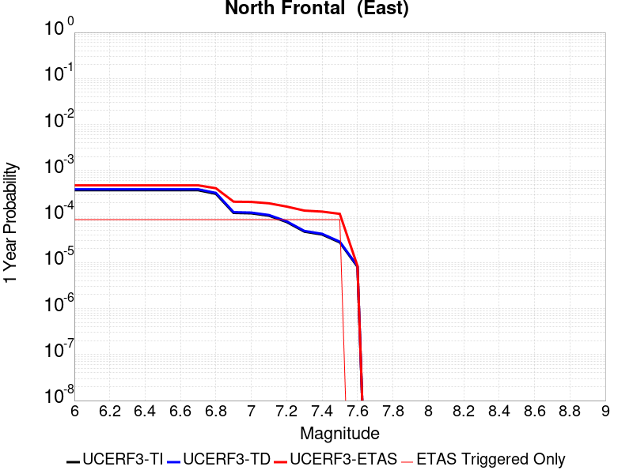 | 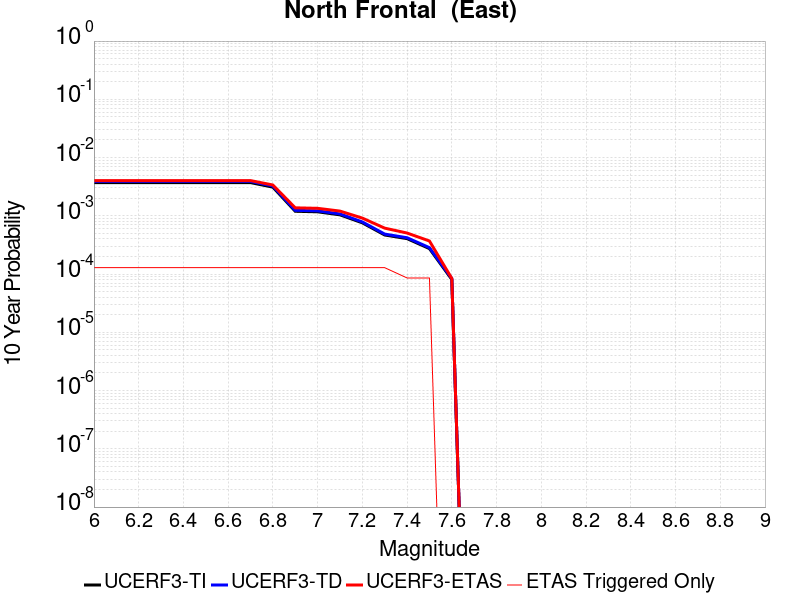 |

| Magnitude | 1 wk TI Prob | 1 wk TD Prob | 1 wk ETAS Prob | 1 wk ETAS/TD Gain | 1 wk ETAS Triggered Only | 1 mo TI Prob | 1 mo TD Prob | 1 mo ETAS Prob | 1 mo ETAS/TD Gain | 1 mo ETAS Triggered Only | 1 yr TI Prob | 1 yr TD Prob | 1 yr ETAS Prob | 1 yr ETAS/TD Gain | 1 yr ETAS Triggered Only | 10 yr TI Prob | 10 yr TD Prob | 10 yr ETAS Prob | 10 yr ETAS/TD Gain | 10 yr ETAS Triggered Only |
|-----|-----|-----|-----|-----|-----|-----|-----|-----|-----|-----|-----|-----|-----|-----|-----|-----|-----|-----|-----|-----|
| 6.0 | 7.135738E-6 | 7.4771765E-6 | 7.4771765E-6 | 1.0 | 0.0 | 3.0581377E-5 | 3.204476E-5 | 3.204476E-5 | 1.0 | 0.0 | 3.7226462E-4 | 3.9009505E-4 | 4.1008726E-4 | 1.0512495 | 2.0E-5 | 0.0037164164 | 0.0038960609 | 0.0039259437 | 1.00767 | 3.0E-5 |
| 6.1 | 7.135738E-6 | 7.4771765E-6 | 7.4771765E-6 | 1.0 | 0.0 | 3.0581377E-5 | 3.204476E-5 | 3.204476E-5 | 1.0 | 0.0 | 3.7226462E-4 | 3.9009505E-4 | 4.1008726E-4 | 1.0512495 | 2.0E-5 | 0.0037164164 | 0.0038960609 | 0.0039259437 | 1.00767 | 3.0E-5 |
| 6.2 | 7.135738E-6 | 7.4771765E-6 | 7.4771765E-6 | 1.0 | 0.0 | 3.0581377E-5 | 3.204476E-5 | 3.204476E-5 | 1.0 | 0.0 | 3.7226462E-4 | 3.9009505E-4 | 4.1008726E-4 | 1.0512495 | 2.0E-5 | 0.0037164164 | 0.0038960609 | 0.0039259437 | 1.00767 | 3.0E-5 |
| 6.3 | 7.135738E-6 | 7.4771765E-6 | 7.4771765E-6 | 1.0 | 0.0 | 3.0581377E-5 | 3.204476E-5 | 3.204476E-5 | 1.0 | 0.0 | 3.7226462E-4 | 3.9009505E-4 | 4.1008726E-4 | 1.0512495 | 2.0E-5 | 0.0037164164 | 0.0038960609 | 0.0039259437 | 1.00767 | 3.0E-5 |
| 6.4 | 7.135738E-6 | 7.4771765E-6 | 7.4771765E-6 | 1.0 | 0.0 | 3.0581377E-5 | 3.204476E-5 | 3.204476E-5 | 1.0 | 0.0 | 3.7226462E-4 | 3.9009505E-4 | 4.1008726E-4 | 1.0512495 | 2.0E-5 | 0.0037164164 | 0.0038960609 | 0.0039259437 | 1.00767 | 3.0E-5 |
| 6.5 | 7.135738E-6 | 7.4771765E-6 | 7.4771765E-6 | 1.0 | 0.0 | 3.0581377E-5 | 3.204476E-5 | 3.204476E-5 | 1.0 | 0.0 | 3.7226462E-4 | 3.9009505E-4 | 4.1008726E-4 | 1.0512495 | 2.0E-5 | 0.0037164164 | 0.0038960609 | 0.0039259437 | 1.00767 | 3.0E-5 |
| 6.6 | 7.135738E-6 | 7.4771765E-6 | 7.4771765E-6 | 1.0 | 0.0 | 3.0581377E-5 | 3.204476E-5 | 3.204476E-5 | 1.0 | 0.0 | 3.7226462E-4 | 3.9009505E-4 | 4.1008726E-4 | 1.0512495 | 2.0E-5 | 0.0037164164 | 0.0038960609 | 0.0039259437 | 1.00767 | 3.0E-5 |
| 6.7 | 7.135738E-6 | 7.4771765E-6 | 7.4771765E-6 | 1.0 | 0.0 | 3.0581377E-5 | 3.204476E-5 | 3.204476E-5 | 1.0 | 0.0 | 3.7226462E-4 | 3.9009505E-4 | 4.1008726E-4 | 1.0512495 | 2.0E-5 | 0.0037164164 | 0.0038960609 | 0.0039259437 | 1.00767 | 3.0E-5 |
| 6.8 | 5.959142E-6 | 6.236683E-6 | 6.236683E-6 | 1.0 | 0.0 | 2.553893E-5 | 2.6728469E-5 | 2.6728469E-5 | 1.0 | 0.0 | 3.108921E-4 | 3.253886E-4 | 3.4538208E-4 | 1.061445 | 2.0E-5 | 0.0031045752 | 0.0032508948 | 0.0032807973 | 1.0091982 | 3.0E-5 |
| 6.9 | 2.2946929E-6 | 2.3824605E-6 | 2.3824605E-6 | 1.0 | 0.0 | 9.834361E-6 | 1.0210508E-5 | 1.0210508E-5 | 1.0 | 0.0 | 1.1972676E-4 | 1.2430632E-4 | 1.4430382E-4 | 1.1608728 | 2.0E-5 | 0.0011966228 | 0.0012424142 | 0.001272377 | 1.0241165 | 3.0E-5 |
| 7.0 | 2.2468673E-6 | 2.3321538E-6 | 2.3321538E-6 | 1.0 | 0.0 | 9.629396E-6 | 9.994909E-6 | 9.994909E-6 | 1.0 | 0.0 | 1.1723159E-4 | 1.21681696E-4 | 1.4167927E-4 | 1.1643432 | 2.0E-5 | 0.0011716976 | 0.0012161969 | 0.0012461605 | 1.0246371 | 3.0E-5 |
| 7.1 | 1.9921076E-6 | 2.0646032E-6 | 2.0646032E-6 | 1.0 | 0.0 | 8.537577E-6 | 8.848272E-6 | 8.848272E-6 | 1.0 | 0.0 | 1.0394004E-4 | 1.0772282E-4 | 1.2772066E-4 | 1.1856416 | 2.0E-5 | 0.0010389143 | 0.0010767487 | 0.0011067165 | 1.0278317 | 3.0E-5 |
| 7.2 | 1.4524545E-6 | 1.5045148E-6 | 1.5045148E-6 | 1.0 | 0.0 | 6.2247905E-6 | 6.447906E-6 | 6.447906E-6 | 1.0 | 0.0 | 7.5784184E-5 | 7.850068E-5 | 9.8499106E-5 | 1.2547549 | 2.0E-5 | 7.575835E-4 | 7.8475394E-4 | 8.1473036E-4 | 1.0381986 | 3.0E-5 |
| 7.3 | 8.9802575E-7 | 9.3087283E-7 | 9.3087283E-7 | 1.0 | 0.0 | 3.848676E-6 | 3.9894494E-6 | 3.9894494E-6 | 1.0 | 0.0 | 4.685662E-5 | 4.857058E-5 | 6.856961E-5 | 1.4117519 | 2.0E-5 | 4.6846745E-4 | 4.8561094E-4 | 5.1559636E-4 | 1.0617479 | 3.0E-5 |
| 7.4 | 7.776139E-7 | 8.0604747E-7 | 8.0604747E-7 | 1.0 | 0.0 | 3.3326266E-6 | 3.4544853E-6 | 3.4544853E-6 | 1.0 | 0.0 | 4.0573974E-5 | 4.2057654E-5 | 6.205682E-5 | 1.4755176 | 2.0E-5 | 4.0566566E-4 | 4.205077E-4 | 4.404993E-4 | 1.0475415 | 2.0E-5 |
| 7.5 | 5.244417E-7 | 5.441219E-7 | 5.441219E-7 | 1.0 | 0.0 | 2.2476054E-6 | 2.3319494E-6 | 2.3319494E-6 | 1.0 | 0.0 | 2.7364253E-5 | 2.839118E-5 | 4.839061E-5 | 1.7044241 | 2.0E-5 | 2.7360884E-4 | 2.8388205E-4 | 3.0387638E-4 | 1.0704318 | 2.0E-5 |
| 7.6 | 1.5489647E-7 | 1.6089504E-7 | 1.6089504E-7 | 1.0 | 0.0 | 6.6384183E-7 | 6.895501E-7 | 6.895501E-7 | 1.0 | 0.0 | 8.082245E-6 | 8.395261E-6 | 8.395261E-6 | 1.0 | 0.0 | 8.08195E-5 | 8.395143E-5 | 8.395143E-5 | 1.0 | 0.0 |

## Santa Cruz Catalina Ridge alt1
*[(top)](#table-of-contents)*

| 1 Week | 1 Month | 1 Year | 10 Year |
|-----|-----|-----|-----|
| 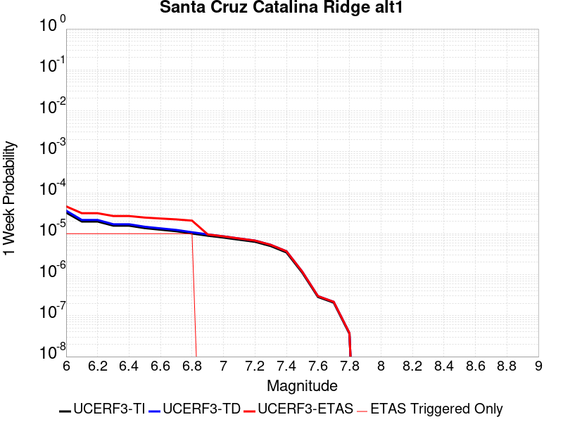 | 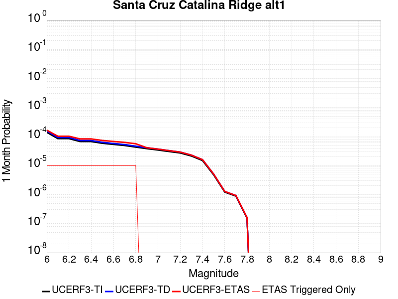 |  | 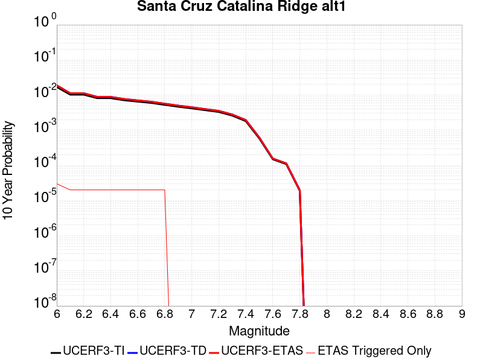 |

| Magnitude | 1 wk TI Prob | 1 wk TD Prob | 1 wk ETAS Prob | 1 wk ETAS/TD Gain | 1 wk ETAS Triggered Only | 1 mo TI Prob | 1 mo TD Prob | 1 mo ETAS Prob | 1 mo ETAS/TD Gain | 1 mo ETAS Triggered Only | 1 yr TI Prob | 1 yr TD Prob | 1 yr ETAS Prob | 1 yr ETAS/TD Gain | 1 yr ETAS Triggered Only | 10 yr TI Prob | 10 yr TD Prob | 10 yr ETAS Prob | 10 yr ETAS/TD Gain | 10 yr ETAS Triggered Only |
|-----|-----|-----|-----|-----|-----|-----|-----|-----|-----|-----|-----|-----|-----|-----|-----|-----|-----|-----|-----|-----|
| 6.0 | 3.2833184E-5 | 3.6558402E-5 | 4.6558034E-5 | 1.273525 | 1.0E-5 | 1.4070606E-4 | 1.5667039E-4 | 1.6666882E-4 | 1.0638182 | 1.0E-5 | 0.00171175 | 0.0019059594 | 0.0019259213 | 1.0104734 | 2.0E-5 | 0.016986247 | 0.018913032 | 0.018942466 | 1.0015562 | 3.0E-5 |
| 6.1 | 1.9835548E-5 | 2.1659505E-5 | 3.165929E-5 | 1.461681 | 1.0E-5 | 8.500672E-5 | 9.282326E-5 | 1.02822334E-4 | 1.1077216 | 1.0E-5 | 0.0010344655 | 0.0011295575 | 0.001149535 | 1.017686 | 2.0E-5 | 0.010296632 | 0.011240296 | 0.011260071 | 1.0017593 | 2.0E-5 |
| 6.2 | 1.9835548E-5 | 2.1659505E-5 | 3.165929E-5 | 1.461681 | 1.0E-5 | 8.500672E-5 | 9.282326E-5 | 1.02822334E-4 | 1.1077216 | 1.0E-5 | 0.0010344655 | 0.0011295575 | 0.001149535 | 1.017686 | 2.0E-5 | 0.010296632 | 0.011240296 | 0.011260071 | 1.0017593 | 2.0E-5 |
| 6.3 | 1.5728183E-5 | 1.703395E-5 | 2.7033779E-5 | 1.587053 | 1.0E-5 | 6.7404755E-5 | 7.300063E-5 | 8.29999E-5 | 1.1369752 | 1.0E-5 | 8.2034385E-4 | 8.884264E-4 | 9.084086E-4 | 1.0224917 | 2.0E-5 | 0.008173222 | 0.008849427 | 0.00886925 | 1.0022401 | 2.0E-5 |
| 6.4 | 1.5728183E-5 | 1.703395E-5 | 2.7033779E-5 | 1.587053 | 1.0E-5 | 6.7404755E-5 | 7.300063E-5 | 8.29999E-5 | 1.1369752 | 1.0E-5 | 8.2034385E-4 | 8.884264E-4 | 9.084086E-4 | 1.0224917 | 2.0E-5 | 0.008173222 | 0.008849427 | 0.00886925 | 1.0022401 | 2.0E-5 |
| 6.5 | 1.3707734E-5 | 1.4794522E-5 | 2.4794374E-5 | 1.6759158 | 1.0E-5 | 5.8746107E-5 | 6.3403575E-5 | 7.340294E-5 | 1.1577098 | 1.0E-5 | 7.1499916E-4 | 7.716686E-4 | 7.916532E-4 | 1.0258979 | 2.0E-5 | 0.0071270303 | 0.0076902895 | 0.007710136 | 1.0025806 | 2.0E-5 |
| 6.6 | 1.2539813E-5 | 1.3510219E-5 | 2.3510085E-5 | 1.7401705 | 1.0E-5 | 5.3740947E-5 | 5.789967E-5 | 6.789909E-5 | 1.1727026 | 1.0E-5 | 6.540996E-4 | 7.0470315E-4 | 7.2468905E-4 | 1.0283607 | 2.0E-5 | 0.0065217763 | 0.0070249885 | 0.007044848 | 1.0028269 | 2.0E-5 |
| 6.7 | 1.1504083E-5 | 1.2377375E-5 | 2.2377251E-5 | 1.8079158 | 1.0E-5 | 4.930228E-5 | 5.3044827E-5 | 6.3044296E-5 | 1.1885098 | 1.0E-5 | 6.0008996E-4 | 6.456314E-4 | 6.6561846E-4 | 1.0309575 | 2.0E-5 | 0.005984721 | 0.006437786 | 0.006457657 | 1.0030867 | 2.0E-5 |
| 6.8 | 1.012739E-5 | 1.0877071E-5 | 2.0876963E-5 | 1.9193552 | 1.0E-5 | 4.340238E-5 | 4.6615194E-5 | 5.661473E-5 | 1.2145123 | 1.0E-5 | 5.282958E-4 | 5.673937E-4 | 5.8738235E-4 | 1.0352288 | 2.0E-5 | 0.0052704164 | 0.0056596193 | 0.0056795063 | 1.0035138 | 2.0E-5 |
| 6.9 | 8.9607865E-6 | 9.609117E-6 | 9.609117E-6 | 1.0 | 0.0 | 3.8402806E-5 | 4.1181287E-5 | 4.1181287E-5 | 1.0 | 0.0 | 4.6745385E-4 | 5.012679E-4 | 5.012679E-4 | 1.0 | 0.0 | 0.0046647177 | 0.005001492 | 0.005001492 | 1.0 | 0.0 |
| 7.0 | 8.046829E-6 | 8.619746E-6 | 8.619746E-6 | 1.0 | 0.0 | 3.4485955E-5 | 3.694125E-5 | 3.694125E-5 | 1.0 | 0.0 | 4.1978562E-4 | 4.496677E-4 | 4.496677E-4 | 1.0 | 0.0 | 0.004189935 | 0.0044876686 | 0.0044876686 | 1.0 | 0.0 |
| 7.1 | 7.136131E-6 | 7.637656E-6 | 7.637656E-6 | 1.0 | 0.0 | 3.0583058E-5 | 3.2732405E-5 | 3.2732405E-5 | 1.0 | 0.0 | 3.7228514E-4 | 3.9844486E-4 | 3.9844486E-4 | 1.0 | 0.0 | 0.0037166206 | 0.003977381 | 0.003977381 | 1.0 | 0.0 |
| 7.2 | 6.362014E-6 | 6.8049585E-6 | 6.8049585E-6 | 1.0 | 0.0 | 2.726549E-5 | 2.9163786E-5 | 2.9163786E-5 | 1.0 | 0.0 | 3.3190678E-4 | 3.550119E-4 | 3.550119E-4 | 1.0 | 0.0 | 0.0033141149 | 0.003544516 | 0.003544516 | 1.0 | 0.0 |
| 7.3 | 5.004101E-6 | 5.351715E-6 | 5.351715E-6 | 1.0 | 0.0 | 2.1445969E-5 | 2.2935723E-5 | 2.2935723E-5 | 1.0 | 0.0 | 2.6107338E-4 | 2.792072E-4 | 2.792072E-4 | 1.0 | 0.0 | 0.002607669 | 0.0027886187 | 0.0027886187 | 1.0 | 0.0 |
| 7.4 | 3.4901443E-6 | 3.7320526E-6 | 3.7320526E-6 | 1.0 | 0.0 | 1.4957676E-5 | 1.5994416E-5 | 1.5994416E-5 | 1.0 | 0.0 | 1.8209449E-4 | 1.9471499E-4 | 1.9471499E-4 | 1.0 | 0.0 | 0.0018194534 | 0.0019454823 | 0.0019454823 | 1.0 | 0.0 |
| 7.5 | 1.1215045E-6 | 1.189387E-6 | 1.189387E-6 | 1.0 | 0.0 | 4.806439E-6 | 5.097363E-6 | 5.097363E-6 | 1.0 | 0.0 | 5.851682E-5 | 6.205866E-5 | 6.205866E-5 | 1.0 | 0.0 | 5.850142E-4 | 6.2041637E-4 | 6.2041637E-4 | 1.0 | 0.0 |
| 7.6 | 2.8599047E-7 | 2.9951994E-7 | 2.9951994E-7 | 1.0 | 0.0 | 1.2256729E-6 | 1.2836562E-6 | 1.2836562E-6 | 1.0 | 0.0 | 1.4922465E-5 | 1.5628404E-5 | 1.5628404E-5 | 1.0 | 0.0 | 1.4921463E-4 | 1.5627318E-4 | 1.5627318E-4 | 1.0 | 0.0 |
| 7.7 | 2.0781519E-7 | 2.1744323E-7 | 2.1744323E-7 | 1.0 | 0.0 | 8.906362E-7 | 9.3189925E-7 | 9.3189925E-7 | 1.0 | 0.0 | 1.08434415E-5 | 1.13458145E-5 | 1.13458145E-5 | 1.0 | 0.0 | 1.0842913E-4 | 1.1345245E-4 | 1.1345245E-4 | 1.0 | 0.0 |
| 7.8 | 3.614776E-8 | 3.764102E-8 | 3.764102E-8 | 1.0 | 0.0 | 1.5491896E-7 | 1.6131864E-7 | 1.6131864E-7 | 1.0 | 0.0 | 1.8861368E-6 | 1.9640527E-6 | 1.9640527E-6 | 1.0 | 0.0 | 1.8861208E-5 | 1.9640367E-5 | 1.9640367E-5 | 1.0 | 0.0 |

## Redondo Canyon alt 1
*[(top)](#table-of-contents)*

| 1 Week | 1 Month | 1 Year | 10 Year |
|-----|-----|-----|-----|
| 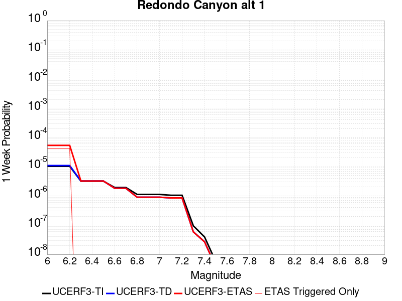 | 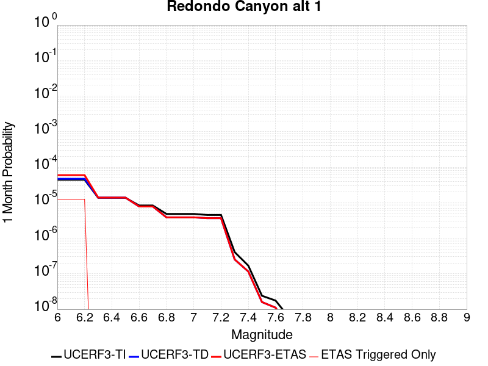 | 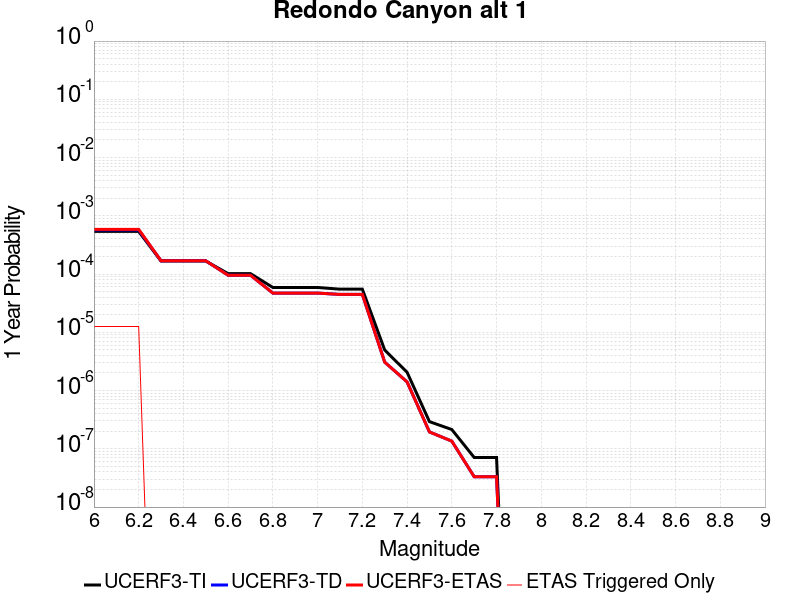 | 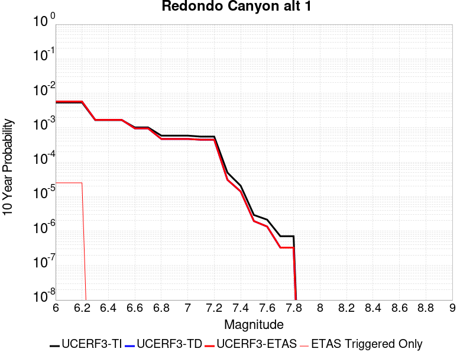 |

| Magnitude | 1 wk TI Prob | 1 wk TD Prob | 1 wk ETAS Prob | 1 wk ETAS/TD Gain | 1 wk ETAS Triggered Only | 1 mo TI Prob | 1 mo TD Prob | 1 mo ETAS Prob | 1 mo ETAS/TD Gain | 1 mo ETAS Triggered Only | 1 yr TI Prob | 1 yr TD Prob | 1 yr ETAS Prob | 1 yr ETAS/TD Gain | 1 yr ETAS Triggered Only | 10 yr TI Prob | 10 yr TD Prob | 10 yr ETAS Prob | 10 yr ETAS/TD Gain | 10 yr ETAS Triggered Only |
|-----|-----|-----|-----|-----|-----|-----|-----|-----|-----|-----|-----|-----|-----|-----|-----|-----|-----|-----|-----|-----|
| 6.0 | 1.0346246E-5 | 1.0981325E-5 | 2.0981215E-5 | 1.9106269 | 1.0E-5 | 4.43403E-5 | 4.7062418E-5 | 5.706195E-5 | 1.2124738 | 1.0E-5 | 5.3970946E-4 | 5.729132E-4 | 5.8290747E-4 | 1.0174446 | 1.0E-5 | 0.0053840056 | 0.0057221013 | 0.0057519297 | 1.0052128 | 3.0E-5 |
| 6.1 | 1.0346246E-5 | 1.0981325E-5 | 2.0981215E-5 | 1.9106269 | 1.0E-5 | 4.43403E-5 | 4.7062418E-5 | 5.706195E-5 | 1.2124738 | 1.0E-5 | 5.3970946E-4 | 5.729132E-4 | 5.8290747E-4 | 1.0174446 | 1.0E-5 | 0.0053840056 | 0.0057221013 | 0.0057519297 | 1.0052128 | 3.0E-5 |
| 6.2 | 1.0346246E-5 | 1.0981325E-5 | 2.0981215E-5 | 1.9106269 | 1.0E-5 | 4.43403E-5 | 4.7062418E-5 | 5.706195E-5 | 1.2124738 | 1.0E-5 | 5.3970946E-4 | 5.729132E-4 | 5.8290747E-4 | 1.0174446 | 1.0E-5 | 0.0053840056 | 0.0057221013 | 0.0057519297 | 1.0052128 | 3.0E-5 |
| 6.3 | 3.2052794E-6 | 3.2360983E-6 | 3.2360983E-6 | 1.0 | 0.0 | 1.373684E-5 | 1.3868941E-5 | 1.3868941E-5 | 1.0 | 0.0 | 1.6723319E-4 | 1.6884525E-4 | 1.6884525E-4 | 1.0 | 0.0 | 0.001671074 | 0.0016875593 | 0.0016875593 | 1.0 | 0.0 |
| 6.4 | 3.2052794E-6 | 3.2360983E-6 | 3.2360983E-6 | 1.0 | 0.0 | 1.373684E-5 | 1.3868941E-5 | 1.3868941E-5 | 1.0 | 0.0 | 1.6723319E-4 | 1.6884525E-4 | 1.6884525E-4 | 1.0 | 0.0 | 0.001671074 | 0.0016875593 | 0.0016875593 | 1.0 | 0.0 |
| 6.5 | 3.2052794E-6 | 3.2360983E-6 | 3.2360983E-6 | 1.0 | 0.0 | 1.373684E-5 | 1.3868941E-5 | 1.3868941E-5 | 1.0 | 0.0 | 1.6723319E-4 | 1.6884525E-4 | 1.6884525E-4 | 1.0 | 0.0 | 0.001671074 | 0.0016875593 | 0.0016875593 | 1.0 | 0.0 |
| 6.6 | 1.948328E-6 | 1.8288489E-6 | 1.8288489E-6 | 1.0 | 0.0 | 8.349951E-6 | 7.837909E-6 | 7.837909E-6 | 1.0 | 0.0 | 1.016559E-4 | 9.5423864E-5 | 9.5423864E-5 | 1.0 | 0.0 | 0.0010160941 | 9.5397583E-4 | 9.5397583E-4 | 1.0 | 0.0 |
| 6.7 | 1.948328E-6 | 1.8288489E-6 | 1.8288489E-6 | 1.0 | 0.0 | 8.349951E-6 | 7.837909E-6 | 7.837909E-6 | 1.0 | 0.0 | 1.016559E-4 | 9.5423864E-5 | 9.5423864E-5 | 1.0 | 0.0 | 0.0010160941 | 9.5397583E-4 | 9.5397583E-4 | 1.0 | 0.0 |
| 6.8 | 1.1278219E-6 | 9.032885E-7 | 9.032885E-7 | 1.0 | 0.0 | 4.8335132E-6 | 3.871233E-6 | 3.871233E-6 | 1.0 | 0.0 | 5.8846435E-5 | 4.713167E-5 | 4.713167E-5 | 1.0 | 0.0 | 5.8830855E-4 | 4.7125877E-4 | 4.7125877E-4 | 1.0 | 0.0 |
| 6.9 | 1.1278219E-6 | 9.032885E-7 | 9.032885E-7 | 1.0 | 0.0 | 4.8335132E-6 | 3.871233E-6 | 3.871233E-6 | 1.0 | 0.0 | 5.8846435E-5 | 4.713167E-5 | 4.713167E-5 | 1.0 | 0.0 | 5.8830855E-4 | 4.7125877E-4 | 4.7125877E-4 | 1.0 | 0.0 |
| 7.0 | 1.1278219E-6 | 9.032885E-7 | 9.032885E-7 | 1.0 | 0.0 | 4.8335132E-6 | 3.871233E-6 | 3.871233E-6 | 1.0 | 0.0 | 5.8846435E-5 | 4.713167E-5 | 4.713167E-5 | 1.0 | 0.0 | 5.8830855E-4 | 4.7125877E-4 | 4.7125877E-4 | 1.0 | 0.0 |
| 7.1 | 1.0545139E-6 | 8.5690925E-7 | 8.5690925E-7 | 1.0 | 0.0 | 4.5193374E-6 | 3.6724655E-6 | 3.6724655E-6 | 1.0 | 0.0 | 5.5021545E-5 | 4.4711775E-5 | 4.4711775E-5 | 1.0 | 0.0 | 5.500792E-4 | 4.4706953E-4 | 4.4706953E-4 | 1.0 | 0.0 |
| 7.2 | 1.0545139E-6 | 8.5690925E-7 | 8.5690925E-7 | 1.0 | 0.0 | 4.5193374E-6 | 3.6724655E-6 | 3.6724655E-6 | 1.0 | 0.0 | 5.5021545E-5 | 4.4711775E-5 | 4.4711775E-5 | 1.0 | 0.0 | 5.500792E-4 | 4.4706953E-4 | 4.4706953E-4 | 1.0 | 0.0 |
| 7.3 | 9.505161E-8 | 5.8955752E-8 | 5.8955752E-8 | 1.0 | 0.0 | 4.0736398E-7 | 2.526675E-7 | 2.526675E-7 | 1.0 | 0.0 | 4.959645E-6 | 3.0762235E-6 | 3.0762235E-6 | 1.0 | 0.0 | 4.9595343E-5 | 3.076193E-5 | 3.076193E-5 | 1.0 | 0.0 |
| 7.4 | 3.9520785E-8 | 2.6987088E-8 | 2.6987088E-8 | 1.0 | 0.0 | 1.6937479E-7 | 1.1565894E-7 | 1.1565894E-7 | 1.0 | 0.0 | 2.062136E-6 | 1.408147E-6 | 1.408147E-6 | 1.0 | 0.0 | 2.062117E-5 | 1.4081407E-5 | 1.4081407E-5 | 1.0 | 0.0 |
| 7.5 | 5.6133214E-9 | 3.7367687E-9 | 3.7367687E-9 | 1.0 | 0.0 | 2.4057092E-8 | 1.6014722E-8 | 1.6014722E-8 | 1.0 | 0.0 | 2.9289507E-7 | 1.9497922E-7 | 1.9497922E-7 | 1.0 | 0.0 | 2.9289467E-6 | 1.9497909E-6 | 1.9497909E-6 | 1.0 | 0.0 |
| 7.6 | 4.1064334E-9 | 2.5957205E-9 | 2.5957205E-9 | 1.0 | 0.0 | 1.7599E-8 | 1.1124517E-8 | 1.1124517E-8 | 1.0 | 0.0 | 2.142678E-7 | 1.3544098E-7 | 1.3544098E-7 | 1.0 | 0.0 | 2.1426758E-6 | 1.3544093E-6 | 1.3544093E-6 | 1.0 | 0.0 |
| 7.7 | 1.361975E-9 | 6.360521E-10 | 6.360521E-10 | 1.0 | 0.0 | 5.8370353E-9 | 2.7259377E-9 | 2.7259377E-9 | 1.0 | 0.0 | 7.1065905E-8 | 3.318829E-8 | 3.318829E-8 | 1.0 | 0.0 | 7.106588E-7 | 3.3188286E-7 | 3.3188286E-7 | 1.0 | 0.0 |
| 7.8 | 1.361975E-9 | 6.360521E-10 | 6.360521E-10 | 1.0 | 0.0 | 5.8370353E-9 | 2.7259377E-9 | 2.7259377E-9 | 1.0 | 0.0 | 7.1065905E-8 | 3.318829E-8 | 3.318829E-8 | 1.0 | 0.0 | 7.106588E-7 | 3.3188286E-7 | 3.3188286E-7 | 1.0 | 0.0 |

## Concord 2011 CFM
*[(top)](#table-of-contents)*

| 1 Week | 1 Month | 1 Year | 10 Year |
|-----|-----|-----|-----|
| 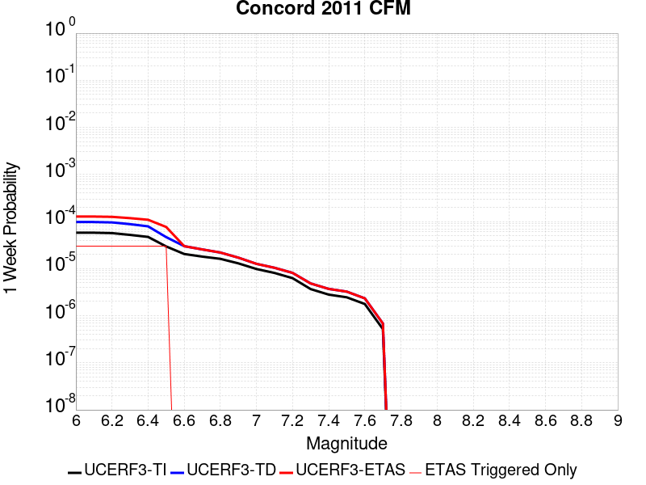 | 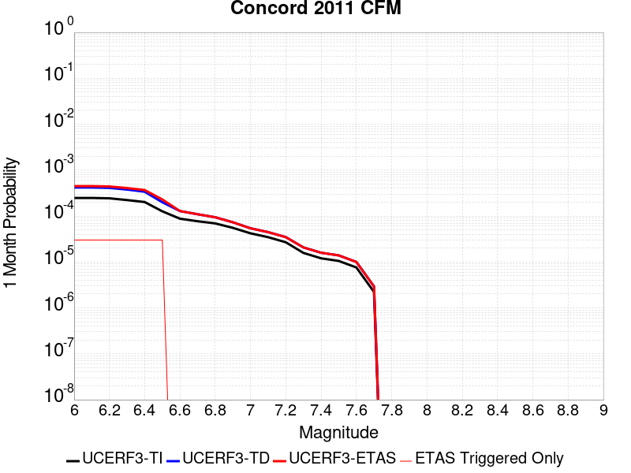 | 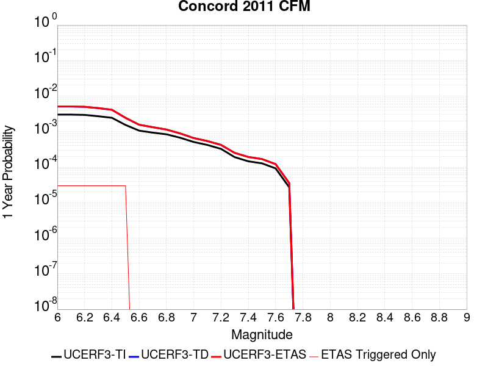 | 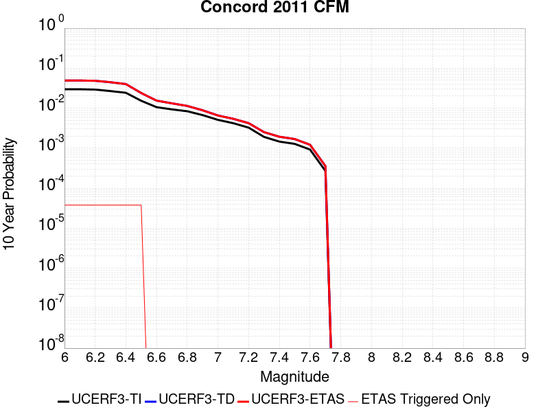 |

| Magnitude | 1 wk TI Prob | 1 wk TD Prob | 1 wk ETAS Prob | 1 wk ETAS/TD Gain | 1 wk ETAS Triggered Only | 1 mo TI Prob | 1 mo TD Prob | 1 mo ETAS Prob | 1 mo ETAS/TD Gain | 1 mo ETAS Triggered Only | 1 yr TI Prob | 1 yr TD Prob | 1 yr ETAS Prob | 1 yr ETAS/TD Gain | 1 yr ETAS Triggered Only | 10 yr TI Prob | 10 yr TD Prob | 10 yr ETAS Prob | 10 yr ETAS/TD Gain | 10 yr ETAS Triggered Only |
|-----|-----|-----|-----|-----|-----|-----|-----|-----|-----|-----|-----|-----|-----|-----|-----|-----|-----|-----|-----|-----|
| 6.0 | 5.7865112E-5 | 9.7585355E-5 | 1.2758243E-4 | 1.3073932 | 3.0E-5 | 2.4796976E-4 | 4.181607E-4 | 4.4814814E-4 | 1.0717127 | 3.0E-5 | 0.0030148525 | 0.005079743 | 0.005109591 | 1.0058758 | 3.0E-5 | 0.029742775 | 0.049266078 | 0.0492946 | 1.0005789 | 3.0E-5 |
| 6.1 | 5.7865112E-5 | 9.7585355E-5 | 1.2758243E-4 | 1.3073932 | 3.0E-5 | 2.4796976E-4 | 4.181607E-4 | 4.4814814E-4 | 1.0717127 | 3.0E-5 | 0.0030148525 | 0.005079743 | 0.005109591 | 1.0058758 | 3.0E-5 | 0.029742775 | 0.049266078 | 0.0492946 | 1.0005789 | 3.0E-5 |
| 6.2 | 5.6789337E-5 | 9.578793E-5 | 1.2578505E-4 | 1.3131618 | 3.0E-5 | 2.4336016E-4 | 4.1045985E-4 | 4.4044753E-4 | 1.0730587 | 3.0E-5 | 0.0029588845 | 0.0049864696 | 0.00501632 | 1.0059863 | 3.0E-5 | 0.029197963 | 0.04838257 | 0.048411116 | 1.0005901 | 3.0E-5 |
| 6.3 | 5.203322E-5 | 8.803241E-5 | 1.1802976E-4 | 1.3407536 | 3.0E-5 | 2.2298045E-4 | 3.772316E-4 | 4.0722027E-4 | 1.0794967 | 3.0E-5 | 0.0027114071 | 0.0045839064 | 0.004613769 | 1.0065147 | 3.0E-5 | 0.026785625 | 0.04455397 | 0.04458263 | 1.0006434 | 3.0E-5 |
| 6.4 | 4.7120942E-5 | 7.897583E-5 | 1.0897346E-4 | 1.3798331 | 3.0E-5 | 2.0193127E-4 | 3.3842813E-4 | 3.6841797E-4 | 1.0886151 | 3.0E-5 | 0.0024557412 | 0.004113323 | 0.0041431994 | 1.0072634 | 3.0E-5 | 0.024287801 | 0.040080756 | 0.040109556 | 1.0007185 | 3.0E-5 |
| 6.5 | 2.9598437E-5 | 4.6675777E-5 | 7.6674376E-5 | 1.6427016 | 3.0E-5 | 1.2684427E-4 | 2.000249E-4 | 2.300189E-4 | 1.1499513 | 3.0E-5 | 0.001543235 | 0.0024327936 | 0.0024627205 | 1.0123014 | 3.0E-5 | 0.015325619 | 0.023909668 | 0.02393895 | 1.0012248 | 3.0E-5 |
| 6.6 | 2.0443718E-5 | 2.9984873E-5 | 2.9984873E-5 | 1.0 | 0.0 | 8.7613E-5 | 1.2850047E-4 | 1.2850047E-4 | 1.0 | 0.0 | 0.0010661662 | 0.0015634067 | 0.0015634067 | 1.0 | 0.0 | 0.010610655 | 0.0154669015 | 0.0154669015 | 1.0 | 0.0 |
| 6.7 | 1.798539E-5 | 2.5557883E-5 | 2.5557883E-5 | 1.0 | 0.0 | 7.7077966E-5 | 1.0952931E-4 | 1.0952931E-4 | 1.0 | 0.0 | 9.380202E-4 | 0.0013327252 | 0.0013327252 | 1.0 | 0.0 | 0.009340706 | 0.013217516 | 0.013217516 | 1.0 | 0.0 |
| 6.8 | 1.613555E-5 | 2.1959608E-5 | 2.1959608E-5 | 1.0 | 0.0 | 6.915052E-5 | 9.4109295E-5 | 9.4109295E-5 | 1.0 | 0.0 | 8.4158237E-4 | 0.0011451923 | 0.0011451923 | 1.0 | 0.0 | 0.008384023 | 0.011378321 | 0.011378321 | 1.0 | 0.0 |
| 6.9 | 1.2916435E-5 | 1.708134E-5 | 1.708134E-5 | 1.0 | 0.0 | 5.5354973E-5 | 7.320372E-5 | 7.320372E-5 | 1.0 | 0.0 | 6.7373837E-4 | 8.908967E-4 | 8.908967E-4 | 1.0 | 0.0 | 0.006716994 | 0.008867833 | 0.008867833 | 1.0 | 0.0 |
| 7.0 | 9.81129E-6 | 1.2631038E-5 | 1.2631038E-5 | 1.0 | 0.0 | 4.2047708E-5 | 5.4131906E-5 | 5.4131906E-5 | 1.0 | 0.0 | 5.118106E-4 | 6.588583E-4 | 6.588583E-4 | 1.0 | 0.0 | 0.005106334 | 0.0065697595 | 0.0065697595 | 1.0 | 0.0 |
| 7.1 | 8.0889195E-6 | 1.04184555E-5 | 1.04184555E-5 | 1.0 | 0.0 | 3.4666336E-5 | 4.4649765E-5 | 4.4649765E-5 | 1.0 | 0.0 | 4.219809E-4 | 5.434764E-4 | 5.434764E-4 | 1.0 | 0.0 | 0.004211805 | 0.0054219896 | 0.0054219896 | 1.0 | 0.0 |
| 7.2 | 6.267438E-6 | 8.115879E-6 | 8.115879E-6 | 1.0 | 0.0 | 2.6860173E-5 | 3.478188E-5 | 3.478188E-5 | 1.0 | 0.0 | 3.2697353E-4 | 4.2338783E-4 | 4.2338783E-4 | 1.0 | 0.0 | 0.0032649285 | 0.004226169 | 0.004226169 | 1.0 | 0.0 |
| 7.3 | 3.6761196E-6 | 4.840281E-6 | 4.840281E-6 | 1.0 | 0.0 | 1.5754704E-5 | 2.0743897E-5 | 2.0743897E-5 | 1.0 | 0.0 | 1.9179663E-4 | 2.5252788E-4 | 2.5252788E-4 | 1.0 | 0.0 | 0.0019163118 | 0.0025226264 | 0.0025226264 | 1.0 | 0.0 |
| 7.4 | 2.8044356E-6 | 3.7096993E-6 | 3.7096993E-6 | 1.0 | 0.0 | 1.2018954E-5 | 1.5898615E-5 | 1.5898615E-5 | 1.0 | 0.0 | 1.4632095E-4 | 1.9354856E-4 | 1.9354856E-4 | 1.0 | 0.0 | 0.0014622464 | 0.0019340349 | 0.0019340349 | 1.0 | 0.0 |
| 7.5 | 2.4578699E-6 | 3.2448306E-6 | 3.2448306E-6 | 1.0 | 0.0 | 1.0533685E-5 | 1.3906343E-5 | 1.3906343E-5 | 1.0 | 0.0 | 1.2824008E-4 | 1.6929668E-4 | 1.6929668E-4 | 1.0 | 0.0 | 0.0012816609 | 0.0016918926 | 0.0016918926 | 1.0 | 0.0 |
| 7.6 | 1.7713267E-6 | 2.335189E-6 | 2.335189E-6 | 1.0 | 0.0 | 7.591378E-6 | 1.0007916E-5 | 1.0007916E-5 | 1.0 | 0.0 | 9.2421105E-5 | 1.2183965E-4 | 1.2183965E-4 | 1.0 | 0.0 | 9.2382677E-4 | 0.0012178655 | 0.0012178655 | 1.0 | 0.0 |
| 7.7 | 5.1912366E-7 | 6.829346E-7 | 6.829346E-7 | 1.0 | 0.0 | 2.2248137E-6 | 2.9268595E-6 | 2.9268595E-6 | 1.0 | 0.0 | 2.708677E-5 | 3.5633944E-5 | 3.5633944E-5 | 1.0 | 0.0 | 2.708347E-4 | 3.5630353E-4 | 3.5630353E-4 | 1.0 | 0.0 |

## Oceanside alt1
*[(top)](#table-of-contents)*

| 1 Week | 1 Month | 1 Year | 10 Year |
|-----|-----|-----|-----|
| 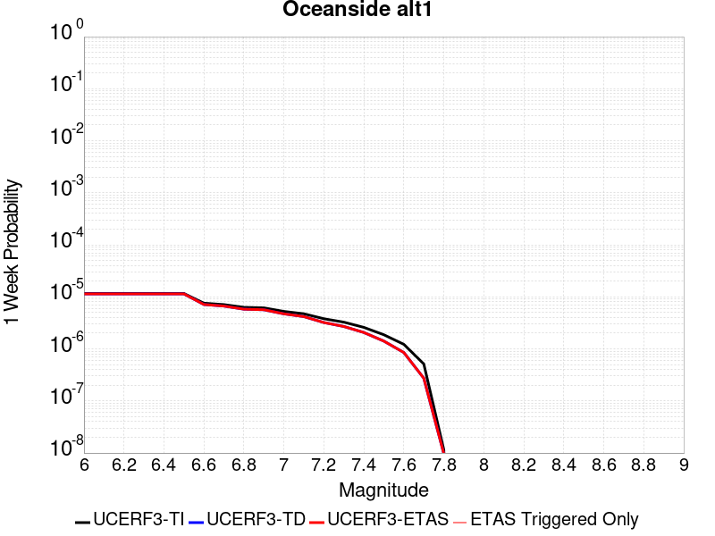 |  | 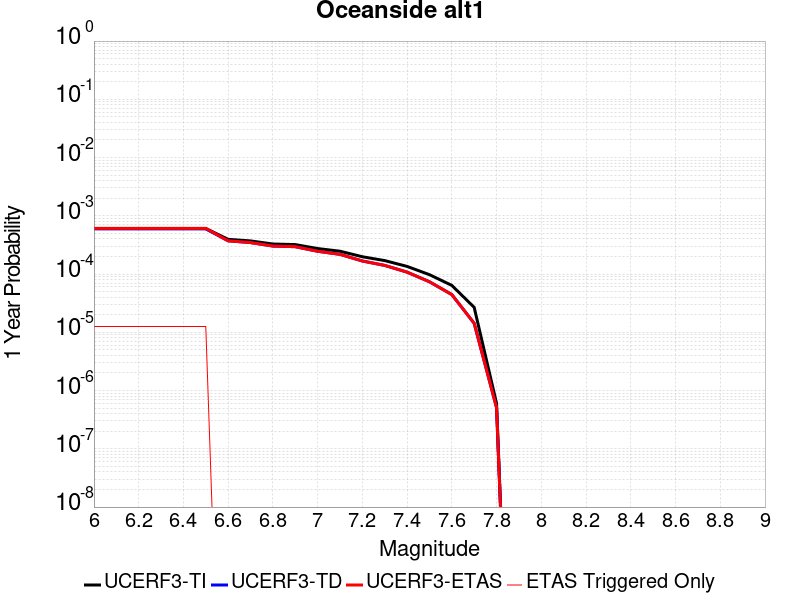 | 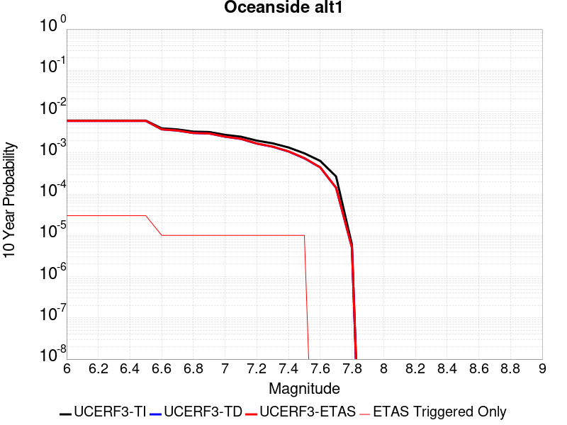 |

| Magnitude | 1 wk TI Prob | 1 wk TD Prob | 1 wk ETAS Prob | 1 wk ETAS/TD Gain | 1 wk ETAS Triggered Only | 1 mo TI Prob | 1 mo TD Prob | 1 mo ETAS Prob | 1 mo ETAS/TD Gain | 1 mo ETAS Triggered Only | 1 yr TI Prob | 1 yr TD Prob | 1 yr ETAS Prob | 1 yr ETAS/TD Gain | 1 yr ETAS Triggered Only | 10 yr TI Prob | 10 yr TD Prob | 10 yr ETAS Prob | 10 yr ETAS/TD Gain | 10 yr ETAS Triggered Only |
|-----|-----|-----|-----|-----|-----|-----|-----|-----|-----|-----|-----|-----|-----|-----|-----|-----|-----|-----|-----|-----|
| 6.0 | 1.1617542E-5 | 1.1423485E-5 | 1.1423485E-5 | 1.0 | 0.0 | 4.9788516E-5 | 4.8956965E-5 | 4.8956965E-5 | 1.0 | 0.0 | 6.060066E-4 | 5.9590413E-4 | 6.058982E-4 | 1.0167712 | 1.0E-5 | 0.0060435664 | 0.0059446604 | 0.0059744823 | 1.0050166 | 3.0E-5 |
| 6.1 | 1.1617542E-5 | 1.1423485E-5 | 1.1423485E-5 | 1.0 | 0.0 | 4.9788516E-5 | 4.8956965E-5 | 4.8956965E-5 | 1.0 | 0.0 | 6.060066E-4 | 5.9590413E-4 | 6.058982E-4 | 1.0167712 | 1.0E-5 | 0.0060435664 | 0.0059446604 | 0.0059744823 | 1.0050166 | 3.0E-5 |
| 6.2 | 1.1617542E-5 | 1.1423485E-5 | 1.1423485E-5 | 1.0 | 0.0 | 4.9788516E-5 | 4.8956965E-5 | 4.8956965E-5 | 1.0 | 0.0 | 6.060066E-4 | 5.9590413E-4 | 6.058982E-4 | 1.0167712 | 1.0E-5 | 0.0060435664 | 0.0059446604 | 0.0059744823 | 1.0050166 | 3.0E-5 |
| 6.3 | 1.1617542E-5 | 1.1423485E-5 | 1.1423485E-5 | 1.0 | 0.0 | 4.9788516E-5 | 4.8956965E-5 | 4.8956965E-5 | 1.0 | 0.0 | 6.060066E-4 | 5.9590413E-4 | 6.058982E-4 | 1.0167712 | 1.0E-5 | 0.0060435664 | 0.0059446604 | 0.0059744823 | 1.0050166 | 3.0E-5 |
| 6.4 | 1.1617542E-5 | 1.1423485E-5 | 1.1423485E-5 | 1.0 | 0.0 | 4.9788516E-5 | 4.8956965E-5 | 4.8956965E-5 | 1.0 | 0.0 | 6.060066E-4 | 5.9590413E-4 | 6.058982E-4 | 1.0167712 | 1.0E-5 | 0.0060435664 | 0.0059446604 | 0.0059744823 | 1.0050166 | 3.0E-5 |
| 6.5 | 1.1617542E-5 | 1.1423485E-5 | 1.1423485E-5 | 1.0 | 0.0 | 4.9788516E-5 | 4.8956965E-5 | 4.8956965E-5 | 1.0 | 0.0 | 6.060066E-4 | 5.9590413E-4 | 6.058982E-4 | 1.0167712 | 1.0E-5 | 0.0060435664 | 0.0059446604 | 0.0059744823 | 1.0050166 | 3.0E-5 |
| 6.6 | 7.561768E-6 | 7.1336085E-6 | 7.1336085E-6 | 1.0 | 0.0 | 3.2407173E-5 | 3.0572253E-5 | 3.0572253E-5 | 1.0 | 0.0 | 3.9448592E-4 | 3.721547E-4 | 3.721547E-4 | 1.0 | 0.0 | 0.0039378637 | 0.0037154262 | 0.003725389 | 1.0026815 | 1.0E-5 |
| 6.7 | 7.1042605E-6 | 6.6556786E-6 | 6.6556786E-6 | 1.0 | 0.0 | 3.0446476E-5 | 2.852403E-5 | 2.852403E-5 | 1.0 | 0.0 | 3.706228E-4 | 3.4722552E-4 | 3.4722552E-4 | 1.0 | 0.0 | 0.0037000529 | 0.0034669132 | 0.0034768786 | 1.0028744 | 1.0E-5 |
| 6.8 | 6.285554E-6 | 5.7996986E-6 | 5.7996986E-6 | 1.0 | 0.0 | 2.693781E-5 | 2.4855617E-5 | 2.4855617E-5 | 1.0 | 0.0 | 3.2791847E-4 | 3.0257567E-4 | 3.0257567E-4 | 1.0 | 0.0 | 0.0032743502 | 0.0030216945 | 0.0030316643 | 1.0032994 | 1.0E-5 |
| 6.9 | 6.148883E-6 | 5.6565373E-6 | 5.6565373E-6 | 1.0 | 0.0 | 2.635209E-5 | 2.4242081E-5 | 2.4242081E-5 | 1.0 | 0.0 | 3.2078946E-4 | 2.951079E-4 | 2.951079E-4 | 1.0 | 0.0 | 0.003203268 | 0.002947217 | 0.0029571876 | 1.003383 | 1.0E-5 |
| 7.0 | 5.253857E-6 | 4.7223966E-6 | 4.7223966E-6 | 1.0 | 0.0 | 2.2516335E-5 | 2.0238687E-5 | 2.0238687E-5 | 1.0 | 0.0 | 2.7410188E-4 | 2.4637848E-4 | 2.4637848E-4 | 1.0 | 0.0 | 0.0027376404 | 0.0024610846 | 0.00247106 | 1.0040532 | 1.0E-5 |
| 7.1 | 4.730754E-6 | 4.1785024E-6 | 4.1785024E-6 | 1.0 | 0.0 | 2.0274503E-5 | 1.7907745E-5 | 1.7907745E-5 | 1.0 | 0.0 | 2.468141E-4 | 2.1800524E-4 | 2.1800524E-4 | 1.0 | 0.0 | 0.0024654015 | 0.0021779404 | 0.0021879186 | 1.0045815 | 1.0E-5 |
| 7.2 | 3.7998386E-6 | 3.2140165E-6 | 3.2140165E-6 | 1.0 | 0.0 | 1.6284921E-5 | 1.37742845E-5 | 1.37742845E-5 | 1.0 | 0.0 | 1.9825088E-4 | 1.6768913E-4 | 1.6768913E-4 | 1.0 | 0.0 | 0.001980741 | 0.0016756381 | 0.0016856213 | 1.0059578 | 1.0E-5 |
| 7.3 | 3.2656465E-6 | 2.6983669E-6 | 2.6983669E-6 | 1.0 | 0.0 | 1.3995553E-5 | 1.1564379E-5 | 1.1564379E-5 | 1.0 | 0.0 | 1.7038253E-4 | 1.4078732E-4 | 1.4078732E-4 | 1.0 | 0.0 | 0.0017025196 | 0.0014069924 | 0.0014169783 | 1.0070974 | 1.0E-5 |
| 7.4 | 2.593703E-6 | 2.0680227E-6 | 2.0680227E-6 | 1.0 | 0.0 | 1.1115822E-5 | 8.862925E-6 | 8.862925E-6 | 1.0 | 0.0 | 1.3532673E-4 | 1.0790086E-4 | 1.0790086E-4 | 1.0 | 0.0 | 0.0013524436 | 0.0010784935 | 0.0010884828 | 1.0092622 | 1.0E-5 |
| 7.5 | 1.8715585E-6 | 1.4137277E-6 | 1.4137277E-6 | 1.0 | 0.0 | 8.020941E-6 | 6.058819E-6 | 6.058819E-6 | 1.0 | 0.0 | 9.7650576E-5 | 7.376369E-5 | 7.376369E-5 | 1.0 | 0.0 | 9.7607676E-4 | 7.373981E-4 | 7.4739073E-4 | 1.0135512 | 1.0E-5 |
| 7.6 | 1.2246786E-6 | 8.526946E-7 | 8.526946E-7 | 1.0 | 0.0 | 5.248612E-6 | 3.6544006E-6 | 3.6544006E-6 | 1.0 | 0.0 | 6.389998E-5 | 4.4491466E-5 | 4.4491466E-5 | 1.0 | 0.0 | 6.3881604E-4 | 4.4483008E-4 | 4.4483008E-4 | 1.0 | 0.0 |
| 7.7 | 5.140719E-7 | 2.7346528E-7 | 2.7346528E-7 | 1.0 | 0.0 | 2.2031636E-6 | 1.1719936E-6 | 1.1719936E-6 | 1.0 | 0.0 | 2.6823185E-5 | 1.4268943E-5 | 1.4268943E-5 | 1.0 | 0.0 | 2.6819948E-4 | 1.4268162E-4 | 1.4268162E-4 | 1.0 | 0.0 |
| 7.8 | 1.16056995E-8 | 9.782997E-9 | 9.782997E-9 | 1.0 | 0.0 | 4.9738713E-8 | 4.1927127E-8 | 4.1927127E-8 | 1.0 | 0.0 | 6.0556863E-7 | 5.1046277E-7 | 5.1046277E-7 | 1.0 | 0.0 | 6.05567E-6 | 5.1046277E-6 | 5.1046277E-6 | 1.0 | 0.0 |

## Fontana (Seismicity)
*[(top)](#table-of-contents)*

| 1 Week | 1 Month | 1 Year | 10 Year |
|-----|-----|-----|-----|
|  | 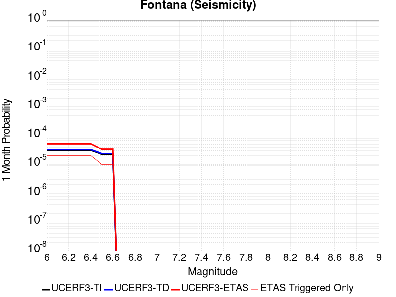 | 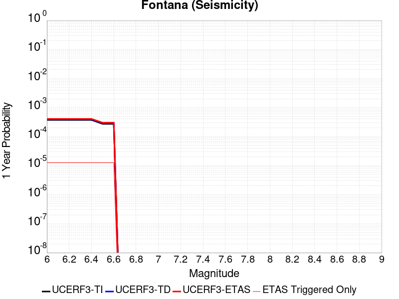 | 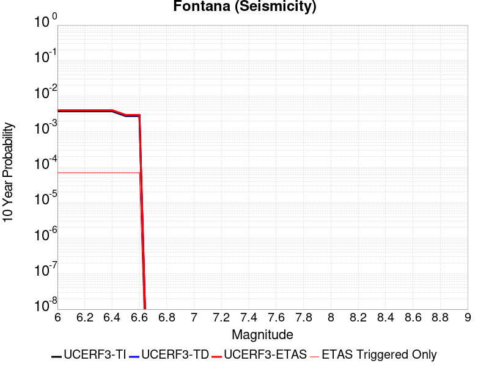 |

| Magnitude | 1 wk TI Prob | 1 wk TD Prob | 1 wk ETAS Prob | 1 wk ETAS/TD Gain | 1 wk ETAS Triggered Only | 1 mo TI Prob | 1 mo TD Prob | 1 mo ETAS Prob | 1 mo ETAS/TD Gain | 1 mo ETAS Triggered Only | 1 yr TI Prob | 1 yr TD Prob | 1 yr ETAS Prob | 1 yr ETAS/TD Gain | 1 yr ETAS Triggered Only | 10 yr TI Prob | 10 yr TD Prob | 10 yr ETAS Prob | 10 yr ETAS/TD Gain | 10 yr ETAS Triggered Only |
|-----|-----|-----|-----|-----|-----|-----|-----|-----|-----|-----|-----|-----|-----|-----|-----|-----|-----|-----|-----|-----|
| 6.0 | 7.1789214E-6 | 7.5520006E-6 | 1.7551925E-5 | 2.3241425 | 1.0E-5 | 3.076644E-5 | 3.2365548E-5 | 5.23649E-5 | 1.6179211 | 2.0E-5 | 3.7451705E-4 | 3.9402005E-4 | 4.1401217E-4 | 1.0507388 | 2.0E-5 | 0.003738865 | 0.003937214 | 0.003967096 | 1.0075896 | 3.0E-5 |
| 6.1 | 7.1789214E-6 | 7.5520006E-6 | 1.7551925E-5 | 2.3241425 | 1.0E-5 | 3.076644E-5 | 3.2365548E-5 | 5.23649E-5 | 1.6179211 | 2.0E-5 | 3.7451705E-4 | 3.9402005E-4 | 4.1401217E-4 | 1.0507388 | 2.0E-5 | 0.003738865 | 0.003937214 | 0.003967096 | 1.0075896 | 3.0E-5 |
| 6.2 | 7.1789214E-6 | 7.5520006E-6 | 1.7551925E-5 | 2.3241425 | 1.0E-5 | 3.076644E-5 | 3.2365548E-5 | 5.23649E-5 | 1.6179211 | 2.0E-5 | 3.7451705E-4 | 3.9402005E-4 | 4.1401217E-4 | 1.0507388 | 2.0E-5 | 0.003738865 | 0.003937214 | 0.003967096 | 1.0075896 | 3.0E-5 |
| 6.3 | 7.1789214E-6 | 7.5520006E-6 | 1.7551925E-5 | 2.3241425 | 1.0E-5 | 3.076644E-5 | 3.2365548E-5 | 5.23649E-5 | 1.6179211 | 2.0E-5 | 3.7451705E-4 | 3.9402005E-4 | 4.1401217E-4 | 1.0507388 | 2.0E-5 | 0.003738865 | 0.003937214 | 0.003967096 | 1.0075896 | 3.0E-5 |
| 6.4 | 7.1789214E-6 | 7.5520006E-6 | 1.7551925E-5 | 2.3241425 | 1.0E-5 | 3.076644E-5 | 3.2365548E-5 | 5.23649E-5 | 1.6179211 | 2.0E-5 | 3.7451705E-4 | 3.9402005E-4 | 4.1401217E-4 | 1.0507388 | 2.0E-5 | 0.003738865 | 0.003937214 | 0.003967096 | 1.0075896 | 3.0E-5 |
| 6.5 | 5.2611317E-6 | 5.532726E-6 | 5.532726E-6 | 1.0 | 0.0 | 2.2547512E-5 | 2.3711682E-5 | 3.3711443E-5 | 1.421723 | 1.0E-5 | 2.744814E-4 | 2.8868974E-4 | 2.9868685E-4 | 1.0346292 | 1.0E-5 | 0.002741426 | 0.0028868972 | 0.0029068396 | 1.0069078 | 2.0E-5 |
| 6.6 | 5.2611317E-6 | 5.532726E-6 | 5.532726E-6 | 1.0 | 0.0 | 2.2547512E-5 | 2.3711682E-5 | 3.3711443E-5 | 1.421723 | 1.0E-5 | 2.744814E-4 | 2.8868974E-4 | 2.9868685E-4 | 1.0346292 | 1.0E-5 | 0.002741426 | 0.0028868972 | 0.0029068396 | 1.0069078 | 2.0E-5 |

## Hosgri (Extension)
*[(top)](#table-of-contents)*

| 1 Week | 1 Month | 1 Year | 10 Year |
|-----|-----|-----|-----|
| 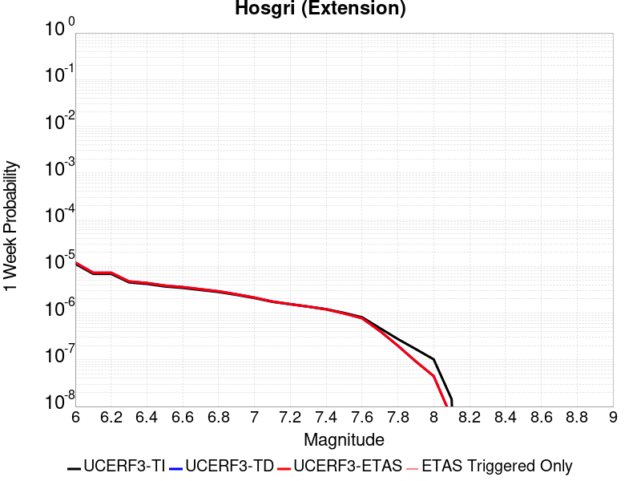 | 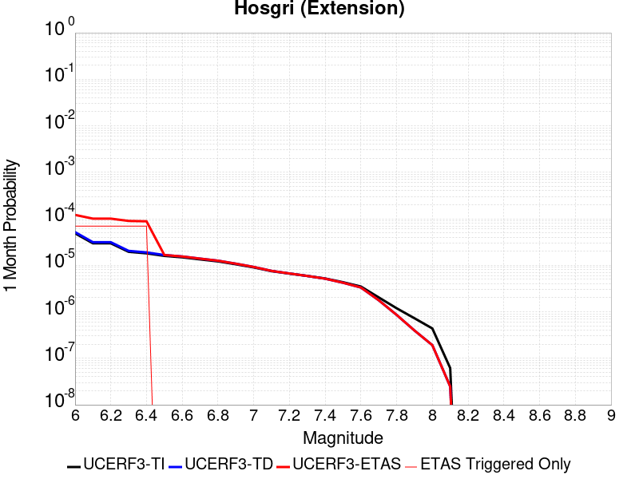 | 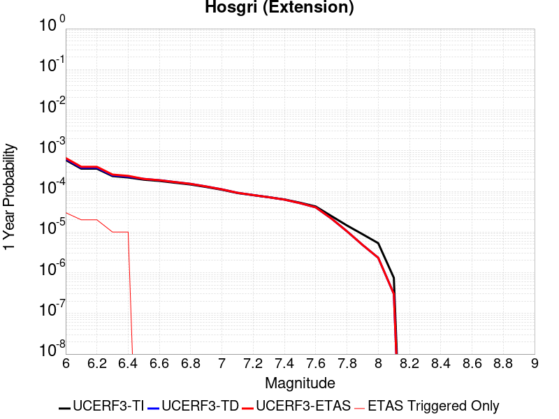 |  |

| Magnitude | 1 wk TI Prob | 1 wk TD Prob | 1 wk ETAS Prob | 1 wk ETAS/TD Gain | 1 wk ETAS Triggered Only | 1 mo TI Prob | 1 mo TD Prob | 1 mo ETAS Prob | 1 mo ETAS/TD Gain | 1 mo ETAS Triggered Only | 1 yr TI Prob | 1 yr TD Prob | 1 yr ETAS Prob | 1 yr ETAS/TD Gain | 1 yr ETAS Triggered Only | 10 yr TI Prob | 10 yr TD Prob | 10 yr ETAS Prob | 10 yr ETAS/TD Gain | 10 yr ETAS Triggered Only |
|-----|-----|-----|-----|-----|-----|-----|-----|-----|-----|-----|-----|-----|-----|-----|-----|-----|-----|-----|-----|-----|
| 6.0 | 1.1369135E-5 | 1.2083073E-5 | 1.2083073E-5 | 1.0 | 0.0 | 4.8723956E-5 | 5.17837E-5 | 6.178318E-5 | 1.1931009 | 1.0E-5 | 5.9305265E-4 | 6.303069E-4 | 6.60288E-4 | 1.0475658 | 3.0E-5 | 0.005914725 | 0.00628744 | 0.006317252 | 1.0047414 | 3.0E-5 |
| 6.1 | 6.934979E-6 | 7.324556E-6 | 7.324556E-6 | 1.0 | 0.0 | 2.9721E-5 | 3.13906E-5 | 4.1390285E-5 | 1.3185567 | 1.0E-5 | 3.617931E-4 | 3.821177E-4 | 4.0211005E-4 | 1.0523199 | 2.0E-5 | 0.0036120464 | 0.003815019 | 0.0038349428 | 1.0052224 | 2.0E-5 |
| 6.2 | 6.934979E-6 | 7.324556E-6 | 7.324556E-6 | 1.0 | 0.0 | 2.9721E-5 | 3.13906E-5 | 4.1390285E-5 | 1.3185567 | 1.0E-5 | 3.617931E-4 | 3.821177E-4 | 4.0211005E-4 | 1.0523199 | 2.0E-5 | 0.0036120464 | 0.003815019 | 0.0038349428 | 1.0052224 | 2.0E-5 |
| 6.3 | 4.5484676E-6 | 4.769331E-6 | 4.769331E-6 | 1.0 | 0.0 | 1.9493287E-5 | 2.0439833E-5 | 3.0439629E-5 | 1.4892308 | 1.0E-5 | 2.3730492E-4 | 2.4882698E-4 | 2.588245E-4 | 1.0401785 | 1.0E-5 | 0.0023705168 | 0.0024855263 | 0.0024955014 | 1.0040133 | 1.0E-5 |
| 6.4 | 4.218095E-6 | 4.416863E-6 | 4.416863E-6 | 1.0 | 0.0 | 1.8077424E-5 | 1.8929275E-5 | 2.8929086E-5 | 1.5282723 | 1.0E-5 | 2.2007042E-4 | 2.3043988E-4 | 2.4043758E-4 | 1.0433853 | 1.0E-5 | 0.002198526 | 0.002302043 | 0.00231202 | 1.004334 | 1.0E-5 |
| 6.5 | 3.717374E-6 | 3.883879E-6 | 3.883879E-6 | 1.0 | 0.0 | 1.5931506E-5 | 1.664509E-5 | 1.664509E-5 | 1.0 | 0.0 | 1.9394881E-4 | 2.026353E-4 | 2.026353E-4 | 1.0 | 0.0 | 0.0019377962 | 0.0020245241 | 0.0020245241 | 1.0 | 0.0 |
| 6.6 | 3.4605036E-6 | 3.6083072E-6 | 3.6083072E-6 | 1.0 | 0.0 | 1.4830645E-5 | 1.5464082E-5 | 1.5464082E-5 | 1.0 | 0.0 | 1.8054814E-4 | 1.8825909E-4 | 1.8825909E-4 | 1.0 | 0.0 | 0.0018040152 | 0.0018810107 | 0.0018810107 | 1.0 | 0.0 |
| 6.7 | 3.123439E-6 | 3.2465698E-6 | 3.2465698E-6 | 1.0 | 0.0 | 1.33860985E-5 | 1.39137965E-5 | 1.39137965E-5 | 1.0 | 0.0 | 1.6296357E-4 | 1.6938741E-4 | 1.6938741E-4 | 1.0 | 0.0 | 0.001628441 | 0.001692594 | 0.001692594 | 1.0 | 0.0 |
| 6.8 | 2.8290783E-6 | 2.9305413E-6 | 2.9305413E-6 | 1.0 | 0.0 | 1.2124565E-5 | 1.2559403E-5 | 1.2559403E-5 | 1.0 | 0.0 | 1.4760658E-4 | 1.5290009E-4 | 1.5290009E-4 | 1.0 | 0.0 | 0.0014750857 | 0.0015279576 | 0.0015279576 | 1.0 | 0.0 |
| 6.9 | 2.454112E-6 | 2.5283207E-6 | 2.5283207E-6 | 1.0 | 0.0 | 1.0517581E-5 | 1.0835615E-5 | 1.0835615E-5 | 1.0 | 0.0 | 1.2804402E-4 | 1.3191569E-4 | 1.3191569E-4 | 1.0 | 0.0 | 0.0012797028 | 0.0013183799 | 0.0013183799 | 1.0 | 0.0 |
| 7.0 | 2.1008145E-6 | 2.1498715E-6 | 2.1498715E-6 | 1.0 | 0.0 | 9.003459E-6 | 9.2137025E-6 | 9.2137025E-6 | 1.0 | 0.0 | 1.096116E-4 | 1.1217109E-4 | 1.1217109E-4 | 1.0 | 0.0 | 0.0010955755 | 0.0011211485 | 0.0011211485 | 1.0 | 0.0 |
| 7.1 | 1.744384E-6 | 1.7686364E-6 | 1.7686364E-6 | 1.0 | 0.0 | 7.47591E-6 | 7.579848E-6 | 7.579848E-6 | 1.0 | 0.0 | 9.1015405E-5 | 9.228076E-5 | 9.228076E-5 | 1.0 | 0.0 | 9.097813E-4 | 9.224261E-4 | 9.224261E-4 | 1.0 | 0.0 |
| 7.2 | 1.5456587E-6 | 1.5562894E-6 | 1.5562894E-6 | 1.0 | 0.0 | 6.6242346E-6 | 6.6697944E-6 | 6.6697944E-6 | 1.0 | 0.0 | 8.064707E-5 | 8.120173E-5 | 8.120173E-5 | 1.0 | 0.0 | 8.0617814E-4 | 8.117219E-4 | 8.117219E-4 | 1.0 | 0.0 |
| 7.3 | 1.3775123E-6 | 1.3766092E-6 | 1.3766092E-6 | 1.0 | 0.0 | 5.9036106E-6 | 5.8997407E-6 | 5.8997407E-6 | 1.0 | 0.0 | 7.187409E-5 | 7.182699E-5 | 7.182699E-5 | 1.0 | 0.0 | 7.185085E-4 | 7.180387E-4 | 7.180387E-4 | 1.0 | 0.0 |
| 7.4 | 1.214491E-6 | 1.2023471E-6 | 1.2023471E-6 | 1.0 | 0.0 | 5.2049513E-6 | 5.152906E-6 | 5.152906E-6 | 1.0 | 0.0 | 6.336844E-5 | 6.2734835E-5 | 6.2734835E-5 | 1.0 | 0.0 | 6.335037E-4 | 6.2717206E-4 | 6.2717206E-4 | 1.0 | 0.0 |
| 7.5 | 1.0101123E-6 | 9.842256E-7 | 9.842256E-7 | 1.0 | 0.0 | 4.3290456E-6 | 4.218103E-6 | 4.218103E-6 | 1.0 | 0.0 | 5.2704854E-5 | 5.13542E-5 | 5.13542E-5 | 1.0 | 0.0 | 5.2692357E-4 | 5.1342393E-4 | 5.1342393E-4 | 1.0 | 0.0 |
| 7.6 | 8.1558215E-7 | 7.765977E-7 | 7.765977E-7 | 1.0 | 0.0 | 3.4953473E-6 | 3.3282718E-6 | 3.3282718E-6 | 1.0 | 0.0 | 4.255502E-5 | 4.0520958E-5 | 4.0520958E-5 | 1.0 | 0.0 | 4.2546875E-4 | 4.0513615E-4 | 4.0513615E-4 | 1.0 | 0.0 |
| 7.7 | 4.757816E-7 | 4.1308996E-7 | 4.1308996E-7 | 1.0 | 0.0 | 2.0390623E-6 | 1.7703843E-6 | 1.7703843E-6 | 1.0 | 0.0 | 2.4825302E-5 | 2.1554217E-5 | 2.1554217E-5 | 1.0 | 0.0 | 2.482253E-4 | 2.1552139E-4 | 2.1552139E-4 | 1.0 | 0.0 |
| 7.8 | 2.782787E-7 | 2.004783E-7 | 2.004783E-7 | 1.0 | 0.0 | 1.1926223E-6 | 8.591924E-7 | 8.591924E-7 | 1.0 | 0.0 | 1.452008E-5 | 1.0460618E-5 | 1.0460618E-5 | 1.0 | 0.0 | 1.4519131E-4 | 1.04601284E-4 | 1.04601284E-4 | 1.0 | 0.0 |
| 7.9 | 1.6948086E-7 | 9.243938E-8 | 9.243938E-8 | 1.0 | 0.0 | 7.2634634E-7 | 3.961687E-7 | 3.961687E-7 | 1.0 | 0.0 | 8.843231E-6 | 4.8233433E-6 | 4.8233433E-6 | 1.0 | 0.0 | 8.842879E-5 | 4.8232392E-5 | 4.8232392E-5 | 1.0 | 0.0 |
| 8.0 | 1.0225492E-7 | 4.473497E-8 | 4.473497E-8 | 1.0 | 0.0 | 4.382353E-7 | 1.917213E-7 | 1.917213E-7 | 1.0 | 0.0 | 5.335502E-6 | 2.3342043E-6 | 2.3342043E-6 | 1.0 | 0.0 | 5.335374E-5 | 2.33418E-5 | 2.33418E-5 | 1.0 | 0.0 |
| 8.1 | 1.43711345E-8 | 5.78716E-9 | 5.78716E-9 | 1.0 | 0.0 | 6.1590576E-8 | 2.4802116E-8 | 2.4802116E-8 | 1.0 | 0.0 | 7.4986497E-7 | 3.019657E-7 | 3.019657E-7 | 1.0 | 0.0 | 7.4986247E-6 | 3.0196536E-6 | 3.0196536E-6 | 1.0 | 0.0 |

## White Wolf
*[(top)](#table-of-contents)*

| 1 Week | 1 Month | 1 Year | 10 Year |
|-----|-----|-----|-----|
|  |  | 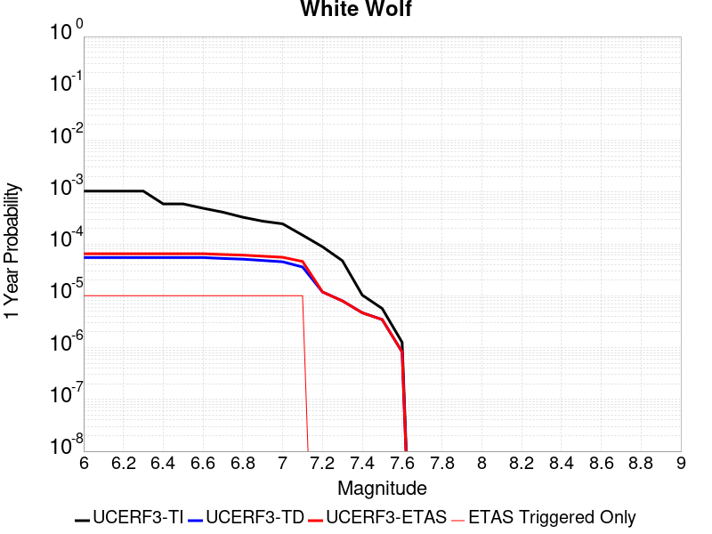 |  |

| Magnitude | 1 wk TI Prob | 1 wk TD Prob | 1 wk ETAS Prob | 1 wk ETAS/TD Gain | 1 wk ETAS Triggered Only | 1 mo TI Prob | 1 mo TD Prob | 1 mo ETAS Prob | 1 mo ETAS/TD Gain | 1 mo ETAS Triggered Only | 1 yr TI Prob | 1 yr TD Prob | 1 yr ETAS Prob | 1 yr ETAS/TD Gain | 1 yr ETAS Triggered Only | 10 yr TI Prob | 10 yr TD Prob | 10 yr ETAS Prob | 10 yr ETAS/TD Gain | 10 yr ETAS Triggered Only |
|-----|-----|-----|-----|-----|-----|-----|-----|-----|-----|-----|-----|-----|-----|-----|-----|-----|-----|-----|-----|-----|
| 6.0 | 2.0037822E-5 | 1.0468583E-6 | 1.0468583E-6 | 1.0 | 0.0 | 8.587355E-5 | 4.4865283E-6 | 4.4865283E-6 | 1.0 | 0.0 | 0.001045009 | 5.4622164E-5 | 6.4621614E-5 | 1.1830659 | 1.0E-5 | 0.010401085 | 5.4609246E-4 | 5.7607604E-4 | 1.0549058 | 3.0E-5 |
| 6.1 | 2.0037822E-5 | 1.0468583E-6 | 1.0468583E-6 | 1.0 | 0.0 | 8.587355E-5 | 4.4865283E-6 | 4.4865283E-6 | 1.0 | 0.0 | 0.001045009 | 5.4622164E-5 | 6.4621614E-5 | 1.1830659 | 1.0E-5 | 0.010401085 | 5.4609246E-4 | 5.7607604E-4 | 1.0549058 | 3.0E-5 |
| 6.2 | 2.0037822E-5 | 1.0468583E-6 | 1.0468583E-6 | 1.0 | 0.0 | 8.587355E-5 | 4.4865283E-6 | 4.4865283E-6 | 1.0 | 0.0 | 0.001045009 | 5.4622164E-5 | 6.4621614E-5 | 1.1830659 | 1.0E-5 | 0.010401085 | 5.4609246E-4 | 5.7607604E-4 | 1.0549058 | 3.0E-5 |
| 6.3 | 2.0037822E-5 | 1.0468583E-6 | 1.0468583E-6 | 1.0 | 0.0 | 8.587355E-5 | 4.4865283E-6 | 4.4865283E-6 | 1.0 | 0.0 | 0.001045009 | 5.4622164E-5 | 6.4621614E-5 | 1.1830659 | 1.0E-5 | 0.010401085 | 5.4609246E-4 | 5.7607604E-4 | 1.0549058 | 3.0E-5 |
| 6.4 | 1.132487E-5 | 1.0468583E-6 | 1.0468583E-6 | 1.0 | 0.0 | 4.8534253E-5 | 4.4865283E-6 | 4.4865283E-6 | 1.0 | 0.0 | 5.907443E-4 | 5.4622164E-5 | 6.4621614E-5 | 1.1830659 | 1.0E-5 | 0.005891764 | 5.4609246E-4 | 5.7607604E-4 | 1.0549058 | 3.0E-5 |
| 6.5 | 1.132487E-5 | 1.0468583E-6 | 1.0468583E-6 | 1.0 | 0.0 | 4.8534253E-5 | 4.4865283E-6 | 4.4865283E-6 | 1.0 | 0.0 | 5.907443E-4 | 5.4622164E-5 | 6.4621614E-5 | 1.1830659 | 1.0E-5 | 0.005891764 | 5.4609246E-4 | 5.7607604E-4 | 1.0549058 | 3.0E-5 |
| 6.6 | 9.347473E-6 | 1.0468583E-6 | 1.0468583E-6 | 1.0 | 0.0 | 4.0059982E-5 | 4.4865283E-6 | 4.4865283E-6 | 1.0 | 0.0 | 4.8762115E-4 | 5.4622164E-5 | 6.4621614E-5 | 1.1830659 | 1.0E-5 | 0.0048655253 | 5.4609246E-4 | 5.7607604E-4 | 1.0549058 | 3.0E-5 |
| 6.7 | 7.842647E-6 | 1.0047773E-6 | 1.0047773E-6 | 1.0 | 0.0 | 3.361091E-5 | 4.306182E-6 | 4.306182E-6 | 1.0 | 0.0 | 4.0913603E-4 | 5.2426552E-5 | 6.242603E-5 | 1.1907331 | 1.0E-5 | 0.004083836 | 5.241468E-4 | 5.4413633E-4 | 1.0381372 | 2.0E-5 |
| 6.8 | 6.26597E-6 | 9.734289E-7 | 9.734289E-7 | 1.0 | 0.0 | 2.685388E-5 | 4.1718313E-6 | 4.1718313E-6 | 1.0 | 0.0 | 3.2689696E-4 | 5.0790914E-5 | 6.0790408E-5 | 1.1968756 | 1.0E-5 | 0.003264165 | 5.07798E-4 | 5.2778784E-4 | 1.0393658 | 2.0E-5 |
| 6.9 | 5.258436E-6 | 9.1827343E-7 | 9.1827343E-7 | 1.0 | 0.0 | 2.2535958E-5 | 3.935452E-6 | 3.935452E-6 | 1.0 | 0.0 | 2.7434074E-4 | 4.7913123E-5 | 5.7912643E-5 | 1.2087011 | 1.0E-5 | 0.0027400232 | 4.7903272E-4 | 4.990231E-4 | 1.0417308 | 2.0E-5 |
| 7.0 | 4.675028E-6 | 8.660704E-7 | 8.660704E-7 | 1.0 | 0.0 | 2.003568E-5 | 3.7117254E-6 | 3.7117254E-6 | 1.0 | 0.0 | 2.4390711E-4 | 4.518937E-5 | 5.5188913E-5 | 1.221281 | 1.0E-5 | 0.0024363957 | 4.518065E-4 | 4.7179745E-4 | 1.0442468 | 2.0E-5 |
| 7.1 | 2.8270078E-6 | 6.8737717E-7 | 6.8737717E-7 | 1.0 | 0.0 | 1.2115692E-5 | 2.945899E-6 | 2.945899E-6 | 1.0 | 0.0 | 1.4749856E-4 | 3.586577E-5 | 4.5865414E-5 | 1.2788074 | 1.0E-5 | 0.001474007 | 3.5860392E-4 | 3.7859674E-4 | 1.0557518 | 2.0E-5 |
| 7.2 | 1.6881406E-6 | 2.2703432E-7 | 2.2703432E-7 | 1.0 | 0.0 | 7.2348685E-6 | 9.730038E-7 | 9.730038E-7 | 1.0 | 0.0 | 8.808096E-5 | 1.1846259E-5 | 1.1846259E-5 | 1.0 | 0.0 | 8.8046055E-4 | 1.1845643E-4 | 1.1845643E-4 | 1.0 | 0.0 |
| 7.3 | 9.086107E-7 | 1.5264496E-7 | 1.5264496E-7 | 1.0 | 0.0 | 3.8940398E-6 | 6.5419255E-7 | 6.5419255E-7 | 1.0 | 0.0 | 4.7408903E-5 | 7.964766E-6 | 7.964766E-6 | 1.0 | 0.0 | 4.739879E-4 | 7.964489E-5 | 7.964489E-5 | 1.0 | 0.0 |
| 7.4 | 1.9717383E-7 | 9.003399E-8 | 9.003399E-8 | 1.0 | 0.0 | 8.450304E-7 | 3.8585992E-7 | 3.8585992E-7 | 1.0 | 0.0 | 1.0288197E-5 | 4.697835E-6 | 4.697835E-6 | 1.0 | 0.0 | 1.028772E-4 | 4.6977384E-5 | 4.6977384E-5 | 1.0 | 0.0 |
| 7.5 | 1.086975E-7 | 6.659662E-8 | 6.659662E-8 | 1.0 | 0.0 | 4.6584634E-7 | 2.8541407E-7 | 2.8541407E-7 | 1.0 | 0.0 | 5.6716644E-6 | 3.474911E-6 | 3.474911E-6 | 1.0 | 0.0 | 5.6715195E-5 | 3.474859E-5 | 3.474859E-5 | 1.0 | 0.0 |
| 7.6 | 2.4217808E-8 | 1.5820849E-8 | 1.5820849E-8 | 1.0 | 0.0 | 1.03790605E-7 | 6.780364E-8 | 6.780364E-8 | 1.0 | 0.0 | 1.2636499E-6 | 8.25509E-7 | 8.25509E-7 | 1.0 | 0.0 | 1.2636427E-5 | 8.255064E-6 | 8.255064E-6 | 1.0 | 0.0 |

## Almanor 2011 CFM
*[(top)](#table-of-contents)*

| 1 Week | 1 Month | 1 Year | 10 Year |
|-----|-----|-----|-----|
| 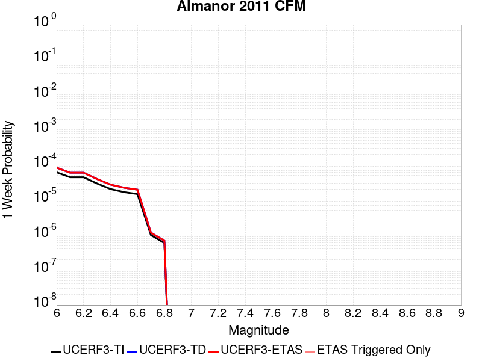 | 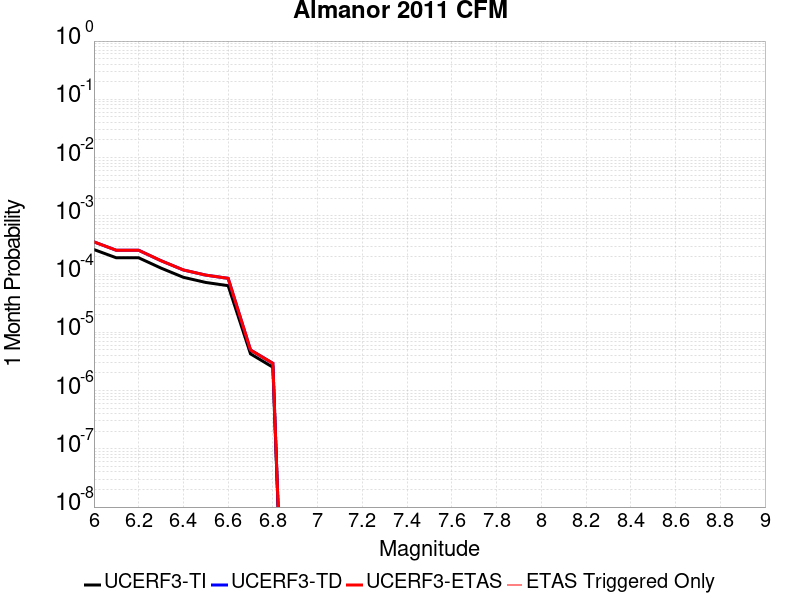 | 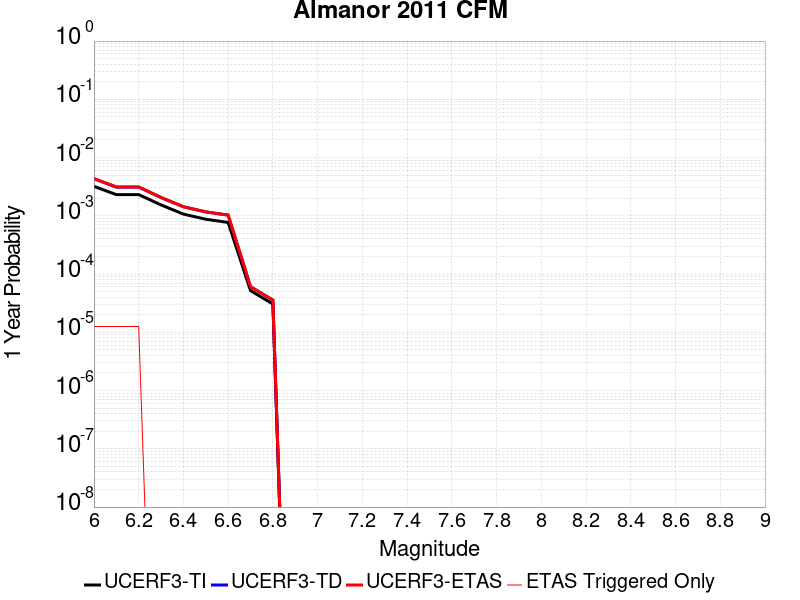 | 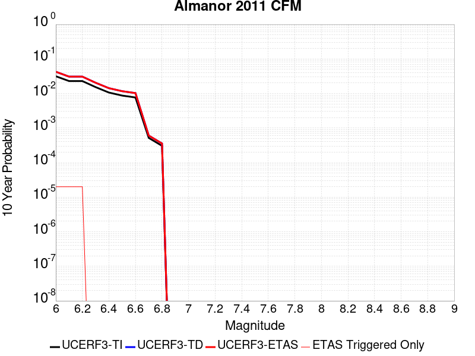 |

| Magnitude | 1 wk TI Prob | 1 wk TD Prob | 1 wk ETAS Prob | 1 wk ETAS/TD Gain | 1 wk ETAS Triggered Only | 1 mo TI Prob | 1 mo TD Prob | 1 mo ETAS Prob | 1 mo ETAS/TD Gain | 1 mo ETAS Triggered Only | 1 yr TI Prob | 1 yr TD Prob | 1 yr ETAS Prob | 1 yr ETAS/TD Gain | 1 yr ETAS Triggered Only | 10 yr TI Prob | 10 yr TD Prob | 10 yr ETAS Prob | 10 yr ETAS/TD Gain | 10 yr ETAS Triggered Only |
|-----|-----|-----|-----|-----|-----|-----|-----|-----|-----|-----|-----|-----|-----|-----|-----|-----|-----|-----|-----|-----|
| 6.0 | 6.1479834E-5 | 8.327245E-5 | 8.327245E-5 | 1.0 | 0.0 | 2.6345838E-4 | 3.5683523E-4 | 3.5683523E-4 | 1.0 | 0.0 | 0.0032028882 | 0.004336495 | 0.0043464517 | 1.002296 | 1.0E-5 | 0.031571172 | 0.04258658 | 0.042605728 | 1.0004497 | 2.0E-5 |
| 6.1 | 4.4387216E-5 | 5.9767433E-5 | 5.9767433E-5 | 1.0 | 0.0 | 1.9021705E-4 | 2.561236E-4 | 2.561236E-4 | 1.0 | 0.0 | 0.0023134327 | 0.003114351 | 0.0031243197 | 1.0032009 | 1.0E-5 | 0.022894967 | 0.030755581 | 0.030774966 | 1.0006303 | 2.0E-5 |
| 6.2 | 4.4387216E-5 | 5.9767433E-5 | 5.9767433E-5 | 1.0 | 0.0 | 1.9021705E-4 | 2.561236E-4 | 2.561236E-4 | 1.0 | 0.0 | 0.0023134327 | 0.003114351 | 0.0031243197 | 1.0032009 | 1.0E-5 | 0.022894967 | 0.030755581 | 0.030774966 | 1.0006303 | 2.0E-5 |
| 6.3 | 2.9523822E-5 | 3.9546965E-5 | 3.9546965E-5 | 1.0 | 0.0 | 1.2652454E-4 | 1.6947731E-4 | 1.6947731E-4 | 1.0 | 0.0 | 0.0015393476 | 0.0020617929 | 0.0020617929 | 1.0 | 0.0 | 0.015287281 | 0.020461112 | 0.020461112 | 1.0 | 0.0 |
| 6.4 | 2.0512744E-5 | 2.7430639E-5 | 2.7430639E-5 | 1.0 | 0.0 | 8.79088E-5 | 1.17555675E-4 | 1.17555675E-4 | 1.0 | 0.0 | 0.001069764 | 0.0014306171 | 0.0014306171 | 1.0 | 0.0 | 0.010646289 | 0.01424458 | 0.01424458 | 1.0 | 0.0 |
| 6.5 | 1.6750226E-5 | 2.2390364E-5 | 2.2390364E-5 | 1.0 | 0.0 | 7.178471E-5 | 9.595619E-5 | 9.595619E-5 | 1.0 | 0.0 | 8.7362836E-4 | 0.0011679606 | 0.0011679606 | 1.0 | 0.0 | 0.008702018 | 0.011649196 | 0.011649196 | 1.0 | 0.0 |
| 6.6 | 1.4745303E-5 | 1.970686E-5 | 1.970686E-5 | 1.0 | 0.0 | 6.319262E-5 | 8.445639E-5 | 8.445639E-5 | 1.0 | 0.0 | 7.690986E-4 | 0.0010280984 | 0.0010280984 | 1.0 | 0.0 | 0.0076644225 | 0.01026513 | 0.01026513 | 1.0 | 0.0 |
| 6.7 | 9.951145E-7 | 1.1616347E-6 | 1.1616347E-6 | 1.0 | 0.0 | 4.26477E-6 | 4.9784257E-6 | 4.9784257E-6 | 1.0 | 0.0 | 5.1922336E-5 | 6.0610826E-5 | 6.0610826E-5 | 1.0 | 0.0 | 5.1910203E-4 | 6.059602E-4 | 6.059602E-4 | 1.0 | 0.0 |
| 6.8 | 5.866312E-7 | 6.849384E-7 | 6.849384E-7 | 1.0 | 0.0 | 2.5141312E-6 | 2.9354478E-6 | 2.9354478E-6 | 1.0 | 0.0 | 3.0609117E-5 | 3.5738623E-5 | 3.5738623E-5 | 1.0 | 0.0 | 3.06049E-4 | 3.5734157E-4 | 3.5734157E-4 | 1.0 | 0.0 |

## San Jacinto (Borrego)
*[(top)](#table-of-contents)*

| 1 Week | 1 Month | 1 Year | 10 Year |
|-----|-----|-----|-----|
| 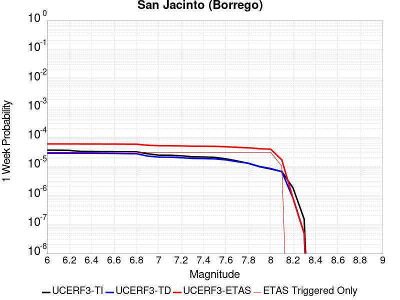 | 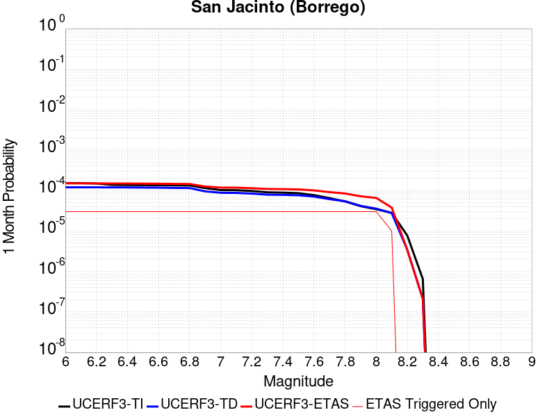 | 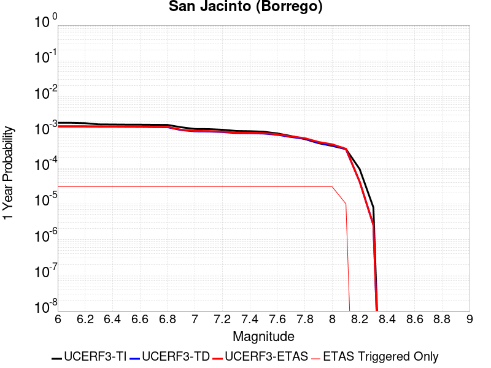 | 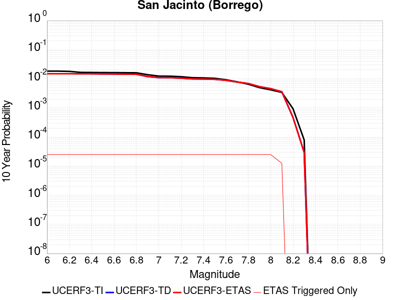 |

| Magnitude | 1 wk TI Prob | 1 wk TD Prob | 1 wk ETAS Prob | 1 wk ETAS/TD Gain | 1 wk ETAS Triggered Only | 1 mo TI Prob | 1 mo TD Prob | 1 mo ETAS Prob | 1 mo ETAS/TD Gain | 1 mo ETAS Triggered Only | 1 yr TI Prob | 1 yr TD Prob | 1 yr ETAS Prob | 1 yr ETAS/TD Gain | 1 yr ETAS Triggered Only | 10 yr TI Prob | 10 yr TD Prob | 10 yr ETAS Prob | 10 yr ETAS/TD Gain | 10 yr ETAS Triggered Only |
|-----|-----|-----|-----|-----|-----|-----|-----|-----|-----|-----|-----|-----|-----|-----|-----|-----|-----|-----|-----|-----|
| 6.0 | 3.543992E-5 | 2.7925962E-5 | 5.7925125E-5 | 2.0742393 | 3.0E-5 | 1.5187653E-4 | 1.1967727E-4 | 1.4967368E-4 | 1.2506442 | 3.0E-5 | 0.0018475284 | 0.0014561092 | 0.0014860654 | 1.0205729 | 3.0E-5 | 0.018322436 | 0.01486815 | 0.014897705 | 1.0019877 | 3.0E-5 |
| 6.1 | 3.542281E-5 | 2.7925962E-5 | 5.7925125E-5 | 2.0742393 | 3.0E-5 | 1.5180321E-4 | 1.1967727E-4 | 1.4967368E-4 | 1.2506442 | 3.0E-5 | 0.0018466372 | 0.0014561092 | 0.0014860654 | 1.0205729 | 3.0E-5 | 0.018313672 | 0.01486815 | 0.014897705 | 1.0019877 | 3.0E-5 |
| 6.2 | 3.4688688E-5 | 2.7925962E-5 | 5.7925125E-5 | 2.0742393 | 3.0E-5 | 1.4865733E-4 | 1.1967727E-4 | 1.4967368E-4 | 1.2506442 | 3.0E-5 | 0.0018084005 | 0.0014561091 | 0.0014860654 | 1.0205729 | 3.0E-5 | 0.017937548 | 0.01486815 | 0.014897704 | 1.0019877 | 3.0E-5 |
| 6.3 | 3.2087122E-5 | 2.7771312E-5 | 5.7770478E-5 | 2.0802214 | 3.0E-5 | 1.3750899E-4 | 1.1901455E-4 | 1.4901097E-4 | 1.25204 | 3.0E-5 | 0.0016728862 | 0.0014480512 | 0.0014780078 | 1.0206875 | 3.0E-5 | 0.016603488 | 0.014789308 | 0.014818865 | 1.0019985 | 3.0E-5 |
| 6.4 | 3.1828724E-5 | 2.773829E-5 | 5.7737456E-5 | 2.0815074 | 3.0E-5 | 1.364017E-4 | 1.1887303E-4 | 1.4886947E-4 | 1.2523401 | 3.0E-5 | 0.0016594254 | 0.0014463306 | 0.0014762871 | 1.0207121 | 3.0E-5 | 0.016470885 | 0.014772502 | 0.014802058 | 1.0020008 | 3.0E-5 |
| 6.5 | 3.1563577E-5 | 2.7477974E-5 | 5.747715E-5 | 2.0917535 | 3.0E-5 | 1.3526545E-4 | 1.17757496E-4 | 1.4775396E-4 | 1.2547308 | 3.0E-5 | 0.0016456128 | 0.0014327668 | 0.0014627238 | 1.0209085 | 3.0E-5 | 0.0163348 | 0.01463991 | 0.0146694705 | 1.0020192 | 3.0E-5 |
| 6.6 | 3.1467625E-5 | 2.7322194E-5 | 5.7321373E-5 | 2.0979784 | 3.0E-5 | 1.3485427E-4 | 1.17089934E-4 | 1.4708642E-4 | 1.2561833 | 3.0E-5 | 0.0016406142 | 0.0014246498 | 0.0014546071 | 1.0210278 | 3.0E-5 | 0.016285548 | 0.014560228 | 0.014589791 | 1.0020304 | 3.0E-5 |
| 6.7 | 3.1223695E-5 | 2.6940217E-5 | 5.693941E-5 | 2.1135468 | 3.0E-5 | 1.3380898E-4 | 1.1545303E-4 | 1.4544957E-4 | 1.2598159 | 3.0E-5 | 0.0016279068 | 0.0014047464 | 0.0014347043 | 1.0213262 | 3.0E-5 | 0.01616033 | 0.01436451 | 0.014394078 | 1.0020585 | 3.0E-5 |
| 6.8 | 3.1015585E-5 | 2.6761221E-5 | 5.676042E-5 | 2.120995 | 3.0E-5 | 1.3291716E-4 | 1.1468597E-4 | 1.4468253E-4 | 1.2615539 | 3.0E-5 | 0.001617065 | 0.0013954195 | 0.0014253776 | 1.0214689 | 3.0E-5 | 0.016053487 | 0.014271772 | 0.014301344 | 1.0020721 | 3.0E-5 |
| 6.9 | 2.6641965E-5 | 2.2183434E-5 | 5.2182768E-5 | 2.3523304 | 3.0E-5 | 1.1417485E-4 | 9.506842E-5 | 1.2506556E-4 | 1.3155322 | 3.0E-5 | 0.0013891924 | 0.0011568473 | 0.0011868126 | 1.0259025 | 3.0E-5 | 0.0138054015 | 0.011882191 | 0.011911835 | 1.0024948 | 3.0E-5 |
| 7.0 | 2.3854353E-5 | 2.047825E-5 | 5.0477636E-5 | 2.4649389 | 3.0E-5 | 1.02228936E-4 | 8.776099E-5 | 1.1775836E-4 | 1.3418075 | 3.0E-5 | 0.0012439266 | 0.0010679689 | 0.0010979369 | 1.0280607 | 3.0E-5 | 0.012369866 | 0.0109826205 | 0.011012291 | 1.0027016 | 3.0E-5 |
| 7.1 | 2.3672901E-5 | 2.0314741E-5 | 5.031413E-5 | 2.47673 | 3.0E-5 | 1.0145135E-4 | 8.706028E-5 | 1.1705767E-4 | 1.3445588 | 3.0E-5 | 0.0012344702 | 0.0010594461 | 0.0010894143 | 1.0282867 | 3.0E-5 | 0.0122763505 | 0.010897858 | 0.010927532 | 1.0027229 | 3.0E-5 |
| 7.2 | 2.2717244E-5 | 1.9542116E-5 | 4.954153E-5 | 2.535116 | 3.0E-5 | 9.735599E-5 | 8.3749255E-5 | 1.1374674E-4 | 1.3581822 | 3.0E-5 | 0.0011846646 | 0.0010191725 | 0.001049142 | 1.0294056 | 3.0E-5 | 0.01178369 | 0.010495322 | 0.010525007 | 1.0028284 | 3.0E-5 |
| 7.3 | 2.1016205E-5 | 1.8383771E-5 | 4.838322E-5 | 2.631844 | 3.0E-5 | 9.006634E-5 | 7.878522E-5 | 1.0878286E-4 | 1.3807521 | 3.0E-5 | 0.001096006 | 9.5879E-4 | 9.887613E-4 | 1.0312594 | 3.0E-5 | 0.010906163 | 0.009890901 | 0.0099206045 | 1.0030031 | 3.0E-5 |
| 7.4 | 2.0683625E-5 | 1.8186302E-5 | 4.8185757E-5 | 2.6495633 | 3.0E-5 | 8.86411E-5 | 7.7938974E-5 | 1.07936634E-4 | 1.3848865 | 3.0E-5 | 0.001078671 | 9.48496E-4 | 9.784675E-4 | 1.031599 | 3.0E-5 | 0.010734501 | 0.0097876275 | 0.009817334 | 1.0030351 | 3.0E-5 |
| 7.5 | 1.9993966E-5 | 1.7781347E-5 | 4.7780813E-5 | 2.6871312 | 3.0E-5 | 8.568561E-5 | 7.6203556E-5 | 1.06201274E-4 | 1.3936524 | 3.0E-5 | 0.001042723 | 9.2738547E-4 | 9.5735764E-4 | 1.032319 | 3.0E-5 | 0.010378438 | 0.009574548 | 0.009604261 | 1.0031033 | 3.0E-5 |
| 7.6 | 1.788966E-5 | 1.6434618E-5 | 4.6434125E-5 | 2.825385 | 3.0E-5 | 7.666772E-5 | 7.043219E-5 | 1.0043007E-4 | 1.4259117 | 3.0E-5 | 9.3302975E-4 | 8.5717626E-4 | 8.871505E-4 | 1.0349686 | 3.0E-5 | 0.00929122 | 0.008866415 | 0.00889615 | 1.0033536 | 3.0E-5 |
| 7.7 | 1.5125781E-5 | 1.4236738E-5 | 4.4236313E-5 | 3.1071942 | 3.0E-5 | 6.4823165E-5 | 6.101317E-5 | 9.101134E-5 | 1.4916672 | 3.0E-5 | 7.889362E-4 | 7.4258295E-4 | 7.725607E-4 | 1.0403695 | 3.0E-5 | 0.007861412 | 0.007714161 | 0.0077439295 | 1.0038589 | 3.0E-5 |
| 7.8 | 1.250089E-5 | 1.262994E-5 | 4.2629563E-5 | 3.3752782 | 3.0E-5 | 5.3574146E-5 | 5.4127195E-5 | 8.4125575E-5 | 1.5542201 | 3.0E-5 | 6.5207E-4 | 6.588E-4 | 6.887802E-4 | 1.0455073 | 3.0E-5 | 0.006501599 | 0.006867759 | 0.006897553 | 1.0043383 | 3.0E-5 |
| 7.9 | 9.561E-6 | 9.754065E-6 | 3.9753773E-5 | 4.0756106 | 3.0E-5 | 4.0975072E-5 | 4.180247E-5 | 7.1801216E-5 | 1.717631 | 3.0E-5 | 4.987573E-4 | 5.0882675E-4 | 5.388115E-4 | 1.0589292 | 3.0E-5 | 0.0049763937 | 0.0053523607 | 0.0053822 | 1.0055751 | 3.0E-5 |
| 8.0 | 8.01699E-6 | 8.292994E-6 | 3.8292746E-5 | 4.6174817 | 3.0E-5 | 3.4358076E-5 | 3.554092E-5 | 6.5539854E-5 | 1.8440675 | 3.0E-5 | 4.1822926E-4 | 4.3262533E-4 | 4.6261234E-4 | 1.0693141 | 3.0E-5 | 0.0041744304 | 0.0045733186 | 0.0046031815 | 1.0065298 | 3.0E-5 |
| 8.1 | 6.541947E-6 | 6.461784E-6 | 1.646172E-5 | 2.5475502 | 1.0E-5 | 2.8036617E-5 | 2.7693068E-5 | 3.7692793E-5 | 1.3610911 | 1.0E-5 | 3.4129233E-4 | 3.3711144E-4 | 3.4710809E-4 | 1.0296538 | 1.0E-5 | 0.0034076865 | 0.0035805756 | 0.0035905396 | 1.0027828 | 1.0E-5 |
| 8.2 | 1.7968189E-6 | 7.9684827E-7 | 7.9684827E-7 | 1.0 | 0.0 | 7.70063E-6 | 3.4150596E-6 | 3.4150596E-6 | 1.0 | 0.0 | 9.3751136E-5 | 4.157758E-5 | 4.157758E-5 | 1.0 | 0.0 | 9.371159E-4 | 4.7107413E-4 | 4.7107413E-4 | 1.0 | 0.0 |
| 8.3 | 1.5167889E-7 | 4.8951257E-8 | 4.8951257E-8 | 1.0 | 0.0 | 6.500522E-7 | 2.0979108E-7 | 2.0979108E-7 | 1.0 | 0.0 | 7.9143565E-6 | 2.5542038E-6 | 2.5542038E-6 | 1.0 | 0.0 | 7.914075E-5 | 2.9679897E-5 | 2.9679897E-5 | 1.0 | 0.0 |

## Elsinore (Temecula) rev
*[(top)](#table-of-contents)*

| 1 Week | 1 Month | 1 Year | 10 Year |
|-----|-----|-----|-----|
| 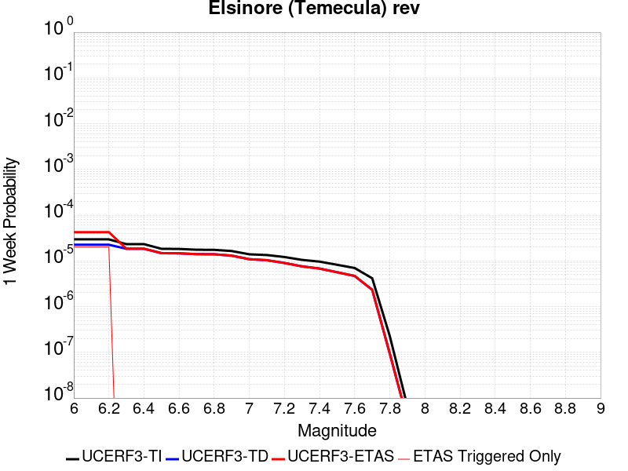 | 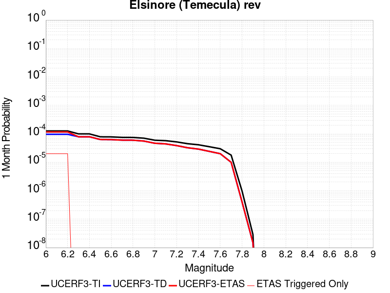 | 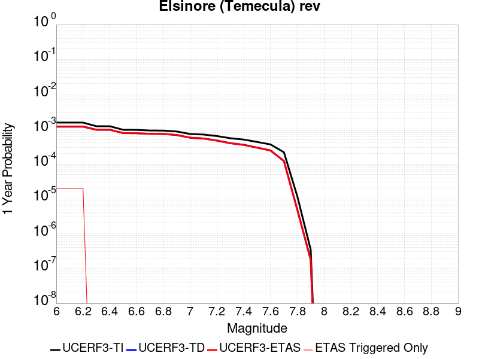 | 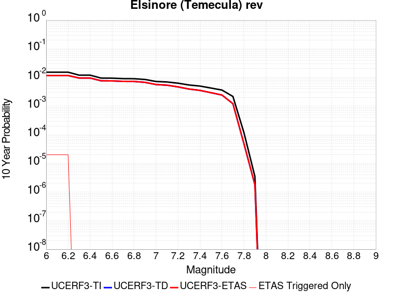 |

| Magnitude | 1 wk TI Prob | 1 wk TD Prob | 1 wk ETAS Prob | 1 wk ETAS/TD Gain | 1 wk ETAS Triggered Only | 1 mo TI Prob | 1 mo TD Prob | 1 mo ETAS Prob | 1 mo ETAS/TD Gain | 1 mo ETAS Triggered Only | 1 yr TI Prob | 1 yr TD Prob | 1 yr ETAS Prob | 1 yr ETAS/TD Gain | 1 yr ETAS Triggered Only | 10 yr TI Prob | 10 yr TD Prob | 10 yr ETAS Prob | 10 yr ETAS/TD Gain | 10 yr ETAS Triggered Only |
|-----|-----|-----|-----|-----|-----|-----|-----|-----|-----|-----|-----|-----|-----|-----|-----|-----|-----|-----|-----|-----|
| 6.0 | 2.9514995E-5 | 2.251887E-5 | 4.251842E-5 | 1.888124 | 2.0E-5 | 1.264867E-4 | 9.6505995E-5 | 1.1650407E-4 | 1.207221 | 2.0E-5 | 0.0015388876 | 0.0011743492 | 0.0011943257 | 1.0170107 | 2.0E-5 | 0.015282745 | 0.011688135 | 0.011707901 | 1.0016911 | 2.0E-5 |
| 6.1 | 2.9514995E-5 | 2.251887E-5 | 4.251842E-5 | 1.888124 | 2.0E-5 | 1.264867E-4 | 9.6505995E-5 | 1.1650407E-4 | 1.207221 | 2.0E-5 | 0.0015388876 | 0.0011743492 | 0.0011943257 | 1.0170107 | 2.0E-5 | 0.015282745 | 0.011688135 | 0.011707901 | 1.0016911 | 2.0E-5 |
| 6.2 | 2.9514995E-5 | 2.251887E-5 | 4.251842E-5 | 1.888124 | 2.0E-5 | 1.264867E-4 | 9.6505995E-5 | 1.1650407E-4 | 1.207221 | 2.0E-5 | 0.0015388876 | 0.0011743492 | 0.0011943257 | 1.0170107 | 2.0E-5 | 0.015282745 | 0.011688135 | 0.011707901 | 1.0016911 | 2.0E-5 |
| 6.3 | 2.3223649E-5 | 1.840822E-5 | 1.840822E-5 | 1.0 | 0.0 | 9.952613E-5 | 7.889008E-5 | 7.889008E-5 | 1.0 | 0.0 | 0.001211057 | 9.600807E-4 | 9.600807E-4 | 1.0 | 0.0 | 0.012044783 | 0.009551284 | 0.009551284 | 1.0 | 0.0 |
| 6.4 | 2.3223649E-5 | 1.840822E-5 | 1.840822E-5 | 1.0 | 0.0 | 9.952613E-5 | 7.889008E-5 | 7.889008E-5 | 1.0 | 0.0 | 0.001211057 | 9.600807E-4 | 9.600807E-4 | 1.0 | 0.0 | 0.012044783 | 0.009551284 | 0.009551284 | 1.0 | 0.0 |
| 6.5 | 1.8338875E-5 | 1.4750074E-5 | 1.4750074E-5 | 1.0 | 0.0 | 7.8592806E-5 | 6.321312E-5 | 6.321312E-5 | 1.0 | 0.0 | 9.5644733E-4 | 7.6935673E-4 | 7.6935673E-4 | 1.0 | 0.0 | 0.009523412 | 0.0076699676 | 0.0076699676 | 1.0 | 0.0 |
| 6.6 | 1.8223333E-5 | 1.461263E-5 | 1.461263E-5 | 1.0 | 0.0 | 7.809766E-5 | 6.26241E-5 | 6.26241E-5 | 1.0 | 0.0 | 9.504242E-4 | 7.621905E-4 | 7.621905E-4 | 1.0 | 0.0 | 0.009463696 | 0.007598796 | 0.007598796 | 1.0 | 0.0 |
| 6.7 | 1.7512752E-5 | 1.4026963E-5 | 1.4026963E-5 | 1.0 | 0.0 | 7.505249E-5 | 6.0114216E-5 | 6.0114216E-5 | 1.0 | 0.0 | 9.13381E-4 | 7.316534E-4 | 7.316534E-4 | 1.0 | 0.0 | 0.00909636 | 0.0072983317 | 0.0072983317 | 1.0 | 0.0 |
| 6.8 | 1.7417142E-5 | 1.395093E-5 | 1.395093E-5 | 1.0 | 0.0 | 7.4642754E-5 | 5.978838E-5 | 5.978838E-5 | 1.0 | 0.0 | 9.083966E-4 | 7.27689E-4 | 7.27689E-4 | 1.0 | 0.0 | 0.009046922 | 0.007259359 | 0.007259359 | 1.0 | 0.0 |
| 6.9 | 1.6402591E-5 | 1.29883665E-5 | 1.29883665E-5 | 1.0 | 0.0 | 7.0294926E-5 | 5.5663284E-5 | 5.5663284E-5 | 1.0 | 0.0 | 8.5550465E-4 | 6.774974E-4 | 6.774974E-4 | 1.0 | 0.0 | 0.008522186 | 0.0067598647 | 0.0067598647 | 1.0 | 0.0 |
| 7.0 | 1.3912486E-5 | 1.0878067E-5 | 1.0878067E-5 | 1.0 | 0.0 | 5.9623577E-5 | 4.661947E-5 | 4.661947E-5 | 1.0 | 0.0 | 7.2567526E-4 | 5.674469E-4 | 5.674469E-4 | 1.0 | 0.0 | 0.0072331014 | 0.0056635314 | 0.0056635314 | 1.0 | 0.0 |
| 7.1 | 1.3405147E-5 | 1.0327192E-5 | 1.0327192E-5 | 1.0 | 0.0 | 5.7449364E-5 | 4.4258657E-5 | 4.4258657E-5 | 1.0 | 0.0 | 6.9922156E-4 | 5.3871854E-4 | 5.3871854E-4 | 1.0 | 0.0 | 0.0069702556 | 0.005377366 | 0.005377366 | 1.0 | 0.0 |
| 7.2 | 1.21402E-5 | 8.996479E-6 | 8.996479E-6 | 1.0 | 0.0 | 5.202839E-5 | 3.8555776E-5 | 3.8555776E-5 | 1.0 | 0.0 | 6.332616E-4 | 4.6931725E-4 | 4.6931725E-4 | 1.0 | 0.0 | 0.0063146 | 0.0046847262 | 0.0046847262 | 1.0 | 0.0 |
| 7.3 | 1.05047775E-5 | 7.571515E-6 | 7.571515E-6 | 1.0 | 0.0 | 4.5019697E-5 | 3.2448956E-5 | 3.2448956E-5 | 1.0 | 0.0 | 5.4797693E-4 | 3.9499588E-4 | 3.9499588E-4 | 1.0 | 0.0 | 0.005466277 | 0.003943348 | 0.003943348 | 1.0 | 0.0 |
| 7.4 | 9.624483E-6 | 6.786621E-6 | 6.786621E-6 | 1.0 | 0.0 | 4.124713E-5 | 2.90852E-5 | 2.90852E-5 | 1.0 | 0.0 | 5.0206814E-4 | 3.5405616E-4 | 3.5405616E-4 | 1.0 | 0.0 | 0.005009353 | 0.0035350726 | 0.0035350726 | 1.0 | 0.0 |
| 7.5 | 8.215151E-6 | 5.6353133E-6 | 5.6353133E-6 | 1.0 | 0.0 | 3.5207315E-5 | 2.4151126E-5 | 2.4151126E-5 | 1.0 | 0.0 | 4.2856473E-4 | 2.9400157E-4 | 2.9400157E-4 | 1.0 | 0.0 | 0.004277392 | 0.002936254 | 0.002936254 | 1.0 | 0.0 |
| 7.6 | 6.975058E-6 | 4.675836E-6 | 4.675836E-6 | 1.0 | 0.0 | 2.9892764E-5 | 2.003915E-5 | 2.003915E-5 | 1.0 | 0.0 | 3.6388362E-4 | 2.439505E-4 | 2.439505E-4 | 1.0 | 0.0 | 0.0036328835 | 0.0024369434 | 0.0024369434 | 1.0 | 0.0 |
| 7.7 | 4.159604E-6 | 2.326789E-6 | 2.326789E-6 | 1.0 | 0.0 | 1.7826753E-5 | 9.971919E-6 | 9.971919E-6 | 1.0 | 0.0 | 2.1701909E-4 | 1.2140209E-4 | 1.2140209E-4 | 1.0 | 0.0 | 0.0021680726 | 0.0012134308 | 0.0012134308 | 1.0 | 0.0 |
| 7.8 | 2.2692414E-7 | 9.384417E-8 | 9.384417E-8 | 1.0 | 0.0 | 9.725317E-7 | 4.0218927E-7 | 4.0218927E-7 | 1.0 | 0.0 | 1.1840509E-5 | 4.8966467E-6 | 4.8966467E-6 | 1.0 | 0.0 | 1.1839878E-4 | 4.8965718E-5 | 4.8965718E-5 | 1.0 | 0.0 |
| 7.9 | 6.676829E-9 | 3.4397174E-9 | 3.4397174E-9 | 1.0 | 0.0 | 2.861498E-8 | 1.4741646E-8 | 1.4741646E-8 | 1.0 | 0.0 | 3.4838732E-7 | 1.7947953E-7 | 1.7947953E-7 | 1.0 | 0.0 | 3.4838679E-6 | 1.794794E-6 | 1.794794E-6 | 1.0 | 0.0 |

## Bartlett Springs 2011 CFM
*[(top)](#table-of-contents)*

| 1 Week | 1 Month | 1 Year | 10 Year |
|-----|-----|-----|-----|
|  | 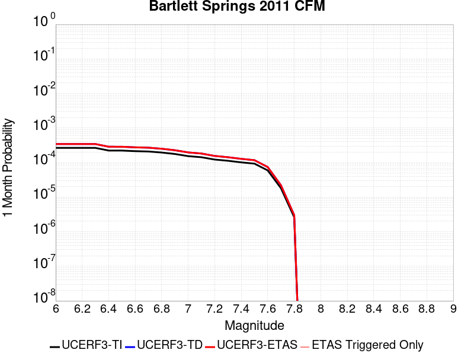 | 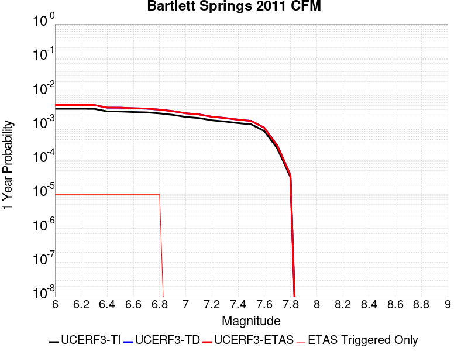 | 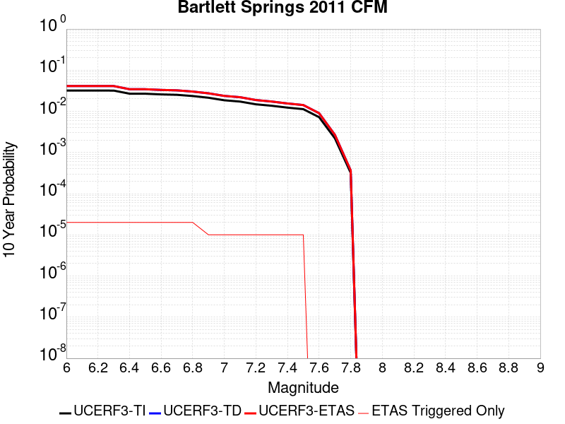 |

| Magnitude | 1 wk TI Prob | 1 wk TD Prob | 1 wk ETAS Prob | 1 wk ETAS/TD Gain | 1 wk ETAS Triggered Only | 1 mo TI Prob | 1 mo TD Prob | 1 mo ETAS Prob | 1 mo ETAS/TD Gain | 1 mo ETAS Triggered Only | 1 yr TI Prob | 1 yr TD Prob | 1 yr ETAS Prob | 1 yr ETAS/TD Gain | 1 yr ETAS Triggered Only | 10 yr TI Prob | 10 yr TD Prob | 10 yr ETAS Prob | 10 yr ETAS/TD Gain | 10 yr ETAS Triggered Only |
|-----|-----|-----|-----|-----|-----|-----|-----|-----|-----|-----|-----|-----|-----|-----|-----|-----|-----|-----|-----|-----|
| 6.0 | 6.2326144E-5 | 8.060668E-5 | 8.060668E-5 | 1.0 | 0.0 | 2.6708472E-4 | 3.4541206E-4 | 3.4541206E-4 | 1.0 | 0.0 | 0.003246908 | 0.0041973754 | 0.0042073335 | 1.0023724 | 1.0E-5 | 0.031998757 | 0.041198105 | 0.041217282 | 1.0004655 | 2.0E-5 |
| 6.1 | 6.227657E-5 | 8.054418E-5 | 8.054418E-5 | 1.0 | 0.0 | 2.668723E-4 | 3.4514428E-4 | 3.4514428E-4 | 1.0 | 0.0 | 0.0032443295 | 0.004194128 | 0.004204086 | 1.0023743 | 1.0E-5 | 0.031973712 | 0.041166842 | 0.041186016 | 1.0004659 | 2.0E-5 |
| 6.2 | 6.22452E-5 | 8.050479E-5 | 8.050479E-5 | 1.0 | 0.0 | 2.6673786E-4 | 3.449755E-4 | 3.449755E-4 | 1.0 | 0.0 | 0.0032426978 | 0.004192081 | 0.004202039 | 1.0023755 | 1.0E-5 | 0.03195787 | 0.04114713 | 0.04116631 | 1.0004661 | 2.0E-5 |
| 6.3 | 6.219006E-5 | 8.043463E-5 | 8.043463E-5 | 1.0 | 0.0 | 2.6650162E-4 | 3.4467486E-4 | 3.4467486E-4 | 1.0 | 0.0 | 0.00323983 | 0.0041884347 | 0.004198393 | 1.0023775 | 1.0E-5 | 0.031930014 | 0.04111203 | 0.04113121 | 1.0004665 | 2.0E-5 |
| 6.4 | 5.2175856E-5 | 6.7254E-5 | 6.7254E-5 | 1.0 | 0.0 | 2.2359163E-4 | 2.8819984E-4 | 2.8819984E-4 | 1.0 | 0.0 | 0.0027188298 | 0.0035032362 | 0.0035132011 | 1.0028445 | 1.0E-5 | 0.026858058 | 0.03448956 | 0.034508873 | 1.0005599 | 2.0E-5 |
| 6.5 | 5.205166E-5 | 6.709666E-5 | 6.709666E-5 | 1.0 | 0.0 | 2.2305945E-4 | 2.875257E-4 | 2.875257E-4 | 1.0 | 0.0 | 0.0027123666 | 0.0034950553 | 0.0035050202 | 1.0028511 | 1.0E-5 | 0.026794989 | 0.034410305 | 0.034429617 | 1.0005612 | 2.0E-5 |
| 6.6 | 5.0085426E-5 | 6.449303E-5 | 6.449303E-5 | 1.0 | 0.0 | 2.1463417E-4 | 2.7636968E-4 | 2.7636968E-4 | 1.0 | 0.0 | 0.0026100394 | 0.0033596596 | 0.003369626 | 1.0029665 | 1.0E-5 | 0.025795965 | 0.03309789 | 0.033117227 | 1.0005842 | 2.0E-5 |
| 6.7 | 4.8930866E-5 | 6.30177E-5 | 6.30177E-5 | 1.0 | 0.0 | 2.0968684E-4 | 2.700482E-4 | 2.700482E-4 | 1.0 | 0.0 | 0.0025499484 | 0.0032829295 | 0.0032928968 | 1.003036 | 1.0E-5 | 0.025208864 | 0.032353252 | 0.032372605 | 1.0005982 | 2.0E-5 |
| 6.8 | 4.5679535E-5 | 5.874213E-5 | 5.874213E-5 | 1.0 | 0.0 | 1.9575475E-4 | 2.517279E-4 | 2.517279E-4 | 1.0 | 0.0 | 0.002380709 | 0.0030605178 | 0.0030704872 | 1.0032574 | 1.0E-5 | 0.023553653 | 0.030190729 | 0.030210124 | 1.0006424 | 2.0E-5 |
| 6.9 | 4.1439176E-5 | 5.3220345E-5 | 5.3220345E-5 | 1.0 | 0.0 | 1.7758438E-4 | 2.2806737E-4 | 2.2806737E-4 | 1.0 | 0.0 | 0.002159946 | 0.00277321 | 0.00277321 | 1.0 | 0.0 | 0.021390721 | 0.02739108 | 0.027400805 | 1.0003551 | 1.0E-5 |
| 7.0 | 3.5920104E-5 | 4.6008958E-5 | 4.6008958E-5 | 1.0 | 0.0 | 1.5393422E-4 | 1.9716643E-4 | 1.9716643E-4 | 1.0 | 0.0 | 0.001872538 | 0.0023978746 | 0.0023978746 | 1.0 | 0.0 | 0.018568378 | 0.023723308 | 0.02373307 | 1.0004115 | 1.0E-5 |
| 7.1 | 3.338812E-5 | 4.2689815E-5 | 4.2689815E-5 | 1.0 | 0.0 | 1.430841E-4 | 1.829436E-4 | 1.829436E-4 | 1.0 | 0.0 | 0.0017406568 | 0.0022250775 | 0.0022250775 | 1.0 | 0.0 | 0.017270854 | 0.02203084 | 0.02204062 | 1.0004439 | 1.0E-5 |
| 7.2 | 2.8619615E-5 | 3.640186E-5 | 3.640186E-5 | 1.0 | 0.0 | 1.2264973E-4 | 1.559987E-4 | 1.559987E-4 | 1.0 | 0.0 | 0.0014922376 | 0.0018976394 | 0.0018976394 | 1.0 | 0.0 | 0.014822568 | 0.018816413 | 0.018826224 | 1.0005214 | 1.0E-5 |
| 7.3 | 2.6376783E-5 | 3.3422963E-5 | 3.3422963E-5 | 1.0 | 0.0 | 1.13038455E-4 | 1.4323345E-4 | 1.4323345E-4 | 1.0 | 0.0 | 0.0013753743 | 0.0017424817 | 0.0017424817 | 1.0 | 0.0 | 0.01366893 | 0.017289983 | 0.01729981 | 1.0005684 | 1.0E-5 |
| 7.4 | 2.3738676E-5 | 2.9979174E-5 | 2.9979174E-5 | 1.0 | 0.0 | 1.0173322E-4 | 1.2847589E-4 | 1.2847589E-4 | 1.0 | 0.0 | 0.0012378981 | 0.0015630797 | 0.0015630797 | 1.0 | 0.0 | 0.012310251 | 0.01552236 | 0.015532204 | 1.0006342 | 1.0E-5 |
| 7.5 | 2.1789481E-5 | 2.7439555E-5 | 2.7439555E-5 | 1.0 | 0.0 | 9.338015E-5 | 1.1759284E-4 | 1.1759284E-4 | 1.0 | 0.0 | 0.0011363103 | 0.0014307604 | 0.0014307604 | 1.0 | 0.0 | 0.011305175 | 0.014216874 | 0.014226732 | 1.0006934 | 1.0E-5 |
| 7.6 | 1.3895281E-5 | 1.7368566E-5 | 1.7368566E-5 | 1.0 | 0.0 | 5.9549846E-5 | 7.44346E-5 | 7.44346E-5 | 1.0 | 0.0 | 7.2477816E-4 | 9.058674E-4 | 9.058674E-4 | 1.0 | 0.0 | 0.0072241887 | 0.009022309 | 0.009022309 | 1.0 | 0.0 |
| 7.7 | 4.245981E-6 | 5.1625234E-6 | 5.1625234E-6 | 1.0 | 0.0 | 1.8196934E-5 | 2.2124914E-5 | 2.2124914E-5 | 1.0 | 0.0 | 2.2152514E-4 | 2.693377E-4 | 2.693377E-4 | 1.0 | 0.0 | 0.0022130446 | 0.00269016 | 0.00269016 | 1.0 | 0.0 |
| 7.8 | 6.145192E-7 | 7.0470315E-7 | 7.0470315E-7 | 1.0 | 0.0 | 2.633651E-6 | 3.020153E-6 | 3.020153E-6 | 1.0 | 0.0 | 3.206423E-5 | 3.6769754E-5 | 3.6769754E-5 | 1.0 | 0.0 | 3.2059604E-4 | 3.6763048E-4 | 3.6763048E-4 | 1.0 | 0.0 |

## San Andreas (Peninsula) 2011 CFM
*[(top)](#table-of-contents)*

| 1 Week | 1 Month | 1 Year | 10 Year |
|-----|-----|-----|-----|
| 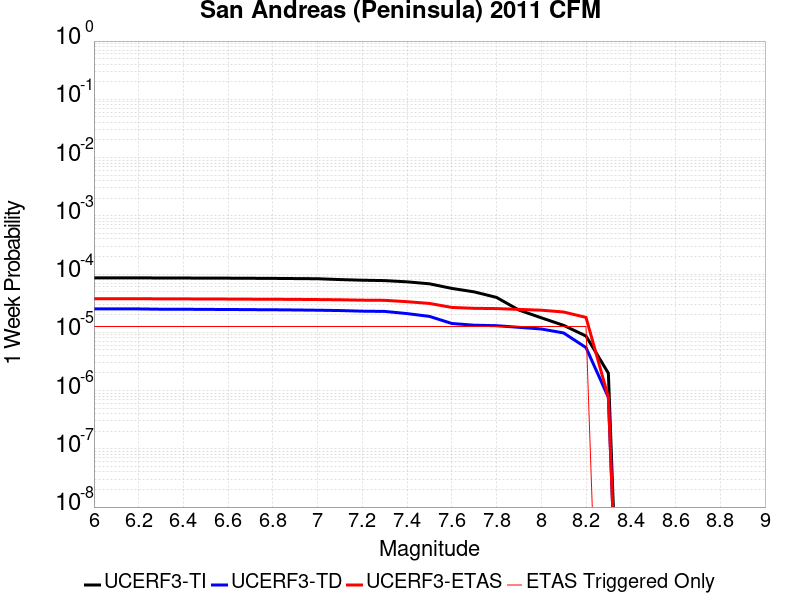 | 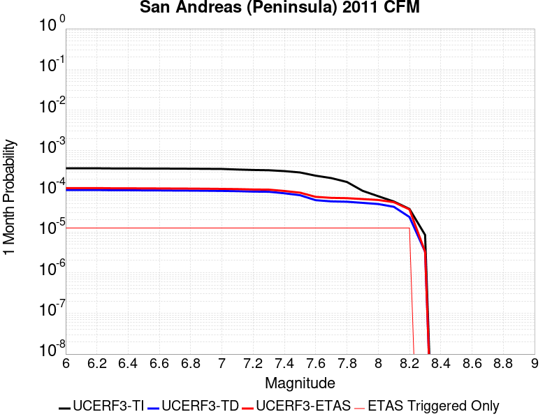 | 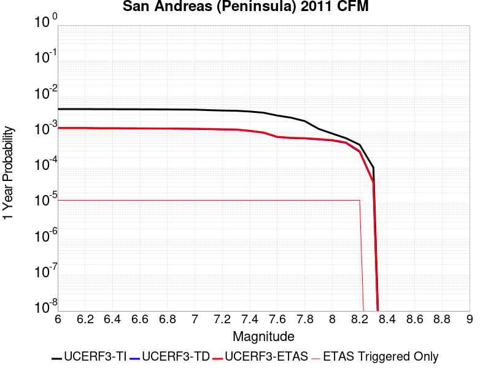 | 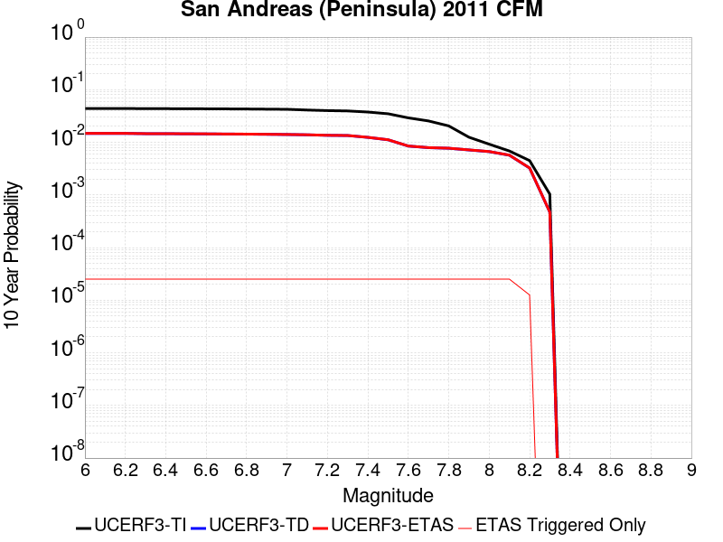 |

| Magnitude | 1 wk TI Prob | 1 wk TD Prob | 1 wk ETAS Prob | 1 wk ETAS/TD Gain | 1 wk ETAS Triggered Only | 1 mo TI Prob | 1 mo TD Prob | 1 mo ETAS Prob | 1 mo ETAS/TD Gain | 1 mo ETAS Triggered Only | 1 yr TI Prob | 1 yr TD Prob | 1 yr ETAS Prob | 1 yr ETAS/TD Gain | 1 yr ETAS Triggered Only | 10 yr TI Prob | 10 yr TD Prob | 10 yr ETAS Prob | 10 yr ETAS/TD Gain | 10 yr ETAS Triggered Only |
|-----|-----|-----|-----|-----|-----|-----|-----|-----|-----|-----|-----|-----|-----|-----|-----|-----|-----|-----|-----|-----|
| 6.0 | 8.6200685E-5 | 2.5207937E-5 | 3.5207686E-5 | 1.3966905 | 1.0E-5 | 3.6937918E-4 | 1.0802955E-4 | 1.1802847E-4 | 1.0925573 | 1.0E-5 | 0.0044879215 | 0.0013144679 | 0.0013244547 | 1.0075977 | 1.0E-5 | 0.043983612 | 0.01477218 | 0.0147918835 | 1.001334 | 2.0E-5 |
| 6.1 | 8.6200685E-5 | 2.5207937E-5 | 3.5207686E-5 | 1.3966905 | 1.0E-5 | 3.6937918E-4 | 1.0802955E-4 | 1.1802847E-4 | 1.0925573 | 1.0E-5 | 0.0044879215 | 0.0013144679 | 0.0013244547 | 1.0075977 | 1.0E-5 | 0.043983612 | 0.01477218 | 0.0147918835 | 1.001334 | 2.0E-5 |
| 6.2 | 8.6200685E-5 | 2.5207937E-5 | 3.5207686E-5 | 1.3966905 | 1.0E-5 | 3.6937918E-4 | 1.0802955E-4 | 1.1802847E-4 | 1.0925573 | 1.0E-5 | 0.0044879215 | 0.0013144679 | 0.0013244547 | 1.0075977 | 1.0E-5 | 0.043983612 | 0.01477218 | 0.0147918835 | 1.001334 | 2.0E-5 |
| 6.3 | 8.551163E-5 | 2.4899866E-5 | 3.4899615E-5 | 1.4015986 | 1.0E-5 | 3.6642692E-4 | 1.06709354E-4 | 1.1670828E-4 | 1.0937026 | 1.0E-5 | 0.004452125 | 0.0012984137 | 0.0013084006 | 1.0076917 | 1.0E-5 | 0.043639794 | 0.01459892 | 0.014618629 | 1.0013499 | 2.0E-5 |
| 6.4 | 8.551163E-5 | 2.4899866E-5 | 3.4899615E-5 | 1.4015986 | 1.0E-5 | 3.6642692E-4 | 1.06709354E-4 | 1.1670828E-4 | 1.0937026 | 1.0E-5 | 0.004452125 | 0.0012984137 | 0.0013084006 | 1.0076917 | 1.0E-5 | 0.043639794 | 0.01459892 | 0.014618629 | 1.0013499 | 2.0E-5 |
| 6.5 | 8.511146E-5 | 2.4721267E-5 | 3.472102E-5 | 1.4045 | 1.0E-5 | 3.647124E-4 | 1.0594399E-4 | 1.1594293E-4 | 1.0943795 | 1.0E-5 | 0.004431336 | 0.0012891064 | 0.0012990936 | 1.0077473 | 1.0E-5 | 0.04344007 | 0.014498963 | 0.0145186735 | 1.0013595 | 2.0E-5 |
| 6.6 | 8.4985084E-5 | 2.4651948E-5 | 3.46517E-5 | 1.4056375 | 1.0E-5 | 3.6417096E-4 | 1.0564694E-4 | 1.1564588E-4 | 1.0946449 | 1.0E-5 | 0.0044247704 | 0.0012854942 | 0.0012954812 | 1.0077691 | 1.0E-5 | 0.043376986 | 0.0144609315 | 0.014480643 | 1.001363 | 2.0E-5 |
| 6.7 | 8.462618E-5 | 2.4480485E-5 | 3.448024E-5 | 1.4084786 | 1.0E-5 | 3.6263323E-4 | 1.0491216E-4 | 1.14911105E-4 | 1.0953078 | 1.0E-5 | 0.004406125 | 0.0012765586 | 0.0012865459 | 1.0078236 | 1.0E-5 | 0.043197807 | 0.014365727 | 0.014385439 | 1.0013722 | 2.0E-5 |
| 6.8 | 8.42337E-5 | 2.4376272E-5 | 3.437603E-5 | 1.410225 | 1.0E-5 | 3.6095164E-4 | 1.04465566E-4 | 1.14464514E-4 | 1.0957153 | 1.0E-5 | 0.004385734 | 0.0012711277 | 0.001281115 | 1.0078571 | 1.0E-5 | 0.043001823 | 0.014306363 | 0.014326077 | 1.0013779 | 2.0E-5 |
| 6.9 | 8.365989E-5 | 2.4180892E-5 | 3.418065E-5 | 1.4135396 | 1.0E-5 | 3.5849313E-4 | 1.0362829E-4 | 1.13627255E-4 | 1.0964887 | 1.0E-5 | 0.004355922 | 0.0012609458 | 0.0012709332 | 1.0079205 | 1.0E-5 | 0.04271523 | 0.014198911 | 0.014218627 | 1.0013885 | 2.0E-5 |
| 7.0 | 8.30936E-5 | 2.3942457E-5 | 3.394222E-5 | 1.4176581 | 1.0E-5 | 3.560668E-4 | 1.026065E-4 | 1.1260548E-4 | 1.0974497 | 1.0E-5 | 0.004326499 | 0.0012485199 | 0.0012585074 | 1.0079995 | 1.0E-5 | 0.042432297 | 0.014069902 | 0.014089621 | 1.0014014 | 2.0E-5 |
| 7.1 | 8.041264E-5 | 2.3628894E-5 | 3.3628658E-5 | 1.4232006 | 1.0E-5 | 3.4458007E-4 | 1.0126277E-4 | 1.1126176E-4 | 1.098743 | 1.0E-5 | 0.0041871946 | 0.0012321785 | 0.0012421663 | 1.0081058 | 1.0E-5 | 0.041091725 | 0.013892905 | 0.0139126275 | 1.0014195 | 2.0E-5 |
| 7.2 | 7.8427016E-5 | 2.3052688E-5 | 3.3052456E-5 | 1.4337789 | 1.0E-5 | 3.3607247E-4 | 9.87935E-5 | 1.08792505E-4 | 1.1012112 | 1.0E-5 | 0.004084008 | 0.0012021487 | 0.0012121367 | 1.0083084 | 1.0E-5 | 0.040097635 | 0.013576745 | 0.013596474 | 1.0014532 | 2.0E-5 |
| 7.3 | 7.721087E-5 | 2.2837554E-5 | 3.2837324E-5 | 1.4378653 | 1.0E-5 | 3.3086175E-4 | 9.787157E-5 | 1.0787059E-4 | 1.1021647 | 1.0E-5 | 0.004020803 | 0.0011909365 | 0.0012009246 | 1.0083867 | 1.0E-5 | 0.03948827 | 0.013460464 | 0.013480195 | 1.0014658 | 2.0E-5 |
| 7.4 | 7.3536525E-5 | 2.095521E-5 | 3.0955E-5 | 1.4771982 | 1.0E-5 | 3.1511846E-4 | 8.980496E-5 | 9.980406E-5 | 1.1113424 | 1.0E-5 | 0.0038298194 | 0.0010928282 | 0.0011028174 | 1.0091406 | 1.0E-5 | 0.037644852 | 0.0124172745 | 0.012437026 | 1.0015906 | 2.0E-5 |
| 7.5 | 6.806207E-5 | 1.876151E-5 | 2.8761322E-5 | 1.5329962 | 1.0E-5 | 2.9166197E-4 | 8.0404E-5 | 9.04032E-5 | 1.1243619 | 1.0E-5 | 0.0035452035 | 9.784801E-4 | 9.884704E-4 | 1.0102099 | 1.0E-5 | 0.034891766 | 0.011170478 | 0.011190254 | 1.0017704 | 2.0E-5 |
| 7.6 | 5.6731416E-5 | 1.4173155E-5 | 2.4173014E-5 | 1.7055492 | 1.0E-5 | 2.43112E-4 | 6.074068E-5 | 7.0740076E-5 | 1.1646243 | 1.0E-5 | 0.0029558712 | 7.3926704E-4 | 7.492596E-4 | 1.0135169 | 1.0E-5 | 0.02916862 | 0.00848332 | 0.008503149 | 1.0023376 | 2.0E-5 |
| 7.7 | 4.946994E-5 | 1.3242368E-5 | 2.3242235E-5 | 1.755142 | 1.0E-5 | 2.1199681E-4 | 5.675177E-5 | 6.675121E-5 | 1.176196 | 1.0E-5 | 0.002578006 | 6.907339E-4 | 7.00727E-4 | 1.0144674 | 1.0E-5 | 0.02548303 | 0.007905742 | 0.007925584 | 1.0025098 | 2.0E-5 |
| 7.8 | 3.9718198E-5 | 1.2979126E-5 | 2.2978997E-5 | 1.7704579 | 1.0E-5 | 1.7020974E-4 | 5.562364E-5 | 6.5623084E-5 | 1.1797696 | 1.0E-5 | 0.0020703338 | 6.7700754E-4 | 6.8700075E-4 | 1.0147609 | 1.0E-5 | 0.020511515 | 0.007716547 | 0.007736393 | 1.0025718 | 2.0E-5 |
| 7.9 | 2.4115114E-5 | 1.2183215E-5 | 2.2183094E-5 | 1.8207914 | 1.0E-5 | 1.0334639E-4 | 5.2212738E-5 | 6.221222E-5 | 1.1915141 | 1.0E-5 | 0.001257516 | 6.355048E-4 | 6.4549845E-4 | 1.0157255 | 1.0E-5 | 0.012504238 | 0.0071578487 | 0.0071777054 | 1.0027741 | 2.0E-5 |
| 8.0 | 1.7756569E-5 | 1.1408184E-5 | 2.140807E-5 | 1.8765537 | 1.0E-5 | 7.6097356E-5 | 4.8891303E-5 | 5.8890815E-5 | 1.2045254 | 1.0E-5 | 9.260915E-4 | 5.9508916E-4 | 6.0508325E-4 | 1.0167942 | 1.0E-5 | 0.009222416 | 0.006658535 | 0.0066784015 | 1.0029837 | 2.0E-5 |
| 8.1 | 1.3159258E-5 | 9.744603E-6 | 1.9744506E-5 | 2.026199 | 1.0E-5 | 5.6395602E-5 | 4.1761916E-5 | 5.1761497E-5 | 1.2394426 | 1.0E-5 | 6.864001E-4 | 5.083328E-4 | 5.1832775E-4 | 1.0196621 | 1.0E-5 | 0.0068428386 | 0.005688865 | 0.0057087517 | 1.0034957 | 2.0E-5 |
| 8.2 | 8.635426E-6 | 5.465718E-6 | 1.5465663E-5 | 2.8295758 | 1.0E-5 | 3.700844E-5 | 2.3424296E-5 | 3.342406E-5 | 1.4268972 | 1.0E-5 | 4.5048463E-4 | 2.8515357E-4 | 2.951507E-4 | 1.0350589 | 1.0E-5 | 0.004495725 | 0.0032439749 | 0.0032539424 | 1.0030726 | 1.0E-5 |
| 8.3 | 1.983087E-6 | 7.6564595E-7 | 7.6564595E-7 | 1.0 | 0.0 | 8.498917E-6 | 3.281336E-6 | 3.281336E-6 | 1.0 | 0.0 | 1.034694E-4 | 3.9949547E-5 | 3.9949547E-5 | 1.0 | 0.0 | 0.0010342124 | 4.717979E-4 | 4.717979E-4 | 1.0 | 0.0 |

## Hosgri
*[(top)](#table-of-contents)*

| 1 Week | 1 Month | 1 Year | 10 Year |
|-----|-----|-----|-----|
|  | 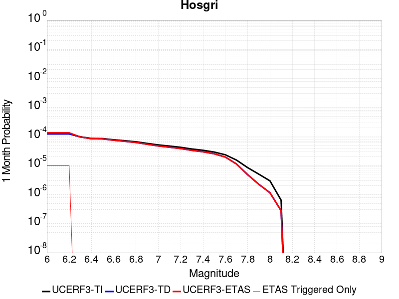 | 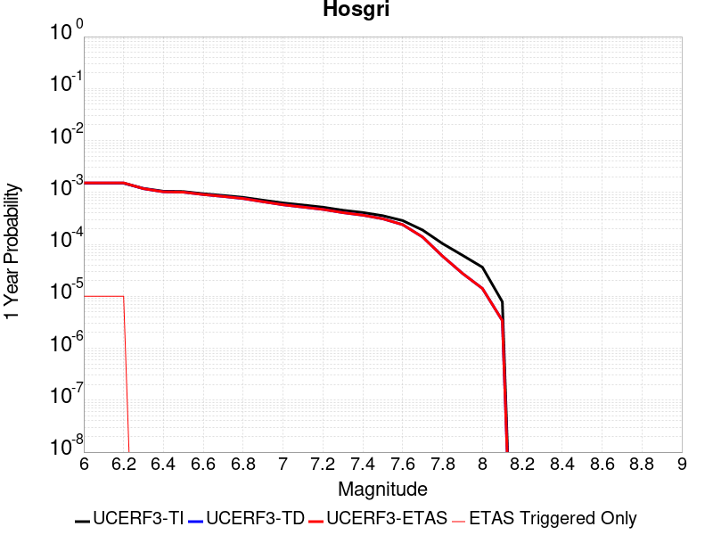 | 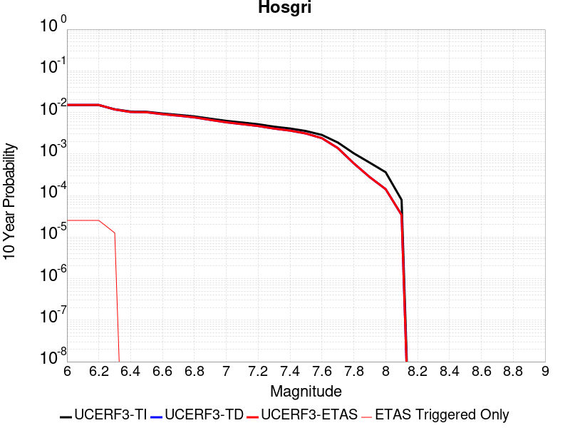 |

| Magnitude | 1 wk TI Prob | 1 wk TD Prob | 1 wk ETAS Prob | 1 wk ETAS/TD Gain | 1 wk ETAS Triggered Only | 1 mo TI Prob | 1 mo TD Prob | 1 mo ETAS Prob | 1 mo ETAS/TD Gain | 1 mo ETAS Triggered Only | 1 yr TI Prob | 1 yr TD Prob | 1 yr ETAS Prob | 1 yr ETAS/TD Gain | 1 yr ETAS Triggered Only | 10 yr TI Prob | 10 yr TD Prob | 10 yr ETAS Prob | 10 yr ETAS/TD Gain | 10 yr ETAS Triggered Only |
|-----|-----|-----|-----|-----|-----|-----|-----|-----|-----|-----|-----|-----|-----|-----|-----|-----|-----|-----|-----|-----|
| 6.0 | 2.883978E-5 | 2.9128403E-5 | 2.9128403E-5 | 1.0 | 0.0 | 1.235932E-4 | 1.248302E-4 | 1.3482895E-4 | 1.0800989 | 1.0E-5 | 0.0015037085 | 0.0015187752 | 0.0015287601 | 1.0065743 | 1.0E-5 | 0.01493574 | 0.01508773 | 0.015107428 | 1.0013056 | 2.0E-5 |
| 6.1 | 2.883978E-5 | 2.9128403E-5 | 2.9128403E-5 | 1.0 | 0.0 | 1.235932E-4 | 1.248302E-4 | 1.3482895E-4 | 1.0800989 | 1.0E-5 | 0.0015037085 | 0.0015187752 | 0.0015287601 | 1.0065743 | 1.0E-5 | 0.01493574 | 0.01508773 | 0.015107428 | 1.0013056 | 2.0E-5 |
| 6.2 | 2.883978E-5 | 2.9128403E-5 | 2.9128403E-5 | 1.0 | 0.0 | 1.235932E-4 | 1.248302E-4 | 1.3482895E-4 | 1.0800989 | 1.0E-5 | 0.0015037085 | 0.0015187752 | 0.0015287601 | 1.0065743 | 1.0E-5 | 0.01493574 | 0.01508773 | 0.015107428 | 1.0013056 | 2.0E-5 |
| 6.3 | 2.2914428E-5 | 2.2641956E-5 | 2.2641956E-5 | 1.0 | 0.0 | 9.8200995E-5 | 9.703337E-5 | 9.703337E-5 | 1.0 | 0.0 | 0.0011949413 | 0.001180746 | 0.001180746 | 1.0 | 0.0 | 0.011885363 | 0.011746123 | 0.011756006 | 1.0008414 | 1.0E-5 |
| 6.4 | 2.0195741E-5 | 1.9696547E-5 | 1.9696547E-5 | 1.0 | 0.0 | 8.65503E-5 | 8.4411055E-5 | 8.4411055E-5 | 1.0 | 0.0 | 0.0010532405 | 0.001027222 | 0.001027222 | 1.0 | 0.0 | 0.010482626 | 0.010225783 | 0.010225783 | 1.0 | 0.0 |
| 6.5 | 1.9924333E-5 | 1.9408968E-5 | 1.9408968E-5 | 1.0 | 0.0 | 8.53872E-5 | 8.317865E-5 | 8.317865E-5 | 1.0 | 0.0 | 0.0010390934 | 0.0010122315 | 0.0010122315 | 1.0 | 0.0 | 0.010342481 | 0.010077244 | 0.010077244 | 1.0 | 0.0 |
| 6.6 | 1.809694E-5 | 1.7458287E-5 | 1.7458287E-5 | 1.0 | 0.0 | 7.7556004E-5 | 7.4819094E-5 | 7.4819094E-5 | 1.0 | 0.0 | 9.438353E-4 | 9.105431E-4 | 9.105431E-4 | 1.0 | 0.0 | 0.009398366 | 0.009069063 | 0.009069063 | 1.0 | 0.0 |
| 6.7 | 1.675989E-5 | 1.6042752E-5 | 1.6042752E-5 | 1.0 | 0.0 | 7.182612E-5 | 6.8752845E-5 | 6.8752845E-5 | 1.0 | 0.0 | 8.7413215E-4 | 8.3674554E-4 | 8.3674554E-4 | 1.0 | 0.0 | 0.008707017 | 0.008336853 | 0.008336853 | 1.0 | 0.0 |
| 6.8 | 1.5401129E-5 | 1.4614069E-5 | 1.4614069E-5 | 1.0 | 0.0 | 6.6003166E-5 | 6.263023E-5 | 6.263023E-5 | 1.0 | 0.0 | 8.032922E-4 | 7.6225714E-4 | 7.6225714E-4 | 1.0 | 0.0 | 0.008003947 | 0.0075972863 | 0.0075972863 | 1.0 | 0.0 |
| 6.9 | 1.356559E-5 | 1.2689955E-5 | 1.2689955E-5 | 1.0 | 0.0 | 5.8136946E-5 | 5.438439E-5 | 5.438439E-5 | 1.0 | 0.0 | 7.0758746E-4 | 6.6192925E-4 | 6.6192925E-4 | 1.0 | 0.0 | 0.007053386 | 0.006600378 | 0.006600378 | 1.0 | 0.0 |
| 7.0 | 1.2030819E-5 | 1.1095949E-5 | 1.1095949E-5 | 1.0 | 0.0 | 5.155963E-5 | 4.75532E-5 | 4.75532E-5 | 1.0 | 0.0 | 6.275577E-4 | 5.788065E-4 | 5.788065E-4 | 1.0 | 0.0 | 0.006257884 | 0.0057737473 | 0.0057737473 | 1.0 | 0.0 |
| 7.1 | 1.0972698E-5 | 1.0022167E-5 | 1.0022167E-5 | 1.0 | 0.0 | 4.7025E-5 | 4.2951437E-5 | 4.2951437E-5 | 1.0 | 0.0 | 5.72379E-4 | 5.2280835E-4 | 5.2280835E-4 | 1.0 | 0.0 | 0.0057090693 | 0.005216533 | 0.005216533 | 1.0 | 0.0 |
| 7.2 | 9.961926E-6 | 9.034732E-6 | 9.034732E-6 | 1.0 | 0.0 | 4.2693267E-5 | 3.8719707E-5 | 3.8719707E-5 | 1.0 | 0.0 | 5.1966653E-4 | 4.7131052E-4 | 4.7131052E-4 | 1.0 | 0.0 | 0.00518453 | 0.0047038523 | 0.0047038523 | 1.0 | 0.0 |
| 7.3 | 8.700929E-6 | 7.828089E-6 | 7.828089E-6 | 1.0 | 0.0 | 3.7289166E-5 | 3.354852E-5 | 3.354852E-5 | 1.0 | 0.0 | 4.53901E-4 | 4.083767E-4 | 4.083767E-4 | 1.0 | 0.0 | 0.00452975 | 0.004076999 | 0.004076999 | 1.0 | 0.0 |
| 7.4 | 7.866285E-6 | 6.9987263E-6 | 6.9987263E-6 | 1.0 | 0.0 | 3.3712215E-5 | 2.9994197E-5 | 2.9994197E-5 | 1.0 | 0.0 | 4.103689E-4 | 3.6511818E-4 | 3.6511818E-4 | 1.0 | 0.0 | 0.004096119 | 0.0036459167 | 0.0036459167 | 1.0 | 0.0 |
| 7.5 | 6.8381305E-6 | 5.9596814E-6 | 5.9596814E-6 | 1.0 | 0.0 | 2.9305946E-5 | 2.5541241E-5 | 2.5541241E-5 | 1.0 | 0.0 | 3.5674145E-4 | 3.1092027E-4 | 3.1092027E-4 | 1.0 | 0.0 | 0.0035616932 | 0.003105584 | 0.003105584 | 1.0 | 0.0 |
| 7.6 | 5.503376E-6 | 4.595227E-6 | 4.595227E-6 | 1.0 | 0.0 | 2.3585684E-5 | 1.9693682E-5 | 1.9693682E-5 | 1.0 | 0.0 | 2.8711787E-4 | 2.397442E-4 | 2.397442E-4 | 1.0 | 0.0 | 0.002867472 | 0.0023955852 | 0.0023955852 | 1.0 | 0.0 |
| 7.7 | 3.6144982E-6 | 2.6521896E-6 | 2.6521896E-6 | 1.0 | 0.0 | 1.5490614E-5 | 1.1366477E-5 | 1.1366477E-5 | 1.0 | 0.0 | 1.8858191E-4 | 1.3837808E-4 | 1.3837808E-4 | 1.0 | 0.0 | 0.0018842196 | 0.001383647 | 0.001383647 | 1.0 | 0.0 |
| 7.8 | 1.9853494E-6 | 1.1360784E-6 | 1.1360784E-6 | 1.0 | 0.0 | 8.508612E-6 | 4.8688985E-6 | 4.8688985E-6 | 1.0 | 0.0 | 1.0358743E-4 | 5.9277223E-5 | 5.9277223E-5 | 1.0 | 0.0 | 0.0010353916 | 5.933389E-4 | 5.933389E-4 | 1.0 | 0.0 |
| 7.9 | 1.1818757E-6 | 5.29477E-7 | 5.29477E-7 | 1.0 | 0.0 | 5.0651715E-6 | 2.269185E-6 | 2.269185E-6 | 1.0 | 0.0 | 6.1666724E-5 | 2.7626977E-5 | 2.7626977E-5 | 1.0 | 0.0 | 6.1649614E-4 | 2.7691363E-4 | 2.7691363E-4 | 1.0 | 0.0 |
| 8.0 | 6.962958E-7 | 2.71365E-7 | 2.71365E-7 | 1.0 | 0.0 | 2.9841215E-6 | 1.1629924E-6 | 1.1629924E-6 | 1.0 | 0.0 | 3.6331072E-5 | 1.415934E-5 | 1.415934E-5 | 1.0 | 0.0 | 3.6325134E-4 | 1.4215276E-4 | 1.4215276E-4 | 1.0 | 0.0 |
| 8.1 | 1.5033264E-7 | 6.52693E-8 | 6.52693E-8 | 1.0 | 0.0 | 6.442826E-7 | 2.7972553E-7 | 2.7972553E-7 | 1.0 | 0.0 | 7.844113E-6 | 3.4056532E-6 | 3.4056532E-6 | 1.0 | 0.0 | 7.843835E-5 | 3.4072833E-5 | 3.4072833E-5 | 1.0 | 0.0 |

## Hayward (So) 2011 CFM
*[(top)](#table-of-contents)*

| 1 Week | 1 Month | 1 Year | 10 Year |
|-----|-----|-----|-----|
| 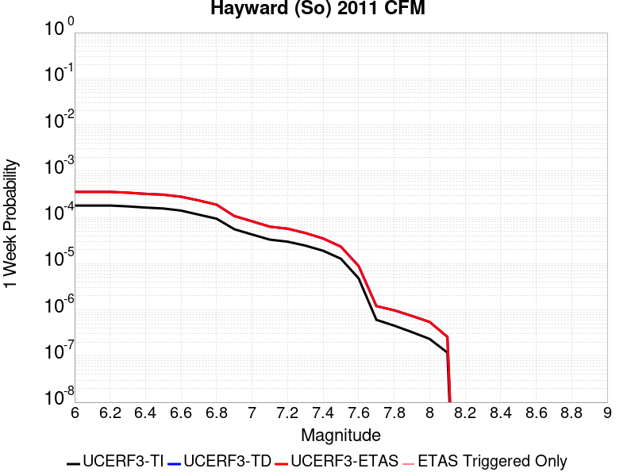 | 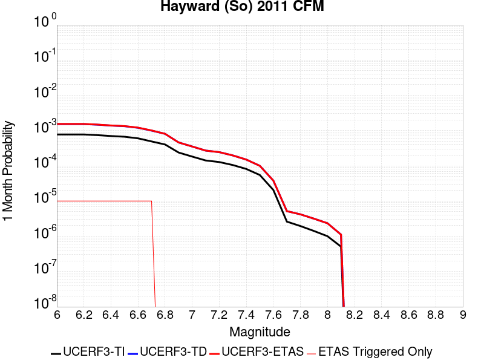 | 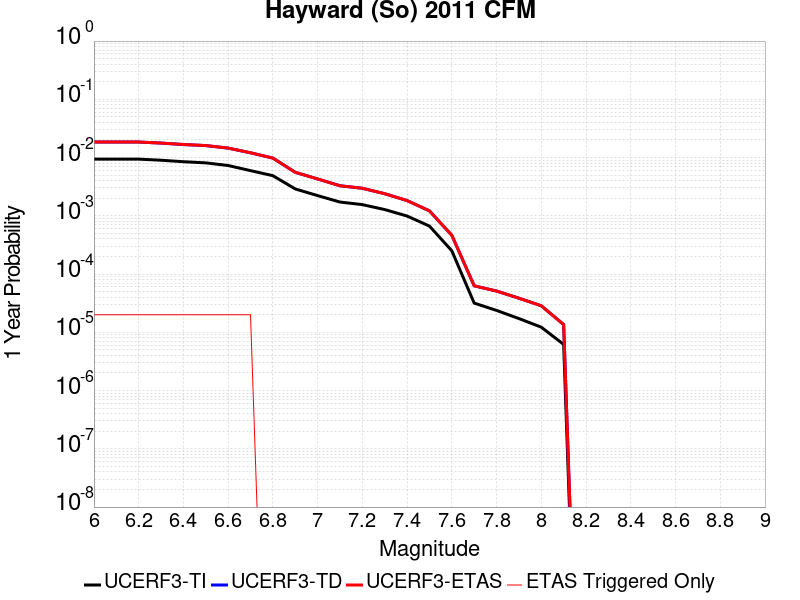 | 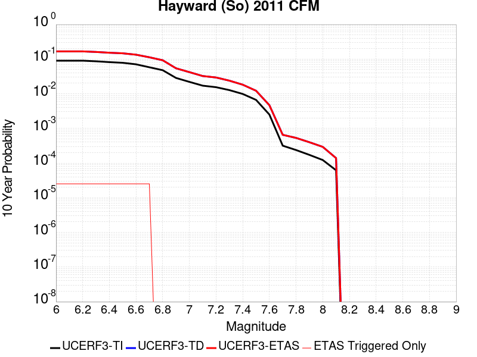 |

| Magnitude | 1 wk TI Prob | 1 wk TD Prob | 1 wk ETAS Prob | 1 wk ETAS/TD Gain | 1 wk ETAS Triggered Only | 1 mo TI Prob | 1 mo TD Prob | 1 mo ETAS Prob | 1 mo ETAS/TD Gain | 1 mo ETAS Triggered Only | 1 yr TI Prob | 1 yr TD Prob | 1 yr ETAS Prob | 1 yr ETAS/TD Gain | 1 yr ETAS Triggered Only | 10 yr TI Prob | 10 yr TD Prob | 10 yr ETAS Prob | 10 yr ETAS/TD Gain | 10 yr ETAS Triggered Only |
|-----|-----|-----|-----|-----|-----|-----|-----|-----|-----|-----|-----|-----|-----|-----|-----|-----|-----|-----|-----|-----|
| 6.0 | 1.8091932E-4 | 3.570673E-4 | 3.570673E-4 | 1.0 | 0.0 | 7.751381E-4 | 0.0015294008 | 0.0015393855 | 1.0065285 | 1.0E-5 | 0.00939654 | 0.018463885 | 0.018483516 | 1.0010632 | 2.0E-5 | 0.090090066 | 0.1667085 | 0.16672516 | 1.0001 | 2.0E-5 |
| 6.1 | 1.8091932E-4 | 3.570673E-4 | 3.570673E-4 | 1.0 | 0.0 | 7.751381E-4 | 0.0015294008 | 0.0015393855 | 1.0065285 | 1.0E-5 | 0.00939654 | 0.018463885 | 0.018483516 | 1.0010632 | 2.0E-5 | 0.090090066 | 0.1667085 | 0.16672516 | 1.0001 | 2.0E-5 |
| 6.2 | 1.8091932E-4 | 3.570673E-4 | 3.570673E-4 | 1.0 | 0.0 | 7.751381E-4 | 0.0015294008 | 0.0015393855 | 1.0065285 | 1.0E-5 | 0.00939654 | 0.018463885 | 0.018483516 | 1.0010632 | 2.0E-5 | 0.090090066 | 0.1667085 | 0.16672516 | 1.0001 | 2.0E-5 |
| 6.3 | 1.7322872E-4 | 3.4263515E-4 | 3.4263515E-4 | 1.0 | 0.0 | 7.4219756E-4 | 0.0014676197 | 0.001477605 | 1.0068038 | 1.0E-5 | 0.0089988755 | 0.017724147 | 0.017743792 | 1.0011084 | 2.0E-5 | 0.08643075 | 0.16065954 | 0.16067632 | 1.0001044 | 2.0E-5 |
| 6.4 | 1.6334097E-4 | 3.2345165E-4 | 3.2345165E-4 | 1.0 | 0.0 | 6.998449E-4 | 0.0013854936 | 0.0013954798 | 1.0072076 | 1.0E-5 | 0.008487372 | 0.016739927 | 0.016759591 | 1.0011748 | 2.0E-5 | 0.081704415 | 0.15256606 | 0.152583 | 1.0001111 | 2.0E-5 |
| 6.5 | 1.5600289E-4 | 3.101982E-4 | 3.101982E-4 | 1.0 | 0.0 | 6.684125E-4 | 0.0013287518 | 0.0013387385 | 1.0075159 | 1.0E-5 | 0.008107598 | 0.016059443 | 0.016079122 | 1.0012254 | 2.0E-5 | 0.078181036 | 0.14684291 | 0.14685997 | 1.0001162 | 2.0E-5 |
| 6.6 | 1.4046066E-4 | 2.8034003E-4 | 2.8034003E-4 | 1.0 | 0.0 | 6.018354E-4 | 0.0012009109 | 0.0012108989 | 1.008317 | 1.0E-5 | 0.0073027555 | 0.014524571 | 0.01454428 | 1.001357 | 2.0E-5 | 0.07067384 | 0.13393044 | 0.13394777 | 1.0001293 | 2.0E-5 |
| 6.7 | 1.14696966E-4 | 2.3272466E-4 | 2.3272466E-4 | 1.0 | 0.0 | 4.914658E-4 | 9.970153E-4 | 0.0010070052 | 1.0100199 | 1.0E-5 | 0.0059671924 | 0.012072163 | 0.012091922 | 1.0016367 | 2.0E-5 | 0.058094822 | 0.11274141 | 0.11275916 | 1.0001574 | 2.0E-5 |
| 6.8 | 9.3874296E-5 | 1.8862431E-4 | 1.8862431E-4 | 1.0 | 0.0 | 4.0225635E-4 | 8.081431E-4 | 8.081431E-4 | 1.0 | 0.0 | 0.0048864787 | 0.009795489 | 0.009795489 | 1.0 | 0.0 | 0.047804173 | 0.092592984 | 0.092592984 | 1.0 | 0.0 |
| 6.9 | 5.551852E-5 | 1.0729875E-4 | 1.0729875E-4 | 1.0 | 0.0 | 2.3791482E-4 | 4.5977137E-4 | 4.5977137E-4 | 1.0 | 0.0 | 0.0028927654 | 0.005583468 | 0.005583468 | 1.0 | 0.0 | 0.028553981 | 0.054246075 | 0.054246075 | 1.0 | 0.0 |
| 7.0 | 4.2662363E-5 | 8.246792E-5 | 8.246792E-5 | 1.0 | 0.0 | 1.8282588E-4 | 3.5338648E-4 | 3.5338648E-4 | 1.0 | 0.0 | 0.0022236328 | 0.0042940658 | 0.0042940658 | 1.0 | 0.0 | 0.022015138 | 0.04206509 | 0.04206509 | 1.0 | 0.0 |
| 7.1 | 3.305886E-5 | 6.302183E-5 | 6.302183E-5 | 1.0 | 0.0 | 1.4167312E-4 | 2.7006568E-4 | 2.7006568E-4 | 1.0 | 0.0 | 0.0017235056 | 0.003283111 | 0.003283111 | 1.0 | 0.0 | 0.017101998 | 0.032453902 | 0.032453902 | 1.0 | 0.0 |
| 7.2 | 2.9856887E-5 | 5.701622E-5 | 5.701622E-5 | 1.0 | 0.0 | 1.2795182E-4 | 2.4433242E-4 | 2.4433242E-4 | 1.0 | 0.0 | 0.0015567001 | 0.0029707062 | 0.0029707062 | 1.0 | 0.0 | 0.015458403 | 0.029454801 | 0.029454801 | 1.0 | 0.0 |
| 7.3 | 2.4559737E-5 | 4.599286E-5 | 4.599286E-5 | 1.0 | 0.0 | 1.0525176E-4 | 1.9709744E-4 | 1.9709744E-4 | 1.0 | 0.0 | 0.0012806869 | 0.0023970334 | 0.0023970334 | 1.0 | 0.0 | 0.012733313 | 0.023858516 | 0.023858516 | 1.0 | 0.0 |
| 7.4 | 1.9002231E-5 | 3.505084E-5 | 3.505084E-5 | 1.0 | 0.0 | 8.143559E-5 | 1.502093E-4 | 1.502093E-4 | 1.0 | 0.0 | 9.910273E-4 | 0.001827274 | 0.001827274 | 1.0 | 0.0 | 0.009866194 | 0.018258808 | 0.018258808 | 1.0 | 0.0 |
| 7.5 | 1.2783333E-5 | 2.3331182E-5 | 2.3331182E-5 | 1.0 | 0.0 | 5.4784563E-5 | 9.998698E-5 | 9.998698E-5 | 1.0 | 0.0 | 6.667979E-4 | 0.0012166675 | 0.0012166675 | 1.0 | 0.0 | 0.006648007 | 0.012209443 | 0.012209443 | 1.0 | 0.0 |
| 7.6 | 4.8149627E-6 | 8.888056E-6 | 8.888056E-6 | 1.0 | 0.0 | 2.063539E-5 | 3.8091122E-5 | 3.8091122E-5 | 1.0 | 0.0 | 2.5120692E-4 | 4.6366194E-4 | 4.6366194E-4 | 1.0 | 0.0 | 0.0025092314 | 0.0046805087 | 0.0046805087 | 1.0 | 0.0 |
| 7.7 | 6.0838227E-7 | 1.205754E-6 | 1.205754E-6 | 1.0 | 0.0 | 2.6073499E-6 | 5.1675065E-6 | 5.1675065E-6 | 1.0 | 0.0 | 3.174402E-5 | 6.291258E-5 | 6.291258E-5 | 1.0 | 0.0 | 3.1739488E-4 | 6.5296254E-4 | 6.5296254E-4 | 1.0 | 0.0 |
| 7.8 | 4.5542808E-7 | 9.792941E-7 | 9.792941E-7 | 1.0 | 0.0 | 1.9518332E-6 | 4.196968E-6 | 4.196968E-6 | 1.0 | 0.0 | 2.376331E-5 | 5.109689E-5 | 5.109689E-5 | 1.0 | 0.0 | 2.3760769E-4 | 5.321693E-4 | 5.321693E-4 | 1.0 | 0.0 |
| 7.9 | 3.3016747E-7 | 7.3869535E-7 | 7.3869535E-7 | 1.0 | 0.0 | 1.4150027E-6 | 3.1658333E-6 | 3.1658333E-6 | 1.0 | 0.0 | 1.7227521E-5 | 3.854334E-5 | 3.854334E-5 | 1.0 | 0.0 | 1.7226185E-4 | 3.9932923E-4 | 3.9932923E-4 | 1.0 | 0.0 |
| 8.0 | 2.347038E-7 | 5.471963E-7 | 5.471963E-7 | 1.0 | 0.0 | 1.0058731E-6 | 2.3451248E-6 | 2.3451248E-6 | 1.0 | 0.0 | 1.2246436E-5 | 2.8551523E-5 | 2.8551523E-5 | 1.0 | 0.0 | 1.2245761E-4 | 2.9357258E-4 | 2.9357258E-4 | 1.0 | 0.0 |
| 8.1 | 1.18822804E-7 | 2.6060948E-7 | 2.6060948E-7 | 1.0 | 0.0 | 5.092405E-7 | 1.1168972E-6 | 1.1168972E-6 | 1.0 | 0.0 | 6.1999854E-6 | 1.359814E-5 | 1.359814E-5 | 1.0 | 0.0 | 6.199812E-5 | 1.3918082E-4 | 1.3918082E-4 | 1.0 | 0.0 |

## Newport-Inglewood (Offshore)
*[(top)](#table-of-contents)*

| 1 Week | 1 Month | 1 Year | 10 Year |
|-----|-----|-----|-----|
| 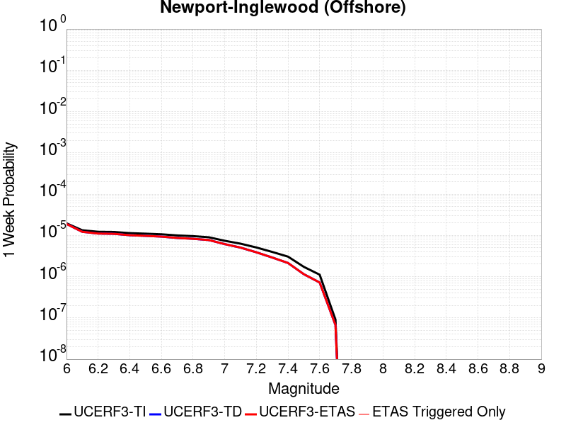 | 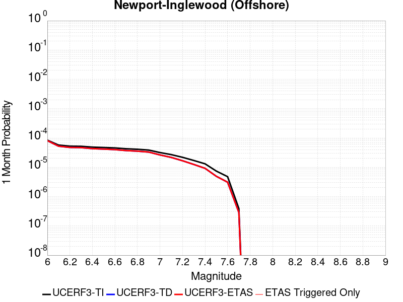 | 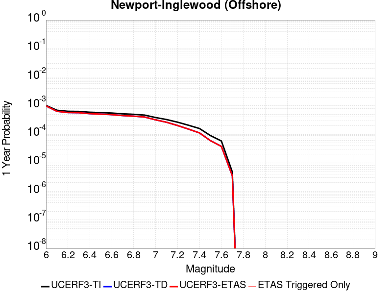 | 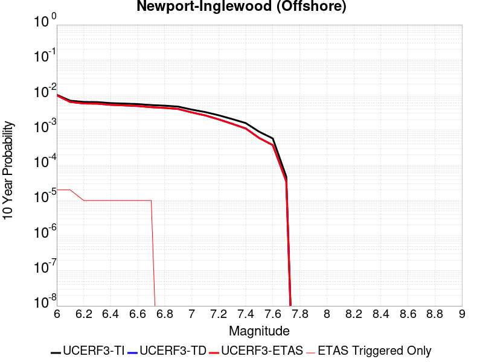 |

| Magnitude | 1 wk TI Prob | 1 wk TD Prob | 1 wk ETAS Prob | 1 wk ETAS/TD Gain | 1 wk ETAS Triggered Only | 1 mo TI Prob | 1 mo TD Prob | 1 mo ETAS Prob | 1 mo ETAS/TD Gain | 1 mo ETAS Triggered Only | 1 yr TI Prob | 1 yr TD Prob | 1 yr ETAS Prob | 1 yr ETAS/TD Gain | 1 yr ETAS Triggered Only | 10 yr TI Prob | 10 yr TD Prob | 10 yr ETAS Prob | 10 yr ETAS/TD Gain | 10 yr ETAS Triggered Only |
|-----|-----|-----|-----|-----|-----|-----|-----|-----|-----|-----|-----|-----|-----|-----|-----|-----|-----|-----|-----|-----|
| 6.0 | 1.9626508E-5 | 1.8965342E-5 | 1.8965342E-5 | 1.0 | 0.0 | 8.411089E-5 | 8.1277576E-5 | 8.1277576E-5 | 1.0 | 0.0 | 0.001023569 | 9.891179E-4 | 9.891179E-4 | 1.0 | 0.0 | 0.010188672 | 0.009848497 | 0.0098683 | 1.0020108 | 2.0E-5 |
| 6.1 | 1.331886E-5 | 1.2218078E-5 | 1.2218078E-5 | 1.0 | 0.0 | 5.707958E-5 | 5.2362153E-5 | 5.2362153E-5 | 1.0 | 0.0 | 6.947222E-4 | 6.3732424E-4 | 6.3732424E-4 | 1.0 | 0.0 | 0.006925544 | 0.006355142 | 0.006375015 | 1.0031271 | 2.0E-5 |
| 6.2 | 1.2250852E-5 | 1.1076016E-5 | 1.1076016E-5 | 1.0 | 0.0 | 5.2502597E-5 | 4.746778E-5 | 4.746778E-5 | 1.0 | 0.0 | 6.3903164E-4 | 5.7776796E-4 | 5.7776796E-4 | 1.0 | 0.0 | 0.006371971 | 0.0057627796 | 0.005772722 | 1.0017253 | 1.0E-5 |
| 6.3 | 1.2106258E-5 | 1.0918878E-5 | 1.0918878E-5 | 1.0 | 0.0 | 5.1882926E-5 | 4.6794354E-5 | 4.6794354E-5 | 1.0 | 0.0 | 6.3149154E-4 | 5.695733E-4 | 5.695733E-4 | 1.0 | 0.0 | 0.0062970007 | 0.005681252 | 0.0056911954 | 1.0017502 | 1.0E-5 |
| 6.4 | 1.1348758E-5 | 1.0109348E-5 | 1.0109348E-5 | 1.0 | 0.0 | 4.8636626E-5 | 4.3325064E-5 | 4.3325064E-5 | 1.0 | 0.0 | 5.919901E-4 | 5.2735576E-4 | 5.2735576E-4 | 1.0 | 0.0 | 0.005904155 | 0.0052611395 | 0.005271087 | 1.0018908 | 1.0E-5 |
| 6.5 | 1.100837E-5 | 9.743376E-6 | 9.743376E-6 | 1.0 | 0.0 | 4.7177873E-5 | 4.175666E-5 | 4.175666E-5 | 1.0 | 0.0 | 5.7423924E-4 | 5.082695E-4 | 5.082695E-4 | 1.0 | 0.0 | 0.005727576 | 0.005071162 | 0.005081111 | 1.001962 | 1.0E-5 |
| 6.6 | 1.0634696E-5 | 9.34553E-6 | 9.34553E-6 | 1.0 | 0.0 | 4.557647E-5 | 4.0051662E-5 | 4.0051662E-5 | 1.0 | 0.0 | 5.5475225E-4 | 4.875206E-4 | 4.875206E-4 | 1.0 | 0.0 | 0.0055336943 | 0.0048645977 | 0.004874549 | 1.0020456 | 1.0E-5 |
| 6.7 | 9.9780855E-6 | 8.667898E-6 | 8.667898E-6 | 1.0 | 0.0 | 4.276252E-5 | 3.7147613E-5 | 3.7147613E-5 | 1.0 | 0.0 | 5.205093E-4 | 4.5217903E-4 | 4.5217903E-4 | 1.0 | 0.0 | 0.0051929182 | 0.0045126686 | 0.0045226235 | 1.002206 | 1.0E-5 |
| 6.8 | 9.59546E-6 | 8.272933E-6 | 8.272933E-6 | 1.0 | 0.0 | 4.1122752E-5 | 3.545495E-5 | 3.545495E-5 | 1.0 | 0.0 | 5.0055445E-4 | 4.3157916E-4 | 4.3157916E-4 | 1.0 | 0.0 | 0.004994285 | 0.004307486 | 0.004307486 | 1.0 | 0.0 |
| 6.9 | 9.000614E-6 | 7.706823E-6 | 7.706823E-6 | 1.0 | 0.0 | 3.857349E-5 | 3.3028828E-5 | 3.3028828E-5 | 1.0 | 0.0 | 4.6953102E-4 | 4.0205245E-4 | 4.0205245E-4 | 1.0 | 0.0 | 0.004685402 | 0.0040133223 | 0.0040133223 | 1.0 | 0.0 |
| 7.0 | 7.4070194E-6 | 6.148865E-6 | 6.148865E-6 | 1.0 | 0.0 | 3.1743984E-5 | 2.6352012E-5 | 2.6352012E-5 | 1.0 | 0.0 | 3.8641447E-4 | 3.2078868E-4 | 3.2078868E-4 | 1.0 | 0.0 | 0.0038574322 | 0.0032032758 | 0.0032032758 | 1.0 | 0.0 |
| 7.1 | 6.299615E-6 | 5.0565613E-6 | 5.0565613E-6 | 1.0 | 0.0 | 2.699807E-5 | 2.1670798E-5 | 2.1670798E-5 | 1.0 | 0.0 | 3.2865192E-4 | 2.6381016E-4 | 2.6381016E-4 | 1.0 | 0.0 | 0.003281663 | 0.0026349847 | 0.0026349847 | 1.0 | 0.0 |
| 7.2 | 5.096653E-6 | 3.892733E-6 | 3.892733E-6 | 1.0 | 0.0 | 2.1842614E-5 | 1.6683034E-5 | 1.6683034E-5 | 1.0 | 0.0 | 2.6590136E-4 | 2.0309711E-4 | 2.0309711E-4 | 1.0 | 0.0 | 0.0026558342 | 0.0020291263 | 0.0020291263 | 1.0 | 0.0 |
| 7.3 | 3.9753018E-6 | 2.9098787E-6 | 2.9098787E-6 | 1.0 | 0.0 | 1.7036897E-5 | 1.24708495E-5 | 1.24708495E-5 | 1.0 | 0.0 | 2.0740448E-4 | 1.518221E-4 | 1.518221E-4 | 1.0 | 0.0 | 0.00207211 | 0.0015171919 | 0.0015171919 | 1.0 | 0.0 |
| 7.4 | 3.0568392E-6 | 2.1449732E-6 | 2.1449732E-6 | 1.0 | 0.0 | 1.3100675E-5 | 9.19271E-6 | 9.19271E-6 | 1.0 | 0.0 | 1.5948903E-4 | 1.11915564E-4 | 1.11915564E-4 | 1.0 | 0.0 | 0.0015937461 | 0.0011185983 | 0.0011185983 | 1.0 | 0.0 |
| 7.5 | 1.7279019E-6 | 1.1469651E-6 | 1.1469651E-6 | 1.0 | 0.0 | 7.405273E-6 | 4.9155556E-6 | 4.9155556E-6 | 1.0 | 0.0 | 9.015547E-5 | 5.9845286E-5 | 5.9845286E-5 | 1.0 | 0.0 | 9.01189E-4 | 5.982956E-4 | 5.982956E-4 | 1.0 | 0.0 |
| 7.6 | 1.1156416E-6 | 7.222962E-7 | 7.222962E-7 | 1.0 | 0.0 | 4.7813123E-6 | 3.0955514E-6 | 3.0955514E-6 | 1.0 | 0.0 | 5.821092E-5 | 3.768771E-5 | 3.768771E-5 | 1.0 | 0.0 | 5.8195676E-4 | 3.7681553E-4 | 3.7681553E-4 | 1.0 | 0.0 |
| 7.7 | 9.117973E-8 | 6.7342256E-8 | 6.7342256E-8 | 1.0 | 0.0 | 3.907702E-7 | 2.8860964E-7 | 2.8860964E-7 | 1.0 | 0.0 | 4.757617E-6 | 3.5138169E-6 | 3.5138169E-6 | 1.0 | 0.0 | 4.7575148E-5 | 3.5137644E-5 | 3.5137644E-5 | 1.0 | 0.0 |

## Mount Diablo Thrust South
*[(top)](#table-of-contents)*

| 1 Week | 1 Month | 1 Year | 10 Year |
|-----|-----|-----|-----|
| 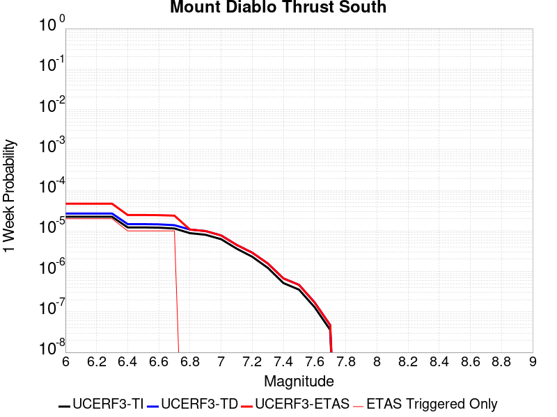 | 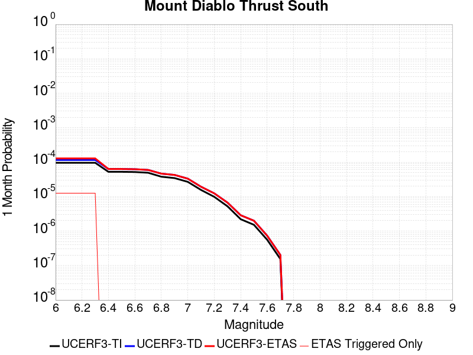 | 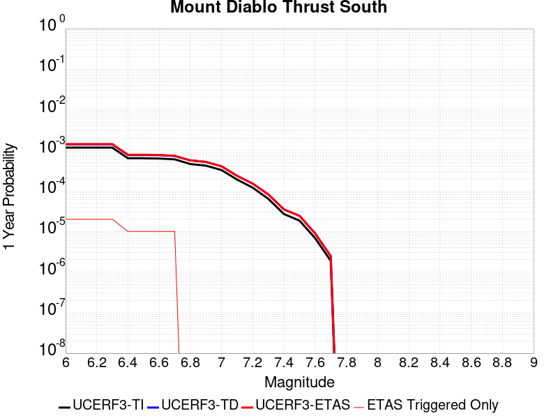 | 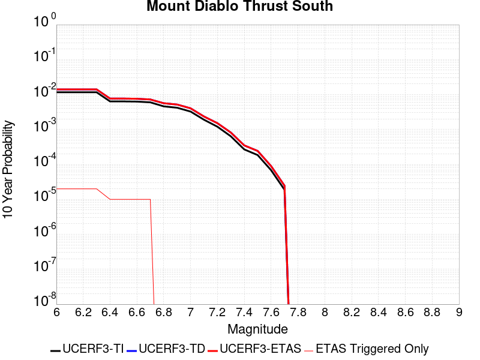 |

| Magnitude | 1 wk TI Prob | 1 wk TD Prob | 1 wk ETAS Prob | 1 wk ETAS/TD Gain | 1 wk ETAS Triggered Only | 1 mo TI Prob | 1 mo TD Prob | 1 mo ETAS Prob | 1 mo ETAS/TD Gain | 1 mo ETAS Triggered Only | 1 yr TI Prob | 1 yr TD Prob | 1 yr ETAS Prob | 1 yr ETAS/TD Gain | 1 yr ETAS Triggered Only | 10 yr TI Prob | 10 yr TD Prob | 10 yr ETAS Prob | 10 yr ETAS/TD Gain | 10 yr ETAS Triggered Only |
|-----|-----|-----|-----|-----|-----|-----|-----|-----|-----|-----|-----|-----|-----|-----|-----|-----|-----|-----|-----|-----|
| 6.0 | 2.2377444E-5 | 2.6956272E-5 | 4.695573E-5 | 1.7419224 | 2.0E-5 | 9.5899806E-5 | 1.1552288E-4 | 1.3552057E-4 | 1.1731058 | 2.0E-5 | 0.0011669548 | 0.0014057814 | 0.0014257532 | 1.014207 | 2.0E-5 | 0.011608457 | 0.013988668 | 0.014008389 | 1.0014098 | 2.0E-5 |
| 6.1 | 2.2377444E-5 | 2.6956272E-5 | 4.695573E-5 | 1.7419224 | 2.0E-5 | 9.5899806E-5 | 1.1552288E-4 | 1.3552057E-4 | 1.1731058 | 2.0E-5 | 0.0011669548 | 0.0014057814 | 0.0014257532 | 1.014207 | 2.0E-5 | 0.011608457 | 0.013988668 | 0.014008389 | 1.0014098 | 2.0E-5 |
| 6.2 | 2.2377444E-5 | 2.6956272E-5 | 4.695573E-5 | 1.7419224 | 2.0E-5 | 9.5899806E-5 | 1.1552288E-4 | 1.3552057E-4 | 1.1731058 | 2.0E-5 | 0.0011669548 | 0.0014057814 | 0.0014257532 | 1.014207 | 2.0E-5 | 0.011608457 | 0.013988668 | 0.014008389 | 1.0014098 | 2.0E-5 |
| 6.3 | 2.2377444E-5 | 2.6956272E-5 | 4.695573E-5 | 1.7419224 | 2.0E-5 | 9.5899806E-5 | 1.1552288E-4 | 1.3552057E-4 | 1.1731058 | 2.0E-5 | 0.0011669548 | 0.0014057814 | 0.0014257532 | 1.014207 | 2.0E-5 | 0.011608457 | 0.013988668 | 0.014008389 | 1.0014098 | 2.0E-5 |
| 6.4 | 1.2228463E-5 | 1.4747731E-5 | 2.4747584E-5 | 1.6780604 | 1.0E-5 | 5.2406645E-5 | 6.320311E-5 | 7.320247E-5 | 1.15821 | 1.0E-5 | 6.378641E-4 | 7.69239E-4 | 7.792313E-4 | 1.0129899 | 1.0E-5 | 0.0063603627 | 0.007667325 | 0.007677248 | 1.0012943 | 1.0E-5 |
| 6.5 | 1.2228463E-5 | 1.4747731E-5 | 2.4747584E-5 | 1.6780604 | 1.0E-5 | 5.2406645E-5 | 6.320311E-5 | 7.320247E-5 | 1.15821 | 1.0E-5 | 6.378641E-4 | 7.69239E-4 | 7.792313E-4 | 1.0129899 | 1.0E-5 | 0.0063603627 | 0.007667325 | 0.007677248 | 1.0012943 | 1.0E-5 |
| 6.6 | 1.2068118E-5 | 1.455253E-5 | 2.4552384E-5 | 1.6871557 | 1.0E-5 | 5.1719482E-5 | 6.236657E-5 | 7.236594E-5 | 1.1603323 | 1.0E-5 | 6.2950276E-4 | 7.5906125E-4 | 7.6905364E-4 | 1.0131642 | 1.0E-5 | 0.006277225 | 0.0075662453 | 0.0075761694 | 1.0013117 | 1.0E-5 |
| 6.7 | 1.1499428E-5 | 1.3875192E-5 | 2.3875053E-5 | 1.7207007 | 1.0E-5 | 4.9282335E-5 | 5.9463826E-5 | 6.946323E-5 | 1.1681595 | 1.0E-5 | 5.9984723E-4 | 7.2374434E-4 | 7.337371E-4 | 1.013807 | 1.0E-5 | 0.0059823063 | 0.007215418 | 0.007225346 | 1.0013759 | 1.0E-5 |
| 6.8 | 8.82118E-6 | 1.0830484E-5 | 1.0830484E-5 | 1.0 | 0.0 | 3.780451E-5 | 4.6415564E-5 | 4.6415564E-5 | 1.0 | 0.0 | 4.601727E-4 | 5.6496856E-4 | 5.6496856E-4 | 1.0 | 0.0 | 0.0045922096 | 0.00563615 | 0.00563615 | 1.0 | 0.0 |
| 6.9 | 8.047112E-6 | 9.939452E-6 | 9.939452E-6 | 1.0 | 0.0 | 3.4487166E-5 | 4.2596985E-5 | 4.2596985E-5 | 1.0 | 0.0 | 4.1980037E-4 | 5.1850016E-4 | 5.1850016E-4 | 1.0 | 0.0 | 0.004190082 | 0.005173695 | 0.005173695 | 1.0 | 0.0 |
| 7.0 | 6.2574763E-6 | 7.748516E-6 | 7.748516E-6 | 1.0 | 0.0 | 2.681748E-5 | 3.320752E-5 | 3.320752E-5 | 1.0 | 0.0 | 3.264539E-4 | 4.0423026E-4 | 4.0423026E-4 | 1.0 | 0.0 | 0.0032597475 | 0.004035568 | 0.004035568 | 1.0 | 0.0 |
| 7.1 | 3.6485903E-6 | 4.5129427E-6 | 4.5129427E-6 | 1.0 | 0.0 | 1.5636722E-5 | 1.9341043E-5 | 1.9341043E-5 | 1.0 | 0.0 | 1.9036046E-4 | 2.3545216E-4 | 2.3545216E-4 | 1.0 | 0.0 | 0.0019019748 | 0.0023519797 | 0.0023519797 | 1.0 | 0.0 |
| 7.2 | 2.3034274E-6 | 2.905533E-6 | 2.905533E-6 | 1.0 | 0.0 | 9.871795E-6 | 1.2452226E-5 | 1.2452226E-5 | 1.0 | 0.0 | 1.2018247E-4 | 1.5159555E-4 | 1.5159555E-4 | 1.0 | 0.0 | 0.0012011749 | 0.0015148793 | 0.0015148793 | 1.0 | 0.0 |
| 7.3 | 1.224035E-6 | 1.5679833E-6 | 1.5679833E-6 | 1.0 | 0.0 | 5.245854E-6 | 6.7199117E-6 | 6.7199117E-6 | 1.0 | 0.0 | 6.38664E-5 | 8.1811966E-5 | 8.1811966E-5 | 1.0 | 0.0 | 6.384805E-4 | 8.1778906E-4 | 8.1778906E-4 | 1.0 | 0.0 |
| 7.4 | 5.1601154E-7 | 6.723377E-7 | 6.723377E-7 | 1.0 | 0.0 | 2.2114762E-6 | 2.8814443E-6 | 2.8814443E-6 | 1.0 | 0.0 | 2.6924388E-5 | 3.5081033E-5 | 3.5081033E-5 | 1.0 | 0.0 | 2.6921128E-4 | 3.5073838E-4 | 3.5073838E-4 | 1.0 | 0.0 |
| 7.5 | 3.552894E-7 | 4.6653233E-7 | 4.6653233E-7 | 1.0 | 0.0 | 1.5226678E-6 | 1.999423E-6 | 1.999423E-6 | 1.0 | 0.0 | 1.8538323E-5 | 2.4342717E-5 | 2.4342717E-5 | 1.0 | 0.0 | 1.8536777E-4 | 2.4340842E-4 | 2.4340842E-4 | 1.0 | 0.0 |
| 7.6 | 1.3124082E-7 | 1.719204E-7 | 1.719204E-7 | 1.0 | 0.0 | 5.6246057E-7 | 7.368016E-7 | 7.368016E-7 | 1.0 | 0.0 | 6.8479358E-6 | 8.970531E-6 | 8.970531E-6 | 1.0 | 0.0 | 6.8477246E-5 | 8.967385E-5 | 8.967385E-5 | 1.0 | 0.0 |
| 7.7 | 3.6193022E-8 | 4.7334765E-8 | 4.7334765E-8 | 1.0 | 0.0 | 1.5511293E-7 | 2.0286328E-7 | 2.0286328E-7 | 1.0 | 0.0 | 1.8884983E-6 | 2.4698586E-6 | 2.4698586E-6 | 1.0 | 0.0 | 1.8884823E-5 | 2.469954E-5 | 2.469954E-5 | 1.0 | 0.0 |

## Great Valley 03a Dunnigan Hills
*[(top)](#table-of-contents)*

| 1 Week | 1 Month | 1 Year | 10 Year |
|-----|-----|-----|-----|
| 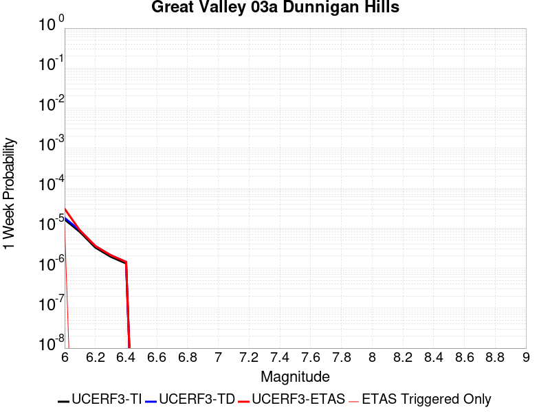 | 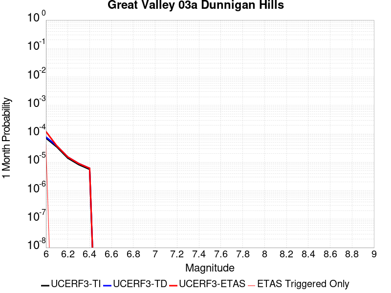 | 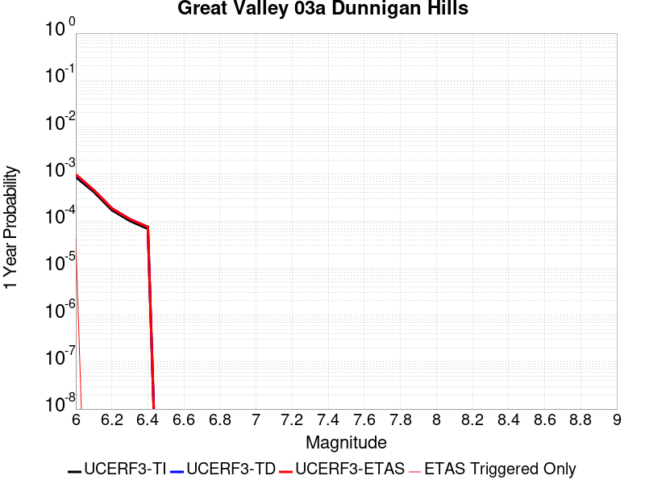 | 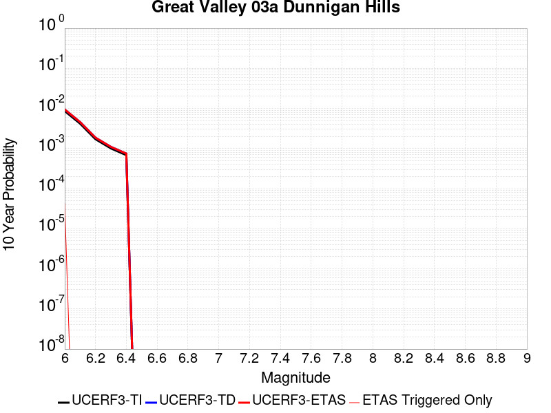 |

| Magnitude | 1 wk TI Prob | 1 wk TD Prob | 1 wk ETAS Prob | 1 wk ETAS/TD Gain | 1 wk ETAS Triggered Only | 1 mo TI Prob | 1 mo TD Prob | 1 mo ETAS Prob | 1 mo ETAS/TD Gain | 1 mo ETAS Triggered Only | 1 yr TI Prob | 1 yr TD Prob | 1 yr ETAS Prob | 1 yr ETAS/TD Gain | 1 yr ETAS Triggered Only | 10 yr TI Prob | 10 yr TD Prob | 10 yr ETAS Prob | 10 yr ETAS/TD Gain | 10 yr ETAS Triggered Only |
|-----|-----|-----|-----|-----|-----|-----|-----|-----|-----|-----|-----|-----|-----|-----|-----|-----|-----|-----|-----|-----|
| 6.0 | 1.6591328E-5 | 1.8107954E-5 | 2.8107774E-5 | 1.5522335 | 1.0E-5 | 7.110376E-5 | 7.7603596E-5 | 8.760282E-5 | 1.12885 | 1.0E-5 | 8.6534437E-4 | 9.444834E-4 | 9.54474E-4 | 1.0105778 | 1.0E-5 | 0.008619824 | 0.009411525 | 0.009431337 | 1.002105 | 2.0E-5 |
| 6.1 | 8.041125E-6 | 8.769726E-6 | 8.769726E-6 | 1.0 | 0.0 | 3.4461507E-5 | 3.7584115E-5 | 3.7584115E-5 | 1.0 | 0.0 | 4.194881E-4 | 4.5751085E-4 | 4.5751085E-4 | 1.0 | 0.0 | 0.004186971 | 0.004567687 | 0.004567687 | 1.0 | 0.0 |
| 6.2 | 3.2807004E-6 | 3.5795688E-6 | 3.5795688E-6 | 1.0 | 0.0 | 1.4060069E-5 | 1.5340942E-5 | 1.5340942E-5 | 1.0 | 0.0 | 1.7116789E-4 | 1.8676413E-4 | 1.8676413E-4 | 1.0 | 0.0 | 0.0017103611 | 0.0018664796 | 0.0018664796 | 1.0 | 0.0 |
| 6.3 | 1.9339366E-6 | 2.1103806E-6 | 2.1103806E-6 | 1.0 | 0.0 | 8.288273E-6 | 9.044474E-6 | 9.044474E-6 | 1.0 | 0.0 | 1.00905054E-4 | 1.1011375E-4 | 1.1011375E-4 | 1.0 | 0.0 | 0.0010085925 | 0.0011008718 | 0.0011008718 | 1.0 | 0.0 |
| 6.4 | 1.3142635E-6 | 1.4339867E-6 | 1.4339867E-6 | 1.0 | 0.0 | 5.6325457E-6 | 6.145657E-6 | 6.145657E-6 | 1.0 | 0.0 | 6.857408E-5 | 7.482337E-5 | 7.482337E-5 | 1.0 | 0.0 | 6.8552926E-4 | 7.4823375E-4 | 7.4823375E-4 | 1.0 | 0.0 |

## Owens Valley Keough Hot Springs
*[(top)](#table-of-contents)*

| 1 Week | 1 Month | 1 Year | 10 Year |
|-----|-----|-----|-----|
| 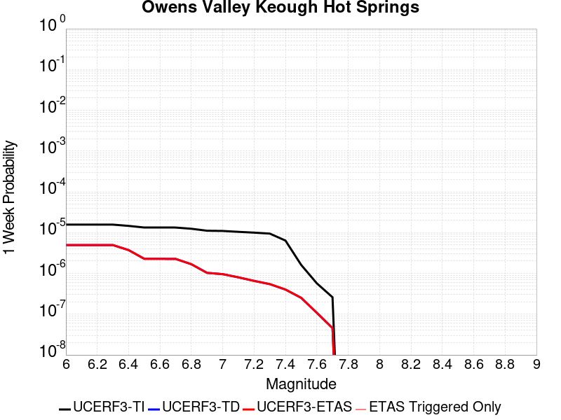 | 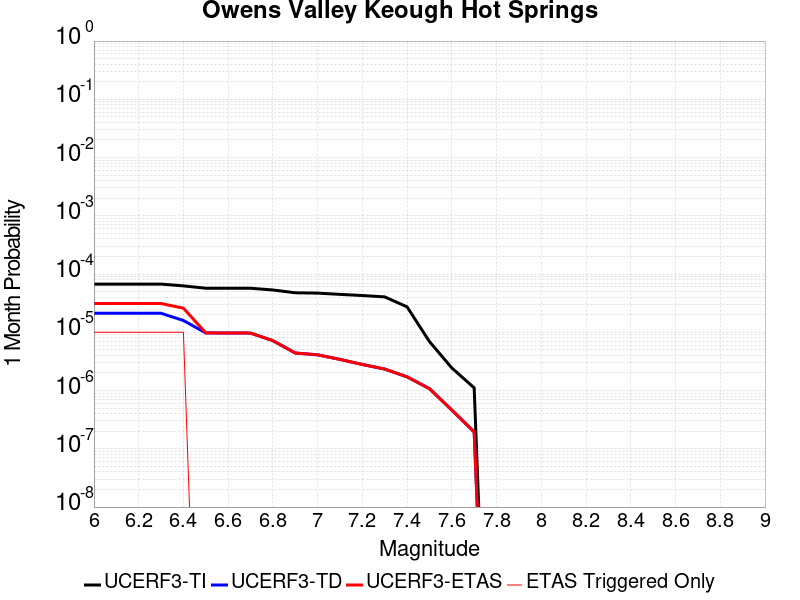 | 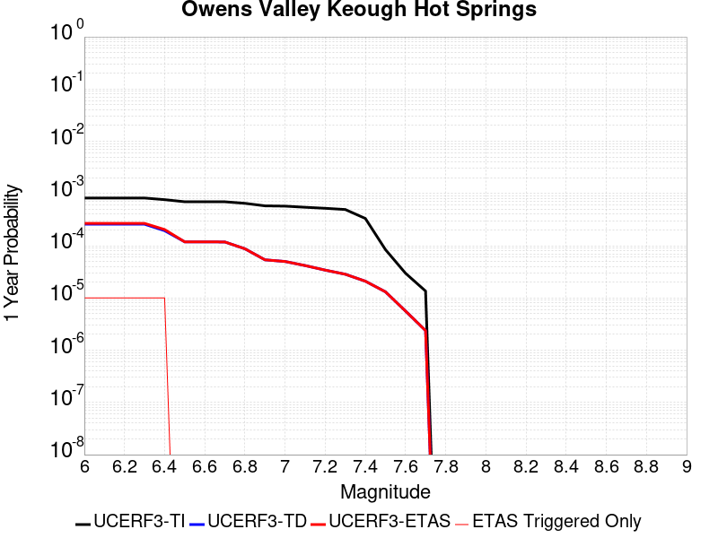 | 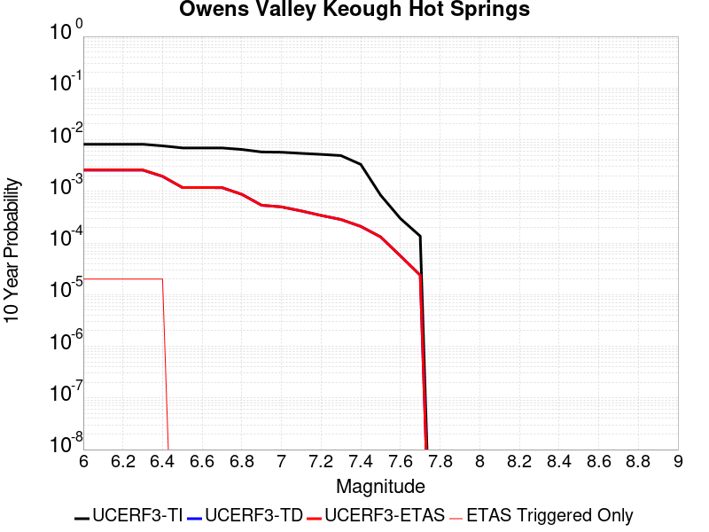 |

| Magnitude | 1 wk TI Prob | 1 wk TD Prob | 1 wk ETAS Prob | 1 wk ETAS/TD Gain | 1 wk ETAS Triggered Only | 1 mo TI Prob | 1 mo TD Prob | 1 mo ETAS Prob | 1 mo ETAS/TD Gain | 1 mo ETAS Triggered Only | 1 yr TI Prob | 1 yr TD Prob | 1 yr ETAS Prob | 1 yr ETAS/TD Gain | 1 yr ETAS Triggered Only | 10 yr TI Prob | 10 yr TD Prob | 10 yr ETAS Prob | 10 yr ETAS/TD Gain | 10 yr ETAS Triggered Only |
|-----|-----|-----|-----|-----|-----|-----|-----|-----|-----|-----|-----|-----|-----|-----|-----|-----|-----|-----|-----|-----|
| 6.0 | 1.5708529E-5 | 4.950463E-6 | 1.4950414E-5 | 3.020003 | 1.0E-5 | 6.7320536E-5 | 2.1216127E-5 | 3.1215914E-5 | 1.4713296 | 1.0E-5 | 8.193192E-4 | 2.5828084E-4 | 2.6827827E-4 | 1.0387075 | 1.0E-5 | 0.008163051 | 0.0025804387 | 0.0026003872 | 1.0077306 | 2.0E-5 |
| 6.1 | 1.5708529E-5 | 4.950463E-6 | 1.4950414E-5 | 3.020003 | 1.0E-5 | 6.7320536E-5 | 2.1216127E-5 | 3.1215914E-5 | 1.4713296 | 1.0E-5 | 8.193192E-4 | 2.5828084E-4 | 2.6827827E-4 | 1.0387075 | 1.0E-5 | 0.008163051 | 0.0025804387 | 0.0026003872 | 1.0077306 | 2.0E-5 |
| 6.2 | 1.5708529E-5 | 4.950463E-6 | 1.4950414E-5 | 3.020003 | 1.0E-5 | 6.7320536E-5 | 2.1216127E-5 | 3.1215914E-5 | 1.4713296 | 1.0E-5 | 8.193192E-4 | 2.5828084E-4 | 2.6827827E-4 | 1.0387075 | 1.0E-5 | 0.008163051 | 0.0025804387 | 0.0026003872 | 1.0077306 | 2.0E-5 |
| 6.3 | 1.5708529E-5 | 4.950463E-6 | 1.4950414E-5 | 3.020003 | 1.0E-5 | 6.7320536E-5 | 2.1216127E-5 | 3.1215914E-5 | 1.4713296 | 1.0E-5 | 8.193192E-4 | 2.5828084E-4 | 2.6827827E-4 | 1.0387075 | 1.0E-5 | 0.008163051 | 0.0025804387 | 0.0026003872 | 1.0077306 | 2.0E-5 |
| 6.4 | 1.4622509E-5 | 3.7263276E-6 | 1.37262905E-5 | 3.6835973 | 1.0E-5 | 6.266639E-5 | 1.5969896E-5 | 2.5969737E-5 | 1.6261681 | 1.0E-5 | 7.626962E-4 | 1.9441944E-4 | 2.044175E-4 | 1.0514252 | 1.0E-5 | 0.007600839 | 0.0019429466 | 0.0019629078 | 1.0102737 | 2.0E-5 |
| 6.5 | 1.3335527E-5 | 2.2775241E-6 | 2.2775241E-6 | 1.0 | 0.0 | 5.7151006E-5 | 9.760785E-6 | 9.760785E-6 | 1.0 | 0.0 | 6.955913E-4 | 1.1883176E-4 | 1.1883176E-4 | 1.0 | 0.0 | 0.0069341804 | 0.001187878 | 0.001187878 | 1.0 | 0.0 |
| 6.6 | 1.3332855E-5 | 2.2746733E-6 | 2.2746733E-6 | 1.0 | 0.0 | 5.7139558E-5 | 9.748568E-6 | 9.748568E-6 | 1.0 | 0.0 | 6.9545204E-4 | 1.1868303E-4 | 1.1868303E-4 | 1.0 | 0.0 | 0.0069327964 | 0.0011863923 | 0.0011863923 | 1.0 | 0.0 |
| 6.7 | 1.3318214E-5 | 2.2639038E-6 | 2.2639038E-6 | 1.0 | 0.0 | 5.707681E-5 | 9.702413E-6 | 9.702413E-6 | 1.0 | 0.0 | 6.946886E-4 | 1.18121156E-4 | 1.18121156E-4 | 1.0 | 0.0 | 0.0069252094 | 0.0011807795 | 0.0011807795 | 1.0 | 0.0 |
| 6.8 | 1.2441338E-5 | 1.677594E-6 | 1.677594E-6 | 1.0 | 0.0 | 5.331893E-5 | 7.1896707E-6 | 7.1896707E-6 | 1.0 | 0.0 | 6.489646E-4 | 8.753102E-5 | 8.753102E-5 | 1.0 | 0.0 | 0.0064707273 | 8.751236E-4 | 8.751236E-4 | 1.0 | 0.0 |
| 6.9 | 1.1130476E-5 | 1.0302234E-6 | 1.0302234E-6 | 1.0 | 0.0 | 4.7701167E-5 | 4.4152357E-6 | 4.4152357E-6 | 1.0 | 0.0 | 5.806069E-4 | 5.3754186E-5 | 5.3754186E-5 | 1.0 | 0.0 | 0.0057909233 | 5.375404E-4 | 5.375404E-4 | 1.0 | 0.0 |
| 7.0 | 1.0986073E-5 | 9.577824E-7 | 9.577824E-7 | 1.0 | 0.0 | 4.7082318E-5 | 4.1047756E-6 | 4.1047756E-6 | 1.0 | 0.0 | 5.730765E-4 | 4.9974507E-5 | 4.9974507E-5 | 1.0 | 0.0 | 0.0057160086 | 4.997603E-4 | 4.997603E-4 | 1.0 | 0.0 |
| 7.1 | 1.0451338E-5 | 7.9988575E-7 | 7.9988575E-7 | 1.0 | 0.0 | 4.4790682E-5 | 3.4280772E-6 | 3.4280772E-6 | 1.0 | 0.0 | 5.451901E-4 | 4.1736046E-5 | 4.1736046E-5 | 1.0 | 0.0 | 0.005438545 | 4.1740583E-4 | 4.1740583E-4 | 1.0 | 0.0 |
| 7.2 | 9.989061E-6 | 6.543693E-7 | 6.543693E-7 | 1.0 | 0.0 | 4.280956E-5 | 2.8044367E-6 | 2.8044367E-6 | 1.0 | 0.0 | 5.2108173E-4 | 3.4143486E-5 | 3.4143486E-5 | 1.0 | 0.0 | 0.0051986156 | 3.41488E-4 | 3.41488E-4 | 1.0 | 0.0 |
| 7.3 | 9.465365E-6 | 5.458855E-7 | 5.458855E-7 | 1.0 | 0.0 | 4.056522E-5 | 2.3395073E-6 | 2.3395073E-6 | 1.0 | 0.0 | 4.937696E-4 | 2.8483131E-5 | 2.8483131E-5 | 1.0 | 0.0 | 0.0049267393 | 2.8489542E-4 | 2.8489542E-4 | 1.0 | 0.0 |
| 7.4 | 6.3824805E-6 | 4.0153776E-7 | 4.0153776E-7 | 1.0 | 0.0 | 2.73532E-5 | 1.7208749E-6 | 1.7208749E-6 | 1.0 | 0.0 | 3.3297433E-4 | 2.0951453E-5 | 2.0951453E-5 | 1.0 | 0.0 | 0.0033247585 | 2.0955436E-4 | 2.0955436E-4 | 1.0 | 0.0 |
| 7.5 | 1.6192645E-6 | 2.5156373E-7 | 2.5156373E-7 | 1.0 | 0.0 | 6.9396865E-6 | 1.0781299E-6 | 1.0781299E-6 | 1.0 | 0.0 | 8.448741E-5 | 1.3126153E-5 | 1.3126153E-5 | 1.0 | 0.0 | 8.4455294E-4 | 1.3125391E-4 | 1.3125391E-4 | 1.0 | 0.0 |
| 7.6 | 5.7062545E-7 | 1.0790214E-7 | 1.0790214E-7 | 1.0 | 0.0 | 2.4455355E-6 | 4.6243767E-7 | 4.6243767E-7 | 1.0 | 0.0 | 2.9773988E-5 | 5.630165E-6 | 5.630165E-6 | 1.0 | 0.0 | 2.977E-4 | 5.6300305E-5 | 5.6300305E-5 | 1.0 | 0.0 |
| 7.7 | 2.5988817E-7 | 4.5445965E-8 | 4.5445965E-8 | 1.0 | 0.0 | 1.113806E-6 | 1.9476842E-7 | 1.9476842E-7 | 1.0 | 0.0 | 1.3560503E-5 | 2.3713033E-6 | 2.3713033E-6 | 1.0 | 0.0 | 1.3559677E-4 | 2.3712824E-5 | 2.3712824E-5 | 1.0 | 0.0 |

## Puente Hills
*[(top)](#table-of-contents)*

| 1 Week | 1 Month | 1 Year | 10 Year |
|-----|-----|-----|-----|
|  |  | 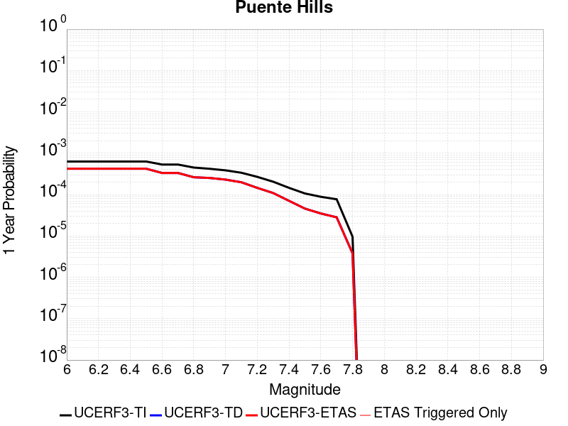 | 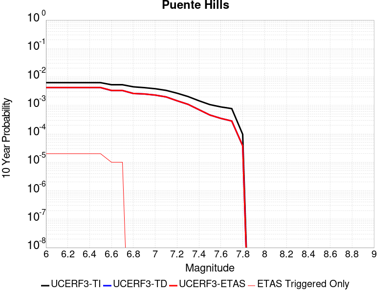 |

| Magnitude | 1 wk TI Prob | 1 wk TD Prob | 1 wk ETAS Prob | 1 wk ETAS/TD Gain | 1 wk ETAS Triggered Only | 1 mo TI Prob | 1 mo TD Prob | 1 mo ETAS Prob | 1 mo ETAS/TD Gain | 1 mo ETAS Triggered Only | 1 yr TI Prob | 1 yr TD Prob | 1 yr ETAS Prob | 1 yr ETAS/TD Gain | 1 yr ETAS Triggered Only | 10 yr TI Prob | 10 yr TD Prob | 10 yr ETAS Prob | 10 yr ETAS/TD Gain | 10 yr ETAS Triggered Only |
|-----|-----|-----|-----|-----|-----|-----|-----|-----|-----|-----|-----|-----|-----|-----|-----|-----|-----|-----|-----|-----|
| 6.0 | 1.2101656E-5 | 8.098448E-6 | 8.098448E-6 | 1.0 | 0.0 | 5.1863204E-5 | 3.4707205E-5 | 3.4707205E-5 | 1.0 | 0.0 | 6.312516E-4 | 4.2248392E-4 | 4.2248392E-4 | 1.0 | 0.0 | 0.0062946146 | 0.0042173676 | 0.004237283 | 1.0047222 | 2.0E-5 |
| 6.1 | 1.2101656E-5 | 8.098448E-6 | 8.098448E-6 | 1.0 | 0.0 | 5.1863204E-5 | 3.4707205E-5 | 3.4707205E-5 | 1.0 | 0.0 | 6.312516E-4 | 4.2248392E-4 | 4.2248392E-4 | 1.0 | 0.0 | 0.0062946146 | 0.0042173676 | 0.004237283 | 1.0047222 | 2.0E-5 |
| 6.2 | 1.2101656E-5 | 8.098448E-6 | 8.098448E-6 | 1.0 | 0.0 | 5.1863204E-5 | 3.4707205E-5 | 3.4707205E-5 | 1.0 | 0.0 | 6.312516E-4 | 4.2248392E-4 | 4.2248392E-4 | 1.0 | 0.0 | 0.0062946146 | 0.0042173676 | 0.004237283 | 1.0047222 | 2.0E-5 |
| 6.3 | 1.2101656E-5 | 8.098448E-6 | 8.098448E-6 | 1.0 | 0.0 | 5.1863204E-5 | 3.4707205E-5 | 3.4707205E-5 | 1.0 | 0.0 | 6.312516E-4 | 4.2248392E-4 | 4.2248392E-4 | 1.0 | 0.0 | 0.0062946146 | 0.0042173676 | 0.004237283 | 1.0047222 | 2.0E-5 |
| 6.4 | 1.2101656E-5 | 8.098448E-6 | 8.098448E-6 | 1.0 | 0.0 | 5.1863204E-5 | 3.4707205E-5 | 3.4707205E-5 | 1.0 | 0.0 | 6.312516E-4 | 4.2248392E-4 | 4.2248392E-4 | 1.0 | 0.0 | 0.0062946146 | 0.0042173676 | 0.004237283 | 1.0047222 | 2.0E-5 |
| 6.5 | 1.2101656E-5 | 8.098448E-6 | 8.098448E-6 | 1.0 | 0.0 | 5.1863204E-5 | 3.4707205E-5 | 3.4707205E-5 | 1.0 | 0.0 | 6.312516E-4 | 4.2248392E-4 | 4.2248392E-4 | 1.0 | 0.0 | 0.0062946146 | 0.0042173676 | 0.004237283 | 1.0047222 | 2.0E-5 |
| 6.6 | 1.0222488E-5 | 6.399079E-6 | 6.399079E-6 | 1.0 | 0.0 | 4.3809923E-5 | 2.742435E-5 | 2.742435E-5 | 1.0 | 0.0 | 5.332553E-4 | 3.3384276E-4 | 3.3384276E-4 | 1.0 | 0.0 | 0.0053197746 | 0.0033336577 | 0.0033436243 | 1.0029896 | 1.0E-5 |
| 6.7 | 1.0222488E-5 | 6.399079E-6 | 6.399079E-6 | 1.0 | 0.0 | 4.3809923E-5 | 2.742435E-5 | 2.742435E-5 | 1.0 | 0.0 | 5.332553E-4 | 3.3384276E-4 | 3.3384276E-4 | 1.0 | 0.0 | 0.0053197746 | 0.0033336577 | 0.0033436243 | 1.0029896 | 1.0E-5 |
| 6.8 | 8.6367845E-6 | 5.028129E-6 | 5.028129E-6 | 1.0 | 0.0 | 3.7014266E-5 | 2.1548949E-5 | 2.1548949E-5 | 1.0 | 0.0 | 4.505555E-4 | 2.6232743E-4 | 2.6232743E-4 | 1.0 | 0.0 | 0.004496431 | 0.002620234 | 0.002620234 | 1.0 | 0.0 |
| 6.9 | 8.066481E-6 | 4.8360116E-6 | 4.8360116E-6 | 1.0 | 0.0 | 3.4570177E-5 | 2.0725602E-5 | 2.0725602E-5 | 1.0 | 0.0 | 4.2081063E-4 | 2.523055E-4 | 2.523055E-4 | 1.0 | 0.0 | 0.0042001465 | 0.0025202443 | 0.0025202443 | 1.0 | 0.0 |
| 7.0 | 7.393828E-6 | 4.4172275E-6 | 4.4172275E-6 | 1.0 | 0.0 | 3.168745E-5 | 1.8930841E-5 | 1.8930841E-5 | 1.0 | 0.0 | 3.857264E-4 | 2.3045906E-4 | 2.3045906E-4 | 1.0 | 0.0 | 0.0038505755 | 0.0023022462 | 0.0023022462 | 1.0 | 0.0 |
| 7.1 | 6.4660953E-6 | 3.8043859E-6 | 3.8043859E-6 | 1.0 | 0.0 | 2.7711543E-5 | 1.630441E-5 | 1.630441E-5 | 1.0 | 0.0 | 3.373358E-4 | 1.9848847E-4 | 1.9848847E-4 | 1.0 | 0.0 | 0.0033682417 | 0.0019831478 | 0.0019831478 | 1.0 | 0.0 |
| 7.2 | 5.143232E-6 | 2.7864896E-6 | 2.7864896E-6 | 1.0 | 0.0 | 2.2042237E-5 | 1.1942045E-5 | 1.1942045E-5 | 1.0 | 0.0 | 2.6833118E-4 | 1.453848E-4 | 1.453848E-4 | 1.0 | 0.0 | 0.002680074 | 0.0014529065 | 0.0014529065 | 1.0 | 0.0 |
| 7.3 | 3.928255E-6 | 2.091338E-6 | 2.091338E-6 | 1.0 | 0.0 | 1.683527E-5 | 8.962847E-6 | 8.962847E-6 | 1.0 | 0.0 | 2.0495013E-4 | 1.0911726E-4 | 1.0911726E-4 | 1.0 | 0.0 | 0.002047612 | 0.0010906435 | 0.0010906435 | 1.0 | 0.0 |
| 7.4 | 2.7894434E-6 | 1.3546429E-6 | 1.3546429E-6 | 1.0 | 0.0 | 1.1954703E-5 | 5.8056E-6 | 5.8056E-6 | 1.0 | 0.0 | 1.4553878E-4 | 7.068093E-5 | 7.068093E-5 | 1.0 | 0.0 | 0.001454435 | 7.0658885E-4 | 7.0658885E-4 | 1.0 | 0.0 |
| 7.5 | 2.041735E-6 | 8.786996E-7 | 8.786996E-7 | 1.0 | 0.0 | 8.750263E-6 | 3.7658504E-6 | 3.7658504E-6 | 1.0 | 0.0 | 1.06529245E-4 | 4.5848297E-5 | 4.5848297E-5 | 1.0 | 0.0 | 0.0010647819 | 4.5839173E-4 | 4.5839173E-4 | 1.0 | 0.0 |
| 7.6 | 1.6959062E-6 | 6.698339E-7 | 6.698339E-7 | 1.0 | 0.0 | 7.268149E-6 | 2.8707138E-6 | 2.8707138E-6 | 1.0 | 0.0 | 8.848612E-5 | 3.4950408E-5 | 3.4950408E-5 | 1.0 | 0.0 | 8.84509E-4 | 3.4945202E-4 | 3.4945202E-4 | 1.0 | 0.0 |
| 7.7 | 1.4767965E-6 | 5.407146E-7 | 5.407146E-7 | 1.0 | 0.0 | 6.3291122E-6 | 2.3173466E-6 | 2.3173466E-6 | 1.0 | 0.0 | 7.705422E-5 | 2.8213353E-5 | 2.8213353E-5 | 1.0 | 0.0 | 7.702751E-4 | 2.8210029E-4 | 2.8210029E-4 | 1.0 | 0.0 |
| 7.8 | 1.8432911E-7 | 7.2811105E-8 | 7.2811105E-8 | 1.0 | 0.0 | 7.8998164E-7 | 3.1204758E-7 | 3.1204758E-7 | 1.0 | 0.0 | 9.617985E-6 | 3.799176E-6 | 3.799176E-6 | 1.0 | 0.0 | 9.617568E-5 | 3.7991435E-5 | 3.7991435E-5 | 1.0 | 0.0 |

## South Cuyama
*[(top)](#table-of-contents)*

| 1 Week | 1 Month | 1 Year | 10 Year |
|-----|-----|-----|-----|
|  | 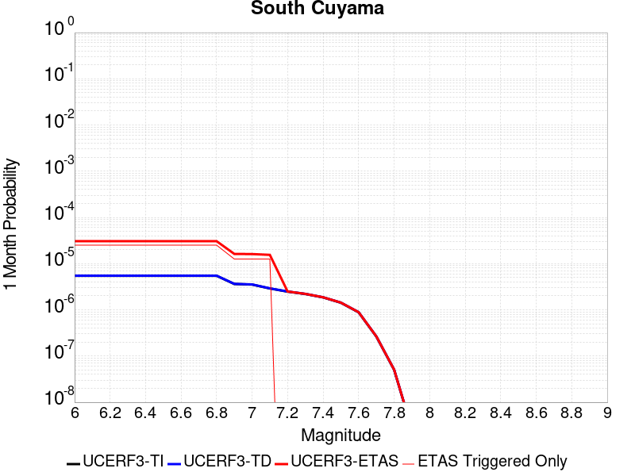 | 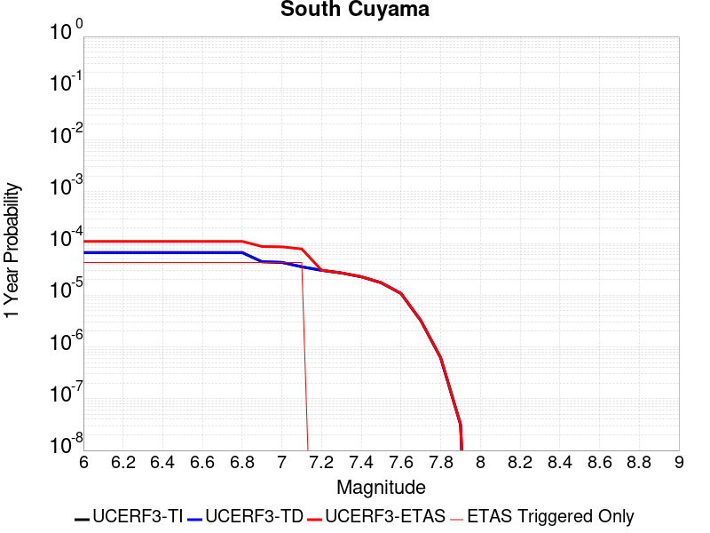 | 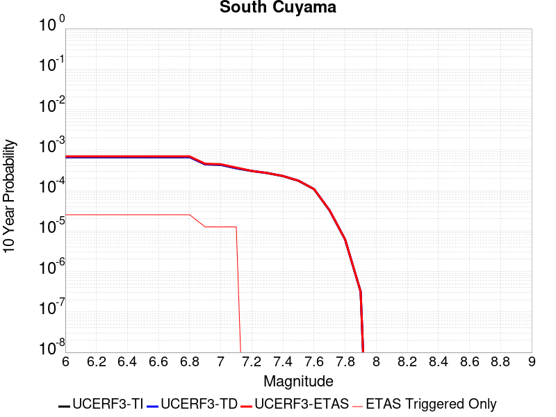 |

| Magnitude | 1 wk TI Prob | 1 wk TD Prob | 1 wk ETAS Prob | 1 wk ETAS/TD Gain | 1 wk ETAS Triggered Only | 1 mo TI Prob | 1 mo TD Prob | 1 mo ETAS Prob | 1 mo ETAS/TD Gain | 1 mo ETAS Triggered Only | 1 yr TI Prob | 1 yr TD Prob | 1 yr ETAS Prob | 1 yr ETAS/TD Gain | 1 yr ETAS Triggered Only | 10 yr TI Prob | 10 yr TD Prob | 10 yr ETAS Prob | 10 yr ETAS/TD Gain | 10 yr ETAS Triggered Only |
|-----|-----|-----|-----|-----|-----|-----|-----|-----|-----|-----|-----|-----|-----|-----|-----|-----|-----|-----|-----|-----|
| 6.0 | 1.2747308E-6 | 1.2818697E-6 | 2.1281845E-5 | 16.60219 | 2.0E-5 | 5.4631205E-6 | 5.4937163E-6 | 2.5493606E-5 | 4.640503 | 2.0E-5 | 6.6511464E-5 | 6.6884015E-5 | 8.6882676E-5 | 1.2990052 | 2.0E-5 | 6.649156E-4 | 6.686458E-4 | 6.886324E-4 | 1.0298913 | 2.0E-5 |
| 6.1 | 1.2747308E-6 | 1.2818697E-6 | 2.1281845E-5 | 16.60219 | 2.0E-5 | 5.4631205E-6 | 5.4937163E-6 | 2.5493606E-5 | 4.640503 | 2.0E-5 | 6.6511464E-5 | 6.6884015E-5 | 8.6882676E-5 | 1.2990052 | 2.0E-5 | 6.649156E-4 | 6.686458E-4 | 6.886324E-4 | 1.0298913 | 2.0E-5 |
| 6.2 | 1.2747308E-6 | 1.2818697E-6 | 2.1281845E-5 | 16.60219 | 2.0E-5 | 5.4631205E-6 | 5.4937163E-6 | 2.5493606E-5 | 4.640503 | 2.0E-5 | 6.6511464E-5 | 6.6884015E-5 | 8.6882676E-5 | 1.2990052 | 2.0E-5 | 6.649156E-4 | 6.686458E-4 | 6.886324E-4 | 1.0298913 | 2.0E-5 |
| 6.3 | 1.2747308E-6 | 1.2818697E-6 | 2.1281845E-5 | 16.60219 | 2.0E-5 | 5.4631205E-6 | 5.4937163E-6 | 2.5493606E-5 | 4.640503 | 2.0E-5 | 6.6511464E-5 | 6.6884015E-5 | 8.6882676E-5 | 1.2990052 | 2.0E-5 | 6.649156E-4 | 6.686458E-4 | 6.886324E-4 | 1.0298913 | 2.0E-5 |
| 6.4 | 1.2747308E-6 | 1.2818697E-6 | 2.1281845E-5 | 16.60219 | 2.0E-5 | 5.4631205E-6 | 5.4937163E-6 | 2.5493606E-5 | 4.640503 | 2.0E-5 | 6.6511464E-5 | 6.6884015E-5 | 8.6882676E-5 | 1.2990052 | 2.0E-5 | 6.649156E-4 | 6.686458E-4 | 6.886324E-4 | 1.0298913 | 2.0E-5 |
| 6.5 | 1.2747308E-6 | 1.2818697E-6 | 2.1281845E-5 | 16.60219 | 2.0E-5 | 5.4631205E-6 | 5.4937163E-6 | 2.5493606E-5 | 4.640503 | 2.0E-5 | 6.6511464E-5 | 6.6884015E-5 | 8.6882676E-5 | 1.2990052 | 2.0E-5 | 6.649156E-4 | 6.686458E-4 | 6.886324E-4 | 1.0298913 | 2.0E-5 |
| 6.6 | 1.2747308E-6 | 1.2818697E-6 | 2.1281845E-5 | 16.60219 | 2.0E-5 | 5.4631205E-6 | 5.4937163E-6 | 2.5493606E-5 | 4.640503 | 2.0E-5 | 6.6511464E-5 | 6.6884015E-5 | 8.6882676E-5 | 1.2990052 | 2.0E-5 | 6.649156E-4 | 6.686458E-4 | 6.886324E-4 | 1.0298913 | 2.0E-5 |
| 6.7 | 1.2747308E-6 | 1.2818697E-6 | 2.1281845E-5 | 16.60219 | 2.0E-5 | 5.4631205E-6 | 5.4937163E-6 | 2.5493606E-5 | 4.640503 | 2.0E-5 | 6.6511464E-5 | 6.6884015E-5 | 8.6882676E-5 | 1.2990052 | 2.0E-5 | 6.649156E-4 | 6.686458E-4 | 6.886324E-4 | 1.0298913 | 2.0E-5 |
| 6.8 | 1.2747308E-6 | 1.2818697E-6 | 2.1281845E-5 | 16.60219 | 2.0E-5 | 5.4631205E-6 | 5.4937163E-6 | 2.5493606E-5 | 4.640503 | 2.0E-5 | 6.6511464E-5 | 6.6884015E-5 | 8.6882676E-5 | 1.2990052 | 2.0E-5 | 6.649156E-4 | 6.686458E-4 | 6.886324E-4 | 1.0298913 | 2.0E-5 |
| 6.9 | 8.4566324E-7 | 8.507883E-7 | 1.085078E-5 | 12.753796 | 1.0E-5 | 3.624266E-6 | 3.6462304E-6 | 1.3646194E-5 | 3.7425485 | 1.0E-5 | 4.4124543E-5 | 4.439196E-5 | 5.4391516E-5 | 1.225256 | 1.0E-5 | 4.4115784E-4 | 4.4383196E-4 | 4.5382752E-4 | 1.022521 | 1.0E-5 |
| 7.0 | 8.2277904E-7 | 8.27782E-7 | 1.0827774E-5 | 13.080465 | 1.0E-5 | 3.526191E-6 | 3.5476323E-6 | 1.3547597E-5 | 3.8187714 | 1.0E-5 | 4.293053E-5 | 4.3191576E-5 | 5.3191146E-5 | 1.2315166 | 1.0E-5 | 4.292224E-4 | 4.3183283E-4 | 4.418285E-4 | 1.0231471 | 1.0E-5 |
| 7.1 | 6.7661887E-7 | 6.80913E-7 | 1.0680907E-5 | 15.686153 | 1.0E-5 | 2.899792E-6 | 2.9181954E-6 | 1.2918166E-5 | 4.4267654 | 1.0E-5 | 3.5304394E-5 | 3.5528454E-5 | 4.5528097E-5 | 1.2814546 | 1.0E-5 | 3.5298787E-4 | 3.552281E-4 | 3.6522458E-4 | 1.0281409 | 1.0E-5 |
| 7.2 | 5.783336E-7 | 5.8211907E-7 | 5.8211907E-7 | 1.0 | 0.0 | 2.4785702E-6 | 2.4947938E-6 | 2.4947938E-6 | 1.0 | 0.0 | 3.0176174E-5 | 3.0373692E-5 | 3.0373692E-5 | 1.0 | 0.0 | 3.0172078E-4 | 3.0369565E-4 | 3.0369565E-4 | 1.0 | 0.0 |
| 7.3 | 5.136759E-7 | 5.170938E-7 | 5.170938E-7 | 1.0 | 0.0 | 2.2014663E-6 | 2.2161144E-6 | 2.2161144E-6 | 1.0 | 0.0 | 2.6802521E-5 | 2.698086E-5 | 2.698086E-5 | 1.0 | 0.0 | 2.679929E-4 | 2.6977606E-4 | 2.6977606E-4 | 1.0 | 0.0 |
| 7.4 | 4.3370295E-7 | 4.3665364E-7 | 4.3665364E-7 | 1.0 | 0.0 | 1.8587256E-6 | 1.8713713E-6 | 1.8713713E-6 | 1.0 | 0.0 | 2.2629749E-5 | 2.278371E-5 | 2.278371E-5 | 1.0 | 0.0 | 2.2627445E-4 | 2.278139E-4 | 2.278139E-4 | 1.0 | 0.0 |
| 7.5 | 3.3242574E-7 | 3.3476465E-7 | 3.3476465E-7 | 1.0 | 0.0 | 1.4246809E-6 | 1.4347048E-6 | 1.4347048E-6 | 1.0 | 0.0 | 1.7345352E-5 | 1.7467393E-5 | 1.7467393E-5 | 1.0 | 0.0 | 1.7343998E-4 | 1.7466032E-4 | 1.7466032E-4 | 1.0 | 0.0 |
| 7.6 | 2.0627535E-7 | 2.07789E-7 | 2.07789E-7 | 1.0 | 0.0 | 8.840369E-7 | 8.90524E-7 | 8.90524E-7 | 1.0 | 0.0 | 1.0763096E-5 | 1.0842076E-5 | 1.0842076E-5 | 1.0 | 0.0 | 1.0762575E-4 | 1.0841556E-4 | 1.0841556E-4 | 1.0 | 0.0 |
| 7.7 | 6.15236E-8 | 6.1983044E-8 | 6.1983044E-8 | 1.0 | 0.0 | 2.6367252E-7 | 2.656416E-7 | 2.656416E-7 | 1.0 | 0.0 | 3.2102084E-6 | 3.2341818E-6 | 3.2341818E-6 | 1.0 | 0.0 | 3.210162E-5 | 3.234136E-5 | 3.234136E-5 | 1.0 | 0.0 |
| 7.8 | 1.1765573E-8 | 1.1873414E-8 | 1.1873414E-8 | 1.0 | 0.0 | 5.0423886E-8 | 5.0886058E-8 | 5.0886058E-8 | 1.0 | 0.0 | 6.1391063E-7 | 6.195376E-7 | 6.195376E-7 | 1.0 | 0.0 | 6.1390897E-6 | 6.19536E-6 | 6.19536E-6 | 1.0 | 0.0 |
| 7.9 | 6.0381755E-10 | 6.10058E-10 | 6.10058E-10 | 1.0 | 0.0 | 2.5877895E-9 | 2.614534E-9 | 2.614534E-9 | 1.0 | 0.0 | 3.1506335E-8 | 3.1831952E-8 | 3.1831952E-8 | 1.0 | 0.0 | 3.1506332E-7 | 3.183195E-7 | 3.183195E-7 | 1.0 | 0.0 |

## Johnson Valley (No) 2011 rev
*[(top)](#table-of-contents)*

| 1 Week | 1 Month | 1 Year | 10 Year |
|-----|-----|-----|-----|
|  | 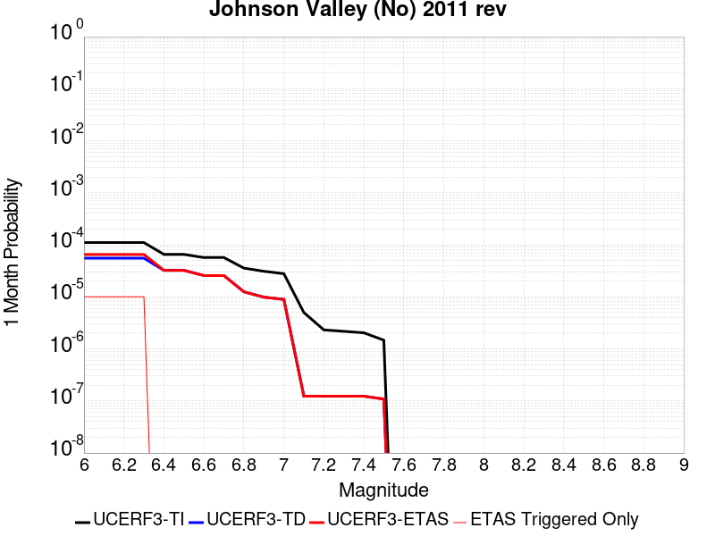 | 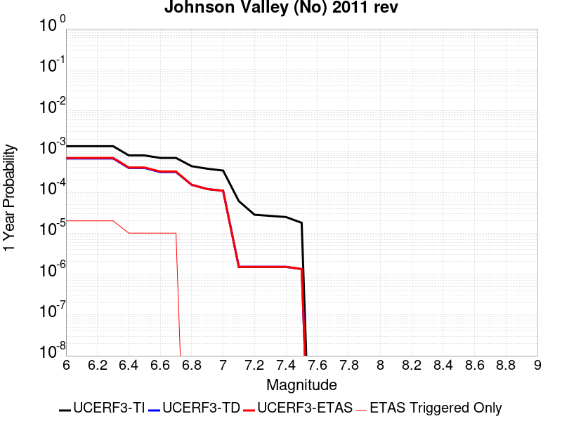 | 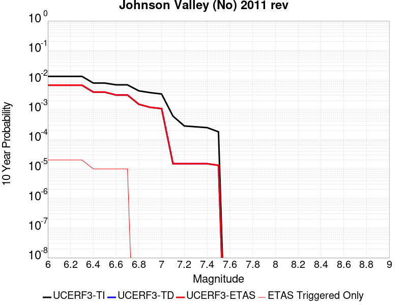 |

| Magnitude | 1 wk TI Prob | 1 wk TD Prob | 1 wk ETAS Prob | 1 wk ETAS/TD Gain | 1 wk ETAS Triggered Only | 1 mo TI Prob | 1 mo TD Prob | 1 mo ETAS Prob | 1 mo ETAS/TD Gain | 1 mo ETAS Triggered Only | 1 yr TI Prob | 1 yr TD Prob | 1 yr ETAS Prob | 1 yr ETAS/TD Gain | 1 yr ETAS Triggered Only | 10 yr TI Prob | 10 yr TD Prob | 10 yr ETAS Prob | 10 yr ETAS/TD Gain | 10 yr ETAS Triggered Only |
|-----|-----|-----|-----|-----|-----|-----|-----|-----|-----|-----|-----|-----|-----|-----|-----|-----|-----|-----|-----|-----|
| 6.0 | 2.577707E-5 | 1.2901208E-5 | 1.2901208E-5 | 1.0 | 0.0 | 1.1046848E-4 | 5.528994E-5 | 6.528939E-5 | 1.1808547 | 1.0E-5 | 0.0013441239 | 6.729868E-4 | 6.929733E-4 | 1.0296983 | 2.0E-5 | 0.013360229 | 0.006713397 | 0.0067332624 | 1.0029591 | 2.0E-5 |
| 6.1 | 2.577707E-5 | 1.2901208E-5 | 1.2901208E-5 | 1.0 | 0.0 | 1.1046848E-4 | 5.528994E-5 | 6.528939E-5 | 1.1808547 | 1.0E-5 | 0.0013441239 | 6.729868E-4 | 6.929733E-4 | 1.0296983 | 2.0E-5 | 0.013360229 | 0.006713397 | 0.0067332624 | 1.0029591 | 2.0E-5 |
| 6.2 | 2.577707E-5 | 1.2901208E-5 | 1.2901208E-5 | 1.0 | 0.0 | 1.1046848E-4 | 5.528994E-5 | 6.528939E-5 | 1.1808547 | 1.0E-5 | 0.0013441239 | 6.729868E-4 | 6.929733E-4 | 1.0296983 | 2.0E-5 | 0.013360229 | 0.006713397 | 0.0067332624 | 1.0029591 | 2.0E-5 |
| 6.3 | 2.577707E-5 | 1.2901208E-5 | 1.2901208E-5 | 1.0 | 0.0 | 1.1046848E-4 | 5.528994E-5 | 6.528939E-5 | 1.1808547 | 1.0E-5 | 0.0013441239 | 6.729868E-4 | 6.929733E-4 | 1.0296983 | 2.0E-5 | 0.013360229 | 0.006713397 | 0.0067332624 | 1.0029591 | 2.0E-5 |
| 6.4 | 1.5296591E-5 | 7.5369735E-6 | 7.5369735E-6 | 1.0 | 0.0 | 6.555518E-5 | 3.230102E-5 | 3.230102E-5 | 1.0 | 0.0 | 7.97842E-4 | 3.9321271E-4 | 4.0320877E-4 | 1.0254215 | 1.0E-5 | 0.007949836 | 0.003927011 | 0.003936972 | 1.0025364 | 1.0E-5 |
| 6.5 | 1.5296591E-5 | 7.5369735E-6 | 7.5369735E-6 | 1.0 | 0.0 | 6.555518E-5 | 3.230102E-5 | 3.230102E-5 | 1.0 | 0.0 | 7.97842E-4 | 3.9321271E-4 | 4.0320877E-4 | 1.0254215 | 1.0E-5 | 0.007949836 | 0.003927011 | 0.003936972 | 1.0025364 | 1.0E-5 |
| 6.6 | 1.3289383E-5 | 5.9919316E-6 | 5.9919316E-6 | 1.0 | 0.0 | 5.6953253E-5 | 2.567955E-5 | 2.567955E-5 | 1.0 | 0.0 | 6.9318525E-4 | 3.1262063E-4 | 3.226175E-4 | 1.0319777 | 1.0E-5 | 0.0069102696 | 0.0031234731 | 0.0031334418 | 1.0031916 | 1.0E-5 |
| 6.7 | 1.3289383E-5 | 5.9919316E-6 | 5.9919316E-6 | 1.0 | 0.0 | 5.6953253E-5 | 2.567955E-5 | 2.567955E-5 | 1.0 | 0.0 | 6.9318525E-4 | 3.1262063E-4 | 3.226175E-4 | 1.0319777 | 1.0E-5 | 0.0069102696 | 0.0031234731 | 0.0031334418 | 1.0031916 | 1.0E-5 |
| 6.8 | 8.330789E-6 | 2.9214577E-6 | 2.9214577E-6 | 1.0 | 0.0 | 3.570289E-5 | 1.2520505E-5 | 1.2520505E-5 | 1.0 | 0.0 | 4.34596E-4 | 1.524322E-4 | 1.524322E-4 | 1.0 | 0.0 | 0.0043374705 | 0.0015238364 | 0.0015238364 | 1.0 | 0.0 |
| 6.9 | 7.2359003E-6 | 2.3014702E-6 | 2.3014702E-6 | 1.0 | 0.0 | 3.1010633E-5 | 9.863436E-6 | 9.863436E-6 | 1.0 | 0.0 | 3.7748902E-4 | 1.2008605E-4 | 1.2008605E-4 | 1.0 | 0.0 | 0.0037684843 | 0.0012007345 | 0.0012007345 | 1.0 | 0.0 |
| 7.0 | 6.5149957E-6 | 2.0886398E-6 | 2.0886398E-6 | 1.0 | 0.0 | 2.792111E-5 | 8.951313E-6 | 8.951313E-6 | 1.0 | 0.0 | 3.398865E-4 | 1.0898209E-4 | 1.0898209E-4 | 1.0 | 0.0 | 0.003393671 | 0.0010898062 | 0.0010898062 | 1.0 | 0.0 |
| 7.1 | 1.1662233E-6 | 2.8793124E-8 | 2.8793124E-8 | 1.0 | 0.0 | 4.9980904E-6 | 1.2339909E-7 | 1.2339909E-7 | 1.0 | 0.0 | 6.0850052E-5 | 1.5023832E-6 | 1.5023832E-6 | 1.0 | 0.0 | 6.083339E-4 | 1.5023746E-5 | 1.5023746E-5 | 1.0 | 0.0 |
| 7.2 | 5.413881E-7 | 2.8793124E-8 | 2.8793124E-8 | 1.0 | 0.0 | 2.3202326E-6 | 1.2339909E-7 | 1.2339909E-7 | 1.0 | 0.0 | 2.8248465E-5 | 1.5023832E-6 | 1.5023832E-6 | 1.0 | 0.0 | 2.8244875E-4 | 1.5023746E-5 | 1.5023746E-5 | 1.0 | 0.0 |
| 7.3 | 5.076821E-7 | 2.8793124E-8 | 2.8793124E-8 | 1.0 | 0.0 | 2.1757785E-6 | 1.2339909E-7 | 1.2339909E-7 | 1.0 | 0.0 | 2.648978E-5 | 1.5023832E-6 | 1.5023832E-6 | 1.0 | 0.0 | 2.6486625E-4 | 1.5023746E-5 | 1.5023746E-5 | 1.0 | 0.0 |
| 7.4 | 4.7568687E-7 | 2.8775073E-8 | 2.8775073E-8 | 1.0 | 0.0 | 2.0386565E-6 | 1.2332174E-7 | 1.2332174E-7 | 1.0 | 0.0 | 2.482036E-5 | 1.5014413E-6 | 1.5014413E-6 | 1.0 | 0.0 | 2.4817587E-4 | 1.5014328E-5 | 1.5014328E-5 | 1.0 | 0.0 |
| 7.5 | 3.435626E-7 | 2.5350424E-8 | 2.5350424E-8 | 1.0 | 0.0 | 1.4724103E-6 | 1.0864467E-7 | 1.0864467E-7 | 1.0 | 0.0 | 1.7926448E-5 | 1.3227482E-6 | 1.3227482E-6 | 1.0 | 0.0 | 1.7925001E-4 | 1.3227419E-5 | 1.3227419E-5 | 1.0 | 0.0 |

## San Andreas (Offshore) 2011 CFM
*[(top)](#table-of-contents)*

| 1 Week | 1 Month | 1 Year | 10 Year |
|-----|-----|-----|-----|
| 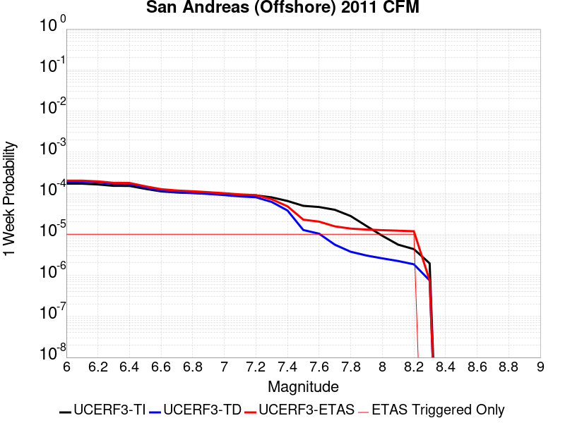 | 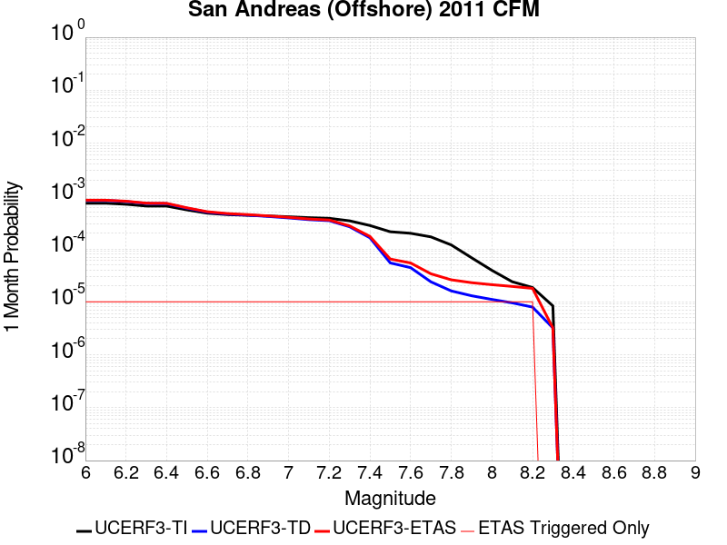 |  | 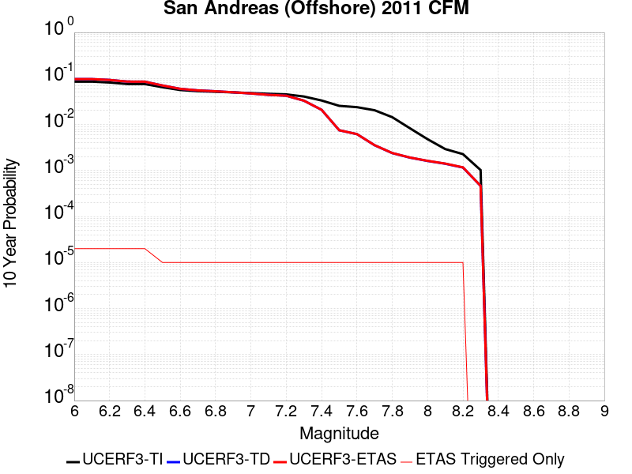 |

| Magnitude | 1 wk TI Prob | 1 wk TD Prob | 1 wk ETAS Prob | 1 wk ETAS/TD Gain | 1 wk ETAS Triggered Only | 1 mo TI Prob | 1 mo TD Prob | 1 mo ETAS Prob | 1 mo ETAS/TD Gain | 1 mo ETAS Triggered Only | 1 yr TI Prob | 1 yr TD Prob | 1 yr ETAS Prob | 1 yr ETAS/TD Gain | 1 yr ETAS Triggered Only | 10 yr TI Prob | 10 yr TD Prob | 10 yr ETAS Prob | 10 yr ETAS/TD Gain | 10 yr ETAS Triggered Only |
|-----|-----|-----|-----|-----|-----|-----|-----|-----|-----|-----|-----|-----|-----|-----|-----|-----|-----|-----|-----|-----|
| 6.0 | 1.7072787E-4 | 1.9226626E-4 | 2.0226435E-4 | 1.0520012 | 1.0E-5 | 7.3148566E-4 | 8.237405E-4 | 8.3373225E-4 | 1.0121298 | 1.0E-5 | 0.008869528 | 0.009983436 | 0.009993336 | 1.0009917 | 1.0E-5 | 0.085237645 | 0.09681613 | 0.0968342 | 1.0001866 | 2.0E-5 |
| 6.1 | 1.7072787E-4 | 1.9226626E-4 | 2.0226435E-4 | 1.0520012 | 1.0E-5 | 7.3148566E-4 | 8.237405E-4 | 8.3373225E-4 | 1.0121298 | 1.0E-5 | 0.008869528 | 0.009983436 | 0.009993336 | 1.0009917 | 1.0E-5 | 0.085237645 | 0.09681613 | 0.0968342 | 1.0001866 | 2.0E-5 |
| 6.2 | 1.6312556E-4 | 1.8408237E-4 | 1.9408052E-4 | 1.0543135 | 1.0E-5 | 6.989222E-4 | 7.8868825E-4 | 7.9868035E-4 | 1.0126693 | 1.0E-5 | 0.008476226 | 0.0095605 | 0.009570405 | 1.0010359 | 1.0E-5 | 0.08160117 | 0.092837214 | 0.09285536 | 1.0001954 | 2.0E-5 |
| 6.3 | 1.5103363E-4 | 1.6881147E-4 | 1.7880979E-4 | 1.0592277 | 1.0E-5 | 6.471264E-4 | 7.232793E-4 | 7.332721E-4 | 1.0138159 | 1.0E-5 | 0.007850339 | 0.008770814 | 0.008780727 | 1.0011301 | 1.0E-5 | 0.075787395 | 0.08546859 | 0.08548688 | 1.000214 | 2.0E-5 |
| 6.4 | 1.5047993E-4 | 1.6767075E-4 | 1.7766906E-4 | 1.0596308 | 1.0E-5 | 6.4475456E-4 | 7.183932E-4 | 7.28386E-4 | 1.0139099 | 1.0E-5 | 0.007821669 | 0.008711802 | 0.008721715 | 1.0011379 | 1.0E-5 | 0.0755203 | 0.08494888 | 0.08496718 | 1.0002154 | 2.0E-5 |
| 6.5 | 1.2760791E-4 | 1.3734949E-4 | 1.4734811E-4 | 1.072797 | 1.0E-5 | 5.467764E-4 | 5.8850925E-4 | 5.985034E-4 | 1.0169821 | 1.0E-5 | 0.0066367025 | 0.007141834 | 0.007151763 | 1.0013902 | 1.0E-5 | 0.064419635 | 0.07024954 | 0.07025884 | 1.0001323 | 1.0E-5 |
| 6.6 | 1.1063525E-4 | 1.15565475E-4 | 1.2556433E-4 | 1.086521 | 1.0E-5 | 4.740649E-4 | 4.9518765E-4 | 5.051827E-4 | 1.0201844 | 1.0E-5 | 0.0057564764 | 0.006012446 | 0.0060223853 | 1.0016532 | 1.0E-5 | 0.05609626 | 0.059496127 | 0.059505533 | 1.0001581 | 1.0E-5 |
| 6.7 | 1.0391049E-4 | 1.0645875E-4 | 1.1645768E-4 | 1.0939231 | 1.0E-5 | 4.4525467E-4 | 4.56173E-4 | 4.6616845E-4 | 1.0219115 | 1.0E-5 | 0.0054075094 | 0.0055399504 | 0.005549895 | 1.001795 | 1.0E-5 | 0.052778035 | 0.05498844 | 0.05499789 | 1.0001719 | 1.0E-5 |
| 6.8 | 1.0096706E-4 | 1.01582154E-4 | 1.1158114E-4 | 1.0984325 | 1.0E-5 | 4.3264418E-4 | 4.3528038E-4 | 4.4527603E-4 | 1.0229636 | 1.0E-5 | 0.0052547283 | 0.0052868384 | 0.0052967854 | 1.0018815 | 1.0E-5 | 0.051321987 | 0.052686825 | 0.0526963 | 1.0001798 | 1.0E-5 |
| 6.9 | 9.800265E-5 | 9.588697E-5 | 1.0588601E-4 | 1.1042794 | 1.0E-5 | 4.1994374E-4 | 4.1088034E-4 | 4.2087623E-4 | 1.024328 | 1.0E-5 | 0.0051008356 | 0.004991162 | 0.0050011124 | 1.0019935 | 1.0E-5 | 0.049853306 | 0.05001508 | 0.05002458 | 1.0001899 | 1.0E-5 |
| 7.0 | 9.4642375E-5 | 9.002096E-5 | 1.00020065E-4 | 1.1110753 | 1.0E-5 | 4.0554712E-4 | 3.8574796E-4 | 3.957441E-4 | 1.0259137 | 1.0E-5 | 0.004926363 | 0.00468653 | 0.0046964833 | 1.0021238 | 1.0E-5 | 0.048185747 | 0.047194667 | 0.047204193 | 1.000202 | 1.0E-5 |
| 7.1 | 9.0996844E-5 | 8.354119E-5 | 9.354036E-5 | 1.1196914 | 1.0E-5 | 3.8992817E-4 | 3.579854E-4 | 3.6798185E-4 | 1.0279241 | 1.0E-5 | 0.004737046 | 0.0043499186 | 0.004359875 | 1.0022889 | 1.0E-5 | 0.04637333 | 0.04404688 | 0.044056438 | 1.0002171 | 1.0E-5 |
| 7.2 | 8.848287E-5 | 7.981761E-5 | 8.9816815E-5 | 1.1252756 | 1.0E-5 | 3.791572E-4 | 3.420315E-4 | 3.520281E-4 | 1.029227 | 1.0E-5 | 0.004606472 | 0.0041564363 | 0.0041663945 | 1.0023959 | 1.0E-5 | 0.045121472 | 0.042189904 | 0.04219948 | 1.000227 | 1.0E-5 |
| 7.3 | 7.9280784E-5 | 6.1274885E-5 | 7.127427E-5 | 1.163189 | 1.0E-5 | 3.3973053E-4 | 2.6258078E-4 | 2.7257815E-4 | 1.0380735 | 1.0E-5 | 0.004128377 | 0.003192337 | 0.003202305 | 1.0031224 | 1.0E-5 | 0.040525194 | 0.03290183 | 0.0329115 | 1.000294 | 1.0E-5 |
| 7.4 | 6.468038E-5 | 3.7930724E-5 | 4.793034E-5 | 1.2636285 | 1.0E-5 | 2.771722E-4 | 1.6255044E-4 | 1.7254881E-4 | 1.0615094 | 1.0E-5 | 0.0033693502 | 0.0019773128 | 0.0019872931 | 1.0050473 | 1.0E-5 | 0.0331872 | 0.02081734 | 0.020827131 | 1.0004704 | 1.0E-5 |
| 7.5 | 4.930574E-5 | 1.2699263E-5 | 2.2699136E-5 | 1.7874373 | 1.0E-5 | 2.1129321E-4 | 5.4424287E-5 | 6.4423744E-5 | 1.1837316 | 1.0E-5 | 0.0025694598 | 6.6241587E-4 | 6.724092E-4 | 1.0150863 | 1.0E-5 | 0.02539953 | 0.0074798525 | 0.0074897776 | 1.0013269 | 1.0E-5 |
| 7.6 | 4.612566E-5 | 1.0332297E-5 | 2.0332194E-5 | 1.967829 | 1.0E-5 | 1.9766642E-4 | 4.428053E-5 | 5.4280084E-5 | 1.2258229 | 1.0E-5 | 0.0024039324 | 5.3898344E-4 | 5.4897805E-4 | 1.0185435 | 1.0E-5 | 0.023780935 | 0.006170428 | 0.006180366 | 1.0016106 | 1.0E-5 |
| 7.7 | 3.9435414E-5 | 5.5710498E-6 | 1.5570995E-5 | 2.7949839 | 1.0E-5 | 1.6899795E-4 | 2.3875711E-5 | 3.3875473E-5 | 1.4188257 | 1.0E-5 | 0.0020556084 | 2.906482E-4 | 3.0064528E-4 | 1.0343958 | 1.0E-5 | 0.020366974 | 0.0035397834 | 0.003549748 | 1.002815 | 1.0E-5 |
| 7.8 | 2.7787428E-5 | 3.7526645E-6 | 1.3752627E-5 | 3.6647632 | 1.0E-5 | 1.1908354E-4 | 1.6082748E-5 | 2.6082587E-5 | 1.6217743 | 1.0E-5 | 0.0014488777 | 1.9578991E-4 | 2.0578795E-4 | 1.0510652 | 1.0E-5 | 0.014394675 | 0.0023862 | 0.002396176 | 1.0041808 | 1.0E-5 |
| 7.9 | 1.590671E-5 | 3.0391298E-6 | 1.3039099E-5 | 4.2904058 | 1.0E-5 | 6.816983E-5 | 1.3024777E-5 | 2.3024646E-5 | 1.7677574 | 1.0E-5 | 8.2965166E-4 | 1.5856515E-4 | 1.6856357E-4 | 1.0630555 | 1.0E-5 | 0.008265611 | 0.0019033558 | 0.0019133368 | 1.0052439 | 1.0E-5 |
| 8.0 | 9.193638E-6 | 2.5908973E-6 | 1.2590871E-5 | 4.859657 | 1.0E-5 | 3.940071E-5 | 1.1103798E-5 | 2.1103688E-5 | 1.9005828 | 1.0E-5 | 4.7959806E-4 | 1.3518038E-4 | 1.4517903E-4 | 1.0739652 | 1.0E-5 | 0.0047856434 | 0.0016108477 | 0.0016208316 | 1.0061979 | 1.0E-5 |
| 8.1 | 5.601576E-6 | 2.2333788E-6 | 1.2233357E-5 | 5.477511 | 1.0E-5 | 2.4006533E-5 | 9.571589E-6 | 1.9571493E-5 | 2.0447488 | 1.0E-5 | 2.9224035E-4 | 1.1652788E-4 | 1.2652672E-4 | 1.0858064 | 1.0E-5 | 0.0029185633 | 0.0014015464 | 0.0014115324 | 1.007125 | 1.0E-5 |
| 8.2 | 4.3508785E-6 | 1.8568232E-6 | 1.1856805E-5 | 6.3855324 | 1.0E-5 | 1.864649E-5 | 7.957789E-6 | 1.795771E-5 | 2.2566204 | 1.0E-5 | 2.2699735E-4 | 9.6881806E-5 | 1.0688084E-4 | 1.1032085 | 1.0E-5 | 0.0022676561 | 0.0011590312 | 0.0011690195 | 1.0086179 | 1.0E-5 |
| 8.3 | 1.9573292E-6 | 7.511501E-7 | 7.511501E-7 | 1.0 | 0.0 | 8.388526E-6 | 3.2192108E-6 | 3.2192108E-6 | 1.0 | 0.0 | 1.0212552E-4 | 3.9193204E-5 | 3.9193204E-5 | 1.0 | 0.0 | 0.001020786 | 4.6391718E-4 | 4.6391718E-4 | 1.0 | 0.0 |

## Hayward (So) extension 2011 CFM
*[(top)](#table-of-contents)*

| 1 Week | 1 Month | 1 Year | 10 Year |
|-----|-----|-----|-----|
|  | 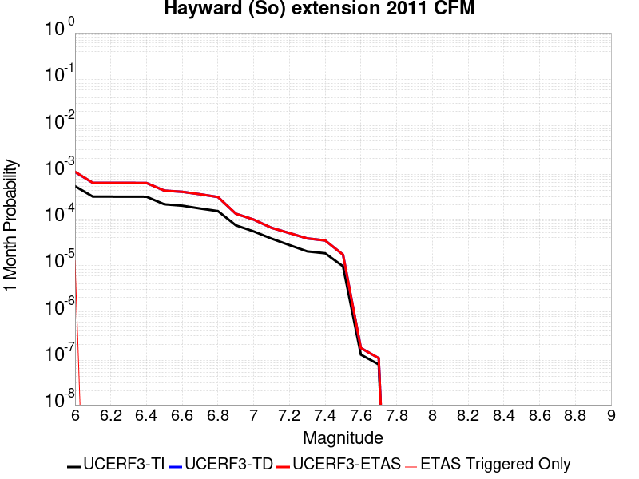 | 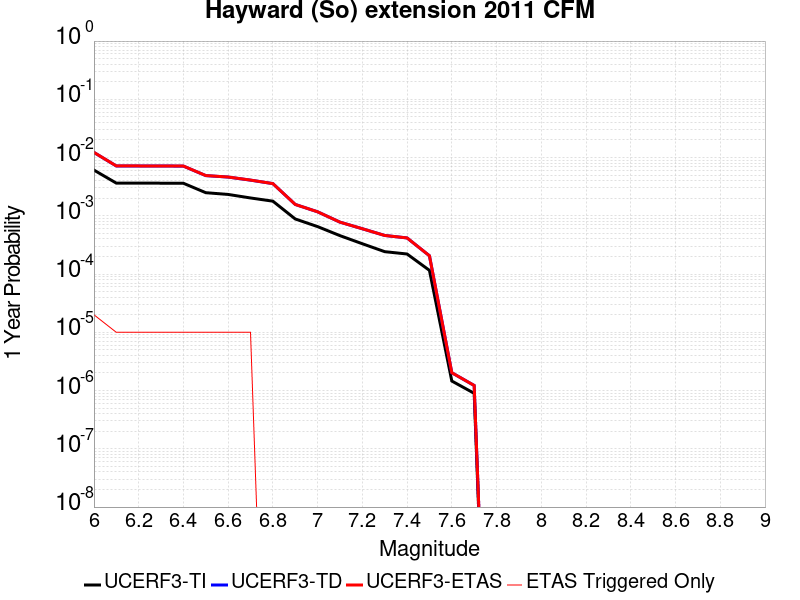 | 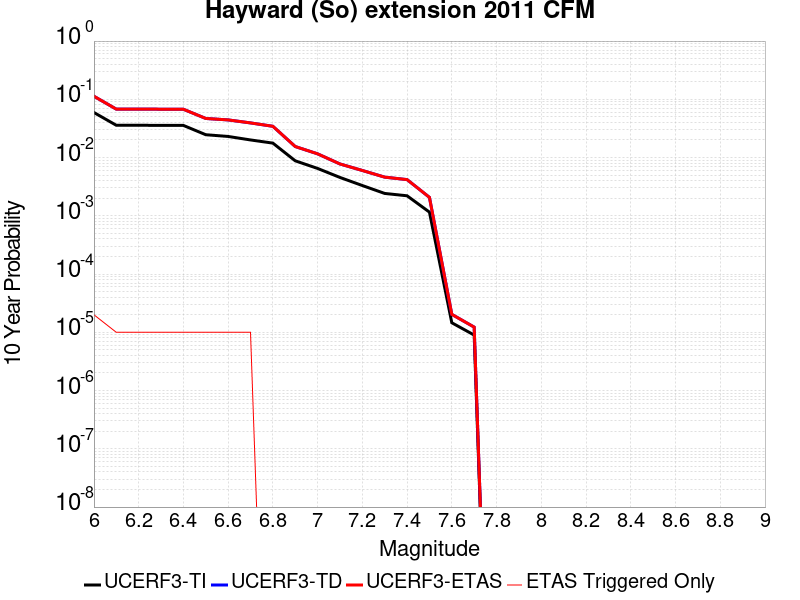 |

| Magnitude | 1 wk TI Prob | 1 wk TD Prob | 1 wk ETAS Prob | 1 wk ETAS/TD Gain | 1 wk ETAS Triggered Only | 1 mo TI Prob | 1 mo TD Prob | 1 mo ETAS Prob | 1 mo ETAS/TD Gain | 1 mo ETAS Triggered Only | 1 yr TI Prob | 1 yr TD Prob | 1 yr ETAS Prob | 1 yr ETAS/TD Gain | 1 yr ETAS Triggered Only | 10 yr TI Prob | 10 yr TD Prob | 10 yr ETAS Prob | 10 yr ETAS/TD Gain | 10 yr ETAS Triggered Only |
|-----|-----|-----|-----|-----|-----|-----|-----|-----|-----|-----|-----|-----|-----|-----|-----|-----|-----|-----|-----|-----|
| 6.0 | 1.1721256E-4 | 2.3671088E-4 | 2.3671088E-4 | 1.0 | 0.0 | 5.022428E-4 | 0.0010138806 | 0.0010238704 | 1.0098531 | 1.0E-5 | 0.0060976758 | 0.012250609 | 0.012270364 | 1.0016125 | 2.0E-5 | 0.0593305 | 0.11284437 | 0.11286212 | 1.0001572 | 2.0E-5 |
| 6.1 | 6.99169E-5 | 1.3808164E-4 | 1.3808164E-4 | 1.0 | 0.0 | 2.9960944E-4 | 5.9155683E-4 | 5.9155683E-4 | 1.0 | 0.0 | 0.0036416445 | 0.0071723475 | 0.007182276 | 1.0013843 | 1.0E-5 | 0.035825435 | 0.067804344 | 0.067813665 | 1.0001374 | 1.0E-5 |
| 6.2 | 6.99169E-5 | 1.3808164E-4 | 1.3808164E-4 | 1.0 | 0.0 | 2.9960944E-4 | 5.9155683E-4 | 5.9155683E-4 | 1.0 | 0.0 | 0.0036416445 | 0.0071723475 | 0.007182276 | 1.0013843 | 1.0E-5 | 0.035825435 | 0.067804344 | 0.067813665 | 1.0001374 | 1.0E-5 |
| 6.3 | 6.970908E-5 | 1.3776305E-4 | 1.3776305E-4 | 1.0 | 0.0 | 2.9871898E-4 | 5.9019245E-4 | 5.9019245E-4 | 1.0 | 0.0 | 0.0036308395 | 0.007155884 | 0.007165813 | 1.0013875 | 1.0E-5 | 0.035720866 | 0.0676533 | 0.06766263 | 1.0001378 | 1.0E-5 |
| 6.4 | 6.9517155E-5 | 1.3743227E-4 | 1.3743227E-4 | 1.0 | 0.0 | 2.9789665E-4 | 5.8877567E-4 | 5.8877567E-4 | 1.0 | 0.0 | 0.0036208609 | 0.0071387975 | 0.0071487264 | 1.0013908 | 1.0E-5 | 0.03562429 | 0.06749734 | 0.06750666 | 1.0001382 | 1.0E-5 |
| 6.5 | 4.786248E-5 | 9.415232E-5 | 9.415232E-5 | 1.0 | 0.0 | 2.0510878E-4 | 4.0344993E-4 | 4.0344993E-4 | 1.0 | 0.0 | 0.0024943394 | 0.0049013784 | 0.0049113296 | 1.0020303 | 1.0E-5 | 0.02466527 | 0.046900697 | 0.046910226 | 1.0002033 | 1.0E-5 |
| 6.6 | 4.4662214E-5 | 8.8819244E-5 | 8.8819244E-5 | 1.0 | 0.0 | 1.9139545E-4 | 3.80601E-4 | 3.80601E-4 | 1.0 | 0.0 | 0.0023277493 | 0.0046244357 | 0.004634389 | 1.0021524 | 1.0E-5 | 0.02303517 | 0.04429206 | 0.044301614 | 1.0002158 | 1.0E-5 |
| 6.7 | 3.884542E-5 | 7.8650686E-5 | 7.8650686E-5 | 1.0 | 0.0 | 1.6646975E-4 | 3.3703333E-4 | 3.3703333E-4 | 1.0 | 0.0 | 0.002024885 | 0.0040961048 | 0.004106064 | 1.0024314 | 1.0E-5 | 0.020065336 | 0.039332055 | 0.03934166 | 1.0002443 | 1.0E-5 |
| 6.8 | 3.4221863E-5 | 6.855886E-5 | 6.855886E-5 | 1.0 | 0.0 | 1.4665688E-4 | 2.9379298E-4 | 2.9379298E-4 | 1.0 | 0.0 | 0.0017840851 | 0.0035714838 | 0.0035714838 | 1.0 | 0.0 | 0.017698295 | 0.034419462 | 0.034419462 | 1.0 | 0.0 |
| 6.9 | 1.6927712E-5 | 3.006262E-5 | 3.006262E-5 | 1.0 | 0.0 | 7.2545314E-5 | 1.2883375E-4 | 1.2883375E-4 | 1.0 | 0.0 | 8.828813E-4 | 0.0015674793 | 0.0015674793 | 1.0 | 0.0 | 0.008793819 | 0.015463544 | 0.015463544 | 1.0 | 0.0 |
| 7.0 | 1.2509653E-5 | 2.246337E-5 | 2.246337E-5 | 1.0 | 0.0 | 5.3611697E-5 | 9.626828E-5 | 9.626828E-5 | 1.0 | 0.0 | 6.525269E-4 | 0.0011714802 | 0.0011714802 | 1.0 | 0.0 | 0.0065061417 | 0.011583166 | 0.011583166 | 1.0 | 0.0 |
| 7.1 | 8.751583E-6 | 1.4926157E-5 | 1.4926157E-5 | 1.0 | 0.0 | 3.750624E-5 | 6.396771E-5 | 6.396771E-5 | 1.0 | 0.0 | 4.5654282E-4 | 7.785344E-4 | 7.785344E-4 | 1.0 | 0.0 | 0.0045560603 | 0.007764457 | 0.007764457 | 1.0 | 0.0 |
| 7.2 | 6.354379E-6 | 1.1499087E-5 | 1.1499087E-5 | 1.0 | 0.0 | 2.7232769E-5 | 4.9280898E-5 | 4.9280898E-5 | 1.0 | 0.0 | 3.3150852E-4 | 5.9983454E-4 | 5.9983454E-4 | 1.0 | 0.0 | 0.0033101442 | 0.006001243 | 0.006001243 | 1.0 | 0.0 |
| 7.3 | 4.645554E-6 | 8.818441E-6 | 8.818441E-6 | 1.0 | 0.0 | 1.9909365E-5 | 3.7792794E-5 | 3.7792794E-5 | 1.0 | 0.0 | 2.4236954E-4 | 4.6003403E-4 | 4.6003403E-4 | 1.0 | 0.0 | 0.0024210536 | 0.004611421 | 0.004611421 | 1.0 | 0.0 |
| 7.4 | 4.23437E-6 | 7.992759E-6 | 7.992759E-6 | 1.0 | 0.0 | 1.8147173E-5 | 3.425425E-5 | 3.425425E-5 | 1.0 | 0.0 | 2.2091944E-4 | 4.1696956E-4 | 4.1696956E-4 | 1.0 | 0.0 | 0.0022069993 | 0.0041826614 | 0.0041826614 | 1.0 | 0.0 |
| 7.5 | 2.2187417E-6 | 3.952336E-6 | 3.952336E-6 | 1.0 | 0.0 | 9.508858E-6 | 1.6938488E-5 | 1.6938488E-5 | 1.0 | 0.0 | 1.157642E-4 | 2.0620918E-4 | 2.0620918E-4 | 1.0 | 0.0 | 0.0011570391 | 0.0020739497 | 0.0020739497 | 1.0 | 0.0 |
| 7.6 | 2.7952495E-8 | 3.8785874E-8 | 3.8785874E-8 | 1.0 | 0.0 | 1.1979641E-7 | 1.6622516E-7 | 1.6622516E-7 | 1.0 | 0.0 | 1.4585203E-6 | 2.0237894E-6 | 2.0237894E-6 | 1.0 | 0.0 | 1.4585107E-5 | 2.0317146E-5 | 2.0317146E-5 | 1.0 | 0.0 |
| 7.7 | 1.7192724E-8 | 2.3436652E-8 | 2.3436652E-8 | 1.0 | 0.0 | 7.36831E-8 | 1.0044278E-7 | 1.0044278E-7 | 1.0 | 0.0 | 8.9709135E-7 | 1.2228902E-6 | 1.2228902E-6 | 1.0 | 0.0 | 8.970877E-6 | 1.2285953E-5 | 1.2285953E-5 | 1.0 | 0.0 |

## Calaveras (Central) 2011 CFM
*[(top)](#table-of-contents)*

| 1 Week | 1 Month | 1 Year | 10 Year |
|-----|-----|-----|-----|
| 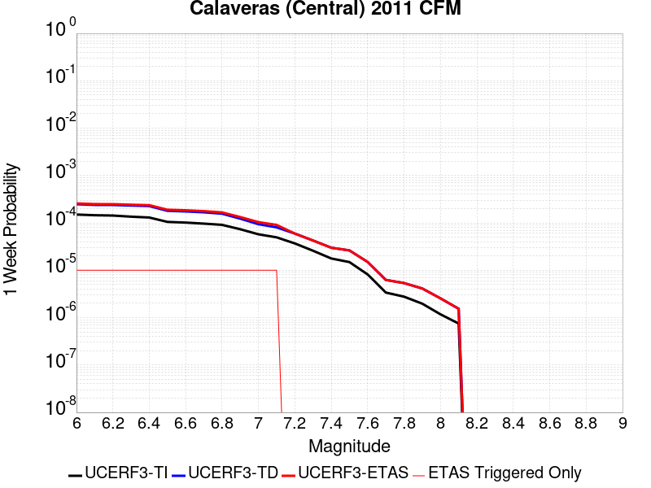 | 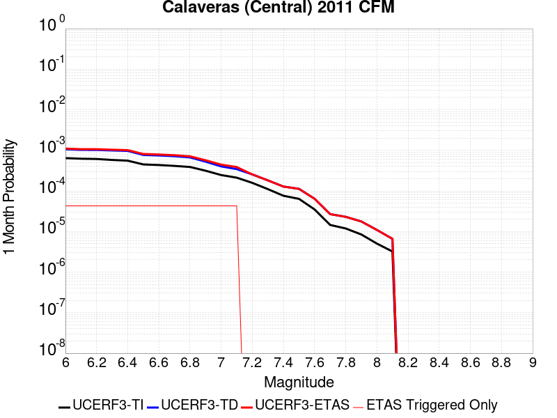 | 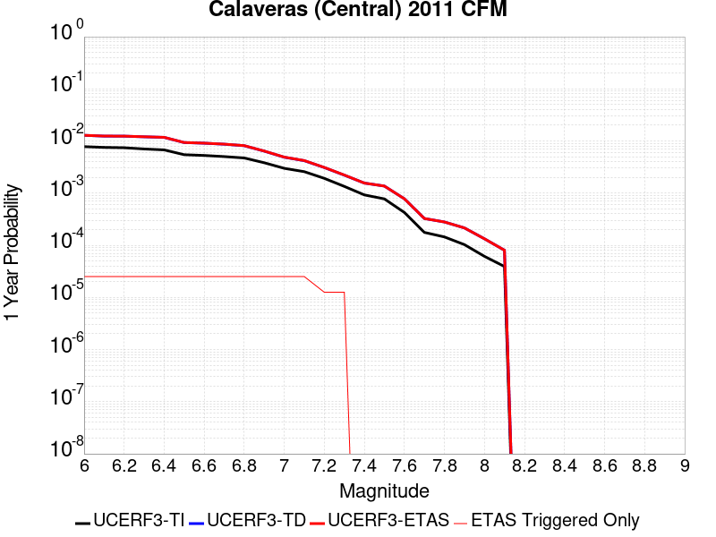 | 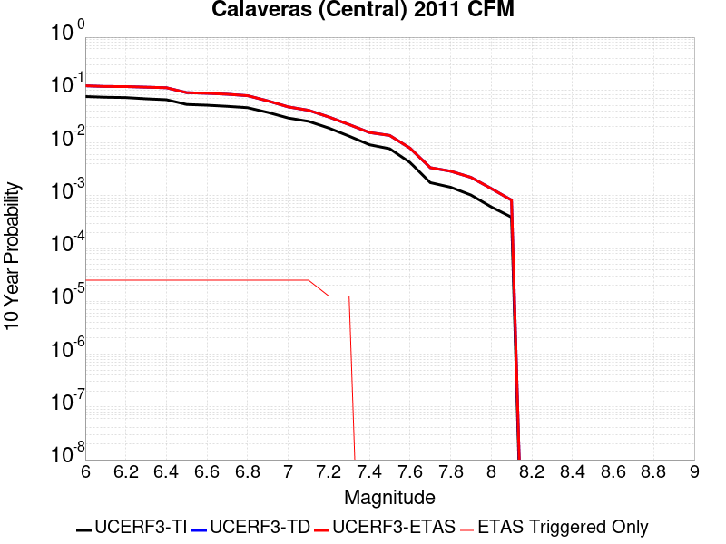 |

| Magnitude | 1 wk TI Prob | 1 wk TD Prob | 1 wk ETAS Prob | 1 wk ETAS/TD Gain | 1 wk ETAS Triggered Only | 1 mo TI Prob | 1 mo TD Prob | 1 mo ETAS Prob | 1 mo ETAS/TD Gain | 1 mo ETAS Triggered Only | 1 yr TI Prob | 1 yr TD Prob | 1 yr ETAS Prob | 1 yr ETAS/TD Gain | 1 yr ETAS Triggered Only | 10 yr TI Prob | 10 yr TD Prob | 10 yr ETAS Prob | 10 yr ETAS/TD Gain | 10 yr ETAS Triggered Only |
|-----|-----|-----|-----|-----|-----|-----|-----|-----|-----|-----|-----|-----|-----|-----|-----|-----|-----|-----|-----|-----|
| 6.0 | 1.5010907E-4 | 2.4804124E-4 | 2.5803875E-4 | 1.0403059 | 1.0E-5 | 6.4316596E-4 | 0.001062498 | 0.0010724873 | 1.0094018 | 1.0E-5 | 0.0078024664 | 0.012850443 | 0.012870186 | 1.0015364 | 2.0E-5 | 0.07534136 | 0.120411225 | 0.120428815 | 1.0001462 | 2.0E-5 |
| 6.1 | 1.4521465E-4 | 2.3965565E-4 | 2.4965324E-4 | 1.0417166 | 1.0E-5 | 6.222001E-4 | 0.0010265942 | 0.0010365839 | 1.0097309 | 1.0E-5 | 0.0075490056 | 0.012419763 | 0.0124395145 | 1.0015904 | 2.0E-5 | 0.07297657 | 0.11668273 | 0.116700396 | 1.0001514 | 2.0E-5 |
| 6.2 | 1.429998E-4 | 2.3896809E-4 | 2.489657E-4 | 1.0418366 | 1.0E-5 | 6.127123E-4 | 0.0010236499 | 0.0010336398 | 1.009759 | 1.0E-5 | 0.007434286 | 0.012384372 | 0.012404124 | 1.0015949 | 2.0E-5 | 0.07190444 | 0.11633677 | 0.11635444 | 1.0001519 | 2.0E-5 |
| 6.3 | 1.3536277E-4 | 2.3227946E-4 | 2.4227714E-4 | 1.0430416 | 1.0E-5 | 5.799972E-4 | 9.950127E-4 | 0.0010050028 | 1.0100402 | 1.0E-5 | 0.0070386264 | 0.012040534 | 0.012060293 | 1.001641 | 2.0E-5 | 0.0681982 | 0.113249525 | 0.11326726 | 1.0001566 | 2.0E-5 |
| 6.4 | 1.2993296E-4 | 2.2651516E-4 | 2.3651289E-4 | 1.0441371 | 1.0E-5 | 5.5673666E-4 | 9.703276E-4 | 9.803178E-4 | 1.0102957 | 1.0E-5 | 0.006757223 | 0.011743338 | 0.011763102 | 1.0016831 | 2.0E-5 | 0.06555412 | 0.11052752 | 0.110545315 | 1.0001609 | 2.0E-5 |
| 6.5 | 1.0498927E-4 | 1.7981966E-4 | 1.8981787E-4 | 1.0556012 | 1.0E-5 | 4.498764E-4 | 7.7042676E-4 | 7.8041904E-4 | 1.0129699 | 1.0E-5 | 0.005463498 | 0.00933952 | 0.009359334 | 1.0021214 | 2.0E-5 | 0.053311124 | 0.08920739 | 0.089225605 | 1.0002042 | 2.0E-5 |
| 6.6 | 1.0157505E-4 | 1.7469494E-4 | 1.8469318E-4 | 1.0572326 | 1.0E-5 | 4.35249E-4 | 7.4847665E-4 | 7.5846916E-4 | 1.0133505 | 1.0E-5 | 0.0052862884 | 0.009074567 | 0.009094385 | 1.0021839 | 2.0E-5 | 0.05162293 | 0.08678487 | 0.08680314 | 1.0002104 | 2.0E-5 |
| 6.7 | 9.660386E-5 | 1.6728783E-4 | 1.7728616E-4 | 1.0597672 | 1.0E-5 | 4.1395082E-4 | 7.167497E-4 | 7.267425E-4 | 1.0139419 | 1.0E-5 | 0.0050282106 | 0.008691474 | 0.0087113 | 1.0022811 | 2.0E-5 | 0.049159497 | 0.08327401 | 0.08329234 | 1.0002202 | 2.0E-5 |
| 6.8 | 9.089927E-5 | 1.5643238E-4 | 1.6643082E-4 | 1.0639154 | 1.0E-5 | 3.8951015E-4 | 6.702511E-4 | 6.802444E-4 | 1.0149097 | 1.0E-5 | 0.0047319788 | 0.008129742 | 0.008149579 | 1.0024401 | 2.0E-5 | 0.046324775 | 0.078163 | 0.07818144 | 1.0002359 | 2.0E-5 |
| 6.9 | 7.353187E-5 | 1.2295779E-4 | 1.3295656E-4 | 1.0813187 | 1.0E-5 | 3.150985E-4 | 5.2685605E-4 | 5.368508E-4 | 1.0189705 | 1.0E-5 | 0.0038295772 | 0.006395728 | 0.0064156 | 1.0031071 | 2.0E-5 | 0.037642512 | 0.06218928 | 0.062208038 | 1.0003016 | 2.0E-5 |
| 7.0 | 5.746064E-5 | 9.3890936E-5 | 1.0389E-4 | 1.1064966 | 1.0E-5 | 2.4623662E-4 | 4.0232803E-4 | 4.12324E-4 | 1.0248454 | 1.0E-5 | 0.0029938098 | 0.0048874132 | 0.0049073156 | 1.0040722 | 2.0E-5 | 0.02953797 | 0.04798713 | 0.04800617 | 1.0003967 | 2.0E-5 |
| 7.1 | 4.9557195E-5 | 8.052768E-5 | 9.0526875E-5 | 1.1241709 | 1.0E-5 | 2.123707E-4 | 3.4507332E-4 | 3.5506987E-4 | 1.0289694 | 1.0E-5 | 0.0025825473 | 0.004193237 | 0.0042131534 | 1.0047495 | 2.0E-5 | 0.0255274 | 0.041373473 | 0.041392643 | 1.0004634 | 2.0E-5 |
| 7.2 | 3.687595E-5 | 5.952694E-5 | 5.952694E-5 | 1.0 | 0.0 | 1.5803022E-4 | 2.5509068E-4 | 2.5509068E-4 | 1.0 | 0.0 | 0.0019223199 | 0.003101335 | 0.0031113038 | 1.0032144 | 1.0E-5 | 0.01905776 | 0.030883823 | 0.030893514 | 1.0003138 | 1.0E-5 |
| 7.3 | 2.5846984E-5 | 4.2473923E-5 | 4.2473923E-5 | 1.0 | 0.0 | 1.1076809E-4 | 1.820185E-4 | 1.820185E-4 | 1.0 | 0.0 | 0.0013477671 | 0.0022138404 | 0.002223818 | 1.0045071 | 1.0E-5 | 0.013396223 | 0.022175217 | 0.022184996 | 1.000441 | 1.0E-5 |
| 7.4 | 1.7747854E-5 | 2.993759E-5 | 2.993759E-5 | 1.0 | 0.0 | 7.6060016E-5 | 1.2829766E-4 | 1.2829766E-4 | 1.0 | 0.0 | 9.2563726E-4 | 0.0015609078 | 0.0015609078 | 1.0 | 0.0 | 0.009217911 | 0.015708687 | 0.015708687 | 1.0 | 0.0 |
| 7.5 | 1.4883479E-5 | 2.6244672E-5 | 2.6244672E-5 | 1.0 | 0.0 | 6.378478E-5 | 1.12472335E-4 | 1.12472335E-4 | 1.0 | 0.0 | 7.76303E-4 | 0.0013684932 | 0.0013684932 | 1.0 | 0.0 | 0.0077359667 | 0.013801667 | 0.013801667 | 1.0 | 0.0 |
| 7.6 | 8.166975E-6 | 1.4964299E-5 | 1.4964299E-5 | 1.0 | 0.0 | 3.5000852E-5 | 6.413114E-5 | 6.413114E-5 | 1.0 | 0.0 | 4.2605202E-4 | 7.805183E-4 | 7.805183E-4 | 1.0 | 0.0 | 0.004252361 | 0.007939203 | 0.007939203 | 1.0 | 0.0 |
| 7.7 | 3.3858064E-6 | 6.254251E-6 | 6.254251E-6 | 1.0 | 0.0 | 1.4510518E-5 | 2.6803657E-5 | 2.6803657E-5 | 1.0 | 0.0 | 1.7665124E-4 | 3.2628572E-4 | 3.2628572E-4 | 1.0 | 0.0 | 0.0017651088 | 0.003388363 | 0.003388363 | 1.0 | 0.0 |
| 7.8 | 2.7721615E-6 | 5.366695E-6 | 5.366695E-6 | 1.0 | 0.0 | 1.1880637E-5 | 2.2999919E-5 | 2.2999919E-5 | 1.0 | 0.0 | 1.4463716E-4 | 2.7998807E-4 | 2.7998807E-4 | 1.0 | 0.0 | 0.0014454306 | 0.002907615 | 0.002907615 | 1.0 | 0.0 |
| 7.9 | 1.9736292E-6 | 4.128705E-6 | 4.128705E-6 | 1.0 | 0.0 | 8.4583835E-6 | 1.769433E-5 | 1.769433E-5 | 1.0 | 0.0 | 1.0297595E-4 | 2.1540721E-4 | 2.1540721E-4 | 1.0 | 0.0 | 0.0010292825 | 0.0022237299 | 0.0022237299 | 1.0 | 0.0 |
| 8.0 | 1.1767289E-6 | 2.5546633E-6 | 2.5546633E-6 | 1.0 | 0.0 | 5.0431145E-6 | 1.0948511E-5 | 1.0948511E-5 | 1.0 | 0.0 | 6.139818E-5 | 1.3329E-4 | 1.3329E-4 | 1.0 | 0.0 | 6.1381224E-4 | 0.001366126 | 0.001366126 | 1.0 | 0.0 |
| 8.1 | 7.5112825E-7 | 1.541076E-6 | 1.541076E-6 | 1.0 | 0.0 | 3.2191172E-6 | 6.604595E-6 | 6.604595E-6 | 1.0 | 0.0 | 3.9192048E-5 | 8.0408E-5 | 8.0408E-5 | 1.0 | 0.0 | 3.9185135E-4 | 8.2356273E-4 | 8.2356273E-4 | 1.0 | 0.0 |

## Great Valley 10 (Panoche)
*[(top)](#table-of-contents)*

| 1 Week | 1 Month | 1 Year | 10 Year |
|-----|-----|-----|-----|
| 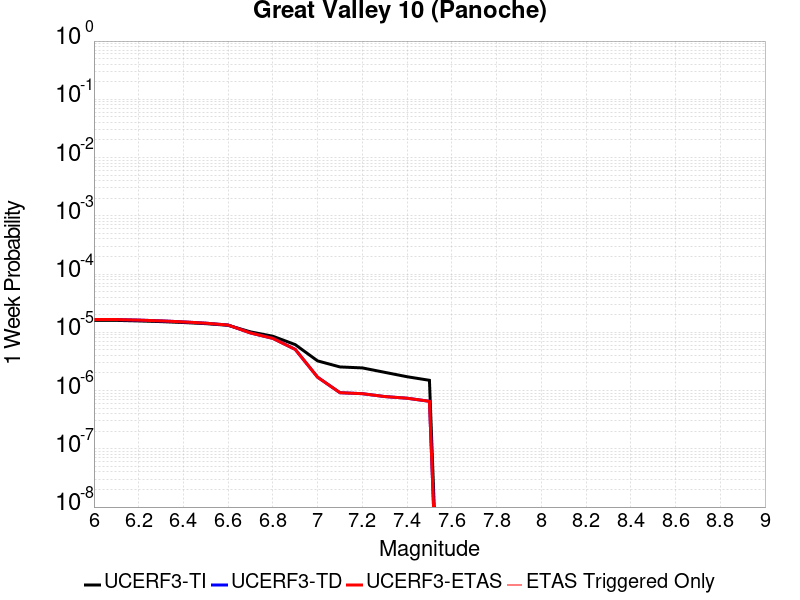 | 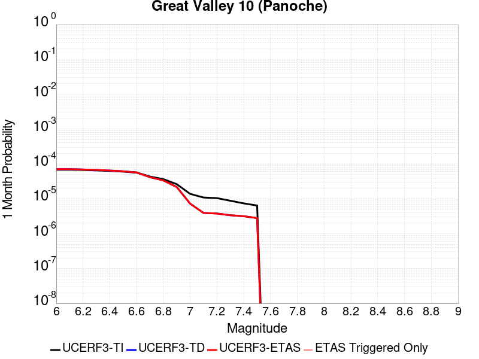 | 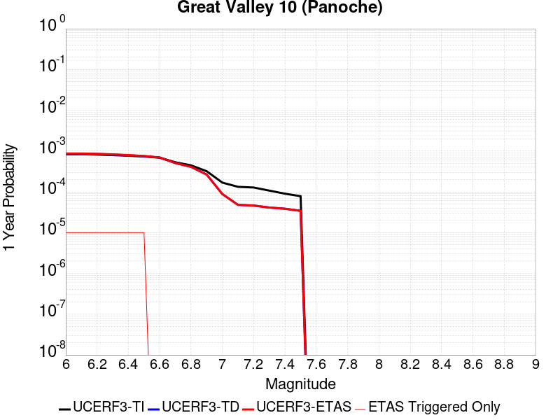 | 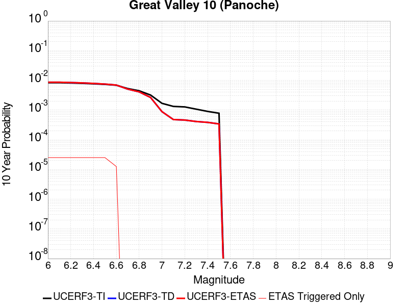 |

| Magnitude | 1 wk TI Prob | 1 wk TD Prob | 1 wk ETAS Prob | 1 wk ETAS/TD Gain | 1 wk ETAS Triggered Only | 1 mo TI Prob | 1 mo TD Prob | 1 mo ETAS Prob | 1 mo ETAS/TD Gain | 1 mo ETAS Triggered Only | 1 yr TI Prob | 1 yr TD Prob | 1 yr ETAS Prob | 1 yr ETAS/TD Gain | 1 yr ETAS Triggered Only | 10 yr TI Prob | 10 yr TD Prob | 10 yr ETAS Prob | 10 yr ETAS/TD Gain | 10 yr ETAS Triggered Only |
|-----|-----|-----|-----|-----|-----|-----|-----|-----|-----|-----|-----|-----|-----|-----|-----|-----|-----|-----|-----|-----|
| 6.0 | 1.6014626E-5 | 1.6575357E-5 | 1.6575357E-5 | 1.0 | 0.0 | 6.863231E-5 | 7.103534E-5 | 7.103534E-5 | 1.0 | 0.0 | 8.35278E-4 | 8.6451764E-4 | 8.74509E-4 | 1.0115571 | 1.0E-5 | 0.008321454 | 0.008612158 | 0.008631986 | 1.0023023 | 2.0E-5 |
| 6.1 | 1.6014626E-5 | 1.6575357E-5 | 1.6575357E-5 | 1.0 | 0.0 | 6.863231E-5 | 7.103534E-5 | 7.103534E-5 | 1.0 | 0.0 | 8.35278E-4 | 8.6451764E-4 | 8.74509E-4 | 1.0115571 | 1.0E-5 | 0.008321454 | 0.008612158 | 0.008631986 | 1.0023023 | 2.0E-5 |
| 6.2 | 1.56782E-5 | 1.6198404E-5 | 1.6198404E-5 | 1.0 | 0.0 | 6.719056E-5 | 6.941991E-5 | 6.941991E-5 | 1.0 | 0.0 | 8.17738E-4 | 8.4486516E-4 | 8.5485674E-4 | 1.0118262 | 1.0E-5 | 0.008147354 | 0.008417133 | 0.008436965 | 1.002356 | 2.0E-5 |
| 6.3 | 1.5263338E-5 | 1.5723472E-5 | 1.5723472E-5 | 1.0 | 0.0 | 6.541267E-5 | 6.73846E-5 | 6.73846E-5 | 1.0 | 0.0 | 7.961082E-4 | 8.201041E-4 | 8.3009584E-4 | 1.0121835 | 1.0E-5 | 0.007932622 | 0.008171363 | 0.0081912 | 1.0024276 | 2.0E-5 |
| 6.4 | 1.4720723E-5 | 1.5099334E-5 | 1.5099334E-5 | 1.0 | 0.0 | 6.308728E-5 | 6.470986E-5 | 6.470986E-5 | 1.0 | 0.0 | 7.67817E-4 | 7.87563E-4 | 7.975551E-4 | 1.0126874 | 1.0E-5 | 0.007651695 | 0.007848289 | 0.007868133 | 1.0025283 | 2.0E-5 |
| 6.5 | 1.408264E-5 | 1.4355928E-5 | 1.4355928E-5 | 1.0 | 0.0 | 6.0352773E-5 | 6.1523984E-5 | 6.1523984E-5 | 1.0 | 0.0 | 7.3454727E-4 | 7.488022E-4 | 7.587948E-4 | 1.0133446 | 1.0E-5 | 0.0073212404 | 0.0074633416 | 0.0074831923 | 1.0026598 | 2.0E-5 |
| 6.6 | 1.3197086E-5 | 1.33218455E-5 | 1.33218455E-5 | 1.0 | 0.0 | 5.6557717E-5 | 5.7092402E-5 | 5.7092402E-5 | 1.0 | 0.0 | 6.8837265E-4 | 6.948834E-4 | 6.948834E-4 | 1.0 | 0.0 | 0.006862442 | 0.0069276392 | 0.00693757 | 1.0014335 | 1.0E-5 |
| 6.7 | 1.017583E-5 | 9.745348E-6 | 9.745348E-6 | 1.0 | 0.0 | 4.360997E-5 | 4.176512E-5 | 4.176512E-5 | 1.0 | 0.0 | 5.30822E-4 | 5.083741E-4 | 5.083741E-4 | 1.0 | 0.0 | 0.0052955584 | 0.0050723637 | 0.0050723637 | 1.0 | 0.0 |
| 6.8 | 8.557912E-6 | 7.8726725E-6 | 7.8726725E-6 | 1.0 | 0.0 | 3.667625E-5 | 3.37396E-5 | 3.37396E-5 | 1.0 | 0.0 | 4.4644187E-4 | 4.1070423E-4 | 4.1070423E-4 | 1.0 | 0.0 | 0.0044554602 | 0.004099659 | 0.004099659 | 1.0 | 0.0 |
| 6.9 | 6.14664E-6 | 5.0920366E-6 | 5.0920366E-6 | 1.0 | 0.0 | 2.6342475E-5 | 2.182284E-5 | 2.182284E-5 | 1.0 | 0.0 | 3.2067244E-4 | 2.6566206E-4 | 2.6566206E-4 | 1.0 | 0.0 | 0.003202101 | 0.0026535832 | 0.0026535832 | 1.0 | 0.0 |
| 7.0 | 3.2310581E-6 | 1.6950871E-6 | 1.6950871E-6 | 1.0 | 0.0 | 1.3847319E-5 | 7.2646394E-6 | 7.2646394E-6 | 1.0 | 0.0 | 1.6857806E-4 | 8.844349E-5 | 8.844349E-5 | 1.0 | 0.0 | 0.0016845023 | 8.840923E-4 | 8.840923E-4 | 1.0 | 0.0 |
| 7.1 | 2.544492E-6 | 9.188573E-7 | 9.188573E-7 | 1.0 | 0.0 | 1.090492E-5 | 3.9379543E-6 | 3.9379543E-6 | 1.0 | 0.0 | 1.327593E-4 | 4.7943588E-5 | 4.7943588E-5 | 1.0 | 0.0 | 0.0013268003 | 4.793372E-4 | 4.793372E-4 | 1.0 | 0.0 |
| 7.2 | 2.4479045E-6 | 8.840978E-7 | 8.840978E-7 | 1.0 | 0.0 | 1.0490977E-5 | 3.7889852E-6 | 3.7889852E-6 | 1.0 | 0.0 | 1.2772017E-4 | 4.6129968E-5 | 4.6129968E-5 | 1.0 | 0.0 | 0.0012764678 | 4.6120866E-4 | 4.6120866E-4 | 1.0 | 0.0 |
| 7.3 | 2.0559578E-6 | 7.892521E-7 | 7.892521E-7 | 1.0 | 0.0 | 8.811218E-6 | 3.382505E-6 | 3.382505E-6 | 1.0 | 0.0 | 1.072713E-4 | 4.1181265E-5 | 4.1181265E-5 | 1.0 | 0.0 | 0.0010721954 | 4.1174097E-4 | 4.1174097E-4 | 1.0 | 0.0 |
| 7.4 | 1.727687E-6 | 7.3875697E-7 | 7.3875697E-7 | 1.0 | 0.0 | 7.404352E-6 | 3.1660977E-6 | 3.1660977E-6 | 1.0 | 0.0 | 9.0144255E-5 | 3.8546605E-5 | 3.8546605E-5 | 1.0 | 0.0 | 9.0107694E-4 | 3.854038E-4 | 3.854038E-4 | 1.0 | 0.0 |
| 7.5 | 1.5002679E-6 | 6.545985E-7 | 6.545985E-7 | 1.0 | 0.0 | 6.4297037E-6 | 2.8054194E-6 | 2.8054194E-6 | 1.0 | 0.0 | 7.827883E-5 | 3.4155488E-5 | 3.4155488E-5 | 1.0 | 0.0 | 7.825126E-4 | 3.4150656E-4 | 3.4150656E-4 | 1.0 | 0.0 |

## Pitas Point (Lower West)
*[(top)](#table-of-contents)*

| 1 Week | 1 Month | 1 Year | 10 Year |
|-----|-----|-----|-----|
| 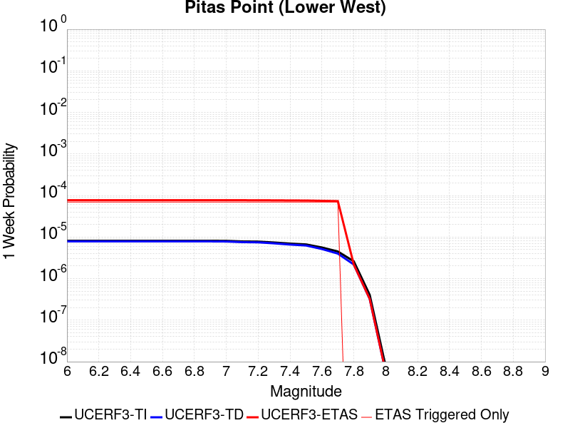 | 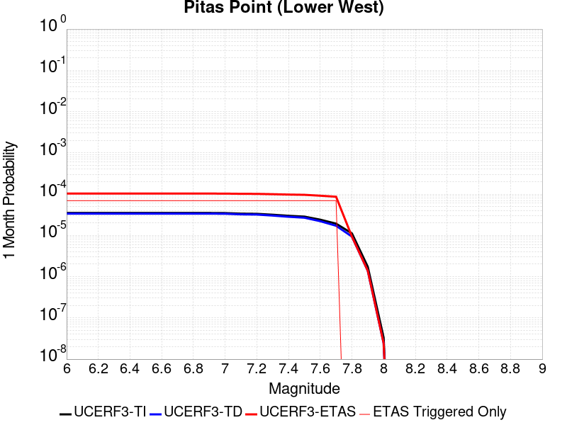 | 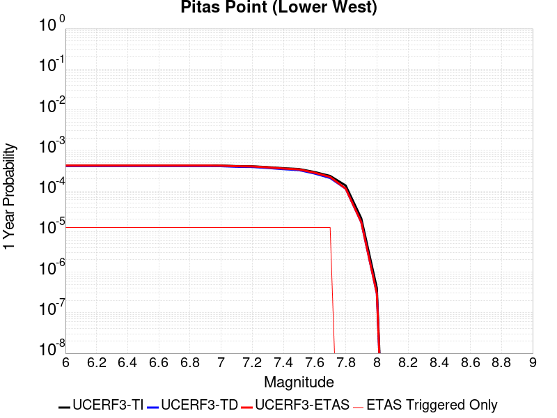 | 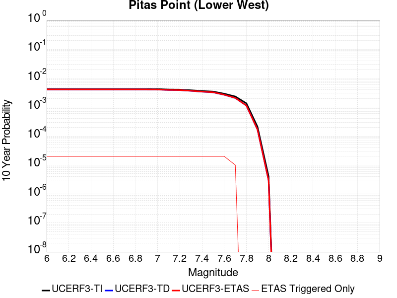 |

| Magnitude | 1 wk TI Prob | 1 wk TD Prob | 1 wk ETAS Prob | 1 wk ETAS/TD Gain | 1 wk ETAS Triggered Only | 1 mo TI Prob | 1 mo TD Prob | 1 mo ETAS Prob | 1 mo ETAS/TD Gain | 1 mo ETAS Triggered Only | 1 yr TI Prob | 1 yr TD Prob | 1 yr ETAS Prob | 1 yr ETAS/TD Gain | 1 yr ETAS Triggered Only | 10 yr TI Prob | 10 yr TD Prob | 10 yr ETAS Prob | 10 yr ETAS/TD Gain | 10 yr ETAS Triggered Only |
|-----|-----|-----|-----|-----|-----|-----|-----|-----|-----|-----|-----|-----|-----|-----|-----|-----|-----|-----|-----|-----|
| 6.0 | 8.151497E-6 | 7.855796E-6 | 1.7855718E-5 | 2.2729354 | 1.0E-5 | 3.493452E-5 | 3.3667267E-5 | 4.3666932E-5 | 1.2970144 | 1.0E-5 | 4.252448E-4 | 4.0982262E-4 | 4.2981442E-4 | 1.0487816 | 2.0E-5 | 0.0042443196 | 0.004090749 | 0.0041106674 | 1.0048691 | 2.0E-5 |
| 6.1 | 8.151497E-6 | 7.855796E-6 | 1.7855718E-5 | 2.2729354 | 1.0E-5 | 3.493452E-5 | 3.3667267E-5 | 4.3666932E-5 | 1.2970144 | 1.0E-5 | 4.252448E-4 | 4.0982262E-4 | 4.2981442E-4 | 1.0487816 | 2.0E-5 | 0.0042443196 | 0.004090749 | 0.0041106674 | 1.0048691 | 2.0E-5 |
| 6.2 | 8.151497E-6 | 7.855796E-6 | 1.7855718E-5 | 2.2729354 | 1.0E-5 | 3.493452E-5 | 3.3667267E-5 | 4.3666932E-5 | 1.2970144 | 1.0E-5 | 4.252448E-4 | 4.0982262E-4 | 4.2981442E-4 | 1.0487816 | 2.0E-5 | 0.0042443196 | 0.004090749 | 0.0041106674 | 1.0048691 | 2.0E-5 |
| 6.3 | 8.151497E-6 | 7.855796E-6 | 1.7855718E-5 | 2.2729354 | 1.0E-5 | 3.493452E-5 | 3.3667267E-5 | 4.3666932E-5 | 1.2970144 | 1.0E-5 | 4.252448E-4 | 4.0982262E-4 | 4.2981442E-4 | 1.0487816 | 2.0E-5 | 0.0042443196 | 0.004090749 | 0.0041106674 | 1.0048691 | 2.0E-5 |
| 6.4 | 8.151497E-6 | 7.855796E-6 | 1.7855718E-5 | 2.2729354 | 1.0E-5 | 3.493452E-5 | 3.3667267E-5 | 4.3666932E-5 | 1.2970144 | 1.0E-5 | 4.252448E-4 | 4.0982262E-4 | 4.2981442E-4 | 1.0487816 | 2.0E-5 | 0.0042443196 | 0.004090749 | 0.0041106674 | 1.0048691 | 2.0E-5 |
| 6.5 | 8.151497E-6 | 7.855796E-6 | 1.7855718E-5 | 2.2729354 | 1.0E-5 | 3.493452E-5 | 3.3667267E-5 | 4.3666932E-5 | 1.2970144 | 1.0E-5 | 4.252448E-4 | 4.0982262E-4 | 4.2981442E-4 | 1.0487816 | 2.0E-5 | 0.0042443196 | 0.004090749 | 0.0041106674 | 1.0048691 | 2.0E-5 |
| 6.6 | 8.151497E-6 | 7.855796E-6 | 1.7855718E-5 | 2.2729354 | 1.0E-5 | 3.493452E-5 | 3.3667267E-5 | 4.3666932E-5 | 1.2970144 | 1.0E-5 | 4.252448E-4 | 4.0982262E-4 | 4.2981442E-4 | 1.0487816 | 2.0E-5 | 0.0042443196 | 0.004090749 | 0.0041106674 | 1.0048691 | 2.0E-5 |
| 6.7 | 8.151497E-6 | 7.855796E-6 | 1.7855718E-5 | 2.2729354 | 1.0E-5 | 3.493452E-5 | 3.3667267E-5 | 4.3666932E-5 | 1.2970144 | 1.0E-5 | 4.252448E-4 | 4.0982262E-4 | 4.2981442E-4 | 1.0487816 | 2.0E-5 | 0.0042443196 | 0.004090749 | 0.0041106674 | 1.0048691 | 2.0E-5 |
| 6.8 | 8.151497E-6 | 7.855796E-6 | 1.7855718E-5 | 2.2729354 | 1.0E-5 | 3.493452E-5 | 3.3667267E-5 | 4.3666932E-5 | 1.2970144 | 1.0E-5 | 4.252448E-4 | 4.0982262E-4 | 4.2981442E-4 | 1.0487816 | 2.0E-5 | 0.0042443196 | 0.004090749 | 0.0041106674 | 1.0048691 | 2.0E-5 |
| 6.9 | 8.151497E-6 | 7.855796E-6 | 1.7855718E-5 | 2.2729354 | 1.0E-5 | 3.493452E-5 | 3.3667267E-5 | 4.3666932E-5 | 1.2970144 | 1.0E-5 | 4.252448E-4 | 4.0982262E-4 | 4.2981442E-4 | 1.0487816 | 2.0E-5 | 0.0042443196 | 0.004090749 | 0.0041106674 | 1.0048691 | 2.0E-5 |
| 7.0 | 8.103535E-6 | 7.805226E-6 | 1.7805149E-5 | 2.281183 | 1.0E-5 | 3.4728975E-5 | 3.3450542E-5 | 4.3450207E-5 | 1.2989388 | 1.0E-5 | 4.2274324E-4 | 4.07185E-4 | 4.2717686E-4 | 1.0490978 | 2.0E-5 | 0.0042193993 | 0.0040644696 | 0.0040843883 | 1.0049007 | 2.0E-5 |
| 7.1 | 7.853298E-6 | 7.540917E-6 | 1.7540842E-5 | 2.3260887 | 1.0E-5 | 3.3656554E-5 | 3.2317817E-5 | 4.2317497E-5 | 1.3094168 | 1.0E-5 | 4.096915E-4 | 3.9339912E-4 | 4.1339124E-4 | 1.0508189 | 2.0E-5 | 0.00408937 | 0.0039271032 | 0.0039470247 | 1.0050728 | 2.0E-5 |
| 7.2 | 7.771102E-6 | 7.453199E-6 | 1.7453125E-5 | 2.3416958 | 1.0E-5 | 3.33043E-5 | 3.1941894E-5 | 4.1941574E-5 | 1.3130585 | 1.0E-5 | 4.0540437E-4 | 3.8882386E-4 | 4.088161E-4 | 1.0514172 | 2.0E-5 | 0.0040466557 | 0.003881511 | 0.0039014334 | 1.0051327 | 2.0E-5 |
| 7.3 | 7.3945344E-6 | 7.0493033E-6 | 1.7049233E-5 | 2.4185698 | 1.0E-5 | 3.1690477E-5 | 3.0210955E-5 | 4.0210653E-5 | 1.3309958 | 1.0E-5 | 3.8576324E-4 | 3.677569E-4 | 3.8774955E-4 | 1.0543637 | 2.0E-5 | 0.0038509427 | 0.003671551 | 0.0036914775 | 1.0054272 | 2.0E-5 |
| 7.4 | 6.964645E-6 | 6.5901527E-6 | 1.6590087E-5 | 2.5174055 | 1.0E-5 | 2.9848137E-5 | 2.8243208E-5 | 3.8242924E-5 | 1.3540574 | 1.0E-5 | 3.6334046E-4 | 3.438073E-4 | 3.638004E-4 | 1.0581521 | 2.0E-5 | 0.0036274698 | 0.0034328073 | 0.0034527385 | 1.0058061 | 2.0E-5 |
| 7.5 | 6.6525035E-6 | 6.259191E-6 | 1.6259128E-5 | 2.5976405 | 1.0E-5 | 2.851042E-5 | 2.6824831E-5 | 3.6824564E-5 | 1.3727789 | 1.0E-5 | 3.4705905E-4 | 3.2654387E-4 | 3.4653733E-4 | 1.0612276 | 2.0E-5 | 0.0034651754 | 0.0032606919 | 0.0032806266 | 1.0061136 | 2.0E-5 |
| 7.6 | 5.613338E-6 | 5.15142E-6 | 1.5151369E-5 | 2.9412024 | 1.0E-5 | 2.405694E-5 | 2.2077327E-5 | 3.2077107E-5 | 1.4529433 | 1.0E-5 | 2.928539E-4 | 2.6875862E-4 | 2.8875325E-4 | 1.0743963 | 2.0E-5 | 0.0029246826 | 0.0026843674 | 0.0027043137 | 1.0074306 | 2.0E-5 |
| 7.7 | 4.494704E-6 | 3.996945E-6 | 1.3996905E-5 | 3.501901 | 1.0E-5 | 1.9262876E-5 | 1.7129652E-5 | 2.7129481E-5 | 1.583773 | 1.0E-5 | 2.3450027E-4 | 2.0853379E-4 | 2.185317E-4 | 1.0479438 | 1.0E-5 | 0.0023425296 | 0.0020834052 | 0.0020933843 | 1.0047898 | 1.0E-5 |
| 7.8 | 2.6075882E-6 | 2.1836663E-6 | 2.1836663E-6 | 1.0 | 0.0 | 1.117533E-5 | 9.358537E-6 | 9.358537E-6 | 1.0 | 0.0 | 1.3605114E-4 | 1.1393427E-4 | 1.1393427E-4 | 1.0 | 0.0 | 0.0013596788 | 0.0011387634 | 0.0011387634 | 1.0 | 0.0 |
| 7.9 | 4.045984E-7 | 3.2424057E-7 | 3.2424057E-7 | 1.0 | 0.0 | 1.733992E-6 | 1.3896017E-6 | 1.3896017E-6 | 1.0 | 0.0 | 2.1111147E-5 | 1.6918271E-5 | 1.6918271E-5 | 1.0 | 0.0 | 2.1109142E-4 | 1.6917015E-4 | 1.6917015E-4 | 1.0 | 0.0 |
| 8.0 | 7.791402E-9 | 5.6836056E-9 | 5.6836056E-9 | 1.0 | 0.0 | 3.3391725E-8 | 2.4358311E-8 | 2.4358311E-8 | 1.0 | 0.0 | 4.0654416E-7 | 2.965624E-7 | 2.965624E-7 | 1.0 | 0.0 | 4.065434E-6 | 2.9656223E-6 | 2.9656223E-6 | 1.0 | 0.0 |

## Simi-Santa Rosa
*[(top)](#table-of-contents)*

| 1 Week | 1 Month | 1 Year | 10 Year |
|-----|-----|-----|-----|
| 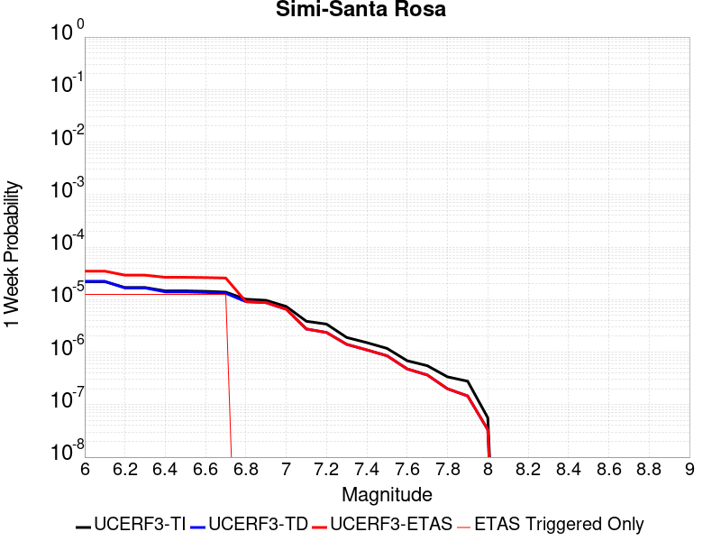 | 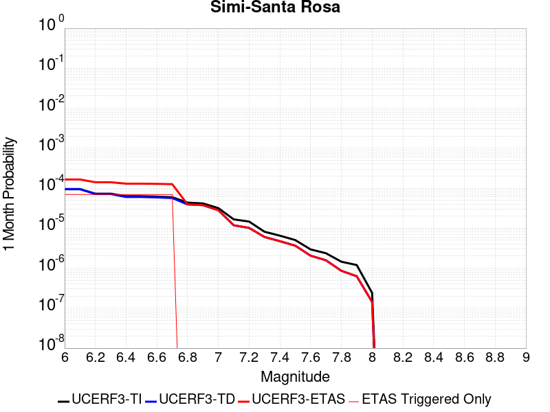 | 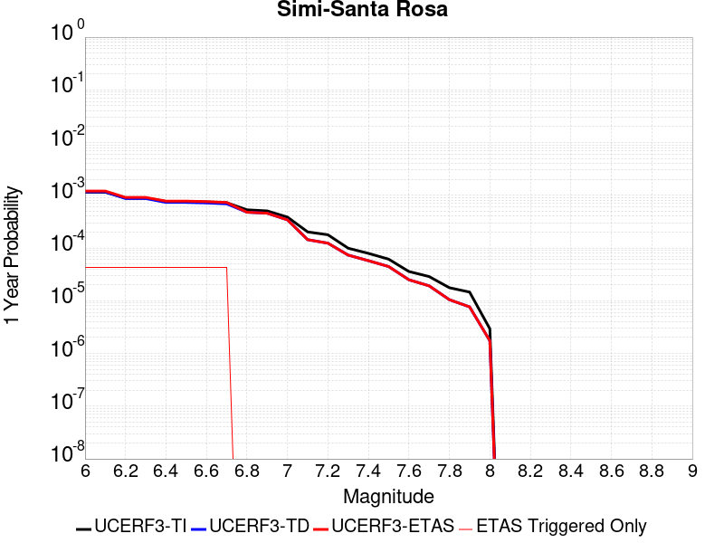 | 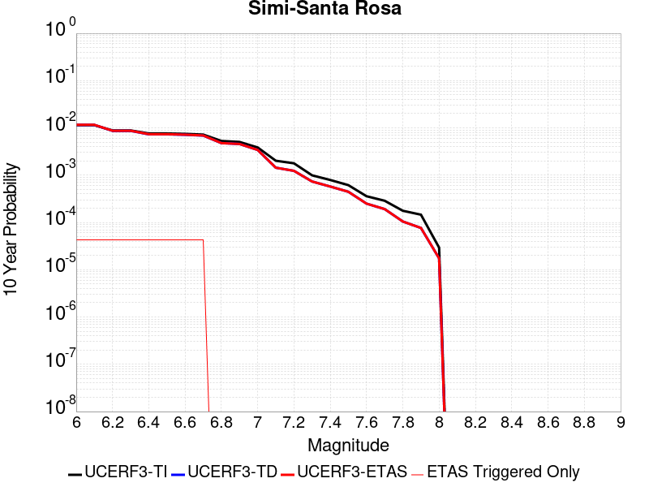 |

| Magnitude | 1 wk TI Prob | 1 wk TD Prob | 1 wk ETAS Prob | 1 wk ETAS/TD Gain | 1 wk ETAS Triggered Only | 1 mo TI Prob | 1 mo TD Prob | 1 mo ETAS Prob | 1 mo ETAS/TD Gain | 1 mo ETAS Triggered Only | 1 yr TI Prob | 1 yr TD Prob | 1 yr ETAS Prob | 1 yr ETAS/TD Gain | 1 yr ETAS Triggered Only | 10 yr TI Prob | 10 yr TD Prob | 10 yr ETAS Prob | 10 yr ETAS/TD Gain | 10 yr ETAS Triggered Only |
|-----|-----|-----|-----|-----|-----|-----|-----|-----|-----|-----|-----|-----|-----|-----|-----|-----|-----|-----|-----|-----|
| 6.0 | 2.198912E-5 | 2.2275388E-5 | 3.2275166E-5 | 1.448916 | 1.0E-5 | 9.4235686E-5 | 9.54627E-5 | 1.15460796E-4 | 1.2094859 | 2.0E-5 | 0.0011467156 | 0.0011616825 | 0.0011816593 | 1.0171964 | 2.0E-5 | 0.011408163 | 0.011560547 | 0.011580316 | 1.00171 | 2.0E-5 |
| 6.1 | 2.198912E-5 | 2.2275388E-5 | 3.2275166E-5 | 1.448916 | 1.0E-5 | 9.4235686E-5 | 9.54627E-5 | 1.15460796E-4 | 1.2094859 | 2.0E-5 | 0.0011467156 | 0.0011616825 | 0.0011816593 | 1.0171964 | 2.0E-5 | 0.011408163 | 0.011560547 | 0.011580316 | 1.00171 | 2.0E-5 |
| 6.2 | 1.69983E-5 | 1.6668506E-5 | 2.6668338E-5 | 1.5999238 | 1.0E-5 | 7.284782E-5 | 7.143466E-5 | 9.1433234E-5 | 1.2799561 | 2.0E-5 | 8.865613E-4 | 8.6939917E-4 | 8.8938174E-4 | 1.0229844 | 2.0E-5 | 0.008830327 | 0.0086629 | 0.008682727 | 1.0022887 | 2.0E-5 |
| 6.3 | 1.69983E-5 | 1.6668506E-5 | 2.6668338E-5 | 1.5999238 | 1.0E-5 | 7.284782E-5 | 7.143466E-5 | 9.1433234E-5 | 1.2799561 | 2.0E-5 | 8.865613E-4 | 8.6939917E-4 | 8.8938174E-4 | 1.0229844 | 2.0E-5 | 0.008830327 | 0.0086629 | 0.008682727 | 1.0022887 | 2.0E-5 |
| 6.4 | 1.4666188E-5 | 1.4052489E-5 | 2.4052348E-5 | 1.7116077 | 1.0E-5 | 6.285358E-5 | 6.0223705E-5 | 8.02225E-5 | 1.3320751 | 2.0E-5 | 7.6497364E-4 | 7.330018E-4 | 7.5298717E-4 | 1.0272651 | 2.0E-5 | 0.0076234564 | 0.0073083164 | 0.00732817 | 1.0027167 | 2.0E-5 |
| 6.5 | 1.4666188E-5 | 1.4052489E-5 | 2.4052348E-5 | 1.7116077 | 1.0E-5 | 6.285358E-5 | 6.0223705E-5 | 8.02225E-5 | 1.3320751 | 2.0E-5 | 7.6497364E-4 | 7.330018E-4 | 7.5298717E-4 | 1.0272651 | 2.0E-5 | 0.0076234564 | 0.0073083164 | 0.00732817 | 1.0027167 | 2.0E-5 |
| 6.6 | 1.4377586E-5 | 1.3729529E-5 | 2.3729392E-5 | 1.7283471 | 1.0E-5 | 6.1616774E-5 | 5.883965E-5 | 7.883847E-5 | 1.3398869 | 2.0E-5 | 7.4992597E-4 | 7.1616215E-4 | 7.361478E-4 | 1.0279067 | 2.0E-5 | 0.007474003 | 0.0071410104 | 0.0071608676 | 1.0027807 | 2.0E-5 |
| 6.7 | 1.3881404E-5 | 1.3207497E-5 | 2.3207365E-5 | 1.7571357 | 1.0E-5 | 5.9490372E-5 | 5.6602472E-5 | 7.660134E-5 | 1.3533214 | 2.0E-5 | 7.240546E-4 | 6.889419E-4 | 7.0892816E-4 | 1.02901 | 2.0E-5 | 0.007217 | 0.0068705105 | 0.0068903733 | 1.002891 | 2.0E-5 |
| 6.8 | 1.0176516E-5 | 9.1541E-6 | 9.1541E-6 | 1.0 | 0.0 | 4.3612912E-5 | 3.923136E-5 | 4.9230966E-5 | 1.2548882 | 1.0E-5 | 5.308578E-4 | 4.775537E-4 | 4.875489E-4 | 1.02093 | 1.0E-5 | 0.0052959146 | 0.004766908 | 0.00477686 | 1.0020878 | 1.0E-5 |
| 6.9 | 9.699797E-6 | 8.774672E-6 | 8.774672E-6 | 1.0 | 0.0 | 4.15699E-5 | 3.760529E-5 | 4.760491E-5 | 1.26591 | 1.0E-5 | 5.05996E-4 | 4.5776463E-4 | 4.6776005E-4 | 1.0218353 | 1.0E-5 | 0.005048454 | 0.0045698346 | 0.004579789 | 1.0021783 | 1.0E-5 |
| 7.0 | 7.4049476E-6 | 6.559291E-6 | 6.559291E-6 | 1.0 | 0.0 | 3.1735104E-5 | 2.8111013E-5 | 2.8111013E-5 | 1.0 | 0.0 | 3.8630638E-4 | 3.422105E-4 | 3.422105E-4 | 1.0 | 0.0 | 0.0038563553 | 0.0034180775 | 0.0034180775 | 1.0 | 0.0 |
| 7.1 | 3.873439E-6 | 2.759473E-6 | 2.759473E-6 | 1.0 | 0.0 | 1.6600346E-5 | 1.1826261E-5 | 1.1826261E-5 | 1.0 | 0.0 | 2.0209046E-4 | 1.4397544E-4 | 1.4397544E-4 | 1.0 | 0.0 | 0.0020190678 | 0.0014388453 | 0.0014388453 | 1.0 | 0.0 |
| 7.2 | 3.417706E-6 | 2.367616E-6 | 2.367616E-6 | 1.0 | 0.0 | 1.4647229E-5 | 1.0146887E-5 | 1.0146887E-5 | 1.0 | 0.0 | 1.7831543E-4 | 1.2353157E-4 | 1.2353157E-4 | 1.0 | 0.0 | 0.0017817242 | 0.0012346513 | 0.0012346513 | 1.0 | 0.0 |
| 7.3 | 1.90225E-6 | 1.4073756E-6 | 1.4073756E-6 | 1.0 | 0.0 | 8.152474E-6 | 6.031596E-6 | 6.031596E-6 | 1.0 | 0.0 | 9.9251854E-5 | 7.343223E-5 | 7.343223E-5 | 1.0 | 0.0 | 9.920754E-4 | 7.340819E-4 | 7.340819E-4 | 1.0 | 0.0 |
| 7.4 | 1.5170556E-6 | 1.1024792E-6 | 1.1024792E-6 | 1.0 | 0.0 | 6.5016507E-6 | 4.7249023E-6 | 4.7249023E-6 | 1.0 | 0.0 | 7.915472E-5 | 5.752418E-5 | 5.752418E-5 | 1.0 | 0.0 | 7.9126534E-4 | 5.75094E-4 | 5.75094E-4 | 1.0 | 0.0 |
| 7.5 | 1.178732E-6 | 8.5351127E-7 | 8.5351127E-7 | 1.0 | 0.0 | 5.0516987E-6 | 3.6579004E-6 | 3.6579004E-6 | 1.0 | 0.0 | 6.1502695E-5 | 4.4534037E-5 | 4.4534037E-5 | 1.0 | 0.0 | 6.148568E-4 | 4.4525208E-4 | 4.4525208E-4 | 1.0 | 0.0 |
| 7.6 | 6.8722386E-7 | 4.793211E-7 | 4.793211E-7 | 1.0 | 0.0 | 2.9452417E-6 | 2.0542318E-6 | 2.0542318E-6 | 1.0 | 0.0 | 3.5857727E-5 | 2.5009986E-5 | 2.5009986E-5 | 1.0 | 0.0 | 3.5851944E-4 | 2.5007184E-4 | 2.5007184E-4 | 1.0 | 0.0 |
| 7.7 | 5.5126515E-7 | 3.6731117E-7 | 3.6731117E-7 | 1.0 | 0.0 | 2.3625628E-6 | 1.5741898E-6 | 1.5741898E-6 | 1.0 | 0.0 | 2.8763823E-5 | 1.9165593E-5 | 1.9165593E-5 | 1.0 | 0.0 | 2.87601E-4 | 1.9163951E-4 | 1.9163951E-4 | 1.0 | 0.0 |
| 7.8 | 3.3860243E-7 | 2.0075514E-7 | 2.0075514E-7 | 1.0 | 0.0 | 1.4511525E-6 | 8.6037886E-7 | 8.6037886E-7 | 1.0 | 0.0 | 1.7667637E-5 | 1.0475063E-5 | 1.0475063E-5 | 1.0 | 0.0 | 1.7666233E-4 | 1.0474575E-4 | 1.0474575E-4 | 1.0 | 0.0 |
| 7.9 | 2.7955386E-7 | 1.4648724E-7 | 1.4648724E-7 | 1.0 | 0.0 | 1.1980875E-6 | 6.278023E-7 | 6.278023E-7 | 1.0 | 0.0 | 1.4586617E-5 | 7.643467E-6 | 7.643467E-6 | 1.0 | 0.0 | 1.458566E-4 | 7.643208E-5 | 7.643208E-5 | 1.0 | 0.0 |
| 8.0 | 5.6259015E-8 | 3.335318E-8 | 3.335318E-8 | 1.0 | 0.0 | 2.4111003E-7 | 1.429422E-7 | 1.429422E-7 | 1.0 | 0.0 | 2.9355108E-6 | 1.7403199E-6 | 1.7403199E-6 | 1.0 | 0.0 | 2.935472E-5 | 1.7403077E-5 | 1.7403077E-5 | 1.0 | 0.0 |

## Honey Lake 2011 CFM
*[(top)](#table-of-contents)*

| 1 Week | 1 Month | 1 Year | 10 Year |
|-----|-----|-----|-----|
|  | 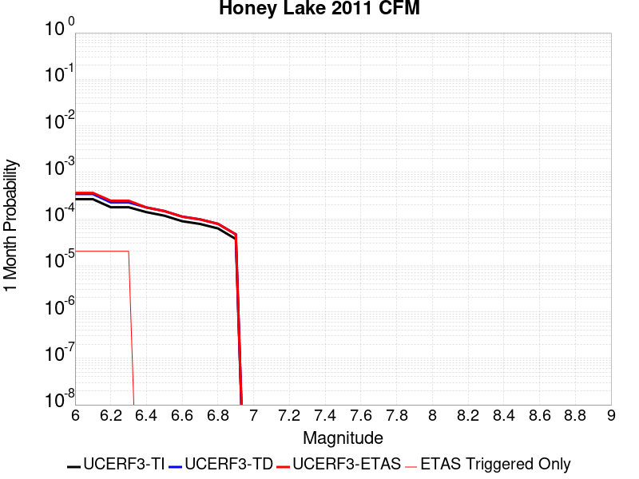 | 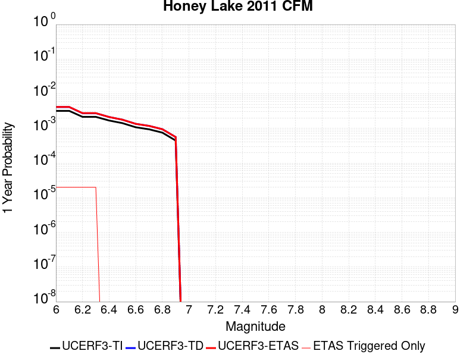 | 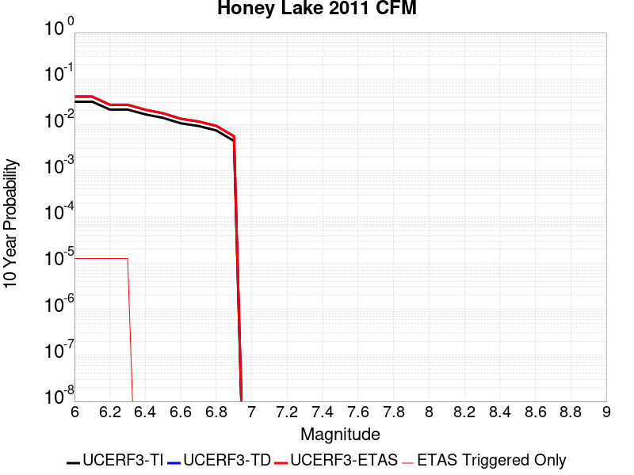 |

| Magnitude | 1 wk TI Prob | 1 wk TD Prob | 1 wk ETAS Prob | 1 wk ETAS/TD Gain | 1 wk ETAS Triggered Only | 1 mo TI Prob | 1 mo TD Prob | 1 mo ETAS Prob | 1 mo ETAS/TD Gain | 1 mo ETAS Triggered Only | 1 yr TI Prob | 1 yr TD Prob | 1 yr ETAS Prob | 1 yr ETAS/TD Gain | 1 yr ETAS Triggered Only | 10 yr TI Prob | 10 yr TD Prob | 10 yr ETAS Prob | 10 yr ETAS/TD Gain | 10 yr ETAS Triggered Only |
|-----|-----|-----|-----|-----|-----|-----|-----|-----|-----|-----|-----|-----|-----|-----|-----|-----|-----|-----|-----|-----|
| 6.0 | 6.155506E-5 | 7.954708E-5 | 9.954548E-5 | 1.2514035 | 2.0E-5 | 2.6378073E-4 | 3.4087323E-4 | 3.6086643E-4 | 1.0586529 | 2.0E-5 | 0.0032068014 | 0.0041426765 | 0.0041625937 | 1.0048078 | 2.0E-5 | 0.03160919 | 0.040703055 | 0.04072224 | 1.0004714 | 2.0E-5 |
| 6.1 | 6.155506E-5 | 7.954708E-5 | 9.954548E-5 | 1.2514035 | 2.0E-5 | 2.6378073E-4 | 3.4087323E-4 | 3.6086643E-4 | 1.0586529 | 2.0E-5 | 0.0032068014 | 0.0041426765 | 0.0041625937 | 1.0048078 | 2.0E-5 | 0.03160919 | 0.040703055 | 0.04072224 | 1.0004714 | 2.0E-5 |
| 6.2 | 4.1335024E-5 | 5.257652E-5 | 7.257547E-5 | 1.3803779 | 2.0E-5 | 1.7713808E-4 | 2.2530954E-4 | 2.4530504E-4 | 1.0887468 | 2.0E-5 | 0.0021545228 | 0.0027398444 | 0.0027597896 | 1.0072796 | 2.0E-5 | 0.021337535 | 0.027076809 | 0.027096266 | 1.0007186 | 2.0E-5 |
| 6.3 | 4.1335024E-5 | 5.257652E-5 | 7.257547E-5 | 1.3803779 | 2.0E-5 | 1.7713808E-4 | 2.2530954E-4 | 2.4530504E-4 | 1.0887468 | 2.0E-5 | 0.0021545228 | 0.0027398444 | 0.0027597896 | 1.0072796 | 2.0E-5 | 0.021337535 | 0.027076809 | 0.027096266 | 1.0007186 | 2.0E-5 |
| 6.4 | 3.2393702E-5 | 4.0887273E-5 | 4.0887273E-5 | 1.0 | 0.0 | 1.3882275E-4 | 1.7522006E-4 | 1.7522006E-4 | 1.0 | 0.0 | 0.0016888566 | 0.0021313233 | 0.0021313233 | 1.0 | 0.0 | 0.016760793 | 0.021119867 | 0.021119867 | 1.0 | 0.0 |
| 6.5 | 2.7205504E-5 | 3.4211767E-5 | 3.4211767E-5 | 1.0 | 0.0 | 1.1658981E-4 | 1.4661417E-4 | 1.4661417E-4 | 1.0 | 0.0 | 0.0014185566 | 0.0017836596 | 0.0017836596 | 1.0 | 0.0 | 0.014095354 | 0.017702963 | 0.017702963 | 1.0 | 0.0 |
| 6.6 | 2.069265E-5 | 2.5955416E-5 | 2.5955416E-5 | 1.0 | 0.0 | 8.867977E-5 | 1.1123324E-4 | 1.1123324E-4 | 1.0 | 0.0 | 0.0010791414 | 0.0013535074 | 0.0013535074 | 1.0 | 0.0 | 0.010739161 | 0.0134610105 | 0.0134610105 | 1.0 | 0.0 |
| 6.7 | 1.8060919E-5 | 2.265683E-5 | 2.265683E-5 | 1.0 | 0.0 | 7.7401644E-5 | 9.7097545E-5 | 9.7097545E-5 | 1.0 | 0.0 | 9.419576E-4 | 0.0011816025 | 0.0011816025 | 1.0 | 0.0 | 0.009379748 | 0.0117612425 | 0.0117612425 | 1.0 | 0.0 |
| 6.8 | 1.4474663E-5 | 1.8181274E-5 | 1.8181274E-5 | 1.0 | 0.0 | 6.203279E-5 | 7.791785E-5 | 7.791785E-5 | 1.0 | 0.0 | 7.5498753E-4 | 9.4831345E-4 | 9.4831345E-4 | 1.0 | 0.0 | 0.007524277 | 0.009450195 | 0.009450195 | 1.0 | 0.0 |
| 6.9 | 8.564552E-6 | 1.0802311E-5 | 1.0802311E-5 | 1.0 | 0.0 | 3.6704707E-5 | 4.6295176E-5 | 4.6295176E-5 | 1.0 | 0.0 | 4.4678818E-4 | 5.635644E-4 | 5.635644E-4 | 1.0 | 0.0 | 0.0044589094 | 0.0056278505 | 0.0056278505 | 1.0 | 0.0 |

## Hayward (No) 2011 CFM
*[(top)](#table-of-contents)*

| 1 Week | 1 Month | 1 Year | 10 Year |
|-----|-----|-----|-----|
| 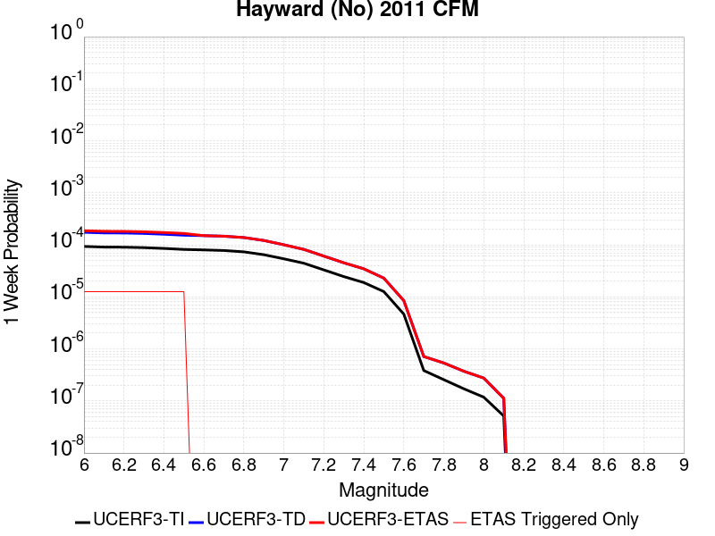 | 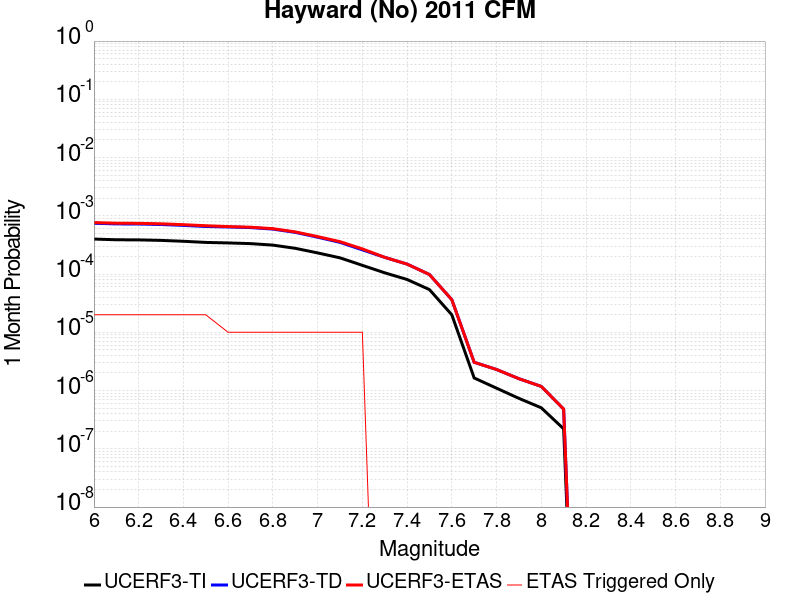 | 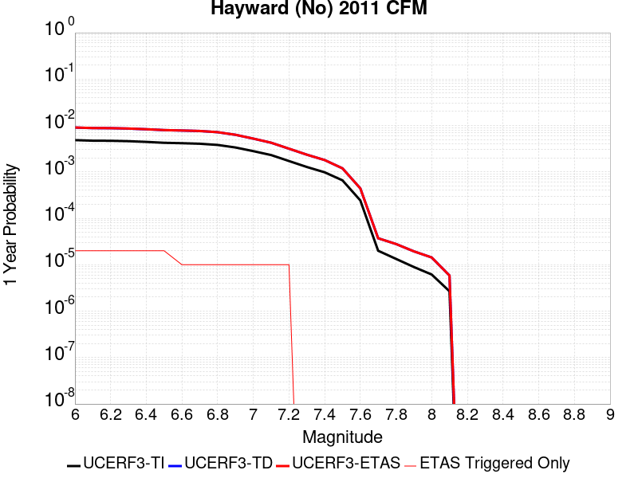 | 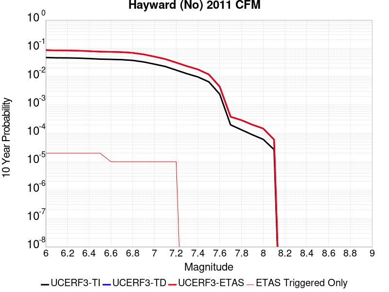 |

| Magnitude | 1 wk TI Prob | 1 wk TD Prob | 1 wk ETAS Prob | 1 wk ETAS/TD Gain | 1 wk ETAS Triggered Only | 1 mo TI Prob | 1 mo TD Prob | 1 mo ETAS Prob | 1 mo ETAS/TD Gain | 1 mo ETAS Triggered Only | 1 yr TI Prob | 1 yr TD Prob | 1 yr ETAS Prob | 1 yr ETAS/TD Gain | 1 yr ETAS Triggered Only | 10 yr TI Prob | 10 yr TD Prob | 10 yr ETAS Prob | 10 yr ETAS/TD Gain | 10 yr ETAS Triggered Only |
|-----|-----|-----|-----|-----|-----|-----|-----|-----|-----|-----|-----|-----|-----|-----|-----|-----|-----|-----|-----|-----|
| 6.0 | 9.3068506E-5 | 1.739643E-4 | 1.8396258E-4 | 1.0574731 | 1.0E-5 | 3.9880406E-4 | 7.453474E-4 | 7.653325E-4 | 1.0268131 | 2.0E-5 | 0.0048446343 | 0.009036727 | 0.009056547 | 1.0021932 | 2.0E-5 | 0.047403704 | 0.086396605 | 0.08641488 | 1.0002115 | 2.0E-5 |
| 6.1 | 9.055486E-5 | 1.6947639E-4 | 1.794747E-4 | 1.0589952 | 1.0E-5 | 3.880345E-4 | 7.2612526E-4 | 7.4611075E-4 | 1.0275234 | 2.0E-5 | 0.0047140904 | 0.008804814 | 0.008824638 | 1.0022515 | 2.0E-5 | 0.046153355 | 0.08428568 | 0.08430399 | 1.0002173 | 2.0E-5 |
| 6.2 | 9.006742E-5 | 1.6868232E-4 | 1.7868062E-4 | 1.059273 | 1.0E-5 | 3.859461E-4 | 7.227246E-4 | 7.4271014E-4 | 1.0276531 | 2.0E-5 | 0.0046887742 | 0.00876378 | 0.008783604 | 1.0022621 | 2.0E-5 | 0.0459107 | 0.08390991 | 0.08392823 | 1.0002184 | 2.0E-5 |
| 6.3 | 8.8336754E-5 | 1.6547782E-4 | 1.7547616E-4 | 1.0604211 | 1.0E-5 | 3.7853114E-4 | 7.0899865E-4 | 7.289845E-4 | 1.0281888 | 2.0E-5 | 0.004598882 | 0.008598051 | 0.00861788 | 1.0023061 | 2.0E-5 | 0.04504866 | 0.08240195 | 0.082420304 | 1.0002227 | 2.0E-5 |
| 6.4 | 8.526157E-5 | 1.5974796E-4 | 1.6974636E-4 | 1.0625886 | 1.0E-5 | 3.6535555E-4 | 6.844552E-4 | 7.044415E-4 | 1.0292003 | 2.0E-5 | 0.0044391346 | 0.00830156 | 0.008321393 | 1.0023892 | 2.0E-5 | 0.043514993 | 0.07968467 | 0.07970307 | 1.000231 | 2.0E-5 |
| 6.5 | 8.152396E-5 | 1.5307199E-4 | 1.6307046E-4 | 1.0653187 | 1.0E-5 | 3.493416E-4 | 6.558586E-4 | 6.758455E-4 | 1.0304744 | 2.0E-5 | 0.0042449418 | 0.007955993 | 0.0079758335 | 1.0024939 | 2.0E-5 | 0.04164765 | 0.07651448 | 0.07653295 | 1.0002414 | 2.0E-5 |
| 6.6 | 7.987405E-5 | 1.5011412E-4 | 1.5011412E-4 | 1.0 | 0.0 | 3.4227243E-4 | 6.431883E-4 | 6.5318187E-4 | 1.0155375 | 1.0E-5 | 0.0041592065 | 0.007802858 | 0.00781278 | 1.0012716 | 1.0E-5 | 0.04082218 | 0.075105876 | 0.07511512 | 1.0001231 | 1.0E-5 |
| 6.7 | 7.777665E-5 | 1.4650672E-4 | 1.4650672E-4 | 1.0 | 0.0 | 3.332859E-4 | 6.277355E-4 | 6.3772924E-4 | 1.0159203 | 1.0E-5 | 0.004050208 | 0.007616053 | 0.0076259766 | 1.001303 | 1.0E-5 | 0.039771806 | 0.0733825 | 0.073391765 | 1.0001262 | 1.0E-5 |
| 6.8 | 7.3284005E-5 | 1.3801287E-4 | 1.3801287E-4 | 1.0 | 0.0 | 3.140365E-4 | 5.9135025E-4 | 6.0134433E-4 | 1.0169004 | 1.0E-5 | 0.0038166929 | 0.007176059 | 0.007185987 | 1.0013835 | 1.0E-5 | 0.037518036 | 0.06929624 | 0.069305554 | 1.0001343 | 1.0E-5 |
| 6.9 | 6.458263E-5 | 1.21319164E-4 | 1.21319164E-4 | 1.0 | 0.0 | 2.7675333E-4 | 5.1983615E-4 | 5.298309E-4 | 1.0192268 | 1.0E-5 | 0.0033642664 | 0.0063107396 | 0.0063206763 | 1.0015746 | 1.0E-5 | 0.033137884 | 0.061224625 | 0.061234012 | 1.0001533 | 1.0E-5 |
| 7.0 | 5.3853604E-5 | 1.00254634E-4 | 1.00254634E-4 | 1.0 | 0.0 | 2.3078074E-4 | 4.295923E-4 | 4.39588E-4 | 1.0232679 | 1.0E-5 | 0.0028061352 | 0.0052178074 | 0.0052277553 | 1.0019065 | 1.0E-5 | 0.027709642 | 0.050957024 | 0.050966512 | 1.0001862 | 1.0E-5 |
| 7.1 | 4.4308683E-5 | 8.17098E-5 | 8.17098E-5 | 1.0 | 0.0 | 1.8988053E-4 | 3.5013806E-4 | 3.6013455E-4 | 1.0285501 | 1.0E-5 | 0.0023093442 | 0.0042546396 | 0.0042645973 | 1.0023403 | 1.0E-5 | 0.022854926 | 0.041824497 | 0.04183408 | 1.0002291 | 1.0E-5 |
| 7.2 | 3.295973E-5 | 6.0774026E-5 | 6.0774026E-5 | 1.0 | 0.0 | 1.4124835E-4 | 2.6043423E-4 | 2.7043163E-4 | 1.0383874 | 1.0E-5 | 0.0017183421 | 0.0031661994 | 0.0031761678 | 1.0031483 | 1.0E-5 | 0.017051157 | 0.031370014 | 0.0313797 | 1.0003088 | 1.0E-5 |
| 7.3 | 2.452256E-5 | 4.518223E-5 | 4.518223E-5 | 1.0 | 0.0 | 1.05092455E-4 | 1.9362383E-4 | 1.9362383E-4 | 1.0 | 0.0 | 0.0012787496 | 0.0023548352 | 0.0023548352 | 1.0 | 0.0 | 0.0127141625 | 0.023442036 | 0.023442036 | 1.0 | 0.0 |
| 7.4 | 1.8829967E-5 | 3.4604043E-5 | 3.4604043E-5 | 1.0 | 0.0 | 8.069736E-5 | 1.4829468E-4 | 1.4829468E-4 | 1.0 | 0.0 | 9.820475E-4 | 0.0018040023 | 0.0018040023 | 1.0 | 0.0 | 0.009777189 | 0.01802003 | 0.01802003 | 1.0 | 0.0 |
| 7.5 | 1.26374125E-5 | 2.292219E-5 | 2.292219E-5 | 1.0 | 0.0 | 5.4159216E-5 | 9.823428E-5 | 9.823428E-5 | 1.0 | 0.0 | 6.5918895E-4 | 0.0011953521 | 0.0011953521 | 1.0 | 0.0 | 0.00657237 | 0.011988704 | 0.011988704 | 1.0 | 0.0 |
| 7.6 | 4.666429E-6 | 8.479636E-6 | 8.479636E-6 | 1.0 | 0.0 | 1.9998828E-5 | 3.6340796E-5 | 3.6340796E-5 | 1.0 | 0.0 | 2.4345852E-4 | 4.423606E-4 | 4.423606E-4 | 1.0 | 0.0 | 0.0024319198 | 0.004458377 | 0.004458377 | 1.0 | 0.0 |
| 7.7 | 3.8399318E-7 | 7.1343146E-7 | 7.1343146E-7 | 1.0 | 0.0 | 1.6456839E-6 | 3.0575598E-6 | 3.0575598E-6 | 1.0 | 0.0 | 2.003602E-5 | 3.7225156E-5 | 3.7225156E-5 | 1.0 | 0.0 | 2.0034213E-4 | 3.86166E-4 | 3.86166E-4 | 1.0 | 0.0 |
| 7.8 | 2.5637698E-7 | 5.3666145E-7 | 5.3666145E-7 | 1.0 | 0.0 | 1.098758E-6 | 2.2999754E-6 | 2.2999754E-6 | 1.0 | 0.0 | 1.3377297E-5 | 2.8001843E-5 | 2.8001843E-5 | 1.0 | 0.0 | 1.3376492E-4 | 2.9246495E-4 | 2.9246495E-4 | 1.0 | 0.0 |
| 7.9 | 1.7141245E-7 | 3.7293606E-7 | 3.7293606E-7 | 1.0 | 0.0 | 7.3462456E-7 | 1.5982963E-6 | 1.5982963E-6 | 1.0 | 0.0 | 8.944017E-6 | 1.9459085E-5 | 1.9459085E-5 | 1.0 | 0.0 | 8.943657E-5 | 2.0246378E-4 | 2.0246378E-4 | 1.0 | 0.0 |
| 8.0 | 1.1808895E-7 | 2.7512246E-7 | 2.7512246E-7 | 1.0 | 0.0 | 5.060954E-7 | 1.1790958E-6 | 1.1790958E-6 | 1.0 | 0.0 | 6.161694E-6 | 1.4355397E-5 | 1.4355397E-5 | 1.0 | 0.0 | 6.161523E-5 | 1.4817173E-4 | 1.4817173E-4 | 1.0 | 0.0 |
| 8.1 | 5.138535E-8 | 1.12307575E-7 | 1.12307575E-7 | 1.0 | 0.0 | 2.2022292E-7 | 4.8131807E-7 | 4.8131807E-7 | 1.0 | 0.0 | 2.6812106E-6 | 5.860032E-6 | 5.860032E-6 | 1.0 | 0.0 | 2.6811784E-5 | 6.0156468E-5 | 6.0156468E-5 | 1.0 | 0.0 |

## San Luis Range 2011 CFM
*[(top)](#table-of-contents)*

| 1 Week | 1 Month | 1 Year | 10 Year |
|-----|-----|-----|-----|
| 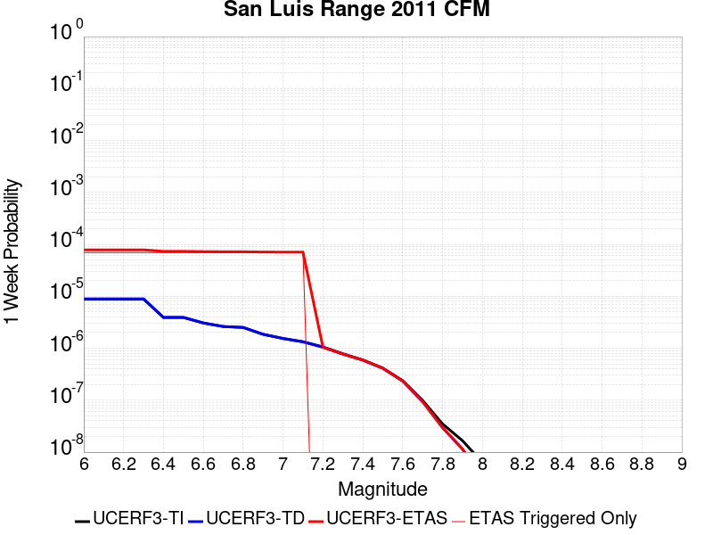 | 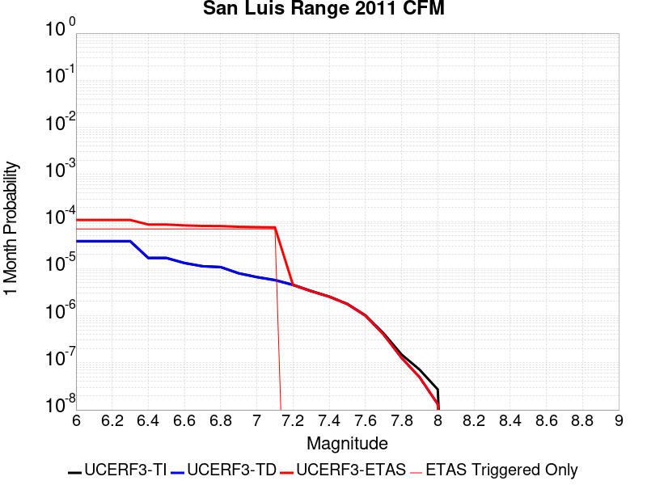 | 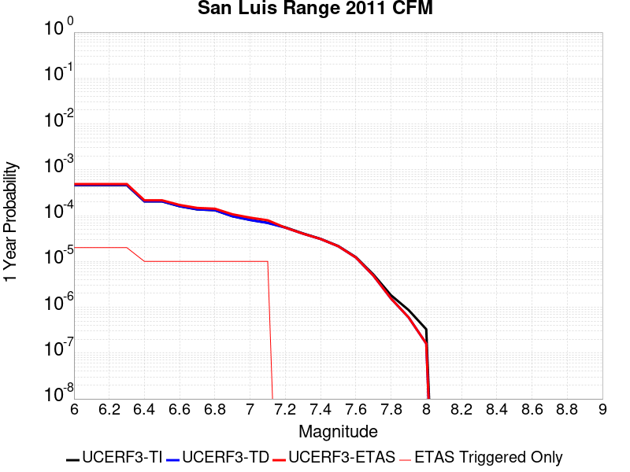 | 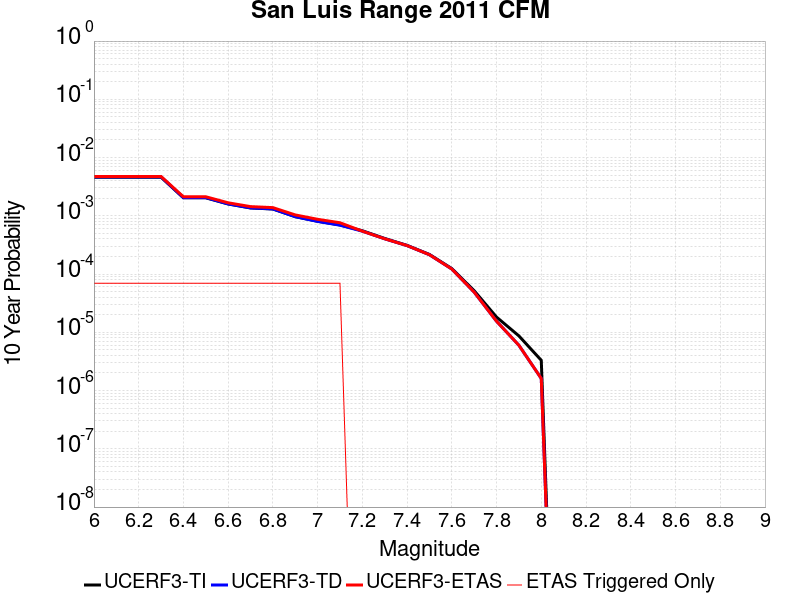 |

| Magnitude | 1 wk TI Prob | 1 wk TD Prob | 1 wk ETAS Prob | 1 wk ETAS/TD Gain | 1 wk ETAS Triggered Only | 1 mo TI Prob | 1 mo TD Prob | 1 mo ETAS Prob | 1 mo ETAS/TD Gain | 1 mo ETAS Triggered Only | 1 yr TI Prob | 1 yr TD Prob | 1 yr ETAS Prob | 1 yr ETAS/TD Gain | 1 yr ETAS Triggered Only | 10 yr TI Prob | 10 yr TD Prob | 10 yr ETAS Prob | 10 yr ETAS/TD Gain | 10 yr ETAS Triggered Only |
|-----|-----|-----|-----|-----|-----|-----|-----|-----|-----|-----|-----|-----|-----|-----|-----|-----|-----|-----|-----|-----|
| 6.0 | 8.8368415E-6 | 8.965455E-6 | 2.8965276E-5 | 3.2307649 | 2.0E-5 | 3.787163E-5 | 3.8422855E-5 | 5.8422087E-5 | 1.5205035 | 2.0E-5 | 4.609895E-4 | 4.6770574E-4 | 4.8769638E-4 | 1.0427419 | 2.0E-5 | 0.0046003438 | 0.004667997 | 0.0046879034 | 1.0042645 | 2.0E-5 |
| 6.1 | 8.8368415E-6 | 8.965455E-6 | 2.8965276E-5 | 3.2307649 | 2.0E-5 | 3.787163E-5 | 3.8422855E-5 | 5.8422087E-5 | 1.5205035 | 2.0E-5 | 4.609895E-4 | 4.6770574E-4 | 4.8769638E-4 | 1.0427419 | 2.0E-5 | 0.0046003438 | 0.004667997 | 0.0046879034 | 1.0042645 | 2.0E-5 |
| 6.2 | 8.8368415E-6 | 8.965455E-6 | 2.8965276E-5 | 3.2307649 | 2.0E-5 | 3.787163E-5 | 3.8422855E-5 | 5.8422087E-5 | 1.5205035 | 2.0E-5 | 4.609895E-4 | 4.6770574E-4 | 4.8769638E-4 | 1.0427419 | 2.0E-5 | 0.0046003438 | 0.004667997 | 0.0046879034 | 1.0042645 | 2.0E-5 |
| 6.3 | 8.8368415E-6 | 8.965455E-6 | 2.8965276E-5 | 3.2307649 | 2.0E-5 | 3.787163E-5 | 3.8422855E-5 | 5.8422087E-5 | 1.5205035 | 2.0E-5 | 4.609895E-4 | 4.6770574E-4 | 4.8769638E-4 | 1.0427419 | 2.0E-5 | 0.0046003438 | 0.004667997 | 0.0046879034 | 1.0042645 | 2.0E-5 |
| 6.4 | 3.9094193E-6 | 3.941204E-6 | 1.3941164E-5 | 3.5372858 | 1.0E-5 | 1.6754546E-5 | 1.6890766E-5 | 2.6890597E-5 | 1.5920295 | 1.0E-5 | 2.039675E-4 | 2.0562594E-4 | 2.1562389E-4 | 1.048622 | 1.0E-5 | 0.0020378039 | 0.0020543856 | 0.0020643652 | 1.0048577 | 1.0E-5 |
| 6.5 | 3.9094193E-6 | 3.941204E-6 | 1.3941164E-5 | 3.5372858 | 1.0E-5 | 1.6754546E-5 | 1.6890766E-5 | 2.6890597E-5 | 1.5920295 | 1.0E-5 | 2.039675E-4 | 2.0562594E-4 | 2.1562389E-4 | 1.048622 | 1.0E-5 | 0.0020378039 | 0.0020543856 | 0.0020643652 | 1.0048577 | 1.0E-5 |
| 6.6 | 3.0587726E-6 | 3.0753893E-6 | 1.3075359E-5 | 4.2516108 | 1.0E-5 | 1.3108959E-5 | 1.3180174E-5 | 2.3180042E-5 | 1.7587054 | 1.0E-5 | 1.595899E-4 | 1.6045693E-4 | 1.7045531E-4 | 1.062312 | 1.0E-5 | 0.0015947534 | 0.0016034227 | 0.0016134066 | 1.0062267 | 1.0E-5 |
| 6.7 | 2.6160574E-6 | 2.6251284E-6 | 1.26251025E-5 | 4.8093276 | 1.0E-5 | 1.1211626E-5 | 1.1250502E-5 | 2.125039E-5 | 1.8888392 | 1.0E-5 | 1.3649299E-4 | 1.3696631E-4 | 1.4696494E-4 | 1.0730007 | 1.0E-5 | 0.0013640919 | 0.0013688251 | 0.0013788114 | 1.0072955 | 1.0E-5 |
| 6.8 | 2.5110312E-6 | 2.5181412E-6 | 1.2518116E-5 | 4.9711733 | 1.0E-5 | 1.0761518E-5 | 1.079199E-5 | 2.0791882E-5 | 1.9266032 | 1.0E-5 | 1.310136E-4 | 1.313846E-4 | 1.413833E-4 | 1.0761024 | 1.0E-5 | 0.0013093639 | 0.0013130752 | 0.0013230621 | 1.0076057 | 1.0E-5 |
| 6.9 | 1.8564405E-6 | 1.852488E-6 | 1.18524695E-5 | 6.3981357 | 1.0E-5 | 7.95615E-6 | 7.93921E-6 | 1.7939132E-5 | 2.259561 | 1.0E-5 | 9.686181E-5 | 9.665562E-5 | 1.06654654E-4 | 1.1034501 | 1.0E-5 | 9.68196E-4 | 9.6613786E-4 | 9.7612815E-4 | 1.0103405 | 1.0E-5 |
| 7.0 | 1.546127E-6 | 1.5369549E-6 | 1.1536939E-5 | 7.506362 | 1.0E-5 | 6.626242E-6 | 6.5869326E-6 | 1.6586866E-5 | 2.5181472 | 1.0E-5 | 8.06715E-5 | 8.019296E-5 | 9.019216E-5 | 1.1246892 | 1.0E-5 | 8.0642226E-4 | 8.016409E-4 | 8.116329E-4 | 1.0124644 | 1.0E-5 |
| 7.1 | 1.3368208E-6 | 1.3235336E-6 | 1.132352E-5 | 8.555521 | 1.0E-5 | 5.7292195E-6 | 5.6722747E-6 | 1.5672218E-5 | 2.7629511 | 1.0E-5 | 6.975101E-5 | 6.905776E-5 | 7.905707E-5 | 1.1447964 | 1.0E-5 | 6.972912E-4 | 6.903635E-4 | 7.003566E-4 | 1.0144751 | 1.0E-5 |
| 7.2 | 1.0623363E-6 | 1.0454378E-6 | 1.0454378E-6 | 1.0 | 0.0 | 4.5528623E-6 | 4.4804397E-6 | 4.4804397E-6 | 1.0 | 0.0 | 5.5429686E-5 | 5.4547992E-5 | 5.4547992E-5 | 1.0 | 0.0 | 5.5415864E-4 | 5.453463E-4 | 5.453463E-4 | 1.0 | 0.0 |
| 7.3 | 7.831679E-7 | 7.727399E-7 | 7.727399E-7 | 1.0 | 0.0 | 3.3564295E-6 | 3.3117383E-6 | 3.3117383E-6 | 1.0 | 0.0 | 4.086376E-5 | 4.031967E-5 | 4.031967E-5 | 1.0 | 0.0 | 4.0856248E-4 | 4.0312367E-4 | 4.0312367E-4 | 1.0 | 0.0 |
| 7.4 | 5.9558846E-7 | 5.910646E-7 | 5.910646E-7 | 1.0 | 0.0 | 2.5525194E-6 | 2.5331315E-6 | 2.5331315E-6 | 1.0 | 0.0 | 3.107648E-5 | 3.084044E-5 | 3.084044E-5 | 1.0 | 0.0 | 3.1072134E-4 | 3.083617E-4 | 3.083617E-4 | 1.0 | 0.0 |
| 7.5 | 4.1616502E-7 | 4.1196404E-7 | 4.1196404E-7 | 1.0 | 0.0 | 1.7835631E-6 | 1.765559E-6 | 1.765559E-6 | 1.0 | 0.0 | 2.1714664E-5 | 2.1495469E-5 | 2.1495469E-5 | 1.0 | 0.0 | 2.1712543E-4 | 2.1493394E-4 | 2.1493394E-4 | 1.0 | 0.0 |
| 7.6 | 2.3816014E-7 | 2.3376614E-7 | 2.3376614E-7 | 1.0 | 0.0 | 1.0206859E-6 | 1.0018545E-6 | 1.0018545E-6 | 1.0 | 0.0 | 1.242678E-5 | 1.219751E-5 | 1.219751E-5 | 1.0 | 0.0 | 1.2426086E-4 | 1.2196843E-4 | 1.2196843E-4 | 1.0 | 0.0 |
| 7.7 | 9.918777E-8 | 9.3868096E-8 | 9.3868096E-8 | 1.0 | 0.0 | 4.2509038E-7 | 4.022918E-7 | 4.022918E-7 | 1.0 | 0.0 | 5.1754632E-6 | 4.8978914E-6 | 4.8978914E-6 | 1.0 | 0.0 | 5.1753424E-5 | 4.897784E-5 | 4.897784E-5 | 1.0 | 0.0 |
| 7.8 | 3.4982556E-8 | 2.968672E-8 | 2.968672E-8 | 1.0 | 0.0 | 1.4992524E-7 | 1.272288E-7 | 1.272288E-7 | 1.0 | 0.0 | 1.8253382E-6 | 1.5490094E-6 | 1.5490094E-6 | 1.0 | 0.0 | 1.8253233E-5 | 1.5489988E-5 | 1.5489988E-5 | 1.0 | 0.0 |
| 7.9 | 1.6624908E-8 | 1.1476994E-8 | 1.1476994E-8 | 1.0 | 0.0 | 7.12496E-8 | 4.9187115E-8 | 4.9187115E-8 | 1.0 | 0.0 | 8.6746354E-7 | 5.988529E-7 | 5.988529E-7 | 1.0 | 0.0 | 8.674601E-6 | 5.9885133E-6 | 5.9885133E-6 | 1.0 | 0.0 |
| 8.0 | 6.3352315E-9 | 3.0886564E-9 | 3.0886564E-9 | 1.0 | 0.0 | 2.715099E-8 | 1.32370985E-8 | 1.32370985E-8 | 1.0 | 0.0 | 3.3056327E-7 | 1.6116167E-7 | 1.6116167E-7 | 1.0 | 0.0 | 3.3056278E-6 | 1.6116155E-6 | 1.6116155E-6 | 1.0 | 0.0 |

## Gillem - Big Crack 2011 CFM
*[(top)](#table-of-contents)*

| 1 Week | 1 Month | 1 Year | 10 Year |
|-----|-----|-----|-----|
| 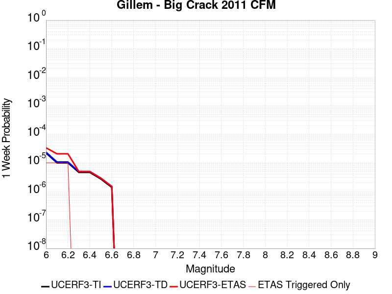 |  | 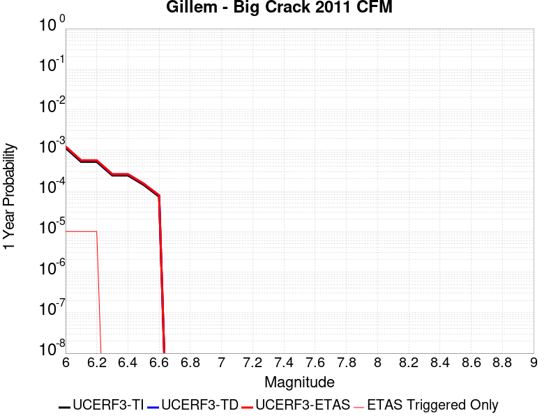 | 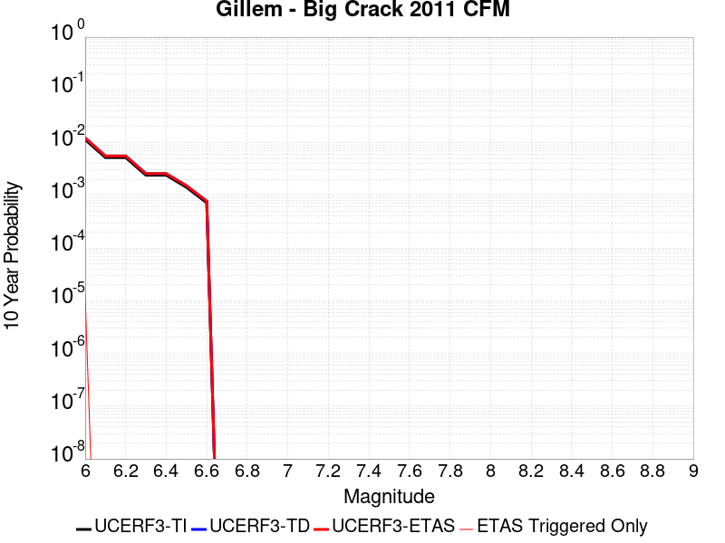 |

| Magnitude | 1 wk TI Prob | 1 wk TD Prob | 1 wk ETAS Prob | 1 wk ETAS/TD Gain | 1 wk ETAS Triggered Only | 1 mo TI Prob | 1 mo TD Prob | 1 mo ETAS Prob | 1 mo ETAS/TD Gain | 1 mo ETAS Triggered Only | 1 yr TI Prob | 1 yr TD Prob | 1 yr ETAS Prob | 1 yr ETAS/TD Gain | 1 yr ETAS Triggered Only | 10 yr TI Prob | 10 yr TD Prob | 10 yr ETAS Prob | 10 yr ETAS/TD Gain | 10 yr ETAS Triggered Only |
|-----|-----|-----|-----|-----|-----|-----|-----|-----|-----|-----|-----|-----|-----|-----|-----|-----|-----|-----|-----|-----|
| 6.0 | 2.196852E-5 | 2.3604485E-5 | 3.360425E-5 | 1.4236383 | 1.0E-5 | 9.4147406E-5 | 1.01158665E-4 | 1.1115765E-4 | 1.0988446 | 1.0E-5 | 0.0011456419 | 0.0012309998 | 0.0012409874 | 1.0081135 | 1.0E-5 | 0.011397537 | 0.012250669 | 0.0122704245 | 1.0016125 | 2.0E-5 |
| 6.1 | 9.992795E-6 | 1.071189E-5 | 2.0711783E-5 | 1.9335321 | 1.0E-5 | 4.2825563E-5 | 4.5907396E-5 | 5.5906938E-5 | 1.2178198 | 1.0E-5 | 5.2127644E-4 | 5.587975E-4 | 5.6879193E-4 | 1.0178856 | 1.0E-5 | 0.0052005537 | 0.0055757347 | 0.005585679 | 1.0017835 | 1.0E-5 |
| 6.2 | 9.992795E-6 | 1.071189E-5 | 2.0711783E-5 | 1.9335321 | 1.0E-5 | 4.2825563E-5 | 4.5907396E-5 | 5.5906938E-5 | 1.2178198 | 1.0E-5 | 5.2127644E-4 | 5.587975E-4 | 5.6879193E-4 | 1.0178856 | 1.0E-5 | 0.0052005537 | 0.0055757347 | 0.005585679 | 1.0017835 | 1.0E-5 |
| 6.3 | 4.6127884E-6 | 4.942657E-6 | 4.942657E-6 | 1.0 | 0.0 | 1.9768944E-5 | 2.1182668E-5 | 2.1182668E-5 | 1.0 | 0.0 | 2.406603E-4 | 2.5787292E-4 | 2.5787292E-4 | 1.0 | 0.0 | 0.0024039985 | 0.0025761751 | 0.0025761751 | 1.0 | 0.0 |
| 6.4 | 4.6127884E-6 | 4.942657E-6 | 4.942657E-6 | 1.0 | 0.0 | 1.9768944E-5 | 2.1182668E-5 | 2.1182668E-5 | 1.0 | 0.0 | 2.406603E-4 | 2.5787292E-4 | 2.5787292E-4 | 1.0 | 0.0 | 0.0024039985 | 0.0025761751 | 0.0025761751 | 1.0 | 0.0 |
| 6.5 | 2.716712E-6 | 2.9111113E-6 | 2.9111113E-6 | 1.0 | 0.0 | 1.1643E-5 | 1.24761455E-5 | 1.24761455E-5 | 1.0 | 0.0 | 1.417443E-4 | 1.5188892E-4 | 1.5188892E-4 | 1.0 | 0.0 | 0.0014165393 | 0.001518089 | 0.001518089 | 1.0 | 0.0 |
| 6.6 | 1.3818255E-6 | 1.4820689E-6 | 1.4820689E-6 | 1.0 | 0.0 | 5.922096E-6 | 6.3517155E-6 | 6.3517155E-6 | 1.0 | 0.0 | 7.209913E-5 | 7.7330624E-5 | 7.7330624E-5 | 1.0 | 0.0 | 7.2075747E-4 | 7.7315804E-4 | 7.7315804E-4 | 1.0 | 0.0 |

## La Panza 2011
*[(top)](#table-of-contents)*

| 1 Week | 1 Month | 1 Year | 10 Year |
|-----|-----|-----|-----|
| 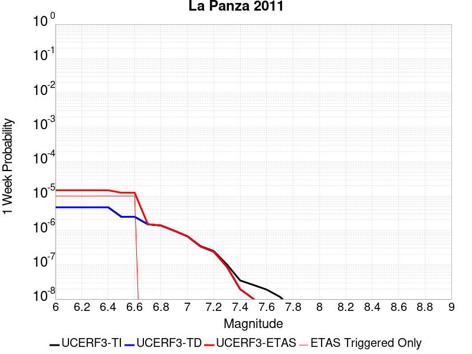 | 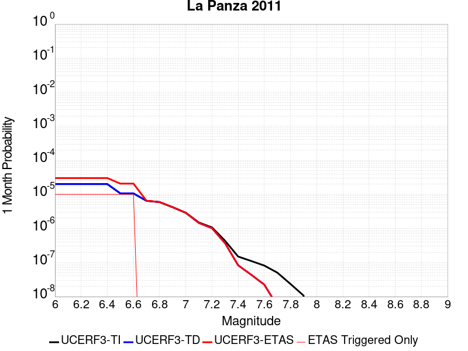 | 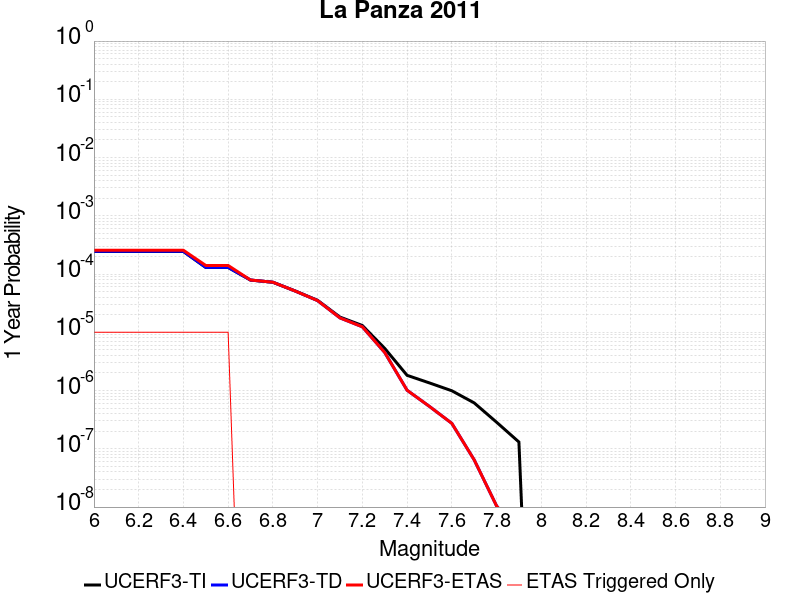 | 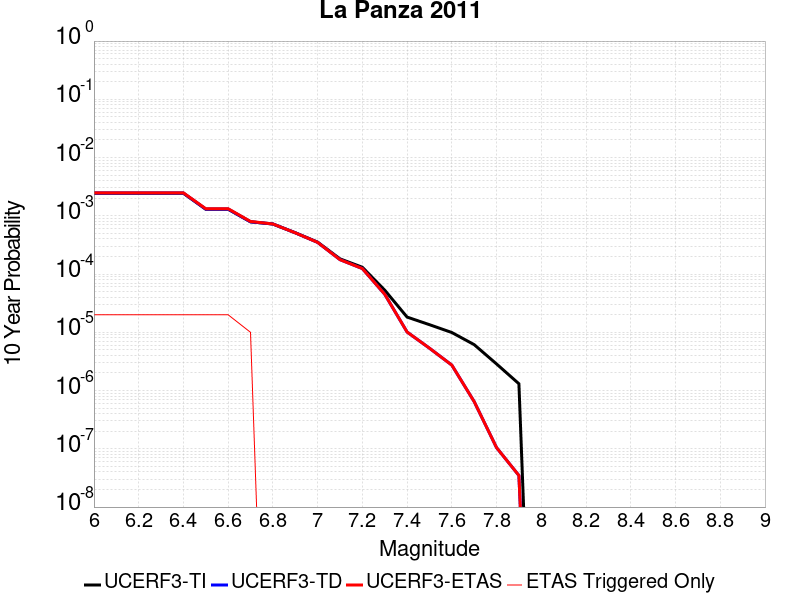 |

| Magnitude | 1 wk TI Prob | 1 wk TD Prob | 1 wk ETAS Prob | 1 wk ETAS/TD Gain | 1 wk ETAS Triggered Only | 1 mo TI Prob | 1 mo TD Prob | 1 mo ETAS Prob | 1 mo ETAS/TD Gain | 1 mo ETAS Triggered Only | 1 yr TI Prob | 1 yr TD Prob | 1 yr ETAS Prob | 1 yr ETAS/TD Gain | 1 yr ETAS Triggered Only | 10 yr TI Prob | 10 yr TD Prob | 10 yr ETAS Prob | 10 yr ETAS/TD Gain | 10 yr ETAS Triggered Only |
|-----|-----|-----|-----|-----|-----|-----|-----|-----|-----|-----|-----|-----|-----|-----|-----|-----|-----|-----|-----|-----|
| 6.0 | 4.6754544E-6 | 4.7175886E-6 | 1.47175415E-5 | 3.119717 | 1.0E-5 | 2.0037509E-5 | 2.021809E-5 | 3.0217889E-5 | 1.4945965 | 1.0E-5 | 2.4392935E-4 | 2.4612944E-4 | 2.5612698E-4 | 1.040619 | 1.0E-5 | 0.0024366176 | 0.0024587628 | 0.0024787136 | 1.0081142 | 2.0E-5 |
| 6.1 | 4.6754544E-6 | 4.7175886E-6 | 1.47175415E-5 | 3.119717 | 1.0E-5 | 2.0037509E-5 | 2.021809E-5 | 3.0217889E-5 | 1.4945965 | 1.0E-5 | 2.4392935E-4 | 2.4612944E-4 | 2.5612698E-4 | 1.040619 | 1.0E-5 | 0.0024366176 | 0.0024587628 | 0.0024787136 | 1.0081142 | 2.0E-5 |
| 6.2 | 4.6754544E-6 | 4.7175886E-6 | 1.47175415E-5 | 3.119717 | 1.0E-5 | 2.0037509E-5 | 2.021809E-5 | 3.0217889E-5 | 1.4945965 | 1.0E-5 | 2.4392935E-4 | 2.4612944E-4 | 2.5612698E-4 | 1.040619 | 1.0E-5 | 0.0024366176 | 0.0024587628 | 0.0024787136 | 1.0081142 | 2.0E-5 |
| 6.3 | 4.6754544E-6 | 4.7175886E-6 | 1.47175415E-5 | 3.119717 | 1.0E-5 | 2.0037509E-5 | 2.021809E-5 | 3.0217889E-5 | 1.4945965 | 1.0E-5 | 2.4392935E-4 | 2.4612944E-4 | 2.5612698E-4 | 1.040619 | 1.0E-5 | 0.0024366176 | 0.0024587628 | 0.0024787136 | 1.0081142 | 2.0E-5 |
| 6.4 | 4.6754544E-6 | 4.7175886E-6 | 1.47175415E-5 | 3.119717 | 1.0E-5 | 2.0037509E-5 | 2.021809E-5 | 3.0217889E-5 | 1.4945965 | 1.0E-5 | 2.4392935E-4 | 2.4612944E-4 | 2.5612698E-4 | 1.040619 | 1.0E-5 | 0.0024366176 | 0.0024587628 | 0.0024787136 | 1.0081142 | 2.0E-5 |
| 6.5 | 2.485343E-6 | 2.5006007E-6 | 1.2500575E-5 | 4.999029 | 1.0E-5 | 1.0651426E-5 | 1.0716818E-5 | 2.071671E-5 | 1.9331028 | 1.0E-5 | 1.296734E-4 | 1.3046984E-4 | 1.4046853E-4 | 1.0766361 | 1.0E-5 | 0.0012959775 | 0.0013039707 | 0.0013239447 | 1.0153178 | 2.0E-5 |
| 6.6 | 2.485343E-6 | 2.5006007E-6 | 1.2500575E-5 | 4.999029 | 1.0E-5 | 1.0651426E-5 | 1.0716818E-5 | 2.071671E-5 | 1.9331028 | 1.0E-5 | 1.296734E-4 | 1.3046984E-4 | 1.4046853E-4 | 1.0766361 | 1.0E-5 | 0.0012959775 | 0.0013039707 | 0.0013239447 | 1.0153178 | 2.0E-5 |
| 6.7 | 1.5108508E-6 | 1.514639E-6 | 1.514639E-6 | 1.0 | 0.0 | 6.4750584E-6 | 6.4912947E-6 | 6.4912947E-6 | 1.0 | 0.0 | 7.8830984E-5 | 7.902876E-5 | 7.902876E-5 | 1.0 | 0.0 | 7.880303E-4 | 7.9001737E-4 | 8.0000947E-4 | 1.012648 | 1.0E-5 |
| 6.8 | 1.3865837E-6 | 1.3885118E-6 | 1.3885118E-6 | 1.0 | 0.0 | 5.942488E-6 | 5.950752E-6 | 5.950752E-6 | 1.0 | 0.0 | 7.234739E-5 | 7.244809E-5 | 7.244809E-5 | 1.0 | 0.0 | 7.232384E-4 | 7.242546E-4 | 7.242546E-4 | 1.0 | 0.0 |
| 6.9 | 9.826583E-7 | 9.796303E-7 | 9.796303E-7 | 1.0 | 0.0 | 4.2113857E-6 | 4.198409E-6 | 4.198409E-6 | 1.0 | 0.0 | 5.1272415E-5 | 5.1114486E-5 | 5.1114486E-5 | 1.0 | 0.0 | 5.126059E-4 | 5.1103265E-4 | 5.1103265E-4 | 1.0 | 0.0 |
| 7.0 | 6.7797646E-7 | 6.710231E-7 | 6.710231E-7 | 1.0 | 0.0 | 2.9056102E-6 | 2.8758104E-6 | 2.8758104E-6 | 1.0 | 0.0 | 3.537523E-5 | 3.501246E-5 | 3.501246E-5 | 1.0 | 0.0 | 3.5369597E-4 | 3.5007254E-4 | 3.5007254E-4 | 1.0 | 0.0 |
| 7.1 | 3.4979826E-7 | 3.3874045E-7 | 3.3874045E-7 | 1.0 | 0.0 | 1.4991346E-6 | 1.4517441E-6 | 1.4517441E-6 | 1.0 | 0.0 | 1.825181E-5 | 1.7674853E-5 | 1.7674853E-5 | 1.0 | 0.0 | 1.825031E-4 | 1.7673563E-4 | 1.7673563E-4 | 1.0 | 0.0 |
| 7.2 | 2.5088332E-7 | 2.3832064E-7 | 2.3832064E-7 | 1.0 | 0.0 | 1.0752137E-6 | 1.0213738E-6 | 1.0213738E-6 | 1.0 | 0.0 | 1.3090649E-5 | 1.2435164E-5 | 1.2435164E-5 | 1.0 | 0.0 | 1.3089878E-4 | 1.2434553E-4 | 1.2434553E-4 | 1.0 | 0.0 |
| 7.3 | 1.0159086E-7 | 8.644785E-8 | 8.644785E-8 | 1.0 | 0.0 | 4.3538932E-7 | 3.704907E-7 | 3.704907E-7 | 1.0 | 0.0 | 5.300852E-6 | 4.510716E-6 | 4.510716E-6 | 1.0 | 0.0 | 5.3007258E-5 | 4.510628E-5 | 4.510628E-5 | 1.0 | 0.0 |
| 7.4 | 3.5006252E-8 | 1.9403883E-8 | 1.9403883E-8 | 1.0 | 0.0 | 1.5002678E-7 | 8.315949E-8 | 8.315949E-8 | 1.0 | 0.0 | 1.8265745E-6 | 1.0124663E-6 | 1.0124663E-6 | 1.0 | 0.0 | 1.8265595E-5 | 1.012462E-5 | 1.012462E-5 | 1.0 | 0.0 |
| 7.5 | 2.592274E-8 | 1.0238468E-8 | 1.0238468E-8 | 1.0 | 0.0 | 1.1109746E-7 | 4.3879147E-8 | 4.3879147E-8 | 1.0 | 0.0 | 1.3526106E-6 | 5.342285E-7 | 5.342285E-7 | 1.0 | 0.0 | 1.3526024E-5 | 5.342273E-6 | 5.342273E-6 | 1.0 | 0.0 |
| 7.6 | 1.9016717E-8 | 5.2442264E-9 | 5.2442264E-9 | 1.0 | 0.0 | 8.150022E-8 | 2.2475257E-8 | 2.2475257E-8 | 1.0 | 0.0 | 9.922647E-7 | 2.736362E-7 | 2.736362E-7 | 1.0 | 0.0 | 9.922603E-6 | 2.736359E-6 | 2.736359E-6 | 1.0 | 0.0 |
| 7.7 | 1.17738495E-8 | 1.2393437E-9 | 1.2393437E-9 | 1.0 | 0.0 | 5.0459356E-8 | 5.3114735E-9 | 5.3114735E-9 | 1.0 | 0.0 | 6.1434247E-7 | 6.466719E-8 | 6.466719E-8 | 1.0 | 0.0 | 6.143408E-6 | 6.466717E-7 | 6.466717E-7 | 1.0 | 0.0 |
| 7.8 | 5.489079E-9 | 2.009185E-10 | 2.009185E-10 | 1.0 | 0.0 | 2.3524624E-8 | 8.61079E-10 | 8.61079E-10 | 1.0 | 0.0 | 2.8641225E-7 | 1.0483639E-8 | 1.0483639E-8 | 1.0 | 0.0 | 2.8641189E-6 | 1.0483638E-7 | 1.0483638E-7 | 1.0 | 0.0 |
| 7.9 | 2.5081048E-9 | 6.675449E-11 | 6.675449E-11 | 1.0 | 0.0 | 1.0749021E-8 | 2.8609015E-10 | 2.8609015E-10 | 1.0 | 0.0 | 1.3086932E-7 | 3.483148E-9 | 3.483148E-9 | 1.0 | 0.0 | 1.3086925E-6 | 3.483148E-8 | 3.483148E-8 | 1.0 | 0.0 |

## Monte Vista - Shannon 2011 CFM
*[(top)](#table-of-contents)*

| 1 Week | 1 Month | 1 Year | 10 Year |
|-----|-----|-----|-----|
| 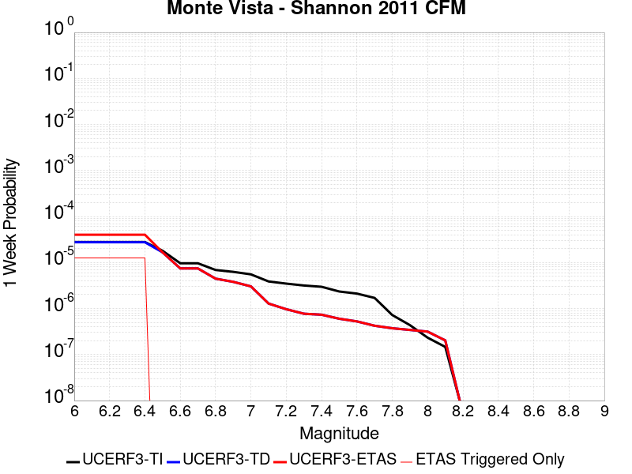 | 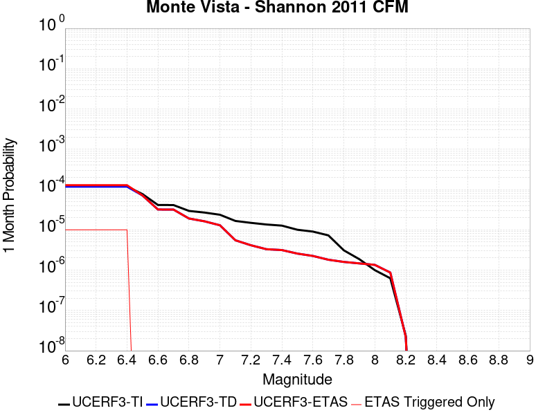 |  | 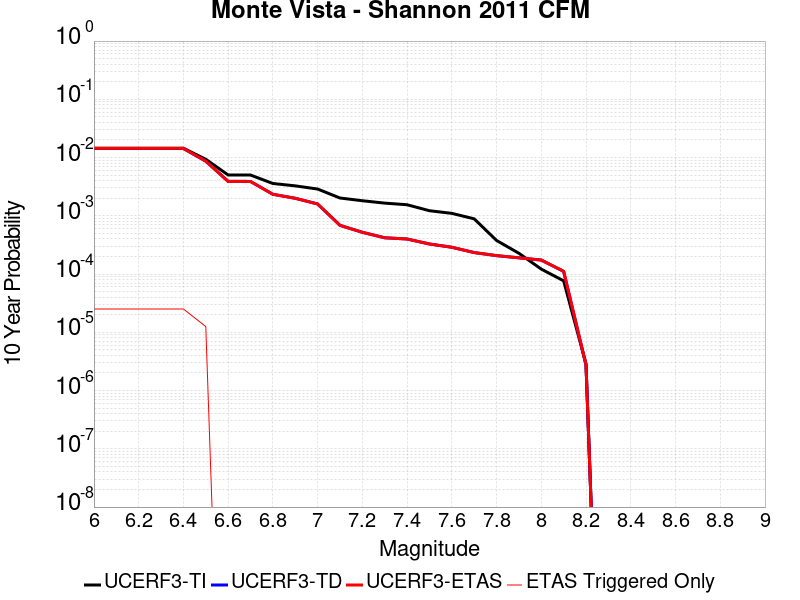 |

| Magnitude | 1 wk TI Prob | 1 wk TD Prob | 1 wk ETAS Prob | 1 wk ETAS/TD Gain | 1 wk ETAS Triggered Only | 1 mo TI Prob | 1 mo TD Prob | 1 mo ETAS Prob | 1 mo ETAS/TD Gain | 1 mo ETAS Triggered Only | 1 yr TI Prob | 1 yr TD Prob | 1 yr ETAS Prob | 1 yr ETAS/TD Gain | 1 yr ETAS Triggered Only | 10 yr TI Prob | 10 yr TD Prob | 10 yr ETAS Prob | 10 yr ETAS/TD Gain | 10 yr ETAS Triggered Only |
|-----|-----|-----|-----|-----|-----|-----|-----|-----|-----|-----|-----|-----|-----|-----|-----|-----|-----|-----|-----|-----|
| 6.0 | 2.7907707E-5 | 2.7584067E-5 | 3.758379E-5 | 1.3625181 | 1.0E-5 | 1.19598975E-4 | 1.1821277E-4 | 1.2821158E-4 | 1.0845833 | 1.0E-5 | 0.0014551448 | 0.001438414 | 0.0014483996 | 1.0069422 | 1.0E-5 | 0.014456532 | 0.014320111 | 0.014339825 | 1.0013766 | 2.0E-5 |
| 6.1 | 2.7907707E-5 | 2.7584067E-5 | 3.758379E-5 | 1.3625181 | 1.0E-5 | 1.19598975E-4 | 1.1821277E-4 | 1.2821158E-4 | 1.0845833 | 1.0E-5 | 0.0014551448 | 0.001438414 | 0.0014483996 | 1.0069422 | 1.0E-5 | 0.014456532 | 0.014320111 | 0.014339825 | 1.0013766 | 2.0E-5 |
| 6.2 | 2.7907707E-5 | 2.7584067E-5 | 3.758379E-5 | 1.3625181 | 1.0E-5 | 1.19598975E-4 | 1.1821277E-4 | 1.2821158E-4 | 1.0845833 | 1.0E-5 | 0.0014551448 | 0.001438414 | 0.0014483996 | 1.0069422 | 1.0E-5 | 0.014456532 | 0.014320111 | 0.014339825 | 1.0013766 | 2.0E-5 |
| 6.3 | 2.7907707E-5 | 2.7584067E-5 | 3.758379E-5 | 1.3625181 | 1.0E-5 | 1.19598975E-4 | 1.1821277E-4 | 1.2821158E-4 | 1.0845833 | 1.0E-5 | 0.0014551448 | 0.001438414 | 0.0014483996 | 1.0069422 | 1.0E-5 | 0.014456532 | 0.014320111 | 0.014339825 | 1.0013766 | 2.0E-5 |
| 6.4 | 2.7907707E-5 | 2.7584067E-5 | 3.758379E-5 | 1.3625181 | 1.0E-5 | 1.19598975E-4 | 1.1821277E-4 | 1.2821158E-4 | 1.0845833 | 1.0E-5 | 0.0014551448 | 0.001438414 | 0.0014483996 | 1.0069422 | 1.0E-5 | 0.014456532 | 0.014320111 | 0.014339825 | 1.0013766 | 2.0E-5 |
| 6.5 | 1.7990213E-5 | 1.6639742E-5 | 1.6639742E-5 | 1.0 | 0.0 | 7.709863E-5 | 7.13116E-5 | 7.13116E-5 | 1.0 | 0.0 | 9.382716E-4 | 8.679393E-4 | 8.679393E-4 | 1.0 | 0.0 | 0.0093431985 | 0.008668857 | 0.008678771 | 1.0011436 | 1.0E-5 |
| 6.6 | 9.650407E-6 | 7.457001E-6 | 7.457001E-6 | 1.0 | 0.0 | 4.135823E-5 | 3.195823E-5 | 3.195823E-5 | 1.0 | 0.0 | 5.0342013E-4 | 3.890298E-4 | 3.890298E-4 | 1.0 | 0.0 | 0.005022812 | 0.0039011573 | 0.0039011573 | 1.0 | 0.0 |
| 6.7 | 9.62828E-6 | 7.434916E-6 | 7.434916E-6 | 1.0 | 0.0 | 4.1263404E-5 | 3.186358E-5 | 3.186358E-5 | 1.0 | 0.0 | 5.022661E-4 | 3.8787787E-4 | 3.8787787E-4 | 1.0 | 0.0 | 0.0050113243 | 0.003889678 | 0.003889678 | 1.0 | 0.0 |
| 6.8 | 6.887523E-6 | 4.461425E-6 | 4.461425E-6 | 1.0 | 0.0 | 2.9517621E-5 | 1.9120265E-5 | 1.9120265E-5 | 1.0 | 0.0 | 3.5931775E-4 | 2.3276659E-4 | 2.3276659E-4 | 1.0 | 0.0 | 0.0035873733 | 0.0023423703 | 0.0023423703 | 1.0 | 0.0 |
| 6.9 | 6.2722347E-6 | 3.8032956E-6 | 3.8032956E-6 | 1.0 | 0.0 | 2.6880729E-5 | 1.6299748E-5 | 1.6299748E-5 | 1.0 | 0.0 | 3.2722374E-4 | 1.9843338E-4 | 1.9843338E-4 | 1.0 | 0.0 | 0.003267423 | 0.0019996904 | 0.0019996904 | 1.0 | 0.0 |
| 7.0 | 5.5320347E-6 | 3.0304461E-6 | 3.0304461E-6 | 1.0 | 0.0 | 2.3708504E-5 | 1.2987572E-5 | 1.2987572E-5 | 1.0 | 0.0 | 2.8861282E-4 | 1.5811404E-4 | 1.5811404E-4 | 1.0 | 0.0 | 0.0028823826 | 0.0015971304 | 0.0015971304 | 1.0 | 0.0 |
| 7.1 | 3.8794055E-6 | 1.283645E-6 | 1.283645E-6 | 1.0 | 0.0 | 1.6625918E-5 | 5.5013243E-6 | 5.5013243E-6 | 1.0 | 0.0 | 2.0240174E-4 | 6.697658E-5 | 6.697658E-5 | 1.0 | 0.0 | 0.002022175 | 6.86504E-4 | 6.86504E-4 | 1.0 | 0.0 |
| 7.2 | 3.4813652E-6 | 9.669686E-7 | 9.669686E-7 | 1.0 | 0.0 | 1.49200505E-5 | 4.144145E-6 | 4.144145E-6 | 1.0 | 0.0 | 1.8163648E-4 | 5.0453804E-5 | 5.0453804E-5 | 1.0 | 0.0 | 0.0018148809 | 5.213506E-4 | 5.213506E-4 | 1.0 | 0.0 |
| 7.3 | 3.1682148E-6 | 7.7177793E-7 | 7.7177793E-7 | 1.0 | 0.0 | 1.3577992E-5 | 3.3076153E-6 | 3.3076153E-6 | 1.0 | 0.0 | 1.6529951E-4 | 4.0269475E-5 | 4.0269475E-5 | 1.0 | 0.0 | 0.0016517661 | 4.195245E-4 | 4.195245E-4 | 1.0 | 0.0 |
| 7.4 | 2.9707667E-6 | 7.344474E-7 | 7.344474E-7 | 1.0 | 0.0 | 1.2731795E-5 | 3.147628E-6 | 3.147628E-6 | 1.0 | 0.0 | 1.5499859E-4 | 3.8321698E-5 | 3.8321698E-5 | 1.0 | 0.0 | 0.0015489052 | 3.998471E-4 | 3.998471E-4 | 1.0 | 0.0 |
| 7.5 | 2.3462758E-6 | 6.0069135E-7 | 6.0069135E-7 | 1.0 | 0.0 | 1.0055429E-5 | 2.5743889E-6 | 2.5743889E-6 | 1.0 | 0.0 | 1.2241797E-4 | 3.1342737E-5 | 3.1342737E-5 | 1.0 | 0.0 | 0.0012235056 | 3.2833643E-4 | 3.2833643E-4 | 1.0 | 0.0 |
| 7.6 | 2.112783E-6 | 5.250731E-7 | 5.250731E-7 | 1.0 | 0.0 | 9.054753E-6 | 2.2503114E-6 | 2.2503114E-6 | 1.0 | 0.0 | 1.1023604E-4 | 2.7397198E-5 | 2.7397198E-5 | 1.0 | 0.0 | 0.0011018137 | 2.8845918E-4 | 2.8845918E-4 | 1.0 | 0.0 |
| 7.7 | 1.7022471E-6 | 4.23102E-7 | 4.23102E-7 | 1.0 | 0.0 | 7.2953244E-6 | 1.8132929E-6 | 1.8132929E-6 | 1.0 | 0.0 | 8.881695E-5 | 2.207662E-5 | 2.207662E-5 | 1.0 | 0.0 | 8.878146E-4 | 2.3394964E-4 | 2.3394964E-4 | 1.0 | 0.0 |
| 7.8 | 7.230914E-7 | 3.728293E-7 | 3.728293E-7 | 1.0 | 0.0 | 3.0989595E-6 | 1.597839E-6 | 1.597839E-6 | 1.0 | 0.0 | 3.772918E-5 | 1.9453517E-5 | 1.9453517E-5 | 1.0 | 0.0 | 3.7722773E-4 | 2.072548E-4 | 2.072548E-4 | 1.0 | 0.0 |
| 7.9 | 4.3588446E-7 | 3.4304335E-7 | 3.4304335E-7 | 1.0 | 0.0 | 1.868075E-6 | 1.4701849E-6 | 1.4701849E-6 | 1.0 | 0.0 | 2.2743576E-5 | 1.7899356E-5 | 1.7899356E-5 | 1.0 | 0.0 | 2.2741247E-4 | 1.899464E-4 | 1.899464E-4 | 1.0 | 0.0 |
| 8.0 | 2.3317523E-7 | 3.1513432E-7 | 3.1513432E-7 | 1.0 | 0.0 | 9.99322E-7 | 1.350575E-6 | 1.350575E-6 | 1.0 | 0.0 | 1.2166677E-5 | 1.6443128E-5 | 1.6443128E-5 | 1.0 | 0.0 | 1.21660116E-4 | 1.7399403E-4 | 1.7399403E-4 | 1.0 | 0.0 |
| 8.1 | 1.4662456E-7 | 2.03077E-7 | 2.03077E-7 | 1.0 | 0.0 | 6.283908E-7 | 8.703297E-7 | 8.703297E-7 | 1.0 | 0.0 | 7.650631E-6 | 1.05962135E-5 | 1.05962135E-5 | 1.0 | 0.0 | 7.650368E-5 | 1.1132272E-4 | 1.1132272E-4 | 1.0 | 0.0 |
| 8.2 | 5.4931775E-9 | 5.0752176E-9 | 5.0752176E-9 | 1.0 | 0.0 | 2.3542189E-8 | 2.1750932E-8 | 2.1750932E-8 | 1.0 | 0.0 | 2.8662612E-7 | 2.6481757E-7 | 2.6481757E-7 | 1.0 | 0.0 | 2.8662573E-6 | 2.754138E-6 | 2.754138E-6 | 1.0 | 0.0 |

## Great Valley 05 Pittsburg - Kirby Hills alt1
*[(top)](#table-of-contents)*

| 1 Week | 1 Month | 1 Year | 10 Year |
|-----|-----|-----|-----|
|  | 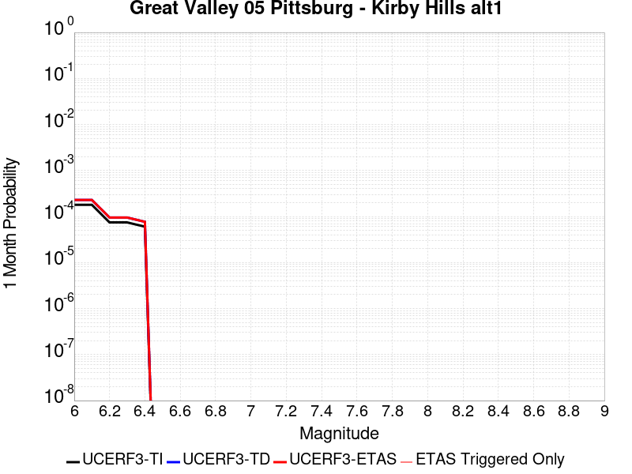 | 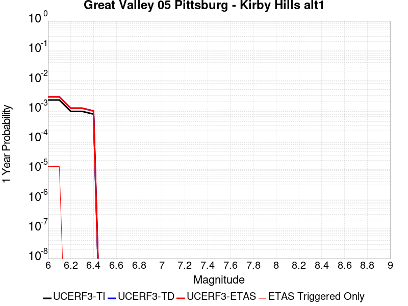 | 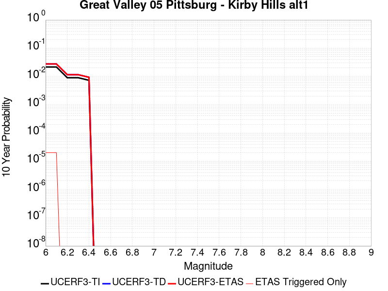 |

| Magnitude | 1 wk TI Prob | 1 wk TD Prob | 1 wk ETAS Prob | 1 wk ETAS/TD Gain | 1 wk ETAS Triggered Only | 1 mo TI Prob | 1 mo TD Prob | 1 mo ETAS Prob | 1 mo ETAS/TD Gain | 1 mo ETAS Triggered Only | 1 yr TI Prob | 1 yr TD Prob | 1 yr ETAS Prob | 1 yr ETAS/TD Gain | 1 yr ETAS Triggered Only | 10 yr TI Prob | 10 yr TD Prob | 10 yr ETAS Prob | 10 yr ETAS/TD Gain | 10 yr ETAS Triggered Only |
|-----|-----|-----|-----|-----|-----|-----|-----|-----|-----|-----|-----|-----|-----|-----|-----|-----|-----|-----|-----|-----|
| 6.0 | 4.187212E-5 | 5.344289E-5 | 5.344289E-5 | 1.0 | 0.0 | 1.794396E-4 | 2.2902661E-4 | 2.2902661E-4 | 1.0 | 0.0 | 0.002182488 | 0.0027857998 | 0.002795772 | 1.0035796 | 1.0E-5 | 0.021611776 | 0.027603218 | 0.027622666 | 1.0007045 | 2.0E-5 |
| 6.1 | 4.187212E-5 | 5.344289E-5 | 5.344289E-5 | 1.0 | 0.0 | 1.794396E-4 | 2.2902661E-4 | 2.2902661E-4 | 1.0 | 0.0 | 0.002182488 | 0.0027857998 | 0.002795772 | 1.0035796 | 1.0E-5 | 0.021611776 | 0.027603218 | 0.027622666 | 1.0007045 | 2.0E-5 |
| 6.2 | 1.7353306E-5 | 2.2154672E-5 | 2.2154672E-5 | 1.0 | 0.0 | 7.436919E-5 | 9.4947456E-5 | 9.4947456E-5 | 1.0 | 0.0 | 9.050688E-4 | 0.0011557573 | 0.0011557573 | 1.0 | 0.0 | 0.009013915 | 0.0115352 | 0.0115352 | 1.0 | 0.0 |
| 6.3 | 1.7353306E-5 | 2.2154672E-5 | 2.2154672E-5 | 1.0 | 0.0 | 7.436919E-5 | 9.4947456E-5 | 9.4947456E-5 | 1.0 | 0.0 | 9.050688E-4 | 0.0011557573 | 0.0011557573 | 1.0 | 0.0 | 0.009013915 | 0.0115352 | 0.0115352 | 1.0 | 0.0 |
| 6.4 | 1.4028824E-5 | 1.7901062E-5 | 1.7901062E-5 | 1.0 | 0.0 | 6.0122147E-5 | 7.671883E-5 | 7.671883E-5 | 1.0 | 0.0 | 7.3174125E-4 | 9.340303E-4 | 9.340303E-4 | 1.0 | 0.0 | 0.0072933645 | 0.009338211 | 0.009338211 | 1.0 | 0.0 |

## San Jose
*[(top)](#table-of-contents)*

| 1 Week | 1 Month | 1 Year | 10 Year |
|-----|-----|-----|-----|
|  |  | 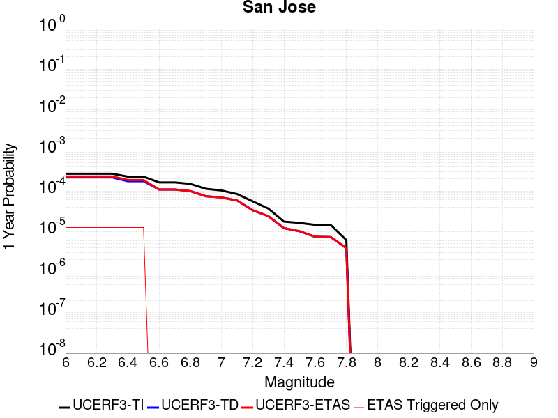 | 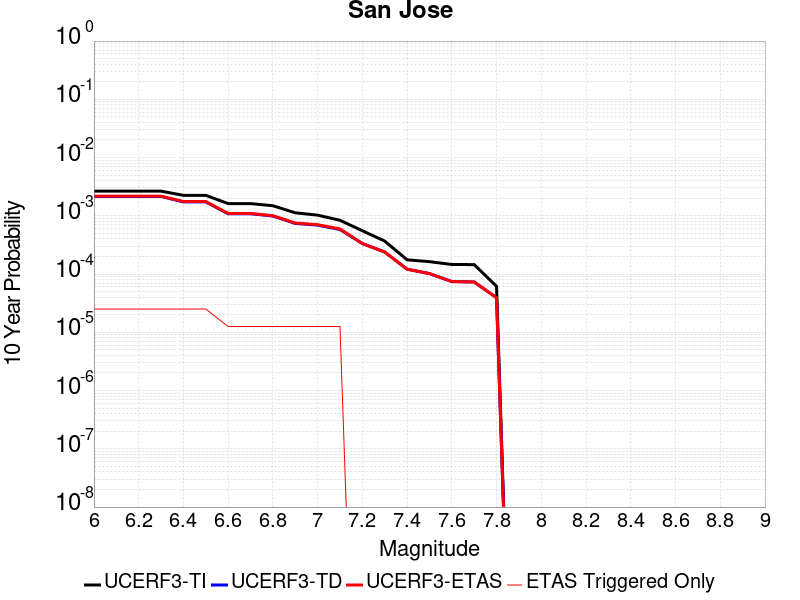 |

| Magnitude | 1 wk TI Prob | 1 wk TD Prob | 1 wk ETAS Prob | 1 wk ETAS/TD Gain | 1 wk ETAS Triggered Only | 1 mo TI Prob | 1 mo TD Prob | 1 mo ETAS Prob | 1 mo ETAS/TD Gain | 1 mo ETAS Triggered Only | 1 yr TI Prob | 1 yr TD Prob | 1 yr ETAS Prob | 1 yr ETAS/TD Gain | 1 yr ETAS Triggered Only | 10 yr TI Prob | 10 yr TD Prob | 10 yr ETAS Prob | 10 yr ETAS/TD Gain | 10 yr ETAS Triggered Only |
|-----|-----|-----|-----|-----|-----|-----|-----|-----|-----|-----|-----|-----|-----|-----|-----|-----|-----|-----|-----|-----|
| 6.0 | 5.0851277E-6 | 4.125642E-6 | 4.125642E-6 | 1.0 | 0.0 | 2.1793223E-5 | 1.768122E-5 | 1.768122E-5 | 1.0 | 0.0 | 2.653002E-4 | 2.152502E-4 | 2.2524805E-4 | 1.0464475 | 1.0E-5 | 0.0026498367 | 0.0021507454 | 0.0021707024 | 1.0092791 | 2.0E-5 |
| 6.1 | 5.0851277E-6 | 4.125642E-6 | 4.125642E-6 | 1.0 | 0.0 | 2.1793223E-5 | 1.768122E-5 | 1.768122E-5 | 1.0 | 0.0 | 2.653002E-4 | 2.152502E-4 | 2.2524805E-4 | 1.0464475 | 1.0E-5 | 0.0026498367 | 0.0021507454 | 0.0021707024 | 1.0092791 | 2.0E-5 |
| 6.2 | 5.0851277E-6 | 4.125642E-6 | 4.125642E-6 | 1.0 | 0.0 | 2.1793223E-5 | 1.768122E-5 | 1.768122E-5 | 1.0 | 0.0 | 2.653002E-4 | 2.152502E-4 | 2.2524805E-4 | 1.0464475 | 1.0E-5 | 0.0026498367 | 0.0021507454 | 0.0021707024 | 1.0092791 | 2.0E-5 |
| 6.3 | 5.0851277E-6 | 4.125642E-6 | 4.125642E-6 | 1.0 | 0.0 | 2.1793223E-5 | 1.768122E-5 | 1.768122E-5 | 1.0 | 0.0 | 2.653002E-4 | 2.152502E-4 | 2.2524805E-4 | 1.0464475 | 1.0E-5 | 0.0026498367 | 0.0021507454 | 0.0021707024 | 1.0092791 | 2.0E-5 |
| 6.4 | 4.3115124E-6 | 3.3237525E-6 | 3.3237525E-6 | 1.0 | 0.0 | 1.8477778E-5 | 1.4244589E-5 | 1.4244589E-5 | 1.0 | 0.0 | 2.2494372E-4 | 1.7341628E-4 | 1.8341454E-4 | 1.0576547 | 1.0E-5 | 0.0022471617 | 0.0017330965 | 0.0017530619 | 1.01152 | 2.0E-5 |
| 6.5 | 4.3115124E-6 | 3.3237525E-6 | 3.3237525E-6 | 1.0 | 0.0 | 1.8477778E-5 | 1.4244589E-5 | 1.4244589E-5 | 1.0 | 0.0 | 2.2494372E-4 | 1.7341628E-4 | 1.8341454E-4 | 1.0576547 | 1.0E-5 | 0.0022471617 | 0.0017330965 | 0.0017530619 | 1.01152 | 2.0E-5 |
| 6.6 | 3.110396E-6 | 2.0799562E-6 | 2.0799562E-6 | 1.0 | 0.0 | 1.33302E-5 | 8.9140685E-6 | 8.9140685E-6 | 1.0 | 0.0 | 1.622831E-4 | 1.0852366E-4 | 1.0852366E-4 | 1.0 | 0.0 | 0.0016216465 | 0.001084804 | 0.0010947931 | 1.0092082 | 1.0E-5 |
| 6.7 | 3.110396E-6 | 2.0799562E-6 | 2.0799562E-6 | 1.0 | 0.0 | 1.33302E-5 | 8.9140685E-6 | 8.9140685E-6 | 1.0 | 0.0 | 1.622831E-4 | 1.0852366E-4 | 1.0852366E-4 | 1.0 | 0.0 | 0.0016216465 | 0.001084804 | 0.0010947931 | 1.0092082 | 1.0E-5 |
| 6.8 | 2.856651E-6 | 1.9024077E-6 | 1.9024077E-6 | 1.0 | 0.0 | 1.2242733E-5 | 8.153152E-6 | 8.153152E-6 | 1.0 | 0.0 | 1.4904508E-4 | 9.926035E-5 | 9.926035E-5 | 1.0 | 0.0 | 0.0014894515 | 9.922545E-4 | 0.0010022445 | 1.010068 | 1.0E-5 |
| 6.9 | 2.1618725E-6 | 1.4186406E-6 | 1.4186406E-6 | 1.0 | 0.0 | 9.265135E-6 | 6.0798748E-6 | 6.0798748E-6 | 1.0 | 0.0 | 1.12797185E-4 | 7.402005E-5 | 7.402005E-5 | 1.0 | 0.0 | 0.0011273995 | 7.4003247E-4 | 7.5002504E-4 | 1.013503 | 1.0E-5 |
| 7.0 | 1.9684312E-6 | 1.3256082E-6 | 1.3256082E-6 | 1.0 | 0.0 | 8.436106E-6 | 5.681166E-6 | 5.681166E-6 | 1.0 | 0.0 | 1.02704755E-4 | 6.916608E-5 | 6.916608E-5 | 1.0 | 0.0 | 0.001026573 | 6.9152354E-4 | 7.0151663E-4 | 1.0144508 | 1.0E-5 |
| 7.1 | 1.6070337E-6 | 1.1154867E-6 | 1.1154867E-6 | 1.0 | 0.0 | 6.887269E-6 | 4.7806493E-6 | 4.7806493E-6 | 1.0 | 0.0 | 8.384928E-5 | 5.8202913E-5 | 5.8202913E-5 | 1.0 | 0.0 | 8.3817646E-4 | 5.819527E-4 | 5.919469E-4 | 1.0171735 | 1.0E-5 |
| 7.2 | 1.0631658E-6 | 6.403567E-7 | 6.403567E-7 | 1.0 | 0.0 | 4.556417E-6 | 2.744383E-6 | 2.744383E-6 | 1.0 | 0.0 | 5.5472963E-5 | 3.3412365E-5 | 3.3412365E-5 | 1.0 | 0.0 | 5.545912E-4 | 3.3414463E-4 | 3.3414463E-4 | 1.0 | 0.0 |
| 7.3 | 7.060711E-7 | 4.5823228E-7 | 4.5823228E-7 | 1.0 | 0.0 | 3.0260155E-6 | 1.9638512E-6 | 1.9638512E-6 | 1.0 | 0.0 | 3.6841117E-5 | 2.3909635E-5 | 2.3909635E-5 | 1.0 | 0.0 | 3.6835007E-4 | 2.3914136E-4 | 2.3914136E-4 | 1.0 | 0.0 |
| 7.4 | 3.3677085E-7 | 2.3231999E-7 | 2.3231999E-7 | 1.0 | 0.0 | 1.4433028E-6 | 9.956567E-7 | 9.956567E-7 | 1.0 | 0.0 | 1.757207E-5 | 1.2122056E-5 | 1.2122056E-5 | 1.0 | 0.0 | 1.7570681E-4 | 1.2128407E-4 | 1.2128407E-4 | 1.0 | 0.0 |
| 7.5 | 3.129161E-7 | 1.9529637E-7 | 1.9529637E-7 | 1.0 | 0.0 | 1.3410682E-6 | 8.3698416E-7 | 8.3698416E-7 | 1.0 | 0.0 | 1.6327383E-5 | 1.0190237E-5 | 1.0190237E-5 | 1.0 | 0.0 | 1.6326184E-4 | 1.0196777E-4 | 1.0196777E-4 | 1.0 | 0.0 |
| 7.6 | 2.8008668E-7 | 1.4240818E-7 | 1.4240818E-7 | 1.0 | 0.0 | 1.2003709E-6 | 6.103206E-7 | 6.103206E-7 | 1.0 | 0.0 | 1.46144175E-5 | 7.43063E-6 | 7.43063E-6 | 1.0 | 0.0 | 1.4613457E-4 | 7.43735E-5 | 7.43735E-5 | 1.0 | 0.0 |
| 7.7 | 2.7852005E-7 | 1.4015403E-7 | 1.4015403E-7 | 1.0 | 0.0 | 1.1936568E-6 | 6.0066003E-7 | 6.0066003E-7 | 1.0 | 0.0 | 1.4532674E-5 | 7.3130127E-6 | 7.3130127E-6 | 1.0 | 0.0 | 1.4531724E-4 | 7.31974E-5 | 7.31974E-5 | 1.0 | 0.0 |
| 7.8 | 1.1810797E-7 | 7.5187074E-8 | 7.5187074E-8 | 1.0 | 0.0 | 5.0617695E-7 | 3.2223028E-7 | 3.2223028E-7 | 1.0 | 0.0 | 6.1626865E-6 | 3.9231472E-6 | 3.9231472E-6 | 1.0 | 0.0 | 6.162516E-5 | 3.9271265E-5 | 3.9271265E-5 | 1.0 | 0.0 |

## Calaveras (No) 2011 CFM
*[(top)](#table-of-contents)*

| 1 Week | 1 Month | 1 Year | 10 Year |
|-----|-----|-----|-----|
| 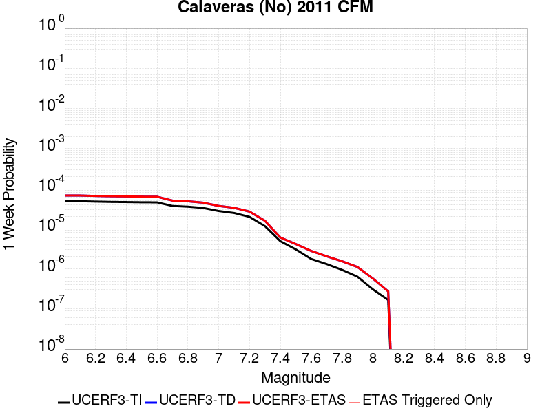 |  | 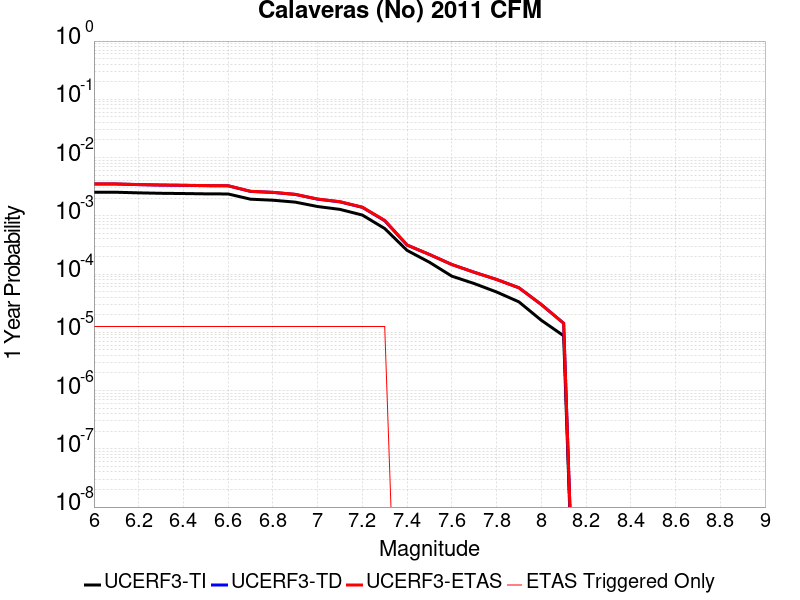 | 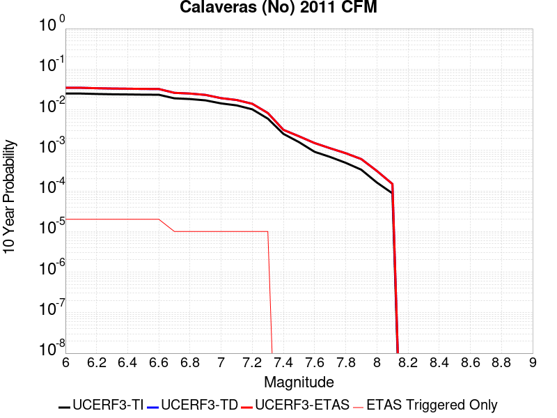 |

| Magnitude | 1 wk TI Prob | 1 wk TD Prob | 1 wk ETAS Prob | 1 wk ETAS/TD Gain | 1 wk ETAS Triggered Only | 1 mo TI Prob | 1 mo TD Prob | 1 mo ETAS Prob | 1 mo ETAS/TD Gain | 1 mo ETAS Triggered Only | 1 yr TI Prob | 1 yr TD Prob | 1 yr ETAS Prob | 1 yr ETAS/TD Gain | 1 yr ETAS Triggered Only | 10 yr TI Prob | 10 yr TD Prob | 10 yr ETAS Prob | 10 yr ETAS/TD Gain | 10 yr ETAS Triggered Only |
|-----|-----|-----|-----|-----|-----|-----|-----|-----|-----|-----|-----|-----|-----|-----|-----|-----|-----|-----|-----|-----|
| 6.0 | 4.8694856E-5 | 6.747457E-5 | 6.747457E-5 | 1.0 | 0.0 | 2.0867554E-4 | 2.891453E-4 | 2.891453E-4 | 1.0 | 0.0 | 0.0025376645 | 0.0035146773 | 0.0035246422 | 1.0028352 | 1.0E-5 | 0.02508881 | 0.034771074 | 0.034790378 | 1.0005552 | 2.0E-5 |
| 6.1 | 4.8694856E-5 | 6.747457E-5 | 6.747457E-5 | 1.0 | 0.0 | 2.0867554E-4 | 2.891453E-4 | 2.891453E-4 | 1.0 | 0.0 | 0.0025376645 | 0.0035146773 | 0.0035246422 | 1.0028352 | 1.0E-5 | 0.02508881 | 0.034771074 | 0.034790378 | 1.0005552 | 2.0E-5 |
| 6.2 | 4.7541962E-5 | 6.5805805E-5 | 6.5805805E-5 | 1.0 | 0.0 | 2.0373536E-4 | 2.8199502E-4 | 2.8199502E-4 | 1.0 | 0.0 | 0.0024776561 | 0.003427919 | 0.0034378846 | 1.0029073 | 1.0E-5 | 0.024502134 | 0.0339325 | 0.03395182 | 1.0005695 | 2.0E-5 |
| 6.3 | 4.6717287E-5 | 6.463939E-5 | 6.463939E-5 | 1.0 | 0.0 | 2.0020158E-4 | 2.7699716E-4 | 2.7699716E-4 | 1.0 | 0.0 | 0.0024347296 | 0.0033672696 | 0.003377236 | 1.0029597 | 1.0E-5 | 0.024082264 | 0.033345006 | 0.03336434 | 1.0005798 | 2.0E-5 |
| 6.4 | 4.6276386E-5 | 6.400103E-5 | 6.400103E-5 | 1.0 | 0.0 | 1.983123E-4 | 2.7426204E-4 | 2.7426204E-4 | 1.0 | 0.0 | 0.0024117786 | 0.00333408 | 0.0033440467 | 1.0029893 | 1.0E-5 | 0.02385771 | 0.03302388 | 0.03304322 | 1.0005857 | 2.0E-5 |
| 6.5 | 4.5720994E-5 | 6.32025E-5 | 6.32025E-5 | 1.0 | 0.0 | 1.9593239E-4 | 2.7084045E-4 | 2.7084045E-4 | 1.0 | 0.0 | 0.002382867 | 0.0032925585 | 0.0033025257 | 1.0030272 | 1.0E-5 | 0.023574775 | 0.032621842 | 0.03264119 | 1.0005931 | 2.0E-5 |
| 6.6 | 4.549134E-5 | 6.285557E-5 | 6.285557E-5 | 1.0 | 0.0 | 1.949483E-4 | 2.693539E-4 | 2.693539E-4 | 1.0 | 0.0 | 0.0023709119 | 0.0032745146 | 0.0032844818 | 1.0030439 | 1.0E-5 | 0.023457756 | 0.03244731 | 0.03246666 | 1.0005964 | 2.0E-5 |
| 6.7 | 3.701047E-5 | 5.03607E-5 | 5.03607E-5 | 1.0 | 0.0 | 1.5860666E-4 | 2.1581395E-4 | 2.1581395E-4 | 1.0 | 0.0 | 0.0019293258 | 0.002624412 | 0.0026343858 | 1.0038004 | 1.0E-5 | 0.019126613 | 0.026125198 | 0.026134938 | 1.0003728 | 1.0E-5 |
| 6.8 | 3.5523568E-5 | 4.834225E-5 | 4.834225E-5 | 1.0 | 0.0 | 1.5223498E-4 | 2.0716486E-4 | 2.0716486E-4 | 1.0 | 0.0 | 0.0018518851 | 0.0025193577 | 0.0025293324 | 1.0039593 | 1.0E-5 | 0.018365284 | 0.025097623 | 0.025107373 | 1.0003885 | 1.0E-5 |
| 6.9 | 3.2946147E-5 | 4.4663826E-5 | 4.4663826E-5 | 1.0 | 0.0 | 1.4119013E-4 | 1.9140259E-4 | 1.9140259E-4 | 1.0 | 0.0 | 0.0017176344 | 0.0023278783 | 0.002337855 | 1.0042858 | 1.0E-5 | 0.017044188 | 0.023219762 | 0.02322953 | 1.0004207 | 1.0E-5 |
| 7.0 | 2.7682381E-5 | 3.7023216E-5 | 3.7023216E-5 | 1.0 | 0.0 | 1.1863338E-4 | 1.5866144E-4 | 1.5866144E-4 | 1.0 | 0.0 | 0.0014434044 | 0.0019300217 | 0.0019400023 | 1.0051713 | 1.0E-5 | 0.01434065 | 0.019311164 | 0.01932097 | 1.0005078 | 1.0E-5 |
| 7.1 | 2.471967E-5 | 3.328756E-5 | 3.328756E-5 | 1.0 | 0.0 | 1.05937135E-4 | 1.4265333E-4 | 1.4265333E-4 | 1.0 | 0.0 | 0.0012890215 | 0.0017354497 | 0.0017454323 | 1.0057522 | 1.0E-5 | 0.0128157 | 0.017386293 | 0.017396118 | 1.0005652 | 1.0E-5 |
| 7.2 | 1.9748062E-5 | 2.6775411E-5 | 2.6775411E-5 | 1.0 | 0.0 | 8.463181E-5 | 1.1474685E-4 | 1.1474685E-4 | 1.0 | 0.0 | 0.0010299052 | 0.001396171 | 0.001406157 | 1.0071524 | 1.0E-5 | 0.01025145 | 0.014031046 | 0.014040906 | 1.0007027 | 1.0E-5 |
| 7.3 | 1.1603734E-5 | 1.5784257E-5 | 1.5784257E-5 | 1.0 | 0.0 | 4.9729337E-5 | 6.7645145E-5 | 6.7645145E-5 | 1.0 | 0.0 | 6.052865E-4 | 8.232826E-4 | 8.332744E-4 | 1.0121365 | 1.0E-5 | 0.0060364045 | 0.008308739 | 0.008318657 | 1.0011935 | 1.0E-5 |
| 7.4 | 4.885381E-6 | 6.035117E-6 | 6.035117E-6 | 1.0 | 0.0 | 2.0937177E-5 | 2.5864532E-5 | 2.5864532E-5 | 1.0 | 0.0 | 2.5488032E-4 | 3.1485534E-4 | 3.1485534E-4 | 1.0 | 0.0 | 0.0025458818 | 0.0032009764 | 0.0032009764 | 1.0 | 0.0 |
| 7.5 | 3.0571264E-6 | 4.1554085E-6 | 4.1554085E-6 | 1.0 | 0.0 | 1.3101904E-5 | 1.7808772E-5 | 1.7808772E-5 | 1.0 | 0.0 | 1.5950401E-4 | 2.1680034E-4 | 2.1680034E-4 | 1.0 | 0.0 | 0.0015938957 | 0.0022209007 | 0.0022209007 | 1.0 | 0.0 |
| 7.6 | 1.764948E-6 | 2.795641E-6 | 2.795641E-6 | 1.0 | 0.0 | 7.564041E-6 | 1.1981264E-5 | 1.1981264E-5 | 1.0 | 0.0 | 9.208831E-5 | 1.458622E-4 | 1.458622E-4 | 1.0 | 0.0 | 9.205016E-4 | 0.0015124046 | 0.0015124046 | 1.0 | 0.0 |
| 7.7 | 1.3173734E-6 | 2.0585271E-6 | 2.0585271E-6 | 1.0 | 0.0 | 5.645874E-6 | 8.82223E-6 | 8.82223E-6 | 1.0 | 0.0 | 6.873634E-5 | 1.0740537E-4 | 1.0740537E-4 | 1.0 | 0.0 | 6.8715087E-4 | 0.0011261607 | 0.0011261607 | 1.0 | 0.0 |
| 7.8 | 9.4429885E-7 | 1.5490102E-6 | 1.5490102E-6 | 1.0 | 0.0 | 4.0469886E-6 | 6.6385983E-6 | 6.6385983E-6 | 1.0 | 0.0 | 4.9270973E-5 | 8.082195E-5 | 8.082195E-5 | 1.0 | 0.0 | 4.926005E-4 | 8.501931E-4 | 8.501931E-4 | 1.0 | 0.0 |
| 7.9 | 6.388233E-7 | 1.11492E-6 | 1.11492E-6 | 1.0 | 0.0 | 2.7378112E-6 | 4.7782196E-6 | 4.7782196E-6 | 1.0 | 0.0 | 3.3332344E-5 | 5.8173282E-5 | 5.8173282E-5 | 1.0 | 0.0 | 3.3327343E-4 | 6.096674E-4 | 6.096674E-4 | 1.0 | 0.0 |
| 8.0 | 3.087986E-7 | 5.754721E-7 | 5.754721E-7 | 1.0 | 0.0 | 1.323422E-6 | 2.4663066E-6 | 2.4663066E-6 | 1.0 | 0.0 | 1.6112543E-5 | 3.0026871E-5 | 3.0026871E-5 | 1.0 | 0.0 | 1.6111376E-4 | 3.110238E-4 | 3.110238E-4 | 1.0 | 0.0 |
| 8.1 | 1.6725647E-7 | 2.7410795E-7 | 2.7410795E-7 | 1.0 | 0.0 | 7.168133E-7 | 1.1747478E-6 | 1.1747478E-6 | 1.0 | 0.0 | 8.7271665E-6 | 1.4302462E-5 | 1.4302462E-5 | 1.0 | 0.0 | 8.726824E-5 | 1.4847395E-4 | 1.4847395E-4 | 1.0 | 0.0 |

## San Gorgonio Pass
*[(top)](#table-of-contents)*

| 1 Week | 1 Month | 1 Year | 10 Year |
|-----|-----|-----|-----|
| 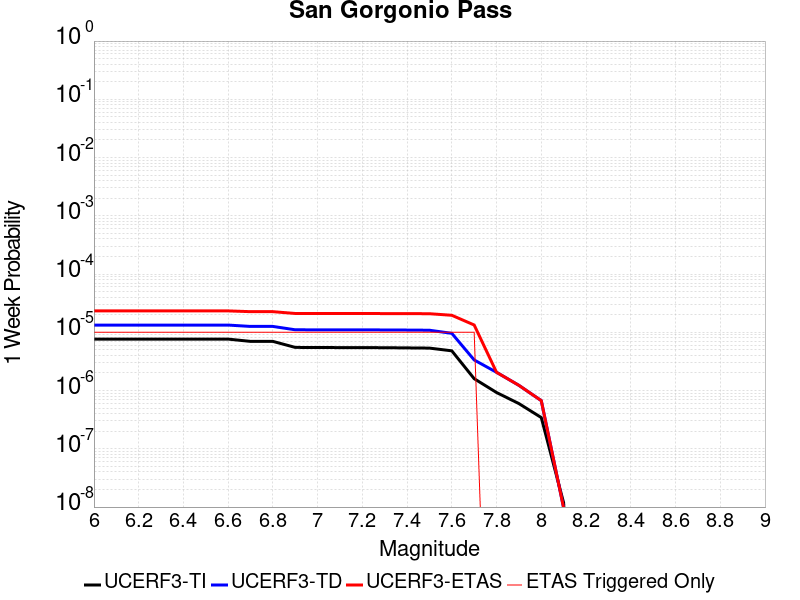 | 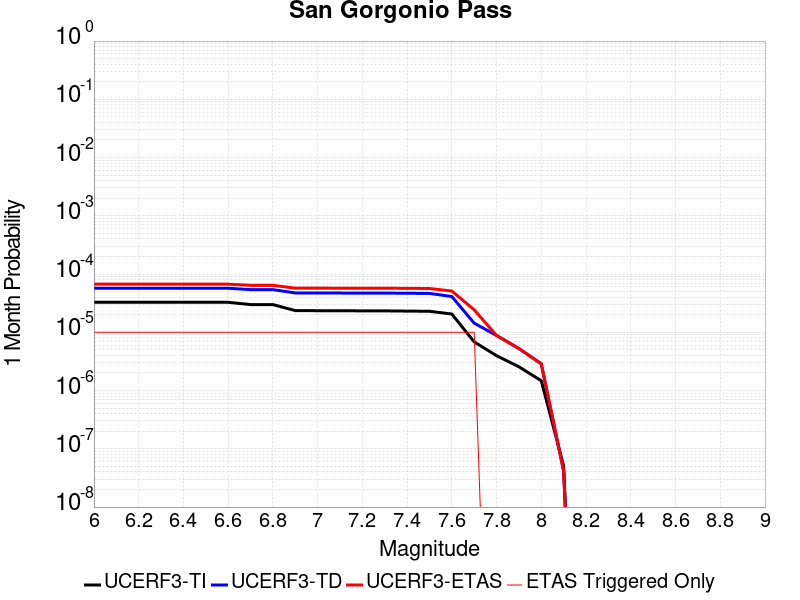 | 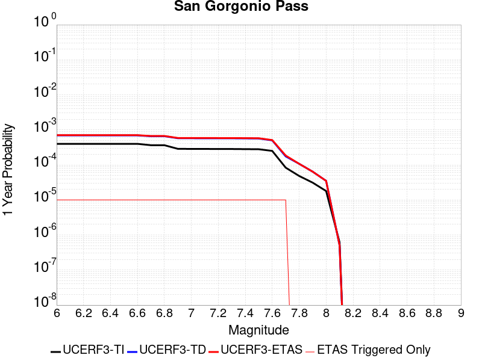 | 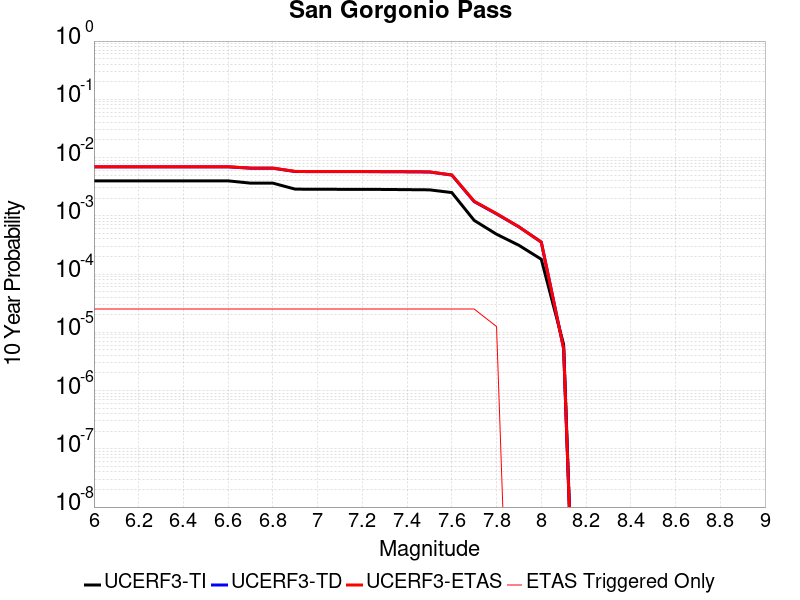 |

| Magnitude | 1 wk TI Prob | 1 wk TD Prob | 1 wk ETAS Prob | 1 wk ETAS/TD Gain | 1 wk ETAS Triggered Only | 1 mo TI Prob | 1 mo TD Prob | 1 mo ETAS Prob | 1 mo ETAS/TD Gain | 1 mo ETAS Triggered Only | 1 yr TI Prob | 1 yr TD Prob | 1 yr ETAS Prob | 1 yr ETAS/TD Gain | 1 yr ETAS Triggered Only | 10 yr TI Prob | 10 yr TD Prob | 10 yr ETAS Prob | 10 yr ETAS/TD Gain | 10 yr ETAS Triggered Only |
|-----|-----|-----|-----|-----|-----|-----|-----|-----|-----|-----|-----|-----|-----|-----|-----|-----|-----|-----|-----|-----|
| 6.0 | 7.644328E-6 | 1.331474E-5 | 2.3314606E-5 | 1.7510374 | 1.0E-5 | 3.2760996E-5 | 5.706197E-5 | 6.7061395E-5 | 1.175238 | 1.0E-5 | 3.987921E-4 | 6.945166E-4 | 7.045097E-4 | 1.0143886 | 1.0E-5 | 0.003980772 | 0.006930024 | 0.0069498853 | 1.002866 | 2.0E-5 |
| 6.1 | 7.644328E-6 | 1.331474E-5 | 2.3314606E-5 | 1.7510374 | 1.0E-5 | 3.2760996E-5 | 5.706197E-5 | 6.7061395E-5 | 1.175238 | 1.0E-5 | 3.987921E-4 | 6.945166E-4 | 7.045097E-4 | 1.0143886 | 1.0E-5 | 0.003980772 | 0.006930024 | 0.0069498853 | 1.002866 | 2.0E-5 |
| 6.2 | 7.644328E-6 | 1.331474E-5 | 2.3314606E-5 | 1.7510374 | 1.0E-5 | 3.2760996E-5 | 5.706197E-5 | 6.7061395E-5 | 1.175238 | 1.0E-5 | 3.987921E-4 | 6.945166E-4 | 7.045097E-4 | 1.0143886 | 1.0E-5 | 0.003980772 | 0.006930024 | 0.0069498853 | 1.002866 | 2.0E-5 |
| 6.3 | 7.644328E-6 | 1.331474E-5 | 2.3314606E-5 | 1.7510374 | 1.0E-5 | 3.2760996E-5 | 5.706197E-5 | 6.7061395E-5 | 1.175238 | 1.0E-5 | 3.987921E-4 | 6.945166E-4 | 7.045097E-4 | 1.0143886 | 1.0E-5 | 0.003980772 | 0.006930024 | 0.0069498853 | 1.002866 | 2.0E-5 |
| 6.4 | 7.644328E-6 | 1.331474E-5 | 2.3314606E-5 | 1.7510374 | 1.0E-5 | 3.2760996E-5 | 5.706197E-5 | 6.7061395E-5 | 1.175238 | 1.0E-5 | 3.987921E-4 | 6.945166E-4 | 7.045097E-4 | 1.0143886 | 1.0E-5 | 0.003980772 | 0.006930024 | 0.0069498853 | 1.002866 | 2.0E-5 |
| 6.5 | 7.644328E-6 | 1.331474E-5 | 2.3314606E-5 | 1.7510374 | 1.0E-5 | 3.2760996E-5 | 5.706197E-5 | 6.7061395E-5 | 1.175238 | 1.0E-5 | 3.987921E-4 | 6.945166E-4 | 7.045097E-4 | 1.0143886 | 1.0E-5 | 0.003980772 | 0.006930024 | 0.0069498853 | 1.002866 | 2.0E-5 |
| 6.6 | 7.644328E-6 | 1.331474E-5 | 2.3314606E-5 | 1.7510374 | 1.0E-5 | 3.2760996E-5 | 5.706197E-5 | 6.7061395E-5 | 1.175238 | 1.0E-5 | 3.987921E-4 | 6.945166E-4 | 7.045097E-4 | 1.0143886 | 1.0E-5 | 0.003980772 | 0.006930024 | 0.0069498853 | 1.002866 | 2.0E-5 |
| 6.7 | 6.987586E-6 | 1.2619013E-5 | 2.2618888E-5 | 1.792445 | 1.0E-5 | 2.9946454E-5 | 5.408041E-5 | 6.407987E-5 | 1.1848998 | 1.0E-5 | 3.645371E-4 | 6.582382E-4 | 6.6823163E-4 | 1.015182 | 1.0E-5 | 0.0036393967 | 0.0065694 | 0.006589269 | 1.0030245 | 2.0E-5 |
| 6.8 | 6.987586E-6 | 1.2619013E-5 | 2.2618888E-5 | 1.792445 | 1.0E-5 | 2.9946454E-5 | 5.408041E-5 | 6.407987E-5 | 1.1848998 | 1.0E-5 | 3.645371E-4 | 6.582382E-4 | 6.6823163E-4 | 1.015182 | 1.0E-5 | 0.0036393967 | 0.0065694 | 0.006589269 | 1.0030245 | 2.0E-5 |
| 6.9 | 5.504702E-6 | 1.1049877E-5 | 2.1049766E-5 | 1.9049774 | 1.0E-5 | 2.3591367E-5 | 4.7355785E-5 | 5.735531E-5 | 1.2111574 | 1.0E-5 | 2.8718702E-4 | 5.764092E-4 | 5.864034E-4 | 1.0173388 | 1.0E-5 | 0.0028681618 | 0.0057553523 | 0.0057752375 | 1.003455 | 2.0E-5 |
| 7.0 | 5.4825764E-6 | 1.1026218E-5 | 2.1026108E-5 | 1.9069194 | 1.0E-5 | 2.3496545E-5 | 4.725439E-5 | 5.7253917E-5 | 1.2116106 | 1.0E-5 | 2.8603288E-4 | 5.751754E-4 | 5.8516965E-4 | 1.017376 | 1.0E-5 | 0.00285665 | 0.0057430784 | 0.0057629636 | 1.0034624 | 2.0E-5 |
| 7.1 | 5.4692787E-6 | 1.1011928E-5 | 2.1011818E-5 | 1.9080962 | 1.0E-5 | 2.3439556E-5 | 4.719315E-5 | 5.719268E-5 | 1.2118852 | 1.0E-5 | 2.8533922E-4 | 5.744302E-4 | 5.844245E-4 | 1.0173986 | 1.0E-5 | 0.0028497311 | 0.0057356646 | 0.0057555498 | 1.003467 | 2.0E-5 |
| 7.2 | 5.453661E-6 | 1.0994954E-5 | 2.0994845E-5 | 1.9094981 | 1.0E-5 | 2.3372622E-5 | 4.712041E-5 | 5.7119938E-5 | 1.2122122 | 1.0E-5 | 2.8452452E-4 | 5.7354505E-4 | 5.835393E-4 | 1.0174254 | 1.0E-5 | 0.002841605 | 0.005726859 | 0.005746744 | 1.0034723 | 2.0E-5 |
| 7.3 | 5.4422303E-6 | 1.09818775E-5 | 2.0981768E-5 | 1.9105811 | 1.0E-5 | 2.3323635E-5 | 4.7064368E-5 | 5.70639E-5 | 1.2124649 | 1.0E-5 | 2.8392827E-4 | 5.728631E-4 | 5.8285735E-4 | 1.0174462 | 1.0E-5 | 0.0028356577 | 0.0057200743 | 0.00573996 | 1.0034765 | 2.0E-5 |
| 7.4 | 5.398595E-6 | 1.0929241E-5 | 2.0929132E-5 | 1.9149666 | 1.0E-5 | 2.313663E-5 | 4.6838795E-5 | 5.6838326E-5 | 1.2134882 | 1.0E-5 | 2.8165206E-4 | 5.701182E-4 | 5.8011245E-4 | 1.0175302 | 1.0E-5 | 0.0028129534 | 0.0056927665 | 0.0057126526 | 1.0034932 | 2.0E-5 |
| 7.5 | 5.3578788E-6 | 1.0855785E-5 | 2.0855678E-5 | 1.9211578 | 1.0E-5 | 2.2962136E-5 | 4.6523994E-5 | 5.6523528E-5 | 1.2149328 | 1.0E-5 | 2.7952815E-4 | 5.662875E-4 | 5.762818E-4 | 1.0176489 | 1.0E-5 | 0.002791768 | 0.0056546913 | 0.0056745782 | 1.0035169 | 2.0E-5 |
| 7.6 | 4.8091474E-6 | 9.604131E-6 | 1.9604035E-5 | 2.0412085 | 1.0E-5 | 2.0610469E-5 | 4.1159943E-5 | 5.1159528E-5 | 1.2429447 | 1.0E-5 | 2.5090357E-4 | 5.010119E-4 | 5.1100686E-4 | 1.0199496 | 1.0E-5 | 0.0025062046 | 0.0050054584 | 0.0050253584 | 1.0039756 | 2.0E-5 |
| 7.7 | 1.5991155E-6 | 3.353035E-6 | 1.3353001E-5 | 3.9823625 | 1.0E-5 | 6.853334E-6 | 1.4370073E-5 | 2.4369929E-5 | 1.6958807 | 1.0E-5 | 8.343615E-5 | 1.7494184E-4 | 1.8494009E-4 | 1.0571519 | 1.0E-5 | 8.340483E-4 | 0.0017535852 | 0.0017735501 | 1.0113852 | 2.0E-5 |
| 7.8 | 9.258398E-7 | 2.0581049E-6 | 2.0581049E-6 | 1.0 | 0.0 | 3.967879E-6 | 8.82042E-6 | 8.82042E-6 | 1.0 | 0.0 | 4.8307855E-5 | 1.0738334E-4 | 1.0738334E-4 | 1.0 | 0.0 | 4.8297356E-4 | 0.0010788103 | 0.0010887996 | 1.0092595 | 1.0E-5 |
| 7.9 | 5.975575E-7 | 1.2292295E-6 | 1.2292295E-6 | 1.0 | 0.0 | 2.5609581E-6 | 5.2681157E-6 | 5.2681157E-6 | 1.0 | 0.0 | 3.117922E-5 | 6.413743E-5 | 6.413743E-5 | 1.0 | 0.0 | 3.1174847E-4 | 6.464778E-4 | 6.464778E-4 | 1.0 | 0.0 |
| 8.0 | 3.4413725E-7 | 6.714992E-7 | 6.714992E-7 | 1.0 | 0.0 | 1.4748731E-6 | 2.8778506E-6 | 2.8778506E-6 | 1.0 | 0.0 | 1.7956432E-5 | 3.5037272E-5 | 3.5037272E-5 | 1.0 | 0.0 | 1.7954981E-4 | 3.5392298E-4 | 3.5392298E-4 | 1.0 | 0.0 |
| 8.1 | 1.1787731E-8 | 9.6332045E-9 | 9.6332045E-9 | 1.0 | 0.0 | 5.0518846E-8 | 4.1285162E-8 | 4.1285162E-8 | 1.0 | 0.0 | 6.1506677E-7 | 5.0264674E-7 | 5.0264674E-7 | 1.0 | 0.0 | 6.1506507E-6 | 5.2417968E-6 | 5.2417968E-6 | 1.0 | 0.0 |

## Pitas Point (Lower)-Montalvo
*[(top)](#table-of-contents)*

| 1 Week | 1 Month | 1 Year | 10 Year |
|-----|-----|-----|-----|
| 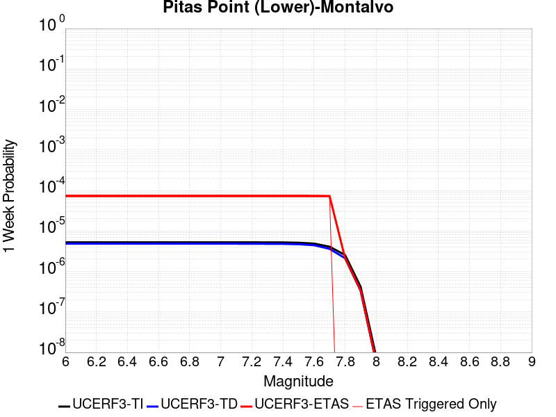 | 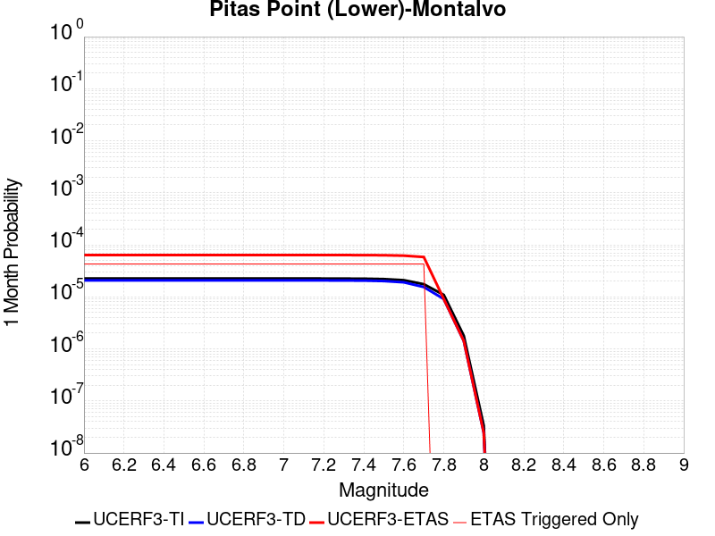 | 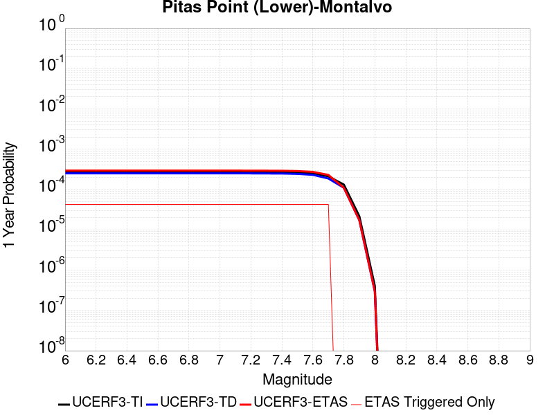 | 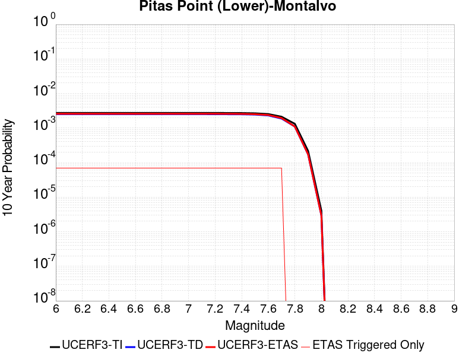 |

| Magnitude | 1 wk TI Prob | 1 wk TD Prob | 1 wk ETAS Prob | 1 wk ETAS/TD Gain | 1 wk ETAS Triggered Only | 1 mo TI Prob | 1 mo TD Prob | 1 mo ETAS Prob | 1 mo ETAS/TD Gain | 1 mo ETAS Triggered Only | 1 yr TI Prob | 1 yr TD Prob | 1 yr ETAS Prob | 1 yr ETAS/TD Gain | 1 yr ETAS Triggered Only | 10 yr TI Prob | 10 yr TD Prob | 10 yr ETAS Prob | 10 yr ETAS/TD Gain | 10 yr ETAS Triggered Only |
|-----|-----|-----|-----|-----|-----|-----|-----|-----|-----|-----|-----|-----|-----|-----|-----|-----|-----|-----|-----|-----|
| 6.0 | 5.2543637E-6 | 4.8379025E-6 | 1.4837854E-5 | 3.0670013 | 1.0E-5 | 2.2518509E-5 | 2.0733705E-5 | 3.07335E-5 | 1.4822965 | 1.0E-5 | 2.7412834E-4 | 2.5240393E-4 | 2.723989E-4 | 1.079218 | 2.0E-5 | 0.0027379042 | 0.0025212052 | 0.0025411546 | 1.0079128 | 2.0E-5 |
| 6.1 | 5.2543637E-6 | 4.8379025E-6 | 1.4837854E-5 | 3.0670013 | 1.0E-5 | 2.2518509E-5 | 2.0733705E-5 | 3.07335E-5 | 1.4822965 | 1.0E-5 | 2.7412834E-4 | 2.5240393E-4 | 2.723989E-4 | 1.079218 | 2.0E-5 | 0.0027379042 | 0.0025212052 | 0.0025411546 | 1.0079128 | 2.0E-5 |
| 6.2 | 5.2543637E-6 | 4.8379025E-6 | 1.4837854E-5 | 3.0670013 | 1.0E-5 | 2.2518509E-5 | 2.0733705E-5 | 3.07335E-5 | 1.4822965 | 1.0E-5 | 2.7412834E-4 | 2.5240393E-4 | 2.723989E-4 | 1.079218 | 2.0E-5 | 0.0027379042 | 0.0025212052 | 0.0025411546 | 1.0079128 | 2.0E-5 |
| 6.3 | 5.2543637E-6 | 4.8379025E-6 | 1.4837854E-5 | 3.0670013 | 1.0E-5 | 2.2518509E-5 | 2.0733705E-5 | 3.07335E-5 | 1.4822965 | 1.0E-5 | 2.7412834E-4 | 2.5240393E-4 | 2.723989E-4 | 1.079218 | 2.0E-5 | 0.0027379042 | 0.0025212052 | 0.0025411546 | 1.0079128 | 2.0E-5 |
| 6.4 | 5.2543637E-6 | 4.8379025E-6 | 1.4837854E-5 | 3.0670013 | 1.0E-5 | 2.2518509E-5 | 2.0733705E-5 | 3.07335E-5 | 1.4822965 | 1.0E-5 | 2.7412834E-4 | 2.5240393E-4 | 2.723989E-4 | 1.079218 | 2.0E-5 | 0.0027379042 | 0.0025212052 | 0.0025411546 | 1.0079128 | 2.0E-5 |
| 6.5 | 5.2543637E-6 | 4.8379025E-6 | 1.4837854E-5 | 3.0670013 | 1.0E-5 | 2.2518509E-5 | 2.0733705E-5 | 3.07335E-5 | 1.4822965 | 1.0E-5 | 2.7412834E-4 | 2.5240393E-4 | 2.723989E-4 | 1.079218 | 2.0E-5 | 0.0027379042 | 0.0025212052 | 0.0025411546 | 1.0079128 | 2.0E-5 |
| 6.6 | 5.2543637E-6 | 4.8379025E-6 | 1.4837854E-5 | 3.0670013 | 1.0E-5 | 2.2518509E-5 | 2.0733705E-5 | 3.07335E-5 | 1.4822965 | 1.0E-5 | 2.7412834E-4 | 2.5240393E-4 | 2.723989E-4 | 1.079218 | 2.0E-5 | 0.0027379042 | 0.0025212052 | 0.0025411546 | 1.0079128 | 2.0E-5 |
| 6.7 | 5.2543637E-6 | 4.8379025E-6 | 1.4837854E-5 | 3.0670013 | 1.0E-5 | 2.2518509E-5 | 2.0733705E-5 | 3.07335E-5 | 1.4822965 | 1.0E-5 | 2.7412834E-4 | 2.5240393E-4 | 2.723989E-4 | 1.079218 | 2.0E-5 | 0.0027379042 | 0.0025212052 | 0.0025411546 | 1.0079128 | 2.0E-5 |
| 6.8 | 5.2543637E-6 | 4.8379025E-6 | 1.4837854E-5 | 3.0670013 | 1.0E-5 | 2.2518509E-5 | 2.0733705E-5 | 3.07335E-5 | 1.4822965 | 1.0E-5 | 2.7412834E-4 | 2.5240393E-4 | 2.723989E-4 | 1.079218 | 2.0E-5 | 0.0027379042 | 0.0025212052 | 0.0025411546 | 1.0079128 | 2.0E-5 |
| 6.9 | 5.2543637E-6 | 4.8379025E-6 | 1.4837854E-5 | 3.0670013 | 1.0E-5 | 2.2518509E-5 | 2.0733705E-5 | 3.07335E-5 | 1.4822965 | 1.0E-5 | 2.7412834E-4 | 2.5240393E-4 | 2.723989E-4 | 1.079218 | 2.0E-5 | 0.0027379042 | 0.0025212052 | 0.0025411546 | 1.0079128 | 2.0E-5 |
| 7.0 | 5.2543637E-6 | 4.8379025E-6 | 1.4837854E-5 | 3.0670013 | 1.0E-5 | 2.2518509E-5 | 2.0733705E-5 | 3.07335E-5 | 1.4822965 | 1.0E-5 | 2.7412834E-4 | 2.5240393E-4 | 2.723989E-4 | 1.079218 | 2.0E-5 | 0.0027379042 | 0.0025212052 | 0.0025411546 | 1.0079128 | 2.0E-5 |
| 7.1 | 5.2543637E-6 | 4.8379025E-6 | 1.4837854E-5 | 3.0670013 | 1.0E-5 | 2.2518509E-5 | 2.0733705E-5 | 3.07335E-5 | 1.4822965 | 1.0E-5 | 2.7412834E-4 | 2.5240393E-4 | 2.723989E-4 | 1.079218 | 2.0E-5 | 0.0027379042 | 0.0025212052 | 0.0025411546 | 1.0079128 | 2.0E-5 |
| 7.2 | 5.2458695E-6 | 4.8290563E-6 | 1.4829008E-5 | 3.070788 | 1.0E-5 | 2.2482105E-5 | 2.0695794E-5 | 3.0695588E-5 | 1.4831799 | 1.0E-5 | 2.7368523E-4 | 2.5194246E-4 | 2.7193743E-4 | 1.0793632 | 2.0E-5 | 0.0027334841 | 0.002516601 | 0.0025365506 | 1.0079272 | 2.0E-5 |
| 7.3 | 5.22665E-6 | 4.8089737E-6 | 1.4808926E-5 | 3.0794358 | 1.0E-5 | 2.2399736E-5 | 2.0609727E-5 | 3.060952E-5 | 1.4851978 | 1.0E-5 | 2.7268266E-4 | 2.5089484E-4 | 2.708898E-4 | 1.0796946 | 2.0E-5 | 0.002723483 | 0.0025061483 | 0.0025260982 | 1.0079603 | 2.0E-5 |
| 7.4 | 5.210642E-6 | 4.7921862E-6 | 1.4792138E-5 | 3.0867202 | 1.0E-5 | 2.233113E-5 | 2.053778E-5 | 3.0537576E-5 | 1.4868976 | 1.0E-5 | 2.718476E-4 | 2.500191E-4 | 2.700141E-4 | 1.0799739 | 2.0E-5 | 0.002715153 | 0.0024974106 | 0.0025173607 | 1.0079883 | 2.0E-5 |
| 7.5 | 5.1226016E-6 | 4.7000726E-6 | 1.47000255E-5 | 3.1276166 | 1.0E-5 | 2.1953823E-5 | 2.0143016E-5 | 3.0142814E-5 | 1.49644 | 1.0E-5 | 2.67255E-4 | 2.4521392E-4 | 2.65209E-4 | 1.0815414 | 2.0E-5 | 0.0026693381 | 0.002449465 | 0.002469416 | 1.0081451 | 2.0E-5 |
| 7.6 | 4.8796987E-6 | 4.4449725E-6 | 1.4444928E-5 | 3.2497227 | 1.0E-5 | 2.0912828E-5 | 1.9049745E-5 | 2.9049555E-5 | 1.5249314 | 1.0E-5 | 2.5458392E-4 | 2.3190626E-4 | 2.5190163E-4 | 1.0862217 | 2.0E-5 | 0.0025429246 | 0.0023166733 | 0.0023366269 | 1.0086131 | 2.0E-5 |
| 7.7 | 4.0834398E-6 | 3.6091444E-6 | 1.36091085E-5 | 3.7707298 | 1.0E-5 | 1.7500339E-5 | 1.546767E-5 | 2.5467516E-5 | 1.6464998 | 1.0E-5 | 2.1304579E-4 | 1.8830286E-4 | 1.9830097E-4 | 1.0530959 | 1.0E-5 | 0.0021284167 | 0.0018814567 | 0.0018914379 | 1.005305 | 1.0E-5 |
| 7.8 | 2.5445438E-6 | 2.1212566E-6 | 2.1212566E-6 | 1.0 | 0.0 | 1.0905142E-5 | 9.091068E-6 | 9.091068E-6 | 1.0 | 0.0 | 1.3276201E-4 | 1.1067818E-4 | 1.1067818E-4 | 1.0 | 0.0 | 0.0013268272 | 0.0011062352 | 0.0011062352 | 1.0 | 0.0 |
| 7.9 | 4.1677114E-7 | 3.3294015E-7 | 3.3294015E-7 | 1.0 | 0.0 | 1.7861609E-6 | 1.4268857E-6 | 1.4268857E-6 | 1.0 | 0.0 | 2.1746291E-5 | 1.7372196E-5 | 1.7372196E-5 | 1.0 | 0.0 | 2.1744163E-4 | 1.737087E-4 | 1.737087E-4 | 1.0 | 0.0 |
| 8.0 | 7.791402E-9 | 5.6836056E-9 | 5.6836056E-9 | 1.0 | 0.0 | 3.3391725E-8 | 2.4358311E-8 | 2.4358311E-8 | 1.0 | 0.0 | 4.0654416E-7 | 2.965624E-7 | 2.965624E-7 | 1.0 | 0.0 | 4.065434E-6 | 2.9656223E-6 | 2.9656223E-6 | 1.0 | 0.0 |

## Homestead Valley 2011
*[(top)](#table-of-contents)*

| 1 Week | 1 Month | 1 Year | 10 Year |
|-----|-----|-----|-----|
| 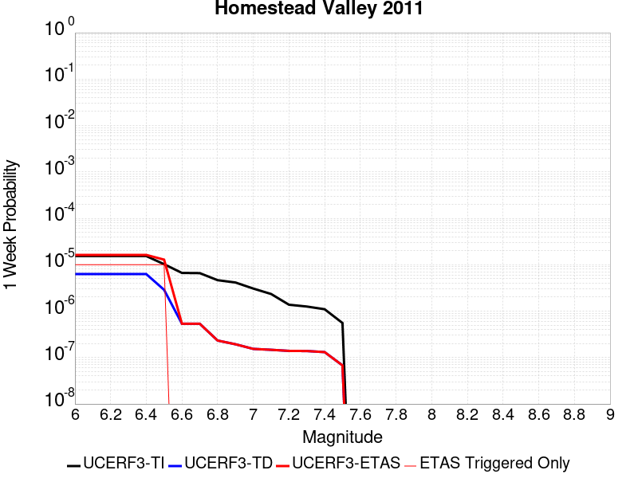 | 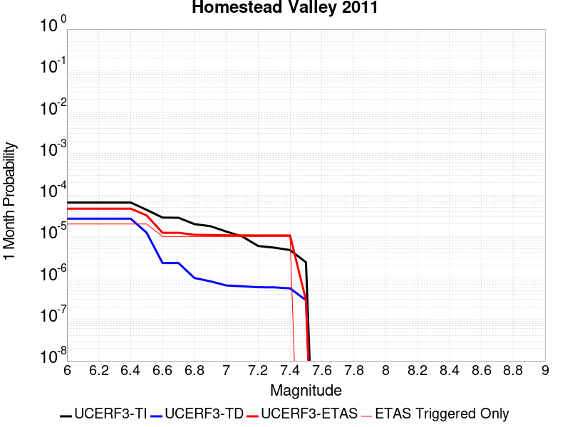 | 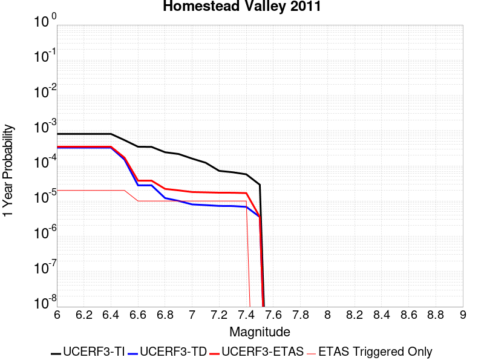 | 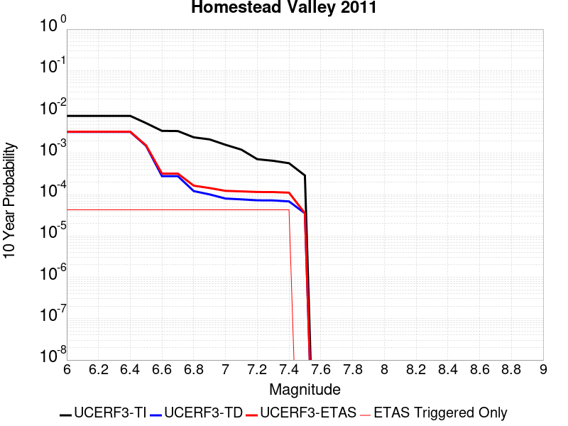 |

| Magnitude | 1 wk TI Prob | 1 wk TD Prob | 1 wk ETAS Prob | 1 wk ETAS/TD Gain | 1 wk ETAS Triggered Only | 1 mo TI Prob | 1 mo TD Prob | 1 mo ETAS Prob | 1 mo ETAS/TD Gain | 1 mo ETAS Triggered Only | 1 yr TI Prob | 1 yr TD Prob | 1 yr ETAS Prob | 1 yr ETAS/TD Gain | 1 yr ETAS Triggered Only | 10 yr TI Prob | 10 yr TD Prob | 10 yr ETAS Prob | 10 yr ETAS/TD Gain | 10 yr ETAS Triggered Only |
|-----|-----|-----|-----|-----|-----|-----|-----|-----|-----|-----|-----|-----|-----|-----|-----|-----|-----|-----|-----|-----|
| 6.0 | 1.539795E-5 | 6.286469E-6 | 1.6286407E-5 | 2.590708 | 1.0E-5 | 6.5989545E-5 | 2.6941849E-5 | 4.694131E-5 | 1.7423196 | 2.0E-5 | 8.0312655E-4 | 3.2798824E-4 | 3.479817E-4 | 1.0609578 | 2.0E-5 | 0.008002302 | 0.0032770627 | 0.0032969972 | 1.006083 | 2.0E-5 |
| 6.1 | 1.539795E-5 | 6.286469E-6 | 1.6286407E-5 | 2.590708 | 1.0E-5 | 6.5989545E-5 | 2.6941849E-5 | 4.694131E-5 | 1.7423196 | 2.0E-5 | 8.0312655E-4 | 3.2798824E-4 | 3.479817E-4 | 1.0609578 | 2.0E-5 | 0.008002302 | 0.0032770627 | 0.0032969972 | 1.006083 | 2.0E-5 |
| 6.2 | 1.539795E-5 | 6.286469E-6 | 1.6286407E-5 | 2.590708 | 1.0E-5 | 6.5989545E-5 | 2.6941849E-5 | 4.694131E-5 | 1.7423196 | 2.0E-5 | 8.0312655E-4 | 3.2798824E-4 | 3.479817E-4 | 1.0609578 | 2.0E-5 | 0.008002302 | 0.0032770627 | 0.0032969972 | 1.006083 | 2.0E-5 |
| 6.3 | 1.539795E-5 | 6.286469E-6 | 1.6286407E-5 | 2.590708 | 1.0E-5 | 6.5989545E-5 | 2.6941849E-5 | 4.694131E-5 | 1.7423196 | 2.0E-5 | 8.0312655E-4 | 3.2798824E-4 | 3.479817E-4 | 1.0609578 | 2.0E-5 | 0.008002302 | 0.0032770627 | 0.0032969972 | 1.006083 | 2.0E-5 |
| 6.4 | 1.539795E-5 | 6.286469E-6 | 1.6286407E-5 | 2.590708 | 1.0E-5 | 6.5989545E-5 | 2.6941849E-5 | 4.694131E-5 | 1.7423196 | 2.0E-5 | 8.0312655E-4 | 3.2798824E-4 | 3.479817E-4 | 1.0609578 | 2.0E-5 | 0.008002302 | 0.0032770627 | 0.0032969972 | 1.006083 | 2.0E-5 |
| 6.5 | 1.0265258E-5 | 2.8786876E-6 | 1.2878659E-5 | 4.473795 | 1.0E-5 | 4.3993223E-5 | 1.2337214E-5 | 3.2336968E-5 | 2.6210916 | 2.0E-5 | 5.3548586E-4 | 1.5020218E-4 | 1.7019917E-4 | 1.1331339 | 2.0E-5 | 0.005341973 | 0.0015016886 | 0.0015216586 | 1.0132984 | 2.0E-5 |
| 6.6 | 6.664671E-6 | 5.343859E-7 | 5.343859E-7 | 1.0 | 0.0 | 2.8562565E-5 | 2.2902238E-6 | 1.2290201E-5 | 5.3663754 | 1.0E-5 | 3.476937E-4 | 2.7883236E-5 | 3.7882957E-5 | 1.3586284 | 1.0E-5 | 0.003471502 | 2.78809E-4 | 2.8880622E-4 | 1.0358568 | 1.0E-5 |
| 6.7 | 6.5954046E-6 | 5.343859E-7 | 5.343859E-7 | 1.0 | 0.0 | 2.8265715E-5 | 2.2902238E-6 | 1.2290201E-5 | 5.3663754 | 1.0E-5 | 3.4408073E-4 | 2.7883236E-5 | 3.7882957E-5 | 1.3586284 | 1.0E-5 | 0.0034354846 | 2.78809E-4 | 2.8880622E-4 | 1.0358568 | 1.0E-5 |
| 6.8 | 4.648189E-6 | 2.3257238E-7 | 2.3257238E-7 | 1.0 | 0.0 | 1.9920659E-5 | 9.967384E-7 | 1.0996729E-5 | 11.032713 | 1.0E-5 | 2.4250703E-4 | 1.2135227E-5 | 2.2135106E-5 | 1.8240372 | 1.0E-5 | 0.0024224254 | 1.2134612E-4 | 1.3134492E-4 | 1.0823989 | 1.0E-5 |
| 6.9 | 4.1428534E-6 | 1.9342777E-7 | 1.9342777E-7 | 1.0 | 0.0 | 1.7754966E-5 | 8.289759E-7 | 1.0828968E-5 | 13.063067 | 1.0E-5 | 2.1614527E-4 | 1.0092737E-5 | 2.0092637E-5 | 1.9908015 | 1.0E-5 | 0.0021593515 | 1.0092309E-4 | 1.1092208E-4 | 1.0990753 | 1.0E-5 |
| 7.0 | 3.0673707E-6 | 1.5364343E-7 | 1.5364343E-7 | 1.0 | 0.0 | 1.3145808E-5 | 6.5847166E-7 | 1.0658465E-5 | 16.186672 | 1.0E-5 | 1.6003846E-4 | 8.016864E-6 | 1.8016784E-5 | 2.2473605 | 1.0E-5 | 0.0015992324 | 8.016585E-5 | 9.016505E-5 | 1.1247314 | 1.0E-5 |
| 7.1 | 2.340854E-6 | 1.4684727E-7 | 1.4684727E-7 | 1.0 | 0.0 | 1.0032193E-5 | 6.293453E-7 | 1.0629339E-5 | 16.889519 | 1.0E-5 | 1.221351E-4 | 7.662254E-6 | 1.7662176E-5 | 2.3050892 | 1.0E-5 | 0.00122068 | 7.661999E-5 | 8.661922E-5 | 1.1305043 | 1.0E-5 |
| 7.2 | 1.3754182E-6 | 1.3920152E-7 | 1.3920152E-7 | 1.0 | 0.0 | 5.8946357E-6 | 5.965778E-7 | 1.0596572E-5 | 17.762262 | 1.0E-5 | 7.176483E-5 | 7.2633115E-6 | 1.7263239E-5 | 2.3767724 | 1.0E-5 | 7.174166E-4 | 7.2630835E-5 | 8.2630104E-5 | 1.1376725 | 1.0E-5 |
| 7.3 | 1.2573237E-6 | 1.3824703E-7 | 1.3824703E-7 | 1.0 | 0.0 | 5.388519E-6 | 5.9248714E-7 | 1.0592481E-5 | 17.877993 | 1.0E-5 | 6.560324E-5 | 7.213508E-6 | 1.7213435E-5 | 2.3862782 | 1.0E-5 | 6.558388E-4 | 7.213283E-5 | 8.213211E-5 | 1.1386231 | 1.0E-5 |
| 7.4 | 1.0994207E-6 | 1.3103899E-7 | 1.3103899E-7 | 1.0 | 0.0 | 4.7117946E-6 | 5.615955E-7 | 1.056159E-5 | 18.8064 | 1.0E-5 | 5.736459E-5 | 6.837405E-6 | 1.6837337E-5 | 2.4625332 | 1.0E-5 | 5.734978E-4 | 6.837204E-5 | 7.8371355E-5 | 1.1462486 | 1.0E-5 |
| 7.5 | 5.5569126E-7 | 6.7717565E-8 | 6.7717565E-8 | 1.0 | 0.0 | 2.3815317E-6 | 2.902181E-7 | 2.902181E-7 | 1.0 | 0.0 | 2.8994764E-5 | 3.5334003E-6 | 3.5334003E-6 | 1.0 | 0.0 | 2.899098E-4 | 3.5333505E-5 | 3.5333505E-5 | 1.0 | 0.0 |

## Butano 2011 CFM
*[(top)](#table-of-contents)*

| 1 Week | 1 Month | 1 Year | 10 Year |
|-----|-----|-----|-----|
| 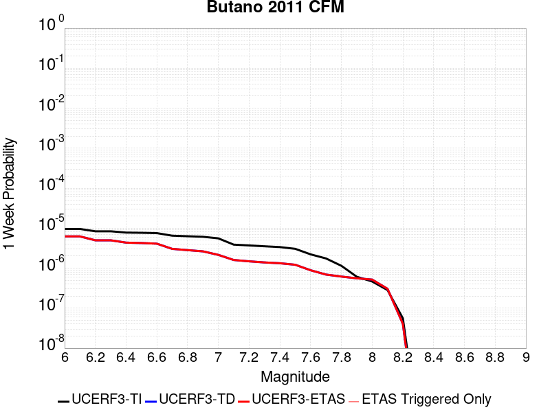 |  | 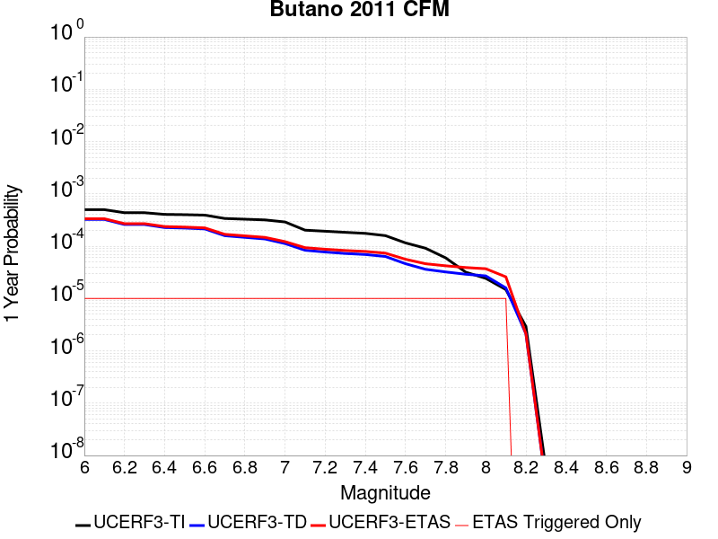 | 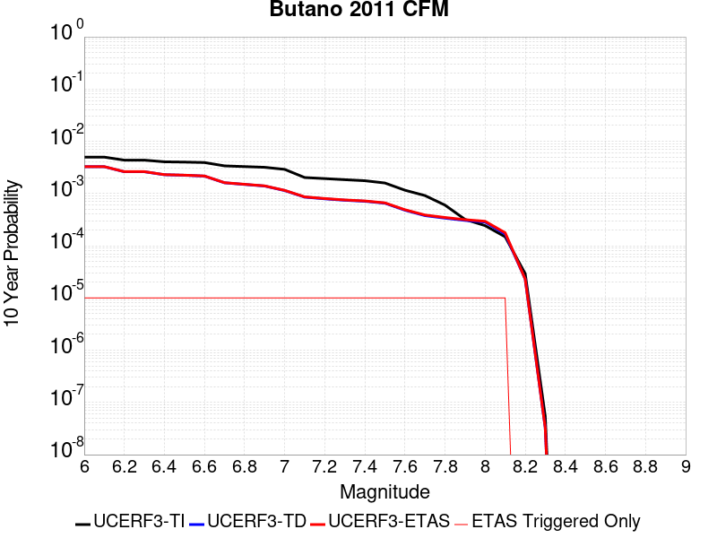 |

| Magnitude | 1 wk TI Prob | 1 wk TD Prob | 1 wk ETAS Prob | 1 wk ETAS/TD Gain | 1 wk ETAS Triggered Only | 1 mo TI Prob | 1 mo TD Prob | 1 mo ETAS Prob | 1 mo ETAS/TD Gain | 1 mo ETAS Triggered Only | 1 yr TI Prob | 1 yr TD Prob | 1 yr ETAS Prob | 1 yr ETAS/TD Gain | 1 yr ETAS Triggered Only | 10 yr TI Prob | 10 yr TD Prob | 10 yr ETAS Prob | 10 yr ETAS/TD Gain | 10 yr ETAS Triggered Only |
|-----|-----|-----|-----|-----|-----|-----|-----|-----|-----|-----|-----|-----|-----|-----|-----|-----|-----|-----|-----|-----|
| 6.0 | 9.561135E-6 | 6.2254967E-6 | 6.2254967E-6 | 1.0 | 0.0 | 4.097565E-5 | 2.6680438E-5 | 2.6680438E-5 | 1.0 | 0.0 | 4.9876433E-4 | 3.2478812E-4 | 3.3478488E-4 | 1.0307794 | 1.0E-5 | 0.004976464 | 0.0032607901 | 0.0032707574 | 1.0030568 | 1.0E-5 |
| 6.1 | 9.561135E-6 | 6.2254967E-6 | 6.2254967E-6 | 1.0 | 0.0 | 4.097565E-5 | 2.6680438E-5 | 2.6680438E-5 | 1.0 | 0.0 | 4.9876433E-4 | 3.2478812E-4 | 3.3478488E-4 | 1.0307794 | 1.0E-5 | 0.004976464 | 0.0032607901 | 0.0032707574 | 1.0030568 | 1.0E-5 |
| 6.2 | 8.364741E-6 | 4.9785817E-6 | 4.9785817E-6 | 1.0 | 0.0 | 3.5848396E-5 | 2.1336613E-5 | 2.1336613E-5 | 1.0 | 0.0 | 4.3636683E-4 | 2.5974386E-4 | 2.697413E-4 | 1.0384895 | 1.0E-5 | 0.0043551093 | 0.0026120064 | 0.0026219804 | 1.0038185 | 1.0E-5 |
| 6.3 | 8.364741E-6 | 4.9785817E-6 | 4.9785817E-6 | 1.0 | 0.0 | 3.5848396E-5 | 2.1336613E-5 | 2.1336613E-5 | 1.0 | 0.0 | 4.3636683E-4 | 2.5974386E-4 | 2.697413E-4 | 1.0384895 | 1.0E-5 | 0.0043551093 | 0.0026120064 | 0.0026219804 | 1.0038185 | 1.0E-5 |
| 6.4 | 7.768282E-6 | 4.3565296E-6 | 4.3565296E-6 | 1.0 | 0.0 | 3.329221E-5 | 1.8670715E-5 | 1.8670715E-5 | 1.0 | 0.0 | 4.0525728E-4 | 2.272936E-4 | 2.3729133E-4 | 1.043986 | 1.0E-5 | 0.0040451903 | 0.0022881997 | 0.0022981768 | 1.0043602 | 1.0E-5 |
| 6.5 | 7.673437E-6 | 4.256093E-6 | 4.256093E-6 | 1.0 | 0.0 | 3.2885746E-5 | 1.8240276E-5 | 1.8240276E-5 | 1.0 | 0.0 | 4.0031038E-4 | 2.2205409E-4 | 2.3205187E-4 | 1.045024 | 1.0E-5 | 0.0039959005 | 0.0022359102 | 0.0022458876 | 1.0044625 | 1.0E-5 |
| 6.6 | 7.5244197E-6 | 4.101056E-6 | 4.101056E-6 | 1.0 | 0.0 | 3.2247113E-5 | 1.7575843E-5 | 1.7575843E-5 | 1.0 | 0.0 | 3.9253788E-4 | 2.1396621E-4 | 2.2396407E-4 | 1.0467263 | 1.0E-5 | 0.003918452 | 0.00215519 | 0.0021651685 | 1.00463 | 1.0E-5 |
| 6.7 | 6.4921405E-6 | 3.0411225E-6 | 3.0411225E-6 | 1.0 | 0.0 | 2.7823162E-5 | 1.30333165E-5 | 1.30333165E-5 | 1.0 | 0.0 | 3.3869434E-4 | 1.5866917E-4 | 1.6866757E-4 | 1.0630143 | 1.0E-5 | 0.003381786 | 0.0016030329 | 0.0016130169 | 1.0062282 | 1.0E-5 |
| 6.8 | 6.2890294E-6 | 2.8278887E-6 | 2.8278887E-6 | 1.0 | 0.0 | 2.6952705E-5 | 1.2119467E-5 | 1.2119467E-5 | 1.0 | 0.0 | 3.2809976E-4 | 1.475446E-4 | 1.5754312E-4 | 1.0677661 | 1.0E-5 | 0.0032761577 | 0.0014919417 | 0.0015019268 | 1.0066926 | 1.0E-5 |
| 6.9 | 6.0965517E-6 | 2.6344032E-6 | 2.6344032E-6 | 1.0 | 0.0 | 2.6127816E-5 | 1.129025E-5 | 1.129025E-5 | 1.0 | 0.0 | 3.1805973E-4 | 1.3745019E-4 | 1.4744882E-4 | 1.0727437 | 1.0E-5 | 0.0031760489 | 0.0013911276 | 0.0014011137 | 1.0071784 | 1.0E-5 |
| 7.0 | 5.566252E-6 | 2.1518151E-6 | 2.1518151E-6 | 1.0 | 0.0 | 2.3855147E-5 | 9.2220325E-6 | 9.2220325E-6 | 1.0 | 0.0 | 2.9039773E-4 | 1.122725E-4 | 1.2227138E-4 | 1.089059 | 1.0E-5 | 0.0029001853 | 0.0011396318 | 0.0011496205 | 1.0087647 | 1.0E-5 |
| 7.1 | 3.878588E-6 | 1.6032967E-6 | 1.6032967E-6 | 1.0 | 0.0 | 1.6622414E-5 | 6.871253E-6 | 6.871253E-6 | 1.0 | 0.0 | 2.023591E-4 | 8.36543E-5 | 9.365346E-5 | 1.1195296 | 1.0E-5 | 0.0020217493 | 8.53303E-4 | 8.632945E-4 | 1.0117092 | 1.0E-5 |
| 7.2 | 3.7038085E-6 | 1.4843619E-6 | 1.4843619E-6 | 1.0 | 0.0 | 1.587337E-5 | 6.361535E-6 | 6.361535E-6 | 1.0 | 0.0 | 1.9324113E-4 | 7.744894E-5 | 8.744816E-5 | 1.1291074 | 1.0E-5 | 0.0019307317 | 7.912618E-4 | 8.012539E-4 | 1.0126281 | 1.0E-5 |
| 7.3 | 3.5277278E-6 | 1.3924841E-6 | 1.3924841E-6 | 1.0 | 0.0 | 1.5118746E-5 | 5.9677755E-6 | 5.9677755E-6 | 1.0 | 0.0 | 1.8405518E-4 | 7.2655246E-5 | 8.2654515E-5 | 1.1376263 | 1.0E-5 | 0.0018390282 | 7.432707E-4 | 7.5326324E-4 | 1.0134441 | 1.0E-5 |
| 7.4 | 3.3711294E-6 | 1.3297448E-6 | 1.3297448E-6 | 1.0 | 0.0 | 1.4447617E-5 | 5.6988933E-6 | 5.6988933E-6 | 1.0 | 0.0 | 1.7588554E-4 | 6.938182E-5 | 7.938113E-5 | 1.14412 | 1.0E-5 | 0.0017574639 | 7.1050716E-4 | 7.205001E-4 | 1.0140644 | 1.0E-5 |
| 7.5 | 3.0496426E-6 | 1.218759E-6 | 1.218759E-6 | 1.0 | 0.0 | 1.3069831E-5 | 5.2232426E-6 | 5.2232426E-6 | 1.0 | 0.0 | 1.5911358E-4 | 6.359112E-5 | 7.359049E-5 | 1.1572447 | 1.0E-5 | 0.001589997 | 6.525681E-4 | 6.625616E-4 | 1.0153141 | 1.0E-5 |
| 7.6 | 2.2179781E-6 | 8.869861E-7 | 8.869861E-7 | 1.0 | 0.0 | 9.505586E-6 | 3.8013632E-6 | 3.8013632E-6 | 1.0 | 0.0 | 1.1572436E-4 | 4.6280613E-5 | 5.628015E-5 | 1.2160631 | 1.0E-5 | 0.0011566412 | 4.794437E-4 | 4.894389E-4 | 1.0208476 | 1.0E-5 |
| 7.7 | 1.7519328E-6 | 6.930116E-7 | 6.930116E-7 | 1.0 | 0.0 | 7.508262E-6 | 2.9700464E-6 | 2.9700464E-6 | 1.0 | 0.0 | 9.140925E-5 | 3.6159712E-5 | 4.615935E-5 | 1.2765409 | 1.0E-5 | 9.137166E-4 | 3.7754176E-4 | 3.87538E-4 | 1.0264771 | 1.0E-5 |
| 7.8 | 1.1478974E-6 | 6.1734966E-7 | 6.1734966E-7 | 1.0 | 0.0 | 4.9195505E-6 | 2.6457815E-6 | 2.6457815E-6 | 1.0 | 0.0 | 5.9893882E-5 | 3.2211912E-5 | 4.221159E-5 | 1.3104341 | 1.0E-5 | 5.9877743E-4 | 3.377461E-4 | 3.4774272E-4 | 1.029598 | 1.0E-5 |
| 7.9 | 6.1154634E-7 | 5.5814814E-7 | 5.5814814E-7 | 1.0 | 0.0 | 2.6209104E-6 | 2.392061E-6 | 2.392061E-6 | 1.0 | 0.0 | 3.1909116E-5 | 2.9122955E-5 | 3.9122664E-5 | 1.3433617 | 1.0E-5 | 3.1904536E-4 | 3.0562587E-4 | 3.156228E-4 | 1.0327097 | 1.0E-5 |
| 8.0 | 4.6520046E-7 | 5.189108E-7 | 5.189108E-7 | 1.0 | 0.0 | 1.9937147E-6 | 2.2239014E-6 | 2.2239014E-6 | 1.0 | 0.0 | 2.4273206E-5 | 2.7075665E-5 | 3.7075395E-5 | 1.3693254 | 1.0E-5 | 2.4270554E-4 | 2.841832E-4 | 2.9418035E-4 | 1.0351785 | 1.0E-5 |
| 8.1 | 2.8425194E-7 | 3.0568935E-7 | 3.0568935E-7 | 1.0 | 0.0 | 1.218222E-6 | 1.3100965E-6 | 1.3100965E-6 | 1.0 | 0.0 | 1.4831752E-5 | 1.5950309E-5 | 2.5950148E-5 | 1.6269372 | 1.0E-5 | 1.4830762E-4 | 1.673984E-4 | 1.7739672E-4 | 1.0597277 | 1.0E-5 |
| 8.2 | 5.585778E-8 | 4.051519E-8 | 4.051519E-8 | 1.0 | 0.0 | 2.3939046E-7 | 1.7363652E-7 | 1.7363652E-7 | 1.0 | 0.0 | 2.914575E-6 | 2.1140224E-6 | 2.1140224E-6 | 1.0 | 0.0 | 2.9145367E-5 | 2.2970038E-5 | 2.2970038E-5 | 1.0 | 0.0 |
| 8.3 | 1.0371215E-10 | 5.3552607E-11 | 5.3552607E-11 | 1.0 | 0.0 | 4.4448079E-10 | 2.2951097E-10 | 2.2951097E-10 | 1.0 | 0.0 | 5.4115543E-9 | 2.7942968E-9 | 2.7942968E-9 | 1.0 | 0.0 | 5.4115542E-8 | 3.213309E-8 | 3.213309E-8 | 1.0 | 0.0 |

## Clayton
*[(top)](#table-of-contents)*

| 1 Week | 1 Month | 1 Year | 10 Year |
|-----|-----|-----|-----|
| 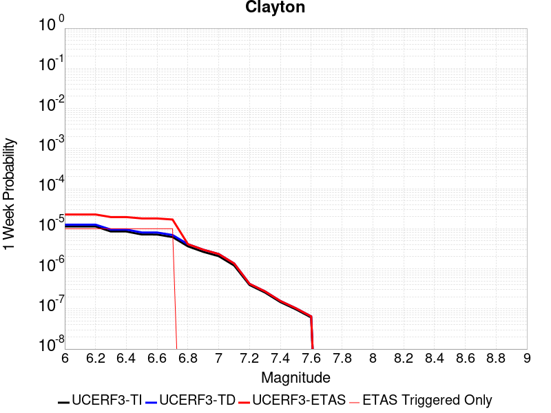 | 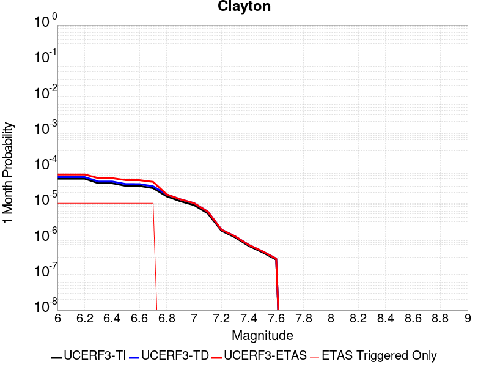 | 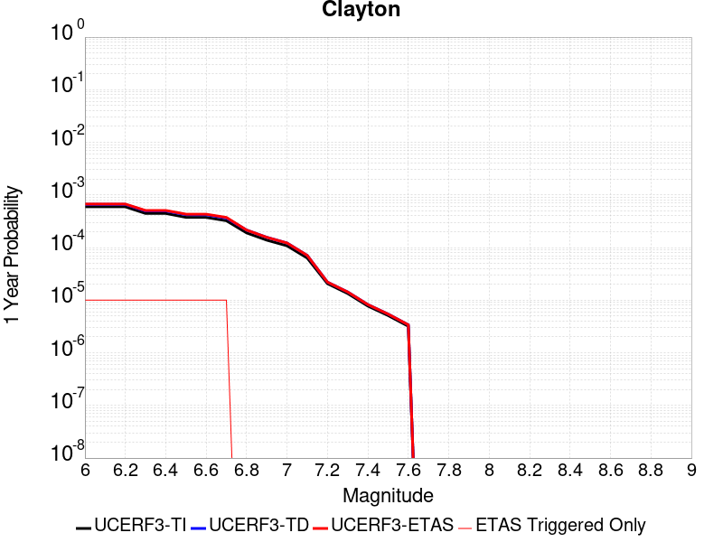 | 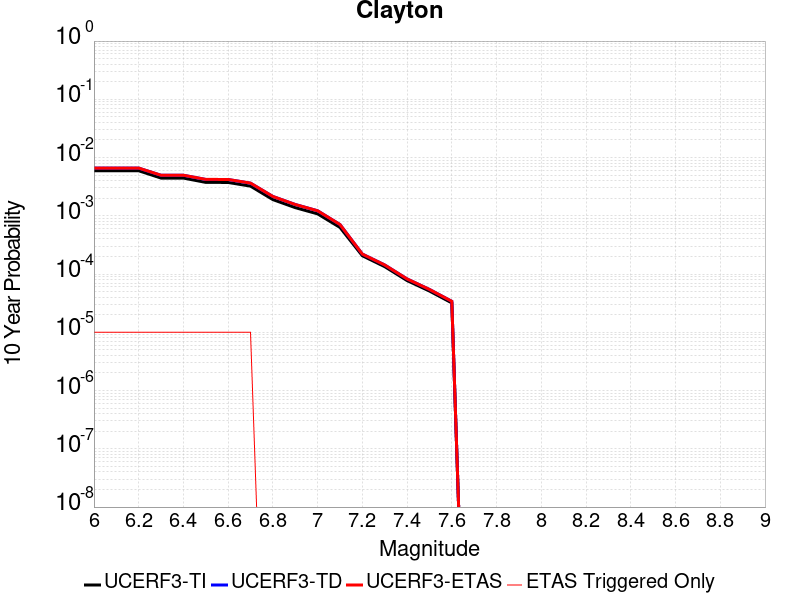 |

| Magnitude | 1 wk TI Prob | 1 wk TD Prob | 1 wk ETAS Prob | 1 wk ETAS/TD Gain | 1 wk ETAS Triggered Only | 1 mo TI Prob | 1 mo TD Prob | 1 mo ETAS Prob | 1 mo ETAS/TD Gain | 1 mo ETAS Triggered Only | 1 yr TI Prob | 1 yr TD Prob | 1 yr ETAS Prob | 1 yr ETAS/TD Gain | 1 yr ETAS Triggered Only | 10 yr TI Prob | 10 yr TD Prob | 10 yr ETAS Prob | 10 yr ETAS/TD Gain | 10 yr ETAS Triggered Only |
|-----|-----|-----|-----|-----|-----|-----|-----|-----|-----|-----|-----|-----|-----|-----|-----|-----|-----|-----|-----|-----|
| 6.0 | 1.1413061E-5 | 1.2667071E-5 | 2.2666945E-5 | 1.7894385 | 1.0E-5 | 4.89122E-5 | 5.4286444E-5 | 6.42859E-5 | 1.184198 | 1.0E-5 | 5.953433E-4 | 6.607592E-4 | 6.7075266E-4 | 1.0151241 | 1.0E-5 | 0.005937509 | 0.006590149 | 0.006600083 | 1.0015074 | 1.0E-5 |
| 6.1 | 1.1413061E-5 | 1.2667071E-5 | 2.2666945E-5 | 1.7894385 | 1.0E-5 | 4.89122E-5 | 5.4286444E-5 | 6.42859E-5 | 1.184198 | 1.0E-5 | 5.953433E-4 | 6.607592E-4 | 6.7075266E-4 | 1.0151241 | 1.0E-5 | 0.005937509 | 0.006590149 | 0.006600083 | 1.0015074 | 1.0E-5 |
| 6.2 | 1.1413061E-5 | 1.2667071E-5 | 2.2666945E-5 | 1.7894385 | 1.0E-5 | 4.89122E-5 | 5.4286444E-5 | 6.42859E-5 | 1.184198 | 1.0E-5 | 5.953433E-4 | 6.607592E-4 | 6.7075266E-4 | 1.0151241 | 1.0E-5 | 0.005937509 | 0.006590149 | 0.006600083 | 1.0015074 | 1.0E-5 |
| 6.3 | 8.538689E-6 | 9.532765E-6 | 1.953267E-5 | 2.0490036 | 1.0E-5 | 3.659387E-5 | 4.085413E-5 | 5.085372E-5 | 1.2447633 | 1.0E-5 | 4.4543925E-4 | 4.972963E-4 | 5.072913E-4 | 1.0200987 | 1.0E-5 | 0.0044454746 | 0.0049629 | 0.0049728504 | 1.002005 | 1.0E-5 |
| 6.4 | 8.538689E-6 | 9.532765E-6 | 1.953267E-5 | 2.0490036 | 1.0E-5 | 3.659387E-5 | 4.085413E-5 | 5.085372E-5 | 1.2447633 | 1.0E-5 | 4.4543925E-4 | 4.972963E-4 | 5.072913E-4 | 1.0200987 | 1.0E-5 | 0.0044454746 | 0.0049629 | 0.0049728504 | 1.002005 | 1.0E-5 |
| 6.5 | 7.197462E-6 | 8.080964E-6 | 1.8080884E-5 | 2.237466 | 1.0E-5 | 3.08459E-5 | 3.463229E-5 | 4.4631943E-5 | 1.2887379 | 1.0E-5 | 3.7548412E-4 | 4.2157478E-4 | 4.3157054E-4 | 1.0237106 | 1.0E-5 | 0.003748503 | 0.0042085624 | 0.00421852 | 1.0023661 | 1.0E-5 |
| 6.6 | 7.1760483E-6 | 8.05698E-6 | 1.80569E-5 | 2.24115 | 1.0E-5 | 3.075413E-5 | 3.4529505E-5 | 4.452916E-5 | 1.2895974 | 1.0E-5 | 3.743672E-4 | 4.2032383E-4 | 4.3031963E-4 | 1.0237812 | 1.0E-5 | 0.0037373714 | 0.0041961004 | 0.004206058 | 1.0023732 | 1.0E-5 |
| 6.7 | 6.202582E-6 | 6.9767057E-6 | 1.6976635E-5 | 2.4333313 | 1.0E-5 | 2.6582224E-5 | 2.9899868E-5 | 3.989957E-5 | 1.3344396 | 1.0E-5 | 3.235905E-4 | 3.6397774E-4 | 3.7397412E-4 | 1.0274642 | 1.0E-5 | 0.0032311971 | 0.003634572 | 0.0036445356 | 1.0027413 | 1.0E-5 |
| 6.8 | 3.6417277E-6 | 4.121308E-6 | 4.121308E-6 | 1.0 | 0.0 | 1.5607311E-5 | 1.7662633E-5 | 1.7662633E-5 | 1.0 | 0.0 | 1.9000245E-4 | 2.150221E-4 | 2.150221E-4 | 1.0 | 0.0 | 0.0018984007 | 0.0021482168 | 0.0021482168 | 1.0 | 0.0 |
| 6.9 | 2.6498485E-6 | 2.9995322E-6 | 2.9995322E-6 | 1.0 | 0.0 | 1.1356444E-5 | 1.2855077E-5 | 1.2855077E-5 | 1.0 | 0.0 | 1.3825593E-4 | 1.5649972E-4 | 1.5649972E-4 | 1.0 | 0.0 | 0.0013816995 | 0.0015639347 | 0.0015639347 | 1.0 | 0.0 |
| 7.0 | 2.070442E-6 | 2.3407345E-6 | 2.3407345E-6 | 1.0 | 0.0 | 8.873292E-6 | 1.0031682E-5 | 1.0031682E-5 | 1.0 | 0.0 | 1.0802698E-4 | 1.2212919E-4 | 1.2212919E-4 | 1.0 | 0.0 | 0.0010797448 | 0.0012206505 | 0.0012206505 | 1.0 | 0.0 |
| 7.1 | 1.2111691E-6 | 1.3588814E-6 | 1.3588814E-6 | 1.0 | 0.0 | 5.190714E-6 | 5.823765E-6 | 5.823765E-6 | 1.0 | 0.0 | 6.319511E-5 | 7.09022E-5 | 7.09022E-5 | 1.0 | 0.0 | 6.3177146E-4 | 7.0881215E-4 | 7.0881215E-4 | 1.0 | 0.0 |
| 7.2 | 3.9541607E-7 | 4.2228464E-7 | 4.2228464E-7 | 1.0 | 0.0 | 1.6946392E-6 | 1.8097901E-6 | 1.8097901E-6 | 1.0 | 0.0 | 2.0632036E-5 | 2.2033973E-5 | 2.2033973E-5 | 1.0 | 0.0 | 2.063012E-4 | 2.2031803E-4 | 2.2031803E-4 | 1.0 | 0.0 |
| 7.3 | 2.5685637E-7 | 2.7457227E-7 | 2.7457227E-7 | 1.0 | 0.0 | 1.1008126E-6 | 1.1767378E-6 | 1.1767378E-6 | 1.0 | 0.0 | 1.3402311E-5 | 1.432669E-5 | 1.432669E-5 | 1.0 | 0.0 | 1.3401502E-4 | 1.4325773E-4 | 1.4325773E-4 | 1.0 | 0.0 |
| 7.4 | 1.482299E-7 | 1.5808227E-7 | 1.5808227E-7 | 1.0 | 0.0 | 6.3527085E-7 | 6.774953E-7 | 6.774953E-7 | 1.0 | 0.0 | 7.734395E-6 | 8.248474E-6 | 8.248474E-6 | 1.0 | 0.0 | 7.734126E-5 | 8.248171E-5 | 8.248171E-5 | 1.0 | 0.0 |
| 7.5 | 9.7969505E-8 | 1.0438379E-7 | 1.0438379E-7 | 1.0 | 0.0 | 4.1986925E-7 | 4.47359E-7 | 4.47359E-7 | 1.0 | 0.0 | 5.111896E-6 | 5.4465827E-6 | 5.4465827E-6 | 1.0 | 0.0 | 5.1117782E-5 | 5.4464508E-5 | 5.4464508E-5 | 1.0 | 0.0 |
| 7.6 | 6.125415E-8 | 6.5232356E-8 | 6.5232356E-8 | 1.0 | 0.0 | 2.6251774E-7 | 2.7956722E-7 | 2.7956722E-7 | 1.0 | 0.0 | 3.196149E-6 | 3.4037257E-6 | 3.4037257E-6 | 1.0 | 0.0 | 3.196103E-5 | 3.4036748E-5 | 3.4036748E-5 | 1.0 | 0.0 |

## Robinson Creek
*[(top)](#table-of-contents)*

| 1 Week | 1 Month | 1 Year | 10 Year |
|-----|-----|-----|-----|
| 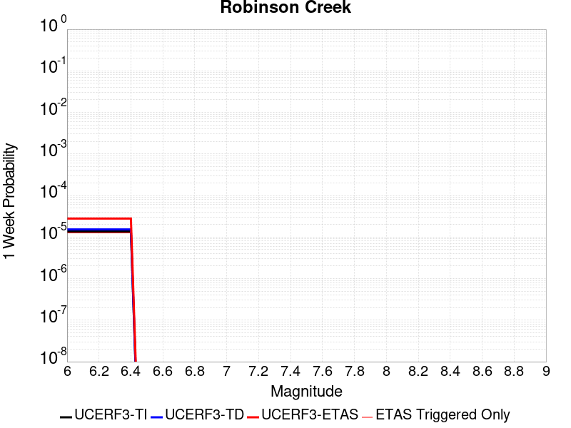 | 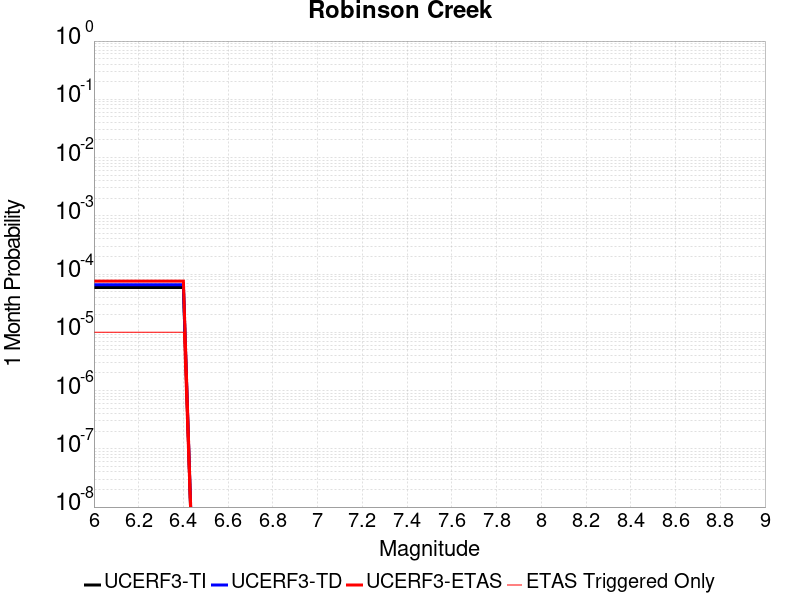 | 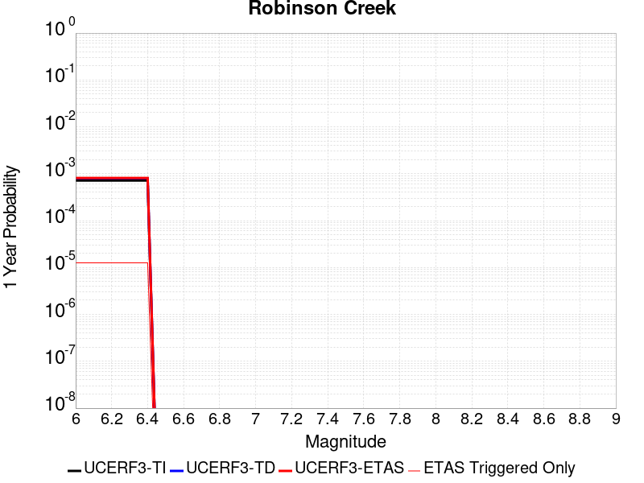 | 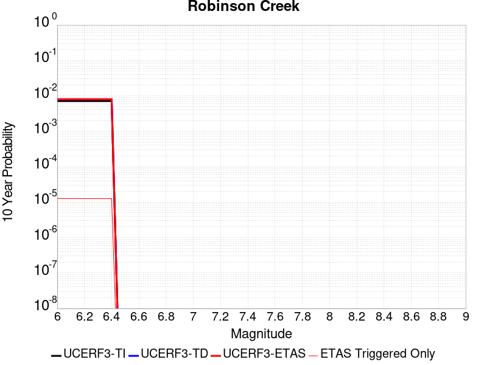 |

| Magnitude | 1 wk TI Prob | 1 wk TD Prob | 1 wk ETAS Prob | 1 wk ETAS/TD Gain | 1 wk ETAS Triggered Only | 1 mo TI Prob | 1 mo TD Prob | 1 mo ETAS Prob | 1 mo ETAS/TD Gain | 1 mo ETAS Triggered Only | 1 yr TI Prob | 1 yr TD Prob | 1 yr ETAS Prob | 1 yr ETAS/TD Gain | 1 yr ETAS Triggered Only | 10 yr TI Prob | 10 yr TD Prob | 10 yr ETAS Prob | 10 yr ETAS/TD Gain | 10 yr ETAS Triggered Only |
|-----|-----|-----|-----|-----|-----|-----|-----|-----|-----|-----|-----|-----|-----|-----|-----|-----|-----|-----|-----|-----|
| 6.0 | 1.3705327E-5 | 1.5285013E-5 | 2.528486E-5 | 1.6542256 | 1.0E-5 | 5.8735794E-5 | 6.55072E-5 | 7.550655E-5 | 1.152645 | 1.0E-5 | 7.1487366E-4 | 7.9755014E-4 | 8.075422E-4 | 1.0125284 | 1.0E-5 | 0.0071257832 | 0.007975501 | 0.007985421 | 1.0012438 | 1.0E-5 |
| 6.1 | 1.3705327E-5 | 1.5285013E-5 | 2.528486E-5 | 1.6542256 | 1.0E-5 | 5.8735794E-5 | 6.55072E-5 | 7.550655E-5 | 1.152645 | 1.0E-5 | 7.1487366E-4 | 7.9755014E-4 | 8.075422E-4 | 1.0125284 | 1.0E-5 | 0.0071257832 | 0.007975501 | 0.007985421 | 1.0012438 | 1.0E-5 |
| 6.2 | 1.3705327E-5 | 1.5285013E-5 | 2.528486E-5 | 1.6542256 | 1.0E-5 | 5.8735794E-5 | 6.55072E-5 | 7.550655E-5 | 1.152645 | 1.0E-5 | 7.1487366E-4 | 7.9755014E-4 | 8.075422E-4 | 1.0125284 | 1.0E-5 | 0.0071257832 | 0.007975501 | 0.007985421 | 1.0012438 | 1.0E-5 |
| 6.3 | 1.3705327E-5 | 1.5285013E-5 | 2.528486E-5 | 1.6542256 | 1.0E-5 | 5.8735794E-5 | 6.55072E-5 | 7.550655E-5 | 1.152645 | 1.0E-5 | 7.1487366E-4 | 7.9755014E-4 | 8.075422E-4 | 1.0125284 | 1.0E-5 | 0.0071257832 | 0.007975501 | 0.007985421 | 1.0012438 | 1.0E-5 |
| 6.4 | 1.3705327E-5 | 1.5285013E-5 | 2.528486E-5 | 1.6542256 | 1.0E-5 | 5.8735794E-5 | 6.55072E-5 | 7.550655E-5 | 1.152645 | 1.0E-5 | 7.1487366E-4 | 7.9755014E-4 | 8.075422E-4 | 1.0125284 | 1.0E-5 | 0.0071257832 | 0.007975501 | 0.007985421 | 1.0012438 | 1.0E-5 |

## Pittville 2011 CFM
*[(top)](#table-of-contents)*

| 1 Week | 1 Month | 1 Year | 10 Year |
|-----|-----|-----|-----|
|  |  | 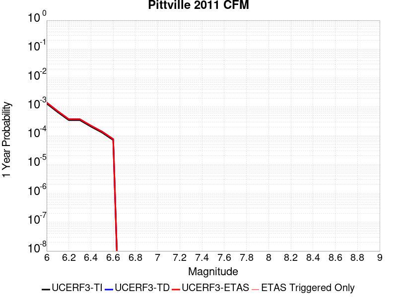 | 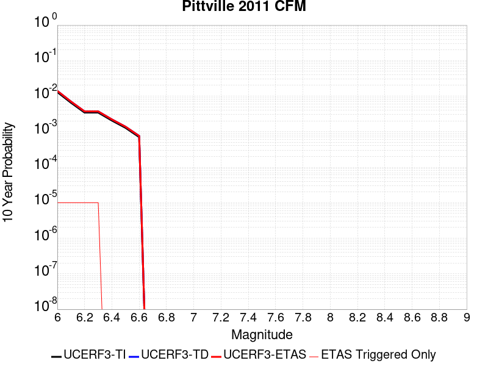 |

| Magnitude | 1 wk TI Prob | 1 wk TD Prob | 1 wk ETAS Prob | 1 wk ETAS/TD Gain | 1 wk ETAS Triggered Only | 1 mo TI Prob | 1 mo TD Prob | 1 mo ETAS Prob | 1 mo ETAS/TD Gain | 1 mo ETAS Triggered Only | 1 yr TI Prob | 1 yr TD Prob | 1 yr ETAS Prob | 1 yr ETAS/TD Gain | 1 yr ETAS Triggered Only | 10 yr TI Prob | 10 yr TD Prob | 10 yr ETAS Prob | 10 yr ETAS/TD Gain | 10 yr ETAS Triggered Only |
|-----|-----|-----|-----|-----|-----|-----|-----|-----|-----|-----|-----|-----|-----|-----|-----|-----|-----|-----|-----|-----|
| 6.0 | 2.5031832E-5 | 2.7056969E-5 | 2.7056969E-5 | 1.0 | 0.0 | 1.0727487E-4 | 1.1595384E-4 | 1.1595384E-4 | 1.0 | 0.0 | 0.001305289 | 0.0014109211 | 0.0014109211 | 1.0 | 0.0 | 0.012976485 | 0.014029415 | 0.014039275 | 1.0007027 | 1.0E-5 |
| 6.1 | 1.2540113E-5 | 1.3513067E-5 | 1.3513067E-5 | 1.0 | 0.0 | 5.3742235E-5 | 5.7911984E-5 | 5.7911984E-5 | 1.0 | 0.0 | 6.541153E-4 | 7.048728E-4 | 7.048728E-4 | 1.0 | 0.0 | 0.0065219323 | 0.0070286044 | 0.007038534 | 1.0014127 | 1.0E-5 |
| 6.2 | 6.603218E-6 | 7.107189E-6 | 7.107189E-6 | 1.0 | 0.0 | 2.8299199E-5 | 3.0459063E-5 | 3.0459063E-5 | 1.0 | 0.0 | 3.4448825E-4 | 3.7078248E-4 | 3.7078248E-4 | 1.0 | 0.0 | 0.0034395473 | 0.0037022792 | 0.0037122422 | 1.002691 | 1.0E-5 |
| 6.3 | 6.603218E-6 | 7.107189E-6 | 7.107189E-6 | 1.0 | 0.0 | 2.8299199E-5 | 3.0459063E-5 | 3.0459063E-5 | 1.0 | 0.0 | 3.4448825E-4 | 3.7078248E-4 | 3.7078248E-4 | 1.0 | 0.0 | 0.0034395473 | 0.0037022792 | 0.0037122422 | 1.002691 | 1.0E-5 |
| 6.4 | 3.9389015E-6 | 4.239175E-6 | 4.239175E-6 | 1.0 | 0.0 | 1.6880897E-5 | 1.8167784E-5 | 1.8167784E-5 | 1.0 | 0.0 | 2.0550552E-4 | 2.2117342E-4 | 2.2117342E-4 | 1.0 | 0.0 | 0.0020531558 | 0.002209838 | 0.002209838 | 1.0 | 0.0 |
| 6.5 | 2.4533072E-6 | 2.6412686E-6 | 2.6412686E-6 | 1.0 | 0.0 | 1.0514132E-5 | 1.1319685E-5 | 1.1319685E-5 | 1.0 | 0.0 | 1.2800204E-4 | 1.3781038E-4 | 1.3781038E-4 | 1.0 | 0.0 | 0.0012792832 | 0.0013774394 | 0.0013774394 | 1.0 | 0.0 |
| 6.6 | 1.3482367E-6 | 1.452993E-6 | 1.452993E-6 | 1.0 | 0.0 | 5.778144E-6 | 6.2271047E-6 | 6.2271047E-6 | 1.0 | 0.0 | 7.0346636E-5 | 7.58135E-5 | 7.58135E-5 | 1.0 | 0.0 | 7.032437E-4 | 7.5798744E-4 | 7.5798744E-4 | 1.0 | 0.0 |

## San Gregorio (North) 2011 CFM
*[(top)](#table-of-contents)*

| 1 Week | 1 Month | 1 Year | 10 Year |
|-----|-----|-----|-----|
|  | 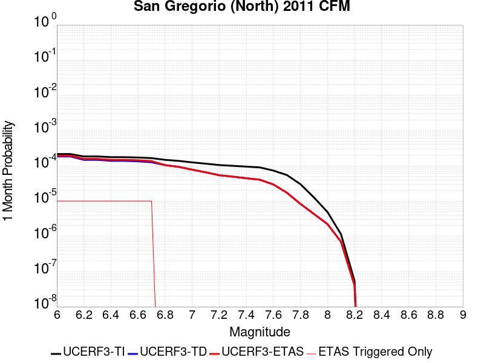 | 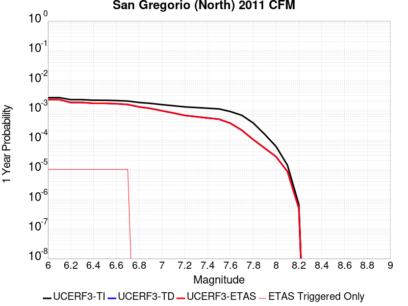 | 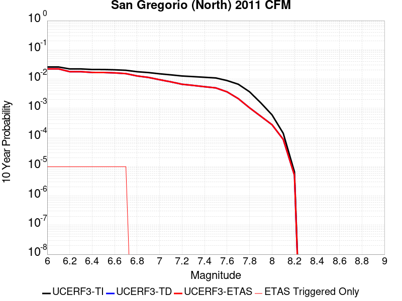 |

| Magnitude | 1 wk TI Prob | 1 wk TD Prob | 1 wk ETAS Prob | 1 wk ETAS/TD Gain | 1 wk ETAS Triggered Only | 1 mo TI Prob | 1 mo TD Prob | 1 mo ETAS Prob | 1 mo ETAS/TD Gain | 1 mo ETAS Triggered Only | 1 yr TI Prob | 1 yr TD Prob | 1 yr ETAS Prob | 1 yr ETAS/TD Gain | 1 yr ETAS Triggered Only | 10 yr TI Prob | 10 yr TD Prob | 10 yr ETAS Prob | 10 yr ETAS/TD Gain | 10 yr ETAS Triggered Only |
|-----|-----|-----|-----|-----|-----|-----|-----|-----|-----|-----|-----|-----|-----|-----|-----|-----|-----|-----|-----|-----|
| 6.0 | 5.0283932E-5 | 4.3057098E-5 | 4.3057098E-5 | 1.0 | 0.0 | 2.1548476E-4 | 1.8451746E-4 | 1.9451561E-4 | 1.0541854 | 1.0E-5 | 0.0026203706 | 0.002244199 | 0.0022541767 | 1.0044459 | 1.0E-5 | 0.02589687 | 0.022295918 | 0.022305695 | 1.0004386 | 1.0E-5 |
| 6.1 | 5.0283932E-5 | 4.3057098E-5 | 4.3057098E-5 | 1.0 | 0.0 | 2.1548476E-4 | 1.8451746E-4 | 1.9451561E-4 | 1.0541854 | 1.0E-5 | 0.0026203706 | 0.002244199 | 0.0022541767 | 1.0044459 | 1.0E-5 | 0.02589687 | 0.022295918 | 0.022305695 | 1.0004386 | 1.0E-5 |
| 6.2 | 4.2998647E-5 | 3.4440873E-5 | 3.4440873E-5 | 1.0 | 0.0 | 1.842669E-4 | 1.4759546E-4 | 1.5759398E-4 | 1.0677427 | 1.0E-5 | 0.0022411412 | 0.001795506 | 0.001805488 | 1.0055594 | 1.0E-5 | 0.022186736 | 0.017884884 | 0.017894706 | 1.0005491 | 1.0E-5 |
| 6.3 | 4.2998647E-5 | 3.4440873E-5 | 3.4440873E-5 | 1.0 | 0.0 | 1.842669E-4 | 1.4759546E-4 | 1.5759398E-4 | 1.0677427 | 1.0E-5 | 0.0022411412 | 0.001795506 | 0.001805488 | 1.0055594 | 1.0E-5 | 0.022186736 | 0.017884884 | 0.017894706 | 1.0005491 | 1.0E-5 |
| 6.4 | 4.1101295E-5 | 3.2326076E-5 | 3.2326076E-5 | 1.0 | 0.0 | 1.7613651E-4 | 1.3853304E-4 | 1.4853165E-4 | 1.0721749 | 1.0E-5 | 0.0021423528 | 0.0016853481 | 0.0016953313 | 1.0059235 | 1.0E-5 | 0.02121817 | 0.016800618 | 0.01681045 | 1.0005852 | 1.0E-5 |
| 6.5 | 4.1032585E-5 | 3.224411E-5 | 3.224411E-5 | 1.0 | 0.0 | 1.7584208E-4 | 1.381818E-4 | 1.4818042E-4 | 1.0723585 | 1.0E-5 | 0.0021387753 | 0.0016810785 | 0.0016910617 | 1.0059385 | 1.0E-5 | 0.021183075 | 0.01675857 | 0.016768403 | 1.0005867 | 1.0E-5 |
| 6.6 | 4.011629E-5 | 3.1265718E-5 | 3.1265718E-5 | 1.0 | 0.0 | 1.7191563E-4 | 1.3398913E-4 | 1.4398778E-4 | 1.0746229 | 1.0E-5 | 0.0020910634 | 0.0016301107 | 0.0016400943 | 1.0061245 | 1.0E-5 | 0.020714961 | 0.016257357 | 0.016267195 | 1.0006051 | 1.0E-5 |
| 6.7 | 3.8583938E-5 | 2.9452754E-5 | 2.9452754E-5 | 1.0 | 0.0 | 1.6534925E-4 | 1.2622007E-4 | 1.362188E-4 | 1.0792167 | 1.0E-5 | 0.0020112682 | 0.0015356604 | 0.001545645 | 1.0065019 | 1.0E-5 | 0.019931622 | 0.015326062 | 0.015335909 | 1.0006425 | 1.0E-5 |
| 6.8 | 3.44341E-5 | 2.4450024E-5 | 2.4450024E-5 | 1.0 | 0.0 | 1.4756636E-4 | 1.0478167E-4 | 1.0478167E-4 | 1.0 | 0.0 | 0.0017951399 | 0.0012749807 | 0.0012749807 | 1.0 | 0.0 | 0.017807078 | 0.012751525 | 0.012751525 | 1.0 | 0.0 |
| 6.9 | 3.221199E-5 | 2.1777196E-5 | 2.1777196E-5 | 1.0 | 0.0 | 1.3804408E-4 | 9.3327544E-5 | 9.3327544E-5 | 1.0 | 0.0 | 0.0016793909 | 0.0011356788 | 0.0011356788 | 1.0 | 0.0 | 0.01666756 | 0.011372544 | 0.011372544 | 1.0 | 0.0 |
| 7.0 | 2.9186718E-5 | 1.814604E-5 | 1.814604E-5 | 1.0 | 0.0 | 1.2507994E-4 | 7.776645E-5 | 7.776645E-5 | 1.0 | 0.0 | 0.0015217843 | 9.463997E-4 | 9.463997E-4 | 1.0 | 0.0 | 0.015114053 | 0.0094966395 | 0.0094966395 | 1.0 | 0.0 |
| 7.1 | 2.6840138E-5 | 1.5283675E-5 | 1.5283675E-5 | 1.0 | 0.0 | 1.1502409E-4 | 6.549983E-5 | 6.549983E-5 | 1.0 | 0.0 | 0.0013995186 | 7.971706E-4 | 7.971706E-4 | 1.0 | 0.0 | 0.013907375 | 0.0080155255 | 0.0080155255 | 1.0 | 0.0 |
| 7.2 | 2.453002E-5 | 1.2605825E-5 | 1.2605825E-5 | 1.0 | 0.0 | 1.05124425E-4 | 5.4023847E-5 | 5.4023847E-5 | 1.0 | 0.0 | 0.0012791384 | 6.5754243E-4 | 6.5754243E-4 | 1.0 | 0.0 | 0.012718005 | 0.006627395 | 0.006627395 | 1.0 | 0.0 |
| 7.3 | 2.3330727E-5 | 1.1487833E-5 | 1.1487833E-5 | 1.0 | 0.0 | 9.9985E-5 | 4.923264E-5 | 4.923264E-5 | 1.0 | 0.0 | 0.0012166376 | 5.99243E-4 | 5.99243E-4 | 1.0 | 0.0 | 0.012099981 | 0.0060462817 | 0.0060462817 | 1.0 | 0.0 |
| 7.4 | 2.2136466E-5 | 1.0368137E-5 | 1.0368137E-5 | 1.0 | 0.0 | 9.486712E-5 | 4.4434113E-5 | 4.4434113E-5 | 1.0 | 0.0 | 0.0011543952 | 5.408513E-4 | 5.408513E-4 | 1.0 | 0.0 | 0.011484168 | 0.0054640025 | 0.0054640025 | 1.0 | 0.0 |
| 7.5 | 2.0994974E-5 | 9.426374E-6 | 9.426374E-6 | 1.0 | 0.0 | 8.997535E-5 | 4.0398125E-5 | 4.0398125E-5 | 1.0 | 0.0 | 0.0010948994 | 4.917364E-4 | 4.917364E-4 | 1.0 | 0.0 | 0.010895205 | 0.004973108 | 0.004973108 | 1.0 | 0.0 |
| 7.6 | 1.7091823E-5 | 6.892992E-6 | 6.892992E-6 | 1.0 | 0.0 | 7.3248615E-5 | 2.9541061E-5 | 2.9541061E-5 | 1.0 | 0.0 | 8.9143694E-4 | 3.5960317E-4 | 3.5960317E-4 | 1.0 | 0.0 | 0.008878695 | 0.0036480771 | 0.0036480771 | 1.0 | 0.0 |
| 7.7 | 1.2772179E-5 | 4.0202267E-6 | 4.0202267E-6 | 1.0 | 0.0 | 5.473676E-5 | 1.722943E-5 | 1.722943E-5 | 1.0 | 0.0 | 6.6621625E-4 | 2.0974813E-4 | 2.0974813E-4 | 1.0 | 0.0 | 0.006642225 | 0.0021365841 | 0.0021365841 | 1.0 | 0.0 |
| 7.8 | 7.041923E-6 | 1.9402341E-6 | 1.9402341E-6 | 1.0 | 0.0 | 3.017932E-5 | 8.315263E-6 | 8.315263E-6 | 1.0 | 0.0 | 3.6737128E-4 | 1.01233614E-4 | 1.01233614E-4 | 1.0 | 0.0 | 0.0036676454 | 0.0010376878 | 0.0010376878 | 1.0 | 0.0 |
| 7.9 | 2.946768E-6 | 1.0031822E-6 | 1.0031822E-6 | 1.0 | 0.0 | 1.2628945E-5 | 4.299345E-6 | 4.299345E-6 | 1.0 | 0.0 | 1.5374656E-4 | 5.2343268E-5 | 5.2343268E-5 | 1.0 | 0.0 | 0.0015364023 | 5.339059E-4 | 5.339059E-4 | 1.0 | 0.0 |
| 8.0 | 1.1433375E-6 | 5.180804E-7 | 5.180804E-7 | 1.0 | 0.0 | 4.9000087E-6 | 2.2203426E-6 | 2.2203426E-6 | 1.0 | 0.0 | 5.965597E-5 | 2.7032334E-5 | 2.7032334E-5 | 1.0 | 0.0 | 5.963996E-4 | 2.7394458E-4 | 2.7394458E-4 | 1.0 | 0.0 |
| 8.1 | 2.6675295E-7 | 1.6288074E-7 | 1.6288074E-7 | 1.0 | 0.0 | 1.1432264E-6 | 6.9806015E-7 | 6.9806015E-7 | 1.0 | 0.0 | 1.3918692E-5 | 8.498849E-6 | 8.498849E-6 | 1.0 | 0.0 | 1.391782E-4 | 8.6366665E-5 | 8.6366665E-5 | 1.0 | 0.0 |
| 8.2 | 1.2704569E-8 | 9.429871E-9 | 9.429871E-9 | 1.0 | 0.0 | 5.444815E-8 | 4.041373E-8 | 4.041373E-8 | 1.0 | 0.0 | 6.629061E-7 | 4.920371E-7 | 4.920371E-7 | 1.0 | 0.0 | 6.629041E-6 | 5.1106863E-6 | 5.1106863E-6 | 1.0 | 0.0 |

## Sierra Madre (San Fernando)
*[(top)](#table-of-contents)*

| 1 Week | 1 Month | 1 Year | 10 Year |
|-----|-----|-----|-----|
| 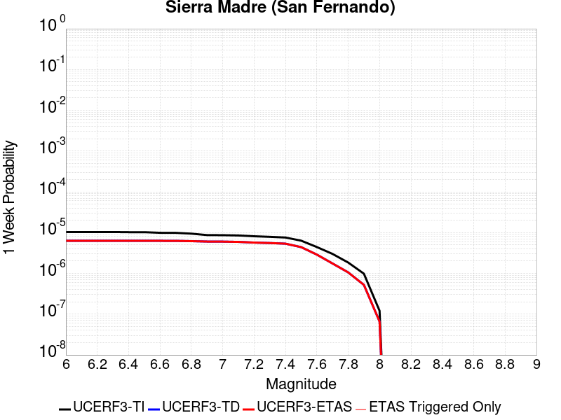 |  | 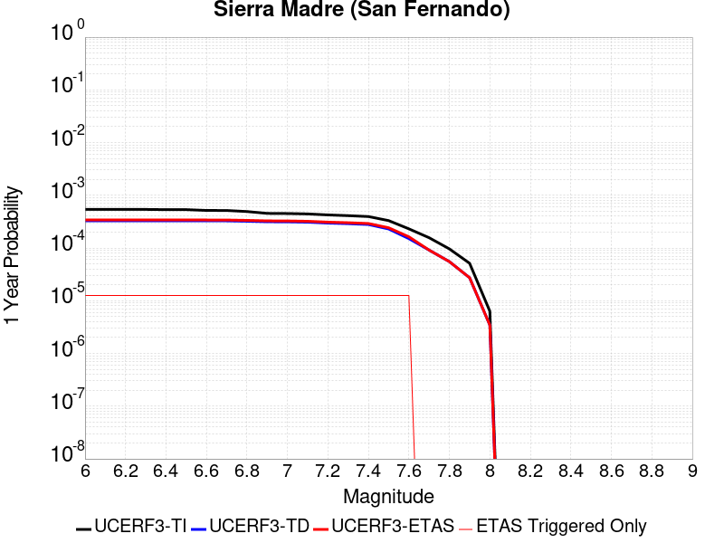 | 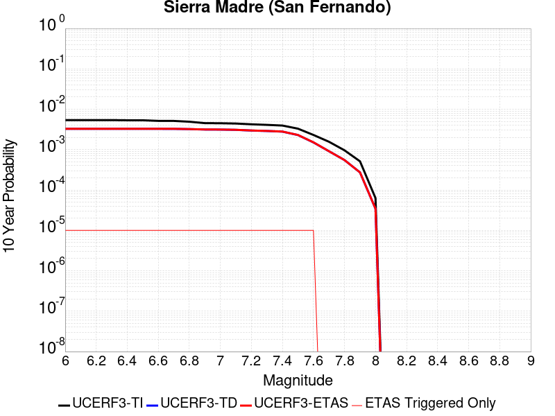 |

| Magnitude | 1 wk TI Prob | 1 wk TD Prob | 1 wk ETAS Prob | 1 wk ETAS/TD Gain | 1 wk ETAS Triggered Only | 1 mo TI Prob | 1 mo TD Prob | 1 mo ETAS Prob | 1 mo ETAS/TD Gain | 1 mo ETAS Triggered Only | 1 yr TI Prob | 1 yr TD Prob | 1 yr ETAS Prob | 1 yr ETAS/TD Gain | 1 yr ETAS Triggered Only | 10 yr TI Prob | 10 yr TD Prob | 10 yr ETAS Prob | 10 yr ETAS/TD Gain | 10 yr ETAS Triggered Only |
|-----|-----|-----|-----|-----|-----|-----|-----|-----|-----|-----|-----|-----|-----|-----|-----|-----|-----|-----|-----|-----|
| 6.0 | 1.0346413E-5 | 6.2872386E-6 | 6.2872386E-6 | 1.0 | 0.0 | 4.4341014E-5 | 2.6945036E-5 | 2.6945036E-5 | 1.0 | 0.0 | 5.3971814E-4 | 3.2800753E-4 | 3.3800426E-4 | 1.030477 | 1.0E-5 | 0.0053840918 | 0.0032753467 | 0.003285314 | 1.003043 | 1.0E-5 |
| 6.1 | 1.0346413E-5 | 6.2872386E-6 | 6.2872386E-6 | 1.0 | 0.0 | 4.4341014E-5 | 2.6945036E-5 | 2.6945036E-5 | 1.0 | 0.0 | 5.3971814E-4 | 3.2800753E-4 | 3.3800426E-4 | 1.030477 | 1.0E-5 | 0.0053840918 | 0.0032753467 | 0.003285314 | 1.003043 | 1.0E-5 |
| 6.2 | 1.0346413E-5 | 6.2872386E-6 | 6.2872386E-6 | 1.0 | 0.0 | 4.4341014E-5 | 2.6945036E-5 | 2.6945036E-5 | 1.0 | 0.0 | 5.3971814E-4 | 3.2800753E-4 | 3.3800426E-4 | 1.030477 | 1.0E-5 | 0.0053840918 | 0.0032753467 | 0.003285314 | 1.003043 | 1.0E-5 |
| 6.3 | 1.0346413E-5 | 6.2872386E-6 | 6.2872386E-6 | 1.0 | 0.0 | 4.4341014E-5 | 2.6945036E-5 | 2.6945036E-5 | 1.0 | 0.0 | 5.3971814E-4 | 3.2800753E-4 | 3.3800426E-4 | 1.030477 | 1.0E-5 | 0.0053840918 | 0.0032753467 | 0.003285314 | 1.003043 | 1.0E-5 |
| 6.4 | 1.0249558E-5 | 6.2872386E-6 | 6.2872386E-6 | 1.0 | 0.0 | 4.392594E-5 | 2.6945036E-5 | 2.6945036E-5 | 1.0 | 0.0 | 5.3466705E-4 | 3.2800753E-4 | 3.3800426E-4 | 1.030477 | 1.0E-5 | 0.0053338245 | 0.0032753467 | 0.003285314 | 1.003043 | 1.0E-5 |
| 6.5 | 1.0249558E-5 | 6.2872386E-6 | 6.2872386E-6 | 1.0 | 0.0 | 4.392594E-5 | 2.6945036E-5 | 2.6945036E-5 | 1.0 | 0.0 | 5.3466705E-4 | 3.2800753E-4 | 3.3800426E-4 | 1.030477 | 1.0E-5 | 0.0053338245 | 0.0032753467 | 0.003285314 | 1.003043 | 1.0E-5 |
| 6.6 | 9.9035515E-6 | 6.2872386E-6 | 6.2872386E-6 | 1.0 | 0.0 | 4.2443102E-5 | 2.6945036E-5 | 2.6945036E-5 | 1.0 | 0.0 | 5.166222E-4 | 3.2800753E-4 | 3.3800426E-4 | 1.030477 | 1.0E-5 | 0.0051542283 | 0.0032753467 | 0.003285314 | 1.003043 | 1.0E-5 |
| 6.7 | 9.87217E-6 | 6.274661E-6 | 6.274661E-6 | 1.0 | 0.0 | 4.2308613E-5 | 2.6891132E-5 | 2.6891132E-5 | 1.0 | 0.0 | 5.149856E-4 | 3.2735144E-4 | 3.3734817E-4 | 1.0305382 | 1.0E-5 | 0.005137938 | 0.003268805 | 0.0032787723 | 1.0030493 | 1.0E-5 |
| 6.8 | 9.4359175E-6 | 6.1786473E-6 | 6.1786473E-6 | 1.0 | 0.0 | 4.043902E-5 | 2.6479653E-5 | 2.6479653E-5 | 1.0 | 0.0 | 4.9223384E-4 | 3.223432E-4 | 3.3233996E-4 | 1.0310129 | 1.0E-5 | 0.0049114493 | 0.0032188678 | 0.0032288358 | 1.0030967 | 1.0E-5 |
| 6.9 | 8.700447E-6 | 6.0399334E-6 | 6.0399334E-6 | 1.0 | 0.0 | 3.72871E-5 | 2.5885178E-5 | 2.5885178E-5 | 1.0 | 0.0 | 4.5387587E-4 | 3.1510755E-4 | 3.251044E-4 | 1.0317252 | 1.0E-5 | 0.0045295 | 0.0031467169 | 0.0031566853 | 1.0031679 | 1.0E-5 |
| 7.0 | 8.648878E-6 | 6.014848E-6 | 6.014848E-6 | 1.0 | 0.0 | 3.7066096E-5 | 2.5777672E-5 | 2.5777672E-5 | 1.0 | 0.0 | 4.5118626E-4 | 3.1379904E-4 | 3.2379592E-4 | 1.0318575 | 1.0E-5 | 0.004502713 | 0.0031336688 | 0.0031436374 | 1.0031811 | 1.0E-5 |
| 7.1 | 8.505786E-6 | 5.9244794E-6 | 5.9244794E-6 | 1.0 | 0.0 | 3.645286E-5 | 2.5390384E-5 | 2.5390384E-5 | 1.0 | 0.0 | 4.437232E-4 | 3.0908515E-4 | 3.1908206E-4 | 1.0323435 | 1.0E-5 | 0.0044283825 | 0.0030866617 | 0.0030966308 | 1.0032297 | 1.0E-5 |
| 7.2 | 8.139752E-6 | 5.698777E-6 | 5.698777E-6 | 1.0 | 0.0 | 3.4884186E-5 | 2.4423107E-5 | 2.4423107E-5 | 1.0 | 0.0 | 4.246322E-4 | 2.973118E-4 | 3.0730883E-4 | 1.0336248 | 1.0E-5 | 0.004238217 | 0.0029692466 | 0.0029792169 | 1.0033579 | 1.0E-5 |
| 7.3 | 7.8816E-6 | 5.5520936E-6 | 5.5520936E-6 | 1.0 | 0.0 | 3.3777847E-5 | 2.3794475E-5 | 2.3794475E-5 | 1.0 | 0.0 | 4.111677E-4 | 2.8966027E-4 | 2.9965737E-4 | 1.0345132 | 1.0E-5 | 0.004104078 | 0.0028929329 | 0.0029029038 | 1.0034467 | 1.0E-5 |
| 7.4 | 7.5810603E-6 | 5.356333E-6 | 5.356333E-6 | 1.0 | 0.0 | 3.2489854E-5 | 2.2955517E-5 | 2.2955517E-5 | 1.0 | 0.0 | 3.9549218E-4 | 2.7944864E-4 | 2.8944583E-4 | 1.0357747 | 1.0E-5 | 0.0039478904 | 0.0027910774 | 0.0028010495 | 1.0035728 | 1.0E-5 |
| 7.5 | 6.349153E-6 | 4.4075887E-6 | 4.4075887E-6 | 1.0 | 0.0 | 2.7210372E-5 | 1.8889532E-5 | 1.8889532E-5 | 1.0 | 0.0 | 3.312359E-4 | 2.2995661E-4 | 2.3995432E-4 | 1.0434765 | 1.0E-5 | 0.0033074263 | 0.0022972687 | 0.0023072457 | 1.004343 | 1.0E-5 |
| 7.6 | 4.430576E-6 | 2.8905786E-6 | 2.8905786E-6 | 1.0 | 0.0 | 1.8988047E-5 | 1.23881355E-5 | 1.23881355E-5 | 1.0 | 0.0 | 2.3115493E-4 | 1.5081534E-4 | 1.6081383E-4 | 1.0662962 | 1.0E-5 | 0.0023091463 | 0.0015071525 | 0.0015171374 | 1.006625 | 1.0E-5 |
| 7.7 | 3.005066E-6 | 1.7509823E-6 | 1.7509823E-6 | 1.0 | 0.0 | 1.2878791E-5 | 7.504188E-6 | 7.504188E-6 | 1.0 | 0.0 | 1.56788E-4 | 9.135967E-5 | 9.135967E-5 | 1.0 | 0.0 | 0.0015667742 | 9.1322226E-4 | 9.1322226E-4 | 1.0 | 0.0 |
| 7.8 | 1.8459098E-6 | 1.0581826E-6 | 1.0581826E-6 | 1.0 | 0.0 | 7.911018E-6 | 4.5350607E-6 | 4.5350607E-6 | 1.0 | 0.0 | 9.631238E-5 | 5.5212968E-5 | 5.5212968E-5 | 1.0 | 0.0 | 9.627065E-4 | 5.5199297E-4 | 5.5199297E-4 | 1.0 | 0.0 |
| 7.9 | 9.839262E-7 | 5.2340516E-7 | 5.2340516E-7 | 1.0 | 0.0 | 4.2168194E-6 | 2.243163E-6 | 2.243163E-6 | 1.0 | 0.0 | 5.1338568E-5 | 2.731017E-5 | 2.731017E-5 | 1.0 | 0.0 | 5.132671E-4 | 2.7306844E-4 | 2.7306844E-4 | 1.0 | 0.0 |
| 8.0 | 1.210983E-7 | 6.613497E-8 | 6.613497E-8 | 1.0 | 0.0 | 5.1899264E-7 | 2.8343558E-7 | 2.8343558E-7 | 1.0 | 0.0 | 6.3187167E-6 | 3.4508228E-6 | 3.4508228E-6 | 1.0 | 0.0 | 6.318537E-5 | 3.450771E-5 | 3.450771E-5 | 1.0 | 0.0 |

## Point Reyes 2011 CFM
*[(top)](#table-of-contents)*

| 1 Week | 1 Month | 1 Year | 10 Year |
|-----|-----|-----|-----|
|  | 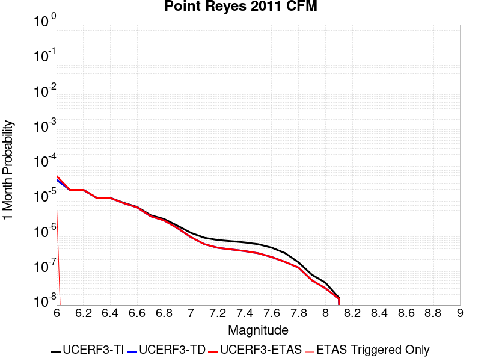 | 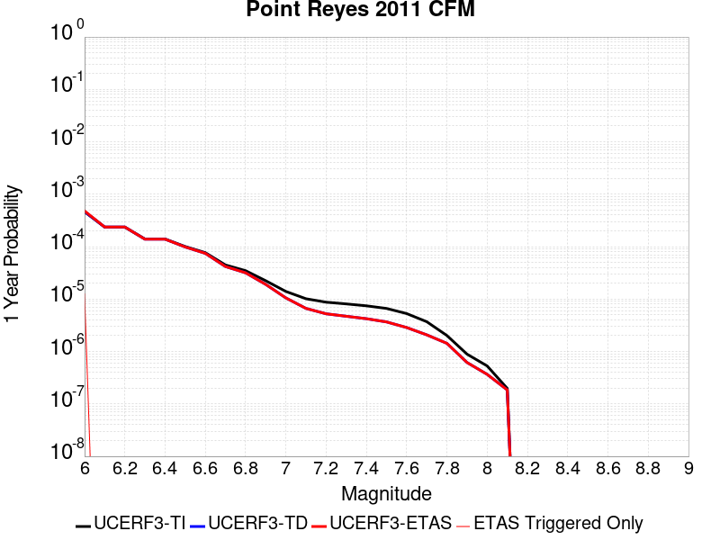 | 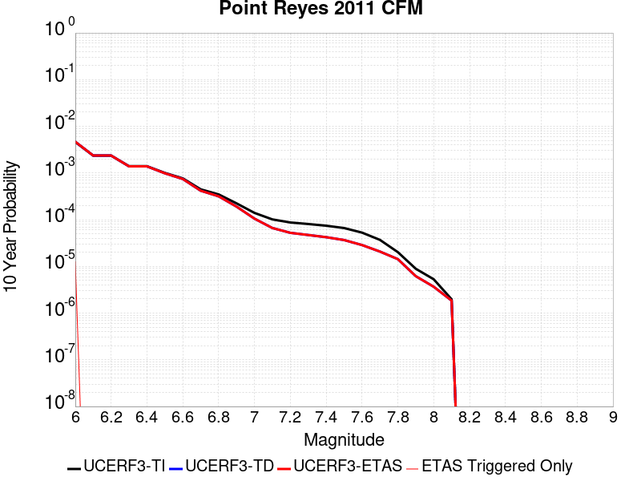 |

| Magnitude | 1 wk TI Prob | 1 wk TD Prob | 1 wk ETAS Prob | 1 wk ETAS/TD Gain | 1 wk ETAS Triggered Only | 1 mo TI Prob | 1 mo TD Prob | 1 mo ETAS Prob | 1 mo ETAS/TD Gain | 1 mo ETAS Triggered Only | 1 yr TI Prob | 1 yr TD Prob | 1 yr ETAS Prob | 1 yr ETAS/TD Gain | 1 yr ETAS Triggered Only | 10 yr TI Prob | 10 yr TD Prob | 10 yr ETAS Prob | 10 yr ETAS/TD Gain | 10 yr ETAS Triggered Only |
|-----|-----|-----|-----|-----|-----|-----|-----|-----|-----|-----|-----|-----|-----|-----|-----|-----|-----|-----|-----|-----|
| 6.0 | 8.8644965E-6 | 8.96716E-6 | 1.896707E-5 | 2.1151702 | 1.0E-5 | 3.7990147E-5 | 3.8430157E-5 | 4.842977E-5 | 1.2602023 | 1.0E-5 | 4.624319E-4 | 4.67793E-4 | 4.777883E-4 | 1.021367 | 1.0E-5 | 0.0046147075 | 0.004668711 | 0.0046786647 | 1.0021319 | 1.0E-5 |
| 6.1 | 4.526405E-6 | 4.5392153E-6 | 4.5392153E-6 | 1.0 | 0.0 | 1.9398734E-5 | 1.945364E-5 | 1.945364E-5 | 1.0 | 0.0 | 2.36154E-4 | 2.3682338E-4 | 2.3682338E-4 | 1.0 | 0.0 | 0.002359032 | 0.0023658164 | 0.0023658164 | 1.0 | 0.0 |
| 6.2 | 4.526405E-6 | 4.5392153E-6 | 4.5392153E-6 | 1.0 | 0.0 | 1.9398734E-5 | 1.945364E-5 | 1.945364E-5 | 1.0 | 0.0 | 2.36154E-4 | 2.3682338E-4 | 2.3682338E-4 | 1.0 | 0.0 | 0.002359032 | 0.0023658164 | 0.0023658164 | 1.0 | 0.0 |
| 6.3 | 2.6842322E-6 | 2.660673E-6 | 2.660673E-6 | 1.0 | 0.0 | 1.1503801E-5 | 1.1402836E-5 | 1.1402836E-5 | 1.0 | 0.0 | 1.4004979E-4 | 1.3882088E-4 | 1.3882088E-4 | 1.0 | 0.0 | 0.0013996155 | 0.0013873635 | 0.0013873635 | 1.0 | 0.0 |
| 6.4 | 2.6842322E-6 | 2.660673E-6 | 2.660673E-6 | 1.0 | 0.0 | 1.1503801E-5 | 1.1402836E-5 | 1.1402836E-5 | 1.0 | 0.0 | 1.4004979E-4 | 1.3882088E-4 | 1.3882088E-4 | 1.0 | 0.0 | 0.0013996155 | 0.0013873635 | 0.0013873635 | 1.0 | 0.0 |
| 6.5 | 1.9281833E-6 | 1.8906233E-6 | 1.8906233E-6 | 1.0 | 0.0 | 8.263617E-6 | 8.1026465E-6 | 8.1026465E-6 | 1.0 | 0.0 | 1.0060489E-4 | 9.864534E-5 | 9.864534E-5 | 1.0 | 0.0 | 0.0010055936 | 9.860265E-4 | 9.860265E-4 | 1.0 | 0.0 |
| 6.6 | 1.4726726E-6 | 1.4269547E-6 | 1.4269547E-6 | 1.0 | 0.0 | 6.3114385E-6 | 6.115506E-6 | 6.115506E-6 | 1.0 | 0.0 | 7.683905E-5 | 7.445379E-5 | 7.445379E-5 | 1.0 | 0.0 | 7.6812494E-4 | 7.442957E-4 | 7.442957E-4 | 1.0 | 0.0 |
| 6.7 | 8.572307E-7 | 8.007182E-7 | 8.007182E-7 | 1.0 | 0.0 | 3.6738406E-6 | 3.431645E-6 | 3.431645E-6 | 1.0 | 0.0 | 4.472809E-5 | 4.1779494E-5 | 4.1779494E-5 | 1.0 | 0.0 | 4.471909E-4 | 4.177204E-4 | 4.177204E-4 | 1.0 | 0.0 |
| 6.8 | 6.6745434E-7 | 6.07727E-7 | 6.07727E-7 | 1.0 | 0.0 | 2.8605155E-6 | 2.6045416E-6 | 2.6045416E-6 | 1.0 | 0.0 | 3.482622E-5 | 3.1709842E-5 | 3.1709842E-5 | 1.0 | 0.0 | 3.4820763E-4 | 3.170566E-4 | 3.170566E-4 | 1.0 | 0.0 |
| 6.9 | 4.291521E-7 | 3.6535639E-7 | 3.6535639E-7 | 1.0 | 0.0 | 1.839222E-6 | 1.5658121E-6 | 1.5658121E-6 | 1.0 | 0.0 | 2.2392298E-5 | 1.90636E-5 | 1.90636E-5 | 1.0 | 0.0 | 2.2390042E-4 | 1.906224E-4 | 1.906224E-4 | 1.0 | 0.0 |
| 7.0 | 2.6812808E-7 | 2.0187117E-7 | 2.0187117E-7 | 1.0 | 0.0 | 1.1491198E-6 | 8.6516184E-7 | 8.6516184E-7 | 1.0 | 0.0 | 1.3990444E-5 | 1.0533295E-5 | 1.0533295E-5 | 1.0 | 0.0 | 1.3989564E-4 | 1.05330415E-4 | 1.05330415E-4 | 1.0 | 0.0 |
| 7.1 | 1.9451231E-7 | 1.2725201E-7 | 1.2725201E-7 | 1.0 | 0.0 | 8.336239E-7 | 5.4536565E-7 | 5.4536565E-7 | 1.0 | 0.0 | 1.0149324E-5 | 6.639806E-6 | 6.639806E-6 | 1.0 | 0.0 | 1.014886E-4 | 6.639846E-5 | 6.639846E-5 | 1.0 | 0.0 |
| 7.2 | 1.6715143E-7 | 1.0042555E-7 | 1.0042555E-7 | 1.0 | 0.0 | 7.1636305E-7 | 4.3039515E-7 | 4.3039515E-7 | 1.0 | 0.0 | 8.721685E-6 | 5.2400483E-6 | 5.2400483E-6 | 1.0 | 0.0 | 8.721343E-5 | 5.240162E-5 | 5.240162E-5 | 1.0 | 0.0 |
| 7.3 | 1.5503173E-7 | 9.012816E-8 | 9.012816E-8 | 1.0 | 0.0 | 6.644215E-7 | 3.8626348E-7 | 3.8626348E-7 | 1.0 | 0.0 | 8.089301E-6 | 4.7027474E-6 | 4.7027474E-6 | 1.0 | 0.0 | 8.089007E-5 | 4.7028854E-5 | 4.7028854E-5 | 1.0 | 0.0 |
| 7.4 | 1.4251614E-7 | 8.097342E-8 | 8.097342E-8 | 1.0 | 0.0 | 6.1078333E-7 | 3.4702887E-7 | 3.4702887E-7 | 1.0 | 0.0 | 7.4362615E-6 | 4.225068E-6 | 4.225068E-6 | 1.0 | 0.0 | 7.436013E-5 | 4.2252257E-5 | 4.2252257E-5 | 1.0 | 0.0 |
| 7.5 | 1.2710186E-7 | 7.029377E-8 | 7.029377E-8 | 1.0 | 0.0 | 5.447221E-7 | 3.0125898E-7 | 3.0125898E-7 | 1.0 | 0.0 | 6.6319717E-6 | 3.6678218E-6 | 3.6678218E-6 | 1.0 | 0.0 | 6.6317734E-5 | 3.667999E-5 | 3.667999E-5 | 1.0 | 0.0 |
| 7.6 | 1.0144708E-7 | 5.494996E-8 | 5.494996E-8 | 1.0 | 0.0 | 4.347731E-7 | 2.354998E-7 | 2.354998E-7 | 1.0 | 0.0 | 5.2933497E-6 | 2.8672061E-6 | 2.8672061E-6 | 1.0 | 0.0 | 5.293224E-5 | 2.8674069E-5 | 2.8674069E-5 | 1.0 | 0.0 |
| 7.7 | 7.090527E-8 | 3.9821334E-8 | 3.9821334E-8 | 1.0 | 0.0 | 3.038797E-7 | 1.7066284E-7 | 1.7066284E-7 | 1.0 | 0.0 | 3.699729E-6 | 2.0778182E-6 | 2.0778182E-6 | 1.0 | 0.0 | 3.6996673E-5 | 2.0780362E-5 | 2.0780362E-5 | 1.0 | 0.0 |
| 7.8 | 3.8712045E-8 | 2.7438638E-8 | 2.7438638E-8 | 1.0 | 0.0 | 1.6590876E-7 | 1.1759416E-7 | 1.1759416E-7 | 1.0 | 0.0 | 2.0199373E-6 | 1.4317079E-6 | 1.4317079E-6 | 1.0 | 0.0 | 2.0199188E-5 | 1.4319363E-5 | 1.4319363E-5 | 1.0 | 0.0 |
| 7.9 | 1.7068782E-8 | 1.183186E-8 | 1.183186E-8 | 1.0 | 0.0 | 7.315192E-8 | 5.0707975E-8 | 5.0707975E-8 | 1.0 | 0.0 | 8.906242E-7 | 6.173694E-7 | 6.173694E-7 | 1.0 | 0.0 | 8.906207E-6 | 6.1760525E-6 | 6.1760525E-6 | 1.0 | 0.0 |
| 8.0 | 1.0172592E-8 | 7.0268076E-9 | 7.0268076E-9 | 1.0 | 0.0 | 4.359682E-8 | 3.011489E-8 | 3.011489E-8 | 1.0 | 0.0 | 5.3079117E-7 | 3.6664872E-7 | 3.6664872E-7 | 1.0 | 0.0 | 5.307899E-6 | 3.6688568E-6 | 3.6688568E-6 | 1.0 | 0.0 |
| 8.1 | 3.7861243E-9 | 3.5448604E-9 | 3.5448604E-9 | 1.0 | 0.0 | 1.6226247E-8 | 1.5192258E-8 | 1.5192258E-8 | 1.0 | 0.0 | 1.9755454E-7 | 1.8496571E-7 | 1.8496571E-7 | 1.0 | 0.0 | 1.9755437E-6 | 1.8514592E-6 | 1.8514592E-6 | 1.0 | 0.0 |

## Bennett Valley 2011 CFM
*[(top)](#table-of-contents)*

| 1 Week | 1 Month | 1 Year | 10 Year |
|-----|-----|-----|-----|
| 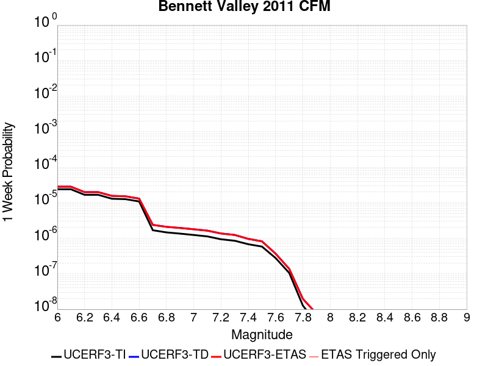 |  | 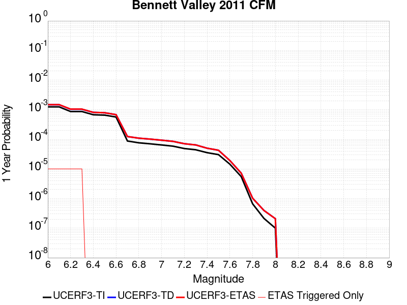 | 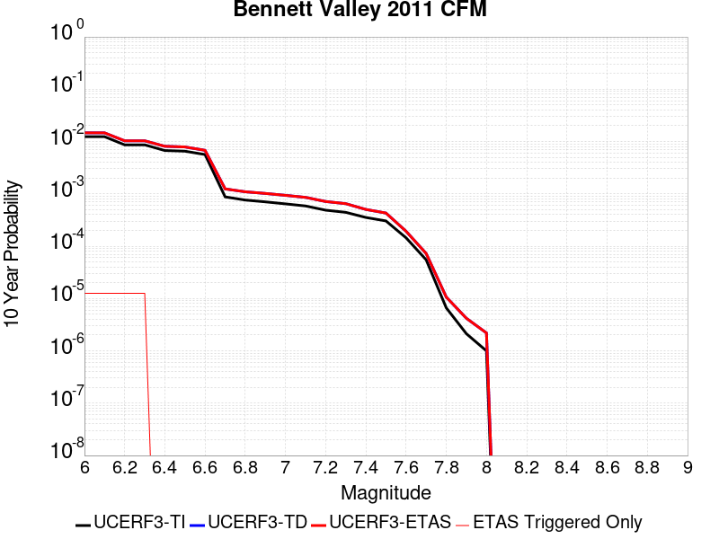 |

| Magnitude | 1 wk TI Prob | 1 wk TD Prob | 1 wk ETAS Prob | 1 wk ETAS/TD Gain | 1 wk ETAS Triggered Only | 1 mo TI Prob | 1 mo TD Prob | 1 mo ETAS Prob | 1 mo ETAS/TD Gain | 1 mo ETAS Triggered Only | 1 yr TI Prob | 1 yr TD Prob | 1 yr ETAS Prob | 1 yr ETAS/TD Gain | 1 yr ETAS Triggered Only | 10 yr TI Prob | 10 yr TD Prob | 10 yr ETAS Prob | 10 yr ETAS/TD Gain | 10 yr ETAS Triggered Only |
|-----|-----|-----|-----|-----|-----|-----|-----|-----|-----|-----|-----|-----|-----|-----|-----|-----|-----|-----|-----|-----|
| 6.0 | 2.3893934E-5 | 2.823899E-5 | 2.823899E-5 | 1.0 | 0.0 | 1.0239855E-4 | 1.2101967E-4 | 1.3101846E-4 | 1.0826212 | 1.0E-5 | 0.0012459893 | 0.0014726035 | 0.0014825888 | 1.0067807 | 1.0E-5 | 0.012390262 | 0.01465108 | 0.014660933 | 1.0006726 | 1.0E-5 |
| 6.1 | 2.3893934E-5 | 2.823899E-5 | 2.823899E-5 | 1.0 | 0.0 | 1.0239855E-4 | 1.2101967E-4 | 1.3101846E-4 | 1.0826212 | 1.0E-5 | 0.0012459893 | 0.0014726035 | 0.0014825888 | 1.0067807 | 1.0E-5 | 0.012390262 | 0.01465108 | 0.014660933 | 1.0006726 | 1.0E-5 |
| 6.2 | 1.6657146E-5 | 1.9853873E-5 | 1.9853873E-5 | 1.0 | 0.0 | 7.138582E-5 | 8.508605E-5 | 9.50852E-5 | 1.1175181 | 1.0E-5 | 8.6877577E-4 | 0.0010355718 | 0.0010455615 | 1.0096465 | 1.0E-5 | 0.008653872 | 0.010325706 | 0.010335602 | 1.0009584 | 1.0E-5 |
| 6.3 | 1.6657146E-5 | 1.9853873E-5 | 1.9853873E-5 | 1.0 | 0.0 | 7.138582E-5 | 8.508605E-5 | 9.50852E-5 | 1.1175181 | 1.0E-5 | 8.6877577E-4 | 0.0010355718 | 0.0010455615 | 1.0096465 | 1.0E-5 | 0.008653872 | 0.010325706 | 0.010335602 | 1.0009584 | 1.0E-5 |
| 6.4 | 1.29418495E-5 | 1.5567592E-5 | 1.5567592E-5 | 1.0 | 0.0 | 5.546389E-5 | 6.671728E-5 | 6.671728E-5 | 1.0 | 0.0 | 6.7506364E-4 | 8.1211043E-4 | 8.1211043E-4 | 1.0 | 0.0 | 0.0067301663 | 0.008108544 | 0.008108544 | 1.0 | 0.0 |
| 6.5 | 1.2582504E-5 | 1.5134623E-5 | 1.5134623E-5 | 1.0 | 0.0 | 5.39239E-5 | 6.486179E-5 | 6.486179E-5 | 1.0 | 0.0 | 6.563257E-4 | 7.8953634E-4 | 7.8953634E-4 | 1.0 | 0.0 | 0.006543907 | 0.007884451 | 0.007884451 | 1.0 | 0.0 |
| 6.6 | 1.0846706E-5 | 1.3036858E-5 | 1.3036858E-5 | 1.0 | 0.0 | 4.6485053E-5 | 5.5871777E-5 | 5.5871777E-5 | 1.0 | 0.0 | 5.6580856E-4 | 6.801549E-4 | 6.801549E-4 | 1.0 | 0.0 | 0.005643701 | 0.0067976816 | 0.0067976816 | 1.0 | 0.0 |
| 6.7 | 1.6803231E-6 | 2.377902E-6 | 2.377902E-6 | 1.0 | 0.0 | 7.2013645E-6 | 1.019097E-5 | 1.019097E-5 | 1.0 | 0.0 | 8.7673085E-5 | 1.2406812E-4 | 1.2406812E-4 | 1.0 | 0.0 | 8.76385E-4 | 0.0012444188 | 0.0012444188 | 1.0 | 0.0 |
| 6.8 | 1.4609833E-6 | 2.0939708E-6 | 2.0939708E-6 | 1.0 | 0.0 | 6.261342E-6 | 8.974131E-6 | 8.974131E-6 | 1.0 | 0.0 | 7.6229175E-5 | 1.0925463E-4 | 1.0925463E-4 | 1.0 | 0.0 | 7.620303E-4 | 0.0010963798 | 0.0010963798 | 1.0 | 0.0 |
| 6.9 | 1.3492396E-6 | 1.9459103E-6 | 1.9459103E-6 | 1.0 | 0.0 | 5.7824427E-6 | 8.339589E-6 | 8.339589E-6 | 1.0 | 0.0 | 7.0398964E-5 | 1.01529826E-4 | 1.01529826E-4 | 1.0 | 0.0 | 7.037667E-4 | 0.001019178 | 0.001019178 | 1.0 | 0.0 |
| 7.0 | 1.2347921E-6 | 1.7888974E-6 | 1.7888974E-6 | 1.0 | 0.0 | 5.291955E-6 | 7.666681E-6 | 7.666681E-6 | 1.0 | 0.0 | 6.442765E-5 | 9.33379E-5 | 9.33379E-5 | 1.0 | 0.0 | 6.440897E-4 | 9.373068E-4 | 9.373068E-4 | 1.0 | 0.0 |
| 7.1 | 1.1262973E-6 | 1.6359154E-6 | 1.6359154E-6 | 1.0 | 0.0 | 4.8269794E-6 | 7.0110473E-6 | 7.0110473E-6 | 1.0 | 0.0 | 5.876689E-5 | 8.535621E-5 | 8.535621E-5 | 1.0 | 0.0 | 5.875135E-4 | 8.5754244E-4 | 8.5754244E-4 | 1.0 | 0.0 |
| 7.2 | 9.351744E-7 | 1.3611758E-6 | 1.3611758E-6 | 1.0 | 0.0 | 4.007884E-6 | 5.8335977E-6 | 5.8335977E-6 | 1.0 | 0.0 | 4.8794896E-5 | 7.1021765E-5 | 7.1021765E-5 | 1.0 | 0.0 | 4.878418E-4 | 7.142461E-4 | 7.142461E-4 | 1.0 | 0.0 |
| 7.3 | 8.5039534E-7 | 1.2386733E-6 | 1.2386733E-6 | 1.0 | 0.0 | 3.6445463E-6 | 5.308589E-6 | 5.308589E-6 | 1.0 | 0.0 | 4.437145E-5 | 6.463018E-5 | 6.463018E-5 | 1.0 | 0.0 | 4.436259E-4 | 6.50103E-4 | 6.50103E-4 | 1.0 | 0.0 |
| 7.4 | 6.7875015E-7 | 9.600642E-7 | 9.600642E-7 | 1.0 | 0.0 | 2.908926E-6 | 4.1145545E-6 | 4.1145545E-6 | 1.0 | 0.0 | 3.54156E-5 | 5.009356E-5 | 5.009356E-5 | 1.0 | 0.0 | 3.5409955E-4 | 5.0413073E-4 | 5.0413073E-4 | 1.0 | 0.0 |
| 7.5 | 5.826867E-7 | 8.1883735E-7 | 8.1883735E-7 | 1.0 | 0.0 | 2.4972264E-6 | 3.5092983E-6 | 3.5092983E-6 | 1.0 | 0.0 | 3.0403306E-5 | 4.2724878E-5 | 4.2724878E-5 | 1.0 | 0.0 | 3.0399146E-4 | 4.300558E-4 | 4.300558E-4 | 1.0 | 0.0 |
| 7.6 | 2.7734902E-7 | 3.6822587E-7 | 3.6822587E-7 | 1.0 | 0.0 | 1.1886381E-6 | 1.57811E-6 | 1.57811E-6 | 1.0 | 0.0 | 1.4471572E-5 | 1.9213321E-5 | 1.9213321E-5 | 1.0 | 0.0 | 1.447063E-4 | 1.9315645E-4 | 1.9315645E-4 | 1.0 | 0.0 |
| 7.7 | 1.0530888E-7 | 1.3749101E-7 | 1.3749101E-7 | 1.0 | 0.0 | 4.513237E-7 | 5.8924707E-7 | 5.8924707E-7 | 1.0 | 0.0 | 5.4948523E-6 | 7.174059E-6 | 7.174059E-6 | 1.0 | 0.0 | 5.4947162E-5 | 7.255585E-5 | 7.255585E-5 | 1.0 | 0.0 |
| 7.8 | 1.2714258E-8 | 1.9633259E-8 | 1.9633259E-8 | 1.0 | 0.0 | 5.448968E-8 | 8.4142535E-8 | 8.4142535E-8 | 1.0 | 0.0 | 6.6341164E-7 | 1.0244348E-6 | 1.0244348E-6 | 1.0 | 0.0 | 6.6340967E-6 | 1.0658595E-5 | 1.0658595E-5 | 1.0 | 0.0 |
| 7.9 | 4.075888E-9 | 7.559928E-9 | 7.559928E-9 | 1.0 | 0.0 | 1.7468091E-8 | 3.239969E-8 | 3.239969E-8 | 1.0 | 0.0 | 2.12674E-7 | 3.9446616E-7 | 3.9446616E-7 | 1.0 | 0.0 | 2.1267379E-6 | 4.1952467E-6 | 4.1952467E-6 | 1.0 | 0.0 |
| 8.0 | 1.9126138E-9 | 3.9956882E-9 | 3.9956882E-9 | 1.0 | 0.0 | 8.196917E-9 | 1.7124377E-8 | 1.7124377E-8 | 1.0 | 0.0 | 9.9797454E-8 | 2.0848927E-7 | 2.0848927E-7 | 1.0 | 0.0 | 9.979741E-7 | 2.1982228E-6 | 2.1982228E-6 | 1.0 | 0.0 |

## West Napa 2011 CFM
*[(top)](#table-of-contents)*

| 1 Week | 1 Month | 1 Year | 10 Year |
|-----|-----|-----|-----|
|  |  |  | 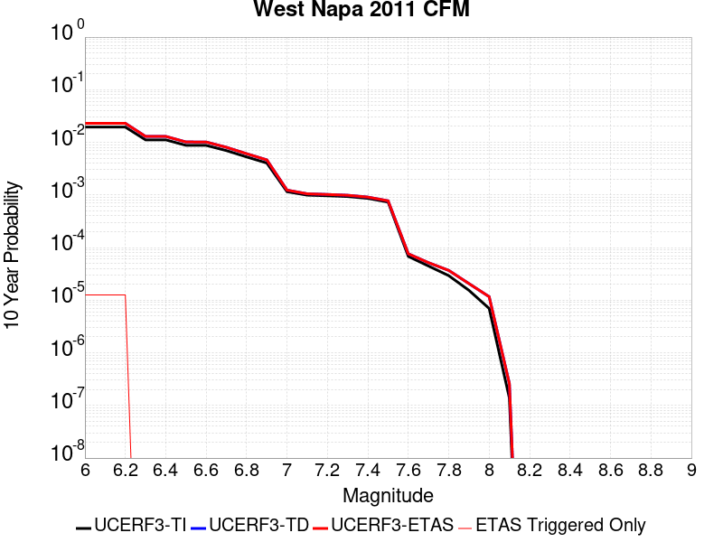 |

| Magnitude | 1 wk TI Prob | 1 wk TD Prob | 1 wk ETAS Prob | 1 wk ETAS/TD Gain | 1 wk ETAS Triggered Only | 1 mo TI Prob | 1 mo TD Prob | 1 mo ETAS Prob | 1 mo ETAS/TD Gain | 1 mo ETAS Triggered Only | 1 yr TI Prob | 1 yr TD Prob | 1 yr ETAS Prob | 1 yr ETAS/TD Gain | 1 yr ETAS Triggered Only | 10 yr TI Prob | 10 yr TD Prob | 10 yr ETAS Prob | 10 yr ETAS/TD Gain | 10 yr ETAS Triggered Only |
|-----|-----|-----|-----|-----|-----|-----|-----|-----|-----|-----|-----|-----|-----|-----|-----|-----|-----|-----|-----|-----|
| 6.0 | 3.773104E-5 | 4.4528504E-5 | 4.4528504E-5 | 1.0 | 0.0 | 1.6169442E-4 | 1.9082428E-4 | 1.9082428E-4 | 1.0 | 0.0 | 0.001966852 | 0.0023211278 | 0.0023211278 | 1.0 | 0.0 | 0.019495348 | 0.023002012 | 0.023011781 | 1.0004247 | 1.0E-5 |
| 6.1 | 3.773104E-5 | 4.4528504E-5 | 4.4528504E-5 | 1.0 | 0.0 | 1.6169442E-4 | 1.9082428E-4 | 1.9082428E-4 | 1.0 | 0.0 | 0.001966852 | 0.0023211278 | 0.0023211278 | 1.0 | 0.0 | 0.019495348 | 0.023002012 | 0.023011781 | 1.0004247 | 1.0E-5 |
| 6.2 | 3.773104E-5 | 4.4528504E-5 | 4.4528504E-5 | 1.0 | 0.0 | 1.6169442E-4 | 1.9082428E-4 | 1.9082428E-4 | 1.0 | 0.0 | 0.001966852 | 0.0023211278 | 0.0023211278 | 1.0 | 0.0 | 0.019495348 | 0.023002012 | 0.023011781 | 1.0004247 | 1.0E-5 |
| 6.3 | 2.147964E-5 | 2.4987066E-5 | 2.4987066E-5 | 1.0 | 0.0 | 9.2052345E-5 | 1.0708355E-4 | 1.0708355E-4 | 1.0 | 0.0 | 0.001120161 | 0.0013030542 | 0.0013030542 | 1.0 | 0.0 | 0.011145315 | 0.012964482 | 0.012964482 | 1.0 | 0.0 |
| 6.4 | 2.147964E-5 | 2.4987066E-5 | 2.4987066E-5 | 1.0 | 0.0 | 9.2052345E-5 | 1.0708355E-4 | 1.0708355E-4 | 1.0 | 0.0 | 0.001120161 | 0.0013030542 | 0.0013030542 | 1.0 | 0.0 | 0.011145315 | 0.012964482 | 0.012964482 | 1.0 | 0.0 |
| 6.5 | 1.688201E-5 | 1.9547371E-5 | 1.9547371E-5 | 1.0 | 0.0 | 7.234947E-5 | 8.377217E-5 | 8.377217E-5 | 1.0 | 0.0 | 8.804988E-4 | 0.0010195216 | 0.0010195216 | 1.0 | 0.0 | 0.008770182 | 0.01015684 | 0.01015684 | 1.0 | 0.0 |
| 6.6 | 1.6846381E-5 | 1.9507064E-5 | 1.9507064E-5 | 1.0 | 0.0 | 7.219678E-5 | 8.3599436E-5 | 8.3599436E-5 | 1.0 | 0.0 | 8.7864127E-4 | 0.0010174206 | 0.0010174206 | 1.0 | 0.0 | 0.008751754 | 0.010136021 | 0.010136021 | 1.0 | 0.0 |
| 6.7 | 1.3396501E-5 | 1.5467684E-5 | 1.5467684E-5 | 1.0 | 0.0 | 5.7412315E-5 | 6.628875E-5 | 6.628875E-5 | 1.0 | 0.0 | 6.9877075E-4 | 8.068302E-4 | 8.068302E-4 | 1.0 | 0.0 | 0.0069657755 | 0.008046459 | 0.008046459 | 1.0 | 0.0 |
| 6.8 | 1.0139058E-5 | 1.16721785E-5 | 1.16721785E-5 | 1.0 | 0.0 | 4.3452383E-5 | 5.0022976E-5 | 5.0022976E-5 | 1.0 | 0.0 | 5.289043E-4 | 6.0891506E-4 | 6.0891506E-4 | 1.0 | 0.0 | 0.005276473 | 0.0060791126 | 0.0060791126 | 1.0 | 0.0 |
| 6.9 | 7.761281E-6 | 8.890723E-6 | 8.890723E-6 | 1.0 | 0.0 | 3.326221E-5 | 3.810283E-5 | 3.810283E-5 | 1.0 | 0.0 | 4.0489217E-4 | 4.6385458E-4 | 4.6385458E-4 | 1.0 | 0.0 | 0.0040415525 | 0.0046351026 | 0.0046351026 | 1.0 | 0.0 |
| 7.0 | 2.2109202E-6 | 2.3666319E-6 | 2.3666319E-6 | 1.0 | 0.0 | 9.475338E-6 | 1.01426685E-5 | 1.01426685E-5 | 1.0 | 0.0 | 1.1535613E-4 | 1.2348007E-4 | 1.2348007E-4 | 1.0 | 0.0 | 0.0011529627 | 0.0012353238 | 0.0012353238 | 1.0 | 0.0 |
| 7.1 | 1.9008926E-6 | 2.0133207E-6 | 2.0133207E-6 | 1.0 | 0.0 | 8.146657E-6 | 8.628488E-6 | 8.628488E-6 | 1.0 | 0.0 | 9.918104E-5 | 1.05046805E-4 | 1.05046805E-4 | 1.0 | 0.0 | 9.913679E-4 | 0.0010511756 | 0.0010511756 | 1.0 | 0.0 |
| 7.2 | 1.8495944E-6 | 1.9561273E-6 | 1.9561273E-6 | 1.0 | 0.0 | 7.926808E-6 | 8.383376E-6 | 8.383376E-6 | 1.0 | 0.0 | 9.650462E-5 | 1.0206285E-4 | 1.0206285E-4 | 1.0 | 0.0 | 9.6462725E-4 | 0.0010213639 | 0.0010213639 | 1.0 | 0.0 |
| 7.3 | 1.7883189E-6 | 1.8880897E-6 | 1.8880897E-6 | 1.0 | 0.0 | 7.664201E-6 | 8.091788E-6 | 8.091788E-6 | 1.0 | 0.0 | 9.330765E-5 | 9.85131E-5 | 9.85131E-5 | 1.0 | 0.0 | 9.3268487E-4 | 9.858976E-4 | 9.858976E-4 | 1.0 | 0.0 |
| 7.4 | 1.6520572E-6 | 1.7415113E-6 | 1.7415113E-6 | 1.0 | 0.0 | 7.0802257E-6 | 7.463598E-6 | 7.463598E-6 | 1.0 | 0.0 | 8.6198335E-5 | 9.086554E-5 | 9.086554E-5 | 1.0 | 0.0 | 8.616491E-4 | 9.0948684E-4 | 9.0948684E-4 | 1.0 | 0.0 |
| 7.5 | 1.4040345E-6 | 1.4800271E-6 | 1.4800271E-6 | 1.0 | 0.0 | 6.0172765E-6 | 6.342958E-6 | 6.342958E-6 | 1.0 | 0.0 | 7.325788E-5 | 7.72228E-5 | 7.72228E-5 | 1.0 | 0.0 | 7.3233736E-4 | 7.7311805E-4 | 7.7311805E-4 | 1.0 | 0.0 |
| 7.6 | 1.3013842E-7 | 1.4416163E-7 | 1.4416163E-7 | 1.0 | 0.0 | 5.57736E-7 | 6.178354E-7 | 6.178354E-7 | 1.0 | 0.0 | 6.790414E-6 | 7.52212E-6 | 7.52212E-6 | 1.0 | 0.0 | 6.790207E-5 | 7.61463E-5 | 7.61463E-5 | 1.0 | 0.0 |
| 7.7 | 8.541512E-8 | 9.716462E-8 | 9.716462E-8 | 1.0 | 0.0 | 3.6606474E-7 | 4.1641974E-7 | 4.1641974E-7 | 1.0 | 0.0 | 4.456829E-6 | 5.069898E-6 | 5.069898E-6 | 1.0 | 0.0 | 4.4567398E-5 | 5.160189E-5 | 5.160189E-5 | 1.0 | 0.0 |
| 7.8 | 5.6074793E-8 | 6.895456E-8 | 6.895456E-8 | 1.0 | 0.0 | 2.403205E-7 | 2.955195E-7 | 2.955195E-7 | 1.0 | 0.0 | 2.9258983E-6 | 3.597944E-6 | 3.597944E-6 | 1.0 | 0.0 | 2.9258597E-5 | 3.6812045E-5 | 3.6812045E-5 | 1.0 | 0.0 |
| 7.9 | 2.9475839E-8 | 3.8567407E-8 | 3.8567407E-8 | 1.0 | 0.0 | 1.2632502E-7 | 1.6528887E-7 | 1.6528887E-7 | 1.0 | 0.0 | 1.538006E-6 | 2.01239E-6 | 2.01239E-6 | 1.0 | 0.0 | 1.5379954E-5 | 2.0664074E-5 | 2.0664074E-5 | 1.0 | 0.0 |
| 8.0 | 1.3337122E-8 | 2.1632943E-8 | 2.1632943E-8 | 1.0 | 0.0 | 5.7159088E-8 | 9.2712604E-8 | 9.2712604E-8 | 1.0 | 0.0 | 6.959117E-7 | 1.1287754E-6 | 1.1287754E-6 | 1.0 | 0.0 | 6.959095E-6 | 1.1644432E-5 | 1.1644432E-5 | 1.0 | 0.0 |
| 8.1 | 2.6589986E-10 | 4.8617654E-10 | 4.8617654E-10 | 1.0 | 0.0 | 1.1395708E-9 | 2.0836133E-9 | 2.0836133E-9 | 1.0 | 0.0 | 1.3874274E-8 | 2.536799E-8 | 2.536799E-8 | 1.0 | 0.0 | 1.3874273E-7 | 2.6036727E-7 | 2.6036727E-7 | 1.0 | 0.0 |

## Sisar
*[(top)](#table-of-contents)*

| 1 Week | 1 Month | 1 Year | 10 Year |
|-----|-----|-----|-----|
|  | 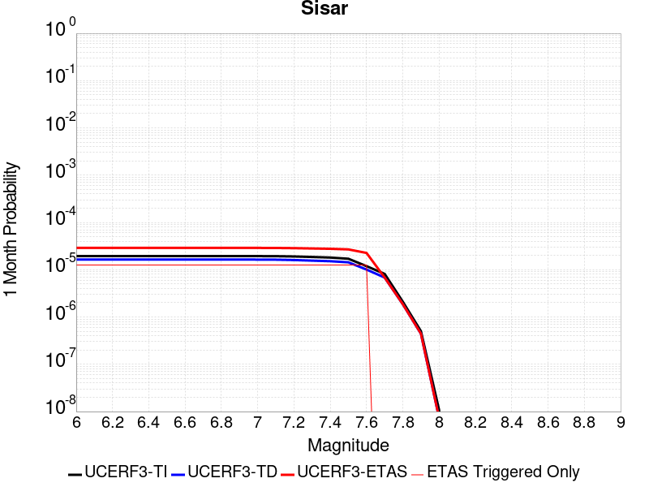 | 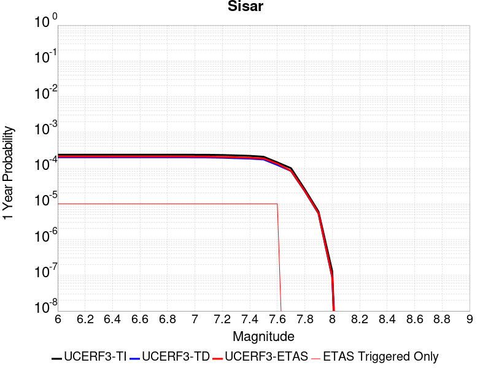 | 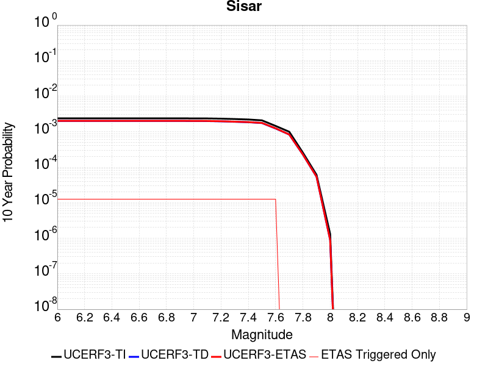 |

| Magnitude | 1 wk TI Prob | 1 wk TD Prob | 1 wk ETAS Prob | 1 wk ETAS/TD Gain | 1 wk ETAS Triggered Only | 1 mo TI Prob | 1 mo TD Prob | 1 mo ETAS Prob | 1 mo ETAS/TD Gain | 1 mo ETAS Triggered Only | 1 yr TI Prob | 1 yr TD Prob | 1 yr ETAS Prob | 1 yr ETAS/TD Gain | 1 yr ETAS Triggered Only | 10 yr TI Prob | 10 yr TD Prob | 10 yr ETAS Prob | 10 yr ETAS/TD Gain | 10 yr ETAS Triggered Only |
|-----|-----|-----|-----|-----|-----|-----|-----|-----|-----|-----|-----|-----|-----|-----|-----|-----|-----|-----|-----|-----|
| 6.0 | 4.544193E-6 | 3.8396115E-6 | 3.8396115E-6 | 1.0 | 0.0 | 1.9474966E-5 | 1.6455377E-5 | 2.645521E-5 | 1.6076941 | 1.0E-5 | 2.3708193E-4 | 2.0032612E-4 | 2.1032411E-4 | 1.0499086 | 1.0E-5 | 0.0023682916 | 0.002001489 | 0.002011469 | 1.0049863 | 1.0E-5 |
| 6.1 | 4.544193E-6 | 3.8396115E-6 | 3.8396115E-6 | 1.0 | 0.0 | 1.9474966E-5 | 1.6455377E-5 | 2.645521E-5 | 1.6076941 | 1.0E-5 | 2.3708193E-4 | 2.0032612E-4 | 2.1032411E-4 | 1.0499086 | 1.0E-5 | 0.0023682916 | 0.002001489 | 0.002011469 | 1.0049863 | 1.0E-5 |
| 6.2 | 4.544193E-6 | 3.8396115E-6 | 3.8396115E-6 | 1.0 | 0.0 | 1.9474966E-5 | 1.6455377E-5 | 2.645521E-5 | 1.6076941 | 1.0E-5 | 2.3708193E-4 | 2.0032612E-4 | 2.1032411E-4 | 1.0499086 | 1.0E-5 | 0.0023682916 | 0.002001489 | 0.002011469 | 1.0049863 | 1.0E-5 |
| 6.3 | 4.544193E-6 | 3.8396115E-6 | 3.8396115E-6 | 1.0 | 0.0 | 1.9474966E-5 | 1.6455377E-5 | 2.645521E-5 | 1.6076941 | 1.0E-5 | 2.3708193E-4 | 2.0032612E-4 | 2.1032411E-4 | 1.0499086 | 1.0E-5 | 0.0023682916 | 0.002001489 | 0.002011469 | 1.0049863 | 1.0E-5 |
| 6.4 | 4.544193E-6 | 3.8396115E-6 | 3.8396115E-6 | 1.0 | 0.0 | 1.9474966E-5 | 1.6455377E-5 | 2.645521E-5 | 1.6076941 | 1.0E-5 | 2.3708193E-4 | 2.0032612E-4 | 2.1032411E-4 | 1.0499086 | 1.0E-5 | 0.0023682916 | 0.002001489 | 0.002011469 | 1.0049863 | 1.0E-5 |
| 6.5 | 4.544193E-6 | 3.8396115E-6 | 3.8396115E-6 | 1.0 | 0.0 | 1.9474966E-5 | 1.6455377E-5 | 2.645521E-5 | 1.6076941 | 1.0E-5 | 2.3708193E-4 | 2.0032612E-4 | 2.1032411E-4 | 1.0499086 | 1.0E-5 | 0.0023682916 | 0.002001489 | 0.002011469 | 1.0049863 | 1.0E-5 |
| 6.6 | 4.544193E-6 | 3.8396115E-6 | 3.8396115E-6 | 1.0 | 0.0 | 1.9474966E-5 | 1.6455377E-5 | 2.645521E-5 | 1.6076941 | 1.0E-5 | 2.3708193E-4 | 2.0032612E-4 | 2.1032411E-4 | 1.0499086 | 1.0E-5 | 0.0023682916 | 0.002001489 | 0.002011469 | 1.0049863 | 1.0E-5 |
| 6.7 | 4.544193E-6 | 3.8396115E-6 | 3.8396115E-6 | 1.0 | 0.0 | 1.9474966E-5 | 1.6455377E-5 | 2.645521E-5 | 1.6076941 | 1.0E-5 | 2.3708193E-4 | 2.0032612E-4 | 2.1032411E-4 | 1.0499086 | 1.0E-5 | 0.0023682916 | 0.002001489 | 0.002011469 | 1.0049863 | 1.0E-5 |
| 6.8 | 4.544193E-6 | 3.8396115E-6 | 3.8396115E-6 | 1.0 | 0.0 | 1.9474966E-5 | 1.6455377E-5 | 2.645521E-5 | 1.6076941 | 1.0E-5 | 2.3708193E-4 | 2.0032612E-4 | 2.1032411E-4 | 1.0499086 | 1.0E-5 | 0.0023682916 | 0.002001489 | 0.002011469 | 1.0049863 | 1.0E-5 |
| 6.9 | 4.542225E-6 | 3.8375733E-6 | 3.8375733E-6 | 1.0 | 0.0 | 1.9466532E-5 | 1.6446642E-5 | 2.6446476E-5 | 1.6080168 | 1.0E-5 | 2.3697925E-4 | 2.0021979E-4 | 2.102178E-4 | 1.0499351 | 1.0E-5 | 0.002367267 | 0.0020004278 | 0.0020104079 | 1.0049889 | 1.0E-5 |
| 7.0 | 4.5278484E-6 | 3.8226376E-6 | 3.8226376E-6 | 1.0 | 0.0 | 1.940492E-5 | 1.6382632E-5 | 2.6382468E-5 | 1.6103926 | 1.0E-5 | 2.3622929E-4 | 1.9944062E-4 | 2.0943861E-4 | 1.0501302 | 1.0E-5 | 0.0023597833 | 0.00199265 | 0.0020026301 | 1.0050085 | 1.0E-5 |
| 7.1 | 4.5132488E-6 | 3.807425E-6 | 3.807425E-6 | 1.0 | 0.0 | 1.9342351E-5 | 1.6317435E-5 | 2.6317271E-5 | 1.6128314 | 1.0E-5 | 2.3546767E-4 | 1.98647E-4 | 2.0864501E-4 | 1.0503305 | 1.0E-5 | 0.0023521832 | 0.001984728 | 0.001994708 | 1.0050285 | 1.0E-5 |
| 7.2 | 4.448859E-6 | 3.7398854E-6 | 3.7398854E-6 | 1.0 | 0.0 | 1.9066398E-5 | 1.6027983E-5 | 2.6027823E-5 | 1.6238987 | 1.0E-5 | 2.3210866E-4 | 1.9512356E-4 | 2.0512161E-4 | 1.0512396 | 1.0E-5 | 0.0023186638 | 0.0019495559 | 0.0019595365 | 1.0051193 | 1.0E-5 |
| 7.3 | 4.3424366E-6 | 3.6337199E-6 | 3.6337199E-6 | 1.0 | 0.0 | 1.861031E-5 | 1.5572994E-5 | 2.5572837E-5 | 1.6421273 | 1.0E-5 | 2.2655698E-4 | 1.8958503E-4 | 1.9958314E-4 | 1.0527368 | 1.0E-5 | 0.0022632615 | 0.0018942665 | 0.0019042476 | 1.005269 | 1.0E-5 |
| 7.4 | 4.218641E-6 | 3.533073E-6 | 3.533073E-6 | 1.0 | 0.0 | 1.8079765E-5 | 1.5141655E-5 | 2.5141504E-5 | 1.6604198 | 1.0E-5 | 2.2009891E-4 | 1.8433439E-4 | 1.9433255E-4 | 1.0542393 | 1.0E-5 | 0.0021988105 | 0.0018418481 | 0.0018518298 | 1.0054194 | 1.0E-5 |
| 7.5 | 3.983779E-6 | 3.3478434E-6 | 3.3478434E-6 | 1.0 | 0.0 | 1.7073227E-5 | 1.4347824E-5 | 2.434768E-5 | 1.6969599 | 1.0E-5 | 2.0784672E-4 | 1.7467108E-4 | 1.8466933E-4 | 1.0572405 | 1.0E-5 | 0.0020765243 | 0.0017453709 | 0.0017553534 | 1.0057194 | 1.0E-5 |
| 7.6 | 2.777393E-6 | 2.352273E-6 | 2.352273E-6 | 1.0 | 0.0 | 1.1903058E-5 | 1.0081131E-5 | 2.008103E-5 | 1.9919422 | 1.0E-5 | 1.449101E-4 | 1.2273094E-4 | 1.327297E-4 | 1.081469 | 1.0E-5 | 0.0014481564 | 0.0012266394 | 0.0012366271 | 1.0081424 | 1.0E-5 |
| 7.7 | 1.9028433E-6 | 1.5938805E-6 | 1.5938805E-6 | 1.0 | 0.0 | 8.155017E-6 | 6.8308987E-6 | 6.8308987E-6 | 1.0 | 0.0 | 9.928281E-5 | 8.316306E-5 | 8.316306E-5 | 1.0 | 0.0 | 9.923846E-4 | 8.3132414E-4 | 8.3132414E-4 | 1.0 | 0.0 |
| 7.8 | 4.9095956E-7 | 4.3584043E-7 | 4.3584043E-7 | 1.0 | 0.0 | 2.1041105E-6 | 1.8678862E-6 | 1.8678862E-6 | 1.0 | 0.0 | 2.5617246E-5 | 2.2741278E-5 | 2.2741278E-5 | 1.0 | 0.0 | 2.5614293E-4 | 2.273897E-4 | 2.273897E-4 | 1.0 | 0.0 |
| 7.9 | 1.16657894E-7 | 1.03356285E-7 | 1.03356285E-7 | 1.0 | 0.0 | 4.999623E-7 | 4.4295544E-7 | 4.4295544E-7 | 1.0 | 0.0 | 6.087024E-6 | 5.3929693E-6 | 5.3929693E-6 | 1.0 | 0.0 | 6.0868573E-5 | 5.3928416E-5 | 5.3928416E-5 | 1.0 | 0.0 |
| 8.0 | 2.5100346E-9 | 1.7067109E-9 | 1.7067109E-9 | 1.0 | 0.0 | 1.0757291E-8 | 7.3144757E-9 | 7.3144757E-9 | 1.0 | 0.0 | 1.3097001E-7 | 8.905374E-8 | 8.905374E-8 | 1.0 | 0.0 | 1.3096993E-6 | 8.9053714E-7 | 8.9053714E-7 | 1.0 | 0.0 |

## Anaheim
*[(top)](#table-of-contents)*

| 1 Week | 1 Month | 1 Year | 10 Year |
|-----|-----|-----|-----|
|  | 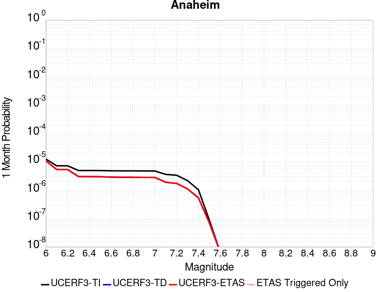 | 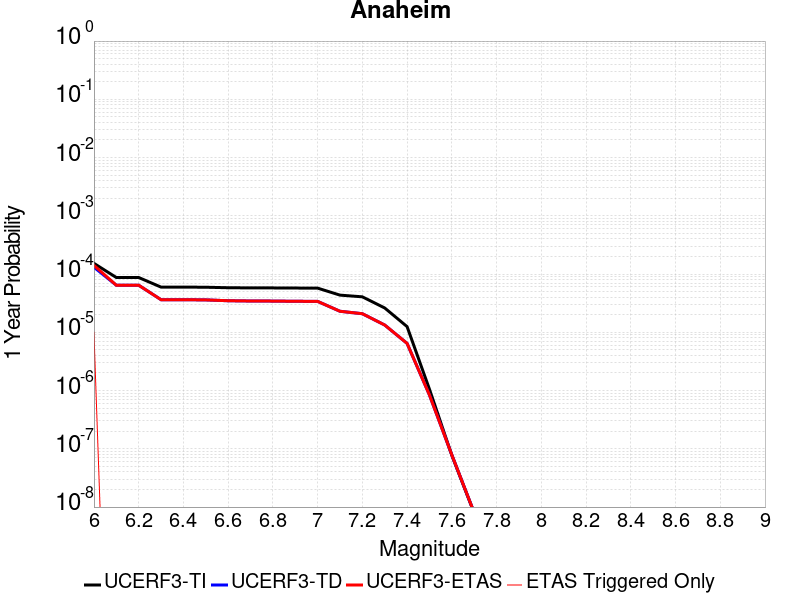 | 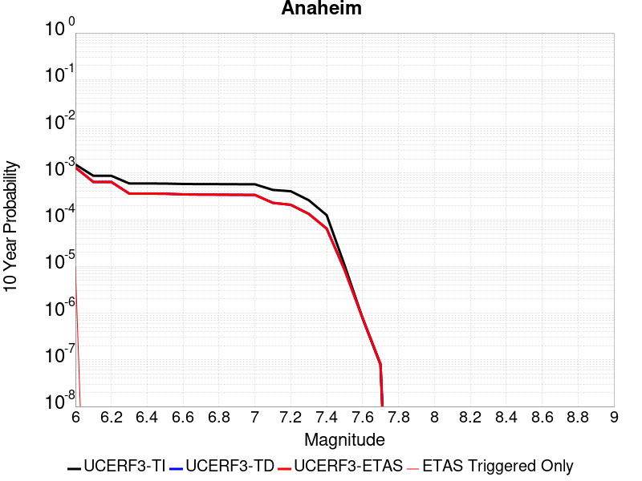 |

| Magnitude | 1 wk TI Prob | 1 wk TD Prob | 1 wk ETAS Prob | 1 wk ETAS/TD Gain | 1 wk ETAS Triggered Only | 1 mo TI Prob | 1 mo TD Prob | 1 mo ETAS Prob | 1 mo ETAS/TD Gain | 1 mo ETAS Triggered Only | 1 yr TI Prob | 1 yr TD Prob | 1 yr ETAS Prob | 1 yr ETAS/TD Gain | 1 yr ETAS Triggered Only | 10 yr TI Prob | 10 yr TD Prob | 10 yr ETAS Prob | 10 yr ETAS/TD Gain | 10 yr ETAS Triggered Only |
|-----|-----|-----|-----|-----|-----|-----|-----|-----|-----|-----|-----|-----|-----|-----|-----|-----|-----|-----|-----|-----|
| 6.0 | 2.9254998E-6 | 2.5122672E-6 | 2.5122672E-6 | 1.0 | 0.0 | 1.25377965E-5 | 1.0766828E-5 | 1.0766828E-5 | 1.0 | 0.0 | 1.5263697E-4 | 1.310806E-4 | 1.4107929E-4 | 1.0762789 | 1.0E-5 | 0.0015253217 | 0.001310263 | 0.0013202499 | 1.007622 | 1.0E-5 |
| 6.1 | 1.6729715E-6 | 1.2337158E-6 | 1.2337158E-6 | 1.0 | 0.0 | 7.1698582E-6 | 5.287345E-6 | 5.287345E-6 | 1.0 | 0.0 | 8.7289525E-5 | 6.437194E-5 | 6.437194E-5 | 1.0 | 0.0 | 8.7255245E-4 | 6.435739E-4 | 6.435739E-4 | 1.0 | 0.0 |
| 6.2 | 1.6729715E-6 | 1.2337158E-6 | 1.2337158E-6 | 1.0 | 0.0 | 7.1698582E-6 | 5.287345E-6 | 5.287345E-6 | 1.0 | 0.0 | 8.7289525E-5 | 6.437194E-5 | 6.437194E-5 | 1.0 | 0.0 | 8.7255245E-4 | 6.435739E-4 | 6.435739E-4 | 1.0 | 0.0 |
| 6.3 | 1.1444064E-6 | 6.9594773E-7 | 6.9594773E-7 | 1.0 | 0.0 | 4.9045893E-6 | 2.9826301E-6 | 2.9826301E-6 | 1.0 | 0.0 | 5.971174E-5 | 3.6312973E-5 | 3.6312973E-5 | 1.0 | 0.0 | 5.96957E-4 | 3.6307587E-4 | 3.6307587E-4 | 1.0 | 0.0 |
| 6.4 | 1.1444064E-6 | 6.9594773E-7 | 6.9594773E-7 | 1.0 | 0.0 | 4.9045893E-6 | 2.9826301E-6 | 2.9826301E-6 | 1.0 | 0.0 | 5.971174E-5 | 3.6312973E-5 | 3.6312973E-5 | 1.0 | 0.0 | 5.96957E-4 | 3.6307587E-4 | 3.6307587E-4 | 1.0 | 0.0 |
| 6.5 | 1.1385318E-6 | 6.9001607E-7 | 6.9001607E-7 | 1.0 | 0.0 | 4.879413E-6 | 2.9572088E-6 | 2.9572088E-6 | 1.0 | 0.0 | 5.9405233E-5 | 3.600348E-5 | 3.600348E-5 | 1.0 | 0.0 | 5.938936E-4 | 3.5998193E-4 | 3.5998193E-4 | 1.0 | 0.0 |
| 6.6 | 1.1165511E-6 | 6.678032E-7 | 6.678032E-7 | 1.0 | 0.0 | 4.78521E-6 | 2.862011E-6 | 2.862011E-6 | 1.0 | 0.0 | 5.8258374E-5 | 3.484448E-5 | 3.484448E-5 | 1.0 | 0.0 | 5.8243104E-4 | 3.483956E-4 | 3.483956E-4 | 1.0 | 0.0 |
| 6.7 | 1.1098243E-6 | 6.610226E-7 | 6.610226E-7 | 1.0 | 0.0 | 4.7563813E-6 | 2.8329514E-6 | 2.8329514E-6 | 1.0 | 0.0 | 5.7907404E-5 | 3.449069E-5 | 3.449069E-5 | 1.0 | 0.0 | 5.7892315E-4 | 3.4485882E-4 | 3.4485882E-4 | 1.0 | 0.0 |
| 6.8 | 1.1077587E-6 | 6.5894295E-7 | 6.5894295E-7 | 1.0 | 0.0 | 4.7475287E-6 | 2.8240383E-6 | 2.8240383E-6 | 1.0 | 0.0 | 5.779963E-5 | 3.438218E-5 | 3.438218E-5 | 1.0 | 0.0 | 5.77846E-4 | 3.4377404E-4 | 3.4377404E-4 | 1.0 | 0.0 |
| 6.9 | 1.1024468E-6 | 6.5360064E-7 | 6.5360064E-7 | 1.0 | 0.0 | 4.7247636E-6 | 2.801143E-6 | 2.801143E-6 | 1.0 | 0.0 | 5.752248E-5 | 3.4103436E-5 | 3.4103436E-5 | 1.0 | 0.0 | 5.750759E-4 | 3.4098746E-4 | 3.4098746E-4 | 1.0 | 0.0 |
| 7.0 | 1.0993066E-6 | 6.5101136E-7 | 6.5101136E-7 | 1.0 | 0.0 | 4.7113053E-6 | 2.790046E-6 | 2.790046E-6 | 1.0 | 0.0 | 5.7358633E-5 | 3.3968336E-5 | 3.3968336E-5 | 1.0 | 0.0 | 5.734383E-4 | 3.3963687E-4 | 3.3963687E-4 | 1.0 | 0.0 |
| 7.1 | 8.334877E-7 | 4.4046894E-7 | 4.4046894E-7 | 1.0 | 0.0 | 3.5720855E-6 | 1.8877229E-6 | 1.8877229E-6 | 1.0 | 0.0 | 4.348927E-5 | 2.2982806E-5 | 2.2982806E-5 | 1.0 | 0.0 | 4.3480762E-4 | 2.2980652E-4 | 2.2980652E-4 | 1.0 | 0.0 |
| 7.2 | 7.794411E-7 | 3.997425E-7 | 3.997425E-7 | 1.0 | 0.0 | 3.3404576E-6 | 1.7131812E-6 | 1.7131812E-6 | 1.0 | 0.0 | 4.0669314E-5 | 2.0857802E-5 | 2.0857802E-5 | 1.0 | 0.0 | 4.066187E-4 | 2.085605E-4 | 2.085605E-4 | 1.0 | 0.0 |
| 7.3 | 5.01704E-7 | 2.5571964E-7 | 2.5571964E-7 | 1.0 | 0.0 | 2.150158E-6 | 1.095941E-6 | 1.095941E-6 | 1.0 | 0.0 | 2.617786E-5 | 1.3343012E-5 | 1.3343012E-5 | 1.0 | 0.0 | 2.6174777E-4 | 1.3342335E-4 | 1.3342335E-4 | 1.0 | 0.0 |
| 7.4 | 2.4008182E-7 | 1.2367195E-7 | 1.2367195E-7 | 1.0 | 0.0 | 1.0289217E-6 | 5.300226E-7 | 5.300226E-7 | 1.0 | 0.0 | 1.252705E-5 | 6.4530136E-6 | 6.4530136E-6 | 1.0 | 0.0 | 1.2526344E-4 | 6.452902E-5 | 6.452902E-5 | 1.0 | 0.0 |
| 7.5 | 2.0263876E-8 | 1.6121012E-8 | 1.6121012E-8 | 1.0 | 0.0 | 8.684518E-8 | 6.909005E-8 | 6.909005E-8 | 1.0 | 0.0 | 1.0573395E-6 | 8.4117113E-7 | 8.4117113E-7 | 1.0 | 0.0 | 1.0573345E-5 | 8.411688E-6 | 8.411688E-6 | 1.0 | 0.0 |
| 7.6 | 1.4871431E-9 | 1.508418E-9 | 1.508418E-9 | 1.0 | 0.0 | 6.37347E-9 | 6.4646484E-9 | 6.4646484E-9 | 1.0 | 0.0 | 7.7596994E-8 | 7.870709E-8 | 7.870709E-8 | 1.0 | 0.0 | 7.759697E-7 | 7.8707063E-7 | 7.8707063E-7 | 1.0 | 0.0 |
| 7.7 | 1.5093293E-10 | 1.5333512E-10 | 1.5333512E-10 | 1.0 | 0.0 | 6.4685546E-10 | 6.571509E-10 | 6.571509E-10 | 1.0 | 0.0 | 7.875465E-9 | 8.0008125E-9 | 8.0008125E-9 | 1.0 | 0.0 | 7.8754645E-8 | 8.000812E-8 | 8.000812E-8 | 1.0 | 0.0 |

## Big Lagoon - Bald Mtn 2011 CFM
*[(top)](#table-of-contents)*

| 1 Week | 1 Month | 1 Year | 10 Year |
|-----|-----|-----|-----|
|  |  | 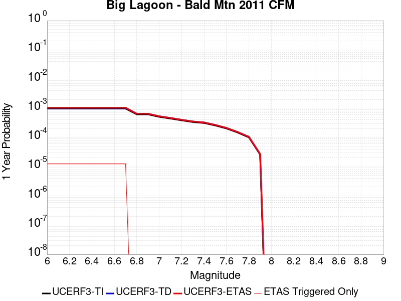 | 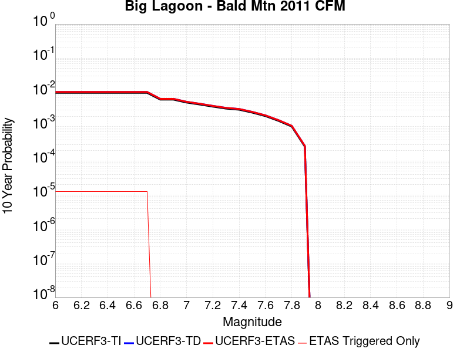 |

| Magnitude | 1 wk TI Prob | 1 wk TD Prob | 1 wk ETAS Prob | 1 wk ETAS/TD Gain | 1 wk ETAS Triggered Only | 1 mo TI Prob | 1 mo TD Prob | 1 mo ETAS Prob | 1 mo ETAS/TD Gain | 1 mo ETAS Triggered Only | 1 yr TI Prob | 1 yr TD Prob | 1 yr ETAS Prob | 1 yr ETAS/TD Gain | 1 yr ETAS Triggered Only | 10 yr TI Prob | 10 yr TD Prob | 10 yr ETAS Prob | 10 yr ETAS/TD Gain | 10 yr ETAS Triggered Only |
|-----|-----|-----|-----|-----|-----|-----|-----|-----|-----|-----|-----|-----|-----|-----|-----|-----|-----|-----|-----|-----|
| 6.0 | 1.8699735E-5 | 1.985018E-5 | 1.985018E-5 | 1.0 | 0.0 | 8.013926E-5 | 8.5069645E-5 | 8.5069645E-5 | 1.0 | 0.0 | 9.752587E-4 | 0.0010352687 | 0.0010452583 | 1.0096493 | 1.0E-5 | 0.009709897 | 0.010308274 | 0.010318171 | 1.0009601 | 1.0E-5 |
| 6.1 | 1.8699735E-5 | 1.985018E-5 | 1.985018E-5 | 1.0 | 0.0 | 8.013926E-5 | 8.5069645E-5 | 8.5069645E-5 | 1.0 | 0.0 | 9.752587E-4 | 0.0010352687 | 0.0010452583 | 1.0096493 | 1.0E-5 | 0.009709897 | 0.010308274 | 0.010318171 | 1.0009601 | 1.0E-5 |
| 6.2 | 1.8699735E-5 | 1.985018E-5 | 1.985018E-5 | 1.0 | 0.0 | 8.013926E-5 | 8.5069645E-5 | 8.5069645E-5 | 1.0 | 0.0 | 9.752587E-4 | 0.0010352687 | 0.0010452583 | 1.0096493 | 1.0E-5 | 0.009709897 | 0.010308274 | 0.010318171 | 1.0009601 | 1.0E-5 |
| 6.3 | 1.8699735E-5 | 1.985018E-5 | 1.985018E-5 | 1.0 | 0.0 | 8.013926E-5 | 8.5069645E-5 | 8.5069645E-5 | 1.0 | 0.0 | 9.752587E-4 | 0.0010352687 | 0.0010452583 | 1.0096493 | 1.0E-5 | 0.009709897 | 0.010308274 | 0.010318171 | 1.0009601 | 1.0E-5 |
| 6.4 | 1.8699735E-5 | 1.985018E-5 | 1.985018E-5 | 1.0 | 0.0 | 8.013926E-5 | 8.5069645E-5 | 8.5069645E-5 | 1.0 | 0.0 | 9.752587E-4 | 0.0010352687 | 0.0010452583 | 1.0096493 | 1.0E-5 | 0.009709897 | 0.010308274 | 0.010318171 | 1.0009601 | 1.0E-5 |
| 6.5 | 1.8699735E-5 | 1.985018E-5 | 1.985018E-5 | 1.0 | 0.0 | 8.013926E-5 | 8.5069645E-5 | 8.5069645E-5 | 1.0 | 0.0 | 9.752587E-4 | 0.0010352687 | 0.0010452583 | 1.0096493 | 1.0E-5 | 0.009709897 | 0.010308274 | 0.010318171 | 1.0009601 | 1.0E-5 |
| 6.6 | 1.8699735E-5 | 1.985018E-5 | 1.985018E-5 | 1.0 | 0.0 | 8.013926E-5 | 8.5069645E-5 | 8.5069645E-5 | 1.0 | 0.0 | 9.752587E-4 | 0.0010352687 | 0.0010452583 | 1.0096493 | 1.0E-5 | 0.009709897 | 0.010308274 | 0.010318171 | 1.0009601 | 1.0E-5 |
| 6.7 | 1.8699735E-5 | 1.985018E-5 | 1.985018E-5 | 1.0 | 0.0 | 8.013926E-5 | 8.5069645E-5 | 8.5069645E-5 | 1.0 | 0.0 | 9.752587E-4 | 0.0010352687 | 0.0010452583 | 1.0096493 | 1.0E-5 | 0.009709897 | 0.010308274 | 0.010318171 | 1.0009601 | 1.0E-5 |
| 6.8 | 1.18505095E-5 | 1.2499804E-5 | 1.2499804E-5 | 1.0 | 0.0 | 5.078691E-5 | 5.3569514E-5 | 5.3569514E-5 | 1.0 | 0.0 | 6.181552E-4 | 6.520185E-4 | 6.520185E-4 | 1.0 | 0.0 | 0.006164385 | 0.0065015587 | 0.0065015587 | 1.0 | 0.0 |
| 6.9 | 1.18505095E-5 | 1.2499804E-5 | 1.2499804E-5 | 1.0 | 0.0 | 5.078691E-5 | 5.3569514E-5 | 5.3569514E-5 | 1.0 | 0.0 | 6.181552E-4 | 6.520185E-4 | 6.520185E-4 | 1.0 | 0.0 | 0.006164385 | 0.0065015587 | 0.0065015587 | 1.0 | 0.0 |
| 7.0 | 9.719786E-6 | 1.0235487E-5 | 1.0235487E-5 | 1.0 | 0.0 | 4.1655563E-5 | 4.386565E-5 | 4.386565E-5 | 1.0 | 0.0 | 5.0703844E-4 | 5.3393573E-4 | 5.3393573E-4 | 1.0 | 0.0 | 0.005058831 | 0.0053267754 | 0.0053267754 | 1.0 | 0.0 |
| 7.1 | 8.523418E-6 | 8.969463E-6 | 8.969463E-6 | 1.0 | 0.0 | 3.652842E-5 | 3.844E-5 | 3.844E-5 | 1.0 | 0.0 | 4.4464276E-4 | 4.6790804E-4 | 4.6790804E-4 | 1.0 | 0.0 | 0.0044375416 | 0.004669392 | 0.004669392 | 1.0 | 0.0 |
| 7.2 | 7.378894E-6 | 7.761112E-6 | 7.761112E-6 | 1.0 | 0.0 | 3.162345E-5 | 3.326149E-5 | 3.326149E-5 | 1.0 | 0.0 | 3.8494746E-4 | 4.048843E-4 | 4.048843E-4 | 1.0 | 0.0 | 0.0038428132 | 0.0040415623 | 0.0040415623 | 1.0 | 0.0 |
| 7.3 | 6.4640294E-6 | 6.7924434E-6 | 6.7924434E-6 | 1.0 | 0.0 | 2.7702688E-5 | 2.9110151E-5 | 2.9110151E-5 | 1.0 | 0.0 | 3.3722803E-4 | 3.5435913E-4 | 3.5435913E-4 | 1.0 | 0.0 | 0.0033671674 | 0.0035380109 | 0.0035380109 | 1.0 | 0.0 |
| 7.4 | 5.9959093E-6 | 6.2988E-6 | 6.2988E-6 | 1.0 | 0.0 | 2.5696501E-5 | 2.6994581E-5 | 2.6994581E-5 | 1.0 | 0.0 | 3.1280998E-4 | 3.2861007E-4 | 3.2861007E-4 | 1.0 | 0.0 | 0.0031237002 | 0.0032813034 | 0.0032813034 | 1.0 | 0.0 |
| 7.5 | 4.929265E-6 | 5.176396E-6 | 5.176396E-6 | 1.0 | 0.0 | 2.112525E-5 | 2.2184367E-5 | 2.2184367E-5 | 1.0 | 0.0 | 2.5716957E-4 | 2.700616E-4 | 2.700616E-4 | 1.0 | 0.0 | 0.0025687215 | 0.002697375 | 0.002697375 | 1.0 | 0.0 |
| 7.6 | 3.8982403E-6 | 4.0889267E-6 | 4.0889267E-6 | 1.0 | 0.0 | 1.6706637E-5 | 1.7523857E-5 | 1.7523857E-5 | 1.0 | 0.0 | 2.0338432E-4 | 2.1333233E-4 | 2.1333233E-4 | 1.0 | 0.0 | 0.0020319829 | 0.002131303 | 0.002131303 | 1.0 | 0.0 |
| 7.7 | 2.820968E-6 | 2.9572116E-6 | 2.9572116E-6 | 1.0 | 0.0 | 1.2089806E-5 | 1.2673704E-5 | 1.2673704E-5 | 1.0 | 0.0 | 1.4718344E-4 | 1.5429159E-4 | 1.5429159E-4 | 1.0 | 0.0 | 0.00147086 | 0.0015418624 | 0.0015418624 | 1.0 | 0.0 |
| 7.8 | 1.9314455E-6 | 2.0260186E-6 | 2.0260186E-6 | 1.0 | 0.0 | 8.277597E-6 | 8.682909E-6 | 8.682909E-6 | 1.0 | 0.0 | 1.0077508E-4 | 1.0570941E-4 | 1.0570941E-4 | 1.0 | 0.0 | 0.0010072939 | 0.0010566041 | 0.0010566041 | 1.0 | 0.0 |
| 7.9 | 4.9586197E-7 | 5.2189216E-7 | 5.2189216E-7 | 1.0 | 0.0 | 2.125121E-6 | 2.2366787E-6 | 2.2366787E-6 | 1.0 | 0.0 | 2.5873042E-5 | 2.7231245E-5 | 2.7231245E-5 | 1.0 | 0.0 | 2.5870028E-4 | 2.7228118E-4 | 2.7228118E-4 | 1.0 | 0.0 |

## Fickle Hill (alt1)
*[(top)](#table-of-contents)*

| 1 Week | 1 Month | 1 Year | 10 Year |
|-----|-----|-----|-----|
| 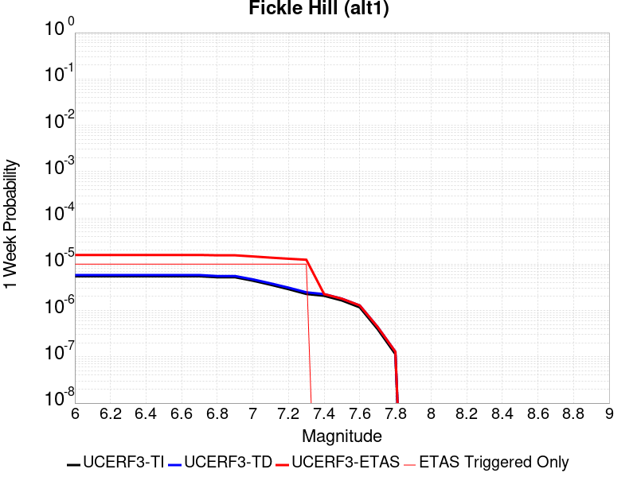 | 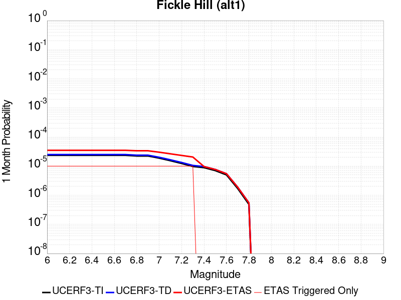 | 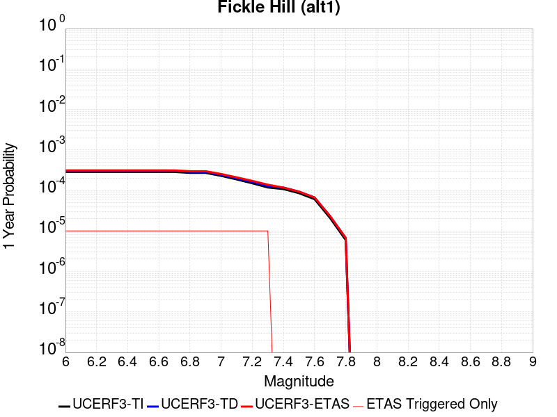 | 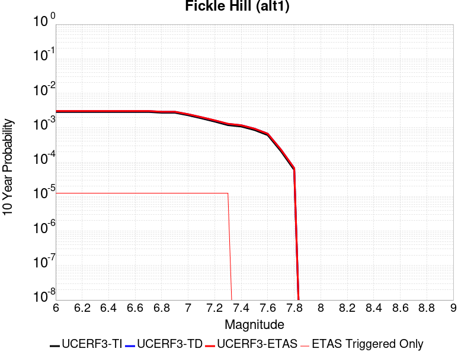 |

| Magnitude | 1 wk TI Prob | 1 wk TD Prob | 1 wk ETAS Prob | 1 wk ETAS/TD Gain | 1 wk ETAS Triggered Only | 1 mo TI Prob | 1 mo TD Prob | 1 mo ETAS Prob | 1 mo ETAS/TD Gain | 1 mo ETAS Triggered Only | 1 yr TI Prob | 1 yr TD Prob | 1 yr ETAS Prob | 1 yr ETAS/TD Gain | 1 yr ETAS Triggered Only | 10 yr TI Prob | 10 yr TD Prob | 10 yr ETAS Prob | 10 yr ETAS/TD Gain | 10 yr ETAS Triggered Only |
|-----|-----|-----|-----|-----|-----|-----|-----|-----|-----|-----|-----|-----|-----|-----|-----|-----|-----|-----|-----|-----|
| 6.0 | 5.491893E-6 | 5.826998E-6 | 1.582694E-5 | 2.7161396 | 1.0E-5 | 2.3536471E-5 | 2.4972622E-5 | 3.497237E-5 | 1.4004285 | 1.0E-5 | 2.8651886E-4 | 3.040015E-4 | 3.1399846E-4 | 1.0328846 | 1.0E-5 | 0.0028614972 | 0.0030360806 | 0.0030460502 | 1.0032837 | 1.0E-5 |
| 6.1 | 5.491893E-6 | 5.826998E-6 | 1.582694E-5 | 2.7161396 | 1.0E-5 | 2.3536471E-5 | 2.4972622E-5 | 3.497237E-5 | 1.4004285 | 1.0E-5 | 2.8651886E-4 | 3.040015E-4 | 3.1399846E-4 | 1.0328846 | 1.0E-5 | 0.0028614972 | 0.0030360806 | 0.0030460502 | 1.0032837 | 1.0E-5 |
| 6.2 | 5.491893E-6 | 5.826998E-6 | 1.582694E-5 | 2.7161396 | 1.0E-5 | 2.3536471E-5 | 2.4972622E-5 | 3.497237E-5 | 1.4004285 | 1.0E-5 | 2.8651886E-4 | 3.040015E-4 | 3.1399846E-4 | 1.0328846 | 1.0E-5 | 0.0028614972 | 0.0030360806 | 0.0030460502 | 1.0032837 | 1.0E-5 |
| 6.3 | 5.491893E-6 | 5.826998E-6 | 1.582694E-5 | 2.7161396 | 1.0E-5 | 2.3536471E-5 | 2.4972622E-5 | 3.497237E-5 | 1.4004285 | 1.0E-5 | 2.8651886E-4 | 3.040015E-4 | 3.1399846E-4 | 1.0328846 | 1.0E-5 | 0.0028614972 | 0.0030360806 | 0.0030460502 | 1.0032837 | 1.0E-5 |
| 6.4 | 5.491893E-6 | 5.826998E-6 | 1.582694E-5 | 2.7161396 | 1.0E-5 | 2.3536471E-5 | 2.4972622E-5 | 3.497237E-5 | 1.4004285 | 1.0E-5 | 2.8651886E-4 | 3.040015E-4 | 3.1399846E-4 | 1.0328846 | 1.0E-5 | 0.0028614972 | 0.0030360806 | 0.0030460502 | 1.0032837 | 1.0E-5 |
| 6.5 | 5.491893E-6 | 5.826998E-6 | 1.582694E-5 | 2.7161396 | 1.0E-5 | 2.3536471E-5 | 2.4972622E-5 | 3.497237E-5 | 1.4004285 | 1.0E-5 | 2.8651886E-4 | 3.040015E-4 | 3.1399846E-4 | 1.0328846 | 1.0E-5 | 0.0028614972 | 0.0030360806 | 0.0030460502 | 1.0032837 | 1.0E-5 |
| 6.6 | 5.491893E-6 | 5.826998E-6 | 1.582694E-5 | 2.7161396 | 1.0E-5 | 2.3536471E-5 | 2.4972622E-5 | 3.497237E-5 | 1.4004285 | 1.0E-5 | 2.8651886E-4 | 3.040015E-4 | 3.1399846E-4 | 1.0328846 | 1.0E-5 | 0.0028614972 | 0.0030360806 | 0.0030460502 | 1.0032837 | 1.0E-5 |
| 6.7 | 5.491893E-6 | 5.826998E-6 | 1.582694E-5 | 2.7161396 | 1.0E-5 | 2.3536471E-5 | 2.4972622E-5 | 3.497237E-5 | 1.4004285 | 1.0E-5 | 2.8651886E-4 | 3.040015E-4 | 3.1399846E-4 | 1.0328846 | 1.0E-5 | 0.0028614972 | 0.0030360806 | 0.0030460502 | 1.0032837 | 1.0E-5 |
| 6.8 | 5.2207747E-6 | 5.5457263E-6 | 1.5545671E-5 | 2.8031802 | 1.0E-5 | 2.2374557E-5 | 2.3767194E-5 | 3.3766955E-5 | 1.420738 | 1.0E-5 | 2.7237617E-4 | 2.8932936E-4 | 2.9932646E-4 | 1.0345527 | 1.0E-5 | 0.0027204256 | 0.002889745 | 0.0028997161 | 1.0034505 | 1.0E-5 |
| 6.9 | 5.2186956E-6 | 5.5435466E-6 | 1.5543492E-5 | 2.8038893 | 1.0E-5 | 2.2365646E-5 | 2.3757853E-5 | 3.3757617E-5 | 1.4209034 | 1.0E-5 | 2.722677E-4 | 2.8921568E-4 | 2.9921278E-4 | 1.0345663 | 1.0E-5 | 0.0027193436 | 0.0028886108 | 0.002898582 | 1.0034518 | 1.0E-5 |
| 7.0 | 4.403045E-6 | 4.69848E-6 | 1.4698433E-5 | 3.1283379 | 1.0E-5 | 1.8870056E-5 | 2.0136196E-5 | 3.0135994E-5 | 1.4966081 | 1.0E-5 | 2.297187E-4 | 2.4513193E-4 | 2.5512947E-4 | 1.0407844 | 1.0E-5 | 0.0022948137 | 0.0024487455 | 0.0024587212 | 1.0040737 | 1.0E-5 |
| 7.1 | 3.5911396E-6 | 3.8479548E-6 | 1.3847916E-5 | 3.598773 | 1.0E-5 | 1.5390508E-5 | 1.6491134E-5 | 2.649097E-5 | 1.6063764 | 1.0E-5 | 1.8736332E-4 | 2.0076182E-4 | 2.107598E-4 | 1.0498003 | 1.0E-5 | 0.0018720542 | 0.002005878 | 0.0020158577 | 1.0049753 | 1.0E-5 |
| 7.2 | 2.888171E-6 | 3.114158E-6 | 1.3114127E-5 | 4.2111306 | 1.0E-5 | 1.2377816E-5 | 1.3346325E-5 | 2.3346192E-5 | 1.74926 | 1.0E-5 | 1.5068949E-4 | 1.6247964E-4 | 1.7247802E-4 | 1.0615362 | 1.0E-5 | 0.0015058735 | 0.0016236332 | 0.001633617 | 1.006149 | 1.0E-5 |
| 7.3 | 2.275019E-6 | 2.4675212E-6 | 1.2467496E-5 | 5.0526404 | 1.0E-5 | 9.750045E-6 | 1.0575049E-5 | 2.0574942E-5 | 1.9456122 | 1.0E-5 | 1.1870033E-4 | 1.2874375E-4 | 1.3874246E-4 | 1.0776637 | 1.0E-5 | 0.0011863695 | 0.0012867056 | 0.0012966926 | 1.0077618 | 1.0E-5 |
| 7.4 | 2.076662E-6 | 2.2576116E-6 | 2.2576116E-6 | 1.0 | 0.0 | 8.8999495E-6 | 9.675444E-6 | 9.675444E-6 | 1.0 | 0.0 | 1.08351494E-4 | 1.1779229E-4 | 1.1779229E-4 | 1.0 | 0.0 | 0.0010829868 | 0.0011773116 | 0.0011773116 | 1.0 | 0.0 |
| 7.5 | 1.6450799E-6 | 1.7954102E-6 | 1.7954102E-6 | 1.0 | 0.0 | 7.0503233E-6 | 7.694593E-6 | 7.694593E-6 | 1.0 | 0.0 | 8.5834305E-5 | 9.367772E-5 | 9.367772E-5 | 1.0 | 0.0 | 8.580116E-4 | 9.3639E-4 | 9.3639E-4 | 1.0 | 0.0 |
| 7.6 | 1.168891E-6 | 1.282952E-6 | 1.282952E-6 | 1.0 | 0.0 | 5.009523E-6 | 5.4983543E-6 | 5.4983543E-6 | 1.0 | 0.0 | 6.098924E-5 | 6.694047E-5 | 6.694047E-5 | 1.0 | 0.0 | 6.09725E-4 | 6.6920865E-4 | 6.6920865E-4 | 1.0 | 0.0 |
| 7.7 | 3.9871026E-7 | 4.4271442E-7 | 4.4271442E-7 | 1.0 | 0.0 | 1.708757E-6 | 1.8973462E-6 | 1.8973462E-6 | 1.0 | 0.0 | 2.0803918E-5 | 2.3099954E-5 | 2.3099954E-5 | 1.0 | 0.0 | 2.0801972E-4 | 2.3097637E-4 | 2.3097637E-4 | 1.0 | 0.0 |
| 7.8 | 1.14295965E-7 | 1.2853816E-7 | 1.2853816E-7 | 1.0 | 0.0 | 4.8983975E-7 | 5.5087776E-7 | 5.5087776E-7 | 1.0 | 0.0 | 5.9637828E-6 | 6.7069177E-6 | 6.7069177E-6 | 1.0 | 0.0 | 5.9636226E-5 | 6.70673E-5 | 6.70673E-5 | 1.0 | 0.0 |

## Earthquake Valley (No  Extension)
*[(top)](#table-of-contents)*

| 1 Week | 1 Month | 1 Year | 10 Year |
|-----|-----|-----|-----|
|  | 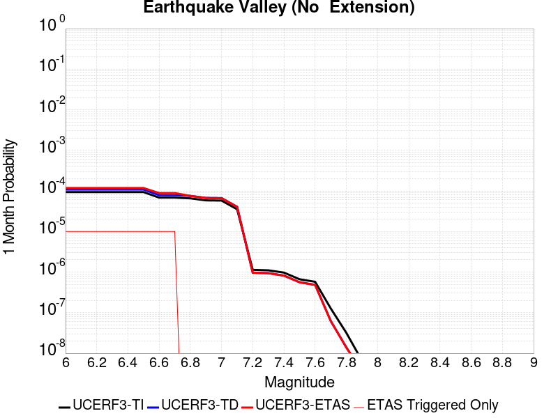 | 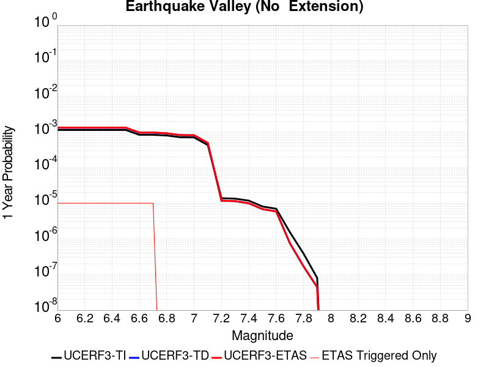 | 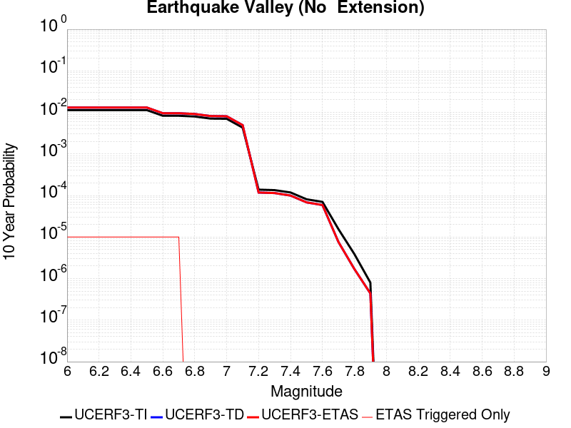 |

| Magnitude | 1 wk TI Prob | 1 wk TD Prob | 1 wk ETAS Prob | 1 wk ETAS/TD Gain | 1 wk ETAS Triggered Only | 1 mo TI Prob | 1 mo TD Prob | 1 mo ETAS Prob | 1 mo ETAS/TD Gain | 1 mo ETAS Triggered Only | 1 yr TI Prob | 1 yr TD Prob | 1 yr ETAS Prob | 1 yr ETAS/TD Gain | 1 yr ETAS Triggered Only | 10 yr TI Prob | 10 yr TD Prob | 10 yr ETAS Prob | 10 yr ETAS/TD Gain | 10 yr ETAS Triggered Only |
|-----|-----|-----|-----|-----|-----|-----|-----|-----|-----|-----|-----|-----|-----|-----|-----|-----|-----|-----|-----|-----|
| 6.0 | 2.1859703E-5 | 2.5198351E-5 | 2.5198351E-5 | 1.0 | 0.0 | 9.3681076E-5 | 1.0798928E-4 | 1.179882E-4 | 1.0925918 | 1.0E-5 | 0.0011399703 | 0.0013141216 | 0.0013241085 | 1.0075996 | 1.0E-5 | 0.011341401 | 0.013077869 | 0.013087738 | 1.0007546 | 1.0E-5 |
| 6.1 | 2.1859703E-5 | 2.5198351E-5 | 2.5198351E-5 | 1.0 | 0.0 | 9.3681076E-5 | 1.0798928E-4 | 1.179882E-4 | 1.0925918 | 1.0E-5 | 0.0011399703 | 0.0013141216 | 0.0013241085 | 1.0075996 | 1.0E-5 | 0.011341401 | 0.013077869 | 0.013087738 | 1.0007546 | 1.0E-5 |
| 6.2 | 2.1859703E-5 | 2.5198351E-5 | 2.5198351E-5 | 1.0 | 0.0 | 9.3681076E-5 | 1.0798928E-4 | 1.179882E-4 | 1.0925918 | 1.0E-5 | 0.0011399703 | 0.0013141216 | 0.0013241085 | 1.0075996 | 1.0E-5 | 0.011341401 | 0.013077869 | 0.013087738 | 1.0007546 | 1.0E-5 |
| 6.3 | 2.1859703E-5 | 2.5198351E-5 | 2.5198351E-5 | 1.0 | 0.0 | 9.3681076E-5 | 1.0798928E-4 | 1.179882E-4 | 1.0925918 | 1.0E-5 | 0.0011399703 | 0.0013141216 | 0.0013241085 | 1.0075996 | 1.0E-5 | 0.011341401 | 0.013077869 | 0.013087738 | 1.0007546 | 1.0E-5 |
| 6.4 | 2.1859703E-5 | 2.5198351E-5 | 2.5198351E-5 | 1.0 | 0.0 | 9.3681076E-5 | 1.0798928E-4 | 1.179882E-4 | 1.0925918 | 1.0E-5 | 0.0011399703 | 0.0013141216 | 0.0013241085 | 1.0075996 | 1.0E-5 | 0.011341401 | 0.013077869 | 0.013087738 | 1.0007546 | 1.0E-5 |
| 6.5 | 2.1859703E-5 | 2.5198351E-5 | 2.5198351E-5 | 1.0 | 0.0 | 9.3681076E-5 | 1.0798928E-4 | 1.179882E-4 | 1.0925918 | 1.0E-5 | 0.0011399703 | 0.0013141216 | 0.0013241085 | 1.0075996 | 1.0E-5 | 0.011341401 | 0.013077869 | 0.013087738 | 1.0007546 | 1.0E-5 |
| 6.6 | 1.597E-5 | 1.835627E-5 | 1.835627E-5 | 1.0 | 0.0 | 6.8441055E-5 | 7.866784E-5 | 8.866706E-5 | 1.1271068 | 1.0E-5 | 8.329513E-4 | 9.5744745E-4 | 9.6743787E-4 | 1.0104344 | 1.0E-5 | 0.008298361 | 0.009541833 | 0.009551737 | 1.0010381 | 1.0E-5 |
| 6.7 | 1.597E-5 | 1.835627E-5 | 1.835627E-5 | 1.0 | 0.0 | 6.8441055E-5 | 7.866784E-5 | 8.866706E-5 | 1.1271068 | 1.0E-5 | 8.329513E-4 | 9.5744745E-4 | 9.6743787E-4 | 1.0104344 | 1.0E-5 | 0.008298361 | 0.009541833 | 0.009551737 | 1.0010381 | 1.0E-5 |
| 6.8 | 1.5315149E-5 | 1.7602086E-5 | 1.7602086E-5 | 1.0 | 0.0 | 6.5634704E-5 | 7.543582E-5 | 7.543582E-5 | 1.0 | 0.0 | 7.988095E-4 | 9.1813074E-4 | 9.1813074E-4 | 1.0 | 0.0 | 0.007959441 | 0.009151915 | 0.009151915 | 1.0 | 0.0 |
| 6.9 | 1.3634728E-5 | 1.5675814E-5 | 1.5675814E-5 | 1.0 | 0.0 | 5.8433237E-5 | 6.7180794E-5 | 6.7180794E-5 | 1.0 | 0.0 | 7.1119244E-4 | 8.1770134E-4 | 8.1770134E-4 | 1.0 | 0.0 | 0.007089207 | 0.008154998 | 0.008154998 | 1.0 | 0.0 |
| 7.0 | 1.3496271E-5 | 1.5517848E-5 | 1.5517848E-5 | 1.0 | 0.0 | 5.783988E-5 | 6.6503824E-5 | 6.6503824E-5 | 1.0 | 0.0 | 7.03973E-4 | 8.0946536E-4 | 8.0946536E-4 | 1.0 | 0.0 | 0.007017471 | 0.008073238 | 0.008073238 | 1.0 | 0.0 |
| 7.1 | 8.242798E-6 | 9.472594E-6 | 9.472594E-6 | 1.0 | 0.0 | 3.53258E-5 | 4.0596577E-5 | 4.0596577E-5 | 1.0 | 0.0 | 4.300067E-4 | 4.9421826E-4 | 4.9421826E-4 | 1.0 | 0.0 | 0.004291756 | 0.0049377684 | 0.0049377684 | 1.0 | 0.0 |
| 7.2 | 2.6506527E-7 | 2.2559628E-7 | 2.2559628E-7 | 1.0 | 0.0 | 1.1359936E-6 | 9.668408E-7 | 9.668408E-7 | 1.0 | 0.0 | 1.3830633E-5 | 1.1771229E-5 | 1.1771229E-5 | 1.0 | 0.0 | 1.3829772E-4 | 1.1770646E-4 | 1.1770646E-4 | 1.0 | 0.0 |
| 7.3 | 2.5810488E-7 | 2.1954757E-7 | 2.1954757E-7 | 1.0 | 0.0 | 1.1061633E-6 | 9.4091786E-7 | 9.4091786E-7 | 1.0 | 0.0 | 1.3467455E-5 | 1.1455619E-5 | 1.1455619E-5 | 1.0 | 0.0 | 1.3466639E-4 | 1.145507E-4 | 1.145507E-4 | 1.0 | 0.0 |
| 7.4 | 2.2676066E-7 | 1.9109943E-7 | 1.9109943E-7 | 1.0 | 0.0 | 9.71831E-7 | 8.189973E-7 | 8.189973E-7 | 1.0 | 0.0 | 1.1831979E-5 | 9.971251E-6 | 9.971251E-6 | 1.0 | 0.0 | 1.1831349E-4 | 9.970842E-5 | 9.970842E-5 | 1.0 | 0.0 |
| 7.5 | 1.5553917E-7 | 1.311138E-7 | 1.311138E-7 | 1.0 | 0.0 | 6.6659624E-7 | 5.619162E-7 | 5.619162E-7 | 1.0 | 0.0 | 8.115779E-6 | 6.84131E-6 | 6.84131E-6 | 1.0 | 0.0 | 8.115482E-5 | 6.841121E-5 | 6.841121E-5 | 1.0 | 0.0 |
| 7.6 | 1.3448629E-7 | 1.1287708E-7 | 1.1287708E-7 | 1.0 | 0.0 | 5.7636964E-7 | 4.8375887E-7 | 4.8375887E-7 | 1.0 | 0.0 | 7.017278E-6 | 5.8897504E-6 | 5.8897504E-6 | 1.0 | 0.0 | 7.0170565E-5 | 5.8896156E-5 | 5.8896156E-5 | 1.0 | 0.0 |
| 7.7 | 2.9719402E-8 | 1.4581234E-8 | 1.4581234E-8 | 1.0 | 0.0 | 1.2736886E-7 | 6.2491004E-8 | 6.2491004E-8 | 1.0 | 0.0 | 1.5507147E-6 | 7.6082773E-7 | 7.6082773E-7 | 1.0 | 0.0 | 1.550704E-5 | 7.608257E-6 | 7.608257E-6 | 1.0 | 0.0 |
| 7.8 | 7.4390196E-9 | 3.249962E-9 | 3.249962E-9 | 1.0 | 0.0 | 3.1881513E-8 | 1.39284095E-8 | 1.39284095E-8 | 1.0 | 0.0 | 3.8815733E-7 | 1.6957837E-7 | 1.6957837E-7 | 1.0 | 0.0 | 3.8815665E-6 | 1.6957828E-6 | 1.6957828E-6 | 1.0 | 0.0 |
| 7.9 | 1.5373532E-9 | 8.4400953E-10 | 8.4400953E-10 | 1.0 | 0.0 | 6.5886567E-9 | 3.6171839E-9 | 3.6171839E-9 | 1.0 | 0.0 | 8.021689E-8 | 4.403921E-8 | 4.403921E-8 | 1.0 | 0.0 | 8.0216864E-7 | 4.403921E-7 | 4.403921E-7 | 1.0 | 0.0 |

## Hollywood
*[(top)](#table-of-contents)*

| 1 Week | 1 Month | 1 Year | 10 Year |
|-----|-----|-----|-----|
|  |  | 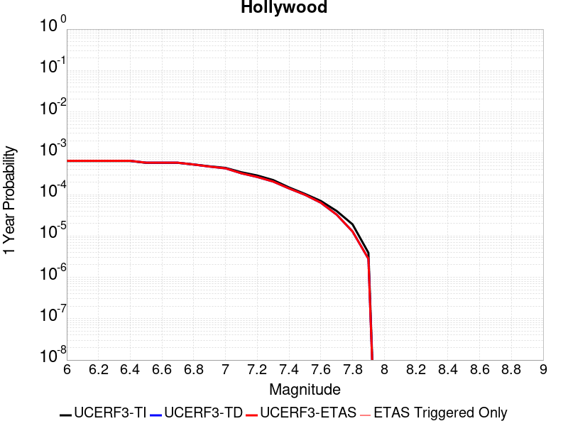 | 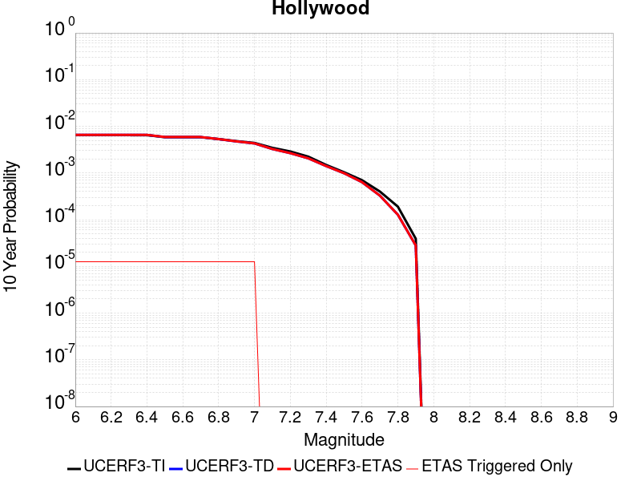 |

| Magnitude | 1 wk TI Prob | 1 wk TD Prob | 1 wk ETAS Prob | 1 wk ETAS/TD Gain | 1 wk ETAS Triggered Only | 1 mo TI Prob | 1 mo TD Prob | 1 mo ETAS Prob | 1 mo ETAS/TD Gain | 1 mo ETAS Triggered Only | 1 yr TI Prob | 1 yr TD Prob | 1 yr ETAS Prob | 1 yr ETAS/TD Gain | 1 yr ETAS Triggered Only | 10 yr TI Prob | 10 yr TD Prob | 10 yr ETAS Prob | 10 yr ETAS/TD Gain | 10 yr ETAS Triggered Only |
|-----|-----|-----|-----|-----|-----|-----|-----|-----|-----|-----|-----|-----|-----|-----|-----|-----|-----|-----|-----|-----|
| 6.0 | 1.24487615E-5 | 1.2593229E-5 | 1.2593229E-5 | 1.0 | 0.0 | 5.3350745E-5 | 5.3969892E-5 | 5.3969892E-5 | 1.0 | 0.0 | 6.4935174E-4 | 6.5689E-4 | 6.5689E-4 | 1.0 | 0.0 | 0.0064745755 | 0.0065499707 | 0.006559905 | 1.0015167 | 1.0E-5 |
| 6.1 | 1.24487615E-5 | 1.2593229E-5 | 1.2593229E-5 | 1.0 | 0.0 | 5.3350745E-5 | 5.3969892E-5 | 5.3969892E-5 | 1.0 | 0.0 | 6.4935174E-4 | 6.5689E-4 | 6.5689E-4 | 1.0 | 0.0 | 0.0064745755 | 0.0065499707 | 0.006559905 | 1.0015167 | 1.0E-5 |
| 6.2 | 1.24487615E-5 | 1.2593229E-5 | 1.2593229E-5 | 1.0 | 0.0 | 5.3350745E-5 | 5.3969892E-5 | 5.3969892E-5 | 1.0 | 0.0 | 6.4935174E-4 | 6.5689E-4 | 6.5689E-4 | 1.0 | 0.0 | 0.0064745755 | 0.0065499707 | 0.006559905 | 1.0015167 | 1.0E-5 |
| 6.3 | 1.24487615E-5 | 1.2593229E-5 | 1.2593229E-5 | 1.0 | 0.0 | 5.3350745E-5 | 5.3969892E-5 | 5.3969892E-5 | 1.0 | 0.0 | 6.4935174E-4 | 6.5689E-4 | 6.5689E-4 | 1.0 | 0.0 | 0.0064745755 | 0.0065499707 | 0.006559905 | 1.0015167 | 1.0E-5 |
| 6.4 | 1.2431024E-5 | 1.25738425E-5 | 1.25738425E-5 | 1.0 | 0.0 | 5.327473E-5 | 5.388681E-5 | 5.388681E-5 | 1.0 | 0.0 | 6.4842677E-4 | 6.558791E-4 | 6.558791E-4 | 1.0 | 0.0 | 0.0064653796 | 0.0065399213 | 0.0065498557 | 1.0015191 | 1.0E-5 |
| 6.5 | 1.1242222E-5 | 1.1317804E-5 | 1.1317804E-5 | 1.0 | 0.0 | 4.8180063E-5 | 4.8503985E-5 | 4.8503985E-5 | 1.0 | 0.0 | 5.864344E-4 | 5.903787E-4 | 5.903787E-4 | 1.0 | 0.0 | 0.0058488925 | 0.00588839 | 0.005898331 | 1.0016882 | 1.0E-5 |
| 6.6 | 1.1234066E-5 | 1.1308918E-5 | 1.1308918E-5 | 1.0 | 0.0 | 4.8145106E-5 | 4.8465907E-5 | 4.8465907E-5 | 1.0 | 0.0 | 5.86009E-4 | 5.899153E-4 | 5.899153E-4 | 1.0 | 0.0 | 0.005844661 | 0.0058837803 | 0.0058937217 | 1.0016896 | 1.0E-5 |
| 6.7 | 1.12294E-5 | 1.1303661E-5 | 1.1303661E-5 | 1.0 | 0.0 | 4.812511E-5 | 4.8443377E-5 | 4.8443377E-5 | 1.0 | 0.0 | 5.857657E-4 | 5.896412E-4 | 5.896412E-4 | 1.0 | 0.0 | 0.0058422405 | 0.005881054 | 0.005890995 | 1.0016904 | 1.0E-5 |
| 6.8 | 1.0252819E-5 | 1.0218449E-5 | 1.0218449E-5 | 1.0 | 0.0 | 4.3939912E-5 | 4.3792625E-5 | 4.3792625E-5 | 1.0 | 0.0 | 5.3483713E-4 | 5.330469E-4 | 5.330469E-4 | 1.0 | 0.0 | 0.005335517 | 0.0053179096 | 0.005327856 | 1.0018704 | 1.0E-5 |
| 6.9 | 9.252289E-6 | 9.110309E-6 | 9.110309E-6 | 1.0 | 0.0 | 3.9652066E-5 | 3.9043607E-5 | 3.9043607E-5 | 1.0 | 0.0 | 4.8265693E-4 | 4.752539E-4 | 4.752539E-4 | 1.0 | 0.0 | 0.0048161 | 0.004742549 | 0.0047525014 | 1.0020986 | 1.0E-5 |
| 7.0 | 8.474604E-6 | 8.25826E-6 | 8.25826E-6 | 1.0 | 0.0 | 3.6319227E-5 | 3.5392073E-5 | 3.5392073E-5 | 1.0 | 0.0 | 4.4209688E-4 | 4.3081472E-4 | 4.3081472E-4 | 1.0 | 0.0 | 0.004412184 | 0.0042999457 | 0.004309903 | 1.0023156 | 1.0E-5 |
| 7.1 | 6.643643E-6 | 6.2683707E-6 | 6.2683707E-6 | 1.0 | 0.0 | 2.8472443E-5 | 2.686417E-5 | 2.686417E-5 | 1.0 | 0.0 | 3.4659685E-4 | 3.2702263E-4 | 3.2702263E-4 | 1.0 | 0.0 | 0.0034605677 | 0.0032654598 | 0.0032654598 | 1.0 | 0.0 |
| 7.2 | 5.549002E-6 | 5.1087086E-6 | 5.1087086E-6 | 1.0 | 0.0 | 2.378122E-5 | 2.1894282E-5 | 2.1894282E-5 | 1.0 | 0.0 | 2.8949787E-4 | 2.665304E-4 | 2.665304E-4 | 1.0 | 0.0 | 0.0028912104 | 0.002662124 | 0.002662124 | 1.0 | 0.0 |
| 7.3 | 4.3059727E-6 | 3.9598913E-6 | 3.9598913E-6 | 1.0 | 0.0 | 1.8454039E-5 | 1.6970853E-5 | 1.6970853E-5 | 1.0 | 0.0 | 2.2465475E-4 | 2.0660064E-4 | 2.0660064E-4 | 1.0 | 0.0 | 0.0022442779 | 0.0020640958 | 0.0020640958 | 1.0 | 0.0 |
| 7.4 | 2.8550733E-6 | 2.7013002E-6 | 2.7013002E-6 | 1.0 | 0.0 | 1.2235971E-5 | 1.1576949E-5 | 1.1576949E-5 | 1.0 | 0.0 | 1.4896276E-4 | 1.4094029E-4 | 1.4094029E-4 | 1.0 | 0.0 | 0.0014886294 | 0.0014085141 | 0.0014085141 | 1.0 | 0.0 |
| 7.5 | 1.9927045E-6 | 1.8976393E-6 | 1.8976393E-6 | 1.0 | 0.0 | 8.540134E-6 | 8.132714E-6 | 8.132714E-6 | 1.0 | 0.0 | 1.0397117E-4 | 9.901134E-5 | 9.901134E-5 | 1.0 | 0.0 | 0.0010392254 | 9.896759E-4 | 9.896759E-4 | 1.0 | 0.0 |
| 7.6 | 1.345084E-6 | 1.2216018E-6 | 1.2216018E-6 | 1.0 | 0.0 | 5.764633E-6 | 5.2354258E-6 | 5.2354258E-6 | 1.0 | 0.0 | 7.018215E-5 | 6.373946E-5 | 6.373946E-5 | 1.0 | 0.0 | 7.0159987E-4 | 6.372138E-4 | 6.372138E-4 | 1.0 | 0.0 |
| 7.7 | 7.6835164E-7 | 6.2777013E-7 | 6.2777013E-7 | 1.0 | 0.0 | 3.2929315E-6 | 2.6904406E-6 | 2.6904406E-6 | 1.0 | 0.0 | 4.00907E-5 | 3.2755637E-5 | 3.2755637E-5 | 1.0 | 0.0 | 4.0083472E-4 | 3.2750957E-4 | 3.2750957E-4 | 1.0 | 0.0 |
| 7.8 | 3.6562128E-7 | 2.4534745E-7 | 2.4534745E-7 | 1.0 | 0.0 | 1.5669474E-6 | 1.0514887E-6 | 1.0514887E-6 | 1.0 | 0.0 | 1.9077417E-5 | 1.2801803E-5 | 1.2801803E-5 | 1.0 | 0.0 | 1.907578E-4 | 1.2801103E-4 | 1.2801103E-4 | 1.0 | 0.0 |
| 7.9 | 7.5024424E-8 | 5.381742E-8 | 5.381742E-8 | 1.0 | 0.0 | 3.215332E-7 | 2.3064608E-7 | 2.3064608E-7 | 1.0 | 0.0 | 3.91466E-6 | 2.8081138E-6 | 2.8081138E-6 | 1.0 | 0.0 | 3.9145907E-5 | 2.8080913E-5 | 2.8080913E-5 | 1.0 | 0.0 |

## Malibu Coast (Extension) alt 1
*[(top)](#table-of-contents)*

| 1 Week | 1 Month | 1 Year | 10 Year |
|-----|-----|-----|-----|
| 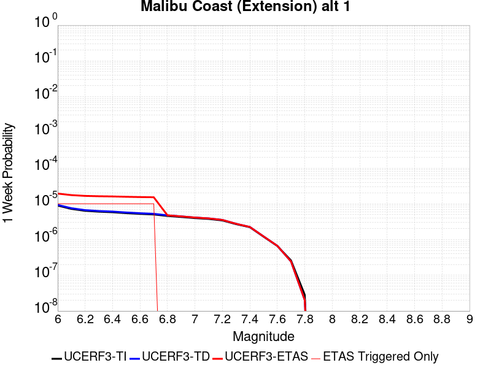 | 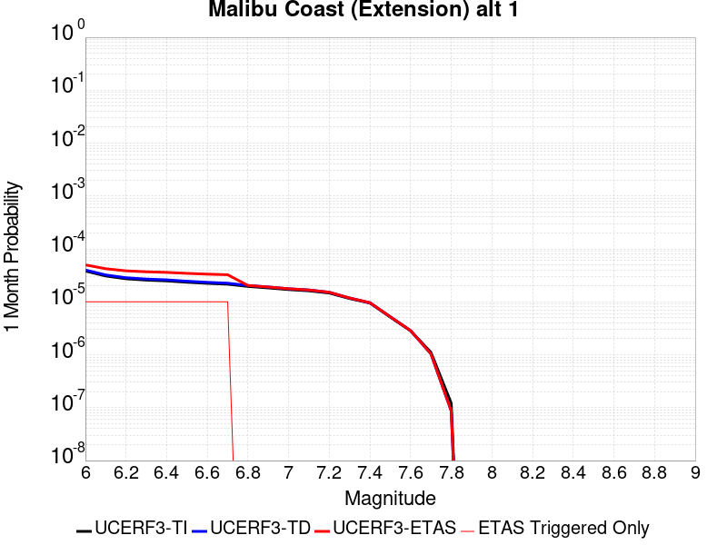 | 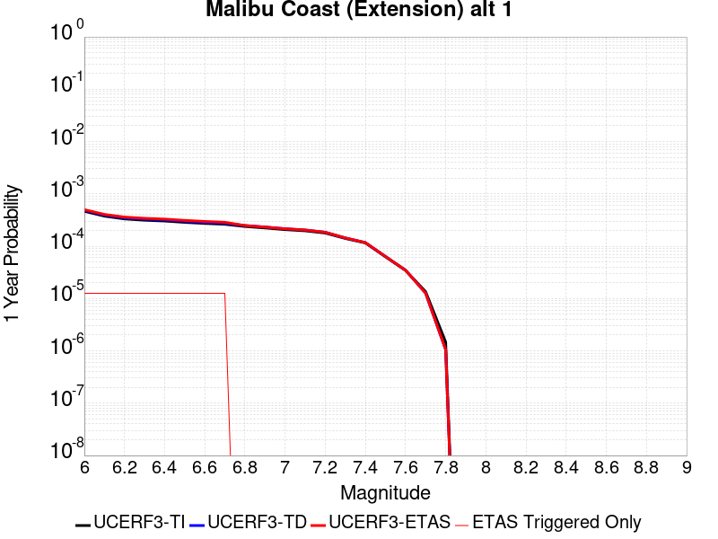 | 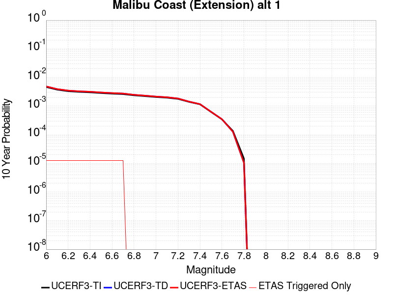 |

| Magnitude | 1 wk TI Prob | 1 wk TD Prob | 1 wk ETAS Prob | 1 wk ETAS/TD Gain | 1 wk ETAS Triggered Only | 1 mo TI Prob | 1 mo TD Prob | 1 mo ETAS Prob | 1 mo ETAS/TD Gain | 1 mo ETAS Triggered Only | 1 yr TI Prob | 1 yr TD Prob | 1 yr ETAS Prob | 1 yr ETAS/TD Gain | 1 yr ETAS Triggered Only | 10 yr TI Prob | 10 yr TD Prob | 10 yr ETAS Prob | 10 yr ETAS/TD Gain | 10 yr ETAS Triggered Only |
|-----|-----|-----|-----|-----|-----|-----|-----|-----|-----|-----|-----|-----|-----|-----|-----|-----|-----|-----|-----|-----|
| 6.0 | 8.930738E-6 | 9.3292765E-6 | 1.9329183E-5 | 2.0718844 | 1.0E-5 | 3.827403E-5 | 3.998201E-5 | 4.9981612E-5 | 1.2501025 | 1.0E-5 | 4.6588664E-4 | 4.86674E-4 | 4.966691E-4 | 1.0205376 | 1.0E-5 | 0.0046491115 | 0.004856264 | 0.004866216 | 1.0020492 | 1.0E-5 |
| 6.1 | 7.199952E-6 | 7.5302974E-6 | 1.7530221E-5 | 2.3279588 | 1.0E-5 | 3.0856572E-5 | 3.2272306E-5 | 4.2271986E-5 | 1.3098532 | 1.0E-5 | 3.75614E-4 | 3.928451E-4 | 4.0284116E-4 | 1.0254453 | 1.0E-5 | 0.0037497976 | 0.0039215726 | 0.0039315335 | 1.00254 | 1.0E-5 |
| 6.2 | 6.3721413E-6 | 6.666792E-6 | 1.6666725E-5 | 2.4999616 | 1.0E-5 | 2.7308892E-5 | 2.8571656E-5 | 3.8571372E-5 | 1.3499873 | 1.0E-5 | 3.3243504E-4 | 3.4780474E-4 | 3.5780127E-4 | 1.0287417 | 1.0E-5 | 0.0033193815 | 0.0034726441 | 0.0034826095 | 1.0028696 | 1.0E-5 |
| 6.3 | 6.016345E-6 | 6.295159E-6 | 1.6295096E-5 | 2.5885122 | 1.0E-5 | 2.578408E-5 | 2.6978976E-5 | 3.6978705E-5 | 1.370649 | 1.0E-5 | 3.1387596E-4 | 3.2841985E-4 | 3.3841658E-4 | 1.0304388 | 1.0E-5 | 0.00313433 | 0.0032793812 | 0.0032893484 | 1.0030394 | 1.0E-5 |
| 6.4 | 5.8104883E-6 | 6.0795455E-6 | 1.6079484E-5 | 2.6448498 | 1.0E-5 | 2.4901856E-5 | 2.6054937E-5 | 3.6054676E-5 | 1.3837944 | 1.0E-5 | 3.031379E-4 | 3.17173E-4 | 3.271698E-4 | 1.0315186 | 1.0E-5 | 0.0030272473 | 0.0031672379 | 0.003177206 | 1.0031474 | 1.0E-5 |
| 6.5 | 5.476925E-6 | 5.727514E-6 | 1.5727457E-5 | 2.745948 | 1.0E-5 | 2.3472323E-5 | 2.454626E-5 | 3.4546014E-5 | 1.407384 | 1.0E-5 | 2.8573806E-4 | 2.9881002E-4 | 3.0880704E-4 | 1.0334561 | 1.0E-5 | 0.0028537093 | 0.0029841145 | 0.0029940845 | 1.0033411 | 1.0E-5 |
| 6.6 | 5.222387E-6 | 5.4585807E-6 | 1.5458527E-5 | 2.831968 | 1.0E-5 | 2.2381464E-5 | 2.3393708E-5 | 3.3393473E-5 | 1.4274553 | 1.0E-5 | 2.7246025E-4 | 2.8478145E-4 | 2.947786E-4 | 1.0351046 | 1.0E-5 | 0.0027212645 | 0.002844196 | 0.0028541675 | 1.003506 | 1.0E-5 |
| 6.7 | 5.0337076E-6 | 5.259104E-6 | 1.5259051E-5 | 2.9014547 | 1.0E-5 | 2.1572854E-5 | 2.2538823E-5 | 3.25386E-5 | 1.4436688 | 1.0E-5 | 2.6261783E-4 | 2.743759E-4 | 2.8437315E-4 | 1.0364363 | 1.0E-5 | 0.002623077 | 0.0027404015 | 0.0027503741 | 1.0036391 | 1.0E-5 |
| 6.8 | 4.5675624E-6 | 4.7587173E-6 | 4.7587173E-6 | 1.0 | 0.0 | 1.9575122E-5 | 2.0394344E-5 | 2.0394344E-5 | 1.0 | 0.0 | 2.3830103E-4 | 2.4827302E-4 | 2.4827302E-4 | 1.0 | 0.0 | 0.0023804565 | 0.0024799763 | 0.0024799763 | 1.0 | 0.0 |
| 6.9 | 4.2802412E-6 | 4.4520216E-6 | 4.4520216E-6 | 1.0 | 0.0 | 1.8343762E-5 | 1.9079953E-5 | 1.9079953E-5 | 1.0 | 0.0 | 2.2331243E-4 | 2.3227383E-4 | 2.3227383E-4 | 1.0 | 0.0 | 0.0022308815 | 0.0023203273 | 0.0023203273 | 1.0 | 0.0 |
| 7.0 | 3.9794063E-6 | 4.1301E-6 | 4.1301E-6 | 1.0 | 0.0 | 1.7054486E-5 | 1.770031E-5 | 1.770031E-5 | 1.0 | 0.0 | 2.0761859E-4 | 2.1548007E-4 | 2.1548007E-4 | 1.0 | 0.0 | 0.0020742472 | 0.002152725 | 0.002152725 | 1.0 | 0.0 |
| 7.1 | 3.7730424E-6 | 3.911218E-6 | 3.911218E-6 | 1.0 | 0.0 | 1.6170083E-5 | 1.6762255E-5 | 1.6762255E-5 | 1.0 | 0.0 | 1.9685295E-4 | 2.0406146E-4 | 2.0406146E-4 | 1.0 | 0.0 | 0.0019667868 | 0.0020387538 | 0.0020387538 | 1.0 | 0.0 |
| 7.2 | 3.424985E-6 | 3.541338E-6 | 3.541338E-6 | 1.0 | 0.0 | 1.4678424E-5 | 1.5177075E-5 | 1.5177075E-5 | 1.0 | 0.0 | 1.7869516E-4 | 1.8476533E-4 | 1.8476533E-4 | 1.0 | 0.0 | 0.0017855153 | 0.0018461292 | 0.0018461292 | 1.0 | 0.0 |
| 7.3 | 2.6966375E-6 | 2.759654E-6 | 2.759654E-6 | 1.0 | 0.0 | 1.15569665E-5 | 1.1827035E-5 | 1.1827035E-5 | 1.0 | 0.0 | 1.4069698E-4 | 1.4398468E-4 | 1.4398468E-4 | 1.0 | 0.0 | 0.0014060794 | 0.001438918 | 0.001438918 | 1.0 | 0.0 |
| 7.4 | 2.215957E-6 | 2.249379E-6 | 2.249379E-6 | 1.0 | 0.0 | 9.496924E-6 | 9.64016E-6 | 9.64016E-6 | 1.0 | 0.0 | 1.1561892E-4 | 1.1736266E-4 | 1.1736266E-4 | 1.0 | 0.0 | 0.0011555878 | 0.0011730106 | 0.0011730106 | 1.0 | 0.0 |
| 7.5 | 1.2040218E-6 | 1.2219067E-6 | 1.2219067E-6 | 1.0 | 0.0 | 5.160083E-6 | 5.2367327E-6 | 5.2367327E-6 | 1.0 | 0.0 | 6.2822204E-5 | 6.3755375E-5 | 6.3755375E-5 | 1.0 | 0.0 | 6.280445E-4 | 6.3737266E-4 | 6.3737266E-4 | 1.0 | 0.0 |
| 7.6 | 6.6157446E-7 | 6.6789755E-7 | 6.6789755E-7 | 1.0 | 0.0 | 2.835316E-6 | 2.8624152E-6 | 2.8624152E-6 | 1.0 | 0.0 | 3.4519428E-5 | 3.4849363E-5 | 3.4849363E-5 | 1.0 | 0.0 | 3.4514067E-4 | 3.484405E-4 | 3.484405E-4 | 1.0 | 0.0 |
| 7.7 | 2.6012302E-7 | 2.4357584E-7 | 2.4357584E-7 | 1.0 | 0.0 | 1.1148124E-6 | 1.0438962E-6 | 1.0438962E-6 | 1.0 | 0.0 | 1.3572758E-5 | 1.2709373E-5 | 1.2709373E-5 | 1.0 | 0.0 | 1.3571928E-4 | 1.2708752E-4 | 1.2708752E-4 | 1.0 | 0.0 |
| 7.8 | 2.8323132E-8 | 2.0266642E-8 | 2.0266642E-8 | 1.0 | 0.0 | 1.2138484E-7 | 8.685703E-8 | 8.685703E-8 | 1.0 | 0.0 | 1.4778595E-6 | 1.0574839E-6 | 1.0574839E-6 | 1.0 | 0.0 | 1.4778497E-5 | 1.0574797E-5 | 1.0574797E-5 | 1.0 | 0.0 |

## Los Osos 2011
*[(top)](#table-of-contents)*

| 1 Week | 1 Month | 1 Year | 10 Year |
|-----|-----|-----|-----|
| 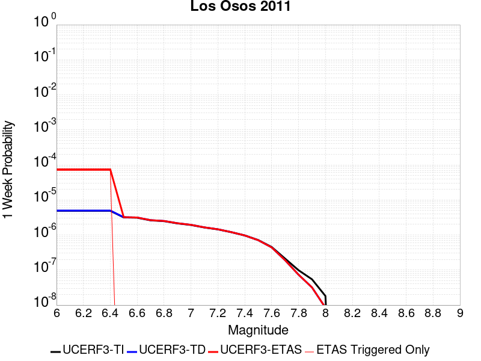 |  |  | 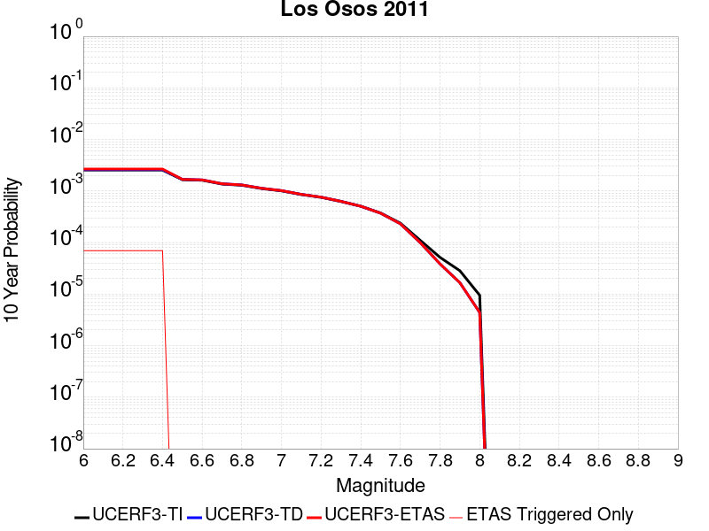 |

| Magnitude | 1 wk TI Prob | 1 wk TD Prob | 1 wk ETAS Prob | 1 wk ETAS/TD Gain | 1 wk ETAS Triggered Only | 1 mo TI Prob | 1 mo TD Prob | 1 mo ETAS Prob | 1 mo ETAS/TD Gain | 1 mo ETAS Triggered Only | 1 yr TI Prob | 1 yr TD Prob | 1 yr ETAS Prob | 1 yr ETAS/TD Gain | 1 yr ETAS Triggered Only | 10 yr TI Prob | 10 yr TD Prob | 10 yr ETAS Prob | 10 yr ETAS/TD Gain | 10 yr ETAS Triggered Only |
|-----|-----|-----|-----|-----|-----|-----|-----|-----|-----|-----|-----|-----|-----|-----|-----|-----|-----|-----|-----|-----|
| 6.0 | 4.8871775E-6 | 4.9814826E-6 | 1.4981433E-5 | 3.0074244 | 1.0E-5 | 2.0944879E-5 | 2.1349053E-5 | 3.1348838E-5 | 1.4683949 | 1.0E-5 | 2.5497406E-4 | 2.598965E-4 | 2.698939E-4 | 1.0384668 | 1.0E-5 | 0.002546817 | 0.0025962 | 0.002606174 | 1.0038418 | 1.0E-5 |
| 6.1 | 4.8871775E-6 | 4.9814826E-6 | 1.4981433E-5 | 3.0074244 | 1.0E-5 | 2.0944879E-5 | 2.1349053E-5 | 3.1348838E-5 | 1.4683949 | 1.0E-5 | 2.5497406E-4 | 2.598965E-4 | 2.698939E-4 | 1.0384668 | 1.0E-5 | 0.002546817 | 0.0025962 | 0.002606174 | 1.0038418 | 1.0E-5 |
| 6.2 | 4.8871775E-6 | 4.9814826E-6 | 1.4981433E-5 | 3.0074244 | 1.0E-5 | 2.0944879E-5 | 2.1349053E-5 | 3.1348838E-5 | 1.4683949 | 1.0E-5 | 2.5497406E-4 | 2.598965E-4 | 2.698939E-4 | 1.0384668 | 1.0E-5 | 0.002546817 | 0.0025962 | 0.002606174 | 1.0038418 | 1.0E-5 |
| 6.3 | 4.8871775E-6 | 4.9814826E-6 | 1.4981433E-5 | 3.0074244 | 1.0E-5 | 2.0944879E-5 | 2.1349053E-5 | 3.1348838E-5 | 1.4683949 | 1.0E-5 | 2.5497406E-4 | 2.598965E-4 | 2.698939E-4 | 1.0384668 | 1.0E-5 | 0.002546817 | 0.0025962 | 0.002606174 | 1.0038418 | 1.0E-5 |
| 6.4 | 4.8871775E-6 | 4.9814826E-6 | 1.4981433E-5 | 3.0074244 | 1.0E-5 | 2.0944879E-5 | 2.1349053E-5 | 3.1348838E-5 | 1.4683949 | 1.0E-5 | 2.5497406E-4 | 2.598965E-4 | 2.698939E-4 | 1.0384668 | 1.0E-5 | 0.002546817 | 0.0025962 | 0.002606174 | 1.0038418 | 1.0E-5 |
| 6.5 | 3.1724062E-6 | 3.2233943E-6 | 3.2233943E-6 | 1.0 | 0.0 | 1.3595956E-5 | 1.3814474E-5 | 1.3814474E-5 | 1.0 | 0.0 | 1.6551818E-4 | 1.6817838E-4 | 1.6817838E-4 | 1.0 | 0.0 | 0.0016539496 | 0.0016805246 | 0.0016805246 | 1.0 | 0.0 |
| 6.6 | 3.1022591E-6 | 3.1511038E-6 | 3.1511038E-6 | 1.0 | 0.0 | 1.3295328E-5 | 1.3504661E-5 | 1.3504661E-5 | 1.0 | 0.0 | 1.618586E-4 | 1.6440697E-4 | 1.6440697E-4 | 1.0 | 0.0 | 0.0016174077 | 0.0016428662 | 0.0016428662 | 1.0 | 0.0 |
| 6.7 | 2.611518E-6 | 2.6491825E-6 | 2.6491825E-6 | 1.0 | 0.0 | 1.1192172E-5 | 1.1353591E-5 | 1.1353591E-5 | 1.0 | 0.0 | 1.3625617E-4 | 1.3822124E-4 | 1.3822124E-4 | 1.0 | 0.0 | 0.0013617266 | 0.0013813572 | 0.0013813572 | 1.0 | 0.0 |
| 6.8 | 2.4780884E-6 | 2.5121587E-6 | 2.5121587E-6 | 1.0 | 0.0 | 1.0620336E-5 | 1.076635E-5 | 1.076635E-5 | 1.0 | 0.0 | 1.2929492E-4 | 1.3107246E-4 | 1.3107246E-4 | 1.0 | 0.0 | 0.0012921972 | 0.0013099556 | 0.0013099556 | 1.0 | 0.0 |
| 6.9 | 2.1376322E-6 | 2.1635049E-6 | 2.1635049E-6 | 1.0 | 0.0 | 9.161248E-6 | 9.272131E-6 | 9.272131E-6 | 1.0 | 0.0 | 1.1153249E-4 | 1.1288237E-4 | 1.1288237E-4 | 1.0 | 0.0 | 0.0011147653 | 0.0011282521 | 0.0011282521 | 1.0 | 0.0 |
| 7.0 | 1.9282882E-6 | 1.949458E-6 | 1.949458E-6 | 1.0 | 0.0 | 8.264066E-6 | 8.354793E-6 | 8.354793E-6 | 1.0 | 0.0 | 1.0061036E-4 | 1.0171487E-4 | 1.0171487E-4 | 1.0 | 0.0 | 0.0010056482 | 0.0010166845 | 0.0010166845 | 1.0 | 0.0 |
| 7.1 | 1.6353226E-6 | 1.6501111E-6 | 1.6501111E-6 | 1.0 | 0.0 | 7.0085066E-6 | 7.0718856E-6 | 7.0718856E-6 | 1.0 | 0.0 | 8.532523E-5 | 8.6096814E-5 | 8.6096814E-5 | 1.0 | 0.0 | 8.529247E-4 | 8.6063537E-4 | 8.6063537E-4 | 1.0 | 0.0 |
| 7.2 | 1.4446276E-6 | 1.4553335E-6 | 1.4553335E-6 | 1.0 | 0.0 | 6.191247E-6 | 6.2371287E-6 | 6.2371287E-6 | 1.0 | 0.0 | 7.537582E-5 | 7.59344E-5 | 7.59344E-5 | 1.0 | 0.0 | 7.535026E-4 | 7.590851E-4 | 7.590851E-4 | 1.0 | 0.0 |
| 7.3 | 1.2014582E-6 | 1.2069066E-6 | 1.2069066E-6 | 1.0 | 0.0 | 5.149096E-6 | 5.172447E-6 | 5.172447E-6 | 1.0 | 0.0 | 6.268844E-5 | 6.297272E-5 | 6.297272E-5 | 1.0 | 0.0 | 6.267076E-4 | 6.295492E-4 | 6.295492E-4 | 1.0 | 0.0 |
| 7.4 | 9.707733E-7 | 9.709767E-7 | 9.709767E-7 | 1.0 | 0.0 | 4.16045E-6 | 4.161322E-6 | 4.161322E-6 | 1.0 | 0.0 | 5.0652303E-5 | 5.066292E-5 | 5.066292E-5 | 1.0 | 0.0 | 5.064076E-4 | 5.065139E-4 | 5.065139E-4 | 1.0 | 0.0 |
| 7.5 | 7.174908E-7 | 7.114907E-7 | 7.114907E-7 | 1.0 | 0.0 | 3.074957E-6 | 3.0492424E-6 | 3.0492424E-6 | 1.0 | 0.0 | 3.743696E-5 | 3.7123897E-5 | 3.7123897E-5 | 1.0 | 0.0 | 3.7430652E-4 | 3.7117713E-4 | 3.7117713E-4 | 1.0 | 0.0 |
| 7.6 | 4.5535776E-7 | 4.4207857E-7 | 4.4207857E-7 | 1.0 | 0.0 | 1.9515319E-6 | 1.8946212E-6 | 1.8946212E-6 | 1.0 | 0.0 | 2.3759641E-5 | 2.3066768E-5 | 2.3066768E-5 | 1.0 | 0.0 | 2.37571E-4 | 2.3064384E-4 | 2.3064384E-4 | 1.0 | 0.0 |
| 7.7 | 2.1173553E-7 | 1.9060734E-7 | 1.9060734E-7 | 1.0 | 0.0 | 9.0743765E-7 | 8.1688836E-7 | 8.1688836E-7 | 1.0 | 0.0 | 1.1047998E-5 | 9.94557E-6 | 9.94557E-6 | 1.0 | 0.0 | 1.1047449E-4 | 9.945128E-5 | 9.945128E-5 | 1.0 | 0.0 |
| 7.8 | 9.873608E-8 | 7.367457E-8 | 7.367457E-8 | 1.0 | 0.0 | 4.2315455E-7 | 3.1574814E-7 | 3.1574814E-7 | 1.0 | 0.0 | 5.1518946E-6 | 3.8442267E-6 | 3.8442267E-6 | 1.0 | 0.0 | 5.1517753E-5 | 3.844161E-5 | 3.844161E-5 | 1.0 | 0.0 |
| 7.9 | 5.4399106E-8 | 3.187941E-8 | 3.187941E-8 | 1.0 | 0.0 | 2.33139E-7 | 1.3662603E-7 | 1.3662603E-7 | 1.0 | 0.0 | 2.8384638E-6 | 1.6634207E-6 | 1.6634207E-6 | 1.0 | 0.0 | 2.8384275E-5 | 1.6634083E-5 | 1.6634083E-5 | 1.0 | 0.0 |
| 8.0 | 1.817203E-8 | 8.420079E-9 | 8.420079E-9 | 1.0 | 0.0 | 7.7880124E-8 | 3.6086053E-8 | 3.6086053E-8 | 1.0 | 0.0 | 9.481901E-7 | 4.393476E-7 | 4.393476E-7 | 1.0 | 0.0 | 9.481861E-6 | 4.393468E-6 | 4.393468E-6 | 1.0 | 0.0 |

## Rodgers Creek - Healdsburg 2011 CFM
*[(top)](#table-of-contents)*

| 1 Week | 1 Month | 1 Year | 10 Year |
|-----|-----|-----|-----|
|  | 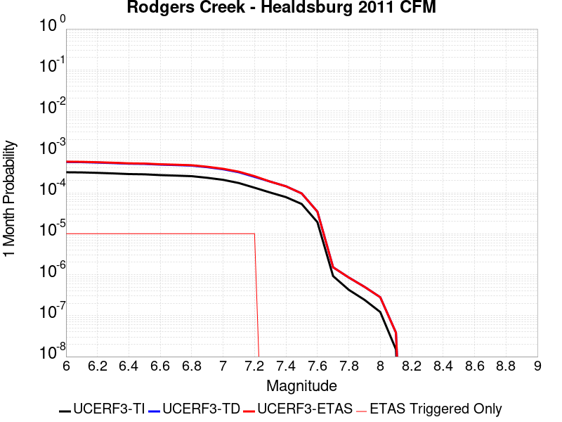 | 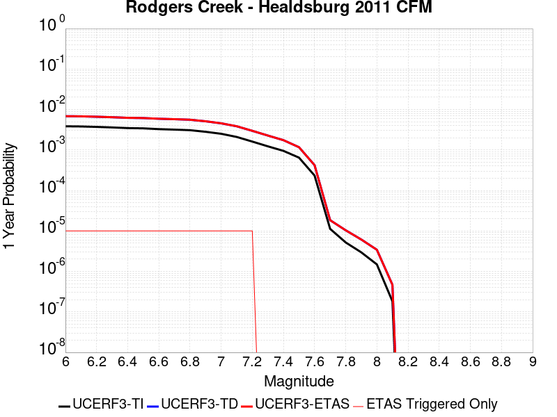 | 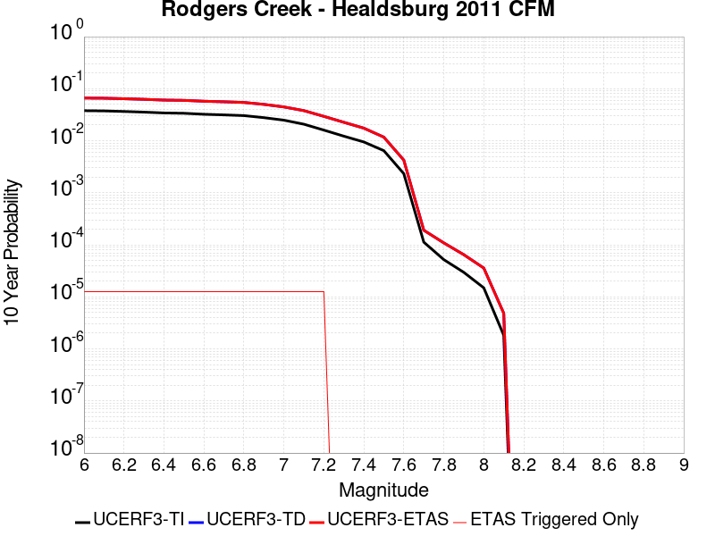 |

| Magnitude | 1 wk TI Prob | 1 wk TD Prob | 1 wk ETAS Prob | 1 wk ETAS/TD Gain | 1 wk ETAS Triggered Only | 1 mo TI Prob | 1 mo TD Prob | 1 mo ETAS Prob | 1 mo ETAS/TD Gain | 1 mo ETAS Triggered Only | 1 yr TI Prob | 1 yr TD Prob | 1 yr ETAS Prob | 1 yr ETAS/TD Gain | 1 yr ETAS Triggered Only | 10 yr TI Prob | 10 yr TD Prob | 10 yr ETAS Prob | 10 yr ETAS/TD Gain | 10 yr ETAS Triggered Only |
|-----|-----|-----|-----|-----|-----|-----|-----|-----|-----|-----|-----|-----|-----|-----|-----|-----|-----|-----|-----|-----|
| 6.0 | 7.390182E-5 | 1.3137296E-4 | 1.3137296E-4 | 1.0 | 0.0 | 3.1668364E-4 | 5.629057E-4 | 5.7290005E-4 | 1.0177549 | 1.0E-5 | 0.0038488081 | 0.0068318076 | 0.006841739 | 1.0014538 | 1.0E-5 | 0.037828278 | 0.06618395 | 0.06619328 | 1.0001411 | 1.0E-5 |
| 6.1 | 7.318768E-5 | 1.303531E-4 | 1.303531E-4 | 1.0 | 0.0 | 3.1362378E-4 | 5.585369E-4 | 5.6853134E-4 | 1.0178939 | 1.0E-5 | 0.0038116854 | 0.006778966 | 0.0067888983 | 1.0014652 | 1.0E-5 | 0.037469655 | 0.06568854 | 0.065697886 | 1.0001422 | 1.0E-5 |
| 6.2 | 7.1379836E-5 | 1.2728151E-4 | 1.2728151E-4 | 1.0 | 0.0 | 3.058777E-4 | 5.453785E-4 | 5.5537303E-4 | 1.0183259 | 1.0E-5 | 0.003717703 | 0.0066197454 | 0.006629679 | 1.0015006 | 1.0E-5 | 0.0365612 | 0.06421061 | 0.06421997 | 1.0001458 | 1.0E-5 |
| 6.3 | 6.9255926E-5 | 1.2382482E-4 | 1.2382482E-4 | 1.0 | 0.0 | 2.9677735E-4 | 5.305703E-4 | 5.4056494E-4 | 1.0188377 | 1.0E-5 | 0.0036072785 | 0.0064406106 | 0.0064505464 | 1.0015427 | 1.0E-5 | 0.035492823 | 0.062541805 | 0.062551185 | 1.0001498 | 1.0E-5 |
| 6.4 | 6.6757144E-5 | 1.195919E-4 | 1.195919E-4 | 1.0 | 0.0 | 2.8607066E-4 | 5.1243644E-4 | 5.2243134E-4 | 1.0195047 | 1.0E-5 | 0.0034773487 | 0.00622114 | 0.006231078 | 1.0015974 | 1.0E-5 | 0.034234364 | 0.060491614 | 0.06050101 | 1.0001553 | 1.0E-5 |
| 6.5 | 6.5735134E-5 | 1.180849E-4 | 1.180849E-4 | 1.0 | 0.0 | 2.8169158E-4 | 5.059804E-4 | 5.1597535E-4 | 1.0197536 | 1.0E-5 | 0.003424202 | 0.0061429944 | 0.006152933 | 1.0016179 | 1.0E-5 | 0.03371918 | 0.059755705 | 0.059765108 | 1.0001574 | 1.0E-5 |
| 6.6 | 6.289601E-5 | 1.13442366E-4 | 1.13442366E-4 | 1.0 | 0.0 | 2.6952647E-4 | 4.8609133E-4 | 4.960865E-4 | 1.0205623 | 1.0E-5 | 0.0032765474 | 0.005902183 | 0.0059121237 | 1.0016843 | 1.0E-5 | 0.032286562 | 0.057495043 | 0.057504468 | 1.0001639 | 1.0E-5 |
| 6.7 | 6.115274E-5 | 1.106132E-4 | 1.106132E-4 | 1.0 | 0.0 | 2.6205686E-4 | 4.739708E-4 | 4.8396608E-4 | 1.0210884 | 1.0E-5 | 0.0031858748 | 0.0057554054 | 0.0057653477 | 1.0017275 | 1.0E-5 | 0.031405866 | 0.05611361 | 0.056123048 | 1.0001682 | 1.0E-5 |
| 6.8 | 5.9232367E-5 | 1.0728657E-4 | 1.0728657E-4 | 1.0 | 0.0 | 2.538283E-4 | 4.5971893E-4 | 4.6971434E-4 | 1.0217425 | 1.0E-5 | 0.0030859804 | 0.005582791 | 0.005592735 | 1.0017812 | 1.0E-5 | 0.030434765 | 0.05448041 | 0.054489866 | 1.0001736 | 1.0E-5 |
| 6.9 | 5.4030377E-5 | 9.8228295E-5 | 9.8228295E-5 | 1.0 | 0.0 | 2.315382E-4 | 4.209108E-4 | 4.309066E-4 | 1.023748 | 1.0E-5 | 0.0028153337 | 0.0051126136 | 0.0051225624 | 1.001946 | 1.0E-5 | 0.027799325 | 0.05001572 | 0.05002522 | 1.0001899 | 1.0E-5 |
| 7.0 | 4.8260714E-5 | 8.7408924E-5 | 8.7408924E-5 | 1.0 | 0.0 | 2.0681522E-4 | 3.7455617E-4 | 3.8455243E-4 | 1.0266882 | 1.0E-5 | 0.0025150678 | 0.0045507406 | 0.004560695 | 1.0021875 | 1.0E-5 | 0.024867928 | 0.044667073 | 0.044676628 | 1.0002139 | 1.0E-5 |
| 7.1 | 4.0294493E-5 | 7.389363E-5 | 7.389363E-5 | 1.0 | 0.0 | 1.7267925E-4 | 3.1664874E-4 | 3.2664556E-4 | 1.0315708 | 1.0E-5 | 0.0021003427 | 0.0038484214 | 0.003858383 | 1.0025885 | 1.0E-5 | 0.02080602 | 0.037923187 | 0.03793281 | 1.0002537 | 1.0E-5 |
| 7.2 | 3.096388E-5 | 5.698023E-5 | 5.698023E-5 | 1.0 | 0.0 | 1.326956E-4 | 2.4417826E-4 | 2.541758E-4 | 1.0409437 | 1.0E-5 | 0.0016143717 | 0.0029688394 | 0.0029788096 | 1.0033584 | 1.0E-5 | 0.01602694 | 0.029437006 | 0.029446712 | 1.0003297 | 1.0E-5 |
| 7.3 | 2.3615226E-5 | 4.3629818E-5 | 4.3629818E-5 | 1.0 | 0.0 | 1.0120418E-4 | 1.869716E-4 | 1.869716E-4 | 1.0 | 0.0 | 0.0012314644 | 0.0022740164 | 0.0022740164 | 1.0 | 0.0 | 0.0122466255 | 0.022637889 | 0.022637889 | 1.0 | 0.0 |
| 7.4 | 1.8251132E-5 | 3.3542477E-5 | 3.3542477E-5 | 1.0 | 0.0 | 7.821679E-5 | 1.4374561E-4 | 1.4374561E-4 | 1.0 | 0.0 | 9.518733E-4 | 0.0017487077 | 0.0017487077 | 1.0 | 0.0 | 0.009478063 | 0.017466031 | 0.017466031 | 1.0 | 0.0 |
| 7.5 | 1.2411432E-5 | 2.2461069E-5 | 2.2461069E-5 | 1.0 | 0.0 | 5.3190768E-5 | 9.6258205E-5 | 9.6258205E-5 | 1.0 | 0.0 | 6.4740516E-4 | 0.0011713194 | 0.0011713194 | 1.0 | 0.0 | 0.006455223 | 0.011743137 | 0.011743137 | 1.0 | 0.0 |
| 7.6 | 4.4771446E-6 | 8.08443E-6 | 8.08443E-6 | 1.0 | 0.0 | 1.918762E-5 | 3.4647102E-5 | 3.4647102E-5 | 1.0 | 0.0 | 2.3358424E-4 | 4.2174806E-4 | 4.2174806E-4 | 1.0 | 0.0 | 0.0023333887 | 0.0042453306 | 0.0042453306 | 1.0 | 0.0 |
| 7.7 | 2.157941E-7 | 3.5350925E-7 | 3.5350925E-7 | 1.0 | 0.0 | 9.248315E-7 | 1.5150388E-6 | 1.5150388E-6 | 1.0 | 0.0 | 1.1259765E-5 | 1.844544E-5 | 1.844544E-5 | 1.0 | 0.0 | 1.1259195E-4 | 1.9069649E-4 | 1.9069649E-4 | 1.0 | 0.0 |
| 7.8 | 9.9623286E-8 | 1.9900986E-7 | 1.9900986E-7 | 1.0 | 0.0 | 4.269569E-7 | 8.528991E-7 | 8.528991E-7 | 1.0 | 0.0 | 5.1981874E-6 | 1.03839975E-5 | 1.03839975E-5 | 1.0 | 0.0 | 5.198066E-5 | 1.0902916E-4 | 1.0902916E-4 | 1.0 | 0.0 |
| 7.9 | 5.6745257E-8 | 1.1774714E-7 | 1.1774714E-7 | 1.0 | 0.0 | 2.4319394E-7 | 5.046305E-7 | 5.046305E-7 | 1.0 | 0.0 | 2.960882E-6 | 6.143859E-6 | 6.143859E-6 | 1.0 | 0.0 | 2.9608427E-5 | 6.471445E-5 | 6.471445E-5 | 1.0 | 0.0 |
| 8.0 | 2.8614323E-8 | 6.5789635E-8 | 6.5789635E-8 | 1.0 | 0.0 | 1.2263281E-7 | 2.8195555E-7 | 2.8195555E-7 | 1.0 | 0.0 | 1.4930534E-6 | 3.4328034E-6 | 3.4328034E-6 | 1.0 | 0.0 | 1.4930434E-5 | 3.5830046E-5 | 3.5830046E-5 | 1.0 | 0.0 |
| 8.1 | 3.5045191E-9 | 8.966459E-9 | 8.966459E-9 | 1.0 | 0.0 | 1.5019367E-8 | 3.8427682E-8 | 3.8427682E-8 | 1.0 | 0.0 | 1.8286079E-7 | 4.6785692E-7 | 4.6785692E-7 | 1.0 | 0.0 | 1.8286064E-6 | 4.834128E-6 | 4.834128E-6 | 1.0 | 0.0 |

## Santa Susana East (connector)
*[(top)](#table-of-contents)*

| 1 Week | 1 Month | 1 Year | 10 Year |
|-----|-----|-----|-----|
|  |  | 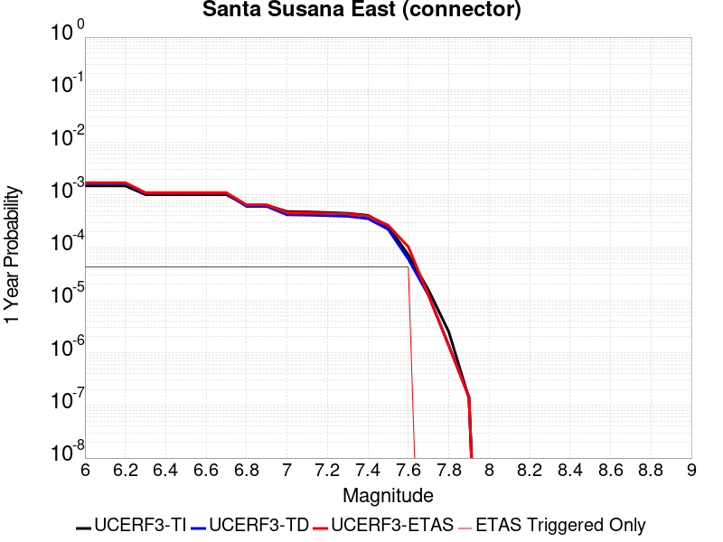 | 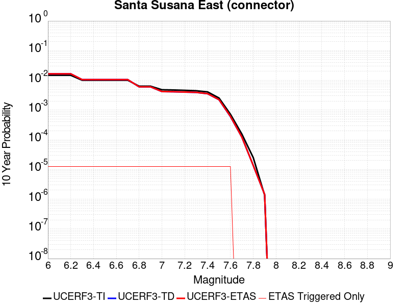 |

| Magnitude | 1 wk TI Prob | 1 wk TD Prob | 1 wk ETAS Prob | 1 wk ETAS/TD Gain | 1 wk ETAS Triggered Only | 1 mo TI Prob | 1 mo TD Prob | 1 mo ETAS Prob | 1 mo ETAS/TD Gain | 1 mo ETAS Triggered Only | 1 yr TI Prob | 1 yr TD Prob | 1 yr ETAS Prob | 1 yr ETAS/TD Gain | 1 yr ETAS Triggered Only | 10 yr TI Prob | 10 yr TD Prob | 10 yr ETAS Prob | 10 yr ETAS/TD Gain | 10 yr ETAS Triggered Only |
|-----|-----|-----|-----|-----|-----|-----|-----|-----|-----|-----|-----|-----|-----|-----|-----|-----|-----|-----|-----|-----|
| 6.0 | 2.858397E-5 | 3.2021693E-5 | 3.2021693E-5 | 1.0 | 0.0 | 1.2249697E-4 | 1.3723019E-4 | 1.3723019E-4 | 1.0 | 0.0 | 0.0014903803 | 0.00166977 | 0.0016797533 | 1.0059788 | 1.0E-5 | 0.014804244 | 0.016599316 | 0.01660915 | 1.0005925 | 1.0E-5 |
| 6.1 | 2.858397E-5 | 3.2021693E-5 | 3.2021693E-5 | 1.0 | 0.0 | 1.2249697E-4 | 1.3723019E-4 | 1.3723019E-4 | 1.0 | 0.0 | 0.0014903803 | 0.00166977 | 0.0016797533 | 1.0059788 | 1.0E-5 | 0.014804244 | 0.016599316 | 0.01660915 | 1.0005925 | 1.0E-5 |
| 6.2 | 2.858397E-5 | 3.2021693E-5 | 3.2021693E-5 | 1.0 | 0.0 | 1.2249697E-4 | 1.3723019E-4 | 1.3723019E-4 | 1.0 | 0.0 | 0.0014903803 | 0.00166977 | 0.0016797533 | 1.0059788 | 1.0E-5 | 0.014804244 | 0.016599316 | 0.01660915 | 1.0005925 | 1.0E-5 |
| 6.3 | 1.943582E-5 | 2.0367343E-5 | 2.0367343E-5 | 1.0 | 0.0 | 8.329371E-5 | 8.7286324E-5 | 8.7286324E-5 | 1.0 | 0.0 | 0.001013629 | 0.001062305 | 0.0010722943 | 1.0094035 | 1.0E-5 | 0.010090181 | 0.010583852 | 0.010593747 | 1.0009348 | 1.0E-5 |
| 6.4 | 1.943582E-5 | 2.0367343E-5 | 2.0367343E-5 | 1.0 | 0.0 | 8.329371E-5 | 8.7286324E-5 | 8.7286324E-5 | 1.0 | 0.0 | 0.001013629 | 0.001062305 | 0.0010722943 | 1.0094035 | 1.0E-5 | 0.010090181 | 0.010583852 | 0.010593747 | 1.0009348 | 1.0E-5 |
| 6.5 | 1.943582E-5 | 2.0367343E-5 | 2.0367343E-5 | 1.0 | 0.0 | 8.329371E-5 | 8.7286324E-5 | 8.7286324E-5 | 1.0 | 0.0 | 0.001013629 | 0.001062305 | 0.0010722943 | 1.0094035 | 1.0E-5 | 0.010090181 | 0.010583852 | 0.010593747 | 1.0009348 | 1.0E-5 |
| 6.6 | 1.943582E-5 | 2.0367343E-5 | 2.0367343E-5 | 1.0 | 0.0 | 8.329371E-5 | 8.7286324E-5 | 8.7286324E-5 | 1.0 | 0.0 | 0.001013629 | 0.001062305 | 0.0010722943 | 1.0094035 | 1.0E-5 | 0.010090181 | 0.010583852 | 0.010593747 | 1.0009348 | 1.0E-5 |
| 6.7 | 1.9404439E-5 | 2.0354766E-5 | 2.0354766E-5 | 1.0 | 0.0 | 8.3159226E-5 | 8.723242E-5 | 8.723242E-5 | 1.0 | 0.0 | 0.0010119933 | 0.0010616493 | 0.0010716388 | 1.0094093 | 1.0E-5 | 0.010073971 | 0.010577358 | 0.010587253 | 1.0009354 | 1.0E-5 |
| 6.8 | 1.2217526E-5 | 1.1593157E-5 | 1.1593157E-5 | 1.0 | 0.0 | 5.2359774E-5 | 4.9684106E-5 | 4.9684106E-5 | 1.0 | 0.0 | 6.372938E-4 | 6.047529E-4 | 6.147469E-4 | 1.0165256 | 1.0E-5 | 0.0063546924 | 0.006033274 | 0.006043214 | 1.0016475 | 1.0E-5 |
| 6.9 | 1.2217526E-5 | 1.1593157E-5 | 1.1593157E-5 | 1.0 | 0.0 | 5.2359774E-5 | 4.9684106E-5 | 4.9684106E-5 | 1.0 | 0.0 | 6.372938E-4 | 6.047529E-4 | 6.147469E-4 | 1.0165256 | 1.0E-5 | 0.0063546924 | 0.006033274 | 0.006043214 | 1.0016475 | 1.0E-5 |
| 7.0 | 9.276017E-6 | 8.059273E-6 | 8.059273E-6 | 1.0 | 0.0 | 3.9753755E-5 | 3.4539302E-5 | 3.4539302E-5 | 1.0 | 0.0 | 4.8389446E-4 | 4.2043833E-4 | 4.3043413E-4 | 1.0237747 | 1.0E-5 | 0.0048284214 | 0.0041973097 | 0.004207268 | 1.0023725 | 1.0E-5 |
| 7.1 | 9.130355E-6 | 7.942446E-6 | 7.942446E-6 | 1.0 | 0.0 | 3.9129503E-5 | 3.4038632E-5 | 3.4038632E-5 | 1.0 | 0.0 | 4.7629757E-4 | 4.1434498E-4 | 4.2434083E-4 | 1.0241245 | 1.0E-5 | 0.00475278 | 0.0041366047 | 0.0041465634 | 1.0024074 | 1.0E-5 |
| 7.2 | 8.851015E-6 | 7.741608E-6 | 7.741608E-6 | 1.0 | 0.0 | 3.7932372E-5 | 3.317792E-5 | 3.317792E-5 | 1.0 | 0.0 | 4.6172875E-4 | 4.038697E-4 | 4.1386567E-4 | 1.0247505 | 1.0E-5 | 0.0046077054 | 0.0040322347 | 0.004042194 | 1.00247 | 1.0E-5 |
| 7.3 | 8.573006E-6 | 7.5503312E-6 | 7.5503312E-6 | 1.0 | 0.0 | 3.6740938E-5 | 3.235818E-5 | 3.235818E-5 | 1.0 | 0.0 | 4.472291E-4 | 3.9389305E-4 | 4.038891E-4 | 1.0253776 | 1.0E-5 | 0.004463301 | 0.003932817 | 0.0039427774 | 1.0025327 | 1.0E-5 |
| 7.4 | 7.852282E-6 | 6.8178556E-6 | 6.8178556E-6 | 1.0 | 0.0 | 3.36522E-5 | 2.921907E-5 | 2.921907E-5 | 1.0 | 0.0 | 4.096385E-4 | 3.5568717E-4 | 3.656836E-4 | 1.0281045 | 1.0E-5 | 0.0040888423 | 0.0035519868 | 0.0035619512 | 1.0028054 | 1.0E-5 |
| 7.5 | 4.8869324E-6 | 4.2790975E-6 | 4.2790975E-6 | 1.0 | 0.0 | 2.0943828E-5 | 1.833887E-5 | 1.833887E-5 | 1.0 | 0.0 | 2.5496128E-4 | 2.2325452E-4 | 2.3325229E-4 | 1.0447819 | 1.0E-5 | 0.0025466895 | 0.00223057 | 0.0022405477 | 1.0044732 | 1.0E-5 |
| 7.6 | 1.3894544E-6 | 1.1568394E-6 | 1.1568394E-6 | 1.0 | 0.0 | 5.954791E-6 | 4.957875E-6 | 4.957875E-6 | 1.0 | 0.0 | 7.249717E-5 | 6.036068E-5 | 7.0360074E-5 | 1.1656607 | 1.0E-5 | 7.247352E-4 | 6.0346466E-4 | 6.1345863E-4 | 1.016561 | 1.0E-5 |
| 7.7 | 2.9924632E-7 | 2.3719332E-7 | 2.3719332E-7 | 1.0 | 0.0 | 1.2824837E-6 | 1.0165425E-6 | 1.0165425E-6 | 1.0 | 0.0 | 1.5614127E-5 | 1.2376341E-5 | 1.2376341E-5 | 1.0 | 0.0 | 1.5613029E-4 | 1.2375724E-4 | 1.2375724E-4 | 1.0 | 0.0 |
| 7.8 | 4.8188564E-8 | 2.6321862E-8 | 2.6321862E-8 | 1.0 | 0.0 | 2.065224E-7 | 1.12807975E-7 | 1.12807975E-7 | 1.0 | 0.0 | 2.5144072E-6 | 1.3734362E-6 | 1.3734362E-6 | 1.0 | 0.0 | 2.5143789E-5 | 1.3734286E-5 | 1.3734286E-5 | 1.0 | 0.0 |
| 7.9 | 2.6127251E-9 | 2.7681102E-9 | 2.7681102E-9 | 1.0 | 0.0 | 1.1197393E-8 | 1.186333E-8 | 1.186333E-8 | 1.0 | 0.0 | 1.3632825E-7 | 1.4443603E-7 | 1.4443603E-7 | 1.0 | 0.0 | 1.3632817E-6 | 1.4443604E-6 | 1.4443604E-6 | 1.0 | 0.0 |

## Hector Mine
*[(top)](#table-of-contents)*

| 1 Week | 1 Month | 1 Year | 10 Year |
|-----|-----|-----|-----|
| 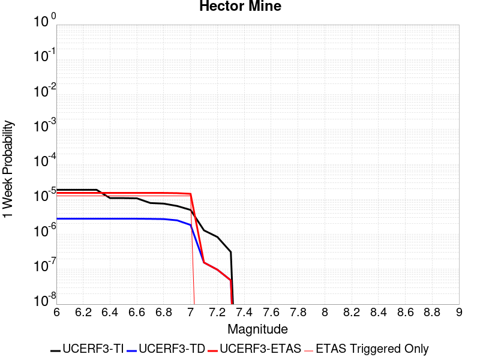 |  | 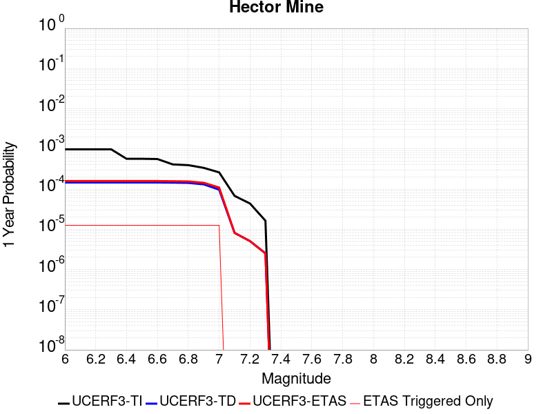 | 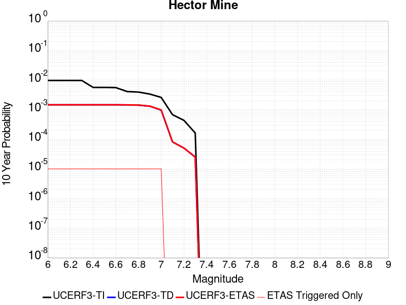 |

| Magnitude | 1 wk TI Prob | 1 wk TD Prob | 1 wk ETAS Prob | 1 wk ETAS/TD Gain | 1 wk ETAS Triggered Only | 1 mo TI Prob | 1 mo TD Prob | 1 mo ETAS Prob | 1 mo ETAS/TD Gain | 1 mo ETAS Triggered Only | 1 yr TI Prob | 1 yr TD Prob | 1 yr ETAS Prob | 1 yr ETAS/TD Gain | 1 yr ETAS Triggered Only | 10 yr TI Prob | 10 yr TD Prob | 10 yr ETAS Prob | 10 yr ETAS/TD Gain | 10 yr ETAS Triggered Only |
|-----|-----|-----|-----|-----|-----|-----|-----|-----|-----|-----|-----|-----|-----|-----|-----|-----|-----|-----|-----|-----|
| 6.0 | 1.8760093E-5 | 2.7962699E-6 | 1.2796242E-5 | 4.576183 | 1.0E-5 | 8.039792E-5 | 1.19839815E-5 | 2.1983862E-5 | 1.8344373 | 1.0E-5 | 9.78405E-4 | 1.458992E-4 | 1.5589774E-4 | 1.0685304 | 1.0E-5 | 0.009741086 | 0.0014584264 | 0.0014684118 | 1.0068467 | 1.0E-5 |
| 6.1 | 1.8760093E-5 | 2.7962699E-6 | 1.2796242E-5 | 4.576183 | 1.0E-5 | 8.039792E-5 | 1.19839815E-5 | 2.1983862E-5 | 1.8344373 | 1.0E-5 | 9.78405E-4 | 1.458992E-4 | 1.5589774E-4 | 1.0685304 | 1.0E-5 | 0.009741086 | 0.0014584264 | 0.0014684118 | 1.0068467 | 1.0E-5 |
| 6.2 | 1.8760093E-5 | 2.7962699E-6 | 1.2796242E-5 | 4.576183 | 1.0E-5 | 8.039792E-5 | 1.19839815E-5 | 2.1983862E-5 | 1.8344373 | 1.0E-5 | 9.78405E-4 | 1.458992E-4 | 1.5589774E-4 | 1.0685304 | 1.0E-5 | 0.009741086 | 0.0014584264 | 0.0014684118 | 1.0068467 | 1.0E-5 |
| 6.3 | 1.8760093E-5 | 2.7962699E-6 | 1.2796242E-5 | 4.576183 | 1.0E-5 | 8.039792E-5 | 1.19839815E-5 | 2.1983862E-5 | 1.8344373 | 1.0E-5 | 9.78405E-4 | 1.458992E-4 | 1.5589774E-4 | 1.0685304 | 1.0E-5 | 0.009741086 | 0.0014584264 | 0.0014684118 | 1.0068467 | 1.0E-5 |
| 6.4 | 1.0888055E-5 | 2.7962699E-6 | 1.2796242E-5 | 4.576183 | 1.0E-5 | 4.666226E-5 | 1.19839815E-5 | 2.1983862E-5 | 1.8344373 | 1.0E-5 | 5.679649E-4 | 1.458992E-4 | 1.5589774E-4 | 1.0685304 | 1.0E-5 | 0.0056651547 | 0.0014584264 | 0.0014684118 | 1.0068467 | 1.0E-5 |
| 6.5 | 1.0888055E-5 | 2.7962699E-6 | 1.2796242E-5 | 4.576183 | 1.0E-5 | 4.666226E-5 | 1.19839815E-5 | 2.1983862E-5 | 1.8344373 | 1.0E-5 | 5.679649E-4 | 1.458992E-4 | 1.5589774E-4 | 1.0685304 | 1.0E-5 | 0.0056651547 | 0.0014584264 | 0.0014684118 | 1.0068467 | 1.0E-5 |
| 6.6 | 1.0730738E-5 | 2.7962699E-6 | 1.2796242E-5 | 4.576183 | 1.0E-5 | 4.5988065E-5 | 1.19839815E-5 | 2.1983862E-5 | 1.8344373 | 1.0E-5 | 5.5976084E-4 | 1.458992E-4 | 1.5589774E-4 | 1.0685304 | 1.0E-5 | 0.0055835294 | 0.0014584264 | 0.0014684118 | 1.0068467 | 1.0E-5 |
| 6.7 | 7.881326E-6 | 2.770952E-6 | 1.27709245E-5 | 4.6088576 | 1.0E-5 | 3.3776672E-5 | 1.1875478E-5 | 2.187536E-5 | 1.8420614 | 1.0E-5 | 4.111534E-4 | 1.4457834E-4 | 1.545769E-4 | 1.0691566 | 1.0E-5 | 0.0041039353 | 0.001445235 | 0.0014552205 | 1.0069093 | 1.0E-5 |
| 6.8 | 7.5683483E-6 | 2.7327321E-6 | 1.2732705E-5 | 4.6593313 | 1.0E-5 | 3.2435375E-5 | 1.1711679E-5 | 2.1711561E-5 | 1.8538386 | 1.0E-5 | 3.9482914E-4 | 1.4258435E-4 | 1.5258293E-4 | 1.0701239 | 1.0E-5 | 0.0039412836 | 0.0014253207 | 0.0014353065 | 1.0070059 | 1.0E-5 |
| 6.9 | 6.473048E-6 | 2.513824E-6 | 1.25137985E-5 | 4.977993 | 1.0E-5 | 2.7741338E-5 | 1.07735095E-5 | 2.0773401E-5 | 1.9281926 | 1.0E-5 | 3.3769844E-4 | 1.3116356E-4 | 1.4116225E-4 | 1.0762306 | 1.0E-5 | 0.0033718573 | 0.001311251 | 0.0013212378 | 1.0076163 | 1.0E-5 |
| 7.0 | 4.9959954E-6 | 1.8564588E-6 | 1.185644E-5 | 6.3865895 | 1.0E-5 | 2.1411232E-5 | 7.956248E-6 | 1.7956168E-5 | 2.2568638 | 1.0E-5 | 2.6065056E-4 | 9.686658E-5 | 1.06865606E-4 | 1.1032248 | 1.0E-5 | 0.0026034506 | 9.685931E-4 | 9.785835E-4 | 1.0103142 | 1.0E-5 |
| 7.1 | 1.2997541E-6 | 1.5599346E-7 | 1.5599346E-7 | 1.0 | 0.0 | 5.5703626E-6 | 6.685433E-7 | 6.685433E-7 | 1.0 | 0.0 | 6.7817055E-5 | 8.139488E-6 | 8.139488E-6 | 1.0 | 0.0 | 6.779636E-4 | 8.1392296E-5 | 8.1392296E-5 | 1.0 | 0.0 |
| 7.2 | 8.392699E-7 | 9.725453E-8 | 9.725453E-8 | 1.0 | 0.0 | 3.596866E-6 | 4.1680505E-7 | 4.1680505E-7 | 1.0 | 0.0 | 4.3790962E-5 | 5.0745916E-6 | 5.0745916E-6 | 1.0 | 0.0 | 4.3782333E-4 | 5.074495E-5 | 5.074495E-5 | 1.0 | 0.0 |
| 7.3 | 3.13015E-7 | 4.8283802E-8 | 4.8283802E-8 | 1.0 | 0.0 | 1.3414921E-6 | 2.0693057E-7 | 2.0693057E-7 | 1.0 | 0.0 | 1.6332544E-5 | 2.5193776E-6 | 2.5193776E-6 | 1.0 | 0.0 | 1.6331344E-4 | 2.5193574E-5 | 2.5193574E-5 | 1.0 | 0.0 |

## Burnt Mtn
*[(top)](#table-of-contents)*

| 1 Week | 1 Month | 1 Year | 10 Year |
|-----|-----|-----|-----|
|  | 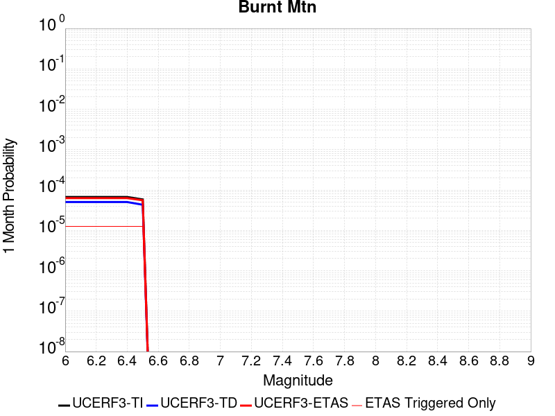 |  | 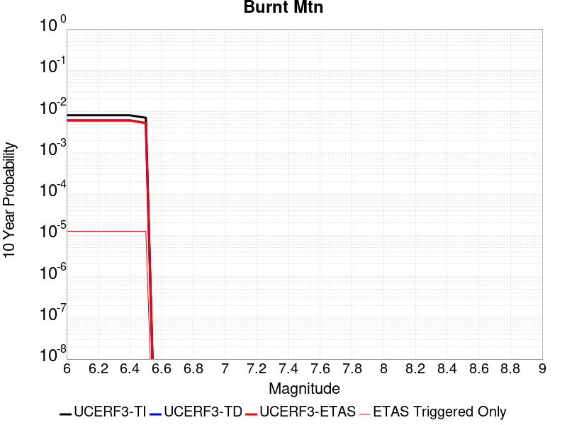 |

| Magnitude | 1 wk TI Prob | 1 wk TD Prob | 1 wk ETAS Prob | 1 wk ETAS/TD Gain | 1 wk ETAS Triggered Only | 1 mo TI Prob | 1 mo TD Prob | 1 mo ETAS Prob | 1 mo ETAS/TD Gain | 1 mo ETAS Triggered Only | 1 yr TI Prob | 1 yr TD Prob | 1 yr ETAS Prob | 1 yr ETAS/TD Gain | 1 yr ETAS Triggered Only | 10 yr TI Prob | 10 yr TD Prob | 10 yr ETAS Prob | 10 yr ETAS/TD Gain | 10 yr ETAS Triggered Only |
|-----|-----|-----|-----|-----|-----|-----|-----|-----|-----|-----|-----|-----|-----|-----|-----|-----|-----|-----|-----|-----|
| 6.0 | 1.5673151E-5 | 1.1749247E-5 | 1.1749247E-5 | 1.0 | 0.0 | 6.716892E-5 | 5.0353672E-5 | 6.0353166E-5 | 1.1985853 | 1.0E-5 | 8.1747473E-4 | 6.130124E-4 | 6.2300626E-4 | 1.016303 | 1.0E-5 | 0.008144741 | 0.006125855 | 0.0061357934 | 1.0016224 | 1.0E-5 |
| 6.1 | 1.5673151E-5 | 1.1749247E-5 | 1.1749247E-5 | 1.0 | 0.0 | 6.716892E-5 | 5.0353672E-5 | 6.0353166E-5 | 1.1985853 | 1.0E-5 | 8.1747473E-4 | 6.130124E-4 | 6.2300626E-4 | 1.016303 | 1.0E-5 | 0.008144741 | 0.006125855 | 0.0061357934 | 1.0016224 | 1.0E-5 |
| 6.2 | 1.5673151E-5 | 1.1749247E-5 | 1.1749247E-5 | 1.0 | 0.0 | 6.716892E-5 | 5.0353672E-5 | 6.0353166E-5 | 1.1985853 | 1.0E-5 | 8.1747473E-4 | 6.130124E-4 | 6.2300626E-4 | 1.016303 | 1.0E-5 | 0.008144741 | 0.006125855 | 0.0061357934 | 1.0016224 | 1.0E-5 |
| 6.3 | 1.5673151E-5 | 1.1749247E-5 | 1.1749247E-5 | 1.0 | 0.0 | 6.716892E-5 | 5.0353672E-5 | 6.0353166E-5 | 1.1985853 | 1.0E-5 | 8.1747473E-4 | 6.130124E-4 | 6.2300626E-4 | 1.016303 | 1.0E-5 | 0.008144741 | 0.006125855 | 0.0061357934 | 1.0016224 | 1.0E-5 |
| 6.4 | 1.5673151E-5 | 1.1749247E-5 | 1.1749247E-5 | 1.0 | 0.0 | 6.716892E-5 | 5.0353672E-5 | 6.0353166E-5 | 1.1985853 | 1.0E-5 | 8.1747473E-4 | 6.130124E-4 | 6.2300626E-4 | 1.016303 | 1.0E-5 | 0.008144741 | 0.006125855 | 0.0061357934 | 1.0016224 | 1.0E-5 |
| 6.5 | 1.36191375E-5 | 1.007816E-5 | 1.007816E-5 | 1.0 | 0.0 | 5.8366426E-5 | 4.319211E-5 | 5.319168E-5 | 1.2315137 | 1.0E-5 | 7.103795E-4 | 5.2586396E-4 | 5.358587E-4 | 1.0190064 | 1.0E-5 | 0.0070811296 | 0.00525864 | 0.0052685873 | 1.0018916 | 1.0E-5 |

## Elmore Ranch
*[(top)](#table-of-contents)*

| 1 Week | 1 Month | 1 Year | 10 Year |
|-----|-----|-----|-----|
|  |  |  | 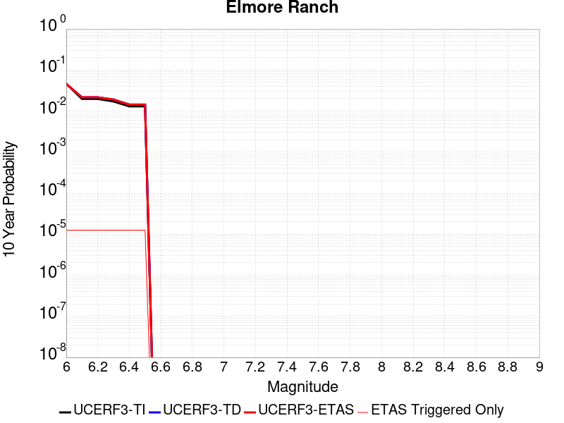 |

| Magnitude | 1 wk TI Prob | 1 wk TD Prob | 1 wk ETAS Prob | 1 wk ETAS/TD Gain | 1 wk ETAS Triggered Only | 1 mo TI Prob | 1 mo TD Prob | 1 mo ETAS Prob | 1 mo ETAS/TD Gain | 1 mo ETAS Triggered Only | 1 yr TI Prob | 1 yr TD Prob | 1 yr ETAS Prob | 1 yr ETAS/TD Gain | 1 yr ETAS Triggered Only | 10 yr TI Prob | 10 yr TD Prob | 10 yr ETAS Prob | 10 yr ETAS/TD Gain | 10 yr ETAS Triggered Only |
|-----|-----|-----|-----|-----|-----|-----|-----|-----|-----|-----|-----|-----|-----|-----|-----|-----|-----|-----|-----|-----|
| 6.0 | 9.102099E-5 | 8.953848E-5 | 8.953848E-5 | 1.0 | 0.0 | 3.9003167E-4 | 3.836898E-4 | 3.836898E-4 | 1.0 | 0.0 | 0.0047383 | 0.004662132 | 0.004662132 | 1.0 | 0.0 | 0.046385348 | 0.04583787 | 0.045847416 | 1.0002081 | 1.0E-5 |
| 6.1 | 3.8306698E-5 | 4.14921E-5 | 4.14921E-5 | 1.0 | 0.0 | 1.6416123E-4 | 1.7781362E-4 | 1.7781362E-4 | 1.0 | 0.0 | 0.0019968306 | 0.0021632186 | 0.0021632186 | 1.0 | 0.0 | 0.019789828 | 0.021595007 | 0.021604791 | 1.0004531 | 1.0E-5 |
| 6.2 | 3.8306698E-5 | 4.14921E-5 | 4.14921E-5 | 1.0 | 0.0 | 1.6416123E-4 | 1.7781362E-4 | 1.7781362E-4 | 1.0 | 0.0 | 0.0019968306 | 0.0021632186 | 0.0021632186 | 1.0 | 0.0 | 0.019789828 | 0.021595007 | 0.021604791 | 1.0004531 | 1.0E-5 |
| 6.3 | 3.3197924E-5 | 3.6550366E-5 | 3.6550366E-5 | 1.0 | 0.0 | 1.4226905E-4 | 1.56639E-4 | 1.56639E-4 | 1.0 | 0.0 | 0.0017307495 | 0.0019059771 | 0.0019059771 | 1.0 | 0.0 | 0.017173318 | 0.019057386 | 0.019067194 | 1.0005147 | 1.0E-5 |
| 6.4 | 2.5148964E-5 | 2.7420736E-5 | 2.7420736E-5 | 1.0 | 0.0 | 1.0777682E-4 | 1.17515796E-4 | 1.17515796E-4 | 1.0 | 0.0 | 0.0013113929 | 0.0014304637 | 0.0014304637 | 1.0 | 0.0 | 0.01303681 | 0.014365338 | 0.014375194 | 1.0006862 | 1.0E-5 |
| 6.5 | 2.5148964E-5 | 2.7420736E-5 | 2.7420736E-5 | 1.0 | 0.0 | 1.0777682E-4 | 1.17515796E-4 | 1.17515796E-4 | 1.0 | 0.0 | 0.0013113929 | 0.0014304637 | 0.0014304637 | 1.0 | 0.0 | 0.01303681 | 0.014365338 | 0.014375194 | 1.0006862 | 1.0E-5 |

## Skinner Flat 2011 CFM
*[(top)](#table-of-contents)*

| 1 Week | 1 Month | 1 Year | 10 Year |
|-----|-----|-----|-----|
|  | 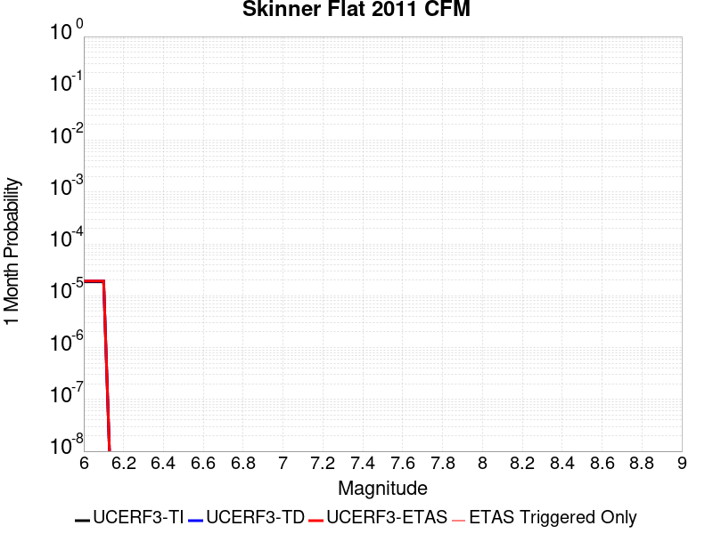 | 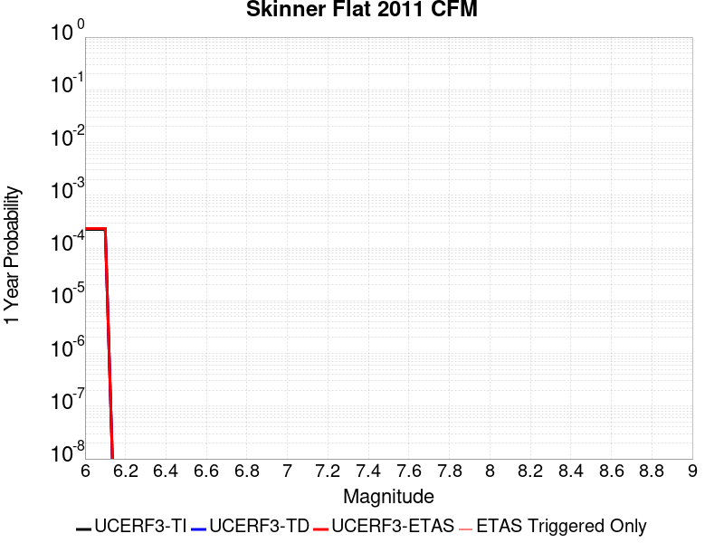 | 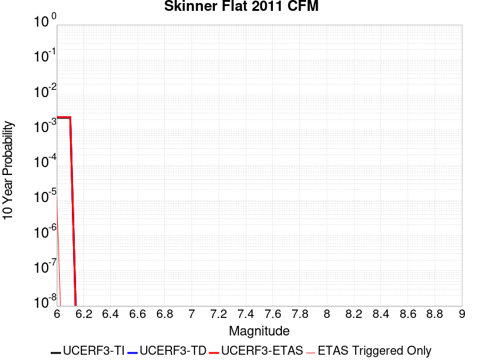 |

| Magnitude | 1 wk TI Prob | 1 wk TD Prob | 1 wk ETAS Prob | 1 wk ETAS/TD Gain | 1 wk ETAS Triggered Only | 1 mo TI Prob | 1 mo TD Prob | 1 mo ETAS Prob | 1 mo ETAS/TD Gain | 1 mo ETAS Triggered Only | 1 yr TI Prob | 1 yr TD Prob | 1 yr ETAS Prob | 1 yr ETAS/TD Gain | 1 yr ETAS Triggered Only | 10 yr TI Prob | 10 yr TD Prob | 10 yr ETAS Prob | 10 yr ETAS/TD Gain | 10 yr ETAS Triggered Only |
|-----|-----|-----|-----|-----|-----|-----|-----|-----|-----|-----|-----|-----|-----|-----|-----|-----|-----|-----|-----|-----|
| 6.0 | 4.3279074E-6 | 4.484953E-6 | 4.484953E-6 | 1.0 | 0.0 | 1.8548042E-5 | 1.9221226E-5 | 1.9221226E-5 | 1.0 | 0.0 | 2.2579901E-4 | 2.3401844E-4 | 2.3401844E-4 | 1.0 | 0.0 | 0.002255697 | 0.0023401843 | 0.002350161 | 1.0042632 | 1.0E-5 |
| 6.1 | 4.3279074E-6 | 4.484953E-6 | 4.484953E-6 | 1.0 | 0.0 | 1.8548042E-5 | 1.9221226E-5 | 1.9221226E-5 | 1.0 | 0.0 | 2.2579901E-4 | 2.3401844E-4 | 2.3401844E-4 | 1.0 | 0.0 | 0.002255697 | 0.0023401843 | 0.0023401843 | 1.0 | 0.0 |

## Great Valley 04b Gordon Valley
*[(top)](#table-of-contents)*

| 1 Week | 1 Month | 1 Year | 10 Year |
|-----|-----|-----|-----|
|  | 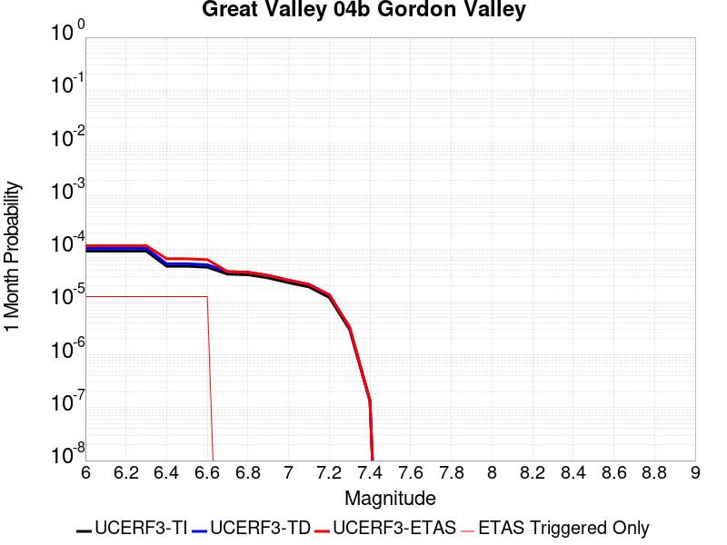 | 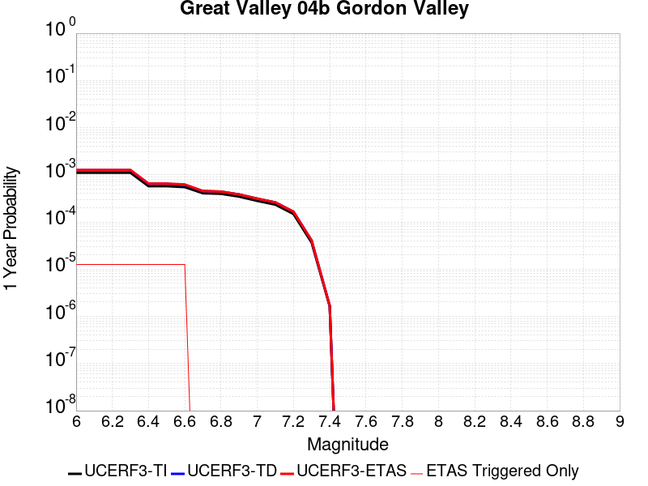 | 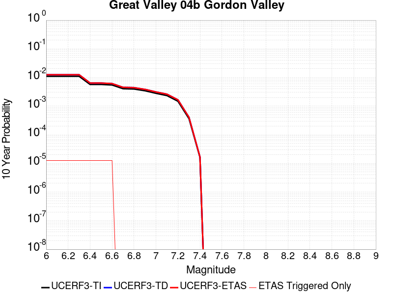 |

| Magnitude | 1 wk TI Prob | 1 wk TD Prob | 1 wk ETAS Prob | 1 wk ETAS/TD Gain | 1 wk ETAS Triggered Only | 1 mo TI Prob | 1 mo TD Prob | 1 mo ETAS Prob | 1 mo ETAS/TD Gain | 1 mo ETAS Triggered Only | 1 yr TI Prob | 1 yr TD Prob | 1 yr ETAS Prob | 1 yr ETAS/TD Gain | 1 yr ETAS Triggered Only | 10 yr TI Prob | 10 yr TD Prob | 10 yr ETAS Prob | 10 yr ETAS/TD Gain | 10 yr ETAS Triggered Only |
|-----|-----|-----|-----|-----|-----|-----|-----|-----|-----|-----|-----|-----|-----|-----|-----|-----|-----|-----|-----|-----|
| 6.0 | 2.1181217E-5 | 2.3981951E-5 | 3.3981712E-5 | 1.4169703 | 1.0E-5 | 9.077348E-5 | 1.02776685E-4 | 1.12775655E-4 | 1.0972884 | 1.0E-5 | 0.0011046068 | 0.0012507545 | 0.001260742 | 1.0079851 | 1.0E-5 | 0.010991322 | 0.0124536 | 0.012463476 | 1.000793 | 1.0E-5 |
| 6.1 | 2.1181217E-5 | 2.3981951E-5 | 3.3981712E-5 | 1.4169703 | 1.0E-5 | 9.077348E-5 | 1.02776685E-4 | 1.12775655E-4 | 1.0972884 | 1.0E-5 | 0.0011046068 | 0.0012507545 | 0.001260742 | 1.0079851 | 1.0E-5 | 0.010991322 | 0.0124536 | 0.012463476 | 1.000793 | 1.0E-5 |
| 6.2 | 2.1181217E-5 | 2.3981951E-5 | 3.3981712E-5 | 1.4169703 | 1.0E-5 | 9.077348E-5 | 1.02776685E-4 | 1.12775655E-4 | 1.0972884 | 1.0E-5 | 0.0011046068 | 0.0012507545 | 0.001260742 | 1.0079851 | 1.0E-5 | 0.010991322 | 0.0124536 | 0.012463476 | 1.000793 | 1.0E-5 |
| 6.3 | 2.1181217E-5 | 2.3981951E-5 | 3.3981712E-5 | 1.4169703 | 1.0E-5 | 9.077348E-5 | 1.02776685E-4 | 1.12775655E-4 | 1.0972884 | 1.0E-5 | 0.0011046068 | 0.0012507545 | 0.001260742 | 1.0079851 | 1.0E-5 | 0.010991322 | 0.0124536 | 0.012463476 | 1.000793 | 1.0E-5 |
| 6.4 | 1.0988268E-5 | 1.2254499E-5 | 2.2254377E-5 | 1.8160169 | 1.0E-5 | 4.7091726E-5 | 5.2518313E-5 | 6.2517785E-5 | 1.1903998 | 1.0E-5 | 5.731909E-4 | 6.392388E-4 | 6.492324E-4 | 1.0156336 | 1.0E-5 | 0.005717147 | 0.0063755875 | 0.006385524 | 1.0015585 | 1.0E-5 |
| 6.5 | 1.0988268E-5 | 1.2254499E-5 | 2.2254377E-5 | 1.8160169 | 1.0E-5 | 4.7091726E-5 | 5.2518313E-5 | 6.2517785E-5 | 1.1903998 | 1.0E-5 | 5.731909E-4 | 6.392388E-4 | 6.492324E-4 | 1.0156336 | 1.0E-5 | 0.005717147 | 0.0063755875 | 0.006385524 | 1.0015585 | 1.0E-5 |
| 6.6 | 1.0517822E-5 | 1.1724062E-5 | 2.1723945E-5 | 1.8529367 | 1.0E-5 | 4.5075605E-5 | 5.02451E-5 | 6.0244598E-5 | 1.1990144 | 1.0E-5 | 5.4865726E-4 | 6.11578E-4 | 6.215719E-4 | 1.0163411 | 1.0E-5 | 0.0054730466 | 0.0061005033 | 0.0061104423 | 1.0016292 | 1.0E-5 |
| 6.7 | 7.789219E-6 | 8.6776445E-6 | 8.6776445E-6 | 1.0 | 0.0 | 3.3381937E-5 | 3.7189402E-5 | 3.7189402E-5 | 1.0 | 0.0 | 4.063493E-4 | 4.526921E-4 | 4.526921E-4 | 1.0 | 0.0 | 0.004056071 | 0.0045182165 | 0.0045182165 | 1.0 | 0.0 |
| 6.8 | 7.5850853E-6 | 8.452389E-6 | 8.452389E-6 | 1.0 | 0.0 | 3.2507105E-5 | 3.622405E-5 | 3.622405E-5 | 1.0 | 0.0 | 3.957021E-4 | 4.409437E-4 | 4.409437E-4 | 1.0 | 0.0 | 0.0039499826 | 0.0044012 | 0.0044012 | 1.0 | 0.0 |
| 6.9 | 6.604105E-6 | 7.3585493E-6 | 7.3585493E-6 | 1.0 | 0.0 | 2.8303E-5 | 3.153628E-5 | 3.153628E-5 | 1.0 | 0.0 | 3.4453452E-4 | 3.8389044E-4 | 3.8389044E-4 | 1.0 | 0.0 | 0.0034400085 | 0.0038326595 | 0.0038326595 | 1.0 | 0.0 |
| 7.0 | 5.3701115E-6 | 5.9884183E-6 | 5.9884183E-6 | 1.0 | 0.0 | 2.301456E-5 | 2.5664414E-5 | 2.5664414E-5 | 1.0 | 0.0 | 2.8016625E-4 | 3.1242234E-4 | 3.1242234E-4 | 1.0 | 0.0 | 0.0027981328 | 0.00312012 | 0.00312012 | 1.0 | 0.0 |
| 7.1 | 4.4685607E-6 | 4.986478E-6 | 4.986478E-6 | 1.0 | 0.0 | 1.9150835E-5 | 2.1370459E-5 | 2.1370459E-5 | 1.0 | 0.0 | 2.3313647E-4 | 2.6015675E-4 | 2.6015675E-4 | 1.0 | 0.0 | 0.0023289204 | 0.0025987667 | 0.0025987667 | 1.0 | 0.0 |
| 7.2 | 2.833378E-6 | 3.164419E-6 | 3.164419E-6 | 1.0 | 0.0 | 1.2142991E-5 | 1.3561736E-5 | 1.3561736E-5 | 1.0 | 0.0 | 1.4783088E-4 | 1.6510337E-4 | 1.6510337E-4 | 1.0 | 0.0 | 0.0014773258 | 0.0016499789 | 0.0016499789 | 1.0 | 0.0 |
| 7.3 | 7.0087293E-7 | 7.7728157E-7 | 7.7728157E-7 | 1.0 | 0.0 | 3.0037377E-6 | 3.3312049E-6 | 3.3312049E-6 | 1.0 | 0.0 | 3.656989E-5 | 4.0557123E-5 | 4.0557123E-5 | 1.0 | 0.0 | 3.6563876E-4 | 4.055422E-4 | 4.055422E-4 | 1.0 | 0.0 |
| 7.4 | 3.112171E-8 | 3.2068368E-8 | 3.2068368E-8 | 1.0 | 0.0 | 1.3337875E-7 | 1.3743585E-7 | 1.3743585E-7 | 1.0 | 0.0 | 1.6238852E-6 | 1.6732803E-6 | 1.6732803E-6 | 1.0 | 0.0 | 1.6238733E-5 | 1.6732685E-5 | 1.6732685E-5 | 1.0 | 0.0 |

## Keddie Ridge 2011 CFM
*[(top)](#table-of-contents)*

| 1 Week | 1 Month | 1 Year | 10 Year |
|-----|-----|-----|-----|
| 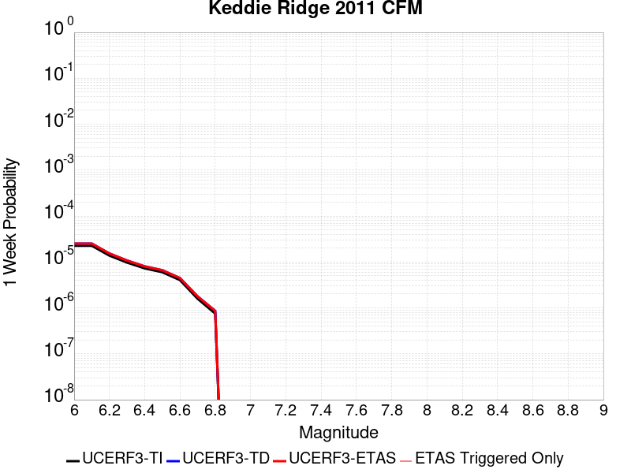 | 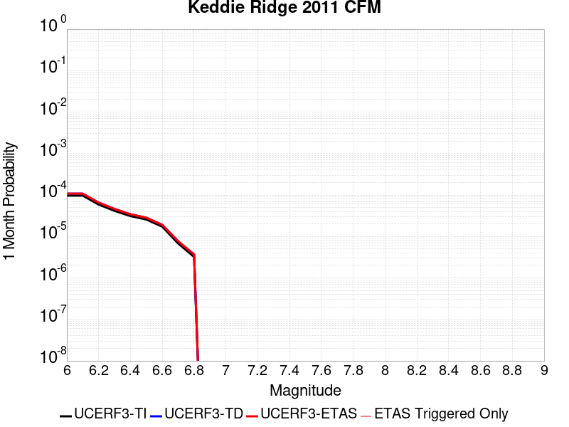 | 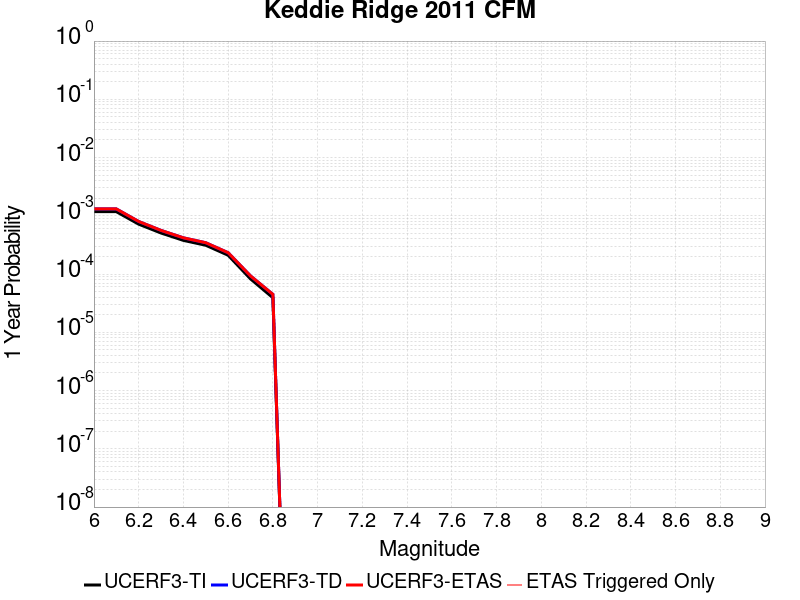 | 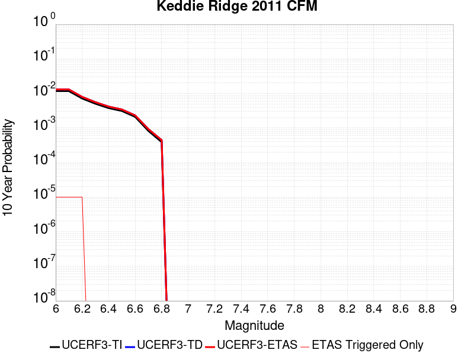 |

| Magnitude | 1 wk TI Prob | 1 wk TD Prob | 1 wk ETAS Prob | 1 wk ETAS/TD Gain | 1 wk ETAS Triggered Only | 1 mo TI Prob | 1 mo TD Prob | 1 mo ETAS Prob | 1 mo ETAS/TD Gain | 1 mo ETAS Triggered Only | 1 yr TI Prob | 1 yr TD Prob | 1 yr ETAS Prob | 1 yr ETAS/TD Gain | 1 yr ETAS Triggered Only | 10 yr TI Prob | 10 yr TD Prob | 10 yr ETAS Prob | 10 yr ETAS/TD Gain | 10 yr ETAS Triggered Only |
|-----|-----|-----|-----|-----|-----|-----|-----|-----|-----|-----|-----|-----|-----|-----|-----|-----|-----|-----|-----|-----|
| 6.0 | 2.2591947E-5 | 2.5189187E-5 | 2.5189187E-5 | 1.0 | 0.0 | 9.6819036E-5 | 1.0794964E-4 | 1.0794964E-4 | 1.0 | 0.0 | 0.0011781343 | 0.0013135736 | 0.0013135736 | 1.0 | 0.0 | 0.011719079 | 0.013066037 | 0.013075906 | 1.0007553 | 1.0E-5 |
| 6.1 | 2.2591947E-5 | 2.5189187E-5 | 2.5189187E-5 | 1.0 | 0.0 | 9.6819036E-5 | 1.0794964E-4 | 1.0794964E-4 | 1.0 | 0.0 | 0.0011781343 | 0.0013135736 | 0.0013135736 | 1.0 | 0.0 | 0.011719079 | 0.013066037 | 0.013075906 | 1.0007553 | 1.0E-5 |
| 6.2 | 1.3775145E-5 | 1.5322817E-5 | 1.5322817E-5 | 1.0 | 0.0 | 5.9035E-5 | 6.56677E-5 | 6.56677E-5 | 1.0 | 0.0 | 7.185141E-4 | 7.9923525E-4 | 7.9923525E-4 | 1.0 | 0.0 | 0.0071619535 | 0.007966028 | 0.007975948 | 1.0012454 | 1.0E-5 |
| 6.3 | 9.705435E-6 | 1.0768351E-5 | 1.0768351E-5 | 1.0 | 0.0 | 4.1594063E-5 | 4.6149325E-5 | 4.6149325E-5 | 1.0 | 0.0 | 5.0629E-4 | 5.617356E-4 | 5.617356E-4 | 1.0 | 0.0 | 0.005051381 | 0.0056043877 | 0.0056043877 | 1.0 | 0.0 |
| 6.4 | 7.2549733E-6 | 8.027268E-6 | 8.027268E-6 | 1.0 | 0.0 | 3.109237E-5 | 3.440217E-5 | 3.440217E-5 | 1.0 | 0.0 | 3.7848388E-4 | 4.1877388E-4 | 4.1877388E-4 | 1.0 | 0.0 | 0.003778399 | 0.004180635 | 0.004180635 | 1.0 | 0.0 |
| 6.5 | 5.983293E-6 | 6.6130237E-6 | 6.6130237E-6 | 1.0 | 0.0 | 2.5642432E-5 | 2.834126E-5 | 2.834126E-5 | 1.0 | 0.0 | 3.1215188E-4 | 3.4500693E-4 | 3.4500693E-4 | 1.0 | 0.0 | 0.0031171376 | 0.003445376 | 0.003445376 | 1.0 | 0.0 |
| 6.6 | 4.0336154E-6 | 4.4578037E-6 | 4.4578037E-6 | 1.0 | 0.0 | 1.728681E-5 | 1.9104757E-5 | 1.9104757E-5 | 1.0 | 0.0 | 2.1044657E-4 | 2.3257962E-4 | 2.3257962E-4 | 1.0 | 0.0 | 0.002102474 | 0.002323758 | 0.002323758 | 1.0 | 0.0 |
| 6.7 | 1.5832104E-6 | 1.7816087E-6 | 1.7816087E-6 | 1.0 | 0.0 | 6.7851697E-6 | 7.635445E-6 | 7.635445E-6 | 1.0 | 0.0 | 8.260631E-5 | 9.295785E-5 | 9.295785E-5 | 1.0 | 0.0 | 8.2575605E-4 | 9.2921633E-4 | 9.2921633E-4 | 1.0 | 0.0 |
| 6.8 | 7.5177275E-7 | 8.5902946E-7 | 8.5902946E-7 | 1.0 | 0.0 | 3.221879E-6 | 3.6815507E-6 | 3.6815507E-6 | 1.0 | 0.0 | 3.9225673E-5 | 4.4822125E-5 | 4.4822125E-5 | 1.0 | 0.0 | 3.921875E-4 | 4.481474E-4 | 4.481474E-4 | 1.0 | 0.0 |

## San Luis Range - Pecho 2011 CFM
*[(top)](#table-of-contents)*

| 1 Week | 1 Month | 1 Year | 10 Year |
|-----|-----|-----|-----|
| 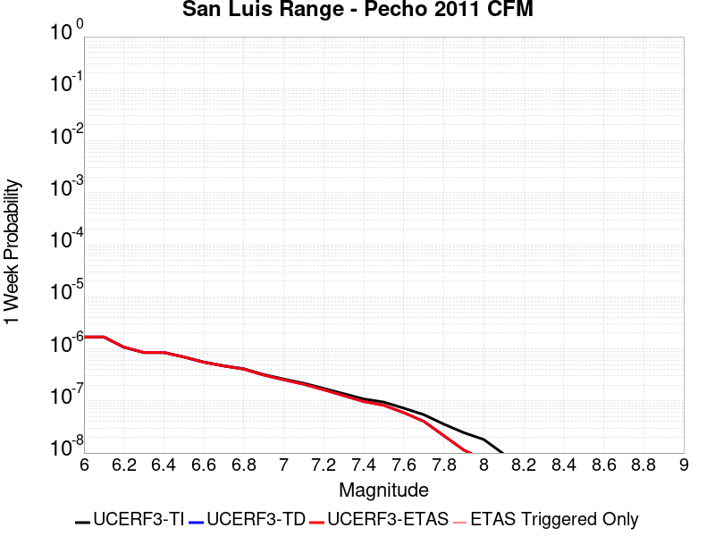 |  | 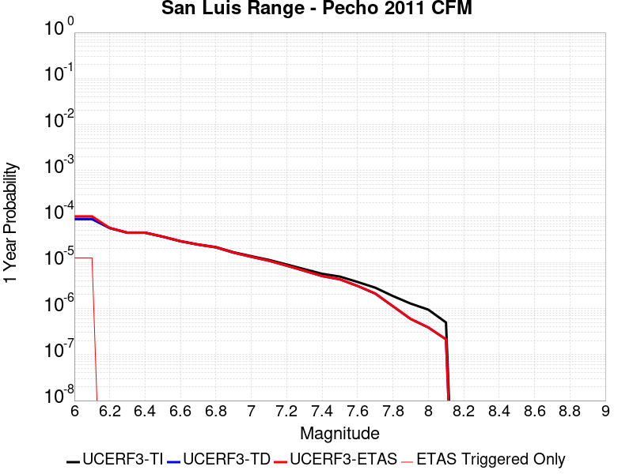 | 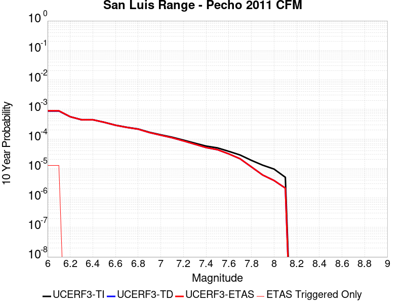 |

| Magnitude | 1 wk TI Prob | 1 wk TD Prob | 1 wk ETAS Prob | 1 wk ETAS/TD Gain | 1 wk ETAS Triggered Only | 1 mo TI Prob | 1 mo TD Prob | 1 mo ETAS Prob | 1 mo ETAS/TD Gain | 1 mo ETAS Triggered Only | 1 yr TI Prob | 1 yr TD Prob | 1 yr ETAS Prob | 1 yr ETAS/TD Gain | 1 yr ETAS Triggered Only | 10 yr TI Prob | 10 yr TD Prob | 10 yr ETAS Prob | 10 yr ETAS/TD Gain | 10 yr ETAS Triggered Only |
|-----|-----|-----|-----|-----|-----|-----|-----|-----|-----|-----|-----|-----|-----|-----|-----|-----|-----|-----|-----|-----|
| 6.0 | 1.687423E-6 | 1.6921944E-6 | 1.6921944E-6 | 1.0 | 0.0 | 7.231793E-6 | 7.252243E-6 | 7.252243E-6 | 1.0 | 0.0 | 8.804352E-5 | 8.829272E-5 | 9.8291835E-5 | 1.1132497 | 1.0E-5 | 8.8008645E-4 | 8.826003E-4 | 8.9259155E-4 | 1.0113201 | 1.0E-5 |
| 6.1 | 1.687423E-6 | 1.6921944E-6 | 1.6921944E-6 | 1.0 | 0.0 | 7.231793E-6 | 7.252243E-6 | 7.252243E-6 | 1.0 | 0.0 | 8.804352E-5 | 8.829272E-5 | 9.8291835E-5 | 1.1132497 | 1.0E-5 | 8.8008645E-4 | 8.826003E-4 | 8.9259155E-4 | 1.0113201 | 1.0E-5 |
| 6.2 | 1.0765672E-6 | 1.0770541E-6 | 1.0770541E-6 | 1.0 | 0.0 | 4.613851E-6 | 4.615938E-6 | 4.615938E-6 | 1.0 | 0.0 | 5.617219E-5 | 5.6197663E-5 | 5.6197663E-5 | 1.0 | 0.0 | 5.6157995E-4 | 5.618408E-4 | 5.618408E-4 | 1.0 | 0.0 |
| 6.3 | 8.523104E-7 | 8.5130216E-7 | 8.5130216E-7 | 1.0 | 0.0 | 3.6527538E-6 | 3.648433E-6 | 3.648433E-6 | 1.0 | 0.0 | 4.447137E-5 | 4.4418797E-5 | 4.4418797E-5 | 1.0 | 0.0 | 4.4462472E-4 | 4.441024E-4 | 4.441024E-4 | 1.0 | 0.0 |
| 6.4 | 8.523104E-7 | 8.5130216E-7 | 8.5130216E-7 | 1.0 | 0.0 | 3.6527538E-6 | 3.648433E-6 | 3.648433E-6 | 1.0 | 0.0 | 4.447137E-5 | 4.4418797E-5 | 4.4418797E-5 | 1.0 | 0.0 | 4.4462472E-4 | 4.441024E-4 | 4.441024E-4 | 1.0 | 0.0 |
| 6.5 | 7.0029404E-7 | 6.976438E-7 | 6.976438E-7 | 1.0 | 0.0 | 3.0012568E-6 | 2.9898988E-6 | 2.9898988E-6 | 1.0 | 0.0 | 3.6539688E-5 | 3.6401427E-5 | 3.6401427E-5 | 1.0 | 0.0 | 3.653368E-4 | 3.6395632E-4 | 3.6395632E-4 | 1.0 | 0.0 |
| 6.6 | 5.583906E-7 | 5.5428296E-7 | 5.5428296E-7 | 1.0 | 0.0 | 2.3931002E-6 | 2.3754963E-6 | 2.3754963E-6 | 1.0 | 0.0 | 2.9135606E-5 | 2.892129E-5 | 2.892129E-5 | 1.0 | 0.0 | 2.9131788E-4 | 2.89176E-4 | 2.89176E-4 | 1.0 | 0.0 |
| 6.7 | 4.73441E-7 | 4.6830658E-7 | 4.6830658E-7 | 1.0 | 0.0 | 2.0290313E-6 | 2.0070268E-6 | 2.0070268E-6 | 1.0 | 0.0 | 2.4703175E-5 | 2.4435281E-5 | 2.4435281E-5 | 1.0 | 0.0 | 2.470043E-4 | 2.443264E-4 | 2.443264E-4 | 1.0 | 0.0 |
| 6.8 | 4.1466086E-7 | 4.087795E-7 | 4.087795E-7 | 1.0 | 0.0 | 1.7771167E-6 | 1.751911E-6 | 1.751911E-6 | 1.0 | 0.0 | 2.1636182E-5 | 2.132931E-5 | 2.132931E-5 | 1.0 | 0.0 | 2.1634075E-4 | 2.1327297E-4 | 2.1327297E-4 | 1.0 | 0.0 |
| 6.9 | 3.2056641E-7 | 3.13293E-7 | 3.13293E-7 | 1.0 | 0.0 | 1.3738553E-6 | 1.3426836E-6 | 1.3426836E-6 | 1.0 | 0.0 | 1.6726559E-5 | 1.6347052E-5 | 1.6347052E-5 | 1.0 | 0.0 | 1.67253E-4 | 1.6345865E-4 | 1.6345865E-4 | 1.0 | 0.0 |
| 7.0 | 2.6315942E-7 | 2.5489675E-7 | 2.5489675E-7 | 1.0 | 0.0 | 1.1278256E-6 | 1.0924141E-6 | 1.0924141E-6 | 1.0 | 0.0 | 1.3731191E-5 | 1.3300061E-5 | 1.3300061E-5 | 1.0 | 0.0 | 1.3730342E-4 | 1.3299273E-4 | 1.3299273E-4 | 1.0 | 0.0 |
| 7.1 | 2.1832436E-7 | 2.0917312E-7 | 2.0917312E-7 | 1.0 | 0.0 | 9.356755E-7 | 8.9645596E-7 | 8.9645596E-7 | 1.0 | 0.0 | 1.13917895E-5 | 1.0914297E-5 | 1.0914297E-5 | 1.0 | 0.0 | 1.1391206E-4 | 1.0913766E-4 | 1.0913766E-4 | 1.0 | 0.0 |
| 7.2 | 1.7393015E-7 | 1.6376592E-7 | 1.6376592E-7 | 1.0 | 0.0 | 7.454147E-7 | 7.018537E-7 | 7.018537E-7 | 1.0 | 0.0 | 9.075386E-6 | 8.545036E-6 | 8.545036E-6 | 1.0 | 0.0 | 9.075015E-5 | 8.54471E-5 | 8.54471E-5 | 1.0 | 0.0 |
| 7.3 | 1.3744894E-7 | 1.263862E-7 | 1.263862E-7 | 1.0 | 0.0 | 5.890667E-7 | 5.4165497E-7 | 5.4165497E-7 | 1.0 | 0.0 | 7.1718637E-6 | 6.5946297E-6 | 6.5946297E-6 | 1.0 | 0.0 | 7.171632E-5 | 6.5944354E-5 | 6.5944354E-5 | 1.0 | 0.0 |
| 7.4 | 1.0915278E-7 | 9.727534E-8 | 9.727534E-8 | 1.0 | 0.0 | 4.6779755E-7 | 4.1689424E-7 | 4.1689424E-7 | 1.0 | 0.0 | 5.6954204E-6 | 5.0756753E-6 | 5.0756753E-6 | 1.0 | 0.0 | 5.6952744E-5 | 5.0755603E-5 | 5.0755603E-5 | 1.0 | 0.0 |
| 7.5 | 9.490291E-8 | 8.257131E-8 | 8.257131E-8 | 1.0 | 0.0 | 4.0672668E-7 | 3.53877E-7 | 3.53877E-7 | 1.0 | 0.0 | 4.9518862E-6 | 4.308444E-6 | 4.308444E-6 | 1.0 | 0.0 | 4.951776E-5 | 4.308361E-5 | 4.308361E-5 | 1.0 | 0.0 |
| 7.6 | 7.256678E-8 | 5.942529E-8 | 5.942529E-8 | 1.0 | 0.0 | 3.1100043E-7 | 2.546798E-7 | 2.546798E-7 | 1.0 | 0.0 | 3.7864236E-6 | 3.100722E-6 | 3.100722E-6 | 1.0 | 0.0 | 3.7863592E-5 | 3.100679E-5 | 3.100679E-5 | 1.0 | 0.0 |
| 7.7 | 5.446273E-8 | 4.057937E-8 | 4.057937E-8 | 1.0 | 0.0 | 2.3341168E-7 | 1.7391157E-7 | 1.7391157E-7 | 1.0 | 0.0 | 2.8417835E-6 | 2.1173712E-6 | 2.1173712E-6 | 1.0 | 0.0 | 2.8417471E-5 | 2.1173511E-5 | 2.1173511E-5 | 1.0 | 0.0 |
| 7.8 | 3.5850867E-8 | 2.1520364E-8 | 2.1520364E-8 | 1.0 | 0.0 | 1.5364655E-7 | 9.2230124E-8 | 9.2230124E-8 | 1.0 | 0.0 | 1.8706452E-6 | 1.1229012E-6 | 1.1229012E-6 | 1.0 | 0.0 | 1.8706294E-5 | 1.1228955E-5 | 1.1228955E-5 | 1.0 | 0.0 |
| 7.9 | 2.45879E-8 | 1.1394102E-8 | 1.1394102E-8 | 1.0 | 0.0 | 1.0537671E-7 | 4.883186E-8 | 4.883186E-8 | 1.0 | 0.0 | 1.2829606E-6 | 5.9452776E-7 | 5.9452776E-7 | 1.0 | 0.0 | 1.2829532E-5 | 5.945262E-6 | 5.945262E-6 | 1.0 | 0.0 |
| 8.0 | 1.8151761E-8 | 7.4404523E-9 | 7.4404523E-9 | 1.0 | 0.0 | 7.779326E-8 | 3.188765E-8 | 3.188765E-8 | 1.0 | 0.0 | 9.4713255E-7 | 3.8823208E-7 | 3.8823208E-7 | 1.0 | 0.0 | 9.471285E-6 | 3.882314E-6 | 3.882314E-6 | 1.0 | 0.0 |
| 8.1 | 9.559205E-9 | 4.100115E-9 | 4.100115E-9 | 1.0 | 0.0 | 4.096802E-8 | 1.7571923E-8 | 1.7571923E-8 | 1.0 | 0.0 | 4.9878554E-7 | 2.1393814E-7 | 2.1393814E-7 | 1.0 | 0.0 | 4.987844E-6 | 2.1393794E-6 | 2.1393794E-6 | 1.0 | 0.0 |

## Rocky Ledge 2011 CFM
*[(top)](#table-of-contents)*

| 1 Week | 1 Month | 1 Year | 10 Year |
|-----|-----|-----|-----|
|  |  | 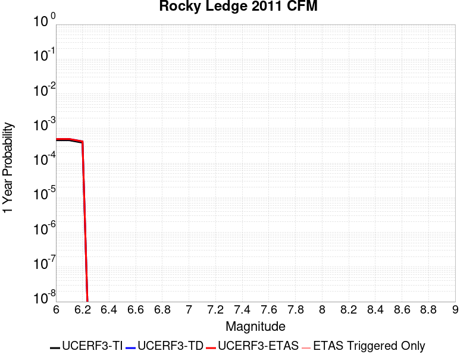 | 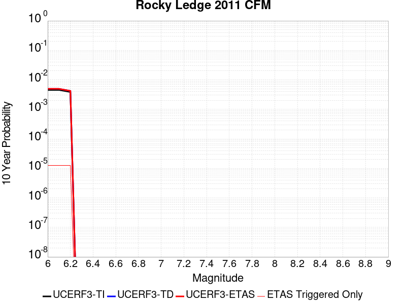 |

| Magnitude | 1 wk TI Prob | 1 wk TD Prob | 1 wk ETAS Prob | 1 wk ETAS/TD Gain | 1 wk ETAS Triggered Only | 1 mo TI Prob | 1 mo TD Prob | 1 mo ETAS Prob | 1 mo ETAS/TD Gain | 1 mo ETAS Triggered Only | 1 yr TI Prob | 1 yr TD Prob | 1 yr ETAS Prob | 1 yr ETAS/TD Gain | 1 yr ETAS Triggered Only | 10 yr TI Prob | 10 yr TD Prob | 10 yr ETAS Prob | 10 yr ETAS/TD Gain | 10 yr ETAS Triggered Only |
|-----|-----|-----|-----|-----|-----|-----|-----|-----|-----|-----|-----|-----|-----|-----|-----|-----|-----|-----|-----|-----|
| 6.0 | 8.7550525E-6 | 9.486605E-6 | 9.486605E-6 | 1.0 | 0.0 | 3.7521113E-5 | 4.0656712E-5 | 4.0656712E-5 | 1.0 | 0.0 | 4.567238E-4 | 4.949655E-4 | 4.949655E-4 | 1.0 | 0.0 | 0.0045578624 | 0.0049467194 | 0.0049566696 | 1.0020115 | 1.0E-5 |
| 6.1 | 8.7550525E-6 | 9.486605E-6 | 9.486605E-6 | 1.0 | 0.0 | 3.7521113E-5 | 4.0656712E-5 | 4.0656712E-5 | 1.0 | 0.0 | 4.567238E-4 | 4.949655E-4 | 4.949655E-4 | 1.0 | 0.0 | 0.0045578624 | 0.0049467194 | 0.0049566696 | 1.0020115 | 1.0E-5 |
| 6.2 | 7.442295E-6 | 8.06304E-6 | 8.06304E-6 | 1.0 | 0.0 | 3.189516E-5 | 3.4555887E-5 | 3.4555887E-5 | 1.0 | 0.0 | 3.8825438E-4 | 4.2071793E-4 | 4.2071793E-4 | 1.0 | 0.0 | 0.0038757676 | 0.004207179 | 0.004217137 | 1.0023669 | 1.0E-5 |

## Elsinore (Coyote Mountains)
*[(top)](#table-of-contents)*

| 1 Week | 1 Month | 1 Year | 10 Year |
|-----|-----|-----|-----|
| 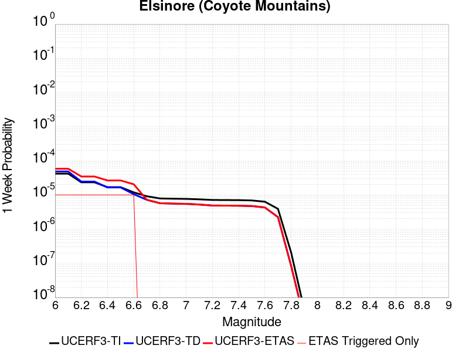 | 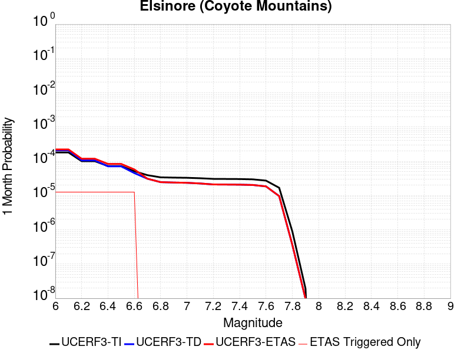 | 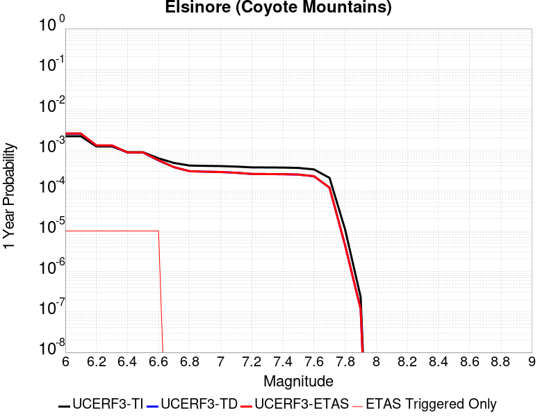 | 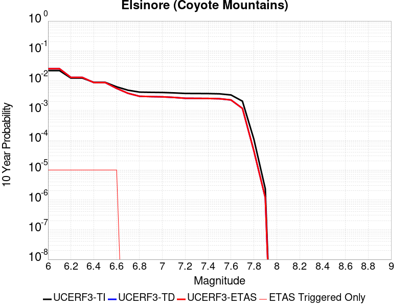 |

| Magnitude | 1 wk TI Prob | 1 wk TD Prob | 1 wk ETAS Prob | 1 wk ETAS/TD Gain | 1 wk ETAS Triggered Only | 1 mo TI Prob | 1 mo TD Prob | 1 mo ETAS Prob | 1 mo ETAS/TD Gain | 1 mo ETAS Triggered Only | 1 yr TI Prob | 1 yr TD Prob | 1 yr ETAS Prob | 1 yr ETAS/TD Gain | 1 yr ETAS Triggered Only | 10 yr TI Prob | 10 yr TD Prob | 10 yr ETAS Prob | 10 yr ETAS/TD Gain | 10 yr ETAS Triggered Only |
|-----|-----|-----|-----|-----|-----|-----|-----|-----|-----|-----|-----|-----|-----|-----|-----|-----|-----|-----|-----|-----|
| 6.0 | 4.20513E-5 | 4.8630944E-5 | 5.8630456E-5 | 1.2056204 | 1.0E-5 | 1.8020741E-4 | 2.0840492E-4 | 2.1840284E-4 | 1.0479735 | 1.0E-5 | 0.0021918174 | 0.0025349057 | 0.0025448804 | 1.0039349 | 1.0E-5 | 0.021703249 | 0.025111204 | 0.025120951 | 1.0003883 | 1.0E-5 |
| 6.1 | 4.20513E-5 | 4.8630944E-5 | 5.8630456E-5 | 1.2056204 | 1.0E-5 | 1.8020741E-4 | 2.0840492E-4 | 2.1840284E-4 | 1.0479735 | 1.0E-5 | 0.0021918174 | 0.0025349057 | 0.0025448804 | 1.0039349 | 1.0E-5 | 0.021703249 | 0.025111204 | 0.025120951 | 1.0003883 | 1.0E-5 |
| 6.2 | 2.3413893E-5 | 2.4695422E-5 | 3.4695175E-5 | 1.4049233 | 1.0E-5 | 1.0034139E-4 | 1.0583377E-4 | 1.15832714E-4 | 1.0944778 | 1.0E-5 | 0.0012209718 | 0.0012878523 | 0.0012978393 | 1.0077549 | 1.0E-5 | 0.012142851 | 0.012812569 | 0.012822441 | 1.0007704 | 1.0E-5 |
| 6.3 | 2.3413893E-5 | 2.4695422E-5 | 3.4695175E-5 | 1.4049233 | 1.0E-5 | 1.0034139E-4 | 1.0583377E-4 | 1.15832714E-4 | 1.0944778 | 1.0E-5 | 0.0012209718 | 0.0012878523 | 0.0012978393 | 1.0077549 | 1.0E-5 | 0.012142851 | 0.012812569 | 0.012822441 | 1.0007704 | 1.0E-5 |
| 6.4 | 1.6894814E-5 | 1.6568214E-5 | 2.6568048E-5 | 1.6035554 | 1.0E-5 | 7.240433E-5 | 7.100491E-5 | 8.1004204E-5 | 1.1408253 | 1.0E-5 | 8.811662E-4 | 8.641788E-4 | 8.7417016E-4 | 1.0115616 | 1.0E-5 | 0.0087768035 | 0.008611842 | 0.008621756 | 1.0011512 | 1.0E-5 |
| 6.5 | 1.6894814E-5 | 1.6568214E-5 | 2.6568048E-5 | 1.6035554 | 1.0E-5 | 7.240433E-5 | 7.100491E-5 | 8.1004204E-5 | 1.1408253 | 1.0E-5 | 8.811662E-4 | 8.641788E-4 | 8.7417016E-4 | 1.0115616 | 1.0E-5 | 0.0087768035 | 0.008611842 | 0.008621756 | 1.0011512 | 1.0E-5 |
| 6.6 | 1.1910969E-5 | 1.0530538E-5 | 2.0530433E-5 | 1.9496092 | 1.0E-5 | 5.1046012E-5 | 4.513017E-5 | 5.512972E-5 | 1.2215712 | 1.0E-5 | 6.21308E-4 | 5.493346E-4 | 5.593291E-4 | 1.0181938 | 1.0E-5 | 0.0061957375 | 0.0054810685 | 0.0054910136 | 1.0018145 | 1.0E-5 |
| 6.7 | 9.1486E-6 | 7.2026473E-6 | 7.2026473E-6 | 1.0 | 0.0 | 3.9207694E-5 | 3.0868145E-5 | 3.0868145E-5 | 1.0 | 0.0 | 4.7724912E-4 | 3.7575865E-4 | 3.7575865E-4 | 1.0 | 0.0 | 0.0047622547 | 0.0037516125 | 0.0037516125 | 1.0 | 0.0 |
| 6.8 | 7.90441E-6 | 5.7288153E-6 | 5.7288153E-6 | 1.0 | 0.0 | 3.3875604E-5 | 2.4551842E-5 | 2.4551842E-5 | 1.0 | 0.0 | 4.1235742E-4 | 2.9887896E-4 | 2.9887896E-4 | 1.0 | 0.0 | 0.0041159308 | 0.0029848986 | 0.0029848986 | 1.0 | 0.0 |
| 6.9 | 7.77015E-6 | 5.5827695E-6 | 5.5827695E-6 | 1.0 | 0.0 | 3.3300217E-5 | 2.3925944E-5 | 2.3925944E-5 | 1.0 | 0.0 | 4.0535472E-4 | 2.912607E-4 | 2.912607E-4 | 1.0 | 0.0 | 0.004046161 | 0.0029089167 | 0.0029089167 | 1.0 | 0.0 |
| 7.0 | 7.675798E-6 | 5.4796283E-6 | 5.4796283E-6 | 1.0 | 0.0 | 3.289586E-5 | 2.3483917E-5 | 2.3483917E-5 | 1.0 | 0.0 | 4.004335E-4 | 2.8588044E-4 | 2.8588044E-4 | 1.0 | 0.0 | 0.003997127 | 0.0028552532 | 0.0028552532 | 1.0 | 0.0 |
| 7.1 | 7.447814E-6 | 5.2385003E-6 | 5.2385003E-6 | 1.0 | 0.0 | 3.191881E-5 | 2.245053E-5 | 2.245053E-5 | 1.0 | 0.0 | 3.8854225E-4 | 2.7330214E-4 | 2.7330214E-4 | 1.0 | 0.0 | 0.003878636 | 0.0027297847 | 0.0027297847 | 1.0 | 0.0 |
| 7.2 | 7.128185E-6 | 4.905146E-6 | 4.905146E-6 | 1.0 | 0.0 | 3.0549007E-5 | 2.1021891E-5 | 2.1021891E-5 | 1.0 | 0.0 | 3.7187067E-4 | 2.5591266E-4 | 2.5591266E-4 | 1.0 | 0.0 | 0.00371249 | 0.002556298 | 0.002556298 | 1.0 | 0.0 |
| 7.3 | 7.0913875E-6 | 4.873821E-6 | 4.873821E-6 | 1.0 | 0.0 | 3.0391306E-5 | 2.0887644E-5 | 2.0887644E-5 | 1.0 | 0.0 | 3.6995133E-4 | 2.542786E-4 | 2.542786E-4 | 1.0 | 0.0 | 0.0036933604 | 0.0025399947 | 0.0025399947 | 1.0 | 0.0 |
| 7.4 | 7.051521E-6 | 4.837673E-6 | 4.837673E-6 | 1.0 | 0.0 | 3.0220453E-5 | 2.0732725E-5 | 2.0732725E-5 | 1.0 | 0.0 | 3.6787192E-4 | 2.5239287E-4 | 2.5239287E-4 | 1.0 | 0.0 | 0.0036726352 | 0.0025211805 | 0.0025211805 | 1.0 | 0.0 |
| 7.5 | 6.910666E-6 | 4.7332255E-6 | 4.7332255E-6 | 1.0 | 0.0 | 2.9616802E-5 | 2.02851E-5 | 2.02851E-5 | 1.0 | 0.0 | 3.605249E-4 | 2.4694428E-4 | 2.4694428E-4 | 1.0 | 0.0 | 0.0035994058 | 0.002466817 | 0.002466817 | 1.0 | 0.0 |
| 7.6 | 6.341753E-6 | 4.306345E-6 | 4.306345E-6 | 1.0 | 0.0 | 2.7178658E-5 | 1.8455641E-5 | 1.8455641E-5 | 1.0 | 0.0 | 3.3084993E-4 | 2.2467543E-4 | 2.2467543E-4 | 1.0 | 0.0 | 0.0033035777 | 0.002244598 | 0.002244598 | 1.0 | 0.0 |
| 7.7 | 3.9205916E-6 | 2.2437468E-6 | 2.2437468E-6 | 1.0 | 0.0 | 1.6802427E-5 | 9.616027E-6 | 9.616027E-6 | 1.0 | 0.0 | 2.0455034E-4 | 1.17069576E-4 | 1.17069576E-4 | 1.0 | 0.0 | 0.0020436216 | 0.001170152 | 0.001170152 | 1.0 | 0.0 |
| 7.8 | 2.0846227E-7 | 8.4853966E-8 | 8.4853966E-8 | 1.0 | 0.0 | 8.9340944E-7 | 3.6365984E-7 | 3.6365984E-7 | 1.0 | 0.0 | 1.0877206E-5 | 4.427553E-6 | 4.427553E-6 | 1.0 | 0.0 | 1.0876673E-4 | 4.4274973E-5 | 4.4274973E-5 | 1.0 | 0.0 |
| 7.9 | 4.4969806E-9 | 2.269088E-9 | 2.269088E-9 | 1.0 | 0.0 | 1.9272775E-8 | 9.724664E-9 | 9.724664E-9 | 1.0 | 0.0 | 2.3464601E-7 | 1.1839777E-7 | 1.1839777E-7 | 1.0 | 0.0 | 2.3464577E-6 | 1.1839772E-6 | 1.1839772E-6 | 1.0 | 0.0 |

## Mad River (alt1)
*[(top)](#table-of-contents)*

| 1 Week | 1 Month | 1 Year | 10 Year |
|-----|-----|-----|-----|
| 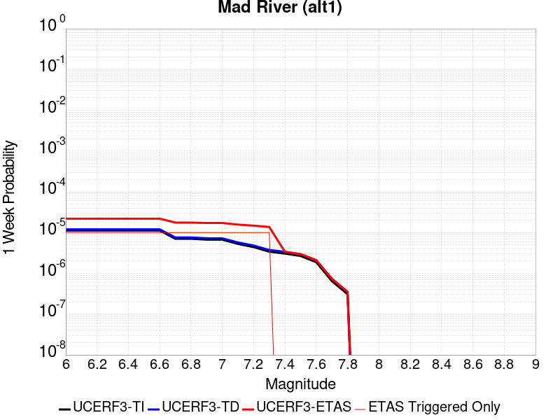 | 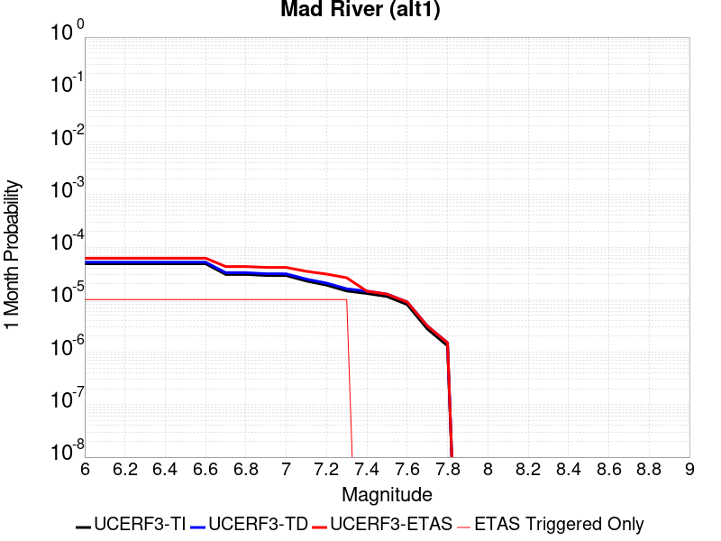 | 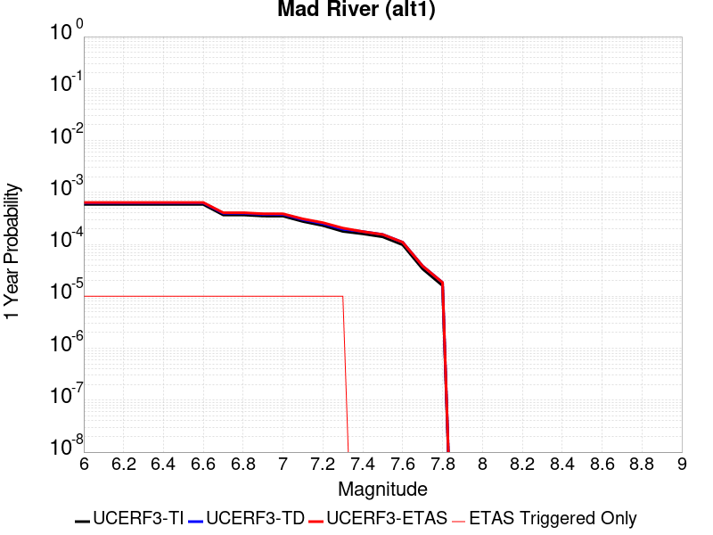 | 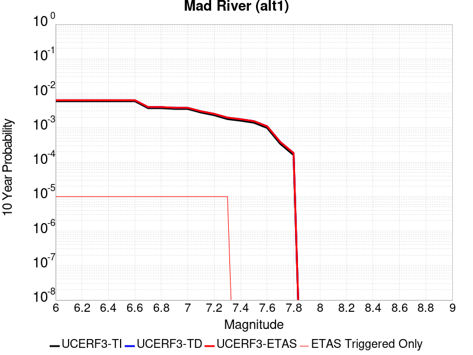 |

| Magnitude | 1 wk TI Prob | 1 wk TD Prob | 1 wk ETAS Prob | 1 wk ETAS/TD Gain | 1 wk ETAS Triggered Only | 1 mo TI Prob | 1 mo TD Prob | 1 mo ETAS Prob | 1 mo ETAS/TD Gain | 1 mo ETAS Triggered Only | 1 yr TI Prob | 1 yr TD Prob | 1 yr ETAS Prob | 1 yr ETAS/TD Gain | 1 yr ETAS Triggered Only | 10 yr TI Prob | 10 yr TD Prob | 10 yr ETAS Prob | 10 yr ETAS/TD Gain | 10 yr ETAS Triggered Only |
|-----|-----|-----|-----|-----|-----|-----|-----|-----|-----|-----|-----|-----|-----|-----|-----|-----|-----|-----|-----|-----|
| 6.0 | 1.1255216E-5 | 1.2039658E-5 | 2.2039538E-5 | 1.8305783 | 1.0E-5 | 4.8235746E-5 | 5.1597595E-5 | 6.159708E-5 | 1.1937975 | 1.0E-5 | 5.87112E-4 | 6.280341E-4 | 6.380278E-4 | 1.0159127 | 1.0E-5 | 0.0058556325 | 0.006264031 | 0.0062739686 | 1.0015864 | 1.0E-5 |
| 6.1 | 1.1255216E-5 | 1.2039658E-5 | 2.2039538E-5 | 1.8305783 | 1.0E-5 | 4.8235746E-5 | 5.1597595E-5 | 6.159708E-5 | 1.1937975 | 1.0E-5 | 5.87112E-4 | 6.280341E-4 | 6.380278E-4 | 1.0159127 | 1.0E-5 | 0.0058556325 | 0.006264031 | 0.0062739686 | 1.0015864 | 1.0E-5 |
| 6.2 | 1.1255216E-5 | 1.2039658E-5 | 2.2039538E-5 | 1.8305783 | 1.0E-5 | 4.8235746E-5 | 5.1597595E-5 | 6.159708E-5 | 1.1937975 | 1.0E-5 | 5.87112E-4 | 6.280341E-4 | 6.380278E-4 | 1.0159127 | 1.0E-5 | 0.0058556325 | 0.006264031 | 0.0062739686 | 1.0015864 | 1.0E-5 |
| 6.3 | 1.1255216E-5 | 1.2039658E-5 | 2.2039538E-5 | 1.8305783 | 1.0E-5 | 4.8235746E-5 | 5.1597595E-5 | 6.159708E-5 | 1.1937975 | 1.0E-5 | 5.87112E-4 | 6.280341E-4 | 6.380278E-4 | 1.0159127 | 1.0E-5 | 0.0058556325 | 0.006264031 | 0.0062739686 | 1.0015864 | 1.0E-5 |
| 6.4 | 1.1255216E-5 | 1.2039658E-5 | 2.2039538E-5 | 1.8305783 | 1.0E-5 | 4.8235746E-5 | 5.1597595E-5 | 6.159708E-5 | 1.1937975 | 1.0E-5 | 5.87112E-4 | 6.280341E-4 | 6.380278E-4 | 1.0159127 | 1.0E-5 | 0.0058556325 | 0.006264031 | 0.0062739686 | 1.0015864 | 1.0E-5 |
| 6.5 | 1.1255216E-5 | 1.2039658E-5 | 2.2039538E-5 | 1.8305783 | 1.0E-5 | 4.8235746E-5 | 5.1597595E-5 | 6.159708E-5 | 1.1937975 | 1.0E-5 | 5.87112E-4 | 6.280341E-4 | 6.380278E-4 | 1.0159127 | 1.0E-5 | 0.0058556325 | 0.006264031 | 0.0062739686 | 1.0015864 | 1.0E-5 |
| 6.6 | 1.1255216E-5 | 1.2039658E-5 | 2.2039538E-5 | 1.8305783 | 1.0E-5 | 4.8235746E-5 | 5.1597595E-5 | 6.159708E-5 | 1.1937975 | 1.0E-5 | 5.87112E-4 | 6.280341E-4 | 6.380278E-4 | 1.0159127 | 1.0E-5 | 0.0058556325 | 0.006264031 | 0.0062739686 | 1.0015864 | 1.0E-5 |
| 6.7 | 7.0564884E-6 | 7.6054325E-6 | 1.7605356E-5 | 2.3148396 | 1.0E-5 | 3.0241743E-5 | 3.2594315E-5 | 4.259399E-5 | 1.306792 | 1.0E-5 | 3.68131E-4 | 3.967657E-4 | 4.0676177E-4 | 1.0251938 | 1.0E-5 | 0.0036752177 | 0.0039607957 | 0.003970756 | 1.0025147 | 1.0E-5 |
| 6.8 | 7.0564884E-6 | 7.6054325E-6 | 1.7605356E-5 | 2.3148396 | 1.0E-5 | 3.0241743E-5 | 3.2594315E-5 | 4.259399E-5 | 1.306792 | 1.0E-5 | 3.68131E-4 | 3.967657E-4 | 4.0676177E-4 | 1.0251938 | 1.0E-5 | 0.0036752177 | 0.0039607957 | 0.003970756 | 1.0025147 | 1.0E-5 |
| 6.9 | 6.727494E-6 | 7.2572843E-6 | 1.725721E-5 | 2.3779159 | 1.0E-5 | 2.8831799E-5 | 3.110229E-5 | 4.110198E-5 | 1.3215097 | 1.0E-5 | 3.509706E-4 | 3.786067E-4 | 3.8860293E-4 | 1.0264026 | 1.0E-5 | 0.003504168 | 0.0037798323 | 0.0037897944 | 1.0026356 | 1.0E-5 |
| 7.0 | 6.7021124E-6 | 7.2301245E-6 | 1.7230052E-5 | 2.3830922 | 1.0E-5 | 2.8723021E-5 | 3.098589E-5 | 4.0985582E-5 | 1.3227175 | 1.0E-5 | 3.4964667E-4 | 3.7719007E-4 | 3.871863E-4 | 1.0265018 | 1.0E-5 | 0.0034909705 | 0.003765714 | 0.0037756762 | 1.0026455 | 1.0E-5 |
| 7.1 | 5.2784667E-6 | 5.7322395E-6 | 1.5732183E-5 | 2.7445087 | 1.0E-5 | 2.2621804E-5 | 2.4566516E-5 | 3.456627E-5 | 1.4070481 | 1.0E-5 | 2.7538565E-4 | 2.990572E-4 | 3.090542E-4 | 1.0334284 | 1.0E-5 | 0.0027504463 | 0.0029866395 | 0.0029966098 | 1.0033382 | 1.0E-5 |
| 7.2 | 4.4085446E-6 | 4.819547E-6 | 1.4819499E-5 | 3.0748737 | 1.0E-5 | 1.8893625E-5 | 2.0655041E-5 | 3.0654835E-5 | 1.4841334 | 1.0E-5 | 2.3000561E-4 | 2.514465E-4 | 2.61444E-4 | 1.0397599 | 1.0E-5 | 0.0022976769 | 0.0025116608 | 0.0025216355 | 1.0039715 | 1.0E-5 |
| 7.3 | 3.4060627E-6 | 3.7531752E-6 | 1.3753138E-5 | 3.6644006 | 1.0E-5 | 1.459733E-5 | 1.6084938E-5 | 2.6084777E-5 | 1.6216896 | 1.0E-5 | 1.77708E-4 | 1.9581676E-4 | 2.058148E-4 | 1.0510582 | 1.0E-5 | 0.0017756595 | 0.0019564657 | 0.001966446 | 1.0051012 | 1.0E-5 |
| 7.4 | 3.0570902E-6 | 3.3802967E-6 | 3.3802967E-6 | 1.0 | 0.0 | 1.310175E-5 | 1.4486906E-5 | 1.4486906E-5 | 1.0 | 0.0 | 1.5950213E-4 | 1.7636403E-4 | 1.7636403E-4 | 1.0 | 0.0 | 0.0015938769 | 0.0017622622 | 0.0017622622 | 1.0 | 0.0 |
| 7.5 | 2.674048E-6 | 2.9692678E-6 | 2.9692678E-6 | 1.0 | 0.0 | 1.1460155E-5 | 1.27253725E-5 | 1.27253725E-5 | 1.0 | 0.0 | 1.3951845E-4 | 1.5492059E-4 | 1.5492059E-4 | 1.0 | 0.0 | 0.0013943089 | 0.0015481455 | 0.0015481455 | 1.0 | 0.0 |
| 7.6 | 1.8806261E-6 | 2.1046062E-6 | 2.1046062E-6 | 1.0 | 0.0 | 8.059801E-6 | 9.01971E-6 | 9.01971E-6 | 1.0 | 0.0 | 9.812366E-5 | 1.0980956E-4 | 1.0980956E-4 | 1.0 | 0.0 | 9.808034E-4 | 0.0010975654 | 0.0010975654 | 1.0 | 0.0 |
| 7.7 | 6.461283E-7 | 7.3407836E-7 | 7.3407836E-7 | 1.0 | 0.0 | 2.7691183E-6 | 3.1460463E-6 | 3.1460463E-6 | 1.0 | 0.0 | 3.371349E-5 | 3.8302456E-5 | 3.8302456E-5 | 1.0 | 0.0 | 3.370838E-4 | 3.8296005E-4 | 3.8296005E-4 | 1.0 | 0.0 |
| 7.8 | 3.0785324E-7 | 3.5290012E-7 | 3.5290012E-7 | 1.0 | 0.0 | 1.3193703E-6 | 1.5124282E-6 | 1.5124282E-6 | 1.0 | 0.0 | 1.6063215E-5 | 1.8413664E-5 | 1.8413664E-5 | 1.0 | 0.0 | 1.6062055E-4 | 1.8412202E-4 | 1.8412202E-4 | 1.0 | 0.0 |

## Hartley Springs 2011 CFM
*[(top)](#table-of-contents)*

| 1 Week | 1 Month | 1 Year | 10 Year |
|-----|-----|-----|-----|
| 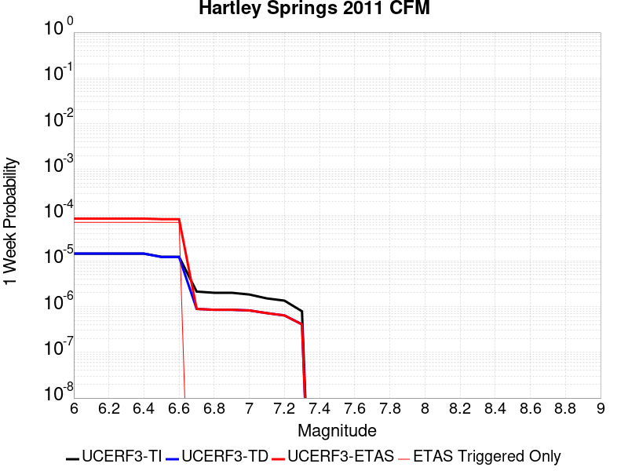 |  | 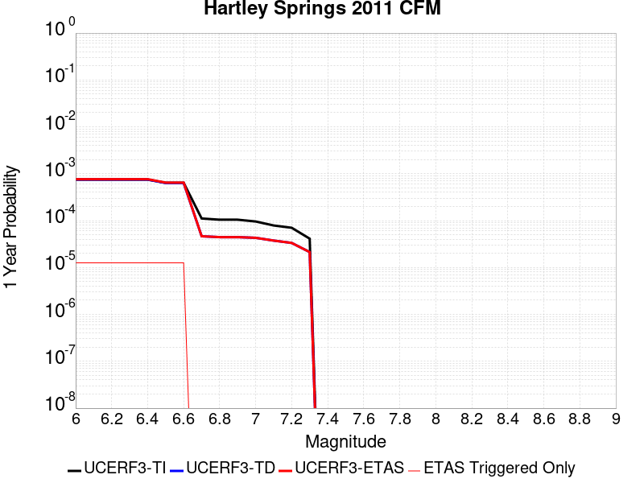 | 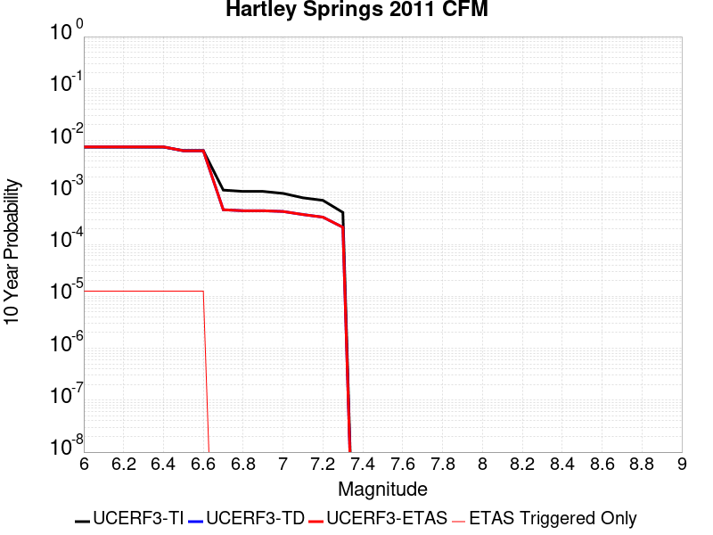 |

| Magnitude | 1 wk TI Prob | 1 wk TD Prob | 1 wk ETAS Prob | 1 wk ETAS/TD Gain | 1 wk ETAS Triggered Only | 1 mo TI Prob | 1 mo TD Prob | 1 mo ETAS Prob | 1 mo ETAS/TD Gain | 1 mo ETAS Triggered Only | 1 yr TI Prob | 1 yr TD Prob | 1 yr ETAS Prob | 1 yr ETAS/TD Gain | 1 yr ETAS Triggered Only | 10 yr TI Prob | 10 yr TD Prob | 10 yr ETAS Prob | 10 yr ETAS/TD Gain | 10 yr ETAS Triggered Only |
|-----|-----|-----|-----|-----|-----|-----|-----|-----|-----|-----|-----|-----|-----|-----|-----|-----|-----|-----|-----|-----|
| 6.0 | 1.4352418E-5 | 1.4434111E-5 | 2.4433966E-5 | 1.6927933 | 1.0E-5 | 6.1508916E-5 | 6.185994E-5 | 7.185932E-5 | 1.1616455 | 1.0E-5 | 7.486137E-4 | 7.5304887E-4 | 7.630413E-4 | 1.0132693 | 1.0E-5 | 0.007460968 | 0.007521092 | 0.0075310166 | 1.0013196 | 1.0E-5 |
| 6.1 | 1.4352418E-5 | 1.4434111E-5 | 2.4433966E-5 | 1.6927933 | 1.0E-5 | 6.1508916E-5 | 6.185994E-5 | 7.185932E-5 | 1.1616455 | 1.0E-5 | 7.486137E-4 | 7.5304887E-4 | 7.630413E-4 | 1.0132693 | 1.0E-5 | 0.007460968 | 0.007521092 | 0.0075310166 | 1.0013196 | 1.0E-5 |
| 6.2 | 1.4352418E-5 | 1.4434111E-5 | 2.4433966E-5 | 1.6927933 | 1.0E-5 | 6.1508916E-5 | 6.185994E-5 | 7.185932E-5 | 1.1616455 | 1.0E-5 | 7.486137E-4 | 7.5304887E-4 | 7.630413E-4 | 1.0132693 | 1.0E-5 | 0.007460968 | 0.007521092 | 0.0075310166 | 1.0013196 | 1.0E-5 |
| 6.3 | 1.4352418E-5 | 1.4434111E-5 | 2.4433966E-5 | 1.6927933 | 1.0E-5 | 6.1508916E-5 | 6.185994E-5 | 7.185932E-5 | 1.1616455 | 1.0E-5 | 7.486137E-4 | 7.5304887E-4 | 7.630413E-4 | 1.0132693 | 1.0E-5 | 0.007460968 | 0.007521092 | 0.0075310166 | 1.0013196 | 1.0E-5 |
| 6.4 | 1.4352418E-5 | 1.4434111E-5 | 2.4433966E-5 | 1.6927933 | 1.0E-5 | 6.1508916E-5 | 6.185994E-5 | 7.185932E-5 | 1.1616455 | 1.0E-5 | 7.486137E-4 | 7.5304887E-4 | 7.630413E-4 | 1.0132693 | 1.0E-5 | 0.007460968 | 0.007521092 | 0.0075310166 | 1.0013196 | 1.0E-5 |
| 6.5 | 1.2279858E-5 | 1.2133036E-5 | 2.2132914E-5 | 1.8241861 | 1.0E-5 | 5.26269E-5 | 5.199858E-5 | 6.199806E-5 | 1.192303 | 1.0E-5 | 6.4054417E-4 | 6.33057E-4 | 6.4305065E-4 | 1.0157864 | 1.0E-5 | 0.0063870098 | 0.006328048 | 0.006337985 | 1.0015702 | 1.0E-5 |
| 6.6 | 1.2279858E-5 | 1.2133036E-5 | 2.2132914E-5 | 1.8241861 | 1.0E-5 | 5.26269E-5 | 5.199858E-5 | 6.199806E-5 | 1.192303 | 1.0E-5 | 6.4054417E-4 | 6.33057E-4 | 6.4305065E-4 | 1.0157864 | 1.0E-5 | 0.0063870098 | 0.006328048 | 0.006337985 | 1.0015702 | 1.0E-5 |
| 6.7 | 2.1282601E-6 | 8.894127E-7 | 8.894127E-7 | 1.0 | 0.0 | 9.121083E-6 | 3.8117648E-6 | 3.8117648E-6 | 1.0 | 0.0 | 1.11043526E-4 | 4.6407506E-5 | 4.6407506E-5 | 1.0 | 0.0 | 0.0011098806 | 4.6400347E-4 | 4.6400347E-4 | 1.0 | 0.0 |
| 6.8 | 2.00516E-6 | 8.516916E-7 | 8.516916E-7 | 1.0 | 0.0 | 8.593515E-6 | 3.6501033E-6 | 3.6501033E-6 | 1.0 | 0.0 | 1.04621024E-4 | 4.443936E-5 | 4.443936E-5 | 1.0 | 0.0 | 0.0010457177 | 4.4432987E-4 | 4.4432987E-4 | 1.0 | 0.0 |
| 6.9 | 2.00516E-6 | 8.516916E-7 | 8.516916E-7 | 1.0 | 0.0 | 8.593515E-6 | 3.6501033E-6 | 3.6501033E-6 | 1.0 | 0.0 | 1.04621024E-4 | 4.443936E-5 | 4.443936E-5 | 1.0 | 0.0 | 0.0010457177 | 4.4432987E-4 | 4.4432987E-4 | 1.0 | 0.0 |
| 7.0 | 1.8366732E-6 | 8.2366813E-7 | 8.2366813E-7 | 1.0 | 0.0 | 7.871433E-6 | 3.5300031E-6 | 3.5300031E-6 | 1.0 | 0.0 | 9.583048E-5 | 4.2977194E-5 | 4.2977194E-5 | 1.0 | 0.0 | 9.5789164E-4 | 4.297139E-4 | 4.297139E-4 | 1.0 | 0.0 |
| 7.1 | 1.5097997E-6 | 7.1897E-7 | 7.1897E-7 | 1.0 | 0.0 | 6.470554E-6 | 3.0812978E-6 | 3.0812978E-6 | 1.0 | 0.0 | 7.877615E-5 | 3.7514397E-5 | 3.7514397E-5 | 1.0 | 0.0 | 7.874823E-4 | 3.7510434E-4 | 3.7510434E-4 | 1.0 | 0.0 |
| 7.2 | 1.3490993E-6 | 6.404769E-7 | 6.404769E-7 | 1.0 | 0.0 | 5.7818415E-6 | 2.7448996E-6 | 2.7448996E-6 | 1.0 | 0.0 | 7.0391645E-5 | 3.3418873E-5 | 3.3418873E-5 | 1.0 | 0.0 | 7.0369354E-4 | 3.3416142E-4 | 3.3416142E-4 | 1.0 | 0.0 |
| 7.3 | 7.900015E-7 | 4.0888176E-7 | 4.0888176E-7 | 1.0 | 0.0 | 3.3857161E-6 | 1.7523504E-6 | 1.7523504E-6 | 1.0 | 0.0 | 4.1220315E-5 | 2.1334865E-5 | 2.1334865E-5 | 1.0 | 0.0 | 4.121267E-4 | 2.1334866E-4 | 2.1334866E-4 | 1.0 | 0.0 |

## San Joaquin Hills
*[(top)](#table-of-contents)*

| 1 Week | 1 Month | 1 Year | 10 Year |
|-----|-----|-----|-----|
|  |  | 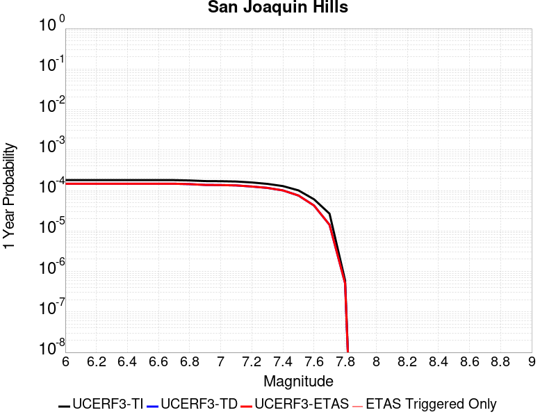 | 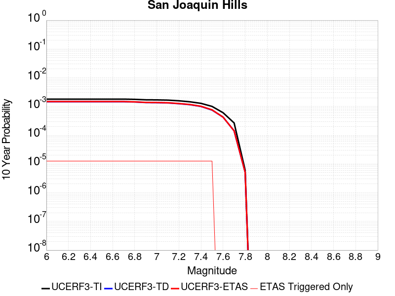 |

| Magnitude | 1 wk TI Prob | 1 wk TD Prob | 1 wk ETAS Prob | 1 wk ETAS/TD Gain | 1 wk ETAS Triggered Only | 1 mo TI Prob | 1 mo TD Prob | 1 mo ETAS Prob | 1 mo ETAS/TD Gain | 1 mo ETAS Triggered Only | 1 yr TI Prob | 1 yr TD Prob | 1 yr ETAS Prob | 1 yr ETAS/TD Gain | 1 yr ETAS Triggered Only | 10 yr TI Prob | 10 yr TD Prob | 10 yr ETAS Prob | 10 yr ETAS/TD Gain | 10 yr ETAS Triggered Only |
|-----|-----|-----|-----|-----|-----|-----|-----|-----|-----|-----|-----|-----|-----|-----|-----|-----|-----|-----|-----|-----|
| 6.0 | 3.4525704E-6 | 2.8139727E-6 | 2.8139727E-6 | 1.0 | 0.0 | 1.4796647E-5 | 1.2059828E-5 | 1.2059828E-5 | 1.0 | 0.0 | 1.8013427E-4 | 1.4681864E-4 | 1.4681864E-4 | 1.0 | 0.0 | 0.0017998833 | 0.0014672297 | 0.0014772151 | 1.0068055 | 1.0E-5 |
| 6.1 | 3.4525704E-6 | 2.8139727E-6 | 2.8139727E-6 | 1.0 | 0.0 | 1.4796647E-5 | 1.2059828E-5 | 1.2059828E-5 | 1.0 | 0.0 | 1.8013427E-4 | 1.4681864E-4 | 1.4681864E-4 | 1.0 | 0.0 | 0.0017998833 | 0.0014672297 | 0.0014772151 | 1.0068055 | 1.0E-5 |
| 6.2 | 3.4525704E-6 | 2.8139727E-6 | 2.8139727E-6 | 1.0 | 0.0 | 1.4796647E-5 | 1.2059828E-5 | 1.2059828E-5 | 1.0 | 0.0 | 1.8013427E-4 | 1.4681864E-4 | 1.4681864E-4 | 1.0 | 0.0 | 0.0017998833 | 0.0014672297 | 0.0014772151 | 1.0068055 | 1.0E-5 |
| 6.3 | 3.4525704E-6 | 2.8139727E-6 | 2.8139727E-6 | 1.0 | 0.0 | 1.4796647E-5 | 1.2059828E-5 | 1.2059828E-5 | 1.0 | 0.0 | 1.8013427E-4 | 1.4681864E-4 | 1.4681864E-4 | 1.0 | 0.0 | 0.0017998833 | 0.0014672297 | 0.0014772151 | 1.0068055 | 1.0E-5 |
| 6.4 | 3.4525704E-6 | 2.8139727E-6 | 2.8139727E-6 | 1.0 | 0.0 | 1.4796647E-5 | 1.2059828E-5 | 1.2059828E-5 | 1.0 | 0.0 | 1.8013427E-4 | 1.4681864E-4 | 1.4681864E-4 | 1.0 | 0.0 | 0.0017998833 | 0.0014672297 | 0.0014772151 | 1.0068055 | 1.0E-5 |
| 6.5 | 3.4525704E-6 | 2.8139727E-6 | 2.8139727E-6 | 1.0 | 0.0 | 1.4796647E-5 | 1.2059828E-5 | 1.2059828E-5 | 1.0 | 0.0 | 1.8013427E-4 | 1.4681864E-4 | 1.4681864E-4 | 1.0 | 0.0 | 0.0017998833 | 0.0014672297 | 0.0014772151 | 1.0068055 | 1.0E-5 |
| 6.6 | 3.4525704E-6 | 2.8139727E-6 | 2.8139727E-6 | 1.0 | 0.0 | 1.4796647E-5 | 1.2059828E-5 | 1.2059828E-5 | 1.0 | 0.0 | 1.8013427E-4 | 1.4681864E-4 | 1.4681864E-4 | 1.0 | 0.0 | 0.0017998833 | 0.0014672297 | 0.0014772151 | 1.0068055 | 1.0E-5 |
| 6.7 | 3.4525704E-6 | 2.8139727E-6 | 2.8139727E-6 | 1.0 | 0.0 | 1.4796647E-5 | 1.2059828E-5 | 1.2059828E-5 | 1.0 | 0.0 | 1.8013427E-4 | 1.4681864E-4 | 1.4681864E-4 | 1.0 | 0.0 | 0.0017998833 | 0.0014672297 | 0.0014772151 | 1.0068055 | 1.0E-5 |
| 6.8 | 3.388654E-6 | 2.7484111E-6 | 2.7484111E-6 | 1.0 | 0.0 | 1.4522722E-5 | 1.1778852E-5 | 1.1778852E-5 | 1.0 | 0.0 | 1.767998E-4 | 1.4339821E-4 | 1.4339821E-4 | 1.0 | 0.0 | 0.001766592 | 0.0014330697 | 0.0014430553 | 1.006968 | 1.0E-5 |
| 6.9 | 3.2694352E-6 | 2.6283255E-6 | 2.6283255E-6 | 1.0 | 0.0 | 1.401179E-5 | 1.1264204E-5 | 1.1264204E-5 | 1.0 | 0.0 | 1.7058018E-4 | 1.3713316E-4 | 1.3713316E-4 | 1.0 | 0.0 | 0.0017044931 | 0.0013704967 | 0.001380483 | 1.0072867 | 1.0E-5 |
| 7.0 | 3.246912E-6 | 2.6069824E-6 | 2.6069824E-6 | 1.0 | 0.0 | 1.39152635E-5 | 1.1172735E-5 | 1.1172735E-5 | 1.0 | 0.0 | 1.6940516E-4 | 1.3601968E-4 | 1.3601968E-4 | 1.0 | 0.0 | 0.0016927607 | 0.0013593754 | 0.0013693619 | 1.0073463 | 1.0E-5 |
| 7.1 | 3.1864927E-6 | 2.5523102E-6 | 2.5523102E-6 | 1.0 | 0.0 | 1.3656326E-5 | 1.0938427E-5 | 1.0938427E-5 | 1.0 | 0.0 | 1.6625308E-4 | 1.3316733E-4 | 1.3316733E-4 | 1.0 | 0.0 | 0.0016612876 | 0.0013308863 | 0.001340873 | 1.0075037 | 1.0E-5 |
| 7.2 | 3.0220644E-6 | 2.3991581E-6 | 2.3991581E-6 | 1.0 | 0.0 | 1.295164E-5 | 1.0282067E-5 | 1.0282067E-5 | 1.0 | 0.0 | 1.576748E-4 | 1.2517707E-4 | 1.2517707E-4 | 1.0 | 0.0 | 0.0015756298 | 0.001251076 | 0.0012610634 | 1.0079831 | 1.0E-5 |
| 7.3 | 2.787619E-6 | 2.2173751E-6 | 2.2173751E-6 | 1.0 | 0.0 | 1.1946884E-5 | 9.503003E-6 | 9.503003E-6 | 1.0 | 0.0 | 1.454436E-4 | 1.1569301E-4 | 1.1569301E-4 | 1.0 | 0.0 | 0.0014534845 | 0.0011563377 | 0.0011663261 | 1.008638 | 1.0E-5 |
| 7.4 | 2.4593792E-6 | 1.9226163E-6 | 1.9226163E-6 | 1.0 | 0.0 | 1.0540153E-5 | 8.239759E-6 | 8.239759E-6 | 1.0 | 0.0 | 1.2831882E-4 | 1.0031454E-4 | 1.0031454E-4 | 1.0 | 0.0 | 0.0012824474 | 0.0010027013 | 0.0010126913 | 1.009963 | 1.0E-5 |
| 7.5 | 1.926764E-6 | 1.4383043E-6 | 1.4383043E-6 | 1.0 | 0.0 | 8.257534E-6 | 6.1641467E-6 | 6.1641467E-6 | 1.0 | 0.0 | 1.00530844E-4 | 7.5045966E-5 | 7.5045966E-5 | 1.0 | 0.0 | 0.0010048538 | 7.502126E-4 | 7.602051E-4 | 1.0133196 | 1.0E-5 |
| 7.6 | 1.1609359E-6 | 8.145649E-7 | 8.145649E-7 | 1.0 | 0.0 | 4.97543E-6 | 3.4909879E-6 | 3.4909879E-6 | 1.0 | 0.0 | 6.0574173E-5 | 4.2501993E-5 | 4.2501993E-5 | 1.0 | 0.0 | 6.055767E-4 | 4.24943E-4 | 4.24943E-4 | 1.0 | 0.0 |
| 7.7 | 5.1168536E-7 | 2.7155397E-7 | 2.7155397E-7 | 1.0 | 0.0 | 2.1929354E-6 | 1.1638023E-6 | 1.1638023E-6 | 1.0 | 0.0 | 2.669866E-5 | 1.4169214E-5 | 1.4169214E-5 | 1.0 | 0.0 | 2.6695454E-4 | 1.4168446E-4 | 1.4168446E-4 | 1.0 | 0.0 |
| 7.8 | 1.16056995E-8 | 9.782997E-9 | 9.782997E-9 | 1.0 | 0.0 | 4.9738713E-8 | 4.1927127E-8 | 4.1927127E-8 | 1.0 | 0.0 | 6.0556863E-7 | 5.1046277E-7 | 5.1046277E-7 | 1.0 | 0.0 | 6.05567E-6 | 5.1046277E-6 | 5.1046277E-6 | 1.0 | 0.0 |

## Laguna Salada
*[(top)](#table-of-contents)*

| 1 Week | 1 Month | 1 Year | 10 Year |
|-----|-----|-----|-----|
| 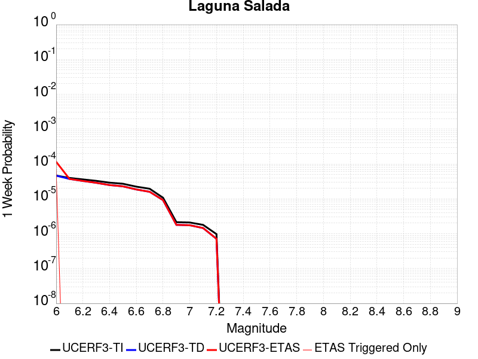 | 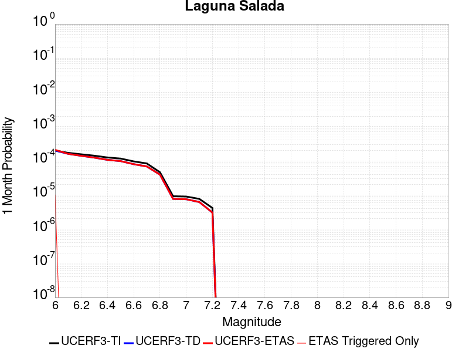 | 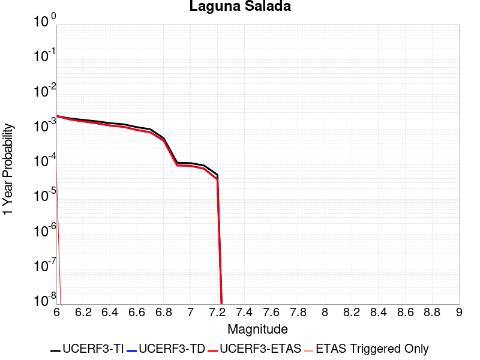 | 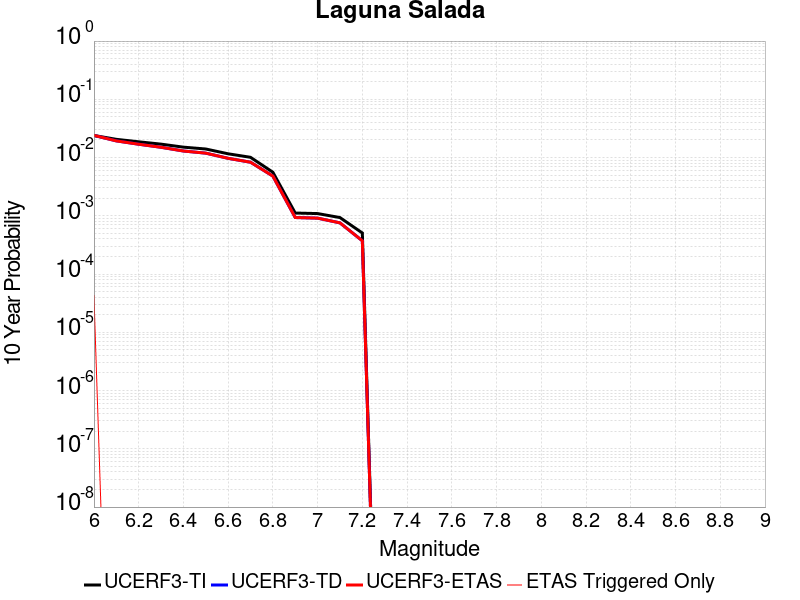 |

| Magnitude | 1 wk TI Prob | 1 wk TD Prob | 1 wk ETAS Prob | 1 wk ETAS/TD Gain | 1 wk ETAS Triggered Only | 1 mo TI Prob | 1 mo TD Prob | 1 mo ETAS Prob | 1 mo ETAS/TD Gain | 1 mo ETAS Triggered Only | 1 yr TI Prob | 1 yr TD Prob | 1 yr ETAS Prob | 1 yr ETAS/TD Gain | 1 yr ETAS Triggered Only | 10 yr TI Prob | 10 yr TD Prob | 10 yr ETAS Prob | 10 yr ETAS/TD Gain | 10 yr ETAS Triggered Only |
|-----|-----|-----|-----|-----|-----|-----|-----|-----|-----|-----|-----|-----|-----|-----|-----|-----|-----|-----|-----|-----|
| 6.0 | 4.6465593E-5 | 4.634507E-5 | 5.634461E-5 | 1.2157627 | 1.0E-5 | 1.9912305E-4 | 1.9860751E-4 | 2.0860552E-4 | 1.0503405 | 1.0E-5 | 0.0024216278 | 0.0024154421 | 0.002425418 | 1.00413 | 1.0E-5 | 0.02395408 | 0.023965387 | 0.023975147 | 1.0004072 | 1.0E-5 |
| 6.1 | 3.982297E-5 | 3.7244878E-5 | 3.7244878E-5 | 1.0 | 0.0 | 1.706587E-4 | 1.5961178E-4 | 1.5961178E-4 | 1.0 | 0.0 | 0.0020757897 | 0.0019416384 | 0.0019416384 | 1.0 | 0.0 | 0.020565065 | 0.019322045 | 0.019322045 | 1.0 | 0.0 |
| 6.2 | 3.6067784E-5 | 3.2600165E-5 | 3.2600165E-5 | 1.0 | 0.0 | 1.5456705E-4 | 1.3970808E-4 | 1.3970808E-4 | 1.0 | 0.0 | 0.0018802295 | 0.0016997134 | 0.0016997134 | 1.0 | 0.0 | 0.018644003 | 0.016963193 | 0.016963193 | 1.0 | 0.0 |
| 6.3 | 3.2859112E-5 | 2.8847233E-5 | 2.8847233E-5 | 1.0 | 0.0 | 1.4081717E-4 | 1.2362566E-4 | 1.2362566E-4 | 1.0 | 0.0 | 0.0017131006 | 0.0015041964 | 0.0015041964 | 1.0 | 0.0 | 0.016999546 | 0.015031838 | 0.015031838 | 1.0 | 0.0 |
| 6.4 | 2.9132116E-5 | 2.4851877E-5 | 2.4851877E-5 | 1.0 | 0.0 | 1.2484594E-4 | 1.0650421E-4 | 1.0650421E-4 | 1.0 | 0.0 | 0.0015189396 | 0.001296006 | 0.001296006 | 1.0 | 0.0 | 0.015085992 | 0.012965128 | 0.012965128 | 1.0 | 0.0 |
| 6.5 | 2.7075037E-5 | 2.2824677E-5 | 2.2824677E-5 | 1.0 | 0.0 | 1.1603071E-4 | 9.7816875E-5 | 9.7816875E-5 | 1.0 | 0.0 | 0.0014117584 | 0.0011903581 | 0.0011903581 | 1.0 | 0.0 | 0.014028233 | 0.011916272 | 0.011916272 | 1.0 | 0.0 |
| 6.6 | 2.2367465E-5 | 1.8572848E-5 | 1.8572848E-5 | 1.0 | 0.0 | 9.5857045E-5 | 7.959595E-5 | 7.959595E-5 | 1.0 | 0.0 | 0.0011664346 | 9.687322E-4 | 9.687322E-4 | 1.0 | 0.0 | 0.011603311 | 0.009708806 | 0.009708806 | 1.0 | 0.0 |
| 6.7 | 1.9458053E-5 | 1.5913607E-5 | 1.5913607E-5 | 1.0 | 0.0 | 8.338899E-5 | 6.819984E-5 | 6.819984E-5 | 1.0 | 0.0 | 0.001014788 | 8.300971E-4 | 8.300971E-4 | 1.0 | 0.0 | 0.010101665 | 0.008315945 | 0.008315945 | 1.0 | 0.0 |
| 6.8 | 1.0767866E-5 | 9.183346E-6 | 9.183346E-6 | 1.0 | 0.0 | 4.614718E-5 | 3.9356994E-5 | 3.9356994E-5 | 1.0 | 0.0 | 5.6169706E-4 | 4.7913467E-4 | 4.7913467E-4 | 1.0 | 0.0 | 0.0056027942 | 0.0048085325 | 0.0048085325 | 1.0 | 0.0 |
| 6.9 | 2.1384765E-6 | 1.7913964E-6 | 1.7913964E-6 | 1.0 | 0.0 | 9.164866E-6 | 7.677392E-6 | 7.677392E-6 | 1.0 | 0.0 | 1.1157654E-4 | 9.346863E-5 | 9.346863E-5 | 1.0 | 0.0 | 0.0011152053 | 9.343315E-4 | 9.343315E-4 | 1.0 | 0.0 |
| 7.0 | 2.0952946E-6 | 1.7493335E-6 | 1.7493335E-6 | 1.0 | 0.0 | 8.979802E-6 | 7.497124E-6 | 7.497124E-6 | 1.0 | 0.0 | 1.0932361E-4 | 9.127405E-5 | 9.127405E-5 | 1.0 | 0.0 | 0.0010926984 | 9.124038E-4 | 9.124038E-4 | 1.0 | 0.0 |
| 7.1 | 1.7887576E-6 | 1.4500541E-6 | 1.4500541E-6 | 1.0 | 0.0 | 7.666081E-6 | 6.2145045E-6 | 6.2145045E-6 | 1.0 | 0.0 | 9.333054E-5 | 7.565928E-5 | 7.565928E-5 | 1.0 | 0.0 | 9.329135E-4 | 7.5636554E-4 | 7.5636554E-4 | 1.0 | 0.0 |
| 7.2 | 9.723109E-7 | 7.135829E-7 | 7.135829E-7 | 1.0 | 0.0 | 4.16704E-6 | 3.0582096E-6 | 3.0582096E-6 | 1.0 | 0.0 | 5.073253E-5 | 3.7233232E-5 | 3.7233232E-5 | 1.0 | 0.0 | 5.072095E-4 | 3.722862E-4 | 3.722862E-4 | 1.0 | 0.0 |

## Santa Susana alt 1
*[(top)](#table-of-contents)*

| 1 Week | 1 Month | 1 Year | 10 Year |
|-----|-----|-----|-----|
|  | 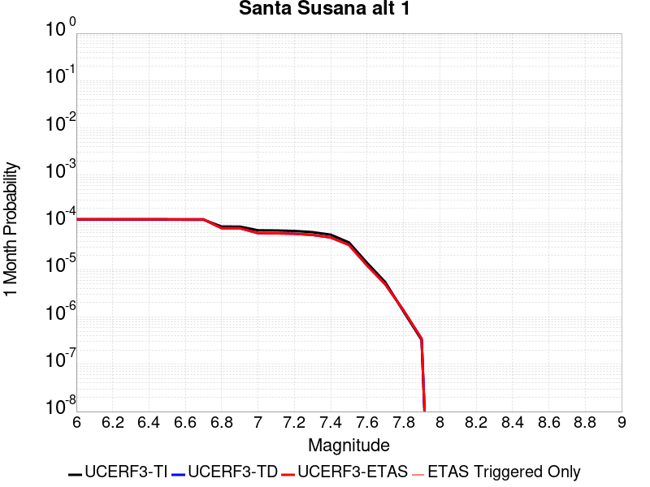 | 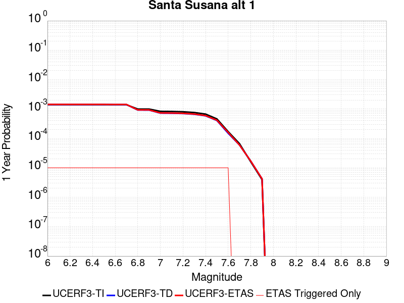 | 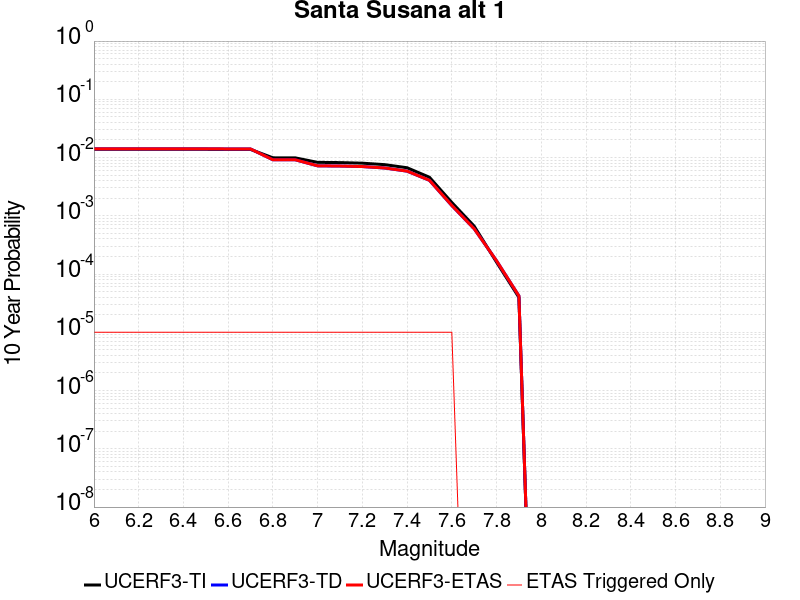 |

| Magnitude | 1 wk TI Prob | 1 wk TD Prob | 1 wk ETAS Prob | 1 wk ETAS/TD Gain | 1 wk ETAS Triggered Only | 1 mo TI Prob | 1 mo TD Prob | 1 mo ETAS Prob | 1 mo ETAS/TD Gain | 1 mo ETAS Triggered Only | 1 yr TI Prob | 1 yr TD Prob | 1 yr ETAS Prob | 1 yr ETAS/TD Gain | 1 yr ETAS Triggered Only | 10 yr TI Prob | 10 yr TD Prob | 10 yr ETAS Prob | 10 yr ETAS/TD Gain | 10 yr ETAS Triggered Only |
|-----|-----|-----|-----|-----|-----|-----|-----|-----|-----|-----|-----|-----|-----|-----|-----|-----|-----|-----|-----|-----|
| 6.0 | 2.674877E-5 | 2.7198214E-5 | 2.7198214E-5 | 1.0 | 0.0 | 1.1463255E-4 | 1.16559204E-4 | 1.16559204E-4 | 1.0 | 0.0 | 0.0013947578 | 0.0014182981 | 0.001428284 | 1.0070407 | 1.0E-5 | 0.013860362 | 0.014104388 | 0.014114247 | 1.000699 | 1.0E-5 |
| 6.1 | 2.674877E-5 | 2.7198214E-5 | 2.7198214E-5 | 1.0 | 0.0 | 1.1463255E-4 | 1.16559204E-4 | 1.16559204E-4 | 1.0 | 0.0 | 0.0013947578 | 0.0014182981 | 0.001428284 | 1.0070407 | 1.0E-5 | 0.013860362 | 0.014104388 | 0.014114247 | 1.000699 | 1.0E-5 |
| 6.2 | 2.674877E-5 | 2.7198214E-5 | 2.7198214E-5 | 1.0 | 0.0 | 1.1463255E-4 | 1.16559204E-4 | 1.16559204E-4 | 1.0 | 0.0 | 0.0013947578 | 0.0014182981 | 0.001428284 | 1.0070407 | 1.0E-5 | 0.013860362 | 0.014104388 | 0.014114247 | 1.000699 | 1.0E-5 |
| 6.3 | 2.674877E-5 | 2.7198214E-5 | 2.7198214E-5 | 1.0 | 0.0 | 1.1463255E-4 | 1.16559204E-4 | 1.16559204E-4 | 1.0 | 0.0 | 0.0013947578 | 0.0014182981 | 0.001428284 | 1.0070407 | 1.0E-5 | 0.013860362 | 0.014104388 | 0.014114247 | 1.000699 | 1.0E-5 |
| 6.4 | 2.674877E-5 | 2.7198214E-5 | 2.7198214E-5 | 1.0 | 0.0 | 1.1463255E-4 | 1.16559204E-4 | 1.16559204E-4 | 1.0 | 0.0 | 0.0013947578 | 0.0014182981 | 0.001428284 | 1.0070407 | 1.0E-5 | 0.013860362 | 0.014104388 | 0.014114247 | 1.000699 | 1.0E-5 |
| 6.5 | 2.674877E-5 | 2.7198214E-5 | 2.7198214E-5 | 1.0 | 0.0 | 1.1463255E-4 | 1.16559204E-4 | 1.16559204E-4 | 1.0 | 0.0 | 0.0013947578 | 0.0014182981 | 0.001428284 | 1.0070407 | 1.0E-5 | 0.013860362 | 0.014104388 | 0.014114247 | 1.000699 | 1.0E-5 |
| 6.6 | 2.6647976E-5 | 2.7074553E-5 | 2.7074553E-5 | 1.0 | 0.0 | 1.14200615E-4 | 1.16029274E-4 | 1.16029274E-4 | 1.0 | 0.0 | 0.0013895056 | 0.0014118546 | 0.0014218405 | 1.0070729 | 1.0E-5 | 0.013808494 | 0.014040773 | 0.014050633 | 1.0007023 | 1.0E-5 |
| 6.7 | 2.6647976E-5 | 2.7074553E-5 | 2.7074553E-5 | 1.0 | 0.0 | 1.14200615E-4 | 1.16029274E-4 | 1.16029274E-4 | 1.0 | 0.0 | 0.0013895056 | 0.0014118546 | 0.0014218405 | 1.0070729 | 1.0E-5 | 0.013808494 | 0.014040773 | 0.014050633 | 1.0007023 | 1.0E-5 |
| 6.8 | 1.9073179E-5 | 1.7637467E-5 | 1.7637467E-5 | 1.0 | 0.0 | 8.1739636E-5 | 7.558706E-5 | 7.558706E-5 | 1.0 | 0.0 | 9.947256E-4 | 9.19902E-4 | 9.2989276E-4 | 1.0108607 | 1.0E-5 | 0.009902848 | 0.009163361 | 0.009173269 | 1.0010813 | 1.0E-5 |
| 6.9 | 1.9041876E-5 | 1.7619597E-5 | 1.7619597E-5 | 1.0 | 0.0 | 8.160549E-5 | 7.551048E-5 | 7.551048E-5 | 1.0 | 0.0 | 9.930939E-4 | 9.189705E-4 | 9.2896126E-4 | 1.0108718 | 1.0E-5 | 0.0098866755 | 0.009154123 | 0.009164032 | 1.0010824 | 1.0E-5 |
| 7.0 | 1.5917482E-5 | 1.3864049E-5 | 1.3864049E-5 | 1.0 | 0.0 | 6.8215995E-5 | 5.9416023E-5 | 5.9416023E-5 | 1.0 | 0.0 | 8.302132E-4 | 7.2315463E-4 | 7.3314743E-4 | 1.0138183 | 1.0E-5 | 0.008271185 | 0.0072090672 | 0.007218995 | 1.0013771 | 1.0E-5 |
| 7.1 | 1.577788E-5 | 1.3744056E-5 | 1.3744056E-5 | 1.0 | 0.0 | 6.761774E-5 | 5.890179E-5 | 5.890179E-5 | 1.0 | 0.0 | 8.2293496E-4 | 7.16898E-4 | 7.2689087E-4 | 1.013939 | 1.0E-5 | 0.008198941 | 0.0071469042 | 0.007156833 | 1.0013893 | 1.0E-5 |
| 7.2 | 1.5416446E-5 | 1.34701295E-5 | 1.34701295E-5 | 1.0 | 0.0 | 6.606882E-5 | 5.7727877E-5 | 5.7727877E-5 | 1.0 | 0.0 | 8.0409093E-4 | 7.026149E-4 | 7.1260787E-4 | 1.0142225 | 1.0E-5 | 0.008011877 | 0.0070049763 | 0.0070149065 | 1.0014175 | 1.0E-5 |
| 7.3 | 1.4534083E-5 | 1.2718032E-5 | 1.2718032E-5 | 1.0 | 0.0 | 6.228744E-5 | 5.4504737E-5 | 5.4504737E-5 | 1.0 | 0.0 | 7.580857E-4 | 6.633976E-4 | 6.733909E-4 | 1.0150639 | 1.0E-5 | 0.007555048 | 0.0066151717 | 0.0066251056 | 1.0015017 | 1.0E-5 |
| 7.4 | 1.2858995E-5 | 1.1229814E-5 | 1.1229814E-5 | 1.0 | 0.0 | 5.5108816E-5 | 4.812691E-5 | 4.812691E-5 | 1.0 | 0.0 | 6.7074323E-4 | 5.8579154E-4 | 5.957857E-4 | 1.0170609 | 1.0E-5 | 0.0066872234 | 0.0058433902 | 0.005853332 | 1.0017014 | 1.0E-5 |
| 7.5 | 8.827668E-6 | 7.805494E-6 | 7.805494E-6 | 1.0 | 0.0 | 3.7832317E-5 | 3.3451703E-5 | 3.3451703E-5 | 1.0 | 0.0 | 4.605111E-4 | 4.072008E-4 | 4.1719674E-4 | 1.0245479 | 1.0E-5 | 0.0045955796 | 0.0040648985 | 0.004074858 | 1.0024501 | 1.0E-5 |
| 7.6 | 3.2533426E-6 | 2.8720106E-6 | 2.8720106E-6 | 1.0 | 0.0 | 1.3942822E-5 | 1.230856E-5 | 1.230856E-5 | 1.0 | 0.0 | 1.6974064E-4 | 1.4984679E-4 | 1.598453E-4 | 1.0667248 | 1.0E-5 | 0.0016961104 | 0.0014974943 | 0.0015074793 | 1.0066679 | 1.0E-5 |
| 7.7 | 1.2751709E-6 | 1.1491339E-6 | 1.1491339E-6 | 1.0 | 0.0 | 5.4650063E-6 | 4.9248506E-6 | 4.9248506E-6 | 1.0 | 0.0 | 6.653442E-5 | 5.99585E-5 | 5.99585E-5 | 1.0 | 0.0 | 6.6514505E-4 | 5.9943215E-4 | 5.9943215E-4 | 1.0 | 0.0 |
| 7.8 | 3.067544E-7 | 3.240052E-7 | 3.240052E-7 | 1.0 | 0.0 | 1.3146611E-6 | 1.3885931E-6 | 1.3885931E-6 | 1.0 | 0.0 | 1.600588E-5 | 1.6906E-5 | 1.6906E-5 | 1.0 | 0.0 | 1.6004729E-4 | 1.6904817E-4 | 1.6904817E-4 | 1.0 | 0.0 |
| 7.9 | 7.622999E-8 | 8.0879715E-8 | 8.0879715E-8 | 1.0 | 0.0 | 3.2669993E-7 | 3.4662733E-7 | 3.4662733E-7 | 1.0 | 0.0 | 3.977564E-6 | 4.220182E-6 | 4.220182E-6 | 1.0 | 0.0 | 3.977493E-5 | 4.2201224E-5 | 4.2201224E-5 | 1.0 | 0.0 |

## Malibu Coast alt 1
*[(top)](#table-of-contents)*

| 1 Week | 1 Month | 1 Year | 10 Year |
|-----|-----|-----|-----|
| 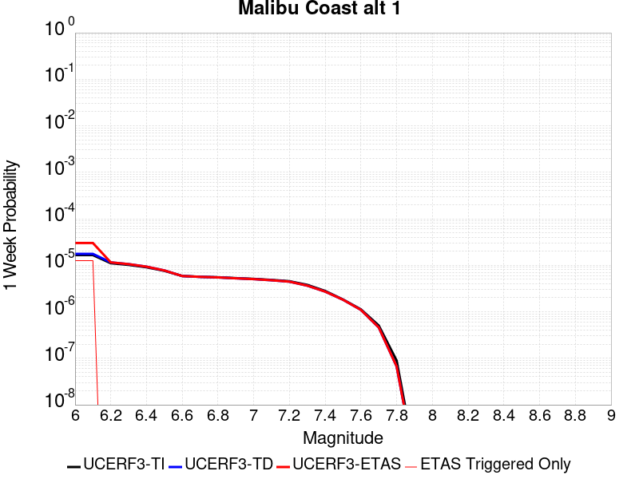 | 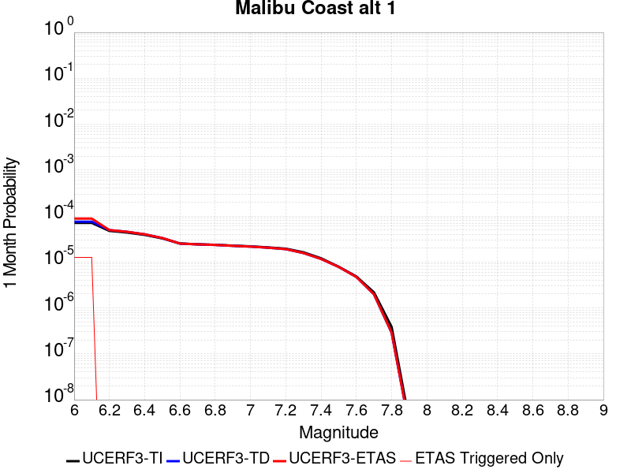 | 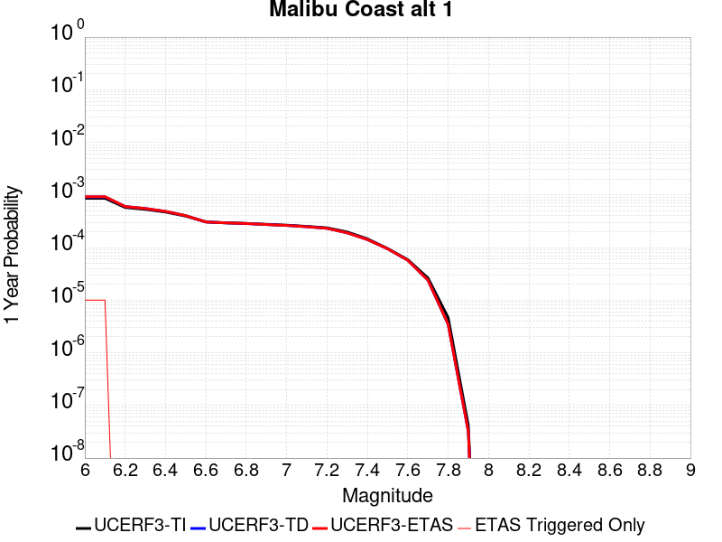 | 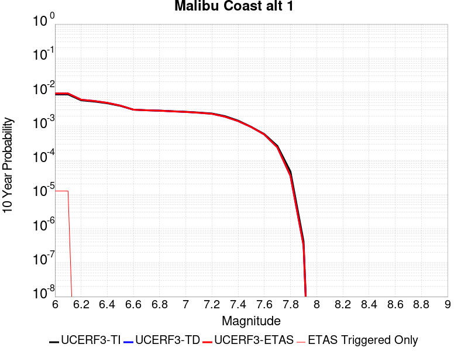 |

| Magnitude | 1 wk TI Prob | 1 wk TD Prob | 1 wk ETAS Prob | 1 wk ETAS/TD Gain | 1 wk ETAS Triggered Only | 1 mo TI Prob | 1 mo TD Prob | 1 mo ETAS Prob | 1 mo ETAS/TD Gain | 1 mo ETAS Triggered Only | 1 yr TI Prob | 1 yr TD Prob | 1 yr ETAS Prob | 1 yr ETAS/TD Gain | 1 yr ETAS Triggered Only | 10 yr TI Prob | 10 yr TD Prob | 10 yr ETAS Prob | 10 yr ETAS/TD Gain | 10 yr ETAS Triggered Only |
|-----|-----|-----|-----|-----|-----|-----|-----|-----|-----|-----|-----|-----|-----|-----|-----|-----|-----|-----|-----|-----|
| 6.0 | 1.6572556E-5 | 1.759807E-5 | 2.7597893E-5 | 1.5682342 | 1.0E-5 | 7.102331E-5 | 7.5418226E-5 | 8.5417465E-5 | 1.132584 | 1.0E-5 | 8.6436566E-4 | 9.1784896E-4 | 9.278398E-4 | 1.010885 | 1.0E-5 | 0.0086101135 | 0.009142514 | 0.009152423 | 1.0010837 | 1.0E-5 |
| 6.1 | 1.6572556E-5 | 1.759807E-5 | 2.7597893E-5 | 1.5682342 | 1.0E-5 | 7.102331E-5 | 7.5418226E-5 | 8.5417465E-5 | 1.132584 | 1.0E-5 | 8.6436566E-4 | 9.1784896E-4 | 9.278398E-4 | 1.010885 | 1.0E-5 | 0.0086101135 | 0.009142514 | 0.009152423 | 1.0010837 | 1.0E-5 |
| 6.2 | 1.1085717E-5 | 1.155715E-5 | 1.155715E-5 | 1.0 | 0.0 | 4.750935E-5 | 4.9529724E-5 | 4.9529724E-5 | 1.0 | 0.0 | 5.782728E-4 | 6.0286105E-4 | 6.0286105E-4 | 1.0 | 0.0 | 0.0057677035 | 0.0060126274 | 0.0060126274 | 1.0 | 0.0 |
| 6.3 | 1.0208568E-5 | 1.0592241E-5 | 1.0592241E-5 | 1.0 | 0.0 | 4.375027E-5 | 4.5394543E-5 | 4.5394543E-5 | 1.0 | 0.0 | 5.325294E-4 | 5.5254134E-4 | 5.5254134E-4 | 1.0 | 0.0 | 0.0053125503 | 0.0055119833 | 0.0055119833 | 1.0 | 0.0 |
| 6.4 | 9.0682315E-6 | 9.342641E-6 | 9.342641E-6 | 1.0 | 0.0 | 3.8863272E-5 | 4.0039286E-5 | 4.0039286E-5 | 1.0 | 0.0 | 4.730576E-4 | 4.873713E-4 | 4.873713E-4 | 1.0 | 0.0 | 0.0047205184 | 0.004863238 | 0.004863238 | 1.0 | 0.0 |
| 6.5 | 7.605796E-6 | 7.74859E-6 | 7.74859E-6 | 1.0 | 0.0 | 3.259586E-5 | 3.320783E-5 | 3.320783E-5 | 1.0 | 0.0 | 3.9678233E-4 | 4.0423166E-4 | 4.0423166E-4 | 1.0 | 0.0 | 0.0039607463 | 0.0040351013 | 0.0040351013 | 1.0 | 0.0 |
| 6.6 | 5.889873E-6 | 5.8795417E-6 | 5.8795417E-6 | 1.0 | 0.0 | 2.5242069E-5 | 2.5197793E-5 | 2.5197793E-5 | 1.0 | 0.0 | 3.0727885E-4 | 3.0674002E-4 | 3.0674002E-4 | 1.0 | 0.0 | 0.003068543 | 0.0030631793 | 0.0030631793 | 1.0 | 0.0 |
| 6.7 | 5.66586E-6 | 5.6416443E-6 | 5.6416443E-6 | 1.0 | 0.0 | 2.428203E-5 | 2.4178253E-5 | 2.4178253E-5 | 1.0 | 0.0 | 2.955936E-4 | 2.9433056E-4 | 2.9433056E-4 | 1.0 | 0.0 | 0.0029520073 | 0.0029394194 | 0.0029394194 | 1.0 | 0.0 |
| 6.8 | 5.521556E-6 | 5.48943E-6 | 5.48943E-6 | 1.0 | 0.0 | 2.3663597E-5 | 2.3525918E-5 | 2.3525918E-5 | 1.0 | 0.0 | 2.880662E-4 | 2.8639048E-4 | 2.8639048E-4 | 1.0 | 0.0 | 0.0028769306 | 0.0028602257 | 0.0028602257 | 1.0 | 0.0 |
| 6.9 | 5.29752E-6 | 5.2499345E-6 | 5.2499345E-6 | 1.0 | 0.0 | 2.270346E-5 | 2.2499526E-5 | 2.2499526E-5 | 1.0 | 0.0 | 2.7637955E-4 | 2.7389737E-4 | 2.7389737E-4 | 1.0 | 0.0 | 0.0027603607 | 0.0027356083 | 0.0027356083 | 1.0 | 0.0 |
| 7.0 | 5.106743E-6 | 5.0476815E-6 | 5.0476815E-6 | 1.0 | 0.0 | 2.1885859E-5 | 2.1632743E-5 | 2.1632743E-5 | 1.0 | 0.0 | 2.6642776E-4 | 2.6334688E-4 | 2.6334688E-4 | 1.0 | 0.0 | 0.0026610855 | 0.0026303576 | 0.0026303576 | 1.0 | 0.0 |
| 7.1 | 4.8469647E-6 | 4.770376E-6 | 4.770376E-6 | 1.0 | 0.0 | 2.0772539E-5 | 2.044431E-5 | 2.044431E-5 | 1.0 | 0.0 | 2.528763E-4 | 2.488811E-4 | 2.488811E-4 | 1.0 | 0.0 | 0.0025258875 | 0.0024860317 | 0.0024860317 | 1.0 | 0.0 |
| 7.2 | 4.545514E-6 | 4.4481967E-6 | 4.4481967E-6 | 1.0 | 0.0 | 1.9480629E-5 | 1.906356E-5 | 1.906356E-5 | 1.0 | 0.0 | 2.3715083E-4 | 2.3207419E-4 | 2.3207419E-4 | 1.0 | 0.0 | 0.0023689792 | 0.002318326 | 0.002318326 | 1.0 | 0.0 |
| 7.3 | 3.794097E-6 | 3.6519373E-6 | 3.6519373E-6 | 1.0 | 0.0 | 1.6260314E-5 | 1.5651065E-5 | 1.5651065E-5 | 1.0 | 0.0 | 1.9795135E-4 | 1.9053511E-4 | 1.9053511E-4 | 1.0 | 0.0 | 0.001977751 | 0.0019037221 | 0.0019037221 | 1.0 | 0.0 |
| 7.4 | 2.808217E-6 | 2.7190777E-6 | 2.7190777E-6 | 1.0 | 0.0 | 1.203516E-5 | 1.1653137E-5 | 1.1653137E-5 | 1.0 | 0.0 | 1.4651821E-4 | 1.4186774E-4 | 1.4186774E-4 | 1.0 | 0.0 | 0.0014642165 | 0.0014177744 | 0.0014177744 | 1.0 | 0.0 |
| 7.5 | 1.83809E-6 | 1.8190703E-6 | 1.8190703E-6 | 1.0 | 0.0 | 7.877505E-6 | 7.795992E-6 | 7.795992E-6 | 1.0 | 0.0 | 9.59044E-5 | 9.4912095E-5 | 9.4912095E-5 | 1.0 | 0.0 | 9.5863023E-4 | 9.487176E-4 | 9.487176E-4 | 1.0 | 0.0 |
| 7.6 | 1.1292672E-6 | 1.1001456E-6 | 1.1001456E-6 | 1.0 | 0.0 | 4.839708E-6 | 4.7149015E-6 | 4.7149015E-6 | 1.0 | 0.0 | 5.8921847E-5 | 5.7402427E-5 | 5.7402427E-5 | 1.0 | 0.0 | 5.890623E-4 | 5.7387765E-4 | 5.7387765E-4 | 1.0 | 0.0 |
| 7.7 | 5.065272E-7 | 4.6091537E-7 | 4.6091537E-7 | 1.0 | 0.0 | 2.170829E-6 | 1.9753502E-6 | 1.9753502E-6 | 1.0 | 0.0 | 2.6429525E-5 | 2.4049634E-5 | 2.4049634E-5 | 1.0 | 0.0 | 2.642638E-4 | 2.4047145E-4 | 2.4047145E-4 | 1.0 | 0.0 |
| 7.8 | 8.952991E-8 | 6.707853E-8 | 6.707853E-8 | 1.0 | 0.0 | 3.8369956E-7 | 2.874794E-7 | 2.874794E-7 | 1.0 | 0.0 | 4.671532E-6 | 3.5000562E-6 | 3.5000562E-6 | 1.0 | 0.0 | 4.671434E-5 | 3.500003E-5 | 3.500003E-5 | 1.0 | 0.0 |
| 7.9 | 8.007447E-10 | 6.161581E-10 | 6.161581E-10 | 1.0 | 0.0 | 3.4317629E-9 | 2.640678E-9 | 2.640678E-9 | 1.0 | 0.0 | 4.1781714E-8 | 3.2150254E-8 | 3.2150254E-8 | 1.0 | 0.0 | 4.1781706E-7 | 3.2150248E-7 | 3.2150248E-7 | 1.0 | 0.0 |

## Superstition Hills
*[(top)](#table-of-contents)*

| 1 Week | 1 Month | 1 Year | 10 Year |
|-----|-----|-----|-----|
|  |  | 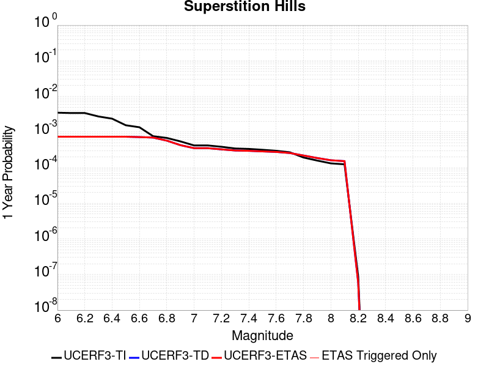 | 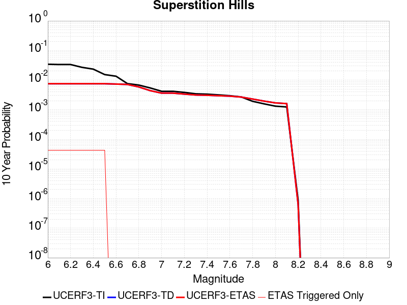 |

| Magnitude | 1 wk TI Prob | 1 wk TD Prob | 1 wk ETAS Prob | 1 wk ETAS/TD Gain | 1 wk ETAS Triggered Only | 1 mo TI Prob | 1 mo TD Prob | 1 mo ETAS Prob | 1 mo ETAS/TD Gain | 1 mo ETAS Triggered Only | 1 yr TI Prob | 1 yr TD Prob | 1 yr ETAS Prob | 1 yr ETAS/TD Gain | 1 yr ETAS Triggered Only | 10 yr TI Prob | 10 yr TD Prob | 10 yr ETAS Prob | 10 yr ETAS/TD Gain | 10 yr ETAS Triggered Only |
|-----|-----|-----|-----|-----|-----|-----|-----|-----|-----|-----|-----|-----|-----|-----|-----|-----|-----|-----|-----|-----|
| 6.0 | 6.6865185E-5 | 1.4137668E-5 | 1.4137668E-5 | 1.0 | 0.0 | 2.8653358E-4 | 6.058869E-5 | 6.058869E-5 | 1.0 | 0.0 | 0.0034829667 | 7.374338E-4 | 7.374338E-4 | 1.0 | 0.0 | 0.03428881 | 0.007520696 | 0.007530621 | 1.0013196 | 1.0E-5 |
| 6.1 | 6.544851E-5 | 1.4137668E-5 | 1.4137668E-5 | 1.0 | 0.0 | 2.8046346E-4 | 6.058869E-5 | 6.058869E-5 | 1.0 | 0.0 | 0.0034092965 | 7.374338E-4 | 7.374338E-4 | 1.0 | 0.0 | 0.033574644 | 0.0075206957 | 0.0075306203 | 1.0013196 | 1.0E-5 |
| 6.2 | 6.544851E-5 | 1.4137668E-5 | 1.4137668E-5 | 1.0 | 0.0 | 2.8046346E-4 | 6.058869E-5 | 6.058869E-5 | 1.0 | 0.0 | 0.0034092965 | 7.374338E-4 | 7.374338E-4 | 1.0 | 0.0 | 0.033574644 | 0.0075206957 | 0.0075306203 | 1.0013196 | 1.0E-5 |
| 6.3 | 5.2402065E-5 | 1.4137667E-5 | 1.4137667E-5 | 1.0 | 0.0 | 2.2456095E-4 | 6.0588685E-5 | 6.0588685E-5 | 1.0 | 0.0 | 0.0027306017 | 7.374338E-4 | 7.374338E-4 | 1.0 | 0.0 | 0.02697292 | 0.0075206906 | 0.007530615 | 1.0013196 | 1.0E-5 |
| 6.4 | 4.542238E-5 | 1.4137666E-5 | 1.4137666E-5 | 1.0 | 0.0 | 1.9465282E-4 | 6.058868E-5 | 6.058868E-5 | 1.0 | 0.0 | 0.0023673223 | 7.3743373E-4 | 7.3743373E-4 | 1.0 | 0.0 | 0.023422617 | 0.007520688 | 0.007530613 | 1.0013196 | 1.0E-5 |
| 6.5 | 2.9672969E-5 | 1.4137665E-5 | 1.4137665E-5 | 1.0 | 0.0 | 1.2716366E-4 | 6.0588678E-5 | 6.0588678E-5 | 1.0 | 0.0 | 0.0015471181 | 7.374337E-4 | 7.374337E-4 | 1.0 | 0.0 | 0.015363912 | 0.0075206826 | 0.0075306077 | 1.0013196 | 1.0E-5 |
| 6.6 | 2.6056105E-5 | 1.3803436E-5 | 1.3803436E-5 | 1.0 | 0.0 | 1.1166424E-4 | 5.915633E-5 | 5.915633E-5 | 1.0 | 0.0 | 0.0013586642 | 7.200064E-4 | 7.200064E-4 | 1.0 | 0.0 | 0.013503874 | 0.0073450673 | 0.0073450673 | 1.0 | 0.0 |
| 6.7 | 1.4611248E-5 | 1.338333E-5 | 1.338333E-5 | 1.0 | 0.0 | 6.261813E-5 | 5.7355956E-5 | 5.7355956E-5 | 1.0 | 0.0 | 7.6210906E-4 | 6.9810095E-4 | 6.9810095E-4 | 1.0 | 0.0 | 0.0075950073 | 0.0071262526 | 0.0071262526 | 1.0 | 0.0 |
| 6.8 | 1.30607E-5 | 1.09787115E-5 | 1.09787115E-5 | 1.0 | 0.0 | 5.597323E-5 | 4.705082E-5 | 4.705082E-5 | 1.0 | 0.0 | 6.8126095E-4 | 5.727019E-4 | 5.727019E-4 | 1.0 | 0.0 | 0.006791762 | 0.005873964 | 0.005873964 | 1.0 | 0.0 |
| 6.9 | 1.0443096E-5 | 8.19507E-6 | 8.19507E-6 | 1.0 | 0.0 | 4.4755358E-5 | 3.512127E-5 | 3.512127E-5 | 1.0 | 0.0 | 5.447602E-4 | 4.2751993E-4 | 4.2751993E-4 | 1.0 | 0.0 | 0.005434267 | 0.004409497 | 0.004409497 | 1.0 | 0.0 |
| 7.0 | 8.045912E-6 | 6.739447E-6 | 6.739447E-6 | 1.0 | 0.0 | 3.4482026E-5 | 2.888303E-5 | 2.888303E-5 | 1.0 | 0.0 | 4.197378E-4 | 3.5159517E-4 | 3.5159517E-4 | 1.0 | 0.0 | 0.0041894587 | 0.0036335257 | 0.0036335257 | 1.0 | 0.0 |
| 7.1 | 8.045912E-6 | 6.739447E-6 | 6.739447E-6 | 1.0 | 0.0 | 3.4482026E-5 | 2.888303E-5 | 2.888303E-5 | 1.0 | 0.0 | 4.197378E-4 | 3.5159517E-4 | 3.5159517E-4 | 1.0 | 0.0 | 0.0041894587 | 0.0036335257 | 0.0036335257 | 1.0 | 0.0 |
| 7.2 | 7.375506E-6 | 6.2463805E-6 | 6.2463805E-6 | 1.0 | 0.0 | 3.1608928E-5 | 2.6769932E-5 | 2.6769932E-5 | 1.0 | 0.0 | 3.8477074E-4 | 3.2587603E-4 | 3.2587603E-4 | 1.0 | 0.0 | 0.003841052 | 0.0033741172 | 0.0033741172 | 1.0 | 0.0 |
| 7.3 | 6.6063913E-6 | 5.798824E-6 | 5.798824E-6 | 1.0 | 0.0 | 2.8312797E-5 | 2.4851872E-5 | 2.4851872E-5 | 1.0 | 0.0 | 3.446538E-4 | 3.0253024E-4 | 3.0253024E-4 | 1.0 | 0.0 | 0.0034411973 | 0.0031383524 | 0.0031383524 | 1.0 | 0.0 |
| 7.4 | 6.4313126E-6 | 5.6802523E-6 | 5.6802523E-6 | 1.0 | 0.0 | 2.7562477E-5 | 2.4343715E-5 | 2.4343715E-5 | 1.0 | 0.0 | 3.355215E-4 | 2.963451E-4 | 2.963451E-4 | 1.0 | 0.0 | 0.0033501536 | 0.003076105 | 0.003076105 | 1.0 | 0.0 |
| 7.5 | 6.0742927E-6 | 5.476088E-6 | 5.476088E-6 | 1.0 | 0.0 | 2.6032423E-5 | 2.3468741E-5 | 2.3468741E-5 | 1.0 | 0.0 | 3.1689866E-4 | 2.8569513E-4 | 2.8569513E-4 | 1.0 | 0.0 | 0.0031644711 | 0.0029679502 | 0.0029679502 | 1.0 | 0.0 |
| 7.6 | 5.6987187E-6 | 5.2943155E-6 | 5.2943155E-6 | 1.0 | 0.0 | 2.4422852E-5 | 2.268973E-5 | 2.268973E-5 | 1.0 | 0.0 | 2.9730765E-4 | 2.762131E-4 | 2.762131E-4 | 1.0 | 0.0 | 0.002969102 | 0.0028712032 | 0.0028712032 | 1.0 | 0.0 |
| 7.7 | 5.1658035E-6 | 4.925336E-6 | 4.925336E-6 | 1.0 | 0.0 | 2.2138971E-5 | 2.1108413E-5 | 2.1108413E-5 | 1.0 | 0.0 | 2.6950863E-4 | 2.5696523E-4 | 2.5696523E-4 | 1.0 | 0.0 | 0.00269182 | 0.0026763005 | 0.0026763005 | 1.0 | 0.0 |
| 7.8 | 3.6864697E-6 | 4.1963563E-6 | 4.1963563E-6 | 1.0 | 0.0 | 1.579906E-5 | 1.7984263E-5 | 1.7984263E-5 | 1.0 | 0.0 | 1.9233658E-4 | 2.1893687E-4 | 2.1893687E-4 | 1.0 | 0.0 | 0.0019217018 | 0.0022895595 | 0.0022895595 | 1.0 | 0.0 |
| 7.9 | 3.0265903E-6 | 3.5636078E-6 | 3.5636078E-6 | 1.0 | 0.0 | 1.2971037E-5 | 1.5272519E-5 | 1.5272519E-5 | 1.0 | 0.0 | 1.5791094E-4 | 1.8592748E-4 | 1.8592748E-4 | 1.0 | 0.0 | 0.0015779877 | 0.0019537222 | 0.0019537222 | 1.0 | 0.0 |
| 8.0 | 2.5271493E-6 | 3.0866524E-6 | 3.0866524E-6 | 1.0 | 0.0 | 1.0830595E-5 | 1.3228446E-5 | 1.3228446E-5 | 1.0 | 0.0 | 1.3185451E-4 | 1.6104484E-4 | 1.6104484E-4 | 1.0 | 0.0 | 0.0013177631 | 0.0016975543 | 0.0016975543 | 1.0 | 0.0 |
| 8.1 | 2.3749135E-6 | 2.9172957E-6 | 2.9172957E-6 | 1.0 | 0.0 | 1.0178161E-5 | 1.2502638E-5 | 1.2502638E-5 | 1.0 | 0.0 | 1.2391206E-4 | 1.522094E-4 | 1.522094E-4 | 1.0 | 0.0 | 0.0012384299 | 0.0016051348 | 0.0016051348 | 1.0 | 0.0 |
| 8.2 | 1.7186406E-9 | 1.1438838E-9 | 1.1438838E-9 | 1.0 | 0.0 | 7.3656024E-9 | 4.902359E-9 | 4.902359E-9 | 1.0 | 0.0 | 8.9676206E-8 | 5.968622E-8 | 5.968622E-8 | 1.0 | 0.0 | 8.9676166E-7 | 6.386644E-7 | 6.386644E-7 | 1.0 | 0.0 |

## Ortigalita (South)
*[(top)](#table-of-contents)*

| 1 Week | 1 Month | 1 Year | 10 Year |
|-----|-----|-----|-----|
|  |  | 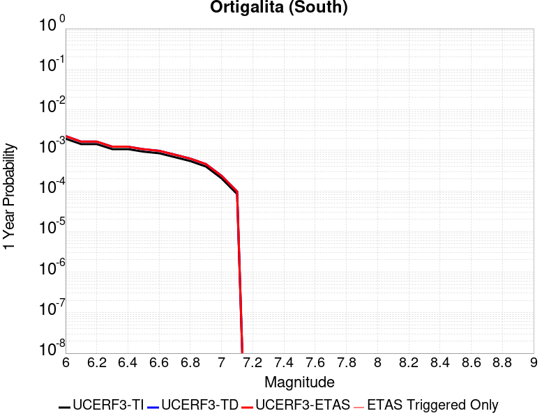 | 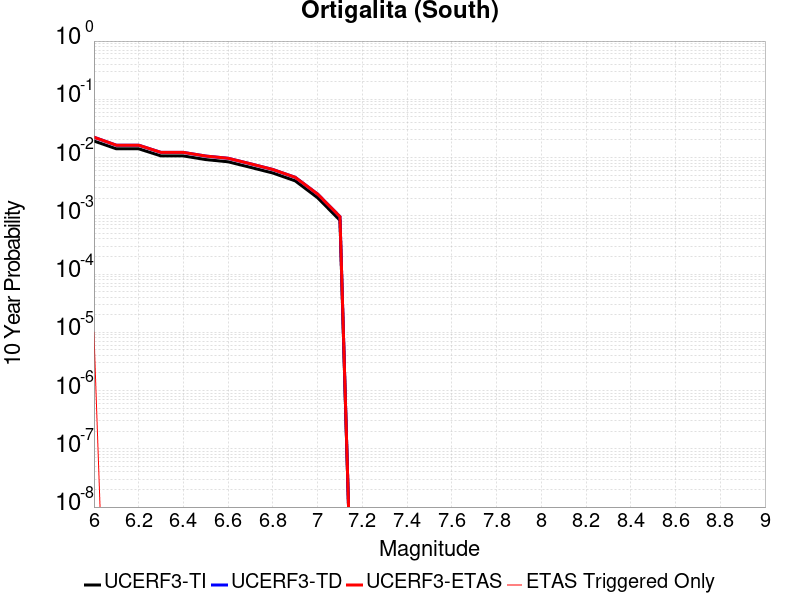 |

| Magnitude | 1 wk TI Prob | 1 wk TD Prob | 1 wk ETAS Prob | 1 wk ETAS/TD Gain | 1 wk ETAS Triggered Only | 1 mo TI Prob | 1 mo TD Prob | 1 mo ETAS Prob | 1 mo ETAS/TD Gain | 1 mo ETAS Triggered Only | 1 yr TI Prob | 1 yr TD Prob | 1 yr ETAS Prob | 1 yr ETAS/TD Gain | 1 yr ETAS Triggered Only | 10 yr TI Prob | 10 yr TD Prob | 10 yr ETAS Prob | 10 yr ETAS/TD Gain | 10 yr ETAS Triggered Only |
|-----|-----|-----|-----|-----|-----|-----|-----|-----|-----|-----|-----|-----|-----|-----|-----|-----|-----|-----|-----|-----|
| 6.0 | 3.72394E-5 | 4.32556E-5 | 4.32556E-5 | 1.0 | 0.0 | 1.5958765E-4 | 1.8536886E-4 | 1.8536886E-4 | 1.0 | 0.0 | 0.0019412481 | 0.0022546863 | 0.0022546863 | 1.0 | 0.0 | 0.019243775 | 0.022334501 | 0.022344278 | 1.0004377 | 1.0E-5 |
| 6.1 | 2.7299884E-5 | 3.1492036E-5 | 3.1492036E-5 | 1.0 | 0.0 | 1.16994255E-4 | 1.349592E-4 | 1.349592E-4 | 1.0 | 0.0 | 0.0014234743 | 0.0016419457 | 0.0016419457 | 1.0 | 0.0 | 0.014143906 | 0.016304072 | 0.016304072 | 1.0 | 0.0 |
| 6.2 | 2.7299884E-5 | 3.1492036E-5 | 3.1492036E-5 | 1.0 | 0.0 | 1.16994255E-4 | 1.349592E-4 | 1.349592E-4 | 1.0 | 0.0 | 0.0014234743 | 0.0016419457 | 0.0016419457 | 1.0 | 0.0 | 0.014143906 | 0.016304072 | 0.016304072 | 1.0 | 0.0 |
| 6.3 | 2.0546433E-5 | 2.3631454E-5 | 2.3631454E-5 | 1.0 | 0.0 | 8.805317E-5 | 1.0127383E-4 | 1.0127383E-4 | 1.0 | 0.0 | 0.00107152 | 0.0012323305 | 0.0012323305 | 1.0 | 0.0 | 0.010663681 | 0.012257031 | 0.012257031 | 1.0 | 0.0 |
| 6.4 | 2.0546433E-5 | 2.3631454E-5 | 2.3631454E-5 | 1.0 | 0.0 | 8.805317E-5 | 1.0127383E-4 | 1.0127383E-4 | 1.0 | 0.0 | 0.00107152 | 0.0012323305 | 0.0012323305 | 1.0 | 0.0 | 0.010663681 | 0.012257031 | 0.012257031 | 1.0 | 0.0 |
| 6.5 | 1.7779594E-5 | 2.0446974E-5 | 2.0446974E-5 | 1.0 | 0.0 | 7.619603E-5 | 8.762703E-5 | 8.762703E-5 | 1.0 | 0.0 | 9.272918E-4 | 0.0010663505 | 0.0010663505 | 1.0 | 0.0 | 0.009234319 | 0.010613804 | 0.010613804 | 1.0 | 0.0 |
| 6.6 | 1.6272212E-5 | 1.8714967E-5 | 1.8714967E-5 | 1.0 | 0.0 | 6.973618E-5 | 8.0204605E-5 | 8.0204605E-5 | 1.0 | 0.0 | 8.487073E-4 | 9.760659E-4 | 9.760659E-4 | 1.0 | 0.0 | 0.008454733 | 0.009719091 | 0.009719091 | 1.0 | 0.0 |
| 6.7 | 1.3051484E-5 | 1.5038758E-5 | 1.5038758E-5 | 1.0 | 0.0 | 5.593373E-5 | 6.445028E-5 | 6.445028E-5 | 1.0 | 0.0 | 6.807804E-4 | 7.844092E-4 | 7.844092E-4 | 1.0 | 0.0 | 0.006786986 | 0.007817388 | 0.007817388 | 1.0 | 0.0 |
| 6.8 | 1.04277415E-5 | 1.1987235E-5 | 1.1987235E-5 | 1.0 | 0.0 | 4.4689557E-5 | 5.1372896E-5 | 5.1372896E-5 | 1.0 | 0.0 | 5.439595E-4 | 6.2529295E-4 | 6.2529295E-4 | 1.0 | 0.0 | 0.0054262993 | 0.00623609 | 0.00623609 | 1.0 | 0.0 |
| 6.9 | 7.639968E-6 | 8.791503E-6 | 8.791503E-6 | 1.0 | 0.0 | 3.274231E-5 | 3.767736E-5 | 3.767736E-5 | 1.0 | 0.0 | 3.9856473E-4 | 4.586312E-4 | 4.586312E-4 | 1.0 | 0.0 | 0.003978506 | 0.004577433 | 0.004577433 | 1.0 | 0.0 |
| 7.0 | 3.919831E-6 | 4.5334014E-6 | 4.5334014E-6 | 1.0 | 0.0 | 1.679917E-5 | 1.942873E-5 | 1.942873E-5 | 1.0 | 0.0 | 2.045107E-4 | 2.3652123E-4 | 2.3652123E-4 | 1.0 | 0.0 | 0.0020432258 | 0.0023629034 | 0.0023629034 | 1.0 | 0.0 |
| 7.1 | 1.6017933E-6 | 1.8570418E-6 | 1.8570418E-6 | 1.0 | 0.0 | 6.8648105E-6 | 7.958732E-6 | 7.958732E-6 | 1.0 | 0.0 | 8.357586E-5 | 9.689432E-5 | 9.689432E-5 | 1.0 | 0.0 | 8.3544437E-4 | 9.686254E-4 | 9.686254E-4 | 1.0 | 0.0 |

## Greenville (So) 2011 CFM
*[(top)](#table-of-contents)*

| 1 Week | 1 Month | 1 Year | 10 Year |
|-----|-----|-----|-----|
| 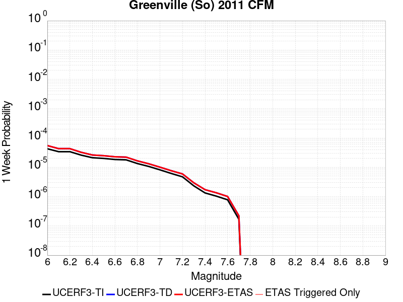 |  | 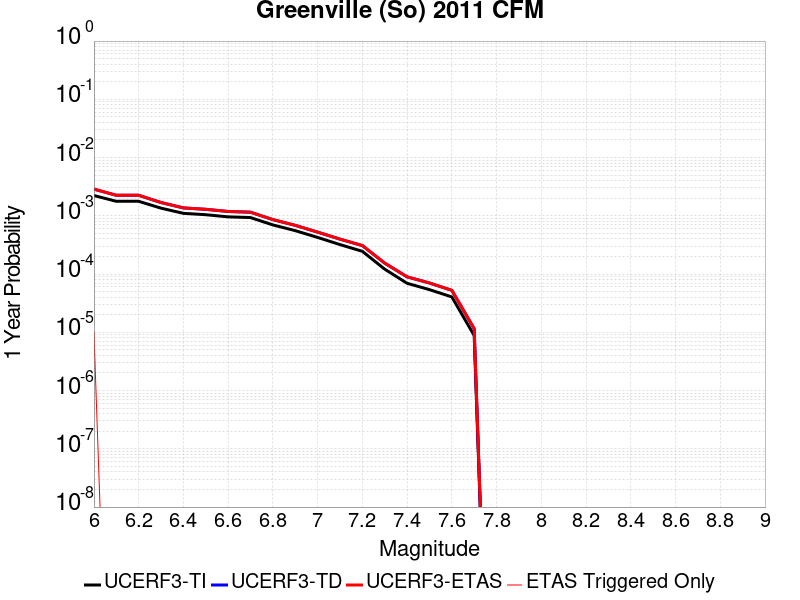 | 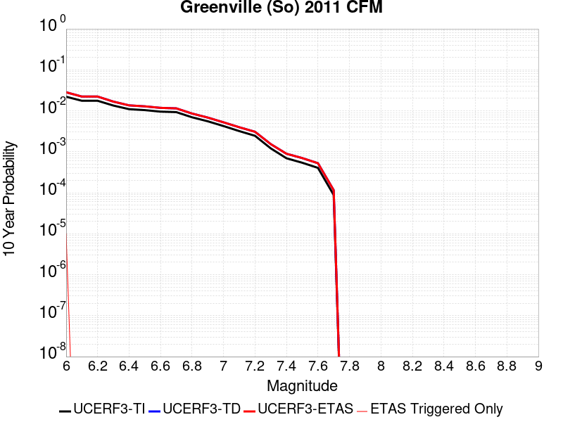 |

| Magnitude | 1 wk TI Prob | 1 wk TD Prob | 1 wk ETAS Prob | 1 wk ETAS/TD Gain | 1 wk ETAS Triggered Only | 1 mo TI Prob | 1 mo TD Prob | 1 mo ETAS Prob | 1 mo ETAS/TD Gain | 1 mo ETAS Triggered Only | 1 yr TI Prob | 1 yr TD Prob | 1 yr ETAS Prob | 1 yr ETAS/TD Gain | 1 yr ETAS Triggered Only | 10 yr TI Prob | 10 yr TD Prob | 10 yr ETAS Prob | 10 yr ETAS/TD Gain | 10 yr ETAS Triggered Only |
|-----|-----|-----|-----|-----|-----|-----|-----|-----|-----|-----|-----|-----|-----|-----|-----|-----|-----|-----|-----|-----|
| 6.0 | 4.279693E-5 | 5.5040568E-5 | 5.5040568E-5 | 1.0 | 0.0 | 1.8340252E-4 | 2.3586866E-4 | 2.3586866E-4 | 1.0 | 0.0 | 0.0022306389 | 0.0028681692 | 0.0028781404 | 1.0034765 | 1.0E-5 | 0.022083808 | 0.028338658 | 0.028348375 | 1.0003428 | 1.0E-5 |
| 6.1 | 3.4037297E-5 | 4.319238E-5 | 4.319238E-5 | 1.0 | 0.0 | 1.4586597E-4 | 1.8509808E-4 | 1.8509808E-4 | 1.0 | 0.0 | 0.0017744715 | 0.0022513992 | 0.0022513992 | 1.0 | 0.0 | 0.01760369 | 0.022303047 | 0.022303047 | 1.0 | 0.0 |
| 6.2 | 3.4037297E-5 | 4.319238E-5 | 4.319238E-5 | 1.0 | 0.0 | 1.4586597E-4 | 1.8509808E-4 | 1.8509808E-4 | 1.0 | 0.0 | 0.0017744715 | 0.0022513992 | 0.0022513992 | 1.0 | 0.0 | 0.01760369 | 0.022303047 | 0.022303047 | 1.0 | 0.0 |
| 6.3 | 2.5956324E-5 | 3.242939E-5 | 3.242939E-5 | 1.0 | 0.0 | 1.11236644E-4 | 1.3897609E-4 | 1.3897609E-4 | 1.0 | 0.0 | 0.0013534647 | 0.0016907848 | 0.0016907848 | 1.0 | 0.0 | 0.013452509 | 0.016786316 | 0.016786316 | 1.0 | 0.0 |
| 6.4 | 2.1145053E-5 | 2.6197793E-5 | 2.6197793E-5 | 1.0 | 0.0 | 9.061851E-5 | 1.1227157E-4 | 1.1227157E-4 | 1.0 | 0.0 | 0.0011027219 | 0.0013660807 | 0.0013660807 | 1.0 | 0.0 | 0.01097266 | 0.013580576 | 0.013580576 | 1.0 | 0.0 |
| 6.5 | 2.0030959E-5 | 2.4795921E-5 | 2.4795921E-5 | 1.0 | 0.0 | 8.584414E-5 | 1.0626408E-4 | 1.0626408E-4 | 1.0 | 0.0 | 0.0010446513 | 0.0012930284 | 0.0012930284 | 1.0 | 0.0 | 0.010397541 | 0.01285873 | 0.01285873 | 1.0 | 0.0 |
| 6.6 | 1.8395405E-5 | 2.275458E-5 | 2.275458E-5 | 1.0 | 0.0 | 7.8835066E-5 | 9.7516146E-5 | 9.7516146E-5 | 1.0 | 0.0 | 9.5939427E-4 | 0.0011866409 | 0.0011866409 | 1.0 | 0.0 | 0.009552629 | 0.01180643 | 0.01180643 | 1.0 | 0.0 |
| 6.7 | 1.7883482E-5 | 2.2125625E-5 | 2.2125625E-5 | 1.0 | 0.0 | 7.664124E-5 | 9.482082E-5 | 9.482082E-5 | 1.0 | 0.0 | 9.3270757E-4 | 0.0011538607 | 0.0011538607 | 1.0 | 0.0 | 0.009288026 | 0.011482077 | 0.011482077 | 1.0 | 0.0 |
| 6.8 | 1.3373564E-5 | 1.650608E-5 | 1.650608E-5 | 1.0 | 0.0 | 5.7314013E-5 | 7.0738504E-5 | 7.0738504E-5 | 1.0 | 0.0 | 6.975747E-4 | 8.609158E-4 | 8.609158E-4 | 1.0 | 0.0 | 0.0069538904 | 0.008577745 | 0.008577745 | 1.0 | 0.0 |
| 6.9 | 1.06692905E-5 | 1.3152695E-5 | 1.3152695E-5 | 1.0 | 0.0 | 4.5724726E-5 | 5.636754E-5 | 5.636754E-5 | 1.0 | 0.0 | 5.5655633E-4 | 6.8606995E-4 | 6.8606995E-4 | 1.0 | 0.0 | 0.005551645 | 0.006841082 | 0.006841082 | 1.0 | 0.0 |
| 7.0 | 8.157512E-6 | 1.0062752E-5 | 1.0062752E-5 | 1.0 | 0.0 | 3.4960296E-5 | 4.312539E-5 | 4.312539E-5 | 1.0 | 0.0 | 4.2555845E-4 | 5.2492885E-4 | 5.2492885E-4 | 1.0 | 0.0 | 0.004247444 | 0.0052376967 | 0.0052376967 | 1.0 | 0.0 |
| 7.1 | 6.1467113E-6 | 7.627545E-6 | 7.627545E-6 | 1.0 | 0.0 | 2.6342783E-5 | 3.2689073E-5 | 3.2689073E-5 | 1.0 | 0.0 | 3.206762E-4 | 3.9791764E-4 | 3.9791764E-4 | 1.0 | 0.0 | 0.0032021382 | 0.0039725704 | 0.0039725704 | 1.0 | 0.0 |
| 7.2 | 4.713467E-6 | 5.9142685E-6 | 5.9142685E-6 | 1.0 | 0.0 | 2.0200418E-5 | 2.5346622E-5 | 2.5346622E-5 | 1.0 | 0.0 | 2.4591232E-4 | 3.0855203E-4 | 3.0855203E-4 | 1.0 | 0.0 | 0.0024564038 | 0.0030816782 | 0.0030816782 | 1.0 | 0.0 |
| 7.3 | 2.3266216E-6 | 2.954067E-6 | 2.954067E-6 | 1.0 | 0.0 | 9.971197E-6 | 1.2660226E-5 | 1.2660226E-5 | 1.0 | 0.0 | 1.2139256E-4 | 1.541275E-4 | 1.541275E-4 | 1.0 | 0.0 | 0.0012132627 | 0.0015404817 | 0.0015404817 | 1.0 | 0.0 |
| 7.4 | 1.3314E-6 | 1.7179866E-6 | 1.7179866E-6 | 1.0 | 0.0 | 5.7059874E-6 | 7.362779E-6 | 7.362779E-6 | 1.0 | 0.0 | 6.946818E-5 | 8.96382E-5 | 8.96382E-5 | 1.0 | 0.0 | 6.9446466E-4 | 8.963211E-4 | 8.963211E-4 | 1.0 | 0.0 |
| 7.5 | 1.0362941E-6 | 1.3469155E-6 | 1.3469155E-6 | 1.0 | 0.0 | 4.4412527E-6 | 5.7724824E-6 | 5.7724824E-6 | 1.0 | 0.0 | 5.407091E-5 | 7.0277754E-5 | 7.0277754E-5 | 1.0 | 0.0 | 5.405776E-4 | 7.028451E-4 | 7.028451E-4 | 1.0 | 0.0 |
| 7.6 | 7.764784E-7 | 1.0088881E-6 | 1.0088881E-6 | 1.0 | 0.0 | 3.3277602E-6 | 4.3237997E-6 | 4.3237997E-6 | 1.0 | 0.0 | 4.0514726E-5 | 5.264103E-5 | 5.264103E-5 | 1.0 | 0.0 | 4.050734E-4 | 5.265317E-4 | 5.265317E-4 | 1.0 | 0.0 |
| 7.7 | 1.6927763E-7 | 2.2140186E-7 | 2.2140186E-7 | 1.0 | 0.0 | 7.2547533E-7 | 9.488648E-7 | 9.488648E-7 | 1.0 | 0.0 | 8.832627E-6 | 1.1552371E-5 | 1.1552371E-5 | 1.0 | 0.0 | 8.8322755E-5 | 1.1554653E-4 | 1.1554653E-4 | 1.0 | 0.0 |

## Channel Islands Western Deep Ramp
*[(top)](#table-of-contents)*

| 1 Week | 1 Month | 1 Year | 10 Year |
|-----|-----|-----|-----|
|  | 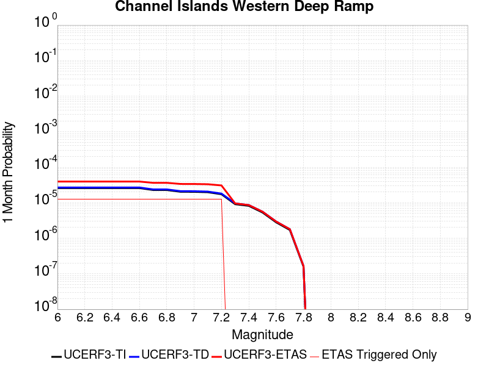 | 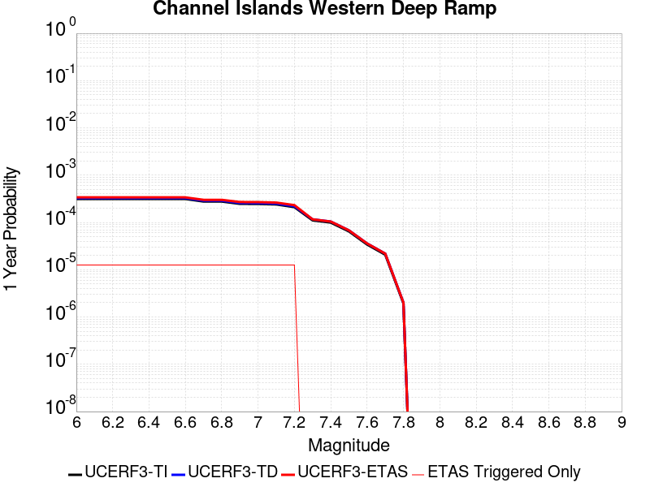 | 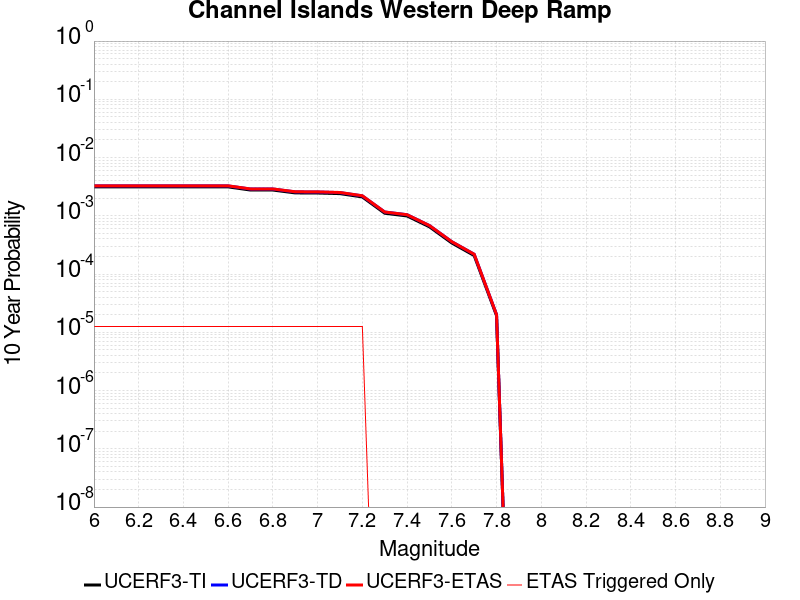 |

| Magnitude | 1 wk TI Prob | 1 wk TD Prob | 1 wk ETAS Prob | 1 wk ETAS/TD Gain | 1 wk ETAS Triggered Only | 1 mo TI Prob | 1 mo TD Prob | 1 mo ETAS Prob | 1 mo ETAS/TD Gain | 1 mo ETAS Triggered Only | 1 yr TI Prob | 1 yr TD Prob | 1 yr ETAS Prob | 1 yr ETAS/TD Gain | 1 yr ETAS Triggered Only | 10 yr TI Prob | 10 yr TD Prob | 10 yr ETAS Prob | 10 yr ETAS/TD Gain | 10 yr ETAS Triggered Only |
|-----|-----|-----|-----|-----|-----|-----|-----|-----|-----|-----|-----|-----|-----|-----|-----|-----|-----|-----|-----|-----|
| 6.0 | 6.0213506E-6 | 6.2548684E-6 | 6.2548684E-6 | 1.0 | 0.0 | 2.5805533E-5 | 2.6806329E-5 | 3.680606E-5 | 1.3730363 | 1.0E-5 | 3.1413708E-4 | 3.2632265E-4 | 3.3631938E-4 | 1.0306345 | 1.0E-5 | 0.0031369338 | 0.0032588763 | 0.0032688437 | 1.0030586 | 1.0E-5 |
| 6.1 | 6.0213506E-6 | 6.2548684E-6 | 6.2548684E-6 | 1.0 | 0.0 | 2.5805533E-5 | 2.6806329E-5 | 3.680606E-5 | 1.3730363 | 1.0E-5 | 3.1413708E-4 | 3.2632265E-4 | 3.3631938E-4 | 1.0306345 | 1.0E-5 | 0.0031369338 | 0.0032588763 | 0.0032688437 | 1.0030586 | 1.0E-5 |
| 6.2 | 6.0213506E-6 | 6.2548684E-6 | 6.2548684E-6 | 1.0 | 0.0 | 2.5805533E-5 | 2.6806329E-5 | 3.680606E-5 | 1.3730363 | 1.0E-5 | 3.1413708E-4 | 3.2632265E-4 | 3.3631938E-4 | 1.0306345 | 1.0E-5 | 0.0031369338 | 0.0032588763 | 0.0032688437 | 1.0030586 | 1.0E-5 |
| 6.3 | 6.0213506E-6 | 6.2548684E-6 | 6.2548684E-6 | 1.0 | 0.0 | 2.5805533E-5 | 2.6806329E-5 | 3.680606E-5 | 1.3730363 | 1.0E-5 | 3.1413708E-4 | 3.2632265E-4 | 3.3631938E-4 | 1.0306345 | 1.0E-5 | 0.0031369338 | 0.0032588763 | 0.0032688437 | 1.0030586 | 1.0E-5 |
| 6.4 | 6.0213506E-6 | 6.2548684E-6 | 6.2548684E-6 | 1.0 | 0.0 | 2.5805533E-5 | 2.6806329E-5 | 3.680606E-5 | 1.3730363 | 1.0E-5 | 3.1413708E-4 | 3.2632265E-4 | 3.3631938E-4 | 1.0306345 | 1.0E-5 | 0.0031369338 | 0.0032588763 | 0.0032688437 | 1.0030586 | 1.0E-5 |
| 6.5 | 6.0213506E-6 | 6.2548684E-6 | 6.2548684E-6 | 1.0 | 0.0 | 2.5805533E-5 | 2.6806329E-5 | 3.680606E-5 | 1.3730363 | 1.0E-5 | 3.1413708E-4 | 3.2632265E-4 | 3.3631938E-4 | 1.0306345 | 1.0E-5 | 0.0031369338 | 0.0032588763 | 0.0032688437 | 1.0030586 | 1.0E-5 |
| 6.6 | 6.0213506E-6 | 6.2548684E-6 | 6.2548684E-6 | 1.0 | 0.0 | 2.5805533E-5 | 2.6806329E-5 | 3.680606E-5 | 1.3730363 | 1.0E-5 | 3.1413708E-4 | 3.2632265E-4 | 3.3631938E-4 | 1.0306345 | 1.0E-5 | 0.0031369338 | 0.0032588763 | 0.0032688437 | 1.0030586 | 1.0E-5 |
| 6.7 | 5.313309E-6 | 5.5252403E-6 | 5.5252403E-6 | 1.0 | 0.0 | 2.2771126E-5 | 2.367941E-5 | 3.3679175E-5 | 1.4222978 | 1.0E-5 | 2.772032E-4 | 2.8826276E-4 | 2.982599E-4 | 1.0346806 | 1.0E-5 | 0.0027685766 | 0.0028792918 | 0.002889263 | 1.003463 | 1.0E-5 |
| 6.8 | 5.313309E-6 | 5.5252403E-6 | 5.5252403E-6 | 1.0 | 0.0 | 2.2771126E-5 | 2.367941E-5 | 3.3679175E-5 | 1.4222978 | 1.0E-5 | 2.772032E-4 | 2.8826276E-4 | 2.982599E-4 | 1.0346806 | 1.0E-5 | 0.0027685766 | 0.0028792918 | 0.002889263 | 1.003463 | 1.0E-5 |
| 6.9 | 4.744377E-6 | 4.9394303E-6 | 4.9394303E-6 | 1.0 | 0.0 | 2.0332885E-5 | 2.1168837E-5 | 3.1168624E-5 | 1.4723825 | 1.0E-5 | 2.4752476E-4 | 2.5770385E-4 | 2.6770125E-4 | 1.0387943 | 1.0E-5 | 0.0024724922 | 0.0025744175 | 0.0025843917 | 1.0038744 | 1.0E-5 |
| 7.0 | 4.722209E-6 | 4.9164732E-6 | 4.9164732E-6 | 1.0 | 0.0 | 2.0237881E-5 | 2.107045E-5 | 3.1070238E-5 | 1.4745883 | 1.0E-5 | 2.4636835E-4 | 2.5650626E-4 | 2.665037E-4 | 1.0389754 | 1.0E-5 | 0.002460954 | 0.0025624693 | 0.0025724438 | 1.0038925 | 1.0E-5 |
| 7.1 | 4.611174E-6 | 4.801409E-6 | 4.801409E-6 | 1.0 | 0.0 | 1.9762025E-5 | 2.0577325E-5 | 3.057712E-5 | 1.4859618 | 1.0E-5 | 2.4057609E-4 | 2.5050386E-4 | 2.6050137E-4 | 1.0399096 | 1.0E-5 | 0.002403158 | 0.002502582 | 0.002512557 | 1.0039859 | 1.0E-5 |
| 7.2 | 4.043994E-6 | 4.2120264E-6 | 4.2120264E-6 | 1.0 | 0.0 | 1.7331287E-5 | 1.8051438E-5 | 2.8051258E-5 | 1.5539625 | 1.0E-5 | 2.10988E-4 | 2.1975765E-4 | 2.2975546E-4 | 1.0454947 | 1.0E-5 | 0.002107878 | 0.0021957543 | 0.0022057323 | 1.0045443 | 1.0E-5 |
| 7.3 | 2.1233036E-6 | 2.2297875E-6 | 2.2297875E-6 | 1.0 | 0.0 | 9.099841E-6 | 9.556197E-6 | 9.556197E-6 | 1.0 | 0.0 | 1.1078493E-4 | 1.1634055E-4 | 1.1634055E-4 | 1.0 | 0.0 | 0.0011072971 | 0.001162802 | 0.001162802 | 1.0 | 0.0 |
| 7.4 | 1.9051884E-6 | 2.0014973E-6 | 2.0014973E-6 | 1.0 | 0.0 | 8.165067E-6 | 8.577817E-6 | 8.577817E-6 | 1.0 | 0.0 | 9.940516E-5 | 1.0442998E-4 | 1.0442998E-4 | 1.0 | 0.0 | 9.93607E-4 | 0.0010438144 | 0.0010438144 | 1.0 | 0.0 |
| 7.5 | 1.2408497E-6 | 1.3038839E-6 | 1.3038839E-6 | 1.0 | 0.0 | 5.317916E-6 | 5.588062E-6 | 5.588062E-6 | 1.0 | 0.0 | 6.4743705E-5 | 6.8032554E-5 | 6.8032554E-5 | 1.0 | 0.0 | 6.4724847E-4 | 6.8011944E-4 | 6.8011944E-4 | 1.0 | 0.0 |
| 7.6 | 6.5440025E-7 | 6.886718E-7 | 6.886718E-7 | 1.0 | 0.0 | 2.8045695E-6 | 2.9514472E-6 | 2.9514472E-6 | 1.0 | 0.0 | 3.4145098E-5 | 3.593329E-5 | 3.593329E-5 | 1.0 | 0.0 | 3.4139853E-4 | 3.5927625E-4 | 3.5927625E-4 | 1.0 | 0.0 |
| 7.7 | 3.985963E-7 | 4.1930787E-7 | 4.1930787E-7 | 1.0 | 0.0 | 1.7082689E-6 | 1.7970326E-6 | 1.7970326E-6 | 1.0 | 0.0 | 2.0797976E-5 | 2.1878664E-5 | 2.1878664E-5 | 1.0 | 0.0 | 2.0796029E-4 | 2.1876628E-4 | 2.1876628E-4 | 1.0 | 0.0 |
| 7.8 | 3.706329E-8 | 3.8591796E-8 | 3.8591796E-8 | 1.0 | 0.0 | 1.5884267E-7 | 1.653934E-7 | 1.653934E-7 | 1.0 | 0.0 | 1.9339077E-6 | 2.0136629E-6 | 2.0136629E-6 | 1.0 | 0.0 | 1.933891E-5 | 2.0136458E-5 | 2.0136458E-5 | 1.0 | 0.0 |

## South Klamath Lake West
*[(top)](#table-of-contents)*

| 1 Week | 1 Month | 1 Year | 10 Year |
|-----|-----|-----|-----|
| 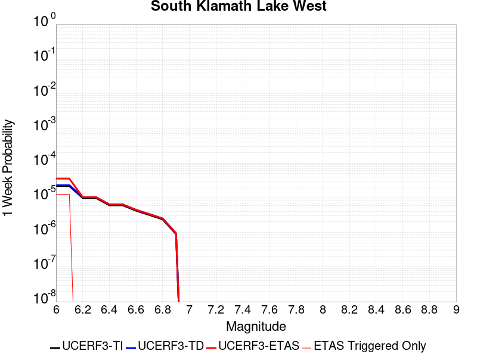 | 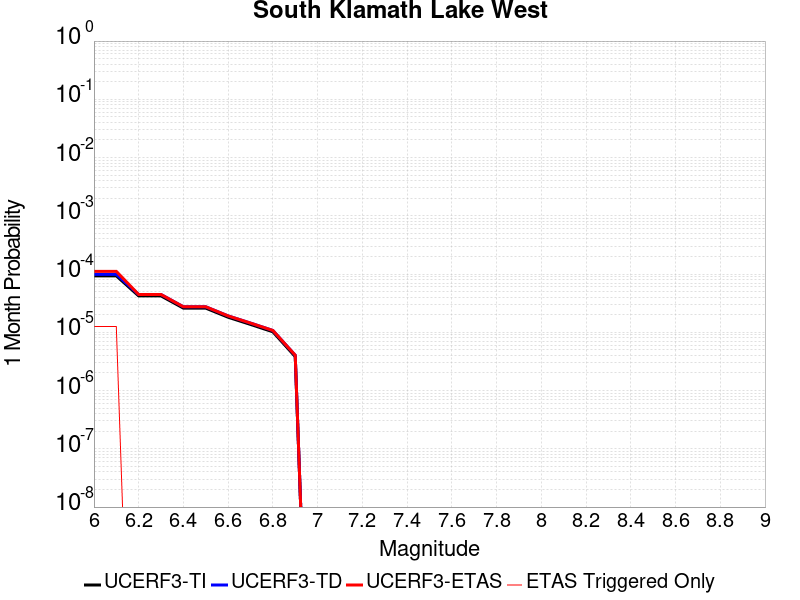 | 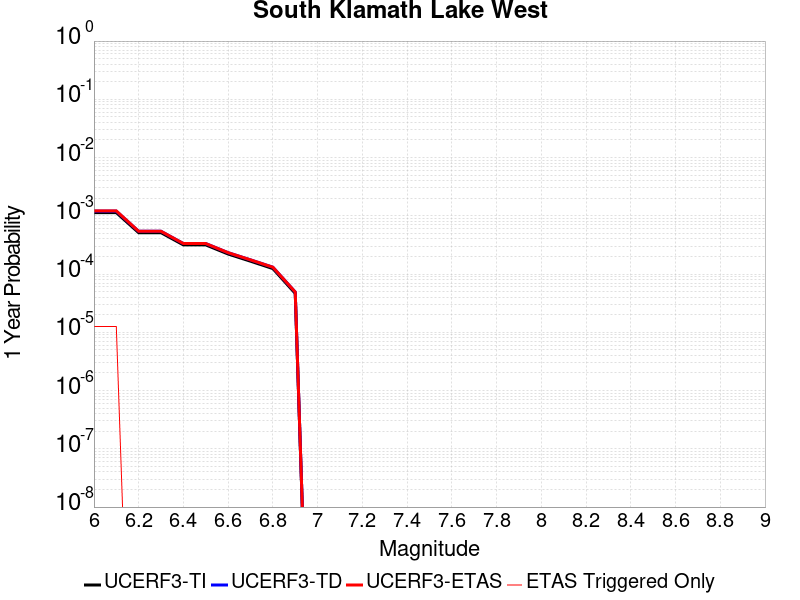 | 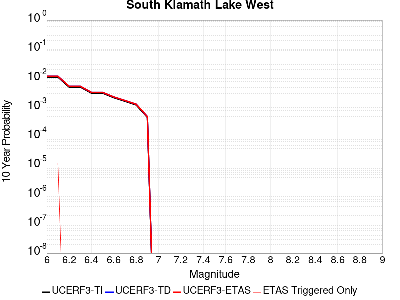 |

| Magnitude | 1 wk TI Prob | 1 wk TD Prob | 1 wk ETAS Prob | 1 wk ETAS/TD Gain | 1 wk ETAS Triggered Only | 1 mo TI Prob | 1 mo TD Prob | 1 mo ETAS Prob | 1 mo ETAS/TD Gain | 1 mo ETAS Triggered Only | 1 yr TI Prob | 1 yr TD Prob | 1 yr ETAS Prob | 1 yr ETAS/TD Gain | 1 yr ETAS Triggered Only | 10 yr TI Prob | 10 yr TD Prob | 10 yr ETAS Prob | 10 yr ETAS/TD Gain | 10 yr ETAS Triggered Only |
|-----|-----|-----|-----|-----|-----|-----|-----|-----|-----|-----|-----|-----|-----|-----|-----|-----|-----|-----|-----|-----|
| 6.0 | 2.174025E-5 | 2.3042025E-5 | 3.3041793E-5 | 1.4339796 | 1.0E-5 | 9.3169176E-5 | 9.874817E-5 | 1.0874718E-4 | 1.1012577 | 1.0E-5 | 0.0011337444 | 0.0012016617 | 0.0012116497 | 1.0083119 | 1.0E-5 | 0.011279777 | 0.0119582405 | 0.011968121 | 1.0008262 | 1.0E-5 |
| 6.1 | 2.174025E-5 | 2.3042025E-5 | 3.3041793E-5 | 1.4339796 | 1.0E-5 | 9.3169176E-5 | 9.874817E-5 | 1.0874718E-4 | 1.1012577 | 1.0E-5 | 0.0011337444 | 0.0012016617 | 0.0012116497 | 1.0083119 | 1.0E-5 | 0.011279777 | 0.0119582405 | 0.011968121 | 1.0008262 | 1.0E-5 |
| 6.2 | 9.834929E-6 | 1.0393841E-5 | 1.0393841E-5 | 1.0 | 0.0 | 4.2149015E-5 | 4.4544326E-5 | 4.4544326E-5 | 1.0 | 0.0 | 5.1304343E-4 | 5.422012E-4 | 5.422012E-4 | 1.0 | 0.0 | 0.0051186057 | 0.0054096854 | 0.0054096854 | 1.0 | 0.0 |
| 6.3 | 9.834929E-6 | 1.0393841E-5 | 1.0393841E-5 | 1.0 | 0.0 | 4.2149015E-5 | 4.4544326E-5 | 4.4544326E-5 | 1.0 | 0.0 | 5.1304343E-4 | 5.422012E-4 | 5.422012E-4 | 1.0 | 0.0 | 0.0051186057 | 0.0054096854 | 0.0054096854 | 1.0 | 0.0 |
| 6.4 | 6.066321E-6 | 6.40043E-6 | 6.40043E-6 | 1.0 | 0.0 | 2.5998259E-5 | 2.743014E-5 | 2.743014E-5 | 1.0 | 0.0 | 3.1648282E-4 | 3.3391351E-4 | 3.3391351E-4 | 1.0 | 0.0 | 0.0031603249 | 0.0033343881 | 0.0033343881 | 1.0 | 0.0 |
| 6.5 | 6.066321E-6 | 6.40043E-6 | 6.40043E-6 | 1.0 | 0.0 | 2.5998259E-5 | 2.743014E-5 | 2.743014E-5 | 1.0 | 0.0 | 3.1648282E-4 | 3.3391351E-4 | 3.3391351E-4 | 1.0 | 0.0 | 0.0031603249 | 0.0033343881 | 0.0033343881 | 1.0 | 0.0 |
| 6.6 | 4.2321803E-6 | 4.461291E-6 | 4.461291E-6 | 1.0 | 0.0 | 1.8137789E-5 | 1.9119685E-5 | 1.9119685E-5 | 1.0 | 0.0 | 2.208052E-4 | 2.3275832E-4 | 2.3275832E-4 | 1.0 | 0.0 | 0.0022058594 | 0.0023252473 | 0.0023252473 | 1.0 | 0.0 |
| 6.7 | 3.186646E-6 | 3.360305E-6 | 3.360305E-6 | 1.0 | 0.0 | 1.3656982E-5 | 1.4401232E-5 | 1.4401232E-5 | 1.0 | 0.0 | 1.6626107E-4 | 1.7532158E-4 | 1.7532158E-4 | 1.0 | 0.0 | 0.0016613674 | 0.0017518997 | 0.0017518997 | 1.0 | 0.0 |
| 6.8 | 2.380121E-6 | 2.510907E-6 | 2.510907E-6 | 1.0 | 0.0 | 1.0200479E-5 | 1.07609885E-5 | 1.07609885E-5 | 1.0 | 0.0 | 1.2418375E-4 | 1.3100762E-4 | 1.3100762E-4 | 1.0 | 0.0 | 0.0012411437 | 0.0013093497 | 0.0013093497 | 1.0 | 0.0 |
| 6.9 | 8.928287E-7 | 9.4302504E-7 | 9.4302504E-7 | 1.0 | 0.0 | 3.826403E-6 | 4.0415307E-6 | 4.0415307E-6 | 1.0 | 0.0 | 4.658546E-5 | 4.9204747E-5 | 4.9204747E-5 | 1.0 | 0.0 | 4.6575698E-4 | 4.9196015E-4 | 4.9196015E-4 | 1.0 | 0.0 |

## East Huasna 2011 CFM
*[(top)](#table-of-contents)*

| 1 Week | 1 Month | 1 Year | 10 Year |
|-----|-----|-----|-----|
|  |  | 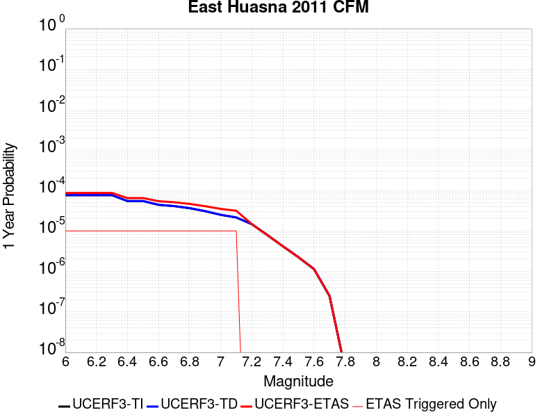 |  |

| Magnitude | 1 wk TI Prob | 1 wk TD Prob | 1 wk ETAS Prob | 1 wk ETAS/TD Gain | 1 wk ETAS Triggered Only | 1 mo TI Prob | 1 mo TD Prob | 1 mo ETAS Prob | 1 mo ETAS/TD Gain | 1 mo ETAS Triggered Only | 1 yr TI Prob | 1 yr TD Prob | 1 yr ETAS Prob | 1 yr ETAS/TD Gain | 1 yr ETAS Triggered Only | 10 yr TI Prob | 10 yr TD Prob | 10 yr ETAS Prob | 10 yr ETAS/TD Gain | 10 yr ETAS Triggered Only |
|-----|-----|-----|-----|-----|-----|-----|-----|-----|-----|-----|-----|-----|-----|-----|-----|-----|-----|-----|-----|-----|
| 6.0 | 1.4658423E-6 | 1.471566E-6 | 1.471566E-6 | 1.0 | 0.0 | 6.282166E-6 | 6.3066964E-6 | 6.3066964E-6 | 1.0 | 0.0 | 7.6482684E-5 | 7.67814E-5 | 8.678063E-5 | 1.1302298 | 1.0E-5 | 7.645637E-4 | 7.6755567E-4 | 7.77548E-4 | 1.0130184 | 1.0E-5 |
| 6.1 | 1.4658423E-6 | 1.471566E-6 | 1.471566E-6 | 1.0 | 0.0 | 6.282166E-6 | 6.3066964E-6 | 6.3066964E-6 | 1.0 | 0.0 | 7.6482684E-5 | 7.67814E-5 | 8.678063E-5 | 1.1302298 | 1.0E-5 | 7.645637E-4 | 7.6755567E-4 | 7.77548E-4 | 1.0130184 | 1.0E-5 |
| 6.2 | 1.4658423E-6 | 1.471566E-6 | 1.471566E-6 | 1.0 | 0.0 | 6.282166E-6 | 6.3066964E-6 | 6.3066964E-6 | 1.0 | 0.0 | 7.6482684E-5 | 7.67814E-5 | 8.678063E-5 | 1.1302298 | 1.0E-5 | 7.645637E-4 | 7.6755567E-4 | 7.77548E-4 | 1.0130184 | 1.0E-5 |
| 6.3 | 1.4658423E-6 | 1.471566E-6 | 1.471566E-6 | 1.0 | 0.0 | 6.282166E-6 | 6.3066964E-6 | 6.3066964E-6 | 1.0 | 0.0 | 7.6482684E-5 | 7.67814E-5 | 8.678063E-5 | 1.1302298 | 1.0E-5 | 7.645637E-4 | 7.6755567E-4 | 7.77548E-4 | 1.0130184 | 1.0E-5 |
| 6.4 | 1.0488257E-6 | 1.0527515E-6 | 1.0527515E-6 | 1.0 | 0.0 | 4.4949593E-6 | 4.5117845E-6 | 4.5117845E-6 | 1.0 | 0.0 | 5.472476E-5 | 5.492961E-5 | 6.492906E-5 | 1.1820412 | 1.0E-5 | 5.4711284E-4 | 5.491622E-4 | 5.591567E-4 | 1.0181996 | 1.0E-5 |
| 6.5 | 1.0488257E-6 | 1.0527515E-6 | 1.0527515E-6 | 1.0 | 0.0 | 4.4949593E-6 | 4.5117845E-6 | 4.5117845E-6 | 1.0 | 0.0 | 5.472476E-5 | 5.492961E-5 | 6.492906E-5 | 1.1820412 | 1.0E-5 | 5.4711284E-4 | 5.491622E-4 | 5.591567E-4 | 1.0181996 | 1.0E-5 |
| 6.6 | 8.463064E-7 | 8.4936323E-7 | 8.4936323E-7 | 1.0 | 0.0 | 3.6270226E-6 | 3.6401232E-6 | 3.6401232E-6 | 1.0 | 0.0 | 4.4158103E-5 | 4.4317607E-5 | 5.4317163E-5 | 1.225634 | 1.0E-5 | 4.414933E-4 | 4.4308856E-4 | 4.5308413E-4 | 1.0225588 | 1.0E-5 |
| 6.7 | 7.876149E-7 | 7.902533E-7 | 7.902533E-7 | 1.0 | 0.0 | 3.375488E-6 | 3.3867955E-6 | 3.3867955E-6 | 1.0 | 0.0 | 4.109579E-5 | 4.1233463E-5 | 5.1233048E-5 | 1.2425115 | 1.0E-5 | 4.108819E-4 | 4.1225873E-4 | 4.222546E-4 | 1.0242466 | 1.0E-5 |
| 6.8 | 6.9940785E-7 | 7.0165777E-7 | 7.0165777E-7 | 1.0 | 0.0 | 2.9974588E-6 | 3.0071012E-6 | 3.0071012E-6 | 1.0 | 0.0 | 3.649345E-5 | 3.6610847E-5 | 4.661048E-5 | 1.273133 | 1.0E-5 | 3.6487455E-4 | 3.6604863E-4 | 3.7604498E-4 | 1.0273088 | 1.0E-5 |
| 6.9 | 5.899658E-7 | 5.9155997E-7 | 5.9155997E-7 | 1.0 | 0.0 | 2.5284223E-6 | 2.5352545E-6 | 2.5352545E-6 | 1.0 | 0.0 | 3.0783107E-5 | 3.086629E-5 | 4.086598E-5 | 1.323968 | 1.0E-5 | 3.0778843E-4 | 3.086203E-4 | 3.186172E-4 | 1.0323923 | 1.0E-5 |
| 7.0 | 4.793814E-7 | 4.803273E-7 | 4.803273E-7 | 1.0 | 0.0 | 2.05449E-6 | 2.058544E-6 | 2.058544E-6 | 1.0 | 0.0 | 2.501313E-5 | 2.5062485E-5 | 3.5062236E-5 | 1.3989928 | 1.0E-5 | 2.5010316E-4 | 2.505968E-4 | 2.6059427E-4 | 1.0398947 | 1.0E-5 |
| 7.1 | 4.1256908E-7 | 4.129941E-7 | 4.129941E-7 | 1.0 | 0.0 | 1.768152E-6 | 1.7699736E-6 | 1.7699736E-6 | 1.0 | 0.0 | 2.1527037E-5 | 2.1549216E-5 | 3.1549E-5 | 1.464044 | 1.0E-5 | 2.1524953E-4 | 2.1547142E-4 | 2.2546925E-4 | 1.0463998 | 1.0E-5 |
| 7.2 | 2.822599E-7 | 2.8161418E-7 | 2.8161418E-7 | 1.0 | 0.0 | 1.2096847E-6 | 1.2069174E-6 | 1.2069174E-6 | 1.0 | 0.0 | 1.47278115E-5 | 1.4694121E-5 | 1.4694121E-5 | 1.0 | 0.0 | 1.4726835E-4 | 1.4693156E-4 | 1.4693156E-4 | 1.0 | 0.0 |
| 7.3 | 1.5261652E-7 | 1.5075021E-7 | 1.5075021E-7 | 1.0 | 0.0 | 6.540707E-7 | 6.460722E-7 | 6.460722E-7 | 1.0 | 0.0 | 7.963281E-6 | 7.8659E-6 | 7.8659E-6 | 1.0 | 0.0 | 7.962996E-5 | 7.865624E-5 | 7.865624E-5 | 1.0 | 0.0 |
| 7.4 | 7.976414E-8 | 8.057865E-8 | 8.057865E-8 | 1.0 | 0.0 | 3.418463E-7 | 3.45337E-7 | 3.45337E-7 | 1.0 | 0.0 | 4.1619705E-6 | 4.2044703E-6 | 4.2044703E-6 | 1.0 | 0.0 | 4.161893E-5 | 4.2043914E-5 | 4.2043914E-5 | 1.0 | 0.0 |
| 7.5 | 4.2715055E-8 | 4.3202512E-8 | 4.3202512E-8 | 1.0 | 0.0 | 1.830645E-7 | 1.8515361E-7 | 1.8515361E-7 | 1.0 | 0.0 | 2.228808E-6 | 2.2542429E-6 | 2.2542429E-6 | 1.0 | 0.0 | 2.2287857E-5 | 2.2542203E-5 | 2.2542203E-5 | 1.0 | 0.0 |
| 7.6 | 2.1807532E-8 | 2.2057476E-8 | 2.2057476E-8 | 1.0 | 0.0 | 9.346085E-8 | 9.4532034E-8 | 9.4532034E-8 | 1.0 | 0.0 | 1.1378852E-6 | 1.1509269E-6 | 1.1509269E-6 | 1.0 | 0.0 | 1.1378794E-5 | 1.1509211E-5 | 1.1509211E-5 | 1.0 | 0.0 |
| 7.7 | 4.7196043E-9 | 4.767283E-9 | 4.767283E-9 | 1.0 | 0.0 | 2.0226874E-8 | 2.0431212E-8 | 2.0431212E-8 | 1.0 | 0.0 | 2.4626218E-7 | 2.4874998E-7 | 2.4874998E-7 | 1.0 | 0.0 | 2.462619E-6 | 2.487497E-6 | 2.487497E-6 | 1.0 | 0.0 |
| 7.8 | 7.400003E-11 | 7.4654505E-11 | 7.4654505E-11 | 1.0 | 0.0 | 3.171432E-10 | 3.1994773E-10 | 3.1994773E-10 | 1.0 | 0.0 | 3.861218E-9 | 3.895363E-9 | 3.895363E-9 | 1.0 | 0.0 | 3.861218E-8 | 3.895363E-8 | 3.895363E-8 | 1.0 | 0.0 |

## Elsinore (Stepovers Combined)
*[(top)](#table-of-contents)*

| 1 Week | 1 Month | 1 Year | 10 Year |
|-----|-----|-----|-----|
| 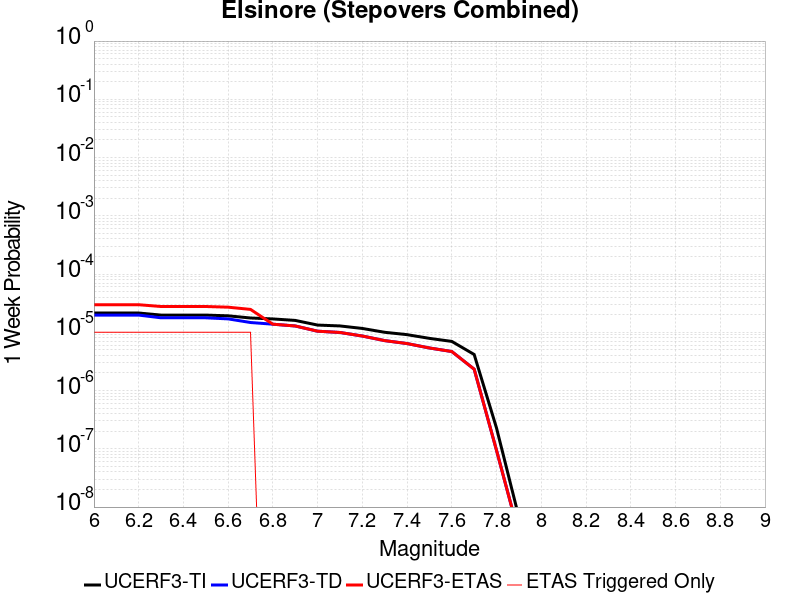 | 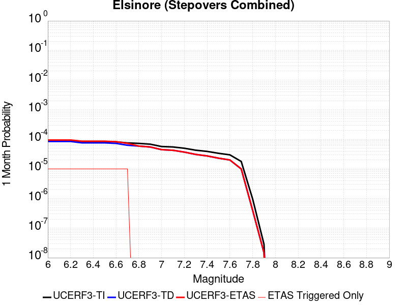 | 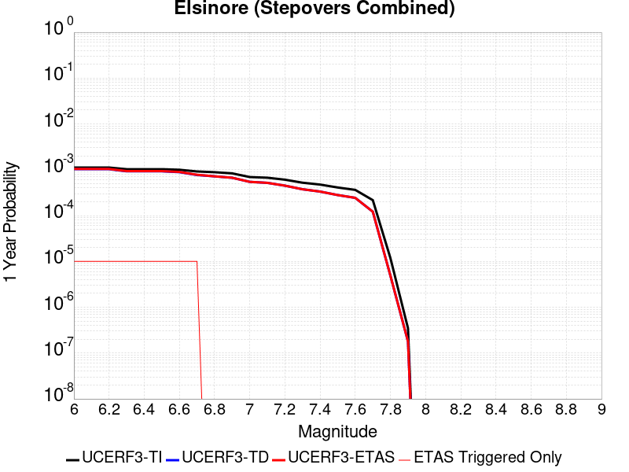 | 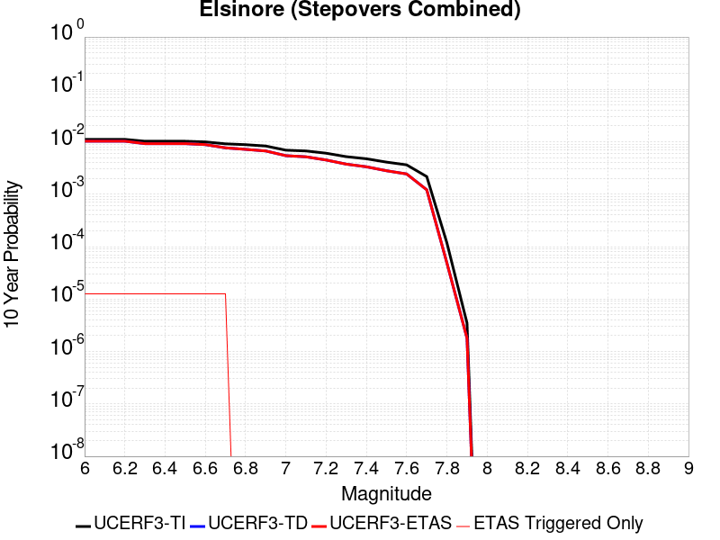 |

| Magnitude | 1 wk TI Prob | 1 wk TD Prob | 1 wk ETAS Prob | 1 wk ETAS/TD Gain | 1 wk ETAS Triggered Only | 1 mo TI Prob | 1 mo TD Prob | 1 mo ETAS Prob | 1 mo ETAS/TD Gain | 1 mo ETAS Triggered Only | 1 yr TI Prob | 1 yr TD Prob | 1 yr ETAS Prob | 1 yr ETAS/TD Gain | 1 yr ETAS Triggered Only | 10 yr TI Prob | 10 yr TD Prob | 10 yr ETAS Prob | 10 yr ETAS/TD Gain | 10 yr ETAS Triggered Only |
|-----|-----|-----|-----|-----|-----|-----|-----|-----|-----|-----|-----|-----|-----|-----|-----|-----|-----|-----|-----|-----|
| 6.0 | 2.144392E-5 | 1.976007E-5 | 2.9759873E-5 | 1.5060611 | 1.0E-5 | 9.189928E-5 | 8.468338E-5 | 9.468253E-5 | 1.1180769 | 1.0E-5 | 0.0011182994 | 0.0010305515 | 0.0010405412 | 1.0096935 | 1.0E-5 | 0.011126885 | 0.010264617 | 0.010274515 | 1.0009642 | 1.0E-5 |
| 6.1 | 2.144392E-5 | 1.976007E-5 | 2.9759873E-5 | 1.5060611 | 1.0E-5 | 9.189928E-5 | 8.468338E-5 | 9.468253E-5 | 1.1180769 | 1.0E-5 | 0.0011182994 | 0.0010305515 | 0.0010405412 | 1.0096935 | 1.0E-5 | 0.011126885 | 0.010264617 | 0.010274515 | 1.0009642 | 1.0E-5 |
| 6.2 | 2.144392E-5 | 1.976007E-5 | 2.9759873E-5 | 1.5060611 | 1.0E-5 | 9.189928E-5 | 8.468338E-5 | 9.468253E-5 | 1.1180769 | 1.0E-5 | 0.0011182994 | 0.0010305515 | 0.0010405412 | 1.0096935 | 1.0E-5 | 0.011126885 | 0.010264617 | 0.010274515 | 1.0009642 | 1.0E-5 |
| 6.3 | 1.9751555E-5 | 1.7741326E-5 | 2.7741147E-5 | 1.5636457 | 1.0E-5 | 8.4646774E-5 | 7.603211E-5 | 8.603135E-5 | 1.1315134 | 1.0E-5 | 0.0010300872 | 9.25312E-4 | 9.353027E-4 | 1.0107971 | 1.0E-5 | 0.010253254 | 0.0092209745 | 0.009230883 | 1.0010744 | 1.0E-5 |
| 6.4 | 1.9751555E-5 | 1.7741326E-5 | 2.7741147E-5 | 1.5636457 | 1.0E-5 | 8.4646774E-5 | 7.603211E-5 | 8.603135E-5 | 1.1315134 | 1.0E-5 | 0.0010300872 | 9.25312E-4 | 9.353027E-4 | 1.0107971 | 1.0E-5 | 0.010253254 | 0.0092209745 | 0.009230883 | 1.0010744 | 1.0E-5 |
| 6.5 | 1.9751555E-5 | 1.7741326E-5 | 2.7741147E-5 | 1.5636457 | 1.0E-5 | 8.4646774E-5 | 7.603211E-5 | 8.603135E-5 | 1.1315134 | 1.0E-5 | 0.0010300872 | 9.25312E-4 | 9.353027E-4 | 1.0107971 | 1.0E-5 | 0.010253254 | 0.0092209745 | 0.009230883 | 1.0010744 | 1.0E-5 |
| 6.6 | 1.9188685E-5 | 1.7003247E-5 | 2.7003076E-5 | 1.588113 | 1.0E-5 | 8.2234634E-5 | 7.2869116E-5 | 8.2868384E-5 | 1.1372224 | 1.0E-5 | 0.0010007467 | 8.8683655E-4 | 8.9682767E-4 | 1.011266 | 1.0E-5 | 0.00996252 | 0.008839546 | 0.008849458 | 1.0011213 | 1.0E-5 |
| 6.7 | 1.7608272E-5 | 1.4732402E-5 | 2.4732255E-5 | 1.6787659 | 1.0E-5 | 7.546184E-5 | 6.313739E-5 | 7.313676E-5 | 1.1583748 | 1.0E-5 | 9.183606E-4 | 7.684364E-4 | 7.7842874E-4 | 1.0130035 | 1.0E-5 | 0.009145746 | 0.007664441 | 0.0076743644 | 1.0012947 | 1.0E-5 |
| 6.8 | 1.697165E-5 | 1.3783126E-5 | 1.3783126E-5 | 1.0 | 0.0 | 7.273361E-5 | 5.906925E-5 | 5.906925E-5 | 1.0 | 0.0 | 8.8517193E-4 | 7.189395E-4 | 7.189395E-4 | 1.0 | 0.0 | 0.008816543 | 0.0071722106 | 0.0071722106 | 1.0 | 0.0 |
| 6.9 | 1.600365E-5 | 1.2846429E-5 | 1.2846429E-5 | 1.0 | 0.0 | 6.858527E-5 | 5.5055007E-5 | 5.5055007E-5 | 1.0 | 0.0 | 8.347058E-4 | 6.700963E-4 | 6.700963E-4 | 1.0 | 0.0 | 0.008315775 | 0.006686422 | 0.006686422 | 1.0 | 0.0 |
| 7.0 | 1.3314581E-5 | 1.044738E-5 | 1.044738E-5 | 1.0 | 0.0 | 5.7061243E-5 | 4.4773733E-5 | 4.4773733E-5 | 1.0 | 0.0 | 6.944992E-4 | 5.449866E-4 | 5.449866E-4 | 1.0 | 0.0 | 0.006923327 | 0.005440055 | 0.005440055 | 1.0 | 0.0 |
| 7.1 | 1.2865345E-5 | 9.937339E-6 | 9.937339E-6 | 1.0 | 0.0 | 5.5136024E-5 | 4.258792E-5 | 4.258792E-5 | 1.0 | 0.0 | 6.710743E-4 | 5.1838707E-4 | 5.1838707E-4 | 1.0 | 0.0 | 0.0066905143 | 0.005175021 | 0.005175021 | 1.0 | 0.0 |
| 7.2 | 1.1650051E-5 | 8.633585E-6 | 8.633585E-6 | 1.0 | 0.0 | 4.9927836E-5 | 3.7000562E-5 | 3.7000562E-5 | 1.0 | 0.0 | 6.0770183E-4 | 4.503905E-4 | 4.503905E-4 | 1.0 | 0.0 | 0.0060604266 | 0.00449624 | 0.00449624 | 1.0 | 0.0 |
| 7.3 | 1.0008533E-5 | 7.2008215E-6 | 7.2008215E-6 | 1.0 | 0.0 | 4.2893007E-5 | 3.0860305E-5 | 3.0860305E-5 | 1.0 | 0.0 | 5.220972E-4 | 3.756609E-4 | 3.756609E-4 | 1.0 | 0.0 | 0.005208723 | 0.0037506663 | 0.0037506663 | 1.0 | 0.0 |
| 7.4 | 9.116759E-6 | 6.409854E-6 | 6.409854E-6 | 1.0 | 0.0 | 3.907124E-5 | 2.7470522E-5 | 2.7470522E-5 | 1.0 | 0.0 | 4.7558855E-4 | 3.3440365E-4 | 3.3440365E-4 | 1.0 | 0.0 | 0.00474572 | 0.0033391542 | 0.0033391542 | 1.0 | 0.0 |
| 7.5 | 7.870524E-6 | 5.382316E-6 | 5.382316E-6 | 1.0 | 0.0 | 3.3730383E-5 | 2.306687E-5 | 2.306687E-5 | 1.0 | 0.0 | 4.1059E-4 | 2.8080423E-4 | 2.8080423E-4 | 1.0 | 0.0 | 0.0040983222 | 0.0028046207 | 0.0028046207 | 1.0 | 0.0 |
| 7.6 | 6.9774537E-6 | 4.677398E-6 | 4.677398E-6 | 1.0 | 0.0 | 2.990303E-5 | 2.0045845E-5 | 2.0045845E-5 | 1.0 | 0.0 | 3.640086E-4 | 2.44032E-4 | 2.44032E-4 | 1.0 | 0.0 | 0.003634129 | 0.0024377564 | 0.0024377564 | 1.0 | 0.0 |
| 7.7 | 4.1616954E-6 | 2.3281368E-6 | 2.3281368E-6 | 1.0 | 0.0 | 1.7835715E-5 | 9.977695E-6 | 9.977695E-6 | 1.0 | 0.0 | 2.171282E-4 | 1.2147242E-4 | 1.2147242E-4 | 1.0 | 0.0 | 0.0021691616 | 0.0012141332 | 0.0012141332 | 1.0 | 0.0 |
| 7.8 | 2.2692414E-7 | 9.384417E-8 | 9.384417E-8 | 1.0 | 0.0 | 9.725317E-7 | 4.0218927E-7 | 4.0218927E-7 | 1.0 | 0.0 | 1.1840509E-5 | 4.8966467E-6 | 4.8966467E-6 | 1.0 | 0.0 | 1.1839878E-4 | 4.8965718E-5 | 4.8965718E-5 | 1.0 | 0.0 |
| 7.9 | 6.676829E-9 | 3.4397174E-9 | 3.4397174E-9 | 1.0 | 0.0 | 2.861498E-8 | 1.4741646E-8 | 1.4741646E-8 | 1.0 | 0.0 | 3.4838732E-7 | 1.7947953E-7 | 1.7947953E-7 | 1.0 | 0.0 | 3.4838679E-6 | 1.794794E-6 | 1.794794E-6 | 1.0 | 0.0 |

## Sargent 2011 CFM
*[(top)](#table-of-contents)*

| 1 Week | 1 Month | 1 Year | 10 Year |
|-----|-----|-----|-----|
| 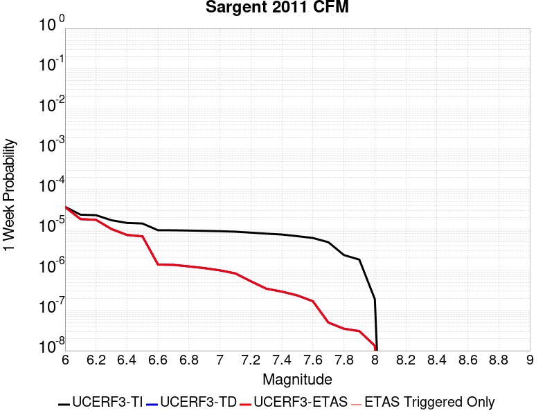 | 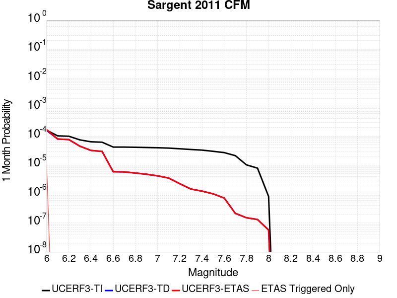 | 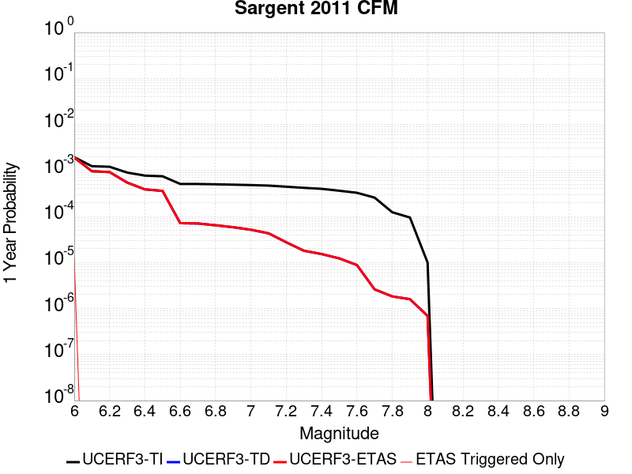 | 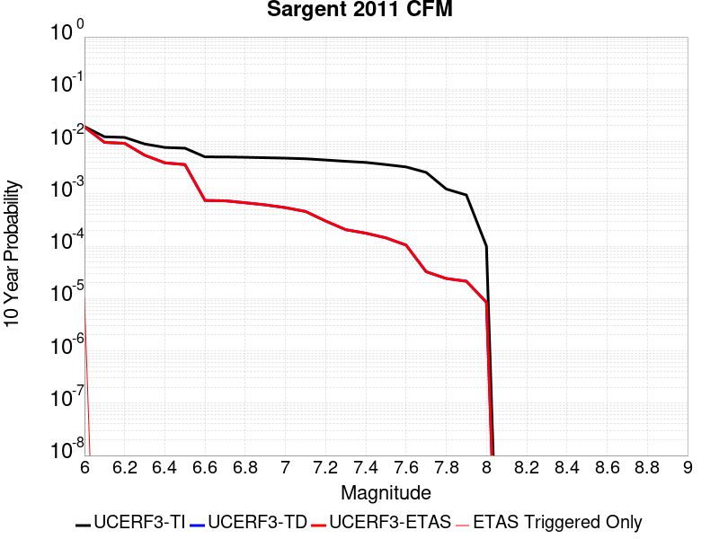 |

| Magnitude | 1 wk TI Prob | 1 wk TD Prob | 1 wk ETAS Prob | 1 wk ETAS/TD Gain | 1 wk ETAS Triggered Only | 1 mo TI Prob | 1 mo TD Prob | 1 mo ETAS Prob | 1 mo ETAS/TD Gain | 1 mo ETAS Triggered Only | 1 yr TI Prob | 1 yr TD Prob | 1 yr ETAS Prob | 1 yr ETAS/TD Gain | 1 yr ETAS Triggered Only | 10 yr TI Prob | 10 yr TD Prob | 10 yr ETAS Prob | 10 yr ETAS/TD Gain | 10 yr ETAS Triggered Only |
|-----|-----|-----|-----|-----|-----|-----|-----|-----|-----|-----|-----|-----|-----|-----|-----|-----|-----|-----|-----|-----|
| 6.0 | 3.7327867E-5 | 3.665065E-5 | 3.665065E-5 | 1.0 | 0.0 | 1.5996677E-4 | 1.5706717E-4 | 1.6706559E-4 | 1.063657 | 1.0E-5 | 0.0019458556 | 0.0019110267 | 0.0019210076 | 1.0052228 | 1.0E-5 | 0.01928905 | 0.019017996 | 0.019027807 | 1.0005158 | 1.0E-5 |
| 6.1 | 2.3771476E-5 | 1.8478724E-5 | 1.8478724E-5 | 1.0 | 0.0 | 1.01873775E-4 | 7.919262E-5 | 7.919262E-5 | 1.0 | 0.0 | 0.0012396075 | 9.638239E-4 | 9.638239E-4 | 1.0 | 0.0 | 0.012327154 | 0.009635902 | 0.009635902 | 1.0 | 0.0 |
| 6.2 | 2.3112721E-5 | 1.7710081E-5 | 1.7710081E-5 | 1.0 | 0.0 | 9.9050754E-5 | 7.5898635E-5 | 7.5898635E-5 | 1.0 | 0.0 | 0.0012052758 | 9.2375383E-4 | 9.2375383E-4 | 1.0 | 0.0 | 0.011987597 | 0.009238554 | 0.009238554 | 1.0 | 0.0 |
| 6.3 | 1.728509E-5 | 1.0458513E-5 | 1.0458513E-5 | 1.0 | 0.0 | 7.407686E-5 | 4.4821696E-5 | 4.4821696E-5 | 1.0 | 0.0 | 9.015125E-4 | 5.456136E-4 | 5.456136E-4 | 1.0 | 0.0 | 0.008978641 | 0.0054789106 | 0.0054789106 | 1.0 | 0.0 |
| 6.4 | 1.48395575E-5 | 7.4555796E-6 | 7.4555796E-6 | 1.0 | 0.0 | 6.3596555E-5 | 3.195231E-5 | 3.195231E-5 | 1.0 | 0.0 | 7.7401294E-4 | 3.889874E-4 | 3.889874E-4 | 1.0 | 0.0 | 0.0077132257 | 0.00391845 | 0.00391845 | 1.0 | 0.0 |
| 6.5 | 1.4358964E-5 | 6.894356E-6 | 6.894356E-6 | 1.0 | 0.0 | 6.1536964E-5 | 2.9547118E-5 | 2.9547118E-5 | 1.0 | 0.0 | 7.48955E-4 | 3.5971415E-4 | 3.5971415E-4 | 1.0 | 0.0 | 0.0074643586 | 0.0036266989 | 0.0036266989 | 1.0 | 0.0 |
| 6.6 | 9.772591E-6 | 1.3732375E-6 | 1.3732375E-6 | 1.0 | 0.0 | 4.188186E-5 | 5.8852906E-6 | 5.8852906E-6 | 1.0 | 0.0 | 5.097923E-4 | 7.165109E-5 | 7.165109E-5 | 1.0 | 0.0 | 0.005086244 | 7.480871E-4 | 7.480871E-4 | 1.0 | 0.0 |
| 6.7 | 9.752745E-6 | 1.3519289E-6 | 1.3519289E-6 | 1.0 | 0.0 | 4.179681E-5 | 5.7939683E-6 | 5.7939683E-6 | 1.0 | 0.0 | 5.0875737E-4 | 7.053931E-5 | 7.053931E-5 | 1.0 | 0.0 | 0.005075942 | 7.369768E-4 | 7.369768E-4 | 1.0 | 0.0 |
| 6.8 | 9.608213E-6 | 1.235796E-6 | 1.235796E-6 | 1.0 | 0.0 | 4.1177405E-5 | 5.296258E-6 | 5.296258E-6 | 1.0 | 0.0 | 5.012196E-4 | 6.448006E-5 | 6.448006E-5 | 1.0 | 0.0 | 0.005000906 | 6.7611714E-4 | 6.7611714E-4 | 1.0 | 0.0 |
| 6.9 | 9.427164E-6 | 1.1205796E-6 | 1.1205796E-6 | 1.0 | 0.0 | 4.04015E-5 | 4.8024754E-6 | 4.8024754E-6 | 1.0 | 0.0 | 4.9177726E-4 | 5.8468588E-5 | 5.8468588E-5 | 1.0 | 0.0 | 0.004906904 | 6.1537215E-4 | 6.1537215E-4 | 1.0 | 0.0 |
| 7.0 | 9.247601E-6 | 9.87042E-7 | 9.87042E-7 | 1.0 | 0.0 | 3.9631974E-5 | 4.2301726E-6 | 4.2301726E-6 | 1.0 | 0.0 | 4.8241246E-4 | 5.1501152E-5 | 5.1501152E-5 | 1.0 | 0.0 | 0.0048136655 | 5.452185E-4 | 5.452185E-4 | 1.0 | 0.0 |
| 7.1 | 8.995454E-6 | 8.267614E-7 | 8.267614E-7 | 1.0 | 0.0 | 3.8551374E-5 | 3.5432583E-6 | 3.5432583E-6 | 1.0 | 0.0 | 4.6926187E-4 | 4.313833E-5 | 4.313833E-5 | 1.0 | 0.0 | 0.004682722 | 4.6070307E-4 | 4.6070307E-4 | 1.0 | 0.0 |
| 7.2 | 8.520861E-6 | 5.27322E-7 | 5.27322E-7 | 1.0 | 0.0 | 3.6517464E-5 | 2.2599497E-6 | 2.2599497E-6 | 1.0 | 0.0 | 4.445094E-4 | 2.7514547E-5 | 2.7514547E-5 | 1.0 | 0.0 | 0.004436213 | 3.0276953E-4 | 3.0276953E-4 | 1.0 | 0.0 |
| 7.3 | 8.043592E-6 | 3.453237E-7 | 3.453237E-7 | 1.0 | 0.0 | 3.4472083E-5 | 1.4799579E-6 | 1.4799579E-6 | 1.0 | 0.0 | 4.196168E-4 | 1.801834E-5 | 1.801834E-5 | 1.0 | 0.0 | 0.004188253 | 2.0650218E-4 | 2.0650218E-4 | 1.0 | 0.0 |
| 7.4 | 7.662316E-6 | 2.9259107E-7 | 2.9259107E-7 | 1.0 | 0.0 | 3.2838085E-5 | 1.2539612E-6 | 1.2539612E-6 | 1.0 | 0.0 | 3.9973034E-4 | 1.526687E-5 | 1.526687E-5 | 1.0 | 0.0 | 0.0039901207 | 1.7718194E-4 | 1.7718194E-4 | 1.0 | 0.0 |
| 7.5 | 6.961638E-6 | 2.3549052E-7 | 2.3549052E-7 | 1.0 | 0.0 | 2.9835252E-5 | 1.0092447E-6 | 1.0092447E-6 | 1.0 | 0.0 | 3.6318362E-4 | 1.2287485E-5 | 1.2287485E-5 | 1.0 | 0.0 | 0.0036259065 | 1.4393168E-4 | 1.4393168E-4 | 1.0 | 0.0 |
| 7.6 | 6.282332E-6 | 1.6871925E-7 | 1.6871925E-7 | 1.0 | 0.0 | 2.6924003E-5 | 7.230823E-7 | 7.230823E-7 | 1.0 | 0.0 | 3.2775043E-4 | 8.803492E-6 | 8.803492E-6 | 1.0 | 0.0 | 0.0032726745 | 1.0492336E-4 | 1.0492336E-4 | 1.0 | 0.0 |
| 7.7 | 4.934408E-6 | 4.9918345E-8 | 4.9918345E-8 | 1.0 | 0.0 | 2.114729E-5 | 2.1393575E-7 | 2.1393575E-7 | 1.0 | 0.0 | 2.5743784E-4 | 2.6046646E-6 | 2.6046646E-6 | 1.0 | 0.0 | 0.0025713982 | 3.2479504E-5 | 3.2479504E-5 | 1.0 | 0.0 |
| 7.8 | 2.373212E-6 | 3.5100808E-8 | 3.5100808E-8 | 1.0 | 0.0 | 1.0170869E-5 | 1.5043203E-7 | 1.5043203E-7 | 1.0 | 0.0 | 1.238233E-4 | 1.8315084E-6 | 1.8315084E-6 | 1.0 | 0.0 | 0.0012375432 | 2.4073881E-5 | 2.4073881E-5 | 1.0 | 0.0 |
| 7.9 | 1.8227792E-6 | 3.055616E-8 | 3.055616E-8 | 1.0 | 0.0 | 7.811887E-6 | 1.3095496E-7 | 1.3095496E-7 | 1.0 | 0.0 | 9.510558E-5 | 1.5943755E-6 | 1.5943755E-6 | 1.0 | 0.0 | 9.5064886E-4 | 2.1365537E-5 | 2.1365537E-5 | 1.0 | 0.0 |
| 8.0 | 1.9095137E-7 | 1.3250629E-8 | 1.3250629E-8 | 1.0 | 0.0 | 8.1836276E-7 | 5.678841E-8 | 5.678841E-8 | 1.0 | 0.0 | 9.963521E-6 | 6.9139867E-7 | 6.9139867E-7 | 1.0 | 0.0 | 9.963074E-5 | 8.455456E-6 | 8.455456E-6 | 1.0 | 0.0 |

## Franklin 2011 CFM
*[(top)](#table-of-contents)*

| 1 Week | 1 Month | 1 Year | 10 Year |
|-----|-----|-----|-----|
| 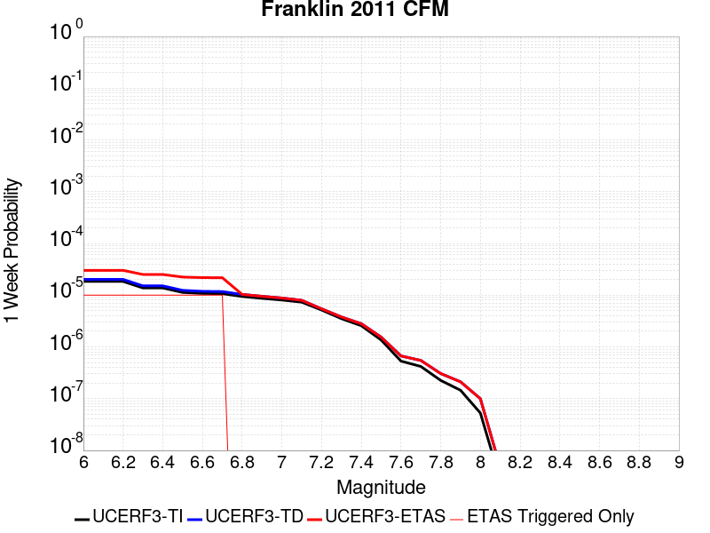 | 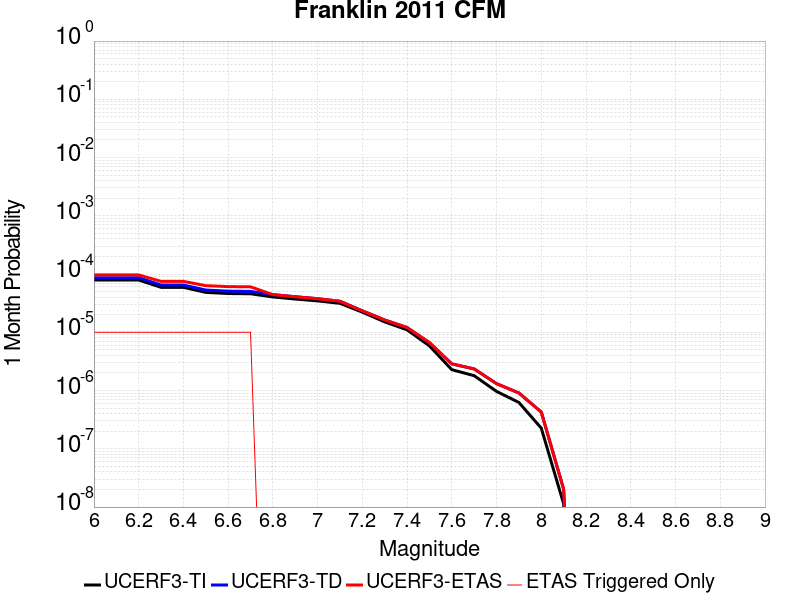 | 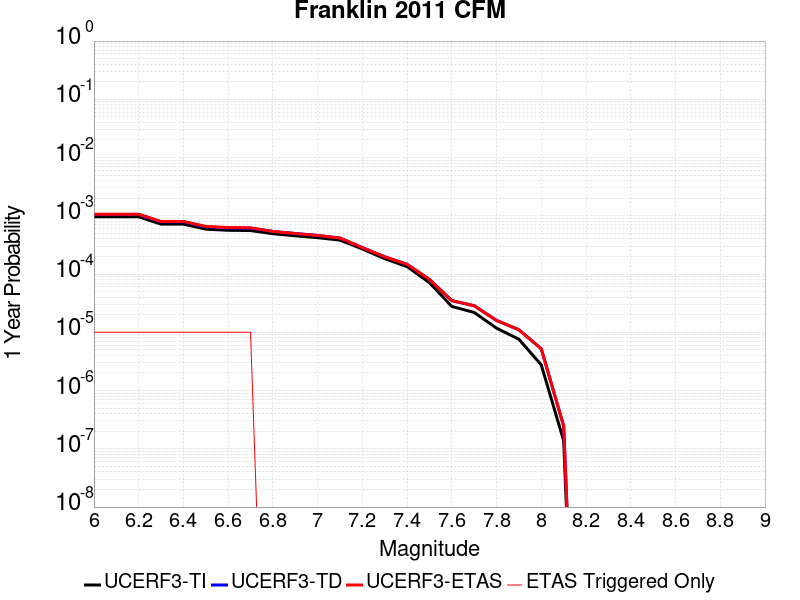 |  |

| Magnitude | 1 wk TI Prob | 1 wk TD Prob | 1 wk ETAS Prob | 1 wk ETAS/TD Gain | 1 wk ETAS Triggered Only | 1 mo TI Prob | 1 mo TD Prob | 1 mo ETAS Prob | 1 mo ETAS/TD Gain | 1 mo ETAS Triggered Only | 1 yr TI Prob | 1 yr TD Prob | 1 yr ETAS Prob | 1 yr ETAS/TD Gain | 1 yr ETAS Triggered Only | 10 yr TI Prob | 10 yr TD Prob | 10 yr ETAS Prob | 10 yr ETAS/TD Gain | 10 yr ETAS Triggered Only |
|-----|-----|-----|-----|-----|-----|-----|-----|-----|-----|-----|-----|-----|-----|-----|-----|-----|-----|-----|-----|-----|
| 6.0 | 1.845602E-5 | 2.0212667E-5 | 3.0212464E-5 | 1.4947293 | 1.0E-5 | 7.9094825E-5 | 8.6623004E-5 | 9.6622134E-5 | 1.1154327 | 1.0E-5 | 9.6255407E-4 | 0.0010541538 | 0.0010641433 | 1.0094763 | 1.0E-5 | 0.009583955 | 0.010508837 | 0.010518732 | 1.0009416 | 1.0E-5 |
| 6.1 | 1.845602E-5 | 2.0212667E-5 | 3.0212464E-5 | 1.4947293 | 1.0E-5 | 7.9094825E-5 | 8.6623004E-5 | 9.6622134E-5 | 1.1154327 | 1.0E-5 | 9.6255407E-4 | 0.0010541538 | 0.0010641433 | 1.0094763 | 1.0E-5 | 0.009583955 | 0.010508837 | 0.010518732 | 1.0009416 | 1.0E-5 |
| 6.2 | 1.845602E-5 | 2.0212667E-5 | 3.0212464E-5 | 1.4947293 | 1.0E-5 | 7.9094825E-5 | 8.6623004E-5 | 9.6622134E-5 | 1.1154327 | 1.0E-5 | 9.6255407E-4 | 0.0010541538 | 0.0010641433 | 1.0094763 | 1.0E-5 | 0.009583955 | 0.010508837 | 0.010518732 | 1.0009416 | 1.0E-5 |
| 6.3 | 1.3813506E-5 | 1.5154875E-5 | 2.5154723E-5 | 1.6598437 | 1.0E-5 | 5.9199396E-5 | 6.494789E-5 | 7.494724E-5 | 1.1539596 | 1.0E-5 | 7.205143E-4 | 7.904614E-4 | 8.004534E-4 | 1.0126408 | 1.0E-5 | 0.007181826 | 0.007891684 | 0.007901605 | 1.0012572 | 1.0E-5 |
| 6.4 | 1.3813506E-5 | 1.5154875E-5 | 2.5154723E-5 | 1.6598437 | 1.0E-5 | 5.9199396E-5 | 6.494789E-5 | 7.494724E-5 | 1.1539596 | 1.0E-5 | 7.205143E-4 | 7.904614E-4 | 8.004534E-4 | 1.0126408 | 1.0E-5 | 0.007181826 | 0.007891684 | 0.007901605 | 1.0012572 | 1.0E-5 |
| 6.5 | 1.1308949E-5 | 1.2417847E-5 | 2.2417722E-5 | 1.8052826 | 1.0E-5 | 4.8466023E-5 | 5.321827E-5 | 6.321774E-5 | 1.1878954 | 1.0E-5 | 5.899141E-4 | 6.477419E-4 | 6.577354E-4 | 1.0154283 | 1.0E-5 | 0.0058835056 | 0.0064731706 | 0.0064831055 | 1.0015348 | 1.0E-5 |
| 6.6 | 1.0813164E-5 | 1.187607E-5 | 2.187595E-5 | 1.8420194 | 1.0E-5 | 4.6341313E-5 | 5.089646E-5 | 6.089595E-5 | 1.1964673 | 1.0E-5 | 5.640594E-4 | 6.194901E-4 | 6.294839E-4 | 1.0161324 | 1.0E-5 | 0.005626298 | 0.006192248 | 0.006202186 | 1.0016049 | 1.0E-5 |
| 6.7 | 1.0706348E-5 | 1.1757834E-5 | 2.1757716E-5 | 1.8504868 | 1.0E-5 | 4.5883542E-5 | 5.0389754E-5 | 6.038925E-5 | 1.198443 | 1.0E-5 | 5.5848894E-4 | 6.1332446E-4 | 6.233183E-4 | 1.0162946 | 1.0E-5 | 0.005570874 | 0.006130933 | 0.006140872 | 1.0016211 | 1.0E-5 |
| 6.8 | 9.443655E-6 | 1.0349157E-5 | 1.0349157E-5 | 1.0 | 0.0 | 4.0472176E-5 | 4.435278E-5 | 4.435278E-5 | 1.0 | 0.0 | 4.9263734E-4 | 5.3986267E-4 | 5.3986267E-4 | 1.0 | 0.0 | 0.0049154665 | 0.0054000774 | 0.0054000774 | 1.0 | 0.0 |
| 6.9 | 8.7001645E-6 | 9.522226E-6 | 9.522226E-6 | 1.0 | 0.0 | 3.728589E-5 | 4.0808907E-5 | 4.0808907E-5 | 1.0 | 0.0 | 4.538611E-4 | 4.967364E-4 | 4.967364E-4 | 1.0 | 0.0 | 0.0045293528 | 0.004970812 | 0.004970812 | 1.0 | 0.0 |
| 7.0 | 8.074731E-6 | 8.815842E-6 | 8.815842E-6 | 1.0 | 0.0 | 3.460553E-5 | 3.778164E-5 | 3.778164E-5 | 1.0 | 0.0 | 4.212409E-4 | 4.5989547E-4 | 4.5989547E-4 | 1.0 | 0.0 | 0.004204433 | 0.0046039745 | 0.0046039745 | 1.0 | 0.0 |
| 7.1 | 7.3370957E-6 | 7.961713E-6 | 7.961713E-6 | 1.0 | 0.0 | 3.1444317E-5 | 3.412119E-5 | 3.412119E-5 | 1.0 | 0.0 | 3.8276732E-4 | 4.1534728E-4 | 4.1534728E-4 | 1.0 | 0.0 | 0.0038210868 | 0.0041600685 | 0.0041600685 | 1.0 | 0.0 |
| 7.2 | 5.1750103E-6 | 5.457141E-6 | 5.457141E-6 | 1.0 | 0.0 | 2.2178427E-5 | 2.338754E-5 | 2.338754E-5 | 1.0 | 0.0 | 2.699889E-4 | 2.8470642E-4 | 2.8470642E-4 | 1.0 | 0.0 | 0.002696611 | 0.0028573358 | 0.0028573358 | 1.0 | 0.0 |
| 7.3 | 3.5221371E-6 | 3.7960758E-6 | 3.7960758E-6 | 1.0 | 0.0 | 1.5094786E-5 | 1.6268796E-5 | 1.6268796E-5 | 1.0 | 0.0 | 1.8376352E-4 | 1.980547E-4 | 1.980547E-4 | 1.0 | 0.0 | 0.0018361164 | 0.0019921293 | 0.0019921293 | 1.0 | 0.0 |
| 7.4 | 2.5749775E-6 | 2.8182237E-6 | 2.8182237E-6 | 1.0 | 0.0 | 1.1035571E-5 | 1.2078047E-5 | 1.2078047E-5 | 1.0 | 0.0 | 1.343498E-4 | 1.4704037E-4 | 1.4704037E-4 | 1.0 | 0.0 | 0.001342686 | 0.0014814398 | 0.0014814398 | 1.0 | 0.0 |
| 7.5 | 1.3642131E-6 | 1.5497532E-6 | 1.5497532E-6 | 1.0 | 0.0 | 5.8466144E-6 | 6.6417824E-6 | 6.6417824E-6 | 1.0 | 0.0 | 7.1180206E-5 | 8.086072E-5 | 8.086072E-5 | 1.0 | 0.0 | 7.115741E-4 | 8.1887894E-4 | 8.1887894E-4 | 1.0 | 0.0 |
| 7.6 | 5.329124E-7 | 6.701074E-7 | 6.701074E-7 | 1.0 | 0.0 | 2.2839083E-6 | 2.8718855E-6 | 2.8718855E-6 | 1.0 | 0.0 | 2.7806227E-5 | 3.496465E-5 | 3.496465E-5 | 1.0 | 0.0 | 2.780275E-4 | 3.5998534E-4 | 3.5998534E-4 | 1.0 | 0.0 |
| 7.7 | 4.199127E-7 | 5.486731E-7 | 5.486731E-7 | 1.0 | 0.0 | 1.7996247E-6 | 2.351454E-6 | 2.351454E-6 | 1.0 | 0.0 | 2.191021E-5 | 2.862858E-5 | 2.862858E-5 | 1.0 | 0.0 | 2.190805E-4 | 2.9645322E-4 | 2.9645322E-4 | 1.0 | 0.0 |
| 7.8 | 2.2586491E-7 | 3.0661545E-7 | 3.0661545E-7 | 1.0 | 0.0 | 9.67992E-7 | 1.3140656E-6 | 1.3140656E-6 | 1.0 | 0.0 | 1.178524E-5 | 1.5998632E-5 | 1.5998632E-5 | 1.0 | 0.0 | 1.17846146E-4 | 1.6630026E-4 | 1.6630026E-4 | 1.0 | 0.0 |
| 7.9 | 1.4568845E-7 | 2.1202912E-7 | 2.1202912E-7 | 1.0 | 0.0 | 6.243789E-7 | 9.0869594E-7 | 9.0869594E-7 | 1.0 | 0.0 | 7.601787E-6 | 1.1063317E-5 | 1.1063317E-5 | 1.0 | 0.0 | 7.601527E-5 | 1.15088624E-4 | 1.15088624E-4 | 1.0 | 0.0 |
| 8.0 | 5.2868224E-8 | 9.997299E-8 | 9.997299E-8 | 1.0 | 0.0 | 2.2657808E-7 | 4.284556E-7 | 4.284556E-7 | 1.0 | 0.0 | 2.7585847E-6 | 5.2164346E-6 | 5.2164346E-6 | 1.0 | 0.0 | 2.7585504E-5 | 5.4021348E-5 | 5.4021348E-5 | 1.0 | 0.0 |
| 8.1 | 2.654434E-9 | 4.7228426E-9 | 4.7228426E-9 | 1.0 | 0.0 | 1.1376145E-8 | 2.0240753E-8 | 2.0240753E-8 | 1.0 | 0.0 | 1.3850456E-7 | 2.4643114E-7 | 2.4643114E-7 | 1.0 | 0.0 | 1.3850448E-6 | 2.533639E-6 | 2.533639E-6 | 1.0 | 0.0 |

## Emerson-Copper Mtn 2011
*[(top)](#table-of-contents)*

| 1 Week | 1 Month | 1 Year | 10 Year |
|-----|-----|-----|-----|
|  | 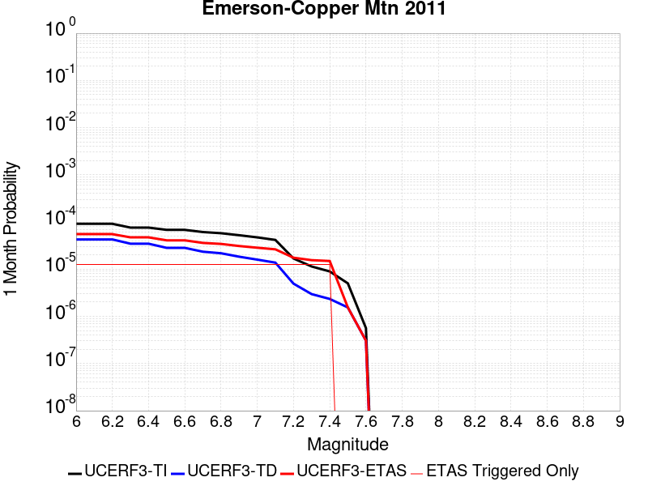 | 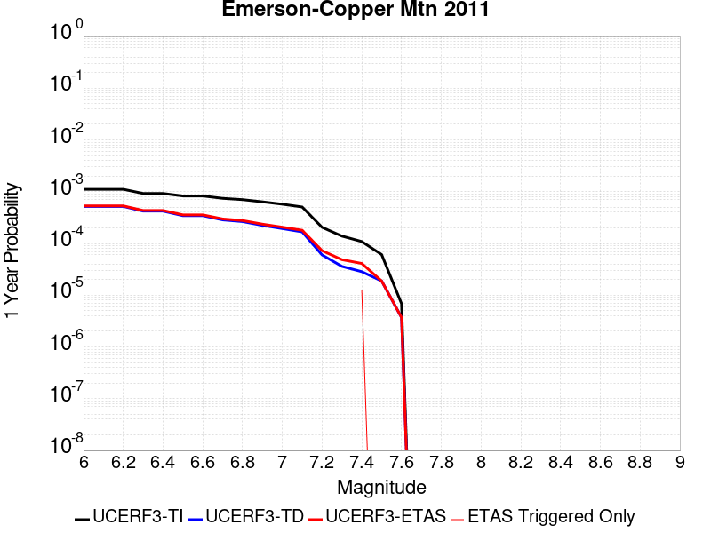 | 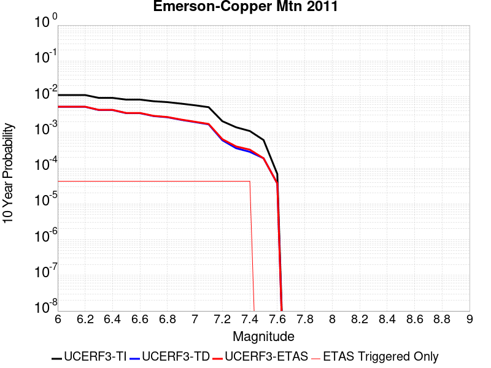 |

| Magnitude | 1 wk TI Prob | 1 wk TD Prob | 1 wk ETAS Prob | 1 wk ETAS/TD Gain | 1 wk ETAS Triggered Only | 1 mo TI Prob | 1 mo TD Prob | 1 mo ETAS Prob | 1 mo ETAS/TD Gain | 1 mo ETAS Triggered Only | 1 yr TI Prob | 1 yr TD Prob | 1 yr ETAS Prob | 1 yr ETAS/TD Gain | 1 yr ETAS Triggered Only | 10 yr TI Prob | 10 yr TD Prob | 10 yr ETAS Prob | 10 yr ETAS/TD Gain | 10 yr ETAS Triggered Only |
|-----|-----|-----|-----|-----|-----|-----|-----|-----|-----|-----|-----|-----|-----|-----|-----|-----|-----|-----|-----|-----|
| 6.0 | 2.1364202E-5 | 9.967999E-6 | 9.967999E-6 | 1.0 | 0.0 | 9.1557646E-5 | 4.2719344E-5 | 5.271892E-5 | 1.234076 | 1.0E-5 | 0.0011141442 | 5.1999267E-4 | 5.2998745E-4 | 1.0192211 | 1.0E-5 | 0.011085749 | 0.0051886286 | 0.005198577 | 1.0019172 | 1.0E-5 |
| 6.1 | 2.1364202E-5 | 9.967999E-6 | 9.967999E-6 | 1.0 | 0.0 | 9.1557646E-5 | 4.2719344E-5 | 5.271892E-5 | 1.234076 | 1.0E-5 | 0.0011141442 | 5.1999267E-4 | 5.2998745E-4 | 1.0192211 | 1.0E-5 | 0.011085749 | 0.0051886286 | 0.005198577 | 1.0019172 | 1.0E-5 |
| 6.2 | 2.1364202E-5 | 9.967999E-6 | 9.967999E-6 | 1.0 | 0.0 | 9.1557646E-5 | 4.2719344E-5 | 5.271892E-5 | 1.234076 | 1.0E-5 | 0.0011141442 | 5.1999267E-4 | 5.2998745E-4 | 1.0192211 | 1.0E-5 | 0.011085749 | 0.0051886286 | 0.005198577 | 1.0019172 | 1.0E-5 |
| 6.3 | 1.7751237E-5 | 8.089109E-6 | 8.089109E-6 | 1.0 | 0.0 | 7.607452E-5 | 3.4667184E-5 | 4.4666835E-5 | 1.2884473 | 1.0E-5 | 9.258136E-4 | 4.2199748E-4 | 4.3199325E-4 | 1.0236868 | 1.0E-5 | 0.00921966 | 0.004212584 | 0.0042225416 | 1.0023638 | 1.0E-5 |
| 6.4 | 1.7751237E-5 | 8.089109E-6 | 8.089109E-6 | 1.0 | 0.0 | 7.607452E-5 | 3.4667184E-5 | 4.4666835E-5 | 1.2884473 | 1.0E-5 | 9.258136E-4 | 4.2199748E-4 | 4.3199325E-4 | 1.0236868 | 1.0E-5 | 0.00921966 | 0.004212584 | 0.0042225416 | 1.0023638 | 1.0E-5 |
| 6.5 | 1.5886664E-5 | 6.6037437E-6 | 6.6037437E-6 | 1.0 | 0.0 | 6.808392E-5 | 2.830148E-5 | 3.8301197E-5 | 1.3533285 | 1.0E-5 | 8.286065E-4 | 3.4452073E-4 | 3.5451728E-4 | 1.0290158 | 1.0E-5 | 0.008255237 | 0.0034403303 | 0.003450296 | 1.0028967 | 1.0E-5 |
| 6.6 | 1.5886664E-5 | 6.6037437E-6 | 6.6037437E-6 | 1.0 | 0.0 | 6.808392E-5 | 2.830148E-5 | 3.8301197E-5 | 1.3533285 | 1.0E-5 | 8.286065E-4 | 3.4452073E-4 | 3.5451728E-4 | 1.0290158 | 1.0E-5 | 0.008255237 | 0.0034403303 | 0.003450296 | 1.0028967 | 1.0E-5 |
| 6.7 | 1.428471E-5 | 5.4703055E-6 | 5.4703055E-6 | 1.0 | 0.0 | 6.121875E-5 | 2.3443978E-5 | 3.3443743E-5 | 1.4265388 | 1.0E-5 | 7.450834E-4 | 2.8539696E-4 | 2.9539413E-4 | 1.0350289 | 1.0E-5 | 0.007425902 | 0.0028506925 | 0.002860664 | 1.003498 | 1.0E-5 |
| 6.8 | 1.3490684E-5 | 5.0735894E-6 | 5.0735894E-6 | 1.0 | 0.0 | 5.7815934E-5 | 2.1743796E-5 | 3.1743577E-5 | 1.4598913 | 1.0E-5 | 7.0368167E-4 | 2.6470242E-4 | 2.7469976E-4 | 1.0377682 | 1.0E-5 | 0.007014576 | 0.002644252 | 0.0026542256 | 1.0037718 | 1.0E-5 |
| 6.9 | 1.2235421E-5 | 4.289545E-6 | 4.289545E-6 | 1.0 | 0.0 | 5.2436466E-5 | 1.8383655E-5 | 2.838347E-5 | 1.5439515 | 1.0E-5 | 6.38227E-4 | 2.238016E-4 | 2.3379936E-4 | 1.0446725 | 1.0E-5 | 0.0063639707 | 0.0022361164 | 0.0022460942 | 1.004462 | 1.0E-5 |
| 7.0 | 1.1009851E-5 | 3.7188345E-6 | 3.7188345E-6 | 1.0 | 0.0 | 4.7184225E-5 | 1.5937783E-5 | 2.5937625E-5 | 1.6274298 | 1.0E-5 | 5.743165E-4 | 1.9402867E-4 | 2.0402674E-4 | 1.0515288 | 1.0E-5 | 0.005728345 | 0.0019389305 | 0.0019489111 | 1.0051475 | 1.0E-5 |
| 7.1 | 9.726373E-6 | 3.2115693E-6 | 3.2115693E-6 | 1.0 | 0.0 | 4.168379E-5 | 1.3763814E-5 | 2.3763678E-5 | 1.7265328 | 1.0E-5 | 5.07382E-4 | 1.6756494E-4 | 1.7756326E-4 | 1.0596683 | 1.0E-5 | 0.0050622504 | 0.0016747171 | 0.0016847003 | 1.0059612 | 1.0E-5 |
| 7.2 | 3.9335127E-6 | 1.1524114E-6 | 1.1524114E-6 | 1.0 | 0.0 | 1.6857803E-5 | 4.9388973E-6 | 1.4938848E-5 | 3.0247335 | 1.0E-5 | 2.0522442E-4 | 6.0129474E-5 | 7.012887E-5 | 1.1662978 | 1.0E-5 | 0.00205035 | 6.01138E-4 | 6.11132E-4 | 1.0166252 | 1.0E-5 |
| 7.3 | 2.661632E-6 | 6.91098E-7 | 6.91098E-7 | 1.0 | 0.0 | 1.14069435E-5 | 2.9618452E-6 | 1.2961816E-5 | 4.3762636 | 1.0E-5 | 1.3887069E-4 | 3.605988E-5 | 4.605952E-5 | 1.2773066 | 1.0E-5 | 0.0013878393 | 3.6054134E-4 | 3.7053772E-4 | 1.027726 | 1.0E-5 |
| 7.4 | 2.0893426E-6 | 5.4614605E-7 | 5.4614605E-7 | 1.0 | 0.0 | 8.954295E-6 | 2.340624E-6 | 1.2340601E-5 | 5.272355 | 1.0E-5 | 1.0901308E-4 | 2.8496728E-5 | 3.8496444E-5 | 1.3509074 | 1.0E-5 | 0.0010895962 | 2.849313E-4 | 2.9492844E-4 | 1.0350862 | 1.0E-5 |
| 7.5 | 1.1681728E-6 | 3.6028484E-7 | 3.6028484E-7 | 1.0 | 0.0 | 5.0064455E-6 | 1.544077E-6 | 1.544077E-6 | 1.0 | 0.0 | 6.0951766E-5 | 1.879898E-5 | 1.879898E-5 | 1.0 | 0.0 | 6.093505E-4 | 1.8797436E-4 | 1.8797436E-4 | 1.0 | 0.0 |
| 7.6 | 1.3154387E-7 | 7.1196716E-8 | 7.1196716E-8 | 1.0 | 0.0 | 5.6375933E-7 | 3.0512876E-7 | 3.0512876E-7 | 1.0 | 0.0 | 6.863748E-6 | 3.714938E-6 | 3.714938E-6 | 1.0 | 0.0 | 6.863536E-5 | 3.7148915E-5 | 3.7148915E-5 | 1.0 | 0.0 |

## San Andreas (North Coast) 2011 CFM
*[(top)](#table-of-contents)*

| 1 Week | 1 Month | 1 Year | 10 Year |
|-----|-----|-----|-----|
| 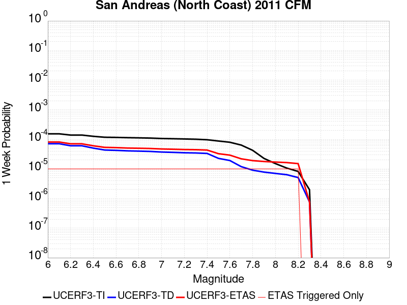 | 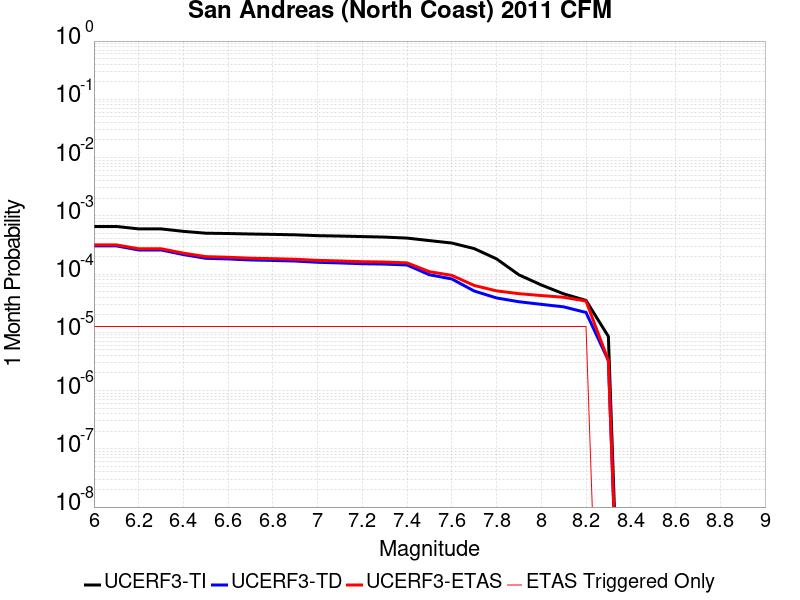 | 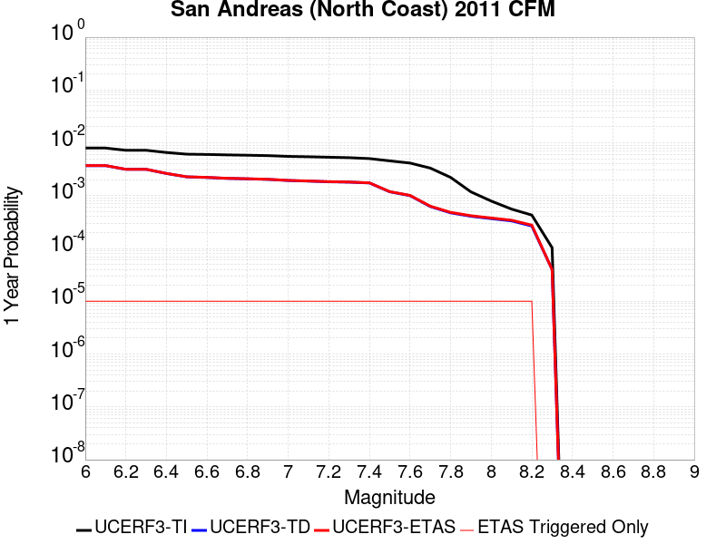 | 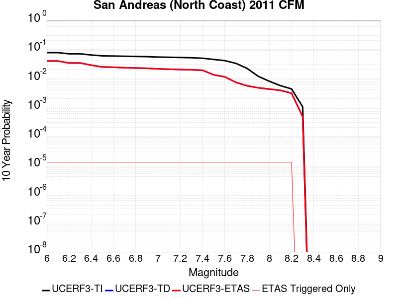 |

| Magnitude | 1 wk TI Prob | 1 wk TD Prob | 1 wk ETAS Prob | 1 wk ETAS/TD Gain | 1 wk ETAS Triggered Only | 1 mo TI Prob | 1 mo TD Prob | 1 mo ETAS Prob | 1 mo ETAS/TD Gain | 1 mo ETAS Triggered Only | 1 yr TI Prob | 1 yr TD Prob | 1 yr ETAS Prob | 1 yr ETAS/TD Gain | 1 yr ETAS Triggered Only | 10 yr TI Prob | 10 yr TD Prob | 10 yr ETAS Prob | 10 yr ETAS/TD Gain | 10 yr ETAS Triggered Only |
|-----|-----|-----|-----|-----|-----|-----|-----|-----|-----|-----|-----|-----|-----|-----|-----|-----|-----|-----|-----|-----|
| 6.0 | 1.5333705E-4 | 7.109695E-5 | 8.109623E-5 | 1.140643 | 1.0E-5 | 6.5699324E-4 | 3.046658E-4 | 3.1466273E-4 | 1.0328128 | 1.0E-5 | 0.007969595 | 0.0037030308 | 0.0037129938 | 1.0026904 | 1.0E-5 | 0.0768977 | 0.039364267 | 0.039373875 | 1.000244 | 1.0E-5 |
| 6.1 | 1.5333705E-4 | 7.109695E-5 | 8.109623E-5 | 1.140643 | 1.0E-5 | 6.5699324E-4 | 3.046658E-4 | 3.1466273E-4 | 1.0328128 | 1.0E-5 | 0.007969595 | 0.0037030308 | 0.0037129938 | 1.0026904 | 1.0E-5 | 0.0768977 | 0.039364267 | 0.039373875 | 1.000244 | 1.0E-5 |
| 6.2 | 1.3912938E-4 | 6.049243E-5 | 7.049183E-5 | 1.1652999 | 1.0E-5 | 5.961325E-4 | 2.5922767E-4 | 2.6922507E-4 | 1.0385661 | 1.0E-5 | 0.007233787 | 0.0031515562 | 0.0031615247 | 1.003163 | 1.0E-5 | 0.07002798 | 0.03369792 | 0.033707585 | 1.0002867 | 1.0E-5 |
| 6.3 | 1.3912938E-4 | 6.049243E-5 | 7.049183E-5 | 1.1652999 | 1.0E-5 | 5.961325E-4 | 2.5922767E-4 | 2.6922507E-4 | 1.0385661 | 1.0E-5 | 0.007233787 | 0.0031515562 | 0.0031615247 | 1.003163 | 1.0E-5 | 0.07002798 | 0.03369792 | 0.033707585 | 1.0002867 | 1.0E-5 |
| 6.4 | 1.2623647E-4 | 5.0433562E-5 | 6.043306E-5 | 1.1982707 | 1.0E-5 | 5.4090127E-4 | 2.1612605E-4 | 2.2612388E-4 | 1.0462593 | 1.0E-5 | 0.0065656058 | 0.0026281793 | 0.002638153 | 1.0037949 | 1.0E-5 | 0.06374981 | 0.02830552 | 0.028315235 | 1.0003433 | 1.0E-5 |
| 6.5 | 1.1736096E-4 | 4.3516375E-5 | 5.351594E-5 | 1.2297885 | 1.0E-5 | 5.028786E-4 | 1.8648551E-4 | 1.9648364E-4 | 1.0536134 | 1.0E-5 | 0.006105373 | 0.0022681132 | 0.0022780905 | 1.004399 | 1.0E-5 | 0.05940335 | 0.024576947 | 0.024586702 | 1.0003968 | 1.0E-5 |
| 6.6 | 1.1586959E-4 | 4.2416294E-5 | 5.2415868E-5 | 1.2357484 | 1.0E-5 | 4.964894E-4 | 1.8177154E-4 | 1.9176972E-4 | 1.0550041 | 1.0E-5 | 0.006028018 | 0.0022108385 | 0.0022208162 | 1.0045131 | 1.0E-5 | 0.058671024 | 0.023982164 | 0.023991924 | 1.000407 | 1.0E-5 |
| 6.7 | 1.13693764E-4 | 4.0728228E-5 | 5.072782E-5 | 1.24552 | 1.0E-5 | 4.87168E-4 | 1.7453796E-4 | 1.8453621E-4 | 1.0572841 | 1.0E-5 | 0.005915152 | 0.0021229447 | 0.0021329233 | 1.0047004 | 1.0E-5 | 0.057601593 | 0.023075242 | 0.023085011 | 1.0004233 | 1.0E-5 |
| 6.8 | 1.1204889E-4 | 3.9945848E-5 | 4.994545E-5 | 1.2503289 | 1.0E-5 | 4.8012115E-4 | 1.7118535E-4 | 1.8118364E-4 | 1.0584062 | 1.0E-5 | 0.005829819 | 0.0020822054 | 0.0020921845 | 1.0047926 | 1.0E-5 | 0.05679232 | 0.022635331 | 0.022645107 | 1.0004318 | 1.0E-5 |
| 6.9 | 1.1005794E-4 | 3.9001738E-5 | 4.9001348E-5 | 1.2563888 | 1.0E-5 | 4.7159163E-4 | 1.6713967E-4 | 1.77138E-4 | 1.0598202 | 1.0E-5 | 0.0057265228 | 0.0020330423 | 0.0020430218 | 1.0049087 | 1.0E-5 | 0.055811852 | 0.02210134 | 0.02211112 | 1.0004425 | 1.0E-5 |
| 7.0 | 1.0647948E-4 | 3.7159174E-5 | 4.7158803E-5 | 1.2691026 | 1.0E-5 | 4.562608E-4 | 1.5924397E-4 | 1.6924237E-4 | 1.0627867 | 1.0E-5 | 0.0055408357 | 0.0019370868 | 0.0019470674 | 1.0051523 | 1.0E-5 | 0.054047033 | 0.02105931 | 0.0210691 | 1.0004648 | 1.0E-5 |
| 7.1 | 1.04795035E-4 | 3.620866E-5 | 4.62083E-5 | 1.276167 | 1.0E-5 | 4.4904428E-4 | 1.5517084E-4 | 1.6516929E-4 | 1.0644351 | 1.0E-5 | 0.0054534175 | 0.0018875834 | 0.0018975645 | 1.0052878 | 1.0E-5 | 0.053215165 | 0.02052821 | 0.020538004 | 1.0004771 | 1.0E-5 |
| 7.2 | 1.02724036E-4 | 3.5117457E-5 | 4.5117107E-5 | 1.2847487 | 1.0E-5 | 4.401716E-4 | 1.5049479E-4 | 1.6049329E-4 | 1.0664375 | 1.0E-5 | 0.0053459285 | 0.0018307496 | 0.0018407312 | 1.0054523 | 1.0E-5 | 0.052191395 | 0.01991573 | 0.019925531 | 1.0004921 | 1.0E-5 |
| 7.3 | 1.00650694E-4 | 3.45853E-5 | 4.4584955E-5 | 1.2891302 | 1.0E-5 | 4.312888E-4 | 1.4821437E-4 | 1.5821289E-4 | 1.0674598 | 1.0E-5 | 0.005238306 | 0.0018030318 | 0.0018130138 | 1.0055362 | 1.0E-5 | 0.051165357 | 0.01959264 | 0.019602444 | 1.0005004 | 1.0E-5 |
| 7.4 | 9.672919E-5 | 3.3374814E-5 | 4.337448E-5 | 1.2996172 | 1.0E-5 | 4.144878E-4 | 1.4302715E-4 | 1.5302573E-4 | 1.0699068 | 1.0E-5 | 0.005034718 | 0.00173998 | 0.0017499626 | 1.0057372 | 1.0E-5 | 0.049221683 | 0.01886682 | 0.01887663 | 1.00052 | 1.0E-5 |
| 7.5 | 8.7600405E-5 | 2.2694192E-5 | 3.2693966E-5 | 1.4406314 | 1.0E-5 | 3.753763E-4 | 9.725721E-5 | 1.0725624E-4 | 1.1028101 | 1.0E-5 | 0.0045606326 | 0.0011834651 | 0.0011934533 | 1.0084398 | 1.0E-5 | 0.04468165 | 0.013127938 | 0.013137806 | 1.0007517 | 1.0E-5 |
| 7.6 | 7.9562284E-5 | 1.922004E-5 | 2.921985E-5 | 1.5202802 | 1.0E-5 | 3.4093665E-4 | 8.236901E-5 | 9.236819E-5 | 1.1213949 | 1.0E-5 | 0.0041430052 | 0.0010023828 | 0.0010123728 | 1.0099663 | 1.0E-5 | 0.040666126 | 0.0112194 | 0.011229288 | 1.0008813 | 1.0E-5 |
| 7.7 | 6.3866544E-5 | 1.1936281E-5 | 2.1936161E-5 | 1.8377719 | 1.0E-5 | 2.7368503E-4 | 5.115449E-5 | 6.115397E-5 | 1.1954763 | 1.0E-5 | 0.0033270244 | 6.226282E-4 | 6.3262193E-4 | 1.0160509 | 1.0E-5 | 0.032776527 | 0.0072073294 | 0.0072172573 | 1.0013775 | 1.0E-5 |
| 7.8 | 4.2543215E-5 | 9.0726735E-6 | 1.9072584E-5 | 2.102201 | 1.0E-5 | 1.8231533E-4 | 3.888231E-5 | 4.888192E-5 | 1.2571764 | 1.0E-5 | 0.0022174292 | 4.7328937E-4 | 4.8328465E-4 | 1.0211188 | 1.0E-5 | 0.021954332 | 0.0054884683 | 0.0054984135 | 1.001812 | 1.0E-5 |
| 7.9 | 2.2636612E-5 | 7.811842E-6 | 1.7811764E-5 | 2.2800977 | 1.0E-5 | 9.7010445E-5 | 3.3478893E-5 | 4.3478558E-5 | 1.2986857 | 1.0E-5 | 0.0011804621 | 4.0752938E-4 | 4.1752533E-4 | 1.0245281 | 1.0E-5 | 0.011742111 | 0.0046821116 | 0.004692065 | 1.0021257 | 1.0E-5 |
| 8.0 | 1.5167874E-5 | 7.0475517E-6 | 1.7047481E-5 | 2.4189224 | 1.0E-5 | 6.500356E-5 | 3.0203442E-5 | 4.020314E-5 | 1.331078 | 1.0E-5 | 7.9113094E-4 | 3.6766496E-4 | 3.776613E-4 | 1.0271887 | 1.0E-5 | 0.007883203 | 0.004214701 | 0.004224659 | 1.0023626 | 1.0E-5 |
| 8.1 | 1.0681047E-5 | 6.3854363E-6 | 1.6385373E-5 | 2.5660536 | 1.0E-5 | 4.5775112E-5 | 2.7365868E-5 | 3.7365597E-5 | 1.3654087 | 1.0E-5 | 5.5716943E-4 | 3.331286E-4 | 3.4312526E-4 | 1.0300084 | 1.0E-5 | 0.0055577457 | 0.003816698 | 0.0038266599 | 1.0026101 | 1.0E-5 |
| 8.2 | 8.226114E-6 | 5.1139064E-6 | 1.5113855E-5 | 2.9554424 | 1.0E-5 | 3.52543E-5 | 2.1916558E-5 | 3.1916337E-5 | 1.456266 | 1.0E-5 | 4.2913653E-4 | 2.6680148E-4 | 2.7679882E-4 | 1.037471 | 1.0E-5 | 0.004283088 | 0.0030445685 | 0.003054538 | 1.0032746 | 1.0E-5 |
| 8.3 | 1.983087E-6 | 7.6564595E-7 | 7.6564595E-7 | 1.0 | 0.0 | 8.498917E-6 | 3.281336E-6 | 3.281336E-6 | 1.0 | 0.0 | 1.034694E-4 | 3.9949547E-5 | 3.9949547E-5 | 1.0 | 0.0 | 0.0010342124 | 4.717979E-4 | 4.717979E-4 | 1.0 | 0.0 |

## Garberville - Briceland 2011 CFM
*[(top)](#table-of-contents)*

| 1 Week | 1 Month | 1 Year | 10 Year |
|-----|-----|-----|-----|
| 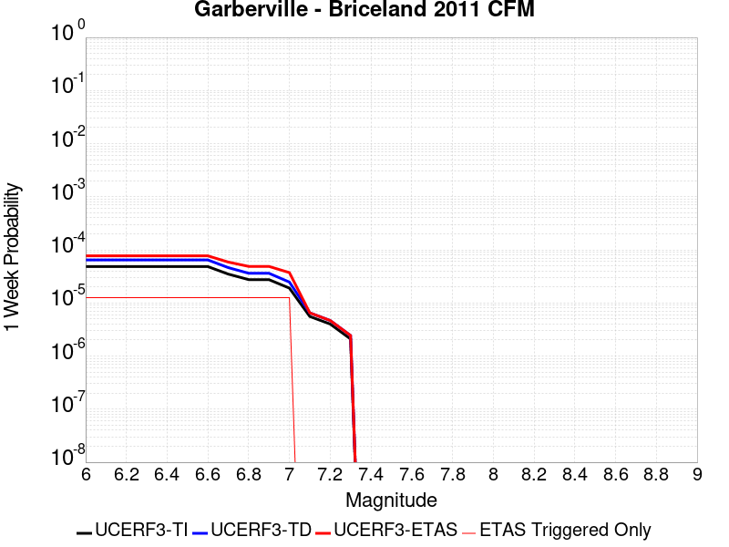 | 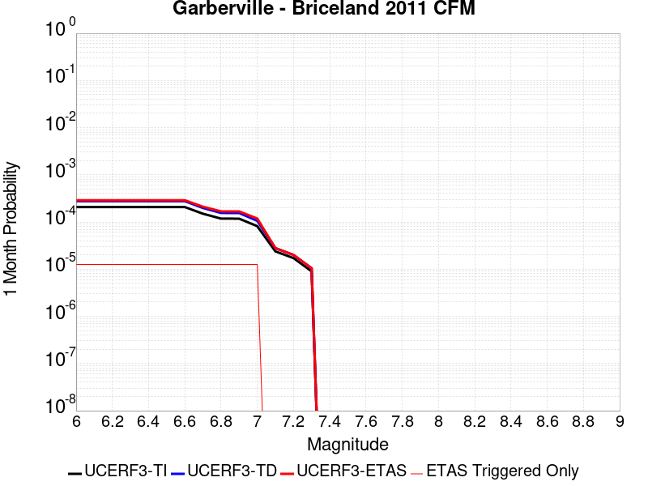 | 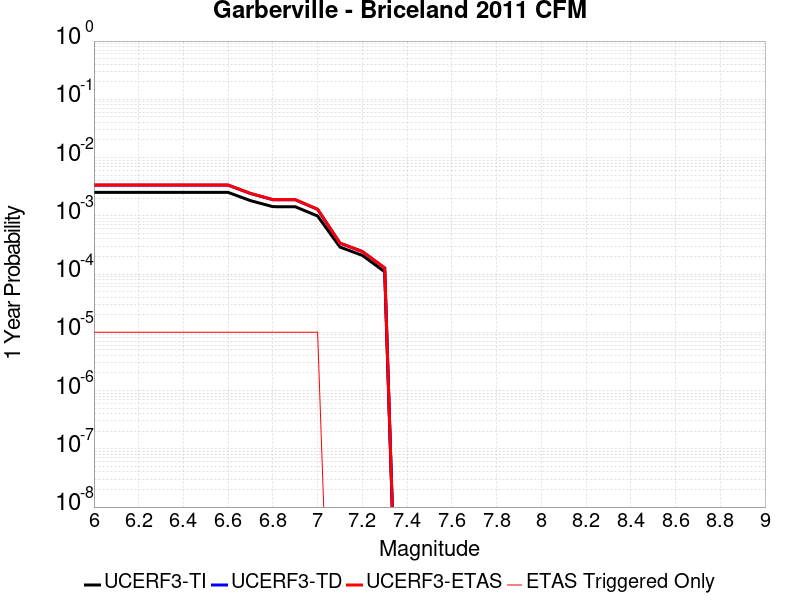 | 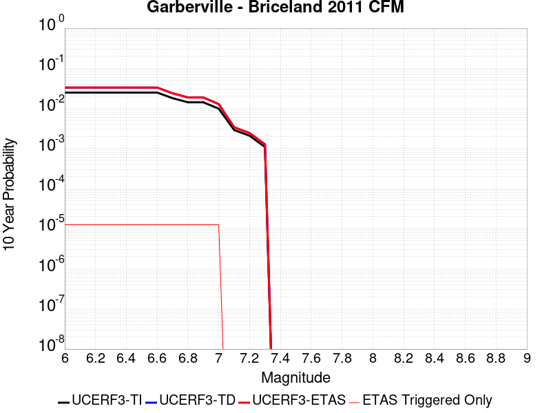 |

| Magnitude | 1 wk TI Prob | 1 wk TD Prob | 1 wk ETAS Prob | 1 wk ETAS/TD Gain | 1 wk ETAS Triggered Only | 1 mo TI Prob | 1 mo TD Prob | 1 mo ETAS Prob | 1 mo ETAS/TD Gain | 1 mo ETAS Triggered Only | 1 yr TI Prob | 1 yr TD Prob | 1 yr ETAS Prob | 1 yr ETAS/TD Gain | 1 yr ETAS Triggered Only | 10 yr TI Prob | 10 yr TD Prob | 10 yr ETAS Prob | 10 yr ETAS/TD Gain | 10 yr ETAS Triggered Only |
|-----|-----|-----|-----|-----|-----|-----|-----|-----|-----|-----|-----|-----|-----|-----|-----|-----|-----|-----|-----|-----|
| 6.0 | 4.8399295E-5 | 6.4527754E-5 | 7.452711E-5 | 1.1549621 | 1.0E-5 | 2.0740906E-4 | 2.765224E-4 | 2.8651961E-4 | 1.0361534 | 1.0E-5 | 0.002522281 | 0.0033621131 | 0.0033720795 | 1.0029644 | 1.0E-5 | 0.024938442 | 0.03317879 | 0.03318846 | 1.0002913 | 1.0E-5 |
| 6.1 | 4.8399295E-5 | 6.4527754E-5 | 7.452711E-5 | 1.1549621 | 1.0E-5 | 2.0740906E-4 | 2.765224E-4 | 2.8651961E-4 | 1.0361534 | 1.0E-5 | 0.002522281 | 0.0033621131 | 0.0033720795 | 1.0029644 | 1.0E-5 | 0.024938442 | 0.03317879 | 0.03318846 | 1.0002913 | 1.0E-5 |
| 6.2 | 4.8399295E-5 | 6.4527754E-5 | 7.452711E-5 | 1.1549621 | 1.0E-5 | 2.0740906E-4 | 2.765224E-4 | 2.8651961E-4 | 1.0361534 | 1.0E-5 | 0.002522281 | 0.0033621131 | 0.0033720795 | 1.0029644 | 1.0E-5 | 0.024938442 | 0.03317879 | 0.03318846 | 1.0002913 | 1.0E-5 |
| 6.3 | 4.8399295E-5 | 6.4527754E-5 | 7.452711E-5 | 1.1549621 | 1.0E-5 | 2.0740906E-4 | 2.765224E-4 | 2.8651961E-4 | 1.0361534 | 1.0E-5 | 0.002522281 | 0.0033621131 | 0.0033720795 | 1.0029644 | 1.0E-5 | 0.024938442 | 0.03317879 | 0.03318846 | 1.0002913 | 1.0E-5 |
| 6.4 | 4.8399295E-5 | 6.4527754E-5 | 7.452711E-5 | 1.1549621 | 1.0E-5 | 2.0740906E-4 | 2.765224E-4 | 2.8651961E-4 | 1.0361534 | 1.0E-5 | 0.002522281 | 0.0033621131 | 0.0033720795 | 1.0029644 | 1.0E-5 | 0.024938442 | 0.03317879 | 0.03318846 | 1.0002913 | 1.0E-5 |
| 6.5 | 4.8399295E-5 | 6.4527754E-5 | 7.452711E-5 | 1.1549621 | 1.0E-5 | 2.0740906E-4 | 2.765224E-4 | 2.8651961E-4 | 1.0361534 | 1.0E-5 | 0.002522281 | 0.0033621131 | 0.0033720795 | 1.0029644 | 1.0E-5 | 0.024938442 | 0.03317879 | 0.03318846 | 1.0002913 | 1.0E-5 |
| 6.6 | 4.8399295E-5 | 6.4527754E-5 | 7.452711E-5 | 1.1549621 | 1.0E-5 | 2.0740906E-4 | 2.765224E-4 | 2.8651961E-4 | 1.0361534 | 1.0E-5 | 0.002522281 | 0.0033621131 | 0.0033720795 | 1.0029644 | 1.0E-5 | 0.024938442 | 0.03317879 | 0.03318846 | 1.0002913 | 1.0E-5 |
| 6.7 | 3.495179E-5 | 4.630908E-5 | 5.6308618E-5 | 1.2159303 | 1.0E-5 | 1.4978478E-4 | 1.9845538E-4 | 2.0845339E-4 | 1.0503792 | 1.0E-5 | 0.0018221042 | 0.0024140473 | 0.002424023 | 1.0041324 | 1.0E-5 | 0.018072363 | 0.023930654 | 0.023940416 | 1.0004078 | 1.0E-5 |
| 6.8 | 2.7517597E-5 | 3.62417E-5 | 4.6241337E-5 | 1.2759153 | 1.0E-5 | 1.1792722E-4 | 1.5531495E-4 | 1.653134E-4 | 1.0643753 | 1.0E-5 | 0.0014348183 | 0.0018897917 | 0.0018997728 | 1.0052816 | 1.0E-5 | 0.014255894 | 0.01878354 | 0.01879335 | 1.0005224 | 1.0E-5 |
| 6.9 | 2.74461E-5 | 3.6159425E-5 | 4.6159064E-5 | 1.276543 | 1.0E-5 | 1.1762084E-4 | 1.5496238E-4 | 1.6496085E-4 | 1.0645218 | 1.0E-5 | 0.001431093 | 0.0018855067 | 0.0018954879 | 1.0052936 | 1.0E-5 | 0.014219119 | 0.018741412 | 0.018751225 | 1.0005236 | 1.0E-5 |
| 7.0 | 1.9023773E-5 | 2.4707771E-5 | 3.4707526E-5 | 1.4047209 | 1.0E-5 | 8.152791E-5 | 1.0588833E-4 | 1.1588727E-4 | 1.0944291 | 1.0E-5 | 9.921503E-4 | 0.0012888273 | 0.0012988143 | 1.007749 | 1.0E-5 | 0.009877323 | 0.012852578 | 0.01286245 | 1.0007681 | 1.0E-5 |
| 7.1 | 5.566844E-6 | 6.512147E-6 | 6.512147E-6 | 1.0 | 0.0 | 2.3857683E-5 | 2.7908927E-5 | 2.7908927E-5 | 1.0 | 0.0 | 2.9042858E-4 | 3.3974246E-4 | 3.3974246E-4 | 1.0 | 0.0 | 0.002900493 | 0.0033926512 | 0.0033926512 | 1.0 | 0.0 |
| 7.2 | 4.011353E-6 | 4.6746213E-6 | 4.6746213E-6 | 1.0 | 0.0 | 1.7191402E-5 | 2.0033956E-5 | 2.0033956E-5 | 1.0 | 0.0 | 2.0928521E-4 | 2.4388955E-4 | 2.4388955E-4 | 1.0 | 0.0 | 0.0020908823 | 0.0024365564 | 0.0024365564 | 1.0 | 0.0 |
| 7.3 | 2.0974871E-6 | 2.4395908E-6 | 2.4395908E-6 | 1.0 | 0.0 | 8.989199E-6 | 1.0455362E-5 | 1.0455362E-5 | 1.0 | 0.0 | 1.09438006E-4 | 1.272891E-4 | 1.272891E-4 | 1.0 | 0.0 | 0.0010938413 | 0.0012724071 | 0.0012724071 | 1.0 | 0.0 |

## Monterey Bay-Tularcitos
*[(top)](#table-of-contents)*

| 1 Week | 1 Month | 1 Year | 10 Year |
|-----|-----|-----|-----|
|  | 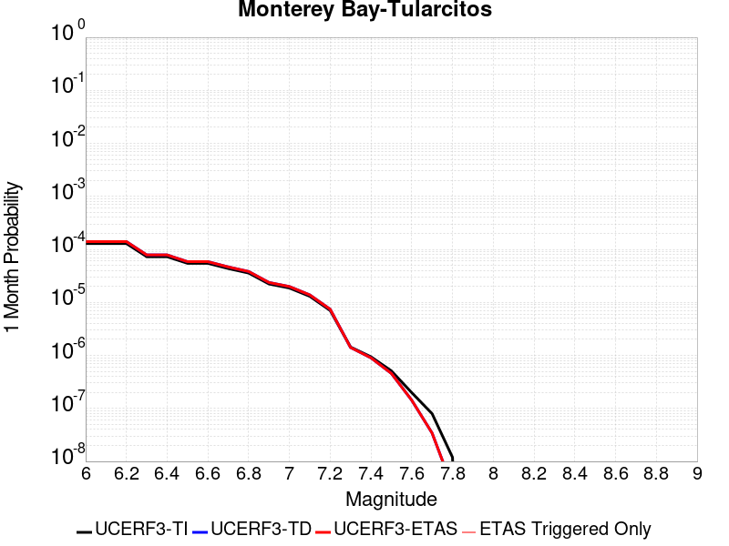 | 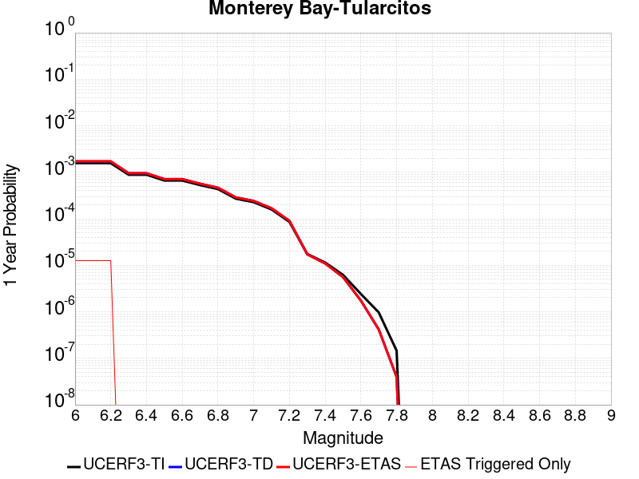 | 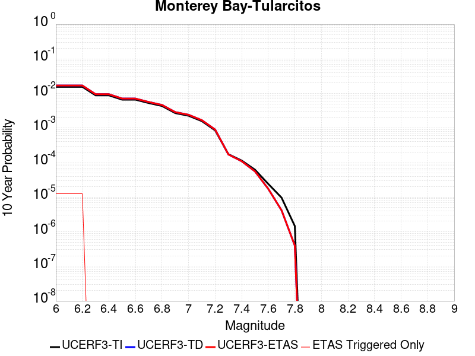 |

| Magnitude | 1 wk TI Prob | 1 wk TD Prob | 1 wk ETAS Prob | 1 wk ETAS/TD Gain | 1 wk ETAS Triggered Only | 1 mo TI Prob | 1 mo TD Prob | 1 mo ETAS Prob | 1 mo ETAS/TD Gain | 1 mo ETAS Triggered Only | 1 yr TI Prob | 1 yr TD Prob | 1 yr ETAS Prob | 1 yr ETAS/TD Gain | 1 yr ETAS Triggered Only | 10 yr TI Prob | 10 yr TD Prob | 10 yr ETAS Prob | 10 yr ETAS/TD Gain | 10 yr ETAS Triggered Only |
|-----|-----|-----|-----|-----|-----|-----|-----|-----|-----|-----|-----|-----|-----|-----|-----|-----|-----|-----|-----|-----|
| 6.0 | 3.0131365E-5 | 3.279877E-5 | 3.279877E-5 | 1.0 | 0.0 | 1.2912804E-4 | 1.4055918E-4 | 1.4055918E-4 | 1.0 | 0.0 | 0.001571 | 0.0017100703 | 0.0017200531 | 1.0058377 | 1.0E-5 | 0.015599402 | 0.016979916 | 0.016989747 | 1.0005789 | 1.0E-5 |
| 6.1 | 3.0131365E-5 | 3.279877E-5 | 3.279877E-5 | 1.0 | 0.0 | 1.2912804E-4 | 1.4055918E-4 | 1.4055918E-4 | 1.0 | 0.0 | 0.001571 | 0.0017100703 | 0.0017200531 | 1.0058377 | 1.0E-5 | 0.015599402 | 0.016979916 | 0.016989747 | 1.0005789 | 1.0E-5 |
| 6.2 | 3.0131365E-5 | 3.279877E-5 | 3.279877E-5 | 1.0 | 0.0 | 1.2912804E-4 | 1.4055918E-4 | 1.4055918E-4 | 1.0 | 0.0 | 0.001571 | 0.0017100703 | 0.0017200531 | 1.0058377 | 1.0E-5 | 0.015599402 | 0.016979916 | 0.016989747 | 1.0005789 | 1.0E-5 |
| 6.3 | 1.6998249E-5 | 1.8330798E-5 | 1.8330798E-5 | 1.0 | 0.0 | 7.28476E-5 | 7.85583E-5 | 7.85583E-5 | 1.0 | 0.0 | 8.865586E-4 | 9.5604634E-4 | 9.5604634E-4 | 1.0 | 0.0 | 0.0088303005 | 0.009521258 | 0.009521258 | 1.0 | 0.0 |
| 6.4 | 1.6998249E-5 | 1.8330798E-5 | 1.8330798E-5 | 1.0 | 0.0 | 7.28476E-5 | 7.85583E-5 | 7.85583E-5 | 1.0 | 0.0 | 8.865586E-4 | 9.5604634E-4 | 9.5604634E-4 | 1.0 | 0.0 | 0.0088303005 | 0.009521258 | 0.009521258 | 1.0 | 0.0 |
| 6.5 | 1.27470785E-5 | 1.3693312E-5 | 1.3693312E-5 | 1.0 | 0.0 | 5.4629192E-5 | 5.8684363E-5 | 5.8684363E-5 | 1.0 | 0.0 | 6.649074E-4 | 7.1425823E-4 | 7.1425823E-4 | 1.0 | 0.0 | 0.0066292146 | 0.007120678 | 0.007120678 | 1.0 | 0.0 |
| 6.6 | 1.2739422E-5 | 1.36854E-5 | 1.36854E-5 | 1.0 | 0.0 | 5.4596385E-5 | 5.8650454E-5 | 5.8650454E-5 | 1.0 | 0.0 | 6.645082E-4 | 7.1384566E-4 | 7.1384566E-4 | 1.0 | 0.0 | 0.0066252467 | 0.007116579 | 0.007116579 | 1.0 | 0.0 |
| 6.7 | 1.0160109E-5 | 1.0885755E-5 | 1.0885755E-5 | 1.0 | 0.0 | 4.35426E-5 | 4.665244E-5 | 4.665244E-5 | 1.0 | 0.0 | 5.300022E-4 | 5.6785246E-4 | 5.6785246E-4 | 1.0 | 0.0 | 0.005287399 | 0.0056647263 | 0.0056647263 | 1.0 | 0.0 |
| 6.8 | 8.349859E-6 | 8.932587E-6 | 8.932587E-6 | 1.0 | 0.0 | 3.578462E-5 | 3.8281985E-5 | 3.8281985E-5 | 1.0 | 0.0 | 4.3559066E-4 | 4.6598914E-4 | 4.6598914E-4 | 1.0 | 0.0 | 0.004347378 | 0.004650685 | 0.004650685 | 1.0 | 0.0 |
| 6.9 | 5.193639E-6 | 5.53643E-6 | 5.53643E-6 | 1.0 | 0.0 | 2.2258262E-5 | 2.372736E-5 | 2.372736E-5 | 1.0 | 0.0 | 2.7096065E-4 | 2.8884556E-4 | 2.8884556E-4 | 1.0 | 0.0 | 0.0027063051 | 0.0028850224 | 0.0028850224 | 1.0 | 0.0 |
| 7.0 | 4.359381E-6 | 4.643366E-6 | 4.643366E-6 | 1.0 | 0.0 | 1.8682927E-5 | 1.9900004E-5 | 1.9900004E-5 | 1.0 | 0.0 | 2.274409E-4 | 2.422586E-4 | 2.422586E-4 | 1.0 | 0.0 | 0.0022720827 | 0.002420238 | 0.002420238 | 1.0 | 0.0 |
| 7.1 | 3.0398533E-6 | 3.2310427E-6 | 3.2310427E-6 | 1.0 | 0.0 | 1.3027877E-5 | 1.3847267E-5 | 1.3847267E-5 | 1.0 | 0.0 | 1.5860285E-4 | 1.6858005E-4 | 1.6858005E-4 | 1.0 | 0.0 | 0.001584897 | 0.0016847793 | 0.0016847793 | 1.0 | 0.0 |
| 7.2 | 1.642335E-6 | 1.7333153E-6 | 1.7333153E-6 | 1.0 | 0.0 | 7.0385595E-6 | 7.428485E-6 | 7.428485E-6 | 1.0 | 0.0 | 8.569109E-5 | 9.044012E-5 | 9.044012E-5 | 1.0 | 0.0 | 8.5658056E-4 | 9.042358E-4 | 9.042358E-4 | 1.0 | 0.0 |
| 7.3 | 3.356842E-7 | 3.2952389E-7 | 3.2952389E-7 | 1.0 | 0.0 | 1.4386458E-6 | 1.4122445E-6 | 1.4122445E-6 | 1.0 | 0.0 | 1.7515373E-5 | 1.7193941E-5 | 1.7193941E-5 | 1.0 | 0.0 | 1.7513991E-4 | 1.719262E-4 | 1.719262E-4 | 1.0 | 0.0 |
| 7.4 | 2.1973483E-7 | 2.1006414E-7 | 2.1006414E-7 | 1.0 | 0.0 | 9.417204E-7 | 9.002746E-7 | 9.002746E-7 | 1.0 | 0.0 | 1.1465385E-5 | 1.0960788E-5 | 1.0960788E-5 | 1.0 | 0.0 | 1.1464794E-4 | 1.0960251E-4 | 1.0960251E-4 | 1.0 | 0.0 |
| 7.5 | 1.1944135E-7 | 1.0696035E-7 | 1.0696035E-7 | 1.0 | 0.0 | 5.118914E-7 | 4.5840142E-7 | 4.5840142E-7 | 1.0 | 0.0 | 6.23226E-6 | 5.581023E-6 | 5.581023E-6 | 1.0 | 0.0 | 6.2320854E-5 | 5.5808843E-5 | 5.5808843E-5 | 1.0 | 0.0 |
| 7.6 | 4.636058E-8 | 3.3364433E-8 | 3.3364433E-8 | 1.0 | 0.0 | 1.9868818E-7 | 1.4299042E-7 | 1.4299042E-7 | 1.0 | 0.0 | 2.419026E-6 | 1.740907E-6 | 1.740907E-6 | 1.0 | 0.0 | 2.4189996E-5 | 1.7408936E-5 | 1.7408936E-5 | 1.0 | 0.0 |
| 7.7 | 1.8588572E-8 | 8.003168E-9 | 8.003168E-9 | 1.0 | 0.0 | 7.9665305E-8 | 3.429929E-8 | 3.429929E-8 | 1.0 | 0.0 | 9.699246E-7 | 4.1759378E-7 | 4.1759378E-7 | 1.0 | 0.0 | 9.699204E-6 | 4.1759304E-6 | 4.1759304E-6 | 1.0 | 0.0 |
| 7.8 | 2.7960154E-9 | 7.608624E-10 | 7.608624E-10 | 1.0 | 0.0 | 1.1982923E-8 | 3.2608392E-9 | 3.2608392E-9 | 1.0 | 0.0 | 1.4589209E-7 | 3.9700716E-8 | 3.9700716E-8 | 1.0 | 0.0 | 1.4589199E-6 | 3.970071E-7 | 3.970071E-7 | 1.0 | 0.0 |

## Santa Monica alt 1
*[(top)](#table-of-contents)*

| 1 Week | 1 Month | 1 Year | 10 Year |
|-----|-----|-----|-----|
| 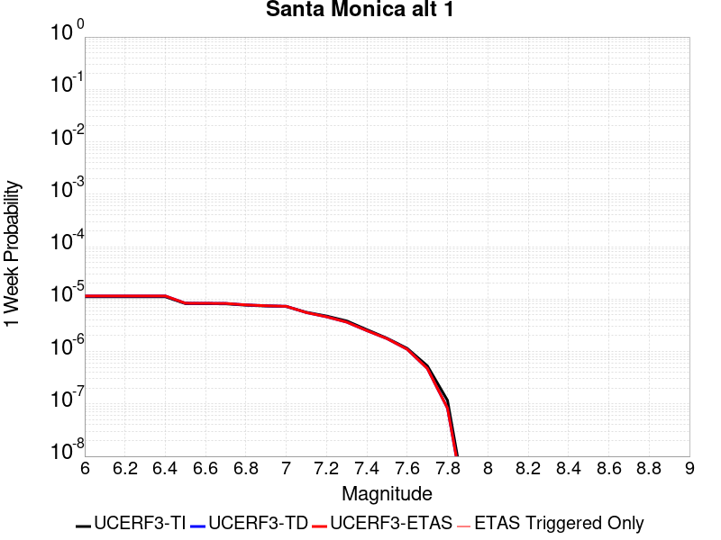 |  |  | 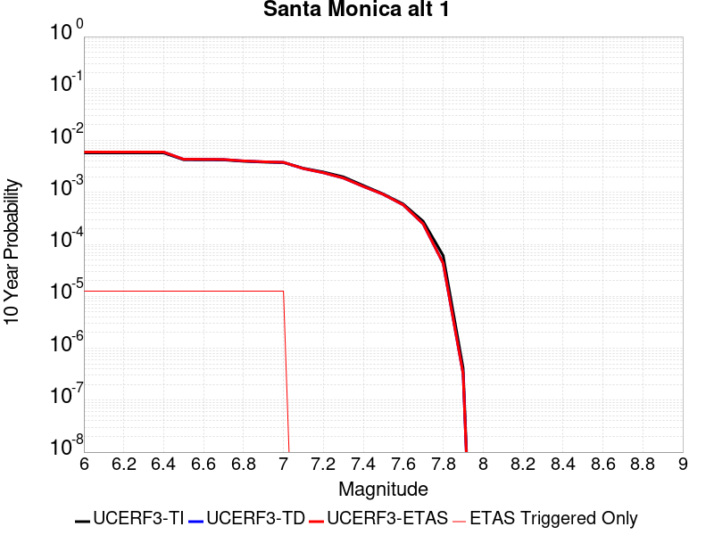 |

| Magnitude | 1 wk TI Prob | 1 wk TD Prob | 1 wk ETAS Prob | 1 wk ETAS/TD Gain | 1 wk ETAS Triggered Only | 1 mo TI Prob | 1 mo TD Prob | 1 mo ETAS Prob | 1 mo ETAS/TD Gain | 1 mo ETAS Triggered Only | 1 yr TI Prob | 1 yr TD Prob | 1 yr ETAS Prob | 1 yr ETAS/TD Gain | 1 yr ETAS Triggered Only | 10 yr TI Prob | 10 yr TD Prob | 10 yr ETAS Prob | 10 yr ETAS/TD Gain | 10 yr ETAS Triggered Only |
|-----|-----|-----|-----|-----|-----|-----|-----|-----|-----|-----|-----|-----|-----|-----|-----|-----|-----|-----|-----|-----|
| 6.0 | 1.1066008E-5 | 1.1480312E-5 | 1.1480312E-5 | 1.0 | 0.0 | 4.742488E-5 | 4.920049E-5 | 4.920049E-5 | 1.0 | 0.0 | 5.7724497E-4 | 5.9886527E-4 | 5.9886527E-4 | 1.0 | 0.0 | 0.005757478 | 0.0059739016 | 0.0059838416 | 1.0016639 | 1.0E-5 |
| 6.1 | 1.1066008E-5 | 1.1480312E-5 | 1.1480312E-5 | 1.0 | 0.0 | 4.742488E-5 | 4.920049E-5 | 4.920049E-5 | 1.0 | 0.0 | 5.7724497E-4 | 5.9886527E-4 | 5.9886527E-4 | 1.0 | 0.0 | 0.005757478 | 0.0059739016 | 0.0059838416 | 1.0016639 | 1.0E-5 |
| 6.2 | 1.1066008E-5 | 1.1480312E-5 | 1.1480312E-5 | 1.0 | 0.0 | 4.742488E-5 | 4.920049E-5 | 4.920049E-5 | 1.0 | 0.0 | 5.7724497E-4 | 5.9886527E-4 | 5.9886527E-4 | 1.0 | 0.0 | 0.005757478 | 0.0059739016 | 0.0059838416 | 1.0016639 | 1.0E-5 |
| 6.3 | 1.1066008E-5 | 1.1480312E-5 | 1.1480312E-5 | 1.0 | 0.0 | 4.742488E-5 | 4.920049E-5 | 4.920049E-5 | 1.0 | 0.0 | 5.7724497E-4 | 5.9886527E-4 | 5.9886527E-4 | 1.0 | 0.0 | 0.005757478 | 0.0059739016 | 0.0059838416 | 1.0016639 | 1.0E-5 |
| 6.4 | 1.1066008E-5 | 1.1480312E-5 | 1.1480312E-5 | 1.0 | 0.0 | 4.742488E-5 | 4.920049E-5 | 4.920049E-5 | 1.0 | 0.0 | 5.7724497E-4 | 5.9886527E-4 | 5.9886527E-4 | 1.0 | 0.0 | 0.005757478 | 0.0059739016 | 0.0059838416 | 1.0016639 | 1.0E-5 |
| 6.5 | 8.183544E-6 | 8.335434E-6 | 8.335434E-6 | 1.0 | 0.0 | 3.5071862E-5 | 3.572281E-5 | 3.572281E-5 | 1.0 | 0.0 | 4.2691626E-4 | 4.3483998E-4 | 4.3483998E-4 | 1.0 | 0.0 | 0.0042609703 | 0.004340057 | 0.0043500136 | 1.0022941 | 1.0E-5 |
| 6.6 | 8.1543285E-6 | 8.303648E-6 | 8.303648E-6 | 1.0 | 0.0 | 3.4946657E-5 | 3.558659E-5 | 3.558659E-5 | 1.0 | 0.0 | 4.2539247E-4 | 4.3318217E-4 | 4.3318217E-4 | 1.0 | 0.0 | 0.0042457907 | 0.004323543 | 0.0043335 | 1.0023029 | 1.0E-5 |
| 6.7 | 8.110878E-6 | 8.257045E-6 | 8.257045E-6 | 1.0 | 0.0 | 3.4760444E-5 | 3.5386864E-5 | 3.5386864E-5 | 1.0 | 0.0 | 4.231262E-4 | 4.3075148E-4 | 4.3075148E-4 | 1.0 | 0.0 | 0.0042232145 | 0.004299331 | 0.0043092878 | 1.002316 | 1.0E-5 |
| 6.8 | 7.644036E-6 | 7.751063E-6 | 7.751063E-6 | 1.0 | 0.0 | 3.275974E-5 | 3.3218425E-5 | 3.3218425E-5 | 1.0 | 0.0 | 3.9877684E-4 | 4.043607E-4 | 4.043607E-4 | 1.0 | 0.0 | 0.00398062 | 0.004036396 | 0.0040463554 | 1.0024675 | 1.0E-5 |
| 6.9 | 7.3698293E-6 | 7.4557215E-6 | 7.4557215E-6 | 1.0 | 0.0 | 3.15846E-5 | 3.195271E-5 | 3.195271E-5 | 1.0 | 0.0 | 3.8447464E-4 | 3.889562E-4 | 3.889562E-4 | 1.0 | 0.0 | 0.0038381014 | 0.0038828978 | 0.003892859 | 1.0025654 | 1.0E-5 |
| 7.0 | 7.209872E-6 | 7.2856283E-6 | 7.2856283E-6 | 1.0 | 0.0 | 3.0899086E-5 | 3.1223753E-5 | 3.1223753E-5 | 1.0 | 0.0 | 3.7613141E-4 | 3.800843E-4 | 3.800843E-4 | 1.0 | 0.0 | 0.0037549543 | 0.003794485 | 0.003804447 | 1.0026253 | 1.0E-5 |
| 7.1 | 5.603456E-6 | 5.5238947E-6 | 5.5238947E-6 | 1.0 | 0.0 | 2.4014591E-5 | 2.3673623E-5 | 2.3673623E-5 | 1.0 | 0.0 | 2.923384E-4 | 2.8818863E-4 | 2.8818863E-4 | 1.0 | 0.0 | 0.0029195412 | 0.002878191 | 0.002878191 | 1.0 | 0.0 |
| 7.2 | 4.7483613E-6 | 4.591135E-6 | 4.591135E-6 | 1.0 | 0.0 | 2.0349962E-5 | 1.9676147E-5 | 1.9676147E-5 | 1.0 | 0.0 | 2.4773262E-4 | 2.3953087E-4 | 2.3953087E-4 | 1.0 | 0.0 | 0.0024745662 | 0.0023927412 | 0.0023927412 | 1.0 | 0.0 |
| 7.3 | 3.829015E-6 | 3.6342271E-6 | 3.6342271E-6 | 1.0 | 0.0 | 1.6409962E-5 | 1.5575166E-5 | 1.5575166E-5 | 1.0 | 0.0 | 1.9977297E-4 | 1.8961124E-4 | 1.8961124E-4 | 1.0 | 0.0 | 0.0019959346 | 0.0018945034 | 0.0018945034 | 1.0 | 0.0 |
| 7.4 | 2.610755E-6 | 2.4995722E-6 | 2.4995722E-6 | 1.0 | 0.0 | 1.1188902E-5 | 1.0712408E-5 | 1.0712408E-5 | 1.0 | 0.0 | 1.3621636E-4 | 1.304158E-4 | 1.304158E-4 | 1.0 | 0.0 | 0.001361329 | 0.0013033971 | 0.0013033971 | 1.0 | 0.0 |
| 7.5 | 1.792146E-6 | 1.7584194E-6 | 1.7584194E-6 | 1.0 | 0.0 | 7.680603E-6 | 7.5360617E-6 | 7.5360617E-6 | 1.0 | 0.0 | 9.3507326E-5 | 9.174772E-5 | 9.174772E-5 | 1.0 | 0.0 | 9.3467993E-4 | 9.1710157E-4 | 9.1710157E-4 | 1.0 | 0.0 |
| 7.6 | 1.1473018E-6 | 1.102916E-6 | 1.102916E-6 | 1.0 | 0.0 | 4.9169985E-6 | 4.7267745E-6 | 4.7267745E-6 | 1.0 | 0.0 | 5.986281E-5 | 5.7546975E-5 | 5.7546975E-5 | 1.0 | 0.0 | 5.984669E-4 | 5.753224E-4 | 5.753224E-4 | 1.0 | 0.0 |
| 7.7 | 5.330919E-7 | 4.7452562E-7 | 4.7452562E-7 | 1.0 | 0.0 | 2.2846775E-6 | 2.0336797E-6 | 2.0336797E-6 | 1.0 | 0.0 | 2.7815593E-5 | 2.4759782E-5 | 2.4759782E-5 | 1.0 | 0.0 | 2.7812112E-4 | 2.4757136E-4 | 2.4757136E-4 | 1.0 | 0.0 |
| 7.8 | 1.1668574E-7 | 8.296564E-8 | 8.296564E-8 | 1.0 | 0.0 | 5.000816E-7 | 3.5556698E-7 | 3.5556698E-7 | 1.0 | 0.0 | 6.0884768E-6 | 4.3290197E-6 | 4.3290197E-6 | 1.0 | 0.0 | 6.08831E-5 | 4.3289383E-5 | 4.3289383E-5 | 1.0 | 0.0 |
| 7.9 | 8.007447E-10 | 6.161581E-10 | 6.161581E-10 | 1.0 | 0.0 | 3.4317629E-9 | 2.640678E-9 | 2.640678E-9 | 1.0 | 0.0 | 4.1781714E-8 | 3.2150254E-8 | 3.2150254E-8 | 1.0 | 0.0 | 4.1781706E-7 | 3.2150248E-7 | 3.2150248E-7 | 1.0 | 0.0 |

