# Parent Section Magnitude-Probability Distributions

Only fault sections with at least one triggered aftershock are plotted. Sections are sorted by total supraseismogenic trigger rate (decreasing)

## Table Of Contents

* [Tank Canyon](#tank-canyon)
* [Garlock (Central)](#garlock-central)
* [Little Lake](#little-lake)
* [Owl Lake](#owl-lake)
* [Airport Lake](#airport-lake)
* [Panamint Valley](#panamint-valley)
* [Garlock (East)](#garlock-east)
* [Blackwater](#blackwater)
* [Hunter Mountain-Saline Valley](#hunter-mountain-saline-valley)
* [Ash Hill](#ash-hill)
* [Gravel Hills-Harper Lk](#gravel-hills-harper-lk)
* [Garlock (West)](#garlock-west)
* [McLean Lake](#mclean-lake)
* [Goldstone Lake](#goldstone-lake)
* [Coyote Canyon](#coyote-canyon)
* [Lenwood-Lockhart-Old Woman Springs](#lenwood-lockhart-old-woman-springs)
* [San Andreas (Mojave S)](#san-andreas-mojave-s)
* [So Sierra Nevada](#so-sierra-nevada)
* [Death Valley (So)](#death-valley-so)
* [Nelson Lake](#nelson-lake)
* [San Andreas (Mojave N)](#san-andreas-mojave-n)
* [Bicycle Lake](#bicycle-lake)
* [Towne Pass](#towne-pass)
* [Paradise](#paradise)
* [Garlic Springs](#garlic-springs)
* [San Andreas (San Bernardino N)](#san-andreas-san-bernardino-n)
* [Helendale-So Lockhart](#helendale-so-lockhart)
* [San Andreas (San Bernardino S)](#san-andreas-san-bernardino-s)
* [Death Valley (Black Mtns Frontal)](#death-valley-black-mtns-frontal)
* [Coyote Lake](#coyote-lake)
* [San Andreas (Big Bend)](#san-andreas-big-bend)
* [San Andreas (Parkfield)](#san-andreas-parkfield)
* [Death Valley (No)](#death-valley-no)
* [Red Pass](#red-pass)
* [Elsinore (Glen Ivy) rev](#elsinore-glen-ivy-rev)
* [Cady](#cady)
* [Manix-Afton Hills](#manix-afton-hills)
* [Calico-Hidalgo](#calico-hidalgo)
* [San Andreas (San Gorgonio Pass-Garnet HIll)](#san-andreas-san-gorgonio-pass-garnet-hill)
* [Ludlow](#ludlow)
* [Death Valley (Fish Lake Valley)](#death-valley-fish-lake-valley)
* [San Andreas (Carrizo) rev](#san-andreas-carrizo-rev)
* [San Andreas (Cholame) rev](#san-andreas-cholame-rev)
* [San Andreas (Coachella) rev](#san-andreas-coachella-rev)
* [Mission Ridge-Arroyo Parida-Santa Ana](#mission-ridge-arroyo-parida-santa-ana)
* [White Wolf (Extension)](#white-wolf-extension)
* [Santa Ynez (West)](#santa-ynez-west)
* [Sierra Nevada  (No Extension)](#sierra-nevada--no-extension)
* [Baker](#baker)
* [San Jacinto (San Bernardino)](#san-jacinto-san-bernardino)
* [San Andreas (North Branch Mill Creek)](#san-andreas-north-branch-mill-creek)
* [Red Mountain](#red-mountain)
* [Lake Isabella (Seismicity)](#lake-isabella-seismicity)
* [Scodie Lineament](#scodie-lineament)
* [Santa Rosa Island](#santa-rosa-island)
* [Brawley (Seismic Zone) alt 1](#brawley-seismic-zone-alt-1)
* [Santa Ynez (East)](#santa-ynez-east)
* [San Andreas (Creeping Section) 2011 CFM](#san-andreas-creeping-section-2011-cfm)
* [Cleghorn Lake](#cleghorn-lake)
* [San Jacinto (San Jacinto Valley) rev](#san-jacinto-san-jacinto-valley-rev)
* [Deep Springs](#deep-springs)
* [Lost Hills](#lost-hills)
* [Rose Canyon](#rose-canyon)
* [San Jacinto (Stepovers Combined)](#san-jacinto-stepovers-combined)
* [Imperial](#imperial)
* [San Jacinto (Anza) rev](#san-jacinto-anza-rev)
* [Mission Creek](#mission-creek)
* [Cleghorn Pass](#cleghorn-pass)
* [Owens Valley](#owens-valley)
* [Ventura-Pitas Point](#ventura-pitas-point)
* [Pleito](#pleito)
* [Kern Canyon (North Kern) 2011](#kern-canyon-north-kern-2011)
* [Dry Mountain](#dry-mountain)
* [Sheephole](#sheephole)
* [San Diego Trough north alt1](#san-diego-trough-north-alt1)
* [Pinto Mtn](#pinto-mtn)
* [Channel Islands Thrust](#channel-islands-thrust)
* [Coronado Bank alt1](#coronado-bank-alt1)
* [Camp Rock 2011](#camp-rock-2011)
* [Santa Cruz Island](#santa-cruz-island)
* [Oceanic - West Huasna](#oceanic---west-huasna)
* [Pine Mtn](#pine-mtn)
* [San Jacinto (Coyote Creek)](#san-jacinto-coyote-creek)
* [Blue Cut](#blue-cut)
* [Bullion Mountains](#bullion-mountains)
* [Independence rev 2011](#independence-rev-2011)
* [San Pedro Basin](#san-pedro-basin)
* [San Diego Trough south](#san-diego-trough-south)
* [Pitas Point (Lower West)](#pitas-point-lower-west)
* [Big Pine (Central)](#big-pine-central)
* [Great Valley 09 (Laguna Seca)](#great-valley-09-laguna-seca)
* [Chino alt 1](#chino-alt-1)
* [San Clemente](#san-clemente)
* [Santa Ynez River](#santa-ynez-river)
* [San Cayetano](#san-cayetano)
* [Ortigalita (North)](#ortigalita-north)
* [White Mountains](#white-mountains)
* [Hosgri](#hosgri)
* [Palos Verdes](#palos-verdes)
* [Pitas Point (Lower)-Montalvo](#pitas-point-lower-montalvo)
* [Elysian Park (Upper)](#elysian-park-upper)
* [Emerson-Copper Mtn 2011](#emerson-copper-mtn-2011)
* [San Jacinto (Lytle Creek connector)](#san-jacinto-lytle-creek-connector)
* [Tin Mountain](#tin-mountain)
* [Oak Ridge (Onshore)](#oak-ridge-onshore)
* [San Jacinto (Borrego)](#san-jacinto-borrego)
* [Santa Susana East (connector)](#santa-susana-east-connector)
* [Hunting Creek - Berryessa 2011 CFM](#hunting-creek---berryessa-2011-cfm)
* [San Luis Range 2011 CFM](#san-luis-range-2011-cfm)
* [Elmore Ranch](#elmore-ranch)
* [San Juan](#san-juan)
* [Santa Susana alt 1](#santa-susana-alt-1)
* [Whittier alt 1](#whittier-alt-1)
* [Malibu Coast alt 1](#malibu-coast-alt-1)
* [Mono Lake 2011 CFM](#mono-lake-2011-cfm)
* [Greenville (So) 2011 CFM](#greenville-so-2011-cfm)
* [San Jacinto (Clark) rev](#san-jacinto-clark-rev)
* [Cleghorn](#cleghorn)
* [Greenville (No) 2011 CFM](#greenville-no-2011-cfm)
* [Kern Canyon (South Kern) 2011](#kern-canyon-south-kern-2011)
* [North Frontal  (East)](#north-frontal--east)
* [Owens Valley Keough Hot Springs](#owens-valley-keough-hot-springs)
* [Los Alamos 2011 CFM](#los-alamos-2011-cfm)
* [Oceanside alt1](#oceanside-alt1)
* [Kern Canyon (Lake Isabella) 2011](#kern-canyon-lake-isabella-2011)
* [Simi-Santa Rosa](#simi-santa-rosa)
* [Newport-Inglewood alt 1](#newport-inglewood-alt-1)
* [Ortigalita (South)](#ortigalita-south)
* [Cerro Prieto](#cerro-prieto)
* [Rinconada 2011 CFM](#rinconada-2011-cfm)
* [Likely 2011 CFM](#likely-2011-cfm)
* [San Gregorio (North) 2011 CFM](#san-gregorio-north-2011-cfm)
* [Homestead Valley 2011](#homestead-valley-2011)
* [Fontana (Seismicity)](#fontana-seismicity)
* [Robinson Creek](#robinson-creek)
* [Calaveras (So) 2011 CFM](#calaveras-so-2011-cfm)
* [San Jacinto (Superstition Mtn)](#san-jacinto-superstition-mtn)
* [Green Valley 2011 CFM](#green-valley-2011-cfm)
* [Calaveras (So) - Paicines extension 2011 CFM](#calaveras-so---paicines-extension-2011-cfm)
* [Malibu Coast (Extension) alt 1](#malibu-coast-extension-alt-1)
* [Superstition Hills](#superstition-hills)
* [Los Alamos extension](#los-alamos-extension)
* [Cedar Mtn-Mahogany Mtn](#cedar-mtn-mahogany-mtn)
* [Pisgah-Bullion Mtn-Mesquite Lk](#pisgah-bullion-mtn-mesquite-lk)
* [San Gabriel](#san-gabriel)
* [White Wolf](#white-wolf)
* [La Panza 2011](#la-panza-2011)
* [Northridge](#northridge)
* [Casmalia 2011 CFM](#casmalia-2011-cfm)
* [San Gorgonio Pass](#san-gorgonio-pass)
* [Newport-Inglewood (Offshore)](#newport-inglewood-offshore)
* [Hat Creek-McArthur-Mayfield](#hat-creek-mcarthur-mayfield)
* [Big Pine (East)](#big-pine-east)
* [Great Valley 05 Pittsburg - Kirby Hills alt1](#great-valley-05-pittsburg---kirby-hills-alt1)
* [Swain Ravine - Spenceville](#swain-ravine---spenceville)
* [Mount Diablo Thrust North CFM](#mount-diablo-thrust-north-cfm)
* [Gillem - Big Crack 2011 CFM](#gillem---big-crack-2011-cfm)
* [Great Valley 08 (Quinto)](#great-valley-08-quinto)
* [Los Osos 2011](#los-osos-2011)
* [Hayward (So) 2011 CFM](#hayward-so-2011-cfm)
* [Raymond](#raymond)
* [Davis Creek](#davis-creek)
* [Hosgri (Extension)](#hosgri-extension)
* [Concord 2011 CFM](#concord-2011-cfm)
* [Calaveras (Central) 2011 CFM](#calaveras-central-2011-cfm)
* [Santa Cruz Catalina Ridge alt1](#santa-cruz-catalina-ridge-alt1)
* [Elsinore (Temecula) rev](#elsinore-temecula-rev)
* [Monterey Bay-Tularcitos](#monterey-bay-tularcitos)
* [Great Valley 03a Dunnigan Hills](#great-valley-03a-dunnigan-hills)
* [Channel Islands Western Deep Ramp](#channel-islands-western-deep-ramp)
* [Hollywood](#hollywood)
* [Round Valley](#round-valley)
* [Elsinore (Julian)](#elsinore-julian)
* [Clayton](#clayton)
* [Walker Spring 2011 CFM](#walker-spring-2011-cfm)
* [Hunting Creek - Bartlett Springs connector 2011](#hunting-creek---bartlett-springs-connector-2011)
* [Polaris 2011 CFM](#polaris-2011-cfm)
* [Calaveras (No) 2011 CFM](#calaveras-no-2011-cfm)
* [Mission (connected) 2011 CFM](#mission-connected-2011-cfm)
* [South Cuyama](#south-cuyama)
* [Earthquake Valley](#earthquake-valley)
* [San Joaquin Hills](#san-joaquin-hills)
* [Yorba Linda](#yorba-linda)
* [Elsinore (Stepovers Combined)](#elsinore-stepovers-combined)
* [Great Valley 06 (Midland) 2011 CFM alt1](#great-valley-06-midland-2011-cfm-alt1)
* [Great Valley 10 (Panoche)](#great-valley-10-panoche)
* [Santa Monica alt 1](#santa-monica-alt-1)
* [Holser alt 1](#holser-alt-1)
* [East Huasna 2011 CFM](#east-huasna-2011-cfm)
* [San Pedro Escarpment](#san-pedro-escarpment)
* [Great Valley 11](#great-valley-11)
* [West Tahoe](#west-tahoe)
* [Honey Lake 2011 CFM](#honey-lake-2011-cfm)
* [Mission Hills 2011](#mission-hills-2011)
* [Hayward (So) extension 2011 CFM](#hayward-so-extension-2011-cfm)
* [Carson Range (Genoa)](#carson-range-genoa)
* [Laguna Salada](#laguna-salada)
* [Big Pine (West)](#big-pine-west)
* [Compton](#compton)
* [San Jose](#san-jose)
* [Anaheim](#anaheim)
* [Johnson Valley (No) 2011 rev](#johnson-valley-no-2011-rev)
* [North Frontal  (West)](#north-frontal--west)
* [Peralta Hills](#peralta-hills)
* [Reliz 2011 CFM](#reliz-2011-cfm)
* [Mendocino](#mendocino)
* [Burnt Mtn](#burnt-mtn)
* [Earthquake Valley (No  Extension)](#earthquake-valley-no--extension)
* [Shoreline](#shoreline)
* [Great Valley 07 (Orestimba)](#great-valley-07-orestimba)
* [Pilarcitos 2011 CFM](#pilarcitos-2011-cfm)
* [Morales (West)](#morales-west)
* [Sisar](#sisar)
* [Surprise Valley 2011 CFM](#surprise-valley-2011-cfm)
* [San Gabriel (Extension)](#san-gabriel-extension)
* [Monte Vista - Shannon 2011 CFM](#monte-vista---shannon-2011-cfm)
* [Garberville - Briceland 2011 CFM](#garberville---briceland-2011-cfm)
* [Clamshell-Sawpit](#clamshell-sawpit)
* [Del Valle](#del-valle)
* [Skinner Flat 2011 CFM](#skinner-flat-2011-cfm)
* [Sierra Madre](#sierra-madre)
* [Morales (East)](#morales-east)
* [Sargent 2011 CFM](#sargent-2011-cfm)
* [Earthquake Valley (So Extension)](#earthquake-valley-so-extension)

## Tank Canyon
*[(top)](#table-of-contents)*

| 1 Week | 1 Month | 1 Year | 10 Year |
|-----|-----|-----|-----|
|  |  |  |  |

| Magnitude | 1 wk TI Prob | 1 wk TD Prob | 1 wk ETAS Prob | 1 wk ETAS/TD Gain | 1 wk ETAS Triggered Only | 1 mo TI Prob | 1 mo TD Prob | 1 mo ETAS Prob | 1 mo ETAS/TD Gain | 1 mo ETAS Triggered Only | 1 yr TI Prob | 1 yr TD Prob | 1 yr ETAS Prob | 1 yr ETAS/TD Gain | 1 yr ETAS Triggered Only | 10 yr TI Prob | 10 yr TD Prob | 10 yr ETAS Prob | 10 yr ETAS/TD Gain | 10 yr ETAS Triggered Only |
|-----|-----|-----|-----|-----|-----|-----|-----|-----|-----|-----|-----|-----|-----|-----|-----|-----|-----|-----|-----|-----|
| 6.0 | 4.8284557E-5 | 5.7964822E-5 | 0.03426598 | 591.1513 | 0.03421 | 2.0691741E-4 | 2.4840087E-4 | 0.04633695 | 186.54102 | 0.0461 | 0.0025163088 | 0.0030207601 | 0.072909005 | 24.135979 | 0.0701 | 0.02488006 | 0.029863637 | 0.12333628 | 4.129982 | 0.09635 |
| 6.1 | 1.7796336E-5 | 2.0873314E-5 | 0.011950624 | 572.5312 | 0.01193 | 7.626778E-5 | 8.945422E-5 | 0.016527984 | 184.76472 | 0.01644 | 9.281647E-4 | 0.0010885983 | 0.026680708 | 24.509233 | 0.02562 | 0.009242975 | 0.010836744 | 0.047000553 | 4.337147 | 0.03656 |
| 6.2 | 1.7796336E-5 | 2.0873314E-5 | 0.011950624 | 572.5312 | 0.01193 | 7.626778E-5 | 8.945422E-5 | 0.016527984 | 184.76472 | 0.01644 | 9.281647E-4 | 0.0010885983 | 0.026680708 | 24.509233 | 0.02562 | 0.009242975 | 0.010836744 | 0.047000553 | 4.337147 | 0.03656 |
| 6.3 | 1.3515912E-5 | 1.5759564E-5 | 0.008625624 | 547.3263 | 0.00861 | 5.792405E-5 | 6.753938E-5 | 0.011796747 | 174.66472 | 0.01173 | 7.049971E-4 | 8.2200574E-4 | 0.019206882 | 23.365871 | 0.0184 | 0.007027647 | 0.0081922645 | 0.034256972 | 4.1816244 | 0.02628 |
| 6.4 | 1.0870146E-5 | 1.2618021E-5 | 0.006362538 | 504.24216 | 0.00635 | 4.658551E-5 | 5.4076212E-5 | 0.008763605 | 162.06026 | 0.00871 | 5.67031E-4 | 6.581969E-4 | 0.014539055 | 22.089216 | 0.01389 | 0.005655863 | 0.0065644905 | 0.026383528 | 4.0191283 | 0.01995 |
| 6.5 | 7.964826E-6 | 9.196094E-6 | 0.0038891605 | 422.91437 | 0.00388 | 3.4134522E-5 | 3.9411298E-5 | 0.0054691974 | 138.77232 | 0.00543 | 4.1550855E-4 | 4.7973756E-4 | 0.009285511 | 19.355398 | 0.00881 | 0.0041473247 | 0.004788321 | 0.017407605 | 3.6354299 | 0.01268 |
| 6.6 | 6.6317E-6 | 7.6122988E-6 | 0.0028575906 | 375.39127 | 0.00285 | 2.8421264E-5 | 3.2623782E-5 | 0.004052493 | 124.21897 | 0.00402 | 3.4597394E-4 | 3.9713128E-4 | 0.0068045855 | 17.134348 | 0.00641 | 0.0034543579 | 0.003965368 | 0.01322849 | 3.3360057 | 0.0093 |
| 6.7 | 4.793663E-6 | 5.4307857E-6 | 0.0016454218 | 302.98044 | 0.00164 | 2.0544108E-5 | 2.3274613E-5 | 0.0023332208 | 100.24746 | 0.00231 | 2.500958E-4 | 2.8333595E-4 | 0.0039422987 | 13.913868 | 0.00366 | 0.0024981452 | 0.0028304397 | 0.008045636 | 2.8425395 | 0.00523 |
| 6.8 | 4.382823E-6 | 4.9692567E-6 | 0.001474962 | 296.8174 | 0.00147 | 1.8783392E-5 | 2.1296666E-5 | 0.0020812529 | 97.7267 | 0.00206 | 2.286638E-4 | 2.5926033E-4 | 0.003588397 | 13.840903 | 0.00333 | 0.0022842865 | 0.002590253 | 0.0073578716 | 2.8405995 | 0.00478 |
| 6.9 | 2.729601E-6 | 3.0735416E-6 | 6.230716E-4 | 202.72105 | 6.2E-4 | 1.1698237E-5 | 1.3172262E-5 | 8.7316096E-4 | 66.28785 | 8.6E-4 | 1.4241673E-4 | 1.6036171E-4 | 0.0016501228 | 10.290005 | 0.00149 | 0.001423255 | 0.0016026258 | 0.003809084 | 2.376777 | 0.00221 |
| 7.0 | 1.8987357E-6 | 2.126939E-6 | 2.7212637E-4 | 127.94272 | 2.7E-4 | 8.137413E-6 | 9.115425E-6 | 3.7911205E-4 | 41.590168 | 3.7E-4 | 9.90685E-5 | 1.1097535E-4 | 8.2089653E-4 | 7.397107 | 7.1E-4 | 9.902435E-4 | 0.0011092679 | 0.0022380145 | 2.0175598 | 0.00113 |
| 7.1 | 1.4928986E-6 | 1.6641272E-6 | 1.2166393E-4 | 73.10975 | 1.2E-4 | 6.398121E-6 | 7.1319573E-6 | 1.7713074E-4 | 24.836203 | 1.7E-4 | 7.789434E-5 | 8.682871E-5 | 4.6679573E-4 | 5.3760524 | 3.8E-4 | 7.786704E-4 | 8.6800574E-4 | 0.0014475023 | 1.6676184 | 5.8E-4 |
| 7.2 | 1.069082E-6 | 1.1828573E-6 | 8.118276E-5 | 68.63277 | 8.0E-5 | 4.581772E-6 | 5.0693816E-6 | 9.506893E-5 | 18.753555 | 9.0E-5 | 5.5781646E-5 | 6.171851E-5 | 2.6170615E-4 | 4.2403193 | 2.0E-4 | 5.576765E-4 | 6.170659E-4 | 8.7690545E-4 | 1.4210888 | 2.6E-4 |
| 7.3 | 8.776551E-7 | 9.770005E-7 | 6.097694E-5 | 62.412395 | 6.0E-5 | 3.7613736E-6 | 4.1871413E-6 | 7.418685E-5 | 17.717781 | 7.0E-5 | 4.579376E-5 | 5.097777E-5 | 1.8097114E-4 | 3.5500011 | 1.3E-4 | 4.5784327E-4 | 5.097118E-4 | 6.6963024E-4 | 1.3137429 | 1.6E-4 |
| 7.4 | 7.55721E-7 | 8.510244E-7 | 4.085099E-5 | 48.002136 | 4.0E-5 | 3.2388E-6 | 3.6472454E-6 | 4.36471E-5 | 11.967141 | 4.0E-5 | 3.9431678E-5 | 4.4404827E-5 | 1.3440083E-4 | 3.0267167 | 9.0E-5 | 3.942468E-4 | 4.440104E-4 | 5.639571E-4 | 1.270144 | 1.2E-4 |
| 7.5 | 5.587665E-7 | 6.305619E-7 | 3.0630545E-5 | 48.576584 | 3.0E-5 | 2.3947114E-6 | 2.702408E-6 | 3.2702326E-5 | 12.10118 | 3.0E-5 | 2.915522E-5 | 3.290182E-5 | 1.0289952E-4 | 3.127472 | 7.0E-5 | 2.9151395E-4 | 3.290182E-4 | 4.2898528E-4 | 1.3038346 | 1.0E-4 |

## Garlock (Central)
*[(top)](#table-of-contents)*

| 1 Week | 1 Month | 1 Year | 10 Year |
|-----|-----|-----|-----|
|  |  |  |  |

| Magnitude | 1 wk TI Prob | 1 wk TD Prob | 1 wk ETAS Prob | 1 wk ETAS/TD Gain | 1 wk ETAS Triggered Only | 1 mo TI Prob | 1 mo TD Prob | 1 mo ETAS Prob | 1 mo ETAS/TD Gain | 1 mo ETAS Triggered Only | 1 yr TI Prob | 1 yr TD Prob | 1 yr ETAS Prob | 1 yr ETAS/TD Gain | 1 yr ETAS Triggered Only | 10 yr TI Prob | 10 yr TD Prob | 10 yr ETAS Prob | 10 yr ETAS/TD Gain | 10 yr ETAS Triggered Only |
|-----|-----|-----|-----|-----|-----|-----|-----|-----|-----|-----|-----|-----|-----|-----|-----|-----|-----|-----|-----|-----|
| 6.0 | 5.5131142E-5 | 7.024681E-5 | 0.038787525 | 552.1607 | 0.03872 | 2.3625491E-4 | 3.010234E-4 | 0.050605875 | 168.11278 | 0.05032 | 0.0028726095 | 0.0036588663 | 0.07584378 | 20.728765 | 0.07245 | 0.028357591 | 0.036079824 | 0.12769079 | 3.539119 | 0.09504 |
| 6.1 | 5.5131142E-5 | 7.024681E-5 | 0.038787525 | 552.1607 | 0.03872 | 2.3625491E-4 | 3.010234E-4 | 0.050605875 | 168.11278 | 0.05032 | 0.0028726095 | 0.0036588663 | 0.07584378 | 20.728765 | 0.07245 | 0.028357591 | 0.036079824 | 0.12769079 | 3.539119 | 0.09504 |
| 6.2 | 4.216245E-5 | 5.1661493E-5 | 0.026300306 | 509.08914 | 0.02625 | 1.806837E-4 | 2.2138779E-4 | 0.034573782 | 156.16843 | 0.03436 | 0.0021976046 | 0.0026920962 | 0.051929187 | 19.2895 | 0.04937 | 0.021759989 | 0.026689773 | 0.08967268 | 3.3598142 | 0.06471 |
| 6.3 | 4.216245E-5 | 5.1661493E-5 | 0.026300306 | 509.08914 | 0.02625 | 1.806837E-4 | 2.2138779E-4 | 0.034573782 | 156.16843 | 0.03436 | 0.0021976046 | 0.0026920962 | 0.051929187 | 19.2895 | 0.04937 | 0.021759989 | 0.026689773 | 0.08967268 | 3.3598142 | 0.06471 |
| 6.4 | 3.6858168E-5 | 4.411054E-5 | 0.02117318 | 480.0027 | 0.02113 | 1.5795401E-4 | 1.8903162E-4 | 0.027823808 | 147.19128 | 0.02764 | 0.0019213937 | 0.002299056 | 0.0421173 | 18.31939 | 0.03991 | 0.019048655 | 0.02284894 | 0.0744132 | 3.2567463 | 0.05277 |
| 6.5 | 3.39199E-5 | 4.0018083E-5 | 0.019099256 | 477.26562 | 0.01906 | 1.453629E-4 | 1.7149492E-4 | 0.025247194 | 147.21832 | 0.02508 | 0.0017683565 | 0.002085973 | 0.038170543 | 18.298676 | 0.03616 | 0.017543508 | 0.020759864 | 0.067645885 | 3.2584934 | 0.04788 |
| 6.6 | 3.3571985E-5 | 3.9472274E-5 | 0.019028723 | 482.07822 | 0.01899 | 1.4387199E-4 | 1.6915603E-4 | 0.02514493 | 148.64932 | 0.02498 | 0.0017502342 | 0.0020575512 | 0.038033377 | 18.484777 | 0.03605 | 0.017365133 | 0.020481179 | 0.067233615 | 3.2827022 | 0.04773 |
| 6.7 | 3.2580007E-5 | 3.8088703E-5 | 0.018287394 | 480.12646 | 0.01825 | 1.3962112E-4 | 1.632272E-4 | 0.024209302 | 148.31659 | 0.02405 | 0.0016985617 | 0.0019855013 | 0.036536764 | 18.401783 | 0.03462 | 0.016856372 | 0.019773813 | 0.06457015 | 3.2654374 | 0.0457 |
| 6.8 | 3.2185937E-5 | 3.7515918E-5 | 0.017886845 | 476.78018 | 0.01785 | 1.3793244E-4 | 1.6077272E-4 | 0.023766978 | 147.82967 | 0.02361 | 0.0016780337 | 0.001955672 | 0.03585924 | 18.336018 | 0.03397 | 0.016654192 | 0.019480614 | 0.06341769 | 3.2554255 | 0.04481 |
| 6.9 | 3.165394E-5 | 3.6720503E-5 | 0.017446082 | 475.1046 | 0.01741 | 1.3565269E-4 | 1.5736422E-4 | 0.023213735 | 147.51598 | 0.02306 | 0.0016503202 | 0.001914247 | 0.034930922 | 18.247866 | 0.03308 | 0.01638118 | 0.019073246 | 0.06187108 | 3.2438674 | 0.04363 |
| 7.0 | 3.0903822E-5 | 3.5625766E-5 | 0.016865026 | 473.39407 | 0.01683 | 1.3243823E-4 | 1.5267303E-4 | 0.022459267 | 147.10696 | 0.02231 | 0.0016112428 | 0.0018572307 | 0.033837724 | 18.219452 | 0.03204 | 0.015996104 | 0.018512413 | 0.060009707 | 3.241593 | 0.04228 |
| 7.1 | 3.0069863E-5 | 3.4392073E-5 | 0.016293833 | 473.76712 | 0.01626 | 1.2886449E-4 | 1.4738638E-4 | 0.02163422 | 146.78574 | 0.02149 | 0.0015677959 | 0.0017929734 | 0.032597642 | 18.180773 | 0.03086 | 0.01556781 | 0.017880075 | 0.057793427 | 3.2322812 | 0.04064 |
| 7.2 | 2.7957109E-5 | 3.128145E-5 | 0.013880848 | 443.7405 | 0.01385 | 1.1981068E-4 | 1.340566E-4 | 0.018351614 | 136.89453 | 0.01822 | 0.0014577188 | 0.0016309366 | 0.027568566 | 16.903517 | 0.02598 | 0.014481937 | 0.016283695 | 0.05007435 | 3.075122 | 0.03435 |
| 7.3 | 2.4519275E-5 | 2.6714795E-5 | 0.009756455 | 365.20792 | 0.00973 | 1.0507837E-4 | 1.1448703E-4 | 0.012893024 | 112.61558 | 0.01278 | 0.0012785783 | 0.001393003 | 0.019767372 | 14.190473 | 0.0184 | 0.012712469 | 0.013928054 | 0.03786988 | 2.7189643 | 0.02428 |
| 7.4 | 2.3225532E-5 | 2.51994E-5 | 0.008904976 | 353.38046 | 0.00888 | 9.95342E-5 | 1.0799304E-4 | 0.011716739 | 108.495316 | 0.01161 | 0.0012111551 | 0.0013140367 | 0.017892223 | 13.616229 | 0.0166 | 0.012045753 | 0.013145725 | 0.034738097 | 2.6425393 | 0.02188 |
| 7.5 | 2.097765E-5 | 2.2483688E-5 | 0.0069623278 | 309.6613 | 0.00694 | 8.9901114E-5 | 9.635517E-5 | 0.0090854885 | 94.29166 | 0.00899 | 0.0010939965 | 0.0011725046 | 0.01387759 | 11.835851 | 0.01272 | 0.010886264 | 0.011740365 | 0.028432071 | 2.4217365 | 0.01689 |
| 7.6 | 1.511254E-5 | 1.5991332E-5 | 0.003955928 | 247.37953 | 0.00394 | 6.476642E-5 | 6.853253E-5 | 0.005328172 | 77.74661 | 0.00526 | 7.882459E-4 | 8.3407195E-4 | 0.008147966 | 9.768902 | 0.00732 | 0.007854558 | 0.008383559 | 0.018002238 | 2.1473265 | 0.0097 |
| 7.7 | 9.934069E-6 | 1.0678794E-5 | 0.001120667 | 104.943214 | 0.00111 | 4.2573887E-5 | 4.5765457E-5 | 0.001585695 | 34.648293 | 0.00154 | 5.182138E-4 | 5.570524E-4 | 0.0028657655 | 5.1445174 | 0.00231 | 0.00517007 | 0.005627684 | 0.008600857 | 1.5283121 | 0.00299 |
| 7.8 | 6.7562896E-6 | 8.428449E-6 | 6.784228E-4 | 80.49201 | 6.7E-4 | 2.8955206E-5 | 3.6121426E-5 | 0.0010260857 | 28.406567 | 9.9E-4 | 3.5247262E-4 | 4.3968976E-4 | 0.0019590214 | 4.455463 | 0.00152 | 0.0035191406 | 0.004446654 | 0.006407894 | 1.4410597 | 0.00197 |
| 7.9 | 3.975453E-6 | 5.37103E-6 | 3.453692E-4 | 64.30222 | 3.4E-4 | 1.7037546E-5 | 2.3018498E-5 | 5.430065E-4 | 23.590006 | 5.2E-4 | 2.0741238E-4 | 2.8021427E-4 | 0.0010999845 | 3.925512 | 8.2E-4 | 0.002072189 | 0.0028336283 | 0.0039305114 | 1.3870949 | 0.0011 |
| 8.0 | 1.6729537E-6 | 2.0775144E-6 | 8.207735E-5 | 39.507477 | 8.0E-5 | 7.169782E-6 | 8.903603E-6 | 1.2890254E-4 | 14.477571 | 1.2E-4 | 8.7288594E-5 | 1.0839601E-4 | 3.2837215E-4 | 3.029375 | 2.2E-4 | 8.7254314E-4 | 0.0010969337 | 0.0014465499 | 1.3187212 | 3.5E-4 |
| 8.1 | 3.6733252E-7 | 3.1489964E-7 | 1.0314897E-5 | 32.756138 | 1.0E-5 | 1.5742813E-6 | 1.3495693E-6 | 1.1349556E-5 | 8.409761 | 1.0E-5 | 1.9166706E-5 | 1.6430899E-5 | 5.6430243E-5 | 3.4343977 | 4.0E-5 | 1.9165053E-4 | 1.6638759E-4 | 2.1637927E-4 | 1.3004532 | 5.0E-5 |

## Little Lake
*[(top)](#table-of-contents)*

| 1 Week | 1 Month | 1 Year | 10 Year |
|-----|-----|-----|-----|
|  |  |  | 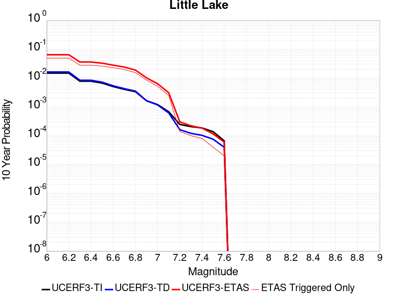 |

| Magnitude | 1 wk TI Prob | 1 wk TD Prob | 1 wk ETAS Prob | 1 wk ETAS/TD Gain | 1 wk ETAS Triggered Only | 1 mo TI Prob | 1 mo TD Prob | 1 mo ETAS Prob | 1 mo ETAS/TD Gain | 1 mo ETAS Triggered Only | 1 yr TI Prob | 1 yr TD Prob | 1 yr ETAS Prob | 1 yr ETAS/TD Gain | 1 yr ETAS Triggered Only | 10 yr TI Prob | 10 yr TD Prob | 10 yr ETAS Prob | 10 yr ETAS/TD Gain | 10 yr ETAS Triggered Only |
|-----|-----|-----|-----|-----|-----|-----|-----|-----|-----|-----|-----|-----|-----|-----|-----|-----|-----|-----|-----|-----|
| 6.0 | 2.8424427E-5 | 3.120572E-5 | 0.021890523 | 701.4907 | 0.02186 | 1.2181328E-4 | 1.337327E-4 | 0.027770037 | 207.6533 | 0.02764 | 0.0014820677 | 0.0016271127 | 0.040134355 | 24.665995 | 0.03857 | 0.014722223 | 0.016165402 | 0.06399944 | 3.9590383 | 0.04862 |
| 6.1 | 2.8424427E-5 | 3.120572E-5 | 0.021890523 | 701.4907 | 0.02186 | 1.2181328E-4 | 1.337327E-4 | 0.027770037 | 207.6533 | 0.02764 | 0.0014820677 | 0.0016271127 | 0.040134355 | 24.665995 | 0.03857 | 0.014722223 | 0.016165402 | 0.06399944 | 3.9590383 | 0.04862 |
| 6.2 | 2.8424427E-5 | 3.120572E-5 | 0.021890523 | 701.4907 | 0.02186 | 1.2181328E-4 | 1.337327E-4 | 0.027770037 | 207.6533 | 0.02764 | 0.0014820677 | 0.0016271127 | 0.040134355 | 24.665995 | 0.03857 | 0.014722223 | 0.016165402 | 0.06399944 | 3.9590383 | 0.04862 |
| 6.3 | 1.48860645E-5 | 1.6081389E-5 | 0.013275868 | 825.54236 | 0.01326 | 6.379586E-5 | 6.8918576E-5 | 0.016437791 | 238.5103 | 0.01637 | 7.7643775E-4 | 8.3878887E-4 | 0.02292025 | 27.325413 | 0.0221 | 0.007737305 | 0.008359048 | 0.035797752 | 4.2825155 | 0.02767 |
| 6.4 | 1.48860645E-5 | 1.6081389E-5 | 0.013275868 | 825.54236 | 0.01326 | 6.379586E-5 | 6.8918576E-5 | 0.016437791 | 238.5103 | 0.01637 | 7.7643775E-4 | 8.3878887E-4 | 0.02292025 | 27.325413 | 0.0221 | 0.007737305 | 0.008359048 | 0.035797752 | 4.2825155 | 0.02767 |
| 6.5 | 1.2797581E-5 | 1.3765565E-5 | 0.012263597 | 890.88947 | 0.01225 | 5.4845623E-5 | 5.899409E-5 | 0.015198101 | 257.62073 | 0.01514 | 6.675408E-4 | 7.18042E-4 | 0.021183336 | 29.501528 | 0.02048 | 0.006655392 | 0.00715977 | 0.032685693 | 4.5651875 | 0.02571 |
| 6.6 | 9.661896E-6 | 1.0289038E-5 | 0.010820177 | 1051.622 | 0.01081 | 4.1407468E-5 | 4.409522E-5 | 0.013363508 | 303.0602 | 0.01332 | 5.040193E-4 | 5.367433E-4 | 0.018477108 | 34.424477 | 0.01795 | 0.005028777 | 0.0053560743 | 0.027874812 | 5.204336 | 0.02264 |
| 6.7 | 7.767871E-6 | 8.199687E-6 | 0.009448122 | 1152.254 | 0.00944 | 3.329045E-5 | 3.5141118E-5 | 0.011684732 | 332.50882 | 0.01165 | 4.0523586E-4 | 4.2777284E-4 | 0.016081074 | 37.592552 | 0.01566 | 0.004044977 | 0.004270846 | 0.023896668 | 5.5953007 | 0.01971 |
| 6.8 | 6.4235196E-6 | 6.7357446E-6 | 0.007246687 | 1075.8553 | 0.00724 | 2.752908E-5 | 2.8867229E-5 | 0.009028607 | 312.7632 | 0.009 | 3.35115E-4 | 3.5141467E-4 | 0.012477152 | 35.505497 | 0.01213 | 0.003346101 | 0.00350985 | 0.018815938 | 5.360895 | 0.01536 |
| 6.9 | 3.1283696E-6 | 3.1121804E-6 | 0.0040930994 | 1315.187 | 0.00409 | 1.3407229E-5 | 1.3337856E-5 | 0.0051232697 | 384.11493 | 0.00511 | 1.6322079E-4 | 1.6237781E-4 | 0.0070012673 | 43.11714 | 0.00684 | 0.0016310095 | 0.00162274 | 0.010118931 | 6.235707 | 0.00851 |
| 7.0 | 2.290603E-6 | 2.2286815E-6 | 0.002502223 | 1122.7369 | 0.0025 | 9.816834E-6 | 9.551463E-6 | 0.0031695212 | 331.8362 | 0.00316 | 1.19513395E-4 | 1.162839E-4 | 0.0043057967 | 37.028313 | 0.00419 | 0.0011944914 | 0.0011623327 | 0.0063263234 | 5.442782 | 0.00517 |
| 7.1 | 1.293693E-6 | 1.1776827E-6 | 0.0011411763 | 969.00146 | 0.00114 | 5.5443866E-6 | 5.0472063E-6 | 0.0014950397 | 296.21133 | 0.00149 | 6.750081E-5 | 6.14487E-5 | 0.002041327 | 33.22002 | 0.00198 | 6.7480316E-4 | 6.143856E-4 | 0.003082868 | 5.017807 | 0.00247 |
| 7.2 | 4.715842E-7 | 3.0917857E-7 | 5.030916E-5 | 162.7188 | 5.0E-5 | 2.0210737E-6 | 1.3250503E-6 | 9.132493E-5 | 68.92185 | 9.0E-5 | 2.4606294E-5 | 1.6132375E-5 | 1.3613045E-4 | 8.438338 | 1.2E-4 | 2.460357E-4 | 1.6131258E-4 | 3.0128998E-4 | 1.8677403 | 1.4E-4 |
| 7.3 | 3.9430947E-7 | 2.3097488E-7 | 4.0230967E-5 | 174.17897 | 4.0E-5 | 1.6898966E-6 | 9.89892E-7 | 6.0989834E-5 | 61.612617 | 6.0E-5 | 2.0574296E-5 | 1.2051869E-5 | 9.2050905E-5 | 7.6378946 | 8.0E-5 | 2.0572392E-4 | 1.20512224E-4 | 2.2050017E-4 | 1.8296913 | 1.0E-4 |
| 7.4 | 3.547123E-7 | 1.9679135E-7 | 3.0196785E-5 | 153.4457 | 3.0E-5 | 1.5201948E-6 | 8.4339126E-7 | 5.0843348E-5 | 60.284416 | 5.0E-5 | 1.8508214E-5 | 1.0268241E-5 | 7.0267626E-5 | 6.8432 | 6.0E-5 | 1.8506673E-4 | 1.02677724E-4 | 1.8266951E-4 | 1.7790568 | 8.0E-5 |
| 7.5 | 2.6354266E-7 | 1.4423138E-7 | 1.014423E-5 | 70.33303 | 1.0E-5 | 1.129468E-6 | 6.181344E-7 | 2.0618121E-5 | 33.355404 | 2.0E-5 | 1.3751187E-5 | 7.5257603E-6 | 2.752561E-5 | 3.6575189 | 2.0E-5 | 1.3750336E-4 | 7.5255106E-5 | 1.152521E-4 | 1.5314854 | 4.0E-5 |
| 7.6 | 1.269913E-7 | 7.572556E-8 | 7.572556E-8 | 1.0 | 0.0 | 5.4424834E-7 | 3.245381E-7 | 3.245381E-7 | 1.0 | 0.0 | 6.6262032E-6 | 3.9512443E-6 | 3.9512443E-6 | 1.0 | 0.0 | 6.626006E-5 | 3.9511775E-5 | 5.9510985E-5 | 1.5061582 | 2.0E-5 |

## Owl Lake
*[(top)](#table-of-contents)*

| 1 Week | 1 Month | 1 Year | 10 Year |
|-----|-----|-----|-----|
|  |  | 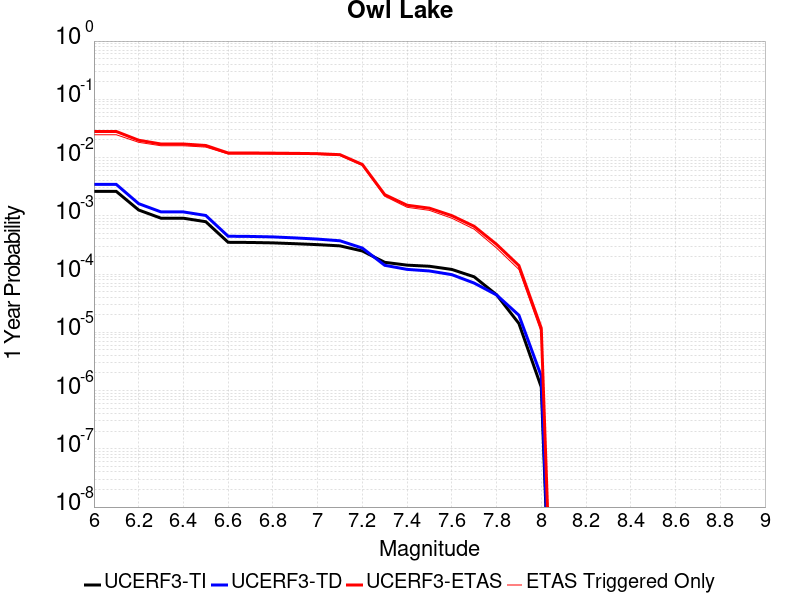 |  |

| Magnitude | 1 wk TI Prob | 1 wk TD Prob | 1 wk ETAS Prob | 1 wk ETAS/TD Gain | 1 wk ETAS Triggered Only | 1 mo TI Prob | 1 mo TD Prob | 1 mo ETAS Prob | 1 mo ETAS/TD Gain | 1 mo ETAS Triggered Only | 1 yr TI Prob | 1 yr TD Prob | 1 yr ETAS Prob | 1 yr ETAS/TD Gain | 1 yr ETAS Triggered Only | 10 yr TI Prob | 10 yr TD Prob | 10 yr ETAS Prob | 10 yr ETAS/TD Gain | 10 yr ETAS Triggered Only |
|-----|-----|-----|-----|-----|-----|-----|-----|-----|-----|-----|-----|-----|-----|-----|-----|-----|-----|-----|-----|-----|
| 6.0 | 5.0320643E-5 | 6.635816E-5 | 0.011545597 | 173.9891 | 0.01148 | 2.1564208E-4 | 2.843674E-4 | 0.01626982 | 57.21409 | 0.01599 | 0.0026222812 | 0.0034577388 | 0.02801254 | 8.101404 | 0.02464 | 0.02591553 | 0.034140717 | 0.06706686 | 1.9644245 | 0.03409 |
| 6.1 | 5.0320643E-5 | 6.635816E-5 | 0.011545597 | 173.9891 | 0.01148 | 2.1564208E-4 | 2.843674E-4 | 0.01626982 | 57.21409 | 0.01599 | 0.0026222812 | 0.0034577388 | 0.02801254 | 8.101404 | 0.02464 | 0.02591553 | 0.034140717 | 0.06706686 | 1.9644245 | 0.03409 |
| 6.2 | 2.4125871E-5 | 3.0981035E-5 | 0.008510718 | 274.70734 | 0.00848 | 1.0339249E-4 | 1.3277028E-4 | 0.011891209 | 89.56228 | 0.01176 | 0.0012580766 | 0.001615439 | 0.01984594 | 12.28517 | 0.01826 | 0.012509781 | 0.016070465 | 0.040678542 | 2.5312612 | 0.02501 |
| 6.3 | 1.7433485E-5 | 2.2355514E-5 | 0.007472189 | 334.24368 | 0.00745 | 7.471279E-5 | 9.580672E-5 | 0.010284831 | 107.349785 | 0.01019 | 9.0924866E-4 | 0.0011659743 | 0.017087389 | 14.65503 | 0.01594 | 0.009055373 | 0.011628896 | 0.032957945 | 2.8341422 | 0.02158 |
| 6.4 | 1.7433485E-5 | 2.2355514E-5 | 0.007472189 | 334.24368 | 0.00745 | 7.471279E-5 | 9.580672E-5 | 0.010284831 | 107.349785 | 0.01019 | 9.0924866E-4 | 0.0011659743 | 0.017087389 | 14.65503 | 0.01594 | 0.009055373 | 0.011628896 | 0.032957945 | 2.8341422 | 0.02158 |
| 6.5 | 1.5182742E-5 | 1.9429144E-5 | 0.0072192894 | 371.5701 | 0.0072 | 6.506727E-5 | 8.326596E-5 | 0.009832454 | 118.08492 | 0.00975 | 7.919061E-4 | 0.0010134429 | 0.01611812 | 15.90432 | 0.01512 | 0.0078909 | 0.010118429 | 0.030361507 | 3.000615 | 0.02045 |
| 6.6 | 6.7271576E-6 | 8.547361E-6 | 0.005858497 | 685.41595 | 0.00585 | 2.8830356E-5 | 3.6631063E-5 | 0.007816346 | 213.38026 | 0.00778 | 3.5095305E-4 | 4.458976E-4 | 0.0119807515 | 26.868841 | 0.01154 | 0.0035039932 | 0.004467813 | 0.019629767 | 4.393597 | 0.01523 |
| 6.7 | 6.682835E-6 | 8.479807E-6 | 0.00585843 | 690.86835 | 0.00585 | 2.8640408E-5 | 3.6341557E-5 | 0.007816059 | 215.0722 | 0.00778 | 3.4864116E-4 | 4.4237426E-4 | 0.011977269 | 27.074968 | 0.01154 | 0.003480947 | 0.0044327388 | 0.019595228 | 4.420569 | 0.01523 |
| 6.8 | 6.5774975E-6 | 8.32628E-6 | 0.005818278 | 698.7847 | 0.00581 | 2.8188972E-5 | 3.5683603E-5 | 0.0077654077 | 217.61838 | 0.00773 | 3.4314668E-4 | 4.343669E-4 | 0.011899385 | 27.394777 | 0.01147 | 0.0034261728 | 0.004352885 | 0.019436939 | 4.4653006 | 0.01515 |
| 6.9 | 6.363419E-6 | 7.999454E-6 | 0.0057879533 | 723.54346 | 0.00578 | 2.727151E-5 | 3.428296E-5 | 0.0077240192 | 225.30202 | 0.00769 | 3.3198006E-4 | 4.1732067E-4 | 0.011802567 | 28.28177 | 0.01139 | 0.0033148455 | 0.0041828766 | 0.01914005 | 4.5758104 | 0.01502 |
| 7.0 | 6.1342453E-6 | 7.6316555E-6 | 0.005707588 | 747.88336 | 0.0057 | 2.6289357E-5 | 3.2706717E-5 | 0.0076424577 | 233.66632 | 0.00761 | 3.2002592E-4 | 3.9813702E-4 | 0.01166365 | 29.295568 | 0.01127 | 0.0031956544 | 0.003991571 | 0.018802216 | 4.7104807 | 0.01487 |
| 7.1 | 5.842926E-6 | 7.142211E-6 | 0.0054671033 | 765.4637 | 0.00546 | 2.504087E-5 | 3.0609146E-5 | 0.007380384 | 241.11694 | 0.00735 | 3.0482994E-4 | 3.7260808E-4 | 0.011208569 | 30.08139 | 0.01084 | 0.0030441214 | 0.0037370329 | 0.018023444 | 4.822929 | 0.01434 |
| 7.2 | 4.77173E-6 | 5.358483E-6 | 0.0037353386 | 697.08875 | 0.00373 | 2.045011E-5 | 2.2964748E-5 | 0.005052849 | 220.02632 | 0.00503 | 2.4895166E-4 | 2.79564E-4 | 0.007607515 | 27.212069 | 0.00733 | 0.0024867293 | 0.002808645 | 0.012561177 | 4.4723263 | 0.00978 |
| 7.3 | 3.0494948E-6 | 2.710463E-6 | 0.0010027078 | 369.93967 | 0.001 | 1.3069198E-5 | 1.1616219E-5 | 0.0013816003 | 118.93718 | 0.00137 | 1.5910587E-4 | 1.4141845E-4 | 0.0023111117 | 16.342363 | 0.00217 | 0.0015899199 | 0.0014232415 | 0.004319114 | 3.0347023 | 0.0029 |
| 7.4 | 2.7263884E-6 | 2.3056762E-6 | 6.923041E-4 | 300.26074 | 6.9E-4 | 1.1684469E-5 | 9.881433E-6 | 8.998726E-4 | 91.06702 | 8.9E-4 | 1.4224913E-4 | 1.20299905E-4 | 0.0015201315 | 12.636182 | 0.0014 | 0.0014215811 | 0.0012112238 | 0.003058983 | 2.5255308 | 0.00185 |
| 7.5 | 2.6090431E-6 | 2.1656133E-6 | 6.1216427E-4 | 282.6748 | 6.1E-4 | 1.1181565E-5 | 9.281167E-6 | 8.0927374E-4 | 87.19526 | 8.0E-4 | 1.3612706E-4 | 1.1299244E-4 | 0.0013528523 | 11.972945 | 0.00124 | 0.001360437 | 0.0011379806 | 0.0027761143 | 2.4395094 | 0.00164 |
| 7.6 | 2.3008756E-6 | 1.8727933E-6 | 4.718719E-4 | 251.96155 | 4.7E-4 | 9.860858E-6 | 8.0262325E-6 | 6.3802116E-4 | 79.49198 | 6.3E-4 | 1.20049335E-4 | 9.7715085E-5 | 0.0010076262 | 10.311879 | 9.1E-4 | 0.001199845 | 9.849932E-4 | 0.0021938013 | 2.2272248 | 0.00121 |
| 7.7 | 1.7184348E-6 | 1.3419171E-6 | 2.8134155E-4 | 209.65643 | 2.8E-4 | 7.3646997E-6 | 5.7510606E-6 | 4.0574875E-4 | 70.55199 | 4.0E-4 | 8.966153E-5 | 7.0016955E-5 | 6.5997563E-4 | 9.4259405 | 5.9E-4 | 8.962536E-4 | 7.078345E-4 | 0.0014672965 | 2.0729373 | 7.6E-4 |
| 7.8 | 8.4612907E-7 | 8.4058576E-7 | 1.4084046E-4 | 167.55038 | 1.4E-4 | 3.6262625E-6 | 3.6025056E-6 | 2.1360174E-4 | 59.292553 | 2.1E-4 | 4.4148852E-5 | 4.3859643E-5 | 3.2384737E-4 | 7.383721 | 2.8E-4 | 4.414008E-4 | 4.4398365E-4 | 8.1381935E-4 | 1.8329941 | 3.7E-4 |
| 7.9 | 2.716738E-7 | 3.768106E-7 | 4.0376795E-5 | 107.15409 | 4.0E-5 | 1.1643157E-6 | 1.6149015E-6 | 1.0161474E-4 | 62.92318 | 1.0E-4 | 1.4175452E-5 | 1.966126E-5 | 1.396589E-4 | 7.103253 | 1.2E-4 | 1.4174548E-4 | 1.9836679E-4 | 3.28341E-4 | 1.6552217 | 1.3E-4 |
| 8.0 | 2.1995428E-8 | 3.384878E-8 | 3.384878E-8 | 1.0 | 0.0 | 9.426611E-8 | 1.4506621E-7 | 1.0145065E-5 | 69.93404 | 1.0E-5 | 1.1476893E-6 | 1.7661803E-6 | 1.1766163E-5 | 6.6619263 | 1.0E-5 | 1.14768345E-5 | 1.7963059E-5 | 2.7962878E-5 | 1.5566881 | 1.0E-5 |

## Airport Lake
*[(top)](#table-of-contents)*

| 1 Week | 1 Month | 1 Year | 10 Year |
|-----|-----|-----|-----|
|  |  |  |  |

| Magnitude | 1 wk TI Prob | 1 wk TD Prob | 1 wk ETAS Prob | 1 wk ETAS/TD Gain | 1 wk ETAS Triggered Only | 1 mo TI Prob | 1 mo TD Prob | 1 mo ETAS Prob | 1 mo ETAS/TD Gain | 1 mo ETAS Triggered Only | 1 yr TI Prob | 1 yr TD Prob | 1 yr ETAS Prob | 1 yr ETAS/TD Gain | 1 yr ETAS Triggered Only | 10 yr TI Prob | 10 yr TD Prob | 10 yr ETAS Prob | 10 yr ETAS/TD Gain | 10 yr ETAS Triggered Only |
|-----|-----|-----|-----|-----|-----|-----|-----|-----|-----|-----|-----|-----|-----|-----|-----|-----|-----|-----|-----|-----|
| 6.0 | 1.2387061E-5 | 1.3103157E-5 | 0.015122905 | 1154.1421 | 0.01511 | 5.3086325E-5 | 5.615534E-5 | 0.018615114 | 331.49323 | 0.01856 | 6.461343E-4 | 6.8350515E-4 | 0.025366623 | 37.112553 | 0.0247 | 0.0064425888 | 0.0068168393 | 0.03701954 | 5.4306016 | 0.03041 |
| 6.1 | 1.2387061E-5 | 1.3103157E-5 | 0.015122905 | 1154.1421 | 0.01511 | 5.3086325E-5 | 5.615534E-5 | 0.018615114 | 331.49323 | 0.01856 | 6.461343E-4 | 6.8350515E-4 | 0.025366623 | 37.112553 | 0.0247 | 0.0064425888 | 0.0068168393 | 0.03701954 | 5.4306016 | 0.03041 |
| 6.2 | 1.2387061E-5 | 1.3103157E-5 | 0.015122905 | 1154.1421 | 0.01511 | 5.3086325E-5 | 5.615534E-5 | 0.018615114 | 331.49323 | 0.01856 | 6.461343E-4 | 6.8350515E-4 | 0.025366623 | 37.112553 | 0.0247 | 0.0064425888 | 0.0068168393 | 0.03701954 | 5.4306016 | 0.03041 |
| 6.3 | 1.2387061E-5 | 1.3103157E-5 | 0.015122905 | 1154.1421 | 0.01511 | 5.3086325E-5 | 5.615534E-5 | 0.018615114 | 331.49323 | 0.01856 | 6.461343E-4 | 6.8350515E-4 | 0.025366623 | 37.112553 | 0.0247 | 0.0064425888 | 0.0068168393 | 0.03701954 | 5.4306016 | 0.03041 |
| 6.4 | 1.2387061E-5 | 1.3103157E-5 | 0.015122905 | 1154.1421 | 0.01511 | 5.3086325E-5 | 5.615534E-5 | 0.018615114 | 331.49323 | 0.01856 | 6.461343E-4 | 6.8350515E-4 | 0.025366623 | 37.112553 | 0.0247 | 0.0064425888 | 0.0068168393 | 0.03701954 | 5.4306016 | 0.03041 |
| 6.5 | 6.9922594E-6 | 7.384925E-6 | 0.011747298 | 1590.7133 | 0.01174 | 2.996648E-5 | 3.1649324E-5 | 0.014501192 | 458.18326 | 0.01447 | 3.6478083E-4 | 3.8526783E-4 | 0.019597864 | 50.868153 | 0.01922 | 0.003641826 | 0.0038465366 | 0.027305951 | 7.0988407 | 0.02355 |
| 6.6 | 6.9922594E-6 | 7.384925E-6 | 0.011747298 | 1590.7133 | 0.01174 | 2.996648E-5 | 3.1649324E-5 | 0.014501192 | 458.18326 | 0.01447 | 3.6478083E-4 | 3.8526783E-4 | 0.019597864 | 50.868153 | 0.01922 | 0.003641826 | 0.0038465366 | 0.027305951 | 7.0988407 | 0.02355 |
| 6.7 | 5.477277E-6 | 5.7860684E-6 | 0.0100757275 | 1741.3772 | 0.01007 | 2.3473833E-5 | 2.4797222E-5 | 0.012374491 | 499.0273 | 0.01235 | 2.8575645E-4 | 3.0186825E-4 | 0.01681688 | 55.709343 | 0.01652 | 0.0028538927 | 0.003014966 | 0.023263732 | 7.7160845 | 0.02031 |
| 6.8 | 3.9950432E-6 | 4.2190873E-6 | 0.007414188 | 1757.2968 | 0.00741 | 1.7121502E-5 | 1.8081691E-5 | 0.009177916 | 507.5806 | 0.00916 | 2.0843433E-4 | 2.2012512E-4 | 0.012557409 | 57.046688 | 0.01234 | 0.0020823893 | 0.0021993418 | 0.017435757 | 7.9277163 | 0.01527 |
| 6.9 | 2.95695E-6 | 3.1230243E-6 | 0.005553106 | 1778.118 | 0.00555 | 1.2672582E-5 | 1.3384334E-5 | 0.006863293 | 512.7855 | 0.00685 | 1.5427776E-4 | 1.6294434E-4 | 0.009311453 | 57.144993 | 0.00915 | 0.001541707 | 0.0016284712 | 0.012840183 | 7.8848085 | 0.01123 |
| 7.0 | 1.456072E-6 | 1.540812E-6 | 0.0023715373 | 1539.1477 | 0.00237 | 6.2402937E-6 | 6.603469E-6 | 0.0029865839 | 452.275 | 0.00298 | 7.597293E-5 | 8.039528E-5 | 0.0040100794 | 49.87954 | 0.00393 | 7.594696E-4 | 8.0376083E-4 | 0.0056598545 | 7.041715 | 0.00486 |
| 7.1 | 6.995192E-7 | 7.4089746E-7 | 0.0010607401 | 1431.6963 | 0.00106 | 2.997936E-6 | 3.1752747E-6 | 0.0013631709 | 429.30804 | 0.00136 | 3.649926E-5 | 3.865897E-5 | 0.001848589 | 47.817856 | 0.00181 | 3.6493264E-4 | 3.865897E-4 | 0.0026657083 | 6.895446 | 0.00228 |

## Panamint Valley
*[(top)](#table-of-contents)*

| 1 Week | 1 Month | 1 Year | 10 Year |
|-----|-----|-----|-----|
|  |  |  |  |

| Magnitude | 1 wk TI Prob | 1 wk TD Prob | 1 wk ETAS Prob | 1 wk ETAS/TD Gain | 1 wk ETAS Triggered Only | 1 mo TI Prob | 1 mo TD Prob | 1 mo ETAS Prob | 1 mo ETAS/TD Gain | 1 mo ETAS Triggered Only | 1 yr TI Prob | 1 yr TD Prob | 1 yr ETAS Prob | 1 yr ETAS/TD Gain | 1 yr ETAS Triggered Only | 10 yr TI Prob | 10 yr TD Prob | 10 yr ETAS Prob | 10 yr ETAS/TD Gain | 10 yr ETAS Triggered Only |
|-----|-----|-----|-----|-----|-----|-----|-----|-----|-----|-----|-----|-----|-----|-----|-----|-----|-----|-----|-----|-----|
| 6.0 | 3.0211835E-5 | 3.3984514E-5 | 0.00958366 | 282.0008 | 0.00955 | 1.2947287E-4 | 1.4563995E-4 | 0.013093754 | 89.90496 | 0.01295 | 0.0015751923 | 0.0017717537 | 0.021187292 | 11.958374 | 0.01945 | 0.015640736 | 0.017583137 | 0.043980677 | 2.5012987 | 0.02687 |
| 6.1 | 3.0211835E-5 | 3.3984514E-5 | 0.00958366 | 282.0008 | 0.00955 | 1.2947287E-4 | 1.4563995E-4 | 0.013093754 | 89.90496 | 0.01295 | 0.0015751923 | 0.0017717537 | 0.021187292 | 11.958374 | 0.01945 | 0.015640736 | 0.017583137 | 0.043980677 | 2.5012987 | 0.02687 |
| 6.2 | 3.0211835E-5 | 3.3984514E-5 | 0.00958366 | 282.0008 | 0.00955 | 1.2947287E-4 | 1.4563995E-4 | 0.013093754 | 89.90496 | 0.01295 | 0.0015751923 | 0.0017717537 | 0.021187292 | 11.958374 | 0.01945 | 0.015640736 | 0.017583137 | 0.043980677 | 2.5012987 | 0.02687 |
| 6.3 | 2.8573924E-5 | 3.210268E-5 | 0.009221808 | 287.25974 | 0.00919 | 1.2245393E-4 | 1.3757581E-4 | 0.012595861 | 91.555786 | 0.01246 | 0.001489857 | 0.0016737265 | 0.020292511 | 12.12415 | 0.01865 | 0.01479908 | 0.016617801 | 0.04181205 | 2.5161002 | 0.02562 |
| 6.4 | 2.8573924E-5 | 3.210268E-5 | 0.009221808 | 287.25974 | 0.00919 | 1.2245393E-4 | 1.3757581E-4 | 0.012595861 | 91.555786 | 0.01246 | 0.001489857 | 0.0016737265 | 0.020292511 | 12.12415 | 0.01865 | 0.01479908 | 0.016617801 | 0.04181205 | 2.5161002 | 0.02562 |
| 6.5 | 2.7468774E-5 | 3.0828433E-5 | 0.008900555 | 288.71252 | 0.00887 | 1.1771801E-4 | 1.3211532E-4 | 0.012170524 | 92.12046 | 0.01204 | 0.0014322745 | 0.0016073446 | 0.019568428 | 12.174383 | 0.01799 | 0.014230782 | 0.015963677 | 0.040239852 | 2.5207133 | 0.02467 |
| 6.6 | 2.6135967E-5 | 2.925248E-5 | 0.008589002 | 293.6162 | 0.00856 | 1.1200648E-4 | 1.253619E-4 | 0.011683913 | 93.20147 | 0.01156 | 0.0013628257 | 0.0015252391 | 0.018679036 | 12.246628 | 0.01718 | 0.013544982 | 0.015154043 | 0.038425952 | 2.5356898 | 0.02363 |
| 6.7 | 2.4498746E-5 | 2.7341335E-5 | 0.008257116 | 302.00122 | 0.00823 | 1.04990395E-4 | 1.1717203E-4 | 0.0112058725 | 95.63607 | 0.01109 | 0.0012775084 | 0.0014256609 | 0.01766248 | 12.388976 | 0.01626 | 0.012701893 | 0.014171274 | 0.03619469 | 2.5540884 | 0.02234 |
| 6.8 | 2.2244329E-5 | 2.4935423E-5 | 0.0076647447 | 307.3838 | 0.00764 | 9.532935E-5 | 1.0686185E-4 | 0.01032577 | 96.62728 | 0.01022 | 0.0011600169 | 0.0013002884 | 0.016270798 | 12.513223 | 0.01499 | 0.011539802 | 0.0129325185 | 0.03313779 | 2.5623617 | 0.02047 |
| 6.9 | 1.9902658E-5 | 2.2290267E-5 | 0.0067821397 | 304.26462 | 0.00676 | 8.529431E-5 | 9.552632E-5 | 0.009034673 | 94.577835 | 0.00894 | 0.0010379635 | 0.0011624309 | 0.014147319 | 12.170461 | 0.013 | 0.010331288 | 0.011568608 | 0.029073728 | 2.5131571 | 0.01771 |
| 7.0 | 1.8353881E-5 | 2.0566185E-5 | 0.006300437 | 306.3493 | 0.00628 | 7.865712E-5 | 8.813792E-5 | 0.008307413 | 94.2547 | 0.00822 | 9.5722964E-4 | 0.0010725686 | 0.01287989 | 12.008454 | 0.01182 | 0.009531168 | 0.010678849 | 0.026616814 | 2.4924796 | 0.01611 |
| 7.1 | 1.7667631E-5 | 1.9772613E-5 | 0.0060996525 | 308.48996 | 0.00608 | 7.571623E-5 | 8.473711E-5 | 0.0080340635 | 94.81162 | 0.00795 | 9.2145515E-4 | 0.0010312037 | 0.012429438 | 12.053329 | 0.01141 | 0.009176437 | 0.010269073 | 0.025550518 | 2.4881039 | 0.01544 |
| 7.2 | 1.6381597E-5 | 1.8158249E-5 | 0.005488059 | 302.23502 | 0.00547 | 7.020495E-5 | 7.781885E-5 | 0.0071372692 | 91.71646 | 0.00706 | 8.544101E-4 | 9.4704994E-4 | 0.011027494 | 11.644047 | 0.01009 | 0.008511325 | 0.009434792 | 0.0229461 | 2.4320729 | 0.01364 |
| 7.3 | 1.4520491E-5 | 1.5966476E-5 | 0.004485895 | 280.95712 | 0.00447 | 6.222919E-5 | 6.842605E-5 | 0.005778035 | 84.44204 | 0.00571 | 7.57377E-4 | 8.327849E-4 | 0.00898599 | 10.790288 | 0.00816 | 0.0075480095 | 0.00829975 | 0.01924812 | 2.3191204 | 0.01104 |
| 7.4 | 1.2852287E-5 | 1.4145411E-5 | 0.0042240857 | 298.6188 | 0.00421 | 5.5080065E-5 | 6.062187E-5 | 0.005480293 | 90.40126 | 0.00542 | 6.7039346E-4 | 7.378371E-4 | 0.008472126 | 11.48238 | 0.00774 | 0.0066837464 | 0.0073567946 | 0.01774977 | 2.4127042 | 0.01047 |
| 7.5 | 1.1637851E-5 | 1.2836797E-5 | 0.004192783 | 326.6222 | 0.00418 | 4.987555E-5 | 5.5013777E-5 | 0.0054147188 | 98.42478 | 0.00536 | 6.070656E-4 | 6.6960254E-4 | 0.008324473 | 12.431962 | 0.00766 | 0.006054099 | 0.0066787465 | 0.016919889 | 2.533393 | 0.01031 |
| 7.6 | 3.0068115E-6 | 3.3330316E-6 | 0.0019633265 | 589.0513 | 0.00196 | 1.2886271E-5 | 1.4284384E-5 | 0.002624247 | 183.7144 | 0.00261 | 1.5687906E-4 | 1.7390578E-4 | 0.0037332866 | 21.467297 | 0.00356 | 0.0015676835 | 0.0017391363 | 0.0064509274 | 3.709271 | 0.00472 |

## Garlock (East)
*[(top)](#table-of-contents)*

| 1 Week | 1 Month | 1 Year | 10 Year |
|-----|-----|-----|-----|
|  |  |  |  |

| Magnitude | 1 wk TI Prob | 1 wk TD Prob | 1 wk ETAS Prob | 1 wk ETAS/TD Gain | 1 wk ETAS Triggered Only | 1 mo TI Prob | 1 mo TD Prob | 1 mo ETAS Prob | 1 mo ETAS/TD Gain | 1 mo ETAS Triggered Only | 1 yr TI Prob | 1 yr TD Prob | 1 yr ETAS Prob | 1 yr ETAS/TD Gain | 1 yr ETAS Triggered Only | 10 yr TI Prob | 10 yr TD Prob | 10 yr ETAS Prob | 10 yr ETAS/TD Gain | 10 yr ETAS Triggered Only |
|-----|-----|-----|-----|-----|-----|-----|-----|-----|-----|-----|-----|-----|-----|-----|-----|-----|-----|-----|-----|-----|
| 6.0 | 4.5092507E-5 | 6.290325E-5 | 0.007172456 | 114.02361 | 0.00711 | 1.9323928E-4 | 2.6956003E-4 | 0.010436819 | 38.717976 | 0.01017 | 0.0023501497 | 0.0032774 | 0.019424306 | 5.9267426 | 0.0162 | 0.023254504 | 0.032351844 | 0.054404546 | 1.6816521 | 0.02279 |
| 6.1 | 4.5092507E-5 | 6.290325E-5 | 0.007172456 | 114.02361 | 0.00711 | 1.9323928E-4 | 2.6956003E-4 | 0.010436819 | 38.717976 | 0.01017 | 0.0023501497 | 0.0032774 | 0.019424306 | 5.9267426 | 0.0162 | 0.023254504 | 0.032351844 | 0.054404546 | 1.6816521 | 0.02279 |
| 6.2 | 2.6674514E-5 | 3.4509674E-5 | 0.005704314 | 165.29608 | 0.00567 | 1.1431433E-4 | 1.4789042E-4 | 0.00792674 | 53.59874 | 0.00778 | 0.0013908884 | 0.0017991117 | 0.0135679 | 7.541444 | 0.01179 | 0.01382215 | 0.017890299 | 0.033761192 | 1.8871229 | 0.01616 |
| 6.3 | 2.6674514E-5 | 3.4509674E-5 | 0.005704314 | 165.29608 | 0.00567 | 1.1431433E-4 | 1.4789042E-4 | 0.00792674 | 53.59874 | 0.00778 | 0.0013908884 | 0.0017991117 | 0.0135679 | 7.541444 | 0.01179 | 0.01382215 | 0.017890299 | 0.033761192 | 1.8871229 | 0.01616 |
| 6.4 | 2.5312667E-5 | 3.233893E-5 | 0.0056421575 | 174.46951 | 0.00561 | 1.0847834E-4 | 1.3858822E-4 | 0.0077975267 | 56.263992 | 0.00766 | 0.0013199237 | 0.0016860351 | 0.013316393 | 7.898052 | 0.01165 | 0.013121112 | 0.016778335 | 0.03242139 | 1.9323366 | 0.01591 |
| 6.5 | 2.5312667E-5 | 3.233893E-5 | 0.0056421575 | 174.46951 | 0.00561 | 1.0847834E-4 | 1.3858822E-4 | 0.0077975267 | 56.263992 | 0.00766 | 0.0013199237 | 0.0016860351 | 0.013316393 | 7.898052 | 0.01165 | 0.013121112 | 0.016778335 | 0.03242139 | 1.9323366 | 0.01591 |
| 6.6 | 2.246556E-5 | 2.8133776E-5 | 0.005437982 | 193.29015 | 0.00541 | 9.627742E-5 | 1.20567885E-4 | 0.0074796807 | 62.037086 | 0.00736 | 0.0011715472 | 0.0014669491 | 0.012530696 | 8.54201 | 0.01108 | 0.011653901 | 0.01461866 | 0.029409235 | 2.0117598 | 0.01501 |
| 6.7 | 2.2241198E-5 | 2.7803519E-5 | 0.005417654 | 194.85497 | 0.00539 | 9.531594E-5 | 1.1915263E-4 | 0.007458278 | 62.594322 | 0.00734 | 0.0011598538 | 0.0014497414 | 0.012493707 | 8.617887 | 0.01106 | 0.011538187 | 0.014448853 | 0.029222265 | 2.0224626 | 0.01499 |
| 6.8 | 1.9528685E-5 | 2.389819E-5 | 0.005273773 | 220.67665 | 0.00525 | 8.369167E-5 | 1.0241691E-4 | 0.0071916906 | 70.21976 | 0.00709 | 0.0010184698 | 0.0012462323 | 0.011673221 | 9.366811 | 0.01044 | 0.010138147 | 0.012436427 | 0.026390702 | 2.1220484 | 0.01413 |
| 6.9 | 1.3318621E-5 | 1.5198884E-5 | 0.0049251243 | 324.0451 | 0.00491 | 5.7078556E-5 | 6.513648E-5 | 0.0066347085 | 101.85857 | 0.00657 | 6.9470983E-4 | 7.927538E-4 | 0.010305207 | 12.999251 | 0.00952 | 0.0069254204 | 0.007939888 | 0.020459687 | 2.576823 | 0.01262 |
| 7.0 | 1.1760853E-5 | 1.31077895E-5 | 0.004803045 | 366.4268 | 0.00479 | 5.0402683E-5 | 5.6175057E-5 | 0.0064558154 | 114.923164 | 0.0064 | 6.134799E-4 | 6.8372174E-4 | 0.009827466 | 14.373487 | 0.00915 | 0.0061178906 | 0.00685652 | 0.018913282 | 2.7584374 | 0.01214 |
| 7.1 | 1.0064758E-5 | 1.0902931E-5 | 0.004720852 | 432.98926 | 0.00471 | 4.3133965E-5 | 4.672603E-5 | 0.006296434 | 134.75218 | 0.00625 | 5.2502943E-4 | 5.687444E-4 | 0.009373734 | 16.481453 | 0.00881 | 0.005237907 | 0.0057129986 | 0.01718707 | 3.008415 | 0.01154 |
| 7.2 | 9.768808E-6 | 1.0498807E-5 | 0.004590451 | 437.23547 | 0.00458 | 4.186565E-5 | 4.499413E-5 | 0.0061447197 | 136.56714 | 0.0061 | 5.095951E-4 | 5.4766936E-4 | 0.0091529535 | 16.712555 | 0.00861 | 0.0050842804 | 0.0055032647 | 0.016721187 | 3.0384126 | 0.01128 |
| 7.3 | 9.344516E-6 | 9.944468E-6 | 0.004189903 | 421.33005 | 0.00418 | 4.004731E-5 | 4.261847E-5 | 0.0056423796 | 132.39284 | 0.0056 | 4.8746695E-4 | 5.1875977E-4 | 0.00847463 | 16.336329 | 0.00796 | 0.0048639905 | 0.0052149445 | 0.015590552 | 2.9895914 | 0.01043 |
| 7.4 | 9.023491E-6 | 9.490661E-6 | 0.003859454 | 406.65808 | 0.00385 | 3.867153E-5 | 4.0673647E-5 | 0.0051804646 | 127.366615 | 0.00514 | 4.7072413E-4 | 4.950925E-4 | 0.0077814832 | 15.717232 | 0.00729 | 0.004697283 | 0.0049783974 | 0.014460953 | 2.9047406 | 0.00953 |
| 7.5 | 7.081253E-6 | 7.087672E-6 | 0.0019970736 | 281.7672 | 0.00199 | 3.0347876E-5 | 3.0375388E-5 | 0.0026602955 | 87.58063 | 0.00263 | 3.6942272E-4 | 3.6975832E-4 | 0.0039484347 | 10.67842 | 0.00358 | 0.003688092 | 0.0037243143 | 0.0084665865 | 2.2733276 | 0.00476 |
| 7.6 | 6.116396E-6 | 5.959245E-6 | 0.0012759516 | 214.11299 | 0.00127 | 2.6212863E-5 | 2.5539372E-5 | 0.0017054965 | 66.779106 | 0.00168 | 3.1909486E-4 | 3.1089774E-4 | 0.002590189 | 8.331321 | 0.00228 | 0.0031863707 | 0.0031357552 | 0.0061662225 | 1.9664235 | 0.00304 |
| 7.7 | 4.797145E-6 | 4.757281E-6 | 6.5475417E-4 | 137.63202 | 6.5E-4 | 2.055903E-5 | 2.0388188E-5 | 8.803707E-4 | 43.180424 | 8.6E-4 | 2.5027743E-4 | 2.4819805E-4 | 0.0014778927 | 5.9544897 | 0.00123 | 0.0024999576 | 0.0025093474 | 0.0040953574 | 1.6320409 | 0.00159 |
| 7.8 | 3.4028885E-6 | 3.978462E-6 | 3.73977E-4 | 94.0004 | 3.7E-4 | 1.4583726E-5 | 1.7050439E-5 | 5.470414E-4 | 32.083714 | 5.3E-4 | 1.775424E-4 | 2.0756939E-4 | 0.0010074034 | 4.8533325 | 8.0E-4 | 0.0017740062 | 0.0021012232 | 0.0031390379 | 1.4939098 | 0.00104 |
| 7.9 | 2.5928412E-6 | 3.3724489E-6 | 2.2337171E-4 | 66.234276 | 2.2E-4 | 1.1112129E-5 | 1.4453272E-5 | 3.3444865E-4 | 23.139994 | 3.2E-4 | 1.3528178E-4 | 1.7595445E-4 | 6.858647E-4 | 3.8979673 | 5.1E-4 | 0.0013519945 | 0.0017812408 | 0.0025099404 | 1.4090967 | 7.3E-4 |
| 8.0 | 1.3743648E-6 | 1.6734747E-6 | 7.1673356E-5 | 42.829067 | 7.0E-5 | 5.8901214E-6 | 7.1720146E-6 | 1.071713E-4 | 14.942984 | 1.0E-4 | 7.1709874E-5 | 8.731581E-5 | 2.6730009E-4 | 3.0613024 | 1.8E-4 | 7.1686733E-4 | 8.837234E-4 | 0.0011834583 | 1.3391727 | 3.0E-4 |
| 8.1 | 3.6733252E-7 | 3.1489964E-7 | 1.0314897E-5 | 32.756138 | 1.0E-5 | 1.5742813E-6 | 1.3495693E-6 | 1.1349556E-5 | 8.409761 | 1.0E-5 | 1.9166706E-5 | 1.6430899E-5 | 5.6430243E-5 | 3.4343977 | 4.0E-5 | 1.9165053E-4 | 1.6638759E-4 | 2.1637927E-4 | 1.3004532 | 5.0E-5 |

## Blackwater
*[(top)](#table-of-contents)*

| 1 Week | 1 Month | 1 Year | 10 Year |
|-----|-----|-----|-----|
|  |  | 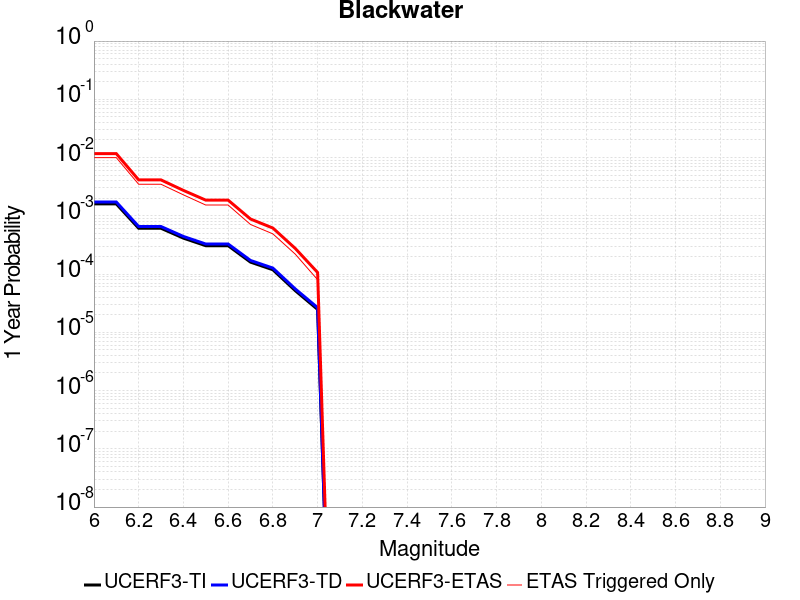 |  |

| Magnitude | 1 wk TI Prob | 1 wk TD Prob | 1 wk ETAS Prob | 1 wk ETAS/TD Gain | 1 wk ETAS Triggered Only | 1 mo TI Prob | 1 mo TD Prob | 1 mo ETAS Prob | 1 mo ETAS/TD Gain | 1 mo ETAS Triggered Only | 1 yr TI Prob | 1 yr TD Prob | 1 yr ETAS Prob | 1 yr ETAS/TD Gain | 1 yr ETAS Triggered Only | 10 yr TI Prob | 10 yr TD Prob | 10 yr ETAS Prob | 10 yr ETAS/TD Gain | 10 yr ETAS Triggered Only |
|-----|-----|-----|-----|-----|-----|-----|-----|-----|-----|-----|-----|-----|-----|-----|-----|-----|-----|-----|-----|-----|
| 6.0 | 3.0708583E-5 | 3.3095846E-5 | 0.0045729456 | 138.17279 | 0.00454 | 1.3160157E-4 | 1.4183241E-4 | 0.0064309402 | 45.341824 | 0.00629 | 0.0016010714 | 0.0017255784 | 0.0116683915 | 6.7620173 | 0.00996 | 0.015895851 | 0.017135633 | 0.03159357 | 1.8437351 | 0.01471 |
| 6.1 | 3.0708583E-5 | 3.3095846E-5 | 0.0045729456 | 138.17279 | 0.00454 | 1.3160157E-4 | 1.4183241E-4 | 0.0064309402 | 45.341824 | 0.00629 | 0.0016010714 | 0.0017255784 | 0.0116683915 | 6.7620173 | 0.00996 | 0.015895851 | 0.017135633 | 0.03159357 | 1.8437351 | 0.01471 |
| 6.2 | 1.1707779E-5 | 1.2545122E-5 | 0.0016025251 | 127.7409 | 0.00159 | 5.017523E-5 | 5.3763757E-5 | 0.002243646 | 41.73157 | 0.00219 | 6.107122E-4 | 6.5438676E-4 | 0.0041321097 | 6.314476 | 0.00348 | 0.006090366 | 0.0065255696 | 0.011800919 | 1.8084121 | 0.00531 |
| 6.3 | 1.1707779E-5 | 1.2545122E-5 | 0.0016025251 | 127.7409 | 0.00159 | 5.017523E-5 | 5.3763757E-5 | 0.002243646 | 41.73157 | 0.00219 | 6.107122E-4 | 6.5438676E-4 | 0.0041321097 | 6.314476 | 0.00348 | 0.006090366 | 0.0065255696 | 0.011800919 | 1.8084121 | 0.00531 |
| 6.4 | 7.929244E-6 | 8.480098E-6 | 0.0010684711 | 125.9975 | 0.00106 | 3.3982033E-5 | 3.6342793E-5 | 0.0014962897 | 41.171566 | 0.00146 | 4.136527E-4 | 4.423877E-4 | 0.0027313747 | 6.174165 | 0.00229 | 0.0041288356 | 0.0044154758 | 0.007949801 | 1.8004403 | 0.00355 |
| 6.5 | 5.8832115E-6 | 6.285991E-6 | 7.362814E-4 | 117.13052 | 7.3E-4 | 2.521352E-5 | 2.6939697E-5 | 0.001056912 | 39.23251 | 0.00103 | 3.0693135E-4 | 3.27944E-4 | 0.0018574422 | 5.663901 | 0.00153 | 0.0030650778 | 0.0032748538 | 0.0057267975 | 1.7487186 | 0.00246 |
| 6.6 | 5.8832115E-6 | 6.285991E-6 | 7.362814E-4 | 117.13052 | 7.3E-4 | 2.521352E-5 | 2.6939697E-5 | 0.001056912 | 39.23251 | 0.00103 | 3.0693135E-4 | 3.27944E-4 | 0.0018574422 | 5.663901 | 0.00153 | 0.0030650778 | 0.0032748538 | 0.0057267975 | 1.7487186 | 0.00246 |
| 6.7 | 3.0715053E-6 | 3.2814662E-6 | 3.1328044E-4 | 95.46966 | 3.1E-4 | 1.3163528E-5 | 1.4063357E-5 | 4.1405772E-4 | 29.44231 | 4.0E-4 | 1.6025416E-4 | 1.7120909E-4 | 8.810875E-4 | 5.146266 | 7.1E-4 | 0.0016013865 | 0.0017108864 | 0.002848936 | 1.6651813 | 0.00114 |
| 6.8 | 2.2722281E-6 | 2.4287538E-6 | 1.924283E-4 | 79.22923 | 1.9E-4 | 9.738084E-6 | 1.0408908E-5 | 2.804061E-4 | 26.93905 | 2.7E-4 | 1.1855473E-4 | 1.26722E-4 | 6.1665993E-4 | 4.866242 | 4.9E-4 | 0.001184915 | 0.0012665876 | 0.0020755616 | 1.6387036 | 8.1E-4 |
| 6.9 | 9.952399E-7 | 1.0653489E-6 | 1.1106523E-4 | 104.25245 | 1.1E-4 | 4.265307E-6 | 4.5657757E-6 | 1.4456514E-4 | 31.662777 | 1.4E-4 | 5.1928873E-5 | 5.5587418E-5 | 2.7557518E-4 | 4.95751 | 2.2E-4 | 5.191674E-4 | 5.557858E-4 | 9.1558567E-4 | 1.6473716 | 3.6E-4 |
| 7.0 | 4.7385504E-7 | 5.0755597E-7 | 1.05075505E-5 | 20.702251 | 1.0E-5 | 2.0308057E-6 | 2.1752398E-6 | 3.2175176E-5 | 14.7915535 | 3.0E-5 | 2.4724779E-5 | 2.6483543E-5 | 1.0648143E-4 | 4.0206637 | 8.0E-5 | 2.4722028E-4 | 2.6483546E-4 | 4.2479308E-4 | 1.6039888 | 1.6E-4 |

## Hunter Mountain-Saline Valley
*[(top)](#table-of-contents)*

| 1 Week | 1 Month | 1 Year | 10 Year |
|-----|-----|-----|-----|
|  |  |  |  |

| Magnitude | 1 wk TI Prob | 1 wk TD Prob | 1 wk ETAS Prob | 1 wk ETAS/TD Gain | 1 wk ETAS Triggered Only | 1 mo TI Prob | 1 mo TD Prob | 1 mo ETAS Prob | 1 mo ETAS/TD Gain | 1 mo ETAS Triggered Only | 1 yr TI Prob | 1 yr TD Prob | 1 yr ETAS Prob | 1 yr ETAS/TD Gain | 1 yr ETAS Triggered Only | 10 yr TI Prob | 10 yr TD Prob | 10 yr ETAS Prob | 10 yr ETAS/TD Gain | 10 yr ETAS Triggered Only |
|-----|-----|-----|-----|-----|-----|-----|-----|-----|-----|-----|-----|-----|-----|-----|-----|-----|-----|-----|-----|-----|
| 6.0 | 4.5103672E-5 | 5.4570177E-5 | 0.00445433 | 81.625725 | 0.0044 | 1.9328714E-4 | 2.3385242E-4 | 0.0059525147 | 25.45415 | 0.00572 | 0.002350731 | 0.0028435152 | 0.010950398 | 3.851007 | 0.00813 | 0.023260195 | 0.028091887 | 0.03885091 | 1.3829939 | 0.01107 |
| 6.1 | 4.5103672E-5 | 5.4570177E-5 | 0.00445433 | 81.625725 | 0.0044 | 1.9328714E-4 | 2.3385242E-4 | 0.0059525147 | 25.45415 | 0.00572 | 0.002350731 | 0.0028435152 | 0.010950398 | 3.851007 | 0.00813 | 0.023260195 | 0.028091887 | 0.03885091 | 1.3829939 | 0.01107 |
| 6.2 | 3.9363465E-5 | 4.706337E-5 | 0.0044368566 | 94.2741 | 0.00439 | 1.6868966E-4 | 2.0168544E-4 | 0.005890538 | 29.20656 | 0.00569 | 0.002051862 | 0.0024528175 | 0.01053295 | 4.2942247 | 0.0081 | 0.020330196 | 0.024273481 | 0.03501623 | 1.4425714 | 0.01101 |
| 6.3 | 3.9363465E-5 | 4.706337E-5 | 0.0044368566 | 94.2741 | 0.00439 | 1.6868966E-4 | 2.0168544E-4 | 0.005890538 | 29.20656 | 0.00569 | 0.002051862 | 0.0024528175 | 0.01053295 | 4.2942247 | 0.0081 | 0.020330196 | 0.024273481 | 0.03501623 | 1.4425714 | 0.01101 |
| 6.4 | 3.2311684E-5 | 3.795099E-5 | 0.0043977853 | 115.88065 | 0.00436 | 1.384713E-4 | 1.6263737E-4 | 0.0058117183 | 35.734215 | 0.00565 | 0.0016845843 | 0.0019783843 | 0.009982518 | 5.045793 | 0.00802 | 0.016718714 | 0.019616475 | 0.030312458 | 1.5452552 | 0.01091 |
| 6.5 | 3.2311684E-5 | 3.795099E-5 | 0.0043977853 | 115.88065 | 0.00436 | 1.384713E-4 | 1.6263737E-4 | 0.0058117183 | 35.734215 | 0.00565 | 0.0016845843 | 0.0019783843 | 0.009982518 | 5.045793 | 0.00802 | 0.016718714 | 0.019616475 | 0.030312458 | 1.5452552 | 0.01091 |
| 6.6 | 2.9305844E-5 | 3.418183E-5 | 0.0043640337 | 127.67115 | 0.00433 | 1.2559042E-4 | 1.4648569E-4 | 0.0057656625 | 39.3599 | 0.00562 | 0.0015279909 | 0.001782067 | 0.009747846 | 5.469966 | 0.00798 | 0.015175272 | 0.01768569 | 0.028333979 | 1.6020849 | 0.01084 |
| 6.7 | 2.7826512E-5 | 3.2344276E-5 | 0.0043522045 | 134.55873 | 0.00432 | 1.19251024E-4 | 1.386113E-4 | 0.0057478338 | 41.46728 | 0.00561 | 0.0014509142 | 0.0016863465 | 0.00962294 | 5.7063837 | 0.00795 | 0.014414776 | 0.016743187 | 0.027352527 | 1.6336513 | 0.01079 |
| 6.8 | 2.3389874E-5 | 2.6866714E-5 | 0.0043167514 | 160.67285 | 0.00429 | 1.0023846E-4 | 1.15138246E-4 | 0.005674498 | 49.284214 | 0.00556 | 0.00121972 | 0.001400954 | 0.0092799 | 6.6239867 | 0.00789 | 0.01213047 | 0.013927434 | 0.02448827 | 1.7582759 | 0.01071 |
| 6.9 | 2.069209E-5 | 2.3570032E-5 | 0.0042834696 | 181.73372 | 0.00426 | 8.867737E-5 | 1.01010715E-4 | 0.0056104544 | 55.54316 | 0.00551 | 0.0010791123 | 0.0012291478 | 0.009059511 | 7.370563 | 0.00784 | 0.010738871 | 0.012228523 | 0.022758167 | 1.8610724 | 0.01066 |
| 7.0 | 1.7462342E-5 | 1.9633546E-5 | 0.00426955 | 217.46199 | 0.00425 | 7.483646E-5 | 8.414118E-5 | 0.005573679 | 66.24199 | 0.00549 | 9.1075303E-4 | 0.0010239601 | 0.008825963 | 8.61944 | 0.00781 | 0.009070295 | 0.0101960525 | 0.020707771 | 2.0309596 | 0.01062 |
| 7.1 | 1.4807709E-5 | 1.6441749E-5 | 0.004256372 | 258.87585 | 0.00424 | 6.3460066E-5 | 7.046283E-5 | 0.005530078 | 78.4822 | 0.00546 | 7.723524E-4 | 8.575638E-4 | 0.008630892 | 10.064431 | 0.00778 | 0.007696735 | 0.008545532 | 0.018985547 | 2.2216928 | 0.01053 |
| 7.2 | 1.4180048E-5 | 1.5698337E-5 | 0.004245632 | 270.45108 | 0.00423 | 6.077022E-5 | 6.727694E-5 | 0.0055169105 | 82.00299 | 0.00545 | 7.396263E-4 | 8.188051E-4 | 0.008582443 | 10.4816675 | 0.00777 | 0.0073716943 | 0.008160833 | 0.018585064 | 2.2773488 | 0.01051 |
| 7.3 | 1.3730402E-5 | 1.5172075E-5 | 0.004245108 | 279.79745 | 0.00423 | 5.8843252E-5 | 6.502165E-5 | 0.0055146674 | 84.81278 | 0.00545 | 7.161811E-4 | 7.9136714E-4 | 0.008555219 | 10.810681 | 0.00777 | 0.007138774 | 0.007888422 | 0.018305594 | 2.3205645 | 0.0105 |
| 7.4 | 1.2810095E-5 | 1.4109277E-5 | 0.0042140502 | 298.67227 | 0.0042 | 5.489925E-5 | 6.0467017E-5 | 0.0054601403 | 90.299484 | 0.0054 | 6.681934E-4 | 7.359531E-4 | 0.0084402785 | 11.468501 | 0.00771 | 0.006661878 | 0.007338053 | 0.017691517 | 2.410928 | 0.01043 |
| 7.5 | 1.1595659E-5 | 1.2800664E-5 | 0.004182747 | 326.7602 | 0.00417 | 4.9694736E-5 | 5.4858923E-5 | 0.005394566 | 98.33525 | 0.00534 | 6.0486543E-4 | 6.6771836E-4 | 0.008292624 | 12.419343 | 0.00763 | 0.006032217 | 0.0066599925 | 0.016861593 | 2.5317738 | 0.01027 |
| 7.6 | 2.997694E-6 | 3.3251579E-6 | 0.0019633186 | 590.4437 | 0.00196 | 1.28471975E-5 | 1.425064E-5 | 0.0026142136 | 183.44534 | 0.0026 | 1.564034E-4 | 1.73495E-4 | 0.003722879 | 21.458134 | 0.00355 | 0.0015629337 | 0.001735031 | 0.006436859 | 3.7099388 | 0.00471 |

## Ash Hill
*[(top)](#table-of-contents)*

| 1 Week | 1 Month | 1 Year | 10 Year |
|-----|-----|-----|-----|
|  |  |  |  |

| Magnitude | 1 wk TI Prob | 1 wk TD Prob | 1 wk ETAS Prob | 1 wk ETAS/TD Gain | 1 wk ETAS Triggered Only | 1 mo TI Prob | 1 mo TD Prob | 1 mo ETAS Prob | 1 mo ETAS/TD Gain | 1 mo ETAS Triggered Only | 1 yr TI Prob | 1 yr TD Prob | 1 yr ETAS Prob | 1 yr ETAS/TD Gain | 1 yr ETAS Triggered Only | 10 yr TI Prob | 10 yr TD Prob | 10 yr ETAS Prob | 10 yr ETAS/TD Gain | 10 yr ETAS Triggered Only |
|-----|-----|-----|-----|-----|-----|-----|-----|-----|-----|-----|-----|-----|-----|-----|-----|-----|-----|-----|-----|-----|
| 6.0 | 2.1545662E-5 | 2.3194447E-5 | 0.002753131 | 118.69786 | 0.00273 | 9.2335285E-5 | 9.940143E-5 | 0.0039790156 | 40.029762 | 0.00388 | 0.0011236023 | 0.0012096206 | 0.007711746 | 6.375343 | 0.00651 | 0.011179381 | 0.012038348 | 0.021730252 | 1.8050858 | 0.00981 |
| 6.1 | 2.1545662E-5 | 2.3194447E-5 | 0.002753131 | 118.69786 | 0.00273 | 9.2335285E-5 | 9.940143E-5 | 0.0039790156 | 40.029762 | 0.00388 | 0.0011236023 | 0.0012096206 | 0.007711746 | 6.375343 | 0.00651 | 0.011179381 | 0.012038348 | 0.021730252 | 1.8050858 | 0.00981 |
| 6.2 | 2.1545662E-5 | 2.3194447E-5 | 0.002753131 | 118.69786 | 0.00273 | 9.2335285E-5 | 9.940143E-5 | 0.0039790156 | 40.029762 | 0.00388 | 0.0011236023 | 0.0012096206 | 0.007711746 | 6.375343 | 0.00651 | 0.011179381 | 0.012038348 | 0.021730252 | 1.8050858 | 0.00981 |
| 6.3 | 1.0025529E-5 | 1.0746934E-5 | 0.0012707334 | 118.24148 | 0.00126 | 4.2965847E-5 | 4.605755E-5 | 0.0018259756 | 39.64552 | 0.00178 | 5.229836E-4 | 5.6061964E-4 | 0.0032491116 | 5.7955723 | 0.00269 | 0.005217545 | 0.0055933665 | 0.009740042 | 1.741356 | 0.00417 |
| 6.4 | 1.0025529E-5 | 1.0746934E-5 | 0.0012707334 | 118.24148 | 0.00126 | 4.2965847E-5 | 4.605755E-5 | 0.0018259756 | 39.64552 | 0.00178 | 5.229836E-4 | 5.6061964E-4 | 0.0032491116 | 5.7955723 | 0.00269 | 0.005217545 | 0.0055933665 | 0.009740042 | 1.741356 | 0.00417 |
| 6.5 | 6.9617327E-6 | 7.456634E-6 | 8.7745016E-4 | 117.67376 | 8.7E-4 | 2.9835655E-5 | 3.195666E-5 | 0.0012919164 | 40.42714 | 0.00126 | 3.6318856E-4 | 3.8901155E-4 | 0.0022882724 | 5.8822737 | 0.0019 | 0.0036259557 | 0.0038841602 | 0.0068027796 | 1.7514158 | 0.00293 |
| 6.6 | 4.9919777E-6 | 5.3466883E-6 | 6.453433E-4 | 120.69962 | 6.4E-4 | 2.1394015E-5 | 2.2914215E-5 | 9.128938E-4 | 39.83963 | 8.9E-4 | 2.60441E-4 | 2.7895154E-4 | 0.0016285749 | 5.8382 | 0.00135 | 0.0026013597 | 0.0027866727 | 0.0048209876 | 1.7300159 | 0.00204 |
| 6.7 | 3.6630722E-6 | 3.924624E-6 | 5.339225E-4 | 136.04427 | 5.3E-4 | 1.5698786E-5 | 1.681974E-5 | 6.868085E-4 | 40.833477 | 6.7E-4 | 1.9111596E-4 | 2.0476682E-4 | 0.0011845662 | 5.7849517 | 9.8E-4 | 0.0019095168 | 0.0020463446 | 0.0035632341 | 1.7412679 | 0.00152 |
| 6.8 | 2.5599613E-6 | 2.744925E-6 | 3.6274394E-4 | 132.15076 | 3.6E-4 | 1.0971216E-5 | 1.1763939E-5 | 4.6175864E-4 | 39.25204 | 4.5E-4 | 1.3356637E-4 | 1.4322149E-4 | 8.231241E-4 | 5.7472105 | 6.8E-4 | 0.0013348613 | 0.0014317769 | 0.0025501733 | 1.7811248 | 0.00112 |
| 6.9 | 1.7684905E-6 | 1.8968707E-6 | 2.2189645E-4 | 116.98027 | 2.2E-4 | 7.579223E-6 | 8.129446E-6 | 3.08127E-4 | 37.902584 | 3.0E-4 | 9.2273134E-5 | 9.8976E-5 | 5.3893245E-4 | 5.4450817 | 4.4E-4 | 9.223483E-4 | 9.8976E-4 | 0.0017190375 | 1.7368225 | 7.3E-4 |

## Gravel Hills-Harper Lk
*[(top)](#table-of-contents)*

| 1 Week | 1 Month | 1 Year | 10 Year |
|-----|-----|-----|-----|
|  | 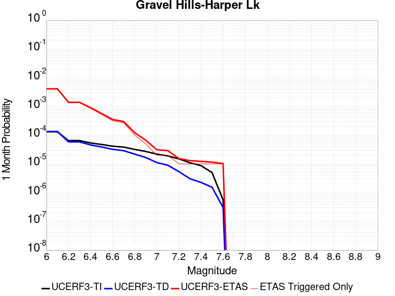 |  |  |

| Magnitude | 1 wk TI Prob | 1 wk TD Prob | 1 wk ETAS Prob | 1 wk ETAS/TD Gain | 1 wk ETAS Triggered Only | 1 mo TI Prob | 1 mo TD Prob | 1 mo ETAS Prob | 1 mo ETAS/TD Gain | 1 mo ETAS Triggered Only | 1 yr TI Prob | 1 yr TD Prob | 1 yr ETAS Prob | 1 yr ETAS/TD Gain | 1 yr ETAS Triggered Only | 10 yr TI Prob | 10 yr TD Prob | 10 yr ETAS Prob | 10 yr ETAS/TD Gain | 10 yr ETAS Triggered Only |
|-----|-----|-----|-----|-----|-----|-----|-----|-----|-----|-----|-----|-----|-----|-----|-----|-----|-----|-----|-----|-----|
| 6.0 | 3.0679566E-5 | 3.1464646E-5 | 0.0028713753 | 91.257195 | 0.00284 | 1.3147724E-4 | 1.3484273E-4 | 0.0041243047 | 30.586035 | 0.00399 | 0.0015995599 | 0.0016406906 | 0.008040174 | 4.900481 | 0.00641 | 0.015880952 | 0.01630734 | 0.025278615 | 1.5501374 | 0.00912 |
| 6.1 | 3.0679566E-5 | 3.1464646E-5 | 0.0028713753 | 91.257195 | 0.00284 | 1.3147724E-4 | 1.3484273E-4 | 0.0041243047 | 30.586035 | 0.00399 | 0.0015995599 | 0.0016406906 | 0.008040174 | 4.900481 | 0.00641 | 0.015880952 | 0.01630734 | 0.025278615 | 1.5501374 | 0.00912 |
| 6.2 | 1.514536E-5 | 1.3635206E-5 | 9.6362224E-4 | 70.67163 | 9.5E-4 | 6.490707E-5 | 5.843536E-5 | 0.0013983571 | 23.929981 | 0.00134 | 7.8995706E-4 | 7.1123015E-4 | 0.0028696938 | 4.0348315 | 0.00216 | 0.007871548 | 0.0070907404 | 0.010178688 | 1.4354901 | 0.00311 |
| 6.3 | 1.514536E-5 | 1.3635206E-5 | 9.6362224E-4 | 70.67163 | 9.5E-4 | 6.490707E-5 | 5.843536E-5 | 0.0013983571 | 23.929981 | 0.00134 | 7.8995706E-4 | 7.1123015E-4 | 0.0028696938 | 4.0348315 | 0.00216 | 0.007871548 | 0.0070907404 | 0.010178688 | 1.4354901 | 0.00311 |
| 6.4 | 1.2532521E-5 | 1.06896905E-5 | 6.206832E-4 | 58.063717 | 6.1E-4 | 5.37097E-5 | 4.581219E-5 | 9.057728E-4 | 19.771437 | 8.6E-4 | 6.537194E-4 | 5.576265E-4 | 0.0020068178 | 3.598857 | 0.00145 | 0.0065179965 | 0.005562863 | 0.0076114032 | 1.3682529 | 0.00206 |
| 6.5 | 1.1094058E-5 | 9.083664E-6 | 3.890802E-4 | 42.832962 | 3.8E-4 | 4.7545094E-5 | 3.892943E-5 | 5.689088E-4 | 14.61385 | 5.3E-4 | 5.787078E-4 | 4.7386673E-4 | 0.0014434071 | 3.046019 | 9.7E-4 | 0.0057720304 | 0.0047289706 | 0.0061223498 | 1.2946476 | 0.0014 |
| 6.6 | 9.688328E-6 | 7.5316952E-6 | 2.3752997E-4 | 31.537384 | 2.3E-4 | 4.1520743E-5 | 3.227831E-5 | 3.52268E-4 | 10.913459 | 3.2E-4 | 5.053978E-4 | 3.9292008E-4 | 0.0010226725 | 2.6027493 | 6.3E-4 | 0.0050424994 | 0.0039225104 | 0.00481898 | 1.228545 | 9.0E-4 |
| 6.7 | 8.974824E-6 | 6.749413E-6 | 1.9674814E-4 | 29.150406 | 1.9E-4 | 3.8462964E-5 | 2.8925748E-5 | 2.9891793E-4 | 10.333975 | 2.7E-4 | 4.6818596E-4 | 3.5211627E-4 | 8.619367E-4 | 2.4478753 | 5.1E-4 | 0.004672008 | 0.0035158044 | 0.004243238 | 1.2069038 | 7.3E-4 |
| 6.8 | 7.4780046E-6 | 5.1161933E-6 | 1.0511568E-4 | 20.545683 | 1.0E-4 | 3.20482E-5 | 2.1926366E-5 | 1.21924175E-4 | 5.5606194 | 1.0E-4 | 3.9011694E-4 | 2.669222E-4 | 4.4687415E-4 | 1.6741738 | 1.8E-4 | 0.0038943281 | 0.0026661542 | 0.0029454075 | 1.1047401 | 2.8E-4 |
| 6.9 | 6.3409307E-6 | 3.9074966E-6 | 5.39073E-5 | 13.795866 | 5.0E-5 | 2.7175134E-5 | 1.6746313E-5 | 6.674547E-5 | 3.9856818 | 5.0E-5 | 3.3080703E-4 | 2.0386827E-4 | 2.9384994E-4 | 1.4413716 | 9.0E-5 | 0.0033031502 | 0.0020369107 | 0.0021965848 | 1.0783904 | 1.6E-4 |
| 7.0 | 5.1239335E-6 | 2.6058565E-6 | 2.2605804E-5 | 8.675 | 2.0E-5 | 2.195953E-5 | 1.116791E-5 | 3.1167685E-5 | 2.7908254 | 2.0E-5 | 2.6732447E-4 | 1.3596108E-4 | 1.65957E-4 | 1.2206213 | 3.0E-5 | 0.0026700313 | 0.0013588042 | 0.0014386955 | 1.0587953 | 8.0E-5 |
| 7.1 | 4.438899E-6 | 2.0984728E-6 | 2.2098431E-5 | 10.530721 | 2.0E-5 | 1.9023713E-5 | 8.993425E-6 | 2.8993245E-5 | 3.223827 | 2.0E-5 | 2.315891E-4 | 1.0948967E-4 | 1.3948638E-4 | 1.2739685 | 3.0E-5 | 0.002313479 | 0.0010943791 | 0.0011643026 | 1.0638932 | 7.0E-5 |
| 7.2 | 3.50367E-6 | 1.2615716E-6 | 1.1261559E-5 | 8.926611 | 1.0E-5 | 1.5015643E-5 | 5.4067245E-6 | 1.5406671E-5 | 2.8495386 | 1.0E-5 | 1.8280011E-4 | 6.582497E-5 | 7.582431E-5 | 1.151908 | 1.0E-5 | 0.0018264982 | 6.580629E-4 | 6.9803663E-4 | 1.0607444 | 4.0E-5 |
| 7.3 | 2.561638E-6 | 7.1191585E-7 | 1.07119085E-5 | 15.046594 | 1.0E-5 | 1.0978401E-5 | 3.0510646E-6 | 1.3051034E-5 | 4.2775345 | 1.0E-5 | 1.3365384E-4 | 3.71461E-5 | 4.7145724E-5 | 1.2691972 | 1.0E-5 | 0.0013357349 | 3.7140088E-4 | 4.0138973E-4 | 1.0807452 | 3.0E-5 |
| 7.4 | 2.0368864E-6 | 5.304837E-7 | 1.0530478E-5 | 19.85071 | 1.0E-5 | 8.729483E-6 | 2.2734996E-6 | 1.2273477E-5 | 5.398495 | 1.0E-5 | 1.06276275E-4 | 2.7679513E-5 | 3.7679238E-5 | 1.361268 | 1.0E-5 | 0.0010622547 | 2.767612E-4 | 3.067529E-4 | 1.1083667 | 3.0E-5 |
| 7.5 | 1.1681728E-6 | 3.6030585E-7 | 1.0360302E-5 | 28.754189 | 1.0E-5 | 5.0064455E-6 | 1.544167E-6 | 1.1544152E-5 | 7.475973 | 1.0E-5 | 6.0951766E-5 | 1.8800076E-5 | 2.8799888E-5 | 1.5319028 | 1.0E-5 | 6.093505E-4 | 1.8798532E-4 | 2.0798156E-4 | 1.1063713 | 2.0E-5 |
| 7.6 | 1.3154387E-7 | 7.1197384E-8 | 1.0071197E-5 | 141.45459 | 1.0E-5 | 5.6375933E-7 | 3.051316E-7 | 1.0305129E-5 | 33.77273 | 1.0E-5 | 6.863748E-6 | 3.7149728E-6 | 1.3714935E-5 | 3.6917999 | 1.0E-5 | 6.863536E-5 | 3.7149264E-5 | 4.7148893E-5 | 1.2691743 | 1.0E-5 |

## Garlock (West)
*[(top)](#table-of-contents)*

| 1 Week | 1 Month | 1 Year | 10 Year |
|-----|-----|-----|-----|
|  |  |  |  |

| Magnitude | 1 wk TI Prob | 1 wk TD Prob | 1 wk ETAS Prob | 1 wk ETAS/TD Gain | 1 wk ETAS Triggered Only | 1 mo TI Prob | 1 mo TD Prob | 1 mo ETAS Prob | 1 mo ETAS/TD Gain | 1 mo ETAS Triggered Only | 1 yr TI Prob | 1 yr TD Prob | 1 yr ETAS Prob | 1 yr ETAS/TD Gain | 1 yr ETAS Triggered Only | 10 yr TI Prob | 10 yr TD Prob | 10 yr ETAS Prob | 10 yr ETAS/TD Gain | 10 yr ETAS Triggered Only |
|-----|-----|-----|-----|-----|-----|-----|-----|-----|-----|-----|-----|-----|-----|-----|-----|-----|-----|-----|-----|-----|
| 6.0 | 2.5181727E-5 | 2.51973E-5 | 0.00349511 | 138.7097 | 0.00347 | 1.0791722E-4 | 1.0798398E-4 | 0.004627496 | 42.853542 | 0.00452 | 0.0013131002 | 0.0013139155 | 0.007815362 | 5.948147 | 0.00651 | 0.013053683 | 0.013141977 | 0.021638824 | 1.6465425 | 0.00861 |
| 6.1 | 2.5077732E-5 | 2.5098372E-5 | 0.0034950112 | 139.2525 | 0.00347 | 1.0747157E-4 | 1.0756004E-4 | 0.0046270736 | 43.018524 | 0.00452 | 0.001307681 | 0.0013087603 | 0.00781024 | 5.9676633 | 0.00651 | 0.013000126 | 0.013091032 | 0.021588318 | 1.6490922 | 0.00861 |
| 6.2 | 2.494612E-5 | 2.498005E-5 | 0.0034948934 | 139.90738 | 0.00347 | 1.0690756E-4 | 1.0705298E-4 | 0.004626569 | 43.217564 | 0.00452 | 0.0013008224 | 0.0013025942 | 0.0078041144 | 5.991209 | 0.00651 | 0.012932341 | 0.013030097 | 0.021527907 | 1.6521679 | 0.00861 |
| 6.3 | 2.4733758E-5 | 2.479942E-5 | 0.0034947135 | 140.91916 | 0.00347 | 1.0599751E-4 | 1.06278916E-4 | 0.0046257987 | 43.52508 | 0.00452 | 0.0012897556 | 0.0012931811 | 0.0077947625 | 6.0275874 | 0.00651 | 0.012822957 | 0.012937066 | 0.021435678 | 1.6569196 | 0.00861 |
| 6.4 | 2.3237335E-5 | 2.317873E-5 | 0.0034530992 | 148.97707 | 0.00343 | 9.958477E-5 | 9.933365E-5 | 0.0045688897 | 45.995388 | 0.00447 | 0.0012117702 | 0.001208719 | 0.0076609105 | 6.338041 | 0.00646 | 0.012051838 | 0.012101916 | 0.020548444 | 1.6979498 | 0.00855 |
| 6.5 | 2.2732203E-5 | 2.2993298E-5 | 0.0034529145 | 150.17047 | 0.00343 | 9.742009E-5 | 9.8539E-5 | 0.0045680986 | 46.35828 | 0.00447 | 0.0011854442 | 0.0011990548 | 0.007651309 | 6.381117 | 0.00646 | 0.011791403 | 0.012006322 | 0.020453667 | 1.7035748 | 0.00855 |
| 6.6 | 2.1319436E-5 | 2.17735E-5 | 0.003451699 | 158.52753 | 0.00343 | 9.136581E-5 | 9.331167E-5 | 0.0045528957 | 48.792347 | 0.00446 | 0.001111811 | 0.0011354799 | 0.007578156 | 6.673968 | 0.00645 | 0.011062649 | 0.011377227 | 0.01981018 | 1.7412133 | 0.00853 |
| 6.7 | 1.970802E-5 | 2.0393396E-5 | 0.0034503234 | 169.18828 | 0.00343 | 8.446021E-5 | 8.739735E-5 | 0.0045470074 | 52.026836 | 0.00446 | 0.001027818 | 0.001063545 | 0.0074867066 | 7.039388 | 0.00643 | 0.010230771 | 0.010664964 | 0.019084206 | 1.7894299 | 0.00851 |
| 6.8 | 1.8744462E-5 | 1.9901045E-5 | 0.0034498328 | 173.34933 | 0.00343 | 8.033094E-5 | 8.5287415E-5 | 0.0045449072 | 53.289307 | 0.00446 | 9.775903E-4 | 0.0010378812 | 0.0074412283 | 7.1696334 | 0.00641 | 0.009733009 | 0.01041075 | 0.018812364 | 1.8070132 | 0.00849 |
| 6.9 | 1.7559682E-5 | 1.8953415E-5 | 0.0034388886 | 181.439 | 0.00342 | 7.5253614E-5 | 8.12264E-5 | 0.004530865 | 55.780693 | 0.00445 | 9.158276E-4 | 9.884841E-4 | 0.0073821577 | 7.4681597 | 0.0064 | 0.0091206245 | 0.009921231 | 0.018307198 | 1.8452547 | 0.00847 |
| 7.0 | 1.6794445E-5 | 1.8216237E-5 | 0.0034081545 | 187.09431 | 0.00339 | 7.197421E-5 | 7.8067256E-5 | 0.004487723 | 57.48534 | 0.00441 | 8.759337E-4 | 9.5005584E-4 | 0.007294023 | 7.677468 | 0.00635 | 0.008724891 | 0.009540141 | 0.017860003 | 1.8720902 | 0.0084 |
| 7.1 | 1.6337795E-5 | 1.7717046E-5 | 0.003407657 | 192.33777 | 0.00339 | 7.0017246E-5 | 7.5927994E-5 | 0.004485593 | 59.076935 | 0.00441 | 8.521265E-4 | 9.240326E-4 | 0.0072381925 | 7.833266 | 0.00632 | 0.008488664 | 0.009281996 | 0.0175644 | 1.8923084 | 0.00836 |
| 7.2 | 1.5780008E-5 | 1.7165687E-5 | 0.0033671083 | 196.15343 | 0.00335 | 6.762685E-5 | 7.356516E-5 | 0.0044432436 | 60.39875 | 0.00437 | 8.2304585E-4 | 8.9528906E-4 | 0.0071297027 | 7.963576 | 0.00624 | 0.008200042 | 0.008996838 | 0.017182523 | 1.9098403 | 0.00826 |
| 7.3 | 1.5058865E-5 | 1.6618762E-5 | 0.0033065642 | 198.96573 | 0.00329 | 6.45364E-5 | 7.122133E-5 | 0.0043709152 | 61.370872 | 0.0043 | 7.854473E-4 | 8.667759E-4 | 0.007001454 | 8.077582 | 0.00614 | 0.00782677 | 0.008713539 | 0.016772697 | 1.9249009 | 0.00813 |
| 7.4 | 1.4887923E-5 | 1.6454731E-5 | 0.0032464017 | 197.2929 | 0.00323 | 6.380382E-5 | 7.051838E-5 | 0.00430022 | 60.980133 | 0.00423 | 7.7653467E-4 | 8.582243E-4 | 0.0068830494 | 8.020105 | 0.00603 | 0.0077382675 | 0.008628399 | 0.016539544 | 1.916873 | 0.00798 |
| 7.5 | 1.4509299E-5 | 1.6046748E-5 | 0.0030159985 | 187.95076 | 0.003 | 6.218123E-5 | 6.876997E-5 | 0.0040284977 | 58.57931 | 0.00396 | 7.567935E-4 | 8.36954E-4 | 0.006462242 | 7.7211437 | 0.00563 | 0.0075422134 | 0.008416704 | 0.015823832 | 1.8800508 | 0.00747 |
| 7.6 | 1.2756717E-5 | 1.4050848E-5 | 0.001994023 | 141.91478 | 0.00198 | 5.4670498E-5 | 6.0216535E-5 | 0.0027200563 | 45.171253 | 0.00266 | 6.6541E-4 | 7.328904E-4 | 0.00451012 | 6.153881 | 0.00378 | 0.006634211 | 0.0073816874 | 0.0123646315 | 1.6750413 | 0.00502 |
| 7.7 | 1.0328985E-5 | 1.1460557E-5 | 0.0011214479 | 97.85282 | 0.00111 | 4.4266326E-5 | 4.911575E-5 | 0.0015890402 | 32.352962 | 0.00154 | 5.388092E-4 | 5.978206E-4 | 0.0029064396 | 4.8617253 | 0.00231 | 0.0053750467 | 0.006038511 | 0.0090104565 | 1.4921652 | 0.00299 |
| 7.8 | 7.0306583E-6 | 8.899601E-6 | 6.7889364E-4 | 76.2836 | 6.7E-4 | 3.0131043E-5 | 3.814059E-5 | 0.0010281028 | 26.955608 | 9.9E-4 | 3.667837E-4 | 4.642629E-4 | 0.0019835571 | 4.272487 | 0.00152 | 0.003661789 | 0.0046952725 | 0.0066560227 | 1.417601 | 0.00197 |
| 7.9 | 4.060633E-6 | 5.4653938E-6 | 3.4546354E-4 | 63.209267 | 3.4E-4 | 1.7402595E-5 | 2.3422906E-5 | 5.434107E-4 | 23.19997 | 5.2E-4 | 2.11856E-4 | 2.851367E-4 | 0.0011049028 | 3.8749938 | 8.2E-4 | 0.0021165414 | 0.002884201 | 0.003981028 | 1.3802881 | 0.0011 |
| 8.0 | 1.6729537E-6 | 2.0775144E-6 | 8.207735E-5 | 39.507477 | 8.0E-5 | 7.169782E-6 | 8.903603E-6 | 1.2890254E-4 | 14.477571 | 1.2E-4 | 8.7288594E-5 | 1.0839601E-4 | 3.2837215E-4 | 3.029375 | 2.2E-4 | 8.7254314E-4 | 0.0010969337 | 0.0014465499 | 1.3187212 | 3.5E-4 |
| 8.1 | 3.6733252E-7 | 3.1489964E-7 | 1.0314897E-5 | 32.756138 | 1.0E-5 | 1.5742813E-6 | 1.3495693E-6 | 1.1349556E-5 | 8.409761 | 1.0E-5 | 1.9166706E-5 | 1.6430899E-5 | 5.6430243E-5 | 3.4343977 | 4.0E-5 | 1.9165053E-4 | 1.6638759E-4 | 2.1637927E-4 | 1.3004532 | 5.0E-5 |

## McLean Lake
*[(top)](#table-of-contents)*

| 1 Week | 1 Month | 1 Year | 10 Year |
|-----|-----|-----|-----|
|  |  |  |  |

| Magnitude | 1 wk TI Prob | 1 wk TD Prob | 1 wk ETAS Prob | 1 wk ETAS/TD Gain | 1 wk ETAS Triggered Only | 1 mo TI Prob | 1 mo TD Prob | 1 mo ETAS Prob | 1 mo ETAS/TD Gain | 1 mo ETAS Triggered Only | 1 yr TI Prob | 1 yr TD Prob | 1 yr ETAS Prob | 1 yr ETAS/TD Gain | 1 yr ETAS Triggered Only | 10 yr TI Prob | 10 yr TD Prob | 10 yr ETAS Prob | 10 yr ETAS/TD Gain | 10 yr ETAS Triggered Only |
|-----|-----|-----|-----|-----|-----|-----|-----|-----|-----|-----|-----|-----|-----|-----|-----|-----|-----|-----|-----|-----|
| 6.0 | 1.7360222E-5 | 1.8501627E-5 | 0.001348477 | 72.88424 | 0.00133 | 7.439883E-5 | 7.9290556E-5 | 0.0022591178 | 28.491638 | 0.00218 | 9.0542925E-4 | 9.6498354E-4 | 0.005310786 | 5.503499 | 0.00435 | 0.009017491 | 0.0096127745 | 0.016664332 | 1.733561 | 0.00712 |
| 6.1 | 9.062689E-6 | 9.592193E-6 | 7.495851E-4 | 78.145325 | 7.4E-4 | 3.8839516E-5 | 4.1108804E-5 | 0.0012610586 | 30.676123 | 0.00122 | 4.727685E-4 | 5.003936E-4 | 0.0029291776 | 5.853747 | 0.00243 | 0.0047176396 | 0.004993552 | 0.008824326 | 1.7671443 | 0.00385 |
| 6.2 | 9.062689E-6 | 9.592193E-6 | 7.495851E-4 | 78.145325 | 7.4E-4 | 3.8839516E-5 | 4.1108804E-5 | 0.0012610586 | 30.676123 | 0.00122 | 4.727685E-4 | 5.003936E-4 | 0.0029291776 | 5.853747 | 0.00243 | 0.0047176396 | 0.004993552 | 0.008824326 | 1.7671443 | 0.00385 |
| 6.3 | 7.2575485E-6 | 7.66771E-6 | 6.276629E-4 | 81.85795 | 6.2E-4 | 3.110341E-5 | 3.2861237E-5 | 9.7283034E-4 | 29.60419 | 9.4E-4 | 3.786182E-4 | 4.0001926E-4 | 0.0023592352 | 5.8978043 | 0.00196 | 0.0037797375 | 0.0039936965 | 0.0070912763 | 1.7756171 | 0.00311 |
| 6.4 | 7.2575485E-6 | 7.66771E-6 | 6.276629E-4 | 81.85795 | 6.2E-4 | 3.110341E-5 | 3.2861237E-5 | 9.7283034E-4 | 29.60419 | 9.4E-4 | 3.786182E-4 | 4.0001926E-4 | 0.0023592352 | 5.8978043 | 0.00196 | 0.0037797375 | 0.0039936965 | 0.0070912763 | 1.7756171 | 0.00311 |
| 6.5 | 6.06582E-6 | 6.4038773E-6 | 4.4640107E-4 | 69.70794 | 4.4E-4 | 2.5996113E-5 | 2.7444936E-5 | 7.2742574E-4 | 26.504917 | 7.0E-4 | 3.164567E-4 | 3.3409733E-4 | 0.0018136029 | 5.4283667 | 0.00148 | 0.0031600643 | 0.0033365893 | 0.0057784147 | 1.7318327 | 0.00245 |
| 6.6 | 5.598744E-6 | 5.910262E-6 | 4.2590778E-4 | 72.062416 | 4.2E-4 | 2.3994397E-5 | 2.5329486E-5 | 6.853128E-4 | 27.05593 | 6.6E-4 | 2.9209262E-4 | 3.0834923E-4 | 0.0016479361 | 5.344382 | 0.00134 | 0.0029170897 | 0.003079843 | 0.005352821 | 1.7380174 | 0.00228 |
| 6.7 | 5.246996E-6 | 5.539162E-6 | 3.6553715E-4 | 65.99142 | 3.6E-4 | 2.2486933E-5 | 2.3739085E-5 | 6.037253E-4 | 25.4317 | 5.8E-4 | 2.73744E-4 | 2.8899137E-4 | 0.0014786475 | 5.11658 | 0.00119 | 0.0027340704 | 0.0028867796 | 0.004960775 | 1.7184461 | 0.00208 |
| 6.8 | 4.02324E-6 | 4.2469046E-6 | 2.842457E-4 | 66.93009 | 2.8E-4 | 1.7242342E-5 | 1.8200926E-5 | 4.8819237E-4 | 26.822393 | 4.7E-4 | 2.099053E-4 | 2.2157968E-4 | 0.0011213802 | 5.060844 | 9.0E-4 | 0.0020970714 | 0.002214172 | 0.0038106292 | 1.7210177 | 0.0016 |
| 6.9 | 6.835972E-7 | 7.1399285E-7 | 6.071395E-5 | 85.0344 | 6.0E-5 | 2.9296991E-6 | 3.0599674E-6 | 8.305972E-5 | 27.14399 | 8.0E-5 | 3.56685E-5 | 3.7254784E-5 | 1.872492E-4 | 5.0261784 | 1.5E-4 | 3.5662777E-4 | 3.7251666E-4 | 5.824384E-4 | 1.5635232 | 2.1E-4 |

## Goldstone Lake
*[(top)](#table-of-contents)*

| 1 Week | 1 Month | 1 Year | 10 Year |
|-----|-----|-----|-----|
|  |  |  |  |

| Magnitude | 1 wk TI Prob | 1 wk TD Prob | 1 wk ETAS Prob | 1 wk ETAS/TD Gain | 1 wk ETAS Triggered Only | 1 mo TI Prob | 1 mo TD Prob | 1 mo ETAS Prob | 1 mo ETAS/TD Gain | 1 mo ETAS Triggered Only | 1 yr TI Prob | 1 yr TD Prob | 1 yr ETAS Prob | 1 yr ETAS/TD Gain | 1 yr ETAS Triggered Only | 10 yr TI Prob | 10 yr TD Prob | 10 yr ETAS Prob | 10 yr ETAS/TD Gain | 10 yr ETAS Triggered Only |
|-----|-----|-----|-----|-----|-----|-----|-----|-----|-----|-----|-----|-----|-----|-----|-----|-----|-----|-----|-----|-----|
| 6.0 | 2.671352E-5 | 3.037609E-5 | 0.0012703384 | 41.82034 | 0.00124 | 1.1448149E-4 | 1.3017785E-4 | 0.0021099201 | 16.207981 | 0.00198 | 0.001392921 | 0.0015839594 | 0.005347988 | 3.3763413 | 0.00377 | 0.013842222 | 0.015746197 | 0.021700932 | 1.3781698 | 0.00605 |
| 6.1 | 2.671352E-5 | 3.037609E-5 | 0.0012703384 | 41.82034 | 0.00124 | 1.1448149E-4 | 1.3017785E-4 | 0.0021099201 | 16.207981 | 0.00198 | 0.001392921 | 0.0015839594 | 0.005347988 | 3.3763413 | 0.00377 | 0.013842222 | 0.015746197 | 0.021700932 | 1.3781698 | 0.00605 |
| 6.2 | 1.4197047E-5 | 1.6096245E-5 | 6.960853E-4 | 43.2452 | 6.8E-4 | 6.0843064E-5 | 6.8982634E-5 | 0.0011089109 | 16.075218 | 0.00104 | 7.4051257E-4 | 8.3963864E-4 | 0.0028279677 | 3.3680773 | 0.00199 | 0.007380498 | 0.0083743585 | 0.011567393 | 1.3812871 | 0.00322 |
| 6.3 | 1.4197047E-5 | 1.6096245E-5 | 6.960853E-4 | 43.2452 | 6.8E-4 | 6.0843064E-5 | 6.8982634E-5 | 0.0011089109 | 16.075218 | 0.00104 | 7.4051257E-4 | 8.3963864E-4 | 0.0028279677 | 3.3680773 | 0.00199 | 0.007380498 | 0.0083743585 | 0.011567393 | 1.3812871 | 0.00322 |
| 6.4 | 1.3238931E-5 | 1.500846E-5 | 6.9499825E-4 | 46.307102 | 6.8E-4 | 5.6737044E-5 | 6.4320935E-5 | 0.001104254 | 17.16788 | 0.00104 | 6.9055456E-4 | 7.82924E-4 | 0.0027014208 | 3.4504251 | 0.00192 | 0.006884126 | 0.0078112837 | 0.010847381 | 1.388681 | 0.00306 |
| 6.5 | 1.3238931E-5 | 1.500846E-5 | 6.9499825E-4 | 46.307102 | 6.8E-4 | 5.6737044E-5 | 6.4320935E-5 | 0.001104254 | 17.16788 | 0.00104 | 6.9055456E-4 | 7.82924E-4 | 0.0027014208 | 3.4504251 | 0.00192 | 0.006884126 | 0.0078112837 | 0.010847381 | 1.388681 | 0.00306 |
| 6.6 | 1.1328278E-5 | 1.2855166E-5 | 5.528482E-4 | 43.00592 | 5.4E-4 | 4.8548856E-5 | 5.5092944E-5 | 9.050461E-4 | 16.427624 | 8.5E-4 | 5.90922E-4 | 6.7064585E-4 | 0.0023295325 | 3.473566 | 0.00166 | 0.0058935313 | 0.0066956086 | 0.009337798 | 1.3946153 | 0.00266 |
| 6.7 | 8.651175E-6 | 9.824565E-6 | 4.1982054E-4 | 42.73172 | 4.1E-4 | 3.707594E-5 | 4.2105108E-5 | 6.520794E-4 | 15.486944 | 6.1E-4 | 4.5130608E-4 | 5.1259965E-4 | 0.0017919434 | 3.4957955 | 0.00128 | 0.0045039062 | 0.005123051 | 0.007242139 | 1.4136379 | 0.00213 |
| 6.8 | 1.0215377E-6 | 1.1754702E-6 | 2.1175447E-5 | 18.014448 | 2.0E-5 | 4.378012E-6 | 5.0377203E-6 | 2.503762E-5 | 4.9700294 | 2.0E-5 | 5.3300988E-5 | 6.1332634E-5 | 1.11329566E-4 | 1.8151767 | 5.0E-5 | 5.3288206E-4 | 6.1316835E-4 | 7.13107E-4 | 1.1629874 | 1.0E-4 |
| 6.9 | 7.9360774E-7 | 9.2833966E-7 | 2.092832E-5 | 22.54382 | 2.0E-5 | 3.4011714E-6 | 3.9785928E-6 | 2.3978513E-5 | 6.026883 | 2.0E-5 | 4.1408475E-5 | 4.843836E-5 | 6.8437395E-5 | 1.4128759 | 2.0E-5 | 4.140076E-4 | 4.8428503E-4 | 5.2426563E-4 | 1.082556 | 4.0E-5 |
| 7.0 | 7.4382757E-7 | 8.7473285E-7 | 1.08747245E-5 | 12.432052 | 1.0E-5 | 3.1878285E-6 | 3.74885E-6 | 1.3748812E-5 | 3.6674747 | 1.0E-5 | 3.8811122E-5 | 4.564136E-5 | 5.5640903E-5 | 1.2190895 | 1.0E-5 | 3.8804344E-4 | 4.5632652E-4 | 4.6632194E-4 | 1.0219041 | 1.0E-5 |
| 7.1 | 6.4709513E-7 | 7.7113E-7 | 1.0771122E-5 | 13.967973 | 1.0E-5 | 2.773262E-6 | 3.3048389E-6 | 1.3304806E-5 | 4.025856 | 1.0E-5 | 3.376394E-5 | 4.0235733E-5 | 5.023533E-5 | 1.2485253 | 1.0E-5 | 3.375881E-4 | 4.0229043E-4 | 4.122864E-4 | 1.0248476 | 1.0E-5 |
| 7.2 | 6.356704E-7 | 7.5883594E-7 | 1.07588285E-5 | 14.178069 | 1.0E-5 | 2.7242988E-6 | 3.2521505E-6 | 1.3252118E-5 | 4.0748787 | 1.0E-5 | 3.3167835E-5 | 3.959427E-5 | 4.9593877E-5 | 1.2525518 | 1.0E-5 | 3.3162883E-4 | 3.958781E-4 | 4.0587416E-4 | 1.0252503 | 1.0E-5 |
| 7.3 | 5.7695723E-7 | 6.8965653E-7 | 1.068965E-5 | 15.499962 | 1.0E-5 | 2.4726714E-6 | 2.9556677E-6 | 1.2955638E-5 | 4.3833203 | 1.0E-5 | 3.0104358E-5 | 3.5984718E-5 | 4.598436E-5 | 1.2778857 | 1.0E-5 | 3.0100282E-4 | 3.5979465E-4 | 3.6979106E-4 | 1.0277836 | 1.0E-5 |
| 7.4 | 5.209647E-7 | 6.193514E-7 | 1.0619346E-5 | 17.145914 | 1.0E-5 | 2.232704E-6 | 2.6543607E-6 | 1.2654335E-5 | 4.7673755 | 1.0E-5 | 2.718283E-5 | 3.2316417E-5 | 4.2316096E-5 | 1.3094302 | 1.0E-5 | 2.7179506E-4 | 3.2312275E-4 | 3.331195E-4 | 1.030938 | 1.0E-5 |
| 7.5 | 4.512955E-7 | 5.348885E-7 | 1.0534884E-5 | 19.695475 | 1.0E-5 | 1.934122E-6 | 2.2923775E-6 | 1.2292355E-5 | 5.362273 | 1.0E-5 | 2.3547682E-5 | 2.7909393E-5 | 3.7909114E-5 | 1.3582923 | 1.0E-5 | 2.3545188E-4 | 2.7906417E-4 | 2.890614E-4 | 1.0358241 | 1.0E-5 |
| 7.6 | 2.21172E-7 | 2.603961E-7 | 1.02603935E-5 | 39.403027 | 1.0E-5 | 9.478797E-7 | 1.1159829E-6 | 1.1115972E-5 | 9.960701 | 1.0E-5 | 1.1540374E-5 | 1.3587036E-5 | 2.35869E-5 | 1.7359858 | 1.0E-5 | 1.1539775E-4 | 1.3586486E-4 | 1.4586351E-4 | 1.0735925 | 1.0E-5 |

## Coyote Canyon
*[(top)](#table-of-contents)*

| 1 Week | 1 Month | 1 Year | 10 Year |
|-----|-----|-----|-----|
|  |  |  |  |

| Magnitude | 1 wk TI Prob | 1 wk TD Prob | 1 wk ETAS Prob | 1 wk ETAS/TD Gain | 1 wk ETAS Triggered Only | 1 mo TI Prob | 1 mo TD Prob | 1 mo ETAS Prob | 1 mo ETAS/TD Gain | 1 mo ETAS Triggered Only | 1 yr TI Prob | 1 yr TD Prob | 1 yr ETAS Prob | 1 yr ETAS/TD Gain | 1 yr ETAS Triggered Only | 10 yr TI Prob | 10 yr TD Prob | 10 yr ETAS Prob | 10 yr ETAS/TD Gain | 10 yr ETAS Triggered Only |
|-----|-----|-----|-----|-----|-----|-----|-----|-----|-----|-----|-----|-----|-----|-----|-----|-----|-----|-----|-----|-----|
| 6.0 | 3.5090034E-5 | 4.0364324E-5 | 0.0010703227 | 26.516554 | 0.00103 | 1.503772E-4 | 1.7297994E-4 | 0.0016127309 | 9.323225 | 0.00144 | 0.0018293047 | 0.0021042528 | 0.0048784027 | 2.3183541 | 0.00278 | 0.018143194 | 0.020869201 | 0.025294872 | 1.2120671 | 0.00452 |
| 6.1 | 3.5090034E-5 | 4.0364324E-5 | 0.0010703227 | 26.516554 | 0.00103 | 1.503772E-4 | 1.7297994E-4 | 0.0016127309 | 9.323225 | 0.00144 | 0.0018293047 | 0.0021042528 | 0.0048784027 | 2.3183541 | 0.00278 | 0.018143194 | 0.020869201 | 0.025294872 | 1.2120671 | 0.00452 |
| 6.2 | 1.841879E-5 | 2.1059794E-5 | 6.110474E-4 | 29.01488 | 5.9E-4 | 7.8935285E-5 | 9.0253714E-5 | 9.101797E-4 | 10.084679 | 8.2E-4 | 9.606133E-4 | 0.001098387 | 0.0025767614 | 2.3459504 | 0.00148 | 0.0095647145 | 0.010939667 | 0.013402428 | 1.2251221 | 0.00249 |
| 6.3 | 1.841879E-5 | 2.1059794E-5 | 6.110474E-4 | 29.01488 | 5.9E-4 | 7.8935285E-5 | 9.0253714E-5 | 9.101797E-4 | 10.084679 | 8.2E-4 | 9.606133E-4 | 0.001098387 | 0.0025767614 | 2.3459504 | 0.00148 | 0.0095647145 | 0.010939667 | 0.013402428 | 1.2251221 | 0.00249 |
| 6.4 | 1.712201E-5 | 1.9565212E-5 | 5.5955467E-4 | 28.599468 | 5.4E-4 | 7.337798E-5 | 8.3848776E-5 | 8.4378506E-4 | 10.063176 | 7.6E-4 | 8.930107E-4 | 0.0010204813 | 0.0024390323 | 2.3900802 | 0.00142 | 0.008894307 | 0.010167871 | 0.012484077 | 1.2277967 | 0.00234 |
| 6.5 | 1.4744935E-5 | 1.6836972E-5 | 4.768292E-4 | 28.320368 | 4.6E-4 | 6.3191044E-5 | 7.215698E-5 | 7.421086E-4 | 10.284641 | 6.7E-4 | 7.6907943E-4 | 8.7825063E-4 | 0.002137144 | 2.4334102 | 0.00126 | 0.007664232 | 0.008756994 | 0.010808867 | 1.2343125 | 0.00207 |
| 6.6 | 1.2017839E-5 | 1.37240895E-5 | 3.8371902E-4 | 27.959524 | 3.7E-4 | 5.150401E-5 | 5.88167E-5 | 6.087843E-4 | 10.350536 | 5.5E-4 | 6.268809E-4 | 7.159466E-4 | 0.0017252235 | 2.4097097 | 0.00101 | 0.0062511545 | 0.0071450938 | 0.008842875 | 1.2376151 | 0.00171 |
| 6.7 | 1.00956095E-5 | 1.1533517E-5 | 3.515296E-4 | 30.47896 | 3.4E-4 | 4.326618E-5 | 4.942891E-5 | 5.494042E-4 | 11.115038 | 5.0E-4 | 5.266384E-4 | 6.017178E-4 | 0.0014911823 | 2.4782088 | 8.9E-4 | 0.005253921 | 0.0060094125 | 0.0074705784 | 1.2431463 | 0.00147 |

## Lenwood-Lockhart-Old Woman Springs
*[(top)](#table-of-contents)*

| 1 Week | 1 Month | 1 Year | 10 Year |
|-----|-----|-----|-----|
| 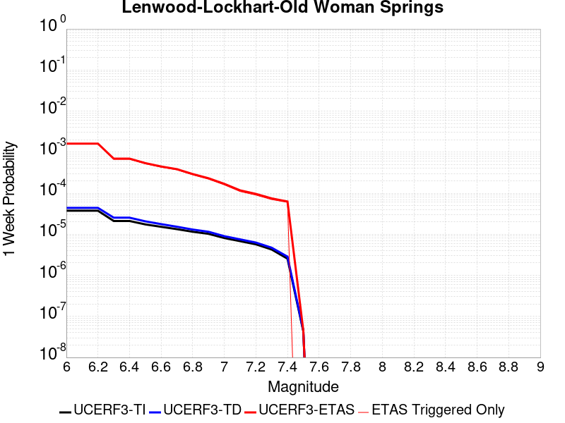 | 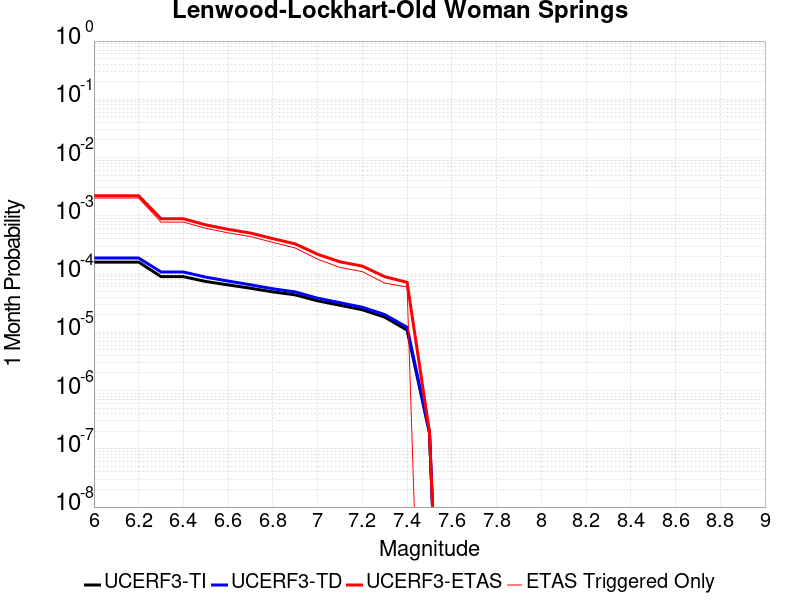 |  |  |

| Magnitude | 1 wk TI Prob | 1 wk TD Prob | 1 wk ETAS Prob | 1 wk ETAS/TD Gain | 1 wk ETAS Triggered Only | 1 mo TI Prob | 1 mo TD Prob | 1 mo ETAS Prob | 1 mo ETAS/TD Gain | 1 mo ETAS Triggered Only | 1 yr TI Prob | 1 yr TD Prob | 1 yr ETAS Prob | 1 yr ETAS/TD Gain | 1 yr ETAS Triggered Only | 10 yr TI Prob | 10 yr TD Prob | 10 yr ETAS Prob | 10 yr ETAS/TD Gain | 10 yr ETAS Triggered Only |
|-----|-----|-----|-----|-----|-----|-----|-----|-----|-----|-----|-----|-----|-----|-----|-----|-----|-----|-----|-----|-----|
| 6.0 | 3.744542E-5 | 4.396252E-5 | 0.0016138935 | 36.71067 | 0.00157 | 1.604705E-4 | 1.8839816E-4 | 0.0022080175 | 11.719953 | 0.00202 | 0.0019519776 | 0.0022915069 | 0.0054741967 | 2.3889072 | 0.00319 | 0.019349206 | 0.022696787 | 0.02725102 | 1.2006553 | 0.00466 |
| 6.1 | 3.744542E-5 | 4.396252E-5 | 0.0016138935 | 36.71067 | 0.00157 | 1.604705E-4 | 1.8839816E-4 | 0.0022080175 | 11.719953 | 0.00202 | 0.0019519776 | 0.0022915069 | 0.0054741967 | 2.3889072 | 0.00319 | 0.019349206 | 0.022696787 | 0.02725102 | 1.2006553 | 0.00466 |
| 6.2 | 3.744542E-5 | 4.396252E-5 | 0.0016138935 | 36.71067 | 0.00157 | 1.604705E-4 | 1.8839816E-4 | 0.0022080175 | 11.719953 | 0.00202 | 0.0019519776 | 0.0022915069 | 0.0054741967 | 2.3889072 | 0.00319 | 0.019349206 | 0.022696787 | 0.02725102 | 1.2006553 | 0.00466 |
| 6.3 | 2.1079984E-5 | 2.5353434E-5 | 6.9533644E-4 | 27.42573 | 6.7E-4 | 9.0339665E-5 | 1.0865316E-4 | 8.885684E-4 | 8.178026 | 7.8E-4 | 0.0010993304 | 0.0013220694 | 0.0025704168 | 1.9442374 | 0.00125 | 0.010939079 | 0.0131442575 | 0.014950204 | 1.1373943 | 0.00183 |
| 6.4 | 2.1079984E-5 | 2.5353434E-5 | 6.9533644E-4 | 27.42573 | 6.7E-4 | 9.0339665E-5 | 1.0865316E-4 | 8.885684E-4 | 8.178026 | 7.8E-4 | 0.0010993304 | 0.0013220694 | 0.0025704168 | 1.9442374 | 0.00125 | 0.010939079 | 0.0131442575 | 0.014950204 | 1.1373943 | 0.00183 |
| 6.5 | 1.7397282E-5 | 2.066241E-5 | 5.406517E-4 | 26.165955 | 5.2E-4 | 7.455765E-5 | 8.8550245E-5 | 6.9849624E-4 | 7.8881345 | 6.1E-4 | 9.073613E-4 | 0.0010775778 | 0.0020765 | 1.9270072 | 0.001 | 0.009036654 | 0.010724821 | 0.012099913 | 1.1282159 | 0.00139 |
| 6.6 | 1.52050325E-5 | 1.7679693E-5 | 4.476721E-4 | 25.321259 | 4.3E-4 | 6.51628E-5 | 7.576796E-5 | 5.857293E-4 | 7.7305675 | 5.1E-4 | 7.9306826E-4 | 9.220924E-4 | 0.0017912901 | 1.9426363 | 8.7E-4 | 0.007902439 | 0.009183526 | 0.010372506 | 1.1294688 | 0.0012 |
| 6.7 | 1.332523E-5 | 1.5264002E-5 | 3.8525835E-4 | 25.239668 | 3.7E-4 | 5.7106878E-5 | 6.5415545E-5 | 5.0538674E-4 | 7.72579 | 4.4E-4 | 6.950544E-4 | 7.961491E-4 | 0.0015455519 | 1.9412847 | 7.5E-4 | 0.006928845 | 0.007933599 | 0.008975268 | 1.1312985 | 0.00105 |
| 6.8 | 1.1525329E-5 | 1.3030979E-5 | 2.9302732E-4 | 22.486977 | 2.8E-4 | 4.9393333E-5 | 5.584588E-5 | 4.0582634E-4 | 7.266898 | 3.5E-4 | 6.011979E-4 | 6.797157E-4 | 0.0012893011 | 1.896824 | 6.1E-4 | 0.00599574 | 0.006776819 | 0.0076210587 | 1.1245775 | 8.5E-4 |
| 6.9 | 1.0253909E-5 | 1.15144385E-5 | 2.315119E-4 | 20.106226 | 2.2E-4 | 4.3944583E-5 | 4.9346683E-5 | 3.2933286E-4 | 6.6738605 | 2.8E-4 | 5.3489394E-4 | 6.0063385E-4 | 0.0010803456 | 1.7986758 | 4.8E-4 | 0.0053360825 | 0.0059904843 | 0.0066862907 | 1.1161519 | 7.0E-4 |
| 7.0 | 8.104563E-6 | 8.991279E-6 | 1.6898983E-4 | 18.79486 | 1.6E-4 | 3.4733377E-5 | 3.8533497E-5 | 2.1852656E-4 | 5.6710806 | 1.8E-4 | 4.2279682E-4 | 4.6904673E-4 | 7.8889664E-4 | 1.6819148 | 3.2E-4 | 0.0042199334 | 0.0046808156 | 0.0051486157 | 1.0999398 | 4.7E-4 |
| 7.1 | 6.7986157E-6 | 7.515816E-6 | 1.1751499E-4 | 15.635693 | 1.1E-4 | 2.91366E-5 | 3.2210253E-5 | 1.6220607E-4 | 5.035852 | 1.3E-4 | 3.5468035E-4 | 3.920914E-4 | 6.2200124E-4 | 1.586368 | 2.3E-4 | 0.003541148 | 0.003914213 | 0.0042329603 | 1.0814333 | 3.2E-4 |
| 7.2 | 5.6893327E-6 | 6.2800136E-6 | 9.627945E-5 | 15.331089 | 9.0E-5 | 2.4382627E-5 | 2.6914078E-5 | 1.3691111E-4 | 5.0869703 | 1.1E-4 | 2.9681803E-4 | 3.2763163E-4 | 4.975759E-4 | 1.5187055 | 1.7E-4 | 0.002964219 | 0.0032716845 | 0.0035108994 | 1.0731167 | 2.4E-4 |
| 7.3 | 4.253348E-6 | 4.7069107E-6 | 7.470658E-5 | 15.87168 | 7.0E-5 | 1.8228506E-5 | 2.0172329E-5 | 9.017091E-5 | 4.4700303 | 7.0E-5 | 2.2190946E-4 | 2.4557224E-4 | 3.6554277E-4 | 1.4885346 | 1.2E-4 | 0.00221688 | 0.0024531898 | 0.0026227727 | 1.0691276 | 1.7E-4 |
| 7.4 | 2.5448119E-6 | 2.852045E-6 | 6.2851876E-5 | 22.037476 | 6.0E-5 | 1.0906291E-5 | 1.2223002E-5 | 7.222227E-5 | 5.9087176 | 6.0E-5 | 1.3277601E-4 | 1.4880655E-4 | 2.4879165E-4 | 1.6719135 | 1.0E-4 | 0.001326967 | 0.0014872311 | 0.0015970676 | 1.0738529 | 1.1E-4 |
| 7.5 | 4.3706837E-8 | 4.562909E-8 | 4.562909E-8 | 1.0 | 0.0 | 1.8731501E-7 | 1.9555324E-7 | 1.9555324E-7 | 1.0 | 0.0 | 2.2805577E-6 | 2.3808586E-6 | 2.3808586E-6 | 1.0 | 0.0 | 2.2805343E-5 | 2.3808387E-5 | 2.3808387E-5 | 1.0 | 0.0 |

## San Andreas (Mojave S)
*[(top)](#table-of-contents)*

| 1 Week | 1 Month | 1 Year | 10 Year |
|-----|-----|-----|-----|
|  |  |  |  |

| Magnitude | 1 wk TI Prob | 1 wk TD Prob | 1 wk ETAS Prob | 1 wk ETAS/TD Gain | 1 wk ETAS Triggered Only | 1 mo TI Prob | 1 mo TD Prob | 1 mo ETAS Prob | 1 mo ETAS/TD Gain | 1 mo ETAS Triggered Only | 1 yr TI Prob | 1 yr TD Prob | 1 yr ETAS Prob | 1 yr ETAS/TD Gain | 1 yr ETAS Triggered Only | 10 yr TI Prob | 10 yr TD Prob | 10 yr ETAS Prob | 10 yr ETAS/TD Gain | 10 yr ETAS Triggered Only |
|-----|-----|-----|-----|-----|-----|-----|-----|-----|-----|-----|-----|-----|-----|-----|-----|-----|-----|-----|-----|-----|
| 6.0 | 3.1064058E-4 | 6.7460834E-4 | 0.0021036437 | 3.1183186 | 0.00143 | 0.0013306376 | 0.0028881032 | 0.004902269 | 1.6974009 | 0.00202 | 0.016080605 | 0.03462235 | 0.03756675 | 1.0850434 | 0.00305 | 0.1496549 | 0.28660452 | 0.28948665 | 1.0100561 | 0.00404 |
| 6.1 | 3.1064058E-4 | 6.7460834E-4 | 0.0021036437 | 3.1183186 | 0.00143 | 0.0013306376 | 0.0028881032 | 0.004902269 | 1.6974009 | 0.00202 | 0.016080605 | 0.03462235 | 0.03756675 | 1.0850434 | 0.00305 | 0.1496549 | 0.28660452 | 0.28948665 | 1.0100561 | 0.00404 |
| 6.2 | 3.1064058E-4 | 6.7460834E-4 | 0.0021036437 | 3.1183186 | 0.00143 | 0.0013306376 | 0.0028881032 | 0.004902269 | 1.6974009 | 0.00202 | 0.016080605 | 0.03462235 | 0.03756675 | 1.0850434 | 0.00305 | 0.1496549 | 0.28660452 | 0.28948665 | 1.0100561 | 0.00404 |
| 6.3 | 3.1064058E-4 | 6.7460834E-4 | 0.0021036437 | 3.1183186 | 0.00143 | 0.0013306376 | 0.0028881032 | 0.004902269 | 1.6974009 | 0.00202 | 0.016080605 | 0.03462235 | 0.03756675 | 1.0850434 | 0.00305 | 0.1496549 | 0.28660452 | 0.28948665 | 1.0100561 | 0.00404 |
| 6.4 | 1.9872203E-4 | 4.3179357E-4 | 0.0016612625 | 3.8473535 | 0.00123 | 8.5138786E-4 | 0.0018492596 | 0.0036159863 | 1.9553698 | 0.00177 | 0.010316478 | 0.02228844 | 0.024938038 | 1.1188776 | 0.00271 | 0.098504856 | 0.19699748 | 0.19985616 | 1.0145113 | 0.00356 |
| 6.5 | 1.291105E-4 | 2.875267E-4 | 0.0013372247 | 4.650785 | 0.00105 | 5.5321335E-4 | 0.0012316781 | 0.0027298306 | 2.2163508 | 0.0015 | 0.006714592 | 0.0148934 | 0.017188698 | 1.1541151 | 0.00233 | 0.065152965 | 0.13803436 | 0.14065473 | 1.0189835 | 0.00304 |
| 6.6 | 1.291105E-4 | 2.875267E-4 | 0.0013372247 | 4.650785 | 0.00105 | 5.5321335E-4 | 0.0012316781 | 0.0027298306 | 2.2163508 | 0.0015 | 0.006714592 | 0.0148934 | 0.017188698 | 1.1541151 | 0.00233 | 0.065152965 | 0.13803436 | 0.14065473 | 1.0189835 | 0.00304 |
| 6.7 | 1.08001186E-4 | 2.4333889E-4 | 0.0012530931 | 5.1495805 | 0.00101 | 4.6278012E-4 | 0.0010424647 | 0.002490953 | 2.3894844 | 0.00145 | 0.0056198016 | 0.012618446 | 0.014820307 | 1.1744955 | 0.00223 | 0.054797906 | 0.119176775 | 0.12173116 | 1.0214336 | 0.0029 |
| 6.8 | 1.0624356E-4 | 2.3851555E-4 | 0.0012382771 | 5.191599 | 0.001 | 4.5525006E-4 | 0.0010218095 | 0.0024503483 | 2.398048 | 0.00143 | 0.0055285925 | 0.012369843 | 0.014552506 | 1.1764503 | 0.00221 | 0.053930566 | 0.11712591 | 0.11965977 | 1.0216335 | 0.00287 |
| 6.9 | 1.0393785E-4 | 2.3221898E-4 | 0.0012319868 | 5.30528 | 0.001 | 4.4537184E-4 | 9.948451E-4 | 0.0024234224 | 2.4359796 | 0.00143 | 0.0054089287 | 0.012045221 | 0.014228601 | 1.1812652 | 0.00221 | 0.05279156 | 0.11442335 | 0.11694725 | 1.0220575 | 0.00285 |
| 7.0 | 1.0155622E-4 | 2.2591476E-4 | 0.0012256888 | 5.4254484 | 0.001 | 4.3516833E-4 | 9.6784724E-4 | 0.0023964632 | 2.476076 | 0.00143 | 0.005285311 | 0.0117200995 | 0.013894316 | 1.1855117 | 0.0022 | 0.05161361 | 0.111683756 | 0.11420657 | 1.022589 | 0.00284 |
| 7.1 | 9.885595E-5 | 2.1879886E-4 | 0.0012085822 | 5.5237136 | 9.9E-4 | 4.2359953E-4 | 9.3737274E-4 | 0.0023460512 | 2.5027943 | 0.00141 | 0.0051451353 | 0.011352993 | 0.013498357 | 1.188969 | 0.00217 | 0.05027629 | 0.1085682 | 0.11107313 | 1.0230724 | 0.00281 |
| 7.2 | 9.6411415E-5 | 2.124288E-4 | 0.0012022185 | 5.6593947 | 9.9E-4 | 4.1312634E-4 | 9.1009185E-4 | 0.0023088178 | 2.5369062 | 0.0014 | 0.005018219 | 0.011024255 | 0.013160443 | 1.1937716 | 0.00216 | 0.049064007 | 0.105758004 | 0.10826188 | 1.0236756 | 0.0028 |
| 7.3 | 9.1180635E-5 | 1.9471257E-4 | 0.0011545257 | 5.929384 | 9.6E-4 | 3.907156E-4 | 8.342157E-4 | 0.0021830895 | 2.6169364 | 0.00135 | 0.004746591 | 0.01010939 | 0.012178261 | 1.2046485 | 0.00209 | 0.046464786 | 0.09795115 | 0.10041375 | 1.025141 | 0.00273 |
| 7.4 | 8.887388E-5 | 1.8719878E-4 | 0.0011470191 | 6.1272783 | 9.6E-4 | 3.8083247E-4 | 8.020339E-4 | 0.0021509512 | 2.6818707 | 0.00135 | 0.0046267817 | 0.00972114 | 0.011790823 | 1.2129054 | 0.00209 | 0.045316286 | 0.09458615 | 0.09704887 | 1.0260369 | 0.00272 |
| 7.5 | 8.6750515E-5 | 1.8051457E-4 | 0.0011403413 | 6.31717 | 9.6E-4 | 3.7173493E-4 | 7.7340455E-4 | 0.0021223605 | 2.7441788 | 0.00135 | 0.004516484 | 0.009375632 | 0.011446036 | 1.2208283 | 0.00209 | 0.04425787 | 0.091549896 | 0.09401179 | 1.0268914 | 0.00271 |
| 7.6 | 8.453092E-5 | 1.7439072E-4 | 0.0011242251 | 6.4465876 | 9.5E-4 | 3.6222505E-4 | 7.471748E-4 | 0.0020861735 | 2.7920823 | 0.00134 | 0.0044011753 | 0.009058985 | 0.0111201415 | 1.2275263 | 0.00208 | 0.04315024 | 0.08870898 | 0.09116036 | 1.0276339 | 0.00269 |
| 7.7 | 8.259102E-5 | 1.6961215E-4 | 0.001119451 | 6.600064 | 9.5E-4 | 3.539135E-4 | 7.2670676E-4 | 0.002065733 | 2.8425949 | 0.00134 | 0.004300386 | 0.008811831 | 0.010873502 | 1.2339664 | 0.00208 | 0.042181134 | 0.08645982 | 0.08891725 | 1.0284227 | 0.00269 |
| 7.8 | 7.444844E-5 | 1.5283503E-4 | 9.127189E-4 | 5.971922 | 7.6E-4 | 3.1902574E-4 | 6.548429E-4 | 0.0017541226 | 2.6786923 | 0.0011 | 0.0038772223 | 0.007943616 | 0.009630112 | 1.2123083 | 0.0017 | 0.03810269 | 0.078290746 | 0.08032773 | 1.0260181 | 0.00221 |
| 7.9 | 5.2586525E-5 | 1.00064186E-4 | 5.200222E-4 | 5.196886 | 4.2E-4 | 2.2535135E-4 | 4.2877605E-4 | 0.0010485102 | 2.4453564 | 6.2E-4 | 0.0027402006 | 0.005207864 | 0.006162864 | 1.1833767 | 9.6E-4 | 0.027066574 | 0.052200034 | 0.05339426 | 1.0228779 | 0.00126 |
| 8.0 | 3.379877E-5 | 5.4074168E-5 | 1.940666E-4 | 3.5888968 | 1.4E-4 | 1.4484383E-4 | 2.3172585E-4 | 4.316795E-4 | 1.8628888 | 2.0E-4 | 0.0017620471 | 0.002817614 | 0.0031367124 | 1.1132512 | 3.2E-4 | 0.017481409 | 0.028834904 | 0.029281639 | 1.0154929 | 4.6E-4 |
| 8.1 | 1.8668277E-5 | 1.9309397E-5 | 4.930882E-5 | 2.5536177 | 3.0E-5 | 8.000444E-5 | 8.275194E-5 | 1.12749454E-4 | 1.3624992 | 3.0E-5 | 9.736188E-4 | 0.0010070398 | 0.0010669794 | 1.0595206 | 6.0E-5 | 0.009693642 | 0.010798888 | 0.010868132 | 1.0064121 | 7.0E-5 |
| 8.2 | 8.541571E-6 | 5.460819E-6 | 5.460819E-6 | 1.0 | 0.0 | 3.660622E-5 | 2.3403301E-5 | 2.3403301E-5 | 1.0 | 0.0 | 4.455896E-4 | 2.84898E-4 | 2.84898E-4 | 1.0 | 0.0 | 0.0044469717 | 0.0032408056 | 0.0032408056 | 1.0 | 0.0 |
| 8.3 | 1.983087E-6 | 7.6599065E-7 | 7.6599065E-7 | 1.0 | 0.0 | 8.498917E-6 | 3.282813E-6 | 3.282813E-6 | 1.0 | 0.0 | 1.034694E-4 | 3.9967534E-5 | 3.9967534E-5 | 1.0 | 0.0 | 0.0010342124 | 4.719687E-4 | 4.719687E-4 | 1.0 | 0.0 |

## So Sierra Nevada
*[(top)](#table-of-contents)*

| 1 Week | 1 Month | 1 Year | 10 Year |
|-----|-----|-----|-----|
|  |  |  |  |

| Magnitude | 1 wk TI Prob | 1 wk TD Prob | 1 wk ETAS Prob | 1 wk ETAS/TD Gain | 1 wk ETAS Triggered Only | 1 mo TI Prob | 1 mo TD Prob | 1 mo ETAS Prob | 1 mo ETAS/TD Gain | 1 mo ETAS Triggered Only | 1 yr TI Prob | 1 yr TD Prob | 1 yr ETAS Prob | 1 yr ETAS/TD Gain | 1 yr ETAS Triggered Only | 10 yr TI Prob | 10 yr TD Prob | 10 yr ETAS Prob | 10 yr ETAS/TD Gain | 10 yr ETAS Triggered Only |
|-----|-----|-----|-----|-----|-----|-----|-----|-----|-----|-----|-----|-----|-----|-----|-----|-----|-----|-----|-----|-----|
| 6.0 | 1.15488665E-5 | 1.1079643E-5 | 0.0012110664 | 109.30554 | 0.0012 | 4.9494203E-5 | 4.748339E-5 | 0.0017974003 | 37.853245 | 0.00175 | 6.024253E-4 | 5.7796965E-4 | 0.0034762935 | 6.014664 | 0.0029 | 0.006007948 | 0.005765934 | 0.010180334 | 1.7656 | 0.00444 |
| 6.1 | 1.15488665E-5 | 1.1079643E-5 | 0.0012110664 | 109.30554 | 0.0012 | 4.9494203E-5 | 4.748339E-5 | 0.0017974003 | 37.853245 | 0.00175 | 6.024253E-4 | 5.7796965E-4 | 0.0034762935 | 6.014664 | 0.0029 | 0.006007948 | 0.005765934 | 0.010180334 | 1.7656 | 0.00444 |
| 6.2 | 1.15488665E-5 | 1.1079643E-5 | 0.0012110664 | 109.30554 | 0.0012 | 4.9494203E-5 | 4.748339E-5 | 0.0017974003 | 37.853245 | 0.00175 | 6.024253E-4 | 5.7796965E-4 | 0.0034762935 | 6.014664 | 0.0029 | 0.006007948 | 0.005765934 | 0.010180334 | 1.7656 | 0.00444 |
| 6.3 | 1.15488665E-5 | 1.1079643E-5 | 0.0012110664 | 109.30554 | 0.0012 | 4.9494203E-5 | 4.748339E-5 | 0.0017974003 | 37.853245 | 0.00175 | 6.024253E-4 | 5.7796965E-4 | 0.0034762935 | 6.014664 | 0.0029 | 0.006007948 | 0.005765934 | 0.010180334 | 1.7656 | 0.00444 |
| 6.4 | 1.15488665E-5 | 1.1079643E-5 | 0.0012110664 | 109.30554 | 0.0012 | 4.9494203E-5 | 4.748339E-5 | 0.0017974003 | 37.853245 | 0.00175 | 6.024253E-4 | 5.7796965E-4 | 0.0034762935 | 6.014664 | 0.0029 | 0.006007948 | 0.005765934 | 0.010180334 | 1.7656 | 0.00444 |
| 6.5 | 1.15488665E-5 | 1.1079643E-5 | 0.0012110664 | 109.30554 | 0.0012 | 4.9494203E-5 | 4.748339E-5 | 0.0017974003 | 37.853245 | 0.00175 | 6.024253E-4 | 5.7796965E-4 | 0.0034762935 | 6.014664 | 0.0029 | 0.006007948 | 0.005765934 | 0.010180334 | 1.7656 | 0.00444 |
| 6.6 | 7.587044E-6 | 6.935635E-6 | 6.169314E-4 | 88.95096 | 6.1E-4 | 3.2515498E-5 | 2.9723828E-5 | 8.696989E-4 | 29.259315 | 8.4E-4 | 3.9580427E-4 | 3.6183043E-4 | 0.0017313347 | 4.784934 | 0.00137 | 0.003951 | 0.0036127048 | 0.0056652627 | 1.5681499 | 0.00206 |
| 6.7 | 7.587044E-6 | 6.935635E-6 | 6.169314E-4 | 88.95096 | 6.1E-4 | 3.2515498E-5 | 2.9723828E-5 | 8.696989E-4 | 29.259315 | 8.4E-4 | 3.9580427E-4 | 3.6183043E-4 | 0.0017313347 | 4.784934 | 0.00137 | 0.003951 | 0.0036127048 | 0.0056652627 | 1.5681499 | 0.00206 |
| 6.8 | 5.9026956E-6 | 5.1793927E-6 | 5.051768E-4 | 97.53591 | 5.0E-4 | 2.5297022E-5 | 2.2197215E-5 | 7.021821E-4 | 31.633793 | 6.8E-4 | 3.0794772E-4 | 2.7021873E-4 | 0.0012599513 | 4.6627083 | 9.9E-4 | 0.0030752132 | 0.002699018 | 0.0040952396 | 1.5173072 | 0.0014 |
| 6.9 | 5.0118915E-6 | 4.2524252E-6 | 4.5425052E-4 | 106.82151 | 4.5E-4 | 2.1479358E-5 | 1.8224557E-5 | 5.8821414E-4 | 32.27591 | 5.7E-4 | 2.614798E-4 | 2.2186211E-4 | 0.0010416802 | 4.6951694 | 8.2E-4 | 0.0026117235 | 0.0022164788 | 0.0033140406 | 1.4951826 | 0.0011 |
| 7.0 | 4.4924795E-6 | 3.7139177E-6 | 4.137124E-4 | 111.39514 | 4.1E-4 | 1.925334E-5 | 1.5916696E-5 | 5.3590845E-4 | 33.669575 | 5.2E-4 | 2.3438422E-4 | 1.9376918E-4 | 8.836355E-4 | 4.560248 | 6.9E-4 | 0.0023413717 | 0.0019360651 | 0.0028542841 | 1.4742706 | 9.2E-4 |
| 7.1 | 3.9118436E-6 | 3.1119775E-6 | 3.3311095E-4 | 107.041565 | 3.3E-4 | 1.6764936E-5 | 1.3336982E-5 | 4.3333138E-4 | 32.490963 | 4.2E-4 | 2.0409399E-4 | 1.6236622E-4 | 6.822818E-4 | 4.2021165 | 5.2E-4 | 0.0020390663 | 0.001622532 | 0.0023213963 | 1.4307245 | 7.0E-4 |
| 7.2 | 3.4200818E-6 | 2.6054543E-6 | 2.7260475E-4 | 104.628494 | 2.7E-4 | 1.4657411E-5 | 1.11661875E-5 | 3.6116227E-4 | 32.344276 | 3.5E-4 | 1.7843937E-4 | 1.3594035E-4 | 5.658819E-4 | 4.1627216 | 4.3E-4 | 0.0017829615 | 0.0013586218 | 0.0019078745 | 1.404272 | 5.5E-4 |
| 7.3 | 2.6593618E-6 | 1.8284203E-6 | 1.6182812E-4 | 88.50707 | 1.6E-4 | 1.13972155E-5 | 7.836065E-6 | 2.078345E-4 | 26.522814 | 2.0E-4 | 1.3875226E-4 | 9.540021E-5 | 3.553754E-4 | 3.725101 | 2.6E-4 | 0.0013866565 | 9.5362146E-4 | 0.0012833067 | 1.3457192 | 3.3E-4 |
| 7.4 | 2.2577992E-6 | 1.436438E-6 | 8.143632E-5 | 56.693237 | 8.0E-5 | 9.676246E-6 | 6.15615E-6 | 1.2615541E-4 | 20.492582 | 1.2E-4 | 1.1780193E-4 | 7.49488E-5 | 2.3493682E-4 | 3.1346307 | 1.6E-4 | 0.001177395 | 7.492603E-4 | 9.6909545E-4 | 1.2934029 | 2.2E-4 |
| 7.5 | 1.489319E-6 | 7.353936E-7 | 4.0735365E-5 | 55.3926 | 4.0E-5 | 6.3827797E-6 | 3.1516831E-6 | 7.315146E-5 | 23.210285 | 7.0E-5 | 7.770758E-5 | 3.8371072E-5 | 1.18368E-4 | 3.084824 | 8.0E-5 | 7.7680405E-4 | 3.836449E-4 | 4.8360653E-4 | 1.2605578 | 1.0E-4 |
| 7.6 | 1.0680322E-6 | 4.6596554E-7 | 2.0465955E-5 | 43.921608 | 2.0E-5 | 4.577273E-6 | 1.9969937E-6 | 4.1996915E-5 | 21.03007 | 4.0E-5 | 5.5726876E-5 | 2.4313129E-5 | 7.4311916E-5 | 3.056452 | 5.0E-5 | 5.5712904E-4 | 2.4310495E-4 | 3.1308795E-4 | 1.2878715 | 7.0E-5 |
| 7.7 | 5.509146E-7 | 1.5580486E-7 | 2.0155801E-5 | 129.36568 | 2.0E-5 | 2.3610605E-6 | 6.677349E-7 | 2.0667721E-5 | 30.951984 | 2.0E-5 | 2.8745531E-5 | 8.129644E-6 | 3.81294E-5 | 4.6901684 | 3.0E-5 | 2.8741814E-4 | 8.1293576E-5 | 1.1129114E-4 | 1.3690028 | 3.0E-5 |

## Death Valley (So)
*[(top)](#table-of-contents)*

| 1 Week | 1 Month | 1 Year | 10 Year |
|-----|-----|-----|-----|
|  |  | 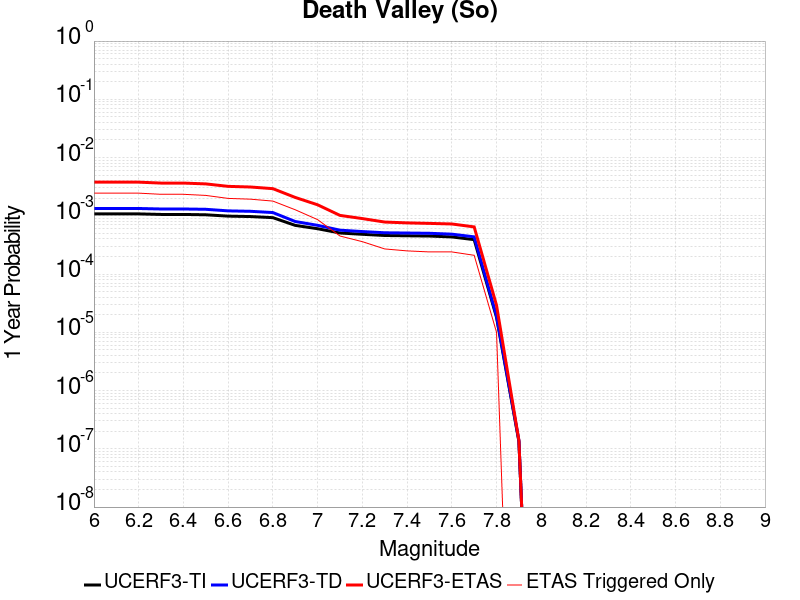 |  |

| Magnitude | 1 wk TI Prob | 1 wk TD Prob | 1 wk ETAS Prob | 1 wk ETAS/TD Gain | 1 wk ETAS Triggered Only | 1 mo TI Prob | 1 mo TD Prob | 1 mo ETAS Prob | 1 mo ETAS/TD Gain | 1 mo ETAS Triggered Only | 1 yr TI Prob | 1 yr TD Prob | 1 yr ETAS Prob | 1 yr ETAS/TD Gain | 1 yr ETAS Triggered Only | 10 yr TI Prob | 10 yr TD Prob | 10 yr ETAS Prob | 10 yr ETAS/TD Gain | 10 yr ETAS Triggered Only |
|-----|-----|-----|-----|-----|-----|-----|-----|-----|-----|-----|-----|-----|-----|-----|-----|-----|-----|-----|-----|-----|
| 6.0 | 2.0684236E-5 | 2.5617775E-5 | 7.95598E-4 | 31.056484 | 7.7E-4 | 8.864371E-5 | 1.0978594E-4 | 0.0013496499 | 12.293467 | 0.00124 | 0.0010787029 | 0.0013358411 | 0.0037825683 | 2.8316004 | 0.00245 | 0.010734817 | 0.013281397 | 0.016882919 | 1.2711705 | 0.00365 |
| 6.1 | 2.0684236E-5 | 2.5617775E-5 | 7.95598E-4 | 31.056484 | 7.7E-4 | 8.864371E-5 | 1.0978594E-4 | 0.0013496499 | 12.293467 | 0.00124 | 0.0010787029 | 0.0013358411 | 0.0037825683 | 2.8316004 | 0.00245 | 0.010734817 | 0.013281397 | 0.016882919 | 1.2711705 | 0.00365 |
| 6.2 | 2.0684236E-5 | 2.5617775E-5 | 7.95598E-4 | 31.056484 | 7.7E-4 | 8.864371E-5 | 1.0978594E-4 | 0.0013496499 | 12.293467 | 0.00124 | 0.0010787029 | 0.0013358411 | 0.0037825683 | 2.8316004 | 0.00245 | 0.010734817 | 0.013281397 | 0.016882919 | 1.2711705 | 0.00365 |
| 6.3 | 2.0240292E-5 | 2.511786E-5 | 7.8509876E-4 | 31.256594 | 7.6E-4 | 8.6741224E-5 | 1.07643624E-4 | 0.0012975156 | 12.053807 | 0.00119 | 0.0010555626 | 0.00130979 | 0.003646725 | 2.784206 | 0.00234 | 0.010505628 | 0.013023956 | 0.016507981 | 1.267509 | 0.00353 |
| 6.4 | 2.0240292E-5 | 2.511786E-5 | 7.8509876E-4 | 31.256594 | 7.6E-4 | 8.6741224E-5 | 1.07643624E-4 | 0.0012975156 | 12.053807 | 0.00119 | 0.0010555626 | 0.00130979 | 0.003646725 | 2.784206 | 0.00234 | 0.010505628 | 0.013023956 | 0.016507981 | 1.267509 | 0.00353 |
| 6.5 | 1.9962767E-5 | 2.4807114E-5 | 7.54789E-4 | 30.426313 | 7.3E-4 | 8.55519E-5 | 1.0631196E-4 | 0.0012661887 | 11.910124 | 0.00116 | 0.0010410968 | 0.0012935963 | 0.0035306986 | 2.7293668 | 0.00224 | 0.010362327 | 0.012863902 | 0.016210293 | 1.2601382 | 0.00339 |
| 6.6 | 1.8937297E-5 | 2.3310964E-5 | 6.732958E-4 | 28.883224 | 6.5E-4 | 8.115732E-5 | 9.990039E-5 | 0.0011497955 | 11.509419 | 0.00105 | 9.876423E-4 | 0.0012156231 | 0.0032032041 | 2.6350305 | 0.00199 | 0.009832645 | 0.012092789 | 0.015125664 | 1.2508003 | 0.00307 |
| 6.7 | 1.8621096E-5 | 2.2911607E-5 | 6.328976E-4 | 27.623451 | 6.1E-4 | 7.980225E-5 | 9.818898E-5 | 0.0010980908 | 11.183442 | 0.001 | 9.711593E-4 | 0.0011948098 | 0.0031225039 | 2.61339 | 0.00193 | 0.009669261 | 0.011886904 | 0.014851243 | 1.2493786 | 0.003 |
| 6.8 | 1.7830353E-5 | 2.1805688E-5 | 5.717937E-4 | 26.222227 | 5.5E-4 | 7.641356E-5 | 9.344968E-5 | 9.833665E-4 | 10.522952 | 8.9E-4 | 9.29938E-4 | 0.00113717 | 0.0029251345 | 2.572293 | 0.00179 | 0.009260561 | 0.011316354 | 0.014124216 | 1.2481242 | 0.00284 |
| 6.9 | 1.3135183E-5 | 1.5303925E-5 | 3.9529812E-4 | 25.829851 | 3.8E-4 | 5.6292425E-5 | 6.558664E-5 | 6.6554727E-4 | 10.147605 | 6.0E-4 | 6.8514474E-4 | 7.982312E-4 | 0.0020672174 | 2.5897477 | 0.00127 | 0.006830362 | 0.007954649 | 0.009918898 | 1.2469311 | 0.00198 |
| 7.0 | 1.1507512E-5 | 1.3154199E-5 | 2.631509E-4 | 20.005087 | 2.5E-4 | 4.9316975E-5 | 5.6373956E-5 | 4.563514E-4 | 8.095076 | 4.0E-4 | 6.002687E-4 | 6.8614254E-4 | 0.0015455524 | 2.252524 | 8.6E-4 | 0.0059864987 | 0.0068409415 | 0.008251227 | 1.2061538 | 0.00142 |
| 7.1 | 9.715903E-6 | 1.0865278E-5 | 1.5086375E-4 | 13.884942 | 1.4E-4 | 4.1638916E-5 | 4.656467E-5 | 2.6655442E-4 | 5.724392 | 2.2E-4 | 5.068359E-4 | 5.667817E-4 | 0.0010165266 | 1.7935065 | 4.5E-4 | 0.0050568148 | 0.0056538144 | 0.0063399132 | 1.1213515 | 6.9E-4 |
| 7.2 | 9.233269E-6 | 1.02863105E-5 | 1.0028538E-4 | 9.749403 | 9.0E-5 | 3.9570554E-5 | 4.4083466E-5 | 2.1407598E-4 | 4.856151 | 1.7E-4 | 4.81665E-4 | 5.3658825E-4 | 8.9639507E-4 | 1.6705455 | 3.6E-4 | 0.0048062233 | 0.0053533576 | 0.0058904667 | 1.1003313 | 5.4E-4 |
| 7.3 | 8.8041315E-6 | 9.808164E-6 | 6.9807575E-5 | 7.117293 | 6.0E-5 | 3.7731446E-5 | 4.2034335E-5 | 1.6202929E-4 | 3.8546891 | 1.2E-4 | 4.592835E-4 | 5.1165203E-4 | 7.815139E-4 | 1.5274323 | 2.7E-4 | 0.0045833546 | 0.005105167 | 0.005513074 | 1.0799007 | 4.1E-4 |
| 7.4 | 8.708749E-6 | 9.707175E-6 | 6.970659E-5 | 7.180935 | 6.0E-5 | 3.7322676E-5 | 4.160154E-5 | 1.6159654E-4 | 3.8843887 | 1.2E-4 | 4.5430884E-4 | 5.0638523E-4 | 7.562586E-4 | 1.4934453 | 2.5E-4 | 0.004533812 | 0.0050527398 | 0.0054407693 | 1.0767958 | 3.9E-4 |
| 7.5 | 8.612678E-6 | 9.604817E-6 | 5.9604336E-5 | 6.2056713 | 5.0E-5 | 3.6910955E-5 | 4.1162875E-5 | 1.5115835E-4 | 3.6722007 | 1.1E-4 | 4.492982E-4 | 5.01047E-4 | 7.409267E-4 | 1.478757 | 2.4E-4 | 0.004483909 | 0.0049995985 | 0.0053776987 | 1.0756261 | 3.8E-4 |
| 7.6 | 8.319024E-6 | 9.283916E-6 | 5.928345E-5 | 6.385608 | 5.0E-5 | 3.5652476E-5 | 3.978763E-5 | 1.4978326E-4 | 3.7645683 | 1.1E-4 | 4.3398244E-4 | 4.8431093E-4 | 7.241947E-4 | 1.4953095 | 2.4E-4 | 0.0043313587 | 0.0048329784 | 0.0051912386 | 1.0741283 | 3.6E-4 |
| 7.7 | 7.4718328E-6 | 8.34517E-6 | 5.834475E-5 | 6.99144 | 5.0E-5 | 3.2021748E-5 | 3.5764548E-5 | 1.4576061E-4 | 4.0755615 | 1.1E-4 | 3.8979502E-4 | 4.353504E-4 | 6.45259E-4 | 1.4821601 | 2.1E-4 | 0.00389112 | 0.0043453807 | 0.004644077 | 1.0687388 | 3.0E-4 |
| 7.8 | 3.4586725E-7 | 3.6482615E-7 | 3.6482615E-7 | 1.0 | 0.0 | 1.4822873E-6 | 1.5635396E-6 | 1.5635396E-6 | 1.0 | 0.0 | 1.80467E-5 | 1.9035933E-5 | 2.9035744E-5 | 1.5253123 | 1.0E-5 | 1.8045233E-4 | 1.9034347E-4 | 2.1033967E-4 | 1.1050532 | 2.0E-5 |
| 7.9 | 2.5591178E-9 | 2.6696718E-9 | 2.6696718E-9 | 1.0 | 0.0 | 1.0967647E-8 | 1.14414505E-8 | 1.14414505E-8 | 1.0 | 0.0 | 1.335311E-7 | 1.3929966E-7 | 1.3929966E-7 | 1.0 | 0.0 | 1.3353102E-6 | 1.3929966E-6 | 1.3929966E-6 | 1.0 | 0.0 |

## Nelson Lake
*[(top)](#table-of-contents)*

| 1 Week | 1 Month | 1 Year | 10 Year |
|-----|-----|-----|-----|
|  |  |  |  |

| Magnitude | 1 wk TI Prob | 1 wk TD Prob | 1 wk ETAS Prob | 1 wk ETAS/TD Gain | 1 wk ETAS Triggered Only | 1 mo TI Prob | 1 mo TD Prob | 1 mo ETAS Prob | 1 mo ETAS/TD Gain | 1 mo ETAS Triggered Only | 1 yr TI Prob | 1 yr TD Prob | 1 yr ETAS Prob | 1 yr ETAS/TD Gain | 1 yr ETAS Triggered Only | 10 yr TI Prob | 10 yr TD Prob | 10 yr ETAS Prob | 10 yr ETAS/TD Gain | 10 yr ETAS Triggered Only |
|-----|-----|-----|-----|-----|-----|-----|-----|-----|-----|-----|-----|-----|-----|-----|-----|-----|-----|-----|-----|-----|
| 6.0 | 9.913453E-6 | 1.0192255E-5 | 6.7018555E-4 | 65.75439 | 6.6E-4 | 4.2485535E-5 | 4.3680422E-5 | 0.001083635 | 24.808254 | 0.00104 | 5.1713863E-4 | 5.316897E-4 | 0.0025706051 | 4.8347845 | 0.00204 | 0.0051593683 | 0.005305204 | 0.00857775 | 1.6168559 | 0.00329 |
| 6.1 | 9.913453E-6 | 1.0192255E-5 | 6.7018555E-4 | 65.75439 | 6.6E-4 | 4.2485535E-5 | 4.3680422E-5 | 0.001083635 | 24.808254 | 0.00104 | 5.1713863E-4 | 5.316897E-4 | 0.0025706051 | 4.8347845 | 0.00204 | 0.0051593683 | 0.005305204 | 0.00857775 | 1.6168559 | 0.00329 |
| 6.2 | 4.5596407E-6 | 4.696313E-6 | 3.3469475E-4 | 71.267555 | 3.3E-4 | 1.954117E-5 | 2.0126909E-5 | 5.0011725E-4 | 24.84819 | 4.8E-4 | 2.3788778E-4 | 2.4501883E-4 | 0.001084813 | 4.4274683 | 8.4E-4 | 0.0023763329 | 0.0024476128 | 0.0038441862 | 1.5705858 | 0.0014 |
| 6.3 | 4.5596407E-6 | 4.696313E-6 | 3.3469475E-4 | 71.267555 | 3.3E-4 | 1.954117E-5 | 2.0126909E-5 | 5.0011725E-4 | 24.84819 | 4.8E-4 | 2.3788778E-4 | 2.4501883E-4 | 0.001084813 | 4.4274683 | 8.4E-4 | 0.0023763329 | 0.0024476128 | 0.0038441862 | 1.5705858 | 0.0014 |
| 6.4 | 3.4025713E-6 | 3.5098972E-6 | 2.5350903E-4 | 72.226906 | 2.5E-4 | 1.4582367E-5 | 1.5042335E-5 | 3.9503662E-4 | 26.261656 | 3.8E-4 | 1.7752586E-4 | 1.8312587E-4 | 8.43005E-4 | 4.6034184 | 6.6E-4 | 0.001773841 | 0.0018298327 | 0.0028679296 | 1.567318 | 0.00104 |
| 6.5 | 2.8352947E-6 | 2.927856E-6 | 2.3292718E-4 | 79.55554 | 2.3E-4 | 1.2151207E-5 | 1.2547898E-5 | 3.7254338E-4 | 29.689703 | 3.6E-4 | 1.479309E-4 | 1.5276071E-4 | 7.8266446E-4 | 5.1234674 | 6.3E-4 | 0.0014783246 | 0.0015266308 | 0.00249515 | 1.6344161 | 9.7E-4 |
| 6.6 | 2.251518E-6 | 2.3290677E-6 | 1.8232864E-4 | 78.283966 | 1.8E-4 | 9.649328E-6 | 9.981683E-6 | 2.899789E-4 | 29.0511 | 2.8E-4 | 1.1747423E-4 | 1.2152085E-4 | 6.314589E-4 | 5.196301 | 5.1E-4 | 0.0011741214 | 0.0012146058 | 0.0019736825 | 1.6249574 | 7.6E-4 |
| 6.7 | 1.8911853E-6 | 1.9591396E-6 | 1.6195883E-4 | 82.66834 | 1.6E-4 | 8.105055E-6 | 8.39629E-6 | 2.2839445E-4 | 27.201832 | 2.2E-4 | 9.867457E-5 | 1.0222061E-4 | 5.5217464E-4 | 5.4017935 | 4.5E-4 | 9.863076E-4 | 0.0010217935 | 0.0016511497 | 1.615933 | 6.3E-4 |
| 6.8 | 1.4874814E-6 | 1.5438305E-6 | 1.3154362E-4 | 85.20601 | 1.3E-4 | 6.374905E-6 | 6.6164025E-6 | 1.8661522E-4 | 28.204937 | 1.8E-4 | 7.76117E-5 | 8.055224E-5 | 4.5052244E-4 | 5.592922 | 3.7E-4 | 7.75846E-4 | 8.0528157E-4 | 0.0013148709 | 1.6328089 | 5.1E-4 |
| 6.9 | 6.835972E-7 | 7.1399285E-7 | 6.071395E-5 | 85.0344 | 6.0E-5 | 2.9296991E-6 | 3.0599674E-6 | 8.305972E-5 | 27.14399 | 8.0E-5 | 3.56685E-5 | 3.7254784E-5 | 1.872492E-4 | 5.0261784 | 1.5E-4 | 3.5662777E-4 | 3.7251666E-4 | 5.824384E-4 | 1.5635232 | 2.1E-4 |

## San Andreas (Mojave N)
*[(top)](#table-of-contents)*

| 1 Week | 1 Month | 1 Year | 10 Year |
|-----|-----|-----|-----|
|  |  | 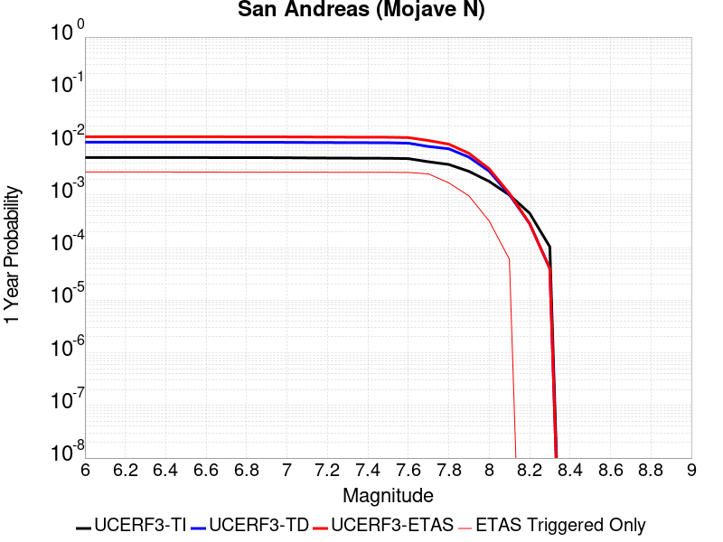 |  |

| Magnitude | 1 wk TI Prob | 1 wk TD Prob | 1 wk ETAS Prob | 1 wk ETAS/TD Gain | 1 wk ETAS Triggered Only | 1 mo TI Prob | 1 mo TD Prob | 1 mo ETAS Prob | 1 mo ETAS/TD Gain | 1 mo ETAS Triggered Only | 1 yr TI Prob | 1 yr TD Prob | 1 yr ETAS Prob | 1 yr ETAS/TD Gain | 1 yr ETAS Triggered Only | 10 yr TI Prob | 10 yr TD Prob | 10 yr ETAS Prob | 10 yr ETAS/TD Gain | 10 yr ETAS Triggered Only |
|-----|-----|-----|-----|-----|-----|-----|-----|-----|-----|-----|-----|-----|-----|-----|-----|-----|-----|-----|-----|-----|
| 6.0 | 9.877682E-5 | 1.9400702E-4 | 0.0015537431 | 8.008696 | 0.00136 | 4.2326056E-4 | 8.311939E-4 | 0.0026496812 | 3.1878014 | 0.00182 | 0.0051410277 | 0.010072956 | 0.0127754565 | 1.2682928 | 0.00273 | 0.05023708 | 0.09831428 | 0.10156035 | 1.0330173 | 0.0036 |
| 6.1 | 9.877682E-5 | 1.9400702E-4 | 0.0015537431 | 8.008696 | 0.00136 | 4.2326056E-4 | 8.311939E-4 | 0.0026496812 | 3.1878014 | 0.00182 | 0.0051410277 | 0.010072956 | 0.0127754565 | 1.2682928 | 0.00273 | 0.05023708 | 0.09831428 | 0.10156035 | 1.0330173 | 0.0036 |
| 6.2 | 9.877682E-5 | 1.9400702E-4 | 0.0015537431 | 8.008696 | 0.00136 | 4.2326056E-4 | 8.311939E-4 | 0.0026496812 | 3.1878014 | 0.00182 | 0.0051410277 | 0.010072956 | 0.0127754565 | 1.2682928 | 0.00273 | 0.05023708 | 0.09831428 | 0.10156035 | 1.0330173 | 0.0036 |
| 6.3 | 9.877682E-5 | 1.9400702E-4 | 0.0015537431 | 8.008696 | 0.00136 | 4.2326056E-4 | 8.311939E-4 | 0.0026496812 | 3.1878014 | 0.00182 | 0.0051410277 | 0.010072956 | 0.0127754565 | 1.2682928 | 0.00273 | 0.05023708 | 0.09831428 | 0.10156035 | 1.0330173 | 0.0036 |
| 6.4 | 9.877682E-5 | 1.9400702E-4 | 0.0015537431 | 8.008696 | 0.00136 | 4.2326056E-4 | 8.311939E-4 | 0.0026496812 | 3.1878014 | 0.00182 | 0.0051410277 | 0.010072956 | 0.0127754565 | 1.2682928 | 0.00273 | 0.05023708 | 0.09831428 | 0.10156035 | 1.0330173 | 0.0036 |
| 6.5 | 9.861474E-5 | 1.9374468E-4 | 0.0015434831 | 7.9665833 | 0.00135 | 4.2256617E-4 | 8.300703E-4 | 0.002638568 | 3.178728 | 0.00181 | 0.0051326132 | 0.010059402 | 0.012752041 | 1.2676737 | 0.00272 | 0.050156746 | 0.098192066 | 0.10142956 | 1.032971 | 0.00359 |
| 6.6 | 9.861474E-5 | 1.9374468E-4 | 0.0015434831 | 7.9665833 | 0.00135 | 4.2256617E-4 | 8.300703E-4 | 0.002638568 | 3.178728 | 0.00181 | 0.0051326132 | 0.010059402 | 0.012752041 | 1.2676737 | 0.00272 | 0.050156746 | 0.098192066 | 0.10142956 | 1.032971 | 0.00359 |
| 6.7 | 9.8552715E-5 | 1.9364421E-4 | 0.0015333848 | 7.918567 | 0.00134 | 4.223004E-4 | 8.2964E-4 | 0.0026281467 | 3.1678157 | 0.0018 | 0.0051293927 | 0.010054212 | 0.012736965 | 1.2668288 | 0.00271 | 0.050125998 | 0.098145254 | 0.101373896 | 1.0328965 | 0.00358 |
| 6.8 | 9.8464974E-5 | 1.9349584E-4 | 0.0015332366 | 7.9238734 | 0.00134 | 4.219245E-4 | 8.290045E-4 | 0.0026275124 | 3.169479 | 0.0018 | 0.0051248376 | 0.010046546 | 0.012729321 | 1.2670344 | 0.00271 | 0.05008251 | 0.09807528 | 0.10130417 | 1.0329226 | 0.00358 |
| 6.9 | 9.825824E-5 | 1.9317595E-4 | 0.001532917 | 7.935342 | 0.00134 | 4.2103877E-4 | 8.276344E-4 | 0.0026261446 | 3.1730733 | 0.0018 | 0.0051141046 | 0.010030019 | 0.012712838 | 1.267479 | 0.00271 | 0.049980022 | 0.09792438 | 0.10114479 | 1.0328867 | 0.00357 |
| 7.0 | 9.781462E-5 | 1.924896E-4 | 0.0015322317 | 7.960075 | 0.00134 | 4.1913814E-4 | 8.246948E-4 | 0.0026232104 | 3.1808257 | 0.0018 | 0.005091073 | 0.009994558 | 0.012677473 | 1.2684375 | 0.00271 | 0.04976007 | 0.09760077 | 0.10082234 | 1.0330076 | 0.00357 |
| 7.1 | 9.7121134E-5 | 1.9150671E-4 | 0.0015312501 | 7.9958034 | 0.00134 | 4.1616702E-4 | 8.204851E-4 | 0.0026190083 | 3.192024 | 0.0018 | 0.005055068 | 0.009943774 | 0.012626827 | 1.2698224 | 0.00271 | 0.04941613 | 0.09713728 | 0.100360505 | 1.0331821 | 0.00357 |
| 7.2 | 9.663819E-5 | 1.9081456E-4 | 0.0015305589 | 8.021185 | 0.00134 | 4.1409794E-4 | 8.175206E-4 | 0.002616049 | 3.1999793 | 0.0018 | 0.0050299936 | 0.00990801 | 0.012581259 | 1.2698067 | 0.0027 | 0.049176537 | 0.09681055 | 0.1000259 | 1.0332129 | 0.00356 |
| 7.3 | 9.6277574E-5 | 1.9033969E-4 | 0.0015200865 | 7.986177 | 0.00133 | 4.125529E-4 | 8.154867E-4 | 0.002604027 | 3.1932182 | 0.00179 | 0.0050112694 | 0.009883473 | 0.012546887 | 1.2694815 | 0.00269 | 0.04899759 | 0.09658401 | 0.09979113 | 1.0332055 | 0.00355 |
| 7.4 | 9.593308E-5 | 1.897375E-4 | 0.0015194851 | 8.008354 | 0.00133 | 4.1107697E-4 | 8.129075E-4 | 0.0026014524 | 3.2001824 | 0.00179 | 0.0049933824 | 0.009852355 | 0.012515852 | 1.2703412 | 0.00269 | 0.04882661 | 0.09630218 | 0.09951031 | 1.0333132 | 0.00355 |
| 7.5 | 9.561707E-5 | 1.8919831E-4 | 0.0015189467 | 8.028331 | 0.00133 | 4.0972308E-4 | 8.1059814E-4 | 0.0025991471 | 3.206456 | 0.00179 | 0.0049769743 | 0.009824493 | 0.012488065 | 1.2711155 | 0.00269 | 0.048669744 | 0.09604836 | 0.099257395 | 1.0334105 | 0.00355 |
| 7.6 | 9.418194E-5 | 1.8572104E-4 | 0.0015054758 | 8.106113 | 0.00132 | 4.0357444E-4 | 7.957047E-4 | 0.0025742883 | 3.2352307 | 0.00178 | 0.004902454 | 0.009644784 | 0.012298936 | 1.2751904 | 0.00268 | 0.047957025 | 0.094430685 | 0.09761829 | 1.033756 | 0.00352 |
| 7.7 | 8.202141E-5 | 1.6021315E-4 | 0.0013700193 | 8.551229 | 0.00121 | 3.51473E-4 | 6.8644714E-4 | 0.0023453077 | 3.4165888 | 0.00166 | 0.00427079 | 0.008325525 | 0.010814628 | 1.2989725 | 0.00251 | 0.04189639 | 0.08223219 | 0.08521494 | 1.0362723 | 0.00325 |
| 7.8 | 7.2859846E-5 | 1.4516473E-4 | 9.050544E-4 | 6.234672 | 7.6E-4 | 3.1221908E-4 | 6.219862E-4 | 0.001721302 | 2.767428 | 0.0011 | 0.003794643 | 0.0075464295 | 0.0092336 | 1.2235721 | 0.0017 | 0.037304975 | 0.07472468 | 0.076760285 | 1.0272415 | 0.0022 |
| 7.9 | 5.3874453E-5 | 1.0045676E-4 | 5.2041456E-4 | 5.1804833 | 4.2E-4 | 2.3087008E-4 | 4.3045796E-4 | 0.0010501911 | 2.4397066 | 6.2E-4 | 0.0028072202 | 0.0052282433 | 0.006183224 | 1.1826581 | 9.6E-4 | 0.02772022 | 0.05242443 | 0.053618375 | 1.0227746 | 0.00126 |
| 8.0 | 3.468538E-5 | 5.4260272E-5 | 1.9425267E-4 | 3.5800166 | 1.4E-4 | 1.4864317E-4 | 2.325233E-4 | 4.324768E-4 | 1.8599288 | 2.0E-4 | 0.0018082283 | 0.002827298 | 0.003146393 | 1.1128622 | 3.2E-4 | 0.017935853 | 0.028947512 | 0.029394194 | 1.0154308 | 4.6E-4 |
| 8.1 | 1.9152367E-5 | 1.940263E-5 | 4.940205E-5 | 2.546152 | 3.0E-5 | 8.207899E-5 | 8.3151484E-5 | 1.1314899E-4 | 1.3607574 | 3.0E-5 | 9.988535E-4 | 0.0010118998 | 0.001071839 | 1.0592344 | 6.0E-5 | 0.009943757 | 0.01085625 | 0.01092549 | 1.0063779 | 7.0E-5 |
| 8.2 | 8.643924E-6 | 5.4748625E-6 | 5.4748625E-6 | 1.0 | 0.0 | 3.704486E-5 | 2.3463486E-5 | 2.3463486E-5 | 1.0 | 0.0 | 4.5092785E-4 | 2.8563058E-4 | 2.8563058E-4 | 1.0 | 0.0 | 0.0045001395 | 0.0032487072 | 0.0032487072 | 1.0 | 0.0 |
| 8.3 | 1.983087E-6 | 7.6599065E-7 | 7.6599065E-7 | 1.0 | 0.0 | 8.498917E-6 | 3.282813E-6 | 3.282813E-6 | 1.0 | 0.0 | 1.034694E-4 | 3.9967534E-5 | 3.9967534E-5 | 1.0 | 0.0 | 0.0010342124 | 4.719687E-4 | 4.719687E-4 | 1.0 | 0.0 |

## Bicycle Lake
*[(top)](#table-of-contents)*

| 1 Week | 1 Month | 1 Year | 10 Year |
|-----|-----|-----|-----|
|  |  |  |  |

| Magnitude | 1 wk TI Prob | 1 wk TD Prob | 1 wk ETAS Prob | 1 wk ETAS/TD Gain | 1 wk ETAS Triggered Only | 1 mo TI Prob | 1 mo TD Prob | 1 mo ETAS Prob | 1 mo ETAS/TD Gain | 1 mo ETAS Triggered Only | 1 yr TI Prob | 1 yr TD Prob | 1 yr ETAS Prob | 1 yr ETAS/TD Gain | 1 yr ETAS Triggered Only | 10 yr TI Prob | 10 yr TD Prob | 10 yr ETAS Prob | 10 yr ETAS/TD Gain | 10 yr ETAS Triggered Only |
|-----|-----|-----|-----|-----|-----|-----|-----|-----|-----|-----|-----|-----|-----|-----|-----|-----|-----|-----|-----|-----|
| 6.0 | 1.9621975E-5 | 2.2097078E-5 | 5.1208626E-4 | 23.174387 | 4.9E-4 | 8.4091465E-5 | 9.4699084E-5 | 7.746347E-4 | 8.179959 | 6.8E-4 | 0.0010233327 | 0.0011524865 | 0.0024609768 | 2.1353626 | 0.00131 | 0.01018633 | 0.011478408 | 0.013742123 | 1.197215 | 0.00229 |
| 6.1 | 1.9621975E-5 | 2.2097078E-5 | 5.1208626E-4 | 23.174387 | 4.9E-4 | 8.4091465E-5 | 9.4699084E-5 | 7.746347E-4 | 8.179959 | 6.8E-4 | 0.0010233327 | 0.0011524865 | 0.0024609768 | 2.1353626 | 0.00131 | 0.01018633 | 0.011478408 | 0.013742123 | 1.197215 | 0.00229 |
| 6.2 | 9.9971285E-6 | 1.1255639E-5 | 2.9125248E-4 | 25.876139 | 2.8E-4 | 4.2844134E-5 | 4.8237856E-5 | 4.5821807E-4 | 9.499139 | 4.1E-4 | 5.2150246E-4 | 5.871896E-4 | 0.0013567376 | 2.310561 | 7.7E-4 | 0.0052028033 | 0.005861487 | 0.0072035734 | 1.228967 | 0.00135 |
| 6.3 | 9.589428E-6 | 1.0798346E-5 | 2.9079532E-4 | 26.929617 | 2.8E-4 | 4.10969E-5 | 4.62781E-5 | 4.5625912E-4 | 9.859073 | 4.1E-4 | 5.002399E-4 | 5.6334207E-4 | 0.0013129195 | 2.3305902 | 7.5E-4 | 0.0049911533 | 0.0056242296 | 0.006936806 | 1.2333788 | 0.00132 |
| 6.4 | 9.589428E-6 | 1.0798346E-5 | 2.9079532E-4 | 26.929617 | 2.8E-4 | 4.10969E-5 | 4.62781E-5 | 4.5625912E-4 | 9.859073 | 4.1E-4 | 5.002399E-4 | 5.6334207E-4 | 0.0013129195 | 2.3305902 | 7.5E-4 | 0.0049911533 | 0.0056242296 | 0.006936806 | 1.2333788 | 0.00132 |
| 6.5 | 5.557707E-6 | 6.2856016E-6 | 2.2628422E-4 | 36.00041 | 2.2E-4 | 2.3818526E-5 | 2.6938165E-5 | 3.6692902E-4 | 13.621158 | 3.4E-4 | 2.8995197E-4 | 3.2794967E-4 | 8.677726E-4 | 2.646054 | 5.4E-4 | 0.0028957394 | 0.0032772934 | 0.004134475 | 1.2615516 | 8.6E-4 |
| 6.6 | 4.8742945E-6 | 5.5132896E-6 | 2.0551219E-4 | 37.275784 | 2.0E-4 | 2.0889667E-5 | 2.3628318E-5 | 3.33621E-4 | 14.11954 | 3.1E-4 | 2.54302E-4 | 2.87663E-4 | 7.975163E-4 | 2.772398 | 5.1E-4 | 0.002540112 | 0.0028754752 | 0.0037030885 | 1.287818 | 8.3E-4 |
| 6.7 | 3.991108E-6 | 4.5159104E-6 | 1.7451514E-4 | 38.644512 | 1.7E-4 | 1.7104636E-5 | 1.9353902E-5 | 2.7934887E-4 | 14.433724 | 2.6E-4 | 2.0822904E-4 | 2.3563375E-4 | 6.555348E-4 | 2.7820072 | 4.2E-4 | 0.0020803404 | 0.0023563374 | 0.0030147822 | 1.2794358 | 6.6E-4 |

## Towne Pass
*[(top)](#table-of-contents)*

| 1 Week | 1 Month | 1 Year | 10 Year |
|-----|-----|-----|-----|
|  |  |  |  |

| Magnitude | 1 wk TI Prob | 1 wk TD Prob | 1 wk ETAS Prob | 1 wk ETAS/TD Gain | 1 wk ETAS Triggered Only | 1 mo TI Prob | 1 mo TD Prob | 1 mo ETAS Prob | 1 mo ETAS/TD Gain | 1 mo ETAS Triggered Only | 1 yr TI Prob | 1 yr TD Prob | 1 yr ETAS Prob | 1 yr ETAS/TD Gain | 1 yr ETAS Triggered Only | 10 yr TI Prob | 10 yr TD Prob | 10 yr ETAS Prob | 10 yr ETAS/TD Gain | 10 yr ETAS Triggered Only |
|-----|-----|-----|-----|-----|-----|-----|-----|-----|-----|-----|-----|-----|-----|-----|-----|-----|-----|-----|-----|-----|
| 6.0 | 3.849728E-6 | 3.8945414E-6 | 4.5389278E-4 | 116.54589 | 4.5E-4 | 1.649873E-5 | 1.669081E-5 | 8.3667715E-4 | 50.128014 | 8.2E-4 | 2.0085352E-4 | 2.0319603E-4 | 0.0017728771 | 8.724959 | 0.00157 | 0.0020067208 | 0.0020305314 | 0.0044156783 | 2.1746418 | 0.00239 |
| 6.1 | 3.849728E-6 | 3.8945414E-6 | 4.5389278E-4 | 116.54589 | 4.5E-4 | 1.649873E-5 | 1.669081E-5 | 8.3667715E-4 | 50.128014 | 8.2E-4 | 2.0085352E-4 | 2.0319603E-4 | 0.0017728771 | 8.724959 | 0.00157 | 0.0020067208 | 0.0020305314 | 0.0044156783 | 2.1746418 | 0.00239 |
| 6.2 | 3.849728E-6 | 3.8945414E-6 | 4.5389278E-4 | 116.54589 | 4.5E-4 | 1.649873E-5 | 1.669081E-5 | 8.3667715E-4 | 50.128014 | 8.2E-4 | 2.0085352E-4 | 2.0319603E-4 | 0.0017728771 | 8.724959 | 0.00157 | 0.0020067208 | 0.0020305314 | 0.0044156783 | 2.1746418 | 0.00239 |
| 6.3 | 3.849728E-6 | 3.8945414E-6 | 4.5389278E-4 | 116.54589 | 4.5E-4 | 1.649873E-5 | 1.669081E-5 | 8.3667715E-4 | 50.128014 | 8.2E-4 | 2.0085352E-4 | 2.0319603E-4 | 0.0017728771 | 8.724959 | 0.00157 | 0.0020067208 | 0.0020305314 | 0.0044156783 | 2.1746418 | 0.00239 |
| 6.4 | 3.849728E-6 | 3.8945414E-6 | 4.5389278E-4 | 116.54589 | 4.5E-4 | 1.649873E-5 | 1.669081E-5 | 8.3667715E-4 | 50.128014 | 8.2E-4 | 2.0085352E-4 | 2.0319603E-4 | 0.0017728771 | 8.724959 | 0.00157 | 0.0020067208 | 0.0020305314 | 0.0044156783 | 2.1746418 | 0.00239 |
| 6.5 | 1.1953545E-6 | 1.203052E-6 | 8.1202954E-5 | 67.49746 | 8.0E-5 | 5.1229376E-6 | 5.1559277E-6 | 1.4515521E-4 | 28.153072 | 1.4E-4 | 6.236998E-5 | 6.277173E-5 | 3.7275229E-4 | 5.9382186 | 3.1E-4 | 6.235248E-4 | 6.275517E-4 | 0.0010273007 | 1.6369977 | 4.0E-4 |
| 6.6 | 1.1953545E-6 | 1.203052E-6 | 8.1202954E-5 | 67.49746 | 8.0E-5 | 5.1229376E-6 | 5.1559277E-6 | 1.4515521E-4 | 28.153072 | 1.4E-4 | 6.236998E-5 | 6.277173E-5 | 3.7275229E-4 | 5.9382186 | 3.1E-4 | 6.235248E-4 | 6.275517E-4 | 0.0010273007 | 1.6369977 | 4.0E-4 |
| 6.7 | 8.375951E-7 | 8.4106705E-7 | 7.084101E-5 | 84.22754 | 7.0E-5 | 3.5896885E-6 | 3.6045683E-6 | 1.1360417E-4 | 31.51672 | 1.1E-4 | 4.370358E-5 | 4.3884793E-5 | 2.6387515E-4 | 6.012906 | 2.2E-4 | 4.3694986E-4 | 4.38767E-4 | 6.886573E-4 | 1.5695285 | 2.5E-4 |
| 6.8 | 6.38041E-7 | 6.392156E-7 | 5.0639184E-5 | 79.22082 | 5.0E-5 | 2.7344586E-6 | 2.7394929E-6 | 9.273925E-5 | 33.852703 | 9.0E-5 | 3.3291526E-5 | 3.3352855E-5 | 2.1334685E-4 | 6.3966594 | 1.8E-4 | 3.3286537E-4 | 3.334823E-4 | 5.334156E-4 | 1.599532 | 2.0E-4 |
| 6.9 | 5.3460053E-7 | 5.345333E-7 | 3.0534517E-5 | 57.123695 | 3.0E-5 | 2.2911431E-6 | 2.2908553E-6 | 7.229069E-5 | 31.556204 | 7.0E-5 | 2.789431E-5 | 2.789084E-5 | 1.5788722E-4 | 5.6608987 | 1.3E-4 | 2.789081E-4 | 2.7887672E-4 | 4.2883487E-4 | 1.5377221 | 1.5E-4 |
| 7.0 | 3.557783E-7 | 3.5324226E-7 | 3.0353232E-5 | 85.92752 | 3.0E-5 | 1.5247632E-6 | 1.5138945E-6 | 3.151385E-5 | 20.81641 | 3.0E-5 | 1.8563835E-5 | 1.843152E-5 | 6.84306E-5 | 3.7126944 | 5.0E-5 | 1.8562283E-4 | 1.8430075E-4 | 2.442897E-4 | 1.3254949 | 6.0E-5 |
| 7.1 | 3.037942E-7 | 3.0002218E-7 | 3.0300012E-5 | 100.99258 | 3.0E-5 | 1.3019744E-6 | 1.2858087E-6 | 3.128577E-5 | 24.331589 | 3.0E-5 | 1.5851423E-5 | 1.5654618E-5 | 6.565383E-5 | 4.193896 | 5.0E-5 | 1.5850292E-4 | 1.5653588E-4 | 2.1652649E-4 | 1.3832387 | 6.0E-5 |
| 7.2 | 2.0808248E-7 | 2.0217689E-7 | 2.0202173E-5 | 99.923256 | 2.0E-5 | 8.917818E-7 | 8.6647213E-7 | 2.0866455E-5 | 24.082085 | 2.0E-5 | 1.0857389E-5 | 1.0549252E-5 | 5.0548828E-5 | 4.791698 | 4.0E-5 | 1.0856859E-4 | 1.0548797E-4 | 1.554827E-4 | 1.4739376 | 5.0E-5 |
| 7.3 | 1.1162073E-7 | 1.0636894E-7 | 2.0106367E-5 | 189.0248 | 2.0E-5 | 4.7837443E-7 | 4.558668E-7 | 2.0455858E-5 | 44.872444 | 2.0E-5 | 5.8241935E-6 | 5.550166E-6 | 4.5549943E-5 | 8.206951 | 4.0E-5 | 5.8240406E-5 | 5.5500474E-5 | 1.05497704E-4 | 1.9008431 | 5.0E-5 |

## Paradise
*[(top)](#table-of-contents)*

| 1 Week | 1 Month | 1 Year | 10 Year |
|-----|-----|-----|-----|
|  |  |  |  |

| Magnitude | 1 wk TI Prob | 1 wk TD Prob | 1 wk ETAS Prob | 1 wk ETAS/TD Gain | 1 wk ETAS Triggered Only | 1 mo TI Prob | 1 mo TD Prob | 1 mo ETAS Prob | 1 mo ETAS/TD Gain | 1 mo ETAS Triggered Only | 1 yr TI Prob | 1 yr TD Prob | 1 yr ETAS Prob | 1 yr ETAS/TD Gain | 1 yr ETAS Triggered Only | 10 yr TI Prob | 10 yr TD Prob | 10 yr ETAS Prob | 10 yr ETAS/TD Gain | 10 yr ETAS Triggered Only |
|-----|-----|-----|-----|-----|-----|-----|-----|-----|-----|-----|-----|-----|-----|-----|-----|-----|-----|-----|-----|-----|
| 6.0 | 1.4851273E-5 | 1.6694692E-5 | 4.6668717E-4 | 27.954226 | 4.5E-4 | 6.364676E-5 | 7.154685E-5 | 7.714968E-4 | 10.783099 | 7.0E-4 | 7.7462377E-4 | 8.707584E-4 | 0.0021796178 | 2.5031257 | 0.00131 | 0.0077192914 | 0.008675844 | 0.010836931 | 1.2490923 | 0.00218 |
| 6.1 | 1.4851273E-5 | 1.6694692E-5 | 4.6668717E-4 | 27.954226 | 4.5E-4 | 6.364676E-5 | 7.154685E-5 | 7.714968E-4 | 10.783099 | 7.0E-4 | 7.7462377E-4 | 8.707584E-4 | 0.0021796178 | 2.5031257 | 0.00131 | 0.0077192914 | 0.008675844 | 0.010836931 | 1.2490923 | 0.00218 |
| 6.2 | 1.4851273E-5 | 1.6694692E-5 | 4.6668717E-4 | 27.954226 | 4.5E-4 | 6.364676E-5 | 7.154685E-5 | 7.714968E-4 | 10.783099 | 7.0E-4 | 7.7462377E-4 | 8.707584E-4 | 0.0021796178 | 2.5031257 | 0.00131 | 0.0077192914 | 0.008675844 | 0.010836931 | 1.2490923 | 0.00218 |
| 6.3 | 1.0426831E-5 | 1.188862E-5 | 2.9188528E-4 | 24.551655 | 2.8E-4 | 4.4685654E-5 | 5.0950268E-5 | 4.509299E-4 | 8.850393 | 4.0E-4 | 5.43912E-4 | 6.201489E-4 | 0.001259752 | 2.0313702 | 6.4E-4 | 0.0054258266 | 0.0061847917 | 0.00726805 | 1.1751487 | 0.00109 |
| 6.4 | 1.0426831E-5 | 1.188862E-5 | 2.9188528E-4 | 24.551655 | 2.8E-4 | 4.4685654E-5 | 5.0950268E-5 | 4.509299E-4 | 8.850393 | 4.0E-4 | 5.43912E-4 | 6.201489E-4 | 0.001259752 | 2.0313702 | 6.4E-4 | 0.0054258266 | 0.0061847917 | 0.00726805 | 1.1751487 | 0.00109 |
| 6.5 | 9.25027E-6 | 1.06199595E-5 | 1.8061815E-4 | 17.007423 | 1.7E-4 | 3.964341E-5 | 4.551335E-5 | 3.2550062E-4 | 7.1517615 | 2.8E-4 | 4.8255164E-4 | 5.53989E-4 | 9.937453E-4 | 1.7937995 | 4.4E-4 | 0.0048150513 | 0.0055265795 | 0.006292324 | 1.1385567 | 7.7E-4 |
| 6.6 | 7.904275E-6 | 9.159525E-6 | 9.91587E-5 | 10.825747 | 9.0E-5 | 3.3875025E-5 | 3.9254537E-5 | 1.9924826E-4 | 5.075802 | 1.6E-4 | 4.1235037E-4 | 4.7782314E-4 | 7.476941E-4 | 1.5647926 | 2.7E-4 | 0.0041158604 | 0.0047683544 | 0.0052460656 | 1.1001836 | 4.8E-4 |
| 6.7 | 7.2061953E-6 | 8.407248E-6 | 8.8406574E-5 | 10.515518 | 8.0E-5 | 3.088333E-5 | 3.6030586E-5 | 1.660259E-4 | 4.6079154 | 1.3E-4 | 3.7593965E-4 | 4.3858777E-4 | 6.484957E-4 | 1.4785995 | 2.1E-4 | 0.003753043 | 0.004377591 | 0.0047658836 | 1.0887 | 3.9E-4 |
| 6.8 | 6.6948724E-6 | 7.842166E-6 | 5.7841775E-5 | 7.3757396 | 5.0E-5 | 2.8691995E-5 | 3.360887E-5 | 1.3360551E-4 | 3.975305 | 1.0E-4 | 3.4926904E-4 | 4.0911473E-4 | 5.590534E-4 | 1.3664954 | 1.5E-4 | 0.003487206 | 0.0040839734 | 0.0043927073 | 1.0755965 | 3.1E-4 |
| 6.9 | 6.0421025E-6 | 7.130621E-6 | 5.7130263E-5 | 8.011962 | 5.0E-5 | 2.5894467E-5 | 3.0559466E-5 | 1.0055733E-4 | 3.290546 | 7.0E-5 | 3.1521954E-4 | 3.7200135E-4 | 4.619679E-4 | 1.2418447 | 9.0E-5 | 0.0031477278 | 0.0037141247 | 0.0038934562 | 1.0482837 | 1.8E-4 |
| 7.0 | 4.134091E-6 | 5.0803087E-6 | 2.5080208E-5 | 4.9367485 | 2.0E-5 | 1.7717413E-5 | 2.177258E-5 | 5.1771927E-5 | 2.3778498 | 3.0E-5 | 2.1568815E-4 | 2.6505045E-4 | 2.950425E-4 | 1.113156 | 3.0E-5 | 0.0021547892 | 0.0026474963 | 0.002717311 | 1.02637 | 7.0E-5 |
| 7.1 | 3.7674888E-6 | 4.6318696E-6 | 2.4631776E-5 | 5.317891 | 2.0E-5 | 1.6146281E-5 | 1.9850726E-5 | 4.9850132E-5 | 2.5112498 | 3.0E-5 | 1.9656324E-4 | 2.4165731E-4 | 2.7165006E-4 | 1.1241127 | 3.0E-5 | 0.0019638946 | 0.002414096 | 0.0024639752 | 1.0206617 | 5.0E-5 |
| 7.2 | 3.4065345E-6 | 4.156723E-6 | 2.415664E-5 | 5.8114624 | 2.0E-5 | 1.4599351E-5 | 1.7814415E-5 | 4.781388E-5 | 2.6839995 | 3.0E-5 | 1.777326E-4 | 2.1687041E-4 | 2.468639E-4 | 1.1383015 | 3.0E-5 | 0.0017759053 | 0.002166736 | 0.0022166276 | 1.0230262 | 5.0E-5 |
| 7.3 | 2.9934936E-6 | 3.6293168E-6 | 2.3629244E-5 | 6.510659 | 2.0E-5 | 1.2829195E-5 | 1.555413E-5 | 4.5553665E-5 | 2.928718 | 3.0E-5 | 1.5618425E-4 | 1.8935655E-4 | 2.1935087E-4 | 1.1584013 | 3.0E-5 | 0.0015607453 | 0.0018920974 | 0.0019420028 | 1.0263757 | 5.0E-5 |
| 7.4 | 2.4049796E-6 | 2.8889842E-6 | 2.2888926E-5 | 7.9228287 | 2.0E-5 | 1.0307015E-5 | 1.238131E-5 | 4.238094E-5 | 3.422977 | 3.0E-5 | 1.2548068E-4 | 1.5073347E-4 | 1.8072894E-4 | 1.1989968 | 3.0E-5 | 0.0012540985 | 0.0015064536 | 0.0015563783 | 1.0331405 | 5.0E-5 |
| 7.5 | 1.2710091E-6 | 1.5134682E-6 | 1.15134535E-5 | 7.607331 | 1.0E-5 | 5.44717E-6 | 6.4862834E-6 | 1.6486218E-5 | 2.541705 | 1.0E-5 | 6.631728E-5 | 7.8968886E-5 | 8.8968096E-5 | 1.1266222 | 1.0E-5 | 6.6297496E-4 | 7.8953087E-4 | 8.195072E-4 | 1.0379672 | 3.0E-5 |
| 7.6 | 2.21172E-7 | 2.603961E-7 | 1.02603935E-5 | 39.403027 | 1.0E-5 | 9.478797E-7 | 1.1159829E-6 | 1.1115972E-5 | 9.960701 | 1.0E-5 | 1.1540374E-5 | 1.3587036E-5 | 2.35869E-5 | 1.7359858 | 1.0E-5 | 1.1539775E-4 | 1.3586486E-4 | 1.4586351E-4 | 1.0735925 | 1.0E-5 |

## Garlic Springs
*[(top)](#table-of-contents)*

| 1 Week | 1 Month | 1 Year | 10 Year |
|-----|-----|-----|-----|
|  |  |  | 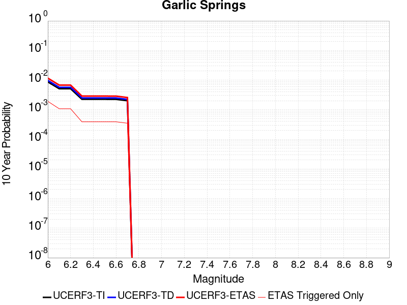 |

| Magnitude | 1 wk TI Prob | 1 wk TD Prob | 1 wk ETAS Prob | 1 wk ETAS/TD Gain | 1 wk ETAS Triggered Only | 1 mo TI Prob | 1 mo TD Prob | 1 mo ETAS Prob | 1 mo ETAS/TD Gain | 1 mo ETAS Triggered Only | 1 yr TI Prob | 1 yr TD Prob | 1 yr ETAS Prob | 1 yr ETAS/TD Gain | 1 yr ETAS Triggered Only | 10 yr TI Prob | 10 yr TD Prob | 10 yr ETAS Prob | 10 yr ETAS/TD Gain | 10 yr ETAS Triggered Only |
|-----|-----|-----|-----|-----|-----|-----|-----|-----|-----|-----|-----|-----|-----|-----|-----|-----|-----|-----|-----|-----|
| 6.0 | 1.6760017E-5 | 1.8776833E-5 | 3.7877008E-4 | 20.172203 | 3.6E-4 | 7.182667E-5 | 8.0470316E-5 | 6.2042684E-4 | 7.7100086 | 5.4E-4 | 8.7413884E-4 | 9.794032E-4 | 0.0021582474 | 2.2036355 | 0.00118 | 0.008707083 | 0.009762413 | 0.011663669 | 1.1947527 | 0.00192 |
| 6.1 | 9.852767E-6 | 1.09735865E-5 | 2.009715E-4 | 18.314112 | 1.9E-4 | 4.222546E-5 | 4.702921E-5 | 3.3701558E-4 | 7.1660905 | 2.9E-4 | 5.139737E-4 | 5.7250116E-4 | 0.0012721004 | 2.222005 | 7.0E-4 | 0.005127866 | 0.005717221 | 0.006791047 | 1.1878229 | 0.00108 |
| 6.2 | 9.852767E-6 | 1.09735865E-5 | 2.009715E-4 | 18.314112 | 1.9E-4 | 4.222546E-5 | 4.702921E-5 | 3.3701558E-4 | 7.1660905 | 2.9E-4 | 5.139737E-4 | 5.7250116E-4 | 0.0012721004 | 2.222005 | 7.0E-4 | 0.005127866 | 0.005717221 | 0.006791047 | 1.1878229 | 0.00108 |
| 6.3 | 4.3167724E-6 | 4.7780286E-6 | 5.477779E-5 | 11.464517 | 5.0E-5 | 1.8500323E-5 | 2.0477235E-5 | 1.2047519E-4 | 5.883372 | 1.0E-4 | 2.2521814E-4 | 2.4930484E-4 | 4.6925E-4 | 1.8822337 | 2.2E-4 | 0.0022499003 | 0.00249251 | 0.002881538 | 1.1560788 | 3.9E-4 |
| 6.4 | 4.3167724E-6 | 4.7780286E-6 | 5.477779E-5 | 11.464517 | 5.0E-5 | 1.8500323E-5 | 2.0477235E-5 | 1.2047519E-4 | 5.883372 | 1.0E-4 | 2.2521814E-4 | 2.4930484E-4 | 4.6925E-4 | 1.8822337 | 2.2E-4 | 0.0022499003 | 0.00249251 | 0.002881538 | 1.1560788 | 3.9E-4 |
| 6.5 | 4.3167724E-6 | 4.7780286E-6 | 5.477779E-5 | 11.464517 | 5.0E-5 | 1.8500323E-5 | 2.0477235E-5 | 1.2047519E-4 | 5.883372 | 1.0E-4 | 2.2521814E-4 | 2.4930484E-4 | 4.6925E-4 | 1.8822337 | 2.2E-4 | 0.0022499003 | 0.00249251 | 0.002881538 | 1.1560788 | 3.9E-4 |
| 6.6 | 4.301311E-6 | 4.760897E-6 | 5.4760658E-5 | 11.502172 | 5.0E-5 | 1.8434059E-5 | 2.0403815E-5 | 1.20401775E-4 | 5.900944 | 1.0E-4 | 2.2441156E-4 | 2.4841115E-4 | 4.683565E-4 | 1.8854085 | 2.2E-4 | 0.0022418506 | 0.002483593 | 0.0028726244 | 1.1566405 | 3.9E-4 |
| 6.7 | 3.8599724E-6 | 4.27106E-6 | 5.4270848E-5 | 12.706646 | 5.0E-5 | 1.6542634E-5 | 1.8304541E-5 | 1.1830271E-4 | 6.463025 | 1.0E-4 | 2.0138794E-4 | 2.228578E-4 | 4.1281545E-4 | 1.8523716 | 1.9E-4 | 0.0020120554 | 0.002228578 | 0.002577798 | 1.1567008 | 3.5E-4 |

## San Andreas (San Bernardino N)
*[(top)](#table-of-contents)*

| 1 Week | 1 Month | 1 Year | 10 Year |
|-----|-----|-----|-----|
|  | 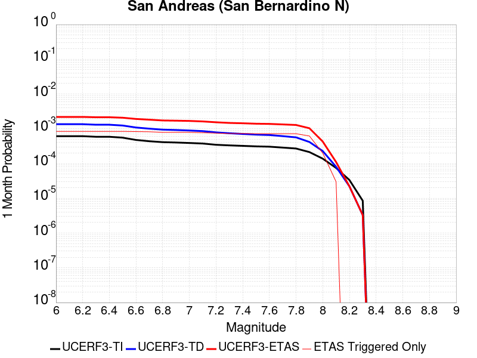 |  |  |

| Magnitude | 1 wk TI Prob | 1 wk TD Prob | 1 wk ETAS Prob | 1 wk ETAS/TD Gain | 1 wk ETAS Triggered Only | 1 mo TI Prob | 1 mo TD Prob | 1 mo ETAS Prob | 1 mo ETAS/TD Gain | 1 mo ETAS Triggered Only | 1 yr TI Prob | 1 yr TD Prob | 1 yr ETAS Prob | 1 yr ETAS/TD Gain | 1 yr ETAS Triggered Only | 10 yr TI Prob | 10 yr TD Prob | 10 yr ETAS Prob | 10 yr ETAS/TD Gain | 10 yr ETAS Triggered Only |
|-----|-----|-----|-----|-----|-----|-----|-----|-----|-----|-----|-----|-----|-----|-----|-----|-----|-----|-----|-----|-----|
| 6.0 | 1.4273766E-4 | 3.1606483E-4 | 8.65891E-4 | 2.7395992 | 5.5E-4 | 6.115894E-4 | 0.0013538664 | 0.0021927292 | 1.6196053 | 8.4E-4 | 0.0074207084 | 0.016360244 | 0.01767832 | 1.0805659 | 0.00134 | 0.07177748 | 0.15026689 | 0.15177941 | 1.0100656 | 0.00178 |
| 6.1 | 1.4273766E-4 | 3.1606483E-4 | 8.65891E-4 | 2.7395992 | 5.5E-4 | 6.115894E-4 | 0.0013538664 | 0.0021927292 | 1.6196053 | 8.4E-4 | 0.0074207084 | 0.016360244 | 0.01767832 | 1.0805659 | 0.00134 | 0.07177748 | 0.15026689 | 0.15177941 | 1.0100656 | 0.00178 |
| 6.2 | 1.4273766E-4 | 3.1606483E-4 | 8.65891E-4 | 2.7395992 | 5.5E-4 | 6.115894E-4 | 0.0013538664 | 0.0021927292 | 1.6196053 | 8.4E-4 | 0.0074207084 | 0.016360244 | 0.01767832 | 1.0805659 | 0.00134 | 0.07177748 | 0.15026689 | 0.15177941 | 1.0100656 | 0.00178 |
| 6.3 | 1.3730655E-4 | 3.0511338E-4 | 8.5494557E-4 | 2.8020585 | 5.5E-4 | 5.883239E-4 | 0.0013069791 | 0.0021458813 | 1.6418635 | 8.4E-4 | 0.0071393442 | 0.015797773 | 0.017116603 | 1.083482 | 0.00134 | 0.06914291 | 0.14556676 | 0.14707911 | 1.0103893 | 0.00177 |
| 6.4 | 1.3730655E-4 | 3.0511338E-4 | 8.5494557E-4 | 2.8020585 | 5.5E-4 | 5.883239E-4 | 0.0013069791 | 0.0021458813 | 1.6418635 | 8.4E-4 | 0.0071393442 | 0.015797773 | 0.017116603 | 1.083482 | 0.00134 | 0.06914291 | 0.14556676 | 0.14707911 | 1.0103893 | 0.00177 |
| 6.5 | 1.2942807E-4 | 2.8925808E-4 | 8.39099E-4 | 2.9008663 | 5.5E-4 | 5.545738E-4 | 0.0012390936 | 0.0020780528 | 1.6770749 | 8.4E-4 | 0.0067310524 | 0.01498286 | 0.016302783 | 1.0880955 | 0.00134 | 0.06530788 | 0.13870941 | 0.1402339 | 1.0109905 | 0.00177 |
| 6.6 | 1.1125901E-4 | 2.536472E-4 | 7.9351023E-4 | 3.1284013 | 5.4E-4 | 4.767372E-4 | 0.0010866089 | 0.001915707 | 1.7630143 | 8.3E-4 | 0.005788839 | 0.013149847 | 0.014462357 | 1.0998119 | 0.00133 | 0.056403454 | 0.122999296 | 0.12454282 | 1.012549 | 0.00176 |
| 6.7 | 1.02209575E-4 | 2.3499702E-4 | 7.648725E-4 | 3.2548177 | 5.3E-4 | 4.3796748E-4 | 0.0010067427 | 0.0018259172 | 1.813688 | 8.2E-4 | 0.0053192247 | 0.012188629 | 0.01349254 | 1.1069777 | 0.00132 | 0.051936906 | 0.114790924 | 0.11634004 | 1.0134951 | 0.00175 |
| 6.8 | 9.610582E-5 | 2.2025521E-4 | 7.3014287E-4 | 3.3149858 | 5.1E-4 | 4.1181705E-4 | 9.436101E-4 | 0.0017328646 | 1.8364202 | 7.9E-4 | 0.0050023515 | 0.011428202 | 0.012693574 | 1.1107236 | 0.00128 | 0.048912346 | 0.1081929 | 0.10970897 | 1.0140127 | 0.0017 |
| 6.9 | 9.3877505E-5 | 2.1481077E-4 | 7.247012E-4 | 3.3736725 | 5.1E-4 | 4.0227012E-4 | 9.2029345E-4 | 0.0017095665 | 1.8576318 | 7.9E-4 | 0.0048866454 | 0.011147255 | 0.012412987 | 1.1135465 | 0.00128 | 0.04780577 | 0.10578323 | 0.107294455 | 1.014286 | 0.00169 |
| 7.0 | 9.1019785E-5 | 2.0808022E-4 | 7.179741E-4 | 3.4504678 | 5.1E-4 | 3.900265E-4 | 8.914682E-4 | 0.0016807639 | 1.8853885 | 7.9E-4 | 0.0047382377 | 0.010799837 | 0.012066013 | 1.1172403 | 0.00128 | 0.046384744 | 0.102753714 | 0.10427006 | 1.014757 | 0.00169 |
| 7.1 | 8.771155E-5 | 1.9982594E-4 | 6.9972605E-4 | 3.5016775 | 5.0E-4 | 3.758525E-4 | 8.5611636E-4 | 0.0016254572 | 1.8986404 | 7.7E-4 | 0.0045664064 | 0.0103736 | 0.011610633 | 1.1192482 | 0.00125 | 0.044737056 | 0.09906527 | 0.10055181 | 1.0150057 | 0.00165 |
| 7.2 | 8.0830236E-5 | 1.8388197E-4 | 6.8379E-4 | 3.7186353 | 5.0E-4 | 3.4636928E-4 | 7.8782777E-4 | 0.0015372369 | 1.9512347 | 7.5E-4 | 0.0042088944 | 0.009549725 | 0.010748169 | 1.1254952 | 0.00121 | 0.041300658 | 0.09179615 | 0.09325836 | 1.0159289 | 0.00161 |
| 7.3 | 7.7668235E-5 | 1.7331762E-4 | 6.632327E-4 | 3.8266895 | 4.9E-4 | 3.328214E-4 | 7.425784E-4 | 0.0014720364 | 1.9823312 | 7.3E-4 | 0.0040445733 | 0.009003494 | 0.01017287 | 1.1298802 | 0.00118 | 0.03971748 | 0.08706327 | 0.08850571 | 1.0165677 | 0.00158 |
| 7.4 | 7.520177E-5 | 1.6551897E-4 | 6.554379E-4 | 3.9598956 | 4.9E-4 | 3.2225347E-4 | 7.0917426E-4 | 0.0014386566 | 2.0286362 | 7.3E-4 | 0.0039163795 | 0.008600081 | 0.009769933 | 1.136028 | 0.00118 | 0.038480744 | 0.08351955 | 0.08495843 | 1.017228 | 0.00157 |
| 7.5 | 7.274697E-5 | 1.5839566E-4 | 6.3831965E-4 | 4.0299063 | 4.8E-4 | 3.1173544E-4 | 6.78662E-4 | 0.0013981734 | 2.0601912 | 7.2E-4 | 0.003788775 | 0.008231463 | 0.009391832 | 1.1409676 | 0.00117 | 0.03724827 | 0.08023631 | 0.08166194 | 1.0177679 | 0.00155 |
| 7.6 | 7.1185845E-5 | 1.540943E-4 | 6.340203E-4 | 4.1144958 | 4.8E-4 | 3.0504653E-4 | 6.6023704E-4 | 0.0013797617 | 2.0897975 | 7.2E-4 | 0.0037076178 | 0.008008812 | 0.009169441 | 1.144919 | 0.00117 | 0.036463667 | 0.07822598 | 0.07965472 | 1.0182644 | 0.00155 |
| 7.7 | 6.709961E-5 | 1.4318313E-4 | 6.231144E-4 | 4.35187 | 4.8E-4 | 2.8753807E-4 | 6.1349774E-4 | 0.001333056 | 2.1728785 | 7.2E-4 | 0.003495157 | 0.0074437927 | 0.008605083 | 1.1560079 | 0.00117 | 0.034406938 | 0.07305469 | 0.07449146 | 1.019667 | 0.00155 |
| 7.8 | 6.300812E-5 | 1.3202413E-4 | 6.119608E-4 | 4.635219 | 4.8E-4 | 2.7000686E-4 | 5.65695E-4 | 0.0012852877 | 2.2720506 | 7.2E-4 | 0.0032823787 | 0.006865616 | 0.008017652 | 1.1677979 | 0.00116 | 0.032343175 | 0.06771354 | 0.069139935 | 1.0210652 | 0.00153 |
| 7.9 | 4.983037E-5 | 9.723488E-5 | 5.1719404E-4 | 5.3190174 | 4.2E-4 | 2.1354125E-4 | 4.1665437E-4 | 0.001036396 | 2.487424 | 6.2E-4 | 0.0025967648 | 0.0050609782 | 0.00601612 | 1.1887267 | 9.6E-4 | 0.025666296 | 0.05064886 | 0.051845044 | 1.0236171 | 0.00126 |
| 8.0 | 3.2211527E-5 | 5.3304586E-5 | 1.9329712E-4 | 3.6262755 | 1.4E-4 | 1.380421E-4 | 2.2842824E-4 | 4.2838254E-4 | 1.8753486 | 2.0E-4 | 0.0016793669 | 0.0027775685 | 0.00309668 | 1.1148887 | 3.2E-4 | 0.016667323 | 0.028361378 | 0.028808333 | 1.0157592 | 4.6E-4 |
| 8.1 | 1.743376E-5 | 1.8824427E-5 | 4.8823862E-5 | 2.5936441 | 3.0E-5 | 7.471398E-5 | 8.067362E-5 | 1.106712E-4 | 1.3718388 | 3.0E-5 | 9.0926304E-4 | 9.817594E-4 | 0.0010417005 | 1.0610548 | 6.0E-5 | 0.009055517 | 0.010484105 | 0.010553371 | 1.0066068 | 7.0E-5 |
| 8.2 | 7.831616E-6 | 5.1551065E-6 | 5.1551065E-6 | 1.0 | 0.0 | 3.3563636E-5 | 2.2093127E-5 | 2.2093127E-5 | 1.0 | 0.0 | 4.0856065E-4 | 2.6895068E-4 | 2.6895068E-4 | 1.0 | 0.0 | 0.004078103 | 0.0030418145 | 0.0030418145 | 1.0 | 0.0 |
| 8.3 | 1.983087E-6 | 7.6599065E-7 | 7.6599065E-7 | 1.0 | 0.0 | 8.498917E-6 | 3.282813E-6 | 3.282813E-6 | 1.0 | 0.0 | 1.034694E-4 | 3.9967534E-5 | 3.9967534E-5 | 1.0 | 0.0 | 0.0010342124 | 4.719687E-4 | 4.719687E-4 | 1.0 | 0.0 |

## Helendale-So Lockhart
*[(top)](#table-of-contents)*

| 1 Week | 1 Month | 1 Year | 10 Year |
|-----|-----|-----|-----|
|  |  |  |  |

| Magnitude | 1 wk TI Prob | 1 wk TD Prob | 1 wk ETAS Prob | 1 wk ETAS/TD Gain | 1 wk ETAS Triggered Only | 1 mo TI Prob | 1 mo TD Prob | 1 mo ETAS Prob | 1 mo ETAS/TD Gain | 1 mo ETAS Triggered Only | 1 yr TI Prob | 1 yr TD Prob | 1 yr ETAS Prob | 1 yr ETAS/TD Gain | 1 yr ETAS Triggered Only | 10 yr TI Prob | 10 yr TD Prob | 10 yr ETAS Prob | 10 yr ETAS/TD Gain | 10 yr ETAS Triggered Only |
|-----|-----|-----|-----|-----|-----|-----|-----|-----|-----|-----|-----|-----|-----|-----|-----|-----|-----|-----|-----|-----|
| 6.0 | 1.7296055E-5 | 1.8103729E-5 | 4.0809668E-4 | 22.542133 | 3.9E-4 | 7.412385E-5 | 7.7585224E-5 | 6.47541E-4 | 8.34619 | 5.7E-4 | 9.0208417E-4 | 9.4421144E-4 | 0.0019132956 | 2.0263422 | 9.7E-4 | 0.008984311 | 0.009404116 | 0.010731515 | 1.1411508 | 0.00134 |
| 6.1 | 1.7296055E-5 | 1.8103729E-5 | 4.0809668E-4 | 22.542133 | 3.9E-4 | 7.412385E-5 | 7.7585224E-5 | 6.47541E-4 | 8.34619 | 5.7E-4 | 9.0208417E-4 | 9.4421144E-4 | 0.0019132956 | 2.0263422 | 9.7E-4 | 0.008984311 | 0.009404116 | 0.010731515 | 1.1411508 | 0.00134 |
| 6.2 | 1.7296055E-5 | 1.8103729E-5 | 4.0809668E-4 | 22.542133 | 3.9E-4 | 7.412385E-5 | 7.7585224E-5 | 6.47541E-4 | 8.34619 | 5.7E-4 | 9.0208417E-4 | 9.4421144E-4 | 0.0019132956 | 2.0263422 | 9.7E-4 | 0.008984311 | 0.009404116 | 0.010731515 | 1.1411508 | 0.00134 |
| 6.3 | 1.0669118E-5 | 1.1135425E-5 | 2.6113263E-4 | 23.450623 | 2.5E-4 | 4.5723988E-5 | 4.772239E-5 | 3.9770568E-4 | 8.333734 | 3.5E-4 | 5.5654737E-4 | 5.80868E-4 | 0.0012304904 | 2.118365 | 6.5E-4 | 0.0055515557 | 0.0057937936 | 0.006688579 | 1.1544386 | 9.0E-4 |
| 6.4 | 1.0669118E-5 | 1.1135425E-5 | 2.6113263E-4 | 23.450623 | 2.5E-4 | 4.5723988E-5 | 4.772239E-5 | 3.9770568E-4 | 8.333734 | 3.5E-4 | 5.5654737E-4 | 5.80868E-4 | 0.0012304904 | 2.118365 | 6.5E-4 | 0.0055515557 | 0.0057937936 | 0.006688579 | 1.1544386 | 9.0E-4 |
| 6.5 | 8.790038E-6 | 9.170197E-6 | 2.591679E-4 | 28.261978 | 2.5E-4 | 3.767105E-5 | 3.930026E-5 | 3.592877E-4 | 9.142119 | 3.2E-4 | 4.585485E-4 | 4.7837716E-4 | 0.0010481045 | 2.1909585 | 5.7E-4 | 0.0045760344 | 0.004773638 | 0.005589724 | 1.1709567 | 8.2E-4 |
| 6.6 | 7.396949E-6 | 7.715537E-6 | 2.07714E-4 | 26.921522 | 2.0E-4 | 3.1700827E-5 | 3.3066175E-5 | 2.7305825E-4 | 8.257933 | 2.4E-4 | 3.858892E-4 | 4.025073E-4 | 8.823141E-4 | 2.192045 | 4.8E-4 | 0.003852198 | 0.00401789 | 0.0047051175 | 1.171042 | 6.9E-4 |
| 6.7 | 6.4600285E-6 | 6.738031E-6 | 1.8673681E-4 | 27.713856 | 1.8E-4 | 2.7685543E-5 | 2.887696E-5 | 2.388709E-4 | 8.272023 | 2.1E-4 | 3.3701936E-4 | 3.5152107E-4 | 7.813699E-4 | 2.2228253 | 4.3E-4 | 0.0033650869 | 0.003509732 | 0.0041375207 | 1.1788709 | 6.3E-4 |
| 6.8 | 5.600104E-6 | 5.836009E-6 | 1.5583514E-4 | 26.702345 | 1.5E-4 | 2.4000226E-5 | 2.5011232E-5 | 2.0500673E-4 | 8.196587 | 1.8E-4 | 2.9216358E-4 | 3.044698E-4 | 6.643602E-4 | 2.1820233 | 3.6E-4 | 0.0029177975 | 0.003040588 | 0.0035689767 | 1.1737784 | 5.3E-4 |
| 6.9 | 4.839122E-6 | 5.0395092E-6 | 1.05039006E-4 | 20.843102 | 1.0E-4 | 2.0738931E-5 | 2.159772E-5 | 1.4159513E-4 | 6.5560217 | 1.2E-4 | 2.5246723E-4 | 2.6292098E-4 | 5.2285264E-4 | 1.9886303 | 2.6E-4 | 0.002521806 | 0.002626147 | 0.0030250964 | 1.1519144 | 4.0E-4 |
| 7.0 | 3.6937633E-6 | 3.845208E-6 | 9.3844865E-5 | 24.405666 | 9.0E-5 | 1.5830317E-5 | 1.647936E-5 | 1.1647771E-4 | 7.0680966 | 1.0E-4 | 1.9271708E-4 | 2.0061806E-4 | 3.9057992E-4 | 1.9468833 | 1.9E-4 | 0.0019255003 | 0.002004401 | 0.0023137797 | 1.1543497 | 3.1E-4 |
| 7.1 | 2.7858857E-6 | 2.8978538E-6 | 5.289771E-5 | 18.254099 | 5.0E-5 | 1.1939455E-5 | 1.2419316E-5 | 7.2418574E-5 | 5.8311243 | 6.0E-5 | 1.4535317E-4 | 1.511949E-4 | 2.7117674E-4 | 1.7935576 | 1.2E-4 | 0.0014525814 | 0.0015109418 | 0.0017006546 | 1.1255593 | 1.9E-4 |
| 7.2 | 2.1672065E-6 | 2.2540128E-6 | 3.2253945E-5 | 14.3095665 | 3.0E-5 | 9.2879945E-6 | 9.66002E-6 | 4.9659633E-5 | 5.140738 | 4.0E-5 | 1.1307546E-4 | 1.1760458E-4 | 1.9759517E-4 | 1.6801656 | 8.0E-5 | 0.0011301794 | 0.0011754417 | 0.0013052889 | 1.1104667 | 1.3E-4 |
| 7.3 | 1.4823496E-6 | 1.5422102E-6 | 2.1542179E-5 | 13.968381 | 2.0E-5 | 6.3529114E-6 | 6.6094562E-6 | 2.6609325E-5 | 4.0259476 | 2.0E-5 | 7.734395E-5 | 8.046731E-5 | 1.3046329E-4 | 1.6213204 | 5.0E-5 | 7.731704E-4 | 8.0439687E-4 | 8.843325E-4 | 1.0993733 | 8.0E-5 |
| 7.4 | 4.2321457E-7 | 4.4108765E-7 | 4.4108765E-7 | 1.0 | 0.0 | 1.8137755E-6 | 1.8903745E-6 | 1.8903745E-6 | 1.0 | 0.0 | 2.2082493E-5 | 2.3015113E-5 | 4.3014654E-5 | 1.8689742 | 2.0E-5 | 2.2080299E-4 | 2.3013182E-4 | 2.5012722E-4 | 1.0868868 | 2.0E-5 |
| 7.5 | 5.6942316E-8 | 5.9415648E-8 | 5.9415648E-8 | 1.0 | 0.0 | 2.440385E-7 | 2.5463845E-7 | 2.5463845E-7 | 1.0 | 0.0 | 2.9711643E-6 | 3.1002196E-6 | 3.1002196E-6 | 1.0 | 0.0 | 2.9711247E-5 | 3.1001844E-5 | 3.1001844E-5 | 1.0 | 0.0 |

## San Andreas (San Bernardino S)
*[(top)](#table-of-contents)*

| 1 Week | 1 Month | 1 Year | 10 Year |
|-----|-----|-----|-----|
|  |  |  |  |

| Magnitude | 1 wk TI Prob | 1 wk TD Prob | 1 wk ETAS Prob | 1 wk ETAS/TD Gain | 1 wk ETAS Triggered Only | 1 mo TI Prob | 1 mo TD Prob | 1 mo ETAS Prob | 1 mo ETAS/TD Gain | 1 mo ETAS Triggered Only | 1 yr TI Prob | 1 yr TD Prob | 1 yr ETAS Prob | 1 yr ETAS/TD Gain | 1 yr ETAS Triggered Only | 10 yr TI Prob | 10 yr TD Prob | 10 yr ETAS Prob | 10 yr ETAS/TD Gain | 10 yr ETAS Triggered Only |
|-----|-----|-----|-----|-----|-----|-----|-----|-----|-----|-----|-----|-----|-----|-----|-----|-----|-----|-----|-----|-----|
| 6.0 | 1.2336002E-4 | 3.0004102E-4 | 5.59963E-4 | 1.8662882 | 2.6E-4 | 5.2857865E-4 | 0.0012852824 | 0.0017347041 | 1.3496675 | 4.5E-4 | 0.006416472 | 0.015540994 | 0.016318716 | 1.0500433 | 7.9E-4 | 0.06234337 | 0.14283717 | 0.1437629 | 1.006481 | 0.00108 |
| 6.1 | 1.2336002E-4 | 3.0004102E-4 | 5.59963E-4 | 1.8662882 | 2.6E-4 | 5.2857865E-4 | 0.0012852824 | 0.0017347041 | 1.3496675 | 4.5E-4 | 0.006416472 | 0.015540994 | 0.016318716 | 1.0500433 | 7.9E-4 | 0.06234337 | 0.14283717 | 0.1437629 | 1.006481 | 0.00108 |
| 6.2 | 1.2336002E-4 | 3.0004102E-4 | 5.59963E-4 | 1.8662882 | 2.6E-4 | 5.2857865E-4 | 0.0012852824 | 0.0017347041 | 1.3496675 | 4.5E-4 | 0.006416472 | 0.015540994 | 0.016318716 | 1.0500433 | 7.9E-4 | 0.06234337 | 0.14283717 | 0.1437629 | 1.006481 | 0.00108 |
| 6.3 | 1.1712257E-4 | 2.8792414E-4 | 5.478493E-4 | 1.9027556 | 2.6E-4 | 5.018573E-4 | 0.0012334028 | 0.0016828477 | 1.3643943 | 4.5E-4 | 0.006093008 | 0.014918125 | 0.01568649 | 1.0515054 | 7.8E-4 | 0.059286322 | 0.13754563 | 0.13846846 | 1.0067092 | 0.00107 |
| 6.4 | 1.1712257E-4 | 2.8792414E-4 | 5.478493E-4 | 1.9027556 | 2.6E-4 | 5.018573E-4 | 0.0012334028 | 0.0016828477 | 1.3643943 | 4.5E-4 | 0.006093008 | 0.014918125 | 0.01568649 | 1.0515054 | 7.8E-4 | 0.059286322 | 0.13754563 | 0.13846846 | 1.0067092 | 0.00107 |
| 6.5 | 1.0689076E-4 | 2.680528E-4 | 5.279831E-4 | 1.9696982 | 2.6E-4 | 4.5802278E-4 | 0.0011483167 | 0.0015978 | 1.391428 | 4.5E-4 | 0.0055621783 | 0.01389575 | 0.014655051 | 1.0546427 | 7.7E-4 | 0.05425003 | 0.12879294 | 0.12969029 | 1.0069673 | 0.00103 |
| 6.6 | 9.7648895E-5 | 2.50501E-4 | 5.104359E-4 | 2.03766 | 2.6E-4 | 4.1842813E-4 | 0.0010731576 | 0.0015126854 | 1.409565 | 4.4E-4 | 0.005082469 | 0.012991785 | 0.013732041 | 1.0569788 | 7.5E-4 | 0.049677886 | 0.12095292 | 0.12184075 | 1.0073403 | 0.00101 |
| 6.7 | 8.757013E-5 | 2.3120902E-4 | 4.8115122E-4 | 2.0810227 | 2.5E-4 | 3.7524657E-4 | 9.905418E-4 | 0.0014201158 | 1.4336759 | 4.3E-4 | 0.00455906 | 0.011997245 | 0.0127184875 | 1.0601172 | 7.3E-4 | 0.04466656 | 0.11226123 | 0.11313121 | 1.0077497 | 9.8E-4 |
| 6.8 | 8.562978E-5 | 2.2680782E-4 | 4.7675113E-4 | 2.1020048 | 2.5E-4 | 3.6693315E-4 | 9.7169366E-4 | 0.0014012759 | 1.4420964 | 4.3E-4 | 0.004458263 | 0.011770263 | 0.012481789 | 1.0604511 | 7.2E-4 | 0.043698758 | 0.11027153 | 0.11113457 | 1.0078264 | 9.7E-4 |
| 6.9 | 6.124075E-5 | 1.7065753E-4 | 3.9061997E-4 | 2.2889116 | 2.2E-4 | 2.6243398E-4 | 7.311852E-4 | 0.0011209 | 1.5329906 | 3.9E-4 | 0.0031904527 | 0.008866051 | 0.009490465 | 1.0704275 | 6.3E-4 | 0.031450346 | 0.08418263 | 0.084970236 | 1.0093559 | 8.6E-4 |
| 7.0 | 5.8598747E-5 | 1.649477E-4 | 3.8491143E-4 | 2.333536 | 2.2E-4 | 2.5111332E-4 | 7.06728E-4 | 0.0010964525 | 1.5514488 | 3.9E-4 | 0.0030530186 | 0.008570663 | 0.0091952635 | 1.0728766 | 6.3E-4 | 0.03011414 | 0.081500374 | 0.08229028 | 1.0096921 | 8.6E-4 |
| 7.1 | 5.613814E-5 | 1.5913323E-4 | 3.7909823E-4 | 2.3822694 | 2.2E-4 | 2.4056983E-4 | 6.818221E-4 | 0.0010715561 | 1.5716068 | 3.9E-4 | 0.0029250039 | 0.008269769 | 0.008884641 | 1.0743519 | 6.2E-4 | 0.028868021 | 0.07879931 | 0.07958233 | 1.0099369 | 8.5E-4 |
| 7.2 | 4.991222E-5 | 1.4519796E-4 | 3.6516602E-4 | 2.514953 | 2.2E-4 | 2.1389198E-4 | 6.2212895E-4 | 0.0010118863 | 1.6264896 | 3.9E-4 | 0.002601025 | 0.007548217 | 0.008133763 | 1.0775741 | 5.9E-4 | 0.025707912 | 0.07225321 | 0.07301396 | 1.0105289 | 8.2E-4 |
| 7.3 | 4.7410045E-5 | 1.3714004E-4 | 3.5710988E-4 | 2.6039796 | 2.2E-4 | 2.0317009E-4 | 5.8761094E-4 | 9.6738763E-4 | 1.6463064 | 3.8E-4 | 0.0024707897 | 0.0071307817 | 0.0077066454 | 1.0807575 | 5.8E-4 | 0.024434982 | 0.06853558 | 0.069290064 | 1.0110086 | 8.1E-4 |
| 7.4 | 4.5556746E-5 | 1.3121912E-4 | 3.5119025E-4 | 2.676365 | 2.2E-4 | 1.952286E-4 | 5.622468E-4 | 9.420331E-4 | 1.6754799 | 3.8E-4 | 0.002374317 | 0.0068239477 | 0.0073999898 | 1.0844148 | 5.8E-4 | 0.023491086 | 0.065788016 | 0.06653538 | 1.0113603 | 8.0E-4 |
| 7.5 | 4.3084514E-5 | 1.2357246E-4 | 3.3354652E-4 | 2.6991978 | 2.1E-4 | 1.8463485E-4 | 5.2948913E-4 | 8.9929317E-4 | 1.6984168 | 3.7E-4 | 0.0022456115 | 0.0064275465 | 0.006993883 | 1.0881108 | 5.7E-4 | 0.022230545 | 0.062188786 | 0.06292028 | 1.0117625 | 7.8E-4 |
| 7.6 | 3.408608E-5 | 9.83552E-5 | 2.9833554E-4 | 3.033246 | 2.0E-4 | 1.4607502E-4 | 4.214543E-4 | 7.813026E-4 | 1.8538252 | 3.6E-4 | 0.0017770125 | 0.0051191594 | 0.0056762923 | 1.108833 | 5.6E-4 | 0.017628696 | 0.050020292 | 0.050751776 | 1.0146238 | 7.7E-4 |
| 7.7 | 2.8315713E-5 | 8.248679E-5 | 2.724711E-4 | 3.303209 | 1.9E-4 | 1.2134742E-4 | 3.5346695E-4 | 7.0334325E-4 | 1.9898416 | 3.5E-4 | 0.0014764034 | 0.0042949775 | 0.004832658 | 1.1251882 | 5.4E-4 | 0.01466633 | 0.0422714 | 0.042989697 | 1.0169924 | 7.5E-4 |
| 7.8 | 2.6222975E-5 | 7.463088E-5 | 2.646167E-4 | 3.5456731 | 1.9E-4 | 1.1237934E-4 | 3.1980744E-4 | 6.696955E-4 | 2.0940585 | 3.5E-4 | 0.0013673597 | 0.0038867102 | 0.004424611 | 1.138395 | 5.4E-4 | 0.013589768 | 0.03843674 | 0.039157916 | 1.0187626 | 7.5E-4 |
| 7.9 | 2.1469694E-5 | 5.787864E-5 | 2.278688E-4 | 3.9370103 | 1.7E-4 | 9.200973E-5 | 2.4802773E-4 | 5.679484E-4 | 2.2898583 | 3.2E-4 | 0.0011196428 | 0.0030155594 | 0.0034741722 | 1.1520822 | 4.6E-4 | 0.011140184 | 0.030152109 | 0.030792208 | 1.021229 | 6.6E-4 |
| 8.0 | 1.2420249E-5 | 3.131896E-5 | 9.131708E-5 | 2.9157126 | 6.0E-5 | 5.322855E-5 | 1.342172E-4 | 2.3420379E-4 | 1.7449609 | 1.0E-4 | 6.478649E-4 | 0.0016328706 | 0.0017826258 | 1.0917127 | 1.5E-4 | 0.0064597935 | 0.016522504 | 0.016758539 | 1.0142857 | 2.4E-4 |
| 8.1 | 4.9197724E-6 | 7.822348E-6 | 7.822348E-6 | 1.0 | 0.0 | 2.1084568E-5 | 3.352392E-5 | 3.352392E-5 | 1.0 | 0.0 | 2.566744E-4 | 4.0807744E-4 | 4.0807744E-4 | 1.0 | 0.0 | 0.002563781 | 0.0043843705 | 0.0043843705 | 1.0 | 0.0 |
| 8.2 | 2.5634774E-6 | 2.9067196E-6 | 2.9067196E-6 | 1.0 | 0.0 | 1.0986286E-5 | 1.2457311E-5 | 1.2457311E-5 | 1.0 | 0.0 | 1.3374983E-4 | 1.5165724E-4 | 1.5165724E-4 | 1.0 | 0.0 | 0.0013366934 | 0.0017049741 | 0.0017049741 | 1.0 | 0.0 |
| 8.3 | 5.2850464E-7 | 3.2088764E-7 | 3.2088764E-7 | 1.0 | 0.0 | 2.2650179E-6 | 1.375232E-6 | 1.375232E-6 | 1.0 | 0.0 | 2.7576245E-5 | 1.6743334E-5 | 1.6743334E-5 | 1.0 | 0.0 | 2.7572823E-4 | 1.9870348E-4 | 1.9870348E-4 | 1.0 | 0.0 |

## Death Valley (Black Mtns Frontal)
*[(top)](#table-of-contents)*

| 1 Week | 1 Month | 1 Year | 10 Year |
|-----|-----|-----|-----|
|  |  |  | 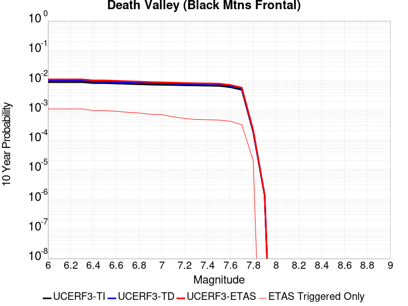 |

| Magnitude | 1 wk TI Prob | 1 wk TD Prob | 1 wk ETAS Prob | 1 wk ETAS/TD Gain | 1 wk ETAS Triggered Only | 1 mo TI Prob | 1 mo TD Prob | 1 mo ETAS Prob | 1 mo ETAS/TD Gain | 1 mo ETAS Triggered Only | 1 yr TI Prob | 1 yr TD Prob | 1 yr ETAS Prob | 1 yr ETAS/TD Gain | 1 yr ETAS Triggered Only | 10 yr TI Prob | 10 yr TD Prob | 10 yr ETAS Prob | 10 yr ETAS/TD Gain | 10 yr ETAS Triggered Only |
|-----|-----|-----|-----|-----|-----|-----|-----|-----|-----|-----|-----|-----|-----|-----|-----|-----|-----|-----|-----|-----|
| 6.0 | 1.6707214E-5 | 1.867027E-5 | 2.2866635E-4 | 12.24762 | 2.1E-4 | 7.160038E-5 | 8.001302E-5 | 4.599826E-4 | 5.7488465 | 3.8E-4 | 8.71386E-4 | 9.737309E-4 | 0.0017230005 | 1.7694833 | 7.5E-4 | 0.00867977 | 0.009695496 | 0.010774929 | 1.1113334 | 0.00109 |
| 6.1 | 1.6707214E-5 | 1.867027E-5 | 2.2866635E-4 | 12.24762 | 2.1E-4 | 7.160038E-5 | 8.001302E-5 | 4.599826E-4 | 5.7488465 | 3.8E-4 | 8.71386E-4 | 9.737309E-4 | 0.0017230005 | 1.7694833 | 7.5E-4 | 0.00867977 | 0.009695496 | 0.010774929 | 1.1113334 | 0.00109 |
| 6.2 | 1.6707214E-5 | 1.867027E-5 | 2.2866635E-4 | 12.24762 | 2.1E-4 | 7.160038E-5 | 8.001302E-5 | 4.599826E-4 | 5.7488465 | 3.8E-4 | 8.71386E-4 | 9.737309E-4 | 0.0017230005 | 1.7694833 | 7.5E-4 | 0.00867977 | 0.009695496 | 0.010774929 | 1.1113334 | 0.00109 |
| 6.3 | 1.6707214E-5 | 1.867027E-5 | 2.2866635E-4 | 12.24762 | 2.1E-4 | 7.160038E-5 | 8.001302E-5 | 4.599826E-4 | 5.7488465 | 3.8E-4 | 8.71386E-4 | 9.737309E-4 | 0.0017230005 | 1.7694833 | 7.5E-4 | 0.00867977 | 0.009695496 | 0.010774929 | 1.1113334 | 0.00109 |
| 6.4 | 1.5515609E-5 | 1.7338214E-5 | 1.9733509E-4 | 11.381513 | 1.8E-4 | 6.649377E-5 | 7.4304546E-5 | 4.142793E-4 | 5.5754232 | 3.4E-4 | 8.0926094E-4 | 9.042885E-4 | 0.0015736826 | 1.740244 | 6.7E-4 | 0.008063202 | 0.009006773 | 0.009958127 | 1.1056265 | 9.6E-4 |
| 6.5 | 1.5515609E-5 | 1.7338214E-5 | 1.9733509E-4 | 11.381513 | 1.8E-4 | 6.649377E-5 | 7.4304546E-5 | 4.142793E-4 | 5.5754232 | 3.4E-4 | 8.0926094E-4 | 9.042885E-4 | 0.0015736826 | 1.740244 | 6.7E-4 | 0.008063202 | 0.009006773 | 0.009958127 | 1.1056265 | 9.6E-4 |
| 6.6 | 1.5041828E-5 | 1.6809145E-5 | 1.8680628E-4 | 11.113373 | 1.7E-4 | 6.4463384E-5 | 7.203723E-5 | 3.920142E-4 | 5.4418273 | 3.2E-4 | 7.8455906E-4 | 8.767063E-4 | 0.0014961627 | 1.7065723 | 6.2E-4 | 0.00781795 | 0.008733132 | 0.009635185 | 1.1032909 | 9.1E-4 |
| 6.7 | 1.4634985E-5 | 1.6356016E-5 | 1.763534E-4 | 10.782173 | 1.6E-4 | 6.271985E-5 | 7.009536E-5 | 3.7007433E-4 | 5.279584 | 3.0E-4 | 7.6334673E-4 | 8.5308263E-4 | 0.0014325879 | 1.6793072 | 5.8E-4 | 0.007607299 | 0.008498715 | 0.0093315765 | 1.0979985 | 8.4E-4 |
| 6.8 | 1.4209158E-5 | 1.5882048E-5 | 1.5587982E-4 | 9.814844 | 1.4E-4 | 6.089497E-5 | 6.8064175E-5 | 3.480451E-4 | 5.113485 | 2.8E-4 | 7.4114406E-4 | 8.2837185E-4 | 0.0013779163 | 1.663403 | 5.5E-4 | 0.007386771 | 0.008253456 | 0.0090468535 | 1.0961291 | 8.0E-4 |
| 6.9 | 1.3780098E-5 | 1.5404594E-5 | 1.4540259E-4 | 9.438911 | 1.3E-4 | 5.9056227E-5 | 6.6018045E-5 | 3.060022E-4 | 4.63513 | 2.4E-4 | 7.1877235E-4 | 8.0347876E-4 | 0.0012830931 | 1.5969223 | 4.8E-4 | 0.0071645193 | 0.008006332 | 0.008720568 | 1.0892088 | 7.2E-4 |
| 7.0 | 1.3585064E-5 | 1.5188155E-5 | 1.4518618E-4 | 9.559172 | 1.3E-4 | 5.8220405E-5 | 6.50905E-5 | 2.9507553E-4 | 4.533312 | 2.3E-4 | 7.086029E-4 | 7.9219416E-4 | 0.0012618218 | 1.5928189 | 4.7E-4 | 0.007063476 | 0.007894293 | 0.008588768 | 1.0879717 | 7.0E-4 |
| 7.1 | 1.3398601E-5 | 1.49813395E-5 | 1.0497999E-4 | 7.0073833 | 9.0E-5 | 5.742131E-5 | 6.420419E-5 | 2.5419198E-4 | 3.9591184 | 1.9E-4 | 6.9888023E-4 | 7.8141113E-4 | 0.0011910908 | 1.5242817 | 4.1E-4 | 0.0069668638 | 0.007787224 | 0.00837263 | 1.0751752 | 5.9E-4 |
| 7.2 | 1.3126312E-5 | 1.4679561E-5 | 8.467853E-5 | 5.768465 | 7.0E-5 | 5.6254412E-5 | 6.291092E-5 | 2.3290022E-4 | 3.7020638 | 1.7E-4 | 6.846822E-4 | 7.6567667E-4 | 0.0011353934 | 1.4828627 | 3.7E-4 | 0.006825765 | 0.00763097 | 0.008147002 | 1.0676234 | 5.2E-4 |
| 7.3 | 1.2922429E-5 | 1.4453788E-5 | 8.4452775E-5 | 5.8429513 | 7.0E-5 | 5.5380664E-5 | 6.194336E-5 | 2.2193346E-4 | 3.5828447 | 1.6E-4 | 6.74051E-4 | 7.53905E-4 | 0.0010836562 | 1.4373909 | 3.3E-4 | 0.006720101 | 0.007514055 | 0.007990448 | 1.0634003 | 4.8E-4 |
| 7.4 | 1.2768878E-5 | 1.4283772E-5 | 8.428277E-5 | 5.9005966 | 7.0E-5 | 5.4722615E-5 | 6.1214756E-5 | 2.2120496E-4 | 3.6135888 | 1.6E-4 | 6.660441E-4 | 7.4504025E-4 | 0.0010648018 | 1.4291869 | 3.2E-4 | 0.0066405144 | 0.0074260035 | 0.007892514 | 1.0628211 | 4.7E-4 |
| 7.5 | 1.2521929E-5 | 1.40120155E-5 | 7.401117E-5 | 5.2819796 | 6.0E-5 | 5.366431E-5 | 6.005014E-5 | 2.1004114E-4 | 3.4977624 | 1.5E-4 | 6.531671E-4 | 7.3087064E-4 | 0.0010406441 | 1.4238417 | 3.1E-4 | 0.006512506 | 0.0072852457 | 0.0077418946 | 1.0626813 | 4.6E-4 |
| 7.6 | 1.1301089E-5 | 1.2648149E-5 | 7.264739E-5 | 5.743717 | 6.0E-5 | 4.8432343E-5 | 5.4205255E-5 | 2.0419713E-4 | 3.7671094 | 1.5E-4 | 5.895042E-4 | 6.5975444E-4 | 9.5955655E-4 | 1.4544146 | 3.0E-4 | 0.0058794282 | 0.00657851 | 0.0069957473 | 1.0634242 | 4.2E-4 |
| 7.7 | 9.189108E-6 | 1.0283358E-5 | 7.028274E-5 | 6.83461 | 6.0E-5 | 3.93813E-5 | 4.407082E-5 | 1.6406552E-4 | 3.7227702 | 1.2E-4 | 4.7936183E-4 | 5.3643517E-4 | 7.663118E-4 | 1.4285264 | 2.3E-4 | 0.004783291 | 0.005351914 | 0.0056702015 | 1.0594717 | 3.2E-4 |
| 7.8 | 3.4586725E-7 | 3.6482615E-7 | 3.6482615E-7 | 1.0 | 0.0 | 1.4822873E-6 | 1.5635396E-6 | 1.5635396E-6 | 1.0 | 0.0 | 1.80467E-5 | 1.9035933E-5 | 2.9035744E-5 | 1.5253123 | 1.0E-5 | 1.8045233E-4 | 1.9034347E-4 | 2.1033967E-4 | 1.1050532 | 2.0E-5 |
| 7.9 | 2.5591178E-9 | 2.6696718E-9 | 2.6696718E-9 | 1.0 | 0.0 | 1.0967647E-8 | 1.14414505E-8 | 1.14414505E-8 | 1.0 | 0.0 | 1.335311E-7 | 1.3929966E-7 | 1.3929966E-7 | 1.0 | 0.0 | 1.3353102E-6 | 1.3929966E-6 | 1.3929966E-6 | 1.0 | 0.0 |

## Coyote Lake
*[(top)](#table-of-contents)*

| 1 Week | 1 Month | 1 Year | 10 Year |
|-----|-----|-----|-----|
|  |  |  | 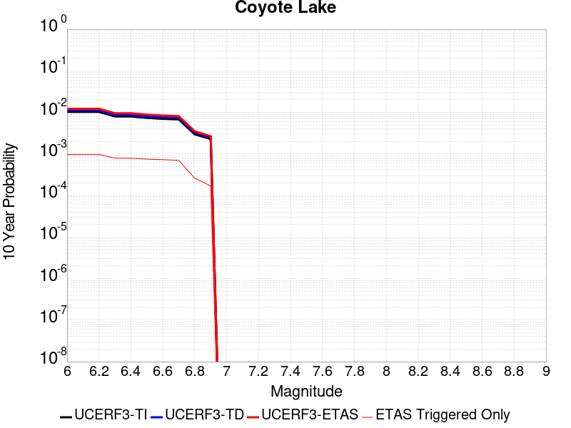 |

| Magnitude | 1 wk TI Prob | 1 wk TD Prob | 1 wk ETAS Prob | 1 wk ETAS/TD Gain | 1 wk ETAS Triggered Only | 1 mo TI Prob | 1 mo TD Prob | 1 mo ETAS Prob | 1 mo ETAS/TD Gain | 1 mo ETAS Triggered Only | 1 yr TI Prob | 1 yr TD Prob | 1 yr ETAS Prob | 1 yr ETAS/TD Gain | 1 yr ETAS Triggered Only | 10 yr TI Prob | 10 yr TD Prob | 10 yr ETAS Prob | 10 yr ETAS/TD Gain | 10 yr ETAS Triggered Only |
|-----|-----|-----|-----|-----|-----|-----|-----|-----|-----|-----|-----|-----|-----|-----|-----|-----|-----|-----|-----|-----|
| 6.0 | 1.980352E-5 | 2.1706745E-5 | 2.3170219E-4 | 10.674202 | 2.1E-4 | 8.486947E-5 | 9.302599E-5 | 3.8299902E-4 | 4.1171184 | 2.9E-4 | 0.0010327959 | 0.0011320751 | 0.001691441 | 1.4941069 | 5.6E-4 | 0.010280091 | 0.011270258 | 0.012229326 | 1.0850972 | 9.7E-4 |
| 6.1 | 1.980352E-5 | 2.1706745E-5 | 2.3170219E-4 | 10.674202 | 2.1E-4 | 8.486947E-5 | 9.302599E-5 | 3.8299902E-4 | 4.1171184 | 2.9E-4 | 0.0010327959 | 0.0011320751 | 0.001691441 | 1.4941069 | 5.6E-4 | 0.010280091 | 0.011270258 | 0.012229326 | 1.0850972 | 9.7E-4 |
| 6.2 | 1.980352E-5 | 2.1706745E-5 | 2.3170219E-4 | 10.674202 | 2.1E-4 | 8.486947E-5 | 9.302599E-5 | 3.8299902E-4 | 4.1171184 | 2.9E-4 | 0.0010327959 | 0.0011320751 | 0.001691441 | 1.4941069 | 5.6E-4 | 0.010280091 | 0.011270258 | 0.012229326 | 1.0850972 | 9.7E-4 |
| 6.3 | 1.5344787E-5 | 1.682067E-5 | 1.8681781E-4 | 11.106443 | 1.7E-4 | 6.576172E-5 | 7.2086936E-5 | 3.1206963E-4 | 4.3290734 | 2.4E-4 | 8.003548E-4 | 8.773662E-4 | 0.0013269715 | 1.5124487 | 4.5E-4 | 0.007974784 | 0.00874507 | 0.009528161 | 1.0895466 | 7.9E-4 |
| 6.4 | 1.5344787E-5 | 1.682067E-5 | 1.8681781E-4 | 11.106443 | 1.7E-4 | 6.576172E-5 | 7.2086936E-5 | 3.1206963E-4 | 4.3290734 | 2.4E-4 | 8.003548E-4 | 8.773662E-4 | 0.0013269715 | 1.5124487 | 4.5E-4 | 0.007974784 | 0.00874507 | 0.009528161 | 1.0895466 | 7.9E-4 |
| 6.5 | 1.4189697E-5 | 1.5557987E-5 | 1.755555E-4 | 11.283947 | 1.6E-4 | 6.081157E-5 | 6.6675726E-5 | 2.9666038E-4 | 4.4493012 | 2.3E-4 | 7.401293E-4 | 8.115349E-4 | 0.0012411859 | 1.5294302 | 4.3E-4 | 0.0073766913 | 0.008091656 | 0.008835588 | 1.091938 | 7.5E-4 |
| 6.6 | 1.3469301E-5 | 1.4771577E-5 | 1.7476921E-4 | 11.831452 | 1.6E-4 | 5.7724297E-5 | 6.330556E-5 | 2.93291E-4 | 4.632942 | 2.3E-4 | 7.025667E-4 | 7.7053264E-4 | 0.0011802167 | 1.5316894 | 4.1E-4 | 0.0070034964 | 0.0076845144 | 0.008408904 | 1.0942663 | 7.3E-4 |
| 6.7 | 1.3027966E-5 | 1.4281745E-5 | 1.7427946E-4 | 12.202952 | 1.6E-4 | 5.5832945E-5 | 6.120638E-5 | 2.911923E-4 | 4.7575483 | 2.3E-4 | 6.7955407E-4 | 7.4499263E-4 | 0.0011347021 | 1.5231051 | 3.9E-4 | 0.006774798 | 0.0074308286 | 0.008125627 | 1.0935022 | 7.0E-4 |
| 6.8 | 5.695434E-6 | 6.2244176E-6 | 8.622392E-5 | 13.852528 | 8.0E-5 | 2.4408775E-5 | 2.6675973E-5 | 1.3667304E-4 | 5.123451 | 1.1E-4 | 2.971363E-4 | 3.2476155E-4 | 4.847096E-4 | 1.4925091 | 1.6E-4 | 0.0029673933 | 0.0032458105 | 0.0035049666 | 1.0798433 | 2.6E-4 |
| 6.9 | 4.385688E-6 | 4.7930553E-6 | 6.4792766E-5 | 13.518051 | 6.0E-5 | 1.879567E-5 | 2.0541665E-5 | 1.0054002E-4 | 4.8944435 | 8.0E-5 | 2.2881327E-4 | 2.5009477E-4 | 3.6006726E-4 | 1.4397233 | 1.1E-4 | 0.002285778 | 0.0025009478 | 0.0026705228 | 1.0678042 | 1.7E-4 |

## San Andreas (Big Bend)
*[(top)](#table-of-contents)*

| 1 Week | 1 Month | 1 Year | 10 Year |
|-----|-----|-----|-----|
|  |  |  |  |

| Magnitude | 1 wk TI Prob | 1 wk TD Prob | 1 wk ETAS Prob | 1 wk ETAS/TD Gain | 1 wk ETAS Triggered Only | 1 mo TI Prob | 1 mo TD Prob | 1 mo ETAS Prob | 1 mo ETAS/TD Gain | 1 mo ETAS Triggered Only | 1 yr TI Prob | 1 yr TD Prob | 1 yr ETAS Prob | 1 yr ETAS/TD Gain | 1 yr ETAS Triggered Only | 10 yr TI Prob | 10 yr TD Prob | 10 yr ETAS Prob | 10 yr ETAS/TD Gain | 10 yr ETAS Triggered Only |
|-----|-----|-----|-----|-----|-----|-----|-----|-----|-----|-----|-----|-----|-----|-----|-----|-----|-----|-----|-----|-----|
| 6.0 | 1.0179969E-4 | 2.0072258E-4 | 3.7068847E-4 | 1.84677 | 1.7E-4 | 4.362114E-4 | 8.599571E-4 | 0.001079768 | 1.2556068 | 2.2E-4 | 0.0052979486 | 0.010419999 | 0.010855414 | 1.0417866 | 4.4E-4 | 0.051734097 | 0.10144902 | 0.10201511 | 1.0055801 | 6.3E-4 |
| 6.1 | 1.0179969E-4 | 2.0072258E-4 | 3.7068847E-4 | 1.84677 | 1.7E-4 | 4.362114E-4 | 8.599571E-4 | 0.001079768 | 1.2556068 | 2.2E-4 | 0.0052979486 | 0.010419999 | 0.010855414 | 1.0417866 | 4.4E-4 | 0.051734097 | 0.10144902 | 0.10201511 | 1.0055801 | 6.3E-4 |
| 6.2 | 1.0179969E-4 | 2.0072258E-4 | 3.7068847E-4 | 1.84677 | 1.7E-4 | 4.362114E-4 | 8.599571E-4 | 0.001079768 | 1.2556068 | 2.2E-4 | 0.0052979486 | 0.010419999 | 0.010855414 | 1.0417866 | 4.4E-4 | 0.051734097 | 0.10144902 | 0.10201511 | 1.0055801 | 6.3E-4 |
| 6.3 | 1.0179969E-4 | 2.0072258E-4 | 3.7068847E-4 | 1.84677 | 1.7E-4 | 4.362114E-4 | 8.599571E-4 | 0.001079768 | 1.2556068 | 2.2E-4 | 0.0052979486 | 0.010419999 | 0.010855414 | 1.0417866 | 4.4E-4 | 0.051734097 | 0.10144902 | 0.10201511 | 1.0055801 | 6.3E-4 |
| 6.4 | 9.1639464E-5 | 1.8429532E-4 | 3.1427137E-4 | 1.7052596 | 1.3E-4 | 3.9268145E-4 | 7.895982E-4 | 9.494719E-4 | 1.2024747 | 1.6E-4 | 0.0047704205 | 0.009571102 | 0.009848422 | 1.0289748 | 2.8E-4 | 0.046693064 | 0.09377527 | 0.0941287 | 1.0037689 | 3.9E-4 |
| 6.5 | 9.1639464E-5 | 1.8429532E-4 | 3.1427137E-4 | 1.7052596 | 1.3E-4 | 3.9268145E-4 | 7.895982E-4 | 9.494719E-4 | 1.2024747 | 1.6E-4 | 0.0047704205 | 0.009571102 | 0.009848422 | 1.0289748 | 2.8E-4 | 0.046693064 | 0.09377527 | 0.0941287 | 1.0037689 | 3.9E-4 |
| 6.6 | 9.042622E-5 | 1.823659E-4 | 3.123422E-4 | 1.7127225 | 1.3E-4 | 3.8748336E-4 | 7.8133424E-4 | 9.4120926E-4 | 1.2046179 | 1.6E-4 | 0.0047074095 | 0.009471365 | 0.009748713 | 1.0292828 | 2.8E-4 | 0.046089325 | 0.092869274 | 0.09321398 | 1.0037118 | 3.8E-4 |
| 6.7 | 8.9836685E-5 | 1.8150927E-4 | 3.1148567E-4 | 1.7160869 | 1.3E-4 | 3.8495753E-4 | 7.776651E-4 | 9.375407E-4 | 1.205584 | 1.6E-4 | 0.00467679 | 0.00942708 | 0.009704441 | 1.0294217 | 2.8E-4 | 0.045795817 | 0.09246355 | 0.09280841 | 1.0037297 | 3.8E-4 |
| 6.8 | 8.9471854E-5 | 1.8097709E-4 | 3.1095356E-4 | 1.7181929 | 1.3E-4 | 3.8339442E-4 | 7.7538576E-4 | 9.2526944E-4 | 1.1933022 | 1.5E-4 | 0.004657841 | 0.009399569 | 0.009667031 | 1.0284548 | 2.7E-4 | 0.04561414 | 0.092210755 | 0.09254664 | 1.0036426 | 3.7E-4 |
| 6.9 | 8.858234E-5 | 1.7979681E-4 | 3.0977343E-4 | 1.7229084 | 1.3E-4 | 3.7958333E-4 | 7.703304E-4 | 9.2021486E-4 | 1.1945716 | 1.5E-4 | 0.004611638 | 0.009338548 | 0.009596121 | 1.0275816 | 2.6E-4 | 0.04517103 | 0.09165087 | 0.0919688 | 1.0034689 | 3.5E-4 |
| 7.0 | 8.7433385E-5 | 1.7818481E-4 | 3.0816166E-4 | 1.7294496 | 1.3E-4 | 3.746607E-4 | 7.634259E-4 | 9.133114E-4 | 1.1963327 | 1.5E-4 | 0.004551957 | 0.009255203 | 0.009512797 | 1.0278323 | 2.6E-4 | 0.044598386 | 0.09088532 | 0.0912035 | 1.003501 | 3.5E-4 |
| 7.1 | 8.684964E-5 | 1.7730435E-4 | 3.072813E-4 | 1.7330725 | 1.3E-4 | 3.7215967E-4 | 7.596547E-4 | 9.0954074E-4 | 1.1973082 | 1.5E-4 | 0.0045216335 | 0.009209678 | 0.009467283 | 1.0279711 | 2.6E-4 | 0.04430731 | 0.09046686 | 0.0907852 | 1.0035188 | 3.5E-4 |
| 7.2 | 8.606521E-5 | 1.762105E-4 | 3.061876E-4 | 1.7376239 | 1.3E-4 | 3.6879873E-4 | 7.549695E-4 | 9.0485625E-4 | 1.1985335 | 1.5E-4 | 0.0044808835 | 0.0091531165 | 0.009400828 | 1.0270631 | 2.5E-4 | 0.043916024 | 0.089947365 | 0.09025679 | 1.00344 | 3.4E-4 |
| 7.3 | 8.568266E-5 | 1.7563057E-4 | 3.0560774E-4 | 1.7400601 | 1.3E-4 | 3.6715972E-4 | 7.524855E-4 | 9.023726E-4 | 1.1991894 | 1.5E-4 | 0.0044610105 | 0.009123127 | 0.009370847 | 1.0271529 | 2.5E-4 | 0.043725148 | 0.08966853 | 0.08997804 | 1.0034517 | 3.4E-4 |
| 7.4 | 8.5432206E-5 | 1.7525644E-4 | 3.0523367E-4 | 1.7416402 | 1.3E-4 | 3.6608664E-4 | 7.50883E-4 | 9.007704E-4 | 1.1996148 | 1.5E-4 | 0.004447999 | 0.009103781 | 0.009351504 | 1.0272111 | 2.5E-4 | 0.043600157 | 0.08948871 | 0.089789174 | 1.0033576 | 3.3E-4 |
| 7.5 | 8.4791965E-5 | 1.7394972E-4 | 3.039271E-4 | 1.7472123 | 1.3E-4 | 3.633435E-4 | 7.4528606E-4 | 8.951742E-4 | 1.201115 | 1.5E-4 | 0.0044147377 | 0.009036204 | 0.009274036 | 1.0263199 | 2.4E-4 | 0.043280575 | 0.088866346 | 0.08915791 | 1.0032809 | 3.2E-4 |
| 7.6 | 8.241105E-5 | 1.6840403E-4 | 2.8838383E-4 | 1.712452 | 1.2E-4 | 3.531424E-4 | 7.215321E-4 | 8.614311E-4 | 1.1938915 | 1.4E-4 | 0.0042910352 | 0.008749358 | 0.008977346 | 1.0260576 | 2.3E-4 | 0.042091176 | 0.086243294 | 0.08651742 | 1.0031785 | 3.0E-4 |
| 7.7 | 7.00432E-5 | 1.42045E-4 | 2.420308E-4 | 1.7039022 | 1.0E-4 | 3.001506E-4 | 6.0862233E-4 | 7.2854926E-4 | 1.1970466 | 1.2E-4 | 0.0036482112 | 0.0073848404 | 0.0075833634 | 1.0268825 | 2.0E-4 | 0.035888977 | 0.07351733 | 0.073758215 | 1.0032766 | 2.6E-4 |
| 7.8 | 6.415362E-5 | 1.2968935E-4 | 2.1967766E-4 | 1.693876 | 9.0E-5 | 2.749151E-4 | 5.556931E-4 | 6.6563196E-4 | 1.197841 | 1.1E-4 | 0.0033419547 | 0.0067446055 | 0.0069233915 | 1.026508 | 1.8E-4 | 0.03292141 | 0.06725231 | 0.06746684 | 1.0031899 | 2.3E-4 |
| 7.9 | 4.939911E-5 | 9.3411545E-5 | 1.7340407E-4 | 1.8563452 | 8.0E-5 | 2.116933E-4 | 4.0027377E-4 | 5.002337E-4 | 1.249729 | 1.0E-4 | 0.0025743195 | 0.004862453 | 0.0050017717 | 1.0286521 | 1.4E-4 | 0.025447013 | 0.048914436 | 0.04906661 | 1.003111 | 1.6E-4 |
| 8.0 | 3.344983E-5 | 5.222685E-5 | 1.12223715E-4 | 2.1487744 | 6.0E-5 | 1.4334853E-4 | 2.2381016E-4 | 3.0379227E-4 | 1.3573657 | 8.0E-5 | 0.0017438711 | 0.0027214854 | 0.0028212133 | 1.0366447 | 1.0E-4 | 0.017302496 | 0.027922187 | 0.028029116 | 1.0038295 | 1.1E-4 |
| 8.1 | 1.9104898E-5 | 1.9173063E-5 | 3.917268E-5 | 2.0431101 | 2.0E-5 | 8.1875565E-5 | 8.216769E-5 | 1.0216604E-4 | 1.2433847 | 2.0E-5 | 9.963791E-4 | 9.999331E-4 | 0.0010199131 | 1.0199814 | 2.0E-5 | 0.009919235 | 0.010749801 | 0.010769586 | 1.0018405 | 2.0E-5 |
| 8.2 | 8.643924E-6 | 5.4748625E-6 | 5.4748625E-6 | 1.0 | 0.0 | 3.704486E-5 | 2.3463486E-5 | 2.3463486E-5 | 1.0 | 0.0 | 4.5092785E-4 | 2.8563058E-4 | 2.8563058E-4 | 1.0 | 0.0 | 0.0045001395 | 0.0032487072 | 0.0032487072 | 1.0 | 0.0 |
| 8.3 | 1.983087E-6 | 7.6599065E-7 | 7.6599065E-7 | 1.0 | 0.0 | 8.498917E-6 | 3.282813E-6 | 3.282813E-6 | 1.0 | 0.0 | 1.034694E-4 | 3.9967534E-5 | 3.9967534E-5 | 1.0 | 0.0 | 0.0010342124 | 4.719687E-4 | 4.719687E-4 | 1.0 | 0.0 |

## San Andreas (Parkfield)
*[(top)](#table-of-contents)*

| 1 Week | 1 Month | 1 Year | 10 Year |
|-----|-----|-----|-----|
| 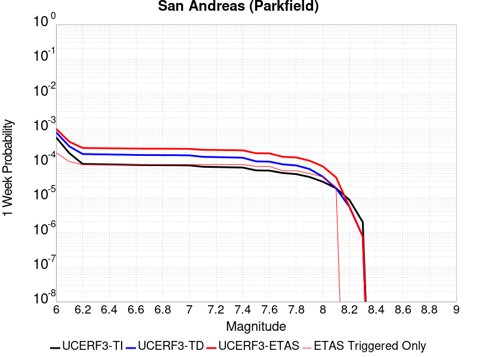 |  |  |  |

| Magnitude | 1 wk TI Prob | 1 wk TD Prob | 1 wk ETAS Prob | 1 wk ETAS/TD Gain | 1 wk ETAS Triggered Only | 1 mo TI Prob | 1 mo TD Prob | 1 mo ETAS Prob | 1 mo ETAS/TD Gain | 1 mo ETAS Triggered Only | 1 yr TI Prob | 1 yr TD Prob | 1 yr ETAS Prob | 1 yr ETAS/TD Gain | 1 yr ETAS Triggered Only | 10 yr TI Prob | 10 yr TD Prob | 10 yr ETAS Prob | 10 yr ETAS/TD Gain | 10 yr ETAS Triggered Only |
|-----|-----|-----|-----|-----|-----|-----|-----|-----|-----|-----|-----|-----|-----|-----|-----|-----|-----|-----|-----|-----|
| 6.0 | 5.556969E-4 | 7.7782426E-4 | 9.776687E-4 | 1.2569275 | 2.0E-4 | 0.0023793848 | 0.0033298214 | 0.0035889556 | 1.0778222 | 2.6E-4 | 0.028586963 | 0.040191233 | 0.040575154 | 1.0095525 | 4.0E-4 | 0.25176284 | 0.33716413 | 0.33751544 | 1.0010419 | 5.3E-4 |
| 6.1 | 1.925858E-4 | 3.0276453E-4 | 4.1273123E-4 | 1.3632087 | 1.1E-4 | 8.2510663E-4 | 0.0012970108 | 0.0014268422 | 1.1001005 | 1.3E-4 | 0.0099994885 | 0.015778083 | 0.015974928 | 1.0124758 | 2.0E-4 | 0.095613256 | 0.1497237 | 0.14997026 | 1.0016469 | 2.9E-4 |
| 6.2 | 9.4306815E-5 | 1.8242796E-4 | 2.7241153E-4 | 1.4932554 | 9.0E-5 | 4.0410945E-4 | 7.816011E-4 | 8.915151E-4 | 1.1406268 | 1.1E-4 | 0.0049089384 | 0.009474681 | 0.009652975 | 1.018818 | 1.8E-4 | 0.048019063 | 0.09185409 | 0.092062965 | 1.0022739 | 2.3E-4 |
| 6.3 | 9.283051E-5 | 1.7939322E-4 | 2.6937708E-4 | 1.5016012 | 9.0E-5 | 3.9778434E-4 | 7.686027E-4 | 8.7851816E-4 | 1.1430068 | 1.1E-4 | 0.0048322747 | 0.009317789 | 0.009496112 | 1.0191379 | 1.8E-4 | 0.047285385 | 0.09050704 | 0.09071622 | 1.0023112 | 2.3E-4 |
| 6.4 | 9.138826E-5 | 1.770153E-4 | 2.6699938E-4 | 1.5083406 | 9.0E-5 | 3.916052E-4 | 7.5841765E-4 | 8.683342E-4 | 1.1449288 | 1.1E-4 | 0.0047573745 | 0.00919484 | 0.009373184 | 1.0193962 | 1.8E-4 | 0.046568092 | 0.08940927 | 0.089618705 | 1.0023425 | 2.3E-4 |
| 6.5 | 9.000255E-5 | 1.7459576E-4 | 2.6458004E-4 | 1.5153865 | 9.0E-5 | 3.8566816E-4 | 7.480541E-4 | 8.5797184E-4 | 1.1469382 | 1.1E-4 | 0.0046854047 | 0.009069731 | 0.009248099 | 1.0196662 | 1.8E-4 | 0.045878403 | 0.088295065 | 0.088504754 | 1.0023749 | 2.3E-4 |
| 6.6 | 8.8109264E-5 | 1.7140752E-4 | 2.613921E-4 | 1.5249745 | 9.0E-5 | 3.7755648E-4 | 7.3439797E-4 | 8.443172E-4 | 1.1496725 | 1.1E-4 | 0.0045870654 | 0.008904854 | 0.009083251 | 1.0200337 | 1.8E-4 | 0.04493529 | 0.0868267 | 0.08703672 | 1.002419 | 2.3E-4 |
| 6.7 | 8.738073E-5 | 1.7007832E-4 | 2.60063E-4 | 1.529078 | 9.0E-5 | 3.7443507E-4 | 7.287046E-4 | 8.386245E-4 | 1.1508428 | 1.1E-4 | 0.0045492216 | 0.008836143 | 0.009014552 | 1.0201908 | 1.8E-4 | 0.04457213 | 0.08622707 | 0.08643723 | 1.0024374 | 2.3E-4 |
| 6.8 | 8.710195E-5 | 1.6953335E-4 | 2.5951807E-4 | 1.530779 | 9.0E-5 | 3.7324068E-4 | 7.263703E-4 | 8.362904E-4 | 1.151328 | 1.1E-4 | 0.0045347405 | 0.008807961 | 0.008986375 | 1.020256 | 1.8E-4 | 0.04443313 | 0.08597467 | 0.0861849 | 1.0024452 | 2.3E-4 |
| 6.9 | 8.6801556E-5 | 1.689429E-4 | 2.589277E-4 | 1.5326344 | 9.0E-5 | 3.7195362E-4 | 7.2384125E-4 | 8.3376165E-4 | 1.151857 | 1.1E-4 | 0.0045191357 | 0.008777418 | 0.008955838 | 1.0203272 | 1.8E-4 | 0.044283327 | 0.085700735 | 0.08591102 | 1.0024538 | 2.3E-4 |
| 7.0 | 8.5571606E-5 | 1.6647128E-4 | 2.564563E-4 | 1.5405438 | 9.0E-5 | 3.6668387E-4 | 7.132544E-4 | 8.2317594E-4 | 1.1541127 | 1.1E-4 | 0.004455241 | 0.008649553 | 0.008827996 | 1.0206304 | 1.8E-4 | 0.043669727 | 0.08454914 | 0.08475969 | 1.0024903 | 2.3E-4 |
| 7.1 | 7.82589E-5 | 1.5128135E-4 | 2.4126774E-4 | 1.594828 | 9.0E-5 | 3.3535215E-4 | 6.481883E-4 | 7.58117E-4 | 1.1695938 | 1.1E-4 | 0.0040752706 | 0.007863307 | 0.008041891 | 1.0227112 | 1.8E-4 | 0.040013418 | 0.07746111 | 0.077654846 | 1.002501 | 2.1E-4 |
| 7.2 | 7.690929E-5 | 1.4865391E-4 | 2.3864052E-4 | 1.6053431 | 9.0E-5 | 3.2956956E-4 | 6.369334E-4 | 7.468633E-4 | 1.1725925 | 1.1E-4 | 0.004005129 | 0.007727258 | 0.007905867 | 1.0231142 | 1.8E-4 | 0.0393371 | 0.07623427 | 0.076428264 | 1.0025446 | 2.1E-4 |
| 7.3 | 7.5543794E-5 | 1.4561978E-4 | 2.3560667E-4 | 1.617958 | 9.0E-5 | 3.2371894E-4 | 6.2393624E-4 | 7.338676E-4 | 1.17619 | 1.1E-4 | 0.003934157 | 0.007570127 | 0.0077487645 | 1.0235977 | 1.8E-4 | 0.038652334 | 0.074797355 | 0.07499164 | 1.0025976 | 2.1E-4 |
| 7.4 | 7.4214564E-5 | 1.4262961E-4 | 2.3261677E-4 | 1.630915 | 9.0E-5 | 3.1802364E-4 | 6.111273E-4 | 7.210601E-4 | 1.1798853 | 1.1E-4 | 0.003865065 | 0.00741525 | 0.0075939153 | 1.0240943 | 1.8E-4 | 0.03798529 | 0.07337123 | 0.073565826 | 1.0026522 | 2.1E-4 |
| 7.5 | 6.149578E-5 | 1.11907226E-4 | 1.9189827E-4 | 1.7147979 | 8.0E-5 | 2.6352672E-4 | 4.7951436E-4 | 5.794664E-4 | 1.2084444 | 1.0E-4 | 0.0032037178 | 0.0058224914 | 0.00598156 | 1.0273197 | 1.6E-4 | 0.03157923 | 0.058557566 | 0.058727026 | 1.0028939 | 1.8E-4 |
| 7.6 | 6.0643448E-5 | 1.10193796E-4 | 1.9018499E-4 | 1.7259136 | 8.0E-5 | 2.598746E-4 | 4.7217376E-4 | 5.7212653E-4 | 1.2116865 | 1.0E-4 | 0.0031593828 | 0.0057335934 | 0.0058827335 | 1.0260116 | 1.5E-4 | 0.031148417 | 0.057718582 | 0.05787877 | 1.0027753 | 1.7E-4 |
| 7.7 | 5.1652263E-5 | 9.174698E-5 | 1.5174148E-4 | 1.6539124 | 6.0E-5 | 2.2134806E-4 | 3.931421E-4 | 4.7311067E-4 | 1.2034087 | 8.0E-5 | 0.002691582 | 0.0047760103 | 0.004895437 | 1.0250056 | 1.2E-4 | 0.026592141 | 0.04853623 | 0.048659917 | 1.0025485 | 1.3E-4 |
| 7.8 | 4.8090482E-5 | 8.559635E-5 | 1.4559121E-4 | 1.7009045 | 6.0E-5 | 2.060858E-4 | 3.6678996E-4 | 4.4676062E-4 | 1.2180284 | 8.0E-5 | 0.0025062072 | 0.0044565317 | 0.004575997 | 1.0268067 | 1.2E-4 | 0.024781305 | 0.04530245 | 0.04542656 | 1.0027395 | 1.3E-4 |
| 7.9 | 3.970278E-5 | 6.750426E-5 | 1.1750089E-4 | 1.740644 | 5.0E-5 | 1.7014367E-4 | 2.892719E-4 | 3.5925166E-4 | 1.2419169 | 7.0E-5 | 0.002069531 | 0.0035162016 | 0.0036058852 | 1.0255058 | 9.0E-5 | 0.020503636 | 0.035881363 | 0.035968132 | 1.0024183 | 9.0E-5 |
| 8.0 | 2.8982335E-5 | 4.069796E-5 | 8.069633E-5 | 1.9828103 | 4.0E-5 | 1.2420409E-4 | 1.7440817E-4 | 2.3439771E-4 | 1.3439605 | 6.0E-5 | 0.0015111357 | 0.0021213528 | 0.002201183 | 1.0376318 | 8.0E-5 | 0.015009012 | 0.022010697 | 0.022088936 | 1.0035546 | 8.0E-5 |
| 8.1 | 1.8836186E-5 | 1.8681134E-5 | 3.8680762E-5 | 2.0705788 | 2.0E-5 | 8.0724014E-5 | 8.005955E-5 | 1.0005795E-4 | 1.249794 | 2.0E-5 | 9.823717E-4 | 9.742898E-4 | 9.942703E-4 | 1.0205078 | 2.0E-5 | 0.009780403 | 0.010488115 | 0.010507906 | 1.001887 | 2.0E-5 |
| 8.2 | 8.643924E-6 | 5.4748625E-6 | 5.4748625E-6 | 1.0 | 0.0 | 3.704486E-5 | 2.3463486E-5 | 2.3463486E-5 | 1.0 | 0.0 | 4.5092785E-4 | 2.8563058E-4 | 2.8563058E-4 | 1.0 | 0.0 | 0.0045001395 | 0.0032487072 | 0.0032487072 | 1.0 | 0.0 |
| 8.3 | 1.983087E-6 | 7.6599065E-7 | 7.6599065E-7 | 1.0 | 0.0 | 8.498917E-6 | 3.282813E-6 | 3.282813E-6 | 1.0 | 0.0 | 1.034694E-4 | 3.9967534E-5 | 3.9967534E-5 | 1.0 | 0.0 | 0.0010342124 | 4.719687E-4 | 4.719687E-4 | 1.0 | 0.0 |

## Death Valley (No)
*[(top)](#table-of-contents)*

| 1 Week | 1 Month | 1 Year | 10 Year |
|-----|-----|-----|-----|
|  |  | 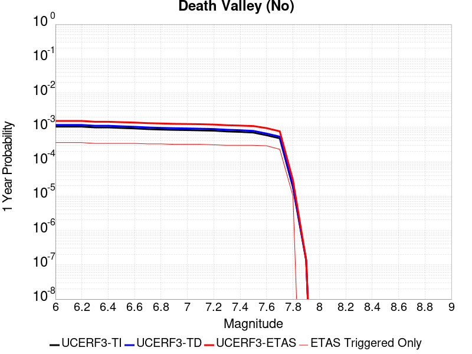 |  |

| Magnitude | 1 wk TI Prob | 1 wk TD Prob | 1 wk ETAS Prob | 1 wk ETAS/TD Gain | 1 wk ETAS Triggered Only | 1 mo TI Prob | 1 mo TD Prob | 1 mo ETAS Prob | 1 mo ETAS/TD Gain | 1 mo ETAS Triggered Only | 1 yr TI Prob | 1 yr TD Prob | 1 yr ETAS Prob | 1 yr ETAS/TD Gain | 1 yr ETAS Triggered Only | 10 yr TI Prob | 10 yr TD Prob | 10 yr ETAS Prob | 10 yr ETAS/TD Gain | 10 yr ETAS Triggered Only |
|-----|-----|-----|-----|-----|-----|-----|-----|-----|-----|-----|-----|-----|-----|-----|-----|-----|-----|-----|-----|-----|
| 6.0 | 2.0074807E-5 | 2.2500084E-5 | 1.02498285E-4 | 4.5554624 | 8.0E-5 | 8.603206E-5 | 9.642541E-5 | 2.66409E-4 | 2.7628508 | 1.7E-4 | 0.001046937 | 0.0011733545 | 0.001532932 | 1.3064526 | 3.6E-4 | 0.010420183 | 0.011672506 | 0.01219632 | 1.0448759 | 5.3E-4 |
| 6.1 | 2.0074807E-5 | 2.2500084E-5 | 1.02498285E-4 | 4.5554624 | 8.0E-5 | 8.603206E-5 | 9.642541E-5 | 2.66409E-4 | 2.7628508 | 1.7E-4 | 0.001046937 | 0.0011733545 | 0.001532932 | 1.3064526 | 3.6E-4 | 0.010420183 | 0.011672506 | 0.01219632 | 1.0448759 | 5.3E-4 |
| 6.2 | 2.0074807E-5 | 2.2500084E-5 | 1.02498285E-4 | 4.5554624 | 8.0E-5 | 8.603206E-5 | 9.642541E-5 | 2.66409E-4 | 2.7628508 | 1.7E-4 | 0.001046937 | 0.0011733545 | 0.001532932 | 1.3064526 | 3.6E-4 | 0.010420183 | 0.011672506 | 0.01219632 | 1.0448759 | 5.3E-4 |
| 6.3 | 1.9050609E-5 | 2.1336948E-5 | 8.133567E-5 | 3.8119636 | 6.0E-5 | 8.164292E-5 | 9.1440896E-5 | 2.4142717E-4 | 2.640254 | 1.5E-4 | 9.935491E-4 | 0.001112731 | 0.0014523527 | 1.3052145 | 3.4E-4 | 0.009891188 | 0.011072419 | 0.011576772 | 1.0455503 | 5.1E-4 |
| 6.4 | 1.9050609E-5 | 2.1336948E-5 | 8.133567E-5 | 3.8119636 | 6.0E-5 | 8.164292E-5 | 9.1440896E-5 | 2.4142717E-4 | 2.640254 | 1.5E-4 | 9.935491E-4 | 0.001112731 | 0.0014523527 | 1.3052145 | 3.4E-4 | 0.009891188 | 0.011072419 | 0.011576772 | 1.0455503 | 5.1E-4 |
| 6.5 | 1.8367004E-5 | 2.0561009E-5 | 8.0559774E-5 | 3.9180849 | 6.0E-5 | 7.8713354E-5 | 8.811567E-5 | 2.3810245E-4 | 2.702158 | 1.5E-4 | 9.5791375E-4 | 0.0010722869 | 0.0014119223 | 1.3167393 | 3.4E-4 | 0.009537951 | 0.0106719155 | 0.0111764725 | 1.047279 | 5.1E-4 |
| 6.6 | 1.779439E-5 | 1.9910927E-5 | 7.990973E-5 | 4.0133605 | 6.0E-5 | 7.625944E-5 | 8.53298E-5 | 2.35317E-4 | 2.7577355 | 1.5E-4 | 9.280632E-4 | 0.0010384015 | 0.0013780484 | 1.3270863 | 3.4E-4 | 0.009241969 | 0.010336253 | 0.010840981 | 1.0488309 | 5.1E-4 |
| 6.7 | 1.7025437E-5 | 1.9043426E-5 | 7.9042286E-5 | 4.150634 | 6.0E-5 | 7.296412E-5 | 8.161216E-5 | 2.3159992E-4 | 2.8378115 | 1.5E-4 | 8.87976E-4 | 9.931813E-4 | 0.0013228535 | 1.3319356 | 3.3E-4 | 0.008844362 | 0.009888145 | 0.010383201 | 1.0500656 | 5.0E-4 |
| 6.8 | 1.6545107E-5 | 1.8512545E-5 | 7.851143E-5 | 4.2409854 | 6.0E-5 | 7.090568E-5 | 7.93371E-5 | 2.293252E-4 | 2.8905165 | 1.5E-4 | 8.629347E-4 | 9.655073E-4 | 0.0012951887 | 1.3414593 | 3.3E-4 | 0.008595915 | 0.009613829 | 0.010109022 | 1.0515084 | 5.0E-4 |
| 6.9 | 1.615478E-5 | 1.8087594E-5 | 7.808651E-5 | 4.3171306 | 6.0E-5 | 6.9232934E-5 | 7.751599E-5 | 2.2750437E-4 | 2.9349346 | 1.5E-4 | 8.4258494E-4 | 9.433546E-4 | 0.0012630528 | 1.338895 | 3.2E-4 | 0.008393973 | 0.009394196 | 0.009879593 | 1.0516698 | 4.9E-4 |
| 7.0 | 1.5894311E-5 | 1.780555E-5 | 7.7804485E-5 | 4.3696756 | 6.0E-5 | 6.81167E-5 | 7.6307304E-5 | 2.2629586E-4 | 2.965586 | 1.5E-4 | 8.2900526E-4 | 9.286515E-4 | 0.0012483543 | 1.3442657 | 3.2E-4 | 0.008259195 | 0.009248397 | 0.009733866 | 1.0524921 | 4.9E-4 |
| 7.1 | 1.5602263E-5 | 1.7483504E-5 | 7.748245E-5 | 4.4317465 | 6.0E-5 | 6.6865134E-5 | 7.492718E-5 | 2.2491594E-4 | 3.0017936 | 1.5E-4 | 8.137789E-4 | 9.118627E-4 | 0.001231571 | 1.35061 | 3.2E-4 | 0.008108052 | 0.009081894 | 0.009557535 | 1.0523725 | 4.8E-4 |
| 7.2 | 1.5323829E-5 | 1.717063E-5 | 7.71696E-5 | 4.494279 | 6.0E-5 | 6.56719E-5 | 7.358637E-5 | 2.2357533E-4 | 3.038271 | 1.5E-4 | 7.99262E-4 | 8.9555193E-4 | 0.0012052743 | 1.3458452 | 3.1E-4 | 0.007963934 | 0.008920107 | 0.009376003 | 1.0511088 | 4.6E-4 |
| 7.3 | 1.4556212E-5 | 1.6302456E-5 | 7.6301476E-5 | 4.680367 | 6.0E-5 | 6.238227E-5 | 6.9865826E-5 | 2.1985534E-4 | 3.1468225 | 1.5E-4 | 7.592395E-4 | 8.5029035E-4 | 0.0011500353 | 1.3525207 | 3.0E-4 | 0.0075665074 | 0.008471014 | 0.008917202 | 1.0526724 | 4.5E-4 |
| 7.4 | 1.411725E-5 | 1.580796E-5 | 7.580701E-5 | 4.795496 | 6.0E-5 | 6.0501097E-5 | 6.7746674E-5 | 2.1773651E-4 | 3.213981 | 1.5E-4 | 7.363519E-4 | 8.245094E-4 | 0.0011242621 | 1.3635527 | 3.0E-4 | 0.0073391674 | 0.008215138 | 0.0086614415 | 1.0543269 | 4.5E-4 |
| 7.5 | 1.3503312E-5 | 1.5126289E-5 | 7.512538E-5 | 4.966544 | 6.0E-5 | 5.7870053E-5 | 6.482538E-5 | 2.1481565E-4 | 3.3137586 | 1.5E-4 | 7.043401E-4 | 7.8896893E-4 | 0.0010887323 | 1.3799431 | 3.0E-4 | 0.007021119 | 0.007862304 | 0.008308766 | 1.0567851 | 4.5E-4 |
| 7.6 | 1.1279839E-5 | 1.2626327E-5 | 7.262557E-5 | 5.751916 | 6.0E-5 | 4.834127E-5 | 5.4111737E-5 | 2.0410362E-4 | 3.7718918 | 1.5E-4 | 5.88396E-4 | 6.5861654E-4 | 9.4842556E-4 | 1.4400269 | 2.9E-4 | 0.005868405 | 0.006567199 | 0.006974506 | 1.0620215 | 4.1E-4 |
| 7.7 | 9.189108E-6 | 1.0283358E-5 | 7.028274E-5 | 6.83461 | 6.0E-5 | 3.93813E-5 | 4.407082E-5 | 1.6406552E-4 | 3.7227702 | 1.2E-4 | 4.7936183E-4 | 5.3643517E-4 | 7.663118E-4 | 1.4285264 | 2.3E-4 | 0.004783291 | 0.005351914 | 0.0056702015 | 1.0594717 | 3.2E-4 |
| 7.8 | 3.4586725E-7 | 3.6482615E-7 | 3.6482615E-7 | 1.0 | 0.0 | 1.4822873E-6 | 1.5635396E-6 | 1.5635396E-6 | 1.0 | 0.0 | 1.80467E-5 | 1.9035933E-5 | 2.9035744E-5 | 1.5253123 | 1.0E-5 | 1.8045233E-4 | 1.9034347E-4 | 2.1033967E-4 | 1.1050532 | 2.0E-5 |
| 7.9 | 2.5591178E-9 | 2.6696718E-9 | 2.6696718E-9 | 1.0 | 0.0 | 1.0967647E-8 | 1.14414505E-8 | 1.14414505E-8 | 1.0 | 0.0 | 1.335311E-7 | 1.3929966E-7 | 1.3929966E-7 | 1.0 | 0.0 | 1.3353102E-6 | 1.3929966E-6 | 1.3929966E-6 | 1.0 | 0.0 |

## Red Pass
*[(top)](#table-of-contents)*

| 1 Week | 1 Month | 1 Year | 10 Year |
|-----|-----|-----|-----|
|  |  | 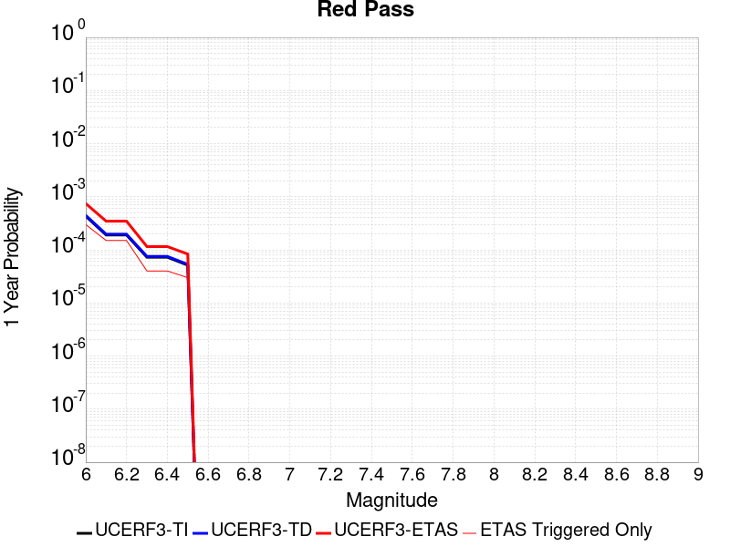 |  |

| Magnitude | 1 wk TI Prob | 1 wk TD Prob | 1 wk ETAS Prob | 1 wk ETAS/TD Gain | 1 wk ETAS Triggered Only | 1 mo TI Prob | 1 mo TD Prob | 1 mo ETAS Prob | 1 mo ETAS/TD Gain | 1 mo ETAS Triggered Only | 1 yr TI Prob | 1 yr TD Prob | 1 yr ETAS Prob | 1 yr ETAS/TD Gain | 1 yr ETAS Triggered Only | 10 yr TI Prob | 10 yr TD Prob | 10 yr ETAS Prob | 10 yr ETAS/TD Gain | 10 yr ETAS Triggered Only |
|-----|-----|-----|-----|-----|-----|-----|-----|-----|-----|-----|-----|-----|-----|-----|-----|-----|-----|-----|-----|-----|
| 6.0 | 8.258278E-6 | 8.551265E-6 | 1.3855015E-4 | 16.2023 | 1.3E-4 | 3.539214E-5 | 3.6647863E-5 | 2.3664054E-4 | 6.457144 | 2.0E-4 | 4.308141E-4 | 4.4611428E-4 | 7.459804E-4 | 1.6721735 | 3.0E-4 | 0.0042997985 | 0.004453945 | 0.004931807 | 1.1072897 | 4.8E-4 |
| 6.1 | 3.649988E-6 | 3.7753161E-6 | 7.377505E-5 | 19.541424 | 7.0E-5 | 1.5642712E-5 | 1.6179853E-5 | 1.2617807E-4 | 7.7984686 | 1.1E-4 | 1.9043336E-4 | 1.9697666E-4 | 3.469471E-4 | 1.7613615 | 1.5E-4 | 0.0019027026 | 0.001968488 | 0.0022279762 | 1.131821 | 2.6E-4 |
| 6.2 | 3.649988E-6 | 3.7753161E-6 | 7.377505E-5 | 19.541424 | 7.0E-5 | 1.5642712E-5 | 1.6179853E-5 | 1.2617807E-4 | 7.7984686 | 1.1E-4 | 1.9043336E-4 | 1.9697666E-4 | 3.469471E-4 | 1.7613615 | 1.5E-4 | 0.0019027026 | 0.001968488 | 0.0022279762 | 1.131821 | 2.6E-4 |
| 6.3 | 1.3924937E-6 | 1.4411166E-6 | 3.144107E-5 | 21.817162 | 3.0E-5 | 5.9678164E-6 | 6.1762075E-6 | 3.617602E-5 | 5.85732 | 3.0E-5 | 7.265574E-5 | 7.519415E-5 | 1.1519114E-4 | 1.5319163 | 4.0E-5 | 7.263199E-4 | 7.518258E-4 | 8.4175816E-4 | 1.1196185 | 9.0E-5 |
| 6.4 | 1.3924937E-6 | 1.4411166E-6 | 3.144107E-5 | 21.817162 | 3.0E-5 | 5.9678164E-6 | 6.1762075E-6 | 3.617602E-5 | 5.85732 | 3.0E-5 | 7.265574E-5 | 7.519415E-5 | 1.1519114E-4 | 1.5319163 | 4.0E-5 | 7.263199E-4 | 7.518258E-4 | 8.4175816E-4 | 1.1196185 | 9.0E-5 |
| 6.5 | 9.876812E-7 | 1.0221912E-6 | 2.1022171E-5 | 20.56579 | 2.0E-5 | 4.2329125E-6 | 4.3808195E-6 | 2.4380732E-5 | 5.5653358 | 2.0E-5 | 5.153449E-5 | 5.3336476E-5 | 8.3334875E-5 | 1.5624368 | 3.0E-5 | 5.1522546E-4 | 5.333648E-4 | 6.033274E-4 | 1.1311723 | 7.0E-5 |

## Elsinore (Glen Ivy) rev
*[(top)](#table-of-contents)*

| 1 Week | 1 Month | 1 Year | 10 Year |
|-----|-----|-----|-----|
|  |  |  |  |

| Magnitude | 1 wk TI Prob | 1 wk TD Prob | 1 wk ETAS Prob | 1 wk ETAS/TD Gain | 1 wk ETAS Triggered Only | 1 mo TI Prob | 1 mo TD Prob | 1 mo ETAS Prob | 1 mo ETAS/TD Gain | 1 mo ETAS Triggered Only | 1 yr TI Prob | 1 yr TD Prob | 1 yr ETAS Prob | 1 yr ETAS/TD Gain | 1 yr ETAS Triggered Only | 10 yr TI Prob | 10 yr TD Prob | 10 yr ETAS Prob | 10 yr ETAS/TD Gain | 10 yr ETAS Triggered Only |
|-----|-----|-----|-----|-----|-----|-----|-----|-----|-----|-----|-----|-----|-----|-----|-----|-----|-----|-----|-----|-----|
| 6.0 | 1.6204086E-4 | 2.9360707E-4 | 4.9354834E-4 | 1.6809825 | 2.0E-4 | 6.94276E-4 | 0.0012578638 | 0.0015275242 | 1.2143797 | 2.7E-4 | 0.008420097 | 0.015234485 | 0.015608695 | 1.0245634 | 3.8E-4 | 0.081081145 | 0.13969168 | 0.14009602 | 1.0028945 | 4.7E-4 |
| 6.1 | 1.6204086E-4 | 2.9360707E-4 | 4.9354834E-4 | 1.6809825 | 2.0E-4 | 6.94276E-4 | 0.0012578638 | 0.0015275242 | 1.2143797 | 2.7E-4 | 0.008420097 | 0.015234485 | 0.015608695 | 1.0245634 | 3.8E-4 | 0.081081145 | 0.13969168 | 0.14009602 | 1.0028945 | 4.7E-4 |
| 6.2 | 1.6204086E-4 | 2.9360707E-4 | 4.9354834E-4 | 1.6809825 | 2.0E-4 | 6.94276E-4 | 0.0012578638 | 0.0015275242 | 1.2143797 | 2.7E-4 | 0.008420097 | 0.015234485 | 0.015608695 | 1.0245634 | 3.8E-4 | 0.081081145 | 0.13969168 | 0.14009602 | 1.0028945 | 4.7E-4 |
| 6.3 | 1.0111737E-4 | 1.7703383E-4 | 2.9701256E-4 | 1.6777166 | 1.2E-4 | 4.332882E-4 | 7.5861247E-4 | 8.9850626E-4 | 1.1844075 | 1.4E-4 | 0.005262531 | 0.009217682 | 0.009435655 | 1.0236472 | 2.2E-4 | 0.0513964 | 0.0870191 | 0.08729299 | 1.0031475 | 3.0E-4 |
| 6.4 | 1.0111737E-4 | 1.7703383E-4 | 2.9701256E-4 | 1.6777166 | 1.2E-4 | 4.332882E-4 | 7.5861247E-4 | 8.9850626E-4 | 1.1844075 | 1.4E-4 | 0.005262531 | 0.009217682 | 0.009435655 | 1.0236472 | 2.2E-4 | 0.0513964 | 0.0870191 | 0.08729299 | 1.0031475 | 3.0E-4 |
| 6.5 | 3.6624708E-5 | 4.6391084E-5 | 5.6390618E-5 | 1.2155486 | 1.0E-5 | 1.569536E-4 | 1.9880582E-4 | 2.0880383E-4 | 1.0502903 | 1.0E-5 | 0.001909235 | 0.0024181372 | 0.0024380886 | 1.0082508 | 2.0E-5 | 0.01892915 | 0.023739954 | 0.023779005 | 1.001645 | 4.0E-5 |
| 6.6 | 2.5051324E-5 | 2.614772E-5 | 2.614772E-5 | 1.0 | 0.0 | 1.073584E-4 | 1.12057096E-4 | 1.12057096E-4 | 1.0 | 0.0 | 0.0013063047 | 0.0013634858 | 0.0013734722 | 1.0073241 | 1.0E-5 | 0.012986525 | 0.013564618 | 0.013594211 | 1.0021816 | 3.0E-5 |
| 6.7 | 2.2189772E-5 | 2.2072849E-5 | 2.2072849E-5 | 1.0 | 0.0 | 9.509556E-5 | 9.4594696E-5 | 9.4594696E-5 | 1.0 | 0.0 | 0.0011571734 | 0.0011511183 | 0.0011611069 | 1.0086772 | 1.0E-5 | 0.011511663 | 0.011465415 | 0.011495071 | 1.0025866 | 3.0E-5 |
| 6.8 | 1.6654378E-5 | 1.4437705E-5 | 1.4437705E-5 | 1.0 | 0.0 | 7.137396E-5 | 6.187444E-5 | 6.187444E-5 | 1.0 | 0.0 | 8.686314E-4 | 7.530661E-4 | 7.530661E-4 | 1.0 | 0.0 | 0.008652439 | 0.00751048 | 0.00753033 | 1.002643 | 2.0E-5 |
| 6.9 | 1.5042909E-5 | 1.2332022E-5 | 1.2332022E-5 | 1.0 | 0.0 | 6.446802E-5 | 5.285047E-5 | 5.285047E-5 | 1.0 | 0.0 | 7.8461546E-4 | 6.4326765E-4 | 6.4326765E-4 | 1.0 | 0.0 | 0.007818509 | 0.00641828 | 0.0064282157 | 1.001548 | 1.0E-5 |
| 7.0 | 1.4361385E-5 | 1.1451324E-5 | 1.1451324E-5 | 1.0 | 0.0 | 6.154734E-5 | 4.9076196E-5 | 4.9076196E-5 | 1.0 | 0.0 | 7.490812E-4 | 5.973418E-4 | 5.973418E-4 | 1.0 | 0.0 | 0.007465612 | 0.0059613534 | 0.005971294 | 1.0016675 | 1.0E-5 |
| 7.1 | 1.3265571E-5 | 1.0244926E-5 | 1.0244926E-5 | 1.0 | 0.0 | 5.6851208E-5 | 4.39061E-5 | 4.39061E-5 | 1.0 | 0.0 | 6.919436E-4 | 5.344282E-4 | 5.344282E-4 | 1.0 | 0.0 | 0.006897931 | 0.0053347866 | 0.005344733 | 1.0018644 | 1.0E-5 |
| 7.2 | 1.1596403E-5 | 8.505067E-6 | 8.505067E-6 | 1.0 | 0.0 | 4.9697923E-5 | 3.6449786E-5 | 3.6449786E-5 | 1.0 | 0.0 | 6.049042E-4 | 4.436875E-4 | 4.436875E-4 | 1.0 | 0.0 | 0.006032603 | 0.0044294316 | 0.0044393875 | 1.0022476 | 1.0E-5 |
| 7.3 | 1.0150827E-5 | 7.2387597E-6 | 7.2387597E-6 | 1.0 | 0.0 | 4.3502816E-5 | 3.1022897E-5 | 3.1022897E-5 | 1.0 | 0.0 | 5.2951806E-4 | 3.7763975E-4 | 3.7763975E-4 | 1.0 | 0.0 | 0.005282581 | 0.0037703665 | 0.003780329 | 1.0026423 | 1.0E-5 |
| 7.4 | 9.080705E-6 | 6.352519E-6 | 6.352519E-6 | 1.0 | 0.0 | 3.8916725E-5 | 2.7224805E-5 | 2.7224805E-5 | 1.0 | 0.0 | 4.7370812E-4 | 3.3141294E-4 | 3.3141294E-4 | 1.0 | 0.0 | 0.004726996 | 0.0033093381 | 0.0033093381 | 1.0 | 0.0 |
| 7.5 | 7.671649E-6 | 5.2256332E-6 | 5.2256332E-6 | 1.0 | 0.0 | 3.287808E-5 | 2.2395385E-5 | 2.2395385E-5 | 1.0 | 0.0 | 4.0021708E-4 | 2.7263095E-4 | 2.7263095E-4 | 1.0 | 0.0 | 0.0039949706 | 0.00272309 | 0.00272309 | 1.0 | 0.0 |
| 7.6 | 6.990086E-6 | 4.687545E-6 | 4.687545E-6 | 1.0 | 0.0 | 2.9957167E-5 | 2.008933E-5 | 2.008933E-5 | 1.0 | 0.0 | 3.6466747E-4 | 2.445613E-4 | 2.445613E-4 | 1.0 | 0.0 | 0.0036406964 | 0.002443038 | 0.002443038 | 1.0 | 0.0 |
| 7.7 | 4.163505E-6 | 2.3295343E-6 | 2.3295343E-6 | 1.0 | 0.0 | 1.7843471E-5 | 9.983683E-6 | 9.983683E-6 | 1.0 | 0.0 | 2.172226E-4 | 1.21545316E-4 | 1.21545316E-4 | 1.0 | 0.0 | 0.0021701038 | 0.0012148614 | 0.0012148614 | 1.0 | 0.0 |
| 7.8 | 2.2692414E-7 | 9.3854695E-8 | 9.3854695E-8 | 1.0 | 0.0 | 9.725317E-7 | 4.0223435E-7 | 4.0223435E-7 | 1.0 | 0.0 | 1.1840509E-5 | 4.8971956E-6 | 4.8971956E-6 | 1.0 | 0.0 | 1.1839878E-4 | 4.8971204E-5 | 4.8971204E-5 | 1.0 | 0.0 |
| 7.9 | 6.676829E-9 | 3.439853E-9 | 3.439853E-9 | 1.0 | 0.0 | 2.861498E-8 | 1.4742227E-8 | 1.4742227E-8 | 1.0 | 0.0 | 3.4838732E-7 | 1.7948659E-7 | 1.7948659E-7 | 1.0 | 0.0 | 3.4838679E-6 | 1.7948646E-6 | 1.7948646E-6 | 1.0 | 0.0 |

## Cady
*[(top)](#table-of-contents)*

| 1 Week | 1 Month | 1 Year | 10 Year |
|-----|-----|-----|-----|
|  |  |  |  |

| Magnitude | 1 wk TI Prob | 1 wk TD Prob | 1 wk ETAS Prob | 1 wk ETAS/TD Gain | 1 wk ETAS Triggered Only | 1 mo TI Prob | 1 mo TD Prob | 1 mo ETAS Prob | 1 mo ETAS/TD Gain | 1 mo ETAS Triggered Only | 1 yr TI Prob | 1 yr TD Prob | 1 yr ETAS Prob | 1 yr ETAS/TD Gain | 1 yr ETAS Triggered Only | 10 yr TI Prob | 10 yr TD Prob | 10 yr ETAS Prob | 10 yr ETAS/TD Gain | 10 yr ETAS Triggered Only |
|-----|-----|-----|-----|-----|-----|-----|-----|-----|-----|-----|-----|-----|-----|-----|-----|-----|-----|-----|-----|-----|
| 6.0 | 1.9892565E-5 | 2.1858728E-5 | 1.5185589E-4 | 6.9471507 | 1.3E-4 | 8.525106E-5 | 9.3677416E-5 | 2.636615E-4 | 2.8145683 | 1.7E-4 | 0.0010374374 | 0.0011400167 | 0.0014097089 | 1.2365687 | 2.7E-4 | 0.010326075 | 0.011350701 | 0.01177582 | 1.0374532 | 4.3E-4 |
| 6.1 | 1.9892565E-5 | 2.1858728E-5 | 1.5185589E-4 | 6.9471507 | 1.3E-4 | 8.525106E-5 | 9.3677416E-5 | 2.636615E-4 | 2.8145683 | 1.7E-4 | 0.0010374374 | 0.0011400167 | 0.0014097089 | 1.2365687 | 2.7E-4 | 0.010326075 | 0.011350701 | 0.01177582 | 1.0374532 | 4.3E-4 |
| 6.2 | 1.9892565E-5 | 2.1858728E-5 | 1.5185589E-4 | 6.9471507 | 1.3E-4 | 8.525106E-5 | 9.3677416E-5 | 2.636615E-4 | 2.8145683 | 1.7E-4 | 0.0010374374 | 0.0011400167 | 0.0014097089 | 1.2365687 | 2.7E-4 | 0.010326075 | 0.011350701 | 0.01177582 | 1.0374532 | 4.3E-4 |
| 6.3 | 1.1117327E-5 | 1.2176583E-5 | 9.217561E-5 | 7.569907 | 8.0E-5 | 4.764482E-5 | 5.2184492E-5 | 1.6217875E-4 | 3.107796 | 1.1E-4 | 5.7992124E-4 | 6.351925E-4 | 8.0508454E-4 | 1.2674654 | 1.7E-4 | 0.0057841022 | 0.0063368753 | 0.006595228 | 1.0407697 | 2.6E-4 |
| 6.4 | 1.1117327E-5 | 1.2176583E-5 | 9.217561E-5 | 7.569907 | 8.0E-5 | 4.764482E-5 | 5.2184492E-5 | 1.6217875E-4 | 3.107796 | 1.1E-4 | 5.7992124E-4 | 6.351925E-4 | 8.0508454E-4 | 1.2674654 | 1.7E-4 | 0.0057841022 | 0.0063368753 | 0.006595228 | 1.0407697 | 2.6E-4 |
| 6.5 | 6.103093E-6 | 6.672021E-6 | 4.6671754E-5 | 6.9951453 | 4.0E-5 | 2.615585E-5 | 2.8594131E-5 | 8.859242E-5 | 3.0982726 | 6.0E-5 | 3.1840094E-4 | 3.480905E-4 | 4.2806266E-4 | 1.2297453 | 8.0E-5 | 0.0031794512 | 0.0034766865 | 0.0036062347 | 1.037262 | 1.3E-4 |
| 6.6 | 5.817237E-6 | 6.3656585E-6 | 4.6365403E-5 | 7.2836776 | 4.0E-5 | 2.4930776E-5 | 2.728118E-5 | 8.727954E-5 | 3.1992586 | 6.0E-5 | 3.034899E-4 | 3.3211018E-4 | 4.120836E-4 | 1.240804 | 8.0E-5 | 0.0030307577 | 0.0033173605 | 0.0034469294 | 1.0390577 | 1.3E-4 |
| 6.7 | 4.8846314E-6 | 5.3405684E-6 | 2.5340461E-5 | 4.7448997 | 2.0E-5 | 2.0933967E-5 | 2.2888014E-5 | 6.28871E-5 | 2.7475996 | 4.0E-5 | 2.5484123E-4 | 2.7863772E-4 | 3.286238E-4 | 1.1793945 | 5.0E-5 | 0.0025454918 | 0.0027840391 | 0.0028837607 | 1.035819 | 1.0E-4 |
| 6.8 | 1.7788773E-6 | 1.9399079E-6 | 1.1939888E-5 | 6.154874 | 1.0E-5 | 7.6237375E-6 | 8.313874E-6 | 3.8313625E-5 | 4.608396 | 3.0E-5 | 9.281505E-5 | 1.01218284E-4 | 1.3121525E-4 | 1.2963592 | 3.0E-5 | 9.2776294E-4 | 0.0010118765 | 0.0010718157 | 1.0592358 | 6.0E-5 |
| 6.9 | 7.5455404E-7 | 8.297092E-7 | 8.297092E-7 | 1.0 | 0.0 | 3.233799E-6 | 3.5558937E-6 | 1.35558585E-5 | 3.8122225 | 1.0E-5 | 3.937079E-5 | 4.3292483E-5 | 5.329205E-5 | 1.2309769 | 1.0E-5 | 3.9363815E-4 | 4.3287344E-4 | 4.5286477E-4 | 1.0461829 | 2.0E-5 |
| 7.0 | 6.8578805E-7 | 7.541816E-7 | 7.541816E-7 | 1.0 | 0.0 | 2.9390883E-6 | 3.2322048E-6 | 1.3232172E-5 | 4.0938535 | 1.0E-5 | 3.578281E-5 | 3.9351715E-5 | 4.9351318E-5 | 1.2541085 | 1.0E-5 | 3.577705E-4 | 3.9347992E-4 | 4.1347204E-4 | 1.0508085 | 2.0E-5 |

## Manix-Afton Hills
*[(top)](#table-of-contents)*

| 1 Week | 1 Month | 1 Year | 10 Year |
|-----|-----|-----|-----|
|  |  |  |  |

| Magnitude | 1 wk TI Prob | 1 wk TD Prob | 1 wk ETAS Prob | 1 wk ETAS/TD Gain | 1 wk ETAS Triggered Only | 1 mo TI Prob | 1 mo TD Prob | 1 mo ETAS Prob | 1 mo ETAS/TD Gain | 1 mo ETAS Triggered Only | 1 yr TI Prob | 1 yr TD Prob | 1 yr ETAS Prob | 1 yr ETAS/TD Gain | 1 yr ETAS Triggered Only | 10 yr TI Prob | 10 yr TD Prob | 10 yr ETAS Prob | 10 yr ETAS/TD Gain | 10 yr ETAS Triggered Only |
|-----|-----|-----|-----|-----|-----|-----|-----|-----|-----|-----|-----|-----|-----|-----|-----|-----|-----|-----|-----|-----|
| 6.0 | 1.3783202E-5 | 1.47110895E-5 | 1.6470888E-4 | 11.196239 | 1.5E-4 | 5.906953E-5 | 6.30461E-5 | 2.7303287E-4 | 4.3306856 | 2.1E-4 | 7.189342E-4 | 7.6733343E-4 | 0.0010171416 | 1.3255537 | 2.5E-4 | 0.0071661277 | 0.007648596 | 0.008065384 | 1.054492 | 4.2E-4 |
| 6.1 | 1.3783202E-5 | 1.47110895E-5 | 1.6470888E-4 | 11.196239 | 1.5E-4 | 5.906953E-5 | 6.30461E-5 | 2.7303287E-4 | 4.3306856 | 2.1E-4 | 7.189342E-4 | 7.6733343E-4 | 0.0010171416 | 1.3255537 | 2.5E-4 | 0.0071661277 | 0.007648596 | 0.008065384 | 1.054492 | 4.2E-4 |
| 6.2 | 1.3783202E-5 | 1.47110895E-5 | 1.6470888E-4 | 11.196239 | 1.5E-4 | 5.906953E-5 | 6.30461E-5 | 2.7303287E-4 | 4.3306856 | 2.1E-4 | 7.189342E-4 | 7.6733343E-4 | 0.0010171416 | 1.3255537 | 2.5E-4 | 0.0071661277 | 0.007648596 | 0.008065384 | 1.054492 | 4.2E-4 |
| 6.3 | 1.10494875E-5 | 1.1793136E-5 | 1.3179172E-4 | 11.175291 | 1.2E-4 | 4.7354086E-5 | 5.054109E-5 | 2.0053351E-4 | 3.9677322 | 1.5E-4 | 5.763835E-4 | 6.151744E-4 | 7.950637E-4 | 1.2924199 | 1.8E-4 | 0.005748908 | 0.0061357557 | 0.0064438535 | 1.0502136 | 3.1E-4 |
| 6.4 | 1.10494875E-5 | 1.1793136E-5 | 1.3179172E-4 | 11.175291 | 1.2E-4 | 4.7354086E-5 | 5.054109E-5 | 2.0053351E-4 | 3.9677322 | 1.5E-4 | 5.763835E-4 | 6.151744E-4 | 7.950637E-4 | 1.2924199 | 1.8E-4 | 0.005748908 | 0.0061357557 | 0.0064438535 | 1.0502136 | 3.1E-4 |
| 6.5 | 9.788949E-6 | 1.045432E-5 | 1.2045317E-4 | 11.521856 | 1.1E-4 | 4.1951964E-5 | 4.480351E-5 | 1.8479723E-4 | 4.124615 | 1.4E-4 | 5.1064545E-4 | 5.453555E-4 | 7.0526823E-4 | 1.2932266 | 1.6E-4 | 0.0050947363 | 0.0054410985 | 0.005719575 | 1.0511802 | 2.8E-4 |
| 6.6 | 8.810006E-6 | 9.4136285E-6 | 1.19412594E-4 | 12.685077 | 1.1E-4 | 3.775662E-5 | 4.0343548E-5 | 1.803379E-4 | 4.4700556 | 1.4E-4 | 4.5958988E-4 | 4.9108086E-4 | 6.510023E-4 | 1.3256519 | 1.6E-4 | 0.0045864056 | 0.004900839 | 0.005169516 | 1.0548226 | 2.7E-4 |
| 6.7 | 8.80128E-6 | 9.404108E-6 | 1.1940307E-4 | 12.696906 | 1.1E-4 | 3.7719226E-5 | 4.0302748E-5 | 1.8029711E-4 | 4.4735684 | 1.4E-4 | 4.591348E-4 | 4.9058435E-4 | 6.505059E-4 | 1.3259816 | 1.6E-4 | 0.004581874 | 0.0048958957 | 0.005164574 | 1.0548782 | 2.7E-4 |
| 6.8 | 6.8994877E-6 | 7.380076E-6 | 9.737941E-5 | 13.194906 | 9.0E-5 | 2.9568899E-5 | 3.162856E-5 | 1.5162476E-4 | 4.7939196 | 1.2E-4 | 3.5994186E-4 | 3.8501783E-4 | 5.2496395E-4 | 1.3634795 | 1.4E-4 | 0.003593594 | 0.0038443129 | 0.0040535056 | 1.0544162 | 2.1E-4 |
| 6.9 | 4.9328037E-6 | 5.2709615E-6 | 7.527059E-5 | 14.28024 | 7.0E-5 | 2.1140417E-5 | 2.2589675E-5 | 1.12587644E-4 | 4.984031 | 9.0E-5 | 2.5735417E-4 | 2.7500073E-4 | 3.8497048E-4 | 1.399889 | 1.1E-4 | 0.0025705635 | 0.0027472095 | 0.0028868248 | 1.0508208 | 1.4E-4 |
| 7.0 | 3.347973E-6 | 3.59003E-6 | 4.3589887E-5 | 12.141929 | 4.0E-5 | 1.4348378E-5 | 1.5385775E-5 | 6.538501E-5 | 4.249705 | 5.0E-5 | 1.746775E-4 | 1.8730981E-4 | 2.4729857E-4 | 1.3202649 | 6.0E-5 | 0.0017454025 | 0.0018719219 | 0.0019617535 | 1.0479889 | 9.0E-5 |
| 7.1 | 1.2073567E-6 | 1.293482E-6 | 2.1293456E-5 | 16.46212 | 2.0E-5 | 5.1743755E-6 | 5.543492E-6 | 2.554338E-5 | 4.6078143 | 2.0E-5 | 6.29962E-5 | 6.749156E-5 | 8.749021E-5 | 1.2963134 | 2.0E-5 | 6.297835E-4 | 6.7487074E-4 | 6.9485727E-4 | 1.0296153 | 2.0E-5 |

## Calico-Hidalgo
*[(top)](#table-of-contents)*

| 1 Week | 1 Month | 1 Year | 10 Year |
|-----|-----|-----|-----|
|  | 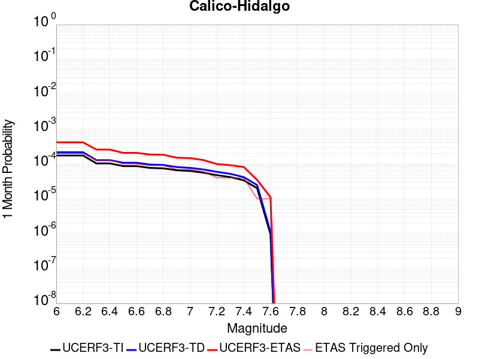 |  |  |

| Magnitude | 1 wk TI Prob | 1 wk TD Prob | 1 wk ETAS Prob | 1 wk ETAS/TD Gain | 1 wk ETAS Triggered Only | 1 mo TI Prob | 1 mo TD Prob | 1 mo ETAS Prob | 1 mo ETAS/TD Gain | 1 mo ETAS Triggered Only | 1 yr TI Prob | 1 yr TD Prob | 1 yr ETAS Prob | 1 yr ETAS/TD Gain | 1 yr ETAS Triggered Only | 10 yr TI Prob | 10 yr TD Prob | 10 yr ETAS Prob | 10 yr ETAS/TD Gain | 10 yr ETAS Triggered Only |
|-----|-----|-----|-----|-----|-----|-----|-----|-----|-----|-----|-----|-----|-----|-----|-----|-----|-----|-----|-----|-----|
| 6.0 | 4.0906612E-5 | 5.0703686E-5 | 1.9069659E-4 | 3.7610004 | 1.4E-4 | 1.7530227E-4 | 2.172857E-4 | 4.1724223E-4 | 1.9202471 | 2.0E-4 | 0.0021322158 | 0.002642648 | 0.0029119346 | 1.1019002 | 2.7E-4 | 0.02111873 | 0.026152607 | 0.026590839 | 1.0167567 | 4.5E-4 |
| 6.1 | 4.0906612E-5 | 5.0703686E-5 | 1.9069659E-4 | 3.7610004 | 1.4E-4 | 1.7530227E-4 | 2.172857E-4 | 4.1724223E-4 | 1.9202471 | 2.0E-4 | 0.0021322158 | 0.002642648 | 0.0029119346 | 1.1019002 | 2.7E-4 | 0.02111873 | 0.026152607 | 0.026590839 | 1.0167567 | 4.5E-4 |
| 6.2 | 4.0906612E-5 | 5.0703686E-5 | 1.9069659E-4 | 3.7610004 | 1.4E-4 | 1.7530227E-4 | 2.172857E-4 | 4.1724223E-4 | 1.9202471 | 2.0E-4 | 0.0021322158 | 0.002642648 | 0.0029119346 | 1.1019002 | 2.7E-4 | 0.02111873 | 0.026152607 | 0.026590839 | 1.0167567 | 4.5E-4 |
| 6.3 | 2.4242801E-5 | 3.0090669E-5 | 1.1008826E-4 | 3.6585517 | 8.0E-5 | 1.0389358E-4 | 1.2895382E-4 | 2.5893707E-4 | 2.0079827 | 1.3E-4 | 0.0012641704 | 0.0015689151 | 0.001728664 | 1.1018213 | 1.6E-4 | 0.01257003 | 0.01558206 | 0.015808476 | 1.0145305 | 2.3E-4 |
| 6.4 | 2.4242801E-5 | 3.0090669E-5 | 1.1008826E-4 | 3.6585517 | 8.0E-5 | 1.0389358E-4 | 1.2895382E-4 | 2.5893707E-4 | 2.0079827 | 1.3E-4 | 0.0012641704 | 0.0015689151 | 0.001728664 | 1.1018213 | 1.6E-4 | 0.01257003 | 0.01558206 | 0.015808476 | 1.0145305 | 2.3E-4 |
| 6.5 | 2.0286952E-5 | 2.5315738E-5 | 7.531447E-5 | 2.975006 | 5.0E-5 | 8.694118E-5 | 1.0849161E-4 | 2.0848075E-4 | 1.9216303 | 1.0E-4 | 0.0010579949 | 0.001320102 | 0.0014499305 | 1.0983472 | 1.3E-4 | 0.010529719 | 0.013124538 | 0.013312045 | 1.0142868 | 1.9E-4 |
| 6.6 | 2.0269223E-5 | 2.5296687E-5 | 7.529542E-5 | 2.9764934 | 5.0E-5 | 8.6865206E-5 | 1.08409964E-4 | 2.0839913E-4 | 1.9223244 | 1.0E-4 | 0.0010570707 | 0.0013191093 | 0.0014489378 | 1.0984213 | 1.3E-4 | 0.010520565 | 0.013114728 | 0.013302236 | 1.0142975 | 1.9E-4 |
| 6.7 | 1.799852E-5 | 2.25406E-5 | 7.253947E-5 | 3.2181695 | 5.0E-5 | 7.713423E-5 | 9.659908E-5 | 1.8659039E-4 | 1.9315959 | 9.0E-5 | 9.3870464E-4 | 0.0011754738 | 0.0012953328 | 1.1019665 | 1.2E-4 | 0.009347493 | 0.011694173 | 0.011872069 | 1.0152123 | 1.8E-4 |
| 6.8 | 1.7458793E-5 | 2.184212E-5 | 7.184103E-5 | 3.2891052 | 5.0E-5 | 7.4821255E-5 | 9.3605806E-5 | 1.8359738E-4 | 1.9613888 | 9.0E-5 | 9.10568E-4 | 0.0011390693 | 0.0012589326 | 1.1052291 | 1.2E-4 | 0.009068459 | 0.011333893 | 0.011511853 | 1.0157015 | 1.8E-4 |
| 6.9 | 1.542884E-5 | 1.9025927E-5 | 5.9025166E-5 | 3.1023543 | 4.0E-5 | 6.612192E-5 | 8.153721E-5 | 1.5153151E-4 | 1.8584337 | 7.0E-5 | 8.04737E-4 | 9.922766E-4 | 0.0010921774 | 1.1006783 | 1.0E-4 | 0.008018291 | 0.009879857 | 0.010038277 | 1.0160346 | 1.6E-4 |
| 7.0 | 1.468253E-5 | 1.8030598E-5 | 5.8029877E-5 | 3.218411 | 4.0E-5 | 6.292361E-5 | 7.7271776E-5 | 1.4726637E-4 | 1.9058235 | 7.0E-5 | 7.658257E-4 | 9.4039086E-4 | 0.0010303062 | 1.0956149 | 9.0E-5 | 0.0076319184 | 0.009365481 | 0.009514077 | 1.0158663 | 1.5E-4 |
| 7.1 | 1.3139281E-5 | 1.6200942E-5 | 5.6200293E-5 | 3.4689522 | 4.0E-5 | 5.6309986E-5 | 6.943083E-5 | 1.2942667E-4 | 1.8641094 | 6.0E-5 | 6.853584E-4 | 8.4500515E-4 | 9.2493754E-4 | 1.094594 | 8.0E-5 | 0.0068324856 | 0.0084192185 | 0.008528292 | 1.0129553 | 1.1E-4 |
| 7.2 | 1.1127404E-5 | 1.3866597E-5 | 3.386632E-5 | 2.4422948 | 2.0E-5 | 4.7688E-5 | 5.942698E-5 | 9.942461E-5 | 1.6730549 | 4.0E-5 | 5.8044674E-4 | 7.232942E-4 | 7.7325804E-4 | 1.0690782 | 5.0E-5 | 0.0057893298 | 0.0072105085 | 0.0072899316 | 1.0110149 | 8.0E-5 |
| 7.3 | 9.808154E-6 | 1.2176215E-5 | 3.2175973E-5 | 2.6425266 | 2.0E-5 | 4.2034266E-5 | 5.2182797E-5 | 9.218071E-5 | 1.7664962 | 4.0E-5 | 5.11647E-4 | 6.3515105E-4 | 6.851193E-4 | 1.0786715 | 5.0E-5 | 0.0051047057 | 0.006334433 | 0.0064139264 | 1.0125494 | 8.0E-5 |
| 7.4 | 7.942452E-6 | 9.792144E-6 | 2.9791947E-5 | 3.0424337 | 2.0E-5 | 3.4038632E-5 | 4.1965708E-5 | 8.1964026E-5 | 1.9531192 | 4.0E-5 | 4.1434157E-4 | 5.1082217E-4 | 5.5080175E-4 | 1.0782652 | 4.0E-5 | 0.0041356985 | 0.005097421 | 0.0051670643 | 1.0136625 | 7.0E-5 |
| 7.5 | 4.7121216E-6 | 5.772836E-6 | 1.5772779E-5 | 2.7322407 | 1.0E-5 | 2.019465E-5 | 2.4740535E-5 | 3.474029E-5 | 1.4041849 | 1.0E-5 | 2.4584212E-4 | 3.0118204E-4 | 3.1117903E-4 | 1.0331925 | 1.0E-5 | 0.0024557032 | 0.0030084911 | 0.0030483708 | 1.0132557 | 4.0E-5 |
| 7.6 | 2.21172E-7 | 2.603961E-7 | 1.02603935E-5 | 39.403027 | 1.0E-5 | 9.478797E-7 | 1.1159829E-6 | 1.1115972E-5 | 9.960701 | 1.0E-5 | 1.1540374E-5 | 1.3587036E-5 | 2.35869E-5 | 1.7359858 | 1.0E-5 | 1.1539775E-4 | 1.3586486E-4 | 1.4586351E-4 | 1.0735925 | 1.0E-5 |

## San Andreas (San Gorgonio Pass-Garnet HIll)
*[(top)](#table-of-contents)*

| 1 Week | 1 Month | 1 Year | 10 Year |
|-----|-----|-----|-----|
|  |  |  | 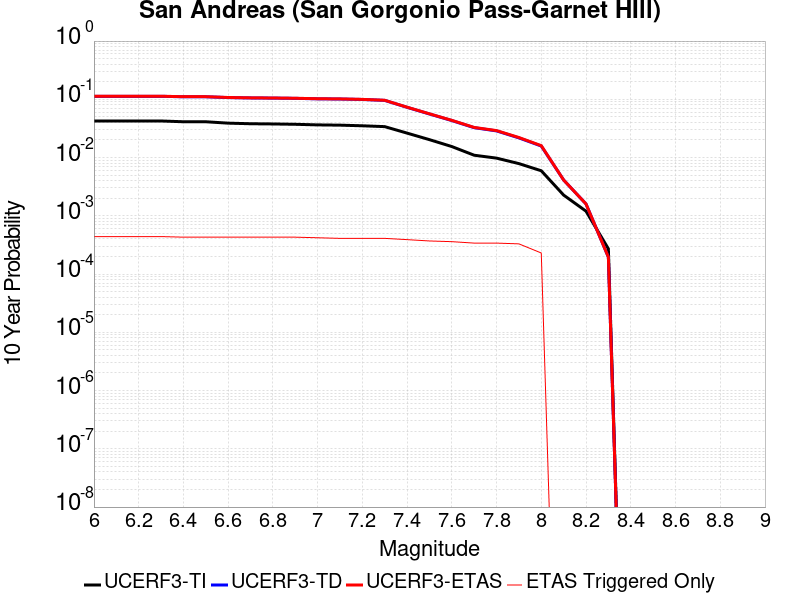 |

| Magnitude | 1 wk TI Prob | 1 wk TD Prob | 1 wk ETAS Prob | 1 wk ETAS/TD Gain | 1 wk ETAS Triggered Only | 1 mo TI Prob | 1 mo TD Prob | 1 mo ETAS Prob | 1 mo ETAS/TD Gain | 1 mo ETAS Triggered Only | 1 yr TI Prob | 1 yr TD Prob | 1 yr ETAS Prob | 1 yr ETAS/TD Gain | 1 yr ETAS Triggered Only | 10 yr TI Prob | 10 yr TD Prob | 10 yr ETAS Prob | 10 yr ETAS/TD Gain | 10 yr ETAS Triggered Only |
|-----|-----|-----|-----|-----|-----|-----|-----|-----|-----|-----|-----|-----|-----|-----|-----|-----|-----|-----|-----|-----|
| 6.0 | 8.31567E-5 | 2.3382473E-4 | 3.73792E-4 | 1.5985991 | 1.4E-4 | 3.5633717E-4 | 0.0010017233 | 0.001221503 | 1.2194015 | 2.2E-4 | 0.004329778 | 0.012127888 | 0.01242425 | 1.0244364 | 3.0E-4 | 0.042463828 | 0.11257892 | 0.11296938 | 1.0034684 | 4.4E-4 |
| 6.1 | 8.31567E-5 | 2.3382473E-4 | 3.73792E-4 | 1.5985991 | 1.4E-4 | 3.5633717E-4 | 0.0010017233 | 0.001221503 | 1.2194015 | 2.2E-4 | 0.004329778 | 0.012127888 | 0.01242425 | 1.0244364 | 3.0E-4 | 0.042463828 | 0.11257892 | 0.11296938 | 1.0034684 | 4.4E-4 |
| 6.2 | 8.31567E-5 | 2.3382473E-4 | 3.73792E-4 | 1.5985991 | 1.4E-4 | 3.5633717E-4 | 0.0010017233 | 0.001221503 | 1.2194015 | 2.2E-4 | 0.004329778 | 0.012127888 | 0.01242425 | 1.0244364 | 3.0E-4 | 0.042463828 | 0.11257892 | 0.11296938 | 1.0034684 | 4.4E-4 |
| 6.3 | 8.31567E-5 | 2.3382473E-4 | 3.73792E-4 | 1.5985991 | 1.4E-4 | 3.5633717E-4 | 0.0010017233 | 0.001221503 | 1.2194015 | 2.2E-4 | 0.004329778 | 0.012127888 | 0.01242425 | 1.0244364 | 3.0E-4 | 0.042463828 | 0.11257892 | 0.11296938 | 1.0034684 | 4.4E-4 |
| 6.4 | 8.059055E-5 | 2.2940808E-4 | 3.5937826E-4 | 1.5665457 | 1.3E-4 | 3.4534236E-4 | 9.828096E-4 | 0.0011926031 | 1.2134632 | 2.1E-4 | 0.0041964394 | 0.011900152 | 0.0121867005 | 1.0240794 | 2.9E-4 | 0.041180745 | 0.11056015 | 0.1109426 | 1.0034593 | 4.3E-4 |
| 6.5 | 8.059055E-5 | 2.2940808E-4 | 3.5937826E-4 | 1.5665457 | 1.3E-4 | 3.4534236E-4 | 9.828096E-4 | 0.0011926031 | 1.2134632 | 2.1E-4 | 0.0041964394 | 0.011900152 | 0.0121867005 | 1.0240794 | 2.9E-4 | 0.041180745 | 0.11056015 | 0.1109426 | 1.0034593 | 4.3E-4 |
| 6.6 | 7.619237E-5 | 2.218517E-4 | 3.5182288E-4 | 1.585847 | 1.3E-4 | 3.2649786E-4 | 9.5044886E-4 | 0.0011602492 | 1.2207382 | 2.1E-4 | 0.0039678677 | 0.01151087 | 0.011797532 | 1.0249035 | 2.9E-4 | 0.03897764 | 0.10709683 | 0.10748078 | 1.0035851 | 4.3E-4 |
| 6.7 | 7.440636E-5 | 2.1860997E-4 | 3.4858155E-4 | 1.5945364 | 1.3E-4 | 3.188454E-4 | 9.3656575E-4 | 0.001146369 | 1.2240134 | 2.1E-4 | 0.0038750346 | 0.011343609 | 0.011630318 | 1.0252751 | 2.9E-4 | 0.038081564 | 0.105605274 | 0.105989866 | 1.0036417 | 4.3E-4 |
| 6.8 | 7.3735864E-5 | 2.1708169E-4 | 3.4705346E-4 | 1.5987229 | 1.3E-4 | 3.1597257E-4 | 9.3002064E-4 | 0.0011398253 | 1.2255914 | 2.1E-4 | 0.0038401815 | 0.011264749 | 0.011551482 | 1.025454 | 2.9E-4 | 0.03774495 | 0.10490683 | 0.10529172 | 1.0036689 | 4.3E-4 |
| 6.9 | 7.27575E-5 | 2.1477141E-4 | 3.447435E-4 | 1.6051646 | 1.3E-4 | 3.117806E-4 | 9.201265E-4 | 0.0011299333 | 1.2280195 | 2.1E-4 | 0.003789323 | 0.011145527 | 0.011432294 | 1.0257294 | 2.9E-4 | 0.037253562 | 0.103854746 | 0.10424008 | 1.0037104 | 4.3E-4 |
| 7.0 | 7.102591E-5 | 2.1061185E-4 | 3.4058446E-4 | 1.6171192 | 1.3E-4 | 3.0436125E-4 | 9.023122E-4 | 0.0011121227 | 1.2325255 | 2.1E-4 | 0.003699303 | 0.010930831 | 0.011217661 | 1.0262405 | 2.9E-4 | 0.03638325 | 0.10195695 | 0.10233413 | 1.0036994 | 4.2E-4 |
| 7.1 | 7.028513E-5 | 2.0896831E-4 | 3.3894114E-4 | 1.6219739 | 1.3E-4 | 3.0118722E-4 | 8.9527335E-4 | 0.0010950943 | 1.2231954 | 2.0E-4 | 0.0036607897 | 0.010845989 | 0.011122952 | 1.025536 | 2.8E-4 | 0.036010686 | 0.101199985 | 0.10156849 | 1.0036414 | 4.1E-4 |
| 7.2 | 6.8498244E-5 | 2.0504706E-4 | 3.3502042E-4 | 1.6338708 | 1.3E-4 | 2.9353087E-4 | 8.784794E-4 | 0.0010783037 | 1.2274661 | 2.0E-4 | 0.003567883 | 0.010643536 | 0.010920556 | 1.0260271 | 2.8E-4 | 0.035111405 | 0.09939202 | 0.09976127 | 1.003715 | 4.1E-4 |
| 7.3 | 6.622592E-5 | 1.9732013E-4 | 3.272945E-4 | 1.6586978 | 1.3E-4 | 2.8379448E-4 | 8.453858E-4 | 0.0010452167 | 1.2363784 | 2.0E-4 | 0.0034497243 | 0.0102444785 | 0.01052161 | 1.0270518 | 2.8E-4 | 0.033966612 | 0.095888525 | 0.096259214 | 1.0038658 | 4.1E-4 |
| 7.4 | 5.1050705E-5 | 1.4689034E-4 | 2.668727E-4 | 1.816816 | 1.2E-4 | 2.1877038E-4 | 6.29379E-4 | 8.1925944E-4 | 1.3016949 | 1.9E-4 | 0.002660276 | 0.0076359594 | 0.007903898 | 1.035089 | 2.7E-4 | 0.02628654 | 0.07286301 | 0.0732246 | 1.0049626 | 3.9E-4 |
| 7.5 | 3.9302922E-5 | 1.1129847E-4 | 2.2128623E-4 | 1.9882234 | 1.1E-4 | 1.6843023E-4 | 4.7690657E-4 | 6.568207E-4 | 1.3772525 | 1.8E-4 | 0.0020487092 | 0.005790949 | 0.006039501 | 1.0429208 | 2.5E-4 | 0.020299247 | 0.05600951 | 0.05635879 | 1.0062361 | 3.7E-4 |
| 7.6 | 2.9851626E-5 | 8.4949745E-5 | 1.8494125E-4 | 2.1770666 | 1.0E-4 | 1.2792926E-4 | 3.6401965E-4 | 5.339578E-4 | 1.4668378 | 1.7E-4 | 0.0015564259 | 0.0044229585 | 0.0046618967 | 1.0540223 | 2.4E-4 | 0.0154556995 | 0.04319374 | 0.043538187 | 1.0079745 | 3.6E-4 |
| 7.7 | 2.1135214E-5 | 6.3529005E-5 | 1.5352329E-4 | 2.416586 | 9.0E-5 | 9.0576345E-5 | 2.7223877E-4 | 4.321952E-4 | 1.5875593 | 1.6E-4 | 0.0011022091 | 0.0033094748 | 0.0035287468 | 1.0662558 | 2.2E-4 | 0.010967582 | 0.032582592 | 0.032911517 | 1.010095 | 3.4E-4 |
| 7.8 | 1.883379E-5 | 5.564028E-5 | 1.4563528E-4 | 2.6174433 | 9.0E-5 | 8.0713755E-5 | 2.3843657E-4 | 3.983984E-4 | 1.670878 | 1.6E-4 | 9.822468E-4 | 0.0028991038 | 0.0031184661 | 1.0756655 | 2.2E-4 | 0.0097791655 | 0.028695205 | 0.02902545 | 1.0115087 | 3.4E-4 |
| 7.9 | 1.5156185E-5 | 4.1658426E-5 | 1.3165467E-4 | 3.1603372 | 9.0E-5 | 6.495346E-5 | 1.785239E-4 | 3.3849533E-4 | 1.8960786 | 1.6E-4 | 7.9052144E-4 | 0.0021713632 | 0.0023809073 | 1.0965035 | 2.1E-4 | 0.007877152 | 0.021759422 | 0.022082243 | 1.0148358 | 3.3E-4 |
| 8.0 | 1.1405907E-5 | 2.9974231E-5 | 8.997243E-5 | 3.0016594 | 6.0E-5 | 4.8881542E-5 | 1.2845467E-4 | 2.2844183E-4 | 1.7783847 | 1.0E-4 | 5.9497025E-4 | 0.0015628147 | 0.0017125802 | 1.0958307 | 1.5E-4 | 0.005933798 | 0.015772851 | 0.015999222 | 1.014352 | 2.3E-4 |
| 8.1 | 4.3511436E-6 | 7.369219E-6 | 7.369219E-6 | 1.0 | 0.0 | 1.8647626E-5 | 3.1581985E-5 | 3.1581985E-5 | 1.0 | 0.0 | 2.2701119E-4 | 3.8444297E-4 | 3.8444297E-4 | 1.0 | 0.0 | 0.0022677942 | 0.0041163345 | 0.0041163345 | 1.0 | 0.0 |
| 8.2 | 2.3042528E-6 | 2.7329415E-6 | 2.7329415E-6 | 1.0 | 0.0 | 9.875332E-6 | 1.1712554E-5 | 1.1712554E-5 | 1.0 | 0.0 | 1.2022553E-4 | 1.4259106E-4 | 1.4259106E-4 | 1.0 | 0.0 | 0.0012016051 | 0.0015979785 | 0.0015979785 | 1.0 | 0.0 |
| 8.3 | 5.202968E-7 | 3.1598344E-7 | 3.1598344E-7 | 1.0 | 0.0 | 2.2298414E-6 | 1.3542141E-6 | 1.3542141E-6 | 1.0 | 0.0 | 2.714798E-5 | 1.6487444E-5 | 1.6487444E-5 | 1.0 | 0.0 | 2.7144665E-4 | 1.9563142E-4 | 1.9563142E-4 | 1.0 | 0.0 |

## Ludlow
*[(top)](#table-of-contents)*

| 1 Week | 1 Month | 1 Year | 10 Year |
|-----|-----|-----|-----|
| 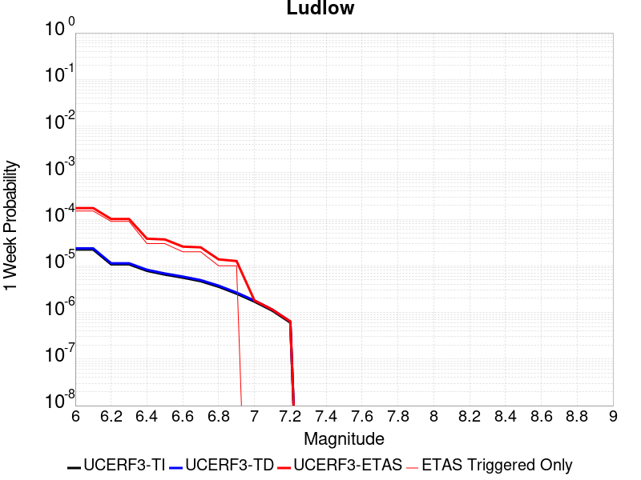 |  |  | 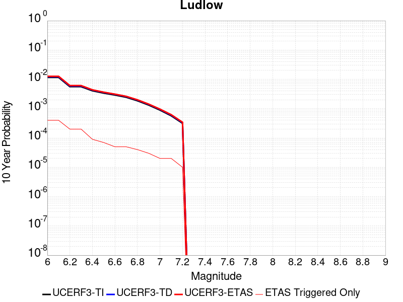 |

| Magnitude | 1 wk TI Prob | 1 wk TD Prob | 1 wk ETAS Prob | 1 wk ETAS/TD Gain | 1 wk ETAS Triggered Only | 1 mo TI Prob | 1 mo TD Prob | 1 mo ETAS Prob | 1 mo ETAS/TD Gain | 1 mo ETAS Triggered Only | 1 yr TI Prob | 1 yr TD Prob | 1 yr ETAS Prob | 1 yr ETAS/TD Gain | 1 yr ETAS Triggered Only | 10 yr TI Prob | 10 yr TD Prob | 10 yr ETAS Prob | 10 yr ETAS/TD Gain | 10 yr ETAS Triggered Only |
|-----|-----|-----|-----|-----|-----|-----|-----|-----|-----|-----|-----|-----|-----|-----|-----|-----|-----|-----|-----|-----|
| 6.0 | 2.2407607E-5 | 2.3657254E-5 | 1.7365371E-4 | 7.3404 | 1.5E-4 | 9.602906E-5 | 1.0138454E-4 | 2.813663E-4 | 2.7752388 | 1.8E-4 | 0.0011685267 | 0.001233702 | 0.0015233442 | 1.2347748 | 2.9E-4 | 0.011624013 | 0.012273042 | 0.012668133 | 1.0321918 | 4.0E-4 |
| 6.1 | 2.2407607E-5 | 2.3657254E-5 | 1.7365371E-4 | 7.3404 | 1.5E-4 | 9.602906E-5 | 1.0138454E-4 | 2.813663E-4 | 2.7752388 | 1.8E-4 | 0.0011685267 | 0.001233702 | 0.0015233442 | 1.2347748 | 2.9E-4 | 0.011624013 | 0.012273042 | 0.012668133 | 1.0321918 | 4.0E-4 |
| 6.2 | 1.0781252E-5 | 1.1365663E-5 | 1.0136464E-4 | 8.918497 | 9.0E-5 | 4.620455E-5 | 4.8709102E-5 | 1.3870472E-4 | 2.847614 | 9.0E-5 | 5.623952E-4 | 5.9287593E-4 | 7.4278703E-4 | 1.252854 | 1.5E-4 | 0.00560974 | 0.0059133614 | 0.006112179 | 1.0336217 | 2.0E-4 |
| 6.3 | 1.0781252E-5 | 1.1365663E-5 | 1.0136464E-4 | 8.918497 | 9.0E-5 | 4.620455E-5 | 4.8709102E-5 | 1.3870472E-4 | 2.847614 | 9.0E-5 | 5.623952E-4 | 5.9287593E-4 | 7.4278703E-4 | 1.252854 | 1.5E-4 | 0.00560974 | 0.0059133614 | 0.006112179 | 1.0336217 | 2.0E-4 |
| 6.4 | 7.814439E-6 | 8.237729E-6 | 3.8237482E-5 | 4.6417503 | 3.0E-5 | 3.3490025E-5 | 3.530408E-5 | 6.530302E-5 | 1.8497301 | 3.0E-5 | 4.0766477E-4 | 4.2974384E-4 | 4.7972234E-4 | 1.1162984 | 5.0E-5 | 0.0040691774 | 0.0042892746 | 0.0043788883 | 1.0208926 | 9.0E-5 |
| 6.5 | 6.4986366E-6 | 6.85092E-6 | 3.6850714E-5 | 5.3789444 | 3.0E-5 | 2.7851002E-5 | 2.9360759E-5 | 5.9359878E-5 | 2.0217419 | 3.0E-5 | 3.390332E-4 | 3.5740953E-4 | 4.0739166E-4 | 1.1398455 | 5.0E-5 | 0.003385164 | 0.0035684432 | 0.0036381935 | 1.0195464 | 7.0E-5 |
| 6.6 | 5.582177E-6 | 5.8860055E-6 | 2.5885887E-5 | 4.39787 | 2.0E-5 | 2.3923398E-5 | 2.5225498E-5 | 4.5224995E-5 | 1.7928286 | 2.0E-5 | 2.9122844E-4 | 3.0707786E-4 | 3.470656E-4 | 1.1302202 | 4.0E-5 | 0.0029084706 | 0.003066609 | 0.0031164556 | 1.0162547 | 5.0E-5 |
| 6.7 | 4.6858763E-6 | 4.940427E-6 | 2.494033E-5 | 5.048213 | 2.0E-5 | 2.0082172E-5 | 2.1173091E-5 | 4.117267E-5 | 1.9445752 | 2.0E-5 | 2.4447302E-4 | 2.5775246E-4 | 2.9774214E-4 | 1.1551477 | 4.0E-5 | 0.0024420423 | 0.0025745912 | 0.0026244626 | 1.0193706 | 5.0E-5 |
| 6.8 | 3.5584908E-6 | 3.7520183E-6 | 1.3751981E-5 | 3.6652222 | 1.0E-5 | 1.5250586E-5 | 1.6079981E-5 | 2.607982E-5 | 1.6218812 | 1.0E-5 | 1.8566006E-4 | 1.957566E-4 | 2.2575073E-4 | 1.1532215 | 3.0E-5 | 0.0018550502 | 0.0019558826 | 0.0019958045 | 1.0204111 | 4.0E-5 |
| 6.9 | 2.532834E-6 | 2.6710034E-6 | 1.26709765E-5 | 4.7439013 | 1.0E-5 | 1.0854958E-5 | 1.1447109E-5 | 2.1446995E-5 | 1.8735731 | 1.0E-5 | 1.3215111E-4 | 1.3935992E-4 | 1.5935714E-4 | 1.1434933 | 2.0E-5 | 0.0013207254 | 0.0013927529 | 0.0014227111 | 1.0215101 | 3.0E-5 |
| 7.0 | 1.7083285E-6 | 1.8019439E-6 | 1.8019439E-6 | 1.0 | 0.0 | 7.3213873E-6 | 7.722595E-6 | 7.722595E-6 | 1.0 | 0.0 | 8.913424E-5 | 9.40187E-5 | 1.0401776E-4 | 1.1063519 | 1.0E-5 | 8.9098496E-4 | 9.3980576E-4 | 9.5978694E-4 | 1.021261 | 2.0E-5 |
| 7.1 | 1.0905424E-6 | 1.1497619E-6 | 1.1497619E-6 | 1.0 | 0.0 | 4.6737446E-6 | 4.9275427E-6 | 4.9275427E-6 | 1.0 | 0.0 | 5.6901354E-5 | 5.999128E-5 | 6.999068E-5 | 1.1666809 | 1.0E-5 | 5.6886784E-4 | 5.997606E-4 | 6.197486E-4 | 1.0333266 | 2.0E-5 |
| 7.2 | 6.06668E-7 | 6.387277E-7 | 6.387277E-7 | 1.0 | 0.0 | 2.600003E-6 | 2.7374022E-6 | 2.7374022E-6 | 1.0 | 0.0 | 3.1654577E-5 | 3.3327433E-5 | 4.3327098E-5 | 1.3000431 | 1.0E-5 | 3.1650066E-4 | 3.3323118E-4 | 3.4322785E-4 | 1.0299993 | 1.0E-5 |

## Death Valley (Fish Lake Valley)
*[(top)](#table-of-contents)*

| 1 Week | 1 Month | 1 Year | 10 Year |
|-----|-----|-----|-----|
|  |  | 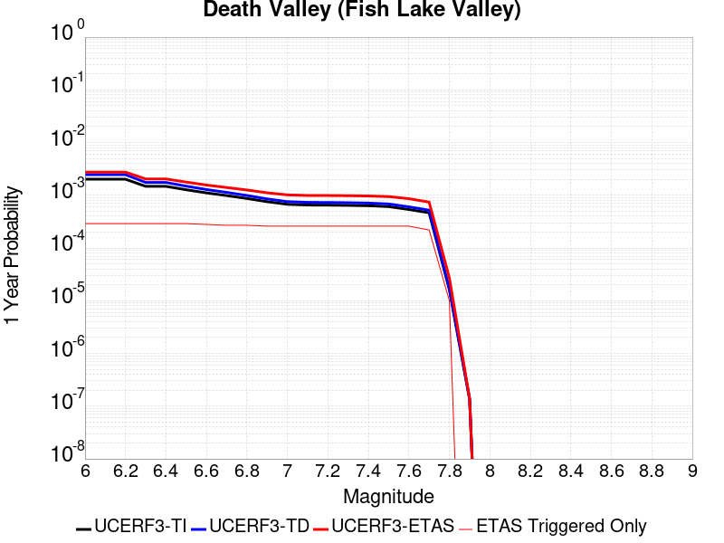 |  |

| Magnitude | 1 wk TI Prob | 1 wk TD Prob | 1 wk ETAS Prob | 1 wk ETAS/TD Gain | 1 wk ETAS Triggered Only | 1 mo TI Prob | 1 mo TD Prob | 1 mo ETAS Prob | 1 mo ETAS/TD Gain | 1 mo ETAS Triggered Only | 1 yr TI Prob | 1 yr TD Prob | 1 yr ETAS Prob | 1 yr ETAS/TD Gain | 1 yr ETAS Triggered Only | 10 yr TI Prob | 10 yr TD Prob | 10 yr ETAS Prob | 10 yr ETAS/TD Gain | 10 yr ETAS Triggered Only |
|-----|-----|-----|-----|-----|-----|-----|-----|-----|-----|-----|-----|-----|-----|-----|-----|-----|-----|-----|-----|-----|
| 6.0 | 3.872328E-5 | 4.7267473E-5 | 1.07264634E-4 | 2.269312 | 6.0E-5 | 1.6594635E-4 | 2.0256084E-4 | 3.5253045E-4 | 1.7403682 | 1.5E-4 | 0.0020185246 | 0.002463534 | 0.0027528196 | 1.1174271 | 2.9E-4 | 0.02000288 | 0.024388181 | 0.02476867 | 1.0156014 | 3.9E-4 |
| 6.1 | 3.872328E-5 | 4.7267473E-5 | 1.07264634E-4 | 2.269312 | 6.0E-5 | 1.6594635E-4 | 2.0256084E-4 | 3.5253045E-4 | 1.7403682 | 1.5E-4 | 0.0020185246 | 0.002463534 | 0.0027528196 | 1.1174271 | 2.9E-4 | 0.02000288 | 0.024388181 | 0.02476867 | 1.0156014 | 3.9E-4 |
| 6.2 | 3.872328E-5 | 4.7267473E-5 | 1.07264634E-4 | 2.269312 | 6.0E-5 | 1.6594635E-4 | 2.0256084E-4 | 3.5253045E-4 | 1.7403682 | 1.5E-4 | 0.0020185246 | 0.002463534 | 0.0027528196 | 1.1174271 | 2.9E-4 | 0.02000288 | 0.024388181 | 0.02476867 | 1.0156014 | 3.9E-4 |
| 6.3 | 2.8356371E-5 | 3.3609853E-5 | 9.3607836E-5 | 2.785131 | 6.0E-5 | 1.2152165E-4 | 1.4403471E-4 | 2.940131E-4 | 2.0412657 | 1.5E-4 | 0.0014785219 | 0.0017522911 | 0.002041783 | 1.1652076 | 2.9E-4 | 0.014687235 | 0.017391782 | 0.017775 | 1.0220344 | 3.9E-4 |
| 6.4 | 2.8356371E-5 | 3.3609853E-5 | 9.3607836E-5 | 2.785131 | 6.0E-5 | 1.2152165E-4 | 1.4403471E-4 | 2.940131E-4 | 2.0412657 | 1.5E-4 | 0.0014785219 | 0.0017522911 | 0.002041783 | 1.1652076 | 2.9E-4 | 0.014687235 | 0.017391782 | 0.017775 | 1.0220344 | 3.9E-4 |
| 6.5 | 2.4448687E-5 | 2.8607552E-5 | 8.860583E-5 | 3.0972881 | 6.0E-5 | 1.0477588E-4 | 1.2259831E-4 | 2.7257993E-4 | 2.2233577 | 1.5E-4 | 0.0012748998 | 0.0014916632 | 0.0017812306 | 1.1941239 | 2.9E-4 | 0.012676105 | 0.014821377 | 0.015205597 | 1.0259234 | 3.9E-4 |
| 6.6 | 2.1298161E-5 | 2.4660083E-5 | 8.4658604E-5 | 3.4330218 | 6.0E-5 | 9.127464E-5 | 1.0568198E-4 | 2.5566612E-4 | 2.4192026 | 1.5E-4 | 0.0011107022 | 0.0012859525 | 0.0015655925 | 1.2174574 | 2.8E-4 | 0.011051672 | 0.012788526 | 0.013153793 | 1.0285622 | 3.7E-4 |
| 6.7 | 1.8959729E-5 | 2.1781025E-5 | 7.1779934E-5 | 3.295526 | 5.0E-5 | 8.125345E-5 | 9.334405E-5 | 2.3333098E-4 | 2.4996877 | 1.4E-4 | 9.888117E-4 | 0.001135897 | 0.0014055902 | 1.2374276 | 2.7E-4 | 0.009844234 | 0.01130357 | 0.0116595 | 1.0314883 | 3.6E-4 |
| 6.8 | 1.6691629E-5 | 1.9018353E-5 | 6.90174E-5 | 3.6289895 | 5.0E-5 | 7.153359E-5 | 8.150477E-5 | 2.2149336E-4 | 2.7175508 | 1.4E-4 | 8.7057345E-4 | 9.918857E-4 | 0.0012616179 | 1.2719388 | 2.7E-4 | 0.008671708 | 0.009876343 | 0.0102327885 | 1.0360907 | 3.6E-4 |
| 6.9 | 1.450505E-5 | 1.638954E-5 | 6.638872E-5 | 4.0506763 | 5.0E-5 | 6.216302E-5 | 7.0239046E-5 | 2.102292E-4 | 2.9930534 | 1.4E-4 | 7.5657194E-4 | 8.5483363E-4 | 0.0011146114 | 1.3038927 | 2.6E-4 | 0.007540013 | 0.008516385 | 0.008863405 | 1.0407473 | 3.5E-4 |
| 7.0 | 1.2940855E-5 | 1.4537972E-5 | 6.453724E-5 | 4.4392195 | 5.0E-5 | 5.545963E-5 | 6.230414E-5 | 2.0229541E-4 | 3.2469018 | 1.4E-4 | 6.750118E-4 | 7.5829466E-4 | 0.0010180975 | 1.3426147 | 2.6E-4 | 0.006729651 | 0.0075576897 | 0.007905045 | 1.0459604 | 3.5E-4 |
| 7.1 | 1.2544658E-5 | 1.4078208E-5 | 6.40775E-5 | 4.5515385 | 5.0E-5 | 5.3761712E-5 | 6.0333812E-5 | 2.0032536E-4 | 3.3202837 | 1.4E-4 | 6.5435225E-4 | 7.343222E-4 | 9.941313E-4 | 1.353808 | 2.6E-4 | 0.006524288 | 0.007319551 | 0.007666989 | 1.0474671 | 3.5E-4 |
| 7.2 | 1.2489416E-5 | 1.4015674E-5 | 6.4014974E-5 | 4.5673847 | 5.0E-5 | 5.3524967E-5 | 6.0065824E-5 | 2.0005742E-4 | 3.3306363 | 1.4E-4 | 6.514716E-4 | 7.310616E-4 | 9.908716E-4 | 1.3553872 | 2.6E-4 | 0.006495651 | 0.0072871596 | 0.007634609 | 1.0476797 | 3.5E-4 |
| 7.3 | 1.2368307E-5 | 1.3879812E-5 | 6.387912E-5 | 4.602304 | 5.0E-5 | 5.3005948E-5 | 5.9483587E-5 | 1.9947525E-4 | 3.3534505 | 1.4E-4 | 6.451563E-4 | 7.2397763E-4 | 9.837893E-4 | 1.3588672 | 2.6E-4 | 0.0064328653 | 0.007216782 | 0.007564256 | 1.048148 | 3.5E-4 |
| 7.4 | 1.2161707E-5 | 1.36478675E-5 | 6.364719E-5 | 4.663526 | 5.0E-5 | 5.212056E-5 | 5.8489582E-5 | 1.984814E-4 | 3.3934486 | 1.4E-4 | 6.3438306E-4 | 7.118836E-4 | 9.716985E-4 | 1.3649683 | 2.6E-4 | 0.006325751 | 0.0070966207 | 0.007444137 | 1.0489693 | 3.5E-4 |
| 7.5 | 1.1707948E-5 | 1.3145515E-5 | 6.314486E-5 | 4.803529 | 5.0E-5 | 5.0175953E-5 | 5.6336736E-5 | 1.9632885E-4 | 3.484917 | 1.4E-4 | 6.10721E-4 | 6.856895E-4 | 9.455112E-4 | 1.3789203 | 2.6E-4 | 0.0060904534 | 0.006836321 | 0.0071839285 | 1.0508472 | 3.5E-4 |
| 7.6 | 1.0319538E-5 | 1.1579622E-5 | 6.157904E-5 | 5.31788 | 5.0E-5 | 4.4225842E-5 | 4.9626036E-5 | 1.896191E-4 | 3.8209598 | 1.4E-4 | 5.383166E-4 | 6.040347E-4 | 8.6387765E-4 | 1.4301789 | 2.6E-4 | 0.0053701443 | 0.0060244603 | 0.0063723517 | 1.0577465 | 3.5E-4 |
| 7.7 | 8.937764E-6 | 1.0022779E-5 | 6.0022277E-5 | 5.9885864 | 5.0E-5 | 3.830414E-5 | 4.295409E-5 | 1.5294936E-4 | 3.5607638 | 1.1E-4 | 4.6625308E-4 | 5.228456E-4 | 7.4273057E-4 | 1.4205543 | 2.2E-4 | 0.0046527605 | 0.005216664 | 0.005525047 | 1.0591149 | 3.1E-4 |
| 7.8 | 3.108007E-7 | 3.284654E-7 | 3.284654E-7 | 1.0 | 0.0 | 1.3320023E-6 | 1.407708E-6 | 1.407708E-6 | 1.0 | 0.0 | 1.6217007E-5 | 1.7138715E-5 | 2.7138543E-5 | 1.5834643 | 1.0E-5 | 1.6215823E-4 | 1.7137431E-4 | 1.9137088E-4 | 1.1166836 | 2.0E-5 |
| 7.9 | 2.5591178E-9 | 2.6696718E-9 | 2.6696718E-9 | 1.0 | 0.0 | 1.0967647E-8 | 1.14414505E-8 | 1.14414505E-8 | 1.0 | 0.0 | 1.335311E-7 | 1.3929966E-7 | 1.3929966E-7 | 1.0 | 0.0 | 1.3353102E-6 | 1.3929966E-6 | 1.3929966E-6 | 1.0 | 0.0 |

## San Andreas (Carrizo) rev
*[(top)](#table-of-contents)*

| 1 Week | 1 Month | 1 Year | 10 Year |
|-----|-----|-----|-----|
| 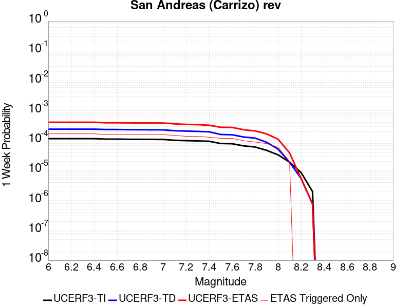 |  |  |  |

| Magnitude | 1 wk TI Prob | 1 wk TD Prob | 1 wk ETAS Prob | 1 wk ETAS/TD Gain | 1 wk ETAS Triggered Only | 1 mo TI Prob | 1 mo TD Prob | 1 mo ETAS Prob | 1 mo ETAS/TD Gain | 1 mo ETAS Triggered Only | 1 yr TI Prob | 1 yr TD Prob | 1 yr ETAS Prob | 1 yr ETAS/TD Gain | 1 yr ETAS Triggered Only | 10 yr TI Prob | 10 yr TD Prob | 10 yr ETAS Prob | 10 yr ETAS/TD Gain | 10 yr ETAS Triggered Only |
|-----|-----|-----|-----|-----|-----|-----|-----|-----|-----|-----|-----|-----|-----|-----|-----|-----|-----|-----|-----|-----|
| 6.0 | 1.1674632E-4 | 2.432302E-4 | 4.1318886E-4 | 1.6987563 | 1.7E-4 | 5.002454E-4 | 0.0010420004 | 0.001241792 | 1.1917385 | 2.0E-4 | 0.006073493 | 0.012613042 | 0.012909259 | 1.023485 | 3.0E-4 | 0.0591016 | 0.12061418 | 0.120957136 | 1.0028435 | 3.9E-4 |
| 6.1 | 1.1674632E-4 | 2.432302E-4 | 4.1318886E-4 | 1.6987563 | 1.7E-4 | 5.002454E-4 | 0.0010420004 | 0.001241792 | 1.1917385 | 2.0E-4 | 0.006073493 | 0.012613042 | 0.012909259 | 1.023485 | 3.0E-4 | 0.0591016 | 0.12061418 | 0.120957136 | 1.0028435 | 3.9E-4 |
| 6.2 | 1.1674632E-4 | 2.432302E-4 | 4.1318886E-4 | 1.6987563 | 1.7E-4 | 5.002454E-4 | 0.0010420004 | 0.001241792 | 1.1917385 | 2.0E-4 | 0.006073493 | 0.012613042 | 0.012909259 | 1.023485 | 3.0E-4 | 0.0591016 | 0.12061418 | 0.120957136 | 1.0028435 | 3.9E-4 |
| 6.3 | 1.1674632E-4 | 2.432302E-4 | 4.1318886E-4 | 1.6987563 | 1.7E-4 | 5.002454E-4 | 0.0010420004 | 0.001241792 | 1.1917385 | 2.0E-4 | 0.006073493 | 0.012613042 | 0.012909259 | 1.023485 | 3.0E-4 | 0.0591016 | 0.12061418 | 0.120957136 | 1.0028435 | 3.9E-4 |
| 6.4 | 1.1674632E-4 | 2.432302E-4 | 4.1318886E-4 | 1.6987563 | 1.7E-4 | 5.002454E-4 | 0.0010420004 | 0.001241792 | 1.1917385 | 2.0E-4 | 0.006073493 | 0.012613042 | 0.012909259 | 1.023485 | 3.0E-4 | 0.0591016 | 0.12061418 | 0.120957136 | 1.0028435 | 3.9E-4 |
| 6.5 | 1.13136164E-4 | 2.3643032E-4 | 3.9639248E-4 | 1.6765722 | 1.6E-4 | 4.847792E-4 | 0.0010128808 | 0.0012026884 | 1.1873938 | 1.9E-4 | 0.0058862255 | 0.012262545 | 0.012548988 | 1.0233593 | 2.9E-4 | 0.057327334 | 0.117585555 | 0.11792087 | 1.0028517 | 3.8E-4 |
| 6.6 | 1.13136164E-4 | 2.3643032E-4 | 3.9639248E-4 | 1.6765722 | 1.6E-4 | 4.847792E-4 | 0.0010128808 | 0.0012026884 | 1.1873938 | 1.9E-4 | 0.0058862255 | 0.012262545 | 0.012548988 | 1.0233593 | 2.9E-4 | 0.057327334 | 0.117585555 | 0.11792087 | 1.0028517 | 3.8E-4 |
| 6.7 | 1.1149675E-4 | 2.3334254E-4 | 3.933052E-4 | 1.6855272 | 1.6E-4 | 4.777557E-4 | 9.996577E-4 | 0.0011894677 | 1.189875 | 1.9E-4 | 0.0058011734 | 0.012103349 | 0.012389839 | 1.0236703 | 2.9E-4 | 0.05652051 | 0.1162071 | 0.11654294 | 1.00289 | 3.8E-4 |
| 6.8 | 1.1103589E-4 | 2.3236412E-4 | 3.9232694E-4 | 1.6884145 | 1.6E-4 | 4.7578133E-4 | 9.954676E-4 | 0.0011852785 | 1.190675 | 1.9E-4 | 0.005777263 | 0.012052901 | 0.012339406 | 1.0237706 | 2.9E-4 | 0.056293584 | 0.1157674 | 0.1161034 | 1.0029024 | 3.8E-4 |
| 6.9 | 1.1053259E-4 | 2.3128795E-4 | 3.9125094E-4 | 1.6916183 | 1.6E-4 | 4.7362508E-4 | 9.90859E-4 | 0.0011806708 | 1.1915628 | 1.9E-4 | 0.0057511497 | 0.01199741 | 0.0122839315 | 1.0238819 | 2.9E-4 | 0.05604569 | 0.11528359 | 0.115619786 | 1.0029162 | 3.8E-4 |
| 7.0 | 1.1005377E-4 | 2.3029637E-4 | 3.9025952E-4 | 1.6945969 | 1.6E-4 | 4.7157376E-4 | 9.866126E-4 | 0.0011764251 | 1.192388 | 1.9E-4 | 0.0057263062 | 0.011946279 | 0.012232814 | 1.0239854 | 2.9E-4 | 0.055809796 | 0.11483591 | 0.115172274 | 1.0029291 | 3.8E-4 |
| 7.1 | 1.0308142E-4 | 2.1539345E-4 | 3.6536113E-4 | 1.6962501 | 1.5E-4 | 4.417027E-4 | 9.227892E-4 | 0.0011026231 | 1.1948808 | 1.8E-4 | 0.0053644776 | 0.011177397 | 0.011454268 | 1.0247705 | 2.8E-4 | 0.052368138 | 0.108092256 | 0.108422264 | 1.003053 | 3.7E-4 |
| 7.2 | 1.0027479E-4 | 2.094724E-4 | 3.494431E-4 | 1.6682057 | 1.4E-4 | 4.296783E-4 | 8.9743105E-4 | 0.0010672784 | 1.1892596 | 1.7E-4 | 0.0052187922 | 0.010871782 | 0.0111289555 | 1.0236552 | 2.6E-4 | 0.050979212 | 0.10539625 | 0.10570936 | 1.0029708 | 3.5E-4 |
| 7.3 | 9.816942E-5 | 2.0422463E-4 | 3.4419604E-4 | 1.6853796 | 1.4E-4 | 4.2065824E-4 | 8.7495585E-4 | 0.0010348159 | 1.1827064 | 1.6E-4 | 0.005109493 | 0.010600842 | 0.010848192 | 1.0233331 | 2.5E-4 | 0.049935985 | 0.102979995 | 0.103284985 | 1.0029616 | 3.4E-4 |
| 7.4 | 9.5634205E-5 | 1.9791997E-4 | 3.2789423E-4 | 1.6567012 | 1.3E-4 | 4.0979648E-4 | 8.479536E-4 | 9.978265E-4 | 1.1767465 | 1.5E-4 | 0.0049778637 | 0.010275229 | 0.010512763 | 1.0231172 | 2.4E-4 | 0.048678253 | 0.10006632 | 0.1003543 | 1.0028778 | 3.2E-4 |
| 7.5 | 8.052417E-5 | 1.611261E-4 | 2.8110677E-4 | 1.7446383 | 1.2E-4 | 3.4505792E-4 | 6.903579E-4 | 8.302612E-4 | 1.2026534 | 1.4E-4 | 0.0041929903 | 0.008372796 | 0.008590953 | 1.0260556 | 2.2E-4 | 0.04114753 | 0.08281049 | 0.08307648 | 1.003212 | 2.9E-4 |
| 7.6 | 7.897024E-5 | 1.5765853E-4 | 2.7763963E-4 | 1.7610186 | 1.2E-4 | 3.384E-4 | 6.755046E-4 | 8.1541005E-4 | 1.2071124 | 1.4E-4 | 0.0041122385 | 0.008193332 | 0.008401612 | 1.0254205 | 2.1E-4 | 0.040369697 | 0.08115171 | 0.081408985 | 1.0031704 | 2.8E-4 |
| 7.7 | 6.707427E-5 | 1.3276102E-4 | 2.3274776E-4 | 1.753133 | 1.0E-4 | 2.8742946E-4 | 5.688518E-4 | 6.8878353E-4 | 1.2108313 | 1.2E-4 | 0.003493839 | 0.00690381 | 0.0070825676 | 1.0258926 | 1.8E-4 | 0.034394164 | 0.069048055 | 0.06927148 | 1.0032358 | 2.4E-4 |
| 7.8 | 6.147705E-5 | 1.2197486E-4 | 2.1196388E-4 | 1.737767 | 9.0E-5 | 2.6344648E-4 | 5.226447E-4 | 6.3258724E-4 | 1.210358 | 1.1E-4 | 0.0032027436 | 0.006344659 | 0.006503644 | 1.025058 | 1.6E-4 | 0.031569764 | 0.06351457 | 0.063711226 | 1.0030963 | 2.1E-4 |
| 7.9 | 4.7636717E-5 | 8.87977E-5 | 1.6879059E-4 | 1.9008442 | 8.0E-5 | 2.0414138E-4 | 3.8050607E-4 | 4.8046804E-4 | 1.262708 | 1.0E-4 | 0.0024825884 | 0.0046228287 | 0.0047522276 | 1.0279913 | 1.3E-4 | 0.024550365 | 0.046628095 | 0.046771098 | 1.0030669 | 1.5E-4 |
| 8.0 | 3.3554235E-5 | 5.2136907E-5 | 1.1213378E-4 | 2.1507561 | 6.0E-5 | 1.4379594E-4 | 2.2342477E-4 | 3.0340688E-4 | 1.3579824 | 8.0E-5 | 0.0017493097 | 0.002716805 | 0.0028165334 | 1.036708 | 1.0E-4 | 0.017356034 | 0.027880952 | 0.027987886 | 1.0038353 | 1.1E-4 |
| 8.1 | 1.9175432E-5 | 1.9184976E-5 | 3.9184593E-5 | 2.0424623 | 2.0E-5 | 8.217783E-5 | 8.2218736E-5 | 1.0221709E-4 | 1.2432336 | 2.0E-5 | 0.0010000558 | 0.0010005541 | 0.0010205341 | 1.0199689 | 2.0E-5 | 0.009955673 | 0.0107580265 | 0.0107778115 | 1.001839 | 2.0E-5 |
| 8.2 | 8.643924E-6 | 5.4748625E-6 | 5.4748625E-6 | 1.0 | 0.0 | 3.704486E-5 | 2.3463486E-5 | 2.3463486E-5 | 1.0 | 0.0 | 4.5092785E-4 | 2.8563058E-4 | 2.8563058E-4 | 1.0 | 0.0 | 0.0045001395 | 0.0032487072 | 0.0032487072 | 1.0 | 0.0 |
| 8.3 | 1.983087E-6 | 7.6599065E-7 | 7.6599065E-7 | 1.0 | 0.0 | 8.498917E-6 | 3.282813E-6 | 3.282813E-6 | 1.0 | 0.0 | 1.034694E-4 | 3.9967534E-5 | 3.9967534E-5 | 1.0 | 0.0 | 0.0010342124 | 4.719687E-4 | 4.719687E-4 | 1.0 | 0.0 |

## San Andreas (Cholame) rev
*[(top)](#table-of-contents)*

| 1 Week | 1 Month | 1 Year | 10 Year |
|-----|-----|-----|-----|
|  |  |  |  |

| Magnitude | 1 wk TI Prob | 1 wk TD Prob | 1 wk ETAS Prob | 1 wk ETAS/TD Gain | 1 wk ETAS Triggered Only | 1 mo TI Prob | 1 mo TD Prob | 1 mo ETAS Prob | 1 mo ETAS/TD Gain | 1 mo ETAS Triggered Only | 1 yr TI Prob | 1 yr TD Prob | 1 yr ETAS Prob | 1 yr ETAS/TD Gain | 1 yr ETAS Triggered Only | 10 yr TI Prob | 10 yr TD Prob | 10 yr ETAS Prob | 10 yr ETAS/TD Gain | 10 yr ETAS Triggered Only |
|-----|-----|-----|-----|-----|-----|-----|-----|-----|-----|-----|-----|-----|-----|-----|-----|-----|-----|-----|-----|-----|
| 6.0 | 1.2302514E-4 | 2.5204287E-4 | 4.1200256E-4 | 1.6346526 | 1.6E-4 | 5.27144E-4 | 0.0010797381 | 0.0012695331 | 1.1757786 | 1.9E-4 | 0.0063991086 | 0.0130670825 | 0.013343424 | 1.0211478 | 2.8E-4 | 0.06217949 | 0.12439073 | 0.1247147 | 1.0026045 | 3.7E-4 |
| 6.1 | 1.2302514E-4 | 2.5204287E-4 | 4.1200256E-4 | 1.6346526 | 1.6E-4 | 5.27144E-4 | 0.0010797381 | 0.0012695331 | 1.1757786 | 1.9E-4 | 0.0063991086 | 0.0130670825 | 0.013343424 | 1.0211478 | 2.8E-4 | 0.06217949 | 0.12439073 | 0.1247147 | 1.0026045 | 3.7E-4 |
| 6.2 | 1.2203569E-4 | 2.5021084E-4 | 4.101708E-4 | 1.6393007 | 1.6E-4 | 5.2290526E-4 | 0.0010718931 | 0.0012616895 | 1.1770664 | 1.9E-4 | 0.006347804 | 0.01297271 | 0.013249077 | 1.0213038 | 2.8E-4 | 0.061695136 | 0.12357691 | 0.12390118 | 1.002624 | 3.7E-4 |
| 6.3 | 1.2142645E-4 | 2.4907055E-4 | 4.090307E-4 | 1.6422282 | 1.6E-4 | 5.202953E-4 | 0.0010670102 | 0.0012568075 | 1.1778777 | 1.9E-4 | 0.006316212 | 0.012913967 | 0.0131903505 | 1.021402 | 2.8E-4 | 0.06139677 | 0.12307103 | 0.123395495 | 1.0026364 | 3.7E-4 |
| 6.4 | 1.1865206E-4 | 2.44126E-4 | 4.0408695E-4 | 1.6552392 | 1.6E-4 | 5.0840975E-4 | 0.0010458364 | 0.0012356377 | 1.1814828 | 1.9E-4 | 0.006172335 | 0.012659196 | 0.0129356515 | 1.0218383 | 2.8E-4 | 0.060036868 | 0.1208638 | 0.12118909 | 1.0026913 | 3.7E-4 |
| 6.5 | 1.17443946E-4 | 2.4205919E-4 | 4.0202047E-4 | 1.6608354 | 1.6E-4 | 5.032341E-4 | 0.0010369857 | 0.0012267886 | 1.1830333 | 1.9E-4 | 0.006109677 | 0.012552682 | 0.012829168 | 1.022026 | 2.8E-4 | 0.059444077 | 0.11993805 | 0.12026367 | 1.0027149 | 3.7E-4 |
| 6.6 | 1.13579066E-4 | 2.3514954E-4 | 3.8511425E-4 | 1.6377419 | 1.5E-4 | 4.866766E-4 | 0.001007396 | 0.0011872147 | 1.1784985 | 1.8E-4 | 0.0059092017 | 0.012196515 | 0.012453344 | 1.0210576 | 2.6E-4 | 0.057545185 | 0.11685214 | 0.117161244 | 1.0026453 | 3.5E-4 |
| 6.7 | 1.1271412E-4 | 2.3359268E-4 | 3.8355764E-4 | 1.6419934 | 1.5E-4 | 4.829711E-4 | 0.0010007289 | 0.0011805488 | 1.1796889 | 1.8E-4 | 0.005864331 | 0.012116249 | 0.012373098 | 1.0211987 | 2.6E-4 | 0.057119697 | 0.116155714 | 0.116465054 | 1.0026633 | 3.5E-4 |
| 6.8 | 1.1217975E-4 | 2.3247694E-4 | 3.824421E-4 | 1.6450752 | 1.5E-4 | 4.8068175E-4 | 9.959509E-4 | 0.0011757716 | 1.1805518 | 1.8E-4 | 0.005836608 | 0.012058721 | 0.012315586 | 1.0213012 | 2.6E-4 | 0.056856725 | 0.11565396 | 0.11596349 | 1.0026762 | 3.5E-4 |
| 6.9 | 1.1146753E-4 | 2.3096445E-4 | 3.809298E-4 | 1.6493006 | 1.5E-4 | 4.7763053E-4 | 9.894737E-4 | 0.0011692955 | 1.1817349 | 1.8E-4 | 0.0057996577 | 0.011980731 | 0.012237617 | 1.0214415 | 2.6E-4 | 0.056506127 | 0.11497439 | 0.11528415 | 1.0026941 | 3.5E-4 |
| 7.0 | 1.0965793E-4 | 2.2719789E-4 | 3.7716381E-4 | 1.6600674 | 1.5E-4 | 4.698779E-4 | 9.733434E-4 | 0.0011531682 | 1.1847496 | 1.8E-4 | 0.005705768 | 0.011786487 | 0.012043422 | 1.0217992 | 2.6E-4 | 0.055614736 | 0.11327597 | 0.11358632 | 1.0027398 | 3.5E-4 |
| 7.1 | 9.927982E-5 | 2.0538924E-4 | 3.453605E-4 | 1.6814926 | 1.4E-4 | 4.2541555E-4 | 8.7994366E-4 | 0.001049794 | 1.1930242 | 1.7E-4 | 0.0051671406 | 0.010660981 | 0.010908316 | 1.0232 | 2.5E-4 | 0.05048634 | 0.1033706 | 0.10365752 | 1.0027757 | 3.2E-4 |
| 7.2 | 9.696786E-5 | 2.0043184E-4 | 3.3040578E-4 | 1.6484696 | 1.3E-4 | 4.1551032E-4 | 8.5871184E-4 | 0.0010185745 | 1.1861656 | 1.6E-4 | 0.00504711 | 0.010404981 | 0.010642484 | 1.0228258 | 2.4E-4 | 0.04934009 | 0.1011086 | 0.101387255 | 1.002756 | 3.1E-4 |
| 7.3 | 9.4727984E-5 | 1.9472468E-4 | 3.2469936E-4 | 1.6674793 | 1.3E-4 | 4.0591392E-4 | 8.3426846E-4 | 9.841433E-4 | 1.1796483 | 1.5E-4 | 0.0049308087 | 0.010110183 | 0.0103378575 | 1.0225194 | 2.3E-4 | 0.048228268 | 0.09847952 | 0.09874997 | 1.0027463 | 3.0E-4 |
| 7.4 | 9.220358E-5 | 1.8843076E-4 | 3.0840814E-4 | 1.6367188 | 1.2E-4 | 3.9509835E-4 | 8.073114E-4 | 9.4719836E-4 | 1.1732751 | 1.4E-4 | 0.004799717 | 0.009784967 | 0.010002814 | 1.0222635 | 2.2E-4 | 0.046973653 | 0.095557496 | 0.095819786 | 1.0027448 | 2.9E-4 |
| 7.5 | 7.71631E-5 | 1.5177966E-4 | 2.6176297E-4 | 1.7246248 | 1.1E-4 | 3.306571E-4 | 6.503223E-4 | 7.802377E-4 | 1.1997709 | 1.3E-4 | 0.0040183207 | 0.007889002 | 0.008087424 | 1.0251517 | 2.0E-4 | 0.03946433 | 0.07828531 | 0.078524955 | 1.0030612 | 2.6E-4 |
| 7.6 | 7.5634416E-5 | 1.483744E-4 | 2.5835808E-4 | 1.7412578 | 1.1E-4 | 3.241072E-4 | 6.3573546E-4 | 7.656528E-4 | 1.2043576 | 1.3E-4 | 0.0039388672 | 0.0077126776 | 0.007901212 | 1.0244448 | 1.9E-4 | 0.038697794 | 0.07664872 | 0.07687956 | 1.0030116 | 2.5E-4 |
| 7.7 | 6.3783E-5 | 1.235872E-4 | 2.1357609E-4 | 1.7281407 | 9.0E-5 | 2.7332708E-4 | 5.29552E-4 | 6.3949375E-4 | 1.2076128 | 1.1E-4 | 0.0033226798 | 0.0064282627 | 0.006587234 | 1.0247301 | 1.6E-4 | 0.032734364 | 0.06454029 | 0.06473674 | 1.0030438 | 2.1E-4 |
| 7.8 | 5.863422E-5 | 1.1416107E-4 | 2.041508E-4 | 1.7882698 | 9.0E-5 | 2.512653E-4 | 4.8917E-4 | 5.991162E-4 | 1.2247607 | 1.1E-4 | 0.003054864 | 0.0059394026 | 0.0060984525 | 1.0267787 | 1.6E-4 | 0.030132094 | 0.059659187 | 0.059847254 | 1.0031524 | 2.0E-4 |
| 7.9 | 4.595283E-5 | 8.426331E-5 | 1.6425658E-4 | 1.9493248 | 8.0E-5 | 1.9692584E-4 | 3.610785E-4 | 4.610424E-4 | 1.2768481 | 1.0E-4 | 0.0023949358 | 0.0043872762 | 0.004516706 | 1.0295012 | 1.3E-4 | 0.023692891 | 0.044362005 | 0.044495795 | 1.0030159 | 1.4E-4 |
| 8.0 | 3.2950178E-5 | 5.0772942E-5 | 1.107699E-4 | 2.1816719 | 6.0E-5 | 1.412074E-4 | 2.1758018E-4 | 2.9756277E-4 | 1.3676006 | 8.0E-5 | 0.0017178444 | 0.0026458222 | 0.0027455578 | 1.0376954 | 1.0E-4 | 0.017046256 | 0.027180137 | 0.027287148 | 1.0039371 | 1.1E-4 |
| 8.1 | 1.9177472E-5 | 1.9185145E-5 | 3.918476E-5 | 2.0424533 | 2.0E-5 | 8.218658E-5 | 8.221946E-5 | 1.0221782E-4 | 1.2432314 | 2.0E-5 | 0.0010001622 | 0.0010005629 | 0.0010205429 | 1.0199687 | 2.0E-5 | 0.009956728 | 0.010758142 | 0.010777927 | 1.001839 | 2.0E-5 |
| 8.2 | 8.643924E-6 | 5.4748625E-6 | 5.4748625E-6 | 1.0 | 0.0 | 3.704486E-5 | 2.3463486E-5 | 2.3463486E-5 | 1.0 | 0.0 | 4.5092785E-4 | 2.8563058E-4 | 2.8563058E-4 | 1.0 | 0.0 | 0.0045001395 | 0.0032487072 | 0.0032487072 | 1.0 | 0.0 |
| 8.3 | 1.983087E-6 | 7.6599065E-7 | 7.6599065E-7 | 1.0 | 0.0 | 8.498917E-6 | 3.282813E-6 | 3.282813E-6 | 1.0 | 0.0 | 1.034694E-4 | 3.9967534E-5 | 3.9967534E-5 | 1.0 | 0.0 | 0.0010342124 | 4.719687E-4 | 4.719687E-4 | 1.0 | 0.0 |

## San Andreas (Coachella) rev
*[(top)](#table-of-contents)*

| 1 Week | 1 Month | 1 Year | 10 Year |
|-----|-----|-----|-----|
| 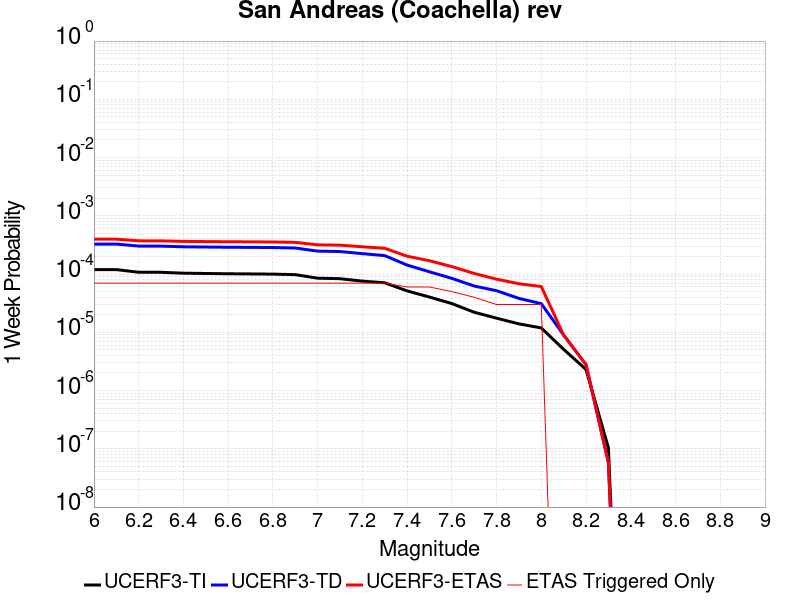 | 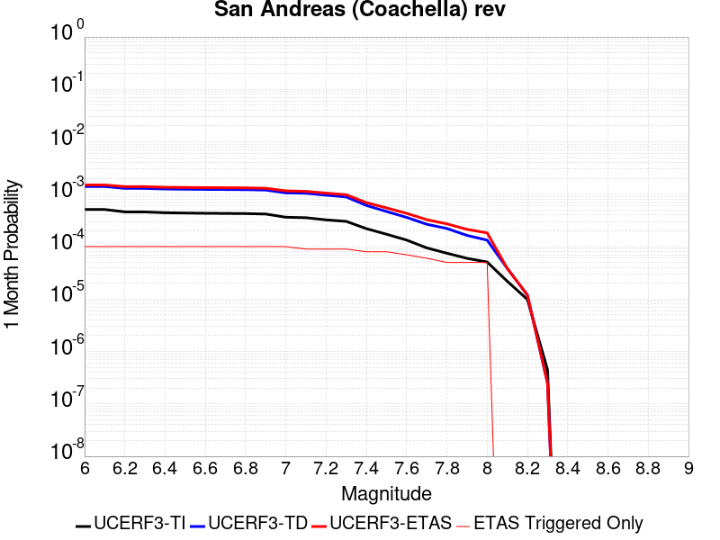 |  |  |

| Magnitude | 1 wk TI Prob | 1 wk TD Prob | 1 wk ETAS Prob | 1 wk ETAS/TD Gain | 1 wk ETAS Triggered Only | 1 mo TI Prob | 1 mo TD Prob | 1 mo ETAS Prob | 1 mo ETAS/TD Gain | 1 mo ETAS Triggered Only | 1 yr TI Prob | 1 yr TD Prob | 1 yr ETAS Prob | 1 yr ETAS/TD Gain | 1 yr ETAS Triggered Only | 10 yr TI Prob | 10 yr TD Prob | 10 yr ETAS Prob | 10 yr ETAS/TD Gain | 10 yr ETAS Triggered Only |
|-----|-----|-----|-----|-----|-----|-----|-----|-----|-----|-----|-----|-----|-----|-----|-----|-----|-----|-----|-----|-----|
| 6.0 | 1.1925945E-4 | 3.2729402E-4 | 3.972711E-4 | 1.213805 | 7.0E-5 | 5.110118E-4 | 0.0014019393 | 0.0015017991 | 1.0712298 | 1.0E-4 | 0.0062038354 | 0.016936364 | 0.017142808 | 1.0121894 | 2.1E-4 | 0.060334753 | 0.15265316 | 0.15293278 | 1.0018318 | 3.3E-4 |
| 6.1 | 1.1925945E-4 | 3.2729402E-4 | 3.972711E-4 | 1.213805 | 7.0E-5 | 5.110118E-4 | 0.0014019393 | 0.0015017991 | 1.0712298 | 1.0E-4 | 0.0062038354 | 0.016936364 | 0.017142808 | 1.0121894 | 2.1E-4 | 0.060334753 | 0.15265316 | 0.15293278 | 1.0018318 | 3.3E-4 |
| 6.2 | 1.07432395E-4 | 3.0230157E-4 | 3.722804E-4 | 1.2314869 | 7.0E-5 | 4.603433E-4 | 0.0012949388 | 0.0013948093 | 1.0771238 | 1.0E-4 | 0.005590286 | 0.015653009 | 0.015859721 | 1.013206 | 2.1E-4 | 0.05451731 | 0.14182423 | 0.14209028 | 1.0018758 | 3.1E-4 |
| 6.3 | 1.0718766E-4 | 3.0175463E-4 | 3.717335E-4 | 1.2319065 | 7.0E-5 | 4.592948E-4 | 0.0012925972 | 0.0013924679 | 1.0772636 | 1.0E-4 | 0.005577586 | 0.015624908 | 0.015831627 | 1.0132301 | 2.1E-4 | 0.054396555 | 0.14159249 | 0.1418586 | 1.0018793 | 3.1E-4 |
| 6.4 | 1.0355944E-4 | 2.9383553E-4 | 3.6381496E-4 | 1.2381585 | 7.0E-5 | 4.4375064E-4 | 0.0012586913 | 0.0013585654 | 1.0793476 | 1.0E-4 | 0.0053892885 | 0.015217941 | 0.015424746 | 1.0135895 | 2.1E-4 | 0.052604496 | 0.13815255 | 0.13841973 | 1.0019339 | 3.1E-4 |
| 6.5 | 1.0227914E-4 | 2.9102986E-4 | 3.610095E-4 | 1.2404552 | 7.0E-5 | 4.382655E-4 | 0.0012466786 | 0.0013465539 | 1.0801132 | 1.0E-4 | 0.0053228354 | 0.01507372 | 0.015280555 | 1.0137216 | 2.1E-4 | 0.051971316 | 0.13693172 | 0.13719927 | 1.001954 | 3.1E-4 |
| 6.6 | 1.0116757E-4 | 2.8868738E-4 | 3.5866717E-4 | 1.2424068 | 7.0E-5 | 4.3350324E-4 | 0.0012366489 | 0.0013365253 | 1.0807637 | 1.0E-4 | 0.0052651367 | 0.01495329 | 0.01516015 | 1.0138338 | 2.1E-4 | 0.051421247 | 0.1359099 | 0.13617776 | 1.0019709 | 3.1E-4 |
| 6.7 | 1.0050676E-4 | 2.8727303E-4 | 3.572529E-4 | 1.2436006 | 7.0E-5 | 4.3067214E-4 | 0.0012305931 | 0.00133047 | 1.0811616 | 1.0E-4 | 0.005230834 | 0.014880571 | 0.015087445 | 1.0139023 | 2.1E-4 | 0.051094085 | 0.13529462 | 0.13556267 | 1.0019813 | 3.1E-4 |
| 6.8 | 9.976819E-5 | 2.853096E-4 | 3.552896E-4 | 1.2452775 | 7.0E-5 | 4.2750788E-4 | 0.0012221863 | 0.0013220641 | 1.0817206 | 1.0E-4 | 0.0051924936 | 0.0147796115 | 0.014986508 | 1.0139987 | 2.1E-4 | 0.050728295 | 0.13444631 | 0.13471463 | 1.0019958 | 3.1E-4 |
| 6.9 | 9.77719E-5 | 2.8027873E-4 | 3.5025913E-4 | 1.2496814 | 7.0E-5 | 4.1895514E-4 | 0.0012006456 | 0.0013005255 | 1.0831885 | 1.0E-4 | 0.0050888555 | 0.014520878 | 0.014727828 | 1.014252 | 2.1E-4 | 0.049738888 | 0.1322748 | 0.1325438 | 1.0020336 | 3.1E-4 |
| 7.0 | 8.500761E-5 | 2.4762485E-4 | 3.176075E-4 | 1.2826157 | 7.0E-5 | 3.6426744E-4 | 0.001060821 | 0.0011607149 | 1.0941666 | 1.0E-4 | 0.0044259406 | 0.012839786 | 0.013037218 | 1.0153766 | 2.0E-4 | 0.04338823 | 0.11813272 | 0.11839728 | 1.0022395 | 3.0E-4 |
| 7.1 | 8.319876E-5 | 2.4365232E-4 | 3.1363528E-4 | 1.2872247 | 7.0E-5 | 3.5651738E-4 | 0.0010438096 | 0.0011337156 | 1.0861326 | 9.0E-5 | 0.004331963 | 0.012635092 | 0.012822692 | 1.0148475 | 1.9E-4 | 0.042484846 | 0.116353 | 0.11660926 | 1.0022024 | 2.9E-4 |
| 7.2 | 7.563917E-5 | 2.2413683E-4 | 2.9412116E-4 | 1.3122392 | 7.0E-5 | 3.2412758E-4 | 9.602359E-4 | 0.0010501494 | 1.093637 | 9.0E-5 | 0.0039391145 | 0.011628893 | 0.011816684 | 1.0161486 | 1.9E-4 | 0.03870018 | 0.10775925 | 0.10800908 | 1.0023184 | 2.8E-4 |
| 7.3 | 7.082985E-5 | 2.0729867E-4 | 2.7728415E-4 | 1.337607 | 7.0E-5 | 3.0352117E-4 | 8.881233E-4 | 9.780433E-4 | 1.1012473 | 9.0E-5 | 0.0036891096 | 0.010759917 | 0.010947873 | 1.0174681 | 1.9E-4 | 0.03628465 | 0.100282 | 0.100533925 | 1.0025121 | 2.8E-4 |
| 7.4 | 5.146215E-5 | 1.4273795E-4 | 2.0272938E-4 | 1.4202907 | 6.0E-5 | 2.2053342E-4 | 6.115915E-4 | 6.915426E-4 | 1.1307262 | 8.0E-5 | 0.0026816884 | 0.0074208933 | 0.0075995577 | 1.0240759 | 1.8E-4 | 0.02649557 | 0.070849575 | 0.07109115 | 1.0034097 | 2.6E-4 |
| 7.5 | 4.0285166E-5 | 1.09416E-4 | 1.6940944E-4 | 1.5483059 | 6.0E-5 | 1.7263928E-4 | 4.6884175E-4 | 5.4880424E-4 | 1.1705532 | 8.0E-5 | 0.002099857 | 0.0056932783 | 0.00586231 | 1.0296898 | 1.7E-4 | 0.020801254 | 0.055011146 | 0.055247396 | 1.0042945 | 2.5E-4 |
| 7.6 | 3.1168736E-5 | 8.4389096E-5 | 1.3438487E-4 | 1.5924436 | 5.0E-5 | 1.3357346E-4 | 3.6161754E-4 | 4.3159223E-4 | 1.1935047 | 7.0E-5 | 0.0016250437 | 0.0043938323 | 0.0045531294 | 1.0362546 | 1.6E-4 | 0.016132116 | 0.04281005 | 0.043039776 | 1.0053662 | 2.4E-4 |
| 7.7 | 2.2100989E-5 | 6.238755E-5 | 1.0238506E-4 | 1.6411135 | 4.0E-5 | 9.4715084E-5 | 2.6734784E-4 | 3.2733183E-4 | 1.2243667 | 6.0E-5 | 0.001152546 | 0.0032501083 | 0.0033896533 | 1.0429355 | 1.4E-4 | 0.011465867 | 0.0319002 | 0.03211318 | 1.0066766 | 2.2E-4 |
| 7.8 | 1.7484861E-5 | 5.179572E-5 | 8.179416E-5 | 1.5791684 | 3.0E-5 | 7.493296E-5 | 2.2196278E-4 | 2.719517E-4 | 1.225213 | 5.0E-5 | 9.1192697E-4 | 0.0026990508 | 0.0028286998 | 1.048035 | 1.3E-4 | 0.009081938 | 0.026640115 | 0.026844522 | 1.0076729 | 2.1E-4 |
| 7.9 | 1.3967285E-5 | 3.822255E-5 | 6.822141E-5 | 1.7848469 | 3.0E-5 | 5.985842E-5 | 1.6380067E-4 | 2.1379247E-4 | 1.305199 | 5.0E-5 | 7.2853256E-4 | 0.00199245 | 0.002112211 | 1.0601074 | 1.2E-4 | 0.0072614877 | 0.019909438 | 0.020095654 | 1.0093532 | 1.9E-4 |
| 8.0 | 1.1887396E-5 | 3.106521E-5 | 6.106428E-5 | 1.9656805 | 3.0E-5 | 5.094499E-5 | 1.3312983E-4 | 1.8312318E-4 | 1.3755232 | 5.0E-5 | 6.200787E-4 | 0.0016196516 | 0.0017394572 | 1.07397 | 1.2E-4 | 0.006183513 | 0.016279267 | 0.016466174 | 1.0114813 | 1.9E-4 |
| 8.1 | 5.100864E-6 | 8.973418E-6 | 8.973418E-6 | 1.0 | 0.0 | 2.1860664E-5 | 3.8456936E-5 | 3.8456936E-5 | 1.0 | 0.0 | 2.6612106E-4 | 4.6811273E-4 | 4.881034E-4 | 1.0427047 | 2.0E-5 | 0.002658026 | 0.004917731 | 0.0049376325 | 1.0040469 | 2.0E-5 |
| 8.2 | 2.3004484E-6 | 2.7864487E-6 | 2.7864487E-6 | 1.0 | 0.0 | 9.859027E-6 | 1.1941868E-5 | 1.1941868E-5 | 1.0 | 0.0 | 1.2002704E-4 | 1.4538258E-4 | 1.4538258E-4 | 1.0 | 0.0 | 0.0011996223 | 0.0015973912 | 0.0015973912 | 1.0 | 0.0 |
| 8.3 | 1.0424446E-7 | 5.8161504E-8 | 5.8161504E-8 | 1.0 | 0.0 | 4.4676187E-7 | 2.4926356E-7 | 2.4926356E-7 | 1.0 | 0.0 | 5.439312E-6 | 3.03478E-6 | 3.03478E-6 | 1.0 | 0.0 | 5.4391792E-5 | 3.190716E-5 | 3.190716E-5 | 1.0 | 0.0 |

## Mission Ridge-Arroyo Parida-Santa Ana
*[(top)](#table-of-contents)*

| 1 Week | 1 Month | 1 Year | 10 Year |
|-----|-----|-----|-----|
| 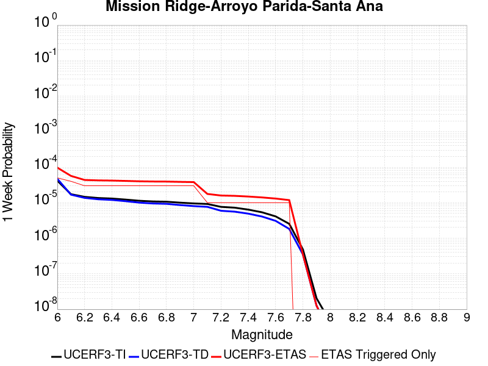 |  |  |  |

| Magnitude | 1 wk TI Prob | 1 wk TD Prob | 1 wk ETAS Prob | 1 wk ETAS/TD Gain | 1 wk ETAS Triggered Only | 1 mo TI Prob | 1 mo TD Prob | 1 mo ETAS Prob | 1 mo ETAS/TD Gain | 1 mo ETAS Triggered Only | 1 yr TI Prob | 1 yr TD Prob | 1 yr ETAS Prob | 1 yr ETAS/TD Gain | 1 yr ETAS Triggered Only | 10 yr TI Prob | 10 yr TD Prob | 10 yr ETAS Prob | 10 yr ETAS/TD Gain | 10 yr ETAS Triggered Only |
|-----|-----|-----|-----|-----|-----|-----|-----|-----|-----|-----|-----|-----|-----|-----|-----|-----|-----|-----|-----|-----|
| 6.0 | 4.169034E-5 | 4.7138263E-5 | 9.7135904E-5 | 2.0606594 | 5.0E-5 | 1.7866064E-4 | 2.0201034E-4 | 2.619982E-4 | 1.2969545 | 6.0E-5 | 0.0021730233 | 0.00245745 | 0.0025572043 | 1.0405926 | 1.0E-4 | 0.021518968 | 0.024384614 | 0.024579737 | 1.0080019 | 2.0E-4 |
| 6.1 | 1.73813E-5 | 1.6854226E-5 | 5.685355E-5 | 3.373252 | 4.0E-5 | 7.4489166E-5 | 7.223046E-5 | 1.1222757E-4 | 1.553743 | 4.0E-5 | 9.065282E-4 | 8.790618E-4 | 9.5899147E-4 | 1.0909262 | 8.0E-5 | 0.009028391 | 0.008756988 | 0.008866025 | 1.0124514 | 1.1E-4 |
| 6.2 | 1.4622182E-5 | 1.367329E-5 | 4.367288E-5 | 3.1940286 | 3.0E-5 | 6.2664985E-5 | 5.8598518E-5 | 8.859676E-5 | 1.5119283 | 3.0E-5 | 7.6267915E-4 | 7.132073E-4 | 7.731645E-4 | 1.084067 | 6.0E-5 | 0.007600669 | 0.007109627 | 0.0071989875 | 1.012569 | 9.0E-5 |
| 6.3 | 1.3552434E-5 | 1.2482201E-5 | 4.2481824E-5 | 3.4033923 | 3.0E-5 | 5.8080568E-5 | 5.3494066E-5 | 8.3492465E-5 | 1.5607798 | 3.0E-5 | 7.069015E-4 | 6.510988E-4 | 7.010662E-4 | 1.0767432 | 5.0E-5 | 0.00704657 | 0.006492275 | 0.0065717557 | 1.0122423 | 8.0E-5 |
| 6.4 | 1.30977305E-5 | 1.1979156E-5 | 4.1978798E-5 | 3.5043201 | 3.0E-5 | 5.613192E-5 | 5.1338247E-5 | 8.133671E-5 | 1.5843296 | 3.0E-5 | 6.831918E-4 | 6.248669E-4 | 6.7483564E-4 | 1.079967 | 5.0E-5 | 0.006810953 | 0.0062314444 | 0.006310946 | 1.0127581 | 8.0E-5 |
| 6.5 | 1.225205E-5 | 1.1048803E-5 | 4.104847E-5 | 3.7151964 | 3.0E-5 | 5.2507727E-5 | 4.7351168E-5 | 7.7349745E-5 | 1.6335341 | 3.0E-5 | 6.3909404E-4 | 5.7635066E-4 | 6.163276E-4 | 1.0693622 | 4.0E-5 | 0.006372592 | 0.005748869 | 0.0058184667 | 1.0121063 | 7.0E-5 |
| 6.6 | 1.1352241E-5 | 1.0063535E-5 | 4.0063234E-5 | 3.9810297 | 3.0E-5 | 4.8651553E-5 | 4.3128734E-5 | 7.312744E-5 | 1.6955619 | 3.0E-5 | 5.921717E-4 | 5.2496797E-4 | 5.6494697E-4 | 1.0761552 | 4.0E-5 | 0.0059059616 | 0.0052375244 | 0.0053071575 | 1.013295 | 7.0E-5 |
| 6.7 | 1.0864116E-5 | 9.517027E-6 | 3.951674E-5 | 4.152215 | 3.0E-5 | 4.6559664E-5 | 4.0786632E-5 | 7.0785405E-5 | 1.7355051 | 3.0E-5 | 5.667165E-4 | 4.964661E-4 | 5.364462E-4 | 1.0805295 | 4.0E-5 | 0.005652734 | 0.004953804 | 0.005023457 | 1.0140605 | 7.0E-5 |
| 6.8 | 1.0666365E-5 | 9.299779E-6 | 3.92995E-5 | 4.2258534 | 3.0E-5 | 4.571219E-5 | 3.9855597E-5 | 6.98544E-5 | 1.7526873 | 3.0E-5 | 5.564038E-4 | 4.8513585E-4 | 5.2511645E-4 | 1.0824112 | 4.0E-5 | 0.005550127 | 0.0048410003 | 0.0049106614 | 1.0143899 | 7.0E-5 |
| 6.9 | 1.0038665E-5 | 8.592046E-6 | 3.859179E-5 | 4.491572 | 3.0E-5 | 4.302214E-5 | 3.682254E-5 | 6.6821434E-5 | 1.8146883 | 3.0E-5 | 5.236687E-4 | 4.4822405E-4 | 4.882061E-4 | 1.0892011 | 4.0E-5 | 0.005224364 | 0.004473411 | 0.0045430977 | 1.015578 | 7.0E-5 |
| 7.0 | 9.5379955E-6 | 8.025073E-6 | 3.802483E-5 | 4.7382536 | 3.0E-5 | 4.0876483E-5 | 3.4392728E-5 | 6.4391694E-5 | 1.8722475 | 3.0E-5 | 4.975576E-4 | 4.1865272E-4 | 4.5863597E-4 | 1.0955046 | 4.0E-5 | 0.00496445 | 0.0041788397 | 0.0042485474 | 1.0166811 | 7.0E-5 |
| 7.1 | 9.207389E-6 | 7.652375E-6 | 1.7652299E-5 | 2.306774 | 1.0E-5 | 3.945964E-5 | 3.279549E-5 | 4.2795164E-5 | 1.30491 | 1.0E-5 | 4.803152E-4 | 3.9921363E-4 | 4.1920564E-4 | 1.0500785 | 2.0E-5 | 0.004792784 | 0.003985161 | 0.004034962 | 1.0124966 | 5.0E-5 |
| 7.2 | 7.638091E-6 | 5.9311183E-6 | 1.5931058E-5 | 2.6860127 | 1.0E-5 | 3.2734264E-5 | 2.541883E-5 | 3.5418576E-5 | 1.3933991 | 1.0E-5 | 3.984668E-4 | 3.0943064E-4 | 3.2942445E-4 | 1.0646149 | 2.0E-5 | 0.0039775306 | 0.0030900547 | 0.0031399003 | 1.0161309 | 5.0E-5 |
| 7.3 | 7.2500147E-6 | 5.5961527E-6 | 1.5596097E-5 | 2.786932 | 1.0E-5 | 3.1071122E-5 | 2.3983293E-5 | 3.3983055E-5 | 1.4169469 | 1.0E-5 | 3.7822526E-4 | 2.9195778E-4 | 3.1195194E-4 | 1.0684831 | 2.0E-5 | 0.0037758215 | 0.0029157975 | 0.0029656517 | 1.017098 | 5.0E-5 |
| 7.4 | 6.3899715E-6 | 4.9184964E-6 | 1.4918447E-5 | 3.0331318 | 1.0E-5 | 2.7385306E-5 | 2.10791E-5 | 3.107889E-5 | 1.4743936 | 1.0E-5 | 3.3336508E-4 | 2.5660804E-4 | 2.766029E-4 | 1.0779198 | 2.0E-5 | 0.0033286542 | 0.0025631618 | 0.0026130336 | 1.0194571 | 5.0E-5 |
| 7.5 | 5.379025E-6 | 4.0838527E-6 | 1.4083812E-5 | 3.4486582 | 1.0E-5 | 2.305276E-5 | 1.7502109E-5 | 2.7501934E-5 | 1.5713497 | 1.0E-5 | 2.806312E-4 | 2.1306744E-4 | 2.3306318E-4 | 1.093847 | 2.0E-5 | 0.0028027708 | 0.002128643 | 0.0021785365 | 1.0234392 | 5.0E-5 |
| 7.6 | 4.1270696E-6 | 3.0883439E-6 | 1.3088313E-5 | 4.2379713 | 1.0E-5 | 1.768732E-5 | 1.3235693E-5 | 2.3235561E-5 | 1.7555227 | 1.0E-5 | 2.1532185E-4 | 1.6113273E-4 | 1.8112951E-4 | 1.1241013 | 2.0E-5 | 0.0021511333 | 0.001610167 | 0.0016401187 | 1.0186017 | 3.0E-5 |
| 7.7 | 2.5406805E-6 | 1.8282013E-6 | 1.1828183E-5 | 6.469847 | 1.0E-5 | 1.0888585E-5 | 7.835125E-6 | 1.7835047E-5 | 2.2762938 | 1.0E-5 | 1.3256045E-4 | 9.538854E-5 | 1.1538663E-4 | 1.2096488 | 2.0E-5 | 0.0013248142 | 9.534821E-4 | 9.7346306E-4 | 1.0209558 | 2.0E-5 |
| 7.8 | 4.8608285E-7 | 3.5098864E-7 | 3.5098864E-7 | 1.0 | 0.0 | 2.0832106E-6 | 1.5042363E-6 | 1.5042363E-6 | 1.0 | 0.0 | 2.5362791E-5 | 1.8313924E-5 | 1.8313924E-5 | 1.0 | 0.0 | 2.5359896E-4 | 1.8312426E-4 | 1.8312426E-4 | 1.0 | 0.0 |
| 7.9 | 2.0472514E-8 | 1.2688783E-8 | 1.2688783E-8 | 1.0 | 0.0 | 8.7739345E-8 | 5.43805E-8 | 5.43805E-8 | 1.0 | 0.0 | 1.068226E-6 | 6.6208236E-7 | 6.6208236E-7 | 1.0 | 0.0 | 1.0682209E-5 | 6.620805E-6 | 6.620805E-6 | 1.0 | 0.0 |
| 8.0 | 4.443582E-9 | 2.0321211E-9 | 2.0321211E-9 | 1.0 | 0.0 | 1.9043922E-8 | 8.70909E-9 | 8.70909E-9 | 1.0 | 0.0 | 2.3185973E-7 | 1.0603316E-7 | 1.0603316E-7 | 1.0 | 0.0 | 2.3185949E-6 | 1.0603312E-6 | 1.0603312E-6 | 1.0 | 0.0 |

## White Wolf (Extension)
*[(top)](#table-of-contents)*

| 1 Week | 1 Month | 1 Year | 10 Year |
|-----|-----|-----|-----|
|  |  | 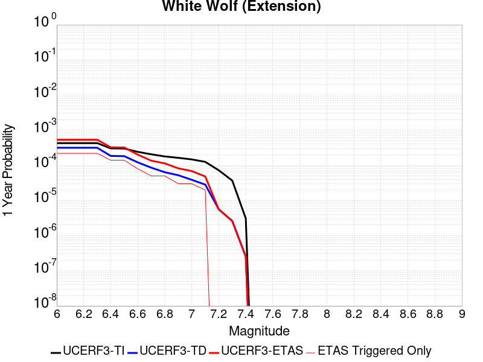 |  |

| Magnitude | 1 wk TI Prob | 1 wk TD Prob | 1 wk ETAS Prob | 1 wk ETAS/TD Gain | 1 wk ETAS Triggered Only | 1 mo TI Prob | 1 mo TD Prob | 1 mo ETAS Prob | 1 mo ETAS/TD Gain | 1 mo ETAS Triggered Only | 1 yr TI Prob | 1 yr TD Prob | 1 yr ETAS Prob | 1 yr ETAS/TD Gain | 1 yr ETAS Triggered Only | 10 yr TI Prob | 10 yr TD Prob | 10 yr ETAS Prob | 10 yr ETAS/TD Gain | 10 yr ETAS Triggered Only |
|-----|-----|-----|-----|-----|-----|-----|-----|-----|-----|-----|-----|-----|-----|-----|-----|-----|-----|-----|-----|-----|
| 6.0 | 8.222555E-6 | 6.0666657E-6 | 1.2606593E-4 | 20.780104 | 1.2E-4 | 3.5239045E-5 | 2.5999774E-5 | 1.6599613E-4 | 6.384522 | 1.4E-4 | 4.289509E-4 | 3.1650788E-4 | 5.3643825E-4 | 1.6948653 | 2.2E-4 | 0.0042812387 | 0.003161223 | 0.003440338 | 1.0882933 | 2.8E-4 |
| 6.1 | 8.222555E-6 | 6.0666657E-6 | 1.2606593E-4 | 20.780104 | 1.2E-4 | 3.5239045E-5 | 2.5999774E-5 | 1.6599613E-4 | 6.384522 | 1.4E-4 | 4.289509E-4 | 3.1650788E-4 | 5.3643825E-4 | 1.6948653 | 2.2E-4 | 0.0042812387 | 0.003161223 | 0.003440338 | 1.0882933 | 2.8E-4 |
| 6.2 | 8.222555E-6 | 6.0666657E-6 | 1.2606593E-4 | 20.780104 | 1.2E-4 | 3.5239045E-5 | 2.5999774E-5 | 1.6599613E-4 | 6.384522 | 1.4E-4 | 4.289509E-4 | 3.1650788E-4 | 5.3643825E-4 | 1.6948653 | 2.2E-4 | 0.0042812387 | 0.003161223 | 0.003440338 | 1.0882933 | 2.8E-4 |
| 6.3 | 8.222555E-6 | 6.0666657E-6 | 1.2606593E-4 | 20.780104 | 1.2E-4 | 3.5239045E-5 | 2.5999774E-5 | 1.6599613E-4 | 6.384522 | 1.4E-4 | 4.289509E-4 | 3.1650788E-4 | 5.3643825E-4 | 1.6948653 | 2.2E-4 | 0.0042812387 | 0.003161223 | 0.003440338 | 1.0882933 | 2.8E-4 |
| 6.4 | 5.821773E-6 | 3.5571766E-6 | 7.355693E-5 | 20.67846 | 7.0E-5 | 2.4950215E-5 | 1.5244959E-5 | 8.524389E-5 | 5.591612 | 7.0E-5 | 3.0372653E-4 | 1.8559267E-4 | 3.2556668E-4 | 1.7542001 | 1.4E-4 | 0.0030331176 | 0.001854485 | 0.0020341512 | 1.096882 | 1.8E-4 |
| 6.5 | 5.766023E-6 | 3.4991106E-6 | 7.3498864E-5 | 21.005014 | 7.0E-5 | 2.4711293E-5 | 1.4996108E-5 | 8.499506E-5 | 5.6678076 | 7.0E-5 | 3.0081844E-4 | 1.8256342E-4 | 3.2253788E-4 | 1.7667168 | 1.4E-4 | 0.0030041158 | 0.0018242426 | 0.0020039142 | 1.0984911 | 1.8E-4 |
| 6.6 | 4.643576E-6 | 2.332624E-6 | 3.2332555E-5 | 13.861022 | 3.0E-5 | 1.9900888E-5 | 9.996925E-6 | 3.9996623E-5 | 4.000893 | 3.0E-5 | 2.4226638E-4 | 1.2170619E-4 | 2.0169646E-4 | 1.6572407 | 8.0E-5 | 0.0024200242 | 0.0012164378 | 0.0013263039 | 1.090318 | 1.1E-4 |
| 6.7 | 3.9529173E-6 | 1.6483477E-6 | 2.1648315E-5 | 13.133342 | 2.0E-5 | 1.6940963E-5 | 7.0643296E-6 | 2.7064189E-5 | 3.831105 | 2.0E-5 | 2.0623671E-4 | 8.6005006E-5 | 1.360007E-4 | 1.5813115 | 5.0E-5 | 0.002060454 | 8.597357E-4 | 9.2967553E-4 | 1.0813503 | 7.0E-5 |
| 6.8 | 3.4377522E-6 | 1.2245237E-6 | 2.12245E-5 | 17.33286 | 2.0E-5 | 1.473314E-5 | 5.2479486E-6 | 2.5247844E-5 | 4.8109927 | 2.0E-5 | 1.7936122E-4 | 6.3891996E-5 | 1.138888E-4 | 1.7825207 | 5.0E-5 | 0.0017921652 | 6.387454E-4 | 6.98707E-4 | 1.0938741 | 6.0E-5 |
| 6.9 | 3.1367306E-6 | 1.0033783E-6 | 2.1003358E-5 | 20.93264 | 2.0E-5 | 1.3443062E-5 | 4.3001864E-6 | 2.43001E-5 | 5.6509414 | 2.0E-5 | 1.63657E-4 | 5.235359E-5 | 8.235202E-5 | 1.5729966 | 3.0E-5 | 0.0016353652 | 5.2342017E-4 | 5.633992E-4 | 1.0763805 | 4.0E-5 |
| 7.0 | 2.8298145E-6 | 7.4286646E-7 | 2.0742851E-5 | 27.922718 | 2.0E-5 | 1.2127721E-5 | 3.1837099E-6 | 2.3183646E-5 | 7.2819595 | 2.0E-5 | 1.47645E-4 | 3.8761027E-5 | 6.8759866E-5 | 1.7739433 | 3.0E-5 | 0.0014754693 | 3.8754768E-4 | 4.2753218E-4 | 1.1031731 | 4.0E-5 |
| 7.1 | 2.4091064E-6 | 5.4227525E-7 | 1.054227E-5 | 19.440811 | 1.0E-5 | 1.03247E-5 | 2.3240348E-6 | 1.2324012E-5 | 5.3028517 | 1.0E-5 | 1.2569598E-4 | 2.8294799E-5 | 4.829423E-5 | 1.7068237 | 2.0E-5 | 0.001256249 | 2.8291598E-4 | 3.129075E-4 | 1.1060085 | 3.0E-5 |
| 7.2 | 1.3875518E-6 | 1.0743063E-7 | 1.0743063E-7 | 1.0 | 0.0 | 5.9466374E-6 | 4.6041689E-7 | 4.6041689E-7 | 1.0 | 0.0 | 7.23979E-5 | 5.6055624E-6 | 5.6055624E-6 | 1.0 | 0.0 | 7.2374323E-4 | 5.6054323E-5 | 5.6054323E-5 | 1.0 | 0.0 |
| 7.3 | 7.056077E-7 | 5.002034E-8 | 5.002034E-8 | 1.0 | 0.0 | 3.0240296E-6 | 2.1437286E-7 | 2.1437286E-7 | 1.0 | 0.0 | 3.681694E-5 | 2.609987E-6 | 2.609987E-6 | 1.0 | 0.0 | 3.681084E-4 | 2.609961E-5 | 2.609961E-5 | 1.0 | 0.0 |
| 7.4 | 5.9334678E-8 | 4.8683537E-9 | 4.8683537E-9 | 1.0 | 0.0 | 2.5429145E-7 | 2.0864372E-8 | 2.0864372E-8 | 1.0 | 0.0 | 3.095994E-6 | 2.5402372E-7 | 2.5402372E-7 | 1.0 | 0.0 | 3.095951E-5 | 2.5402353E-6 | 2.5402353E-6 | 1.0 | 0.0 |

## Santa Ynez (West)
*[(top)](#table-of-contents)*

| 1 Week | 1 Month | 1 Year | 10 Year |
|-----|-----|-----|-----|
|  |  |  |  |

| Magnitude | 1 wk TI Prob | 1 wk TD Prob | 1 wk ETAS Prob | 1 wk ETAS/TD Gain | 1 wk ETAS Triggered Only | 1 mo TI Prob | 1 mo TD Prob | 1 mo ETAS Prob | 1 mo ETAS/TD Gain | 1 mo ETAS Triggered Only | 1 yr TI Prob | 1 yr TD Prob | 1 yr ETAS Prob | 1 yr ETAS/TD Gain | 1 yr ETAS Triggered Only | 10 yr TI Prob | 10 yr TD Prob | 10 yr ETAS Prob | 10 yr ETAS/TD Gain | 10 yr ETAS Triggered Only |
|-----|-----|-----|-----|-----|-----|-----|-----|-----|-----|-----|-----|-----|-----|-----|-----|-----|-----|-----|-----|-----|
| 6.0 | 4.7352758E-5 | 5.4972126E-5 | 9.4969924E-5 | 1.7276015 | 4.0E-5 | 2.0292461E-4 | 2.3557522E-4 | 2.9556107E-4 | 1.2546357 | 6.0E-5 | 0.0024678076 | 0.0028645284 | 0.0029841845 | 1.0417718 | 1.2E-4 | 0.024405818 | 0.028304417 | 0.02848904 | 1.0065228 | 1.9E-4 |
| 6.1 | 4.7352758E-5 | 5.4972126E-5 | 8.4970474E-5 | 1.5457011 | 3.0E-5 | 2.0292461E-4 | 2.3557522E-4 | 2.8556344E-4 | 1.2121965 | 5.0E-5 | 0.0024678076 | 0.0028645284 | 0.0029841845 | 1.0417718 | 1.2E-4 | 0.024405818 | 0.028304417 | 0.028469605 | 1.0058361 | 1.7E-4 |
| 6.2 | 3.0415853E-5 | 3.392511E-5 | 6.392409E-5 | 1.8842708 | 3.0E-5 | 1.3034715E-4 | 1.4538545E-4 | 1.9537818E-4 | 1.3438634 | 5.0E-5 | 0.0015858212 | 0.0017686661 | 0.0018585069 | 1.0507958 | 9.0E-5 | 0.015745522 | 0.017549807 | 0.01768735 | 1.0078373 | 1.4E-4 |
| 6.3 | 3.0415853E-5 | 3.392511E-5 | 6.392409E-5 | 1.8842708 | 3.0E-5 | 1.3034715E-4 | 1.4538545E-4 | 1.9537818E-4 | 1.3438634 | 5.0E-5 | 0.0015858212 | 0.0017686661 | 0.0018585069 | 1.0507958 | 9.0E-5 | 0.015745522 | 0.017549807 | 0.01768735 | 1.0078373 | 1.4E-4 |
| 6.4 | 2.5452082E-5 | 2.7912422E-5 | 5.7911584E-5 | 2.0747602 | 3.0E-5 | 1.09075794E-4 | 1.196193E-4 | 1.6961331E-4 | 1.4179428 | 5.0E-5 | 0.0013271887 | 0.0014554089 | 0.0015452778 | 1.0617483 | 9.0E-5 | 0.013192902 | 0.014460951 | 0.0145989265 | 1.0095413 | 1.4E-4 |
| 6.5 | 2.3143784E-5 | 2.5128256E-5 | 5.5127504E-5 | 2.193845 | 3.0E-5 | 9.9183875E-5 | 1.0768817E-4 | 1.5768278E-4 | 1.4642535 | 5.0E-5 | 0.0012068948 | 0.0013103267 | 0.0014002088 | 1.0685952 | 9.0E-5 | 0.012003611 | 0.01302768 | 0.013165856 | 1.0106064 | 1.4E-4 |
| 6.6 | 1.9118515E-5 | 2.035434E-5 | 5.035373E-5 | 2.4738572 | 3.0E-5 | 8.193392E-5 | 8.7230015E-5 | 1.3722565E-4 | 1.5731472 | 5.0E-5 | 9.97089E-4 | 0.001061516 | 0.001141431 | 1.0752839 | 8.0E-5 | 0.00992627 | 0.010565365 | 0.010693992 | 1.0121744 | 1.3E-4 |
| 6.7 | 1.722807E-5 | 1.8146347E-5 | 4.81458E-5 | 2.6531954 | 3.0E-5 | 7.3832496E-5 | 7.776777E-5 | 1.2776388E-4 | 1.6428899 | 5.0E-5 | 8.985399E-4 | 9.464169E-4 | 0.0010263412 | 1.0844493 | 8.0E-5 | 0.008949154 | 0.0094245095 | 0.009553284 | 1.0136638 | 1.3E-4 |
| 6.8 | 1.5317364E-5 | 1.5926486E-5 | 3.5926165E-5 | 2.25575 | 2.0E-5 | 6.56442E-5 | 6.82546E-5 | 1.0825187E-4 | 1.586001 | 4.0E-5 | 7.98925E-4 | 8.306873E-4 | 9.006291E-4 | 1.0841975 | 7.0E-5 | 0.007960589 | 0.00827631 | 0.008385399 | 1.013181 | 1.1E-4 |
| 6.9 | 1.3071226E-5 | 1.3329624E-5 | 3.3329357E-5 | 2.5003974 | 2.0E-5 | 5.6018336E-5 | 5.7125722E-5 | 8.7124004E-5 | 1.5251275 | 3.0E-5 | 6.8180985E-4 | 6.9528597E-4 | 7.452512E-4 | 1.0718628 | 5.0E-5 | 0.0067972173 | 0.006931367 | 0.007020743 | 1.0128944 | 9.0E-5 |
| 7.0 | 1.1836986E-5 | 1.19327815E-5 | 3.1932545E-5 | 2.6760352 | 2.0E-5 | 5.0728955E-5 | 5.11395E-5 | 8.1137965E-5 | 1.5866007 | 3.0E-5 | 6.1745E-4 | 6.2244723E-4 | 6.724161E-4 | 1.080278 | 5.0E-5 | 0.006157372 | 0.006207231 | 0.0062966724 | 1.0144092 | 9.0E-5 |
| 7.1 | 1.0597169E-5 | 1.0542201E-5 | 2.0542097E-5 | 1.9485586 | 1.0E-5 | 4.541565E-5 | 4.5180084E-5 | 6.5179185E-5 | 1.442653 | 2.0E-5 | 5.5279525E-4 | 5.4992986E-4 | 5.8990787E-4 | 1.0726966 | 4.0E-5 | 0.0055142213 | 0.005485821 | 0.005555437 | 1.0126902 | 7.0E-5 |
| 7.2 | 9.59113E-6 | 9.459144E-6 | 1.945905E-5 | 2.057168 | 1.0E-5 | 4.11042E-5 | 4.0538565E-5 | 6.0537754E-5 | 1.4933374 | 2.0E-5 | 5.0032866E-4 | 4.934463E-4 | 5.334266E-4 | 1.0810225 | 4.0E-5 | 0.004992037 | 0.0049236254 | 0.0049932804 | 1.0141472 | 7.0E-5 |
| 7.3 | 8.586084E-6 | 8.379583E-6 | 1.83795E-5 | 2.1933668 | 1.0E-5 | 3.679698E-5 | 3.5912013E-5 | 5.5911292E-5 | 1.5568967 | 2.0E-5 | 4.4791115E-4 | 4.3714207E-4 | 4.7712456E-4 | 1.0914634 | 4.0E-5 | 0.004470094 | 0.004362933 | 0.0044326275 | 1.0159743 | 7.0E-5 |
| 7.4 | 7.2622997E-6 | 6.9515427E-6 | 1.6951473E-5 | 2.4385197 | 1.0E-5 | 3.112377E-5 | 2.979199E-5 | 4.9791397E-5 | 1.6713014 | 2.0E-5 | 3.78866E-4 | 3.626581E-4 | 4.0264358E-4 | 1.1102567 | 4.0E-5 | 0.0037822074 | 0.0036207628 | 0.0036805456 | 1.0165111 | 6.0E-5 |
| 7.5 | 5.627296E-6 | 5.251588E-6 | 1.5251535E-5 | 2.904176 | 1.0E-5 | 2.411676E-5 | 2.2506614E-5 | 3.250639E-5 | 1.4443039 | 1.0E-5 | 2.9358198E-4 | 2.739843E-4 | 3.0397606E-4 | 1.1094654 | 3.0E-5 | 0.0029319443 | 0.002736537 | 0.0027764277 | 1.014577 | 4.0E-5 |
| 7.6 | 2.265244E-6 | 2.0608625E-6 | 1.2060842E-5 | 5.8523273 | 1.0E-5 | 9.708152E-6 | 8.832238E-6 | 1.883215E-5 | 2.132206 | 1.0E-5 | 1.18190335E-4 | 1.0752728E-4 | 1.2752513E-4 | 1.1859794 | 2.0E-5 | 0.001181275 | 0.0010747612 | 0.0011047289 | 1.0278832 | 3.0E-5 |
| 7.7 | 1.3099874E-6 | 1.1016252E-6 | 1.1101614E-5 | 10.077487 | 1.0E-5 | 5.61422E-6 | 4.7212425E-6 | 1.4721195E-5 | 3.1180766 | 1.0E-5 | 6.8350986E-5 | 5.7479636E-5 | 7.7478486E-5 | 1.3479294 | 2.0E-5 | 6.832996E-4 | 5.7465007E-4 | 6.0463283E-4 | 1.0521756 | 3.0E-5 |
| 7.8 | 7.903951E-7 | 6.0711415E-7 | 6.0711415E-7 | 1.0 | 0.0 | 3.3874032E-6 | 2.6019152E-6 | 2.6019152E-6 | 1.0 | 0.0 | 4.1240855E-5 | 3.167787E-5 | 3.167787E-5 | 1.0 | 0.0 | 4.12332E-4 | 3.167349E-4 | 3.267317E-4 | 1.0315621 | 1.0E-5 |
| 7.9 | 7.0753297E-9 | 5.0899476E-9 | 5.0899476E-9 | 1.0 | 0.0 | 3.032284E-8 | 2.181406E-8 | 2.181406E-8 | 1.0 | 0.0 | 3.6918053E-7 | 2.6558615E-7 | 2.6558615E-7 | 1.0 | 0.0 | 3.691799E-6 | 2.6558594E-6 | 2.6558594E-6 | 1.0 | 0.0 |

## Sierra Nevada  (No Extension)
*[(top)](#table-of-contents)*

| 1 Week | 1 Month | 1 Year | 10 Year |
|-----|-----|-----|-----|
|  |  |  | 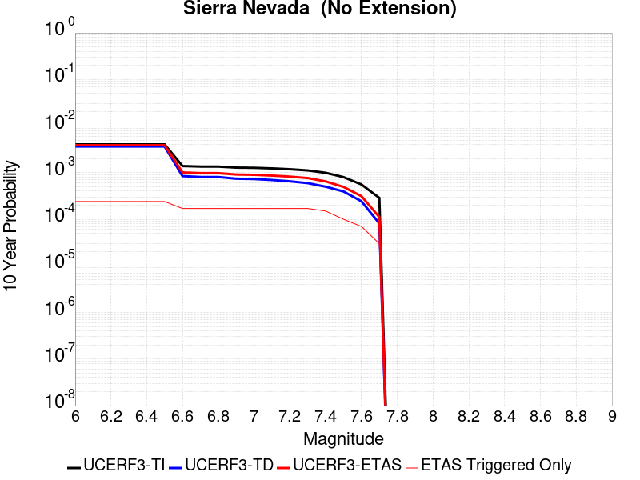 |

| Magnitude | 1 wk TI Prob | 1 wk TD Prob | 1 wk ETAS Prob | 1 wk ETAS/TD Gain | 1 wk ETAS Triggered Only | 1 mo TI Prob | 1 mo TD Prob | 1 mo ETAS Prob | 1 mo ETAS/TD Gain | 1 mo ETAS Triggered Only | 1 yr TI Prob | 1 yr TD Prob | 1 yr ETAS Prob | 1 yr ETAS/TD Gain | 1 yr ETAS Triggered Only | 10 yr TI Prob | 10 yr TD Prob | 10 yr ETAS Prob | 10 yr ETAS/TD Gain | 10 yr ETAS Triggered Only |
|-----|-----|-----|-----|-----|-----|-----|-----|-----|-----|-----|-----|-----|-----|-----|-----|-----|-----|-----|-----|-----|
| 6.0 | 7.7690465E-6 | 6.976322E-6 | 1.06975625E-4 | 15.334102 | 1.0E-4 | 3.329549E-5 | 2.9898381E-5 | 1.6989419E-4 | 5.682388 | 1.4E-4 | 4.0529718E-4 | 3.6398784E-4 | 5.6391506E-4 | 1.549269 | 2.0E-4 | 0.004045588 | 0.0036374326 | 0.0038765597 | 1.0657406 | 2.4E-4 |
| 6.1 | 7.7690465E-6 | 6.976322E-6 | 1.06975625E-4 | 15.334102 | 1.0E-4 | 3.329549E-5 | 2.9898381E-5 | 1.6989419E-4 | 5.682388 | 1.4E-4 | 4.0529718E-4 | 3.6398784E-4 | 5.6391506E-4 | 1.549269 | 2.0E-4 | 0.004045588 | 0.0036374326 | 0.0038765597 | 1.0657406 | 2.4E-4 |
| 6.2 | 7.7690465E-6 | 6.976322E-6 | 1.06975625E-4 | 15.334102 | 1.0E-4 | 3.329549E-5 | 2.9898381E-5 | 1.6989419E-4 | 5.682388 | 1.4E-4 | 4.0529718E-4 | 3.6398784E-4 | 5.6391506E-4 | 1.549269 | 2.0E-4 | 0.004045588 | 0.0036374326 | 0.0038765597 | 1.0657406 | 2.4E-4 |
| 6.3 | 7.7690465E-6 | 6.976322E-6 | 1.06975625E-4 | 15.334102 | 1.0E-4 | 3.329549E-5 | 2.9898381E-5 | 1.6989419E-4 | 5.682388 | 1.4E-4 | 4.0529718E-4 | 3.6398784E-4 | 5.6391506E-4 | 1.549269 | 2.0E-4 | 0.004045588 | 0.0036374326 | 0.0038765597 | 1.0657406 | 2.4E-4 |
| 6.4 | 7.7690465E-6 | 6.976322E-6 | 1.06975625E-4 | 15.334102 | 1.0E-4 | 3.329549E-5 | 2.9898381E-5 | 1.6989419E-4 | 5.682388 | 1.4E-4 | 4.0529718E-4 | 3.6398784E-4 | 5.6391506E-4 | 1.549269 | 2.0E-4 | 0.004045588 | 0.0036374326 | 0.0038765597 | 1.0657406 | 2.4E-4 |
| 6.5 | 7.7690465E-6 | 6.976322E-6 | 1.06975625E-4 | 15.334102 | 1.0E-4 | 3.329549E-5 | 2.9898381E-5 | 1.6989419E-4 | 5.682388 | 1.4E-4 | 4.0529718E-4 | 3.6398784E-4 | 5.6391506E-4 | 1.549269 | 2.0E-4 | 0.004045588 | 0.0036374326 | 0.0038765597 | 1.0657406 | 2.4E-4 |
| 6.6 | 2.653E-6 | 1.614854E-6 | 7.161474E-5 | 44.347504 | 7.0E-5 | 1.136995E-5 | 6.9207845E-6 | 1.16920026E-4 | 16.894041 | 1.1E-4 | 1.3842035E-4 | 8.425733E-5 | 2.2424554E-4 | 2.6614366 | 1.4E-4 | 0.0013833415 | 8.422573E-4 | 0.0010121141 | 1.2016686 | 1.7E-4 |
| 6.7 | 2.5902466E-6 | 1.5501876E-6 | 7.155008E-5 | 46.155758 | 7.0E-5 | 1.11010095E-5 | 6.643644E-6 | 1.16642914E-4 | 17.557068 | 1.1E-4 | 1.351464E-4 | 8.0883394E-5 | 2.2087207E-4 | 2.7307467 | 1.4E-4 | 0.0013506424 | 8.0854254E-4 | 9.784051E-4 | 1.2100849 | 1.7E-4 |
| 6.8 | 2.5853892E-6 | 1.5469877E-6 | 7.154688E-5 | 46.249157 | 7.0E-5 | 1.1080193E-5 | 6.629931E-6 | 1.166292E-4 | 17.591314 | 1.1E-4 | 1.34893E-4 | 8.071645E-5 | 2.2070514E-4 | 2.7343268 | 1.4E-4 | 0.0013481114 | 8.068743E-4 | 9.767371E-4 | 1.2105196 | 1.7E-4 |
| 6.9 | 2.458257E-6 | 1.4220619E-6 | 7.1421964E-5 | 50.224228 | 7.0E-5 | 1.0535345E-5 | 6.094537E-6 | 1.1609387E-4 | 19.04884 | 1.1E-4 | 1.2826028E-4 | 7.4198484E-5 | 2.141881E-4 | 2.886691 | 1.4E-4 | 0.0012818627 | 7.4173906E-4 | 9.1161294E-4 | 1.2290211 | 1.7E-4 |
| 7.0 | 2.4341468E-6 | 1.3990258E-6 | 7.139893E-5 | 51.034744 | 7.0E-5 | 1.0432016E-5 | 5.9958115E-6 | 1.1599515E-4 | 19.346031 | 1.1E-4 | 1.270024E-4 | 7.2996576E-5 | 2.1298636E-4 | 2.9177582 | 1.4E-4 | 0.0012692984 | 7.297279E-4 | 8.996038E-4 | 1.2327936 | 1.7E-4 |
| 7.1 | 2.3652476E-6 | 1.3339754E-6 | 7.133388E-5 | 53.47466 | 7.0E-5 | 1.0136736E-5 | 5.717025E-6 | 1.1571639E-4 | 20.240665 | 1.1E-4 | 1.2340778E-4 | 6.9602575E-5 | 2.0959284E-4 | 3.0112798 | 1.4E-4 | 0.0012333926 | 6.9580943E-4 | 8.6569117E-4 | 1.2441498 | 1.7E-4 |
| 7.2 | 2.272158E-6 | 1.2502821E-6 | 7.125019E-5 | 56.987293 | 7.0E-5 | 9.737784E-6 | 5.3583412E-6 | 1.15357754E-4 | 21.528631 | 1.1E-4 | 1.1855107E-4 | 6.5235865E-5 | 2.0522674E-4 | 3.1459188 | 1.4E-4 | 0.0011848784 | 6.5216864E-4 | 8.220578E-4 | 1.2604988 | 1.7E-4 |
| 7.3 | 2.1382127E-6 | 1.1419703E-6 | 7.114189E-5 | 62.297497 | 7.0E-5 | 9.163737E-6 | 4.8941492E-6 | 1.1489361E-4 | 23.475706 | 1.1E-4 | 1.1156279E-4 | 5.958465E-5 | 1.995763E-4 | 3.3494585 | 1.4E-4 | 0.001115068 | 5.956879E-4 | 7.655866E-4 | 1.2852143 | 1.7E-4 |
| 7.4 | 1.9048055E-6 | 9.575242E-7 | 6.0957467E-5 | 63.661537 | 6.0E-5 | 8.163426E-6 | 4.1036687E-6 | 1.0410326E-4 | 25.368338 | 1.0E-4 | 9.9385186E-5 | 4.996103E-5 | 1.6995503E-4 | 3.401752 | 1.2E-4 | 9.934074E-4 | 4.994987E-4 | 6.4942375E-4 | 1.3001511 | 1.5E-4 |
| 7.5 | 1.5373403E-6 | 7.560042E-7 | 4.0755975E-5 | 53.909718 | 4.0E-5 | 6.5885843E-6 | 3.2400142E-6 | 7.323979E-5 | 22.604774 | 7.0E-5 | 8.021306E-5 | 3.9446462E-5 | 1.19443306E-4 | 3.0279853 | 8.0E-5 | 8.0184115E-4 | 3.943951E-4 | 4.943556E-4 | 1.2534529 | 1.0E-4 |
| 7.6 | 1.0680322E-6 | 4.6596554E-7 | 2.0465955E-5 | 43.921608 | 2.0E-5 | 4.577273E-6 | 1.9969937E-6 | 4.1996915E-5 | 21.03007 | 4.0E-5 | 5.5726876E-5 | 2.4313129E-5 | 7.4311916E-5 | 3.056452 | 5.0E-5 | 5.5712904E-4 | 2.4310495E-4 | 3.1308795E-4 | 1.2878715 | 7.0E-5 |
| 7.7 | 5.509146E-7 | 1.5580486E-7 | 2.0155801E-5 | 129.36568 | 2.0E-5 | 2.3610605E-6 | 6.677349E-7 | 2.0667721E-5 | 30.951984 | 2.0E-5 | 2.8745531E-5 | 8.129644E-6 | 3.81294E-5 | 4.6901684 | 3.0E-5 | 2.8741814E-4 | 8.1293576E-5 | 1.1129114E-4 | 1.3690028 | 3.0E-5 |

## Baker
*[(top)](#table-of-contents)*

| 1 Week | 1 Month | 1 Year | 10 Year |
|-----|-----|-----|-----|
|  |  |  |  |

| Magnitude | 1 wk TI Prob | 1 wk TD Prob | 1 wk ETAS Prob | 1 wk ETAS/TD Gain | 1 wk ETAS Triggered Only | 1 mo TI Prob | 1 mo TD Prob | 1 mo ETAS Prob | 1 mo ETAS/TD Gain | 1 mo ETAS Triggered Only | 1 yr TI Prob | 1 yr TD Prob | 1 yr ETAS Prob | 1 yr ETAS/TD Gain | 1 yr ETAS Triggered Only | 10 yr TI Prob | 10 yr TD Prob | 10 yr ETAS Prob | 10 yr ETAS/TD Gain | 10 yr ETAS Triggered Only |
|-----|-----|-----|-----|-----|-----|-----|-----|-----|-----|-----|-----|-----|-----|-----|-----|-----|-----|-----|-----|-----|
| 6.0 | 5.695525E-6 | 5.8348373E-6 | 1.0583425E-4 | 18.138338 | 1.0E-4 | 2.4409164E-5 | 2.5006228E-5 | 1.5500297E-4 | 6.198575 | 1.3E-4 | 2.9714106E-4 | 3.044123E-4 | 5.243453E-4 | 1.722484 | 2.2E-4 | 0.0029674405 | 0.0030403486 | 0.0032895887 | 1.0819774 | 2.5E-4 |
| 6.1 | 5.695525E-6 | 5.8348373E-6 | 1.0583425E-4 | 18.138338 | 1.0E-4 | 2.4409164E-5 | 2.5006228E-5 | 1.5500297E-4 | 6.198575 | 1.3E-4 | 2.9714106E-4 | 3.044123E-4 | 5.243453E-4 | 1.722484 | 2.2E-4 | 0.0029674405 | 0.0030403486 | 0.0032895887 | 1.0819774 | 2.5E-4 |
| 6.2 | 5.695525E-6 | 5.8348373E-6 | 1.0583425E-4 | 18.138338 | 1.0E-4 | 2.4409164E-5 | 2.5006228E-5 | 1.5500297E-4 | 6.198575 | 1.3E-4 | 2.9714106E-4 | 3.044123E-4 | 5.243453E-4 | 1.722484 | 2.2E-4 | 0.0029674405 | 0.0030403486 | 0.0032895887 | 1.0819774 | 2.5E-4 |
| 6.3 | 3.2995713E-6 | 3.383667E-6 | 6.3383464E-5 | 18.732182 | 6.0E-5 | 1.4140943E-5 | 1.4501353E-5 | 8.450034E-5 | 5.827066 | 7.0E-5 | 1.7215237E-4 | 1.7654014E-4 | 3.3651188E-4 | 1.9061495 | 1.6E-4 | 0.0017201907 | 0.001764046 | 0.0019437285 | 1.1018581 | 1.8E-4 |
| 6.4 | 3.2995713E-6 | 3.383667E-6 | 6.3383464E-5 | 18.732182 | 6.0E-5 | 1.4140943E-5 | 1.4501353E-5 | 8.450034E-5 | 5.827066 | 7.0E-5 | 1.7215237E-4 | 1.7654014E-4 | 3.3651188E-4 | 1.9061495 | 1.6E-4 | 0.0017201907 | 0.001764046 | 0.0019437285 | 1.1018581 | 1.8E-4 |
| 6.5 | 2.782202E-6 | 2.8558404E-6 | 6.2855666E-5 | 22.009518 | 6.0E-5 | 1.1923668E-5 | 1.223926E-5 | 8.22384E-5 | 6.7192297 | 7.0E-5 | 1.4516099E-4 | 1.4900314E-4 | 3.089793E-4 | 2.073643 | 1.6E-4 | 0.001450662 | 0.0014890651 | 0.001668797 | 1.1207012 | 1.8E-4 |
| 6.6 | 2.3163404E-6 | 2.38092E-6 | 4.2380823E-5 | 17.800188 | 4.0E-5 | 9.927136E-6 | 1.0203904E-5 | 6.0203394E-5 | 5.9000354 | 5.0E-5 | 1.20856166E-4 | 1.2422565E-4 | 2.6420827E-4 | 2.1268413 | 1.4E-4 | 0.0012079047 | 0.0012415823 | 0.0014013837 | 1.1287078 | 1.6E-4 |
| 6.7 | 2.037056E-6 | 2.0965003E-6 | 4.2096417E-5 | 20.079374 | 4.0E-5 | 8.7302105E-6 | 8.984972E-6 | 4.8984613E-5 | 5.451838 | 4.0E-5 | 1.0628513E-4 | 1.093867E-4 | 2.3937249E-4 | 2.1883142 | 1.3E-4 | 0.0010623431 | 0.0010933448 | 0.0012431807 | 1.1370437 | 1.5E-4 |
| 6.8 | 1.8356744E-6 | 1.8915287E-6 | 4.1891453E-5 | 22.146877 | 4.0E-5 | 7.867153E-6 | 8.106527E-6 | 4.81062E-5 | 5.9342556 | 4.0E-5 | 9.577837E-5 | 9.869264E-5 | 2.186808E-4 | 2.2157762 | 1.2E-4 | 9.57371E-4 | 9.86502E-4 | 0.001126364 | 1.1417756 | 1.4E-4 |
| 6.9 | 1.6310546E-6 | 1.6832072E-6 | 3.1683157E-5 | 18.823088 | 3.0E-5 | 6.9902153E-6 | 7.213726E-6 | 3.721351E-5 | 5.1587086 | 3.0E-5 | 8.510255E-5 | 8.782368E-5 | 1.7781577E-4 | 2.0246904 | 9.0E-5 | 8.5069967E-4 | 8.7790104E-4 | 9.878045E-4 | 1.1251888 | 1.1E-4 |
| 7.0 | 1.2058036E-6 | 1.2508665E-6 | 2.1250842E-5 | 16.988895 | 2.0E-5 | 5.1677193E-6 | 5.3608455E-6 | 2.5360738E-5 | 4.730735 | 2.0E-5 | 6.291517E-5 | 6.5266366E-5 | 1.352618E-4 | 2.072458 | 7.0E-5 | 6.289736E-4 | 6.524743E-4 | 7.4241555E-4 | 1.1378465 | 9.0E-5 |
| 7.1 | 1.052382E-6 | 1.0951609E-6 | 2.1095138E-5 | 19.262138 | 2.0E-5 | 4.5102006E-6 | 4.693538E-6 | 2.4693445E-5 | 5.2611575 | 2.0E-5 | 5.491031E-5 | 5.7142337E-5 | 1.2713834E-4 | 2.2249413 | 7.0E-5 | 5.4896745E-4 | 5.7127734E-4 | 6.512316E-4 | 1.1399571 | 8.0E-5 |
| 7.2 | 1.0067454E-6 | 1.0487711E-6 | 2.104875E-5 | 20.06992 | 2.0E-5 | 4.3146156E-6 | 4.4947255E-6 | 2.4494635E-5 | 5.44964 | 2.0E-5 | 5.252918E-5 | 5.4721917E-5 | 1.2471809E-4 | 2.279125 | 7.0E-5 | 5.251676E-4 | 5.470853E-4 | 6.270415E-4 | 1.1461495 | 8.0E-5 |
| 7.3 | 9.3596316E-7 | 9.767723E-7 | 2.0976753E-5 | 21.47558 | 2.0E-5 | 4.0112645E-6 | 4.1861604E-6 | 2.4186076E-5 | 5.7776275 | 2.0E-5 | 4.8836053E-5 | 5.096532E-5 | 1.20961755E-4 | 2.373413 | 7.0E-5 | 4.8825322E-4 | 5.095371E-4 | 5.8949634E-4 | 1.1569252 | 8.0E-5 |
| 7.4 | 8.8117395E-7 | 9.2076635E-7 | 2.0920748E-5 | 22.721018 | 2.0E-5 | 3.7764542E-6 | 3.9461356E-6 | 2.3946057E-5 | 6.0682297 | 2.0E-5 | 4.5977362E-5 | 4.8043148E-5 | 9.804075E-5 | 2.0406811 | 5.0E-5 | 4.596785E-4 | 4.8032837E-4 | 5.402996E-4 | 1.1248546 | 6.0E-5 |
| 7.5 | 8.292386E-7 | 8.6745956E-7 | 1.0867451E-5 | 12.5279045 | 1.0E-5 | 3.5538749E-6 | 3.7176785E-6 | 1.3717641E-5 | 3.6898406 | 1.0E-5 | 4.326757E-5 | 4.5261804E-5 | 8.525999E-5 | 1.8837074 | 4.0E-5 | 4.3259145E-4 | 4.5252658E-4 | 5.0250394E-4 | 1.1104407 | 5.0E-5 |
| 7.6 | 7.553842E-7 | 7.9144706E-7 | 1.0791439E-5 | 13.635074 | 1.0E-5 | 3.2373566E-6 | 3.3919116E-6 | 1.33918775E-5 | 3.94818 | 1.0E-5 | 3.9414106E-5 | 4.129575E-5 | 8.129409E-5 | 1.9685827 | 4.0E-5 | 3.9407116E-4 | 4.1288146E-4 | 4.628608E-4 | 1.1210501 | 5.0E-5 |
| 7.7 | 6.5285366E-7 | 6.852797E-7 | 1.0685273E-5 | 15.592572 | 1.0E-5 | 2.797941E-6 | 2.9369096E-6 | 1.293688E-5 | 4.4049296 | 1.0E-5 | 3.40644E-5 | 3.5756293E-5 | 5.575558E-5 | 1.5593221 | 2.0E-5 | 3.405918E-4 | 3.5750607E-4 | 3.8749535E-4 | 1.0838847 | 3.0E-5 |
| 7.8 | 3.4586725E-7 | 3.6482615E-7 | 3.6482615E-7 | 1.0 | 0.0 | 1.4822873E-6 | 1.5635396E-6 | 1.5635396E-6 | 1.0 | 0.0 | 1.80467E-5 | 1.9035933E-5 | 2.9035744E-5 | 1.5253123 | 1.0E-5 | 1.8045233E-4 | 1.9034347E-4 | 2.1033967E-4 | 1.1050532 | 2.0E-5 |
| 7.9 | 2.5591178E-9 | 2.6696718E-9 | 2.6696718E-9 | 1.0 | 0.0 | 1.0967647E-8 | 1.14414505E-8 | 1.14414505E-8 | 1.0 | 0.0 | 1.335311E-7 | 1.3929966E-7 | 1.3929966E-7 | 1.0 | 0.0 | 1.3353102E-6 | 1.3929966E-6 | 1.3929966E-6 | 1.0 | 0.0 |

## San Jacinto (San Bernardino)
*[(top)](#table-of-contents)*

| 1 Week | 1 Month | 1 Year | 10 Year |
|-----|-----|-----|-----|
|  | 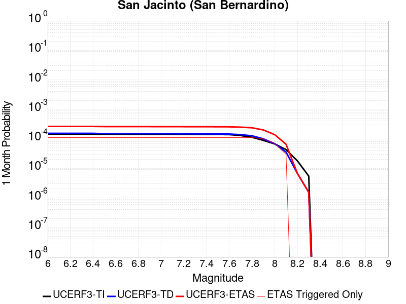 |  |  |

| Magnitude | 1 wk TI Prob | 1 wk TD Prob | 1 wk ETAS Prob | 1 wk ETAS/TD Gain | 1 wk ETAS Triggered Only | 1 mo TI Prob | 1 mo TD Prob | 1 mo ETAS Prob | 1 mo ETAS/TD Gain | 1 mo ETAS Triggered Only | 1 yr TI Prob | 1 yr TD Prob | 1 yr ETAS Prob | 1 yr ETAS/TD Gain | 1 yr ETAS Triggered Only | 10 yr TI Prob | 10 yr TD Prob | 10 yr ETAS Prob | 10 yr ETAS/TD Gain | 10 yr ETAS Triggered Only |
|-----|-----|-----|-----|-----|-----|-----|-----|-----|-----|-----|-----|-----|-----|-----|-----|-----|-----|-----|-----|-----|
| 6.0 | 3.409352E-5 | 3.5986508E-5 | 1.359829E-4 | 3.7787192 | 1.0E-4 | 1.461069E-4 | 1.542188E-4 | 2.6420184E-4 | 1.7131623 | 1.1E-4 | 0.0017774 | 0.0018759987 | 0.002055661 | 1.0957689 | 1.8E-4 | 0.01763251 | 0.019349935 | 0.019595098 | 1.0126699 | 2.5E-4 |
| 6.1 | 3.409352E-5 | 3.5986508E-5 | 1.359829E-4 | 3.7787192 | 1.0E-4 | 1.461069E-4 | 1.542188E-4 | 2.6420184E-4 | 1.7131623 | 1.1E-4 | 0.0017774 | 0.0018759987 | 0.002055661 | 1.0957689 | 1.8E-4 | 0.01763251 | 0.019349935 | 0.019595098 | 1.0126699 | 2.5E-4 |
| 6.2 | 3.409352E-5 | 3.5986508E-5 | 1.359829E-4 | 3.7787192 | 1.0E-4 | 1.461069E-4 | 1.542188E-4 | 2.6420184E-4 | 1.7131623 | 1.1E-4 | 0.0017774 | 0.0018759987 | 0.002055661 | 1.0957689 | 1.8E-4 | 0.01763251 | 0.019349935 | 0.019595098 | 1.0126699 | 2.5E-4 |
| 6.3 | 3.409352E-5 | 3.5986508E-5 | 1.359829E-4 | 3.7787192 | 1.0E-4 | 1.461069E-4 | 1.542188E-4 | 2.6420184E-4 | 1.7131623 | 1.1E-4 | 0.0017774 | 0.0018759987 | 0.002055661 | 1.0957689 | 1.8E-4 | 0.01763251 | 0.019349935 | 0.019595098 | 1.0126699 | 2.5E-4 |
| 6.4 | 3.400795E-5 | 3.5879173E-5 | 1.3587558E-4 | 3.7870324 | 1.0E-4 | 1.4574021E-4 | 1.5375883E-4 | 2.637419E-4 | 1.715296 | 1.1E-4 | 0.0017729428 | 0.0018704084 | 0.0020500717 | 1.0960556 | 1.8E-4 | 0.017588645 | 0.019295016 | 0.019540193 | 1.0127068 | 2.5E-4 |
| 6.5 | 3.341482E-5 | 3.5139812E-5 | 1.351363E-4 | 3.8456752 | 1.0E-4 | 1.4319851E-4 | 1.5059051E-4 | 2.6057393E-4 | 1.7303478 | 1.1E-4 | 0.0017420477 | 0.0018318989 | 0.0020115692 | 1.0980787 | 1.8E-4 | 0.017284546 | 0.018916558 | 0.01916183 | 1.0129659 | 2.5E-4 |
| 6.6 | 3.3364955E-5 | 3.5077028E-5 | 1.3507353E-4 | 3.8507686 | 1.0E-4 | 1.4298483E-4 | 1.5032147E-4 | 2.6030495E-4 | 1.731655 | 1.1E-4 | 0.0017394501 | 0.001828629 | 0.0020082998 | 1.0982544 | 1.8E-4 | 0.017258976 | 0.018884424 | 0.019129703 | 1.0129884 | 2.5E-4 |
| 6.7 | 3.335922E-5 | 3.5066805E-5 | 1.350633E-4 | 3.8516 | 1.0E-4 | 1.4296026E-4 | 1.5027766E-4 | 2.6026112E-4 | 1.7318684 | 1.1E-4 | 0.0017391514 | 0.0018280965 | 0.0020077673 | 1.098283 | 1.8E-4 | 0.017256035 | 0.018879214 | 0.019124495 | 1.012992 | 2.5E-4 |
| 6.8 | 3.327683E-5 | 3.496087E-5 | 1.3495737E-4 | 3.8602407 | 1.0E-4 | 1.4260718E-4 | 1.498237E-4 | 2.5980722E-4 | 1.7340863 | 1.1E-4 | 0.0017348597 | 0.0018225788 | 0.0020022509 | 1.0985812 | 1.8E-4 | 0.017213784 | 0.018824987 | 0.01907028 | 1.0130302 | 2.5E-4 |
| 6.9 | 3.3235785E-5 | 3.4901823E-5 | 1.3489834E-4 | 3.8650799 | 1.0E-4 | 1.4243131E-4 | 1.4957068E-4 | 2.5955422E-4 | 1.7353283 | 1.1E-4 | 0.0017327217 | 0.0018195034 | 0.0019991759 | 1.0987481 | 1.8E-4 | 0.017192734 | 0.018794855 | 0.019040156 | 1.0130515 | 2.5E-4 |
| 7.0 | 3.3197095E-5 | 3.4841752E-5 | 1.3483826E-4 | 3.8700197 | 1.0E-4 | 1.422655E-4 | 1.4931326E-4 | 2.5929685E-4 | 1.7365961 | 1.1E-4 | 0.0017307063 | 0.0018163746 | 0.0019960478 | 1.0989186 | 1.8E-4 | 0.017172894 | 0.018764233 | 0.019009542 | 1.0130732 | 2.5E-4 |
| 7.1 | 3.3129716E-5 | 3.4721965E-5 | 1.3471849E-4 | 3.8799214 | 1.0E-4 | 1.4197677E-4 | 1.4879994E-4 | 2.5878358E-4 | 1.7391376 | 1.1E-4 | 0.0017271966 | 0.0018101353 | 0.0019898096 | 1.0992601 | 1.8E-4 | 0.017138338 | 0.018703312 | 0.018948637 | 1.0131166 | 2.5E-4 |
| 7.2 | 3.3034008E-5 | 3.458941E-5 | 1.3458595E-4 | 3.890958 | 1.0E-4 | 1.4156665E-4 | 1.4823192E-4 | 2.5821562E-4 | 1.7419704 | 1.1E-4 | 0.0017222111 | 0.0018032312 | 0.0019829066 | 1.0996408 | 1.8E-4 | 0.017089253 | 0.018635705 | 0.018881045 | 1.0131651 | 2.5E-4 |
| 7.3 | 3.2956614E-5 | 3.445717E-5 | 1.3445373E-4 | 3.9020536 | 1.0E-4 | 1.4123498E-4 | 1.4766524E-4 | 2.57649E-4 | 1.7448182 | 1.1E-4 | 0.0017181796 | 0.0017963431 | 0.0019760197 | 1.1000236 | 1.8E-4 | 0.017049557 | 0.018568452 | 0.018813811 | 1.0132138 | 2.5E-4 |
| 7.4 | 3.2915937E-5 | 3.4378863E-5 | 1.3437543E-4 | 3.908664 | 1.0E-4 | 1.4106068E-4 | 1.4732967E-4 | 2.5731348E-4 | 1.7465148 | 1.1E-4 | 0.0017160608 | 0.0017922645 | 0.001971942 | 1.1002516 | 1.8E-4 | 0.017028693 | 0.018528719 | 0.018774087 | 1.0132426 | 2.5E-4 |
| 7.5 | 3.281791E-5 | 3.4243778E-5 | 1.3424036E-4 | 3.9201384 | 1.0E-4 | 1.406406E-4 | 1.4675081E-4 | 2.5673467E-4 | 1.74946 | 1.1E-4 | 0.0017109542 | 0.0017852283 | 0.001964907 | 1.1006474 | 1.8E-4 | 0.016978411 | 0.018459605 | 0.01870499 | 1.013293 | 2.5E-4 |
| 7.6 | 3.2521442E-5 | 3.396873E-5 | 1.3396534E-4 | 3.943784 | 1.0E-4 | 1.3937015E-4 | 1.4557215E-4 | 2.5555614E-4 | 1.755529 | 1.1E-4 | 0.0016955109 | 0.0017709016 | 0.0019505828 | 1.1014631 | 1.8E-4 | 0.016826328 | 0.018317232 | 0.018562654 | 1.0133984 | 2.5E-4 |
| 7.7 | 3.0287873E-5 | 3.245276E-5 | 1.3244952E-4 | 4.0813017 | 1.0E-4 | 1.297987E-4 | 1.3907586E-4 | 2.4906057E-4 | 1.7908252 | 1.1E-4 | 0.0015791537 | 0.0016919347 | 0.0018716301 | 1.1062071 | 1.8E-4 | 0.01567979 | 0.01752809 | 0.017773708 | 1.0140128 | 2.5E-4 |
| 7.8 | 2.6316151E-5 | 2.9663592E-5 | 1.2966062E-4 | 4.371036 | 1.0E-4 | 1.1277862E-4 | 1.2712348E-4 | 2.371095E-4 | 1.8651904 | 1.1E-4 | 0.0013722149 | 0.0015466306 | 0.0017263521 | 1.116202 | 1.8E-4 | 0.013637724 | 0.016069634 | 0.016315617 | 1.0153073 | 2.5E-4 |
| 7.9 | 2.0761147E-5 | 2.34181E-5 | 1.1341599E-4 | 4.843091 | 9.0E-5 | 8.897331E-5 | 1.0035944E-4 | 2.003494E-4 | 1.9963186 | 1.0E-4 | 0.0010827117 | 0.0012211921 | 0.0013909844 | 1.1390382 | 1.7E-4 | 0.010774517 | 0.012793174 | 0.013010359 | 1.0169767 | 2.2E-4 |
| 8.0 | 1.5738568E-5 | 1.6033575E-5 | 7.6032615E-5 | 4.7420874 | 6.0E-5 | 6.744926E-5 | 6.871352E-5 | 1.3870871E-4 | 2.0186524 | 7.0E-5 | 8.2088535E-4 | 8.3626667E-4 | 9.4617467E-4 | 1.131427 | 1.1E-4 | 0.008178596 | 0.008865921 | 0.009014591 | 1.0167687 | 1.5E-4 |
| 8.1 | 1.0105832E-5 | 8.3304985E-6 | 3.8330247E-5 | 4.6011953 | 3.0E-5 | 4.3309992E-5 | 3.570165E-5 | 6.570058E-5 | 1.8402673 | 3.0E-5 | 5.2717153E-4 | 4.345814E-4 | 4.7456403E-4 | 1.0920026 | 4.0E-5 | 0.005259227 | 0.004677232 | 0.004726998 | 1.01064 | 5.0E-5 |
| 8.2 | 4.189207E-6 | 1.5784357E-6 | 1.5784357E-6 | 1.0 | 0.0 | 1.7953622E-5 | 6.7647065E-6 | 6.7647065E-6 | 1.0 | 0.0 | 2.1856341E-4 | 8.235722E-5 | 8.235722E-5 | 1.0 | 0.0 | 0.0021834858 | 9.565867E-4 | 9.565867E-4 | 1.0 | 0.0 |
| 8.3 | 1.2758221E-6 | 3.6149942E-7 | 3.6149942E-7 | 1.0 | 0.0 | 5.4677976E-6 | 1.5492824E-6 | 1.5492824E-6 | 1.0 | 0.0 | 6.65684E-5 | 1.8862354E-5 | 1.8862354E-5 | 1.0 | 0.0 | 6.6548464E-4 | 2.2751294E-4 | 2.2751294E-4 | 1.0 | 0.0 |

## San Andreas (North Branch Mill Creek)
*[(top)](#table-of-contents)*

| 1 Week | 1 Month | 1 Year | 10 Year |
|-----|-----|-----|-----|
|  |  |  |  |

| Magnitude | 1 wk TI Prob | 1 wk TD Prob | 1 wk ETAS Prob | 1 wk ETAS/TD Gain | 1 wk ETAS Triggered Only | 1 mo TI Prob | 1 mo TD Prob | 1 mo ETAS Prob | 1 mo ETAS/TD Gain | 1 mo ETAS Triggered Only | 1 yr TI Prob | 1 yr TD Prob | 1 yr ETAS Prob | 1 yr ETAS/TD Gain | 1 yr ETAS Triggered Only | 10 yr TI Prob | 10 yr TD Prob | 10 yr ETAS Prob | 10 yr ETAS/TD Gain | 10 yr ETAS Triggered Only |
|-----|-----|-----|-----|-----|-----|-----|-----|-----|-----|-----|-----|-----|-----|-----|-----|-----|-----|-----|-----|-----|
| 6.0 | 1.3461156E-5 | 2.3499893E-5 | 1.1349778E-4 | 4.829715 | 9.0E-5 | 5.7689394E-5 | 1.00709956E-4 | 2.1069888E-4 | 2.0921354 | 1.1E-4 | 7.02142E-4 | 0.0012254574 | 0.0014252122 | 1.1630044 | 2.0E-4 | 0.0069992766 | 0.01222957 | 0.012476512 | 1.0201923 | 2.5E-4 |
| 6.1 | 1.3461156E-5 | 2.3499893E-5 | 1.1349778E-4 | 4.829715 | 9.0E-5 | 5.7689394E-5 | 1.00709956E-4 | 2.1069888E-4 | 2.0921354 | 1.1E-4 | 7.02142E-4 | 0.0012254574 | 0.0014252122 | 1.1630044 | 2.0E-4 | 0.0069992766 | 0.01222957 | 0.012476512 | 1.0201923 | 2.5E-4 |
| 6.2 | 1.3461156E-5 | 2.3499893E-5 | 1.1349778E-4 | 4.829715 | 9.0E-5 | 5.7689394E-5 | 1.00709956E-4 | 2.1069888E-4 | 2.0921354 | 1.1E-4 | 7.02142E-4 | 0.0012254574 | 0.0014252122 | 1.1630044 | 2.0E-4 | 0.0069992766 | 0.01222957 | 0.012476512 | 1.0201923 | 2.5E-4 |
| 6.3 | 1.3461156E-5 | 2.3499893E-5 | 1.1349778E-4 | 4.829715 | 9.0E-5 | 5.7689394E-5 | 1.00709956E-4 | 2.1069888E-4 | 2.0921354 | 1.1E-4 | 7.02142E-4 | 0.0012254574 | 0.0014252122 | 1.1630044 | 2.0E-4 | 0.0069992766 | 0.01222957 | 0.012476512 | 1.0201923 | 2.5E-4 |
| 6.4 | 1.3461156E-5 | 2.3499893E-5 | 1.1349778E-4 | 4.829715 | 9.0E-5 | 5.7689394E-5 | 1.00709956E-4 | 2.1069888E-4 | 2.0921354 | 1.1E-4 | 7.02142E-4 | 0.0012254574 | 0.0014252122 | 1.1630044 | 2.0E-4 | 0.0069992766 | 0.01222957 | 0.012476512 | 1.0201923 | 2.5E-4 |
| 6.5 | 1.3450706E-5 | 2.3488852E-5 | 1.1348674E-4 | 4.831515 | 9.0E-5 | 5.764461E-5 | 1.0066265E-4 | 2.1065157E-4 | 2.092649 | 1.1E-4 | 7.0159714E-4 | 0.001224882 | 0.001424637 | 1.163081 | 2.0E-4 | 0.006993862 | 0.01222388 | 0.012470824 | 1.0202018 | 2.5E-4 |
| 6.6 | 1.3074523E-5 | 2.3103135E-5 | 1.1310106E-4 | 4.895485 | 9.0E-5 | 5.6032466E-5 | 9.9009696E-5 | 2.0899881E-4 | 2.1108923 | 1.1E-4 | 6.8198174E-4 | 0.0012047797 | 0.0014045388 | 1.1658055 | 2.0E-4 | 0.006798926 | 0.012025044 | 0.0122720385 | 1.02054 | 2.5E-4 |
| 6.7 | 1.3050216E-5 | 2.3078432E-5 | 1.13076356E-4 | 4.899655 | 9.0E-5 | 5.59283E-5 | 9.890384E-5 | 2.0889296E-4 | 2.1120815 | 1.1E-4 | 6.8071426E-4 | 0.0012034923 | 0.0014032515 | 1.1659831 | 2.0E-4 | 0.0067863287 | 0.012012309 | 0.012259306 | 1.0205619 | 2.5E-4 |
| 6.8 | 1.29049395E-5 | 2.292684E-5 | 1.12924776E-4 | 4.92544 | 9.0E-5 | 5.530571E-5 | 9.825421E-5 | 2.0824341E-4 | 2.1194348 | 1.1E-4 | 6.73139E-4 | 0.0011955918 | 0.0013953527 | 1.1670812 | 2.0E-4 | 0.0067110364 | 0.011934154 | 0.01218117 | 1.0206983 | 2.5E-4 |
| 6.9 | 1.2867369E-5 | 2.2886245E-5 | 1.1288418E-4 | 4.932403 | 9.0E-5 | 5.51447E-5 | 9.8080236E-5 | 2.0806945E-4 | 2.1214206 | 1.1E-4 | 6.711799E-4 | 0.0011934759 | 0.0013932373 | 1.1673777 | 2.0E-4 | 0.006691564 | 0.011913223 | 0.012160245 | 1.020735 | 2.5E-4 |
| 7.0 | 1.2495996E-5 | 2.2286325E-5 | 1.1228432E-4 | 5.038261 | 9.0E-5 | 5.3553173E-5 | 9.550934E-5 | 2.0549883E-4 | 2.15161 | 1.1E-4 | 6.518148E-4 | 0.0011622087 | 0.0013619764 | 1.1718861 | 2.0E-4 | 0.0064990623 | 0.0116038285 | 0.011850928 | 1.0212946 | 2.5E-4 |
| 7.1 | 1.2452067E-5 | 2.2231397E-5 | 1.122294E-4 | 5.0482383 | 9.0E-5 | 5.3364907E-5 | 9.527396E-5 | 2.0526348E-4 | 2.1544552 | 1.1E-4 | 6.4952404E-4 | 0.0011593461 | 0.0013591142 | 1.1723111 | 2.0E-4 | 0.0064762887 | 0.0115755 | 0.0118226055 | 1.0213473 | 2.5E-4 |
| 7.2 | 1.2002777E-5 | 2.1609963E-5 | 1.1160802E-4 | 5.1646557 | 9.0E-5 | 5.143946E-5 | 9.2610855E-5 | 2.0260067E-4 | 2.1876557 | 1.1E-4 | 6.2609545E-4 | 0.0011269567 | 0.0013267312 | 1.1772691 | 2.0E-4 | 0.006243344 | 0.011254923 | 0.0115021095 | 1.0219625 | 2.5E-4 |
| 7.3 | 1.1923425E-5 | 2.1479793E-5 | 1.1147786E-4 | 5.1898947 | 9.0E-5 | 5.109939E-5 | 9.205302E-5 | 2.020429E-4 | 2.1948535 | 1.1E-4 | 6.219575E-4 | 0.001120172 | 0.0013199479 | 1.178344 | 2.0E-4 | 0.0062021962 | 0.011187789 | 0.011425104 | 1.021212 | 2.4E-4 |
| 7.4 | 1.16105175E-5 | 2.0853771E-5 | 1.1085189E-4 | 5.315676 | 9.0E-5 | 4.975841E-5 | 8.937026E-5 | 1.9936042E-4 | 2.2307246 | 1.1E-4 | 6.0564023E-4 | 0.0010875424 | 0.0012873248 | 1.1837009 | 2.0E-4 | 0.006039923 | 0.010865397 | 0.011102789 | 1.0218484 | 2.4E-4 |
| 7.5 | 1.1037265E-5 | 1.9553907E-5 | 1.09552144E-4 | 5.6025705 | 9.0E-5 | 4.7301706E-5 | 8.379978E-5 | 1.9379056E-4 | 2.3125427 | 1.1E-4 | 5.757461E-4 | 0.0010197869 | 0.001219583 | 1.1959194 | 2.0E-4 | 0.005742567 | 0.010194898 | 0.010432451 | 1.0233012 | 2.4E-4 |
| 7.6 | 1.0720915E-5 | 1.899582E-5 | 1.0899411E-4 | 5.737795 | 9.0E-5 | 4.5945973E-5 | 8.140812E-5 | 1.9139917E-4 | 2.3511064 | 1.1E-4 | 5.592486E-4 | 9.906954E-4 | 0.0011904973 | 1.2016784 | 2.0E-4 | 0.005578433 | 0.009906623 | 0.010144245 | 1.0239862 | 2.4E-4 |
| 7.7 | 9.276279E-6 | 1.6441649E-5 | 1.06440166E-4 | 6.4738135 | 9.0E-5 | 3.9754876E-5 | 7.0462316E-5 | 1.8045456E-4 | 2.5610082 | 1.1E-4 | 4.839081E-4 | 8.575427E-4 | 0.0010573711 | 1.2330246 | 2.0E-4 | 0.0048285574 | 0.008586041 | 0.008823981 | 1.0277123 | 2.4E-4 |
| 7.8 | 5.8346777E-6 | 1.1155013E-5 | 9.115412E-5 | 8.171583 | 8.0E-5 | 2.5005522E-5 | 4.7806327E-5 | 1.4780155E-4 | 3.0916734 | 1.0E-4 | 3.043997E-4 | 5.818867E-4 | 7.7177613E-4 | 1.326334 | 1.9E-4 | 0.0030398308 | 0.0058469265 | 0.0060755815 | 1.039107 | 2.3E-4 |
| 7.9 | 4.690204E-6 | 8.509093E-6 | 8.8508416E-5 | 10.401627 | 8.0E-5 | 2.0100719E-5 | 3.6467034E-5 | 1.2646375E-4 | 3.4678924 | 9.0E-5 | 2.4469878E-4 | 4.4389578E-4 | 6.2381587E-4 | 1.4053206 | 1.8E-4 | 0.002444295 | 0.0044707474 | 0.0046798084 | 1.046762 | 2.1E-4 |
| 8.0 | 2.9570454E-6 | 4.846947E-6 | 2.484685E-5 | 5.126289 | 2.0E-5 | 1.267299E-5 | 2.0772464E-5 | 5.077184E-5 | 2.4441895 | 3.0E-5 | 1.5428272E-4 | 2.5287544E-4 | 3.1286024E-4 | 1.237211 | 6.0E-5 | 0.0015417566 | 0.002549644 | 0.0026194656 | 1.0273848 | 7.0E-5 |
| 8.1 | 1.6376824E-6 | 2.1968929E-6 | 2.1968929E-6 | 1.0 | 0.0 | 7.01862E-6 | 9.41522E-6 | 9.41522E-6 | 1.0 | 0.0 | 8.544835E-5 | 1.14624294E-4 | 1.3462201E-4 | 1.174463 | 2.0E-5 | 8.54155E-4 | 0.0011606582 | 0.001180635 | 1.0172116 | 2.0E-5 |
| 8.2 | 6.9631557E-7 | 4.5360213E-7 | 4.5360213E-7 | 1.0 | 0.0 | 2.984206E-6 | 1.9440076E-6 | 1.9440076E-6 | 1.0 | 0.0 | 3.63321E-5 | 2.3668037E-5 | 2.3668037E-5 | 1.0 | 0.0 | 3.6326164E-4 | 2.451564E-4 | 2.451564E-4 | 1.0 | 0.0 |
| 8.3 | 1.7876137E-7 | 8.360375E-8 | 8.360375E-8 | 1.0 | 0.0 | 7.661199E-7 | 3.5830175E-7 | 3.5830175E-7 | 1.0 | 0.0 | 9.32747E-6 | 4.3623154E-6 | 4.3623154E-6 | 1.0 | 0.0 | 9.3270784E-5 | 4.5817014E-5 | 4.5817014E-5 | 1.0 | 0.0 |

## Red Mountain
*[(top)](#table-of-contents)*

| 1 Week | 1 Month | 1 Year | 10 Year |
|-----|-----|-----|-----|
|  |  |  |  |

| Magnitude | 1 wk TI Prob | 1 wk TD Prob | 1 wk ETAS Prob | 1 wk ETAS/TD Gain | 1 wk ETAS Triggered Only | 1 mo TI Prob | 1 mo TD Prob | 1 mo ETAS Prob | 1 mo ETAS/TD Gain | 1 mo ETAS Triggered Only | 1 yr TI Prob | 1 yr TD Prob | 1 yr ETAS Prob | 1 yr ETAS/TD Gain | 1 yr ETAS Triggered Only | 10 yr TI Prob | 10 yr TD Prob | 10 yr ETAS Prob | 10 yr ETAS/TD Gain | 10 yr ETAS Triggered Only |
|-----|-----|-----|-----|-----|-----|-----|-----|-----|-----|-----|-----|-----|-----|-----|-----|-----|-----|-----|-----|-----|
| 6.0 | 4.1810763E-5 | 4.7589947E-5 | 1.1758661E-4 | 2.470829 | 7.0E-5 | 1.7917668E-4 | 2.039419E-4 | 2.839256E-4 | 1.3921885 | 8.0E-5 | 0.0021792934 | 0.0024803306 | 0.0025800825 | 1.0402172 | 1.0E-4 | 0.021580452 | 0.024544092 | 0.02470992 | 1.0067563 | 1.7E-4 |
| 6.1 | 4.1810763E-5 | 4.7589947E-5 | 1.1758661E-4 | 2.470829 | 7.0E-5 | 1.7917668E-4 | 2.039419E-4 | 2.839256E-4 | 1.3921885 | 8.0E-5 | 0.0021792934 | 0.0024803306 | 0.0025800825 | 1.0402172 | 1.0E-4 | 0.021580452 | 0.024544092 | 0.02470992 | 1.0067563 | 1.7E-4 |
| 6.2 | 4.1810763E-5 | 4.7589947E-5 | 1.1758661E-4 | 2.470829 | 7.0E-5 | 1.7917668E-4 | 2.039419E-4 | 2.839256E-4 | 1.3921885 | 8.0E-5 | 0.0021792934 | 0.0024803306 | 0.0025800825 | 1.0402172 | 1.0E-4 | 0.021580452 | 0.024544092 | 0.02470992 | 1.0067563 | 1.7E-4 |
| 6.3 | 4.1810763E-5 | 4.7589947E-5 | 1.1758661E-4 | 2.470829 | 7.0E-5 | 1.7917668E-4 | 2.039419E-4 | 2.839256E-4 | 1.3921885 | 8.0E-5 | 0.0021792934 | 0.0024803306 | 0.0025800825 | 1.0402172 | 1.0E-4 | 0.021580452 | 0.024544092 | 0.02470992 | 1.0067563 | 1.7E-4 |
| 6.4 | 4.1810763E-5 | 4.7589947E-5 | 1.1758661E-4 | 2.470829 | 7.0E-5 | 1.7917668E-4 | 2.039419E-4 | 2.839256E-4 | 1.3921885 | 8.0E-5 | 0.0021792934 | 0.0024803306 | 0.0025800825 | 1.0402172 | 1.0E-4 | 0.021580452 | 0.024544092 | 0.02470992 | 1.0067563 | 1.7E-4 |
| 6.5 | 3.154503E-5 | 3.5359728E-5 | 9.535761E-5 | 2.6967857 | 6.0E-5 | 1.3518598E-4 | 1.5153342E-4 | 2.215228E-4 | 1.4618744 | 7.0E-5 | 0.0016446467 | 0.0018434501 | 0.0019332842 | 1.0487314 | 9.0E-5 | 0.01632528 | 0.018291233 | 0.018428674 | 1.0075139 | 1.4E-4 |
| 6.6 | 3.1535834E-5 | 3.534911E-5 | 9.5346986E-5 | 2.6972954 | 6.0E-5 | 1.3514658E-4 | 1.5148791E-4 | 2.214773E-4 | 1.4620131 | 7.0E-5 | 0.0016441676 | 0.001842897 | 0.0019327312 | 1.0487461 | 9.0E-5 | 0.01632056 | 0.018285794 | 0.018423235 | 1.0075163 | 1.4E-4 |
| 6.7 | 2.8267326E-5 | 3.146934E-5 | 9.146745E-5 | 2.9065578 | 6.0E-5 | 1.2114006E-4 | 1.348621E-4 | 2.0485267E-4 | 1.5189787 | 7.0E-5 | 0.0014738824 | 0.0016407946 | 0.0017306468 | 1.0547615 | 9.0E-5 | 0.014641452 | 0.016295563 | 0.016423445 | 1.0078477 | 1.3E-4 |
| 6.8 | 2.8212884E-5 | 3.1407224E-5 | 9.140534E-5 | 2.9103284 | 6.0E-5 | 1.20906756E-4 | 1.3459593E-4 | 2.0458651E-4 | 1.5200052 | 7.0E-5 | 0.0014710457 | 0.0016375587 | 0.0017274113 | 1.0548699 | 9.0E-5 | 0.014613459 | 0.01626368 | 0.016391566 | 1.0078633 | 1.3E-4 |
| 6.9 | 2.4227871E-5 | 2.6706979E-5 | 5.6706176E-5 | 2.123272 | 3.0E-5 | 1.03829596E-4 | 1.14453884E-4 | 1.5444931E-4 | 1.3494457 | 4.0E-5 | 0.0012633923 | 0.0013926612 | 0.0014525776 | 1.043023 | 6.0E-5 | 0.012562336 | 0.013847026 | 0.013935779 | 1.0064096 | 9.0E-5 |
| 7.0 | 2.348524E-5 | 2.5835763E-5 | 5.583499E-5 | 2.1611512 | 3.0E-5 | 1.0064714E-4 | 1.1072042E-4 | 1.4071711E-4 | 1.2709227 | 3.0E-5 | 0.0012246901 | 0.0013472632 | 0.0013971959 | 1.0370623 | 5.0E-5 | 0.012179627 | 0.01339859 | 0.013477517 | 1.0058907 | 8.0E-5 |
| 7.1 | 2.2311642E-5 | 2.4462828E-5 | 4.446234E-5 | 1.817547 | 2.0E-5 | 9.561782E-5 | 1.048369E-4 | 1.2483481E-4 | 1.1907525 | 2.0E-5 | 0.0011635252 | 0.0012757168 | 0.0013156658 | 1.031315 | 4.0E-5 | 0.01157452 | 0.012691451 | 0.012760563 | 1.0054455 | 7.0E-5 |
| 7.2 | 1.6533986E-5 | 1.7670347E-5 | 2.767017E-5 | 1.5659099 | 1.0E-5 | 7.085802E-5 | 7.572822E-5 | 8.572746E-5 | 1.1320412 | 1.0E-5 | 8.623549E-4 | 9.216645E-4 | 9.4164605E-4 | 1.0216799 | 2.0E-5 | 0.008590161 | 0.009184699 | 0.009234239 | 1.0053939 | 5.0E-5 |
| 7.3 | 1.4703092E-5 | 1.555952E-5 | 2.5559366E-5 | 1.6426833 | 1.0E-5 | 6.301173E-5 | 6.66823E-5 | 7.668164E-5 | 1.1499548 | 1.0E-5 | 7.668978E-4 | 8.1161625E-4 | 8.3160005E-4 | 1.0246222 | 2.0E-5 | 0.0076425658 | 0.008092596 | 0.008122353 | 1.0036771 | 3.0E-5 |
| 7.4 | 6.1331984E-6 | 5.528872E-6 | 1.5528816E-5 | 2.8086772 | 1.0E-5 | 2.6284872E-5 | 2.3694953E-5 | 3.3694716E-5 | 1.4220208 | 1.0E-5 | 3.199713E-4 | 2.8844838E-4 | 2.984455E-4 | 1.0346582 | 1.0E-5 | 0.0031951098 | 0.0028807942 | 0.0029007366 | 1.0069225 | 2.0E-5 |
| 7.5 | 5.954766E-6 | 5.3385015E-6 | 1.5338448E-5 | 2.873175 | 1.0E-5 | 2.5520176E-5 | 2.2879094E-5 | 3.2878866E-5 | 1.4370703 | 1.0E-5 | 3.1066386E-4 | 2.785179E-4 | 2.8851512E-4 | 1.0358944 | 1.0E-5 | 0.003102299 | 0.0027817423 | 0.0028016868 | 1.0071697 | 2.0E-5 |
| 7.6 | 4.9726646E-6 | 4.315295E-6 | 1.4315252E-5 | 3.3173287 | 1.0E-5 | 2.1311245E-5 | 1.8493993E-5 | 2.8493807E-5 | 1.5407062 | 1.0E-5 | 2.5943352E-4 | 2.2514143E-4 | 2.3513917E-4 | 1.0444065 | 1.0E-5 | 0.0025913084 | 0.002249168 | 0.0022591455 | 1.0044361 | 1.0E-5 |
| 7.7 | 3.3613894E-6 | 2.8526642E-6 | 1.2852636E-5 | 4.5054846 | 1.0E-5 | 1.4405875E-5 | 1.2225649E-5 | 2.2225526E-5 | 1.8179425 | 1.0E-5 | 1.7537741E-4 | 1.4883737E-4 | 1.5883589E-4 | 1.0671774 | 1.0E-5 | 0.0017523908 | 0.0014874031 | 0.0014973882 | 1.0067132 | 1.0E-5 |
| 7.8 | 1.1828961E-6 | 1.0122756E-6 | 1.10122655E-5 | 10.878723 | 1.0E-5 | 5.069545E-6 | 4.338317E-6 | 1.4338273E-5 | 3.3050313 | 1.0E-5 | 6.171996E-5 | 5.281776E-5 | 6.281723E-5 | 1.1893202 | 1.0E-5 | 6.170282E-4 | 5.2805495E-4 | 5.380497E-4 | 1.0189275 | 1.0E-5 |
| 7.9 | 2.2967266E-7 | 1.8618952E-7 | 1.0186188E-5 | 54.708706 | 1.0E-5 | 9.843111E-7 | 7.9795484E-7 | 1.0797947E-5 | 13.532027 | 1.0E-5 | 1.19839215E-5 | 9.7150605E-6 | 1.9714964E-5 | 2.0293198 | 1.0E-5 | 1.1983275E-4 | 9.714664E-5 | 1.0714567E-4 | 1.1029272 | 1.0E-5 |

## Lake Isabella (Seismicity)
*[(top)](#table-of-contents)*

| 1 Week | 1 Month | 1 Year | 10 Year |
|-----|-----|-----|-----|
|  | 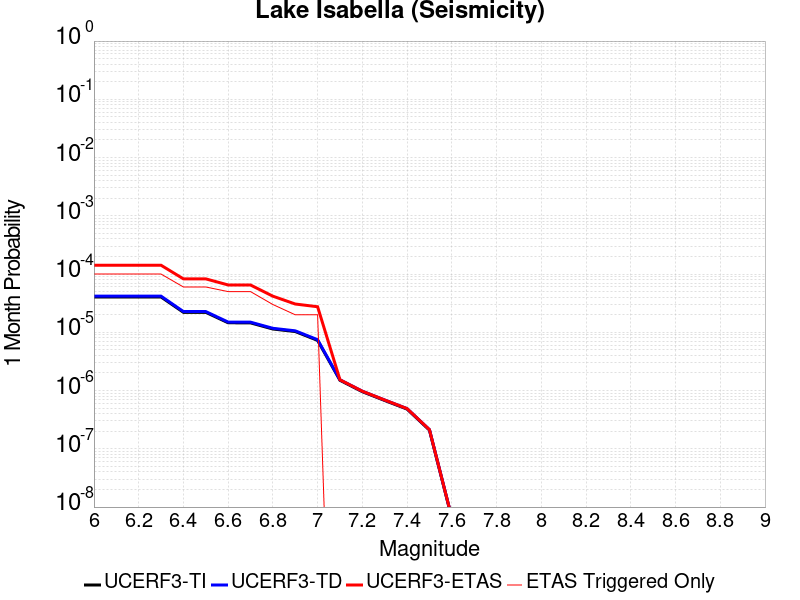 |  |  |

| Magnitude | 1 wk TI Prob | 1 wk TD Prob | 1 wk ETAS Prob | 1 wk ETAS/TD Gain | 1 wk ETAS Triggered Only | 1 mo TI Prob | 1 mo TD Prob | 1 mo ETAS Prob | 1 mo ETAS/TD Gain | 1 mo ETAS Triggered Only | 1 yr TI Prob | 1 yr TD Prob | 1 yr ETAS Prob | 1 yr ETAS/TD Gain | 1 yr ETAS Triggered Only | 10 yr TI Prob | 10 yr TD Prob | 10 yr ETAS Prob | 10 yr ETAS/TD Gain | 10 yr ETAS Triggered Only |
|-----|-----|-----|-----|-----|-----|-----|-----|-----|-----|-----|-----|-----|-----|-----|-----|-----|-----|-----|-----|-----|
| 6.0 | 9.431637E-6 | 9.741651E-6 | 6.9741065E-5 | 7.15906 | 6.0E-5 | 4.0420677E-5 | 4.1749343E-5 | 1.4174517E-4 | 3.3951473 | 1.0E-4 | 4.920106E-4 | 5.0819275E-4 | 6.781064E-4 | 1.3343488 | 1.7E-4 | 0.004909227 | 0.005071599 | 0.005290483 | 1.0431588 | 2.2E-4 |
| 6.1 | 9.431637E-6 | 9.741651E-6 | 6.9741065E-5 | 7.15906 | 6.0E-5 | 4.0420677E-5 | 4.1749343E-5 | 1.4174517E-4 | 3.3951473 | 1.0E-4 | 4.920106E-4 | 5.0819275E-4 | 6.781064E-4 | 1.3343488 | 1.7E-4 | 0.004909227 | 0.005071599 | 0.005290483 | 1.0431588 | 2.2E-4 |
| 6.2 | 9.431637E-6 | 9.741651E-6 | 6.9741065E-5 | 7.15906 | 6.0E-5 | 4.0420677E-5 | 4.1749343E-5 | 1.4174517E-4 | 3.3951473 | 1.0E-4 | 4.920106E-4 | 5.0819275E-4 | 6.781064E-4 | 1.3343488 | 1.7E-4 | 0.004909227 | 0.005071599 | 0.005290483 | 1.0431588 | 2.2E-4 |
| 6.3 | 9.431637E-6 | 9.741651E-6 | 6.9741065E-5 | 7.15906 | 6.0E-5 | 4.0420677E-5 | 4.1749343E-5 | 1.4174517E-4 | 3.3951473 | 1.0E-4 | 4.920106E-4 | 5.0819275E-4 | 6.781064E-4 | 1.3343488 | 1.7E-4 | 0.004909227 | 0.005071599 | 0.005290483 | 1.0431588 | 2.2E-4 |
| 6.4 | 5.144063E-6 | 5.3000763E-6 | 4.5299865E-5 | 8.547022 | 4.0E-5 | 2.2045799E-5 | 2.2714434E-5 | 8.271307E-5 | 3.6414323 | 6.0E-5 | 2.6837454E-4 | 2.765166E-4 | 3.664917E-4 | 1.3253877 | 9.0E-5 | 0.0026805066 | 0.0027620657 | 0.0028717618 | 1.0397153 | 1.1E-4 |
| 6.5 | 5.144063E-6 | 5.3000763E-6 | 4.5299865E-5 | 8.547022 | 4.0E-5 | 2.2045799E-5 | 2.2714434E-5 | 8.271307E-5 | 3.6414323 | 6.0E-5 | 2.6837454E-4 | 2.765166E-4 | 3.664917E-4 | 1.3253877 | 9.0E-5 | 0.0026805066 | 0.0027620657 | 0.0028717618 | 1.0397153 | 1.1E-4 |
| 6.6 | 3.4009804E-6 | 3.498786E-6 | 4.3498647E-5 | 12.432496 | 4.0E-5 | 1.4575549E-5 | 1.4994721E-5 | 6.499397E-5 | 4.334457 | 5.0E-5 | 1.7744285E-4 | 1.8254704E-4 | 2.6253244E-4 | 1.4381633 | 8.0E-5 | 0.0017730123 | 0.0018241286 | 0.0019239462 | 1.0547206 | 1.0E-4 |
| 6.7 | 3.3880428E-6 | 3.4856528E-6 | 4.3485514E-5 | 12.475573 | 4.0E-5 | 1.4520103E-5 | 1.4938435E-5 | 6.493769E-5 | 4.3470206 | 5.0E-5 | 1.767679E-4 | 1.8186188E-4 | 2.6184734E-4 | 1.4398143 | 8.0E-5 | 0.0017662736 | 0.0018172882 | 0.0019171064 | 1.054927 | 1.0E-4 |
| 6.8 | 2.6582E-6 | 2.7337003E-6 | 3.2733617E-5 | 11.974107 | 3.0E-5 | 1.1392236E-5 | 1.1715813E-5 | 4.1715462E-5 | 3.5606117 | 3.0E-5 | 1.3869164E-4 | 1.4263204E-4 | 2.0262347E-4 | 1.4206029 | 6.0E-5 | 0.0013860512 | 0.0014255369 | 0.0014954371 | 1.0490344 | 7.0E-5 |
| 6.9 | 2.406011E-6 | 2.4743288E-6 | 2.247428E-5 | 9.08298 | 2.0E-5 | 1.0311434E-5 | 1.0604231E-5 | 3.060402E-5 | 2.8860197 | 2.0E-5 | 1.2553448E-4 | 1.2910018E-4 | 1.7909372E-4 | 1.3872461 | 5.0E-5 | 0.0012546359 | 0.0012903814 | 0.001350304 | 1.0464379 | 6.0E-5 |
| 7.0 | 1.6953097E-6 | 1.7429371E-6 | 2.1742902E-5 | 12.474863 | 2.0E-5 | 7.265593E-6 | 7.469715E-6 | 2.7469567E-5 | 3.6774583 | 2.0E-5 | 8.8455E-5 | 9.094104E-5 | 1.4093649E-4 | 1.5497568 | 5.0E-5 | 8.84198E-4 | 9.09141E-4 | 9.690864E-4 | 1.0659363 | 6.0E-5 |
| 7.1 | 3.5013824E-7 | 3.5714822E-7 | 3.5714822E-7 | 1.0 | 0.0 | 1.5005916E-6 | 1.5306344E-6 | 1.5306344E-6 | 1.0 | 0.0 | 1.826955E-5 | 1.8635317E-5 | 2.8635131E-5 | 1.5366055 | 1.0E-5 | 1.8268047E-4 | 1.863378E-4 | 1.9633592E-4 | 1.053656 | 1.0E-5 |
| 7.2 | 2.2321095E-7 | 2.2750574E-7 | 2.2750574E-7 | 1.0 | 0.0 | 9.56618E-7 | 9.750242E-7 | 9.750242E-7 | 1.0 | 0.0 | 1.1646762E-5 | 1.1870856E-5 | 2.1870737E-5 | 1.8423892 | 1.0E-5 | 1.1646151E-4 | 1.1870232E-4 | 1.2870114E-4 | 1.0842344 | 1.0E-5 |
| 7.3 | 1.5760406E-7 | 1.6060922E-7 | 1.6060922E-7 | 1.0 | 0.0 | 6.7544585E-7 | 6.8832503E-7 | 6.8832503E-7 | 1.0 | 0.0 | 8.223522E-6 | 8.380326E-6 | 1.8380242E-5 | 2.193261 | 1.0E-5 | 8.2232174E-5 | 8.3800165E-5 | 9.3799325E-5 | 1.1193215 | 1.0E-5 |
| 7.4 | 1.1216497E-7 | 1.1431706E-7 | 1.1431706E-7 | 1.0 | 0.0 | 4.8070694E-7 | 4.899302E-7 | 4.899302E-7 | 1.0 | 0.0 | 5.852591E-6 | 5.964884E-6 | 1.5964824E-5 | 2.6764686 | 1.0E-5 | 5.8524372E-5 | 5.9647282E-5 | 6.964669E-5 | 1.1676422 | 1.0E-5 |
| 7.5 | 4.885185E-8 | 4.9787737E-8 | 4.9787737E-8 | 1.0 | 0.0 | 2.0936506E-7 | 2.13376E-7 | 2.13376E-7 | 1.0 | 0.0 | 2.5490165E-6 | 2.59785E-6 | 2.59785E-6 | 1.0 | 0.0 | 2.5489873E-5 | 2.5978214E-5 | 2.5978214E-5 | 1.0 | 0.0 |
| 7.6 | 1.504641E-9 | 1.5317903E-9 | 1.5317903E-9 | 1.0 | 0.0 | 6.4484613E-9 | 6.5648154E-9 | 6.5648154E-9 | 1.0 | 0.0 | 7.851001E-8 | 7.992663E-8 | 7.992663E-8 | 1.0 | 0.0 | 7.8509987E-7 | 7.992663E-7 | 7.992663E-7 | 1.0 | 0.0 |

## Scodie Lineament
*[(top)](#table-of-contents)*

| 1 Week | 1 Month | 1 Year | 10 Year |
|-----|-----|-----|-----|
|  |  |  |  |

| Magnitude | 1 wk TI Prob | 1 wk TD Prob | 1 wk ETAS Prob | 1 wk ETAS/TD Gain | 1 wk ETAS Triggered Only | 1 mo TI Prob | 1 mo TD Prob | 1 mo ETAS Prob | 1 mo ETAS/TD Gain | 1 mo ETAS Triggered Only | 1 yr TI Prob | 1 yr TD Prob | 1 yr ETAS Prob | 1 yr ETAS/TD Gain | 1 yr ETAS Triggered Only | 10 yr TI Prob | 10 yr TD Prob | 10 yr ETAS Prob | 10 yr ETAS/TD Gain | 10 yr ETAS Triggered Only |
|-----|-----|-----|-----|-----|-----|-----|-----|-----|-----|-----|-----|-----|-----|-----|-----|-----|-----|-----|-----|-----|
| 6.0 | 3.2919327E-6 | 3.0133422E-6 | 6.301316E-5 | 20.911386 | 6.0E-5 | 1.4108206E-5 | 1.2914278E-5 | 9.2913244E-5 | 7.194614 | 8.0E-5 | 1.7175387E-4 | 1.5722317E-4 | 3.0719957E-4 | 1.9539078 | 1.5E-4 | 0.0017162118 | 0.0015714309 | 0.0017910852 | 1.1397798 | 2.2E-4 |
| 6.1 | 1.8663811E-6 | 1.5490499E-6 | 4.154899E-5 | 26.822239 | 4.0E-5 | 7.998751E-6 | 6.6387715E-6 | 4.6638506E-5 | 7.0251713 | 4.0E-5 | 9.738045E-5 | 8.082454E-5 | 1.5081889E-4 | 1.8660036 | 7.0E-5 | 9.7337784E-4 | 8.080003E-4 | 8.8793563E-4 | 1.0989299 | 8.0E-5 |
| 6.2 | 1.8663811E-6 | 1.5490499E-6 | 4.154899E-5 | 26.822239 | 4.0E-5 | 7.998751E-6 | 6.6387715E-6 | 4.6638506E-5 | 7.0251713 | 4.0E-5 | 9.738045E-5 | 8.082454E-5 | 1.5081889E-4 | 1.8660036 | 7.0E-5 | 9.7337784E-4 | 8.080003E-4 | 8.8793563E-4 | 1.0989299 | 8.0E-5 |
| 6.3 | 1.8663811E-6 | 1.5490499E-6 | 4.154899E-5 | 26.822239 | 4.0E-5 | 7.998751E-6 | 6.6387715E-6 | 4.6638506E-5 | 7.0251713 | 4.0E-5 | 9.738045E-5 | 8.082454E-5 | 1.5081889E-4 | 1.8660036 | 7.0E-5 | 9.7337784E-4 | 8.080003E-4 | 8.8793563E-4 | 1.0989299 | 8.0E-5 |
| 6.4 | 1.8663811E-6 | 1.5490499E-6 | 4.154899E-5 | 26.822239 | 4.0E-5 | 7.998751E-6 | 6.6387715E-6 | 4.6638506E-5 | 7.0251713 | 4.0E-5 | 9.738045E-5 | 8.082454E-5 | 1.5081889E-4 | 1.8660036 | 7.0E-5 | 9.7337784E-4 | 8.080003E-4 | 8.8793563E-4 | 1.0989299 | 8.0E-5 |
| 6.5 | 1.8106311E-6 | 1.4909839E-6 | 4.1490923E-5 | 27.82788 | 4.0E-5 | 7.759824E-6 | 6.3899183E-6 | 4.638966E-5 | 7.259821 | 4.0E-5 | 9.447177E-5 | 7.7794975E-5 | 1.4778953E-4 | 1.899731 | 7.0E-5 | 9.4431615E-4 | 7.7772606E-4 | 8.5766386E-4 | 1.102784 | 8.0E-5 |
| 6.6 | 1.2414679E-6 | 8.997558E-7 | 2.0899737E-5 | 23.228235 | 2.0E-5 | 5.320566E-6 | 3.856091E-6 | 2.3856013E-5 | 6.1865797 | 2.0E-5 | 6.477596E-5 | 4.6946985E-5 | 9.6944634E-5 | 2.0649812 | 5.0E-5 | 6.475708E-4 | 4.693793E-4 | 5.193558E-4 | 1.1064737 | 5.0E-5 |
| 6.7 | 1.1062215E-6 | 7.594311E-7 | 2.0759417E-5 | 27.335484 | 2.0E-5 | 4.7409408E-6 | 3.2547011E-6 | 2.3254635E-5 | 7.1449375 | 2.0E-5 | 5.7719422E-5 | 3.9625334E-5 | 8.9623354E-5 | 2.261769 | 5.0E-5 | 5.770443E-4 | 3.961897E-4 | 4.4616987E-4 | 1.1261522 | 5.0E-5 |
| 6.8 | 1.0006736E-6 | 6.500397E-7 | 2.0650026E-5 | 31.767332 | 2.0E-5 | 4.288594E-6 | 2.7858816E-6 | 2.2785825E-5 | 8.179036 | 2.0E-5 | 5.221238E-5 | 3.3917644E-5 | 8.391595E-5 | 2.474109 | 5.0E-5 | 5.220012E-4 | 3.3913075E-4 | 3.891138E-4 | 1.1473857 | 5.0E-5 |
| 6.9 | 9.167364E-7 | 5.631625E-7 | 2.0563151E-5 | 36.51371 | 2.0E-5 | 3.9288643E-6 | 2.4135516E-6 | 2.2413504E-5 | 9.286524 | 2.0E-5 | 4.7832873E-5 | 2.9384651E-5 | 5.938377E-5 | 2.0209112 | 3.0E-5 | 4.782258E-4 | 2.9381333E-4 | 3.2380453E-4 | 1.1020757 | 3.0E-5 |
| 7.0 | 7.6987664E-7 | 4.113383E-7 | 2.041133E-5 | 49.62176 | 2.0E-5 | 3.2994672E-6 | 1.7628774E-6 | 2.1762842E-5 | 12.345068 | 2.0E-5 | 4.0170275E-5 | 2.1462862E-5 | 5.1462215E-5 | 2.3977334 | 3.0E-5 | 4.0163012E-4 | 2.1461173E-4 | 2.446053E-4 | 1.1397573 | 3.0E-5 |
| 7.1 | 7.1038727E-7 | 3.5211494E-7 | 1.03521115E-5 | 29.399809 | 1.0E-5 | 3.0445133E-6 | 1.5090633E-6 | 1.1509048E-5 | 7.6266174 | 1.0E-5 | 3.706632E-5 | 1.8372726E-5 | 3.837236E-5 | 2.08855 | 2.0E-5 | 3.7060137E-4 | 1.8371557E-4 | 2.037119E-4 | 1.1088439 | 2.0E-5 |
| 7.2 | 2.0799602E-7 | 3.1186854E-8 | 3.1186854E-8 | 1.0 | 0.0 | 8.914113E-7 | 1.3365793E-7 | 1.3365793E-7 | 1.0 | 0.0 | 1.0852878E-5 | 1.6272843E-6 | 1.6272843E-6 | 1.0 | 0.0 | 1.08523476E-4 | 1.627273E-5 | 1.627273E-5 | 1.0 | 0.0 |
| 7.3 | 1.5048182E-7 | 1.5945696E-8 | 1.5945696E-8 | 1.0 | 0.0 | 6.449219E-7 | 6.83387E-8 | 6.83387E-8 | 1.0 | 0.0 | 7.851896E-6 | 8.320234E-7 | 8.320234E-7 | 1.0 | 0.0 | 7.851618E-5 | 8.320206E-6 | 8.320206E-6 | 1.0 | 0.0 |
| 7.4 | 5.9334678E-8 | 4.8683537E-9 | 4.8683537E-9 | 1.0 | 0.0 | 2.5429145E-7 | 2.0864372E-8 | 2.0864372E-8 | 1.0 | 0.0 | 3.095994E-6 | 2.5402372E-7 | 2.5402372E-7 | 1.0 | 0.0 | 3.095951E-5 | 2.5402353E-6 | 2.5402353E-6 | 1.0 | 0.0 |

## Santa Rosa Island
*[(top)](#table-of-contents)*

| 1 Week | 1 Month | 1 Year | 10 Year |
|-----|-----|-----|-----|
|  |  |  |  |

| Magnitude | 1 wk TI Prob | 1 wk TD Prob | 1 wk ETAS Prob | 1 wk ETAS/TD Gain | 1 wk ETAS Triggered Only | 1 mo TI Prob | 1 mo TD Prob | 1 mo ETAS Prob | 1 mo ETAS/TD Gain | 1 mo ETAS Triggered Only | 1 yr TI Prob | 1 yr TD Prob | 1 yr ETAS Prob | 1 yr ETAS/TD Gain | 1 yr ETAS Triggered Only | 10 yr TI Prob | 10 yr TD Prob | 10 yr ETAS Prob | 10 yr ETAS/TD Gain | 10 yr ETAS Triggered Only |
|-----|-----|-----|-----|-----|-----|-----|-----|-----|-----|-----|-----|-----|-----|-----|-----|-----|-----|-----|-----|-----|
| 6.0 | 4.1143165E-5 | 4.7091133E-5 | 1.0708831E-4 | 2.2740653 | 6.0E-5 | 1.7631594E-4 | 2.0180465E-4 | 2.6179253E-4 | 1.2972572 | 6.0E-5 | 0.002144533 | 0.0024544 | 0.002584081 | 1.0528361 | 1.3E-4 | 0.021239553 | 0.024293551 | 0.024469178 | 1.0072293 | 1.8E-4 |
| 6.1 | 2.1061249E-5 | 2.3864959E-5 | 6.3864005E-5 | 2.6760576 | 4.0E-5 | 9.0259375E-5 | 1.0227455E-4 | 1.4227047E-4 | 1.3910642 | 4.0E-5 | 0.0010983539 | 0.0012445104 | 0.0013044357 | 1.0481517 | 6.0E-5 | 0.01092941 | 0.012378449 | 0.012447582 | 1.005585 | 7.0E-5 |
| 6.2 | 2.1061249E-5 | 2.3864959E-5 | 6.3864005E-5 | 2.6760576 | 4.0E-5 | 9.0259375E-5 | 1.0227455E-4 | 1.4227047E-4 | 1.3910642 | 4.0E-5 | 0.0010983539 | 0.0012445104 | 0.0013044357 | 1.0481517 | 6.0E-5 | 0.01092941 | 0.012378449 | 0.012447582 | 1.005585 | 7.0E-5 |
| 6.3 | 1.5158236E-5 | 1.7074419E-5 | 4.7073907E-5 | 2.7569845 | 3.0E-5 | 6.496225E-5 | 7.3174095E-5 | 1.031719E-4 | 1.4099511 | 3.0E-5 | 7.906284E-4 | 8.905424E-4 | 9.2051574E-4 | 1.0336573 | 3.0E-5 | 0.007878214 | 0.008870989 | 0.008910635 | 1.004469 | 4.0E-5 |
| 6.4 | 1.2341918E-5 | 1.3852917E-5 | 3.385264E-5 | 2.4437194 | 2.0E-5 | 5.2892858E-5 | 5.9368336E-5 | 7.936715E-5 | 1.33686 | 2.0E-5 | 6.437803E-4 | 7.225779E-4 | 7.4256345E-4 | 1.0276587 | 2.0E-5 | 0.006419184 | 0.007203121 | 0.007222977 | 1.0027566 | 2.0E-5 |
| 6.5 | 9.061158E-6 | 1.0117031E-5 | 3.011683E-5 | 2.9768445 | 2.0E-5 | 3.883296E-5 | 4.3358013E-5 | 6.335715E-5 | 1.4612558 | 2.0E-5 | 4.726887E-4 | 5.277613E-4 | 5.4775074E-4 | 1.0378759 | 2.0E-5 | 0.004716845 | 0.0052656173 | 0.005285512 | 1.0037782 | 2.0E-5 |
| 6.6 | 7.5461685E-6 | 8.400733E-6 | 1.840065E-5 | 2.1903622 | 1.0E-5 | 3.2340322E-5 | 3.600267E-5 | 4.600231E-5 | 1.2777472 | 1.0E-5 | 3.936723E-4 | 4.3824865E-4 | 4.4824427E-4 | 1.0228081 | 1.0E-5 | 0.003929756 | 0.0043742736 | 0.00438423 | 1.0022761 | 1.0E-5 |
| 6.7 | 5.5023775E-6 | 6.087381E-6 | 1.608732E-5 | 2.6427326 | 1.0E-5 | 2.3581404E-5 | 2.6088532E-5 | 3.608827E-5 | 1.3833002 | 1.0E-5 | 2.8706578E-4 | 3.1758484E-4 | 3.2758166E-4 | 1.0314777 | 1.0E-5 | 0.0028669522 | 0.0031716314 | 0.0031815998 | 1.003143 | 1.0E-5 |
| 6.8 | 3.7351679E-6 | 4.0831405E-6 | 1.40831E-5 | 3.4490852 | 1.0E-5 | 1.6007763E-5 | 1.749907E-5 | 2.7498894E-5 | 1.5714489 | 1.0E-5 | 1.948771E-4 | 2.1303284E-4 | 2.2303071E-4 | 1.0469311 | 1.0E-5 | 0.0019470629 | 0.0021285315 | 0.00213851 | 1.004688 | 1.0E-5 |
| 6.9 | 2.456366E-6 | 2.6292705E-6 | 2.6292705E-6 | 1.0 | 0.0 | 1.0527241E-5 | 1.1268254E-5 | 1.1268254E-5 | 1.0 | 0.0 | 1.2816161E-4 | 1.3718237E-4 | 1.3718237E-4 | 1.0 | 0.0 | 0.0012808773 | 0.0013709799 | 0.0013709799 | 1.0 | 0.0 |
| 7.0 | 2.3245157E-6 | 2.4827782E-6 | 2.4827782E-6 | 1.0 | 0.0 | 9.962172E-6 | 1.0640435E-5 | 1.0640435E-5 | 1.0 | 0.0 | 1.2128269E-4 | 1.2953962E-4 | 1.2953962E-4 | 1.0 | 0.0 | 0.0012121652 | 0.0012946434 | 0.0012946434 | 1.0 | 0.0 |
| 7.1 | 2.2248344E-6 | 2.37325E-6 | 2.37325E-6 | 1.0 | 0.0 | 9.53497E-6 | 1.0171032E-5 | 1.0171032E-5 | 1.0 | 0.0 | 1.1608207E-4 | 1.2382529E-4 | 1.2382529E-4 | 1.0 | 0.0 | 0.0011602144 | 0.001237565 | 0.001237565 | 1.0 | 0.0 |
| 7.2 | 2.1350402E-6 | 2.276154E-6 | 2.276154E-6 | 1.0 | 0.0 | 9.150141E-6 | 9.754909E-6 | 9.754909E-6 | 1.0 | 0.0 | 1.1139726E-4 | 1.1875956E-4 | 1.1875956E-4 | 1.0 | 0.0 | 0.0011134144 | 0.0011869629 | 0.0011869629 | 1.0 | 0.0 |
| 7.3 | 1.9793572E-6 | 2.108719E-6 | 2.108719E-6 | 1.0 | 0.0 | 8.482932E-6 | 9.037336E-6 | 9.037336E-6 | 1.0 | 0.0 | 1.032748E-4 | 1.10024026E-4 | 1.10024026E-4 | 1.0 | 0.0 | 0.0010322682 | 0.0010996973 | 0.0010996973 | 1.0 | 0.0 |
| 7.4 | 1.6951194E-6 | 1.8045733E-6 | 1.8045733E-6 | 1.0 | 0.0 | 7.264777E-6 | 7.733863E-6 | 7.733863E-6 | 1.0 | 0.0 | 8.844508E-5 | 9.415573E-5 | 9.415573E-5 | 1.0 | 0.0 | 8.840988E-4 | 9.4116E-4 | 9.4116E-4 | 1.0 | 0.0 |
| 7.5 | 8.987207E-7 | 9.5122147E-7 | 9.5122147E-7 | 1.0 | 0.0 | 3.8516546E-6 | 4.076657E-6 | 4.076657E-6 | 1.0 | 0.0 | 4.6892885E-5 | 4.963218E-5 | 4.963218E-5 | 1.0 | 0.0 | 4.688299E-4 | 4.9621216E-4 | 4.9621216E-4 | 1.0 | 0.0 |
| 7.6 | 3.8783037E-7 | 4.052932E-7 | 4.052932E-7 | 1.0 | 0.0 | 1.6621291E-6 | 1.7369698E-6 | 1.7369698E-6 | 1.0 | 0.0 | 2.0236233E-5 | 2.1147409E-5 | 2.1147409E-5 | 1.0 | 0.0 | 2.023439E-4 | 2.1145462E-4 | 2.1145462E-4 | 1.0 | 0.0 |
| 7.7 | 6.181804E-8 | 6.339035E-8 | 6.339035E-8 | 1.0 | 0.0 | 2.6493444E-7 | 2.7167292E-7 | 2.7167292E-7 | 1.0 | 0.0 | 3.225572E-6 | 3.3076128E-6 | 3.3076128E-6 | 1.0 | 0.0 | 3.225525E-5 | 3.307564E-5 | 3.307564E-5 | 1.0 | 0.0 |
| 7.8 | 1.3704449E-9 | 1.3964153E-9 | 1.3964153E-9 | 1.0 | 0.0 | 5.873335E-9 | 5.984637E-9 | 5.984637E-9 | 1.0 | 0.0 | 7.1507856E-8 | 7.286295E-8 | 7.286295E-8 | 1.0 | 0.0 | 7.1507833E-7 | 7.286294E-7 | 7.286294E-7 | 1.0 | 0.0 |

## Brawley (Seismic Zone) alt 1
*[(top)](#table-of-contents)*

| 1 Week | 1 Month | 1 Year | 10 Year |
|-----|-----|-----|-----|
|  |  |  |  |

| Magnitude | 1 wk TI Prob | 1 wk TD Prob | 1 wk ETAS Prob | 1 wk ETAS/TD Gain | 1 wk ETAS Triggered Only | 1 mo TI Prob | 1 mo TD Prob | 1 mo ETAS Prob | 1 mo ETAS/TD Gain | 1 mo ETAS Triggered Only | 1 yr TI Prob | 1 yr TD Prob | 1 yr ETAS Prob | 1 yr ETAS/TD Gain | 1 yr ETAS Triggered Only | 10 yr TI Prob | 10 yr TD Prob | 10 yr ETAS Prob | 10 yr ETAS/TD Gain | 10 yr ETAS Triggered Only |
|-----|-----|-----|-----|-----|-----|-----|-----|-----|-----|-----|-----|-----|-----|-----|-----|-----|-----|-----|-----|-----|
| 6.0 | 2.2521618E-4 | 4.7632487E-4 | 5.66282E-4 | 1.1888567 | 9.0E-5 | 9.6485513E-4 | 0.0020398323 | 0.0021396284 | 1.0489236 | 1.0E-4 | 0.011683988 | 0.024546238 | 0.024702309 | 1.0063583 | 1.6E-4 | 0.11088423 | 0.21350002 | 0.21364945 | 1.0006999 | 1.9E-4 |
| 6.1 | 2.2521618E-4 | 4.7632487E-4 | 5.66282E-4 | 1.1888567 | 9.0E-5 | 9.6485513E-4 | 0.0020398323 | 0.0021396284 | 1.0489236 | 1.0E-4 | 0.011683988 | 0.024546238 | 0.024702309 | 1.0063583 | 1.6E-4 | 0.11088423 | 0.21350002 | 0.21364945 | 1.0006999 | 1.9E-4 |
| 6.2 | 2.198148E-4 | 4.6717093E-4 | 5.5712886E-4 | 1.192559 | 9.0E-5 | 9.417233E-4 | 0.0020006616 | 0.0021004614 | 1.0498835 | 1.0E-4 | 0.011405343 | 0.024080504 | 0.02423665 | 1.0064844 | 1.6E-4 | 0.10837428 | 0.20993657 | 0.21008669 | 1.000715 | 1.9E-4 |
| 6.3 | 2.1704129E-4 | 4.615278E-4 | 5.514862E-4 | 1.1949145 | 9.0E-5 | 9.298453E-4 | 0.0019765133 | 0.0020763157 | 1.0504942 | 1.0E-4 | 0.011262234 | 0.02379366 | 0.023940092 | 1.0061542 | 1.5E-4 | 0.107082725 | 0.20782755 | 0.20797014 | 1.000686 | 1.8E-4 |
| 6.4 | 1.876142E-4 | 4.00449E-4 | 4.90413E-4 | 1.2246577 | 9.0E-5 | 8.038131E-4 | 0.0017150956 | 0.0018149241 | 1.0582058 | 1.0E-4 | 0.00974259 | 0.020680401 | 0.020827299 | 1.0071032 | 1.5E-4 | 0.093263686 | 0.18457815 | 0.18472493 | 1.0007952 | 1.8E-4 |
| 6.5 | 1.7390939E-4 | 3.7477075E-4 | 4.5474077E-4 | 1.2133838 | 8.0E-5 | 7.45113E-4 | 0.0016051838 | 0.0016950394 | 1.0559783 | 9.0E-5 | 0.009034078 | 0.019368723 | 0.019506011 | 1.0070882 | 1.4E-4 | 0.086755216 | 0.17440031 | 0.17454067 | 1.0008048 | 1.7E-4 |
| 6.6 | 1.591791E-4 | 3.4891962E-4 | 4.288917E-4 | 1.2291992 | 8.0E-5 | 6.8201777E-4 | 0.0014945229 | 0.0015843884 | 1.0601299 | 9.0E-5 | 0.008271996 | 0.018045569 | 0.018183043 | 1.0076182 | 1.4E-4 | 0.07970774 | 0.16380852 | 0.16395068 | 1.0008678 | 1.7E-4 |
| 6.7 | 1.4268003E-4 | 3.20582E-4 | 3.9055958E-4 | 1.2182828 | 7.0E-5 | 6.1134255E-4 | 0.0013732077 | 0.0014530978 | 1.0581777 | 8.0E-5 | 0.007417723 | 0.016592601 | 0.016720446 | 1.0077049 | 1.3E-4 | 0.07174956 | 0.15193306 | 0.15206875 | 1.0008931 | 1.6E-4 |
| 6.8 | 1.239713E-4 | 2.9053655E-4 | 3.6051622E-4 | 1.2408636 | 7.0E-5 | 5.3119735E-4 | 0.0012445687 | 0.0013244691 | 1.0641993 | 8.0E-5 | 0.0064481674 | 0.015048777 | 0.015176821 | 1.0085086 | 1.3E-4 | 0.06264243 | 0.13837762 | 0.13851549 | 1.0009962 | 1.6E-4 |
| 6.9 | 1.0180238E-4 | 2.625439E-4 | 3.3252552E-4 | 1.2665521 | 7.0E-5 | 4.3622297E-4 | 0.0011247073 | 0.0012046172 | 1.0710496 | 8.0E-5 | 0.005298089 | 0.013608336 | 0.0137365665 | 1.009423 | 1.3E-4 | 0.05173543 | 0.124961674 | 0.12510169 | 1.0011204 | 1.6E-4 |
| 7.0 | 7.6619996E-5 | 2.23993E-4 | 2.8397955E-4 | 1.2678055 | 6.0E-5 | 3.283301E-4 | 9.5962E-4 | 0.0010295529 | 1.0728755 | 7.0E-5 | 0.0039900932 | 0.011621496 | 0.011730217 | 1.0093552 | 1.1E-4 | 0.039192066 | 0.107266866 | 0.10739185 | 1.0011652 | 1.4E-4 |
| 7.1 | 7.5127435E-5 | 2.2082464E-4 | 2.808114E-4 | 1.2716488 | 6.0E-5 | 3.2193496E-4 | 9.4605127E-4 | 0.001015985 | 1.0739218 | 7.0E-5 | 0.0039125155 | 0.011458045 | 0.011566784 | 1.0094903 | 1.1E-4 | 0.038443442 | 0.10583085 | 0.10595603 | 1.0011829 | 1.4E-4 |
| 7.2 | 6.788582E-5 | 2.0210193E-4 | 2.620898E-4 | 1.2968199 | 6.0E-5 | 2.9090676E-4 | 8.6586666E-4 | 9.358061E-4 | 1.0807738 | 7.0E-5 | 0.0035360386 | 0.0104916105 | 0.010600456 | 1.0103745 | 1.1E-4 | 0.034803 | 0.09750131 | 0.09761863 | 1.0012033 | 1.3E-4 |
| 7.3 | 6.399602E-5 | 1.8841137E-4 | 2.4840006E-4 | 1.3183922 | 6.0E-5 | 2.7423984E-4 | 8.072303E-4 | 8.771738E-4 | 1.0866463 | 7.0E-5 | 0.0033337586 | 0.009784332 | 0.009893254 | 1.0111325 | 1.1E-4 | 0.03284188 | 0.09139617 | 0.09151428 | 1.0012923 | 1.3E-4 |
| 7.4 | 4.506759E-5 | 1.2529209E-4 | 1.7528582E-4 | 1.3990175 | 5.0E-5 | 1.9313251E-4 | 5.368565E-4 | 5.968243E-4 | 1.1117017 | 6.0E-5 | 0.0023488526 | 0.0065168133 | 0.0066161617 | 1.015245 | 1.0E-4 | 0.023241805 | 0.062363707 | 0.062466845 | 1.0016538 | 1.1E-4 |
| 7.5 | 3.43289E-5 | 9.33541E-5 | 1.4334943E-4 | 1.5355451 | 5.0E-5 | 1.4711556E-4 | 4.00028E-4 | 4.6000397E-4 | 1.1499295 | 6.0E-5 | 0.0017896603 | 0.0048595266 | 0.004949089 | 1.0184304 | 9.0E-5 | 0.01775316 | 0.04705519 | 0.047150485 | 1.0020251 | 1.0E-4 |
| 7.6 | 2.5980507E-5 | 7.053101E-5 | 1.1052819E-4 | 1.5670865 | 4.0E-5 | 1.1134028E-4 | 3.0224086E-4 | 3.5222576E-4 | 1.165381 | 5.0E-5 | 0.001354725 | 0.003673598 | 0.003753304 | 1.021697 | 8.0E-5 | 0.013464959 | 0.035840835 | 0.03592761 | 1.0024211 | 9.0E-5 |
| 7.7 | 1.7292105E-5 | 4.9407296E-5 | 7.9405814E-5 | 1.6071677 | 3.0E-5 | 7.4106916E-5 | 2.117284E-4 | 2.5171993E-4 | 1.1888813 | 4.0E-5 | 9.018782E-4 | 0.0025747516 | 0.0026345972 | 1.0232432 | 6.0E-5 | 0.008982267 | 0.025290398 | 0.025358627 | 1.0026978 | 7.0E-5 |
| 7.8 | 1.2927471E-5 | 3.9693266E-5 | 5.9692473E-5 | 1.5038438 | 2.0E-5 | 5.5402274E-5 | 1.7010293E-4 | 2.0009783E-4 | 1.1763338 | 3.0E-5 | 6.743139E-4 | 0.0020690386 | 0.002118935 | 1.0241158 | 5.0E-5 | 0.0067227143 | 0.020431727 | 0.020490501 | 1.0028766 | 6.0E-5 |
| 7.9 | 1.0200774E-5 | 2.874569E-5 | 4.8745114E-5 | 1.6957365 | 2.0E-5 | 4.371687E-5 | 1.2319001E-4 | 1.5318631E-4 | 1.2434963 | 3.0E-5 | 5.321229E-4 | 0.0014988075 | 0.0015387476 | 1.0266479 | 4.0E-5 | 0.005308505 | 0.014991644 | 0.015031044 | 1.0026282 | 4.0E-5 |
| 8.0 | 8.650396E-6 | 2.3277367E-5 | 4.32769E-5 | 1.8591837 | 2.0E-5 | 3.70726E-5 | 9.975634E-5 | 1.2975335E-4 | 1.3007028 | 3.0E-5 | 4.5126543E-4 | 0.0012138576 | 0.001253809 | 1.0329129 | 4.0E-5 | 0.0045035016 | 0.012211097 | 0.012250609 | 1.0032357 | 4.0E-5 |
| 8.1 | 3.9368224E-6 | 7.3279825E-6 | 7.3279825E-6 | 1.0 | 0.0 | 1.6871985E-5 | 3.140526E-5 | 3.140526E-5 | 1.0 | 0.0 | 2.0539707E-4 | 3.8229208E-4 | 3.8229208E-4 | 1.0 | 0.0 | 0.0020520731 | 0.004001185 | 0.004001185 | 1.0 | 0.0 |
| 8.2 | 1.7101195E-6 | 2.217876E-6 | 2.217876E-6 | 1.0 | 0.0 | 7.329063E-6 | 9.505149E-6 | 9.505149E-6 | 1.0 | 0.0 | 8.922769E-5 | 1.1571907E-4 | 1.1571907E-4 | 1.0 | 0.0 | 8.9191867E-4 | 0.0012666774 | 0.0012666774 | 1.0 | 0.0 |
| 8.3 | 3.0346666E-8 | 1.721586E-8 | 1.721586E-8 | 1.0 | 0.0 | 1.3005713E-7 | 7.378226E-8 | 7.378226E-8 | 1.0 | 0.0 | 1.5834444E-6 | 8.9829894E-7 | 8.9829894E-7 | 1.0 | 0.0 | 1.5834332E-5 | 9.367729E-6 | 9.367729E-6 | 1.0 | 0.0 |

## Santa Ynez (East)
*[(top)](#table-of-contents)*

| 1 Week | 1 Month | 1 Year | 10 Year |
|-----|-----|-----|-----|
|  | 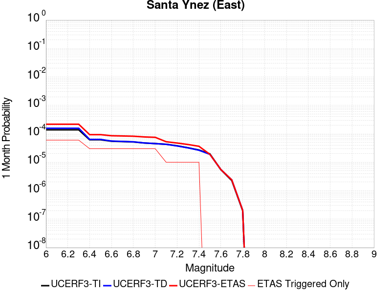 |  | 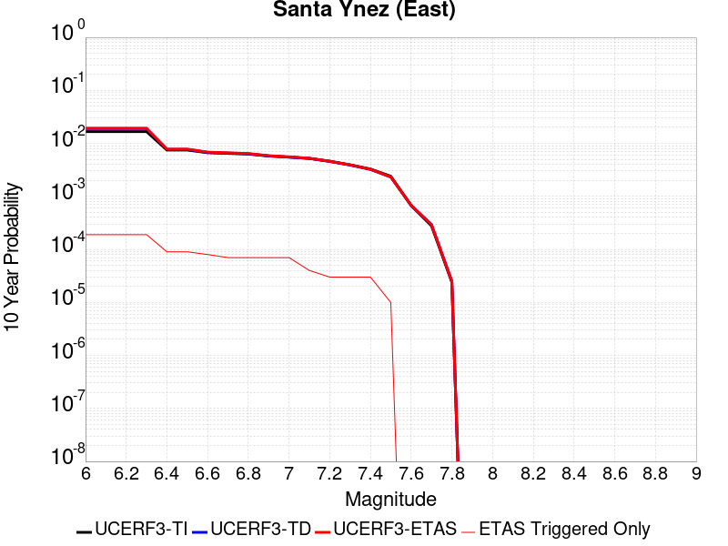 |

| Magnitude | 1 wk TI Prob | 1 wk TD Prob | 1 wk ETAS Prob | 1 wk ETAS/TD Gain | 1 wk ETAS Triggered Only | 1 mo TI Prob | 1 mo TD Prob | 1 mo ETAS Prob | 1 mo ETAS/TD Gain | 1 mo ETAS Triggered Only | 1 yr TI Prob | 1 yr TD Prob | 1 yr ETAS Prob | 1 yr ETAS/TD Gain | 1 yr ETAS Triggered Only | 10 yr TI Prob | 10 yr TD Prob | 10 yr ETAS Prob | 10 yr ETAS/TD Gain | 10 yr ETAS Triggered Only |
|-----|-----|-----|-----|-----|-----|-----|-----|-----|-----|-----|-----|-----|-----|-----|-----|-----|-----|-----|-----|-----|
| 6.0 | 3.2269712E-5 | 3.67505E-5 | 6.67494E-5 | 1.8162854 | 3.0E-5 | 1.3829143E-4 | 1.5749598E-4 | 2.1748652E-4 | 1.3809022 | 6.0E-5 | 0.0016823979 | 0.0019164166 | 0.0020262059 | 1.0572888 | 1.1E-4 | 0.016697178 | 0.019056441 | 0.019242821 | 1.0097804 | 1.9E-4 |
| 6.1 | 3.2269712E-5 | 3.67505E-5 | 6.67494E-5 | 1.8162854 | 3.0E-5 | 1.3829143E-4 | 1.5749598E-4 | 2.1748652E-4 | 1.3809022 | 6.0E-5 | 0.0016823979 | 0.0019164166 | 0.0020262059 | 1.0572888 | 1.1E-4 | 0.016697178 | 0.019056441 | 0.019242821 | 1.0097804 | 1.9E-4 |
| 6.2 | 3.2269712E-5 | 3.67505E-5 | 6.67494E-5 | 1.8162854 | 3.0E-5 | 1.3829143E-4 | 1.5749598E-4 | 2.1748652E-4 | 1.3809022 | 6.0E-5 | 0.0016823979 | 0.0019164166 | 0.0020262059 | 1.0572888 | 1.1E-4 | 0.016697178 | 0.019056441 | 0.019242821 | 1.0097804 | 1.9E-4 |
| 6.3 | 3.2269712E-5 | 3.67505E-5 | 6.67494E-5 | 1.8162854 | 3.0E-5 | 1.3829143E-4 | 1.5749598E-4 | 2.1748652E-4 | 1.3809022 | 6.0E-5 | 0.0016823979 | 0.0019164166 | 0.0020262059 | 1.0572888 | 1.1E-4 | 0.016697178 | 0.019056441 | 0.019242821 | 1.0097804 | 1.9E-4 |
| 6.4 | 1.4404779E-5 | 1.4849382E-5 | 3.4849087E-5 | 2.3468373 | 2.0E-5 | 6.1733306E-5 | 6.363868E-5 | 9.363678E-5 | 1.4713814 | 3.0E-5 | 7.513438E-4 | 7.745306E-4 | 8.144996E-4 | 1.0516042 | 4.0E-5 | 0.0074880854 | 0.007718862 | 0.007808167 | 1.0115697 | 9.0E-5 |
| 6.5 | 1.4404779E-5 | 1.4849382E-5 | 3.4849087E-5 | 2.3468373 | 2.0E-5 | 6.1733306E-5 | 6.363868E-5 | 9.363678E-5 | 1.4713814 | 3.0E-5 | 7.513438E-4 | 7.745306E-4 | 8.144996E-4 | 1.0516042 | 4.0E-5 | 0.0074880854 | 0.007718862 | 0.007808167 | 1.0115697 | 9.0E-5 |
| 6.6 | 1.280208E-5 | 1.3011947E-5 | 3.3011685E-5 | 2.537029 | 2.0E-5 | 5.4864904E-5 | 5.5764307E-5 | 8.576263E-5 | 1.5379485 | 3.0E-5 | 6.6777546E-4 | 6.787207E-4 | 7.1869354E-4 | 1.0588944 | 4.0E-5 | 0.006657724 | 0.0067666885 | 0.006846147 | 1.0117426 | 8.0E-5 |
| 6.7 | 1.2457027E-5 | 1.2628468E-5 | 3.2628213E-5 | 2.5837035 | 2.0E-5 | 5.3386164E-5 | 5.412089E-5 | 8.411927E-5 | 1.5542846 | 3.0E-5 | 6.497827E-4 | 6.587243E-4 | 6.8870455E-4 | 1.0455126 | 3.0E-5 | 0.00647886 | 0.006567915 | 0.006637455 | 1.0105879 | 7.0E-5 |
| 6.8 | 1.2095134E-5 | 1.2230915E-5 | 3.223067E-5 | 2.6351807 | 2.0E-5 | 5.1835254E-5 | 5.241716E-5 | 8.241559E-5 | 1.5723016 | 3.0E-5 | 6.309115E-4 | 6.379937E-4 | 6.679745E-4 | 1.0469924 | 3.0E-5 | 0.0062912325 | 0.006361809 | 0.0064313635 | 1.0109332 | 7.0E-5 |
| 6.9 | 1.1104036E-5 | 1.1157347E-5 | 3.1157124E-5 | 2.7925208 | 2.0E-5 | 4.758786E-5 | 4.781633E-5 | 7.78149E-5 | 1.6273707 | 3.0E-5 | 5.7922816E-4 | 5.820096E-4 | 6.1199215E-4 | 1.0515156 | 3.0E-5 | 0.005777207 | 0.0058049993 | 0.005874593 | 1.0119885 | 7.0E-5 |
| 7.0 | 1.0577444E-5 | 1.058168E-5 | 3.058147E-5 | 2.890039 | 2.0E-5 | 4.5331115E-5 | 4.5349276E-5 | 7.534792E-5 | 1.661502 | 3.0E-5 | 5.5176654E-4 | 5.519888E-4 | 5.8197224E-4 | 1.0543189 | 3.0E-5 | 0.0055039856 | 0.0055063153 | 0.0055759302 | 1.0126426 | 7.0E-5 |
| 7.1 | 1.0021775E-5 | 9.980988E-6 | 9.980988E-6 | 1.0 | 0.0 | 4.294976E-5 | 4.2774966E-5 | 5.277454E-5 | 1.2337716 | 1.0E-5 | 5.2278786E-4 | 5.2066194E-4 | 5.306567E-4 | 1.0191963 | 1.0E-5 | 0.0052155964 | 0.0051945536 | 0.005234346 | 1.0076604 | 4.0E-5 |
| 7.2 | 8.874109E-6 | 8.748793E-6 | 8.748793E-6 | 1.0 | 0.0 | 3.8031343E-5 | 3.7494297E-5 | 4.7493922E-5 | 1.2666973 | 1.0E-5 | 4.629332E-4 | 4.5639853E-4 | 4.6639398E-4 | 1.0219007 | 1.0E-5 | 0.0046197 | 0.0045547304 | 0.0045845937 | 1.0065565 | 3.0E-5 |
| 7.3 | 7.5504267E-6 | 7.5051175E-6 | 7.5051175E-6 | 1.0 | 0.0 | 3.235857E-5 | 3.21644E-5 | 4.2164076E-5 | 1.3108927 | 1.0E-5 | 3.9389438E-4 | 3.915322E-4 | 4.015283E-4 | 1.0255307 | 1.0E-5 | 0.0039319694 | 0.003908531 | 0.0039384137 | 1.0076455 | 3.0E-5 |
| 7.4 | 6.309394E-6 | 6.1831556E-6 | 6.1831556E-6 | 1.0 | 0.0 | 2.703998E-5 | 2.6498974E-5 | 3.649871E-5 | 1.3773631 | 1.0E-5 | 3.2916202E-4 | 3.225782E-4 | 3.3257497E-4 | 1.0309902 | 1.0E-5 | 0.003286749 | 0.003221197 | 0.0032511004 | 1.0092833 | 3.0E-5 |
| 7.5 | 4.6103073E-6 | 4.4408903E-6 | 4.4408903E-6 | 1.0 | 0.0 | 1.975831E-5 | 1.9032252E-5 | 1.9032252E-5 | 1.0 | 0.0 | 2.4053088E-4 | 2.3169373E-4 | 2.3169373E-4 | 1.0 | 0.0 | 0.002402707 | 0.002314591 | 0.002324568 | 1.0043104 | 1.0E-5 |
| 7.6 | 1.2858658E-6 | 1.3008173E-6 | 1.3008173E-6 | 1.0 | 0.0 | 5.5108417E-6 | 5.5749197E-6 | 5.5749197E-6 | 1.0 | 0.0 | 6.7092435E-5 | 6.78726E-5 | 6.78726E-5 | 1.0 | 0.0 | 6.707218E-4 | 6.785256E-4 | 6.785256E-4 | 1.0 | 0.0 |
| 7.7 | 5.3302307E-7 | 5.612138E-7 | 5.612138E-7 | 1.0 | 0.0 | 2.2843826E-6 | 2.4052001E-6 | 2.4052001E-6 | 1.0 | 0.0 | 2.7812002E-5 | 2.9282954E-5 | 2.9282954E-5 | 1.0 | 0.0 | 2.7808524E-4 | 2.9279452E-4 | 2.9279452E-4 | 1.0 | 0.0 |
| 7.8 | 4.613933E-8 | 4.80301E-8 | 4.80301E-8 | 1.0 | 0.0 | 1.9773998E-7 | 2.0584326E-7 | 2.0584326E-7 | 1.0 | 0.0 | 2.4074816E-6 | 2.5061388E-6 | 2.5061388E-6 | 1.0 | 0.0 | 2.4074554E-5 | 2.5061116E-5 | 2.5061116E-5 | 1.0 | 0.0 |

## San Andreas (Creeping Section) 2011 CFM
*[(top)](#table-of-contents)*

| 1 Week | 1 Month | 1 Year | 10 Year |
|-----|-----|-----|-----|
|  |  |  |  |

| Magnitude | 1 wk TI Prob | 1 wk TD Prob | 1 wk ETAS Prob | 1 wk ETAS/TD Gain | 1 wk ETAS Triggered Only | 1 mo TI Prob | 1 mo TD Prob | 1 mo ETAS Prob | 1 mo ETAS/TD Gain | 1 mo ETAS Triggered Only | 1 yr TI Prob | 1 yr TD Prob | 1 yr ETAS Prob | 1 yr ETAS/TD Gain | 1 yr ETAS Triggered Only | 10 yr TI Prob | 10 yr TD Prob | 10 yr ETAS Prob | 10 yr ETAS/TD Gain | 10 yr ETAS Triggered Only |
|-----|-----|-----|-----|-----|-----|-----|-----|-----|-----|-----|-----|-----|-----|-----|-----|-----|-----|-----|-----|-----|
| 6.0 | 5.986481E-4 | 0.001228691 | 0.0013085927 | 1.06503 | 8.0E-5 | 0.0025631124 | 0.005246795 | 0.0053263754 | 1.0151674 | 8.0E-5 | 0.030762846 | 0.061203245 | 0.06132529 | 1.001994 | 1.3E-4 | 0.26835477 | 0.425928 | 0.42603135 | 1.0002426 | 1.8E-4 |
| 6.1 | 5.015945E-4 | 0.0010230356 | 0.0010729844 | 1.0488242 | 5.0E-5 | 0.00214792 | 0.004369436 | 0.0044192174 | 1.0113931 | 5.0E-5 | 0.025839351 | 0.051246606 | 0.05134148 | 1.0018513 | 1.0E-4 | 0.23032776 | 0.37284943 | 0.37293726 | 1.0002354 | 1.4E-4 |
| 6.2 | 4.073338E-4 | 8.1157376E-4 | 8.6153316E-4 | 1.0615587 | 5.0E-5 | 0.0017445484 | 0.0034683137 | 0.0035181402 | 1.0143663 | 5.0E-5 | 0.021034058 | 0.04093177 | 0.041027676 | 1.002343 | 1.0E-4 | 0.19150782 | 0.31302592 | 0.3131152 | 1.0002853 | 1.3E-4 |
| 6.3 | 3.464099E-4 | 6.7455834E-4 | 7.1453134E-4 | 1.0592581 | 4.0E-5 | 0.0014837692 | 0.0028832308 | 0.0029231156 | 1.0138333 | 4.0E-5 | 0.017915873 | 0.034187846 | 0.034274768 | 1.0025425 | 9.0E-5 | 0.16538359 | 0.27130842 | 0.27139586 | 1.0003223 | 1.2E-4 |
| 6.4 | 2.935057E-4 | 5.5516965E-4 | 5.9514743E-4 | 1.07201 | 4.0E-5 | 0.0012572751 | 0.0023727308 | 0.0024126358 | 1.0168182 | 4.0E-5 | 0.015200248 | 0.02826279 | 0.028350247 | 1.0030944 | 9.0E-5 | 0.14201577 | 0.23297668 | 0.23306872 | 1.000395 | 1.2E-4 |
| 6.5 | 2.3409708E-4 | 4.2132285E-4 | 4.5131022E-4 | 1.0711743 | 3.0E-5 | 0.0010028875 | 0.0018017791 | 0.0018317251 | 1.0166202 | 3.0E-5 | 0.012141965 | 0.021586355 | 0.021664627 | 1.003626 | 8.0E-5 | 0.11499573 | 0.1868149 | 0.18690436 | 1.0004789 | 1.1E-4 |
| 6.6 | 1.5842178E-4 | 2.5068692E-4 | 2.806794E-4 | 1.1196412 | 3.0E-5 | 6.7877385E-4 | 0.0010739256 | 0.0011038934 | 1.0279049 | 3.0E-5 | 0.0082328 | 0.012995283 | 0.013074243 | 1.0060761 | 8.0E-5 | 0.07934396 | 0.12313759 | 0.12323405 | 1.0007833 | 1.1E-4 |
| 6.7 | 1.5616413E-4 | 2.4605254E-4 | 2.7604518E-4 | 1.1218952 | 3.0E-5 | 6.691031E-4 | 0.0010540807 | 0.001084049 | 1.0284308 | 3.0E-5 | 0.0081159435 | 0.012757154 | 0.012836133 | 1.006191 | 8.0E-5 | 0.0782586 | 0.12116472 | 0.12126139 | 1.0007979 | 1.1E-4 |
| 6.8 | 1.5538467E-4 | 2.442914E-4 | 2.742841E-4 | 1.1227741 | 3.0E-5 | 6.6576427E-4 | 0.001046539 | 0.0010765076 | 1.0286359 | 3.0E-5 | 0.008075596 | 0.012666538 | 0.012745525 | 1.0062358 | 8.0E-5 | 0.07788358 | 0.12039561 | 0.12049236 | 1.0008037 | 1.1E-4 |
| 6.9 | 1.5153569E-4 | 2.3538464E-4 | 2.6537757E-4 | 1.127421 | 3.0E-5 | 6.49277E-4 | 0.0010084033 | 0.0010383731 | 1.02972 | 3.0E-5 | 0.007876333 | 0.012208726 | 0.01228775 | 1.0064727 | 8.0E-5 | 0.07602952 | 0.11646574 | 0.11656293 | 1.0008345 | 1.1E-4 |
| 7.0 | 1.4588932E-4 | 2.2395732E-4 | 2.539506E-4 | 1.1339241 | 3.0E-5 | 6.250901E-4 | 9.59466E-4 | 9.894372E-4 | 1.0312374 | 3.0E-5 | 0.0075839474 | 0.011619428 | 0.011698498 | 1.0068051 | 8.0E-5 | 0.073302895 | 0.11131206 | 0.11140982 | 1.0008782 | 1.1E-4 |
| 7.1 | 1.1565079E-4 | 1.6281323E-4 | 1.9280834E-4 | 1.1842302 | 3.0E-5 | 4.955521E-4 | 6.9758523E-4 | 7.275643E-4 | 1.0429755 | 3.0E-5 | 0.006016669 | 0.008460228 | 0.008539551 | 1.009376 | 8.0E-5 | 0.058563538 | 0.08366478 | 0.08376558 | 1.0012047 | 1.1E-4 |
| 7.2 | 1.0393792E-4 | 1.4615392E-4 | 1.7614954E-4 | 1.2052331 | 3.0E-5 | 4.4537216E-4 | 6.262243E-4 | 6.562055E-4 | 1.0478761 | 3.0E-5 | 0.005408933 | 0.0075977976 | 0.00767719 | 1.0104494 | 8.0E-5 | 0.052791595 | 0.07561503 | 0.07571672 | 1.0013447 | 1.1E-4 |
| 7.3 | 9.332884E-5 | 1.2780601E-4 | 1.5780216E-4 | 1.2347008 | 3.0E-5 | 3.999194E-4 | 5.4762565E-4 | 5.7760923E-4 | 1.054752 | 3.0E-5 | 0.0048581534 | 0.0066470946 | 0.0067265625 | 1.0119554 | 8.0E-5 | 0.047533102 | 0.06647954 | 0.06658223 | 1.0015446 | 1.1E-4 |
| 7.4 | 8.670252E-5 | 1.1702972E-4 | 1.470262E-4 | 1.2563151 | 3.0E-5 | 3.715293E-4 | 5.014601E-4 | 5.314451E-4 | 1.0597953 | 3.0E-5 | 0.004513991 | 0.0060883067 | 0.0061678197 | 1.01306 | 8.0E-5 | 0.044233937 | 0.061148684 | 0.061251957 | 1.0016888 | 1.1E-4 |
| 7.5 | 7.3036405E-5 | 9.005699E-5 | 1.1005518E-4 | 1.2220616 | 2.0E-5 | 3.129756E-4 | 3.859015E-4 | 4.0589378E-4 | 1.0518067 | 2.0E-5 | 0.0038038217 | 0.0046882504 | 0.004757922 | 1.014861 | 7.0E-5 | 0.03739367 | 0.047875606 | 0.0479613 | 1.0017899 | 9.0E-5 |
| 7.6 | 6.3935775E-5 | 8.280209E-5 | 1.0280043E-4 | 1.2415198 | 2.0E-5 | 2.7398168E-4 | 3.5481792E-4 | 3.7481083E-4 | 1.0563469 | 2.0E-5 | 0.0033306254 | 0.00431137 | 0.0043711113 | 1.0138566 | 6.0E-5 | 0.032811474 | 0.043990135 | 0.044066615 | 1.0017385 | 8.0E-5 |
| 7.7 | 5.5050095E-5 | 6.661729E-5 | 7.661663E-5 | 1.1501012 | 1.0E-5 | 2.3590765E-4 | 2.8547147E-4 | 2.954686E-4 | 1.0350198 | 1.0E-5 | 0.0028683927 | 0.0034700802 | 0.0035099413 | 1.0114871 | 4.0E-5 | 0.0283165 | 0.03579509 | 0.035843298 | 1.0013468 | 5.0E-5 |
| 7.8 | 5.027131E-5 | 6.1627725E-5 | 7.162711E-5 | 1.1622547 | 1.0E-5 | 2.1543067E-4 | 2.640921E-4 | 2.7408946E-4 | 1.0378556 | 1.0E-5 | 0.0026197135 | 0.003210584 | 0.0032504555 | 1.0124187 | 4.0E-5 | 0.025890453 | 0.03312572 | 0.033174064 | 1.0014594 | 5.0E-5 |
| 7.9 | 3.7271806E-5 | 5.0224386E-5 | 6.0223883E-5 | 1.1990964 | 1.0E-5 | 1.5972654E-4 | 2.1522962E-4 | 2.2522747E-4 | 1.046452 | 1.0E-5 | 0.0019429359 | 0.0026172737 | 0.0026471952 | 1.0114323 | 3.0E-5 | 0.019260362 | 0.027066687 | 0.027095875 | 1.0010784 | 3.0E-5 |
| 8.0 | 2.7310243E-5 | 3.1428404E-5 | 4.142809E-5 | 1.3181735 | 1.0E-5 | 1.17038646E-4 | 1.3468621E-4 | 1.4468486E-4 | 1.0742366 | 1.0E-5 | 0.0014240141 | 0.0016385721 | 0.001668523 | 1.0182786 | 3.0E-5 | 0.014149235 | 0.01721387 | 0.017243352 | 1.0017128 | 3.0E-5 |
| 8.1 | 1.7940547E-5 | 1.7400796E-5 | 2.7400622E-5 | 1.5746764 | 1.0E-5 | 7.688579E-5 | 7.457271E-5 | 8.457197E-5 | 1.1340873 | 1.0E-5 | 9.3568244E-4 | 9.075451E-4 | 9.1753603E-4 | 1.0110087 | 1.0E-5 | 0.009317525 | 0.009799073 | 0.009808975 | 1.0010105 | 1.0E-5 |
| 8.2 | 8.643924E-6 | 5.4748625E-6 | 5.4748625E-6 | 1.0 | 0.0 | 3.704486E-5 | 2.3463486E-5 | 2.3463486E-5 | 1.0 | 0.0 | 4.5092785E-4 | 2.8563058E-4 | 2.8563058E-4 | 1.0 | 0.0 | 0.0045001395 | 0.0032487072 | 0.0032487072 | 1.0 | 0.0 |
| 8.3 | 1.983087E-6 | 7.6599065E-7 | 7.6599065E-7 | 1.0 | 0.0 | 8.498917E-6 | 3.282813E-6 | 3.282813E-6 | 1.0 | 0.0 | 1.034694E-4 | 3.9967534E-5 | 3.9967534E-5 | 1.0 | 0.0 | 0.0010342124 | 4.719687E-4 | 4.719687E-4 | 1.0 | 0.0 |

## Cleghorn Lake
*[(top)](#table-of-contents)*

| 1 Week | 1 Month | 1 Year | 10 Year |
|-----|-----|-----|-----|
|  |  |  |  |

| Magnitude | 1 wk TI Prob | 1 wk TD Prob | 1 wk ETAS Prob | 1 wk ETAS/TD Gain | 1 wk ETAS Triggered Only | 1 mo TI Prob | 1 mo TD Prob | 1 mo ETAS Prob | 1 mo ETAS/TD Gain | 1 mo ETAS Triggered Only | 1 yr TI Prob | 1 yr TD Prob | 1 yr ETAS Prob | 1 yr ETAS/TD Gain | 1 yr ETAS Triggered Only | 10 yr TI Prob | 10 yr TD Prob | 10 yr ETAS Prob | 10 yr ETAS/TD Gain | 10 yr ETAS Triggered Only |
|-----|-----|-----|-----|-----|-----|-----|-----|-----|-----|-----|-----|-----|-----|-----|-----|-----|-----|-----|-----|-----|
| 6.0 | 1.5467183E-5 | 1.6794203E-5 | 3.6793866E-5 | 2.190867 | 2.0E-5 | 6.6286244E-5 | 7.197348E-5 | 1.2196988E-4 | 1.6946503 | 5.0E-5 | 8.067362E-4 | 8.759797E-4 | 9.958746E-4 | 1.1368694 | 1.2E-4 | 0.008038137 | 0.008730696 | 0.008909124 | 1.0204369 | 1.8E-4 |
| 6.1 | 1.5467183E-5 | 1.6794203E-5 | 3.6793866E-5 | 2.190867 | 2.0E-5 | 6.6286244E-5 | 7.197348E-5 | 1.2196988E-4 | 1.6946503 | 5.0E-5 | 8.067362E-4 | 8.759797E-4 | 9.958746E-4 | 1.1368694 | 1.2E-4 | 0.008038137 | 0.008730696 | 0.008909124 | 1.0204369 | 1.8E-4 |
| 6.2 | 1.2624631E-5 | 1.3681544E-5 | 3.368127E-5 | 2.4618032 | 2.0E-5 | 5.410444E-5 | 5.863415E-5 | 9.8631805E-5 | 1.6821563 | 4.0E-5 | 6.585225E-4 | 7.1368564E-4 | 8.236071E-4 | 1.1540195 | 1.1E-4 | 0.0065657445 | 0.0071187317 | 0.0072875214 | 1.0237106 | 1.7E-4 |
| 6.3 | 1.2624631E-5 | 1.3681544E-5 | 3.368127E-5 | 2.4618032 | 2.0E-5 | 5.410444E-5 | 5.863415E-5 | 9.8631805E-5 | 1.6821563 | 4.0E-5 | 6.585225E-4 | 7.1368564E-4 | 8.236071E-4 | 1.1540195 | 1.1E-4 | 0.0065657445 | 0.0071187317 | 0.0072875214 | 1.0237106 | 1.7E-4 |
| 6.4 | 9.417684E-6 | 1.0170118E-5 | 1.0170118E-5 | 1.0 | 0.0 | 4.036088E-5 | 4.3585722E-5 | 5.3585285E-5 | 1.2294229 | 1.0E-5 | 4.912829E-4 | 5.3056807E-4 | 6.005309E-4 | 1.1318641 | 7.0E-5 | 0.004901982 | 0.005297049 | 0.0053965193 | 1.0187784 | 1.0E-4 |
| 6.5 | 9.368219E-6 | 1.0117545E-5 | 1.0117545E-5 | 1.0 | 0.0 | 4.014889E-5 | 4.3360415E-5 | 5.335998E-5 | 1.2306151 | 1.0E-5 | 4.8870314E-4 | 5.2782625E-4 | 5.977893E-4 | 1.1325494 | 7.0E-5 | 0.004876298 | 0.0052697617 | 0.0053692344 | 1.0188762 | 1.0E-4 |
| 6.6 | 7.803798E-6 | 8.441831E-6 | 8.441831E-6 | 1.0 | 0.0 | 3.3444423E-5 | 3.6179E-5 | 4.6178637E-5 | 1.2763934 | 1.0E-5 | 4.0710976E-4 | 4.4043022E-4 | 4.904082E-4 | 1.1134753 | 5.0E-5 | 0.0040636472 | 0.0043994905 | 0.0044691823 | 1.0158409 | 7.0E-5 |
| 6.7 | 2.3108669E-6 | 2.4438336E-6 | 2.4438336E-6 | 1.0 | 0.0 | 9.903678E-6 | 1.0473532E-5 | 1.0473532E-5 | 1.0 | 0.0 | 1.205706E-4 | 1.2750797E-4 | 1.375067E-4 | 1.0784165 | 1.0E-5 | 0.001205052 | 0.0012743667 | 0.0012943413 | 1.0156741 | 2.0E-5 |
| 6.8 | 2.0882828E-6 | 2.2062823E-6 | 2.2062823E-6 | 1.0 | 0.0 | 8.949753E-6 | 9.455462E-6 | 9.455462E-6 | 1.0 | 0.0 | 1.08957785E-4 | 1.1511434E-4 | 1.2511319E-4 | 1.0868602 | 1.0E-5 | 0.0010890438 | 0.0011505639 | 0.0011705409 | 1.0173628 | 2.0E-5 |
| 6.9 | 1.876935E-6 | 1.981051E-6 | 1.981051E-6 | 1.0 | 0.0 | 8.043982E-6 | 8.490192E-6 | 8.490192E-6 | 1.0 | 0.0 | 9.7931086E-5 | 1.03363345E-4 | 1.1336231E-4 | 1.0967361 | 1.0E-5 | 9.788794E-4 | 0.0010331686 | 0.001053148 | 1.0193379 | 2.0E-5 |
| 7.0 | 1.5357559E-6 | 1.6202807E-6 | 1.6202807E-6 | 1.0 | 0.0 | 6.5817944E-6 | 6.9440425E-6 | 6.9440425E-6 | 1.0 | 0.0 | 8.01304E-5 | 8.454057E-5 | 9.453972E-5 | 1.1182764 | 1.0E-5 | 8.010151E-4 | 8.450965E-4 | 8.650796E-4 | 1.0236459 | 2.0E-5 |
| 7.1 | 1.0905424E-6 | 1.1497619E-6 | 1.1497619E-6 | 1.0 | 0.0 | 4.6737446E-6 | 4.9275427E-6 | 4.9275427E-6 | 1.0 | 0.0 | 5.6901354E-5 | 5.999128E-5 | 6.999068E-5 | 1.1666809 | 1.0E-5 | 5.6886784E-4 | 5.997606E-4 | 6.197486E-4 | 1.0333266 | 2.0E-5 |
| 7.2 | 6.06668E-7 | 6.387277E-7 | 6.387277E-7 | 1.0 | 0.0 | 2.600003E-6 | 2.7374022E-6 | 2.7374022E-6 | 1.0 | 0.0 | 3.1654577E-5 | 3.3327433E-5 | 4.3327098E-5 | 1.3000431 | 1.0E-5 | 3.1650066E-4 | 3.3323118E-4 | 3.4322785E-4 | 1.0299993 | 1.0E-5 |

## San Jacinto (San Jacinto Valley) rev
*[(top)](#table-of-contents)*

| 1 Week | 1 Month | 1 Year | 10 Year |
|-----|-----|-----|-----|
|  |  |  |  |

| Magnitude | 1 wk TI Prob | 1 wk TD Prob | 1 wk ETAS Prob | 1 wk ETAS/TD Gain | 1 wk ETAS Triggered Only | 1 mo TI Prob | 1 mo TD Prob | 1 mo ETAS Prob | 1 mo ETAS/TD Gain | 1 mo ETAS Triggered Only | 1 yr TI Prob | 1 yr TD Prob | 1 yr ETAS Prob | 1 yr ETAS/TD Gain | 1 yr ETAS Triggered Only | 10 yr TI Prob | 10 yr TD Prob | 10 yr ETAS Prob | 10 yr ETAS/TD Gain | 10 yr ETAS Triggered Only |
|-----|-----|-----|-----|-----|-----|-----|-----|-----|-----|-----|-----|-----|-----|-----|-----|-----|-----|-----|-----|-----|
| 6.0 | 3.652694E-5 | 3.4402394E-5 | 1.0439999E-4 | 3.0346723 | 7.0E-5 | 1.5653463E-4 | 1.474305E-4 | 2.2741871E-4 | 1.5425485 | 8.0E-5 | 0.0019041431 | 0.00179349 | 0.0019332389 | 1.0779201 | 1.4E-4 | 0.018879099 | 0.018526595 | 0.01870326 | 1.0095358 | 1.8E-4 |
| 6.1 | 3.652694E-5 | 3.4402394E-5 | 1.0439999E-4 | 3.0346723 | 7.0E-5 | 1.5653463E-4 | 1.474305E-4 | 2.2741871E-4 | 1.5425485 | 8.0E-5 | 0.0019041431 | 0.00179349 | 0.0019332389 | 1.0779201 | 1.4E-4 | 0.018879099 | 0.018526595 | 0.01870326 | 1.0095358 | 1.8E-4 |
| 6.2 | 3.652694E-5 | 3.4402394E-5 | 1.0439999E-4 | 3.0346723 | 7.0E-5 | 1.5653463E-4 | 1.474305E-4 | 2.2741871E-4 | 1.5425485 | 8.0E-5 | 0.0019041431 | 0.00179349 | 0.0019332389 | 1.0779201 | 1.4E-4 | 0.018879099 | 0.018526595 | 0.01870326 | 1.0095358 | 1.8E-4 |
| 6.3 | 3.652694E-5 | 3.4402394E-5 | 1.0439999E-4 | 3.0346723 | 7.0E-5 | 1.5653463E-4 | 1.474305E-4 | 2.2741871E-4 | 1.5425485 | 8.0E-5 | 0.0019041431 | 0.00179349 | 0.0019332389 | 1.0779201 | 1.4E-4 | 0.018879099 | 0.018526595 | 0.01870326 | 1.0095358 | 1.8E-4 |
| 6.4 | 3.646941E-5 | 3.432397E-5 | 1.0432157E-4 | 3.0393212 | 7.0E-5 | 1.5628811E-4 | 1.4709444E-4 | 2.2708268E-4 | 1.5437883 | 8.0E-5 | 0.0019011468 | 0.0017894056 | 0.0019291551 | 1.0780983 | 1.4E-4 | 0.018849645 | 0.018486476 | 0.01866315 | 1.0095569 | 1.8E-4 |
| 6.5 | 3.646941E-5 | 3.432397E-5 | 1.0432157E-4 | 3.0393212 | 7.0E-5 | 1.5628811E-4 | 1.4709444E-4 | 2.2708268E-4 | 1.5437883 | 8.0E-5 | 0.0019011468 | 0.0017894056 | 0.0019291551 | 1.0780983 | 1.4E-4 | 0.018849645 | 0.018486476 | 0.01866315 | 1.0095569 | 1.8E-4 |
| 6.6 | 3.6442503E-5 | 3.4287354E-5 | 1.04284954E-4 | 3.041499 | 7.0E-5 | 1.561728E-4 | 1.4693754E-4 | 2.2692578E-4 | 1.544369 | 8.0E-5 | 0.0018997455 | 0.0017874985 | 0.0019272482 | 1.0781817 | 1.4E-4 | 0.018835869 | 0.018467745 | 0.01864442 | 1.0095667 | 1.8E-4 |
| 6.7 | 3.6432113E-5 | 3.4272925E-5 | 1.04270526E-4 | 3.0423584 | 7.0E-5 | 1.5612828E-4 | 1.4687571E-4 | 2.2686397E-4 | 1.5445982 | 8.0E-5 | 0.0018992044 | 0.0017867472 | 0.0019264971 | 1.0782146 | 1.4E-4 | 0.018830549 | 0.018460369 | 0.018637046 | 1.0095706 | 1.8E-4 |
| 6.8 | 3.6409598E-5 | 3.424198E-5 | 1.0423958E-4 | 3.0442042 | 7.0E-5 | 1.560318E-4 | 1.4674311E-4 | 2.2673137E-4 | 1.5450904 | 8.0E-5 | 0.0018980318 | 0.0017851355 | 0.0019248856 | 1.0782855 | 1.4E-4 | 0.018819023 | 0.018444523 | 0.018621203 | 1.009579 | 1.8E-4 |
| 6.9 | 3.638078E-5 | 3.4202407E-5 | 1.04200015E-4 | 3.0465696 | 7.0E-5 | 1.5590832E-4 | 1.4657351E-4 | 2.265618E-4 | 1.5457212 | 8.0E-5 | 0.0018965311 | 0.001783074 | 0.0019228244 | 1.078376 | 1.4E-4 | 0.018804269 | 0.018424258 | 0.01860094 | 1.0095897 | 1.8E-4 |
| 7.0 | 3.6294874E-5 | 3.408442E-5 | 1.04082035E-4 | 3.0536542 | 7.0E-5 | 1.5554018E-4 | 1.4606792E-4 | 2.2605623E-4 | 1.5476104 | 8.0E-5 | 0.0018920569 | 0.001776929 | 0.0019166801 | 1.0786476 | 1.4E-4 | 0.018760284 | 0.018363839 | 0.018540533 | 1.0096219 | 1.8E-4 |
| 7.1 | 3.6260717E-5 | 3.4040702E-5 | 1.0403832E-4 | 3.0562918 | 7.0E-5 | 1.5539382E-4 | 1.4588058E-4 | 2.258689E-4 | 1.5483137 | 8.0E-5 | 0.001890278 | 0.0017746518 | 0.0019144034 | 1.0787487 | 1.4E-4 | 0.018742796 | 0.018341439 | 0.018518139 | 1.0096339 | 1.8E-4 |
| 7.2 | 3.6210204E-5 | 3.397492E-5 | 1.0397255E-4 | 3.0602732 | 7.0E-5 | 1.5517735E-4 | 1.455987E-4 | 2.2558705E-4 | 1.5493755 | 8.0E-5 | 0.001887647 | 0.0017712255 | 0.0019109775 | 1.0789013 | 1.4E-4 | 0.01871693 | 0.01830772 | 0.018484423 | 1.0096519 | 1.8E-4 |
| 7.3 | 3.6119454E-5 | 3.386321E-5 | 1.0386084E-4 | 3.0670702 | 7.0E-5 | 1.5478847E-4 | 1.4511998E-4 | 2.2510836E-4 | 1.551188 | 8.0E-5 | 0.0018829206 | 0.0017654065 | 0.0019051593 | 1.0791619 | 1.4E-4 | 0.018670462 | 0.018250274 | 0.018426988 | 1.0096829 | 1.8E-4 |
| 7.4 | 3.607848E-5 | 3.381071E-5 | 1.0380834E-4 | 3.07028 | 7.0E-5 | 1.5461289E-4 | 1.44895E-4 | 2.248834E-4 | 1.5520439 | 8.0E-5 | 0.0018807866 | 0.0017626719 | 0.0019024251 | 1.0792849 | 1.4E-4 | 0.018649481 | 0.018223269 | 0.018399987 | 1.0096974 | 1.8E-4 |
| 7.5 | 3.5856774E-5 | 3.3620483E-5 | 1.0361813E-4 | 3.0819943 | 7.0E-5 | 1.5366284E-4 | 1.4407984E-4 | 2.2406831E-4 | 1.5551677 | 8.0E-5 | 0.0018692396 | 0.0017527633 | 0.0018925179 | 1.0797338 | 1.4E-4 | 0.018535944 | 0.018124366 | 0.018301105 | 1.0097514 | 1.8E-4 |
| 7.6 | 3.286655E-5 | 3.2143445E-5 | 1.02141195E-4 | 3.1776679 | 7.0E-5 | 1.4084904E-4 | 1.3775036E-4 | 2.1773935E-4 | 1.5806807 | 8.0E-5 | 0.001713488 | 0.0016758227 | 0.001815588 | 1.0834011 | 1.4E-4 | 0.017003361 | 0.017344031 | 0.017520908 | 1.0101982 | 1.8E-4 |
| 7.7 | 2.8882527E-5 | 2.9236293E-5 | 9.923425E-5 | 3.3942144 | 7.0E-5 | 1.237764E-4 | 1.2529238E-4 | 2.0528237E-4 | 1.6384264 | 8.0E-5 | 0.0015059357 | 0.0015243685 | 0.0016641552 | 1.0917013 | 1.4E-4 | 0.014957713 | 0.015830461 | 0.016007612 | 1.0111905 | 1.8E-4 |
| 7.8 | 2.4950225E-5 | 2.6527203E-5 | 9.652535E-5 | 3.6387305 | 7.0E-5 | 1.0692515E-4 | 1.1368306E-4 | 1.9367397E-4 | 1.7036308 | 8.0E-5 | 0.0013010362 | 0.0013832134 | 0.0015230197 | 1.1010736 | 1.4E-4 | 0.012934455 | 0.014411755 | 0.014589161 | 1.0123098 | 1.8E-4 |
| 7.9 | 1.9881603E-5 | 2.1507445E-5 | 9.150594E-5 | 4.2546167 | 7.0E-5 | 8.520408E-5 | 9.217151E-5 | 1.7216415E-4 | 1.8678671 | 8.0E-5 | 0.001036866 | 0.0011216112 | 0.0012614542 | 1.1246804 | 1.4E-4 | 0.010320415 | 0.011777027 | 0.011954906 | 1.0151039 | 1.8E-4 |
| 8.0 | 1.563292E-5 | 1.5937347E-5 | 7.593639E-5 | 4.7646823 | 6.0E-5 | 6.6996516E-5 | 6.8301124E-5 | 1.3829635E-4 | 2.0248032 | 7.0E-5 | 8.153773E-4 | 8.3124964E-4 | 9.411582E-4 | 1.1322209 | 1.1E-4 | 0.00812392 | 0.008810506 | 0.008959184 | 1.0168751 | 1.5E-4 |
| 8.1 | 1.0045313E-5 | 8.301802E-6 | 3.8301554E-5 | 4.613643 | 3.0E-5 | 4.305063E-5 | 3.5578672E-5 | 6.55776E-5 | 1.8431718 | 3.0E-5 | 5.2401534E-4 | 4.3308473E-4 | 4.7306743E-4 | 1.0923207 | 4.0E-5 | 0.0052278144 | 0.0046591135 | 0.0047088806 | 1.0106816 | 5.0E-5 |
| 8.2 | 4.1554413E-6 | 1.5655598E-6 | 1.5655598E-6 | 1.0 | 0.0 | 1.7808914E-5 | 6.709525E-6 | 6.709525E-6 | 1.0 | 0.0 | 2.1680194E-4 | 8.168544E-5 | 8.168544E-5 | 1.0 | 0.0 | 0.0021659054 | 9.482903E-4 | 9.482903E-4 | 1.0 | 0.0 |
| 8.3 | 1.2758221E-6 | 3.6149942E-7 | 3.6149942E-7 | 1.0 | 0.0 | 5.4677976E-6 | 1.5492824E-6 | 1.5492824E-6 | 1.0 | 0.0 | 6.65684E-5 | 1.8862354E-5 | 1.8862354E-5 | 1.0 | 0.0 | 6.6548464E-4 | 2.2751294E-4 | 2.2751294E-4 | 1.0 | 0.0 |

## Deep Springs
*[(top)](#table-of-contents)*

| 1 Week | 1 Month | 1 Year | 10 Year |
|-----|-----|-----|-----|
|  |  |  |  |

| Magnitude | 1 wk TI Prob | 1 wk TD Prob | 1 wk ETAS Prob | 1 wk ETAS/TD Gain | 1 wk ETAS Triggered Only | 1 mo TI Prob | 1 mo TD Prob | 1 mo ETAS Prob | 1 mo ETAS/TD Gain | 1 mo ETAS Triggered Only | 1 yr TI Prob | 1 yr TD Prob | 1 yr ETAS Prob | 1 yr ETAS/TD Gain | 1 yr ETAS Triggered Only | 10 yr TI Prob | 10 yr TD Prob | 10 yr ETAS Prob | 10 yr ETAS/TD Gain | 10 yr ETAS Triggered Only |
|-----|-----|-----|-----|-----|-----|-----|-----|-----|-----|-----|-----|-----|-----|-----|-----|-----|-----|-----|-----|-----|
| 6.0 | 1.9810619E-5 | 2.311252E-5 | 4.3112057E-5 | 1.8653119 | 2.0E-5 | 8.489989E-5 | 9.905276E-5 | 1.2904979E-4 | 1.3028389 | 3.0E-5 | 0.001033166 | 0.0012058079 | 0.0013156753 | 1.0911151 | 1.1E-4 | 0.010283757 | 0.012042425 | 0.0122103775 | 1.0139468 | 1.7E-4 |
| 6.1 | 1.9810619E-5 | 2.311252E-5 | 4.3112057E-5 | 1.8653119 | 2.0E-5 | 8.489989E-5 | 9.905276E-5 | 1.2904979E-4 | 1.3028389 | 3.0E-5 | 0.001033166 | 0.0012058079 | 0.0013156753 | 1.0911151 | 1.1E-4 | 0.010283757 | 0.012042425 | 0.0122103775 | 1.0139468 | 1.7E-4 |
| 6.2 | 1.9810619E-5 | 2.311252E-5 | 4.3112057E-5 | 1.8653119 | 2.0E-5 | 8.489989E-5 | 9.905276E-5 | 1.2904979E-4 | 1.3028389 | 3.0E-5 | 0.001033166 | 0.0012058079 | 0.0013156753 | 1.0911151 | 1.1E-4 | 0.010283757 | 0.012042425 | 0.0122103775 | 1.0139468 | 1.7E-4 |
| 6.3 | 1.9810619E-5 | 2.311252E-5 | 4.3112057E-5 | 1.8653119 | 2.0E-5 | 8.489989E-5 | 9.905276E-5 | 1.2904979E-4 | 1.3028389 | 3.0E-5 | 0.001033166 | 0.0012058079 | 0.0013156753 | 1.0911151 | 1.1E-4 | 0.010283757 | 0.012042425 | 0.0122103775 | 1.0139468 | 1.7E-4 |
| 6.4 | 1.9810619E-5 | 2.311252E-5 | 4.3112057E-5 | 1.8653119 | 2.0E-5 | 8.489989E-5 | 9.905276E-5 | 1.2904979E-4 | 1.3028389 | 3.0E-5 | 0.001033166 | 0.0012058079 | 0.0013156753 | 1.0911151 | 1.1E-4 | 0.010283757 | 0.012042425 | 0.0122103775 | 1.0139468 | 1.7E-4 |
| 6.5 | 1.7190405E-5 | 2.0050555E-5 | 4.0050156E-5 | 1.9974586 | 2.0E-5 | 7.367108E-5 | 8.593095E-5 | 1.0592923E-4 | 1.232725 | 2.0E-5 | 8.9657627E-4 | 0.0010462094 | 0.0011461048 | 1.0954832 | 1.0E-4 | 0.008929676 | 0.010462056 | 0.010620383 | 1.0151334 | 1.6E-4 |
| 6.6 | 1.7190405E-5 | 2.0050555E-5 | 4.0050156E-5 | 1.9974586 | 2.0E-5 | 7.367108E-5 | 8.593095E-5 | 1.0592923E-4 | 1.232725 | 2.0E-5 | 8.9657627E-4 | 0.0010462094 | 0.0011461048 | 1.0954832 | 1.0E-4 | 0.008929676 | 0.010462056 | 0.010620383 | 1.0151334 | 1.6E-4 |

## Lost Hills
*[(top)](#table-of-contents)*

| 1 Week | 1 Month | 1 Year | 10 Year |
|-----|-----|-----|-----|
|  |  |  |  |

| Magnitude | 1 wk TI Prob | 1 wk TD Prob | 1 wk ETAS Prob | 1 wk ETAS/TD Gain | 1 wk ETAS Triggered Only | 1 mo TI Prob | 1 mo TD Prob | 1 mo ETAS Prob | 1 mo ETAS/TD Gain | 1 mo ETAS Triggered Only | 1 yr TI Prob | 1 yr TD Prob | 1 yr ETAS Prob | 1 yr ETAS/TD Gain | 1 yr ETAS Triggered Only | 10 yr TI Prob | 10 yr TD Prob | 10 yr ETAS Prob | 10 yr ETAS/TD Gain | 10 yr ETAS Triggered Only |
|-----|-----|-----|-----|-----|-----|-----|-----|-----|-----|-----|-----|-----|-----|-----|-----|-----|-----|-----|-----|-----|
| 6.0 | 2.233523E-5 | 2.5106583E-5 | 9.510483E-5 | 3.7880435 | 7.0E-5 | 9.571891E-5 | 1.0759615E-4 | 1.9758647E-4 | 1.8363712 | 9.0E-5 | 0.0011647546 | 0.001309364 | 0.0014391938 | 1.0991548 | 1.3E-4 | 0.011586686 | 0.013033091 | 0.013200875 | 1.0128738 | 1.7E-4 |
| 6.1 | 2.233523E-5 | 2.5106583E-5 | 9.510483E-5 | 3.7880435 | 7.0E-5 | 9.571891E-5 | 1.0759615E-4 | 1.9758647E-4 | 1.8363712 | 9.0E-5 | 0.0011647546 | 0.001309364 | 0.0014391938 | 1.0991548 | 1.3E-4 | 0.011586686 | 0.013033091 | 0.013200875 | 1.0128738 | 1.7E-4 |
| 6.2 | 2.233523E-5 | 2.5106583E-5 | 9.510483E-5 | 3.7880435 | 7.0E-5 | 9.571891E-5 | 1.0759615E-4 | 1.9758647E-4 | 1.8363712 | 9.0E-5 | 0.0011647546 | 0.001309364 | 0.0014391938 | 1.0991548 | 1.3E-4 | 0.011586686 | 0.013033091 | 0.013200875 | 1.0128738 | 1.7E-4 |
| 6.3 | 2.233523E-5 | 2.5106583E-5 | 9.510483E-5 | 3.7880435 | 7.0E-5 | 9.571891E-5 | 1.0759615E-4 | 1.9758647E-4 | 1.8363712 | 9.0E-5 | 0.0011647546 | 0.001309364 | 0.0014391938 | 1.0991548 | 1.3E-4 | 0.011586686 | 0.013033091 | 0.013200875 | 1.0128738 | 1.7E-4 |
| 6.4 | 1.2288092E-5 | 1.3781108E-5 | 3.378083E-5 | 2.4512422 | 2.0E-5 | 5.2662188E-5 | 5.906108E-5 | 9.905872E-5 | 1.677225 | 4.0E-5 | 6.409735E-4 | 7.189252E-4 | 7.888749E-4 | 1.0972975 | 7.0E-5 | 0.006391279 | 0.0071752006 | 0.0072744833 | 1.0138369 | 1.0E-4 |
| 6.5 | 1.2288092E-5 | 1.3781108E-5 | 3.378083E-5 | 2.4512422 | 2.0E-5 | 5.2662188E-5 | 5.906108E-5 | 9.905872E-5 | 1.677225 | 4.0E-5 | 6.409735E-4 | 7.189252E-4 | 7.888749E-4 | 1.0972975 | 7.0E-5 | 0.006391279 | 0.0071752006 | 0.0072744833 | 1.0138369 | 1.0E-4 |
| 6.6 | 8.58281E-6 | 9.63377E-6 | 2.9633577E-5 | 3.0760105 | 2.0E-5 | 3.6782953E-5 | 4.12874E-5 | 7.1286166E-5 | 1.726584 | 3.0E-5 | 4.4774043E-4 | 5.026414E-4 | 5.5261626E-4 | 1.0994245 | 5.0E-5 | 0.0044683935 | 0.005023205 | 0.0051028035 | 1.0158461 | 8.0E-5 |
| 6.7 | 7.205685E-6 | 8.088302E-6 | 2.808814E-5 | 3.472687 | 2.0E-5 | 3.088114E-5 | 3.466415E-5 | 6.466311E-5 | 1.8654175 | 3.0E-5 | 3.7591302E-4 | 4.2203604E-4 | 4.7201492E-4 | 1.1184233 | 5.0E-5 | 0.0037527776 | 0.0042203604 | 0.0043000225 | 1.0188757 | 8.0E-5 |

## Rose Canyon
*[(top)](#table-of-contents)*

| 1 Week | 1 Month | 1 Year | 10 Year |
|-----|-----|-----|-----|
|  |  |  |  |

| Magnitude | 1 wk TI Prob | 1 wk TD Prob | 1 wk ETAS Prob | 1 wk ETAS/TD Gain | 1 wk ETAS Triggered Only | 1 mo TI Prob | 1 mo TD Prob | 1 mo ETAS Prob | 1 mo ETAS/TD Gain | 1 mo ETAS Triggered Only | 1 yr TI Prob | 1 yr TD Prob | 1 yr ETAS Prob | 1 yr ETAS/TD Gain | 1 yr ETAS Triggered Only | 10 yr TI Prob | 10 yr TD Prob | 10 yr ETAS Prob | 10 yr ETAS/TD Gain | 10 yr ETAS Triggered Only |
|-----|-----|-----|-----|-----|-----|-----|-----|-----|-----|-----|-----|-----|-----|-----|-----|-----|-----|-----|-----|-----|
| 6.0 | 4.5923203E-5 | 4.9714225E-5 | 8.971224E-5 | 1.8045586 | 4.0E-5 | 1.9679888E-4 | 2.1304491E-4 | 2.6303428E-4 | 1.2346423 | 5.0E-5 | 0.0023933933 | 0.0025909345 | 0.0027006494 | 1.0423458 | 1.1E-4 | 0.023677798 | 0.02563999 | 0.025786145 | 1.0057002 | 1.5E-4 |
| 6.1 | 4.5923203E-5 | 4.9714225E-5 | 4.9714225E-5 | 1.0 | 0.0 | 1.9679888E-4 | 2.1304491E-4 | 2.2304279E-4 | 1.0469284 | 1.0E-5 | 0.0023933933 | 0.0025909345 | 0.002640805 | 1.019248 | 5.0E-5 | 0.023677798 | 0.02563999 | 0.02571794 | 1.0030401 | 8.0E-5 |
| 6.2 | 2.8844734E-5 | 2.9668723E-5 | 2.9668723E-5 | 1.0 | 0.0 | 1.2361443E-4 | 1.2714567E-4 | 1.2714567E-4 | 1.0 | 0.0 | 0.0015039665 | 0.0015468939 | 0.0015568784 | 1.0064546 | 1.0E-5 | 0.0149382865 | 0.015374276 | 0.015403815 | 1.0019213 | 3.0E-5 |
| 6.3 | 2.3171577E-5 | 2.3161238E-5 | 2.3161238E-5 | 1.0 | 0.0 | 9.9302975E-5 | 9.9258745E-5 | 9.9258745E-5 | 1.0 | 0.0 | 0.0012083431 | 0.0012078186 | 0.0012178066 | 1.0082694 | 1.0E-5 | 0.012017938 | 0.012022437 | 0.012052076 | 1.0024654 | 3.0E-5 |
| 6.4 | 2.0066604E-5 | 1.9667024E-5 | 1.9667024E-5 | 1.0 | 0.0 | 8.599689E-5 | 8.4284584E-5 | 8.4284584E-5 | 1.0 | 0.0 | 0.0010465092 | 0.0010256917 | 0.0010356815 | 1.0097395 | 1.0E-5 | 0.010415946 | 0.010217559 | 0.010247252 | 1.0029061 | 3.0E-5 |
| 6.5 | 1.776989E-5 | 1.7113807E-5 | 1.7113807E-5 | 1.0 | 0.0 | 7.615444E-5 | 7.334287E-5 | 7.334287E-5 | 1.0 | 0.0 | 9.267859E-4 | 8.925905E-4 | 9.025816E-4 | 1.0111934 | 1.0E-5 | 0.009229303 | 0.008896211 | 0.0089160325 | 1.0022281 | 2.0E-5 |
| 6.6 | 1.5227364E-5 | 1.433926E-5 | 1.433926E-5 | 1.0 | 0.0 | 6.52585E-5 | 6.1452556E-5 | 6.1452556E-5 | 1.0 | 0.0 | 7.942326E-4 | 7.479332E-4 | 7.5792574E-4 | 1.0133601 | 1.0E-5 | 0.007914 | 0.007458359 | 0.00747821 | 1.0026616 | 2.0E-5 |
| 6.7 | 1.2703898E-5 | 1.1673274E-5 | 1.1673274E-5 | 1.0 | 0.0 | 5.4444143E-5 | 5.0027378E-5 | 5.0027378E-5 | 1.0 | 0.0 | 6.626558E-4 | 6.089174E-4 | 6.189113E-4 | 1.0164126 | 1.0E-5 | 0.006606833 | 0.0060750856 | 0.006094964 | 1.0032722 | 2.0E-5 |
| 6.8 | 1.1554917E-5 | 1.0609337E-5 | 1.0609337E-5 | 1.0 | 0.0 | 4.9520135E-5 | 4.546782E-5 | 4.546782E-5 | 1.0 | 0.0 | 6.0274085E-4 | 5.5343413E-4 | 5.6342856E-4 | 1.018059 | 1.0E-5 | 0.0060110865 | 0.0055225673 | 0.005542457 | 1.0036016 | 2.0E-5 |
| 6.9 | 8.732078E-6 | 7.881357E-6 | 7.881357E-6 | 1.0 | 0.0 | 3.7422655E-5 | 3.3776825E-5 | 3.3776825E-5 | 1.0 | 0.0 | 4.5552556E-4 | 4.111582E-4 | 4.111582E-4 | 1.0 | 0.0 | 0.0045459294 | 0.0041048084 | 0.0041048084 | 1.0 | 0.0 |
| 7.0 | 5.9337494E-6 | 5.1074853E-6 | 5.1074853E-6 | 1.0 | 0.0 | 2.5430107E-5 | 2.188904E-5 | 2.188904E-5 | 1.0 | 0.0 | 3.0956755E-4 | 2.664666E-4 | 2.664666E-4 | 1.0 | 0.0 | 0.0030913667 | 0.0026614866 | 0.0026614866 | 1.0 | 0.0 |
| 7.1 | 5.013409E-6 | 4.1773833E-6 | 4.1773833E-6 | 1.0 | 0.0 | 2.1485863E-5 | 1.7902948E-5 | 1.7902948E-5 | 1.0 | 0.0 | 2.6155898E-4 | 2.179467E-4 | 2.179467E-4 | 1.0 | 0.0 | 0.0026125133 | 0.0021773411 | 0.0021773411 | 1.0 | 0.0 |
| 7.2 | 4.120763E-6 | 3.2821383E-6 | 3.2821383E-6 | 1.0 | 0.0 | 1.7660293E-5 | 1.4066231E-5 | 1.4066231E-5 | 1.0 | 0.0 | 2.1499286E-4 | 1.7124301E-4 | 1.7124301E-4 | 1.0 | 0.0 | 0.0021478499 | 0.00171112 | 0.00171112 | 1.0 | 0.0 |
| 7.3 | 3.2081239E-6 | 2.4405372E-6 | 2.4405372E-6 | 1.0 | 0.0 | 1.374903E-5 | 1.0459404E-5 | 1.0459404E-5 | 1.0 | 0.0 | 1.6738157E-4 | 1.2733586E-4 | 1.2733586E-4 | 1.0 | 0.0 | 0.0016725556 | 0.001272636 | 0.001272636 | 1.0 | 0.0 |
| 7.4 | 2.4194755E-6 | 1.7680634E-6 | 1.7680634E-6 | 1.0 | 0.0 | 1.0369139E-5 | 7.577393E-6 | 7.577393E-6 | 1.0 | 0.0 | 1.2623696E-4 | 9.2250906E-5 | 9.2250906E-5 | 1.0 | 0.0 | 0.0012616527 | 9.2213147E-4 | 9.2213147E-4 | 1.0 | 0.0 |
| 7.5 | 1.3842889E-6 | 9.3786275E-7 | 9.3786275E-7 | 1.0 | 0.0 | 5.9326535E-6 | 4.019406E-6 | 4.019406E-6 | 1.0 | 0.0 | 7.222766E-5 | 4.8935202E-5 | 4.8935202E-5 | 1.0 | 0.0 | 7.220419E-4 | 4.892478E-4 | 4.892478E-4 | 1.0 | 0.0 |
| 7.6 | 1.0021575E-6 | 6.411463E-7 | 6.411463E-7 | 1.0 | 0.0 | 4.2949537E-6 | 2.7477672E-6 | 2.7477672E-6 | 1.0 | 0.0 | 5.2289808E-5 | 3.3453573E-5 | 3.3453573E-5 | 1.0 | 0.0 | 5.2277505E-4 | 3.344875E-4 | 3.344875E-4 | 1.0 | 0.0 |
| 7.7 | 8.7620116E-8 | 6.4492404E-8 | 6.4492404E-8 | 1.0 | 0.0 | 3.7551473E-7 | 2.76396E-7 | 2.76396E-7 | 1.0 | 0.0 | 4.5718825E-6 | 3.3651165E-6 | 3.3651165E-6 | 1.0 | 0.0 | 4.5717883E-5 | 3.3650686E-5 | 3.3650686E-5 | 1.0 | 0.0 |

## San Jacinto (Stepovers Combined)
*[(top)](#table-of-contents)*

| 1 Week | 1 Month | 1 Year | 10 Year |
|-----|-----|-----|-----|
|  |  |  |  |

| Magnitude | 1 wk TI Prob | 1 wk TD Prob | 1 wk ETAS Prob | 1 wk ETAS/TD Gain | 1 wk ETAS Triggered Only | 1 mo TI Prob | 1 mo TD Prob | 1 mo ETAS Prob | 1 mo ETAS/TD Gain | 1 mo ETAS Triggered Only | 1 yr TI Prob | 1 yr TD Prob | 1 yr ETAS Prob | 1 yr ETAS/TD Gain | 1 yr ETAS Triggered Only | 10 yr TI Prob | 10 yr TD Prob | 10 yr ETAS Prob | 10 yr ETAS/TD Gain | 10 yr ETAS Triggered Only |
|-----|-----|-----|-----|-----|-----|-----|-----|-----|-----|-----|-----|-----|-----|-----|-----|-----|-----|-----|-----|-----|
| 6.0 | 4.0667746E-5 | 3.5272755E-5 | 9.527064E-5 | 2.7009695 | 6.0E-5 | 1.742787E-4 | 1.5116022E-4 | 2.2114963E-4 | 1.4630148 | 7.0E-5 | 0.0021197782 | 0.0018388226 | 0.0019586019 | 1.0651392 | 1.2E-4 | 0.020996714 | 0.018986892 | 0.019143853 | 1.0082669 | 1.6E-4 |
| 6.1 | 4.0667746E-5 | 3.5272755E-5 | 9.527064E-5 | 2.7009695 | 6.0E-5 | 1.742787E-4 | 1.5116022E-4 | 2.2114963E-4 | 1.4630148 | 7.0E-5 | 0.0021197782 | 0.0018388226 | 0.0019586019 | 1.0651392 | 1.2E-4 | 0.020996714 | 0.018986892 | 0.019143853 | 1.0082669 | 1.6E-4 |
| 6.2 | 4.0667746E-5 | 3.5272755E-5 | 9.527064E-5 | 2.7009695 | 6.0E-5 | 1.742787E-4 | 1.5116022E-4 | 2.2114963E-4 | 1.4630148 | 7.0E-5 | 0.0021197782 | 0.0018388226 | 0.0019586019 | 1.0651392 | 1.2E-4 | 0.020996714 | 0.018986892 | 0.019143853 | 1.0082669 | 1.6E-4 |
| 6.3 | 4.0667746E-5 | 3.5272755E-5 | 9.527064E-5 | 2.7009695 | 6.0E-5 | 1.742787E-4 | 1.5116022E-4 | 2.2114963E-4 | 1.4630148 | 7.0E-5 | 0.0021197782 | 0.0018388226 | 0.0019586019 | 1.0651392 | 1.2E-4 | 0.020996714 | 0.018986892 | 0.019143853 | 1.0082669 | 1.6E-4 |
| 6.4 | 4.0577226E-5 | 3.5144654E-5 | 9.5142546E-5 | 2.7071698 | 6.0E-5 | 1.738908E-4 | 1.5061127E-4 | 2.2060073E-4 | 1.4647026 | 7.0E-5 | 0.0021150648 | 0.0018321523 | 0.0019519324 | 1.0653768 | 1.2E-4 | 0.020950472 | 0.018921461 | 0.019078434 | 1.008296 | 1.6E-4 |
| 6.5 | 4.0577226E-5 | 3.5144654E-5 | 9.5142546E-5 | 2.7071698 | 6.0E-5 | 1.738908E-4 | 1.5061127E-4 | 2.2060073E-4 | 1.4647026 | 7.0E-5 | 0.0021150648 | 0.0018321523 | 0.0019519324 | 1.0653768 | 1.2E-4 | 0.020950472 | 0.018921461 | 0.019078434 | 1.008296 | 1.6E-4 |
| 6.6 | 4.053861E-5 | 3.509E-5 | 9.50879E-5 | 2.7098289 | 6.0E-5 | 1.7372532E-4 | 1.5037706E-4 | 2.2036654E-4 | 1.4654266 | 7.0E-5 | 0.0021130538 | 0.0018293057 | 0.0019490861 | 1.0654787 | 1.2E-4 | 0.020930743 | 0.018893538 | 0.019050516 | 1.0083085 | 1.6E-4 |
| 6.7 | 4.0516545E-5 | 3.5059067E-5 | 9.505697E-5 | 2.7113373 | 6.0E-5 | 1.7363077E-4 | 1.5024451E-4 | 2.20234E-4 | 1.4658372 | 7.0E-5 | 0.002111905 | 0.001827695 | 0.0019474757 | 1.0655365 | 1.2E-4 | 0.020919468 | 0.018877735 | 0.019034715 | 1.0083156 | 1.6E-4 |
| 6.8 | 4.049434E-5 | 3.5030633E-5 | 9.502853E-5 | 2.7127268 | 6.0E-5 | 1.7353562E-4 | 1.5012265E-4 | 2.2011214E-4 | 1.4662154 | 7.0E-5 | 0.0021107488 | 0.0018262138 | 0.0019459947 | 1.0655897 | 1.2E-4 | 0.020908125 | 0.018863149 | 0.01902013 | 1.0083221 | 1.6E-4 |
| 6.9 | 4.046386E-5 | 3.499319E-5 | 9.499109E-5 | 2.7145593 | 6.0E-5 | 1.73405E-4 | 1.4996222E-4 | 2.1995172E-4 | 1.4667143 | 7.0E-5 | 0.0021091616 | 0.0018242638 | 0.0019440448 | 1.06566 | 1.2E-4 | 0.020892553 | 0.01884392 | 0.019000906 | 1.0083308 | 1.6E-4 |
| 7.0 | 4.036382E-5 | 3.487376E-5 | 9.487166E-5 | 2.7204313 | 6.0E-5 | 1.7297632E-4 | 1.4945042E-4 | 2.1943996E-4 | 1.4683127 | 7.0E-5 | 0.0021039525 | 0.0018180435 | 0.0019378253 | 1.0658851 | 1.2E-4 | 0.02084144 | 0.018782536 | 0.01893953 | 1.0083586 | 1.6E-4 |
| 7.1 | 4.0343282E-5 | 3.4852223E-5 | 9.485013E-5 | 2.7214947 | 6.0E-5 | 1.7288832E-4 | 1.4935812E-4 | 2.1934767E-4 | 1.4686022 | 7.0E-5 | 0.002102883 | 0.0018169218 | 0.0019367038 | 1.0659257 | 1.2E-4 | 0.020830948 | 0.018771412 | 0.018928409 | 1.0083636 | 1.6E-4 |
| 7.2 | 4.0257353E-5 | 3.4756722E-5 | 9.4754636E-5 | 2.7262247 | 6.0E-5 | 1.725201E-4 | 1.489489E-4 | 2.1893847E-4 | 1.4698899 | 7.0E-5 | 0.0020984085 | 0.0018119477 | 0.0019317302 | 1.066107 | 1.2E-4 | 0.020787042 | 0.018722152 | 0.018879157 | 1.008386 | 1.6E-4 |
| 7.3 | 3.9940667E-5 | 3.4584376E-5 | 9.4582305E-5 | 2.7348273 | 6.0E-5 | 1.7116306E-4 | 1.4821035E-4 | 2.1819999E-4 | 1.4722316 | 7.0E-5 | 0.0020819185 | 0.0018029709 | 0.0019227546 | 1.0664368 | 1.2E-4 | 0.020625217 | 0.018630784 | 0.018787803 | 1.008428 | 1.6E-4 |
| 7.4 | 3.9721202E-5 | 3.4469766E-5 | 9.44677E-5 | 2.7405958 | 6.0E-5 | 1.7022261E-4 | 1.4771923E-4 | 2.1770889E-4 | 1.473802 | 7.0E-5 | 0.0020704903 | 0.0017970012 | 0.0019167856 | 1.0666579 | 1.2E-4 | 0.020513052 | 0.018569905 | 0.018726936 | 1.0084561 | 1.6E-4 |
| 7.5 | 3.7036873E-5 | 3.3537188E-5 | 9.353517E-5 | 2.7889988 | 6.0E-5 | 1.5871979E-4 | 1.437229E-4 | 2.1371283E-4 | 1.4869784 | 7.0E-5 | 0.0019307006 | 0.0017484248 | 0.001868215 | 1.0685132 | 1.2E-4 | 0.019140124 | 0.018071463 | 0.018228572 | 1.0086937 | 1.6E-4 |
| 7.6 | 3.2940967E-5 | 3.1317984E-5 | 9.1316106E-5 | 2.915772 | 6.0E-5 | 1.4116794E-4 | 1.3421304E-4 | 2.0420365E-4 | 1.5214888 | 7.0E-5 | 0.0017173645 | 0.0016328214 | 0.0017526255 | 1.0733725 | 1.2E-4 | 0.01704153 | 0.016904354 | 0.017061649 | 1.009305 | 1.6E-4 |
| 7.7 | 2.8236149E-5 | 2.7883889E-5 | 8.788222E-5 | 3.15172 | 6.0E-5 | 1.2100645E-4 | 1.19496915E-4 | 1.8948855E-4 | 1.5857192 | 7.0E-5 | 0.0014722579 | 0.001453905 | 0.0015737306 | 1.0824163 | 1.2E-4 | 0.014625421 | 0.015115095 | 0.015272677 | 1.0104254 | 1.6E-4 |
| 7.8 | 2.4329287E-5 | 2.5207537E-5 | 8.5206026E-5 | 3.3801806 | 6.0E-5 | 1.042642E-4 | 1.0802783E-4 | 1.7802027E-4 | 1.6479112 | 7.0E-5 | 0.0012686774 | 0.0013144462 | 0.0014342885 | 1.0911732 | 1.2E-4 | 0.012614589 | 0.013712396 | 0.013870202 | 1.0115082 | 1.6E-4 |
| 7.9 | 1.9370926E-5 | 2.0421452E-5 | 8.042023E-5 | 3.938027 | 6.0E-5 | 8.301561E-5 | 8.7517576E-5 | 1.5751144E-4 | 1.7997694 | 7.0E-5 | 0.0010102465 | 0.0010650064 | 0.0011848786 | 1.1125554 | 1.2E-4 | 0.0100566605 | 0.011199483 | 0.01135769 | 1.0141264 | 1.6E-4 |
| 8.0 | 1.5583017E-5 | 1.588647E-5 | 7.588552E-5 | 4.776739 | 6.0E-5 | 6.6782646E-5 | 6.808309E-5 | 1.3807832E-4 | 2.0280855 | 7.0E-5 | 8.127754E-4 | 8.285971E-4 | 9.38506E-4 | 1.1326445 | 1.1E-4 | 0.008098091 | 0.008781809 | 0.008930492 | 1.0169308 | 1.5E-4 |
| 8.1 | 1.0024873E-5 | 8.292404E-6 | 3.8292157E-5 | 4.6177387 | 3.0E-5 | 4.2963035E-5 | 3.5538393E-5 | 6.553733E-5 | 1.8441274 | 3.0E-5 | 5.229494E-4 | 4.3259456E-4 | 4.7257726E-4 | 1.0924253 | 4.0E-5 | 0.0052172043 | 0.0046534105 | 0.004703178 | 1.0106949 | 5.0E-5 |
| 8.2 | 4.142796E-6 | 1.5610041E-6 | 1.5610041E-6 | 1.0 | 0.0 | 1.775472E-5 | 6.69E-6 | 6.69E-6 | 1.0 | 0.0 | 2.1614227E-4 | 8.144774E-5 | 8.144774E-5 | 1.0 | 0.0 | 0.0021593217 | 9.454649E-4 | 9.454649E-4 | 1.0 | 0.0 |
| 8.3 | 1.2750878E-6 | 3.612133E-7 | 3.612133E-7 | 1.0 | 0.0 | 5.4646503E-6 | 1.548056E-6 | 1.548056E-6 | 1.0 | 0.0 | 6.653009E-5 | 1.8847424E-5 | 1.8847424E-5 | 1.0 | 0.0 | 6.6510175E-4 | 2.2734253E-4 | 2.2734253E-4 | 1.0 | 0.0 |

## Imperial
*[(top)](#table-of-contents)*

| 1 Week | 1 Month | 1 Year | 10 Year |
|-----|-----|-----|-----|
|  |  | 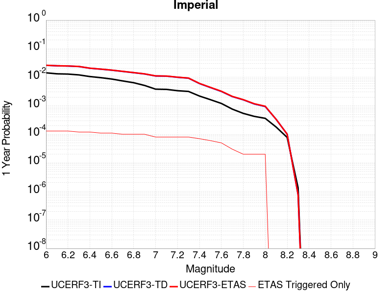 |  |

| Magnitude | 1 wk TI Prob | 1 wk TD Prob | 1 wk ETAS Prob | 1 wk ETAS/TD Gain | 1 wk ETAS Triggered Only | 1 mo TI Prob | 1 mo TD Prob | 1 mo ETAS Prob | 1 mo ETAS/TD Gain | 1 mo ETAS Triggered Only | 1 yr TI Prob | 1 yr TD Prob | 1 yr ETAS Prob | 1 yr ETAS/TD Gain | 1 yr ETAS Triggered Only | 10 yr TI Prob | 10 yr TD Prob | 10 yr ETAS Prob | 10 yr ETAS/TD Gain | 10 yr ETAS Triggered Only |
|-----|-----|-----|-----|-----|-----|-----|-----|-----|-----|-----|-----|-----|-----|-----|-----|-----|-----|-----|-----|-----|
| 6.0 | 2.7496446E-4 | 5.0552754E-4 | 5.854871E-4 | 1.1581706 | 8.0E-5 | 0.0011778869 | 0.002164787 | 0.0022545923 | 1.0414845 | 9.0E-5 | 0.0142467655 | 0.026038699 | 0.026165314 | 1.0048625 | 1.3E-4 | 0.13367249 | 0.2280438 | 0.2281673 | 1.0005416 | 1.6E-4 |
| 6.1 | 2.5356023E-4 | 4.8656776E-4 | 5.665288E-4 | 1.1643369 | 8.0E-5 | 0.001086234 | 0.0020836622 | 0.0021734748 | 1.0431032 | 9.0E-5 | 0.013144928 | 0.025071215 | 0.025197955 | 1.0050552 | 1.3E-4 | 0.123940155 | 0.21947981 | 0.2196047 | 1.000569 | 1.6E-4 |
| 6.2 | 2.4820742E-4 | 4.7752203E-4 | 5.574838E-4 | 1.1674515 | 8.0E-5 | 0.0010633124 | 0.0020449557 | 0.0021347718 | 1.0439208 | 9.0E-5 | 0.01286919 | 0.024611235 | 0.024738036 | 1.0051521 | 1.3E-4 | 0.12148927 | 0.21598552 | 0.21611096 | 1.0005808 | 1.6E-4 |
| 6.3 | 2.3205351E-4 | 4.5890483E-4 | 5.3886813E-4 | 1.1742481 | 8.0E-5 | 9.94136E-4 | 0.0019652895 | 0.0020551125 | 1.0457047 | 9.0E-5 | 0.012036599 | 0.02366133 | 0.02377849 | 1.0049516 | 1.2E-4 | 0.11405133 | 0.20793462 | 0.20805342 | 1.0005714 | 1.5E-4 |
| 6.4 | 2.0304754E-4 | 3.987652E-4 | 4.787333E-4 | 1.2005394 | 8.0E-5 | 8.6991355E-4 | 0.0017078889 | 0.0017977352 | 1.0526066 | 9.0E-5 | 0.010539869 | 0.020595672 | 0.020713199 | 1.0057064 | 1.2E-4 | 0.100537635 | 0.1850669 | 0.18518913 | 1.0006605 | 1.5E-4 |
| 6.5 | 1.854992E-4 | 3.6988858E-4 | 4.398627E-4 | 1.1891762 | 7.0E-5 | 7.9475436E-4 | 0.0015842861 | 0.0016641594 | 1.0504159 | 8.0E-5 | 0.009633281 | 0.01911948 | 0.019227378 | 1.0056432 | 1.1E-4 | 0.0922623 | 0.173298 | 0.17341374 | 1.0006678 | 1.4E-4 |
| 6.6 | 1.6586106E-4 | 3.403506E-4 | 4.103268E-4 | 1.2056003 | 7.0E-5 | 7.106394E-4 | 0.0014578402 | 0.0015377236 | 1.0547957 | 8.0E-5 | 0.008617763 | 0.01760642 | 0.017714484 | 1.0061377 | 1.1E-4 | 0.08291132 | 0.16077545 | 0.16089293 | 1.0007308 | 1.4E-4 |
| 6.7 | 1.4224656E-4 | 3.076692E-4 | 3.6765073E-4 | 1.1949546 | 6.0E-5 | 6.094856E-4 | 0.001317924 | 0.0013878318 | 1.0530438 | 7.0E-5 | 0.0073952693 | 0.015929576 | 0.016027983 | 1.0061777 | 1.0E-4 | 0.07153955 | 0.14648417 | 0.14659512 | 1.0007575 | 1.3E-4 |
| 6.8 | 1.2317259E-4 | 2.779122E-4 | 3.378955E-4 | 1.2158356 | 6.0E-5 | 5.2777573E-4 | 0.0011905148 | 0.0012604314 | 1.0587281 | 7.0E-5 | 0.0064067547 | 0.0143995695 | 0.0144981295 | 1.0068446 | 1.0E-4 | 0.06225166 | 0.13293684 | 0.13304955 | 1.0008479 | 1.3E-4 |
| 6.9 | 9.859898E-5 | 2.5014306E-4 | 3.1012803E-4 | 1.2398027 | 6.0E-5 | 4.2249862E-4 | 0.0010716055 | 0.0011415305 | 1.0652525 | 7.0E-5 | 0.0051317946 | 0.012969712 | 0.013068414 | 1.0076103 | 1.0E-4 | 0.05014893 | 0.11940631 | 0.11952079 | 1.0009587 | 1.3E-4 |
| 7.0 | 7.3191884E-5 | 2.1266776E-4 | 2.6265712E-4 | 1.2350585 | 5.0E-5 | 3.136418E-4 | 9.1111806E-4 | 9.710634E-4 | 1.0657932 | 6.0E-5 | 0.003811904 | 0.011037128 | 0.011116245 | 1.0071683 | 8.0E-5 | 0.037471764 | 0.10206493 | 0.1021637 | 1.0009677 | 1.1E-4 |
| 7.1 | 7.1760296E-5 | 2.0968143E-4 | 2.5967092E-4 | 1.238407 | 5.0E-5 | 3.0750787E-4 | 8.983284E-4 | 9.5827447E-4 | 1.0667307 | 6.0E-5 | 0.003737482 | 0.010882978 | 0.010962107 | 1.0072709 | 8.0E-5 | 0.03675245 | 0.10070146 | 0.10080038 | 1.0009823 | 1.1E-4 |
| 7.2 | 6.46614E-5 | 1.9136685E-4 | 2.413573E-4 | 1.2612282 | 5.0E-5 | 2.7709085E-4 | 8.1988896E-4 | 8.7983976E-4 | 1.0731206 | 6.0E-5 | 0.0033683628 | 0.0099370815 | 0.010016287 | 1.0079707 | 8.0E-5 | 0.033177625 | 0.09250898 | 0.09259973 | 1.000981 | 1.0E-4 |
| 7.3 | 6.088115E-5 | 1.78084E-4 | 2.2807509E-4 | 1.2807164 | 5.0E-5 | 2.6089314E-4 | 7.6299673E-4 | 8.2295097E-4 | 1.0785773 | 6.0E-5 | 0.0031717476 | 0.009250494 | 0.009329754 | 1.0085682 | 8.0E-5 | 0.031268585 | 0.08655989 | 0.086651236 | 1.0010552 | 1.0E-4 |
| 7.4 | 4.199346E-5 | 1.1510366E-4 | 1.5509906E-4 | 1.3474728 | 4.0E-5 | 1.7995955E-4 | 4.9320905E-4 | 5.4318435E-4 | 1.101327 | 5.0E-5 | 0.0021888057 | 0.0059884563 | 0.006058037 | 1.0116192 | 7.0E-5 | 0.02167372 | 0.057439793 | 0.0575152 | 1.0013127 | 8.0E-5 |
| 7.5 | 3.130448E-5 | 8.33328E-5 | 1.2332946E-4 | 1.4799631 | 4.0E-5 | 1.3415517E-4 | 3.57092E-4 | 4.0707414E-4 | 1.13997 | 5.0E-5 | 0.0016321153 | 0.004338988 | 0.004398728 | 1.0137681 | 6.0E-5 | 0.016201803 | 0.04213201 | 0.04219906 | 1.0015914 | 7.0E-5 |
| 7.6 | 2.3074248E-5 | 6.0844646E-5 | 9.084282E-5 | 1.493029 | 3.0E-5 | 9.888588E-5 | 2.6073685E-4 | 3.0072642E-4 | 1.1533713 | 4.0E-5 | 0.0012032706 | 0.0031698733 | 0.0032197149 | 1.0157235 | 5.0E-5 | 0.011967761 | 0.031026395 | 0.031084534 | 1.0018739 | 6.0E-5 |
| 7.7 | 1.45864815E-5 | 4.0124698E-5 | 6.0123897E-5 | 1.4984261 | 2.0E-5 | 6.2511994E-5 | 1.7195169E-4 | 2.0194653E-4 | 1.1744376 | 3.0E-5 | 7.608177E-4 | 0.0020915072 | 0.0021214443 | 1.0143137 | 3.0E-5 | 0.007582182 | 0.020627763 | 0.020666938 | 1.0018991 | 4.0E-5 |
| 7.8 | 1.0352979E-5 | 3.0960902E-5 | 4.0960593E-5 | 1.322978 | 1.0E-5 | 4.4369157E-5 | 1.3268284E-4 | 1.5268018E-4 | 1.1507154 | 2.0E-5 | 5.400606E-4 | 0.0016142189 | 0.0016341867 | 1.0123699 | 2.0E-5 | 0.0053875 | 0.016016833 | 0.016046353 | 1.001843 | 3.0E-5 |
| 7.9 | 8.137906E-6 | 2.2149103E-5 | 3.214888E-5 | 1.4514756 | 1.0E-5 | 3.4876273E-5 | 9.492128E-5 | 1.1491938E-4 | 1.210681 | 2.0E-5 | 4.2453592E-4 | 0.0011550548 | 0.0011750316 | 1.0172952 | 2.0E-5 | 0.004237258 | 0.011617903 | 0.01163767 | 1.0017015 | 2.0E-5 |
| 8.0 | 6.93792E-6 | 1.8008766E-5 | 2.8008586E-5 | 1.5552752 | 1.0E-5 | 2.9733603E-5 | 7.717814E-5 | 9.71766E-5 | 1.2591207 | 2.0E-5 | 3.6194647E-4 | 9.3923963E-4 | 9.592208E-4 | 1.0212739 | 2.0E-5 | 0.0036135751 | 0.00950155 | 0.0095213605 | 1.002085 | 2.0E-5 |
| 8.1 | 3.4286315E-6 | 6.379872E-6 | 6.379872E-6 | 1.0 | 0.0 | 1.4694053E-5 | 2.7342023E-5 | 2.7342023E-5 | 1.0 | 0.0 | 1.7888541E-4 | 3.328384E-4 | 3.328384E-4 | 1.0 | 0.0 | 0.0017874148 | 0.003486031 | 0.003486031 | 1.0 | 0.0 |
| 8.2 | 1.4906886E-6 | 1.9366646E-6 | 1.9366646E-6 | 1.0 | 0.0 | 6.3886496E-6 | 8.299965E-6 | 8.299965E-6 | 1.0 | 0.0 | 7.7779034E-5 | 1.0104742E-4 | 1.0104742E-4 | 1.0 | 0.0 | 7.775182E-4 | 0.0011075331 | 0.0011075331 | 1.0 | 0.0 |
| 8.3 | 2.5758007E-8 | 1.4500102E-8 | 1.4500102E-8 | 1.0 | 0.0 | 1.10391454E-7 | 6.214329E-8 | 6.214329E-8 | 1.0 | 0.0 | 1.3440151E-6 | 7.565946E-7 | 7.565946E-7 | 1.0 | 0.0 | 1.344007E-5 | 7.887763E-6 | 7.887763E-6 | 1.0 | 0.0 |

## San Jacinto (Anza) rev
*[(top)](#table-of-contents)*

| 1 Week | 1 Month | 1 Year | 10 Year |
|-----|-----|-----|-----|
|  |  |  |  |

| Magnitude | 1 wk TI Prob | 1 wk TD Prob | 1 wk ETAS Prob | 1 wk ETAS/TD Gain | 1 wk ETAS Triggered Only | 1 mo TI Prob | 1 mo TD Prob | 1 mo ETAS Prob | 1 mo ETAS/TD Gain | 1 mo ETAS Triggered Only | 1 yr TI Prob | 1 yr TD Prob | 1 yr ETAS Prob | 1 yr ETAS/TD Gain | 1 yr ETAS Triggered Only | 10 yr TI Prob | 10 yr TD Prob | 10 yr ETAS Prob | 10 yr ETAS/TD Gain | 10 yr ETAS Triggered Only |
|-----|-----|-----|-----|-----|-----|-----|-----|-----|-----|-----|-----|-----|-----|-----|-----|-----|-----|-----|-----|-----|
| 6.0 | 6.3015636E-5 | 4.3302647E-5 | 1.0330005E-4 | 2.3855367 | 6.0E-5 | 2.7003905E-4 | 1.8556965E-4 | 2.5555666E-4 | 1.3771468 | 7.0E-5 | 0.0032827691 | 0.0022569813 | 0.0023767105 | 1.0530484 | 1.2E-4 | 0.032346968 | 0.023296192 | 0.023452464 | 1.006708 | 1.6E-4 |
| 6.1 | 6.3015636E-5 | 4.3302647E-5 | 1.0330005E-4 | 2.3855367 | 6.0E-5 | 2.7003905E-4 | 1.8556965E-4 | 2.5555666E-4 | 1.3771468 | 7.0E-5 | 0.0032827691 | 0.0022569813 | 0.0023767105 | 1.0530484 | 1.2E-4 | 0.032346968 | 0.023296192 | 0.023452464 | 1.006708 | 1.6E-4 |
| 6.2 | 6.3015636E-5 | 4.3302647E-5 | 1.0330005E-4 | 2.3855367 | 6.0E-5 | 2.7003905E-4 | 1.8556965E-4 | 2.5555666E-4 | 1.3771468 | 7.0E-5 | 0.0032827691 | 0.0022569813 | 0.0023767105 | 1.0530484 | 1.2E-4 | 0.032346968 | 0.023296192 | 0.023452464 | 1.006708 | 1.6E-4 |
| 6.3 | 6.3015636E-5 | 4.3302647E-5 | 1.0330005E-4 | 2.3855367 | 6.0E-5 | 2.7003905E-4 | 1.8556965E-4 | 2.5555666E-4 | 1.3771468 | 7.0E-5 | 0.0032827691 | 0.0022569813 | 0.0023767105 | 1.0530484 | 1.2E-4 | 0.032346968 | 0.023296192 | 0.023452464 | 1.006708 | 1.6E-4 |
| 6.4 | 6.3015636E-5 | 4.3302647E-5 | 1.0330005E-4 | 2.3855367 | 6.0E-5 | 2.7003905E-4 | 1.8556965E-4 | 2.5555666E-4 | 1.3771468 | 7.0E-5 | 0.0032827691 | 0.0022569813 | 0.0023767105 | 1.0530484 | 1.2E-4 | 0.032346968 | 0.023296192 | 0.023452464 | 1.006708 | 1.6E-4 |
| 6.5 | 5.811017E-5 | 4.0082516E-5 | 1.00080106E-4 | 2.4968522 | 6.0E-5 | 2.4901982E-4 | 1.7177092E-4 | 2.417589E-4 | 1.4074495 | 7.0E-5 | 0.0030276014 | 0.002089311 | 0.0022090601 | 1.0573152 | 1.2E-4 | 0.02986684 | 0.021593736 | 0.021750282 | 1.0072496 | 1.6E-4 |
| 6.6 | 5.811017E-5 | 4.0082516E-5 | 1.00080106E-4 | 2.4968522 | 6.0E-5 | 2.4901982E-4 | 1.7177092E-4 | 2.417589E-4 | 1.4074495 | 7.0E-5 | 0.0030276014 | 0.002089311 | 0.0022090601 | 1.0573152 | 1.2E-4 | 0.02986684 | 0.021593736 | 0.021750282 | 1.0072496 | 1.6E-4 |
| 6.7 | 5.712442E-5 | 3.9505223E-5 | 9.950285E-5 | 2.5187266 | 6.0E-5 | 2.4479596E-4 | 1.6929714E-4 | 2.3928529E-4 | 1.4134042 | 7.0E-5 | 0.0029763177 | 0.0020592497 | 0.0021790026 | 1.0581536 | 1.2E-4 | 0.029367693 | 0.021285562 | 0.021442156 | 1.0073569 | 1.6E-4 |
| 6.8 | 5.6967532E-5 | 3.9361643E-5 | 9.9359284E-5 | 2.5242665 | 6.0E-5 | 2.4412372E-4 | 1.6868189E-4 | 2.3867008E-4 | 1.4149123 | 7.0E-5 | 0.0029681553 | 0.002051773 | 0.0021715267 | 1.0583661 | 1.2E-4 | 0.029288229 | 0.021210281 | 0.021366887 | 1.0073835 | 1.6E-4 |
| 6.9 | 5.6211324E-5 | 3.9066435E-5 | 9.906409E-5 | 2.5357852 | 6.0E-5 | 2.4088343E-4 | 1.6741687E-4 | 2.3740515E-4 | 1.4180479 | 7.0E-5 | 0.0029288116 | 0.0020364004 | 0.0021561559 | 1.0588075 | 1.2E-4 | 0.028905109 | 0.021049714 | 0.021206345 | 1.007441 | 1.6E-4 |
| 7.0 | 5.4383527E-5 | 3.792697E-5 | 9.792469E-5 | 2.5819278 | 6.0E-5 | 2.3305144E-4 | 1.6253405E-4 | 2.3252268E-4 | 1.430609 | 7.0E-5 | 0.0028337094 | 0.001977061 | 0.0020968236 | 1.0605762 | 1.2E-4 | 0.027978465 | 0.020440677 | 0.020597406 | 1.0076675 | 1.6E-4 |
| 7.1 | 5.1393665E-5 | 3.6389913E-5 | 9.638773E-5 | 2.6487486 | 6.0E-5 | 2.2023996E-4 | 1.5594746E-4 | 2.2593656E-4 | 1.4487991 | 7.0E-5 | 0.0026781242 | 0.0018970112 | 0.0020167835 | 1.0631374 | 1.2E-4 | 0.026460782 | 0.019614287 | 0.019771148 | 1.0079973 | 1.6E-4 |
| 7.2 | 4.785222E-5 | 3.4741795E-5 | 9.473971E-5 | 2.7269664 | 6.0E-5 | 2.0506482E-4 | 1.4888494E-4 | 2.1887451E-4 | 1.4700917 | 7.0E-5 | 0.0024938055 | 0.0018111705 | 0.0019309531 | 1.0661355 | 1.2E-4 | 0.024660049 | 0.018728992 | 0.018885994 | 1.0083829 | 1.6E-4 |
| 7.3 | 4.2143256E-5 | 3.383628E-5 | 9.383425E-5 | 2.7731845 | 6.0E-5 | 1.8060145E-4 | 1.4500458E-4 | 2.1499443E-4 | 1.4826734 | 7.0E-5 | 0.002196605 | 0.0017640047 | 0.0018837929 | 1.067907 | 1.2E-4 | 0.02175019 | 0.01823724 | 0.018394323 | 1.0086132 | 1.6E-4 |
| 7.4 | 4.0264713E-5 | 3.347446E-5 | 9.347245E-5 | 2.792351 | 6.0E-5 | 1.7255165E-4 | 1.4345412E-4 | 2.1344407E-4 | 1.487891 | 7.0E-5 | 0.002098792 | 0.0017451581 | 0.0018649487 | 1.0686417 | 1.2E-4 | 0.020790804 | 0.018041821 | 0.018198933 | 1.0087082 | 1.6E-4 |
| 7.5 | 3.694492E-5 | 3.218847E-5 | 9.2186536E-5 | 2.8639617 | 6.0E-5 | 1.5832575E-4 | 1.379433E-4 | 2.0793364E-4 | 1.5073849 | 7.0E-5 | 0.0019259118 | 0.001678169 | 0.0017979676 | 1.0713865 | 1.2E-4 | 0.01909306 | 0.01735827 | 0.017515494 | 1.0090575 | 1.6E-4 |
| 7.6 | 3.200565E-5 | 2.9504106E-5 | 8.950233E-5 | 3.0335553 | 6.0E-5 | 1.3715986E-4 | 1.2644005E-4 | 1.9643121E-4 | 1.553552 | 7.0E-5 | 0.001668642 | 0.0015383229 | 0.0016581382 | 1.077887 | 1.2E-4 | 0.01656168 | 0.0159463 | 0.016103748 | 1.0098736 | 1.6E-4 |
| 7.7 | 2.731642E-5 | 2.6092788E-5 | 8.609122E-5 | 3.299426 | 6.0E-5 | 1.1706512E-4 | 1.1182144E-4 | 1.8181362E-4 | 1.625928 | 7.0E-5 | 0.001424336 | 0.0013605768 | 0.0014804136 | 1.0880779 | 1.2E-4 | 0.014152412 | 0.014167004 | 0.014324738 | 1.0111338 | 1.6E-4 |
| 7.8 | 2.3466424E-5 | 2.3504817E-5 | 8.350341E-5 | 3.5526083 | 6.0E-5 | 1.0056651E-4 | 1.0073105E-4 | 1.70724E-4 | 1.6948498 | 7.0E-5 | 0.0012237094 | 0.0012257113 | 0.0013455643 | 1.0977824 | 1.2E-4 | 0.012169928 | 0.012808893 | 0.012966843 | 1.0123314 | 1.6E-4 |
| 7.9 | 1.8611925E-5 | 1.8908117E-5 | 7.890698E-5 | 4.1731806 | 6.0E-5 | 7.9762955E-5 | 8.1032274E-5 | 1.510266E-4 | 1.8637834 | 7.0E-5 | 9.7068126E-4 | 9.861222E-4 | 0.0011060038 | 1.1215688 | 1.2E-4 | 0.0096645225 | 0.010393824 | 0.010552161 | 1.0152338 | 1.6E-4 |
| 8.0 | 1.5460775E-5 | 1.5740965E-5 | 7.574002E-5 | 4.8116503 | 6.0E-5 | 6.6258784E-5 | 6.7459536E-5 | 1.3745482E-4 | 2.037589 | 7.0E-5 | 8.0640207E-4 | 8.21011E-4 | 9.309207E-4 | 1.1338712 | 1.1E-4 | 0.008034821 | 0.0087028835 | 0.008851578 | 1.0170857 | 1.5E-4 |
| 8.1 | 9.983884E-6 | 8.269952E-6 | 3.8269704E-5 | 4.6275606 | 3.0E-5 | 4.2787375E-5 | 3.544217E-5 | 6.5441105E-5 | 1.8464192 | 3.0E-5 | 5.2081177E-4 | 4.314235E-4 | 4.7140627E-4 | 1.0926763 | 4.0E-5 | 0.0051959283 | 0.004640022 | 0.00468979 | 1.0107259 | 5.0E-5 |
| 8.2 | 4.1226E-6 | 1.5529788E-6 | 1.5529788E-6 | 1.0 | 0.0 | 1.7668166E-5 | 6.6556063E-6 | 6.6556063E-6 | 1.0 | 0.0 | 2.1508869E-4 | 8.102902E-5 | 8.102902E-5 | 1.0 | 0.0 | 0.0021488064 | 9.4050163E-4 | 9.4050163E-4 | 1.0 | 0.0 |
| 8.3 | 1.2750878E-6 | 3.612133E-7 | 3.612133E-7 | 1.0 | 0.0 | 5.4646503E-6 | 1.548056E-6 | 1.548056E-6 | 1.0 | 0.0 | 6.653009E-5 | 1.8847424E-5 | 1.8847424E-5 | 1.0 | 0.0 | 6.6510175E-4 | 2.2734253E-4 | 2.2734253E-4 | 1.0 | 0.0 |

## Mission Creek
*[(top)](#table-of-contents)*

| 1 Week | 1 Month | 1 Year | 10 Year |
|-----|-----|-----|-----|
| 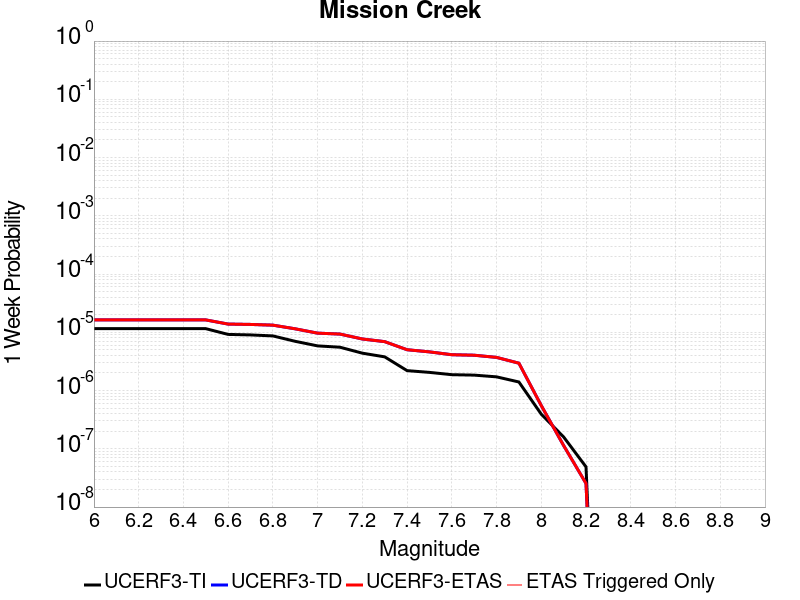 |  |  |  |

| Magnitude | 1 wk TI Prob | 1 wk TD Prob | 1 wk ETAS Prob | 1 wk ETAS/TD Gain | 1 wk ETAS Triggered Only | 1 mo TI Prob | 1 mo TD Prob | 1 mo ETAS Prob | 1 mo ETAS/TD Gain | 1 mo ETAS Triggered Only | 1 yr TI Prob | 1 yr TD Prob | 1 yr ETAS Prob | 1 yr ETAS/TD Gain | 1 yr ETAS Triggered Only | 10 yr TI Prob | 10 yr TD Prob | 10 yr ETAS Prob | 10 yr ETAS/TD Gain | 10 yr ETAS Triggered Only |
|-----|-----|-----|-----|-----|-----|-----|-----|-----|-----|-----|-----|-----|-----|-----|-----|-----|-----|-----|-----|-----|
| 6.0 | 1.1549387E-5 | 1.632237E-5 | 1.632237E-5 | 1.0 | 0.0 | 4.9496433E-5 | 6.9951224E-5 | 1.0994842E-4 | 1.571787 | 4.0E-5 | 6.0245243E-4 | 8.513384E-4 | 9.512532E-4 | 1.1173621 | 1.0E-4 | 0.006008218 | 0.008509998 | 0.008658721 | 1.0174763 | 1.5E-4 |
| 6.1 | 1.1549387E-5 | 1.632237E-5 | 1.632237E-5 | 1.0 | 0.0 | 4.9496433E-5 | 6.9951224E-5 | 1.0994842E-4 | 1.571787 | 4.0E-5 | 6.0245243E-4 | 8.513384E-4 | 9.512532E-4 | 1.1173621 | 1.0E-4 | 0.006008218 | 0.008509998 | 0.008658721 | 1.0174763 | 1.5E-4 |
| 6.2 | 1.1549387E-5 | 1.632237E-5 | 1.632237E-5 | 1.0 | 0.0 | 4.9496433E-5 | 6.9951224E-5 | 1.0994842E-4 | 1.571787 | 4.0E-5 | 6.0245243E-4 | 8.513384E-4 | 9.512532E-4 | 1.1173621 | 1.0E-4 | 0.006008218 | 0.008509998 | 0.008658721 | 1.0174763 | 1.5E-4 |
| 6.3 | 1.1549387E-5 | 1.632237E-5 | 1.632237E-5 | 1.0 | 0.0 | 4.9496433E-5 | 6.9951224E-5 | 1.0994842E-4 | 1.571787 | 4.0E-5 | 6.0245243E-4 | 8.513384E-4 | 9.512532E-4 | 1.1173621 | 1.0E-4 | 0.006008218 | 0.008509998 | 0.008658721 | 1.0174763 | 1.5E-4 |
| 6.4 | 1.1549387E-5 | 1.632237E-5 | 1.632237E-5 | 1.0 | 0.0 | 4.9496433E-5 | 6.9951224E-5 | 1.0994842E-4 | 1.571787 | 4.0E-5 | 6.0245243E-4 | 8.513384E-4 | 9.512532E-4 | 1.1173621 | 1.0E-4 | 0.006008218 | 0.008509998 | 0.008658721 | 1.0174763 | 1.5E-4 |
| 6.5 | 1.1549387E-5 | 1.632237E-5 | 1.632237E-5 | 1.0 | 0.0 | 4.9496433E-5 | 6.9951224E-5 | 1.0994842E-4 | 1.571787 | 4.0E-5 | 6.0245243E-4 | 8.513384E-4 | 9.512532E-4 | 1.1173621 | 1.0E-4 | 0.006008218 | 0.008509998 | 0.008658721 | 1.0174763 | 1.5E-4 |
| 6.6 | 9.202681E-6 | 1.3845646E-5 | 1.3845646E-5 | 1.0 | 0.0 | 3.9439463E-5 | 5.9337188E-5 | 9.9334815E-5 | 1.6740736 | 4.0E-5 | 4.800697E-4 | 7.221998E-4 | 8.121348E-4 | 1.1245292 | 9.0E-5 | 0.004790339 | 0.0072271815 | 0.007356242 | 1.0178577 | 1.3E-4 |
| 6.7 | 9.019164E-6 | 1.3651316E-5 | 1.3651316E-5 | 1.0 | 0.0 | 3.8652986E-5 | 5.8504378E-5 | 9.850204E-5 | 1.6836694 | 4.0E-5 | 4.7049852E-4 | 7.12067E-4 | 8.0200296E-4 | 1.1263026 | 9.0E-5 | 0.004695036 | 0.007126506 | 0.0072555793 | 1.0181117 | 1.3E-4 |
| 6.8 | 8.673558E-6 | 1.3273427E-5 | 1.3273427E-5 | 1.0 | 0.0 | 3.717186E-5 | 5.6884925E-5 | 9.688265E-5 | 1.703134 | 4.0E-5 | 4.524734E-4 | 6.923627E-4 | 7.823004E-4 | 1.1298996 | 9.0E-5 | 0.0045155324 | 0.006930694 | 0.007059793 | 1.0186272 | 1.3E-4 |
| 6.9 | 7.002255E-6 | 1.1477657E-5 | 1.1477657E-5 | 1.0 | 0.0 | 3.000932E-5 | 4.9189068E-5 | 8.91871E-5 | 1.8131489 | 4.0E-5 | 3.653022E-4 | 5.9871917E-4 | 6.886653E-4 | 1.1502309 | 9.0E-5 | 0.0036470229 | 0.005999517 | 0.0061287372 | 1.0215384 | 1.3E-4 |
| 7.0 | 5.84644E-6 | 9.67498E-6 | 9.67498E-6 | 1.0 | 0.0 | 2.5055931E-5 | 4.1463565E-5 | 8.1461905E-5 | 1.9646623 | 4.0E-5 | 3.0501327E-4 | 5.047066E-4 | 5.946611E-4 | 1.1782315 | 9.0E-5 | 0.0030459496 | 0.0050638523 | 0.005193194 | 1.0255421 | 1.3E-4 |
| 7.1 | 5.54703E-6 | 9.329456E-6 | 9.329456E-6 | 1.0 | 0.0 | 2.377277E-5 | 3.9982795E-5 | 7.99812E-5 | 2.0003903 | 4.0E-5 | 2.8939504E-4 | 4.8668624E-4 | 5.7664246E-4 | 1.184834 | 9.0E-5 | 0.0028901845 | 0.004884446 | 0.0050138114 | 1.0264851 | 1.3E-4 |
| 7.2 | 4.384709E-6 | 7.68157E-6 | 7.68157E-6 | 1.0 | 0.0 | 1.8791474E-5 | 3.2920623E-5 | 7.2919305E-5 | 2.215004 | 4.0E-5 | 2.2876218E-4 | 4.0073853E-4 | 4.9070246E-4 | 1.2244953 | 9.0E-5 | 0.0022852682 | 0.004028366 | 0.004157842 | 1.0321412 | 1.3E-4 |
| 7.3 | 3.7888456E-6 | 6.915452E-6 | 6.915452E-6 | 1.0 | 0.0 | 1.623781E-5 | 2.9637333E-5 | 6.9636146E-5 | 2.3496091 | 4.0E-5 | 1.9767738E-4 | 3.6077813E-4 | 4.5074566E-4 | 1.2493708 | 9.0E-5 | 0.0019750162 | 0.0036301152 | 0.0037596433 | 1.0356815 | 1.3E-4 |
| 7.4 | 2.1982462E-6 | 5.0237763E-6 | 5.0237763E-6 | 1.0 | 0.0 | 9.421021E-6 | 2.1530293E-5 | 6.1529434E-5 | 2.8578074 | 4.0E-5 | 1.1469489E-4 | 2.621E-4 | 3.520764E-4 | 1.3432904 | 9.0E-5 | 0.0011463572 | 0.0026458844 | 0.0027755406 | 1.0490029 | 1.3E-4 |
| 7.5 | 2.051923E-6 | 4.615016E-6 | 4.615016E-6 | 1.0 | 0.0 | 8.793926E-6 | 1.9778492E-5 | 5.97777E-5 | 3.022359 | 4.0E-5 | 1.0706078E-4 | 2.4077666E-4 | 3.30755E-4 | 1.3737004 | 9.0E-5 | 0.0010700922 | 0.0024335422 | 0.00255325 | 1.0491909 | 1.2E-4 |
| 7.6 | 1.8733427E-6 | 4.1233748E-6 | 4.1233748E-6 | 1.0 | 0.0 | 8.028587E-6 | 1.7671488E-5 | 5.7670783E-5 | 3.2634933 | 4.0E-5 | 9.774366E-5 | 2.151292E-4 | 3.0510983E-4 | 1.4182632 | 9.0E-5 | 9.770069E-4 | 0.0021780801 | 0.002297819 | 1.0549744 | 1.2E-4 |
| 7.7 | 1.8411953E-6 | 4.0430496E-6 | 4.0430496E-6 | 1.0 | 0.0 | 7.890813E-6 | 1.732724E-5 | 5.732655E-5 | 3.3084638 | 4.0E-5 | 9.606641E-5 | 2.1093882E-4 | 3.0091984E-4 | 1.426574 | 9.0E-5 | 9.6024893E-4 | 0.0021363653 | 0.002256109 | 1.0560502 | 1.2E-4 |
| 7.8 | 1.7194251E-6 | 3.7104276E-6 | 3.7104276E-6 | 1.0 | 0.0 | 7.368944E-6 | 1.5901736E-5 | 5.59011E-5 | 3.5154088 | 4.0E-5 | 8.97132E-5 | 1.9358651E-4 | 2.835691E-4 | 1.4648185 | 9.0E-5 | 8.967699E-4 | 0.0019623525 | 0.002082117 | 1.0610311 | 1.2E-4 |
| 7.9 | 1.4035052E-6 | 2.9500632E-6 | 2.9500632E-6 | 1.0 | 0.0 | 6.0150082E-6 | 1.2643067E-5 | 5.264256E-5 | 4.163749 | 4.0E-5 | 7.3230265E-5 | 1.5391852E-4 | 2.4390467E-4 | 1.5846349 | 9.0E-5 | 7.3206134E-4 | 0.0015631086 | 0.0016829211 | 1.0766501 | 1.2E-4 |
| 8.0 | 3.9318823E-7 | 5.528522E-7 | 5.528522E-7 | 1.0 | 0.0 | 1.6850913E-6 | 2.3693647E-6 | 2.3693647E-6 | 1.0 | 0.0 | 2.0515794E-5 | 2.8846638E-5 | 2.8846638E-5 | 1.0 | 0.0 | 2.0513899E-4 | 2.9899E-4 | 3.0898702E-4 | 1.033436 | 1.0E-5 |
| 8.1 | 1.596793E-7 | 1.1380002E-7 | 1.1380002E-7 | 1.0 | 0.0 | 6.8433974E-7 | 4.877143E-7 | 4.877143E-7 | 1.0 | 0.0 | 8.331805E-6 | 5.937906E-6 | 5.937906E-6 | 1.0 | 0.0 | 8.331492E-5 | 6.549966E-5 | 6.549966E-5 | 1.0 | 0.0 |
| 8.2 | 4.9003038E-8 | 2.5444924E-8 | 2.5444924E-8 | 1.0 | 0.0 | 2.10013E-7 | 1.0904967E-7 | 1.0904967E-7 | 1.0 | 0.0 | 2.5569052E-6 | 1.327679E-6 | 1.327679E-6 | 1.0 | 0.0 | 2.556876E-5 | 1.495635E-5 | 1.495635E-5 | 1.0 | 0.0 |

## Cleghorn Pass
*[(top)](#table-of-contents)*

| 1 Week | 1 Month | 1 Year | 10 Year |
|-----|-----|-----|-----|
|  | 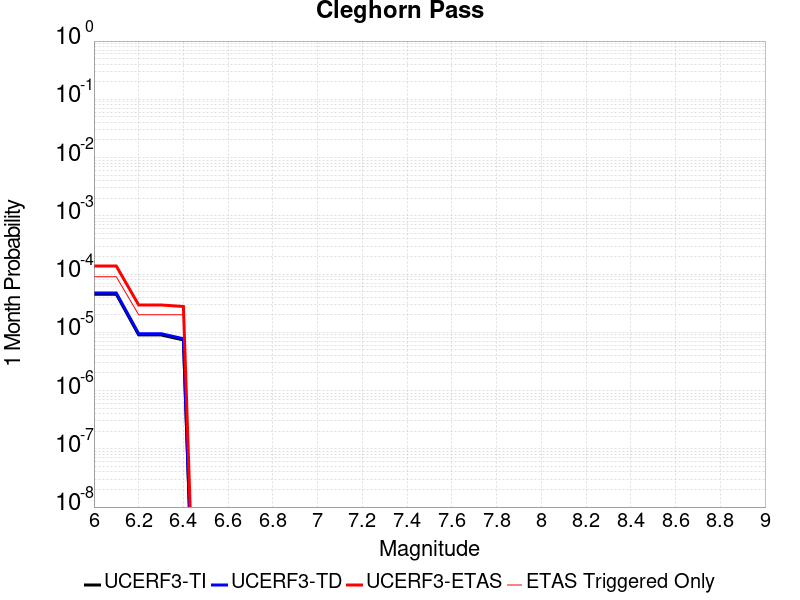 |  |  |

| Magnitude | 1 wk TI Prob | 1 wk TD Prob | 1 wk ETAS Prob | 1 wk ETAS/TD Gain | 1 wk ETAS Triggered Only | 1 mo TI Prob | 1 mo TD Prob | 1 mo ETAS Prob | 1 mo ETAS/TD Gain | 1 mo ETAS Triggered Only | 1 yr TI Prob | 1 yr TD Prob | 1 yr ETAS Prob | 1 yr ETAS/TD Gain | 1 yr ETAS Triggered Only | 10 yr TI Prob | 10 yr TD Prob | 10 yr ETAS Prob | 10 yr ETAS/TD Gain | 10 yr ETAS Triggered Only |
|-----|-----|-----|-----|-----|-----|-----|-----|-----|-----|-----|-----|-----|-----|-----|-----|-----|-----|-----|-----|-----|
| 6.0 | 1.0522846E-5 | 1.1040642E-5 | 7.1039976E-5 | 6.4344068 | 6.0E-5 | 4.509713E-5 | 4.7316473E-5 | 1.3731222E-4 | 2.901996 | 9.0E-5 | 5.4891926E-4 | 5.759784E-4 | 6.959093E-4 | 1.2082211 | 1.2E-4 | 0.0054756533 | 0.005750022 | 0.005889217 | 1.0242077 | 1.4E-4 |
| 6.1 | 1.0522846E-5 | 1.1040642E-5 | 7.1039976E-5 | 6.4344068 | 6.0E-5 | 4.509713E-5 | 4.7316473E-5 | 1.3731222E-4 | 2.901996 | 9.0E-5 | 5.4891926E-4 | 5.759784E-4 | 6.959093E-4 | 1.2082211 | 1.2E-4 | 0.0054756533 | 0.005750022 | 0.005889217 | 1.0242077 | 1.4E-4 |
| 6.2 | 2.1045846E-6 | 2.2082024E-6 | 1.220818E-5 | 5.52856 | 1.0E-5 | 9.019617E-6 | 9.463714E-6 | 2.9463525E-5 | 3.113315 | 2.0E-5 | 1.098083E-4 | 1.1521882E-4 | 1.4521537E-4 | 1.2603441 | 3.0E-5 | 0.0010975406 | 0.0011520023 | 0.0011819677 | 1.0260116 | 3.0E-5 |
| 6.3 | 2.1045846E-6 | 2.2082024E-6 | 1.220818E-5 | 5.52856 | 1.0E-5 | 9.019617E-6 | 9.463714E-6 | 2.9463525E-5 | 3.113315 | 2.0E-5 | 1.098083E-4 | 1.1521882E-4 | 1.4521537E-4 | 1.2603441 | 3.0E-5 | 0.0010975406 | 0.0011520023 | 0.0011819677 | 1.0260116 | 3.0E-5 |
| 6.4 | 1.7259927E-6 | 1.810877E-6 | 1.1810859E-5 | 6.522176 | 1.0E-5 | 7.3970905E-6 | 7.760902E-6 | 2.7760747E-5 | 3.5770001 | 2.0E-5 | 9.005586E-5 | 9.4488976E-5 | 1.1448709E-4 | 1.2116449 | 2.0E-5 | 9.001937E-4 | 9.448898E-4 | 9.648709E-4 | 1.0211465 | 2.0E-5 |

## Owens Valley
*[(top)](#table-of-contents)*

| 1 Week | 1 Month | 1 Year | 10 Year |
|-----|-----|-----|-----|
|  |  |  |  |

| Magnitude | 1 wk TI Prob | 1 wk TD Prob | 1 wk ETAS Prob | 1 wk ETAS/TD Gain | 1 wk ETAS Triggered Only | 1 mo TI Prob | 1 mo TD Prob | 1 mo ETAS Prob | 1 mo ETAS/TD Gain | 1 mo ETAS Triggered Only | 1 yr TI Prob | 1 yr TD Prob | 1 yr ETAS Prob | 1 yr ETAS/TD Gain | 1 yr ETAS Triggered Only | 10 yr TI Prob | 10 yr TD Prob | 10 yr ETAS Prob | 10 yr ETAS/TD Gain | 10 yr ETAS Triggered Only |
|-----|-----|-----|-----|-----|-----|-----|-----|-----|-----|-----|-----|-----|-----|-----|-----|-----|-----|-----|-----|-----|
| 6.0 | 4.83821E-5 | 3.626567E-6 | 1.03626204E-4 | 28.574188 | 1.0E-4 | 2.0733538E-4 | 1.5542342E-5 | 1.3554048E-4 | 8.720724 | 1.2E-4 | 0.002521386 | 1.8921259E-4 | 3.19188E-4 | 1.6869279 | 1.3E-4 | 0.024929691 | 0.001925011 | 0.0020647414 | 1.0725869 | 1.4E-4 |
| 6.1 | 4.83821E-5 | 3.626567E-6 | 1.03626204E-4 | 28.574188 | 1.0E-4 | 2.0733538E-4 | 1.5542342E-5 | 1.3554048E-4 | 8.720724 | 1.2E-4 | 0.002521386 | 1.8921259E-4 | 3.19188E-4 | 1.6869279 | 1.3E-4 | 0.024929691 | 0.001925011 | 0.0020647414 | 1.0725869 | 1.4E-4 |
| 6.2 | 4.83821E-5 | 3.626567E-6 | 1.03626204E-4 | 28.574188 | 1.0E-4 | 2.0733538E-4 | 1.5542342E-5 | 1.3554048E-4 | 8.720724 | 1.2E-4 | 0.002521386 | 1.8921259E-4 | 3.19188E-4 | 1.6869279 | 1.3E-4 | 0.024929691 | 0.001925011 | 0.0020647414 | 1.0725869 | 1.4E-4 |
| 6.3 | 3.953008E-5 | 3.1553948E-6 | 8.3155144E-5 | 26.353325 | 8.0E-5 | 1.6940363E-4 | 1.3523055E-5 | 1.135217E-4 | 8.394679 | 1.0E-4 | 0.002060538 | 1.6463149E-4 | 2.7461338E-4 | 1.668049 | 1.1E-4 | 0.020415364 | 0.0016592 | 0.0017690174 | 1.066187 | 1.1E-4 |
| 6.4 | 3.953008E-5 | 3.1553948E-6 | 8.3155144E-5 | 26.353325 | 8.0E-5 | 1.6940363E-4 | 1.3523055E-5 | 1.135217E-4 | 8.394679 | 1.0E-4 | 0.002060538 | 1.6463149E-4 | 2.7461338E-4 | 1.668049 | 1.1E-4 | 0.020415364 | 0.0016592 | 0.0017690174 | 1.066187 | 1.1E-4 |
| 6.5 | 3.457342E-5 | 2.9715961E-6 | 8.297136E-5 | 27.921478 | 8.0E-5 | 1.4816338E-4 | 1.2735354E-5 | 1.1273408E-4 | 8.852057 | 1.0E-4 | 0.0018023965 | 1.550426E-4 | 2.6502553E-4 | 1.7093724 | 1.1E-4 | 0.017878477 | 0.001555719 | 0.0016655478 | 1.0705968 | 1.1E-4 |
| 6.6 | 3.1127765E-5 | 2.8744932E-6 | 8.287426E-5 | 28.830912 | 8.0E-5 | 1.3339789E-4 | 1.2319203E-5 | 1.1231797E-4 | 9.117309 | 1.0E-4 | 0.0016229092 | 1.4997667E-4 | 2.5996016E-4 | 1.7333375 | 1.1E-4 | 0.016111081 | 0.0015012559 | 0.0016110907 | 1.073162 | 1.1E-4 |
| 6.7 | 2.806885E-5 | 2.8104134E-6 | 8.281019E-5 | 29.465483 | 8.0E-5 | 1.2028952E-4 | 1.20445775E-5 | 1.1204337E-4 | 9.302392 | 1.0E-4 | 0.001463541 | 1.4663354E-4 | 2.566174E-4 | 1.7500594 | 1.1E-4 | 0.014539397 | 0.0014657511 | 0.0015755899 | 1.0749369 | 1.1E-4 |
| 6.8 | 2.524524E-5 | 2.2353688E-6 | 8.223519E-5 | 36.7882 | 8.0E-5 | 1.0818939E-4 | 9.580118E-6 | 1.0957916E-4 | 11.438185 | 1.0E-4 | 0.0013164099 | 1.16632E-4 | 2.2661917E-4 | 1.9430274 | 1.1E-4 | 0.01308639 | 0.0011659812 | 0.0012758529 | 1.0942311 | 1.1E-4 |
| 6.9 | 2.2704568E-5 | 1.6081682E-6 | 8.160804E-5 | 50.74596 | 8.0E-5 | 9.730166E-5 | 6.8921313E-6 | 1.0689144E-4 | 15.509199 | 1.0E-4 | 0.0011840039 | 8.390849E-5 | 1.9389926E-4 | 2.310842 | 1.1E-4 | 0.011777153 | 8.3897985E-4 | 9.4888755E-4 | 1.1310016 | 1.1E-4 |
| 7.0 | 2.0871712E-5 | 1.5395453E-6 | 8.153942E-5 | 52.963314 | 8.0E-5 | 8.944713E-5 | 6.598035E-6 | 1.0659738E-4 | 16.155928 | 1.0E-4 | 0.0010884746 | 8.032813E-5 | 1.9031929E-4 | 2.3692734 | 1.1E-4 | 0.010831586 | 8.0316263E-4 | 9.1307424E-4 | 1.1368486 | 1.1E-4 |
| 7.1 | 1.944928E-5 | 1.3864178E-6 | 8.138631E-5 | 58.702583 | 8.0E-5 | 8.335139E-5 | 5.941777E-6 | 1.0594118E-4 | 17.829882 | 1.0E-4 | 0.0010143308 | 7.233874E-5 | 1.8233078E-4 | 2.5205135 | 1.1E-4 | 0.010097133 | 7.2330976E-4 | 8.332302E-4 | 1.1519687 | 1.1E-4 |
| 7.2 | 1.7876306E-5 | 1.2489141E-6 | 8.1248814E-5 | 65.055565 | 8.0E-5 | 7.6610486E-5 | 5.352478E-6 | 1.05351945E-4 | 19.682835 | 1.0E-4 | 9.3233347E-4 | 6.516448E-5 | 1.7515731E-4 | 2.687926 | 1.1E-4 | 0.009284316 | 6.5159105E-4 | 7.6151936E-4 | 1.1687075 | 1.1E-4 |
| 7.3 | 1.2618672E-5 | 1.1115209E-6 | 8.111143E-5 | 72.97337 | 8.0E-5 | 5.40789E-5 | 4.763652E-6 | 1.04763174E-4 | 21.992197 | 1.0E-4 | 6.582117E-4 | 5.799593E-5 | 1.6798955E-4 | 2.8965747 | 1.1E-4 | 0.0065626553 | 5.7994033E-4 | 6.8987656E-4 | 1.1895647 | 1.1E-4 |
| 7.4 | 7.4874442E-6 | 8.5486437E-7 | 7.08548E-5 | 82.88426 | 7.0E-5 | 3.208865E-5 | 3.6636993E-6 | 9.366337E-5 | 25.565245 | 9.0E-5 | 3.906093E-4 | 4.4604632E-5 | 1.4460017E-4 | 3.2418196 | 1.0E-4 | 0.003899234 | 4.4604883E-4 | 5.460042E-4 | 1.2240907 | 1.0E-4 |
| 7.5 | 2.4734156E-6 | 6.068616E-7 | 4.0606836E-5 | 66.91285 | 4.0E-5 | 1.060031E-5 | 2.6008327E-6 | 5.2600702E-5 | 20.224562 | 5.0E-5 | 1.2905113E-4 | 3.166468E-5 | 8.16631E-5 | 2.5789964 | 5.0E-5 | 0.0012897621 | 3.1660203E-4 | 3.665862E-4 | 1.157877 | 5.0E-5 |
| 7.6 | 1.1328841E-6 | 3.196531E-7 | 2.0319647E-5 | 63.567806 | 2.0E-5 | 4.8552088E-6 | 1.3699412E-6 | 3.13699E-5 | 22.898722 | 3.0E-5 | 5.9110564E-5 | 1.6678909E-5 | 4.6678408E-5 | 2.7986488 | 3.0E-5 | 5.9094845E-4 | 1.6677675E-4 | 1.9677174E-4 | 1.1798512 | 3.0E-5 |
| 7.7 | 4.8613185E-7 | 8.964689E-8 | 2.0089645E-5 | 224.09752 | 2.0E-5 | 2.0834207E-6 | 3.8420092E-7 | 2.0384194E-5 | 53.05608 | 2.0E-5 | 2.536535E-5 | 4.6776368E-6 | 2.4677543E-5 | 5.2756433 | 2.0E-5 | 2.5362454E-4 | 4.677545E-5 | 6.677451E-5 | 1.4275547 | 2.0E-5 |

## Ventura-Pitas Point
*[(top)](#table-of-contents)*

| 1 Week | 1 Month | 1 Year | 10 Year |
|-----|-----|-----|-----|
|  |  |  |  |

| Magnitude | 1 wk TI Prob | 1 wk TD Prob | 1 wk ETAS Prob | 1 wk ETAS/TD Gain | 1 wk ETAS Triggered Only | 1 mo TI Prob | 1 mo TD Prob | 1 mo ETAS Prob | 1 mo ETAS/TD Gain | 1 mo ETAS Triggered Only | 1 yr TI Prob | 1 yr TD Prob | 1 yr ETAS Prob | 1 yr ETAS/TD Gain | 1 yr ETAS Triggered Only | 10 yr TI Prob | 10 yr TD Prob | 10 yr ETAS Prob | 10 yr ETAS/TD Gain | 10 yr ETAS Triggered Only |
|-----|-----|-----|-----|-----|-----|-----|-----|-----|-----|-----|-----|-----|-----|-----|-----|-----|-----|-----|-----|-----|
| 6.0 | 3.3179622E-5 | 3.3735185E-5 | 8.3733496E-5 | 2.4820821 | 5.0E-5 | 1.4219063E-4 | 1.445728E-4 | 2.0456412E-4 | 1.4149559 | 6.0E-5 | 0.0017297962 | 0.0017590096 | 0.0018488513 | 1.0510751 | 9.0E-5 | 0.017163932 | 0.0174764 | 0.017594304 | 1.0067464 | 1.2E-4 |
| 6.1 | 3.3179622E-5 | 3.3735185E-5 | 8.3733496E-5 | 2.4820821 | 5.0E-5 | 1.4219063E-4 | 1.445728E-4 | 2.0456412E-4 | 1.4149559 | 6.0E-5 | 0.0017297962 | 0.0017590096 | 0.0018488513 | 1.0510751 | 9.0E-5 | 0.017163932 | 0.0174764 | 0.017594304 | 1.0067464 | 1.2E-4 |
| 6.2 | 3.3179622E-5 | 3.3735185E-5 | 8.3733496E-5 | 2.4820821 | 5.0E-5 | 1.4219063E-4 | 1.445728E-4 | 2.0456412E-4 | 1.4149559 | 6.0E-5 | 0.0017297962 | 0.0017590096 | 0.0018488513 | 1.0510751 | 9.0E-5 | 0.017163932 | 0.0174764 | 0.017594304 | 1.0067464 | 1.2E-4 |
| 6.3 | 3.3179622E-5 | 3.3735185E-5 | 8.3733496E-5 | 2.4820821 | 5.0E-5 | 1.4219063E-4 | 1.445728E-4 | 2.0456412E-4 | 1.4149559 | 6.0E-5 | 0.0017297962 | 0.0017590096 | 0.0018488513 | 1.0510751 | 9.0E-5 | 0.017163932 | 0.0174764 | 0.017594304 | 1.0067464 | 1.2E-4 |
| 6.4 | 1.8754668E-5 | 1.701961E-5 | 4.70191E-5 | 2.7626426 | 3.0E-5 | 8.037467E-5 | 7.293928E-5 | 1.1293636E-4 | 1.5483613 | 4.0E-5 | 9.781223E-4 | 8.8769704E-4 | 9.576349E-4 | 1.0787858 | 7.0E-5 | 0.009738282 | 0.008843848 | 0.008933052 | 1.0100865 | 9.0E-5 |
| 6.5 | 1.8754668E-5 | 1.701961E-5 | 4.70191E-5 | 2.7626426 | 3.0E-5 | 8.037467E-5 | 7.293928E-5 | 1.1293636E-4 | 1.5483613 | 4.0E-5 | 9.781223E-4 | 8.8769704E-4 | 9.576349E-4 | 1.0787858 | 7.0E-5 | 0.009738282 | 0.008843848 | 0.008933052 | 1.0100865 | 9.0E-5 |
| 6.6 | 1.4361558E-5 | 1.2122275E-5 | 2.2122154E-5 | 1.8249177 | 1.0E-5 | 6.154808E-5 | 5.1951585E-5 | 6.195107E-5 | 1.1924769 | 1.0E-5 | 7.490902E-4 | 6.3232926E-4 | 6.623103E-4 | 1.0474136 | 3.0E-5 | 0.0074657016 | 0.0063055577 | 0.0063552423 | 1.0078795 | 5.0E-5 |
| 6.7 | 1.4361558E-5 | 1.2122275E-5 | 2.2122154E-5 | 1.8249177 | 1.0E-5 | 6.154808E-5 | 5.1951585E-5 | 6.195107E-5 | 1.1924769 | 1.0E-5 | 7.490902E-4 | 6.3232926E-4 | 6.623103E-4 | 1.0474136 | 3.0E-5 | 0.0074657016 | 0.0063055577 | 0.0063552423 | 1.0078795 | 5.0E-5 |
| 6.8 | 1.3663846E-5 | 1.13444175E-5 | 2.1344304E-5 | 1.8814808 | 1.0E-5 | 5.8558027E-5 | 4.861804E-5 | 5.8617552E-5 | 1.205675 | 1.0E-5 | 7.127108E-4 | 5.917658E-4 | 6.1175396E-4 | 1.0337771 | 2.0E-5 | 0.007104293 | 0.005902116 | 0.00594188 | 1.0067372 | 4.0E-5 |
| 6.9 | 1.3644157E-5 | 1.1322519E-5 | 2.1322405E-5 | 1.8831857 | 1.0E-5 | 5.8473648E-5 | 4.8524187E-5 | 5.8523703E-5 | 1.2060728 | 1.0E-5 | 7.116841E-4 | 5.9062376E-4 | 6.10612E-4 | 1.0338424 | 2.0E-5 | 0.007094092 | 0.0058907564 | 0.005930521 | 1.0067503 | 4.0E-5 |
| 7.0 | 1.3568845E-5 | 1.1242086E-5 | 2.1241973E-5 | 1.8895047 | 1.0E-5 | 5.8150898E-5 | 4.817949E-5 | 5.8179005E-5 | 1.2075472 | 1.0E-5 | 7.077572E-4 | 5.864293E-4 | 6.064176E-4 | 1.0340847 | 2.0E-5 | 0.007055073 | 0.0058490336 | 0.005888799 | 1.0067987 | 4.0E-5 |
| 7.1 | 1.306572E-5 | 1.072054E-5 | 2.0720432E-5 | 1.9327788 | 1.0E-5 | 5.599474E-5 | 4.5944373E-5 | 5.594391E-5 | 1.2176446 | 1.0E-5 | 6.815227E-4 | 5.5923103E-4 | 5.7921984E-4 | 1.0357434 | 2.0E-5 | 0.0067943637 | 0.0055784425 | 0.0056182193 | 1.0071305 | 4.0E-5 |
| 7.2 | 1.232604E-5 | 9.995143E-6 | 1.9995043E-5 | 2.000476 | 1.0E-5 | 5.2824813E-5 | 4.2835632E-5 | 5.2835207E-5 | 1.2334405 | 1.0E-5 | 6.429523E-4 | 5.214008E-4 | 5.413904E-4 | 1.0383382 | 2.0E-5 | 0.0064109527 | 0.005201967 | 0.0052417587 | 1.0076494 | 4.0E-5 |
| 7.3 | 1.0917261E-5 | 8.84384E-6 | 1.8843752E-5 | 2.1307204 | 1.0E-5 | 4.678742E-5 | 3.790163E-5 | 4.7901252E-5 | 1.2638309 | 1.0E-5 | 5.69488E-4 | 4.6135622E-4 | 4.81347E-4 | 1.0433304 | 2.0E-5 | 0.0056803077 | 0.00460415 | 0.004643966 | 1.0086478 | 4.0E-5 |
| 7.4 | 1.039959E-5 | 8.423562E-6 | 1.8423478E-5 | 2.1871362 | 1.0E-5 | 4.456891E-5 | 3.610049E-5 | 4.610013E-5 | 1.2769946 | 1.0E-5 | 5.424914E-4 | 4.3943635E-4 | 4.5942757E-4 | 1.0454929 | 2.0E-5 | 0.0054116896 | 0.004385836 | 0.0044256602 | 1.0090803 | 4.0E-5 |
| 7.5 | 9.015877E-6 | 7.2975445E-6 | 1.7297472E-5 | 2.370314 | 1.0E-5 | 3.86389E-5 | 3.1274823E-5 | 4.127451E-5 | 1.319736 | 1.0E-5 | 4.7032707E-4 | 3.8070587E-4 | 4.0069825E-4 | 1.052514 | 2.0E-5 | 0.004693329 | 0.0038006818 | 0.0038305677 | 1.0078633 | 3.0E-5 |
| 7.6 | 4.900162E-6 | 3.8741155E-6 | 1.3874077E-5 | 3.5812242 | 1.0E-5 | 2.1000526E-5 | 1.6603248E-5 | 2.6603082E-5 | 1.6022818 | 1.0E-5 | 2.556514E-4 | 2.0212591E-4 | 2.121239E-4 | 1.0494641 | 1.0E-5 | 0.0025535747 | 0.0020194345 | 0.002039394 | 1.0098838 | 2.0E-5 |
| 7.7 | 3.8850626E-6 | 3.1267302E-6 | 1.3126699E-5 | 4.1982193 | 1.0E-5 | 1.6650163E-5 | 1.3400205E-5 | 2.340007E-5 | 1.7462473 | 1.0E-5 | 2.0269687E-4 | 1.6313537E-4 | 1.7313373E-4 | 1.0612888 | 1.0E-5 | 0.002025121 | 0.0016301654 | 0.0016501328 | 1.0122486 | 2.0E-5 |
| 7.8 | 2.4654719E-6 | 2.029875E-6 | 1.2029855E-5 | 5.9264016 | 1.0E-5 | 1.0566265E-5 | 8.699436E-6 | 1.869935E-5 | 2.1494899 | 1.0E-5 | 1.2863669E-4 | 1.0591053E-4 | 1.1590947E-4 | 1.0944093 | 1.0E-5 | 0.0012856225 | 0.0010586053 | 0.001078584 | 1.0188727 | 2.0E-5 |
| 7.9 | 4.095894E-7 | 3.2764765E-7 | 1.0327644E-5 | 31.520582 | 1.0E-5 | 1.7553821E-6 | 1.4042034E-6 | 1.14041895E-5 | 8.121466 | 1.0E-5 | 2.1371567E-5 | 1.7096047E-5 | 2.7095875E-5 | 1.5849205 | 1.0E-5 | 2.1369511E-4 | 1.7094762E-4 | 1.809459E-4 | 1.0584874 | 1.0E-5 |
| 8.0 | 7.791402E-9 | 5.683497E-9 | 5.683497E-9 | 1.0 | 0.0 | 3.3391725E-8 | 2.4357844E-8 | 2.4357844E-8 | 1.0 | 0.0 | 4.0654416E-7 | 2.9655675E-7 | 2.9655675E-7 | 1.0 | 0.0 | 4.065434E-6 | 2.9655655E-6 | 2.9655655E-6 | 1.0 | 0.0 |

## Pleito
*[(top)](#table-of-contents)*

| 1 Week | 1 Month | 1 Year | 10 Year |
|-----|-----|-----|-----|
|  |  |  |  |

| Magnitude | 1 wk TI Prob | 1 wk TD Prob | 1 wk ETAS Prob | 1 wk ETAS/TD Gain | 1 wk ETAS Triggered Only | 1 mo TI Prob | 1 mo TD Prob | 1 mo ETAS Prob | 1 mo ETAS/TD Gain | 1 mo ETAS Triggered Only | 1 yr TI Prob | 1 yr TD Prob | 1 yr ETAS Prob | 1 yr ETAS/TD Gain | 1 yr ETAS Triggered Only | 10 yr TI Prob | 10 yr TD Prob | 10 yr ETAS Prob | 10 yr ETAS/TD Gain | 10 yr ETAS Triggered Only |
|-----|-----|-----|-----|-----|-----|-----|-----|-----|-----|-----|-----|-----|-----|-----|-----|-----|-----|-----|-----|-----|
| 6.0 | 1.6763008E-5 | 2.4763838E-5 | 6.476285E-5 | 2.6152184 | 4.0E-5 | 7.183948E-5 | 1.0612683E-4 | 1.6612046E-4 | 1.5653013 | 6.0E-5 | 8.742947E-4 | 0.0012914003 | 0.0013912711 | 1.0773354 | 1.0E-4 | 0.00870863 | 0.0129538905 | 0.013082206 | 1.0099056 | 1.3E-4 |
| 6.1 | 1.6763008E-5 | 2.4763838E-5 | 6.476285E-5 | 2.6152184 | 4.0E-5 | 7.183948E-5 | 1.0612683E-4 | 1.6612046E-4 | 1.5653013 | 6.0E-5 | 8.742947E-4 | 0.0012914003 | 0.0013912711 | 1.0773354 | 1.0E-4 | 0.00870863 | 0.0129538905 | 0.013082206 | 1.0099056 | 1.3E-4 |
| 6.2 | 1.6763008E-5 | 2.4763838E-5 | 6.476285E-5 | 2.6152184 | 4.0E-5 | 7.183948E-5 | 1.0612683E-4 | 1.6612046E-4 | 1.5653013 | 6.0E-5 | 8.742947E-4 | 0.0012914003 | 0.0013912711 | 1.0773354 | 1.0E-4 | 0.00870863 | 0.0129538905 | 0.013082206 | 1.0099056 | 1.3E-4 |
| 6.3 | 1.6763008E-5 | 2.4763838E-5 | 6.476285E-5 | 2.6152184 | 4.0E-5 | 7.183948E-5 | 1.0612683E-4 | 1.6612046E-4 | 1.5653013 | 6.0E-5 | 8.742947E-4 | 0.0012914003 | 0.0013912711 | 1.0773354 | 1.0E-4 | 0.00870863 | 0.0129538905 | 0.013082206 | 1.0099056 | 1.3E-4 |
| 6.4 | 1.6763008E-5 | 2.4763838E-5 | 6.476285E-5 | 2.6152184 | 4.0E-5 | 7.183948E-5 | 1.0612683E-4 | 1.6612046E-4 | 1.5653013 | 6.0E-5 | 8.742947E-4 | 0.0012914003 | 0.0013912711 | 1.0773354 | 1.0E-4 | 0.00870863 | 0.0129538905 | 0.013082206 | 1.0099056 | 1.3E-4 |
| 6.5 | 1.6763008E-5 | 2.4763838E-5 | 6.476285E-5 | 2.6152184 | 4.0E-5 | 7.183948E-5 | 1.0612683E-4 | 1.6612046E-4 | 1.5653013 | 6.0E-5 | 8.742947E-4 | 0.0012914003 | 0.0013912711 | 1.0773354 | 1.0E-4 | 0.00870863 | 0.0129538905 | 0.013082206 | 1.0099056 | 1.3E-4 |
| 6.6 | 9.910213E-6 | 1.7214623E-5 | 3.721428E-5 | 2.161783 | 2.0E-5 | 4.247165E-5 | 7.377489E-5 | 1.03772676E-4 | 1.4066124 | 3.0E-5 | 5.169696E-4 | 8.978429E-4 | 9.57789E-4 | 1.0667669 | 6.0E-5 | 0.0051576863 | 0.009050702 | 0.0091200685 | 1.0076642 | 7.0E-5 |
| 6.7 | 9.910213E-6 | 1.7214623E-5 | 3.721428E-5 | 2.161783 | 2.0E-5 | 4.247165E-5 | 7.377489E-5 | 1.03772676E-4 | 1.4066124 | 3.0E-5 | 5.169696E-4 | 8.978429E-4 | 9.57789E-4 | 1.0667669 | 6.0E-5 | 0.0051576863 | 0.009050702 | 0.0091200685 | 1.0076642 | 7.0E-5 |
| 6.8 | 8.300162E-6 | 1.5474232E-5 | 2.5474077E-5 | 1.6462256 | 1.0E-5 | 3.557164E-5 | 6.631646E-5 | 8.6315136E-5 | 1.3015642 | 2.0E-5 | 4.3299864E-4 | 8.071053E-4 | 8.570649E-4 | 1.0618998 | 5.0E-5 | 0.004321559 | 0.008150139 | 0.0082096495 | 1.0073018 | 6.0E-5 |
| 6.9 | 8.183114E-6 | 1.5345448E-5 | 2.5345294E-5 | 1.6516491 | 1.0E-5 | 3.5070017E-5 | 6.576455E-5 | 8.576324E-5 | 1.3040951 | 2.0E-5 | 4.2689382E-4 | 8.003907E-4 | 8.503507E-4 | 1.0624195 | 5.0E-5 | 0.0042607468 | 0.008083483 | 0.008142998 | 1.0073625 | 6.0E-5 |
| 7.0 | 7.1748823E-6 | 1.413244E-5 | 2.4132298E-5 | 1.7075819 | 1.0E-5 | 3.0749135E-5 | 6.0566195E-5 | 8.056498E-5 | 1.3301972 | 2.0E-5 | 3.743064E-4 | 7.371445E-4 | 7.77115E-4 | 1.0542234 | 4.0E-5 | 0.0037367654 | 0.007454939 | 0.0075045666 | 1.006657 | 5.0E-5 |
| 7.1 | 7.1671807E-6 | 1.412281E-5 | 2.412267E-5 | 1.7080643 | 1.0E-5 | 3.0716128E-5 | 6.052493E-5 | 8.052372E-5 | 1.3304224 | 2.0E-5 | 3.7390468E-4 | 7.366424E-4 | 7.7661296E-4 | 1.0542604 | 4.0E-5 | 0.0037327618 | 0.0074499524 | 0.00749958 | 1.0066614 | 5.0E-5 |
| 7.2 | 7.0649667E-6 | 1.39701015E-5 | 2.3969962E-5 | 1.7158045 | 1.0E-5 | 3.0278077E-5 | 5.9870494E-5 | 7.986929E-5 | 1.3340343 | 2.0E-5 | 3.6857324E-4 | 7.2868E-4 | 7.6865085E-4 | 1.0548538 | 4.0E-5 | 0.0036796255 | 0.0073707094 | 0.007420341 | 1.0067337 | 5.0E-5 |
| 7.3 | 7.02082E-6 | 1.3913556E-5 | 2.3913417E-5 | 1.7187135 | 1.0E-5 | 3.008888E-5 | 5.9628168E-5 | 7.9626974E-5 | 1.335392 | 2.0E-5 | 3.6627054E-4 | 7.2573166E-4 | 7.657026E-4 | 1.0550768 | 4.0E-5 | 0.0036566744 | 0.007341209 | 0.007390842 | 1.0067608 | 5.0E-5 |
| 7.4 | 6.987146E-6 | 1.3873118E-5 | 2.3872979E-5 | 1.7208085 | 1.0E-5 | 2.9944567E-5 | 5.945487E-5 | 7.945368E-5 | 1.3363696 | 2.0E-5 | 3.6451413E-4 | 7.2362315E-4 | 7.635942E-4 | 1.0552374 | 4.0E-5 | 0.0036391679 | 0.007320144 | 0.007369778 | 1.0067805 | 5.0E-5 |
| 7.5 | 6.9494554E-6 | 1.3830024E-5 | 2.3829885E-5 | 1.7230545 | 1.0E-5 | 2.9783041E-5 | 5.9270187E-5 | 7.9269004E-5 | 1.3374177 | 2.0E-5 | 3.625482E-4 | 7.2137616E-4 | 7.613473E-4 | 1.0554096 | 4.0E-5 | 0.0036195726 | 0.0072977724 | 0.0073474078 | 1.0068014 | 5.0E-5 |
| 7.6 | 6.92694E-6 | 1.3789138E-5 | 2.3789E-5 | 1.7251985 | 1.0E-5 | 2.9686547E-5 | 5.909497E-5 | 7.909379E-5 | 1.3384182 | 2.0E-5 | 3.6137376E-4 | 7.1924424E-4 | 7.592155E-4 | 1.0555739 | 4.0E-5 | 0.0036078666 | 0.0072765257 | 0.007326162 | 1.0068214 | 5.0E-5 |
| 7.7 | 6.395867E-6 | 1.2668219E-5 | 2.2668091E-5 | 1.789367 | 1.0E-5 | 2.741057E-5 | 5.429124E-5 | 7.4290154E-5 | 1.3683636 | 2.0E-5 | 3.336726E-4 | 6.6079566E-4 | 7.0076925E-4 | 1.0604931 | 4.0E-5 | 0.0033317201 | 0.0066951844 | 0.0067448495 | 1.007418 | 5.0E-5 |
| 7.8 | 5.8664327E-6 | 1.153586E-5 | 2.1535745E-5 | 1.8668522 | 1.0E-5 | 2.5141611E-5 | 4.9438466E-5 | 6.9437476E-5 | 1.4045233 | 2.0E-5 | 3.060561E-4 | 6.017473E-4 | 6.3172926E-4 | 1.0498248 | 3.0E-5 | 0.0030563495 | 0.0061006667 | 0.0061404225 | 1.0065167 | 4.0E-5 |
| 7.9 | 3.7167474E-6 | 7.1140853E-6 | 1.7114015E-5 | 2.405652 | 1.0E-5 | 1.592882E-5 | 3.0488582E-5 | 5.048797E-5 | 1.6559633 | 2.0E-5 | 1.9391612E-4 | 3.7113542E-4 | 3.9112798E-4 | 1.0538687 | 2.0E-5 | 0.0019374699 | 0.0037674906 | 0.0037973775 | 1.0079329 | 3.0E-5 |
| 8.0 | 1.0903841E-6 | 1.2879392E-6 | 1.1287926E-5 | 8.764332 | 1.0E-5 | 4.6730665E-6 | 5.5197274E-6 | 2.5519617E-5 | 4.6233473 | 2.0E-5 | 5.68931E-5 | 6.720063E-5 | 8.719928E-5 | 1.2975963 | 2.0E-5 | 5.6878536E-4 | 6.941948E-4 | 7.1418093E-4 | 1.0287904 | 2.0E-5 |
| 8.1 | 2.6894583E-7 | 1.1060341E-7 | 1.1060341E-7 | 1.0 | 0.0 | 1.1526245E-6 | 4.740145E-7 | 4.740145E-7 | 1.0 | 0.0 | 1.4033113E-5 | 5.7711113E-6 | 5.7711113E-6 | 1.0 | 0.0 | 1.4032227E-4 | 6.456908E-5 | 6.456908E-5 | 1.0 | 0.0 |
| 8.2 | 5.2967013E-9 | 2.4578228E-9 | 2.4578228E-9 | 1.0 | 0.0 | 2.2700148E-8 | 1.0533527E-8 | 1.0533527E-8 | 1.0 | 0.0 | 2.7637427E-7 | 1.2824569E-7 | 1.2824569E-7 | 1.0 | 0.0 | 2.7637393E-6 | 1.4592787E-6 | 1.4592787E-6 | 1.0 | 0.0 |

## Kern Canyon (North Kern) 2011
*[(top)](#table-of-contents)*

| 1 Week | 1 Month | 1 Year | 10 Year |
|-----|-----|-----|-----|
|  | 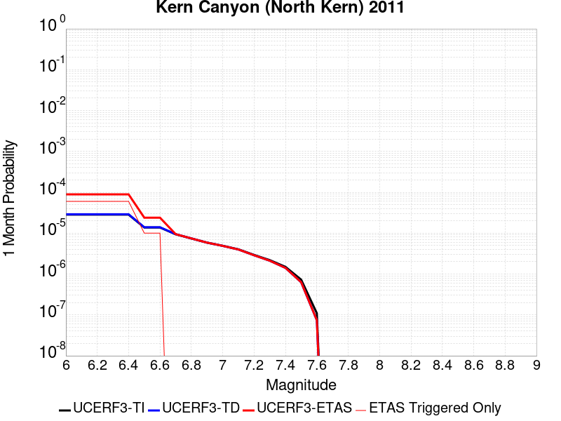 |  |  |

| Magnitude | 1 wk TI Prob | 1 wk TD Prob | 1 wk ETAS Prob | 1 wk ETAS/TD Gain | 1 wk ETAS Triggered Only | 1 mo TI Prob | 1 mo TD Prob | 1 mo ETAS Prob | 1 mo ETAS/TD Gain | 1 mo ETAS Triggered Only | 1 yr TI Prob | 1 yr TD Prob | 1 yr ETAS Prob | 1 yr ETAS/TD Gain | 1 yr ETAS Triggered Only | 10 yr TI Prob | 10 yr TD Prob | 10 yr ETAS Prob | 10 yr ETAS/TD Gain | 10 yr ETAS Triggered Only |
|-----|-----|-----|-----|-----|-----|-----|-----|-----|-----|-----|-----|-----|-----|-----|-----|-----|-----|-----|-----|-----|
| 6.0 | 6.6264497E-6 | 6.75733E-6 | 2.6757194E-5 | 3.959729 | 2.0E-5 | 2.8398761E-5 | 2.895971E-5 | 8.8957975E-5 | 3.071784 | 6.0E-5 | 3.4570007E-4 | 3.5253543E-4 | 4.425037E-4 | 1.2552035 | 9.0E-5 | 0.0034516277 | 0.0035205502 | 0.0036401278 | 1.0339656 | 1.2E-4 |
| 6.1 | 6.6264497E-6 | 6.75733E-6 | 2.6757194E-5 | 3.959729 | 2.0E-5 | 2.8398761E-5 | 2.895971E-5 | 8.8957975E-5 | 3.071784 | 6.0E-5 | 3.4570007E-4 | 3.5253543E-4 | 4.425037E-4 | 1.2552035 | 9.0E-5 | 0.0034516277 | 0.0035205502 | 0.0036401278 | 1.0339656 | 1.2E-4 |
| 6.2 | 6.6264497E-6 | 6.75733E-6 | 2.6757194E-5 | 3.959729 | 2.0E-5 | 2.8398761E-5 | 2.895971E-5 | 8.8957975E-5 | 3.071784 | 6.0E-5 | 3.4570007E-4 | 3.5253543E-4 | 4.425037E-4 | 1.2552035 | 9.0E-5 | 0.0034516277 | 0.0035205502 | 0.0036401278 | 1.0339656 | 1.2E-4 |
| 6.3 | 6.6264497E-6 | 6.75733E-6 | 2.6757194E-5 | 3.959729 | 2.0E-5 | 2.8398761E-5 | 2.895971E-5 | 8.8957975E-5 | 3.071784 | 6.0E-5 | 3.4570007E-4 | 3.5253543E-4 | 4.425037E-4 | 1.2552035 | 9.0E-5 | 0.0034516277 | 0.0035205502 | 0.0036401278 | 1.0339656 | 1.2E-4 |
| 6.4 | 6.6264497E-6 | 6.75733E-6 | 2.6757194E-5 | 3.959729 | 2.0E-5 | 2.8398761E-5 | 2.895971E-5 | 8.8957975E-5 | 3.071784 | 6.0E-5 | 3.4570007E-4 | 3.5253543E-4 | 4.425037E-4 | 1.2552035 | 9.0E-5 | 0.0034516277 | 0.0035205502 | 0.0036401278 | 1.0339656 | 1.2E-4 |
| 6.5 | 3.2162225E-6 | 3.2570915E-6 | 3.2570915E-6 | 1.0 | 0.0 | 1.3783738E-5 | 1.3958893E-5 | 2.3958753E-5 | 1.7163792 | 1.0E-5 | 1.6780409E-4 | 1.6993708E-4 | 2.0993028E-4 | 1.2353412 | 4.0E-5 | 0.0016767744 | 0.001698151 | 0.001748066 | 1.0293938 | 5.0E-5 |
| 6.6 | 3.2162225E-6 | 3.2570915E-6 | 3.2570915E-6 | 1.0 | 0.0 | 1.3783738E-5 | 1.3958893E-5 | 2.3958753E-5 | 1.7163792 | 1.0E-5 | 1.6780409E-4 | 1.6993708E-4 | 2.0993028E-4 | 1.2353412 | 4.0E-5 | 0.0016767744 | 0.001698151 | 0.001748066 | 1.0293938 | 5.0E-5 |
| 6.7 | 2.1908265E-6 | 2.2071222E-6 | 2.2071222E-6 | 1.0 | 0.0 | 9.389223E-6 | 9.459061E-6 | 9.459061E-6 | 1.0 | 0.0 | 1.1430779E-4 | 1.1515819E-4 | 1.2515704E-4 | 1.086827 | 1.0E-5 | 0.0011424901 | 0.0011510046 | 0.0011709816 | 1.0173562 | 2.0E-5 |
| 6.8 | 1.7303895E-6 | 1.7365529E-6 | 1.7365529E-6 | 1.0 | 0.0 | 7.415934E-6 | 7.4423488E-6 | 7.4423488E-6 | 1.0 | 0.0 | 9.028525E-5 | 9.0606925E-5 | 1.0060602E-4 | 1.1103568 | 1.0E-5 | 9.024858E-4 | 9.057096E-4 | 9.2569145E-4 | 1.0220622 | 2.0E-5 |
| 6.9 | 1.3700314E-6 | 1.3688622E-6 | 1.3688622E-6 | 1.0 | 0.0 | 5.87155E-6 | 5.8665396E-6 | 5.8665396E-6 | 1.0 | 0.0 | 7.148377E-5 | 7.142282E-5 | 8.1422106E-5 | 1.1400013 | 1.0E-5 | 7.146078E-4 | 7.140032E-4 | 7.3398894E-4 | 1.027991 | 2.0E-5 |
| 7.0 | 1.1467797E-6 | 1.1413804E-6 | 1.1413804E-6 | 1.0 | 0.0 | 4.9147607E-6 | 4.8916213E-6 | 4.8916213E-6 | 1.0 | 0.0 | 5.983557E-5 | 5.9553895E-5 | 6.95533E-5 | 1.1679051 | 1.0E-5 | 5.981946E-4 | 5.953825E-4 | 6.153706E-4 | 1.0335718 | 2.0E-5 |
| 7.1 | 9.3952065E-7 | 9.3026904E-7 | 9.3026904E-7 | 1.0 | 0.0 | 4.026511E-6 | 3.9868614E-6 | 3.9868614E-6 | 1.0 | 0.0 | 4.9021666E-5 | 4.8538972E-5 | 5.8538488E-5 | 1.20601 | 1.0E-5 | 4.901085E-4 | 4.8528548E-4 | 5.052758E-4 | 1.0411929 | 2.0E-5 |
| 7.2 | 6.858055E-7 | 6.7193E-7 | 6.7193E-7 | 1.0 | 0.0 | 2.939163E-6 | 2.879697E-6 | 2.879697E-6 | 1.0 | 0.0 | 3.5783723E-5 | 3.5059755E-5 | 4.5059405E-5 | 1.2852173 | 1.0E-5 | 3.5777962E-4 | 3.5054312E-4 | 3.6053962E-4 | 1.0285171 | 1.0E-5 |
| 7.3 | 5.1101983E-7 | 4.9393E-7 | 4.9393E-7 | 1.0 | 0.0 | 2.1900833E-6 | 2.116841E-6 | 2.116841E-6 | 1.0 | 0.0 | 2.6663936E-5 | 2.5772239E-5 | 3.577198E-5 | 1.3880044 | 1.0E-5 | 2.6660739E-4 | 2.57693E-4 | 2.676904E-4 | 1.0387958 | 1.0E-5 |
| 7.4 | 3.4999414E-7 | 3.2995905E-7 | 3.2995905E-7 | 1.0 | 0.0 | 1.499974E-6 | 1.4141094E-6 | 1.4141094E-6 | 1.0 | 0.0 | 1.8262032E-5 | 1.721665E-5 | 2.7216476E-5 | 1.5808231 | 1.0E-5 | 1.826053E-4 | 1.7215339E-4 | 1.8215168E-4 | 1.0580777 | 1.0E-5 |
| 7.5 | 1.7021522E-7 | 1.4750044E-7 | 1.4750044E-7 | 1.0 | 0.0 | 7.2949354E-7 | 6.321446E-7 | 6.321446E-7 | 1.0 | 0.0 | 8.881548E-6 | 7.696334E-6 | 7.696334E-6 | 1.0 | 0.0 | 8.8811925E-5 | 7.696076E-5 | 7.696076E-5 | 1.0 | 0.0 |
| 7.6 | 2.572245E-8 | 1.7352555E-8 | 1.7352555E-8 | 1.0 | 0.0 | 1.10239064E-7 | 7.436809E-8 | 7.436809E-8 | 1.0 | 0.0 | 1.3421597E-6 | 9.054312E-7 | 9.054312E-7 | 1.0 | 0.0 | 1.3421517E-5 | 9.05428E-6 | 9.05428E-6 | 1.0 | 0.0 |

## Dry Mountain
*[(top)](#table-of-contents)*

| 1 Week | 1 Month | 1 Year | 10 Year |
|-----|-----|-----|-----|
|  |  |  |  |

| Magnitude | 1 wk TI Prob | 1 wk TD Prob | 1 wk ETAS Prob | 1 wk ETAS/TD Gain | 1 wk ETAS Triggered Only | 1 mo TI Prob | 1 mo TD Prob | 1 mo ETAS Prob | 1 mo ETAS/TD Gain | 1 mo ETAS Triggered Only | 1 yr TI Prob | 1 yr TD Prob | 1 yr ETAS Prob | 1 yr ETAS/TD Gain | 1 yr ETAS Triggered Only | 10 yr TI Prob | 10 yr TD Prob | 10 yr ETAS Prob | 10 yr ETAS/TD Gain | 10 yr ETAS Triggered Only |
|-----|-----|-----|-----|-----|-----|-----|-----|-----|-----|-----|-----|-----|-----|-----|-----|-----|-----|-----|-----|-----|
| 6.0 | 6.222801E-6 | 6.439381E-6 | 4.6439123E-5 | 7.211737 | 4.0E-5 | 2.6668875E-5 | 2.7597147E-5 | 7.759577E-5 | 2.8117316 | 5.0E-5 | 3.2464517E-4 | 3.3595937E-4 | 3.9593922E-4 | 1.1785331 | 6.0E-5 | 0.0032417132 | 0.0033560768 | 0.0034756742 | 1.0356361 | 1.2E-4 |
| 6.1 | 6.222801E-6 | 6.439381E-6 | 4.6439123E-5 | 7.211737 | 4.0E-5 | 2.6668875E-5 | 2.7597147E-5 | 7.759577E-5 | 2.8117316 | 5.0E-5 | 3.2464517E-4 | 3.3595937E-4 | 3.9593922E-4 | 1.1785331 | 6.0E-5 | 0.0032417132 | 0.0033560768 | 0.0034756742 | 1.0356361 | 1.2E-4 |
| 6.2 | 6.222801E-6 | 6.439381E-6 | 4.6439123E-5 | 7.211737 | 4.0E-5 | 2.6668875E-5 | 2.7597147E-5 | 7.759577E-5 | 2.8117316 | 5.0E-5 | 3.2464517E-4 | 3.3595937E-4 | 3.9593922E-4 | 1.1785331 | 6.0E-5 | 0.0032417132 | 0.0033560768 | 0.0034756742 | 1.0356361 | 1.2E-4 |
| 6.3 | 6.222801E-6 | 6.439381E-6 | 4.6439123E-5 | 7.211737 | 4.0E-5 | 2.6668875E-5 | 2.7597147E-5 | 7.759577E-5 | 2.8117316 | 5.0E-5 | 3.2464517E-4 | 3.3595937E-4 | 3.9593922E-4 | 1.1785331 | 6.0E-5 | 0.0032417132 | 0.0033560768 | 0.0034756742 | 1.0356361 | 1.2E-4 |
| 6.4 | 6.222801E-6 | 6.439381E-6 | 4.6439123E-5 | 7.211737 | 4.0E-5 | 2.6668875E-5 | 2.7597147E-5 | 7.759577E-5 | 2.8117316 | 5.0E-5 | 3.2464517E-4 | 3.3595937E-4 | 3.9593922E-4 | 1.1785331 | 6.0E-5 | 0.0032417132 | 0.0033560768 | 0.0034756742 | 1.0356361 | 1.2E-4 |
| 6.5 | 2.8528623E-6 | 2.9521684E-6 | 2.295211E-5 | 7.7746615 | 2.0E-5 | 1.22264955E-5 | 1.2652138E-5 | 4.2651758E-5 | 3.3711107 | 3.0E-5 | 1.4884741E-4 | 1.540376E-4 | 1.8403298E-4 | 1.1947277 | 3.0E-5 | 0.0014874774 | 0.0015401616 | 0.0016000692 | 1.0388969 | 6.0E-5 |
| 6.6 | 2.8528623E-6 | 2.9521684E-6 | 2.295211E-5 | 7.7746615 | 2.0E-5 | 1.22264955E-5 | 1.2652138E-5 | 4.2651758E-5 | 3.3711107 | 3.0E-5 | 1.4884741E-4 | 1.540376E-4 | 1.8403298E-4 | 1.1947277 | 3.0E-5 | 0.0014874774 | 0.0015401616 | 0.0016000692 | 1.0388969 | 6.0E-5 |
| 6.7 | 2.541E-6 | 2.6293578E-6 | 2.2629305E-5 | 8.6064 | 2.0E-5 | 1.0889954E-5 | 1.1268677E-5 | 4.126834E-5 | 3.662217 | 3.0E-5 | 1.3257713E-4 | 1.3719614E-4 | 1.6719202E-4 | 1.2186351 | 3.0E-5 | 0.0013249806 | 0.0013719613 | 0.001431879 | 1.043673 | 6.0E-5 |

## Sheephole
*[(top)](#table-of-contents)*

| 1 Week | 1 Month | 1 Year | 10 Year |
|-----|-----|-----|-----|
| 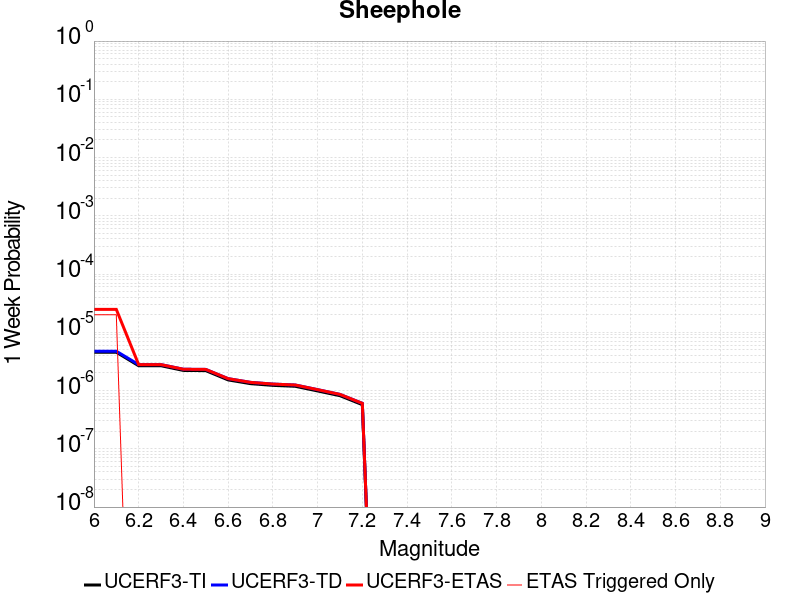 |  |  |  |

| Magnitude | 1 wk TI Prob | 1 wk TD Prob | 1 wk ETAS Prob | 1 wk ETAS/TD Gain | 1 wk ETAS Triggered Only | 1 mo TI Prob | 1 mo TD Prob | 1 mo ETAS Prob | 1 mo ETAS/TD Gain | 1 mo ETAS Triggered Only | 1 yr TI Prob | 1 yr TD Prob | 1 yr ETAS Prob | 1 yr ETAS/TD Gain | 1 yr ETAS Triggered Only | 10 yr TI Prob | 10 yr TD Prob | 10 yr ETAS Prob | 10 yr ETAS/TD Gain | 10 yr ETAS Triggered Only |
|-----|-----|-----|-----|-----|-----|-----|-----|-----|-----|-----|-----|-----|-----|-----|-----|-----|-----|-----|-----|-----|
| 6.0 | 4.5579695E-6 | 4.7412627E-6 | 2.4741168E-5 | 5.2182655 | 2.0E-5 | 1.9534009E-5 | 2.031957E-5 | 4.0319163E-5 | 1.9842528 | 2.0E-5 | 2.3780059E-4 | 2.473682E-4 | 2.9735584E-4 | 1.2020779 | 5.0E-5 | 0.0023754628 | 0.002471473 | 0.0025812013 | 1.0443978 | 1.1E-4 |
| 6.1 | 4.5579695E-6 | 4.7412627E-6 | 2.4741168E-5 | 5.2182655 | 2.0E-5 | 1.9534009E-5 | 2.031957E-5 | 4.0319163E-5 | 1.9842528 | 2.0E-5 | 2.3780059E-4 | 2.473682E-4 | 2.9735584E-4 | 1.2020779 | 5.0E-5 | 0.0023754628 | 0.002471473 | 0.0025812013 | 1.0443978 | 1.1E-4 |
| 6.2 | 2.6677674E-6 | 2.7873941E-6 | 2.7873941E-6 | 1.0 | 0.0 | 1.1433239E-5 | 1.1945926E-5 | 1.1945926E-5 | 1.0 | 0.0 | 1.3919079E-4 | 1.4543302E-4 | 1.6543012E-4 | 1.1375003 | 2.0E-5 | 0.0013910364 | 0.0014534844 | 0.0015133972 | 1.0412201 | 6.0E-5 |
| 6.3 | 2.6677674E-6 | 2.7873941E-6 | 2.7873941E-6 | 1.0 | 0.0 | 1.1433239E-5 | 1.1945926E-5 | 1.1945926E-5 | 1.0 | 0.0 | 1.3919079E-4 | 1.4543302E-4 | 1.6543012E-4 | 1.1375003 | 2.0E-5 | 0.0013910364 | 0.0014534844 | 0.0015133972 | 1.0412201 | 6.0E-5 |
| 6.4 | 2.2159759E-6 | 2.3228788E-6 | 2.3228788E-6 | 1.0 | 0.0 | 9.497005E-6 | 9.955161E-6 | 9.955161E-6 | 1.0 | 0.0 | 1.156199E-4 | 1.2119815E-4 | 1.4119573E-4 | 1.164999 | 2.0E-5 | 0.0011555976 | 0.0012113999 | 0.0012413636 | 1.0247347 | 3.0E-5 |
| 6.5 | 2.1986082E-6 | 2.304759E-6 | 2.304759E-6 | 1.0 | 0.0 | 9.4225725E-6 | 9.877506E-6 | 9.877506E-6 | 1.0 | 0.0 | 1.1471378E-4 | 1.2025281E-4 | 1.402504E-4 | 1.1662962 | 2.0E-5 | 0.0011465458 | 0.0012019566 | 0.0012319206 | 1.0249293 | 3.0E-5 |
| 6.6 | 1.5232331E-6 | 1.6018919E-6 | 1.6018919E-6 | 1.0 | 0.0 | 6.5281256E-6 | 6.865234E-6 | 6.865234E-6 | 1.0 | 0.0 | 7.947703E-5 | 8.35812E-5 | 9.358037E-5 | 1.1196342 | 1.0E-5 | 7.9448614E-4 | 8.3551643E-4 | 8.4550807E-4 | 1.0119586 | 1.0E-5 |
| 6.7 | 1.3137362E-6 | 1.382819E-6 | 1.382819E-6 | 1.0 | 0.0 | 5.6302856E-6 | 5.926355E-6 | 5.926355E-6 | 1.0 | 0.0 | 6.854657E-5 | 7.215112E-5 | 8.21504E-5 | 1.138588 | 1.0E-5 | 6.8525434E-4 | 7.212908E-4 | 7.312836E-4 | 1.013854 | 1.0E-5 |
| 6.8 | 1.2275751E-6 | 1.2922847E-6 | 1.2922847E-6 | 1.0 | 0.0 | 5.2610258E-6 | 5.5383516E-6 | 5.5383516E-6 | 1.0 | 0.0 | 6.4051106E-5 | 6.7427485E-5 | 7.7426805E-5 | 1.1482974 | 1.0E-5 | 6.4032647E-4 | 6.740836E-4 | 6.8407686E-4 | 1.014825 | 1.0E-5 |
| 6.9 | 1.1837088E-6 | 1.246102E-6 | 1.246102E-6 | 1.0 | 0.0 | 5.0730278E-6 | 5.340427E-6 | 5.340427E-6 | 1.0 | 0.0 | 6.176237E-5 | 6.501789E-5 | 7.501724E-5 | 1.1537938 | 1.0E-5 | 6.17452E-4 | 6.5000186E-4 | 6.5999536E-4 | 1.0153745 | 1.0E-5 |
| 7.0 | 9.849371E-7 | 1.0366288E-6 | 1.0366288E-6 | 1.0 | 0.0 | 4.2211523E-6 | 4.442688E-6 | 4.442688E-6 | 1.0 | 0.0 | 5.1391315E-5 | 5.4088487E-5 | 6.4087944E-5 | 1.1848723 | 1.0E-5 | 5.137943E-4 | 5.407633E-4 | 5.5075786E-4 | 1.0184823 | 1.0E-5 |
| 7.1 | 8.1643645E-7 | 8.591669E-7 | 8.591669E-7 | 1.0 | 0.0 | 3.4990085E-6 | 3.682139E-6 | 3.682139E-6 | 1.0 | 0.0 | 4.2599597E-5 | 4.482921E-5 | 5.482876E-5 | 1.2230588 | 1.0E-5 | 4.259143E-4 | 4.4821028E-4 | 4.5820582E-4 | 1.022301 | 1.0E-5 |
| 7.2 | 5.7295756E-7 | 6.029502E-7 | 6.029502E-7 | 1.0 | 0.0 | 2.45553E-6 | 2.58407E-6 | 2.58407E-6 | 1.0 | 0.0 | 2.9895667E-5 | 3.1460666E-5 | 4.1460353E-5 | 1.3178473 | 1.0E-5 | 2.9891645E-4 | 3.145688E-4 | 3.2456568E-4 | 1.0317795 | 1.0E-5 |

## San Diego Trough north alt1
*[(top)](#table-of-contents)*

| 1 Week | 1 Month | 1 Year | 10 Year |
|-----|-----|-----|-----|
|  |  |  | 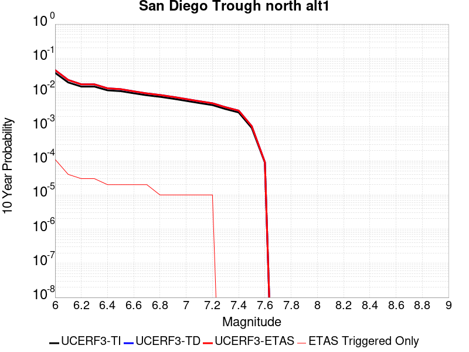 |

| Magnitude | 1 wk TI Prob | 1 wk TD Prob | 1 wk ETAS Prob | 1 wk ETAS/TD Gain | 1 wk ETAS Triggered Only | 1 mo TI Prob | 1 mo TD Prob | 1 mo ETAS Prob | 1 mo ETAS/TD Gain | 1 mo ETAS Triggered Only | 1 yr TI Prob | 1 yr TD Prob | 1 yr ETAS Prob | 1 yr ETAS/TD Gain | 1 yr ETAS Triggered Only | 10 yr TI Prob | 10 yr TD Prob | 10 yr ETAS Prob | 10 yr ETAS/TD Gain | 10 yr ETAS Triggered Only |
|-----|-----|-----|-----|-----|-----|-----|-----|-----|-----|-----|-----|-----|-----|-----|-----|-----|-----|-----|-----|-----|
| 6.0 | 7.329252E-5 | 8.821093E-5 | 1.0820917E-4 | 1.2267092 | 2.0E-5 | 3.14073E-4 | 3.7799572E-4 | 4.3797304E-4 | 1.158672 | 6.0E-5 | 0.0038171355 | 0.004593027 | 0.0046726596 | 1.0173377 | 8.0E-5 | 0.03752231 | 0.045044992 | 0.045150034 | 1.002332 | 1.1E-4 |
| 6.1 | 3.7940346E-5 | 4.4885E-5 | 5.4884553E-5 | 1.2227815 | 1.0E-5 | 1.6259136E-4 | 1.9235066E-4 | 2.223449E-4 | 1.1559352 | 3.0E-5 | 0.0019777524 | 0.0023394432 | 0.0023793497 | 1.0170581 | 4.0E-5 | 0.019602431 | 0.023156688 | 0.02319576 | 1.0016874 | 4.0E-5 |
| 6.2 | 2.8645263E-5 | 3.329678E-5 | 4.3296448E-5 | 1.3003193 | 1.0E-5 | 1.2275964E-4 | 1.4269284E-4 | 1.7268855E-4 | 1.2102118 | 3.0E-5 | 0.0014935739 | 0.0017359189 | 0.0017658669 | 1.017252 | 3.0E-5 | 0.0148357535 | 0.017226247 | 0.01725573 | 1.0017115 | 3.0E-5 |
| 6.3 | 2.8645263E-5 | 3.329678E-5 | 4.3296448E-5 | 1.3003193 | 1.0E-5 | 1.2275964E-4 | 1.4269284E-4 | 1.7268855E-4 | 1.2102118 | 3.0E-5 | 0.0014935739 | 0.0017359189 | 0.0017658669 | 1.017252 | 3.0E-5 | 0.0148357535 | 0.017226247 | 0.01725573 | 1.0017115 | 3.0E-5 |
| 6.4 | 2.2204576E-5 | 2.5448318E-5 | 3.5448065E-5 | 1.3929433 | 1.0E-5 | 9.5159E-5 | 1.0905972E-4 | 1.2905753E-4 | 1.1833658 | 2.0E-5 | 0.001157945 | 0.0013270034 | 0.0013469768 | 1.0150516 | 2.0E-5 | 0.011519298 | 0.013191955 | 0.013211691 | 1.0014961 | 2.0E-5 |
| 6.5 | 2.1004838E-5 | 2.4024694E-5 | 3.4024455E-5 | 1.4162284 | 1.0E-5 | 9.0017624E-5 | 1.0295896E-4 | 1.229569E-4 | 1.1942321 | 2.0E-5 | 0.0010954136 | 0.0012528138 | 0.0012727889 | 1.015944 | 2.0E-5 | 0.010900296 | 0.012458589 | 0.0124783395 | 1.0015854 | 2.0E-5 |
| 6.6 | 1.820557E-5 | 2.0704787E-5 | 3.0704578E-5 | 1.4829701 | 1.0E-5 | 7.802154E-5 | 8.873181E-5 | 1.0873003E-4 | 1.2253783 | 2.0E-5 | 9.4949827E-4 | 0.0010797799 | 0.0010997583 | 1.0185022 | 2.0E-5 | 0.009454516 | 0.010746004 | 0.010765789 | 1.0018412 | 2.0E-5 |
| 6.7 | 1.5884485E-5 | 1.7983646E-5 | 2.7983466E-5 | 1.5560508 | 1.0E-5 | 6.807459E-5 | 7.707051E-5 | 9.7068965E-5 | 1.2594826 | 2.0E-5 | 8.284929E-4 | 9.3793223E-4 | 9.5791346E-4 | 1.0213035 | 2.0E-5 | 0.008254109 | 0.009340104 | 0.009359917 | 1.0021213 | 2.0E-5 |
| 6.8 | 1.4331171E-5 | 1.6201066E-5 | 1.6201066E-5 | 1.0 | 0.0 | 6.141786E-5 | 6.94313E-5 | 7.94306E-5 | 1.1440172 | 1.0E-5 | 7.4750587E-4 | 8.450002E-4 | 8.549917E-4 | 1.0118244 | 1.0E-5 | 0.0074499645 | 0.008418139 | 0.008428055 | 1.0011779 | 1.0E-5 |
| 6.9 | 1.2574203E-5 | 1.4205835E-5 | 1.4205835E-5 | 1.0 | 0.0 | 5.3888325E-5 | 6.0880735E-5 | 7.088013E-5 | 1.1642456 | 1.0E-5 | 6.558929E-4 | 7.409723E-4 | 7.5096486E-4 | 1.0134858 | 1.0E-5 | 0.0065396037 | 0.007385203 | 0.0073951297 | 1.0013441 | 1.0E-5 |
| 7.0 | 1.0883844E-5 | 1.2289262E-5 | 1.2289262E-5 | 1.0 | 0.0 | 4.664421E-5 | 5.2667205E-5 | 6.266668E-5 | 1.1898614 | 1.0E-5 | 5.677453E-4 | 6.4103556E-4 | 6.510292E-4 | 1.0155897 | 1.0E-5 | 0.00566297 | 0.006391993 | 0.0064019286 | 1.0015545 | 1.0E-5 |
| 7.1 | 9.393088E-6 | 1.060702E-5 | 1.060702E-5 | 1.0 | 0.0 | 4.025547E-5 | 4.545787E-5 | 5.5457414E-5 | 1.2199739 | 1.0E-5 | 4.900001E-4 | 5.533098E-4 | 5.6330423E-4 | 1.0180631 | 1.0E-5 | 0.0048892107 | 0.005519418 | 0.0055293627 | 1.0018017 | 1.0E-5 |
| 7.2 | 8.190791E-6 | 9.258625E-6 | 9.258625E-6 | 1.0 | 0.0 | 3.510292E-5 | 3.9679224E-5 | 4.9678827E-5 | 1.2520111 | 1.0E-5 | 4.2729423E-4 | 4.8298817E-4 | 4.929833E-4 | 1.0206945 | 1.0E-5 | 0.0042647356 | 0.004819465 | 0.0048294165 | 1.002065 | 1.0E-5 |
| 7.3 | 6.268162E-6 | 7.089716E-6 | 7.089716E-6 | 1.0 | 0.0 | 2.6863276E-5 | 3.0384144E-5 | 3.0384144E-5 | 1.0 | 0.0 | 3.2701128E-4 | 3.6986457E-4 | 3.6986457E-4 | 1.0 | 0.0 | 0.003265305 | 0.003692536 | 0.003692536 | 1.0 | 0.0 |
| 7.4 | 4.985186E-6 | 5.6426816E-6 | 5.6426816E-6 | 1.0 | 0.0 | 2.1364907E-5 | 2.4182698E-5 | 2.4182698E-5 | 1.0 | 0.0 | 2.600867E-4 | 2.9438498E-4 | 2.9438498E-4 | 1.0 | 0.0 | 0.002597825 | 0.0029399914 | 0.0029399914 | 1.0 | 0.0 |
| 7.5 | 1.7489613E-6 | 1.969678E-6 | 1.969678E-6 | 1.0 | 0.0 | 7.495527E-6 | 8.4414505E-6 | 8.4414505E-6 | 1.0 | 0.0 | 9.125422E-5 | 1.02770035E-4 | 1.02770035E-4 | 1.0 | 0.0 | 9.1216754E-4 | 0.0010272472 | 0.0010272472 | 1.0 | 0.0 |
| 7.6 | 1.6988751E-7 | 1.7533823E-7 | 1.7533823E-7 | 1.0 | 0.0 | 7.2808916E-7 | 7.5144936E-7 | 7.5144936E-7 | 1.0 | 0.0 | 8.864449E-6 | 9.14886E-6 | 9.14886E-6 | 1.0 | 0.0 | 8.8640954E-5 | 9.1485024E-5 | 9.1485024E-5 | 1.0 | 0.0 |

## Pinto Mtn
*[(top)](#table-of-contents)*

| 1 Week | 1 Month | 1 Year | 10 Year |
|-----|-----|-----|-----|
|  |  |  |  |

| Magnitude | 1 wk TI Prob | 1 wk TD Prob | 1 wk ETAS Prob | 1 wk ETAS/TD Gain | 1 wk ETAS Triggered Only | 1 mo TI Prob | 1 mo TD Prob | 1 mo ETAS Prob | 1 mo ETAS/TD Gain | 1 mo ETAS Triggered Only | 1 yr TI Prob | 1 yr TD Prob | 1 yr ETAS Prob | 1 yr ETAS/TD Gain | 1 yr ETAS Triggered Only | 10 yr TI Prob | 10 yr TD Prob | 10 yr ETAS Prob | 10 yr ETAS/TD Gain | 10 yr ETAS Triggered Only |
|-----|-----|-----|-----|-----|-----|-----|-----|-----|-----|-----|-----|-----|-----|-----|-----|-----|-----|-----|-----|-----|
| 6.0 | 4.4194956E-5 | 4.785362E-5 | 1.1785027E-4 | 2.4627242 | 7.0E-5 | 1.893932E-4 | 2.0507174E-4 | 2.8505534E-4 | 1.3900274 | 8.0E-5 | 0.0023034236 | 0.0024940541 | 0.0025938048 | 1.0399953 | 1.0E-4 | 0.022796938 | 0.024678145 | 0.024785431 | 1.0043474 | 1.1E-4 |
| 6.1 | 4.4194956E-5 | 4.785362E-5 | 1.1785027E-4 | 2.4627242 | 7.0E-5 | 1.893932E-4 | 2.0507174E-4 | 2.8505534E-4 | 1.3900274 | 8.0E-5 | 0.0023034236 | 0.0024940541 | 0.0025938048 | 1.0399953 | 1.0E-4 | 0.022796938 | 0.024678145 | 0.024785431 | 1.0043474 | 1.1E-4 |
| 6.2 | 4.4194956E-5 | 4.785362E-5 | 1.1785027E-4 | 2.4627242 | 7.0E-5 | 1.893932E-4 | 2.0507174E-4 | 2.8505534E-4 | 1.3900274 | 8.0E-5 | 0.0023034236 | 0.0024940541 | 0.0025938048 | 1.0399953 | 1.0E-4 | 0.022796938 | 0.024678145 | 0.024785431 | 1.0043474 | 1.1E-4 |
| 6.3 | 4.4194956E-5 | 4.785362E-5 | 1.1785027E-4 | 2.4627242 | 7.0E-5 | 1.893932E-4 | 2.0507174E-4 | 2.8505534E-4 | 1.3900274 | 8.0E-5 | 0.0023034236 | 0.0024940541 | 0.0025938048 | 1.0399953 | 1.0E-4 | 0.022796938 | 0.024678145 | 0.024785431 | 1.0043474 | 1.1E-4 |
| 6.4 | 3.729929E-5 | 3.9603186E-5 | 8.9601206E-5 | 2.2624748 | 5.0E-5 | 1.5984432E-4 | 1.6971743E-4 | 2.2970724E-4 | 1.3534688 | 6.0E-5 | 0.0019443673 | 0.002064445 | 0.00214428 | 1.0386714 | 8.0E-5 | 0.019274427 | 0.02046269 | 0.020550849 | 1.0043082 | 9.0E-5 |
| 6.5 | 3.729929E-5 | 3.9603186E-5 | 8.9601206E-5 | 2.2624748 | 5.0E-5 | 1.5984432E-4 | 1.6971743E-4 | 2.2970724E-4 | 1.3534688 | 6.0E-5 | 0.0019443673 | 0.002064445 | 0.00214428 | 1.0386714 | 8.0E-5 | 0.019274427 | 0.02046269 | 0.020550849 | 1.0043082 | 9.0E-5 |
| 6.6 | 3.0204548E-5 | 3.1205298E-5 | 7.120405E-5 | 2.2817936 | 4.0E-5 | 1.2944164E-4 | 1.3373033E-4 | 1.8372365E-4 | 1.3738368 | 5.0E-5 | 0.0015748127 | 0.0016269855 | 0.0016769042 | 1.0306817 | 5.0E-5 | 0.015636992 | 0.01615461 | 0.01621364 | 1.0036541 | 6.0E-5 |
| 6.7 | 2.9857754E-5 | 3.081468E-5 | 7.081345E-5 | 2.2980425 | 4.0E-5 | 1.2795553E-4 | 1.3205643E-4 | 1.8204983E-4 | 1.378576 | 5.0E-5 | 0.0015567453 | 0.001606636 | 0.0016565556 | 1.031071 | 5.0E-5 | 0.015458848 | 0.01595405 | 0.016013091 | 1.0037009 | 6.0E-5 |
| 6.8 | 2.4819734E-5 | 2.5009364E-5 | 5.500861E-5 | 2.1995208 | 3.0E-5 | 1.0636595E-4 | 1.07178705E-4 | 1.4717442E-4 | 1.3731685 | 4.0E-5 | 0.0012942362 | 0.0013041412 | 0.001344089 | 1.0306315 | 4.0E-5 | 0.012867244 | 0.0129672475 | 0.013016599 | 1.0038059 | 5.0E-5 |
| 6.9 | 2.331124E-5 | 2.3337643E-5 | 5.3336942E-5 | 2.285447 | 3.0E-5 | 9.990149E-5 | 1.00014746E-4 | 1.4001074E-4 | 1.399901 | 4.0E-5 | 0.001215622 | 0.0012170197 | 0.001256971 | 1.0328271 | 4.0E-5 | 0.012089936 | 0.012105742 | 0.012155136 | 1.0040803 | 5.0E-5 |
| 7.0 | 2.1818534E-5 | 2.1760772E-5 | 5.176012E-5 | 2.3785975 | 3.0E-5 | 9.3504656E-5 | 9.325723E-5 | 1.332535E-4 | 1.4288812 | 4.0E-5 | 0.0011378246 | 0.0011348352 | 0.0011747899 | 1.0352074 | 4.0E-5 | 0.011320163 | 0.011292503 | 0.011341939 | 1.0043777 | 5.0E-5 |
| 7.1 | 2.066081E-5 | 2.0540418E-5 | 5.0539802E-5 | 2.460505 | 3.0E-5 | 8.854332E-5 | 8.8027504E-5 | 1.2802398E-4 | 1.4543635 | 4.0E-5 | 0.0010774818 | 0.0010712275 | 0.0011111846 | 1.0373003 | 4.0E-5 | 0.010722724 | 0.010662688 | 0.010712155 | 1.0046393 | 5.0E-5 |
| 7.2 | 1.8990233E-5 | 1.9053701E-5 | 4.905313E-5 | 2.5744672 | 3.0E-5 | 8.138417E-5 | 8.1656275E-5 | 1.2165301E-4 | 1.4898182 | 4.0E-5 | 9.904018E-4 | 9.937311E-4 | 0.0010336913 | 1.0402124 | 4.0E-5 | 0.009859995 | 0.009894874 | 0.009944379 | 1.0050031 | 5.0E-5 |
| 7.3 | 1.3335872E-5 | 1.4906372E-5 | 4.4905926E-5 | 3.0125322 | 3.0E-5 | 5.7152483E-5 | 6.388296E-5 | 1.03880404E-4 | 1.6261051 | 4.0E-5 | 6.956093E-4 | 7.775102E-4 | 8.174791E-4 | 1.0514063 | 4.0E-5 | 0.006934359 | 0.0077491994 | 0.007798812 | 1.0064023 | 5.0E-5 |
| 7.4 | 9.414066E-6 | 1.186061E-5 | 4.1860254E-5 | 3.5293508 | 3.0E-5 | 4.0345374E-5 | 5.0830247E-5 | 9.0828216E-5 | 1.786893 | 4.0E-5 | 4.910942E-4 | 6.1869196E-4 | 6.5866724E-4 | 1.0646125 | 4.0E-5 | 0.0049001034 | 0.006170644 | 0.0062203356 | 1.0080528 | 5.0E-5 |
| 7.5 | 7.2101157E-6 | 9.157893E-6 | 3.9157618E-5 | 4.2758327 | 3.0E-5 | 3.090013E-5 | 3.924757E-5 | 6.9246395E-5 | 1.7643485 | 3.0E-5 | 3.7614413E-4 | 4.7774217E-4 | 5.0772785E-4 | 1.0627654 | 3.0E-5 | 0.0037550807 | 0.004767927 | 0.0048077363 | 1.0083494 | 4.0E-5 |
| 7.6 | 3.296375E-6 | 4.5453176E-6 | 3.454518E-5 | 7.6001687 | 3.0E-5 | 1.4127245E-5 | 1.9479796E-5 | 4.947921E-5 | 2.5400271 | 3.0E-5 | 1.7198564E-4 | 2.3714209E-4 | 2.6713498E-4 | 1.1264764 | 3.0E-5 | 0.0017185259 | 0.0023690276 | 0.0023989566 | 1.0126334 | 3.0E-5 |
| 7.7 | 2.5741092E-6 | 3.584251E-6 | 1.3584216E-5 | 3.789973 | 1.0E-5 | 1.103185E-5 | 1.5360993E-5 | 2.536084E-5 | 1.6509895 | 1.0E-5 | 1.3430449E-4 | 1.8700535E-4 | 1.970035E-4 | 1.0534644 | 1.0E-5 | 0.0013422335 | 0.0018686098 | 0.0018785911 | 1.0053415 | 1.0E-5 |

## Channel Islands Thrust
*[(top)](#table-of-contents)*

| 1 Week | 1 Month | 1 Year | 10 Year |
|-----|-----|-----|-----|
|  |  |  |  |

| Magnitude | 1 wk TI Prob | 1 wk TD Prob | 1 wk ETAS Prob | 1 wk ETAS/TD Gain | 1 wk ETAS Triggered Only | 1 mo TI Prob | 1 mo TD Prob | 1 mo ETAS Prob | 1 mo ETAS/TD Gain | 1 mo ETAS Triggered Only | 1 yr TI Prob | 1 yr TD Prob | 1 yr ETAS Prob | 1 yr ETAS/TD Gain | 1 yr ETAS Triggered Only | 10 yr TI Prob | 10 yr TD Prob | 10 yr ETAS Prob | 10 yr ETAS/TD Gain | 10 yr ETAS Triggered Only |
|-----|-----|-----|-----|-----|-----|-----|-----|-----|-----|-----|-----|-----|-----|-----|-----|-----|-----|-----|-----|-----|
| 6.0 | 2.2156251E-5 | 2.4092022E-5 | 3.409178E-5 | 1.4150652 | 1.0E-5 | 9.495191E-5 | 1.03248036E-4 | 1.432439E-4 | 1.3873765 | 4.0E-5 | 0.0011554264 | 0.0012564264 | 0.0013463134 | 1.0715418 | 9.0E-5 | 0.011494373 | 0.0125038205 | 0.012612445 | 1.0086873 | 1.1E-4 |
| 6.1 | 2.2156251E-5 | 2.4092022E-5 | 3.409178E-5 | 1.4150652 | 1.0E-5 | 9.495191E-5 | 1.03248036E-4 | 1.432439E-4 | 1.3873765 | 4.0E-5 | 0.0011554264 | 0.0012564264 | 0.0013463134 | 1.0715418 | 9.0E-5 | 0.011494373 | 0.0125038205 | 0.012612445 | 1.0086873 | 1.1E-4 |
| 6.2 | 2.2156251E-5 | 2.4092022E-5 | 3.409178E-5 | 1.4150652 | 1.0E-5 | 9.495191E-5 | 1.03248036E-4 | 1.432439E-4 | 1.3873765 | 4.0E-5 | 0.0011554264 | 0.0012564264 | 0.0013463134 | 1.0715418 | 9.0E-5 | 0.011494373 | 0.0125038205 | 0.012612445 | 1.0086873 | 1.1E-4 |
| 6.3 | 2.2156251E-5 | 2.4092022E-5 | 3.409178E-5 | 1.4150652 | 1.0E-5 | 9.495191E-5 | 1.03248036E-4 | 1.432439E-4 | 1.3873765 | 4.0E-5 | 0.0011554264 | 0.0012564264 | 0.0013463134 | 1.0715418 | 9.0E-5 | 0.011494373 | 0.0125038205 | 0.012612445 | 1.0086873 | 1.1E-4 |
| 6.4 | 2.2156251E-5 | 2.4092022E-5 | 3.409178E-5 | 1.4150652 | 1.0E-5 | 9.495191E-5 | 1.03248036E-4 | 1.432439E-4 | 1.3873765 | 4.0E-5 | 0.0011554264 | 0.0012564264 | 0.0013463134 | 1.0715418 | 9.0E-5 | 0.011494373 | 0.0125038205 | 0.012612445 | 1.0086873 | 1.1E-4 |
| 6.5 | 2.2156251E-5 | 2.4092022E-5 | 3.409178E-5 | 1.4150652 | 1.0E-5 | 9.495191E-5 | 1.03248036E-4 | 1.432439E-4 | 1.3873765 | 4.0E-5 | 0.0011554264 | 0.0012564264 | 0.0013463134 | 1.0715418 | 9.0E-5 | 0.011494373 | 0.0125038205 | 0.012612445 | 1.0086873 | 1.1E-4 |
| 6.6 | 2.2156251E-5 | 2.4092022E-5 | 3.409178E-5 | 1.4150652 | 1.0E-5 | 9.495191E-5 | 1.03248036E-4 | 1.432439E-4 | 1.3873765 | 4.0E-5 | 0.0011554264 | 0.0012564264 | 0.0013463134 | 1.0715418 | 9.0E-5 | 0.011494373 | 0.0125038205 | 0.012612445 | 1.0086873 | 1.1E-4 |
| 6.7 | 1.0601296E-5 | 1.1379544E-5 | 1.1379544E-5 | 1.0 | 0.0 | 4.5433335E-5 | 4.876859E-5 | 5.8768102E-5 | 1.20504 | 1.0E-5 | 5.5301044E-4 | 5.936007E-4 | 6.2358286E-4 | 1.050509 | 3.0E-5 | 0.005516363 | 0.005920653 | 0.0059504756 | 1.005037 | 3.0E-5 |
| 6.8 | 1.0246747E-5 | 1.0996669E-5 | 1.0996669E-5 | 1.0 | 0.0 | 4.391389E-5 | 4.7127756E-5 | 5.7127283E-5 | 1.2121792 | 1.0E-5 | 5.345204E-4 | 5.7363417E-4 | 6.0361694E-4 | 1.0522681 | 3.0E-5 | 0.0053323656 | 0.005722025 | 0.0057518533 | 1.0052129 | 3.0E-5 |
| 6.9 | 9.049551E-6 | 9.699645E-6 | 9.699645E-6 | 1.0 | 0.0 | 3.878322E-5 | 4.1569267E-5 | 5.1568848E-5 | 1.2405523 | 1.0E-5 | 4.7208337E-4 | 5.059924E-4 | 5.359772E-4 | 1.0592594 | 3.0E-5 | 0.0047108172 | 0.0050488203 | 0.0050786687 | 1.005912 | 3.0E-5 |
| 7.0 | 8.6542195E-6 | 9.274603E-6 | 9.274603E-6 | 1.0 | 0.0 | 3.7088983E-5 | 3.9747716E-5 | 4.974732E-5 | 1.2515768 | 1.0E-5 | 4.5146482E-4 | 4.8382508E-4 | 5.1381055E-4 | 1.0619758 | 3.0E-5 | 0.004505487 | 0.004828129 | 0.0048579844 | 1.0061836 | 3.0E-5 |
| 7.1 | 8.391028E-6 | 8.992924E-6 | 8.992924E-6 | 1.0 | 0.0 | 3.5961057E-5 | 3.854056E-5 | 4.8540176E-5 | 1.2594569 | 1.0E-5 | 4.3773788E-4 | 4.6913436E-4 | 4.991203E-4 | 1.0639175 | 3.0E-5 | 0.004368766 | 0.0046818503 | 0.00471171 | 1.0063777 | 3.0E-5 |
| 7.2 | 5.965188E-6 | 6.3716952E-6 | 6.3716952E-6 | 1.0 | 0.0 | 2.556484E-5 | 2.7306982E-5 | 3.730671E-5 | 1.3661968 | 1.0E-5 | 3.1120746E-4 | 3.3241234E-4 | 3.5240568E-4 | 1.0601462 | 2.0E-5 | 0.00310772 | 0.0033192092 | 0.0033391428 | 1.0060055 | 2.0E-5 |
| 7.3 | 4.877518E-6 | 5.2060063E-6 | 5.2060063E-6 | 1.0 | 0.0 | 2.0903482E-5 | 2.2311267E-5 | 3.2311043E-5 | 1.448194 | 1.0E-5 | 2.5447016E-4 | 2.716063E-4 | 2.9160085E-4 | 1.073616 | 2.0E-5 | 0.0025417898 | 0.0027127895 | 0.0027327354 | 1.0073525 | 2.0E-5 |
| 7.4 | 3.8829853E-6 | 4.141863E-6 | 4.141863E-6 | 1.0 | 0.0 | 1.664126E-5 | 1.7750723E-5 | 2.7750544E-5 | 1.5633473 | 1.0E-5 | 2.0258849E-4 | 2.1609402E-4 | 2.360897E-4 | 1.0925323 | 2.0E-5 | 0.002024039 | 0.0021588807 | 0.0021788375 | 1.0092441 | 2.0E-5 |
| 7.5 | 1.3489616E-6 | 1.4277903E-6 | 1.4277903E-6 | 1.0 | 0.0 | 5.7812517E-6 | 6.119087E-6 | 6.119087E-6 | 1.0 | 0.0 | 7.038446E-5 | 7.449738E-5 | 7.449738E-5 | 1.0 | 0.0 | 7.036218E-4 | 7.44728E-4 | 7.44728E-4 | 1.0 | 0.0 |
| 7.6 | 6.058192E-7 | 6.353778E-7 | 6.353778E-7 | 1.0 | 0.0 | 2.5963652E-6 | 2.7230449E-6 | 2.7230449E-6 | 1.0 | 0.0 | 3.161029E-5 | 3.3152584E-5 | 3.3152584E-5 | 1.0 | 0.0 | 3.1605794E-4 | 3.31478E-4 | 3.31478E-4 | 1.0 | 0.0 |
| 7.7 | 2.2170494E-7 | 2.2607902E-7 | 2.2607902E-7 | 1.0 | 0.0 | 9.5016367E-7 | 9.689098E-7 | 9.689098E-7 | 1.0 | 0.0 | 1.1568181E-5 | 1.1796425E-5 | 1.1796425E-5 | 1.0 | 0.0 | 1.1567579E-4 | 1.1795909E-4 | 1.1795909E-4 | 1.0 | 0.0 |
| 7.8 | 2.1613102E-8 | 1.5466682E-8 | 1.5466682E-8 | 1.0 | 0.0 | 9.262757E-8 | 6.628578E-8 | 6.628578E-8 | 1.0 | 0.0 | 1.1277401E-6 | 8.070291E-7 | 8.070291E-7 | 1.0 | 0.0 | 1.1277344E-5 | 8.070269E-6 | 8.070269E-6 | 1.0 | 0.0 |

## Coronado Bank alt1
*[(top)](#table-of-contents)*

| 1 Week | 1 Month | 1 Year | 10 Year |
|-----|-----|-----|-----|
| 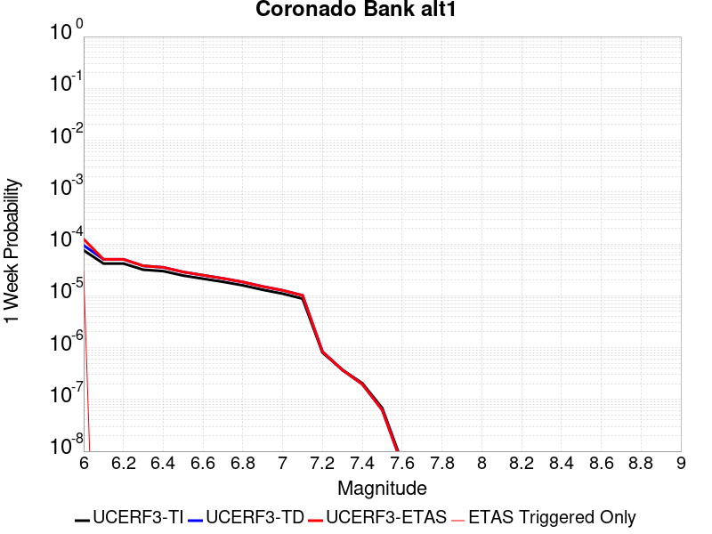 | 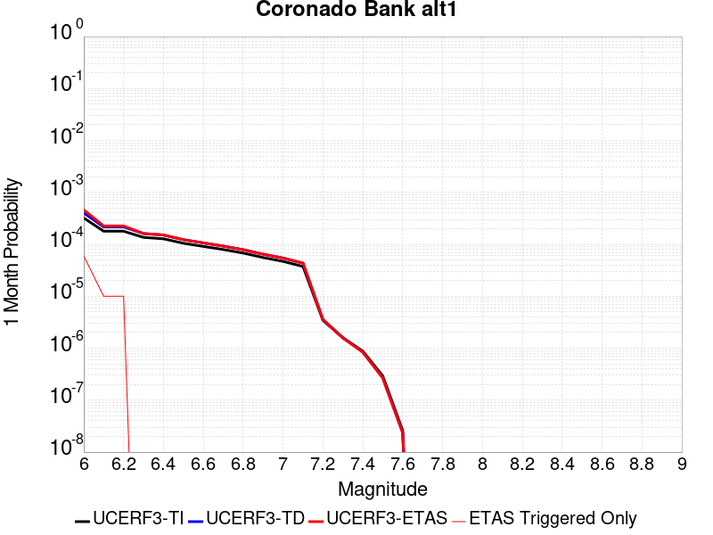 |  |  |

| Magnitude | 1 wk TI Prob | 1 wk TD Prob | 1 wk ETAS Prob | 1 wk ETAS/TD Gain | 1 wk ETAS Triggered Only | 1 mo TI Prob | 1 mo TD Prob | 1 mo ETAS Prob | 1 mo ETAS/TD Gain | 1 mo ETAS Triggered Only | 1 yr TI Prob | 1 yr TD Prob | 1 yr ETAS Prob | 1 yr ETAS/TD Gain | 1 yr ETAS Triggered Only | 10 yr TI Prob | 10 yr TD Prob | 10 yr ETAS Prob | 10 yr ETAS/TD Gain | 10 yr ETAS Triggered Only |
|-----|-----|-----|-----|-----|-----|-----|-----|-----|-----|-----|-----|-----|-----|-----|-----|-----|-----|-----|-----|-----|
| 6.0 | 7.533492E-5 | 9.394913E-5 | 1.2394632E-4 | 1.3192917 | 3.0E-5 | 3.22824E-4 | 4.0258127E-4 | 4.625571E-4 | 1.1489782 | 6.0E-5 | 0.0039233007 | 0.0048909658 | 0.004960623 | 1.014242 | 7.0E-5 | 0.03854755 | 0.04790356 | 0.048008293 | 1.0021863 | 1.1E-4 |
| 6.1 | 4.1807285E-5 | 5.049283E-5 | 5.049283E-5 | 1.0 | 0.0 | 1.7916178E-4 | 2.1638049E-4 | 2.2637832E-4 | 1.0462049 | 1.0E-5 | 0.0021791123 | 0.0026313474 | 0.0026512947 | 1.0075806 | 2.0E-5 | 0.021578677 | 0.026011046 | 0.026030527 | 1.0007489 | 2.0E-5 |
| 6.2 | 4.1807285E-5 | 5.049283E-5 | 5.049283E-5 | 1.0 | 0.0 | 1.7916178E-4 | 2.1638049E-4 | 2.2637832E-4 | 1.0462049 | 1.0E-5 | 0.0021791123 | 0.0026313474 | 0.0026512947 | 1.0075806 | 2.0E-5 | 0.021578677 | 0.026011046 | 0.026030527 | 1.0007489 | 2.0E-5 |
| 6.3 | 3.1793104E-5 | 3.7711117E-5 | 3.7711117E-5 | 1.0 | 0.0 | 1.3624904E-4 | 1.6160926E-4 | 1.6160926E-4 | 1.0 | 0.0 | 0.0016575698 | 0.001965848 | 0.0019758283 | 1.0050769 | 1.0E-5 | 0.016452603 | 0.019488465 | 0.01949827 | 1.0005032 | 1.0E-5 |
| 6.4 | 2.9878007E-5 | 3.5335794E-5 | 3.5335794E-5 | 1.0 | 0.0 | 1.2804232E-4 | 1.5143053E-4 | 1.5143053E-4 | 1.0 | 0.0 | 0.0015578003 | 0.0018421387 | 0.0018521203 | 1.0054184 | 1.0E-5 | 0.015469253 | 0.01827244 | 0.018282259 | 1.0005373 | 1.0E-5 |
| 6.5 | 2.4512565E-5 | 2.8764043E-5 | 2.8764043E-5 | 1.0 | 0.0 | 1.0504962E-4 | 1.2326881E-4 | 1.2326881E-4 | 1.0 | 0.0 | 0.0012782287 | 0.0014997921 | 0.0015097772 | 1.0066576 | 1.0E-5 | 0.012709012 | 0.014899683 | 0.014909534 | 1.0006611 | 1.0E-5 |
| 6.6 | 2.1317413E-5 | 2.490667E-5 | 2.490667E-5 | 1.0 | 0.0 | 9.135714E-5 | 1.0673863E-4 | 1.0673863E-4 | 1.0 | 0.0 | 0.0011117056 | 0.0012987906 | 0.0013087775 | 1.0076895 | 1.0E-5 | 0.011061605 | 0.012914404 | 0.012924275 | 1.0007644 | 1.0E-5 |
| 6.7 | 1.8585655E-5 | 2.163488E-5 | 2.163488E-5 | 1.0 | 0.0 | 7.9650374E-5 | 9.271773E-5 | 9.271773E-5 | 1.0 | 0.0 | 9.6931186E-4 | 0.0011282742 | 0.001138263 | 1.0088531 | 1.0E-5 | 0.0096509475 | 0.011227623 | 0.01123751 | 1.0008807 | 1.0E-5 |
| 6.8 | 1.5862879E-5 | 1.8419474E-5 | 1.8419474E-5 | 1.0 | 0.0 | 6.798199E-5 | 7.893833E-5 | 7.893833E-5 | 1.0 | 0.0 | 8.273665E-4 | 9.6066965E-4 | 9.7066E-4 | 1.0103995 | 1.0E-5 | 0.008242928 | 0.00956715 | 0.0095770545 | 1.0010352 | 1.0E-5 |
| 6.9 | 1.3021509E-5 | 1.5095265E-5 | 1.5095265E-5 | 1.0 | 0.0 | 5.5805274E-5 | 6.469249E-5 | 6.469249E-5 | 1.0 | 0.0 | 6.792174E-4 | 7.8736455E-4 | 7.9735665E-4 | 1.0126905 | 1.0E-5 | 0.006771452 | 0.007847573 | 0.007857494 | 1.0012643 | 1.0E-5 |
| 7.0 | 1.0974371E-5 | 1.2720104E-5 | 1.2720104E-5 | 1.0 | 0.0 | 4.7032172E-5 | 5.451369E-5 | 5.451369E-5 | 1.0 | 0.0 | 5.7246623E-4 | 6.6351966E-4 | 6.73513E-4 | 1.0150611 | 1.0E-5 | 0.0057099373 | 0.006617135 | 0.0066270684 | 1.0015012 | 1.0E-5 |
| 7.1 | 8.766221E-6 | 1.01638325E-5 | 1.01638325E-5 | 1.0 | 0.0 | 3.7568978E-5 | 4.355865E-5 | 4.355865E-5 | 1.0 | 0.0 | 4.573063E-4 | 5.3021475E-4 | 5.3021475E-4 | 1.0 | 0.0 | 0.0045636636 | 0.0052911965 | 0.0052911965 | 1.0 | 0.0 |
| 7.2 | 8.026024E-7 | 8.331765E-7 | 8.331765E-7 | 1.0 | 0.0 | 3.43972E-6 | 3.5707515E-6 | 3.5707515E-6 | 1.0 | 0.0 | 4.1877785E-5 | 4.3473043E-5 | 4.3473043E-5 | 1.0 | 0.0 | 4.1869894E-4 | 4.3464647E-4 | 4.3464647E-4 | 1.0 | 0.0 |
| 7.3 | 3.7293114E-7 | 3.7000953E-7 | 3.7000953E-7 | 1.0 | 0.0 | 1.5982754E-6 | 1.5857541E-6 | 1.5857541E-6 | 1.0 | 0.0 | 1.9458828E-5 | 1.9306386E-5 | 1.9306386E-5 | 1.0 | 0.0 | 1.9457124E-4 | 1.9304715E-4 | 1.9304715E-4 | 1.0 | 0.0 |
| 7.4 | 2.0557036E-7 | 1.9674363E-7 | 1.9674363E-7 | 1.0 | 0.0 | 8.810155E-7 | 8.431867E-7 | 8.431867E-7 | 1.0 | 0.0 | 1.0726311E-5 | 1.026575E-5 | 1.026575E-5 | 1.0 | 0.0 | 1.0725793E-4 | 1.0265279E-4 | 1.0265279E-4 | 1.0 | 0.0 |
| 7.5 | 6.845446E-8 | 6.279369E-8 | 6.279369E-8 | 1.0 | 0.0 | 2.9337625E-7 | 2.691158E-7 | 2.691158E-7 | 1.0 | 0.0 | 3.5718497E-6 | 3.2764797E-6 | 3.2764797E-6 | 1.0 | 0.0 | 3.5717923E-5 | 3.2764325E-5 | 3.2764325E-5 | 1.0 | 0.0 |
| 7.6 | 6.0975145E-9 | 5.53185E-9 | 5.53185E-9 | 1.0 | 0.0 | 2.6132206E-8 | 2.370793E-8 | 2.370793E-8 | 1.0 | 0.0 | 3.1815955E-7 | 2.88644E-7 | 2.88644E-7 | 1.0 | 0.0 | 3.181591E-6 | 2.8864374E-6 | 2.8864374E-6 | 1.0 | 0.0 |

## Camp Rock 2011
*[(top)](#table-of-contents)*

| 1 Week | 1 Month | 1 Year | 10 Year |
|-----|-----|-----|-----|
| 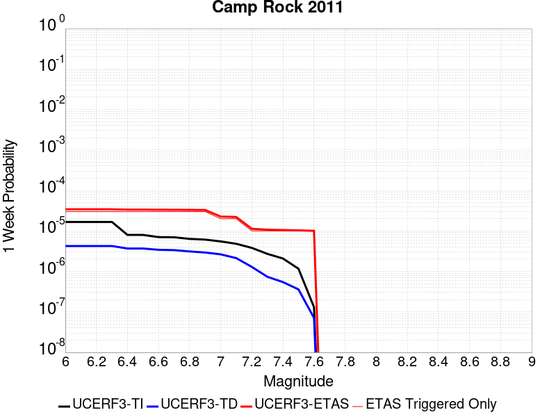 |  |  |  |

| Magnitude | 1 wk TI Prob | 1 wk TD Prob | 1 wk ETAS Prob | 1 wk ETAS/TD Gain | 1 wk ETAS Triggered Only | 1 mo TI Prob | 1 mo TD Prob | 1 mo ETAS Prob | 1 mo ETAS/TD Gain | 1 mo ETAS Triggered Only | 1 yr TI Prob | 1 yr TD Prob | 1 yr ETAS Prob | 1 yr ETAS/TD Gain | 1 yr ETAS Triggered Only | 10 yr TI Prob | 10 yr TD Prob | 10 yr ETAS Prob | 10 yr ETAS/TD Gain | 10 yr ETAS Triggered Only |
|-----|-----|-----|-----|-----|-----|-----|-----|-----|-----|-----|-----|-----|-----|-----|-----|-----|-----|-----|-----|-----|
| 6.0 | 1.6710783E-5 | 4.25026E-6 | 3.4250133E-5 | 8.058361 | 3.0E-5 | 7.161568E-5 | 1.8215276E-5 | 4.821473E-5 | 2.6469393 | 3.0E-5 | 8.7157206E-4 | 2.2174895E-4 | 2.617401E-4 | 1.1803442 | 4.0E-5 | 0.008681616 | 0.0022153298 | 0.0023151082 | 1.04504 | 1.0E-4 |
| 6.1 | 1.6710783E-5 | 4.25026E-6 | 3.4250133E-5 | 8.058361 | 3.0E-5 | 7.161568E-5 | 1.8215276E-5 | 4.821473E-5 | 2.6469393 | 3.0E-5 | 8.7157206E-4 | 2.2174895E-4 | 2.617401E-4 | 1.1803442 | 4.0E-5 | 0.008681616 | 0.0022153298 | 0.0023151082 | 1.04504 | 1.0E-4 |
| 6.2 | 1.6710783E-5 | 4.25026E-6 | 3.4250133E-5 | 8.058361 | 3.0E-5 | 7.161568E-5 | 1.8215276E-5 | 4.821473E-5 | 2.6469393 | 3.0E-5 | 8.7157206E-4 | 2.2174895E-4 | 2.617401E-4 | 1.1803442 | 4.0E-5 | 0.008681616 | 0.0022153298 | 0.0023151082 | 1.04504 | 1.0E-4 |
| 6.3 | 1.6710783E-5 | 4.25026E-6 | 3.4250133E-5 | 8.058361 | 3.0E-5 | 7.161568E-5 | 1.8215276E-5 | 4.821473E-5 | 2.6469393 | 3.0E-5 | 8.7157206E-4 | 2.2174895E-4 | 2.617401E-4 | 1.1803442 | 4.0E-5 | 0.008681616 | 0.0022153298 | 0.0023151082 | 1.04504 | 1.0E-4 |
| 6.4 | 7.982846E-6 | 3.6820884E-6 | 3.368198E-5 | 9.14752 | 3.0E-5 | 3.421175E-5 | 1.5780286E-5 | 4.5779812E-5 | 2.9010763 | 3.0E-5 | 4.1644843E-4 | 1.9210839E-4 | 2.321007E-4 | 1.2081758 | 4.0E-5 | 0.0041566887 | 0.001919458 | 0.0020092854 | 1.0467982 | 9.0E-5 |
| 6.5 | 7.982846E-6 | 3.6820884E-6 | 3.368198E-5 | 9.14752 | 3.0E-5 | 3.421175E-5 | 1.5780286E-5 | 4.5779812E-5 | 2.9010763 | 3.0E-5 | 4.1644843E-4 | 1.9210839E-4 | 2.321007E-4 | 1.2081758 | 4.0E-5 | 0.0041566887 | 0.001919458 | 0.0020092854 | 1.0467982 | 9.0E-5 |
| 6.6 | 7.048869E-6 | 3.4243571E-6 | 3.3424254E-5 | 9.760738 | 3.0E-5 | 3.0209088E-5 | 1.4675736E-5 | 4.4675297E-5 | 3.0441606 | 3.0E-5 | 3.677336E-4 | 1.7866275E-4 | 2.1865561E-4 | 1.2238455 | 4.0E-5 | 0.0036712566 | 0.0017852228 | 0.0018750621 | 1.0503238 | 9.0E-5 |
| 6.7 | 6.987307E-6 | 3.3623348E-6 | 3.3362234E-5 | 9.922341 | 3.0E-5 | 2.9945259E-5 | 1.4409929E-5 | 4.4409495E-5 | 3.081868 | 3.0E-5 | 3.6452254E-4 | 1.7542706E-4 | 2.1542005E-4 | 1.227975 | 4.0E-5 | 0.0036392517 | 0.001752917 | 0.0018427592 | 1.051253 | 9.0E-5 |
| 6.8 | 6.3737602E-6 | 3.1179077E-6 | 3.3117813E-5 | 10.621807 | 3.0E-5 | 2.731583E-5 | 1.3362394E-5 | 4.3361993E-5 | 3.2450767 | 3.0E-5 | 3.3251947E-4 | 1.626753E-4 | 2.0266879E-4 | 1.2458487 | 4.0E-5 | 0.0033202237 | 0.0016255907 | 0.0017154445 | 1.0552745 | 9.0E-5 |
| 6.9 | 6.112211E-6 | 2.9331156E-6 | 3.293303E-5 | 11.228002 | 3.0E-5 | 2.6194928E-5 | 1.2570436E-5 | 4.257006E-5 | 3.386522 | 3.0E-5 | 3.1887658E-4 | 1.5303459E-4 | 1.9302848E-4 | 1.2613388 | 4.0E-5 | 0.003184194 | 0.0015293199 | 0.0016191822 | 1.0587597 | 9.0E-5 |
| 7.0 | 5.5140117E-6 | 2.641923E-6 | 2.264187E-5 | 8.570224 | 2.0E-5 | 2.3631264E-5 | 1.132248E-5 | 3.132225E-5 | 2.7663777 | 2.0E-5 | 2.8767265E-4 | 1.3784273E-4 | 1.6783859E-4 | 1.2176094 | 3.0E-5 | 0.0028730053 | 0.0013775975 | 0.0014574872 | 1.0579921 | 8.0E-5 |
| 7.1 | 4.8151105E-6 | 2.1342705E-6 | 2.2134227E-5 | 10.370864 | 2.0E-5 | 2.0636026E-5 | 9.146843E-6 | 2.9146659E-5 | 3.186527 | 2.0E-5 | 2.5121463E-4 | 1.1135734E-4 | 1.41354E-4 | 1.2693729 | 3.0E-5 | 0.0025093083 | 0.0011130372 | 0.0011829593 | 1.062821 | 7.0E-5 |
| 7.2 | 3.818335E-6 | 1.2937425E-6 | 1.129373E-5 | 8.729504 | 1.0E-5 | 1.6364189E-5 | 5.5445994E-6 | 1.5544543E-5 | 2.803547 | 1.0E-5 | 1.9921579E-4 | 6.750349E-5 | 7.750281E-5 | 1.1481305 | 1.0E-5 | 0.0019903728 | 6.748381E-4 | 7.148111E-4 | 1.0592334 | 4.0E-5 |
| 7.3 | 2.7166698E-6 | 7.3835776E-7 | 1.073835E-5 | 14.54356 | 1.0E-5 | 1.1642818E-5 | 3.1643867E-6 | 1.3164355E-5 | 4.16016 | 1.0E-5 | 1.4174209E-4 | 3.8525748E-5 | 4.8525362E-5 | 1.2595567 | 1.0E-5 | 0.0014165172 | 3.851927E-4 | 4.1518113E-4 | 1.0778531 | 3.0E-5 |
| 7.4 | 2.0893426E-6 | 5.4618386E-7 | 1.0546179E-5 | 19.308844 | 1.0E-5 | 8.954295E-6 | 2.3407858E-6 | 1.2340763E-5 | 5.2720594 | 1.0E-5 | 1.0901308E-4 | 2.84987E-5 | 3.8498416E-5 | 1.3508832 | 1.0E-5 | 0.0010895962 | 2.84951E-4 | 3.1494244E-4 | 1.1052513 | 3.0E-5 |
| 7.5 | 1.1681728E-6 | 3.6030585E-7 | 1.0360302E-5 | 28.754189 | 1.0E-5 | 5.0064455E-6 | 1.544167E-6 | 1.1544152E-5 | 7.475973 | 1.0E-5 | 6.0951766E-5 | 1.8800076E-5 | 2.8799888E-5 | 1.5319028 | 1.0E-5 | 6.093505E-4 | 1.8798532E-4 | 2.0798156E-4 | 1.1063713 | 2.0E-5 |
| 7.6 | 1.3154387E-7 | 7.1197384E-8 | 1.0071197E-5 | 141.45459 | 1.0E-5 | 5.6375933E-7 | 3.051316E-7 | 1.0305129E-5 | 33.77273 | 1.0E-5 | 6.863748E-6 | 3.7149728E-6 | 1.3714935E-5 | 3.6917999 | 1.0E-5 | 6.863536E-5 | 3.7149264E-5 | 4.7148893E-5 | 1.2691743 | 1.0E-5 |

## Santa Cruz Island
*[(top)](#table-of-contents)*

| 1 Week | 1 Month | 1 Year | 10 Year |
|-----|-----|-----|-----|
| 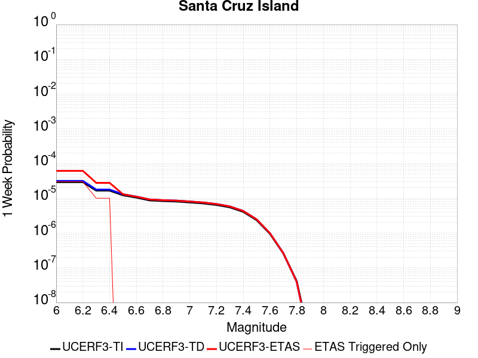 |  | 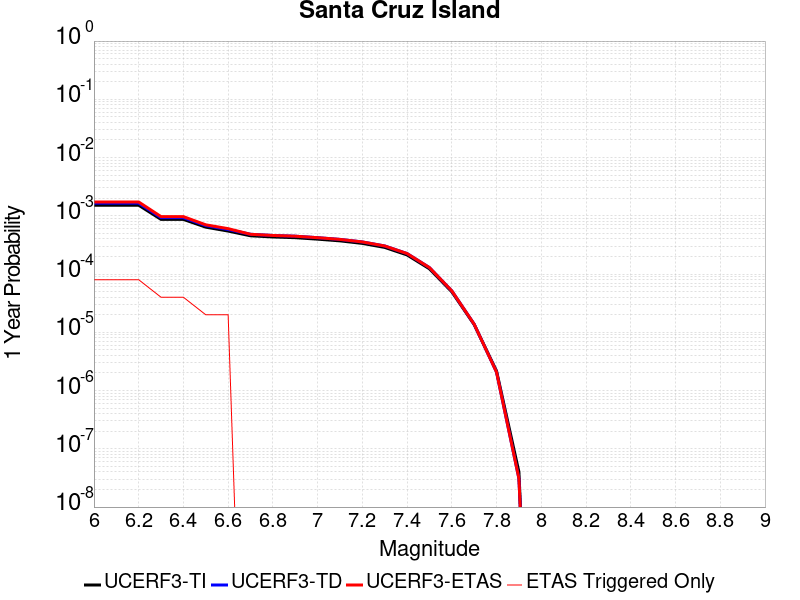 |  |

| Magnitude | 1 wk TI Prob | 1 wk TD Prob | 1 wk ETAS Prob | 1 wk ETAS/TD Gain | 1 wk ETAS Triggered Only | 1 mo TI Prob | 1 mo TD Prob | 1 mo ETAS Prob | 1 mo ETAS/TD Gain | 1 mo ETAS Triggered Only | 1 yr TI Prob | 1 yr TD Prob | 1 yr ETAS Prob | 1 yr ETAS/TD Gain | 1 yr ETAS Triggered Only | 10 yr TI Prob | 10 yr TD Prob | 10 yr ETAS Prob | 10 yr ETAS/TD Gain | 10 yr ETAS Triggered Only |
|-----|-----|-----|-----|-----|-----|-----|-----|-----|-----|-----|-----|-----|-----|-----|-----|-----|-----|-----|-----|-----|
| 6.0 | 2.9164563E-5 | 3.1599742E-5 | 6.1598796E-5 | 1.9493448 | 3.0E-5 | 1.2498499E-4 | 1.3542121E-4 | 1.754158E-4 | 1.2953347 | 4.0E-5 | 0.0015206301 | 0.0016476426 | 0.0017275107 | 1.0484742 | 8.0E-5 | 0.015102667 | 0.016368 | 0.016466362 | 1.0060095 | 1.0E-4 |
| 6.1 | 2.9164563E-5 | 3.1599742E-5 | 6.1598796E-5 | 1.9493448 | 3.0E-5 | 1.2498499E-4 | 1.3542121E-4 | 1.754158E-4 | 1.2953347 | 4.0E-5 | 0.0015206301 | 0.0016476426 | 0.0017275107 | 1.0484742 | 8.0E-5 | 0.015102667 | 0.016368 | 0.016466362 | 1.0060095 | 1.0E-4 |
| 6.2 | 2.9164563E-5 | 3.1599742E-5 | 6.1598796E-5 | 1.9493448 | 3.0E-5 | 1.2498499E-4 | 1.3542121E-4 | 1.754158E-4 | 1.2953347 | 4.0E-5 | 0.0015206301 | 0.0016476426 | 0.0017275107 | 1.0484742 | 8.0E-5 | 0.015102667 | 0.016368 | 0.016466362 | 1.0060095 | 1.0E-4 |
| 6.3 | 1.6635553E-5 | 1.780436E-5 | 2.780418E-5 | 1.5616503 | 1.0E-5 | 7.1293274E-5 | 7.630226E-5 | 9.630074E-5 | 1.2620955 | 2.0E-5 | 8.6765E-4 | 9.2860236E-4 | 9.6856523E-4 | 1.0430355 | 4.0E-5 | 0.008642701 | 0.009249094 | 0.009298631 | 1.005356 | 5.0E-5 |
| 6.4 | 1.6635553E-5 | 1.780436E-5 | 2.780418E-5 | 1.5616503 | 1.0E-5 | 7.1293274E-5 | 7.630226E-5 | 9.630074E-5 | 1.2620955 | 2.0E-5 | 8.6765E-4 | 9.2860236E-4 | 9.6856523E-4 | 1.0430355 | 4.0E-5 | 0.008642701 | 0.009249094 | 0.009298631 | 1.005356 | 5.0E-5 |
| 6.5 | 1.2238748E-5 | 1.3042995E-5 | 1.3042995E-5 | 1.0 | 0.0 | 5.2450723E-5 | 5.5897377E-5 | 6.589681E-5 | 1.1788893 | 1.0E-5 | 6.3840044E-4 | 6.8034173E-4 | 7.0032815E-4 | 1.029377 | 2.0E-5 | 0.0063656955 | 0.0067829876 | 0.0068127844 | 1.0043929 | 3.0E-5 |
| 6.6 | 1.0489767E-5 | 1.1156636E-5 | 1.1156636E-5 | 1.0 | 0.0 | 4.495537E-5 | 4.781329E-5 | 5.7812813E-5 | 1.2091368 | 1.0E-5 | 5.4719415E-4 | 5.819735E-4 | 6.019619E-4 | 1.0343459 | 2.0E-5 | 0.005458487 | 0.0058047357 | 0.005834562 | 1.0051382 | 3.0E-5 |
| 6.7 | 8.699222E-6 | 9.236782E-6 | 9.236782E-6 | 1.0 | 0.0 | 3.7281847E-5 | 3.958561E-5 | 3.958561E-5 | 1.0 | 0.0 | 4.5381195E-4 | 4.8184878E-4 | 4.8184878E-4 | 1.0 | 0.0 | 0.0045288634 | 0.004808108 | 0.00481806 | 1.0020698 | 1.0E-5 |
| 6.8 | 8.307732E-6 | 8.8169045E-6 | 8.8169045E-6 | 1.0 | 0.0 | 3.560408E-5 | 3.7786187E-5 | 3.7786187E-5 | 1.0 | 0.0 | 4.3339343E-4 | 4.5995016E-4 | 4.5995016E-4 | 1.0 | 0.0 | 0.004325492 | 0.0045900354 | 0.0045999894 | 1.0021687 | 1.0E-5 |
| 6.9 | 8.073121E-6 | 8.564939E-6 | 8.564939E-6 | 1.0 | 0.0 | 3.459863E-5 | 3.6706366E-5 | 3.6706366E-5 | 1.0 | 0.0 | 4.2115687E-4 | 4.468088E-4 | 4.468088E-4 | 1.0 | 0.0 | 0.004203596 | 0.004459156 | 0.004459156 | 1.0 | 0.0 |
| 7.0 | 7.617019E-6 | 8.074664E-6 | 8.074664E-6 | 1.0 | 0.0 | 3.264396E-5 | 3.4605247E-5 | 3.4605247E-5 | 1.0 | 0.0 | 3.9736772E-4 | 4.212378E-4 | 4.212378E-4 | 1.0 | 0.0 | 0.003966579 | 0.0042044413 | 0.0042044413 | 1.0 | 0.0 |
| 7.1 | 7.1224836E-6 | 7.545788E-6 | 7.545788E-6 | 1.0 | 0.0 | 3.052457E-5 | 3.2338692E-5 | 3.2338692E-5 | 1.0 | 0.0 | 3.715733E-4 | 3.936528E-4 | 3.936528E-4 | 1.0 | 0.0 | 0.003709526 | 0.003929598 | 0.003929598 | 1.0 | 0.0 |
| 7.2 | 6.441115E-6 | 6.8273835E-6 | 6.8273835E-6 | 1.0 | 0.0 | 2.7604487E-5 | 2.9259887E-5 | 2.9259887E-5 | 1.0 | 0.0 | 3.360328E-4 | 3.5618112E-4 | 3.5618112E-4 | 1.0 | 0.0 | 0.0033552512 | 0.003556131 | 0.003556131 | 1.0 | 0.0 |
| 7.3 | 5.494274E-6 | 5.8199944E-6 | 5.8199944E-6 | 1.0 | 0.0 | 2.3546674E-5 | 2.4942596E-5 | 2.4942596E-5 | 1.0 | 0.0 | 2.8664304E-4 | 3.0363398E-4 | 3.0363398E-4 | 1.0 | 0.0 | 0.002862736 | 0.0030322142 | 0.0030322142 | 1.0 | 0.0 |
| 7.4 | 4.0802624E-6 | 4.312256E-6 | 4.312256E-6 | 1.0 | 0.0 | 1.7486722E-5 | 1.8480967E-5 | 1.8480967E-5 | 1.0 | 0.0 | 2.1288003E-4 | 2.2498262E-4 | 2.2498262E-4 | 1.0 | 0.0 | 0.0021267622 | 0.0022475575 | 0.0022475575 | 1.0 | 0.0 |
| 7.5 | 2.3584746E-6 | 2.4753094E-6 | 2.4753094E-6 | 1.0 | 0.0 | 1.0107709E-5 | 1.0608426E-5 | 1.0608426E-5 | 1.0 | 0.0 | 1.2305441E-4 | 1.2915E-4 | 1.2915E-4 | 1.0 | 0.0 | 0.0012298629 | 0.0012907543 | 0.0012907543 | 1.0 | 0.0 |
| 7.6 | 9.4981914E-7 | 9.86093E-7 | 9.86093E-7 | 1.0 | 0.0 | 4.0706473E-6 | 4.2261063E-6 | 4.2261063E-6 | 1.0 | 0.0 | 4.9559E-5 | 5.145164E-5 | 5.145164E-5 | 1.0 | 0.0 | 4.954795E-4 | 5.1439856E-4 | 5.1439856E-4 | 1.0 | 0.0 |
| 7.7 | 2.6013532E-7 | 2.6416603E-7 | 2.6416603E-7 | 1.0 | 0.0 | 1.1148652E-6 | 1.1321397E-6 | 1.1321397E-6 | 1.0 | 0.0 | 1.3573399E-5 | 1.3783714E-5 | 1.3783714E-5 | 1.0 | 0.0 | 1.357257E-4 | 1.3782867E-4 | 1.3782867E-4 | 1.0 | 0.0 |
| 7.8 | 4.1522263E-8 | 3.965679E-8 | 3.965679E-8 | 1.0 | 0.0 | 1.7795254E-7 | 1.6995766E-7 | 1.6995766E-7 | 1.0 | 0.0 | 2.16657E-6 | 2.0692328E-6 | 2.0692328E-6 | 1.0 | 0.0 | 2.1665488E-5 | 2.0692156E-5 | 2.0692156E-5 | 1.0 | 0.0 |
| 7.9 | 7.7242046E-10 | 5.9468175E-10 | 5.9468175E-10 | 1.0 | 0.0 | 3.3103735E-9 | 2.5486364E-9 | 2.5486364E-9 | 1.0 | 0.0 | 4.0303796E-8 | 3.1029646E-8 | 3.1029646E-8 | 1.0 | 0.0 | 4.030379E-7 | 3.1029643E-7 | 3.1029643E-7 | 1.0 | 0.0 |

## Oceanic - West Huasna
*[(top)](#table-of-contents)*

| 1 Week | 1 Month | 1 Year | 10 Year |
|-----|-----|-----|-----|
|  |  |  |  |

| Magnitude | 1 wk TI Prob | 1 wk TD Prob | 1 wk ETAS Prob | 1 wk ETAS/TD Gain | 1 wk ETAS Triggered Only | 1 mo TI Prob | 1 mo TD Prob | 1 mo ETAS Prob | 1 mo ETAS/TD Gain | 1 mo ETAS Triggered Only | 1 yr TI Prob | 1 yr TD Prob | 1 yr ETAS Prob | 1 yr ETAS/TD Gain | 1 yr ETAS Triggered Only | 10 yr TI Prob | 10 yr TD Prob | 10 yr ETAS Prob | 10 yr ETAS/TD Gain | 10 yr ETAS Triggered Only |
|-----|-----|-----|-----|-----|-----|-----|-----|-----|-----|-----|-----|-----|-----|-----|-----|-----|-----|-----|-----|-----|
| 6.0 | 3.195567E-5 | 2.7926868E-5 | 6.792575E-5 | 2.4322724 | 4.0E-5 | 1.3694567E-4 | 1.1968133E-4 | 1.5967654E-4 | 1.3341808 | 4.0E-5 | 0.0016660384 | 0.0014561893 | 0.001516102 | 1.0411434 | 6.0E-5 | 0.016536033 | 0.014471028 | 0.014569581 | 1.0068103 | 1.0E-4 |
| 6.1 | 2.1156782E-5 | 1.7573486E-5 | 2.7573311E-5 | 1.5690291 | 1.0E-5 | 9.066878E-5 | 7.531282E-5 | 8.5312065E-5 | 1.1327695 | 1.0E-5 | 0.0011033333 | 9.165572E-4 | 9.2654803E-4 | 1.0109004 | 1.0E-5 | 0.010978713 | 0.009128777 | 0.009148595 | 1.0021709 | 2.0E-5 |
| 6.2 | 1.6195117E-5 | 1.3327152E-5 | 1.3327152E-5 | 1.0 | 0.0 | 6.9405796E-5 | 5.7115132E-5 | 5.7115132E-5 | 1.0 | 0.0 | 8.44688E-4 | 6.9515745E-4 | 6.9515745E-4 | 1.0 | 0.0 | 0.008414844 | 0.006930123 | 0.006940054 | 1.001433 | 1.0E-5 |
| 6.3 | 1.3559345E-5 | 1.1179142E-5 | 1.1179142E-5 | 1.0 | 0.0 | 5.811018E-5 | 4.7909736E-5 | 4.7909736E-5 | 1.0 | 0.0 | 7.072618E-4 | 5.831459E-4 | 5.831459E-4 | 1.0 | 0.0 | 0.0070501505 | 0.0058162753 | 0.005826217 | 1.0017093 | 1.0E-5 |
| 6.4 | 1.2120619E-5 | 1.0000977E-5 | 1.0000977E-5 | 1.0 | 0.0 | 5.1944477E-5 | 4.2860633E-5 | 4.2860633E-5 | 1.0 | 0.0 | 6.322405E-4 | 5.2170374E-4 | 5.2170374E-4 | 1.0 | 0.0 | 0.006304447 | 0.0052048573 | 0.0052148052 | 1.0019113 | 1.0E-5 |
| 6.5 | 1.13511915E-5 | 9.3674735E-6 | 9.3674735E-6 | 1.0 | 0.0 | 4.8647056E-5 | 4.01457E-5 | 4.01457E-5 | 1.0 | 0.0 | 5.9211696E-4 | 4.886647E-4 | 4.886647E-4 | 1.0 | 0.0 | 0.0059054173 | 0.0048759608 | 0.004885912 | 1.0020409 | 1.0E-5 |
| 6.6 | 9.850605E-6 | 8.135418E-6 | 8.135418E-6 | 1.0 | 0.0 | 4.2216197E-5 | 3.4865614E-5 | 3.4865614E-5 | 1.0 | 0.0 | 5.1386096E-4 | 4.2440637E-4 | 4.2440637E-4 | 1.0 | 0.0 | 0.0051267436 | 0.004235991 | 0.0042459485 | 1.0023507 | 1.0E-5 |
| 6.7 | 8.8558645E-6 | 7.318433E-6 | 7.318433E-6 | 1.0 | 0.0 | 3.7953152E-5 | 3.1364336E-5 | 3.1364336E-5 | 1.0 | 0.0 | 4.6198163E-4 | 3.8179406E-4 | 3.8179406E-4 | 1.0 | 0.0 | 0.004610224 | 0.0038114067 | 0.0038213686 | 1.0026137 | 1.0E-5 |
| 6.8 | 7.67136E-6 | 6.391756E-6 | 6.391756E-6 | 1.0 | 0.0 | 3.2876844E-5 | 2.7392953E-5 | 2.7392953E-5 | 1.0 | 0.0 | 4.0020206E-4 | 3.3345833E-4 | 3.3345833E-4 | 1.0 | 0.0 | 0.003994821 | 0.0033296007 | 0.0033395675 | 1.0029933 | 1.0E-5 |
| 6.9 | 6.534529E-6 | 5.4583297E-6 | 5.4583297E-6 | 1.0 | 0.0 | 2.8004823E-5 | 2.3392633E-5 | 2.3392633E-5 | 1.0 | 0.0 | 3.4090536E-4 | 2.847682E-4 | 2.847682E-4 | 1.0 | 0.0 | 0.0034038287 | 0.0028440498 | 0.0028540213 | 1.0035061 | 1.0E-5 |
| 7.0 | 5.460525E-6 | 4.5699517E-6 | 4.5699517E-6 | 1.0 | 0.0 | 2.3402039E-5 | 1.958536E-5 | 1.958536E-5 | 1.0 | 0.0 | 2.8488258E-4 | 2.3842578E-4 | 2.3842578E-4 | 1.0 | 0.0 | 0.0028451765 | 0.0023817138 | 0.00239169 | 1.0041887 | 1.0E-5 |
| 7.1 | 4.4825083E-6 | 3.7524428E-6 | 3.7524428E-6 | 1.0 | 0.0 | 1.9210609E-5 | 1.60818E-5 | 1.60818E-5 | 1.0 | 0.0 | 2.3386406E-4 | 1.9577841E-4 | 1.9577841E-4 | 1.0 | 0.0 | 0.002336181 | 0.0019560715 | 0.0019560715 | 1.0 | 0.0 |
| 7.2 | 2.821708E-6 | 2.4249334E-6 | 2.4249334E-6 | 1.0 | 0.0 | 1.2092979E-5 | 1.039253E-5 | 1.039253E-5 | 1.0 | 0.0 | 1.4722206E-4 | 1.2652173E-4 | 1.2652173E-4 | 1.0 | 0.0 | 0.0014712457 | 0.0012644994 | 0.0012644994 | 1.0 | 0.0 |
| 7.3 | 2.0644757E-6 | 1.7687412E-6 | 1.7687412E-6 | 1.0 | 0.0 | 8.847723E-6 | 7.5802973E-6 | 7.5802973E-6 | 1.0 | 0.0 | 1.0771569E-4 | 9.228622E-5 | 9.228622E-5 | 1.0 | 0.0 | 0.001076635 | 9.2248066E-4 | 9.2248066E-4 | 1.0 | 0.0 |
| 7.4 | 1.6980367E-6 | 1.4379892E-6 | 1.4379892E-6 | 1.0 | 0.0 | 7.27728E-6 | 6.162796E-6 | 6.162796E-6 | 1.0 | 0.0 | 8.8597284E-5 | 7.5029464E-5 | 7.5029464E-5 | 1.0 | 0.0 | 8.8561967E-4 | 7.500429E-4 | 7.500429E-4 | 1.0 | 0.0 |
| 7.5 | 1.3637683E-6 | 1.1302635E-6 | 1.1302635E-6 | 1.0 | 0.0 | 5.844708E-6 | 4.8439774E-6 | 4.8439774E-6 | 1.0 | 0.0 | 7.1156996E-5 | 5.897383E-5 | 5.897383E-5 | 1.0 | 0.0 | 7.1134215E-4 | 5.895833E-4 | 5.895833E-4 | 1.0 | 0.0 |
| 7.6 | 9.802994E-7 | 7.677247E-7 | 7.677247E-7 | 1.0 | 0.0 | 4.2012766E-6 | 3.2902446E-6 | 3.2902446E-6 | 1.0 | 0.0 | 5.1149345E-5 | 4.0057992E-5 | 4.0057992E-5 | 1.0 | 0.0 | 5.113757E-4 | 4.0050913E-4 | 4.0050913E-4 | 1.0 | 0.0 |
| 7.7 | 5.986191E-7 | 4.0050548E-7 | 4.0050548E-7 | 1.0 | 0.0 | 2.5655079E-6 | 1.7164509E-6 | 1.7164509E-6 | 1.0 | 0.0 | 3.1234613E-5 | 2.089759E-5 | 2.089759E-5 | 1.0 | 0.0 | 3.123022E-4 | 2.089576E-4 | 2.089576E-4 | 1.0 | 0.0 |
| 7.8 | 2.9189815E-7 | 1.5285792E-7 | 1.5285792E-7 | 1.0 | 0.0 | 1.2509914E-6 | 6.5510517E-7 | 6.5510517E-7 | 1.0 | 0.0 | 1.5230714E-5 | 7.9758765E-6 | 7.9758765E-6 | 1.0 | 0.0 | 1.522967E-4 | 7.9757214E-5 | 7.9757214E-5 | 1.0 | 0.0 |
| 7.9 | 1.2057845E-7 | 4.621248E-8 | 4.621248E-8 | 1.0 | 0.0 | 5.1676466E-7 | 1.9805347E-7 | 1.9805347E-7 | 1.0 | 0.0 | 6.2915915E-6 | 2.4112983E-6 | 2.4112983E-6 | 1.0 | 0.0 | 6.2914136E-5 | 2.4114026E-5 | 2.4114026E-5 | 1.0 | 0.0 |
| 8.0 | 3.3806387E-9 | 9.011393E-10 | 9.011393E-10 | 1.0 | 0.0 | 1.4488451E-8 | 3.8620254E-9 | 3.8620254E-9 | 1.0 | 0.0 | 1.7639688E-7 | 4.702016E-8 | 4.702016E-8 | 1.0 | 0.0 | 1.7639674E-6 | 4.7129527E-7 | 4.7129527E-7 | 1.0 | 0.0 |

## Pine Mtn
*[(top)](#table-of-contents)*

| 1 Week | 1 Month | 1 Year | 10 Year |
|-----|-----|-----|-----|
|  |  |  | 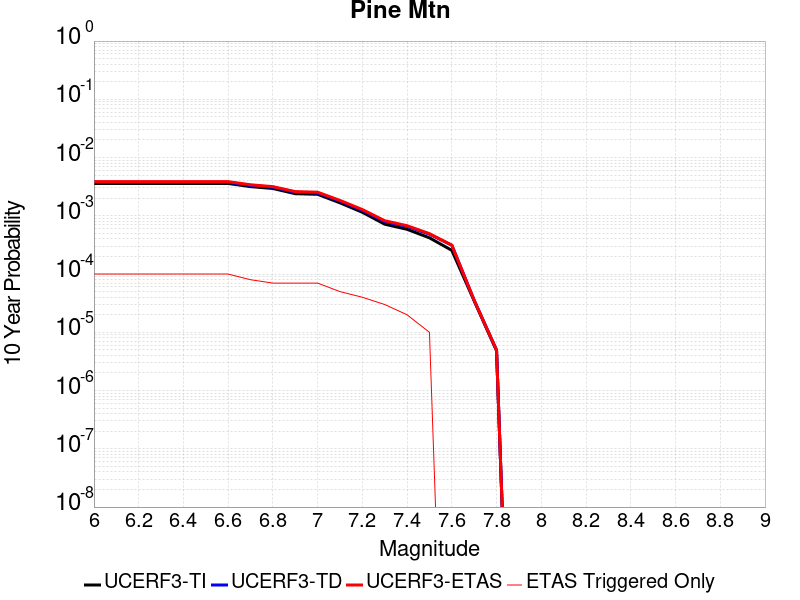 |

| Magnitude | 1 wk TI Prob | 1 wk TD Prob | 1 wk ETAS Prob | 1 wk ETAS/TD Gain | 1 wk ETAS Triggered Only | 1 mo TI Prob | 1 mo TD Prob | 1 mo ETAS Prob | 1 mo ETAS/TD Gain | 1 mo ETAS Triggered Only | 1 yr TI Prob | 1 yr TD Prob | 1 yr ETAS Prob | 1 yr ETAS/TD Gain | 1 yr ETAS Triggered Only | 10 yr TI Prob | 10 yr TD Prob | 10 yr ETAS Prob | 10 yr ETAS/TD Gain | 10 yr ETAS Triggered Only |
|-----|-----|-----|-----|-----|-----|-----|-----|-----|-----|-----|-----|-----|-----|-----|-----|-----|-----|-----|-----|-----|
| 6.0 | 6.894797E-6 | 7.225461E-6 | 7.225461E-6 | 1.0 | 0.0 | 2.9548795E-5 | 3.096591E-5 | 4.0965602E-5 | 1.3229258 | 1.0E-5 | 3.596972E-4 | 3.7694772E-4 | 4.1693266E-4 | 1.1060755 | 4.0E-5 | 0.0035911554 | 0.003763381 | 0.0038630047 | 1.0264719 | 1.0E-4 |
| 6.1 | 6.894797E-6 | 7.225461E-6 | 7.225461E-6 | 1.0 | 0.0 | 2.9548795E-5 | 3.096591E-5 | 4.0965602E-5 | 1.3229258 | 1.0E-5 | 3.596972E-4 | 3.7694772E-4 | 4.1693266E-4 | 1.1060755 | 4.0E-5 | 0.0035911554 | 0.003763381 | 0.0038630047 | 1.0264719 | 1.0E-4 |
| 6.2 | 6.894797E-6 | 7.225461E-6 | 7.225461E-6 | 1.0 | 0.0 | 2.9548795E-5 | 3.096591E-5 | 4.0965602E-5 | 1.3229258 | 1.0E-5 | 3.596972E-4 | 3.7694772E-4 | 4.1693266E-4 | 1.1060755 | 4.0E-5 | 0.0035911554 | 0.003763381 | 0.0038630047 | 1.0264719 | 1.0E-4 |
| 6.3 | 6.894797E-6 | 7.225461E-6 | 7.225461E-6 | 1.0 | 0.0 | 2.9548795E-5 | 3.096591E-5 | 4.0965602E-5 | 1.3229258 | 1.0E-5 | 3.596972E-4 | 3.7694772E-4 | 4.1693266E-4 | 1.1060755 | 4.0E-5 | 0.0035911554 | 0.003763381 | 0.0038630047 | 1.0264719 | 1.0E-4 |
| 6.4 | 6.894797E-6 | 7.225461E-6 | 7.225461E-6 | 1.0 | 0.0 | 2.9548795E-5 | 3.096591E-5 | 4.0965602E-5 | 1.3229258 | 1.0E-5 | 3.596972E-4 | 3.7694772E-4 | 4.1693266E-4 | 1.1060755 | 4.0E-5 | 0.0035911554 | 0.003763381 | 0.0038630047 | 1.0264719 | 1.0E-4 |
| 6.5 | 6.894797E-6 | 7.225461E-6 | 7.225461E-6 | 1.0 | 0.0 | 2.9548795E-5 | 3.096591E-5 | 4.0965602E-5 | 1.3229258 | 1.0E-5 | 3.596972E-4 | 3.7694772E-4 | 4.1693266E-4 | 1.1060755 | 4.0E-5 | 0.0035911554 | 0.003763381 | 0.0038630047 | 1.0264719 | 1.0E-4 |
| 6.6 | 6.894797E-6 | 7.225461E-6 | 7.225461E-6 | 1.0 | 0.0 | 2.9548795E-5 | 3.096591E-5 | 4.0965602E-5 | 1.3229258 | 1.0E-5 | 3.596972E-4 | 3.7694772E-4 | 4.1693266E-4 | 1.1060755 | 4.0E-5 | 0.0035911554 | 0.003763381 | 0.0038630047 | 1.0264719 | 1.0E-4 |
| 6.7 | 6.0867933E-6 | 6.3971133E-6 | 6.3971133E-6 | 1.0 | 0.0 | 2.6085996E-5 | 2.7415923E-5 | 3.7415648E-5 | 1.3647416 | 1.0E-5 | 3.1755073E-4 | 3.3373994E-4 | 3.5373325E-4 | 1.0599068 | 2.0E-5 | 0.0031709734 | 0.0033326065 | 0.0034123398 | 1.0239252 | 8.0E-5 |
| 6.8 | 5.6530425E-6 | 5.9505956E-6 | 5.9505956E-6 | 1.0 | 0.0 | 2.42271E-5 | 2.5502315E-5 | 2.5502315E-5 | 1.0 | 0.0 | 2.94925E-4 | 3.104485E-4 | 3.204454E-4 | 1.0322014 | 1.0E-5 | 0.002945339 | 0.0031003528 | 0.003170136 | 1.022508 | 7.0E-5 |
| 6.9 | 4.6015225E-6 | 4.863834E-6 | 4.863834E-6 | 1.0 | 0.0 | 1.9720663E-5 | 2.0844845E-5 | 2.0844845E-5 | 1.0 | 0.0 | 2.4007261E-4 | 2.5375787E-4 | 2.6375536E-4 | 1.0393976 | 1.0E-5 | 0.0023981342 | 0.0025348254 | 0.002604648 | 1.0275453 | 7.0E-5 |
| 7.0 | 4.4875965E-6 | 4.747473E-6 | 4.747473E-6 | 1.0 | 0.0 | 1.9232413E-5 | 2.0346162E-5 | 2.0346162E-5 | 1.0 | 0.0 | 2.3412947E-4 | 2.4768783E-4 | 2.5768534E-4 | 1.0403634 | 1.0E-5 | 0.0023388295 | 0.0024742614 | 0.0025440883 | 1.0282212 | 7.0E-5 |
| 7.1 | 3.203907E-6 | 3.4294096E-6 | 3.4294096E-6 | 1.0 | 0.0 | 1.3730958E-5 | 1.4697391E-5 | 1.4697391E-5 | 1.0 | 0.0 | 1.6716159E-4 | 1.789267E-4 | 1.8892491E-4 | 1.0558788 | 1.0E-5 | 0.0016703589 | 0.0017878925 | 0.0018378032 | 1.0279158 | 5.0E-5 |
| 7.2 | 2.2060601E-6 | 2.3784817E-6 | 2.3784817E-6 | 1.0 | 0.0 | 9.4545085E-6 | 1.0193455E-5 | 1.0193455E-5 | 1.0 | 0.0 | 1.15102564E-4 | 1.240987E-4 | 1.3409746E-4 | 1.080571 | 1.0E-5 | 0.0011504296 | 0.0012403389 | 0.0012802893 | 1.0322093 | 4.0E-5 |
| 7.3 | 1.3765207E-6 | 1.5216481E-6 | 1.5216481E-6 | 1.0 | 0.0 | 5.899361E-6 | 6.521333E-6 | 6.521333E-6 | 1.0 | 0.0 | 7.182235E-5 | 7.939443E-5 | 7.939443E-5 | 1.0 | 0.0 | 7.1799144E-4 | 7.936697E-4 | 8.236459E-4 | 1.0377691 | 3.0E-5 |
| 7.4 | 1.1245983E-6 | 1.2587075E-6 | 1.2587075E-6 | 1.0 | 0.0 | 4.819698E-6 | 5.39445E-6 | 5.39445E-6 | 1.0 | 0.0 | 5.8678244E-5 | 6.567554E-5 | 6.567554E-5 | 1.0 | 0.0 | 5.866275E-4 | 6.5656955E-4 | 6.7655643E-4 | 1.0304414 | 2.0E-5 |
| 7.5 | 8.031682E-7 | 9.276951E-7 | 9.276951E-7 | 1.0 | 0.0 | 3.4421448E-6 | 3.9758306E-6 | 3.9758306E-6 | 1.0 | 0.0 | 4.1907308E-5 | 4.840473E-5 | 4.840473E-5 | 1.0 | 0.0 | 4.1899405E-4 | 4.8394862E-4 | 4.939438E-4 | 1.0206534 | 1.0E-5 |
| 7.6 | 4.8953444E-7 | 6.003009E-7 | 6.003009E-7 | 1.0 | 0.0 | 2.098003E-6 | 2.5727159E-6 | 2.5727159E-6 | 1.0 | 0.0 | 2.5542888E-5 | 3.1322415E-5 | 3.1322415E-5 | 1.0 | 0.0 | 2.5539953E-4 | 3.1318486E-4 | 3.1318486E-4 | 1.0 | 0.0 |
| 7.7 | 6.634529E-8 | 6.788826E-8 | 6.788826E-8 | 1.0 | 0.0 | 2.843369E-7 | 2.9094966E-7 | 2.9094966E-7 | 1.0 | 0.0 | 3.4617963E-6 | 3.5423066E-6 | 3.5423066E-6 | 1.0 | 0.0 | 3.4617424E-5 | 3.542255E-5 | 3.542255E-5 | 1.0 | 0.0 |
| 7.8 | 9.235578E-9 | 9.488566E-9 | 9.488566E-9 | 1.0 | 0.0 | 3.9581046E-8 | 4.0665284E-8 | 4.0665284E-8 | 1.0 | 0.0 | 4.818991E-7 | 4.950997E-7 | 4.950997E-7 | 1.0 | 0.0 | 4.8189804E-6 | 4.950988E-6 | 4.950988E-6 | 1.0 | 0.0 |

## San Jacinto (Coyote Creek)
*[(top)](#table-of-contents)*

| 1 Week | 1 Month | 1 Year | 10 Year |
|-----|-----|-----|-----|
|  |  |  |  |

| Magnitude | 1 wk TI Prob | 1 wk TD Prob | 1 wk ETAS Prob | 1 wk ETAS/TD Gain | 1 wk ETAS Triggered Only | 1 mo TI Prob | 1 mo TD Prob | 1 mo ETAS Prob | 1 mo ETAS/TD Gain | 1 mo ETAS Triggered Only | 1 yr TI Prob | 1 yr TD Prob | 1 yr ETAS Prob | 1 yr ETAS/TD Gain | 1 yr ETAS Triggered Only | 10 yr TI Prob | 10 yr TD Prob | 10 yr ETAS Prob | 10 yr ETAS/TD Gain | 10 yr ETAS Triggered Only |
|-----|-----|-----|-----|-----|-----|-----|-----|-----|-----|-----|-----|-----|-----|-----|-----|-----|-----|-----|-----|-----|
| 6.0 | 2.7374346E-5 | 2.4145214E-5 | 6.4144246E-5 | 2.656603 | 4.0E-5 | 1.1731335E-4 | 1.034754E-4 | 1.4347126E-4 | 1.3865253 | 4.0E-5 | 0.0014273542 | 0.0012590875 | 0.0013289993 | 1.0555258 | 7.0E-5 | 0.01418221 | 0.012928318 | 0.013017154 | 1.0068715 | 9.0E-5 |
| 6.1 | 2.7374346E-5 | 2.4145214E-5 | 6.4144246E-5 | 2.656603 | 4.0E-5 | 1.1731335E-4 | 1.034754E-4 | 1.4347126E-4 | 1.3865253 | 4.0E-5 | 0.0014273542 | 0.0012590875 | 0.0013289993 | 1.0555258 | 7.0E-5 | 0.01418221 | 0.012928318 | 0.013017154 | 1.0068715 | 9.0E-5 |
| 6.2 | 2.7374346E-5 | 2.4145214E-5 | 6.4144246E-5 | 2.656603 | 4.0E-5 | 1.1731335E-4 | 1.034754E-4 | 1.4347126E-4 | 1.3865253 | 4.0E-5 | 0.0014273542 | 0.0012590875 | 0.0013289993 | 1.0555258 | 7.0E-5 | 0.01418221 | 0.012928318 | 0.013017154 | 1.0068715 | 9.0E-5 |
| 6.3 | 2.7374346E-5 | 2.4145214E-5 | 6.4144246E-5 | 2.656603 | 4.0E-5 | 1.1731335E-4 | 1.034754E-4 | 1.4347126E-4 | 1.3865253 | 4.0E-5 | 0.0014273542 | 0.0012590875 | 0.0013289993 | 1.0555258 | 7.0E-5 | 0.01418221 | 0.012928318 | 0.013017154 | 1.0068715 | 9.0E-5 |
| 6.4 | 2.7374346E-5 | 2.4145214E-5 | 6.4144246E-5 | 2.656603 | 4.0E-5 | 1.1731335E-4 | 1.034754E-4 | 1.4347126E-4 | 1.3865253 | 4.0E-5 | 0.0014273542 | 0.0012590875 | 0.0013289993 | 1.0555258 | 7.0E-5 | 0.01418221 | 0.012928318 | 0.013017154 | 1.0068715 | 9.0E-5 |
| 6.5 | 2.7282445E-5 | 2.4031293E-5 | 6.403033E-5 | 2.6644564 | 4.0E-5 | 1.16919524E-4 | 1.029872E-4 | 1.4298309E-4 | 1.3883578 | 4.0E-5 | 0.0014225657 | 0.0012531505 | 0.0013230628 | 1.0557892 | 7.0E-5 | 0.014134934 | 0.012869646 | 0.0129584875 | 1.0069032 | 9.0E-5 |
| 6.6 | 2.7282445E-5 | 2.4031293E-5 | 6.403033E-5 | 2.6644564 | 4.0E-5 | 1.16919524E-4 | 1.029872E-4 | 1.4298309E-4 | 1.3883578 | 4.0E-5 | 0.0014225657 | 0.0012531505 | 0.0013230628 | 1.0557892 | 7.0E-5 | 0.014134934 | 0.012869646 | 0.0129584875 | 1.0069032 | 9.0E-5 |
| 6.7 | 2.7216198E-5 | 2.3956412E-5 | 6.395546E-5 | 2.6696591 | 4.0E-5 | 1.1663563E-4 | 1.02666316E-4 | 1.426622E-4 | 1.3895717 | 4.0E-5 | 0.0014191137 | 0.0012492483 | 0.0013191609 | 1.0559638 | 7.0E-5 | 0.014100855 | 0.0128310565 | 0.012919902 | 1.0069243 | 9.0E-5 |
| 6.8 | 2.7078617E-5 | 2.387363E-5 | 6.387268E-5 | 2.675449 | 4.0E-5 | 1.1604605E-4 | 1.0231156E-4 | 1.4230747E-4 | 1.3909227 | 4.0E-5 | 0.001411945 | 0.0012449342 | 0.0013148469 | 1.0561578 | 7.0E-5 | 0.014030075 | 0.012788199 | 0.012877048 | 1.0069478 | 9.0E-5 |
| 6.9 | 2.6982952E-5 | 2.3793142E-5 | 6.379219E-5 | 2.6811168 | 4.0E-5 | 1.15636096E-4 | 1.0196664E-4 | 1.4196256E-4 | 1.3922452 | 4.0E-5 | 0.0014069602 | 0.0012407395 | 0.0013106526 | 1.056348 | 7.0E-5 | 0.013980856 | 0.012746515 | 0.012835368 | 1.0069708 | 9.0E-5 |
| 7.0 | 2.6449972E-5 | 2.3370165E-5 | 6.336923E-5 | 2.711544 | 4.0E-5 | 1.1335209E-4 | 1.00154015E-4 | 1.4015E-4 | 1.3993449 | 4.0E-5 | 0.001379188 | 0.0012186957 | 0.0012886103 | 1.0573685 | 7.0E-5 | 0.0137065975 | 0.0125278765 | 0.01261675 | 1.007094 | 9.0E-5 |
| 7.1 | 2.6257849E-5 | 2.3196202E-5 | 6.319527E-5 | 2.7243803 | 4.0E-5 | 1.1252879E-4 | 9.940852E-5 | 1.3940454E-4 | 1.40234 | 4.0E-5 | 0.0013691769 | 0.0012096294 | 0.0012795447 | 1.057799 | 7.0E-5 | 0.013607717 | 0.012437741 | 0.012526622 | 1.007146 | 9.0E-5 |
| 7.2 | 2.5270041E-5 | 2.2390966E-5 | 6.239007E-5 | 2.7863948 | 4.0E-5 | 1.0829568E-4 | 9.595777E-5 | 1.3595393E-4 | 1.41681 | 4.0E-5 | 0.0013177024 | 0.0011676621 | 0.0012375803 | 1.0598788 | 7.0E-5 | 0.013099162 | 0.012018777 | 0.012107695 | 1.0073982 | 9.0E-5 |
| 7.3 | 2.339701E-5 | 2.1122814E-5 | 6.112197E-5 | 2.893647 | 4.0E-5 | 1.0026905E-4 | 9.0523215E-5 | 1.3051959E-4 | 1.4418356 | 4.0E-5 | 0.001220092 | 0.0011015651 | 0.001171488 | 1.063476 | 7.0E-5 | 0.012134149 | 0.011357696 | 0.011446673 | 1.0078342 | 9.0E-5 |
| 7.4 | 2.296333E-5 | 2.0853171E-5 | 6.0852337E-5 | 2.9181335 | 4.0E-5 | 9.841056E-5 | 8.936768E-5 | 1.2936411E-4 | 1.4475491 | 4.0E-5 | 0.0011974899 | 0.0010875105 | 0.0011574343 | 1.0642972 | 7.0E-5 | 0.011910575 | 0.01121681 | 0.0113058 | 1.0079336 | 9.0E-5 |
| 7.5 | 2.2188895E-5 | 2.0376096E-5 | 6.037528E-5 | 2.9630446 | 4.0E-5 | 9.50918E-5 | 8.732321E-5 | 1.2731971E-4 | 1.4580283 | 4.0E-5 | 0.0011571277 | 0.0010626436 | 0.0011325692 | 1.0658034 | 7.0E-5 | 0.011511209 | 0.010966429 | 0.011055442 | 1.0081168 | 9.0E-5 |
| 7.6 | 2.0013189E-5 | 1.8962366E-5 | 5.8961607E-5 | 3.1094015 | 4.0E-5 | 8.5767984E-5 | 8.1264756E-5 | 1.2126151E-4 | 1.4921783 | 4.0E-5 | 0.001043725 | 9.889511E-4 | 0.0010588819 | 1.0707121 | 7.0E-5 | 0.010388365 | 0.010224434 | 0.010313514 | 1.0087124 | 9.0E-5 |
| 7.7 | 1.7230794E-5 | 1.674371E-5 | 5.674304E-5 | 3.3889167 | 4.0E-5 | 7.384417E-5 | 7.175679E-5 | 1.11753914E-4 | 1.5573986 | 4.0E-5 | 8.986819E-4 | 8.7328954E-4 | 9.432284E-4 | 1.0800867 | 7.0E-5 | 0.008950562 | 0.009062956 | 0.0091521405 | 1.0098405 | 9.0E-5 |
| 7.8 | 1.4478809E-5 | 1.4990978E-5 | 5.4990378E-5 | 3.6682315 | 4.0E-5 | 6.205057E-5 | 6.424547E-5 | 1.042429E-4 | 1.622572 | 4.0E-5 | 7.552038E-4 | 7.819085E-4 | 8.518538E-4 | 1.0894545 | 7.0E-5 | 0.0075264242 | 0.008141387 | 0.0082306545 | 1.0109646 | 9.0E-5 |
| 7.9 | 1.1114467E-5 | 1.1645102E-5 | 5.1644638E-5 | 4.4348807 | 4.0E-5 | 4.7632562E-5 | 4.990663E-5 | 8.9904635E-5 | 1.8014567 | 4.0E-5 | 5.797721E-4 | 6.074444E-4 | 6.7740184E-4 | 1.1151669 | 7.0E-5 | 0.0057826187 | 0.0063803247 | 0.006469751 | 1.0140159 | 9.0E-5 |
| 8.0 | 9.327402E-6 | 9.899186E-6 | 4.989879E-5 | 5.040696 | 4.0E-5 | 3.9973966E-5 | 4.2424395E-5 | 8.24227E-5 | 1.9428138 | 4.0E-5 | 4.8657437E-4 | 5.1639514E-4 | 5.7636417E-4 | 1.1161301 | 6.0E-5 | 0.0048551033 | 0.0054499684 | 0.0055295327 | 1.014599 | 8.0E-5 |
| 8.1 | 7.0235833E-6 | 6.827495E-6 | 3.682729E-5 | 5.393968 | 3.0E-5 | 3.0100724E-5 | 2.9260367E-5 | 5.9259488E-5 | 2.0252476 | 3.0E-5 | 3.664147E-4 | 3.5618723E-4 | 3.9617298E-4 | 1.1122605 | 4.0E-5 | 0.003658111 | 0.0037876023 | 0.003837413 | 1.0131509 | 5.0E-5 |
| 8.2 | 2.0358202E-6 | 8.994527E-7 | 8.994527E-7 | 1.0 | 0.0 | 8.724915E-6 | 3.854792E-6 | 3.854792E-6 | 1.0 | 0.0 | 1.06220665E-4 | 4.69311E-5 | 4.69311E-5 | 1.0 | 0.0 | 0.001061699 | 5.3254166E-4 | 5.3254166E-4 | 1.0 | 0.0 |
| 8.3 | 2.0051264E-7 | 6.617272E-8 | 6.617272E-8 | 1.0 | 0.0 | 8.5933965E-7 | 2.8359733E-7 | 2.8359733E-7 | 1.0 | 0.0 | 1.046241E-5 | 3.4527925E-6 | 3.4527925E-6 | 1.0 | 0.0 | 1.0461917E-4 | 4.01389E-5 | 4.01389E-5 | 1.0 | 0.0 |

## Blue Cut
*[(top)](#table-of-contents)*

| 1 Week | 1 Month | 1 Year | 10 Year |
|-----|-----|-----|-----|
|  |  | 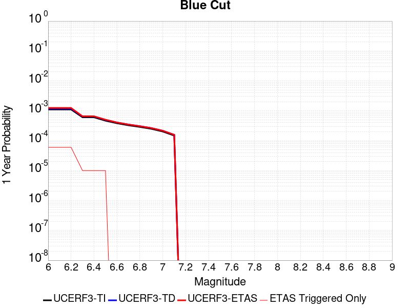 |  |

| Magnitude | 1 wk TI Prob | 1 wk TD Prob | 1 wk ETAS Prob | 1 wk ETAS/TD Gain | 1 wk ETAS Triggered Only | 1 mo TI Prob | 1 mo TD Prob | 1 mo ETAS Prob | 1 mo ETAS/TD Gain | 1 mo ETAS Triggered Only | 1 yr TI Prob | 1 yr TD Prob | 1 yr ETAS Prob | 1 yr ETAS/TD Gain | 1 yr ETAS Triggered Only | 10 yr TI Prob | 10 yr TD Prob | 10 yr ETAS Prob | 10 yr ETAS/TD Gain | 10 yr ETAS Triggered Only |
|-----|-----|-----|-----|-----|-----|-----|-----|-----|-----|-----|-----|-----|-----|-----|-----|-----|-----|-----|-----|-----|
| 6.0 | 2.1227985E-5 | 2.2719574E-5 | 4.271912E-5 | 1.8802782 | 2.0E-5 | 9.097391E-5 | 9.73663E-5 | 1.3736241E-4 | 1.4107797 | 4.0E-5 | 0.0011070445 | 0.0011848481 | 0.001244777 | 1.0505794 | 6.0E-5 | 0.011015458 | 0.011791152 | 0.01188009 | 1.0075428 | 9.0E-5 |
| 6.1 | 2.1227985E-5 | 2.2719574E-5 | 4.271912E-5 | 1.8802782 | 2.0E-5 | 9.097391E-5 | 9.73663E-5 | 1.3736241E-4 | 1.4107797 | 4.0E-5 | 0.0011070445 | 0.0011848481 | 0.001244777 | 1.0505794 | 6.0E-5 | 0.011015458 | 0.011791152 | 0.01188009 | 1.0075428 | 9.0E-5 |
| 6.2 | 2.1227985E-5 | 2.2719574E-5 | 4.271912E-5 | 1.8802782 | 2.0E-5 | 9.097391E-5 | 9.73663E-5 | 1.3736241E-4 | 1.4107797 | 4.0E-5 | 0.0011070445 | 0.0011848481 | 0.001244777 | 1.0505794 | 6.0E-5 | 0.011015458 | 0.011791152 | 0.01188009 | 1.0075428 | 9.0E-5 |
| 6.3 | 1.1613981E-5 | 1.2353542E-5 | 1.2353542E-5 | 1.0 | 0.0 | 4.9773254E-5 | 5.2942745E-5 | 5.2942745E-5 | 1.0 | 0.0 | 6.0582085E-4 | 6.443998E-4 | 6.5439334E-4 | 1.0155083 | 1.0E-5 | 0.0060417196 | 0.0064265593 | 0.0064563663 | 1.0046381 | 3.0E-5 |
| 6.4 | 1.1613981E-5 | 1.2353542E-5 | 1.2353542E-5 | 1.0 | 0.0 | 4.9773254E-5 | 5.2942745E-5 | 5.2942745E-5 | 1.0 | 0.0 | 6.0582085E-4 | 6.443998E-4 | 6.5439334E-4 | 1.0155083 | 1.0E-5 | 0.0060417196 | 0.0064265593 | 0.0064563663 | 1.0046381 | 3.0E-5 |
| 6.5 | 8.931326E-6 | 9.4816E-6 | 9.4816E-6 | 1.0 | 0.0 | 3.8276554E-5 | 4.0634844E-5 | 4.0634844E-5 | 1.0 | 0.0 | 4.6591737E-4 | 4.946261E-4 | 5.0462113E-4 | 1.0202073 | 1.0E-5 | 0.0046494175 | 0.004936161 | 0.004966013 | 1.0060476 | 3.0E-5 |
| 6.6 | 7.345353E-6 | 7.79028E-6 | 7.79028E-6 | 1.0 | 0.0 | 3.1479703E-5 | 3.338653E-5 | 3.338653E-5 | 1.0 | 0.0 | 3.83198E-4 | 4.064132E-4 | 4.064132E-4 | 1.0 | 0.0 | 0.0038253788 | 0.0040574907 | 0.0040674503 | 1.0024545 | 1.0E-5 |
| 6.7 | 6.2775666E-6 | 6.655149E-6 | 6.655149E-6 | 1.0 | 0.0 | 2.690358E-5 | 2.8521798E-5 | 2.8521798E-5 | 1.0 | 0.0 | 3.2750185E-4 | 3.472051E-4 | 3.472051E-4 | 1.0 | 0.0 | 0.0032701963 | 0.003467367 | 0.0034773324 | 1.002874 | 1.0E-5 |
| 6.8 | 5.5234095E-6 | 5.8551113E-6 | 5.8551113E-6 | 1.0 | 0.0 | 2.367154E-5 | 2.5093133E-5 | 2.5093133E-5 | 1.0 | 0.0 | 2.8816288E-4 | 3.0547334E-4 | 3.0547334E-4 | 1.0 | 0.0 | 0.002877895 | 0.0030512505 | 0.00306122 | 1.0032673 | 1.0E-5 |
| 6.9 | 4.7780054E-6 | 5.0654203E-6 | 5.0654203E-6 | 1.0 | 0.0 | 2.0477004E-5 | 2.1708804E-5 | 2.1708804E-5 | 1.0 | 0.0 | 2.4927902E-4 | 2.642797E-4 | 2.642797E-4 | 1.0 | 0.0 | 0.0024899957 | 0.002640346 | 0.0026503198 | 1.0037774 | 1.0E-5 |
| 7.0 | 3.883171E-6 | 4.118487E-6 | 4.118487E-6 | 1.0 | 0.0 | 1.6642054E-5 | 1.7650578E-5 | 1.7650578E-5 | 1.0 | 0.0 | 2.0259817E-4 | 2.1488148E-4 | 2.1488148E-4 | 1.0 | 0.0 | 0.0020241356 | 0.0021474129 | 0.0021474129 | 1.0 | 0.0 |
| 7.1 | 2.8358215E-6 | 3.0097158E-6 | 3.0097158E-6 | 1.0 | 0.0 | 1.2153464E-5 | 1.2898756E-5 | 1.2898756E-5 | 1.0 | 0.0 | 1.4795837E-4 | 1.5703762E-4 | 1.5703762E-4 | 1.0 | 0.0 | 0.001478599 | 0.0015699116 | 0.0015699116 | 1.0 | 0.0 |

## Bullion Mountains
*[(top)](#table-of-contents)*

| 1 Week | 1 Month | 1 Year | 10 Year |
|-----|-----|-----|-----|
|  |  |  |  |

| Magnitude | 1 wk TI Prob | 1 wk TD Prob | 1 wk ETAS Prob | 1 wk ETAS/TD Gain | 1 wk ETAS Triggered Only | 1 mo TI Prob | 1 mo TD Prob | 1 mo ETAS Prob | 1 mo ETAS/TD Gain | 1 mo ETAS Triggered Only | 1 yr TI Prob | 1 yr TD Prob | 1 yr ETAS Prob | 1 yr ETAS/TD Gain | 1 yr ETAS Triggered Only | 10 yr TI Prob | 10 yr TD Prob | 10 yr ETAS Prob | 10 yr ETAS/TD Gain | 10 yr ETAS Triggered Only |
|-----|-----|-----|-----|-----|-----|-----|-----|-----|-----|-----|-----|-----|-----|-----|-----|-----|-----|-----|-----|-----|
| 6.0 | 1.6420427E-5 | 1.4692089E-5 | 5.4691503E-5 | 3.7225134 | 4.0E-5 | 7.037136E-5 | 6.296479E-5 | 1.0296227E-4 | 1.6352357 | 4.0E-5 | 8.5643446E-4 | 7.663651E-4 | 8.4630377E-4 | 1.1043088 | 8.0E-5 | 0.008531413 | 0.007641016 | 0.0077303285 | 1.0116886 | 9.0E-5 |
| 6.1 | 1.6420427E-5 | 1.4692089E-5 | 5.4691503E-5 | 3.7225134 | 4.0E-5 | 7.037136E-5 | 6.296479E-5 | 1.0296227E-4 | 1.6352357 | 4.0E-5 | 8.5643446E-4 | 7.663651E-4 | 8.4630377E-4 | 1.1043088 | 8.0E-5 | 0.008531413 | 0.007641016 | 0.0077303285 | 1.0116886 | 9.0E-5 |
| 6.2 | 1.6420427E-5 | 1.4692089E-5 | 5.4691503E-5 | 3.7225134 | 4.0E-5 | 7.037136E-5 | 6.296479E-5 | 1.0296227E-4 | 1.6352357 | 4.0E-5 | 8.5643446E-4 | 7.663651E-4 | 8.4630377E-4 | 1.1043088 | 8.0E-5 | 0.008531413 | 0.007641016 | 0.0077303285 | 1.0116886 | 9.0E-5 |
| 6.3 | 1.2046778E-5 | 9.862335E-6 | 9.862335E-6 | 1.0 | 0.0 | 5.1628023E-5 | 4.2266598E-5 | 4.2266598E-5 | 1.0 | 0.0 | 6.283899E-4 | 5.144975E-4 | 5.2449235E-4 | 1.0194265 | 1.0E-5 | 0.0062661595 | 0.005135345 | 0.0051452937 | 1.0019373 | 1.0E-5 |
| 6.4 | 1.2046778E-5 | 9.862335E-6 | 9.862335E-6 | 1.0 | 0.0 | 5.1628023E-5 | 4.2266598E-5 | 4.2266598E-5 | 1.0 | 0.0 | 6.283899E-4 | 5.144975E-4 | 5.2449235E-4 | 1.0194265 | 1.0E-5 | 0.0062661595 | 0.005135345 | 0.0051452937 | 1.0019373 | 1.0E-5 |
| 6.5 | 1.0244343E-5 | 7.879458E-6 | 7.879458E-6 | 1.0 | 0.0 | 4.390359E-5 | 3.3768785E-5 | 3.3768785E-5 | 1.0 | 0.0 | 5.343951E-4 | 4.110781E-4 | 4.21074E-4 | 1.0243163 | 1.0E-5 | 0.005331118 | 0.004105208 | 0.004115167 | 1.0024259 | 1.0E-5 |
| 6.6 | 9.605408E-6 | 7.1774966E-6 | 7.1774966E-6 | 1.0 | 0.0 | 4.1165385E-5 | 3.076045E-5 | 3.076045E-5 | 1.0 | 0.0 | 5.010733E-4 | 3.744645E-4 | 3.744645E-4 | 1.0 | 0.0 | 0.00499945 | 0.003740332 | 0.003740332 | 1.0 | 0.0 |
| 6.7 | 8.60418E-6 | 6.1240044E-6 | 6.1240044E-6 | 1.0 | 0.0 | 3.687454E-5 | 2.624558E-5 | 2.624558E-5 | 1.0 | 0.0 | 4.48855E-4 | 3.1951256E-4 | 3.1951256E-4 | 1.0 | 0.0 | 0.004479495 | 0.0031924439 | 0.0031924439 | 1.0 | 0.0 |
| 6.8 | 5.187994E-6 | 2.5631666E-6 | 2.5631666E-6 | 1.0 | 0.0 | 2.223407E-5 | 1.0984976E-5 | 1.0984976E-5 | 1.0 | 0.0 | 2.7066618E-4 | 1.3373788E-4 | 1.3373788E-4 | 1.0 | 0.0 | 0.0027033675 | 0.0013369655 | 0.0013369655 | 1.0 | 0.0 |
| 6.9 | 4.5302368E-6 | 2.3443165E-6 | 2.3443165E-6 | 1.0 | 0.0 | 1.9415156E-5 | 1.0047055E-5 | 1.0047055E-5 | 1.0 | 0.0 | 2.3635388E-4 | 1.2232E-4 | 1.2232E-4 | 1.0 | 0.0 | 0.0023610266 | 0.0012229157 | 0.0012229157 | 1.0 | 0.0 |
| 7.0 | 3.431668E-6 | 1.6882402E-6 | 1.6882402E-6 | 1.0 | 0.0 | 1.4707065E-5 | 7.235315E-6 | 7.235315E-6 | 1.0 | 0.0 | 1.7904381E-4 | 8.808996E-5 | 8.808996E-5 | 1.0 | 0.0 | 0.0017889962 | 8.808996E-4 | 8.808996E-4 | 1.0 | 0.0 |

## Independence rev 2011
*[(top)](#table-of-contents)*

| 1 Week | 1 Month | 1 Year | 10 Year |
|-----|-----|-----|-----|
|  | 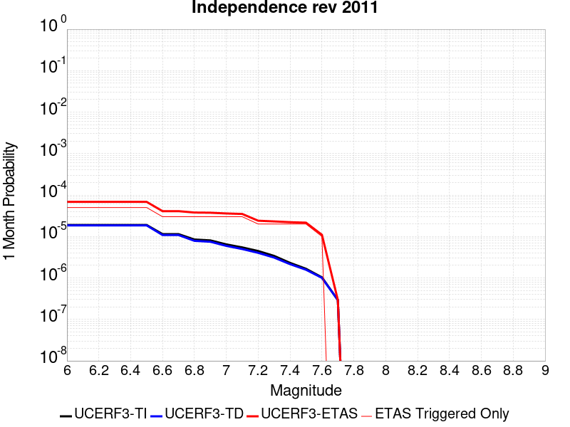 |  |  |

| Magnitude | 1 wk TI Prob | 1 wk TD Prob | 1 wk ETAS Prob | 1 wk ETAS/TD Gain | 1 wk ETAS Triggered Only | 1 mo TI Prob | 1 mo TD Prob | 1 mo ETAS Prob | 1 mo ETAS/TD Gain | 1 mo ETAS Triggered Only | 1 yr TI Prob | 1 yr TD Prob | 1 yr ETAS Prob | 1 yr ETAS/TD Gain | 1 yr ETAS Triggered Only | 10 yr TI Prob | 10 yr TD Prob | 10 yr ETAS Prob | 10 yr ETAS/TD Gain | 10 yr ETAS Triggered Only |
|-----|-----|-----|-----|-----|-----|-----|-----|-----|-----|-----|-----|-----|-----|-----|-----|-----|-----|-----|-----|-----|
| 6.0 | 4.422171E-6 | 4.326227E-6 | 1.4326184E-5 | 3.311473 | 1.0E-5 | 1.8952025E-5 | 1.8540857E-5 | 6.853993E-5 | 3.6966968 | 5.0E-5 | 2.3071647E-4 | 2.2571455E-4 | 2.85701E-4 | 1.2657624 | 6.0E-5 | 0.0023047708 | 0.0022551466 | 0.0023449436 | 1.0398188 | 9.0E-5 |
| 6.1 | 4.422171E-6 | 4.326227E-6 | 1.4326184E-5 | 3.311473 | 1.0E-5 | 1.8952025E-5 | 1.8540857E-5 | 6.853993E-5 | 3.6966968 | 5.0E-5 | 2.3071647E-4 | 2.2571455E-4 | 2.85701E-4 | 1.2657624 | 6.0E-5 | 0.0023047708 | 0.0022551466 | 0.0023449436 | 1.0398188 | 9.0E-5 |
| 6.2 | 4.422171E-6 | 4.326227E-6 | 1.4326184E-5 | 3.311473 | 1.0E-5 | 1.8952025E-5 | 1.8540857E-5 | 6.853993E-5 | 3.6966968 | 5.0E-5 | 2.3071647E-4 | 2.2571455E-4 | 2.85701E-4 | 1.2657624 | 6.0E-5 | 0.0023047708 | 0.0022551466 | 0.0023449436 | 1.0398188 | 9.0E-5 |
| 6.3 | 4.422171E-6 | 4.326227E-6 | 1.4326184E-5 | 3.311473 | 1.0E-5 | 1.8952025E-5 | 1.8540857E-5 | 6.853993E-5 | 3.6966968 | 5.0E-5 | 2.3071647E-4 | 2.2571455E-4 | 2.85701E-4 | 1.2657624 | 6.0E-5 | 0.0023047708 | 0.0022551466 | 0.0023449436 | 1.0398188 | 9.0E-5 |
| 6.4 | 4.422171E-6 | 4.326227E-6 | 1.4326184E-5 | 3.311473 | 1.0E-5 | 1.8952025E-5 | 1.8540857E-5 | 6.853993E-5 | 3.6966968 | 5.0E-5 | 2.3071647E-4 | 2.2571455E-4 | 2.85701E-4 | 1.2657624 | 6.0E-5 | 0.0023047708 | 0.0022551466 | 0.0023449436 | 1.0398188 | 9.0E-5 |
| 6.5 | 4.422171E-6 | 4.326227E-6 | 1.4326184E-5 | 3.311473 | 1.0E-5 | 1.8952025E-5 | 1.8540857E-5 | 6.853993E-5 | 3.6966968 | 5.0E-5 | 2.3071647E-4 | 2.2571455E-4 | 2.85701E-4 | 1.2657624 | 6.0E-5 | 0.0023047708 | 0.0022551466 | 0.0023449436 | 1.0398188 | 9.0E-5 |
| 6.6 | 2.663744E-6 | 2.5319862E-6 | 2.5319862E-6 | 1.0 | 0.0 | 1.1415996E-5 | 1.0851327E-5 | 4.0851002E-5 | 3.7646089 | 3.0E-5 | 1.3898089E-4 | 1.3210738E-4 | 1.721021E-4 | 1.302744 | 4.0E-5 | 0.0013889399 | 0.0013203367 | 0.0013802575 | 1.045383 | 6.0E-5 |
| 6.7 | 2.663744E-6 | 2.5319862E-6 | 2.5319862E-6 | 1.0 | 0.0 | 1.1415996E-5 | 1.0851327E-5 | 4.0851002E-5 | 3.7646089 | 3.0E-5 | 1.3898089E-4 | 1.3210738E-4 | 1.721021E-4 | 1.302744 | 4.0E-5 | 0.0013889399 | 0.0013203367 | 0.0013802575 | 1.045383 | 6.0E-5 |
| 6.8 | 1.9716529E-6 | 1.8322585E-6 | 1.8322585E-6 | 1.0 | 0.0 | 8.449913E-6 | 7.852514E-6 | 3.785228E-5 | 4.820403 | 3.0E-5 | 1.0287284E-4 | 9.5600284E-5 | 1.3559646E-4 | 1.4183688 | 4.0E-5 | 0.0010282523 | 9.556045E-4 | 0.0010155472 | 1.0627275 | 6.0E-5 |
| 6.9 | 1.8788617E-6 | 1.7429993E-6 | 1.7429993E-6 | 1.0 | 0.0 | 8.0522395E-6 | 7.4699765E-6 | 3.7469752E-5 | 5.016047 | 3.0E-5 | 9.80316E-5 | 9.0943286E-5 | 1.3093965E-4 | 1.4397945 | 4.0E-5 | 9.798837E-4 | 9.0907275E-4 | 9.690182E-4 | 1.0659413 | 6.0E-5 |
| 7.0 | 1.5045488E-6 | 1.3849503E-6 | 1.3849503E-6 | 1.0 | 0.0 | 6.44805E-6 | 5.9354884E-6 | 3.593531E-5 | 6.054314 | 3.0E-5 | 7.8502184E-5 | 7.226223E-5 | 1.1225934E-4 | 1.5534996 | 4.0E-5 | 7.8474457E-4 | 7.2239246E-4 | 7.823491E-4 | 1.0829973 | 6.0E-5 |
| 7.1 | 1.272341E-6 | 1.1625096E-6 | 1.1625096E-6 | 1.0 | 0.0 | 5.4528787E-6 | 4.982175E-6 | 3.4982026E-5 | 7.0214367 | 3.0E-5 | 6.6386776E-5 | 6.0656326E-5 | 1.006539E-4 | 1.6594131 | 4.0E-5 | 6.636695E-4 | 6.064009E-4 | 6.663645E-4 | 1.0988845 | 6.0E-5 |
| 7.2 | 1.0416892E-6 | 9.4098806E-7 | 9.4098806E-7 | 1.0 | 0.0 | 4.464375E-6 | 4.0328E-6 | 2.4032719E-5 | 5.959314 | 2.0E-5 | 5.4352407E-5 | 4.909825E-5 | 7.9096775E-5 | 1.6109897 | 3.0E-5 | 5.4339116E-4 | 4.9087586E-4 | 5.408513E-4 | 1.1018088 | 5.0E-5 |
| 7.3 | 7.9450155E-7 | 7.235002E-7 | 7.235002E-7 | 1.0 | 0.0 | 3.4050022E-6 | 3.1007114E-6 | 2.3100649E-5 | 7.450113 | 2.0E-5 | 4.1455114E-5 | 3.775052E-5 | 6.774939E-5 | 1.794661 | 3.0E-5 | 4.144738E-4 | 3.7744216E-4 | 4.274233E-4 | 1.1324207 | 5.0E-5 |
| 7.4 | 5.3893444E-7 | 5.019512E-7 | 5.019512E-7 | 1.0 | 0.0 | 2.309717E-6 | 2.1512178E-6 | 2.2151175E-5 | 10.29704 | 2.0E-5 | 2.8120441E-5 | 2.6190766E-5 | 5.618998E-5 | 2.145412 | 3.0E-5 | 2.8116882E-4 | 2.6187726E-4 | 3.1186416E-4 | 1.1908791 | 5.0E-5 |
| 7.5 | 3.8852085E-7 | 3.682554E-7 | 3.682554E-7 | 1.0 | 0.0 | 1.6650882E-6 | 1.5782365E-6 | 2.1578206E-5 | 13.672353 | 2.0E-5 | 2.027226E-5 | 1.9214862E-5 | 4.9214286E-5 | 2.5612614 | 3.0E-5 | 2.0270412E-4 | 1.9213221E-4 | 2.4212261E-4 | 1.2601875 | 5.0E-5 |
| 7.6 | 2.414929E-7 | 2.345755E-7 | 2.345755E-7 | 1.0 | 0.0 | 1.0349692E-6 | 1.0053232E-6 | 1.1005313E-5 | 10.94704 | 1.0E-5 | 1.2600677E-5 | 1.2239742E-5 | 3.22395E-5 | 2.6340013 | 2.0E-5 | 1.2599962E-4 | 1.223908E-4 | 1.6238591E-4 | 1.326782 | 4.0E-5 |
| 7.7 | 6.8298014E-8 | 6.85897E-8 | 6.85897E-8 | 1.0 | 0.0 | 2.9270575E-7 | 2.9395582E-7 | 2.9395582E-7 | 1.0 | 0.0 | 3.5636867E-6 | 3.5789067E-6 | 1.35788705E-5 | 3.7941394 | 1.0E-5 | 3.5636294E-5 | 3.5788536E-5 | 4.578818E-5 | 1.279409 | 1.0E-5 |

## San Pedro Basin
*[(top)](#table-of-contents)*

| 1 Week | 1 Month | 1 Year | 10 Year |
|-----|-----|-----|-----|
|  | 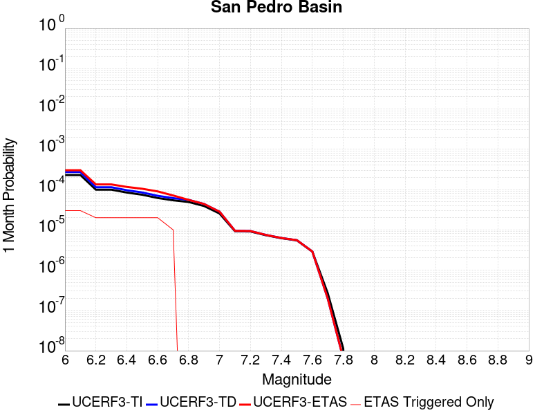 |  |  |

| Magnitude | 1 wk TI Prob | 1 wk TD Prob | 1 wk ETAS Prob | 1 wk ETAS/TD Gain | 1 wk ETAS Triggered Only | 1 mo TI Prob | 1 mo TD Prob | 1 mo ETAS Prob | 1 mo ETAS/TD Gain | 1 mo ETAS Triggered Only | 1 yr TI Prob | 1 yr TD Prob | 1 yr ETAS Prob | 1 yr ETAS/TD Gain | 1 yr ETAS Triggered Only | 10 yr TI Prob | 10 yr TD Prob | 10 yr ETAS Prob | 10 yr ETAS/TD Gain | 10 yr ETAS Triggered Only |
|-----|-----|-----|-----|-----|-----|-----|-----|-----|-----|-----|-----|-----|-----|-----|-----|-----|-----|-----|-----|-----|
| 6.0 | 5.3449043E-5 | 6.336954E-5 | 8.336827E-5 | 1.3155891 | 2.0E-5 | 2.2904722E-4 | 2.715589E-4 | 3.0155078E-4 | 1.1104432 | 3.0E-5 | 0.0027850836 | 0.0033018254 | 0.0033516602 | 1.0150931 | 5.0E-5 | 0.027504366 | 0.03258945 | 0.032676518 | 1.0026716 | 9.0E-5 |
| 6.1 | 5.3449043E-5 | 6.336954E-5 | 8.336827E-5 | 1.3155891 | 2.0E-5 | 2.2904722E-4 | 2.715589E-4 | 3.0155078E-4 | 1.1104432 | 3.0E-5 | 0.0027850836 | 0.0033018254 | 0.0033516602 | 1.0150931 | 5.0E-5 | 0.027504366 | 0.03258945 | 0.032676518 | 1.0026716 | 9.0E-5 |
| 6.2 | 2.3189454E-5 | 2.6642796E-5 | 4.6642264E-5 | 1.750652 | 2.0E-5 | 9.9379584E-5 | 1.14178685E-4 | 1.341764E-4 | 1.1751441 | 2.0E-5 | 0.0012092749 | 0.0013892864 | 0.0014092586 | 1.0143759 | 2.0E-5 | 0.012027155 | 0.013810883 | 0.013860193 | 1.0035703 | 5.0E-5 |
| 6.3 | 2.3189454E-5 | 2.6642796E-5 | 4.6642264E-5 | 1.750652 | 2.0E-5 | 9.9379584E-5 | 1.14178685E-4 | 1.341764E-4 | 1.1751441 | 2.0E-5 | 0.0012092749 | 0.0013892864 | 0.0014092586 | 1.0143759 | 2.0E-5 | 0.012027155 | 0.013810883 | 0.013860193 | 1.0035703 | 5.0E-5 |
| 6.4 | 1.966056E-5 | 2.2463413E-5 | 4.2462965E-5 | 1.8903166 | 2.0E-5 | 8.425682E-5 | 9.626844E-5 | 1.1626652E-4 | 1.2077324 | 2.0E-5 | 0.001025344 | 0.0011714783 | 0.0011914549 | 1.0170524 | 2.0E-5 | 0.010206259 | 0.011657117 | 0.011696651 | 1.0033914 | 4.0E-5 |
| 6.5 | 1.7342953E-5 | 1.9745148E-5 | 3.9744755E-5 | 2.012887 | 2.0E-5 | 7.4324824E-5 | 8.4619525E-5 | 1.0461784E-4 | 1.236332 | 2.0E-5 | 9.04529E-4 | 0.0010297928 | 0.0010497721 | 1.0194014 | 2.0E-5 | 0.009008561 | 0.010253931 | 0.010293521 | 1.003861 | 4.0E-5 |
| 6.6 | 1.439804E-5 | 1.6322716E-5 | 3.6322388E-5 | 2.2252662 | 2.0E-5 | 6.170443E-5 | 6.99528E-5 | 8.9951405E-5 | 1.2858871 | 2.0E-5 | 7.509924E-4 | 8.513747E-4 | 8.713577E-4 | 1.0234715 | 2.0E-5 | 0.0074845953 | 0.008484332 | 0.008514077 | 1.003506 | 3.0E-5 |
| 6.7 | 1.2634884E-5 | 1.4285297E-5 | 2.4285155E-5 | 1.7000104 | 1.0E-5 | 5.414838E-5 | 6.1221435E-5 | 7.122083E-5 | 1.1633315 | 1.0E-5 | 6.590571E-4 | 7.4514654E-4 | 7.551391E-4 | 1.0134102 | 1.0E-5 | 0.006571059 | 0.007429501 | 0.0074493526 | 1.002672 | 2.0E-5 |
| 6.8 | 1.146091E-5 | 1.2933192E-5 | 1.2933192E-5 | 1.0 | 0.0 | 4.911726E-5 | 5.5426954E-5 | 5.5426954E-5 | 1.0 | 0.0 | 5.9783855E-4 | 6.7464396E-4 | 6.7464396E-4 | 1.0 | 0.0 | 0.0059623276 | 0.006728899 | 0.0067388318 | 1.0014762 | 1.0E-5 |
| 6.9 | 9.109035E-6 | 1.0235011E-5 | 1.0235011E-5 | 1.0 | 0.0 | 3.9038136E-5 | 4.3863754E-5 | 4.3863754E-5 | 1.0 | 0.0 | 4.7518566E-4 | 5.3393835E-4 | 5.3393835E-4 | 1.0 | 0.0 | 0.0047417083 | 0.005329309 | 0.0053392556 | 1.0018665 | 1.0E-5 |
| 7.0 | 5.9351028E-6 | 6.583964E-6 | 6.583964E-6 | 1.0 | 0.0 | 2.5435906E-5 | 2.8216817E-5 | 2.8216817E-5 | 1.0 | 0.0 | 3.0963816E-4 | 3.435092E-4 | 3.435092E-4 | 1.0 | 0.0 | 0.0030920706 | 0.0034320992 | 0.0034420649 | 1.0029037 | 1.0E-5 |
| 7.1 | 2.1557585E-6 | 2.209648E-6 | 2.209648E-6 | 1.0 | 0.0 | 9.238933E-6 | 9.469887E-6 | 9.469887E-6 | 1.0 | 0.0 | 1.1247819E-4 | 1.1528993E-4 | 1.1528993E-4 | 1.0 | 0.0 | 0.0011242128 | 0.0011523166 | 0.0011523166 | 1.0 | 0.0 |
| 7.2 | 2.1251979E-6 | 2.1779945E-6 | 2.1779945E-6 | 1.0 | 0.0 | 9.107958E-6 | 9.334229E-6 | 9.334229E-6 | 1.0 | 0.0 | 1.1088375E-4 | 1.1363847E-4 | 1.1363847E-4 | 1.0 | 0.0 | 0.0011082845 | 0.0011358189 | 0.0011358189 | 1.0 | 0.0 |
| 7.3 | 1.7145798E-6 | 1.7442874E-6 | 1.7442874E-6 | 1.0 | 0.0 | 7.3481783E-6 | 7.4754967E-6 | 7.4754967E-6 | 1.0 | 0.0 | 8.94604E-5 | 9.1010465E-5 | 9.1010465E-5 | 1.0 | 0.0 | 8.9424395E-4 | 9.0974104E-4 | 9.0974104E-4 | 1.0 | 0.0 |
| 7.4 | 1.4467993E-6 | 1.4641868E-6 | 1.4641868E-6 | 1.0 | 0.0 | 6.200554E-6 | 6.2750714E-6 | 6.2750714E-6 | 1.0 | 0.0 | 7.548913E-5 | 7.639639E-5 | 7.639639E-5 | 1.0 | 0.0 | 7.546349E-4 | 7.6370855E-4 | 7.6370855E-4 | 1.0 | 0.0 |
| 7.5 | 1.2803735E-6 | 1.2931497E-6 | 1.2931497E-6 | 1.0 | 0.0 | 5.487303E-6 | 5.5420587E-6 | 5.5420587E-6 | 1.0 | 0.0 | 6.680587E-5 | 6.7472545E-5 | 6.7472545E-5 | 1.0 | 0.0 | 6.678579E-4 | 6.7452766E-4 | 6.7452766E-4 | 1.0 | 0.0 |
| 7.6 | 6.755009E-7 | 6.769465E-7 | 6.769465E-7 | 1.0 | 0.0 | 2.8950008E-6 | 2.9011965E-6 | 2.9011965E-6 | 1.0 | 0.0 | 3.5246063E-5 | 3.5321555E-5 | 3.5321555E-5 | 1.0 | 0.0 | 3.5240475E-4 | 3.5316512E-4 | 3.5316512E-4 | 1.0 | 0.0 |
| 7.7 | 6.211885E-8 | 4.569953E-8 | 4.569953E-8 | 1.0 | 0.0 | 2.6622362E-7 | 1.9585512E-7 | 1.9585512E-7 | 1.0 | 0.0 | 3.2412677E-6 | 2.3845337E-6 | 2.3845337E-6 | 1.0 | 0.0 | 3.2412205E-5 | 2.3845101E-5 | 2.3845101E-5 | 1.0 | 0.0 |
| 7.8 | 2.6580573E-9 | 1.5138163E-9 | 1.5138163E-9 | 1.0 | 0.0 | 1.1391674E-8 | 6.487784E-9 | 6.487784E-9 | 1.0 | 0.0 | 1.3869362E-7 | 7.898877E-8 | 7.898877E-8 | 1.0 | 0.0 | 1.3869354E-6 | 7.898877E-7 | 7.898877E-7 | 1.0 | 0.0 |

## San Diego Trough south
*[(top)](#table-of-contents)*

| 1 Week | 1 Month | 1 Year | 10 Year |
|-----|-----|-----|-----|
|  |  |  |  |

| Magnitude | 1 wk TI Prob | 1 wk TD Prob | 1 wk ETAS Prob | 1 wk ETAS/TD Gain | 1 wk ETAS Triggered Only | 1 mo TI Prob | 1 mo TD Prob | 1 mo ETAS Prob | 1 mo ETAS/TD Gain | 1 mo ETAS Triggered Only | 1 yr TI Prob | 1 yr TD Prob | 1 yr ETAS Prob | 1 yr ETAS/TD Gain | 1 yr ETAS Triggered Only | 10 yr TI Prob | 10 yr TD Prob | 10 yr ETAS Prob | 10 yr ETAS/TD Gain | 10 yr ETAS Triggered Only |
|-----|-----|-----|-----|-----|-----|-----|-----|-----|-----|-----|-----|-----|-----|-----|-----|-----|-----|-----|-----|-----|
| 6.0 | 8.279495E-5 | 1.04241306E-4 | 1.1424026E-4 | 1.0959213 | 1.0E-5 | 3.5478722E-4 | 4.4667677E-4 | 4.7666338E-4 | 1.0671327 | 3.0E-5 | 0.004310982 | 0.0054256152 | 0.0054653985 | 1.0073324 | 4.0E-5 | 0.042283054 | 0.05299221 | 0.05307744 | 1.0016084 | 9.0E-5 |
| 6.1 | 4.6961468E-5 | 5.772944E-5 | 6.772886E-5 | 1.1732118 | 1.0E-5 | 2.0124791E-4 | 2.473894E-4 | 2.7738197E-4 | 1.1212363 | 3.0E-5 | 0.00244744 | 0.0030079768 | 0.0030478565 | 1.013258 | 4.0E-5 | 0.024206603 | 0.029679462 | 0.029727979 | 1.0016347 | 5.0E-5 |
| 6.2 | 3.5079658E-5 | 4.214154E-5 | 5.2141117E-5 | 1.2372856 | 1.0E-5 | 1.5033272E-4 | 1.8059435E-4 | 2.0059074E-4 | 1.1107254 | 2.0E-5 | 0.0018287642 | 0.0021965632 | 0.0022264973 | 1.0136276 | 3.0E-5 | 0.018137876 | 0.021751117 | 0.021790247 | 1.001799 | 4.0E-5 |
| 6.3 | 3.5079658E-5 | 4.214154E-5 | 5.2141117E-5 | 1.2372856 | 1.0E-5 | 1.5033272E-4 | 1.8059435E-4 | 2.0059074E-4 | 1.1107254 | 2.0E-5 | 0.0018287642 | 0.0021965632 | 0.0022264973 | 1.0136276 | 3.0E-5 | 0.018137876 | 0.021751117 | 0.021790247 | 1.001799 | 4.0E-5 |
| 6.4 | 2.7196904E-5 | 3.2087162E-5 | 4.2086842E-5 | 1.3116411 | 1.0E-5 | 1.16552954E-4 | 1.3750927E-4 | 1.5750651E-4 | 1.1454247 | 2.0E-5 | 0.0014181085 | 0.0016729041 | 0.0016928706 | 1.0119352 | 2.0E-5 | 0.014090929 | 0.016604643 | 0.016624311 | 1.0011845 | 2.0E-5 |
| 6.5 | 2.5584688E-5 | 3.010164E-5 | 4.010134E-5 | 1.3321978 | 1.0E-5 | 1.0964406E-4 | 1.2900073E-4 | 1.4899815E-4 | 1.1550179 | 2.0E-5 | 0.0013340989 | 0.0015694655 | 0.0015894341 | 1.0127232 | 2.0E-5 | 0.013261181 | 0.015585314 | 0.015605003 | 1.0012633 | 2.0E-5 |
| 6.6 | 2.2034688E-5 | 2.5742738E-5 | 3.574248E-5 | 1.3884491 | 1.0E-5 | 9.443096E-5 | 1.1032141E-4 | 1.303192E-4 | 1.1812685 | 2.0E-5 | 0.0011490905 | 0.0013423424 | 0.0013623155 | 1.0148793 | 2.0E-5 | 0.011431668 | 0.013343317 | 0.013363051 | 1.0014789 | 2.0E-5 |
| 6.7 | 1.9394853E-5 | 2.254176E-5 | 2.254176E-5 | 1.0 | 0.0 | 8.311815E-5 | 9.6603995E-5 | 1.0660303E-4 | 1.1035054 | 1.0E-5 | 0.0010114936 | 0.0011755243 | 0.0011855125 | 1.0084969 | 1.0E-5 | 0.01006902 | 0.011693766 | 0.01170365 | 1.0008452 | 1.0E-5 |
| 6.8 | 1.7615313E-5 | 2.0403182E-5 | 2.0403182E-5 | 1.0 | 0.0 | 7.549201E-5 | 8.74393E-5 | 9.743843E-5 | 1.1143551 | 1.0E-5 | 9.1872766E-4 | 0.0010640579 | 0.0010740473 | 1.009388 | 1.0E-5 | 0.009149387 | 0.010590198 | 0.010600092 | 1.0009342 | 1.0E-5 |
| 6.9 | 1.5621423E-5 | 1.8026114E-5 | 1.8026114E-5 | 1.0 | 0.0 | 6.6947236E-5 | 7.725251E-5 | 8.7251734E-5 | 1.1294357 | 1.0E-5 | 8.147778E-4 | 9.40147E-4 | 9.5013756E-4 | 1.0106267 | 1.0E-5 | 0.008117969 | 0.009362142 | 0.009372048 | 1.0010581 | 1.0E-5 |
| 7.0 | 1.3444376E-5 | 1.544809E-5 | 1.544809E-5 | 1.0 | 0.0 | 5.7617483E-5 | 6.620443E-5 | 7.620377E-5 | 1.1510373 | 1.0E-5 | 7.0126704E-4 | 8.057436E-4 | 8.1573555E-4 | 1.0124009 | 1.0E-5 | 0.006990582 | 0.008028555 | 0.008038475 | 1.0012356 | 1.0E-5 |
| 7.1 | 1.2268361E-5 | 1.407303E-5 | 1.407303E-5 | 1.0 | 0.0 | 5.2577634E-5 | 6.0311606E-5 | 7.0311005E-5 | 1.1657956 | 1.0E-5 | 6.399447E-4 | 7.3404907E-4 | 7.440417E-4 | 1.0136131 | 1.0E-5 | 0.0063810493 | 0.0073165493 | 0.007326476 | 1.0013567 | 1.0E-5 |
| 7.2 | 1.0922655E-5 | 1.2513563E-5 | 1.2513563E-5 | 1.0 | 0.0 | 4.681054E-5 | 5.3628468E-5 | 6.362793E-5 | 1.1864581 | 1.0E-5 | 5.697693E-4 | 6.5273355E-4 | 6.62727E-4 | 1.0153102 | 1.0E-5 | 0.0056831064 | 0.0065084435 | 0.006518379 | 1.0015265 | 1.0E-5 |
| 7.3 | 6.1106753E-6 | 6.928925E-6 | 6.928925E-6 | 1.0 | 0.0 | 2.6188345E-5 | 2.9695057E-5 | 2.9695057E-5 | 1.0 | 0.0 | 3.1879646E-4 | 3.6147775E-4 | 3.6147775E-4 | 1.0 | 0.0 | 0.0031833951 | 0.003608943 | 0.003608943 | 1.0 | 0.0 |
| 7.4 | 4.933187E-6 | 5.5895525E-6 | 5.5895525E-6 | 1.0 | 0.0 | 2.114206E-5 | 2.3955008E-5 | 2.3955008E-5 | 1.0 | 0.0 | 2.5737417E-4 | 2.9161357E-4 | 2.9161357E-4 | 1.0 | 0.0 | 0.002570763 | 0.0029123505 | 0.0029123505 | 1.0 | 0.0 |
| 7.5 | 1.7489613E-6 | 1.969678E-6 | 1.969678E-6 | 1.0 | 0.0 | 7.495527E-6 | 8.4414505E-6 | 8.4414505E-6 | 1.0 | 0.0 | 9.125422E-5 | 1.02770035E-4 | 1.02770035E-4 | 1.0 | 0.0 | 9.1216754E-4 | 0.0010272472 | 0.0010272472 | 1.0 | 0.0 |
| 7.6 | 1.6988751E-7 | 1.7533823E-7 | 1.7533823E-7 | 1.0 | 0.0 | 7.2808916E-7 | 7.5144936E-7 | 7.5144936E-7 | 1.0 | 0.0 | 8.864449E-6 | 9.14886E-6 | 9.14886E-6 | 1.0 | 0.0 | 8.8640954E-5 | 9.1485024E-5 | 9.1485024E-5 | 1.0 | 0.0 |

## Pitas Point (Lower West)
*[(top)](#table-of-contents)*

| 1 Week | 1 Month | 1 Year | 10 Year |
|-----|-----|-----|-----|
|  |  | 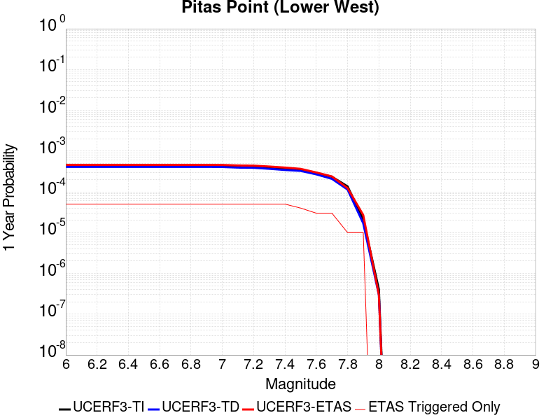 |  |

| Magnitude | 1 wk TI Prob | 1 wk TD Prob | 1 wk ETAS Prob | 1 wk ETAS/TD Gain | 1 wk ETAS Triggered Only | 1 mo TI Prob | 1 mo TD Prob | 1 mo ETAS Prob | 1 mo ETAS/TD Gain | 1 mo ETAS Triggered Only | 1 yr TI Prob | 1 yr TD Prob | 1 yr ETAS Prob | 1 yr ETAS/TD Gain | 1 yr ETAS Triggered Only | 10 yr TI Prob | 10 yr TD Prob | 10 yr ETAS Prob | 10 yr ETAS/TD Gain | 10 yr ETAS Triggered Only |
|-----|-----|-----|-----|-----|-----|-----|-----|-----|-----|-----|-----|-----|-----|-----|-----|-----|-----|-----|-----|-----|
| 6.0 | 8.151497E-6 | 7.855762E-6 | 2.7855605E-5 | 3.545882 | 2.0E-5 | 3.493452E-5 | 3.3667122E-5 | 6.366611E-5 | 1.891047 | 3.0E-5 | 4.252448E-4 | 4.0982084E-4 | 4.5980036E-4 | 1.1219546 | 5.0E-5 | 0.0042443196 | 0.0040907315 | 0.004160445 | 1.0170418 | 7.0E-5 |
| 6.1 | 8.151497E-6 | 7.855762E-6 | 2.7855605E-5 | 3.545882 | 2.0E-5 | 3.493452E-5 | 3.3667122E-5 | 6.366611E-5 | 1.891047 | 3.0E-5 | 4.252448E-4 | 4.0982084E-4 | 4.5980036E-4 | 1.1219546 | 5.0E-5 | 0.0042443196 | 0.0040907315 | 0.004160445 | 1.0170418 | 7.0E-5 |
| 6.2 | 8.151497E-6 | 7.855762E-6 | 2.7855605E-5 | 3.545882 | 2.0E-5 | 3.493452E-5 | 3.3667122E-5 | 6.366611E-5 | 1.891047 | 3.0E-5 | 4.252448E-4 | 4.0982084E-4 | 4.5980036E-4 | 1.1219546 | 5.0E-5 | 0.0042443196 | 0.0040907315 | 0.004160445 | 1.0170418 | 7.0E-5 |
| 6.3 | 8.151497E-6 | 7.855762E-6 | 2.7855605E-5 | 3.545882 | 2.0E-5 | 3.493452E-5 | 3.3667122E-5 | 6.366611E-5 | 1.891047 | 3.0E-5 | 4.252448E-4 | 4.0982084E-4 | 4.5980036E-4 | 1.1219546 | 5.0E-5 | 0.0042443196 | 0.0040907315 | 0.004160445 | 1.0170418 | 7.0E-5 |
| 6.4 | 8.151497E-6 | 7.855762E-6 | 2.7855605E-5 | 3.545882 | 2.0E-5 | 3.493452E-5 | 3.3667122E-5 | 6.366611E-5 | 1.891047 | 3.0E-5 | 4.252448E-4 | 4.0982084E-4 | 4.5980036E-4 | 1.1219546 | 5.0E-5 | 0.0042443196 | 0.0040907315 | 0.004160445 | 1.0170418 | 7.0E-5 |
| 6.5 | 8.151497E-6 | 7.855762E-6 | 2.7855605E-5 | 3.545882 | 2.0E-5 | 3.493452E-5 | 3.3667122E-5 | 6.366611E-5 | 1.891047 | 3.0E-5 | 4.252448E-4 | 4.0982084E-4 | 4.5980036E-4 | 1.1219546 | 5.0E-5 | 0.0042443196 | 0.0040907315 | 0.004160445 | 1.0170418 | 7.0E-5 |
| 6.6 | 8.151497E-6 | 7.855762E-6 | 2.7855605E-5 | 3.545882 | 2.0E-5 | 3.493452E-5 | 3.3667122E-5 | 6.366611E-5 | 1.891047 | 3.0E-5 | 4.252448E-4 | 4.0982084E-4 | 4.5980036E-4 | 1.1219546 | 5.0E-5 | 0.0042443196 | 0.0040907315 | 0.004160445 | 1.0170418 | 7.0E-5 |
| 6.7 | 8.151497E-6 | 7.855762E-6 | 2.7855605E-5 | 3.545882 | 2.0E-5 | 3.493452E-5 | 3.3667122E-5 | 6.366611E-5 | 1.891047 | 3.0E-5 | 4.252448E-4 | 4.0982084E-4 | 4.5980036E-4 | 1.1219546 | 5.0E-5 | 0.0042443196 | 0.0040907315 | 0.004160445 | 1.0170418 | 7.0E-5 |
| 6.8 | 8.151497E-6 | 7.855762E-6 | 2.7855605E-5 | 3.545882 | 2.0E-5 | 3.493452E-5 | 3.3667122E-5 | 6.366611E-5 | 1.891047 | 3.0E-5 | 4.252448E-4 | 4.0982084E-4 | 4.5980036E-4 | 1.1219546 | 5.0E-5 | 0.0042443196 | 0.0040907315 | 0.004160445 | 1.0170418 | 7.0E-5 |
| 6.9 | 8.151497E-6 | 7.855762E-6 | 2.7855605E-5 | 3.545882 | 2.0E-5 | 3.493452E-5 | 3.3667122E-5 | 6.366611E-5 | 1.891047 | 3.0E-5 | 4.252448E-4 | 4.0982084E-4 | 4.5980036E-4 | 1.1219546 | 5.0E-5 | 0.0042443196 | 0.0040907315 | 0.004160445 | 1.0170418 | 7.0E-5 |
| 7.0 | 8.103535E-6 | 7.805192E-6 | 2.7805036E-5 | 3.562377 | 2.0E-5 | 3.4728975E-5 | 3.3450397E-5 | 6.344939E-5 | 1.8968203 | 3.0E-5 | 4.2274324E-4 | 4.0718322E-4 | 4.5716288E-4 | 1.1227448 | 5.0E-5 | 0.0042193993 | 0.004064452 | 0.0041341675 | 1.0171525 | 7.0E-5 |
| 7.1 | 7.853298E-6 | 7.540883E-6 | 2.7540733E-5 | 3.6521893 | 2.0E-5 | 3.3656554E-5 | 3.2317676E-5 | 6.231671E-5 | 1.9282546 | 3.0E-5 | 4.096915E-4 | 3.9339735E-4 | 4.4337768E-4 | 1.127048 | 5.0E-5 | 0.00408937 | 0.0039270855 | 0.0039968104 | 1.0177549 | 7.0E-5 |
| 7.2 | 7.771102E-6 | 7.453165E-6 | 2.7453016E-5 | 3.6834037 | 2.0E-5 | 3.33043E-5 | 3.194175E-5 | 6.194079E-5 | 1.9391797 | 3.0E-5 | 4.0540437E-4 | 3.8882208E-4 | 4.3880264E-4 | 1.1285435 | 5.0E-5 | 0.0040466557 | 0.0038814936 | 0.0039512217 | 1.0179642 | 7.0E-5 |
| 7.3 | 7.3945344E-6 | 7.0492697E-6 | 2.704913E-5 | 3.8371534 | 2.0E-5 | 3.1690477E-5 | 3.021081E-5 | 6.0209903E-5 | 1.992992 | 3.0E-5 | 3.8576324E-4 | 3.6775516E-4 | 4.1773677E-4 | 1.13591 | 5.0E-5 | 0.0038509427 | 0.0036715334 | 0.0037412762 | 1.0189956 | 7.0E-5 |
| 7.4 | 6.964645E-6 | 6.5901186E-6 | 2.6589987E-5 | 4.0348268 | 2.0E-5 | 2.9848137E-5 | 2.8243063E-5 | 5.8242214E-5 | 2.0621777 | 3.0E-5 | 3.6334046E-4 | 3.4380553E-4 | 3.9378833E-4 | 1.1453811 | 5.0E-5 | 0.0036274698 | 0.0034327896 | 0.0034925835 | 1.0174185 | 6.0E-5 |
| 7.5 | 6.6525035E-6 | 6.259157E-6 | 2.6259031E-5 | 4.195298 | 2.0E-5 | 2.851042E-5 | 2.6824686E-5 | 4.682415E-5 | 1.7455618 | 2.0E-5 | 3.4705905E-4 | 3.265421E-4 | 3.6652904E-4 | 1.1224557 | 4.0E-5 | 0.0034651754 | 0.0032606742 | 0.0033105111 | 1.0152843 | 5.0E-5 |
| 7.6 | 5.613338E-6 | 5.151386E-6 | 2.5151283E-5 | 4.88243 | 2.0E-5 | 2.405694E-5 | 2.2077185E-5 | 4.2076743E-5 | 1.9058926 | 2.0E-5 | 2.928539E-4 | 2.6875688E-4 | 2.987488E-4 | 1.111595 | 3.0E-5 | 0.0029246826 | 0.0026843501 | 0.0027242426 | 1.0148612 | 4.0E-5 |
| 7.7 | 4.494704E-6 | 3.996911E-6 | 2.399683E-5 | 6.0038443 | 2.0E-5 | 1.9262876E-5 | 1.7129507E-5 | 3.7129164E-5 | 2.1675558 | 2.0E-5 | 2.3450027E-4 | 2.0853203E-4 | 2.3852577E-4 | 1.1438328 | 3.0E-5 | 0.0023425296 | 0.0020833875 | 0.0021233042 | 1.0191596 | 4.0E-5 |
| 7.8 | 2.6075882E-6 | 2.1836374E-6 | 1.2183616E-5 | 5.5795045 | 1.0E-5 | 1.117533E-5 | 9.358413E-6 | 1.935832E-5 | 2.0685472 | 1.0E-5 | 1.3605114E-4 | 1.1393277E-4 | 1.2393163E-4 | 1.087761 | 1.0E-5 | 0.0013596788 | 0.0011387484 | 0.0011587256 | 1.0175432 | 2.0E-5 |
| 7.9 | 4.045984E-7 | 3.242375E-7 | 1.0324235E-5 | 31.841581 | 1.0E-5 | 1.733992E-6 | 1.3895885E-6 | 1.1389575E-5 | 8.196365 | 1.0E-5 | 2.1111147E-5 | 1.6918111E-5 | 2.6917944E-5 | 1.5910726 | 1.0E-5 | 2.1109142E-4 | 1.6916855E-4 | 1.7916686E-4 | 1.0591027 | 1.0E-5 |
| 8.0 | 7.791402E-9 | 5.683497E-9 | 5.683497E-9 | 1.0 | 0.0 | 3.3391725E-8 | 2.4357844E-8 | 2.4357844E-8 | 1.0 | 0.0 | 4.0654416E-7 | 2.9655675E-7 | 2.9655675E-7 | 1.0 | 0.0 | 4.065434E-6 | 2.9655655E-6 | 2.9655655E-6 | 1.0 | 0.0 |

## Big Pine (Central)
*[(top)](#table-of-contents)*

| 1 Week | 1 Month | 1 Year | 10 Year |
|-----|-----|-----|-----|
|  |  |  |  |

| Magnitude | 1 wk TI Prob | 1 wk TD Prob | 1 wk ETAS Prob | 1 wk ETAS/TD Gain | 1 wk ETAS Triggered Only | 1 mo TI Prob | 1 mo TD Prob | 1 mo ETAS Prob | 1 mo ETAS/TD Gain | 1 mo ETAS Triggered Only | 1 yr TI Prob | 1 yr TD Prob | 1 yr ETAS Prob | 1 yr ETAS/TD Gain | 1 yr ETAS Triggered Only | 10 yr TI Prob | 10 yr TD Prob | 10 yr ETAS Prob | 10 yr ETAS/TD Gain | 10 yr ETAS Triggered Only |
|-----|-----|-----|-----|-----|-----|-----|-----|-----|-----|-----|-----|-----|-----|-----|-----|-----|-----|-----|-----|-----|
| 6.0 | 1.2706755E-5 | 1.4250529E-5 | 2.4250387E-5 | 1.7017183 | 1.0E-5 | 5.4456385E-5 | 6.107247E-5 | 8.1071244E-5 | 1.3274598 | 2.0E-5 | 6.628048E-4 | 7.433402E-4 | 7.93303E-4 | 1.0672139 | 5.0E-5 | 0.006608314 | 0.0074135666 | 0.007483048 | 1.0093721 | 7.0E-5 |
| 6.1 | 8.342579E-6 | 9.510762E-6 | 1.9510666E-5 | 2.0514305 | 1.0E-5 | 3.5753423E-5 | 4.0759893E-5 | 6.0759077E-5 | 1.4906584 | 2.0E-5 | 4.3521097E-4 | 4.961604E-4 | 5.361406E-4 | 1.080579 | 4.0E-5 | 0.0043435963 | 0.0049540824 | 0.0050038346 | 1.0100427 | 5.0E-5 |
| 6.2 | 6.923899E-6 | 7.967147E-6 | 1.7967068E-5 | 2.2551444 | 1.0E-5 | 2.9673516E-5 | 3.4144578E-5 | 5.4143897E-5 | 1.5857245 | 2.0E-5 | 3.6121515E-4 | 4.156502E-4 | 4.5563356E-4 | 1.0961947 | 4.0E-5 | 0.003606286 | 0.0041520367 | 0.004201829 | 1.0119923 | 5.0E-5 |
| 6.3 | 2.728396E-6 | 3.4242908E-6 | 3.4242908E-6 | 1.0 | 0.0 | 1.1693074E-5 | 1.4675454E-5 | 2.4675308E-5 | 1.6814 | 1.0E-5 | 1.4235388E-4 | 1.7865987E-4 | 1.986563E-4 | 1.1119245 | 2.0E-5 | 0.0014226272 | 0.0017866704 | 0.0018066347 | 1.011174 | 2.0E-5 |
| 6.4 | 2.7136944E-6 | 3.408584E-6 | 3.408584E-6 | 1.0 | 0.0 | 1.1630066E-5 | 1.4608141E-5 | 2.4607994E-5 | 1.6845398 | 1.0E-5 | 1.4158686E-4 | 1.7784047E-4 | 1.9783691E-4 | 1.1124403 | 2.0E-5 | 0.0014149669 | 0.0017784894 | 0.0017984539 | 1.0112255 | 2.0E-5 |
| 6.5 | 2.6971882E-6 | 3.3909291E-6 | 3.3909291E-6 | 1.0 | 0.0 | 1.1559327E-5 | 1.45324775E-5 | 2.4532332E-5 | 1.6881039 | 1.0E-5 | 1.4072572E-4 | 1.7691942E-4 | 1.9691588E-4 | 1.1130258 | 2.0E-5 | 0.0014063664 | 0.0017692937 | 0.0017892583 | 1.011284 | 2.0E-5 |
| 6.6 | 2.669092E-6 | 3.3609497E-6 | 3.3609497E-6 | 1.0 | 0.0 | 1.1438916E-5 | 1.4403995E-5 | 2.4403851E-5 | 1.6942418 | 1.0E-5 | 1.3925991E-4 | 1.753554E-4 | 1.953519E-4 | 1.114034 | 2.0E-5 | 0.0013917267 | 0.0017536782 | 0.0017736432 | 1.0113846 | 2.0E-5 |
| 6.7 | 2.6408059E-6 | 3.3309752E-6 | 3.3309752E-6 | 1.0 | 0.0 | 1.1317691E-5 | 1.4275535E-5 | 2.4275392E-5 | 1.7004892 | 1.0E-5 | 1.3778417E-4 | 1.7379165E-4 | 1.9378818E-4 | 1.1150603 | 2.0E-5 | 0.0013769877 | 0.0017380653 | 0.0017580305 | 1.011487 | 2.0E-5 |
| 6.8 | 2.1786943E-6 | 2.8544325E-6 | 2.8544325E-6 | 1.0 | 0.0 | 9.337228E-6 | 1.2233229E-5 | 1.2233229E-5 | 1.0 | 0.0 | 1.1367482E-4 | 1.4893012E-4 | 1.5892863E-4 | 1.0671356 | 1.0E-5 | 0.0011361669 | 0.0014897975 | 0.0014997825 | 1.0067023 | 1.0E-5 |
| 6.9 | 1.4411696E-6 | 2.068499E-6 | 2.068499E-6 | 1.0 | 0.0 | 6.1764263E-6 | 8.864968E-6 | 8.864968E-6 | 1.0 | 0.0 | 7.51954E-5 | 1.079259E-4 | 1.1792482E-4 | 1.0926461 | 1.0E-5 | 7.5169955E-4 | 0.0010801847 | 0.0010901738 | 1.0092477 | 1.0E-5 |
| 7.0 | 1.0073411E-6 | 1.554261E-6 | 1.554261E-6 | 1.0 | 0.0 | 4.317169E-6 | 6.6611024E-6 | 6.6611024E-6 | 1.0 | 0.0 | 5.2560266E-5 | 8.1096056E-5 | 9.1095244E-5 | 1.1233006 | 1.0E-5 | 5.2547833E-4 | 8.1210316E-4 | 8.22095E-4 | 1.0123037 | 1.0E-5 |
| 7.1 | 8.947104E-7 | 1.4302494E-6 | 1.4302494E-6 | 1.0 | 0.0 | 3.834468E-6 | 6.129627E-6 | 6.129627E-6 | 1.0 | 0.0 | 4.6683643E-5 | 7.46258E-5 | 8.4625055E-5 | 1.133992 | 1.0E-5 | 4.6673836E-4 | 7.474457E-4 | 7.5743825E-4 | 1.0133688 | 1.0E-5 |
| 7.2 | 5.215166E-7 | 1.0111678E-6 | 1.0111678E-6 | 1.0 | 0.0 | 2.2350691E-6 | 4.3335694E-6 | 4.3335694E-6 | 1.0 | 0.0 | 2.7211627E-5 | 5.2759973E-5 | 5.2759973E-5 | 1.0 | 0.0 | 2.7208295E-4 | 5.2890263E-4 | 5.2890263E-4 | 1.0 | 0.0 |
| 7.3 | 4.4024807E-7 | 9.219589E-7 | 9.219589E-7 | 1.0 | 0.0 | 1.8867761E-6 | 3.9512465E-6 | 3.9512465E-6 | 1.0 | 0.0 | 2.2971257E-5 | 4.810541E-5 | 4.810541E-5 | 1.0 | 0.0 | 2.2968883E-4 | 4.8237795E-4 | 4.8237795E-4 | 1.0 | 0.0 |
| 7.4 | 3.6130905E-7 | 8.358523E-7 | 8.358523E-7 | 1.0 | 0.0 | 1.5484665E-6 | 3.5822195E-6 | 3.5822195E-6 | 1.0 | 0.0 | 1.8852415E-5 | 4.3612687E-5 | 4.3612687E-5 | 1.0 | 0.0 | 1.8850817E-4 | 4.374597E-4 | 4.374597E-4 | 1.0 | 0.0 |
| 7.5 | 3.408184E-7 | 8.108147E-7 | 8.108147E-7 | 1.0 | 0.0 | 1.4606494E-6 | 3.4749157E-6 | 3.4749157E-6 | 1.0 | 0.0 | 1.7783263E-5 | 4.2306317E-5 | 4.2306317E-5 | 1.0 | 0.0 | 1.778184E-4 | 4.2437963E-4 | 4.2437963E-4 | 1.0 | 0.0 |
| 7.6 | 3.1428627E-7 | 7.7316E-7 | 7.7316E-7 | 1.0 | 0.0 | 1.3469405E-6 | 3.3135389E-6 | 3.3135389E-6 | 1.0 | 0.0 | 1.6398877E-5 | 4.0341627E-5 | 4.0341627E-5 | 1.0 | 0.0 | 1.6397667E-4 | 4.0471106E-4 | 4.0471106E-4 | 1.0 | 0.0 |
| 7.7 | 1.7972785E-7 | 5.077752E-7 | 5.077752E-7 | 1.0 | 0.0 | 7.70262E-7 | 2.1761778E-6 | 2.1761778E-6 | 1.0 | 0.0 | 9.377899E-6 | 2.6494654E-5 | 2.6494654E-5 | 1.0 | 0.0 | 9.377503E-5 | 2.662899E-4 | 2.662899E-4 | 1.0 | 0.0 |
| 7.8 | 4.9230927E-8 | 1.198079E-7 | 1.198079E-7 | 1.0 | 0.0 | 2.1098968E-7 | 5.134623E-7 | 5.134623E-7 | 1.0 | 0.0 | 2.5687964E-6 | 6.2513873E-6 | 6.2513873E-6 | 1.0 | 0.0 | 2.5687666E-5 | 6.295415E-5 | 6.295415E-5 | 1.0 | 0.0 |
| 7.9 | 3.6805972E-9 | 4.105293E-9 | 4.105293E-9 | 1.0 | 0.0 | 1.5773987E-8 | 1.7594115E-8 | 1.7594115E-8 | 1.0 | 0.0 | 1.9204828E-7 | 2.1420831E-7 | 2.1420831E-7 | 1.0 | 0.0 | 1.920481E-6 | 2.1900614E-6 | 2.1900614E-6 | 1.0 | 0.0 |

## Great Valley 09 (Laguna Seca)
*[(top)](#table-of-contents)*

| 1 Week | 1 Month | 1 Year | 10 Year |
|-----|-----|-----|-----|
|  |  |  |  |

| Magnitude | 1 wk TI Prob | 1 wk TD Prob | 1 wk ETAS Prob | 1 wk ETAS/TD Gain | 1 wk ETAS Triggered Only | 1 mo TI Prob | 1 mo TD Prob | 1 mo ETAS Prob | 1 mo ETAS/TD Gain | 1 mo ETAS Triggered Only | 1 yr TI Prob | 1 yr TD Prob | 1 yr ETAS Prob | 1 yr ETAS/TD Gain | 1 yr ETAS Triggered Only | 10 yr TI Prob | 10 yr TD Prob | 10 yr ETAS Prob | 10 yr ETAS/TD Gain | 10 yr ETAS Triggered Only |
|-----|-----|-----|-----|-----|-----|-----|-----|-----|-----|-----|-----|-----|-----|-----|-----|-----|-----|-----|-----|-----|
| 6.0 | 5.4353277E-5 | 7.05022E-5 | 1.1049938E-4 | 1.5673182 | 4.0E-5 | 2.3292181E-4 | 3.0211566E-4 | 3.421036E-4 | 1.1323596 | 4.0E-5 | 0.0028321352 | 0.0036721937 | 0.0037220102 | 1.0135659 | 5.0E-5 | 0.02796312 | 0.03611547 | 0.03619258 | 1.0021352 | 8.0E-5 |
| 6.1 | 4.5578287E-5 | 5.822118E-5 | 8.8219436E-5 | 1.5152464 | 3.0E-5 | 1.953209E-4 | 2.4949326E-4 | 2.7948577E-4 | 1.1202137 | 3.0E-5 | 0.0023754383 | 0.003033432 | 0.0030733107 | 1.0131464 | 4.0E-5 | 0.023502063 | 0.029919548 | 0.029968051 | 1.0016211 | 5.0E-5 |
| 6.2 | 2.8536782E-5 | 3.4737273E-5 | 5.4736578E-5 | 1.5757304 | 2.0E-5 | 1.2229476E-4 | 1.4886224E-4 | 1.6885926E-4 | 1.1343324 | 2.0E-5 | 0.0014879217 | 0.001810813 | 0.0018307768 | 1.0110247 | 2.0E-5 | 0.014779986 | 0.017958116 | 0.017987577 | 1.0016406 | 3.0E-5 |
| 6.3 | 2.3698774E-5 | 2.8213295E-5 | 3.8213013E-5 | 1.3544328 | 1.0E-5 | 1.01562226E-4 | 1.20905075E-4 | 1.3090386E-4 | 1.0826995 | 1.0E-5 | 0.0012358186 | 0.0014710218 | 0.0014810071 | 1.006788 | 1.0E-5 | 0.012289686 | 0.014611342 | 0.01463105 | 1.0013489 | 2.0E-5 |
| 6.4 | 1.9191197E-5 | 2.2123184E-5 | 2.2123184E-5 | 1.0 | 0.0 | 8.2245395E-5 | 9.4806666E-5 | 9.4806666E-5 | 1.0 | 0.0 | 0.0010008777 | 0.0011536429 | 0.0011536429 | 1.0 | 0.0 | 0.009963818 | 0.011476948 | 0.011486833 | 1.0008613 | 1.0E-5 |
| 6.5 | 1.5203241E-5 | 1.6802203E-5 | 1.6802203E-5 | 1.0 | 0.0 | 6.5155116E-5 | 7.200386E-5 | 7.200386E-5 | 1.0 | 0.0 | 7.9297484E-4 | 8.7626575E-4 | 8.7626575E-4 | 1.0 | 0.0 | 0.007901512 | 0.0087295165 | 0.0087394295 | 1.0011356 | 1.0E-5 |
| 6.6 | 1.0984925E-5 | 1.1242595E-5 | 1.1242595E-5 | 1.0 | 0.0 | 4.70774E-5 | 4.8181686E-5 | 4.8181686E-5 | 1.0 | 0.0 | 5.730166E-4 | 5.8645656E-4 | 5.8645656E-4 | 1.0 | 0.0 | 0.005715413 | 0.0058494853 | 0.0058594267 | 1.0016996 | 1.0E-5 |
| 6.7 | 9.134616E-6 | 9.019894E-6 | 9.019894E-6 | 1.0 | 0.0 | 3.9147766E-5 | 3.865613E-5 | 3.865613E-5 | 1.0 | 0.0 | 4.7651984E-4 | 4.7053912E-4 | 4.7053912E-4 | 1.0 | 0.0 | 0.004754993 | 0.0046956735 | 0.0046956735 | 1.0 | 0.0 |
| 6.8 | 7.785589E-6 | 7.4519444E-6 | 7.4519444E-6 | 1.0 | 0.0 | 3.3366385E-5 | 3.1936524E-5 | 3.1936524E-5 | 1.0 | 0.0 | 4.0616E-4 | 3.8875983E-4 | 3.8875983E-4 | 1.0 | 0.0 | 0.0040541845 | 0.0038810016 | 0.0038810016 | 1.0 | 0.0 |
| 6.9 | 5.579095E-6 | 4.898492E-6 | 4.898492E-6 | 1.0 | 0.0 | 2.3910188E-5 | 2.0993377E-5 | 2.0993377E-5 | 1.0 | 0.0 | 2.9106764E-4 | 2.5556577E-4 | 2.5556577E-4 | 1.0 | 0.0 | 0.002906867 | 0.002552856 | 0.002552856 | 1.0 | 0.0 |
| 7.0 | 2.6816688E-6 | 1.5216126E-6 | 1.5216126E-6 | 1.0 | 0.0 | 1.1492816E-5 | 6.521181E-6 | 6.521181E-6 | 1.0 | 0.0 | 1.3991605E-4 | 7.939258E-5 | 7.939258E-5 | 1.0 | 0.0 | 0.0013982799 | 7.9365086E-4 | 7.9365086E-4 | 1.0 | 0.0 |
| 7.1 | 1.9951021E-6 | 7.453827E-7 | 7.453827E-7 | 1.0 | 0.0 | 8.55041E-6 | 3.1944935E-6 | 3.1944935E-6 | 1.0 | 0.0 | 1.0409627E-4 | 3.8892307E-5 | 3.8892307E-5 | 1.0 | 0.0 | 0.0010404752 | 3.8885913E-4 | 3.8885913E-4 | 1.0 | 0.0 |
| 7.2 | 1.9951021E-6 | 7.453827E-7 | 7.453827E-7 | 1.0 | 0.0 | 8.55041E-6 | 3.1944935E-6 | 3.1944935E-6 | 1.0 | 0.0 | 1.0409627E-4 | 3.8892307E-5 | 3.8892307E-5 | 1.0 | 0.0 | 0.0010404752 | 3.8885913E-4 | 3.8885913E-4 | 1.0 | 0.0 |
| 7.3 | 1.7087556E-6 | 6.578881E-7 | 6.578881E-7 | 1.0 | 0.0 | 7.3232177E-6 | 2.8195177E-6 | 2.8195177E-6 | 1.0 | 0.0 | 8.915652E-5 | 3.4327128E-5 | 3.4327128E-5 | 1.0 | 0.0 | 8.9120766E-4 | 3.432223E-4 | 3.432223E-4 | 1.0 | 0.0 |
| 7.4 | 1.3804846E-6 | 6.073852E-7 | 6.073852E-7 | 1.0 | 0.0 | 5.916349E-6 | 2.6030768E-6 | 2.6030768E-6 | 1.0 | 0.0 | 7.2029165E-5 | 3.169204E-5 | 3.169204E-5 | 1.0 | 0.0 | 7.200583E-4 | 3.1687922E-4 | 3.1687922E-4 | 1.0 | 0.0 |
| 7.5 | 1.3804846E-6 | 6.073852E-7 | 6.073852E-7 | 1.0 | 0.0 | 5.916349E-6 | 2.6030768E-6 | 2.6030768E-6 | 1.0 | 0.0 | 7.2029165E-5 | 3.169204E-5 | 3.169204E-5 | 1.0 | 0.0 | 7.200583E-4 | 3.1687922E-4 | 3.1687922E-4 | 1.0 | 0.0 |

## Chino alt 1
*[(top)](#table-of-contents)*

| 1 Week | 1 Month | 1 Year | 10 Year |
|-----|-----|-----|-----|
|  |  |  |  |

| Magnitude | 1 wk TI Prob | 1 wk TD Prob | 1 wk ETAS Prob | 1 wk ETAS/TD Gain | 1 wk ETAS Triggered Only | 1 mo TI Prob | 1 mo TD Prob | 1 mo ETAS Prob | 1 mo ETAS/TD Gain | 1 mo ETAS Triggered Only | 1 yr TI Prob | 1 yr TD Prob | 1 yr ETAS Prob | 1 yr ETAS/TD Gain | 1 yr ETAS Triggered Only | 10 yr TI Prob | 10 yr TD Prob | 10 yr ETAS Prob | 10 yr ETAS/TD Gain | 10 yr ETAS Triggered Only |
|-----|-----|-----|-----|-----|-----|-----|-----|-----|-----|-----|-----|-----|-----|-----|-----|-----|-----|-----|-----|-----|
| 6.0 | 3.939946E-5 | 4.8948554E-5 | 5.8948066E-5 | 1.2042861 | 1.0E-5 | 1.6884391E-4 | 2.097656E-4 | 2.1976349E-4 | 1.0476623 | 1.0E-5 | 0.0020537362 | 0.0025513945 | 0.0025813181 | 1.0117283 | 3.0E-5 | 0.020348595 | 0.025277847 | 0.025346078 | 1.0026993 | 7.0E-5 |
| 6.1 | 2.1505624E-5 | 2.6879026E-5 | 3.6878755E-5 | 1.3720273 | 1.0E-5 | 9.2163704E-5 | 1.1519137E-4 | 1.2519021E-4 | 1.086802 | 1.0E-5 | 0.0011215154 | 0.001401664 | 0.001421636 | 1.0142487 | 2.0E-5 | 0.011158722 | 0.013945141 | 0.013994444 | 1.0035355 | 5.0E-5 |
| 6.2 | 2.1505624E-5 | 2.6879026E-5 | 3.6878755E-5 | 1.3720273 | 1.0E-5 | 9.2163704E-5 | 1.1519137E-4 | 1.2519021E-4 | 1.086802 | 1.0E-5 | 0.0011215154 | 0.001401664 | 0.001421636 | 1.0142487 | 2.0E-5 | 0.011158722 | 0.013945141 | 0.013994444 | 1.0035355 | 5.0E-5 |
| 6.3 | 1.4290785E-5 | 1.8165128E-5 | 1.8165128E-5 | 1.0 | 0.0 | 6.1244784E-5 | 7.784848E-5 | 7.784848E-5 | 1.0 | 0.0 | 7.454001E-4 | 9.4743853E-4 | 9.57429E-4 | 1.0105448 | 1.0E-5 | 0.007429048 | 0.0094444575 | 0.009474174 | 1.0031464 | 3.0E-5 |
| 6.4 | 1.4290785E-5 | 1.8165128E-5 | 1.8165128E-5 | 1.0 | 0.0 | 6.1244784E-5 | 7.784848E-5 | 7.784848E-5 | 1.0 | 0.0 | 7.454001E-4 | 9.4743853E-4 | 9.57429E-4 | 1.0105448 | 1.0E-5 | 0.007429048 | 0.0094444575 | 0.009474174 | 1.0031464 | 3.0E-5 |
| 6.5 | 1.3017944E-5 | 1.6652088E-5 | 1.6652088E-5 | 1.0 | 0.0 | 5.5789995E-5 | 7.136439E-5 | 7.136439E-5 | 1.0 | 0.0 | 6.790315E-4 | 8.685589E-4 | 8.7855017E-4 | 1.0115033 | 1.0E-5 | 0.0067696036 | 0.008661949 | 0.008691689 | 1.0034335 | 3.0E-5 |
| 6.6 | 9.470016E-6 | 1.2039424E-5 | 1.2039424E-5 | 1.0 | 0.0 | 4.058515E-5 | 5.1596704E-5 | 5.1596704E-5 | 1.0 | 0.0 | 4.940122E-4 | 6.280428E-4 | 6.3803646E-4 | 1.0159125 | 1.0E-5 | 0.004929154 | 0.0062718987 | 0.006291773 | 1.0031688 | 2.0E-5 |
| 6.7 | 8.314155E-6 | 1.0407736E-5 | 1.0407736E-5 | 1.0 | 0.0 | 3.5631605E-5 | 4.4604003E-5 | 4.4604003E-5 | 1.0 | 0.0 | 4.3372845E-4 | 5.429507E-4 | 5.5294525E-4 | 1.0184078 | 1.0E-5 | 0.004328829 | 0.005425775 | 0.0054456666 | 1.0036662 | 2.0E-5 |
| 6.8 | 3.4856364E-6 | 3.8133708E-6 | 3.8133708E-6 | 1.0 | 0.0 | 1.4938357E-5 | 1.6342927E-5 | 1.6342927E-5 | 1.0 | 0.0 | 1.8185932E-4 | 1.9895904E-4 | 1.9895904E-4 | 1.0 | 0.0 | 0.0018171056 | 0.0019894864 | 0.0019994667 | 1.0050164 | 1.0E-5 |
| 6.9 | 2.2645952E-6 | 2.1529022E-6 | 2.1529022E-6 | 1.0 | 0.0 | 9.705372E-6 | 9.226692E-6 | 9.226692E-6 | 1.0 | 0.0 | 1.18156495E-4 | 1.123294E-4 | 1.123294E-4 | 1.0 | 0.0 | 0.0011809369 | 0.0011233423 | 0.0011233423 | 1.0 | 0.0 |
| 7.0 | 1.7864003E-6 | 1.5430785E-6 | 1.5430785E-6 | 1.0 | 0.0 | 7.655979E-6 | 6.613177E-6 | 6.613177E-6 | 1.0 | 0.0 | 9.3207556E-5 | 8.051251E-5 | 8.051251E-5 | 1.0 | 0.0 | 9.316847E-4 | 8.0528046E-4 | 8.0528046E-4 | 1.0 | 0.0 |
| 7.1 | 1.7315456E-6 | 1.4733511E-6 | 1.4733511E-6 | 1.0 | 0.0 | 7.420889E-6 | 6.3143466E-6 | 6.3143466E-6 | 1.0 | 0.0 | 9.034557E-5 | 7.6874516E-5 | 7.6874516E-5 | 1.0 | 0.0 | 9.0308854E-4 | 7.6891703E-4 | 7.6891703E-4 | 1.0 | 0.0 |
| 7.2 | 1.6008337E-6 | 1.3574215E-6 | 1.3574215E-6 | 1.0 | 0.0 | 6.860698E-6 | 5.817508E-6 | 5.817508E-6 | 1.0 | 0.0 | 8.352579E-5 | 7.082591E-5 | 7.082591E-5 | 1.0 | 0.0 | 8.34944E-4 | 7.0845755E-4 | 7.0845755E-4 | 1.0 | 0.0 |
| 7.3 | 1.3320939E-6 | 1.121782E-6 | 1.121782E-6 | 1.0 | 0.0 | 5.7089615E-6 | 4.807629E-6 | 4.807629E-6 | 1.0 | 0.0 | 6.9504385E-5 | 5.8531357E-5 | 5.8531357E-5 | 1.0 | 0.0 | 6.9482654E-4 | 5.8530393E-4 | 5.8530393E-4 | 1.0 | 0.0 |
| 7.4 | 1.114294E-6 | 9.237111E-7 | 9.237111E-7 | 1.0 | 0.0 | 4.775537E-6 | 3.958756E-6 | 3.958756E-6 | 1.0 | 0.0 | 5.8140613E-5 | 4.8196827E-5 | 4.8196827E-5 | 1.0 | 0.0 | 5.81254E-4 | 4.8188053E-4 | 4.8188053E-4 | 1.0 | 0.0 |
| 7.5 | 9.354081E-7 | 7.6234323E-7 | 7.6234323E-7 | 1.0 | 0.0 | 4.0088858E-6 | 3.2671815E-6 | 3.2671815E-6 | 1.0 | 0.0 | 4.8807087E-5 | 3.9777242E-5 | 3.9777242E-5 | 1.0 | 0.0 | 4.879637E-4 | 3.977046E-4 | 3.977046E-4 | 1.0 | 0.0 |
| 7.6 | 8.521771E-7 | 6.88071E-7 | 6.88071E-7 | 1.0 | 0.0 | 3.6521824E-6 | 2.9488726E-6 | 2.9488726E-6 | 1.0 | 0.0 | 4.4464414E-5 | 3.5901965E-5 | 3.5901965E-5 | 1.0 | 0.0 | 4.4455516E-4 | 3.589648E-4 | 3.589648E-4 | 1.0 | 0.0 |
| 7.7 | 2.1803626E-7 | 1.418649E-7 | 1.418649E-7 | 1.0 | 0.0 | 9.344408E-7 | 6.079923E-7 | 6.079923E-7 | 1.0 | 0.0 | 1.1376757E-5 | 7.4022914E-6 | 7.4022914E-6 | 1.0 | 0.0 | 1.13761744E-4 | 7.402141E-5 | 7.402141E-5 | 1.0 | 0.0 |

## San Clemente
*[(top)](#table-of-contents)*

| 1 Week | 1 Month | 1 Year | 10 Year |
|-----|-----|-----|-----|
|  |  |  | 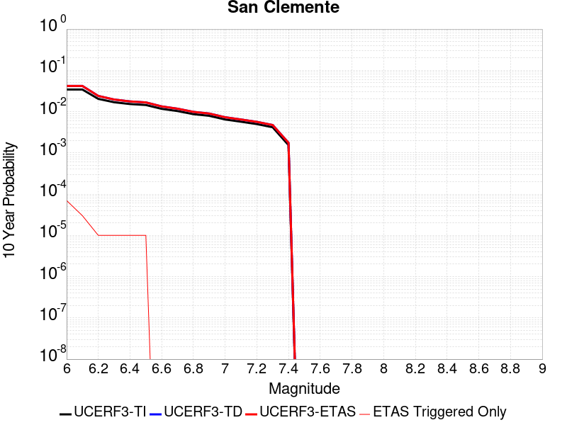 |

| Magnitude | 1 wk TI Prob | 1 wk TD Prob | 1 wk ETAS Prob | 1 wk ETAS/TD Gain | 1 wk ETAS Triggered Only | 1 mo TI Prob | 1 mo TD Prob | 1 mo ETAS Prob | 1 mo ETAS/TD Gain | 1 mo ETAS Triggered Only | 1 yr TI Prob | 1 yr TD Prob | 1 yr ETAS Prob | 1 yr ETAS/TD Gain | 1 yr ETAS Triggered Only | 10 yr TI Prob | 10 yr TD Prob | 10 yr ETAS Prob | 10 yr ETAS/TD Gain | 10 yr ETAS Triggered Only |
|-----|-----|-----|-----|-----|-----|-----|-----|-----|-----|-----|-----|-----|-----|-----|-----|-----|-----|-----|-----|-----|
| 6.0 | 6.681379E-5 | 8.163422E-5 | 9.163341E-5 | 1.1224877 | 1.0E-5 | 2.8631336E-4 | 3.498173E-4 | 3.6981032E-4 | 1.0571527 | 2.0E-5 | 0.003480294 | 0.0042512873 | 0.004301075 | 1.0117111 | 5.0E-5 | 0.03426291 | 0.041755714 | 0.04182279 | 1.0016065 | 7.0E-5 |
| 6.1 | 6.681379E-5 | 8.163422E-5 | 9.163341E-5 | 1.1224877 | 1.0E-5 | 2.8631336E-4 | 3.498173E-4 | 3.598138E-4 | 1.0285764 | 1.0E-5 | 0.003480294 | 0.0042512873 | 0.00428116 | 1.0070267 | 3.0E-5 | 0.03426291 | 0.041755714 | 0.04178446 | 1.0006884 | 3.0E-5 |
| 6.2 | 3.9400576E-5 | 4.6451984E-5 | 4.6451984E-5 | 1.0 | 0.0 | 1.6884868E-4 | 1.9906509E-4 | 1.9906509E-4 | 1.0 | 0.0 | 0.0020537945 | 0.002420985 | 0.0024309605 | 1.0041206 | 1.0E-5 | 0.020349167 | 0.02395286 | 0.02396262 | 1.0004075 | 1.0E-5 |
| 6.3 | 3.2590255E-5 | 3.7929087E-5 | 3.7929087E-5 | 1.0 | 0.0 | 1.3966505E-4 | 1.6254328E-4 | 1.6254328E-4 | 1.0 | 0.0 | 0.0016990956 | 0.0019771985 | 0.0019871786 | 1.0050477 | 1.0E-5 | 0.01686163 | 0.019599866 | 0.01960967 | 1.0005002 | 1.0E-5 |
| 6.4 | 2.9454652E-5 | 3.4097775E-5 | 3.4097775E-5 | 1.0 | 0.0 | 1.2622811E-4 | 1.4612528E-4 | 1.4612528E-4 | 1.0 | 0.0 | 0.0015357438 | 0.0017776482 | 0.0017876304 | 1.0056154 | 1.0E-5 | 0.015251739 | 0.017637458 | 0.017647281 | 1.000557 | 1.0E-5 |
| 6.5 | 2.790836E-5 | 3.2247463E-5 | 3.2247463E-5 | 1.0 | 0.0 | 1.1960178E-4 | 1.3819622E-4 | 1.3819622E-4 | 1.0 | 0.0 | 0.001455179 | 0.0016812651 | 0.0016912483 | 1.0059379 | 1.0E-5 | 0.014456868 | 0.016688475 | 0.016698308 | 1.0005893 | 1.0E-5 |
| 6.6 | 2.2492153E-5 | 2.5762707E-5 | 2.5762707E-5 | 1.0 | 0.0 | 9.639138E-5 | 1.1040701E-4 | 1.1040701E-4 | 1.0 | 0.0 | 0.0011729331 | 0.0013433908 | 0.0013433908 | 1.0 | 0.0 | 0.011667615 | 0.013354415 | 0.013354415 | 1.0 | 0.0 |
| 6.7 | 1.9862755E-5 | 2.2666423E-5 | 2.2666423E-5 | 1.0 | 0.0 | 8.512331E-5 | 9.713826E-5 | 9.713826E-5 | 1.0 | 0.0 | 0.0010358836 | 0.0011820279 | 0.0011820279 | 1.0 | 0.0 | 0.010310682 | 0.011758701 | 0.011758701 | 1.0 | 0.0 |
| 6.8 | 1.6697575E-5 | 1.897771E-5 | 1.897771E-5 | 1.0 | 0.0 | 7.155907E-5 | 8.133056E-5 | 8.133056E-5 | 1.0 | 0.0 | 8.7088346E-4 | 9.897591E-4 | 9.897591E-4 | 1.0 | 0.0 | 0.008674784 | 0.0098545365 | 0.0098545365 | 1.0 | 0.0 |
| 6.9 | 1.5218415E-5 | 1.72694E-5 | 1.72694E-5 | 1.0 | 0.0 | 6.522015E-5 | 7.4009666E-5 | 7.4009666E-5 | 1.0 | 0.0 | 7.93766E-4 | 9.00704E-4 | 9.00704E-4 | 1.0 | 0.0 | 0.007909367 | 0.008971481 | 0.008971481 | 1.0 | 0.0 |
| 7.0 | 1.2392958E-5 | 1.4033016E-5 | 1.4033016E-5 | 1.0 | 0.0 | 5.3111595E-5 | 6.014015E-5 | 6.014015E-5 | 1.0 | 0.0 | 6.4644177E-4 | 7.319679E-4 | 7.319679E-4 | 1.0 | 0.0 | 0.0064456454 | 0.0072963564 | 0.0072963564 | 1.0 | 0.0 |
| 7.1 | 1.0934128E-5 | 1.2375138E-5 | 1.2375138E-5 | 1.0 | 0.0 | 4.6859706E-5 | 5.303527E-5 | 5.303527E-5 | 1.0 | 0.0 | 5.7036756E-4 | 6.455204E-4 | 6.455204E-4 | 1.0 | 0.0 | 0.0056890585 | 0.0064371997 | 0.0064371997 | 1.0 | 0.0 |
| 7.2 | 9.5798805E-6 | 1.0844935E-5 | 1.0844935E-5 | 1.0 | 0.0 | 4.1055984E-5 | 4.6477508E-5 | 4.6477508E-5 | 1.0 | 0.0 | 4.9974193E-4 | 5.657239E-4 | 5.657239E-4 | 1.0 | 0.0 | 0.0049861963 | 0.0056435615 | 0.0056435615 | 1.0 | 0.0 |
| 7.3 | 8.0167365E-6 | 9.083918E-6 | 9.083918E-6 | 1.0 | 0.0 | 3.4356988E-5 | 3.8930535E-5 | 3.8930535E-5 | 1.0 | 0.0 | 4.1821605E-4 | 4.7388324E-4 | 4.7388324E-4 | 1.0 | 0.0 | 0.0041742986 | 0.0047294297 | 0.0047294297 | 1.0 | 0.0 |
| 7.4 | 2.9581017E-6 | 3.3623792E-6 | 3.3623792E-6 | 1.0 | 0.0 | 1.2677518E-5 | 1.4410146E-5 | 1.4410146E-5 | 1.0 | 0.0 | 1.5433785E-4 | 1.7543444E-4 | 1.7543444E-4 | 1.0 | 0.0 | 0.001542307 | 0.0017534546 | 0.0017534546 | 1.0 | 0.0 |

## Santa Ynez River
*[(top)](#table-of-contents)*

| 1 Week | 1 Month | 1 Year | 10 Year |
|-----|-----|-----|-----|
| 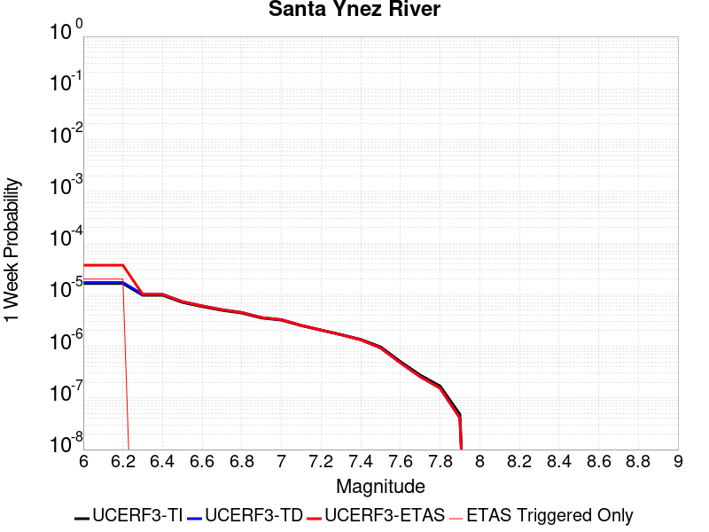 |  | 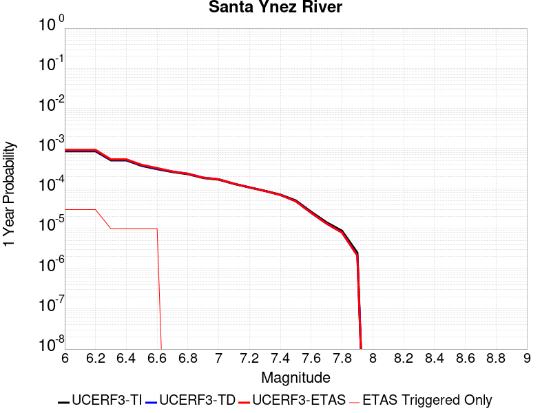 |  |

| Magnitude | 1 wk TI Prob | 1 wk TD Prob | 1 wk ETAS Prob | 1 wk ETAS/TD Gain | 1 wk ETAS Triggered Only | 1 mo TI Prob | 1 mo TD Prob | 1 mo ETAS Prob | 1 mo ETAS/TD Gain | 1 mo ETAS Triggered Only | 1 yr TI Prob | 1 yr TD Prob | 1 yr ETAS Prob | 1 yr ETAS/TD Gain | 1 yr ETAS Triggered Only | 10 yr TI Prob | 10 yr TD Prob | 10 yr ETAS Prob | 10 yr ETAS/TD Gain | 10 yr ETAS Triggered Only |
|-----|-----|-----|-----|-----|-----|-----|-----|-----|-----|-----|-----|-----|-----|-----|-----|-----|-----|-----|-----|-----|
| 6.0 | 1.6396456E-5 | 1.7209435E-5 | 3.720909E-5 | 2.1621332 | 2.0E-5 | 7.026863E-5 | 7.375284E-5 | 9.375136E-5 | 1.271156 | 2.0E-5 | 8.551848E-4 | 8.976064E-4 | 9.2757953E-4 | 1.0333922 | 3.0E-5 | 0.0085190125 | 0.008943358 | 0.0090028215 | 1.0066489 | 6.0E-5 |
| 6.1 | 1.6396456E-5 | 1.7209435E-5 | 3.720909E-5 | 2.1621332 | 2.0E-5 | 7.026863E-5 | 7.375284E-5 | 9.375136E-5 | 1.271156 | 2.0E-5 | 8.551848E-4 | 8.976064E-4 | 9.2757953E-4 | 1.0333922 | 3.0E-5 | 0.0085190125 | 0.008943358 | 0.0090028215 | 1.0066489 | 6.0E-5 |
| 6.2 | 1.6396456E-5 | 1.7209435E-5 | 3.720909E-5 | 2.1621332 | 2.0E-5 | 7.026863E-5 | 7.375284E-5 | 9.375136E-5 | 1.271156 | 2.0E-5 | 8.551848E-4 | 8.976064E-4 | 9.2757953E-4 | 1.0333922 | 3.0E-5 | 0.0085190125 | 0.008943358 | 0.0090028215 | 1.0066489 | 6.0E-5 |
| 6.3 | 9.736976E-6 | 1.012233E-5 | 1.012233E-5 | 1.0 | 0.0 | 4.172923E-5 | 4.338072E-5 | 4.338072E-5 | 1.0 | 0.0 | 5.0793495E-4 | 5.280373E-4 | 5.3803204E-4 | 1.018928 | 1.0E-5 | 0.005067755 | 0.005268332 | 0.005298174 | 1.0056643 | 3.0E-5 |
| 6.4 | 9.736976E-6 | 1.012233E-5 | 1.012233E-5 | 1.0 | 0.0 | 4.172923E-5 | 4.338072E-5 | 4.338072E-5 | 1.0 | 0.0 | 5.0793495E-4 | 5.280373E-4 | 5.3803204E-4 | 1.018928 | 1.0E-5 | 0.005067755 | 0.005268332 | 0.005298174 | 1.0056643 | 3.0E-5 |
| 6.5 | 7.081964E-6 | 7.3298966E-6 | 7.3298966E-6 | 1.0 | 0.0 | 3.035092E-5 | 3.1413474E-5 | 3.1413474E-5 | 1.0 | 0.0 | 3.694598E-4 | 3.8239348E-4 | 3.9238966E-4 | 1.026141 | 1.0E-5 | 0.0036884616 | 0.0038175168 | 0.0038474023 | 1.0078285 | 3.0E-5 |
| 6.6 | 5.873247E-6 | 6.059743E-6 | 6.059743E-6 | 1.0 | 0.0 | 2.5170815E-5 | 2.5970074E-5 | 2.5970074E-5 | 1.0 | 0.0 | 3.064116E-4 | 3.1614062E-4 | 3.2613747E-4 | 1.0316215 | 1.0E-5 | 0.0030598943 | 0.0031569963 | 0.0031869016 | 1.0094727 | 3.0E-5 |
| 6.7 | 4.973277E-6 | 5.115901E-6 | 5.115901E-6 | 1.0 | 0.0 | 2.1313872E-5 | 2.1925109E-5 | 2.1925109E-5 | 1.0 | 0.0 | 2.5946548E-4 | 2.66906E-4 | 2.66906E-4 | 1.0 | 0.0 | 0.0025916274 | 0.0026659032 | 0.0026858498 | 1.0074822 | 2.0E-5 |
| 6.8 | 4.396492E-6 | 4.5109778E-6 | 4.5109778E-6 | 1.0 | 0.0 | 1.884197E-5 | 1.9332621E-5 | 1.9332621E-5 | 1.0 | 0.0 | 2.2937685E-4 | 2.3534958E-4 | 2.3534958E-4 | 1.0 | 0.0 | 0.0022914023 | 0.0023510386 | 0.0023709917 | 1.0084869 | 2.0E-5 |
| 6.9 | 3.5255632E-6 | 3.6013332E-6 | 3.6013332E-6 | 1.0 | 0.0 | 1.5109469E-5 | 1.5434196E-5 | 1.5434196E-5 | 1.0 | 0.0 | 1.8394225E-4 | 1.8789528E-4 | 1.8789528E-4 | 1.0 | 0.0 | 0.0018379007 | 0.0018773803 | 0.0018873615 | 1.0053166 | 1.0E-5 |
| 7.0 | 3.211603E-6 | 3.273654E-6 | 3.273654E-6 | 1.0 | 0.0 | 1.376394E-5 | 1.4029872E-5 | 1.4029872E-5 | 1.0 | 0.0 | 1.6756308E-4 | 1.7080043E-4 | 1.7080043E-4 | 1.0 | 0.0 | 0.0016743679 | 0.0017067058 | 0.0017166887 | 1.0058492 | 1.0E-5 |
| 7.1 | 2.5094619E-6 | 2.5409204E-6 | 2.5409204E-6 | 1.0 | 0.0 | 1.0754793E-5 | 1.0889614E-5 | 1.0889614E-5 | 1.0 | 0.0 | 1.3093173E-4 | 1.3257304E-4 | 1.3257304E-4 | 1.0 | 0.0 | 0.0013085462 | 0.0013249456 | 0.0013249456 | 1.0 | 0.0 |
| 7.2 | 2.0515774E-6 | 2.0619375E-6 | 2.0619375E-6 | 1.0 | 0.0 | 8.792445E-6 | 8.836846E-6 | 8.836846E-6 | 1.0 | 0.0 | 1.0704277E-4 | 1.0758333E-4 | 1.0758333E-4 | 1.0 | 0.0 | 0.0010699122 | 0.0010753168 | 0.0010753168 | 1.0 | 0.0 |
| 7.3 | 1.6845745E-6 | 1.6773907E-6 | 1.6773907E-6 | 1.0 | 0.0 | 7.219585E-6 | 7.1887976E-6 | 7.1887976E-6 | 1.0 | 0.0 | 8.78949E-5 | 8.752012E-5 | 8.752012E-5 | 1.0 | 0.0 | 8.7860145E-4 | 8.7485946E-4 | 8.7485946E-4 | 1.0 | 0.0 |
| 7.4 | 1.3600285E-6 | 1.3333357E-6 | 1.3333357E-6 | 1.0 | 0.0 | 5.82868E-6 | 5.714284E-6 | 5.714284E-6 | 1.0 | 0.0 | 7.096187E-5 | 6.956921E-5 | 6.956921E-5 | 1.0 | 0.0 | 7.0939213E-4 | 6.954765E-4 | 6.954765E-4 | 1.0 | 0.0 |
| 7.5 | 9.735342E-7 | 9.290103E-7 | 9.290103E-7 | 1.0 | 0.0 | 4.172283E-6 | 3.9814668E-6 | 3.9814668E-6 | 1.0 | 0.0 | 5.079636E-5 | 4.8473295E-5 | 4.8473295E-5 | 1.0 | 0.0 | 5.0784746E-4 | 4.8462892E-4 | 4.8462892E-4 | 1.0 | 0.0 |
| 7.6 | 5.067187E-7 | 4.77857E-7 | 4.77857E-7 | 1.0 | 0.0 | 2.1716498E-6 | 2.047957E-6 | 2.047957E-6 | 1.0 | 0.0 | 2.6439517E-5 | 2.4933597E-5 | 2.4933597E-5 | 1.0 | 0.0 | 2.643637E-4 | 2.4930874E-4 | 2.4930874E-4 | 1.0 | 0.0 |
| 7.7 | 2.769089E-7 | 2.5759124E-7 | 2.5759124E-7 | 1.0 | 0.0 | 1.1867519E-6 | 1.1039621E-6 | 1.1039621E-6 | 1.0 | 0.0 | 1.4448608E-5 | 1.34406555E-5 | 1.34406555E-5 | 1.0 | 0.0 | 1.444767E-4 | 1.3439846E-4 | 1.3439846E-4 | 1.0 | 0.0 |
| 7.8 | 1.7044663E-7 | 1.5449015E-7 | 1.5449015E-7 | 1.0 | 0.0 | 7.3048534E-7 | 6.621005E-7 | 6.621005E-7 | 1.0 | 0.0 | 8.893623E-6 | 8.061043E-6 | 8.061043E-6 | 1.0 | 0.0 | 8.893267E-5 | 8.060753E-5 | 8.060753E-5 | 1.0 | 0.0 |
| 7.9 | 4.8344287E-8 | 4.0910923E-8 | 4.0910923E-8 | 1.0 | 0.0 | 2.0718979E-7 | 1.7533252E-7 | 1.7533252E-7 | 1.0 | 0.0 | 2.5225327E-6 | 2.1346711E-6 | 2.1346711E-6 | 1.0 | 0.0 | 2.5225041E-5 | 2.1346512E-5 | 2.1346512E-5 | 1.0 | 0.0 |

## San Cayetano
*[(top)](#table-of-contents)*

| 1 Week | 1 Month | 1 Year | 10 Year |
|-----|-----|-----|-----|
|  |  |  |  |

| Magnitude | 1 wk TI Prob | 1 wk TD Prob | 1 wk ETAS Prob | 1 wk ETAS/TD Gain | 1 wk ETAS Triggered Only | 1 mo TI Prob | 1 mo TD Prob | 1 mo ETAS Prob | 1 mo ETAS/TD Gain | 1 mo ETAS Triggered Only | 1 yr TI Prob | 1 yr TD Prob | 1 yr ETAS Prob | 1 yr ETAS/TD Gain | 1 yr ETAS Triggered Only | 10 yr TI Prob | 10 yr TD Prob | 10 yr ETAS Prob | 10 yr ETAS/TD Gain | 10 yr ETAS Triggered Only |
|-----|-----|-----|-----|-----|-----|-----|-----|-----|-----|-----|-----|-----|-----|-----|-----|-----|-----|-----|-----|-----|
| 6.0 | 2.3476267E-5 | 1.816928E-5 | 4.8168735E-5 | 2.6511087 | 3.0E-5 | 1.0060869E-4 | 7.786603E-5 | 1.078637E-4 | 1.3852471 | 3.0E-5 | 0.0012242225 | 9.476103E-4 | 9.875724E-4 | 1.0421715 | 4.0E-5 | 0.012175002 | 0.009436584 | 0.009505924 | 1.007348 | 7.0E-5 |
| 6.1 | 2.3476267E-5 | 1.816928E-5 | 4.8168735E-5 | 2.6511087 | 3.0E-5 | 1.0060869E-4 | 7.786603E-5 | 1.078637E-4 | 1.3852471 | 3.0E-5 | 0.0012242225 | 9.476103E-4 | 9.875724E-4 | 1.0421715 | 4.0E-5 | 0.012175002 | 0.009436584 | 0.009505924 | 1.007348 | 7.0E-5 |
| 6.2 | 2.3476267E-5 | 1.816928E-5 | 4.8168735E-5 | 2.6511087 | 3.0E-5 | 1.0060869E-4 | 7.786603E-5 | 1.078637E-4 | 1.3852471 | 3.0E-5 | 0.0012242225 | 9.476103E-4 | 9.875724E-4 | 1.0421715 | 4.0E-5 | 0.012175002 | 0.009436584 | 0.009505924 | 1.007348 | 7.0E-5 |
| 6.3 | 2.3476267E-5 | 1.816928E-5 | 4.8168735E-5 | 2.6511087 | 3.0E-5 | 1.0060869E-4 | 7.786603E-5 | 1.078637E-4 | 1.3852471 | 3.0E-5 | 0.0012242225 | 9.476103E-4 | 9.875724E-4 | 1.0421715 | 4.0E-5 | 0.012175002 | 0.009436584 | 0.009505924 | 1.007348 | 7.0E-5 |
| 6.4 | 2.3476267E-5 | 1.816928E-5 | 4.8168735E-5 | 2.6511087 | 3.0E-5 | 1.0060869E-4 | 7.786603E-5 | 1.078637E-4 | 1.3852471 | 3.0E-5 | 0.0012242225 | 9.476103E-4 | 9.875724E-4 | 1.0421715 | 4.0E-5 | 0.012175002 | 0.009436584 | 0.009505924 | 1.007348 | 7.0E-5 |
| 6.5 | 2.3476267E-5 | 1.816928E-5 | 4.8168735E-5 | 2.6511087 | 3.0E-5 | 1.0060869E-4 | 7.786603E-5 | 1.078637E-4 | 1.3852471 | 3.0E-5 | 0.0012242225 | 9.476103E-4 | 9.875724E-4 | 1.0421715 | 4.0E-5 | 0.012175002 | 0.009436584 | 0.009505924 | 1.007348 | 7.0E-5 |
| 6.6 | 2.3476267E-5 | 1.816928E-5 | 4.8168735E-5 | 2.6511087 | 3.0E-5 | 1.0060869E-4 | 7.786603E-5 | 1.078637E-4 | 1.3852471 | 3.0E-5 | 0.0012242225 | 9.476103E-4 | 9.875724E-4 | 1.0421715 | 4.0E-5 | 0.012175002 | 0.009436584 | 0.009505924 | 1.007348 | 7.0E-5 |
| 6.7 | 2.3476267E-5 | 1.816928E-5 | 4.8168735E-5 | 2.6511087 | 3.0E-5 | 1.0060869E-4 | 7.786603E-5 | 1.078637E-4 | 1.3852471 | 3.0E-5 | 0.0012242225 | 9.476103E-4 | 9.875724E-4 | 1.0421715 | 4.0E-5 | 0.012175002 | 0.009436584 | 0.009505924 | 1.007348 | 7.0E-5 |
| 6.8 | 2.3241924E-5 | 1.7936987E-5 | 4.793645E-5 | 2.6724918 | 3.0E-5 | 9.960445E-5 | 7.687056E-5 | 1.06868254E-4 | 1.3902365 | 3.0E-5 | 0.0012120095 | 9.3550084E-4 | 9.7546336E-4 | 1.0427178 | 4.0E-5 | 0.012054204 | 0.009316482 | 0.00938583 | 1.0074435 | 7.0E-5 |
| 6.9 | 2.2761007E-5 | 1.7432423E-5 | 4.7431902E-5 | 2.720901 | 3.0E-5 | 9.7543525E-5 | 7.470827E-5 | 1.0470602E-4 | 1.4015319 | 3.0E-5 | 0.0011869454 | 9.09197E-4 | 9.4916066E-4 | 1.0439548 | 4.0E-5 | 0.011806256 | 0.009055603 | 0.009124969 | 1.00766 | 7.0E-5 |
| 7.0 | 2.240283E-5 | 1.7066168E-5 | 4.7065656E-5 | 2.7578337 | 3.0E-5 | 9.600859E-5 | 7.313869E-5 | 1.03136495E-4 | 1.4101496 | 3.0E-5 | 0.0011682777 | 8.9010317E-4 | 9.300676E-4 | 1.0448986 | 4.0E-5 | 0.011621549 | 0.008866196 | 0.008935574 | 1.0078251 | 7.0E-5 |
| 7.1 | 2.1871154E-5 | 1.6586018E-5 | 2.6585853E-5 | 1.6029074 | 1.0E-5 | 9.373015E-5 | 7.108101E-5 | 8.10803E-5 | 1.1406746 | 1.0E-5 | 0.0011405671 | 8.6507114E-4 | 8.850538E-4 | 1.0230995 | 2.0E-5 | 0.011347309 | 0.008617838 | 0.008667408 | 1.005752 | 5.0E-5 |
| 7.2 | 2.0714133E-5 | 1.5564561E-5 | 2.5564404E-5 | 1.6424752 | 1.0E-5 | 8.8771834E-5 | 6.670357E-5 | 7.6702905E-5 | 1.149907 | 1.0E-5 | 0.0010802611 | 8.1181666E-4 | 8.3180045E-4 | 1.0246161 | 2.0E-5 | 0.010750249 | 0.008089285 | 0.008138881 | 1.006131 | 5.0E-5 |
| 7.3 | 1.8408395E-5 | 1.3996864E-5 | 2.3996725E-5 | 1.7144357 | 1.0E-5 | 7.8890735E-5 | 5.99852E-5 | 6.99846E-5 | 1.1666977 | 1.0E-5 | 9.600714E-4 | 7.300781E-4 | 7.500635E-4 | 1.0273744 | 2.0E-5 | 0.009559342 | 0.0072775153 | 0.0073271515 | 1.0068204 | 5.0E-5 |
| 7.4 | 1.6856795E-5 | 1.28500815E-5 | 2.2849952E-5 | 1.7781953 | 1.0E-5 | 7.2241404E-5 | 5.5070628E-5 | 6.507008E-5 | 1.181575 | 1.0E-5 | 8.7918417E-4 | 6.7028153E-4 | 6.902681E-4 | 1.0298182 | 2.0E-5 | 0.00875714 | 0.0066832784 | 0.0067329444 | 1.0074314 | 5.0E-5 |
| 7.5 | 1.2822778E-5 | 9.577542E-6 | 1.9577446E-5 | 2.0440993 | 1.0E-5 | 5.495361E-5 | 4.1045972E-5 | 5.104556E-5 | 1.2436193 | 1.0E-5 | 6.688548E-4 | 4.996217E-4 | 5.196117E-4 | 1.0400103 | 2.0E-5 | 0.006668452 | 0.0049851555 | 0.005024956 | 1.0079838 | 4.0E-5 |
| 7.6 | 5.6272684E-6 | 3.854903E-6 | 1.3854865E-5 | 3.594089 | 1.0E-5 | 2.4116642E-5 | 1.652091E-5 | 2.6520744E-5 | 1.6052836 | 1.0E-5 | 2.9358055E-4 | 2.0112359E-4 | 2.2111958E-4 | 1.0994214 | 2.0E-5 | 0.0029319301 | 0.0020094267 | 0.0020393664 | 1.0148996 | 3.0E-5 |
| 7.7 | 3.5261346E-6 | 2.3407013E-6 | 1.2340678E-5 | 5.272214 | 1.0E-5 | 1.5111918E-5 | 1.0031539E-5 | 2.0031439E-5 | 1.9968461 | 1.0E-5 | 1.8397206E-4 | 1.2212721E-4 | 1.4212477E-4 | 1.1637436 | 2.0E-5 | 0.0018381984 | 0.0012206084 | 0.001240584 | 1.0163653 | 2.0E-5 |
| 7.8 | 1.4826929E-6 | 1.056428E-6 | 1.056428E-6 | 1.0 | 0.0 | 6.354383E-6 | 4.5275406E-6 | 4.5275406E-6 | 1.0 | 0.0 | 7.736187E-5 | 5.5121433E-5 | 5.5121433E-5 | 1.0 | 0.0 | 7.733494E-4 | 5.5107963E-4 | 5.5107963E-4 | 1.0 | 0.0 |
| 7.9 | 2.7568166E-7 | 1.6978244E-7 | 1.6978244E-7 | 1.0 | 0.0 | 1.1814923E-6 | 7.2763885E-7 | 7.2763885E-7 | 1.0 | 0.0 | 1.4384574E-5 | 8.858967E-6 | 8.858967E-6 | 1.0 | 0.0 | 1.4383643E-4 | 8.8586174E-5 | 8.8586174E-5 | 1.0 | 0.0 |
| 8.0 | 5.407832E-8 | 2.6887697E-8 | 2.6887697E-8 | 1.0 | 0.0 | 2.3176422E-7 | 1.15232986E-7 | 1.15232986E-7 | 1.0 | 0.0 | 2.8217257E-6 | 1.4029607E-6 | 1.4029607E-6 | 1.0 | 0.0 | 2.8216898E-5 | 1.4029522E-5 | 1.4029522E-5 | 1.0 | 0.0 |

## Ortigalita (North)
*[(top)](#table-of-contents)*

| 1 Week | 1 Month | 1 Year | 10 Year |
|-----|-----|-----|-----|
|  |  |  | 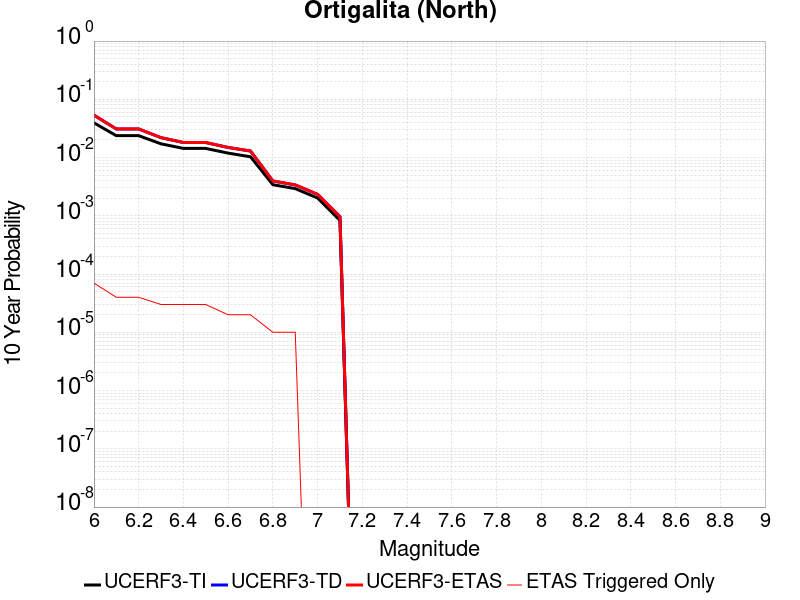 |

| Magnitude | 1 wk TI Prob | 1 wk TD Prob | 1 wk ETAS Prob | 1 wk ETAS/TD Gain | 1 wk ETAS Triggered Only | 1 mo TI Prob | 1 mo TD Prob | 1 mo ETAS Prob | 1 mo ETAS/TD Gain | 1 mo ETAS Triggered Only | 1 yr TI Prob | 1 yr TD Prob | 1 yr ETAS Prob | 1 yr ETAS/TD Gain | 1 yr ETAS Triggered Only | 10 yr TI Prob | 10 yr TD Prob | 10 yr ETAS Prob | 10 yr ETAS/TD Gain | 10 yr ETAS Triggered Only |
|-----|-----|-----|-----|-----|-----|-----|-----|-----|-----|-----|-----|-----|-----|-----|-----|-----|-----|-----|-----|-----|
| 6.0 | 7.711876E-5 | 1.05064966E-4 | 1.2506287E-4 | 1.1903384 | 2.0E-5 | 3.3046713E-4 | 4.502116E-4 | 4.801981E-4 | 1.0666053 | 3.0E-5 | 0.004016016 | 0.0054681194 | 0.005517846 | 1.0090939 | 5.0E-5 | 0.039442103 | 0.053454787 | 0.053521045 | 1.0012395 | 7.0E-5 |
| 6.1 | 4.607858E-5 | 6.0239203E-5 | 8.0237995E-5 | 1.3319898 | 2.0E-5 | 1.9746469E-4 | 2.5814527E-4 | 2.781401E-4 | 1.0774558 | 2.0E-5 | 0.0024014818 | 0.0031387596 | 0.003158697 | 1.006352 | 2.0E-5 | 0.023756953 | 0.030975068 | 0.03101383 | 1.0012513 | 4.0E-5 |
| 6.2 | 4.607858E-5 | 6.0239203E-5 | 8.0237995E-5 | 1.3319898 | 2.0E-5 | 1.9746469E-4 | 2.5814527E-4 | 2.781401E-4 | 1.0774558 | 2.0E-5 | 0.0024014818 | 0.0031387596 | 0.003158697 | 1.006352 | 2.0E-5 | 0.023756953 | 0.030975068 | 0.03101383 | 1.0012513 | 4.0E-5 |
| 6.3 | 3.327423E-5 | 4.2475127E-5 | 5.2474705E-5 | 1.2354219 | 1.0E-5 | 1.4259605E-4 | 1.8202531E-4 | 1.920235E-4 | 1.0549275 | 1.0E-5 | 0.0017347244 | 0.002214197 | 0.002224175 | 1.0045063 | 1.0E-5 | 0.017212452 | 0.021945644 | 0.021974986 | 1.001337 | 3.0E-5 |
| 6.4 | 2.7732503E-5 | 3.4998593E-5 | 4.4998244E-5 | 1.2857158 | 1.0E-5 | 1.1884817E-4 | 1.4998685E-4 | 1.5998536E-4 | 1.0666625 | 1.0E-5 | 0.001446016 | 0.0018248095 | 0.0018347913 | 1.00547 | 1.0E-5 | 0.014366428 | 0.018121224 | 0.01815068 | 1.0016255 | 3.0E-5 |
| 6.5 | 2.7689714E-5 | 3.4948407E-5 | 4.4948058E-5 | 1.286126 | 1.0E-5 | 1.186648E-4 | 1.497718E-4 | 1.597703E-4 | 1.0667583 | 1.0E-5 | 0.0014437864 | 0.0018221956 | 0.0018321774 | 1.0054779 | 1.0E-5 | 0.014344421 | 0.01809551 | 0.018124968 | 1.0016279 | 3.0E-5 |
| 6.6 | 2.2976905E-5 | 2.8718265E-5 | 3.871798E-5 | 1.3482004 | 1.0E-5 | 9.846873E-5 | 1.230739E-4 | 1.3307267E-4 | 1.081242 | 1.0E-5 | 0.0011981975 | 0.0014976363 | 0.0015076214 | 1.0066671 | 1.0E-5 | 0.011917574 | 0.014898697 | 0.014918399 | 1.0013224 | 2.0E-5 |
| 6.7 | 1.9871539E-5 | 2.4904411E-5 | 3.4904162E-5 | 1.4015253 | 1.0E-5 | 8.516096E-5 | 1.0673023E-4 | 1.1672916E-4 | 1.0936842 | 1.0E-5 | 0.0010363415 | 0.0012989145 | 0.0013089016 | 1.0076888 | 1.0E-5 | 0.010315218 | 0.012936919 | 0.01295666 | 1.001526 | 2.0E-5 |
| 6.8 | 6.5640475E-6 | 7.6054926E-6 | 1.7605416E-5 | 2.3148293 | 1.0E-5 | 2.813133E-5 | 3.2594577E-5 | 4.259425E-5 | 1.3067895 | 1.0E-5 | 3.424451E-4 | 3.9676955E-4 | 4.0676558E-4 | 1.0251936 | 1.0E-5 | 0.0034191788 | 0.003960899 | 0.003970859 | 1.0025147 | 1.0E-5 |
| 6.9 | 5.6219683E-6 | 6.5018376E-6 | 1.6501772E-5 | 2.5380168 | 1.0E-5 | 2.4093928E-5 | 2.7864735E-5 | 3.7864458E-5 | 1.3588666 | 1.0E-5 | 2.933041E-4 | 3.3920293E-4 | 3.4919954E-4 | 1.0294709 | 1.0E-5 | 0.0029291727 | 0.003387109 | 0.003397075 | 1.0029423 | 1.0E-5 |
| 7.0 | 3.875591E-6 | 4.4847548E-6 | 4.4847548E-6 | 1.0 | 0.0 | 1.6609569E-5 | 1.9220248E-5 | 1.9220248E-5 | 1.0 | 0.0 | 2.0220275E-4 | 2.339835E-4 | 2.339835E-4 | 1.0 | 0.0 | 0.0020201886 | 0.0023375798 | 0.0023375798 | 1.0 | 0.0 |
| 7.1 | 1.6017933E-6 | 1.8570418E-6 | 1.8570418E-6 | 1.0 | 0.0 | 6.8648105E-6 | 7.958732E-6 | 7.958732E-6 | 1.0 | 0.0 | 8.357586E-5 | 9.689432E-5 | 9.689432E-5 | 1.0 | 0.0 | 8.3544437E-4 | 9.686254E-4 | 9.686254E-4 | 1.0 | 0.0 |

## White Mountains
*[(top)](#table-of-contents)*

| 1 Week | 1 Month | 1 Year | 10 Year |
|-----|-----|-----|-----|
| 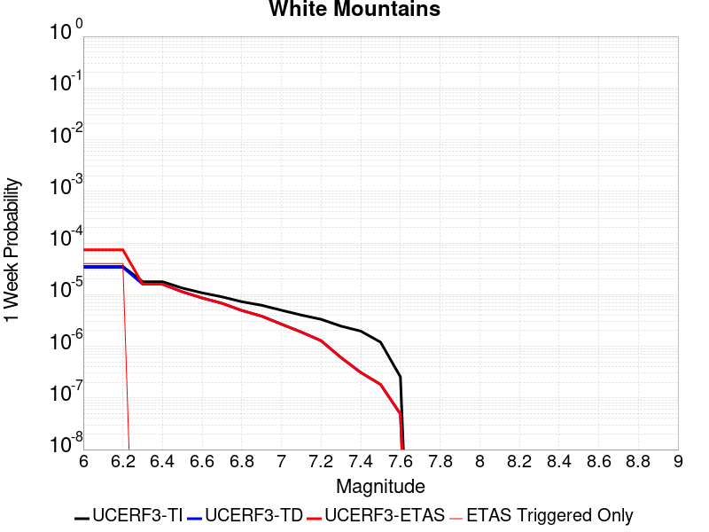 |  |  |  |

| Magnitude | 1 wk TI Prob | 1 wk TD Prob | 1 wk ETAS Prob | 1 wk ETAS/TD Gain | 1 wk ETAS Triggered Only | 1 mo TI Prob | 1 mo TD Prob | 1 mo ETAS Prob | 1 mo ETAS/TD Gain | 1 mo ETAS Triggered Only | 1 yr TI Prob | 1 yr TD Prob | 1 yr ETAS Prob | 1 yr ETAS/TD Gain | 1 yr ETAS Triggered Only | 10 yr TI Prob | 10 yr TD Prob | 10 yr ETAS Prob | 10 yr ETAS/TD Gain | 10 yr ETAS Triggered Only |
|-----|-----|-----|-----|-----|-----|-----|-----|-----|-----|-----|-----|-----|-----|-----|-----|-----|-----|-----|-----|-----|
| 6.0 | 3.503579E-5 | 3.378405E-5 | 7.37827E-5 | 2.1839507 | 4.0E-5 | 1.5014476E-4 | 1.4478143E-4 | 1.8477565E-4 | 1.2762386 | 4.0E-5 | 0.0018264796 | 0.0017614096 | 0.0018113215 | 1.0283364 | 5.0E-5 | 0.018115403 | 0.017486818 | 0.017555594 | 1.0039331 | 7.0E-5 |
| 6.1 | 3.503579E-5 | 3.378405E-5 | 7.37827E-5 | 2.1839507 | 4.0E-5 | 1.5014476E-4 | 1.4478143E-4 | 1.8477565E-4 | 1.2762386 | 4.0E-5 | 0.0018264796 | 0.0017614096 | 0.0018113215 | 1.0283364 | 5.0E-5 | 0.018115403 | 0.017486818 | 0.017555594 | 1.0039331 | 7.0E-5 |
| 6.2 | 3.503579E-5 | 3.378405E-5 | 7.37827E-5 | 2.1839507 | 4.0E-5 | 1.5014476E-4 | 1.4478143E-4 | 1.8477565E-4 | 1.2762386 | 4.0E-5 | 0.0018264796 | 0.0017614096 | 0.0018113215 | 1.0283364 | 5.0E-5 | 0.018115403 | 0.017486818 | 0.017555594 | 1.0039331 | 7.0E-5 |
| 6.3 | 1.7818425E-5 | 1.5916074E-5 | 1.5916074E-5 | 1.0 | 0.0 | 7.636245E-5 | 6.821004E-5 | 6.821004E-5 | 1.0 | 0.0 | 9.293162E-4 | 8.301551E-4 | 8.401468E-4 | 1.012036 | 1.0E-5 | 0.009254395 | 0.008271999 | 0.008291833 | 1.0023978 | 2.0E-5 |
| 6.4 | 1.7818425E-5 | 1.5916074E-5 | 1.5916074E-5 | 1.0 | 0.0 | 7.636245E-5 | 6.821004E-5 | 6.821004E-5 | 1.0 | 0.0 | 9.293162E-4 | 8.301551E-4 | 8.401468E-4 | 1.012036 | 1.0E-5 | 0.009254395 | 0.008271999 | 0.008291833 | 1.0023978 | 2.0E-5 |
| 6.5 | 1.3397557E-5 | 1.13362685E-5 | 1.13362685E-5 | 1.0 | 0.0 | 5.741684E-5 | 4.858314E-5 | 4.858314E-5 | 1.0 | 0.0 | 6.988258E-4 | 5.913462E-4 | 6.0134026E-4 | 1.0169005 | 1.0E-5 | 0.006966323 | 0.005898432 | 0.0059183137 | 1.0033708 | 2.0E-5 |
| 6.6 | 1.0818695E-5 | 8.625366E-6 | 8.625366E-6 | 1.0 | 0.0 | 4.6365014E-5 | 3.6965357E-5 | 3.6965357E-5 | 1.0 | 0.0 | 5.6434784E-4 | 4.4996463E-4 | 4.599601E-4 | 1.0222139 | 1.0E-5 | 0.005629168 | 0.004490972 | 0.0045108823 | 1.0044334 | 2.0E-5 |
| 6.7 | 9.067908E-6 | 6.802442E-6 | 6.802442E-6 | 1.0 | 0.0 | 3.8861883E-5 | 2.9153016E-5 | 2.9153016E-5 | 1.0 | 0.0 | 4.7304068E-4 | 3.5488335E-4 | 3.5488335E-4 | 1.0 | 0.0 | 0.00472035 | 0.0035434833 | 0.003553448 | 1.002812 | 1.0E-5 |
| 6.8 | 7.295947E-6 | 4.936391E-6 | 4.936391E-6 | 1.0 | 0.0 | 3.126797E-5 | 2.1155796E-5 | 2.1155796E-5 | 1.0 | 0.0 | 3.8062103E-4 | 2.575425E-4 | 2.575425E-4 | 1.0 | 0.0 | 0.0037996976 | 0.0025725532 | 0.0025825277 | 1.0038772 | 1.0E-5 |
| 6.9 | 6.2243444E-6 | 3.832213E-6 | 3.832213E-6 | 1.0 | 0.0 | 2.6675489E-5 | 1.642367E-5 | 1.642367E-5 | 1.0 | 0.0 | 3.2472567E-4 | 1.9994036E-4 | 1.9994036E-4 | 1.0 | 0.0 | 0.0032425157 | 0.0019976576 | 0.0020076376 | 1.0049958 | 1.0E-5 |
| 7.0 | 4.9878413E-6 | 2.6795342E-6 | 2.6795342E-6 | 1.0 | 0.0 | 2.1376287E-5 | 1.14836685E-5 | 1.14836685E-5 | 1.0 | 0.0 | 2.602252E-4 | 1.3980496E-4 | 1.3980496E-4 | 1.0 | 0.0 | 0.002599207 | 0.0013971963 | 0.0014071823 | 1.0071472 | 1.0E-5 |
| 7.1 | 4.0252844E-6 | 1.8857575E-6 | 1.8857575E-6 | 1.0 | 0.0 | 1.7251105E-5 | 8.081794E-6 | 8.081794E-6 | 1.0 | 0.0 | 2.1001195E-4 | 9.8391516E-5 | 9.8391516E-5 | 1.0 | 0.0 | 0.0020981359 | 9.834924E-4 | 9.934825E-4 | 1.0101578 | 1.0E-5 |
| 7.2 | 3.3284066E-6 | 1.281964E-6 | 1.281964E-6 | 1.0 | 0.0 | 1.4264522E-5 | 5.494121E-6 | 5.494121E-6 | 1.0 | 0.0 | 1.736567E-4 | 6.688897E-5 | 6.688897E-5 | 1.0 | 0.0 | 0.0017352107 | 6.6869846E-4 | 6.6869846E-4 | 1.0 | 0.0 |
| 7.3 | 2.458226E-6 | 6.05722E-7 | 6.05722E-7 | 1.0 | 0.0 | 1.0535211E-5 | 2.5959491E-6 | 2.5959491E-6 | 1.0 | 0.0 | 1.2825865E-4 | 3.1605257E-5 | 3.1605257E-5 | 1.0 | 0.0 | 0.0012818464 | 3.160114E-4 | 3.160114E-4 | 1.0 | 0.0 |
| 7.4 | 1.965953E-6 | 3.1089303E-7 | 3.1089303E-7 | 1.0 | 0.0 | 8.425486E-6 | 1.332398E-6 | 1.332398E-6 | 1.0 | 0.0 | 1.0257547E-4 | 1.6221828E-5 | 1.6221828E-5 | 1.0 | 0.0 | 0.0010252813 | 1.6220656E-4 | 1.6220656E-4 | 1.0 | 0.0 |
| 7.5 | 1.2014192E-6 | 1.8244253E-7 | 1.8244253E-7 | 1.0 | 0.0 | 5.148929E-6 | 7.8189635E-7 | 7.8189635E-7 | 1.0 | 0.0 | 6.2686406E-5 | 9.519547E-6 | 9.519547E-6 | 1.0 | 0.0 | 6.266873E-4 | 9.519148E-5 | 9.519148E-5 | 1.0 | 0.0 |
| 7.6 | 2.5612175E-7 | 4.8946475E-8 | 4.8946475E-8 | 1.0 | 0.0 | 1.0976642E-6 | 2.0977059E-7 | 2.0977059E-7 | 1.0 | 0.0 | 1.3363979E-5 | 2.5539543E-6 | 2.5539543E-6 | 1.0 | 0.0 | 1.3363175E-4 | 2.5539286E-5 | 2.5539286E-5 | 1.0 | 0.0 |

## Hosgri
*[(top)](#table-of-contents)*

| 1 Week | 1 Month | 1 Year | 10 Year |
|-----|-----|-----|-----|
|  | 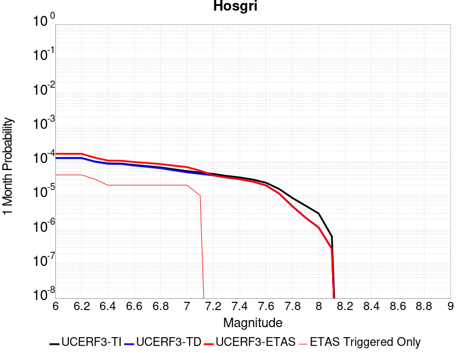 |  |  |

| Magnitude | 1 wk TI Prob | 1 wk TD Prob | 1 wk ETAS Prob | 1 wk ETAS/TD Gain | 1 wk ETAS Triggered Only | 1 mo TI Prob | 1 mo TD Prob | 1 mo ETAS Prob | 1 mo ETAS/TD Gain | 1 mo ETAS Triggered Only | 1 yr TI Prob | 1 yr TD Prob | 1 yr ETAS Prob | 1 yr ETAS/TD Gain | 1 yr ETAS Triggered Only | 10 yr TI Prob | 10 yr TD Prob | 10 yr ETAS Prob | 10 yr ETAS/TD Gain | 10 yr ETAS Triggered Only |
|-----|-----|-----|-----|-----|-----|-----|-----|-----|-----|-----|-----|-----|-----|-----|-----|-----|-----|-----|-----|-----|
| 6.0 | 2.883978E-5 | 2.9128416E-5 | 5.9127542E-5 | 2.0298922 | 3.0E-5 | 1.235932E-4 | 1.2483024E-4 | 1.6482525E-4 | 1.3203951 | 4.0E-5 | 0.0015037085 | 0.001518776 | 0.0015786848 | 1.0394455 | 6.0E-5 | 0.01493574 | 0.01508774 | 0.0151566835 | 1.0045695 | 7.0E-5 |
| 6.1 | 2.883978E-5 | 2.9128416E-5 | 5.9127542E-5 | 2.0298922 | 3.0E-5 | 1.235932E-4 | 1.2483024E-4 | 1.6482525E-4 | 1.3203951 | 4.0E-5 | 0.0015037085 | 0.001518776 | 0.0015786848 | 1.0394455 | 6.0E-5 | 0.01493574 | 0.01508774 | 0.0151566835 | 1.0045695 | 7.0E-5 |
| 6.2 | 2.883978E-5 | 2.9128416E-5 | 5.9127542E-5 | 2.0298922 | 3.0E-5 | 1.235932E-4 | 1.2483024E-4 | 1.6482525E-4 | 1.3203951 | 4.0E-5 | 0.0015037085 | 0.001518776 | 0.0015786848 | 1.0394455 | 6.0E-5 | 0.01493574 | 0.01508774 | 0.0151566835 | 1.0045695 | 7.0E-5 |
| 6.3 | 2.2914428E-5 | 2.2641969E-5 | 5.264129E-5 | 2.324943 | 3.0E-5 | 9.8200995E-5 | 9.703343E-5 | 1.2703052E-4 | 1.3091418 | 3.0E-5 | 0.0011949413 | 0.0011807467 | 0.0012306876 | 1.042296 | 5.0E-5 | 0.011885363 | 0.011746133 | 0.011805428 | 1.005048 | 6.0E-5 |
| 6.4 | 2.0195741E-5 | 1.969656E-5 | 3.9696166E-5 | 2.0153856 | 2.0E-5 | 8.65503E-5 | 8.4411105E-5 | 1.0440942E-4 | 1.2369156 | 2.0E-5 | 0.0010532405 | 0.0010272227 | 0.0010671816 | 1.0388999 | 4.0E-5 | 0.010482626 | 0.010225792 | 0.010265384 | 1.0038717 | 4.0E-5 |
| 6.5 | 1.9924333E-5 | 1.940898E-5 | 3.9408595E-5 | 2.0304308 | 2.0E-5 | 8.53872E-5 | 8.3178704E-5 | 1.03177044E-4 | 1.2404262 | 2.0E-5 | 0.0010390934 | 0.0010122322 | 0.0010521917 | 1.0394766 | 4.0E-5 | 0.010342481 | 0.010077253 | 0.01011685 | 1.0039294 | 4.0E-5 |
| 6.6 | 1.809694E-5 | 1.74583E-5 | 3.745795E-5 | 2.145567 | 2.0E-5 | 7.7556004E-5 | 7.4819145E-5 | 9.481765E-5 | 1.2672913 | 2.0E-5 | 9.438353E-4 | 9.105437E-4 | 9.5050735E-4 | 1.0438898 | 4.0E-5 | 0.009398366 | 0.009069073 | 0.00910871 | 1.0043706 | 4.0E-5 |
| 6.7 | 1.675989E-5 | 1.6042764E-5 | 3.6042446E-5 | 2.2466478 | 2.0E-5 | 7.182612E-5 | 6.87529E-5 | 8.875153E-5 | 1.2908769 | 2.0E-5 | 8.7413215E-4 | 8.3674624E-4 | 8.6672115E-4 | 1.0358231 | 3.0E-5 | 0.008707017 | 0.0083368635 | 0.008366613 | 1.0035685 | 3.0E-5 |
| 6.8 | 1.5401129E-5 | 1.4614083E-5 | 3.461379E-5 | 2.368523 | 2.0E-5 | 6.6003166E-5 | 6.2630286E-5 | 8.262903E-5 | 1.3193144 | 2.0E-5 | 8.032922E-4 | 7.622578E-4 | 7.922349E-4 | 1.0393268 | 3.0E-5 | 0.008003947 | 0.007597296 | 0.0076270686 | 1.0039188 | 3.0E-5 |
| 6.9 | 1.356559E-5 | 1.2689968E-5 | 3.2689713E-5 | 2.576028 | 2.0E-5 | 5.8136946E-5 | 5.4384444E-5 | 7.438336E-5 | 1.3677322 | 2.0E-5 | 7.0758746E-4 | 6.619299E-4 | 6.9191004E-4 | 1.045292 | 3.0E-5 | 0.007053386 | 0.006600388 | 0.0066301897 | 1.0045152 | 3.0E-5 |
| 7.0 | 1.2030819E-5 | 1.1095962E-5 | 3.109574E-5 | 2.8024375 | 2.0E-5 | 5.155963E-5 | 4.7553254E-5 | 6.7552304E-5 | 1.4205611 | 2.0E-5 | 6.275577E-4 | 5.7880714E-4 | 6.087898E-4 | 1.0518007 | 3.0E-5 | 0.006257884 | 0.005773757 | 0.0058035837 | 1.0051659 | 3.0E-5 |
| 7.1 | 1.0972698E-5 | 1.0022179E-5 | 2.0022078E-5 | 1.997777 | 1.0E-5 | 4.7025E-5 | 4.2951488E-5 | 5.2951058E-5 | 1.2328109 | 1.0E-5 | 5.72379E-4 | 5.22809E-4 | 5.427985E-4 | 1.038235 | 2.0E-5 | 0.0057090693 | 0.005216542 | 0.005236438 | 1.003814 | 2.0E-5 |
| 7.2 | 9.961926E-6 | 9.034746E-6 | 9.034746E-6 | 1.0 | 0.0 | 4.2693267E-5 | 3.8719765E-5 | 3.8719765E-5 | 1.0 | 0.0 | 5.1966653E-4 | 4.713112E-4 | 4.813065E-4 | 1.0212075 | 1.0E-5 | 0.00518453 | 0.0047038626 | 0.0047138156 | 1.002116 | 1.0E-5 |
| 7.3 | 8.700929E-6 | 7.8281E-6 | 7.8281E-6 | 1.0 | 0.0 | 3.7289166E-5 | 3.354857E-5 | 3.354857E-5 | 1.0 | 0.0 | 4.53901E-4 | 4.0837732E-4 | 4.0837732E-4 | 1.0 | 0.0 | 0.00452975 | 0.004077008 | 0.004077008 | 1.0 | 0.0 |
| 7.4 | 7.866285E-6 | 6.998739E-6 | 6.998739E-6 | 1.0 | 0.0 | 3.3712215E-5 | 2.9994251E-5 | 2.9994251E-5 | 1.0 | 0.0 | 4.103689E-4 | 3.6511885E-4 | 3.6511885E-4 | 1.0 | 0.0 | 0.004096119 | 0.0036459267 | 0.0036459267 | 1.0 | 0.0 |
| 7.5 | 6.8381305E-6 | 5.9596955E-6 | 5.9596955E-6 | 1.0 | 0.0 | 2.9305946E-5 | 2.5541302E-5 | 2.5541302E-5 | 1.0 | 0.0 | 3.5674145E-4 | 3.10921E-4 | 3.10921E-4 | 1.0 | 0.0 | 0.0035616932 | 0.0031055948 | 0.0031055948 | 1.0 | 0.0 |
| 7.6 | 5.503376E-6 | 4.5952443E-6 | 4.5952443E-6 | 1.0 | 0.0 | 2.3585684E-5 | 1.9693754E-5 | 1.9693754E-5 | 1.0 | 0.0 | 2.8711787E-4 | 2.397451E-4 | 2.397451E-4 | 1.0 | 0.0 | 0.002867472 | 0.0023955975 | 0.0023955975 | 1.0 | 0.0 |
| 7.7 | 3.6144982E-6 | 2.6522112E-6 | 2.6522112E-6 | 1.0 | 0.0 | 1.5490614E-5 | 1.1366569E-5 | 1.1366569E-5 | 1.0 | 0.0 | 1.8858191E-4 | 1.383792E-4 | 1.383792E-4 | 1.0 | 0.0 | 0.0018842196 | 0.0013836613 | 0.0013836613 | 1.0 | 0.0 |
| 7.8 | 1.9853494E-6 | 1.1361129E-6 | 1.1361129E-6 | 1.0 | 0.0 | 8.508612E-6 | 4.8690463E-6 | 4.8690463E-6 | 1.0 | 0.0 | 1.0358743E-4 | 5.9279027E-5 | 5.9279027E-5 | 1.0 | 0.0 | 0.0010353916 | 5.9336185E-4 | 5.9336185E-4 | 1.0 | 0.0 |
| 7.9 | 1.1818757E-6 | 5.2951856E-7 | 5.2951856E-7 | 1.0 | 0.0 | 5.0651715E-6 | 2.2693632E-6 | 2.2693632E-6 | 1.0 | 0.0 | 6.1666724E-5 | 2.7629147E-5 | 2.7629147E-5 | 1.0 | 0.0 | 6.1649614E-4 | 2.7694515E-4 | 2.7694515E-4 | 1.0 | 0.0 |
| 8.0 | 6.962958E-7 | 2.7139782E-7 | 2.7139782E-7 | 1.0 | 0.0 | 2.9841215E-6 | 1.163133E-6 | 1.163133E-6 | 1.0 | 0.0 | 3.6331072E-5 | 1.4161053E-5 | 1.4161053E-5 | 1.0 | 0.0 | 3.6325134E-4 | 1.4217179E-4 | 1.4217179E-4 | 1.0 | 0.0 |
| 8.1 | 1.5033264E-7 | 6.527624E-8 | 6.527624E-8 | 1.0 | 0.0 | 6.442826E-7 | 2.7975528E-7 | 2.7975528E-7 | 1.0 | 0.0 | 7.844113E-6 | 3.4060151E-6 | 3.4060151E-6 | 1.0 | 0.0 | 7.843835E-5 | 3.407693E-5 | 3.407693E-5 | 1.0 | 0.0 |

## Palos Verdes
*[(top)](#table-of-contents)*

| 1 Week | 1 Month | 1 Year | 10 Year |
|-----|-----|-----|-----|
|  |  |  |  |

| Magnitude | 1 wk TI Prob | 1 wk TD Prob | 1 wk ETAS Prob | 1 wk ETAS/TD Gain | 1 wk ETAS Triggered Only | 1 mo TI Prob | 1 mo TD Prob | 1 mo ETAS Prob | 1 mo ETAS/TD Gain | 1 mo ETAS Triggered Only | 1 yr TI Prob | 1 yr TD Prob | 1 yr ETAS Prob | 1 yr ETAS/TD Gain | 1 yr ETAS Triggered Only | 10 yr TI Prob | 10 yr TD Prob | 10 yr ETAS Prob | 10 yr ETAS/TD Gain | 10 yr ETAS Triggered Only |
|-----|-----|-----|-----|-----|-----|-----|-----|-----|-----|-----|-----|-----|-----|-----|-----|-----|-----|-----|-----|-----|
| 6.0 | 6.126063E-5 | 7.622612E-5 | 9.62246E-5 | 1.2623572 | 2.0E-5 | 2.6251914E-4 | 3.2664582E-4 | 3.56636E-4 | 1.0918126 | 3.0E-5 | 0.0031914865 | 0.003970174 | 0.004010015 | 1.0100352 | 4.0E-5 | 0.031460393 | 0.039048895 | 0.039116163 | 1.0017226 | 7.0E-5 |
| 6.1 | 6.126063E-5 | 7.622612E-5 | 9.62246E-5 | 1.2623572 | 2.0E-5 | 2.6251914E-4 | 3.2664582E-4 | 3.56636E-4 | 1.0918126 | 3.0E-5 | 0.0031914865 | 0.003970174 | 0.004010015 | 1.0100352 | 4.0E-5 | 0.031460393 | 0.039048895 | 0.039116163 | 1.0017226 | 7.0E-5 |
| 6.2 | 6.126063E-5 | 7.622612E-5 | 9.62246E-5 | 1.2623572 | 2.0E-5 | 2.6251914E-4 | 3.2664582E-4 | 3.56636E-4 | 1.0918126 | 3.0E-5 | 0.0031914865 | 0.003970174 | 0.004010015 | 1.0100352 | 4.0E-5 | 0.031460393 | 0.039048895 | 0.039116163 | 1.0017226 | 7.0E-5 |
| 6.3 | 4.0838047E-5 | 4.9749437E-5 | 6.974844E-5 | 1.4019946 | 2.0E-5 | 1.7500846E-4 | 2.1319572E-4 | 2.3319144E-4 | 1.0937905 | 2.0E-5 | 0.0021286458 | 0.0025927818 | 0.002622704 | 1.0115405 | 3.0E-5 | 0.021083709 | 0.025646681 | 0.025695398 | 1.0018996 | 5.0E-5 |
| 6.4 | 4.0838047E-5 | 4.9749437E-5 | 6.974844E-5 | 1.4019946 | 2.0E-5 | 1.7500846E-4 | 2.1319572E-4 | 2.3319144E-4 | 1.0937905 | 2.0E-5 | 0.0021286458 | 0.0025927818 | 0.002622704 | 1.0115405 | 3.0E-5 | 0.021083709 | 0.025646681 | 0.025695398 | 1.0018996 | 5.0E-5 |
| 6.5 | 3.0512005E-5 | 3.656162E-5 | 4.6561257E-5 | 1.2735008 | 1.0E-5 | 1.3075917E-4 | 1.5668393E-4 | 1.6668237E-4 | 1.0638127 | 1.0E-5 | 0.0015908304 | 0.0019060767 | 0.0019260385 | 1.0104728 | 2.0E-5 | 0.015794903 | 0.018909154 | 0.018948397 | 1.0020754 | 4.0E-5 |
| 6.6 | 2.9255087E-5 | 3.515442E-5 | 4.515407E-5 | 1.2844492 | 1.0E-5 | 1.2537291E-4 | 1.5065377E-4 | 1.6065226E-4 | 1.0663674 | 1.0E-5 | 0.0015253464 | 0.0018327828 | 0.0018527461 | 1.0108924 | 2.0E-5 | 0.015149189 | 0.018188225 | 0.018227497 | 1.0021592 | 4.0E-5 |
| 6.7 | 2.287198E-5 | 2.7248278E-5 | 3.7248006E-5 | 1.3669857 | 1.0E-5 | 9.801909E-5 | 1.16773626E-4 | 1.2677246E-4 | 1.0856258 | 1.0E-5 | 0.001192729 | 0.0014208833 | 0.001440855 | 1.0140557 | 2.0E-5 | 0.011863477 | 0.014127217 | 0.014166652 | 1.0027914 | 4.0E-5 |
| 6.8 | 2.1325764E-5 | 2.5431877E-5 | 3.543162E-5 | 1.3931973 | 1.0E-5 | 9.139293E-5 | 1.0898971E-4 | 1.18988624E-4 | 1.0917418 | 1.0E-5 | 0.001112141 | 0.0013262323 | 0.0013462057 | 1.0150603 | 2.0E-5 | 0.011065915 | 0.013192211 | 0.0132316835 | 1.002992 | 4.0E-5 |
| 6.9 | 1.9009392E-5 | 2.2613547E-5 | 3.2613323E-5 | 1.4422028 | 1.0E-5 | 8.1466285E-5 | 9.6912096E-5 | 1.0691113E-4 | 1.1031762 | 1.0E-5 | 9.914007E-4 | 0.0011793535 | 0.0011993299 | 1.0169384 | 2.0E-5 | 0.009869894 | 0.011739632 | 0.011769281 | 1.0025254 | 3.0E-5 |
| 7.0 | 1.7098473E-5 | 2.0319356E-5 | 3.0319152E-5 | 1.4921316 | 1.0E-5 | 7.3277115E-5 | 8.708052E-5 | 9.7079654E-5 | 1.1148262 | 1.0E-5 | 8.917837E-4 | 0.001059775 | 0.0010797537 | 1.0188519 | 2.0E-5 | 0.008882134 | 0.010555646 | 0.0105853295 | 1.002812 | 3.0E-5 |
| 7.1 | 1.5982785E-5 | 1.899476E-5 | 2.8994571E-5 | 1.526451 | 1.0E-5 | 6.849585E-5 | 8.1404054E-5 | 9.1403235E-5 | 1.122834 | 1.0E-5 | 8.336179E-4 | 9.907284E-4 | 0.0010107086 | 1.0201671 | 2.0E-5 | 0.008304977 | 0.009871479 | 0.009901184 | 1.0030091 | 3.0E-5 |
| 7.2 | 1.4468002E-5 | 1.7197237E-5 | 2.7197064E-5 | 1.5814788 | 1.0E-5 | 6.200425E-5 | 7.370083E-5 | 8.370009E-5 | 1.1356736 | 1.0E-5 | 7.546402E-4 | 8.970222E-4 | 9.1700425E-4 | 1.022276 | 2.0E-5 | 0.007520827 | 0.008942284 | 0.008972015 | 1.0033249 | 3.0E-5 |
| 7.3 | 5.288233E-6 | 6.2036747E-6 | 6.2036747E-6 | 1.0 | 0.0 | 2.2663658E-5 | 2.6587102E-5 | 2.6587102E-5 | 1.0 | 0.0 | 2.7589512E-4 | 3.236848E-4 | 3.236848E-4 | 1.0 | 0.0 | 0.0027555283 | 0.0032355562 | 0.0032355562 | 1.0 | 0.0 |
| 7.4 | 8.279556E-7 | 8.408347E-7 | 8.408347E-7 | 1.0 | 0.0 | 3.5483763E-6 | 3.6035726E-6 | 3.6035726E-6 | 1.0 | 0.0 | 4.3200624E-5 | 4.3872686E-5 | 4.3872686E-5 | 1.0 | 0.0 | 4.3192226E-4 | 4.3864746E-4 | 4.3864746E-4 | 1.0 | 0.0 |
| 7.5 | 6.559831E-7 | 6.667229E-7 | 6.667229E-7 | 1.0 | 0.0 | 2.8113532E-6 | 2.857381E-6 | 2.857381E-6 | 1.0 | 0.0 | 3.4227687E-5 | 3.4788125E-5 | 3.4788125E-5 | 1.0 | 0.0 | 3.4222414E-4 | 3.4783344E-4 | 3.4783344E-4 | 1.0 | 0.0 |
| 7.6 | 3.5018968E-7 | 3.5620027E-7 | 3.5620027E-7 | 1.0 | 0.0 | 1.500812E-6 | 1.526572E-6 | 1.526572E-6 | 1.0 | 0.0 | 1.8272232E-5 | 1.8585903E-5 | 1.8585903E-5 | 1.0 | 0.0 | 1.8270731E-4 | 1.8584808E-4 | 1.8584808E-4 | 1.0 | 0.0 |
| 7.7 | 1.1986104E-7 | 1.2198376E-7 | 1.2198376E-7 | 1.0 | 0.0 | 5.1369005E-7 | 5.2278745E-7 | 5.2278745E-7 | 1.0 | 0.0 | 6.2541585E-6 | 6.364919E-6 | 6.364919E-6 | 1.0 | 0.0 | 6.2539824E-5 | 6.364741E-5 | 6.364741E-5 | 1.0 | 0.0 |
| 7.8 | 3.0445005E-8 | 3.1027582E-8 | 3.1027582E-8 | 1.0 | 0.0 | 1.3047858E-7 | 1.3297536E-7 | 1.3297536E-7 | 1.0 | 0.0 | 1.5885756E-6 | 1.6189739E-6 | 1.6189739E-6 | 1.0 | 0.0 | 1.5885644E-5 | 1.6189642E-5 | 1.6189642E-5 | 1.0 | 0.0 |

## Pitas Point (Lower)-Montalvo
*[(top)](#table-of-contents)*

| 1 Week | 1 Month | 1 Year | 10 Year |
|-----|-----|-----|-----|
|  |  |  |  |

| Magnitude | 1 wk TI Prob | 1 wk TD Prob | 1 wk ETAS Prob | 1 wk ETAS/TD Gain | 1 wk ETAS Triggered Only | 1 mo TI Prob | 1 mo TD Prob | 1 mo ETAS Prob | 1 mo ETAS/TD Gain | 1 mo ETAS Triggered Only | 1 yr TI Prob | 1 yr TD Prob | 1 yr ETAS Prob | 1 yr ETAS/TD Gain | 1 yr ETAS Triggered Only | 10 yr TI Prob | 10 yr TD Prob | 10 yr ETAS Prob | 10 yr ETAS/TD Gain | 10 yr ETAS Triggered Only |
|-----|-----|-----|-----|-----|-----|-----|-----|-----|-----|-----|-----|-----|-----|-----|-----|-----|-----|-----|-----|-----|
| 6.0 | 5.2543637E-6 | 4.8378706E-6 | 2.4837775E-5 | 5.1340303 | 2.0E-5 | 2.2518509E-5 | 2.0733567E-5 | 4.0733154E-5 | 1.9645994 | 2.0E-5 | 2.7412834E-4 | 2.5240227E-4 | 2.9239216E-4 | 1.1584371 | 4.0E-5 | 0.0027379042 | 0.0025211885 | 0.002581037 | 1.0237383 | 6.0E-5 |
| 6.1 | 5.2543637E-6 | 4.8378706E-6 | 2.4837775E-5 | 5.1340303 | 2.0E-5 | 2.2518509E-5 | 2.0733567E-5 | 4.0733154E-5 | 1.9645994 | 2.0E-5 | 2.7412834E-4 | 2.5240227E-4 | 2.9239216E-4 | 1.1584371 | 4.0E-5 | 0.0027379042 | 0.0025211885 | 0.002581037 | 1.0237383 | 6.0E-5 |
| 6.2 | 5.2543637E-6 | 4.8378706E-6 | 2.4837775E-5 | 5.1340303 | 2.0E-5 | 2.2518509E-5 | 2.0733567E-5 | 4.0733154E-5 | 1.9645994 | 2.0E-5 | 2.7412834E-4 | 2.5240227E-4 | 2.9239216E-4 | 1.1584371 | 4.0E-5 | 0.0027379042 | 0.0025211885 | 0.002581037 | 1.0237383 | 6.0E-5 |
| 6.3 | 5.2543637E-6 | 4.8378706E-6 | 2.4837775E-5 | 5.1340303 | 2.0E-5 | 2.2518509E-5 | 2.0733567E-5 | 4.0733154E-5 | 1.9645994 | 2.0E-5 | 2.7412834E-4 | 2.5240227E-4 | 2.9239216E-4 | 1.1584371 | 4.0E-5 | 0.0027379042 | 0.0025211885 | 0.002581037 | 1.0237383 | 6.0E-5 |
| 6.4 | 5.2543637E-6 | 4.8378706E-6 | 2.4837775E-5 | 5.1340303 | 2.0E-5 | 2.2518509E-5 | 2.0733567E-5 | 4.0733154E-5 | 1.9645994 | 2.0E-5 | 2.7412834E-4 | 2.5240227E-4 | 2.9239216E-4 | 1.1584371 | 4.0E-5 | 0.0027379042 | 0.0025211885 | 0.002581037 | 1.0237383 | 6.0E-5 |
| 6.5 | 5.2543637E-6 | 4.8378706E-6 | 2.4837775E-5 | 5.1340303 | 2.0E-5 | 2.2518509E-5 | 2.0733567E-5 | 4.0733154E-5 | 1.9645994 | 2.0E-5 | 2.7412834E-4 | 2.5240227E-4 | 2.9239216E-4 | 1.1584371 | 4.0E-5 | 0.0027379042 | 0.0025211885 | 0.002581037 | 1.0237383 | 6.0E-5 |
| 6.6 | 5.2543637E-6 | 4.8378706E-6 | 2.4837775E-5 | 5.1340303 | 2.0E-5 | 2.2518509E-5 | 2.0733567E-5 | 4.0733154E-5 | 1.9645994 | 2.0E-5 | 2.7412834E-4 | 2.5240227E-4 | 2.9239216E-4 | 1.1584371 | 4.0E-5 | 0.0027379042 | 0.0025211885 | 0.002581037 | 1.0237383 | 6.0E-5 |
| 6.7 | 5.2543637E-6 | 4.8378706E-6 | 2.4837775E-5 | 5.1340303 | 2.0E-5 | 2.2518509E-5 | 2.0733567E-5 | 4.0733154E-5 | 1.9645994 | 2.0E-5 | 2.7412834E-4 | 2.5240227E-4 | 2.9239216E-4 | 1.1584371 | 4.0E-5 | 0.0027379042 | 0.0025211885 | 0.002581037 | 1.0237383 | 6.0E-5 |
| 6.8 | 5.2543637E-6 | 4.8378706E-6 | 2.4837775E-5 | 5.1340303 | 2.0E-5 | 2.2518509E-5 | 2.0733567E-5 | 4.0733154E-5 | 1.9645994 | 2.0E-5 | 2.7412834E-4 | 2.5240227E-4 | 2.9239216E-4 | 1.1584371 | 4.0E-5 | 0.0027379042 | 0.0025211885 | 0.002581037 | 1.0237383 | 6.0E-5 |
| 6.9 | 5.2543637E-6 | 4.8378706E-6 | 2.4837775E-5 | 5.1340303 | 2.0E-5 | 2.2518509E-5 | 2.0733567E-5 | 4.0733154E-5 | 1.9645994 | 2.0E-5 | 2.7412834E-4 | 2.5240227E-4 | 2.9239216E-4 | 1.1584371 | 4.0E-5 | 0.0027379042 | 0.0025211885 | 0.002581037 | 1.0237383 | 6.0E-5 |
| 7.0 | 5.2543637E-6 | 4.8378706E-6 | 2.4837775E-5 | 5.1340303 | 2.0E-5 | 2.2518509E-5 | 2.0733567E-5 | 4.0733154E-5 | 1.9645994 | 2.0E-5 | 2.7412834E-4 | 2.5240227E-4 | 2.9239216E-4 | 1.1584371 | 4.0E-5 | 0.0027379042 | 0.0025211885 | 0.002581037 | 1.0237383 | 6.0E-5 |
| 7.1 | 5.2543637E-6 | 4.8378706E-6 | 2.4837775E-5 | 5.1340303 | 2.0E-5 | 2.2518509E-5 | 2.0733567E-5 | 4.0733154E-5 | 1.9645994 | 2.0E-5 | 2.7412834E-4 | 2.5240227E-4 | 2.9239216E-4 | 1.1584371 | 4.0E-5 | 0.0027379042 | 0.0025211885 | 0.002581037 | 1.0237383 | 6.0E-5 |
| 7.2 | 5.2458695E-6 | 4.8290244E-6 | 2.4828927E-5 | 5.1416035 | 2.0E-5 | 2.2482105E-5 | 2.0695656E-5 | 4.0695242E-5 | 1.9663664 | 2.0E-5 | 2.7368523E-4 | 2.519408E-4 | 2.9193072E-4 | 1.1587274 | 4.0E-5 | 0.0027334841 | 0.0025165842 | 0.0025764331 | 1.0237819 | 6.0E-5 |
| 7.3 | 5.22665E-6 | 4.8089414E-6 | 2.4808845E-5 | 5.1588993 | 2.0E-5 | 2.2399736E-5 | 2.0609588E-5 | 4.0609175E-5 | 1.9704021 | 2.0E-5 | 2.7268266E-4 | 2.5089315E-4 | 2.9088312E-4 | 1.1593904 | 4.0E-5 | 0.002723483 | 0.0025061315 | 0.0025659811 | 1.0238813 | 6.0E-5 |
| 7.4 | 5.210642E-6 | 4.792154E-6 | 2.4792058E-5 | 5.1734686 | 2.0E-5 | 2.233113E-5 | 2.0537642E-5 | 4.053723E-5 | 1.9738016 | 2.0E-5 | 2.718476E-4 | 2.5001742E-4 | 2.9000742E-4 | 1.1599488 | 4.0E-5 | 0.002715153 | 0.0024973939 | 0.002557244 | 1.023965 | 6.0E-5 |
| 7.5 | 5.1226016E-6 | 4.7000403E-6 | 2.4699946E-5 | 5.2552624 | 2.0E-5 | 2.1953823E-5 | 2.0142877E-5 | 4.0142473E-5 | 1.9928868 | 2.0E-5 | 2.67255E-4 | 2.4521223E-4 | 2.8520243E-4 | 1.163084 | 4.0E-5 | 0.0026693381 | 0.0024494485 | 0.0025093013 | 1.0244353 | 6.0E-5 |
| 7.6 | 4.8796987E-6 | 4.4449403E-6 | 2.4444851E-5 | 5.499478 | 2.0E-5 | 2.0912828E-5 | 1.9049607E-5 | 3.9049228E-5 | 2.0498705 | 2.0E-5 | 2.5458392E-4 | 2.3190459E-4 | 2.6189763E-4 | 1.1293335 | 3.0E-5 | 0.0025429246 | 0.0023166565 | 0.0023665405 | 1.0215328 | 5.0E-5 |
| 7.7 | 4.0834398E-6 | 3.6091124E-6 | 2.360904E-5 | 6.5415087 | 2.0E-5 | 1.7500339E-5 | 1.5467534E-5 | 3.5467223E-5 | 2.293011 | 2.0E-5 | 2.1304579E-4 | 1.8830119E-4 | 2.1829554E-4 | 1.1592892 | 3.0E-5 | 0.0021284167 | 0.00188144 | 0.0019213648 | 1.0212203 | 4.0E-5 |
| 7.8 | 2.5445438E-6 | 2.121228E-6 | 1.2121207E-5 | 5.7142406 | 1.0E-5 | 1.0905142E-5 | 9.090945E-6 | 1.9090854E-5 | 2.0999856 | 1.0E-5 | 1.3276201E-4 | 1.1067669E-4 | 1.2067558E-4 | 1.0903432 | 1.0E-5 | 0.0013268272 | 0.0011062203 | 0.0011261982 | 1.0180596 | 2.0E-5 |
| 7.9 | 4.1677114E-7 | 3.3293693E-7 | 1.0332934E-5 | 31.035707 | 1.0E-5 | 1.7861609E-6 | 1.4268718E-6 | 1.1426858E-5 | 8.0083275 | 1.0E-5 | 2.1746291E-5 | 1.737203E-5 | 2.7371856E-5 | 1.575628 | 1.0E-5 | 2.1744163E-4 | 1.7370703E-4 | 1.8370528E-4 | 1.0575582 | 1.0E-5 |
| 8.0 | 7.791402E-9 | 5.683497E-9 | 5.683497E-9 | 1.0 | 0.0 | 3.3391725E-8 | 2.4357844E-8 | 2.4357844E-8 | 1.0 | 0.0 | 4.0654416E-7 | 2.9655675E-7 | 2.9655675E-7 | 1.0 | 0.0 | 4.065434E-6 | 2.9655655E-6 | 2.9655655E-6 | 1.0 | 0.0 |

## Elysian Park (Upper)
*[(top)](#table-of-contents)*

| 1 Week | 1 Month | 1 Year | 10 Year |
|-----|-----|-----|-----|
|  |  |  |  |

| Magnitude | 1 wk TI Prob | 1 wk TD Prob | 1 wk ETAS Prob | 1 wk ETAS/TD Gain | 1 wk ETAS Triggered Only | 1 mo TI Prob | 1 mo TD Prob | 1 mo ETAS Prob | 1 mo ETAS/TD Gain | 1 mo ETAS Triggered Only | 1 yr TI Prob | 1 yr TD Prob | 1 yr ETAS Prob | 1 yr ETAS/TD Gain | 1 yr ETAS Triggered Only | 10 yr TI Prob | 10 yr TD Prob | 10 yr ETAS Prob | 10 yr ETAS/TD Gain | 10 yr ETAS Triggered Only |
|-----|-----|-----|-----|-----|-----|-----|-----|-----|-----|-----|-----|-----|-----|-----|-----|-----|-----|-----|-----|-----|
| 6.0 | 3.1876025E-5 | 3.7035516E-5 | 3.7035516E-5 | 1.0 | 0.0 | 1.3660437E-4 | 1.587167E-4 | 1.6871512E-4 | 1.0629953 | 1.0E-5 | 0.0016618895 | 0.0019311075 | 0.0019710301 | 1.0206735 | 4.0E-5 | 0.016495159 | 0.019189782 | 0.019248633 | 1.0030667 | 6.0E-5 |
| 6.1 | 3.1876025E-5 | 3.7035516E-5 | 3.7035516E-5 | 1.0 | 0.0 | 1.3660437E-4 | 1.587167E-4 | 1.6871512E-4 | 1.0629953 | 1.0E-5 | 0.0016618895 | 0.0019311075 | 0.0019710301 | 1.0206735 | 4.0E-5 | 0.016495159 | 0.019189782 | 0.019248633 | 1.0030667 | 6.0E-5 |
| 6.2 | 3.1876025E-5 | 3.7035516E-5 | 3.7035516E-5 | 1.0 | 0.0 | 1.3660437E-4 | 1.587167E-4 | 1.6871512E-4 | 1.0629953 | 1.0E-5 | 0.0016618895 | 0.0019311075 | 0.0019710301 | 1.0206735 | 4.0E-5 | 0.016495159 | 0.019189782 | 0.019248633 | 1.0030667 | 6.0E-5 |
| 6.3 | 3.1876025E-5 | 3.7035516E-5 | 3.7035516E-5 | 1.0 | 0.0 | 1.3660437E-4 | 1.587167E-4 | 1.6871512E-4 | 1.0629953 | 1.0E-5 | 0.0016618895 | 0.0019311075 | 0.0019710301 | 1.0206735 | 4.0E-5 | 0.016495159 | 0.019189782 | 0.019248633 | 1.0030667 | 6.0E-5 |
| 6.4 | 1.9273462E-5 | 2.1202266E-5 | 2.1202266E-5 | 1.0 | 0.0 | 8.259794E-5 | 9.086466E-5 | 9.086466E-5 | 1.0 | 0.0 | 0.001005166 | 0.0011058892 | 0.0011158782 | 1.0090325 | 1.0E-5 | 0.010006315 | 0.011020724 | 0.011030613 | 1.0008974 | 1.0E-5 |
| 6.5 | 1.9273462E-5 | 2.1202266E-5 | 2.1202266E-5 | 1.0 | 0.0 | 8.259794E-5 | 9.086466E-5 | 9.086466E-5 | 1.0 | 0.0 | 0.001005166 | 0.0011058892 | 0.0011158782 | 1.0090325 | 1.0E-5 | 0.010006315 | 0.011020724 | 0.011030613 | 1.0008974 | 1.0E-5 |
| 6.6 | 9.813258E-6 | 9.665599E-6 | 9.665599E-6 | 1.0 | 0.0 | 4.205614E-5 | 4.1423376E-5 | 4.1423376E-5 | 1.0 | 0.0 | 5.119132E-4 | 5.0422014E-4 | 5.0422014E-4 | 1.0 | 0.0 | 0.005107356 | 0.0050314846 | 0.0050314846 | 1.0 | 0.0 |
| 6.7 | 9.801478E-6 | 9.653168E-6 | 9.653168E-6 | 1.0 | 0.0 | 4.2005657E-5 | 4.1370105E-5 | 4.1370105E-5 | 1.0 | 0.0 | 5.112989E-4 | 5.035719E-4 | 5.035719E-4 | 1.0 | 0.0 | 0.0051012407 | 0.0050250315 | 0.0050250315 | 1.0 | 0.0 |
| 6.8 | 8.102489E-6 | 7.773004E-6 | 7.773004E-6 | 1.0 | 0.0 | 3.4724493E-5 | 3.3312477E-5 | 3.3312477E-5 | 1.0 | 0.0 | 4.2268867E-4 | 4.055089E-4 | 4.055089E-4 | 1.0 | 0.0 | 0.004218856 | 0.0040481836 | 0.0040481836 | 1.0 | 0.0 |
| 6.9 | 6.08275E-6 | 5.4814514E-6 | 5.4814514E-6 | 1.0 | 0.0 | 2.6068668E-5 | 2.3491726E-5 | 2.3491726E-5 | 1.0 | 0.0 | 3.173398E-4 | 2.85975E-4 | 2.85975E-4 | 1.0 | 0.0 | 0.0031688702 | 0.0028561477 | 0.0028561477 | 1.0 | 0.0 |
| 7.0 | 5.5995934E-6 | 4.98278E-6 | 4.98278E-6 | 1.0 | 0.0 | 2.3998036E-5 | 2.13546E-5 | 2.13546E-5 | 1.0 | 0.0 | 2.9213692E-4 | 2.599619E-4 | 2.599619E-4 | 1.0 | 0.0 | 0.0029175316 | 0.0025966454 | 0.0025966454 | 1.0 | 0.0 |
| 7.1 | 4.709881E-6 | 4.0874015E-6 | 4.0874015E-6 | 1.0 | 0.0 | 2.0185047E-5 | 1.7517319E-5 | 1.7517319E-5 | 1.0 | 0.0 | 2.4572524E-4 | 2.132529E-4 | 2.132529E-4 | 1.0 | 0.0 | 0.002454537 | 0.002130524 | 0.002130524 | 1.0 | 0.0 |
| 7.2 | 3.6063436E-6 | 2.9779544E-6 | 2.9779544E-6 | 1.0 | 0.0 | 1.5455667E-5 | 1.27626E-5 | 1.27626E-5 | 1.0 | 0.0 | 1.881565E-4 | 1.5537368E-4 | 1.5537368E-4 | 1.0 | 0.0 | 0.0018799726 | 0.0015526618 | 0.0015526618 | 1.0 | 0.0 |
| 7.3 | 2.471135E-6 | 2.0954615E-6 | 2.0954615E-6 | 1.0 | 0.0 | 1.0590536E-5 | 8.980519E-6 | 8.980519E-6 | 1.0 | 0.0 | 1.2893214E-4 | 1.093324E-4 | 1.093324E-4 | 1.0 | 0.0 | 0.0012885736 | 0.0010927934 | 0.0010927934 | 1.0 | 0.0 |
| 7.4 | 1.163943E-6 | 1.0275091E-6 | 1.0275091E-6 | 1.0 | 0.0 | 4.988318E-6 | 4.4036033E-6 | 4.4036033E-6 | 1.0 | 0.0 | 6.0731076E-5 | 5.3612584E-5 | 5.3612584E-5 | 1.0 | 0.0 | 6.071448E-4 | 5.359995E-4 | 5.359995E-4 | 1.0 | 0.0 |
| 7.5 | 4.99459E-7 | 4.917604E-7 | 4.917604E-7 | 1.0 | 0.0 | 2.140537E-6 | 2.1075427E-6 | 2.1075427E-6 | 1.0 | 0.0 | 2.6060725E-5 | 2.5659048E-5 | 2.5659048E-5 | 1.0 | 0.0 | 2.605767E-4 | 2.5656243E-4 | 2.5656243E-4 | 1.0 | 0.0 |
| 7.6 | 2.4667852E-7 | 2.4778336E-7 | 2.4778336E-7 | 1.0 | 0.0 | 1.0571932E-6 | 1.0619283E-6 | 1.0619283E-6 | 1.0 | 0.0 | 1.2871251E-5 | 1.2928905E-5 | 1.2928905E-5 | 1.0 | 0.0 | 1.2870505E-4 | 1.2928189E-4 | 1.2928189E-4 | 1.0 | 0.0 |
| 7.7 | 8.2312795E-8 | 7.3864456E-8 | 7.3864456E-8 | 1.0 | 0.0 | 3.527691E-7 | 3.165619E-7 | 3.165619E-7 | 1.0 | 0.0 | 4.294955E-6 | 3.8541357E-6 | 3.8541357E-6 | 1.0 | 0.0 | 4.2948723E-5 | 3.8540802E-5 | 3.8540802E-5 | 1.0 | 0.0 |
| 7.8 | 2.7819295E-8 | 1.7566023E-8 | 1.7566023E-8 | 1.0 | 0.0 | 1.1922555E-7 | 7.5282955E-8 | 7.5282955E-8 | 1.0 | 0.0 | 1.45157E-6 | 9.165697E-7 | 9.165697E-7 | 1.0 | 0.0 | 1.45156055E-5 | 9.165675E-6 | 9.165675E-6 | 1.0 | 0.0 |

## Emerson-Copper Mtn 2011
*[(top)](#table-of-contents)*

| 1 Week | 1 Month | 1 Year | 10 Year |
|-----|-----|-----|-----|
|  |  |  |  |

| Magnitude | 1 wk TI Prob | 1 wk TD Prob | 1 wk ETAS Prob | 1 wk ETAS/TD Gain | 1 wk ETAS Triggered Only | 1 mo TI Prob | 1 mo TD Prob | 1 mo ETAS Prob | 1 mo ETAS/TD Gain | 1 mo ETAS Triggered Only | 1 yr TI Prob | 1 yr TD Prob | 1 yr ETAS Prob | 1 yr ETAS/TD Gain | 1 yr ETAS Triggered Only | 10 yr TI Prob | 10 yr TD Prob | 10 yr ETAS Prob | 10 yr ETAS/TD Gain | 10 yr ETAS Triggered Only |
|-----|-----|-----|-----|-----|-----|-----|-----|-----|-----|-----|-----|-----|-----|-----|-----|-----|-----|-----|-----|-----|
| 6.0 | 2.1364202E-5 | 9.968114E-6 | 2.9967914E-5 | 3.0063777 | 2.0E-5 | 9.1557646E-5 | 4.2719836E-5 | 6.271898E-5 | 1.4681466 | 2.0E-5 | 0.0011141442 | 5.199986E-4 | 5.49983E-4 | 1.0576625 | 3.0E-5 | 0.011085749 | 0.005188688 | 0.0052483766 | 1.0115036 | 6.0E-5 |
| 6.1 | 2.1364202E-5 | 9.968114E-6 | 2.9967914E-5 | 3.0063777 | 2.0E-5 | 9.1557646E-5 | 4.2719836E-5 | 6.271898E-5 | 1.4681466 | 2.0E-5 | 0.0011141442 | 5.199986E-4 | 5.49983E-4 | 1.0576625 | 3.0E-5 | 0.011085749 | 0.005188688 | 0.0052483766 | 1.0115036 | 6.0E-5 |
| 6.2 | 2.1364202E-5 | 9.968114E-6 | 2.9967914E-5 | 3.0063777 | 2.0E-5 | 9.1557646E-5 | 4.2719836E-5 | 6.271898E-5 | 1.4681466 | 2.0E-5 | 0.0011141442 | 5.199986E-4 | 5.49983E-4 | 1.0576625 | 3.0E-5 | 0.011085749 | 0.005188688 | 0.0052483766 | 1.0115036 | 6.0E-5 |
| 6.3 | 1.7751237E-5 | 8.089227E-6 | 2.8089065E-5 | 3.4724042 | 2.0E-5 | 7.607452E-5 | 3.466769E-5 | 5.4666994E-5 | 1.576886 | 2.0E-5 | 9.258136E-4 | 4.2200365E-4 | 4.5199099E-4 | 1.0710595 | 3.0E-5 | 0.00921966 | 0.0042126453 | 0.0042723925 | 1.0141828 | 6.0E-5 |
| 6.4 | 1.7751237E-5 | 8.089227E-6 | 2.8089065E-5 | 3.4724042 | 2.0E-5 | 7.607452E-5 | 3.466769E-5 | 5.4666994E-5 | 1.576886 | 2.0E-5 | 9.258136E-4 | 4.2200365E-4 | 4.5199099E-4 | 1.0710595 | 3.0E-5 | 0.00921966 | 0.0042126453 | 0.0042723925 | 1.0141828 | 6.0E-5 |
| 6.5 | 1.5886664E-5 | 6.603819E-6 | 2.6603688E-5 | 4.0285306 | 2.0E-5 | 6.808392E-5 | 2.8301802E-5 | 4.8301234E-5 | 1.7066488 | 2.0E-5 | 8.286065E-4 | 3.4452465E-4 | 3.7451432E-4 | 1.0870465 | 3.0E-5 | 0.008255237 | 0.0034403696 | 0.003500163 | 1.01738 | 6.0E-5 |
| 6.6 | 1.5886664E-5 | 6.603819E-6 | 2.6603688E-5 | 4.0285306 | 2.0E-5 | 6.808392E-5 | 2.8301802E-5 | 4.8301234E-5 | 1.7066488 | 2.0E-5 | 8.286065E-4 | 3.4452465E-4 | 3.7451432E-4 | 1.0870465 | 3.0E-5 | 0.008255237 | 0.0034403696 | 0.003500163 | 1.01738 | 6.0E-5 |
| 6.7 | 1.428471E-5 | 5.470403E-6 | 1.5470348E-5 | 2.828009 | 1.0E-5 | 6.121875E-5 | 2.3444394E-5 | 3.344416E-5 | 1.4265312 | 1.0E-5 | 7.450834E-4 | 2.8540206E-4 | 3.0539636E-4 | 1.0700566 | 2.0E-5 | 0.007425902 | 0.0028507432 | 0.0029006007 | 1.0174893 | 5.0E-5 |
| 6.8 | 1.3490684E-5 | 5.073699E-6 | 1.5073648E-5 | 2.9709387 | 1.0E-5 | 5.7815934E-5 | 2.1744265E-5 | 3.1744046E-5 | 1.4598814 | 1.0E-5 | 7.0368167E-4 | 2.6470813E-4 | 2.8470284E-4 | 1.0755349 | 2.0E-5 | 0.007014576 | 0.002644309 | 0.0026941767 | 1.0188586 | 5.0E-5 |
| 6.9 | 1.2235421E-5 | 4.289677E-6 | 1.4289634E-5 | 3.331168 | 1.0E-5 | 5.2436466E-5 | 1.838422E-5 | 2.8384036E-5 | 1.5439347 | 1.0E-5 | 6.38227E-4 | 2.238085E-4 | 2.4380402E-4 | 1.0893421 | 2.0E-5 | 0.0063639707 | 0.0022361854 | 0.0022860735 | 1.0223095 | 5.0E-5 |
| 7.0 | 1.1009851E-5 | 3.7189886E-6 | 1.3718952E-5 | 3.688893 | 1.0E-5 | 4.7184225E-5 | 1.5938444E-5 | 2.5938285E-5 | 1.6274039 | 1.0E-5 | 5.743165E-4 | 1.9403672E-4 | 2.1403284E-4 | 1.1030533 | 2.0E-5 | 0.005728345 | 0.0019390108 | 0.0019889139 | 1.0257363 | 5.0E-5 |
| 7.1 | 9.726373E-6 | 3.2117953E-6 | 1.3211763E-5 | 4.1135135 | 1.0E-5 | 4.168379E-5 | 1.3764783E-5 | 2.3764645E-5 | 1.7264817 | 1.0E-5 | 5.07382E-4 | 1.6757673E-4 | 1.7757504E-4 | 1.0596641 | 1.0E-5 | 0.0050622504 | 0.0016748349 | 0.0017147679 | 1.0238429 | 4.0E-5 |
| 7.2 | 3.9335127E-6 | 1.1524792E-6 | 1.1152468E-5 | 9.676936 | 1.0E-5 | 1.6857803E-5 | 4.9391874E-6 | 1.4939138E-5 | 3.0246146 | 1.0E-5 | 2.0522442E-4 | 6.0133007E-5 | 7.01324E-5 | 1.166288 | 1.0E-5 | 0.00205035 | 6.011733E-4 | 6.311553E-4 | 1.0498724 | 3.0E-5 |
| 7.3 | 2.661632E-6 | 6.911505E-7 | 1.0691144E-5 | 15.468619 | 1.0E-5 | 1.14069435E-5 | 2.9620703E-6 | 1.296204E-5 | 4.376007 | 1.0E-5 | 1.3887069E-4 | 3.6062618E-5 | 4.6062258E-5 | 1.2772855 | 1.0E-5 | 0.0013878393 | 3.605687E-4 | 3.905579E-4 | 1.0831718 | 3.0E-5 |
| 7.4 | 2.0893426E-6 | 5.4618386E-7 | 1.0546179E-5 | 19.308844 | 1.0E-5 | 8.954295E-6 | 2.3407858E-6 | 1.2340763E-5 | 5.2720594 | 1.0E-5 | 1.0901308E-4 | 2.84987E-5 | 3.8498416E-5 | 1.3508832 | 1.0E-5 | 0.0010895962 | 2.84951E-4 | 3.1494244E-4 | 1.1052513 | 3.0E-5 |
| 7.5 | 1.1681728E-6 | 3.6030585E-7 | 1.0360302E-5 | 28.754189 | 1.0E-5 | 5.0064455E-6 | 1.544167E-6 | 1.1544152E-5 | 7.475973 | 1.0E-5 | 6.0951766E-5 | 1.8800076E-5 | 2.8799888E-5 | 1.5319028 | 1.0E-5 | 6.093505E-4 | 1.8798532E-4 | 2.0798156E-4 | 1.1063713 | 2.0E-5 |
| 7.6 | 1.3154387E-7 | 7.1197384E-8 | 1.0071197E-5 | 141.45459 | 1.0E-5 | 5.6375933E-7 | 3.051316E-7 | 1.0305129E-5 | 33.77273 | 1.0E-5 | 6.863748E-6 | 3.7149728E-6 | 1.3714935E-5 | 3.6917999 | 1.0E-5 | 6.863536E-5 | 3.7149264E-5 | 4.7148893E-5 | 1.2691743 | 1.0E-5 |

## San Jacinto (Lytle Creek connector)
*[(top)](#table-of-contents)*

| 1 Week | 1 Month | 1 Year | 10 Year |
|-----|-----|-----|-----|
|  |  |  |  |

| Magnitude | 1 wk TI Prob | 1 wk TD Prob | 1 wk ETAS Prob | 1 wk ETAS/TD Gain | 1 wk ETAS Triggered Only | 1 mo TI Prob | 1 mo TD Prob | 1 mo ETAS Prob | 1 mo ETAS/TD Gain | 1 mo ETAS Triggered Only | 1 yr TI Prob | 1 yr TD Prob | 1 yr ETAS Prob | 1 yr ETAS/TD Gain | 1 yr ETAS Triggered Only | 10 yr TI Prob | 10 yr TD Prob | 10 yr ETAS Prob | 10 yr ETAS/TD Gain | 10 yr ETAS Triggered Only |
|-----|-----|-----|-----|-----|-----|-----|-----|-----|-----|-----|-----|-----|-----|-----|-----|-----|-----|-----|-----|-----|
| 6.0 | 6.693995E-6 | 6.660216E-6 | 3.6660018E-5 | 5.5043283 | 3.0E-5 | 2.8688235E-5 | 2.854347E-5 | 6.854233E-5 | 2.4013312 | 4.0E-5 | 3.492233E-4 | 3.4746144E-4 | 3.8744754E-4 | 1.1150807 | 4.0E-5 | 0.00348675 | 0.0035493854 | 0.0036091723 | 1.0168444 | 6.0E-5 |
| 6.1 | 6.693995E-6 | 6.660216E-6 | 3.6660018E-5 | 5.5043283 | 3.0E-5 | 2.8688235E-5 | 2.854347E-5 | 6.854233E-5 | 2.4013312 | 4.0E-5 | 3.492233E-4 | 3.4746144E-4 | 3.8744754E-4 | 1.1150807 | 4.0E-5 | 0.00348675 | 0.0035493854 | 0.0036091723 | 1.0168444 | 6.0E-5 |
| 6.2 | 6.693995E-6 | 6.660216E-6 | 3.6660018E-5 | 5.5043283 | 3.0E-5 | 2.8688235E-5 | 2.854347E-5 | 6.854233E-5 | 2.4013312 | 4.0E-5 | 3.492233E-4 | 3.4746144E-4 | 3.8744754E-4 | 1.1150807 | 4.0E-5 | 0.00348675 | 0.0035493854 | 0.0036091723 | 1.0168444 | 6.0E-5 |
| 6.3 | 6.693995E-6 | 6.660216E-6 | 3.6660018E-5 | 5.5043283 | 3.0E-5 | 2.8688235E-5 | 2.854347E-5 | 6.854233E-5 | 2.4013312 | 4.0E-5 | 3.492233E-4 | 3.4746144E-4 | 3.8744754E-4 | 1.1150807 | 4.0E-5 | 0.00348675 | 0.0035493854 | 0.0036091723 | 1.0168444 | 6.0E-5 |
| 6.4 | 6.693995E-6 | 6.660216E-6 | 3.6660018E-5 | 5.5043283 | 3.0E-5 | 2.8688235E-5 | 2.854347E-5 | 6.854233E-5 | 2.4013312 | 4.0E-5 | 3.492233E-4 | 3.4746144E-4 | 3.8744754E-4 | 1.1150807 | 4.0E-5 | 0.00348675 | 0.0035493854 | 0.0036091723 | 1.0168444 | 6.0E-5 |
| 6.5 | 6.6561875E-6 | 6.6204343E-6 | 3.6620237E-5 | 5.531395 | 3.0E-5 | 2.8526205E-5 | 2.837298E-5 | 6.8371846E-5 | 2.409752 | 4.0E-5 | 3.472512E-4 | 3.4538636E-4 | 3.8537255E-4 | 1.1157724 | 4.0E-5 | 0.0034670907 | 0.003528701 | 0.003588489 | 1.0169435 | 6.0E-5 |
| 6.6 | 6.6561875E-6 | 6.6204343E-6 | 3.6620237E-5 | 5.531395 | 3.0E-5 | 2.8526205E-5 | 2.837298E-5 | 6.8371846E-5 | 2.409752 | 4.0E-5 | 3.472512E-4 | 3.4538636E-4 | 3.8537255E-4 | 1.1157724 | 4.0E-5 | 0.0034670907 | 0.003528701 | 0.003588489 | 1.0169435 | 6.0E-5 |
| 6.7 | 6.5802237E-6 | 6.539611E-6 | 3.6539415E-5 | 5.587399 | 3.0E-5 | 2.8200653E-5 | 2.8026603E-5 | 6.802548E-5 | 2.4271753 | 4.0E-5 | 3.4328885E-4 | 3.4117055E-4 | 3.811569E-4 | 1.1172035 | 4.0E-5 | 0.0034275902 | 0.0034866752 | 0.0035464661 | 1.0171484 | 6.0E-5 |
| 6.8 | 6.575632E-6 | 6.5341005E-6 | 3.6533904E-5 | 5.5912676 | 3.0E-5 | 2.8180975E-5 | 2.8002989E-5 | 6.800187E-5 | 2.428379 | 4.0E-5 | 3.4304935E-4 | 3.4088313E-4 | 3.808695E-4 | 1.1173023 | 4.0E-5 | 0.0034252026 | 0.00348381 | 0.003543601 | 1.0171626 | 6.0E-5 |
| 6.9 | 6.570433E-6 | 6.525495E-6 | 3.65253E-5 | 5.5973225 | 3.0E-5 | 2.8158694E-5 | 2.7966107E-5 | 6.796499E-5 | 2.4302628 | 4.0E-5 | 3.4277816E-4 | 3.4043423E-4 | 3.8042062E-4 | 1.117457 | 4.0E-5 | 0.0034224992 | 0.0034793352 | 0.0035391264 | 1.0171846 | 6.0E-5 |
| 7.0 | 6.5643826E-6 | 6.515616E-6 | 3.651542E-5 | 5.604293 | 3.0E-5 | 2.8132765E-5 | 2.792377E-5 | 6.792265E-5 | 2.4324315 | 4.0E-5 | 3.424626E-4 | 3.3991894E-4 | 3.7990534E-4 | 1.1176351 | 4.0E-5 | 0.0034193532 | 0.0034741985 | 0.00353399 | 1.0172101 | 6.0E-5 |
| 7.1 | 6.557402E-6 | 6.5043278E-6 | 3.6504134E-5 | 5.6122837 | 3.0E-5 | 2.8102848E-5 | 2.7875392E-5 | 6.787428E-5 | 2.4349174 | 4.0E-5 | 3.4209844E-4 | 3.3933012E-4 | 3.7931657E-4 | 1.1178393 | 4.0E-5 | 0.0034157229 | 0.0034683298 | 0.0035281216 | 1.0172395 | 6.0E-5 |
| 7.2 | 6.546394E-6 | 6.4862943E-6 | 3.64861E-5 | 5.625107 | 3.0E-5 | 2.8055672E-5 | 2.7798109E-5 | 6.7796995E-5 | 2.438907 | 4.0E-5 | 3.4152428E-4 | 3.3838948E-4 | 3.7837596E-4 | 1.1181669 | 4.0E-5 | 0.0034099987 | 0.0034589572 | 0.0035187495 | 1.0172863 | 6.0E-5 |
| 7.3 | 6.5364216E-6 | 6.4670803E-6 | 3.6466885E-5 | 5.6388483 | 3.0E-5 | 2.8012933E-5 | 2.7715765E-5 | 6.771465E-5 | 2.443182 | 4.0E-5 | 3.4100408E-4 | 3.3738726E-4 | 3.7737377E-4 | 1.1185181 | 4.0E-5 | 0.003404813 | 0.0034489788 | 0.0035087718 | 1.0173365 | 6.0E-5 |
| 7.4 | 6.5269523E-6 | 6.4481674E-6 | 3.6447975E-5 | 5.6524544 | 3.0E-5 | 2.7972354E-5 | 2.7634711E-5 | 6.7633606E-5 | 2.4474149 | 4.0E-5 | 3.4051016E-4 | 3.3640073E-4 | 3.763873E-4 | 1.1188658 | 4.0E-5 | 0.0033998888 | 0.003439161 | 0.0034989545 | 1.0173861 | 6.0E-5 |
| 7.5 | 6.5111835E-6 | 6.424442E-6 | 3.6424248E-5 | 5.6696362 | 3.0E-5 | 2.7904773E-5 | 2.7533031E-5 | 6.753193E-5 | 2.4527605 | 4.0E-5 | 3.3968766E-4 | 3.3516317E-4 | 3.7514977E-4 | 1.1193049 | 4.0E-5 | 0.0033916887 | 0.003426834 | 0.0034866284 | 1.0174489 | 6.0E-5 |
| 7.6 | 6.4768806E-6 | 6.383551E-6 | 3.638336E-5 | 5.6995487 | 3.0E-5 | 2.7757764E-5 | 2.735779E-5 | 6.73567E-5 | 2.4620664 | 4.0E-5 | 3.3789838E-4 | 3.3303024E-4 | 3.7301693E-4 | 1.1200693 | 4.0E-5 | 0.0033738504 | 0.0034055663 | 0.003465362 | 1.0175582 | 6.0E-5 |
| 7.7 | 6.1655364E-6 | 6.1760365E-6 | 3.617585E-5 | 5.8574543 | 3.0E-5 | 2.642346E-5 | 2.646846E-5 | 6.64674E-5 | 2.5111926 | 4.0E-5 | 3.2165812E-4 | 3.2220592E-4 | 3.62193E-4 | 1.1241043 | 4.0E-5 | 0.0032119295 | 0.0032971818 | 0.003356984 | 1.0181373 | 6.0E-5 |
| 7.8 | 5.5043524E-6 | 5.737097E-6 | 3.5736924E-5 | 6.2290955 | 3.0E-5 | 2.3589868E-5 | 2.4587327E-5 | 6.458634E-5 | 2.6268144 | 4.0E-5 | 2.871688E-4 | 2.9930964E-4 | 3.3929767E-4 | 1.1336008 | 4.0E-5 | 0.0028679797 | 0.0030672832 | 0.0031270992 | 1.0195013 | 6.0E-5 |
| 7.9 | 3.889249E-6 | 4.076761E-6 | 2.407668E-5 | 5.9058356 | 2.0E-5 | 1.6668104E-5 | 1.7471715E-5 | 3.7471367E-5 | 2.1446872 | 2.0E-5 | 2.0291525E-4 | 2.1269741E-4 | 2.3269316E-4 | 1.0940102 | 2.0E-5 | 0.0020273007 | 0.0021943315 | 0.0022342438 | 1.0181888 | 4.0E-5 |
| 8.0 | 2.668535E-6 | 2.5315155E-6 | 1.253149E-5 | 4.950193 | 1.0E-5 | 1.1436528E-5 | 1.0849307E-5 | 2.0849198E-5 | 1.9217079 | 1.0E-5 | 1.3923083E-4 | 1.3208234E-4 | 1.4208101E-4 | 1.0757004 | 1.0E-5 | 0.0013914363 | 0.0013757964 | 0.0013957688 | 1.0145171 | 2.0E-5 |
| 8.1 | 1.5911459E-6 | 1.218661E-6 | 1.218661E-6 | 1.0 | 0.0 | 6.8191785E-6 | 5.2228224E-6 | 5.2228224E-6 | 1.0 | 0.0 | 8.3020335E-5 | 6.3586034E-5 | 6.3586034E-5 | 1.0 | 0.0 | 8.298933E-4 | 6.6932244E-4 | 6.6932244E-4 | 1.0 | 0.0 |
| 8.2 | 6.1294963E-7 | 2.1812275E-7 | 2.1812275E-7 | 1.0 | 0.0 | 2.6269242E-6 | 9.3481145E-7 | 9.3481145E-7 | 1.0 | 0.0 | 3.1982334E-5 | 1.138127E-5 | 1.138127E-5 | 1.0 | 0.0 | 3.1977732E-4 | 1.2784546E-4 | 1.2784546E-4 | 1.0 | 0.0 |
| 8.3 | 1.762871E-7 | 4.7546838E-8 | 4.7546838E-8 | 1.0 | 0.0 | 7.5551594E-7 | 2.0377215E-7 | 2.0377215E-7 | 1.0 | 0.0 | 9.1983675E-6 | 2.480923E-6 | 2.480923E-6 | 1.0 | 0.0 | 9.197987E-5 | 2.868753E-5 | 2.868753E-5 | 1.0 | 0.0 |

## Tin Mountain
*[(top)](#table-of-contents)*

| 1 Week | 1 Month | 1 Year | 10 Year |
|-----|-----|-----|-----|
|  |  |  |  |

| Magnitude | 1 wk TI Prob | 1 wk TD Prob | 1 wk ETAS Prob | 1 wk ETAS/TD Gain | 1 wk ETAS Triggered Only | 1 mo TI Prob | 1 mo TD Prob | 1 mo ETAS Prob | 1 mo ETAS/TD Gain | 1 mo ETAS Triggered Only | 1 yr TI Prob | 1 yr TD Prob | 1 yr ETAS Prob | 1 yr ETAS/TD Gain | 1 yr ETAS Triggered Only | 10 yr TI Prob | 10 yr TD Prob | 10 yr ETAS Prob | 10 yr ETAS/TD Gain | 10 yr ETAS Triggered Only |
|-----|-----|-----|-----|-----|-----|-----|-----|-----|-----|-----|-----|-----|-----|-----|-----|-----|-----|-----|-----|-----|
| 6.0 | 4.083776E-6 | 4.1815365E-6 | 4.1815365E-6 | 1.0 | 0.0 | 1.750178E-5 | 1.792077E-5 | 1.792077E-5 | 1.0 | 0.0 | 2.1306332E-4 | 2.1816725E-4 | 2.481607E-4 | 1.1374792 | 3.0E-5 | 0.0021285915 | 0.0021798965 | 0.0022397656 | 1.0274643 | 6.0E-5 |
| 6.1 | 4.083776E-6 | 4.1815365E-6 | 4.1815365E-6 | 1.0 | 0.0 | 1.750178E-5 | 1.792077E-5 | 1.792077E-5 | 1.0 | 0.0 | 2.1306332E-4 | 2.1816725E-4 | 2.481607E-4 | 1.1374792 | 3.0E-5 | 0.0021285915 | 0.0021798965 | 0.0022397656 | 1.0274643 | 6.0E-5 |
| 6.2 | 4.083776E-6 | 4.1815365E-6 | 4.1815365E-6 | 1.0 | 0.0 | 1.750178E-5 | 1.792077E-5 | 1.792077E-5 | 1.0 | 0.0 | 2.1306332E-4 | 2.1816725E-4 | 2.481607E-4 | 1.1374792 | 3.0E-5 | 0.0021285915 | 0.0021798965 | 0.0022397656 | 1.0274643 | 6.0E-5 |
| 6.3 | 4.083776E-6 | 4.1815365E-6 | 4.1815365E-6 | 1.0 | 0.0 | 1.750178E-5 | 1.792077E-5 | 1.792077E-5 | 1.0 | 0.0 | 2.1306332E-4 | 2.1816725E-4 | 2.481607E-4 | 1.1374792 | 3.0E-5 | 0.0021285915 | 0.0021798965 | 0.0022397656 | 1.0274643 | 6.0E-5 |
| 6.4 | 4.083776E-6 | 4.1815365E-6 | 4.1815365E-6 | 1.0 | 0.0 | 1.750178E-5 | 1.792077E-5 | 1.792077E-5 | 1.0 | 0.0 | 2.1306332E-4 | 2.1816725E-4 | 2.481607E-4 | 1.1374792 | 3.0E-5 | 0.0021285915 | 0.0021798965 | 0.0022397656 | 1.0274643 | 6.0E-5 |
| 6.5 | 2.3143427E-6 | 2.3731573E-6 | 2.3731573E-6 | 1.0 | 0.0 | 9.9185745E-6 | 1.0170638E-5 | 1.0170638E-5 | 1.0 | 0.0 | 1.2075195E-4 | 1.2382126E-4 | 1.2382126E-4 | 1.0 | 0.0 | 0.0012068636 | 0.0012375986 | 0.0012475862 | 1.0080701 | 1.0E-5 |
| 6.6 | 2.3143427E-6 | 2.3731573E-6 | 2.3731573E-6 | 1.0 | 0.0 | 9.9185745E-6 | 1.0170638E-5 | 1.0170638E-5 | 1.0 | 0.0 | 1.2075195E-4 | 1.2382126E-4 | 1.2382126E-4 | 1.0 | 0.0 | 0.0012068636 | 0.0012375986 | 0.0012475862 | 1.0080701 | 1.0E-5 |
| 6.7 | 1.7029532E-6 | 1.7497915E-6 | 1.7497915E-6 | 1.0 | 0.0 | 7.2983503E-6 | 7.499088E-6 | 7.499088E-6 | 1.0 | 0.0 | 8.885379E-5 | 9.1298105E-5 | 9.1298105E-5 | 1.0 | 0.0 | 8.881827E-4 | 9.1265864E-4 | 9.1265864E-4 | 1.0 | 0.0 |
| 6.8 | 1.2914646E-6 | 1.3299378E-6 | 1.3299378E-6 | 1.0 | 0.0 | 5.534837E-6 | 5.6997237E-6 | 5.6997237E-6 | 1.0 | 0.0 | 6.738455E-5 | 6.939237E-5 | 6.939237E-5 | 1.0 | 0.0 | 6.736412E-4 | 6.9375033E-4 | 6.9375033E-4 | 1.0 | 0.0 |
| 6.9 | 5.8708974E-7 | 6.1169936E-7 | 6.1169936E-7 | 1.0 | 0.0 | 2.5160964E-6 | 2.6215664E-6 | 2.6215664E-6 | 1.0 | 0.0 | 3.0633044E-5 | 3.1917145E-5 | 3.1917145E-5 | 1.0 | 0.0 | 3.0628822E-4 | 3.191297E-4 | 3.191297E-4 | 1.0 | 0.0 |
| 7.0 | 4.6248786E-7 | 4.832015E-7 | 4.832015E-7 | 1.0 | 0.0 | 1.9820893E-6 | 2.0708624E-6 | 2.0708624E-6 | 1.0 | 0.0 | 2.413167E-5 | 2.5212494E-5 | 2.5212494E-5 | 1.0 | 0.0 | 2.412905E-4 | 2.5210003E-4 | 2.5210003E-4 | 1.0 | 0.0 |
| 7.1 | 3.804606E-7 | 3.987147E-7 | 3.987147E-7 | 1.0 | 0.0 | 1.6305444E-6 | 1.7087764E-6 | 1.7087764E-6 | 1.0 | 0.0 | 1.9851697E-5 | 2.0804187E-5 | 2.0804187E-5 | 1.0 | 0.0 | 1.9849923E-4 | 2.0802575E-4 | 2.0802575E-4 | 1.0 | 0.0 |
| 7.2 | 3.5864858E-7 | 3.7616863E-7 | 3.7616863E-7 | 1.0 | 0.0 | 1.5370645E-6 | 1.6121504E-6 | 1.6121504E-6 | 1.0 | 0.0 | 1.87136E-5 | 1.9627789E-5 | 1.9627789E-5 | 1.0 | 0.0 | 1.8712023E-4 | 1.9626386E-4 | 1.9626386E-4 | 1.0 | 0.0 |
| 7.3 | 3.342063E-7 | 3.506347E-7 | 3.506347E-7 | 1.0 | 0.0 | 1.4323119E-6 | 1.5027196E-6 | 1.5027196E-6 | 1.0 | 0.0 | 1.7438259E-5 | 1.829549E-5 | 1.829549E-5 | 1.0 | 0.0 | 1.743689E-4 | 1.8294314E-4 | 1.8294314E-4 | 1.0 | 0.0 |
| 7.4 | 2.971242E-7 | 3.1165817E-7 | 3.1165817E-7 | 1.0 | 0.0 | 1.2733886E-6 | 1.3356774E-6 | 1.3356774E-6 | 1.0 | 0.0 | 1.5503398E-5 | 1.6261785E-5 | 1.6261785E-5 | 1.0 | 0.0 | 1.5502315E-4 | 1.6260923E-4 | 1.6260923E-4 | 1.0 | 0.0 |
| 7.5 | 1.4326713E-7 | 1.5012525E-7 | 1.5012525E-7 | 1.0 | 0.0 | 6.140018E-7 | 6.433939E-7 | 6.433939E-7 | 1.0 | 0.0 | 7.4754466E-6 | 7.8333205E-6 | 7.8333205E-6 | 1.0 | 0.0 | 7.475195E-5 | 7.833321E-5 | 7.833321E-5 | 1.0 | 0.0 |

## Oak Ridge (Onshore)
*[(top)](#table-of-contents)*

| 1 Week | 1 Month | 1 Year | 10 Year |
|-----|-----|-----|-----|
| 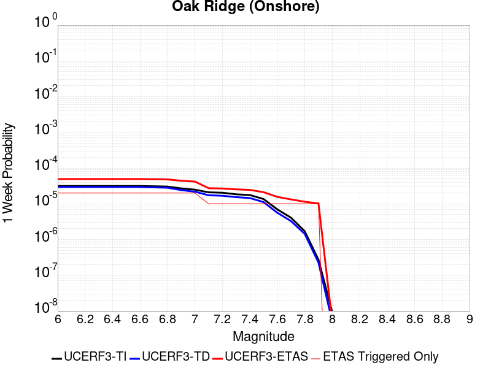 |  |  | 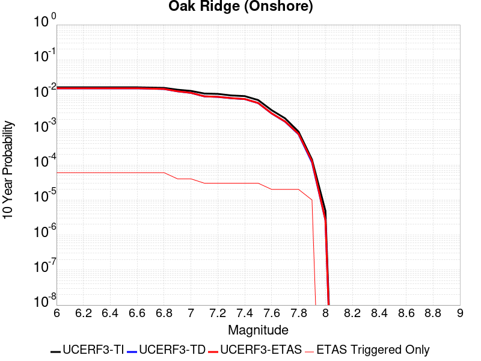 |

| Magnitude | 1 wk TI Prob | 1 wk TD Prob | 1 wk ETAS Prob | 1 wk ETAS/TD Gain | 1 wk ETAS Triggered Only | 1 mo TI Prob | 1 mo TD Prob | 1 mo ETAS Prob | 1 mo ETAS/TD Gain | 1 mo ETAS Triggered Only | 1 yr TI Prob | 1 yr TD Prob | 1 yr ETAS Prob | 1 yr ETAS/TD Gain | 1 yr ETAS Triggered Only | 10 yr TI Prob | 10 yr TD Prob | 10 yr ETAS Prob | 10 yr ETAS/TD Gain | 10 yr ETAS Triggered Only |
|-----|-----|-----|-----|-----|-----|-----|-----|-----|-----|-----|-----|-----|-----|-----|-----|-----|-----|-----|-----|-----|
| 6.0 | 3.155064E-5 | 2.9525974E-5 | 4.9525384E-5 | 1.6773497 | 2.0E-5 | 1.3521002E-4 | 1.2653397E-4 | 1.4653144E-4 | 1.1580403 | 2.0E-5 | 0.001644939 | 0.0015395004 | 0.0015694542 | 1.0194569 | 3.0E-5 | 0.01632816 | 0.015292859 | 0.015351941 | 1.0038635 | 6.0E-5 |
| 6.1 | 3.155064E-5 | 2.9525974E-5 | 4.9525384E-5 | 1.6773497 | 2.0E-5 | 1.3521002E-4 | 1.2653397E-4 | 1.4653144E-4 | 1.1580403 | 2.0E-5 | 0.001644939 | 0.0015395004 | 0.0015694542 | 1.0194569 | 3.0E-5 | 0.01632816 | 0.015292859 | 0.015351941 | 1.0038635 | 6.0E-5 |
| 6.2 | 3.155064E-5 | 2.9525974E-5 | 4.9525384E-5 | 1.6773497 | 2.0E-5 | 1.3521002E-4 | 1.2653397E-4 | 1.4653144E-4 | 1.1580403 | 2.0E-5 | 0.001644939 | 0.0015395004 | 0.0015694542 | 1.0194569 | 3.0E-5 | 0.01632816 | 0.015292859 | 0.015351941 | 1.0038635 | 6.0E-5 |
| 6.3 | 3.155064E-5 | 2.9525974E-5 | 4.9525384E-5 | 1.6773497 | 2.0E-5 | 1.3521002E-4 | 1.2653397E-4 | 1.4653144E-4 | 1.1580403 | 2.0E-5 | 0.001644939 | 0.0015395004 | 0.0015694542 | 1.0194569 | 3.0E-5 | 0.01632816 | 0.015292859 | 0.015351941 | 1.0038635 | 6.0E-5 |
| 6.4 | 3.155064E-5 | 2.9525974E-5 | 4.9525384E-5 | 1.6773497 | 2.0E-5 | 1.3521002E-4 | 1.2653397E-4 | 1.4653144E-4 | 1.1580403 | 2.0E-5 | 0.001644939 | 0.0015395004 | 0.0015694542 | 1.0194569 | 3.0E-5 | 0.01632816 | 0.015292859 | 0.015351941 | 1.0038635 | 6.0E-5 |
| 6.5 | 3.155064E-5 | 2.9525974E-5 | 4.9525384E-5 | 1.6773497 | 2.0E-5 | 1.3521002E-4 | 1.2653397E-4 | 1.4653144E-4 | 1.1580403 | 2.0E-5 | 0.001644939 | 0.0015395004 | 0.0015694542 | 1.0194569 | 3.0E-5 | 0.01632816 | 0.015292859 | 0.015351941 | 1.0038635 | 6.0E-5 |
| 6.6 | 3.155064E-5 | 2.9525974E-5 | 4.9525384E-5 | 1.6773497 | 2.0E-5 | 1.3521002E-4 | 1.2653397E-4 | 1.4653144E-4 | 1.1580403 | 2.0E-5 | 0.001644939 | 0.0015395004 | 0.0015694542 | 1.0194569 | 3.0E-5 | 0.01632816 | 0.015292859 | 0.015351941 | 1.0038635 | 6.0E-5 |
| 6.7 | 3.098897E-5 | 2.8864175E-5 | 4.8863596E-5 | 1.6928805 | 2.0E-5 | 1.328031E-4 | 1.2369796E-4 | 1.4369548E-4 | 1.1616641 | 2.0E-5 | 0.0016156785 | 0.0015050198 | 0.0015349747 | 1.0199033 | 3.0E-5 | 0.016039822 | 0.014952714 | 0.015011816 | 1.0039526 | 6.0E-5 |
| 6.8 | 3.0449872E-5 | 2.8239372E-5 | 4.8238806E-5 | 1.7082111 | 2.0E-5 | 1.3049292E-4 | 1.2102048E-4 | 1.4101806E-4 | 1.1652412 | 2.0E-5 | 0.0015875935 | 0.0014724657 | 0.0015024215 | 1.020344 | 3.0E-5 | 0.015762992 | 0.014631462 | 0.014690584 | 1.0040407 | 6.0E-5 |
| 6.9 | 2.697928E-5 | 2.4219773E-5 | 4.421929E-5 | 1.8257515 | 2.0E-5 | 1.15620365E-4 | 1.0379502E-4 | 1.2379294E-4 | 1.1926675 | 2.0E-5 | 0.0014067689 | 0.0012629933 | 0.0012929555 | 1.0237231 | 3.0E-5 | 0.0139789665 | 0.01256087 | 0.012600367 | 1.0031445 | 4.0E-5 |
| 7.0 | 2.4893961E-5 | 2.1862043E-5 | 4.1861604E-5 | 1.9148077 | 2.0E-5 | 1.0668404E-4 | 9.3691204E-5 | 1.13689326E-4 | 1.2134472 | 2.0E-5 | 0.0012981043 | 0.0011401111 | 0.001170077 | 1.0262833 | 3.0E-5 | 0.012905477 | 0.011344905 | 0.011384452 | 1.0034858 | 4.0E-5 |
| 7.1 | 2.0945363E-5 | 1.7354487E-5 | 2.7354314E-5 | 1.5762099 | 1.0E-5 | 8.976275E-5 | 7.437428E-5 | 8.437354E-5 | 1.1344451 | 1.0E-5 | 0.0010923136 | 9.051354E-4 | 9.251173E-4 | 1.0220761 | 2.0E-5 | 0.0108696 | 0.009015423 | 0.009045153 | 1.0032977 | 3.0E-5 |
| 7.2 | 2.0439404E-5 | 1.6809423E-5 | 2.6809255E-5 | 1.5948944 | 1.0E-5 | 8.7594504E-5 | 7.203843E-5 | 8.20377E-5 | 1.1388048 | 1.0E-5 | 0.0010659413 | 8.767196E-4 | 8.9670205E-4 | 1.0227923 | 2.0E-5 | 0.010608427 | 0.008733526 | 0.008763264 | 1.0034051 | 3.0E-5 |
| 7.3 | 1.8463334E-5 | 1.5381811E-5 | 2.5381656E-5 | 1.6501086 | 1.0E-5 | 7.912617E-5 | 6.59204E-5 | 7.591974E-5 | 1.1516881 | 1.0E-5 | 9.6293533E-4 | 8.0228975E-4 | 8.2227367E-4 | 1.0249087 | 2.0E-5 | 0.009587734 | 0.007994797 | 0.0080245575 | 1.0037224 | 3.0E-5 |
| 7.4 | 1.763139E-5 | 1.451684E-5 | 2.4516694E-5 | 1.6888452 | 1.0E-5 | 7.556091E-5 | 6.221356E-5 | 7.221294E-5 | 1.1607267 | 1.0E-5 | 9.1956573E-4 | 7.571909E-4 | 7.7717577E-4 | 1.0263934 | 2.0E-5 | 0.009157699 | 0.007546914 | 0.0075766873 | 1.0039451 | 3.0E-5 |
| 7.5 | 1.3594944E-5 | 1.1163356E-5 | 2.1163245E-5 | 1.895778 | 1.0E-5 | 5.8262744E-5 | 4.784209E-5 | 5.7841615E-5 | 1.209011 | 1.0E-5 | 7.0911803E-4 | 5.8232434E-4 | 6.023127E-4 | 1.0343251 | 2.0E-5 | 0.007068595 | 0.0058082556 | 0.0058380812 | 1.005135 | 3.0E-5 |
| 7.6 | 6.9889534E-6 | 5.6367144E-6 | 1.5636659E-5 | 2.7740731 | 1.0E-5 | 2.9952313E-5 | 2.4157125E-5 | 3.4156885E-5 | 1.4139465 | 1.0E-5 | 3.646084E-4 | 2.9407372E-4 | 3.040708E-4 | 1.033995 | 1.0E-5 | 0.0036401073 | 0.0029368899 | 0.0029568311 | 1.0067899 | 2.0E-5 |
| 7.7 | 4.0824193E-6 | 3.2832586E-6 | 1.3283226E-5 | 4.0457444 | 1.0E-5 | 1.7495966E-5 | 1.4071033E-5 | 2.4070892E-5 | 1.7106699 | 1.0E-5 | 2.1299256E-4 | 1.713015E-4 | 1.8129978E-4 | 1.0583667 | 1.0E-5 | 0.0021278851 | 0.0017117079 | 0.0017316736 | 1.0116643 | 2.0E-5 |
| 7.8 | 1.7023609E-6 | 1.4370495E-6 | 1.1437035E-5 | 7.958692 | 1.0E-5 | 7.295812E-6 | 6.1587693E-6 | 1.6158709E-5 | 2.623691 | 1.0E-5 | 8.882289E-5 | 7.498047E-5 | 8.4979714E-5 | 1.1333581 | 1.0E-5 | 8.8787393E-4 | 7.495545E-4 | 7.695395E-4 | 1.0266625 | 2.0E-5 |
| 7.9 | 2.721225E-7 | 2.2616497E-7 | 1.0226163E-5 | 45.215504 | 1.0E-5 | 1.1662388E-6 | 9.692781E-7 | 1.0969268E-5 | 11.316947 | 1.0E-5 | 1.4198865E-5 | 1.1800899E-5 | 2.180078E-5 | 1.847383 | 1.0E-5 | 1.4197957E-4 | 1.1800301E-4 | 1.2800183E-4 | 1.0847336 | 1.0E-5 |
| 8.0 | 9.364255E-9 | 5.1206666E-9 | 5.1206666E-9 | 1.0 | 0.0 | 4.0132523E-8 | 2.1945715E-8 | 2.1945715E-8 | 1.0 | 0.0 | 4.8861335E-7 | 2.6718905E-7 | 2.6718905E-7 | 1.0 | 0.0 | 4.8861225E-6 | 2.6718876E-6 | 2.6718876E-6 | 1.0 | 0.0 |

## San Jacinto (Borrego)
*[(top)](#table-of-contents)*

| 1 Week | 1 Month | 1 Year | 10 Year |
|-----|-----|-----|-----|
|  |  |  |  |

| Magnitude | 1 wk TI Prob | 1 wk TD Prob | 1 wk ETAS Prob | 1 wk ETAS/TD Gain | 1 wk ETAS Triggered Only | 1 mo TI Prob | 1 mo TD Prob | 1 mo ETAS Prob | 1 mo ETAS/TD Gain | 1 mo ETAS Triggered Only | 1 yr TI Prob | 1 yr TD Prob | 1 yr ETAS Prob | 1 yr ETAS/TD Gain | 1 yr ETAS Triggered Only | 10 yr TI Prob | 10 yr TD Prob | 10 yr ETAS Prob | 10 yr ETAS/TD Gain | 10 yr ETAS Triggered Only |
|-----|-----|-----|-----|-----|-----|-----|-----|-----|-----|-----|-----|-----|-----|-----|-----|-----|-----|-----|-----|-----|
| 6.0 | 3.543992E-5 | 2.7926513E-5 | 5.7925674E-5 | 2.074218 | 3.0E-5 | 1.5187653E-4 | 1.1967963E-4 | 1.4967604E-4 | 1.2506392 | 3.0E-5 | 0.0018475284 | 0.0014561379 | 0.001506065 | 1.0342875 | 5.0E-5 | 0.018322436 | 0.014869647 | 0.014928755 | 1.003975 | 6.0E-5 |
| 6.1 | 3.542281E-5 | 2.7926513E-5 | 5.7925674E-5 | 2.074218 | 3.0E-5 | 1.5180321E-4 | 1.1967963E-4 | 1.4967604E-4 | 1.2506392 | 3.0E-5 | 0.0018466372 | 0.0014561379 | 0.001506065 | 1.0342875 | 5.0E-5 | 0.018313672 | 0.014869647 | 0.014928755 | 1.003975 | 6.0E-5 |
| 6.2 | 3.4688688E-5 | 2.7926511E-5 | 5.7925674E-5 | 2.074218 | 3.0E-5 | 1.4865733E-4 | 1.1967963E-4 | 1.4967604E-4 | 1.2506392 | 3.0E-5 | 0.0018084005 | 0.0014561379 | 0.001506065 | 1.0342875 | 5.0E-5 | 0.017937548 | 0.014869647 | 0.014928754 | 1.003975 | 6.0E-5 |
| 6.3 | 3.2087122E-5 | 2.7771865E-5 | 5.777103E-5 | 2.0802 | 3.0E-5 | 1.3750899E-4 | 1.1901691E-4 | 1.4901334E-4 | 1.252035 | 3.0E-5 | 0.0016728862 | 0.00144808 | 0.0014980076 | 1.0344784 | 5.0E-5 | 0.016603488 | 0.014790683 | 0.014849796 | 1.0039966 | 6.0E-5 |
| 6.4 | 3.1828724E-5 | 2.7738852E-5 | 5.773802E-5 | 2.0814855 | 3.0E-5 | 1.364017E-4 | 1.1887544E-4 | 1.4887187E-4 | 1.252335 | 3.0E-5 | 0.0016594254 | 0.0014463598 | 0.0014962875 | 1.0345196 | 5.0E-5 | 0.016470885 | 0.014773762 | 0.014832876 | 1.0040013 | 6.0E-5 |
| 6.5 | 3.1563577E-5 | 2.747857E-5 | 5.7477744E-5 | 2.0917299 | 3.0E-5 | 1.3526545E-4 | 1.1776006E-4 | 1.4775652E-4 | 1.2547253 | 3.0E-5 | 0.0016456128 | 0.0014327979 | 0.0014827263 | 1.0348468 | 5.0E-5 | 0.0163348 | 0.014640348 | 0.014699469 | 1.0040382 | 6.0E-5 |
| 6.6 | 3.1467625E-5 | 2.7322796E-5 | 5.7321977E-5 | 2.0979543 | 3.0E-5 | 1.3485427E-4 | 1.1709251E-4 | 1.47089E-4 | 1.2561777 | 3.0E-5 | 0.0016406142 | 0.0014246812 | 0.00147461 | 1.0350456 | 5.0E-5 | 0.016285548 | 0.014560594 | 0.014619721 | 1.0040607 | 6.0E-5 |
| 6.7 | 3.1223695E-5 | 2.6940816E-5 | 5.6940007E-5 | 2.113522 | 3.0E-5 | 1.3380898E-4 | 1.15455594E-4 | 1.4545213E-4 | 1.2598102 | 3.0E-5 | 0.0016279068 | 0.0014047775 | 0.0014547074 | 1.0355428 | 5.0E-5 | 0.01616033 | 0.014364966 | 0.014424104 | 1.0041168 | 6.0E-5 |
| 6.8 | 3.1015585E-5 | 2.6761822E-5 | 5.676102E-5 | 2.12097 | 3.0E-5 | 1.3291716E-4 | 1.1468855E-4 | 1.4468511E-4 | 1.261548 | 3.0E-5 | 0.001617065 | 0.0013954508 | 0.0014453811 | 1.0357807 | 5.0E-5 | 0.016053487 | 0.014272246 | 0.014331389 | 1.004144 | 6.0E-5 |
| 6.9 | 2.6641965E-5 | 2.2184247E-5 | 5.2183583E-5 | 2.3522809 | 3.0E-5 | 1.1417485E-4 | 9.50719E-5 | 1.2506905E-4 | 1.3155206 | 3.0E-5 | 0.0013891924 | 0.0011568897 | 0.0012068318 | 1.0431694 | 5.0E-5 | 0.0138054015 | 0.011882438 | 0.011941725 | 1.0049895 | 6.0E-5 |
| 7.0 | 2.3854353E-5 | 2.0479023E-5 | 5.0478408E-5 | 2.4648836 | 3.0E-5 | 1.02228936E-4 | 8.77643E-5 | 1.1776167E-4 | 1.3417946 | 3.0E-5 | 0.0012439266 | 0.0010680092 | 0.0011179558 | 1.046766 | 5.0E-5 | 0.012369866 | 0.0109828 | 0.011042141 | 1.005403 | 6.0E-5 |
| 7.1 | 2.3672901E-5 | 2.031551E-5 | 5.0314902E-5 | 2.476674 | 3.0E-5 | 1.0145135E-4 | 8.7063585E-5 | 1.1706097E-4 | 1.3445457 | 3.0E-5 | 0.0012344702 | 0.0010594862 | 0.0011094332 | 1.0471427 | 5.0E-5 | 0.0122763505 | 0.010897976 | 0.010957322 | 1.0054456 | 6.0E-5 |
| 7.2 | 2.2717244E-5 | 1.9542893E-5 | 4.9542305E-5 | 2.535055 | 3.0E-5 | 9.735599E-5 | 8.375258E-5 | 1.13750066E-4 | 1.3581679 | 3.0E-5 | 0.0011846646 | 0.001019213 | 0.001069162 | 1.0490074 | 5.0E-5 | 0.01178369 | 0.010495341 | 0.010554711 | 1.0056568 | 6.0E-5 |
| 7.3 | 2.1016205E-5 | 1.8384526E-5 | 4.8383972E-5 | 2.631777 | 3.0E-5 | 9.006634E-5 | 7.878846E-5 | 1.0878609E-4 | 1.3807365 | 3.0E-5 | 0.001096006 | 9.5882936E-4 | 0.0010087814 | 1.052097 | 5.0E-5 | 0.010906163 | 0.009890967 | 0.009950373 | 1.0060061 | 6.0E-5 |
| 7.4 | 2.0683625E-5 | 1.8187047E-5 | 4.8186503E-5 | 2.6494956 | 3.0E-5 | 8.86411E-5 | 7.794217E-5 | 1.0793983E-4 | 1.3848708 | 3.0E-5 | 0.001078671 | 9.485349E-4 | 9.984875E-4 | 1.0526628 | 5.0E-5 | 0.010734501 | 0.009787692 | 0.009847105 | 1.0060701 | 6.0E-5 |
| 7.5 | 1.9993966E-5 | 1.7782075E-5 | 4.778154E-5 | 2.6870623 | 3.0E-5 | 8.568561E-5 | 7.620667E-5 | 1.0620439E-4 | 1.3936363 | 3.0E-5 | 0.001042723 | 9.2742336E-4 | 9.773769E-4 | 1.0538628 | 5.0E-5 | 0.010378438 | 0.009574614 | 0.00963404 | 1.0062065 | 6.0E-5 |
| 7.6 | 1.788966E-5 | 1.6435291E-5 | 4.6434798E-5 | 2.8253105 | 3.0E-5 | 7.666772E-5 | 7.043507E-5 | 1.0043295E-4 | 1.4258943 | 3.0E-5 | 9.3302975E-4 | 8.572113E-4 | 9.0716843E-4 | 1.0582787 | 5.0E-5 | 0.00929122 | 0.008866487 | 0.008925955 | 1.0067071 | 6.0E-5 |
| 7.7 | 1.5125781E-5 | 1.4237377E-5 | 4.423695E-5 | 3.1070995 | 3.0E-5 | 6.4823165E-5 | 6.1015908E-5 | 9.101408E-5 | 1.4916451 | 3.0E-5 | 7.889362E-4 | 7.426163E-4 | 7.925792E-4 | 1.0672796 | 5.0E-5 | 0.007861412 | 0.0077142045 | 0.0077737416 | 1.0077178 | 6.0E-5 |
| 7.8 | 1.250089E-5 | 1.26304985E-5 | 4.263012E-5 | 3.375173 | 3.0E-5 | 5.3574146E-5 | 5.412959E-5 | 8.412796E-5 | 1.5541955 | 3.0E-5 | 6.5207E-4 | 6.588291E-4 | 7.0879614E-4 | 1.0758423 | 5.0E-5 | 0.006501599 | 0.0068677636 | 0.0069273515 | 1.0086764 | 6.0E-5 |
| 7.9 | 9.561E-6 | 9.754616E-6 | 3.9754323E-5 | 4.075437 | 3.0E-5 | 4.0975072E-5 | 4.1804833E-5 | 7.180358E-5 | 1.7175903 | 3.0E-5 | 4.987573E-4 | 5.088555E-4 | 5.588301E-4 | 1.0982097 | 5.0E-5 | 0.0049763937 | 0.0053523467 | 0.0054120254 | 1.01115 | 6.0E-5 |
| 8.0 | 8.01699E-6 | 8.293488E-6 | 3.8293238E-5 | 4.617266 | 3.0E-5 | 3.4358076E-5 | 3.554304E-5 | 6.554197E-5 | 1.8440171 | 3.0E-5 | 4.1822926E-4 | 4.3265108E-4 | 4.7263378E-4 | 1.0924133 | 4.0E-5 | 0.0041744304 | 0.004573375 | 0.0046231463 | 1.0108829 | 5.0E-5 |
| 8.1 | 6.541947E-6 | 6.4622354E-6 | 3.6462043E-5 | 5.6423264 | 3.0E-5 | 2.8036617E-5 | 2.7695003E-5 | 5.769417E-5 | 2.0831978 | 3.0E-5 | 3.4129233E-4 | 3.37135E-4 | 3.7712153E-4 | 1.1186068 | 4.0E-5 | 0.0034076865 | 0.0035806994 | 0.0036305203 | 1.0139138 | 5.0E-5 |
| 8.2 | 1.7968189E-6 | 7.9713476E-7 | 7.9713476E-7 | 1.0 | 0.0 | 7.70063E-6 | 3.4162877E-6 | 3.4162877E-6 | 1.0 | 0.0 | 9.3751136E-5 | 4.159253E-5 | 4.159253E-5 | 1.0 | 0.0 | 9.371159E-4 | 4.712058E-4 | 4.712058E-4 | 1.0 | 0.0 |
| 8.3 | 1.5167889E-7 | 4.897714E-8 | 4.897714E-8 | 1.0 | 0.0 | 6.500522E-7 | 2.09902E-7 | 2.09902E-7 | 1.0 | 0.0 | 7.9143565E-6 | 2.5555544E-6 | 2.5555544E-6 | 1.0 | 0.0 | 7.914075E-5 | 2.969505E-5 | 2.969505E-5 | 1.0 | 0.0 |

## Santa Susana East (connector)
*[(top)](#table-of-contents)*

| 1 Week | 1 Month | 1 Year | 10 Year |
|-----|-----|-----|-----|
|  |  |  |  |

| Magnitude | 1 wk TI Prob | 1 wk TD Prob | 1 wk ETAS Prob | 1 wk ETAS/TD Gain | 1 wk ETAS Triggered Only | 1 mo TI Prob | 1 mo TD Prob | 1 mo ETAS Prob | 1 mo ETAS/TD Gain | 1 mo ETAS Triggered Only | 1 yr TI Prob | 1 yr TD Prob | 1 yr ETAS Prob | 1 yr ETAS/TD Gain | 1 yr ETAS Triggered Only | 10 yr TI Prob | 10 yr TD Prob | 10 yr ETAS Prob | 10 yr ETAS/TD Gain | 10 yr ETAS Triggered Only |
|-----|-----|-----|-----|-----|-----|-----|-----|-----|-----|-----|-----|-----|-----|-----|-----|-----|-----|-----|-----|-----|
| 6.0 | 2.858397E-5 | 3.202091E-5 | 3.202091E-5 | 1.0 | 0.0 | 1.2249697E-4 | 1.3722685E-4 | 1.4722548E-4 | 1.072862 | 1.0E-5 | 0.0014903803 | 0.0016697381 | 0.001699688 | 1.017937 | 3.0E-5 | 0.014804244 | 0.016599052 | 0.016658057 | 1.0035547 | 6.0E-5 |
| 6.1 | 2.858397E-5 | 3.202091E-5 | 3.202091E-5 | 1.0 | 0.0 | 1.2249697E-4 | 1.3722685E-4 | 1.4722548E-4 | 1.072862 | 1.0E-5 | 0.0014903803 | 0.0016697381 | 0.001699688 | 1.017937 | 3.0E-5 | 0.014804244 | 0.016599052 | 0.016658057 | 1.0035547 | 6.0E-5 |
| 6.2 | 2.858397E-5 | 3.202091E-5 | 3.202091E-5 | 1.0 | 0.0 | 1.2249697E-4 | 1.3722685E-4 | 1.4722548E-4 | 1.072862 | 1.0E-5 | 0.0014903803 | 0.0016697381 | 0.001699688 | 1.017937 | 3.0E-5 | 0.014804244 | 0.016599052 | 0.016658057 | 1.0035547 | 6.0E-5 |
| 6.3 | 1.943582E-5 | 2.036718E-5 | 2.036718E-5 | 1.0 | 0.0 | 8.329371E-5 | 8.7285625E-5 | 9.7284756E-5 | 1.1145564 | 1.0E-5 | 0.001013629 | 0.0010622967 | 0.0010922648 | 1.0282106 | 3.0E-5 | 0.010090181 | 0.010583619 | 0.01063309 | 1.0046743 | 5.0E-5 |
| 6.4 | 1.943582E-5 | 2.036718E-5 | 2.036718E-5 | 1.0 | 0.0 | 8.329371E-5 | 8.7285625E-5 | 9.7284756E-5 | 1.1145564 | 1.0E-5 | 0.001013629 | 0.0010622967 | 0.0010922648 | 1.0282106 | 3.0E-5 | 0.010090181 | 0.010583619 | 0.01063309 | 1.0046743 | 5.0E-5 |
| 6.5 | 1.943582E-5 | 2.036718E-5 | 2.036718E-5 | 1.0 | 0.0 | 8.329371E-5 | 8.7285625E-5 | 9.7284756E-5 | 1.1145564 | 1.0E-5 | 0.001013629 | 0.0010622967 | 0.0010922648 | 1.0282106 | 3.0E-5 | 0.010090181 | 0.010583619 | 0.01063309 | 1.0046743 | 5.0E-5 |
| 6.6 | 1.943582E-5 | 2.036718E-5 | 2.036718E-5 | 1.0 | 0.0 | 8.329371E-5 | 8.7285625E-5 | 9.7284756E-5 | 1.1145564 | 1.0E-5 | 0.001013629 | 0.0010622967 | 0.0010922648 | 1.0282106 | 3.0E-5 | 0.010090181 | 0.010583619 | 0.01063309 | 1.0046743 | 5.0E-5 |
| 6.7 | 1.9404439E-5 | 2.03546E-5 | 2.03546E-5 | 1.0 | 0.0 | 8.3159226E-5 | 8.723172E-5 | 9.723085E-5 | 1.1146272 | 1.0E-5 | 0.0010119933 | 0.0010616409 | 0.0010916091 | 1.0282282 | 3.0E-5 | 0.010073971 | 0.010577125 | 0.0106265955 | 1.0046772 | 5.0E-5 |
| 6.8 | 1.2217526E-5 | 1.1592998E-5 | 1.1592998E-5 | 1.0 | 0.0 | 5.2359774E-5 | 4.9683425E-5 | 5.9682927E-5 | 1.2012644 | 1.0E-5 | 6.372938E-4 | 6.0474465E-4 | 6.247325E-4 | 1.0330518 | 2.0E-5 | 0.0063546924 | 0.006033037 | 0.006062856 | 1.0049427 | 3.0E-5 |
| 6.9 | 1.2217526E-5 | 1.1592998E-5 | 1.1592998E-5 | 1.0 | 0.0 | 5.2359774E-5 | 4.9683425E-5 | 5.9682927E-5 | 1.2012644 | 1.0E-5 | 6.372938E-4 | 6.0474465E-4 | 6.247325E-4 | 1.0330518 | 2.0E-5 | 0.0063546924 | 0.006033037 | 0.006062856 | 1.0049427 | 3.0E-5 |
| 7.0 | 9.276017E-6 | 8.059113E-6 | 8.059113E-6 | 1.0 | 0.0 | 3.9753755E-5 | 3.4538618E-5 | 3.4538618E-5 | 1.0 | 0.0 | 4.8389446E-4 | 4.2042998E-4 | 4.3042577E-4 | 1.0237752 | 1.0E-5 | 0.0048284214 | 0.0041970722 | 0.004216988 | 1.0047452 | 2.0E-5 |
| 7.1 | 9.130355E-6 | 7.942286E-6 | 7.942286E-6 | 1.0 | 0.0 | 3.9129503E-5 | 3.4037945E-5 | 3.4037945E-5 | 1.0 | 0.0 | 4.7629757E-4 | 4.1433662E-4 | 4.2433248E-4 | 1.024125 | 1.0E-5 | 0.00475278 | 0.004136367 | 0.004156284 | 1.0048151 | 2.0E-5 |
| 7.2 | 8.851015E-6 | 7.741445E-6 | 7.741445E-6 | 1.0 | 0.0 | 3.7932372E-5 | 3.317722E-5 | 3.317722E-5 | 1.0 | 0.0 | 4.6172875E-4 | 4.038612E-4 | 4.1385717E-4 | 1.024751 | 1.0E-5 | 0.0046077054 | 0.0040319953 | 0.004051915 | 1.0049403 | 2.0E-5 |
| 7.3 | 8.573006E-6 | 7.550166E-6 | 7.550166E-6 | 1.0 | 0.0 | 3.6740938E-5 | 3.2357475E-5 | 3.2357475E-5 | 1.0 | 0.0 | 4.472291E-4 | 3.9388443E-4 | 4.038805E-4 | 1.0253781 | 1.0E-5 | 0.004463301 | 0.0039325804 | 0.003952502 | 1.0050657 | 2.0E-5 |
| 7.4 | 7.852282E-6 | 6.817687E-6 | 6.817687E-6 | 1.0 | 0.0 | 3.36522E-5 | 2.9218349E-5 | 2.9218349E-5 | 1.0 | 0.0 | 4.096385E-4 | 3.5567835E-4 | 3.656748E-4 | 1.0281053 | 1.0E-5 | 0.0040888423 | 0.0035517553 | 0.0035716842 | 1.0056111 | 2.0E-5 |
| 7.5 | 4.8869324E-6 | 4.279055E-6 | 4.279055E-6 | 1.0 | 0.0 | 2.0943828E-5 | 1.8338687E-5 | 1.8338687E-5 | 1.0 | 0.0 | 2.5496128E-4 | 2.232523E-4 | 2.3325007E-4 | 1.0447824 | 1.0E-5 | 0.0025466895 | 0.0022304445 | 0.0022404222 | 1.0044734 | 1.0E-5 |
| 7.6 | 1.3894544E-6 | 1.1568179E-6 | 1.1568179E-6 | 1.0 | 0.0 | 5.954791E-6 | 4.957783E-6 | 4.957783E-6 | 1.0 | 0.0 | 7.249717E-5 | 6.0359558E-5 | 6.0359558E-5 | 1.0 | 0.0 | 7.247352E-4 | 6.0345343E-4 | 6.0345343E-4 | 1.0 | 0.0 |
| 7.7 | 2.9924632E-7 | 2.371928E-7 | 2.371928E-7 | 1.0 | 0.0 | 1.2824837E-6 | 1.0165402E-6 | 1.0165402E-6 | 1.0 | 0.0 | 1.5614127E-5 | 1.2376314E-5 | 1.2376314E-5 | 1.0 | 0.0 | 1.5613029E-4 | 1.2375697E-4 | 1.2375697E-4 | 1.0 | 0.0 |
| 7.8 | 4.8188564E-8 | 2.6323061E-8 | 2.6323061E-8 | 1.0 | 0.0 | 2.065224E-7 | 1.1281311E-7 | 1.1281311E-7 | 1.0 | 0.0 | 2.5144072E-6 | 1.3734989E-6 | 1.3734989E-6 | 1.0 | 0.0 | 2.5143789E-5 | 1.3734912E-5 | 1.3734912E-5 | 1.0 | 0.0 |
| 7.9 | 2.6127251E-9 | 2.7681102E-9 | 2.7681102E-9 | 1.0 | 0.0 | 1.1197393E-8 | 1.186333E-8 | 1.186333E-8 | 1.0 | 0.0 | 1.3632825E-7 | 1.4443603E-7 | 1.4443603E-7 | 1.0 | 0.0 | 1.3632817E-6 | 1.4443604E-6 | 1.4443604E-6 | 1.0 | 0.0 |

## Hunting Creek - Berryessa 2011 CFM
*[(top)](#table-of-contents)*

| 1 Week | 1 Month | 1 Year | 10 Year |
|-----|-----|-----|-----|
| 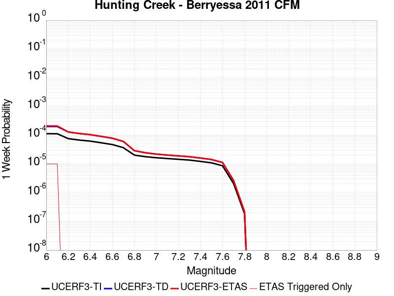 |  |  |  |

| Magnitude | 1 wk TI Prob | 1 wk TD Prob | 1 wk ETAS Prob | 1 wk ETAS/TD Gain | 1 wk ETAS Triggered Only | 1 mo TI Prob | 1 mo TD Prob | 1 mo ETAS Prob | 1 mo ETAS/TD Gain | 1 mo ETAS Triggered Only | 1 yr TI Prob | 1 yr TD Prob | 1 yr ETAS Prob | 1 yr ETAS/TD Gain | 1 yr ETAS Triggered Only | 10 yr TI Prob | 10 yr TD Prob | 10 yr ETAS Prob | 10 yr ETAS/TD Gain | 10 yr ETAS Triggered Only |
|-----|-----|-----|-----|-----|-----|-----|-----|-----|-----|-----|-----|-----|-----|-----|-----|-----|-----|-----|-----|-----|
| 6.0 | 1.1270982E-4 | 2.0012174E-4 | 2.1011975E-4 | 1.0499595 | 1.0E-5 | 4.8295266E-4 | 8.5739547E-4 | 8.6738693E-4 | 1.0116532 | 1.0E-5 | 0.0058641075 | 0.010386313 | 0.010416001 | 1.0028584 | 3.0E-5 | 0.057117578 | 0.09803703 | 0.098082125 | 1.00046 | 5.0E-5 |
| 6.1 | 1.1239393E-4 | 1.9960315E-4 | 2.0960114E-4 | 1.0500894 | 1.0E-5 | 4.8159933E-4 | 8.551744E-4 | 8.6516584E-4 | 1.0116835 | 1.0E-5 | 0.0058477195 | 0.010359551 | 0.01038924 | 1.0028659 | 3.0E-5 | 0.056962132 | 0.09779551 | 0.097840615 | 1.0004612 | 5.0E-5 |
| 6.2 | 7.596265E-5 | 1.2940196E-4 | 1.2940196E-4 | 1.0 | 0.0 | 3.2551357E-4 | 5.5444165E-4 | 5.5444165E-4 | 1.0 | 0.0 | 0.0039559277 | 0.0067210156 | 0.0067210156 | 1.0 | 0.0 | 0.038862433 | 0.0645915 | 0.064610206 | 1.0002897 | 2.0E-5 |
| 6.3 | 6.78794E-5 | 1.145119E-4 | 1.145119E-4 | 1.0 | 0.0 | 2.9087928E-4 | 4.906513E-4 | 4.906513E-4 | 1.0 | 0.0 | 0.003535705 | 0.005952679 | 0.005952679 | 1.0 | 0.0 | 0.034799766 | 0.057465393 | 0.057484243 | 1.0003281 | 2.0E-5 |
| 6.4 | 6.2165134E-5 | 1.0436625E-4 | 1.0436625E-4 | 1.0 | 0.0 | 2.6639478E-4 | 4.4721062E-4 | 4.4721062E-4 | 1.0 | 0.0 | 0.0032385332 | 0.005427573 | 0.005427573 | 1.0 | 0.0 | 0.03191742 | 0.052550517 | 0.052569468 | 1.0003606 | 2.0E-5 |
| 6.5 | 5.4368087E-5 | 9.071415E-5 | 9.071415E-5 | 1.0 | 0.0 | 2.3298527E-4 | 3.8872007E-4 | 3.8872007E-4 | 1.0 | 0.0 | 0.0028329059 | 0.0047198683 | 0.0047198683 | 1.0 | 0.0 | 0.027970633 | 0.045880128 | 0.04588967 | 1.0002079 | 1.0E-5 |
| 6.6 | 4.729947E-5 | 7.847572E-5 | 7.847572E-5 | 1.0 | 0.0 | 2.0269625E-4 | 3.362842E-4 | 3.362842E-4 | 1.0 | 0.0 | 0.002465034 | 0.0040849647 | 0.0040849647 | 1.0 | 0.0 | 0.02437869 | 0.03985155 | 0.03986115 | 1.0002409 | 1.0E-5 |
| 6.7 | 3.6875328E-5 | 6.0451803E-5 | 6.0451803E-5 | 1.0 | 0.0 | 1.5802756E-4 | 2.59056E-4 | 2.59056E-4 | 1.0 | 0.0 | 0.0019222875 | 0.0031482063 | 0.0031482063 | 1.0 | 0.0 | 0.019057442 | 0.03089237 | 0.030902062 | 1.0003138 | 1.0E-5 |
| 6.8 | 2.0292036E-5 | 2.8976308E-5 | 2.8976308E-5 | 1.0 | 0.0 | 8.6962966E-5 | 1.2417832E-4 | 1.2417832E-4 | 1.0 | 0.0 | 0.0010582599 | 0.0015108072 | 0.0015108072 | 1.0 | 0.0 | 0.010532344 | 0.014978523 | 0.014978523 | 1.0 | 0.0 |
| 6.9 | 1.7871042E-5 | 2.4472254E-5 | 2.4472254E-5 | 1.0 | 0.0 | 7.658793E-5 | 1.048769E-4 | 1.048769E-4 | 1.0 | 0.0 | 9.320591E-4 | 0.0012761299 | 0.0012761299 | 1.0 | 0.0 | 0.009281595 | 0.012679775 | 0.012679775 | 1.0 | 0.0 |
| 7.0 | 1.6415532E-5 | 2.1906277E-5 | 2.1906277E-5 | 1.0 | 0.0 | 7.035038E-5 | 9.3880684E-5 | 9.3880684E-5 | 1.0 | 0.0 | 8.561793E-4 | 0.0011424015 | 0.0011424015 | 1.0 | 0.0 | 0.008528882 | 0.01136452 | 0.01136452 | 1.0 | 0.0 |
| 7.1 | 1.5409885E-5 | 2.0346342E-5 | 2.0346342E-5 | 1.0 | 0.0 | 6.6040695E-5 | 8.7195716E-5 | 8.7195716E-5 | 1.0 | 0.0 | 8.0374884E-4 | 0.0010610938 | 0.0010610938 | 1.0 | 0.0 | 0.00800848 | 0.010560595 | 0.010560595 | 1.0 | 0.0 |
| 7.2 | 1.4497423E-5 | 1.9054964E-5 | 1.9054964E-5 | 1.0 | 0.0 | 6.213033E-5 | 8.166159E-5 | 8.166159E-5 | 1.0 | 0.0 | 7.5617427E-4 | 9.937795E-4 | 9.937795E-4 | 1.0 | 0.0 | 0.0075360634 | 0.009893929 | 0.009893929 | 1.0 | 0.0 |
| 7.3 | 1.3615175E-5 | 1.7826127E-5 | 1.7826127E-5 | 1.0 | 0.0 | 5.8349444E-5 | 7.639547E-5 | 7.639547E-5 | 1.0 | 0.0 | 7.101729E-4 | 9.297209E-4 | 9.297209E-4 | 1.0 | 0.0 | 0.0070790765 | 0.009258823 | 0.009258823 | 1.0 | 0.0 |
| 7.4 | 1.2252825E-5 | 1.602625E-5 | 1.602625E-5 | 1.0 | 0.0 | 5.251105E-5 | 6.868213E-5 | 6.868213E-5 | 1.0 | 0.0 | 6.391345E-4 | 8.35887E-4 | 8.35887E-4 | 1.0 | 0.0 | 0.0063729943 | 0.008327872 | 0.008327872 | 1.0 | 0.0 |
| 7.5 | 1.0913301E-5 | 1.4241117E-5 | 1.4241117E-5 | 1.0 | 0.0 | 4.6770452E-5 | 6.1031948E-5 | 6.1031948E-5 | 1.0 | 0.0 | 5.6928146E-4 | 7.4281334E-4 | 7.4281334E-4 | 1.0 | 0.0 | 0.0056782532 | 0.0074036797 | 0.0074036797 | 1.0 | 0.0 |
| 7.6 | 8.623192E-6 | 1.12346415E-5 | 1.12346415E-5 | 1.0 | 0.0 | 3.6956015E-5 | 4.814759E-5 | 4.814759E-5 | 1.0 | 0.0 | 4.4984656E-4 | 5.8604183E-4 | 5.8604183E-4 | 1.0 | 0.0 | 0.00448937 | 0.0058452785 | 0.0058452785 | 1.0 | 0.0 |
| 7.7 | 2.0993634E-6 | 2.662584E-6 | 2.662584E-6 | 1.0 | 0.0 | 8.997241E-6 | 1.1411025E-5 | 1.1411025E-5 | 1.0 | 0.0 | 1.09535904E-4 | 1.3892044E-4 | 1.3892044E-4 | 1.0 | 0.0 | 0.0010948193 | 0.0013883426 | 0.0013883426 | 1.0 | 0.0 |
| 7.8 | 1.8428308E-7 | 2.167437E-7 | 2.167437E-7 | 1.0 | 0.0 | 7.897844E-7 | 9.289013E-7 | 9.289013E-7 | 1.0 | 0.0 | 9.615583E-6 | 1.1309318E-5 | 1.1309318E-5 | 1.0 | 0.0 | 9.615166E-5 | 1.13086026E-4 | 1.13086026E-4 | 1.0 | 0.0 |

## San Luis Range 2011 CFM
*[(top)](#table-of-contents)*

| 1 Week | 1 Month | 1 Year | 10 Year |
|-----|-----|-----|-----|
|  |  |  |  |

| Magnitude | 1 wk TI Prob | 1 wk TD Prob | 1 wk ETAS Prob | 1 wk ETAS/TD Gain | 1 wk ETAS Triggered Only | 1 mo TI Prob | 1 mo TD Prob | 1 mo ETAS Prob | 1 mo ETAS/TD Gain | 1 mo ETAS Triggered Only | 1 yr TI Prob | 1 yr TD Prob | 1 yr ETAS Prob | 1 yr ETAS/TD Gain | 1 yr ETAS Triggered Only | 10 yr TI Prob | 10 yr TD Prob | 10 yr ETAS Prob | 10 yr ETAS/TD Gain | 10 yr ETAS Triggered Only |
|-----|-----|-----|-----|-----|-----|-----|-----|-----|-----|-----|-----|-----|-----|-----|-----|-----|-----|-----|-----|-----|
| 6.0 | 8.8368415E-6 | 8.965454E-6 | 2.8965274E-5 | 3.230765 | 2.0E-5 | 3.787163E-5 | 3.842285E-5 | 6.84217E-5 | 1.7807554 | 3.0E-5 | 4.609895E-4 | 4.677057E-4 | 5.176823E-4 | 1.1068548 | 5.0E-5 | 0.0046003438 | 0.0046679964 | 0.004717763 | 1.0106612 | 5.0E-5 |
| 6.1 | 8.8368415E-6 | 8.965454E-6 | 2.8965274E-5 | 3.230765 | 2.0E-5 | 3.787163E-5 | 3.842285E-5 | 6.84217E-5 | 1.7807554 | 3.0E-5 | 4.609895E-4 | 4.677057E-4 | 5.176823E-4 | 1.1068548 | 5.0E-5 | 0.0046003438 | 0.0046679964 | 0.004717763 | 1.0106612 | 5.0E-5 |
| 6.2 | 8.8368415E-6 | 8.965454E-6 | 2.8965274E-5 | 3.230765 | 2.0E-5 | 3.787163E-5 | 3.842285E-5 | 6.84217E-5 | 1.7807554 | 3.0E-5 | 4.609895E-4 | 4.677057E-4 | 5.176823E-4 | 1.1068548 | 5.0E-5 | 0.0046003438 | 0.0046679964 | 0.004717763 | 1.0106612 | 5.0E-5 |
| 6.3 | 8.8368415E-6 | 8.965454E-6 | 2.8965274E-5 | 3.230765 | 2.0E-5 | 3.787163E-5 | 3.842285E-5 | 6.84217E-5 | 1.7807554 | 3.0E-5 | 4.609895E-4 | 4.677057E-4 | 5.176823E-4 | 1.1068548 | 5.0E-5 | 0.0046003438 | 0.0046679964 | 0.004717763 | 1.0106612 | 5.0E-5 |
| 6.4 | 3.9094193E-6 | 3.9412025E-6 | 1.3941163E-5 | 3.5372865 | 1.0E-5 | 1.6754546E-5 | 1.689076E-5 | 2.6890591E-5 | 1.5920297 | 1.0E-5 | 2.039675E-4 | 2.056259E-4 | 2.1562383E-4 | 1.048622 | 1.0E-5 | 0.0020378039 | 0.0020543851 | 0.0020643645 | 1.0048577 | 1.0E-5 |
| 6.5 | 3.9094193E-6 | 3.9412025E-6 | 1.3941163E-5 | 3.5372865 | 1.0E-5 | 1.6754546E-5 | 1.689076E-5 | 2.6890591E-5 | 1.5920297 | 1.0E-5 | 2.039675E-4 | 2.056259E-4 | 2.1562383E-4 | 1.048622 | 1.0E-5 | 0.0020378039 | 0.0020543851 | 0.0020643645 | 1.0048577 | 1.0E-5 |
| 6.6 | 3.0587726E-6 | 3.0753883E-6 | 1.3075358E-5 | 4.251612 | 1.0E-5 | 1.3108959E-5 | 1.318017E-5 | 2.3180037E-5 | 1.7587056 | 1.0E-5 | 1.595899E-4 | 1.6045687E-4 | 1.7045526E-4 | 1.062312 | 1.0E-5 | 0.0015947534 | 0.0016034221 | 0.001613406 | 1.0062267 | 1.0E-5 |
| 6.7 | 2.6160574E-6 | 2.6251273E-6 | 1.2625101E-5 | 4.809329 | 1.0E-5 | 1.1211626E-5 | 1.1250498E-5 | 2.1250386E-5 | 1.8888396 | 1.0E-5 | 1.3649299E-4 | 1.3696625E-4 | 1.4696489E-4 | 1.0730007 | 1.0E-5 | 0.0013640919 | 0.0013688246 | 0.0013788108 | 1.0072955 | 1.0E-5 |
| 6.8 | 2.5110312E-6 | 2.51814E-6 | 1.2518115E-5 | 4.9711747 | 1.0E-5 | 1.0761518E-5 | 1.0791985E-5 | 2.0791877E-5 | 1.9266036 | 1.0E-5 | 1.310136E-4 | 1.3138456E-4 | 1.4138324E-4 | 1.0761025 | 1.0E-5 | 0.0013093639 | 0.0013130746 | 0.0013230615 | 1.0076057 | 1.0E-5 |
| 6.9 | 1.8564405E-6 | 1.852487E-6 | 1.852487E-6 | 1.0 | 0.0 | 7.95615E-6 | 7.939206E-6 | 7.939206E-6 | 1.0 | 0.0 | 9.686181E-5 | 9.665557E-5 | 9.665557E-5 | 1.0 | 0.0 | 9.68196E-4 | 9.661373E-4 | 9.661373E-4 | 1.0 | 0.0 |
| 7.0 | 1.546127E-6 | 1.5369537E-6 | 1.5369537E-6 | 1.0 | 0.0 | 6.626242E-6 | 6.586928E-6 | 6.586928E-6 | 1.0 | 0.0 | 8.06715E-5 | 8.0192905E-5 | 8.0192905E-5 | 1.0 | 0.0 | 8.0642226E-4 | 8.016404E-4 | 8.016404E-4 | 1.0 | 0.0 |
| 7.1 | 1.3368208E-6 | 1.3235326E-6 | 1.3235326E-6 | 1.0 | 0.0 | 5.7292195E-6 | 5.67227E-6 | 5.67227E-6 | 1.0 | 0.0 | 6.975101E-5 | 6.905771E-5 | 6.905771E-5 | 1.0 | 0.0 | 6.972912E-4 | 6.9036294E-4 | 6.9036294E-4 | 1.0 | 0.0 |
| 7.2 | 1.0623363E-6 | 1.0454368E-6 | 1.0454368E-6 | 1.0 | 0.0 | 4.5528623E-6 | 4.4804356E-6 | 4.4804356E-6 | 1.0 | 0.0 | 5.5429686E-5 | 5.4547938E-5 | 5.4547938E-5 | 1.0 | 0.0 | 5.5415864E-4 | 5.4534577E-4 | 5.4534577E-4 | 1.0 | 0.0 |
| 7.3 | 7.831679E-7 | 7.7273904E-7 | 7.7273904E-7 | 1.0 | 0.0 | 3.3564295E-6 | 3.3117344E-6 | 3.3117344E-6 | 1.0 | 0.0 | 4.086376E-5 | 4.0319625E-5 | 4.0319625E-5 | 1.0 | 0.0 | 4.0856248E-4 | 4.031232E-4 | 4.031232E-4 | 1.0 | 0.0 |
| 7.4 | 5.9558846E-7 | 5.910636E-7 | 5.910636E-7 | 1.0 | 0.0 | 2.5525194E-6 | 2.5331274E-6 | 2.5331274E-6 | 1.0 | 0.0 | 3.107648E-5 | 3.084039E-5 | 3.084039E-5 | 1.0 | 0.0 | 3.1072134E-4 | 3.083612E-4 | 3.083612E-4 | 1.0 | 0.0 |
| 7.5 | 4.1616502E-7 | 4.119631E-7 | 4.119631E-7 | 1.0 | 0.0 | 1.7835631E-6 | 1.7655549E-6 | 1.7655549E-6 | 1.0 | 0.0 | 2.1714664E-5 | 2.149542E-5 | 2.149542E-5 | 1.0 | 0.0 | 2.1712543E-4 | 2.1493346E-4 | 2.1493346E-4 | 1.0 | 0.0 |
| 7.6 | 2.3816014E-7 | 2.3376548E-7 | 2.3376548E-7 | 1.0 | 0.0 | 1.0206859E-6 | 1.0018516E-6 | 1.0018516E-6 | 1.0 | 0.0 | 1.242678E-5 | 1.2197475E-5 | 1.2197475E-5 | 1.0 | 0.0 | 1.2426086E-4 | 1.2196808E-4 | 1.2196808E-4 | 1.0 | 0.0 |
| 7.7 | 9.918777E-8 | 9.3867584E-8 | 9.3867584E-8 | 1.0 | 0.0 | 4.2509038E-7 | 4.0228957E-7 | 4.0228957E-7 | 1.0 | 0.0 | 5.1754632E-6 | 4.8978645E-6 | 4.8978645E-6 | 1.0 | 0.0 | 5.1753424E-5 | 4.897757E-5 | 4.897757E-5 | 1.0 | 0.0 |
| 7.8 | 3.4982556E-8 | 2.968655E-8 | 2.968655E-8 | 1.0 | 0.0 | 1.4992524E-7 | 1.2722806E-7 | 1.2722806E-7 | 1.0 | 0.0 | 1.8253382E-6 | 1.5490006E-6 | 1.5490006E-6 | 1.0 | 0.0 | 1.8253233E-5 | 1.5489897E-5 | 1.5489897E-5 | 1.0 | 0.0 |
| 7.9 | 1.6624908E-8 | 1.1477036E-8 | 1.1477036E-8 | 1.0 | 0.0 | 7.12496E-8 | 4.91873E-8 | 4.91873E-8 | 1.0 | 0.0 | 8.6746354E-7 | 5.988552E-7 | 5.988552E-7 | 1.0 | 0.0 | 8.674601E-6 | 5.988536E-6 | 5.988536E-6 | 1.0 | 0.0 |
| 8.0 | 6.3352315E-9 | 3.0888412E-9 | 3.0888412E-9 | 1.0 | 0.0 | 2.715099E-8 | 1.3237893E-8 | 1.3237893E-8 | 1.0 | 0.0 | 3.3056327E-7 | 1.6117131E-7 | 1.6117131E-7 | 1.0 | 0.0 | 3.3056278E-6 | 1.611712E-6 | 1.611712E-6 | 1.0 | 0.0 |

## Elmore Ranch
*[(top)](#table-of-contents)*

| 1 Week | 1 Month | 1 Year | 10 Year |
|-----|-----|-----|-----|
|  | 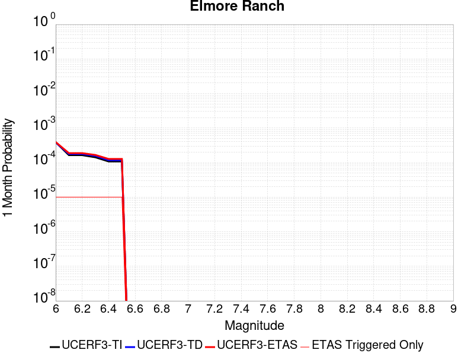 |  | 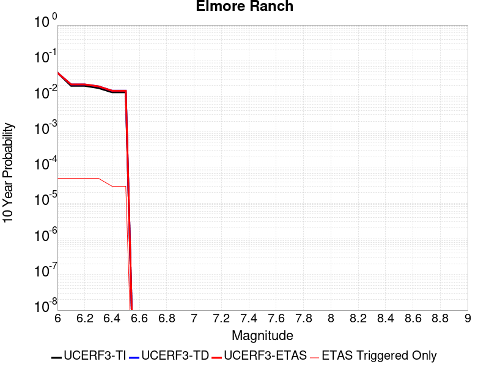 |

| Magnitude | 1 wk TI Prob | 1 wk TD Prob | 1 wk ETAS Prob | 1 wk ETAS/TD Gain | 1 wk ETAS Triggered Only | 1 mo TI Prob | 1 mo TD Prob | 1 mo ETAS Prob | 1 mo ETAS/TD Gain | 1 mo ETAS Triggered Only | 1 yr TI Prob | 1 yr TD Prob | 1 yr ETAS Prob | 1 yr ETAS/TD Gain | 1 yr ETAS Triggered Only | 10 yr TI Prob | 10 yr TD Prob | 10 yr ETAS Prob | 10 yr ETAS/TD Gain | 10 yr ETAS Triggered Only |
|-----|-----|-----|-----|-----|-----|-----|-----|-----|-----|-----|-----|-----|-----|-----|-----|-----|-----|-----|-----|-----|
| 6.0 | 9.102099E-5 | 8.952015E-5 | 9.951925E-5 | 1.1116967 | 1.0E-5 | 3.9003167E-4 | 3.8361453E-4 | 3.9361068E-4 | 1.0260578 | 1.0E-5 | 0.0047383 | 0.004662009 | 0.0047018225 | 1.00854 | 4.0E-5 | 0.046385348 | 0.045870975 | 0.04591868 | 1.00104 | 5.0E-5 |
| 6.1 | 3.8306698E-5 | 4.1498504E-5 | 5.149809E-5 | 1.2409625 | 1.0E-5 | 1.6416123E-4 | 1.7784268E-4 | 1.8784091E-4 | 1.0562195 | 1.0E-5 | 0.0019968306 | 0.0021631396 | 0.002203053 | 1.0184517 | 4.0E-5 | 0.019789828 | 0.021628205 | 0.021677123 | 1.0022618 | 5.0E-5 |
| 6.2 | 3.8306698E-5 | 4.1498504E-5 | 5.149809E-5 | 1.2409625 | 1.0E-5 | 1.6416123E-4 | 1.7784268E-4 | 1.8784091E-4 | 1.0562195 | 1.0E-5 | 0.0019968306 | 0.0021631396 | 0.002203053 | 1.0184517 | 4.0E-5 | 0.019789828 | 0.021628205 | 0.021677123 | 1.0022618 | 5.0E-5 |
| 6.3 | 3.3197924E-5 | 3.6554302E-5 | 4.6553938E-5 | 1.2735556 | 1.0E-5 | 1.4226905E-4 | 1.5665586E-4 | 1.666543E-4 | 1.0638242 | 1.0E-5 | 0.0017307495 | 0.001905917 | 0.0019458408 | 1.0209472 | 4.0E-5 | 0.017173318 | 0.01908996 | 0.019139005 | 1.0025692 | 5.0E-5 |
| 6.4 | 2.5148964E-5 | 2.7420487E-5 | 3.7420214E-5 | 1.3646809 | 1.0E-5 | 1.0777682E-4 | 1.17514726E-4 | 1.2751356E-4 | 1.0850857 | 1.0E-5 | 0.0013113929 | 0.0014304507 | 0.0014604079 | 1.0209424 | 3.0E-5 | 0.01303681 | 0.014387194 | 0.014416763 | 1.0020552 | 3.0E-5 |
| 6.5 | 2.5148964E-5 | 2.7420487E-5 | 3.7420214E-5 | 1.3646809 | 1.0E-5 | 1.0777682E-4 | 1.17514726E-4 | 1.2751356E-4 | 1.0850857 | 1.0E-5 | 0.0013113929 | 0.0014304507 | 0.0014604079 | 1.0209424 | 3.0E-5 | 0.01303681 | 0.014387194 | 0.014416763 | 1.0020552 | 3.0E-5 |

## San Juan
*[(top)](#table-of-contents)*

| 1 Week | 1 Month | 1 Year | 10 Year |
|-----|-----|-----|-----|
|  |  |  |  |

| Magnitude | 1 wk TI Prob | 1 wk TD Prob | 1 wk ETAS Prob | 1 wk ETAS/TD Gain | 1 wk ETAS Triggered Only | 1 mo TI Prob | 1 mo TD Prob | 1 mo ETAS Prob | 1 mo ETAS/TD Gain | 1 mo ETAS Triggered Only | 1 yr TI Prob | 1 yr TD Prob | 1 yr ETAS Prob | 1 yr ETAS/TD Gain | 1 yr ETAS Triggered Only | 10 yr TI Prob | 10 yr TD Prob | 10 yr ETAS Prob | 10 yr ETAS/TD Gain | 10 yr ETAS Triggered Only |
|-----|-----|-----|-----|-----|-----|-----|-----|-----|-----|-----|-----|-----|-----|-----|-----|-----|-----|-----|-----|-----|
| 6.0 | 8.682808E-6 | 8.7491635E-6 | 1.8749077E-5 | 2.1429565 | 1.0E-5 | 3.72115E-5 | 3.74959E-5 | 4.7495527E-5 | 1.2666858 | 1.0E-5 | 4.5295584E-4 | 4.564218E-4 | 4.7641268E-4 | 1.0437992 | 2.0E-5 | 0.004520337 | 0.004555385 | 0.004595203 | 1.0087408 | 4.0E-5 |
| 6.1 | 8.682808E-6 | 8.7491635E-6 | 1.8749077E-5 | 2.1429565 | 1.0E-5 | 3.72115E-5 | 3.74959E-5 | 4.7495527E-5 | 1.2666858 | 1.0E-5 | 4.5295584E-4 | 4.564218E-4 | 4.7641268E-4 | 1.0437992 | 2.0E-5 | 0.004520337 | 0.004555385 | 0.004595203 | 1.0087408 | 4.0E-5 |
| 6.2 | 8.682808E-6 | 8.7491635E-6 | 1.8749077E-5 | 2.1429565 | 1.0E-5 | 3.72115E-5 | 3.74959E-5 | 4.7495527E-5 | 1.2666858 | 1.0E-5 | 4.5295584E-4 | 4.564218E-4 | 4.7641268E-4 | 1.0437992 | 2.0E-5 | 0.004520337 | 0.004555385 | 0.004595203 | 1.0087408 | 4.0E-5 |
| 6.3 | 6.3054235E-6 | 6.2825848E-6 | 1.6282522E-5 | 2.5916915 | 1.0E-5 | 2.7022963E-5 | 2.6925094E-5 | 3.6924826E-5 | 1.3713907 | 1.0E-5 | 3.2895492E-4 | 3.2776513E-4 | 3.3776183E-4 | 1.0304997 | 1.0E-5 | 0.003284684 | 0.003273017 | 0.0032829843 | 1.0030453 | 1.0E-5 |
| 6.4 | 6.1490473E-6 | 6.1144656E-6 | 1.6114405E-5 | 2.6354558 | 1.0E-5 | 2.6352795E-5 | 2.6204598E-5 | 3.6204336E-5 | 1.3816024 | 1.0E-5 | 3.2079802E-4 | 3.1899565E-4 | 3.2899246E-4 | 1.0313383 | 1.0E-5 | 0.0032033534 | 0.0031855737 | 0.003195542 | 1.0031291 | 1.0E-5 |
| 6.5 | 5.204848E-6 | 5.137233E-6 | 1.5137182E-5 | 2.946563 | 1.0E-5 | 2.23063E-5 | 2.2016533E-5 | 3.2016313E-5 | 1.4541941 | 1.0E-5 | 2.7154534E-4 | 2.6801927E-4 | 2.780166E-4 | 1.0373007 | 1.0E-5 | 0.0027121378 | 0.0026771144 | 0.0026870877 | 1.0037254 | 1.0E-5 |
| 6.6 | 4.5179986E-6 | 4.4150297E-6 | 1.4414985E-5 | 3.2649803 | 1.0E-5 | 1.9362706E-5 | 1.8921424E-5 | 2.8921235E-5 | 1.5284915 | 1.0E-5 | 2.3571544E-4 | 2.3034477E-4 | 2.4034247E-4 | 1.0434031 | 1.0E-5 | 0.0023546559 | 0.0023011973 | 0.0023111743 | 1.0043355 | 1.0E-5 |
| 6.7 | 3.9442616E-6 | 3.819828E-6 | 1.381979E-5 | 3.617909 | 1.0E-5 | 1.6903869E-5 | 1.6370592E-5 | 2.637043E-5 | 1.6108414 | 1.0E-5 | 2.0578515E-4 | 1.992944E-4 | 2.0929241E-4 | 1.050167 | 1.0E-5 | 0.002055947 | 0.0019912818 | 0.0020012618 | 1.0050119 | 1.0E-5 |
| 6.8 | 3.4536245E-6 | 3.3163353E-6 | 1.3316302E-5 | 4.0153666 | 1.0E-5 | 1.4801163E-5 | 1.4212792E-5 | 2.421265E-5 | 1.7035816 | 1.0E-5 | 1.8018926E-4 | 1.7302761E-4 | 1.8302588E-4 | 1.0577842 | 1.0E-5 | 0.0018004322 | 0.0017290477 | 0.0017390305 | 1.0057735 | 1.0E-5 |
| 6.9 | 3.059865E-6 | 2.9120315E-6 | 1.2912003E-5 | 4.4340186 | 1.0E-5 | 1.3113641E-5 | 1.2480078E-5 | 2.2479953E-5 | 1.801267 | 1.0E-5 | 1.596469E-4 | 1.5193493E-4 | 1.619334E-4 | 1.0658077 | 1.0E-5 | 0.0015953224 | 0.0015184252 | 0.00152841 | 1.0065758 | 1.0E-5 |
| 7.0 | 2.6504351E-6 | 2.4920002E-6 | 1.2491975E-5 | 5.0128307 | 1.0E-5 | 1.1358958E-5 | 1.0679961E-5 | 2.0679854E-5 | 1.936323 | 1.0E-5 | 1.3828653E-4 | 1.300213E-4 | 1.4002E-4 | 1.0769005 | 1.0E-5 | 0.0013820052 | 0.0012995641 | 0.0013095512 | 1.007685 | 1.0E-5 |
| 7.1 | 2.2039317E-6 | 2.0338296E-6 | 1.2033809E-5 | 5.916823 | 1.0E-5 | 9.445387E-6 | 8.716386E-6 | 1.8716299E-5 | 2.1472545 | 1.0E-5 | 1.1499152E-4 | 1.0611736E-4 | 1.161163E-4 | 1.0942253 | 1.0E-5 | 0.0011493203 | 0.0010607769 | 0.0010707662 | 1.009417 | 1.0E-5 |
| 7.2 | 1.0786707E-6 | 8.7701903E-7 | 8.7701903E-7 | 1.0 | 0.0 | 4.622866E-6 | 3.7586476E-6 | 3.7586476E-6 | 1.0 | 0.0 | 5.628194E-5 | 4.5760586E-5 | 4.5760586E-5 | 1.0 | 0.0 | 5.6267687E-4 | 4.5757066E-4 | 4.5757066E-4 | 1.0 | 0.0 |
| 7.3 | 6.846433E-7 | 4.868805E-7 | 4.868805E-7 | 1.0 | 0.0 | 2.9341822E-6 | 2.086629E-6 | 2.086629E-6 | 1.0 | 0.0 | 3.5723086E-5 | 2.5404412E-5 | 2.5404412E-5 | 1.0 | 0.0 | 3.571734E-4 | 2.540486E-4 | 2.540486E-4 | 1.0 | 0.0 |
| 7.4 | 5.23043E-7 | 3.2628162E-7 | 3.2628162E-7 | 1.0 | 0.0 | 2.2416111E-6 | 1.398349E-6 | 1.398349E-6 | 1.0 | 0.0 | 2.7291273E-5 | 1.7024766E-5 | 1.7024766E-5 | 1.0 | 0.0 | 2.7287923E-4 | 1.7026656E-4 | 1.7026656E-4 | 1.0 | 0.0 |
| 7.5 | 4.648444E-7 | 2.7234944E-7 | 2.7234944E-7 | 1.0 | 0.0 | 1.9921886E-6 | 1.1672114E-6 | 1.1672114E-6 | 1.0 | 0.0 | 2.4254627E-5 | 1.42107065E-5 | 1.42107065E-5 | 1.0 | 0.0 | 2.425198E-4 | 1.421276E-4 | 1.421276E-4 | 1.0 | 0.0 |
| 7.6 | 3.9906567E-7 | 2.2083314E-7 | 2.2083314E-7 | 1.0 | 0.0 | 1.7102802E-6 | 9.464274E-7 | 9.464274E-7 | 1.0 | 0.0 | 2.0822463E-5 | 1.1522693E-5 | 1.1522693E-5 | 1.0 | 0.0 | 2.0820512E-4 | 1.15245566E-4 | 1.15245566E-4 | 1.0 | 0.0 |
| 7.7 | 1.8784601E-7 | 5.3666906E-8 | 5.3666906E-8 | 1.0 | 0.0 | 8.0505407E-7 | 2.30001E-7 | 2.30001E-7 | 1.0 | 0.0 | 9.80149E-6 | 2.8002585E-6 | 2.8002585E-6 | 1.0 | 0.0 | 9.801057E-5 | 2.8011282E-5 | 2.8011282E-5 | 1.0 | 0.0 |
| 7.8 | 1.00154914E-7 | 1.2415832E-8 | 1.2415832E-8 | 1.0 | 0.0 | 4.2923529E-7 | 5.3210716E-8 | 5.3210716E-8 | 1.0 | 0.0 | 5.225927E-6 | 6.4784024E-7 | 6.4784024E-7 | 1.0 | 0.0 | 5.225804E-5 | 6.484273E-6 | 6.484273E-6 | 1.0 | 0.0 |
| 7.9 | 6.171429E-8 | 4.2966155E-9 | 4.2966155E-9 | 1.0 | 0.0 | 2.6448978E-7 | 1.8414067E-8 | 1.8414067E-8 | 1.0 | 0.0 | 3.2201583E-6 | 2.2419121E-7 | 2.2419121E-7 | 1.0 | 0.0 | 3.2201115E-5 | 2.2472002E-6 | 2.2472002E-6 | 1.0 | 0.0 |
| 8.0 | 1.3974572E-8 | 3.3788217E-10 | 3.3788217E-10 | 1.0 | 0.0 | 5.989102E-8 | 1.448067E-9 | 1.448067E-9 | 1.0 | 0.0 | 7.2917294E-7 | 1.763022E-8 | 1.763022E-8 | 1.0 | 0.0 | 7.2917055E-6 | 1.8060365E-7 | 1.8060365E-7 | 1.0 | 0.0 |
| 8.1 | 1.8403477E-9 | 1.1302803E-10 | 1.1302803E-10 | 1.0 | 0.0 | 7.887204E-9 | 4.844063E-10 | 4.844063E-10 | 1.0 | 0.0 | 9.602671E-8 | 5.8976446E-9 | 5.8976446E-9 | 1.0 | 0.0 | 9.602667E-7 | 6.021993E-8 | 6.021993E-8 | 1.0 | 0.0 |

## Santa Susana alt 1
*[(top)](#table-of-contents)*

| 1 Week | 1 Month | 1 Year | 10 Year |
|-----|-----|-----|-----|
| 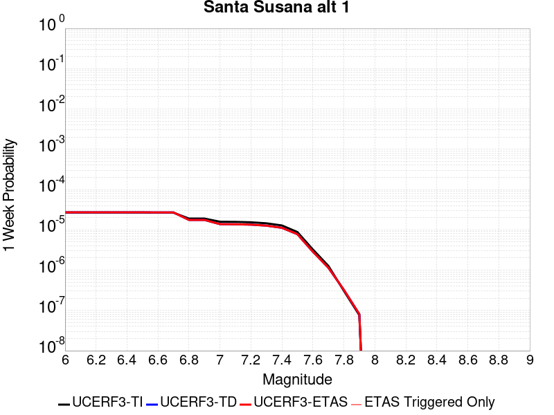 |  |  |  |

| Magnitude | 1 wk TI Prob | 1 wk TD Prob | 1 wk ETAS Prob | 1 wk ETAS/TD Gain | 1 wk ETAS Triggered Only | 1 mo TI Prob | 1 mo TD Prob | 1 mo ETAS Prob | 1 mo ETAS/TD Gain | 1 mo ETAS Triggered Only | 1 yr TI Prob | 1 yr TD Prob | 1 yr ETAS Prob | 1 yr ETAS/TD Gain | 1 yr ETAS Triggered Only | 10 yr TI Prob | 10 yr TD Prob | 10 yr ETAS Prob | 10 yr ETAS/TD Gain | 10 yr ETAS Triggered Only |
|-----|-----|-----|-----|-----|-----|-----|-----|-----|-----|-----|-----|-----|-----|-----|-----|-----|-----|-----|-----|-----|
| 6.0 | 2.674877E-5 | 2.7198023E-5 | 2.7198023E-5 | 1.0 | 0.0 | 1.1463255E-4 | 1.1655839E-4 | 1.2655722E-4 | 1.085784 | 1.0E-5 | 0.0013947578 | 0.0014182882 | 0.0014482456 | 1.0211222 | 3.0E-5 | 0.013860362 | 0.014104128 | 0.014153423 | 1.0034951 | 5.0E-5 |
| 6.1 | 2.674877E-5 | 2.7198023E-5 | 2.7198023E-5 | 1.0 | 0.0 | 1.1463255E-4 | 1.1655839E-4 | 1.2655722E-4 | 1.085784 | 1.0E-5 | 0.0013947578 | 0.0014182882 | 0.0014482456 | 1.0211222 | 3.0E-5 | 0.013860362 | 0.014104128 | 0.014153423 | 1.0034951 | 5.0E-5 |
| 6.2 | 2.674877E-5 | 2.7198023E-5 | 2.7198023E-5 | 1.0 | 0.0 | 1.1463255E-4 | 1.1655839E-4 | 1.2655722E-4 | 1.085784 | 1.0E-5 | 0.0013947578 | 0.0014182882 | 0.0014482456 | 1.0211222 | 3.0E-5 | 0.013860362 | 0.014104128 | 0.014153423 | 1.0034951 | 5.0E-5 |
| 6.3 | 2.674877E-5 | 2.7198023E-5 | 2.7198023E-5 | 1.0 | 0.0 | 1.1463255E-4 | 1.1655839E-4 | 1.2655722E-4 | 1.085784 | 1.0E-5 | 0.0013947578 | 0.0014182882 | 0.0014482456 | 1.0211222 | 3.0E-5 | 0.013860362 | 0.014104128 | 0.014153423 | 1.0034951 | 5.0E-5 |
| 6.4 | 2.674877E-5 | 2.7198023E-5 | 2.7198023E-5 | 1.0 | 0.0 | 1.1463255E-4 | 1.1655839E-4 | 1.2655722E-4 | 1.085784 | 1.0E-5 | 0.0013947578 | 0.0014182882 | 0.0014482456 | 1.0211222 | 3.0E-5 | 0.013860362 | 0.014104128 | 0.014153423 | 1.0034951 | 5.0E-5 |
| 6.5 | 2.674877E-5 | 2.7198023E-5 | 2.7198023E-5 | 1.0 | 0.0 | 1.1463255E-4 | 1.1655839E-4 | 1.2655722E-4 | 1.085784 | 1.0E-5 | 0.0013947578 | 0.0014182882 | 0.0014482456 | 1.0211222 | 3.0E-5 | 0.013860362 | 0.014104128 | 0.014153423 | 1.0034951 | 5.0E-5 |
| 6.6 | 2.6647976E-5 | 2.7074359E-5 | 2.7074359E-5 | 1.0 | 0.0 | 1.14200615E-4 | 1.1602845E-4 | 1.2602728E-4 | 1.0861758 | 1.0E-5 | 0.0013895056 | 0.0014118447 | 0.0014418025 | 1.0212188 | 3.0E-5 | 0.013808494 | 0.014040513 | 0.014089811 | 1.0035111 | 5.0E-5 |
| 6.7 | 2.6647976E-5 | 2.7074359E-5 | 2.7074359E-5 | 1.0 | 0.0 | 1.14200615E-4 | 1.1602845E-4 | 1.2602728E-4 | 1.0861758 | 1.0E-5 | 0.0013895056 | 0.0014118447 | 0.0014418025 | 1.0212188 | 3.0E-5 | 0.013808494 | 0.014040513 | 0.014089811 | 1.0035111 | 5.0E-5 |
| 6.8 | 1.9073179E-5 | 1.7637283E-5 | 1.7637283E-5 | 1.0 | 0.0 | 8.1739636E-5 | 7.558627E-5 | 8.558552E-5 | 1.1322892 | 1.0E-5 | 9.947256E-4 | 9.198925E-4 | 9.398741E-4 | 1.0217217 | 2.0E-5 | 0.009902848 | 0.009163101 | 0.009192826 | 1.003244 | 3.0E-5 |
| 6.9 | 1.9041876E-5 | 1.7619415E-5 | 1.7619415E-5 | 1.0 | 0.0 | 8.160549E-5 | 7.55097E-5 | 8.550894E-5 | 1.1324233 | 1.0E-5 | 9.930939E-4 | 9.1896096E-4 | 9.389426E-4 | 1.0217437 | 2.0E-5 | 0.0098866755 | 0.0091538625 | 0.009183588 | 1.0032473 | 3.0E-5 |
| 7.0 | 1.5917482E-5 | 1.3863864E-5 | 1.3863864E-5 | 1.0 | 0.0 | 6.8215995E-5 | 5.9415237E-5 | 5.9415237E-5 | 1.0 | 0.0 | 8.302132E-4 | 7.231451E-4 | 7.3313783E-4 | 1.0138185 | 1.0E-5 | 0.008271185 | 0.0072088144 | 0.00722867 | 1.0027543 | 2.0E-5 |
| 7.1 | 1.577788E-5 | 1.3743872E-5 | 1.3743872E-5 | 1.0 | 0.0 | 6.761774E-5 | 5.8901005E-5 | 5.8901005E-5 | 1.0 | 0.0 | 8.2293496E-4 | 7.1688846E-4 | 7.2688126E-4 | 1.0139391 | 1.0E-5 | 0.008198941 | 0.007146652 | 0.007166509 | 1.0027785 | 2.0E-5 |
| 7.2 | 1.5416446E-5 | 1.3469944E-5 | 1.3469944E-5 | 1.0 | 0.0 | 6.606882E-5 | 5.772708E-5 | 5.772708E-5 | 1.0 | 0.0 | 8.0409093E-4 | 7.026052E-4 | 7.1259815E-4 | 1.0142227 | 1.0E-5 | 0.008011877 | 0.0070047234 | 0.0070245834 | 1.0028353 | 2.0E-5 |
| 7.3 | 1.4534083E-5 | 1.2717879E-5 | 1.2717879E-5 | 1.0 | 0.0 | 6.228744E-5 | 5.4504082E-5 | 5.4504082E-5 | 1.0 | 0.0 | 7.580857E-4 | 6.633896E-4 | 6.7338295E-4 | 1.0150641 | 1.0E-5 | 0.007555048 | 0.0066149444 | 0.006634812 | 1.0030035 | 2.0E-5 |
| 7.4 | 1.2858995E-5 | 1.1229652E-5 | 1.1229652E-5 | 1.0 | 0.0 | 5.5108816E-5 | 4.8126214E-5 | 4.8126214E-5 | 1.0 | 0.0 | 6.7074323E-4 | 5.857831E-4 | 5.9577724E-4 | 1.0170611 | 1.0E-5 | 0.0066872234 | 0.005843165 | 0.005863048 | 1.0034028 | 2.0E-5 |
| 7.5 | 8.827668E-6 | 7.805457E-6 | 7.805457E-6 | 1.0 | 0.0 | 3.7832317E-5 | 3.3451546E-5 | 3.3451546E-5 | 1.0 | 0.0 | 4.605111E-4 | 4.071989E-4 | 4.1719482E-4 | 1.024548 | 1.0E-5 | 0.0045955796 | 0.0040647765 | 0.004074736 | 1.0024501 | 1.0E-5 |
| 7.6 | 3.2533426E-6 | 2.871988E-6 | 2.871988E-6 | 1.0 | 0.0 | 1.3942822E-5 | 1.2308465E-5 | 1.2308465E-5 | 1.0 | 0.0 | 1.6974064E-4 | 1.4984563E-4 | 1.4984563E-4 | 1.0 | 0.0 | 0.0016961104 | 0.0014974826 | 0.0014974826 | 1.0 | 0.0 |
| 7.7 | 1.2751709E-6 | 1.1491089E-6 | 1.1491089E-6 | 1.0 | 0.0 | 5.4650063E-6 | 4.9247437E-6 | 4.9247437E-6 | 1.0 | 0.0 | 6.653442E-5 | 5.9957198E-5 | 5.9957198E-5 | 1.0 | 0.0 | 6.6514505E-4 | 5.994191E-4 | 5.994191E-4 | 1.0 | 0.0 |
| 7.8 | 3.067544E-7 | 3.2400436E-7 | 3.2400436E-7 | 1.0 | 0.0 | 1.3146611E-6 | 1.3885895E-6 | 1.3885895E-6 | 1.0 | 0.0 | 1.600588E-5 | 1.6905957E-5 | 1.6905957E-5 | 1.0 | 0.0 | 1.6004729E-4 | 1.6904772E-4 | 1.6904772E-4 | 1.0 | 0.0 |
| 7.9 | 7.622999E-8 | 8.087964E-8 | 8.087964E-8 | 1.0 | 0.0 | 3.2669993E-7 | 3.4662696E-7 | 3.4662696E-7 | 1.0 | 0.0 | 3.977564E-6 | 4.2201773E-6 | 4.2201773E-6 | 1.0 | 0.0 | 3.977493E-5 | 4.220118E-5 | 4.220118E-5 | 1.0 | 0.0 |

## Whittier alt 1
*[(top)](#table-of-contents)*

| 1 Week | 1 Month | 1 Year | 10 Year |
|-----|-----|-----|-----|
|  |  |  |  |

| Magnitude | 1 wk TI Prob | 1 wk TD Prob | 1 wk ETAS Prob | 1 wk ETAS/TD Gain | 1 wk ETAS Triggered Only | 1 mo TI Prob | 1 mo TD Prob | 1 mo ETAS Prob | 1 mo ETAS/TD Gain | 1 mo ETAS Triggered Only | 1 yr TI Prob | 1 yr TD Prob | 1 yr ETAS Prob | 1 yr ETAS/TD Gain | 1 yr ETAS Triggered Only | 10 yr TI Prob | 10 yr TD Prob | 10 yr ETAS Prob | 10 yr ETAS/TD Gain | 10 yr ETAS Triggered Only |
|-----|-----|-----|-----|-----|-----|-----|-----|-----|-----|-----|-----|-----|-----|-----|-----|-----|-----|-----|-----|-----|
| 6.0 | 4.2554693E-5 | 4.725218E-5 | 6.725123E-5 | 1.4232409 | 2.0E-5 | 1.8236451E-4 | 2.0249544E-4 | 2.2249139E-4 | 1.0987476 | 2.0E-5 | 0.002218027 | 0.0024629154 | 0.0024928413 | 1.0121506 | 3.0E-5 | 0.02196019 | 0.024390234 | 0.024439014 | 1.002 | 5.0E-5 |
| 6.1 | 4.2554693E-5 | 4.725218E-5 | 6.725123E-5 | 1.4232409 | 2.0E-5 | 1.8236451E-4 | 2.0249544E-4 | 2.2249139E-4 | 1.0987476 | 2.0E-5 | 0.002218027 | 0.0024629154 | 0.0024928413 | 1.0121506 | 3.0E-5 | 0.02196019 | 0.024390234 | 0.024439014 | 1.002 | 5.0E-5 |
| 6.2 | 4.2554693E-5 | 4.725218E-5 | 6.725123E-5 | 1.4232409 | 2.0E-5 | 1.8236451E-4 | 2.0249544E-4 | 2.2249139E-4 | 1.0987476 | 2.0E-5 | 0.002218027 | 0.0024629154 | 0.0024928413 | 1.0121506 | 3.0E-5 | 0.02196019 | 0.024390234 | 0.024439014 | 1.002 | 5.0E-5 |
| 6.3 | 1.9617712E-5 | 1.8268593E-5 | 1.8268593E-5 | 1.0 | 0.0 | 8.40732E-5 | 7.829172E-5 | 7.829172E-5 | 1.0 | 0.0 | 0.0010231105 | 9.52804E-4 | 9.52804E-4 | 1.0 | 0.0 | 0.01018413 | 0.009490474 | 0.009510284 | 1.0020874 | 2.0E-5 |
| 6.4 | 1.5611336E-5 | 1.3604271E-5 | 1.3604271E-5 | 1.0 | 0.0 | 6.690401E-5 | 5.8302747E-5 | 5.8302747E-5 | 1.0 | 0.0 | 8.142519E-4 | 7.0961076E-4 | 7.0961076E-4 | 1.0 | 0.0 | 0.008112748 | 0.0070754145 | 0.007095273 | 1.0028067 | 2.0E-5 |
| 6.5 | 1.5150166E-5 | 1.3100925E-5 | 1.3100925E-5 | 1.0 | 0.0 | 6.492767E-5 | 5.6145647E-5 | 5.6145647E-5 | 1.0 | 0.0 | 7.9020765E-4 | 6.8336475E-4 | 6.8336475E-4 | 1.0 | 0.0 | 0.007874036 | 0.0068145846 | 0.0068344483 | 1.0029149 | 2.0E-5 |
| 6.6 | 1.295588E-5 | 1.0380725E-5 | 1.0380725E-5 | 1.0 | 0.0 | 5.552402E-5 | 4.4488075E-5 | 4.4488075E-5 | 1.0 | 0.0 | 6.7579525E-4 | 5.4150965E-4 | 5.4150965E-4 | 1.0 | 0.0 | 0.006737438 | 0.0054033357 | 0.0054232273 | 1.0036814 | 2.0E-5 |
| 6.7 | 1.2542085E-5 | 9.899369E-6 | 9.899369E-6 | 1.0 | 0.0 | 5.3750682E-5 | 4.242519E-5 | 4.242519E-5 | 1.0 | 0.0 | 6.542181E-4 | 5.164061E-4 | 5.164061E-4 | 1.0 | 0.0 | 0.006522954 | 0.0051534795 | 0.005163428 | 1.0019305 | 1.0E-5 |
| 6.8 | 1.2195878E-5 | 9.495415E-6 | 9.495415E-6 | 1.0 | 0.0 | 5.2267E-5 | 4.069401E-5 | 4.069401E-5 | 1.0 | 0.0 | 6.36165E-4 | 4.9533875E-4 | 4.9533875E-4 | 1.0 | 0.0 | 0.0063434686 | 0.004943688 | 0.0049536387 | 1.0020127 | 1.0E-5 |
| 6.9 | 1.1580298E-5 | 8.772933E-6 | 8.772933E-6 | 1.0 | 0.0 | 4.9628903E-5 | 3.7597754E-5 | 3.7597754E-5 | 1.0 | 0.0 | 6.040644E-4 | 4.5765814E-4 | 4.5765814E-4 | 1.0 | 0.0 | 0.00602425 | 0.0045684157 | 0.00457837 | 1.0021789 | 1.0E-5 |
| 7.0 | 1.0964795E-5 | 8.083994E-6 | 8.083994E-6 | 1.0 | 0.0 | 4.6991136E-5 | 3.4645236E-5 | 3.4645236E-5 | 1.0 | 0.0 | 5.7196687E-4 | 4.2172565E-4 | 4.2172565E-4 | 1.0 | 0.0 | 0.0057049696 | 0.004210462 | 0.0042204196 | 1.002365 | 1.0E-5 |
| 7.1 | 1.0230601E-5 | 7.3266697E-6 | 7.3266697E-6 | 1.0 | 0.0 | 4.3844695E-5 | 3.1399642E-5 | 3.1399642E-5 | 1.0 | 0.0 | 5.336784E-4 | 3.8222488E-4 | 3.8222488E-4 | 1.0 | 0.0 | 0.005323986 | 0.0038168381 | 0.0038268 | 1.00261 | 1.0E-5 |
| 7.2 | 9.40865E-6 | 6.543289E-6 | 6.543289E-6 | 1.0 | 0.0 | 4.032216E-5 | 2.8042374E-5 | 2.8042374E-5 | 1.0 | 0.0 | 4.908117E-4 | 3.4136363E-4 | 3.4136363E-4 | 1.0 | 0.0 | 0.0048972913 | 0.003409485 | 0.0034194512 | 1.002923 | 1.0E-5 |
| 7.3 | 8.237384E-6 | 5.5977525E-6 | 5.5977525E-6 | 1.0 | 0.0 | 3.5302593E-5 | 2.3990153E-5 | 2.3990153E-5 | 1.0 | 0.0 | 4.2972428E-4 | 2.92042E-4 | 2.92042E-4 | 1.0 | 0.0 | 0.0042889426 | 0.002916903 | 0.002926874 | 1.0034183 | 1.0E-5 |
| 7.4 | 7.5316966E-6 | 5.027819E-6 | 5.027819E-6 | 1.0 | 0.0 | 3.2278298E-5 | 2.1547625E-5 | 2.1547625E-5 | 1.0 | 0.0 | 3.9291743E-4 | 2.6231175E-4 | 2.6231175E-4 | 1.0 | 0.0 | 0.0039222343 | 0.0026201333 | 0.0026201333 | 1.0 | 0.0 |
| 7.5 | 6.149649E-6 | 3.933841E-6 | 3.933841E-6 | 1.0 | 0.0 | 2.6355372E-5 | 1.6859214E-5 | 1.6859214E-5 | 1.0 | 0.0 | 3.208294E-4 | 2.052425E-4 | 2.052425E-4 | 1.0 | 0.0 | 0.003203666 | 0.0020506186 | 0.0020506186 | 1.0 | 0.0 |
| 7.6 | 5.457711E-6 | 3.3953788E-6 | 3.3953788E-6 | 1.0 | 0.0 | 2.338998E-5 | 1.4551547E-5 | 1.4551547E-5 | 1.0 | 0.0 | 2.8473578E-4 | 1.771515E-4 | 1.771515E-4 | 1.0 | 0.0 | 0.0028437122 | 0.0017701836 | 0.0017701836 | 1.0 | 0.0 |
| 7.7 | 4.1676276E-6 | 2.3331952E-6 | 2.3331952E-6 | 1.0 | 0.0 | 1.7861139E-5 | 9.999374E-6 | 9.999374E-6 | 1.0 | 0.0 | 2.1743766E-4 | 1.2173632E-4 | 1.2173632E-4 | 1.0 | 0.0 | 0.0021722503 | 0.0012167693 | 0.0012167693 | 1.0 | 0.0 |
| 7.8 | 2.2692414E-7 | 9.3854695E-8 | 9.3854695E-8 | 1.0 | 0.0 | 9.725317E-7 | 4.0223435E-7 | 4.0223435E-7 | 1.0 | 0.0 | 1.1840509E-5 | 4.8971956E-6 | 4.8971956E-6 | 1.0 | 0.0 | 1.1839878E-4 | 4.8971204E-5 | 4.8971204E-5 | 1.0 | 0.0 |
| 7.9 | 6.676829E-9 | 3.439853E-9 | 3.439853E-9 | 1.0 | 0.0 | 2.861498E-8 | 1.4742227E-8 | 1.4742227E-8 | 1.0 | 0.0 | 3.4838732E-7 | 1.7948659E-7 | 1.7948659E-7 | 1.0 | 0.0 | 3.4838679E-6 | 1.7948646E-6 | 1.7948646E-6 | 1.0 | 0.0 |

## Malibu Coast alt 1
*[(top)](#table-of-contents)*

| 1 Week | 1 Month | 1 Year | 10 Year |
|-----|-----|-----|-----|
|  |  |  |  |

| Magnitude | 1 wk TI Prob | 1 wk TD Prob | 1 wk ETAS Prob | 1 wk ETAS/TD Gain | 1 wk ETAS Triggered Only | 1 mo TI Prob | 1 mo TD Prob | 1 mo ETAS Prob | 1 mo ETAS/TD Gain | 1 mo ETAS Triggered Only | 1 yr TI Prob | 1 yr TD Prob | 1 yr ETAS Prob | 1 yr ETAS/TD Gain | 1 yr ETAS Triggered Only | 10 yr TI Prob | 10 yr TD Prob | 10 yr ETAS Prob | 10 yr ETAS/TD Gain | 10 yr ETAS Triggered Only |
|-----|-----|-----|-----|-----|-----|-----|-----|-----|-----|-----|-----|-----|-----|-----|-----|-----|-----|-----|-----|-----|
| 6.0 | 1.6572556E-5 | 1.7598066E-5 | 2.7597891E-5 | 1.5682342 | 1.0E-5 | 7.102331E-5 | 7.541821E-5 | 1.05415944E-4 | 1.3977519 | 3.0E-5 | 8.6436566E-4 | 9.178488E-4 | 9.4782125E-4 | 1.0326551 | 3.0E-5 | 0.0086101135 | 0.009142512 | 0.009192055 | 1.0054189 | 5.0E-5 |
| 6.1 | 1.6572556E-5 | 1.7598066E-5 | 2.7597891E-5 | 1.5682342 | 1.0E-5 | 7.102331E-5 | 7.541821E-5 | 9.5416704E-5 | 1.265168 | 2.0E-5 | 8.6436566E-4 | 9.178488E-4 | 9.378304E-4 | 1.0217701 | 2.0E-5 | 0.0086101135 | 0.009142512 | 0.009182147 | 1.0043352 | 4.0E-5 |
| 6.2 | 1.1085717E-5 | 1.1557147E-5 | 2.155703E-5 | 1.8652555 | 1.0E-5 | 4.750935E-5 | 4.952971E-5 | 5.9529215E-5 | 1.201889 | 1.0E-5 | 5.782728E-4 | 6.028609E-4 | 6.128549E-4 | 1.0165776 | 1.0E-5 | 0.0057677035 | 0.0060126255 | 0.0060325055 | 1.0033064 | 2.0E-5 |
| 6.3 | 1.0208568E-5 | 1.0592237E-5 | 2.0592131E-5 | 1.9440776 | 1.0E-5 | 4.375027E-5 | 4.539453E-5 | 5.5394077E-5 | 1.2202809 | 1.0E-5 | 5.325294E-4 | 5.5254117E-4 | 5.6253566E-4 | 1.0180882 | 1.0E-5 | 0.0053125503 | 0.0055119814 | 0.005531871 | 1.0036085 | 2.0E-5 |
| 6.4 | 9.0682315E-6 | 9.342637E-6 | 1.9342544E-5 | 2.0703516 | 1.0E-5 | 3.8863272E-5 | 4.003927E-5 | 5.003887E-5 | 1.2497448 | 1.0E-5 | 4.730576E-4 | 4.8737114E-4 | 4.9736624E-4 | 1.0205083 | 1.0E-5 | 0.0047205184 | 0.004863236 | 0.004883139 | 1.0040925 | 2.0E-5 |
| 6.5 | 7.605796E-6 | 7.748587E-6 | 7.748587E-6 | 1.0 | 0.0 | 3.259586E-5 | 3.3207816E-5 | 3.3207816E-5 | 1.0 | 0.0 | 3.9678233E-4 | 4.0423148E-4 | 4.0423148E-4 | 1.0 | 0.0 | 0.0039607463 | 0.0040351 | 0.0040450594 | 1.0024682 | 1.0E-5 |
| 6.6 | 5.889873E-6 | 5.8795385E-6 | 5.8795385E-6 | 1.0 | 0.0 | 2.5242069E-5 | 2.519778E-5 | 2.519778E-5 | 1.0 | 0.0 | 3.0727885E-4 | 3.0673988E-4 | 3.0673988E-4 | 1.0 | 0.0 | 0.003068543 | 0.0030631777 | 0.003073147 | 1.0032545 | 1.0E-5 |
| 6.7 | 5.66586E-6 | 5.641641E-6 | 5.641641E-6 | 1.0 | 0.0 | 2.428203E-5 | 2.417824E-5 | 2.417824E-5 | 1.0 | 0.0 | 2.955936E-4 | 2.9433038E-4 | 2.9433038E-4 | 1.0 | 0.0 | 0.0029520073 | 0.0029394177 | 0.0029493882 | 1.003392 | 1.0E-5 |
| 6.8 | 5.521556E-6 | 5.489427E-6 | 5.489427E-6 | 1.0 | 0.0 | 2.3663597E-5 | 2.3525903E-5 | 2.3525903E-5 | 1.0 | 0.0 | 2.880662E-4 | 2.8639034E-4 | 2.8639034E-4 | 1.0 | 0.0 | 0.0028769306 | 0.002860224 | 0.0028701955 | 1.0034863 | 1.0E-5 |
| 6.9 | 5.29752E-6 | 5.2499317E-6 | 5.2499317E-6 | 1.0 | 0.0 | 2.270346E-5 | 2.2499513E-5 | 2.2499513E-5 | 1.0 | 0.0 | 2.7637955E-4 | 2.7389723E-4 | 2.7389723E-4 | 1.0 | 0.0 | 0.0027603607 | 0.0027356069 | 0.0027455795 | 1.0036455 | 1.0E-5 |
| 7.0 | 5.106743E-6 | 5.0476788E-6 | 5.0476788E-6 | 1.0 | 0.0 | 2.1885859E-5 | 2.163273E-5 | 2.163273E-5 | 1.0 | 0.0 | 2.6642776E-4 | 2.6334674E-4 | 2.6334674E-4 | 1.0 | 0.0 | 0.0026610855 | 0.0026303562 | 0.0026403298 | 1.0037918 | 1.0E-5 |
| 7.1 | 4.8469647E-6 | 4.770373E-6 | 4.770373E-6 | 1.0 | 0.0 | 2.0772539E-5 | 2.0444295E-5 | 2.0444295E-5 | 1.0 | 0.0 | 2.528763E-4 | 2.4888094E-4 | 2.4888094E-4 | 1.0 | 0.0 | 0.0025258875 | 0.00248603 | 0.0024960053 | 1.0040125 | 1.0E-5 |
| 7.2 | 4.545514E-6 | 4.4481935E-6 | 4.4481935E-6 | 1.0 | 0.0 | 1.9480629E-5 | 1.9063547E-5 | 1.9063547E-5 | 1.0 | 0.0 | 2.3715083E-4 | 2.3207403E-4 | 2.3207403E-4 | 1.0 | 0.0 | 0.0023689792 | 0.0023183243 | 0.002328301 | 1.0043035 | 1.0E-5 |
| 7.3 | 3.794097E-6 | 3.6519348E-6 | 3.6519348E-6 | 1.0 | 0.0 | 1.6260314E-5 | 1.5651056E-5 | 1.5651056E-5 | 1.0 | 0.0 | 1.9795135E-4 | 1.9053498E-4 | 1.9053498E-4 | 1.0 | 0.0 | 0.001977751 | 0.0019037209 | 0.0019137019 | 1.0052428 | 1.0E-5 |
| 7.4 | 2.808217E-6 | 2.719077E-6 | 2.719077E-6 | 1.0 | 0.0 | 1.203516E-5 | 1.1653135E-5 | 1.1653135E-5 | 1.0 | 0.0 | 1.4651821E-4 | 1.418677E-4 | 1.418677E-4 | 1.0 | 0.0 | 0.0014642165 | 0.001417774 | 0.0014277599 | 1.0070434 | 1.0E-5 |
| 7.5 | 1.83809E-6 | 1.8190691E-6 | 1.8190691E-6 | 1.0 | 0.0 | 7.877505E-6 | 7.795988E-6 | 7.795988E-6 | 1.0 | 0.0 | 9.59044E-5 | 9.491203E-5 | 9.491203E-5 | 1.0 | 0.0 | 9.5863023E-4 | 9.48717E-4 | 9.587075E-4 | 1.0105306 | 1.0E-5 |
| 7.6 | 1.1292672E-6 | 1.1001447E-6 | 1.1001447E-6 | 1.0 | 0.0 | 4.839708E-6 | 4.714897E-6 | 4.714897E-6 | 1.0 | 0.0 | 5.8921847E-5 | 5.7402376E-5 | 5.7402376E-5 | 1.0 | 0.0 | 5.890623E-4 | 5.738771E-4 | 5.838714E-4 | 1.0174153 | 1.0E-5 |
| 7.7 | 5.065272E-7 | 4.609151E-7 | 4.609151E-7 | 1.0 | 0.0 | 2.170829E-6 | 1.975349E-6 | 1.975349E-6 | 1.0 | 0.0 | 2.6429525E-5 | 2.404962E-5 | 2.404962E-5 | 1.0 | 0.0 | 2.642638E-4 | 2.4047129E-4 | 2.5046887E-4 | 1.041575 | 1.0E-5 |
| 7.8 | 8.952991E-8 | 6.707874E-8 | 6.707874E-8 | 1.0 | 0.0 | 3.8369956E-7 | 2.8748025E-7 | 2.8748025E-7 | 1.0 | 0.0 | 4.671532E-6 | 3.5000667E-6 | 3.5000667E-6 | 1.0 | 0.0 | 4.671434E-5 | 3.5000136E-5 | 3.5000136E-5 | 1.0 | 0.0 |
| 7.9 | 8.007447E-10 | 6.1608785E-10 | 6.1608785E-10 | 1.0 | 0.0 | 3.4317629E-9 | 2.6403764E-9 | 2.6403764E-9 | 1.0 | 0.0 | 4.1781714E-8 | 3.2146584E-8 | 3.2146584E-8 | 1.0 | 0.0 | 4.1781706E-7 | 3.214658E-7 | 3.214658E-7 | 1.0 | 0.0 |

## Mono Lake 2011 CFM
*[(top)](#table-of-contents)*

| 1 Week | 1 Month | 1 Year | 10 Year |
|-----|-----|-----|-----|
|  |  |  |  |

| Magnitude | 1 wk TI Prob | 1 wk TD Prob | 1 wk ETAS Prob | 1 wk ETAS/TD Gain | 1 wk ETAS Triggered Only | 1 mo TI Prob | 1 mo TD Prob | 1 mo ETAS Prob | 1 mo ETAS/TD Gain | 1 mo ETAS Triggered Only | 1 yr TI Prob | 1 yr TD Prob | 1 yr ETAS Prob | 1 yr ETAS/TD Gain | 1 yr ETAS Triggered Only | 10 yr TI Prob | 10 yr TD Prob | 10 yr ETAS Prob | 10 yr ETAS/TD Gain | 10 yr ETAS Triggered Only |
|-----|-----|-----|-----|-----|-----|-----|-----|-----|-----|-----|-----|-----|-----|-----|-----|-----|-----|-----|-----|-----|
| 6.0 | 2.0341662E-5 | 2.3828166E-5 | 3.3827928E-5 | 1.4196614 | 1.0E-5 | 8.717564E-5 | 1.0211971E-4 | 1.2211766E-4 | 1.1958286 | 2.0E-5 | 0.0010608466 | 0.0012431298 | 0.0012730926 | 1.0241027 | 3.0E-5 | 0.010557966 | 0.012413835 | 0.012463215 | 1.0039778 | 5.0E-5 |
| 6.1 | 2.0341662E-5 | 2.3828166E-5 | 3.3827928E-5 | 1.4196614 | 1.0E-5 | 8.717564E-5 | 1.0211971E-4 | 1.2211766E-4 | 1.1958286 | 2.0E-5 | 0.0010608466 | 0.0012431298 | 0.0012730926 | 1.0241027 | 3.0E-5 | 0.010557966 | 0.012413835 | 0.012463215 | 1.0039778 | 5.0E-5 |
| 6.2 | 2.0341662E-5 | 2.3828166E-5 | 3.3827928E-5 | 1.4196614 | 1.0E-5 | 8.717564E-5 | 1.0211971E-4 | 1.2211766E-4 | 1.1958286 | 2.0E-5 | 0.0010608466 | 0.0012431298 | 0.0012730926 | 1.0241027 | 3.0E-5 | 0.010557966 | 0.012413835 | 0.012463215 | 1.0039778 | 5.0E-5 |
| 6.3 | 2.0341662E-5 | 2.3828166E-5 | 3.3827928E-5 | 1.4196614 | 1.0E-5 | 8.717564E-5 | 1.0211971E-4 | 1.2211766E-4 | 1.1958286 | 2.0E-5 | 0.0010608466 | 0.0012431298 | 0.0012730926 | 1.0241027 | 3.0E-5 | 0.010557966 | 0.012413835 | 0.012463215 | 1.0039778 | 5.0E-5 |
| 6.4 | 1.749821E-5 | 2.0490985E-5 | 3.049078E-5 | 1.4880095 | 1.0E-5 | 7.499018E-5 | 8.781851E-5 | 1.07816755E-4 | 1.2277224 | 2.0E-5 | 9.1262296E-4 | 0.0010691903 | 0.0010991583 | 1.0280286 | 3.0E-5 | 0.009088841 | 0.010691865 | 0.010741331 | 1.0046264 | 5.0E-5 |
| 6.5 | 1.749821E-5 | 2.0490985E-5 | 3.049078E-5 | 1.4880095 | 1.0E-5 | 7.499018E-5 | 8.781851E-5 | 1.07816755E-4 | 1.2277224 | 2.0E-5 | 9.1262296E-4 | 0.0010691903 | 0.0010991583 | 1.0280286 | 3.0E-5 | 0.009088841 | 0.010691865 | 0.010741331 | 1.0046264 | 5.0E-5 |

## Greenville (So) 2011 CFM
*[(top)](#table-of-contents)*

| 1 Week | 1 Month | 1 Year | 10 Year |
|-----|-----|-----|-----|
|  |  |  |  |

| Magnitude | 1 wk TI Prob | 1 wk TD Prob | 1 wk ETAS Prob | 1 wk ETAS/TD Gain | 1 wk ETAS Triggered Only | 1 mo TI Prob | 1 mo TD Prob | 1 mo ETAS Prob | 1 mo ETAS/TD Gain | 1 mo ETAS Triggered Only | 1 yr TI Prob | 1 yr TD Prob | 1 yr ETAS Prob | 1 yr ETAS/TD Gain | 1 yr ETAS Triggered Only | 10 yr TI Prob | 10 yr TD Prob | 10 yr ETAS Prob | 10 yr ETAS/TD Gain | 10 yr ETAS Triggered Only |
|-----|-----|-----|-----|-----|-----|-----|-----|-----|-----|-----|-----|-----|-----|-----|-----|-----|-----|-----|-----|-----|
| 6.0 | 4.279693E-5 | 5.5040087E-5 | 7.503899E-5 | 1.3633515 | 2.0E-5 | 1.8340252E-4 | 2.3586681E-4 | 2.558621E-4 | 1.0847737 | 2.0E-5 | 0.0022306389 | 0.0028682416 | 0.002908127 | 1.0139059 | 4.0E-5 | 0.022083808 | 0.028338138 | 0.028386721 | 1.0017143 | 5.0E-5 |
| 6.1 | 3.4037297E-5 | 4.3192387E-5 | 5.3191958E-5 | 1.2315123 | 1.0E-5 | 1.4586597E-4 | 1.8509831E-4 | 1.9509645E-4 | 1.0540154 | 1.0E-5 | 0.0017744715 | 0.0022514379 | 0.0022813703 | 1.0132948 | 3.0E-5 | 0.01760369 | 0.022302566 | 0.022341674 | 1.0017536 | 4.0E-5 |
| 6.2 | 3.4037297E-5 | 4.3192387E-5 | 5.3191958E-5 | 1.2315123 | 1.0E-5 | 1.4586597E-4 | 1.8509831E-4 | 1.9509645E-4 | 1.0540154 | 1.0E-5 | 0.0017744715 | 0.0022514379 | 0.0022813703 | 1.0132948 | 3.0E-5 | 0.01760369 | 0.022302566 | 0.022341674 | 1.0017536 | 4.0E-5 |
| 6.3 | 2.5956324E-5 | 3.2428903E-5 | 4.242858E-5 | 1.3083569 | 1.0E-5 | 1.11236644E-4 | 1.3897405E-4 | 1.4897266E-4 | 1.0719459 | 1.0E-5 | 0.0013534647 | 0.0016907708 | 0.0017207201 | 1.0177134 | 3.0E-5 | 0.013452509 | 0.016785882 | 0.01682521 | 1.0023429 | 4.0E-5 |
| 6.4 | 2.1145053E-5 | 2.6197677E-5 | 3.6197416E-5 | 1.3817033 | 1.0E-5 | 9.061851E-5 | 1.1227112E-4 | 1.2227E-4 | 1.0890601 | 1.0E-5 | 0.0011027219 | 0.0013660751 | 0.0013960341 | 1.0219307 | 3.0E-5 | 0.01097266 | 0.01358018 | 0.013619636 | 1.0029055 | 4.0E-5 |
| 6.5 | 2.0030959E-5 | 2.479578E-5 | 3.4795532E-5 | 1.4032844 | 1.0E-5 | 8.584414E-5 | 1.06263484E-4 | 1.1626242E-4 | 1.0940957 | 1.0E-5 | 0.0010446513 | 0.0012930221 | 0.0013229833 | 1.0231714 | 3.0E-5 | 0.010397541 | 0.012858339 | 0.012897824 | 1.0030708 | 4.0E-5 |
| 6.6 | 1.8395405E-5 | 2.2754466E-5 | 3.2754237E-5 | 1.4394642 | 1.0E-5 | 7.8835066E-5 | 9.751565E-5 | 1.0751468E-4 | 1.1025376 | 1.0E-5 | 9.5939427E-4 | 0.0011866348 | 0.0012165991 | 1.0252516 | 3.0E-5 | 0.009552629 | 0.011806041 | 0.011845568 | 1.0033481 | 4.0E-5 |
| 6.7 | 1.7883482E-5 | 2.212551E-5 | 3.212529E-5 | 1.451957 | 1.0E-5 | 7.664124E-5 | 9.482033E-5 | 1.0481938E-4 | 1.1054527 | 1.0E-5 | 9.3270757E-4 | 0.0011538545 | 0.0011838198 | 1.0259699 | 3.0E-5 | 0.009288026 | 0.011481688 | 0.011521229 | 1.0034438 | 4.0E-5 |
| 6.8 | 1.3373564E-5 | 1.6505966E-5 | 2.65058E-5 | 1.6058315 | 1.0E-5 | 5.7314013E-5 | 7.073802E-5 | 8.073731E-5 | 1.1413567 | 1.0E-5 | 6.975747E-4 | 8.609098E-4 | 8.90884E-4 | 1.0348169 | 3.0E-5 | 0.0069538904 | 0.008577357 | 0.0086071 | 1.0034676 | 3.0E-5 |
| 6.9 | 1.06692905E-5 | 1.3152582E-5 | 2.315245E-5 | 1.760297 | 1.0E-5 | 4.5724726E-5 | 5.6367055E-5 | 6.636649E-5 | 1.1773986 | 1.0E-5 | 5.5655633E-4 | 6.86064E-4 | 7.060503E-4 | 1.0291318 | 2.0E-5 | 0.005551645 | 0.006840693 | 0.006860556 | 1.0029037 | 2.0E-5 |
| 7.0 | 8.157512E-6 | 1.0062639E-5 | 2.0062538E-5 | 1.9937651 | 1.0E-5 | 3.4960296E-5 | 4.3124903E-5 | 5.3124473E-5 | 1.2318746 | 1.0E-5 | 4.2555845E-4 | 5.2492286E-4 | 5.4491236E-4 | 1.0380808 | 2.0E-5 | 0.004247444 | 0.0052373074 | 0.0052572023 | 1.0037987 | 2.0E-5 |
| 7.1 | 6.1467113E-6 | 7.6274314E-6 | 1.7627355E-5 | 2.3110473 | 1.0E-5 | 2.6342783E-5 | 3.268859E-5 | 4.268826E-5 | 1.3059071 | 1.0E-5 | 3.206762E-4 | 3.9791173E-4 | 4.1790376E-4 | 1.0502424 | 2.0E-5 | 0.0032021382 | 0.0039721807 | 0.003992101 | 1.005015 | 2.0E-5 |
| 7.2 | 4.713467E-6 | 5.9141557E-6 | 1.5914096E-5 | 2.6908484 | 1.0E-5 | 2.0200418E-5 | 2.5346139E-5 | 3.5345885E-5 | 1.3945274 | 1.0E-5 | 2.4591232E-4 | 3.0854615E-4 | 3.1854305E-4 | 1.0324 | 1.0E-5 | 0.0024564038 | 0.0030813308 | 0.0030913001 | 1.0032353 | 1.0E-5 |
| 7.3 | 2.3266216E-6 | 2.954009E-6 | 2.954009E-6 | 1.0 | 0.0 | 9.971197E-6 | 1.2659978E-5 | 1.2659978E-5 | 1.0 | 0.0 | 1.2139256E-4 | 1.5412449E-4 | 1.5412449E-4 | 1.0 | 0.0 | 0.0012132627 | 0.0015402455 | 0.0015402455 | 1.0 | 0.0 |
| 7.4 | 1.3314E-6 | 1.7179472E-6 | 1.7179472E-6 | 1.0 | 0.0 | 5.7059874E-6 | 7.36261E-6 | 7.36261E-6 | 1.0 | 0.0 | 6.946818E-5 | 8.963614E-5 | 8.963614E-5 | 1.0 | 0.0 | 6.9446466E-4 | 8.9603866E-4 | 8.9603866E-4 | 1.0 | 0.0 |
| 7.5 | 1.0362941E-6 | 1.3468821E-6 | 1.3468821E-6 | 1.0 | 0.0 | 4.4412527E-6 | 5.772339E-6 | 5.772339E-6 | 1.0 | 0.0 | 5.407091E-5 | 7.027601E-5 | 7.027601E-5 | 1.0 | 0.0 | 5.405776E-4 | 7.025681E-4 | 7.025681E-4 | 1.0 | 0.0 |
| 7.6 | 7.764784E-7 | 1.0088593E-6 | 1.0088593E-6 | 1.0 | 0.0 | 3.3277602E-6 | 4.323676E-6 | 4.323676E-6 | 1.0 | 0.0 | 4.0514726E-5 | 5.263952E-5 | 5.263952E-5 | 1.0 | 0.0 | 4.050734E-4 | 5.262919E-4 | 5.262919E-4 | 1.0 | 0.0 |
| 7.7 | 1.6927763E-7 | 2.2139248E-7 | 2.2139248E-7 | 1.0 | 0.0 | 7.2547533E-7 | 9.4882455E-7 | 9.4882455E-7 | 1.0 | 0.0 | 8.832627E-6 | 1.15518815E-5 | 1.15518815E-5 | 1.0 | 0.0 | 8.8322755E-5 | 1.15515526E-4 | 1.15515526E-4 | 1.0 | 0.0 |

## San Jacinto (Clark) rev
*[(top)](#table-of-contents)*

| 1 Week | 1 Month | 1 Year | 10 Year |
|-----|-----|-----|-----|
|  |  |  |  |

| Magnitude | 1 wk TI Prob | 1 wk TD Prob | 1 wk ETAS Prob | 1 wk ETAS/TD Gain | 1 wk ETAS Triggered Only | 1 mo TI Prob | 1 mo TD Prob | 1 mo ETAS Prob | 1 mo ETAS/TD Gain | 1 mo ETAS Triggered Only | 1 yr TI Prob | 1 yr TD Prob | 1 yr ETAS Prob | 1 yr ETAS/TD Gain | 1 yr ETAS Triggered Only | 10 yr TI Prob | 10 yr TD Prob | 10 yr ETAS Prob | 10 yr ETAS/TD Gain | 10 yr ETAS Triggered Only |
|-----|-----|-----|-----|-----|-----|-----|-----|-----|-----|-----|-----|-----|-----|-----|-----|-----|-----|-----|-----|-----|
| 6.0 | 4.482615E-5 | 2.1154196E-5 | 3.1153984E-5 | 1.4727095 | 1.0E-5 | 1.9209793E-4 | 9.065773E-5 | 1.1065592E-4 | 1.22059 | 2.0E-5 | 0.0023362834 | 0.0011032083 | 0.0011431641 | 1.0362179 | 4.0E-5 | 0.02311874 | 0.011503847 | 0.011553272 | 1.0042964 | 5.0E-5 |
| 6.1 | 4.482615E-5 | 2.1154196E-5 | 3.1153984E-5 | 1.4727095 | 1.0E-5 | 1.9209793E-4 | 9.065773E-5 | 1.1065592E-4 | 1.22059 | 2.0E-5 | 0.0023362834 | 0.0011032083 | 0.0011431641 | 1.0362179 | 4.0E-5 | 0.02311874 | 0.011503847 | 0.011553272 | 1.0042964 | 5.0E-5 |
| 6.2 | 4.482615E-5 | 2.1154196E-5 | 3.1153984E-5 | 1.4727095 | 1.0E-5 | 1.9209793E-4 | 9.065773E-5 | 1.1065592E-4 | 1.22059 | 2.0E-5 | 0.0023362834 | 0.0011032083 | 0.0011431641 | 1.0362179 | 4.0E-5 | 0.02311874 | 0.011503847 | 0.011553272 | 1.0042964 | 5.0E-5 |
| 6.3 | 4.482615E-5 | 2.1154196E-5 | 3.1153984E-5 | 1.4727095 | 1.0E-5 | 1.9209793E-4 | 9.065773E-5 | 1.1065592E-4 | 1.22059 | 2.0E-5 | 0.0023362834 | 0.0011032083 | 0.0011431641 | 1.0362179 | 4.0E-5 | 0.02311874 | 0.011503847 | 0.011553272 | 1.0042964 | 5.0E-5 |
| 6.4 | 4.482615E-5 | 2.1154196E-5 | 3.1153984E-5 | 1.4727095 | 1.0E-5 | 1.9209793E-4 | 9.065773E-5 | 1.1065592E-4 | 1.22059 | 2.0E-5 | 0.0023362834 | 0.0011032083 | 0.0011431641 | 1.0362179 | 4.0E-5 | 0.02311874 | 0.011503847 | 0.011553272 | 1.0042964 | 5.0E-5 |
| 6.5 | 3.7294863E-5 | 1.7356087E-5 | 2.7355914E-5 | 1.5761567 | 1.0E-5 | 1.5982533E-4 | 7.438113E-5 | 9.437965E-5 | 1.2688653 | 2.0E-5 | 0.0019441366 | 9.052186E-4 | 9.4518234E-4 | 1.0441482 | 4.0E-5 | 0.01927216 | 0.0094941035 | 0.009543628 | 1.0052165 | 5.0E-5 |
| 6.6 | 3.7294863E-5 | 1.7356087E-5 | 2.7355914E-5 | 1.5761567 | 1.0E-5 | 1.5982533E-4 | 7.438113E-5 | 9.437965E-5 | 1.2688653 | 2.0E-5 | 0.0019441366 | 9.052186E-4 | 9.4518234E-4 | 1.0441482 | 4.0E-5 | 0.01927216 | 0.0094941035 | 0.009543628 | 1.0052165 | 5.0E-5 |
| 6.7 | 3.6039248E-5 | 1.6604314E-5 | 2.6604146E-5 | 1.6022432 | 1.0E-5 | 1.5444479E-4 | 7.1159426E-5 | 9.1158E-5 | 1.281039 | 2.0E-5 | 0.0018787434 | 8.6602574E-4 | 9.059911E-4 | 1.0461481 | 4.0E-5 | 0.01862939 | 0.009096047 | 0.009145592 | 1.0054469 | 5.0E-5 |
| 6.8 | 3.5031844E-5 | 1.6232942E-5 | 2.623278E-5 | 1.6160213 | 1.0E-5 | 1.5012783E-4 | 6.956792E-5 | 8.956653E-5 | 1.2874688 | 2.0E-5 | 0.0018262739 | 8.4666436E-4 | 8.866305E-4 | 1.0472043 | 4.0E-5 | 0.01811338 | 0.008895969 | 0.008945525 | 1.0055705 | 5.0E-5 |
| 6.9 | 3.435112E-5 | 1.6063195E-5 | 2.6063033E-5 | 1.6225312 | 1.0E-5 | 1.4721078E-4 | 6.884047E-5 | 8.883909E-5 | 1.2905068 | 2.0E-5 | 0.0017908178 | 8.3781447E-4 | 8.7778096E-4 | 1.0477033 | 4.0E-5 | 0.017764548 | 0.008804181 | 0.00885374 | 1.0056291 | 5.0E-5 |
| 7.0 | 2.8959772E-5 | 1.4336745E-5 | 2.4336601E-5 | 1.6974984 | 1.0E-5 | 1.241074E-4 | 6.144176E-5 | 8.1440536E-5 | 1.3254915 | 2.0E-5 | 0.0015099603 | 7.477995E-4 | 7.8776956E-4 | 1.0534502 | 4.0E-5 | 0.014997416 | 0.007868037 | 0.007917643 | 1.0063049 | 5.0E-5 |
| 7.1 | 2.6002877E-5 | 1.2829002E-5 | 2.2828874E-5 | 1.7794739 | 1.0E-5 | 1.11436144E-4 | 5.498029E-5 | 7.497919E-5 | 1.3637468 | 2.0E-5 | 0.0013558907 | 6.691816E-4 | 7.091548E-4 | 1.0597345 | 4.0E-5 | 0.013476475 | 0.0070465137 | 0.0070961616 | 1.0070457 | 5.0E-5 |
| 7.2 | 2.2544838E-5 | 1.1262543E-5 | 2.126243E-5 | 1.8878889 | 1.0E-5 | 9.661716E-5 | 4.8267157E-5 | 6.826619E-5 | 1.4143404 | 2.0E-5 | 0.001175679 | 5.874956E-4 | 6.274721E-4 | 1.0680456 | 4.0E-5 | 0.011694785 | 0.0061927503 | 0.0062424405 | 1.008024 | 5.0E-5 |
| 7.3 | 1.75334E-5 | 1.0811715E-5 | 2.0811607E-5 | 1.9249127 | 1.0E-5 | 7.514098E-5 | 4.6335106E-5 | 6.633418E-5 | 1.4316182 | 2.0E-5 | 9.144575E-4 | 5.6398526E-4 | 6.039627E-4 | 1.0708839 | 4.0E-5 | 0.009107036 | 0.0059337732 | 0.0059834765 | 1.0083764 | 5.0E-5 |
| 7.4 | 1.5924552E-5 | 1.0611516E-5 | 2.0611411E-5 | 1.9423624 | 1.0E-5 | 6.82463E-5 | 4.547714E-5 | 6.547623E-5 | 1.4397614 | 2.0E-5 | 8.305819E-4 | 5.535449E-4 | 5.935228E-4 | 1.0722215 | 4.0E-5 | 0.008274844 | 0.0058210334 | 0.0058707423 | 1.0085396 | 5.0E-5 |
| 7.5 | 1.3428931E-5 | 9.8519E-6 | 1.9851801E-5 | 2.0150228 | 1.0E-5 | 5.7551293E-5 | 4.2221753E-5 | 6.2220905E-5 | 1.4736695 | 2.0E-5 | 7.004617E-4 | 5.1392964E-4 | 5.539091E-4 | 1.0777917 | 4.0E-5 | 0.006982579 | 0.0054066023 | 0.005456332 | 1.009198 | 5.0E-5 |
| 7.6 | 1.0688787E-5 | 8.614839E-6 | 1.8614754E-5 | 2.1607778 | 1.0E-5 | 4.5808283E-5 | 3.692022E-5 | 5.691948E-5 | 1.5416886 | 2.0E-5 | 5.5757316E-4 | 4.4941145E-4 | 4.893935E-4 | 1.0889653 | 4.0E-5 | 0.005561762 | 0.0047416524 | 0.0047914153 | 1.0104948 | 5.0E-5 |
| 7.7 | 8.81236E-6 | 7.4680274E-6 | 1.7467954E-5 | 2.3390317 | 1.0E-5 | 3.776671E-5 | 3.2005442E-5 | 5.20048E-5 | 1.6248738 | 2.0E-5 | 4.597127E-4 | 3.8959677E-4 | 4.2958118E-4 | 1.1026303 | 4.0E-5 | 0.0045876284 | 0.0041346536 | 0.0041844468 | 1.0120429 | 5.0E-5 |
| 7.8 | 7.780431E-6 | 6.696579E-6 | 1.6696513E-5 | 2.4932897 | 1.0E-5 | 3.3344273E-5 | 2.8699309E-5 | 4.8698737E-5 | 1.6968609 | 2.0E-5 | 4.0589093E-4 | 3.4935825E-4 | 3.893443E-4 | 1.1144557 | 4.0E-5 | 0.0040515037 | 0.0037227906 | 0.0037726045 | 1.0133808 | 5.0E-5 |
| 7.9 | 6.5437994E-6 | 5.780382E-6 | 1.5780324E-5 | 2.7299795 | 1.0E-5 | 2.8044553E-5 | 2.477283E-5 | 4.4772336E-5 | 1.8073161 | 2.0E-5 | 3.4138895E-4 | 3.0156763E-4 | 3.4155557E-4 | 1.1326002 | 4.0E-5 | 0.0034086495 | 0.0032344845 | 0.0032843228 | 1.0154084 | 5.0E-5 |
| 8.0 | 5.4488164E-6 | 4.8133406E-6 | 1.4813292E-5 | 3.0775492 | 1.0E-5 | 2.3351862E-5 | 2.062844E-5 | 4.0628027E-5 | 1.9695152 | 2.0E-5 | 2.8427184E-4 | 2.5112246E-4 | 2.9111243E-4 | 1.1592448 | 4.0E-5 | 0.0028390845 | 0.002710839 | 0.0027607034 | 1.0183945 | 5.0E-5 |
| 8.1 | 2.8397242E-6 | 1.3670389E-6 | 1.3670389E-6 | 1.0 | 0.0 | 1.217019E-5 | 5.858725E-6 | 5.858725E-6 | 1.0 | 0.0 | 1.4816198E-4 | 7.132765E-5 | 7.132765E-5 | 1.0 | 0.0 | 0.0014806325 | 8.115382E-4 | 8.115382E-4 | 1.0 | 0.0 |
| 8.2 | 2.030244E-6 | 6.318974E-7 | 6.318974E-7 | 1.0 | 0.0 | 8.701017E-6 | 2.708129E-6 | 2.708129E-6 | 1.0 | 0.0 | 1.05929736E-4 | 3.2970976E-5 | 3.2970976E-5 | 1.0 | 0.0 | 0.0010587925 | 3.9486602E-4 | 3.9486602E-4 | 1.0 | 0.0 |
| 8.3 | 1.0659804E-6 | 2.9250086E-7 | 2.9250086E-7 | 1.0 | 0.0 | 4.568479E-6 | 1.2535745E-6 | 1.2535745E-6 | 1.0 | 0.0 | 5.5619817E-5 | 1.5262167E-5 | 1.5262167E-5 | 1.0 | 0.0 | 5.5605895E-4 | 1.8566217E-4 | 1.8566217E-4 | 1.0 | 0.0 |

## Cleghorn
*[(top)](#table-of-contents)*

| 1 Week | 1 Month | 1 Year | 10 Year |
|-----|-----|-----|-----|
|  |  |  |  |

| Magnitude | 1 wk TI Prob | 1 wk TD Prob | 1 wk ETAS Prob | 1 wk ETAS/TD Gain | 1 wk ETAS Triggered Only | 1 mo TI Prob | 1 mo TD Prob | 1 mo ETAS Prob | 1 mo ETAS/TD Gain | 1 mo ETAS Triggered Only | 1 yr TI Prob | 1 yr TD Prob | 1 yr ETAS Prob | 1 yr ETAS/TD Gain | 1 yr ETAS Triggered Only | 10 yr TI Prob | 10 yr TD Prob | 10 yr ETAS Prob | 10 yr ETAS/TD Gain | 10 yr ETAS Triggered Only |
|-----|-----|-----|-----|-----|-----|-----|-----|-----|-----|-----|-----|-----|-----|-----|-----|-----|-----|-----|-----|-----|
| 6.0 | 7.9267165E-6 | 9.831582E-6 | 1.9831485E-5 | 2.0171201 | 1.0E-5 | 3.39712E-5 | 4.2134732E-5 | 5.2134314E-5 | 1.2373239 | 1.0E-5 | 4.1352084E-4 | 5.128803E-4 | 5.3287E-4 | 1.0389755 | 2.0E-5 | 0.004127522 | 0.0051320773 | 0.0051818206 | 1.0096927 | 5.0E-5 |
| 6.1 | 7.9267165E-6 | 9.831582E-6 | 1.9831485E-5 | 2.0171201 | 1.0E-5 | 3.39712E-5 | 4.2134732E-5 | 5.2134314E-5 | 1.2373239 | 1.0E-5 | 4.1352084E-4 | 5.128803E-4 | 5.3287E-4 | 1.0389755 | 2.0E-5 | 0.004127522 | 0.0051320773 | 0.0051818206 | 1.0096927 | 5.0E-5 |
| 6.2 | 7.9267165E-6 | 9.831582E-6 | 1.9831485E-5 | 2.0171201 | 1.0E-5 | 3.39712E-5 | 4.2134732E-5 | 5.2134314E-5 | 1.2373239 | 1.0E-5 | 4.1352084E-4 | 5.128803E-4 | 5.3287E-4 | 1.0389755 | 2.0E-5 | 0.004127522 | 0.0051320773 | 0.0051818206 | 1.0096927 | 5.0E-5 |
| 6.3 | 7.9267165E-6 | 9.831582E-6 | 1.9831485E-5 | 2.0171201 | 1.0E-5 | 3.39712E-5 | 4.2134732E-5 | 5.2134314E-5 | 1.2373239 | 1.0E-5 | 4.1352084E-4 | 5.128803E-4 | 5.3287E-4 | 1.0389755 | 2.0E-5 | 0.004127522 | 0.0051320773 | 0.0051818206 | 1.0096927 | 5.0E-5 |
| 6.4 | 4.3445207E-6 | 6.0914435E-6 | 1.6091382E-5 | 2.641637 | 1.0E-5 | 1.8619241E-5 | 2.610593E-5 | 3.610567E-5 | 1.3830447 | 1.0E-5 | 2.2666567E-4 | 3.1779436E-4 | 3.2779117E-4 | 1.031457 | 1.0E-5 | 0.0022643462 | 0.0031875873 | 0.0032075236 | 1.0062543 | 2.0E-5 |
| 6.5 | 4.3445207E-6 | 6.0914435E-6 | 1.6091382E-5 | 2.641637 | 1.0E-5 | 1.8619241E-5 | 2.610593E-5 | 3.610567E-5 | 1.3830447 | 1.0E-5 | 2.2666567E-4 | 3.1779436E-4 | 3.2779117E-4 | 1.031457 | 1.0E-5 | 0.0022643462 | 0.0031875873 | 0.0032075236 | 1.0062543 | 2.0E-5 |
| 6.6 | 4.040109E-6 | 5.773851E-6 | 1.5773794E-5 | 2.7319362 | 1.0E-5 | 1.7314638E-5 | 2.4744846E-5 | 3.47446E-5 | 1.4041145 | 1.0E-5 | 2.1078532E-4 | 3.012278E-4 | 3.1122478E-4 | 1.0331875 | 1.0E-5 | 0.002105855 | 0.003022377 | 0.0030423165 | 1.0065973 | 2.0E-5 |
| 6.7 | 3.3632055E-6 | 5.067348E-6 | 1.5067298E-5 | 2.973409 | 1.0E-5 | 1.4413658E-5 | 2.1717027E-5 | 3.171681E-5 | 1.4604582 | 1.0E-5 | 1.7547216E-4 | 2.6437303E-4 | 2.743704E-4 | 1.0378153 | 1.0E-5 | 0.0017533366 | 0.0026547113 | 0.0026646846 | 1.0037569 | 1.0E-5 |
| 6.8 | 3.2902772E-6 | 4.9892556E-6 | 1.4989206E-5 | 3.004297 | 1.0E-5 | 1.4101111E-5 | 2.1382351E-5 | 3.1382137E-5 | 1.4676654 | 1.0E-5 | 1.716675E-4 | 2.6029933E-4 | 2.7029673E-4 | 1.0384073 | 1.0E-5 | 0.0017153495 | 0.0026140702 | 0.002624044 | 1.0038154 | 1.0E-5 |
| 6.9 | 3.031547E-6 | 4.6910186E-6 | 1.46909715E-5 | 3.1317232 | 1.0E-5 | 1.299228E-5 | 2.0104211E-5 | 3.010401E-5 | 1.4973983 | 1.0E-5 | 1.5816953E-4 | 2.4474156E-4 | 2.547391E-4 | 1.0408494 | 1.0E-5 | 0.00158057 | 0.0024588439 | 0.0024688193 | 1.0040569 | 1.0E-5 |
| 7.0 | 2.8259715E-6 | 4.3705895E-6 | 1.4370546E-5 | 3.288011 | 1.0E-5 | 1.211125E-5 | 1.8730963E-5 | 2.8730776E-5 | 1.5338653 | 1.0E-5 | 1.4744449E-4 | 2.2802586E-4 | 2.3802358E-4 | 1.0438447 | 1.0E-5 | 0.001473467 | 0.0022920412 | 0.0023020182 | 1.0043529 | 1.0E-5 |
| 7.1 | 2.5962665E-6 | 4.0658106E-6 | 4.0658106E-6 | 1.0 | 0.0 | 1.1126809E-5 | 1.7424789E-5 | 1.7424789E-5 | 1.0 | 0.0 | 1.3546048E-4 | 2.1212637E-4 | 2.1212637E-4 | 1.0 | 0.0 | 0.0013537793 | 0.002133366 | 0.002133366 | 1.0 | 0.0 |
| 7.2 | 2.3247253E-6 | 3.6763672E-6 | 3.6763672E-6 | 1.0 | 0.0 | 9.96307E-6 | 1.5755764E-5 | 1.5755764E-5 | 1.0 | 0.0 | 1.21293626E-4 | 1.9180974E-4 | 1.9180974E-4 | 1.0 | 0.0 | 0.0012122744 | 0.0019305905 | 0.0019305905 | 1.0 | 0.0 |
| 7.3 | 2.056928E-6 | 3.2350938E-6 | 3.2350938E-6 | 1.0 | 0.0 | 8.815376E-6 | 1.3864615E-5 | 1.3864615E-5 | 1.0 | 0.0 | 1.0732192E-4 | 1.6878877E-4 | 1.6878877E-4 | 1.0 | 0.0 | 0.001072701 | 0.0017008206 | 0.0017008206 | 1.0 | 0.0 |
| 7.4 | 1.8055999E-6 | 2.8255042E-6 | 2.8255042E-6 | 1.0 | 0.0 | 7.738263E-6 | 1.2109249E-5 | 1.2109249E-5 | 1.0 | 0.0 | 9.4209274E-5 | 1.4742027E-4 | 1.4742027E-4 | 1.0 | 0.0 | 9.4169343E-4 | 0.0014875771 | 0.0014875771 | 1.0 | 0.0 |
| 7.5 | 1.4683443E-6 | 2.4247483E-6 | 2.4247483E-6 | 1.0 | 0.0 | 6.292889E-6 | 1.0391738E-5 | 1.0391738E-5 | 1.0 | 0.0 | 7.661323E-5 | 1.2651215E-4 | 1.2651215E-4 | 1.0 | 0.0 | 7.658682E-4 | 0.0012787961 | 0.0012787961 | 1.0 | 0.0 |
| 7.6 | 9.804088E-7 | 1.900266E-6 | 1.900266E-6 | 1.0 | 0.0 | 4.201745E-6 | 8.143972E-6 | 8.143972E-6 | 1.0 | 0.0 | 5.1155046E-5 | 9.91484E-5 | 9.91484E-5 | 1.0 | 0.0 | 5.114327E-4 | 0.001005471 | 0.001005471 | 1.0 | 0.0 |
| 7.7 | 7.3434086E-7 | 1.6284146E-6 | 1.6284146E-6 | 1.0 | 0.0 | 3.1471714E-6 | 6.978901E-6 | 6.978901E-6 | 1.0 | 0.0 | 3.831614E-5 | 8.4964835E-5 | 8.4964835E-5 | 1.0 | 0.0 | 3.8309532E-4 | 8.6378685E-4 | 8.6378685E-4 | 1.0 | 0.0 |
| 7.8 | 6.434184E-7 | 1.5220047E-6 | 1.5220047E-6 | 1.0 | 0.0 | 2.7575045E-6 | 6.5228614E-6 | 6.5228614E-6 | 1.0 | 0.0 | 3.35721E-5 | 7.941297E-5 | 7.941297E-5 | 1.0 | 0.0 | 3.3567028E-4 | 8.079678E-4 | 8.079678E-4 | 1.0 | 0.0 |
| 7.9 | 3.4943926E-7 | 7.574459E-7 | 7.574459E-7 | 1.0 | 0.0 | 1.497596E-6 | 3.2461926E-6 | 3.2461926E-6 | 1.0 | 0.0 | 1.8233079E-5 | 3.952169E-5 | 3.952169E-5 | 1.0 | 0.0 | 1.8231584E-4 | 4.040099E-4 | 4.040099E-4 | 1.0 | 0.0 |
| 8.0 | 6.717524E-8 | 5.838828E-8 | 5.838828E-8 | 1.0 | 0.0 | 2.8789387E-7 | 2.5023547E-7 | 2.5023547E-7 | 1.0 | 0.0 | 3.505102E-6 | 3.0466126E-6 | 3.0466126E-6 | 1.0 | 0.0 | 3.5050467E-5 | 3.273506E-5 | 3.273506E-5 | 1.0 | 0.0 |
| 8.1 | 3.1984914E-8 | 1.2956093E-8 | 1.2956093E-8 | 1.0 | 0.0 | 1.370782E-7 | 5.552611E-8 | 5.552611E-8 | 1.0 | 0.0 | 1.6689258E-6 | 6.760302E-7 | 6.760302E-7 | 1.0 | 0.0 | 1.6689133E-5 | 7.74454E-6 | 7.74454E-6 | 1.0 | 0.0 |
| 8.2 | 1.21887656E-8 | 3.6495305E-9 | 3.6495305E-9 | 1.0 | 0.0 | 5.2237567E-8 | 1.5640845E-8 | 1.5640845E-8 | 1.0 | 0.0 | 6.359922E-7 | 1.9042727E-7 | 1.9042727E-7 | 1.0 | 0.0 | 6.3599036E-6 | 2.2470974E-6 | 2.2470974E-6 | 1.0 | 0.0 |

## Greenville (No) 2011 CFM
*[(top)](#table-of-contents)*

| 1 Week | 1 Month | 1 Year | 10 Year |
|-----|-----|-----|-----|
|  |  |  |  |

| Magnitude | 1 wk TI Prob | 1 wk TD Prob | 1 wk ETAS Prob | 1 wk ETAS/TD Gain | 1 wk ETAS Triggered Only | 1 mo TI Prob | 1 mo TD Prob | 1 mo ETAS Prob | 1 mo ETAS/TD Gain | 1 mo ETAS Triggered Only | 1 yr TI Prob | 1 yr TD Prob | 1 yr ETAS Prob | 1 yr ETAS/TD Gain | 1 yr ETAS Triggered Only | 10 yr TI Prob | 10 yr TD Prob | 10 yr ETAS Prob | 10 yr ETAS/TD Gain | 10 yr ETAS Triggered Only |
|-----|-----|-----|-----|-----|-----|-----|-----|-----|-----|-----|-----|-----|-----|-----|-----|-----|-----|-----|-----|-----|
| 6.0 | 3.286654E-5 | 4.036648E-5 | 5.0366078E-5 | 1.2477202 | 1.0E-5 | 1.4084899E-4 | 1.7298796E-4 | 1.8298623E-4 | 1.0577976 | 1.0E-5 | 0.0017134876 | 0.002104132 | 0.0021340689 | 1.0142276 | 3.0E-5 | 0.017003356 | 0.020846982 | 0.020886147 | 1.0018787 | 4.0E-5 |
| 6.1 | 3.286654E-5 | 4.036648E-5 | 5.0366078E-5 | 1.2477202 | 1.0E-5 | 1.4084899E-4 | 1.7298796E-4 | 1.8298623E-4 | 1.0577976 | 1.0E-5 | 0.0017134876 | 0.002104132 | 0.0021340689 | 1.0142276 | 3.0E-5 | 0.017003356 | 0.020846982 | 0.020886147 | 1.0018787 | 4.0E-5 |
| 6.2 | 3.1697953E-5 | 3.8929385E-5 | 4.8928996E-5 | 1.2568654 | 1.0E-5 | 1.358413E-4 | 1.6682976E-4 | 1.7682809E-4 | 1.0599314 | 1.0E-5 | 0.0016526132 | 0.002029298 | 0.0020592373 | 1.0147535 | 3.0E-5 | 0.01640377 | 0.020112377 | 0.020151572 | 1.0019488 | 4.0E-5 |
| 6.3 | 3.1363317E-5 | 3.851826E-5 | 4.8517875E-5 | 1.2596071 | 1.0E-5 | 1.344073E-4 | 1.6506804E-4 | 1.7506638E-4 | 1.0605711 | 1.0E-5 | 0.0016351803 | 0.0020078886 | 0.0020378286 | 1.014911 | 3.0E-5 | 0.016232004 | 0.019902144 | 0.019941349 | 1.0019698 | 4.0E-5 |
| 6.4 | 3.0228604E-5 | 3.7125395E-5 | 4.7125024E-5 | 1.2693474 | 1.0E-5 | 1.2954473E-4 | 1.5909935E-4 | 1.6909775E-4 | 1.0628438 | 1.0E-5 | 0.0015760659 | 0.0019353506 | 0.0019652925 | 1.0154711 | 3.0E-5 | 0.015649348 | 0.019189484 | 0.019228717 | 1.0020444 | 4.0E-5 |
| 6.5 | 2.9537814E-5 | 3.6280853E-5 | 4.628049E-5 | 1.2756175 | 1.0E-5 | 1.2658449E-4 | 1.554803E-4 | 1.6547875E-4 | 1.0643069 | 1.0E-5 | 0.0015400766 | 0.0018913659 | 0.0019213092 | 1.0158316 | 3.0E-5 | 0.01529447 | 0.018757146 | 0.018796396 | 1.0020925 | 4.0E-5 |
| 6.6 | 2.7345395E-5 | 3.3590182E-5 | 4.3589847E-5 | 1.297696 | 1.0E-5 | 1.1718928E-4 | 1.4395016E-4 | 1.5394873E-4 | 1.0694585 | 1.0E-5 | 0.0014258457 | 0.0017512152 | 0.0017811627 | 1.0171009 | 3.0E-5 | 0.014167317 | 0.01737797 | 0.017417274 | 1.0022618 | 4.0E-5 |
| 6.7 | 2.5615784E-5 | 3.1567088E-5 | 4.156677E-5 | 1.3167757 | 1.0E-5 | 1.09777306E-4 | 1.3528067E-4 | 1.4527932E-4 | 1.0739104 | 1.0E-5 | 0.0013357193 | 0.0016458282 | 0.0016757789 | 1.0181979 | 3.0E-5 | 0.013277191 | 0.016340064 | 0.01637941 | 1.002408 | 4.0E-5 |
| 6.8 | 2.0059057E-5 | 2.4712073E-5 | 3.4711826E-5 | 1.4046504 | 1.0E-5 | 8.596455E-5 | 1.0590468E-4 | 1.1590362E-4 | 1.0944146 | 1.0E-5 | 0.0010461159 | 0.001288643 | 0.0013186043 | 1.0232503 | 3.0E-5 | 0.0104120495 | 0.012813724 | 0.012843339 | 1.0023112 | 3.0E-5 |
| 6.9 | 1.6321746E-5 | 2.018467E-5 | 3.0184468E-5 | 1.4954154 | 1.0E-5 | 6.9948466E-5 | 8.650293E-5 | 9.6502066E-5 | 1.1155931 | 1.0E-5 | 8.5128983E-4 | 0.0010526767 | 0.0010726555 | 1.0189792 | 2.0E-5 | 0.008480361 | 0.010478431 | 0.010498222 | 1.0018886 | 2.0E-5 |
| 7.0 | 1.22527645E-5 | 1.5135633E-5 | 2.5135481E-5 | 1.6606826 | 1.0E-5 | 5.2510793E-5 | 6.486541E-5 | 7.486476E-5 | 1.1541554 | 1.0E-5 | 6.3913135E-4 | 7.894544E-4 | 8.094386E-4 | 1.025314 | 2.0E-5 | 0.0063729626 | 0.007867137 | 0.007886979 | 1.0025222 | 2.0E-5 |
| 7.1 | 8.996482E-6 | 1.1164954E-5 | 2.1164842E-5 | 1.8956497 | 1.0E-5 | 3.8555783E-5 | 4.7848935E-5 | 5.7848454E-5 | 1.208981 | 1.0E-5 | 4.6931554E-4 | 5.824063E-4 | 6.0239463E-4 | 1.0343202 | 2.0E-5 | 0.004683256 | 0.0058090906 | 0.005828975 | 1.0034229 | 2.0E-5 |
| 7.2 | 6.0273087E-6 | 7.569474E-6 | 1.7569399E-5 | 2.3210857 | 1.0E-5 | 2.5831067E-5 | 3.2440203E-5 | 4.243988E-5 | 1.3082495 | 1.0E-5 | 3.1444785E-4 | 3.9488857E-4 | 4.0488463E-4 | 1.0253136 | 1.0E-5 | 0.0031400328 | 0.003942066 | 0.0039520264 | 1.0025268 | 1.0E-5 |
| 7.3 | 3.1209995E-6 | 3.9663746E-6 | 3.9663746E-6 | 1.0 | 0.0 | 1.3375643E-5 | 1.699864E-5 | 1.699864E-5 | 1.0 | 0.0 | 1.6283628E-4 | 2.0693893E-4 | 2.0693893E-4 | 1.0 | 0.0 | 0.0016271701 | 0.0020675526 | 0.0020675526 | 1.0 | 0.0 |
| 7.4 | 2.0254208E-6 | 2.6096043E-6 | 2.6096043E-6 | 1.0 | 0.0 | 8.680347E-6 | 1.1183971E-5 | 1.1183971E-5 | 1.0 | 0.0 | 1.0567809E-4 | 1.361564E-4 | 1.361564E-4 | 1.0 | 0.0 | 0.0010562785 | 0.0013607866 | 0.0013607866 | 1.0 | 0.0 |
| 7.5 | 1.6763418E-6 | 2.173353E-6 | 2.173353E-6 | 1.0 | 0.0 | 7.184302E-6 | 9.314337E-6 | 9.314337E-6 | 1.0 | 0.0 | 8.746537E-5 | 1.1339621E-4 | 1.1339621E-4 | 1.0 | 0.0 | 8.743095E-4 | 0.0011334305 | 0.0011334305 | 1.0 | 0.0 |
| 7.6 | 1.1935462E-6 | 1.5458467E-6 | 1.5458467E-6 | 1.0 | 0.0 | 5.115188E-6 | 6.6250404E-6 | 6.6250404E-6 | 1.0 | 0.0 | 6.2275634E-5 | 8.065693E-5 | 8.065693E-5 | 1.0 | 0.0 | 6.2258187E-4 | 8.0630725E-4 | 8.0630725E-4 | 1.0 | 0.0 |
| 7.7 | 3.0464201E-7 | 3.9846822E-7 | 3.9846822E-7 | 1.0 | 0.0 | 1.3056081E-6 | 1.7077199E-6 | 1.7077199E-6 | 1.0 | 0.0 | 1.589566E-5 | 2.0791296E-5 | 2.0791296E-5 | 1.0 | 0.0 | 1.5894524E-4 | 2.0789822E-4 | 2.0789822E-4 | 1.0 | 0.0 |

## Kern Canyon (South Kern) 2011
*[(top)](#table-of-contents)*

| 1 Week | 1 Month | 1 Year | 10 Year |
|-----|-----|-----|-----|
|  |  |  | 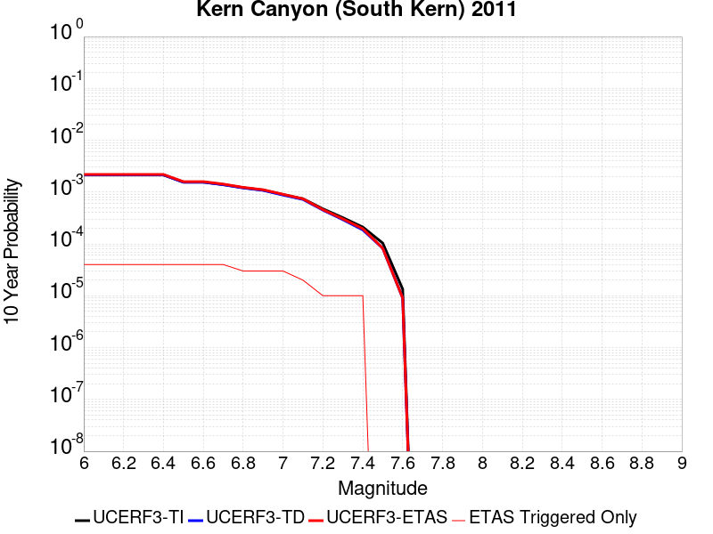 |

| Magnitude | 1 wk TI Prob | 1 wk TD Prob | 1 wk ETAS Prob | 1 wk ETAS/TD Gain | 1 wk ETAS Triggered Only | 1 mo TI Prob | 1 mo TD Prob | 1 mo ETAS Prob | 1 mo ETAS/TD Gain | 1 mo ETAS Triggered Only | 1 yr TI Prob | 1 yr TD Prob | 1 yr ETAS Prob | 1 yr ETAS/TD Gain | 1 yr ETAS Triggered Only | 10 yr TI Prob | 10 yr TD Prob | 10 yr ETAS Prob | 10 yr ETAS/TD Gain | 10 yr ETAS Triggered Only |
|-----|-----|-----|-----|-----|-----|-----|-----|-----|-----|-----|-----|-----|-----|-----|-----|-----|-----|-----|-----|-----|
| 6.0 | 4.105075E-6 | 4.1137264E-6 | 1.4113685E-5 | 3.430876 | 1.0E-5 | 1.7593058E-5 | 1.763014E-5 | 3.7629787E-5 | 2.1344008 | 2.0E-5 | 2.1417443E-4 | 2.1462646E-4 | 2.4462002E-4 | 1.1397477 | 3.0E-5 | 0.0021396813 | 0.0021442557 | 0.0021841698 | 1.0186145 | 4.0E-5 |
| 6.1 | 4.105075E-6 | 4.1137264E-6 | 1.4113685E-5 | 3.430876 | 1.0E-5 | 1.7593058E-5 | 1.763014E-5 | 3.7629787E-5 | 2.1344008 | 2.0E-5 | 2.1417443E-4 | 2.1462646E-4 | 2.4462002E-4 | 1.1397477 | 3.0E-5 | 0.0021396813 | 0.0021442557 | 0.0021841698 | 1.0186145 | 4.0E-5 |
| 6.2 | 4.105075E-6 | 4.1137264E-6 | 1.4113685E-5 | 3.430876 | 1.0E-5 | 1.7593058E-5 | 1.763014E-5 | 3.7629787E-5 | 2.1344008 | 2.0E-5 | 2.1417443E-4 | 2.1462646E-4 | 2.4462002E-4 | 1.1397477 | 3.0E-5 | 0.0021396813 | 0.0021442557 | 0.0021841698 | 1.0186145 | 4.0E-5 |
| 6.3 | 4.105075E-6 | 4.1137264E-6 | 1.4113685E-5 | 3.430876 | 1.0E-5 | 1.7593058E-5 | 1.763014E-5 | 3.7629787E-5 | 2.1344008 | 2.0E-5 | 2.1417443E-4 | 2.1462646E-4 | 2.4462002E-4 | 1.1397477 | 3.0E-5 | 0.0021396813 | 0.0021442557 | 0.0021841698 | 1.0186145 | 4.0E-5 |
| 6.4 | 4.105075E-6 | 4.1137264E-6 | 1.4113685E-5 | 3.430876 | 1.0E-5 | 1.7593058E-5 | 1.763014E-5 | 3.7629787E-5 | 2.1344008 | 2.0E-5 | 2.1417443E-4 | 2.1462646E-4 | 2.4462002E-4 | 1.1397477 | 3.0E-5 | 0.0021396813 | 0.0021442557 | 0.0021841698 | 1.0186145 | 4.0E-5 |
| 6.5 | 2.9849807E-6 | 2.9731548E-6 | 1.2973125E-5 | 4.363421 | 1.0E-5 | 1.2792712E-5 | 1.274203E-5 | 3.2741777E-5 | 2.5695887 | 2.0E-5 | 1.5574014E-4 | 1.5512333E-4 | 1.8511867E-4 | 1.1933645 | 3.0E-5 | 0.0015563103 | 0.0015501656 | 0.0015901036 | 1.0257638 | 4.0E-5 |
| 6.6 | 2.9849807E-6 | 2.9731548E-6 | 1.2973125E-5 | 4.363421 | 1.0E-5 | 1.2792712E-5 | 1.274203E-5 | 3.2741777E-5 | 2.5695887 | 2.0E-5 | 1.5574014E-4 | 1.5512333E-4 | 1.8511867E-4 | 1.1933645 | 3.0E-5 | 0.0015563103 | 0.0015501656 | 0.0015901036 | 1.0257638 | 4.0E-5 |
| 6.7 | 2.6756725E-6 | 2.6582206E-6 | 1.26581945E-5 | 4.7619047 | 1.0E-5 | 1.1467117E-5 | 1.1392325E-5 | 3.1392097E-5 | 2.7555478 | 2.0E-5 | 1.396032E-4 | 1.3869285E-4 | 1.6868868E-4 | 1.2162753 | 3.0E-5 | 0.0013951553 | 0.0013860738 | 0.0014260183 | 1.0288185 | 4.0E-5 |
| 6.8 | 2.3283721E-6 | 2.3047787E-6 | 1.2304756E-5 | 5.338801 | 1.0E-5 | 9.9787E-6 | 9.877586E-6 | 1.9877487E-5 | 2.012383 | 1.0E-5 | 1.214839E-4 | 1.20253055E-4 | 1.4025065E-4 | 1.1662959 | 2.0E-5 | 0.001214175 | 0.0012018873 | 0.0012318512 | 1.0249307 | 3.0E-5 |
| 6.9 | 2.0972677E-6 | 2.0696411E-6 | 1.206962E-5 | 5.8317456 | 1.0E-5 | 8.988259E-6 | 8.869861E-6 | 1.8869772E-5 | 2.1274035 | 1.0E-5 | 1.0942656E-4 | 1.0798526E-4 | 1.279831E-4 | 1.1851904 | 2.0E-5 | 0.0010937268 | 0.0010793337 | 0.0011093013 | 1.0277649 | 3.0E-5 |
| 7.0 | 1.7132242E-6 | 1.6787036E-6 | 1.1678687E-5 | 6.956968 | 1.0E-5 | 7.3423685E-6 | 7.194424E-6 | 1.7194352E-5 | 2.3899553 | 1.0E-5 | 8.938967E-5 | 8.758863E-5 | 1.0758688E-4 | 1.2283201 | 2.0E-5 | 8.935372E-4 | 8.7554497E-4 | 9.055187E-4 | 1.0342344 | 3.0E-5 |
| 7.1 | 1.4215541E-6 | 1.3815752E-6 | 1.3815752E-6 | 1.0 | 0.0 | 6.0923603E-6 | 5.9210233E-6 | 5.9210233E-6 | 1.0 | 0.0 | 7.417196E-5 | 7.20861E-5 | 8.208538E-5 | 1.138713 | 1.0E-5 | 7.414721E-4 | 7.206299E-4 | 7.406155E-4 | 1.0277334 | 2.0E-5 |
| 7.2 | 9.097853E-7 | 8.6037755E-7 | 8.6037755E-7 | 1.0 | 0.0 | 3.899074E-6 | 3.6873273E-6 | 3.6873273E-6 | 1.0 | 0.0 | 4.7470192E-5 | 4.4892295E-5 | 5.4891847E-5 | 1.2227454 | 1.0E-5 | 4.7460053E-4 | 4.4883334E-4 | 4.5882884E-4 | 1.02227 | 1.0E-5 |
| 7.3 | 6.144169E-7 | 5.628206E-7 | 5.628206E-7 | 1.0 | 0.0 | 2.6332125E-6 | 2.4120861E-6 | 2.4120861E-6 | 1.0 | 0.0 | 3.205889E-5 | 2.9366758E-5 | 3.9366467E-5 | 1.3405111 | 1.0E-5 | 3.2054266E-4 | 2.936293E-4 | 3.0362635E-4 | 1.0340465 | 1.0E-5 |
| 7.4 | 4.049844E-7 | 3.5728314E-7 | 3.5728314E-7 | 1.0 | 0.0 | 1.7356463E-6 | 1.5312125E-6 | 1.5312125E-6 | 1.0 | 0.0 | 2.1131287E-5 | 1.8642357E-5 | 2.864217E-5 | 1.536403 | 1.0E-5 | 2.1129279E-4 | 1.8640817E-4 | 1.964063E-4 | 1.0536357 | 1.0E-5 |
| 7.5 | 1.9871162E-7 | 1.583044E-7 | 1.583044E-7 | 1.0 | 0.0 | 8.5162094E-7 | 6.7844724E-7 | 6.7844724E-7 | 1.0 | 0.0 | 1.0368436E-5 | 8.260065E-6 | 8.260065E-6 | 1.0 | 0.0 | 1.0367952E-4 | 8.259767E-5 | 8.259767E-5 | 1.0 | 0.0 |
| 7.6 | 2.572245E-8 | 1.7352555E-8 | 1.7352555E-8 | 1.0 | 0.0 | 1.10239064E-7 | 7.436809E-8 | 7.436809E-8 | 1.0 | 0.0 | 1.3421597E-6 | 9.054312E-7 | 9.054312E-7 | 1.0 | 0.0 | 1.3421517E-5 | 9.05428E-6 | 9.05428E-6 | 1.0 | 0.0 |

## North Frontal  (East)
*[(top)](#table-of-contents)*

| 1 Week | 1 Month | 1 Year | 10 Year |
|-----|-----|-----|-----|
|  |  |  |  |

| Magnitude | 1 wk TI Prob | 1 wk TD Prob | 1 wk ETAS Prob | 1 wk ETAS/TD Gain | 1 wk ETAS Triggered Only | 1 mo TI Prob | 1 mo TD Prob | 1 mo ETAS Prob | 1 mo ETAS/TD Gain | 1 mo ETAS Triggered Only | 1 yr TI Prob | 1 yr TD Prob | 1 yr ETAS Prob | 1 yr ETAS/TD Gain | 1 yr ETAS Triggered Only | 10 yr TI Prob | 10 yr TD Prob | 10 yr ETAS Prob | 10 yr ETAS/TD Gain | 10 yr ETAS Triggered Only |
|-----|-----|-----|-----|-----|-----|-----|-----|-----|-----|-----|-----|-----|-----|-----|-----|-----|-----|-----|-----|-----|
| 6.0 | 7.135738E-6 | 7.4771765E-6 | 1.7477101E-5 | 2.3373933 | 1.0E-5 | 3.0581377E-5 | 3.204476E-5 | 4.204444E-5 | 1.3120534 | 1.0E-5 | 3.7226462E-4 | 3.9009505E-4 | 4.0009117E-4 | 1.0256248 | 1.0E-5 | 0.0037164164 | 0.0038960609 | 0.0039359047 | 1.0102267 | 4.0E-5 |
| 6.1 | 7.135738E-6 | 7.4771765E-6 | 1.7477101E-5 | 2.3373933 | 1.0E-5 | 3.0581377E-5 | 3.204476E-5 | 4.204444E-5 | 1.3120534 | 1.0E-5 | 3.7226462E-4 | 3.9009505E-4 | 4.0009117E-4 | 1.0256248 | 1.0E-5 | 0.0037164164 | 0.0038960609 | 0.0039359047 | 1.0102267 | 4.0E-5 |
| 6.2 | 7.135738E-6 | 7.4771765E-6 | 1.7477101E-5 | 2.3373933 | 1.0E-5 | 3.0581377E-5 | 3.204476E-5 | 4.204444E-5 | 1.3120534 | 1.0E-5 | 3.7226462E-4 | 3.9009505E-4 | 4.0009117E-4 | 1.0256248 | 1.0E-5 | 0.0037164164 | 0.0038960609 | 0.0039359047 | 1.0102267 | 4.0E-5 |
| 6.3 | 7.135738E-6 | 7.4771765E-6 | 1.7477101E-5 | 2.3373933 | 1.0E-5 | 3.0581377E-5 | 3.204476E-5 | 4.204444E-5 | 1.3120534 | 1.0E-5 | 3.7226462E-4 | 3.9009505E-4 | 4.0009117E-4 | 1.0256248 | 1.0E-5 | 0.0037164164 | 0.0038960609 | 0.0039359047 | 1.0102267 | 4.0E-5 |
| 6.4 | 7.135738E-6 | 7.4771765E-6 | 1.7477101E-5 | 2.3373933 | 1.0E-5 | 3.0581377E-5 | 3.204476E-5 | 4.204444E-5 | 1.3120534 | 1.0E-5 | 3.7226462E-4 | 3.9009505E-4 | 4.0009117E-4 | 1.0256248 | 1.0E-5 | 0.0037164164 | 0.0038960609 | 0.0039359047 | 1.0102267 | 4.0E-5 |
| 6.5 | 7.135738E-6 | 7.4771765E-6 | 1.7477101E-5 | 2.3373933 | 1.0E-5 | 3.0581377E-5 | 3.204476E-5 | 4.204444E-5 | 1.3120534 | 1.0E-5 | 3.7226462E-4 | 3.9009505E-4 | 4.0009117E-4 | 1.0256248 | 1.0E-5 | 0.0037164164 | 0.0038960609 | 0.0039359047 | 1.0102267 | 4.0E-5 |
| 6.6 | 7.135738E-6 | 7.4771765E-6 | 1.7477101E-5 | 2.3373933 | 1.0E-5 | 3.0581377E-5 | 3.204476E-5 | 4.204444E-5 | 1.3120534 | 1.0E-5 | 3.7226462E-4 | 3.9009505E-4 | 4.0009117E-4 | 1.0256248 | 1.0E-5 | 0.0037164164 | 0.0038960609 | 0.0039359047 | 1.0102267 | 4.0E-5 |
| 6.7 | 7.135738E-6 | 7.4771765E-6 | 1.7477101E-5 | 2.3373933 | 1.0E-5 | 3.0581377E-5 | 3.204476E-5 | 4.204444E-5 | 1.3120534 | 1.0E-5 | 3.7226462E-4 | 3.9009505E-4 | 4.0009117E-4 | 1.0256248 | 1.0E-5 | 0.0037164164 | 0.0038960609 | 0.0039359047 | 1.0102267 | 4.0E-5 |
| 6.8 | 5.959142E-6 | 6.236683E-6 | 1.623662E-5 | 2.6034064 | 1.0E-5 | 2.553893E-5 | 2.6728469E-5 | 3.67282E-5 | 1.374123 | 1.0E-5 | 3.108921E-4 | 3.253886E-4 | 3.3538532E-4 | 1.0307225 | 1.0E-5 | 0.0031045752 | 0.0032508948 | 0.0032907648 | 1.0122643 | 4.0E-5 |
| 6.9 | 2.2946929E-6 | 2.3824605E-6 | 1.2382437E-5 | 5.1973314 | 1.0E-5 | 9.834361E-6 | 1.0210508E-5 | 2.0210406E-5 | 1.9793732 | 1.0E-5 | 1.1972676E-4 | 1.2430632E-4 | 1.3430507E-4 | 1.0804365 | 1.0E-5 | 0.0011966228 | 0.0012424142 | 0.0012524019 | 1.0080389 | 1.0E-5 |
| 7.0 | 2.2468673E-6 | 2.3321538E-6 | 1.2332131E-5 | 5.287872 | 1.0E-5 | 9.629396E-6 | 9.994909E-6 | 1.999481E-5 | 2.0004992 | 1.0E-5 | 1.1723159E-4 | 1.21681696E-4 | 1.3168047E-4 | 1.0821717 | 1.0E-5 | 0.0011716976 | 0.0012161969 | 0.0012261848 | 1.0082123 | 1.0E-5 |
| 7.1 | 1.9921076E-6 | 2.0646032E-6 | 1.2064583E-5 | 5.843536 | 1.0E-5 | 8.537577E-6 | 8.848272E-6 | 1.8848183E-5 | 2.1301541 | 1.0E-5 | 1.0394004E-4 | 1.0772282E-4 | 1.1772174E-4 | 1.0928209 | 1.0E-5 | 0.0010389143 | 0.0010767487 | 0.001086738 | 1.0092772 | 1.0E-5 |
| 7.2 | 1.4524545E-6 | 1.5045148E-6 | 1.15044995E-5 | 7.6466513 | 1.0E-5 | 6.2247905E-6 | 6.447906E-6 | 1.6447842E-5 | 2.5508811 | 1.0E-5 | 7.5784184E-5 | 7.850068E-5 | 8.849989E-5 | 1.1273774 | 1.0E-5 | 7.575835E-4 | 7.8475394E-4 | 7.947461E-4 | 1.0127329 | 1.0E-5 |
| 7.3 | 8.9802575E-7 | 9.3087283E-7 | 1.0930864E-5 | 11.742597 | 1.0E-5 | 3.848676E-6 | 3.9894494E-6 | 1.3989409E-5 | 3.5066016 | 1.0E-5 | 4.685662E-5 | 4.857058E-5 | 5.8570095E-5 | 1.205876 | 1.0E-5 | 4.6846745E-4 | 4.8561094E-4 | 4.956061E-4 | 1.0205827 | 1.0E-5 |
| 7.4 | 7.776139E-7 | 8.0604747E-7 | 8.0604747E-7 | 1.0 | 0.0 | 3.3326266E-6 | 3.4544853E-6 | 3.4544853E-6 | 1.0 | 0.0 | 4.0573974E-5 | 4.2057654E-5 | 4.2057654E-5 | 1.0 | 0.0 | 4.0566566E-4 | 4.205077E-4 | 4.205077E-4 | 1.0 | 0.0 |
| 7.5 | 5.244417E-7 | 5.441219E-7 | 5.441219E-7 | 1.0 | 0.0 | 2.2476054E-6 | 2.3319494E-6 | 2.3319494E-6 | 1.0 | 0.0 | 2.7364253E-5 | 2.839118E-5 | 2.839118E-5 | 1.0 | 0.0 | 2.7360884E-4 | 2.8388205E-4 | 2.8388205E-4 | 1.0 | 0.0 |
| 7.6 | 1.5489647E-7 | 1.6089504E-7 | 1.6089504E-7 | 1.0 | 0.0 | 6.6384183E-7 | 6.895501E-7 | 6.895501E-7 | 1.0 | 0.0 | 8.082245E-6 | 8.395261E-6 | 8.395261E-6 | 1.0 | 0.0 | 8.08195E-5 | 8.395143E-5 | 8.395143E-5 | 1.0 | 0.0 |

## Owens Valley Keough Hot Springs
*[(top)](#table-of-contents)*

| 1 Week | 1 Month | 1 Year | 10 Year |
|-----|-----|-----|-----|
| 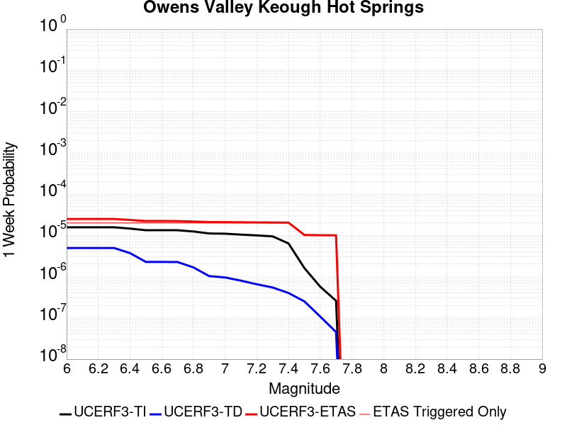 |  |  |  |

| Magnitude | 1 wk TI Prob | 1 wk TD Prob | 1 wk ETAS Prob | 1 wk ETAS/TD Gain | 1 wk ETAS Triggered Only | 1 mo TI Prob | 1 mo TD Prob | 1 mo ETAS Prob | 1 mo ETAS/TD Gain | 1 mo ETAS Triggered Only | 1 yr TI Prob | 1 yr TD Prob | 1 yr ETAS Prob | 1 yr ETAS/TD Gain | 1 yr ETAS Triggered Only | 10 yr TI Prob | 10 yr TD Prob | 10 yr ETAS Prob | 10 yr ETAS/TD Gain | 10 yr ETAS Triggered Only |
|-----|-----|-----|-----|-----|-----|-----|-----|-----|-----|-----|-----|-----|-----|-----|-----|-----|-----|-----|-----|-----|
| 6.0 | 1.5708529E-5 | 4.950656E-6 | 2.4950557E-5 | 5.039849 | 2.0E-5 | 6.7320536E-5 | 2.1216953E-5 | 5.1216317E-5 | 2.4139335 | 3.0E-5 | 8.193192E-4 | 2.582909E-4 | 2.982806E-4 | 1.1548241 | 4.0E-5 | 0.008163051 | 0.0025805652 | 0.0026204619 | 1.0154605 | 4.0E-5 |
| 6.1 | 1.5708529E-5 | 4.950656E-6 | 2.4950557E-5 | 5.039849 | 2.0E-5 | 6.7320536E-5 | 2.1216953E-5 | 5.1216317E-5 | 2.4139335 | 3.0E-5 | 8.193192E-4 | 2.582909E-4 | 2.982806E-4 | 1.1548241 | 4.0E-5 | 0.008163051 | 0.0025805652 | 0.0026204619 | 1.0154605 | 4.0E-5 |
| 6.2 | 1.5708529E-5 | 4.950656E-6 | 2.4950557E-5 | 5.039849 | 2.0E-5 | 6.7320536E-5 | 2.1216953E-5 | 5.1216317E-5 | 2.4139335 | 3.0E-5 | 8.193192E-4 | 2.582909E-4 | 2.982806E-4 | 1.1548241 | 4.0E-5 | 0.008163051 | 0.0025805652 | 0.0026204619 | 1.0154605 | 4.0E-5 |
| 6.3 | 1.5708529E-5 | 4.950656E-6 | 2.4950557E-5 | 5.039849 | 2.0E-5 | 6.7320536E-5 | 2.1216953E-5 | 5.1216317E-5 | 2.4139335 | 3.0E-5 | 8.193192E-4 | 2.582909E-4 | 2.982806E-4 | 1.1548241 | 4.0E-5 | 0.008163051 | 0.0025805652 | 0.0026204619 | 1.0154605 | 4.0E-5 |
| 6.4 | 1.4622509E-5 | 3.7265204E-6 | 2.3726447E-5 | 6.3669167 | 2.0E-5 | 6.266639E-5 | 1.5970723E-5 | 4.5970242E-5 | 2.8784072 | 3.0E-5 | 7.626962E-4 | 1.944295E-4 | 2.3442174E-4 | 1.2056901 | 4.0E-5 | 0.007600839 | 0.0019430731 | 0.0019829953 | 1.020546 | 4.0E-5 |
| 6.5 | 1.3335527E-5 | 2.2777172E-6 | 2.227767E-5 | 9.780702 | 2.0E-5 | 5.7151006E-5 | 9.761612E-6 | 2.9761417E-5 | 3.048822 | 2.0E-5 | 6.955913E-4 | 1.18841825E-4 | 1.3883944E-4 | 1.168271 | 2.0E-5 | 0.0069341804 | 0.0011880046 | 0.0012079809 | 1.016815 | 2.0E-5 |
| 6.6 | 1.3332855E-5 | 2.2748663E-6 | 2.227482E-5 | 9.791705 | 2.0E-5 | 5.7139558E-5 | 9.749395E-6 | 2.9749199E-5 | 3.0513895 | 2.0E-5 | 6.9545204E-4 | 1.186931E-4 | 1.3869072E-4 | 1.1684818 | 2.0E-5 | 0.0069327964 | 0.0011865189 | 0.0012064951 | 1.016836 | 2.0E-5 |
| 6.7 | 1.3318214E-5 | 2.2640966E-6 | 2.2264052E-5 | 9.833526 | 2.0E-5 | 5.707681E-5 | 9.703239E-6 | 2.9703046E-5 | 3.0611475 | 2.0E-5 | 6.946886E-4 | 1.1813121E-4 | 1.3812885E-4 | 1.1692833 | 2.0E-5 | 0.0069252094 | 0.001180906 | 0.0012008824 | 1.0169162 | 2.0E-5 |
| 6.8 | 1.2441338E-5 | 1.6777863E-6 | 2.1677753E-5 | 12.920449 | 2.0E-5 | 5.331893E-5 | 7.1904947E-6 | 2.719035E-5 | 3.7814298 | 2.0E-5 | 6.489646E-4 | 8.7541055E-5 | 1.075393E-4 | 1.2284442 | 2.0E-5 | 0.0064707273 | 8.752499E-4 | 8.9523237E-4 | 1.0228306 | 2.0E-5 |
| 6.9 | 1.1130476E-5 | 1.0303868E-6 | 2.1030366E-5 | 20.410168 | 2.0E-5 | 4.7701167E-5 | 4.415936E-6 | 2.4415847E-5 | 5.5290313 | 2.0E-5 | 5.806069E-4 | 5.3762706E-5 | 7.376163E-5 | 1.3719851 | 2.0E-5 | 0.0057909233 | 5.37651E-4 | 5.576402E-4 | 1.0371789 | 2.0E-5 |
| 7.0 | 1.0986073E-5 | 9.579413E-7 | 2.0957923E-5 | 21.878086 | 2.0E-5 | 4.7082318E-5 | 4.1054564E-6 | 2.4105375E-5 | 5.871546 | 2.0E-5 | 5.730765E-4 | 4.99828E-5 | 6.99818E-5 | 1.4001176 | 2.0E-5 | 0.0057160086 | 4.9986853E-4 | 5.198585E-4 | 1.0399905 | 2.0E-5 |
| 7.1 | 1.0451338E-5 | 8.0002656E-7 | 2.0800011E-5 | 25.999151 | 2.0E-5 | 4.4790682E-5 | 3.4286807E-6 | 2.3428613E-5 | 6.8331275 | 2.0E-5 | 5.451901E-4 | 4.1743395E-5 | 6.174256E-5 | 1.4790977 | 2.0E-5 | 0.005438545 | 4.1750458E-4 | 4.3749623E-4 | 1.0478836 | 2.0E-5 |
| 7.2 | 9.989061E-6 | 6.544956E-7 | 2.0654483E-5 | 31.557863 | 2.0E-5 | 4.280956E-5 | 2.804978E-6 | 2.2804921E-5 | 8.13016 | 2.0E-5 | 5.2108173E-4 | 3.4150078E-5 | 5.4149394E-5 | 1.5856302 | 2.0E-5 | 0.0051986156 | 3.415851E-4 | 3.6157828E-4 | 1.0585306 | 2.0E-5 |
| 7.3 | 9.465365E-6 | 5.4600474E-7 | 2.0545995E-5 | 37.6297 | 2.0E-5 | 4.056522E-5 | 2.3400182E-6 | 2.2339971E-5 | 9.546922 | 2.0E-5 | 4.937696E-4 | 2.8489352E-5 | 4.8488782E-5 | 1.7019967 | 2.0E-5 | 0.0049267393 | 2.8498896E-4 | 3.0498326E-4 | 1.0701581 | 2.0E-5 |
| 7.4 | 6.3824805E-6 | 4.016335E-7 | 2.0401625E-5 | 50.796623 | 2.0E-5 | 2.73532E-5 | 1.7212853E-6 | 2.1721251E-5 | 12.6192045 | 2.0E-5 | 3.3297433E-4 | 2.095645E-5 | 4.095603E-5 | 1.9543401 | 2.0E-5 | 0.0033247585 | 2.0963654E-4 | 2.2963234E-4 | 1.0953832 | 2.0E-5 |
| 7.5 | 1.6192645E-6 | 2.516124E-7 | 1.025161E-5 | 40.74366 | 1.0E-5 | 6.9396865E-6 | 1.0783383E-6 | 1.1078328E-5 | 10.273518 | 1.0E-5 | 8.448741E-5 | 1.31286915E-5 | 2.3128561E-5 | 1.7616805 | 1.0E-5 | 8.4455294E-4 | 1.3127929E-4 | 1.4127798E-4 | 1.0761635 | 1.0E-5 |
| 7.6 | 5.7062545E-7 | 1.07924045E-7 | 1.0107923E-5 | 93.65775 | 1.0E-5 | 2.4455355E-6 | 4.6253152E-7 | 1.0462527E-5 | 22.620138 | 1.0E-5 | 2.9773988E-5 | 5.6313074E-6 | 1.563125E-5 | 2.7757764 | 1.0E-5 | 2.977E-4 | 5.6311732E-5 | 6.631117E-5 | 1.1775728 | 1.0E-5 |
| 7.7 | 2.5988817E-7 | 4.5457977E-8 | 1.0045457E-5 | 220.98338 | 1.0E-5 | 1.113806E-6 | 1.9481989E-7 | 1.0194818E-5 | 52.32945 | 1.0E-5 | 1.3560503E-5 | 2.3719301E-6 | 1.2371906E-5 | 5.2159657 | 1.0E-5 | 1.3559677E-4 | 2.371909E-5 | 3.3718854E-5 | 1.4215913 | 1.0E-5 |

## Los Alamos 2011 CFM
*[(top)](#table-of-contents)*

| 1 Week | 1 Month | 1 Year | 10 Year |
|-----|-----|-----|-----|
|  |  |  | 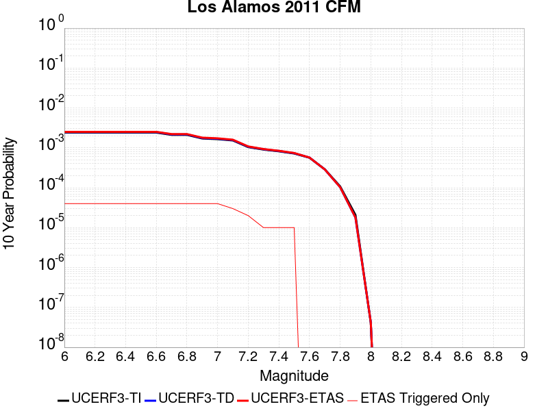 |

| Magnitude | 1 wk TI Prob | 1 wk TD Prob | 1 wk ETAS Prob | 1 wk ETAS/TD Gain | 1 wk ETAS Triggered Only | 1 mo TI Prob | 1 mo TD Prob | 1 mo ETAS Prob | 1 mo ETAS/TD Gain | 1 mo ETAS Triggered Only | 1 yr TI Prob | 1 yr TD Prob | 1 yr ETAS Prob | 1 yr ETAS/TD Gain | 1 yr ETAS Triggered Only | 10 yr TI Prob | 10 yr TD Prob | 10 yr ETAS Prob | 10 yr ETAS/TD Gain | 10 yr ETAS Triggered Only |
|-----|-----|-----|-----|-----|-----|-----|-----|-----|-----|-----|-----|-----|-----|-----|-----|-----|-----|-----|-----|-----|
| 6.0 | 4.6284417E-6 | 4.751731E-6 | 1.4751684E-5 | 3.1044862 | 1.0E-5 | 1.9836029E-5 | 2.0364414E-5 | 3.036421E-5 | 1.4910427 | 1.0E-5 | 2.4147688E-4 | 2.4791027E-4 | 2.6790533E-4 | 1.0806544 | 2.0E-5 | 0.0024121467 | 0.0024765113 | 0.0025164124 | 1.0161117 | 4.0E-5 |
| 6.1 | 4.6284417E-6 | 4.751731E-6 | 1.4751684E-5 | 3.1044862 | 1.0E-5 | 1.9836029E-5 | 2.0364414E-5 | 3.036421E-5 | 1.4910427 | 1.0E-5 | 2.4147688E-4 | 2.4791027E-4 | 2.6790533E-4 | 1.0806544 | 2.0E-5 | 0.0024121467 | 0.0024765113 | 0.0025164124 | 1.0161117 | 4.0E-5 |
| 6.2 | 4.6284417E-6 | 4.751731E-6 | 1.4751684E-5 | 3.1044862 | 1.0E-5 | 1.9836029E-5 | 2.0364414E-5 | 3.036421E-5 | 1.4910427 | 1.0E-5 | 2.4147688E-4 | 2.4791027E-4 | 2.6790533E-4 | 1.0806544 | 2.0E-5 | 0.0024121467 | 0.0024765113 | 0.0025164124 | 1.0161117 | 4.0E-5 |
| 6.3 | 4.6284417E-6 | 4.751731E-6 | 1.4751684E-5 | 3.1044862 | 1.0E-5 | 1.9836029E-5 | 2.0364414E-5 | 3.036421E-5 | 1.4910427 | 1.0E-5 | 2.4147688E-4 | 2.4791027E-4 | 2.6790533E-4 | 1.0806544 | 2.0E-5 | 0.0024121467 | 0.0024765113 | 0.0025164124 | 1.0161117 | 4.0E-5 |
| 6.4 | 4.6284417E-6 | 4.751731E-6 | 1.4751684E-5 | 3.1044862 | 1.0E-5 | 1.9836029E-5 | 2.0364414E-5 | 3.036421E-5 | 1.4910427 | 1.0E-5 | 2.4147688E-4 | 2.4791027E-4 | 2.6790533E-4 | 1.0806544 | 2.0E-5 | 0.0024121467 | 0.0024765113 | 0.0025164124 | 1.0161117 | 4.0E-5 |
| 6.5 | 4.6284417E-6 | 4.751731E-6 | 1.4751684E-5 | 3.1044862 | 1.0E-5 | 1.9836029E-5 | 2.0364414E-5 | 3.036421E-5 | 1.4910427 | 1.0E-5 | 2.4147688E-4 | 2.4791027E-4 | 2.6790533E-4 | 1.0806544 | 2.0E-5 | 0.0024121467 | 0.0024765113 | 0.0025164124 | 1.0161117 | 4.0E-5 |
| 6.6 | 4.6284417E-6 | 4.751731E-6 | 1.4751684E-5 | 3.1044862 | 1.0E-5 | 1.9836029E-5 | 2.0364414E-5 | 3.036421E-5 | 1.4910427 | 1.0E-5 | 2.4147688E-4 | 2.4791027E-4 | 2.6790533E-4 | 1.0806544 | 2.0E-5 | 0.0024121467 | 0.0024765113 | 0.0025164124 | 1.0161117 | 4.0E-5 |
| 6.7 | 4.062321E-6 | 4.166349E-6 | 1.4166307E-5 | 3.4001732 | 1.0E-5 | 1.7409831E-5 | 1.7855667E-5 | 2.7855489E-5 | 1.5600363 | 1.0E-5 | 2.1194408E-4 | 2.1737257E-4 | 2.3736822E-4 | 1.091988 | 2.0E-5 | 0.0021174205 | 0.0021717492 | 0.0022116622 | 1.0183784 | 4.0E-5 |
| 6.8 | 4.062321E-6 | 4.166349E-6 | 1.4166307E-5 | 3.4001732 | 1.0E-5 | 1.7409831E-5 | 1.7855667E-5 | 2.7855489E-5 | 1.5600363 | 1.0E-5 | 2.1194408E-4 | 2.1737257E-4 | 2.3736822E-4 | 1.091988 | 2.0E-5 | 0.0021174205 | 0.0021717492 | 0.0022116622 | 1.0183784 | 4.0E-5 |
| 6.9 | 3.2936077E-6 | 3.372958E-6 | 1.33729245E-5 | 3.964747 | 1.0E-5 | 1.4115385E-5 | 1.4455459E-5 | 2.4455314E-5 | 1.6917702 | 1.0E-5 | 1.7184127E-4 | 1.7598194E-4 | 1.9597841E-4 | 1.113628 | 2.0E-5 | 0.0017170844 | 0.0017585184 | 0.001798448 | 1.0227064 | 4.0E-5 |
| 7.0 | 3.1687898E-6 | 3.2448156E-6 | 1.3244783E-5 | 4.081829 | 1.0E-5 | 1.3580457E-5 | 1.3906283E-5 | 2.3906145E-5 | 1.7190894 | 1.0E-5 | 1.6532952E-4 | 1.6929678E-4 | 1.892934E-4 | 1.1181158 | 2.0E-5 | 0.0016520657 | 0.0016917696 | 0.0017317019 | 1.0236039 | 4.0E-5 |
| 7.1 | 2.9379228E-6 | 3.0073259E-6 | 3.0073259E-6 | 1.0 | 0.0 | 1.25910365E-5 | 1.288848E-5 | 1.288848E-5 | 1.0 | 0.0 | 1.5328509E-4 | 1.5690686E-4 | 1.6690529E-4 | 1.0637221 | 1.0E-5 | 0.001531794 | 0.0015680499 | 0.0015980029 | 1.0191021 | 3.0E-5 |
| 7.2 | 2.0020686E-6 | 2.0416298E-6 | 2.0416298E-6 | 1.0 | 0.0 | 8.580266E-6 | 8.749813E-6 | 8.749813E-6 | 1.0 | 0.0 | 1.0445973E-4 | 1.0652381E-4 | 1.16522744E-4 | 1.0938658 | 1.0E-5 | 0.0010441064 | 0.001064732 | 0.0010847106 | 1.018764 | 2.0E-5 |
| 7.3 | 1.7364243E-6 | 1.7678802E-6 | 1.7678802E-6 | 1.0 | 0.0 | 7.441797E-6 | 7.576608E-6 | 7.576608E-6 | 1.0 | 0.0 | 9.0600115E-5 | 9.2241324E-5 | 9.2241324E-5 | 1.0 | 0.0 | 9.0563187E-4 | 9.2203356E-4 | 9.320243E-4 | 1.0108356 | 1.0E-5 |
| 7.4 | 1.5718434E-6 | 1.5983177E-6 | 1.5983177E-6 | 1.0 | 0.0 | 6.7364545E-6 | 6.849915E-6 | 6.849915E-6 | 1.0 | 0.0 | 8.201325E-5 | 8.339455E-5 | 8.339455E-5 | 1.0 | 0.0 | 8.198299E-4 | 8.3363557E-4 | 8.4362726E-4 | 1.0119857 | 1.0E-5 |
| 7.5 | 1.3841119E-6 | 1.4042793E-6 | 1.4042793E-6 | 1.0 | 0.0 | 5.9318945E-6 | 6.0183256E-6 | 6.0183256E-6 | 1.0 | 0.0 | 7.221842E-5 | 7.327068E-5 | 7.327068E-5 | 1.0 | 0.0 | 7.2194956E-4 | 7.324681E-4 | 7.424608E-4 | 1.0136424 | 1.0E-5 |
| 7.6 | 1.0843726E-6 | 1.093442E-6 | 1.093442E-6 | 1.0 | 0.0 | 4.647303E-6 | 4.6861724E-6 | 4.6861724E-6 | 1.0 | 0.0 | 5.6579443E-5 | 5.705268E-5 | 5.705268E-5 | 1.0 | 0.0 | 5.656504E-4 | 5.703829E-4 | 5.703829E-4 | 1.0 | 0.0 |
| 7.7 | 5.544814E-7 | 5.5018705E-7 | 5.5018705E-7 | 1.0 | 0.0 | 2.3763469E-6 | 2.3579425E-6 | 2.3579425E-6 | 1.0 | 0.0 | 2.8931638E-5 | 2.8707573E-5 | 2.8707573E-5 | 1.0 | 0.0 | 2.8927872E-4 | 2.870388E-4 | 2.870388E-4 | 1.0 | 0.0 |
| 7.8 | 2.0707465E-7 | 1.977846E-7 | 1.977846E-7 | 1.0 | 0.0 | 8.874625E-7 | 8.4764804E-7 | 8.4764804E-7 | 1.0 | 0.0 | 1.08048025E-5 | 1.0320066E-5 | 1.0320066E-5 | 1.0 | 0.0 | 1.0804277E-4 | 1.0319592E-4 | 1.0319592E-4 | 1.0 | 0.0 |
| 7.9 | 3.9821284E-8 | 3.433109E-8 | 3.433109E-8 | 1.0 | 0.0 | 1.7066264E-7 | 1.4713324E-7 | 1.4713324E-7 | 1.0 | 0.0 | 2.0778157E-6 | 1.7913457E-6 | 1.7913457E-6 | 1.0 | 0.0 | 2.0777963E-5 | 1.7913319E-5 | 1.7913319E-5 | 1.0 | 0.0 |
| 8.0 | 7.880441E-11 | 8.2353124E-11 | 8.2353124E-11 | 1.0 | 0.0 | 3.3773329E-10 | 3.52942E-10 | 3.52942E-10 | 1.0 | 0.0 | 4.1119033E-9 | 4.2970694E-9 | 4.2970694E-9 | 1.0 | 0.0 | 4.1119034E-8 | 4.2970694E-8 | 4.2970694E-8 | 1.0 | 0.0 |

## Oceanside alt1
*[(top)](#table-of-contents)*

| 1 Week | 1 Month | 1 Year | 10 Year |
|-----|-----|-----|-----|
|  |  |  |  |

| Magnitude | 1 wk TI Prob | 1 wk TD Prob | 1 wk ETAS Prob | 1 wk ETAS/TD Gain | 1 wk ETAS Triggered Only | 1 mo TI Prob | 1 mo TD Prob | 1 mo ETAS Prob | 1 mo ETAS/TD Gain | 1 mo ETAS Triggered Only | 1 yr TI Prob | 1 yr TD Prob | 1 yr ETAS Prob | 1 yr ETAS/TD Gain | 1 yr ETAS Triggered Only | 10 yr TI Prob | 10 yr TD Prob | 10 yr ETAS Prob | 10 yr ETAS/TD Gain | 10 yr ETAS Triggered Only |
|-----|-----|-----|-----|-----|-----|-----|-----|-----|-----|-----|-----|-----|-----|-----|-----|-----|-----|-----|-----|-----|
| 6.0 | 1.1617542E-5 | 1.1423493E-5 | 2.1423379E-5 | 1.8753791 | 1.0E-5 | 4.9788516E-5 | 4.8956997E-5 | 5.8956506E-5 | 1.2042509 | 1.0E-5 | 6.060066E-4 | 5.9590454E-4 | 6.158926E-4 | 1.0335424 | 2.0E-5 | 0.0060435664 | 0.005944664 | 0.005974486 | 1.0050166 | 3.0E-5 |
| 6.1 | 1.1617542E-5 | 1.1423493E-5 | 2.1423379E-5 | 1.8753791 | 1.0E-5 | 4.9788516E-5 | 4.8956997E-5 | 5.8956506E-5 | 1.2042509 | 1.0E-5 | 6.060066E-4 | 5.9590454E-4 | 6.158926E-4 | 1.0335424 | 2.0E-5 | 0.0060435664 | 0.005944664 | 0.005974486 | 1.0050166 | 3.0E-5 |
| 6.2 | 1.1617542E-5 | 1.1423493E-5 | 2.1423379E-5 | 1.8753791 | 1.0E-5 | 4.9788516E-5 | 4.8956997E-5 | 5.8956506E-5 | 1.2042509 | 1.0E-5 | 6.060066E-4 | 5.9590454E-4 | 6.158926E-4 | 1.0335424 | 2.0E-5 | 0.0060435664 | 0.005944664 | 0.005974486 | 1.0050166 | 3.0E-5 |
| 6.3 | 1.1617542E-5 | 1.1423493E-5 | 2.1423379E-5 | 1.8753791 | 1.0E-5 | 4.9788516E-5 | 4.8956997E-5 | 5.8956506E-5 | 1.2042509 | 1.0E-5 | 6.060066E-4 | 5.9590454E-4 | 6.158926E-4 | 1.0335424 | 2.0E-5 | 0.0060435664 | 0.005944664 | 0.005974486 | 1.0050166 | 3.0E-5 |
| 6.4 | 1.1617542E-5 | 1.1423493E-5 | 2.1423379E-5 | 1.8753791 | 1.0E-5 | 4.9788516E-5 | 4.8956997E-5 | 5.8956506E-5 | 1.2042509 | 1.0E-5 | 6.060066E-4 | 5.9590454E-4 | 6.158926E-4 | 1.0335424 | 2.0E-5 | 0.0060435664 | 0.005944664 | 0.005974486 | 1.0050166 | 3.0E-5 |
| 6.5 | 1.1617542E-5 | 1.1423493E-5 | 2.1423379E-5 | 1.8753791 | 1.0E-5 | 4.9788516E-5 | 4.8956997E-5 | 5.8956506E-5 | 1.2042509 | 1.0E-5 | 6.060066E-4 | 5.9590454E-4 | 6.158926E-4 | 1.0335424 | 2.0E-5 | 0.0060435664 | 0.005944664 | 0.005974486 | 1.0050166 | 3.0E-5 |
| 6.6 | 7.561768E-6 | 7.1336153E-6 | 1.7133543E-5 | 2.4018037 | 1.0E-5 | 3.2407173E-5 | 3.0572286E-5 | 4.057198E-5 | 1.3270836 | 1.0E-5 | 3.9448592E-4 | 3.7215507E-4 | 3.9214763E-4 | 1.0537211 | 2.0E-5 | 0.0039378637 | 0.00371543 | 0.0037453186 | 1.0080445 | 3.0E-5 |
| 6.7 | 7.1042605E-6 | 6.6556854E-6 | 1.6655618E-5 | 2.5024648 | 1.0E-5 | 3.0446476E-5 | 2.8524059E-5 | 3.8523773E-5 | 1.3505713 | 1.0E-5 | 3.706228E-4 | 3.472259E-4 | 3.6721895E-4 | 1.0575794 | 2.0E-5 | 0.0037000529 | 0.003466917 | 0.003496813 | 1.0086232 | 3.0E-5 |
| 6.8 | 6.285554E-6 | 5.799706E-6 | 1.5799647E-5 | 2.7242155 | 1.0E-5 | 2.693781E-5 | 2.4855648E-5 | 3.48554E-5 | 1.402313 | 1.0E-5 | 3.2791847E-4 | 3.0257605E-4 | 3.2257E-4 | 1.0660791 | 2.0E-5 | 0.0032743502 | 0.0030216982 | 0.0030516076 | 1.0098982 | 3.0E-5 |
| 6.9 | 6.148883E-6 | 5.6565445E-6 | 1.5656487E-5 | 2.7678537 | 1.0E-5 | 2.635209E-5 | 2.424211E-5 | 3.4241868E-5 | 1.4124954 | 1.0E-5 | 3.2078946E-4 | 2.9510827E-4 | 3.1510237E-4 | 1.0677518 | 2.0E-5 | 0.003203268 | 0.0029472208 | 0.0029671618 | 1.0067661 | 2.0E-5 |
| 7.0 | 5.253857E-6 | 4.722404E-6 | 1.4722356E-5 | 3.1175556 | 1.0E-5 | 2.2516335E-5 | 2.0238718E-5 | 3.0238516E-5 | 1.4940925 | 1.0E-5 | 2.7410188E-4 | 2.4637886E-4 | 2.663739E-4 | 1.0811558 | 2.0E-5 | 0.0027376404 | 0.0024610884 | 0.0024810391 | 1.0081065 | 2.0E-5 |
| 7.1 | 4.730754E-6 | 4.17851E-6 | 1.41784685E-5 | 3.3931875 | 1.0E-5 | 2.0274503E-5 | 1.7907778E-5 | 2.79076E-5 | 1.5584066 | 1.0E-5 | 2.468141E-4 | 2.1800565E-4 | 2.3800129E-4 | 1.0917207 | 2.0E-5 | 0.0024654015 | 0.0021779444 | 0.0021979008 | 1.009163 | 2.0E-5 |
| 7.2 | 3.7998386E-6 | 3.214026E-6 | 3.214026E-6 | 1.0 | 0.0 | 1.6284921E-5 | 1.37743245E-5 | 1.37743245E-5 | 1.0 | 0.0 | 1.9825088E-4 | 1.6768962E-4 | 1.7768794E-4 | 1.059624 | 1.0E-5 | 0.001980741 | 0.001675643 | 0.0016856263 | 1.0059578 | 1.0E-5 |
| 7.3 | 3.2656465E-6 | 2.698376E-6 | 2.698376E-6 | 1.0 | 0.0 | 1.3995553E-5 | 1.1564418E-5 | 1.1564418E-5 | 1.0 | 0.0 | 1.7038253E-4 | 1.407878E-4 | 1.5078639E-4 | 1.0710189 | 1.0E-5 | 0.0017025196 | 0.0014069972 | 0.0014169831 | 1.0070974 | 1.0E-5 |
| 7.4 | 2.593703E-6 | 2.0680277E-6 | 2.0680277E-6 | 1.0 | 0.0 | 1.1115822E-5 | 8.862946E-6 | 8.862946E-6 | 1.0 | 0.0 | 1.3532673E-4 | 1.0790111E-4 | 1.0790111E-4 | 1.0 | 0.0 | 0.0013524436 | 0.0010784961 | 0.0010784961 | 1.0 | 0.0 |
| 7.5 | 1.8715585E-6 | 1.4137177E-6 | 1.4137177E-6 | 1.0 | 0.0 | 8.020941E-6 | 6.0587763E-6 | 6.0587763E-6 | 1.0 | 0.0 | 9.7650576E-5 | 7.376316E-5 | 7.376316E-5 | 1.0 | 0.0 | 9.7607676E-4 | 7.3739287E-4 | 7.3739287E-4 | 1.0 | 0.0 |
| 7.6 | 1.2246786E-6 | 8.5268175E-7 | 8.5268175E-7 | 1.0 | 0.0 | 5.248612E-6 | 3.6543456E-6 | 3.6543456E-6 | 1.0 | 0.0 | 6.389998E-5 | 4.4490793E-5 | 4.4490793E-5 | 1.0 | 0.0 | 6.3881604E-4 | 4.4482335E-4 | 4.4482335E-4 | 1.0 | 0.0 |
| 7.7 | 5.140719E-7 | 2.734703E-7 | 2.734703E-7 | 1.0 | 0.0 | 2.2031636E-6 | 1.1720151E-6 | 1.1720151E-6 | 1.0 | 0.0 | 2.6823185E-5 | 1.4269205E-5 | 1.4269205E-5 | 1.0 | 0.0 | 2.6819948E-4 | 1.4268424E-4 | 1.4268424E-4 | 1.0 | 0.0 |
| 7.8 | 1.16056995E-8 | 9.782373E-9 | 9.782373E-9 | 1.0 | 0.0 | 4.9738713E-8 | 4.1924455E-8 | 4.1924455E-8 | 1.0 | 0.0 | 6.0556863E-7 | 5.1043025E-7 | 5.1043025E-7 | 1.0 | 0.0 | 6.05567E-6 | 5.1043025E-6 | 5.1043025E-6 | 1.0 | 0.0 |

## Kern Canyon (Lake Isabella) 2011
*[(top)](#table-of-contents)*

| 1 Week | 1 Month | 1 Year | 10 Year |
|-----|-----|-----|-----|
|  | 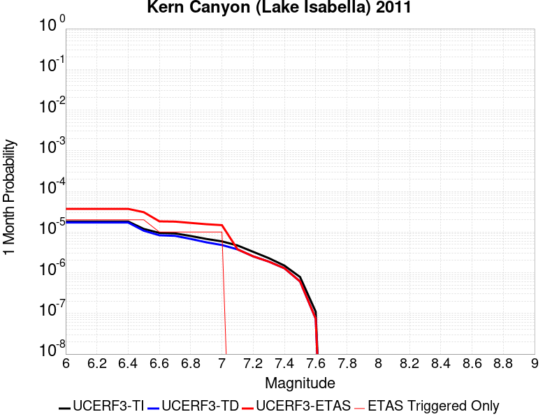 | 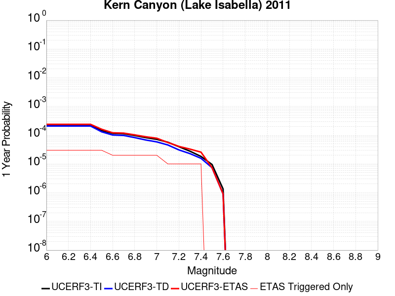 |  |

| Magnitude | 1 wk TI Prob | 1 wk TD Prob | 1 wk ETAS Prob | 1 wk ETAS/TD Gain | 1 wk ETAS Triggered Only | 1 mo TI Prob | 1 mo TD Prob | 1 mo ETAS Prob | 1 mo ETAS/TD Gain | 1 mo ETAS Triggered Only | 1 yr TI Prob | 1 yr TD Prob | 1 yr ETAS Prob | 1 yr ETAS/TD Gain | 1 yr ETAS Triggered Only | 10 yr TI Prob | 10 yr TD Prob | 10 yr ETAS Prob | 10 yr ETAS/TD Gain | 10 yr ETAS Triggered Only |
|-----|-----|-----|-----|-----|-----|-----|-----|-----|-----|-----|-----|-----|-----|-----|-----|-----|-----|-----|-----|-----|
| 6.0 | 4.2387383E-6 | 4.001639E-6 | 2.4001558E-5 | 5.9979324 | 2.0E-5 | 1.8165894E-5 | 1.7149778E-5 | 3.7149435E-5 | 2.1661758 | 2.0E-5 | 2.2114732E-4 | 2.087804E-4 | 2.3877414E-4 | 1.1436616 | 3.0E-5 | 0.0022092736 | 0.0020860266 | 0.002125943 | 1.0191352 | 4.0E-5 |
| 6.1 | 4.2387383E-6 | 4.001639E-6 | 2.4001558E-5 | 5.9979324 | 2.0E-5 | 1.8165894E-5 | 1.7149778E-5 | 3.7149435E-5 | 2.1661758 | 2.0E-5 | 2.2114732E-4 | 2.087804E-4 | 2.3877414E-4 | 1.1436616 | 3.0E-5 | 0.0022092736 | 0.0020860266 | 0.002125943 | 1.0191352 | 4.0E-5 |
| 6.2 | 4.2387383E-6 | 4.001639E-6 | 2.4001558E-5 | 5.9979324 | 2.0E-5 | 1.8165894E-5 | 1.7149778E-5 | 3.7149435E-5 | 2.1661758 | 2.0E-5 | 2.2114732E-4 | 2.087804E-4 | 2.3877414E-4 | 1.1436616 | 3.0E-5 | 0.0022092736 | 0.0020860266 | 0.002125943 | 1.0191352 | 4.0E-5 |
| 6.3 | 4.2387383E-6 | 4.001639E-6 | 2.4001558E-5 | 5.9979324 | 2.0E-5 | 1.8165894E-5 | 1.7149778E-5 | 3.7149435E-5 | 2.1661758 | 2.0E-5 | 2.2114732E-4 | 2.087804E-4 | 2.3877414E-4 | 1.1436616 | 3.0E-5 | 0.0022092736 | 0.0020860266 | 0.002125943 | 1.0191352 | 4.0E-5 |
| 6.4 | 4.2387383E-6 | 4.001639E-6 | 2.4001558E-5 | 5.9979324 | 2.0E-5 | 1.8165894E-5 | 1.7149778E-5 | 3.7149435E-5 | 2.1661758 | 2.0E-5 | 2.2114732E-4 | 2.087804E-4 | 2.3877414E-4 | 1.1436616 | 3.0E-5 | 0.0022092736 | 0.0020860266 | 0.002125943 | 1.0191352 | 4.0E-5 |
| 6.5 | 2.7857532E-6 | 2.517867E-6 | 2.2517817E-5 | 8.943212 | 2.0E-5 | 1.1938888E-5 | 1.0790815E-5 | 3.07906E-5 | 2.853408 | 2.0E-5 | 1.4534626E-4 | 1.3137059E-4 | 1.6136665E-4 | 1.2283316 | 3.0E-5 | 0.0014525123 | 0.001312962 | 0.0013529095 | 1.0304254 | 4.0E-5 |
| 6.6 | 2.2233348E-6 | 1.9441236E-6 | 1.1944104E-5 | 6.143696 | 1.0E-5 | 9.528543E-6 | 8.331932E-6 | 1.8331848E-5 | 2.2001917 | 1.0E-5 | 1.1600384E-4 | 1.01436635E-4 | 1.2143461E-4 | 1.1971474 | 2.0E-5 | 0.001159433 | 0.001013912 | 0.0010338917 | 1.0197055 | 2.0E-5 |
| 6.7 | 2.1635126E-6 | 1.8835036E-6 | 1.1883485E-5 | 6.3092446 | 1.0E-5 | 9.272164E-6 | 8.072134E-6 | 1.8072053E-5 | 2.2388198 | 1.0E-5 | 1.1288274E-4 | 9.827388E-5 | 1.1827191E-4 | 1.2034929 | 2.0E-5 | 0.0011282542 | 9.823124E-4 | 0.0010022927 | 1.0203401 | 2.0E-5 |
| 6.8 | 1.8685711E-6 | 1.5831425E-6 | 1.1583126E-5 | 7.3165407 | 1.0E-5 | 8.008137E-6 | 6.784879E-6 | 1.6784812E-5 | 2.4738555 | 1.0E-5 | 9.74947E-5 | 8.260282E-5 | 1.0260117E-4 | 1.2421025 | 2.0E-5 | 9.745194E-4 | 8.2572614E-4 | 8.457096E-4 | 1.0242012 | 2.0E-5 |
| 6.9 | 1.5815071E-6 | 1.3064928E-6 | 1.130648E-5 | 8.65407 | 1.0E-5 | 6.77787E-6 | 5.599243E-6 | 1.5599187E-5 | 2.7859457 | 1.0E-5 | 8.251744E-5 | 6.816868E-5 | 8.816732E-5 | 1.2933699 | 2.0E-5 | 8.248681E-4 | 6.8148033E-4 | 7.0146675E-4 | 1.0293279 | 2.0E-5 |
| 7.0 | 1.3772564E-6 | 1.1210718E-6 | 1.112106E-5 | 9.920025 | 1.0E-5 | 5.9025137E-6 | 4.8045845E-6 | 1.48045365E-5 | 3.0813353 | 1.0E-5 | 7.186073E-5 | 5.8494268E-5 | 7.8493096E-5 | 1.3418938 | 2.0E-5 | 7.18375E-4 | 5.847908E-4 | 6.0477905E-4 | 1.0341803 | 2.0E-5 |
| 7.1 | 1.0916998E-6 | 8.763777E-7 | 8.763777E-7 | 1.0 | 0.0 | 4.678705E-6 | 3.7558991E-6 | 3.7558991E-6 | 1.0 | 0.0 | 5.6961744E-5 | 4.5727127E-5 | 5.572667E-5 | 1.2186786 | 1.0E-5 | 5.6947145E-4 | 4.571785E-4 | 4.6717393E-4 | 1.0218633 | 1.0E-5 |
| 7.2 | 7.6277024E-7 | 5.901454E-7 | 5.901454E-7 | 1.0 | 0.0 | 3.2690114E-6 | 2.5291922E-6 | 2.5291922E-6 | 1.0 | 0.0 | 3.9799485E-5 | 3.0792486E-5 | 4.079218E-5 | 1.3247446 | 1.0E-5 | 3.9792358E-4 | 3.0788282E-4 | 3.1787975E-4 | 1.0324699 | 1.0E-5 |
| 7.3 | 5.3265916E-7 | 4.3824414E-7 | 4.3824414E-7 | 1.0 | 0.0 | 2.282823E-6 | 1.878188E-6 | 1.878188E-6 | 1.0 | 0.0 | 2.7793016E-5 | 2.2866701E-5 | 3.2866472E-5 | 1.4373071 | 1.0E-5 | 2.778954E-4 | 2.2864387E-4 | 2.3864159E-4 | 1.0437261 | 1.0E-5 |
| 7.4 | 3.4946007E-7 | 3.006571E-7 | 3.006571E-7 | 1.0 | 0.0 | 1.497685E-6 | 1.2885298E-6 | 1.2885298E-6 | 1.0 | 0.0 | 1.8234163E-5 | 1.568774E-5 | 2.5687583E-5 | 1.6374304 | 1.0E-5 | 1.8232666E-4 | 1.5686655E-4 | 1.6686496E-4 | 1.0637385 | 1.0E-5 |
| 7.5 | 1.8317026E-7 | 1.4244812E-7 | 1.4244812E-7 | 1.0 | 0.0 | 7.850152E-7 | 6.104918E-7 | 6.104918E-7 | 1.0 | 0.0 | 9.557518E-6 | 7.432713E-6 | 7.432713E-6 | 1.0 | 0.0 | 9.5571064E-5 | 7.432472E-5 | 7.432472E-5 | 1.0 | 0.0 |
| 7.6 | 2.572245E-8 | 1.7352555E-8 | 1.7352555E-8 | 1.0 | 0.0 | 1.10239064E-7 | 7.436809E-8 | 7.436809E-8 | 1.0 | 0.0 | 1.3421597E-6 | 9.054312E-7 | 9.054312E-7 | 1.0 | 0.0 | 1.3421517E-5 | 9.05428E-6 | 9.05428E-6 | 1.0 | 0.0 |

## Simi-Santa Rosa
*[(top)](#table-of-contents)*

| 1 Week | 1 Month | 1 Year | 10 Year |
|-----|-----|-----|-----|
|  |  |  |  |

| Magnitude | 1 wk TI Prob | 1 wk TD Prob | 1 wk ETAS Prob | 1 wk ETAS/TD Gain | 1 wk ETAS Triggered Only | 1 mo TI Prob | 1 mo TD Prob | 1 mo ETAS Prob | 1 mo ETAS/TD Gain | 1 mo ETAS Triggered Only | 1 yr TI Prob | 1 yr TD Prob | 1 yr ETAS Prob | 1 yr ETAS/TD Gain | 1 yr ETAS Triggered Only | 10 yr TI Prob | 10 yr TD Prob | 10 yr ETAS Prob | 10 yr ETAS/TD Gain | 10 yr ETAS Triggered Only |
|-----|-----|-----|-----|-----|-----|-----|-----|-----|-----|-----|-----|-----|-----|-----|-----|-----|-----|-----|-----|-----|
| 6.0 | 2.198912E-5 | 2.2275442E-5 | 4.2274998E-5 | 1.8978298 | 2.0E-5 | 9.4235686E-5 | 9.5462936E-5 | 1.1546103E-4 | 1.2094854 | 2.0E-5 | 0.0011467156 | 0.0011616853 | 0.0011816622 | 1.0171964 | 2.0E-5 | 0.011408163 | 0.011560575 | 0.011590228 | 1.002565 | 3.0E-5 |
| 6.1 | 2.198912E-5 | 2.2275442E-5 | 4.2274998E-5 | 1.8978298 | 2.0E-5 | 9.4235686E-5 | 9.5462936E-5 | 1.1546103E-4 | 1.2094854 | 2.0E-5 | 0.0011467156 | 0.0011616853 | 0.0011816622 | 1.0171964 | 2.0E-5 | 0.011408163 | 0.011560575 | 0.011590228 | 1.002565 | 3.0E-5 |
| 6.2 | 1.69983E-5 | 1.6668559E-5 | 2.6668393E-5 | 1.5999218 | 1.0E-5 | 7.284782E-5 | 7.143489E-5 | 8.143418E-5 | 1.1399776 | 1.0E-5 | 8.865613E-4 | 8.6940196E-4 | 8.7939325E-4 | 1.0114921 | 1.0E-5 | 0.008830327 | 0.008662928 | 0.008672841 | 1.0011443 | 1.0E-5 |
| 6.3 | 1.69983E-5 | 1.6668559E-5 | 2.6668393E-5 | 1.5999218 | 1.0E-5 | 7.284782E-5 | 7.143489E-5 | 8.143418E-5 | 1.1399776 | 1.0E-5 | 8.865613E-4 | 8.6940196E-4 | 8.7939325E-4 | 1.0114921 | 1.0E-5 | 0.008830327 | 0.008662928 | 0.008672841 | 1.0011443 | 1.0E-5 |
| 6.4 | 1.4666188E-5 | 1.4052543E-5 | 2.4052402E-5 | 1.711605 | 1.0E-5 | 6.285358E-5 | 6.0223934E-5 | 7.022333E-5 | 1.166037 | 1.0E-5 | 7.6497364E-4 | 7.3300465E-4 | 7.429973E-4 | 1.0136325 | 1.0E-5 | 0.0076234564 | 0.007308344 | 0.007318271 | 1.0013583 | 1.0E-5 |
| 6.5 | 1.4666188E-5 | 1.4052543E-5 | 2.4052402E-5 | 1.711605 | 1.0E-5 | 6.285358E-5 | 6.0223934E-5 | 7.022333E-5 | 1.166037 | 1.0E-5 | 7.6497364E-4 | 7.3300465E-4 | 7.429973E-4 | 1.0136325 | 1.0E-5 | 0.0076234564 | 0.007308344 | 0.007318271 | 1.0013583 | 1.0E-5 |
| 6.6 | 1.4377586E-5 | 1.3729583E-5 | 2.3729444E-5 | 1.7283443 | 1.0E-5 | 6.1616774E-5 | 5.883988E-5 | 6.883929E-5 | 1.1699427 | 1.0E-5 | 7.4992597E-4 | 7.1616494E-4 | 7.261578E-4 | 1.0139532 | 1.0E-5 | 0.007474003 | 0.0071410383 | 0.007150967 | 1.0013903 | 1.0E-5 |
| 6.7 | 1.3881404E-5 | 1.320755E-5 | 2.3207418E-5 | 1.7571326 | 1.0E-5 | 5.9490372E-5 | 5.66027E-5 | 6.660214E-5 | 1.1766601 | 1.0E-5 | 7.240546E-4 | 6.8894465E-4 | 6.989378E-4 | 1.0145049 | 1.0E-5 | 0.007217 | 0.006870538 | 0.0068804696 | 1.0014455 | 1.0E-5 |
| 6.8 | 1.0176516E-5 | 9.154151E-6 | 1.9154058E-5 | 2.0923908 | 1.0E-5 | 4.3612912E-5 | 3.9231574E-5 | 4.9231185E-5 | 1.2548867 | 1.0E-5 | 5.308578E-4 | 4.7755634E-4 | 4.8755156E-4 | 1.0209299 | 1.0E-5 | 0.0052959146 | 0.004766934 | 0.0047768867 | 1.0020878 | 1.0E-5 |
| 6.9 | 9.699797E-6 | 8.774719E-6 | 1.8774632E-5 | 2.1396275 | 1.0E-5 | 4.15699E-5 | 3.7605492E-5 | 4.7605117E-5 | 1.2659086 | 1.0E-5 | 5.05996E-4 | 4.577671E-4 | 4.6776255E-4 | 1.0218352 | 1.0E-5 | 0.005048454 | 0.0045698597 | 0.004579814 | 1.0021782 | 1.0E-5 |
| 7.0 | 7.4049476E-6 | 6.559333E-6 | 1.6559268E-5 | 2.5245352 | 1.0E-5 | 3.1735104E-5 | 2.8111197E-5 | 3.8110917E-5 | 1.3557202 | 1.0E-5 | 3.8630638E-4 | 3.422127E-4 | 3.522093E-4 | 1.0292116 | 1.0E-5 | 0.0038563553 | 0.0034180996 | 0.0034280655 | 1.0029156 | 1.0E-5 |
| 7.1 | 3.873439E-6 | 2.7595095E-6 | 2.7595095E-6 | 1.0 | 0.0 | 1.6600346E-5 | 1.1826417E-5 | 1.1826417E-5 | 1.0 | 0.0 | 2.0209046E-4 | 1.4397735E-4 | 1.4397735E-4 | 1.0 | 0.0 | 0.0020190678 | 0.0014388643 | 0.0014388643 | 1.0 | 0.0 |
| 7.2 | 3.417706E-6 | 2.3676484E-6 | 2.3676484E-6 | 1.0 | 0.0 | 1.4647229E-5 | 1.0147027E-5 | 1.0147027E-5 | 1.0 | 0.0 | 1.7831543E-4 | 1.2353327E-4 | 1.2353327E-4 | 1.0 | 0.0 | 0.0017817242 | 0.0012346683 | 0.0012346683 | 1.0 | 0.0 |
| 7.3 | 1.90225E-6 | 1.4073753E-6 | 1.4073753E-6 | 1.0 | 0.0 | 8.152474E-6 | 6.0315947E-6 | 6.0315947E-6 | 1.0 | 0.0 | 9.9251854E-5 | 7.343221E-5 | 7.343221E-5 | 1.0 | 0.0 | 9.920754E-4 | 7.340817E-4 | 7.340817E-4 | 1.0 | 0.0 |
| 7.4 | 1.5170556E-6 | 1.1024773E-6 | 1.1024773E-6 | 1.0 | 0.0 | 6.5016507E-6 | 4.724894E-6 | 4.724894E-6 | 1.0 | 0.0 | 7.915472E-5 | 5.7524077E-5 | 5.7524077E-5 | 1.0 | 0.0 | 7.9126534E-4 | 5.7509297E-4 | 5.7509297E-4 | 1.0 | 0.0 |
| 7.5 | 1.178732E-6 | 8.535102E-7 | 8.535102E-7 | 1.0 | 0.0 | 5.0516987E-6 | 3.6578958E-6 | 3.6578958E-6 | 1.0 | 0.0 | 6.1502695E-5 | 4.453398E-5 | 4.453398E-5 | 1.0 | 0.0 | 6.148568E-4 | 4.452515E-4 | 4.452515E-4 | 1.0 | 0.0 |
| 7.6 | 6.8722386E-7 | 4.793198E-7 | 4.793198E-7 | 1.0 | 0.0 | 2.9452417E-6 | 2.054226E-6 | 2.054226E-6 | 1.0 | 0.0 | 3.5857727E-5 | 2.5009915E-5 | 2.5009915E-5 | 1.0 | 0.0 | 3.5851944E-4 | 2.5007114E-4 | 2.5007114E-4 | 1.0 | 0.0 |
| 7.7 | 5.5126515E-7 | 3.6731157E-7 | 3.6731157E-7 | 1.0 | 0.0 | 2.3625628E-6 | 1.5741915E-6 | 1.5741915E-6 | 1.0 | 0.0 | 2.8763823E-5 | 1.9165615E-5 | 1.9165615E-5 | 1.0 | 0.0 | 2.87601E-4 | 1.9163972E-4 | 1.9163972E-4 | 1.0 | 0.0 |
| 7.8 | 3.3860243E-7 | 2.0075942E-7 | 2.0075942E-7 | 1.0 | 0.0 | 1.4511525E-6 | 8.6039717E-7 | 8.6039717E-7 | 1.0 | 0.0 | 1.7667637E-5 | 1.0475286E-5 | 1.0475286E-5 | 1.0 | 0.0 | 1.7666233E-4 | 1.04747975E-4 | 1.04747975E-4 | 1.0 | 0.0 |
| 7.9 | 2.7955386E-7 | 1.4649108E-7 | 1.4649108E-7 | 1.0 | 0.0 | 1.1980875E-6 | 6.278188E-7 | 6.278188E-7 | 1.0 | 0.0 | 1.4586617E-5 | 7.643667E-6 | 7.643667E-6 | 1.0 | 0.0 | 1.458566E-4 | 7.643409E-5 | 7.643409E-5 | 1.0 | 0.0 |
| 8.0 | 5.6259015E-8 | 3.3355324E-8 | 3.3355324E-8 | 1.0 | 0.0 | 2.4111003E-7 | 1.4295138E-7 | 1.4295138E-7 | 1.0 | 0.0 | 2.9355108E-6 | 1.7404317E-6 | 1.7404317E-6 | 1.0 | 0.0 | 2.935472E-5 | 1.7404194E-5 | 1.7404194E-5 | 1.0 | 0.0 |

## Newport-Inglewood alt 1
*[(top)](#table-of-contents)*

| 1 Week | 1 Month | 1 Year | 10 Year |
|-----|-----|-----|-----|
|  | 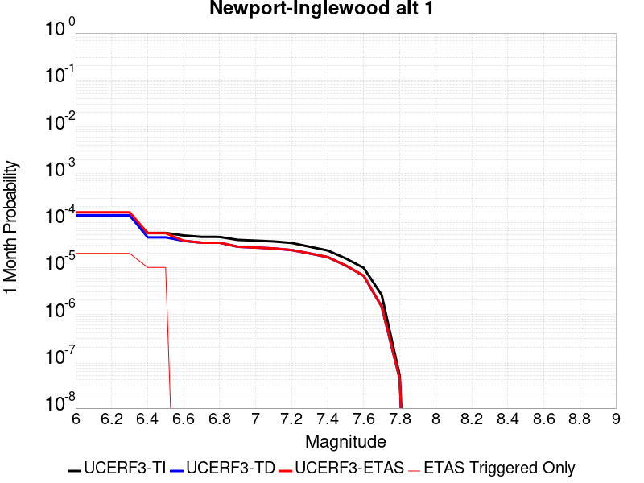 |  |  |

| Magnitude | 1 wk TI Prob | 1 wk TD Prob | 1 wk ETAS Prob | 1 wk ETAS/TD Gain | 1 wk ETAS Triggered Only | 1 mo TI Prob | 1 mo TD Prob | 1 mo ETAS Prob | 1 mo ETAS/TD Gain | 1 mo ETAS Triggered Only | 1 yr TI Prob | 1 yr TD Prob | 1 yr ETAS Prob | 1 yr ETAS/TD Gain | 1 yr ETAS Triggered Only | 10 yr TI Prob | 10 yr TD Prob | 10 yr ETAS Prob | 10 yr ETAS/TD Gain | 10 yr ETAS Triggered Only |
|-----|-----|-----|-----|-----|-----|-----|-----|-----|-----|-----|-----|-----|-----|-----|-----|-----|-----|-----|-----|-----|
| 6.0 | 2.9668912E-5 | 3.0404817E-5 | 5.0404207E-5 | 1.6577705 | 2.0E-5 | 1.2714628E-4 | 1.303026E-4 | 1.503E-4 | 1.1534688 | 2.0E-5 | 0.0015469068 | 0.0015857625 | 0.001615715 | 1.0188884 | 3.0E-5 | 0.015361829 | 0.015792042 | 0.015821569 | 1.0018697 | 3.0E-5 |
| 6.1 | 2.9668912E-5 | 3.0404817E-5 | 5.0404207E-5 | 1.6577705 | 2.0E-5 | 1.2714628E-4 | 1.303026E-4 | 1.503E-4 | 1.1534688 | 2.0E-5 | 0.0015469068 | 0.0015857625 | 0.001615715 | 1.0188884 | 3.0E-5 | 0.015361829 | 0.015792042 | 0.015821569 | 1.0018697 | 3.0E-5 |
| 6.2 | 2.9668912E-5 | 3.0404817E-5 | 5.0404207E-5 | 1.6577705 | 2.0E-5 | 1.2714628E-4 | 1.303026E-4 | 1.503E-4 | 1.1534688 | 2.0E-5 | 0.0015469068 | 0.0015857625 | 0.001615715 | 1.0188884 | 3.0E-5 | 0.015361829 | 0.015792042 | 0.015821569 | 1.0018697 | 3.0E-5 |
| 6.3 | 2.9668912E-5 | 3.0404817E-5 | 5.0404207E-5 | 1.6577705 | 2.0E-5 | 1.2714628E-4 | 1.303026E-4 | 1.503E-4 | 1.1534688 | 2.0E-5 | 0.0015469068 | 0.0015857625 | 0.001615715 | 1.0188884 | 3.0E-5 | 0.015361829 | 0.015792042 | 0.015821569 | 1.0018697 | 3.0E-5 |
| 6.4 | 1.275942E-5 | 1.0272503E-5 | 2.02724E-5 | 1.9734626 | 1.0E-5 | 5.4682085E-5 | 4.402429E-5 | 5.402385E-5 | 1.2271373 | 1.0E-5 | 6.65551E-4 | 5.358681E-4 | 5.558574E-4 | 1.0373026 | 2.0E-5 | 0.0066356123 | 0.005346184 | 0.005366077 | 1.003721 | 2.0E-5 |
| 6.5 | 1.275942E-5 | 1.0272503E-5 | 2.02724E-5 | 1.9734626 | 1.0E-5 | 5.4682085E-5 | 4.402429E-5 | 5.402385E-5 | 1.2271373 | 1.0E-5 | 6.65551E-4 | 5.358681E-4 | 5.558574E-4 | 1.0373026 | 2.0E-5 | 0.0066356123 | 0.005346184 | 0.005366077 | 1.003721 | 2.0E-5 |
| 6.6 | 1.1255358E-5 | 8.661884E-6 | 8.661884E-6 | 1.0 | 0.0 | 4.8236358E-5 | 3.712184E-5 | 3.712184E-5 | 1.0 | 0.0 | 5.871194E-4 | 4.518664E-4 | 4.6186187E-4 | 1.0221205 | 1.0E-5 | 0.005855706 | 0.004509653 | 0.004519608 | 1.0022075 | 1.0E-5 |
| 6.7 | 1.0504745E-5 | 7.8997955E-6 | 7.8997955E-6 | 1.0 | 0.0 | 4.5019555E-5 | 3.3855835E-5 | 3.3855835E-5 | 1.0 | 0.0 | 5.4797524E-4 | 4.1211807E-4 | 4.2211395E-4 | 1.0242549 | 1.0E-5 | 0.0054662596 | 0.004113668 | 0.0041236267 | 1.0024209 | 1.0E-5 |
| 6.8 | 1.0476007E-5 | 7.881176E-6 | 7.881176E-6 | 1.0 | 0.0 | 4.4896402E-5 | 3.3776043E-5 | 3.3776043E-5 | 1.0 | 0.0 | 5.464766E-4 | 4.1114696E-4 | 4.2114285E-4 | 1.0243123 | 1.0E-5 | 0.005451347 | 0.0041039926 | 0.0041139517 | 1.0024266 | 1.0E-5 |
| 6.9 | 9.076797E-6 | 6.4896312E-6 | 6.4896312E-6 | 1.0 | 0.0 | 3.889998E-5 | 2.781241E-5 | 2.781241E-5 | 1.0 | 0.0 | 4.7350433E-4 | 3.385638E-4 | 3.4856042E-4 | 1.0295265 | 1.0E-5 | 0.004724967 | 0.0033805177 | 0.0033904838 | 1.0029482 | 1.0E-5 |
| 7.0 | 8.73795E-6 | 6.2120125E-6 | 6.2120125E-6 | 1.0 | 0.0 | 3.7447822E-5 | 2.6622642E-5 | 2.6622642E-5 | 1.0 | 0.0 | 4.5583185E-4 | 3.2408274E-4 | 3.340795E-4 | 1.0308464 | 1.0E-5 | 0.0045489795 | 0.0032361327 | 0.0032461004 | 1.0030801 | 1.0E-5 |
| 7.1 | 8.391299E-6 | 5.95579E-6 | 5.95579E-6 | 1.0 | 0.0 | 3.5962214E-5 | 2.5524565E-5 | 2.5524565E-5 | 1.0 | 0.0 | 4.37752E-4 | 3.1071753E-4 | 3.2071443E-4 | 1.0321735 | 1.0E-5 | 0.004368907 | 0.0031028606 | 0.0031128295 | 1.0032128 | 1.0E-5 |
| 7.2 | 7.796882E-6 | 5.4965344E-6 | 5.4965344E-6 | 1.0 | 0.0 | 3.341478E-5 | 2.3556364E-5 | 2.3556364E-5 | 1.0 | 0.0 | 4.06749E-4 | 2.867612E-4 | 2.9675834E-4 | 1.0348623 | 1.0E-5 | 0.0040600533 | 0.0028639357 | 0.002873907 | 1.0034817 | 1.0E-5 |
| 7.3 | 6.4738833E-6 | 4.6478162E-6 | 4.6478162E-6 | 1.0 | 0.0 | 2.774492E-5 | 1.9919062E-5 | 1.9919062E-5 | 1.0 | 0.0 | 3.3774204E-4 | 2.4248775E-4 | 2.524853E-4 | 1.0412292 | 1.0E-5 | 0.0033722918 | 0.0024222482 | 0.0024322239 | 1.0041184 | 1.0E-5 |
| 7.4 | 5.382145E-6 | 3.8857597E-6 | 3.8857597E-6 | 1.0 | 0.0 | 2.3066134E-5 | 1.665315E-5 | 1.665315E-5 | 1.0 | 0.0 | 2.8079396E-4 | 2.0273338E-4 | 2.0273338E-4 | 1.0 | 0.0 | 0.0028043943 | 0.0020254988 | 0.0020254988 | 1.0 | 0.0 |
| 7.5 | 3.648244E-6 | 2.5737843E-6 | 2.5737843E-6 | 1.0 | 0.0 | 1.5635238E-5 | 1.1030458E-5 | 1.1030458E-5 | 1.0 | 0.0 | 1.9034238E-4 | 1.3428765E-4 | 1.3428765E-4 | 1.0 | 0.0 | 0.0019017943 | 0.0013420755 | 0.0013420755 | 1.0 | 0.0 |
| 7.6 | 2.2906888E-6 | 1.5479842E-6 | 1.5479842E-6 | 1.0 | 0.0 | 9.817201E-6 | 6.634202E-6 | 6.634202E-6 | 1.0 | 0.0 | 1.1951787E-4 | 8.076848E-5 | 8.076848E-5 | 1.0 | 0.0 | 0.0011945361 | 8.07398E-4 | 8.07398E-4 | 1.0 | 0.0 |
| 7.7 | 6.0479874E-7 | 3.397512E-7 | 3.397512E-7 | 1.0 | 0.0 | 2.5919921E-6 | 1.4560758E-6 | 1.4560758E-6 | 1.0 | 0.0 | 3.1557047E-5 | 1.7727592E-5 | 1.7727592E-5 | 1.0 | 0.0 | 3.1552566E-4 | 1.7726317E-4 | 1.7726317E-4 | 1.0 | 0.0 |
| 7.8 | 1.16056995E-8 | 9.782373E-9 | 9.782373E-9 | 1.0 | 0.0 | 4.9738713E-8 | 4.1924455E-8 | 4.1924455E-8 | 1.0 | 0.0 | 6.0556863E-7 | 5.1043025E-7 | 5.1043025E-7 | 1.0 | 0.0 | 6.05567E-6 | 5.1043025E-6 | 5.1043025E-6 | 1.0 | 0.0 |

## Ortigalita (South)
*[(top)](#table-of-contents)*

| 1 Week | 1 Month | 1 Year | 10 Year |
|-----|-----|-----|-----|
|  |  | 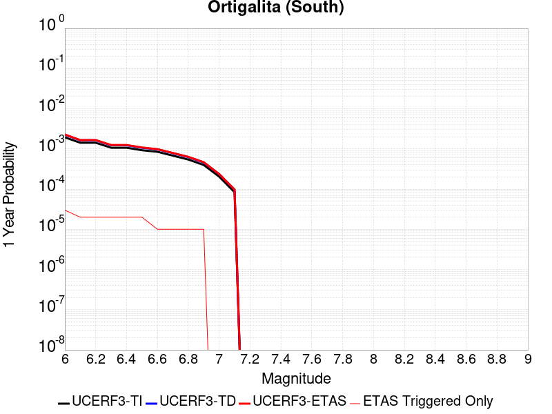 |  |

| Magnitude | 1 wk TI Prob | 1 wk TD Prob | 1 wk ETAS Prob | 1 wk ETAS/TD Gain | 1 wk ETAS Triggered Only | 1 mo TI Prob | 1 mo TD Prob | 1 mo ETAS Prob | 1 mo ETAS/TD Gain | 1 mo ETAS Triggered Only | 1 yr TI Prob | 1 yr TD Prob | 1 yr ETAS Prob | 1 yr ETAS/TD Gain | 1 yr ETAS Triggered Only | 10 yr TI Prob | 10 yr TD Prob | 10 yr ETAS Prob | 10 yr ETAS/TD Gain | 10 yr ETAS Triggered Only |
|-----|-----|-----|-----|-----|-----|-----|-----|-----|-----|-----|-----|-----|-----|-----|-----|-----|-----|-----|-----|-----|
| 6.0 | 3.72394E-5 | 4.325562E-5 | 6.325475E-5 | 1.4623477 | 2.0E-5 | 1.5958765E-4 | 1.8536893E-4 | 2.1536337E-4 | 1.1618094 | 3.0E-5 | 0.0019412481 | 0.0022546875 | 0.0022846197 | 1.0132756 | 3.0E-5 | 0.019243775 | 0.022334497 | 0.022363827 | 1.0013132 | 3.0E-5 |
| 6.1 | 2.7299884E-5 | 3.149204E-5 | 5.149141E-5 | 1.6350611 | 2.0E-5 | 1.16994255E-4 | 1.3495922E-4 | 1.5495653E-4 | 1.1481729 | 2.0E-5 | 0.0014234743 | 0.0016419457 | 0.0016619129 | 1.0121607 | 2.0E-5 | 0.014143906 | 0.01630407 | 0.016323743 | 1.0012066 | 2.0E-5 |
| 6.2 | 2.7299884E-5 | 3.149204E-5 | 5.149141E-5 | 1.6350611 | 2.0E-5 | 1.16994255E-4 | 1.3495922E-4 | 1.5495653E-4 | 1.1481729 | 2.0E-5 | 0.0014234743 | 0.0016419457 | 0.0016619129 | 1.0121607 | 2.0E-5 | 0.014143906 | 0.01630407 | 0.016323743 | 1.0012066 | 2.0E-5 |
| 6.3 | 2.0546433E-5 | 2.363145E-5 | 4.363098E-5 | 1.8463098 | 2.0E-5 | 8.805317E-5 | 1.0127382E-4 | 1.212718E-4 | 1.1974643 | 2.0E-5 | 0.00107152 | 0.0012323303 | 0.0012523057 | 1.0162094 | 2.0E-5 | 0.010663681 | 0.01225703 | 0.012276785 | 1.0016117 | 2.0E-5 |
| 6.4 | 2.0546433E-5 | 2.363145E-5 | 4.363098E-5 | 1.8463098 | 2.0E-5 | 8.805317E-5 | 1.0127382E-4 | 1.212718E-4 | 1.1974643 | 2.0E-5 | 0.00107152 | 0.0012323303 | 0.0012523057 | 1.0162094 | 2.0E-5 | 0.010663681 | 0.01225703 | 0.012276785 | 1.0016117 | 2.0E-5 |
| 6.5 | 1.7779594E-5 | 2.0446974E-5 | 4.0446565E-5 | 1.9781199 | 2.0E-5 | 7.619603E-5 | 8.762702E-5 | 1.0762527E-4 | 1.2282201 | 2.0E-5 | 9.272918E-4 | 0.0010663504 | 0.0010863291 | 1.0187355 | 2.0E-5 | 0.009234319 | 0.010613803 | 0.010633591 | 1.0018643 | 2.0E-5 |
| 6.6 | 1.6272212E-5 | 1.8714967E-5 | 2.871478E-5 | 1.5343217 | 1.0E-5 | 6.973618E-5 | 8.0204605E-5 | 9.02038E-5 | 1.1246711 | 1.0E-5 | 8.487073E-4 | 9.760658E-4 | 9.86056E-4 | 1.0102352 | 1.0E-5 | 0.008454733 | 0.009719091 | 0.009728993 | 1.0010189 | 1.0E-5 |
| 6.7 | 1.3051484E-5 | 1.5038758E-5 | 2.5038607E-5 | 1.6649386 | 1.0E-5 | 5.593373E-5 | 6.445028E-5 | 7.4449636E-5 | 1.1551484 | 1.0E-5 | 6.807804E-4 | 7.844092E-4 | 7.9440133E-4 | 1.0127385 | 1.0E-5 | 0.006786986 | 0.007817388 | 0.00782731 | 1.0012692 | 1.0E-5 |
| 6.8 | 1.04277415E-5 | 1.1987235E-5 | 2.1987114E-5 | 1.8342108 | 1.0E-5 | 4.4689557E-5 | 5.1372896E-5 | 6.137238E-5 | 1.1946452 | 1.0E-5 | 5.439595E-4 | 6.2529295E-4 | 6.352867E-4 | 1.0159825 | 1.0E-5 | 0.0054262993 | 0.00623609 | 0.0062460275 | 1.0015936 | 1.0E-5 |
| 6.9 | 7.639968E-6 | 8.791503E-6 | 1.8791416E-5 | 2.137452 | 1.0E-5 | 3.274231E-5 | 3.767736E-5 | 4.7676982E-5 | 1.2654014 | 1.0E-5 | 3.9856473E-4 | 4.586312E-4 | 4.686266E-4 | 1.021794 | 1.0E-5 | 0.003978506 | 0.004577433 | 0.004587387 | 1.0021746 | 1.0E-5 |
| 7.0 | 3.919831E-6 | 4.5334014E-6 | 4.5334014E-6 | 1.0 | 0.0 | 1.679917E-5 | 1.942873E-5 | 1.942873E-5 | 1.0 | 0.0 | 2.045107E-4 | 2.3652123E-4 | 2.3652123E-4 | 1.0 | 0.0 | 0.0020432258 | 0.0023629034 | 0.0023629034 | 1.0 | 0.0 |
| 7.1 | 1.6017933E-6 | 1.8570418E-6 | 1.8570418E-6 | 1.0 | 0.0 | 6.8648105E-6 | 7.958732E-6 | 7.958732E-6 | 1.0 | 0.0 | 8.357586E-5 | 9.689432E-5 | 9.689432E-5 | 1.0 | 0.0 | 8.3544437E-4 | 9.686254E-4 | 9.686254E-4 | 1.0 | 0.0 |

## Cerro Prieto
*[(top)](#table-of-contents)*

| 1 Week | 1 Month | 1 Year | 10 Year |
|-----|-----|-----|-----|
|  |  | 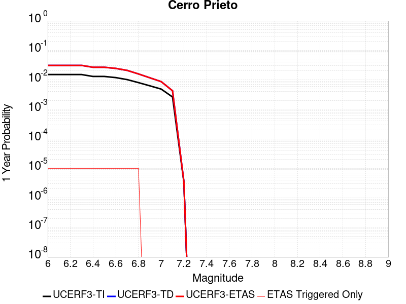 |  |

| Magnitude | 1 wk TI Prob | 1 wk TD Prob | 1 wk ETAS Prob | 1 wk ETAS/TD Gain | 1 wk ETAS Triggered Only | 1 mo TI Prob | 1 mo TD Prob | 1 mo ETAS Prob | 1 mo ETAS/TD Gain | 1 mo ETAS Triggered Only | 1 yr TI Prob | 1 yr TD Prob | 1 yr ETAS Prob | 1 yr ETAS/TD Gain | 1 yr ETAS Triggered Only | 10 yr TI Prob | 10 yr TD Prob | 10 yr ETAS Prob | 10 yr ETAS/TD Gain | 10 yr ETAS Triggered Only |
|-----|-----|-----|-----|-----|-----|-----|-----|-----|-----|-----|-----|-----|-----|-----|-----|-----|-----|-----|-----|-----|
| 6.0 | 2.9101528E-4 | 5.964804E-4 | 6.064744E-4 | 1.016755 | 1.0E-5 | 0.0012466122 | 0.002554082 | 0.0025640565 | 1.0039053 | 1.0E-5 | 0.015072231 | 0.03064807 | 0.030657765 | 1.0003163 | 1.0E-5 | 0.14089979 | 0.25397858 | 0.25400096 | 1.0000881 | 3.0E-5 |
| 6.1 | 2.9101528E-4 | 5.964804E-4 | 6.064744E-4 | 1.016755 | 1.0E-5 | 0.0012466122 | 0.002554082 | 0.0025640565 | 1.0039053 | 1.0E-5 | 0.015072231 | 0.03064807 | 0.030657765 | 1.0003163 | 1.0E-5 | 0.14089979 | 0.25397858 | 0.25400096 | 1.0000881 | 3.0E-5 |
| 6.2 | 2.9101528E-4 | 5.964804E-4 | 6.064744E-4 | 1.016755 | 1.0E-5 | 0.0012466122 | 0.002554082 | 0.0025640565 | 1.0039053 | 1.0E-5 | 0.015072231 | 0.03064807 | 0.030657765 | 1.0003163 | 1.0E-5 | 0.14089979 | 0.25397858 | 0.25400096 | 1.0000881 | 3.0E-5 |
| 6.3 | 2.9101528E-4 | 5.964804E-4 | 6.064744E-4 | 1.016755 | 1.0E-5 | 0.0012466122 | 0.002554082 | 0.0025640565 | 1.0039053 | 1.0E-5 | 0.015072231 | 0.03064807 | 0.030657765 | 1.0003163 | 1.0E-5 | 0.14089979 | 0.25397858 | 0.25400096 | 1.0000881 | 3.0E-5 |
| 6.4 | 2.508648E-4 | 5.1397446E-4 | 5.239693E-4 | 1.0194463 | 1.0E-5 | 0.0010746918 | 0.0022010866 | 0.0022110646 | 1.0045332 | 1.0E-5 | 0.013006088 | 0.026471792 | 0.026481528 | 1.0003678 | 1.0E-5 | 0.12270685 | 0.22440416 | 0.22442742 | 1.0001037 | 3.0E-5 |
| 6.5 | 2.508648E-4 | 5.1397446E-4 | 5.239693E-4 | 1.0194463 | 1.0E-5 | 0.0010746918 | 0.0022010866 | 0.0022110646 | 1.0045332 | 1.0E-5 | 0.013006088 | 0.026471792 | 0.026481528 | 1.0003678 | 1.0E-5 | 0.12270685 | 0.22440416 | 0.22442742 | 1.0001037 | 3.0E-5 |
| 6.6 | 2.294914E-4 | 4.7116808E-4 | 4.8116336E-4 | 1.0212139 | 1.0E-5 | 9.831638E-4 | 0.0020179166 | 0.0020278965 | 1.0049456 | 1.0E-5 | 0.011904482 | 0.02429866 | 0.024308417 | 1.0004015 | 1.0E-5 | 0.11286586 | 0.20858558 | 0.20860931 | 1.0001138 | 3.0E-5 |
| 6.7 | 1.9621674E-4 | 4.0419117E-4 | 4.1418715E-4 | 1.0247308 | 1.0E-5 | 8.4065786E-4 | 0.0017312564 | 0.001741239 | 1.0057662 | 1.0E-5 | 0.010187071 | 0.020884845 | 0.020894635 | 1.0004689 | 1.0E-5 | 0.09732539 | 0.18290249 | 0.182927 | 1.000134 | 3.0E-5 |
| 6.8 | 1.5476145E-4 | 3.056516E-4 | 3.1564853E-4 | 1.032707 | 1.0E-5 | 6.6309475E-4 | 0.00130938 | 0.0013193669 | 1.0076272 | 1.0E-5 | 0.008043335 | 0.015836509 | 0.01584635 | 1.0006214 | 1.0E-5 | 0.07758363 | 0.14336355 | 0.14338069 | 1.0001194 | 2.0E-5 |
| 6.9 | 1.20509176E-4 | 2.2582515E-4 | 2.2582515E-4 | 1.0 | 0.0 | 5.1636563E-4 | 9.6752634E-4 | 9.6752634E-4 | 1.0 | 0.0 | 0.006268645 | 0.011726342 | 0.011726342 | 1.0 | 0.0 | 0.060947374 | 0.109451205 | 0.10946011 | 1.0000814 | 1.0E-5 |
| 7.0 | 9.3269155E-5 | 1.6716642E-4 | 1.6716642E-4 | 1.0 | 0.0 | 3.9966372E-4 | 7.162739E-4 | 7.162739E-4 | 1.0 | 0.0 | 0.0048550544 | 0.008693418 | 0.008693418 | 1.0 | 0.0 | 0.04750344 | 0.08315912 | 0.08316828 | 1.0001103 | 1.0E-5 |
| 7.1 | 5.029709E-5 | 8.1718936E-5 | 8.1718936E-5 | 1.0 | 0.0 | 2.1554115E-4 | 3.5019626E-4 | 3.5019626E-4 | 1.0 | 0.0 | 0.0026210553 | 0.0042587193 | 0.0042587193 | 1.0 | 0.0 | 0.025903556 | 0.042365108 | 0.042374685 | 1.000226 | 1.0E-5 |
| 7.2 | 6.5445185E-8 | 6.814903E-8 | 6.814903E-8 | 1.0 | 0.0 | 2.8047933E-7 | 2.9206726E-7 | 2.9206726E-7 | 1.0 | 0.0 | 3.4148304E-6 | 3.555919E-6 | 3.555919E-6 | 1.0 | 0.0 | 3.414778E-5 | 3.5559187E-5 | 3.5559187E-5 | 1.0 | 0.0 |

## Rinconada 2011 CFM
*[(top)](#table-of-contents)*

| 1 Week | 1 Month | 1 Year | 10 Year |
|-----|-----|-----|-----|
|  | 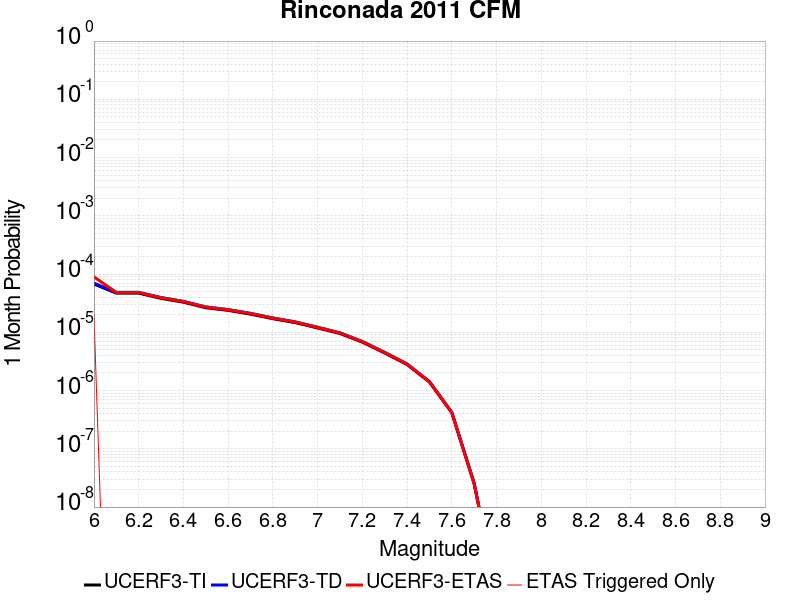 |  |  |

| Magnitude | 1 wk TI Prob | 1 wk TD Prob | 1 wk ETAS Prob | 1 wk ETAS/TD Gain | 1 wk ETAS Triggered Only | 1 mo TI Prob | 1 mo TD Prob | 1 mo ETAS Prob | 1 mo ETAS/TD Gain | 1 mo ETAS Triggered Only | 1 yr TI Prob | 1 yr TD Prob | 1 yr ETAS Prob | 1 yr ETAS/TD Gain | 1 yr ETAS Triggered Only | 10 yr TI Prob | 10 yr TD Prob | 10 yr ETAS Prob | 10 yr ETAS/TD Gain | 10 yr ETAS Triggered Only |
|-----|-----|-----|-----|-----|-----|-----|-----|-----|-----|-----|-----|-----|-----|-----|-----|-----|-----|-----|-----|-----|
| 6.0 | 1.5752368E-5 | 1.6274716E-5 | 2.6274553E-5 | 1.6144401 | 1.0E-5 | 6.75084E-5 | 6.974694E-5 | 8.974554E-5 | 1.286731 | 2.0E-5 | 8.2160486E-4 | 8.488412E-4 | 8.6882425E-4 | 1.0235416 | 2.0E-5 | 0.008185739 | 0.00845637 | 0.008486116 | 1.0035176 | 3.0E-5 |
| 6.1 | 1.0966133E-5 | 1.1323029E-5 | 1.1323029E-5 | 1.0 | 0.0 | 4.6996865E-5 | 4.852637E-5 | 4.852637E-5 | 1.0 | 0.0 | 5.720366E-4 | 5.906491E-4 | 5.906491E-4 | 1.0 | 0.0 | 0.0057056635 | 0.0058908886 | 0.0058908886 | 1.0 | 0.0 |
| 6.2 | 1.0966133E-5 | 1.1323029E-5 | 1.1323029E-5 | 1.0 | 0.0 | 4.6996865E-5 | 4.852637E-5 | 4.852637E-5 | 1.0 | 0.0 | 5.720366E-4 | 5.906491E-4 | 5.906491E-4 | 1.0 | 0.0 | 0.0057056635 | 0.0058908886 | 0.0058908886 | 1.0 | 0.0 |
| 6.3 | 8.926149E-6 | 9.212771E-6 | 9.212771E-6 | 1.0 | 0.0 | 3.8254362E-5 | 3.948271E-5 | 3.948271E-5 | 1.0 | 0.0 | 4.6564735E-4 | 4.805963E-4 | 4.805963E-4 | 1.0 | 0.0 | 0.0046467283 | 0.0047956146 | 0.0047956146 | 1.0 | 0.0 |
| 6.4 | 7.676955E-6 | 7.920191E-6 | 7.920191E-6 | 1.0 | 0.0 | 3.290082E-5 | 3.3943234E-5 | 3.3943234E-5 | 1.0 | 0.0 | 4.0049385E-4 | 4.1318068E-4 | 4.1318068E-4 | 1.0 | 0.0 | 0.0039977287 | 0.004124151 | 0.004124151 | 1.0 | 0.0 |
| 6.5 | 6.1671026E-6 | 6.3589546E-6 | 6.3589546E-6 | 1.0 | 0.0 | 2.6430173E-5 | 2.725238E-5 | 2.725238E-5 | 1.0 | 0.0 | 3.2173982E-4 | 3.317473E-4 | 3.317473E-4 | 1.0 | 0.0 | 0.003212744 | 0.0033125326 | 0.0033125326 | 1.0 | 0.0 |
| 6.6 | 5.553456E-6 | 5.7248126E-6 | 5.7248126E-6 | 1.0 | 0.0 | 2.3800309E-5 | 2.453468E-5 | 2.453468E-5 | 1.0 | 0.0 | 2.897302E-4 | 2.9866883E-4 | 2.9866883E-4 | 1.0 | 0.0 | 0.0028935277 | 0.002982683 | 0.002982683 | 1.0 | 0.0 |
| 6.7 | 4.787857E-6 | 4.9333094E-6 | 4.9333094E-6 | 1.0 | 0.0 | 2.0519226E-5 | 2.1142583E-5 | 2.1142583E-5 | 1.0 | 0.0 | 2.4979294E-4 | 2.573806E-4 | 2.573806E-4 | 1.0 | 0.0 | 0.0024951235 | 0.0025708308 | 0.0025708308 | 1.0 | 0.0 |
| 6.8 | 3.9955166E-6 | 4.1134763E-6 | 4.1134763E-6 | 1.0 | 0.0 | 1.7123532E-5 | 1.7629065E-5 | 1.7629065E-5 | 1.0 | 0.0 | 2.0845905E-4 | 2.1461274E-4 | 2.1461274E-4 | 1.0 | 0.0 | 0.002082636 | 0.0021440585 | 0.0021440585 | 1.0 | 0.0 |
| 6.9 | 3.4250072E-6 | 3.5224464E-6 | 3.5224464E-6 | 1.0 | 0.0 | 1.46785205E-5 | 1.5096111E-5 | 1.5096111E-5 | 1.0 | 0.0 | 1.7869633E-4 | 1.8377967E-4 | 1.8377967E-4 | 1.0 | 0.0 | 0.001785527 | 0.0018362794 | 0.0018362794 | 1.0 | 0.0 |
| 7.0 | 2.7712713E-6 | 2.8467E-6 | 2.8467E-6 | 1.0 | 0.0 | 1.1876823E-5 | 1.2200086E-5 | 1.2200086E-5 | 1.0 | 0.0 | 1.4459073E-4 | 1.4852593E-4 | 1.4852593E-4 | 1.0 | 0.0 | 0.0014449668 | 0.0014842682 | 0.0014842682 | 1.0 | 0.0 |
| 7.1 | 2.227358E-6 | 2.2856984E-6 | 2.2856984E-6 | 1.0 | 0.0 | 9.545785E-6 | 9.795814E-6 | 9.795814E-6 | 1.0 | 0.0 | 1.16213734E-4 | 1.19257515E-4 | 1.19257515E-4 | 1.0 | 0.0 | 0.0011615298 | 0.0011919362 | 0.0011919362 | 1.0 | 0.0 |
| 7.2 | 1.581796E-6 | 1.6209011E-6 | 1.6209011E-6 | 1.0 | 0.0 | 6.779108E-6 | 6.9467005E-6 | 6.9467005E-6 | 1.0 | 0.0 | 8.253252E-5 | 8.457281E-5 | 8.457281E-5 | 1.0 | 0.0 | 8.250187E-4 | 8.454067E-4 | 8.454067E-4 | 1.0 | 0.0 |
| 7.3 | 1.0306567E-6 | 1.0546477E-6 | 1.0546477E-6 | 1.0 | 0.0 | 4.4170924E-6 | 4.519911E-6 | 4.519911E-6 | 1.0 | 0.0 | 5.3776774E-5 | 5.5028526E-5 | 5.5028526E-5 | 1.0 | 0.0 | 5.376376E-4 | 5.5014924E-4 | 5.5014924E-4 | 1.0 | 0.0 |
| 7.4 | 6.535541E-7 | 6.682742E-7 | 6.682742E-7 | 1.0 | 0.0 | 2.800943E-6 | 2.864029E-6 | 2.864029E-6 | 1.0 | 0.0 | 3.4100947E-5 | 3.4868997E-5 | 3.4868997E-5 | 1.0 | 0.0 | 3.4095717E-4 | 3.4863537E-4 | 3.4863537E-4 | 1.0 | 0.0 |
| 7.5 | 3.2656962E-7 | 3.3316687E-7 | 3.3316687E-7 | 1.0 | 0.0 | 1.3995833E-6 | 1.4278572E-6 | 1.4278572E-6 | 1.0 | 0.0 | 1.7039794E-5 | 1.7384024E-5 | 1.7384024E-5 | 1.0 | 0.0 | 1.7038487E-4 | 1.7382667E-4 | 1.7382667E-4 | 1.0 | 0.0 |
| 7.6 | 9.754343E-8 | 9.82099E-8 | 9.82099E-8 | 1.0 | 0.0 | 4.180432E-7 | 4.208995E-7 | 4.208995E-7 | 1.0 | 0.0 | 5.089664E-6 | 5.1244397E-6 | 5.1244397E-6 | 1.0 | 0.0 | 5.0895473E-5 | 5.1243223E-5 | 5.1243223E-5 | 1.0 | 0.0 |
| 7.7 | 6.0001453E-9 | 5.8490435E-9 | 5.8490435E-9 | 1.0 | 0.0 | 2.5714908E-8 | 2.506733E-8 | 2.506733E-8 | 1.0 | 0.0 | 3.1307894E-7 | 3.051947E-7 | 3.051947E-7 | 1.0 | 0.0 | 3.1307852E-6 | 3.051943E-6 | 3.051943E-6 | 1.0 | 0.0 |
| 7.8 | 7.400003E-11 | 7.4654505E-11 | 7.4654505E-11 | 1.0 | 0.0 | 3.171432E-10 | 3.1994773E-10 | 3.1994773E-10 | 1.0 | 0.0 | 3.861218E-9 | 3.895363E-9 | 3.895363E-9 | 1.0 | 0.0 | 3.861218E-8 | 3.895363E-8 | 3.895363E-8 | 1.0 | 0.0 |

## Likely 2011 CFM
*[(top)](#table-of-contents)*

| 1 Week | 1 Month | 1 Year | 10 Year |
|-----|-----|-----|-----|
|  |  |  |  |

| Magnitude | 1 wk TI Prob | 1 wk TD Prob | 1 wk ETAS Prob | 1 wk ETAS/TD Gain | 1 wk ETAS Triggered Only | 1 mo TI Prob | 1 mo TD Prob | 1 mo ETAS Prob | 1 mo ETAS/TD Gain | 1 mo ETAS Triggered Only | 1 yr TI Prob | 1 yr TD Prob | 1 yr ETAS Prob | 1 yr ETAS/TD Gain | 1 yr ETAS Triggered Only | 10 yr TI Prob | 10 yr TD Prob | 10 yr ETAS Prob | 10 yr ETAS/TD Gain | 10 yr ETAS Triggered Only |
|-----|-----|-----|-----|-----|-----|-----|-----|-----|-----|-----|-----|-----|-----|-----|-----|-----|-----|-----|-----|-----|
| 6.0 | 2.5315949E-5 | 2.7104748E-5 | 4.7104208E-5 | 1.737858 | 2.0E-5 | 1.0849241E-4 | 1.16158284E-4 | 1.3615596E-4 | 1.1721588 | 2.0E-5 | 0.0013200947 | 0.0014133542 | 0.0014433118 | 1.0211961 | 3.0E-5 | 0.013122803 | 0.01404831 | 0.014077889 | 1.0021055 | 3.0E-5 |
| 6.1 | 2.5315949E-5 | 2.7104748E-5 | 4.7104208E-5 | 1.737858 | 2.0E-5 | 1.0849241E-4 | 1.16158284E-4 | 1.3615596E-4 | 1.1721588 | 2.0E-5 | 0.0013200947 | 0.0014133542 | 0.0014433118 | 1.0211961 | 3.0E-5 | 0.013122803 | 0.01404831 | 0.014077889 | 1.0021055 | 3.0E-5 |
| 6.2 | 1.6375941E-5 | 1.7465842E-5 | 3.7465492E-5 | 2.1450722 | 2.0E-5 | 7.0180715E-5 | 7.485153E-5 | 9.485003E-5 | 1.2671756 | 2.0E-5 | 8.5411523E-4 | 9.109487E-4 | 9.409213E-4 | 1.0329027 | 3.0E-5 | 0.008508399 | 0.009073433 | 0.00910316 | 1.0032763 | 3.0E-5 |
| 6.3 | 1.1945543E-5 | 1.2712587E-5 | 3.271233E-5 | 2.5732238 | 2.0E-5 | 5.119418E-5 | 5.4481407E-5 | 7.448032E-5 | 1.3670777 | 2.0E-5 | 6.2311086E-4 | 6.631146E-4 | 6.930947E-4 | 1.0452111 | 3.0E-5 | 0.0062136655 | 0.0066119144 | 0.006641716 | 1.0045073 | 3.0E-5 |
| 6.4 | 9.192729E-6 | 9.768488E-6 | 2.9768293E-5 | 3.0473797 | 2.0E-5 | 3.939681E-5 | 4.1864292E-5 | 6.186345E-5 | 1.4777141 | 2.0E-5 | 4.7955062E-4 | 5.0958124E-4 | 5.39566E-4 | 1.0588418 | 3.0E-5 | 0.004785171 | 0.0050844094 | 0.005114257 | 1.0058703 | 3.0E-5 |
| 6.5 | 7.67906E-6 | 8.152622E-6 | 2.8152459E-5 | 3.4531784 | 2.0E-5 | 3.2909844E-5 | 3.4939352E-5 | 5.4938653E-5 | 1.5724005 | 2.0E-5 | 4.006037E-4 | 4.2530545E-4 | 4.552927E-4 | 1.0705075 | 3.0E-5 | 0.0039988225 | 0.004245108 | 0.0042749806 | 1.0070369 | 3.0E-5 |
| 6.6 | 6.4884057E-6 | 6.8847507E-6 | 2.6884612E-5 | 3.9049509 | 2.0E-5 | 2.7807157E-5 | 2.9505749E-5 | 4.9505157E-5 | 1.677814 | 2.0E-5 | 3.3849955E-4 | 3.591747E-4 | 3.7916753E-4 | 1.0556632 | 2.0E-5 | 0.003379844 | 0.0035860867 | 0.0036060151 | 1.0055571 | 2.0E-5 |
| 6.7 | 4.6060636E-6 | 4.884041E-6 | 1.4883993E-5 | 3.0474749 | 1.0E-5 | 1.9740122E-5 | 2.0931442E-5 | 3.0931235E-5 | 1.4777402 | 1.0E-5 | 2.403095E-4 | 2.5481134E-4 | 2.648088E-4 | 1.0392348 | 1.0E-5 | 0.002400498 | 0.0025452746 | 0.0025552493 | 1.0039189 | 1.0E-5 |
| 6.8 | 3.2795615E-6 | 3.4773732E-6 | 1.3477338E-5 | 3.875724 | 1.0E-5 | 1.4055187E-5 | 1.4902946E-5 | 2.4902796E-5 | 1.6709983 | 1.0E-5 | 1.7110848E-4 | 1.8142881E-4 | 1.91427E-4 | 1.0551081 | 1.0E-5 | 0.0017097679 | 0.0018128622 | 0.001822844 | 1.0055062 | 1.0E-5 |
| 6.9 | 2.3289967E-6 | 2.4705569E-6 | 1.2470532E-5 | 5.0476604 | 1.0E-5 | 9.981376E-6 | 1.058806E-5 | 2.0587955E-5 | 1.94445 | 1.0E-5 | 1.2151648E-4 | 1.2890245E-4 | 1.3890116E-4 | 1.077568 | 1.0E-5 | 0.0012145005 | 0.0012883197 | 0.0012983069 | 1.0077521 | 1.0E-5 |
| 7.0 | 1.211292E-6 | 1.2863958E-6 | 1.1286383E-5 | 8.773647 | 1.0E-5 | 5.1912407E-6 | 5.5131145E-6 | 1.551306E-5 | 2.8138466 | 1.0E-5 | 6.320152E-5 | 6.712041E-5 | 7.711974E-5 | 1.148976 | 1.0E-5 | 6.3183554E-4 | 6.710312E-4 | 6.810245E-4 | 1.0148925 | 1.0E-5 |

## San Gregorio (North) 2011 CFM
*[(top)](#table-of-contents)*

| 1 Week | 1 Month | 1 Year | 10 Year |
|-----|-----|-----|-----|
|  |  |  |  |

| Magnitude | 1 wk TI Prob | 1 wk TD Prob | 1 wk ETAS Prob | 1 wk ETAS/TD Gain | 1 wk ETAS Triggered Only | 1 mo TI Prob | 1 mo TD Prob | 1 mo ETAS Prob | 1 mo ETAS/TD Gain | 1 mo ETAS Triggered Only | 1 yr TI Prob | 1 yr TD Prob | 1 yr ETAS Prob | 1 yr ETAS/TD Gain | 1 yr ETAS Triggered Only | 10 yr TI Prob | 10 yr TD Prob | 10 yr ETAS Prob | 10 yr ETAS/TD Gain | 10 yr ETAS Triggered Only |
|-----|-----|-----|-----|-----|-----|-----|-----|-----|-----|-----|-----|-----|-----|-----|-----|-----|-----|-----|-----|-----|
| 6.0 | 5.0283932E-5 | 4.3057815E-5 | 5.305738E-5 | 1.2322359 | 1.0E-5 | 2.1548476E-4 | 1.8452053E-4 | 2.0451684E-4 | 1.108369 | 2.0E-5 | 0.0026203706 | 0.002244237 | 0.002264192 | 1.0088917 | 2.0E-5 | 0.02589687 | 0.022293162 | 0.022312716 | 1.0008771 | 2.0E-5 |
| 6.1 | 5.0283932E-5 | 4.3057815E-5 | 5.305738E-5 | 1.2322359 | 1.0E-5 | 2.1548476E-4 | 1.8452053E-4 | 2.0451684E-4 | 1.108369 | 2.0E-5 | 0.0026203706 | 0.002244237 | 0.002264192 | 1.0088917 | 2.0E-5 | 0.02589687 | 0.022293162 | 0.022312716 | 1.0008771 | 2.0E-5 |
| 6.2 | 4.2998647E-5 | 3.4441564E-5 | 4.4441218E-5 | 1.2903368 | 1.0E-5 | 1.842669E-4 | 1.475984E-4 | 1.5759692E-4 | 1.0677414 | 1.0E-5 | 0.0022411412 | 0.00179554 | 0.001805522 | 1.0055593 | 1.0E-5 | 0.022186736 | 0.017886506 | 0.017896328 | 1.0005491 | 1.0E-5 |
| 6.3 | 4.2998647E-5 | 3.4441564E-5 | 4.4441218E-5 | 1.2903368 | 1.0E-5 | 1.842669E-4 | 1.475984E-4 | 1.5759692E-4 | 1.0677414 | 1.0E-5 | 0.0022411412 | 0.00179554 | 0.001805522 | 1.0055593 | 1.0E-5 | 0.022186736 | 0.017886506 | 0.017896328 | 1.0005491 | 1.0E-5 |
| 6.4 | 4.1101295E-5 | 3.2326872E-5 | 4.232655E-5 | 1.3093302 | 1.0E-5 | 1.7613651E-4 | 1.3853642E-4 | 1.4853504E-4 | 1.0721732 | 1.0E-5 | 0.0021423528 | 0.0016853869 | 0.00169537 | 1.0059234 | 1.0E-5 | 0.02121817 | 0.016801886 | 0.016811717 | 1.0005852 | 1.0E-5 |
| 6.5 | 4.1032585E-5 | 3.2244905E-5 | 4.2244585E-5 | 1.3101165 | 1.0E-5 | 1.7584208E-4 | 1.3818518E-4 | 1.481838E-4 | 1.0723567 | 1.0E-5 | 0.0021387753 | 0.0016811171 | 0.0016911003 | 1.0059384 | 1.0E-5 | 0.021183075 | 0.016759839 | 0.016769672 | 1.0005866 | 1.0E-5 |
| 6.6 | 4.011629E-5 | 3.1266558E-5 | 4.1266245E-5 | 1.3198205 | 1.0E-5 | 1.7191563E-4 | 1.339927E-4 | 1.4399135E-4 | 1.074621 | 1.0E-5 | 0.0020910634 | 0.0016301516 | 0.0016401353 | 1.0061244 | 1.0E-5 | 0.020714961 | 0.01625741 | 0.016267247 | 1.0006051 | 1.0E-5 |
| 6.7 | 3.8583938E-5 | 2.9453593E-5 | 3.9453298E-5 | 1.3395071 | 1.0E-5 | 1.6534925E-4 | 1.2622366E-4 | 1.362224E-4 | 1.0792145 | 1.0E-5 | 0.0020112682 | 0.0015357039 | 0.0015456886 | 1.0065017 | 1.0E-5 | 0.019931622 | 0.015325955 | 0.015335802 | 1.0006425 | 1.0E-5 |
| 6.8 | 3.44341E-5 | 2.4450854E-5 | 3.445061E-5 | 1.4089737 | 1.0E-5 | 1.4756636E-4 | 1.0478523E-4 | 1.14784176E-4 | 1.0954233 | 1.0E-5 | 0.0017951399 | 0.0012750238 | 0.0012850111 | 1.007833 | 1.0E-5 | 0.017807078 | 0.012751131 | 0.012761004 | 1.0007743 | 1.0E-5 |
| 6.9 | 3.221199E-5 | 2.1778029E-5 | 3.177781E-5 | 1.4591683 | 1.0E-5 | 1.3804408E-4 | 9.333112E-5 | 1.0333019E-4 | 1.1071354 | 1.0E-5 | 0.0016793909 | 0.0011357224 | 0.0011457109 | 1.008795 | 1.0E-5 | 0.01666756 | 0.011372583 | 0.011382469 | 1.0008693 | 1.0E-5 |
| 7.0 | 2.9186718E-5 | 1.8146875E-5 | 2.8146693E-5 | 1.5510491 | 1.0E-5 | 1.2507994E-4 | 7.7770026E-5 | 8.7769244E-5 | 1.1285743 | 1.0E-5 | 0.0015217843 | 9.464431E-4 | 9.5643365E-4 | 1.0105559 | 1.0E-5 | 0.015114053 | 0.009496798 | 0.009506703 | 1.001043 | 1.0E-5 |
| 7.1 | 2.6840138E-5 | 1.5284508E-5 | 1.5284508E-5 | 1.0 | 0.0 | 1.1502409E-4 | 6.55034E-5 | 6.55034E-5 | 1.0 | 0.0 | 0.0013995186 | 7.9721404E-4 | 7.9721404E-4 | 1.0 | 0.0 | 0.013907375 | 0.008015723 | 0.008015723 | 1.0 | 0.0 |
| 7.2 | 2.453002E-5 | 1.2606672E-5 | 1.2606672E-5 | 1.0 | 0.0 | 1.05124425E-4 | 5.4027478E-5 | 5.4027478E-5 | 1.0 | 0.0 | 0.0012791384 | 6.575866E-4 | 6.575866E-4 | 1.0 | 0.0 | 0.012718005 | 0.00662763 | 0.00662763 | 1.0 | 0.0 |
| 7.3 | 2.3330727E-5 | 1.1488677E-5 | 1.1488677E-5 | 1.0 | 0.0 | 9.9985E-5 | 4.923626E-5 | 4.923626E-5 | 1.0 | 0.0 | 0.0012166376 | 5.9928704E-4 | 5.9928704E-4 | 1.0 | 0.0 | 0.012099981 | 0.006046564 | 0.006046564 | 1.0 | 0.0 |
| 7.4 | 2.2136466E-5 | 1.0368981E-5 | 1.0368981E-5 | 1.0 | 0.0 | 9.486712E-5 | 4.4437733E-5 | 4.4437733E-5 | 1.0 | 0.0 | 0.0011543952 | 5.4089533E-4 | 5.4089533E-4 | 1.0 | 0.0 | 0.011484168 | 0.005464249 | 0.005464249 | 1.0 | 0.0 |
| 7.5 | 2.0994974E-5 | 9.427217E-6 | 9.427217E-6 | 1.0 | 0.0 | 8.997535E-5 | 4.0401734E-5 | 4.0401734E-5 | 1.0 | 0.0 | 0.0010948994 | 4.9178035E-4 | 4.9178035E-4 | 1.0 | 0.0 | 0.010895205 | 0.004973358 | 0.004973358 | 1.0 | 0.0 |
| 7.6 | 1.7091823E-5 | 6.893766E-6 | 6.893766E-6 | 1.0 | 0.0 | 7.3248615E-5 | 2.9544377E-5 | 2.9544377E-5 | 1.0 | 0.0 | 8.9143694E-4 | 3.596435E-4 | 3.596435E-4 | 1.0 | 0.0 | 0.008878695 | 0.0036482841 | 0.0036482841 | 1.0 | 0.0 |
| 7.7 | 1.2772179E-5 | 4.0208706E-6 | 4.0208706E-6 | 1.0 | 0.0 | 5.473676E-5 | 1.7232189E-5 | 1.7232189E-5 | 1.0 | 0.0 | 6.6621625E-4 | 2.0978172E-4 | 2.0978172E-4 | 1.0 | 0.0 | 0.006642225 | 0.002136922 | 0.002136922 | 1.0 | 0.0 |
| 7.8 | 7.041923E-6 | 1.940626E-6 | 1.940626E-6 | 1.0 | 0.0 | 3.017932E-5 | 8.316942E-6 | 8.316942E-6 | 1.0 | 0.0 | 3.6737128E-4 | 1.0125406E-4 | 1.0125406E-4 | 1.0 | 0.0 | 0.0036676454 | 0.0010379003 | 0.0010379003 | 1.0 | 0.0 |
| 7.9 | 2.946768E-6 | 1.0033551E-6 | 1.0033551E-6 | 1.0 | 0.0 | 1.2628945E-5 | 4.300086E-6 | 4.300086E-6 | 1.0 | 0.0 | 1.5374656E-4 | 5.235229E-5 | 5.235229E-5 | 1.0 | 0.0 | 0.0015364023 | 5.3400313E-4 | 5.3400313E-4 | 1.0 | 0.0 |
| 8.0 | 1.1433375E-6 | 5.18146E-7 | 5.18146E-7 | 1.0 | 0.0 | 4.9000087E-6 | 2.2206239E-6 | 2.2206239E-6 | 1.0 | 0.0 | 5.965597E-5 | 2.703576E-5 | 2.703576E-5 | 1.0 | 0.0 | 5.963996E-4 | 2.7398416E-4 | 2.7398416E-4 | 1.0 | 0.0 |
| 8.1 | 2.6675295E-7 | 1.62899E-7 | 1.62899E-7 | 1.0 | 0.0 | 1.1432264E-6 | 6.9813836E-7 | 6.9813836E-7 | 1.0 | 0.0 | 1.3918692E-5 | 8.499802E-6 | 8.499802E-6 | 1.0 | 0.0 | 1.391782E-4 | 8.63795E-5 | 8.63795E-5 | 1.0 | 0.0 |
| 8.2 | 1.2704569E-8 | 9.431393E-9 | 9.431393E-9 | 1.0 | 0.0 | 5.444815E-8 | 4.042026E-8 | 4.042026E-8 | 1.0 | 0.0 | 6.629061E-7 | 4.9211656E-7 | 4.9211656E-7 | 1.0 | 0.0 | 6.629041E-6 | 5.1121438E-6 | 5.1121438E-6 | 1.0 | 0.0 |

## Homestead Valley 2011
*[(top)](#table-of-contents)*

| 1 Week | 1 Month | 1 Year | 10 Year |
|-----|-----|-----|-----|
|  |  | 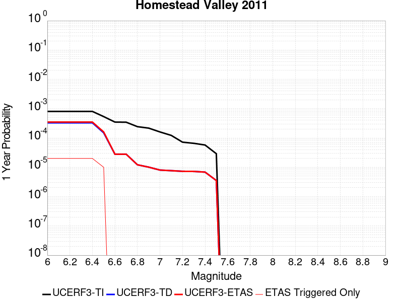 |  |

| Magnitude | 1 wk TI Prob | 1 wk TD Prob | 1 wk ETAS Prob | 1 wk ETAS/TD Gain | 1 wk ETAS Triggered Only | 1 mo TI Prob | 1 mo TD Prob | 1 mo ETAS Prob | 1 mo ETAS/TD Gain | 1 mo ETAS Triggered Only | 1 yr TI Prob | 1 yr TD Prob | 1 yr ETAS Prob | 1 yr ETAS/TD Gain | 1 yr ETAS Triggered Only | 10 yr TI Prob | 10 yr TD Prob | 10 yr ETAS Prob | 10 yr ETAS/TD Gain | 10 yr ETAS Triggered Only |
|-----|-----|-----|-----|-----|-----|-----|-----|-----|-----|-----|-----|-----|-----|-----|-----|-----|-----|-----|-----|-----|
| 6.0 | 1.539795E-5 | 6.286606E-6 | 1.6286544E-5 | 2.5906734 | 1.0E-5 | 6.5989545E-5 | 2.6942436E-5 | 3.6942165E-5 | 1.3711517 | 1.0E-5 | 8.0312655E-4 | 3.279954E-4 | 3.4798883E-4 | 1.0609565 | 2.0E-5 | 0.008002302 | 0.0032771337 | 0.0033070354 | 1.0091244 | 3.0E-5 |
| 6.1 | 1.539795E-5 | 6.286606E-6 | 1.6286544E-5 | 2.5906734 | 1.0E-5 | 6.5989545E-5 | 2.6942436E-5 | 3.6942165E-5 | 1.3711517 | 1.0E-5 | 8.0312655E-4 | 3.279954E-4 | 3.4798883E-4 | 1.0609565 | 2.0E-5 | 0.008002302 | 0.0032771337 | 0.0033070354 | 1.0091244 | 3.0E-5 |
| 6.2 | 1.539795E-5 | 6.286606E-6 | 1.6286544E-5 | 2.5906734 | 1.0E-5 | 6.5989545E-5 | 2.6942436E-5 | 3.6942165E-5 | 1.3711517 | 1.0E-5 | 8.0312655E-4 | 3.279954E-4 | 3.4798883E-4 | 1.0609565 | 2.0E-5 | 0.008002302 | 0.0032771337 | 0.0033070354 | 1.0091244 | 3.0E-5 |
| 6.3 | 1.539795E-5 | 6.286606E-6 | 1.6286544E-5 | 2.5906734 | 1.0E-5 | 6.5989545E-5 | 2.6942436E-5 | 3.6942165E-5 | 1.3711517 | 1.0E-5 | 8.0312655E-4 | 3.279954E-4 | 3.4798883E-4 | 1.0609565 | 2.0E-5 | 0.008002302 | 0.0032771337 | 0.0033070354 | 1.0091244 | 3.0E-5 |
| 6.4 | 1.539795E-5 | 6.286606E-6 | 1.6286544E-5 | 2.5906734 | 1.0E-5 | 6.5989545E-5 | 2.6942436E-5 | 3.6942165E-5 | 1.3711517 | 1.0E-5 | 8.0312655E-4 | 3.279954E-4 | 3.4798883E-4 | 1.0609565 | 2.0E-5 | 0.008002302 | 0.0032771337 | 0.0033070354 | 1.0091244 | 3.0E-5 |
| 6.5 | 1.0265258E-5 | 2.8788488E-6 | 2.8788488E-6 | 1.0 | 0.0 | 4.3993223E-5 | 1.2337905E-5 | 1.2337905E-5 | 1.0 | 0.0 | 5.3548586E-4 | 1.5021059E-4 | 1.6020909E-4 | 1.0665632 | 1.0E-5 | 0.005341973 | 0.0015017724 | 0.0015217424 | 1.0132976 | 2.0E-5 |
| 6.6 | 6.664671E-6 | 5.348204E-7 | 5.348204E-7 | 1.0 | 0.0 | 2.8562565E-5 | 2.2920863E-6 | 2.2920863E-6 | 1.0 | 0.0 | 3.476937E-4 | 2.7905911E-5 | 2.7905911E-5 | 1.0 | 0.0 | 0.003471502 | 2.790357E-4 | 2.890329E-4 | 1.0358278 | 1.0E-5 |
| 6.7 | 6.5954046E-6 | 5.348204E-7 | 5.348204E-7 | 1.0 | 0.0 | 2.8265715E-5 | 2.2920863E-6 | 2.2920863E-6 | 1.0 | 0.0 | 3.4408073E-4 | 2.7905911E-5 | 2.7905911E-5 | 1.0 | 0.0 | 0.0034354846 | 2.790357E-4 | 2.890329E-4 | 1.0358278 | 1.0E-5 |
| 6.8 | 4.648189E-6 | 2.3265572E-7 | 2.3265572E-7 | 1.0 | 0.0 | 1.9920659E-5 | 9.970956E-7 | 9.970956E-7 | 1.0 | 0.0 | 2.4250703E-4 | 1.2139576E-5 | 1.2139576E-5 | 1.0 | 0.0 | 0.0024224254 | 1.2138961E-4 | 1.313884E-4 | 1.0823693 | 1.0E-5 |
| 6.9 | 4.1428534E-6 | 1.9344557E-7 | 1.9344557E-7 | 1.0 | 0.0 | 1.7754966E-5 | 8.290522E-7 | 8.290522E-7 | 1.0 | 0.0 | 2.1614527E-4 | 1.0093667E-5 | 1.0093667E-5 | 1.0 | 0.0 | 0.0021593515 | 1.0093238E-4 | 1.10931374E-4 | 1.0990663 | 1.0E-5 |
| 7.0 | 3.0673707E-6 | 1.5367603E-7 | 1.5367603E-7 | 1.0 | 0.0 | 1.3145808E-5 | 6.586114E-7 | 6.586114E-7 | 1.0 | 0.0 | 1.6003846E-4 | 8.0185655E-6 | 8.0185655E-6 | 1.0 | 0.0 | 0.0015992324 | 8.0182865E-5 | 9.018206E-5 | 1.124705 | 1.0E-5 |
| 7.1 | 2.340854E-6 | 1.468766E-7 | 1.468766E-7 | 1.0 | 0.0 | 1.0032193E-5 | 6.29471E-7 | 6.29471E-7 | 1.0 | 0.0 | 1.221351E-4 | 7.663783E-6 | 7.663783E-6 | 1.0 | 0.0 | 0.00122068 | 7.663529E-5 | 8.663452E-5 | 1.1304781 | 1.0E-5 |
| 7.2 | 1.3754182E-6 | 1.3922634E-7 | 1.3922634E-7 | 1.0 | 0.0 | 5.8946357E-6 | 5.966842E-7 | 5.966842E-7 | 1.0 | 0.0 | 7.176483E-5 | 7.2646067E-6 | 7.2646067E-6 | 1.0 | 0.0 | 7.174166E-4 | 7.264379E-5 | 8.2643055E-5 | 1.137648 | 1.0E-5 |
| 7.3 | 1.2573237E-6 | 1.3827146E-7 | 1.3827146E-7 | 1.0 | 0.0 | 5.388519E-6 | 5.9259185E-7 | 5.9259185E-7 | 1.0 | 0.0 | 6.560324E-5 | 7.2147827E-6 | 7.2147827E-6 | 1.0 | 0.0 | 6.558388E-4 | 7.214558E-5 | 8.2144856E-5 | 1.1385987 | 1.0E-5 |
| 7.4 | 1.0994207E-6 | 1.3106106E-7 | 1.3106106E-7 | 1.0 | 0.0 | 4.7117946E-6 | 5.616901E-7 | 5.616901E-7 | 1.0 | 0.0 | 5.736459E-5 | 6.8385566E-6 | 6.8385566E-6 | 1.0 | 0.0 | 5.734978E-4 | 6.838355E-5 | 7.838287E-5 | 1.146224 | 1.0E-5 |
| 7.5 | 5.5569126E-7 | 6.772991E-8 | 6.772991E-8 | 1.0 | 0.0 | 2.3815317E-6 | 2.90271E-7 | 2.90271E-7 | 1.0 | 0.0 | 2.8994764E-5 | 3.5340445E-6 | 3.5340445E-6 | 1.0 | 0.0 | 2.899098E-4 | 3.5339945E-5 | 4.533959E-5 | 1.2829559 | 1.0E-5 |

## Fontana (Seismicity)
*[(top)](#table-of-contents)*

| 1 Week | 1 Month | 1 Year | 10 Year |
|-----|-----|-----|-----|
|  |  | 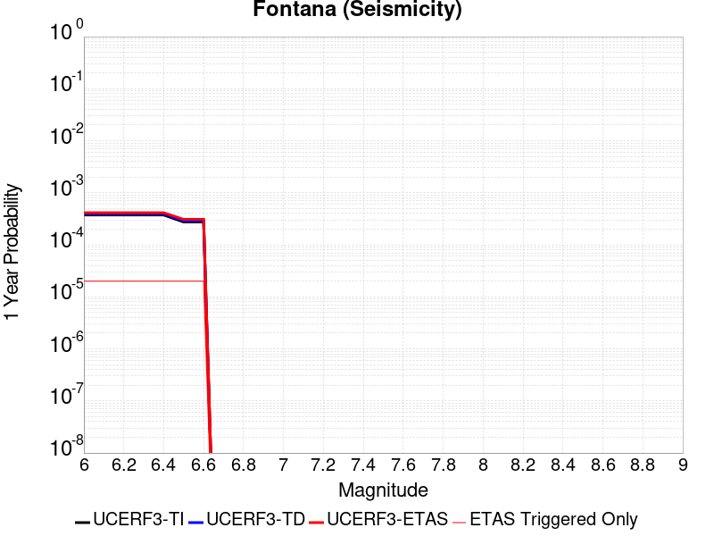 |  |

| Magnitude | 1 wk TI Prob | 1 wk TD Prob | 1 wk ETAS Prob | 1 wk ETAS/TD Gain | 1 wk ETAS Triggered Only | 1 mo TI Prob | 1 mo TD Prob | 1 mo ETAS Prob | 1 mo ETAS/TD Gain | 1 mo ETAS Triggered Only | 1 yr TI Prob | 1 yr TD Prob | 1 yr ETAS Prob | 1 yr ETAS/TD Gain | 1 yr ETAS Triggered Only | 10 yr TI Prob | 10 yr TD Prob | 10 yr ETAS Prob | 10 yr ETAS/TD Gain | 10 yr ETAS Triggered Only |
|-----|-----|-----|-----|-----|-----|-----|-----|-----|-----|-----|-----|-----|-----|-----|-----|-----|-----|-----|-----|-----|
| 6.0 | 7.1789214E-6 | 7.5520006E-6 | 1.7551925E-5 | 2.3241425 | 1.0E-5 | 3.076644E-5 | 3.2365548E-5 | 4.2365224E-5 | 1.3089606 | 1.0E-5 | 3.7451705E-4 | 3.9402005E-4 | 4.1401217E-4 | 1.0507388 | 2.0E-5 | 0.003738865 | 0.003937214 | 0.003967096 | 1.0075896 | 3.0E-5 |
| 6.1 | 7.1789214E-6 | 7.5520006E-6 | 1.7551925E-5 | 2.3241425 | 1.0E-5 | 3.076644E-5 | 3.2365548E-5 | 4.2365224E-5 | 1.3089606 | 1.0E-5 | 3.7451705E-4 | 3.9402005E-4 | 4.1401217E-4 | 1.0507388 | 2.0E-5 | 0.003738865 | 0.003937214 | 0.003967096 | 1.0075896 | 3.0E-5 |
| 6.2 | 7.1789214E-6 | 7.5520006E-6 | 1.7551925E-5 | 2.3241425 | 1.0E-5 | 3.076644E-5 | 3.2365548E-5 | 4.2365224E-5 | 1.3089606 | 1.0E-5 | 3.7451705E-4 | 3.9402005E-4 | 4.1401217E-4 | 1.0507388 | 2.0E-5 | 0.003738865 | 0.003937214 | 0.003967096 | 1.0075896 | 3.0E-5 |
| 6.3 | 7.1789214E-6 | 7.5520006E-6 | 1.7551925E-5 | 2.3241425 | 1.0E-5 | 3.076644E-5 | 3.2365548E-5 | 4.2365224E-5 | 1.3089606 | 1.0E-5 | 3.7451705E-4 | 3.9402005E-4 | 4.1401217E-4 | 1.0507388 | 2.0E-5 | 0.003738865 | 0.003937214 | 0.003967096 | 1.0075896 | 3.0E-5 |
| 6.4 | 7.1789214E-6 | 7.5520006E-6 | 1.7551925E-5 | 2.3241425 | 1.0E-5 | 3.076644E-5 | 3.2365548E-5 | 4.2365224E-5 | 1.3089606 | 1.0E-5 | 3.7451705E-4 | 3.9402005E-4 | 4.1401217E-4 | 1.0507388 | 2.0E-5 | 0.003738865 | 0.003937214 | 0.003967096 | 1.0075896 | 3.0E-5 |
| 6.5 | 5.2611317E-6 | 5.532726E-6 | 1.553267E-5 | 2.8074174 | 1.0E-5 | 2.2547512E-5 | 2.3711682E-5 | 3.3711443E-5 | 1.421723 | 1.0E-5 | 2.744814E-4 | 2.8868974E-4 | 3.0868396E-4 | 1.0692586 | 2.0E-5 | 0.002741426 | 0.0028868972 | 0.0029168106 | 1.0103618 | 3.0E-5 |
| 6.6 | 5.2611317E-6 | 5.532726E-6 | 1.553267E-5 | 2.8074174 | 1.0E-5 | 2.2547512E-5 | 2.3711682E-5 | 3.3711443E-5 | 1.421723 | 1.0E-5 | 2.744814E-4 | 2.8868974E-4 | 3.0868396E-4 | 1.0692586 | 2.0E-5 | 0.002741426 | 0.0028868972 | 0.0029168106 | 1.0103618 | 3.0E-5 |

## Robinson Creek
*[(top)](#table-of-contents)*

| 1 Week | 1 Month | 1 Year | 10 Year |
|-----|-----|-----|-----|
|  |  |  |  |

| Magnitude | 1 wk TI Prob | 1 wk TD Prob | 1 wk ETAS Prob | 1 wk ETAS/TD Gain | 1 wk ETAS Triggered Only | 1 mo TI Prob | 1 mo TD Prob | 1 mo ETAS Prob | 1 mo ETAS/TD Gain | 1 mo ETAS Triggered Only | 1 yr TI Prob | 1 yr TD Prob | 1 yr ETAS Prob | 1 yr ETAS/TD Gain | 1 yr ETAS Triggered Only | 10 yr TI Prob | 10 yr TD Prob | 10 yr ETAS Prob | 10 yr ETAS/TD Gain | 10 yr ETAS Triggered Only |
|-----|-----|-----|-----|-----|-----|-----|-----|-----|-----|-----|-----|-----|-----|-----|-----|-----|-----|-----|-----|-----|
| 6.0 | 1.3705327E-5 | 1.5285013E-5 | 1.5285013E-5 | 1.0 | 0.0 | 5.8735794E-5 | 6.55072E-5 | 9.550524E-5 | 1.457935 | 3.0E-5 | 7.1487366E-4 | 7.9755014E-4 | 8.275262E-4 | 1.0375851 | 3.0E-5 | 0.0071257832 | 0.007975501 | 0.008005262 | 1.0037315 | 3.0E-5 |
| 6.1 | 1.3705327E-5 | 1.5285013E-5 | 1.5285013E-5 | 1.0 | 0.0 | 5.8735794E-5 | 6.55072E-5 | 9.550524E-5 | 1.457935 | 3.0E-5 | 7.1487366E-4 | 7.9755014E-4 | 8.275262E-4 | 1.0375851 | 3.0E-5 | 0.0071257832 | 0.007975501 | 0.008005262 | 1.0037315 | 3.0E-5 |
| 6.2 | 1.3705327E-5 | 1.5285013E-5 | 1.5285013E-5 | 1.0 | 0.0 | 5.8735794E-5 | 6.55072E-5 | 9.550524E-5 | 1.457935 | 3.0E-5 | 7.1487366E-4 | 7.9755014E-4 | 8.275262E-4 | 1.0375851 | 3.0E-5 | 0.0071257832 | 0.007975501 | 0.008005262 | 1.0037315 | 3.0E-5 |
| 6.3 | 1.3705327E-5 | 1.5285013E-5 | 1.5285013E-5 | 1.0 | 0.0 | 5.8735794E-5 | 6.55072E-5 | 9.550524E-5 | 1.457935 | 3.0E-5 | 7.1487366E-4 | 7.9755014E-4 | 8.275262E-4 | 1.0375851 | 3.0E-5 | 0.0071257832 | 0.007975501 | 0.008005262 | 1.0037315 | 3.0E-5 |
| 6.4 | 1.3705327E-5 | 1.5285013E-5 | 1.5285013E-5 | 1.0 | 0.0 | 5.8735794E-5 | 6.55072E-5 | 9.550524E-5 | 1.457935 | 3.0E-5 | 7.1487366E-4 | 7.9755014E-4 | 8.275262E-4 | 1.0375851 | 3.0E-5 | 0.0071257832 | 0.007975501 | 0.008005262 | 1.0037315 | 3.0E-5 |

## Calaveras (So) 2011 CFM
*[(top)](#table-of-contents)*

| 1 Week | 1 Month | 1 Year | 10 Year |
|-----|-----|-----|-----|
|  | 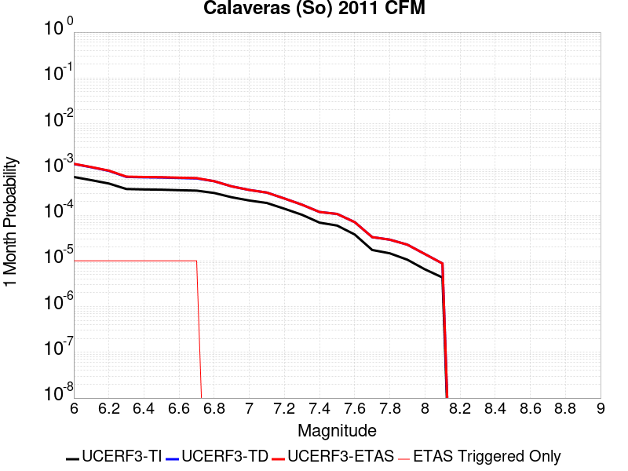 |  |  |

| Magnitude | 1 wk TI Prob | 1 wk TD Prob | 1 wk ETAS Prob | 1 wk ETAS/TD Gain | 1 wk ETAS Triggered Only | 1 mo TI Prob | 1 mo TD Prob | 1 mo ETAS Prob | 1 mo ETAS/TD Gain | 1 mo ETAS Triggered Only | 1 yr TI Prob | 1 yr TD Prob | 1 yr ETAS Prob | 1 yr ETAS/TD Gain | 1 yr ETAS Triggered Only | 10 yr TI Prob | 10 yr TD Prob | 10 yr ETAS Prob | 10 yr ETAS/TD Gain | 10 yr ETAS Triggered Only |
|-----|-----|-----|-----|-----|-----|-----|-----|-----|-----|-----|-----|-----|-----|-----|-----|-----|-----|-----|-----|-----|
| 6.0 | 1.5950744E-4 | 3.071188E-4 | 3.071188E-4 | 1.0 | 0.0 | 6.834242E-4 | 0.0013155643 | 0.0013255512 | 1.0075912 | 1.0E-5 | 0.00828899 | 0.01585904 | 0.015878722 | 1.0012411 | 2.0E-5 | 0.079865426 | 0.14440064 | 0.14442632 | 1.0001777 | 3.0E-5 |
| 6.1 | 1.3584697E-4 | 2.6036944E-4 | 2.6036944E-4 | 1.0 | 0.0 | 5.8207137E-4 | 0.0011153965 | 0.0011253853 | 1.0089555 | 1.0E-5 | 0.007063716 | 0.013462106 | 0.013481837 | 1.0014657 | 2.0E-5 | 0.06843361 | 0.12402854 | 0.12405483 | 1.0002118 | 3.0E-5 |
| 6.2 | 1.14676266E-4 | 2.1726108E-4 | 2.1726108E-4 | 1.0 | 0.0 | 4.9137714E-4 | 9.307893E-4 | 9.4078E-4 | 1.0107336 | 1.0E-5 | 0.0059661185 | 0.011245592 | 0.011265366 | 1.0017585 | 2.0E-5 | 0.058084648 | 0.105019294 | 0.10504614 | 1.0002557 | 3.0E-5 |
| 6.3 | 8.691518E-5 | 1.5987165E-4 | 1.5987165E-4 | 1.0 | 0.0 | 3.7244044E-4 | 6.8496726E-4 | 6.949604E-4 | 1.0145892 | 1.0E-5 | 0.004525038 | 0.008300893 | 0.008320727 | 1.0023894 | 2.0E-5 | 0.044339992 | 0.0793347 | 0.07936232 | 1.0003481 | 3.0E-5 |
| 6.4 | 8.50982E-5 | 1.5693568E-4 | 1.5693568E-4 | 1.0 | 0.0 | 3.646556E-4 | 6.7239115E-4 | 6.823844E-4 | 1.0148623 | 1.0E-5 | 0.0044306475 | 0.008148931 | 0.008168767 | 1.0024343 | 2.0E-5 | 0.04343345 | 0.077940844 | 0.07796851 | 1.0003549 | 3.0E-5 |
| 6.5 | 8.4062965E-5 | 1.5518135E-4 | 1.5518135E-4 | 1.0 | 0.0 | 3.602201E-4 | 6.648764E-4 | 6.7486975E-4 | 1.0150304 | 1.0E-5 | 0.004376863 | 0.008058134 | 0.008077972 | 1.0024619 | 2.0E-5 | 0.042916555 | 0.077112116 | 0.0771398 | 1.000359 | 3.0E-5 |
| 6.6 | 8.194716E-5 | 1.5154095E-4 | 1.5154095E-4 | 1.0 | 0.0 | 3.5115483E-4 | 6.492825E-4 | 6.5927603E-4 | 1.0153916 | 1.0E-5 | 0.0042669317 | 0.007869979 | 0.007889822 | 1.0025213 | 2.0E-5 | 0.04185927 | 0.07539739 | 0.075425126 | 1.0003679 | 3.0E-5 |
| 6.7 | 8.012326E-5 | 1.4821833E-4 | 1.4821833E-4 | 1.0 | 0.0 | 3.433402E-4 | 6.350497E-4 | 6.450433E-4 | 1.0157368 | 1.0E-5 | 0.004172157 | 0.007698474 | 0.00771832 | 1.0025779 | 2.0E-5 | 0.040946912 | 0.073839515 | 0.0738673 | 1.0003763 | 3.0E-5 |
| 6.8 | 7.119773E-5 | 1.2880519E-4 | 1.2880519E-4 | 1.0 | 0.0 | 3.0509746E-4 | 5.519001E-4 | 5.519001E-4 | 1.0 | 0.0 | 0.0037082357 | 0.0066958875 | 0.0067058206 | 1.0014834 | 1.0E-5 | 0.036469642 | 0.06468402 | 0.06470272 | 1.0002892 | 2.0E-5 |
| 6.9 | 5.7343088E-5 | 9.9189E-5 | 9.9189E-5 | 1.0 | 0.0 | 2.4573295E-4 | 4.2502693E-4 | 4.2502693E-4 | 1.0 | 0.0 | 0.0029876942 | 0.0051625078 | 0.005172456 | 1.001927 | 1.0E-5 | 0.02947844 | 0.050509132 | 0.05051863 | 1.000188 | 1.0E-5 |
| 7.0 | 4.8746577E-5 | 8.284751E-5 | 8.284751E-5 | 1.0 | 0.0 | 2.0889717E-4 | 3.550128E-4 | 3.550128E-4 | 1.0 | 0.0 | 0.0025403565 | 0.004313781 | 0.0043237377 | 1.0023081 | 1.0E-5 | 0.025115121 | 0.04248505 | 0.042494625 | 1.0002254 | 1.0E-5 |
| 7.1 | 4.2998014E-5 | 7.264914E-5 | 7.264914E-5 | 1.0 | 0.0 | 1.8426418E-4 | 3.1131663E-4 | 3.1131663E-4 | 1.0 | 0.0 | 0.002241108 | 0.0037837527 | 0.003793715 | 1.0026329 | 1.0E-5 | 0.022186412 | 0.037423246 | 0.037432868 | 1.0002573 | 1.0E-5 |
| 7.2 | 3.221292E-5 | 5.390566E-5 | 5.390566E-5 | 1.0 | 0.0 | 1.3804805E-4 | 2.3100396E-4 | 2.3100396E-4 | 1.0 | 0.0 | 0.0016794393 | 0.0028088738 | 0.0028188457 | 1.0035502 | 1.0E-5 | 0.016668037 | 0.028035998 | 0.028045718 | 1.0003467 | 1.0E-5 |
| 7.3 | 2.3756531E-5 | 3.9471706E-5 | 3.9471706E-5 | 1.0 | 0.0 | 1.0180973E-4 | 1.6915359E-4 | 1.6915359E-4 | 1.0 | 0.0 | 0.0012388286 | 0.0020575167 | 0.002067496 | 1.0048503 | 1.0E-5 | 0.012319452 | 0.02064345 | 0.020653244 | 1.0004745 | 1.0E-5 |
| 7.4 | 1.5997684E-5 | 2.734085E-5 | 2.734085E-5 | 1.0 | 0.0 | 6.8559704E-5 | 1.1716982E-4 | 1.1716982E-4 | 1.0 | 0.0 | 8.343947E-4 | 0.0014256114 | 0.0014355972 | 1.0070045 | 1.0E-5 | 0.008312687 | 0.014376549 | 0.014386405 | 1.0006856 | 1.0E-5 |
| 7.5 | 1.3814293E-5 | 2.4782603E-5 | 2.4782603E-5 | 1.0 | 0.0 | 5.9202768E-5 | 1.0620684E-4 | 1.0620684E-4 | 1.0 | 0.0 | 7.205553E-4 | 0.0012923037 | 0.0013022907 | 1.0077281 | 1.0E-5 | 0.007182234 | 0.013055766 | 0.013065635 | 1.0007559 | 1.0E-5 |
| 7.6 | 8.817309E-6 | 1.6429829E-5 | 1.6429829E-5 | 1.0 | 0.0 | 3.7787922E-5 | 7.041166E-5 | 7.041166E-5 | 1.0 | 0.0 | 4.5997082E-4 | 8.5692614E-4 | 8.5692614E-4 | 1.0 | 0.0 | 0.004590199 | 0.008719863 | 0.008719863 | 1.0 | 0.0 |
| 7.7 | 4.0352206E-6 | 7.706877E-6 | 7.706877E-6 | 1.0 | 0.0 | 1.7293689E-5 | 3.3029053E-5 | 3.3029053E-5 | 1.0 | 0.0 | 2.1053031E-4 | 4.020546E-4 | 4.020546E-4 | 1.0 | 0.0 | 0.0021033096 | 0.0041649863 | 0.0041649863 | 1.0 | 0.0 |
| 7.8 | 3.413169E-6 | 6.7868646E-6 | 6.7868646E-6 | 1.0 | 0.0 | 1.4627784E-5 | 2.9086239E-5 | 2.9086239E-5 | 1.0 | 0.0 | 1.7807873E-4 | 3.5406748E-4 | 3.5406748E-4 | 1.0 | 0.0 | 0.0017793609 | 0.0036663096 | 0.0036663096 | 1.0 | 0.0 |
| 7.9 | 2.4740732E-6 | 5.278809E-6 | 5.278809E-6 | 1.0 | 0.0 | 1.06031275E-5 | 2.2623271E-5 | 2.2623271E-5 | 1.0 | 0.0 | 1.2908543E-4 | 2.7540355E-4 | 2.7540355E-4 | 1.0 | 0.0 | 0.0012901047 | 0.002834638 | 0.002834638 | 1.0 | 0.0 |
| 8.0 | 1.5231818E-6 | 3.2887135E-6 | 3.2887135E-6 | 1.0 | 0.0 | 6.527906E-6 | 1.409441E-5 | 1.409441E-5 | 1.0 | 0.0 | 7.9474354E-5 | 1.7158597E-4 | 1.7158597E-4 | 1.0 | 0.0 | 7.944594E-4 | 0.001756374 | 0.001756374 | 1.0 | 0.0 |
| 8.1 | 1.0104524E-6 | 2.0456548E-6 | 2.0456548E-6 | 1.0 | 0.0 | 4.330503E-6 | 8.767062E-6 | 8.767062E-6 | 1.0 | 0.0 | 5.2722597E-5 | 1.06733794E-4 | 1.06733794E-4 | 1.0 | 0.0 | 5.271009E-4 | 0.0010929212 | 0.0010929212 | 1.0 | 0.0 |

## San Jacinto (Superstition Mtn)
*[(top)](#table-of-contents)*

| 1 Week | 1 Month | 1 Year | 10 Year |
|-----|-----|-----|-----|
|  |  |  |  |

| Magnitude | 1 wk TI Prob | 1 wk TD Prob | 1 wk ETAS Prob | 1 wk ETAS/TD Gain | 1 wk ETAS Triggered Only | 1 mo TI Prob | 1 mo TD Prob | 1 mo ETAS Prob | 1 mo ETAS/TD Gain | 1 mo ETAS Triggered Only | 1 yr TI Prob | 1 yr TD Prob | 1 yr ETAS Prob | 1 yr ETAS/TD Gain | 1 yr ETAS Triggered Only | 10 yr TI Prob | 10 yr TD Prob | 10 yr ETAS Prob | 10 yr ETAS/TD Gain | 10 yr ETAS Triggered Only |
|-----|-----|-----|-----|-----|-----|-----|-----|-----|-----|-----|-----|-----|-----|-----|-----|-----|-----|-----|-----|-----|
| 6.0 | 6.4193904E-5 | 9.599367E-5 | 1.1599175E-4 | 1.208327 | 2.0E-5 | 2.7508775E-4 | 4.1134638E-4 | 4.3133815E-4 | 1.0486008 | 2.0E-5 | 0.0033440501 | 0.0049980893 | 0.0050279396 | 1.0059723 | 3.0E-5 | 0.03294174 | 0.048823986 | 0.04885252 | 1.0005845 | 3.0E-5 |
| 6.1 | 6.4193904E-5 | 9.599367E-5 | 1.1599175E-4 | 1.208327 | 2.0E-5 | 2.7508775E-4 | 4.1134638E-4 | 4.3133815E-4 | 1.0486008 | 2.0E-5 | 0.0033440501 | 0.0049980893 | 0.0050279396 | 1.0059723 | 3.0E-5 | 0.03294174 | 0.048823986 | 0.04885252 | 1.0005845 | 3.0E-5 |
| 6.2 | 5.7023593E-5 | 8.3144434E-5 | 1.0314277E-4 | 1.2405252 | 2.0E-5 | 2.4436394E-4 | 3.5629404E-4 | 3.762869E-4 | 1.0561134 | 2.0E-5 | 0.002971072 | 0.0043308944 | 0.0043607643 | 1.006897 | 3.0E-5 | 0.029316625 | 0.04250403 | 0.042532753 | 1.0006758 | 3.0E-5 |
| 6.3 | 5.6940098E-5 | 8.298979E-5 | 1.0298813E-4 | 1.2409735 | 2.0E-5 | 2.4400617E-4 | 3.5563146E-4 | 3.7562437E-4 | 1.056218 | 2.0E-5 | 0.002966728 | 0.00432286 | 0.0043527302 | 1.0069098 | 3.0E-5 | 0.029274331 | 0.042427283 | 0.04245601 | 1.0006771 | 3.0E-5 |
| 6.4 | 5.4171585E-5 | 7.7483564E-5 | 9.7482014E-5 | 1.2580993 | 2.0E-5 | 2.3214328E-4 | 3.3203943E-4 | 3.520328E-4 | 1.0602138 | 2.0E-5 | 0.0028226813 | 0.0040367353 | 0.004066614 | 1.0074017 | 3.0E-5 | 0.02787096 | 0.03971653 | 0.03974534 | 1.0007254 | 3.0E-5 |
| 6.5 | 4.375144E-5 | 5.642133E-5 | 7.64202E-5 | 1.3544558 | 2.0E-5 | 1.874927E-4 | 2.4178992E-4 | 2.6178508E-4 | 1.0826964 | 2.0E-5 | 0.0022803338 | 0.002940994 | 0.0029709057 | 1.0101706 | 3.0E-5 | 0.022570757 | 0.029236801 | 0.029265925 | 1.0009961 | 3.0E-5 |
| 6.6 | 2.772192E-5 | 2.5488358E-5 | 4.5487846E-5 | 1.784652 | 2.0E-5 | 1.1880282E-4 | 1.09231354E-4 | 1.2922917E-4 | 1.1830776 | 2.0E-5 | 0.0014454646 | 0.0013290998 | 0.0013590599 | 1.0225416 | 3.0E-5 | 0.014360986 | 0.01354049 | 0.013570084 | 1.0021856 | 3.0E-5 |
| 6.7 | 2.7124124E-5 | 2.4699386E-5 | 4.4698892E-5 | 1.8097167 | 2.0E-5 | 1.1624106E-4 | 1.05850326E-4 | 1.2584821E-4 | 1.188926 | 2.0E-5 | 0.0014143161 | 0.001287985 | 0.0013179464 | 1.0232621 | 3.0E-5 | 0.014053487 | 0.013133943 | 0.01316355 | 1.0022541 | 3.0E-5 |
| 6.8 | 2.5475807E-5 | 2.216446E-5 | 4.2164018E-5 | 1.9023255 | 2.0E-5 | 1.0917746E-4 | 9.4987154E-5 | 1.14985254E-4 | 1.2105348 | 2.0E-5 | 0.001328425 | 0.001155867 | 0.0011858323 | 1.0259246 | 3.0E-5 | 0.0132051185 | 0.011822182 | 0.011851827 | 1.0025076 | 3.0E-5 |
| 6.9 | 2.1162023E-5 | 1.7626244E-5 | 3.762589E-5 | 2.1346517 | 2.0E-5 | 9.069123E-5 | 7.5538876E-5 | 9.553737E-5 | 1.2647443 | 2.0E-5 | 0.0011036064 | 9.193016E-4 | 9.49274E-4 | 1.0326035 | 3.0E-5 | 0.010981417 | 0.00944688 | 0.0094765965 | 1.0031457 | 3.0E-5 |
| 7.0 | 1.8754288E-5 | 1.6161559E-5 | 3.6161236E-5 | 2.2374845 | 2.0E-5 | 8.037304E-5 | 6.9261994E-5 | 8.926061E-5 | 1.2887386 | 2.0E-5 | 9.781026E-4 | 8.4294105E-4 | 8.729157E-4 | 1.0355597 | 3.0E-5 | 0.009738087 | 0.008670042 | 0.008699782 | 1.0034302 | 3.0E-5 |
| 7.1 | 1.8678527E-5 | 1.6086702E-5 | 3.608638E-5 | 2.243243 | 2.0E-5 | 8.0048376E-5 | 6.89412E-5 | 8.893982E-5 | 1.2900823 | 2.0E-5 | 9.7415317E-4 | 8.3903834E-4 | 8.6901314E-4 | 1.0357252 | 3.0E-5 | 0.009698939 | 0.008630998 | 0.008660739 | 1.0034459 | 3.0E-5 |
| 7.2 | 1.7804578E-5 | 1.5381282E-5 | 3.5380974E-5 | 2.3002617 | 2.0E-5 | 7.6303106E-5 | 6.5918124E-5 | 8.591681E-5 | 1.3033867 | 2.0E-5 | 9.285943E-4 | 8.022599E-4 | 8.3223585E-4 | 1.0373644 | 3.0E-5 | 0.009247236 | 0.008262311 | 0.008292063 | 1.003601 | 3.0E-5 |
| 7.3 | 1.6583685E-5 | 1.4530388E-5 | 3.4530098E-5 | 2.3764057 | 2.0E-5 | 7.1070994E-5 | 6.227162E-5 | 8.227037E-5 | 1.3211536 | 2.0E-5 | 8.649459E-4 | 7.5789524E-4 | 7.878725E-4 | 1.0395533 | 3.0E-5 | 0.00861587 | 0.007817623 | 0.007847389 | 1.0038074 | 3.0E-5 |
| 7.4 | 1.6387552E-5 | 1.4395274E-5 | 3.4394987E-5 | 2.389325 | 2.0E-5 | 7.023047E-5 | 6.169258E-5 | 8.169135E-5 | 1.3241681 | 2.0E-5 | 8.5472054E-4 | 7.5085036E-4 | 7.8082783E-4 | 1.0399247 | 3.0E-5 | 0.008514405 | 0.0077470057 | 0.0077767735 | 1.0038425 | 3.0E-5 |
| 7.5 | 1.5790754E-5 | 1.4035962E-5 | 3.4035682E-5 | 2.4248912 | 2.0E-5 | 6.767291E-5 | 6.0152746E-5 | 8.015154E-5 | 1.332467 | 2.0E-5 | 8.236062E-4 | 7.321156E-4 | 7.620936E-4 | 1.0409471 | 3.0E-5 | 0.008205604 | 0.007557569 | 0.0075873425 | 1.0039395 | 3.0E-5 |
| 7.6 | 1.4248672E-5 | 1.3054932E-5 | 3.305467E-5 | 2.531968 | 2.0E-5 | 6.106431E-5 | 5.594852E-5 | 7.59474E-5 | 1.3574514 | 2.0E-5 | 7.432043E-4 | 6.8096205E-4 | 7.109416E-4 | 1.0440253 | 3.0E-5 | 0.007407237 | 0.0070401574 | 0.007069946 | 1.0042312 | 3.0E-5 |
| 7.7 | 1.15449975E-5 | 1.090368E-5 | 3.0903462E-5 | 2.8342233 | 2.0E-5 | 4.947762E-5 | 4.6729223E-5 | 6.672829E-5 | 1.4279777 | 2.0E-5 | 6.022235E-4 | 5.687805E-4 | 5.9876346E-4 | 1.0527145 | 3.0E-5 | 0.006005941 | 0.0059101824 | 0.0059400047 | 1.005046 | 3.0E-5 |
| 7.8 | 9.1391985E-6 | 9.514299E-6 | 2.9514109E-5 | 3.1020792 | 2.0E-5 | 3.9167408E-5 | 4.0774932E-5 | 6.0774117E-5 | 1.4904774 | 2.0E-5 | 4.767588E-4 | 4.963223E-4 | 5.2630744E-4 | 1.0604146 | 3.0E-5 | 0.0047573727 | 0.0051766867 | 0.0052065314 | 1.0057652 | 3.0E-5 |
| 7.9 | 6.973017E-6 | 7.3821784E-6 | 2.7382031E-5 | 3.7092073 | 2.0E-5 | 2.9884017E-5 | 3.1637526E-5 | 5.1636893E-5 | 1.6321406 | 2.0E-5 | 3.6377716E-4 | 3.8511935E-4 | 4.151078E-4 | 1.077868 | 3.0E-5 | 0.0036318225 | 0.0040517948 | 0.004081673 | 1.0073742 | 3.0E-5 |
| 8.0 | 5.7638235E-6 | 6.259972E-6 | 2.6259846E-5 | 4.1948824 | 2.0E-5 | 2.4701867E-5 | 2.6828178E-5 | 4.682764E-5 | 1.7454648 | 2.0E-5 | 3.0070372E-4 | 3.2658462E-4 | 3.4657808E-4 | 1.0612199 | 2.0E-5 | 0.0030029714 | 0.0034534496 | 0.0034733803 | 1.0057713 | 2.0E-5 |
| 8.1 | 5.1124434E-6 | 5.4956718E-6 | 2.5495561E-5 | 4.6392074 | 2.0E-5 | 2.1910288E-5 | 2.355267E-5 | 4.3552198E-5 | 1.8491406 | 2.0E-5 | 2.6672508E-4 | 2.867165E-4 | 3.0671078E-4 | 1.0697353 | 2.0E-5 | 0.0026640517 | 0.003040336 | 0.0030602752 | 1.0065582 | 2.0E-5 |
| 8.2 | 1.1075938E-6 | 5.336568E-7 | 5.336568E-7 | 1.0 | 0.0 | 4.7468216E-6 | 2.2870988E-6 | 2.2870988E-6 | 1.0 | 0.0 | 5.779102E-5 | 2.7845093E-5 | 2.7845093E-5 | 1.0 | 0.0 | 5.777599E-4 | 3.1346595E-4 | 3.1346595E-4 | 1.0 | 0.0 |
| 8.3 | 1.3584393E-8 | 4.473836E-9 | 4.473836E-9 | 1.0 | 0.0 | 5.8218827E-8 | 1.9173582E-8 | 1.9173582E-8 | 1.0 | 0.0 | 7.0881396E-7 | 2.3343837E-7 | 2.3343837E-7 | 1.0 | 0.0 | 7.0881174E-6 | 2.6163038E-6 | 2.6163038E-6 | 1.0 | 0.0 |

## Green Valley 2011 CFM
*[(top)](#table-of-contents)*

| 1 Week | 1 Month | 1 Year | 10 Year |
|-----|-----|-----|-----|
|  |  |  |  |

| Magnitude | 1 wk TI Prob | 1 wk TD Prob | 1 wk ETAS Prob | 1 wk ETAS/TD Gain | 1 wk ETAS Triggered Only | 1 mo TI Prob | 1 mo TD Prob | 1 mo ETAS Prob | 1 mo ETAS/TD Gain | 1 mo ETAS Triggered Only | 1 yr TI Prob | 1 yr TD Prob | 1 yr ETAS Prob | 1 yr ETAS/TD Gain | 1 yr ETAS Triggered Only | 10 yr TI Prob | 10 yr TD Prob | 10 yr ETAS Prob | 10 yr ETAS/TD Gain | 10 yr ETAS Triggered Only |
|-----|-----|-----|-----|-----|-----|-----|-----|-----|-----|-----|-----|-----|-----|-----|-----|-----|-----|-----|-----|-----|
| 6.0 | 9.9629346E-5 | 1.7305532E-4 | 1.7305532E-4 | 1.0 | 0.0 | 4.2691303E-4 | 7.4143766E-4 | 7.4143766E-4 | 1.0 | 0.0 | 0.0051852856 | 0.008986705 | 0.008986705 | 1.0 | 0.0 | 0.050659515 | 0.085522056 | 0.085549496 | 1.0003208 | 3.0E-5 |
| 6.1 | 9.88615E-5 | 1.7152846E-4 | 1.7152846E-4 | 1.0 | 0.0 | 4.2362334E-4 | 7.348976E-4 | 7.348976E-4 | 1.0 | 0.0 | 0.0051454236 | 0.0089077335 | 0.0089077335 | 1.0 | 0.0 | 0.050279044 | 0.084809676 | 0.08483713 | 1.0003238 | 3.0E-5 |
| 6.2 | 9.696895E-5 | 1.6791887E-4 | 1.6791887E-4 | 1.0 | 0.0 | 4.15515E-4 | 7.194366E-4 | 7.194366E-4 | 1.0 | 0.0 | 0.0050471667 | 0.008721114 | 0.008721114 | 1.0 | 0.0 | 0.04934063 | 0.0831186 | 0.08314611 | 1.0003309 | 3.0E-5 |
| 6.3 | 9.275224E-5 | 1.5971228E-4 | 1.5971228E-4 | 1.0 | 0.0 | 3.9744904E-4 | 6.842841E-4 | 6.842841E-4 | 1.0 | 0.0 | 0.0048282105 | 0.008296439 | 0.008296439 | 1.0 | 0.0 | 0.047246475 | 0.07925707 | 0.07928469 | 1.0003486 | 3.0E-5 |
| 6.4 | 8.391499E-5 | 1.4367796E-4 | 1.4367796E-4 | 1.0 | 0.0 | 3.595861E-4 | 6.156248E-4 | 6.156248E-4 | 1.0 | 0.0 | 0.004369175 | 0.0074670846 | 0.0074670846 | 1.0 | 0.0 | 0.04284265 | 0.071630865 | 0.071658716 | 1.0003889 | 3.0E-5 |
| 6.5 | 5.9519385E-5 | 9.9340905E-5 | 9.9340905E-5 | 1.0 | 0.0 | 2.5505814E-4 | 4.2568138E-4 | 4.2568138E-4 | 1.0 | 0.0 | 0.0031009112 | 0.005168295 | 0.005168295 | 1.0 | 0.0 | 0.030579966 | 0.050145864 | 0.05016486 | 1.0003788 | 2.0E-5 |
| 6.6 | 4.5361558E-5 | 7.402609E-5 | 7.402609E-5 | 1.0 | 0.0 | 1.9439218E-4 | 3.1721895E-4 | 3.1721895E-4 | 1.0 | 0.0 | 0.0023641558 | 0.0038539418 | 0.0038539418 | 1.0 | 0.0 | 0.023391623 | 0.037665963 | 0.037685208 | 1.0005109 | 2.0E-5 |
| 6.7 | 3.8808106E-5 | 6.2651976E-5 | 6.2651976E-5 | 1.0 | 0.0 | 1.6630985E-4 | 2.6848342E-4 | 2.6848342E-4 | 1.0 | 0.0 | 0.0020229418 | 0.0032626586 | 0.0032626586 | 1.0 | 0.0 | 0.020046256 | 0.032005914 | 0.032025274 | 1.0006049 | 2.0E-5 |
| 6.8 | 2.2284667E-5 | 3.1285235E-5 | 3.1285235E-5 | 1.0 | 0.0 | 9.550222E-5 | 1.3407279E-4 | 1.3407279E-4 | 1.0 | 0.0 | 0.0011621192 | 0.0016311078 | 0.0016311078 | 1.0 | 0.0 | 0.011560607 | 0.016165998 | 0.016175836 | 1.0006086 | 1.0E-5 |
| 6.9 | 1.8050168E-5 | 2.4448054E-5 | 2.4448054E-5 | 1.0 | 0.0 | 7.735557E-5 | 1.047732E-4 | 1.047732E-4 | 1.0 | 0.0 | 9.4139716E-4 | 0.0012748708 | 0.0012748708 | 1.0 | 0.0 | 0.009374191 | 0.012667833 | 0.012667833 | 1.0 | 0.0 |
| 7.0 | 1.4763166E-5 | 1.9582854E-5 | 1.9582854E-5 | 1.0 | 0.0 | 6.326917E-5 | 8.3923835E-5 | 8.3923835E-5 | 1.0 | 0.0 | 7.7002996E-4 | 0.0010212966 | 0.0010212966 | 1.0 | 0.0 | 0.007673672 | 0.010165343 | 0.010165343 | 1.0 | 0.0 |
| 7.1 | 1.2399713E-5 | 1.6303715E-5 | 1.6303715E-5 | 1.0 | 0.0 | 5.3140546E-5 | 6.98712E-5 | 6.98712E-5 | 1.0 | 0.0 | 6.467941E-4 | 8.503518E-4 | 8.503518E-4 | 1.0 | 0.0 | 0.006449148 | 0.008471259 | 0.008471259 | 1.0 | 0.0 |
| 7.2 | 1.0584195E-5 | 1.3921742E-5 | 1.3921742E-5 | 1.0 | 0.0 | 4.5360044E-5 | 5.9663253E-5 | 5.9663253E-5 | 1.0 | 0.0 | 5.521186E-4 | 7.261596E-4 | 7.261596E-4 | 1.0 | 0.0 | 0.0055074887 | 0.007238285 | 0.007238285 | 1.0 | 0.0 |
| 7.3 | 7.998173E-6 | 1.054402E-5 | 1.054402E-5 | 1.0 | 0.0 | 3.4277433E-5 | 4.518788E-5 | 4.518788E-5 | 1.0 | 0.0 | 4.1724785E-4 | 5.500247E-4 | 5.500247E-4 | 1.0 | 0.0 | 0.004164653 | 0.0054868995 | 0.0054868995 | 1.0 | 0.0 |
| 7.4 | 6.7571127E-6 | 8.932697E-6 | 8.932697E-6 | 1.0 | 0.0 | 2.8958733E-5 | 3.828243E-5 | 3.828243E-5 | 1.0 | 0.0 | 3.5251552E-4 | 4.6598984E-4 | 4.6598984E-4 | 1.0 | 0.0 | 0.0035195686 | 0.0046503306 | 0.0046503306 | 1.0 | 0.0 |
| 7.5 | 5.69878E-6 | 7.516314E-6 | 7.516314E-6 | 1.0 | 0.0 | 2.4423114E-5 | 3.221238E-5 | 3.221238E-5 | 1.0 | 0.0 | 2.9731085E-4 | 3.9211605E-4 | 3.9211605E-4 | 1.0 | 0.0 | 0.002969134 | 0.0039143935 | 0.0039143935 | 1.0 | 0.0 |
| 7.6 | 4.503664E-6 | 5.9356807E-6 | 5.9356807E-6 | 1.0 | 0.0 | 1.9301275E-5 | 2.5438389E-5 | 2.5438389E-5 | 1.0 | 0.0 | 2.3496768E-4 | 3.096692E-4 | 3.096692E-4 | 1.0 | 0.0 | 0.002347194 | 0.003092502 | 0.003092502 | 1.0 | 0.0 |
| 7.7 | 1.0873546E-6 | 1.4106979E-6 | 1.4106979E-6 | 1.0 | 0.0 | 4.6600826E-6 | 6.045834E-6 | 6.045834E-6 | 1.0 | 0.0 | 5.6735033E-5 | 7.360557E-5 | 7.360557E-5 | 1.0 | 0.0 | 5.672055E-4 | 7.35814E-4 | 7.35814E-4 | 1.0 | 0.0 |
| 7.8 | 4.9373917E-8 | 6.1777136E-8 | 6.1777136E-8 | 1.0 | 0.0 | 2.1160248E-7 | 2.6475914E-7 | 2.6475914E-7 | 1.0 | 0.0 | 2.5762572E-6 | 3.223439E-6 | 3.223439E-6 | 1.0 | 0.0 | 2.5762274E-5 | 3.2232296E-5 | 3.2232296E-5 | 1.0 | 0.0 |

## Calaveras (So) - Paicines extension 2011 CFM
*[(top)](#table-of-contents)*

| 1 Week | 1 Month | 1 Year | 10 Year |
|-----|-----|-----|-----|
|  |  |  |  |

| Magnitude | 1 wk TI Prob | 1 wk TD Prob | 1 wk ETAS Prob | 1 wk ETAS/TD Gain | 1 wk ETAS Triggered Only | 1 mo TI Prob | 1 mo TD Prob | 1 mo ETAS Prob | 1 mo ETAS/TD Gain | 1 mo ETAS Triggered Only | 1 yr TI Prob | 1 yr TD Prob | 1 yr ETAS Prob | 1 yr ETAS/TD Gain | 1 yr ETAS Triggered Only | 10 yr TI Prob | 10 yr TD Prob | 10 yr ETAS Prob | 10 yr ETAS/TD Gain | 10 yr ETAS Triggered Only |
|-----|-----|-----|-----|-----|-----|-----|-----|-----|-----|-----|-----|-----|-----|-----|-----|-----|-----|-----|-----|-----|
| 6.0 | 1.5183659E-4 | 3.0533716E-4 | 3.0533716E-4 | 1.0 | 0.0 | 6.5056595E-4 | 0.0013069661 | 0.001316953 | 1.0076413 | 1.0E-5 | 0.007891912 | 0.01569571 | 0.015715396 | 1.0012542 | 2.0E-5 | 0.076174594 | 0.13848671 | 0.13851257 | 1.0001867 | 3.0E-5 |
| 6.1 | 1.5024997E-4 | 3.0227835E-4 | 3.0227835E-4 | 1.0 | 0.0 | 6.437695E-4 | 0.00129387 | 0.0013038571 | 1.0077188 | 1.0E-5 | 0.0078097614 | 0.015539104 | 0.015558793 | 1.0012671 | 2.0E-5 | 0.075409345 | 0.13715632 | 0.1371822 | 1.0001887 | 3.0E-5 |
| 6.2 | 1.2743923E-4 | 2.5306802E-4 | 2.5306802E-4 | 1.0 | 0.0 | 5.460538E-4 | 0.0010841049 | 0.001094094 | 1.0092142 | 1.0E-5 | 0.0066279583 | 0.013046704 | 0.013066443 | 1.001513 | 2.0E-5 | 0.064337276 | 0.11725405 | 0.11728053 | 1.0002259 | 3.0E-5 |
| 6.3 | 1.1525114E-4 | 2.2595265E-4 | 2.2595265E-4 | 1.0 | 0.0 | 4.9383997E-4 | 9.6799526E-4 | 9.779856E-4 | 1.0103207 | 1.0E-5 | 0.0059959386 | 0.011667927 | 0.011687693 | 1.0016941 | 2.0E-5 | 0.058367174 | 0.10637007 | 0.106396884 | 1.000252 | 3.0E-5 |
| 6.4 | 1.07200925E-4 | 2.0836305E-4 | 2.0836305E-4 | 1.0 | 0.0 | 4.5935164E-4 | 8.926636E-4 | 9.0265466E-4 | 1.0111924 | 1.0E-5 | 0.0055782744 | 0.010772766 | 0.01079255 | 1.0018365 | 2.0E-5 | 0.0544031 | 0.09919256 | 0.09921958 | 1.0002724 | 3.0E-5 |
| 6.5 | 9.69631E-5 | 1.8729115E-4 | 1.8729115E-4 | 1.0 | 0.0 | 4.1548995E-4 | 8.024135E-4 | 8.124055E-4 | 1.0124524 | 1.0E-5 | 0.0050468626 | 0.009694662 | 0.009714468 | 1.002043 | 2.0E-5 | 0.04933773 | 0.090084255 | 0.09011155 | 1.000303 | 3.0E-5 |
| 6.6 | 8.0552316E-5 | 1.5070537E-4 | 1.5070537E-4 | 1.0 | 0.0 | 3.4517853E-4 | 6.456994E-4 | 6.556929E-4 | 1.0154771 | 1.0E-5 | 0.0041944524 | 0.007826256 | 0.007846099 | 1.0025355 | 2.0E-5 | 0.04116161 | 0.074854024 | 0.07488178 | 1.0003707 | 3.0E-5 |
| 6.7 | 7.815757E-5 | 1.4610609E-4 | 1.4610609E-4 | 1.0 | 0.0 | 3.34918E-4 | 6.260017E-4 | 6.359954E-4 | 1.0159644 | 1.0E-5 | 0.004070005 | 0.0075890915 | 0.00760894 | 1.0026153 | 2.0E-5 | 0.039962657 | 0.072703585 | 0.072731405 | 1.0003827 | 3.0E-5 |
| 6.8 | 6.965264E-5 | 1.2721405E-4 | 1.2721405E-4 | 1.0 | 0.0 | 2.9847719E-4 | 5.450839E-4 | 5.450839E-4 | 1.0 | 0.0 | 0.0036279052 | 0.00661342 | 0.0066233533 | 1.001502 | 1.0E-5 | 0.03569247 | 0.06379891 | 0.063817635 | 1.0002935 | 2.0E-5 |
| 6.9 | 5.8000453E-5 | 1.01435086E-4 | 1.01435086E-4 | 1.0 | 0.0 | 2.4854968E-4 | 4.3464993E-4 | 4.3464993E-4 | 1.0 | 0.0 | 0.0030218933 | 0.0052791284 | 0.005289076 | 1.0018842 | 1.0E-5 | 0.029811295 | 0.051501602 | 0.051511087 | 1.0001842 | 1.0E-5 |
| 7.0 | 4.9865852E-5 | 8.567692E-5 | 8.567692E-5 | 1.0 | 0.0 | 2.1369329E-4 | 3.671356E-4 | 3.671356E-4 | 1.0 | 0.0 | 0.0025986114 | 0.0044608037 | 0.004470759 | 1.0022317 | 1.0E-5 | 0.025684336 | 0.043781694 | 0.043791257 | 1.0002184 | 1.0E-5 |
| 7.1 | 4.283875E-5 | 7.112159E-5 | 7.112159E-5 | 1.0 | 0.0 | 1.8358172E-4 | 3.047715E-4 | 3.047715E-4 | 1.0 | 0.0 | 0.0022328163 | 0.003704336 | 0.003714299 | 1.0026895 | 1.0E-5 | 0.022105146 | 0.03673583 | 0.036745463 | 1.0002623 | 1.0E-5 |
| 7.2 | 3.450115E-5 | 5.5776054E-5 | 5.5776054E-5 | 1.0 | 0.0 | 1.478537E-4 | 2.390185E-4 | 2.390185E-4 | 1.0 | 0.0 | 0.0017986323 | 0.0029061958 | 0.0029161668 | 1.003431 | 1.0E-5 | 0.017841442 | 0.029079199 | 0.029088907 | 1.0003339 | 1.0E-5 |
| 7.3 | 2.5709045E-5 | 4.0588155E-5 | 4.0588155E-5 | 1.0 | 0.0 | 1.1017697E-4 | 1.7393773E-4 | 1.7393773E-4 | 1.0 | 0.0 | 0.0013405791 | 0.002115652 | 0.0021256309 | 1.0047166 | 1.0E-5 | 0.013325208 | 0.021297242 | 0.021307029 | 1.0004596 | 1.0E-5 |
| 7.4 | 1.8003093E-5 | 2.8509934E-5 | 2.8509934E-5 | 1.0 | 0.0 | 7.715383E-5 | 1.2217973E-4 | 1.2217973E-4 | 1.0 | 0.0 | 9.3894306E-4 | 0.0014865254 | 0.0014965106 | 1.0067171 | 1.0E-5 | 0.009349857 | 0.015052196 | 0.015062045 | 1.0006543 | 1.0E-5 |
| 7.5 | 1.5595824E-5 | 2.5822499E-5 | 2.5822499E-5 | 1.0 | 0.0 | 6.683753E-5 | 1.1066317E-4 | 1.1066317E-4 | 1.0 | 0.0 | 8.134431E-4 | 0.0013464936 | 0.0013564802 | 1.0074167 | 1.0E-5 | 0.008104719 | 0.01365213 | 0.013661994 | 1.0007225 | 1.0E-5 |
| 7.6 | 1.1110309E-5 | 1.9222098E-5 | 1.9222098E-5 | 1.0 | 0.0 | 4.761474E-5 | 8.2377825E-5 | 8.2377825E-5 | 1.0 | 0.0 | 5.795553E-4 | 0.0010024898 | 0.0010024898 | 1.0 | 0.0 | 0.0057804612 | 0.010203943 | 0.010203943 | 1.0 | 0.0 |
| 7.7 | 6.2140443E-6 | 1.0437076E-5 | 1.0437076E-5 | 1.0 | 0.0 | 2.6631347E-5 | 4.4729557E-5 | 4.4729557E-5 | 1.0 | 0.0 | 3.241884E-4 | 5.444464E-4 | 5.444464E-4 | 1.0 | 0.0 | 0.0032371588 | 0.005619835 | 0.005619835 | 1.0 | 0.0 |
| 7.8 | 5.305533E-6 | 9.433038E-6 | 9.433038E-6 | 1.0 | 0.0 | 2.27378E-5 | 4.042668E-5 | 4.042668E-5 | 1.0 | 0.0 | 2.7679754E-4 | 4.920837E-4 | 4.920837E-4 | 1.0 | 0.0 | 0.0027645302 | 0.005074324 | 0.005074324 | 1.0 | 0.0 |
| 7.9 | 3.363505E-6 | 7.3848937E-6 | 7.3848937E-6 | 1.0 | 0.0 | 1.4414942E-5 | 3.164916E-5 | 3.164916E-5 | 1.0 | 0.0 | 1.7548777E-4 | 3.8526047E-4 | 3.8526047E-4 | 1.0 | 0.0 | 0.0017534926 | 0.003948527 | 0.003948527 | 1.0 | 0.0 |
| 8.0 | 2.0271132E-6 | 4.413104E-6 | 4.413104E-6 | 1.0 | 0.0 | 8.687599E-6 | 1.8913164E-5 | 1.8913164E-5 | 1.0 | 0.0 | 1.05766376E-4 | 2.302435E-4 | 2.302435E-4 | 1.0 | 0.0 | 0.0010571606 | 0.002351099 | 0.002351099 | 1.0 | 0.0 |
| 8.1 | 1.2206116E-6 | 2.3751331E-6 | 2.3751331E-6 | 1.0 | 0.0 | 5.2311816E-6 | 1.0179103E-5 | 1.0179103E-5 | 1.0 | 0.0 | 6.3687774E-5 | 1.2392356E-4 | 1.2392356E-4 | 1.0 | 0.0 | 6.366953E-4 | 0.0012705477 | 0.0012705477 | 1.0 | 0.0 |

## Malibu Coast (Extension) alt 1
*[(top)](#table-of-contents)*

| 1 Week | 1 Month | 1 Year | 10 Year |
|-----|-----|-----|-----|
|  |  | 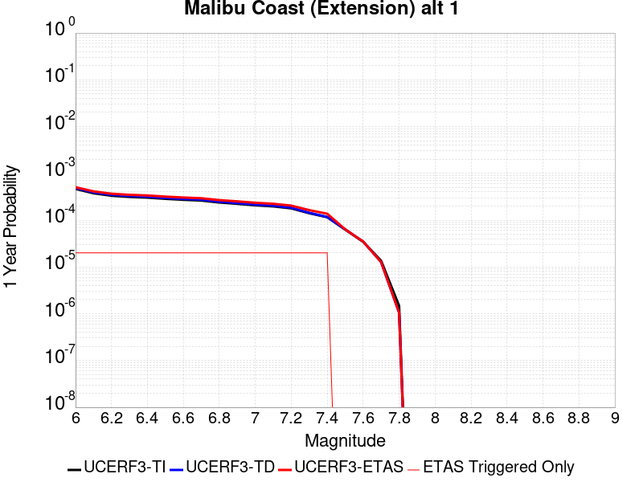 |  |

| Magnitude | 1 wk TI Prob | 1 wk TD Prob | 1 wk ETAS Prob | 1 wk ETAS/TD Gain | 1 wk ETAS Triggered Only | 1 mo TI Prob | 1 mo TD Prob | 1 mo ETAS Prob | 1 mo ETAS/TD Gain | 1 mo ETAS Triggered Only | 1 yr TI Prob | 1 yr TD Prob | 1 yr ETAS Prob | 1 yr ETAS/TD Gain | 1 yr ETAS Triggered Only | 10 yr TI Prob | 10 yr TD Prob | 10 yr ETAS Prob | 10 yr ETAS/TD Gain | 10 yr ETAS Triggered Only |
|-----|-----|-----|-----|-----|-----|-----|-----|-----|-----|-----|-----|-----|-----|-----|-----|-----|-----|-----|-----|-----|
| 6.0 | 8.930738E-6 | 9.329276E-6 | 9.329276E-6 | 1.0 | 0.0 | 3.827403E-5 | 3.998201E-5 | 4.998161E-5 | 1.2501025 | 1.0E-5 | 4.6588664E-4 | 4.8667393E-4 | 5.066642E-4 | 1.0410752 | 2.0E-5 | 0.0046491115 | 0.004856264 | 0.004886118 | 1.0061476 | 3.0E-5 |
| 6.1 | 7.199952E-6 | 7.5302964E-6 | 7.5302964E-6 | 1.0 | 0.0 | 3.0856572E-5 | 3.2272303E-5 | 4.2271982E-5 | 1.3098532 | 1.0E-5 | 3.75614E-4 | 3.9284505E-4 | 4.128372E-4 | 1.0508907 | 2.0E-5 | 0.0037497976 | 0.003921572 | 0.0039514545 | 1.00762 | 3.0E-5 |
| 6.2 | 6.3721413E-6 | 6.6667917E-6 | 6.6667917E-6 | 1.0 | 0.0 | 2.7308892E-5 | 2.8571652E-5 | 3.857137E-5 | 1.3499873 | 1.0E-5 | 3.3243504E-4 | 3.4780471E-4 | 3.6779774E-4 | 1.0574836 | 2.0E-5 | 0.0033193815 | 0.0034726437 | 0.0035025396 | 1.0086089 | 3.0E-5 |
| 6.3 | 6.016345E-6 | 6.295158E-6 | 6.295158E-6 | 1.0 | 0.0 | 2.578408E-5 | 2.6978973E-5 | 3.69787E-5 | 1.3706491 | 1.0E-5 | 3.1387596E-4 | 3.2841982E-4 | 3.4841325E-4 | 1.0608777 | 2.0E-5 | 0.00313433 | 0.0032793807 | 0.0033092822 | 1.0091181 | 3.0E-5 |
| 6.4 | 5.8104883E-6 | 6.0795446E-6 | 6.0795446E-6 | 1.0 | 0.0 | 2.4901856E-5 | 2.6054933E-5 | 3.6054673E-5 | 1.3837944 | 1.0E-5 | 3.031379E-4 | 3.1717293E-4 | 3.371666E-4 | 1.063037 | 2.0E-5 | 0.0030272473 | 0.0031672374 | 0.0031971424 | 1.009442 | 3.0E-5 |
| 6.5 | 5.476925E-6 | 5.7275133E-6 | 5.7275133E-6 | 1.0 | 0.0 | 2.3472323E-5 | 2.4546256E-5 | 3.454601E-5 | 1.4073842 | 1.0E-5 | 2.8573806E-4 | 2.9880996E-4 | 3.18804E-4 | 1.0669122 | 2.0E-5 | 0.0028537093 | 0.002984114 | 0.0030140243 | 1.0100232 | 3.0E-5 |
| 6.6 | 5.222387E-6 | 5.45858E-6 | 5.45858E-6 | 1.0 | 0.0 | 2.2381464E-5 | 2.3393704E-5 | 3.339347E-5 | 1.4274554 | 1.0E-5 | 2.7246025E-4 | 2.8478142E-4 | 3.0477572E-4 | 1.0702093 | 2.0E-5 | 0.0027212645 | 0.0028441956 | 0.0028741101 | 1.0105178 | 3.0E-5 |
| 6.7 | 5.0337076E-6 | 5.259103E-6 | 5.259103E-6 | 1.0 | 0.0 | 2.1572854E-5 | 2.253882E-5 | 3.2538595E-5 | 1.443669 | 1.0E-5 | 2.6261783E-4 | 2.7437587E-4 | 2.9437037E-4 | 1.0728728 | 2.0E-5 | 0.002623077 | 0.002740401 | 0.0027703189 | 1.0109173 | 3.0E-5 |
| 6.8 | 4.5675624E-6 | 4.7587164E-6 | 4.7587164E-6 | 1.0 | 0.0 | 1.9575122E-5 | 2.039434E-5 | 3.0394136E-5 | 1.4903221 | 1.0E-5 | 2.3830103E-4 | 2.48273E-4 | 2.6826802E-4 | 1.0805365 | 2.0E-5 | 0.0023804565 | 0.002479976 | 0.0025099015 | 1.0120668 | 3.0E-5 |
| 6.9 | 4.2802412E-6 | 4.4520207E-6 | 4.4520207E-6 | 1.0 | 0.0 | 1.8343762E-5 | 1.907995E-5 | 2.9079758E-5 | 1.5241004 | 1.0E-5 | 2.2331243E-4 | 2.3227377E-4 | 2.5226912E-4 | 1.0860853 | 2.0E-5 | 0.0022308815 | 0.0023203269 | 0.0023502572 | 1.0128992 | 3.0E-5 |
| 7.0 | 3.9794063E-6 | 4.130099E-6 | 4.130099E-6 | 1.0 | 0.0 | 1.7054486E-5 | 1.7700306E-5 | 2.7700129E-5 | 1.564952 | 1.0E-5 | 2.0761859E-4 | 2.1548003E-4 | 2.3547572E-4 | 1.092796 | 2.0E-5 | 0.0020742472 | 0.0021527244 | 0.00218266 | 1.0139059 | 3.0E-5 |
| 7.1 | 3.7730424E-6 | 3.911217E-6 | 3.911217E-6 | 1.0 | 0.0 | 1.6170083E-5 | 1.6762251E-5 | 2.6762084E-5 | 1.5965686 | 1.0E-5 | 1.9685295E-4 | 2.0406142E-4 | 2.2405734E-4 | 1.0979897 | 2.0E-5 | 0.0019667868 | 0.0020387534 | 0.0020686921 | 1.0146849 | 3.0E-5 |
| 7.2 | 3.424985E-6 | 3.541337E-6 | 3.541337E-6 | 1.0 | 0.0 | 1.4678424E-5 | 1.5177071E-5 | 2.517692E-5 | 1.6588787 | 1.0E-5 | 1.7869516E-4 | 1.8476529E-4 | 2.0476159E-4 | 1.1082255 | 2.0E-5 | 0.0017855153 | 0.0018461287 | 0.0018760734 | 1.0162202 | 3.0E-5 |
| 7.3 | 2.6966375E-6 | 2.7596534E-6 | 2.7596534E-6 | 1.0 | 0.0 | 1.15569665E-5 | 1.1827032E-5 | 2.1826914E-5 | 1.8455107 | 1.0E-5 | 1.4069698E-4 | 1.4398464E-4 | 1.6398176E-4 | 1.1388837 | 2.0E-5 | 0.0014060794 | 0.0014389176 | 0.0014688745 | 1.020819 | 3.0E-5 |
| 7.4 | 2.215957E-6 | 2.249378E-6 | 2.249378E-6 | 1.0 | 0.0 | 9.496924E-6 | 9.640156E-6 | 1.964006E-5 | 2.0373175 | 1.0E-5 | 1.1561892E-4 | 1.17362615E-4 | 1.3736027E-4 | 1.170392 | 2.0E-5 | 0.0011555878 | 0.0011730101 | 0.0012029748 | 1.0255452 | 3.0E-5 |
| 7.5 | 1.2040218E-6 | 1.2219067E-6 | 1.2219067E-6 | 1.0 | 0.0 | 5.160083E-6 | 5.2367322E-6 | 5.2367322E-6 | 1.0 | 0.0 | 6.2822204E-5 | 6.375537E-5 | 6.375537E-5 | 1.0 | 0.0 | 6.280445E-4 | 6.3737266E-4 | 6.473663E-4 | 1.0156794 | 1.0E-5 |
| 7.6 | 6.6157446E-7 | 6.678975E-7 | 6.678975E-7 | 1.0 | 0.0 | 2.835316E-6 | 2.8624147E-6 | 2.8624147E-6 | 1.0 | 0.0 | 3.4519428E-5 | 3.484936E-5 | 3.484936E-5 | 1.0 | 0.0 | 3.4514067E-4 | 3.4844046E-4 | 3.5843698E-4 | 1.0286893 | 1.0E-5 |
| 7.7 | 2.6012302E-7 | 2.4357593E-7 | 2.4357593E-7 | 1.0 | 0.0 | 1.1148124E-6 | 1.0438964E-6 | 1.0438964E-6 | 1.0 | 0.0 | 1.3572758E-5 | 1.2709375E-5 | 1.2709375E-5 | 1.0 | 0.0 | 1.3571928E-4 | 1.2708755E-4 | 1.3708629E-4 | 1.0786759 | 1.0E-5 |
| 7.8 | 2.8323132E-8 | 2.0266649E-8 | 2.0266649E-8 | 1.0 | 0.0 | 1.2138484E-7 | 8.685707E-8 | 8.685707E-8 | 1.0 | 0.0 | 1.4778595E-6 | 1.0574844E-6 | 1.0574844E-6 | 1.0 | 0.0 | 1.4778497E-5 | 1.0574801E-5 | 1.0574801E-5 | 1.0 | 0.0 |

## Superstition Hills
*[(top)](#table-of-contents)*

| 1 Week | 1 Month | 1 Year | 10 Year |
|-----|-----|-----|-----|
|  | 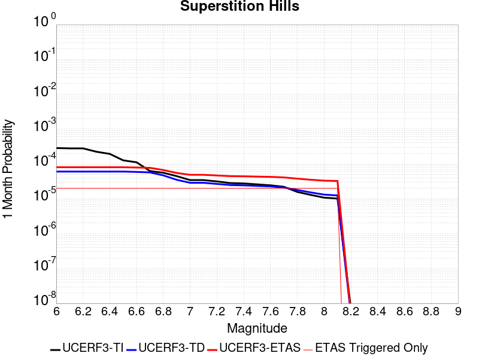 |  |  |

| Magnitude | 1 wk TI Prob | 1 wk TD Prob | 1 wk ETAS Prob | 1 wk ETAS/TD Gain | 1 wk ETAS Triggered Only | 1 mo TI Prob | 1 mo TD Prob | 1 mo ETAS Prob | 1 mo ETAS/TD Gain | 1 mo ETAS Triggered Only | 1 yr TI Prob | 1 yr TD Prob | 1 yr ETAS Prob | 1 yr ETAS/TD Gain | 1 yr ETAS Triggered Only | 10 yr TI Prob | 10 yr TD Prob | 10 yr ETAS Prob | 10 yr ETAS/TD Gain | 10 yr ETAS Triggered Only |
|-----|-----|-----|-----|-----|-----|-----|-----|-----|-----|-----|-----|-----|-----|-----|-----|-----|-----|-----|-----|-----|
| 6.0 | 6.6865185E-5 | 1.41376995E-5 | 3.4137418E-5 | 2.4146373 | 2.0E-5 | 2.8653358E-4 | 6.0588824E-5 | 8.058761E-5 | 1.3300738 | 2.0E-5 | 0.0034829667 | 7.374355E-4 | 7.6741335E-4 | 1.0406516 | 3.0E-5 | 0.03428881 | 0.0075204074 | 0.007550182 | 1.0039592 | 3.0E-5 |
| 6.1 | 6.544851E-5 | 1.41376995E-5 | 3.4137418E-5 | 2.4146373 | 2.0E-5 | 2.8046346E-4 | 6.0588824E-5 | 8.058761E-5 | 1.3300738 | 2.0E-5 | 0.0034092965 | 7.374355E-4 | 7.6741335E-4 | 1.0406516 | 3.0E-5 | 0.033574644 | 0.007520407 | 0.0075501814 | 1.0039592 | 3.0E-5 |
| 6.2 | 6.544851E-5 | 1.41376995E-5 | 3.4137418E-5 | 2.4146373 | 2.0E-5 | 2.8046346E-4 | 6.0588824E-5 | 8.058761E-5 | 1.3300738 | 2.0E-5 | 0.0034092965 | 7.374355E-4 | 7.6741335E-4 | 1.0406516 | 3.0E-5 | 0.033574644 | 0.007520407 | 0.0075501814 | 1.0039592 | 3.0E-5 |
| 6.3 | 5.2402065E-5 | 1.4137698E-5 | 3.4137414E-5 | 2.4146376 | 2.0E-5 | 2.2456095E-4 | 6.058882E-5 | 8.0587604E-5 | 1.330074 | 2.0E-5 | 0.0027306017 | 7.374354E-4 | 7.674133E-4 | 1.0406516 | 3.0E-5 | 0.02697292 | 0.007520402 | 0.0075501762 | 1.0039592 | 3.0E-5 |
| 6.4 | 4.542238E-5 | 1.4137698E-5 | 3.4137414E-5 | 2.4146376 | 2.0E-5 | 1.9465282E-4 | 6.0588816E-5 | 8.0587604E-5 | 1.330074 | 2.0E-5 | 0.0023673223 | 7.3743536E-4 | 7.6741324E-4 | 1.0406516 | 3.0E-5 | 0.023422617 | 0.0075203986 | 0.007550173 | 1.0039592 | 3.0E-5 |
| 6.5 | 2.9672969E-5 | 1.4137696E-5 | 3.4137414E-5 | 2.4146376 | 2.0E-5 | 1.2716366E-4 | 6.058881E-5 | 8.05876E-5 | 1.330074 | 2.0E-5 | 0.0015471181 | 7.374353E-4 | 7.674132E-4 | 1.0406516 | 3.0E-5 | 0.015363912 | 0.007520392 | 0.0075501665 | 1.0039592 | 3.0E-5 |
| 6.6 | 2.6056105E-5 | 1.3803458E-5 | 3.3803182E-5 | 2.4488924 | 2.0E-5 | 1.1166424E-4 | 5.9156428E-5 | 7.9155245E-5 | 1.3380667 | 2.0E-5 | 0.0013586642 | 7.200076E-4 | 7.49986E-4 | 1.0416362 | 3.0E-5 | 0.013503874 | 0.0073448285 | 0.0073746084 | 1.0040545 | 3.0E-5 |
| 6.7 | 1.4611248E-5 | 1.3383359E-5 | 3.338309E-5 | 2.494373 | 2.0E-5 | 6.261813E-5 | 5.7356083E-5 | 7.735493E-5 | 1.3486788 | 2.0E-5 | 7.6210906E-4 | 6.981025E-4 | 7.2808156E-4 | 1.0429436 | 3.0E-5 | 0.0075950073 | 0.00712602 | 0.007155806 | 1.00418 | 3.0E-5 |
| 6.8 | 1.30607E-5 | 1.09787925E-5 | 3.0978572E-5 | 2.8216739 | 2.0E-5 | 5.597323E-5 | 4.705117E-5 | 6.705023E-5 | 1.4250492 | 2.0E-5 | 6.8126095E-4 | 5.7270617E-4 | 6.02689E-4 | 1.0523529 | 3.0E-5 | 0.006791762 | 0.00587438 | 0.0059042037 | 1.0050769 | 3.0E-5 |
| 6.9 | 1.0443096E-5 | 8.195349E-6 | 2.8195185E-5 | 3.4403884 | 2.0E-5 | 4.4755358E-5 | 3.5122466E-5 | 5.5121764E-5 | 1.569416 | 2.0E-5 | 5.447602E-4 | 4.2753448E-4 | 4.5752164E-4 | 1.0701398 | 3.0E-5 | 0.005434267 | 0.0044094524 | 0.00443932 | 1.0067736 | 3.0E-5 |
| 7.0 | 8.045912E-6 | 6.739692E-6 | 2.6739557E-5 | 3.9674747 | 2.0E-5 | 3.4482026E-5 | 2.888408E-5 | 4.8883503E-5 | 1.692403 | 2.0E-5 | 4.197378E-4 | 3.5160795E-4 | 3.815974E-4 | 1.0852923 | 3.0E-5 | 0.0041894587 | 0.0036334093 | 0.0036633003 | 1.0082268 | 3.0E-5 |
| 7.1 | 8.045912E-6 | 6.739692E-6 | 2.6739557E-5 | 3.9674747 | 2.0E-5 | 3.4482026E-5 | 2.888408E-5 | 4.8883503E-5 | 1.692403 | 2.0E-5 | 4.197378E-4 | 3.5160795E-4 | 3.815974E-4 | 1.0852923 | 3.0E-5 | 0.0041894587 | 0.0036334093 | 0.0036633003 | 1.0082268 | 3.0E-5 |
| 7.2 | 7.375506E-6 | 6.2466297E-6 | 2.6246506E-5 | 4.2017064 | 2.0E-5 | 3.1608928E-5 | 2.6771E-5 | 4.6770467E-5 | 1.7470571 | 2.0E-5 | 3.8477074E-4 | 3.2588904E-4 | 3.5587925E-4 | 1.0920259 | 3.0E-5 | 0.003841052 | 0.003373887 | 0.0034037856 | 1.0088618 | 3.0E-5 |
| 7.3 | 6.6063913E-6 | 5.7990574E-6 | 2.5798941E-5 | 4.4488163 | 2.0E-5 | 2.8312797E-5 | 2.485287E-5 | 4.4852375E-5 | 1.804716 | 2.0E-5 | 3.446538E-4 | 3.025424E-4 | 3.3253332E-4 | 1.0991297 | 3.0E-5 | 0.0034411973 | 0.003138153 | 0.003168059 | 1.0095297 | 3.0E-5 |
| 7.4 | 6.4313126E-6 | 5.680481E-6 | 2.5680367E-5 | 4.520808 | 2.0E-5 | 2.7562477E-5 | 2.4344696E-5 | 4.434421E-5 | 1.8215141 | 2.0E-5 | 3.355215E-4 | 2.9635706E-4 | 3.2634818E-4 | 1.1011993 | 3.0E-5 | 0.0033501536 | 0.0030759154 | 0.003105823 | 1.0097232 | 3.0E-5 |
| 7.5 | 6.0742927E-6 | 5.4763104E-6 | 2.5476202E-5 | 4.652074 | 2.0E-5 | 2.6032423E-5 | 2.3469694E-5 | 4.3469227E-5 | 1.8521428 | 2.0E-5 | 3.1689866E-4 | 2.8570674E-4 | 3.1569815E-4 | 1.1049727 | 3.0E-5 | 0.0031644711 | 0.002967756 | 0.002997667 | 1.0100787 | 3.0E-5 |
| 7.6 | 5.6987187E-6 | 5.294521E-6 | 2.5294416E-5 | 4.77747 | 2.0E-5 | 2.4422852E-5 | 2.269061E-5 | 4.2690157E-5 | 1.8814018 | 2.0E-5 | 2.9730765E-4 | 2.7622381E-4 | 3.0621554E-4 | 1.1085776 | 3.0E-5 | 0.002969102 | 0.0028710118 | 0.0029009257 | 1.0104192 | 3.0E-5 |
| 7.7 | 5.1658035E-6 | 4.925535E-6 | 2.4925437E-5 | 5.0604525 | 2.0E-5 | 2.2138971E-5 | 2.1109268E-5 | 4.1108848E-5 | 1.9474311 | 2.0E-5 | 2.6950863E-4 | 2.5697565E-4 | 2.8696793E-4 | 1.1167126 | 3.0E-5 | 0.00269182 | 0.0026760625 | 0.0027059822 | 1.0111805 | 3.0E-5 |
| 7.8 | 3.6864697E-6 | 4.1964995E-6 | 2.4196415E-5 | 5.765857 | 2.0E-5 | 1.579906E-5 | 1.7984876E-5 | 3.7984515E-5 | 2.1120255 | 2.0E-5 | 1.9233658E-4 | 2.1894433E-4 | 2.4893775E-4 | 1.1369911 | 3.0E-5 | 0.0019217018 | 0.0022892624 | 0.0023191937 | 1.0130746 | 3.0E-5 |
| 7.9 | 3.0265903E-6 | 3.5637288E-6 | 2.3563658E-5 | 6.612079 | 2.0E-5 | 1.2971037E-5 | 1.5273037E-5 | 3.5272733E-5 | 2.3094773 | 2.0E-5 | 1.5791094E-4 | 1.859338E-4 | 2.1592822E-4 | 1.1613177 | 3.0E-5 | 0.0015779877 | 0.0019534735 | 0.001983415 | 1.0153272 | 3.0E-5 |
| 8.0 | 2.5271493E-6 | 3.0867361E-6 | 2.3086674E-5 | 7.4793158 | 2.0E-5 | 1.0830595E-5 | 1.3228804E-5 | 3.3228538E-5 | 2.5118325 | 2.0E-5 | 1.3185451E-4 | 1.610492E-4 | 1.8104598E-4 | 1.1241657 | 2.0E-5 | 0.0013177631 | 0.0016973554 | 0.0017173215 | 1.011763 | 2.0E-5 |
| 8.1 | 2.3749135E-6 | 2.917377E-6 | 2.2917318E-5 | 7.855453 | 2.0E-5 | 1.0178161E-5 | 1.25029865E-5 | 3.2502736E-5 | 2.5995977 | 2.0E-5 | 1.2391206E-4 | 1.5221364E-4 | 1.722106E-4 | 1.1313742 | 2.0E-5 | 0.0012384299 | 0.001604949 | 0.0016249169 | 1.0124414 | 2.0E-5 |
| 8.2 | 1.7186406E-9 | 1.1440594E-9 | 1.1440594E-9 | 1.0 | 0.0 | 7.3656024E-9 | 4.9031117E-9 | 4.9031117E-9 | 1.0 | 0.0 | 8.9676206E-8 | 5.969538E-8 | 5.969538E-8 | 1.0 | 0.0 | 8.9676166E-7 | 6.389059E-7 | 6.389059E-7 | 1.0 | 0.0 |

## Los Alamos extension
*[(top)](#table-of-contents)*

| 1 Week | 1 Month | 1 Year | 10 Year |
|-----|-----|-----|-----|
|  |  |  |  |

| Magnitude | 1 wk TI Prob | 1 wk TD Prob | 1 wk ETAS Prob | 1 wk ETAS/TD Gain | 1 wk ETAS Triggered Only | 1 mo TI Prob | 1 mo TD Prob | 1 mo ETAS Prob | 1 mo ETAS/TD Gain | 1 mo ETAS Triggered Only | 1 yr TI Prob | 1 yr TD Prob | 1 yr ETAS Prob | 1 yr ETAS/TD Gain | 1 yr ETAS Triggered Only | 10 yr TI Prob | 10 yr TD Prob | 10 yr ETAS Prob | 10 yr ETAS/TD Gain | 10 yr ETAS Triggered Only |
|-----|-----|-----|-----|-----|-----|-----|-----|-----|-----|-----|-----|-----|-----|-----|-----|-----|-----|-----|-----|-----|
| 6.0 | 4.0146506E-6 | 4.0861596E-6 | 1.4086118E-5 | 3.4472756 | 1.0E-5 | 1.7205533E-5 | 1.7512002E-5 | 2.7511827E-5 | 1.5710269 | 1.0E-5 | 2.0945723E-4 | 2.1318886E-4 | 2.2318673E-4 | 1.0468968 | 1.0E-5 | 0.0020925992 | 0.0021299527 | 0.0021598889 | 1.0140548 | 3.0E-5 |
| 6.1 | 4.0146506E-6 | 4.0861596E-6 | 1.4086118E-5 | 3.4472756 | 1.0E-5 | 1.7205533E-5 | 1.7512002E-5 | 2.7511827E-5 | 1.5710269 | 1.0E-5 | 2.0945723E-4 | 2.1318886E-4 | 2.2318673E-4 | 1.0468968 | 1.0E-5 | 0.0020925992 | 0.0021299527 | 0.0021598889 | 1.0140548 | 3.0E-5 |
| 6.2 | 4.0146506E-6 | 4.0861596E-6 | 1.4086118E-5 | 3.4472756 | 1.0E-5 | 1.7205533E-5 | 1.7512002E-5 | 2.7511827E-5 | 1.5710269 | 1.0E-5 | 2.0945723E-4 | 2.1318886E-4 | 2.2318673E-4 | 1.0468968 | 1.0E-5 | 0.0020925992 | 0.0021299527 | 0.0021598889 | 1.0140548 | 3.0E-5 |
| 6.3 | 4.0146506E-6 | 4.0861596E-6 | 1.4086118E-5 | 3.4472756 | 1.0E-5 | 1.7205533E-5 | 1.7512002E-5 | 2.7511827E-5 | 1.5710269 | 1.0E-5 | 2.0945723E-4 | 2.1318886E-4 | 2.2318673E-4 | 1.0468968 | 1.0E-5 | 0.0020925992 | 0.0021299527 | 0.0021598889 | 1.0140548 | 3.0E-5 |
| 6.4 | 4.0146506E-6 | 4.0861596E-6 | 1.4086118E-5 | 3.4472756 | 1.0E-5 | 1.7205533E-5 | 1.7512002E-5 | 2.7511827E-5 | 1.5710269 | 1.0E-5 | 2.0945723E-4 | 2.1318886E-4 | 2.2318673E-4 | 1.0468968 | 1.0E-5 | 0.0020925992 | 0.0021299527 | 0.0021598889 | 1.0140548 | 3.0E-5 |
| 6.5 | 4.0146506E-6 | 4.0861596E-6 | 1.4086118E-5 | 3.4472756 | 1.0E-5 | 1.7205533E-5 | 1.7512002E-5 | 2.7511827E-5 | 1.5710269 | 1.0E-5 | 2.0945723E-4 | 2.1318886E-4 | 2.2318673E-4 | 1.0468968 | 1.0E-5 | 0.0020925992 | 0.0021299527 | 0.0021598889 | 1.0140548 | 3.0E-5 |
| 6.6 | 4.0146506E-6 | 4.0861596E-6 | 1.4086118E-5 | 3.4472756 | 1.0E-5 | 1.7205533E-5 | 1.7512002E-5 | 2.7511827E-5 | 1.5710269 | 1.0E-5 | 2.0945723E-4 | 2.1318886E-4 | 2.2318673E-4 | 1.0468968 | 1.0E-5 | 0.0020925992 | 0.0021299527 | 0.0021598889 | 1.0140548 | 3.0E-5 |
| 6.7 | 4.0146506E-6 | 4.0861596E-6 | 1.4086118E-5 | 3.4472756 | 1.0E-5 | 1.7205533E-5 | 1.7512002E-5 | 2.7511827E-5 | 1.5710269 | 1.0E-5 | 2.0945723E-4 | 2.1318886E-4 | 2.2318673E-4 | 1.0468968 | 1.0E-5 | 0.0020925992 | 0.0021299527 | 0.0021598889 | 1.0140548 | 3.0E-5 |
| 6.8 | 3.6584688E-6 | 3.7188588E-6 | 1.3718822E-5 | 3.6889868 | 1.0E-5 | 1.5679057E-5 | 1.5937874E-5 | 2.5937716E-5 | 1.6274263 | 1.0E-5 | 1.9087581E-4 | 1.9402728E-4 | 2.0402535E-4 | 1.0515292 | 1.0E-5 | 0.0019071194 | 0.0019386712 | 0.0019686131 | 1.0154445 | 3.0E-5 |
| 6.9 | 3.644631E-6 | 3.7045688E-6 | 1.3704532E-5 | 3.6993594 | 1.0E-5 | 1.5619753E-5 | 1.5876632E-5 | 2.5876474E-5 | 1.6298465 | 1.0E-5 | 1.901539E-4 | 1.9328178E-4 | 2.0327985E-4 | 1.0517279 | 1.0E-5 | 0.0018999127 | 0.0019312293 | 0.0019611714 | 1.0155041 | 3.0E-5 |
| 7.0 | 3.6318522E-6 | 3.6913295E-6 | 1.3691292E-5 | 3.709041 | 1.0E-5 | 1.5564989E-5 | 1.5819893E-5 | 2.5819734E-5 | 1.6321056 | 1.0E-5 | 1.8948725E-4 | 1.925911E-4 | 2.0258917E-4 | 1.0519135 | 1.0E-5 | 0.0018932576 | 0.0019243343 | 0.0019542766 | 1.0155598 | 3.0E-5 |
| 7.1 | 3.5001724E-6 | 3.5554E-6 | 3.5554E-6 | 1.0 | 0.0 | 1.5000653E-5 | 1.5237345E-5 | 1.5237345E-5 | 1.0 | 0.0 | 1.8261763E-4 | 1.854998E-4 | 1.854998E-4 | 1.0 | 0.0 | 0.0018246764 | 0.0018535402 | 0.0018735032 | 1.0107702 | 2.0E-5 |
| 7.2 | 2.5204702E-6 | 2.5436943E-6 | 2.5436943E-6 | 1.0 | 0.0 | 1.080197E-5 | 1.0901502E-5 | 1.0901502E-5 | 1.0 | 0.0 | 1.3150605E-4 | 1.3271775E-4 | 1.3271775E-4 | 1.0 | 0.0 | 0.0013142825 | 0.0013263905 | 0.0013363772 | 1.0075293 | 1.0E-5 |
| 7.3 | 2.1399692E-6 | 2.1501316E-6 | 2.1501316E-6 | 1.0 | 0.0 | 9.1712645E-6 | 9.2148175E-6 | 9.2148175E-6 | 1.0 | 0.0 | 1.1165442E-4 | 1.1218466E-4 | 1.1218466E-4 | 1.0 | 0.0 | 0.0011159834 | 0.0011212835 | 0.0011312723 | 1.0089084 | 1.0E-5 |
| 7.4 | 1.9660122E-6 | 1.9702363E-6 | 1.9702363E-6 | 1.0 | 0.0 | 8.42574E-6 | 8.4438425E-6 | 8.4438425E-6 | 1.0 | 0.0 | 1.0257855E-4 | 1.0279897E-4 | 1.0279897E-4 | 1.0 | 0.0 | 0.0010253121 | 0.0010275173 | 0.001037507 | 1.0097222 | 1.0E-5 |
| 7.5 | 1.7204633E-6 | 1.7150983E-6 | 1.7150983E-6 | 1.0 | 0.0 | 7.373393E-6 | 7.3504007E-6 | 7.3504007E-6 | 1.0 | 0.0 | 8.976737E-5 | 8.948748E-5 | 8.948748E-5 | 1.0 | 0.0 | 8.9731114E-4 | 8.9451746E-4 | 9.045085E-4 | 1.0111692 | 1.0E-5 |
| 7.6 | 1.3717638E-6 | 1.3535827E-6 | 1.3535827E-6 | 1.0 | 0.0 | 5.878974E-6 | 5.8010555E-6 | 5.8010555E-6 | 1.0 | 0.0 | 7.157416E-5 | 7.062559E-5 | 7.062559E-5 | 1.0 | 0.0 | 7.1551115E-4 | 7.060341E-4 | 7.060341E-4 | 1.0 | 0.0 |
| 7.7 | 8.272564E-7 | 7.957636E-7 | 7.957636E-7 | 1.0 | 0.0 | 3.5453797E-6 | 3.410411E-6 | 3.410411E-6 | 1.0 | 0.0 | 4.3164142E-5 | 4.1520965E-5 | 4.1520965E-5 | 1.0 | 0.0 | 4.315576E-4 | 4.1513226E-4 | 4.1513226E-4 | 1.0 | 0.0 |
| 7.8 | 3.9708277E-7 | 3.6719027E-7 | 3.6719027E-7 | 1.0 | 0.0 | 1.7017821E-6 | 1.5736716E-6 | 1.5736716E-6 | 1.0 | 0.0 | 2.0719E-5 | 1.9159284E-5 | 1.9159284E-5 | 1.0 | 0.0 | 2.071707E-4 | 1.9157639E-4 | 1.9157639E-4 | 1.0 | 0.0 |
| 7.9 | 9.292528E-8 | 7.889087E-8 | 7.889087E-8 | 1.0 | 0.0 | 3.9825116E-7 | 3.381037E-7 | 3.381037E-7 | 1.0 | 0.0 | 4.848697E-6 | 4.116405E-6 | 4.116405E-6 | 1.0 | 0.0 | 4.8485912E-5 | 4.1163294E-5 | 4.1163294E-5 | 1.0 | 0.0 |
| 8.0 | 7.880441E-11 | 8.2353124E-11 | 8.2353124E-11 | 1.0 | 0.0 | 3.3773329E-10 | 3.52942E-10 | 3.52942E-10 | 1.0 | 0.0 | 4.1119033E-9 | 4.2970694E-9 | 4.2970694E-9 | 1.0 | 0.0 | 4.1119034E-8 | 4.2970694E-8 | 4.2970694E-8 | 1.0 | 0.0 |

## Cedar Mtn-Mahogany Mtn
*[(top)](#table-of-contents)*

| 1 Week | 1 Month | 1 Year | 10 Year |
|-----|-----|-----|-----|
|  | 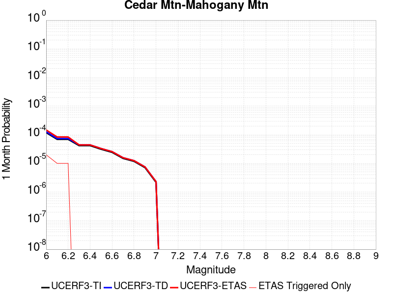 |  |  |

| Magnitude | 1 wk TI Prob | 1 wk TD Prob | 1 wk ETAS Prob | 1 wk ETAS/TD Gain | 1 wk ETAS Triggered Only | 1 mo TI Prob | 1 mo TD Prob | 1 mo ETAS Prob | 1 mo ETAS/TD Gain | 1 mo ETAS Triggered Only | 1 yr TI Prob | 1 yr TD Prob | 1 yr ETAS Prob | 1 yr ETAS/TD Gain | 1 yr ETAS Triggered Only | 10 yr TI Prob | 10 yr TD Prob | 10 yr ETAS Prob | 10 yr ETAS/TD Gain | 10 yr ETAS Triggered Only |
|-----|-----|-----|-----|-----|-----|-----|-----|-----|-----|-----|-----|-----|-----|-----|-----|-----|-----|-----|-----|-----|
| 6.0 | 2.7763876E-5 | 2.9588866E-5 | 3.958857E-5 | 1.337955 | 1.0E-5 | 1.1898261E-4 | 1.2680366E-4 | 1.4680112E-4 | 1.1577041 | 2.0E-5 | 0.0014476506 | 0.0015428112 | 0.0015627804 | 1.0129434 | 2.0E-5 | 0.0143825635 | 0.015328225 | 0.0153479185 | 1.0012848 | 2.0E-5 |
| 6.1 | 1.6162443E-5 | 1.7142966E-5 | 1.7142966E-5 | 1.0 | 0.0 | 6.926578E-5 | 7.346788E-5 | 8.346715E-5 | 1.1361039 | 1.0E-5 | 8.4298453E-4 | 8.941221E-4 | 9.0411317E-4 | 1.0111742 | 1.0E-5 | 0.008397939 | 0.008907059 | 0.008916969 | 1.0011127 | 1.0E-5 |
| 6.2 | 1.6162443E-5 | 1.7142966E-5 | 1.7142966E-5 | 1.0 | 0.0 | 6.926578E-5 | 7.346788E-5 | 8.346715E-5 | 1.1361039 | 1.0E-5 | 8.4298453E-4 | 8.941221E-4 | 9.0411317E-4 | 1.0111742 | 1.0E-5 | 0.008397939 | 0.008907059 | 0.008916969 | 1.0011127 | 1.0E-5 |
| 6.3 | 9.746053E-6 | 1.0303152E-5 | 1.0303152E-5 | 1.0 | 0.0 | 4.1768133E-5 | 4.415564E-5 | 4.415564E-5 | 1.0 | 0.0 | 5.0840835E-4 | 5.3746643E-4 | 5.3746643E-4 | 1.0 | 0.0 | 0.0050724675 | 0.005362084 | 0.005362084 | 1.0 | 0.0 |
| 6.4 | 9.746053E-6 | 1.0303152E-5 | 1.0303152E-5 | 1.0 | 0.0 | 4.1768133E-5 | 4.415564E-5 | 4.415564E-5 | 1.0 | 0.0 | 5.0840835E-4 | 5.3746643E-4 | 5.3746643E-4 | 1.0 | 0.0 | 0.0050724675 | 0.005362084 | 0.005362084 | 1.0 | 0.0 |
| 6.5 | 7.290083E-6 | 7.695325E-6 | 7.695325E-6 | 1.0 | 0.0 | 3.124284E-5 | 3.297956E-5 | 3.297956E-5 | 1.0 | 0.0 | 3.8031515E-4 | 4.014543E-4 | 4.014543E-4 | 1.0 | 0.0 | 0.0037966494 | 0.004007511 | 0.004007511 | 1.0 | 0.0 |
| 6.6 | 5.67907E-6 | 5.9891527E-6 | 5.9891527E-6 | 1.0 | 0.0 | 2.4338644E-5 | 2.5667552E-5 | 2.5667552E-5 | 1.0 | 0.0 | 2.962827E-4 | 3.12459E-4 | 3.12459E-4 | 1.0 | 0.0 | 0.0029588798 | 0.003120333 | 0.003120333 | 1.0 | 0.0 |
| 6.7 | 3.4853963E-6 | 3.672631E-6 | 3.672631E-6 | 1.0 | 0.0 | 1.4937327E-5 | 1.5739755E-5 | 1.5739755E-5 | 1.0 | 0.0 | 1.8184677E-4 | 1.916153E-4 | 1.916153E-4 | 1.0 | 0.0 | 0.0018169804 | 0.0019145629 | 0.0019145629 | 1.0 | 0.0 |
| 6.8 | 2.7535168E-6 | 2.9015764E-6 | 2.9015764E-6 | 1.0 | 0.0 | 1.1800733E-5 | 1.2435271E-5 | 1.2435271E-5 | 1.0 | 0.0 | 1.4366445E-4 | 1.5138938E-4 | 1.5138938E-4 | 1.0 | 0.0 | 0.0014357162 | 0.0015129098 | 0.0015129098 | 1.0 | 0.0 |
| 6.9 | 1.6594106E-6 | 1.7496985E-6 | 1.7496985E-6 | 1.0 | 0.0 | 7.1117406E-6 | 7.4986883E-6 | 7.4986883E-6 | 1.0 | 0.0 | 8.6582E-5 | 9.129302E-5 | 9.129302E-5 | 1.0 | 0.0 | 8.654827E-4 | 9.125856E-4 | 9.125856E-4 | 1.0 | 0.0 |
| 7.0 | 5.10215E-7 | 5.389254E-7 | 5.389254E-7 | 1.0 | 0.0 | 2.186634E-6 | 2.3096788E-6 | 2.3096788E-6 | 1.0 | 0.0 | 2.6621943E-5 | 2.8120105E-5 | 2.8120105E-5 | 1.0 | 0.0 | 2.6618753E-4 | 2.81178E-4 | 2.81178E-4 | 1.0 | 0.0 |

## Pisgah-Bullion Mtn-Mesquite Lk
*[(top)](#table-of-contents)*

| 1 Week | 1 Month | 1 Year | 10 Year |
|-----|-----|-----|-----|
|  |  |  |  |

| Magnitude | 1 wk TI Prob | 1 wk TD Prob | 1 wk ETAS Prob | 1 wk ETAS/TD Gain | 1 wk ETAS Triggered Only | 1 mo TI Prob | 1 mo TD Prob | 1 mo ETAS Prob | 1 mo ETAS/TD Gain | 1 mo ETAS Triggered Only | 1 yr TI Prob | 1 yr TD Prob | 1 yr ETAS Prob | 1 yr ETAS/TD Gain | 1 yr ETAS Triggered Only | 10 yr TI Prob | 10 yr TD Prob | 10 yr ETAS Prob | 10 yr ETAS/TD Gain | 10 yr ETAS Triggered Only |
|-----|-----|-----|-----|-----|-----|-----|-----|-----|-----|-----|-----|-----|-----|-----|-----|-----|-----|-----|-----|-----|
| 6.0 | 3.0240792E-5 | 2.4091114E-5 | 3.4090874E-5 | 1.4150808 | 1.0E-5 | 1.2959696E-4 | 1.03244114E-4 | 1.13243084E-4 | 1.0968478 | 1.0E-5 | 0.0015767008 | 0.0012563728 | 0.0012763476 | 1.0158988 | 2.0E-5 | 0.015655609 | 0.012502721 | 0.012532346 | 1.0023695 | 3.0E-5 |
| 6.1 | 3.0240792E-5 | 2.4091114E-5 | 3.4090874E-5 | 1.4150808 | 1.0E-5 | 1.2959696E-4 | 1.03244114E-4 | 1.13243084E-4 | 1.0968478 | 1.0E-5 | 0.0015767008 | 0.0012563728 | 0.0012763476 | 1.0158988 | 2.0E-5 | 0.015655609 | 0.012502721 | 0.012532346 | 1.0023695 | 3.0E-5 |
| 6.2 | 3.0240792E-5 | 2.4091114E-5 | 3.4090874E-5 | 1.4150808 | 1.0E-5 | 1.2959696E-4 | 1.03244114E-4 | 1.13243084E-4 | 1.0968478 | 1.0E-5 | 0.0015767008 | 0.0012563728 | 0.0012763476 | 1.0158988 | 2.0E-5 | 0.015655609 | 0.012502721 | 0.012532346 | 1.0023695 | 3.0E-5 |
| 6.3 | 2.0498217E-5 | 1.36380695E-5 | 1.36380695E-5 | 1.0 | 0.0 | 8.784654E-5 | 5.844765E-5 | 5.844765E-5 | 1.0 | 0.0 | 0.0010690069 | 7.1138405E-4 | 7.1138405E-4 | 1.0 | 0.0 | 0.01063879 | 0.0070926943 | 0.0070926943 | 1.0 | 0.0 |
| 6.4 | 2.0498217E-5 | 1.36380695E-5 | 1.36380695E-5 | 1.0 | 0.0 | 8.784654E-5 | 5.844765E-5 | 5.844765E-5 | 1.0 | 0.0 | 0.0010690069 | 7.1138405E-4 | 7.1138405E-4 | 1.0 | 0.0 | 0.01063879 | 0.0070926943 | 0.0070926943 | 1.0 | 0.0 |
| 6.5 | 1.7316182E-5 | 1.0477042E-5 | 1.0477042E-5 | 1.0 | 0.0 | 7.42101E-5 | 4.4900895E-5 | 4.4900895E-5 | 1.0 | 0.0 | 9.0313336E-4 | 5.465413E-4 | 5.465413E-4 | 1.0 | 0.0 | 0.008994718 | 0.0054529672 | 0.0054529672 | 1.0 | 0.0 |
| 6.6 | 1.5251077E-5 | 8.414273E-6 | 8.414273E-6 | 1.0 | 0.0 | 6.536012E-5 | 3.6060712E-5 | 3.6060712E-5 | 1.0 | 0.0 | 7.9546886E-4 | 4.3895794E-4 | 4.3895794E-4 | 1.0 | 0.0 | 0.007926274 | 0.0043816264 | 0.0043816264 | 1.0 | 0.0 |
| 6.7 | 1.2997425E-5 | 6.4114965E-6 | 6.4114965E-6 | 1.0 | 0.0 | 5.570206E-5 | 2.7477578E-5 | 2.7477578E-5 | 1.0 | 0.0 | 6.7796157E-4 | 3.3449283E-4 | 3.3449283E-4 | 1.0 | 0.0 | 0.0067589693 | 0.0033403537 | 0.0033403537 | 1.0 | 0.0 |
| 6.8 | 1.035386E-5 | 4.3332193E-6 | 4.3332193E-6 | 1.0 | 0.0 | 4.437293E-5 | 1.8570812E-5 | 1.8570812E-5 | 1.0 | 0.0 | 5.401065E-4 | 2.2607706E-4 | 2.2607706E-4 | 1.0 | 0.0 | 0.0053879567 | 0.0022585576 | 0.0022585576 | 1.0 | 0.0 |
| 6.9 | 8.816252E-6 | 3.580638E-6 | 3.580638E-6 | 1.0 | 0.0 | 3.778339E-5 | 1.5345504E-5 | 1.5345504E-5 | 1.0 | 0.0 | 4.5991567E-4 | 1.8681608E-4 | 1.8681608E-4 | 1.0 | 0.0 | 0.00458965 | 0.0018666488 | 0.0018666488 | 1.0 | 0.0 |
| 7.0 | 6.8232207E-6 | 2.5675843E-6 | 2.5675843E-6 | 1.0 | 0.0 | 2.9242048E-5 | 1.1003888E-5 | 1.1003888E-5 | 1.0 | 0.0 | 3.5596377E-4 | 1.3396442E-4 | 1.3396442E-4 | 1.0 | 0.0 | 0.0035539411 | 0.0013388677 | 0.0013388677 | 1.0 | 0.0 |
| 7.1 | 5.837013E-6 | 2.22738E-6 | 2.22738E-6 | 1.0 | 0.0 | 2.501553E-5 | 9.545881E-6 | 9.545881E-6 | 1.0 | 0.0 | 3.045215E-4 | 1.16215204E-4 | 1.16215204E-4 | 1.0 | 0.0 | 0.0030410455 | 0.0011615733 | 0.0011615733 | 1.0 | 0.0 |
| 7.2 | 4.278052E-6 | 1.6275711E-6 | 1.6275711E-6 | 1.0 | 0.0 | 1.833438E-5 | 6.9752873E-6 | 6.9752873E-6 | 1.0 | 0.0 | 2.231982E-4 | 8.492105E-5 | 8.492105E-5 | 1.0 | 0.0 | 0.0022297418 | 8.489092E-4 | 8.489092E-4 | 1.0 | 0.0 |
| 7.3 | 1.8803692E-6 | 8.344926E-7 | 8.344926E-7 | 1.0 | 0.0 | 8.0587E-6 | 3.5763926E-6 | 3.5763926E-6 | 1.0 | 0.0 | 9.811026E-5 | 4.354186E-5 | 4.354186E-5 | 1.0 | 0.0 | 9.806695E-4 | 4.3534773E-4 | 4.3534773E-4 | 1.0 | 0.0 |

## San Gabriel
*[(top)](#table-of-contents)*

| 1 Week | 1 Month | 1 Year | 10 Year |
|-----|-----|-----|-----|
|  |  |  |  |

| Magnitude | 1 wk TI Prob | 1 wk TD Prob | 1 wk ETAS Prob | 1 wk ETAS/TD Gain | 1 wk ETAS Triggered Only | 1 mo TI Prob | 1 mo TD Prob | 1 mo ETAS Prob | 1 mo ETAS/TD Gain | 1 mo ETAS Triggered Only | 1 yr TI Prob | 1 yr TD Prob | 1 yr ETAS Prob | 1 yr ETAS/TD Gain | 1 yr ETAS Triggered Only | 10 yr TI Prob | 10 yr TD Prob | 10 yr ETAS Prob | 10 yr ETAS/TD Gain | 10 yr ETAS Triggered Only |
|-----|-----|-----|-----|-----|-----|-----|-----|-----|-----|-----|-----|-----|-----|-----|-----|-----|-----|-----|-----|-----|
| 6.0 | 1.083775E-5 | 1.19851875E-5 | 2.1985068E-5 | 1.8343532 | 1.0E-5 | 4.6446676E-5 | 5.1364143E-5 | 6.136363E-5 | 1.1946783 | 1.0E-5 | 5.653415E-4 | 6.251903E-4 | 6.451778E-4 | 1.0319703 | 2.0E-5 | 0.0056390543 | 0.006246409 | 0.0062762215 | 1.0047728 | 3.0E-5 |
| 6.1 | 1.083775E-5 | 1.19851875E-5 | 2.1985068E-5 | 1.8343532 | 1.0E-5 | 4.6446676E-5 | 5.1364143E-5 | 6.136363E-5 | 1.1946783 | 1.0E-5 | 5.653415E-4 | 6.251903E-4 | 6.451778E-4 | 1.0319703 | 2.0E-5 | 0.0056390543 | 0.006246409 | 0.0062762215 | 1.0047728 | 3.0E-5 |
| 6.2 | 1.083775E-5 | 1.19851875E-5 | 2.1985068E-5 | 1.8343532 | 1.0E-5 | 4.6446676E-5 | 5.1364143E-5 | 6.136363E-5 | 1.1946783 | 1.0E-5 | 5.653415E-4 | 6.251903E-4 | 6.451778E-4 | 1.0319703 | 2.0E-5 | 0.0056390543 | 0.006246409 | 0.0062762215 | 1.0047728 | 3.0E-5 |
| 6.3 | 1.083775E-5 | 1.19851875E-5 | 2.1985068E-5 | 1.8343532 | 1.0E-5 | 4.6446676E-5 | 5.1364143E-5 | 6.136363E-5 | 1.1946783 | 1.0E-5 | 5.653415E-4 | 6.251903E-4 | 6.451778E-4 | 1.0319703 | 2.0E-5 | 0.0056390543 | 0.006246409 | 0.0062762215 | 1.0047728 | 3.0E-5 |
| 6.4 | 1.083775E-5 | 1.19851875E-5 | 2.1985068E-5 | 1.8343532 | 1.0E-5 | 4.6446676E-5 | 5.1364143E-5 | 6.136363E-5 | 1.1946783 | 1.0E-5 | 5.653415E-4 | 6.251903E-4 | 6.451778E-4 | 1.0319703 | 2.0E-5 | 0.0056390543 | 0.006246409 | 0.0062762215 | 1.0047728 | 3.0E-5 |
| 6.5 | 6.7317824E-6 | 7.716944E-6 | 1.7716868E-5 | 2.2958395 | 1.0E-5 | 2.8850178E-5 | 3.3072207E-5 | 4.3071876E-5 | 1.3023587 | 1.0E-5 | 3.511943E-4 | 4.0258077E-4 | 4.1257674E-4 | 1.0248297 | 1.0E-5 | 0.003506398 | 0.0040296097 | 0.004049529 | 1.0049433 | 2.0E-5 |
| 6.6 | 6.7317824E-6 | 7.716944E-6 | 1.7716868E-5 | 2.2958395 | 1.0E-5 | 2.8850178E-5 | 3.3072207E-5 | 4.3071876E-5 | 1.3023587 | 1.0E-5 | 3.511943E-4 | 4.0258077E-4 | 4.1257674E-4 | 1.0248297 | 1.0E-5 | 0.003506398 | 0.0040296097 | 0.004049529 | 1.0049433 | 2.0E-5 |
| 6.7 | 6.274881E-6 | 7.2458647E-6 | 1.7245793E-5 | 2.3800876 | 1.0E-5 | 2.6892068E-5 | 3.1053343E-5 | 4.105303E-5 | 1.3220165 | 1.0E-5 | 3.2736175E-4 | 3.780098E-4 | 3.8800604E-4 | 1.0264443 | 1.0E-5 | 0.0032687993 | 0.0037847564 | 0.0038046807 | 1.0052644 | 2.0E-5 |
| 6.8 | 5.996209E-6 | 6.958585E-6 | 1.6958515E-5 | 2.4370637 | 1.0E-5 | 2.5697784E-5 | 2.9822171E-5 | 3.9821873E-5 | 1.3353109 | 1.0E-5 | 3.128256E-4 | 3.6302538E-4 | 3.7302176E-4 | 1.0275363 | 1.0E-5 | 0.003123856 | 0.0036354093 | 0.003645373 | 1.0027407 | 1.0E-5 |
| 6.9 | 5.686331E-6 | 6.6236316E-6 | 1.6623566E-5 | 2.5097358 | 1.0E-5 | 2.4369761E-5 | 2.8386688E-5 | 3.8386406E-5 | 1.3522677 | 1.0E-5 | 2.9666146E-4 | 3.4555403E-4 | 3.5555058E-4 | 1.028929 | 1.0E-5 | 0.0029626573 | 0.0034612515 | 0.003471217 | 1.0028791 | 1.0E-5 |
| 7.0 | 5.2329838E-6 | 6.147514E-6 | 1.6147453E-5 | 2.6266637 | 1.0E-5 | 2.242688E-5 | 2.6346226E-5 | 3.6345962E-5 | 1.3795509 | 1.0E-5 | 2.7301308E-4 | 3.2071886E-4 | 3.3071564E-4 | 1.03117 | 1.0E-5 | 0.002726779 | 0.0032136322 | 0.0032235999 | 1.0031017 | 1.0E-5 |
| 7.1 | 5.135671E-6 | 6.03764E-6 | 1.603758E-5 | 2.6562662 | 1.0E-5 | 2.2009834E-5 | 2.5875348E-5 | 3.5875088E-5 | 1.3864583 | 1.0E-5 | 2.6793676E-4 | 3.1498758E-4 | 3.2498443E-4 | 1.0317373 | 1.0E-5 | 0.0026761394 | 0.0031564834 | 0.0031664518 | 1.0031581 | 1.0E-5 |
| 7.2 | 4.989062E-6 | 5.87102E-6 | 1.587096E-5 | 2.7032714 | 1.0E-5 | 2.1381518E-5 | 2.5161276E-5 | 3.5161025E-5 | 1.3974261 | 1.0E-5 | 2.6028889E-4 | 3.0629625E-4 | 3.1629318E-4 | 1.0326381 | 1.0E-5 | 0.0025998424 | 0.003069813 | 0.0030797822 | 1.0032475 | 1.0E-5 |
| 7.3 | 4.8219395E-6 | 5.702574E-6 | 1.5702517E-5 | 2.753584 | 1.0E-5 | 2.0665291E-5 | 2.443938E-5 | 3.4439134E-5 | 1.4091657 | 1.0E-5 | 2.5157086E-4 | 2.9750957E-4 | 3.075066E-4 | 1.0336024 | 1.0E-5 | 0.0025128627 | 0.0029821852 | 0.0029921555 | 1.0033432 | 1.0E-5 |
| 7.4 | 4.7118383E-6 | 5.5911332E-6 | 1.5591077E-5 | 2.7885363 | 1.0E-5 | 2.0193436E-5 | 2.3961782E-5 | 3.3961544E-5 | 1.4173212 | 1.0E-5 | 2.4582737E-4 | 2.916964E-4 | 3.0169348E-4 | 1.0342722 | 1.0E-5 | 0.002455556 | 0.0029242067 | 0.0029341774 | 1.0034097 | 1.0E-5 |
| 7.5 | 4.5506545E-6 | 5.4365014E-6 | 1.5436446E-5 | 2.8394084 | 1.0E-5 | 1.9502659E-5 | 2.3299088E-5 | 3.3298853E-5 | 1.4291914 | 1.0E-5 | 2.37419E-4 | 2.8363022E-4 | 2.9362738E-4 | 1.0352472 | 1.0E-5 | 0.002371655 | 0.002843753 | 0.0028537244 | 1.0035064 | 1.0E-5 |
| 7.6 | 4.343636E-6 | 5.2293817E-6 | 1.522933E-5 | 2.912262 | 1.0E-5 | 1.861545E-5 | 2.2411448E-5 | 3.2411222E-5 | 1.4461906 | 1.0E-5 | 2.2661954E-4 | 2.7282597E-4 | 2.8282322E-4 | 1.0366434 | 1.0E-5 | 0.0022638857 | 0.0027359722 | 0.002745945 | 1.0036451 | 1.0E-5 |
| 7.7 | 2.936235E-6 | 2.7440458E-6 | 2.7440458E-6 | 1.0 | 0.0 | 1.2583803E-5 | 1.1760143E-5 | 1.1760143E-5 | 1.0 | 0.0 | 1.5319703E-4 | 1.4317037E-4 | 1.4317037E-4 | 1.0 | 0.0 | 0.0015309147 | 0.0014380751 | 0.0014380751 | 1.0 | 0.0 |
| 7.8 | 1.4541639E-6 | 9.1237047E-7 | 9.1237047E-7 | 1.0 | 0.0 | 6.232116E-6 | 3.9101533E-6 | 3.9101533E-6 | 1.0 | 0.0 | 7.587337E-5 | 4.7605077E-5 | 4.7605077E-5 | 1.0 | 0.0 | 7.584747E-4 | 4.8085177E-4 | 4.8085177E-4 | 1.0 | 0.0 |
| 7.9 | 8.098958E-7 | 2.41753E-7 | 2.41753E-7 | 1.0 | 0.0 | 3.4709774E-6 | 1.0360839E-6 | 1.0360839E-6 | 1.0 | 0.0 | 4.225833E-5 | 1.2614248E-5 | 1.2614248E-5 | 1.0 | 0.0 | 4.2250296E-4 | 1.2921814E-4 | 1.2921814E-4 | 1.0 | 0.0 |
| 8.0 | 5.2473234E-7 | 7.6792055E-8 | 7.6792055E-8 | 1.0 | 0.0 | 2.248851E-6 | 3.2910876E-7 | 3.2910876E-7 | 1.0 | 0.0 | 2.7379416E-5 | 4.0068917E-6 | 4.0068917E-6 | 1.0 | 0.0 | 2.7376044E-4 | 4.21918E-5 | 4.21918E-5 | 1.0 | 0.0 |
| 8.1 | 3.3162388E-7 | 4.1496126E-8 | 4.1496126E-8 | 1.0 | 0.0 | 1.4212444E-6 | 1.7784053E-7 | 1.7784053E-7 | 1.0 | 0.0 | 1.7303513E-5 | 2.1652063E-6 | 2.1652063E-6 | 1.0 | 0.0 | 1.7302166E-4 | 2.2965523E-5 | 2.2965523E-5 | 1.0 | 0.0 |
| 8.2 | 1.0235345E-7 | 1.4043474E-8 | 1.4043474E-8 | 1.0 | 0.0 | 4.3865757E-7 | 6.0186316E-8 | 6.0186316E-8 | 1.0 | 0.0 | 5.340643E-6 | 7.327681E-7 | 7.327681E-7 | 1.0 | 0.0 | 5.3405143E-5 | 7.9273705E-6 | 7.9273705E-6 | 1.0 | 0.0 |

## White Wolf
*[(top)](#table-of-contents)*

| 1 Week | 1 Month | 1 Year | 10 Year |
|-----|-----|-----|-----|
|  |  |  |  |

| Magnitude | 1 wk TI Prob | 1 wk TD Prob | 1 wk ETAS Prob | 1 wk ETAS/TD Gain | 1 wk ETAS Triggered Only | 1 mo TI Prob | 1 mo TD Prob | 1 mo ETAS Prob | 1 mo ETAS/TD Gain | 1 mo ETAS Triggered Only | 1 yr TI Prob | 1 yr TD Prob | 1 yr ETAS Prob | 1 yr ETAS/TD Gain | 1 yr ETAS Triggered Only | 10 yr TI Prob | 10 yr TD Prob | 10 yr ETAS Prob | 10 yr ETAS/TD Gain | 10 yr ETAS Triggered Only |
|-----|-----|-----|-----|-----|-----|-----|-----|-----|-----|-----|-----|-----|-----|-----|-----|-----|-----|-----|-----|-----|
| 6.0 | 2.0037822E-5 | 1.0469162E-6 | 1.10469055E-5 | 10.551853 | 1.0E-5 | 8.587355E-5 | 4.486776E-6 | 1.4486731E-5 | 3.2287617 | 1.0E-5 | 0.001045009 | 5.4625183E-5 | 7.462409E-5 | 1.3661115 | 2.0E-5 | 0.010401085 | 5.461226E-4 | 5.7610625E-4 | 1.0549027 | 3.0E-5 |
| 6.1 | 2.0037822E-5 | 1.0469162E-6 | 1.10469055E-5 | 10.551853 | 1.0E-5 | 8.587355E-5 | 4.486776E-6 | 1.4486731E-5 | 3.2287617 | 1.0E-5 | 0.001045009 | 5.4625183E-5 | 7.462409E-5 | 1.3661115 | 2.0E-5 | 0.010401085 | 5.461226E-4 | 5.7610625E-4 | 1.0549027 | 3.0E-5 |
| 6.2 | 2.0037822E-5 | 1.0469162E-6 | 1.10469055E-5 | 10.551853 | 1.0E-5 | 8.587355E-5 | 4.486776E-6 | 1.4486731E-5 | 3.2287617 | 1.0E-5 | 0.001045009 | 5.4625183E-5 | 7.462409E-5 | 1.3661115 | 2.0E-5 | 0.010401085 | 5.461226E-4 | 5.7610625E-4 | 1.0549027 | 3.0E-5 |
| 6.3 | 2.0037822E-5 | 1.0469162E-6 | 1.10469055E-5 | 10.551853 | 1.0E-5 | 8.587355E-5 | 4.486776E-6 | 1.4486731E-5 | 3.2287617 | 1.0E-5 | 0.001045009 | 5.4625183E-5 | 7.462409E-5 | 1.3661115 | 2.0E-5 | 0.010401085 | 5.461226E-4 | 5.7610625E-4 | 1.0549027 | 3.0E-5 |
| 6.4 | 1.132487E-5 | 1.0469162E-6 | 1.10469055E-5 | 10.551853 | 1.0E-5 | 4.8534253E-5 | 4.486776E-6 | 1.4486731E-5 | 3.2287617 | 1.0E-5 | 5.907443E-4 | 5.4625183E-5 | 7.462409E-5 | 1.3661115 | 2.0E-5 | 0.005891764 | 5.461226E-4 | 5.7610625E-4 | 1.0549027 | 3.0E-5 |
| 6.5 | 1.132487E-5 | 1.0469162E-6 | 1.10469055E-5 | 10.551853 | 1.0E-5 | 4.8534253E-5 | 4.486776E-6 | 1.4486731E-5 | 3.2287617 | 1.0E-5 | 5.907443E-4 | 5.4625183E-5 | 7.462409E-5 | 1.3661115 | 2.0E-5 | 0.005891764 | 5.461226E-4 | 5.7610625E-4 | 1.0549027 | 3.0E-5 |
| 6.6 | 9.347473E-6 | 1.0469162E-6 | 1.10469055E-5 | 10.551853 | 1.0E-5 | 4.0059982E-5 | 4.486776E-6 | 1.4486731E-5 | 3.2287617 | 1.0E-5 | 4.8762115E-4 | 5.4625183E-5 | 7.462409E-5 | 1.3661115 | 2.0E-5 | 0.0048655253 | 5.461226E-4 | 5.7610625E-4 | 1.0549027 | 3.0E-5 |
| 6.7 | 7.842647E-6 | 1.0048342E-6 | 1.1004824E-5 | 10.95188 | 1.0E-5 | 3.361091E-5 | 4.3064256E-6 | 1.4306383E-5 | 3.3221016 | 1.0E-5 | 4.0913603E-4 | 5.2429517E-5 | 7.242847E-5 | 1.3814445 | 2.0E-5 | 0.004083836 | 5.2417646E-4 | 5.5416074E-4 | 1.0572026 | 3.0E-5 |
| 6.8 | 6.26597E-6 | 9.734822E-7 | 1.0973473E-5 | 11.272391 | 1.0E-5 | 2.685388E-5 | 4.17206E-6 | 1.4172018E-5 | 3.3968873 | 1.0E-5 | 3.2689696E-4 | 5.0793697E-5 | 7.079268E-5 | 1.3937297 | 2.0E-5 | 0.003264165 | 5.078258E-4 | 5.3781056E-4 | 1.0590454 | 3.0E-5 |
| 6.9 | 5.258436E-6 | 9.183254E-7 | 1.0918317E-5 | 11.889377 | 1.0E-5 | 2.2535958E-5 | 3.9356746E-6 | 1.3935635E-5 | 3.5408506 | 1.0E-5 | 2.7434074E-4 | 4.7915833E-5 | 6.791487E-5 | 1.4173785 | 2.0E-5 | 0.0027400232 | 4.790598E-4 | 5.0904544E-4 | 1.0625926 | 3.0E-5 |
| 7.0 | 4.675028E-6 | 8.6611794E-7 | 1.086611E-5 | 12.545761 | 1.0E-5 | 2.003568E-5 | 3.7119291E-6 | 1.3711892E-5 | 3.694007 | 1.0E-5 | 2.4390711E-4 | 4.5191846E-5 | 6.519094E-5 | 1.4425377 | 2.0E-5 | 0.0024363957 | 4.518313E-4 | 4.8181773E-4 | 1.0663664 | 3.0E-5 |
| 7.1 | 2.8270078E-6 | 6.8741696E-7 | 1.068741E-5 | 15.547201 | 1.0E-5 | 1.2115692E-5 | 2.9460696E-6 | 1.294604E-5 | 4.394343 | 1.0E-5 | 1.4749856E-4 | 3.5867848E-5 | 5.586713E-5 | 1.5575825 | 2.0E-5 | 0.001474007 | 3.586247E-4 | 3.8861393E-4 | 1.0836229 | 3.0E-5 |
| 7.2 | 1.6881406E-6 | 2.2706382E-7 | 2.2706382E-7 | 1.0 | 0.0 | 7.2348685E-6 | 9.731303E-7 | 9.731303E-7 | 1.0 | 0.0 | 8.808096E-5 | 1.1847799E-5 | 1.1847799E-5 | 1.0 | 0.0 | 8.8046055E-4 | 1.1847183E-4 | 1.1847183E-4 | 1.0 | 0.0 |
| 7.3 | 9.086107E-7 | 1.5266386E-7 | 1.5266386E-7 | 1.0 | 0.0 | 3.8940398E-6 | 6.5427355E-7 | 6.5427355E-7 | 1.0 | 0.0 | 4.7408903E-5 | 7.965752E-6 | 7.965752E-6 | 1.0 | 0.0 | 4.739879E-4 | 7.965475E-5 | 7.965475E-5 | 1.0 | 0.0 |
| 7.4 | 1.9717383E-7 | 9.003913E-8 | 9.003913E-8 | 1.0 | 0.0 | 8.450304E-7 | 3.8588192E-7 | 3.8588192E-7 | 1.0 | 0.0 | 1.0288197E-5 | 4.6981027E-6 | 4.6981027E-6 | 1.0 | 0.0 | 1.028772E-4 | 4.6980065E-5 | 4.6980065E-5 | 1.0 | 0.0 |
| 7.5 | 1.086975E-7 | 6.6597195E-8 | 6.6597195E-8 | 1.0 | 0.0 | 4.6584634E-7 | 2.8541652E-7 | 2.8541652E-7 | 1.0 | 0.0 | 5.6716644E-6 | 3.474941E-6 | 3.474941E-6 | 1.0 | 0.0 | 5.6715195E-5 | 3.474889E-5 | 3.474889E-5 | 1.0 | 0.0 |
| 7.6 | 2.4217808E-8 | 1.5820765E-8 | 1.5820765E-8 | 1.0 | 0.0 | 1.03790605E-7 | 6.780328E-8 | 6.780328E-8 | 1.0 | 0.0 | 1.2636499E-6 | 8.255046E-7 | 8.255046E-7 | 1.0 | 0.0 | 1.2636427E-5 | 8.2550205E-6 | 8.2550205E-6 | 1.0 | 0.0 |

## La Panza 2011
*[(top)](#table-of-contents)*

| 1 Week | 1 Month | 1 Year | 10 Year |
|-----|-----|-----|-----|
|  |  |  |  |

| Magnitude | 1 wk TI Prob | 1 wk TD Prob | 1 wk ETAS Prob | 1 wk ETAS/TD Gain | 1 wk ETAS Triggered Only | 1 mo TI Prob | 1 mo TD Prob | 1 mo ETAS Prob | 1 mo ETAS/TD Gain | 1 mo ETAS Triggered Only | 1 yr TI Prob | 1 yr TD Prob | 1 yr ETAS Prob | 1 yr ETAS/TD Gain | 1 yr ETAS Triggered Only | 10 yr TI Prob | 10 yr TD Prob | 10 yr ETAS Prob | 10 yr ETAS/TD Gain | 10 yr ETAS Triggered Only |
|-----|-----|-----|-----|-----|-----|-----|-----|-----|-----|-----|-----|-----|-----|-----|-----|-----|-----|-----|-----|-----|
| 6.0 | 4.6754544E-6 | 4.717587E-6 | 1.471754E-5 | 3.1197178 | 1.0E-5 | 2.0037509E-5 | 2.0218084E-5 | 3.0217881E-5 | 1.4945967 | 1.0E-5 | 2.4392935E-4 | 2.4612935E-4 | 2.661244E-4 | 1.081238 | 2.0E-5 | 0.0024366176 | 0.002458762 | 0.0024787127 | 1.0081142 | 2.0E-5 |
| 6.1 | 4.6754544E-6 | 4.717587E-6 | 1.471754E-5 | 3.1197178 | 1.0E-5 | 2.0037509E-5 | 2.0218084E-5 | 3.0217881E-5 | 1.4945967 | 1.0E-5 | 2.4392935E-4 | 2.4612935E-4 | 2.661244E-4 | 1.081238 | 2.0E-5 | 0.0024366176 | 0.002458762 | 0.0024787127 | 1.0081142 | 2.0E-5 |
| 6.2 | 4.6754544E-6 | 4.717587E-6 | 1.471754E-5 | 3.1197178 | 1.0E-5 | 2.0037509E-5 | 2.0218084E-5 | 3.0217881E-5 | 1.4945967 | 1.0E-5 | 2.4392935E-4 | 2.4612935E-4 | 2.661244E-4 | 1.081238 | 2.0E-5 | 0.0024366176 | 0.002458762 | 0.0024787127 | 1.0081142 | 2.0E-5 |
| 6.3 | 4.6754544E-6 | 4.717587E-6 | 1.471754E-5 | 3.1197178 | 1.0E-5 | 2.0037509E-5 | 2.0218084E-5 | 3.0217881E-5 | 1.4945967 | 1.0E-5 | 2.4392935E-4 | 2.4612935E-4 | 2.661244E-4 | 1.081238 | 2.0E-5 | 0.0024366176 | 0.002458762 | 0.0024787127 | 1.0081142 | 2.0E-5 |
| 6.4 | 4.6754544E-6 | 4.717587E-6 | 1.471754E-5 | 3.1197178 | 1.0E-5 | 2.0037509E-5 | 2.0218084E-5 | 3.0217881E-5 | 1.4945967 | 1.0E-5 | 2.4392935E-4 | 2.4612935E-4 | 2.661244E-4 | 1.081238 | 2.0E-5 | 0.0024366176 | 0.002458762 | 0.0024787127 | 1.0081142 | 2.0E-5 |
| 6.5 | 2.485343E-6 | 2.5005988E-6 | 1.2500574E-5 | 4.999032 | 1.0E-5 | 1.0651426E-5 | 1.0716811E-5 | 2.0716703E-5 | 1.9331034 | 1.0E-5 | 1.296734E-4 | 1.3046975E-4 | 1.4046844E-4 | 1.0766361 | 1.0E-5 | 0.0012959775 | 0.0013039699 | 0.0013139568 | 1.0076588 | 1.0E-5 |
| 6.6 | 2.485343E-6 | 2.5005988E-6 | 1.2500574E-5 | 4.999032 | 1.0E-5 | 1.0651426E-5 | 1.0716811E-5 | 2.0716703E-5 | 1.9331034 | 1.0E-5 | 1.296734E-4 | 1.3046975E-4 | 1.4046844E-4 | 1.0766361 | 1.0E-5 | 0.0012959775 | 0.0013039699 | 0.0013139568 | 1.0076588 | 1.0E-5 |
| 6.7 | 1.5108508E-6 | 1.5146375E-6 | 1.5146375E-6 | 1.0 | 0.0 | 6.4750584E-6 | 6.491288E-6 | 6.491288E-6 | 1.0 | 0.0 | 7.8830984E-5 | 7.902867E-5 | 7.902867E-5 | 1.0 | 0.0 | 7.880303E-4 | 7.900165E-4 | 7.900165E-4 | 1.0 | 0.0 |
| 6.8 | 1.3865837E-6 | 1.3885102E-6 | 1.3885102E-6 | 1.0 | 0.0 | 5.942488E-6 | 5.9507447E-6 | 5.9507447E-6 | 1.0 | 0.0 | 7.234739E-5 | 7.244801E-5 | 7.244801E-5 | 1.0 | 0.0 | 7.232384E-4 | 7.242537E-4 | 7.242537E-4 | 1.0 | 0.0 |
| 6.9 | 9.826583E-7 | 9.796287E-7 | 9.796287E-7 | 1.0 | 0.0 | 4.2113857E-6 | 4.198402E-6 | 4.198402E-6 | 1.0 | 0.0 | 5.1272415E-5 | 5.11144E-5 | 5.11144E-5 | 1.0 | 0.0 | 5.126059E-4 | 5.110318E-4 | 5.110318E-4 | 1.0 | 0.0 |
| 7.0 | 6.7797646E-7 | 6.7102144E-7 | 6.7102144E-7 | 1.0 | 0.0 | 2.9056102E-6 | 2.8758034E-6 | 2.8758034E-6 | 1.0 | 0.0 | 3.537523E-5 | 3.5012374E-5 | 3.5012374E-5 | 1.0 | 0.0 | 3.5369597E-4 | 3.5007167E-4 | 3.5007167E-4 | 1.0 | 0.0 |
| 7.1 | 3.4979826E-7 | 3.387388E-7 | 3.387388E-7 | 1.0 | 0.0 | 1.4991346E-6 | 1.4517369E-6 | 1.4517369E-6 | 1.0 | 0.0 | 1.825181E-5 | 1.7674765E-5 | 1.7674765E-5 | 1.0 | 0.0 | 1.825031E-4 | 1.7673477E-4 | 1.7673477E-4 | 1.0 | 0.0 |
| 7.2 | 2.5088332E-7 | 2.3831899E-7 | 2.3831899E-7 | 1.0 | 0.0 | 1.0752137E-6 | 1.0213668E-6 | 1.0213668E-6 | 1.0 | 0.0 | 1.3090649E-5 | 1.2435077E-5 | 1.2435077E-5 | 1.0 | 0.0 | 1.3089878E-4 | 1.2434467E-4 | 1.2434467E-4 | 1.0 | 0.0 |
| 7.3 | 1.0159086E-7 | 8.64462E-8 | 8.64462E-8 | 1.0 | 0.0 | 4.3538932E-7 | 3.7048366E-7 | 3.7048366E-7 | 1.0 | 0.0 | 5.300852E-6 | 4.5106294E-6 | 4.5106294E-6 | 1.0 | 0.0 | 5.3007258E-5 | 4.5105422E-5 | 4.5105422E-5 | 1.0 | 0.0 |
| 7.4 | 3.5006252E-8 | 1.9404325E-8 | 1.9404325E-8 | 1.0 | 0.0 | 1.5002678E-7 | 8.3161396E-8 | 8.3161396E-8 | 1.0 | 0.0 | 1.8265745E-6 | 1.0124895E-6 | 1.0124895E-6 | 1.0 | 0.0 | 1.8265595E-5 | 1.01248515E-5 | 1.01248515E-5 | 1.0 | 0.0 |
| 7.5 | 2.592274E-8 | 1.0239094E-8 | 1.0239094E-8 | 1.0 | 0.0 | 1.1109746E-7 | 4.388183E-8 | 4.388183E-8 | 1.0 | 0.0 | 1.3526106E-6 | 5.342612E-7 | 5.342612E-7 | 1.0 | 0.0 | 1.3526024E-5 | 5.3425997E-6 | 5.3425997E-6 | 1.0 | 0.0 |
| 7.6 | 1.9016717E-8 | 5.244801E-9 | 5.244801E-9 | 1.0 | 0.0 | 8.150022E-8 | 2.247772E-8 | 2.247772E-8 | 1.0 | 0.0 | 9.922647E-7 | 2.736662E-7 | 2.736662E-7 | 1.0 | 0.0 | 9.922603E-6 | 2.7366589E-6 | 2.7366589E-6 | 1.0 | 0.0 |
| 7.7 | 1.17738495E-8 | 1.2398075E-9 | 1.2398075E-9 | 1.0 | 0.0 | 5.0459356E-8 | 5.3134603E-9 | 5.3134603E-9 | 1.0 | 0.0 | 6.1434247E-7 | 6.469138E-8 | 6.469138E-8 | 1.0 | 0.0 | 6.143408E-6 | 6.469136E-7 | 6.469136E-7 | 1.0 | 0.0 |
| 7.8 | 5.489079E-9 | 2.0111768E-10 | 2.0111768E-10 | 1.0 | 0.0 | 2.3524624E-8 | 8.6193275E-10 | 8.6193275E-10 | 1.0 | 0.0 | 2.8641225E-7 | 1.04940305E-8 | 1.04940305E-8 | 1.0 | 0.0 | 2.8641189E-6 | 1.04940305E-7 | 1.04940305E-7 | 1.0 | 0.0 |
| 7.9 | 2.5081048E-9 | 6.683887E-11 | 6.683887E-11 | 1.0 | 0.0 | 1.0749021E-8 | 2.8645197E-10 | 2.8645197E-10 | 1.0 | 0.0 | 1.3086932E-7 | 3.487552E-9 | 3.487552E-9 | 1.0 | 0.0 | 1.3086925E-6 | 3.487552E-8 | 3.487552E-8 | 1.0 | 0.0 |

## Northridge
*[(top)](#table-of-contents)*

| 1 Week | 1 Month | 1 Year | 10 Year |
|-----|-----|-----|-----|
|  |  |  |  |

| Magnitude | 1 wk TI Prob | 1 wk TD Prob | 1 wk ETAS Prob | 1 wk ETAS/TD Gain | 1 wk ETAS Triggered Only | 1 mo TI Prob | 1 mo TD Prob | 1 mo ETAS Prob | 1 mo ETAS/TD Gain | 1 mo ETAS Triggered Only | 1 yr TI Prob | 1 yr TD Prob | 1 yr ETAS Prob | 1 yr ETAS/TD Gain | 1 yr ETAS Triggered Only | 10 yr TI Prob | 10 yr TD Prob | 10 yr ETAS Prob | 10 yr ETAS/TD Gain | 10 yr ETAS Triggered Only |
|-----|-----|-----|-----|-----|-----|-----|-----|-----|-----|-----|-----|-----|-----|-----|-----|-----|-----|-----|-----|-----|
| 6.0 | 1.8340852E-5 | 7.5880193E-6 | 1.7587943E-5 | 2.317857 | 1.0E-5 | 7.860128E-5 | 3.251969E-5 | 4.2519365E-5 | 1.307496 | 1.0E-5 | 9.565505E-4 | 3.958575E-4 | 4.0585353E-4 | 1.0252516 | 1.0E-5 | 0.009524435 | 0.003951746 | 0.003971667 | 1.005041 | 2.0E-5 |
| 6.1 | 1.8340852E-5 | 7.5880193E-6 | 1.7587943E-5 | 2.317857 | 1.0E-5 | 7.860128E-5 | 3.251969E-5 | 4.2519365E-5 | 1.307496 | 1.0E-5 | 9.565505E-4 | 3.958575E-4 | 4.0585353E-4 | 1.0252516 | 1.0E-5 | 0.009524435 | 0.003951746 | 0.003971667 | 1.005041 | 2.0E-5 |
| 6.2 | 1.8340852E-5 | 7.5880193E-6 | 1.7587943E-5 | 2.317857 | 1.0E-5 | 7.860128E-5 | 3.251969E-5 | 4.2519365E-5 | 1.307496 | 1.0E-5 | 9.565505E-4 | 3.958575E-4 | 4.0585353E-4 | 1.0252516 | 1.0E-5 | 0.009524435 | 0.003951746 | 0.003971667 | 1.005041 | 2.0E-5 |
| 6.3 | 1.8340852E-5 | 7.5880193E-6 | 1.7587943E-5 | 2.317857 | 1.0E-5 | 7.860128E-5 | 3.251969E-5 | 4.2519365E-5 | 1.307496 | 1.0E-5 | 9.565505E-4 | 3.958575E-4 | 4.0585353E-4 | 1.0252516 | 1.0E-5 | 0.009524435 | 0.003951746 | 0.003971667 | 1.005041 | 2.0E-5 |
| 6.4 | 1.7361892E-5 | 7.5880193E-6 | 1.7587943E-5 | 2.317857 | 1.0E-5 | 7.440598E-5 | 3.251969E-5 | 4.2519365E-5 | 1.307496 | 1.0E-5 | 9.055163E-4 | 3.958575E-4 | 4.0585353E-4 | 1.0252516 | 1.0E-5 | 0.009018354 | 0.003951746 | 0.003971667 | 1.005041 | 2.0E-5 |
| 6.5 | 1.7361892E-5 | 7.5880193E-6 | 1.7587943E-5 | 2.317857 | 1.0E-5 | 7.440598E-5 | 3.251969E-5 | 4.2519365E-5 | 1.307496 | 1.0E-5 | 9.055163E-4 | 3.958575E-4 | 4.0585353E-4 | 1.0252516 | 1.0E-5 | 0.009018354 | 0.003951746 | 0.003971667 | 1.005041 | 2.0E-5 |
| 6.6 | 1.5458201E-5 | 7.5880193E-6 | 1.7587943E-5 | 2.317857 | 1.0E-5 | 6.624775E-5 | 3.251969E-5 | 4.2519365E-5 | 1.307496 | 1.0E-5 | 8.0626784E-4 | 3.958575E-4 | 4.0585353E-4 | 1.0252516 | 1.0E-5 | 0.008033488 | 0.003951746 | 0.003971667 | 1.005041 | 2.0E-5 |
| 6.7 | 1.2538368E-5 | 6.381603E-6 | 1.6381538E-5 | 2.5669944 | 1.0E-5 | 5.3734755E-5 | 2.7349442E-5 | 3.7349168E-5 | 1.3656281 | 1.0E-5 | 6.5402425E-4 | 3.3292902E-4 | 3.429257E-4 | 1.0300264 | 1.0E-5 | 0.0065210275 | 0.0033243506 | 0.0033442841 | 1.0059962 | 2.0E-5 |
| 6.8 | 1.1438097E-5 | 6.3502566E-6 | 1.6350194E-5 | 2.5747294 | 1.0E-5 | 4.9019498E-5 | 2.7215105E-5 | 3.721483E-5 | 1.367433 | 1.0E-5 | 5.9664896E-4 | 3.3129397E-4 | 3.4129064E-4 | 1.0301747 | 1.0E-5 | 0.005950495 | 0.0033080487 | 0.0033279825 | 1.0060259 | 2.0E-5 |
| 6.9 | 1.1204891E-5 | 6.2867084E-6 | 1.6286645E-5 | 2.5906475 | 1.0E-5 | 4.8020076E-5 | 2.694276E-5 | 3.6942492E-5 | 1.3711472 | 1.0E-5 | 5.8448757E-4 | 3.2797916E-4 | 3.379759E-4 | 1.0304798 | 1.0E-5 | 0.0058295266 | 0.0032749989 | 0.0032949334 | 1.0060868 | 2.0E-5 |
| 7.0 | 1.061046E-5 | 6.115359E-6 | 1.6115298E-5 | 2.635217 | 1.0E-5 | 4.5472607E-5 | 2.6208421E-5 | 3.620816E-5 | 1.3815467 | 1.0E-5 | 5.534883E-4 | 3.1904122E-4 | 3.2903804E-4 | 1.0313339 | 1.0E-5 | 0.0055211177 | 0.0031858785 | 0.0032058149 | 1.0062577 | 2.0E-5 |
| 7.1 | 1.0266979E-5 | 6.004274E-6 | 1.6004215E-5 | 2.6654704 | 1.0E-5 | 4.40006E-5 | 2.5732352E-5 | 3.5732093E-5 | 1.3886058 | 1.0E-5 | 5.355756E-4 | 3.1324677E-4 | 3.2324364E-4 | 1.0319138 | 1.0E-5 | 0.0053428668 | 0.003128098 | 0.0031480356 | 1.0063736 | 2.0E-5 |
| 7.2 | 9.91273E-6 | 5.819984E-6 | 1.5819925E-5 | 2.7182078 | 1.0E-5 | 4.248244E-5 | 2.4942554E-5 | 3.4942303E-5 | 1.4009112 | 1.0E-5 | 5.171009E-4 | 3.036337E-4 | 3.1363065E-4 | 1.0329244 | 1.0E-5 | 0.0051589934 | 0.0030322333 | 0.0030521727 | 1.0065758 | 2.0E-5 |
| 7.3 | 8.4959265E-6 | 5.193062E-6 | 1.519301E-5 | 2.9256363 | 1.0E-5 | 3.6410605E-5 | 2.225579E-5 | 3.2255568E-5 | 1.4493113 | 1.0E-5 | 4.4320893E-4 | 2.709308E-4 | 2.809281E-4 | 1.0368998 | 1.0E-5 | 0.00442326 | 0.0027060313 | 0.0027259772 | 1.007371 | 2.0E-5 |
| 7.4 | 8.0847185E-6 | 4.9819355E-6 | 1.4981886E-5 | 3.007242 | 1.0E-5 | 3.4648332E-5 | 2.135098E-5 | 3.1350766E-5 | 1.4683526 | 1.0E-5 | 4.2176177E-4 | 2.599174E-4 | 2.699148E-4 | 1.0384637 | 1.0E-5 | 0.0042096223 | 0.00259616 | 0.002616108 | 1.0076836 | 2.0E-5 |
| 7.5 | 6.8220684E-6 | 4.2533075E-6 | 1.4253265E-5 | 3.3511014 | 1.0E-5 | 2.9237108E-5 | 1.8228335E-5 | 2.8228153E-5 | 1.5485865 | 1.0E-5 | 3.5590364E-4 | 2.2190758E-4 | 2.3190536E-4 | 1.0450538 | 1.0E-5 | 0.0035533418 | 0.002216881 | 0.0022368366 | 1.0090017 | 2.0E-5 |
| 7.6 | 4.4224143E-6 | 2.8999582E-6 | 1.2899929E-5 | 4.4483156 | 1.0E-5 | 1.8953066E-5 | 1.2428334E-5 | 2.242821E-5 | 1.8046031 | 1.0E-5 | 2.3072914E-4 | 1.5130457E-4 | 1.6130306E-4 | 1.0660819 | 1.0E-5 | 0.0023048974 | 0.0015120271 | 0.0015319969 | 1.0132073 | 2.0E-5 |
| 7.7 | 2.5297056E-6 | 1.6045905E-6 | 1.1604575E-5 | 7.2321095 | 1.0E-5 | 1.0841551E-5 | 6.8767986E-6 | 1.687673E-5 | 2.454155 | 1.0E-5 | 1.319879E-4 | 8.3721854E-5 | 9.372101E-5 | 1.1194332 | 1.0E-5 | 0.0013190953 | 8.369078E-4 | 8.568911E-4 | 1.0238775 | 2.0E-5 |
| 7.8 | 1.2508156E-6 | 8.780076E-7 | 1.0877999E-5 | 12.389413 | 1.0E-5 | 5.3606273E-6 | 3.7628845E-6 | 1.3762847E-5 | 3.6575258 | 1.0E-5 | 6.526368E-5 | 4.581217E-5 | 5.581171E-5 | 1.2182726 | 1.0E-5 | 6.524452E-4 | 4.5802852E-4 | 4.7801936E-4 | 1.0436454 | 2.0E-5 |
| 7.9 | 2.262199E-7 | 1.4664671E-7 | 1.0146645E-5 | 69.191086 | 1.0E-5 | 9.695135E-7 | 6.284858E-7 | 1.062848E-5 | 16.91125 | 1.0E-5 | 1.1803763E-5 | 7.651788E-6 | 1.7651711E-5 | 2.306874 | 1.0E-5 | 1.1803136E-4 | 7.651533E-5 | 8.651456E-5 | 1.1306828 | 1.0E-5 |
| 8.0 | 2.865362E-9 | 1.2753101E-9 | 1.2753101E-9 | 1.0 | 0.0 | 1.2280123E-8 | 5.4656146E-9 | 5.4656146E-9 | 1.0 | 0.0 | 1.4951048E-7 | 6.654386E-8 | 6.654386E-8 | 1.0 | 0.0 | 1.4951038E-6 | 6.654386E-7 | 6.654386E-7 | 1.0 | 0.0 |

## Casmalia 2011 CFM
*[(top)](#table-of-contents)*

| 1 Week | 1 Month | 1 Year | 10 Year |
|-----|-----|-----|-----|
|  |  |  | 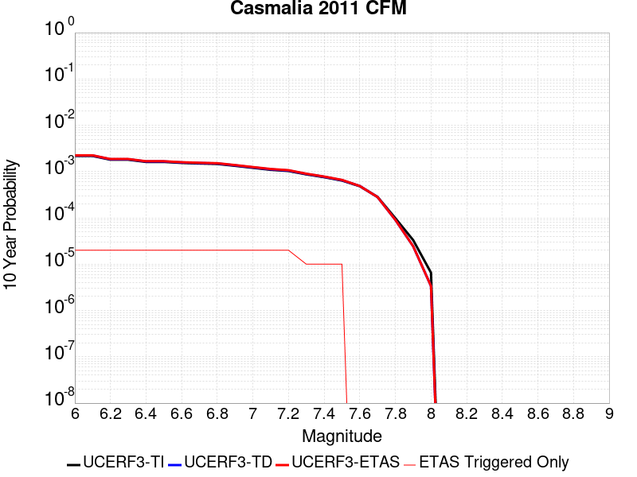 |

| Magnitude | 1 wk TI Prob | 1 wk TD Prob | 1 wk ETAS Prob | 1 wk ETAS/TD Gain | 1 wk ETAS Triggered Only | 1 mo TI Prob | 1 mo TD Prob | 1 mo ETAS Prob | 1 mo ETAS/TD Gain | 1 mo ETAS Triggered Only | 1 yr TI Prob | 1 yr TD Prob | 1 yr ETAS Prob | 1 yr ETAS/TD Gain | 1 yr ETAS Triggered Only | 10 yr TI Prob | 10 yr TD Prob | 10 yr ETAS Prob | 10 yr ETAS/TD Gain | 10 yr ETAS Triggered Only |
|-----|-----|-----|-----|-----|-----|-----|-----|-----|-----|-----|-----|-----|-----|-----|-----|-----|-----|-----|-----|-----|
| 6.0 | 4.1704893E-6 | 4.262483E-6 | 4.262483E-6 | 1.0 | 0.0 | 1.7873403E-5 | 1.8267656E-5 | 1.8267656E-5 | 1.0 | 0.0 | 2.1758694E-4 | 2.2238622E-4 | 2.32384E-4 | 1.0449568 | 1.0E-5 | 0.0021737402 | 0.0022216577 | 0.0022416133 | 1.0089823 | 2.0E-5 |
| 6.1 | 4.1704893E-6 | 4.262483E-6 | 4.262483E-6 | 1.0 | 0.0 | 1.7873403E-5 | 1.8267656E-5 | 1.8267656E-5 | 1.0 | 0.0 | 2.1758694E-4 | 2.2238622E-4 | 2.32384E-4 | 1.0449568 | 1.0E-5 | 0.0021737402 | 0.0022216577 | 0.0022416133 | 1.0089823 | 2.0E-5 |
| 6.2 | 3.457312E-6 | 3.5370217E-6 | 3.5370217E-6 | 1.0 | 0.0 | 1.4816967E-5 | 1.5158577E-5 | 1.5158577E-5 | 1.0 | 0.0 | 1.8038164E-4 | 1.8454014E-4 | 1.9453828E-4 | 1.0541787 | 1.0E-5 | 0.001802353 | 0.0018438784 | 0.0018638414 | 1.0108267 | 2.0E-5 |
| 6.3 | 3.457312E-6 | 3.5370217E-6 | 3.5370217E-6 | 1.0 | 0.0 | 1.4816967E-5 | 1.5158577E-5 | 1.5158577E-5 | 1.0 | 0.0 | 1.8038164E-4 | 1.8454014E-4 | 1.9453828E-4 | 1.0541787 | 1.0E-5 | 0.001802353 | 0.0018438784 | 0.0018638414 | 1.0108267 | 2.0E-5 |
| 6.4 | 3.0957337E-6 | 3.1692257E-6 | 3.1692257E-6 | 1.0 | 0.0 | 1.3267363E-5 | 1.3582326E-5 | 1.3582326E-5 | 1.0 | 0.0 | 1.6151817E-4 | 1.6535232E-4 | 1.7535067E-4 | 1.0604669 | 1.0E-5 | 0.0016140083 | 0.0016522991 | 0.001672266 | 1.0120844 | 2.0E-5 |
| 6.5 | 3.0957337E-6 | 3.1692257E-6 | 3.1692257E-6 | 1.0 | 0.0 | 1.3267363E-5 | 1.3582326E-5 | 1.3582326E-5 | 1.0 | 0.0 | 1.6151817E-4 | 1.6535232E-4 | 1.7535067E-4 | 1.0604669 | 1.0E-5 | 0.0016140083 | 0.0016522991 | 0.001672266 | 1.0120844 | 2.0E-5 |
| 6.6 | 2.9459152E-6 | 3.0165752E-6 | 3.0165752E-6 | 1.0 | 0.0 | 1.262529E-5 | 1.2928115E-5 | 1.2928115E-5 | 1.0 | 0.0 | 1.5370206E-4 | 1.5738848E-4 | 1.6738691E-4 | 1.0635271 | 1.0E-5 | 0.0015359579 | 0.0015727758 | 0.0015927444 | 1.0126964 | 2.0E-5 |
| 6.7 | 2.8634809E-6 | 2.9324726E-6 | 2.9324726E-6 | 1.0 | 0.0 | 1.2272003E-5 | 1.256768E-5 | 1.256768E-5 | 1.0 | 0.0 | 1.4940138E-4 | 1.530008E-4 | 1.6299928E-4 | 1.0653491 | 1.0E-5 | 0.0014930099 | 0.0015289601 | 0.0015489295 | 1.0130608 | 2.0E-5 |
| 6.8 | 2.7999822E-6 | 2.8675968E-6 | 2.8675968E-6 | 1.0 | 0.0 | 1.1999869E-5 | 1.2289643E-5 | 1.2289643E-5 | 1.0 | 0.0 | 1.460886E-4 | 1.4961617E-4 | 1.5961468E-4 | 1.0668277 | 1.0E-5 | 0.001459926 | 0.0014951597 | 0.0015151298 | 1.0133564 | 2.0E-5 |
| 6.9 | 2.551052E-6 | 2.6119649E-6 | 2.6119649E-6 | 1.0 | 0.0 | 1.0933034E-5 | 1.1194087E-5 | 1.1194087E-5 | 1.0 | 0.0 | 1.3310155E-4 | 1.3627953E-4 | 1.4627817E-4 | 1.0733685 | 1.0E-5 | 0.0013302186 | 0.0013619636 | 0.0013819364 | 1.0146646 | 2.0E-5 |
| 7.0 | 2.3081875E-6 | 2.3624088E-6 | 2.3624088E-6 | 1.0 | 0.0 | 9.892195E-6 | 1.01245705E-5 | 1.01245705E-5 | 1.0 | 0.0 | 1.20430814E-4 | 1.232597E-4 | 1.3325847E-4 | 1.0811195 | 1.0E-5 | 0.0012036557 | 0.0012319161 | 0.0012518915 | 1.0162148 | 2.0E-5 |
| 7.1 | 2.093245E-6 | 2.1417243E-6 | 2.1417243E-6 | 1.0 | 0.0 | 8.971019E-6 | 9.178786E-6 | 9.178786E-6 | 1.0 | 0.0 | 1.09216686E-4 | 1.1174601E-4 | 1.21744895E-4 | 1.0894786 | 1.0E-5 | 0.0010916302 | 0.0011169002 | 0.0011368779 | 1.0178868 | 2.0E-5 |
| 7.2 | 1.9714576E-6 | 2.0165091E-6 | 2.0165091E-6 | 1.0 | 0.0 | 8.449076E-6 | 8.642153E-6 | 8.642153E-6 | 1.0 | 0.0 | 1.0286264E-4 | 1.05213156E-4 | 1.15212104E-4 | 1.0950352 | 1.0E-5 | 0.0010281504 | 0.0010516352 | 0.0010716142 | 1.018998 | 2.0E-5 |
| 7.3 | 1.6689512E-6 | 1.7047131E-6 | 1.7047131E-6 | 1.0 | 0.0 | 7.1526288E-6 | 7.3058927E-6 | 7.3058927E-6 | 1.0 | 0.0 | 8.7079774E-5 | 8.894562E-5 | 8.894562E-5 | 1.0 | 0.0 | 8.7045657E-4 | 8.89101E-4 | 8.990921E-4 | 1.0112373 | 1.0E-5 |
| 7.4 | 1.4490954E-6 | 1.4778908E-6 | 1.4778908E-6 | 1.0 | 0.0 | 6.210394E-6 | 6.333802E-6 | 6.333802E-6 | 1.0 | 0.0 | 7.560892E-5 | 7.711132E-5 | 7.711132E-5 | 1.0 | 0.0 | 7.55832E-4 | 7.7084627E-4 | 7.8083854E-4 | 1.0129627 | 1.0E-5 |
| 7.5 | 1.226873E-6 | 1.2481701E-6 | 1.2481701E-6 | 1.0 | 0.0 | 5.2580162E-6 | 5.3492895E-6 | 5.3492895E-6 | 1.0 | 0.0 | 6.401447E-5 | 6.5125656E-5 | 6.5125656E-5 | 1.0 | 0.0 | 6.399603E-4 | 6.5106625E-4 | 6.6105975E-4 | 1.0153494 | 1.0E-5 |
| 7.6 | 9.2561345E-7 | 9.361923E-7 | 9.361923E-7 | 1.0 | 0.0 | 3.966909E-6 | 4.012247E-6 | 4.012247E-6 | 1.0 | 0.0 | 4.8296046E-5 | 4.884801E-5 | 4.884801E-5 | 1.0 | 0.0 | 4.828555E-4 | 4.8837316E-4 | 4.8837316E-4 | 1.0 | 0.0 |
| 7.7 | 5.4367933E-7 | 5.392888E-7 | 5.392888E-7 | 1.0 | 0.0 | 2.3300522E-6 | 2.3112357E-6 | 2.3112357E-6 | 1.0 | 0.0 | 2.8368017E-5 | 2.8138933E-5 | 2.8138933E-5 | 1.0 | 0.0 | 2.8364395E-4 | 2.8135383E-4 | 2.8135383E-4 | 1.0 | 0.0 |
| 7.8 | 1.8825742E-7 | 1.7342276E-7 | 1.7342276E-7 | 1.0 | 0.0 | 8.068173E-7 | 7.4324015E-7 | 7.4324015E-7 | 1.0 | 0.0 | 9.822956E-6 | 9.048912E-6 | 9.048912E-6 | 1.0 | 0.0 | 9.822522E-5 | 9.048546E-5 | 9.048546E-5 | 1.0 | 0.0 |
| 7.9 | 6.342771E-8 | 4.6790706E-8 | 4.6790706E-8 | 1.0 | 0.0 | 2.7183304E-7 | 2.0053157E-7 | 2.0053157E-7 | 1.0 | 0.0 | 3.3095623E-6 | 2.4414692E-6 | 2.4414692E-6 | 1.0 | 0.0 | 3.309513E-5 | 2.4414428E-5 | 2.4414428E-5 | 1.0 | 0.0 |
| 8.0 | 1.2574819E-8 | 6.4733463E-9 | 6.4733463E-9 | 1.0 | 0.0 | 5.3892084E-8 | 2.7742912E-8 | 2.7742912E-8 | 1.0 | 0.0 | 6.561359E-7 | 3.377699E-7 | 3.377699E-7 | 1.0 | 0.0 | 6.56134E-6 | 3.377694E-6 | 3.377694E-6 | 1.0 | 0.0 |

## San Gorgonio Pass
*[(top)](#table-of-contents)*

| 1 Week | 1 Month | 1 Year | 10 Year |
|-----|-----|-----|-----|
|  |  | 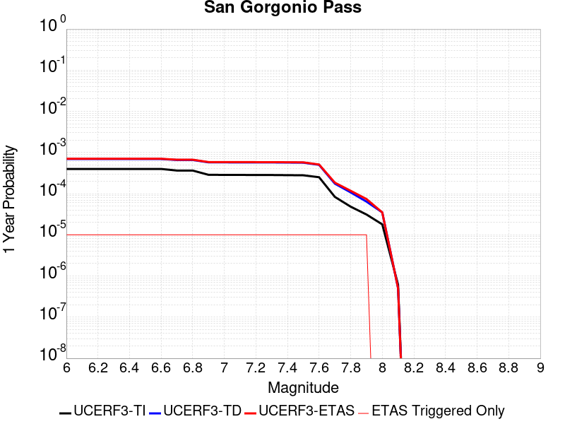 |  |

| Magnitude | 1 wk TI Prob | 1 wk TD Prob | 1 wk ETAS Prob | 1 wk ETAS/TD Gain | 1 wk ETAS Triggered Only | 1 mo TI Prob | 1 mo TD Prob | 1 mo ETAS Prob | 1 mo ETAS/TD Gain | 1 mo ETAS Triggered Only | 1 yr TI Prob | 1 yr TD Prob | 1 yr ETAS Prob | 1 yr ETAS/TD Gain | 1 yr ETAS Triggered Only | 10 yr TI Prob | 10 yr TD Prob | 10 yr ETAS Prob | 10 yr ETAS/TD Gain | 10 yr ETAS Triggered Only |
|-----|-----|-----|-----|-----|-----|-----|-----|-----|-----|-----|-----|-----|-----|-----|-----|-----|-----|-----|-----|-----|
| 6.0 | 7.644328E-6 | 1.3314231E-5 | 1.3314231E-5 | 1.0 | 0.0 | 3.2760996E-5 | 5.705979E-5 | 5.705979E-5 | 1.0 | 0.0 | 3.987921E-4 | 6.944901E-4 | 7.044832E-4 | 1.014389 | 1.0E-5 | 0.003980772 | 0.0069299806 | 0.006949842 | 1.002866 | 2.0E-5 |
| 6.1 | 7.644328E-6 | 1.3314231E-5 | 1.3314231E-5 | 1.0 | 0.0 | 3.2760996E-5 | 5.705979E-5 | 5.705979E-5 | 1.0 | 0.0 | 3.987921E-4 | 6.944901E-4 | 7.044832E-4 | 1.014389 | 1.0E-5 | 0.003980772 | 0.0069299806 | 0.006949842 | 1.002866 | 2.0E-5 |
| 6.2 | 7.644328E-6 | 1.3314231E-5 | 1.3314231E-5 | 1.0 | 0.0 | 3.2760996E-5 | 5.705979E-5 | 5.705979E-5 | 1.0 | 0.0 | 3.987921E-4 | 6.944901E-4 | 7.044832E-4 | 1.014389 | 1.0E-5 | 0.003980772 | 0.0069299806 | 0.006949842 | 1.002866 | 2.0E-5 |
| 6.3 | 7.644328E-6 | 1.3314231E-5 | 1.3314231E-5 | 1.0 | 0.0 | 3.2760996E-5 | 5.705979E-5 | 5.705979E-5 | 1.0 | 0.0 | 3.987921E-4 | 6.944901E-4 | 7.044832E-4 | 1.014389 | 1.0E-5 | 0.003980772 | 0.0069299806 | 0.006949842 | 1.002866 | 2.0E-5 |
| 6.4 | 7.644328E-6 | 1.3314231E-5 | 1.3314231E-5 | 1.0 | 0.0 | 3.2760996E-5 | 5.705979E-5 | 5.705979E-5 | 1.0 | 0.0 | 3.987921E-4 | 6.944901E-4 | 7.044832E-4 | 1.014389 | 1.0E-5 | 0.003980772 | 0.0069299806 | 0.006949842 | 1.002866 | 2.0E-5 |
| 6.5 | 7.644328E-6 | 1.3314231E-5 | 1.3314231E-5 | 1.0 | 0.0 | 3.2760996E-5 | 5.705979E-5 | 5.705979E-5 | 1.0 | 0.0 | 3.987921E-4 | 6.944901E-4 | 7.044832E-4 | 1.014389 | 1.0E-5 | 0.003980772 | 0.0069299806 | 0.006949842 | 1.002866 | 2.0E-5 |
| 6.6 | 7.644328E-6 | 1.3314231E-5 | 1.3314231E-5 | 1.0 | 0.0 | 3.2760996E-5 | 5.705979E-5 | 5.705979E-5 | 1.0 | 0.0 | 3.987921E-4 | 6.944901E-4 | 7.044832E-4 | 1.014389 | 1.0E-5 | 0.003980772 | 0.0069299806 | 0.006949842 | 1.002866 | 2.0E-5 |
| 6.7 | 6.987586E-6 | 1.2618505E-5 | 1.2618505E-5 | 1.0 | 0.0 | 2.9946454E-5 | 5.4078235E-5 | 5.4078235E-5 | 1.0 | 0.0 | 3.645371E-4 | 6.582117E-4 | 6.6820515E-4 | 1.0151827 | 1.0E-5 | 0.0036393967 | 0.0065693567 | 0.0065892255 | 1.0030245 | 2.0E-5 |
| 6.8 | 6.987586E-6 | 1.2618505E-5 | 1.2618505E-5 | 1.0 | 0.0 | 2.9946454E-5 | 5.4078235E-5 | 5.4078235E-5 | 1.0 | 0.0 | 3.645371E-4 | 6.582117E-4 | 6.6820515E-4 | 1.0151827 | 1.0E-5 | 0.0036393967 | 0.0065693567 | 0.0065892255 | 1.0030245 | 2.0E-5 |
| 6.9 | 5.504702E-6 | 1.1049368E-5 | 1.1049368E-5 | 1.0 | 0.0 | 2.3591367E-5 | 4.7353606E-5 | 4.7353606E-5 | 1.0 | 0.0 | 2.8718702E-4 | 5.7638274E-4 | 5.8637693E-4 | 1.0173396 | 1.0E-5 | 0.0028681618 | 0.005755309 | 0.005775194 | 1.003455 | 2.0E-5 |
| 7.0 | 5.4825764E-6 | 1.102571E-5 | 1.102571E-5 | 1.0 | 0.0 | 2.3496545E-5 | 4.7252215E-5 | 4.7252215E-5 | 1.0 | 0.0 | 2.8603288E-4 | 5.751489E-4 | 5.8514316E-4 | 1.0173768 | 1.0E-5 | 0.00285665 | 0.005743035 | 0.0057629202 | 1.0034624 | 2.0E-5 |
| 7.1 | 5.4692787E-6 | 1.101142E-5 | 1.101142E-5 | 1.0 | 0.0 | 2.3439556E-5 | 4.7190973E-5 | 4.7190973E-5 | 1.0 | 0.0 | 2.8533922E-4 | 5.744037E-4 | 5.8439793E-4 | 1.0173993 | 1.0E-5 | 0.0028497311 | 0.0057356213 | 0.0057555065 | 1.003467 | 2.0E-5 |
| 7.2 | 5.453661E-6 | 1.0994446E-5 | 1.0994446E-5 | 1.0 | 0.0 | 2.3372622E-5 | 4.7118232E-5 | 4.7118232E-5 | 1.0 | 0.0 | 2.8452452E-4 | 5.7351857E-4 | 5.835128E-4 | 1.0174263 | 1.0E-5 | 0.002841605 | 0.0057268157 | 0.005746701 | 1.0034723 | 2.0E-5 |
| 7.3 | 5.4422303E-6 | 1.0981369E-5 | 1.0981369E-5 | 1.0 | 0.0 | 2.3323635E-5 | 4.706219E-5 | 4.706219E-5 | 1.0 | 0.0 | 2.8392827E-4 | 5.728366E-4 | 5.8283086E-4 | 1.017447 | 1.0E-5 | 0.0028356577 | 0.005720031 | 0.005729974 | 1.0017382 | 1.0E-5 |
| 7.4 | 5.398595E-6 | 1.0928734E-5 | 1.0928734E-5 | 1.0 | 0.0 | 2.313663E-5 | 4.683662E-5 | 4.683662E-5 | 1.0 | 0.0 | 2.8165206E-4 | 5.700917E-4 | 5.80086E-4 | 1.017531 | 1.0E-5 | 0.0028129534 | 0.005692723 | 0.0057026665 | 1.0017467 | 1.0E-5 |
| 7.5 | 5.3578788E-6 | 1.0855281E-5 | 1.0855281E-5 | 1.0 | 0.0 | 2.2962136E-5 | 4.6521833E-5 | 4.6521833E-5 | 1.0 | 0.0 | 2.7952815E-4 | 5.662612E-4 | 5.762555E-4 | 1.0176497 | 1.0E-5 | 0.002791768 | 0.0056546377 | 0.0056645814 | 1.0017585 | 1.0E-5 |
| 7.6 | 4.8091474E-6 | 9.60368E-6 | 9.60368E-6 | 1.0 | 0.0 | 2.0610469E-5 | 4.1158008E-5 | 4.1158008E-5 | 1.0 | 0.0 | 2.5090357E-4 | 5.0098833E-4 | 5.1098334E-4 | 1.0199505 | 1.0E-5 | 0.0025062046 | 0.0050053033 | 0.005015253 | 1.0019879 | 1.0E-5 |
| 7.7 | 1.5991155E-6 | 3.352866E-6 | 3.352866E-6 | 1.0 | 0.0 | 6.853334E-6 | 1.4369349E-5 | 1.4369349E-5 | 1.0 | 0.0 | 8.343615E-5 | 1.7493303E-4 | 1.8493128E-4 | 1.0571548 | 1.0E-5 | 8.340483E-4 | 0.0017534072 | 0.0017633897 | 1.0056932 | 1.0E-5 |
| 7.8 | 9.258398E-7 | 2.0579948E-6 | 2.0579948E-6 | 1.0 | 0.0 | 3.967879E-6 | 8.819949E-6 | 8.819949E-6 | 1.0 | 0.0 | 4.8307855E-5 | 1.073776E-4 | 1.1737653E-4 | 1.0931193 | 1.0E-5 | 4.8297356E-4 | 0.001078687 | 0.0010886762 | 1.0092605 | 1.0E-5 |
| 7.9 | 5.975575E-7 | 1.2291794E-6 | 1.2291794E-6 | 1.0 | 0.0 | 2.5609581E-6 | 5.2679006E-6 | 5.2679006E-6 | 1.0 | 0.0 | 3.117922E-5 | 6.4134816E-5 | 7.413417E-5 | 1.1559116 | 1.0E-5 | 3.1174847E-4 | 6.463092E-4 | 6.563027E-4 | 1.0154625 | 1.0E-5 |
| 8.0 | 3.4413725E-7 | 6.7148494E-7 | 6.7148494E-7 | 1.0 | 0.0 | 1.4748731E-6 | 2.8777895E-6 | 2.8777895E-6 | 1.0 | 0.0 | 1.7956432E-5 | 3.503653E-5 | 3.503653E-5 | 1.0 | 0.0 | 1.7954981E-4 | 3.5373896E-4 | 3.5373896E-4 | 1.0 | 0.0 |
| 8.1 | 1.1787731E-8 | 9.634385E-9 | 9.634385E-9 | 1.0 | 0.0 | 5.0518846E-8 | 4.129022E-8 | 4.129022E-8 | 1.0 | 0.0 | 6.1506677E-7 | 5.027083E-7 | 5.027083E-7 | 1.0 | 0.0 | 6.1506507E-6 | 5.2424944E-6 | 5.2424944E-6 | 1.0 | 0.0 |

## Newport-Inglewood (Offshore)
*[(top)](#table-of-contents)*

| 1 Week | 1 Month | 1 Year | 10 Year |
|-----|-----|-----|-----|
|  |  |  |  |

| Magnitude | 1 wk TI Prob | 1 wk TD Prob | 1 wk ETAS Prob | 1 wk ETAS/TD Gain | 1 wk ETAS Triggered Only | 1 mo TI Prob | 1 mo TD Prob | 1 mo ETAS Prob | 1 mo ETAS/TD Gain | 1 mo ETAS Triggered Only | 1 yr TI Prob | 1 yr TD Prob | 1 yr ETAS Prob | 1 yr ETAS/TD Gain | 1 yr ETAS Triggered Only | 10 yr TI Prob | 10 yr TD Prob | 10 yr ETAS Prob | 10 yr ETAS/TD Gain | 10 yr ETAS Triggered Only |
|-----|-----|-----|-----|-----|-----|-----|-----|-----|-----|-----|-----|-----|-----|-----|-----|-----|-----|-----|-----|-----|
| 6.0 | 1.9626508E-5 | 1.8965357E-5 | 1.8965357E-5 | 1.0 | 0.0 | 8.411089E-5 | 8.1277634E-5 | 8.1277634E-5 | 1.0 | 0.0 | 0.001023569 | 9.891186E-4 | 9.991087E-4 | 1.0101 | 1.0E-5 | 0.010188672 | 0.009848503 | 0.009868307 | 1.0020108 | 2.0E-5 |
| 6.1 | 1.331886E-5 | 1.2218092E-5 | 1.2218092E-5 | 1.0 | 0.0 | 5.707958E-5 | 5.2362207E-5 | 5.2362207E-5 | 1.0 | 0.0 | 6.947222E-4 | 6.3732493E-4 | 6.4731855E-4 | 1.0156806 | 1.0E-5 | 0.006925544 | 0.006355149 | 0.0063750218 | 1.0031271 | 2.0E-5 |
| 6.2 | 1.2250852E-5 | 1.1076029E-5 | 1.1076029E-5 | 1.0 | 0.0 | 5.2502597E-5 | 4.7467838E-5 | 4.7467838E-5 | 1.0 | 0.0 | 6.3903164E-4 | 5.777687E-4 | 5.877629E-4 | 1.017298 | 1.0E-5 | 0.006371971 | 0.0057627866 | 0.0057826713 | 1.0034505 | 2.0E-5 |
| 6.3 | 1.2106258E-5 | 1.0918891E-5 | 1.0918891E-5 | 1.0 | 0.0 | 5.1882926E-5 | 4.6794412E-5 | 4.6794412E-5 | 1.0 | 0.0 | 6.3149154E-4 | 5.69574E-4 | 5.795683E-4 | 1.017547 | 1.0E-5 | 0.0062970007 | 0.005681259 | 0.0057011456 | 1.0035003 | 2.0E-5 |
| 6.4 | 1.1348758E-5 | 1.0109362E-5 | 1.0109362E-5 | 1.0 | 0.0 | 4.8636626E-5 | 4.3325123E-5 | 4.3325123E-5 | 1.0 | 0.0 | 5.919901E-4 | 5.273565E-4 | 5.3735124E-4 | 1.0189525 | 1.0E-5 | 0.005904155 | 0.0052611465 | 0.0052810414 | 1.0037814 | 2.0E-5 |
| 6.5 | 1.100837E-5 | 9.7433895E-6 | 9.7433895E-6 | 1.0 | 0.0 | 4.7177873E-5 | 4.1756717E-5 | 4.1756717E-5 | 1.0 | 0.0 | 5.7423924E-4 | 5.082702E-4 | 5.182651E-4 | 1.0196645 | 1.0E-5 | 0.005727576 | 0.0050711688 | 0.0050910674 | 1.0039239 | 2.0E-5 |
| 6.6 | 1.0634696E-5 | 9.345544E-6 | 9.345544E-6 | 1.0 | 0.0 | 4.557647E-5 | 4.0051716E-5 | 4.0051716E-5 | 1.0 | 0.0 | 5.5475225E-4 | 4.8752132E-4 | 4.975164E-4 | 1.020502 | 1.0E-5 | 0.0055336943 | 0.0048646047 | 0.0048845075 | 1.0040914 | 2.0E-5 |
| 6.7 | 9.9780855E-6 | 8.667911E-6 | 8.667911E-6 | 1.0 | 0.0 | 4.276252E-5 | 3.7147664E-5 | 3.7147664E-5 | 1.0 | 0.0 | 5.205093E-4 | 4.5217964E-4 | 4.621751E-4 | 1.0221051 | 1.0E-5 | 0.0051929182 | 0.004512675 | 0.0045325845 | 1.0044119 | 2.0E-5 |
| 6.8 | 9.59546E-6 | 8.27295E-6 | 8.27295E-6 | 1.0 | 0.0 | 4.1122752E-5 | 3.5455025E-5 | 3.5455025E-5 | 1.0 | 0.0 | 5.0055445E-4 | 4.315801E-4 | 4.4157577E-4 | 1.0231607 | 1.0E-5 | 0.004994285 | 0.004307495 | 0.004327409 | 1.004623 | 2.0E-5 |
| 6.9 | 9.000614E-6 | 7.70684E-6 | 7.70684E-6 | 1.0 | 0.0 | 3.857349E-5 | 3.30289E-5 | 3.30289E-5 | 1.0 | 0.0 | 4.6953102E-4 | 4.0205332E-4 | 4.120493E-4 | 1.0248623 | 1.0E-5 | 0.004685402 | 0.0040133307 | 0.0040232907 | 1.0024817 | 1.0E-5 |
| 7.0 | 7.4070194E-6 | 6.148904E-6 | 6.148904E-6 | 1.0 | 0.0 | 3.1743984E-5 | 2.635218E-5 | 2.635218E-5 | 1.0 | 0.0 | 3.8641447E-4 | 3.207907E-4 | 3.307875E-4 | 1.031163 | 1.0E-5 | 0.0038574322 | 0.0032032963 | 0.0032132643 | 1.0031118 | 1.0E-5 |
| 7.1 | 6.299615E-6 | 5.0565927E-6 | 5.0565927E-6 | 1.0 | 0.0 | 2.699807E-5 | 2.1670932E-5 | 2.1670932E-5 | 1.0 | 0.0 | 3.2865192E-4 | 2.638118E-4 | 2.7380916E-4 | 1.0378958 | 1.0E-5 | 0.003281663 | 0.002635001 | 0.0026449745 | 1.003785 | 1.0E-5 |
| 7.2 | 5.096653E-6 | 3.892769E-6 | 3.892769E-6 | 1.0 | 0.0 | 2.1842614E-5 | 1.668319E-5 | 1.668319E-5 | 1.0 | 0.0 | 2.6590136E-4 | 2.0309901E-4 | 2.1309698E-4 | 1.0492271 | 1.0E-5 | 0.0026558342 | 0.0020291451 | 0.0020391247 | 1.0049182 | 1.0E-5 |
| 7.3 | 3.9753018E-6 | 2.9099103E-6 | 2.9099103E-6 | 1.0 | 0.0 | 1.7036897E-5 | 1.2470985E-5 | 1.2470985E-5 | 1.0 | 0.0 | 2.0740448E-4 | 1.5182374E-4 | 1.6182222E-4 | 1.0658559 | 1.0E-5 | 0.00207211 | 0.0015172083 | 0.0015271931 | 1.0065811 | 1.0E-5 |
| 7.4 | 3.0568392E-6 | 2.1449955E-6 | 2.1449955E-6 | 1.0 | 0.0 | 1.3100675E-5 | 9.192806E-6 | 9.192806E-6 | 1.0 | 0.0 | 1.5948903E-4 | 1.1191672E-4 | 1.1191672E-4 | 1.0 | 0.0 | 0.0015937461 | 0.0011186098 | 0.0011186098 | 1.0 | 0.0 |
| 7.5 | 1.7279019E-6 | 1.1469883E-6 | 1.1469883E-6 | 1.0 | 0.0 | 7.405273E-6 | 4.915655E-6 | 4.915655E-6 | 1.0 | 0.0 | 9.015547E-5 | 5.9846494E-5 | 5.9846494E-5 | 1.0 | 0.0 | 9.01189E-4 | 5.9830764E-4 | 5.9830764E-4 | 1.0 | 0.0 |
| 7.6 | 1.1156416E-6 | 7.223012E-7 | 7.223012E-7 | 1.0 | 0.0 | 4.7813123E-6 | 3.095573E-6 | 3.095573E-6 | 1.0 | 0.0 | 5.821092E-5 | 3.7687976E-5 | 3.7687976E-5 | 1.0 | 0.0 | 5.8195676E-4 | 3.7681818E-4 | 3.7681818E-4 | 1.0 | 0.0 |
| 7.7 | 9.117973E-8 | 6.734145E-8 | 6.734145E-8 | 1.0 | 0.0 | 3.907702E-7 | 2.886062E-7 | 2.886062E-7 | 1.0 | 0.0 | 4.757617E-6 | 3.513775E-6 | 3.513775E-6 | 1.0 | 0.0 | 4.7575148E-5 | 3.5137225E-5 | 3.5137225E-5 | 1.0 | 0.0 |

## Hat Creek-McArthur-Mayfield
*[(top)](#table-of-contents)*

| 1 Week | 1 Month | 1 Year | 10 Year |
|-----|-----|-----|-----|
|  |  |  | 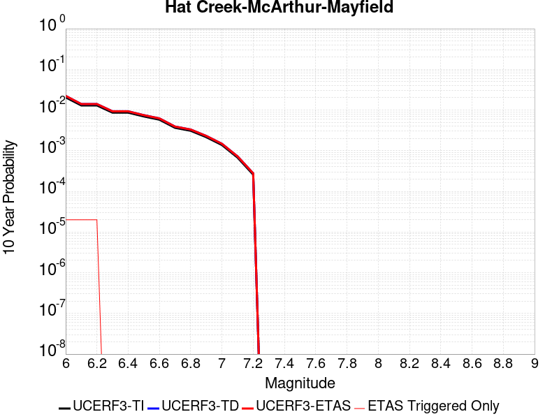 |

| Magnitude | 1 wk TI Prob | 1 wk TD Prob | 1 wk ETAS Prob | 1 wk ETAS/TD Gain | 1 wk ETAS Triggered Only | 1 mo TI Prob | 1 mo TD Prob | 1 mo ETAS Prob | 1 mo ETAS/TD Gain | 1 mo ETAS Triggered Only | 1 yr TI Prob | 1 yr TD Prob | 1 yr ETAS Prob | 1 yr ETAS/TD Gain | 1 yr ETAS Triggered Only | 10 yr TI Prob | 10 yr TD Prob | 10 yr ETAS Prob | 10 yr ETAS/TD Gain | 10 yr ETAS Triggered Only |
|-----|-----|-----|-----|-----|-----|-----|-----|-----|-----|-----|-----|-----|-----|-----|-----|-----|-----|-----|-----|-----|
| 6.0 | 3.967457E-5 | 4.315831E-5 | 4.315831E-5 | 1.0 | 0.0 | 1.7002279E-4 | 1.8495171E-4 | 1.8495171E-4 | 1.0 | 0.0 | 0.002068062 | 0.002249576 | 0.0022595534 | 1.0044353 | 1.0E-5 | 0.02048922 | 0.022280399 | 0.022299953 | 1.0008776 | 2.0E-5 |
| 6.1 | 2.5044013E-5 | 2.7071164E-5 | 2.7071164E-5 | 1.0 | 0.0 | 1.0732707E-4 | 1.1601429E-4 | 1.1601429E-4 | 1.0 | 0.0 | 0.0013059238 | 0.0014115906 | 0.0014215765 | 1.0070742 | 1.0E-5 | 0.01298276 | 0.01402966 | 0.01404938 | 1.0014056 | 2.0E-5 |
| 6.2 | 2.5044013E-5 | 2.7071164E-5 | 2.7071164E-5 | 1.0 | 0.0 | 1.0732707E-4 | 1.1601429E-4 | 1.1601429E-4 | 1.0 | 0.0 | 0.0013059238 | 0.0014115906 | 0.0014215765 | 1.0070742 | 1.0E-5 | 0.01298276 | 0.01402966 | 0.01404938 | 1.0014056 | 2.0E-5 |
| 6.3 | 1.6624012E-5 | 1.7891072E-5 | 1.7891072E-5 | 1.0 | 0.0 | 7.124382E-5 | 7.6673816E-5 | 7.6673816E-5 | 1.0 | 0.0 | 8.670483E-4 | 9.331125E-4 | 9.331125E-4 | 1.0 | 0.0 | 0.008636732 | 0.009292879 | 0.009292879 | 1.0 | 0.0 |
| 6.4 | 1.6624012E-5 | 1.7891072E-5 | 1.7891072E-5 | 1.0 | 0.0 | 7.124382E-5 | 7.6673816E-5 | 7.6673816E-5 | 1.0 | 0.0 | 8.670483E-4 | 9.331125E-4 | 9.331125E-4 | 1.0 | 0.0 | 0.008636732 | 0.009292879 | 0.009292879 | 1.0 | 0.0 |
| 6.5 | 1.3394842E-5 | 1.4392137E-5 | 1.4392137E-5 | 1.0 | 0.0 | 5.7405203E-5 | 6.167916E-5 | 6.167916E-5 | 1.0 | 0.0 | 6.986842E-4 | 7.506906E-4 | 7.506906E-4 | 1.0 | 0.0 | 0.006964916 | 0.0074821403 | 0.0074821403 | 1.0 | 0.0 |
| 6.6 | 1.1137514E-5 | 1.1954546E-5 | 1.1954546E-5 | 1.0 | 0.0 | 4.7731326E-5 | 5.1232782E-5 | 5.1232782E-5 | 1.0 | 0.0 | 5.809739E-4 | 6.2358467E-4 | 6.2358467E-4 | 1.0 | 0.0 | 0.005794574 | 0.00621877 | 0.00621877 | 1.0 | 0.0 |
| 6.7 | 7.0200663E-6 | 7.5242897E-6 | 7.5242897E-6 | 1.0 | 0.0 | 3.008565E-5 | 3.2246568E-5 | 3.2246568E-5 | 1.0 | 0.0 | 3.6623122E-4 | 3.925328E-4 | 3.925328E-4 | 1.0 | 0.0 | 0.0036562826 | 0.0039185574 | 0.0039185574 | 1.0 | 0.0 |
| 6.8 | 5.940172E-6 | 6.3654766E-6 | 6.3654766E-6 | 1.0 | 0.0 | 2.545763E-5 | 2.7280335E-5 | 2.7280335E-5 | 1.0 | 0.0 | 3.0990256E-4 | 3.3208873E-4 | 3.3208873E-4 | 1.0 | 0.0 | 0.0030947074 | 0.0033160534 | 0.0033160534 | 1.0 | 0.0 |
| 6.9 | 4.129831E-6 | 4.423547E-6 | 4.423547E-6 | 1.0 | 0.0 | 1.7699154E-5 | 1.8957926E-5 | 1.8957926E-5 | 1.0 | 0.0 | 2.154659E-4 | 2.3078908E-4 | 2.3078908E-4 | 1.0 | 0.0 | 0.002152571 | 0.0023055724 | 0.0023055724 | 1.0 | 0.0 |
| 7.0 | 2.6512955E-6 | 2.8374002E-6 | 2.8374002E-6 | 1.0 | 0.0 | 1.1362646E-5 | 1.2160232E-5 | 1.2160232E-5 | 1.0 | 0.0 | 1.3833142E-4 | 1.480412E-4 | 1.480412E-4 | 1.0 | 0.0 | 0.0013824535 | 0.0014794683 | 0.0014794683 | 1.0 | 0.0 |
| 7.1 | 1.2992575E-6 | 1.3909317E-6 | 1.3909317E-6 | 1.0 | 0.0 | 5.568235E-6 | 5.961124E-6 | 5.961124E-6 | 1.0 | 0.0 | 6.779115E-5 | 7.257448E-5 | 7.257448E-5 | 1.0 | 0.0 | 6.7770475E-4 | 7.2552945E-4 | 7.2552945E-4 | 1.0 | 0.0 |
| 7.2 | 4.968191E-7 | 5.3271475E-7 | 5.3271475E-7 | 1.0 | 0.0 | 2.1292228E-6 | 2.283062E-6 | 2.283062E-6 | 1.0 | 0.0 | 2.592298E-5 | 2.7796052E-5 | 2.7796052E-5 | 1.0 | 0.0 | 2.5919956E-4 | 2.7793812E-4 | 2.7793812E-4 | 1.0 | 0.0 |

## Big Pine (East)
*[(top)](#table-of-contents)*

| 1 Week | 1 Month | 1 Year | 10 Year |
|-----|-----|-----|-----|
|  |  |  |  |

| Magnitude | 1 wk TI Prob | 1 wk TD Prob | 1 wk ETAS Prob | 1 wk ETAS/TD Gain | 1 wk ETAS Triggered Only | 1 mo TI Prob | 1 mo TD Prob | 1 mo ETAS Prob | 1 mo ETAS/TD Gain | 1 mo ETAS Triggered Only | 1 yr TI Prob | 1 yr TD Prob | 1 yr ETAS Prob | 1 yr ETAS/TD Gain | 1 yr ETAS Triggered Only | 10 yr TI Prob | 10 yr TD Prob | 10 yr ETAS Prob | 10 yr ETAS/TD Gain | 10 yr ETAS Triggered Only |
|-----|-----|-----|-----|-----|-----|-----|-----|-----|-----|-----|-----|-----|-----|-----|-----|-----|-----|-----|-----|-----|
| 6.0 | 9.916913E-6 | 1.2816984E-5 | 1.2816984E-5 | 1.0 | 0.0 | 4.250036E-5 | 5.49289E-5 | 5.49289E-5 | 1.0 | 0.0 | 5.173191E-4 | 6.685763E-4 | 6.885629E-4 | 1.0298944 | 2.0E-5 | 0.0051611643 | 0.006670441 | 0.0066903075 | 1.0029783 | 2.0E-5 |
| 6.1 | 9.916913E-6 | 1.2816984E-5 | 1.2816984E-5 | 1.0 | 0.0 | 4.250036E-5 | 5.49289E-5 | 5.49289E-5 | 1.0 | 0.0 | 5.173191E-4 | 6.685763E-4 | 6.885629E-4 | 1.0298944 | 2.0E-5 | 0.0051611643 | 0.006670441 | 0.0066903075 | 1.0029783 | 2.0E-5 |
| 6.2 | 9.916913E-6 | 1.2816984E-5 | 1.2816984E-5 | 1.0 | 0.0 | 4.250036E-5 | 5.49289E-5 | 5.49289E-5 | 1.0 | 0.0 | 5.173191E-4 | 6.685763E-4 | 6.885629E-4 | 1.0298944 | 2.0E-5 | 0.0051611643 | 0.006670441 | 0.0066903075 | 1.0029783 | 2.0E-5 |
| 6.3 | 5.479711E-6 | 8.112951E-6 | 8.112951E-6 | 1.0 | 0.0 | 2.3484265E-5 | 3.4769346E-5 | 3.4769346E-5 | 1.0 | 0.0 | 2.858834E-4 | 4.2323777E-4 | 4.432293E-4 | 1.0472348 | 2.0E-5 | 0.0028551589 | 0.004227244 | 0.004247159 | 1.0047113 | 2.0E-5 |
| 6.4 | 5.465009E-6 | 8.097245E-6 | 8.097245E-6 | 1.0 | 0.0 | 2.3421257E-5 | 3.4702036E-5 | 3.4702036E-5 | 1.0 | 0.0 | 2.851165E-4 | 4.2241855E-4 | 4.424101E-4 | 1.0473264 | 2.0E-5 | 0.0028475097 | 0.0042190826 | 0.004238998 | 1.0047203 | 2.0E-5 |
| 6.5 | 4.826767E-6 | 7.422301E-6 | 7.422301E-6 | 1.0 | 0.0 | 2.068598E-5 | 3.180949E-5 | 3.180949E-5 | 1.0 | 0.0 | 2.518227E-4 | 3.872145E-4 | 4.0720674E-4 | 1.051631 | 2.0E-5 | 0.0025153751 | 0.003868283 | 0.0038882056 | 1.0051502 | 2.0E-5 |
| 6.6 | 4.3146847E-6 | 6.8822374E-6 | 6.8822374E-6 | 1.0 | 0.0 | 1.8491375E-5 | 2.9494982E-5 | 2.9494982E-5 | 1.0 | 0.0 | 2.2510924E-4 | 3.590447E-4 | 3.7903752E-4 | 1.0556834 | 2.0E-5 | 0.0022488134 | 0.0035874986 | 0.0036074268 | 1.0055549 | 2.0E-5 |
| 6.7 | 3.6968106E-6 | 5.9954727E-6 | 5.9954727E-6 | 1.0 | 0.0 | 1.5843378E-5 | 2.5694639E-5 | 2.5694639E-5 | 1.0 | 0.0 | 1.9287605E-4 | 3.1278885E-4 | 3.327826E-4 | 1.0639209 | 2.0E-5 | 0.0019270873 | 0.0031262483 | 0.0031461858 | 1.0063775 | 2.0E-5 |
| 6.8 | 3.4671132E-6 | 5.702177E-6 | 5.702177E-6 | 1.0 | 0.0 | 1.4858972E-5 | 2.4437682E-5 | 2.4437682E-5 | 1.0 | 0.0 | 1.8089297E-4 | 2.974896E-4 | 3.1748365E-4 | 1.0672092 | 2.0E-5 | 0.0018074579 | 0.002973667 | 0.0029936077 | 1.0067058 | 2.0E-5 |
| 6.9 | 2.7686972E-6 | 4.825223E-6 | 4.825223E-6 | 1.0 | 0.0 | 1.1865792E-5 | 2.0679368E-5 | 2.0679368E-5 | 1.0 | 0.0 | 1.4445644E-4 | 2.5174298E-4 | 2.6174047E-4 | 1.039713 | 1.0E-5 | 0.0014436257 | 0.0025172636 | 0.0025272386 | 1.0039625 | 1.0E-5 |
| 7.0 | 2.1472624E-6 | 3.9850406E-6 | 3.9850406E-6 | 1.0 | 0.0 | 9.20252E-6 | 1.7078637E-5 | 1.7078637E-5 | 1.0 | 0.0 | 1.12034926E-4 | 2.079131E-4 | 2.1791102E-4 | 1.048087 | 1.0E-5 | 0.0011197845 | 0.0020798394 | 0.0020898185 | 1.004798 | 1.0E-5 |
| 7.1 | 1.7018335E-6 | 3.344876E-6 | 3.344876E-6 | 1.0 | 0.0 | 7.293552E-6 | 1.4335106E-5 | 1.4335106E-5 | 1.0 | 0.0 | 8.879537E-5 | 1.7451629E-4 | 1.8451455E-4 | 1.0572913 | 1.0E-5 | 8.87599E-4 | 0.0017464145 | 0.001756397 | 1.005716 | 1.0E-5 |
| 7.2 | 1.25603E-6 | 2.794484E-6 | 2.794484E-6 | 1.0 | 0.0 | 5.3829745E-6 | 1.1976307E-5 | 1.1976307E-5 | 1.0 | 0.0 | 6.553574E-5 | 1.4580201E-4 | 1.4580201E-4 | 1.0 | 0.0 | 6.551642E-4 | 0.001459661 | 0.001459661 | 1.0 | 0.0 |
| 7.3 | 1.112297E-6 | 2.610332E-6 | 2.610332E-6 | 1.0 | 0.0 | 4.7669787E-6 | 1.118709E-5 | 1.118709E-5 | 1.0 | 0.0 | 5.803642E-5 | 1.3619453E-4 | 1.3619453E-4 | 1.0 | 0.0 | 5.802127E-4 | 0.0013635408 | 0.0013635408 | 1.0 | 0.0 |
| 7.4 | 1.0137181E-6 | 2.4834917E-6 | 2.4834917E-6 | 1.0 | 0.0 | 4.3444993E-6 | 1.0643494E-5 | 1.0643494E-5 | 1.0 | 0.0 | 5.2892992E-5 | 1.2957705E-4 | 1.2957705E-4 | 1.0 | 0.0 | 5.288041E-4 | 0.0012972289 | 0.0012972289 | 1.0 | 0.0 |
| 7.5 | 9.598608E-7 | 2.4071483E-6 | 2.4071483E-6 | 1.0 | 0.0 | 4.1136827E-6 | 1.031631E-5 | 1.031631E-5 | 1.0 | 0.0 | 5.0082934E-5 | 1.2559404E-4 | 1.2559404E-4 | 1.0 | 0.0 | 5.007165E-4 | 0.0012572526 | 0.0012572526 | 1.0 | 0.0 |
| 7.6 | 7.929459E-7 | 2.0448588E-6 | 2.0448588E-6 | 1.0 | 0.0 | 3.3983351E-6 | 8.763653E-6 | 8.763653E-6 | 1.0 | 0.0 | 4.1373947E-5 | 1.06692416E-4 | 1.06692416E-4 | 1.0 | 0.0 | 4.1366243E-4 | 0.0010685222 | 0.0010685222 | 1.0 | 0.0 |
| 7.7 | 4.155788E-7 | 1.1605589E-6 | 1.1605589E-6 | 1.0 | 0.0 | 1.7810507E-6 | 4.9738146E-6 | 4.9738146E-6 | 1.0 | 0.0 | 2.1684076E-5 | 6.0554554E-5 | 6.0554554E-5 | 1.0 | 0.0 | 2.1681961E-4 | 6.0857297E-4 | 6.0857297E-4 | 1.0 | 0.0 |
| 7.8 | 1.14666925E-7 | 2.592015E-7 | 2.592015E-7 | 1.0 | 0.0 | 4.914296E-7 | 1.1108631E-6 | 1.1108631E-6 | 1.0 | 0.0 | 5.9831386E-6 | 1.3524678E-5 | 1.3524678E-5 | 1.0 | 0.0 | 5.9829777E-5 | 1.3634123E-4 | 1.3634123E-4 | 1.0 | 0.0 |
| 7.9 | 2.9231824E-8 | 4.1463963E-8 | 4.1463963E-8 | 1.0 | 0.0 | 1.2527924E-7 | 1.7770269E-7 | 1.7770269E-7 | 1.0 | 0.0 | 1.5252737E-6 | 2.1635283E-6 | 2.1635283E-6 | 1.0 | 0.0 | 1.5252632E-5 | 2.1967755E-5 | 2.1967755E-5 | 1.0 | 0.0 |

## Great Valley 05 Pittsburg - Kirby Hills alt1
*[(top)](#table-of-contents)*

| 1 Week | 1 Month | 1 Year | 10 Year |
|-----|-----|-----|-----|
|  |  |  |  |

| Magnitude | 1 wk TI Prob | 1 wk TD Prob | 1 wk ETAS Prob | 1 wk ETAS/TD Gain | 1 wk ETAS Triggered Only | 1 mo TI Prob | 1 mo TD Prob | 1 mo ETAS Prob | 1 mo ETAS/TD Gain | 1 mo ETAS Triggered Only | 1 yr TI Prob | 1 yr TD Prob | 1 yr ETAS Prob | 1 yr ETAS/TD Gain | 1 yr ETAS Triggered Only | 10 yr TI Prob | 10 yr TD Prob | 10 yr ETAS Prob | 10 yr ETAS/TD Gain | 10 yr ETAS Triggered Only |
|-----|-----|-----|-----|-----|-----|-----|-----|-----|-----|-----|-----|-----|-----|-----|-----|-----|-----|-----|-----|-----|
| 6.0 | 4.187212E-5 | 5.3442072E-5 | 5.3442072E-5 | 1.0 | 0.0 | 1.794396E-4 | 2.290231E-4 | 2.290231E-4 | 1.0 | 0.0 | 0.002182488 | 0.0027857882 | 0.0027957603 | 1.0035796 | 1.0E-5 | 0.021611776 | 0.02760304 | 0.027612763 | 1.0003523 | 1.0E-5 |
| 6.1 | 4.187212E-5 | 5.3442072E-5 | 5.3442072E-5 | 1.0 | 0.0 | 1.794396E-4 | 2.290231E-4 | 2.290231E-4 | 1.0 | 0.0 | 0.002182488 | 0.0027857882 | 0.0027957603 | 1.0035796 | 1.0E-5 | 0.021611776 | 0.02760304 | 0.027612763 | 1.0003523 | 1.0E-5 |
| 6.2 | 1.7353306E-5 | 2.2154374E-5 | 2.2154374E-5 | 1.0 | 0.0 | 7.436919E-5 | 9.494618E-5 | 9.494618E-5 | 1.0 | 0.0 | 9.050688E-4 | 0.0011557543 | 0.0011557543 | 1.0 | 0.0 | 0.009013915 | 0.011535114 | 0.011535114 | 1.0 | 0.0 |
| 6.3 | 1.7353306E-5 | 2.2154374E-5 | 2.2154374E-5 | 1.0 | 0.0 | 7.436919E-5 | 9.494618E-5 | 9.494618E-5 | 1.0 | 0.0 | 9.050688E-4 | 0.0011557543 | 0.0011557543 | 1.0 | 0.0 | 0.009013915 | 0.011535114 | 0.011535114 | 1.0 | 0.0 |
| 6.4 | 1.4028824E-5 | 1.7900597E-5 | 1.7900597E-5 | 1.0 | 0.0 | 6.0122147E-5 | 7.671684E-5 | 7.671684E-5 | 1.0 | 0.0 | 7.3174125E-4 | 9.340275E-4 | 9.340275E-4 | 1.0 | 0.0 | 0.0072933645 | 0.009338138 | 0.009338138 | 1.0 | 0.0 |

## Swain Ravine - Spenceville
*[(top)](#table-of-contents)*

| 1 Week | 1 Month | 1 Year | 10 Year |
|-----|-----|-----|-----|
|  | 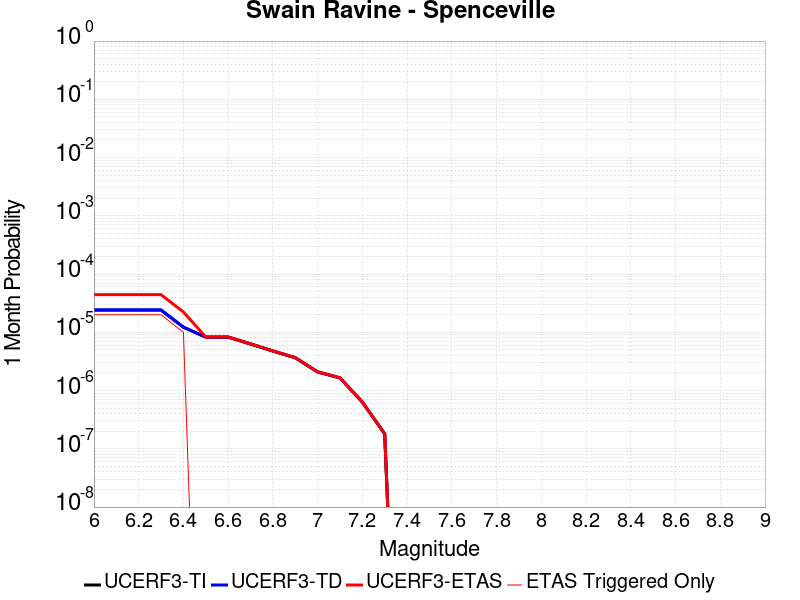 |  | 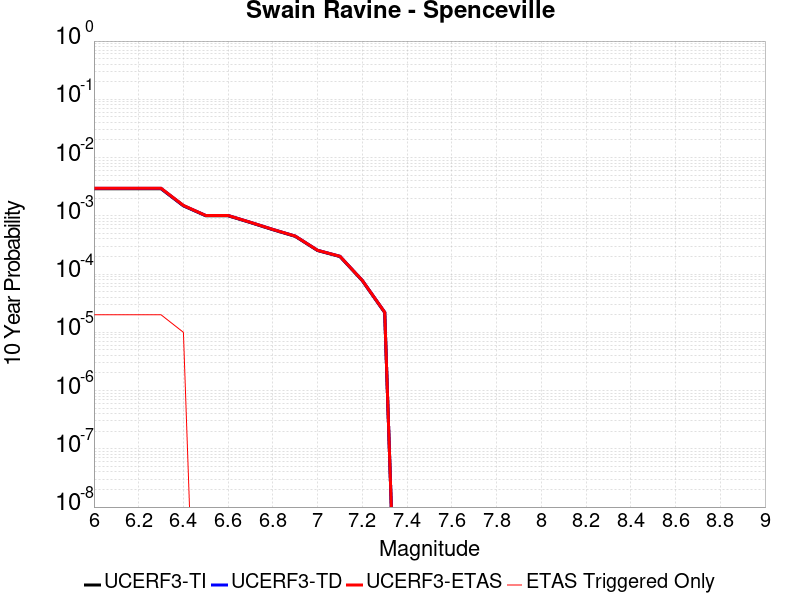 |

| Magnitude | 1 wk TI Prob | 1 wk TD Prob | 1 wk ETAS Prob | 1 wk ETAS/TD Gain | 1 wk ETAS Triggered Only | 1 mo TI Prob | 1 mo TD Prob | 1 mo ETAS Prob | 1 mo ETAS/TD Gain | 1 mo ETAS Triggered Only | 1 yr TI Prob | 1 yr TD Prob | 1 yr ETAS Prob | 1 yr ETAS/TD Gain | 1 yr ETAS Triggered Only | 10 yr TI Prob | 10 yr TD Prob | 10 yr ETAS Prob | 10 yr ETAS/TD Gain | 10 yr ETAS Triggered Only |
|-----|-----|-----|-----|-----|-----|-----|-----|-----|-----|-----|-----|-----|-----|-----|-----|-----|-----|-----|-----|-----|
| 6.0 | 5.596169E-6 | 5.663794E-6 | 2.5663681E-5 | 4.531182 | 2.0E-5 | 2.398336E-5 | 2.4273193E-5 | 4.4272707E-5 | 1.8239342 | 2.0E-5 | 2.9195828E-4 | 2.9548878E-4 | 3.1548287E-4 | 1.0676645 | 2.0E-5 | 0.00291575 | 0.002951228 | 0.002971169 | 1.0067568 | 2.0E-5 |
| 6.1 | 5.596169E-6 | 5.663794E-6 | 2.5663681E-5 | 4.531182 | 2.0E-5 | 2.398336E-5 | 2.4273193E-5 | 4.4272707E-5 | 1.8239342 | 2.0E-5 | 2.9195828E-4 | 2.9548878E-4 | 3.1548287E-4 | 1.0676645 | 2.0E-5 | 0.00291575 | 0.002951228 | 0.002971169 | 1.0067568 | 2.0E-5 |
| 6.2 | 5.596169E-6 | 5.663794E-6 | 2.5663681E-5 | 4.531182 | 2.0E-5 | 2.398336E-5 | 2.4273193E-5 | 4.4272707E-5 | 1.8239342 | 2.0E-5 | 2.9195828E-4 | 2.9548878E-4 | 3.1548287E-4 | 1.0676645 | 2.0E-5 | 0.00291575 | 0.002951228 | 0.002971169 | 1.0067568 | 2.0E-5 |
| 6.3 | 5.596169E-6 | 5.663794E-6 | 2.5663681E-5 | 4.531182 | 2.0E-5 | 2.398336E-5 | 2.4273193E-5 | 4.4272707E-5 | 1.8239342 | 2.0E-5 | 2.9195828E-4 | 2.9548878E-4 | 3.1548287E-4 | 1.0676645 | 2.0E-5 | 0.00291575 | 0.002951228 | 0.002971169 | 1.0067568 | 2.0E-5 |
| 6.4 | 2.8426775E-6 | 2.874144E-6 | 1.2874115E-5 | 4.4792867 | 1.0E-5 | 1.2182847E-5 | 1.2317704E-5 | 2.2317581E-5 | 1.8118296 | 1.0E-5 | 1.4831607E-4 | 1.4995811E-4 | 1.5995662E-4 | 1.0666753 | 1.0E-5 | 0.0014821711 | 0.0014986077 | 0.0015085926 | 1.0066628 | 1.0E-5 |
| 6.5 | 1.9210793E-6 | 1.9414147E-6 | 1.9414147E-6 | 1.0 | 0.0 | 8.233172E-6 | 8.320323E-6 | 8.320323E-6 | 1.0 | 0.0 | 1.0023425E-4 | 1.0129536E-4 | 1.0129536E-4 | 1.0 | 0.0 | 0.0010018905 | 0.0010125053 | 0.0010125053 | 1.0 | 0.0 |
| 6.6 | 1.9210793E-6 | 1.9414147E-6 | 1.9414147E-6 | 1.0 | 0.0 | 8.233172E-6 | 8.320323E-6 | 8.320323E-6 | 1.0 | 0.0 | 1.0023425E-4 | 1.0129536E-4 | 1.0129536E-4 | 1.0 | 0.0 | 0.0010018905 | 0.0010125053 | 0.0010125053 | 1.0 | 0.0 |
| 6.7 | 1.4667394E-6 | 1.4818934E-6 | 1.4818934E-6 | 1.0 | 0.0 | 6.286011E-6 | 6.3509565E-6 | 6.3509565E-6 | 1.0 | 0.0 | 7.65295E-5 | 7.732023E-5 | 7.732023E-5 | 1.0 | 0.0 | 7.6503144E-4 | 7.72941E-4 | 7.72941E-4 | 1.0 | 0.0 |
| 6.8 | 1.1076943E-6 | 1.1189535E-6 | 1.1189535E-6 | 1.0 | 0.0 | 4.747252E-6 | 4.7955064E-6 | 4.7955064E-6 | 1.0 | 0.0 | 5.7796264E-5 | 5.838377E-5 | 5.838377E-5 | 1.0 | 0.0 | 5.778124E-4 | 5.836887E-4 | 5.836887E-4 | 1.0 | 0.0 |
| 6.9 | 8.514296E-7 | 8.600095E-7 | 8.600095E-7 | 1.0 | 0.0 | 3.648979E-6 | 3.6857498E-6 | 3.6857498E-6 | 1.0 | 0.0 | 4.442541E-5 | 4.4873108E-5 | 4.4873108E-5 | 1.0 | 0.0 | 4.441653E-4 | 4.4864335E-4 | 4.4864335E-4 | 1.0 | 0.0 |
| 7.0 | 4.8544706E-7 | 4.9033E-7 | 4.9033E-7 | 1.0 | 0.0 | 2.0804857E-6 | 2.1014127E-6 | 2.1014127E-6 | 1.0 | 0.0 | 2.532962E-5 | 2.5584413E-5 | 2.5584413E-5 | 1.0 | 0.0 | 2.5326732E-4 | 2.5581598E-4 | 2.5581598E-4 | 1.0 | 0.0 |
| 7.1 | 3.829186E-7 | 3.8678783E-7 | 3.8678783E-7 | 1.0 | 0.0 | 1.6410787E-6 | 1.6576612E-6 | 1.6576612E-6 | 1.0 | 0.0 | 1.997995E-5 | 2.0181848E-5 | 2.0181848E-5 | 1.0 | 0.0 | 1.9978154E-4 | 2.0180122E-4 | 2.0180122E-4 | 1.0 | 0.0 |
| 7.2 | 1.4726595E-7 | 1.4879437E-7 | 1.4879437E-7 | 1.0 | 0.0 | 6.3113964E-7 | 6.3769005E-7 | 6.3769005E-7 | 1.0 | 0.0 | 7.684098E-6 | 7.763854E-6 | 7.763854E-6 | 1.0 | 0.0 | 7.6838325E-5 | 7.763636E-5 | 7.763636E-5 | 1.0 | 0.0 |
| 7.3 | 4.1880604E-8 | 4.2324306E-8 | 4.2324306E-8 | 1.0 | 0.0 | 1.7948828E-7 | 1.8138988E-7 | 1.8138988E-7 | 1.0 | 0.0 | 2.1852677E-6 | 2.2084218E-6 | 2.2084218E-6 | 1.0 | 0.0 | 2.1852462E-5 | 2.2084218E-5 | 2.2084218E-5 | 1.0 | 0.0 |

## Mount Diablo Thrust North CFM
*[(top)](#table-of-contents)*

| 1 Week | 1 Month | 1 Year | 10 Year |
|-----|-----|-----|-----|
|  |  |  | 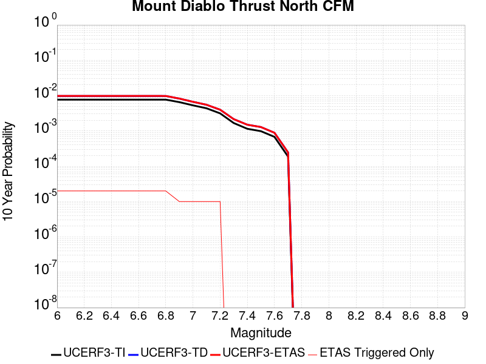 |

| Magnitude | 1 wk TI Prob | 1 wk TD Prob | 1 wk ETAS Prob | 1 wk ETAS/TD Gain | 1 wk ETAS Triggered Only | 1 mo TI Prob | 1 mo TD Prob | 1 mo ETAS Prob | 1 mo ETAS/TD Gain | 1 mo ETAS Triggered Only | 1 yr TI Prob | 1 yr TD Prob | 1 yr ETAS Prob | 1 yr ETAS/TD Gain | 1 yr ETAS Triggered Only | 10 yr TI Prob | 10 yr TD Prob | 10 yr ETAS Prob | 10 yr ETAS/TD Gain | 10 yr ETAS Triggered Only |
|-----|-----|-----|-----|-----|-----|-----|-----|-----|-----|-----|-----|-----|-----|-----|-----|-----|-----|-----|-----|-----|
| 6.0 | 1.479628E-5 | 1.876973E-5 | 2.8769542E-5 | 1.5327626 | 1.0E-5 | 6.341109E-5 | 8.043928E-5 | 9.043847E-5 | 1.1243074 | 1.0E-5 | 7.717565E-4 | 9.789177E-4 | 9.889079E-4 | 1.0102054 | 1.0E-5 | 0.007690818 | 0.009747355 | 0.009767161 | 1.0020318 | 2.0E-5 |
| 6.1 | 1.479628E-5 | 1.876973E-5 | 2.8769542E-5 | 1.5327626 | 1.0E-5 | 6.341109E-5 | 8.043928E-5 | 9.043847E-5 | 1.1243074 | 1.0E-5 | 7.717565E-4 | 9.789177E-4 | 9.889079E-4 | 1.0102054 | 1.0E-5 | 0.007690818 | 0.009747355 | 0.009767161 | 1.0020318 | 2.0E-5 |
| 6.2 | 1.479628E-5 | 1.876973E-5 | 2.8769542E-5 | 1.5327626 | 1.0E-5 | 6.341109E-5 | 8.043928E-5 | 9.043847E-5 | 1.1243074 | 1.0E-5 | 7.717565E-4 | 9.789177E-4 | 9.889079E-4 | 1.0102054 | 1.0E-5 | 0.007690818 | 0.009747355 | 0.009767161 | 1.0020318 | 2.0E-5 |
| 6.3 | 1.479628E-5 | 1.876973E-5 | 2.8769542E-5 | 1.5327626 | 1.0E-5 | 6.341109E-5 | 8.043928E-5 | 9.043847E-5 | 1.1243074 | 1.0E-5 | 7.717565E-4 | 9.789177E-4 | 9.889079E-4 | 1.0102054 | 1.0E-5 | 0.007690818 | 0.009747355 | 0.009767161 | 1.0020318 | 2.0E-5 |
| 6.4 | 1.479628E-5 | 1.876973E-5 | 2.8769542E-5 | 1.5327626 | 1.0E-5 | 6.341109E-5 | 8.043928E-5 | 9.043847E-5 | 1.1243074 | 1.0E-5 | 7.717565E-4 | 9.789177E-4 | 9.889079E-4 | 1.0102054 | 1.0E-5 | 0.007690818 | 0.009747355 | 0.009767161 | 1.0020318 | 2.0E-5 |
| 6.5 | 1.479628E-5 | 1.876973E-5 | 2.8769542E-5 | 1.5327626 | 1.0E-5 | 6.341109E-5 | 8.043928E-5 | 9.043847E-5 | 1.1243074 | 1.0E-5 | 7.717565E-4 | 9.789177E-4 | 9.889079E-4 | 1.0102054 | 1.0E-5 | 0.007690818 | 0.009747355 | 0.009767161 | 1.0020318 | 2.0E-5 |
| 6.6 | 1.479016E-5 | 1.8762841E-5 | 2.8762654E-5 | 1.5329583 | 1.0E-5 | 6.338486E-5 | 8.040976E-5 | 9.0408954E-5 | 1.124353 | 1.0E-5 | 7.714374E-4 | 9.785586E-4 | 9.885489E-4 | 1.0102091 | 1.0E-5 | 0.007687649 | 0.009743797 | 0.009763601 | 1.0020326 | 2.0E-5 |
| 6.7 | 1.479016E-5 | 1.8762841E-5 | 2.8762654E-5 | 1.5329583 | 1.0E-5 | 6.338486E-5 | 8.040976E-5 | 9.0408954E-5 | 1.124353 | 1.0E-5 | 7.714374E-4 | 9.785586E-4 | 9.885489E-4 | 1.0102091 | 1.0E-5 | 0.007687649 | 0.009743797 | 0.009763601 | 1.0020326 | 2.0E-5 |
| 6.8 | 1.4771667E-5 | 1.8741612E-5 | 2.8741424E-5 | 1.5335621 | 1.0E-5 | 6.330561E-5 | 8.031878E-5 | 9.0317975E-5 | 1.1244938 | 1.0E-5 | 7.704732E-4 | 9.774519E-4 | 9.874422E-4 | 1.0102206 | 1.0E-5 | 0.007678074 | 0.009732827 | 0.009752632 | 1.0020349 | 2.0E-5 |
| 6.9 | 1.2548234E-5 | 1.5822025E-5 | 2.5821868E-5 | 1.6320204 | 1.0E-5 | 5.3777036E-5 | 6.780694E-5 | 7.780626E-5 | 1.1474675 | 1.0E-5 | 6.545387E-4 | 8.2524033E-4 | 8.352321E-4 | 1.0121077 | 1.0E-5 | 0.006526142 | 0.008222396 | 0.008232313 | 1.0012062 | 1.0E-5 |
| 7.0 | 1.01754185E-5 | 1.2808985E-5 | 2.2808857E-5 | 1.780692 | 1.0E-5 | 4.360821E-5 | 5.4894506E-5 | 6.489396E-5 | 1.1821576 | 1.0E-5 | 5.308006E-4 | 6.6813733E-4 | 6.7813066E-4 | 1.014957 | 1.0E-5 | 0.005295345 | 0.006661672 | 0.0066716056 | 1.0014911 | 1.0E-5 |
| 7.1 | 8.398341E-6 | 1.0554712E-5 | 2.0554608E-5 | 1.9474341 | 1.0E-5 | 3.5992394E-5 | 4.5233704E-5 | 5.5233253E-5 | 1.2210641 | 1.0E-5 | 4.3811928E-4 | 5.5058225E-4 | 5.605768E-4 | 1.0181526 | 1.0E-5 | 0.0043725655 | 0.0054924674 | 0.0055024126 | 1.0018107 | 1.0E-5 |
| 7.2 | 6.024759E-6 | 7.648385E-6 | 1.7648308E-5 | 2.3074555 | 1.0E-5 | 2.582014E-5 | 3.2778386E-5 | 4.2778054E-5 | 1.3050691 | 1.0E-5 | 3.1431485E-4 | 3.9900444E-4 | 4.0900047E-4 | 1.0250524 | 1.0E-5 | 0.0031387066 | 0.0039830892 | 0.0039930493 | 1.0025007 | 1.0E-5 |
| 7.3 | 3.2099704E-6 | 4.1355897E-6 | 4.1355897E-6 | 1.0 | 0.0 | 1.3756943E-5 | 1.7723836E-5 | 1.7723836E-5 | 1.0 | 0.0 | 1.674779E-4 | 2.1576651E-4 | 2.1576651E-4 | 1.0 | 0.0 | 0.0016735174 | 0.0021556707 | 0.0021556707 | 1.0 | 0.0 |
| 7.4 | 2.2041513E-6 | 2.8734273E-6 | 2.8734273E-6 | 1.0 | 0.0 | 9.4463285E-6 | 1.2314631E-5 | 1.2314631E-5 | 1.0 | 0.0 | 1.1500298E-4 | 1.499204E-4 | 1.499204E-4 | 1.0 | 0.0 | 0.0011494348 | 0.0014982593 | 0.0014982593 | 1.0 | 0.0 |
| 7.5 | 1.8869501E-6 | 2.4696565E-6 | 2.4696565E-6 | 1.0 | 0.0 | 8.086904E-6 | 1.0584199E-5 | 1.0584199E-5 | 1.0 | 0.0 | 9.845361E-5 | 1.2885507E-4 | 1.2885507E-4 | 1.0 | 0.0 | 9.841E-4 | 0.0012878602 | 0.0012878602 | 1.0 | 0.0 |
| 7.6 | 1.3012458E-6 | 1.7005032E-6 | 1.7005032E-6 | 1.0 | 0.0 | 5.576756E-6 | 7.287851E-6 | 7.287851E-6 | 1.0 | 0.0 | 6.7894885E-5 | 8.8726025E-5 | 8.8726025E-5 | 1.0 | 0.0 | 6.787415E-4 | 8.869415E-4 | 8.869415E-4 | 1.0 | 0.0 |
| 7.7 | 3.603383E-7 | 4.716468E-7 | 4.716468E-7 | 1.0 | 0.0 | 1.5443061E-6 | 2.021342E-6 | 2.021342E-6 | 1.0 | 0.0 | 1.8801764E-5 | 2.4609568E-5 | 2.4609568E-5 | 1.0 | 0.0 | 1.8800174E-4 | 2.46074E-4 | 2.46074E-4 | 1.0 | 0.0 |

## Gillem - Big Crack 2011 CFM
*[(top)](#table-of-contents)*

| 1 Week | 1 Month | 1 Year | 10 Year |
|-----|-----|-----|-----|
|  |  |  |  |

| Magnitude | 1 wk TI Prob | 1 wk TD Prob | 1 wk ETAS Prob | 1 wk ETAS/TD Gain | 1 wk ETAS Triggered Only | 1 mo TI Prob | 1 mo TD Prob | 1 mo ETAS Prob | 1 mo ETAS/TD Gain | 1 mo ETAS Triggered Only | 1 yr TI Prob | 1 yr TD Prob | 1 yr ETAS Prob | 1 yr ETAS/TD Gain | 1 yr ETAS Triggered Only | 10 yr TI Prob | 10 yr TD Prob | 10 yr ETAS Prob | 10 yr ETAS/TD Gain | 10 yr ETAS Triggered Only |
|-----|-----|-----|-----|-----|-----|-----|-----|-----|-----|-----|-----|-----|-----|-----|-----|-----|-----|-----|-----|-----|
| 6.0 | 2.196852E-5 | 2.3604485E-5 | 2.3604485E-5 | 1.0 | 0.0 | 9.4147406E-5 | 1.01158665E-4 | 1.01158665E-4 | 1.0 | 0.0 | 0.0011456419 | 0.0012309998 | 0.0012409874 | 1.0081135 | 1.0E-5 | 0.011397537 | 0.012250669 | 0.0122704245 | 1.0016125 | 2.0E-5 |
| 6.1 | 9.992795E-6 | 1.071189E-5 | 1.071189E-5 | 1.0 | 0.0 | 4.2825563E-5 | 4.5907396E-5 | 4.5907396E-5 | 1.0 | 0.0 | 5.2127644E-4 | 5.587975E-4 | 5.6879193E-4 | 1.0178856 | 1.0E-5 | 0.0052005537 | 0.0055757347 | 0.005585679 | 1.0017835 | 1.0E-5 |
| 6.2 | 9.992795E-6 | 1.071189E-5 | 1.071189E-5 | 1.0 | 0.0 | 4.2825563E-5 | 4.5907396E-5 | 4.5907396E-5 | 1.0 | 0.0 | 5.2127644E-4 | 5.587975E-4 | 5.6879193E-4 | 1.0178856 | 1.0E-5 | 0.0052005537 | 0.0055757347 | 0.005585679 | 1.0017835 | 1.0E-5 |
| 6.3 | 4.6127884E-6 | 4.942657E-6 | 4.942657E-6 | 1.0 | 0.0 | 1.9768944E-5 | 2.1182668E-5 | 2.1182668E-5 | 1.0 | 0.0 | 2.406603E-4 | 2.5787292E-4 | 2.5787292E-4 | 1.0 | 0.0 | 0.0024039985 | 0.0025761751 | 0.0025761751 | 1.0 | 0.0 |
| 6.4 | 4.6127884E-6 | 4.942657E-6 | 4.942657E-6 | 1.0 | 0.0 | 1.9768944E-5 | 2.1182668E-5 | 2.1182668E-5 | 1.0 | 0.0 | 2.406603E-4 | 2.5787292E-4 | 2.5787292E-4 | 1.0 | 0.0 | 0.0024039985 | 0.0025761751 | 0.0025761751 | 1.0 | 0.0 |
| 6.5 | 2.716712E-6 | 2.9111113E-6 | 2.9111113E-6 | 1.0 | 0.0 | 1.1643E-5 | 1.24761455E-5 | 1.24761455E-5 | 1.0 | 0.0 | 1.417443E-4 | 1.5188892E-4 | 1.5188892E-4 | 1.0 | 0.0 | 0.0014165393 | 0.001518089 | 0.001518089 | 1.0 | 0.0 |
| 6.6 | 1.3818255E-6 | 1.4820689E-6 | 1.4820689E-6 | 1.0 | 0.0 | 5.922096E-6 | 6.3517155E-6 | 6.3517155E-6 | 1.0 | 0.0 | 7.209913E-5 | 7.7330624E-5 | 7.7330624E-5 | 1.0 | 0.0 | 7.2075747E-4 | 7.7315804E-4 | 7.7315804E-4 | 1.0 | 0.0 |

## Great Valley 08 (Quinto)
*[(top)](#table-of-contents)*

| 1 Week | 1 Month | 1 Year | 10 Year |
|-----|-----|-----|-----|
|  |  |  |  |

| Magnitude | 1 wk TI Prob | 1 wk TD Prob | 1 wk ETAS Prob | 1 wk ETAS/TD Gain | 1 wk ETAS Triggered Only | 1 mo TI Prob | 1 mo TD Prob | 1 mo ETAS Prob | 1 mo ETAS/TD Gain | 1 mo ETAS Triggered Only | 1 yr TI Prob | 1 yr TD Prob | 1 yr ETAS Prob | 1 yr ETAS/TD Gain | 1 yr ETAS Triggered Only | 10 yr TI Prob | 10 yr TD Prob | 10 yr ETAS Prob | 10 yr ETAS/TD Gain | 10 yr ETAS Triggered Only |
|-----|-----|-----|-----|-----|-----|-----|-----|-----|-----|-----|-----|-----|-----|-----|-----|-----|-----|-----|-----|-----|
| 6.0 | 7.737697E-6 | 8.253038E-6 | 1.8252955E-5 | 2.211665 | 1.0E-5 | 3.3161137E-5 | 3.536979E-5 | 4.5369437E-5 | 1.2827171 | 1.0E-5 | 4.0366207E-4 | 4.3056096E-4 | 4.4055664E-4 | 1.0232155 | 1.0E-5 | 0.004029296 | 0.0042991205 | 0.0043190345 | 1.0046321 | 2.0E-5 |
| 6.1 | 7.737697E-6 | 8.253038E-6 | 1.8252955E-5 | 2.211665 | 1.0E-5 | 3.3161137E-5 | 3.536979E-5 | 4.5369437E-5 | 1.2827171 | 1.0E-5 | 4.0366207E-4 | 4.3056096E-4 | 4.4055664E-4 | 1.0232155 | 1.0E-5 | 0.004029296 | 0.0042991205 | 0.0043190345 | 1.0046321 | 2.0E-5 |
| 6.2 | 7.737697E-6 | 8.253038E-6 | 1.8252955E-5 | 2.211665 | 1.0E-5 | 3.3161137E-5 | 3.536979E-5 | 4.5369437E-5 | 1.2827171 | 1.0E-5 | 4.0366207E-4 | 4.3056096E-4 | 4.4055664E-4 | 1.0232155 | 1.0E-5 | 0.004029296 | 0.0042991205 | 0.0043190345 | 1.0046321 | 2.0E-5 |
| 6.3 | 5.374012E-6 | 5.7505736E-6 | 5.7505736E-6 | 1.0 | 0.0 | 2.3031276E-5 | 2.4645145E-5 | 2.4645145E-5 | 1.0 | 0.0 | 2.803697E-4 | 3.0002446E-4 | 3.0002446E-4 | 1.0 | 0.0 | 0.0028001624 | 0.0029972875 | 0.0030072576 | 1.0033263 | 1.0E-5 |
| 6.4 | 5.374012E-6 | 5.7505736E-6 | 5.7505736E-6 | 1.0 | 0.0 | 2.3031276E-5 | 2.4645145E-5 | 2.4645145E-5 | 1.0 | 0.0 | 2.803697E-4 | 3.0002446E-4 | 3.0002446E-4 | 1.0 | 0.0 | 0.0028001624 | 0.0029972875 | 0.0030072576 | 1.0033263 | 1.0E-5 |
| 6.5 | 3.65427E-6 | 3.941324E-6 | 3.941324E-6 | 1.0 | 0.0 | 1.5661062E-5 | 1.689132E-5 | 1.689132E-5 | 1.0 | 0.0 | 1.9065675E-4 | 2.0563944E-4 | 2.0563944E-4 | 1.0 | 0.0 | 0.0019049325 | 0.0020551833 | 0.0020651626 | 1.0048558 | 1.0E-5 |
| 6.6 | 3.6143538E-6 | 3.8985104E-6 | 3.8985104E-6 | 1.0 | 0.0 | 1.5489995E-5 | 1.6707834E-5 | 1.6707834E-5 | 1.0 | 0.0 | 1.8857437E-4 | 2.0340596E-4 | 2.0340596E-4 | 1.0 | 0.0 | 0.0018841444 | 0.0020328893 | 0.0020428689 | 1.0049092 | 1.0E-5 |
| 6.7 | 2.4821015E-6 | 2.6857067E-6 | 2.6857067E-6 | 1.0 | 0.0 | 1.0637535E-5 | 1.1510153E-5 | 1.1510153E-5 | 1.0 | 0.0 | 1.2950429E-4 | 1.4013276E-4 | 1.4013276E-4 | 1.0 | 0.0 | 0.0012942884 | 0.0014009989 | 0.0014109849 | 1.0071278 | 1.0E-5 |
| 6.8 | 4.7110538E-7 | 5.193021E-7 | 5.193021E-7 | 1.0 | 0.0 | 2.0190216E-6 | 2.2255786E-6 | 2.2255786E-6 | 1.0 | 0.0 | 2.458131E-5 | 2.70961E-5 | 2.70961E-5 | 1.0 | 0.0 | 2.457859E-4 | 2.7092977E-4 | 2.7092977E-4 | 1.0 | 0.0 |
| 6.9 | 3.958685E-7 | 4.3703452E-7 | 4.3703452E-7 | 1.0 | 0.0 | 1.6965782E-6 | 1.8730038E-6 | 1.8730038E-6 | 1.0 | 0.0 | 2.0655643E-5 | 2.28036E-5 | 2.28036E-5 | 1.0 | 0.0 | 2.0653724E-4 | 2.2801422E-4 | 2.2801422E-4 | 1.0 | 0.0 |
| 7.0 | 2.70294E-7 | 2.9920008E-7 | 2.9920008E-7 | 1.0 | 0.0 | 1.1584025E-6 | 1.2822856E-6 | 1.2822856E-6 | 1.0 | 0.0 | 1.4103458E-5 | 1.5611728E-5 | 1.5611728E-5 | 1.0 | 0.0 | 1.4102564E-4 | 1.5610759E-4 | 1.5610759E-4 | 1.0 | 0.0 |
| 7.1 | 1.4828602E-7 | 1.6469107E-7 | 1.6469107E-7 | 1.0 | 0.0 | 6.3551136E-7 | 7.058187E-7 | 7.058187E-7 | 1.0 | 0.0 | 7.737323E-6 | 8.593317E-6 | 8.593317E-6 | 1.0 | 0.0 | 7.737054E-5 | 8.593065E-5 | 8.593065E-5 | 1.0 | 0.0 |

## Los Osos 2011
*[(top)](#table-of-contents)*

| 1 Week | 1 Month | 1 Year | 10 Year |
|-----|-----|-----|-----|
|  |  |  |  |

| Magnitude | 1 wk TI Prob | 1 wk TD Prob | 1 wk ETAS Prob | 1 wk ETAS/TD Gain | 1 wk ETAS Triggered Only | 1 mo TI Prob | 1 mo TD Prob | 1 mo ETAS Prob | 1 mo ETAS/TD Gain | 1 mo ETAS Triggered Only | 1 yr TI Prob | 1 yr TD Prob | 1 yr ETAS Prob | 1 yr ETAS/TD Gain | 1 yr ETAS Triggered Only | 10 yr TI Prob | 10 yr TD Prob | 10 yr ETAS Prob | 10 yr ETAS/TD Gain | 10 yr ETAS Triggered Only |
|-----|-----|-----|-----|-----|-----|-----|-----|-----|-----|-----|-----|-----|-----|-----|-----|-----|-----|-----|-----|-----|
| 6.0 | 4.8871775E-6 | 4.9814835E-6 | 1.4981433E-5 | 3.007424 | 1.0E-5 | 2.0944879E-5 | 2.1349055E-5 | 4.1348627E-5 | 1.9367896 | 2.0E-5 | 2.5497406E-4 | 2.5989654E-4 | 2.7989133E-4 | 1.0769337 | 2.0E-5 | 0.002546817 | 0.0025962002 | 0.0026161484 | 1.0076835 | 2.0E-5 |
| 6.1 | 4.8871775E-6 | 4.9814835E-6 | 1.4981433E-5 | 3.007424 | 1.0E-5 | 2.0944879E-5 | 2.1349055E-5 | 4.1348627E-5 | 1.9367896 | 2.0E-5 | 2.5497406E-4 | 2.5989654E-4 | 2.7989133E-4 | 1.0769337 | 2.0E-5 | 0.002546817 | 0.0025962002 | 0.0026161484 | 1.0076835 | 2.0E-5 |
| 6.2 | 4.8871775E-6 | 4.9814835E-6 | 1.4981433E-5 | 3.007424 | 1.0E-5 | 2.0944879E-5 | 2.1349055E-5 | 4.1348627E-5 | 1.9367896 | 2.0E-5 | 2.5497406E-4 | 2.5989654E-4 | 2.7989133E-4 | 1.0769337 | 2.0E-5 | 0.002546817 | 0.0025962002 | 0.0026161484 | 1.0076835 | 2.0E-5 |
| 6.3 | 4.8871775E-6 | 4.9814835E-6 | 1.4981433E-5 | 3.007424 | 1.0E-5 | 2.0944879E-5 | 2.1349055E-5 | 4.1348627E-5 | 1.9367896 | 2.0E-5 | 2.5497406E-4 | 2.5989654E-4 | 2.7989133E-4 | 1.0769337 | 2.0E-5 | 0.002546817 | 0.0025962002 | 0.0026161484 | 1.0076835 | 2.0E-5 |
| 6.4 | 4.8871775E-6 | 4.9814835E-6 | 1.4981433E-5 | 3.007424 | 1.0E-5 | 2.0944879E-5 | 2.1349055E-5 | 4.1348627E-5 | 1.9367896 | 2.0E-5 | 2.5497406E-4 | 2.5989654E-4 | 2.7989133E-4 | 1.0769337 | 2.0E-5 | 0.002546817 | 0.0025962002 | 0.0026161484 | 1.0076835 | 2.0E-5 |
| 6.5 | 3.1724062E-6 | 3.223395E-6 | 1.3223363E-5 | 4.102309 | 1.0E-5 | 1.3595956E-5 | 1.3814477E-5 | 3.38142E-5 | 2.4477365 | 2.0E-5 | 1.6551818E-4 | 1.681784E-4 | 1.8817505E-4 | 1.1189014 | 2.0E-5 | 0.0016539496 | 0.0016805249 | 0.0017004913 | 1.011881 | 2.0E-5 |
| 6.6 | 3.1022591E-6 | 3.1511045E-6 | 1.3151073E-5 | 4.1734805 | 1.0E-5 | 1.3295328E-5 | 1.3504664E-5 | 3.3504395E-5 | 2.4809499 | 2.0E-5 | 1.618586E-4 | 1.64407E-4 | 1.8440372E-4 | 1.1216294 | 2.0E-5 | 0.0016174077 | 0.0016428665 | 0.0016628337 | 1.0121539 | 2.0E-5 |
| 6.7 | 2.611518E-6 | 2.6491832E-6 | 1.2649157E-5 | 4.7747383 | 1.0E-5 | 1.1192172E-5 | 1.1353593E-5 | 3.1353367E-5 | 2.7615368 | 2.0E-5 | 1.3625617E-4 | 1.3822126E-4 | 1.582185E-4 | 1.1446755 | 2.0E-5 | 0.0013617266 | 0.0013813575 | 0.0014013299 | 1.0144585 | 2.0E-5 |
| 6.8 | 2.4780884E-6 | 2.5121592E-6 | 1.2512134E-5 | 4.9806294 | 1.0E-5 | 1.0620336E-5 | 1.0766353E-5 | 3.0766136E-5 | 2.8576193 | 2.0E-5 | 1.2929492E-4 | 1.3107249E-4 | 1.5106988E-4 | 1.1525673 | 2.0E-5 | 0.0012921972 | 0.001309956 | 0.0013299298 | 1.0152477 | 2.0E-5 |
| 6.9 | 2.1376322E-6 | 2.1635055E-6 | 1.2163484E-5 | 5.622118 | 1.0E-5 | 9.161248E-6 | 9.272134E-6 | 2.9271949E-5 | 3.1569808 | 2.0E-5 | 1.1153249E-4 | 1.128824E-4 | 1.3288014E-4 | 1.1771555 | 2.0E-5 | 0.0011147653 | 0.0011282525 | 0.0011482299 | 1.0177065 | 2.0E-5 |
| 7.0 | 1.9282882E-6 | 1.9494585E-6 | 1.1949439E-5 | 6.1296196 | 1.0E-5 | 8.264066E-6 | 8.354796E-6 | 2.8354629E-5 | 3.3938148 | 2.0E-5 | 1.0061036E-4 | 1.017149E-4 | 1.2171287E-4 | 1.1966081 | 2.0E-5 | 0.0010056482 | 0.0010166848 | 0.0010366645 | 1.0196518 | 2.0E-5 |
| 7.1 | 1.6353226E-6 | 1.6501118E-6 | 1.6501118E-6 | 1.0 | 0.0 | 7.0085066E-6 | 7.0718884E-6 | 7.0718884E-6 | 1.0 | 0.0 | 8.532523E-5 | 8.609685E-5 | 8.609685E-5 | 1.0 | 0.0 | 8.529247E-4 | 8.6063566E-4 | 8.6063566E-4 | 1.0 | 0.0 |
| 7.2 | 1.4446276E-6 | 1.4553341E-6 | 1.4553341E-6 | 1.0 | 0.0 | 6.191247E-6 | 6.237131E-6 | 6.237131E-6 | 1.0 | 0.0 | 7.537582E-5 | 7.593443E-5 | 7.593443E-5 | 1.0 | 0.0 | 7.535026E-4 | 7.590854E-4 | 7.590854E-4 | 1.0 | 0.0 |
| 7.3 | 1.2014582E-6 | 1.2069073E-6 | 1.2069073E-6 | 1.0 | 0.0 | 5.149096E-6 | 5.1724496E-6 | 5.1724496E-6 | 1.0 | 0.0 | 6.268844E-5 | 6.297276E-5 | 6.297276E-5 | 1.0 | 0.0 | 6.267076E-4 | 6.295495E-4 | 6.295495E-4 | 1.0 | 0.0 |
| 7.4 | 9.707733E-7 | 9.709773E-7 | 9.709773E-7 | 1.0 | 0.0 | 4.16045E-6 | 4.161325E-6 | 4.161325E-6 | 1.0 | 0.0 | 5.0652303E-5 | 5.066295E-5 | 5.066295E-5 | 1.0 | 0.0 | 5.064076E-4 | 5.065143E-4 | 5.065143E-4 | 1.0 | 0.0 |
| 7.5 | 7.174908E-7 | 7.1149134E-7 | 7.1149134E-7 | 1.0 | 0.0 | 3.074957E-6 | 3.0492452E-6 | 3.0492452E-6 | 1.0 | 0.0 | 3.743696E-5 | 3.712393E-5 | 3.712393E-5 | 1.0 | 0.0 | 3.7430652E-4 | 3.7117745E-4 | 3.7117745E-4 | 1.0 | 0.0 |
| 7.6 | 4.5535776E-7 | 4.420792E-7 | 4.420792E-7 | 1.0 | 0.0 | 1.9515319E-6 | 1.8946238E-6 | 1.8946238E-6 | 1.0 | 0.0 | 2.3759641E-5 | 2.3066801E-5 | 2.3066801E-5 | 1.0 | 0.0 | 2.37571E-4 | 2.3064416E-4 | 2.3064416E-4 | 1.0 | 0.0 |
| 7.7 | 2.1173553E-7 | 1.9060796E-7 | 1.9060796E-7 | 1.0 | 0.0 | 9.0743765E-7 | 8.1689103E-7 | 8.1689103E-7 | 1.0 | 0.0 | 1.1047998E-5 | 9.945603E-6 | 9.945603E-6 | 1.0 | 0.0 | 1.1047449E-4 | 9.945161E-5 | 9.945161E-5 | 1.0 | 0.0 |
| 7.8 | 9.873608E-8 | 7.3675665E-8 | 7.3675665E-8 | 1.0 | 0.0 | 4.2315455E-7 | 3.157528E-7 | 3.157528E-7 | 1.0 | 0.0 | 5.1518946E-6 | 3.8442836E-6 | 3.8442836E-6 | 1.0 | 0.0 | 5.1517753E-5 | 3.8442176E-5 | 3.8442176E-5 | 1.0 | 0.0 |
| 7.9 | 5.4399106E-8 | 3.1880155E-8 | 3.1880155E-8 | 1.0 | 0.0 | 2.33139E-7 | 1.3662923E-7 | 1.3662923E-7 | 1.0 | 0.0 | 2.8384638E-6 | 1.6634596E-6 | 1.6634596E-6 | 1.0 | 0.0 | 2.8384275E-5 | 1.6634473E-5 | 1.6634473E-5 | 1.0 | 0.0 |
| 8.0 | 1.817203E-8 | 8.420727E-9 | 8.420727E-9 | 1.0 | 0.0 | 7.7880124E-8 | 3.608883E-8 | 3.608883E-8 | 1.0 | 0.0 | 9.481901E-7 | 4.393814E-7 | 4.393814E-7 | 1.0 | 0.0 | 9.481861E-6 | 4.3938057E-6 | 4.3938057E-6 | 1.0 | 0.0 |

## Hayward (So) 2011 CFM
*[(top)](#table-of-contents)*

| 1 Week | 1 Month | 1 Year | 10 Year |
|-----|-----|-----|-----|
|  |  |  |  |

| Magnitude | 1 wk TI Prob | 1 wk TD Prob | 1 wk ETAS Prob | 1 wk ETAS/TD Gain | 1 wk ETAS Triggered Only | 1 mo TI Prob | 1 mo TD Prob | 1 mo ETAS Prob | 1 mo ETAS/TD Gain | 1 mo ETAS Triggered Only | 1 yr TI Prob | 1 yr TD Prob | 1 yr ETAS Prob | 1 yr ETAS/TD Gain | 1 yr ETAS Triggered Only | 10 yr TI Prob | 10 yr TD Prob | 10 yr ETAS Prob | 10 yr ETAS/TD Gain | 10 yr ETAS Triggered Only |
|-----|-----|-----|-----|-----|-----|-----|-----|-----|-----|-----|-----|-----|-----|-----|-----|-----|-----|-----|-----|-----|
| 6.0 | 1.8091932E-4 | 3.570541E-4 | 3.6705052E-4 | 1.027997 | 1.0E-5 | 7.751381E-4 | 0.0015293444 | 0.0015393291 | 1.0065287 | 1.0E-5 | 0.00939654 | 0.018463207 | 0.018473024 | 1.0005317 | 1.0E-5 | 0.090090066 | 0.16673161 | 0.16674827 | 1.0000999 | 2.0E-5 |
| 6.1 | 1.8091932E-4 | 3.570541E-4 | 3.6705052E-4 | 1.027997 | 1.0E-5 | 7.751381E-4 | 0.0015293444 | 0.0015393291 | 1.0065287 | 1.0E-5 | 0.00939654 | 0.018463207 | 0.018473024 | 1.0005317 | 1.0E-5 | 0.090090066 | 0.16673161 | 0.16674827 | 1.0000999 | 2.0E-5 |
| 6.2 | 1.8091932E-4 | 3.570541E-4 | 3.6705052E-4 | 1.027997 | 1.0E-5 | 7.751381E-4 | 0.0015293444 | 0.0015393291 | 1.0065287 | 1.0E-5 | 0.00939654 | 0.018463207 | 0.018473024 | 1.0005317 | 1.0E-5 | 0.090090066 | 0.16673161 | 0.16674827 | 1.0000999 | 2.0E-5 |
| 6.3 | 1.7322872E-4 | 3.426234E-4 | 3.5261997E-4 | 1.0291766 | 1.0E-5 | 7.4219756E-4 | 0.0014675693 | 0.0014775546 | 1.006804 | 1.0E-5 | 0.0089988755 | 0.017723544 | 0.017733367 | 1.0005542 | 1.0E-5 | 0.08643075 | 0.16066726 | 0.16068403 | 1.0001044 | 2.0E-5 |
| 6.4 | 1.6334097E-4 | 3.234411E-4 | 3.3343787E-4 | 1.0309075 | 1.0E-5 | 6.998449E-4 | 0.0013854484 | 0.0013954346 | 1.0072079 | 1.0E-5 | 0.008487372 | 0.016739385 | 0.016749218 | 1.0005873 | 1.0E-5 | 0.081704415 | 0.15255594 | 0.15257289 | 1.0001111 | 2.0E-5 |
| 6.5 | 1.5600289E-4 | 3.1018828E-4 | 3.2018515E-4 | 1.0322285 | 1.0E-5 | 6.684125E-4 | 0.0013287093 | 0.001338696 | 1.0075161 | 1.0E-5 | 0.008107598 | 0.016058935 | 0.016068773 | 1.0006127 | 1.0E-5 | 0.078181036 | 0.14683272 | 0.14684978 | 1.0001162 | 2.0E-5 |
| 6.6 | 1.4046066E-4 | 2.8032906E-4 | 2.9032625E-4 | 1.0356624 | 1.0E-5 | 6.018354E-4 | 0.0012008639 | 0.0012108518 | 1.0083174 | 1.0E-5 | 0.0073027555 | 0.014524006 | 0.014533861 | 1.0006785 | 1.0E-5 | 0.07067384 | 0.13391982 | 0.13393715 | 1.0001293 | 2.0E-5 |
| 6.7 | 1.14696966E-4 | 2.3271477E-4 | 2.4271243E-4 | 1.042961 | 1.0E-5 | 4.914658E-4 | 9.969729E-4 | 0.0010069628 | 1.0100204 | 1.0E-5 | 0.0059671924 | 0.012071652 | 0.012081532 | 1.0008184 | 1.0E-5 | 0.058094822 | 0.11274672 | 0.11276447 | 1.0001574 | 2.0E-5 |
| 6.8 | 9.3874296E-5 | 1.8861453E-4 | 1.9861264E-4 | 1.0530082 | 1.0E-5 | 4.0225635E-4 | 8.0810126E-4 | 8.180932E-4 | 1.0123647 | 1.0E-5 | 0.0048864787 | 0.009794984 | 0.009804886 | 1.0010109 | 1.0E-5 | 0.047804173 | 0.09259856 | 0.09260763 | 1.000098 | 1.0E-5 |
| 6.9 | 5.551852E-5 | 1.072948E-4 | 1.072948E-4 | 1.0 | 0.0 | 2.3791482E-4 | 4.5975443E-4 | 4.5975443E-4 | 1.0 | 0.0 | 0.0028927654 | 0.0055832625 | 0.0055832625 | 1.0 | 0.0 | 0.028553981 | 0.054245494 | 0.054245494 | 1.0 | 0.0 |
| 7.0 | 4.2662363E-5 | 8.2464416E-5 | 8.2464416E-5 | 1.0 | 0.0 | 1.8282588E-4 | 3.5337146E-4 | 3.5337146E-4 | 1.0 | 0.0 | 0.0022236328 | 0.0042938837 | 0.0042938837 | 1.0 | 0.0 | 0.022015138 | 0.042064495 | 0.042064495 | 1.0 | 0.0 |
| 7.1 | 3.305886E-5 | 6.3019055E-5 | 6.3019055E-5 | 1.0 | 0.0 | 1.4167312E-4 | 2.700538E-4 | 2.700538E-4 | 1.0 | 0.0 | 0.0017235056 | 0.0032829668 | 0.0032829668 | 1.0 | 0.0 | 0.017101998 | 0.032452874 | 0.032452874 | 1.0 | 0.0 |
| 7.2 | 2.9856887E-5 | 5.7013647E-5 | 5.7013647E-5 | 1.0 | 0.0 | 1.2795182E-4 | 2.4432142E-4 | 2.4432142E-4 | 1.0 | 0.0 | 0.0015567001 | 0.0029705726 | 0.0029705726 | 1.0 | 0.0 | 0.015458403 | 0.029453589 | 0.029453589 | 1.0 | 0.0 |
| 7.3 | 2.4559737E-5 | 4.599088E-5 | 4.599088E-5 | 1.0 | 0.0 | 1.0525176E-4 | 1.9708896E-4 | 1.9708896E-4 | 1.0 | 0.0 | 0.0012806869 | 0.0023969305 | 0.0023969305 | 1.0 | 0.0 | 0.012733313 | 0.023857482 | 0.023857482 | 1.0 | 0.0 |
| 7.4 | 1.9002231E-5 | 3.5049303E-5 | 3.5049303E-5 | 1.0 | 0.0 | 8.143559E-5 | 1.502027E-4 | 1.502027E-4 | 1.0 | 0.0 | 9.910273E-4 | 0.0018271938 | 0.0018271938 | 1.0 | 0.0 | 0.009866194 | 0.018258283 | 0.018258283 | 1.0 | 0.0 |
| 7.5 | 1.2783333E-5 | 2.3330069E-5 | 2.3330069E-5 | 1.0 | 0.0 | 5.4784563E-5 | 9.998221E-5 | 9.998221E-5 | 1.0 | 0.0 | 6.667979E-4 | 0.0012166094 | 0.0012166094 | 1.0 | 0.0 | 0.006648007 | 0.012209582 | 0.012209582 | 1.0 | 0.0 |
| 7.6 | 4.8149627E-6 | 8.887544E-6 | 8.887544E-6 | 1.0 | 0.0 | 2.063539E-5 | 3.8088925E-5 | 3.8088925E-5 | 1.0 | 0.0 | 2.5120692E-4 | 4.636352E-4 | 4.636352E-4 | 1.0 | 0.0 | 0.0025092314 | 0.0046812436 | 0.0046812436 | 1.0 | 0.0 |
| 7.7 | 6.0838227E-7 | 1.2056693E-6 | 1.2056693E-6 | 1.0 | 0.0 | 2.6073499E-6 | 5.1671436E-6 | 5.1671436E-6 | 1.0 | 0.0 | 3.174402E-5 | 6.290816E-5 | 6.290816E-5 | 1.0 | 0.0 | 3.1739488E-4 | 6.5293367E-4 | 6.5293367E-4 | 1.0 | 0.0 |
| 7.8 | 4.5542808E-7 | 9.792182E-7 | 9.792182E-7 | 1.0 | 0.0 | 1.9518332E-6 | 4.1966427E-6 | 4.1966427E-6 | 1.0 | 0.0 | 2.376331E-5 | 5.1092928E-5 | 5.1092928E-5 | 1.0 | 0.0 | 2.3760769E-4 | 5.321372E-4 | 5.321372E-4 | 1.0 | 0.0 |
| 7.9 | 3.3016747E-7 | 7.386335E-7 | 7.386335E-7 | 1.0 | 0.0 | 1.4150027E-6 | 3.1655684E-6 | 3.1655684E-6 | 1.0 | 0.0 | 1.7227521E-5 | 3.8540114E-5 | 3.8540114E-5 | 1.0 | 0.0 | 1.7226185E-4 | 3.9930744E-4 | 3.9930744E-4 | 1.0 | 0.0 |
| 8.0 | 2.347038E-7 | 5.4714894E-7 | 5.4714894E-7 | 1.0 | 0.0 | 1.0058731E-6 | 2.344922E-6 | 2.344922E-6 | 1.0 | 0.0 | 1.2246436E-5 | 2.8549053E-5 | 2.8549053E-5 | 1.0 | 0.0 | 1.2245761E-4 | 2.9355253E-4 | 2.9355253E-4 | 1.0 | 0.0 |
| 8.1 | 1.18822804E-7 | 2.6058973E-7 | 2.6058973E-7 | 1.0 | 0.0 | 5.092405E-7 | 1.1168127E-6 | 1.1168127E-6 | 1.0 | 0.0 | 6.1999854E-6 | 1.359711E-5 | 1.359711E-5 | 1.0 | 0.0 | 6.199812E-5 | 1.3917852E-4 | 1.3917852E-4 | 1.0 | 0.0 |

## Raymond
*[(top)](#table-of-contents)*

| 1 Week | 1 Month | 1 Year | 10 Year |
|-----|-----|-----|-----|
|  |  |  | 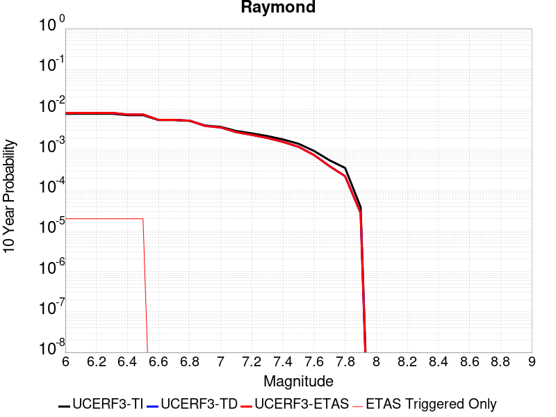 |

| Magnitude | 1 wk TI Prob | 1 wk TD Prob | 1 wk ETAS Prob | 1 wk ETAS/TD Gain | 1 wk ETAS Triggered Only | 1 mo TI Prob | 1 mo TD Prob | 1 mo ETAS Prob | 1 mo ETAS/TD Gain | 1 mo ETAS Triggered Only | 1 yr TI Prob | 1 yr TD Prob | 1 yr ETAS Prob | 1 yr ETAS/TD Gain | 1 yr ETAS Triggered Only | 10 yr TI Prob | 10 yr TD Prob | 10 yr ETAS Prob | 10 yr ETAS/TD Gain | 10 yr ETAS Triggered Only |
|-----|-----|-----|-----|-----|-----|-----|-----|-----|-----|-----|-----|-----|-----|-----|-----|-----|-----|-----|-----|-----|
| 6.0 | 1.5157413E-5 | 1.5810128E-5 | 2.580997E-5 | 1.632496 | 1.0E-5 | 6.4958724E-5 | 6.7756075E-5 | 7.7755394E-5 | 1.1475782 | 1.0E-5 | 7.905855E-4 | 8.2464307E-4 | 8.346348E-4 | 1.0121164 | 1.0E-5 | 0.007877788 | 0.008218348 | 0.008238183 | 1.0024136 | 2.0E-5 |
| 6.1 | 1.5157413E-5 | 1.5810128E-5 | 2.580997E-5 | 1.632496 | 1.0E-5 | 6.4958724E-5 | 6.7756075E-5 | 7.7755394E-5 | 1.1475782 | 1.0E-5 | 7.905855E-4 | 8.2464307E-4 | 8.346348E-4 | 1.0121164 | 1.0E-5 | 0.007877788 | 0.008218348 | 0.008238183 | 1.0024136 | 2.0E-5 |
| 6.2 | 1.5157413E-5 | 1.5810128E-5 | 2.580997E-5 | 1.632496 | 1.0E-5 | 6.4958724E-5 | 6.7756075E-5 | 7.7755394E-5 | 1.1475782 | 1.0E-5 | 7.905855E-4 | 8.2464307E-4 | 8.346348E-4 | 1.0121164 | 1.0E-5 | 0.007877788 | 0.008218348 | 0.008238183 | 1.0024136 | 2.0E-5 |
| 6.3 | 1.5157413E-5 | 1.5810128E-5 | 2.580997E-5 | 1.632496 | 1.0E-5 | 6.4958724E-5 | 6.7756075E-5 | 7.7755394E-5 | 1.1475782 | 1.0E-5 | 7.905855E-4 | 8.2464307E-4 | 8.346348E-4 | 1.0121164 | 1.0E-5 | 0.007877788 | 0.008218348 | 0.008238183 | 1.0024136 | 2.0E-5 |
| 6.4 | 1.3941944E-5 | 1.445469E-5 | 2.4454546E-5 | 1.6918069 | 1.0E-5 | 5.9749822E-5 | 6.1947336E-5 | 7.194671E-5 | 1.1614175 | 1.0E-5 | 7.2721124E-4 | 7.5397117E-4 | 7.639636E-4 | 1.0132531 | 1.0E-5 | 0.007248361 | 0.0075164647 | 0.0075363144 | 1.0026408 | 2.0E-5 |
| 6.5 | 1.3941944E-5 | 1.445469E-5 | 2.4454546E-5 | 1.6918069 | 1.0E-5 | 5.9749822E-5 | 6.1947336E-5 | 7.194671E-5 | 1.1614175 | 1.0E-5 | 7.2721124E-4 | 7.5397117E-4 | 7.639636E-4 | 1.0132531 | 1.0E-5 | 0.007248361 | 0.0075164647 | 0.0075363144 | 1.0026408 | 2.0E-5 |
| 6.6 | 1.0542609E-5 | 1.0671113E-5 | 1.0671113E-5 | 1.0 | 0.0 | 4.5181827E-5 | 4.573257E-5 | 4.573257E-5 | 1.0 | 0.0 | 5.499499E-4 | 5.5665727E-4 | 5.5665727E-4 | 1.0 | 0.0 | 0.005485909 | 0.00555319 | 0.00555319 | 1.0 | 0.0 |
| 6.7 | 1.0542609E-5 | 1.0671113E-5 | 1.0671113E-5 | 1.0 | 0.0 | 4.5181827E-5 | 4.573257E-5 | 4.573257E-5 | 1.0 | 0.0 | 5.499499E-4 | 5.5665727E-4 | 5.5665727E-4 | 1.0 | 0.0 | 0.005485909 | 0.00555319 | 0.00555319 | 1.0 | 0.0 |
| 6.8 | 1.0079132E-5 | 1.0176646E-5 | 1.0176646E-5 | 1.0 | 0.0 | 4.3195567E-5 | 4.3613498E-5 | 4.3613498E-5 | 1.0 | 0.0 | 5.257791E-4 | 5.3087034E-4 | 5.3087034E-4 | 1.0 | 0.0 | 0.0052453685 | 0.005296571 | 0.005296571 | 1.0 | 0.0 |
| 6.9 | 7.721598E-6 | 7.5489047E-6 | 7.5489047E-6 | 1.0 | 0.0 | 3.3092143E-5 | 3.2352054E-5 | 3.2352054E-5 | 1.0 | 0.0 | 4.0282236E-4 | 3.9381627E-4 | 3.9381627E-4 | 1.0 | 0.0 | 0.0040209293 | 0.0039313175 | 0.0039313175 | 1.0 | 0.0 |
| 7.0 | 7.137566E-6 | 6.9113057E-6 | 6.9113057E-6 | 1.0 | 0.0 | 3.058921E-5 | 2.961955E-5 | 2.961955E-5 | 1.0 | 0.0 | 3.7236E-4 | 3.6055944E-4 | 3.6055944E-4 | 1.0 | 0.0 | 0.0037173668 | 0.0035998628 | 0.0035998628 | 1.0 | 0.0 |
| 7.1 | 5.654976E-6 | 5.29954E-6 | 5.29954E-6 | 1.0 | 0.0 | 2.4235387E-5 | 2.2712118E-5 | 2.2712118E-5 | 1.0 | 0.0 | 2.9502588E-4 | 2.7648517E-4 | 2.7648517E-4 | 1.0 | 0.0 | 0.0029463451 | 0.002761443 | 0.002761443 | 1.0 | 0.0 |
| 7.2 | 4.9358455E-6 | 4.5266574E-6 | 4.5266574E-6 | 1.0 | 0.0 | 2.1153453E-5 | 1.9399817E-5 | 1.9399817E-5 | 1.0 | 0.0 | 2.5751285E-4 | 2.3616731E-4 | 2.3616731E-4 | 1.0 | 0.0 | 0.0025721465 | 0.0023591854 | 0.0023591854 | 1.0 | 0.0 |
| 7.3 | 4.2368597E-6 | 3.8056164E-6 | 3.8056164E-6 | 1.0 | 0.0 | 1.8157843E-5 | 1.6309683E-5 | 1.6309683E-5 | 1.0 | 0.0 | 2.2104931E-4 | 1.9855241E-4 | 1.9855241E-4 | 1.0 | 0.0 | 0.0022082955 | 0.0019837688 | 0.0019837688 | 1.0 | 0.0 |
| 7.4 | 3.4999923E-6 | 3.043744E-6 | 3.043744E-6 | 1.0 | 0.0 | 1.49998805E-5 | 1.3044552E-5 | 1.3044552E-5 | 1.0 | 0.0 | 1.8260824E-4 | 1.5880594E-4 | 1.5880594E-4 | 1.0 | 0.0 | 0.0018245826 | 0.0015869403 | 0.0015869403 | 1.0 | 0.0 |
| 7.5 | 2.738017E-6 | 2.3020468E-6 | 2.3020468E-6 | 1.0 | 0.0 | 1.1734306E-5 | 9.865878E-6 | 9.865878E-6 | 1.0 | 0.0 | 1.428558E-4 | 1.2011051E-4 | 1.2011051E-4 | 1.0 | 0.0 | 0.0014276401 | 0.0012004703 | 0.0012004703 | 1.0 | 0.0 |
| 7.6 | 1.8186392E-6 | 1.442312E-6 | 1.442312E-6 | 1.0 | 0.0 | 7.794145E-6 | 6.181323E-6 | 6.181323E-6 | 1.0 | 0.0 | 9.488958E-5 | 7.5255055E-5 | 7.5255055E-5 | 1.0 | 0.0 | 9.4849075E-4 | 7.523072E-4 | 7.523072E-4 | 1.0 | 0.0 |
| 7.7 | 1.0660348E-6 | 7.6438056E-7 | 7.6438056E-7 | 1.0 | 0.0 | 4.5687125E-6 | 3.2759126E-6 | 3.2759126E-6 | 1.0 | 0.0 | 5.5622655E-5 | 3.9883522E-5 | 3.9883522E-5 | 1.0 | 0.0 | 5.5608735E-4 | 3.9877277E-4 | 3.9877277E-4 | 1.0 | 0.0 |
| 7.8 | 6.913602E-7 | 4.3204133E-7 | 4.3204133E-7 | 1.0 | 0.0 | 2.962969E-6 | 1.8516045E-6 | 1.8516045E-6 | 1.0 | 0.0 | 3.607355E-5 | 2.2543056E-5 | 2.2543056E-5 | 1.0 | 0.0 | 3.6067693E-4 | 2.2541556E-4 | 2.2541556E-4 | 1.0 | 0.0 |
| 7.9 | 7.425201E-8 | 5.3222113E-8 | 5.3222113E-8 | 1.0 | 0.0 | 3.1822285E-7 | 2.2809476E-7 | 2.2809476E-7 | 1.0 | 0.0 | 3.874356E-6 | 2.7770516E-6 | 2.7770516E-6 | 1.0 | 0.0 | 3.8742884E-5 | 2.7770298E-5 | 2.7770298E-5 | 1.0 | 0.0 |

## Davis Creek
*[(top)](#table-of-contents)*

| 1 Week | 1 Month | 1 Year | 10 Year |
|-----|-----|-----|-----|
|  |  |  |  |

| Magnitude | 1 wk TI Prob | 1 wk TD Prob | 1 wk ETAS Prob | 1 wk ETAS/TD Gain | 1 wk ETAS Triggered Only | 1 mo TI Prob | 1 mo TD Prob | 1 mo ETAS Prob | 1 mo ETAS/TD Gain | 1 mo ETAS Triggered Only | 1 yr TI Prob | 1 yr TD Prob | 1 yr ETAS Prob | 1 yr ETAS/TD Gain | 1 yr ETAS Triggered Only | 10 yr TI Prob | 10 yr TD Prob | 10 yr ETAS Prob | 10 yr ETAS/TD Gain | 10 yr ETAS Triggered Only |
|-----|-----|-----|-----|-----|-----|-----|-----|-----|-----|-----|-----|-----|-----|-----|-----|-----|-----|-----|-----|-----|
| 6.0 | 2.331472E-5 | 2.5417214E-5 | 2.5417214E-5 | 1.0 | 0.0 | 9.99164E-5 | 1.0892704E-4 | 1.1892595E-4 | 1.0917946 | 1.0E-5 | 0.0012158032 | 0.0013254983 | 0.0013354851 | 1.0075344 | 1.0E-5 | 0.01209173 | 0.013187704 | 0.013197572 | 1.0007483 | 1.0E-5 |
| 6.1 | 1.0407654E-5 | 1.1316986E-5 | 1.1316986E-5 | 1.0 | 0.0 | 4.4603472E-5 | 4.8500624E-5 | 4.8500624E-5 | 1.0 | 0.0 | 5.4291193E-4 | 5.9036224E-4 | 5.9036224E-4 | 1.0 | 0.0 | 0.0054158745 | 0.005890611 | 0.005890611 | 1.0 | 0.0 |
| 6.2 | 1.0407654E-5 | 1.1316986E-5 | 1.1316986E-5 | 1.0 | 0.0 | 4.4603472E-5 | 4.8500624E-5 | 4.8500624E-5 | 1.0 | 0.0 | 5.4291193E-4 | 5.9036224E-4 | 5.9036224E-4 | 1.0 | 0.0 | 0.0054158745 | 0.005890611 | 0.005890611 | 1.0 | 0.0 |
| 6.3 | 5.1323277E-6 | 5.568556E-6 | 5.568556E-6 | 1.0 | 0.0 | 2.1995505E-5 | 2.386507E-5 | 2.386507E-5 | 1.0 | 0.0 | 2.6776237E-4 | 2.905271E-4 | 2.905271E-4 | 1.0 | 0.0 | 0.0026743996 | 0.0029023192 | 0.0029023192 | 1.0 | 0.0 |
| 6.4 | 2.4985154E-6 | 2.704538E-6 | 2.704538E-6 | 1.0 | 0.0 | 1.07078795E-5 | 1.1590847E-5 | 1.1590847E-5 | 1.0 | 0.0 | 1.3036063E-4 | 1.4111304E-4 | 1.4111304E-4 | 1.0 | 0.0 | 0.0013028418 | 0.001410589 | 0.001410589 | 1.0 | 0.0 |
| 6.5 | 2.4846438E-6 | 2.6904722E-6 | 2.6904722E-6 | 1.0 | 0.0 | 1.064843E-5 | 1.1530565E-5 | 1.1530565E-5 | 1.0 | 0.0 | 1.2963692E-4 | 1.403792E-4 | 1.403792E-4 | 1.0 | 0.0 | 0.0012956132 | 0.0014032599 | 0.0014032599 | 1.0 | 0.0 |
| 6.6 | 2.072566E-7 | 2.1018087E-7 | 2.1018087E-7 | 1.0 | 0.0 | 8.882423E-7 | 9.0077486E-7 | 9.0077486E-7 | 1.0 | 0.0 | 1.0814296E-5 | 1.0966881E-5 | 1.0966881E-5 | 1.0 | 0.0 | 1.081377E-4 | 1.09663575E-4 | 1.09663575E-4 | 1.0 | 0.0 |
| 6.7 | 1.7544528E-7 | 1.7790826E-7 | 1.7790826E-7 | 1.0 | 0.0 | 7.5190815E-7 | 7.6246374E-7 | 7.6246374E-7 | 1.0 | 0.0 | 9.154443E-6 | 9.282958E-6 | 9.282958E-6 | 1.0 | 0.0 | 9.1540656E-5 | 9.282586E-5 | 9.282586E-5 | 1.0 | 0.0 |
| 6.8 | 1.2320395E-7 | 1.2481138E-7 | 1.2481138E-7 | 1.0 | 0.0 | 5.280168E-7 | 5.349058E-7 | 5.349058E-7 | 1.0 | 0.0 | 6.428586E-6 | 6.5124595E-6 | 6.5124595E-6 | 1.0 | 0.0 | 6.4284E-5 | 6.5122804E-5 | 6.5122804E-5 | 1.0 | 0.0 |
| 6.9 | 6.399997E-8 | 6.486058E-8 | 6.486058E-8 | 1.0 | 0.0 | 2.7428555E-7 | 2.7797387E-7 | 2.7797387E-7 | 1.0 | 0.0 | 3.3394215E-6 | 3.3843273E-6 | 3.3843273E-6 | 1.0 | 0.0 | 3.3393713E-5 | 3.384282E-5 | 3.384282E-5 | 1.0 | 0.0 |
| 7.0 | 6.4455685E-9 | 6.535264E-9 | 6.535264E-9 | 1.0 | 0.0 | 2.7623864E-8 | 2.8008275E-8 | 2.8008275E-8 | 1.0 | 0.0 | 3.3632048E-7 | 3.4100074E-7 | 3.4100074E-7 | 1.0 | 0.0 | 3.3631998E-6 | 3.4100074E-6 | 3.4100074E-6 | 1.0 | 0.0 |

## Hosgri (Extension)
*[(top)](#table-of-contents)*

| 1 Week | 1 Month | 1 Year | 10 Year |
|-----|-----|-----|-----|
|  | 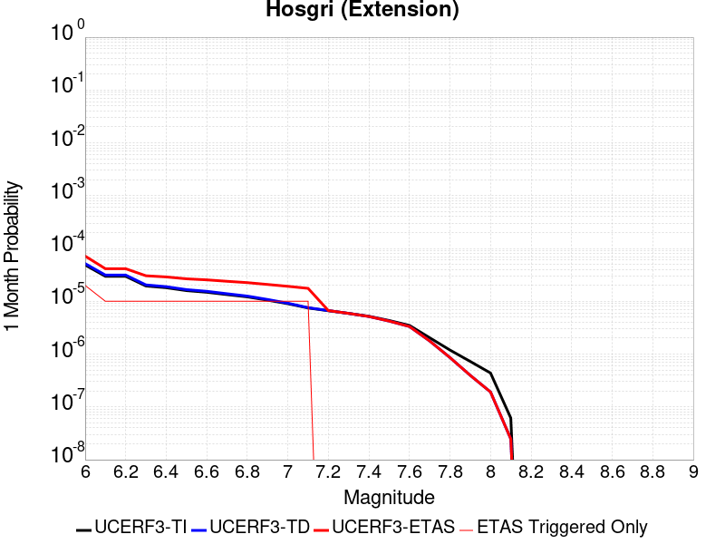 |  |  |

| Magnitude | 1 wk TI Prob | 1 wk TD Prob | 1 wk ETAS Prob | 1 wk ETAS/TD Gain | 1 wk ETAS Triggered Only | 1 mo TI Prob | 1 mo TD Prob | 1 mo ETAS Prob | 1 mo ETAS/TD Gain | 1 mo ETAS Triggered Only | 1 yr TI Prob | 1 yr TD Prob | 1 yr ETAS Prob | 1 yr ETAS/TD Gain | 1 yr ETAS Triggered Only | 10 yr TI Prob | 10 yr TD Prob | 10 yr ETAS Prob | 10 yr ETAS/TD Gain | 10 yr ETAS Triggered Only |
|-----|-----|-----|-----|-----|-----|-----|-----|-----|-----|-----|-----|-----|-----|-----|-----|-----|-----|-----|-----|-----|
| 6.0 | 1.1369135E-5 | 1.2083072E-5 | 2.2082952E-5 | 1.8275942 | 1.0E-5 | 4.8723956E-5 | 5.1783692E-5 | 7.1782655E-5 | 1.386202 | 2.0E-5 | 5.9305265E-4 | 6.3030684E-4 | 6.5029424E-4 | 1.0317106 | 2.0E-5 | 0.005914725 | 0.0062874397 | 0.006307314 | 1.003161 | 2.0E-5 |
| 6.1 | 6.934979E-6 | 7.324555E-6 | 1.7324483E-5 | 2.3652606 | 1.0E-5 | 2.9721E-5 | 3.1390595E-5 | 4.139028E-5 | 1.3185568 | 1.0E-5 | 3.617931E-4 | 3.8211764E-4 | 3.921138E-4 | 1.02616 | 1.0E-5 | 0.0036120464 | 0.0038150186 | 0.0038249805 | 1.0026112 | 1.0E-5 |
| 6.2 | 6.934979E-6 | 7.324555E-6 | 1.7324483E-5 | 2.3652606 | 1.0E-5 | 2.9721E-5 | 3.1390595E-5 | 4.139028E-5 | 1.3185568 | 1.0E-5 | 3.617931E-4 | 3.8211764E-4 | 3.921138E-4 | 1.02616 | 1.0E-5 | 0.0036120464 | 0.0038150186 | 0.0038249805 | 1.0026112 | 1.0E-5 |
| 6.3 | 4.5484676E-6 | 4.76933E-6 | 1.4769283E-5 | 3.0967205 | 1.0E-5 | 1.9493287E-5 | 2.043983E-5 | 3.0439625E-5 | 1.4892309 | 1.0E-5 | 2.3730492E-4 | 2.4882692E-4 | 2.5882444E-4 | 1.0401785 | 1.0E-5 | 0.0023705168 | 0.0024855258 | 0.002495501 | 1.0040133 | 1.0E-5 |
| 6.4 | 4.218095E-6 | 4.4168614E-6 | 1.4416817E-5 | 3.264041 | 1.0E-5 | 1.8077424E-5 | 1.8929271E-5 | 2.8929082E-5 | 1.5282724 | 1.0E-5 | 2.2007042E-4 | 2.3043984E-4 | 2.4043753E-4 | 1.0433853 | 1.0E-5 | 0.002198526 | 0.0023020422 | 0.0023120192 | 1.004334 | 1.0E-5 |
| 6.5 | 3.717374E-6 | 3.8838775E-6 | 1.3883839E-5 | 3.5747364 | 1.0E-5 | 1.5931506E-5 | 1.6645085E-5 | 2.6644919E-5 | 1.600768 | 1.0E-5 | 1.9394881E-4 | 2.0263524E-4 | 2.1263321E-4 | 1.0493398 | 1.0E-5 | 0.0019377962 | 0.0020245234 | 0.0020345033 | 1.0049294 | 1.0E-5 |
| 6.6 | 3.4605036E-6 | 3.608306E-6 | 1.360827E-5 | 3.7713735 | 1.0E-5 | 1.4830645E-5 | 1.5464078E-5 | 2.5463924E-5 | 1.64665 | 1.0E-5 | 1.8054814E-4 | 1.8825903E-4 | 1.9825714E-4 | 1.0531083 | 1.0E-5 | 0.0018040152 | 0.0018810101 | 0.0018909913 | 1.0053062 | 1.0E-5 |
| 6.7 | 3.123439E-6 | 3.2465687E-6 | 1.3246537E-5 | 4.080165 | 1.0E-5 | 1.33860985E-5 | 1.3913792E-5 | 2.3913653E-5 | 1.7187014 | 1.0E-5 | 1.6296357E-4 | 1.6938736E-4 | 1.7938566E-4 | 1.0590262 | 1.0E-5 | 0.001628441 | 0.0016925934 | 0.0017025765 | 1.0058981 | 1.0E-5 |
| 6.8 | 2.8290783E-6 | 2.9305404E-6 | 1.2930511E-5 | 4.41233 | 1.0E-5 | 1.2124565E-5 | 1.2559399E-5 | 2.2559274E-5 | 1.7962065 | 1.0E-5 | 1.4760658E-4 | 1.5290003E-4 | 1.628985E-4 | 1.0653923 | 1.0E-5 | 0.0014750857 | 0.001527957 | 0.0015379417 | 1.0065347 | 1.0E-5 |
| 6.9 | 2.454112E-6 | 2.5283196E-6 | 1.2528294E-5 | 4.9551864 | 1.0E-5 | 1.0517581E-5 | 1.0835611E-5 | 2.0835501E-5 | 1.9228729 | 1.0E-5 | 1.2804402E-4 | 1.3191563E-4 | 1.4191431E-4 | 1.075796 | 1.0E-5 | 0.0012797028 | 0.0013183793 | 0.0013283662 | 1.007575 | 1.0E-5 |
| 7.0 | 2.1008145E-6 | 2.1498704E-6 | 1.2149849E-5 | 5.6514335 | 1.0E-5 | 9.003459E-6 | 9.213698E-6 | 1.9213605E-5 | 2.0853305 | 1.0E-5 | 1.096116E-4 | 1.1217103E-4 | 1.221699E-4 | 1.0891396 | 1.0E-5 | 0.0010955755 | 0.0011211479 | 0.0011311367 | 1.0089095 | 1.0E-5 |
| 7.1 | 1.744384E-6 | 1.7686352E-6 | 1.1768618E-5 | 6.654067 | 1.0E-5 | 7.47591E-6 | 7.5798434E-6 | 1.7579767E-5 | 2.3192785 | 1.0E-5 | 9.1015405E-5 | 9.22807E-5 | 1.0227978E-4 | 1.108355 | 1.0E-5 | 9.097813E-4 | 9.2242553E-4 | 9.3241635E-4 | 1.010831 | 1.0E-5 |
| 7.2 | 1.5456587E-6 | 1.5562882E-6 | 1.5562882E-6 | 1.0 | 0.0 | 6.6242346E-6 | 6.66979E-6 | 6.66979E-6 | 1.0 | 0.0 | 8.064707E-5 | 8.120168E-5 | 8.120168E-5 | 1.0 | 0.0 | 8.0617814E-4 | 8.117213E-4 | 8.117213E-4 | 1.0 | 0.0 |
| 7.3 | 1.3775123E-6 | 1.3766082E-6 | 1.3766082E-6 | 1.0 | 0.0 | 5.9036106E-6 | 5.899736E-6 | 5.899736E-6 | 1.0 | 0.0 | 7.187409E-5 | 7.182693E-5 | 7.182693E-5 | 1.0 | 0.0 | 7.185085E-4 | 7.180382E-4 | 7.180382E-4 | 1.0 | 0.0 |
| 7.4 | 1.214491E-6 | 1.2023461E-6 | 1.2023461E-6 | 1.0 | 0.0 | 5.2049513E-6 | 5.1529014E-6 | 5.1529014E-6 | 1.0 | 0.0 | 6.336844E-5 | 6.2734776E-5 | 6.2734776E-5 | 1.0 | 0.0 | 6.335037E-4 | 6.271715E-4 | 6.271715E-4 | 1.0 | 0.0 |
| 7.5 | 1.0101123E-6 | 9.842246E-7 | 9.842246E-7 | 1.0 | 0.0 | 4.3290456E-6 | 4.2180986E-6 | 4.2180986E-6 | 1.0 | 0.0 | 5.2704854E-5 | 5.1354145E-5 | 5.1354145E-5 | 1.0 | 0.0 | 5.2692357E-4 | 5.1342335E-4 | 5.1342335E-4 | 1.0 | 0.0 |
| 7.6 | 8.1558215E-7 | 7.765966E-7 | 7.765966E-7 | 1.0 | 0.0 | 3.4953473E-6 | 3.328267E-6 | 3.328267E-6 | 1.0 | 0.0 | 4.255502E-5 | 4.0520903E-5 | 4.0520903E-5 | 1.0 | 0.0 | 4.2546875E-4 | 4.0513556E-4 | 4.0513556E-4 | 1.0 | 0.0 |
| 7.7 | 4.757816E-7 | 4.1308888E-7 | 4.1308888E-7 | 1.0 | 0.0 | 2.0390623E-6 | 1.7703798E-6 | 1.7703798E-6 | 1.0 | 0.0 | 2.4825302E-5 | 2.155416E-5 | 2.155416E-5 | 1.0 | 0.0 | 2.482253E-4 | 2.1552083E-4 | 2.1552083E-4 | 1.0 | 0.0 |
| 7.8 | 2.782787E-7 | 2.0047722E-7 | 2.0047722E-7 | 1.0 | 0.0 | 1.1926223E-6 | 8.5918776E-7 | 8.5918776E-7 | 1.0 | 0.0 | 1.452008E-5 | 1.04605615E-5 | 1.04605615E-5 | 1.0 | 0.0 | 1.4519131E-4 | 1.04600724E-4 | 1.04600724E-4 | 1.0 | 0.0 |
| 7.9 | 1.6948086E-7 | 9.244227E-8 | 9.244227E-8 | 1.0 | 0.0 | 7.2634634E-7 | 3.961811E-7 | 3.961811E-7 | 1.0 | 0.0 | 8.843231E-6 | 4.8234942E-6 | 4.8234942E-6 | 1.0 | 0.0 | 8.842879E-5 | 4.8233902E-5 | 4.8233902E-5 | 1.0 | 0.0 |
| 8.0 | 1.0225492E-7 | 4.4738776E-8 | 4.4738776E-8 | 1.0 | 0.0 | 4.382353E-7 | 1.917376E-7 | 1.917376E-7 | 1.0 | 0.0 | 5.335502E-6 | 2.3344028E-6 | 2.3344028E-6 | 1.0 | 0.0 | 5.335374E-5 | 2.3343786E-5 | 2.3343786E-5 | 1.0 | 0.0 |
| 8.1 | 1.43711345E-8 | 5.787707E-9 | 5.787707E-9 | 1.0 | 0.0 | 6.1590576E-8 | 2.480446E-8 | 2.480446E-8 | 1.0 | 0.0 | 7.4986497E-7 | 3.0199428E-7 | 3.0199428E-7 | 1.0 | 0.0 | 7.4986247E-6 | 3.0199392E-6 | 3.0199392E-6 | 1.0 | 0.0 |

## Concord 2011 CFM
*[(top)](#table-of-contents)*

| 1 Week | 1 Month | 1 Year | 10 Year |
|-----|-----|-----|-----|
|  | 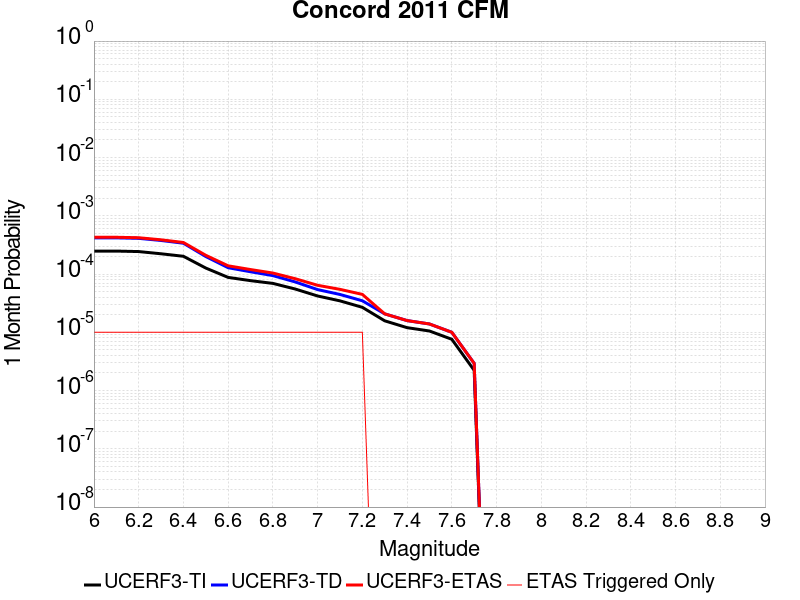 |  |  |

| Magnitude | 1 wk TI Prob | 1 wk TD Prob | 1 wk ETAS Prob | 1 wk ETAS/TD Gain | 1 wk ETAS Triggered Only | 1 mo TI Prob | 1 mo TD Prob | 1 mo ETAS Prob | 1 mo ETAS/TD Gain | 1 mo ETAS Triggered Only | 1 yr TI Prob | 1 yr TD Prob | 1 yr ETAS Prob | 1 yr ETAS/TD Gain | 1 yr ETAS Triggered Only | 10 yr TI Prob | 10 yr TD Prob | 10 yr ETAS Prob | 10 yr ETAS/TD Gain | 10 yr ETAS Triggered Only |
|-----|-----|-----|-----|-----|-----|-----|-----|-----|-----|-----|-----|-----|-----|-----|-----|-----|-----|-----|-----|-----|
| 6.0 | 5.7865112E-5 | 9.759152E-5 | 1.0759054E-4 | 1.1024579 | 1.0E-5 | 2.4796976E-4 | 4.1818706E-4 | 4.281829E-4 | 1.0239028 | 1.0E-5 | 0.0030148525 | 0.005079467 | 0.005089416 | 1.0019587 | 1.0E-5 | 0.029742775 | 0.049248982 | 0.049267996 | 1.0003861 | 2.0E-5 |
| 6.1 | 5.7865112E-5 | 9.759152E-5 | 1.0759054E-4 | 1.1024579 | 1.0E-5 | 2.4796976E-4 | 4.1818706E-4 | 4.281829E-4 | 1.0239028 | 1.0E-5 | 0.0030148525 | 0.005079467 | 0.005089416 | 1.0019587 | 1.0E-5 | 0.029742775 | 0.049248982 | 0.049267996 | 1.0003861 | 2.0E-5 |
| 6.2 | 5.6789337E-5 | 9.5795076E-5 | 1.0579412E-4 | 1.1043795 | 1.0E-5 | 2.4336016E-4 | 4.104905E-4 | 4.2048638E-4 | 1.0243511 | 1.0E-5 | 0.0029588845 | 0.0049861916 | 0.0049961414 | 1.0019956 | 1.0E-5 | 0.029197963 | 0.04836556 | 0.048384592 | 1.0003935 | 2.0E-5 |
| 6.3 | 5.203322E-5 | 8.803056E-5 | 9.8029675E-5 | 1.1135869 | 1.0E-5 | 2.2298045E-4 | 3.7722368E-4 | 3.872199E-4 | 1.0264995 | 1.0E-5 | 0.0027114071 | 0.0045838105 | 0.0045937644 | 1.0021716 | 1.0E-5 | 0.026785625 | 0.04453672 | 0.044555828 | 1.000429 | 2.0E-5 |
| 6.4 | 4.7120942E-5 | 7.897404E-5 | 8.897325E-5 | 1.1266139 | 1.0E-5 | 2.0193127E-4 | 3.3842045E-4 | 3.4841706E-4 | 1.029539 | 1.0E-5 | 0.0024557412 | 0.00411323 | 0.0041231886 | 1.0024211 | 1.0E-5 | 0.024287801 | 0.040065527 | 0.040084727 | 1.0004792 | 2.0E-5 |
| 6.5 | 2.9598437E-5 | 4.667486E-5 | 5.667439E-5 | 1.214238 | 1.0E-5 | 1.2684427E-4 | 2.0002096E-4 | 2.1001896E-4 | 1.0499848 | 1.0E-5 | 0.001543235 | 0.0024327459 | 0.0024427215 | 1.0041006 | 1.0E-5 | 0.015325619 | 0.023909973 | 0.023929495 | 1.0008165 | 2.0E-5 |
| 6.6 | 2.0443718E-5 | 2.998433E-5 | 3.9984032E-5 | 1.3334975 | 1.0E-5 | 8.7613E-5 | 1.2849816E-4 | 1.3849686E-4 | 1.0778121 | 1.0E-5 | 0.0010661662 | 0.0015633785 | 0.0015733629 | 1.0063864 | 1.0E-5 | 0.010610655 | 0.015466996 | 0.0154866865 | 1.001273 | 2.0E-5 |
| 6.7 | 1.798539E-5 | 2.5557381E-5 | 3.5557125E-5 | 1.3912663 | 1.0E-5 | 7.7077966E-5 | 1.0952716E-4 | 1.1952606E-4 | 1.0912915 | 1.0E-5 | 9.380202E-4 | 0.001332699 | 0.0013426857 | 1.0074936 | 1.0E-5 | 0.009340706 | 0.013217433 | 0.013237169 | 1.0014931 | 2.0E-5 |
| 6.8 | 1.613555E-5 | 2.1959211E-5 | 3.1958993E-5 | 1.4553797 | 1.0E-5 | 6.915052E-5 | 9.4107585E-5 | 1.0410664E-4 | 1.1062514 | 1.0E-5 | 8.4158237E-4 | 0.0011451716 | 0.0011551601 | 1.0087223 | 1.0E-5 | 0.008384023 | 0.0113782035 | 0.011397976 | 1.0017377 | 2.0E-5 |
| 6.9 | 1.2916435E-5 | 1.7081054E-5 | 2.7080883E-5 | 1.585434 | 1.0E-5 | 5.5354973E-5 | 7.32025E-5 | 8.320177E-5 | 1.1365974 | 1.0E-5 | 6.7373837E-4 | 8.908818E-4 | 9.008729E-4 | 1.0112149 | 1.0E-5 | 0.006716994 | 0.008867139 | 0.00887705 | 1.0011177 | 1.0E-5 |
| 7.0 | 9.81129E-6 | 1.2630829E-5 | 2.2630702E-5 | 1.7917037 | 1.0E-5 | 4.2047708E-5 | 5.413101E-5 | 6.413047E-5 | 1.184727 | 1.0E-5 | 5.118106E-4 | 6.588474E-4 | 6.6884083E-4 | 1.0151681 | 1.0E-5 | 0.005106334 | 0.006569153 | 0.006579087 | 1.0015123 | 1.0E-5 |
| 7.1 | 8.0889195E-6 | 1.0418261E-5 | 2.0418156E-5 | 1.9598432 | 1.0E-5 | 3.4666336E-5 | 4.4648932E-5 | 5.4648484E-5 | 1.2239596 | 1.0E-5 | 4.219809E-4 | 5.434662E-4 | 5.534608E-4 | 1.0183904 | 1.0E-5 | 0.004211805 | 0.0054215975 | 0.0054315436 | 1.0018345 | 1.0E-5 |
| 7.2 | 6.267438E-6 | 8.115699E-6 | 1.8115617E-5 | 2.2321699 | 1.0E-5 | 2.6860173E-5 | 3.4781104E-5 | 4.4780758E-5 | 1.2875024 | 1.0E-5 | 3.2697353E-4 | 4.233784E-4 | 4.3337417E-4 | 1.0236095 | 1.0E-5 | 0.0032649285 | 0.004225969 | 0.0042359265 | 1.0023563 | 1.0E-5 |
| 7.3 | 3.6761196E-6 | 4.8401653E-6 | 4.8401653E-6 | 1.0 | 0.0 | 1.5754704E-5 | 2.0743402E-5 | 2.0743402E-5 | 1.0 | 0.0 | 1.9179663E-4 | 2.5252186E-4 | 2.5252186E-4 | 1.0 | 0.0 | 0.0019163118 | 0.002522487 | 0.002522487 | 1.0 | 0.0 |
| 7.4 | 2.8044356E-6 | 3.7096036E-6 | 3.7096036E-6 | 1.0 | 0.0 | 1.2018954E-5 | 1.5898204E-5 | 1.5898204E-5 | 1.0 | 0.0 | 1.4632095E-4 | 1.9354356E-4 | 1.9354356E-4 | 1.0 | 0.0 | 0.0014622464 | 0.0019338481 | 0.0019338481 | 1.0 | 0.0 |
| 7.5 | 2.4578699E-6 | 3.2447442E-6 | 3.2447442E-6 | 1.0 | 0.0 | 1.0533685E-5 | 1.3905973E-5 | 1.3905973E-5 | 1.0 | 0.0 | 1.2824008E-4 | 1.6929218E-4 | 1.6929218E-4 | 1.0 | 0.0 | 0.0012816609 | 0.001691713 | 0.001691713 | 1.0 | 0.0 |
| 7.6 | 1.7713267E-6 | 2.3351192E-6 | 2.3351192E-6 | 1.0 | 0.0 | 7.591378E-6 | 1.0007616E-5 | 1.0007616E-5 | 1.0 | 0.0 | 9.2421105E-5 | 1.21836E-4 | 1.21836E-4 | 1.0 | 0.0 | 9.2382677E-4 | 0.0012177454 | 0.0012177454 | 1.0 | 0.0 |
| 7.7 | 5.1912366E-7 | 6.8290143E-7 | 6.8290143E-7 | 1.0 | 0.0 | 2.2248137E-6 | 2.9267171E-6 | 2.9267171E-6 | 1.0 | 0.0 | 2.708677E-5 | 3.5632213E-5 | 3.5632213E-5 | 1.0 | 0.0 | 2.708347E-4 | 3.5627294E-4 | 3.5627294E-4 | 1.0 | 0.0 |

## Calaveras (Central) 2011 CFM
*[(top)](#table-of-contents)*

| 1 Week | 1 Month | 1 Year | 10 Year |
|-----|-----|-----|-----|
|  |  |  |  |

| Magnitude | 1 wk TI Prob | 1 wk TD Prob | 1 wk ETAS Prob | 1 wk ETAS/TD Gain | 1 wk ETAS Triggered Only | 1 mo TI Prob | 1 mo TD Prob | 1 mo ETAS Prob | 1 mo ETAS/TD Gain | 1 mo ETAS Triggered Only | 1 yr TI Prob | 1 yr TD Prob | 1 yr ETAS Prob | 1 yr ETAS/TD Gain | 1 yr ETAS Triggered Only | 10 yr TI Prob | 10 yr TD Prob | 10 yr ETAS Prob | 10 yr ETAS/TD Gain | 10 yr ETAS Triggered Only |
|-----|-----|-----|-----|-----|-----|-----|-----|-----|-----|-----|-----|-----|-----|-----|-----|-----|-----|-----|-----|-----|
| 6.0 | 1.5010907E-4 | 2.481574E-4 | 2.581549E-4 | 1.040287 | 1.0E-5 | 6.4316596E-4 | 0.0010621005 | 0.0010720899 | 1.0094053 | 1.0E-5 | 0.0078024664 | 0.012850073 | 0.012869816 | 1.0015364 | 2.0E-5 | 0.07534136 | 0.120401435 | 0.120419025 | 1.0001462 | 2.0E-5 |
| 6.1 | 1.4521465E-4 | 2.397987E-4 | 2.4979629E-4 | 1.0416917 | 1.0E-5 | 6.222001E-4 | 0.0010263061 | 0.0010362958 | 1.0097337 | 1.0E-5 | 0.0075490056 | 0.012419341 | 0.012439093 | 1.0015904 | 2.0E-5 | 0.07297657 | 0.11667323 | 0.1166909 | 1.0001514 | 2.0E-5 |
| 6.2 | 1.429998E-4 | 2.3911126E-4 | 2.4910888E-4 | 1.0418116 | 1.0E-5 | 6.127123E-4 | 0.0010233623 | 0.001033352 | 1.0097617 | 1.0E-5 | 0.007434286 | 0.01238394 | 0.012403692 | 1.001595 | 2.0E-5 | 0.07190444 | 0.1163272 | 0.11634487 | 1.0001519 | 2.0E-5 |
| 6.3 | 1.3536277E-4 | 2.3242626E-4 | 2.4242394E-4 | 1.0430144 | 1.0E-5 | 5.799972E-4 | 9.947343E-4 | 0.0010047244 | 1.0100429 | 1.0E-5 | 0.0070386264 | 0.012040132 | 0.012059892 | 1.0016412 | 2.0E-5 | 0.0681982 | 0.11323977 | 0.11325751 | 1.0001566 | 2.0E-5 |
| 6.4 | 1.2993296E-4 | 2.2666177E-4 | 2.366595E-4 | 1.0441086 | 1.0E-5 | 5.5673666E-4 | 9.700479E-4 | 9.800382E-4 | 1.0102987 | 1.0E-5 | 0.006757223 | 0.011742937 | 0.011762703 | 1.0016831 | 2.0E-5 | 0.06555412 | 0.11051771 | 0.1105355 | 1.0001609 | 2.0E-5 |
| 6.5 | 1.0498927E-4 | 1.7981697E-4 | 1.8981517E-4 | 1.0556021 | 1.0E-5 | 4.498764E-4 | 7.704157E-4 | 7.80408E-4 | 1.01297 | 1.0E-5 | 0.005463498 | 0.00933924 | 0.009359054 | 1.0021214 | 2.0E-5 | 0.053311124 | 0.089199215 | 0.08921743 | 1.0002042 | 2.0E-5 |
| 6.6 | 1.0157505E-4 | 1.7469203E-4 | 1.8469029E-4 | 1.0572336 | 1.0E-5 | 4.35249E-4 | 7.484645E-4 | 7.58457E-4 | 1.0133507 | 1.0E-5 | 0.0052862884 | 0.009074297 | 0.009094115 | 1.002184 | 2.0E-5 | 0.05162293 | 0.08677671 | 0.08679497 | 1.0002105 | 2.0E-5 |
| 6.7 | 9.660386E-5 | 1.6728524E-4 | 1.6728524E-4 | 1.0 | 0.0 | 4.1395082E-4 | 7.1673887E-4 | 7.1673887E-4 | 1.0 | 0.0 | 0.0050282106 | 0.008691208 | 0.008701121 | 1.0011406 | 1.0E-5 | 0.049159497 | 0.083266065 | 0.08327523 | 1.0001101 | 1.0E-5 |
| 6.8 | 9.089927E-5 | 1.5643016E-4 | 1.5643016E-4 | 1.0 | 0.0 | 3.8951015E-4 | 6.702439E-4 | 6.702439E-4 | 1.0 | 0.0 | 0.0047319788 | 0.008129478 | 0.008139397 | 1.0012201 | 1.0E-5 | 0.046324775 | 0.078159414 | 0.07816863 | 1.0001179 | 1.0E-5 |
| 6.9 | 7.353187E-5 | 1.2295354E-4 | 1.2295354E-4 | 1.0 | 0.0 | 3.150985E-4 | 5.2683795E-4 | 5.2683795E-4 | 1.0 | 0.0 | 0.0038295772 | 0.006395508 | 0.006405444 | 1.0015537 | 1.0E-5 | 0.037642512 | 0.062187865 | 0.062197242 | 1.0001508 | 1.0E-5 |
| 7.0 | 5.746064E-5 | 9.3887444E-5 | 9.3887444E-5 | 1.0 | 0.0 | 2.4623662E-4 | 4.0231308E-4 | 4.0231308E-4 | 1.0 | 0.0 | 0.0029938098 | 0.004887232 | 0.0048971833 | 1.0020361 | 1.0E-5 | 0.02953797 | 0.04798685 | 0.047996372 | 1.0001984 | 1.0E-5 |
| 7.1 | 4.9557195E-5 | 8.052461E-5 | 8.052461E-5 | 1.0 | 0.0 | 2.123707E-4 | 3.4506017E-4 | 3.4506017E-4 | 1.0 | 0.0 | 0.0025825473 | 0.0041930773 | 0.0042030355 | 1.0023749 | 1.0E-5 | 0.0255274 | 0.041373078 | 0.041382667 | 1.0002317 | 1.0E-5 |
| 7.2 | 3.687595E-5 | 5.9524526E-5 | 5.9524526E-5 | 1.0 | 0.0 | 1.5803022E-4 | 2.5508032E-4 | 2.5508032E-4 | 1.0 | 0.0 | 0.0019223199 | 0.0031012094 | 0.0031111783 | 1.0032146 | 1.0E-5 | 0.01905776 | 0.030883716 | 0.030893408 | 1.0003138 | 1.0E-5 |
| 7.3 | 2.5846984E-5 | 4.247213E-5 | 4.247213E-5 | 1.0 | 0.0 | 1.1076809E-4 | 1.8201082E-4 | 1.8201082E-4 | 1.0 | 0.0 | 0.0013477671 | 0.002213747 | 0.002223725 | 1.0045072 | 1.0E-5 | 0.013396223 | 0.02217554 | 0.022185316 | 1.000441 | 1.0E-5 |
| 7.4 | 1.7747854E-5 | 2.9936204E-5 | 2.9936204E-5 | 1.0 | 0.0 | 7.6060016E-5 | 1.2829172E-4 | 1.2829172E-4 | 1.0 | 0.0 | 9.2563726E-4 | 0.0015608355 | 0.0015708199 | 1.0063968 | 1.0E-5 | 0.009217911 | 0.015709236 | 0.015719078 | 1.0006266 | 1.0E-5 |
| 7.5 | 1.4883479E-5 | 2.6243379E-5 | 2.6243379E-5 | 1.0 | 0.0 | 6.378478E-5 | 1.1246678E-4 | 1.1246678E-4 | 1.0 | 0.0 | 7.76303E-4 | 0.0013684258 | 0.0013784121 | 1.0072976 | 1.0E-5 | 0.0077359667 | 0.013802425 | 0.013812287 | 1.0007145 | 1.0E-5 |
| 7.6 | 8.166975E-6 | 1.4963478E-5 | 1.4963478E-5 | 1.0 | 0.0 | 3.5000852E-5 | 6.412763E-5 | 6.412763E-5 | 1.0 | 0.0 | 4.2605202E-4 | 7.804755E-4 | 7.804755E-4 | 1.0 | 0.0 | 0.004252361 | 0.00793984 | 0.00793984 | 1.0 | 0.0 |
| 7.7 | 3.3858064E-6 | 6.253914E-6 | 6.253914E-6 | 1.0 | 0.0 | 1.4510518E-5 | 2.6802214E-5 | 2.6802214E-5 | 1.0 | 0.0 | 1.7665124E-4 | 3.2626814E-4 | 3.2626814E-4 | 1.0 | 0.0 | 0.0017651088 | 0.0033882293 | 0.0033882293 | 1.0 | 0.0 |
| 7.8 | 2.7721615E-6 | 5.3663807E-6 | 5.3663807E-6 | 1.0 | 0.0 | 1.1880637E-5 | 2.2998573E-5 | 2.2998573E-5 | 1.0 | 0.0 | 1.4463716E-4 | 2.799717E-4 | 2.799717E-4 | 1.0 | 0.0 | 0.0014454306 | 0.0029074624 | 0.0029074624 | 1.0 | 0.0 |
| 7.9 | 1.9736292E-6 | 4.1284193E-6 | 4.1284193E-6 | 1.0 | 0.0 | 8.4583835E-6 | 1.7693106E-5 | 1.7693106E-5 | 1.0 | 0.0 | 1.0297595E-4 | 2.1539231E-4 | 2.1539231E-4 | 1.0 | 0.0 | 0.0010292825 | 0.0022236116 | 0.0022236116 | 1.0 | 0.0 |
| 8.0 | 1.1767289E-6 | 2.5544743E-6 | 2.5544743E-6 | 1.0 | 0.0 | 5.0431145E-6 | 1.0947701E-5 | 1.0947701E-5 | 1.0 | 0.0 | 6.139818E-5 | 1.3328013E-4 | 1.3328013E-4 | 1.0 | 0.0 | 6.1381224E-4 | 0.0013660848 | 0.0013660848 | 1.0 | 0.0 |
| 8.1 | 7.5112825E-7 | 1.5409794E-6 | 1.5409794E-6 | 1.0 | 0.0 | 3.2191172E-6 | 6.6041807E-6 | 6.6041807E-6 | 1.0 | 0.0 | 3.9192048E-5 | 8.0402955E-5 | 8.0402955E-5 | 1.0 | 0.0 | 3.9185135E-4 | 8.235564E-4 | 8.235564E-4 | 1.0 | 0.0 |

## Santa Cruz Catalina Ridge alt1
*[(top)](#table-of-contents)*

| 1 Week | 1 Month | 1 Year | 10 Year |
|-----|-----|-----|-----|
|  |  |  |  |

| Magnitude | 1 wk TI Prob | 1 wk TD Prob | 1 wk ETAS Prob | 1 wk ETAS/TD Gain | 1 wk ETAS Triggered Only | 1 mo TI Prob | 1 mo TD Prob | 1 mo ETAS Prob | 1 mo ETAS/TD Gain | 1 mo ETAS Triggered Only | 1 yr TI Prob | 1 yr TD Prob | 1 yr ETAS Prob | 1 yr ETAS/TD Gain | 1 yr ETAS Triggered Only | 10 yr TI Prob | 10 yr TD Prob | 10 yr ETAS Prob | 10 yr ETAS/TD Gain | 10 yr ETAS Triggered Only |
|-----|-----|-----|-----|-----|-----|-----|-----|-----|-----|-----|-----|-----|-----|-----|-----|-----|-----|-----|-----|-----|
| 6.0 | 3.2833184E-5 | 3.65584E-5 | 3.65584E-5 | 1.0 | 0.0 | 1.4070606E-4 | 1.5667039E-4 | 1.5667039E-4 | 1.0 | 0.0 | 0.00171175 | 0.0019059596 | 0.0019159405 | 1.0052367 | 1.0E-5 | 0.016986247 | 0.018913029 | 0.018932652 | 1.0010375 | 2.0E-5 |
| 6.1 | 1.9835548E-5 | 2.1659505E-5 | 2.1659505E-5 | 1.0 | 0.0 | 8.500672E-5 | 9.282326E-5 | 9.282326E-5 | 1.0 | 0.0 | 0.0010344655 | 0.0011295575 | 0.0011295575 | 1.0 | 0.0 | 0.010296632 | 0.011240295 | 0.011240295 | 1.0 | 0.0 |
| 6.2 | 1.9835548E-5 | 2.1659505E-5 | 2.1659505E-5 | 1.0 | 0.0 | 8.500672E-5 | 9.282326E-5 | 9.282326E-5 | 1.0 | 0.0 | 0.0010344655 | 0.0011295575 | 0.0011295575 | 1.0 | 0.0 | 0.010296632 | 0.011240295 | 0.011240295 | 1.0 | 0.0 |
| 6.3 | 1.5728183E-5 | 1.703395E-5 | 1.703395E-5 | 1.0 | 0.0 | 6.7404755E-5 | 7.300063E-5 | 7.300063E-5 | 1.0 | 0.0 | 8.2034385E-4 | 8.884264E-4 | 8.884264E-4 | 1.0 | 0.0 | 0.008173222 | 0.008849427 | 0.008849427 | 1.0 | 0.0 |
| 6.4 | 1.5728183E-5 | 1.703395E-5 | 1.703395E-5 | 1.0 | 0.0 | 6.7404755E-5 | 7.300063E-5 | 7.300063E-5 | 1.0 | 0.0 | 8.2034385E-4 | 8.884264E-4 | 8.884264E-4 | 1.0 | 0.0 | 0.008173222 | 0.008849427 | 0.008849427 | 1.0 | 0.0 |
| 6.5 | 1.3707734E-5 | 1.4794522E-5 | 1.4794522E-5 | 1.0 | 0.0 | 5.8746107E-5 | 6.3403575E-5 | 6.3403575E-5 | 1.0 | 0.0 | 7.1499916E-4 | 7.716686E-4 | 7.716686E-4 | 1.0 | 0.0 | 0.0071270303 | 0.0076902895 | 0.0076902895 | 1.0 | 0.0 |
| 6.6 | 1.2539813E-5 | 1.3510219E-5 | 1.3510219E-5 | 1.0 | 0.0 | 5.3740947E-5 | 5.789967E-5 | 5.789967E-5 | 1.0 | 0.0 | 6.540996E-4 | 7.0470315E-4 | 7.0470315E-4 | 1.0 | 0.0 | 0.0065217763 | 0.0070249885 | 0.0070249885 | 1.0 | 0.0 |
| 6.7 | 1.1504083E-5 | 1.2377375E-5 | 1.2377375E-5 | 1.0 | 0.0 | 4.930228E-5 | 5.3044827E-5 | 5.3044827E-5 | 1.0 | 0.0 | 6.0008996E-4 | 6.456314E-4 | 6.456314E-4 | 1.0 | 0.0 | 0.005984721 | 0.006437786 | 0.006437786 | 1.0 | 0.0 |
| 6.8 | 1.012739E-5 | 1.0877071E-5 | 1.0877071E-5 | 1.0 | 0.0 | 4.340238E-5 | 4.6615194E-5 | 4.6615194E-5 | 1.0 | 0.0 | 5.282958E-4 | 5.673937E-4 | 5.673937E-4 | 1.0 | 0.0 | 0.0052704164 | 0.0056596193 | 0.0056596193 | 1.0 | 0.0 |
| 6.9 | 8.9607865E-6 | 9.609117E-6 | 9.609117E-6 | 1.0 | 0.0 | 3.8402806E-5 | 4.1181287E-5 | 4.1181287E-5 | 1.0 | 0.0 | 4.6745385E-4 | 5.012679E-4 | 5.012679E-4 | 1.0 | 0.0 | 0.0046647177 | 0.005001492 | 0.005001492 | 1.0 | 0.0 |
| 7.0 | 8.046829E-6 | 8.619746E-6 | 8.619746E-6 | 1.0 | 0.0 | 3.4485955E-5 | 3.694125E-5 | 3.694125E-5 | 1.0 | 0.0 | 4.1978562E-4 | 4.496677E-4 | 4.496677E-4 | 1.0 | 0.0 | 0.004189935 | 0.0044876686 | 0.0044876686 | 1.0 | 0.0 |
| 7.1 | 7.136131E-6 | 7.637656E-6 | 7.637656E-6 | 1.0 | 0.0 | 3.0583058E-5 | 3.2732405E-5 | 3.2732405E-5 | 1.0 | 0.0 | 3.7228514E-4 | 3.9844486E-4 | 3.9844486E-4 | 1.0 | 0.0 | 0.0037166206 | 0.003977381 | 0.003977381 | 1.0 | 0.0 |
| 7.2 | 6.362014E-6 | 6.8049585E-6 | 6.8049585E-6 | 1.0 | 0.0 | 2.726549E-5 | 2.9163786E-5 | 2.9163786E-5 | 1.0 | 0.0 | 3.3190678E-4 | 3.550119E-4 | 3.550119E-4 | 1.0 | 0.0 | 0.0033141149 | 0.003544516 | 0.003544516 | 1.0 | 0.0 |
| 7.3 | 5.004101E-6 | 5.351715E-6 | 5.351715E-6 | 1.0 | 0.0 | 2.1445969E-5 | 2.2935723E-5 | 2.2935723E-5 | 1.0 | 0.0 | 2.6107338E-4 | 2.792072E-4 | 2.792072E-4 | 1.0 | 0.0 | 0.002607669 | 0.0027886187 | 0.0027886187 | 1.0 | 0.0 |
| 7.4 | 3.4901443E-6 | 3.7320526E-6 | 3.7320526E-6 | 1.0 | 0.0 | 1.4957676E-5 | 1.5994416E-5 | 1.5994416E-5 | 1.0 | 0.0 | 1.8209449E-4 | 1.9471499E-4 | 1.9471499E-4 | 1.0 | 0.0 | 0.0018194534 | 0.0019454823 | 0.0019454823 | 1.0 | 0.0 |
| 7.5 | 1.1215045E-6 | 1.189387E-6 | 1.189387E-6 | 1.0 | 0.0 | 4.806439E-6 | 5.097363E-6 | 5.097363E-6 | 1.0 | 0.0 | 5.851682E-5 | 6.205866E-5 | 6.205866E-5 | 1.0 | 0.0 | 5.850142E-4 | 6.2041637E-4 | 6.2041637E-4 | 1.0 | 0.0 |
| 7.6 | 2.8599047E-7 | 2.9951994E-7 | 2.9951994E-7 | 1.0 | 0.0 | 1.2256729E-6 | 1.2836562E-6 | 1.2836562E-6 | 1.0 | 0.0 | 1.4922465E-5 | 1.5628404E-5 | 1.5628404E-5 | 1.0 | 0.0 | 1.4921463E-4 | 1.5627318E-4 | 1.5627318E-4 | 1.0 | 0.0 |
| 7.7 | 2.0781519E-7 | 2.1744323E-7 | 2.1744323E-7 | 1.0 | 0.0 | 8.906362E-7 | 9.3189925E-7 | 9.3189925E-7 | 1.0 | 0.0 | 1.08434415E-5 | 1.13458145E-5 | 1.13458145E-5 | 1.0 | 0.0 | 1.0842913E-4 | 1.1345245E-4 | 1.1345245E-4 | 1.0 | 0.0 |
| 7.8 | 3.614776E-8 | 3.764102E-8 | 3.764102E-8 | 1.0 | 0.0 | 1.5491896E-7 | 1.6131864E-7 | 1.6131864E-7 | 1.0 | 0.0 | 1.8861368E-6 | 1.9640527E-6 | 1.9640527E-6 | 1.0 | 0.0 | 1.8861208E-5 | 1.9640367E-5 | 1.9640367E-5 | 1.0 | 0.0 |

## Elsinore (Temecula) rev
*[(top)](#table-of-contents)*

| 1 Week | 1 Month | 1 Year | 10 Year |
|-----|-----|-----|-----|
|  | 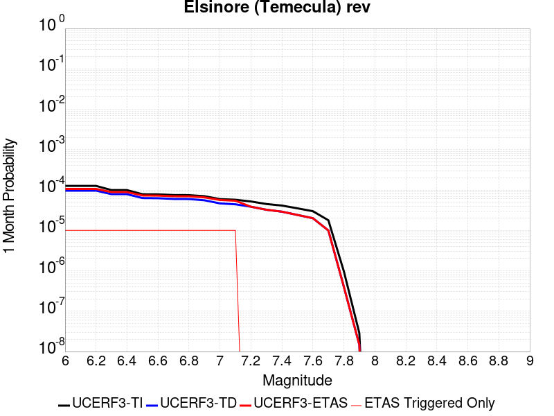 |  |  |

| Magnitude | 1 wk TI Prob | 1 wk TD Prob | 1 wk ETAS Prob | 1 wk ETAS/TD Gain | 1 wk ETAS Triggered Only | 1 mo TI Prob | 1 mo TD Prob | 1 mo ETAS Prob | 1 mo ETAS/TD Gain | 1 mo ETAS Triggered Only | 1 yr TI Prob | 1 yr TD Prob | 1 yr ETAS Prob | 1 yr ETAS/TD Gain | 1 yr ETAS Triggered Only | 10 yr TI Prob | 10 yr TD Prob | 10 yr ETAS Prob | 10 yr ETAS/TD Gain | 10 yr ETAS Triggered Only |
|-----|-----|-----|-----|-----|-----|-----|-----|-----|-----|-----|-----|-----|-----|-----|-----|-----|-----|-----|-----|-----|
| 6.0 | 2.9514995E-5 | 2.2517117E-5 | 3.251689E-5 | 1.4440966 | 1.0E-5 | 1.264867E-4 | 9.649849E-5 | 1.0649752E-4 | 1.1036186 | 1.0E-5 | 0.0015388876 | 0.0011742581 | 0.0011842463 | 1.0085061 | 1.0E-5 | 0.015282745 | 0.011696897 | 0.011716664 | 1.0016899 | 2.0E-5 |
| 6.1 | 2.9514995E-5 | 2.2517117E-5 | 3.251689E-5 | 1.4440966 | 1.0E-5 | 1.264867E-4 | 9.649849E-5 | 1.0649752E-4 | 1.1036186 | 1.0E-5 | 0.0015388876 | 0.0011742581 | 0.0011842463 | 1.0085061 | 1.0E-5 | 0.015282745 | 0.011696897 | 0.011716664 | 1.0016899 | 2.0E-5 |
| 6.2 | 2.9514995E-5 | 2.2517117E-5 | 3.251689E-5 | 1.4440966 | 1.0E-5 | 1.264867E-4 | 9.649849E-5 | 1.0649752E-4 | 1.1036186 | 1.0E-5 | 0.0015388876 | 0.0011742581 | 0.0011842463 | 1.0085061 | 1.0E-5 | 0.015282745 | 0.011696897 | 0.011716664 | 1.0016899 | 2.0E-5 |
| 6.3 | 2.3223649E-5 | 1.8406454E-5 | 2.840627E-5 | 1.5432777 | 1.0E-5 | 9.952613E-5 | 7.888251E-5 | 8.888173E-5 | 1.1267608 | 1.0E-5 | 0.001211057 | 9.599888E-4 | 9.6997916E-4 | 1.0104067 | 1.0E-5 | 0.012044783 | 0.009569948 | 0.009589756 | 1.0020698 | 2.0E-5 |
| 6.4 | 2.3223649E-5 | 1.8406454E-5 | 2.840627E-5 | 1.5432777 | 1.0E-5 | 9.952613E-5 | 7.888251E-5 | 8.888173E-5 | 1.1267608 | 1.0E-5 | 0.001211057 | 9.599888E-4 | 9.6997916E-4 | 1.0104067 | 1.0E-5 | 0.012044783 | 0.009569948 | 0.009589756 | 1.0020698 | 2.0E-5 |
| 6.5 | 1.8338875E-5 | 1.4750118E-5 | 2.474997E-5 | 1.6779507 | 1.0E-5 | 7.8592806E-5 | 6.321331E-5 | 7.321267E-5 | 1.1581845 | 1.0E-5 | 9.5644733E-4 | 7.69359E-4 | 7.7935134E-4 | 1.0129879 | 1.0E-5 | 0.009523412 | 0.0076739118 | 0.0076937582 | 1.0025862 | 2.0E-5 |
| 6.6 | 1.8223333E-5 | 1.4612673E-5 | 2.4612527E-5 | 1.6843275 | 1.0E-5 | 7.809766E-5 | 6.262429E-5 | 7.262366E-5 | 1.1596725 | 1.0E-5 | 9.504242E-4 | 7.6219277E-4 | 7.7218516E-4 | 1.01311 | 1.0E-5 | 0.009463696 | 0.0076027405 | 0.0076225884 | 1.0026107 | 2.0E-5 |
| 6.7 | 1.7512752E-5 | 1.402721E-5 | 2.402707E-5 | 1.7128901 | 1.0E-5 | 7.505249E-5 | 6.011528E-5 | 7.011468E-5 | 1.166337 | 1.0E-5 | 9.13381E-4 | 7.3166634E-4 | 7.41659E-4 | 1.0136575 | 1.0E-5 | 0.00909636 | 0.00729892 | 0.007318774 | 1.0027201 | 2.0E-5 |
| 6.8 | 1.7417142E-5 | 1.3951195E-5 | 2.3951055E-5 | 1.7167745 | 1.0E-5 | 7.4642754E-5 | 5.9789512E-5 | 6.978891E-5 | 1.1672434 | 1.0E-5 | 9.083966E-4 | 7.277028E-4 | 7.376955E-4 | 1.0137318 | 1.0E-5 | 0.009046922 | 0.0072594886 | 0.0072793434 | 1.002735 | 2.0E-5 |
| 6.9 | 1.6402591E-5 | 1.2988613E-5 | 2.2988483E-5 | 1.7698951 | 1.0E-5 | 7.0294926E-5 | 5.5664343E-5 | 6.5663786E-5 | 1.1796383 | 1.0E-5 | 8.5550465E-4 | 6.775103E-4 | 6.8750355E-4 | 1.0147499 | 1.0E-5 | 0.008522186 | 0.006760169 | 0.0067800335 | 1.0029385 | 2.0E-5 |
| 7.0 | 1.3912486E-5 | 1.0878233E-5 | 2.0878124E-5 | 1.9192569 | 1.0E-5 | 5.9623577E-5 | 4.6620182E-5 | 5.6619716E-5 | 1.2144893 | 1.0E-5 | 7.2567526E-4 | 5.674556E-4 | 5.7745E-4 | 1.0176126 | 1.0E-5 | 0.0072331014 | 0.005663986 | 0.0056838724 | 1.0035111 | 2.0E-5 |
| 7.1 | 1.3405147E-5 | 1.03274215E-5 | 2.0327318E-5 | 1.9682859 | 1.0E-5 | 5.7449364E-5 | 4.425964E-5 | 5.4259195E-5 | 1.2259295 | 1.0E-5 | 6.9922156E-4 | 5.3873047E-4 | 5.487251E-4 | 1.0185522 | 1.0E-5 | 0.0069702556 | 0.005377577 | 0.0053974693 | 1.0036992 | 2.0E-5 |
| 7.2 | 1.21402E-5 | 8.996737E-6 | 8.996737E-6 | 1.0 | 0.0 | 5.202839E-5 | 3.8556886E-5 | 3.8556886E-5 | 1.0 | 0.0 | 6.332616E-4 | 4.6933076E-4 | 4.6933076E-4 | 1.0 | 0.0 | 0.0063146 | 0.004684821 | 0.004694774 | 1.0021245 | 1.0E-5 |
| 7.3 | 1.05047775E-5 | 7.571771E-6 | 7.571771E-6 | 1.0 | 0.0 | 4.5019697E-5 | 3.245005E-5 | 3.245005E-5 | 1.0 | 0.0 | 5.4797693E-4 | 3.950092E-4 | 3.950092E-4 | 1.0 | 0.0 | 0.005466277 | 0.00394346 | 0.003953421 | 1.0025258 | 1.0E-5 |
| 7.4 | 9.624483E-6 | 6.7868696E-6 | 6.7868696E-6 | 1.0 | 0.0 | 4.124713E-5 | 2.9086266E-5 | 2.9086266E-5 | 1.0 | 0.0 | 5.0206814E-4 | 3.5406914E-4 | 3.5406914E-4 | 1.0 | 0.0 | 0.005009353 | 0.003535204 | 0.003535204 | 1.0 | 0.0 |
| 7.5 | 8.215151E-6 | 5.635538E-6 | 5.635538E-6 | 1.0 | 0.0 | 3.5207315E-5 | 2.4152088E-5 | 2.4152088E-5 | 1.0 | 0.0 | 4.2856473E-4 | 2.9401327E-4 | 2.9401327E-4 | 1.0 | 0.0 | 0.004277392 | 0.002936371 | 0.002936371 | 1.0 | 0.0 |
| 7.6 | 6.975058E-6 | 4.676045E-6 | 4.676045E-6 | 1.0 | 0.0 | 2.9892764E-5 | 2.0040046E-5 | 2.0040046E-5 | 1.0 | 0.0 | 3.6388362E-4 | 2.439614E-4 | 2.439614E-4 | 1.0 | 0.0 | 0.0036328835 | 0.002437052 | 0.002437052 | 1.0 | 0.0 |
| 7.7 | 4.159604E-6 | 2.3269924E-6 | 2.3269924E-6 | 1.0 | 0.0 | 1.7826753E-5 | 9.97279E-6 | 9.97279E-6 | 1.0 | 0.0 | 2.1701909E-4 | 1.21412704E-4 | 1.21412704E-4 | 1.0 | 0.0 | 0.0021680726 | 0.0012135367 | 0.0012135367 | 1.0 | 0.0 |
| 7.8 | 2.2692414E-7 | 9.3854695E-8 | 9.3854695E-8 | 1.0 | 0.0 | 9.725317E-7 | 4.0223435E-7 | 4.0223435E-7 | 1.0 | 0.0 | 1.1840509E-5 | 4.8971956E-6 | 4.8971956E-6 | 1.0 | 0.0 | 1.1839878E-4 | 4.8971204E-5 | 4.8971204E-5 | 1.0 | 0.0 |
| 7.9 | 6.676829E-9 | 3.439853E-9 | 3.439853E-9 | 1.0 | 0.0 | 2.861498E-8 | 1.4742227E-8 | 1.4742227E-8 | 1.0 | 0.0 | 3.4838732E-7 | 1.7948659E-7 | 1.7948659E-7 | 1.0 | 0.0 | 3.4838679E-6 | 1.7948646E-6 | 1.7948646E-6 | 1.0 | 0.0 |

## Monterey Bay-Tularcitos
*[(top)](#table-of-contents)*

| 1 Week | 1 Month | 1 Year | 10 Year |
|-----|-----|-----|-----|
|  |  |  |  |

| Magnitude | 1 wk TI Prob | 1 wk TD Prob | 1 wk ETAS Prob | 1 wk ETAS/TD Gain | 1 wk ETAS Triggered Only | 1 mo TI Prob | 1 mo TD Prob | 1 mo ETAS Prob | 1 mo ETAS/TD Gain | 1 mo ETAS Triggered Only | 1 yr TI Prob | 1 yr TD Prob | 1 yr ETAS Prob | 1 yr ETAS/TD Gain | 1 yr ETAS Triggered Only | 10 yr TI Prob | 10 yr TD Prob | 10 yr ETAS Prob | 10 yr ETAS/TD Gain | 10 yr ETAS Triggered Only |
|-----|-----|-----|-----|-----|-----|-----|-----|-----|-----|-----|-----|-----|-----|-----|-----|-----|-----|-----|-----|-----|
| 6.0 | 3.0131365E-5 | 3.279877E-5 | 4.279844E-5 | 1.3048794 | 1.0E-5 | 1.2912804E-4 | 1.4055918E-4 | 1.5055778E-4 | 1.0711344 | 1.0E-5 | 0.001571 | 0.0017100703 | 0.0017200531 | 1.0058377 | 1.0E-5 | 0.015599402 | 0.016979916 | 0.016999578 | 1.0011579 | 2.0E-5 |
| 6.1 | 3.0131365E-5 | 3.279877E-5 | 4.279844E-5 | 1.3048794 | 1.0E-5 | 1.2912804E-4 | 1.4055918E-4 | 1.5055778E-4 | 1.0711344 | 1.0E-5 | 0.001571 | 0.0017100703 | 0.0017200531 | 1.0058377 | 1.0E-5 | 0.015599402 | 0.016979916 | 0.016999578 | 1.0011579 | 2.0E-5 |
| 6.2 | 3.0131365E-5 | 3.279877E-5 | 4.279844E-5 | 1.3048794 | 1.0E-5 | 1.2912804E-4 | 1.4055918E-4 | 1.5055778E-4 | 1.0711344 | 1.0E-5 | 0.001571 | 0.0017100703 | 0.0017200531 | 1.0058377 | 1.0E-5 | 0.015599402 | 0.016979916 | 0.016999578 | 1.0011579 | 2.0E-5 |
| 6.3 | 1.6998249E-5 | 1.8330798E-5 | 1.8330798E-5 | 1.0 | 0.0 | 7.28476E-5 | 7.85583E-5 | 7.85583E-5 | 1.0 | 0.0 | 8.865586E-4 | 9.5604634E-4 | 9.5604634E-4 | 1.0 | 0.0 | 0.0088303005 | 0.009521258 | 0.009521258 | 1.0 | 0.0 |
| 6.4 | 1.6998249E-5 | 1.8330798E-5 | 1.8330798E-5 | 1.0 | 0.0 | 7.28476E-5 | 7.85583E-5 | 7.85583E-5 | 1.0 | 0.0 | 8.865586E-4 | 9.5604634E-4 | 9.5604634E-4 | 1.0 | 0.0 | 0.0088303005 | 0.009521258 | 0.009521258 | 1.0 | 0.0 |
| 6.5 | 1.27470785E-5 | 1.3693312E-5 | 1.3693312E-5 | 1.0 | 0.0 | 5.4629192E-5 | 5.8684363E-5 | 5.8684363E-5 | 1.0 | 0.0 | 6.649074E-4 | 7.1425823E-4 | 7.1425823E-4 | 1.0 | 0.0 | 0.0066292146 | 0.007120678 | 0.007120678 | 1.0 | 0.0 |
| 6.6 | 1.2739422E-5 | 1.36854E-5 | 1.36854E-5 | 1.0 | 0.0 | 5.4596385E-5 | 5.8650454E-5 | 5.8650454E-5 | 1.0 | 0.0 | 6.645082E-4 | 7.1384566E-4 | 7.1384566E-4 | 1.0 | 0.0 | 0.0066252467 | 0.007116579 | 0.007116579 | 1.0 | 0.0 |
| 6.7 | 1.0160109E-5 | 1.0885755E-5 | 1.0885755E-5 | 1.0 | 0.0 | 4.35426E-5 | 4.665244E-5 | 4.665244E-5 | 1.0 | 0.0 | 5.300022E-4 | 5.6785246E-4 | 5.6785246E-4 | 1.0 | 0.0 | 0.005287399 | 0.0056647263 | 0.0056647263 | 1.0 | 0.0 |
| 6.8 | 8.349859E-6 | 8.932587E-6 | 8.932587E-6 | 1.0 | 0.0 | 3.578462E-5 | 3.8281985E-5 | 3.8281985E-5 | 1.0 | 0.0 | 4.3559066E-4 | 4.6598914E-4 | 4.6598914E-4 | 1.0 | 0.0 | 0.004347378 | 0.004650685 | 0.004650685 | 1.0 | 0.0 |
| 6.9 | 5.193639E-6 | 5.53643E-6 | 5.53643E-6 | 1.0 | 0.0 | 2.2258262E-5 | 2.372736E-5 | 2.372736E-5 | 1.0 | 0.0 | 2.7096065E-4 | 2.8884556E-4 | 2.8884556E-4 | 1.0 | 0.0 | 0.0027063051 | 0.0028850222 | 0.0028850222 | 1.0 | 0.0 |
| 7.0 | 4.359381E-6 | 4.643366E-6 | 4.643366E-6 | 1.0 | 0.0 | 1.8682927E-5 | 1.9900004E-5 | 1.9900004E-5 | 1.0 | 0.0 | 2.274409E-4 | 2.422586E-4 | 2.422586E-4 | 1.0 | 0.0 | 0.0022720827 | 0.002420238 | 0.002420238 | 1.0 | 0.0 |
| 7.1 | 3.0398533E-6 | 3.2310427E-6 | 3.2310427E-6 | 1.0 | 0.0 | 1.3027877E-5 | 1.3847267E-5 | 1.3847267E-5 | 1.0 | 0.0 | 1.5860285E-4 | 1.6858005E-4 | 1.6858005E-4 | 1.0 | 0.0 | 0.001584897 | 0.0016847793 | 0.0016847793 | 1.0 | 0.0 |
| 7.2 | 1.642335E-6 | 1.7333153E-6 | 1.7333153E-6 | 1.0 | 0.0 | 7.0385595E-6 | 7.428485E-6 | 7.428485E-6 | 1.0 | 0.0 | 8.569109E-5 | 9.044012E-5 | 9.044012E-5 | 1.0 | 0.0 | 8.5658056E-4 | 9.042358E-4 | 9.042358E-4 | 1.0 | 0.0 |
| 7.3 | 3.356842E-7 | 3.2952389E-7 | 3.2952389E-7 | 1.0 | 0.0 | 1.4386458E-6 | 1.4122444E-6 | 1.4122444E-6 | 1.0 | 0.0 | 1.7515373E-5 | 1.7193941E-5 | 1.7193941E-5 | 1.0 | 0.0 | 1.7513991E-4 | 1.719262E-4 | 1.719262E-4 | 1.0 | 0.0 |
| 7.4 | 2.1973483E-7 | 2.1006413E-7 | 2.1006413E-7 | 1.0 | 0.0 | 9.417204E-7 | 9.0027453E-7 | 9.0027453E-7 | 1.0 | 0.0 | 1.1465385E-5 | 1.0960787E-5 | 1.0960787E-5 | 1.0 | 0.0 | 1.1464794E-4 | 1.096025E-4 | 1.096025E-4 | 1.0 | 0.0 |
| 7.5 | 1.1944135E-7 | 1.0696043E-7 | 1.0696043E-7 | 1.0 | 0.0 | 5.118914E-7 | 4.5840173E-7 | 4.5840173E-7 | 1.0 | 0.0 | 6.23226E-6 | 5.581027E-6 | 5.581027E-6 | 1.0 | 0.0 | 6.2320854E-5 | 5.5808883E-5 | 5.5808883E-5 | 1.0 | 0.0 |
| 7.6 | 4.636058E-8 | 3.336489E-8 | 3.336489E-8 | 1.0 | 0.0 | 1.9868818E-7 | 1.4299238E-7 | 1.4299238E-7 | 1.0 | 0.0 | 2.419026E-6 | 1.7409308E-6 | 1.7409308E-6 | 1.0 | 0.0 | 2.4189996E-5 | 1.7409173E-5 | 1.7409173E-5 | 1.0 | 0.0 |
| 7.7 | 1.8588572E-8 | 8.003744E-9 | 8.003744E-9 | 1.0 | 0.0 | 7.9665305E-8 | 3.430176E-8 | 3.430176E-8 | 1.0 | 0.0 | 9.699246E-7 | 4.1762385E-7 | 4.1762385E-7 | 1.0 | 0.0 | 9.699204E-6 | 4.176231E-6 | 4.176231E-6 | 1.0 | 0.0 |
| 7.8 | 2.7960154E-9 | 7.6099427E-10 | 7.6099427E-10 | 1.0 | 0.0 | 1.1982923E-8 | 3.2614043E-9 | 3.2614043E-9 | 1.0 | 0.0 | 1.4589209E-7 | 3.9707597E-8 | 3.9707597E-8 | 1.0 | 0.0 | 1.4589199E-6 | 3.9707595E-7 | 3.9707595E-7 | 1.0 | 0.0 |

## Great Valley 03a Dunnigan Hills
*[(top)](#table-of-contents)*

| 1 Week | 1 Month | 1 Year | 10 Year |
|-----|-----|-----|-----|
|  |  |  |  |

| Magnitude | 1 wk TI Prob | 1 wk TD Prob | 1 wk ETAS Prob | 1 wk ETAS/TD Gain | 1 wk ETAS Triggered Only | 1 mo TI Prob | 1 mo TD Prob | 1 mo ETAS Prob | 1 mo ETAS/TD Gain | 1 mo ETAS Triggered Only | 1 yr TI Prob | 1 yr TD Prob | 1 yr ETAS Prob | 1 yr ETAS/TD Gain | 1 yr ETAS Triggered Only | 10 yr TI Prob | 10 yr TD Prob | 10 yr ETAS Prob | 10 yr ETAS/TD Gain | 10 yr ETAS Triggered Only |
|-----|-----|-----|-----|-----|-----|-----|-----|-----|-----|-----|-----|-----|-----|-----|-----|-----|-----|-----|-----|-----|
| 6.0 | 1.6591328E-5 | 1.8107954E-5 | 2.8107774E-5 | 1.5522335 | 1.0E-5 | 7.110376E-5 | 7.7603596E-5 | 8.760282E-5 | 1.12885 | 1.0E-5 | 8.6534437E-4 | 9.444834E-4 | 9.644645E-4 | 1.0211556 | 2.0E-5 | 0.008619824 | 0.009411525 | 0.009431337 | 1.002105 | 2.0E-5 |
| 6.1 | 8.041125E-6 | 8.769726E-6 | 1.8769639E-5 | 2.1402764 | 1.0E-5 | 3.4461507E-5 | 3.7584115E-5 | 4.758374E-5 | 1.2660599 | 1.0E-5 | 4.194881E-4 | 4.5751085E-4 | 4.6750627E-4 | 1.0218474 | 1.0E-5 | 0.004186971 | 0.004567687 | 0.0045776414 | 1.0021793 | 1.0E-5 |
| 6.2 | 3.2807004E-6 | 3.5795688E-6 | 1.3579533E-5 | 3.7936225 | 1.0E-5 | 1.4060069E-5 | 1.5340942E-5 | 2.5340789E-5 | 1.6518404 | 1.0E-5 | 1.7116789E-4 | 1.8676413E-4 | 1.9676225E-4 | 1.0535334 | 1.0E-5 | 0.0017103611 | 0.0018664796 | 0.001876461 | 1.0053477 | 1.0E-5 |
| 6.3 | 1.9339366E-6 | 2.1103806E-6 | 2.1103806E-6 | 1.0 | 0.0 | 8.288273E-6 | 9.044474E-6 | 9.044474E-6 | 1.0 | 0.0 | 1.00905054E-4 | 1.1011375E-4 | 1.1011375E-4 | 1.0 | 0.0 | 0.0010085925 | 0.0011008718 | 0.0011008718 | 1.0 | 0.0 |
| 6.4 | 1.3142635E-6 | 1.4339867E-6 | 1.4339867E-6 | 1.0 | 0.0 | 5.6325457E-6 | 6.145657E-6 | 6.145657E-6 | 1.0 | 0.0 | 6.857408E-5 | 7.482337E-5 | 7.482337E-5 | 1.0 | 0.0 | 6.8552926E-4 | 7.4823375E-4 | 7.4823375E-4 | 1.0 | 0.0 |

## Channel Islands Western Deep Ramp
*[(top)](#table-of-contents)*

| 1 Week | 1 Month | 1 Year | 10 Year |
|-----|-----|-----|-----|
|  |  |  |  |

| Magnitude | 1 wk TI Prob | 1 wk TD Prob | 1 wk ETAS Prob | 1 wk ETAS/TD Gain | 1 wk ETAS Triggered Only | 1 mo TI Prob | 1 mo TD Prob | 1 mo ETAS Prob | 1 mo ETAS/TD Gain | 1 mo ETAS Triggered Only | 1 yr TI Prob | 1 yr TD Prob | 1 yr ETAS Prob | 1 yr ETAS/TD Gain | 1 yr ETAS Triggered Only | 10 yr TI Prob | 10 yr TD Prob | 10 yr ETAS Prob | 10 yr ETAS/TD Gain | 10 yr ETAS Triggered Only |
|-----|-----|-----|-----|-----|-----|-----|-----|-----|-----|-----|-----|-----|-----|-----|-----|-----|-----|-----|-----|-----|
| 6.0 | 6.0213506E-6 | 6.2548684E-6 | 6.2548684E-6 | 1.0 | 0.0 | 2.5805533E-5 | 2.6806329E-5 | 3.680606E-5 | 1.3730363 | 1.0E-5 | 3.1413708E-4 | 3.2632265E-4 | 3.463161E-4 | 1.061269 | 2.0E-5 | 0.0031369338 | 0.0032588763 | 0.003278811 | 1.0061171 | 2.0E-5 |
| 6.1 | 6.0213506E-6 | 6.2548684E-6 | 6.2548684E-6 | 1.0 | 0.0 | 2.5805533E-5 | 2.6806329E-5 | 3.680606E-5 | 1.3730363 | 1.0E-5 | 3.1413708E-4 | 3.2632265E-4 | 3.463161E-4 | 1.061269 | 2.0E-5 | 0.0031369338 | 0.0032588763 | 0.003278811 | 1.0061171 | 2.0E-5 |
| 6.2 | 6.0213506E-6 | 6.2548684E-6 | 6.2548684E-6 | 1.0 | 0.0 | 2.5805533E-5 | 2.6806329E-5 | 3.680606E-5 | 1.3730363 | 1.0E-5 | 3.1413708E-4 | 3.2632265E-4 | 3.463161E-4 | 1.061269 | 2.0E-5 | 0.0031369338 | 0.0032588763 | 0.003278811 | 1.0061171 | 2.0E-5 |
| 6.3 | 6.0213506E-6 | 6.2548684E-6 | 6.2548684E-6 | 1.0 | 0.0 | 2.5805533E-5 | 2.6806329E-5 | 3.680606E-5 | 1.3730363 | 1.0E-5 | 3.1413708E-4 | 3.2632265E-4 | 3.463161E-4 | 1.061269 | 2.0E-5 | 0.0031369338 | 0.0032588763 | 0.003278811 | 1.0061171 | 2.0E-5 |
| 6.4 | 6.0213506E-6 | 6.2548684E-6 | 6.2548684E-6 | 1.0 | 0.0 | 2.5805533E-5 | 2.6806329E-5 | 3.680606E-5 | 1.3730363 | 1.0E-5 | 3.1413708E-4 | 3.2632265E-4 | 3.463161E-4 | 1.061269 | 2.0E-5 | 0.0031369338 | 0.0032588763 | 0.003278811 | 1.0061171 | 2.0E-5 |
| 6.5 | 6.0213506E-6 | 6.2548684E-6 | 6.2548684E-6 | 1.0 | 0.0 | 2.5805533E-5 | 2.6806329E-5 | 3.680606E-5 | 1.3730363 | 1.0E-5 | 3.1413708E-4 | 3.2632265E-4 | 3.463161E-4 | 1.061269 | 2.0E-5 | 0.0031369338 | 0.0032588763 | 0.003278811 | 1.0061171 | 2.0E-5 |
| 6.6 | 6.0213506E-6 | 6.2548684E-6 | 6.2548684E-6 | 1.0 | 0.0 | 2.5805533E-5 | 2.6806329E-5 | 3.680606E-5 | 1.3730363 | 1.0E-5 | 3.1413708E-4 | 3.2632265E-4 | 3.463161E-4 | 1.061269 | 2.0E-5 | 0.0031369338 | 0.0032588763 | 0.003278811 | 1.0061171 | 2.0E-5 |
| 6.7 | 5.313309E-6 | 5.5252403E-6 | 5.5252403E-6 | 1.0 | 0.0 | 2.2771126E-5 | 2.367941E-5 | 3.3679175E-5 | 1.4222978 | 1.0E-5 | 2.772032E-4 | 2.8826276E-4 | 3.08257E-4 | 1.0693611 | 2.0E-5 | 0.0027685766 | 0.0028792918 | 0.0028992342 | 1.0069262 | 2.0E-5 |
| 6.8 | 5.313309E-6 | 5.5252403E-6 | 5.5252403E-6 | 1.0 | 0.0 | 2.2771126E-5 | 2.367941E-5 | 3.3679175E-5 | 1.4222978 | 1.0E-5 | 2.772032E-4 | 2.8826276E-4 | 3.08257E-4 | 1.0693611 | 2.0E-5 | 0.0027685766 | 0.0028792918 | 0.0028992342 | 1.0069262 | 2.0E-5 |
| 6.9 | 4.744377E-6 | 4.9394303E-6 | 4.9394303E-6 | 1.0 | 0.0 | 2.0332885E-5 | 2.1168837E-5 | 3.1168624E-5 | 1.4723825 | 1.0E-5 | 2.4752476E-4 | 2.5770385E-4 | 2.7769868E-4 | 1.0775884 | 2.0E-5 | 0.0024724922 | 0.0025744175 | 0.002594366 | 1.0077487 | 2.0E-5 |
| 7.0 | 4.722209E-6 | 4.9164732E-6 | 4.9164732E-6 | 1.0 | 0.0 | 2.0237881E-5 | 2.107045E-5 | 3.1070238E-5 | 1.4745883 | 1.0E-5 | 2.4636835E-4 | 2.5650626E-4 | 2.7650114E-4 | 1.0779508 | 2.0E-5 | 0.002460954 | 0.0025624693 | 0.002582418 | 1.007785 | 2.0E-5 |
| 7.1 | 4.611174E-6 | 4.801409E-6 | 4.801409E-6 | 1.0 | 0.0 | 1.9762025E-5 | 2.0577325E-5 | 3.057712E-5 | 1.4859618 | 1.0E-5 | 2.4057609E-4 | 2.5050386E-4 | 2.7049886E-4 | 1.0798191 | 2.0E-5 | 0.002403158 | 0.002502582 | 0.002522532 | 1.0079718 | 2.0E-5 |
| 7.2 | 4.043994E-6 | 4.2120264E-6 | 4.2120264E-6 | 1.0 | 0.0 | 1.7331287E-5 | 1.8051438E-5 | 2.8051258E-5 | 1.5539625 | 1.0E-5 | 2.10988E-4 | 2.1975765E-4 | 2.3975327E-4 | 1.0909894 | 2.0E-5 | 0.002107878 | 0.0021957543 | 0.0022157102 | 1.0090885 | 2.0E-5 |
| 7.3 | 2.1233036E-6 | 2.2297875E-6 | 2.2297875E-6 | 1.0 | 0.0 | 9.099841E-6 | 9.556197E-6 | 1.9556102E-5 | 2.0464313 | 1.0E-5 | 1.1078493E-4 | 1.1634055E-4 | 1.3633822E-4 | 1.1718891 | 2.0E-5 | 0.0011072971 | 0.001162802 | 0.0011827787 | 1.0171798 | 2.0E-5 |
| 7.4 | 1.9051884E-6 | 2.0014973E-6 | 2.0014973E-6 | 1.0 | 0.0 | 8.165067E-6 | 8.577817E-6 | 1.8577732E-5 | 2.1657877 | 1.0E-5 | 9.940516E-5 | 1.0442998E-4 | 1.2442788E-4 | 1.1914959 | 2.0E-5 | 9.93607E-4 | 0.0010438144 | 0.0010637934 | 1.0191405 | 2.0E-5 |
| 7.5 | 1.2408497E-6 | 1.3038839E-6 | 1.3038839E-6 | 1.0 | 0.0 | 5.317916E-6 | 5.588062E-6 | 5.588062E-6 | 1.0 | 0.0 | 6.4743705E-5 | 6.8032554E-5 | 6.8032554E-5 | 1.0 | 0.0 | 6.4724847E-4 | 6.8011944E-4 | 6.8011944E-4 | 1.0 | 0.0 |
| 7.6 | 6.5440025E-7 | 6.886718E-7 | 6.886718E-7 | 1.0 | 0.0 | 2.8045695E-6 | 2.9514472E-6 | 2.9514472E-6 | 1.0 | 0.0 | 3.4145098E-5 | 3.593329E-5 | 3.593329E-5 | 1.0 | 0.0 | 3.4139853E-4 | 3.5927625E-4 | 3.5927625E-4 | 1.0 | 0.0 |
| 7.7 | 3.985963E-7 | 4.1930787E-7 | 4.1930787E-7 | 1.0 | 0.0 | 1.7082689E-6 | 1.7970326E-6 | 1.7970326E-6 | 1.0 | 0.0 | 2.0797976E-5 | 2.1878664E-5 | 2.1878664E-5 | 1.0 | 0.0 | 2.0796029E-4 | 2.1876628E-4 | 2.1876628E-4 | 1.0 | 0.0 |
| 7.8 | 3.706329E-8 | 3.8591796E-8 | 3.8591796E-8 | 1.0 | 0.0 | 1.5884267E-7 | 1.653934E-7 | 1.653934E-7 | 1.0 | 0.0 | 1.9339077E-6 | 2.0136629E-6 | 2.0136629E-6 | 1.0 | 0.0 | 1.933891E-5 | 2.0136458E-5 | 2.0136458E-5 | 1.0 | 0.0 |

## Hollywood
*[(top)](#table-of-contents)*

| 1 Week | 1 Month | 1 Year | 10 Year |
|-----|-----|-----|-----|
|  |  |  | 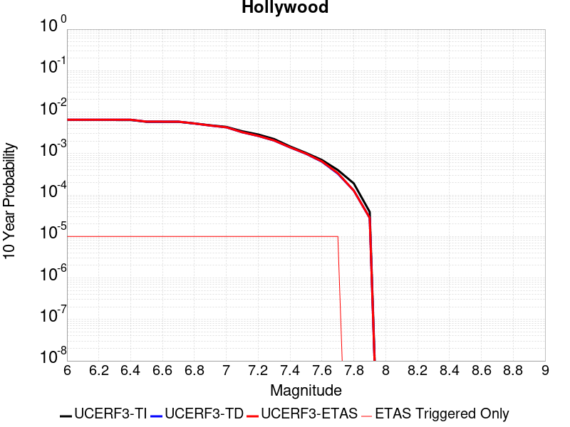 |

| Magnitude | 1 wk TI Prob | 1 wk TD Prob | 1 wk ETAS Prob | 1 wk ETAS/TD Gain | 1 wk ETAS Triggered Only | 1 mo TI Prob | 1 mo TD Prob | 1 mo ETAS Prob | 1 mo ETAS/TD Gain | 1 mo ETAS Triggered Only | 1 yr TI Prob | 1 yr TD Prob | 1 yr ETAS Prob | 1 yr ETAS/TD Gain | 1 yr ETAS Triggered Only | 10 yr TI Prob | 10 yr TD Prob | 10 yr ETAS Prob | 10 yr ETAS/TD Gain | 10 yr ETAS Triggered Only |
|-----|-----|-----|-----|-----|-----|-----|-----|-----|-----|-----|-----|-----|-----|-----|-----|-----|-----|-----|-----|-----|
| 6.0 | 1.24487615E-5 | 1.2593226E-5 | 1.2593226E-5 | 1.0 | 0.0 | 5.3350745E-5 | 5.3969878E-5 | 5.3969878E-5 | 1.0 | 0.0 | 6.4935174E-4 | 6.568898E-4 | 6.568898E-4 | 1.0 | 0.0 | 0.0064745755 | 0.006549969 | 0.0065599033 | 1.0015167 | 1.0E-5 |
| 6.1 | 1.24487615E-5 | 1.2593226E-5 | 1.2593226E-5 | 1.0 | 0.0 | 5.3350745E-5 | 5.3969878E-5 | 5.3969878E-5 | 1.0 | 0.0 | 6.4935174E-4 | 6.568898E-4 | 6.568898E-4 | 1.0 | 0.0 | 0.0064745755 | 0.006549969 | 0.0065599033 | 1.0015167 | 1.0E-5 |
| 6.2 | 1.24487615E-5 | 1.2593226E-5 | 1.2593226E-5 | 1.0 | 0.0 | 5.3350745E-5 | 5.3969878E-5 | 5.3969878E-5 | 1.0 | 0.0 | 6.4935174E-4 | 6.568898E-4 | 6.568898E-4 | 1.0 | 0.0 | 0.0064745755 | 0.006549969 | 0.0065599033 | 1.0015167 | 1.0E-5 |
| 6.3 | 1.24487615E-5 | 1.2593226E-5 | 1.2593226E-5 | 1.0 | 0.0 | 5.3350745E-5 | 5.3969878E-5 | 5.3969878E-5 | 1.0 | 0.0 | 6.4935174E-4 | 6.568898E-4 | 6.568898E-4 | 1.0 | 0.0 | 0.0064745755 | 0.006549969 | 0.0065599033 | 1.0015167 | 1.0E-5 |
| 6.4 | 1.2431024E-5 | 1.2573839E-5 | 1.2573839E-5 | 1.0 | 0.0 | 5.327473E-5 | 5.3886797E-5 | 5.3886797E-5 | 1.0 | 0.0 | 6.4842677E-4 | 6.558789E-4 | 6.558789E-4 | 1.0 | 0.0 | 0.0064653796 | 0.0065399194 | 0.006549854 | 1.0015191 | 1.0E-5 |
| 6.5 | 1.1242222E-5 | 1.13178E-5 | 1.13178E-5 | 1.0 | 0.0 | 4.8180063E-5 | 4.850397E-5 | 4.850397E-5 | 1.0 | 0.0 | 5.864344E-4 | 5.9037853E-4 | 5.9037853E-4 | 1.0 | 0.0 | 0.0058488925 | 0.005888388 | 0.005898329 | 1.0016882 | 1.0E-5 |
| 6.6 | 1.1234066E-5 | 1.13089145E-5 | 1.13089145E-5 | 1.0 | 0.0 | 4.8145106E-5 | 4.846589E-5 | 4.846589E-5 | 1.0 | 0.0 | 5.86009E-4 | 5.8991514E-4 | 5.8991514E-4 | 1.0 | 0.0 | 0.005844661 | 0.0058837784 | 0.00589372 | 1.0016896 | 1.0E-5 |
| 6.7 | 1.12294E-5 | 1.1303658E-5 | 1.1303658E-5 | 1.0 | 0.0 | 4.812511E-5 | 4.8443362E-5 | 4.8443362E-5 | 1.0 | 0.0 | 5.857657E-4 | 5.89641E-4 | 5.89641E-4 | 1.0 | 0.0 | 0.0058422405 | 0.005881052 | 0.005890993 | 1.0016904 | 1.0E-5 |
| 6.8 | 1.0252819E-5 | 1.0218445E-5 | 1.0218445E-5 | 1.0 | 0.0 | 4.3939912E-5 | 4.379261E-5 | 4.379261E-5 | 1.0 | 0.0 | 5.3483713E-4 | 5.330467E-4 | 5.330467E-4 | 1.0 | 0.0 | 0.005335517 | 0.005317908 | 0.0053278543 | 1.0018704 | 1.0E-5 |
| 6.9 | 9.252289E-6 | 9.110306E-6 | 9.110306E-6 | 1.0 | 0.0 | 3.9652066E-5 | 3.9043593E-5 | 3.9043593E-5 | 1.0 | 0.0 | 4.8265693E-4 | 4.752537E-4 | 4.752537E-4 | 1.0 | 0.0 | 0.0048161 | 0.004742547 | 0.0047524995 | 1.0020986 | 1.0E-5 |
| 7.0 | 8.474604E-6 | 8.258257E-6 | 8.258257E-6 | 1.0 | 0.0 | 3.6319227E-5 | 3.539206E-5 | 3.539206E-5 | 1.0 | 0.0 | 4.4209688E-4 | 4.3081454E-4 | 4.3081454E-4 | 1.0 | 0.0 | 0.004412184 | 0.004299944 | 0.004309901 | 1.0023156 | 1.0E-5 |
| 7.1 | 6.643643E-6 | 6.2683675E-6 | 6.2683675E-6 | 1.0 | 0.0 | 2.8472443E-5 | 2.6864158E-5 | 2.6864158E-5 | 1.0 | 0.0 | 3.4659685E-4 | 3.2702246E-4 | 3.2702246E-4 | 1.0 | 0.0 | 0.0034605677 | 0.0032654584 | 0.0032754256 | 1.0030524 | 1.0E-5 |
| 7.2 | 5.549002E-6 | 5.108709E-6 | 5.108709E-6 | 1.0 | 0.0 | 2.378122E-5 | 2.1894284E-5 | 2.1894284E-5 | 1.0 | 0.0 | 2.8949787E-4 | 2.6653046E-4 | 2.6653046E-4 | 1.0 | 0.0 | 0.0028912104 | 0.0026621243 | 0.0026720979 | 1.0037464 | 1.0E-5 |
| 7.3 | 4.3059727E-6 | 3.9598885E-6 | 3.9598885E-6 | 1.0 | 0.0 | 1.8454039E-5 | 1.6970842E-5 | 1.6970842E-5 | 1.0 | 0.0 | 2.2465475E-4 | 2.066005E-4 | 2.066005E-4 | 1.0 | 0.0 | 0.0022442779 | 0.0020640944 | 0.0020740738 | 1.0048348 | 1.0E-5 |
| 7.4 | 2.8550733E-6 | 2.7012966E-6 | 2.7012966E-6 | 1.0 | 0.0 | 1.2235971E-5 | 1.1576934E-5 | 1.1576934E-5 | 1.0 | 0.0 | 1.4896276E-4 | 1.409401E-4 | 1.409401E-4 | 1.0 | 0.0 | 0.0014886294 | 0.0014085122 | 0.0014184982 | 1.0070897 | 1.0E-5 |
| 7.5 | 1.9927045E-6 | 1.8976367E-6 | 1.8976367E-6 | 1.0 | 0.0 | 8.540134E-6 | 8.132703E-6 | 8.132703E-6 | 1.0 | 0.0 | 1.0397117E-4 | 9.90112E-5 | 9.90112E-5 | 1.0 | 0.0 | 0.0010392254 | 9.896745E-4 | 9.996645E-4 | 1.0100943 | 1.0E-5 |
| 7.6 | 1.345084E-6 | 1.2216007E-6 | 1.2216007E-6 | 1.0 | 0.0 | 5.764633E-6 | 5.235421E-6 | 5.235421E-6 | 1.0 | 0.0 | 7.018215E-5 | 6.3739404E-5 | 6.3739404E-5 | 1.0 | 0.0 | 7.0159987E-4 | 6.3721323E-4 | 6.4720685E-4 | 1.0156833 | 1.0E-5 |
| 7.7 | 7.6835164E-7 | 6.277697E-7 | 6.277697E-7 | 1.0 | 0.0 | 3.2929315E-6 | 2.6904388E-6 | 2.6904388E-6 | 1.0 | 0.0 | 4.00907E-5 | 3.2755615E-5 | 3.2755615E-5 | 1.0 | 0.0 | 4.0083472E-4 | 3.2750933E-4 | 3.3750606E-4 | 1.0305235 | 1.0E-5 |
| 7.8 | 3.6562128E-7 | 2.453479E-7 | 2.453479E-7 | 1.0 | 0.0 | 1.5669474E-6 | 1.0514907E-6 | 1.0514907E-6 | 1.0 | 0.0 | 1.9077417E-5 | 1.2801827E-5 | 1.2801827E-5 | 1.0 | 0.0 | 1.907578E-4 | 1.2801126E-4 | 1.2801126E-4 | 1.0 | 0.0 |
| 7.9 | 7.5024424E-8 | 5.3816795E-8 | 5.3816795E-8 | 1.0 | 0.0 | 3.215332E-7 | 2.306434E-7 | 2.306434E-7 | 1.0 | 0.0 | 3.91466E-6 | 2.808081E-6 | 2.808081E-6 | 1.0 | 0.0 | 3.9145907E-5 | 2.8080585E-5 | 2.8080585E-5 | 1.0 | 0.0 |

## Round Valley
*[(top)](#table-of-contents)*

| 1 Week | 1 Month | 1 Year | 10 Year |
|-----|-----|-----|-----|
|  |  |  |  |

| Magnitude | 1 wk TI Prob | 1 wk TD Prob | 1 wk ETAS Prob | 1 wk ETAS/TD Gain | 1 wk ETAS Triggered Only | 1 mo TI Prob | 1 mo TD Prob | 1 mo ETAS Prob | 1 mo ETAS/TD Gain | 1 mo ETAS Triggered Only | 1 yr TI Prob | 1 yr TD Prob | 1 yr ETAS Prob | 1 yr ETAS/TD Gain | 1 yr ETAS Triggered Only | 10 yr TI Prob | 10 yr TD Prob | 10 yr ETAS Prob | 10 yr ETAS/TD Gain | 10 yr ETAS Triggered Only |
|-----|-----|-----|-----|-----|-----|-----|-----|-----|-----|-----|-----|-----|-----|-----|-----|-----|-----|-----|-----|-----|
| 6.0 | 1.588152E-5 | 1.3670716E-5 | 2.3670578E-5 | 1.7314806 | 1.0E-5 | 6.806188E-5 | 5.8587688E-5 | 6.85871E-5 | 1.1706743 | 1.0E-5 | 8.283384E-4 | 7.13111E-4 | 7.231039E-4 | 1.014013 | 1.0E-5 | 0.008252576 | 0.0071121147 | 0.007122044 | 1.0013961 | 1.0E-5 |
| 6.1 | 1.588152E-5 | 1.3670716E-5 | 2.3670578E-5 | 1.7314806 | 1.0E-5 | 6.806188E-5 | 5.8587688E-5 | 6.85871E-5 | 1.1706743 | 1.0E-5 | 8.283384E-4 | 7.13111E-4 | 7.231039E-4 | 1.014013 | 1.0E-5 | 0.008252576 | 0.0071121147 | 0.007122044 | 1.0013961 | 1.0E-5 |
| 6.2 | 1.588152E-5 | 1.3670716E-5 | 2.3670578E-5 | 1.7314806 | 1.0E-5 | 6.806188E-5 | 5.8587688E-5 | 6.85871E-5 | 1.1706743 | 1.0E-5 | 8.283384E-4 | 7.13111E-4 | 7.231039E-4 | 1.014013 | 1.0E-5 | 0.008252576 | 0.0071121147 | 0.007122044 | 1.0013961 | 1.0E-5 |
| 6.3 | 1.588152E-5 | 1.3670716E-5 | 2.3670578E-5 | 1.7314806 | 1.0E-5 | 6.806188E-5 | 5.8587688E-5 | 6.85871E-5 | 1.1706743 | 1.0E-5 | 8.283384E-4 | 7.13111E-4 | 7.231039E-4 | 1.014013 | 1.0E-5 | 0.008252576 | 0.0071121147 | 0.007122044 | 1.0013961 | 1.0E-5 |
| 6.4 | 1.588152E-5 | 1.3670716E-5 | 2.3670578E-5 | 1.7314806 | 1.0E-5 | 6.806188E-5 | 5.8587688E-5 | 6.85871E-5 | 1.1706743 | 1.0E-5 | 8.283384E-4 | 7.13111E-4 | 7.231039E-4 | 1.014013 | 1.0E-5 | 0.008252576 | 0.0071121147 | 0.007122044 | 1.0013961 | 1.0E-5 |
| 6.5 | 1.0646776E-5 | 7.953037E-6 | 1.7952958E-5 | 2.2573712 | 1.0E-5 | 4.5628243E-5 | 3.408405E-5 | 4.4083707E-5 | 1.2933824 | 1.0E-5 | 5.553823E-4 | 4.1490266E-4 | 4.2489852E-4 | 1.0240921 | 1.0E-5 | 0.005539963 | 0.0041421093 | 0.004152068 | 1.0024042 | 1.0E-5 |
| 6.6 | 8.632956E-6 | 5.768742E-6 | 5.768742E-6 | 1.0 | 0.0 | 3.6997862E-5 | 2.4722967E-5 | 2.4722967E-5 | 1.0 | 0.0 | 4.5035584E-4 | 3.009644E-4 | 3.009644E-4 | 1.0 | 0.0 | 0.0044944426 | 0.003005946 | 0.003005946 | 1.0 | 0.0 |
| 6.7 | 8.632956E-6 | 5.768742E-6 | 5.768742E-6 | 1.0 | 0.0 | 3.6997862E-5 | 2.4722967E-5 | 2.4722967E-5 | 1.0 | 0.0 | 4.5035584E-4 | 3.009644E-4 | 3.009644E-4 | 1.0 | 0.0 | 0.0044944426 | 0.003005946 | 0.003005946 | 1.0 | 0.0 |
| 6.8 | 7.143895E-6 | 4.2018346E-6 | 4.2018346E-6 | 1.0 | 0.0 | 3.0616335E-5 | 1.8007748E-5 | 1.8007748E-5 | 1.0 | 0.0 | 3.726901E-4 | 2.1922393E-4 | 2.1922393E-4 | 1.0 | 0.0 | 0.0037206567 | 0.0021902416 | 0.0021902416 | 1.0 | 0.0 |
| 6.9 | 6.5120694E-6 | 3.6644687E-6 | 3.6644687E-6 | 1.0 | 0.0 | 2.790857E-5 | 1.570478E-5 | 1.570478E-5 | 1.0 | 0.0 | 3.3973387E-4 | 1.9119044E-4 | 1.9119044E-4 | 1.0 | 0.0 | 0.0033921495 | 0.0019104085 | 0.0019104085 | 1.0 | 0.0 |
| 7.0 | 5.0614435E-6 | 2.6836676E-6 | 2.6836676E-6 | 1.0 | 0.0 | 2.169172E-5 | 1.1501388E-5 | 1.1501388E-5 | 1.0 | 0.0 | 2.6406467E-4 | 1.4002144E-4 | 1.4002144E-4 | 1.0 | 0.0 | 0.0026375111 | 0.0013994334 | 0.0013994334 | 1.0 | 0.0 |
| 7.1 | 4.41728E-6 | 2.3575074E-6 | 2.3575074E-6 | 1.0 | 0.0 | 1.8931061E-5 | 1.0103569E-5 | 1.0103569E-5 | 1.0 | 0.0 | 2.304613E-4 | 1.23005E-4 | 1.23005E-4 | 1.0 | 0.0 | 0.0023022245 | 0.0012294657 | 0.0012294657 | 1.0 | 0.0 |
| 7.2 | 2.535495E-6 | 1.1208391E-6 | 1.1208391E-6 | 1.0 | 0.0 | 1.0866362E-5 | 4.8035904E-6 | 4.8035904E-6 | 1.0 | 0.0 | 1.3228992E-4 | 5.8482667E-5 | 5.8482667E-5 | 1.0 | 0.0 | 0.0013221119 | 5.84724E-4 | 5.84724E-4 | 1.0 | 0.0 |
| 7.3 | 7.900015E-7 | 4.0889498E-7 | 4.0889498E-7 | 1.0 | 0.0 | 3.3857161E-6 | 1.752407E-6 | 1.752407E-6 | 1.0 | 0.0 | 4.1220315E-5 | 2.1335554E-5 | 2.1335554E-5 | 1.0 | 0.0 | 4.121267E-4 | 2.1335555E-4 | 2.1335555E-4 | 1.0 | 0.0 |

## Elsinore (Julian)
*[(top)](#table-of-contents)*

| 1 Week | 1 Month | 1 Year | 10 Year |
|-----|-----|-----|-----|
|  |  |  |  |

| Magnitude | 1 wk TI Prob | 1 wk TD Prob | 1 wk ETAS Prob | 1 wk ETAS/TD Gain | 1 wk ETAS Triggered Only | 1 mo TI Prob | 1 mo TD Prob | 1 mo ETAS Prob | 1 mo ETAS/TD Gain | 1 mo ETAS Triggered Only | 1 yr TI Prob | 1 yr TD Prob | 1 yr ETAS Prob | 1 yr ETAS/TD Gain | 1 yr ETAS Triggered Only | 10 yr TI Prob | 10 yr TD Prob | 10 yr ETAS Prob | 10 yr ETAS/TD Gain | 10 yr ETAS Triggered Only |
|-----|-----|-----|-----|-----|-----|-----|-----|-----|-----|-----|-----|-----|-----|-----|-----|-----|-----|-----|-----|-----|
| 6.0 | 1.1710231E-5 | 8.845509E-6 | 1.884542E-5 | 2.1305072 | 1.0E-5 | 5.0185736E-5 | 3.7908783E-5 | 4.7908405E-5 | 1.2637811 | 1.0E-5 | 6.1084004E-4 | 4.614434E-4 | 4.7143875E-4 | 1.0216612 | 1.0E-5 | 0.006091637 | 0.0046050567 | 0.0046150107 | 1.0021615 | 1.0E-5 |
| 6.1 | 1.1710231E-5 | 8.845509E-6 | 1.884542E-5 | 2.1305072 | 1.0E-5 | 5.0185736E-5 | 3.7908783E-5 | 4.7908405E-5 | 1.2637811 | 1.0E-5 | 6.1084004E-4 | 4.614434E-4 | 4.7143875E-4 | 1.0216612 | 1.0E-5 | 0.006091637 | 0.0046050567 | 0.0046150107 | 1.0021615 | 1.0E-5 |
| 6.2 | 1.1710231E-5 | 8.845509E-6 | 1.884542E-5 | 2.1305072 | 1.0E-5 | 5.0185736E-5 | 3.7908783E-5 | 4.7908405E-5 | 1.2637811 | 1.0E-5 | 6.1084004E-4 | 4.614434E-4 | 4.7143875E-4 | 1.0216612 | 1.0E-5 | 0.006091637 | 0.0046050567 | 0.0046150107 | 1.0021615 | 1.0E-5 |
| 6.3 | 1.1710231E-5 | 8.845509E-6 | 1.884542E-5 | 2.1305072 | 1.0E-5 | 5.0185736E-5 | 3.7908783E-5 | 4.7908405E-5 | 1.2637811 | 1.0E-5 | 6.1084004E-4 | 4.614434E-4 | 4.7143875E-4 | 1.0216612 | 1.0E-5 | 0.006091637 | 0.0046050567 | 0.0046150107 | 1.0021615 | 1.0E-5 |
| 6.4 | 1.1710231E-5 | 8.845509E-6 | 1.884542E-5 | 2.1305072 | 1.0E-5 | 5.0185736E-5 | 3.7908783E-5 | 4.7908405E-5 | 1.2637811 | 1.0E-5 | 6.1084004E-4 | 4.614434E-4 | 4.7143875E-4 | 1.0216612 | 1.0E-5 | 0.006091637 | 0.0046050567 | 0.0046150107 | 1.0021615 | 1.0E-5 |
| 6.5 | 1.1710231E-5 | 8.845509E-6 | 1.884542E-5 | 2.1305072 | 1.0E-5 | 5.0185736E-5 | 3.7908783E-5 | 4.7908405E-5 | 1.2637811 | 1.0E-5 | 6.1084004E-4 | 4.614434E-4 | 4.7143875E-4 | 1.0216612 | 1.0E-5 | 0.006091637 | 0.0046050567 | 0.0046150107 | 1.0021615 | 1.0E-5 |
| 6.6 | 1.1650619E-5 | 8.777881E-6 | 1.8777793E-5 | 2.1392171 | 1.0E-5 | 4.993027E-5 | 3.7618956E-5 | 4.761858E-5 | 1.2658135 | 1.0E-5 | 6.0773146E-4 | 4.5791623E-4 | 4.6791165E-4 | 1.021828 | 1.0E-5 | 0.0060607214 | 0.004569931 | 0.004579885 | 1.0021782 | 1.0E-5 |
| 6.7 | 1.1650619E-5 | 8.777881E-6 | 1.8777793E-5 | 2.1392171 | 1.0E-5 | 4.993027E-5 | 3.7618956E-5 | 4.761858E-5 | 1.2658135 | 1.0E-5 | 6.0773146E-4 | 4.5791623E-4 | 4.6791165E-4 | 1.021828 | 1.0E-5 | 0.0060607214 | 0.004569931 | 0.004579885 | 1.0021782 | 1.0E-5 |
| 6.8 | 1.1442698E-5 | 8.561041E-6 | 1.8560955E-5 | 2.1680722 | 1.0E-5 | 4.9039216E-5 | 3.6689667E-5 | 4.66893E-5 | 1.2725463 | 1.0E-5 | 5.968889E-4 | 4.4660683E-4 | 4.5660237E-4 | 1.0223811 | 1.0E-5 | 0.0059528816 | 0.004457295 | 0.0044672503 | 1.0022335 | 1.0E-5 |
| 6.9 | 1.1300589E-5 | 8.408907E-6 | 1.8408824E-5 | 2.1892052 | 1.0E-5 | 4.8430196E-5 | 3.6037683E-5 | 4.6037323E-5 | 1.2774773 | 1.0E-5 | 5.894781E-4 | 4.3867214E-4 | 4.4866776E-4 | 1.022786 | 1.0E-5 | 0.005879169 | 0.0043782624 | 0.0043882183 | 1.002274 | 1.0E-5 |
| 7.0 | 1.1117729E-5 | 8.226087E-6 | 1.8226005E-5 | 2.2156348 | 1.0E-5 | 4.764654E-5 | 3.525419E-5 | 4.525384E-5 | 1.2836442 | 1.0E-5 | 5.799422E-4 | 4.291369E-4 | 4.3913262E-4 | 1.0232925 | 1.0E-5 | 0.0057843104 | 0.004283281 | 0.004293238 | 1.0023247 | 1.0E-5 |
| 7.1 | 1.08053955E-5 | 7.9117535E-6 | 1.7911674E-5 | 2.2639322 | 1.0E-5 | 4.6308014E-5 | 3.3907087E-5 | 4.3906748E-5 | 1.2949136 | 1.0E-5 | 5.6365423E-4 | 4.127422E-4 | 4.2273809E-4 | 1.0242182 | 1.0E-5 | 0.005622267 | 0.0041199517 | 0.004129911 | 1.0024172 | 1.0E-5 |
| 7.2 | 1.032804E-5 | 7.433021E-6 | 7.433021E-6 | 1.0 | 0.0 | 4.4262277E-5 | 3.1855423E-5 | 3.1855423E-5 | 1.0 | 0.0 | 5.387599E-4 | 3.8777234E-4 | 3.8777234E-4 | 1.0 | 0.0 | 0.0053745564 | 0.0038711445 | 0.0038711445 | 1.0 | 0.0 |
| 7.3 | 9.622426E-6 | 6.8978457E-6 | 6.8978457E-6 | 1.0 | 0.0 | 4.1238312E-5 | 2.9561868E-5 | 2.9561868E-5 | 1.0 | 0.0 | 5.019608E-4 | 3.5985775E-4 | 3.5985775E-4 | 1.0 | 0.0 | 0.005008285 | 0.0035929221 | 0.0035929221 | 1.0 | 0.0 |
| 7.4 | 9.144434E-6 | 6.4963933E-6 | 6.4963933E-6 | 1.0 | 0.0 | 3.9189843E-5 | 2.7841395E-5 | 2.7841395E-5 | 1.0 | 0.0 | 4.7703186E-4 | 3.3891766E-4 | 3.3891766E-4 | 1.0 | 0.0 | 0.0047600917 | 0.0033841513 | 0.0033841513 | 1.0 | 0.0 |
| 7.5 | 7.988981E-6 | 5.4983307E-6 | 5.4983307E-6 | 1.0 | 0.0 | 3.4238044E-5 | 2.356407E-5 | 2.356407E-5 | 1.0 | 0.0 | 4.1676845E-4 | 2.8685606E-4 | 2.8685606E-4 | 1.0 | 0.0 | 0.0041598766 | 0.002864985 | 0.002864985 | 1.0 | 0.0 |
| 7.6 | 6.9554876E-6 | 4.6625346E-6 | 4.6625346E-6 | 1.0 | 0.0 | 2.9808893E-5 | 1.9982144E-5 | 1.9982144E-5 | 1.0 | 0.0 | 3.6286283E-4 | 2.4325661E-4 | 2.4325661E-4 | 1.0 | 0.0 | 0.0036227088 | 0.0024300197 | 0.0024300197 | 1.0 | 0.0 |
| 7.7 | 4.1557314E-6 | 2.3246462E-6 | 2.3246462E-6 | 1.0 | 0.0 | 1.7810156E-5 | 9.962735E-6 | 9.962735E-6 | 1.0 | 0.0 | 2.1681708E-4 | 1.2129029E-4 | 1.2129029E-4 | 1.0 | 0.0 | 0.0021660565 | 0.001212314 | 0.001212314 | 1.0 | 0.0 |
| 7.8 | 2.2597293E-7 | 9.332915E-8 | 9.332915E-8 | 1.0 | 0.0 | 9.684551E-7 | 3.99982E-7 | 3.99982E-7 | 1.0 | 0.0 | 1.1790877E-5 | 4.8697734E-6 | 4.8697734E-6 | 1.0 | 0.0 | 1.17902506E-4 | 4.8696995E-5 | 4.8696995E-5 | 1.0 | 0.0 |
| 7.9 | 6.676829E-9 | 3.439853E-9 | 3.439853E-9 | 1.0 | 0.0 | 2.861498E-8 | 1.4742227E-8 | 1.4742227E-8 | 1.0 | 0.0 | 3.4838732E-7 | 1.7948659E-7 | 1.7948659E-7 | 1.0 | 0.0 | 3.4838679E-6 | 1.7948646E-6 | 1.7948646E-6 | 1.0 | 0.0 |

## Clayton
*[(top)](#table-of-contents)*

| 1 Week | 1 Month | 1 Year | 10 Year |
|-----|-----|-----|-----|
|  |  |  |  |

| Magnitude | 1 wk TI Prob | 1 wk TD Prob | 1 wk ETAS Prob | 1 wk ETAS/TD Gain | 1 wk ETAS Triggered Only | 1 mo TI Prob | 1 mo TD Prob | 1 mo ETAS Prob | 1 mo ETAS/TD Gain | 1 mo ETAS Triggered Only | 1 yr TI Prob | 1 yr TD Prob | 1 yr ETAS Prob | 1 yr ETAS/TD Gain | 1 yr ETAS Triggered Only | 10 yr TI Prob | 10 yr TD Prob | 10 yr ETAS Prob | 10 yr ETAS/TD Gain | 10 yr ETAS Triggered Only |
|-----|-----|-----|-----|-----|-----|-----|-----|-----|-----|-----|-----|-----|-----|-----|-----|-----|-----|-----|-----|-----|
| 6.0 | 1.1413061E-5 | 1.2667059E-5 | 1.2667059E-5 | 1.0 | 0.0 | 4.89122E-5 | 5.4286393E-5 | 5.4286393E-5 | 1.0 | 0.0 | 5.953433E-4 | 6.607586E-4 | 6.70752E-4 | 1.0151241 | 1.0E-5 | 0.005937509 | 0.0065901424 | 0.0066000763 | 1.0015074 | 1.0E-5 |
| 6.1 | 1.1413061E-5 | 1.2667059E-5 | 1.2667059E-5 | 1.0 | 0.0 | 4.89122E-5 | 5.4286393E-5 | 5.4286393E-5 | 1.0 | 0.0 | 5.953433E-4 | 6.607586E-4 | 6.70752E-4 | 1.0151241 | 1.0E-5 | 0.005937509 | 0.0065901424 | 0.0066000763 | 1.0015074 | 1.0E-5 |
| 6.2 | 1.1413061E-5 | 1.2667059E-5 | 1.2667059E-5 | 1.0 | 0.0 | 4.89122E-5 | 5.4286393E-5 | 5.4286393E-5 | 1.0 | 0.0 | 5.953433E-4 | 6.607586E-4 | 6.70752E-4 | 1.0151241 | 1.0E-5 | 0.005937509 | 0.0065901424 | 0.0066000763 | 1.0015074 | 1.0E-5 |
| 6.3 | 8.538689E-6 | 9.532753E-6 | 9.532753E-6 | 1.0 | 0.0 | 3.659387E-5 | 4.0854076E-5 | 4.0854076E-5 | 1.0 | 0.0 | 4.4543925E-4 | 4.9729564E-4 | 5.0729065E-4 | 1.0200988 | 1.0E-5 | 0.0044454746 | 0.0049628937 | 0.004972844 | 1.002005 | 1.0E-5 |
| 6.4 | 8.538689E-6 | 9.532753E-6 | 9.532753E-6 | 1.0 | 0.0 | 3.659387E-5 | 4.0854076E-5 | 4.0854076E-5 | 1.0 | 0.0 | 4.4543925E-4 | 4.9729564E-4 | 5.0729065E-4 | 1.0200988 | 1.0E-5 | 0.0044454746 | 0.0049628937 | 0.004972844 | 1.002005 | 1.0E-5 |
| 6.5 | 7.197462E-6 | 8.080952E-6 | 8.080952E-6 | 1.0 | 0.0 | 3.08459E-5 | 3.4632238E-5 | 3.4632238E-5 | 1.0 | 0.0 | 3.7548412E-4 | 4.2157414E-4 | 4.315699E-4 | 1.0237106 | 1.0E-5 | 0.003748503 | 0.004208556 | 0.0042185136 | 1.0023661 | 1.0E-5 |
| 6.6 | 7.1760483E-6 | 8.056968E-6 | 8.056968E-6 | 1.0 | 0.0 | 3.075413E-5 | 3.4529454E-5 | 3.4529454E-5 | 1.0 | 0.0 | 3.743672E-4 | 4.203232E-4 | 4.30319E-4 | 1.0237812 | 1.0E-5 | 0.0037373714 | 0.004196094 | 0.004206052 | 1.0023732 | 1.0E-5 |
| 6.7 | 6.202582E-6 | 6.9766934E-6 | 6.9766934E-6 | 1.0 | 0.0 | 2.6582224E-5 | 2.9899817E-5 | 2.9899817E-5 | 1.0 | 0.0 | 3.235905E-4 | 3.6397713E-4 | 3.7397348E-4 | 1.0274643 | 1.0E-5 | 0.0032311971 | 0.0036345655 | 0.0036445293 | 1.0027413 | 1.0E-5 |
| 6.8 | 3.6417277E-6 | 4.1212957E-6 | 4.1212957E-6 | 1.0 | 0.0 | 1.5607311E-5 | 1.766258E-5 | 1.766258E-5 | 1.0 | 0.0 | 1.9000245E-4 | 2.1502146E-4 | 2.250193E-4 | 1.046497 | 1.0E-5 | 0.0018984007 | 0.0021482105 | 0.002158189 | 1.004645 | 1.0E-5 |
| 6.9 | 2.6498485E-6 | 2.9995201E-6 | 2.9995201E-6 | 1.0 | 0.0 | 1.1356444E-5 | 1.2855025E-5 | 1.2855025E-5 | 1.0 | 0.0 | 1.3825593E-4 | 1.5649908E-4 | 1.6649753E-4 | 1.0638882 | 1.0E-5 | 0.0013816995 | 0.0015639283 | 0.0015739127 | 1.0063841 | 1.0E-5 |
| 7.0 | 2.070442E-6 | 2.3407233E-6 | 2.3407233E-6 | 1.0 | 0.0 | 8.873292E-6 | 1.0031635E-5 | 1.0031635E-5 | 1.0 | 0.0 | 1.0802698E-4 | 1.2212861E-4 | 1.3212739E-4 | 1.0818709 | 1.0E-5 | 0.0010797448 | 0.0012206447 | 0.0012306325 | 1.0081824 | 1.0E-5 |
| 7.1 | 1.2111691E-6 | 1.3588725E-6 | 1.3588725E-6 | 1.0 | 0.0 | 5.190714E-6 | 5.8237274E-6 | 5.8237274E-6 | 1.0 | 0.0 | 6.319511E-5 | 7.090174E-5 | 8.090103E-5 | 1.1410303 | 1.0E-5 | 6.3177146E-4 | 7.0880755E-4 | 7.188004E-4 | 1.0140982 | 1.0E-5 |
| 7.2 | 3.9541607E-7 | 4.2227694E-7 | 4.2227694E-7 | 1.0 | 0.0 | 1.6946392E-6 | 1.8097571E-6 | 1.8097571E-6 | 1.0 | 0.0 | 2.0632036E-5 | 2.2033571E-5 | 2.2033571E-5 | 1.0 | 0.0 | 2.063012E-4 | 2.2031402E-4 | 2.2031402E-4 | 1.0 | 0.0 |
| 7.3 | 2.5685637E-7 | 2.745679E-7 | 2.745679E-7 | 1.0 | 0.0 | 1.1008126E-6 | 1.176719E-6 | 1.176719E-6 | 1.0 | 0.0 | 1.3402311E-5 | 1.4326461E-5 | 1.4326461E-5 | 1.0 | 0.0 | 1.3401502E-4 | 1.4325544E-4 | 1.4325544E-4 | 1.0 | 0.0 |
| 7.4 | 1.482299E-7 | 1.5807963E-7 | 1.5807963E-7 | 1.0 | 0.0 | 6.3527085E-7 | 6.7748397E-7 | 6.7748397E-7 | 1.0 | 0.0 | 7.734395E-6 | 8.248337E-6 | 8.248337E-6 | 1.0 | 0.0 | 7.734126E-5 | 8.248033E-5 | 8.248033E-5 | 1.0 | 0.0 |
| 7.5 | 9.7969505E-8 | 1.04382096E-7 | 1.04382096E-7 | 1.0 | 0.0 | 4.1986925E-7 | 4.4735177E-7 | 4.4735177E-7 | 1.0 | 0.0 | 5.111896E-6 | 5.446494E-6 | 5.446494E-6 | 1.0 | 0.0 | 5.1117782E-5 | 5.4463624E-5 | 5.4463624E-5 | 1.0 | 0.0 |
| 7.6 | 6.125415E-8 | 6.5231326E-8 | 6.5231326E-8 | 1.0 | 0.0 | 2.6251774E-7 | 2.7956278E-7 | 2.7956278E-7 | 1.0 | 0.0 | 3.196149E-6 | 3.4036718E-6 | 3.4036718E-6 | 1.0 | 0.0 | 3.196103E-5 | 3.403621E-5 | 3.403621E-5 | 1.0 | 0.0 |

## Walker Spring 2011 CFM
*[(top)](#table-of-contents)*

| 1 Week | 1 Month | 1 Year | 10 Year |
|-----|-----|-----|-----|
| 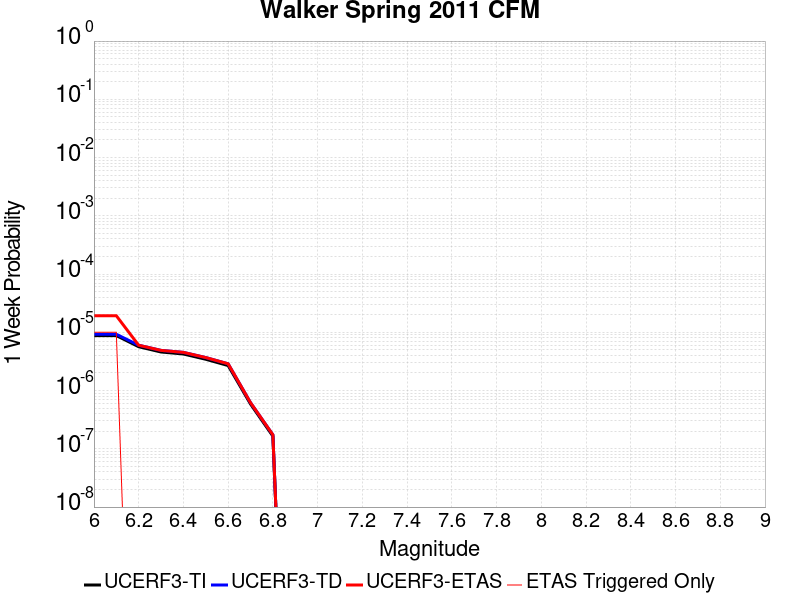 |  |  |  |

| Magnitude | 1 wk TI Prob | 1 wk TD Prob | 1 wk ETAS Prob | 1 wk ETAS/TD Gain | 1 wk ETAS Triggered Only | 1 mo TI Prob | 1 mo TD Prob | 1 mo ETAS Prob | 1 mo ETAS/TD Gain | 1 mo ETAS Triggered Only | 1 yr TI Prob | 1 yr TD Prob | 1 yr ETAS Prob | 1 yr ETAS/TD Gain | 1 yr ETAS Triggered Only | 10 yr TI Prob | 10 yr TD Prob | 10 yr ETAS Prob | 10 yr ETAS/TD Gain | 10 yr ETAS Triggered Only |
|-----|-----|-----|-----|-----|-----|-----|-----|-----|-----|-----|-----|-----|-----|-----|-----|-----|-----|-----|-----|-----|
| 6.0 | 8.791276E-6 | 9.264088E-6 | 1.9263995E-5 | 2.079427 | 1.0E-5 | 3.767635E-5 | 3.970269E-5 | 4.9702292E-5 | 1.251862 | 1.0E-5 | 4.58613E-4 | 4.832839E-4 | 4.932791E-4 | 1.0206817 | 1.0E-5 | 0.004576677 | 0.0048234025 | 0.004833354 | 1.0020633 | 1.0E-5 |
| 6.1 | 8.791276E-6 | 9.264088E-6 | 1.9263995E-5 | 2.079427 | 1.0E-5 | 3.767635E-5 | 3.970269E-5 | 4.9702292E-5 | 1.251862 | 1.0E-5 | 4.58613E-4 | 4.832839E-4 | 4.932791E-4 | 1.0206817 | 1.0E-5 | 0.004576677 | 0.0048234025 | 0.004833354 | 1.0020633 | 1.0E-5 |
| 6.2 | 5.654515E-6 | 5.99876E-6 | 5.99876E-6 | 1.0 | 0.0 | 2.4233412E-5 | 2.5708747E-5 | 2.5708747E-5 | 1.0 | 0.0 | 2.9500184E-4 | 3.1296405E-4 | 3.1296405E-4 | 1.0 | 0.0 | 0.0029461053 | 0.0031257276 | 0.0031257276 | 1.0 | 0.0 |
| 6.3 | 4.591685E-6 | 4.8947268E-6 | 4.8947268E-6 | 1.0 | 0.0 | 1.96785E-5 | 2.0977257E-5 | 2.0977257E-5 | 1.0 | 0.0 | 2.395594E-4 | 2.5537255E-4 | 2.5537255E-4 | 1.0 | 0.0 | 0.002393013 | 0.0025512208 | 0.0025512208 | 1.0 | 0.0 |
| 6.4 | 4.243283E-6 | 4.52266E-6 | 4.52266E-6 | 1.0 | 0.0 | 1.8185372E-5 | 1.938271E-5 | 1.938271E-5 | 1.0 | 0.0 | 2.2138441E-4 | 2.3596318E-4 | 2.3596318E-4 | 1.0 | 0.0 | 0.00221164 | 0.0023575418 | 0.0023575418 | 1.0 | 0.0 |
| 6.5 | 3.4445666E-6 | 3.6860924E-6 | 3.6860924E-6 | 1.0 | 0.0 | 1.4762345E-5 | 1.5797466E-5 | 1.5797466E-5 | 1.0 | 0.0 | 1.7971672E-4 | 1.923212E-4 | 1.923212E-4 | 1.0 | 0.0 | 0.0017957145 | 0.0019219425 | 0.0019219425 | 1.0 | 0.0 |
| 6.6 | 2.68766E-6 | 2.8794348E-6 | 2.8794348E-6 | 1.0 | 0.0 | 1.1518492E-5 | 1.2340398E-5 | 1.2340398E-5 | 1.0 | 0.0 | 1.4022861E-4 | 1.502378E-4 | 1.502378E-4 | 1.0 | 0.0 | 0.0014014016 | 0.0015017362 | 0.0015017362 | 1.0 | 0.0 |
| 6.7 | 5.880964E-7 | 6.1997474E-7 | 6.1997474E-7 | 1.0 | 0.0 | 2.5204106E-6 | 2.6570326E-6 | 2.6570326E-6 | 1.0 | 0.0 | 3.0685565E-5 | 3.2348988E-5 | 3.2348988E-5 | 1.0 | 0.0 | 3.068133E-4 | 3.2345214E-4 | 3.2345214E-4 | 1.0 | 0.0 |
| 6.8 | 1.6514163E-7 | 1.7409117E-7 | 1.7409117E-7 | 1.0 | 0.0 | 7.077497E-7 | 7.46105E-7 | 7.46105E-7 | 1.0 | 0.0 | 8.616818E-6 | 9.083828E-6 | 9.083828E-6 | 1.0 | 0.0 | 8.616484E-5 | 9.0838286E-5 | 9.0838286E-5 | 1.0 | 0.0 |

## Hunting Creek - Bartlett Springs connector 2011
*[(top)](#table-of-contents)*

| 1 Week | 1 Month | 1 Year | 10 Year |
|-----|-----|-----|-----|
|  |  |  | 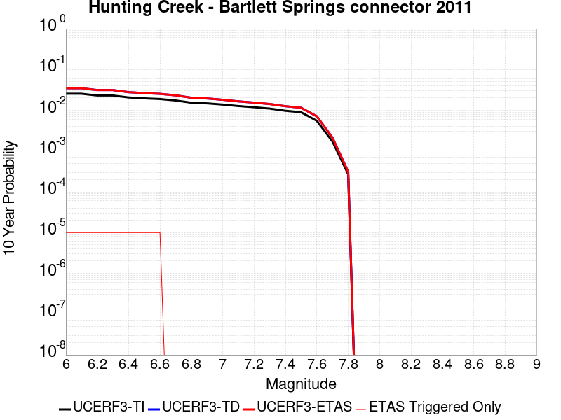 |

| Magnitude | 1 wk TI Prob | 1 wk TD Prob | 1 wk ETAS Prob | 1 wk ETAS/TD Gain | 1 wk ETAS Triggered Only | 1 mo TI Prob | 1 mo TD Prob | 1 mo ETAS Prob | 1 mo ETAS/TD Gain | 1 mo ETAS Triggered Only | 1 yr TI Prob | 1 yr TD Prob | 1 yr ETAS Prob | 1 yr ETAS/TD Gain | 1 yr ETAS Triggered Only | 10 yr TI Prob | 10 yr TD Prob | 10 yr ETAS Prob | 10 yr ETAS/TD Gain | 10 yr ETAS Triggered Only |
|-----|-----|-----|-----|-----|-----|-----|-----|-----|-----|-----|-----|-----|-----|-----|-----|-----|-----|-----|-----|-----|
| 6.0 | 4.940016E-5 | 6.786822E-5 | 6.786822E-5 | 1.0 | 0.0 | 2.1169778E-4 | 2.9083234E-4 | 2.9083234E-4 | 1.0 | 0.0 | 0.002574374 | 0.003535177 | 0.003535177 | 1.0 | 0.0 | 0.025447546 | 0.034773834 | 0.034783486 | 1.0002775 | 1.0E-5 |
| 6.1 | 4.940016E-5 | 6.786822E-5 | 6.786822E-5 | 1.0 | 0.0 | 2.1169778E-4 | 2.9083234E-4 | 2.9083234E-4 | 1.0 | 0.0 | 0.002574374 | 0.003535177 | 0.003535177 | 1.0 | 0.0 | 0.025447546 | 0.034773834 | 0.034783486 | 1.0002775 | 1.0E-5 |
| 6.2 | 4.472471E-5 | 6.1002804E-5 | 6.1002804E-5 | 1.0 | 0.0 | 1.9166325E-4 | 2.6141506E-4 | 2.6141506E-4 | 1.0 | 0.0 | 0.0023310026 | 0.003178107 | 0.003178107 | 1.0 | 0.0 | 0.02306703 | 0.031316914 | 0.0313266 | 1.0003093 | 1.0E-5 |
| 6.3 | 4.472471E-5 | 6.1002804E-5 | 6.1002804E-5 | 1.0 | 0.0 | 1.9166325E-4 | 2.6141506E-4 | 2.6141506E-4 | 1.0 | 0.0 | 0.0023310026 | 0.003178107 | 0.003178107 | 1.0 | 0.0 | 0.02306703 | 0.031316914 | 0.0313266 | 1.0003093 | 1.0E-5 |
| 6.4 | 4.0001003E-5 | 5.4103755E-5 | 5.4103755E-5 | 1.0 | 0.0 | 1.714216E-4 | 2.31853E-4 | 2.31853E-4 | 1.0 | 0.0 | 0.0020850603 | 0.0028191248 | 0.0028191248 | 1.0 | 0.0 | 0.02065605 | 0.027828315 | 0.027838038 | 1.0003494 | 1.0E-5 |
| 6.5 | 3.8033053E-5 | 5.1266547E-5 | 5.1266547E-5 | 1.0 | 0.0 | 1.6298861E-4 | 2.1969559E-4 | 2.1969559E-4 | 1.0 | 0.0 | 0.0019825802 | 0.0026714746 | 0.0026714746 | 1.0 | 0.0 | 0.019649856 | 0.026390454 | 0.02640019 | 1.000369 | 1.0E-5 |
| 6.6 | 3.653754E-5 | 4.913017E-5 | 4.913017E-5 | 1.0 | 0.0 | 1.5658008E-4 | 2.1054115E-4 | 2.1054115E-4 | 1.0 | 0.0 | 0.0019046954 | 0.0025602852 | 0.0025602852 | 1.0 | 0.0 | 0.018884527 | 0.025306415 | 0.02531616 | 1.0003852 | 1.0E-5 |
| 6.7 | 3.372024E-5 | 4.514011E-5 | 4.514011E-5 | 1.0 | 0.0 | 1.4450731E-4 | 1.9344354E-4 | 1.9344354E-4 | 1.0 | 0.0 | 0.0017579567 | 0.002352639 | 0.002352639 | 1.0 | 0.0 | 0.017441148 | 0.023278099 | 0.023278099 | 1.0 | 0.0 |
| 6.8 | 2.9650024E-5 | 3.9411374E-5 | 3.9411374E-5 | 1.0 | 0.0 | 1.2706534E-4 | 1.6889503E-4 | 1.6889503E-4 | 1.0 | 0.0 | 0.0015459227 | 0.0020543463 | 0.0020543463 | 1.0 | 0.0 | 0.015352124 | 0.020351216 | 0.020351216 | 1.0 | 0.0 |
| 6.9 | 2.860775E-5 | 3.7812544E-5 | 3.7812544E-5 | 1.0 | 0.0 | 1.2259888E-4 | 1.6204377E-4 | 1.6204377E-4 | 1.0 | 0.0 | 0.0014916194 | 0.001971107 | 0.001971107 | 1.0 | 0.0 | 0.014816469 | 0.01953584 | 0.01953584 | 1.0 | 0.0 |
| 7.0 | 2.6696067E-5 | 3.506726E-5 | 3.506726E-5 | 1.0 | 0.0 | 1.144067E-4 | 1.5027967E-4 | 1.5027967E-4 | 1.0 | 0.0 | 0.0013920115 | 0.0018281302 | 0.0018281302 | 1.0 | 0.0 | 0.013833242 | 0.018131364 | 0.018131364 | 1.0 | 0.0 |
| 7.1 | 2.456087E-5 | 3.2013093E-5 | 3.2013093E-5 | 1.0 | 0.0 | 1.0525662E-4 | 1.371918E-4 | 1.371918E-4 | 1.0 | 0.0 | 0.001280746 | 0.0016690396 | 0.0016690396 | 1.0 | 0.0 | 0.012733897 | 0.016566366 | 0.016566366 | 1.0 | 0.0 |
| 7.2 | 2.295761E-5 | 2.9822932E-5 | 2.9822932E-5 | 1.0 | 0.0 | 9.8386045E-5 | 1.2780636E-4 | 1.2780636E-4 | 1.0 | 0.0 | 0.0011971919 | 0.001554941 | 0.001554941 | 1.0 | 0.0 | 0.011907627 | 0.015442089 | 0.015442089 | 1.0 | 0.0 |
| 7.3 | 2.1256936E-5 | 2.7541912E-5 | 2.7541912E-5 | 1.0 | 0.0 | 9.109797E-5 | 1.1803147E-4 | 1.1803147E-4 | 1.0 | 0.0 | 0.0011085535 | 0.0014360948 | 0.0014360948 | 1.0 | 0.0 | 0.011030397 | 0.014269472 | 0.014269472 | 1.0 | 0.0 |
| 7.4 | 1.8784336E-5 | 2.4306766E-5 | 2.4306766E-5 | 1.0 | 0.0 | 8.050181E-5 | 1.0416774E-4 | 1.0416774E-4 | 1.0 | 0.0 | 9.796688E-4 | 0.001267512 | 0.001267512 | 1.0 | 0.0 | 0.009753612 | 0.012603902 | 0.012603902 | 1.0 | 0.0 |
| 7.5 | 1.7248298E-5 | 2.2268887E-5 | 2.2268887E-5 | 1.0 | 0.0 | 7.391918E-5 | 9.543464E-5 | 9.543464E-5 | 1.0 | 0.0 | 8.9959445E-4 | 0.0011613049 | 0.0011613049 | 1.0 | 0.0 | 0.008959615 | 0.01155334 | 0.01155334 | 1.0 | 0.0 |
| 7.6 | 1.0653709E-5 | 1.3722118E-5 | 1.3722118E-5 | 1.0 | 0.0 | 4.5657955E-5 | 5.8807767E-5 | 5.8807767E-5 | 1.0 | 0.0 | 5.557438E-4 | 7.157521E-4 | 7.157521E-4 | 1.0 | 0.0 | 0.0055435603 | 0.0071348166 | 0.0071348166 | 1.0 | 0.0 |
| 7.7 | 3.286316E-6 | 4.0903437E-6 | 4.0903437E-6 | 1.0 | 0.0 | 1.4084137E-5 | 1.7529928E-5 | 1.7529928E-5 | 1.0 | 0.0 | 1.7146087E-4 | 2.1340612E-4 | 2.1340612E-4 | 1.0 | 0.0 | 0.0017132863 | 0.0021320276 | 0.0021320276 | 1.0 | 0.0 |
| 7.8 | 5.1855085E-7 | 5.9720696E-7 | 5.9720696E-7 | 1.0 | 0.0 | 2.222359E-6 | 2.5594559E-6 | 2.5594559E-6 | 1.0 | 0.0 | 2.7056883E-5 | 3.116094E-5 | 3.116094E-5 | 1.0 | 0.0 | 2.705359E-4 | 3.1156495E-4 | 3.1156495E-4 | 1.0 | 0.0 |

## Polaris 2011 CFM
*[(top)](#table-of-contents)*

| 1 Week | 1 Month | 1 Year | 10 Year |
|-----|-----|-----|-----|
|  |  |  | 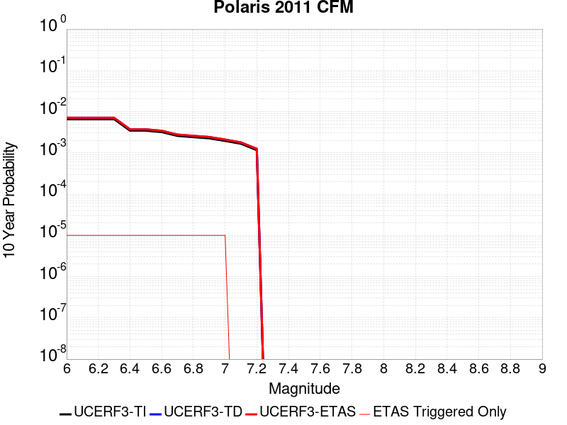 |

| Magnitude | 1 wk TI Prob | 1 wk TD Prob | 1 wk ETAS Prob | 1 wk ETAS/TD Gain | 1 wk ETAS Triggered Only | 1 mo TI Prob | 1 mo TD Prob | 1 mo ETAS Prob | 1 mo ETAS/TD Gain | 1 mo ETAS Triggered Only | 1 yr TI Prob | 1 yr TD Prob | 1 yr ETAS Prob | 1 yr ETAS/TD Gain | 1 yr ETAS Triggered Only | 10 yr TI Prob | 10 yr TD Prob | 10 yr ETAS Prob | 10 yr ETAS/TD Gain | 10 yr ETAS Triggered Only |
|-----|-----|-----|-----|-----|-----|-----|-----|-----|-----|-----|-----|-----|-----|-----|-----|-----|-----|-----|-----|-----|
| 6.0 | 1.2630823E-5 | 1.3582916E-5 | 1.3582916E-5 | 1.0 | 0.0 | 5.413098E-5 | 5.821149E-5 | 5.821149E-5 | 1.0 | 0.0 | 6.5884535E-4 | 7.085464E-4 | 7.085464E-4 | 1.0 | 0.0 | 0.0065689543 | 0.007067981 | 0.0070779105 | 1.0014049 | 1.0E-5 |
| 6.1 | 1.2630823E-5 | 1.3582916E-5 | 1.3582916E-5 | 1.0 | 0.0 | 5.413098E-5 | 5.821149E-5 | 5.821149E-5 | 1.0 | 0.0 | 6.5884535E-4 | 7.085464E-4 | 7.085464E-4 | 1.0 | 0.0 | 0.0065689543 | 0.007067981 | 0.0070779105 | 1.0014049 | 1.0E-5 |
| 6.2 | 1.2630823E-5 | 1.3582916E-5 | 1.3582916E-5 | 1.0 | 0.0 | 5.413098E-5 | 5.821149E-5 | 5.821149E-5 | 1.0 | 0.0 | 6.5884535E-4 | 7.085464E-4 | 7.085464E-4 | 1.0 | 0.0 | 0.0065689543 | 0.007067981 | 0.0070779105 | 1.0014049 | 1.0E-5 |
| 6.3 | 1.2630823E-5 | 1.3582916E-5 | 1.3582916E-5 | 1.0 | 0.0 | 5.413098E-5 | 5.821149E-5 | 5.821149E-5 | 1.0 | 0.0 | 6.5884535E-4 | 7.085464E-4 | 7.085464E-4 | 1.0 | 0.0 | 0.0065689543 | 0.007067981 | 0.0070779105 | 1.0014049 | 1.0E-5 |
| 6.4 | 6.642994E-6 | 7.10706E-6 | 7.10706E-6 | 1.0 | 0.0 | 2.8469662E-5 | 3.0458501E-5 | 3.0458501E-5 | 1.0 | 0.0 | 3.46563E-4 | 3.7077433E-4 | 3.7077433E-4 | 1.0 | 0.0 | 0.0034602303 | 0.0037020678 | 0.0037120308 | 1.0026911 | 1.0E-5 |
| 6.5 | 6.642994E-6 | 7.10706E-6 | 7.10706E-6 | 1.0 | 0.0 | 2.8469662E-5 | 3.0458501E-5 | 3.0458501E-5 | 1.0 | 0.0 | 3.46563E-4 | 3.7077433E-4 | 3.7077433E-4 | 1.0 | 0.0 | 0.0034602303 | 0.0037020678 | 0.0037120308 | 1.0026911 | 1.0E-5 |
| 6.6 | 6.1286296E-6 | 6.5561712E-6 | 6.5561712E-6 | 1.0 | 0.0 | 2.626529E-5 | 2.8097602E-5 | 2.8097602E-5 | 1.0 | 0.0 | 3.19733E-4 | 3.4203942E-4 | 3.4203942E-4 | 1.0 | 0.0 | 0.0031927335 | 0.003415605 | 0.003425571 | 1.0029178 | 1.0E-5 |
| 6.7 | 4.9474666E-6 | 5.298249E-6 | 5.298249E-6 | 1.0 | 0.0 | 2.1203256E-5 | 2.2706601E-5 | 2.2706601E-5 | 1.0 | 0.0 | 2.5811905E-4 | 2.7642061E-4 | 2.7642061E-4 | 1.0 | 0.0 | 0.0025781945 | 0.0027610478 | 0.0027710202 | 1.0036118 | 1.0E-5 |
| 6.8 | 4.616407E-6 | 4.946264E-6 | 4.946264E-6 | 1.0 | 0.0 | 1.978445E-5 | 2.1198117E-5 | 2.1198117E-5 | 1.0 | 0.0 | 2.4084905E-4 | 2.5805918E-4 | 2.5805918E-4 | 1.0 | 0.0 | 0.0024058819 | 0.0025778597 | 0.002587834 | 1.0038692 | 1.0E-5 |
| 6.9 | 4.320343E-6 | 4.630886E-6 | 4.630886E-6 | 1.0 | 0.0 | 1.8515624E-5 | 1.9846519E-5 | 1.9846519E-5 | 1.0 | 0.0 | 2.2540441E-4 | 2.4160717E-4 | 2.4160717E-4 | 1.0 | 0.0 | 0.0022517592 | 0.0024137017 | 0.0024236776 | 1.004133 | 1.0E-5 |
| 7.0 | 3.7382292E-6 | 4.009553E-6 | 4.009553E-6 | 1.0 | 0.0 | 1.6020884E-5 | 1.7183698E-5 | 1.7183698E-5 | 1.0 | 0.0 | 1.950368E-4 | 2.0919384E-4 | 2.0919384E-4 | 1.0 | 0.0 | 0.0019486571 | 0.0020902045 | 0.0021001836 | 1.0047742 | 1.0E-5 |
| 7.1 | 3.193576E-6 | 3.427699E-6 | 3.427699E-6 | 1.0 | 0.0 | 1.3686683E-5 | 1.4690068E-5 | 1.4690068E-5 | 1.0 | 0.0 | 1.6662262E-4 | 1.7883914E-4 | 1.7883914E-4 | 1.0 | 0.0 | 0.0016649774 | 0.001787171 | 0.001787171 | 1.0 | 0.0 |
| 7.2 | 2.2356758E-6 | 2.4023684E-6 | 2.4023684E-6 | 1.0 | 0.0 | 9.581432E-6 | 1.0295834E-5 | 1.0295834E-5 | 1.0 | 0.0 | 1.1664769E-4 | 1.2534647E-4 | 1.2534647E-4 | 1.0 | 0.0 | 0.0011658648 | 0.0012529434 | 0.0012529434 | 1.0 | 0.0 |

## Calaveras (No) 2011 CFM
*[(top)](#table-of-contents)*

| 1 Week | 1 Month | 1 Year | 10 Year |
|-----|-----|-----|-----|
|  |  |  |  |

| Magnitude | 1 wk TI Prob | 1 wk TD Prob | 1 wk ETAS Prob | 1 wk ETAS/TD Gain | 1 wk ETAS Triggered Only | 1 mo TI Prob | 1 mo TD Prob | 1 mo ETAS Prob | 1 mo ETAS/TD Gain | 1 mo ETAS Triggered Only | 1 yr TI Prob | 1 yr TD Prob | 1 yr ETAS Prob | 1 yr ETAS/TD Gain | 1 yr ETAS Triggered Only | 10 yr TI Prob | 10 yr TD Prob | 10 yr ETAS Prob | 10 yr ETAS/TD Gain | 10 yr ETAS Triggered Only |
|-----|-----|-----|-----|-----|-----|-----|-----|-----|-----|-----|-----|-----|-----|-----|-----|-----|-----|-----|-----|-----|
| 6.0 | 4.8694856E-5 | 6.747121E-5 | 7.7470526E-5 | 1.1482013 | 1.0E-5 | 2.0867554E-4 | 2.8913133E-4 | 2.9912844E-4 | 1.0345764 | 1.0E-5 | 0.0025376645 | 0.003514627 | 0.003524592 | 1.0028353 | 1.0E-5 | 0.02508881 | 0.034771245 | 0.034780897 | 1.0002776 | 1.0E-5 |
| 6.1 | 4.8694856E-5 | 6.747121E-5 | 7.7470526E-5 | 1.1482013 | 1.0E-5 | 2.0867554E-4 | 2.8913133E-4 | 2.9912844E-4 | 1.0345764 | 1.0E-5 | 0.0025376645 | 0.003514627 | 0.003524592 | 1.0028353 | 1.0E-5 | 0.02508881 | 0.034771245 | 0.034780897 | 1.0002776 | 1.0E-5 |
| 6.2 | 4.7541962E-5 | 6.580218E-5 | 7.580152E-5 | 1.1519606 | 1.0E-5 | 2.0373536E-4 | 2.8197994E-4 | 2.919771E-4 | 1.0354536 | 1.0E-5 | 0.0024776561 | 0.003427859 | 0.0034378245 | 1.0029073 | 1.0E-5 | 0.024502134 | 0.033932675 | 0.033942334 | 1.0002847 | 1.0E-5 |
| 6.3 | 4.6717287E-5 | 6.4635555E-5 | 7.463491E-5 | 1.1547036 | 1.0E-5 | 2.0020158E-4 | 2.7698115E-4 | 2.869784E-4 | 1.0360936 | 1.0E-5 | 0.0024347296 | 0.0033672103 | 0.0033771766 | 1.0029598 | 1.0E-5 | 0.024082264 | 0.033345193 | 0.03335486 | 1.0002899 | 1.0E-5 |
| 6.4 | 4.6276386E-5 | 6.399742E-5 | 7.399678E-5 | 1.1562463 | 1.0E-5 | 1.983123E-4 | 2.7424688E-4 | 2.8424413E-4 | 1.0364535 | 1.0E-5 | 0.0024117786 | 0.0033340224 | 0.0033439891 | 1.0029894 | 1.0E-5 | 0.02385771 | 0.033024073 | 0.03303374 | 1.0002928 | 1.0E-5 |
| 6.5 | 4.5720994E-5 | 6.319881E-5 | 7.319818E-5 | 1.1582208 | 1.0E-5 | 1.9593239E-4 | 2.70825E-4 | 2.8082228E-4 | 1.0369142 | 1.0E-5 | 0.002382867 | 0.0032924965 | 0.0033024636 | 1.0030272 | 1.0E-5 | 0.023574775 | 0.032622032 | 0.032631706 | 1.0002966 | 1.0E-5 |
| 6.6 | 4.549134E-5 | 6.28519E-5 | 7.285127E-5 | 1.1590942 | 1.0E-5 | 1.949483E-4 | 2.6933852E-4 | 2.7933583E-4 | 1.037118 | 1.0E-5 | 0.0023709119 | 0.0032744533 | 0.0032844206 | 1.0030439 | 1.0E-5 | 0.023457756 | 0.032447387 | 0.032457065 | 1.0002981 | 1.0E-5 |
| 6.7 | 3.701047E-5 | 5.0359427E-5 | 5.0359427E-5 | 1.0 | 0.0 | 1.5860666E-4 | 2.1580851E-4 | 2.1580851E-4 | 1.0 | 0.0 | 0.0019293258 | 0.002624346 | 0.002624346 | 1.0 | 0.0 | 0.019126613 | 0.026125323 | 0.026125323 | 1.0 | 0.0 |
| 6.8 | 3.5523568E-5 | 4.8341022E-5 | 4.8341022E-5 | 1.0 | 0.0 | 1.5223498E-4 | 2.071596E-4 | 2.071596E-4 | 1.0 | 0.0 | 0.0018518851 | 0.0025192937 | 0.0025192937 | 1.0 | 0.0 | 0.018365284 | 0.025097553 | 0.025097553 | 1.0 | 0.0 |
| 6.9 | 3.2946147E-5 | 4.466269E-5 | 4.466269E-5 | 1.0 | 0.0 | 1.4119013E-4 | 1.9139773E-4 | 1.9139773E-4 | 1.0 | 0.0 | 0.0017176344 | 0.0023278191 | 0.0023278191 | 1.0 | 0.0 | 0.017044188 | 0.023219598 | 0.023219598 | 1.0 | 0.0 |
| 7.0 | 2.7682381E-5 | 3.702223E-5 | 3.702223E-5 | 1.0 | 0.0 | 1.1863338E-4 | 1.5865723E-4 | 1.5865723E-4 | 1.0 | 0.0 | 0.0014434044 | 0.0019299705 | 0.0019299705 | 1.0 | 0.0 | 0.01434065 | 0.01931092 | 0.01931092 | 1.0 | 0.0 |
| 7.1 | 2.471967E-5 | 3.328669E-5 | 3.328669E-5 | 1.0 | 0.0 | 1.05937135E-4 | 1.4264962E-4 | 1.4264962E-4 | 1.0 | 0.0 | 0.0012890215 | 0.0017354045 | 0.0017354045 | 1.0 | 0.0 | 0.0128157 | 0.017385952 | 0.017385952 | 1.0 | 0.0 |
| 7.2 | 1.9748062E-5 | 2.6774684E-5 | 2.6774684E-5 | 1.0 | 0.0 | 8.463181E-5 | 1.1474373E-4 | 1.1474373E-4 | 1.0 | 0.0 | 0.0010299052 | 0.0013961331 | 0.0013961331 | 1.0 | 0.0 | 0.01025145 | 0.014030739 | 0.014030739 | 1.0 | 0.0 |
| 7.3 | 1.1603734E-5 | 1.5783844E-5 | 1.5783844E-5 | 1.0 | 0.0 | 4.9729337E-5 | 6.764337E-5 | 6.764337E-5 | 1.0 | 0.0 | 6.052865E-4 | 8.232611E-4 | 8.232611E-4 | 1.0 | 0.0 | 0.0060364045 | 0.008308666 | 0.008308666 | 1.0 | 0.0 |
| 7.4 | 4.885381E-6 | 6.0349853E-6 | 6.0349853E-6 | 1.0 | 0.0 | 2.0937177E-5 | 2.5863968E-5 | 2.5863968E-5 | 1.0 | 0.0 | 2.5488032E-4 | 3.148485E-4 | 3.148485E-4 | 1.0 | 0.0 | 0.0025458818 | 0.0032010598 | 0.0032010598 | 1.0 | 0.0 |
| 7.5 | 3.0571264E-6 | 4.155299E-6 | 4.155299E-6 | 1.0 | 0.0 | 1.3101904E-5 | 1.7808303E-5 | 1.7808303E-5 | 1.0 | 0.0 | 1.5950401E-4 | 2.1679462E-4 | 2.1679462E-4 | 1.0 | 0.0 | 0.0015938957 | 0.002221121 | 0.002221121 | 1.0 | 0.0 |
| 7.6 | 1.764948E-6 | 2.7955498E-6 | 2.7955498E-6 | 1.0 | 0.0 | 7.564041E-6 | 1.1980874E-5 | 1.1980874E-5 | 1.0 | 0.0 | 9.208831E-5 | 1.4585744E-4 | 1.4585744E-4 | 1.0 | 0.0 | 9.205016E-4 | 0.0015123509 | 0.0015123509 | 1.0 | 0.0 |
| 7.7 | 1.3173734E-6 | 2.058471E-6 | 2.058471E-6 | 1.0 | 0.0 | 5.645874E-6 | 8.8219895E-6 | 8.8219895E-6 | 1.0 | 0.0 | 6.873634E-5 | 1.0740245E-4 | 1.0740245E-4 | 1.0 | 0.0 | 6.8715087E-4 | 0.0011261401 | 0.0011261401 | 1.0 | 0.0 |
| 7.8 | 9.4429885E-7 | 1.5489635E-6 | 1.5489635E-6 | 1.0 | 0.0 | 4.0469886E-6 | 6.638398E-6 | 6.638398E-6 | 1.0 | 0.0 | 4.9270973E-5 | 8.081952E-5 | 8.081952E-5 | 1.0 | 0.0 | 4.926005E-4 | 8.5014524E-4 | 8.5014524E-4 | 1.0 | 0.0 |
| 7.9 | 6.388233E-7 | 1.1148749E-6 | 1.1148749E-6 | 1.0 | 0.0 | 2.7378112E-6 | 4.7780263E-6 | 4.7780263E-6 | 1.0 | 0.0 | 3.3332344E-5 | 5.817093E-5 | 5.817093E-5 | 1.0 | 0.0 | 3.3327343E-4 | 6.0963054E-4 | 6.0963054E-4 | 1.0 | 0.0 |
| 8.0 | 3.087986E-7 | 5.7543696E-7 | 5.7543696E-7 | 1.0 | 0.0 | 1.323422E-6 | 2.466156E-6 | 2.466156E-6 | 1.0 | 0.0 | 1.6112543E-5 | 3.002504E-5 | 3.002504E-5 | 1.0 | 0.0 | 1.6111376E-4 | 3.110302E-4 | 3.110302E-4 | 1.0 | 0.0 |
| 8.1 | 1.6725647E-7 | 2.7410047E-7 | 2.7410047E-7 | 1.0 | 0.0 | 7.168133E-7 | 1.1747159E-6 | 1.1747159E-6 | 1.0 | 0.0 | 8.7271665E-6 | 1.4302073E-5 | 1.4302073E-5 | 1.0 | 0.0 | 8.726824E-5 | 1.48486E-4 | 1.48486E-4 | 1.0 | 0.0 |

## Mission (connected) 2011 CFM
*[(top)](#table-of-contents)*

| 1 Week | 1 Month | 1 Year | 10 Year |
|-----|-----|-----|-----|
|  |  | 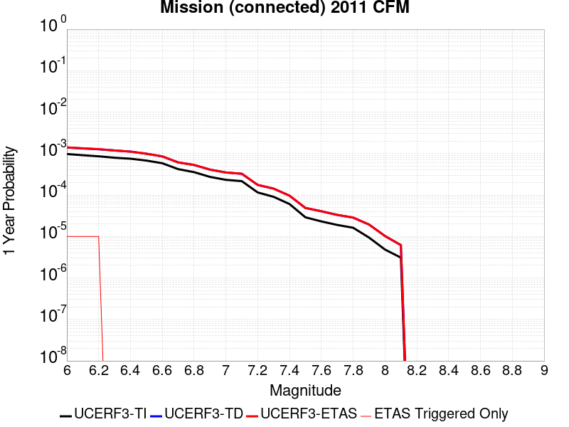 |  |

| Magnitude | 1 wk TI Prob | 1 wk TD Prob | 1 wk ETAS Prob | 1 wk ETAS/TD Gain | 1 wk ETAS Triggered Only | 1 mo TI Prob | 1 mo TD Prob | 1 mo ETAS Prob | 1 mo ETAS/TD Gain | 1 mo ETAS Triggered Only | 1 yr TI Prob | 1 yr TD Prob | 1 yr ETAS Prob | 1 yr ETAS/TD Gain | 1 yr ETAS Triggered Only | 10 yr TI Prob | 10 yr TD Prob | 10 yr ETAS Prob | 10 yr ETAS/TD Gain | 10 yr ETAS Triggered Only |
|-----|-----|-----|-----|-----|-----|-----|-----|-----|-----|-----|-----|-----|-----|-----|-----|-----|-----|-----|-----|-----|
| 6.0 | 1.8735573E-5 | 2.6882515E-5 | 2.6882515E-5 | 1.0 | 0.0 | 8.029284E-5 | 1.1520558E-4 | 1.2520443E-4 | 1.0867914 | 1.0E-5 | 9.771269E-4 | 0.0014016571 | 0.0014116431 | 1.0071244 | 1.0E-5 | 0.009728416 | 0.013937562 | 0.013947423 | 1.0007075 | 1.0E-5 |
| 6.1 | 1.7515964E-5 | 2.5523792E-5 | 2.5523792E-5 | 1.0 | 0.0 | 7.506625E-5 | 1.0938298E-4 | 1.1938188E-4 | 1.091412 | 1.0E-5 | 9.135484E-4 | 0.0013308554 | 0.0013408421 | 1.007504 | 1.0E-5 | 0.009098019 | 0.0132381655 | 0.013248034 | 1.0007454 | 1.0E-5 |
| 6.2 | 1.6486343E-5 | 2.4368448E-5 | 2.4368448E-5 | 1.0 | 0.0 | 7.065384E-5 | 1.0443191E-4 | 1.1443086E-4 | 1.0957462 | 1.0E-5 | 8.5987104E-4 | 0.0012706495 | 0.0012806368 | 1.00786 | 1.0E-5 | 0.008565514 | 0.012643143 | 0.012653016 | 1.0007809 | 1.0E-5 |
| 6.3 | 1.5229385E-5 | 2.2797909E-5 | 2.2797909E-5 | 1.0 | 0.0 | 6.526716E-5 | 9.7701544E-5 | 9.7701544E-5 | 1.0 | 0.0 | 7.9433795E-4 | 0.0011887997 | 0.0011887997 | 1.0 | 0.0 | 0.007915046 | 0.011836352 | 0.011836352 | 1.0 | 0.0 |
| 6.4 | 1.4435828E-5 | 2.1398E-5 | 2.1398E-5 | 1.0 | 0.0 | 6.186637E-5 | 9.1702364E-5 | 9.1702364E-5 | 1.0 | 0.0 | 7.529627E-4 | 0.0011158385 | 0.0011158385 | 1.0 | 0.0 | 0.007504165 | 0.011119362 | 0.011119362 | 1.0 | 0.0 |
| 6.5 | 1.30127955E-5 | 1.9037068E-5 | 1.9037068E-5 | 1.0 | 0.0 | 5.576793E-5 | 8.1584905E-5 | 8.1584905E-5 | 1.0 | 0.0 | 6.78763E-4 | 9.927875E-4 | 9.927875E-4 | 1.0 | 0.0 | 0.0067669353 | 0.009911527 | 0.009911527 | 1.0 | 0.0 |
| 6.6 | 1.1220718E-5 | 1.639339E-5 | 1.639339E-5 | 1.0 | 0.0 | 4.8087906E-5 | 7.0255504E-5 | 7.0255504E-5 | 1.0 | 0.0 | 5.8531296E-4 | 8.5502357E-4 | 8.5502357E-4 | 1.0 | 0.0 | 0.005837737 | 0.00854963 | 0.00854963 | 1.0 | 0.0 |
| 6.7 | 8.086152E-6 | 1.1750298E-5 | 1.1750298E-5 | 1.0 | 0.0 | 3.4654473E-5 | 5.035745E-5 | 5.035745E-5 | 1.0 | 0.0 | 4.2183654E-4 | 6.129302E-4 | 6.129302E-4 | 1.0 | 0.0 | 0.004210367 | 0.0061497535 | 0.0061497535 | 1.0 | 0.0 |
| 6.8 | 6.8361655E-6 | 1.0195406E-5 | 1.0195406E-5 | 1.0 | 0.0 | 2.9297524E-5 | 4.3693864E-5 | 4.3693864E-5 | 1.0 | 0.0 | 3.5663895E-4 | 5.3184363E-4 | 5.3184363E-4 | 1.0 | 0.0 | 0.0035606713 | 0.0053387266 | 0.0053387266 | 1.0 | 0.0 |
| 6.9 | 5.2517353E-6 | 7.8690955E-6 | 7.8690955E-6 | 1.0 | 0.0 | 2.2507242E-5 | 3.3724264E-5 | 3.3724264E-5 | 1.0 | 0.0 | 2.739912E-4 | 4.105158E-4 | 4.105158E-4 | 1.0 | 0.0 | 0.0027365363 | 0.004129868 | 0.004129868 | 1.0 | 0.0 |
| 7.0 | 4.4602784E-6 | 6.7016504E-6 | 6.7016504E-6 | 1.0 | 0.0 | 1.911534E-5 | 2.8721044E-5 | 2.8721044E-5 | 1.0 | 0.0 | 2.327044E-4 | 3.4962274E-4 | 3.4962274E-4 | 1.0 | 0.0 | 0.0023246086 | 0.0035221886 | 0.0035221886 | 1.0 | 0.0 |
| 7.1 | 4.1492594E-6 | 6.2504096E-6 | 6.2504096E-6 | 1.0 | 0.0 | 1.7782419E-5 | 2.6787196E-5 | 2.6787196E-5 | 1.0 | 0.0 | 2.1647944E-4 | 3.2608546E-4 | 3.2608546E-4 | 1.0 | 0.0 | 0.0021626868 | 0.0032870003 | 0.0032870003 | 1.0 | 0.0 |
| 7.2 | 2.213247E-6 | 3.3628444E-6 | 3.3628444E-6 | 1.0 | 0.0 | 9.485309E-6 | 1.441211E-5 | 1.441211E-5 | 1.0 | 0.0 | 1.15477524E-4 | 1.7545334E-4 | 1.7545334E-4 | 1.0 | 0.0 | 0.0011541754 | 0.0017818302 | 0.0017818302 | 1.0 | 0.0 |
| 7.3 | 1.7362703E-6 | 2.7384676E-6 | 2.7384676E-6 | 1.0 | 0.0 | 7.4411373E-6 | 1.1736238E-5 | 1.1736238E-5 | 1.0 | 0.0 | 9.0592075E-5 | 1.4287935E-4 | 1.4287935E-4 | 1.0 | 0.0 | 9.0555154E-4 | 0.0014532148 | 0.0014532148 | 1.0 | 0.0 |
| 7.4 | 1.1628409E-6 | 1.8493533E-6 | 1.8493533E-6 | 1.0 | 0.0 | 4.9835944E-6 | 7.925776E-6 | 7.925776E-6 | 1.0 | 0.0 | 6.0673574E-5 | 9.649206E-5 | 9.649206E-5 | 1.0 | 0.0 | 6.065701E-4 | 9.85306E-4 | 9.85306E-4 | 1.0 | 0.0 |
| 7.5 | 5.5610667E-7 | 9.343823E-7 | 9.343823E-7 | 1.0 | 0.0 | 2.3833122E-6 | 4.0044893E-6 | 4.0044893E-6 | 1.0 | 0.0 | 2.9016439E-5 | 4.8753573E-5 | 4.8753573E-5 | 1.0 | 0.0 | 2.901265E-4 | 5.0411286E-4 | 5.0411286E-4 | 1.0 | 0.0 |
| 7.6 | 4.4307663E-7 | 7.784628E-7 | 7.784628E-7 | 1.0 | 0.0 | 1.8988985E-6 | 3.3362649E-6 | 3.3362649E-6 | 1.0 | 0.0 | 2.3118844E-5 | 4.061827E-5 | 4.061827E-5 | 1.0 | 0.0 | 2.3116439E-4 | 4.2210697E-4 | 4.2210697E-4 | 1.0 | 0.0 |
| 7.7 | 3.639119E-7 | 6.3549425E-7 | 6.3549425E-7 | 1.0 | 0.0 | 1.5596215E-6 | 2.7235437E-6 | 2.7235437E-6 | 1.0 | 0.0 | 1.8988227E-5 | 3.315864E-5 | 3.315864E-5 | 1.0 | 0.0 | 1.8986604E-4 | 3.4690052E-4 | 3.4690052E-4 | 1.0 | 0.0 |
| 7.8 | 3.1152942E-7 | 5.474834E-7 | 5.474834E-7 | 1.0 | 0.0 | 1.3351254E-6 | 2.3463554E-6 | 2.3463554E-6 | 1.0 | 0.0 | 1.6255031E-5 | 2.8566503E-5 | 2.8566503E-5 | 1.0 | 0.0 | 1.6253842E-4 | 2.977112E-4 | 2.977112E-4 | 1.0 | 0.0 |
| 7.9 | 1.8035962E-7 | 3.7184682E-7 | 3.7184682E-7 | 1.0 | 0.0 | 7.729696E-7 | 1.5936282E-6 | 1.5936282E-6 | 1.0 | 0.0 | 9.410865E-6 | 1.9402252E-5 | 1.9402252E-5 | 1.0 | 0.0 | 9.410465E-5 | 2.0071324E-4 | 2.0071324E-4 | 1.0 | 0.0 |
| 8.0 | 9.279334E-8 | 1.9695527E-7 | 1.9695527E-7 | 1.0 | 0.0 | 3.976857E-7 | 8.4409373E-7 | 8.4409373E-7 | 1.0 | 0.0 | 4.841813E-6 | 1.0276794E-5 | 1.0276794E-5 | 1.0 | 0.0 | 4.841707E-5 | 1.05289524E-4 | 1.05289524E-4 | 1.0 | 0.0 |
| 8.1 | 5.9253985E-8 | 1.18509675E-7 | 1.18509675E-7 | 1.0 | 0.0 | 2.5394561E-7 | 5.078985E-7 | 5.078985E-7 | 1.0 | 0.0 | 3.0917836E-6 | 6.183647E-6 | 6.183647E-6 | 1.0 | 0.0 | 3.0917407E-5 | 6.322351E-5 | 6.322351E-5 | 1.0 | 0.0 |

## South Cuyama
*[(top)](#table-of-contents)*

| 1 Week | 1 Month | 1 Year | 10 Year |
|-----|-----|-----|-----|
|  |  |  |  |

| Magnitude | 1 wk TI Prob | 1 wk TD Prob | 1 wk ETAS Prob | 1 wk ETAS/TD Gain | 1 wk ETAS Triggered Only | 1 mo TI Prob | 1 mo TD Prob | 1 mo ETAS Prob | 1 mo ETAS/TD Gain | 1 mo ETAS Triggered Only | 1 yr TI Prob | 1 yr TD Prob | 1 yr ETAS Prob | 1 yr ETAS/TD Gain | 1 yr ETAS Triggered Only | 10 yr TI Prob | 10 yr TD Prob | 10 yr ETAS Prob | 10 yr ETAS/TD Gain | 10 yr ETAS Triggered Only |
|-----|-----|-----|-----|-----|-----|-----|-----|-----|-----|-----|-----|-----|-----|-----|-----|-----|-----|-----|-----|-----|
| 6.0 | 1.2747308E-6 | 1.2818697E-6 | 1.2818697E-6 | 1.0 | 0.0 | 5.4631205E-6 | 5.4937163E-6 | 5.4937163E-6 | 1.0 | 0.0 | 6.6511464E-5 | 6.6884015E-5 | 7.688334E-5 | 1.1495025 | 1.0E-5 | 6.649156E-4 | 6.686458E-4 | 6.786391E-4 | 1.0149456 | 1.0E-5 |
| 6.1 | 1.2747308E-6 | 1.2818697E-6 | 1.2818697E-6 | 1.0 | 0.0 | 5.4631205E-6 | 5.4937163E-6 | 5.4937163E-6 | 1.0 | 0.0 | 6.6511464E-5 | 6.6884015E-5 | 7.688334E-5 | 1.1495025 | 1.0E-5 | 6.649156E-4 | 6.686458E-4 | 6.786391E-4 | 1.0149456 | 1.0E-5 |
| 6.2 | 1.2747308E-6 | 1.2818697E-6 | 1.2818697E-6 | 1.0 | 0.0 | 5.4631205E-6 | 5.4937163E-6 | 5.4937163E-6 | 1.0 | 0.0 | 6.6511464E-5 | 6.6884015E-5 | 7.688334E-5 | 1.1495025 | 1.0E-5 | 6.649156E-4 | 6.686458E-4 | 6.786391E-4 | 1.0149456 | 1.0E-5 |
| 6.3 | 1.2747308E-6 | 1.2818697E-6 | 1.2818697E-6 | 1.0 | 0.0 | 5.4631205E-6 | 5.4937163E-6 | 5.4937163E-6 | 1.0 | 0.0 | 6.6511464E-5 | 6.6884015E-5 | 7.688334E-5 | 1.1495025 | 1.0E-5 | 6.649156E-4 | 6.686458E-4 | 6.786391E-4 | 1.0149456 | 1.0E-5 |
| 6.4 | 1.2747308E-6 | 1.2818697E-6 | 1.2818697E-6 | 1.0 | 0.0 | 5.4631205E-6 | 5.4937163E-6 | 5.4937163E-6 | 1.0 | 0.0 | 6.6511464E-5 | 6.6884015E-5 | 7.688334E-5 | 1.1495025 | 1.0E-5 | 6.649156E-4 | 6.686458E-4 | 6.786391E-4 | 1.0149456 | 1.0E-5 |
| 6.5 | 1.2747308E-6 | 1.2818697E-6 | 1.2818697E-6 | 1.0 | 0.0 | 5.4631205E-6 | 5.4937163E-6 | 5.4937163E-6 | 1.0 | 0.0 | 6.6511464E-5 | 6.6884015E-5 | 7.688334E-5 | 1.1495025 | 1.0E-5 | 6.649156E-4 | 6.686458E-4 | 6.786391E-4 | 1.0149456 | 1.0E-5 |
| 6.6 | 1.2747308E-6 | 1.2818697E-6 | 1.2818697E-6 | 1.0 | 0.0 | 5.4631205E-6 | 5.4937163E-6 | 5.4937163E-6 | 1.0 | 0.0 | 6.6511464E-5 | 6.6884015E-5 | 7.688334E-5 | 1.1495025 | 1.0E-5 | 6.649156E-4 | 6.686458E-4 | 6.786391E-4 | 1.0149456 | 1.0E-5 |
| 6.7 | 1.2747308E-6 | 1.2818697E-6 | 1.2818697E-6 | 1.0 | 0.0 | 5.4631205E-6 | 5.4937163E-6 | 5.4937163E-6 | 1.0 | 0.0 | 6.6511464E-5 | 6.6884015E-5 | 7.688334E-5 | 1.1495025 | 1.0E-5 | 6.649156E-4 | 6.686458E-4 | 6.786391E-4 | 1.0149456 | 1.0E-5 |
| 6.8 | 1.2747308E-6 | 1.2818697E-6 | 1.2818697E-6 | 1.0 | 0.0 | 5.4631205E-6 | 5.4937163E-6 | 5.4937163E-6 | 1.0 | 0.0 | 6.6511464E-5 | 6.6884015E-5 | 7.688334E-5 | 1.1495025 | 1.0E-5 | 6.649156E-4 | 6.686458E-4 | 6.786391E-4 | 1.0149456 | 1.0E-5 |
| 6.9 | 8.4566324E-7 | 8.507883E-7 | 8.507883E-7 | 1.0 | 0.0 | 3.624266E-6 | 3.6462304E-6 | 3.6462304E-6 | 1.0 | 0.0 | 4.4124543E-5 | 4.439196E-5 | 4.439196E-5 | 1.0 | 0.0 | 4.4115784E-4 | 4.4383196E-4 | 4.4383196E-4 | 1.0 | 0.0 |
| 7.0 | 8.2277904E-7 | 8.27782E-7 | 8.27782E-7 | 1.0 | 0.0 | 3.526191E-6 | 3.5476323E-6 | 3.5476323E-6 | 1.0 | 0.0 | 4.293053E-5 | 4.3191576E-5 | 4.3191576E-5 | 1.0 | 0.0 | 4.292224E-4 | 4.3183283E-4 | 4.3183283E-4 | 1.0 | 0.0 |
| 7.1 | 6.7661887E-7 | 6.80913E-7 | 6.80913E-7 | 1.0 | 0.0 | 2.899792E-6 | 2.9181954E-6 | 2.9181954E-6 | 1.0 | 0.0 | 3.5304394E-5 | 3.5528454E-5 | 3.5528454E-5 | 1.0 | 0.0 | 3.5298787E-4 | 3.552281E-4 | 3.552281E-4 | 1.0 | 0.0 |
| 7.2 | 5.783336E-7 | 5.8211907E-7 | 5.8211907E-7 | 1.0 | 0.0 | 2.4785702E-6 | 2.4947938E-6 | 2.4947938E-6 | 1.0 | 0.0 | 3.0176174E-5 | 3.0373692E-5 | 3.0373692E-5 | 1.0 | 0.0 | 3.0172078E-4 | 3.0369565E-4 | 3.0369565E-4 | 1.0 | 0.0 |
| 7.3 | 5.136759E-7 | 5.170938E-7 | 5.170938E-7 | 1.0 | 0.0 | 2.2014663E-6 | 2.2161144E-6 | 2.2161144E-6 | 1.0 | 0.0 | 2.6802521E-5 | 2.698086E-5 | 2.698086E-5 | 1.0 | 0.0 | 2.679929E-4 | 2.6977606E-4 | 2.6977606E-4 | 1.0 | 0.0 |
| 7.4 | 4.3370295E-7 | 4.3665364E-7 | 4.3665364E-7 | 1.0 | 0.0 | 1.8587256E-6 | 1.8713713E-6 | 1.8713713E-6 | 1.0 | 0.0 | 2.2629749E-5 | 2.278371E-5 | 2.278371E-5 | 1.0 | 0.0 | 2.2627445E-4 | 2.278139E-4 | 2.278139E-4 | 1.0 | 0.0 |
| 7.5 | 3.3242574E-7 | 3.3476465E-7 | 3.3476465E-7 | 1.0 | 0.0 | 1.4246809E-6 | 1.4347048E-6 | 1.4347048E-6 | 1.0 | 0.0 | 1.7345352E-5 | 1.7467393E-5 | 1.7467393E-5 | 1.0 | 0.0 | 1.7343998E-4 | 1.7466032E-4 | 1.7466032E-4 | 1.0 | 0.0 |
| 7.6 | 2.0627535E-7 | 2.07789E-7 | 2.07789E-7 | 1.0 | 0.0 | 8.840369E-7 | 8.90524E-7 | 8.90524E-7 | 1.0 | 0.0 | 1.0763096E-5 | 1.0842076E-5 | 1.0842076E-5 | 1.0 | 0.0 | 1.0762575E-4 | 1.0841556E-4 | 1.0841556E-4 | 1.0 | 0.0 |
| 7.7 | 6.15236E-8 | 6.1983044E-8 | 6.1983044E-8 | 1.0 | 0.0 | 2.6367252E-7 | 2.656416E-7 | 2.656416E-7 | 1.0 | 0.0 | 3.2102084E-6 | 3.2341818E-6 | 3.2341818E-6 | 1.0 | 0.0 | 3.210162E-5 | 3.234136E-5 | 3.234136E-5 | 1.0 | 0.0 |
| 7.8 | 1.1765573E-8 | 1.1873414E-8 | 1.1873414E-8 | 1.0 | 0.0 | 5.0423886E-8 | 5.0886058E-8 | 5.0886058E-8 | 1.0 | 0.0 | 6.1391063E-7 | 6.195376E-7 | 6.195376E-7 | 1.0 | 0.0 | 6.1390897E-6 | 6.19536E-6 | 6.19536E-6 | 1.0 | 0.0 |
| 7.9 | 6.0381755E-10 | 6.10058E-10 | 6.10058E-10 | 1.0 | 0.0 | 2.5877895E-9 | 2.614534E-9 | 2.614534E-9 | 1.0 | 0.0 | 3.1506335E-8 | 3.1831952E-8 | 3.1831952E-8 | 1.0 | 0.0 | 3.1506332E-7 | 3.183195E-7 | 3.183195E-7 | 1.0 | 0.0 |

## Earthquake Valley
*[(top)](#table-of-contents)*

| 1 Week | 1 Month | 1 Year | 10 Year |
|-----|-----|-----|-----|
|  |  |  |  |

| Magnitude | 1 wk TI Prob | 1 wk TD Prob | 1 wk ETAS Prob | 1 wk ETAS/TD Gain | 1 wk ETAS Triggered Only | 1 mo TI Prob | 1 mo TD Prob | 1 mo ETAS Prob | 1 mo ETAS/TD Gain | 1 mo ETAS Triggered Only | 1 yr TI Prob | 1 yr TD Prob | 1 yr ETAS Prob | 1 yr ETAS/TD Gain | 1 yr ETAS Triggered Only | 10 yr TI Prob | 10 yr TD Prob | 10 yr ETAS Prob | 10 yr ETAS/TD Gain | 10 yr ETAS Triggered Only |
|-----|-----|-----|-----|-----|-----|-----|-----|-----|-----|-----|-----|-----|-----|-----|-----|-----|-----|-----|-----|-----|
| 6.0 | 1.9416384E-5 | 2.258408E-5 | 2.258408E-5 | 1.0 | 0.0 | 8.321042E-5 | 9.6785996E-5 | 9.6785996E-5 | 1.0 | 0.0 | 0.001012616 | 0.0011778527 | 0.001187841 | 1.0084801 | 1.0E-5 | 0.010080142 | 0.011727943 | 0.011737825 | 1.0008427 | 1.0E-5 |
| 6.1 | 1.9416384E-5 | 2.258408E-5 | 2.258408E-5 | 1.0 | 0.0 | 8.321042E-5 | 9.6785996E-5 | 9.6785996E-5 | 1.0 | 0.0 | 0.001012616 | 0.0011778527 | 0.001187841 | 1.0084801 | 1.0E-5 | 0.010080142 | 0.011727943 | 0.011737825 | 1.0008427 | 1.0E-5 |
| 6.2 | 1.9416384E-5 | 2.258408E-5 | 2.258408E-5 | 1.0 | 0.0 | 8.321042E-5 | 9.6785996E-5 | 9.6785996E-5 | 1.0 | 0.0 | 0.001012616 | 0.0011778527 | 0.001187841 | 1.0084801 | 1.0E-5 | 0.010080142 | 0.011727943 | 0.011737825 | 1.0008427 | 1.0E-5 |
| 6.3 | 1.9416384E-5 | 2.258408E-5 | 2.258408E-5 | 1.0 | 0.0 | 8.321042E-5 | 9.6785996E-5 | 9.6785996E-5 | 1.0 | 0.0 | 0.001012616 | 0.0011778527 | 0.001187841 | 1.0084801 | 1.0E-5 | 0.010080142 | 0.011727943 | 0.011737825 | 1.0008427 | 1.0E-5 |
| 6.4 | 1.9416384E-5 | 2.258408E-5 | 2.258408E-5 | 1.0 | 0.0 | 8.321042E-5 | 9.6785996E-5 | 9.6785996E-5 | 1.0 | 0.0 | 0.001012616 | 0.0011778527 | 0.001187841 | 1.0084801 | 1.0E-5 | 0.010080142 | 0.011727943 | 0.011737825 | 1.0008427 | 1.0E-5 |
| 6.5 | 1.9389157E-5 | 2.255267E-5 | 2.255267E-5 | 1.0 | 0.0 | 8.309374E-5 | 9.665139E-5 | 9.665139E-5 | 1.0 | 0.0 | 0.0010111968 | 0.0011762156 | 0.0011862039 | 1.0084919 | 1.0E-5 | 0.010066078 | 0.011711745 | 0.011721628 | 1.0008439 | 1.0E-5 |
| 6.6 | 1.9389157E-5 | 2.255267E-5 | 2.255267E-5 | 1.0 | 0.0 | 8.309374E-5 | 9.665139E-5 | 9.665139E-5 | 1.0 | 0.0 | 0.0010111968 | 0.0011762156 | 0.0011862039 | 1.0084919 | 1.0E-5 | 0.010066078 | 0.011711745 | 0.011721628 | 1.0008439 | 1.0E-5 |
| 6.7 | 1.4925434E-5 | 1.7208227E-5 | 1.7208227E-5 | 1.0 | 0.0 | 6.396457E-5 | 7.374794E-5 | 7.374794E-5 | 1.0 | 0.0 | 7.7849044E-4 | 8.9759636E-4 | 9.0758735E-4 | 1.0111308 | 1.0E-5 | 0.007757689 | 0.008948085 | 0.008957995 | 1.0011076 | 1.0E-5 |
| 6.8 | 1.3570335E-5 | 1.5616843E-5 | 1.5616843E-5 | 1.0 | 0.0 | 5.8157282E-5 | 6.692807E-5 | 6.692807E-5 | 1.0 | 0.0 | 7.0783484E-4 | 8.1462675E-4 | 8.246186E-4 | 1.0122656 | 1.0E-5 | 0.0070558446 | 0.008124476 | 0.008134395 | 1.0012208 | 1.0E-5 |
| 6.9 | 1.3570335E-5 | 1.5616843E-5 | 1.5616843E-5 | 1.0 | 0.0 | 5.8157282E-5 | 6.692807E-5 | 6.692807E-5 | 1.0 | 0.0 | 7.0783484E-4 | 8.1462675E-4 | 8.246186E-4 | 1.0122656 | 1.0E-5 | 0.0070558446 | 0.008124476 | 0.008134395 | 1.0012208 | 1.0E-5 |
| 7.0 | 1.3433392E-5 | 1.5460388E-5 | 1.5460388E-5 | 1.0 | 0.0 | 5.757041E-5 | 6.6257584E-5 | 6.6257584E-5 | 1.0 | 0.0 | 7.0069433E-4 | 8.064695E-4 | 8.1646146E-4 | 1.0123898 | 1.0E-5 | 0.006984891 | 0.008043497 | 0.008053416 | 1.0012332 | 1.0E-5 |
| 7.1 | 8.181609E-6 | 9.416851E-6 | 9.416851E-6 | 1.0 | 0.0 | 3.5063567E-5 | 4.0357685E-5 | 4.0357685E-5 | 1.0 | 0.0 | 4.268153E-4 | 4.9131113E-4 | 4.9131113E-4 | 1.0 | 0.0 | 0.0042599645 | 0.0049088253 | 0.0049088253 | 1.0 | 0.0 |
| 7.2 | 2.0663983E-7 | 1.726294E-7 | 1.726294E-7 | 1.0 | 0.0 | 8.855989E-7 | 7.398401E-7 | 7.398401E-7 | 1.0 | 0.0 | 1.0782113E-5 | 9.00752E-6 | 9.00752E-6 | 1.0 | 0.0 | 1.07815904E-4 | 9.00719E-5 | 9.00719E-5 | 1.0 | 0.0 |
| 7.3 | 2.0462376E-7 | 1.7078433E-7 | 1.7078433E-7 | 1.0 | 0.0 | 8.7695867E-7 | 7.319327E-7 | 7.319327E-7 | 1.0 | 0.0 | 1.0676919E-5 | 8.911247E-6 | 8.911247E-6 | 1.0 | 0.0 | 1.0676406E-4 | 8.910926E-5 | 8.910926E-5 | 1.0 | 0.0 |
| 7.4 | 2.0171088E-7 | 1.6860913E-7 | 1.6860913E-7 | 1.0 | 0.0 | 8.644749E-7 | 7.2261037E-7 | 7.2261037E-7 | 1.0 | 0.0 | 1.0524931E-5 | 8.79775E-6 | 8.79775E-6 | 1.0 | 0.0 | 1.05244326E-4 | 8.7974375E-5 | 8.7974375E-5 | 1.0 | 0.0 |
| 7.5 | 1.4847944E-7 | 1.2559275E-7 | 1.2559275E-7 | 1.0 | 0.0 | 6.363403E-7 | 5.3825454E-7 | 5.3825454E-7 | 1.0 | 0.0 | 7.747416E-6 | 6.5532317E-6 | 6.5532317E-6 | 1.0 | 0.0 | 7.747146E-5 | 6.55306E-5 | 6.55306E-5 | 1.0 | 0.0 |
| 7.6 | 1.3185847E-7 | 1.1123213E-7 | 1.1123213E-7 | 1.0 | 0.0 | 5.6510765E-7 | 4.7670906E-7 | 4.7670906E-7 | 1.0 | 0.0 | 6.8801637E-6 | 5.8039195E-6 | 5.8039195E-6 | 1.0 | 0.0 | 6.8799505E-5 | 5.803789E-5 | 5.803789E-5 | 1.0 | 0.0 |
| 7.7 | 2.8609954E-8 | 1.4170958E-8 | 1.4170958E-8 | 1.0 | 0.0 | 1.2261408E-7 | 6.0732674E-8 | 6.0732674E-8 | 1.0 | 0.0 | 1.4928254E-6 | 7.394201E-7 | 7.394201E-7 | 1.0 | 0.0 | 1.4928154E-5 | 7.394182E-6 | 7.394182E-6 | 1.0 | 0.0 |
| 7.8 | 6.527266E-9 | 2.923417E-9 | 2.923417E-9 | 1.0 | 0.0 | 2.7973995E-8 | 1.2528931E-8 | 1.2528931E-8 | 1.0 | 0.0 | 3.4058334E-7 | 1.5253973E-7 | 1.5253973E-7 | 1.0 | 0.0 | 3.4058282E-6 | 1.5253964E-6 | 1.5253964E-6 | 1.0 | 0.0 |
| 7.9 | 1.2898267E-9 | 7.127684E-10 | 7.127684E-10 | 1.0 | 0.0 | 5.527829E-9 | 3.0547218E-9 | 3.0547218E-9 | 1.0 | 0.0 | 6.7301315E-8 | 3.719124E-8 | 3.719124E-8 | 1.0 | 0.0 | 6.7301295E-7 | 3.719124E-7 | 3.719124E-7 | 1.0 | 0.0 |

## San Joaquin Hills
*[(top)](#table-of-contents)*

| 1 Week | 1 Month | 1 Year | 10 Year |
|-----|-----|-----|-----|
|  |  | 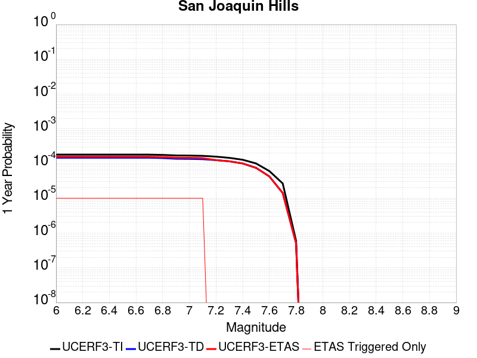 |  |

| Magnitude | 1 wk TI Prob | 1 wk TD Prob | 1 wk ETAS Prob | 1 wk ETAS/TD Gain | 1 wk ETAS Triggered Only | 1 mo TI Prob | 1 mo TD Prob | 1 mo ETAS Prob | 1 mo ETAS/TD Gain | 1 mo ETAS Triggered Only | 1 yr TI Prob | 1 yr TD Prob | 1 yr ETAS Prob | 1 yr ETAS/TD Gain | 1 yr ETAS Triggered Only | 10 yr TI Prob | 10 yr TD Prob | 10 yr ETAS Prob | 10 yr ETAS/TD Gain | 10 yr ETAS Triggered Only |
|-----|-----|-----|-----|-----|-----|-----|-----|-----|-----|-----|-----|-----|-----|-----|-----|-----|-----|-----|-----|-----|
| 6.0 | 3.4525704E-6 | 2.8139818E-6 | 1.2813954E-5 | 4.5536733 | 1.0E-5 | 1.4796647E-5 | 1.2059867E-5 | 2.2059747E-5 | 1.8291866 | 1.0E-5 | 1.8013427E-4 | 1.4681912E-4 | 1.5681765E-4 | 1.068101 | 1.0E-5 | 0.0017998833 | 0.0014672345 | 0.0014772197 | 1.0068055 | 1.0E-5 |
| 6.1 | 3.4525704E-6 | 2.8139818E-6 | 1.2813954E-5 | 4.5536733 | 1.0E-5 | 1.4796647E-5 | 1.2059867E-5 | 2.2059747E-5 | 1.8291866 | 1.0E-5 | 1.8013427E-4 | 1.4681912E-4 | 1.5681765E-4 | 1.068101 | 1.0E-5 | 0.0017998833 | 0.0014672345 | 0.0014772197 | 1.0068055 | 1.0E-5 |
| 6.2 | 3.4525704E-6 | 2.8139818E-6 | 1.2813954E-5 | 4.5536733 | 1.0E-5 | 1.4796647E-5 | 1.2059867E-5 | 2.2059747E-5 | 1.8291866 | 1.0E-5 | 1.8013427E-4 | 1.4681912E-4 | 1.5681765E-4 | 1.068101 | 1.0E-5 | 0.0017998833 | 0.0014672345 | 0.0014772197 | 1.0068055 | 1.0E-5 |
| 6.3 | 3.4525704E-6 | 2.8139818E-6 | 1.2813954E-5 | 4.5536733 | 1.0E-5 | 1.4796647E-5 | 1.2059867E-5 | 2.2059747E-5 | 1.8291866 | 1.0E-5 | 1.8013427E-4 | 1.4681912E-4 | 1.5681765E-4 | 1.068101 | 1.0E-5 | 0.0017998833 | 0.0014672345 | 0.0014772197 | 1.0068055 | 1.0E-5 |
| 6.4 | 3.4525704E-6 | 2.8139818E-6 | 1.2813954E-5 | 4.5536733 | 1.0E-5 | 1.4796647E-5 | 1.2059867E-5 | 2.2059747E-5 | 1.8291866 | 1.0E-5 | 1.8013427E-4 | 1.4681912E-4 | 1.5681765E-4 | 1.068101 | 1.0E-5 | 0.0017998833 | 0.0014672345 | 0.0014772197 | 1.0068055 | 1.0E-5 |
| 6.5 | 3.4525704E-6 | 2.8139818E-6 | 1.2813954E-5 | 4.5536733 | 1.0E-5 | 1.4796647E-5 | 1.2059867E-5 | 2.2059747E-5 | 1.8291866 | 1.0E-5 | 1.8013427E-4 | 1.4681912E-4 | 1.5681765E-4 | 1.068101 | 1.0E-5 | 0.0017998833 | 0.0014672345 | 0.0014772197 | 1.0068055 | 1.0E-5 |
| 6.6 | 3.4525704E-6 | 2.8139818E-6 | 1.2813954E-5 | 4.5536733 | 1.0E-5 | 1.4796647E-5 | 1.2059867E-5 | 2.2059747E-5 | 1.8291866 | 1.0E-5 | 1.8013427E-4 | 1.4681912E-4 | 1.5681765E-4 | 1.068101 | 1.0E-5 | 0.0017998833 | 0.0014672345 | 0.0014772197 | 1.0068055 | 1.0E-5 |
| 6.7 | 3.4525704E-6 | 2.8139818E-6 | 1.2813954E-5 | 4.5536733 | 1.0E-5 | 1.4796647E-5 | 1.2059867E-5 | 2.2059747E-5 | 1.8291866 | 1.0E-5 | 1.8013427E-4 | 1.4681912E-4 | 1.5681765E-4 | 1.068101 | 1.0E-5 | 0.0017998833 | 0.0014672345 | 0.0014772197 | 1.0068055 | 1.0E-5 |
| 6.8 | 3.388654E-6 | 2.7484202E-6 | 1.2748393E-5 | 4.638444 | 1.0E-5 | 1.4522722E-5 | 1.1778891E-5 | 2.1778773E-5 | 1.8489664 | 1.0E-5 | 1.767998E-4 | 1.4339869E-4 | 1.5339725E-4 | 1.0697256 | 1.0E-5 | 0.001766592 | 0.0014330745 | 0.0014430601 | 1.006968 | 1.0E-5 |
| 6.9 | 3.2694352E-6 | 2.6283346E-6 | 1.26283085E-5 | 4.804681 | 1.0E-5 | 1.401179E-5 | 1.1264243E-5 | 2.126413E-5 | 1.8877549 | 1.0E-5 | 1.7058018E-4 | 1.3713364E-4 | 1.4713226E-4 | 1.0729116 | 1.0E-5 | 0.0017044931 | 0.0013705015 | 0.0013804878 | 1.0072865 | 1.0E-5 |
| 7.0 | 3.246912E-6 | 2.6069915E-6 | 1.2606965E-5 | 4.835829 | 1.0E-5 | 1.39152635E-5 | 1.1172774E-5 | 2.1172662E-5 | 1.8950229 | 1.0E-5 | 1.6940516E-4 | 1.3602014E-4 | 1.4601878E-4 | 1.0735085 | 1.0E-5 | 0.0016927607 | 0.0013593802 | 0.0013693665 | 1.0073463 | 1.0E-5 |
| 7.1 | 3.1864927E-6 | 2.5523198E-6 | 1.2552294E-5 | 4.9179945 | 1.0E-5 | 1.3656326E-5 | 1.0938467E-5 | 2.0938358E-5 | 1.9141948 | 1.0E-5 | 1.6625308E-4 | 1.3316782E-4 | 1.4316649E-4 | 1.0750833 | 1.0E-5 | 0.0016612876 | 0.0013308912 | 0.0013408778 | 1.0075037 | 1.0E-5 |
| 7.2 | 3.0220644E-6 | 2.3991677E-6 | 2.3991677E-6 | 1.0 | 0.0 | 1.295164E-5 | 1.0282108E-5 | 1.0282108E-5 | 1.0 | 0.0 | 1.576748E-4 | 1.2517757E-4 | 1.2517757E-4 | 1.0 | 0.0 | 0.0015756298 | 0.0012510809 | 0.0012510809 | 1.0 | 0.0 |
| 7.3 | 2.787619E-6 | 2.2173858E-6 | 2.2173858E-6 | 1.0 | 0.0 | 1.1946884E-5 | 9.503048E-6 | 9.503048E-6 | 1.0 | 0.0 | 1.454436E-4 | 1.1569356E-4 | 1.1569356E-4 | 1.0 | 0.0 | 0.0014534845 | 0.0011563431 | 0.0011563431 | 1.0 | 0.0 |
| 7.4 | 2.4593792E-6 | 1.9226306E-6 | 1.9226306E-6 | 1.0 | 0.0 | 1.0540153E-5 | 8.23982E-6 | 8.23982E-6 | 1.0 | 0.0 | 1.2831882E-4 | 1.0031529E-4 | 1.0031529E-4 | 1.0 | 0.0 | 0.0012824474 | 0.0010027088 | 0.0010027088 | 1.0 | 0.0 |
| 7.5 | 1.926764E-6 | 1.4383021E-6 | 1.4383021E-6 | 1.0 | 0.0 | 8.257534E-6 | 6.1641376E-6 | 6.1641376E-6 | 1.0 | 0.0 | 1.00530844E-4 | 7.504586E-5 | 7.504586E-5 | 1.0 | 0.0 | 0.0010048538 | 7.502115E-4 | 7.502115E-4 | 1.0 | 0.0 |
| 7.6 | 1.1609359E-6 | 8.14558E-7 | 8.14558E-7 | 1.0 | 0.0 | 4.97543E-6 | 3.4909585E-6 | 3.4909585E-6 | 1.0 | 0.0 | 6.0574173E-5 | 4.2501633E-5 | 4.2501633E-5 | 1.0 | 0.0 | 6.055767E-4 | 4.249394E-4 | 4.249394E-4 | 1.0 | 0.0 |
| 7.7 | 5.1168536E-7 | 2.7155914E-7 | 2.7155914E-7 | 1.0 | 0.0 | 2.1929354E-6 | 1.1638244E-6 | 1.1638244E-6 | 1.0 | 0.0 | 2.669866E-5 | 1.41694845E-5 | 1.41694845E-5 | 1.0 | 0.0 | 2.6695454E-4 | 1.4168715E-4 | 1.4168715E-4 | 1.0 | 0.0 |
| 7.8 | 1.16056995E-8 | 9.782373E-9 | 9.782373E-9 | 1.0 | 0.0 | 4.9738713E-8 | 4.1924455E-8 | 4.1924455E-8 | 1.0 | 0.0 | 6.0556863E-7 | 5.1043025E-7 | 5.1043025E-7 | 1.0 | 0.0 | 6.05567E-6 | 5.1043025E-6 | 5.1043025E-6 | 1.0 | 0.0 |

## Yorba Linda
*[(top)](#table-of-contents)*

| 1 Week | 1 Month | 1 Year | 10 Year |
|-----|-----|-----|-----|
|  |  |  |  |

| Magnitude | 1 wk TI Prob | 1 wk TD Prob | 1 wk ETAS Prob | 1 wk ETAS/TD Gain | 1 wk ETAS Triggered Only | 1 mo TI Prob | 1 mo TD Prob | 1 mo ETAS Prob | 1 mo ETAS/TD Gain | 1 mo ETAS Triggered Only | 1 yr TI Prob | 1 yr TD Prob | 1 yr ETAS Prob | 1 yr ETAS/TD Gain | 1 yr ETAS Triggered Only | 10 yr TI Prob | 10 yr TD Prob | 10 yr ETAS Prob | 10 yr ETAS/TD Gain | 10 yr ETAS Triggered Only |
|-----|-----|-----|-----|-----|-----|-----|-----|-----|-----|-----|-----|-----|-----|-----|-----|-----|-----|-----|-----|-----|
| 6.0 | 1.9346849E-6 | 1.6909235E-6 | 1.6909235E-6 | 1.0 | 0.0 | 8.29148E-6 | 7.2468E-6 | 7.2468E-6 | 1.0 | 0.0 | 1.009441E-4 | 8.822717E-5 | 8.822717E-5 | 1.0 | 0.0 | 0.0010089825 | 8.820145E-4 | 8.920057E-4 | 1.0113276 | 1.0E-5 |
| 6.1 | 1.9346849E-6 | 1.6909235E-6 | 1.6909235E-6 | 1.0 | 0.0 | 8.29148E-6 | 7.2468E-6 | 7.2468E-6 | 1.0 | 0.0 | 1.009441E-4 | 8.822717E-5 | 8.822717E-5 | 1.0 | 0.0 | 0.0010089825 | 8.820145E-4 | 8.920057E-4 | 1.0113276 | 1.0E-5 |
| 6.2 | 1.9346849E-6 | 1.6909235E-6 | 1.6909235E-6 | 1.0 | 0.0 | 8.29148E-6 | 7.2468E-6 | 7.2468E-6 | 1.0 | 0.0 | 1.009441E-4 | 8.822717E-5 | 8.822717E-5 | 1.0 | 0.0 | 0.0010089825 | 8.820145E-4 | 8.920057E-4 | 1.0113276 | 1.0E-5 |
| 6.3 | 1.1028608E-6 | 8.481986E-7 | 8.481986E-7 | 1.0 | 0.0 | 4.7265376E-6 | 3.6351323E-6 | 3.6351323E-6 | 1.0 | 0.0 | 5.754407E-5 | 4.4256903E-5 | 4.4256903E-5 | 1.0 | 0.0 | 5.7529175E-4 | 4.4248742E-4 | 4.52483E-4 | 1.0225896 | 1.0E-5 |
| 6.4 | 1.1028608E-6 | 8.481986E-7 | 8.481986E-7 | 1.0 | 0.0 | 4.7265376E-6 | 3.6351323E-6 | 3.6351323E-6 | 1.0 | 0.0 | 5.754407E-5 | 4.4256903E-5 | 4.4256903E-5 | 1.0 | 0.0 | 5.7529175E-4 | 4.4248742E-4 | 4.52483E-4 | 1.0225896 | 1.0E-5 |
| 6.5 | 8.4451364E-7 | 5.8692325E-7 | 5.8692325E-7 | 1.0 | 0.0 | 3.619339E-6 | 2.5153831E-6 | 2.5153831E-6 | 1.0 | 0.0 | 4.406456E-5 | 3.0624382E-5 | 3.0624382E-5 | 1.0 | 0.0 | 4.4055824E-4 | 3.0620373E-4 | 3.162007E-4 | 1.032648 | 1.0E-5 |
| 6.6 | 8.422957E-7 | 5.8447665E-7 | 5.8447665E-7 | 1.0 | 0.0 | 3.6098338E-6 | 2.5048976E-6 | 2.5048976E-6 | 1.0 | 0.0 | 4.3948843E-5 | 3.0496723E-5 | 3.0496723E-5 | 1.0 | 0.0 | 4.394015E-4 | 3.0492753E-4 | 3.149245E-4 | 1.0327847 | 1.0E-5 |
| 6.7 | 8.4119705E-7 | 5.832608E-7 | 5.832608E-7 | 1.0 | 0.0 | 3.6051254E-6 | 2.499687E-6 | 2.499687E-6 | 1.0 | 0.0 | 4.3891516E-5 | 3.0433286E-5 | 3.0433286E-5 | 1.0 | 0.0 | 4.388285E-4 | 3.0429332E-4 | 3.142903E-4 | 1.032853 | 1.0E-5 |
| 6.8 | 7.5919155E-7 | 4.995118E-7 | 4.995118E-7 | 1.0 | 0.0 | 3.253674E-6 | 2.1407632E-6 | 2.1407632E-6 | 1.0 | 0.0 | 3.961276E-5 | 2.6063499E-5 | 2.6063499E-5 | 1.0 | 0.0 | 3.9605703E-4 | 2.6060612E-4 | 2.7060352E-4 | 1.038362 | 1.0E-5 |
| 6.9 | 7.5804564E-7 | 4.981302E-7 | 4.981302E-7 | 1.0 | 0.0 | 3.248763E-6 | 2.134842E-6 | 2.134842E-6 | 1.0 | 0.0 | 3.955297E-5 | 2.5991409E-5 | 2.5991409E-5 | 1.0 | 0.0 | 3.9545933E-4 | 2.598854E-4 | 2.698828E-4 | 1.0384685 | 1.0E-5 |
| 7.0 | 7.539293E-7 | 4.943436E-7 | 4.943436E-7 | 1.0 | 0.0 | 3.2311218E-6 | 2.118614E-6 | 2.118614E-6 | 1.0 | 0.0 | 3.9338196E-5 | 2.5793837E-5 | 2.5793837E-5 | 1.0 | 0.0 | 3.9331234E-4 | 2.5791014E-4 | 2.6790757E-4 | 1.0387632 | 1.0E-5 |
| 7.1 | 6.0900885E-7 | 3.781838E-7 | 3.781838E-7 | 1.0 | 0.0 | 2.6100352E-6 | 1.6207867E-6 | 1.6207867E-6 | 1.0 | 0.0 | 3.1776715E-5 | 1.9732903E-5 | 1.9732903E-5 | 1.0 | 0.0 | 3.1772171E-4 | 1.9731186E-4 | 2.0730989E-4 | 1.0506712 | 1.0E-5 |
| 7.2 | 5.849925E-7 | 3.5880063E-7 | 3.5880063E-7 | 1.0 | 0.0 | 2.5071083E-6 | 1.5377161E-6 | 1.5377161E-6 | 1.0 | 0.0 | 3.0523614E-5 | 1.8721537E-5 | 1.8721537E-5 | 1.0 | 0.0 | 3.0519423E-4 | 1.8719993E-4 | 1.9719805E-4 | 1.0534089 | 1.0E-5 |
| 7.3 | 4.89808E-7 | 3.038045E-7 | 3.038045E-7 | 1.0 | 0.0 | 2.0991754E-6 | 1.3020187E-6 | 1.3020187E-6 | 1.0 | 0.0 | 2.5557161E-5 | 1.5851965E-5 | 1.5851965E-5 | 1.0 | 0.0 | 2.5554223E-4 | 1.5850857E-4 | 1.6850699E-4 | 1.063078 | 1.0E-5 |
| 7.4 | 3.8700415E-7 | 2.4723E-7 | 2.4723E-7 | 1.0 | 0.0 | 1.6585881E-6 | 1.0595568E-6 | 1.0595568E-6 | 1.0 | 0.0 | 2.0193123E-5 | 1.2900028E-5 | 1.2900028E-5 | 1.0 | 0.0 | 2.0191289E-4 | 1.2899292E-4 | 1.3899163E-4 | 1.0775136 | 1.0E-5 |
| 7.5 | 2.900565E-7 | 1.8637812E-7 | 1.8637812E-7 | 1.0 | 0.0 | 1.2430987E-6 | 7.987631E-7 | 7.987631E-7 | 1.0 | 0.0 | 1.5134622E-5 | 9.7248985E-6 | 9.7248985E-6 | 1.0 | 0.0 | 1.5133592E-4 | 9.724481E-5 | 1.0724384E-4 | 1.1028233 | 1.0E-5 |
| 7.6 | 2.2770318E-7 | 1.4814457E-7 | 1.4814457E-7 | 1.0 | 0.0 | 9.758704E-7 | 6.349051E-7 | 6.349051E-7 | 1.0 | 0.0 | 1.1881158E-5 | 7.729943E-6 | 7.729943E-6 | 1.0 | 0.0 | 1.1880523E-4 | 7.729679E-5 | 8.729602E-5 | 1.1293615 | 1.0E-5 |
| 7.7 | 1.5017194E-7 | 8.735719E-8 | 8.735719E-8 | 1.0 | 0.0 | 6.4359386E-7 | 3.743879E-7 | 3.743879E-7 | 1.0 | 0.0 | 7.835727E-6 | 4.5581633E-6 | 4.5581633E-6 | 1.0 | 0.0 | 7.835451E-5 | 4.5580728E-5 | 5.558027E-5 | 1.219381 | 1.0E-5 |
| 7.8 | 3.895753E-8 | 1.8533399E-8 | 1.8533399E-8 | 1.0 | 0.0 | 1.6696083E-7 | 7.9428844E-8 | 7.9428844E-8 | 1.0 | 0.0 | 2.0327461E-6 | 9.670458E-7 | 9.670458E-7 | 1.0 | 0.0 | 2.0327276E-5 | 9.670418E-6 | 9.670418E-6 | 1.0 | 0.0 |
| 7.9 | 6.648505E-9 | 3.4184469E-9 | 3.4184469E-9 | 1.0 | 0.0 | 2.8493591E-8 | 1.4650486E-8 | 1.4650486E-8 | 1.0 | 0.0 | 3.4690942E-7 | 1.7836966E-7 | 1.7836966E-7 | 1.0 | 0.0 | 3.4690888E-6 | 1.7836953E-6 | 1.7836953E-6 | 1.0 | 0.0 |

## Elsinore (Stepovers Combined)
*[(top)](#table-of-contents)*

| 1 Week | 1 Month | 1 Year | 10 Year |
|-----|-----|-----|-----|
|  |  |  |  |

| Magnitude | 1 wk TI Prob | 1 wk TD Prob | 1 wk ETAS Prob | 1 wk ETAS/TD Gain | 1 wk ETAS Triggered Only | 1 mo TI Prob | 1 mo TD Prob | 1 mo ETAS Prob | 1 mo ETAS/TD Gain | 1 mo ETAS Triggered Only | 1 yr TI Prob | 1 yr TD Prob | 1 yr ETAS Prob | 1 yr ETAS/TD Gain | 1 yr ETAS Triggered Only | 10 yr TI Prob | 10 yr TD Prob | 10 yr ETAS Prob | 10 yr ETAS/TD Gain | 10 yr ETAS Triggered Only |
|-----|-----|-----|-----|-----|-----|-----|-----|-----|-----|-----|-----|-----|-----|-----|-----|-----|-----|-----|-----|-----|
| 6.0 | 2.144392E-5 | 1.9760193E-5 | 1.9760193E-5 | 1.0 | 0.0 | 9.189928E-5 | 8.468392E-5 | 8.468392E-5 | 1.0 | 0.0 | 0.0011182994 | 0.0010305607 | 0.0010305607 | 1.0 | 0.0 | 0.011126885 | 0.010264917 | 0.010274814 | 1.0009642 | 1.0E-5 |
| 6.1 | 2.144392E-5 | 1.9760193E-5 | 1.9760193E-5 | 1.0 | 0.0 | 9.189928E-5 | 8.468392E-5 | 8.468392E-5 | 1.0 | 0.0 | 0.0011182994 | 0.0010305607 | 0.0010305607 | 1.0 | 0.0 | 0.011126885 | 0.010264917 | 0.010274814 | 1.0009642 | 1.0E-5 |
| 6.2 | 2.144392E-5 | 1.9760193E-5 | 1.9760193E-5 | 1.0 | 0.0 | 9.189928E-5 | 8.468392E-5 | 8.468392E-5 | 1.0 | 0.0 | 0.0011182994 | 0.0010305607 | 0.0010305607 | 1.0 | 0.0 | 0.011126885 | 0.010264917 | 0.010274814 | 1.0009642 | 1.0E-5 |
| 6.3 | 1.9751555E-5 | 1.7741453E-5 | 1.7741453E-5 | 1.0 | 0.0 | 8.4646774E-5 | 7.603267E-5 | 7.603267E-5 | 1.0 | 0.0 | 0.0010300872 | 9.253213E-4 | 9.253213E-4 | 1.0 | 0.0 | 0.010253254 | 0.009221276 | 0.009231185 | 1.0010744 | 1.0E-5 |
| 6.4 | 1.9751555E-5 | 1.7741453E-5 | 1.7741453E-5 | 1.0 | 0.0 | 8.4646774E-5 | 7.603267E-5 | 7.603267E-5 | 1.0 | 0.0 | 0.0010300872 | 9.253213E-4 | 9.253213E-4 | 1.0 | 0.0 | 0.010253254 | 0.009221276 | 0.009231185 | 1.0010744 | 1.0E-5 |
| 6.5 | 1.9751555E-5 | 1.7741453E-5 | 1.7741453E-5 | 1.0 | 0.0 | 8.4646774E-5 | 7.603267E-5 | 7.603267E-5 | 1.0 | 0.0 | 0.0010300872 | 9.253213E-4 | 9.253213E-4 | 1.0 | 0.0 | 0.010253254 | 0.009221276 | 0.009231185 | 1.0010744 | 1.0E-5 |
| 6.6 | 1.9188685E-5 | 1.7003393E-5 | 1.7003393E-5 | 1.0 | 0.0 | 8.2234634E-5 | 7.286974E-5 | 7.286974E-5 | 1.0 | 0.0 | 0.0010007467 | 8.868442E-4 | 8.868442E-4 | 1.0 | 0.0 | 0.00996252 | 0.0088398475 | 0.008849759 | 1.0011213 | 1.0E-5 |
| 6.7 | 1.7608272E-5 | 1.4732616E-5 | 1.4732616E-5 | 1.0 | 0.0 | 7.546184E-5 | 6.3138315E-5 | 6.3138315E-5 | 1.0 | 0.0 | 9.183606E-4 | 7.684476E-4 | 7.684476E-4 | 1.0 | 0.0 | 0.009145746 | 0.00766491 | 0.0076748333 | 1.0012946 | 1.0E-5 |
| 6.8 | 1.697165E-5 | 1.3783365E-5 | 1.3783365E-5 | 1.0 | 0.0 | 7.273361E-5 | 5.9070277E-5 | 5.9070277E-5 | 1.0 | 0.0 | 8.8517193E-4 | 7.18952E-4 | 7.18952E-4 | 1.0 | 0.0 | 0.008816543 | 0.007172675 | 0.0071826032 | 1.0013841 | 1.0E-5 |
| 6.9 | 1.600365E-5 | 1.2846671E-5 | 1.2846671E-5 | 1.0 | 0.0 | 6.858527E-5 | 5.5056043E-5 | 5.5056043E-5 | 1.0 | 0.0 | 8.347058E-4 | 6.7010894E-4 | 6.7010894E-4 | 1.0 | 0.0 | 0.008315775 | 0.0066867657 | 0.006696699 | 1.0014855 | 1.0E-5 |
| 7.0 | 1.3314581E-5 | 1.0447548E-5 | 1.0447548E-5 | 1.0 | 0.0 | 5.7061243E-5 | 4.4774453E-5 | 4.4774453E-5 | 1.0 | 0.0 | 6.944992E-4 | 5.449953E-4 | 5.449953E-4 | 1.0 | 0.0 | 0.006923327 | 0.0054405155 | 0.005450461 | 1.0018281 | 1.0E-5 |
| 7.1 | 1.2865345E-5 | 9.937536E-6 | 9.937536E-6 | 1.0 | 0.0 | 5.5136024E-5 | 4.258876E-5 | 4.258876E-5 | 1.0 | 0.0 | 6.710743E-4 | 5.183973E-4 | 5.183973E-4 | 1.0 | 0.0 | 0.0066905143 | 0.0051752133 | 0.0051851617 | 1.0019222 | 1.0E-5 |
| 7.2 | 1.1650051E-5 | 8.633809E-6 | 8.633809E-6 | 1.0 | 0.0 | 4.9927836E-5 | 3.7001522E-5 | 3.7001522E-5 | 1.0 | 0.0 | 6.0770183E-4 | 4.504022E-4 | 4.504022E-4 | 1.0 | 0.0 | 0.0060604266 | 0.0044963174 | 0.0045062723 | 1.0022141 | 1.0E-5 |
| 7.3 | 1.0008533E-5 | 7.2010425E-6 | 7.2010425E-6 | 1.0 | 0.0 | 4.2893007E-5 | 3.0861254E-5 | 3.0861254E-5 | 1.0 | 0.0 | 5.220972E-4 | 3.7567242E-4 | 3.7567242E-4 | 1.0 | 0.0 | 0.005208723 | 0.003750761 | 0.0037607234 | 1.0026561 | 1.0E-5 |
| 7.4 | 9.116759E-6 | 6.410068E-6 | 6.410068E-6 | 1.0 | 0.0 | 3.907124E-5 | 2.747144E-5 | 2.747144E-5 | 1.0 | 0.0 | 4.7558855E-4 | 3.3441483E-4 | 3.3441483E-4 | 1.0 | 0.0 | 0.00474572 | 0.0033392678 | 0.0033392678 | 1.0 | 0.0 |
| 7.5 | 7.870524E-6 | 5.3825365E-6 | 5.3825365E-6 | 1.0 | 0.0 | 3.3730383E-5 | 2.3067816E-5 | 2.3067816E-5 | 1.0 | 0.0 | 4.1059E-4 | 2.8081573E-4 | 2.8081573E-4 | 1.0 | 0.0 | 0.0040983222 | 0.0028047354 | 0.0028047354 | 1.0 | 0.0 |
| 7.6 | 6.9774537E-6 | 4.6776067E-6 | 4.6776067E-6 | 1.0 | 0.0 | 2.990303E-5 | 2.0046738E-5 | 2.0046738E-5 | 1.0 | 0.0 | 3.640086E-4 | 2.4404288E-4 | 2.4404288E-4 | 1.0 | 0.0 | 0.003634129 | 0.0024378651 | 0.0024378651 | 1.0 | 0.0 |
| 7.7 | 4.1616954E-6 | 2.32834E-6 | 2.32834E-6 | 1.0 | 0.0 | 1.7835715E-5 | 9.978567E-6 | 9.978567E-6 | 1.0 | 0.0 | 2.171282E-4 | 1.2148302E-4 | 1.2148302E-4 | 1.0 | 0.0 | 0.0021691616 | 0.0012142392 | 0.0012142392 | 1.0 | 0.0 |
| 7.8 | 2.2692414E-7 | 9.3854695E-8 | 9.3854695E-8 | 1.0 | 0.0 | 9.725317E-7 | 4.0223435E-7 | 4.0223435E-7 | 1.0 | 0.0 | 1.1840509E-5 | 4.8971956E-6 | 4.8971956E-6 | 1.0 | 0.0 | 1.1839878E-4 | 4.8971204E-5 | 4.8971204E-5 | 1.0 | 0.0 |
| 7.9 | 6.676829E-9 | 3.439853E-9 | 3.439853E-9 | 1.0 | 0.0 | 2.861498E-8 | 1.4742227E-8 | 1.4742227E-8 | 1.0 | 0.0 | 3.4838732E-7 | 1.7948659E-7 | 1.7948659E-7 | 1.0 | 0.0 | 3.4838679E-6 | 1.7948646E-6 | 1.7948646E-6 | 1.0 | 0.0 |

## Great Valley 06 (Midland) 2011 CFM alt1
*[(top)](#table-of-contents)*

| 1 Week | 1 Month | 1 Year | 10 Year |
|-----|-----|-----|-----|
|  |  |  |  |

| Magnitude | 1 wk TI Prob | 1 wk TD Prob | 1 wk ETAS Prob | 1 wk ETAS/TD Gain | 1 wk ETAS Triggered Only | 1 mo TI Prob | 1 mo TD Prob | 1 mo ETAS Prob | 1 mo ETAS/TD Gain | 1 mo ETAS Triggered Only | 1 yr TI Prob | 1 yr TD Prob | 1 yr ETAS Prob | 1 yr ETAS/TD Gain | 1 yr ETAS Triggered Only | 10 yr TI Prob | 10 yr TD Prob | 10 yr ETAS Prob | 10 yr ETAS/TD Gain | 10 yr ETAS Triggered Only |
|-----|-----|-----|-----|-----|-----|-----|-----|-----|-----|-----|-----|-----|-----|-----|-----|-----|-----|-----|-----|-----|
| 6.0 | 1.2712525E-5 | 1.3210576E-5 | 1.3210576E-5 | 1.0 | 0.0 | 5.4481112E-5 | 5.6615667E-5 | 5.6615667E-5 | 1.0 | 0.0 | 6.6310563E-4 | 6.8910315E-4 | 6.9909624E-4 | 1.0145016 | 1.0E-5 | 0.0066113044 | 0.006872179 | 0.00688211 | 1.0014452 | 1.0E-5 |
| 6.1 | 1.2712525E-5 | 1.3210576E-5 | 1.3210576E-5 | 1.0 | 0.0 | 5.4481112E-5 | 5.6615667E-5 | 5.6615667E-5 | 1.0 | 0.0 | 6.6310563E-4 | 6.8910315E-4 | 6.9909624E-4 | 1.0145016 | 1.0E-5 | 0.0066113044 | 0.006872179 | 0.00688211 | 1.0014452 | 1.0E-5 |
| 6.2 | 1.2712525E-5 | 1.3210576E-5 | 1.3210576E-5 | 1.0 | 0.0 | 5.4481112E-5 | 5.6615667E-5 | 5.6615667E-5 | 1.0 | 0.0 | 6.6310563E-4 | 6.8910315E-4 | 6.9909624E-4 | 1.0145016 | 1.0E-5 | 0.0066113044 | 0.006872179 | 0.00688211 | 1.0014452 | 1.0E-5 |
| 6.3 | 1.2712525E-5 | 1.3210576E-5 | 1.3210576E-5 | 1.0 | 0.0 | 5.4481112E-5 | 5.6615667E-5 | 5.6615667E-5 | 1.0 | 0.0 | 6.6310563E-4 | 6.8910315E-4 | 6.9909624E-4 | 1.0145016 | 1.0E-5 | 0.0066113044 | 0.006872179 | 0.00688211 | 1.0014452 | 1.0E-5 |
| 6.4 | 1.2712525E-5 | 1.3210576E-5 | 1.3210576E-5 | 1.0 | 0.0 | 5.4481112E-5 | 5.6615667E-5 | 5.6615667E-5 | 1.0 | 0.0 | 6.6310563E-4 | 6.8910315E-4 | 6.9909624E-4 | 1.0145016 | 1.0E-5 | 0.0066113044 | 0.006872179 | 0.00688211 | 1.0014452 | 1.0E-5 |
| 6.5 | 1.2712525E-5 | 1.3210576E-5 | 1.3210576E-5 | 1.0 | 0.0 | 5.4481112E-5 | 5.6615667E-5 | 5.6615667E-5 | 1.0 | 0.0 | 6.6310563E-4 | 6.8910315E-4 | 6.9909624E-4 | 1.0145016 | 1.0E-5 | 0.0066113044 | 0.006872179 | 0.00688211 | 1.0014452 | 1.0E-5 |
| 6.6 | 5.7574384E-6 | 5.9706463E-6 | 5.9706463E-6 | 1.0 | 0.0 | 2.4674504E-5 | 2.5588255E-5 | 2.5588255E-5 | 1.0 | 0.0 | 3.0037065E-4 | 3.1149638E-4 | 3.2149328E-4 | 1.032093 | 1.0E-5 | 0.0029996498 | 0.0031109843 | 0.0031209532 | 1.0032045 | 1.0E-5 |
| 6.7 | 5.7574384E-6 | 5.9706463E-6 | 5.9706463E-6 | 1.0 | 0.0 | 2.4674504E-5 | 2.5588255E-5 | 2.5588255E-5 | 1.0 | 0.0 | 3.0037065E-4 | 3.1149638E-4 | 3.2149328E-4 | 1.032093 | 1.0E-5 | 0.0029996498 | 0.0031109843 | 0.0031209532 | 1.0032045 | 1.0E-5 |
| 6.8 | 3.3474828E-6 | 3.4693849E-6 | 3.4693849E-6 | 1.0 | 0.0 | 1.4346277E-5 | 1.4868716E-5 | 1.4868716E-5 | 1.0 | 0.0 | 1.7465191E-4 | 1.8101306E-4 | 1.8101306E-4 | 1.0 | 0.0 | 0.0017451472 | 0.0018088033 | 0.0018088033 | 1.0 | 0.0 |
| 6.9 | 2.035106E-6 | 2.1090357E-6 | 2.1090357E-6 | 1.0 | 0.0 | 8.721853E-6 | 9.038697E-6 | 9.038697E-6 | 1.0 | 0.0 | 1.0618339E-4 | 1.10041314E-4 | 1.10041314E-4 | 1.0 | 0.0 | 0.0010613267 | 0.0010999405 | 0.0010999405 | 1.0 | 0.0 |
| 7.0 | 1.2424716E-6 | 1.2878762E-6 | 1.2878762E-6 | 1.0 | 0.0 | 5.3248673E-6 | 5.51946E-6 | 5.51946E-6 | 1.0 | 0.0 | 6.482833E-5 | 6.7197805E-5 | 6.7197805E-5 | 1.0 | 0.0 | 6.480942E-4 | 6.718192E-4 | 6.718192E-4 | 1.0 | 0.0 |
| 7.1 | 6.6904556E-7 | 6.939035E-7 | 6.939035E-7 | 1.0 | 0.0 | 2.867335E-6 | 2.97387E-6 | 2.97387E-6 | 1.0 | 0.0 | 3.4909244E-5 | 3.6206526E-5 | 3.6206526E-5 | 1.0 | 0.0 | 3.490376E-4 | 3.6203177E-4 | 3.6203177E-4 | 1.0 | 0.0 |
| 7.2 | 3.948168E-7 | 4.095705E-7 | 4.095705E-7 | 1.0 | 0.0 | 1.6920709E-6 | 1.7553022E-6 | 1.7553022E-6 | 1.0 | 0.0 | 2.0600768E-5 | 2.1370803E-5 | 2.1370803E-5 | 1.0 | 0.0 | 2.0598859E-4 | 2.1370803E-4 | 2.1370803E-4 | 1.0 | 0.0 |

## Great Valley 10 (Panoche)
*[(top)](#table-of-contents)*

| 1 Week | 1 Month | 1 Year | 10 Year |
|-----|-----|-----|-----|
|  |  | 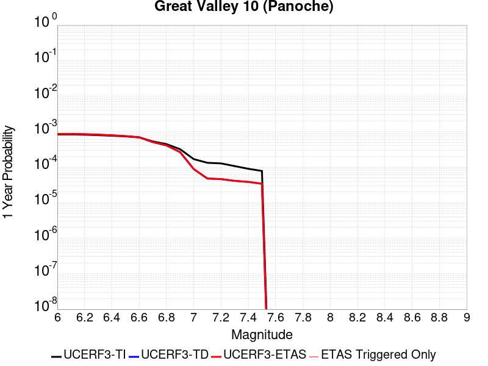 |  |

| Magnitude | 1 wk TI Prob | 1 wk TD Prob | 1 wk ETAS Prob | 1 wk ETAS/TD Gain | 1 wk ETAS Triggered Only | 1 mo TI Prob | 1 mo TD Prob | 1 mo ETAS Prob | 1 mo ETAS/TD Gain | 1 mo ETAS Triggered Only | 1 yr TI Prob | 1 yr TD Prob | 1 yr ETAS Prob | 1 yr ETAS/TD Gain | 1 yr ETAS Triggered Only | 10 yr TI Prob | 10 yr TD Prob | 10 yr ETAS Prob | 10 yr ETAS/TD Gain | 10 yr ETAS Triggered Only |
|-----|-----|-----|-----|-----|-----|-----|-----|-----|-----|-----|-----|-----|-----|-----|-----|-----|-----|-----|-----|-----|
| 6.0 | 1.6014626E-5 | 1.6575399E-5 | 1.6575399E-5 | 1.0 | 0.0 | 6.863231E-5 | 7.103552E-5 | 7.103552E-5 | 1.0 | 0.0 | 8.35278E-4 | 8.645185E-4 | 8.645185E-4 | 1.0 | 0.0 | 0.008321454 | 0.008612172 | 0.008622086 | 1.0011512 | 1.0E-5 |
| 6.1 | 1.6014626E-5 | 1.6575399E-5 | 1.6575399E-5 | 1.0 | 0.0 | 6.863231E-5 | 7.103552E-5 | 7.103552E-5 | 1.0 | 0.0 | 8.35278E-4 | 8.645185E-4 | 8.645185E-4 | 1.0 | 0.0 | 0.008321454 | 0.008612172 | 0.008622086 | 1.0011512 | 1.0E-5 |
| 6.2 | 1.56782E-5 | 1.6198446E-5 | 1.6198446E-5 | 1.0 | 0.0 | 6.719056E-5 | 6.94201E-5 | 6.94201E-5 | 1.0 | 0.0 | 8.17738E-4 | 8.4486604E-4 | 8.4486604E-4 | 1.0 | 0.0 | 0.008147354 | 0.008417147 | 0.008427063 | 1.001178 | 1.0E-5 |
| 6.3 | 1.5263338E-5 | 1.5723514E-5 | 1.5723514E-5 | 1.0 | 0.0 | 6.541267E-5 | 6.738478E-5 | 6.738478E-5 | 1.0 | 0.0 | 7.961082E-4 | 8.201049E-4 | 8.201049E-4 | 1.0 | 0.0 | 0.007932622 | 0.008171377 | 0.008181295 | 1.0012138 | 1.0E-5 |
| 6.4 | 1.4720723E-5 | 1.5099376E-5 | 1.5099376E-5 | 1.0 | 0.0 | 6.308728E-5 | 6.471004E-5 | 6.471004E-5 | 1.0 | 0.0 | 7.67817E-4 | 7.8756385E-4 | 7.8756385E-4 | 1.0 | 0.0 | 0.007651695 | 0.007848303 | 0.007858224 | 1.0012642 | 1.0E-5 |
| 6.5 | 1.408264E-5 | 1.4355969E-5 | 1.4355969E-5 | 1.0 | 0.0 | 6.0352773E-5 | 6.1524166E-5 | 6.1524166E-5 | 1.0 | 0.0 | 7.3454727E-4 | 7.488031E-4 | 7.488031E-4 | 1.0 | 0.0 | 0.0073212404 | 0.0074633555 | 0.007473281 | 1.0013299 | 1.0E-5 |
| 6.6 | 1.3197086E-5 | 1.3321889E-5 | 1.3321889E-5 | 1.0 | 0.0 | 5.6557717E-5 | 5.709259E-5 | 5.709259E-5 | 1.0 | 0.0 | 6.8837265E-4 | 6.9488434E-4 | 6.9488434E-4 | 1.0 | 0.0 | 0.006862442 | 0.0069276537 | 0.0069375844 | 1.0014335 | 1.0E-5 |
| 6.7 | 1.017583E-5 | 9.745382E-6 | 9.745382E-6 | 1.0 | 0.0 | 4.360997E-5 | 4.176527E-5 | 4.176527E-5 | 1.0 | 0.0 | 5.30822E-4 | 5.0837593E-4 | 5.0837593E-4 | 1.0 | 0.0 | 0.0052955584 | 0.005072382 | 0.005072382 | 1.0 | 0.0 |
| 6.8 | 8.557912E-6 | 7.872707E-6 | 7.872707E-6 | 1.0 | 0.0 | 3.667625E-5 | 3.373975E-5 | 3.373975E-5 | 1.0 | 0.0 | 4.4644187E-4 | 4.1070607E-4 | 4.1070607E-4 | 1.0 | 0.0 | 0.0044554602 | 0.004099677 | 0.004099677 | 1.0 | 0.0 |
| 6.9 | 6.14664E-6 | 5.092071E-6 | 5.092071E-6 | 1.0 | 0.0 | 2.6342475E-5 | 2.1822989E-5 | 2.1822989E-5 | 1.0 | 0.0 | 3.2067244E-4 | 2.6566387E-4 | 2.6566387E-4 | 1.0 | 0.0 | 0.003202101 | 0.002653601 | 0.002653601 | 1.0 | 0.0 |
| 7.0 | 3.2310581E-6 | 1.6951219E-6 | 1.6951219E-6 | 1.0 | 0.0 | 1.3847319E-5 | 7.264788E-6 | 7.264788E-6 | 1.0 | 0.0 | 1.6857806E-4 | 8.8445304E-5 | 8.8445304E-5 | 1.0 | 0.0 | 0.0016845023 | 8.841104E-4 | 8.841104E-4 | 1.0 | 0.0 |
| 7.1 | 2.544492E-6 | 9.1889206E-7 | 9.1889206E-7 | 1.0 | 0.0 | 1.090492E-5 | 3.938103E-6 | 3.938103E-6 | 1.0 | 0.0 | 1.327593E-4 | 4.79454E-5 | 4.79454E-5 | 1.0 | 0.0 | 0.0013268003 | 4.793553E-4 | 4.793553E-4 | 1.0 | 0.0 |
| 7.2 | 2.4479045E-6 | 8.841304E-7 | 8.841304E-7 | 1.0 | 0.0 | 1.0490977E-5 | 3.789125E-6 | 3.789125E-6 | 1.0 | 0.0 | 1.2772017E-4 | 4.6131667E-5 | 4.6131667E-5 | 1.0 | 0.0 | 0.0012764678 | 4.6122566E-4 | 4.6122566E-4 | 1.0 | 0.0 |
| 7.3 | 2.0559578E-6 | 7.892787E-7 | 7.892787E-7 | 1.0 | 0.0 | 8.811218E-6 | 3.3826188E-6 | 3.3826188E-6 | 1.0 | 0.0 | 1.072713E-4 | 4.1182655E-5 | 4.1182655E-5 | 1.0 | 0.0 | 0.0010721954 | 4.1175485E-4 | 4.1175485E-4 | 1.0 | 0.0 |
| 7.4 | 1.727687E-6 | 7.387757E-7 | 7.387757E-7 | 1.0 | 0.0 | 7.404352E-6 | 3.1661782E-6 | 3.1661782E-6 | 1.0 | 0.0 | 9.0144255E-5 | 3.8547583E-5 | 3.8547583E-5 | 1.0 | 0.0 | 9.0107694E-4 | 3.854136E-4 | 3.854136E-4 | 1.0 | 0.0 |
| 7.5 | 1.5002679E-6 | 6.546144E-7 | 6.546144E-7 | 1.0 | 0.0 | 6.4297037E-6 | 2.8054874E-6 | 2.8054874E-6 | 1.0 | 0.0 | 7.827883E-5 | 3.4156317E-5 | 3.4156317E-5 | 1.0 | 0.0 | 7.825126E-4 | 3.4151482E-4 | 3.4151482E-4 | 1.0 | 0.0 |

## Santa Monica alt 1
*[(top)](#table-of-contents)*

| 1 Week | 1 Month | 1 Year | 10 Year |
|-----|-----|-----|-----|
|  |  |  |  |

| Magnitude | 1 wk TI Prob | 1 wk TD Prob | 1 wk ETAS Prob | 1 wk ETAS/TD Gain | 1 wk ETAS Triggered Only | 1 mo TI Prob | 1 mo TD Prob | 1 mo ETAS Prob | 1 mo ETAS/TD Gain | 1 mo ETAS Triggered Only | 1 yr TI Prob | 1 yr TD Prob | 1 yr ETAS Prob | 1 yr ETAS/TD Gain | 1 yr ETAS Triggered Only | 10 yr TI Prob | 10 yr TD Prob | 10 yr ETAS Prob | 10 yr ETAS/TD Gain | 10 yr ETAS Triggered Only |
|-----|-----|-----|-----|-----|-----|-----|-----|-----|-----|-----|-----|-----|-----|-----|-----|-----|-----|-----|-----|-----|
| 6.0 | 1.1066008E-5 | 1.148031E-5 | 1.148031E-5 | 1.0 | 0.0 | 4.742488E-5 | 4.920048E-5 | 4.920048E-5 | 1.0 | 0.0 | 5.7724497E-4 | 5.9886515E-4 | 5.9886515E-4 | 1.0 | 0.0 | 0.005757478 | 0.0059739 | 0.00598384 | 1.0016639 | 1.0E-5 |
| 6.1 | 1.1066008E-5 | 1.148031E-5 | 1.148031E-5 | 1.0 | 0.0 | 4.742488E-5 | 4.920048E-5 | 4.920048E-5 | 1.0 | 0.0 | 5.7724497E-4 | 5.9886515E-4 | 5.9886515E-4 | 1.0 | 0.0 | 0.005757478 | 0.0059739 | 0.00598384 | 1.0016639 | 1.0E-5 |
| 6.2 | 1.1066008E-5 | 1.148031E-5 | 1.148031E-5 | 1.0 | 0.0 | 4.742488E-5 | 4.920048E-5 | 4.920048E-5 | 1.0 | 0.0 | 5.7724497E-4 | 5.9886515E-4 | 5.9886515E-4 | 1.0 | 0.0 | 0.005757478 | 0.0059739 | 0.00598384 | 1.0016639 | 1.0E-5 |
| 6.3 | 1.1066008E-5 | 1.148031E-5 | 1.148031E-5 | 1.0 | 0.0 | 4.742488E-5 | 4.920048E-5 | 4.920048E-5 | 1.0 | 0.0 | 5.7724497E-4 | 5.9886515E-4 | 5.9886515E-4 | 1.0 | 0.0 | 0.005757478 | 0.0059739 | 0.00598384 | 1.0016639 | 1.0E-5 |
| 6.4 | 1.1066008E-5 | 1.148031E-5 | 1.148031E-5 | 1.0 | 0.0 | 4.742488E-5 | 4.920048E-5 | 4.920048E-5 | 1.0 | 0.0 | 5.7724497E-4 | 5.9886515E-4 | 5.9886515E-4 | 1.0 | 0.0 | 0.005757478 | 0.0059739 | 0.00598384 | 1.0016639 | 1.0E-5 |
| 6.5 | 8.183544E-6 | 8.335432E-6 | 8.335432E-6 | 1.0 | 0.0 | 3.5071862E-5 | 3.57228E-5 | 3.57228E-5 | 1.0 | 0.0 | 4.2691626E-4 | 4.3483984E-4 | 4.3483984E-4 | 1.0 | 0.0 | 0.0042609703 | 0.0043400554 | 0.004350012 | 1.0022941 | 1.0E-5 |
| 6.6 | 8.1543285E-6 | 8.303646E-6 | 8.303646E-6 | 1.0 | 0.0 | 3.4946657E-5 | 3.5586578E-5 | 3.5586578E-5 | 1.0 | 0.0 | 4.2539247E-4 | 4.3318202E-4 | 4.3318202E-4 | 1.0 | 0.0 | 0.0042457907 | 0.004323542 | 0.0043334984 | 1.0023029 | 1.0E-5 |
| 6.7 | 8.110878E-6 | 8.257042E-6 | 8.257042E-6 | 1.0 | 0.0 | 3.4760444E-5 | 3.5386853E-5 | 3.5386853E-5 | 1.0 | 0.0 | 4.231262E-4 | 4.3075136E-4 | 4.3075136E-4 | 1.0 | 0.0 | 0.0042232145 | 0.0042993296 | 0.0043092864 | 1.002316 | 1.0E-5 |
| 6.8 | 7.644036E-6 | 7.75106E-6 | 7.75106E-6 | 1.0 | 0.0 | 3.275974E-5 | 3.3218414E-5 | 3.3218414E-5 | 1.0 | 0.0 | 3.9877684E-4 | 4.0436056E-4 | 4.0436056E-4 | 1.0 | 0.0 | 0.00398062 | 0.0040363944 | 0.004046354 | 1.0024675 | 1.0E-5 |
| 6.9 | 7.3698293E-6 | 7.455719E-6 | 7.455719E-6 | 1.0 | 0.0 | 3.15846E-5 | 3.19527E-5 | 3.19527E-5 | 1.0 | 0.0 | 3.8447464E-4 | 3.8895605E-4 | 3.8895605E-4 | 1.0 | 0.0 | 0.0038381014 | 0.0038828964 | 0.0038928576 | 1.0025654 | 1.0E-5 |
| 7.0 | 7.209872E-6 | 7.2856255E-6 | 7.2856255E-6 | 1.0 | 0.0 | 3.0899086E-5 | 3.1223743E-5 | 3.1223743E-5 | 1.0 | 0.0 | 3.7613141E-4 | 3.8008415E-4 | 3.8008415E-4 | 1.0 | 0.0 | 0.0037549543 | 0.0037944836 | 0.0038044457 | 1.0026253 | 1.0E-5 |
| 7.1 | 5.603456E-6 | 5.5238925E-6 | 5.5238925E-6 | 1.0 | 0.0 | 2.4014591E-5 | 2.3673612E-5 | 2.3673612E-5 | 1.0 | 0.0 | 2.923384E-4 | 2.881885E-4 | 2.881885E-4 | 1.0 | 0.0 | 0.0029195412 | 0.0028781896 | 0.0028881608 | 1.0034645 | 1.0E-5 |
| 7.2 | 4.7483613E-6 | 4.5911324E-6 | 4.5911324E-6 | 1.0 | 0.0 | 2.0349962E-5 | 1.9676136E-5 | 1.9676136E-5 | 1.0 | 0.0 | 2.4773262E-4 | 2.3953074E-4 | 2.3953074E-4 | 1.0 | 0.0 | 0.0024745662 | 0.0023927398 | 0.0024027159 | 1.0041693 | 1.0E-5 |
| 7.3 | 3.829015E-6 | 3.6342253E-6 | 3.6342253E-6 | 1.0 | 0.0 | 1.6409962E-5 | 1.5575159E-5 | 1.5575159E-5 | 1.0 | 0.0 | 1.9977297E-4 | 1.8961114E-4 | 1.8961114E-4 | 1.0 | 0.0 | 0.0019959346 | 0.0018945024 | 0.0019044835 | 1.0052685 | 1.0E-5 |
| 7.4 | 2.610755E-6 | 2.4995716E-6 | 2.4995716E-6 | 1.0 | 0.0 | 1.1188902E-5 | 1.0712406E-5 | 1.0712406E-5 | 1.0 | 0.0 | 1.3621636E-4 | 1.3041578E-4 | 1.3041578E-4 | 1.0 | 0.0 | 0.001361329 | 0.0013033969 | 0.0013133838 | 1.0076623 | 1.0E-5 |
| 7.5 | 1.792146E-6 | 1.7584184E-6 | 1.7584184E-6 | 1.0 | 0.0 | 7.680603E-6 | 7.536057E-6 | 7.536057E-6 | 1.0 | 0.0 | 9.3507326E-5 | 9.1747665E-5 | 9.1747665E-5 | 1.0 | 0.0 | 9.3467993E-4 | 9.1710105E-4 | 9.2709187E-4 | 1.010894 | 1.0E-5 |
| 7.6 | 1.1473018E-6 | 1.1029152E-6 | 1.1029152E-6 | 1.0 | 0.0 | 4.9169985E-6 | 4.726771E-6 | 4.726771E-6 | 1.0 | 0.0 | 5.986281E-5 | 5.7546935E-5 | 5.7546935E-5 | 1.0 | 0.0 | 5.984669E-4 | 5.7532196E-4 | 5.853162E-4 | 1.0173715 | 1.0E-5 |
| 7.7 | 5.330919E-7 | 4.7452556E-7 | 4.7452556E-7 | 1.0 | 0.0 | 2.2846775E-6 | 2.0336795E-6 | 2.0336795E-6 | 1.0 | 0.0 | 2.7815593E-5 | 2.4759778E-5 | 2.4759778E-5 | 1.0 | 0.0 | 2.7812112E-4 | 2.4757133E-4 | 2.5756884E-4 | 1.0403824 | 1.0E-5 |
| 7.8 | 1.1668574E-7 | 8.2966224E-8 | 8.2966224E-8 | 1.0 | 0.0 | 5.000816E-7 | 3.5556948E-7 | 3.5556948E-7 | 1.0 | 0.0 | 6.0884768E-6 | 4.32905E-6 | 4.32905E-6 | 1.0 | 0.0 | 6.08831E-5 | 4.3289692E-5 | 4.3289692E-5 | 1.0 | 0.0 |
| 7.9 | 8.007447E-10 | 6.1608785E-10 | 6.1608785E-10 | 1.0 | 0.0 | 3.4317629E-9 | 2.6403764E-9 | 2.6403764E-9 | 1.0 | 0.0 | 4.1781714E-8 | 3.2146584E-8 | 3.2146584E-8 | 1.0 | 0.0 | 4.1781706E-7 | 3.214658E-7 | 3.214658E-7 | 1.0 | 0.0 |

## Holser alt 1
*[(top)](#table-of-contents)*

| 1 Week | 1 Month | 1 Year | 10 Year |
|-----|-----|-----|-----|
|  |  |  |  |

| Magnitude | 1 wk TI Prob | 1 wk TD Prob | 1 wk ETAS Prob | 1 wk ETAS/TD Gain | 1 wk ETAS Triggered Only | 1 mo TI Prob | 1 mo TD Prob | 1 mo ETAS Prob | 1 mo ETAS/TD Gain | 1 mo ETAS Triggered Only | 1 yr TI Prob | 1 yr TD Prob | 1 yr ETAS Prob | 1 yr ETAS/TD Gain | 1 yr ETAS Triggered Only | 10 yr TI Prob | 10 yr TD Prob | 10 yr ETAS Prob | 10 yr ETAS/TD Gain | 10 yr ETAS Triggered Only |
|-----|-----|-----|-----|-----|-----|-----|-----|-----|-----|-----|-----|-----|-----|-----|-----|-----|-----|-----|-----|-----|
| 6.0 | 6.2746653E-6 | 5.789965E-6 | 5.789965E-6 | 1.0 | 0.0 | 2.6891146E-5 | 2.4813964E-5 | 2.4813964E-5 | 1.0 | 0.0 | 3.273505E-4 | 3.020797E-4 | 3.020797E-4 | 1.0 | 0.0 | 0.0032686873 | 0.0030178234 | 0.0030277933 | 1.0033036 | 1.0E-5 |
| 6.1 | 6.2746653E-6 | 5.789965E-6 | 5.789965E-6 | 1.0 | 0.0 | 2.6891146E-5 | 2.4813964E-5 | 2.4813964E-5 | 1.0 | 0.0 | 3.273505E-4 | 3.020797E-4 | 3.020797E-4 | 1.0 | 0.0 | 0.0032686873 | 0.0030178234 | 0.0030277933 | 1.0033036 | 1.0E-5 |
| 6.2 | 6.2746653E-6 | 5.789965E-6 | 5.789965E-6 | 1.0 | 0.0 | 2.6891146E-5 | 2.4813964E-5 | 2.4813964E-5 | 1.0 | 0.0 | 3.273505E-4 | 3.020797E-4 | 3.020797E-4 | 1.0 | 0.0 | 0.0032686873 | 0.0030178234 | 0.0030277933 | 1.0033036 | 1.0E-5 |
| 6.3 | 6.2746653E-6 | 5.789965E-6 | 5.789965E-6 | 1.0 | 0.0 | 2.6891146E-5 | 2.4813964E-5 | 2.4813964E-5 | 1.0 | 0.0 | 3.273505E-4 | 3.020797E-4 | 3.020797E-4 | 1.0 | 0.0 | 0.0032686873 | 0.0030178234 | 0.0030277933 | 1.0033036 | 1.0E-5 |
| 6.4 | 6.2746653E-6 | 5.789965E-6 | 5.789965E-6 | 1.0 | 0.0 | 2.6891146E-5 | 2.4813964E-5 | 2.4813964E-5 | 1.0 | 0.0 | 3.273505E-4 | 3.020797E-4 | 3.020797E-4 | 1.0 | 0.0 | 0.0032686873 | 0.0030178234 | 0.0030277933 | 1.0033036 | 1.0E-5 |
| 6.5 | 6.2746653E-6 | 5.789965E-6 | 5.789965E-6 | 1.0 | 0.0 | 2.6891146E-5 | 2.4813964E-5 | 2.4813964E-5 | 1.0 | 0.0 | 3.273505E-4 | 3.020797E-4 | 3.020797E-4 | 1.0 | 0.0 | 0.0032686873 | 0.0030178234 | 0.0030277933 | 1.0033036 | 1.0E-5 |
| 6.6 | 3.375825E-6 | 2.7711897E-6 | 2.7711897E-6 | 1.0 | 0.0 | 1.4467741E-5 | 1.1876474E-5 | 1.1876474E-5 | 1.0 | 0.0 | 1.761305E-4 | 1.4458665E-4 | 1.4458665E-4 | 1.0 | 0.0 | 0.0017599097 | 0.0014449427 | 0.0014549283 | 1.0069107 | 1.0E-5 |
| 6.7 | 3.375825E-6 | 2.7711897E-6 | 2.7711897E-6 | 1.0 | 0.0 | 1.4467741E-5 | 1.1876474E-5 | 1.1876474E-5 | 1.0 | 0.0 | 1.761305E-4 | 1.4458665E-4 | 1.4458665E-4 | 1.0 | 0.0 | 0.0017599097 | 0.0014449427 | 0.0014549283 | 1.0069107 | 1.0E-5 |
| 6.8 | 3.366533E-6 | 2.7615893E-6 | 2.7615893E-6 | 1.0 | 0.0 | 1.4427919E-5 | 1.183533E-5 | 1.183533E-5 | 1.0 | 0.0 | 1.7564575E-4 | 1.4408577E-4 | 1.4408577E-4 | 1.0 | 0.0 | 0.0017550698 | 0.0014399405 | 0.0014499262 | 1.0069348 | 1.0E-5 |
| 6.9 | 3.253174E-6 | 2.6438113E-6 | 2.6438113E-6 | 1.0 | 0.0 | 1.39421E-5 | 1.1330571E-5 | 1.1330571E-5 | 1.0 | 0.0 | 1.6973184E-4 | 1.3794114E-4 | 1.3794114E-4 | 1.0 | 0.0 | 0.0016960226 | 0.001378571 | 0.0013885573 | 1.0072439 | 1.0E-5 |
| 7.0 | 2.9336593E-6 | 2.311799E-6 | 2.311799E-6 | 1.0 | 0.0 | 1.2572766E-5 | 9.907673E-6 | 9.907673E-6 | 1.0 | 0.0 | 1.5306266E-4 | 1.2061927E-4 | 1.2061927E-4 | 1.0 | 0.0 | 0.0015295728 | 0.0012055405 | 0.0012155285 | 1.008285 | 1.0E-5 |
| 7.1 | 2.9087812E-6 | 2.2876513E-6 | 2.2876513E-6 | 1.0 | 0.0 | 1.2466146E-5 | 9.804184E-6 | 9.804184E-6 | 1.0 | 0.0 | 1.5176475E-4 | 1.19359414E-4 | 1.19359414E-4 | 1.0 | 0.0 | 0.0015166114 | 0.0011929555 | 0.0012029436 | 1.0083725 | 1.0E-5 |
| 7.2 | 2.8674524E-6 | 2.2475429E-6 | 2.2475429E-6 | 1.0 | 0.0 | 1.2289024E-5 | 9.63229E-6 | 9.63229E-6 | 1.0 | 0.0 | 1.4960859E-4 | 1.1726685E-4 | 1.1726685E-4 | 1.0 | 0.0 | 0.0014950791 | 0.001172052 | 0.0011820403 | 1.008522 | 1.0E-5 |
| 7.3 | 2.8057775E-6 | 2.1954324E-6 | 2.1954324E-6 | 1.0 | 0.0 | 1.2024705E-5 | 9.408962E-6 | 9.408962E-6 | 1.0 | 0.0 | 1.4639096E-4 | 1.14548115E-4 | 1.14548115E-4 | 1.0 | 0.0 | 0.0014629456 | 0.001144893 | 0.0011548816 | 1.0087245 | 1.0E-5 |
| 7.4 | 2.683666E-6 | 2.1092305E-6 | 2.1092305E-6 | 1.0 | 0.0 | 1.1501375E-5 | 9.039529E-6 | 9.039529E-6 | 1.0 | 0.0 | 1.4002025E-4 | 1.1005072E-4 | 1.1005072E-4 | 1.0 | 0.0 | 0.0013993206 | 0.0010999644 | 0.0011099534 | 1.0090812 | 1.0E-5 |
| 7.5 | 2.434495E-6 | 1.9195363E-6 | 1.9195363E-6 | 1.0 | 0.0 | 1.0433508E-5 | 8.226558E-6 | 8.226558E-6 | 1.0 | 0.0 | 1.2702055E-4 | 1.0015376E-4 | 1.0015376E-4 | 1.0 | 0.0 | 0.0012694797 | 0.0010010883 | 0.0010010883 | 1.0 | 0.0 |
| 7.6 | 1.9914562E-6 | 1.5731459E-6 | 1.5731459E-6 | 1.0 | 0.0 | 8.534785E-6 | 6.742037E-6 | 6.742037E-6 | 1.0 | 0.0 | 1.03906044E-4 | 8.208122E-5 | 8.208122E-5 | 1.0 | 0.0 | 0.0010385747 | 8.205106E-4 | 8.205106E-4 | 1.0 | 0.0 |
| 7.7 | 1.5229501E-6 | 1.1896061E-6 | 1.1896061E-6 | 1.0 | 0.0 | 6.526913E-6 | 5.098302E-6 | 5.098302E-6 | 1.0 | 0.0 | 7.946226E-5 | 6.2070074E-5 | 6.2070074E-5 | 1.0 | 0.0 | 7.943385E-4 | 6.2052865E-4 | 6.2052865E-4 | 1.0 | 0.0 |
| 7.8 | 6.3489426E-7 | 4.687806E-7 | 4.687806E-7 | 1.0 | 0.0 | 2.7209726E-6 | 2.009058E-6 | 2.009058E-6 | 1.0 | 0.0 | 3.312734E-5 | 2.4460009E-5 | 2.4460009E-5 | 1.0 | 0.0 | 3.31224E-4 | 2.4457334E-4 | 2.4457334E-4 | 1.0 | 0.0 |
| 7.9 | 1.5459432E-7 | 1.0193758E-7 | 1.0193758E-7 | 1.0 | 0.0 | 6.6254694E-7 | 4.3687527E-7 | 4.3687527E-7 | 1.0 | 0.0 | 8.066479E-6 | 5.3189433E-6 | 5.3189433E-6 | 1.0 | 0.0 | 8.066186E-5 | 5.3188178E-5 | 5.3188178E-5 | 1.0 | 0.0 |
| 8.0 | 1.8307812E-8 | 9.690293E-9 | 9.690293E-9 | 1.0 | 0.0 | 7.846205E-8 | 4.152983E-8 | 4.152983E-8 | 1.0 | 0.0 | 9.55275E-7 | 5.0562556E-7 | 5.0562556E-7 | 1.0 | 0.0 | 9.552709E-6 | 5.0562444E-6 | 5.0562444E-6 | 1.0 | 0.0 |

## East Huasna 2011 CFM
*[(top)](#table-of-contents)*

| 1 Week | 1 Month | 1 Year | 10 Year |
|-----|-----|-----|-----|
| 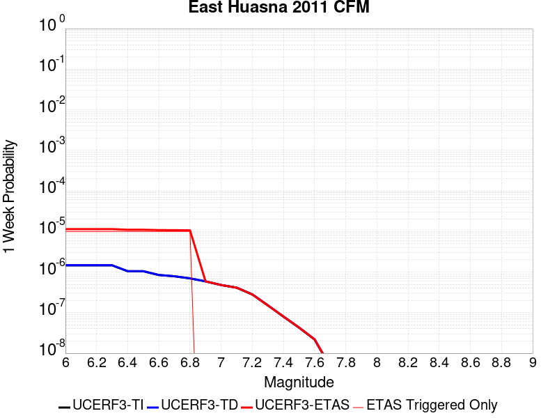 |  | 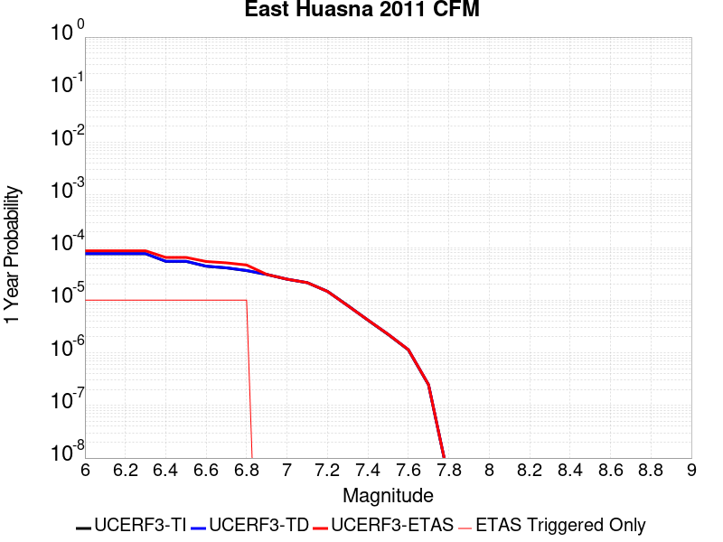 |  |

| Magnitude | 1 wk TI Prob | 1 wk TD Prob | 1 wk ETAS Prob | 1 wk ETAS/TD Gain | 1 wk ETAS Triggered Only | 1 mo TI Prob | 1 mo TD Prob | 1 mo ETAS Prob | 1 mo ETAS/TD Gain | 1 mo ETAS Triggered Only | 1 yr TI Prob | 1 yr TD Prob | 1 yr ETAS Prob | 1 yr ETAS/TD Gain | 1 yr ETAS Triggered Only | 10 yr TI Prob | 10 yr TD Prob | 10 yr ETAS Prob | 10 yr ETAS/TD Gain | 10 yr ETAS Triggered Only |
|-----|-----|-----|-----|-----|-----|-----|-----|-----|-----|-----|-----|-----|-----|-----|-----|-----|-----|-----|-----|-----|
| 6.0 | 1.4658423E-6 | 1.4715657E-6 | 1.1471551E-5 | 7.795473 | 1.0E-5 | 6.282166E-6 | 6.3066955E-6 | 1.6306632E-5 | 2.5856063 | 1.0E-5 | 7.6482684E-5 | 7.678138E-5 | 8.6780616E-5 | 1.13023 | 1.0E-5 | 7.645637E-4 | 7.6755555E-4 | 7.775479E-4 | 1.0130184 | 1.0E-5 |
| 6.1 | 1.4658423E-6 | 1.4715657E-6 | 1.1471551E-5 | 7.795473 | 1.0E-5 | 6.282166E-6 | 6.3066955E-6 | 1.6306632E-5 | 2.5856063 | 1.0E-5 | 7.6482684E-5 | 7.678138E-5 | 8.6780616E-5 | 1.13023 | 1.0E-5 | 7.645637E-4 | 7.6755555E-4 | 7.775479E-4 | 1.0130184 | 1.0E-5 |
| 6.2 | 1.4658423E-6 | 1.4715657E-6 | 1.1471551E-5 | 7.795473 | 1.0E-5 | 6.282166E-6 | 6.3066955E-6 | 1.6306632E-5 | 2.5856063 | 1.0E-5 | 7.6482684E-5 | 7.678138E-5 | 8.6780616E-5 | 1.13023 | 1.0E-5 | 7.645637E-4 | 7.6755555E-4 | 7.775479E-4 | 1.0130184 | 1.0E-5 |
| 6.3 | 1.4658423E-6 | 1.4715657E-6 | 1.1471551E-5 | 7.795473 | 1.0E-5 | 6.282166E-6 | 6.3066955E-6 | 1.6306632E-5 | 2.5856063 | 1.0E-5 | 7.6482684E-5 | 7.678138E-5 | 8.6780616E-5 | 1.13023 | 1.0E-5 | 7.645637E-4 | 7.6755555E-4 | 7.775479E-4 | 1.0130184 | 1.0E-5 |
| 6.4 | 1.0488257E-6 | 1.0527513E-6 | 1.1052741E-5 | 10.49891 | 1.0E-5 | 4.4949593E-6 | 4.5117836E-6 | 1.4511738E-5 | 3.2164085 | 1.0E-5 | 5.472476E-5 | 5.49296E-5 | 6.4929045E-5 | 1.1820412 | 1.0E-5 | 5.4711284E-4 | 5.491621E-4 | 5.5915664E-4 | 1.0181996 | 1.0E-5 |
| 6.5 | 1.0488257E-6 | 1.0527513E-6 | 1.1052741E-5 | 10.49891 | 1.0E-5 | 4.4949593E-6 | 4.5117836E-6 | 1.4511738E-5 | 3.2164085 | 1.0E-5 | 5.472476E-5 | 5.49296E-5 | 6.4929045E-5 | 1.1820412 | 1.0E-5 | 5.4711284E-4 | 5.491621E-4 | 5.5915664E-4 | 1.0181996 | 1.0E-5 |
| 6.6 | 8.463064E-7 | 8.49363E-7 | 1.0849354E-5 | 12.773519 | 1.0E-5 | 3.6270226E-6 | 3.6401223E-6 | 1.3640086E-5 | 3.7471504 | 1.0E-5 | 4.4158103E-5 | 4.4317596E-5 | 5.431715E-5 | 1.225634 | 1.0E-5 | 4.414933E-4 | 4.4308844E-4 | 4.53084E-4 | 1.0225588 | 1.0E-5 |
| 6.7 | 7.876149E-7 | 7.902531E-7 | 1.0790245E-5 | 13.654163 | 1.0E-5 | 3.375488E-6 | 3.3867946E-6 | 1.3386761E-5 | 3.9526343 | 1.0E-5 | 4.109579E-5 | 4.1233452E-5 | 5.1233037E-5 | 1.2425115 | 1.0E-5 | 4.108819E-4 | 4.1225864E-4 | 4.222545E-4 | 1.0242466 | 1.0E-5 |
| 6.8 | 6.9940785E-7 | 7.0165754E-7 | 1.070165E-5 | 15.251957 | 1.0E-5 | 2.9974588E-6 | 3.0071003E-6 | 1.300707E-5 | 4.325453 | 1.0E-5 | 3.649345E-5 | 3.6610836E-5 | 4.661047E-5 | 1.2731332 | 1.0E-5 | 3.6487455E-4 | 3.660485E-4 | 3.7604486E-4 | 1.0273088 | 1.0E-5 |
| 6.9 | 5.899658E-7 | 5.9155974E-7 | 5.9155974E-7 | 1.0 | 0.0 | 2.5284223E-6 | 2.5352535E-6 | 2.5352535E-6 | 1.0 | 0.0 | 3.0783107E-5 | 3.086628E-5 | 3.086628E-5 | 1.0 | 0.0 | 3.0778843E-4 | 3.086202E-4 | 3.086202E-4 | 1.0 | 0.0 |
| 7.0 | 4.793814E-7 | 4.8032706E-7 | 4.8032706E-7 | 1.0 | 0.0 | 2.05449E-6 | 2.058543E-6 | 2.058543E-6 | 1.0 | 0.0 | 2.501313E-5 | 2.5062474E-5 | 2.5062474E-5 | 1.0 | 0.0 | 2.5010316E-4 | 2.5059667E-4 | 2.5059667E-4 | 1.0 | 0.0 |
| 7.1 | 4.1256908E-7 | 4.129939E-7 | 4.129939E-7 | 1.0 | 0.0 | 1.768152E-6 | 1.7699726E-6 | 1.7699726E-6 | 1.0 | 0.0 | 2.1527037E-5 | 2.1549205E-5 | 2.1549205E-5 | 1.0 | 0.0 | 2.1524953E-4 | 2.154713E-4 | 2.154713E-4 | 1.0 | 0.0 |
| 7.2 | 2.822599E-7 | 2.8161398E-7 | 2.8161398E-7 | 1.0 | 0.0 | 1.2096847E-6 | 1.2069165E-6 | 1.2069165E-6 | 1.0 | 0.0 | 1.47278115E-5 | 1.469411E-5 | 1.469411E-5 | 1.0 | 0.0 | 1.4726835E-4 | 1.4693146E-4 | 1.4693146E-4 | 1.0 | 0.0 |
| 7.3 | 1.5261652E-7 | 1.5075E-7 | 1.5075E-7 | 1.0 | 0.0 | 6.540707E-7 | 6.4607127E-7 | 6.4607127E-7 | 1.0 | 0.0 | 7.963281E-6 | 7.8658895E-6 | 7.8658895E-6 | 1.0 | 0.0 | 7.962996E-5 | 7.865613E-5 | 7.865613E-5 | 1.0 | 0.0 |
| 7.4 | 7.976414E-8 | 8.057865E-8 | 8.057865E-8 | 1.0 | 0.0 | 3.418463E-7 | 3.45337E-7 | 3.45337E-7 | 1.0 | 0.0 | 4.1619705E-6 | 4.2044703E-6 | 4.2044703E-6 | 1.0 | 0.0 | 4.161893E-5 | 4.2043914E-5 | 4.2043914E-5 | 1.0 | 0.0 |
| 7.5 | 4.2715055E-8 | 4.3202512E-8 | 4.3202512E-8 | 1.0 | 0.0 | 1.830645E-7 | 1.8515361E-7 | 1.8515361E-7 | 1.0 | 0.0 | 2.228808E-6 | 2.2542429E-6 | 2.2542429E-6 | 1.0 | 0.0 | 2.2287857E-5 | 2.2542203E-5 | 2.2542203E-5 | 1.0 | 0.0 |
| 7.6 | 2.1807532E-8 | 2.2057476E-8 | 2.2057476E-8 | 1.0 | 0.0 | 9.346085E-8 | 9.4532034E-8 | 9.4532034E-8 | 1.0 | 0.0 | 1.1378852E-6 | 1.1509269E-6 | 1.1509269E-6 | 1.0 | 0.0 | 1.1378794E-5 | 1.1509211E-5 | 1.1509211E-5 | 1.0 | 0.0 |
| 7.7 | 4.7196043E-9 | 4.767283E-9 | 4.767283E-9 | 1.0 | 0.0 | 2.0226874E-8 | 2.0431212E-8 | 2.0431212E-8 | 1.0 | 0.0 | 2.4626218E-7 | 2.4874998E-7 | 2.4874998E-7 | 1.0 | 0.0 | 2.462619E-6 | 2.487497E-6 | 2.487497E-6 | 1.0 | 0.0 |
| 7.8 | 7.400003E-11 | 7.4654505E-11 | 7.4654505E-11 | 1.0 | 0.0 | 3.171432E-10 | 3.1994773E-10 | 3.1994773E-10 | 1.0 | 0.0 | 3.861218E-9 | 3.895363E-9 | 3.895363E-9 | 1.0 | 0.0 | 3.861218E-8 | 3.895363E-8 | 3.895363E-8 | 1.0 | 0.0 |

## San Pedro Escarpment
*[(top)](#table-of-contents)*

| 1 Week | 1 Month | 1 Year | 10 Year |
|-----|-----|-----|-----|
|  |  |  |  |

| Magnitude | 1 wk TI Prob | 1 wk TD Prob | 1 wk ETAS Prob | 1 wk ETAS/TD Gain | 1 wk ETAS Triggered Only | 1 mo TI Prob | 1 mo TD Prob | 1 mo ETAS Prob | 1 mo ETAS/TD Gain | 1 mo ETAS Triggered Only | 1 yr TI Prob | 1 yr TD Prob | 1 yr ETAS Prob | 1 yr ETAS/TD Gain | 1 yr ETAS Triggered Only | 10 yr TI Prob | 10 yr TD Prob | 10 yr ETAS Prob | 10 yr ETAS/TD Gain | 10 yr ETAS Triggered Only |
|-----|-----|-----|-----|-----|-----|-----|-----|-----|-----|-----|-----|-----|-----|-----|-----|-----|-----|-----|-----|-----|
| 6.0 | 1.1740281E-6 | 1.0380262E-6 | 1.0380262E-6 | 1.0 | 0.0 | 5.031539E-6 | 4.4486765E-6 | 4.4486765E-6 | 1.0 | 0.0 | 6.125726E-5 | 5.416135E-5 | 5.416135E-5 | 1.0 | 0.0 | 6.124038E-4 | 5.4148794E-4 | 5.514825E-4 | 1.0184577 | 1.0E-5 |
| 6.1 | 1.1740281E-6 | 1.0380262E-6 | 1.0380262E-6 | 1.0 | 0.0 | 5.031539E-6 | 4.4486765E-6 | 4.4486765E-6 | 1.0 | 0.0 | 6.125726E-5 | 5.416135E-5 | 5.416135E-5 | 1.0 | 0.0 | 6.124038E-4 | 5.4148794E-4 | 5.514825E-4 | 1.0184577 | 1.0E-5 |
| 6.2 | 1.1740281E-6 | 1.0380262E-6 | 1.0380262E-6 | 1.0 | 0.0 | 5.031539E-6 | 4.4486765E-6 | 4.4486765E-6 | 1.0 | 0.0 | 6.125726E-5 | 5.416135E-5 | 5.416135E-5 | 1.0 | 0.0 | 6.124038E-4 | 5.4148794E-4 | 5.514825E-4 | 1.0184577 | 1.0E-5 |
| 6.3 | 1.1740281E-6 | 1.0380262E-6 | 1.0380262E-6 | 1.0 | 0.0 | 5.031539E-6 | 4.4486765E-6 | 4.4486765E-6 | 1.0 | 0.0 | 6.125726E-5 | 5.416135E-5 | 5.416135E-5 | 1.0 | 0.0 | 6.124038E-4 | 5.4148794E-4 | 5.514825E-4 | 1.0184577 | 1.0E-5 |
| 6.4 | 1.1740281E-6 | 1.0380262E-6 | 1.0380262E-6 | 1.0 | 0.0 | 5.031539E-6 | 4.4486765E-6 | 4.4486765E-6 | 1.0 | 0.0 | 6.125726E-5 | 5.416135E-5 | 5.416135E-5 | 1.0 | 0.0 | 6.124038E-4 | 5.4148794E-4 | 5.514825E-4 | 1.0184577 | 1.0E-5 |
| 6.5 | 1.1740281E-6 | 1.0380262E-6 | 1.0380262E-6 | 1.0 | 0.0 | 5.031539E-6 | 4.4486765E-6 | 4.4486765E-6 | 1.0 | 0.0 | 6.125726E-5 | 5.416135E-5 | 5.416135E-5 | 1.0 | 0.0 | 6.124038E-4 | 5.4148794E-4 | 5.514825E-4 | 1.0184577 | 1.0E-5 |
| 6.6 | 1.1740281E-6 | 1.0380262E-6 | 1.0380262E-6 | 1.0 | 0.0 | 5.031539E-6 | 4.4486765E-6 | 4.4486765E-6 | 1.0 | 0.0 | 6.125726E-5 | 5.416135E-5 | 5.416135E-5 | 1.0 | 0.0 | 6.124038E-4 | 5.4148794E-4 | 5.514825E-4 | 1.0184577 | 1.0E-5 |
| 6.7 | 1.1740281E-6 | 1.0380262E-6 | 1.0380262E-6 | 1.0 | 0.0 | 5.031539E-6 | 4.4486765E-6 | 4.4486765E-6 | 1.0 | 0.0 | 6.125726E-5 | 5.416135E-5 | 5.416135E-5 | 1.0 | 0.0 | 6.124038E-4 | 5.4148794E-4 | 5.514825E-4 | 1.0184577 | 1.0E-5 |
| 6.8 | 1.1740281E-6 | 1.0380262E-6 | 1.0380262E-6 | 1.0 | 0.0 | 5.031539E-6 | 4.4486765E-6 | 4.4486765E-6 | 1.0 | 0.0 | 6.125726E-5 | 5.416135E-5 | 5.416135E-5 | 1.0 | 0.0 | 6.124038E-4 | 5.4148794E-4 | 5.514825E-4 | 1.0184577 | 1.0E-5 |
| 6.9 | 1.1740281E-6 | 1.0380262E-6 | 1.0380262E-6 | 1.0 | 0.0 | 5.031539E-6 | 4.4486765E-6 | 4.4486765E-6 | 1.0 | 0.0 | 6.125726E-5 | 5.416135E-5 | 5.416135E-5 | 1.0 | 0.0 | 6.124038E-4 | 5.4148794E-4 | 5.514825E-4 | 1.0184577 | 1.0E-5 |
| 7.0 | 1.1740281E-6 | 1.0380262E-6 | 1.0380262E-6 | 1.0 | 0.0 | 5.031539E-6 | 4.4486765E-6 | 4.4486765E-6 | 1.0 | 0.0 | 6.125726E-5 | 5.416135E-5 | 5.416135E-5 | 1.0 | 0.0 | 6.124038E-4 | 5.4148794E-4 | 5.514825E-4 | 1.0184577 | 1.0E-5 |
| 7.1 | 1.1740281E-6 | 1.0380262E-6 | 1.0380262E-6 | 1.0 | 0.0 | 5.031539E-6 | 4.4486765E-6 | 4.4486765E-6 | 1.0 | 0.0 | 6.125726E-5 | 5.416135E-5 | 5.416135E-5 | 1.0 | 0.0 | 6.124038E-4 | 5.4148794E-4 | 5.514825E-4 | 1.0184577 | 1.0E-5 |
| 7.2 | 1.1722314E-6 | 1.0362135E-6 | 1.0362135E-6 | 1.0 | 0.0 | 5.023839E-6 | 4.4409076E-6 | 4.4409076E-6 | 1.0 | 0.0 | 6.116352E-5 | 5.406677E-5 | 5.406677E-5 | 1.0 | 0.0 | 6.114669E-4 | 5.405426E-4 | 5.5053714E-4 | 1.01849 | 1.0E-5 |
| 7.3 | 1.1515234E-6 | 1.0152875E-6 | 1.0152875E-6 | 1.0 | 0.0 | 4.935091E-6 | 4.351225E-6 | 4.351225E-6 | 1.0 | 0.0 | 6.008308E-5 | 5.2974945E-5 | 5.2974945E-5 | 1.0 | 0.0 | 6.0066837E-4 | 5.296295E-4 | 5.3962425E-4 | 1.0188711 | 1.0E-5 |
| 7.4 | 1.1103637E-6 | 9.736466E-7 | 9.736466E-7 | 1.0 | 0.0 | 4.7586927E-6 | 4.172765E-6 | 4.172765E-6 | 1.0 | 0.0 | 5.793554E-5 | 5.0802293E-5 | 5.0802293E-5 | 1.0 | 0.0 | 5.792044E-4 | 5.079131E-4 | 5.179081E-4 | 1.0196784 | 1.0E-5 |
| 7.5 | 1.0425391E-6 | 9.1189133E-7 | 9.1189133E-7 | 1.0 | 0.0 | 4.4680173E-6 | 3.9081E-6 | 3.9081E-6 | 1.0 | 0.0 | 5.439675E-5 | 4.7580146E-5 | 4.7580146E-5 | 1.0 | 0.0 | 5.438344E-4 | 4.7570592E-4 | 4.8570117E-4 | 1.0210114 | 1.0E-5 |
| 7.6 | 7.0184194E-7 | 5.886514E-7 | 5.886514E-7 | 1.0 | 0.0 | 3.0078907E-6 | 2.5227896E-6 | 2.5227896E-6 | 1.0 | 0.0 | 3.6620455E-5 | 3.071458E-5 | 3.071458E-5 | 1.0 | 0.0 | 3.661442E-4 | 3.071081E-4 | 3.17105E-4 | 1.0325519 | 1.0E-5 |
| 7.7 | 3.0871365E-7 | 2.2456044E-7 | 2.2456044E-7 | 1.0 | 0.0 | 1.3230577E-6 | 9.624015E-7 | 9.624015E-7 | 1.0 | 0.0 | 1.610811E-5 | 1.1717177E-5 | 1.1717177E-5 | 1.0 | 0.0 | 1.6106942E-4 | 1.171657E-4 | 1.2716453E-4 | 1.0853392 | 1.0E-5 |
| 7.8 | 5.7512665E-8 | 4.1053042E-8 | 4.1053042E-8 | 1.0 | 0.0 | 2.464828E-7 | 1.759416E-7 | 1.759416E-7 | 1.0 | 0.0 | 3.0009242E-6 | 2.142087E-6 | 2.142087E-6 | 1.0 | 0.0 | 3.0008836E-5 | 2.1420683E-5 | 2.1420683E-5 | 1.0 | 0.0 |
| 7.9 | 6.040053E-9 | 3.4534322E-9 | 3.4534322E-9 | 1.0 | 0.0 | 2.5885942E-8 | 1.4800423E-8 | 1.4800423E-8 | 1.0 | 0.0 | 3.151613E-7 | 1.8019513E-7 | 1.8019513E-7 | 1.0 | 0.0 | 3.1516086E-6 | 1.80195E-6 | 1.80195E-6 | 1.0 | 0.0 |

## Great Valley 11
*[(top)](#table-of-contents)*

| 1 Week | 1 Month | 1 Year | 10 Year |
|-----|-----|-----|-----|
|  |  |  |  |

| Magnitude | 1 wk TI Prob | 1 wk TD Prob | 1 wk ETAS Prob | 1 wk ETAS/TD Gain | 1 wk ETAS Triggered Only | 1 mo TI Prob | 1 mo TD Prob | 1 mo ETAS Prob | 1 mo ETAS/TD Gain | 1 mo ETAS Triggered Only | 1 yr TI Prob | 1 yr TD Prob | 1 yr ETAS Prob | 1 yr ETAS/TD Gain | 1 yr ETAS Triggered Only | 10 yr TI Prob | 10 yr TD Prob | 10 yr ETAS Prob | 10 yr ETAS/TD Gain | 10 yr ETAS Triggered Only |
|-----|-----|-----|-----|-----|-----|-----|-----|-----|-----|-----|-----|-----|-----|-----|-----|-----|-----|-----|-----|-----|
| 6.0 | 2.8099583E-5 | 2.9832152E-5 | 2.9832152E-5 | 1.0 | 0.0 | 1.20421224E-4 | 1.278462E-4 | 1.278462E-4 | 1.0 | 0.0 | 0.0014651422 | 0.0015554909 | 0.0015554909 | 1.0 | 0.0 | 0.0145552 | 0.01545356 | 0.015463406 | 1.000637 | 1.0E-5 |
| 6.1 | 2.483194E-5 | 2.590715E-5 | 2.590715E-5 | 1.0 | 0.0 | 1.0641825E-4 | 1.11026246E-4 | 1.11026246E-4 | 1.0 | 0.0 | 0.0012948721 | 0.0013509706 | 0.0013509706 | 1.0 | 0.0 | 0.012873529 | 0.013433994 | 0.013443859 | 1.0007343 | 1.0E-5 |
| 6.2 | 2.483194E-5 | 2.590715E-5 | 2.590715E-5 | 1.0 | 0.0 | 1.0641825E-4 | 1.11026246E-4 | 1.11026246E-4 | 1.0 | 0.0 | 0.0012948721 | 0.0013509706 | 0.0013509706 | 1.0 | 0.0 | 0.012873529 | 0.013433994 | 0.013443859 | 1.0007343 | 1.0E-5 |
| 6.3 | 2.0257901E-5 | 2.0398922E-5 | 2.0398922E-5 | 1.0 | 0.0 | 8.681669E-5 | 8.742122E-5 | 8.742122E-5 | 1.0 | 0.0 | 0.0010564806 | 0.0010638756 | 0.0010638756 | 1.0 | 0.0 | 0.01051472 | 0.010592012 | 0.010601905 | 1.0009341 | 1.0E-5 |
| 6.4 | 1.8054898E-5 | 1.7780874E-5 | 1.7780874E-5 | 1.0 | 0.0 | 7.737584E-5 | 7.62017E-5 | 7.62017E-5 | 1.0 | 0.0 | 9.416436E-4 | 9.2739856E-4 | 9.2739856E-4 | 1.0 | 0.0 | 0.009376635 | 0.009239036 | 0.009248943 | 1.0010724 | 1.0E-5 |
| 6.5 | 1.34804895E-5 | 1.2321055E-5 | 1.2321055E-5 | 1.0 | 0.0 | 5.777225E-5 | 5.2803476E-5 | 5.2803476E-5 | 1.0 | 0.0 | 7.031501E-4 | 6.4269686E-4 | 6.4269686E-4 | 1.0 | 0.0 | 0.007009294 | 0.0064088185 | 0.0064088185 | 1.0 | 0.0 |
| 6.6 | 1.294883E-5 | 1.1732312E-5 | 1.1732312E-5 | 1.0 | 0.0 | 5.5493805E-5 | 5.028039E-5 | 5.028039E-5 | 1.0 | 0.0 | 6.754276E-4 | 6.1199587E-4 | 6.1199587E-4 | 1.0 | 0.0 | 0.006733784 | 0.0061035305 | 0.0061035305 | 1.0 | 0.0 |
| 6.7 | 1.1272237E-5 | 9.811886E-6 | 9.811886E-6 | 1.0 | 0.0 | 4.8308695E-5 | 4.2050277E-5 | 4.2050277E-5 | 1.0 | 0.0 | 5.879996E-4 | 5.118446E-4 | 5.118446E-4 | 1.0 | 0.0 | 0.005864462 | 0.0051069413 | 0.0051069413 | 1.0 | 0.0 |
| 6.8 | 9.8337505E-6 | 8.19377E-6 | 8.19377E-6 | 1.0 | 0.0 | 4.2143965E-5 | 3.5115696E-5 | 3.5115696E-5 | 1.0 | 0.0 | 5.1298196E-4 | 4.2745177E-4 | 4.2745177E-4 | 1.0 | 0.0 | 0.005117994 | 0.0042665056 | 0.0042665056 | 1.0 | 0.0 |
| 6.9 | 7.4224813E-6 | 5.4131347E-6 | 5.4131347E-6 | 1.0 | 0.0 | 3.1810247E-5 | 2.319895E-5 | 2.319895E-5 | 1.0 | 0.0 | 3.872209E-4 | 2.8241202E-4 | 2.8241202E-4 | 1.0 | 0.0 | 0.0038654688 | 0.0028206722 | 0.0028206722 | 1.0 | 0.0 |
| 7.0 | 4.4628923E-6 | 2.0110795E-6 | 2.0110795E-6 | 1.0 | 0.0 | 1.912654E-5 | 8.618884E-6 | 8.618884E-6 | 1.0 | 0.0 | 2.3284076E-4 | 1.04929975E-4 | 1.04929975E-4 | 1.0 | 0.0 | 0.0023259693 | 0.0010488159 | 0.0010488159 | 1.0 | 0.0 |
| 7.1 | 3.5546527E-6 | 1.1855836E-6 | 1.1855836E-6 | 1.0 | 0.0 | 1.5234136E-5 | 5.081063E-6 | 5.081063E-6 | 1.0 | 0.0 | 1.8545982E-4 | 6.186026E-5 | 6.186026E-5 | 1.0 | 0.0 | 0.0018530512 | 6.1843713E-4 | 6.1843713E-4 | 1.0 | 0.0 |
| 7.2 | 3.2039936E-6 | 1.1254128E-6 | 1.1254128E-6 | 1.0 | 0.0 | 1.3731329E-5 | 4.823189E-6 | 4.823189E-6 | 1.0 | 0.0 | 1.671661E-4 | 5.8720816E-5 | 5.8720816E-5 | 1.0 | 0.0 | 0.0016704041 | 5.870597E-4 | 5.870597E-4 | 1.0 | 0.0 |
| 7.3 | 2.8120473E-6 | 1.0305612E-6 | 1.0305612E-6 | 1.0 | 0.0 | 1.2051575E-5 | 4.4166836E-6 | 4.4166836E-6 | 1.0 | 0.0 | 1.4671806E-4 | 5.3771862E-5 | 5.3771862E-5 | 1.0 | 0.0 | 0.0014662122 | 5.3759513E-4 | 5.3759513E-4 | 1.0 | 0.0 |
| 7.4 | 2.4837766E-6 | 9.800582E-7 | 9.800582E-7 | 1.0 | 0.0 | 1.0644713E-5 | 4.200243E-6 | 4.200243E-6 | 1.0 | 0.0 | 1.2959167E-4 | 5.1136827E-5 | 5.1136827E-5 | 1.0 | 0.0 | 0.0012951613 | 5.112572E-4 | 5.112572E-4 | 1.0 | 0.0 |
| 7.5 | 1.5002679E-6 | 6.546144E-7 | 6.546144E-7 | 1.0 | 0.0 | 6.4297037E-6 | 2.8054874E-6 | 2.8054874E-6 | 1.0 | 0.0 | 7.827883E-5 | 3.4156317E-5 | 3.4156317E-5 | 1.0 | 0.0 | 7.825126E-4 | 3.4151482E-4 | 3.4151482E-4 | 1.0 | 0.0 |

## West Tahoe
*[(top)](#table-of-contents)*

| 1 Week | 1 Month | 1 Year | 10 Year |
|-----|-----|-----|-----|
|  | 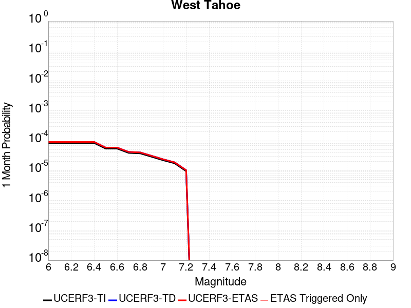 |  |  |

| Magnitude | 1 wk TI Prob | 1 wk TD Prob | 1 wk ETAS Prob | 1 wk ETAS/TD Gain | 1 wk ETAS Triggered Only | 1 mo TI Prob | 1 mo TD Prob | 1 mo ETAS Prob | 1 mo ETAS/TD Gain | 1 mo ETAS Triggered Only | 1 yr TI Prob | 1 yr TD Prob | 1 yr ETAS Prob | 1 yr ETAS/TD Gain | 1 yr ETAS Triggered Only | 10 yr TI Prob | 10 yr TD Prob | 10 yr ETAS Prob | 10 yr ETAS/TD Gain | 10 yr ETAS Triggered Only |
|-----|-----|-----|-----|-----|-----|-----|-----|-----|-----|-----|-----|-----|-----|-----|-----|-----|-----|-----|-----|-----|
| 6.0 | 1.952444E-5 | 2.118317E-5 | 2.118317E-5 | 1.0 | 0.0 | 8.367348E-5 | 9.078217E-5 | 9.078217E-5 | 1.0 | 0.0 | 0.0010182485 | 0.0011047672 | 0.0011047672 | 1.0 | 0.0 | 0.010135954 | 0.010998235 | 0.011008126 | 1.0008992 | 1.0E-5 |
| 6.1 | 1.952444E-5 | 2.118317E-5 | 2.118317E-5 | 1.0 | 0.0 | 8.367348E-5 | 9.078217E-5 | 9.078217E-5 | 1.0 | 0.0 | 0.0010182485 | 0.0011047672 | 0.0011047672 | 1.0 | 0.0 | 0.010135954 | 0.010998235 | 0.011008126 | 1.0008992 | 1.0E-5 |
| 6.2 | 1.952444E-5 | 2.118317E-5 | 2.118317E-5 | 1.0 | 0.0 | 8.367348E-5 | 9.078217E-5 | 9.078217E-5 | 1.0 | 0.0 | 0.0010182485 | 0.0011047672 | 0.0011047672 | 1.0 | 0.0 | 0.010135954 | 0.010998235 | 0.011008126 | 1.0008992 | 1.0E-5 |
| 6.3 | 1.952444E-5 | 2.118317E-5 | 2.118317E-5 | 1.0 | 0.0 | 8.367348E-5 | 9.078217E-5 | 9.078217E-5 | 1.0 | 0.0 | 0.0010182485 | 0.0011047672 | 0.0011047672 | 1.0 | 0.0 | 0.010135954 | 0.010998235 | 0.011008126 | 1.0008992 | 1.0E-5 |
| 6.4 | 1.952444E-5 | 2.118317E-5 | 2.118317E-5 | 1.0 | 0.0 | 8.367348E-5 | 9.078217E-5 | 9.078217E-5 | 1.0 | 0.0 | 0.0010182485 | 0.0011047672 | 0.0011047672 | 1.0 | 0.0 | 0.010135954 | 0.010998235 | 0.011008126 | 1.0008992 | 1.0E-5 |
| 6.5 | 1.2685271E-5 | 1.3690627E-5 | 1.3690627E-5 | 1.0 | 0.0 | 5.4364315E-5 | 5.8672893E-5 | 5.8672893E-5 | 1.0 | 0.0 | 6.616845E-4 | 7.141248E-4 | 7.141248E-4 | 1.0 | 0.0 | 0.0065971776 | 0.00711995 | 0.0071298787 | 1.0013945 | 1.0E-5 |
| 6.6 | 1.2685271E-5 | 1.3690627E-5 | 1.3690627E-5 | 1.0 | 0.0 | 5.4364315E-5 | 5.8672893E-5 | 5.8672893E-5 | 1.0 | 0.0 | 6.616845E-4 | 7.141248E-4 | 7.141248E-4 | 1.0 | 0.0 | 0.0065971776 | 0.00711995 | 0.0071298787 | 1.0013945 | 1.0E-5 |
| 6.7 | 9.117886E-6 | 9.809846E-6 | 9.809846E-6 | 1.0 | 0.0 | 3.9076072E-5 | 4.2041564E-5 | 4.2041564E-5 | 1.0 | 0.0 | 4.756473E-4 | 5.11743E-4 | 5.11743E-4 | 1.0 | 0.0 | 0.0047463053 | 0.0051063634 | 0.0051163123 | 1.0019484 | 1.0E-5 |
| 6.8 | 8.786828E-6 | 9.457863E-6 | 9.457863E-6 | 1.0 | 0.0 | 3.7657293E-5 | 4.053311E-5 | 4.053311E-5 | 1.0 | 0.0 | 4.5838108E-4 | 4.933859E-4 | 4.933859E-4 | 1.0 | 0.0 | 0.0045743673 | 0.0049236063 | 0.004933557 | 1.0020211 | 1.0E-5 |
| 6.9 | 6.7562123E-6 | 7.2638086E-6 | 7.2638086E-6 | 1.0 | 0.0 | 2.8954875E-5 | 3.1130265E-5 | 3.1130265E-5 | 1.0 | 0.0 | 3.5246857E-4 | 3.789498E-4 | 3.789498E-4 | 1.0 | 0.0 | 0.0035191004 | 0.0037835082 | 0.0037934703 | 1.0026331 | 1.0E-5 |
| 7.0 | 5.1792854E-6 | 5.567338E-6 | 5.567338E-6 | 1.0 | 0.0 | 2.2196748E-5 | 2.3859824E-5 | 2.3859824E-5 | 1.0 | 0.0 | 2.702119E-4 | 2.9045844E-4 | 2.9045844E-4 | 1.0 | 0.0 | 0.0026988357 | 0.0029011632 | 0.0029111342 | 1.0034369 | 1.0E-5 |
| 7.1 | 4.090765E-6 | 4.3974223E-6 | 4.3974223E-6 | 1.0 | 0.0 | 1.7531731E-5 | 1.884598E-5 | 1.884598E-5 | 1.0 | 0.0 | 2.134279E-4 | 2.2942905E-4 | 2.2942905E-4 | 1.0 | 0.0 | 0.0021322304 | 0.0022922563 | 0.0022922563 | 1.0 | 0.0 |
| 7.2 | 2.2356758E-6 | 2.4023684E-6 | 2.4023684E-6 | 1.0 | 0.0 | 9.581432E-6 | 1.0295834E-5 | 1.0295834E-5 | 1.0 | 0.0 | 1.1664769E-4 | 1.2534647E-4 | 1.2534647E-4 | 1.0 | 0.0 | 0.0011658648 | 0.0012529434 | 0.0012529434 | 1.0 | 0.0 |

## Honey Lake 2011 CFM
*[(top)](#table-of-contents)*

| 1 Week | 1 Month | 1 Year | 10 Year |
|-----|-----|-----|-----|
|  |  |  |  |

| Magnitude | 1 wk TI Prob | 1 wk TD Prob | 1 wk ETAS Prob | 1 wk ETAS/TD Gain | 1 wk ETAS Triggered Only | 1 mo TI Prob | 1 mo TD Prob | 1 mo ETAS Prob | 1 mo ETAS/TD Gain | 1 mo ETAS Triggered Only | 1 yr TI Prob | 1 yr TD Prob | 1 yr ETAS Prob | 1 yr ETAS/TD Gain | 1 yr ETAS Triggered Only | 10 yr TI Prob | 10 yr TD Prob | 10 yr ETAS Prob | 10 yr ETAS/TD Gain | 10 yr ETAS Triggered Only |
|-----|-----|-----|-----|-----|-----|-----|-----|-----|-----|-----|-----|-----|-----|-----|-----|-----|-----|-----|-----|-----|
| 6.0 | 6.155506E-5 | 7.954667E-5 | 8.954587E-5 | 1.1257024 | 1.0E-5 | 2.6378073E-4 | 3.40873E-4 | 3.508696E-4 | 1.0293264 | 1.0E-5 | 0.0032068014 | 0.0041427943 | 0.004152753 | 1.0024039 | 1.0E-5 | 0.03160919 | 0.040702924 | 0.040712517 | 1.0002357 | 1.0E-5 |
| 6.1 | 6.155506E-5 | 7.954667E-5 | 8.954587E-5 | 1.1257024 | 1.0E-5 | 2.6378073E-4 | 3.40873E-4 | 3.508696E-4 | 1.0293264 | 1.0E-5 | 0.0032068014 | 0.0041427943 | 0.004152753 | 1.0024039 | 1.0E-5 | 0.03160919 | 0.040702924 | 0.040712517 | 1.0002357 | 1.0E-5 |
| 6.2 | 4.1335024E-5 | 5.257629E-5 | 5.257629E-5 | 1.0 | 0.0 | 1.7713808E-4 | 2.253086E-4 | 2.253086E-4 | 1.0 | 0.0 | 0.0021545228 | 0.0027398595 | 0.0027398595 | 1.0 | 0.0 | 0.021337535 | 0.027076708 | 0.027076708 | 1.0 | 0.0 |
| 6.3 | 4.1335024E-5 | 5.257629E-5 | 5.257629E-5 | 1.0 | 0.0 | 1.7713808E-4 | 2.253086E-4 | 2.253086E-4 | 1.0 | 0.0 | 0.0021545228 | 0.0027398595 | 0.0027398595 | 1.0 | 0.0 | 0.021337535 | 0.027076708 | 0.027076708 | 1.0 | 0.0 |
| 6.4 | 3.2393702E-5 | 4.0887444E-5 | 4.0887444E-5 | 1.0 | 0.0 | 1.3882275E-4 | 1.7522085E-4 | 1.7522085E-4 | 1.0 | 0.0 | 0.0016888566 | 0.002131335 | 0.002131335 | 1.0 | 0.0 | 0.016760793 | 0.02111982 | 0.02111982 | 1.0 | 0.0 |
| 6.5 | 2.7205504E-5 | 3.4211684E-5 | 3.4211684E-5 | 1.0 | 0.0 | 1.1658981E-4 | 1.4661385E-4 | 1.4661385E-4 | 1.0 | 0.0 | 0.0014185566 | 0.0017836588 | 0.0017836588 | 1.0 | 0.0 | 0.014095354 | 0.017702932 | 0.017702932 | 1.0 | 0.0 |
| 6.6 | 2.069265E-5 | 2.5955307E-5 | 2.5955307E-5 | 1.0 | 0.0 | 8.867977E-5 | 1.1123277E-4 | 1.1123277E-4 | 1.0 | 0.0 | 0.0010791414 | 0.0013535038 | 0.0013535038 | 1.0 | 0.0 | 0.010739161 | 0.013461002 | 0.013461002 | 1.0 | 0.0 |
| 6.7 | 1.8060919E-5 | 2.2656828E-5 | 2.2656828E-5 | 1.0 | 0.0 | 7.7401644E-5 | 9.709754E-5 | 9.709754E-5 | 1.0 | 0.0 | 9.419576E-4 | 0.0011816026 | 0.0011816026 | 1.0 | 0.0 | 0.009379748 | 0.011761238 | 0.011761238 | 1.0 | 0.0 |
| 6.8 | 1.4474663E-5 | 1.818127E-5 | 1.818127E-5 | 1.0 | 0.0 | 6.203279E-5 | 7.791784E-5 | 7.791784E-5 | 1.0 | 0.0 | 7.5498753E-4 | 9.483136E-4 | 9.483136E-4 | 1.0 | 0.0 | 0.007524277 | 0.009450192 | 0.009450192 | 1.0 | 0.0 |
| 6.9 | 8.564552E-6 | 1.0802308E-5 | 1.0802308E-5 | 1.0 | 0.0 | 3.6704707E-5 | 4.6295158E-5 | 4.6295158E-5 | 1.0 | 0.0 | 4.4678818E-4 | 5.635644E-4 | 5.635644E-4 | 1.0 | 0.0 | 0.0044589094 | 0.0056278477 | 0.0056278477 | 1.0 | 0.0 |

## Mission Hills 2011
*[(top)](#table-of-contents)*

| 1 Week | 1 Month | 1 Year | 10 Year |
|-----|-----|-----|-----|
|  | 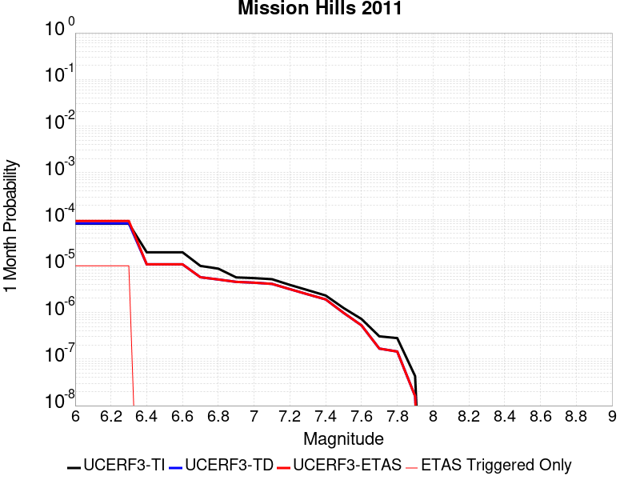 |  |  |

| Magnitude | 1 wk TI Prob | 1 wk TD Prob | 1 wk ETAS Prob | 1 wk ETAS/TD Gain | 1 wk ETAS Triggered Only | 1 mo TI Prob | 1 mo TD Prob | 1 mo ETAS Prob | 1 mo ETAS/TD Gain | 1 mo ETAS Triggered Only | 1 yr TI Prob | 1 yr TD Prob | 1 yr ETAS Prob | 1 yr ETAS/TD Gain | 1 yr ETAS Triggered Only | 10 yr TI Prob | 10 yr TD Prob | 10 yr ETAS Prob | 10 yr ETAS/TD Gain | 10 yr ETAS Triggered Only |
|-----|-----|-----|-----|-----|-----|-----|-----|-----|-----|-----|-----|-----|-----|-----|-----|-----|-----|-----|-----|-----|
| 6.0 | 1.8765717E-5 | 1.9054645E-5 | 1.9054645E-5 | 1.0 | 0.0 | 8.0422025E-5 | 8.166215E-5 | 9.166133E-5 | 1.1224457 | 1.0E-5 | 9.786983E-4 | 9.941267E-4 | 0.0010041167 | 1.0100491 | 1.0E-5 | 0.009743992 | 0.009930461 | 0.009940362 | 1.000997 | 1.0E-5 |
| 6.1 | 1.8765717E-5 | 1.9054645E-5 | 1.9054645E-5 | 1.0 | 0.0 | 8.0422025E-5 | 8.166215E-5 | 9.166133E-5 | 1.1224457 | 1.0E-5 | 9.786983E-4 | 9.941267E-4 | 0.0010041167 | 1.0100491 | 1.0E-5 | 0.009743992 | 0.009930461 | 0.009940362 | 1.000997 | 1.0E-5 |
| 6.2 | 1.8765717E-5 | 1.9054645E-5 | 1.9054645E-5 | 1.0 | 0.0 | 8.0422025E-5 | 8.166215E-5 | 9.166133E-5 | 1.1224457 | 1.0E-5 | 9.786983E-4 | 9.941267E-4 | 0.0010041167 | 1.0100491 | 1.0E-5 | 0.009743992 | 0.009930461 | 0.009940362 | 1.000997 | 1.0E-5 |
| 6.3 | 1.8765717E-5 | 1.9054645E-5 | 1.9054645E-5 | 1.0 | 0.0 | 8.0422025E-5 | 8.166215E-5 | 9.166133E-5 | 1.1224457 | 1.0E-5 | 9.786983E-4 | 9.941267E-4 | 0.0010041167 | 1.0100491 | 1.0E-5 | 0.009743992 | 0.009930461 | 0.009940362 | 1.000997 | 1.0E-5 |
| 6.4 | 4.566357E-6 | 2.5148488E-6 | 2.5148488E-6 | 1.0 | 0.0 | 1.9569954E-5 | 1.0777889E-5 | 1.0777889E-5 | 1.0 | 0.0 | 2.3823815E-4 | 1.3121472E-4 | 1.3121472E-4 | 1.0 | 0.0 | 0.002379829 | 0.0013115506 | 0.0013115506 | 1.0 | 0.0 |
| 6.5 | 4.566357E-6 | 2.5148488E-6 | 2.5148488E-6 | 1.0 | 0.0 | 1.9569954E-5 | 1.0777889E-5 | 1.0777889E-5 | 1.0 | 0.0 | 2.3823815E-4 | 1.3121472E-4 | 1.3121472E-4 | 1.0 | 0.0 | 0.002379829 | 0.0013115506 | 0.0013115506 | 1.0 | 0.0 |
| 6.6 | 4.566357E-6 | 2.5148488E-6 | 2.5148488E-6 | 1.0 | 0.0 | 1.9569954E-5 | 1.0777889E-5 | 1.0777889E-5 | 1.0 | 0.0 | 2.3823815E-4 | 1.3121472E-4 | 1.3121472E-4 | 1.0 | 0.0 | 0.002379829 | 0.0013115506 | 0.0013115506 | 1.0 | 0.0 |
| 6.7 | 2.3266773E-6 | 1.3296187E-6 | 1.3296187E-6 | 1.0 | 0.0 | 9.971435E-6 | 5.698354E-6 | 5.698354E-6 | 1.0 | 0.0 | 1.2139547E-4 | 6.937531E-5 | 6.937531E-5 | 1.0 | 0.0 | 0.0012132917 | 6.9354265E-4 | 6.9354265E-4 | 1.0 | 0.0 |
| 6.8 | 2.032735E-6 | 1.1894115E-6 | 1.1894115E-6 | 1.0 | 0.0 | 8.711692E-6 | 5.097468E-6 | 5.097468E-6 | 1.0 | 0.0 | 1.06059684E-4 | 6.205996E-5 | 6.205996E-5 | 1.0 | 0.0 | 0.0010600908 | 6.2043115E-4 | 6.2043115E-4 | 1.0 | 0.0 |
| 6.9 | 1.3186259E-6 | 1.0561778E-6 | 1.0561778E-6 | 1.0 | 0.0 | 5.6512413E-6 | 4.5264687E-6 | 4.5264687E-6 | 1.0 | 0.0 | 6.8801695E-5 | 5.5108394E-5 | 5.5108394E-5 | 1.0 | 0.0 | 6.8780396E-4 | 5.5095024E-4 | 5.5095024E-4 | 1.0 | 0.0 |
| 7.0 | 1.2726016E-6 | 1.0159088E-6 | 1.0159088E-6 | 1.0 | 0.0 | 5.4539955E-6 | 4.3538876E-6 | 4.3538876E-6 | 1.0 | 0.0 | 6.6400375E-5 | 5.300732E-5 | 5.300732E-5 | 1.0 | 0.0 | 6.6380535E-4 | 5.299496E-4 | 5.299496E-4 | 1.0 | 0.0 |
| 7.1 | 1.2063913E-6 | 9.570072E-7 | 9.570072E-7 | 1.0 | 0.0 | 5.170238E-6 | 4.101453E-6 | 4.101453E-6 | 1.0 | 0.0 | 6.294583E-5 | 4.9934075E-5 | 4.9934075E-5 | 1.0 | 0.0 | 6.2928005E-4 | 4.992311E-4 | 4.992311E-4 | 1.0 | 0.0 |
| 7.2 | 9.105806E-7 | 7.3765557E-7 | 7.3765557E-7 | 1.0 | 0.0 | 3.9024826E-6 | 3.1613772E-6 | 3.1613772E-6 | 1.0 | 0.0 | 4.7511687E-5 | 3.8489103E-5 | 3.8489103E-5 | 1.0 | 0.0 | 4.7501532E-4 | 3.8482592E-4 | 3.8482592E-4 | 1.0 | 0.0 |
| 7.3 | 7.020432E-7 | 5.710089E-7 | 5.710089E-7 | 1.0 | 0.0 | 3.0087533E-6 | 2.447179E-6 | 2.447179E-6 | 1.0 | 0.0 | 3.6630954E-5 | 2.979401E-5 | 2.979401E-5 | 1.0 | 0.0 | 3.6624918E-4 | 2.9790145E-4 | 2.9790145E-4 | 1.0 | 0.0 |
| 7.4 | 5.3900635E-7 | 4.4480825E-7 | 4.4480825E-7 | 1.0 | 0.0 | 2.3100251E-6 | 1.9063198E-6 | 1.9063198E-6 | 1.0 | 0.0 | 2.8124194E-5 | 2.3209208E-5 | 2.3209208E-5 | 1.0 | 0.0 | 2.8120633E-4 | 2.3206905E-4 | 2.3206905E-4 | 1.0 | 0.0 |
| 7.5 | 2.907075E-7 | 2.2875415E-7 | 2.2875415E-7 | 1.0 | 0.0 | 1.2458887E-6 | 9.803746E-7 | 9.803746E-7 | 1.0 | 0.0 | 1.5168589E-5 | 1.1935997E-5 | 1.1935997E-5 | 1.0 | 0.0 | 1.5167553E-4 | 1.1935373E-4 | 1.1935373E-4 | 1.0 | 0.0 |
| 7.6 | 1.6903675E-7 | 1.2353402E-7 | 1.2353402E-7 | 1.0 | 0.0 | 7.2444305E-7 | 5.294314E-7 | 5.294314E-7 | 1.0 | 0.0 | 8.820059E-6 | 6.4458095E-6 | 6.4458095E-6 | 1.0 | 0.0 | 8.8197085E-5 | 6.445635E-5 | 6.445635E-5 | 1.0 | 0.0 |
| 7.7 | 7.168073E-8 | 3.9135116E-8 | 3.9135116E-8 | 1.0 | 0.0 | 3.072031E-7 | 1.6772192E-7 | 1.6772192E-7 | 1.0 | 0.0 | 3.7401915E-6 | 2.0420127E-6 | 2.0420127E-6 | 1.0 | 0.0 | 3.7401285E-5 | 2.041995E-5 | 2.041995E-5 | 1.0 | 0.0 |
| 7.8 | 6.564101E-8 | 3.3835356E-8 | 3.3835356E-8 | 1.0 | 0.0 | 2.813186E-7 | 1.4500866E-7 | 1.4500866E-7 | 1.0 | 0.0 | 3.4250486E-6 | 1.7654792E-6 | 1.7654792E-6 | 1.0 | 0.0 | 3.424996E-5 | 1.7654662E-5 | 1.7654662E-5 | 1.0 | 0.0 |
| 7.9 | 1.0029074E-8 | 3.7292542E-9 | 3.7292542E-9 | 1.0 | 0.0 | 4.2981743E-8 | 1.5982518E-8 | 1.5982518E-8 | 1.0 | 0.0 | 5.2330256E-7 | 1.9458714E-7 | 1.9458714E-7 | 1.0 | 0.0 | 5.2330133E-6 | 1.945871E-6 | 1.945871E-6 | 1.0 | 0.0 |

## Hayward (So) extension 2011 CFM
*[(top)](#table-of-contents)*

| 1 Week | 1 Month | 1 Year | 10 Year |
|-----|-----|-----|-----|
|  |  |  |  |

| Magnitude | 1 wk TI Prob | 1 wk TD Prob | 1 wk ETAS Prob | 1 wk ETAS/TD Gain | 1 wk ETAS Triggered Only | 1 mo TI Prob | 1 mo TD Prob | 1 mo ETAS Prob | 1 mo ETAS/TD Gain | 1 mo ETAS Triggered Only | 1 yr TI Prob | 1 yr TD Prob | 1 yr ETAS Prob | 1 yr ETAS/TD Gain | 1 yr ETAS Triggered Only | 10 yr TI Prob | 10 yr TD Prob | 10 yr ETAS Prob | 10 yr ETAS/TD Gain | 10 yr ETAS Triggered Only |
|-----|-----|-----|-----|-----|-----|-----|-----|-----|-----|-----|-----|-----|-----|-----|-----|-----|-----|-----|-----|-----|
| 6.0 | 1.1721256E-4 | 2.3697627E-4 | 2.3697627E-4 | 1.0 | 0.0 | 5.022428E-4 | 0.0010129517 | 0.0010129517 | 1.0 | 0.0 | 0.0060976758 | 0.012248711 | 0.012258588 | 1.0008065 | 1.0E-5 | 0.0593305 | 0.112843215 | 0.11285209 | 1.0000787 | 1.0E-5 |
| 6.1 | 6.99169E-5 | 1.3822885E-4 | 1.3822885E-4 | 1.0 | 0.0 | 2.9960944E-4 | 5.9128006E-4 | 5.9128006E-4 | 1.0 | 0.0 | 0.0036416445 | 0.0071720886 | 0.0071720886 | 1.0 | 0.0 | 0.035825435 | 0.067803554 | 0.067803554 | 1.0 | 0.0 |
| 6.2 | 6.99169E-5 | 1.3822885E-4 | 1.3822885E-4 | 1.0 | 0.0 | 2.9960944E-4 | 5.9128006E-4 | 5.9128006E-4 | 1.0 | 0.0 | 0.0036416445 | 0.0071720886 | 0.0071720886 | 1.0 | 0.0 | 0.035825435 | 0.067803554 | 0.067803554 | 1.0 | 0.0 |
| 6.3 | 6.970908E-5 | 1.379104E-4 | 1.379104E-4 | 1.0 | 0.0 | 2.9871898E-4 | 5.899159E-4 | 5.899159E-4 | 1.0 | 0.0 | 0.0036308395 | 0.007155625 | 0.007155625 | 1.0 | 0.0 | 0.035720866 | 0.067652516 | 0.067652516 | 1.0 | 0.0 |
| 6.4 | 6.9517155E-5 | 1.375792E-4 | 1.375792E-4 | 1.0 | 0.0 | 2.9789665E-4 | 5.884971E-4 | 5.884971E-4 | 1.0 | 0.0 | 0.0036208609 | 0.0071385372 | 0.0071385372 | 1.0 | 0.0 | 0.03562429 | 0.06749655 | 0.06749655 | 1.0 | 0.0 |
| 6.5 | 4.786248E-5 | 9.41498E-5 | 9.41498E-5 | 1.0 | 0.0 | 2.0510878E-4 | 4.034394E-4 | 4.034394E-4 | 1.0 | 0.0 | 0.0024943394 | 0.004901227 | 0.004901227 | 1.0 | 0.0 | 0.02466527 | 0.046901822 | 0.046901822 | 1.0 | 0.0 |
| 6.6 | 4.4662214E-5 | 8.881654E-5 | 8.881654E-5 | 1.0 | 0.0 | 1.9139545E-4 | 3.805894E-4 | 3.805894E-4 | 1.0 | 0.0 | 0.0023277493 | 0.0046242937 | 0.0046242937 | 1.0 | 0.0 | 0.02303517 | 0.044293344 | 0.044293344 | 1.0 | 0.0 |
| 6.7 | 3.884542E-5 | 7.8648096E-5 | 7.8648096E-5 | 1.0 | 0.0 | 1.6646975E-4 | 3.370222E-4 | 3.370222E-4 | 1.0 | 0.0 | 0.002024885 | 0.0040959697 | 0.0040959697 | 1.0 | 0.0 | 0.020065336 | 0.039333146 | 0.039333146 | 1.0 | 0.0 |
| 6.8 | 3.4221863E-5 | 6.855653E-5 | 6.855653E-5 | 1.0 | 0.0 | 1.4665688E-4 | 2.93783E-4 | 2.93783E-4 | 1.0 | 0.0 | 0.0017840851 | 0.0035713627 | 0.0035713627 | 1.0 | 0.0 | 0.017698295 | 0.034421004 | 0.034421004 | 1.0 | 0.0 |
| 6.9 | 1.6927712E-5 | 3.0061563E-5 | 3.0061563E-5 | 1.0 | 0.0 | 7.2545314E-5 | 1.2882923E-4 | 1.2882923E-4 | 1.0 | 0.0 | 8.828813E-4 | 0.0015674243 | 0.0015674243 | 1.0 | 0.0 | 0.008793819 | 0.01546327 | 0.01546327 | 1.0 | 0.0 |
| 7.0 | 1.2509653E-5 | 2.2462571E-5 | 2.2462571E-5 | 1.0 | 0.0 | 5.3611697E-5 | 9.6264856E-5 | 9.6264856E-5 | 1.0 | 0.0 | 6.525269E-4 | 0.0011714385 | 0.0011714385 | 1.0 | 0.0 | 0.0065061417 | 0.01158231 | 0.01158231 | 1.0 | 0.0 |
| 7.1 | 8.751583E-6 | 1.4925648E-5 | 1.4925648E-5 | 1.0 | 0.0 | 3.750624E-5 | 6.3965526E-5 | 6.3965526E-5 | 1.0 | 0.0 | 4.5654282E-4 | 7.785079E-4 | 7.785079E-4 | 1.0 | 0.0 | 0.0045560603 | 0.007763496 | 0.007763496 | 1.0 | 0.0 |
| 7.2 | 6.354379E-6 | 1.1498636E-5 | 1.1498636E-5 | 1.0 | 0.0 | 2.7232769E-5 | 4.9278966E-5 | 4.9278966E-5 | 1.0 | 0.0 | 3.3150852E-4 | 5.99811E-4 | 5.99811E-4 | 1.0 | 0.0 | 0.0033101442 | 0.0060003046 | 0.0060003046 | 1.0 | 0.0 |
| 7.3 | 4.645554E-6 | 8.818172E-6 | 8.818172E-6 | 1.0 | 0.0 | 1.9909365E-5 | 3.779164E-5 | 3.779164E-5 | 1.0 | 0.0 | 2.4236954E-4 | 4.6002E-4 | 4.6002E-4 | 1.0 | 0.0 | 0.0024210536 | 0.004610708 | 0.004610708 | 1.0 | 0.0 |
| 7.4 | 4.23437E-6 | 7.992532E-6 | 7.992532E-6 | 1.0 | 0.0 | 1.8147173E-5 | 3.425328E-5 | 3.425328E-5 | 1.0 | 0.0 | 2.2091944E-4 | 4.1695772E-4 | 4.1695772E-4 | 1.0 | 0.0 | 0.0022069993 | 0.004181972 | 0.004181972 | 1.0 | 0.0 |
| 7.5 | 2.2187417E-6 | 3.9522306E-6 | 3.9522306E-6 | 1.0 | 0.0 | 9.508858E-6 | 1.6938036E-5 | 1.6938036E-5 | 1.0 | 0.0 | 1.157642E-4 | 2.0620368E-4 | 2.0620368E-4 | 1.0 | 0.0 | 0.0011570391 | 0.0020734754 | 0.0020734754 | 1.0 | 0.0 |
| 7.6 | 2.7952495E-8 | 3.878529E-8 | 3.878529E-8 | 1.0 | 0.0 | 1.1979641E-7 | 1.6622266E-7 | 1.6622266E-7 | 1.0 | 0.0 | 1.4585203E-6 | 2.0237592E-6 | 2.0237592E-6 | 1.0 | 0.0 | 1.4585107E-5 | 2.0328182E-5 | 2.0328182E-5 | 1.0 | 0.0 |
| 7.7 | 1.7192724E-8 | 2.3436517E-8 | 2.3436517E-8 | 1.0 | 0.0 | 7.36831E-8 | 1.0044221E-7 | 1.0044221E-7 | 1.0 | 0.0 | 8.9709135E-7 | 1.2228833E-6 | 1.2228833E-6 | 1.0 | 0.0 | 8.970877E-6 | 1.2296933E-5 | 1.2296933E-5 | 1.0 | 0.0 |

## Carson Range (Genoa)
*[(top)](#table-of-contents)*

| 1 Week | 1 Month | 1 Year | 10 Year |
|-----|-----|-----|-----|
|  |  |  |  |

| Magnitude | 1 wk TI Prob | 1 wk TD Prob | 1 wk ETAS Prob | 1 wk ETAS/TD Gain | 1 wk ETAS Triggered Only | 1 mo TI Prob | 1 mo TD Prob | 1 mo ETAS Prob | 1 mo ETAS/TD Gain | 1 mo ETAS Triggered Only | 1 yr TI Prob | 1 yr TD Prob | 1 yr ETAS Prob | 1 yr ETAS/TD Gain | 1 yr ETAS Triggered Only | 10 yr TI Prob | 10 yr TD Prob | 10 yr ETAS Prob | 10 yr ETAS/TD Gain | 10 yr ETAS Triggered Only |
|-----|-----|-----|-----|-----|-----|-----|-----|-----|-----|-----|-----|-----|-----|-----|-----|-----|-----|-----|-----|-----|
| 6.0 | 4.1268457E-5 | 5.0146893E-5 | 5.0146893E-5 | 1.0 | 0.0 | 1.7685282E-4 | 2.148998E-4 | 2.148998E-4 | 1.0 | 0.0 | 0.0021510567 | 0.0026136558 | 0.0026136558 | 1.0 | 0.0 | 0.02130354 | 0.025868816 | 0.025878558 | 1.0003766 | 1.0E-5 |
| 6.1 | 4.1268457E-5 | 5.0146893E-5 | 5.0146893E-5 | 1.0 | 0.0 | 1.7685282E-4 | 2.148998E-4 | 2.148998E-4 | 1.0 | 0.0 | 0.0021510567 | 0.0026136558 | 0.0026136558 | 1.0 | 0.0 | 0.02130354 | 0.025868816 | 0.025878558 | 1.0003766 | 1.0E-5 |
| 6.2 | 4.1268457E-5 | 5.0146893E-5 | 5.0146893E-5 | 1.0 | 0.0 | 1.7685282E-4 | 2.148998E-4 | 2.148998E-4 | 1.0 | 0.0 | 0.0021510567 | 0.0026136558 | 0.0026136558 | 1.0 | 0.0 | 0.02130354 | 0.025868816 | 0.025878558 | 1.0003766 | 1.0E-5 |
| 6.3 | 4.1268457E-5 | 5.0146893E-5 | 5.0146893E-5 | 1.0 | 0.0 | 1.7685282E-4 | 2.148998E-4 | 2.148998E-4 | 1.0 | 0.0 | 0.0021510567 | 0.0026136558 | 0.0026136558 | 1.0 | 0.0 | 0.02130354 | 0.025868816 | 0.025878558 | 1.0003766 | 1.0E-5 |
| 6.4 | 4.1268457E-5 | 5.0146893E-5 | 5.0146893E-5 | 1.0 | 0.0 | 1.7685282E-4 | 2.148998E-4 | 2.148998E-4 | 1.0 | 0.0 | 0.0021510567 | 0.0026136558 | 0.0026136558 | 1.0 | 0.0 | 0.02130354 | 0.025868816 | 0.025878558 | 1.0003766 | 1.0E-5 |
| 6.5 | 2.5677185E-5 | 3.0978295E-5 | 3.0978295E-5 | 1.0 | 0.0 | 1.1004044E-4 | 1.3275839E-4 | 1.3275839E-4 | 1.0 | 0.0 | 0.0013389189 | 0.0016153135 | 0.0016153135 | 1.0 | 0.0 | 0.0133088045 | 0.016053649 | 0.016053649 | 1.0 | 0.0 |
| 6.6 | 2.5677185E-5 | 3.0978295E-5 | 3.0978295E-5 | 1.0 | 0.0 | 1.1004044E-4 | 1.3275839E-4 | 1.3275839E-4 | 1.0 | 0.0 | 0.0013389189 | 0.0016153135 | 0.0016153135 | 1.0 | 0.0 | 0.0133088045 | 0.016053649 | 0.016053649 | 1.0 | 0.0 |
| 6.7 | 1.9969408E-5 | 2.406347E-5 | 2.406347E-5 | 1.0 | 0.0 | 8.558037E-5 | 1.0312595E-4 | 1.0312595E-4 | 1.0 | 0.0 | 0.0010414429 | 0.0012549888 | 0.0012549888 | 1.0 | 0.0 | 0.010365757 | 0.012494174 | 0.012494174 | 1.0 | 0.0 |
| 6.8 | 1.4783156E-5 | 1.7817569E-5 | 1.7817569E-5 | 1.0 | 0.0 | 6.335485E-5 | 7.635951E-5 | 7.635951E-5 | 1.0 | 0.0 | 7.710722E-4 | 9.294106E-4 | 9.294106E-4 | 1.0 | 0.0 | 0.0076840227 | 0.009268024 | 0.009268024 | 1.0 | 0.0 |
| 6.9 | 1.06660555E-5 | 1.2877026E-5 | 1.2877026E-5 | 1.0 | 0.0 | 4.5710865E-5 | 5.5186738E-5 | 5.5186738E-5 | 1.0 | 0.0 | 5.5638765E-4 | 6.718066E-4 | 6.718066E-4 | 1.0 | 0.0 | 0.005549967 | 0.006709056 | 0.006709056 | 1.0 | 0.0 |
| 7.0 | 7.664838E-6 | 9.258307E-6 | 9.258307E-6 | 1.0 | 0.0 | 3.2848893E-5 | 3.9678456E-5 | 3.9678456E-5 | 1.0 | 0.0 | 3.998619E-4 | 4.830852E-4 | 4.830852E-4 | 1.0 | 0.0 | 0.0039914316 | 0.00483085 | 0.00483085 | 1.0 | 0.0 |

## Laguna Salada
*[(top)](#table-of-contents)*

| 1 Week | 1 Month | 1 Year | 10 Year |
|-----|-----|-----|-----|
|  |  | 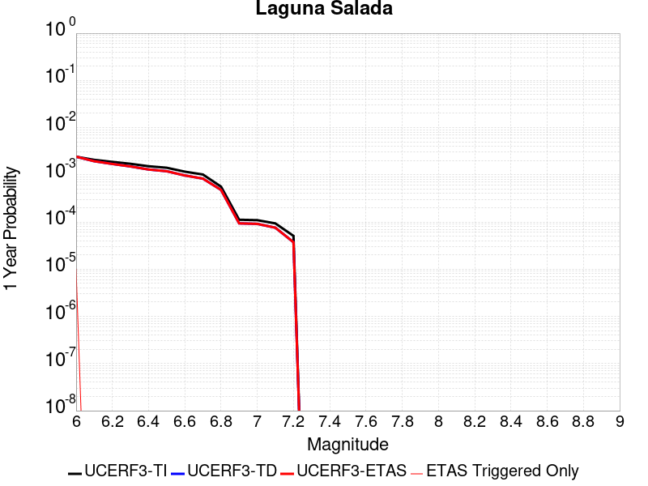 |  |

| Magnitude | 1 wk TI Prob | 1 wk TD Prob | 1 wk ETAS Prob | 1 wk ETAS/TD Gain | 1 wk ETAS Triggered Only | 1 mo TI Prob | 1 mo TD Prob | 1 mo ETAS Prob | 1 mo ETAS/TD Gain | 1 mo ETAS Triggered Only | 1 yr TI Prob | 1 yr TD Prob | 1 yr ETAS Prob | 1 yr ETAS/TD Gain | 1 yr ETAS Triggered Only | 10 yr TI Prob | 10 yr TD Prob | 10 yr ETAS Prob | 10 yr ETAS/TD Gain | 10 yr ETAS Triggered Only |
|-----|-----|-----|-----|-----|-----|-----|-----|-----|-----|-----|-----|-----|-----|-----|-----|-----|-----|-----|-----|-----|
| 6.0 | 4.6465593E-5 | 4.634639E-5 | 5.634593E-5 | 1.2157565 | 1.0E-5 | 1.9912305E-4 | 1.9861311E-4 | 2.0861112E-4 | 1.0503391 | 1.0E-5 | 0.0024216278 | 0.002415429 | 0.002425405 | 1.00413 | 1.0E-5 | 0.02395408 | 0.023975259 | 0.023985019 | 1.0004071 | 1.0E-5 |
| 6.1 | 3.982297E-5 | 3.7246125E-5 | 3.7246125E-5 | 1.0 | 0.0 | 1.706587E-4 | 1.5961716E-4 | 1.5961716E-4 | 1.0 | 0.0 | 0.0020757897 | 0.0019417295 | 0.0019417295 | 1.0 | 0.0 | 0.020565065 | 0.019331863 | 0.019331863 | 1.0 | 0.0 |
| 6.2 | 3.6067784E-5 | 3.2602693E-5 | 3.2602693E-5 | 1.0 | 0.0 | 1.5456705E-4 | 1.3971896E-4 | 1.3971896E-4 | 1.0 | 0.0 | 0.0018802295 | 0.0016998611 | 0.0016998611 | 1.0 | 0.0 | 0.018644003 | 0.016949628 | 0.016949628 | 1.0 | 0.0 |
| 6.3 | 3.2859112E-5 | 2.8849448E-5 | 2.8849448E-5 | 1.0 | 0.0 | 1.4081717E-4 | 1.2363521E-4 | 1.2363521E-4 | 1.0 | 0.0 | 0.0017131006 | 0.0015043203 | 0.0015043203 | 1.0 | 0.0 | 0.016999546 | 0.015018767 | 0.015018767 | 1.0 | 0.0 |
| 6.4 | 2.9132116E-5 | 2.4852965E-5 | 2.4852965E-5 | 1.0 | 0.0 | 1.2484594E-4 | 1.0650887E-4 | 1.0650887E-4 | 1.0 | 0.0 | 0.0015189396 | 0.001296065 | 0.001296065 | 1.0 | 0.0 | 0.015085992 | 0.012956262 | 0.012956262 | 1.0 | 0.0 |
| 6.5 | 2.7075037E-5 | 2.2825836E-5 | 2.2825836E-5 | 1.0 | 0.0 | 1.1603071E-4 | 9.7821845E-5 | 9.7821845E-5 | 1.0 | 0.0 | 0.0014117584 | 0.0011904186 | 0.0011904186 | 1.0 | 0.0 | 0.014028233 | 0.011907749 | 0.011907749 | 1.0 | 0.0 |
| 6.6 | 2.2367465E-5 | 1.8573526E-5 | 1.8573526E-5 | 1.0 | 0.0 | 9.5857045E-5 | 7.959886E-5 | 7.959886E-5 | 1.0 | 0.0 | 0.0011664346 | 9.6876756E-4 | 9.6876756E-4 | 1.0 | 0.0 | 0.011603311 | 0.009702191 | 0.009702191 | 1.0 | 0.0 |
| 6.7 | 1.9458053E-5 | 1.5914242E-5 | 1.5914242E-5 | 1.0 | 0.0 | 8.338899E-5 | 6.8202564E-5 | 6.8202564E-5 | 1.0 | 0.0 | 0.001014788 | 8.3013024E-4 | 8.3013024E-4 | 1.0 | 0.0 | 0.010101665 | 0.0083209425 | 0.0083209425 | 1.0 | 0.0 |
| 6.8 | 1.0767866E-5 | 9.18435E-6 | 9.18435E-6 | 1.0 | 0.0 | 4.614718E-5 | 3.9361294E-5 | 3.9361294E-5 | 1.0 | 0.0 | 5.6169706E-4 | 4.7918706E-4 | 4.7918706E-4 | 1.0 | 0.0 | 0.0056027942 | 0.0048096925 | 0.0048096925 | 1.0 | 0.0 |
| 6.9 | 2.1384765E-6 | 1.7913675E-6 | 1.7913675E-6 | 1.0 | 0.0 | 9.164866E-6 | 7.677269E-6 | 7.677269E-6 | 1.0 | 0.0 | 1.1157654E-4 | 9.346713E-5 | 9.346713E-5 | 1.0 | 0.0 | 0.0011152053 | 9.343165E-4 | 9.343165E-4 | 1.0 | 0.0 |
| 7.0 | 2.0952946E-6 | 1.7493046E-6 | 1.7493046E-6 | 1.0 | 0.0 | 8.979802E-6 | 7.4970003E-6 | 7.4970003E-6 | 1.0 | 0.0 | 1.0932361E-4 | 9.1272545E-5 | 9.1272545E-5 | 1.0 | 0.0 | 0.0010926984 | 9.123888E-4 | 9.123888E-4 | 1.0 | 0.0 |
| 7.1 | 1.7887576E-6 | 1.4500254E-6 | 1.4500254E-6 | 1.0 | 0.0 | 7.666081E-6 | 6.2143813E-6 | 6.2143813E-6 | 1.0 | 0.0 | 9.333054E-5 | 7.565777E-5 | 7.565777E-5 | 1.0 | 0.0 | 9.329135E-4 | 7.563506E-4 | 7.563506E-4 | 1.0 | 0.0 |
| 7.2 | 9.723109E-7 | 7.135619E-7 | 7.135619E-7 | 1.0 | 0.0 | 4.16704E-6 | 3.0581198E-6 | 3.0581198E-6 | 1.0 | 0.0 | 5.073253E-5 | 3.7232137E-5 | 3.7232137E-5 | 1.0 | 0.0 | 5.072095E-4 | 3.7227524E-4 | 3.7227524E-4 | 1.0 | 0.0 |

## Big Pine (West)
*[(top)](#table-of-contents)*

| 1 Week | 1 Month | 1 Year | 10 Year |
|-----|-----|-----|-----|
| 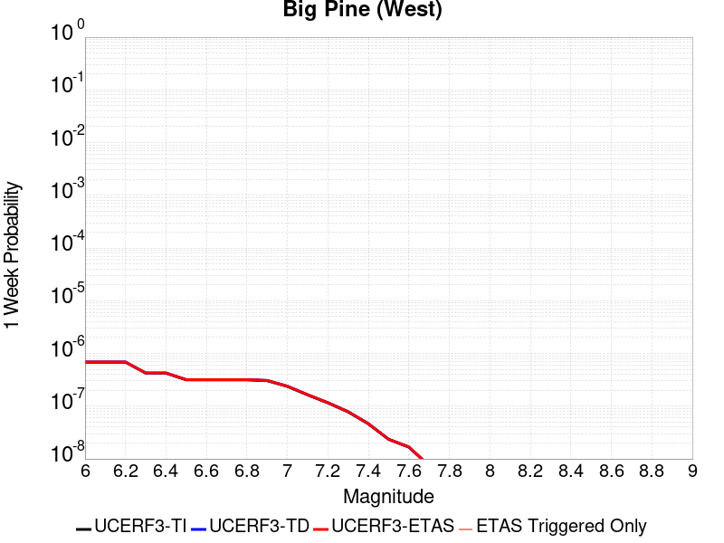 |  |  |  |

| Magnitude | 1 wk TI Prob | 1 wk TD Prob | 1 wk ETAS Prob | 1 wk ETAS/TD Gain | 1 wk ETAS Triggered Only | 1 mo TI Prob | 1 mo TD Prob | 1 mo ETAS Prob | 1 mo ETAS/TD Gain | 1 mo ETAS Triggered Only | 1 yr TI Prob | 1 yr TD Prob | 1 yr ETAS Prob | 1 yr ETAS/TD Gain | 1 yr ETAS Triggered Only | 10 yr TI Prob | 10 yr TD Prob | 10 yr ETAS Prob | 10 yr ETAS/TD Gain | 10 yr ETAS Triggered Only |
|-----|-----|-----|-----|-----|-----|-----|-----|-----|-----|-----|-----|-----|-----|-----|-----|-----|-----|-----|-----|-----|
| 6.0 | 6.8306974E-7 | 6.8818304E-7 | 6.8818304E-7 | 1.0 | 0.0 | 2.9274386E-6 | 2.949353E-6 | 2.949353E-6 | 1.0 | 0.0 | 3.564098E-5 | 3.5907877E-5 | 3.5907877E-5 | 1.0 | 0.0 | 3.5635266E-4 | 3.5903015E-4 | 3.6902656E-4 | 1.0278428 | 1.0E-5 |
| 6.1 | 6.8306974E-7 | 6.8818304E-7 | 6.8818304E-7 | 1.0 | 0.0 | 2.9274386E-6 | 2.949353E-6 | 2.949353E-6 | 1.0 | 0.0 | 3.564098E-5 | 3.5907877E-5 | 3.5907877E-5 | 1.0 | 0.0 | 3.5635266E-4 | 3.5903015E-4 | 3.6902656E-4 | 1.0278428 | 1.0E-5 |
| 6.2 | 6.8306974E-7 | 6.8818304E-7 | 6.8818304E-7 | 1.0 | 0.0 | 2.9274386E-6 | 2.949353E-6 | 2.949353E-6 | 1.0 | 0.0 | 3.564098E-5 | 3.5907877E-5 | 3.5907877E-5 | 1.0 | 0.0 | 3.5635266E-4 | 3.5903015E-4 | 3.6902656E-4 | 1.0278428 | 1.0E-5 |
| 6.3 | 4.227652E-7 | 4.2665604E-7 | 4.2665604E-7 | 1.0 | 0.0 | 1.8118495E-6 | 1.8285248E-6 | 1.8285248E-6 | 1.0 | 0.0 | 2.2059045E-5 | 2.226208E-5 | 2.226208E-5 | 1.0 | 0.0 | 2.2056856E-4 | 2.2260031E-4 | 2.3259809E-4 | 1.0449135 | 1.0E-5 |
| 6.4 | 4.227652E-7 | 4.2665604E-7 | 4.2665604E-7 | 1.0 | 0.0 | 1.8118495E-6 | 1.8285248E-6 | 1.8285248E-6 | 1.0 | 0.0 | 2.2059045E-5 | 2.226208E-5 | 2.226208E-5 | 1.0 | 0.0 | 2.2056856E-4 | 2.2260031E-4 | 2.3259809E-4 | 1.0449135 | 1.0E-5 |
| 6.5 | 3.1538403E-7 | 3.1884528E-7 | 3.1884528E-7 | 1.0 | 0.0 | 1.3516451E-6 | 1.3664791E-6 | 1.3664791E-6 | 1.0 | 0.0 | 1.6456155E-5 | 1.6636759E-5 | 1.6636759E-5 | 1.0 | 0.0 | 1.6454936E-4 | 1.6635554E-4 | 1.7635387E-4 | 1.0601022 | 1.0E-5 |
| 6.6 | 3.1538403E-7 | 3.1884528E-7 | 3.1884528E-7 | 1.0 | 0.0 | 1.3516451E-6 | 1.3664791E-6 | 1.3664791E-6 | 1.0 | 0.0 | 1.6456155E-5 | 1.6636759E-5 | 1.6636759E-5 | 1.0 | 0.0 | 1.6454936E-4 | 1.6635554E-4 | 1.7635387E-4 | 1.0601022 | 1.0E-5 |
| 6.7 | 3.1538403E-7 | 3.1884528E-7 | 3.1884528E-7 | 1.0 | 0.0 | 1.3516451E-6 | 1.3664791E-6 | 1.3664791E-6 | 1.0 | 0.0 | 1.6456155E-5 | 1.6636759E-5 | 1.6636759E-5 | 1.0 | 0.0 | 1.6454936E-4 | 1.6635554E-4 | 1.7635387E-4 | 1.0601022 | 1.0E-5 |
| 6.8 | 3.1538403E-7 | 3.1884528E-7 | 3.1884528E-7 | 1.0 | 0.0 | 1.3516451E-6 | 1.3664791E-6 | 1.3664791E-6 | 1.0 | 0.0 | 1.6456155E-5 | 1.6636759E-5 | 1.6636759E-5 | 1.0 | 0.0 | 1.6454936E-4 | 1.6635554E-4 | 1.7635387E-4 | 1.0601022 | 1.0E-5 |
| 6.9 | 3.0402092E-7 | 3.0739798E-7 | 3.0739798E-7 | 1.0 | 0.0 | 1.3029462E-6 | 1.3174192E-6 | 1.3174192E-6 | 1.0 | 0.0 | 1.5863254E-5 | 1.6039465E-5 | 1.6039465E-5 | 1.0 | 0.0 | 1.5862122E-4 | 1.6038347E-4 | 1.7038187E-4 | 1.0623406 | 1.0E-5 |
| 7.0 | 2.3673063E-7 | 2.3944315E-7 | 2.3944315E-7 | 1.0 | 0.0 | 1.0145594E-6 | 1.0261845E-6 | 1.0261845E-6 | 1.0 | 0.0 | 1.235219E-5 | 1.2493728E-5 | 1.2493728E-5 | 1.0 | 0.0 | 1.2351504E-4 | 1.2493054E-4 | 1.3492927E-4 | 1.0800345 | 1.0E-5 |
| 7.1 | 1.632138E-7 | 1.6514511E-7 | 1.6514511E-7 | 1.0 | 0.0 | 6.9948754E-7 | 7.0776457E-7 | 7.0776457E-7 | 1.0 | 0.0 | 8.516227E-6 | 8.617002E-6 | 8.617002E-6 | 1.0 | 0.0 | 8.5159016E-5 | 8.616685E-5 | 9.616599E-5 | 1.1160439 | 1.0E-5 |
| 7.2 | 1.1523723E-7 | 1.1657165E-7 | 1.1657165E-7 | 1.0 | 0.0 | 4.9387376E-7 | 4.9959266E-7 | 4.9959266E-7 | 1.0 | 0.0 | 6.0128964E-6 | 6.082525E-6 | 6.082525E-6 | 1.0 | 0.0 | 6.0127335E-5 | 6.0823695E-5 | 7.082309E-5 | 1.1643996 | 1.0E-5 |
| 7.3 | 7.777805E-8 | 7.862446E-8 | 7.862446E-8 | 1.0 | 0.0 | 3.3333444E-7 | 3.3696193E-7 | 3.3696193E-7 | 1.0 | 0.0 | 4.0583395E-6 | 4.102504E-6 | 4.102504E-6 | 1.0 | 0.0 | 4.0582654E-5 | 4.102434E-5 | 5.1023933E-5 | 1.2437477 | 1.0E-5 |
| 7.4 | 4.609946E-8 | 4.6522135E-8 | 4.6522135E-8 | 1.0 | 0.0 | 1.975691E-7 | 1.9938055E-7 | 1.9938055E-7 | 1.0 | 0.0 | 2.4054011E-6 | 2.4274557E-6 | 2.4274557E-6 | 1.0 | 0.0 | 2.405375E-5 | 2.427431E-5 | 2.427431E-5 | 1.0 | 0.0 |
| 7.5 | 2.3439137E-8 | 2.3608283E-8 | 2.3608283E-8 | 1.0 | 0.0 | 1.00453434E-7 | 1.0117836E-7 | 1.0117836E-7 | 1.0 | 0.0 | 1.2230199E-6 | 1.2318458E-6 | 1.2318458E-6 | 1.0 | 0.0 | 1.2230132E-5 | 1.2318393E-5 | 1.2318393E-5 | 1.0 | 0.0 |
| 7.6 | 1.6699769E-8 | 1.6817072E-8 | 1.6817072E-8 | 1.0 | 0.0 | 7.157044E-8 | 7.207316E-8 | 7.207316E-8 | 1.0 | 0.0 | 8.713697E-7 | 8.7749044E-7 | 8.7749044E-7 | 1.0 | 0.0 | 8.713663E-6 | 8.774871E-6 | 8.774871E-6 | 1.0 | 0.0 |
| 7.7 | 7.4061512E-9 | 7.4541635E-9 | 7.4541635E-9 | 1.0 | 0.0 | 3.1740647E-8 | 3.1946417E-8 | 3.1946417E-8 | 1.0 | 0.0 | 3.864423E-7 | 3.8894754E-7 | 3.8894754E-7 | 1.0 | 0.0 | 3.8644166E-6 | 3.8894696E-6 | 3.8894696E-6 | 1.0 | 0.0 |
| 7.8 | 1.2189427E-9 | 1.2270763E-9 | 1.2270763E-9 | 1.0 | 0.0 | 5.2240403E-9 | 5.258898E-9 | 5.258898E-9 | 1.0 | 0.0 | 6.3602684E-8 | 6.4027084E-8 | 6.4027084E-8 | 1.0 | 0.0 | 6.360267E-7 | 6.4027074E-7 | 6.4027074E-7 | 1.0 | 0.0 |

## Compton
*[(top)](#table-of-contents)*

| 1 Week | 1 Month | 1 Year | 10 Year |
|-----|-----|-----|-----|
|  |  |  |  |

| Magnitude | 1 wk TI Prob | 1 wk TD Prob | 1 wk ETAS Prob | 1 wk ETAS/TD Gain | 1 wk ETAS Triggered Only | 1 mo TI Prob | 1 mo TD Prob | 1 mo ETAS Prob | 1 mo ETAS/TD Gain | 1 mo ETAS Triggered Only | 1 yr TI Prob | 1 yr TD Prob | 1 yr ETAS Prob | 1 yr ETAS/TD Gain | 1 yr ETAS Triggered Only | 10 yr TI Prob | 10 yr TD Prob | 10 yr ETAS Prob | 10 yr ETAS/TD Gain | 10 yr ETAS Triggered Only |
|-----|-----|-----|-----|-----|-----|-----|-----|-----|-----|-----|-----|-----|-----|-----|-----|-----|-----|-----|-----|-----|
| 6.0 | 1.06050875E-5 | 6.358671E-6 | 6.358671E-6 | 1.0 | 0.0 | 4.5449582E-5 | 2.7251177E-5 | 2.7251177E-5 | 1.0 | 0.0 | 5.5320817E-4 | 3.317354E-4 | 3.317354E-4 | 1.0 | 0.0 | 0.0055183303 | 0.0033126862 | 0.003322653 | 1.0030087 | 1.0E-5 |
| 6.1 | 1.06050875E-5 | 6.358671E-6 | 6.358671E-6 | 1.0 | 0.0 | 4.5449582E-5 | 2.7251177E-5 | 2.7251177E-5 | 1.0 | 0.0 | 5.5320817E-4 | 3.317354E-4 | 3.317354E-4 | 1.0 | 0.0 | 0.0055183303 | 0.0033126862 | 0.003322653 | 1.0030087 | 1.0E-5 |
| 6.2 | 1.06050875E-5 | 6.358671E-6 | 6.358671E-6 | 1.0 | 0.0 | 4.5449582E-5 | 2.7251177E-5 | 2.7251177E-5 | 1.0 | 0.0 | 5.5320817E-4 | 3.317354E-4 | 3.317354E-4 | 1.0 | 0.0 | 0.0055183303 | 0.0033126862 | 0.003322653 | 1.0030087 | 1.0E-5 |
| 6.3 | 1.06050875E-5 | 6.358671E-6 | 6.358671E-6 | 1.0 | 0.0 | 4.5449582E-5 | 2.7251177E-5 | 2.7251177E-5 | 1.0 | 0.0 | 5.5320817E-4 | 3.317354E-4 | 3.317354E-4 | 1.0 | 0.0 | 0.0055183303 | 0.0033126862 | 0.003322653 | 1.0030087 | 1.0E-5 |
| 6.4 | 1.06050875E-5 | 6.358671E-6 | 6.358671E-6 | 1.0 | 0.0 | 4.5449582E-5 | 2.7251177E-5 | 2.7251177E-5 | 1.0 | 0.0 | 5.5320817E-4 | 3.317354E-4 | 3.317354E-4 | 1.0 | 0.0 | 0.0055183303 | 0.0033126862 | 0.003322653 | 1.0030087 | 1.0E-5 |
| 6.5 | 1.06050875E-5 | 6.358671E-6 | 6.358671E-6 | 1.0 | 0.0 | 4.5449582E-5 | 2.7251177E-5 | 2.7251177E-5 | 1.0 | 0.0 | 5.5320817E-4 | 3.317354E-4 | 3.317354E-4 | 1.0 | 0.0 | 0.0055183303 | 0.0033126862 | 0.003322653 | 1.0030087 | 1.0E-5 |
| 6.6 | 1.06050875E-5 | 6.358671E-6 | 6.358671E-6 | 1.0 | 0.0 | 4.5449582E-5 | 2.7251177E-5 | 2.7251177E-5 | 1.0 | 0.0 | 5.5320817E-4 | 3.317354E-4 | 3.317354E-4 | 1.0 | 0.0 | 0.0055183303 | 0.0033126862 | 0.003322653 | 1.0030087 | 1.0E-5 |
| 6.7 | 1.06050875E-5 | 6.358671E-6 | 6.358671E-6 | 1.0 | 0.0 | 4.5449582E-5 | 2.7251177E-5 | 2.7251177E-5 | 1.0 | 0.0 | 5.5320817E-4 | 3.317354E-4 | 3.317354E-4 | 1.0 | 0.0 | 0.0055183303 | 0.0033126862 | 0.003322653 | 1.0030087 | 1.0E-5 |
| 6.8 | 1.06050875E-5 | 6.358671E-6 | 6.358671E-6 | 1.0 | 0.0 | 4.5449582E-5 | 2.7251177E-5 | 2.7251177E-5 | 1.0 | 0.0 | 5.5320817E-4 | 3.317354E-4 | 3.317354E-4 | 1.0 | 0.0 | 0.0055183303 | 0.0033126862 | 0.003322653 | 1.0030087 | 1.0E-5 |
| 6.9 | 1.06050875E-5 | 6.358671E-6 | 6.358671E-6 | 1.0 | 0.0 | 4.5449582E-5 | 2.7251177E-5 | 2.7251177E-5 | 1.0 | 0.0 | 5.5320817E-4 | 3.317354E-4 | 3.317354E-4 | 1.0 | 0.0 | 0.0055183303 | 0.0033126862 | 0.003322653 | 1.0030087 | 1.0E-5 |
| 7.0 | 7.672486E-6 | 4.2720512E-6 | 4.2720512E-6 | 1.0 | 0.0 | 3.288167E-5 | 1.8308665E-5 | 1.8308665E-5 | 1.0 | 0.0 | 4.0026082E-4 | 2.2288582E-4 | 2.2288582E-4 | 1.0 | 0.0 | 0.0039954064 | 0.002226685 | 0.0022366627 | 1.004481 | 1.0E-5 |
| 7.1 | 7.163992E-6 | 3.883762E-6 | 3.883762E-6 | 1.0 | 0.0 | 3.0702464E-5 | 1.6644592E-5 | 1.6644592E-5 | 1.0 | 0.0 | 3.7373835E-4 | 2.0262963E-4 | 2.0262963E-4 | 1.0 | 0.0 | 0.0037311043 | 0.0020245055 | 0.0020344853 | 1.0049294 | 1.0E-5 |
| 7.2 | 6.3689185E-6 | 3.3102428E-6 | 3.3102428E-6 | 1.0 | 0.0 | 2.729508E-5 | 1.418668E-5 | 1.418668E-5 | 1.0 | 0.0 | 3.322669E-4 | 1.7270957E-4 | 1.7270957E-4 | 1.0 | 0.0 | 0.0033177056 | 0.0017257951 | 0.0017357778 | 1.0057844 | 1.0E-5 |
| 7.3 | 4.4987873E-6 | 2.4480942E-6 | 2.4480942E-6 | 1.0 | 0.0 | 1.9280375E-5 | 1.0491792E-5 | 1.0491792E-5 | 1.0 | 0.0 | 2.3471327E-4 | 1.2773038E-4 | 1.2773038E-4 | 1.0 | 0.0 | 0.002344655 | 0.0012765999 | 0.0012865871 | 1.0078233 | 1.0E-5 |
| 7.4 | 2.987296E-6 | 1.7394335E-6 | 1.7394335E-6 | 1.0 | 0.0 | 1.2802635E-5 | 7.454694E-6 | 7.454694E-6 | 1.0 | 0.0 | 1.5586092E-4 | 9.0757174E-5 | 9.0757174E-5 | 1.0 | 0.0 | 0.0015575165 | 9.072069E-4 | 9.1719785E-4 | 1.0110128 | 1.0E-5 |
| 7.5 | 2.4111696E-6 | 1.4472155E-6 | 1.4472155E-6 | 1.0 | 0.0 | 1.0333543E-5 | 6.2023378E-6 | 6.2023378E-6 | 1.0 | 0.0 | 1.2580362E-4 | 7.551089E-5 | 7.551089E-5 | 1.0 | 0.0 | 0.0012573242 | 7.54857E-4 | 7.648495E-4 | 1.0132376 | 1.0E-5 |
| 7.6 | 1.8783096E-6 | 1.1360459E-6 | 1.1360459E-6 | 1.0 | 0.0 | 8.049874E-6 | 4.8687593E-6 | 4.8687593E-6 | 1.0 | 0.0 | 9.8002805E-5 | 5.927557E-5 | 5.927557E-5 | 1.0 | 0.0 | 9.795959E-4 | 5.926016E-4 | 6.025956E-4 | 1.0168648 | 1.0E-5 |
| 7.7 | 6.6646817E-7 | 3.560237E-7 | 3.560237E-7 | 1.0 | 0.0 | 2.856289E-6 | 1.525815E-6 | 1.525815E-6 | 1.0 | 0.0 | 3.4774763E-5 | 1.8576653E-5 | 1.8576653E-5 | 1.0 | 0.0 | 3.4769322E-4 | 1.8575235E-4 | 1.9575049E-4 | 1.0538251 | 1.0E-5 |
| 7.8 | 7.054689E-8 | 4.1342968E-8 | 4.1342968E-8 | 1.0 | 0.0 | 3.0234378E-7 | 1.7718413E-7 | 1.7718413E-7 | 1.0 | 0.0 | 3.6810293E-6 | 2.1572148E-6 | 2.1572148E-6 | 1.0 | 0.0 | 3.6809684E-5 | 2.1571948E-5 | 2.1571948E-5 | 1.0 | 0.0 |
| 7.9 | 7.420925E-9 | 4.0131285E-9 | 4.0131285E-9 | 1.0 | 0.0 | 3.1803964E-8 | 1.7199122E-8 | 1.7199122E-8 | 1.0 | 0.0 | 3.872132E-7 | 2.093993E-7 | 2.093993E-7 | 1.0 | 0.0 | 3.872125E-6 | 2.0939913E-6 | 2.0939913E-6 | 1.0 | 0.0 |

## San Jose
*[(top)](#table-of-contents)*

| 1 Week | 1 Month | 1 Year | 10 Year |
|-----|-----|-----|-----|
|  |  |  | 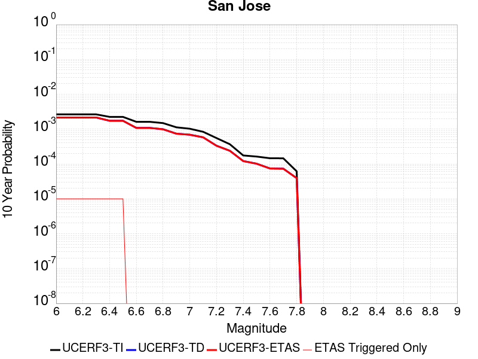 |

| Magnitude | 1 wk TI Prob | 1 wk TD Prob | 1 wk ETAS Prob | 1 wk ETAS/TD Gain | 1 wk ETAS Triggered Only | 1 mo TI Prob | 1 mo TD Prob | 1 mo ETAS Prob | 1 mo ETAS/TD Gain | 1 mo ETAS Triggered Only | 1 yr TI Prob | 1 yr TD Prob | 1 yr ETAS Prob | 1 yr ETAS/TD Gain | 1 yr ETAS Triggered Only | 10 yr TI Prob | 10 yr TD Prob | 10 yr ETAS Prob | 10 yr ETAS/TD Gain | 10 yr ETAS Triggered Only |
|-----|-----|-----|-----|-----|-----|-----|-----|-----|-----|-----|-----|-----|-----|-----|-----|-----|-----|-----|-----|-----|
| 6.0 | 5.0851277E-6 | 4.1256726E-6 | 4.1256726E-6 | 1.0 | 0.0 | 2.1793223E-5 | 1.768135E-5 | 1.768135E-5 | 1.0 | 0.0 | 2.653002E-4 | 2.152518E-4 | 2.2524965E-4 | 1.0464473 | 1.0E-5 | 0.0026498367 | 0.0021507242 | 0.0021607026 | 1.0046396 | 1.0E-5 |
| 6.1 | 5.0851277E-6 | 4.1256726E-6 | 4.1256726E-6 | 1.0 | 0.0 | 2.1793223E-5 | 1.768135E-5 | 1.768135E-5 | 1.0 | 0.0 | 2.653002E-4 | 2.152518E-4 | 2.2524965E-4 | 1.0464473 | 1.0E-5 | 0.0026498367 | 0.0021507242 | 0.0021607026 | 1.0046396 | 1.0E-5 |
| 6.2 | 5.0851277E-6 | 4.1256726E-6 | 4.1256726E-6 | 1.0 | 0.0 | 2.1793223E-5 | 1.768135E-5 | 1.768135E-5 | 1.0 | 0.0 | 2.653002E-4 | 2.152518E-4 | 2.2524965E-4 | 1.0464473 | 1.0E-5 | 0.0026498367 | 0.0021507242 | 0.0021607026 | 1.0046396 | 1.0E-5 |
| 6.3 | 5.0851277E-6 | 4.1256726E-6 | 4.1256726E-6 | 1.0 | 0.0 | 2.1793223E-5 | 1.768135E-5 | 1.768135E-5 | 1.0 | 0.0 | 2.653002E-4 | 2.152518E-4 | 2.2524965E-4 | 1.0464473 | 1.0E-5 | 0.0026498367 | 0.0021507242 | 0.0021607026 | 1.0046396 | 1.0E-5 |
| 6.4 | 4.3115124E-6 | 3.3237832E-6 | 3.3237832E-6 | 1.0 | 0.0 | 1.8477778E-5 | 1.424472E-5 | 1.424472E-5 | 1.0 | 0.0 | 2.2494372E-4 | 1.7341787E-4 | 1.8341614E-4 | 1.0576541 | 1.0E-5 | 0.0022471617 | 0.0017330751 | 0.0017430579 | 1.0057601 | 1.0E-5 |
| 6.5 | 4.3115124E-6 | 3.3237832E-6 | 3.3237832E-6 | 1.0 | 0.0 | 1.8477778E-5 | 1.424472E-5 | 1.424472E-5 | 1.0 | 0.0 | 2.2494372E-4 | 1.7341787E-4 | 1.8341614E-4 | 1.0576541 | 1.0E-5 | 0.0022471617 | 0.0017330751 | 0.0017430579 | 1.0057601 | 1.0E-5 |
| 6.6 | 3.110396E-6 | 2.0799866E-6 | 2.0799866E-6 | 1.0 | 0.0 | 1.33302E-5 | 8.9141995E-6 | 8.9141995E-6 | 1.0 | 0.0 | 1.622831E-4 | 1.0852526E-4 | 1.0852526E-4 | 1.0 | 0.0 | 0.0016216465 | 0.0010847825 | 0.0010847825 | 1.0 | 0.0 |
| 6.7 | 3.110396E-6 | 2.0799866E-6 | 2.0799866E-6 | 1.0 | 0.0 | 1.33302E-5 | 8.9141995E-6 | 8.9141995E-6 | 1.0 | 0.0 | 1.622831E-4 | 1.0852526E-4 | 1.0852526E-4 | 1.0 | 0.0 | 0.0016216465 | 0.0010847825 | 0.0010847825 | 1.0 | 0.0 |
| 6.8 | 2.856651E-6 | 1.902435E-6 | 1.902435E-6 | 1.0 | 0.0 | 1.2242733E-5 | 8.153269E-6 | 8.153269E-6 | 1.0 | 0.0 | 1.4904508E-4 | 9.926178E-5 | 9.926178E-5 | 1.0 | 0.0 | 0.0014894515 | 9.922314E-4 | 9.922314E-4 | 1.0 | 0.0 |
| 6.9 | 2.1618725E-6 | 1.4186642E-6 | 1.4186642E-6 | 1.0 | 0.0 | 9.265135E-6 | 6.0799757E-6 | 6.0799757E-6 | 1.0 | 0.0 | 1.12797185E-4 | 7.402128E-5 | 7.402128E-5 | 1.0 | 0.0 | 0.0011273995 | 7.4000744E-4 | 7.4000744E-4 | 1.0 | 0.0 |
| 7.0 | 1.9684312E-6 | 1.3256331E-6 | 1.3256331E-6 | 1.0 | 0.0 | 8.436106E-6 | 5.681273E-6 | 5.681273E-6 | 1.0 | 0.0 | 1.02704755E-4 | 6.9167385E-5 | 6.9167385E-5 | 1.0 | 0.0 | 0.001026573 | 6.914992E-4 | 6.914992E-4 | 1.0 | 0.0 |
| 7.1 | 1.6070337E-6 | 1.1155087E-6 | 1.1155087E-6 | 1.0 | 0.0 | 6.887269E-6 | 4.780743E-6 | 4.780743E-6 | 1.0 | 0.0 | 8.384928E-5 | 5.8204052E-5 | 5.8204052E-5 | 1.0 | 0.0 | 8.3817646E-4 | 5.819267E-4 | 5.819267E-4 | 1.0 | 0.0 |
| 7.2 | 1.0631658E-6 | 6.4037624E-7 | 6.4037624E-7 | 1.0 | 0.0 | 4.556417E-6 | 2.7444669E-6 | 2.7444669E-6 | 1.0 | 0.0 | 5.5472963E-5 | 3.3413387E-5 | 3.3413387E-5 | 1.0 | 0.0 | 5.545912E-4 | 3.3411747E-4 | 3.3411747E-4 | 1.0 | 0.0 |
| 7.3 | 7.060711E-7 | 4.5824706E-7 | 4.5824706E-7 | 1.0 | 0.0 | 3.0260155E-6 | 1.9639147E-6 | 1.9639147E-6 | 1.0 | 0.0 | 3.6841117E-5 | 2.3910407E-5 | 2.3910407E-5 | 1.0 | 0.0 | 3.6835007E-4 | 2.3911172E-4 | 2.3911172E-4 | 1.0 | 0.0 |
| 7.4 | 3.3677085E-7 | 2.3233133E-7 | 2.3233133E-7 | 1.0 | 0.0 | 1.4433028E-6 | 9.957054E-7 | 9.957054E-7 | 1.0 | 0.0 | 1.757207E-5 | 1.21226485E-5 | 1.21226485E-5 | 1.0 | 0.0 | 1.7570681E-4 | 1.2125263E-4 | 1.2125263E-4 | 1.0 | 0.0 |
| 7.5 | 3.129161E-7 | 1.9530925E-7 | 1.9530925E-7 | 1.0 | 0.0 | 1.3410682E-6 | 8.370394E-7 | 8.370394E-7 | 1.0 | 0.0 | 1.6327383E-5 | 1.0190909E-5 | 1.0190909E-5 | 1.0 | 0.0 | 1.6326184E-4 | 1.0193714E-4 | 1.0193714E-4 | 1.0 | 0.0 |
| 7.6 | 2.8008668E-7 | 1.4242323E-7 | 1.4242323E-7 | 1.0 | 0.0 | 1.2003709E-6 | 6.1038514E-7 | 6.1038514E-7 | 1.0 | 0.0 | 1.46144175E-5 | 7.4314153E-6 | 7.4314153E-6 | 1.0 | 0.0 | 1.4613457E-4 | 7.434427E-5 | 7.434427E-5 | 1.0 | 0.0 |
| 7.7 | 2.7852005E-7 | 1.4016913E-7 | 1.4016913E-7 | 1.0 | 0.0 | 1.1936568E-6 | 6.007248E-7 | 6.007248E-7 | 1.0 | 0.0 | 1.4532674E-5 | 7.3138012E-6 | 7.3138012E-6 | 1.0 | 0.0 | 1.4531724E-4 | 7.316821E-5 | 7.316821E-5 | 1.0 | 0.0 |
| 7.8 | 1.1810797E-7 | 7.5190094E-8 | 7.5190094E-8 | 1.0 | 0.0 | 5.0617695E-7 | 3.222432E-7 | 3.222432E-7 | 1.0 | 0.0 | 6.1626865E-6 | 3.9233046E-6 | 3.9233046E-6 | 1.0 | 0.0 | 6.162516E-5 | 3.9250725E-5 | 3.9250725E-5 | 1.0 | 0.0 |

## Anaheim
*[(top)](#table-of-contents)*

| 1 Week | 1 Month | 1 Year | 10 Year |
|-----|-----|-----|-----|
|  |  |  |  |

| Magnitude | 1 wk TI Prob | 1 wk TD Prob | 1 wk ETAS Prob | 1 wk ETAS/TD Gain | 1 wk ETAS Triggered Only | 1 mo TI Prob | 1 mo TD Prob | 1 mo ETAS Prob | 1 mo ETAS/TD Gain | 1 mo ETAS Triggered Only | 1 yr TI Prob | 1 yr TD Prob | 1 yr ETAS Prob | 1 yr ETAS/TD Gain | 1 yr ETAS Triggered Only | 10 yr TI Prob | 10 yr TD Prob | 10 yr ETAS Prob | 10 yr ETAS/TD Gain | 10 yr ETAS Triggered Only |
|-----|-----|-----|-----|-----|-----|-----|-----|-----|-----|-----|-----|-----|-----|-----|-----|-----|-----|-----|-----|-----|
| 6.0 | 2.9254998E-6 | 2.5122863E-6 | 2.5122863E-6 | 1.0 | 0.0 | 1.25377965E-5 | 1.0766909E-5 | 2.0766802E-5 | 1.9287616 | 1.0E-5 | 1.5263697E-4 | 1.3108159E-4 | 1.4108028E-4 | 1.0762783 | 1.0E-5 | 0.0015253217 | 0.0013102728 | 0.0013202598 | 1.007622 | 1.0E-5 |
| 6.1 | 1.6729715E-6 | 1.2337348E-6 | 1.2337348E-6 | 1.0 | 0.0 | 7.1698582E-6 | 5.287426E-6 | 5.287426E-6 | 1.0 | 0.0 | 8.7289525E-5 | 6.437293E-5 | 6.437293E-5 | 1.0 | 0.0 | 8.7255245E-4 | 6.435838E-4 | 6.435838E-4 | 1.0 | 0.0 |
| 6.2 | 1.6729715E-6 | 1.2337348E-6 | 1.2337348E-6 | 1.0 | 0.0 | 7.1698582E-6 | 5.287426E-6 | 5.287426E-6 | 1.0 | 0.0 | 8.7289525E-5 | 6.437293E-5 | 6.437293E-5 | 1.0 | 0.0 | 8.7255245E-4 | 6.435838E-4 | 6.435838E-4 | 1.0 | 0.0 |
| 6.3 | 1.1444064E-6 | 6.9596666E-7 | 6.9596666E-7 | 1.0 | 0.0 | 4.9045893E-6 | 2.9827113E-6 | 2.9827113E-6 | 1.0 | 0.0 | 5.971174E-5 | 3.631396E-5 | 3.631396E-5 | 1.0 | 0.0 | 5.96957E-4 | 3.6308577E-4 | 3.6308577E-4 | 1.0 | 0.0 |
| 6.4 | 1.1444064E-6 | 6.9596666E-7 | 6.9596666E-7 | 1.0 | 0.0 | 4.9045893E-6 | 2.9827113E-6 | 2.9827113E-6 | 1.0 | 0.0 | 5.971174E-5 | 3.631396E-5 | 3.631396E-5 | 1.0 | 0.0 | 5.96957E-4 | 3.6308577E-4 | 3.6308577E-4 | 1.0 | 0.0 |
| 6.5 | 1.1385318E-6 | 6.9003505E-7 | 6.9003505E-7 | 1.0 | 0.0 | 4.879413E-6 | 2.95729E-6 | 2.95729E-6 | 1.0 | 0.0 | 5.9405233E-5 | 3.6004465E-5 | 3.6004465E-5 | 1.0 | 0.0 | 5.938936E-4 | 3.5999183E-4 | 3.5999183E-4 | 1.0 | 0.0 |
| 6.6 | 1.1165511E-6 | 6.678222E-7 | 6.678222E-7 | 1.0 | 0.0 | 4.78521E-6 | 2.862092E-6 | 2.862092E-6 | 1.0 | 0.0 | 5.8258374E-5 | 3.484547E-5 | 3.484547E-5 | 1.0 | 0.0 | 5.8243104E-4 | 3.484055E-4 | 3.484055E-4 | 1.0 | 0.0 |
| 6.7 | 1.1098243E-6 | 6.610416E-7 | 6.610416E-7 | 1.0 | 0.0 | 4.7563813E-6 | 2.8330326E-6 | 2.8330326E-6 | 1.0 | 0.0 | 5.7907404E-5 | 3.449168E-5 | 3.449168E-5 | 1.0 | 0.0 | 5.7892315E-4 | 3.4486872E-4 | 3.4486872E-4 | 1.0 | 0.0 |
| 6.8 | 1.1077587E-6 | 6.589619E-7 | 6.589619E-7 | 1.0 | 0.0 | 4.7475287E-6 | 2.8241195E-6 | 2.8241195E-6 | 1.0 | 0.0 | 5.779963E-5 | 3.438317E-5 | 3.438317E-5 | 1.0 | 0.0 | 5.77846E-4 | 3.4378393E-4 | 3.4378393E-4 | 1.0 | 0.0 |
| 6.9 | 1.1024468E-6 | 6.5361957E-7 | 6.5361957E-7 | 1.0 | 0.0 | 4.7247636E-6 | 2.8012241E-6 | 2.8012241E-6 | 1.0 | 0.0 | 5.752248E-5 | 3.4104425E-5 | 3.4104425E-5 | 1.0 | 0.0 | 5.750759E-4 | 3.4099736E-4 | 3.4099736E-4 | 1.0 | 0.0 |
| 7.0 | 1.0993066E-6 | 6.510303E-7 | 6.510303E-7 | 1.0 | 0.0 | 4.7113053E-6 | 2.7901272E-6 | 2.7901272E-6 | 1.0 | 0.0 | 5.7358633E-5 | 3.3969325E-5 | 3.3969325E-5 | 1.0 | 0.0 | 5.734383E-4 | 3.3964674E-4 | 3.3964674E-4 | 1.0 | 0.0 |
| 7.1 | 8.334877E-7 | 4.4049145E-7 | 4.4049145E-7 | 1.0 | 0.0 | 3.5720855E-6 | 1.8878193E-6 | 1.8878193E-6 | 1.0 | 0.0 | 4.348927E-5 | 2.298398E-5 | 2.298398E-5 | 1.0 | 0.0 | 4.3480762E-4 | 2.2981827E-4 | 2.2981827E-4 | 1.0 | 0.0 |
| 7.2 | 7.794411E-7 | 3.997645E-7 | 3.997645E-7 | 1.0 | 0.0 | 3.3404576E-6 | 1.7132754E-6 | 1.7132754E-6 | 1.0 | 0.0 | 4.0669314E-5 | 2.0858948E-5 | 2.0858948E-5 | 1.0 | 0.0 | 4.066187E-4 | 2.0857195E-4 | 2.0857195E-4 | 1.0 | 0.0 |
| 7.3 | 5.01704E-7 | 2.5573388E-7 | 2.5573388E-7 | 1.0 | 0.0 | 2.150158E-6 | 1.0960019E-6 | 1.0960019E-6 | 1.0 | 0.0 | 2.617786E-5 | 1.3343754E-5 | 1.3343754E-5 | 1.0 | 0.0 | 2.6174777E-4 | 1.3343077E-4 | 1.3343077E-4 | 1.0 | 0.0 |
| 7.4 | 2.4008182E-7 | 1.2367859E-7 | 1.2367859E-7 | 1.0 | 0.0 | 1.0289217E-6 | 5.30051E-7 | 5.30051E-7 | 1.0 | 0.0 | 1.252705E-5 | 6.4533597E-6 | 6.4533597E-6 | 1.0 | 0.0 | 1.2526344E-4 | 6.453248E-5 | 6.453248E-5 | 1.0 | 0.0 |
| 7.5 | 2.0263876E-8 | 1.6120866E-8 | 1.6120866E-8 | 1.0 | 0.0 | 8.684518E-8 | 6.908943E-8 | 6.908943E-8 | 1.0 | 0.0 | 1.0573395E-6 | 8.4116357E-7 | 8.4116357E-7 | 1.0 | 0.0 | 1.0573345E-5 | 8.411613E-6 | 8.411613E-6 | 1.0 | 0.0 |
| 7.6 | 1.4871431E-9 | 1.508418E-9 | 1.508418E-9 | 1.0 | 0.0 | 6.37347E-9 | 6.4646484E-9 | 6.4646484E-9 | 1.0 | 0.0 | 7.7596994E-8 | 7.870709E-8 | 7.870709E-8 | 1.0 | 0.0 | 7.759697E-7 | 7.8707063E-7 | 7.8707063E-7 | 1.0 | 0.0 |
| 7.7 | 1.5093293E-10 | 1.5333512E-10 | 1.5333512E-10 | 1.0 | 0.0 | 6.4685546E-10 | 6.571509E-10 | 6.571509E-10 | 1.0 | 0.0 | 7.875465E-9 | 8.0008125E-9 | 8.0008125E-9 | 1.0 | 0.0 | 7.8754645E-8 | 8.000812E-8 | 8.000812E-8 | 1.0 | 0.0 |

## Johnson Valley (No) 2011 rev
*[(top)](#table-of-contents)*

| 1 Week | 1 Month | 1 Year | 10 Year |
|-----|-----|-----|-----|
|  |  |  |  |

| Magnitude | 1 wk TI Prob | 1 wk TD Prob | 1 wk ETAS Prob | 1 wk ETAS/TD Gain | 1 wk ETAS Triggered Only | 1 mo TI Prob | 1 mo TD Prob | 1 mo ETAS Prob | 1 mo ETAS/TD Gain | 1 mo ETAS Triggered Only | 1 yr TI Prob | 1 yr TD Prob | 1 yr ETAS Prob | 1 yr ETAS/TD Gain | 1 yr ETAS Triggered Only | 10 yr TI Prob | 10 yr TD Prob | 10 yr ETAS Prob | 10 yr ETAS/TD Gain | 10 yr ETAS Triggered Only |
|-----|-----|-----|-----|-----|-----|-----|-----|-----|-----|-----|-----|-----|-----|-----|-----|-----|-----|-----|-----|-----|
| 6.0 | 2.577707E-5 | 1.2900938E-5 | 1.2900938E-5 | 1.0 | 0.0 | 1.1046848E-4 | 5.5288787E-5 | 5.5288787E-5 | 1.0 | 0.0 | 0.0013441239 | 6.7297276E-4 | 6.7297276E-4 | 1.0 | 0.0 | 0.013360229 | 0.006713257 | 0.0067231897 | 1.0014796 | 1.0E-5 |
| 6.1 | 2.577707E-5 | 1.2900938E-5 | 1.2900938E-5 | 1.0 | 0.0 | 1.1046848E-4 | 5.5288787E-5 | 5.5288787E-5 | 1.0 | 0.0 | 0.0013441239 | 6.7297276E-4 | 6.7297276E-4 | 1.0 | 0.0 | 0.013360229 | 0.006713257 | 0.0067231897 | 1.0014796 | 1.0E-5 |
| 6.2 | 2.577707E-5 | 1.2900938E-5 | 1.2900938E-5 | 1.0 | 0.0 | 1.1046848E-4 | 5.5288787E-5 | 5.5288787E-5 | 1.0 | 0.0 | 0.0013441239 | 6.7297276E-4 | 6.7297276E-4 | 1.0 | 0.0 | 0.013360229 | 0.006713257 | 0.0067231897 | 1.0014796 | 1.0E-5 |
| 6.3 | 2.577707E-5 | 1.2900938E-5 | 1.2900938E-5 | 1.0 | 0.0 | 1.1046848E-4 | 5.5288787E-5 | 5.5288787E-5 | 1.0 | 0.0 | 0.0013441239 | 6.7297276E-4 | 6.7297276E-4 | 1.0 | 0.0 | 0.013360229 | 0.006713257 | 0.0067231897 | 1.0014796 | 1.0E-5 |
| 6.4 | 1.5296591E-5 | 7.536742E-6 | 7.536742E-6 | 1.0 | 0.0 | 6.555518E-5 | 3.2300028E-5 | 3.2300028E-5 | 1.0 | 0.0 | 7.97842E-4 | 3.9320064E-4 | 3.9320064E-4 | 1.0 | 0.0 | 0.007949836 | 0.0039268904 | 0.0039268904 | 1.0 | 0.0 |
| 6.5 | 1.5296591E-5 | 7.536742E-6 | 7.536742E-6 | 1.0 | 0.0 | 6.555518E-5 | 3.2300028E-5 | 3.2300028E-5 | 1.0 | 0.0 | 7.97842E-4 | 3.9320064E-4 | 3.9320064E-4 | 1.0 | 0.0 | 0.007949836 | 0.0039268904 | 0.0039268904 | 1.0 | 0.0 |
| 6.6 | 1.3289383E-5 | 5.9917306E-6 | 5.9917306E-6 | 1.0 | 0.0 | 5.6953253E-5 | 2.5678688E-5 | 2.5678688E-5 | 1.0 | 0.0 | 6.9318525E-4 | 3.1261015E-4 | 3.1261015E-4 | 1.0 | 0.0 | 0.0069102696 | 0.0031233684 | 0.0031233684 | 1.0 | 0.0 |
| 6.7 | 1.3289383E-5 | 5.9917306E-6 | 5.9917306E-6 | 1.0 | 0.0 | 5.6953253E-5 | 2.5678688E-5 | 2.5678688E-5 | 1.0 | 0.0 | 6.9318525E-4 | 3.1261015E-4 | 3.1261015E-4 | 1.0 | 0.0 | 0.0069102696 | 0.0031233684 | 0.0031233684 | 1.0 | 0.0 |
| 6.8 | 8.330789E-6 | 2.9211888E-6 | 2.9211888E-6 | 1.0 | 0.0 | 3.570289E-5 | 1.2519352E-5 | 1.2519352E-5 | 1.0 | 0.0 | 4.34596E-4 | 1.5241816E-4 | 1.5241816E-4 | 1.0 | 0.0 | 0.0043374705 | 0.0015236961 | 0.0015236961 | 1.0 | 0.0 |
| 6.9 | 7.2359003E-6 | 2.3013247E-6 | 2.3013247E-6 | 1.0 | 0.0 | 3.1010633E-5 | 9.8628125E-6 | 9.8628125E-6 | 1.0 | 0.0 | 3.7748902E-4 | 1.2007845E-4 | 1.2007845E-4 | 1.0 | 0.0 | 0.0037684843 | 0.0012006586 | 0.0012006586 | 1.0 | 0.0 |
| 7.0 | 6.5149957E-6 | 2.088482E-6 | 2.088482E-6 | 1.0 | 0.0 | 2.792111E-5 | 8.950637E-6 | 8.950637E-6 | 1.0 | 0.0 | 3.398865E-4 | 1.0897385E-4 | 1.0897385E-4 | 1.0 | 0.0 | 0.003393671 | 0.0010897239 | 0.0010897239 | 1.0 | 0.0 |
| 7.1 | 1.1662233E-6 | 2.8802024E-8 | 2.8802024E-8 | 1.0 | 0.0 | 4.9980904E-6 | 1.2343725E-7 | 1.2343725E-7 | 1.0 | 0.0 | 6.0850052E-5 | 1.5028476E-6 | 1.5028476E-6 | 1.0 | 0.0 | 6.083339E-4 | 1.50283895E-5 | 1.50283895E-5 | 1.0 | 0.0 |
| 7.2 | 5.413881E-7 | 2.8802024E-8 | 2.8802024E-8 | 1.0 | 0.0 | 2.3202326E-6 | 1.2343725E-7 | 1.2343725E-7 | 1.0 | 0.0 | 2.8248465E-5 | 1.5028476E-6 | 1.5028476E-6 | 1.0 | 0.0 | 2.8244875E-4 | 1.50283895E-5 | 1.50283895E-5 | 1.0 | 0.0 |
| 7.3 | 5.076821E-7 | 2.8802024E-8 | 2.8802024E-8 | 1.0 | 0.0 | 2.1757785E-6 | 1.2343723E-7 | 1.2343723E-7 | 1.0 | 0.0 | 2.648978E-5 | 1.5028475E-6 | 1.5028475E-6 | 1.0 | 0.0 | 2.6486625E-4 | 1.50283895E-5 | 1.50283895E-5 | 1.0 | 0.0 |
| 7.4 | 4.7568687E-7 | 2.8783948E-8 | 2.8783948E-8 | 1.0 | 0.0 | 2.0386565E-6 | 1.2335977E-7 | 1.2335977E-7 | 1.0 | 0.0 | 2.482036E-5 | 1.5019043E-6 | 1.5019043E-6 | 1.0 | 0.0 | 2.4817587E-4 | 1.5018958E-5 | 1.5018958E-5 | 1.0 | 0.0 |
| 7.5 | 3.435626E-7 | 2.5357679E-8 | 2.5357679E-8 | 1.0 | 0.0 | 1.4724103E-6 | 1.0867576E-7 | 1.0867576E-7 | 1.0 | 0.0 | 1.7926448E-5 | 1.3231268E-6 | 1.3231268E-6 | 1.0 | 0.0 | 1.7925001E-4 | 1.3231205E-5 | 1.3231205E-5 | 1.0 | 0.0 |

## North Frontal  (West)
*[(top)](#table-of-contents)*

| 1 Week | 1 Month | 1 Year | 10 Year |
|-----|-----|-----|-----|
|  | 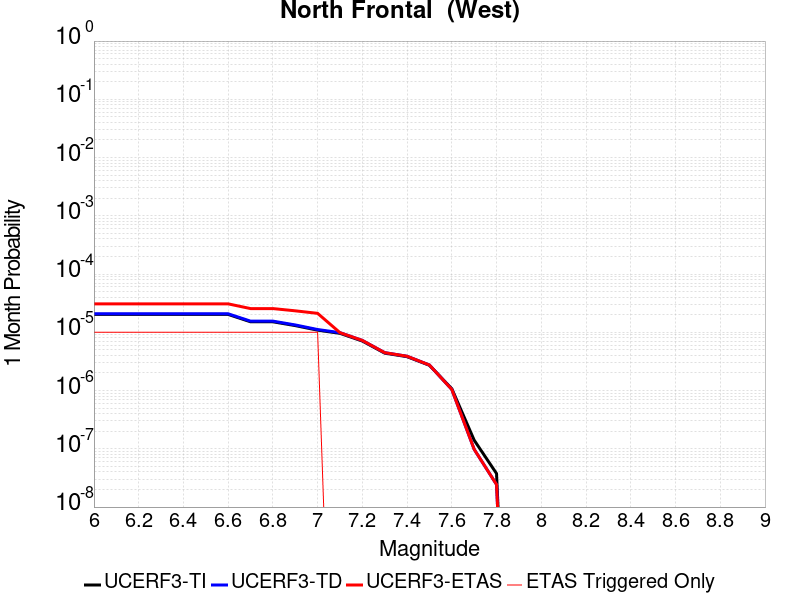 |  |  |

| Magnitude | 1 wk TI Prob | 1 wk TD Prob | 1 wk ETAS Prob | 1 wk ETAS/TD Gain | 1 wk ETAS Triggered Only | 1 mo TI Prob | 1 mo TD Prob | 1 mo ETAS Prob | 1 mo ETAS/TD Gain | 1 mo ETAS Triggered Only | 1 yr TI Prob | 1 yr TD Prob | 1 yr ETAS Prob | 1 yr ETAS/TD Gain | 1 yr ETAS Triggered Only | 10 yr TI Prob | 10 yr TD Prob | 10 yr ETAS Prob | 10 yr ETAS/TD Gain | 10 yr ETAS Triggered Only |
|-----|-----|-----|-----|-----|-----|-----|-----|-----|-----|-----|-----|-----|-----|-----|-----|-----|-----|-----|-----|-----|
| 6.0 | 4.7316266E-6 | 4.8526726E-6 | 1.4852624E-5 | 3.0607102 | 1.0E-5 | 2.0278241E-5 | 2.0797012E-5 | 3.0796804E-5 | 1.4808283 | 1.0E-5 | 2.4685962E-4 | 2.5317568E-4 | 2.6317313E-4 | 1.0394883 | 1.0E-5 | 0.0024658558 | 0.0025290183 | 0.002538993 | 1.0039442 | 1.0E-5 |
| 6.1 | 4.7316266E-6 | 4.8526726E-6 | 1.4852624E-5 | 3.0607102 | 1.0E-5 | 2.0278241E-5 | 2.0797012E-5 | 3.0796804E-5 | 1.4808283 | 1.0E-5 | 2.4685962E-4 | 2.5317568E-4 | 2.6317313E-4 | 1.0394883 | 1.0E-5 | 0.0024658558 | 0.0025290183 | 0.002538993 | 1.0039442 | 1.0E-5 |
| 6.2 | 4.7316266E-6 | 4.8526726E-6 | 1.4852624E-5 | 3.0607102 | 1.0E-5 | 2.0278241E-5 | 2.0797012E-5 | 3.0796804E-5 | 1.4808283 | 1.0E-5 | 2.4685962E-4 | 2.5317568E-4 | 2.6317313E-4 | 1.0394883 | 1.0E-5 | 0.0024658558 | 0.0025290183 | 0.002538993 | 1.0039442 | 1.0E-5 |
| 6.3 | 4.7316266E-6 | 4.8526726E-6 | 1.4852624E-5 | 3.0607102 | 1.0E-5 | 2.0278241E-5 | 2.0797012E-5 | 3.0796804E-5 | 1.4808283 | 1.0E-5 | 2.4685962E-4 | 2.5317568E-4 | 2.6317313E-4 | 1.0394883 | 1.0E-5 | 0.0024658558 | 0.0025290183 | 0.002538993 | 1.0039442 | 1.0E-5 |
| 6.4 | 4.7316266E-6 | 4.8526726E-6 | 1.4852624E-5 | 3.0607102 | 1.0E-5 | 2.0278241E-5 | 2.0797012E-5 | 3.0796804E-5 | 1.4808283 | 1.0E-5 | 2.4685962E-4 | 2.5317568E-4 | 2.6317313E-4 | 1.0394883 | 1.0E-5 | 0.0024658558 | 0.0025290183 | 0.002538993 | 1.0039442 | 1.0E-5 |
| 6.5 | 4.7316266E-6 | 4.8526726E-6 | 1.4852624E-5 | 3.0607102 | 1.0E-5 | 2.0278241E-5 | 2.0797012E-5 | 3.0796804E-5 | 1.4808283 | 1.0E-5 | 2.4685962E-4 | 2.5317568E-4 | 2.6317313E-4 | 1.0394883 | 1.0E-5 | 0.0024658558 | 0.0025290183 | 0.002538993 | 1.0039442 | 1.0E-5 |
| 6.6 | 4.7316266E-6 | 4.8526726E-6 | 1.4852624E-5 | 3.0607102 | 1.0E-5 | 2.0278241E-5 | 2.0797012E-5 | 3.0796804E-5 | 1.4808283 | 1.0E-5 | 2.4685962E-4 | 2.5317568E-4 | 2.6317313E-4 | 1.0394883 | 1.0E-5 | 0.0024658558 | 0.0025290183 | 0.002538993 | 1.0039442 | 1.0E-5 |
| 6.7 | 3.5382777E-6 | 3.6308859E-6 | 1.363085E-5 | 3.7541387 | 1.0E-5 | 1.516396E-5 | 1.5560852E-5 | 2.5560696E-5 | 1.6426283 | 1.0E-5 | 1.8460557E-4 | 1.8943768E-4 | 1.9943577E-4 | 1.0527778 | 1.0E-5 | 0.0018445229 | 0.0018928389 | 0.00190282 | 1.0052731 | 1.0E-5 |
| 6.8 | 3.5382777E-6 | 3.6308859E-6 | 1.363085E-5 | 3.7541387 | 1.0E-5 | 1.516396E-5 | 1.5560852E-5 | 2.5560696E-5 | 1.6426283 | 1.0E-5 | 1.8460557E-4 | 1.8943768E-4 | 1.9943577E-4 | 1.0527778 | 1.0E-5 | 0.0018445229 | 0.0018928389 | 0.00190282 | 1.0052731 | 1.0E-5 |
| 6.9 | 3.0428037E-6 | 3.1227605E-6 | 1.312273E-5 | 4.202285 | 1.0E-5 | 1.30405215E-5 | 1.33831945E-5 | 2.3383061E-5 | 1.7471957 | 1.0E-5 | 1.5875678E-4 | 1.6292889E-4 | 1.7292726E-4 | 1.0613664 | 1.0E-5 | 0.0015864341 | 0.0016281615 | 0.0016381453 | 1.0061319 | 1.0E-5 |
| 7.0 | 2.538778E-6 | 2.6060904E-6 | 1.2606064E-5 | 4.8371553 | 1.0E-5 | 1.0880432E-5 | 1.1168913E-5 | 2.1168802E-5 | 1.8953322 | 1.0E-5 | 1.324612E-4 | 1.3597352E-4 | 1.4597215E-4 | 1.0735338 | 1.0E-5 | 0.0013238228 | 0.0013589499 | 0.0013689363 | 1.0073487 | 1.0E-5 |
| 7.1 | 2.2418935E-6 | 2.3012074E-6 | 2.3012074E-6 | 1.0 | 0.0 | 9.60808E-6 | 9.862282E-6 | 9.862282E-6 | 1.0 | 0.0 | 1.1697209E-4 | 1.2006712E-4 | 1.2006712E-4 | 1.0 | 0.0 | 0.0011691054 | 0.0012000664 | 0.0012000664 | 1.0 | 0.0 |
| 7.2 | 1.6526745E-6 | 1.6924851E-6 | 1.6924851E-6 | 1.0 | 0.0 | 7.082872E-6 | 7.253489E-6 | 7.253489E-6 | 1.0 | 0.0 | 8.623055E-5 | 8.8307905E-5 | 8.8307905E-5 | 1.0 | 0.0 | 8.61971E-4 | 8.827532E-4 | 8.827532E-4 | 1.0 | 0.0 |
| 7.3 | 1.0246019E-6 | 1.0442261E-6 | 1.0442261E-6 | 1.0 | 0.0 | 4.391144E-6 | 4.4752474E-6 | 4.4752474E-6 | 1.0 | 0.0 | 5.3460866E-5 | 5.448489E-5 | 5.448489E-5 | 1.0 | 0.0 | 5.344801E-4 | 5.4472685E-4 | 5.4472685E-4 | 1.0 | 0.0 |
| 7.4 | 8.9045164E-7 | 9.0565584E-7 | 9.0565584E-7 | 1.0 | 0.0 | 3.8162157E-6 | 3.8813773E-6 | 3.8813773E-6 | 1.0 | 0.0 | 4.646144E-5 | 4.7254853E-5 | 4.7254853E-5 | 1.0 | 0.0 | 4.6451724E-4 | 4.7245892E-4 | 4.7245892E-4 | 1.0 | 0.0 |
| 7.5 | 6.3357E-7 | 6.4027006E-7 | 6.4027006E-7 | 1.0 | 0.0 | 2.7152971E-6 | 2.744012E-6 | 2.744012E-6 | 1.0 | 0.0 | 3.305824E-5 | 3.34079E-5 | 3.34079E-5 | 1.0 | 0.0 | 3.3053322E-4 | 3.3403534E-4 | 3.3403534E-4 | 1.0 | 0.0 |
| 7.6 | 2.5087024E-7 | 2.4361097E-7 | 2.4361097E-7 | 1.0 | 0.0 | 1.0751578E-6 | 1.0440467E-6 | 1.0440467E-6 | 1.0 | 0.0 | 1.3089967E-5 | 1.2711216E-5 | 1.2711216E-5 | 1.0 | 0.0 | 1.3089196E-4 | 1.2710695E-4 | 1.2710695E-4 | 1.0 | 0.0 |
| 7.7 | 3.282987E-8 | 2.2874195E-8 | 2.2874195E-8 | 1.0 | 0.0 | 1.4069944E-7 | 9.803227E-8 | 9.803227E-8 | 1.0 | 0.0 | 1.7130144E-6 | 1.1935423E-6 | 1.1935423E-6 | 1.0 | 0.0 | 1.7130013E-5 | 1.1935367E-5 | 1.1935367E-5 | 1.0 | 0.0 |
| 7.8 | 8.77499E-9 | 5.6815956E-9 | 5.6815956E-9 | 1.0 | 0.0 | 3.7607098E-8 | 2.4349696E-8 | 2.4349696E-8 | 1.0 | 0.0 | 4.578663E-7 | 2.9645753E-7 | 2.9645753E-7 | 1.0 | 0.0 | 4.5786537E-6 | 2.9645726E-6 | 2.9645726E-6 | 1.0 | 0.0 |

## Peralta Hills
*[(top)](#table-of-contents)*

| 1 Week | 1 Month | 1 Year | 10 Year |
|-----|-----|-----|-----|
|  |  |  |  |

| Magnitude | 1 wk TI Prob | 1 wk TD Prob | 1 wk ETAS Prob | 1 wk ETAS/TD Gain | 1 wk ETAS Triggered Only | 1 mo TI Prob | 1 mo TD Prob | 1 mo ETAS Prob | 1 mo ETAS/TD Gain | 1 mo ETAS Triggered Only | 1 yr TI Prob | 1 yr TD Prob | 1 yr ETAS Prob | 1 yr ETAS/TD Gain | 1 yr ETAS Triggered Only | 10 yr TI Prob | 10 yr TD Prob | 10 yr ETAS Prob | 10 yr ETAS/TD Gain | 10 yr ETAS Triggered Only |
|-----|-----|-----|-----|-----|-----|-----|-----|-----|-----|-----|-----|-----|-----|-----|-----|-----|-----|-----|-----|-----|
| 6.0 | 3.8850067E-6 | 3.839512E-6 | 3.839512E-6 | 1.0 | 0.0 | 1.6649923E-5 | 1.645499E-5 | 1.645499E-5 | 1.0 | 0.0 | 2.0269395E-4 | 2.0032849E-4 | 2.0032849E-4 | 1.0 | 0.0 | 0.0020250916 | 0.0020022066 | 0.0020121867 | 1.0049845 | 1.0E-5 |
| 6.1 | 3.8850067E-6 | 3.839512E-6 | 3.839512E-6 | 1.0 | 0.0 | 1.6649923E-5 | 1.645499E-5 | 1.645499E-5 | 1.0 | 0.0 | 2.0269395E-4 | 2.0032849E-4 | 2.0032849E-4 | 1.0 | 0.0 | 0.0020250916 | 0.0020022066 | 0.0020121867 | 1.0049845 | 1.0E-5 |
| 6.2 | 3.8850067E-6 | 3.839512E-6 | 3.839512E-6 | 1.0 | 0.0 | 1.6649923E-5 | 1.645499E-5 | 1.645499E-5 | 1.0 | 0.0 | 2.0269395E-4 | 2.0032849E-4 | 2.0032849E-4 | 1.0 | 0.0 | 0.0020250916 | 0.0020022066 | 0.0020121867 | 1.0049845 | 1.0E-5 |
| 6.3 | 3.8850067E-6 | 3.839512E-6 | 3.839512E-6 | 1.0 | 0.0 | 1.6649923E-5 | 1.645499E-5 | 1.645499E-5 | 1.0 | 0.0 | 2.0269395E-4 | 2.0032849E-4 | 2.0032849E-4 | 1.0 | 0.0 | 0.0020250916 | 0.0020022066 | 0.0020121867 | 1.0049845 | 1.0E-5 |
| 6.4 | 3.8850067E-6 | 3.839512E-6 | 3.839512E-6 | 1.0 | 0.0 | 1.6649923E-5 | 1.645499E-5 | 1.645499E-5 | 1.0 | 0.0 | 2.0269395E-4 | 2.0032849E-4 | 2.0032849E-4 | 1.0 | 0.0 | 0.0020250916 | 0.0020022066 | 0.0020121867 | 1.0049845 | 1.0E-5 |
| 6.5 | 1.5587785E-6 | 1.4430796E-6 | 1.4430796E-6 | 1.0 | 0.0 | 6.6804623E-6 | 6.184613E-6 | 6.184613E-6 | 1.0 | 0.0 | 8.133159E-5 | 7.529531E-5 | 7.529531E-5 | 1.0 | 0.0 | 8.1301836E-4 | 7.52722E-4 | 7.627144E-4 | 1.0132751 | 1.0E-5 |
| 6.6 | 1.5587785E-6 | 1.4430796E-6 | 1.4430796E-6 | 1.0 | 0.0 | 6.6804623E-6 | 6.184613E-6 | 6.184613E-6 | 1.0 | 0.0 | 8.133159E-5 | 7.529531E-5 | 7.529531E-5 | 1.0 | 0.0 | 8.1301836E-4 | 7.52722E-4 | 7.627144E-4 | 1.0132751 | 1.0E-5 |
| 6.7 | 1.5018579E-6 | 1.3837022E-6 | 1.3837022E-6 | 1.0 | 0.0 | 6.436518E-6 | 5.93014E-6 | 5.93014E-6 | 1.0 | 0.0 | 7.836179E-5 | 7.21973E-5 | 7.21973E-5 | 1.0 | 0.0 | 7.833416E-4 | 7.21762E-4 | 7.3175476E-4 | 1.013845 | 1.0E-5 |
| 6.8 | 1.4584314E-6 | 1.3381342E-6 | 1.3381342E-6 | 1.0 | 0.0 | 6.250405E-6 | 5.7348498E-6 | 5.7348498E-6 | 1.0 | 0.0 | 7.6096025E-5 | 6.98198E-5 | 6.98198E-5 | 1.0 | 0.0 | 7.6069974E-4 | 6.98002E-4 | 7.0799503E-4 | 1.0143166 | 1.0E-5 |
| 6.9 | 1.1382393E-6 | 9.862285E-7 | 9.862285E-7 | 1.0 | 0.0 | 4.8781594E-6 | 4.226687E-6 | 4.226687E-6 | 1.0 | 0.0 | 5.9389975E-5 | 5.1458785E-5 | 5.1458785E-5 | 1.0 | 0.0 | 5.93741E-4 | 5.144769E-4 | 5.2447175E-4 | 1.0194272 | 1.0E-5 |
| 7.0 | 9.970413E-7 | 8.309642E-7 | 8.309642E-7 | 1.0 | 0.0 | 4.273027E-6 | 3.561271E-6 | 3.561271E-6 | 1.0 | 0.0 | 5.2022864E-5 | 4.335768E-5 | 4.335768E-5 | 1.0 | 0.0 | 5.2010687E-4 | 4.33499E-4 | 4.4349465E-4 | 1.023058 | 1.0E-5 |
| 7.1 | 9.684443E-7 | 7.99408E-7 | 7.99408E-7 | 1.0 | 0.0 | 4.150469E-6 | 3.4260302E-6 | 3.4260302E-6 | 1.0 | 0.0 | 5.053079E-5 | 4.1711188E-5 | 4.1711188E-5 | 1.0 | 0.0 | 5.05193E-4 | 4.170403E-4 | 4.2703614E-4 | 1.0239685 | 1.0E-5 |
| 7.2 | 9.240811E-7 | 7.5031426E-7 | 7.5031426E-7 | 1.0 | 0.0 | 3.960342E-6 | 3.215629E-6 | 3.215629E-6 | 1.0 | 0.0 | 4.8216094E-5 | 3.9149647E-5 | 3.9149647E-5 | 1.0 | 0.0 | 4.8205635E-4 | 3.9143403E-4 | 4.0143012E-4 | 1.0255371 | 1.0E-5 |
| 7.3 | 8.158643E-7 | 6.350017E-7 | 6.350017E-7 | 1.0 | 0.0 | 3.4965567E-6 | 2.7214332E-6 | 2.7214332E-6 | 1.0 | 0.0 | 4.2569747E-5 | 3.313301E-5 | 3.313301E-5 | 1.0 | 0.0 | 4.2561593E-4 | 3.3128684E-4 | 3.4128354E-4 | 1.0301753 | 1.0E-5 |
| 7.4 | 6.3822824E-7 | 4.7957286E-7 | 4.7957286E-7 | 1.0 | 0.0 | 2.7352612E-6 | 2.0553111E-6 | 2.0553111E-6 | 1.0 | 0.0 | 3.3301294E-5 | 2.5023177E-5 | 2.5023177E-5 | 1.0 | 0.0 | 3.3296304E-4 | 2.5020874E-4 | 2.5020874E-4 | 1.0 | 0.0 |
| 7.5 | 4.0292628E-7 | 2.7846056E-7 | 2.7846056E-7 | 1.0 | 0.0 | 1.7268258E-6 | 1.193402E-6 | 1.193402E-6 | 1.0 | 0.0 | 2.1023901E-5 | 1.4529601E-5 | 1.4529601E-5 | 1.0 | 0.0 | 2.1021912E-4 | 1.452893E-4 | 1.452893E-4 | 1.0 | 0.0 |
| 7.6 | 3.672993E-7 | 2.485495E-7 | 2.485495E-7 | 1.0 | 0.0 | 1.5741389E-6 | 1.0652118E-6 | 1.0652118E-6 | 1.0 | 0.0 | 1.9164972E-5 | 1.2968904E-5 | 1.2968904E-5 | 1.0 | 0.0 | 1.916332E-4 | 1.296842E-4 | 1.296842E-4 | 1.0 | 0.0 |
| 7.7 | 2.8466823E-7 | 1.7859877E-7 | 1.7859877E-7 | 1.0 | 0.0 | 1.2200061E-6 | 7.6542324E-7 | 7.6542324E-7 | 1.0 | 0.0 | 1.4853474E-5 | 9.319015E-6 | 9.319015E-6 | 1.0 | 0.0 | 1.485248E-4 | 9.3188835E-5 | 9.3188835E-5 | 1.0 | 0.0 |

## Reliz 2011 CFM
*[(top)](#table-of-contents)*

| 1 Week | 1 Month | 1 Year | 10 Year |
|-----|-----|-----|-----|
|  |  |  |  |

| Magnitude | 1 wk TI Prob | 1 wk TD Prob | 1 wk ETAS Prob | 1 wk ETAS/TD Gain | 1 wk ETAS Triggered Only | 1 mo TI Prob | 1 mo TD Prob | 1 mo ETAS Prob | 1 mo ETAS/TD Gain | 1 mo ETAS Triggered Only | 1 yr TI Prob | 1 yr TD Prob | 1 yr ETAS Prob | 1 yr ETAS/TD Gain | 1 yr ETAS Triggered Only | 10 yr TI Prob | 10 yr TD Prob | 10 yr ETAS Prob | 10 yr ETAS/TD Gain | 10 yr ETAS Triggered Only |
|-----|-----|-----|-----|-----|-----|-----|-----|-----|-----|-----|-----|-----|-----|-----|-----|-----|-----|-----|-----|-----|
| 6.0 | 1.6002472E-5 | 1.6282804E-5 | 1.6282804E-5 | 1.0 | 0.0 | 6.8580215E-5 | 6.9781694E-5 | 6.9781694E-5 | 1.0 | 0.0 | 8.3464425E-4 | 8.4928074E-4 | 8.4928074E-4 | 1.0 | 0.0 | 0.008315164 | 0.008462547 | 0.008472463 | 1.0011717 | 1.0E-5 |
| 6.1 | 1.6002472E-5 | 1.6282804E-5 | 1.6282804E-5 | 1.0 | 0.0 | 6.8580215E-5 | 6.9781694E-5 | 6.9781694E-5 | 1.0 | 0.0 | 8.3464425E-4 | 8.4928074E-4 | 8.4928074E-4 | 1.0 | 0.0 | 0.008315164 | 0.008462547 | 0.008472463 | 1.0011717 | 1.0E-5 |
| 6.2 | 1.6002472E-5 | 1.6282804E-5 | 1.6282804E-5 | 1.0 | 0.0 | 6.8580215E-5 | 6.9781694E-5 | 6.9781694E-5 | 1.0 | 0.0 | 8.3464425E-4 | 8.4928074E-4 | 8.4928074E-4 | 1.0 | 0.0 | 0.008315164 | 0.008462547 | 0.008472463 | 1.0011717 | 1.0E-5 |
| 6.3 | 7.792404E-6 | 7.803802E-6 | 7.803802E-6 | 1.0 | 0.0 | 3.339559E-5 | 3.344444E-5 | 3.344444E-5 | 1.0 | 0.0 | 4.0651546E-4 | 4.0711078E-4 | 4.0711078E-4 | 1.0 | 0.0 | 0.0040577264 | 0.004063926 | 0.004063926 | 1.0 | 0.0 |
| 6.4 | 7.792404E-6 | 7.803802E-6 | 7.803802E-6 | 1.0 | 0.0 | 3.339559E-5 | 3.344444E-5 | 3.344444E-5 | 1.0 | 0.0 | 4.0651546E-4 | 4.0711078E-4 | 4.0711078E-4 | 1.0 | 0.0 | 0.0040577264 | 0.004063926 | 0.004063926 | 1.0 | 0.0 |
| 6.5 | 5.9659374E-6 | 5.928738E-6 | 5.928738E-6 | 1.0 | 0.0 | 2.5568053E-5 | 2.5408632E-5 | 2.5408632E-5 | 1.0 | 0.0 | 3.1124658E-4 | 3.093064E-4 | 3.093064E-4 | 1.0 | 0.0 | 0.00310811 | 0.0030889767 | 0.0030889767 | 1.0 | 0.0 |
| 6.6 | 5.2350692E-6 | 5.178986E-6 | 5.178986E-6 | 1.0 | 0.0 | 2.2435817E-5 | 2.2195467E-5 | 2.2195467E-5 | 1.0 | 0.0 | 2.7312184E-4 | 2.7019644E-4 | 2.7019644E-4 | 1.0 | 0.0 | 0.002727864 | 0.0026988892 | 0.0026988892 | 1.0 | 0.0 |
| 6.7 | 4.580206E-6 | 4.5061206E-6 | 4.5061206E-6 | 1.0 | 0.0 | 1.9629308E-5 | 1.9311801E-5 | 1.9311801E-5 | 1.0 | 0.0 | 2.389606E-4 | 2.350959E-4 | 2.350959E-4 | 1.0 | 0.0 | 0.002387038 | 0.0023486738 | 0.0023486738 | 1.0 | 0.0 |
| 6.8 | 4.0765017E-6 | 3.9882384E-6 | 3.9882384E-6 | 1.0 | 0.0 | 1.7470604E-5 | 1.7092338E-5 | 1.7092338E-5 | 1.0 | 0.0 | 2.1268385E-4 | 2.0807938E-4 | 2.0807938E-4 | 1.0 | 0.0 | 0.002124804 | 0.0020790435 | 0.0020790435 | 1.0 | 0.0 |
| 6.9 | 3.5752896E-6 | 3.4725176E-6 | 3.4725176E-6 | 1.0 | 0.0 | 1.532258E-5 | 1.4882134E-5 | 1.4882134E-5 | 1.0 | 0.0 | 1.8653645E-4 | 1.8117494E-4 | 1.8117494E-4 | 1.0 | 0.0 | 0.0018637994 | 0.0018104686 | 0.0018104686 | 1.0 | 0.0 |
| 7.0 | 3.0259848E-6 | 2.9079417E-6 | 2.9079417E-6 | 1.0 | 0.0 | 1.2968442E-5 | 1.2462548E-5 | 1.2462548E-5 | 1.0 | 0.0 | 1.5787935E-4 | 1.5172097E-4 | 1.5172097E-4 | 1.0 | 0.0 | 0.0015776722 | 0.001516369 | 0.001516369 | 1.0 | 0.0 |
| 7.1 | 2.5861116E-6 | 2.455167E-6 | 2.455167E-6 | 1.0 | 0.0 | 1.1083288E-5 | 1.05221025E-5 | 1.05221025E-5 | 1.0 | 0.0 | 1.3493067E-4 | 1.2809907E-4 | 1.2809907E-4 | 1.0 | 0.0 | 0.0013484878 | 0.001280447 | 0.001280447 | 1.0 | 0.0 |
| 7.2 | 2.1482588E-6 | 2.003237E-6 | 2.003237E-6 | 1.0 | 0.0 | 9.20679E-6 | 8.585273E-6 | 8.585273E-6 | 1.0 | 0.0 | 1.12086906E-4 | 1.0452068E-4 | 1.0452068E-4 | 1.0 | 0.0 | 0.0011203039 | 0.0010449095 | 0.0010449095 | 1.0 | 0.0 |
| 7.3 | 1.7194744E-6 | 1.5611241E-6 | 1.5611241E-6 | 1.0 | 0.0 | 7.3691554E-6 | 6.690515E-6 | 6.690515E-6 | 1.0 | 0.0 | 8.971577E-5 | 8.1453974E-5 | 8.1453974E-5 | 1.0 | 0.0 | 8.967956E-4 | 8.1443513E-4 | 8.1443513E-4 | 1.0 | 0.0 |
| 7.4 | 1.2755178E-6 | 1.10563E-6 | 1.10563E-6 | 1.0 | 0.0 | 5.4664933E-6 | 4.7384056E-6 | 4.7384056E-6 | 1.0 | 0.0 | 6.655252E-5 | 5.768856E-5 | 5.768856E-5 | 1.0 | 0.0 | 6.6532596E-4 | 5.7692965E-4 | 5.7692965E-4 | 1.0 | 0.0 |
| 7.5 | 8.8463224E-7 | 7.0580273E-7 | 7.0580273E-7 | 1.0 | 0.0 | 3.7912755E-6 | 3.0248652E-6 | 3.0248652E-6 | 1.0 | 0.0 | 4.6157802E-5 | 3.6827114E-5 | 3.6827114E-5 | 1.0 | 0.0 | 4.6148215E-4 | 3.684038E-4 | 3.684038E-4 | 1.0 | 0.0 |
| 7.6 | 5.291355E-7 | 3.500777E-7 | 3.500777E-7 | 1.0 | 0.0 | 2.2677216E-6 | 1.5003321E-6 | 1.5003321E-6 | 1.0 | 0.0 | 2.760916E-5 | 1.8266392E-5 | 1.8266392E-5 | 1.0 | 0.0 | 2.760573E-4 | 1.8284164E-4 | 1.8284164E-4 | 1.0 | 0.0 |
| 7.7 | 2.9663357E-7 | 1.351113E-7 | 1.351113E-7 | 1.0 | 0.0 | 1.2712861E-6 | 5.7904833E-7 | 5.7904833E-7 | 1.0 | 0.0 | 1.5477797E-5 | 7.049891E-6 | 7.049891E-6 | 1.0 | 0.0 | 1.547672E-4 | 7.068132E-5 | 7.068132E-5 | 1.0 | 0.0 |
| 7.8 | 1.2509386E-7 | 2.7157126E-8 | 2.7157126E-8 | 1.0 | 0.0 | 5.3611643E-7 | 1.1638769E-7 | 1.1638769E-7 | 1.0 | 0.0 | 6.527198E-6 | 1.4170191E-6 | 1.4170191E-6 | 1.0 | 0.0 | 6.527006E-5 | 1.4326506E-5 | 1.4326506E-5 | 1.0 | 0.0 |
| 7.9 | 6.213493E-8 | 1.1482114E-8 | 1.1482114E-8 | 1.0 | 0.0 | 2.6629255E-7 | 4.920906E-8 | 4.920906E-8 | 1.0 | 0.0 | 3.242107E-6 | 5.9912014E-7 | 5.9912014E-7 | 1.0 | 0.0 | 3.2420594E-5 | 6.1224223E-6 | 6.1224223E-6 | 1.0 | 0.0 |
| 8.0 | 5.92383E-9 | 1.677887E-9 | 1.677887E-9 | 1.0 | 0.0 | 2.5387841E-8 | 7.190944E-9 | 7.190944E-9 | 1.0 | 0.0 | 3.0909692E-7 | 8.754974E-8 | 8.754974E-8 | 1.0 | 0.0 | 3.090965E-6 | 9.003061E-7 | 9.003061E-7 | 1.0 | 0.0 |

## Mendocino
*[(top)](#table-of-contents)*

| 1 Week | 1 Month | 1 Year | 10 Year |
|-----|-----|-----|-----|
|  |  |  |  |

| Magnitude | 1 wk TI Prob | 1 wk TD Prob | 1 wk ETAS Prob | 1 wk ETAS/TD Gain | 1 wk ETAS Triggered Only | 1 mo TI Prob | 1 mo TD Prob | 1 mo ETAS Prob | 1 mo ETAS/TD Gain | 1 mo ETAS Triggered Only | 1 yr TI Prob | 1 yr TD Prob | 1 yr ETAS Prob | 1 yr ETAS/TD Gain | 1 yr ETAS Triggered Only | 10 yr TI Prob | 10 yr TD Prob | 10 yr ETAS Prob | 10 yr ETAS/TD Gain | 10 yr ETAS Triggered Only |
|-----|-----|-----|-----|-----|-----|-----|-----|-----|-----|-----|-----|-----|-----|-----|-----|-----|-----|-----|-----|-----|
| 6.0 | 5.5409013E-4 | 0.0010850244 | 0.0010850244 | 1.0 | 0.0 | 0.0023725112 | 0.004636911 | 0.004636911 | 1.0 | 0.0 | 0.028505474 | 0.05467285 | 0.054682303 | 1.0001729 | 1.0E-5 | 0.25113493 | 0.411882 | 0.41188788 | 1.0000143 | 1.0E-5 |
| 6.1 | 4.2515888E-4 | 8.233315E-4 | 8.233315E-4 | 1.0 | 0.0 | 0.0018208373 | 0.0035215917 | 0.0035215917 | 1.0 | 0.0 | 0.021944538 | 0.041749846 | 0.041759428 | 1.0002295 | 1.0E-5 | 0.19899574 | 0.32995537 | 0.32996207 | 1.0000203 | 1.0E-5 |
| 6.2 | 4.2515888E-4 | 8.233315E-4 | 8.233315E-4 | 1.0 | 0.0 | 0.0018208373 | 0.0035215917 | 0.0035215917 | 1.0 | 0.0 | 0.021944538 | 0.041749846 | 0.041759428 | 1.0002295 | 1.0E-5 | 0.19899574 | 0.32995537 | 0.32996207 | 1.0000203 | 1.0E-5 |
| 6.3 | 3.2773745E-4 | 6.1941805E-4 | 6.1941805E-4 | 1.0 | 0.0 | 0.0014038329 | 0.0026506495 | 0.0026506495 | 1.0 | 0.0 | 0.016958237 | 0.031592727 | 0.031602412 | 1.0003065 | 1.0E-5 | 0.1572094 | 0.26077813 | 0.26078552 | 1.0000284 | 1.0E-5 |
| 6.4 | 2.7417165E-4 | 5.0483743E-4 | 5.0483743E-4 | 1.0 | 0.0 | 0.0011744922 | 0.0021604756 | 0.0021604756 | 1.0 | 0.0 | 0.014205975 | 0.025837418 | 0.02584716 | 1.000377 | 1.0E-5 | 0.13331394 | 0.21947995 | 0.21948774 | 1.0000355 | 1.0E-5 |
| 6.5 | 2.3984899E-4 | 4.322691E-4 | 4.322691E-4 | 1.0 | 0.0 | 0.0010275192 | 0.0018508129 | 0.0018508129 | 1.0 | 0.0 | 0.012438473 | 0.022180691 | 0.022190468 | 1.0004408 | 1.0E-5 | 0.11764851 | 0.19203661 | 0.19204469 | 1.0000421 | 1.0E-5 |
| 6.6 | 2.1023539E-4 | 3.6937738E-4 | 3.6937738E-4 | 1.0 | 0.0 | 9.0069766E-4 | 0.0015816262 | 0.0015816262 | 1.0 | 0.0 | 0.010910975 | 0.018990388 | 0.019000199 | 1.0005165 | 1.0E-5 | 0.10390546 | 0.16749348 | 0.1675018 | 1.0000497 | 1.0E-5 |
| 6.7 | 1.2592976E-4 | 1.8438937E-4 | 1.8438937E-4 | 1.0 | 0.0 | 5.395873E-4 | 7.8949484E-4 | 7.8949484E-4 | 1.0 | 0.0 | 0.006549705 | 0.009555929 | 0.009555929 | 1.0 | 0.0 | 0.063599944 | 0.09096867 | 0.09096867 | 1.0 | 0.0 |
| 6.8 | 1.13663555E-4 | 1.5403709E-4 | 1.5403709E-4 | 1.0 | 0.0 | 4.8703855E-4 | 6.599124E-4 | 6.599124E-4 | 1.0 | 0.0 | 0.0059135845 | 0.007999982 | 0.007999982 | 1.0 | 0.0 | 0.057586733 | 0.07739284 | 0.07739284 | 1.0 | 0.0 |
| 6.9 | 9.926894E-5 | 1.229904E-4 | 1.229904E-4 | 1.0 | 0.0 | 4.2536893E-4 | 5.2698E-4 | 5.2698E-4 | 1.0 | 0.0 | 0.0051665753 | 0.006396752 | 0.006396752 | 1.0 | 0.0 | 0.050480947 | 0.06286036 | 0.06286036 | 1.0 | 0.0 |
| 7.0 | 9.168125E-5 | 1.0784077E-4 | 1.0784077E-4 | 1.0 | 0.0 | 3.9286047E-4 | 4.6207767E-4 | 4.6207767E-4 | 1.0 | 0.0 | 0.004772591 | 0.0056109587 | 0.0056109587 | 1.0 | 0.0 | 0.04671385 | 0.055621758 | 0.055621758 | 1.0 | 0.0 |
| 7.1 | 8.2854116E-5 | 9.1050766E-5 | 9.1050766E-5 | 1.0 | 0.0 | 3.5504074E-4 | 3.9016004E-4 | 3.9016004E-4 | 1.0 | 0.0 | 0.004314056 | 0.0047398703 | 0.0047398703 | 1.0 | 0.0 | 0.042312626 | 0.047481373 | 0.047481373 | 1.0 | 0.0 |
| 7.2 | 7.8255274E-5 | 8.300278E-5 | 8.300278E-5 | 1.0 | 0.0 | 3.3533663E-4 | 3.5567852E-4 | 3.5567852E-4 | 1.0 | 0.0 | 0.0040750825 | 0.0043219337 | 0.0043219337 | 1.0 | 0.0 | 0.040011603 | 0.043525863 | 0.043525863 | 1.0 | 0.0 |
| 7.3 | 6.887904E-5 | 6.2587686E-5 | 6.2587686E-5 | 1.0 | 0.0 | 2.9516246E-4 | 2.682059E-4 | 2.682059E-4 | 1.0 | 0.0 | 0.0035876823 | 0.0032606125 | 0.0032606125 | 1.0 | 0.0 | 0.035303112 | 0.033351965 | 0.033351965 | 1.0 | 0.0 |
| 7.4 | 5.4898497E-5 | 3.7399142E-5 | 3.7399142E-5 | 1.0 | 0.0 | 2.3525805E-4 | 1.6027251E-4 | 1.6027251E-4 | 1.0 | 0.0 | 0.0028605047 | 0.0019496274 | 0.0019496274 | 1.0 | 0.0 | 0.02823963 | 0.020410953 | 0.020410953 | 1.0 | 0.0 |
| 7.5 | 3.9103943E-5 | 1.1307368E-5 | 1.1307368E-5 | 1.0 | 0.0 | 1.6757756E-4 | 4.8459257E-5 | 4.8459257E-5 | 1.0 | 0.0 | 0.0020383475 | 5.8983336E-4 | 5.8983336E-4 | 1.0 | 0.0 | 0.020197518 | 0.00662414 | 0.00662414 | 1.0 | 0.0 |
| 7.6 | 3.641042E-5 | 8.984288E-6 | 8.984288E-6 | 1.0 | 0.0 | 1.5603533E-4 | 3.850353E-5 | 3.850353E-5 | 1.0 | 0.0 | 0.0018980748 | 4.68681E-4 | 4.68681E-4 | 1.0 | 0.0 | 0.018819444 | 0.005348026 | 0.005348026 | 1.0 | 0.0 |
| 7.7 | 3.1318774E-5 | 4.4553763E-6 | 4.4553763E-6 | 1.0 | 0.0 | 1.342164E-4 | 1.9094332E-5 | 1.9094332E-5 | 1.0 | 0.0 | 0.0016328598 | 2.3244887E-4 | 2.3244887E-4 | 1.0 | 0.0 | 0.016209139 | 0.0028659757 | 0.0028659757 | 1.0 | 0.0 |
| 7.8 | 2.209241E-5 | 2.6815096E-6 | 2.6815096E-6 | 1.0 | 0.0 | 9.467832E-5 | 1.1492133E-5 | 1.1492133E-5 | 1.0 | 0.0 | 0.001152099 | 1.3990777E-4 | 1.3990777E-4 | 1.0 | 0.0 | 0.011461443 | 0.0017378427 | 0.0017378427 | 1.0 | 0.0 |
| 7.9 | 1.2640477E-5 | 2.0423045E-6 | 2.0423045E-6 | 1.0 | 0.0 | 5.4172346E-5 | 8.752703E-6 | 8.752703E-6 | 1.0 | 0.0 | 6.593487E-4 | 1.0655898E-4 | 1.0655898E-4 | 1.0 | 0.0 | 0.006573958 | 0.0012980766 | 0.0012980766 | 1.0 | 0.0 |
| 8.0 | 6.5548907E-6 | 1.638728E-6 | 1.638728E-6 | 1.0 | 0.0 | 2.8092087E-5 | 7.0231013E-6 | 7.0231013E-6 | 1.0 | 0.0 | 3.4196748E-4 | 8.550293E-5 | 8.550293E-5 | 1.0 | 0.0 | 0.0034144172 | 0.0010310268 | 0.0010310268 | 1.0 | 0.0 |
| 8.1 | 3.1916707E-6 | 1.3582962E-6 | 1.3582962E-6 | 1.0 | 0.0 | 1.3678517E-5 | 5.8212563E-6 | 5.8212563E-6 | 1.0 | 0.0 | 1.6652321E-4 | 7.0871516E-5 | 7.0871516E-5 | 1.0 | 0.0 | 0.0016639848 | 8.627292E-4 | 8.627292E-4 | 1.0 | 0.0 |
| 8.2 | 2.1193785E-6 | 1.0301144E-6 | 1.0301144E-6 | 1.0 | 0.0 | 9.083019E-6 | 4.4147682E-6 | 4.4147682E-6 | 1.0 | 0.0 | 1.1058014E-4 | 5.37485E-5 | 5.37485E-5 | 1.0 | 0.0 | 0.0011052513 | 6.5027695E-4 | 6.5027695E-4 | 1.0 | 0.0 |
| 8.3 | 7.536878E-7 | 3.927364E-7 | 3.927364E-7 | 1.0 | 0.0 | 3.2300866E-6 | 1.683155E-6 | 1.683155E-6 | 1.0 | 0.0 | 3.9325594E-5 | 2.0492233E-5 | 2.0492233E-5 | 1.0 | 0.0 | 3.9318635E-4 | 2.4130501E-4 | 2.4130501E-4 | 1.0 | 0.0 |

## Burnt Mtn
*[(top)](#table-of-contents)*

| 1 Week | 1 Month | 1 Year | 10 Year |
|-----|-----|-----|-----|
|  |  |  |  |

| Magnitude | 1 wk TI Prob | 1 wk TD Prob | 1 wk ETAS Prob | 1 wk ETAS/TD Gain | 1 wk ETAS Triggered Only | 1 mo TI Prob | 1 mo TD Prob | 1 mo ETAS Prob | 1 mo ETAS/TD Gain | 1 mo ETAS Triggered Only | 1 yr TI Prob | 1 yr TD Prob | 1 yr ETAS Prob | 1 yr ETAS/TD Gain | 1 yr ETAS Triggered Only | 10 yr TI Prob | 10 yr TD Prob | 10 yr ETAS Prob | 10 yr ETAS/TD Gain | 10 yr ETAS Triggered Only |
|-----|-----|-----|-----|-----|-----|-----|-----|-----|-----|-----|-----|-----|-----|-----|-----|-----|-----|-----|-----|-----|
| 6.0 | 1.5673151E-5 | 1.1749407E-5 | 1.1749407E-5 | 1.0 | 0.0 | 6.716892E-5 | 5.0354356E-5 | 5.0354356E-5 | 1.0 | 0.0 | 8.1747473E-4 | 6.1302073E-4 | 6.2301464E-4 | 1.0163027 | 1.0E-5 | 0.008144741 | 0.006125938 | 0.0061358768 | 1.0016224 | 1.0E-5 |
| 6.1 | 1.5673151E-5 | 1.1749407E-5 | 1.1749407E-5 | 1.0 | 0.0 | 6.716892E-5 | 5.0354356E-5 | 5.0354356E-5 | 1.0 | 0.0 | 8.1747473E-4 | 6.1302073E-4 | 6.2301464E-4 | 1.0163027 | 1.0E-5 | 0.008144741 | 0.006125938 | 0.0061358768 | 1.0016224 | 1.0E-5 |
| 6.2 | 1.5673151E-5 | 1.1749407E-5 | 1.1749407E-5 | 1.0 | 0.0 | 6.716892E-5 | 5.0354356E-5 | 5.0354356E-5 | 1.0 | 0.0 | 8.1747473E-4 | 6.1302073E-4 | 6.2301464E-4 | 1.0163027 | 1.0E-5 | 0.008144741 | 0.006125938 | 0.0061358768 | 1.0016224 | 1.0E-5 |
| 6.3 | 1.5673151E-5 | 1.1749407E-5 | 1.1749407E-5 | 1.0 | 0.0 | 6.716892E-5 | 5.0354356E-5 | 5.0354356E-5 | 1.0 | 0.0 | 8.1747473E-4 | 6.1302073E-4 | 6.2301464E-4 | 1.0163027 | 1.0E-5 | 0.008144741 | 0.006125938 | 0.0061358768 | 1.0016224 | 1.0E-5 |
| 6.4 | 1.5673151E-5 | 1.1749407E-5 | 1.1749407E-5 | 1.0 | 0.0 | 6.716892E-5 | 5.0354356E-5 | 5.0354356E-5 | 1.0 | 0.0 | 8.1747473E-4 | 6.1302073E-4 | 6.2301464E-4 | 1.0163027 | 1.0E-5 | 0.008144741 | 0.006125938 | 0.0061358768 | 1.0016224 | 1.0E-5 |
| 6.5 | 1.36191375E-5 | 1.0078299E-5 | 1.0078299E-5 | 1.0 | 0.0 | 5.8366426E-5 | 4.3192707E-5 | 4.3192707E-5 | 1.0 | 0.0 | 7.103795E-4 | 5.2587123E-4 | 5.3586595E-4 | 1.019006 | 1.0E-5 | 0.0070811296 | 0.0052587125 | 0.0052686594 | 1.0018916 | 1.0E-5 |

## Earthquake Valley (No  Extension)
*[(top)](#table-of-contents)*

| 1 Week | 1 Month | 1 Year | 10 Year |
|-----|-----|-----|-----|
|  |  |  | 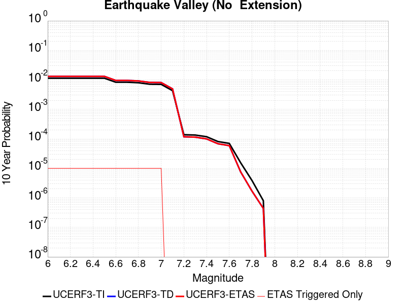 |

| Magnitude | 1 wk TI Prob | 1 wk TD Prob | 1 wk ETAS Prob | 1 wk ETAS/TD Gain | 1 wk ETAS Triggered Only | 1 mo TI Prob | 1 mo TD Prob | 1 mo ETAS Prob | 1 mo ETAS/TD Gain | 1 mo ETAS Triggered Only | 1 yr TI Prob | 1 yr TD Prob | 1 yr ETAS Prob | 1 yr ETAS/TD Gain | 1 yr ETAS Triggered Only | 10 yr TI Prob | 10 yr TD Prob | 10 yr ETAS Prob | 10 yr ETAS/TD Gain | 10 yr ETAS Triggered Only |
|-----|-----|-----|-----|-----|-----|-----|-----|-----|-----|-----|-----|-----|-----|-----|-----|-----|-----|-----|-----|-----|
| 6.0 | 2.1859703E-5 | 2.5198362E-5 | 2.5198362E-5 | 1.0 | 0.0 | 9.3681076E-5 | 1.07989326E-4 | 1.07989326E-4 | 1.0 | 0.0 | 0.0011399703 | 0.001314122 | 0.0013241089 | 1.0075996 | 1.0E-5 | 0.011341401 | 0.013077871 | 0.01308774 | 1.0007546 | 1.0E-5 |
| 6.1 | 2.1859703E-5 | 2.5198362E-5 | 2.5198362E-5 | 1.0 | 0.0 | 9.3681076E-5 | 1.07989326E-4 | 1.07989326E-4 | 1.0 | 0.0 | 0.0011399703 | 0.001314122 | 0.0013241089 | 1.0075996 | 1.0E-5 | 0.011341401 | 0.013077871 | 0.01308774 | 1.0007546 | 1.0E-5 |
| 6.2 | 2.1859703E-5 | 2.5198362E-5 | 2.5198362E-5 | 1.0 | 0.0 | 9.3681076E-5 | 1.07989326E-4 | 1.07989326E-4 | 1.0 | 0.0 | 0.0011399703 | 0.001314122 | 0.0013241089 | 1.0075996 | 1.0E-5 | 0.011341401 | 0.013077871 | 0.01308774 | 1.0007546 | 1.0E-5 |
| 6.3 | 2.1859703E-5 | 2.5198362E-5 | 2.5198362E-5 | 1.0 | 0.0 | 9.3681076E-5 | 1.07989326E-4 | 1.07989326E-4 | 1.0 | 0.0 | 0.0011399703 | 0.001314122 | 0.0013241089 | 1.0075996 | 1.0E-5 | 0.011341401 | 0.013077871 | 0.01308774 | 1.0007546 | 1.0E-5 |
| 6.4 | 2.1859703E-5 | 2.5198362E-5 | 2.5198362E-5 | 1.0 | 0.0 | 9.3681076E-5 | 1.07989326E-4 | 1.07989326E-4 | 1.0 | 0.0 | 0.0011399703 | 0.001314122 | 0.0013241089 | 1.0075996 | 1.0E-5 | 0.011341401 | 0.013077871 | 0.01308774 | 1.0007546 | 1.0E-5 |
| 6.5 | 2.1859703E-5 | 2.5198362E-5 | 2.5198362E-5 | 1.0 | 0.0 | 9.3681076E-5 | 1.07989326E-4 | 1.07989326E-4 | 1.0 | 0.0 | 0.0011399703 | 0.001314122 | 0.0013241089 | 1.0075996 | 1.0E-5 | 0.011341401 | 0.013077871 | 0.01308774 | 1.0007546 | 1.0E-5 |
| 6.6 | 1.597E-5 | 1.8356275E-5 | 1.8356275E-5 | 1.0 | 0.0 | 6.8441055E-5 | 7.866787E-5 | 7.866787E-5 | 1.0 | 0.0 | 8.329513E-4 | 9.574478E-4 | 9.674382E-4 | 1.0104344 | 1.0E-5 | 0.008298361 | 0.009541836 | 0.00955174 | 1.0010381 | 1.0E-5 |
| 6.7 | 1.597E-5 | 1.8356275E-5 | 1.8356275E-5 | 1.0 | 0.0 | 6.8441055E-5 | 7.866787E-5 | 7.866787E-5 | 1.0 | 0.0 | 8.329513E-4 | 9.574478E-4 | 9.674382E-4 | 1.0104344 | 1.0E-5 | 0.008298361 | 0.009541836 | 0.00955174 | 1.0010381 | 1.0E-5 |
| 6.8 | 1.5315149E-5 | 1.7602091E-5 | 1.7602091E-5 | 1.0 | 0.0 | 6.5634704E-5 | 7.543584E-5 | 7.543584E-5 | 1.0 | 0.0 | 7.988095E-4 | 9.181311E-4 | 9.281219E-4 | 1.0108817 | 1.0E-5 | 0.007959441 | 0.009151919 | 0.009161827 | 1.0010827 | 1.0E-5 |
| 6.9 | 1.3634728E-5 | 1.5675821E-5 | 1.5675821E-5 | 1.0 | 0.0 | 5.8433237E-5 | 6.718082E-5 | 6.718082E-5 | 1.0 | 0.0 | 7.1119244E-4 | 8.177017E-4 | 8.276935E-4 | 1.0122194 | 1.0E-5 | 0.007089207 | 0.008155 | 0.008164919 | 1.0012163 | 1.0E-5 |
| 7.0 | 1.3496271E-5 | 1.5517853E-5 | 1.5517853E-5 | 1.0 | 0.0 | 5.783988E-5 | 6.650385E-5 | 6.650385E-5 | 1.0 | 0.0 | 7.03973E-4 | 8.094657E-4 | 8.1945764E-4 | 1.0123439 | 1.0E-5 | 0.007017471 | 0.0080732405 | 0.00808316 | 1.0012287 | 1.0E-5 |
| 7.1 | 8.242798E-6 | 9.4726E-6 | 9.4726E-6 | 1.0 | 0.0 | 3.53258E-5 | 4.0596606E-5 | 4.0596606E-5 | 1.0 | 0.0 | 4.300067E-4 | 4.9421866E-4 | 4.9421866E-4 | 1.0 | 0.0 | 0.004291756 | 0.0049377717 | 0.0049377717 | 1.0 | 0.0 |
| 7.2 | 2.6506527E-7 | 2.2560312E-7 | 2.2560312E-7 | 1.0 | 0.0 | 1.1359936E-6 | 9.668702E-7 | 9.668702E-7 | 1.0 | 0.0 | 1.3830633E-5 | 1.17715845E-5 | 1.17715845E-5 | 1.0 | 0.0 | 1.3829772E-4 | 1.1771003E-4 | 1.1771003E-4 | 1.0 | 0.0 |
| 7.3 | 2.5810488E-7 | 2.1955442E-7 | 2.1955442E-7 | 1.0 | 0.0 | 1.1061633E-6 | 9.409472E-7 | 9.409472E-7 | 1.0 | 0.0 | 1.3467455E-5 | 1.1455976E-5 | 1.1455976E-5 | 1.0 | 0.0 | 1.3466639E-4 | 1.1455427E-4 | 1.1455427E-4 | 1.0 | 0.0 |
| 7.4 | 2.2676066E-7 | 1.9110601E-7 | 1.9110601E-7 | 1.0 | 0.0 | 9.71831E-7 | 8.190255E-7 | 8.190255E-7 | 1.0 | 0.0 | 1.1831979E-5 | 9.9715935E-6 | 9.9715935E-6 | 1.0 | 0.0 | 1.1831349E-4 | 9.9711855E-5 | 9.9711855E-5 | 1.0 | 0.0 |
| 7.5 | 1.5553917E-7 | 1.3112096E-7 | 1.3112096E-7 | 1.0 | 0.0 | 6.6659624E-7 | 5.619469E-7 | 5.619469E-7 | 1.0 | 0.0 | 8.115779E-6 | 6.8416834E-6 | 6.8416834E-6 | 1.0 | 0.0 | 8.115482E-5 | 6.841495E-5 | 6.841495E-5 | 1.0 | 0.0 |
| 7.6 | 1.3448629E-7 | 1.1288419E-7 | 1.1288419E-7 | 1.0 | 0.0 | 5.7636964E-7 | 4.837893E-7 | 4.837893E-7 | 1.0 | 0.0 | 7.017278E-6 | 5.890121E-6 | 5.890121E-6 | 1.0 | 0.0 | 7.0170565E-5 | 5.889986E-5 | 5.889986E-5 | 1.0 | 0.0 |
| 7.7 | 2.9719402E-8 | 1.458206E-8 | 1.458206E-8 | 1.0 | 0.0 | 1.2736886E-7 | 6.249454E-8 | 6.249454E-8 | 1.0 | 0.0 | 1.5507147E-6 | 7.608708E-7 | 7.608708E-7 | 1.0 | 0.0 | 1.550704E-5 | 7.6086876E-6 | 7.6086876E-6 | 1.0 | 0.0 |
| 7.8 | 7.4390196E-9 | 3.2502152E-9 | 3.2502152E-9 | 1.0 | 0.0 | 3.1881513E-8 | 1.3929493E-8 | 1.3929493E-8 | 1.0 | 0.0 | 3.8815733E-7 | 1.6959156E-7 | 1.6959156E-7 | 1.0 | 0.0 | 3.8815665E-6 | 1.6959145E-6 | 1.6959145E-6 | 1.0 | 0.0 |
| 7.9 | 1.5373532E-9 | 8.440161E-10 | 8.440161E-10 | 1.0 | 0.0 | 6.5886567E-9 | 3.6172119E-9 | 3.6172119E-9 | 1.0 | 0.0 | 8.021689E-8 | 4.4039556E-8 | 4.4039556E-8 | 1.0 | 0.0 | 8.0216864E-7 | 4.4039552E-7 | 4.4039552E-7 | 1.0 | 0.0 |

## Shoreline
*[(top)](#table-of-contents)*

| 1 Week | 1 Month | 1 Year | 10 Year |
|-----|-----|-----|-----|
|  |  |  |  |

| Magnitude | 1 wk TI Prob | 1 wk TD Prob | 1 wk ETAS Prob | 1 wk ETAS/TD Gain | 1 wk ETAS Triggered Only | 1 mo TI Prob | 1 mo TD Prob | 1 mo ETAS Prob | 1 mo ETAS/TD Gain | 1 mo ETAS Triggered Only | 1 yr TI Prob | 1 yr TD Prob | 1 yr ETAS Prob | 1 yr ETAS/TD Gain | 1 yr ETAS Triggered Only | 10 yr TI Prob | 10 yr TD Prob | 10 yr ETAS Prob | 10 yr ETAS/TD Gain | 10 yr ETAS Triggered Only |
|-----|-----|-----|-----|-----|-----|-----|-----|-----|-----|-----|-----|-----|-----|-----|-----|-----|-----|-----|-----|-----|
| 6.0 | 3.9888673E-6 | 4.047929E-6 | 1.4047889E-5 | 3.4703891 | 1.0E-5 | 1.7095033E-5 | 1.7348184E-5 | 2.734801E-5 | 1.5764192 | 1.0E-5 | 2.0811215E-4 | 2.1119925E-4 | 2.2119714E-4 | 1.0473386 | 1.0E-5 | 0.0020791737 | 0.002110534 | 0.002120513 | 1.0047281 | 1.0E-5 |
| 6.1 | 3.9888673E-6 | 4.047929E-6 | 1.4047889E-5 | 3.4703891 | 1.0E-5 | 1.7095033E-5 | 1.7348184E-5 | 2.734801E-5 | 1.5764192 | 1.0E-5 | 2.0811215E-4 | 2.1119925E-4 | 2.2119714E-4 | 1.0473386 | 1.0E-5 | 0.0020791737 | 0.002110534 | 0.002120513 | 1.0047281 | 1.0E-5 |
| 6.2 | 1.4039653E-6 | 1.4100891E-6 | 1.4100891E-6 | 1.0 | 0.0 | 6.0169805E-6 | 6.0432253E-6 | 6.0432253E-6 | 1.0 | 0.0 | 7.325427E-5 | 7.357384E-5 | 7.357384E-5 | 1.0 | 0.0 | 7.3230127E-4 | 7.355009E-4 | 7.355009E-4 | 1.0 | 0.0 |
| 6.3 | 1.4039653E-6 | 1.4100891E-6 | 1.4100891E-6 | 1.0 | 0.0 | 6.0169805E-6 | 6.0432253E-6 | 6.0432253E-6 | 1.0 | 0.0 | 7.325427E-5 | 7.357384E-5 | 7.357384E-5 | 1.0 | 0.0 | 7.3230127E-4 | 7.355009E-4 | 7.355009E-4 | 1.0 | 0.0 |
| 6.4 | 1.3314152E-6 | 1.3361605E-6 | 1.3361605E-6 | 1.0 | 0.0 | 5.7060524E-6 | 5.7263896E-6 | 5.7263896E-6 | 1.0 | 0.0 | 6.946897E-5 | 6.971662E-5 | 6.971662E-5 | 1.0 | 0.0 | 6.9447263E-4 | 6.9695286E-4 | 6.9695286E-4 | 1.0 | 0.0 |
| 6.5 | 1.1187026E-6 | 1.120364E-6 | 1.120364E-6 | 1.0 | 0.0 | 4.794431E-6 | 4.8015513E-6 | 4.8015513E-6 | 1.0 | 0.0 | 5.8370628E-5 | 5.8457343E-5 | 5.8457343E-5 | 1.0 | 0.0 | 5.83553E-4 | 5.844222E-4 | 5.844222E-4 | 1.0 | 0.0 |
| 6.6 | 9.793089E-7 | 9.784919E-7 | 9.784919E-7 | 1.0 | 0.0 | 4.1970316E-6 | 4.1935305E-6 | 4.1935305E-6 | 1.0 | 0.0 | 5.1097657E-5 | 5.105505E-5 | 5.105505E-5 | 1.0 | 0.0 | 5.108591E-4 | 5.1043445E-4 | 5.1043445E-4 | 1.0 | 0.0 |
| 6.7 | 8.995986E-7 | 8.9728E-7 | 8.9728E-7 | 1.0 | 0.0 | 3.8554167E-6 | 3.84548E-6 | 3.84548E-6 | 1.0 | 0.0 | 4.693869E-5 | 4.6817724E-5 | 4.6817724E-5 | 1.0 | 0.0 | 4.6928777E-4 | 4.6807955E-4 | 4.6807955E-4 | 1.0 | 0.0 |
| 6.8 | 7.931612E-7 | 7.8804027E-7 | 7.8804027E-7 | 1.0 | 0.0 | 3.3992578E-6 | 3.377311E-6 | 3.377311E-6 | 1.0 | 0.0 | 4.1385178E-5 | 4.1117994E-5 | 4.1117994E-5 | 1.0 | 0.0 | 4.1377472E-4 | 4.1110438E-4 | 4.1110438E-4 | 1.0 | 0.0 |
| 6.9 | 7.1465956E-7 | 7.078006E-7 | 7.078006E-7 | 1.0 | 0.0 | 3.062823E-6 | 3.0334277E-6 | 3.0334277E-6 | 1.0 | 0.0 | 3.7289232E-5 | 3.6931357E-5 | 3.6931357E-5 | 1.0 | 0.0 | 3.7282976E-4 | 3.6925258E-4 | 3.6925258E-4 | 1.0 | 0.0 |
| 7.0 | 6.389046E-7 | 6.299458E-7 | 6.299458E-7 | 1.0 | 0.0 | 2.7381598E-6 | 2.699765E-6 | 2.699765E-6 | 1.0 | 0.0 | 3.3336586E-5 | 3.2869146E-5 | 3.2869146E-5 | 1.0 | 0.0 | 3.3331584E-4 | 3.2864307E-4 | 3.2864307E-4 | 1.0 | 0.0 |
| 7.1 | 5.4300875E-7 | 5.3111313E-7 | 5.3111313E-7 | 1.0 | 0.0 | 2.3271782E-6 | 2.276197E-6 | 2.276197E-6 | 1.0 | 0.0 | 2.8333026E-5 | 2.7712347E-5 | 2.7712347E-5 | 1.0 | 0.0 | 2.8329415E-4 | 2.77089E-4 | 2.77089E-4 | 1.0 | 0.0 |
| 7.2 | 4.6768855E-7 | 4.5348952E-7 | 4.5348952E-7 | 1.0 | 0.0 | 2.0043778E-6 | 1.9435251E-6 | 1.9435251E-6 | 1.0 | 0.0 | 2.4403027E-5 | 2.3662162E-5 | 2.3662162E-5 | 1.0 | 0.0 | 2.4400349E-4 | 2.3659648E-4 | 2.3659648E-4 | 1.0 | 0.0 |
| 7.3 | 4.0966103E-7 | 3.9385662E-7 | 3.9385662E-7 | 1.0 | 0.0 | 1.7556889E-6 | 1.6879559E-6 | 1.6879559E-6 | 1.0 | 0.0 | 2.1375303E-5 | 2.055067E-5 | 2.055067E-5 | 1.0 | 0.0 | 2.1373246E-4 | 2.0548773E-4 | 2.0548773E-4 | 1.0 | 0.0 |
| 7.4 | 3.5105785E-7 | 3.3363975E-7 | 3.3363975E-7 | 1.0 | 0.0 | 1.5045327E-6 | 1.4298838E-6 | 1.4298838E-6 | 1.0 | 0.0 | 1.8317533E-5 | 1.7408696E-5 | 1.7408696E-5 | 1.0 | 0.0 | 1.8316023E-4 | 1.7407336E-4 | 1.7407336E-4 | 1.0 | 0.0 |
| 7.5 | 2.8737534E-7 | 2.6820038E-7 | 2.6820038E-7 | 1.0 | 0.0 | 1.2316079E-6 | 1.1494297E-6 | 1.1494297E-6 | 1.0 | 0.0 | 1.4994724E-5 | 1.3994217E-5 | 1.3994217E-5 | 1.0 | 0.0 | 1.4993713E-4 | 1.3993339E-4 | 1.3993339E-4 | 1.0 | 0.0 |
| 7.6 | 2.0924051E-7 | 1.8778988E-7 | 1.8778988E-7 | 1.0 | 0.0 | 8.967448E-7 | 8.048135E-7 | 8.048135E-7 | 1.0 | 0.0 | 1.0917813E-5 | 9.79856E-6 | 9.79856E-6 | 1.0 | 0.0 | 1.0917276E-4 | 9.798129E-5 | 9.798129E-5 | 1.0 | 0.0 |
| 7.7 | 1.392265E-7 | 1.15433906E-7 | 1.15433906E-7 | 1.0 | 0.0 | 5.9668486E-7 | 4.9471663E-7 | 4.9471663E-7 | 1.0 | 0.0 | 7.2646135E-6 | 6.023158E-6 | 6.023158E-6 | 1.0 | 0.0 | 7.2643765E-5 | 6.0229955E-5 | 6.0229955E-5 | 1.0 | 0.0 |
| 7.8 | 8.1080074E-8 | 5.586722E-8 | 5.586722E-8 | 1.0 | 0.0 | 3.4748598E-7 | 2.394309E-7 | 2.394309E-7 | 1.0 | 0.0 | 4.2306337E-6 | 2.9150672E-6 | 2.9150672E-6 | 1.0 | 0.0 | 4.230553E-5 | 2.9150291E-5 | 2.9150291E-5 | 1.0 | 0.0 |
| 7.9 | 5.0859036E-8 | 2.7244445E-8 | 2.7244445E-8 | 1.0 | 0.0 | 2.1796728E-7 | 1.16761896E-7 | 1.16761896E-7 | 1.0 | 0.0 | 2.6537484E-6 | 1.4215751E-6 | 1.4215751E-6 | 1.0 | 0.0 | 2.6537167E-5 | 1.4215661E-5 | 1.4215661E-5 | 1.0 | 0.0 |
| 8.0 | 3.1760536E-8 | 1.3577206E-8 | 1.3577206E-8 | 1.0 | 0.0 | 1.3611657E-7 | 5.8188025E-8 | 5.8188025E-8 | 1.0 | 0.0 | 1.6572179E-6 | 7.0843896E-7 | 7.0843896E-7 | 1.0 | 0.0 | 1.6572056E-5 | 7.084367E-6 | 7.084367E-6 | 1.0 | 0.0 |
| 8.1 | 1.2947896E-8 | 5.6628693E-9 | 5.6628693E-9 | 1.0 | 0.0 | 5.5490982E-8 | 2.426944E-8 | 2.426944E-8 | 1.0 | 0.0 | 6.756025E-7 | 2.954804E-7 | 2.954804E-7 | 1.0 | 0.0 | 6.7560045E-6 | 2.9548003E-6 | 2.9548003E-6 | 1.0 | 0.0 |

## Great Valley 07 (Orestimba)
*[(top)](#table-of-contents)*

| 1 Week | 1 Month | 1 Year | 10 Year |
|-----|-----|-----|-----|
|  |  |  |  |

| Magnitude | 1 wk TI Prob | 1 wk TD Prob | 1 wk ETAS Prob | 1 wk ETAS/TD Gain | 1 wk ETAS Triggered Only | 1 mo TI Prob | 1 mo TD Prob | 1 mo ETAS Prob | 1 mo ETAS/TD Gain | 1 mo ETAS Triggered Only | 1 yr TI Prob | 1 yr TD Prob | 1 yr ETAS Prob | 1 yr ETAS/TD Gain | 1 yr ETAS Triggered Only | 10 yr TI Prob | 10 yr TD Prob | 10 yr ETAS Prob | 10 yr ETAS/TD Gain | 10 yr ETAS Triggered Only |
|-----|-----|-----|-----|-----|-----|-----|-----|-----|-----|-----|-----|-----|-----|-----|-----|-----|-----|-----|-----|-----|
| 6.0 | 2.9687902E-5 | 3.27575E-5 | 3.27575E-5 | 1.0 | 0.0 | 1.2722766E-4 | 1.4038214E-4 | 1.4038214E-4 | 1.0 | 0.0 | 0.0015478961 | 0.0017078844 | 0.0017078844 | 1.0 | 0.0 | 0.015371585 | 0.016955135 | 0.016964966 | 1.0005798 | 1.0E-5 |
| 6.1 | 2.9687902E-5 | 3.27575E-5 | 3.27575E-5 | 1.0 | 0.0 | 1.2722766E-4 | 1.4038214E-4 | 1.4038214E-4 | 1.0 | 0.0 | 0.0015478961 | 0.0017078844 | 0.0017078844 | 1.0 | 0.0 | 0.015371585 | 0.016955135 | 0.016964966 | 1.0005798 | 1.0E-5 |
| 6.2 | 1.9231524E-5 | 2.1159167E-5 | 2.1159167E-5 | 1.0 | 0.0 | 8.2418206E-5 | 9.067912E-5 | 9.067912E-5 | 1.0 | 0.0 | 0.0010029797 | 0.0011034822 | 0.0011034822 | 1.0 | 0.0 | 0.00998465 | 0.01098244 | 0.0109923305 | 1.0009005 | 1.0E-5 |
| 6.3 | 1.324766E-5 | 1.4548534E-5 | 1.4548534E-5 | 1.0 | 0.0 | 5.6774446E-5 | 6.234942E-5 | 6.234942E-5 | 1.0 | 0.0 | 6.910097E-4 | 7.5884897E-4 | 7.5884897E-4 | 1.0 | 0.0 | 0.006888649 | 0.0075635235 | 0.0075635235 | 1.0 | 0.0 |
| 6.4 | 7.818645E-6 | 8.57284E-6 | 8.57284E-6 | 1.0 | 0.0 | 3.3508048E-5 | 3.6740246E-5 | 3.6740246E-5 | 1.0 | 0.0 | 4.078841E-4 | 4.4722404E-4 | 4.4722404E-4 | 1.0 | 0.0 | 0.004071363 | 0.0044635804 | 0.0044635804 | 1.0 | 0.0 |
| 6.5 | 5.3076565E-6 | 5.8178007E-6 | 5.8178007E-6 | 1.0 | 0.0 | 2.27469E-5 | 2.4933206E-5 | 2.4933206E-5 | 1.0 | 0.0 | 2.7690834E-4 | 3.035216E-4 | 3.035216E-4 | 1.0 | 0.0 | 0.0027656353 | 0.00303128 | 0.00303128 | 1.0 | 0.0 |
| 6.6 | 3.6003578E-6 | 3.9484953E-6 | 3.9484953E-6 | 1.0 | 0.0 | 1.5430012E-5 | 1.6922022E-5 | 1.6922022E-5 | 1.0 | 0.0 | 1.8784421E-4 | 2.0600771E-4 | 2.0600771E-4 | 1.0 | 0.0 | 0.0018768552 | 0.0020583214 | 0.0020583214 | 1.0 | 0.0 |
| 6.7 | 2.5361826E-6 | 2.7834678E-6 | 2.7834678E-6 | 1.0 | 0.0 | 1.0869308E-5 | 1.1929101E-5 | 1.1929101E-5 | 1.0 | 0.0 | 1.3232579E-4 | 1.4522845E-4 | 1.4522845E-4 | 1.0 | 0.0 | 0.0013224703 | 0.0014514653 | 0.0014514653 | 1.0 | 0.0 |
| 6.8 | 1.2115831E-6 | 1.3313797E-6 | 1.3313797E-6 | 1.0 | 0.0 | 5.1924885E-6 | 5.7059065E-6 | 5.7059065E-6 | 1.0 | 0.0 | 6.3216714E-5 | 6.9468166E-5 | 6.9468166E-5 | 1.0 | 0.0 | 6.3198735E-4 | 6.945596E-4 | 6.945596E-4 | 1.0 | 0.0 |

## Pilarcitos 2011 CFM
*[(top)](#table-of-contents)*

| 1 Week | 1 Month | 1 Year | 10 Year |
|-----|-----|-----|-----|
|  | 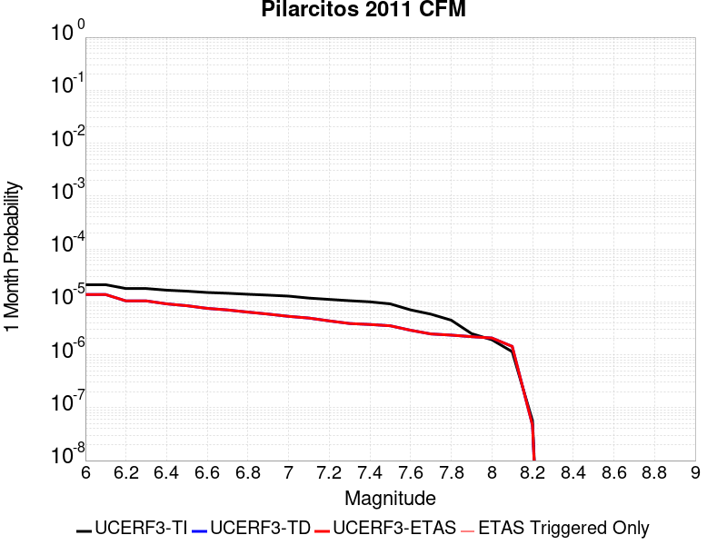 |  |  |

| Magnitude | 1 wk TI Prob | 1 wk TD Prob | 1 wk ETAS Prob | 1 wk ETAS/TD Gain | 1 wk ETAS Triggered Only | 1 mo TI Prob | 1 mo TD Prob | 1 mo ETAS Prob | 1 mo ETAS/TD Gain | 1 mo ETAS Triggered Only | 1 yr TI Prob | 1 yr TD Prob | 1 yr ETAS Prob | 1 yr ETAS/TD Gain | 1 yr ETAS Triggered Only | 10 yr TI Prob | 10 yr TD Prob | 10 yr ETAS Prob | 10 yr ETAS/TD Gain | 10 yr ETAS Triggered Only |
|-----|-----|-----|-----|-----|-----|-----|-----|-----|-----|-----|-----|-----|-----|-----|-----|-----|-----|-----|-----|-----|
| 6.0 | 4.9150476E-6 | 3.2017424E-6 | 3.2017424E-6 | 1.0 | 0.0 | 2.1064321E-5 | 1.3721682E-5 | 1.3721682E-5 | 1.0 | 0.0 | 2.564279E-4 | 1.6704899E-4 | 1.6704899E-4 | 1.0 | 0.0 | 0.0025613222 | 0.0016816824 | 0.0016916656 | 1.0059364 | 1.0E-5 |
| 6.1 | 4.9150476E-6 | 3.2017424E-6 | 3.2017424E-6 | 1.0 | 0.0 | 2.1064321E-5 | 1.3721682E-5 | 1.3721682E-5 | 1.0 | 0.0 | 2.564279E-4 | 1.6704899E-4 | 1.6704899E-4 | 1.0 | 0.0 | 0.0025613222 | 0.0016816824 | 0.0016916656 | 1.0059364 | 1.0E-5 |
| 6.2 | 4.162343E-6 | 2.4301326E-6 | 2.4301326E-6 | 1.0 | 0.0 | 1.783849E-5 | 1.0414812E-5 | 1.0414812E-5 | 1.0 | 0.0 | 2.1716199E-4 | 1.2679303E-4 | 1.2679303E-4 | 1.0 | 0.0 | 0.002169499 | 0.0012796372 | 0.0012896244 | 1.0078048 | 1.0E-5 |
| 6.3 | 4.162343E-6 | 2.4301326E-6 | 2.4301326E-6 | 1.0 | 0.0 | 1.783849E-5 | 1.0414812E-5 | 1.0414812E-5 | 1.0 | 0.0 | 2.1716199E-4 | 1.2679303E-4 | 1.2679303E-4 | 1.0 | 0.0 | 0.002169499 | 0.0012796372 | 0.0012896244 | 1.0078048 | 1.0E-5 |
| 6.4 | 3.8768926E-6 | 2.137552E-6 | 2.137552E-6 | 1.0 | 0.0 | 1.6615148E-5 | 9.1609045E-6 | 9.1609045E-6 | 1.0 | 0.0 | 2.0227065E-4 | 1.1152835E-4 | 1.1152835E-4 | 1.0 | 0.0 | 0.0020208664 | 0.0011271521 | 0.0011371409 | 1.0088619 | 1.0E-5 |
| 6.5 | 3.7137002E-6 | 1.9709112E-6 | 1.9709112E-6 | 1.0 | 0.0 | 1.591576E-5 | 8.446735E-6 | 8.446735E-6 | 1.0 | 0.0 | 1.9375715E-4 | 1.0283417E-4 | 1.0283417E-4 | 1.0 | 0.0 | 0.001935883 | 0.0010402942 | 0.0010502838 | 1.0096027 | 1.0E-5 |
| 6.6 | 3.5048733E-6 | 1.7558658E-6 | 1.7558658E-6 | 1.0 | 0.0 | 1.5020799E-5 | 7.5251173E-6 | 7.5251173E-6 | 1.0 | 0.0 | 1.8286289E-4 | 9.161448E-5 | 9.161448E-5 | 1.0 | 0.0 | 0.0018271249 | 9.2819595E-4 | 9.2819595E-4 | 1.0 | 0.0 |
| 6.7 | 3.3908584E-6 | 1.6395577E-6 | 1.6395577E-6 | 1.0 | 0.0 | 1.453217E-5 | 7.026657E-6 | 7.026657E-6 | 1.0 | 0.0 | 1.7691481E-4 | 8.5546206E-5 | 8.5546206E-5 | 1.0 | 0.0 | 0.0017677402 | 8.675619E-4 | 8.675619E-4 | 1.0 | 0.0 |
| 6.8 | 3.2451449E-6 | 1.492779E-6 | 1.492779E-6 | 1.0 | 0.0 | 1.3907689E-5 | 6.3976086E-6 | 6.3976086E-6 | 1.0 | 0.0 | 1.6931296E-4 | 7.788811E-5 | 7.788811E-5 | 1.0 | 0.0 | 0.0016918402 | 7.910375E-4 | 7.910375E-4 | 1.0 | 0.0 |
| 6.9 | 3.1239128E-6 | 1.3693062E-6 | 1.3693062E-6 | 1.0 | 0.0 | 1.3388129E-5 | 5.868442E-6 | 5.868442E-6 | 1.0 | 0.0 | 1.6298829E-4 | 7.1445946E-5 | 7.1445946E-5 | 1.0 | 0.0 | 0.001628688 | 7.2665967E-4 | 7.2665967E-4 | 1.0 | 0.0 |
| 7.0 | 2.9940109E-6 | 1.2406205E-6 | 1.2406205E-6 | 1.0 | 0.0 | 1.2831412E-5 | 5.3169338E-6 | 5.3169338E-6 | 1.0 | 0.0 | 1.5621124E-4 | 6.473174E-5 | 6.473174E-5 | 1.0 | 0.0 | 0.0015610148 | 6.5955904E-4 | 6.5955904E-4 | 1.0 | 0.0 |
| 7.1 | 2.7471217E-6 | 1.1523518E-6 | 1.1523518E-6 | 1.0 | 0.0 | 1.1773326E-5 | 4.9386413E-6 | 4.9386413E-6 | 1.0 | 0.0 | 1.4333082E-4 | 6.01263E-5 | 6.01263E-5 | 1.0 | 0.0 | 0.001432384 | 6.134784E-4 | 6.134784E-4 | 1.0 | 0.0 |
| 7.2 | 2.592675E-6 | 1.0184039E-6 | 1.0184039E-6 | 1.0 | 0.0 | 1.1111417E-5 | 4.3645805E-6 | 4.3645805E-6 | 1.0 | 0.0 | 1.3527309E-4 | 5.3137475E-5 | 5.3137475E-5 | 1.0 | 0.0 | 0.0013519078 | 5.436265E-4 | 5.436265E-4 | 1.0 | 0.0 |
| 7.3 | 2.4518663E-6 | 9.093615E-7 | 9.093615E-7 | 1.0 | 0.0 | 1.0507956E-5 | 3.897258E-6 | 3.897258E-6 | 1.0 | 0.0 | 1.2792686E-4 | 4.744808E-5 | 4.744808E-5 | 1.0 | 0.0 | 0.0012785323 | 4.8675635E-4 | 4.8675635E-4 | 1.0 | 0.0 |
| 7.4 | 2.3349535E-6 | 8.7153666E-7 | 8.7153666E-7 | 1.0 | 0.0 | 1.0006905E-5 | 3.7351517E-6 | 3.7351517E-6 | 1.0 | 0.0 | 1.2182725E-4 | 4.5474524E-5 | 4.5474524E-5 | 1.0 | 0.0 | 0.0012176048 | 4.6700423E-4 | 4.6700423E-4 | 1.0 | 0.0 |
| 7.5 | 2.1358665E-6 | 8.235929E-7 | 8.235929E-7 | 1.0 | 0.0 | 9.15368E-6 | 3.5296791E-6 | 3.5296791E-6 | 1.0 | 0.0 | 1.11440364E-4 | 4.2972995E-5 | 4.2972995E-5 | 1.0 | 0.0 | 0.0011138449 | 4.4190476E-4 | 4.4190476E-4 | 1.0 | 0.0 |
| 7.6 | 1.6445446E-6 | 6.778194E-7 | 6.778194E-7 | 1.0 | 0.0 | 7.048029E-6 | 2.9049368E-6 | 2.9049368E-6 | 1.0 | 0.0 | 8.580638E-5 | 3.5367033E-5 | 3.5367033E-5 | 1.0 | 0.0 | 8.5773255E-4 | 3.6580398E-4 | 3.6580398E-4 | 1.0 | 0.0 |
| 7.7 | 1.3650961E-6 | 5.771466E-7 | 5.771466E-7 | 1.0 | 0.0 | 5.850399E-6 | 2.473483E-6 | 2.473483E-6 | 1.0 | 0.0 | 7.122628E-5 | 3.011424E-5 | 3.011424E-5 | 1.0 | 0.0 | 7.120345E-4 | 3.1317407E-4 | 3.1317407E-4 | 1.0 | 0.0 |
| 7.8 | 1.0500993E-6 | 5.487217E-7 | 5.487217E-7 | 1.0 | 0.0 | 4.5004176E-6 | 2.3516623E-6 | 2.3516623E-6 | 1.0 | 0.0 | 5.4791206E-5 | 2.8631113E-5 | 2.8631113E-5 | 1.0 | 0.0 | 5.47777E-4 | 2.982153E-4 | 2.982153E-4 | 1.0 | 0.0 |
| 7.9 | 5.856431E-7 | 5.1290885E-7 | 5.1290885E-7 | 1.0 | 0.0 | 2.5098966E-6 | 2.198179E-6 | 2.198179E-6 | 1.0 | 0.0 | 3.0557563E-5 | 2.67625E-5 | 2.67625E-5 | 1.0 | 0.0 | 3.055336E-4 | 2.7879118E-4 | 2.7879118E-4 | 1.0 | 0.0 |
| 8.0 | 4.4768265E-7 | 4.8356026E-7 | 4.8356026E-7 | 1.0 | 0.0 | 1.9186384E-6 | 2.0723996E-6 | 2.0723996E-6 | 1.0 | 0.0 | 2.3359173E-5 | 2.5231173E-5 | 2.5231173E-5 | 1.0 | 0.0 | 2.3356717E-4 | 2.629472E-4 | 2.629472E-4 | 1.0 | 0.0 |
| 8.1 | 2.6692538E-7 | 3.3572923E-7 | 3.3572923E-7 | 1.0 | 0.0 | 1.1439654E-6 | 1.4388387E-6 | 1.4388387E-6 | 1.0 | 0.0 | 1.392769E-5 | 1.7517721E-5 | 1.7517721E-5 | 1.0 | 0.0 | 1.3926817E-4 | 1.8253834E-4 | 1.8253834E-4 | 1.0 | 0.0 |
| 8.2 | 1.3198862E-8 | 1.0825354E-8 | 1.0825354E-8 | 1.0 | 0.0 | 5.656655E-8 | 4.6394376E-8 | 4.6394376E-8 | 1.0 | 0.0 | 6.886975E-7 | 5.648514E-7 | 5.648514E-7 | 1.0 | 0.0 | 6.8869535E-6 | 5.8803653E-6 | 5.8803653E-6 | 1.0 | 0.0 |

## Morales (West)
*[(top)](#table-of-contents)*

| 1 Week | 1 Month | 1 Year | 10 Year |
|-----|-----|-----|-----|
|  |  |  |  |

| Magnitude | 1 wk TI Prob | 1 wk TD Prob | 1 wk ETAS Prob | 1 wk ETAS/TD Gain | 1 wk ETAS Triggered Only | 1 mo TI Prob | 1 mo TD Prob | 1 mo ETAS Prob | 1 mo ETAS/TD Gain | 1 mo ETAS Triggered Only | 1 yr TI Prob | 1 yr TD Prob | 1 yr ETAS Prob | 1 yr ETAS/TD Gain | 1 yr ETAS Triggered Only | 10 yr TI Prob | 10 yr TD Prob | 10 yr ETAS Prob | 10 yr ETAS/TD Gain | 10 yr ETAS Triggered Only |
|-----|-----|-----|-----|-----|-----|-----|-----|-----|-----|-----|-----|-----|-----|-----|-----|-----|-----|-----|-----|-----|
| 6.0 | 1.4027072E-6 | 1.4791576E-6 | 1.4791576E-6 | 1.0 | 0.0 | 6.0115885E-6 | 6.339236E-6 | 6.339236E-6 | 1.0 | 0.0 | 7.318863E-5 | 7.7178156E-5 | 8.717739E-5 | 1.1295604 | 1.0E-5 | 7.316453E-4 | 7.715821E-4 | 7.815744E-4 | 1.0129504 | 1.0E-5 |
| 6.1 | 1.4027072E-6 | 1.4791576E-6 | 1.4791576E-6 | 1.0 | 0.0 | 6.0115885E-6 | 6.339236E-6 | 6.339236E-6 | 1.0 | 0.0 | 7.318863E-5 | 7.7178156E-5 | 8.717739E-5 | 1.1295604 | 1.0E-5 | 7.316453E-4 | 7.715821E-4 | 7.815744E-4 | 1.0129504 | 1.0E-5 |
| 6.2 | 1.4027072E-6 | 1.4791576E-6 | 1.4791576E-6 | 1.0 | 0.0 | 6.0115885E-6 | 6.339236E-6 | 6.339236E-6 | 1.0 | 0.0 | 7.318863E-5 | 7.7178156E-5 | 8.717739E-5 | 1.1295604 | 1.0E-5 | 7.316453E-4 | 7.715821E-4 | 7.815744E-4 | 1.0129504 | 1.0E-5 |
| 6.3 | 1.4027072E-6 | 1.4791576E-6 | 1.4791576E-6 | 1.0 | 0.0 | 6.0115885E-6 | 6.339236E-6 | 6.339236E-6 | 1.0 | 0.0 | 7.318863E-5 | 7.7178156E-5 | 8.717739E-5 | 1.1295604 | 1.0E-5 | 7.316453E-4 | 7.715821E-4 | 7.815744E-4 | 1.0129504 | 1.0E-5 |
| 6.4 | 6.504502E-7 | 7.2038824E-7 | 7.2038824E-7 | 1.0 | 0.0 | 2.7876408E-6 | 3.0873746E-6 | 3.0873746E-6 | 1.0 | 0.0 | 3.3939E-5 | 3.758815E-5 | 3.758815E-5 | 1.0 | 0.0 | 3.3933815E-4 | 3.758191E-4 | 3.758191E-4 | 1.0 | 0.0 |
| 6.5 | 6.504502E-7 | 7.2038824E-7 | 7.2038824E-7 | 1.0 | 0.0 | 2.7876408E-6 | 3.0873746E-6 | 3.0873746E-6 | 1.0 | 0.0 | 3.3939E-5 | 3.758815E-5 | 3.758815E-5 | 1.0 | 0.0 | 3.3933815E-4 | 3.758191E-4 | 3.758191E-4 | 1.0 | 0.0 |
| 6.6 | 5.8056526E-7 | 6.500143E-7 | 6.500143E-7 | 1.0 | 0.0 | 2.4881344E-6 | 2.7857725E-6 | 2.7857725E-6 | 1.0 | 0.0 | 3.0292615E-5 | 3.3916258E-5 | 3.3916258E-5 | 1.0 | 0.0 | 3.0288487E-4 | 3.3911143E-4 | 3.3911143E-4 | 1.0 | 0.0 |
| 6.7 | 5.741448E-7 | 6.435454E-7 | 6.435454E-7 | 1.0 | 0.0 | 2.4606184E-6 | 2.7580488E-6 | 2.7580488E-6 | 1.0 | 0.0 | 2.9957617E-5 | 3.3578734E-5 | 3.3578734E-5 | 1.0 | 0.0 | 2.9953578E-4 | 3.357372E-4 | 3.357372E-4 | 1.0 | 0.0 |
| 6.8 | 5.299428E-7 | 5.8909023E-7 | 5.8909023E-7 | 1.0 | 0.0 | 2.2711813E-6 | 2.52467E-6 | 2.52467E-6 | 1.0 | 0.0 | 2.7651282E-5 | 3.073743E-5 | 3.073743E-5 | 1.0 | 0.0 | 2.7647841E-4 | 3.0733226E-4 | 3.0733226E-4 | 1.0 | 0.0 |
| 6.9 | 4.82394E-7 | 5.3416807E-7 | 5.3416807E-7 | 1.0 | 0.0 | 2.0674013E-6 | 2.2892896E-6 | 2.2892896E-6 | 1.0 | 0.0 | 2.517032E-5 | 2.7871749E-5 | 2.7871749E-5 | 1.0 | 0.0 | 2.516747E-4 | 2.7868294E-4 | 2.7868294E-4 | 1.0 | 0.0 |
| 7.0 | 4.3264512E-7 | 4.759864E-7 | 4.759864E-7 | 1.0 | 0.0 | 1.8541921E-6 | 2.0399402E-6 | 2.0399402E-6 | 1.0 | 0.0 | 2.2574555E-5 | 2.4835992E-5 | 2.4835992E-5 | 1.0 | 0.0 | 2.2572262E-4 | 2.4833248E-4 | 2.4833248E-4 | 1.0 | 0.0 |
| 7.1 | 3.7388565E-7 | 4.000384E-7 | 4.000384E-7 | 1.0 | 0.0 | 1.6023661E-6 | 1.7144492E-6 | 1.7144492E-6 | 1.0 | 0.0 | 1.9508632E-5 | 2.0873222E-5 | 2.0873222E-5 | 1.0 | 0.0 | 1.950692E-4 | 2.0871284E-4 | 2.0871284E-4 | 1.0 | 0.0 |
| 7.2 | 3.1592543E-7 | 3.3199075E-7 | 3.3199075E-7 | 1.0 | 0.0 | 1.3539654E-6 | 1.4228168E-6 | 1.4228168E-6 | 1.0 | 0.0 | 1.6484404E-5 | 1.7322658E-5 | 1.7322658E-5 | 1.0 | 0.0 | 1.6483181E-4 | 1.7321325E-4 | 1.7321325E-4 | 1.0 | 0.0 |
| 7.3 | 2.2677783E-7 | 2.1793869E-7 | 2.1793869E-7 | 1.0 | 0.0 | 9.719047E-7 | 9.3402264E-7 | 9.3402264E-7 | 1.0 | 0.0 | 1.1832874E-5 | 1.1371666E-5 | 1.1371666E-5 | 1.0 | 0.0 | 1.18322445E-4 | 1.1371089E-4 | 1.1371089E-4 | 1.0 | 0.0 |
| 7.4 | 1.2295531E-7 | 8.350771E-8 | 8.350771E-8 | 1.0 | 0.0 | 5.269512E-7 | 3.5789014E-7 | 3.5789014E-7 | 1.0 | 0.0 | 6.4156125E-6 | 4.3573036E-6 | 4.3573036E-6 | 1.0 | 0.0 | 6.415427E-5 | 4.357219E-5 | 4.357219E-5 | 1.0 | 0.0 |
| 7.5 | 9.9632544E-8 | 5.443089E-8 | 5.443089E-8 | 1.0 | 0.0 | 4.2699656E-7 | 2.3327522E-7 | 2.3327522E-7 | 1.0 | 0.0 | 5.198671E-6 | 2.840122E-6 | 2.840122E-6 | 1.0 | 0.0 | 5.198549E-5 | 2.8400864E-5 | 2.8400864E-5 | 1.0 | 0.0 |
| 7.6 | 8.125894E-8 | 3.594956E-8 | 3.594956E-8 | 1.0 | 0.0 | 3.4825257E-7 | 1.5406955E-7 | 1.5406955E-7 | 1.0 | 0.0 | 4.2399665E-6 | 1.8757952E-6 | 1.8757952E-6 | 1.0 | 0.0 | 4.2398857E-5 | 1.8757797E-5 | 1.8757797E-5 | 1.0 | 0.0 |
| 7.7 | 5.1810765E-8 | 1.1642662E-8 | 1.1642662E-8 | 1.0 | 0.0 | 2.2204613E-7 | 4.9897128E-8 | 4.9897128E-8 | 1.0 | 0.0 | 2.7034082E-6 | 6.074974E-7 | 6.074974E-7 | 1.0 | 0.0 | 2.7033753E-5 | 6.0749603E-6 | 6.0749603E-6 | 1.0 | 0.0 |
| 7.8 | 2.6315043E-8 | 2.3383624E-9 | 2.3383624E-9 | 1.0 | 0.0 | 1.1277875E-7 | 1.0021558E-8 | 1.0021558E-8 | 1.0 | 0.0 | 1.3730804E-6 | 1.2201247E-7 | 1.2201247E-7 | 1.0 | 0.0 | 1.3730719E-5 | 1.2201268E-6 | 1.2201268E-6 | 1.0 | 0.0 |
| 7.9 | 1.24281545E-8 | 4.207228E-10 | 4.207228E-10 | 1.0 | 0.0 | 5.3263516E-8 | 1.8031033E-9 | 1.8031033E-9 | 1.0 | 0.0 | 6.4848314E-7 | 2.1952776E-8 | 2.1952776E-8 | 1.0 | 0.0 | 6.4848123E-6 | 2.195305E-7 | 2.195305E-7 | 1.0 | 0.0 |
| 8.0 | 5.954214E-9 | 1.8509339E-10 | 1.8509339E-10 | 1.0 | 0.0 | 2.551806E-8 | 7.9326146E-10 | 7.9326146E-10 | 1.0 | 0.0 | 3.1068234E-7 | 9.657958E-9 | 9.657958E-9 | 1.0 | 0.0 | 3.1068191E-6 | 9.658236E-8 | 9.658236E-8 | 1.0 | 0.0 |
| 8.1 | 1.2586262E-9 | 8.346668E-11 | 8.346668E-11 | 1.0 | 0.0 | 5.3941123E-9 | 3.5771386E-10 | 3.5771386E-10 | 1.0 | 0.0 | 6.567332E-8 | 4.355168E-9 | 4.355168E-9 | 1.0 | 0.0 | 6.56733E-7 | 4.3554458E-8 | 4.3554458E-8 | 1.0 | 0.0 |

## Sisar
*[(top)](#table-of-contents)*

| 1 Week | 1 Month | 1 Year | 10 Year |
|-----|-----|-----|-----|
|  | 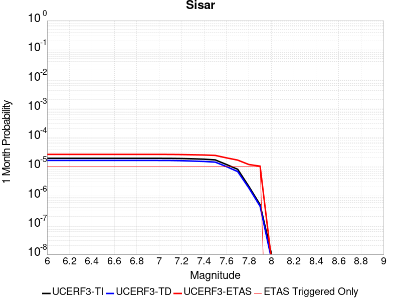 |  |  |

| Magnitude | 1 wk TI Prob | 1 wk TD Prob | 1 wk ETAS Prob | 1 wk ETAS/TD Gain | 1 wk ETAS Triggered Only | 1 mo TI Prob | 1 mo TD Prob | 1 mo ETAS Prob | 1 mo ETAS/TD Gain | 1 mo ETAS Triggered Only | 1 yr TI Prob | 1 yr TD Prob | 1 yr ETAS Prob | 1 yr ETAS/TD Gain | 1 yr ETAS Triggered Only | 10 yr TI Prob | 10 yr TD Prob | 10 yr ETAS Prob | 10 yr ETAS/TD Gain | 10 yr ETAS Triggered Only |
|-----|-----|-----|-----|-----|-----|-----|-----|-----|-----|-----|-----|-----|-----|-----|-----|-----|-----|-----|-----|-----|
| 6.0 | 4.544193E-6 | 3.839576E-6 | 1.3839538E-5 | 3.604444 | 1.0E-5 | 1.9474966E-5 | 1.6455224E-5 | 2.645506E-5 | 1.6076998 | 1.0E-5 | 2.3708193E-4 | 2.0032428E-4 | 2.1032228E-4 | 1.0499091 | 1.0E-5 | 0.0023682916 | 0.002001471 | 0.0020114507 | 1.0049863 | 1.0E-5 |
| 6.1 | 4.544193E-6 | 3.839576E-6 | 1.3839538E-5 | 3.604444 | 1.0E-5 | 1.9474966E-5 | 1.6455224E-5 | 2.645506E-5 | 1.6076998 | 1.0E-5 | 2.3708193E-4 | 2.0032428E-4 | 2.1032228E-4 | 1.0499091 | 1.0E-5 | 0.0023682916 | 0.002001471 | 0.0020114507 | 1.0049863 | 1.0E-5 |
| 6.2 | 4.544193E-6 | 3.839576E-6 | 1.3839538E-5 | 3.604444 | 1.0E-5 | 1.9474966E-5 | 1.6455224E-5 | 2.645506E-5 | 1.6076998 | 1.0E-5 | 2.3708193E-4 | 2.0032428E-4 | 2.1032228E-4 | 1.0499091 | 1.0E-5 | 0.0023682916 | 0.002001471 | 0.0020114507 | 1.0049863 | 1.0E-5 |
| 6.3 | 4.544193E-6 | 3.839576E-6 | 1.3839538E-5 | 3.604444 | 1.0E-5 | 1.9474966E-5 | 1.6455224E-5 | 2.645506E-5 | 1.6076998 | 1.0E-5 | 2.3708193E-4 | 2.0032428E-4 | 2.1032228E-4 | 1.0499091 | 1.0E-5 | 0.0023682916 | 0.002001471 | 0.0020114507 | 1.0049863 | 1.0E-5 |
| 6.4 | 4.544193E-6 | 3.839576E-6 | 1.3839538E-5 | 3.604444 | 1.0E-5 | 1.9474966E-5 | 1.6455224E-5 | 2.645506E-5 | 1.6076998 | 1.0E-5 | 2.3708193E-4 | 2.0032428E-4 | 2.1032228E-4 | 1.0499091 | 1.0E-5 | 0.0023682916 | 0.002001471 | 0.0020114507 | 1.0049863 | 1.0E-5 |
| 6.5 | 4.544193E-6 | 3.839576E-6 | 1.3839538E-5 | 3.604444 | 1.0E-5 | 1.9474966E-5 | 1.6455224E-5 | 2.645506E-5 | 1.6076998 | 1.0E-5 | 2.3708193E-4 | 2.0032428E-4 | 2.1032228E-4 | 1.0499091 | 1.0E-5 | 0.0023682916 | 0.002001471 | 0.0020114507 | 1.0049863 | 1.0E-5 |
| 6.6 | 4.544193E-6 | 3.839576E-6 | 1.3839538E-5 | 3.604444 | 1.0E-5 | 1.9474966E-5 | 1.6455224E-5 | 2.645506E-5 | 1.6076998 | 1.0E-5 | 2.3708193E-4 | 2.0032428E-4 | 2.1032228E-4 | 1.0499091 | 1.0E-5 | 0.0023682916 | 0.002001471 | 0.0020114507 | 1.0049863 | 1.0E-5 |
| 6.7 | 4.544193E-6 | 3.839576E-6 | 1.3839538E-5 | 3.604444 | 1.0E-5 | 1.9474966E-5 | 1.6455224E-5 | 2.645506E-5 | 1.6076998 | 1.0E-5 | 2.3708193E-4 | 2.0032428E-4 | 2.1032228E-4 | 1.0499091 | 1.0E-5 | 0.0023682916 | 0.002001471 | 0.0020114507 | 1.0049863 | 1.0E-5 |
| 6.8 | 4.544193E-6 | 3.839576E-6 | 1.3839538E-5 | 3.604444 | 1.0E-5 | 1.9474966E-5 | 1.6455224E-5 | 2.645506E-5 | 1.6076998 | 1.0E-5 | 2.3708193E-4 | 2.0032428E-4 | 2.1032228E-4 | 1.0499091 | 1.0E-5 | 0.0023682916 | 0.002001471 | 0.0020114507 | 1.0049863 | 1.0E-5 |
| 6.9 | 4.542225E-6 | 3.8375383E-6 | 1.38375E-5 | 3.6058273 | 1.0E-5 | 1.9466532E-5 | 1.6446491E-5 | 2.6446325E-5 | 1.6080225 | 1.0E-5 | 2.3697925E-4 | 2.0021795E-4 | 2.1021595E-4 | 1.0499356 | 1.0E-5 | 0.002367267 | 0.0020004094 | 0.0020103895 | 1.004989 | 1.0E-5 |
| 7.0 | 4.5278484E-6 | 3.822602E-6 | 1.3822564E-5 | 3.616009 | 1.0E-5 | 1.940492E-5 | 1.638248E-5 | 2.6382317E-5 | 1.6103982 | 1.0E-5 | 2.3622929E-4 | 1.9943877E-4 | 2.0943678E-4 | 1.0501307 | 1.0E-5 | 0.0023597833 | 0.0019926317 | 0.0020026118 | 1.0050085 | 1.0E-5 |
| 7.1 | 4.5132488E-6 | 3.8073897E-6 | 1.3807352E-5 | 3.6264615 | 1.0E-5 | 1.9342351E-5 | 1.6317284E-5 | 2.631712E-5 | 1.6128371 | 1.0E-5 | 2.3546767E-4 | 1.9864515E-4 | 2.0864318E-4 | 1.050331 | 1.0E-5 | 0.0023521832 | 0.0019847096 | 0.00199469 | 1.0050285 | 1.0E-5 |
| 7.2 | 4.448859E-6 | 3.7398502E-6 | 1.3739813E-5 | 3.673894 | 1.0E-5 | 1.9066398E-5 | 1.6027832E-5 | 2.6027672E-5 | 1.6239047 | 1.0E-5 | 2.3210866E-4 | 1.9512173E-4 | 2.0511977E-4 | 1.0512401 | 1.0E-5 | 0.0023186638 | 0.0019495375 | 0.001959518 | 1.0051194 | 1.0E-5 |
| 7.3 | 4.3424366E-6 | 3.6336846E-6 | 1.3633648E-5 | 3.7520175 | 1.0E-5 | 1.861031E-5 | 1.5572843E-5 | 2.5572686E-5 | 1.6421335 | 1.0E-5 | 2.2655698E-4 | 1.895832E-4 | 1.995813E-4 | 1.0527372 | 1.0E-5 | 0.0022632615 | 0.0018942481 | 0.0019042292 | 1.0052692 | 1.0E-5 |
| 7.4 | 4.218641E-6 | 3.5330384E-6 | 1.3533003E-5 | 3.830415 | 1.0E-5 | 1.8079765E-5 | 1.5141507E-5 | 2.5141357E-5 | 1.6604263 | 1.0E-5 | 2.2009891E-4 | 1.8433259E-4 | 1.9433074E-4 | 1.0542397 | 1.0E-5 | 0.0021988105 | 0.0018418302 | 0.0018518118 | 1.0054194 | 1.0E-5 |
| 7.5 | 3.983779E-6 | 3.3478068E-6 | 1.3347773E-5 | 3.9870203 | 1.0E-5 | 1.7073227E-5 | 1.4347666E-5 | 2.4347522E-5 | 1.6969675 | 1.0E-5 | 2.0784672E-4 | 1.7466917E-4 | 1.8466743E-4 | 1.0572411 | 1.0E-5 | 0.0020765243 | 0.0017453518 | 0.0017553343 | 1.0057195 | 1.0E-5 |
| 7.6 | 2.777393E-6 | 2.35225E-6 | 1.2352227E-5 | 5.251239 | 1.0E-5 | 1.1903058E-5 | 1.0081033E-5 | 2.0080932E-5 | 1.9919518 | 1.0E-5 | 1.449101E-4 | 1.2272975E-4 | 1.3272851E-4 | 1.0814699 | 1.0E-5 | 0.0014481564 | 0.0012266274 | 0.0012366151 | 1.0081425 | 1.0E-5 |
| 7.7 | 1.9028433E-6 | 1.593867E-6 | 1.1593851E-5 | 7.2740397 | 1.0E-5 | 8.155017E-6 | 6.8308404E-6 | 1.6830772E-5 | 2.4639387 | 1.0E-5 | 9.928281E-5 | 8.3162355E-5 | 9.316153E-5 | 1.1202368 | 1.0E-5 | 9.923846E-4 | 8.313171E-4 | 8.413088E-4 | 1.0120192 | 1.0E-5 |
| 7.8 | 4.9095956E-7 | 4.3583708E-7 | 1.0435832E-5 | 23.944344 | 1.0E-5 | 2.1041105E-6 | 1.8678718E-6 | 1.1867854E-5 | 6.3536763 | 1.0E-5 | 2.5617246E-5 | 2.2741104E-5 | 3.2740878E-5 | 1.4397224 | 1.0E-5 | 2.5614293E-4 | 2.2738794E-4 | 2.3738567E-4 | 1.0439677 | 1.0E-5 |
| 7.9 | 1.16657894E-7 | 1.0335569E-7 | 1.0103355E-5 | 97.75325 | 1.0E-5 | 4.999623E-7 | 4.4295288E-7 | 1.0442948E-5 | 23.575754 | 1.0E-5 | 6.087024E-6 | 5.3929384E-6 | 1.5392885E-5 | 2.8542666 | 1.0E-5 | 6.0868573E-5 | 5.3928103E-5 | 6.392757E-5 | 1.1854221 | 1.0E-5 |
| 8.0 | 2.5100346E-9 | 1.7067566E-9 | 1.7067566E-9 | 1.0 | 0.0 | 1.0757291E-8 | 7.3146724E-9 | 7.3146724E-9 | 1.0 | 0.0 | 1.3097001E-7 | 8.905613E-8 | 8.905613E-8 | 1.0 | 0.0 | 1.3096993E-6 | 8.9056095E-7 | 8.9056095E-7 | 1.0 | 0.0 |

## Surprise Valley 2011 CFM
*[(top)](#table-of-contents)*

| 1 Week | 1 Month | 1 Year | 10 Year |
|-----|-----|-----|-----|
|  |  |  |  |

| Magnitude | 1 wk TI Prob | 1 wk TD Prob | 1 wk ETAS Prob | 1 wk ETAS/TD Gain | 1 wk ETAS Triggered Only | 1 mo TI Prob | 1 mo TD Prob | 1 mo ETAS Prob | 1 mo ETAS/TD Gain | 1 mo ETAS Triggered Only | 1 yr TI Prob | 1 yr TD Prob | 1 yr ETAS Prob | 1 yr ETAS/TD Gain | 1 yr ETAS Triggered Only | 10 yr TI Prob | 10 yr TD Prob | 10 yr ETAS Prob | 10 yr ETAS/TD Gain | 10 yr ETAS Triggered Only |
|-----|-----|-----|-----|-----|-----|-----|-----|-----|-----|-----|-----|-----|-----|-----|-----|-----|-----|-----|-----|-----|
| 6.0 | 4.0396248E-5 | 4.485131E-5 | 4.485131E-5 | 1.0 | 0.0 | 1.7311527E-4 | 1.9220692E-4 | 1.9220692E-4 | 1.0 | 0.0 | 0.002105641 | 0.0023378176 | 0.0023378176 | 1.0 | 0.0 | 0.020858008 | 0.023153966 | 0.023163734 | 1.0004219 | 1.0E-5 |
| 6.1 | 4.0396248E-5 | 4.485131E-5 | 4.485131E-5 | 1.0 | 0.0 | 1.7311527E-4 | 1.9220692E-4 | 1.9220692E-4 | 1.0 | 0.0 | 0.002105641 | 0.0023378176 | 0.0023378176 | 1.0 | 0.0 | 0.020858008 | 0.023153966 | 0.023163734 | 1.0004219 | 1.0E-5 |
| 6.2 | 2.2295266E-5 | 2.440125E-5 | 2.440125E-5 | 1.0 | 0.0 | 9.554764E-5 | 1.0457276E-4 | 1.0457276E-4 | 1.0 | 0.0 | 0.0011626717 | 0.0012724606 | 0.0012724606 | 1.0 | 0.0 | 0.011566074 | 0.012654981 | 0.012654981 | 1.0 | 0.0 |
| 6.3 | 1.572643E-5 | 1.7096807E-5 | 1.7096807E-5 | 1.0 | 0.0 | 6.7397246E-5 | 7.327003E-5 | 7.327003E-5 | 1.0 | 0.0 | 8.202525E-4 | 8.91708E-4 | 8.91708E-4 | 1.0 | 0.0 | 0.008172315 | 0.008882407 | 0.008882407 | 1.0 | 0.0 |
| 6.4 | 1.5714395E-5 | 1.7084629E-5 | 1.7084629E-5 | 1.0 | 0.0 | 6.734567E-5 | 7.3217845E-5 | 7.3217845E-5 | 1.0 | 0.0 | 8.1962504E-4 | 8.9107314E-4 | 8.9107314E-4 | 1.0 | 0.0 | 0.008166086 | 0.008876109 | 0.008876109 | 1.0 | 0.0 |
| 6.5 | 1.2733495E-5 | 1.38016E-5 | 1.38016E-5 | 1.0 | 0.0 | 5.457098E-5 | 5.9148413E-5 | 5.9148413E-5 | 1.0 | 0.0 | 6.641992E-4 | 7.1990065E-4 | 7.1990065E-4 | 1.0 | 0.0 | 0.0066221743 | 0.0071763797 | 0.0071763797 | 1.0 | 0.0 |
| 6.6 | 1.0983784E-5 | 1.1886554E-5 | 1.1886554E-5 | 1.0 | 0.0 | 4.7072506E-5 | 5.094141E-5 | 5.094141E-5 | 1.0 | 0.0 | 5.7295704E-4 | 6.200405E-4 | 6.200405E-4 | 1.0 | 0.0 | 0.0057148207 | 0.0061836545 | 0.0061836545 | 1.0 | 0.0 |
| 6.7 | 9.104806E-6 | 9.839491E-6 | 9.839491E-6 | 1.0 | 0.0 | 3.902001E-5 | 4.2168587E-5 | 4.2168587E-5 | 1.0 | 0.0 | 4.7496508E-4 | 5.132855E-4 | 5.132855E-4 | 1.0 | 0.0 | 0.004739512 | 0.005121397 | 0.005121397 | 1.0 | 0.0 |
| 6.8 | 6.2162403E-6 | 6.7041337E-6 | 6.7041337E-6 | 1.0 | 0.0 | 2.6640759E-5 | 2.8731698E-5 | 2.8731698E-5 | 1.0 | 0.0 | 3.2430296E-4 | 3.497545E-4 | 3.497545E-4 | 1.0 | 0.0 | 0.003238301 | 0.0034922638 | 0.0034922638 | 1.0 | 0.0 |
| 6.9 | 4.1792696E-6 | 4.50323E-6 | 4.50323E-6 | 1.0 | 0.0 | 1.7911032E-5 | 1.9299423E-5 | 1.9299423E-5 | 1.0 | 0.0 | 2.1804498E-4 | 2.3494668E-4 | 2.3494668E-4 | 1.0 | 0.0 | 0.0021783116 | 0.0023471361 | 0.0023471361 | 1.0 | 0.0 |
| 7.0 | 2.7478413E-6 | 2.9622424E-6 | 2.9622424E-6 | 1.0 | 0.0 | 1.177641E-5 | 1.269527E-5 | 1.269527E-5 | 1.0 | 0.0 | 1.4336836E-4 | 1.545552E-4 | 1.545552E-4 | 1.0 | 0.0 | 0.001432759 | 0.0015445995 | 0.0015445995 | 1.0 | 0.0 |
| 7.1 | 8.128648E-7 | 8.724922E-7 | 8.724922E-7 | 1.0 | 0.0 | 3.4837017E-6 | 3.7392501E-6 | 3.7392501E-6 | 1.0 | 0.0 | 4.2413245E-5 | 4.552502E-5 | 4.552502E-5 | 1.0 | 0.0 | 4.2405148E-4 | 4.5521575E-4 | 4.5521575E-4 | 1.0 | 0.0 |
| 7.2 | 4.8641045E-8 | 4.9402068E-8 | 4.9402068E-8 | 1.0 | 0.0 | 2.084616E-7 | 2.1172312E-7 | 2.1172312E-7 | 1.0 | 0.0 | 2.538017E-6 | 2.577726E-6 | 2.577726E-6 | 1.0 | 0.0 | 2.537988E-5 | 2.5776973E-5 | 2.5776973E-5 | 1.0 | 0.0 |
| 7.3 | 5.3911844E-9 | 5.4758145E-9 | 5.4758145E-9 | 1.0 | 0.0 | 2.3105075E-8 | 2.3467775E-8 | 2.3467775E-8 | 1.0 | 0.0 | 2.8130427E-7 | 2.8572015E-7 | 2.8572015E-7 | 1.0 | 0.0 | 2.8130391E-6 | 2.8571992E-6 | 2.8571992E-6 | 1.0 | 0.0 |

## San Gabriel (Extension)
*[(top)](#table-of-contents)*

| 1 Week | 1 Month | 1 Year | 10 Year |
|-----|-----|-----|-----|
|  |  |  |  |

| Magnitude | 1 wk TI Prob | 1 wk TD Prob | 1 wk ETAS Prob | 1 wk ETAS/TD Gain | 1 wk ETAS Triggered Only | 1 mo TI Prob | 1 mo TD Prob | 1 mo ETAS Prob | 1 mo ETAS/TD Gain | 1 mo ETAS Triggered Only | 1 yr TI Prob | 1 yr TD Prob | 1 yr ETAS Prob | 1 yr ETAS/TD Gain | 1 yr ETAS Triggered Only | 10 yr TI Prob | 10 yr TD Prob | 10 yr ETAS Prob | 10 yr ETAS/TD Gain | 10 yr ETAS Triggered Only |
|-----|-----|-----|-----|-----|-----|-----|-----|-----|-----|-----|-----|-----|-----|-----|-----|-----|-----|-----|-----|-----|
| 6.0 | 5.6486106E-6 | 5.7168304E-6 | 1.5716772E-5 | 2.749211 | 1.0E-5 | 2.4208108E-5 | 2.450048E-5 | 3.4500234E-5 | 1.4081453 | 1.0E-5 | 2.9469383E-4 | 2.9825376E-4 | 3.0825078E-4 | 1.0335186 | 1.0E-5 | 0.0029430336 | 0.0029786653 | 0.0029886353 | 1.0033472 | 1.0E-5 |
| 6.1 | 5.6486106E-6 | 5.7168304E-6 | 1.5716772E-5 | 2.749211 | 1.0E-5 | 2.4208108E-5 | 2.450048E-5 | 3.4500234E-5 | 1.4081453 | 1.0E-5 | 2.9469383E-4 | 2.9825376E-4 | 3.0825078E-4 | 1.0335186 | 1.0E-5 | 0.0029430336 | 0.0029786653 | 0.0029886353 | 1.0033472 | 1.0E-5 |
| 6.2 | 5.6486106E-6 | 5.7168304E-6 | 1.5716772E-5 | 2.749211 | 1.0E-5 | 2.4208108E-5 | 2.450048E-5 | 3.4500234E-5 | 1.4081453 | 1.0E-5 | 2.9469383E-4 | 2.9825376E-4 | 3.0825078E-4 | 1.0335186 | 1.0E-5 | 0.0029430336 | 0.0029786653 | 0.0029886353 | 1.0033472 | 1.0E-5 |
| 6.3 | 5.6486106E-6 | 5.7168304E-6 | 1.5716772E-5 | 2.749211 | 1.0E-5 | 2.4208108E-5 | 2.450048E-5 | 3.4500234E-5 | 1.4081453 | 1.0E-5 | 2.9469383E-4 | 2.9825376E-4 | 3.0825078E-4 | 1.0335186 | 1.0E-5 | 0.0029430336 | 0.0029786653 | 0.0029886353 | 1.0033472 | 1.0E-5 |
| 6.4 | 5.6486106E-6 | 5.7168304E-6 | 1.5716772E-5 | 2.749211 | 1.0E-5 | 2.4208108E-5 | 2.450048E-5 | 3.4500234E-5 | 1.4081453 | 1.0E-5 | 2.9469383E-4 | 2.9825376E-4 | 3.0825078E-4 | 1.0335186 | 1.0E-5 | 0.0029430336 | 0.0029786653 | 0.0029886353 | 1.0033472 | 1.0E-5 |
| 6.5 | 4.7134554E-6 | 4.7542544E-6 | 1.4754207E-5 | 3.1033692 | 1.0E-5 | 2.0200367E-5 | 2.0375222E-5 | 3.0375018E-5 | 1.4907823 | 1.0E-5 | 2.459117E-4 | 2.4804095E-4 | 2.5803846E-4 | 1.040306 | 1.0E-5 | 0.0024563975 | 0.002477729 | 0.0024877044 | 1.0040259 | 1.0E-5 |
| 6.6 | 4.7134554E-6 | 4.7542544E-6 | 1.4754207E-5 | 3.1033692 | 1.0E-5 | 2.0200367E-5 | 2.0375222E-5 | 3.0375018E-5 | 1.4907823 | 1.0E-5 | 2.459117E-4 | 2.4804095E-4 | 2.5803846E-4 | 1.040306 | 1.0E-5 | 0.0024563975 | 0.002477729 | 0.0024877044 | 1.0040259 | 1.0E-5 |
| 6.7 | 4.2468837E-6 | 4.2740717E-6 | 1.4274029E-5 | 3.3396792 | 1.0E-5 | 1.8200803E-5 | 1.8317325E-5 | 2.8317143E-5 | 1.5459212 | 1.0E-5 | 2.2157225E-4 | 2.2299135E-4 | 2.3298911E-4 | 1.0448347 | 1.0E-5 | 0.0022135144 | 0.0022277518 | 0.0022377295 | 1.0044788 | 1.0E-5 |
| 6.8 | 4.1180615E-6 | 4.1414614E-6 | 1.414142E-5 | 3.4145966 | 1.0E-5 | 1.7648716E-5 | 1.7749004E-5 | 2.7748825E-5 | 1.5634019 | 1.0E-5 | 2.1485193E-4 | 2.160734E-4 | 2.2607125E-4 | 1.0462706 | 1.0E-5 | 0.0021464431 | 0.0021587082 | 0.0021686866 | 1.0046225 | 1.0E-5 |
| 6.9 | 3.863861E-6 | 3.8797766E-6 | 1.3879738E-5 | 3.577458 | 1.0E-5 | 1.65593E-5 | 1.6627511E-5 | 2.6627346E-5 | 1.6014029 | 1.0E-5 | 2.0159081E-4 | 2.0242184E-4 | 2.124198E-4 | 1.0493917 | 1.0E-5 | 0.0020140803 | 0.002022446 | 0.0020324257 | 1.0049345 | 1.0E-5 |
| 7.0 | 3.6947372E-6 | 3.705676E-6 | 1.3705639E-5 | 3.698553 | 1.0E-5 | 1.5834492E-5 | 1.5881375E-5 | 2.5881216E-5 | 1.6296583 | 1.0E-5 | 1.9276788E-4 | 1.9333926E-4 | 2.0333733E-4 | 1.0517125 | 1.0E-5 | 0.0019260074 | 0.0019317807 | 0.0019417615 | 1.0051665 | 1.0E-5 |
| 7.1 | 3.5686835E-6 | 3.5728963E-6 | 1.3572861E-5 | 3.7988398 | 1.0E-5 | 1.5294268E-5 | 1.5312327E-5 | 2.5312174E-5 | 1.6530586 | 1.0E-5 | 1.861918E-4 | 1.8641229E-4 | 1.9641043E-4 | 1.0536345 | 1.0E-5 | 0.0018603588 | 0.0018626289 | 0.0018726103 | 1.0053588 | 1.0E-5 |
| 7.2 | 2.8023446E-6 | 2.7767885E-6 | 2.7767885E-6 | 1.0 | 0.0 | 1.2009994E-5 | 1.1900468E-5 | 1.1900468E-5 | 1.0 | 0.0 | 1.4621185E-4 | 1.4487868E-4 | 1.4487868E-4 | 1.0 | 0.0 | 0.001461157 | 0.0014478569 | 0.0014478569 | 1.0 | 0.0 |
| 7.3 | 2.5843012E-6 | 2.5459642E-6 | 2.5459642E-6 | 1.0 | 0.0 | 1.1075529E-5 | 1.0911231E-5 | 1.0911231E-5 | 1.0 | 0.0 | 1.3483623E-4 | 1.3283623E-4 | 1.3283623E-4 | 1.0 | 0.0 | 0.0013475444 | 0.0013275818 | 0.0013275818 | 1.0 | 0.0 |
| 7.4 | 2.4464468E-6 | 2.396665E-6 | 2.396665E-6 | 1.0 | 0.0 | 1.04847295E-5 | 1.0271382E-5 | 1.0271382E-5 | 1.0 | 0.0 | 1.276441E-4 | 1.25047E-4 | 1.25047E-4 | 1.0 | 0.0 | 0.0012757082 | 0.0012497796 | 0.0012497796 | 1.0 | 0.0 |
| 7.5 | 2.0420266E-6 | 1.8910426E-6 | 1.8910426E-6 | 1.0 | 0.0 | 8.751514E-6 | 8.104444E-6 | 8.104444E-6 | 1.0 | 0.0 | 1.0654447E-4 | 9.8667166E-5 | 9.8667166E-5 | 1.0 | 0.0 | 0.001064934 | 9.862408E-4 | 9.862408E-4 | 1.0 | 0.0 |
| 7.6 | 1.8326596E-6 | 1.6398341E-6 | 1.6398341E-6 | 1.0 | 0.0 | 7.854232E-6 | 7.0278415E-6 | 7.0278415E-6 | 1.0 | 0.0 | 9.562107E-5 | 8.5560634E-5 | 8.5560634E-5 | 1.0 | 0.0 | 9.5579936E-4 | 8.5528276E-4 | 8.5528276E-4 | 1.0 | 0.0 |
| 7.7 | 1.4786998E-6 | 1.2523838E-6 | 1.2523838E-6 | 1.0 | 0.0 | 6.3372695E-6 | 5.367348E-6 | 5.367348E-6 | 1.0 | 0.0 | 7.715353E-5 | 6.534551E-5 | 6.534551E-5 | 1.0 | 0.0 | 7.7126746E-4 | 6.532707E-4 | 6.532707E-4 | 1.0 | 0.0 |
| 7.8 | 7.6975533E-7 | 6.0693884E-7 | 6.0693884E-7 | 1.0 | 0.0 | 3.2989474E-6 | 2.601164E-6 | 2.601164E-6 | 1.0 | 0.0 | 4.0163945E-5 | 3.166871E-5 | 3.166871E-5 | 1.0 | 0.0 | 4.0156685E-4 | 3.1664805E-4 | 3.1664805E-4 | 1.0 | 0.0 |
| 7.9 | 1.7645915E-7 | 9.213256E-8 | 9.213256E-8 | 1.0 | 0.0 | 7.562533E-7 | 3.9485377E-7 | 3.9485377E-7 | 1.0 | 0.0 | 9.207345E-6 | 4.807334E-6 | 4.807334E-6 | 1.0 | 0.0 | 9.206964E-5 | 4.807699E-5 | 4.807699E-5 | 1.0 | 0.0 |
| 8.0 | 1.0463461E-7 | 2.4949307E-8 | 2.4949307E-8 | 1.0 | 0.0 | 4.4843398E-7 | 1.0692559E-7 | 1.0692559E-7 | 1.0 | 0.0 | 5.45967E-6 | 1.3018183E-6 | 1.3018183E-6 | 1.0 | 0.0 | 5.459536E-5 | 1.3022789E-5 | 1.3022789E-5 | 1.0 | 0.0 |
| 8.1 | 7.875717E-8 | 1.3866874E-8 | 1.3866874E-8 | 1.0 | 0.0 | 3.3753068E-7 | 5.942946E-8 | 5.942946E-8 | 1.0 | 0.0 | 4.109428E-6 | 7.235534E-7 | 7.235534E-7 | 1.0 | 0.0 | 4.109352E-5 | 7.2401926E-6 | 7.2401926E-6 | 1.0 | 0.0 |
| 8.2 | 1.33163E-8 | 1.7733891E-9 | 1.7733891E-9 | 1.0 | 0.0 | 5.7069855E-8 | 7.600239E-9 | 7.600239E-9 | 1.0 | 0.0 | 6.9482525E-7 | 9.25329E-8 | 9.25329E-8 | 1.0 | 0.0 | 6.9482307E-6 | 9.272953E-7 | 9.272953E-7 | 1.0 | 0.0 |

## Monte Vista - Shannon 2011 CFM
*[(top)](#table-of-contents)*

| 1 Week | 1 Month | 1 Year | 10 Year |
|-----|-----|-----|-----|
|  |  |  |  |

| Magnitude | 1 wk TI Prob | 1 wk TD Prob | 1 wk ETAS Prob | 1 wk ETAS/TD Gain | 1 wk ETAS Triggered Only | 1 mo TI Prob | 1 mo TD Prob | 1 mo ETAS Prob | 1 mo ETAS/TD Gain | 1 mo ETAS Triggered Only | 1 yr TI Prob | 1 yr TD Prob | 1 yr ETAS Prob | 1 yr ETAS/TD Gain | 1 yr ETAS Triggered Only | 10 yr TI Prob | 10 yr TD Prob | 10 yr ETAS Prob | 10 yr ETAS/TD Gain | 10 yr ETAS Triggered Only |
|-----|-----|-----|-----|-----|-----|-----|-----|-----|-----|-----|-----|-----|-----|-----|-----|-----|-----|-----|-----|-----|
| 6.0 | 2.7907707E-5 | 2.7584209E-5 | 2.7584209E-5 | 1.0 | 0.0 | 1.19598975E-4 | 1.1821338E-4 | 1.1821338E-4 | 1.0 | 0.0 | 0.0014551448 | 0.0014384214 | 0.0014384214 | 1.0 | 0.0 | 0.014456532 | 0.014320195 | 0.014330052 | 1.0006883 | 1.0E-5 |
| 6.1 | 2.7907707E-5 | 2.7584209E-5 | 2.7584209E-5 | 1.0 | 0.0 | 1.19598975E-4 | 1.1821338E-4 | 1.1821338E-4 | 1.0 | 0.0 | 0.0014551448 | 0.0014384214 | 0.0014384214 | 1.0 | 0.0 | 0.014456532 | 0.014320195 | 0.014330052 | 1.0006883 | 1.0E-5 |
| 6.2 | 2.7907707E-5 | 2.7584209E-5 | 2.7584209E-5 | 1.0 | 0.0 | 1.19598975E-4 | 1.1821338E-4 | 1.1821338E-4 | 1.0 | 0.0 | 0.0014551448 | 0.0014384214 | 0.0014384214 | 1.0 | 0.0 | 0.014456532 | 0.014320195 | 0.014330052 | 1.0006883 | 1.0E-5 |
| 6.3 | 2.7907707E-5 | 2.7584209E-5 | 2.7584209E-5 | 1.0 | 0.0 | 1.19598975E-4 | 1.1821338E-4 | 1.1821338E-4 | 1.0 | 0.0 | 0.0014551448 | 0.0014384214 | 0.0014384214 | 1.0 | 0.0 | 0.014456532 | 0.014320195 | 0.014330052 | 1.0006883 | 1.0E-5 |
| 6.4 | 2.7907707E-5 | 2.7584209E-5 | 2.7584209E-5 | 1.0 | 0.0 | 1.19598975E-4 | 1.1821338E-4 | 1.1821338E-4 | 1.0 | 0.0 | 0.0014551448 | 0.0014384214 | 0.0014384214 | 1.0 | 0.0 | 0.014456532 | 0.014320195 | 0.014330052 | 1.0006883 | 1.0E-5 |
| 6.5 | 1.7990213E-5 | 1.6639884E-5 | 1.6639884E-5 | 1.0 | 0.0 | 7.709863E-5 | 7.131221E-5 | 7.131221E-5 | 1.0 | 0.0 | 9.382716E-4 | 8.679467E-4 | 8.679467E-4 | 1.0 | 0.0 | 0.0093431985 | 0.008668941 | 0.008668941 | 1.0 | 0.0 |
| 6.6 | 9.650407E-6 | 7.4571435E-6 | 7.4571435E-6 | 1.0 | 0.0 | 4.135823E-5 | 3.195884E-5 | 3.195884E-5 | 1.0 | 0.0 | 5.0342013E-4 | 3.8903722E-4 | 3.8903722E-4 | 1.0 | 0.0 | 0.005022812 | 0.0039012418 | 0.0039012418 | 1.0 | 0.0 |
| 6.7 | 9.62828E-6 | 7.4350583E-6 | 7.4350583E-6 | 1.0 | 0.0 | 4.1263404E-5 | 3.186419E-5 | 3.186419E-5 | 1.0 | 0.0 | 5.022661E-4 | 3.878853E-4 | 3.878853E-4 | 1.0 | 0.0 | 0.0050113243 | 0.003889763 | 0.003889763 | 1.0 | 0.0 |
| 6.8 | 6.887523E-6 | 4.4615676E-6 | 4.4615676E-6 | 1.0 | 0.0 | 2.9517621E-5 | 1.9120876E-5 | 1.9120876E-5 | 1.0 | 0.0 | 3.5931775E-4 | 2.3277402E-4 | 2.3277402E-4 | 1.0 | 0.0 | 0.0035873733 | 0.0023424553 | 0.0023424553 | 1.0 | 0.0 |
| 6.9 | 6.2722347E-6 | 3.8034377E-6 | 3.8034377E-6 | 1.0 | 0.0 | 2.6880729E-5 | 1.6300357E-5 | 1.6300357E-5 | 1.0 | 0.0 | 3.2722374E-4 | 1.984408E-4 | 1.984408E-4 | 1.0 | 0.0 | 0.003267423 | 0.0019997752 | 0.0019997752 | 1.0 | 0.0 |
| 7.0 | 5.5320347E-6 | 3.0305885E-6 | 3.0305885E-6 | 1.0 | 0.0 | 2.3708504E-5 | 1.2988182E-5 | 1.2988182E-5 | 1.0 | 0.0 | 2.8861282E-4 | 1.5812147E-4 | 1.5812147E-4 | 1.0 | 0.0 | 0.0028823826 | 0.001597215 | 0.001597215 | 1.0 | 0.0 |
| 7.1 | 3.8794055E-6 | 1.2837862E-6 | 1.2837862E-6 | 1.0 | 0.0 | 1.6625918E-5 | 5.5019295E-6 | 5.5019295E-6 | 1.0 | 0.0 | 2.0240174E-4 | 6.698394E-5 | 6.698394E-5 | 1.0 | 0.0 | 0.002022175 | 6.865884E-4 | 6.865884E-4 | 1.0 | 0.0 |
| 7.2 | 3.4813652E-6 | 9.671046E-7 | 9.671046E-7 | 1.0 | 0.0 | 1.49200505E-5 | 4.1447274E-6 | 4.1447274E-6 | 1.0 | 0.0 | 1.8163648E-4 | 5.0460894E-5 | 5.0460894E-5 | 1.0 | 0.0 | 0.0018148809 | 5.214329E-4 | 5.214329E-4 | 1.0 | 0.0 |
| 7.3 | 3.1682148E-6 | 7.719097E-7 | 7.719097E-7 | 1.0 | 0.0 | 1.3577992E-5 | 3.30818E-6 | 3.30818E-6 | 1.0 | 0.0 | 1.6529951E-4 | 4.027635E-5 | 4.027635E-5 | 1.0 | 0.0 | 0.0016517661 | 4.1960424E-4 | 4.1960424E-4 | 1.0 | 0.0 |
| 7.4 | 2.9707667E-6 | 7.3457204E-7 | 7.3457204E-7 | 1.0 | 0.0 | 1.2731795E-5 | 3.148162E-6 | 3.148162E-6 | 1.0 | 0.0 | 1.5499859E-4 | 3.8328202E-5 | 3.8328202E-5 | 1.0 | 0.0 | 0.0015489052 | 3.9992164E-4 | 3.9992164E-4 | 1.0 | 0.0 |
| 7.5 | 2.3462758E-6 | 6.007889E-7 | 6.007889E-7 | 1.0 | 0.0 | 1.0055429E-5 | 2.574807E-6 | 2.574807E-6 | 1.0 | 0.0 | 1.2241797E-4 | 3.1347827E-5 | 3.1347827E-5 | 1.0 | 0.0 | 0.0012235056 | 3.2839534E-4 | 3.2839534E-4 | 1.0 | 0.0 |
| 7.6 | 2.112783E-6 | 5.251582E-7 | 5.251582E-7 | 1.0 | 0.0 | 9.054753E-6 | 2.250676E-6 | 2.250676E-6 | 1.0 | 0.0 | 1.1023604E-4 | 2.7401638E-5 | 2.7401638E-5 | 1.0 | 0.0 | 0.0011018137 | 2.885138E-4 | 2.885138E-4 | 1.0 | 0.0 |
| 7.7 | 1.7022471E-6 | 4.231601E-7 | 4.231601E-7 | 1.0 | 0.0 | 7.2953244E-6 | 1.8135419E-6 | 1.8135419E-6 | 1.0 | 0.0 | 8.881695E-5 | 2.207965E-5 | 2.207965E-5 | 1.0 | 0.0 | 8.878146E-4 | 2.3398738E-4 | 2.3398738E-4 | 1.0 | 0.0 |
| 7.8 | 7.230914E-7 | 3.7285864E-7 | 3.7285864E-7 | 1.0 | 0.0 | 3.0989595E-6 | 1.5979647E-6 | 1.5979647E-6 | 1.0 | 0.0 | 3.772918E-5 | 1.9455047E-5 | 1.9455047E-5 | 1.0 | 0.0 | 3.7722773E-4 | 2.0726922E-4 | 2.0726922E-4 | 1.0 | 0.0 |
| 7.9 | 4.3588446E-7 | 3.4305793E-7 | 3.4305793E-7 | 1.0 | 0.0 | 1.868075E-6 | 1.4702474E-6 | 1.4702474E-6 | 1.0 | 0.0 | 2.2743576E-5 | 1.7900116E-5 | 1.7900116E-5 | 1.0 | 0.0 | 2.2741247E-4 | 1.8995286E-4 | 1.8995286E-4 | 1.0 | 0.0 |
| 8.0 | 2.3317523E-7 | 3.1513588E-7 | 3.1513588E-7 | 1.0 | 0.0 | 9.99322E-7 | 1.3505817E-6 | 1.3505817E-6 | 1.0 | 0.0 | 1.2166677E-5 | 1.644321E-5 | 1.644321E-5 | 1.0 | 0.0 | 1.21660116E-4 | 1.7399415E-4 | 1.7399415E-4 | 1.0 | 0.0 |
| 8.1 | 1.4662456E-7 | 2.030774E-7 | 2.030774E-7 | 1.0 | 0.0 | 6.283908E-7 | 8.703314E-7 | 8.703314E-7 | 1.0 | 0.0 | 7.650631E-6 | 1.05962345E-5 | 1.05962345E-5 | 1.0 | 0.0 | 7.650368E-5 | 1.113227E-4 | 1.113227E-4 | 1.0 | 0.0 |
| 8.2 | 5.4931775E-9 | 5.07573E-9 | 5.07573E-9 | 1.0 | 0.0 | 2.3542189E-8 | 2.1753127E-8 | 2.1753127E-8 | 1.0 | 0.0 | 2.8662612E-7 | 2.6484432E-7 | 2.6484432E-7 | 1.0 | 0.0 | 2.8662573E-6 | 2.7539324E-6 | 2.7539324E-6 | 1.0 | 0.0 |

## Garberville - Briceland 2011 CFM
*[(top)](#table-of-contents)*

| 1 Week | 1 Month | 1 Year | 10 Year |
|-----|-----|-----|-----|
| 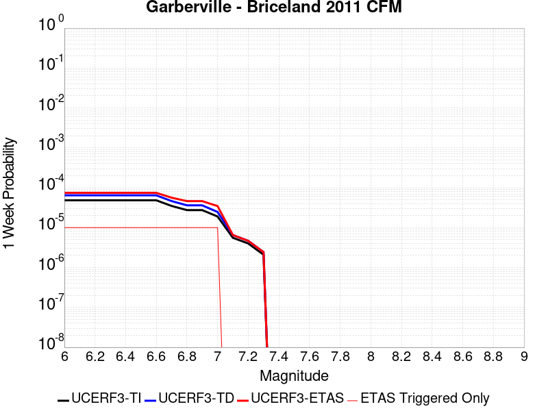 |  |  |  |

| Magnitude | 1 wk TI Prob | 1 wk TD Prob | 1 wk ETAS Prob | 1 wk ETAS/TD Gain | 1 wk ETAS Triggered Only | 1 mo TI Prob | 1 mo TD Prob | 1 mo ETAS Prob | 1 mo ETAS/TD Gain | 1 mo ETAS Triggered Only | 1 yr TI Prob | 1 yr TD Prob | 1 yr ETAS Prob | 1 yr ETAS/TD Gain | 1 yr ETAS Triggered Only | 10 yr TI Prob | 10 yr TD Prob | 10 yr ETAS Prob | 10 yr ETAS/TD Gain | 10 yr ETAS Triggered Only |
|-----|-----|-----|-----|-----|-----|-----|-----|-----|-----|-----|-----|-----|-----|-----|-----|-----|-----|-----|-----|-----|
| 6.0 | 4.8399295E-5 | 6.452381E-5 | 7.452317E-5 | 1.1549716 | 1.0E-5 | 2.0740906E-4 | 2.7650563E-4 | 2.8650285E-4 | 1.0361556 | 1.0E-5 | 0.002522281 | 0.003362017 | 0.0033719833 | 1.0029644 | 1.0E-5 | 0.024938442 | 0.03317861 | 0.03318828 | 1.0002913 | 1.0E-5 |
| 6.1 | 4.8399295E-5 | 6.452381E-5 | 7.452317E-5 | 1.1549716 | 1.0E-5 | 2.0740906E-4 | 2.7650563E-4 | 2.8650285E-4 | 1.0361556 | 1.0E-5 | 0.002522281 | 0.003362017 | 0.0033719833 | 1.0029644 | 1.0E-5 | 0.024938442 | 0.03317861 | 0.03318828 | 1.0002913 | 1.0E-5 |
| 6.2 | 4.8399295E-5 | 6.452381E-5 | 7.452317E-5 | 1.1549716 | 1.0E-5 | 2.0740906E-4 | 2.7650563E-4 | 2.8650285E-4 | 1.0361556 | 1.0E-5 | 0.002522281 | 0.003362017 | 0.0033719833 | 1.0029644 | 1.0E-5 | 0.024938442 | 0.03317861 | 0.03318828 | 1.0002913 | 1.0E-5 |
| 6.3 | 4.8399295E-5 | 6.452381E-5 | 7.452317E-5 | 1.1549716 | 1.0E-5 | 2.0740906E-4 | 2.7650563E-4 | 2.8650285E-4 | 1.0361556 | 1.0E-5 | 0.002522281 | 0.003362017 | 0.0033719833 | 1.0029644 | 1.0E-5 | 0.024938442 | 0.03317861 | 0.03318828 | 1.0002913 | 1.0E-5 |
| 6.4 | 4.8399295E-5 | 6.452381E-5 | 7.452317E-5 | 1.1549716 | 1.0E-5 | 2.0740906E-4 | 2.7650563E-4 | 2.8650285E-4 | 1.0361556 | 1.0E-5 | 0.002522281 | 0.003362017 | 0.0033719833 | 1.0029644 | 1.0E-5 | 0.024938442 | 0.03317861 | 0.03318828 | 1.0002913 | 1.0E-5 |
| 6.5 | 4.8399295E-5 | 6.452381E-5 | 7.452317E-5 | 1.1549716 | 1.0E-5 | 2.0740906E-4 | 2.7650563E-4 | 2.8650285E-4 | 1.0361556 | 1.0E-5 | 0.002522281 | 0.003362017 | 0.0033719833 | 1.0029644 | 1.0E-5 | 0.024938442 | 0.03317861 | 0.03318828 | 1.0002913 | 1.0E-5 |
| 6.6 | 4.8399295E-5 | 6.452381E-5 | 7.452317E-5 | 1.1549716 | 1.0E-5 | 2.0740906E-4 | 2.7650563E-4 | 2.8650285E-4 | 1.0361556 | 1.0E-5 | 0.002522281 | 0.003362017 | 0.0033719833 | 1.0029644 | 1.0E-5 | 0.024938442 | 0.03317861 | 0.03318828 | 1.0002913 | 1.0E-5 |
| 6.7 | 3.495179E-5 | 4.6308873E-5 | 5.6308407E-5 | 1.2159313 | 1.0E-5 | 1.4978478E-4 | 1.9845461E-4 | 2.0845262E-4 | 1.0503794 | 1.0E-5 | 0.0018221042 | 0.002414053 | 0.002424029 | 1.0041324 | 1.0E-5 | 0.018072363 | 0.023930617 | 0.023940377 | 1.0004079 | 1.0E-5 |
| 6.8 | 2.7517597E-5 | 3.6241618E-5 | 4.6241257E-5 | 1.2759159 | 1.0E-5 | 1.1792722E-4 | 1.5531474E-4 | 1.6531319E-4 | 1.0643754 | 1.0E-5 | 0.0014348183 | 0.0018897996 | 0.0018997807 | 1.0052816 | 1.0E-5 | 0.014255894 | 0.018783508 | 0.01879332 | 1.0005224 | 1.0E-5 |
| 6.9 | 2.74461E-5 | 3.6159345E-5 | 4.6158984E-5 | 1.2765437 | 1.0E-5 | 1.1762084E-4 | 1.5496218E-4 | 1.6496063E-4 | 1.0645219 | 1.0E-5 | 0.001431093 | 0.0018855145 | 0.0018954957 | 1.0052936 | 1.0E-5 | 0.014219119 | 0.018741382 | 0.018751195 | 1.0005236 | 1.0E-5 |
| 7.0 | 1.9023773E-5 | 2.4707579E-5 | 3.4707333E-5 | 1.4047241 | 1.0E-5 | 8.152791E-5 | 1.0588763E-4 | 1.1588657E-4 | 1.0944297 | 1.0E-5 | 9.921503E-4 | 0.0012888284 | 0.0012988156 | 1.007749 | 1.0E-5 | 0.009877323 | 0.012852574 | 0.012862446 | 1.0007681 | 1.0E-5 |
| 7.1 | 5.566844E-6 | 6.512147E-6 | 6.512147E-6 | 1.0 | 0.0 | 2.3857683E-5 | 2.7908927E-5 | 2.7908927E-5 | 1.0 | 0.0 | 2.9042858E-4 | 3.3974246E-4 | 3.3974246E-4 | 1.0 | 0.0 | 0.002900493 | 0.0033926512 | 0.0033926512 | 1.0 | 0.0 |
| 7.2 | 4.011353E-6 | 4.6746213E-6 | 4.6746213E-6 | 1.0 | 0.0 | 1.7191402E-5 | 2.0033956E-5 | 2.0033956E-5 | 1.0 | 0.0 | 2.0928521E-4 | 2.4388955E-4 | 2.4388955E-4 | 1.0 | 0.0 | 0.0020908823 | 0.0024365564 | 0.0024365564 | 1.0 | 0.0 |
| 7.3 | 2.0974871E-6 | 2.4395908E-6 | 2.4395908E-6 | 1.0 | 0.0 | 8.989199E-6 | 1.0455362E-5 | 1.0455362E-5 | 1.0 | 0.0 | 1.09438006E-4 | 1.272891E-4 | 1.272891E-4 | 1.0 | 0.0 | 0.0010938413 | 0.0012724071 | 0.0012724071 | 1.0 | 0.0 |

## Clamshell-Sawpit
*[(top)](#table-of-contents)*

| 1 Week | 1 Month | 1 Year | 10 Year |
|-----|-----|-----|-----|
|  |  |  |  |

| Magnitude | 1 wk TI Prob | 1 wk TD Prob | 1 wk ETAS Prob | 1 wk ETAS/TD Gain | 1 wk ETAS Triggered Only | 1 mo TI Prob | 1 mo TD Prob | 1 mo ETAS Prob | 1 mo ETAS/TD Gain | 1 mo ETAS Triggered Only | 1 yr TI Prob | 1 yr TD Prob | 1 yr ETAS Prob | 1 yr ETAS/TD Gain | 1 yr ETAS Triggered Only | 10 yr TI Prob | 10 yr TD Prob | 10 yr ETAS Prob | 10 yr ETAS/TD Gain | 10 yr ETAS Triggered Only |
|-----|-----|-----|-----|-----|-----|-----|-----|-----|-----|-----|-----|-----|-----|-----|-----|-----|-----|-----|-----|-----|
| 6.0 | 3.202998E-6 | 3.0127644E-6 | 3.0127644E-6 | 1.0 | 0.0 | 1.3727062E-5 | 1.2911788E-5 | 2.2911658E-5 | 1.774476 | 1.0E-5 | 1.6711417E-4 | 1.5719049E-4 | 1.671889E-4 | 1.0636071 | 1.0E-5 | 0.0016698855 | 0.0015708724 | 0.0015808566 | 1.0063559 | 1.0E-5 |
| 6.1 | 3.202998E-6 | 3.0127644E-6 | 3.0127644E-6 | 1.0 | 0.0 | 1.3727062E-5 | 1.2911788E-5 | 2.2911658E-5 | 1.774476 | 1.0E-5 | 1.6711417E-4 | 1.5719049E-4 | 1.671889E-4 | 1.0636071 | 1.0E-5 | 0.0016698855 | 0.0015708724 | 0.0015808566 | 1.0063559 | 1.0E-5 |
| 6.2 | 3.202998E-6 | 3.0127644E-6 | 3.0127644E-6 | 1.0 | 0.0 | 1.3727062E-5 | 1.2911788E-5 | 2.2911658E-5 | 1.774476 | 1.0E-5 | 1.6711417E-4 | 1.5719049E-4 | 1.671889E-4 | 1.0636071 | 1.0E-5 | 0.0016698855 | 0.0015708724 | 0.0015808566 | 1.0063559 | 1.0E-5 |
| 6.3 | 3.202998E-6 | 3.0127644E-6 | 3.0127644E-6 | 1.0 | 0.0 | 1.3727062E-5 | 1.2911788E-5 | 2.2911658E-5 | 1.774476 | 1.0E-5 | 1.6711417E-4 | 1.5719049E-4 | 1.671889E-4 | 1.0636071 | 1.0E-5 | 0.0016698855 | 0.0015708724 | 0.0015808566 | 1.0063559 | 1.0E-5 |
| 6.4 | 3.202998E-6 | 3.0127644E-6 | 3.0127644E-6 | 1.0 | 0.0 | 1.3727062E-5 | 1.2911788E-5 | 2.2911658E-5 | 1.774476 | 1.0E-5 | 1.6711417E-4 | 1.5719049E-4 | 1.671889E-4 | 1.0636071 | 1.0E-5 | 0.0016698855 | 0.0015708724 | 0.0015808566 | 1.0063559 | 1.0E-5 |
| 6.5 | 2.5862723E-6 | 2.380775E-6 | 2.380775E-6 | 1.0 | 0.0 | 1.1083977E-5 | 1.0203283E-5 | 1.0203283E-5 | 1.0 | 0.0 | 1.3493907E-4 | 1.2421819E-4 | 1.2421819E-4 | 1.0 | 0.0 | 0.0013485716 | 0.0012415178 | 0.0012415178 | 1.0 | 0.0 |
| 6.6 | 2.5862723E-6 | 2.380775E-6 | 2.380775E-6 | 1.0 | 0.0 | 1.1083977E-5 | 1.0203283E-5 | 1.0203283E-5 | 1.0 | 0.0 | 1.3493907E-4 | 1.2421819E-4 | 1.2421819E-4 | 1.0 | 0.0 | 0.0013485716 | 0.0012415178 | 0.0012415178 | 1.0 | 0.0 |
| 6.7 | 2.5862723E-6 | 2.380775E-6 | 2.380775E-6 | 1.0 | 0.0 | 1.1083977E-5 | 1.0203283E-5 | 1.0203283E-5 | 1.0 | 0.0 | 1.3493907E-4 | 1.2421819E-4 | 1.2421819E-4 | 1.0 | 0.0 | 0.0013485716 | 0.0012415178 | 0.0012415178 | 1.0 | 0.0 |
| 6.8 | 2.4098806E-6 | 2.1977307E-6 | 2.1977307E-6 | 1.0 | 0.0 | 1.0328019E-5 | 9.4188135E-6 | 9.4188135E-6 | 1.0 | 0.0 | 1.2573638E-4 | 1.1466829E-4 | 1.1466829E-4 | 1.0 | 0.0 | 0.0012566525 | 0.0011461178 | 0.0011461178 | 1.0 | 0.0 |
| 6.9 | 2.0073985E-6 | 1.7784248E-6 | 1.7784248E-6 | 1.0 | 0.0 | 8.603109E-6 | 7.621799E-6 | 7.621799E-6 | 1.0 | 0.0 | 1.0473781E-4 | 9.279157E-5 | 9.279157E-5 | 1.0 | 0.0 | 0.0010468846 | 9.275401E-4 | 9.275401E-4 | 1.0 | 0.0 |
| 7.0 | 1.8166766E-6 | 1.5807095E-6 | 1.5807095E-6 | 1.0 | 0.0 | 7.785734E-6 | 6.7744522E-6 | 6.7744522E-6 | 1.0 | 0.0 | 9.478718E-5 | 8.247593E-5 | 8.247593E-5 | 1.0 | 0.0 | 9.4746763E-4 | 8.244633E-4 | 8.244633E-4 | 1.0 | 0.0 |
| 7.1 | 1.5471421E-6 | 1.3052961E-6 | 1.3052961E-6 | 1.0 | 0.0 | 6.6305925E-6 | 5.5941146E-6 | 5.5941146E-6 | 1.0 | 0.0 | 8.072447E-5 | 6.8106274E-5 | 6.8106274E-5 | 1.0 | 0.0 | 8.0695155E-4 | 6.808595E-4 | 6.808595E-4 | 1.0 | 0.0 |
| 7.2 | 1.3608037E-6 | 1.1153443E-6 | 1.1153443E-6 | 1.0 | 0.0 | 5.8320024E-6 | 4.7800386E-6 | 4.7800386E-6 | 1.0 | 0.0 | 7.1002316E-5 | 5.8195463E-5 | 5.8195463E-5 | 1.0 | 0.0 | 7.097964E-4 | 5.818069E-4 | 5.818069E-4 | 1.0 | 0.0 |
| 7.3 | 1.0749634E-6 | 8.384254E-7 | 8.384254E-7 | 1.0 | 0.0 | 4.6069777E-6 | 3.593247E-6 | 3.593247E-6 | 1.0 | 0.0 | 5.608851E-5 | 4.374693E-5 | 4.374693E-5 | 1.0 | 0.0 | 5.6074356E-4 | 4.37386E-4 | 4.37386E-4 | 1.0 | 0.0 |
| 7.4 | 8.416856E-7 | 6.200048E-7 | 6.200048E-7 | 1.0 | 0.0 | 3.607219E-6 | 2.6571608E-6 | 2.6571608E-6 | 1.0 | 0.0 | 4.3917007E-5 | 3.2350472E-5 | 3.2350472E-5 | 1.0 | 0.0 | 4.390833E-4 | 3.2345962E-4 | 3.2345962E-4 | 1.0 | 0.0 |
| 7.5 | 6.2779594E-7 | 4.496886E-7 | 4.496886E-7 | 1.0 | 0.0 | 2.6905511E-6 | 1.9272356E-6 | 1.9272356E-6 | 1.0 | 0.0 | 3.275697E-5 | 2.346386E-5 | 2.346386E-5 | 1.0 | 0.0 | 3.275214E-4 | 2.346157E-4 | 2.346157E-4 | 1.0 | 0.0 |
| 7.6 | 4.3822078E-7 | 3.0595405E-7 | 3.0595405E-7 | 1.0 | 0.0 | 1.8780877E-6 | 1.311231E-6 | 1.311231E-6 | 1.0 | 0.0 | 2.2865479E-5 | 1.5964137E-5 | 1.5964137E-5 | 1.0 | 0.0 | 2.2863125E-4 | 1.5963144E-4 | 1.5963144E-4 | 1.0 | 0.0 |
| 7.7 | 1.8704569E-7 | 1.12379205E-7 | 1.12379205E-7 | 1.0 | 0.0 | 8.0162414E-7 | 4.816251E-7 | 4.816251E-7 | 1.0 | 0.0 | 9.75973E-6 | 5.86377E-6 | 5.86377E-6 | 1.0 | 0.0 | 9.7593016E-5 | 5.863622E-5 | 5.863622E-5 | 1.0 | 0.0 |
| 7.8 | 3.5378733E-8 | 2.1838144E-8 | 2.1838144E-8 | 1.0 | 0.0 | 1.5162313E-7 | 9.359204E-8 | 9.359204E-8 | 1.0 | 0.0 | 1.84601E-6 | 1.1394826E-6 | 1.1394826E-6 | 1.0 | 0.0 | 1.8459947E-5 | 1.139477E-5 | 1.139477E-5 | 1.0 | 0.0 |
| 7.9 | 7.504945E-9 | 5.1920326E-9 | 5.1920326E-9 | 1.0 | 0.0 | 3.2164053E-8 | 2.225157E-8 | 2.225157E-8 | 1.0 | 0.0 | 3.9159727E-7 | 2.7091284E-7 | 2.7091284E-7 | 1.0 | 0.0 | 3.915966E-6 | 2.7091257E-6 | 2.7091257E-6 | 1.0 | 0.0 |
| 8.0 | 1.6554036E-10 | 1.4180768E-10 | 1.4180768E-10 | 1.0 | 0.0 | 7.0945894E-10 | 6.077475E-10 | 6.077475E-10 | 1.0 | 0.0 | 8.637662E-9 | 7.3993256E-9 | 7.3993256E-9 | 1.0 | 0.0 | 8.6376616E-8 | 7.3993256E-8 | 7.3993256E-8 | 1.0 | 0.0 |

## Del Valle
*[(top)](#table-of-contents)*

| 1 Week | 1 Month | 1 Year | 10 Year |
|-----|-----|-----|-----|
|  |  |  |  |

| Magnitude | 1 wk TI Prob | 1 wk TD Prob | 1 wk ETAS Prob | 1 wk ETAS/TD Gain | 1 wk ETAS Triggered Only | 1 mo TI Prob | 1 mo TD Prob | 1 mo ETAS Prob | 1 mo ETAS/TD Gain | 1 mo ETAS Triggered Only | 1 yr TI Prob | 1 yr TD Prob | 1 yr ETAS Prob | 1 yr ETAS/TD Gain | 1 yr ETAS Triggered Only | 10 yr TI Prob | 10 yr TD Prob | 10 yr ETAS Prob | 10 yr ETAS/TD Gain | 10 yr ETAS Triggered Only |
|-----|-----|-----|-----|-----|-----|-----|-----|-----|-----|-----|-----|-----|-----|-----|-----|-----|-----|-----|-----|-----|
| 6.0 | 1.0716125E-5 | 8.767882E-6 | 8.767882E-6 | 1.0 | 0.0 | 4.592544E-5 | 3.7576207E-5 | 3.7576207E-5 | 1.0 | 0.0 | 5.589988E-4 | 4.5741405E-4 | 4.5741405E-4 | 1.0 | 0.0 | 0.0055759475 | 0.00456668 | 0.0045766346 | 1.0021797 | 1.0E-5 |
| 6.1 | 1.0716125E-5 | 8.767882E-6 | 8.767882E-6 | 1.0 | 0.0 | 4.592544E-5 | 3.7576207E-5 | 3.7576207E-5 | 1.0 | 0.0 | 5.589988E-4 | 4.5741405E-4 | 4.5741405E-4 | 1.0 | 0.0 | 0.0055759475 | 0.00456668 | 0.0045766346 | 1.0021797 | 1.0E-5 |
| 6.2 | 1.0716125E-5 | 8.767882E-6 | 8.767882E-6 | 1.0 | 0.0 | 4.592544E-5 | 3.7576207E-5 | 3.7576207E-5 | 1.0 | 0.0 | 5.589988E-4 | 4.5741405E-4 | 4.5741405E-4 | 1.0 | 0.0 | 0.0055759475 | 0.00456668 | 0.0045766346 | 1.0021797 | 1.0E-5 |
| 6.3 | 7.1293784E-6 | 4.865823E-6 | 4.865823E-6 | 1.0 | 0.0 | 3.055412E-5 | 2.0853364E-5 | 2.0853364E-5 | 1.0 | 0.0 | 3.7193293E-4 | 2.5386087E-4 | 2.5386087E-4 | 1.0 | 0.0 | 0.0037131102 | 0.0025357946 | 0.0025457693 | 1.0039335 | 1.0E-5 |
| 6.4 | 7.1293784E-6 | 4.865823E-6 | 4.865823E-6 | 1.0 | 0.0 | 3.055412E-5 | 2.0853364E-5 | 2.0853364E-5 | 1.0 | 0.0 | 3.7193293E-4 | 2.5386087E-4 | 2.5386087E-4 | 1.0 | 0.0 | 0.0037131102 | 0.0025357946 | 0.0025457693 | 1.0039335 | 1.0E-5 |
| 6.5 | 7.1293784E-6 | 4.865823E-6 | 4.865823E-6 | 1.0 | 0.0 | 3.055412E-5 | 2.0853364E-5 | 2.0853364E-5 | 1.0 | 0.0 | 3.7193293E-4 | 2.5386087E-4 | 2.5386087E-4 | 1.0 | 0.0 | 0.0037131102 | 0.0025357946 | 0.0025457693 | 1.0039335 | 1.0E-5 |
| 6.6 | 7.1293784E-6 | 4.865823E-6 | 4.865823E-6 | 1.0 | 0.0 | 3.055412E-5 | 2.0853364E-5 | 2.0853364E-5 | 1.0 | 0.0 | 3.7193293E-4 | 2.5386087E-4 | 2.5386087E-4 | 1.0 | 0.0 | 0.0037131102 | 0.0025357946 | 0.0025457693 | 1.0039335 | 1.0E-5 |
| 6.7 | 7.12272E-6 | 4.8631987E-6 | 4.8631987E-6 | 1.0 | 0.0 | 3.0525585E-5 | 2.0842117E-5 | 2.0842117E-5 | 1.0 | 0.0 | 3.7158563E-4 | 2.5372396E-4 | 2.5372396E-4 | 1.0 | 0.0 | 0.003709649 | 0.0025344288 | 0.0025444035 | 1.0039357 | 1.0E-5 |
| 6.8 | 6.7558703E-6 | 4.5594015E-6 | 4.5594015E-6 | 1.0 | 0.0 | 2.895341E-5 | 1.9540148E-5 | 1.9540148E-5 | 1.0 | 0.0 | 3.5245073E-4 | 2.3787597E-4 | 2.3787597E-4 | 1.0 | 0.0 | 0.0035189227 | 0.0023762889 | 0.002386265 | 1.0041982 | 1.0E-5 |
| 6.9 | 6.6700386E-6 | 4.502539E-6 | 4.502539E-6 | 1.0 | 0.0 | 2.8585566E-5 | 1.9296456E-5 | 1.9296456E-5 | 1.0 | 0.0 | 3.479737E-4 | 2.3490966E-4 | 2.3490966E-4 | 1.0 | 0.0 | 0.003474293 | 0.0023466884 | 0.002356665 | 1.0042514 | 1.0E-5 |
| 7.0 | 6.3181424E-6 | 4.0987034E-6 | 4.0987034E-6 | 1.0 | 0.0 | 2.7077473E-5 | 1.7565755E-5 | 1.7565755E-5 | 1.0 | 0.0 | 3.2961834E-4 | 2.1384252E-4 | 2.1384252E-4 | 1.0 | 0.0 | 0.0032912986 | 0.002136422 | 0.0021464007 | 1.0046707 | 1.0E-5 |
| 7.1 | 6.248759E-6 | 4.033895E-6 | 4.033895E-6 | 1.0 | 0.0 | 2.678012E-5 | 1.7288008E-5 | 1.7288008E-5 | 1.0 | 0.0 | 3.2599916E-4 | 2.104616E-4 | 2.104616E-4 | 1.0 | 0.0 | 0.0032552136 | 0.0021026772 | 0.0021126561 | 1.0047458 | 1.0E-5 |
| 7.2 | 6.0411944E-6 | 3.869888E-6 | 3.869888E-6 | 1.0 | 0.0 | 2.5890577E-5 | 1.658513E-5 | 1.658513E-5 | 1.0 | 0.0 | 3.1517216E-4 | 2.0190567E-4 | 2.0190567E-4 | 1.0 | 0.0 | 0.0031472554 | 0.0020172757 | 0.0020272555 | 1.0049472 | 1.0E-5 |
| 7.3 | 4.7691183E-6 | 3.0781202E-6 | 3.0781202E-6 | 1.0 | 0.0 | 2.0438918E-5 | 1.3191879E-5 | 1.3191879E-5 | 1.0 | 0.0 | 2.488154E-4 | 1.605995E-4 | 1.605995E-4 | 1.0 | 0.0 | 0.00248537 | 0.0016048603 | 0.0016148442 | 1.006221 | 1.0E-5 |
| 7.4 | 3.5524722E-6 | 2.1893363E-6 | 2.1893363E-6 | 1.0 | 0.0 | 1.5224792E-5 | 9.382837E-6 | 9.382837E-6 | 1.0 | 0.0 | 1.8534607E-4 | 1.1423013E-4 | 1.1423013E-4 | 1.0 | 0.0 | 0.0018519156 | 0.0011417224 | 0.001151711 | 1.0087487 | 1.0E-5 |
| 7.5 | 2.7133442E-6 | 1.5916097E-6 | 1.5916097E-6 | 1.0 | 0.0 | 1.1628566E-5 | 6.821167E-6 | 6.821167E-6 | 1.0 | 0.0 | 1.415686E-4 | 8.304456E-5 | 8.304456E-5 | 1.0 | 0.0 | 0.0014147845 | 8.301372E-4 | 8.401289E-4 | 1.0120362 | 1.0E-5 |
| 7.6 | 1.915338E-6 | 1.173914E-6 | 1.173914E-6 | 1.0 | 0.0 | 8.208566E-6 | 5.0310505E-6 | 5.0310505E-6 | 1.0 | 0.0 | 9.993471E-5 | 6.125133E-5 | 6.125133E-5 | 1.0 | 0.0 | 9.988978E-4 | 6.123454E-4 | 6.2233926E-4 | 1.0163207 | 1.0E-5 |
| 7.7 | 1.2120448E-6 | 7.180313E-7 | 7.180313E-7 | 1.0 | 0.0 | 5.194467E-6 | 3.0772733E-6 | 3.0772733E-6 | 1.0 | 0.0 | 6.3240805E-5 | 3.746516E-5 | 3.746516E-5 | 1.0 | 0.0 | 6.322281E-4 | 3.7458882E-4 | 3.7458882E-4 | 1.0 | 0.0 |
| 7.8 | 6.272381E-7 | 3.932549E-7 | 3.932549E-7 | 1.0 | 0.0 | 2.6881603E-6 | 1.6853771E-6 | 1.6853771E-6 | 1.0 | 0.0 | 3.272786E-5 | 2.0519275E-5 | 2.0519275E-5 | 1.0 | 0.0 | 3.272304E-4 | 2.0517396E-4 | 2.0517396E-4 | 1.0 | 0.0 |
| 7.9 | 2.0292627E-7 | 1.2004622E-7 | 1.2004622E-7 | 1.0 | 0.0 | 8.6968373E-7 | 5.1448376E-7 | 5.1448376E-7 | 1.0 | 0.0 | 1.0588348E-5 | 6.263822E-6 | 6.263822E-6 | 1.0 | 0.0 | 1.0587843E-4 | 6.263647E-5 | 6.263647E-5 | 1.0 | 0.0 |
| 8.0 | 4.374492E-8 | 2.189964E-8 | 2.189964E-8 | 1.0 | 0.0 | 1.8747821E-7 | 9.385559E-8 | 9.385559E-8 | 1.0 | 0.0 | 2.2825448E-6 | 1.1426913E-6 | 1.1426913E-6 | 1.0 | 0.0 | 2.2825214E-5 | 1.1426858E-5 | 1.1426858E-5 | 1.0 | 0.0 |

## Skinner Flat 2011 CFM
*[(top)](#table-of-contents)*

| 1 Week | 1 Month | 1 Year | 10 Year |
|-----|-----|-----|-----|
|  |  |  | 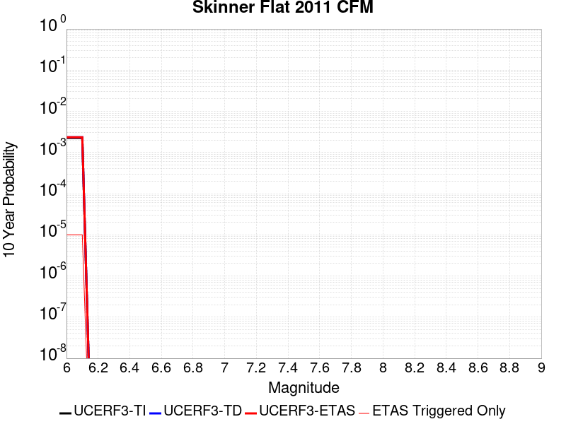 |

| Magnitude | 1 wk TI Prob | 1 wk TD Prob | 1 wk ETAS Prob | 1 wk ETAS/TD Gain | 1 wk ETAS Triggered Only | 1 mo TI Prob | 1 mo TD Prob | 1 mo ETAS Prob | 1 mo ETAS/TD Gain | 1 mo ETAS Triggered Only | 1 yr TI Prob | 1 yr TD Prob | 1 yr ETAS Prob | 1 yr ETAS/TD Gain | 1 yr ETAS Triggered Only | 10 yr TI Prob | 10 yr TD Prob | 10 yr ETAS Prob | 10 yr ETAS/TD Gain | 10 yr ETAS Triggered Only |
|-----|-----|-----|-----|-----|-----|-----|-----|-----|-----|-----|-----|-----|-----|-----|-----|-----|-----|-----|-----|-----|
| 6.0 | 4.3279074E-6 | 4.484953E-6 | 4.484953E-6 | 1.0 | 0.0 | 1.8548042E-5 | 1.9221226E-5 | 1.9221226E-5 | 1.0 | 0.0 | 2.2579901E-4 | 2.3401844E-4 | 2.3401844E-4 | 1.0 | 0.0 | 0.002255697 | 0.0023401843 | 0.002350161 | 1.0042632 | 1.0E-5 |
| 6.1 | 4.3279074E-6 | 4.484953E-6 | 4.484953E-6 | 1.0 | 0.0 | 1.8548042E-5 | 1.9221226E-5 | 1.9221226E-5 | 1.0 | 0.0 | 2.2579901E-4 | 2.3401844E-4 | 2.3401844E-4 | 1.0 | 0.0 | 0.002255697 | 0.0023401843 | 0.002350161 | 1.0042632 | 1.0E-5 |

## Sierra Madre
*[(top)](#table-of-contents)*

| 1 Week | 1 Month | 1 Year | 10 Year |
|-----|-----|-----|-----|
|  | 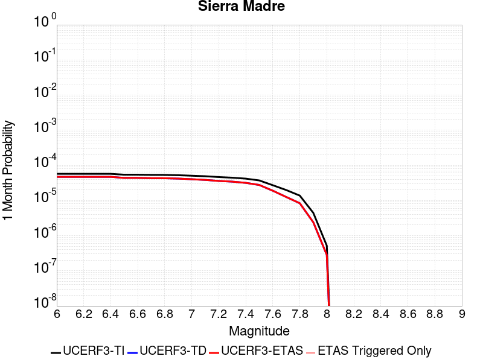 |  |  |

| Magnitude | 1 wk TI Prob | 1 wk TD Prob | 1 wk ETAS Prob | 1 wk ETAS/TD Gain | 1 wk ETAS Triggered Only | 1 mo TI Prob | 1 mo TD Prob | 1 mo ETAS Prob | 1 mo ETAS/TD Gain | 1 mo ETAS Triggered Only | 1 yr TI Prob | 1 yr TD Prob | 1 yr ETAS Prob | 1 yr ETAS/TD Gain | 1 yr ETAS Triggered Only | 10 yr TI Prob | 10 yr TD Prob | 10 yr ETAS Prob | 10 yr ETAS/TD Gain | 10 yr ETAS Triggered Only |
|-----|-----|-----|-----|-----|-----|-----|-----|-----|-----|-----|-----|-----|-----|-----|-----|-----|-----|-----|-----|-----|
| 6.0 | 1.3379373E-5 | 1.10007395E-5 | 1.10007395E-5 | 1.0 | 0.0 | 5.7338908E-5 | 4.7145186E-5 | 4.7145186E-5 | 1.0 | 0.0 | 6.978776E-4 | 5.738429E-4 | 5.8383716E-4 | 1.0174164 | 1.0E-5 | 0.0069569005 | 0.0057239756 | 0.0057339184 | 1.001737 | 1.0E-5 |
| 6.1 | 1.3379373E-5 | 1.10007395E-5 | 1.10007395E-5 | 1.0 | 0.0 | 5.7338908E-5 | 4.7145186E-5 | 4.7145186E-5 | 1.0 | 0.0 | 6.978776E-4 | 5.738429E-4 | 5.8383716E-4 | 1.0174164 | 1.0E-5 | 0.0069569005 | 0.0057239756 | 0.0057339184 | 1.001737 | 1.0E-5 |
| 6.2 | 1.3379373E-5 | 1.10007395E-5 | 1.10007395E-5 | 1.0 | 0.0 | 5.7338908E-5 | 4.7145186E-5 | 4.7145186E-5 | 1.0 | 0.0 | 6.978776E-4 | 5.738429E-4 | 5.8383716E-4 | 1.0174164 | 1.0E-5 | 0.0069569005 | 0.0057239756 | 0.0057339184 | 1.001737 | 1.0E-5 |
| 6.3 | 1.3379373E-5 | 1.10007395E-5 | 1.10007395E-5 | 1.0 | 0.0 | 5.7338908E-5 | 4.7145186E-5 | 4.7145186E-5 | 1.0 | 0.0 | 6.978776E-4 | 5.738429E-4 | 5.8383716E-4 | 1.0174164 | 1.0E-5 | 0.0069569005 | 0.0057239756 | 0.0057339184 | 1.001737 | 1.0E-5 |
| 6.4 | 1.3379373E-5 | 1.10007395E-5 | 1.10007395E-5 | 1.0 | 0.0 | 5.7338908E-5 | 4.7145186E-5 | 4.7145186E-5 | 1.0 | 0.0 | 6.978776E-4 | 5.738429E-4 | 5.8383716E-4 | 1.0174164 | 1.0E-5 | 0.0069569005 | 0.0057239756 | 0.0057339184 | 1.001737 | 1.0E-5 |
| 6.5 | 1.26563245E-5 | 1.0230196E-5 | 1.0230196E-5 | 1.0 | 0.0 | 5.4240263E-5 | 4.3842967E-5 | 4.3842967E-5 | 1.0 | 0.0 | 6.601751E-4 | 5.336584E-4 | 5.336584E-4 | 1.0 | 0.0 | 0.006582173 | 0.0053240913 | 0.0053240913 | 1.0 | 0.0 |
| 6.6 | 1.26563245E-5 | 1.0230196E-5 | 1.0230196E-5 | 1.0 | 0.0 | 5.4240263E-5 | 4.3842967E-5 | 4.3842967E-5 | 1.0 | 0.0 | 6.601751E-4 | 5.336584E-4 | 5.336584E-4 | 1.0 | 0.0 | 0.006582173 | 0.0053240913 | 0.0053240913 | 1.0 | 0.0 |
| 6.7 | 1.2502474E-5 | 1.006634E-5 | 1.006634E-5 | 1.0 | 0.0 | 5.3580934E-5 | 4.314075E-5 | 4.314075E-5 | 1.0 | 0.0 | 6.521526E-4 | 5.251131E-4 | 5.251131E-4 | 1.0 | 0.0 | 0.0065024206 | 0.0052390425 | 0.0052390425 | 1.0 | 0.0 |
| 6.8 | 1.2454966E-5 | 1.0018625E-5 | 1.0018625E-5 | 1.0 | 0.0 | 5.3377335E-5 | 4.2936266E-5 | 4.2936266E-5 | 1.0 | 0.0 | 6.4967526E-4 | 5.226247E-4 | 5.226247E-4 | 1.0 | 0.0 | 0.006477792 | 0.0052142753 | 0.0052142753 | 1.0 | 0.0 |
| 6.9 | 1.2225574E-5 | 9.792602E-6 | 9.792602E-6 | 1.0 | 0.0 | 5.2394265E-5 | 4.1967625E-5 | 4.1967625E-5 | 1.0 | 0.0 | 6.3771347E-4 | 5.108371E-4 | 5.108371E-4 | 1.0 | 0.0 | 0.006358865 | 0.0050969445 | 0.0050969445 | 1.0 | 0.0 |
| 7.0 | 1.182946E-5 | 9.399144E-6 | 9.399144E-6 | 1.0 | 0.0 | 5.06967E-5 | 4.0281426E-5 | 4.0281426E-5 | 1.0 | 0.0 | 6.1705755E-4 | 4.9031706E-4 | 4.9031706E-4 | 1.0 | 0.0 | 0.006153469 | 0.004892664 | 0.004892664 | 1.0 | 0.0 |
| 7.1 | 1.14369095E-5 | 8.986159E-6 | 8.986159E-6 | 1.0 | 0.0 | 4.9014405E-5 | 3.8511545E-5 | 3.8511545E-5 | 1.0 | 0.0 | 5.9658696E-4 | 4.687782E-4 | 4.687782E-4 | 1.0 | 0.0 | 0.005949879 | 0.004678199 | 0.004678199 | 1.0 | 0.0 |
| 7.2 | 1.0836419E-5 | 8.3995565E-6 | 8.3995565E-6 | 1.0 | 0.0 | 4.644097E-5 | 3.5997607E-5 | 3.5997607E-5 | 1.0 | 0.0 | 5.652721E-4 | 4.3818366E-4 | 4.3818366E-4 | 1.0 | 0.0 | 0.0056383642 | 0.004373494 | 0.004373494 | 1.0 | 0.0 |
| 7.3 | 1.0403439E-5 | 8.02082E-6 | 8.02082E-6 | 1.0 | 0.0 | 4.4585406E-5 | 3.4374494E-5 | 3.4374494E-5 | 1.0 | 0.0 | 5.426921E-4 | 4.1843E-4 | 4.1843E-4 | 1.0 | 0.0 | 0.005413687 | 0.004176717 | 0.004176717 | 1.0 | 0.0 |
| 7.4 | 9.768864E-6 | 7.414448E-6 | 7.414448E-6 | 1.0 | 0.0 | 4.186589E-5 | 3.1775824E-5 | 3.1775824E-5 | 1.0 | 0.0 | 5.09598E-4 | 3.868029E-4 | 3.868029E-4 | 1.0 | 0.0 | 0.0050843097 | 0.0038615882 | 0.0038615882 | 1.0 | 0.0 |
| 7.5 | 8.687089E-6 | 6.4501564E-6 | 6.4501564E-6 | 1.0 | 0.0 | 3.722985E-5 | 2.764324E-5 | 2.764324E-5 | 1.0 | 0.0 | 4.5317915E-4 | 3.3650533E-4 | 3.3650533E-4 | 1.0 | 0.0 | 0.004522561 | 0.0033602451 | 0.0033602451 | 1.0 | 0.0 |
| 7.6 | 6.3506063E-6 | 4.4303215E-6 | 4.4303215E-6 | 1.0 | 0.0 | 2.72166E-5 | 1.8986955E-5 | 1.8986955E-5 | 1.0 | 0.0 | 3.3131172E-4 | 2.3114192E-4 | 2.3114192E-4 | 1.0 | 0.0 | 0.003308182 | 0.0023092402 | 0.0023092402 | 1.0 | 0.0 |
| 7.7 | 4.62223E-6 | 2.932967E-6 | 2.932967E-6 | 1.0 | 0.0 | 1.9809406E-5 | 1.2569798E-5 | 1.2569798E-5 | 1.0 | 0.0 | 2.4115283E-4 | 1.5302657E-4 | 1.5302657E-4 | 1.0 | 0.0 | 0.0024089129 | 0.001529413 | 0.001529413 | 1.0 | 0.0 |
| 7.8 | 3.2145008E-6 | 1.9494332E-6 | 1.9494332E-6 | 1.0 | 0.0 | 1.3776359E-5 | 8.3546865E-6 | 8.3546865E-6 | 1.0 | 0.0 | 1.6771426E-4 | 1.0171358E-4 | 1.0171358E-4 | 1.0 | 0.0 | 0.0016758774 | 0.0010168145 | 0.0010168145 | 1.0 | 0.0 |
| 7.9 | 1.0391769E-6 | 5.6026335E-7 | 5.6026335E-7 | 1.0 | 0.0 | 4.4536077E-6 | 2.4011265E-6 | 2.4011265E-6 | 1.0 | 0.0 | 5.4221324E-5 | 2.9233326E-5 | 2.9233326E-5 | 1.0 | 0.0 | 5.4208096E-4 | 2.9229524E-4 | 2.9229524E-4 | 1.0 | 0.0 |
| 8.0 | 1.210983E-7 | 6.613821E-8 | 6.613821E-8 | 1.0 | 0.0 | 5.1899264E-7 | 2.8344945E-7 | 2.8344945E-7 | 1.0 | 0.0 | 6.3187167E-6 | 3.4509917E-6 | 3.4509917E-6 | 1.0 | 0.0 | 6.318537E-5 | 3.45094E-5 | 3.45094E-5 | 1.0 | 0.0 |

## Morales (East)
*[(top)](#table-of-contents)*

| 1 Week | 1 Month | 1 Year | 10 Year |
|-----|-----|-----|-----|
|  |  |  |  |

| Magnitude | 1 wk TI Prob | 1 wk TD Prob | 1 wk ETAS Prob | 1 wk ETAS/TD Gain | 1 wk ETAS Triggered Only | 1 mo TI Prob | 1 mo TD Prob | 1 mo ETAS Prob | 1 mo ETAS/TD Gain | 1 mo ETAS Triggered Only | 1 yr TI Prob | 1 yr TD Prob | 1 yr ETAS Prob | 1 yr ETAS/TD Gain | 1 yr ETAS Triggered Only | 10 yr TI Prob | 10 yr TD Prob | 10 yr ETAS Prob | 10 yr ETAS/TD Gain | 10 yr ETAS Triggered Only |
|-----|-----|-----|-----|-----|-----|-----|-----|-----|-----|-----|-----|-----|-----|-----|-----|-----|-----|-----|-----|-----|
| 6.0 | 1.4942771E-6 | 2.123479E-6 | 2.123479E-6 | 1.0 | 0.0 | 6.404029E-6 | 9.100596E-6 | 9.100596E-6 | 1.0 | 0.0 | 7.7966266E-5 | 1.107947E-4 | 1.107947E-4 | 1.0 | 0.0 | 7.793892E-4 | 0.0011074544 | 0.0011174433 | 1.0090197 | 1.0E-5 |
| 6.1 | 1.4942771E-6 | 2.123479E-6 | 2.123479E-6 | 1.0 | 0.0 | 6.404029E-6 | 9.100596E-6 | 9.100596E-6 | 1.0 | 0.0 | 7.7966266E-5 | 1.107947E-4 | 1.107947E-4 | 1.0 | 0.0 | 7.793892E-4 | 0.0011074544 | 0.0011174433 | 1.0090197 | 1.0E-5 |
| 6.2 | 1.4942771E-6 | 2.123479E-6 | 2.123479E-6 | 1.0 | 0.0 | 6.404029E-6 | 9.100596E-6 | 9.100596E-6 | 1.0 | 0.0 | 7.7966266E-5 | 1.107947E-4 | 1.107947E-4 | 1.0 | 0.0 | 7.793892E-4 | 0.0011074544 | 0.0011174433 | 1.0090197 | 1.0E-5 |
| 6.3 | 1.4942771E-6 | 2.123479E-6 | 2.123479E-6 | 1.0 | 0.0 | 6.404029E-6 | 9.100596E-6 | 9.100596E-6 | 1.0 | 0.0 | 7.7966266E-5 | 1.107947E-4 | 1.107947E-4 | 1.0 | 0.0 | 7.793892E-4 | 0.0011074544 | 0.0011174433 | 1.0090197 | 1.0E-5 |
| 6.4 | 8.798845E-7 | 1.5022731E-6 | 1.5022731E-6 | 1.0 | 0.0 | 3.7709283E-6 | 6.438298E-6 | 6.438298E-6 | 1.0 | 0.0 | 4.5910085E-5 | 7.8383564E-5 | 7.8383564E-5 | 1.0 | 0.0 | 4.59006E-4 | 7.835727E-4 | 7.835727E-4 | 1.0 | 0.0 |
| 6.5 | 7.1751725E-7 | 1.3384229E-6 | 1.3384229E-6 | 1.0 | 0.0 | 3.0750705E-6 | 5.7360858E-6 | 5.7360858E-6 | 1.0 | 0.0 | 3.7438338E-5 | 6.9834685E-5 | 6.9834685E-5 | 1.0 | 0.0 | 3.743203E-4 | 6.9813756E-4 | 6.9813756E-4 | 1.0 | 0.0 |
| 6.6 | 7.1751725E-7 | 1.3384229E-6 | 1.3384229E-6 | 1.0 | 0.0 | 3.0750705E-6 | 5.7360858E-6 | 5.7360858E-6 | 1.0 | 0.0 | 3.7438338E-5 | 6.9834685E-5 | 6.9834685E-5 | 1.0 | 0.0 | 3.743203E-4 | 6.9813756E-4 | 6.9813756E-4 | 1.0 | 0.0 |
| 6.7 | 7.159057E-7 | 1.3358889E-6 | 1.3358889E-6 | 1.0 | 0.0 | 3.0681638E-6 | 5.725226E-6 | 5.725226E-6 | 1.0 | 0.0 | 3.7354253E-5 | 6.970247E-5 | 6.970247E-5 | 1.0 | 0.0 | 3.7347974E-4 | 6.968163E-4 | 6.968163E-4 | 1.0 | 0.0 |
| 6.8 | 7.032203E-7 | 1.3174443E-6 | 1.3174443E-6 | 1.0 | 0.0 | 3.0137978E-6 | 5.646178E-6 | 5.646178E-6 | 1.0 | 0.0 | 3.669237E-5 | 6.8740126E-5 | 6.8740126E-5 | 1.0 | 0.0 | 3.6686313E-4 | 6.871988E-4 | 6.871988E-4 | 1.0 | 0.0 |
| 6.9 | 6.941549E-7 | 1.3025061E-6 | 1.3025061E-6 | 1.0 | 0.0 | 2.974946E-6 | 5.582158E-6 | 5.582158E-6 | 1.0 | 0.0 | 3.6219368E-5 | 6.7960726E-5 | 6.7960726E-5 | 1.0 | 0.0 | 3.6213463E-4 | 6.7940954E-4 | 6.7940954E-4 | 1.0 | 0.0 |
| 7.0 | 6.2932247E-7 | 1.18774E-6 | 1.18774E-6 | 1.0 | 0.0 | 2.6970936E-6 | 5.090305E-6 | 5.090305E-6 | 1.0 | 0.0 | 3.283662E-5 | 6.1972765E-5 | 6.1972765E-5 | 1.0 | 0.0 | 3.283177E-4 | 6.1956374E-4 | 6.1956374E-4 | 1.0 | 0.0 |
| 7.1 | 5.6200963E-7 | 1.0640374E-6 | 1.0640374E-6 | 1.0 | 0.0 | 2.4086105E-6 | 4.5601523E-6 | 4.5601523E-6 | 1.0 | 0.0 | 2.9324437E-5 | 5.551849E-5 | 5.551849E-5 | 1.0 | 0.0 | 2.9320567E-4 | 5.550534E-4 | 5.550534E-4 | 1.0 | 0.0 |
| 7.2 | 4.91044E-7 | 9.285713E-7 | 9.285713E-7 | 1.0 | 0.0 | 2.1044725E-6 | 3.9795855E-6 | 3.9795855E-6 | 1.0 | 0.0 | 2.5621652E-5 | 4.8450413E-5 | 4.8450413E-5 | 1.0 | 0.0 | 2.56187E-4 | 4.8440482E-4 | 4.8440482E-4 | 1.0 | 0.0 |
| 7.3 | 4.2978448E-7 | 7.9739846E-7 | 7.9739846E-7 | 1.0 | 0.0 | 1.8419321E-6 | 3.4174175E-6 | 3.4174175E-6 | 1.0 | 0.0 | 2.2425293E-5 | 4.1606294E-5 | 4.1606294E-5 | 1.0 | 0.0 | 2.242303E-4 | 4.1599068E-4 | 4.1599068E-4 | 1.0 | 0.0 |
| 7.4 | 3.774317E-7 | 6.806746E-7 | 6.806746E-7 | 1.0 | 0.0 | 1.6175634E-6 | 2.9171736E-6 | 2.9171736E-6 | 1.0 | 0.0 | 1.9693656E-5 | 3.5516037E-5 | 3.5516037E-5 | 1.0 | 0.0 | 1.969191E-4 | 3.551089E-4 | 3.551089E-4 | 1.0 | 0.0 |
| 7.5 | 1.0603232E-7 | 9.840901E-8 | 9.840901E-8 | 1.0 | 0.0 | 4.5442414E-7 | 4.2175284E-7 | 4.2175284E-7 | 1.0 | 0.0 | 5.5326E-6 | 5.134829E-6 | 5.134829E-6 | 1.0 | 0.0 | 5.532462E-5 | 5.134967E-5 | 5.134967E-5 | 1.0 | 0.0 |
| 7.6 | 9.960384E-8 | 8.755334E-8 | 8.755334E-8 | 1.0 | 0.0 | 4.2687353E-7 | 3.7522852E-7 | 3.7522852E-7 | 1.0 | 0.0 | 5.197173E-6 | 4.568398E-6 | 4.568398E-6 | 1.0 | 0.0 | 5.1970514E-5 | 4.5685607E-5 | 4.5685607E-5 | 1.0 | 0.0 |
| 7.7 | 6.499468E-8 | 4.1038682E-8 | 4.1038682E-8 | 1.0 | 0.0 | 2.785486E-7 | 1.7588006E-7 | 1.7588006E-7 | 1.0 | 0.0 | 3.3913238E-6 | 2.1413375E-6 | 2.1413375E-6 | 1.0 | 0.0 | 3.3912722E-5 | 2.1415728E-5 | 2.1415728E-5 | 1.0 | 0.0 |
| 7.8 | 2.2517119E-8 | 7.1312614E-9 | 7.1312614E-9 | 1.0 | 0.0 | 9.6501935E-8 | 3.0562546E-8 | 3.0562546E-8 | 1.0 | 0.0 | 1.1749105E-6 | 3.7209892E-7 | 3.7209892E-7 | 1.0 | 0.0 | 1.1749043E-5 | 3.7235213E-6 | 3.7235213E-6 | 1.0 | 0.0 |
| 7.9 | 8.493023E-9 | 9.970124E-10 | 9.970124E-10 | 1.0 | 0.0 | 3.639867E-8 | 4.2729082E-9 | 4.2729082E-9 | 1.0 | 0.0 | 4.4315374E-7 | 5.202266E-8 | 5.202266E-8 | 1.0 | 0.0 | 4.4315284E-6 | 5.2233156E-7 | 5.2233156E-7 | 1.0 | 0.0 |
| 8.0 | 1.4971842E-9 | 5.5458416E-11 | 5.5458416E-11 | 1.0 | 0.0 | 6.4165038E-9 | 2.376762E-10 | 2.376762E-10 | 1.0 | 0.0 | 7.812093E-8 | 2.8937068E-9 | 2.8937068E-9 | 1.0 | 0.0 | 7.81209E-7 | 3.019288E-8 | 3.019288E-8 | 1.0 | 0.0 |

## Sargent 2011 CFM
*[(top)](#table-of-contents)*

| 1 Week | 1 Month | 1 Year | 10 Year |
|-----|-----|-----|-----|
|  |  |  |  |

| Magnitude | 1 wk TI Prob | 1 wk TD Prob | 1 wk ETAS Prob | 1 wk ETAS/TD Gain | 1 wk ETAS Triggered Only | 1 mo TI Prob | 1 mo TD Prob | 1 mo ETAS Prob | 1 mo ETAS/TD Gain | 1 mo ETAS Triggered Only | 1 yr TI Prob | 1 yr TD Prob | 1 yr ETAS Prob | 1 yr ETAS/TD Gain | 1 yr ETAS Triggered Only | 10 yr TI Prob | 10 yr TD Prob | 10 yr ETAS Prob | 10 yr ETAS/TD Gain | 10 yr ETAS Triggered Only |
|-----|-----|-----|-----|-----|-----|-----|-----|-----|-----|-----|-----|-----|-----|-----|-----|-----|-----|-----|-----|-----|
| 6.0 | 3.7327867E-5 | 3.664913E-5 | 4.6648765E-5 | 1.2728478 | 1.0E-5 | 1.5996677E-4 | 1.5706103E-4 | 1.6705946E-4 | 1.0636595 | 1.0E-5 | 0.0019458556 | 0.0019110236 | 0.0019210045 | 1.0052228 | 1.0E-5 | 0.01928905 | 0.019018095 | 0.019027904 | 1.0005158 | 1.0E-5 |
| 6.1 | 2.3771476E-5 | 1.8479273E-5 | 1.8479273E-5 | 1.0 | 0.0 | 1.01873775E-4 | 7.919498E-5 | 7.919498E-5 | 1.0 | 0.0 | 0.0012396075 | 9.638493E-4 | 9.638493E-4 | 1.0 | 0.0 | 0.012327154 | 0.009636091 | 0.009636091 | 1.0 | 0.0 |
| 6.2 | 2.3112721E-5 | 1.7710632E-5 | 1.7710632E-5 | 1.0 | 0.0 | 9.9050754E-5 | 7.590099E-5 | 7.590099E-5 | 1.0 | 0.0 | 0.0012052758 | 9.237792E-4 | 9.237792E-4 | 1.0 | 0.0 | 0.011987597 | 0.009238743 | 0.009238743 | 1.0 | 0.0 |
| 6.3 | 1.728509E-5 | 1.0458927E-5 | 1.0458927E-5 | 1.0 | 0.0 | 7.407686E-5 | 4.482347E-5 | 4.482347E-5 | 1.0 | 0.0 | 9.015125E-4 | 5.456343E-4 | 5.456343E-4 | 1.0 | 0.0 | 0.008978641 | 0.0054791216 | 0.0054791216 | 1.0 | 0.0 |
| 6.4 | 1.48395575E-5 | 7.4559816E-6 | 7.4559816E-6 | 1.0 | 0.0 | 6.3596555E-5 | 3.195403E-5 | 3.195403E-5 | 1.0 | 0.0 | 7.7401294E-4 | 3.8900663E-4 | 3.8900663E-4 | 1.0 | 0.0 | 0.0077132257 | 0.003918666 | 0.003918666 | 1.0 | 0.0 |
| 6.5 | 1.4358964E-5 | 6.894759E-6 | 6.894759E-6 | 1.0 | 0.0 | 6.1536964E-5 | 2.9548846E-5 | 2.9548846E-5 | 1.0 | 0.0 | 7.48955E-4 | 3.5973339E-4 | 3.5973339E-4 | 1.0 | 0.0 | 0.0074643586 | 0.0036269152 | 0.0036269152 | 1.0 | 0.0 |
| 6.6 | 9.772591E-6 | 1.3736154E-6 | 1.3736154E-6 | 1.0 | 0.0 | 4.188186E-5 | 5.88691E-6 | 5.88691E-6 | 1.0 | 0.0 | 5.097923E-4 | 7.16708E-5 | 7.16708E-5 | 1.0 | 0.0 | 0.005086244 | 7.483097E-4 | 7.483097E-4 | 1.0 | 0.0 |
| 6.7 | 9.752745E-6 | 1.3523068E-6 | 1.3523068E-6 | 1.0 | 0.0 | 4.179681E-5 | 5.795587E-6 | 5.795587E-6 | 1.0 | 0.0 | 5.0875737E-4 | 7.055902E-5 | 7.055902E-5 | 1.0 | 0.0 | 0.005075942 | 7.371994E-4 | 7.371994E-4 | 1.0 | 0.0 |
| 6.8 | 9.608213E-6 | 1.2361709E-6 | 1.2361709E-6 | 1.0 | 0.0 | 4.1177405E-5 | 5.2978644E-6 | 5.2978644E-6 | 1.0 | 0.0 | 5.012196E-4 | 6.449961E-5 | 6.449961E-5 | 1.0 | 0.0 | 0.005000906 | 6.7634037E-4 | 6.7634037E-4 | 1.0 | 0.0 |
| 6.9 | 9.427164E-6 | 1.12094E-6 | 1.12094E-6 | 1.0 | 0.0 | 4.04015E-5 | 4.80402E-6 | 4.80402E-6 | 1.0 | 0.0 | 4.9177726E-4 | 5.8487396E-5 | 5.8487396E-5 | 1.0 | 0.0 | 0.004906904 | 6.1557174E-4 | 6.1557174E-4 | 1.0 | 0.0 |
| 7.0 | 9.247601E-6 | 9.873988E-7 | 9.873988E-7 | 1.0 | 0.0 | 3.9631974E-5 | 4.2317024E-6 | 4.2317024E-6 | 1.0 | 0.0 | 4.8241246E-4 | 5.1519775E-5 | 5.1519775E-5 | 1.0 | 0.0 | 0.0048136655 | 5.4542476E-4 | 5.4542476E-4 | 1.0 | 0.0 |
| 7.1 | 8.995454E-6 | 8.2711284E-7 | 8.2711284E-7 | 1.0 | 0.0 | 3.8551374E-5 | 3.5447645E-6 | 3.5447645E-6 | 1.0 | 0.0 | 4.6926187E-4 | 4.3156666E-5 | 4.3156666E-5 | 1.0 | 0.0 | 0.004682722 | 4.609069E-4 | 4.609069E-4 | 1.0 | 0.0 |
| 7.2 | 8.520861E-6 | 5.2766507E-7 | 5.2766507E-7 | 1.0 | 0.0 | 3.6517464E-5 | 2.2614197E-6 | 2.2614197E-6 | 1.0 | 0.0 | 4.445094E-4 | 2.7532446E-5 | 2.7532446E-5 | 1.0 | 0.0 | 0.004436213 | 3.0297207E-4 | 3.0297207E-4 | 1.0 | 0.0 |
| 7.3 | 8.043592E-6 | 3.456507E-7 | 3.456507E-7 | 1.0 | 0.0 | 3.4472083E-5 | 1.4813593E-6 | 1.4813593E-6 | 1.0 | 0.0 | 4.196168E-4 | 1.8035402E-5 | 1.8035402E-5 | 1.0 | 0.0 | 0.004188253 | 2.0669671E-4 | 2.0669671E-4 | 1.0 | 0.0 |
| 7.4 | 7.662316E-6 | 2.928958E-7 | 2.928958E-7 | 1.0 | 0.0 | 3.2838085E-5 | 1.2552671E-6 | 1.2552671E-6 | 1.0 | 0.0 | 3.9973034E-4 | 1.528277E-5 | 1.528277E-5 | 1.0 | 0.0 | 0.0039901207 | 1.7736501E-4 | 1.7736501E-4 | 1.0 | 0.0 |
| 7.5 | 6.961638E-6 | 2.3574503E-7 | 2.3574503E-7 | 1.0 | 0.0 | 2.9835252E-5 | 1.0103355E-6 | 1.0103355E-6 | 1.0 | 0.0 | 3.6318362E-4 | 1.2300766E-5 | 1.2300766E-5 | 1.0 | 0.0 | 0.0036259065 | 1.4409334E-4 | 1.4409334E-4 | 1.0 | 0.0 |
| 7.6 | 6.282332E-6 | 1.6892966E-7 | 1.6892966E-7 | 1.0 | 0.0 | 2.6924003E-5 | 7.2398404E-7 | 7.2398404E-7 | 1.0 | 0.0 | 3.2775043E-4 | 8.814471E-6 | 8.814471E-6 | 1.0 | 0.0 | 0.0032726745 | 1.05050465E-4 | 1.05050465E-4 | 1.0 | 0.0 |
| 7.7 | 4.934408E-6 | 5.001089E-8 | 5.001089E-8 | 1.0 | 0.0 | 2.114729E-5 | 2.1433237E-7 | 2.1433237E-7 | 1.0 | 0.0 | 2.5743784E-4 | 2.6094935E-6 | 2.6094935E-6 | 1.0 | 0.0 | 0.0025713982 | 3.2545366E-5 | 3.2545366E-5 | 1.0 | 0.0 |
| 7.8 | 2.373212E-6 | 3.5172643E-8 | 3.5172643E-8 | 1.0 | 0.0 | 1.0170869E-5 | 1.507399E-7 | 1.507399E-7 | 1.0 | 0.0 | 1.238233E-4 | 1.8352566E-6 | 1.8352566E-6 | 1.0 | 0.0 | 0.0012375432 | 2.4125171E-5 | 2.4125171E-5 | 1.0 | 0.0 |
| 7.9 | 1.8227792E-6 | 3.0619603E-8 | 3.0619603E-8 | 1.0 | 0.0 | 7.811887E-6 | 1.3122687E-7 | 1.3122687E-7 | 1.0 | 0.0 | 9.510558E-5 | 1.5976858E-6 | 1.5976858E-6 | 1.0 | 0.0 | 9.5064886E-4 | 2.1410624E-5 | 2.1410624E-5 | 1.0 | 0.0 |
| 8.0 | 1.9095137E-7 | 1.326461E-8 | 1.326461E-8 | 1.0 | 0.0 | 8.1836276E-7 | 5.684833E-8 | 5.684833E-8 | 1.0 | 0.0 | 9.963521E-6 | 6.921282E-7 | 6.921282E-7 | 1.0 | 0.0 | 9.963074E-5 | 8.463319E-6 | 8.463319E-6 | 1.0 | 0.0 |

## Earthquake Valley (So Extension)
*[(top)](#table-of-contents)*

| 1 Week | 1 Month | 1 Year | 10 Year |
|-----|-----|-----|-----|
|  |  |  |  |

| Magnitude | 1 wk TI Prob | 1 wk TD Prob | 1 wk ETAS Prob | 1 wk ETAS/TD Gain | 1 wk ETAS Triggered Only | 1 mo TI Prob | 1 mo TD Prob | 1 mo ETAS Prob | 1 mo ETAS/TD Gain | 1 mo ETAS Triggered Only | 1 yr TI Prob | 1 yr TD Prob | 1 yr ETAS Prob | 1 yr ETAS/TD Gain | 1 yr ETAS Triggered Only | 10 yr TI Prob | 10 yr TD Prob | 10 yr ETAS Prob | 10 yr ETAS/TD Gain | 10 yr ETAS Triggered Only |
|-----|-----|-----|-----|-----|-----|-----|-----|-----|-----|-----|-----|-----|-----|-----|-----|-----|-----|-----|-----|-----|
| 6.0 | 3.0194888E-5 | 3.7072114E-5 | 3.7072114E-5 | 1.0 | 0.0 | 1.2940024E-4 | 1.5887388E-4 | 1.5887388E-4 | 1.0 | 0.0 | 0.0015743093 | 0.0019331174 | 0.001943098 | 1.005163 | 1.0E-5 | 0.01563203 | 0.019213019 | 0.019222826 | 1.0005105 | 1.0E-5 |
| 6.1 | 3.0194888E-5 | 3.7072114E-5 | 3.7072114E-5 | 1.0 | 0.0 | 1.2940024E-4 | 1.5887388E-4 | 1.5887388E-4 | 1.0 | 0.0 | 0.0015743093 | 0.0019331174 | 0.001943098 | 1.005163 | 1.0E-5 | 0.01563203 | 0.019213019 | 0.019222826 | 1.0005105 | 1.0E-5 |
| 6.2 | 3.0194888E-5 | 3.7072114E-5 | 3.7072114E-5 | 1.0 | 0.0 | 1.2940024E-4 | 1.5887388E-4 | 1.5887388E-4 | 1.0 | 0.0 | 0.0015743093 | 0.0019331174 | 0.001943098 | 1.005163 | 1.0E-5 | 0.01563203 | 0.019213019 | 0.019222826 | 1.0005105 | 1.0E-5 |
| 6.3 | 1.5795305E-5 | 1.844658E-5 | 1.844658E-5 | 1.0 | 0.0 | 6.769241E-5 | 7.9055004E-5 | 7.9055004E-5 | 1.0 | 0.0 | 8.238434E-4 | 9.6218096E-4 | 9.6218096E-4 | 1.0 | 0.0 | 0.008207959 | 0.009591061 | 0.009591061 | 1.0 | 0.0 |
| 6.4 | 1.5795305E-5 | 1.844658E-5 | 1.844658E-5 | 1.0 | 0.0 | 6.769241E-5 | 7.9055004E-5 | 7.9055004E-5 | 1.0 | 0.0 | 8.238434E-4 | 9.6218096E-4 | 9.6218096E-4 | 1.0 | 0.0 | 0.008207959 | 0.009591061 | 0.009591061 | 1.0 | 0.0 |
| 6.5 | 1.5795305E-5 | 1.844658E-5 | 1.844658E-5 | 1.0 | 0.0 | 6.769241E-5 | 7.9055004E-5 | 7.9055004E-5 | 1.0 | 0.0 | 8.238434E-4 | 9.6218096E-4 | 9.6218096E-4 | 1.0 | 0.0 | 0.008207959 | 0.009591061 | 0.009591061 | 1.0 | 0.0 |
| 6.6 | 1.5795305E-5 | 1.844658E-5 | 1.844658E-5 | 1.0 | 0.0 | 6.769241E-5 | 7.9055004E-5 | 7.9055004E-5 | 1.0 | 0.0 | 8.238434E-4 | 9.6218096E-4 | 9.6218096E-4 | 1.0 | 0.0 | 0.008207959 | 0.009591061 | 0.009591061 | 1.0 | 0.0 |
| 6.7 | 1.1363076E-5 | 1.3138294E-5 | 1.3138294E-5 | 1.0 | 0.0 | 4.8697988E-5 | 5.6306188E-5 | 5.6306188E-5 | 1.0 | 0.0 | 5.927367E-4 | 6.8538834E-4 | 6.8538834E-4 | 1.0 | 0.0 | 0.0059115817 | 0.0068402183 | 0.0068402183 | 1.0 | 0.0 |
| 6.8 | 1.0049611E-5 | 1.1594334E-5 | 1.1594334E-5 | 1.0 | 0.0 | 4.306905E-5 | 4.9689468E-5 | 4.9689468E-5 | 1.0 | 0.0 | 5.242395E-4 | 6.048745E-4 | 6.048745E-4 | 1.0 | 0.0 | 0.0052300454 | 0.006039458 | 0.006039458 | 1.0 | 0.0 |
| 6.9 | 1.0049611E-5 | 1.1594334E-5 | 1.1594334E-5 | 1.0 | 0.0 | 4.306905E-5 | 4.9689468E-5 | 4.9689468E-5 | 1.0 | 0.0 | 5.242395E-4 | 6.048745E-4 | 6.048745E-4 | 1.0 | 0.0 | 0.0052300454 | 0.006039458 | 0.006039458 | 1.0 | 0.0 |
| 7.0 | 1.0049611E-5 | 1.1594334E-5 | 1.1594334E-5 | 1.0 | 0.0 | 4.306905E-5 | 4.9689468E-5 | 4.9689468E-5 | 1.0 | 0.0 | 5.242395E-4 | 6.048745E-4 | 6.048745E-4 | 1.0 | 0.0 | 0.0052300454 | 0.006039458 | 0.006039458 | 1.0 | 0.0 |
| 7.1 | 8.140254E-6 | 9.383458E-6 | 9.383458E-6 | 1.0 | 0.0 | 3.4886336E-5 | 4.0214578E-5 | 4.0214578E-5 | 1.0 | 0.0 | 4.2465836E-4 | 4.8956956E-4 | 4.8956956E-4 | 1.0 | 0.0 | 0.0042384774 | 0.0048914864 | 0.0048914864 | 1.0 | 0.0 |
| 7.2 | 1.673835E-7 | 1.4154125E-7 | 1.4154125E-7 | 1.0 | 0.0 | 7.173577E-7 | 6.066052E-7 | 6.066052E-7 | 1.0 | 0.0 | 8.733795E-6 | 7.385397E-6 | 7.385397E-6 | 1.0 | 0.0 | 8.733451E-5 | 7.385187E-5 | 7.385187E-5 | 1.0 | 0.0 |
| 7.3 | 1.6632116E-7 | 1.4052354E-7 | 1.4052354E-7 | 1.0 | 0.0 | 7.1280476E-7 | 6.0224363E-7 | 6.0224363E-7 | 1.0 | 0.0 | 8.678364E-6 | 7.332295E-6 | 7.332295E-6 | 1.0 | 0.0 | 8.6780245E-5 | 7.332089E-5 | 7.332089E-5 | 1.0 | 0.0 |
| 7.4 | 1.6569169E-7 | 1.3996983E-7 | 1.3996983E-7 | 1.0 | 0.0 | 7.1010703E-7 | 5.9987053E-7 | 5.9987053E-7 | 1.0 | 0.0 | 8.645519E-6 | 7.303403E-6 | 7.303403E-6 | 1.0 | 0.0 | 8.645182E-5 | 7.303199E-5 | 7.303199E-5 | 1.0 | 0.0 |
| 7.5 | 1.1764555E-7 | 1.0095917E-7 | 1.0095917E-7 | 1.0 | 0.0 | 5.041951E-7 | 4.326821E-7 | 4.326821E-7 | 1.0 | 0.0 | 6.138558E-6 | 5.267894E-6 | 5.267894E-6 | 1.0 | 0.0 | 6.1383886E-5 | 5.2677904E-5 | 5.2677904E-5 | 1.0 | 0.0 |
| 7.6 | 1.07927605E-7 | 9.260736E-8 | 9.260736E-8 | 1.0 | 0.0 | 4.6254678E-7 | 3.9688865E-7 | 3.9688865E-7 | 1.0 | 0.0 | 5.6314925E-6 | 4.832111E-6 | 4.832111E-6 | 1.0 | 0.0 | 5.63135E-5 | 4.8320264E-5 | 4.8320264E-5 | 1.0 | 0.0 |
| 7.7 | 2.1826905E-8 | 1.1180516E-8 | 1.1180516E-8 | 1.0 | 0.0 | 9.3543875E-8 | 4.7916494E-8 | 4.7916494E-8 | 1.0 | 0.0 | 1.1388961E-6 | 5.833832E-7 | 5.833832E-7 | 1.0 | 0.0 | 1.1388902E-5 | 5.8338223E-6 | 5.8338223E-6 | 1.0 | 0.0 |
| 7.8 | 2.6169649E-9 | 1.1969472E-9 | 1.1969472E-9 | 1.0 | 0.0 | 1.1215564E-8 | 5.1297735E-9 | 5.1297735E-9 | 1.0 | 0.0 | 1.3654947E-7 | 6.2454994E-8 | 6.2454994E-8 | 1.0 | 0.0 | 1.365494E-6 | 6.245499E-7 | 6.245499E-7 | 1.0 | 0.0 |

