# Parent Section Magnitude-Probability Distributions

Only fault sections with at least one triggered aftershock are plotted. Sections are sorted by total supraseismogenic trigger rate (decreasing)

## Table Of Contents

* [Tank Canyon](#tank-canyon)
* [Garlock (Central)](#garlock-central)
* [Little Lake](#little-lake)
* [Owl Lake](#owl-lake)
* [Airport Lake](#airport-lake)
* [Panamint Valley](#panamint-valley)
* [Garlock (East)](#garlock-east)
* [Blackwater](#blackwater)
* [Hunter Mountain-Saline Valley](#hunter-mountain-saline-valley)
* [Ash Hill](#ash-hill)
* [Gravel Hills-Harper Lk](#gravel-hills-harper-lk)
* [Garlock (West)](#garlock-west)
* [McLean Lake](#mclean-lake)
* [Goldstone Lake](#goldstone-lake)
* [Coyote Canyon](#coyote-canyon)
* [Lenwood-Lockhart-Old Woman Springs](#lenwood-lockhart-old-woman-springs)
* [San Andreas (Mojave S)](#san-andreas-mojave-s)
* [So Sierra Nevada](#so-sierra-nevada)
* [Nelson Lake](#nelson-lake)
* [Death Valley (So)](#death-valley-so)
* [San Andreas (Mojave N)](#san-andreas-mojave-n)
* [Bicycle Lake](#bicycle-lake)
* [Towne Pass](#towne-pass)
* [Paradise](#paradise)
* [Garlic Springs](#garlic-springs)
* [San Andreas (San Bernardino N)](#san-andreas-san-bernardino-n)
* [Helendale-So Lockhart](#helendale-so-lockhart)
* [Coyote Lake](#coyote-lake)
* [San Andreas (San Bernardino S)](#san-andreas-san-bernardino-s)
* [Death Valley (Black Mtns Frontal)](#death-valley-black-mtns-frontal)
* [San Andreas (Big Bend)](#san-andreas-big-bend)
* [San Andreas (Parkfield)](#san-andreas-parkfield)
* [Red Pass](#red-pass)
* [Death Valley (No)](#death-valley-no)
* [Elsinore (Glen Ivy) rev](#elsinore-glen-ivy-rev)
* [Manix-Afton Hills](#manix-afton-hills)
* [Cady](#cady)
* [Calico-Hidalgo](#calico-hidalgo)
* [San Andreas (San Gorgonio Pass-Garnet HIll)](#san-andreas-san-gorgonio-pass-garnet-hill)
* [San Andreas (Carrizo) rev](#san-andreas-carrizo-rev)
* [San Andreas (Cholame) rev](#san-andreas-cholame-rev)
* [Ludlow](#ludlow)
* [Death Valley (Fish Lake Valley)](#death-valley-fish-lake-valley)
* [San Andreas (Coachella) rev](#san-andreas-coachella-rev)
* [Sierra Nevada  (No Extension)](#sierra-nevada--no-extension)
* [Mission Ridge-Arroyo Parida-Santa Ana](#mission-ridge-arroyo-parida-santa-ana)
* [Santa Ynez (West)](#santa-ynez-west)
* [San Jacinto (San Bernardino)](#san-jacinto-san-bernardino)
* [Baker](#baker)
* [Red Mountain](#red-mountain)
* [White Wolf (Extension)](#white-wolf-extension)
* [San Andreas (North Branch Mill Creek)](#san-andreas-north-branch-mill-creek)
* [Lake Isabella (Seismicity)](#lake-isabella-seismicity)
* [Santa Ynez (East)](#santa-ynez-east)
* [San Andreas (Creeping Section) 2011 CFM](#san-andreas-creeping-section-2011-cfm)
* [San Jacinto (San Jacinto Valley) rev](#san-jacinto-san-jacinto-valley-rev)
* [Scodie Lineament](#scodie-lineament)
* [San Jacinto (Stepovers Combined)](#san-jacinto-stepovers-combined)
* [Santa Rosa Island](#santa-rosa-island)
* [San Jacinto (Anza) rev](#san-jacinto-anza-rev)
* [Mission Creek](#mission-creek)
* [Rose Canyon](#rose-canyon)
* [Cleghorn Lake](#cleghorn-lake)
* [Brawley (Seismic Zone) alt 1](#brawley-seismic-zone-alt-1)
* [Lost Hills](#lost-hills)
* [Ventura-Pitas Point](#ventura-pitas-point)
* [Deep Springs](#deep-springs)
* [Cleghorn Pass](#cleghorn-pass)
* [Owens Valley](#owens-valley)
* [Pine Mtn](#pine-mtn)
* [Pleito](#pleito)
* [San Jacinto (Coyote Creek)](#san-jacinto-coyote-creek)
* [Imperial](#imperial)
* [Blue Cut](#blue-cut)
* [Santa Cruz Island](#santa-cruz-island)
* [Channel Islands Thrust](#channel-islands-thrust)
* [Coronado Bank alt1](#coronado-bank-alt1)
* [Sheephole](#sheephole)
* [San Diego Trough north alt1](#san-diego-trough-north-alt1)
* [Kern Canyon (North Kern) 2011](#kern-canyon-north-kern-2011)
* [Bullion Mountains](#bullion-mountains)
* [Pinto Mtn](#pinto-mtn)
* [Oceanic - West Huasna](#oceanic---west-huasna)
* [Independence rev 2011](#independence-rev-2011)
* [Camp Rock 2011](#camp-rock-2011)
* [San Clemente](#san-clemente)
* [San Cayetano](#san-cayetano)
* [San Pedro Basin](#san-pedro-basin)
* [San Diego Trough south](#san-diego-trough-south)
* [Chino alt 1](#chino-alt-1)
* [Pitas Point (Lower West)](#pitas-point-lower-west)
* [Big Pine (Central)](#big-pine-central)
* [Santa Ynez River](#santa-ynez-river)
* [Palos Verdes](#palos-verdes)
* [Great Valley 09 (Laguna Seca)](#great-valley-09-laguna-seca)
* [San Jacinto (Borrego)](#san-jacinto-borrego)
* [Pitas Point (Lower)-Montalvo](#pitas-point-lower-montalvo)
* [San Luis Range 2011 CFM](#san-luis-range-2011-cfm)
* [Elysian Park (Upper)](#elysian-park-upper)
* [Emerson-Copper Mtn 2011](#emerson-copper-mtn-2011)
* [San Juan](#san-juan)
* [Whittier alt 1](#whittier-alt-1)
* [Dry Mountain](#dry-mountain)
* [White Mountains](#white-mountains)
* [Oak Ridge (Onshore)](#oak-ridge-onshore)
* [Hosgri](#hosgri)
* [Santa Susana East (connector)](#santa-susana-east-connector)
* [San Jacinto (Lytle Creek connector)](#san-jacinto-lytle-creek-connector)
* [Santa Susana alt 1](#santa-susana-alt-1)
* [Tin Mountain](#tin-mountain)
* [Malibu Coast alt 1](#malibu-coast-alt-1)
* [Mono Lake 2011 CFM](#mono-lake-2011-cfm)
* [Ortigalita (North)](#ortigalita-north)
* [Oceanside alt1](#oceanside-alt1)
* [San Jacinto (Clark) rev](#san-jacinto-clark-rev)
* [Greenville (No) 2011 CFM](#greenville-no-2011-cfm)
* [Simi-Santa Rosa](#simi-santa-rosa)
* [Ortigalita (South)](#ortigalita-south)
* [Cerro Prieto](#cerro-prieto)
* [San Gregorio (North) 2011 CFM](#san-gregorio-north-2011-cfm)
* [Hunting Creek - Berryessa 2011 CFM](#hunting-creek---berryessa-2011-cfm)
* [Fontana (Seismicity)](#fontana-seismicity)
* [Robinson Creek](#robinson-creek)
* [North Frontal  (East)](#north-frontal--east)
* [Calaveras (So) 2011 CFM](#calaveras-so-2011-cfm)
* [San Jacinto (Superstition Mtn)](#san-jacinto-superstition-mtn)
* [Calaveras (So) - Paicines extension 2011 CFM](#calaveras-so---paicines-extension-2011-cfm)
* [Malibu Coast (Extension) alt 1](#malibu-coast-extension-alt-1)
* [Superstition Hills](#superstition-hills)
* [Owens Valley Keough Hot Springs](#owens-valley-keough-hot-springs)
* [Los Alamos 2011 CFM](#los-alamos-2011-cfm)
* [Greenville (So) 2011 CFM](#greenville-so-2011-cfm)
* [Pisgah-Bullion Mtn-Mesquite Lk](#pisgah-bullion-mtn-mesquite-lk)
* [Cleghorn](#cleghorn)
* [Rinconada 2011 CFM](#rinconada-2011-cfm)
* [Likely 2011 CFM](#likely-2011-cfm)
* [La Panza 2011](#la-panza-2011)
* [Homestead Valley 2011](#homestead-valley-2011)
* [Elmore Ranch](#elmore-ranch)
* [San Gorgonio Pass](#san-gorgonio-pass)
* [Kern Canyon (South Kern) 2011](#kern-canyon-south-kern-2011)
* [Newport-Inglewood (Offshore)](#newport-inglewood-offshore)
* [Hat Creek-McArthur-Mayfield](#hat-creek-mcarthur-mayfield)
* [Big Pine (East)](#big-pine-east)
* [Swain Ravine - Spenceville](#swain-ravine---spenceville)
* [Mount Diablo Thrust North CFM](#mount-diablo-thrust-north-cfm)
* [Gillem - Big Crack 2011 CFM](#gillem---big-crack-2011-cfm)
* [Green Valley 2011 CFM](#green-valley-2011-cfm)
* [Raymond](#raymond)
* [Hosgri (Extension)](#hosgri-extension)
* [Los Alamos extension](#los-alamos-extension)
* [Concord 2011 CFM](#concord-2011-cfm)
* [Elsinore (Temecula) rev](#elsinore-temecula-rev)
* [Monterey Bay-Tularcitos](#monterey-bay-tularcitos)
* [Kern Canyon (Lake Isabella) 2011](#kern-canyon-lake-isabella-2011)
* [San Gabriel](#san-gabriel)
* [Great Valley 03a Dunnigan Hills](#great-valley-03a-dunnigan-hills)
* [Channel Islands Western Deep Ramp](#channel-islands-western-deep-ramp)
* [Hollywood](#hollywood)
* [Newport-Inglewood alt 1](#newport-inglewood-alt-1)
* [Round Valley](#round-valley)
* [Elsinore (Julian)](#elsinore-julian)
* [Clayton](#clayton)
* [Northridge](#northridge)
* [Casmalia 2011 CFM](#casmalia-2011-cfm)
* [Polaris 2011 CFM](#polaris-2011-cfm)
* [South Cuyama](#south-cuyama)
* [Earthquake Valley](#earthquake-valley)
* [San Joaquin Hills](#san-joaquin-hills)
* [Yorba Linda](#yorba-linda)
* [Elsinore (Stepovers Combined)](#elsinore-stepovers-combined)
* [Great Valley 06 (Midland) 2011 CFM alt1](#great-valley-06-midland-2011-cfm-alt1)
* [Great Valley 10 (Panoche)](#great-valley-10-panoche)
* [Santa Monica alt 1](#santa-monica-alt-1)
* [Holser alt 1](#holser-alt-1)
* [East Huasna 2011 CFM](#east-huasna-2011-cfm)
* [San Pedro Escarpment](#san-pedro-escarpment)
* [Great Valley 11](#great-valley-11)
* [West Tahoe](#west-tahoe)
* [Honey Lake 2011 CFM](#honey-lake-2011-cfm)
* [Mission Hills 2011](#mission-hills-2011)
* [Los Osos 2011](#los-osos-2011)
* [Hayward (So) 2011 CFM](#hayward-so-2011-cfm)
* [Carson Range (Genoa)](#carson-range-genoa)
* [Laguna Salada](#laguna-salada)
* [Big Pine (West)](#big-pine-west)
* [Compton](#compton)
* [Anaheim](#anaheim)
* [Johnson Valley (No) 2011 rev](#johnson-valley-no-2011-rev)
* [Peralta Hills](#peralta-hills)
* [Reliz 2011 CFM](#reliz-2011-cfm)
* [Mendocino](#mendocino)
* [Earthquake Valley (No  Extension)](#earthquake-valley-no--extension)
* [Shoreline](#shoreline)
* [Great Valley 07 (Orestimba)](#great-valley-07-orestimba)
* [Calaveras (Central) 2011 CFM](#calaveras-central-2011-cfm)
* [Pilarcitos 2011 CFM](#pilarcitos-2011-cfm)
* [Morales (West)](#morales-west)
* [Cedar Mtn-Mahogany Mtn](#cedar-mtn-mahogany-mtn)
* [Sisar](#sisar)
* [Surprise Valley 2011 CFM](#surprise-valley-2011-cfm)
* [Santa Cruz Catalina Ridge alt1](#santa-cruz-catalina-ridge-alt1)
* [San Gabriel (Extension)](#san-gabriel-extension)
* [Monte Vista - Shannon 2011 CFM](#monte-vista---shannon-2011-cfm)
* [Garberville - Briceland 2011 CFM](#garberville---briceland-2011-cfm)
* [Clamshell-Sawpit](#clamshell-sawpit)
* [Del Valle](#del-valle)
* [White Wolf](#white-wolf)
* [Sierra Madre](#sierra-madre)
* [Morales (East)](#morales-east)
* [Earthquake Valley (So Extension)](#earthquake-valley-so-extension)

## Tank Canyon
*[(top)](#table-of-contents)*

| 1 Week | 1 Month | 1 Year | 10 Year |
|-----|-----|-----|-----|
|  |  | 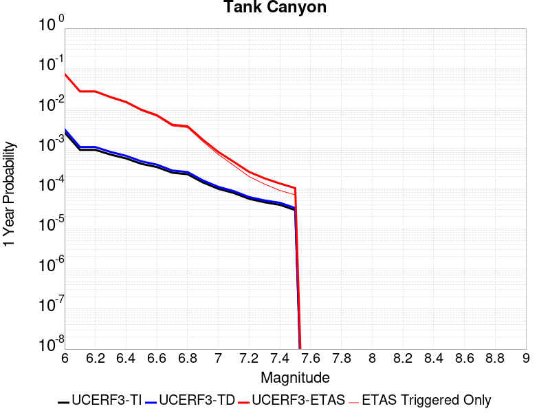 |  |

| Magnitude | 1 wk TI Prob | 1 wk TD Prob | 1 wk ETAS Prob | 1 wk ETAS/TD Gain | 1 wk ETAS Triggered Only | 1 mo TI Prob | 1 mo TD Prob | 1 mo ETAS Prob | 1 mo ETAS/TD Gain | 1 mo ETAS Triggered Only | 1 yr TI Prob | 1 yr TD Prob | 1 yr ETAS Prob | 1 yr ETAS/TD Gain | 1 yr ETAS Triggered Only | 10 yr TI Prob | 10 yr TD Prob | 10 yr ETAS Prob | 10 yr ETAS/TD Gain | 10 yr ETAS Triggered Only |
|-----|-----|-----|-----|-----|-----|-----|-----|-----|-----|-----|-----|-----|-----|-----|-----|-----|-----|-----|-----|-----|
| 6.0 | 4.8284557E-5 | 5.7964822E-5 | 0.03475311 | 599.5552 | 0.034697156 | 2.0691741E-4 | 2.4840087E-4 | 0.046998218 | 189.20312 | 0.046761435 | 0.0025163088 | 0.0030207601 | 0.07331458 | 24.27024 | 0.070506796 | 0.02488006 | 0.029863637 | 0.12411916 | 4.156197 | 0.09715699 |
| 6.1 | 1.7796336E-5 | 2.0873314E-5 | 0.011961292 | 573.04224 | 0.011940667 | 7.626778E-5 | 8.945422E-5 | 0.016528033 | 184.76527 | 0.016440049 | 9.281647E-4 | 0.0010885983 | 0.026524413 | 24.36566 | 0.025463535 | 0.009242975 | 0.010836744 | 0.04705308 | 4.3419943 | 0.036613103 |
| 6.2 | 1.7796336E-5 | 2.0873314E-5 | 0.011961292 | 573.04224 | 0.011940667 | 7.626778E-5 | 8.945422E-5 | 0.016528033 | 184.76527 | 0.016440049 | 9.281647E-4 | 0.0010885983 | 0.026524413 | 24.36566 | 0.025463535 | 0.009242975 | 0.010836744 | 0.04705308 | 4.3419943 | 0.036613103 |
| 6.3 | 1.3515912E-5 | 1.5759564E-5 | 0.008693002 | 551.6017 | 0.008677379 | 5.792405E-5 | 6.753938E-5 | 0.011859079 | 175.58763 | 0.011792337 | 7.049971E-4 | 8.2200574E-4 | 0.019274069 | 23.447609 | 0.018467244 | 0.007027647 | 0.0081922645 | 0.034550566 | 4.217462 | 0.02657602 |
| 6.4 | 1.0870146E-5 | 1.2618021E-5 | 0.0063784216 | 505.50095 | 0.0063658836 | 4.658551E-5 | 5.4076212E-5 | 0.008780427 | 162.37135 | 0.008726823 | 5.67031E-4 | 6.581969E-4 | 0.01450569 | 22.038527 | 0.013856613 | 0.005655863 | 0.0065644905 | 0.0264946 | 4.036048 | 0.020061804 |
| 6.5 | 7.964826E-6 | 9.196094E-6 | 0.0038904953 | 423.05954 | 0.003881335 | 3.4134522E-5 | 3.9411298E-5 | 0.0054532895 | 138.36868 | 0.0054140915 | 4.1550855E-4 | 4.7973756E-4 | 0.009276505 | 19.336622 | 0.008800989 | 0.0041473247 | 0.004788321 | 0.017446823 | 3.6436203 | 0.012719407 |
| 6.6 | 6.6317E-6 | 7.6122988E-6 | 0.0028382458 | 372.85004 | 0.002830655 | 2.8421264E-5 | 3.2623782E-5 | 0.0040127165 | 122.99973 | 0.0039802226 | 3.4597394E-4 | 3.9713128E-4 | 0.006785199 | 17.085531 | 0.0063906056 | 0.0034543579 | 0.003965368 | 0.013186999 | 3.3255422 | 0.009258344 |
| 6.7 | 4.793663E-6 | 5.4307857E-6 | 0.0016123442 | 296.88968 | 0.0016069221 | 2.0544108E-5 | 2.3274613E-5 | 0.0022976345 | 98.71848 | 0.002274413 | 2.500958E-4 | 2.8333595E-4 | 0.0039905673 | 14.084225 | 0.0037082818 | 0.0024981452 | 0.0028304397 | 0.008044317 | 2.8420734 | 0.0052286773 |
| 6.8 | 4.382823E-6 | 4.9692567E-6 | 0.0014141094 | 284.5716 | 0.001409147 | 1.8783392E-5 | 2.1296666E-5 | 0.002036087 | 95.6059 | 0.002014833 | 2.286638E-4 | 2.5926033E-4 | 0.0036082065 | 13.917311 | 0.0033498146 | 0.0022842865 | 0.002590253 | 0.0073368875 | 2.8324986 | 0.0047589615 |
| 6.9 | 2.729601E-6 | 3.0735416E-6 | 5.963968E-4 | 194.0422 | 5.9332506E-4 | 1.1698237E-5 | 1.3172262E-5 | 8.6606585E-4 | 65.749214 | 8.529048E-4 | 1.4241673E-4 | 1.6036171E-4 | 0.0016557955 | 10.325379 | 0.0014956737 | 0.001423255 | 0.0016026258 | 0.0038487115 | 2.4015033 | 0.002249691 |
| 7.0 | 1.8987357E-6 | 2.126939E-6 | 2.1226246E-4 | 99.79716 | 2.1013597E-4 | 8.137413E-6 | 9.115425E-6 | 3.3049693E-4 | 36.256886 | 3.2138443E-4 | 9.90685E-5 | 1.1097535E-4 | 7.78392E-4 | 7.014098 | 6.674907E-4 | 9.902435E-4 | 0.0011092679 | 0.0022081712 | 1.9906563 | 0.0011001236 |
| 7.1 | 1.4928986E-6 | 1.6641272E-6 | 1.0055148E-4 | 60.42295 | 9.888752E-5 | 6.398121E-6 | 7.1319573E-6 | 1.6782302E-4 | 23.53113 | 1.6069222E-4 | 7.789434E-5 | 8.682871E-5 | 4.576247E-4 | 5.2704306 | 3.7082817E-4 | 7.786704E-4 | 8.6800574E-4 | 0.0014608158 | 1.6829565 | 5.9332506E-4 |
| 7.2 | 1.069082E-6 | 1.1828573E-6 | 6.2987485E-5 | 53.25028 | 6.18047E-5 | 4.581772E-6 | 5.0693816E-6 | 7.923464E-5 | 15.630041 | 7.416563E-5 | 5.5781646E-5 | 6.171851E-5 | 2.5948134E-4 | 4.2042713 | 1.9777504E-4 | 5.576765E-4 | 6.170659E-4 | 8.764854E-4 | 1.4204081 | 2.5957974E-4 |
| 7.3 | 8.776551E-7 | 9.770005E-7 | 3.805978E-5 | 38.955746 | 3.7082817E-5 | 3.7613736E-6 | 4.1871413E-6 | 5.363069E-5 | 12.808427 | 4.944376E-5 | 4.579376E-5 | 5.097777E-5 | 1.7458087E-4 | 3.4246469 | 1.236094E-4 | 4.5784327E-4 | 5.097118E-4 | 6.703221E-4 | 1.3151002 | 1.6069222E-4 |
| 7.4 | 7.55721E-7 | 8.510244E-7 | 3.7933813E-5 | 44.57429 | 3.7082817E-5 | 3.2388E-6 | 3.6472454E-6 | 4.0729927E-5 | 11.167313 | 3.7082817E-5 | 3.9431678E-5 | 4.4404827E-5 | 1.4328795E-4 | 3.2268553 | 9.888752E-5 | 3.942468E-4 | 4.440104E-4 | 5.7992036E-4 | 1.3060963 | 1.3597033E-4 |
| 7.5 | 5.587665E-7 | 6.305619E-7 | 3.771336E-5 | 59.809128 | 3.7082817E-5 | 2.3947114E-6 | 2.702408E-6 | 3.9785125E-5 | 14.722101 | 3.7082817E-5 | 2.915522E-5 | 3.290182E-5 | 1.19425546E-4 | 3.6297553 | 8.6526576E-5 | 2.9151395E-4 | 3.290182E-4 | 4.5258692E-4 | 1.375568 | 1.236094E-4 |

## Garlock (Central)
*[(top)](#table-of-contents)*

| 1 Week | 1 Month | 1 Year | 10 Year |
|-----|-----|-----|-----|
|  |  | 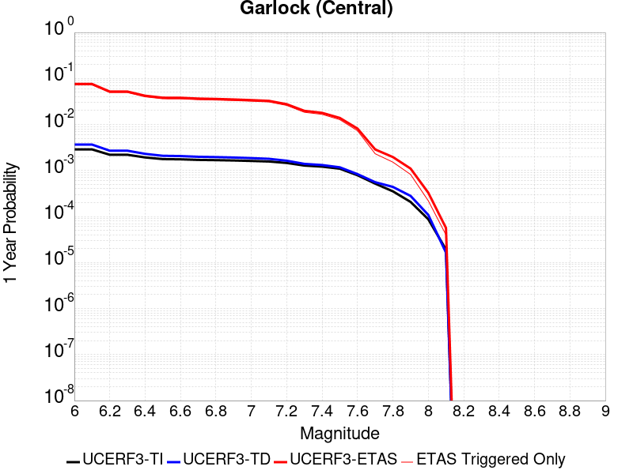 |  |

| Magnitude | 1 wk TI Prob | 1 wk TD Prob | 1 wk ETAS Prob | 1 wk ETAS/TD Gain | 1 wk ETAS Triggered Only | 1 mo TI Prob | 1 mo TD Prob | 1 mo ETAS Prob | 1 mo ETAS/TD Gain | 1 mo ETAS Triggered Only | 1 yr TI Prob | 1 yr TD Prob | 1 yr ETAS Prob | 1 yr ETAS/TD Gain | 1 yr ETAS Triggered Only | 10 yr TI Prob | 10 yr TD Prob | 10 yr ETAS Prob | 10 yr ETAS/TD Gain | 10 yr ETAS Triggered Only |
|-----|-----|-----|-----|-----|-----|-----|-----|-----|-----|-----|-----|-----|-----|-----|-----|-----|-----|-----|-----|-----|
| 6.0 | 5.5131142E-5 | 7.024681E-5 | 0.038534787 | 548.5628 | 0.038467243 | 2.3625491E-4 | 3.010234E-4 | 0.050323043 | 167.1732 | 0.050037082 | 0.0028726095 | 0.0036588663 | 0.07555799 | 20.650658 | 0.072163165 | 0.028357591 | 0.036079824 | 0.12730075 | 3.5283084 | 0.09463535 |
| 6.1 | 5.5131142E-5 | 7.024681E-5 | 0.038534787 | 548.5628 | 0.038467243 | 2.3625491E-4 | 3.010234E-4 | 0.050323043 | 167.1732 | 0.050037082 | 0.0028726095 | 0.0036588663 | 0.07555799 | 20.650658 | 0.072163165 | 0.028357591 | 0.036079824 | 0.12730075 | 3.5283084 | 0.09463535 |
| 6.2 | 4.216245E-5 | 5.1661493E-5 | 0.026057735 | 504.39377 | 0.026007416 | 1.806837E-4 | 2.2138779E-4 | 0.034428895 | 155.51396 | 0.03421508 | 0.0021976046 | 0.0026920962 | 0.051854815 | 19.261871 | 0.049295425 | 0.021759989 | 0.026689773 | 0.08963612 | 3.3584442 | 0.06467243 |
| 6.3 | 4.216245E-5 | 5.1661493E-5 | 0.026057735 | 504.39377 | 0.026007416 | 1.806837E-4 | 2.2138779E-4 | 0.034428895 | 155.51396 | 0.03421508 | 0.0021976046 | 0.0026920962 | 0.051854815 | 19.261871 | 0.049295425 | 0.021759989 | 0.026689773 | 0.08963612 | 3.3584442 | 0.06467243 |
| 6.4 | 3.6858168E-5 | 4.411054E-5 | 0.020846654 | 472.60028 | 0.02080346 | 1.5795401E-4 | 1.8903162E-4 | 0.027575696 | 145.87874 | 0.027391842 | 0.0019213937 | 0.002299056 | 0.04204677 | 18.288712 | 0.03983931 | 0.019048655 | 0.02284894 | 0.07443623 | 3.2577543 | 0.052793574 |
| 6.5 | 3.39199E-5 | 4.0018083E-5 | 0.01870429 | 467.39594 | 0.01866502 | 1.453629E-4 | 1.7149492E-4 | 0.024938568 | 145.4187 | 0.024771323 | 0.0017683565 | 0.002085973 | 0.03801828 | 18.225681 | 0.036007416 | 0.017543508 | 0.020759864 | 0.06765203 | 3.2587898 | 0.04788628 |
| 6.6 | 3.3571985E-5 | 3.9472274E-5 | 0.018641952 | 472.27966 | 0.018603213 | 1.4387199E-4 | 1.6915603E-4 | 0.024849776 | 146.90446 | 0.024684796 | 0.0017502342 | 0.0020575512 | 0.037892196 | 18.416162 | 0.035908528 | 0.017365133 | 0.020481179 | 0.0672414 | 3.2830825 | 0.04773795 |
| 6.7 | 3.2580007E-5 | 3.8088703E-5 | 0.017898966 | 469.9285 | 0.017861558 | 1.3962112E-4 | 1.632272E-4 | 0.023929434 | 146.602 | 0.023770086 | 0.0016985617 | 0.0019855013 | 0.036391713 | 18.328728 | 0.03447466 | 0.016856372 | 0.019773813 | 0.06459281 | 3.2665832 | 0.045723114 |
| 6.8 | 3.2185937E-5 | 3.7515918E-5 | 0.017502869 | 466.5451 | 0.017466007 | 1.3793244E-4 | 1.6077272E-4 | 0.023482116 | 146.05783 | 0.023325093 | 0.0016780337 | 0.001955672 | 0.03570906 | 18.259228 | 0.03381953 | 0.016654192 | 0.019480614 | 0.063428245 | 3.2559674 | 0.044820767 |
| 6.9 | 3.165394E-5 | 3.6720503E-5 | 0.01708183 | 465.18506 | 0.017045736 | 1.3565269E-4 | 1.5736422E-4 | 0.022972068 | 145.98026 | 0.022818293 | 0.0016503202 | 0.001914247 | 0.03484244 | 18.201643 | 0.032991346 | 0.01638118 | 0.019073246 | 0.06194787 | 3.2478933 | 0.043708283 |
| 7.0 | 3.0903822E-5 | 3.5625766E-5 | 0.016475089 | 462.44873 | 0.016440049 | 1.3243823E-4 | 1.5267303E-4 | 0.022176504 | 145.25488 | 0.022027194 | 0.0016112428 | 0.0018572307 | 0.03370156 | 18.146137 | 0.031903584 | 0.015996104 | 0.018512413 | 0.06004062 | 3.2432628 | 0.042311497 |
| 7.1 | 3.0069863E-5 | 3.4392073E-5 | 0.015942374 | 463.54794 | 0.015908528 | 1.2886449E-4 | 1.4738638E-4 | 0.021392709 | 145.14713 | 0.021248454 | 0.0015677959 | 0.0017929734 | 0.032491848 | 18.121769 | 0.030754017 | 0.01556781 | 0.017880075 | 0.057868987 | 3.236507 | 0.040716935 |
| 7.2 | 2.7957109E-5 | 3.128145E-5 | 0.013615529 | 435.25885 | 0.0135846725 | 1.1981068E-4 | 1.340566E-4 | 0.018116813 | 135.14302 | 0.017985167 | 0.0014577188 | 0.0016309366 | 0.027398484 | 16.799232 | 0.025809642 | 0.014481937 | 0.016283695 | 0.050002426 | 3.0707052 | 0.034276884 |
| 7.3 | 2.4519275E-5 | 2.6714795E-5 | 0.009593827 | 359.12033 | 0.009567367 | 1.0507837E-4 | 1.1448703E-4 | 0.012745921 | 111.33069 | 0.01263288 | 0.0012785783 | 0.001393003 | 0.019711085 | 14.150065 | 0.018343635 | 0.012712469 | 0.013928054 | 0.038049642 | 2.7318707 | 0.0244623 |
| 7.4 | 2.3225532E-5 | 2.51994E-5 | 0.008825966 | 350.24512 | 0.008800989 | 9.95342E-5 | 1.0799304E-4 | 0.011651863 | 107.89458 | 0.011545117 | 0.0012111551 | 0.0013140367 | 0.017967032 | 13.67316 | 0.016674908 | 0.012045753 | 0.013145725 | 0.03502974 | 2.6647246 | 0.022175526 |
| 7.5 | 2.097765E-5 | 2.2483688E-5 | 0.006919733 | 307.7668 | 0.0068974043 | 8.9901114E-5 | 9.635517E-5 | 0.009044813 | 93.869514 | 0.00894932 | 0.0010939965 | 0.0011725046 | 0.013876998 | 11.835345 | 0.012719407 | 0.010886264 | 0.011740365 | 0.028647056 | 2.4400482 | 0.01710754 |
| 7.6 | 1.511254E-5 | 1.5991332E-5 | 0.0039714286 | 248.34883 | 0.0039555007 | 6.476642E-5 | 6.853253E-5 | 0.0053957324 | 78.73243 | 0.0053275647 | 7.882459E-4 | 8.3407195E-4 | 0.008269151 | 9.914194 | 0.0074412855 | 0.007854558 | 0.008383559 | 0.018275209 | 2.1798868 | 0.009975278 |
| 7.7 | 9.934069E-6 | 1.0678794E-5 | 0.0011231515 | 105.17588 | 0.0011124846 | 4.2573887E-5 | 4.5765457E-5 | 0.0016031725 | 35.03019 | 0.0015574783 | 5.182138E-4 | 5.570524E-4 | 0.002953739 | 5.3024435 | 0.0023980222 | 0.00517007 | 0.005627684 | 0.008688237 | 1.5438387 | 0.003077874 |
| 7.8 | 6.7562896E-6 | 8.428449E-6 | 6.759135E-4 | 80.1943 | 6.674907E-4 | 2.8955206E-5 | 3.6121426E-5 | 0.0010620423 | 29.402006 | 0.001025958 | 3.5247262E-4 | 4.3968976E-4 | 0.0020459055 | 4.6530657 | 0.0016069221 | 0.0035191406 | 0.004446654 | 0.006501752 | 1.4621671 | 0.002064277 |
| 7.9 | 3.975453E-6 | 5.37103E-6 | 3.1439285E-4 | 58.534927 | 3.0902348E-4 | 1.7037546E-5 | 2.3018498E-5 | 5.174447E-4 | 22.479515 | 4.944376E-4 | 2.0741238E-4 | 2.8021427E-4 | 0.0011081651 | 3.9547062 | 8.2818297E-4 | 0.002072189 | 0.0028336283 | 0.0039306344 | 1.3871384 | 0.0011001236 |
| 8.0 | 1.6729537E-6 | 2.0775144E-6 | 8.860391E-5 | 42.649 | 8.6526576E-5 | 7.169782E-6 | 8.903603E-6 | 1.4487273E-4 | 16.271248 | 1.3597033E-4 | 8.7288594E-5 | 1.0839601E-4 | 3.55588E-4 | 3.280453 | 2.472188E-4 | 8.7254314E-4 | 0.0010969337 | 0.0014673552 | 1.3376881 | 3.7082817E-4 |
| 8.1 | 3.6733252E-7 | 3.1489964E-7 | 1.2675835E-5 | 40.25357 | 1.236094E-5 | 1.5742813E-6 | 1.3495693E-6 | 1.3710492E-5 | 10.159162 | 1.236094E-5 | 1.9166706E-5 | 1.6430899E-5 | 5.3513108E-5 | 3.256858 | 3.7082817E-5 | 1.9165053E-4 | 1.6638759E-4 | 2.1582312E-4 | 1.2971107 | 4.944376E-5 |

## Little Lake
*[(top)](#table-of-contents)*

| 1 Week | 1 Month | 1 Year | 10 Year |
|-----|-----|-----|-----|
|  |  |  |  |

| Magnitude | 1 wk TI Prob | 1 wk TD Prob | 1 wk ETAS Prob | 1 wk ETAS/TD Gain | 1 wk ETAS Triggered Only | 1 mo TI Prob | 1 mo TD Prob | 1 mo ETAS Prob | 1 mo ETAS/TD Gain | 1 mo ETAS Triggered Only | 1 yr TI Prob | 1 yr TD Prob | 1 yr ETAS Prob | 1 yr ETAS/TD Gain | 1 yr ETAS Triggered Only | 10 yr TI Prob | 10 yr TD Prob | 10 yr ETAS Prob | 10 yr ETAS/TD Gain | 10 yr ETAS Triggered Only |
|-----|-----|-----|-----|-----|-----|-----|-----|-----|-----|-----|-----|-----|-----|-----|-----|-----|-----|-----|-----|-----|
| 6.0 | 2.8424427E-5 | 3.120572E-5 | 0.0217487 | 696.94586 | 0.02171817 | 1.2181328E-4 | 1.337327E-4 | 0.027497193 | 205.61308 | 0.02736712 | 0.0014820677 | 0.0016271127 | 0.039994743 | 24.580193 | 0.03843016 | 0.014722223 | 0.016165402 | 0.063909955 | 3.953503 | 0.048529048 |
| 6.1 | 2.8424427E-5 | 3.120572E-5 | 0.0217487 | 696.94586 | 0.02171817 | 1.2181328E-4 | 1.337327E-4 | 0.027497193 | 205.61308 | 0.02736712 | 0.0014820677 | 0.0016271127 | 0.039994743 | 24.580193 | 0.03843016 | 0.014722223 | 0.016165402 | 0.063909955 | 3.953503 | 0.048529048 |
| 6.2 | 2.8424427E-5 | 3.120572E-5 | 0.0217487 | 696.94586 | 0.02171817 | 1.2181328E-4 | 1.337327E-4 | 0.027497193 | 205.61308 | 0.02736712 | 0.0014820677 | 0.0016271127 | 0.039994743 | 24.580193 | 0.03843016 | 0.014722223 | 0.016165402 | 0.063909955 | 3.953503 | 0.048529048 |
| 6.3 | 1.48860645E-5 | 1.6081389E-5 | 0.013155549 | 818.0604 | 0.013139678 | 6.379586E-5 | 6.8918576E-5 | 0.016137032 | 234.14633 | 0.01606922 | 7.7643775E-4 | 8.3878887E-4 | 0.022748703 | 27.120892 | 0.021928307 | 0.007737305 | 0.008359048 | 0.03557095 | 4.255383 | 0.027441286 |
| 6.4 | 1.48860645E-5 | 1.6081389E-5 | 0.013155549 | 818.0604 | 0.013139678 | 6.379586E-5 | 6.8918576E-5 | 0.016137032 | 234.14633 | 0.01606922 | 7.7643775E-4 | 8.3878887E-4 | 0.022748703 | 27.120892 | 0.021928307 | 0.007737305 | 0.008359048 | 0.03557095 | 4.255383 | 0.027441286 |
| 6.5 | 1.2797581E-5 | 1.3765565E-5 | 0.012114959 | 880.0917 | 0.01210136 | 5.4845623E-5 | 5.899409E-5 | 0.014915966 | 252.83833 | 0.014857849 | 6.675408E-4 | 7.18042E-4 | 0.021037187 | 29.297989 | 0.020333745 | 0.006655392 | 0.00715977 | 0.03242872 | 4.5292964 | 0.025451174 |
| 6.6 | 9.661896E-6 | 1.0289038E-5 | 0.010603505 | 1030.5634 | 0.010593325 | 4.1407468E-5 | 4.409522E-5 | 0.01304723 | 295.8876 | 0.013003708 | 5.040193E-4 | 5.367433E-4 | 0.018289879 | 34.075653 | 0.01776267 | 0.005028777 | 0.0053560743 | 0.027671015 | 5.1662865 | 0.022435104 |
| 6.7 | 7.767871E-6 | 8.199687E-6 | 0.009291189 | 1133.1151 | 0.009283066 | 3.329045E-5 | 3.5141118E-5 | 0.011493329 | 327.06213 | 0.011458591 | 4.0523586E-4 | 4.2777284E-4 | 0.015995894 | 37.39343 | 0.015574784 | 0.004044977 | 0.004270846 | 0.023828493 | 5.579338 | 0.019641533 |
| 6.8 | 6.4235196E-6 | 6.7357446E-6 | 0.0071760323 | 1065.3658 | 0.007169345 | 2.752908E-5 | 2.8867229E-5 | 0.008916127 | 308.8667 | 0.008887515 | 3.35115E-4 | 3.5141467E-4 | 0.012411452 | 35.31854 | 0.012064277 | 0.003346101 | 0.00350985 | 0.018832888 | 5.3657246 | 0.015377008 |
| 6.9 | 3.1283696E-6 | 3.1121804E-6 | 0.004032766 | 1295.8008 | 0.004029666 | 1.3407229E-5 | 1.3337856E-5 | 0.0050812555 | 380.9649 | 0.005067985 | 1.6322079E-4 | 1.6237781E-4 | 0.0069968672 | 43.090046 | 0.0068355994 | 0.0016310095 | 0.00162274 | 0.010113266 | 6.232216 | 0.008504326 |
| 7.0 | 2.290603E-6 | 2.2286815E-6 | 0.0024126065 | 1082.5264 | 0.0024103832 | 9.816834E-6 | 9.551463E-6 | 0.003075035 | 321.94388 | 0.003065513 | 1.19513395E-4 | 1.162839E-4 | 0.004231998 | 36.393673 | 0.004116193 | 0.0011944914 | 0.0011623327 | 0.006212081 | 5.3444943 | 0.005055624 |
| 7.1 | 1.293693E-6 | 1.1776827E-6 | 0.0010765782 | 914.14954 | 0.0010754018 | 5.5443866E-6 | 5.0472063E-6 | 0.0014141871 | 280.19208 | 0.001409147 | 6.750081E-5 | 6.14487E-5 | 0.0019896368 | 32.378826 | 0.0019283065 | 6.7480316E-4 | 6.143856E-4 | 0.0029862279 | 4.860511 | 0.0023733003 |
| 7.2 | 4.715842E-7 | 3.0917857E-7 | 4.975292E-5 | 160.9197 | 4.944376E-5 | 2.0210737E-6 | 1.3250503E-6 | 8.785151E-5 | 66.30051 | 8.6526576E-5 | 2.4606294E-5 | 1.6132375E-5 | 1.3973977E-4 | 8.662071 | 1.236094E-4 | 2.460357E-4 | 1.6131258E-4 | 3.096199E-4 | 1.9193786 | 1.4833127E-4 |
| 7.3 | 3.9430947E-7 | 2.3097488E-7 | 3.7313785E-5 | 161.5491 | 3.7082817E-5 | 1.6898966E-6 | 9.89892E-7 | 6.279453E-5 | 63.43574 | 6.18047E-5 | 2.0574296E-5 | 1.2051869E-5 | 9.85774E-5 | 8.179429 | 8.6526576E-5 | 2.0572392E-4 | 1.20512224E-4 | 2.3174727E-4 | 1.9230188 | 1.1124845E-4 |
| 7.4 | 3.547123E-7 | 1.9679135E-7 | 2.4918665E-5 | 126.624794 | 2.472188E-5 | 1.5201948E-6 | 8.4339126E-7 | 5.0287108E-5 | 59.624886 | 4.944376E-5 | 1.8508214E-5 | 1.0268241E-5 | 7.2072304E-5 | 7.0189533 | 6.18047E-5 | 1.8506673E-4 | 1.02677724E-4 | 1.8919542E-4 | 1.842614 | 8.6526576E-5 |
| 7.5 | 2.6354266E-7 | 1.4423138E-7 | 1.2505169E-5 | 86.70213 | 1.236094E-5 | 1.129468E-6 | 6.181344E-7 | 2.5339998E-5 | 40.99432 | 2.472188E-5 | 1.3751187E-5 | 7.5257603E-6 | 3.224745E-5 | 4.284943 | 2.472188E-5 | 1.3750336E-4 | 7.5255106E-5 | 1.2469514E-4 | 1.6569659 | 4.944376E-5 |
| 7.6 | 1.269913E-7 | 7.572556E-8 | 7.572556E-8 | 1.0 | 0.0 | 5.4424834E-7 | 3.245381E-7 | 3.245381E-7 | 1.0 | 0.0 | 6.6262032E-6 | 3.9512443E-6 | 3.9512443E-6 | 1.0 | 0.0 | 6.626006E-5 | 3.9511775E-5 | 6.423268E-5 | 1.6256591 | 2.472188E-5 |

## Owl Lake
*[(top)](#table-of-contents)*

| 1 Week | 1 Month | 1 Year | 10 Year |
|-----|-----|-----|-----|
| 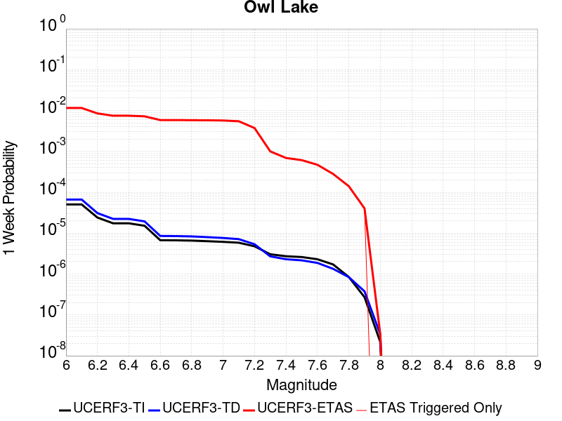 |  |  |  |

| Magnitude | 1 wk TI Prob | 1 wk TD Prob | 1 wk ETAS Prob | 1 wk ETAS/TD Gain | 1 wk ETAS Triggered Only | 1 mo TI Prob | 1 mo TD Prob | 1 mo ETAS Prob | 1 mo ETAS/TD Gain | 1 mo ETAS Triggered Only | 1 yr TI Prob | 1 yr TD Prob | 1 yr ETAS Prob | 1 yr ETAS/TD Gain | 1 yr ETAS Triggered Only | 10 yr TI Prob | 10 yr TD Prob | 10 yr ETAS Prob | 10 yr ETAS/TD Gain | 10 yr ETAS Triggered Only |
|-----|-----|-----|-----|-----|-----|-----|-----|-----|-----|-----|-----|-----|-----|-----|-----|-----|-----|-----|-----|-----|
| 6.0 | 5.0320643E-5 | 6.635816E-5 | 0.011301707 | 170.31375 | 0.011236094 | 2.1564208E-4 | 2.843674E-4 | 0.016126586 | 56.710392 | 0.015846724 | 0.0026222812 | 0.0034577388 | 0.028192682 | 8.153502 | 0.024820765 | 0.02591553 | 0.034140717 | 0.06728318 | 1.9707606 | 0.03431397 |
| 6.1 | 5.0320643E-5 | 6.635816E-5 | 0.011301707 | 170.31375 | 0.011236094 | 2.1564208E-4 | 2.843674E-4 | 0.016126586 | 56.710392 | 0.015846724 | 0.0026222812 | 0.0034577388 | 0.028192682 | 8.153502 | 0.024820765 | 0.02591553 | 0.034140717 | 0.06728318 | 1.9707606 | 0.03431397 |
| 6.2 | 2.4125871E-5 | 3.0981035E-5 | 0.00823839 | 265.9172 | 0.008207664 | 1.0339249E-4 | 1.3277028E-4 | 0.011738151 | 88.40948 | 0.011606922 | 0.0012580766 | 0.001615439 | 0.019917099 | 12.329218 | 0.018331273 | 0.012509781 | 0.016070465 | 0.04066262 | 2.5302706 | 0.02499382 |
| 6.3 | 1.7433485E-5 | 2.2355514E-5 | 0.0071420977 | 319.47812 | 0.007119901 | 7.471279E-5 | 9.580672E-5 | 0.01000833 | 104.46376 | 0.009913473 | 9.0924866E-4 | 0.0011659743 | 0.016994221 | 14.575126 | 0.015846724 | 0.009055373 | 0.011628896 | 0.03281351 | 2.821722 | 0.02143387 |
| 6.4 | 1.7433485E-5 | 2.2355514E-5 | 0.0071420977 | 319.47812 | 0.007119901 | 7.471279E-5 | 9.580672E-5 | 0.01000833 | 104.46376 | 0.009913473 | 9.0924866E-4 | 0.0011659743 | 0.016994221 | 14.575126 | 0.015846724 | 0.009055373 | 0.011628896 | 0.03281351 | 2.821722 | 0.02143387 |
| 6.5 | 1.5182742E-5 | 1.9429144E-5 | 0.0068672565 | 353.4513 | 0.0068479604 | 6.506727E-5 | 8.326596E-5 | 0.009501518 | 114.110466 | 0.009419036 | 7.919061E-4 | 0.0010134429 | 0.015942674 | 15.731201 | 0.0149443755 | 0.0078909 | 0.010118429 | 0.030136306 | 2.9783583 | 0.020222496 |
| 6.6 | 6.7271576E-6 | 8.547361E-6 | 0.0055585615 | 650.3249 | 0.005550062 | 2.8830356E-5 | 3.6631063E-5 | 0.0075394465 | 205.8211 | 0.0075030904 | 3.5095305E-4 | 4.458976E-4 | 0.0117387585 | 26.32613 | 0.011297898 | 0.0035039932 | 0.004467813 | 0.019394642 | 4.3409705 | 0.014993819 |
| 6.7 | 6.682835E-6 | 8.479807E-6 | 0.0055584945 | 655.49774 | 0.005550062 | 2.8640408E-5 | 3.6341557E-5 | 0.007539159 | 207.45285 | 0.0075030904 | 3.4864116E-4 | 4.4237426E-4 | 0.011735275 | 26.527933 | 0.011297898 | 0.003480947 | 0.0044327388 | 0.019360095 | 4.367524 | 0.014993819 |
| 6.8 | 6.5774975E-6 | 8.32628E-6 | 0.0055088988 | 661.6278 | 0.005500618 | 2.8188972E-5 | 3.5683603E-5 | 0.0074767037 | 209.52771 | 0.0074412855 | 3.4314668E-4 | 4.343669E-4 | 0.011653225 | 26.828068 | 0.011223733 | 0.0034261728 | 0.004352885 | 0.019195288 | 4.4097853 | 0.014907293 |
| 6.9 | 6.363419E-6 | 7.999454E-6 | 0.005471491 | 683.98303 | 0.0054635354 | 2.727151E-5 | 3.428296E-5 | 0.007425871 | 216.60533 | 0.0073918416 | 3.3198006E-4 | 4.1732067E-4 | 0.011549879 | 27.67627 | 0.011137206 | 0.0033148455 | 0.0041828766 | 0.018880103 | 4.5136647 | 0.014758961 |
| 7.0 | 6.1342453E-6 | 7.6316555E-6 | 0.0053845993 | 705.5611 | 0.0053770086 | 2.6289357E-5 | 3.2706717E-5 | 0.007337783 | 224.35095 | 0.007305315 | 3.2002592E-4 | 3.9813702E-4 | 0.011394993 | 28.620783 | 0.011001236 | 0.0031956544 | 0.003991571 | 0.01853157 | 4.6426764 | 0.014598269 |
| 7.1 | 5.842926E-6 | 7.142211E-6 | 0.0051368955 | 719.2304 | 0.00512979 | 2.504087E-5 | 3.0609146E-5 | 0.007076129 | 231.17694 | 0.0070457356 | 3.0482994E-4 | 3.7260808E-4 | 0.010924917 | 29.32013 | 0.010556242 | 0.0030441214 | 0.0037370329 | 0.017751215 | 4.7500825 | 0.014066749 |
| 7.2 | 4.77173E-6 | 5.358483E-6 | 0.0034911248 | 651.5136 | 0.0034857849 | 2.045011E-5 | 2.2964748E-5 | 0.0047694566 | 207.68599 | 0.0047466005 | 2.4895166E-4 | 2.79564E-4 | 0.00732333 | 26.19554 | 0.0070457356 | 0.0024867293 | 0.002808645 | 0.012213552 | 4.348557 | 0.009431397 |
| 7.3 | 3.0494948E-6 | 2.710463E-6 | 9.174175E-4 | 338.47263 | 9.147095E-4 | 1.3069198E-5 | 1.1616219E-5 | 0.0012724174 | 109.538 | 0.0012608158 | 1.5910587E-4 | 1.4141845E-4 | 0.0022054035 | 15.594877 | 0.002064277 | 0.0015899199 | 0.0014232415 | 0.0042375247 | 2.9773757 | 0.002818294 |
| 7.4 | 2.7263884E-6 | 2.3056762E-6 | 6.6979486E-4 | 290.49823 | 6.674907E-4 | 1.1684469E-5 | 9.881433E-6 | 8.751386E-4 | 88.56394 | 8.652658E-4 | 1.4224913E-4 | 1.20299905E-4 | 0.0015045586 | 12.506731 | 0.0013844252 | 0.0014215811 | 0.0012112238 | 0.003050773 | 2.5187526 | 0.00184178 |
| 7.5 | 2.6090431E-6 | 2.1656133E-6 | 5.831285E-4 | 269.26715 | 5.8096414E-4 | 1.1181565E-5 | 9.281167E-6 | 7.756523E-4 | 83.57271 | 7.6637825E-4 | 1.3612706E-4 | 1.1299244E-4 | 0.0013118681 | 11.610229 | 0.0011990111 | 0.001360437 | 0.0011379806 | 0.0027430742 | 2.4104753 | 0.0016069221 |
| 7.6 | 2.3008756E-6 | 1.8727933E-6 | 4.592267E-4 | 245.20949 | 4.5735476E-4 | 9.860858E-6 | 8.0262325E-6 | 6.137074E-4 | 76.46269 | 6.0568604E-4 | 1.20049335E-4 | 9.7715085E-5 | 9.999755E-4 | 10.233583 | 9.023486E-4 | 0.001199845 | 9.849932E-4 | 0.0021828234 | 2.2160797 | 0.0011990111 |
| 7.7 | 1.7184348E-6 | 1.3419171E-6 | 3.10365E-4 | 231.28477 | 3.0902348E-4 | 7.3646997E-6 | 5.7510606E-6 | 4.260206E-4 | 74.07687 | 4.2027194E-4 | 8.966153E-5 | 7.0016955E-5 | 7.127408E-4 | 10.179545 | 6.4276886E-4 | 8.962536E-4 | 7.078345E-4 | 0.0015107269 | 2.1342938 | 8.0346107E-4 |
| 7.8 | 8.4612907E-7 | 8.4058576E-7 | 1.4917174E-4 | 177.46165 | 1.4833127E-4 | 3.6262625E-6 | 3.6025056E-6 | 2.2609861E-4 | 62.76149 | 2.224969E-4 | 4.4148852E-5 | 4.3859643E-5 | 3.5286957E-4 | 8.045427 | 3.0902348E-4 | 4.414008E-4 | 4.4398365E-4 | 8.393581E-4 | 1.8905158 | 3.9555007E-4 |
| 7.9 | 2.716738E-7 | 3.768106E-7 | 2.509868E-5 | 66.608215 | 2.472188E-5 | 1.1643157E-6 | 1.6149015E-6 | 8.8141336E-5 | 54.58001 | 8.6526576E-5 | 1.4175452E-5 | 1.966126E-5 | 1.3090753E-4 | 6.6581454 | 1.1124845E-4 | 1.4174548E-4 | 1.9836679E-4 | 3.2195167E-4 | 1.623012 | 1.236094E-4 |
| 8.0 | 2.1995428E-8 | 3.384878E-8 | 3.384878E-8 | 1.0 | 0.0 | 9.426611E-8 | 1.4506621E-7 | 1.2506004E-5 | 86.20894 | 1.236094E-5 | 1.1476893E-6 | 1.7661803E-6 | 1.41270975E-5 | 7.9986725 | 1.236094E-5 | 1.14768345E-5 | 1.7963059E-5 | 3.0323776E-5 | 1.6881187 | 1.236094E-5 |

## Airport Lake
*[(top)](#table-of-contents)*

| 1 Week | 1 Month | 1 Year | 10 Year |
|-----|-----|-----|-----|
|  |  |  |  |

| Magnitude | 1 wk TI Prob | 1 wk TD Prob | 1 wk ETAS Prob | 1 wk ETAS/TD Gain | 1 wk ETAS Triggered Only | 1 mo TI Prob | 1 mo TD Prob | 1 mo ETAS Prob | 1 mo ETAS/TD Gain | 1 mo ETAS Triggered Only | 1 yr TI Prob | 1 yr TD Prob | 1 yr ETAS Prob | 1 yr ETAS/TD Gain | 1 yr ETAS Triggered Only | 10 yr TI Prob | 10 yr TD Prob | 10 yr ETAS Prob | 10 yr ETAS/TD Gain | 10 yr ETAS Triggered Only |
|-----|-----|-----|-----|-----|-----|-----|-----|-----|-----|-----|-----|-----|-----|-----|-----|-----|-----|-----|-----|-----|
| 6.0 | 1.2387061E-5 | 1.3103157E-5 | 0.014858397 | 1133.9556 | 0.014845489 | 5.3086325E-5 | 5.615534E-5 | 0.018349318 | 326.76 | 0.018294191 | 6.461343E-4 | 6.8350515E-4 | 0.025141437 | 36.783096 | 0.02447466 | 0.0064425888 | 0.0068168393 | 0.036735103 | 5.388876 | 0.03012361 |
| 6.1 | 1.2387061E-5 | 1.3103157E-5 | 0.014858397 | 1133.9556 | 0.014845489 | 5.3086325E-5 | 5.615534E-5 | 0.018349318 | 326.76 | 0.018294191 | 6.461343E-4 | 6.8350515E-4 | 0.025141437 | 36.783096 | 0.02447466 | 0.0064425888 | 0.0068168393 | 0.036735103 | 5.388876 | 0.03012361 |
| 6.2 | 1.2387061E-5 | 1.3103157E-5 | 0.014858397 | 1133.9556 | 0.014845489 | 5.3086325E-5 | 5.615534E-5 | 0.018349318 | 326.76 | 0.018294191 | 6.461343E-4 | 6.8350515E-4 | 0.025141437 | 36.783096 | 0.02447466 | 0.0064425888 | 0.0068168393 | 0.036735103 | 5.388876 | 0.03012361 |
| 6.3 | 1.2387061E-5 | 1.3103157E-5 | 0.014858397 | 1133.9556 | 0.014845489 | 5.3086325E-5 | 5.615534E-5 | 0.018349318 | 326.76 | 0.018294191 | 6.461343E-4 | 6.8350515E-4 | 0.025141437 | 36.783096 | 0.02447466 | 0.0064425888 | 0.0068168393 | 0.036735103 | 5.388876 | 0.03012361 |
| 6.4 | 1.2387061E-5 | 1.3103157E-5 | 0.014858397 | 1133.9556 | 0.014845489 | 5.3086325E-5 | 5.615534E-5 | 0.018349318 | 326.76 | 0.018294191 | 6.461343E-4 | 6.8350515E-4 | 0.025141437 | 36.783096 | 0.02447466 | 0.0064425888 | 0.0068168393 | 0.036735103 | 5.388876 | 0.03012361 |
| 6.5 | 6.9922594E-6 | 7.384925E-6 | 0.011515334 | 1559.3029 | 0.011508035 | 2.996648E-5 | 3.1649324E-5 | 0.014271001 | 450.9101 | 0.014239802 | 3.6478083E-4 | 3.8526783E-4 | 0.019438492 | 50.45449 | 0.019060569 | 0.003641826 | 0.0038465366 | 0.027118849 | 7.050199 | 0.023362175 |
| 6.6 | 6.9922594E-6 | 7.384925E-6 | 0.011515334 | 1559.3029 | 0.011508035 | 2.996648E-5 | 3.1649324E-5 | 0.014271001 | 450.9101 | 0.014239802 | 3.6478083E-4 | 3.8526783E-4 | 0.019438492 | 50.45449 | 0.019060569 | 0.003641826 | 0.0038465366 | 0.027118849 | 7.050199 | 0.023362175 |
| 6.7 | 5.477277E-6 | 5.7860684E-6 | 0.00989448 | 1710.0525 | 0.009888751 | 2.3473833E-5 | 2.4797222E-5 | 0.01220002 | 491.99142 | 0.012175526 | 2.8575645E-4 | 3.0186825E-4 | 0.016724598 | 55.403633 | 0.016427688 | 0.0028538927 | 0.003014966 | 0.023114875 | 7.666712 | 0.020160692 |
| 6.8 | 3.9950432E-6 | 4.2190873E-6 | 0.0072229775 | 1711.9763 | 0.007218789 | 1.7121502E-5 | 1.8081691E-5 | 0.009004322 | 497.98007 | 0.008986403 | 2.0843433E-4 | 2.2012512E-4 | 0.012380612 | 56.243523 | 0.012163164 | 0.0020823893 | 0.0021993418 | 0.017295856 | 7.8641057 | 0.01512979 |
| 6.9 | 2.95695E-6 | 3.1230243E-6 | 0.0054295585 | 1738.5579 | 0.0054264525 | 1.2672582E-5 | 1.3384334E-5 | 0.0067747277 | 506.16846 | 0.006761434 | 1.5427776E-4 | 1.6294434E-4 | 0.009184959 | 56.368694 | 0.009023486 | 0.001541707 | 0.0016284712 | 0.012698177 | 7.797607 | 0.011087763 |
| 7.0 | 1.456072E-6 | 1.540812E-6 | 0.002288311 | 1485.1332 | 0.0022867739 | 6.2402937E-6 | 6.603469E-6 | 0.0028990442 | 439.01837 | 0.0028924597 | 7.597293E-5 | 8.039528E-5 | 0.0039243386 | 48.813046 | 0.003844252 | 7.594696E-4 | 8.0376083E-4 | 0.0055341953 | 6.885376 | 0.00473424 |
| 7.1 | 6.995192E-7 | 7.4089746E-7 | 0.0010019762 | 1352.3818 | 0.0010012361 | 2.997936E-6 | 3.1752747E-6 | 0.0012887089 | 405.85745 | 0.0012855377 | 3.649926E-5 | 3.865897E-5 | 0.0017938445 | 46.401768 | 0.0017552534 | 3.6493264E-4 | 3.865897E-4 | 0.002561274 | 6.6253033 | 0.0021755253 |

## Panamint Valley
*[(top)](#table-of-contents)*

| 1 Week | 1 Month | 1 Year | 10 Year |
|-----|-----|-----|-----|
|  | 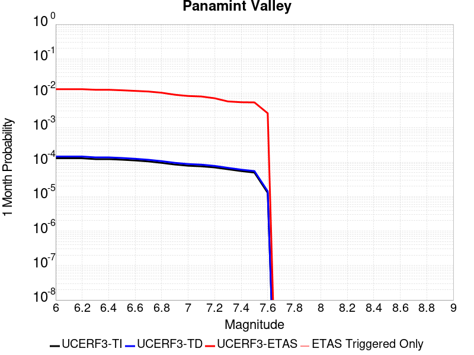 |  |  |

| Magnitude | 1 wk TI Prob | 1 wk TD Prob | 1 wk ETAS Prob | 1 wk ETAS/TD Gain | 1 wk ETAS Triggered Only | 1 mo TI Prob | 1 mo TD Prob | 1 mo ETAS Prob | 1 mo ETAS/TD Gain | 1 mo ETAS Triggered Only | 1 yr TI Prob | 1 yr TD Prob | 1 yr ETAS Prob | 1 yr ETAS/TD Gain | 1 yr ETAS Triggered Only | 10 yr TI Prob | 10 yr TD Prob | 10 yr ETAS Prob | 10 yr ETAS/TD Gain | 10 yr ETAS Triggered Only |
|-----|-----|-----|-----|-----|-----|-----|-----|-----|-----|-----|-----|-----|-----|-----|-----|-----|-----|-----|-----|-----|
| 6.0 | 3.0211835E-5 | 3.3984514E-5 | 0.009563945 | 281.4207 | 0.009530284 | 1.2947287E-4 | 1.4563995E-4 | 0.013135095 | 90.18882 | 0.012991347 | 0.0015751923 | 0.0017717537 | 0.021255096 | 11.996643 | 0.019517923 | 0.015640736 | 0.017583137 | 0.044080462 | 2.5069737 | 0.02697157 |
| 6.1 | 3.0211835E-5 | 3.3984514E-5 | 0.009563945 | 281.4207 | 0.009530284 | 1.2947287E-4 | 1.4563995E-4 | 0.013135095 | 90.18882 | 0.012991347 | 0.0015751923 | 0.0017717537 | 0.021255096 | 11.996643 | 0.019517923 | 0.015640736 | 0.017583137 | 0.044080462 | 2.5069737 | 0.02697157 |
| 6.2 | 3.0211835E-5 | 3.3984514E-5 | 0.009563945 | 281.4207 | 0.009530284 | 1.2947287E-4 | 1.4563995E-4 | 0.013135095 | 90.18882 | 0.012991347 | 0.0015751923 | 0.0017717537 | 0.021255096 | 11.996643 | 0.019517923 | 0.015640736 | 0.017583137 | 0.044080462 | 2.5069737 | 0.02697157 |
| 6.3 | 2.8573924E-5 | 3.210268E-5 | 0.009191264 | 286.30835 | 0.009159456 | 1.2245393E-4 | 1.3757581E-4 | 0.012620407 | 91.7342 | 0.012484549 | 0.001489857 | 0.0016737265 | 0.020332186 | 12.147855 | 0.01868974 | 0.01479908 | 0.016617801 | 0.04192561 | 2.5229337 | 0.025735475 |
| 6.4 | 2.8573924E-5 | 3.210268E-5 | 0.009191264 | 286.30835 | 0.009159456 | 1.2245393E-4 | 1.3757581E-4 | 0.012620407 | 91.7342 | 0.012484549 | 0.001489857 | 0.0016737265 | 0.020332186 | 12.147855 | 0.01868974 | 0.01479908 | 0.016617801 | 0.04192561 | 2.5229337 | 0.025735475 |
| 6.5 | 2.7468774E-5 | 3.0828433E-5 | 0.008843906 | 286.875 | 0.0088133495 | 1.1771801E-4 | 1.3211532E-4 | 0.0121577205 | 92.023544 | 0.012027194 | 0.0014322745 | 0.0016073446 | 0.019575944 | 12.179059 | 0.017997527 | 0.014230782 | 0.015963677 | 0.040363885 | 2.528483 | 0.024796044 |
| 6.6 | 2.6135967E-5 | 2.925248E-5 | 0.008508609 | 290.86795 | 0.0084796045 | 1.1200648E-4 | 1.253619E-4 | 0.011644313 | 92.88558 | 0.011520396 | 0.0013628257 | 0.0015252391 | 0.018680738 | 12.247745 | 0.017181706 | 0.013544982 | 0.015154043 | 0.038527396 | 2.542384 | 0.023733003 |
| 6.7 | 2.4498746E-5 | 2.7341335E-5 | 0.008160617 | 298.4718 | 0.008133498 | 1.04990395E-4 | 1.1717203E-4 | 0.011129479 | 94.98409 | 0.011013597 | 0.0012775084 | 0.0014256609 | 0.01760775 | 12.350587 | 0.016205192 | 0.012701893 | 0.014171274 | 0.036251888 | 2.5581248 | 0.022398023 |
| 6.8 | 2.2244329E-5 | 2.4935423E-5 | 0.0075278385 | 301.89334 | 0.0075030904 | 9.532935E-5 | 1.0686185E-4 | 0.010241749 | 95.84103 | 0.01013597 | 0.0011600169 | 0.0013002884 | 0.016200542 | 12.459192 | 0.014919654 | 0.011539802 | 0.0129325185 | 0.033186313 | 2.5661137 | 0.02051916 |
| 6.9 | 1.9902658E-5 | 2.2290267E-5 | 0.0066723274 | 299.33817 | 0.006650185 | 8.529431E-5 | 9.552632E-5 | 0.008969833 | 93.89907 | 0.008875155 | 0.0010379635 | 0.0011624309 | 0.014039904 | 12.078054 | 0.0128924595 | 0.010331288 | 0.011568608 | 0.029125787 | 2.5176573 | 0.01776267 |
| 7.0 | 1.8353881E-5 | 2.0566185E-5 | 0.006176187 | 300.30786 | 0.006155748 | 7.865712E-5 | 8.813792E-5 | 0.008257999 | 93.69405 | 0.008170581 | 9.5722964E-4 | 0.0010725686 | 0.012802866 | 11.936641 | 0.011742893 | 0.009531168 | 0.010678849 | 0.0266743 | 2.4978628 | 0.016168108 |
| 7.1 | 1.7667631E-5 | 1.9772613E-5 | 0.0060270703 | 304.81912 | 0.0060074166 | 7.571623E-5 | 8.473711E-5 | 0.008032148 | 94.78902 | 0.007948084 | 9.2145515E-4 | 0.0010312037 | 0.012379193 | 12.004605 | 0.011359704 | 0.009176437 | 0.010269073 | 0.025647216 | 2.4975202 | 0.015537701 |
| 7.2 | 1.6381597E-5 | 1.8158249E-5 | 0.0054321513 | 299.1561 | 0.0054140915 | 7.020495E-5 | 7.781885E-5 | 0.007123006 | 91.53317 | 0.0070457356 | 8.544101E-4 | 9.4704994E-4 | 0.010937579 | 11.549106 | 0.01 | 0.008511325 | 0.009434792 | 0.022977006 | 2.4353485 | 0.013671199 |
| 7.3 | 1.4520491E-5 | 1.5966476E-5 | 0.004416391 | 276.60397 | 0.0044004945 | 6.222919E-5 | 6.842605E-5 | 0.005704629 | 83.369255 | 0.005636588 | 7.57377E-4 | 8.327849E-4 | 0.008873055 | 10.654677 | 0.008046972 | 0.0075480095 | 0.00829975 | 0.019258713 | 2.3203964 | 0.01105068 |
| 7.4 | 1.2852287E-5 | 1.4145411E-5 | 0.0041550016 | 293.73495 | 0.004140915 | 5.5080065E-5 | 6.062187E-5 | 0.005400224 | 89.08046 | 0.0053399256 | 6.7039346E-4 | 7.378371E-4 | 0.008383613 | 11.362417 | 0.0076514217 | 0.0066837464 | 0.0073567946 | 0.017774027 | 2.4160016 | 0.010494438 |
| 7.5 | 1.1637851E-5 | 1.2836797E-5 | 0.0041289767 | 321.6516 | 0.004116193 | 4.987555E-5 | 5.5013777E-5 | 0.005345205 | 97.16121 | 0.005290482 | 6.070656E-4 | 6.6960254E-4 | 0.008241785 | 12.308473 | 0.007577256 | 0.006054099 | 0.0066787465 | 0.016955754 | 2.5387628 | 0.010346106 |
| 7.6 | 3.0068115E-6 | 3.3330316E-6 | 0.0020428812 | 612.91986 | 0.002039555 | 1.2886271E-5 | 1.4284384E-5 | 0.0027336522 | 191.37347 | 0.0027194067 | 1.5687906E-4 | 1.7390578E-4 | 0.0038444663 | 22.106606 | 0.003671199 | 0.0015676835 | 0.0017391363 | 0.0066378945 | 3.8167768 | 0.004907293 |

## Garlock (East)
*[(top)](#table-of-contents)*

| 1 Week | 1 Month | 1 Year | 10 Year |
|-----|-----|-----|-----|
|  |  |  |  |

| Magnitude | 1 wk TI Prob | 1 wk TD Prob | 1 wk ETAS Prob | 1 wk ETAS/TD Gain | 1 wk ETAS Triggered Only | 1 mo TI Prob | 1 mo TD Prob | 1 mo ETAS Prob | 1 mo ETAS/TD Gain | 1 mo ETAS Triggered Only | 1 yr TI Prob | 1 yr TD Prob | 1 yr ETAS Prob | 1 yr ETAS/TD Gain | 1 yr ETAS Triggered Only | 10 yr TI Prob | 10 yr TD Prob | 10 yr ETAS Prob | 10 yr ETAS/TD Gain | 10 yr ETAS Triggered Only |
|-----|-----|-----|-----|-----|-----|-----|-----|-----|-----|-----|-----|-----|-----|-----|-----|-----|-----|-----|-----|-----|
| 6.0 | 4.5092507E-5 | 6.290325E-5 | 0.0072688777 | 115.55647 | 0.007206428 | 1.9323928E-4 | 2.6956003E-4 | 0.010600519 | 39.325268 | 0.010333746 | 0.0023501497 | 0.0032774 | 0.019737491 | 6.0223017 | 0.016514216 | 0.023254504 | 0.032351844 | 0.054707028 | 1.6910018 | 0.023102596 |
| 6.1 | 4.5092507E-5 | 6.290325E-5 | 0.0072688777 | 115.55647 | 0.007206428 | 1.9323928E-4 | 2.6956003E-4 | 0.010600519 | 39.325268 | 0.010333746 | 0.0023501497 | 0.0032774 | 0.019737491 | 6.0223017 | 0.016514216 | 0.023254504 | 0.032351844 | 0.054707028 | 1.6910018 | 0.023102596 |
| 6.2 | 2.6674514E-5 | 3.4509674E-5 | 0.005868672 | 170.05873 | 0.0058343634 | 1.1431433E-4 | 1.4789042E-4 | 0.008070081 | 54.567978 | 0.007923362 | 0.0013908884 | 0.0017991117 | 0.013866361 | 7.7073374 | 0.012088999 | 0.01382215 | 0.017890299 | 0.03410907 | 1.9065679 | 0.016514216 |
| 6.3 | 2.6674514E-5 | 3.4509674E-5 | 0.005868672 | 170.05873 | 0.0058343634 | 1.1431433E-4 | 1.4789042E-4 | 0.008070081 | 54.567978 | 0.007923362 | 0.0013908884 | 0.0017991117 | 0.013866361 | 7.7073374 | 0.012088999 | 0.01382215 | 0.017890299 | 0.03410907 | 1.9065679 | 0.016514216 |
| 6.4 | 2.5312667E-5 | 3.233893E-5 | 0.0058170715 | 179.8783 | 0.0057849195 | 1.0847834E-4 | 1.3858822E-4 | 0.00794962 | 57.361435 | 0.0078121135 | 0.0013199237 | 0.0016860351 | 0.013631251 | 8.084797 | 0.011965389 | 0.013121112 | 0.016778335 | 0.03278455 | 1.9539812 | 0.016279357 |
| 6.5 | 2.5312667E-5 | 3.233893E-5 | 0.0058170715 | 179.8783 | 0.0057849195 | 1.0847834E-4 | 1.3858822E-4 | 0.00794962 | 57.361435 | 0.0078121135 | 0.0013199237 | 0.0016860351 | 0.013631251 | 8.084797 | 0.011965389 | 0.013121112 | 0.016778335 | 0.03278455 | 1.9539812 | 0.016279357 |
| 6.6 | 2.246556E-5 | 2.8133776E-5 | 0.0055904 | 198.70776 | 0.005562423 | 9.627742E-5 | 1.20567885E-4 | 0.007635113 | 63.326256 | 0.0075154514 | 0.0011715472 | 0.0014669491 | 0.012847017 | 8.757643 | 0.011396786 | 0.011653901 | 0.01461866 | 0.029795239 | 2.0381649 | 0.01540173 |
| 6.7 | 2.2241198E-5 | 2.7803519E-5 | 0.0055653504 | 200.16713 | 0.005537701 | 9.531594E-5 | 1.1915263E-4 | 0.0076089893 | 63.85918 | 0.0074907294 | 0.0011598538 | 0.0014497414 | 0.012805319 | 8.832829 | 0.011372064 | 0.011538187 | 0.014448853 | 0.029603682 | 2.0488603 | 0.015377008 |
| 6.8 | 1.9528685E-5 | 2.389819E-5 | 0.0054007783 | 225.99109 | 0.0053770086 | 8.369167E-5 | 1.0241691E-4 | 0.007320466 | 71.47713 | 0.007218789 | 0.0010184698 | 0.0012462323 | 0.0119374655 | 9.578845 | 0.010704573 | 0.010138147 | 0.012436427 | 0.02670666 | 2.1474543 | 0.014449938 |
| 6.9 | 1.3318621E-5 | 1.5198884E-5 | 0.005046025 | 331.99966 | 0.0050309026 | 5.7078556E-5 | 6.513648E-5 | 0.006739609 | 103.46903 | 0.006674907 | 6.9470983E-4 | 7.927538E-4 | 0.010574857 | 13.3393955 | 0.009789864 | 0.0069254204 | 0.007939888 | 0.02076677 | 2.6154993 | 0.012929543 |
| 7.0 | 1.1760853E-5 | 1.31077895E-5 | 0.0049326974 | 376.31802 | 0.0049196538 | 5.0402683E-5 | 5.6175057E-5 | 0.0065823845 | 117.176285 | 0.006526576 | 6.134799E-4 | 6.8372174E-4 | 0.010083965 | 14.748639 | 0.009406675 | 0.0061178906 | 0.00685652 | 0.019194087 | 2.799392 | 0.012422744 |
| 7.1 | 1.0064758E-5 | 1.0902931E-5 | 0.0048439777 | 444.28217 | 0.0048331274 | 4.3133965E-5 | 4.672603E-5 | 0.006399952 | 136.9676 | 0.0063535227 | 5.2502943E-4 | 5.687444E-4 | 0.009611806 | 16.900045 | 0.009048208 | 0.005237907 | 0.0057129986 | 0.017450256 | 3.0544827 | 0.011804697 |
| 7.2 | 9.768808E-6 | 1.0498807E-5 | 0.004682885 | 446.0397 | 0.004672435 | 4.186565E-5 | 4.499413E-5 | 0.006225186 | 138.35551 | 0.00618047 | 5.095951E-4 | 5.4766936E-4 | 0.009368546 | 17.106209 | 0.008825711 | 0.0050842804 | 0.0055032647 | 0.016947968 | 3.0796206 | 0.011508035 |
| 7.3 | 9.344516E-6 | 9.944468E-6 | 0.0042497045 | 427.3436 | 0.0042398022 | 4.004731E-5 | 4.261847E-5 | 0.0057160477 | 134.12138 | 0.005673671 | 4.8746695E-4 | 5.1875977E-4 | 0.008672748 | 16.718235 | 0.00815822 | 0.0048639905 | 0.0052149445 | 0.015851397 | 3.0396101 | 0.010692213 |
| 7.4 | 9.023491E-6 | 9.490661E-6 | 0.003940232 | 415.1694 | 0.0039307787 | 3.867153E-5 | 4.0673647E-5 | 0.005256778 | 129.24284 | 0.0052163163 | 4.7072413E-4 | 4.950925E-4 | 0.008006823 | 16.172379 | 0.0075154514 | 0.004697283 | 0.0049783974 | 0.0147441225 | 2.9616203 | 0.009814586 |
| 7.5 | 7.081253E-6 | 7.087672E-6 | 0.0021207933 | 299.22284 | 0.0021137206 | 3.0347876E-5 | 3.0375388E-5 | 0.00276206 | 90.930855 | 0.0027317677 | 3.6942272E-4 | 3.6975832E-4 | 0.0041260943 | 11.1588955 | 0.0037577257 | 0.003688092 | 0.0037243143 | 0.008699535 | 2.3358757 | 0.0049938196 |
| 7.6 | 6.116396E-6 | 5.959245E-6 | 0.0012791284 | 214.64607 | 0.0012731767 | 2.6212863E-5 | 2.5539372E-5 | 0.0017189449 | 67.30568 | 0.0016934488 | 3.1909486E-4 | 3.1089774E-4 | 0.002634032 | 8.472342 | 0.0023238566 | 0.0031863707 | 0.0031357552 | 0.0062532662 | 1.994182 | 0.0031273176 |
| 7.7 | 4.797145E-6 | 4.757281E-6 | 6.722448E-4 | 141.30862 | 6.674907E-4 | 2.055903E-5 | 2.0388188E-5 | 8.97997E-4 | 44.044964 | 8.776267E-4 | 2.5027743E-4 | 2.4819805E-4 | 0.0015210588 | 6.1284075 | 0.0012731767 | 0.0024999576 | 0.0025093474 | 0.004124567 | 1.6436812 | 0.0016192831 |
| 7.8 | 3.4028885E-6 | 3.978462E-6 | 4.1188783E-4 | 103.52942 | 4.07911E-4 | 1.4583726E-5 | 1.7050439E-5 | 5.9800467E-4 | 35.072685 | 5.8096414E-4 | 1.775424E-4 | 2.0756939E-4 | 0.001085014 | 5.2272344 | 8.776267E-4 | 0.0017740062 | 0.0021012232 | 0.003199035 | 1.5224633 | 0.0011001236 |
| 7.9 | 2.5928412E-6 | 3.3724489E-6 | 2.382295E-4 | 70.639915 | 2.3485786E-4 | 1.1112129E-5 | 1.4453272E-5 | 3.481938E-4 | 24.091002 | 3.3374535E-4 | 1.3528178E-4 | 1.7595445E-4 | 7.197401E-4 | 4.090491 | 5.438813E-4 | 0.0013519945 | 0.0017812408 | 0.0025215761 | 1.415629 | 7.4165635E-4 |
| 8.0 | 1.3743648E-6 | 1.6734747E-6 | 8.819991E-5 | 52.704655 | 8.6526576E-5 | 5.8901214E-6 | 7.1720146E-6 | 1.3078052E-4 | 18.234837 | 1.236094E-4 | 7.1709874E-5 | 8.731581E-5 | 2.9743343E-4 | 3.4064097 | 2.1013597E-4 | 7.1686733E-4 | 8.837234E-4 | 0.0012048237 | 1.3633494 | 3.2138443E-4 |
| 8.1 | 3.6733252E-7 | 3.1489964E-7 | 1.2675835E-5 | 40.25357 | 1.236094E-5 | 1.5742813E-6 | 1.3495693E-6 | 1.3710492E-5 | 10.159162 | 1.236094E-5 | 1.9166706E-5 | 1.6430899E-5 | 5.3513108E-5 | 3.256858 | 3.7082817E-5 | 1.9165053E-4 | 1.6638759E-4 | 2.1582312E-4 | 1.2971107 | 4.944376E-5 |

## Blackwater
*[(top)](#table-of-contents)*

| 1 Week | 1 Month | 1 Year | 10 Year |
|-----|-----|-----|-----|
|  | 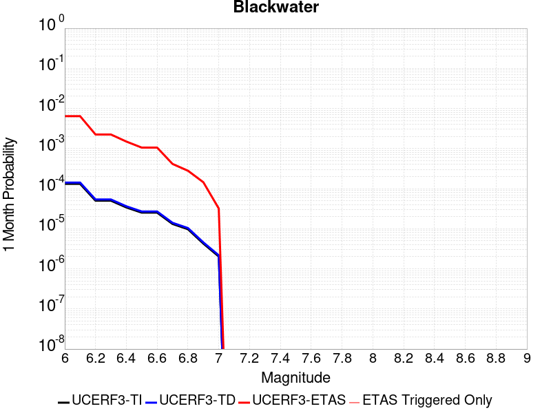 |  |  |

| Magnitude | 1 wk TI Prob | 1 wk TD Prob | 1 wk ETAS Prob | 1 wk ETAS/TD Gain | 1 wk ETAS Triggered Only | 1 mo TI Prob | 1 mo TD Prob | 1 mo ETAS Prob | 1 mo ETAS/TD Gain | 1 mo ETAS Triggered Only | 1 yr TI Prob | 1 yr TD Prob | 1 yr ETAS Prob | 1 yr ETAS/TD Gain | 1 yr ETAS Triggered Only | 10 yr TI Prob | 10 yr TD Prob | 10 yr ETAS Prob | 10 yr ETAS/TD Gain | 10 yr ETAS Triggered Only |
|-----|-----|-----|-----|-----|-----|-----|-----|-----|-----|-----|-----|-----|-----|-----|-----|-----|-----|-----|-----|-----|
| 6.0 | 3.0708583E-5 | 3.3095846E-5 | 0.0044952473 | 135.82512 | 0.004462299 | 1.3160157E-4 | 1.4183241E-4 | 0.006469736 | 45.615356 | 0.006328801 | 0.0016010714 | 0.0017255784 | 0.011683644 | 6.770856 | 0.009975278 | 0.015895851 | 0.017135633 | 0.0315202 | 1.8394535 | 0.014635352 |
| 6.1 | 3.0708583E-5 | 3.3095846E-5 | 0.0044952473 | 135.82512 | 0.004462299 | 1.3160157E-4 | 1.4183241E-4 | 0.006469736 | 45.615356 | 0.006328801 | 0.0016010714 | 0.0017255784 | 0.011683644 | 6.770856 | 0.009975278 | 0.015895851 | 0.017135633 | 0.0315202 | 1.8394535 | 0.014635352 |
| 6.2 | 1.1707779E-5 | 1.2545122E-5 | 0.0015576432 | 124.16325 | 0.0015451175 | 5.017523E-5 | 5.3763757E-5 | 0.002229172 | 41.46236 | 0.0021755253 | 6.107122E-4 | 6.5438676E-4 | 0.004100832 | 6.26668 | 0.0034487022 | 0.006090366 | 0.0065255696 | 0.011744687 | 1.799795 | 0.0052533993 |
| 6.3 | 1.1707779E-5 | 1.2545122E-5 | 0.0015576432 | 124.16325 | 0.0015451175 | 5.017523E-5 | 5.3763757E-5 | 0.002229172 | 41.46236 | 0.0021755253 | 6.107122E-4 | 6.5438676E-4 | 0.004100832 | 6.26668 | 0.0034487022 | 0.006090366 | 0.0065255696 | 0.011744687 | 1.799795 | 0.0052533993 |
| 6.4 | 7.929244E-6 | 8.480098E-6 | 0.0010344294 | 121.983185 | 0.001025958 | 3.3982033E-5 | 3.6342793E-5 | 0.0014825201 | 40.792686 | 0.0014462299 | 4.136527E-4 | 4.423877E-4 | 0.002678728 | 6.055159 | 0.00223733 | 0.0041288356 | 0.0044154758 | 0.007873563 | 1.7831743 | 0.003473424 |
| 6.5 | 5.8832115E-6 | 6.285991E-6 | 6.861334E-4 | 109.15278 | 6.798517E-4 | 2.521352E-5 | 2.6939697E-5 | 0.0010281488 | 38.164825 | 0.0010012361 | 3.0693135E-4 | 3.27944E-4 | 0.0018107702 | 5.521584 | 0.0014833127 | 0.0030650778 | 0.0032748538 | 0.005615741 | 1.7148067 | 0.0023485785 |
| 6.6 | 5.8832115E-6 | 6.285991E-6 | 6.861334E-4 | 109.15278 | 6.798517E-4 | 2.521352E-5 | 2.6939697E-5 | 0.0010281488 | 38.164825 | 0.0010012361 | 3.0693135E-4 | 3.27944E-4 | 0.0018107702 | 5.521584 | 0.0014833127 | 0.0030650778 | 0.0032748538 | 0.005615741 | 1.7148067 | 0.0023485785 |
| 6.7 | 3.0715053E-6 | 3.2814662E-6 | 3.1230395E-4 | 95.17207 | 3.0902348E-4 | 1.3163528E-5 | 1.4063357E-5 | 4.219686E-4 | 30.00483 | 4.07911E-4 | 1.6025416E-4 | 1.7120909E-4 | 8.633032E-4 | 5.0423913 | 6.922126E-4 | 0.0016013865 | 0.0017108864 | 0.0028091278 | 1.6419137 | 0.0011001236 |
| 6.8 | 2.2722281E-6 | 2.4287538E-6 | 2.1256422E-4 | 87.519875 | 2.1013597E-4 | 9.738084E-6 | 1.0408908E-5 | 3.0706837E-4 | 29.500536 | 2.9666253E-4 | 1.1855473E-4 | 1.26722E-4 | 6.334563E-4 | 4.998787 | 5.067985E-4 | 0.001184915 | 0.0012665876 | 0.002069031 | 1.6335475 | 8.0346107E-4 |
| 6.9 | 9.952399E-7 | 1.0653489E-6 | 1.2467461E-4 | 117.02703 | 1.236094E-4 | 4.265307E-6 | 4.5657757E-6 | 1.6525725E-4 | 36.194782 | 1.6069222E-4 | 5.1928873E-5 | 5.5587418E-5 | 2.7807197E-4 | 5.002426 | 2.224969E-4 | 5.191674E-4 | 5.557858E-4 | 8.7699154E-4 | 1.5779309 | 3.2138443E-4 |
| 7.0 | 4.7385504E-7 | 5.0755597E-7 | 5.0755597E-7 | 1.0 | 0.0 | 2.0308057E-6 | 2.1752398E-6 | 2.6897065E-5 | 12.365104 | 2.472188E-5 | 2.4724779E-5 | 2.6483543E-5 | 8.828661E-5 | 3.33364 | 6.18047E-5 | 2.4722028E-4 | 2.6483546E-4 | 3.884121E-4 | 1.4666167 | 1.236094E-4 |

## Hunter Mountain-Saline Valley
*[(top)](#table-of-contents)*

| 1 Week | 1 Month | 1 Year | 10 Year |
|-----|-----|-----|-----|
|  |  |  |  |

| Magnitude | 1 wk TI Prob | 1 wk TD Prob | 1 wk ETAS Prob | 1 wk ETAS/TD Gain | 1 wk ETAS Triggered Only | 1 mo TI Prob | 1 mo TD Prob | 1 mo ETAS Prob | 1 mo ETAS/TD Gain | 1 mo ETAS Triggered Only | 1 yr TI Prob | 1 yr TD Prob | 1 yr ETAS Prob | 1 yr ETAS/TD Gain | 1 yr ETAS Triggered Only | 10 yr TI Prob | 10 yr TD Prob | 10 yr ETAS Prob | 10 yr ETAS/TD Gain | 10 yr ETAS Triggered Only |
|-----|-----|-----|-----|-----|-----|-----|-----|-----|-----|-----|-----|-----|-----|-----|-----|-----|-----|-----|-----|-----|
| 6.0 | 4.5103672E-5 | 5.4570177E-5 | 0.0044177435 | 80.95528 | 0.0043634116 | 1.9328714E-4 | 2.3385242E-4 | 0.005906197 | 25.256084 | 0.005673671 | 0.002350731 | 0.0028435152 | 0.010892257 | 3.8305602 | 0.008071694 | 0.023260195 | 0.028091887 | 0.038880188 | 1.3840362 | 0.011100124 |
| 6.1 | 4.5103672E-5 | 5.4570177E-5 | 0.0044177435 | 80.95528 | 0.0043634116 | 1.9328714E-4 | 2.3385242E-4 | 0.005906197 | 25.256084 | 0.005673671 | 0.002350731 | 0.0028435152 | 0.010892257 | 3.8305602 | 0.008071694 | 0.023260195 | 0.028091887 | 0.038880188 | 1.3840362 | 0.011100124 |
| 6.2 | 3.9363465E-5 | 4.706337E-5 | 0.004397909 | 93.44654 | 0.0043510506 | 1.6868966E-4 | 2.0168544E-4 | 0.005837137 | 28.941786 | 0.005636588 | 0.002051862 | 0.0024528175 | 0.01046772 | 4.2676315 | 0.00803461 | 0.020330196 | 0.024273481 | 0.035055924 | 1.4442066 | 0.01105068 |
| 6.3 | 3.9363465E-5 | 4.706337E-5 | 0.004397909 | 93.44654 | 0.0043510506 | 1.6868966E-4 | 2.0168544E-4 | 0.005837137 | 28.941786 | 0.005636588 | 0.002051862 | 0.0024528175 | 0.01046772 | 4.2676315 | 0.00803461 | 0.020330196 | 0.024273481 | 0.035055924 | 1.4442066 | 0.01105068 |
| 6.4 | 3.2311684E-5 | 3.795099E-5 | 0.004351755 | 114.66776 | 0.0043139677 | 1.384713E-4 | 1.6263737E-4 | 0.005748873 | 35.3478 | 0.0055871448 | 0.0016845843 | 0.0019783843 | 0.009910744 | 5.009514 | 0.007948084 | 0.016718714 | 0.019616475 | 0.030341312 | 1.5467261 | 0.010939431 |
| 6.5 | 3.2311684E-5 | 3.795099E-5 | 0.004351755 | 114.66776 | 0.0043139677 | 1.384713E-4 | 1.6263737E-4 | 0.005748873 | 35.3478 | 0.0055871448 | 0.0016845843 | 0.0019783843 | 0.009910744 | 5.009514 | 0.007948084 | 0.016718714 | 0.019616475 | 0.030341312 | 1.5467261 | 0.010939431 |
| 6.6 | 2.9305844E-5 | 3.418183E-5 | 0.0043232813 | 126.47892 | 0.004289246 | 1.2559042E-4 | 1.4648569E-4 | 0.0057080938 | 38.966904 | 0.005562423 | 0.0015279909 | 0.001782067 | 0.00967897 | 5.431317 | 0.007911001 | 0.015175272 | 0.01768569 | 0.028358797 | 1.6034882 | 0.0108652655 |
| 6.7 | 2.7826512E-5 | 3.2344276E-5 | 0.004309091 | 133.22577 | 0.004276885 | 1.19251024E-4 | 1.386113E-4 | 0.0056879036 | 41.034924 | 0.005550062 | 0.0014509142 | 0.0016863465 | 0.009559327 | 5.668661 | 0.007886279 | 0.014414776 | 0.016743187 | 0.02739007 | 1.6358936 | 0.010828183 |
| 6.8 | 2.3389874E-5 | 2.6866714E-5 | 0.004266555 | 158.8045 | 0.0042398022 | 1.0023846E-4 | 1.15138246E-4 | 0.0056027635 | 48.661186 | 0.005488257 | 0.00121972 | 0.001400954 | 0.009202124 | 6.5684695 | 0.0078121135 | 0.01213047 | 0.013927434 | 0.024531676 | 1.7613924 | 0.010754017 |
| 6.9 | 2.069209E-5 | 2.3570032E-5 | 0.0042261905 | 179.30356 | 0.0042027193 | 8.867737E-5 | 1.01010715E-4 | 0.0055516344 | 54.960846 | 0.0054511745 | 0.0010791123 | 0.0012291478 | 0.008994622 | 7.317771 | 0.007775031 | 0.010738871 | 0.012228523 | 0.022814406 | 1.8656713 | 0.010716935 |
| 7.0 | 1.7462342E-5 | 1.9633546E-5 | 0.0042099096 | 214.42432 | 0.0041903583 | 7.483646E-5 | 8.414118E-5 | 0.005510137 | 65.4868 | 0.0054264525 | 9.1075303E-4 | 0.0010239601 | 0.008753985 | 8.549147 | 0.007737948 | 0.009070295 | 0.0101960525 | 0.020767013 | 2.0367699 | 0.010679851 |
| 7.1 | 1.4807709E-5 | 1.6441749E-5 | 0.0041943705 | 255.10489 | 0.0041779974 | 6.3460066E-5 | 7.046283E-5 | 0.0054594525 | 77.4799 | 0.0053893696 | 7.723524E-4 | 8.575638E-4 | 0.008551825 | 9.972232 | 0.007700865 | 0.007696735 | 0.008545532 | 0.01902382 | 2.2261717 | 0.010568603 |
| 7.2 | 1.4180048E-5 | 1.5698337E-5 | 0.0041812696 | 266.35114 | 0.0041656364 | 6.077022E-5 | 6.727694E-5 | 0.0054439236 | 80.91812 | 0.0053770086 | 7.396263E-4 | 8.188051E-4 | 0.008501014 | 10.382218 | 0.007688504 | 0.0073716943 | 0.008160833 | 0.018618667 | 2.2814665 | 0.010543881 |
| 7.3 | 1.3730402E-5 | 1.5172075E-5 | 0.0041807457 | 275.55527 | 0.0041656364 | 5.8843252E-5 | 6.502165E-5 | 0.0054416806 | 83.690285 | 0.0053770086 | 7.161811E-4 | 7.9136714E-4 | 0.008473787 | 10.707782 | 0.007688504 | 0.007138774 | 0.007888422 | 0.018336866 | 2.324529 | 0.0105315205 |
| 7.4 | 1.2810095E-5 | 1.4109277E-5 | 0.004142605 | 293.60858 | 0.004128554 | 5.489925E-5 | 6.0467017E-5 | 0.0053753494 | 88.89722 | 0.005315204 | 6.681934E-4 | 7.359531E-4 | 0.0083446875 | 11.3386135 | 0.007614339 | 0.006661878 | 0.007338053 | 0.017706402 | 2.4129562 | 0.010444994 |
| 7.5 | 1.1595659E-5 | 1.2800664E-5 | 0.00411658 | 321.59113 | 0.004103832 | 4.9694736E-5 | 5.4858923E-5 | 0.00532033 | 96.98204 | 0.0052657602 | 6.0486543E-4 | 6.6771836E-4 | 0.008202856 | 12.2849045 | 0.007540173 | 0.006032217 | 0.0066599925 | 0.016888078 | 2.5357506 | 0.010296662 |
| 7.6 | 2.997694E-6 | 3.3251579E-6 | 0.0020428733 | 614.36884 | 0.002039555 | 1.28471975E-5 | 1.425064E-5 | 0.0027212577 | 190.95688 | 0.0027070458 | 1.564034E-4 | 1.73495E-4 | 0.0038316983 | 22.085352 | 0.003658838 | 0.0015629337 | 0.001735031 | 0.00662147 | 3.8163412 | 0.004894932 |

## Ash Hill
*[(top)](#table-of-contents)*

| 1 Week | 1 Month | 1 Year | 10 Year |
|-----|-----|-----|-----|
|  |  |  |  |

| Magnitude | 1 wk TI Prob | 1 wk TD Prob | 1 wk ETAS Prob | 1 wk ETAS/TD Gain | 1 wk ETAS Triggered Only | 1 mo TI Prob | 1 mo TD Prob | 1 mo ETAS Prob | 1 mo ETAS/TD Gain | 1 mo ETAS Triggered Only | 1 yr TI Prob | 1 yr TD Prob | 1 yr ETAS Prob | 1 yr ETAS/TD Gain | 1 yr ETAS Triggered Only | 10 yr TI Prob | 10 yr TD Prob | 10 yr ETAS Prob | 10 yr ETAS/TD Gain | 10 yr ETAS Triggered Only |
|-----|-----|-----|-----|-----|-----|-----|-----|-----|-----|-----|-----|-----|-----|-----|-----|-----|-----|-----|-----|-----|
| 6.0 | 2.1545662E-5 | 2.3194447E-5 | 0.002532407 | 109.18161 | 0.0025092708 | 9.2335285E-5 | 9.940143E-5 | 0.0038073147 | 38.30241 | 0.0037082818 | 0.0011236023 | 0.0012096206 | 0.0074937283 | 6.1951065 | 0.006291718 | 0.011179381 | 0.012038348 | 0.021563813 | 1.7912601 | 0.009641533 |
| 6.1 | 2.1545662E-5 | 2.3194447E-5 | 0.002532407 | 109.18161 | 0.0025092708 | 9.2335285E-5 | 9.940143E-5 | 0.0038073147 | 38.30241 | 0.0037082818 | 0.0011236023 | 0.0012096206 | 0.0074937283 | 6.1951065 | 0.006291718 | 0.011179381 | 0.012038348 | 0.021563813 | 1.7912601 | 0.009641533 |
| 6.2 | 2.1545662E-5 | 2.3194447E-5 | 0.002532407 | 109.18161 | 0.0025092708 | 9.2335285E-5 | 9.940143E-5 | 0.0038073147 | 38.30241 | 0.0037082818 | 0.0011236023 | 0.0012096206 | 0.0074937283 | 6.1951065 | 0.006291718 | 0.011179381 | 0.012038348 | 0.021563813 | 1.7912601 | 0.009641533 |
| 6.3 | 1.0025529E-5 | 1.0746934E-5 | 0.0011850236 | 110.2662 | 0.0011742893 | 4.2965847E-5 | 4.605755E-5 | 0.0017394283 | 37.766407 | 0.0016934488 | 5.229836E-4 | 5.6061964E-4 | 0.0031055456 | 5.539488 | 0.0025463535 | 0.005217545 | 0.0055933665 | 0.009661952 | 1.7273948 | 0.004091471 |
| 6.4 | 1.0025529E-5 | 1.0746934E-5 | 0.0011850236 | 110.2662 | 0.0011742893 | 4.2965847E-5 | 4.605755E-5 | 0.0017394283 | 37.766407 | 0.0016934488 | 5.229836E-4 | 5.6061964E-4 | 0.0031055456 | 5.539488 | 0.0025463535 | 0.005217545 | 0.0055933665 | 0.009661952 | 1.7273948 | 0.004091471 |
| 6.5 | 6.9617327E-6 | 7.456634E-6 | 8.603551E-4 | 115.38116 | 8.529048E-4 | 2.9835655E-5 | 3.195666E-5 | 0.001268011 | 39.679085 | 0.0012360939 | 3.6318856E-4 | 3.8901155E-4 | 0.0022177189 | 5.7009077 | 0.001829419 | 0.0036259557 | 0.0038841602 | 0.006765385 | 1.7417884 | 0.0028924597 |
| 6.6 | 4.9919777E-6 | 5.3466883E-6 | 6.110295E-4 | 114.28186 | 6.0568604E-4 | 2.1394015E-5 | 2.2914215E-5 | 8.634388E-4 | 37.681362 | 8.405439E-4 | 2.60441E-4 | 2.7895154E-4 | 0.0015394157 | 5.518577 | 0.0012608158 | 0.0026013597 | 0.0027866727 | 0.004746585 | 1.7033163 | 0.0019653894 |
| 6.7 | 3.6630722E-6 | 3.924624E-6 | 4.8599936E-4 | 123.83337 | 4.8207663E-4 | 1.5698786E-5 | 1.681974E-5 | 6.1013486E-4 | 36.27493 | 5.9332506E-4 | 1.9111596E-4 | 2.0476682E-4 | 0.0010822138 | 5.2851033 | 8.776267E-4 | 0.0019095168 | 0.0020463446 | 0.0034526081 | 1.6872076 | 0.001409147 |
| 6.8 | 2.5599613E-6 | 2.744925E-6 | 3.1176757E-4 | 113.57963 | 3.0902348E-4 | 1.0971216E-5 | 1.1763939E-5 | 3.9494855E-4 | 33.572815 | 3.8318912E-4 | 1.3356637E-4 | 1.4322149E-4 | 7.364616E-4 | 5.1421165 | 5.9332506E-4 | 0.0013348613 | 0.0014317769 | 0.0024315794 | 1.6982949 | 0.0010012361 |
| 6.9 | 1.7684905E-6 | 1.8968707E-6 | 1.7494969E-4 | 92.23069 | 1.7305315E-4 | 7.579223E-6 | 8.129446E-6 | 2.4298539E-4 | 29.889538 | 2.3485786E-4 | 9.2273134E-5 | 9.8976E-5 | 4.697675E-4 | 4.7462764 | 3.7082817E-4 | 9.223483E-4 | 9.8976E-4 | 0.0016565901 | 1.6737291 | 6.674907E-4 |

## Gravel Hills-Harper Lk
*[(top)](#table-of-contents)*

| 1 Week | 1 Month | 1 Year | 10 Year |
|-----|-----|-----|-----|
|  |  |  |  |

| Magnitude | 1 wk TI Prob | 1 wk TD Prob | 1 wk ETAS Prob | 1 wk ETAS/TD Gain | 1 wk ETAS Triggered Only | 1 mo TI Prob | 1 mo TD Prob | 1 mo ETAS Prob | 1 mo ETAS/TD Gain | 1 mo ETAS Triggered Only | 1 yr TI Prob | 1 yr TD Prob | 1 yr ETAS Prob | 1 yr ETAS/TD Gain | 1 yr ETAS Triggered Only | 10 yr TI Prob | 10 yr TD Prob | 10 yr ETAS Prob | 10 yr ETAS/TD Gain | 10 yr ETAS Triggered Only |
|-----|-----|-----|-----|-----|-----|-----|-----|-----|-----|-----|-----|-----|-----|-----|-----|-----|-----|-----|-----|-----|
| 6.0 | 3.0679566E-5 | 3.1464646E-5 | 0.0028125886 | 89.38885 | 0.0027812114 | 1.3147724E-4 | 1.3484273E-4 | 0.004052732 | 30.05525 | 0.0039184177 | 0.0015995599 | 0.0016406906 | 0.007934427 | 4.8360286 | 0.006304079 | 0.015880952 | 0.01630734 | 0.025207995 | 1.5458068 | 0.009048208 |
| 6.1 | 3.0679566E-5 | 3.1464646E-5 | 0.0028125886 | 89.38885 | 0.0027812114 | 1.3147724E-4 | 1.3484273E-4 | 0.004052732 | 30.05525 | 0.0039184177 | 0.0015995599 | 0.0016406906 | 0.007934427 | 4.8360286 | 0.006304079 | 0.015880952 | 0.01630734 | 0.025207995 | 1.5458068 | 0.009048208 |
| 6.2 | 1.514536E-5 | 1.3635206E-5 | 8.912499E-4 | 65.36388 | 8.776267E-4 | 6.490707E-5 | 5.843536E-5 | 0.0013315377 | 22.786507 | 0.0012731767 | 7.8995706E-4 | 7.1123015E-4 | 0.0027616867 | 3.882972 | 0.002051916 | 0.007871548 | 0.0070907404 | 0.010097696 | 1.424068 | 0.00302843 |
| 6.3 | 1.514536E-5 | 1.3635206E-5 | 8.912499E-4 | 65.36388 | 8.776267E-4 | 6.490707E-5 | 5.843536E-5 | 0.0013315377 | 22.786507 | 0.0012731767 | 7.8995706E-4 | 7.1123015E-4 | 0.0027616867 | 3.882972 | 0.002051916 | 0.007871548 | 0.0070907404 | 0.010097696 | 1.424068 | 0.00302843 |
| 6.4 | 1.2532521E-5 | 1.06896905E-5 | 5.7928683E-4 | 54.19117 | 5.686032E-4 | 5.37097E-5 | 4.581219E-5 | 8.6159684E-4 | 18.807152 | 8.15822E-4 | 6.537194E-4 | 5.576265E-4 | 0.0019536337 | 3.503481 | 0.0013967862 | 0.0065179965 | 0.005562863 | 0.007566488 | 1.3601787 | 0.002014833 |
| 6.5 | 1.1094058E-5 | 9.083664E-6 | 4.0463012E-4 | 44.54482 | 3.9555007E-4 | 4.7545094E-5 | 3.892943E-5 | 5.580687E-4 | 14.335394 | 5.191595E-4 | 5.787078E-4 | 4.7386673E-4 | 0.0014375631 | 3.0336864 | 9.6415327E-4 | 0.0057720304 | 0.0047289706 | 0.006106849 | 1.2913696 | 0.0013844252 |
| 6.6 | 9.688328E-6 | 7.5316952E-6 | 2.4238777E-4 | 32.182365 | 2.3485786E-4 | 4.1520743E-5 | 3.227831E-5 | 3.5365237E-4 | 10.956347 | 3.2138443E-4 | 5.053978E-4 | 3.9292008E-4 | 0.0010354364 | 2.635234 | 6.4276886E-4 | 0.0050424994 | 0.0039225104 | 0.0048213196 | 1.2291412 | 9.023486E-4 |
| 6.7 | 8.974824E-6 | 6.749413E-6 | 2.0452311E-4 | 30.302355 | 1.9777504E-4 | 3.8462964E-5 | 2.8925748E-5 | 3.0085855E-4 | 10.401064 | 2.7194066E-4 | 4.6818596E-4 | 3.5211627E-4 | 8.710929E-4 | 2.4738786 | 5.191595E-4 | 0.004672008 | 0.0035158044 | 0.0042302185 | 1.2032007 | 7.169345E-4 |
| 6.8 | 7.4780046E-6 | 5.1161933E-6 | 9.164232E-5 | 17.91221 | 8.6526576E-5 | 3.20482E-5 | 2.1926366E-5 | 1.08451044E-4 | 4.946148 | 8.6526576E-5 | 3.9011694E-4 | 2.669222E-4 | 4.522868E-4 | 1.6944518 | 1.8541409E-4 | 0.0038943281 | 0.0026661542 | 0.0029250418 | 1.0971016 | 2.5957974E-4 |
| 6.9 | 6.3409307E-6 | 3.9074966E-6 | 5.335106E-5 | 13.653514 | 4.944376E-5 | 2.7175134E-5 | 1.6746313E-5 | 6.618924E-5 | 3.9524665 | 4.944376E-5 | 3.3080703E-4 | 2.0386827E-4 | 3.0273563E-4 | 1.484957 | 9.888752E-5 | 0.0033031502 | 0.0020369107 | 0.0021849398 | 1.0726733 | 1.4833127E-4 |
| 7.0 | 5.1239335E-6 | 2.6058565E-6 | 2.7327671E-5 | 10.4870205 | 2.472188E-5 | 2.195953E-5 | 1.116791E-5 | 3.5889512E-5 | 3.2136285 | 2.472188E-5 | 2.6732447E-4 | 1.3596108E-4 | 1.7303885E-4 | 1.2727088 | 3.7082817E-5 | 0.0026700313 | 0.0013588042 | 0.0014205249 | 1.0454228 | 6.18047E-5 |
| 7.1 | 4.438899E-6 | 2.0984728E-6 | 2.68203E-5 | 12.780867 | 2.472188E-5 | 1.9023713E-5 | 8.993425E-6 | 3.371508E-5 | 3.748859 | 2.472188E-5 | 2.315891E-4 | 1.0948967E-4 | 1.4656843E-4 | 1.3386507 | 3.7082817E-5 | 0.002313479 | 0.0010943791 | 0.0011561161 | 1.0564128 | 6.18047E-5 |
| 7.2 | 3.50367E-6 | 1.2615716E-6 | 1.3622495E-5 | 10.798036 | 1.236094E-5 | 1.5015643E-5 | 5.4067245E-6 | 1.7767597E-5 | 3.2862034 | 1.236094E-5 | 1.8280011E-4 | 6.582497E-5 | 7.818509E-5 | 1.1877726 | 1.236094E-5 | 0.0018264982 | 6.580629E-4 | 6.827685E-4 | 1.0375429 | 2.472188E-5 |
| 7.3 | 2.561638E-6 | 7.1191585E-7 | 1.3072847E-5 | 18.36291 | 1.236094E-5 | 1.0978401E-5 | 3.0510646E-6 | 1.5411966E-5 | 5.0513406 | 1.236094E-5 | 1.3365384E-4 | 3.71461E-5 | 4.9506576E-5 | 1.3327532 | 1.236094E-5 | 0.0013357349 | 3.7140088E-4 | 3.9611358E-4 | 1.0665392 | 2.472188E-5 |
| 7.4 | 2.0368864E-6 | 5.304837E-7 | 1.2891416E-5 | 24.301249 | 1.236094E-5 | 8.729483E-6 | 2.2734996E-6 | 1.4634411E-5 | 6.436953 | 1.236094E-5 | 1.06276275E-4 | 2.7679513E-5 | 4.004011E-5 | 1.4465612 | 1.236094E-5 | 0.0010622547 | 2.767612E-4 | 3.0147622E-4 | 1.089301 | 2.472188E-5 |
| 7.5 | 1.1681728E-6 | 3.6030585E-7 | 1.2721241E-5 | 35.306786 | 1.236094E-5 | 5.0064455E-6 | 1.544167E-6 | 1.3905087E-5 | 9.004911 | 1.236094E-5 | 6.0951766E-5 | 1.8800076E-5 | 3.1160784E-5 | 1.6574818 | 1.236094E-5 | 6.093505E-4 | 1.8798532E-4 | 2.1270255E-4 | 1.1314849 | 2.472188E-5 |
| 7.6 | 1.3154387E-7 | 7.1197384E-8 | 1.2432136E-5 | 174.61507 | 1.236094E-5 | 5.6375933E-7 | 3.051316E-7 | 1.2666067E-5 | 41.510178 | 1.236094E-5 | 6.863748E-6 | 3.7149728E-6 | 1.6075866E-5 | 4.3273177 | 1.236094E-5 | 6.863536E-5 | 3.7149264E-5 | 4.9509745E-5 | 1.3327248 | 1.236094E-5 |

## Garlock (West)
*[(top)](#table-of-contents)*

| 1 Week | 1 Month | 1 Year | 10 Year |
|-----|-----|-----|-----|
|  | 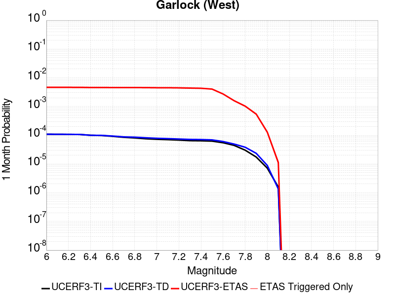 |  |  |

| Magnitude | 1 wk TI Prob | 1 wk TD Prob | 1 wk ETAS Prob | 1 wk ETAS/TD Gain | 1 wk ETAS Triggered Only | 1 mo TI Prob | 1 mo TD Prob | 1 mo ETAS Prob | 1 mo ETAS/TD Gain | 1 mo ETAS Triggered Only | 1 yr TI Prob | 1 yr TD Prob | 1 yr ETAS Prob | 1 yr ETAS/TD Gain | 1 yr ETAS Triggered Only | 10 yr TI Prob | 10 yr TD Prob | 10 yr ETAS Prob | 10 yr ETAS/TD Gain | 10 yr ETAS Triggered Only |
|-----|-----|-----|-----|-----|-----|-----|-----|-----|-----|-----|-----|-----|-----|-----|-----|-----|-----|-----|-----|-----|
| 6.0 | 2.5181727E-5 | 2.51973E-5 | 0.0035108945 | 139.33614 | 0.0034857849 | 1.0791722E-4 | 1.0798398E-4 | 0.004643959 | 43.006 | 0.004536465 | 0.0013131002 | 0.0013139155 | 0.007980052 | 6.07349 | 0.006674907 | 0.013053683 | 0.013141977 | 0.021888295 | 1.6655254 | 0.008862793 |
| 6.1 | 2.5077732E-5 | 2.5098372E-5 | 0.0035107958 | 139.88141 | 0.0034857849 | 1.0747157E-4 | 1.0756004E-4 | 0.0046435366 | 43.17158 | 0.004536465 | 0.001307681 | 0.0013087603 | 0.007974932 | 6.093501 | 0.006674907 | 0.013000126 | 0.013091032 | 0.021837803 | 1.6681498 | 0.008862793 |
| 6.2 | 2.494612E-5 | 2.498005E-5 | 0.003510678 | 140.53926 | 0.0034857849 | 1.0690756E-4 | 1.0705298E-4 | 0.0046430323 | 43.371346 | 0.004536465 | 0.0013008224 | 0.0013025942 | 0.007968807 | 6.1176434 | 0.006674907 | 0.012932341 | 0.013030097 | 0.021777408 | 1.6713159 | 0.008862793 |
| 6.3 | 2.4733758E-5 | 2.479942E-5 | 0.003510498 | 141.55565 | 0.0034857849 | 1.0599751E-4 | 1.06278916E-4 | 0.0046422617 | 43.679985 | 0.004536465 | 0.0012897556 | 0.0012931811 | 0.007959456 | 6.1549435 | 0.006674907 | 0.012822957 | 0.012937066 | 0.021685202 | 1.6762071 | 0.008862793 |
| 6.4 | 2.3237335E-5 | 2.317873E-5 | 0.0034841616 | 150.31718 | 0.0034610631 | 9.958477E-5 | 9.933365E-5 | 0.004598269 | 46.29115 | 0.004499382 | 0.0012117702 | 0.001208719 | 0.00783852 | 6.484981 | 0.0066378247 | 0.012051838 | 0.012101916 | 0.020808607 | 1.7194474 | 0.0088133495 |
| 6.5 | 2.2732203E-5 | 2.2993298E-5 | 0.0034839767 | 151.52141 | 0.0034610631 | 9.742009E-5 | 9.8539E-5 | 0.0045974776 | 46.656425 | 0.004499382 | 0.0011854442 | 0.0011990548 | 0.00782892 | 6.529243 | 0.0066378247 | 0.011791403 | 0.012006322 | 0.020713856 | 1.7252457 | 0.0088133495 |
| 6.6 | 2.1319436E-5 | 2.17735E-5 | 0.003482761 | 159.95413 | 0.0034610631 | 9.136581E-5 | 9.331167E-5 | 0.004579914 | 49.081898 | 0.004487021 | 0.001111811 | 0.0011354799 | 0.00775342 | 6.8283205 | 0.0066254637 | 0.011062649 | 0.011377227 | 0.020065865 | 1.7636868 | 0.008788628 |
| 6.7 | 1.970802E-5 | 2.0393396E-5 | 0.0034813858 | 170.71144 | 0.0034610631 | 8.446021E-5 | 8.739735E-5 | 0.004574026 | 52.335983 | 0.004487021 | 0.001027818 | 0.001063545 | 0.0076572667 | 7.1997576 | 0.0066007418 | 0.010230771 | 0.010664964 | 0.019335404 | 1.8129834 | 0.008763906 |
| 6.8 | 1.8744462E-5 | 1.9901045E-5 | 0.0034808952 | 174.91017 | 0.0034610631 | 8.033094E-5 | 8.5287415E-5 | 0.004571926 | 53.606102 | 0.004487021 | 9.775903E-4 | 0.0010378812 | 0.007607076 | 7.3294277 | 0.00657602 | 0.009733009 | 0.01041075 | 0.019058954 | 1.8306992 | 0.008739185 |
| 6.9 | 1.7559682E-5 | 1.8953415E-5 | 0.00346759 | 182.95332 | 0.0034487022 | 7.5253614E-5 | 8.12264E-5 | 0.004555523 | 56.084267 | 0.00447466 | 9.158276E-4 | 9.884841E-4 | 0.007545655 | 7.6335616 | 0.006563659 | 0.0091206245 | 0.009921231 | 0.018561473 | 1.8708841 | 0.008726823 |
| 7.0 | 1.6794445E-5 | 1.8216237E-5 | 0.003442134 | 188.95967 | 0.0034239802 | 7.197421E-5 | 7.8067256E-5 | 0.004515298 | 57.838562 | 0.0044375774 | 8.759337E-4 | 9.5005584E-4 | 0.007458082 | 7.8501515 | 0.006514215 | 0.008724891 | 0.009540141 | 0.018110251 | 1.8983212 | 0.008652657 |
| 7.1 | 1.6337795E-5 | 1.7717046E-5 | 0.0034416367 | 194.25568 | 0.0034239802 | 7.0017246E-5 | 7.5927994E-5 | 0.0045131682 | 59.440113 | 0.0044375774 | 8.521265E-4 | 9.240326E-4 | 0.00739518 | 8.0031595 | 0.0064771324 | 0.008488664 | 0.009281996 | 0.017805355 | 1.9182678 | 0.008603214 |
| 7.2 | 1.5780008E-5 | 1.7165687E-5 | 0.0033916442 | 197.5828 | 0.0033745365 | 6.762685E-5 | 7.356516E-5 | 0.004461376 | 60.645226 | 0.0043881335 | 8.2304585E-4 | 8.9528906E-4 | 0.0072678234 | 8.117851 | 0.0063782446 | 0.008200042 | 0.008996838 | 0.017412402 | 1.9353913 | 0.008491965 |
| 7.3 | 1.5058865E-5 | 1.6618762E-5 | 0.0033292954 | 200.33354 | 0.0033127319 | 6.45364E-5 | 7.122133E-5 | 0.004384882 | 61.56698 | 0.0043139677 | 7.854473E-4 | 8.667759E-4 | 0.00712834 | 8.223971 | 0.0062669963 | 0.00782677 | 0.008713539 | 0.016996723 | 1.9506109 | 0.008355995 |
| 7.4 | 1.4887923E-5 | 1.6454731E-5 | 0.0032673283 | 198.56467 | 0.003250927 | 6.380382E-5 | 7.051838E-5 | 0.0043100216 | 61.119125 | 0.0042398022 | 7.7653467E-4 | 8.582243E-4 | 0.0069963387 | 8.15211 | 0.006143387 | 0.0077382675 | 0.008628399 | 0.01675299 | 1.9416105 | 0.008195302 |
| 7.5 | 1.4509299E-5 | 1.6046748E-5 | 0.003056789 | 190.49274 | 0.003040791 | 6.218123E-5 | 6.876997E-5 | 0.0040734387 | 59.232815 | 0.0040049446 | 7.567935E-4 | 8.36954E-4 | 0.0065799803 | 7.8618183 | 0.005747837 | 0.0075422134 | 0.008416704 | 0.016040497 | 1.9057931 | 0.007688504 |
| 7.6 | 1.2756717E-5 | 1.4050848E-5 | 0.0019299695 | 137.35608 | 0.0019159456 | 5.4670498E-5 | 6.0216535E-5 | 0.0026805778 | 44.515644 | 0.0026205191 | 6.6541E-4 | 7.328904E-4 | 0.004524918 | 6.174072 | 0.0037948084 | 0.006634211 | 0.0073816874 | 0.012449072 | 1.6864804 | 0.005105068 |
| 7.7 | 1.0328985E-5 | 1.1460557E-5 | 0.0011239323 | 98.06961 | 0.0011124846 | 4.4266326E-5 | 4.911575E-5 | 0.0016065176 | 32.70881 | 0.0015574783 | 5.388092E-4 | 5.978206E-4 | 0.0029944093 | 5.008876 | 0.0023980222 | 0.0053750467 | 0.006038511 | 0.0090978 | 1.5066296 | 0.003077874 |
| 7.8 | 7.0306583E-6 | 8.899601E-6 | 6.7638437E-4 | 76.001656 | 6.674907E-4 | 3.0131043E-5 | 3.814059E-5 | 0.0010640594 | 27.898348 | 0.001025958 | 3.667837E-4 | 4.642629E-4 | 0.002070439 | 4.459626 | 0.0016069221 | 0.003661789 | 0.0046952725 | 0.0067498568 | 1.4375858 | 0.002064277 |
| 7.9 | 4.060633E-6 | 5.4653938E-6 | 3.144872E-4 | 57.541542 | 3.0902348E-4 | 1.7402595E-5 | 2.3422906E-5 | 5.178489E-4 | 22.108652 | 4.944376E-4 | 2.11856E-4 | 2.851367E-4 | 0.0011130834 | 3.903684 | 8.2818297E-4 | 0.0021165414 | 0.002884201 | 0.0039811516 | 1.3803308 | 0.0011001236 |
| 8.0 | 1.6729537E-6 | 2.0775144E-6 | 8.860391E-5 | 42.649 | 8.6526576E-5 | 7.169782E-6 | 8.903603E-6 | 1.4487273E-4 | 16.271248 | 1.3597033E-4 | 8.7288594E-5 | 1.0839601E-4 | 3.55588E-4 | 3.280453 | 2.472188E-4 | 8.7254314E-4 | 0.0010969337 | 0.0014673552 | 1.3376881 | 3.7082817E-4 |
| 8.1 | 3.6733252E-7 | 3.1489964E-7 | 1.2675835E-5 | 40.25357 | 1.236094E-5 | 1.5742813E-6 | 1.3495693E-6 | 1.3710492E-5 | 10.159162 | 1.236094E-5 | 1.9166706E-5 | 1.6430899E-5 | 5.3513108E-5 | 3.256858 | 3.7082817E-5 | 1.9165053E-4 | 1.6638759E-4 | 2.1582312E-4 | 1.2971107 | 4.944376E-5 |

## McLean Lake
*[(top)](#table-of-contents)*

| 1 Week | 1 Month | 1 Year | 10 Year |
|-----|-----|-----|-----|
|  |  |  |  |

| Magnitude | 1 wk TI Prob | 1 wk TD Prob | 1 wk ETAS Prob | 1 wk ETAS/TD Gain | 1 wk ETAS Triggered Only | 1 mo TI Prob | 1 mo TD Prob | 1 mo ETAS Prob | 1 mo ETAS/TD Gain | 1 mo ETAS Triggered Only | 1 yr TI Prob | 1 yr TD Prob | 1 yr ETAS Prob | 1 yr ETAS/TD Gain | 1 yr ETAS Triggered Only | 10 yr TI Prob | 10 yr TD Prob | 10 yr ETAS Prob | 10 yr ETAS/TD Gain | 10 yr ETAS Triggered Only |
|-----|-----|-----|-----|-----|-----|-----|-----|-----|-----|-----|-----|-----|-----|-----|-----|-----|-----|-----|-----|-----|
| 6.0 | 1.7360222E-5 | 1.8501627E-5 | 0.0014152619 | 76.49392 | 0.0013967862 | 7.439883E-5 | 7.9290556E-5 | 0.0022299234 | 28.123444 | 0.0021508036 | 9.0542925E-4 | 9.6498354E-4 | 0.0053735804 | 5.568572 | 0.0044128555 | 0.009017491 | 0.0096127745 | 0.016676476 | 1.7348244 | 0.007132262 |
| 6.1 | 9.062689E-6 | 9.592193E-6 | 8.1304554E-4 | 84.76117 | 8.0346107E-4 | 3.8839516E-5 | 4.1108804E-5 | 0.0012895124 | 31.368279 | 0.0012484549 | 4.727685E-4 | 5.003936E-4 | 0.0030331183 | 6.061465 | 0.0025339925 | 0.0047176396 | 0.004993552 | 0.009015394 | 1.8054073 | 0.004042027 |
| 6.2 | 9.062689E-6 | 9.592193E-6 | 8.1304554E-4 | 84.76117 | 8.0346107E-4 | 3.8839516E-5 | 4.1108804E-5 | 0.0012895124 | 31.368279 | 0.0012484549 | 4.727685E-4 | 5.003936E-4 | 0.0030331183 | 6.061465 | 0.0025339925 | 0.0047176396 | 0.004993552 | 0.009015394 | 1.8054073 | 0.004042027 |
| 6.3 | 7.2575485E-6 | 7.66771E-6 | 6.8751414E-4 | 89.66357 | 6.798517E-4 | 3.110341E-5 | 3.2861237E-5 | 0.0010093433 | 30.715319 | 9.765142E-4 | 3.786182E-4 | 4.0001926E-4 | 0.0024511144 | 6.127491 | 0.002051916 | 0.0037797375 | 0.0039936965 | 0.007280887 | 1.8230946 | 0.0033003709 |
| 6.4 | 7.2575485E-6 | 7.66771E-6 | 6.8751414E-4 | 89.66357 | 6.798517E-4 | 3.110341E-5 | 3.2861237E-5 | 0.0010093433 | 30.715319 | 9.765142E-4 | 3.786182E-4 | 4.0001926E-4 | 0.0024511144 | 6.127491 | 0.002051916 | 0.0037797375 | 0.0039936965 | 0.007280887 | 1.8230946 | 0.0033003709 |
| 6.5 | 6.06582E-6 | 6.4038773E-6 | 4.637557E-4 | 72.41796 | 4.5735476E-4 | 2.5996113E-5 | 2.7444936E-5 | 7.1963854E-4 | 26.221178 | 6.922126E-4 | 3.164567E-4 | 3.3409733E-4 | 0.0018416281 | 5.5122504 | 0.0015080346 | 0.0031600643 | 0.0033365893 | 0.005886766 | 1.7643065 | 0.0025587145 |
| 6.6 | 5.598744E-6 | 5.910262E-6 | 4.385406E-4 | 74.19985 | 4.326329E-4 | 2.3994397E-5 | 2.5329486E-5 | 6.6808204E-4 | 26.375666 | 6.4276886E-4 | 2.9209262E-4 | 3.0834923E-4 | 0.0016676333 | 5.4082613 | 0.0013597034 | 0.0029170897 | 0.003079843 | 0.0054458342 | 1.768218 | 0.0023733003 |
| 6.7 | 5.246996E-6 | 5.539162E-6 | 3.6400443E-4 | 65.71471 | 3.5846725E-4 | 2.2486933E-5 | 2.3739085E-5 | 5.676075E-4 | 23.910252 | 5.438813E-4 | 2.73744E-4 | 2.8899137E-4 | 0.0014752987 | 5.104992 | 0.0011866501 | 0.0027340704 | 0.0028867796 | 0.005019049 | 1.7386326 | 0.0021384426 |
| 6.8 | 4.02324E-6 | 4.2469046E-6 | 2.7618642E-4 | 65.03241 | 2.7194066E-4 | 1.7242342E-5 | 1.8200926E-5 | 4.384652E-4 | 24.090271 | 4.2027194E-4 | 2.099053E-4 | 2.2157968E-4 | 0.0010866537 | 4.9041214 | 8.652658E-4 | 0.0020970714 | 0.002214172 | 0.0038175362 | 1.7241372 | 0.0016069221 |
| 6.9 | 6.835972E-7 | 7.1399285E-7 | 6.2518644E-5 | 87.56201 | 6.18047E-5 | 2.9296991E-6 | 3.0599674E-6 | 7.722538E-5 | 25.23732 | 7.416563E-5 | 3.56685E-5 | 3.7254784E-5 | 1.8558053E-4 | 4.9813876 | 1.4833127E-4 | 3.5662777E-4 | 3.7251666E-4 | 5.9493067E-4 | 1.5970579 | 2.224969E-4 |

## Goldstone Lake
*[(top)](#table-of-contents)*

| 1 Week | 1 Month | 1 Year | 10 Year |
|-----|-----|-----|-----|
|  | 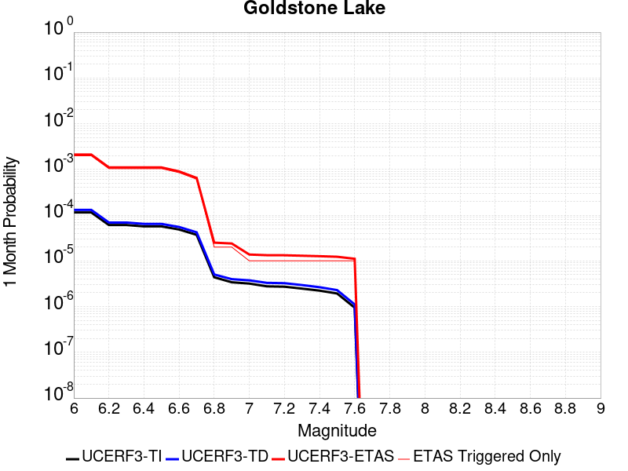 | 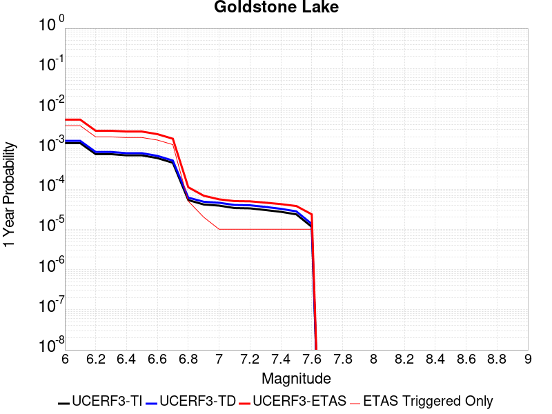 |  |

| Magnitude | 1 wk TI Prob | 1 wk TD Prob | 1 wk ETAS Prob | 1 wk ETAS/TD Gain | 1 wk ETAS Triggered Only | 1 mo TI Prob | 1 mo TD Prob | 1 mo ETAS Prob | 1 mo ETAS/TD Gain | 1 mo ETAS Triggered Only | 1 yr TI Prob | 1 yr TD Prob | 1 yr ETAS Prob | 1 yr ETAS/TD Gain | 1 yr ETAS Triggered Only | 10 yr TI Prob | 10 yr TD Prob | 10 yr ETAS Prob | 10 yr ETAS/TD Gain | 10 yr ETAS Triggered Only |
|-----|-----|-----|-----|-----|-----|-----|-----|-----|-----|-----|-----|-----|-----|-----|-----|-----|-----|-----|-----|-----|
| 6.0 | 2.671352E-5 | 3.037609E-5 | 0.0012417113 | 40.87792 | 0.0012113721 | 1.1448149E-4 | 1.3017785E-4 | 0.0021076708 | 16.1907 | 0.0019777503 | 0.001392921 | 0.0015839594 | 0.005446805 | 3.4387276 | 0.003868974 | 0.013842222 | 0.015746197 | 0.021841513 | 1.3870977 | 0.006192831 |
| 6.1 | 2.671352E-5 | 3.037609E-5 | 0.0012417113 | 40.87792 | 0.0012113721 | 1.1448149E-4 | 1.3017785E-4 | 0.0021076708 | 16.1907 | 0.0019777503 | 0.001392921 | 0.0015839594 | 0.005446805 | 3.4387276 | 0.003868974 | 0.013842222 | 0.015746197 | 0.021841513 | 1.3870977 | 0.006192831 |
| 6.2 | 1.4197047E-5 | 1.6096245E-5 | 6.094118E-4 | 37.860497 | 5.9332506E-4 | 6.0843064E-5 | 6.8982634E-5 | 0.0010454295 | 15.154965 | 9.765142E-4 | 7.4051257E-4 | 8.3963864E-4 | 0.0027539756 | 3.2799535 | 0.0019159456 | 0.007380498 | 0.0083743585 | 0.011549031 | 1.3790945 | 0.0032014833 |
| 6.3 | 1.4197047E-5 | 1.6096245E-5 | 6.094118E-4 | 37.860497 | 5.9332506E-4 | 6.0843064E-5 | 6.8982634E-5 | 0.0010454295 | 15.154965 | 9.765142E-4 | 7.4051257E-4 | 8.3963864E-4 | 0.0027539756 | 3.2799535 | 0.0019159456 | 0.007380498 | 0.0083743585 | 0.011549031 | 1.3790945 | 0.0032014833 |
| 6.4 | 1.3238931E-5 | 1.500846E-5 | 6.0832466E-4 | 40.53212 | 5.9332506E-4 | 5.6737044E-5 | 6.4320935E-5 | 0.0010407723 | 16.180927 | 9.765142E-4 | 6.9055456E-4 | 7.82924E-4 | 0.0026356133 | 3.3663716 | 0.0018541409 | 0.006884126 | 0.0078112837 | 0.010828322 | 1.3862411 | 0.003040791 |
| 6.5 | 1.3238931E-5 | 1.500846E-5 | 6.0832466E-4 | 40.53212 | 5.9332506E-4 | 5.6737044E-5 | 6.4320935E-5 | 0.0010407723 | 16.180927 | 9.765142E-4 | 6.9055456E-4 | 7.82924E-4 | 0.0026356133 | 3.3663716 | 0.0018541409 | 0.006884126 | 0.0078112837 | 0.010828322 | 1.3862411 | 0.003040791 |
| 6.6 | 1.1328278E-5 | 1.2855166E-5 | 4.5784327E-4 | 35.61551 | 4.449938E-4 | 4.8548856E-5 | 5.5092944E-5 | 8.2142896E-4 | 14.909877 | 7.6637825E-4 | 5.90922E-4 | 6.7064585E-4 | 0.0022270796 | 3.3207984 | 0.0015574783 | 0.0058935313 | 0.0066956086 | 0.009286303 | 1.3869245 | 0.0026081582 |
| 6.7 | 8.651175E-6 | 9.824565E-6 | 3.3120584E-4 | 33.712013 | 3.2138443E-4 | 3.707594E-5 | 4.2105108E-5 | 5.7360315E-4 | 13.623125 | 5.315204E-4 | 4.5130608E-4 | 5.1259965E-4 | 0.0016862869 | 3.2896764 | 0.0011742893 | 0.0045039062 | 0.005123051 | 0.007164455 | 1.3984742 | 0.002051916 |
| 6.8 | 1.0215377E-6 | 1.1754702E-6 | 1.3536395E-5 | 11.515728 | 1.236094E-5 | 4.378012E-6 | 5.0377203E-6 | 1.7398597E-5 | 3.4536648 | 1.236094E-5 | 5.3300988E-5 | 6.1332634E-5 | 1.1077336E-4 | 1.806108 | 4.944376E-5 | 5.3288206E-4 | 6.1316835E-4 | 6.996419E-4 | 1.1410273 | 8.6526576E-5 |
| 6.9 | 7.9360774E-7 | 9.2833966E-7 | 1.3289267E-5 | 14.315092 | 1.236094E-5 | 3.4011714E-6 | 3.9785928E-6 | 1.6339483E-5 | 4.1068497 | 1.236094E-5 | 4.1408475E-5 | 4.843836E-5 | 6.0798702E-5 | 1.2551767 | 1.236094E-5 | 4.140076E-4 | 4.8428503E-4 | 5.213499E-4 | 1.0765352 | 3.7082817E-5 |
| 7.0 | 7.4382757E-7 | 8.7473285E-7 | 1.3235662E-5 | 15.13109 | 1.236094E-5 | 3.1878285E-6 | 3.74885E-6 | 1.6109743E-5 | 4.2972493 | 1.236094E-5 | 3.8811122E-5 | 4.564136E-5 | 5.8001737E-5 | 1.2708153 | 1.236094E-5 | 3.8804344E-4 | 4.5632652E-4 | 4.686818E-4 | 1.0270755 | 1.236094E-5 |
| 7.1 | 6.4709513E-7 | 7.7113E-7 | 1.313206E-5 | 17.029633 | 1.236094E-5 | 2.773262E-6 | 3.3048389E-6 | 1.5665737E-5 | 4.7402425 | 1.236094E-5 | 3.376394E-5 | 4.0235733E-5 | 5.2596173E-5 | 1.3072007 | 1.236094E-5 | 3.375881E-4 | 4.0229043E-4 | 4.1464638E-4 | 1.030714 | 1.236094E-5 |
| 7.2 | 6.356704E-7 | 7.5883594E-7 | 1.3119766E-5 | 17.289331 | 1.236094E-5 | 2.7242988E-6 | 3.2521505E-6 | 1.561305E-5 | 4.800839 | 1.236094E-5 | 3.3167835E-5 | 3.959427E-5 | 5.195472E-5 | 1.3121778 | 1.236094E-5 | 3.3162883E-4 | 3.958781E-4 | 4.0823416E-4 | 1.0312117 | 1.236094E-5 |
| 7.3 | 5.7695723E-7 | 6.8965653E-7 | 1.3050588E-5 | 18.923315 | 1.236094E-5 | 2.4726714E-6 | 2.9556677E-6 | 1.5316571E-5 | 5.1821017 | 1.236094E-5 | 3.0104358E-5 | 3.5984718E-5 | 4.8345213E-5 | 1.3434929 | 1.236094E-5 | 3.0100282E-4 | 3.5979465E-4 | 3.7215115E-4 | 1.0343431 | 1.236094E-5 |
| 7.4 | 5.209647E-7 | 6.193514E-7 | 1.2980283E-5 | 20.957867 | 1.236094E-5 | 2.232704E-6 | 2.6543607E-6 | 1.5015267E-5 | 5.6568303 | 1.236094E-5 | 2.718283E-5 | 3.2316417E-5 | 4.467696E-5 | 1.3824848 | 1.236094E-5 | 2.7179506E-4 | 3.2312275E-4 | 3.3547968E-4 | 1.0382422 | 1.236094E-5 |
| 7.5 | 4.512955E-7 | 5.348885E-7 | 1.2895821E-5 | 24.109364 | 1.236094E-5 | 1.934122E-6 | 2.2923775E-6 | 1.4653288E-5 | 6.3921795 | 1.236094E-5 | 2.3547682E-5 | 2.7909393E-5 | 4.0269988E-5 | 1.4428829 | 1.236094E-5 | 2.3545188E-4 | 2.7906417E-4 | 2.914217E-4 | 1.0442818 | 1.236094E-5 |
| 7.6 | 2.21172E-7 | 2.603961E-7 | 1.2621333E-5 | 48.46975 | 1.236094E-5 | 9.478797E-7 | 1.1159829E-6 | 1.3476909E-5 | 12.076268 | 1.236094E-5 | 1.1540374E-5 | 1.3587036E-5 | 2.5947807E-5 | 1.9097475 | 1.236094E-5 | 1.1539775E-4 | 1.3586486E-4 | 1.4822412E-4 | 1.0909673 | 1.236094E-5 |

## Coyote Canyon
*[(top)](#table-of-contents)*

| 1 Week | 1 Month | 1 Year | 10 Year |
|-----|-----|-----|-----|
|  |  | 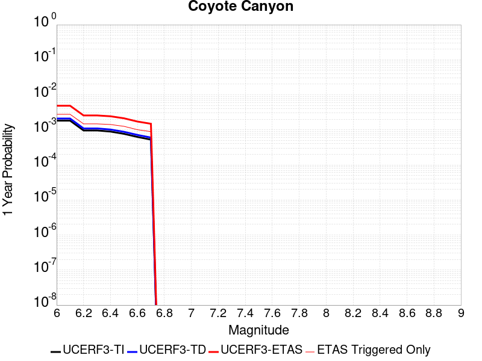 |  |

| Magnitude | 1 wk TI Prob | 1 wk TD Prob | 1 wk ETAS Prob | 1 wk ETAS/TD Gain | 1 wk ETAS Triggered Only | 1 mo TI Prob | 1 mo TD Prob | 1 mo ETAS Prob | 1 mo ETAS/TD Gain | 1 mo ETAS Triggered Only | 1 yr TI Prob | 1 yr TD Prob | 1 yr ETAS Prob | 1 yr ETAS/TD Gain | 1 yr ETAS Triggered Only | 10 yr TI Prob | 10 yr TD Prob | 10 yr ETAS Prob | 10 yr ETAS/TD Gain | 10 yr ETAS Triggered Only |
|-----|-----|-----|-----|-----|-----|-----|-----|-----|-----|-----|-----|-----|-----|-----|-----|-----|-----|-----|-----|-----|
| 6.0 | 3.5090034E-5 | 4.0364324E-5 | 0.0010044787 | 24.88531 | 9.6415327E-4 | 1.503772E-4 | 1.7297994E-4 | 0.001594242 | 9.216341 | 0.001421508 | 0.0018293047 | 0.0021042528 | 0.0048919464 | 2.3247905 | 0.0027935724 | 0.018143194 | 0.020869201 | 0.025371509 | 1.2157394 | 0.0045982692 |
| 6.1 | 3.5090034E-5 | 4.0364324E-5 | 0.0010044787 | 24.88531 | 9.6415327E-4 | 1.503772E-4 | 1.7297994E-4 | 0.001594242 | 9.216341 | 0.001421508 | 0.0018293047 | 0.0021042528 | 0.0048919464 | 2.3247905 | 0.0027935724 | 0.018143194 | 0.020869201 | 0.025371509 | 1.2157394 | 0.0045982692 |
| 6.2 | 1.841879E-5 | 2.1059794E-5 | 5.8965106E-4 | 27.9989 | 5.686032E-4 | 7.8935285E-5 | 9.0253714E-5 | 8.9364225E-4 | 9.901446 | 8.0346107E-4 | 9.606133E-4 | 0.001098387 | 0.0025677232 | 2.3377218 | 0.0014709518 | 0.0095647145 | 0.010939667 | 0.013458164 | 1.230217 | 0.0025463535 |
| 6.3 | 1.841879E-5 | 2.1059794E-5 | 5.8965106E-4 | 27.9989 | 5.686032E-4 | 7.8935285E-5 | 9.0253714E-5 | 8.9364225E-4 | 9.901446 | 8.0346107E-4 | 9.606133E-4 | 0.001098387 | 0.0025677232 | 2.3377218 | 0.0014709518 | 0.0095647145 | 0.010939667 | 0.013458164 | 1.230217 | 0.0025463535 |
| 6.4 | 1.712201E-5 | 1.9565212E-5 | 5.387145E-4 | 27.534306 | 5.191595E-4 | 7.337798E-5 | 8.3848776E-5 | 8.2544296E-4 | 9.844424 | 7.4165635E-4 | 8.930107E-4 | 0.0010204813 | 0.0024528871 | 2.403657 | 0.001433869 | 0.008894307 | 0.010167871 | 0.01254151 | 1.233445 | 0.0023980222 |
| 6.5 | 1.4744935E-5 | 1.6836972E-5 | 4.618233E-4 | 27.42912 | 4.449938E-4 | 6.3191044E-5 | 7.215698E-5 | 7.272395E-4 | 10.078574 | 6.551298E-4 | 7.6907943E-4 | 8.7825063E-4 | 0.0021503093 | 2.4484005 | 0.0012731767 | 0.007664232 | 0.008756994 | 0.010839952 | 1.2378622 | 0.0021013597 |
| 6.6 | 1.2017839E-5 | 1.37240895E-5 | 3.7218642E-4 | 27.119207 | 3.5846725E-4 | 5.150401E-5 | 5.88167E-5 | 5.9030583E-4 | 10.036365 | 5.315204E-4 | 6.268809E-4 | 7.159466E-4 | 0.0017288179 | 2.4147303 | 0.001013597 | 0.0062511545 | 0.0071450938 | 0.00886326 | 1.240468 | 0.0017305316 |
| 6.7 | 1.00956095E-5 | 1.1533517E-5 | 3.3291423E-4 | 28.864937 | 3.2138443E-4 | 4.326618E-5 | 4.942891E-5 | 5.314817E-4 | 10.752446 | 4.8207663E-4 | 5.266384E-4 | 6.017178E-4 | 0.0015035234 | 2.4987185 | 9.023486E-4 | 0.005253921 | 0.0060094125 | 0.0075083845 | 1.2494375 | 0.0015080346 |

## Lenwood-Lockhart-Old Woman Springs
*[(top)](#table-of-contents)*

| 1 Week | 1 Month | 1 Year | 10 Year |
|-----|-----|-----|-----|
|  |  |  | 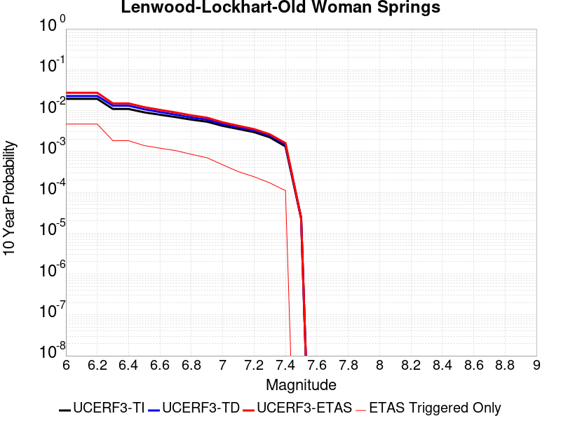 |

| Magnitude | 1 wk TI Prob | 1 wk TD Prob | 1 wk ETAS Prob | 1 wk ETAS/TD Gain | 1 wk ETAS Triggered Only | 1 mo TI Prob | 1 mo TD Prob | 1 mo ETAS Prob | 1 mo ETAS/TD Gain | 1 mo ETAS Triggered Only | 1 yr TI Prob | 1 yr TD Prob | 1 yr ETAS Prob | 1 yr ETAS/TD Gain | 1 yr ETAS Triggered Only | 10 yr TI Prob | 10 yr TD Prob | 10 yr ETAS Prob | 10 yr ETAS/TD Gain | 10 yr ETAS Triggered Only |
|-----|-----|-----|-----|-----|-----|-----|-----|-----|-----|-----|-----|-----|-----|-----|-----|-----|-----|-----|-----|-----|
| 6.0 | 3.744542E-5 | 4.396252E-5 | 0.0016013724 | 36.425858 | 0.0015574783 | 1.604705E-4 | 1.8839816E-4 | 0.002227569 | 11.8237295 | 0.002039555 | 0.0019519776 | 0.0022915069 | 0.0055966475 | 2.4423437 | 0.0033127319 | 0.019349206 | 0.022696787 | 0.027287334 | 1.2022554 | 0.004697157 |
| 6.1 | 3.744542E-5 | 4.396252E-5 | 0.0016013724 | 36.425858 | 0.0015574783 | 1.604705E-4 | 1.8839816E-4 | 0.002227569 | 11.8237295 | 0.002039555 | 0.0019519776 | 0.0022915069 | 0.0055966475 | 2.4423437 | 0.0033127319 | 0.019349206 | 0.022696787 | 0.027287334 | 1.2022554 | 0.004697157 |
| 6.2 | 3.744542E-5 | 4.396252E-5 | 0.0016013724 | 36.425858 | 0.0015574783 | 1.604705E-4 | 1.8839816E-4 | 0.002227569 | 11.8237295 | 0.002039555 | 0.0019519776 | 0.0022915069 | 0.0055966475 | 2.4423437 | 0.0033127319 | 0.019349206 | 0.022696787 | 0.027287334 | 1.2022554 | 0.004697157 |
| 6.3 | 2.1079984E-5 | 2.5353434E-5 | 6.6810596E-4 | 26.351696 | 6.4276886E-4 | 9.0339665E-5 | 1.0865316E-4 | 8.7494816E-4 | 8.0526705 | 7.6637825E-4 | 0.0010993304 | 0.0013220694 | 0.002618252 | 1.9804195 | 0.0012978986 | 0.010939079 | 0.0131442575 | 0.014974027 | 1.1392068 | 0.0018541409 |
| 6.4 | 2.1079984E-5 | 2.5353434E-5 | 6.6810596E-4 | 26.351696 | 6.4276886E-4 | 9.0339665E-5 | 1.0865316E-4 | 8.7494816E-4 | 8.0526705 | 7.6637825E-4 | 0.0010993304 | 0.0013220694 | 0.002618252 | 1.9804195 | 0.0012978986 | 0.010939079 | 0.0131442575 | 0.014974027 | 1.1392068 | 0.0018541409 |
| 6.5 | 1.7397282E-5 | 2.066241E-5 | 5.150898E-4 | 24.928833 | 4.944376E-4 | 7.455765E-5 | 8.8550245E-5 | 6.818228E-4 | 7.699841 | 5.9332506E-4 | 9.073613E-4 | 0.0010775778 | 0.002114778 | 1.9625292 | 0.001038319 | 0.009036654 | 0.010724821 | 0.012131084 | 1.1311222 | 0.001421508 |
| 6.6 | 1.52050325E-5 | 1.7679693E-5 | 4.2558348E-4 | 24.07188 | 4.07911E-4 | 6.51628E-5 | 7.576796E-5 | 5.701681E-4 | 7.525187 | 4.944376E-4 | 7.9306826E-4 | 9.220924E-4 | 0.0018236089 | 1.9776857 | 9.023486E-4 | 0.007902439 | 0.009183526 | 0.010396021 | 1.1320293 | 0.001223733 |
| 6.7 | 1.332523E-5 | 1.5264002E-5 | 3.6136503E-4 | 23.67433 | 3.461063E-4 | 5.7106878E-5 | 6.5415545E-5 | 4.8565998E-4 | 7.424229 | 4.2027194E-4 | 6.950544E-4 | 7.961491E-4 | 0.0015619172 | 1.96184 | 7.6637825E-4 | 0.006928845 | 0.007933599 | 0.008988206 | 1.1329292 | 0.0010630408 |
| 6.8 | 1.1525329E-5 | 1.3030979E-5 | 2.6024654E-4 | 19.971373 | 2.472188E-4 | 4.9393333E-5 | 5.584588E-5 | 3.7721236E-4 | 6.754524 | 3.2138443E-4 | 6.011979E-4 | 6.797157E-4 | 0.0012849901 | 1.8904816 | 6.0568604E-4 | 0.00599574 | 0.006776819 | 0.007636221 | 1.126815 | 8.652658E-4 |
| 6.9 | 1.0253909E-5 | 1.15144385E-5 | 2.2164799E-4 | 19.249569 | 2.1013597E-4 | 4.3944583E-5 | 4.9346683E-5 | 3.2127392E-4 | 6.5105476 | 2.7194066E-4 | 5.3489394E-4 | 6.0063385E-4 | 0.0010824209 | 1.802131 | 4.8207663E-4 | 0.0053360825 | 0.0059904843 | 0.006715411 | 1.121013 | 7.292954E-4 |
| 7.0 | 8.104563E-6 | 8.991279E-6 | 1.5732122E-4 | 17.49709 | 1.4833127E-4 | 3.4733377E-5 | 3.8533497E-5 | 2.1157999E-4 | 5.4908066 | 1.7305315E-4 | 4.2279682E-4 | 4.6904673E-4 | 7.902804E-4 | 1.684865 | 3.2138443E-4 | 0.0042199334 | 0.0046808156 | 0.005172939 | 1.1051362 | 4.944376E-4 |
| 7.1 | 6.7986157E-6 | 7.515816E-6 | 1.06402586E-4 | 14.157158 | 9.888752E-5 | 2.91366E-5 | 3.2210253E-5 | 1.5581567E-4 | 4.8374553 | 1.236094E-4 | 3.5468035E-4 | 3.920914E-4 | 6.2685716E-4 | 1.5987526 | 2.3485786E-4 | 0.003541148 | 0.003914213 | 0.0042466517 | 1.0849313 | 3.3374535E-4 |
| 7.2 | 5.6893327E-6 | 6.2800136E-6 | 8.0445185E-5 | 12.809714 | 7.416563E-5 | 2.4382627E-5 | 2.6914078E-5 | 1.2579894E-4 | 4.674094 | 9.888752E-5 | 2.9681803E-4 | 3.2763163E-4 | 4.8827118E-4 | 1.4903054 | 1.6069222E-4 | 0.002964219 | 0.0032716845 | 0.003505774 | 1.0715501 | 2.3485786E-4 |
| 7.3 | 4.253348E-6 | 4.7069107E-6 | 6.651132E-5 | 14.130568 | 6.18047E-5 | 1.8228506E-5 | 2.0172329E-5 | 8.197578E-5 | 4.0637736 | 6.18047E-5 | 2.2190946E-4 | 2.4557224E-4 | 3.5679337E-4 | 1.452906 | 1.1124845E-4 | 0.00221688 | 0.0024531898 | 0.002613488 | 1.0653427 | 1.6069222E-4 |
| 7.4 | 2.5448119E-6 | 2.852045E-6 | 5.229566E-5 | 18.336199 | 4.944376E-5 | 1.0906291E-5 | 1.2223002E-5 | 6.166616E-5 | 5.0450907 | 4.944376E-5 | 1.3277601E-4 | 1.4880655E-4 | 2.3532024E-4 | 1.5813837 | 8.6526576E-5 | 0.001326967 | 0.0014872311 | 0.0015736291 | 1.0580931 | 8.6526576E-5 |
| 7.5 | 4.3706837E-8 | 4.562909E-8 | 4.562909E-8 | 1.0 | 0.0 | 1.8731501E-7 | 1.9555324E-7 | 1.9555324E-7 | 1.0 | 0.0 | 2.2805577E-6 | 2.3808586E-6 | 2.3808586E-6 | 1.0 | 0.0 | 2.2805343E-5 | 2.3808387E-5 | 2.3808387E-5 | 1.0 | 0.0 |

## San Andreas (Mojave S)
*[(top)](#table-of-contents)*

| 1 Week | 1 Month | 1 Year | 10 Year |
|-----|-----|-----|-----|
|  |  |  |  |

| Magnitude | 1 wk TI Prob | 1 wk TD Prob | 1 wk ETAS Prob | 1 wk ETAS/TD Gain | 1 wk ETAS Triggered Only | 1 mo TI Prob | 1 mo TD Prob | 1 mo ETAS Prob | 1 mo ETAS/TD Gain | 1 mo ETAS Triggered Only | 1 yr TI Prob | 1 yr TD Prob | 1 yr ETAS Prob | 1 yr ETAS/TD Gain | 1 yr ETAS Triggered Only | 10 yr TI Prob | 10 yr TD Prob | 10 yr ETAS Prob | 10 yr ETAS/TD Gain | 10 yr ETAS Triggered Only |
|-----|-----|-----|-----|-----|-----|-----|-----|-----|-----|-----|-----|-----|-----|-----|-----|-----|-----|-----|-----|-----|
| 6.0 | 3.1064058E-4 | 6.7460834E-4 | 0.0020210417 | 2.9958744 | 0.0013473424 | 0.0013306376 | 0.0028881032 | 0.004860142 | 1.6828144 | 0.0019777503 | 0.016080605 | 0.03462235 | 0.03759366 | 1.0858206 | 0.003077874 | 0.1496549 | 0.28660452 | 0.28950572 | 1.0101227 | 0.004066749 |
| 6.1 | 3.1064058E-4 | 6.7460834E-4 | 0.0020210417 | 2.9958744 | 0.0013473424 | 0.0013306376 | 0.0028881032 | 0.004860142 | 1.6828144 | 0.0019777503 | 0.016080605 | 0.03462235 | 0.03759366 | 1.0858206 | 0.003077874 | 0.1496549 | 0.28660452 | 0.28950572 | 1.0101227 | 0.004066749 |
| 6.2 | 3.1064058E-4 | 6.7460834E-4 | 0.0020210417 | 2.9958744 | 0.0013473424 | 0.0013306376 | 0.0028881032 | 0.004860142 | 1.6828144 | 0.0019777503 | 0.016080605 | 0.03462235 | 0.03759366 | 1.0858206 | 0.003077874 | 0.1496549 | 0.28660452 | 0.28950572 | 1.0101227 | 0.004066749 |
| 6.3 | 3.1064058E-4 | 6.7460834E-4 | 0.0020210417 | 2.9958744 | 0.0013473424 | 0.0013306376 | 0.0028881032 | 0.004860142 | 1.6828144 | 0.0019777503 | 0.016080605 | 0.03462235 | 0.03759366 | 1.0858206 | 0.003077874 | 0.1496549 | 0.28660452 | 0.28950572 | 1.0101227 | 0.004066749 |
| 6.4 | 1.9872203E-4 | 4.3179357E-4 | 0.0015932202 | 3.6897728 | 0.0011619283 | 8.5138786E-4 | 0.0018492596 | 0.003588929 | 1.9407383 | 0.0017428924 | 0.010316478 | 0.02228844 | 0.025007661 | 1.1220015 | 0.0027812114 | 0.098504856 | 0.19699748 | 0.1999256 | 1.0148638 | 0.0036464771 |
| 6.5 | 1.291105E-4 | 2.875267E-4 | 0.0013131896 | 4.567192 | 0.001025958 | 5.5321335E-4 | 0.0012316781 | 0.0027378553 | 2.222866 | 0.0015080346 | 0.006714592 | 0.0148934 | 0.017292237 | 1.1610672 | 0.0024351052 | 0.065152965 | 0.13803436 | 0.14078328 | 1.0199147 | 0.0031891223 |
| 6.6 | 1.291105E-4 | 2.875267E-4 | 0.0013131896 | 4.567192 | 0.001025958 | 5.5321335E-4 | 0.0012316781 | 0.0027378553 | 2.222866 | 0.0015080346 | 0.006714592 | 0.0148934 | 0.017292237 | 1.1610672 | 0.0024351052 | 0.065152965 | 0.13803436 | 0.14078328 | 1.0199147 | 0.0031891223 |
| 6.7 | 1.08001186E-4 | 2.4333889E-4 | 0.0012319734 | 5.062789 | 9.888752E-4 | 4.6278012E-4 | 0.0010424647 | 0.0025118832 | 2.4095619 | 0.0014709518 | 0.0056198016 | 0.012618446 | 0.014925184 | 1.1828068 | 0.0023362176 | 0.054797906 | 0.119176775 | 0.12185518 | 1.0224742 | 0.003040791 |
| 6.8 | 1.0624356E-4 | 2.3851555E-4 | 0.0012147969 | 5.093156 | 9.765142E-4 | 4.5525006E-4 | 0.0010218095 | 0.0024665617 | 2.4139152 | 0.0014462299 | 0.0055285925 | 0.012369843 | 0.014652746 | 1.1845539 | 0.0023114956 | 0.053930566 | 0.11712591 | 0.11977781 | 1.0226414 | 0.0030037083 |
| 6.9 | 1.0393785E-4 | 2.3221898E-4 | 0.0012085064 | 5.2041674 | 9.765142E-4 | 4.4537184E-4 | 9.948451E-4 | 0.0024396363 | 2.4522774 | 0.0014462299 | 0.0054089287 | 0.012045221 | 0.014328875 | 1.18959 | 0.0023114956 | 0.05279156 | 0.11442335 | 0.11706147 | 1.0230558 | 0.0029789864 |
| 7.0 | 1.0155622E-4 | 2.2591476E-4 | 0.0012022083 | 5.321513 | 9.765142E-4 | 4.3516833E-4 | 9.6784724E-4 | 0.0024126775 | 2.4928288 | 0.0014462299 | 0.005285311 | 0.0117200995 | 0.013992288 | 1.1938711 | 0.0022991346 | 0.05161361 | 0.111683756 | 0.114319056 | 1.023596 | 0.0029666254 |
| 7.1 | 9.885595E-5 | 2.1879886E-4 | 0.0011827411 | 5.4056096 | 9.6415327E-4 | 4.2359953E-4 | 9.3737274E-4 | 0.0023575483 | 2.5150595 | 0.001421508 | 0.0051451353 | 0.011352993 | 0.013589364 | 1.1969851 | 0.002262052 | 0.05027629 | 0.1085682 | 0.11117969 | 1.0240539 | 0.0029295427 |
| 7.2 | 9.6411415E-5 | 2.124288E-4 | 0.0011763773 | 5.5377483 | 9.6415327E-4 | 4.1312634E-4 | 9.1009185E-4 | 0.0023179564 | 2.546948 | 0.001409147 | 0.005018219 | 0.011024255 | 0.013249146 | 1.2018176 | 0.002249691 | 0.049064007 | 0.105758004 | 0.10836667 | 1.0246664 | 0.0029171817 |
| 7.3 | 9.1180635E-5 | 1.9471257E-4 | 0.001133961 | 5.823769 | 9.394314E-4 | 3.907156E-4 | 8.342157E-4 | 0.0021927848 | 2.6285584 | 0.0013597034 | 0.004746591 | 0.01010939 | 0.0122751575 | 1.2142333 | 0.0021878863 | 0.046464786 | 0.09795115 | 0.10052684 | 1.0262957 | 0.002855377 |
| 7.4 | 8.887388E-5 | 1.8719878E-4 | 0.0011264543 | 6.017423 | 9.394314E-4 | 3.8083247E-4 | 8.020339E-4 | 0.0021606467 | 2.6939592 | 0.0013597034 | 0.0046267817 | 0.00972114 | 0.011887758 | 1.2228769 | 0.0021878863 | 0.045316286 | 0.09458615 | 0.09716025 | 1.0272144 | 0.002843016 |
| 7.5 | 8.6750515E-5 | 1.8051457E-4 | 0.0011197764 | 6.2032466 | 9.394314E-4 | 3.7173493E-4 | 7.7340455E-4 | 0.0021320563 | 2.7567155 | 0.0013597034 | 0.004516484 | 0.009375632 | 0.011543006 | 1.2311709 | 0.0021878863 | 0.04425787 | 0.091549896 | 0.094121404 | 1.0280886 | 0.002830655 |
| 7.6 | 8.453092E-5 | 1.7439072E-4 | 0.0011136583 | 6.385995 | 9.394314E-4 | 3.6222505E-4 | 7.471748E-4 | 0.0021058621 | 2.818433 | 0.0013597034 | 0.0044011753 | 0.009058985 | 0.011227051 | 1.2393278 | 0.0021878863 | 0.04315024 | 0.08870898 | 0.09127727 | 1.0289518 | 0.002818294 |
| 7.7 | 8.259102E-5 | 1.6961215E-4 | 0.0011088842 | 6.537764 | 9.394314E-4 | 3.539135E-4 | 7.2670676E-4 | 0.002085422 | 2.8696885 | 0.0013597034 | 0.004300386 | 0.008811831 | 0.0109804375 | 1.2461017 | 0.0021878863 | 0.042181134 | 0.08645982 | 0.08903445 | 1.0297782 | 0.002818294 |
| 7.8 | 7.444844E-5 | 1.5283503E-4 | 9.067371E-4 | 5.932783 | 7.540173E-4 | 3.1902574E-4 | 6.548429E-4 | 0.0017913046 | 2.7354724 | 0.0011372064 | 0.0038772223 | 0.007943616 | 0.009733978 | 1.2253836 | 0.0018046972 | 0.03810269 | 0.078290746 | 0.08044406 | 1.0275041 | 0.0023362176 |
| 7.9 | 5.2586525E-5 | 1.00064186E-4 | 4.9557467E-4 | 4.9525676 | 3.9555007E-4 | 2.2535135E-4 | 4.2877605E-4 | 0.0010342024 | 2.4119873 | 6.0568604E-4 | 0.0027402006 | 0.005207864 | 0.006191589 | 1.1888922 | 9.888752E-4 | 0.027066574 | 0.052200034 | 0.05341847 | 1.0233417 | 0.0012855377 |
| 8.0 | 3.379877E-5 | 5.4074168E-5 | 2.1475769E-4 | 3.9715395 | 1.6069222E-4 | 1.4484383E-4 | 2.3172585E-4 | 4.6652928E-4 | 2.013281 | 2.3485786E-4 | 0.0017620471 | 0.002817614 | 0.0031873973 | 1.1312399 | 3.7082817E-4 | 0.017481409 | 0.028834904 | 0.029327087 | 1.0170691 | 5.067985E-4 |
| 8.1 | 1.8668277E-5 | 1.9309397E-5 | 5.63915E-5 | 2.9204173 | 3.7082817E-5 | 8.000444E-5 | 8.275194E-5 | 1.1983169E-4 | 1.4480832 | 3.7082817E-5 | 9.736188E-4 | 0.0010070398 | 0.0010687823 | 1.0613109 | 6.18047E-5 | 0.009693642 | 0.010798888 | 0.010872253 | 1.0067937 | 7.416563E-5 |
| 8.2 | 8.541571E-6 | 5.460819E-6 | 5.460819E-6 | 1.0 | 0.0 | 3.660622E-5 | 2.3403301E-5 | 2.3403301E-5 | 1.0 | 0.0 | 4.455896E-4 | 2.84898E-4 | 2.84898E-4 | 1.0 | 0.0 | 0.0044469717 | 0.0032408056 | 0.0032408056 | 1.0 | 0.0 |
| 8.3 | 1.983087E-6 | 7.6599065E-7 | 7.6599065E-7 | 1.0 | 0.0 | 8.498917E-6 | 3.282813E-6 | 3.282813E-6 | 1.0 | 0.0 | 1.034694E-4 | 3.9967534E-5 | 3.9967534E-5 | 1.0 | 0.0 | 0.0010342124 | 4.719687E-4 | 4.719687E-4 | 1.0 | 0.0 |

## So Sierra Nevada
*[(top)](#table-of-contents)*

| 1 Week | 1 Month | 1 Year | 10 Year |
|-----|-----|-----|-----|
|  |  |  |  |

| Magnitude | 1 wk TI Prob | 1 wk TD Prob | 1 wk ETAS Prob | 1 wk ETAS/TD Gain | 1 wk ETAS Triggered Only | 1 mo TI Prob | 1 mo TD Prob | 1 mo ETAS Prob | 1 mo ETAS/TD Gain | 1 mo ETAS Triggered Only | 1 yr TI Prob | 1 yr TD Prob | 1 yr ETAS Prob | 1 yr ETAS/TD Gain | 1 yr ETAS Triggered Only | 10 yr TI Prob | 10 yr TD Prob | 10 yr ETAS Prob | 10 yr ETAS/TD Gain | 10 yr ETAS Triggered Only |
|-----|-----|-----|-----|-----|-----|-----|-----|-----|-----|-----|-----|-----|-----|-----|-----|-----|-----|-----|-----|-----|
| 6.0 | 1.15488665E-5 | 1.1079643E-5 | 0.001234799 | 111.447556 | 0.001223733 | 4.9494203E-5 | 4.748339E-5 | 0.0018397345 | 38.7448 | 0.0017923362 | 6.024253E-4 | 5.7796965E-4 | 0.0034440502 | 5.958877 | 0.002867738 | 0.006007948 | 0.005765934 | 0.010202504 | 1.7694451 | 0.004462299 |
| 6.1 | 1.15488665E-5 | 1.1079643E-5 | 0.001234799 | 111.447556 | 0.001223733 | 4.9494203E-5 | 4.748339E-5 | 0.0018397345 | 38.7448 | 0.0017923362 | 6.024253E-4 | 5.7796965E-4 | 0.0034440502 | 5.958877 | 0.002867738 | 0.006007948 | 0.005765934 | 0.010202504 | 1.7694451 | 0.004462299 |
| 6.2 | 1.15488665E-5 | 1.1079643E-5 | 0.001234799 | 111.447556 | 0.001223733 | 4.9494203E-5 | 4.748339E-5 | 0.0018397345 | 38.7448 | 0.0017923362 | 6.024253E-4 | 5.7796965E-4 | 0.0034440502 | 5.958877 | 0.002867738 | 0.006007948 | 0.005765934 | 0.010202504 | 1.7694451 | 0.004462299 |
| 6.3 | 1.15488665E-5 | 1.1079643E-5 | 0.001234799 | 111.447556 | 0.001223733 | 4.9494203E-5 | 4.748339E-5 | 0.0018397345 | 38.7448 | 0.0017923362 | 6.024253E-4 | 5.7796965E-4 | 0.0034440502 | 5.958877 | 0.002867738 | 0.006007948 | 0.005765934 | 0.010202504 | 1.7694451 | 0.004462299 |
| 6.4 | 1.15488665E-5 | 1.1079643E-5 | 0.001234799 | 111.447556 | 0.001223733 | 4.9494203E-5 | 4.748339E-5 | 0.0018397345 | 38.7448 | 0.0017923362 | 6.024253E-4 | 5.7796965E-4 | 0.0034440502 | 5.958877 | 0.002867738 | 0.006007948 | 0.005765934 | 0.010202504 | 1.7694451 | 0.004462299 |
| 6.5 | 1.15488665E-5 | 1.1079643E-5 | 0.001234799 | 111.447556 | 0.001223733 | 4.9494203E-5 | 4.748339E-5 | 0.0018397345 | 38.7448 | 0.0017923362 | 6.024253E-4 | 5.7796965E-4 | 0.0034440502 | 5.958877 | 0.002867738 | 0.006007948 | 0.005765934 | 0.010202504 | 1.7694451 | 0.004462299 |
| 6.6 | 7.587044E-6 | 6.935635E-6 | 6.6206086E-4 | 95.45786 | 6.551298E-4 | 3.2515498E-5 | 2.9723828E-5 | 9.320456E-4 | 31.356848 | 9.023486E-4 | 3.9580427E-4 | 3.6183043E-4 | 0.0017457547 | 4.8247867 | 0.0013844252 | 0.003951 | 0.0036127048 | 0.0057434216 | 1.5897844 | 0.0021384426 |
| 6.7 | 7.587044E-6 | 6.935635E-6 | 6.6206086E-4 | 95.45786 | 6.551298E-4 | 3.2515498E-5 | 2.9723828E-5 | 9.320456E-4 | 31.356848 | 9.023486E-4 | 3.9580427E-4 | 3.6183043E-4 | 0.0017457547 | 4.8247867 | 0.0013844252 | 0.003951 | 0.0036127048 | 0.0057434216 | 1.5897844 | 0.0021384426 |
| 6.8 | 5.9026956E-6 | 5.1793927E-6 | 5.3669704E-4 | 103.62161 | 5.315204E-4 | 2.5297022E-5 | 2.2197215E-5 | 7.391158E-4 | 33.29768 | 7.169345E-4 | 3.0794772E-4 | 2.7021873E-4 | 0.0013082571 | 4.841474 | 0.001038319 | 0.0030752132 | 0.002699018 | 0.0042029824 | 1.5572265 | 0.0015080346 |
| 6.9 | 5.0118915E-6 | 4.2524252E-6 | 4.7396612E-4 | 111.45784 | 4.697157E-4 | 2.1479358E-5 | 1.8224557E-5 | 5.9917814E-4 | 32.877514 | 5.8096414E-4 | 2.614798E-4 | 2.2186211E-4 | 0.0010869359 | 4.8991504 | 8.652658E-4 | 0.0026117235 | 0.0022164788 | 0.0034004988 | 1.5341897 | 0.0011866501 |
| 7.0 | 4.4924795E-6 | 3.7139177E-6 | 4.239843E-4 | 114.160934 | 4.2027194E-4 | 1.925334E-5 | 1.5916696E-5 | 5.3506787E-4 | 33.616768 | 5.191595E-4 | 2.3438422E-4 | 1.9376918E-4 | 8.982062E-4 | 4.635444 | 7.045735E-4 | 0.0023413717 | 0.0019360651 | 0.0028983518 | 1.4970322 | 9.6415327E-4 |
| 7.1 | 3.9118436E-6 | 3.1119775E-6 | 3.368563E-4 | 108.245094 | 3.3374535E-4 | 1.6764936E-5 | 1.3336982E-5 | 4.2124256E-4 | 31.584547 | 4.07911E-4 | 2.0409399E-4 | 1.6236622E-4 | 6.814414E-4 | 4.1969404 | 5.191595E-4 | 0.0020390663 | 0.001622532 | 0.0023506442 | 1.4487505 | 7.292954E-4 |
| 7.2 | 3.4200818E-6 | 2.6054543E-6 | 2.8690632E-4 | 110.11758 | 2.843016E-4 | 1.4657411E-5 | 1.11661875E-5 | 3.5726864E-4 | 31.995577 | 3.461063E-4 | 1.7843937E-4 | 1.3594035E-4 | 5.808737E-4 | 4.273004 | 4.449938E-4 | 0.0017829615 | 0.0013586218 | 0.0019511407 | 1.4361176 | 5.9332506E-4 |
| 7.3 | 2.6593618E-6 | 1.8284203E-6 | 1.5015942E-4 | 82.12522 | 1.4833127E-4 | 1.13972155E-5 | 7.836065E-6 | 1.932487E-4 | 24.661448 | 1.8541409E-4 | 1.3875226E-4 | 9.540021E-5 | 3.5495518E-4 | 3.720696 | 2.5957974E-4 | 0.0013866565 | 9.5362146E-4 | 0.0012993977 | 1.3625928 | 3.461063E-4 |
| 7.4 | 2.2577992E-6 | 1.436438E-6 | 6.3241045E-5 | 44.0263 | 6.18047E-5 | 9.676246E-6 | 6.15615E-6 | 1.0504306E-4 | 17.063108 | 9.888752E-5 | 1.1780193E-4 | 7.49488E-5 | 2.2326896E-4 | 2.9789531 | 1.4833127E-4 | 0.001177395 | 7.492603E-4 | 9.715905E-4 | 1.2967329 | 2.224969E-4 |
| 7.5 | 1.489319E-6 | 7.353936E-7 | 3.7818183E-5 | 51.425774 | 3.7082817E-5 | 6.3827797E-6 | 3.1516831E-6 | 6.4956184E-5 | 20.609999 | 6.18047E-5 | 7.770758E-5 | 3.8371072E-5 | 1.1253386E-4 | 2.9327788 | 7.416563E-5 | 7.7680405E-4 | 3.836449E-4 | 4.8249448E-4 | 1.2576591 | 9.888752E-5 |
| 7.6 | 1.0680322E-6 | 4.6596554E-7 | 1.2826899E-5 | 27.52757 | 1.236094E-5 | 4.577273E-6 | 1.9969937E-6 | 2.6718822E-5 | 13.379523 | 2.472188E-5 | 5.5726876E-5 | 2.4313129E-5 | 6.139505E-5 | 2.5251808 | 3.7082817E-5 | 5.5712904E-4 | 2.4310495E-4 | 3.0489464E-4 | 1.2541687 | 6.18047E-5 |
| 7.7 | 5.509146E-7 | 1.5580486E-7 | 1.2516743E-5 | 80.33602 | 1.236094E-5 | 2.3610605E-6 | 6.677349E-7 | 1.3028666E-5 | 19.511734 | 1.236094E-5 | 2.8745531E-5 | 8.129644E-6 | 3.2851323E-5 | 4.04093 | 2.472188E-5 | 2.8741814E-4 | 8.1293576E-5 | 1.06013445E-4 | 1.3040814 | 2.472188E-5 |

## Nelson Lake
*[(top)](#table-of-contents)*

| 1 Week | 1 Month | 1 Year | 10 Year |
|-----|-----|-----|-----|
| 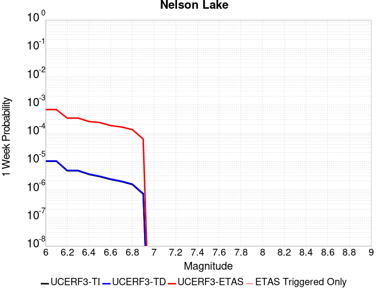 |  |  |  |

| Magnitude | 1 wk TI Prob | 1 wk TD Prob | 1 wk ETAS Prob | 1 wk ETAS/TD Gain | 1 wk ETAS Triggered Only | 1 mo TI Prob | 1 mo TD Prob | 1 mo ETAS Prob | 1 mo ETAS/TD Gain | 1 mo ETAS Triggered Only | 1 yr TI Prob | 1 yr TD Prob | 1 yr ETAS Prob | 1 yr ETAS/TD Gain | 1 yr ETAS Triggered Only | 10 yr TI Prob | 10 yr TD Prob | 10 yr ETAS Prob | 10 yr ETAS/TD Gain | 10 yr ETAS Triggered Only |
|-----|-----|-----|-----|-----|-----|-----|-----|-----|-----|-----|-----|-----|-----|-----|-----|-----|-----|-----|-----|-----|
| 6.0 | 9.913453E-6 | 1.0192255E-5 | 6.776762E-4 | 66.48933 | 6.674907E-4 | 4.2485535E-5 | 4.3680422E-5 | 0.0010695936 | 24.486795 | 0.001025958 | 5.1713863E-4 | 5.316897E-4 | 0.0026195778 | 4.9268923 | 0.0020889987 | 0.0051593683 | 0.005305204 | 0.0087110195 | 1.6419764 | 0.0034239802 |
| 6.1 | 9.913453E-6 | 1.0192255E-5 | 6.776762E-4 | 66.48933 | 6.674907E-4 | 4.2485535E-5 | 4.3680422E-5 | 0.0010695936 | 24.486795 | 0.001025958 | 5.1713863E-4 | 5.316897E-4 | 0.0026195778 | 4.9268923 | 0.0020889987 | 0.0051593683 | 0.005305204 | 0.0087110195 | 1.6419764 | 0.0034239802 |
| 6.2 | 4.5596407E-6 | 4.696313E-6 | 3.1371834E-4 | 66.80099 | 3.0902348E-4 | 1.954117E-5 | 2.0126909E-5 | 4.7747247E-4 | 23.723091 | 4.5735476E-4 | 2.3788778E-4 | 2.4501883E-4 | 0.0010359251 | 4.227941 | 7.9110014E-4 | 0.0023763329 | 0.0024476128 | 0.0038779723 | 1.5843896 | 0.001433869 |
| 6.3 | 4.5596407E-6 | 4.696313E-6 | 3.1371834E-4 | 66.80099 | 3.0902348E-4 | 1.954117E-5 | 2.0126909E-5 | 4.7747247E-4 | 23.723091 | 4.5735476E-4 | 2.3788778E-4 | 2.4501883E-4 | 0.0010359251 | 4.227941 | 7.9110014E-4 | 0.0023763329 | 0.0024476128 | 0.0038779723 | 1.5843896 | 0.001433869 |
| 6.4 | 3.4025713E-6 | 3.5098972E-6 | 2.3836692E-4 | 67.91279 | 2.3485786E-4 | 1.4582367E-5 | 1.5042335E-5 | 3.7350418E-4 | 24.8302 | 3.5846725E-4 | 1.7752586E-4 | 1.8312587E-4 | 8.1341836E-4 | 4.4418535 | 6.304079E-4 | 0.001773841 | 0.0018298327 | 0.00287859 | 1.5731438 | 0.0010506798 |
| 6.5 | 2.8352947E-6 | 2.927856E-6 | 2.130632E-4 | 72.771065 | 2.1013597E-4 | 1.2151207E-5 | 1.2547898E-5 | 3.4628907E-4 | 27.597376 | 3.3374535E-4 | 1.479309E-4 | 1.5276071E-4 | 7.583542E-4 | 4.964328 | 6.0568604E-4 | 0.0014783246 | 0.0015266308 | 0.0025016542 | 1.6386766 | 9.765142E-4 |
| 6.6 | 2.251518E-6 | 2.3290677E-6 | 1.7538182E-4 | 75.3013 | 1.7305315E-4 | 9.649328E-6 | 9.981683E-6 | 2.6955883E-4 | 27.005346 | 2.5957974E-4 | 1.1747423E-4 | 1.2152085E-4 | 6.035389E-4 | 4.966546 | 4.8207663E-4 | 0.0011741214 | 0.0012146058 | 0.0019677072 | 1.6200378 | 7.540173E-4 |
| 6.7 | 1.8911853E-6 | 1.9591396E-6 | 1.6265103E-4 | 83.02167 | 1.6069222E-4 | 8.105055E-6 | 8.39629E-6 | 2.0616966E-4 | 24.554855 | 1.9777504E-4 | 9.867457E-5 | 1.0222061E-4 | 5.224496E-4 | 5.1110005 | 4.2027194E-4 | 9.863076E-4 | 0.0010217935 | 0.0016392089 | 1.6042469 | 6.1804696E-4 |
| 6.8 | 1.4874814E-6 | 1.5438305E-6 | 1.3751395E-4 | 89.07322 | 1.3597033E-4 | 6.374905E-6 | 6.6164025E-6 | 1.6730755E-4 | 25.286785 | 1.6069222E-4 | 7.76117E-5 | 8.055224E-5 | 4.1427073E-4 | 5.1428823 | 3.3374535E-4 | 7.75846E-4 | 8.0528157E-4 | 0.001299321 | 1.613499 | 4.944376E-4 |
| 6.9 | 6.835972E-7 | 7.1399285E-7 | 6.2518644E-5 | 87.56201 | 6.18047E-5 | 2.9296991E-6 | 3.0599674E-6 | 7.722538E-5 | 25.23732 | 7.416563E-5 | 3.56685E-5 | 3.7254784E-5 | 1.8558053E-4 | 4.9813876 | 1.4833127E-4 | 3.5662777E-4 | 3.7251666E-4 | 5.9493067E-4 | 1.5970579 | 2.224969E-4 |

## Death Valley (So)
*[(top)](#table-of-contents)*

| 1 Week | 1 Month | 1 Year | 10 Year |
|-----|-----|-----|-----|
|  |  |  |  |

| Magnitude | 1 wk TI Prob | 1 wk TD Prob | 1 wk ETAS Prob | 1 wk ETAS/TD Gain | 1 wk ETAS Triggered Only | 1 mo TI Prob | 1 mo TD Prob | 1 mo ETAS Prob | 1 mo ETAS/TD Gain | 1 mo ETAS Triggered Only | 1 yr TI Prob | 1 yr TD Prob | 1 yr ETAS Prob | 1 yr ETAS/TD Gain | 1 yr ETAS Triggered Only | 10 yr TI Prob | 10 yr TD Prob | 10 yr ETAS Prob | 10 yr ETAS/TD Gain | 10 yr ETAS Triggered Only |
|-----|-----|-----|-----|-----|-----|-----|-----|-----|-----|-----|-----|-----|-----|-----|-----|-----|-----|-----|-----|-----|
| 6.0 | 2.0684236E-5 | 2.5617775E-5 | 7.6725514E-4 | 29.950108 | 7.4165635E-4 | 8.864371E-5 | 1.0978594E-4 | 0.0013086654 | 11.920155 | 0.0011990111 | 0.0010787029 | 0.0013358411 | 0.003755349 | 2.811224 | 0.0024227442 | 0.010734817 | 0.013281397 | 0.016903836 | 1.2727455 | 0.003671199 |
| 6.1 | 2.0684236E-5 | 2.5617775E-5 | 7.6725514E-4 | 29.950108 | 7.4165635E-4 | 8.864371E-5 | 1.0978594E-4 | 0.0013086654 | 11.920155 | 0.0011990111 | 0.0010787029 | 0.0013358411 | 0.003755349 | 2.811224 | 0.0024227442 | 0.010734817 | 0.013281397 | 0.016903836 | 1.2727455 | 0.003671199 |
| 6.2 | 2.0684236E-5 | 2.5617775E-5 | 7.6725514E-4 | 29.950108 | 7.4165635E-4 | 8.864371E-5 | 1.0978594E-4 | 0.0013086654 | 11.920155 | 0.0011990111 | 0.0010787029 | 0.0013358411 | 0.003755349 | 2.811224 | 0.0024227442 | 0.010734817 | 0.013281397 | 0.016903836 | 1.2727455 | 0.003671199 |
| 6.3 | 2.0240292E-5 | 2.511786E-5 | 7.54395E-4 | 30.034204 | 7.292954E-4 | 8.6741224E-5 | 1.07643624E-4 | 0.0012447276 | 11.563413 | 0.0011372064 | 0.0010555626 | 0.00130979 | 0.0035935687 | 2.743622 | 0.0022867739 | 0.010505628 | 0.013023956 | 0.016500942 | 1.2669685 | 0.0035228678 |
| 6.4 | 2.0240292E-5 | 2.511786E-5 | 7.54395E-4 | 30.034204 | 7.292954E-4 | 8.6741224E-5 | 1.07643624E-4 | 0.0012447276 | 11.563413 | 0.0011372064 | 0.0010555626 | 0.00130979 | 0.0035935687 | 2.743622 | 0.0022867739 | 0.010505628 | 0.013023956 | 0.016500942 | 1.2669685 | 0.0035228678 |
| 6.5 | 1.9962767E-5 | 2.4807114E-5 | 7.1700255E-4 | 28.903103 | 6.922126E-4 | 8.55519E-5 | 1.0631196E-4 | 0.0012063186 | 11.34697 | 0.0011001236 | 0.0010410968 | 0.0012935963 | 0.0034663074 | 2.6795897 | 0.0021755253 | 0.010362327 | 0.012863902 | 0.016195029 | 1.2589515 | 0.0033745365 |
| 6.6 | 1.8937297E-5 | 2.3310964E-5 | 6.289829E-4 | 26.982275 | 6.0568604E-4 | 8.115732E-5 | 9.990039E-5 | 0.0011010364 | 11.021343 | 0.0010012361 | 9.876423E-4 | 0.0012156231 | 0.0031415855 | 2.5843418 | 0.0019283065 | 0.009832645 | 0.012092789 | 0.015121231 | 1.2504338 | 0.003065513 |
| 6.7 | 1.8621096E-5 | 2.2911607E-5 | 6.0386246E-4 | 26.35618 | 5.8096414E-4 | 7.980225E-5 | 9.818898E-5 | 0.0010622476 | 10.818398 | 9.6415327E-4 | 9.711593E-4 | 0.0011948098 | 0.0030714278 | 2.5706415 | 0.0018788629 | 0.009669261 | 0.011886904 | 0.014854907 | 1.2496868 | 0.0030037083 |
| 6.8 | 1.7830353E-5 | 2.1805688E-5 | 5.2859314E-4 | 24.241068 | 5.067985E-4 | 7.641356E-5 | 9.344968E-5 | 9.33915E-4 | 9.993774 | 8.405439E-4 | 9.29938E-4 | 0.00113717 | 0.0028780806 | 2.5309148 | 0.0017428924 | 0.009260561 | 0.011316354 | 0.014127198 | 1.2483877 | 0.002843016 |
| 6.9 | 1.3135183E-5 | 1.5303925E-5 | 3.7376568E-4 | 24.422865 | 3.5846725E-4 | 5.6292425E-5 | 6.558664E-5 | 6.3415256E-4 | 9.668929 | 5.686032E-4 | 6.8514474E-4 | 7.982312E-4 | 0.0020209874 | 2.531832 | 0.001223733 | 0.006830362 | 0.007954649 | 0.009904404 | 1.245109 | 0.0019653894 |
| 7.0 | 1.1507512E-5 | 1.3154199E-5 | 2.4800896E-4 | 18.853975 | 2.3485786E-4 | 4.9316975E-5 | 5.6373956E-5 | 4.5190172E-4 | 8.016144 | 3.9555007E-4 | 6.002687E-4 | 6.8614254E-4 | 0.0015014048 | 2.188182 | 8.15822E-4 | 0.0059864987 | 0.0068409415 | 0.008228173 | 1.2027836 | 0.0013967862 |
| 7.1 | 9.715903E-6 | 1.0865278E-5 | 1.4683414E-4 | 13.5140705 | 1.3597033E-4 | 4.1638916E-5 | 4.656467E-5 | 2.5669087E-4 | 5.5125666 | 2.1013597E-4 | 5.068359E-4 | 5.667817E-4 | 9.868154E-4 | 1.7410856 | 4.2027194E-4 | 0.0050568148 | 0.0056538144 | 0.0063298224 | 1.1195667 | 6.798517E-4 |
| 7.2 | 9.233269E-6 | 1.02863105E-5 | 9.681199E-5 | 9.411732 | 8.6526576E-5 | 3.9570554E-5 | 4.4083466E-5 | 2.047686E-4 | 4.6450205 | 1.6069222E-4 | 4.81665E-4 | 5.3658825E-4 | 8.5780025E-4 | 1.5986191 | 3.2138443E-4 | 0.0048062233 | 0.0053533576 | 0.005869738 | 1.0964592 | 5.191595E-4 |
| 7.3 | 8.8041315E-6 | 9.808164E-6 | 7.161225E-5 | 7.3012905 | 6.18047E-5 | 3.7731446E-5 | 4.2034335E-5 | 1.6563853E-4 | 3.9405532 | 1.236094E-4 | 4.592835E-4 | 5.1165203E-4 | 7.5874437E-4 | 1.4829303 | 2.472188E-4 | 0.0045833546 | 0.005105167 | 0.005498698 | 1.0770848 | 3.9555007E-4 |
| 7.4 | 8.708749E-6 | 9.707175E-6 | 7.151127E-5 | 7.366847 | 6.18047E-5 | 3.7322676E-5 | 4.160154E-5 | 1.6520578E-4 | 3.971146 | 1.236094E-4 | 4.5430884E-4 | 5.0638523E-4 | 7.2876946E-4 | 1.4391602 | 2.224969E-4 | 0.004533812 | 0.0050527398 | 0.005421694 | 1.0730207 | 3.7082817E-4 |
| 7.5 | 8.612678E-6 | 9.604817E-6 | 5.90481E-5 | 6.147759 | 4.944376E-5 | 3.6910955E-5 | 4.1162875E-5 | 1.5240675E-4 | 3.7025292 | 1.1124845E-4 | 4.492982E-4 | 5.01047E-4 | 7.1107765E-4 | 1.4191836 | 2.1013597E-4 | 0.004483909 | 0.0049995985 | 0.0053562736 | 1.0713407 | 3.5846725E-4 |
| 7.6 | 8.319024E-6 | 9.283916E-6 | 5.8727215E-5 | 6.325694 | 4.944376E-5 | 3.5652476E-5 | 3.978763E-5 | 1.5103167E-4 | 3.7959452 | 1.1124845E-4 | 4.3398244E-4 | 4.8431093E-4 | 6.943451E-4 | 1.4336764 | 2.1013597E-4 | 0.0043313587 | 0.0048329784 | 0.005165111 | 1.0687221 | 3.3374535E-4 |
| 7.7 | 7.4718328E-6 | 8.34517E-6 | 5.7788515E-5 | 6.924786 | 4.944376E-5 | 3.2021748E-5 | 3.5764548E-5 | 1.4700902E-4 | 4.110468 | 1.1124845E-4 | 3.8979502E-4 | 4.353504E-4 | 6.3303934E-4 | 1.4540915 | 1.9777504E-4 | 0.00389112 | 0.0043453807 | 0.004640754 | 1.0679741 | 2.9666253E-4 |
| 7.8 | 3.4586725E-7 | 3.6482615E-7 | 3.6482615E-7 | 1.0 | 0.0 | 1.4822873E-6 | 1.5635396E-6 | 1.5635396E-6 | 1.0 | 0.0 | 1.80467E-5 | 1.9035933E-5 | 3.1396637E-5 | 1.6493353 | 1.236094E-5 | 1.8045233E-4 | 1.9034347E-4 | 2.1506065E-4 | 1.1298556 | 2.472188E-5 |
| 7.9 | 2.5591178E-9 | 2.6696718E-9 | 2.6696718E-9 | 1.0 | 0.0 | 1.0967647E-8 | 1.14414505E-8 | 1.14414505E-8 | 1.0 | 0.0 | 1.335311E-7 | 1.3929966E-7 | 1.3929966E-7 | 1.0 | 0.0 | 1.3353102E-6 | 1.3929966E-6 | 1.3929966E-6 | 1.0 | 0.0 |

## San Andreas (Mojave N)
*[(top)](#table-of-contents)*

| 1 Week | 1 Month | 1 Year | 10 Year |
|-----|-----|-----|-----|
| 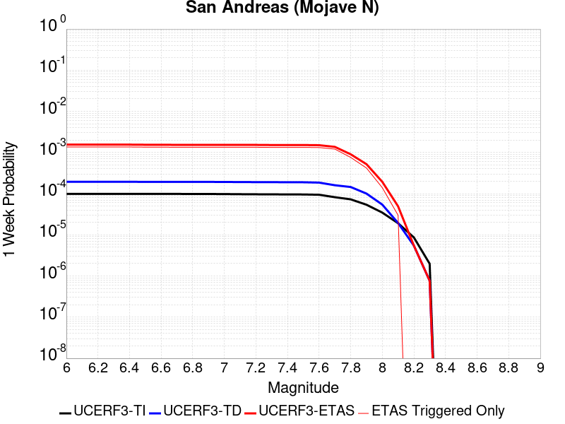 |  |  |  |

| Magnitude | 1 wk TI Prob | 1 wk TD Prob | 1 wk ETAS Prob | 1 wk ETAS/TD Gain | 1 wk ETAS Triggered Only | 1 mo TI Prob | 1 mo TD Prob | 1 mo ETAS Prob | 1 mo ETAS/TD Gain | 1 mo ETAS Triggered Only | 1 yr TI Prob | 1 yr TD Prob | 1 yr ETAS Prob | 1 yr ETAS/TD Gain | 1 yr ETAS Triggered Only | 10 yr TI Prob | 10 yr TD Prob | 10 yr ETAS Prob | 10 yr ETAS/TD Gain | 10 yr ETAS Triggered Only |
|-----|-----|-----|-----|-----|-----|-----|-----|-----|-----|-----|-----|-----|-----|-----|-----|-----|-----|-----|-----|-----|
| 6.0 | 9.877682E-5 | 1.9400702E-4 | 0.0015040124 | 7.752361 | 0.0013102596 | 4.2326056E-4 | 8.311939E-4 | 0.0026220402 | 3.1545472 | 0.0017923362 | 0.0051410277 | 0.010072956 | 0.012838389 | 1.2745403 | 0.0027935724 | 0.05023708 | 0.09831428 | 0.10163569 | 1.0337837 | 0.00368356 |
| 6.1 | 9.877682E-5 | 1.9400702E-4 | 0.0015040124 | 7.752361 | 0.0013102596 | 4.2326056E-4 | 8.311939E-4 | 0.0026220402 | 3.1545472 | 0.0017923362 | 0.0051410277 | 0.010072956 | 0.012838389 | 1.2745403 | 0.0027935724 | 0.05023708 | 0.09831428 | 0.10163569 | 1.0337837 | 0.00368356 |
| 6.2 | 9.877682E-5 | 1.9400702E-4 | 0.0015040124 | 7.752361 | 0.0013102596 | 4.2326056E-4 | 8.311939E-4 | 0.0026220402 | 3.1545472 | 0.0017923362 | 0.0051410277 | 0.010072956 | 0.012838389 | 1.2745403 | 0.0027935724 | 0.05023708 | 0.09831428 | 0.10163569 | 1.0337837 | 0.00368356 |
| 6.3 | 9.877682E-5 | 1.9400702E-4 | 0.0015040124 | 7.752361 | 0.0013102596 | 4.2326056E-4 | 8.311939E-4 | 0.0026220402 | 3.1545472 | 0.0017923362 | 0.0051410277 | 0.010072956 | 0.012838389 | 1.2745403 | 0.0027935724 | 0.05023708 | 0.09831428 | 0.10163569 | 1.0337837 | 0.00368356 |
| 6.4 | 9.877682E-5 | 1.9400702E-4 | 0.0015040124 | 7.752361 | 0.0013102596 | 4.2326056E-4 | 8.311939E-4 | 0.0026220402 | 3.1545472 | 0.0017923362 | 0.0051410277 | 0.010072956 | 0.012838389 | 1.2745403 | 0.0027935724 | 0.05023708 | 0.09831428 | 0.10163569 | 1.0337837 | 0.00368356 |
| 6.5 | 9.861474E-5 | 1.9374468E-4 | 0.0014913919 | 7.6977177 | 0.0012978986 | 4.2256617E-4 | 8.300703E-4 | 0.0026085682 | 3.142587 | 0.0017799753 | 0.0051326132 | 0.010059402 | 0.012812637 | 1.2736976 | 0.0027812114 | 0.050156746 | 0.098192066 | 0.10150278 | 1.0337168 | 0.003671199 |
| 6.6 | 9.861474E-5 | 1.9374468E-4 | 0.0014913919 | 7.6977177 | 0.0012978986 | 4.2256617E-4 | 8.300703E-4 | 0.0026085682 | 3.142587 | 0.0017799753 | 0.0051326132 | 0.010059402 | 0.012812637 | 1.2736976 | 0.0027812114 | 0.050156746 | 0.098192066 | 0.10150278 | 1.0337168 | 0.003671199 |
| 6.7 | 9.8552715E-5 | 1.9364421E-4 | 0.0014912916 | 7.7011933 | 0.0012978986 | 4.223004E-4 | 8.2964E-4 | 0.0026081386 | 3.1436992 | 0.0017799753 | 0.0051293927 | 0.010054212 | 0.0128074605 | 1.2738403 | 0.0027812114 | 0.050125998 | 0.098145254 | 0.10145614 | 1.0337346 | 0.003671199 |
| 6.8 | 9.8464974E-5 | 1.9349584E-4 | 0.0014911434 | 7.7063327 | 0.0012978986 | 4.219245E-4 | 8.290045E-4 | 0.0026075041 | 3.1453438 | 0.0017799753 | 0.0051248376 | 0.010046546 | 0.012799816 | 1.2740513 | 0.0027812114 | 0.05008251 | 0.09807528 | 0.10138643 | 1.0337613 | 0.003671199 |
| 6.9 | 9.825824E-5 | 1.9317595E-4 | 0.0014908238 | 7.7174406 | 0.0012978986 | 4.2103877E-4 | 8.276344E-4 | 0.0026061365 | 3.1488984 | 0.0017799753 | 0.0051141046 | 0.010030019 | 0.012783335 | 1.2745075 | 0.0027812114 | 0.049980022 | 0.09792438 | 0.10122493 | 1.0337051 | 0.003658838 |
| 7.0 | 9.781462E-5 | 1.924896E-4 | 0.0014901384 | 7.741397 | 0.0012978986 | 4.1913814E-4 | 8.246948E-4 | 0.0026032021 | 3.1565642 | 0.0017799753 | 0.005091073 | 0.009994558 | 0.012747973 | 1.2754914 | 0.0027812114 | 0.04976007 | 0.09760077 | 0.100902505 | 1.033829 | 0.003658838 |
| 7.1 | 9.7121134E-5 | 1.9150671E-4 | 0.0014891569 | 7.776003 | 0.0012978986 | 4.1616702E-4 | 8.204851E-4 | 0.002599 | 3.167638 | 0.0017799753 | 0.005055068 | 0.009943774 | 0.01269733 | 1.2769126 | 0.0027812114 | 0.04941613 | 0.09713728 | 0.10044071 | 1.0340078 | 0.003658838 |
| 7.2 | 9.663819E-5 | 1.9081456E-4 | 0.0014884656 | 7.8005867 | 0.0012978986 | 4.1409794E-4 | 8.175206E-4 | 0.0025960407 | 3.175505 | 0.0017799753 | 0.0050299936 | 0.00990801 | 0.012649427 | 1.2766869 | 0.0027688504 | 0.049176537 | 0.09681055 | 0.100104004 | 1.0340196 | 0.0036464771 |
| 7.3 | 9.6277574E-5 | 1.9033969E-4 | 0.0014756327 | 7.7526274 | 0.0012855377 | 4.125529E-4 | 8.154867E-4 | 0.0025816597 | 3.1657898 | 0.0017676144 | 0.0050112694 | 0.009883473 | 0.012612719 | 1.2761424 | 0.0027564894 | 0.04899759 | 0.09658401 | 0.09986713 | 1.0339924 | 0.0036341161 |
| 7.4 | 9.593308E-5 | 1.897375E-4 | 0.0014750313 | 7.774063 | 0.0012855377 | 4.1107697E-4 | 8.129075E-4 | 0.0025790848 | 3.1726673 | 0.0017676144 | 0.0049933824 | 0.009852355 | 0.012581687 | 1.2770233 | 0.0027564894 | 0.04882661 | 0.09630218 | 0.09958633 | 1.0341024 | 0.0036341161 |
| 7.5 | 9.561707E-5 | 1.8919831E-4 | 0.0014744928 | 7.7933717 | 0.0012855377 | 4.0972308E-4 | 8.1059814E-4 | 0.0025767796 | 3.178862 | 0.0017676144 | 0.0049769743 | 0.009824493 | 0.012553901 | 1.2778168 | 0.0027564894 | 0.048669744 | 0.09604836 | 0.09933343 | 1.0342022 | 0.0036341161 |
| 7.6 | 9.418194E-5 | 1.8572104E-4 | 0.00147102 | 7.9205885 | 0.0012855377 | 4.0357444E-4 | 7.957047E-4 | 0.0025619126 | 3.2196774 | 0.0017676144 | 0.004902454 | 0.009644784 | 0.012374688 | 1.2830446 | 0.0027564894 | 0.047957025 | 0.094430685 | 0.09771044 | 1.0347319 | 0.0036217552 |
| 7.7 | 8.202141E-5 | 1.6021315E-4 | 0.0013590322 | 8.482651 | 0.0011990111 | 3.51473E-4 | 6.8644714E-4 | 0.0023540284 | 3.4292932 | 0.0016687268 | 0.00427079 | 0.008325525 | 0.010911969 | 1.3106644 | 0.0026081582 | 0.04189639 | 0.08223219 | 0.08531789 | 1.0375242 | 0.0033621755 |
| 7.8 | 7.2859846E-5 | 1.4516473E-4 | 8.9907256E-4 | 6.1934648 | 7.540173E-4 | 3.1221908E-4 | 6.219862E-4 | 0.0017584853 | 2.8272095 | 0.0011372064 | 0.003794643 | 0.0075464295 | 0.009337508 | 1.2373412 | 0.0018046972 | 0.037304975 | 0.07472468 | 0.07687489 | 1.0287751 | 0.0023238566 |
| 7.9 | 5.3874453E-5 | 1.0045676E-4 | 4.959671E-4 | 4.93712 | 3.9555007E-4 | 2.3087008E-4 | 4.3045796E-4 | 0.0010358832 | 2.406468 | 6.0568604E-4 | 0.0028072202 | 0.0052282433 | 0.006211948 | 1.1881521 | 9.888752E-4 | 0.02772022 | 0.05242443 | 0.053642575 | 1.0232362 | 0.0012855377 |
| 8.0 | 3.468538E-5 | 5.4260272E-5 | 2.1494376E-4 | 3.961347 | 1.6069222E-4 | 1.4864317E-4 | 2.325233E-4 | 4.6732655E-4 | 2.0098052 | 2.3485786E-4 | 0.0018082283 | 0.002827298 | 0.0031970777 | 1.130789 | 3.7082817E-4 | 0.017935853 | 0.028947512 | 0.02943964 | 1.0170007 | 5.067985E-4 |
| 8.1 | 1.9152367E-5 | 1.940263E-5 | 5.648473E-5 | 2.9111893 | 3.7082817E-5 | 8.207899E-5 | 8.3151484E-5 | 1.2023122E-4 | 1.4459299 | 3.7082817E-5 | 9.988535E-4 | 0.0010118998 | 0.0010736419 | 1.0610161 | 6.18047E-5 | 0.009943757 | 0.01085625 | 0.010929611 | 1.0067575 | 7.416563E-5 |
| 8.2 | 8.643924E-6 | 5.4748625E-6 | 5.4748625E-6 | 1.0 | 0.0 | 3.704486E-5 | 2.3463486E-5 | 2.3463486E-5 | 1.0 | 0.0 | 4.5092785E-4 | 2.8563058E-4 | 2.8563058E-4 | 1.0 | 0.0 | 0.0045001395 | 0.0032487072 | 0.0032487072 | 1.0 | 0.0 |
| 8.3 | 1.983087E-6 | 7.6599065E-7 | 7.6599065E-7 | 1.0 | 0.0 | 8.498917E-6 | 3.282813E-6 | 3.282813E-6 | 1.0 | 0.0 | 1.034694E-4 | 3.9967534E-5 | 3.9967534E-5 | 1.0 | 0.0 | 0.0010342124 | 4.719687E-4 | 4.719687E-4 | 1.0 | 0.0 |

## Bicycle Lake
*[(top)](#table-of-contents)*

| 1 Week | 1 Month | 1 Year | 10 Year |
|-----|-----|-----|-----|
|  |  |  | 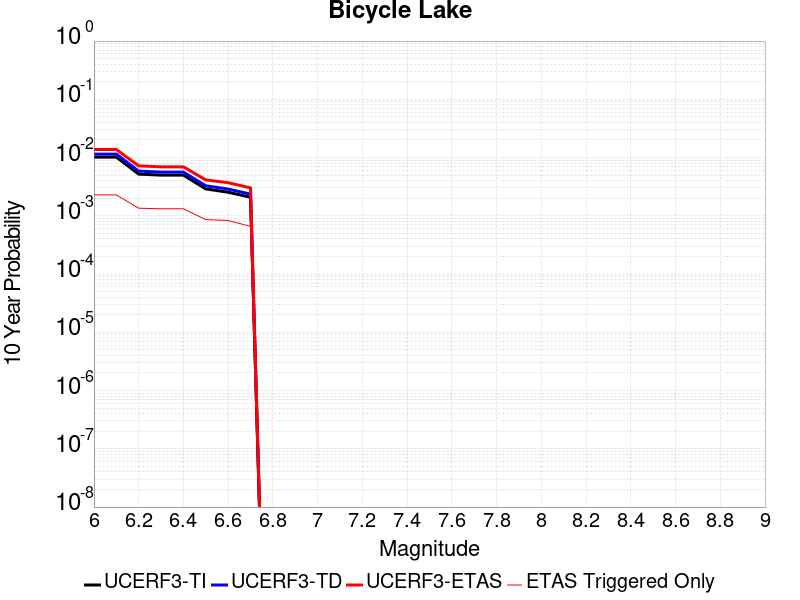 |

| Magnitude | 1 wk TI Prob | 1 wk TD Prob | 1 wk ETAS Prob | 1 wk ETAS/TD Gain | 1 wk ETAS Triggered Only | 1 mo TI Prob | 1 mo TD Prob | 1 mo ETAS Prob | 1 mo ETAS/TD Gain | 1 mo ETAS Triggered Only | 1 yr TI Prob | 1 yr TD Prob | 1 yr ETAS Prob | 1 yr ETAS/TD Gain | 1 yr ETAS Triggered Only | 10 yr TI Prob | 10 yr TD Prob | 10 yr ETAS Prob | 10 yr ETAS/TD Gain | 10 yr ETAS Triggered Only |
|-----|-----|-----|-----|-----|-----|-----|-----|-----|-----|-----|-----|-----|-----|-----|-----|-----|-----|-----|-----|-----|
| 6.0 | 1.9621975E-5 | 2.2097078E-5 | 4.7944172E-4 | 21.697065 | 4.5735476E-4 | 8.4091465E-5 | 9.4699084E-5 | 7.250473E-4 | 7.656328 | 6.304079E-4 | 0.0010233327 | 0.0011524865 | 0.0024118493 | 2.0927353 | 0.0012608158 | 0.01018633 | 0.011478408 | 0.013775591 | 1.2001307 | 0.0023238566 |
| 6.1 | 1.9621975E-5 | 2.2097078E-5 | 4.7944172E-4 | 21.697065 | 4.5735476E-4 | 8.4091465E-5 | 9.4699084E-5 | 7.250473E-4 | 7.656328 | 6.304079E-4 | 0.0010233327 | 0.0011524865 | 0.0024118493 | 2.0927353 | 0.0012608158 | 0.01018633 | 0.011478408 | 0.013775591 | 1.2001307 | 0.0023238566 |
| 6.2 | 9.9971285E-6 | 1.1255639E-5 | 2.9555405E-4 | 26.258308 | 2.843016E-4 | 4.2844134E-5 | 4.8237856E-5 | 4.5612917E-4 | 9.455834 | 4.07911E-4 | 5.2150246E-4 | 5.871896E-4 | 0.0013901789 | 2.3675127 | 8.0346107E-4 | 0.0052028033 | 0.005861487 | 0.0072746626 | 1.2410952 | 0.001421508 |
| 6.3 | 9.589428E-6 | 1.0798346E-5 | 2.950969E-4 | 27.32797 | 2.843016E-4 | 4.10969E-5 | 4.62781E-5 | 4.5417022E-4 | 9.813934 | 4.07911E-4 | 5.002399E-4 | 5.6334207E-4 | 0.0013539965 | 2.403507 | 7.9110014E-4 | 0.0049911533 | 0.0056242296 | 0.00701316 | 1.2469548 | 0.0013967862 |
| 6.4 | 9.589428E-6 | 1.0798346E-5 | 2.950969E-4 | 27.32797 | 2.843016E-4 | 4.10969E-5 | 4.62781E-5 | 4.5417022E-4 | 9.813934 | 4.07911E-4 | 5.002399E-4 | 5.6334207E-4 | 0.0013539965 | 2.403507 | 7.9110014E-4 | 0.0049911533 | 0.0056242296 | 0.00701316 | 1.2469548 | 0.0013967862 |
| 6.5 | 5.557707E-6 | 6.2856016E-6 | 2.1642025E-4 | 34.431114 | 2.1013597E-4 | 2.3818526E-5 | 2.6938165E-5 | 3.4831394E-4 | 12.930128 | 3.2138443E-4 | 2.8995197E-4 | 3.2794967E-4 | 8.716527E-4 | 2.6578853 | 5.438813E-4 | 0.0028957394 | 0.0032772934 | 0.0041520437 | 1.2669125 | 8.776267E-4 |
| 6.6 | 4.8742945E-6 | 5.5132896E-6 | 2.0328723E-4 | 36.87222 | 1.9777504E-4 | 2.0889667E-5 | 2.3628318E-5 | 3.2028384E-4 | 13.555084 | 2.9666253E-4 | 2.54302E-4 | 2.87663E-4 | 8.0667314E-4 | 2.8042297 | 5.191595E-4 | 0.002540112 | 0.0028754752 | 0.0037259276 | 1.2957606 | 8.529048E-4 |
| 6.7 | 3.991108E-6 | 4.5159104E-6 | 1.652074E-4 | 36.58341 | 1.6069222E-4 | 1.7104636E-5 | 1.9353902E-5 | 2.665679E-4 | 13.773342 | 2.472188E-4 | 2.0822904E-4 | 2.3563375E-4 | 6.681647E-4 | 2.8356068 | 4.326329E-4 | 0.0020803404 | 0.0023563374 | 0.0030592508 | 1.2983075 | 7.045735E-4 |

## Towne Pass
*[(top)](#table-of-contents)*

| 1 Week | 1 Month | 1 Year | 10 Year |
|-----|-----|-----|-----|
|  |  |  |  |

| Magnitude | 1 wk TI Prob | 1 wk TD Prob | 1 wk ETAS Prob | 1 wk ETAS/TD Gain | 1 wk ETAS Triggered Only | 1 mo TI Prob | 1 mo TD Prob | 1 mo ETAS Prob | 1 mo ETAS/TD Gain | 1 mo ETAS Triggered Only | 1 yr TI Prob | 1 yr TD Prob | 1 yr ETAS Prob | 1 yr ETAS/TD Gain | 1 yr ETAS Triggered Only | 10 yr TI Prob | 10 yr TD Prob | 10 yr ETAS Prob | 10 yr ETAS/TD Gain | 10 yr ETAS Triggered Only |
|-----|-----|-----|-----|-----|-----|-----|-----|-----|-----|-----|-----|-----|-----|-----|-----|-----|-----|-----|-----|-----|
| 6.0 | 3.849728E-6 | 3.8945414E-6 | 4.4888663E-4 | 115.26046 | 4.449938E-4 | 1.649873E-5 | 1.669081E-5 | 7.706955E-4 | 46.174843 | 7.540173E-4 | 2.0085352E-4 | 2.0319603E-4 | 0.0016985658 | 8.359247 | 0.0014956737 | 0.0020067208 | 0.0020305314 | 0.0043373336 | 2.1360583 | 0.0023114956 |
| 6.1 | 3.849728E-6 | 3.8945414E-6 | 4.4888663E-4 | 115.26046 | 4.449938E-4 | 1.649873E-5 | 1.669081E-5 | 7.706955E-4 | 46.174843 | 7.540173E-4 | 2.0085352E-4 | 2.0319603E-4 | 0.0016985658 | 8.359247 | 0.0014956737 | 0.0020067208 | 0.0020305314 | 0.0043373336 | 2.1360583 | 0.0023114956 |
| 6.2 | 3.849728E-6 | 3.8945414E-6 | 4.4888663E-4 | 115.26046 | 4.449938E-4 | 1.649873E-5 | 1.669081E-5 | 7.706955E-4 | 46.174843 | 7.540173E-4 | 2.0085352E-4 | 2.0319603E-4 | 0.0016985658 | 8.359247 | 0.0014956737 | 0.0020067208 | 0.0020305314 | 0.0043373336 | 2.1360583 | 0.0023114956 |
| 6.3 | 3.849728E-6 | 3.8945414E-6 | 4.4888663E-4 | 115.26046 | 4.449938E-4 | 1.649873E-5 | 1.669081E-5 | 7.706955E-4 | 46.174843 | 7.540173E-4 | 2.0085352E-4 | 2.0319603E-4 | 0.0016985658 | 8.359247 | 0.0014956737 | 0.0020067208 | 0.0020305314 | 0.0043373336 | 2.1360583 | 0.0023114956 |
| 6.4 | 3.849728E-6 | 3.8945414E-6 | 4.4888663E-4 | 115.26046 | 4.449938E-4 | 1.649873E-5 | 1.669081E-5 | 7.706955E-4 | 46.174843 | 7.540173E-4 | 2.0085352E-4 | 2.0319603E-4 | 0.0016985658 | 8.359247 | 0.0014956737 | 0.0020067208 | 0.0020305314 | 0.0043373336 | 2.1360583 | 0.0023114956 |
| 6.5 | 1.1953545E-6 | 1.203052E-6 | 6.3007676E-5 | 52.37319 | 6.18047E-5 | 5.1229376E-6 | 5.1559277E-6 | 7.932118E-5 | 15.384463 | 7.416563E-5 | 6.236998E-5 | 6.277173E-5 | 2.9761484E-4 | 4.741224 | 2.3485786E-4 | 6.235248E-4 | 6.275517E-4 | 9.363813E-4 | 1.4921181 | 3.0902348E-4 |
| 6.6 | 1.1953545E-6 | 1.203052E-6 | 6.3007676E-5 | 52.37319 | 6.18047E-5 | 5.1229376E-6 | 5.1559277E-6 | 7.932118E-5 | 15.384463 | 7.416563E-5 | 6.236998E-5 | 6.277173E-5 | 2.9761484E-4 | 4.741224 | 2.3485786E-4 | 6.235248E-4 | 6.275517E-4 | 9.363813E-4 | 1.4921181 | 3.0902348E-4 |
| 6.7 | 8.375951E-7 | 8.4106705E-7 | 5.0284783E-5 | 59.786892 | 4.944376E-5 | 3.5896885E-6 | 3.6045683E-6 | 6.540904E-5 | 18.14615 | 6.18047E-5 | 4.370358E-5 | 4.3884793E-5 | 2.1693035E-4 | 4.943178 | 1.7305315E-4 | 4.3694986E-4 | 4.38767E-4 | 6.3645525E-4 | 1.450554 | 1.9777504E-4 |
| 6.8 | 6.38041E-7 | 6.392156E-7 | 3.772201E-5 | 59.012966 | 3.7082817E-5 | 2.7344586E-6 | 2.7394929E-6 | 5.2183113E-5 | 19.048458 | 4.944376E-5 | 3.3291526E-5 | 3.3352855E-5 | 1.6931865E-4 | 5.0765867 | 1.3597033E-4 | 3.3286537E-4 | 3.334823E-4 | 4.8176412E-4 | 1.4446467 | 1.4833127E-4 |
| 6.9 | 5.3460053E-7 | 5.345333E-7 | 1.2895466E-5 | 24.12472 | 1.236094E-5 | 2.2911431E-6 | 2.2908553E-6 | 2.7012677E-5 | 11.791526 | 2.472188E-5 | 2.789431E-5 | 2.789084E-5 | 1.14415E-4 | 4.102243 | 8.6526576E-5 | 2.789081E-4 | 2.7887672E-4 | 3.7773664E-4 | 1.3544934 | 9.888752E-5 |
| 7.0 | 3.557783E-7 | 3.5324226E-7 | 1.27141775E-5 | 35.992798 | 1.236094E-5 | 1.5247632E-6 | 1.5138945E-6 | 1.38748155E-5 | 9.164981 | 1.236094E-5 | 1.8563835E-5 | 1.843152E-5 | 5.5513654E-5 | 3.011887 | 3.7082817E-5 | 1.8562283E-4 | 1.8430075E-4 | 2.337354E-4 | 1.2682282 | 4.944376E-5 |
| 7.1 | 3.037942E-7 | 3.0002218E-7 | 1.26609575E-5 | 42.200073 | 1.236094E-5 | 1.3019744E-6 | 1.2858087E-6 | 1.3646732E-5 | 10.613345 | 1.236094E-5 | 1.5851423E-5 | 1.5654618E-5 | 5.2736854E-5 | 3.3687732 | 3.7082817E-5 | 1.5850292E-4 | 1.5653588E-4 | 2.0597191E-4 | 1.3158127 | 4.944376E-5 |
| 7.2 | 2.0808248E-7 | 2.0217689E-7 | 2.0217689E-7 | 1.0 | 0.0 | 8.917818E-7 | 8.6647213E-7 | 8.6647213E-7 | 1.0 | 0.0 | 1.0857389E-5 | 1.0549252E-5 | 3.527087E-5 | 3.3434477 | 2.472188E-5 | 1.0856859E-4 | 1.0548797E-4 | 1.4256687E-4 | 1.351499 | 3.7082817E-5 |
| 7.3 | 1.1162073E-7 | 1.0636894E-7 | 1.0636894E-7 | 1.0 | 0.0 | 4.7837443E-7 | 4.558668E-7 | 4.558668E-7 | 1.0 | 0.0 | 5.8241935E-6 | 5.550166E-6 | 3.0271907E-5 | 5.4542346 | 2.472188E-5 | 5.8240406E-5 | 5.5500474E-5 | 9.2581235E-5 | 1.6681161 | 3.7082817E-5 |

## Paradise
*[(top)](#table-of-contents)*

| 1 Week | 1 Month | 1 Year | 10 Year |
|-----|-----|-----|-----|
|  |  | 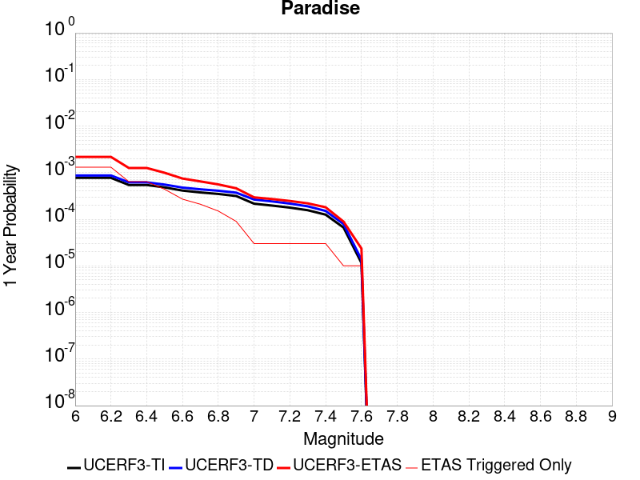 |  |

| Magnitude | 1 wk TI Prob | 1 wk TD Prob | 1 wk ETAS Prob | 1 wk ETAS/TD Gain | 1 wk ETAS Triggered Only | 1 mo TI Prob | 1 mo TD Prob | 1 mo ETAS Prob | 1 mo ETAS/TD Gain | 1 mo ETAS Triggered Only | 1 yr TI Prob | 1 yr TD Prob | 1 yr ETAS Prob | 1 yr ETAS/TD Gain | 1 yr ETAS Triggered Only | 10 yr TI Prob | 10 yr TD Prob | 10 yr ETAS Prob | 10 yr ETAS/TD Gain | 10 yr ETAS Triggered Only |
|-----|-----|-----|-----|-----|-----|-----|-----|-----|-----|-----|-----|-----|-----|-----|-----|-----|-----|-----|-----|-----|
| 6.0 | 1.4851273E-5 | 1.6694692E-5 | 4.7404182E-4 | 28.394764 | 4.5735476E-4 | 6.364676E-5 | 7.154685E-5 | 7.8843004E-4 | 11.0197735 | 7.169345E-4 | 7.7462377E-4 | 8.707584E-4 | 0.0021675269 | 2.4892404 | 0.0012978986 | 0.0077192914 | 0.008675844 | 0.01088151 | 1.2542306 | 0.0022249692 |
| 6.1 | 1.4851273E-5 | 1.6694692E-5 | 4.7404182E-4 | 28.394764 | 4.5735476E-4 | 6.364676E-5 | 7.154685E-5 | 7.8843004E-4 | 11.0197735 | 7.169345E-4 | 7.7462377E-4 | 8.707584E-4 | 0.0021675269 | 2.4892404 | 0.0012978986 | 0.0077192914 | 0.008675844 | 0.01088151 | 1.2542306 | 0.0022249692 |
| 6.2 | 1.4851273E-5 | 1.6694692E-5 | 4.7404182E-4 | 28.394764 | 4.5735476E-4 | 6.364676E-5 | 7.154685E-5 | 7.8843004E-4 | 11.0197735 | 7.169345E-4 | 7.7462377E-4 | 8.707584E-4 | 0.0021675269 | 2.4892404 | 0.0012978986 | 0.0077192914 | 0.008675844 | 0.01088151 | 1.2542306 | 0.0022249692 |
| 6.3 | 1.0426831E-5 | 1.188862E-5 | 3.0854763E-4 | 25.953192 | 2.9666253E-4 | 4.4685654E-5 | 5.0950268E-5 | 4.712008E-4 | 9.24825 | 4.2027194E-4 | 5.43912E-4 | 6.201489E-4 | 0.0012625192 | 2.0358322 | 6.4276886E-4 | 0.0054258266 | 0.0061847917 | 0.00730268 | 1.180748 | 0.0011248455 |
| 6.4 | 1.0426831E-5 | 1.188862E-5 | 3.0854763E-4 | 25.953192 | 2.9666253E-4 | 4.4685654E-5 | 5.0950268E-5 | 4.712008E-4 | 9.24825 | 4.2027194E-4 | 5.43912E-4 | 6.201489E-4 | 0.0012625192 | 2.0358322 | 6.4276886E-4 | 0.0054258266 | 0.0061847917 | 0.00730268 | 1.180748 | 0.0011248455 |
| 6.5 | 9.25027E-6 | 1.06199595E-5 | 1.8367128E-4 | 17.294912 | 1.7305315E-4 | 3.964341E-5 | 4.551335E-5 | 3.2980202E-4 | 7.24627 | 2.843016E-4 | 4.8255164E-4 | 5.53989E-4 | 9.7402814E-4 | 1.7582084 | 4.2027194E-4 | 0.0048150513 | 0.0055265795 | 0.006288722 | 1.137905 | 7.6637825E-4 |
| 6.6 | 7.904275E-6 | 9.159525E-6 | 8.3324485E-5 | 9.097031 | 7.416563E-5 | 3.3875025E-5 | 3.9254537E-5 | 1.7521954E-4 | 4.463676 | 1.3597033E-4 | 4.1235037E-4 | 4.7782314E-4 | 7.1256876E-4 | 1.4912814 | 2.3485786E-4 | 0.0041158604 | 0.0047683544 | 0.0052235285 | 1.0954572 | 4.5735476E-4 |
| 6.7 | 7.2061953E-6 | 8.407248E-6 | 7.021143E-5 | 8.351296 | 6.18047E-5 | 3.088333E-5 | 3.6030586E-5 | 1.4727503E-4 | 4.0875 | 1.1124845E-4 | 3.7593965E-4 | 4.3858777E-4 | 6.362761E-4 | 1.4507383 | 1.9777504E-4 | 0.003753043 | 0.004377591 | 0.0047591026 | 1.087151 | 3.8318912E-4 |
| 6.8 | 6.6948724E-6 | 7.842166E-6 | 4.4924695E-5 | 5.728608 | 3.7082817E-5 | 2.8691995E-5 | 3.360887E-5 | 1.20132536E-4 | 3.5744295 | 8.6526576E-5 | 3.4926904E-4 | 4.0911473E-4 | 5.573853E-4 | 1.362418 | 1.4833127E-4 | 0.003487206 | 0.0040839734 | 0.0043917345 | 1.0753584 | 3.0902348E-4 |
| 6.9 | 6.0421025E-6 | 7.130621E-6 | 4.4213175E-5 | 6.200466 | 3.7082817E-5 | 2.5894467E-5 | 3.0559466E-5 | 9.236227E-5 | 3.0223787 | 6.18047E-5 | 3.1521954E-4 | 3.7200135E-4 | 4.5849575E-4 | 1.2325109 | 8.6526576E-5 | 0.0031477278 | 0.0037141247 | 0.0038988502 | 1.0497359 | 1.8541409E-4 |
| 7.0 | 4.134091E-6 | 5.0803087E-6 | 1.7441185E-5 | 3.4330955 | 1.236094E-5 | 1.7717413E-5 | 2.177258E-5 | 4.649392E-5 | 2.1354346 | 2.472188E-5 | 2.1568815E-4 | 2.6505045E-4 | 2.8976577E-4 | 1.0932477 | 2.472188E-5 | 0.0021547892 | 0.0026474963 | 0.0027091375 | 1.0232828 | 6.18047E-5 |
| 7.1 | 3.7674888E-6 | 4.6318696E-6 | 1.6992752E-5 | 3.6686594 | 1.236094E-5 | 1.6146281E-5 | 1.9850726E-5 | 4.4572116E-5 | 2.2453644 | 2.472188E-5 | 1.9656324E-4 | 2.4165731E-4 | 2.6637322E-4 | 1.1022767 | 2.472188E-5 | 0.0019638946 | 0.002414096 | 0.0024634204 | 1.0204319 | 4.944376E-5 |
| 7.2 | 3.4065345E-6 | 4.156723E-6 | 1.6517612E-5 | 3.9737098 | 1.236094E-5 | 1.4599351E-5 | 1.7814415E-5 | 4.2535852E-5 | 2.387721 | 2.472188E-5 | 1.777326E-4 | 2.1687041E-4 | 2.4158692E-4 | 1.1139691 | 2.472188E-5 | 0.0017759053 | 0.002166736 | 0.0022160725 | 1.02277 | 4.944376E-5 |
| 7.3 | 2.9934936E-6 | 3.6293168E-6 | 1.5990212E-5 | 4.405846 | 1.236094E-5 | 1.2829195E-5 | 1.555413E-5 | 4.0275623E-5 | 2.5893846 | 2.472188E-5 | 1.5618425E-4 | 1.8935655E-4 | 2.1407375E-4 | 1.1305326 | 2.472188E-5 | 0.0015607453 | 0.0018920974 | 0.0019414476 | 1.0260823 | 4.944376E-5 |
| 7.4 | 2.4049796E-6 | 2.8889842E-6 | 1.5249888E-5 | 5.278633 | 1.236094E-5 | 1.0307015E-5 | 1.238131E-5 | 3.7102884E-5 | 2.9966848 | 2.472188E-5 | 1.2548068E-4 | 1.5073347E-4 | 1.7545161E-4 | 1.1639858 | 2.472188E-5 | 0.0012540985 | 0.0015064536 | 0.0015558229 | 1.0327718 | 4.944376E-5 |
| 7.5 | 1.2710091E-6 | 1.5134682E-6 | 1.3874389E-5 | 9.167281 | 1.236094E-5 | 5.44717E-6 | 6.4862834E-6 | 1.8847142E-5 | 2.905692 | 1.236094E-5 | 6.631728E-5 | 7.8968886E-5 | 9.132885E-5 | 1.1565169 | 1.236094E-5 | 6.6297496E-4 | 7.8953087E-4 | 8.265844E-4 | 1.046931 | 3.7082817E-5 |
| 7.6 | 2.21172E-7 | 2.603961E-7 | 1.2621333E-5 | 48.46975 | 1.236094E-5 | 9.478797E-7 | 1.1159829E-6 | 1.3476909E-5 | 12.076268 | 1.236094E-5 | 1.1540374E-5 | 1.3587036E-5 | 2.5947807E-5 | 1.9097475 | 1.236094E-5 | 1.1539775E-4 | 1.3586486E-4 | 1.4822412E-4 | 1.0909673 | 1.236094E-5 |

## Garlic Springs
*[(top)](#table-of-contents)*

| 1 Week | 1 Month | 1 Year | 10 Year |
|-----|-----|-----|-----|
|  |  |  |  |

| Magnitude | 1 wk TI Prob | 1 wk TD Prob | 1 wk ETAS Prob | 1 wk ETAS/TD Gain | 1 wk ETAS Triggered Only | 1 mo TI Prob | 1 mo TD Prob | 1 mo ETAS Prob | 1 mo ETAS/TD Gain | 1 mo ETAS Triggered Only | 1 yr TI Prob | 1 yr TD Prob | 1 yr ETAS Prob | 1 yr ETAS/TD Gain | 1 yr ETAS Triggered Only | 10 yr TI Prob | 10 yr TD Prob | 10 yr ETAS Prob | 10 yr ETAS/TD Gain | 10 yr ETAS Triggered Only |
|-----|-----|-----|-----|-----|-----|-----|-----|-----|-----|-----|-----|-----|-----|-----|-----|-----|-----|-----|-----|-----|
| 6.0 | 1.6760017E-5 | 1.8776833E-5 | 3.8959805E-4 | 20.748869 | 3.7082817E-4 | 7.182667E-5 | 8.0470316E-5 | 5.99588E-4 | 7.4510455 | 5.191595E-4 | 8.7413884E-4 | 9.794032E-4 | 0.0021525424 | 2.1978102 | 0.0011742893 | 0.008707083 | 0.009762413 | 0.011720856 | 1.2006105 | 0.0019777503 |
| 6.1 | 9.852767E-6 | 1.09735865E-5 | 2.2110726E-4 | 20.14904 | 2.1013597E-4 | 4.222546E-5 | 4.702921E-5 | 3.3131745E-4 | 7.044929 | 2.843016E-4 | 5.139737E-4 | 5.7250116E-4 | 0.0012766713 | 2.229989 | 7.045735E-4 | 0.005127866 | 0.005717221 | 0.006847926 | 1.1977718 | 0.0011372064 |
| 6.2 | 9.852767E-6 | 1.09735865E-5 | 2.2110726E-4 | 20.14904 | 2.1013597E-4 | 4.222546E-5 | 4.702921E-5 | 3.3131745E-4 | 7.044929 | 2.843016E-4 | 5.139737E-4 | 5.7250116E-4 | 0.0012766713 | 2.229989 | 7.045735E-4 | 0.005127866 | 0.005717221 | 0.006847926 | 1.1977718 | 0.0011372064 |
| 6.3 | 4.3167724E-6 | 4.7780286E-6 | 6.6582434E-5 | 13.935126 | 6.18047E-5 | 1.8500323E-5 | 2.0477235E-5 | 1.19362725E-4 | 5.8290453 | 9.888752E-5 | 2.2521814E-4 | 2.4930484E-4 | 4.8410412E-4 | 1.9418161 | 2.3485786E-4 | 0.0022499003 | 0.00249251 | 0.0029240644 | 1.1731405 | 4.326329E-4 |
| 6.4 | 4.3167724E-6 | 4.7780286E-6 | 6.6582434E-5 | 13.935126 | 6.18047E-5 | 1.8500323E-5 | 2.0477235E-5 | 1.19362725E-4 | 5.8290453 | 9.888752E-5 | 2.2521814E-4 | 2.4930484E-4 | 4.8410412E-4 | 1.9418161 | 2.3485786E-4 | 0.0022499003 | 0.00249251 | 0.0029240644 | 1.1731405 | 4.326329E-4 |
| 6.5 | 4.3167724E-6 | 4.7780286E-6 | 6.6582434E-5 | 13.935126 | 6.18047E-5 | 1.8500323E-5 | 2.0477235E-5 | 1.19362725E-4 | 5.8290453 | 9.888752E-5 | 2.2521814E-4 | 2.4930484E-4 | 4.8410412E-4 | 1.9418161 | 2.3485786E-4 | 0.0022499003 | 0.00249251 | 0.0029240644 | 1.1731405 | 4.326329E-4 |
| 6.6 | 4.301311E-6 | 4.760897E-6 | 6.65653E-5 | 13.981671 | 6.18047E-5 | 1.8434059E-5 | 2.0403815E-5 | 1.1928931E-4 | 5.846422 | 9.888752E-5 | 2.2441156E-4 | 2.4841115E-4 | 4.8321066E-4 | 1.9452052 | 2.3485786E-4 | 0.0022418506 | 0.002483593 | 0.0029151514 | 1.1737638 | 4.326329E-4 |
| 6.7 | 3.8599724E-6 | 4.27106E-6 | 6.6075496E-5 | 15.470514 | 6.18047E-5 | 1.6542634E-5 | 1.8304541E-5 | 1.1719025E-4 | 6.40225 | 9.888752E-5 | 2.0138794E-4 | 2.228578E-4 | 4.2058877E-4 | 1.8872516 | 1.9777504E-4 | 0.0020120554 | 0.002228578 | 0.0026109132 | 1.1715602 | 3.8318912E-4 |

## San Andreas (San Bernardino N)
*[(top)](#table-of-contents)*

| 1 Week | 1 Month | 1 Year | 10 Year |
|-----|-----|-----|-----|
|  |  |  |  |

| Magnitude | 1 wk TI Prob | 1 wk TD Prob | 1 wk ETAS Prob | 1 wk ETAS/TD Gain | 1 wk ETAS Triggered Only | 1 mo TI Prob | 1 mo TD Prob | 1 mo ETAS Prob | 1 mo ETAS/TD Gain | 1 mo ETAS Triggered Only | 1 yr TI Prob | 1 yr TD Prob | 1 yr ETAS Prob | 1 yr ETAS/TD Gain | 1 yr ETAS Triggered Only | 10 yr TI Prob | 10 yr TD Prob | 10 yr ETAS Prob | 10 yr ETAS/TD Gain | 10 yr ETAS Triggered Only |
|-----|-----|-----|-----|-----|-----|-----|-----|-----|-----|-----|-----|-----|-----|-----|-----|-----|-----|-----|-----|-----|
| 6.0 | 1.4273766E-4 | 3.1606483E-4 | 8.227032E-4 | 2.602957 | 5.067985E-4 | 6.115894E-4 | 0.0013538664 | 0.0021809281 | 1.6108887 | 8.2818297E-4 | 0.0074207084 | 0.016360244 | 0.01770986 | 1.0824937 | 0.0013720642 | 0.07177748 | 0.15026689 | 0.1518214 | 1.0103451 | 0.001829419 |
| 6.1 | 1.4273766E-4 | 3.1606483E-4 | 8.227032E-4 | 2.602957 | 5.067985E-4 | 6.115894E-4 | 0.0013538664 | 0.0021809281 | 1.6108887 | 8.2818297E-4 | 0.0074207084 | 0.016360244 | 0.01770986 | 1.0824937 | 0.0013720642 | 0.07177748 | 0.15026689 | 0.1518214 | 1.0103451 | 0.001829419 |
| 6.2 | 1.4273766E-4 | 3.1606483E-4 | 8.227032E-4 | 2.602957 | 5.067985E-4 | 6.115894E-4 | 0.0013538664 | 0.0021809281 | 1.6108887 | 8.2818297E-4 | 0.0074207084 | 0.016360244 | 0.01770986 | 1.0824937 | 0.0013720642 | 0.07177748 | 0.15026689 | 0.1518214 | 1.0103451 | 0.001829419 |
| 6.3 | 1.3730655E-4 | 3.0511338E-4 | 8.117573E-4 | 2.6605103 | 5.067985E-4 | 5.883239E-4 | 0.0013069791 | 0.0021340796 | 1.6328337 | 8.2818297E-4 | 0.0071393442 | 0.015797773 | 0.017148161 | 1.0854797 | 0.0013720642 | 0.06914291 | 0.14556676 | 0.14711933 | 1.0106655 | 0.0018170581 |
| 6.4 | 1.3730655E-4 | 3.0511338E-4 | 8.117573E-4 | 2.6605103 | 5.067985E-4 | 5.883239E-4 | 0.0013069791 | 0.0021340796 | 1.6328337 | 8.2818297E-4 | 0.0071393442 | 0.015797773 | 0.017148161 | 1.0854797 | 0.0013720642 | 0.06914291 | 0.14556676 | 0.14711933 | 1.0106655 | 0.0018170581 |
| 6.5 | 1.2942807E-4 | 2.8925808E-4 | 7.9591E-4 | 2.7515566 | 5.067985E-4 | 5.545738E-4 | 0.0012390936 | 0.0020662504 | 1.6675498 | 8.2818297E-4 | 0.0067310524 | 0.01498286 | 0.016334366 | 1.0902035 | 0.0013720642 | 0.06530788 | 0.13870941 | 0.14027444 | 1.0112827 | 0.0018170581 |
| 6.6 | 1.1125901E-4 | 2.536472E-4 | 7.4795936E-4 | 2.9488177 | 4.944376E-4 | 4.767372E-4 | 0.0010866089 | 0.0019015444 | 1.7499806 | 8.15822E-4 | 0.005788839 | 0.013149847 | 0.014491671 | 1.102041 | 0.0013597034 | 0.056403454 | 0.122999296 | 0.124582015 | 1.0128677 | 0.0018046972 |
| 6.7 | 1.02209575E-4 | 2.3499702E-4 | 7.1696035E-4 | 3.0509338 | 4.8207663E-4 | 4.3796748E-4 | 0.0010067427 | 0.0018093949 | 1.7972764 | 8.0346107E-4 | 0.0053192247 | 0.012188629 | 0.01351955 | 1.1091936 | 0.0013473424 | 0.051936906 | 0.114790924 | 0.11637752 | 1.0138216 | 0.0017923362 |
| 6.8 | 9.610582E-5 | 2.2025521E-4 | 6.7750923E-4 | 3.076019 | 4.5735476E-4 | 4.1181705E-4 | 9.436101E-4 | 0.0017092652 | 1.8114104 | 7.6637825E-4 | 0.0050023515 | 0.011428202 | 0.012711267 | 1.1122719 | 0.0012978986 | 0.048912346 | 0.1081929 | 0.109736204 | 1.0142643 | 0.0017305316 |
| 6.9 | 9.3877505E-5 | 2.1481077E-4 | 6.720673E-4 | 3.128648 | 4.5735476E-4 | 4.0227012E-4 | 9.2029345E-4 | 0.0016859664 | 1.8319879 | 7.6637825E-4 | 0.0048866454 | 0.011147255 | 0.0124306865 | 1.1151342 | 0.0012978986 | 0.04780577 | 0.10578323 | 0.107319646 | 1.0145242 | 0.0017181706 |
| 7.0 | 9.1019785E-5 | 2.0808022E-4 | 6.653398E-4 | 3.197516 | 4.5735476E-4 | 3.900265E-4 | 8.914682E-4 | 0.0016571633 | 1.8589146 | 7.6637825E-4 | 0.0047382377 | 0.010799837 | 0.012083719 | 1.1188797 | 0.0012978986 | 0.046384744 | 0.102753714 | 0.104295336 | 1.0150031 | 0.0017181706 |
| 7.1 | 8.771155E-5 | 1.9982594E-4 | 6.4473087E-4 | 3.2264621 | 4.449938E-4 | 3.758525E-4 | 8.5611636E-4 | 0.0015971378 | 1.8655616 | 7.4165635E-4 | 0.0045664064 | 0.0103736 | 0.011621336 | 1.12028 | 0.0012608158 | 0.044737056 | 0.09906527 | 0.10056868 | 1.0151759 | 0.0016687268 |
| 7.2 | 8.0830236E-5 | 1.8388197E-4 | 6.2879396E-4 | 3.4195518 | 4.449938E-4 | 3.4636928E-4 | 7.8782777E-4 | 0.0015041975 | 1.9092973 | 7.169345E-4 | 0.0042088944 | 0.009549725 | 0.010749528 | 1.1256375 | 0.0012113721 | 0.041300658 | 0.09179615 | 0.09326679 | 1.0160207 | 0.0016192831 |
| 7.3 | 7.7668235E-5 | 1.7331762E-4 | 6.058755E-4 | 3.4957526 | 4.326329E-4 | 3.328214E-4 | 7.425784E-4 | 0.001434277 | 1.9314822 | 6.922126E-4 | 0.0040445733 | 0.009003494 | 0.01017946 | 1.1306123 | 0.0011866501 | 0.03971748 | 0.08706327 | 0.088519 | 1.0167204 | 0.0015945612 |
| 7.4 | 7.520177E-5 | 1.6551897E-4 | 5.980802E-4 | 3.6133635 | 4.326329E-4 | 3.2225347E-4 | 7.0917426E-4 | 0.001400896 | 1.9753903 | 6.922126E-4 | 0.0039163795 | 0.008600081 | 0.009776526 | 1.1367946 | 0.0011866501 | 0.038480744 | 0.08351955 | 0.0849696 | 1.0173619 | 0.0015822003 |
| 7.5 | 7.274697E-5 | 1.5839566E-4 | 5.9096003E-4 | 3.7309105 | 4.326329E-4 | 3.1173544E-4 | 6.78662E-4 | 0.0013704048 | 2.0192745 | 6.922126E-4 | 0.003788775 | 0.008231463 | 0.009408345 | 1.1429737 | 0.0011866501 | 0.03724827 | 0.08023631 | 0.08168019 | 1.0179954 | 0.0015698393 |
| 7.6 | 7.1185845E-5 | 1.540943E-4 | 5.866605E-4 | 3.8071525 | 4.326329E-4 | 3.0504653E-4 | 6.6023704E-4 | 0.0013519926 | 2.047738 | 6.922126E-4 | 0.0037076178 | 0.008008812 | 0.009185958 | 1.1469815 | 0.0011866501 | 0.036463667 | 0.07822598 | 0.079673015 | 1.0184982 | 0.0015698393 |
| 7.7 | 6.709961E-5 | 1.4318313E-4 | 5.757541E-4 | 4.0211024 | 4.326329E-4 | 2.8753807E-4 | 6.1349774E-4 | 0.0013052856 | 2.1276128 | 6.922126E-4 | 0.003495157 | 0.0074437927 | 0.00862161 | 1.158228 | 0.0011866501 | 0.034406938 | 0.07305469 | 0.07450985 | 1.0199187 | 0.0015698393 |
| 7.8 | 6.300812E-5 | 1.3202413E-4 | 5.645999E-4 | 4.27649 | 4.326329E-4 | 2.7000686E-4 | 5.65695E-4 | 0.0012575161 | 2.2229576 | 6.922126E-4 | 0.0032823787 | 0.006865616 | 0.008031843 | 1.1698649 | 0.0011742893 | 0.032343175 | 0.06771354 | 0.06916555 | 1.0214435 | 0.0015574783 |
| 7.9 | 4.983037E-5 | 9.723488E-5 | 4.927465E-4 | 5.0675898 | 3.9555007E-4 | 2.1354125E-4 | 4.1665437E-4 | 0.001022088 | 2.4530838 | 6.0568604E-4 | 0.0025967648 | 0.0050609782 | 0.006044849 | 1.1944032 | 9.888752E-4 | 0.025666296 | 0.05064886 | 0.051869288 | 1.0240959 | 0.0012855377 |
| 8.0 | 3.2211527E-5 | 5.3304586E-5 | 2.1398823E-4 | 4.0144434 | 1.6069222E-4 | 1.380421E-4 | 2.2842824E-4 | 4.6323243E-4 | 2.0279124 | 2.3485786E-4 | 0.0016793669 | 0.0027775685 | 0.003147367 | 1.1331373 | 3.7082817E-4 | 0.016667323 | 0.028361378 | 0.028853804 | 1.0173625 | 5.067985E-4 |
| 8.1 | 1.743376E-5 | 1.8824427E-5 | 5.5906545E-5 | 2.9698937 | 3.7082817E-5 | 7.471398E-5 | 8.067362E-5 | 1.1775345E-4 | 1.4596276 | 3.7082817E-5 | 9.0926304E-4 | 9.817594E-4 | 0.0010435034 | 1.0628912 | 6.18047E-5 | 0.009055517 | 0.010484105 | 0.010557493 | 1.007 | 7.416563E-5 |
| 8.2 | 7.831616E-6 | 5.1551065E-6 | 5.1551065E-6 | 1.0 | 0.0 | 3.3563636E-5 | 2.2093127E-5 | 2.2093127E-5 | 1.0 | 0.0 | 4.0856065E-4 | 2.6895068E-4 | 2.6895068E-4 | 1.0 | 0.0 | 0.004078103 | 0.0030418145 | 0.0030418145 | 1.0 | 0.0 |
| 8.3 | 1.983087E-6 | 7.6599065E-7 | 7.6599065E-7 | 1.0 | 0.0 | 8.498917E-6 | 3.282813E-6 | 3.282813E-6 | 1.0 | 0.0 | 1.034694E-4 | 3.9967534E-5 | 3.9967534E-5 | 1.0 | 0.0 | 0.0010342124 | 4.719687E-4 | 4.719687E-4 | 1.0 | 0.0 |

## Helendale-So Lockhart
*[(top)](#table-of-contents)*

| 1 Week | 1 Month | 1 Year | 10 Year |
|-----|-----|-----|-----|
|  |  |  |  |

| Magnitude | 1 wk TI Prob | 1 wk TD Prob | 1 wk ETAS Prob | 1 wk ETAS/TD Gain | 1 wk ETAS Triggered Only | 1 mo TI Prob | 1 mo TD Prob | 1 mo ETAS Prob | 1 mo ETAS/TD Gain | 1 mo ETAS Triggered Only | 1 yr TI Prob | 1 yr TD Prob | 1 yr ETAS Prob | 1 yr ETAS/TD Gain | 1 yr ETAS Triggered Only | 10 yr TI Prob | 10 yr TD Prob | 10 yr ETAS Prob | 10 yr ETAS/TD Gain | 10 yr ETAS Triggered Only |
|-----|-----|-----|-----|-----|-----|-----|-----|-----|-----|-----|-----|-----|-----|-----|-----|-----|-----|-----|-----|-----|
| 6.0 | 1.7296055E-5 | 1.8103729E-5 | 3.889252E-4 | 21.483154 | 3.7082817E-4 | 7.412385E-5 | 7.7585224E-5 | 6.3378434E-4 | 8.1688795 | 5.562423E-4 | 9.0208417E-4 | 9.4421144E-4 | 0.0019445021 | 2.0593927 | 0.0010012361 | 0.008984311 | 0.009404116 | 0.010738788 | 1.1419243 | 0.0013473424 |
| 6.1 | 1.7296055E-5 | 1.8103729E-5 | 3.889252E-4 | 21.483154 | 3.7082817E-4 | 7.412385E-5 | 7.7585224E-5 | 6.3378434E-4 | 8.1688795 | 5.562423E-4 | 9.0208417E-4 | 9.4421144E-4 | 0.0019445021 | 2.0593927 | 0.0010012361 | 0.008984311 | 0.009404116 | 0.010738788 | 1.1419243 | 0.0013473424 |
| 6.2 | 1.7296055E-5 | 1.8103729E-5 | 3.889252E-4 | 21.483154 | 3.7082817E-4 | 7.412385E-5 | 7.7585224E-5 | 6.3378434E-4 | 8.1688795 | 5.562423E-4 | 9.0208417E-4 | 9.4421144E-4 | 0.0019445021 | 2.0593927 | 0.0010012361 | 0.008984311 | 0.009404116 | 0.010738788 | 1.1419243 | 0.0013473424 |
| 6.3 | 1.0669118E-5 | 1.1135425E-5 | 2.5835147E-4 | 23.200863 | 2.472188E-4 | 4.5723988E-5 | 4.772239E-5 | 3.9381217E-4 | 8.252147 | 3.461063E-4 | 5.5654737E-4 | 5.80868E-4 | 0.0012603247 | 2.1697266 | 6.798517E-4 | 0.0055515557 | 0.0057937936 | 0.0067400713 | 1.1633261 | 9.5179235E-4 |
| 6.4 | 1.0669118E-5 | 1.1135425E-5 | 2.5835147E-4 | 23.200863 | 2.472188E-4 | 4.5723988E-5 | 4.772239E-5 | 3.9381217E-4 | 8.252147 | 3.461063E-4 | 5.5654737E-4 | 5.80868E-4 | 0.0012603247 | 2.1697266 | 6.798517E-4 | 0.0055515557 | 0.0057937936 | 0.0067400713 | 1.1633261 | 9.5179235E-4 |
| 6.5 | 8.790038E-6 | 9.170197E-6 | 2.5638673E-4 | 27.958693 | 2.472188E-4 | 3.767105E-5 | 3.930026E-5 | 3.730325E-4 | 9.4918585 | 3.3374535E-4 | 4.585485E-4 | 4.7837716E-4 | 0.0010837734 | 2.2655208 | 6.0568604E-4 | 0.0045760344 | 0.004773638 | 0.005647076 | 1.182971 | 8.776267E-4 |
| 6.6 | 7.396949E-6 | 7.715537E-6 | 2.0548904E-4 | 26.633148 | 1.9777504E-4 | 3.1700827E-5 | 3.3066175E-5 | 2.8027678E-4 | 8.476239 | 2.472188E-4 | 3.858892E-4 | 4.025073E-4 | 9.0910186E-4 | 2.2585971 | 5.067985E-4 | 0.003852198 | 0.00401789 | 0.004756566 | 1.1838468 | 7.4165635E-4 |
| 6.7 | 6.4600285E-6 | 6.738031E-6 | 1.9215087E-4 | 28.517363 | 1.8541409E-4 | 2.7685543E-5 | 2.887696E-5 | 2.5136746E-4 | 8.704775 | 2.224969E-4 | 3.3701936E-4 | 3.5152107E-4 | 8.0871506E-4 | 2.3006163 | 4.5735476E-4 | 0.0033650869 | 0.003509732 | 0.004199515 | 1.1965344 | 6.922126E-4 |
| 6.8 | 5.600104E-6 | 5.836009E-6 | 1.6652729E-4 | 28.534445 | 1.6069222E-4 | 2.4000226E-5 | 2.5011232E-5 | 2.2278132E-4 | 8.90725 | 1.9777504E-4 | 2.9216358E-4 | 3.044698E-4 | 6.9989945E-4 | 2.2987483 | 3.9555007E-4 | 0.0029177975 | 0.003040588 | 0.0036444324 | 1.1985946 | 6.0568604E-4 |
| 6.9 | 4.839122E-6 | 5.0395092E-6 | 1.162874E-4 | 23.075144 | 1.1124845E-4 | 2.0738931E-5 | 2.159772E-5 | 1.5756511E-4 | 7.295451 | 1.3597033E-4 | 2.5246723E-4 | 2.6292098E-4 | 5.471478E-4 | 2.0810354 | 2.843016E-4 | 0.002521806 | 0.002626147 | 0.0030823005 | 1.173697 | 4.5735476E-4 |
| 7.0 | 3.6937633E-6 | 3.845208E-6 | 1.02732345E-4 | 26.71698 | 9.888752E-5 | 1.5830317E-5 | 1.647936E-5 | 1.2772599E-4 | 7.7506638 | 1.1124845E-4 | 1.9271708E-4 | 2.0061806E-4 | 3.983534E-4 | 1.9856309 | 1.9777504E-4 | 0.0019255003 | 0.002004401 | 0.0023498135 | 1.172327 | 3.461063E-4 |
| 7.1 | 2.7858857E-6 | 2.8978538E-6 | 6.470237E-5 | 22.327686 | 6.18047E-5 | 1.1939455E-5 | 1.2419316E-5 | 8.6584034E-5 | 6.971723 | 7.416563E-5 | 1.4535317E-4 | 1.511949E-4 | 2.8714468E-4 | 1.8991691 | 1.3597033E-4 | 0.0014525814 | 0.0015109418 | 0.0017331025 | 1.1470346 | 2.224969E-4 |
| 7.2 | 2.1672065E-6 | 2.2540128E-6 | 3.9336748E-5 | 17.451874 | 3.7082817E-5 | 9.2879945E-6 | 9.66002E-6 | 5.91033E-5 | 6.1183414 | 4.944376E-5 | 1.1307546E-4 | 1.1760458E-4 | 2.0412098E-4 | 1.7356551 | 8.6526576E-5 | 0.0011301794 | 0.0011754417 | 0.0013235986 | 1.1260437 | 1.4833127E-4 |
| 7.3 | 1.4823496E-6 | 1.5422102E-6 | 2.6264051E-5 | 17.030136 | 2.472188E-5 | 6.3529114E-6 | 6.6094562E-6 | 3.1331172E-5 | 4.7403555 | 2.472188E-5 | 7.734395E-5 | 8.046731E-5 | 1.4226703E-4 | 1.7680103 | 6.18047E-5 | 7.731704E-4 | 8.0439687E-4 | 9.0320484E-4 | 1.1228348 | 9.888752E-5 |
| 7.4 | 4.2321457E-7 | 4.4108765E-7 | 4.4108765E-7 | 1.0 | 0.0 | 1.8137755E-6 | 1.8903745E-6 | 1.8903745E-6 | 1.0 | 0.0 | 2.2082493E-5 | 2.3015113E-5 | 4.7736423E-5 | 2.0741336 | 2.472188E-5 | 2.2080299E-4 | 2.3013182E-4 | 2.54848E-4 | 1.1074002 | 2.472188E-5 |
| 7.5 | 5.6942316E-8 | 5.9415648E-8 | 5.9415648E-8 | 1.0 | 0.0 | 2.440385E-7 | 2.5463845E-7 | 2.5463845E-7 | 1.0 | 0.0 | 2.9711643E-6 | 3.1002196E-6 | 3.1002196E-6 | 1.0 | 0.0 | 2.9711247E-5 | 3.1001844E-5 | 3.1001844E-5 | 1.0 | 0.0 |

## Coyote Lake
*[(top)](#table-of-contents)*

| 1 Week | 1 Month | 1 Year | 10 Year |
|-----|-----|-----|-----|
|  | 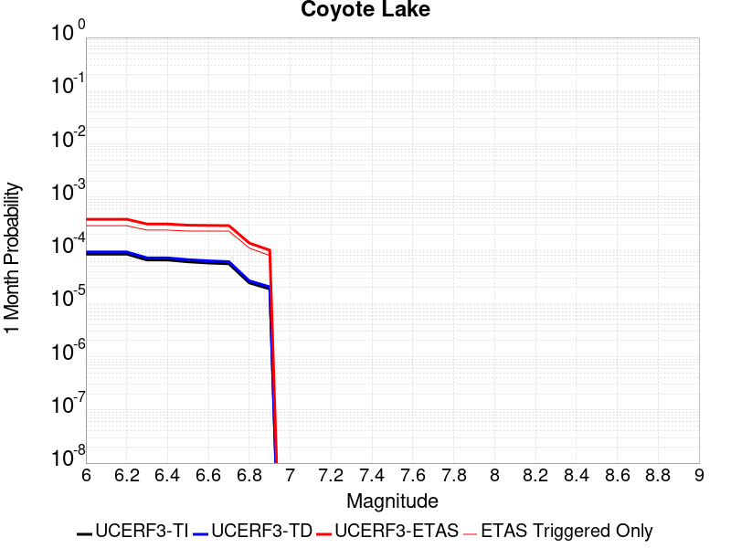 | 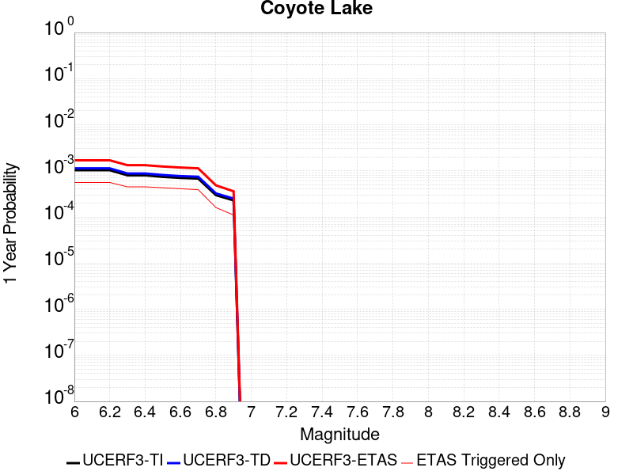 |  |

| Magnitude | 1 wk TI Prob | 1 wk TD Prob | 1 wk ETAS Prob | 1 wk ETAS/TD Gain | 1 wk ETAS Triggered Only | 1 mo TI Prob | 1 mo TD Prob | 1 mo ETAS Prob | 1 mo ETAS/TD Gain | 1 mo ETAS Triggered Only | 1 yr TI Prob | 1 yr TD Prob | 1 yr ETAS Prob | 1 yr ETAS/TD Gain | 1 yr ETAS Triggered Only | 10 yr TI Prob | 10 yr TD Prob | 10 yr ETAS Prob | 10 yr ETAS/TD Gain | 10 yr ETAS Triggered Only |
|-----|-----|-----|-----|-----|-----|-----|-----|-----|-----|-----|-----|-----|-----|-----|-----|-----|-----|-----|-----|-----|
| 6.0 | 1.980352E-5 | 2.1706745E-5 | 2.4419883E-4 | 11.249906 | 2.224969E-4 | 8.486947E-5 | 9.302599E-5 | 3.7730116E-4 | 4.055868 | 2.843016E-4 | 0.0010327959 | 0.0011320751 | 0.0017123815 | 1.5126042 | 5.8096414E-4 | 0.010280091 | 0.011270258 | 0.012309097 | 1.0921752 | 0.0010506798 |
| 6.1 | 1.980352E-5 | 2.1706745E-5 | 2.4419883E-4 | 11.249906 | 2.224969E-4 | 8.486947E-5 | 9.302599E-5 | 3.7730116E-4 | 4.055868 | 2.843016E-4 | 0.0010327959 | 0.0011320751 | 0.0017123815 | 1.5126042 | 5.8096414E-4 | 0.010280091 | 0.011270258 | 0.012309097 | 1.0921752 | 0.0010506798 |
| 6.2 | 1.980352E-5 | 2.1706745E-5 | 2.4419883E-4 | 11.249906 | 2.224969E-4 | 8.486947E-5 | 9.302599E-5 | 3.7730116E-4 | 4.055868 | 2.843016E-4 | 0.0010327959 | 0.0011320751 | 0.0017123815 | 1.5126042 | 5.8096414E-4 | 0.010280091 | 0.011270258 | 0.012309097 | 1.0921752 | 0.0010506798 |
| 6.3 | 1.5344787E-5 | 1.682067E-5 | 1.8987092E-4 | 11.287952 | 1.7305315E-4 | 6.576172E-5 | 7.2086936E-5 | 2.945678E-4 | 4.0862856 | 2.224969E-4 | 8.003548E-4 | 8.773662E-4 | 0.0013343197 | 1.5208241 | 4.5735476E-4 | 0.007974784 | 0.00874507 | 0.009590515 | 1.096677 | 8.529048E-4 |
| 6.4 | 1.5344787E-5 | 1.682067E-5 | 1.8987092E-4 | 11.287952 | 1.7305315E-4 | 6.576172E-5 | 7.2086936E-5 | 2.945678E-4 | 4.0862856 | 2.224969E-4 | 8.003548E-4 | 8.773662E-4 | 0.0013343197 | 1.5208241 | 4.5735476E-4 | 0.007974784 | 0.00874507 | 0.009590515 | 1.096677 | 8.529048E-4 |
| 6.5 | 1.4189697E-5 | 1.5557987E-5 | 1.8860845E-4 | 12.122934 | 1.7305315E-4 | 6.081157E-5 | 6.6675726E-5 | 2.891578E-4 | 4.3367777 | 2.224969E-4 | 7.401293E-4 | 8.115349E-4 | 0.0012561675 | 1.547891 | 4.449938E-4 | 0.0073766913 | 0.008091656 | 0.008900877 | 1.1000068 | 8.15822E-4 |
| 6.6 | 1.3469301E-5 | 1.4771577E-5 | 1.8782217E-4 | 12.715106 | 1.7305315E-4 | 5.7724297E-5 | 6.330556E-5 | 2.8578838E-4 | 4.5144277 | 2.224969E-4 | 7.025667E-4 | 7.7053264E-4 | 0.0011904808 | 1.5450101 | 4.2027194E-4 | 0.0070034964 | 0.0076845144 | 0.008469535 | 1.1021562 | 7.9110014E-4 |
| 6.7 | 1.3027966E-5 | 1.4281745E-5 | 1.8733242E-4 | 13.116915 | 1.7305315E-4 | 5.5832945E-5 | 6.120638E-5 | 2.8368967E-4 | 4.6349688 | 2.224969E-4 | 6.7955407E-4 | 7.4499263E-4 | 0.001140248 | 1.5305494 | 3.9555007E-4 | 0.006774798 | 0.0074308286 | 0.008179243 | 1.1007174 | 7.540173E-4 |
| 6.8 | 5.695434E-6 | 6.2244176E-6 | 9.275045E-5 | 14.901065 | 8.6526576E-5 | 2.4408775E-5 | 2.6675973E-5 | 1.2556085E-4 | 4.706889 | 9.888752E-5 | 2.971363E-4 | 3.2476155E-4 | 4.8540157E-4 | 1.4946399 | 1.6069222E-4 | 0.0029673933 | 0.0032458105 | 0.0035168685 | 1.0835102 | 2.7194066E-4 |
| 6.9 | 4.385688E-6 | 4.7930553E-6 | 6.659746E-5 | 13.894572 | 6.18047E-5 | 1.879567E-5 | 2.0541665E-5 | 8.234509E-5 | 4.008686 | 6.18047E-5 | 2.2881327E-4 | 2.5009477E-4 | 3.4895758E-4 | 1.3953012 | 9.888752E-5 | 0.002285778 | 0.0025009478 | 0.0026612382 | 1.0640918 | 1.6069222E-4 |

## San Andreas (San Bernardino S)
*[(top)](#table-of-contents)*

| 1 Week | 1 Month | 1 Year | 10 Year |
|-----|-----|-----|-----|
| 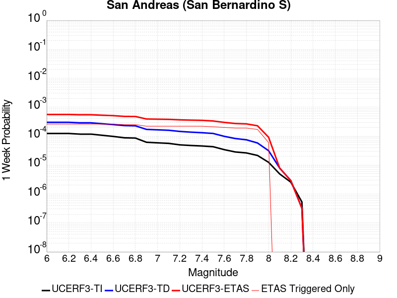 |  |  |  |

| Magnitude | 1 wk TI Prob | 1 wk TD Prob | 1 wk ETAS Prob | 1 wk ETAS/TD Gain | 1 wk ETAS Triggered Only | 1 mo TI Prob | 1 mo TD Prob | 1 mo ETAS Prob | 1 mo ETAS/TD Gain | 1 mo ETAS Triggered Only | 1 yr TI Prob | 1 yr TD Prob | 1 yr ETAS Prob | 1 yr ETAS/TD Gain | 1 yr ETAS Triggered Only | 10 yr TI Prob | 10 yr TD Prob | 10 yr ETAS Prob | 10 yr ETAS/TD Gain | 10 yr ETAS Triggered Only |
|-----|-----|-----|-----|-----|-----|-----|-----|-----|-----|-----|-----|-----|-----|-----|-----|-----|-----|-----|-----|-----|
| 6.0 | 1.2336002E-4 | 3.0004102E-4 | 4.977567E-4 | 1.6589622 | 1.9777504E-4 | 5.2857865E-4 | 0.0012852824 | 0.0016926692 | 1.3169628 | 4.07911E-4 | 0.006416472 | 0.015540994 | 0.016307632 | 1.04933 | 7.7873917E-4 | 0.06234337 | 0.14283717 | 0.14373778 | 1.0063051 | 0.0010506798 |
| 6.1 | 1.2336002E-4 | 3.0004102E-4 | 4.977567E-4 | 1.6589622 | 1.9777504E-4 | 5.2857865E-4 | 0.0012852824 | 0.0016926692 | 1.3169628 | 4.07911E-4 | 0.006416472 | 0.015540994 | 0.016307632 | 1.04933 | 7.7873917E-4 | 0.06234337 | 0.14283717 | 0.14373778 | 1.0063051 | 0.0010506798 |
| 6.2 | 1.2336002E-4 | 3.0004102E-4 | 4.977567E-4 | 1.6589622 | 1.9777504E-4 | 5.2857865E-4 | 0.0012852824 | 0.0016926692 | 1.3169628 | 4.07911E-4 | 0.006416472 | 0.015540994 | 0.016307632 | 1.04933 | 7.7873917E-4 | 0.06234337 | 0.14283717 | 0.14373778 | 1.0063051 | 0.0010506798 |
| 6.3 | 1.1712257E-4 | 2.8792414E-4 | 4.8564223E-4 | 1.686702 | 1.9777504E-4 | 5.018573E-4 | 0.0012334028 | 0.0016408106 | 1.3303121 | 4.07911E-4 | 0.006093008 | 0.014918125 | 0.015673071 | 1.0506059 | 7.6637825E-4 | 0.059286322 | 0.13754563 | 0.13844113 | 1.0065106 | 0.001038319 |
| 6.4 | 1.1712257E-4 | 2.8792414E-4 | 4.8564223E-4 | 1.686702 | 1.9777504E-4 | 5.018573E-4 | 0.0012334028 | 0.0016408106 | 1.3303121 | 4.07911E-4 | 0.006093008 | 0.014918125 | 0.015673071 | 1.0506059 | 7.6637825E-4 | 0.059286322 | 0.13754563 | 0.13844113 | 1.0065106 | 0.001038319 |
| 6.5 | 1.0689076E-4 | 2.680528E-4 | 4.6577482E-4 | 1.7376235 | 1.9777504E-4 | 4.5802278E-4 | 0.0011483167 | 0.0015557592 | 1.3548173 | 4.07911E-4 | 0.0055621783 | 0.01389575 | 0.01463929 | 1.0535084 | 7.540173E-4 | 0.05425003 | 0.12879294 | 0.129676 | 1.0068563 | 0.001013597 |
| 6.6 | 9.7648895E-5 | 2.50501E-4 | 4.482265E-4 | 1.7893201 | 1.9777504E-4 | 4.1842813E-4 | 0.0010731576 | 0.0014682832 | 1.3681897 | 3.9555007E-4 | 0.005082469 | 0.012991785 | 0.013711606 | 1.0554059 | 7.292954E-4 | 0.049677886 | 0.12095292 | 0.121822186 | 1.0071868 | 9.888752E-4 |
| 6.7 | 8.757013E-5 | 2.3120902E-4 | 4.1658024E-4 | 1.8017473 | 1.8541409E-4 | 3.7524657E-4 | 9.905418E-4 | 0.0013733513 | 1.3864648 | 3.8318912E-4 | 0.00455906 | 0.011997245 | 0.012693366 | 1.0580233 | 7.045735E-4 | 0.04466656 | 0.11226123 | 0.11310617 | 1.0075266 | 9.5179235E-4 |
| 6.8 | 8.562978E-5 | 2.2680782E-4 | 4.1217986E-4 | 1.8173088 | 1.8541409E-4 | 3.6693315E-4 | 9.7169366E-4 | 0.0013545104 | 1.3939686 | 3.8318912E-4 | 0.004458263 | 0.011770263 | 0.012454329 | 1.0581181 | 6.922126E-4 | 0.043698758 | 0.11027153 | 0.11110737 | 1.0075798 | 9.394314E-4 |
| 6.9 | 6.124075E-5 | 1.7065753E-4 | 3.4368114E-4 | 2.0138645 | 1.7305315E-4 | 2.6243398E-4 | 7.311852E-4 | 0.0010893904 | 1.4898965 | 3.5846725E-4 | 0.0031904527 | 0.008866051 | 0.009478618 | 1.0690913 | 6.1804696E-4 | 0.031450346 | 0.08418263 | 0.08496373 | 1.0092787 | 8.529048E-4 |
| 7.0 | 5.8598747E-5 | 1.649477E-4 | 3.379723E-4 | 2.0489664 | 1.7305315E-4 | 2.5111332E-4 | 7.06728E-4 | 0.001064942 | 1.5068624 | 3.5846725E-4 | 0.0030530186 | 0.008570663 | 0.009183412 | 1.0714939 | 6.1804696E-4 | 0.03011414 | 0.081500374 | 0.082283765 | 1.0096121 | 8.529048E-4 |
| 7.1 | 5.613814E-5 | 1.5913323E-4 | 3.3215884E-4 | 2.0873003 | 1.7305315E-4 | 2.4056983E-4 | 6.818221E-4 | 0.0010400449 | 1.5253905 | 3.5846725E-4 | 0.0029250039 | 0.008269769 | 0.008870446 | 1.0726353 | 6.0568604E-4 | 0.028868021 | 0.07879931 | 0.07957362 | 1.0098263 | 8.405439E-4 |
| 7.2 | 4.991222E-5 | 1.4519796E-4 | 3.1822597E-4 | 2.19167 | 1.7305315E-4 | 2.1389198E-4 | 6.2212895E-4 | 9.803731E-4 | 1.575836 | 3.5846725E-4 | 0.002601025 | 0.007548217 | 0.008112528 | 1.0747609 | 5.686032E-4 | 0.025707912 | 0.07225321 | 0.07299862 | 1.0103166 | 8.0346107E-4 |
| 7.3 | 4.7410045E-5 | 1.3714004E-4 | 3.1016945E-4 | 2.2616987 | 1.7305315E-4 | 2.0317009E-4 | 5.8761094E-4 | 9.3351386E-4 | 1.5886598 | 3.461063E-4 | 0.0024707897 | 0.0071307817 | 0.0076830573 | 1.0774496 | 5.562423E-4 | 0.024434982 | 0.06853558 | 0.06927246 | 1.0107518 | 7.9110014E-4 |
| 7.4 | 4.5556746E-5 | 1.3121912E-4 | 3.0424955E-4 | 2.3186374 | 1.7305315E-4 | 1.952286E-4 | 5.622468E-4 | 9.081585E-4 | 1.6152312 | 3.461063E-4 | 0.002374317 | 0.0068239477 | 0.0073763942 | 1.080957 | 5.562423E-4 | 0.023491086 | 0.065788016 | 0.06651552 | 1.0110583 | 7.7873917E-4 |
| 7.5 | 4.3084514E-5 | 1.2357246E-4 | 2.9660424E-4 | 2.4002452 | 1.7305315E-4 | 1.8463485E-4 | 5.2948913E-4 | 8.7541214E-4 | 1.6533147 | 3.461063E-4 | 0.0022456115 | 0.0064275465 | 0.006980214 | 1.0859841 | 5.562423E-4 | 0.022230545 | 0.062188786 | 0.0629075 | 1.011557 | 7.6637825E-4 |
| 7.6 | 3.408608E-5 | 9.83552E-5 | 2.7139133E-4 | 2.7592983 | 1.7305315E-4 | 1.4607502E-4 | 4.214543E-4 | 7.674147E-4 | 1.820873 | 3.461063E-4 | 0.0017770125 | 0.0051191594 | 0.005672554 | 1.1081027 | 5.562423E-4 | 0.017628696 | 0.050020292 | 0.050748337 | 1.014555 | 7.6637825E-4 |
| 7.7 | 2.8315713E-5 | 8.248679E-5 | 2.4316575E-4 | 2.9479356 | 1.6069222E-4 | 1.2134742E-4 | 3.5346695E-4 | 6.8709435E-4 | 1.9438715 | 3.3374535E-4 | 0.0014764034 | 0.0042949775 | 0.004824215 | 1.1232225 | 5.315204E-4 | 0.01466633 | 0.0422714 | 0.042981707 | 1.0168035 | 7.4165635E-4 |
| 7.8 | 2.6222975E-5 | 7.463088E-5 | 2.353111E-4 | 3.1529992 | 1.6069222E-4 | 1.1237934E-4 | 3.1980744E-4 | 6.5344607E-4 | 2.0432484 | 3.3374535E-4 | 0.0013673597 | 0.0038867102 | 0.0044161645 | 1.1362218 | 5.315204E-4 | 0.013589768 | 0.03843674 | 0.03914989 | 1.0185539 | 7.4165635E-4 |
| 7.9 | 2.1469694E-5 | 5.787864E-5 | 2.1856154E-4 | 3.776204 | 1.6069222E-4 | 9.200973E-5 | 2.4802773E-4 | 5.6933245E-4 | 2.2954385 | 3.2138443E-4 | 0.0011196428 | 0.0030155594 | 0.0034838587 | 1.1552943 | 4.697157E-4 | 0.011140184 | 0.030152109 | 0.030799473 | 1.02147 | 6.674907E-4 |
| 8.0 | 1.2420249E-5 | 3.131896E-5 | 1.0548227E-4 | 3.3680005 | 7.416563E-5 | 5.322855E-5 | 1.342172E-4 | 2.5781002E-4 | 1.9208417 | 1.236094E-4 | 6.478649E-4 | 0.0016328706 | 0.0018179821 | 1.1133655 | 1.8541409E-4 | 0.0064597935 | 0.016522504 | 0.01678995 | 1.0161868 | 2.7194066E-4 |
| 8.1 | 4.9197724E-6 | 7.822348E-6 | 7.822348E-6 | 1.0 | 0.0 | 2.1084568E-5 | 3.352392E-5 | 3.352392E-5 | 1.0 | 0.0 | 2.566744E-4 | 4.0807744E-4 | 4.0807744E-4 | 1.0 | 0.0 | 0.002563781 | 0.0043843705 | 0.0043843705 | 1.0 | 0.0 |
| 8.2 | 2.5634774E-6 | 2.9067196E-6 | 2.9067196E-6 | 1.0 | 0.0 | 1.0986286E-5 | 1.2457311E-5 | 1.2457311E-5 | 1.0 | 0.0 | 1.3374983E-4 | 1.5165724E-4 | 1.5165724E-4 | 1.0 | 0.0 | 0.0013366934 | 0.0017049741 | 0.0017049741 | 1.0 | 0.0 |
| 8.3 | 5.2850464E-7 | 3.2088764E-7 | 3.2088764E-7 | 1.0 | 0.0 | 2.2650179E-6 | 1.375232E-6 | 1.375232E-6 | 1.0 | 0.0 | 2.7576245E-5 | 1.6743334E-5 | 1.6743334E-5 | 1.0 | 0.0 | 2.7572823E-4 | 1.9870348E-4 | 1.9870348E-4 | 1.0 | 0.0 |

## Death Valley (Black Mtns Frontal)
*[(top)](#table-of-contents)*

| 1 Week | 1 Month | 1 Year | 10 Year |
|-----|-----|-----|-----|
|  |  |  |  |

| Magnitude | 1 wk TI Prob | 1 wk TD Prob | 1 wk ETAS Prob | 1 wk ETAS/TD Gain | 1 wk ETAS Triggered Only | 1 mo TI Prob | 1 mo TD Prob | 1 mo ETAS Prob | 1 mo ETAS/TD Gain | 1 mo ETAS Triggered Only | 1 yr TI Prob | 1 yr TD Prob | 1 yr ETAS Prob | 1 yr ETAS/TD Gain | 1 yr ETAS Triggered Only | 10 yr TI Prob | 10 yr TD Prob | 10 yr ETAS Prob | 10 yr ETAS/TD Gain | 10 yr ETAS Triggered Only |
|-----|-----|-----|-----|-----|-----|-----|-----|-----|-----|-----|-----|-----|-----|-----|-----|-----|-----|-----|-----|-----|
| 6.0 | 1.6707214E-5 | 1.867027E-5 | 2.1644161E-4 | 11.592849 | 1.9777504E-4 | 7.160038E-5 | 8.001302E-5 | 4.2609163E-4 | 5.3252783 | 3.461063E-4 | 8.71386E-4 | 9.737309E-4 | 0.0016529205 | 1.6975127 | 6.798517E-4 | 0.00867977 | 0.009695496 | 0.01073599 | 1.1073171 | 0.0010506798 |
| 6.1 | 1.6707214E-5 | 1.867027E-5 | 2.1644161E-4 | 11.592849 | 1.9777504E-4 | 7.160038E-5 | 8.001302E-5 | 4.2609163E-4 | 5.3252783 | 3.461063E-4 | 8.71386E-4 | 9.737309E-4 | 0.0016529205 | 1.6975127 | 6.798517E-4 | 0.00867977 | 0.009695496 | 0.01073599 | 1.1073171 | 0.0010506798 |
| 6.2 | 1.6707214E-5 | 1.867027E-5 | 2.1644161E-4 | 11.592849 | 1.9777504E-4 | 7.160038E-5 | 8.001302E-5 | 4.2609163E-4 | 5.3252783 | 3.461063E-4 | 8.71386E-4 | 9.737309E-4 | 0.0016529205 | 1.6975127 | 6.798517E-4 | 0.00867977 | 0.009695496 | 0.01073599 | 1.1073171 | 0.0010506798 |
| 6.3 | 1.6707214E-5 | 1.867027E-5 | 2.1644161E-4 | 11.592849 | 1.9777504E-4 | 7.160038E-5 | 8.001302E-5 | 4.2609163E-4 | 5.3252783 | 3.461063E-4 | 8.71386E-4 | 9.737309E-4 | 0.0016529205 | 1.6975127 | 6.798517E-4 | 0.00867977 | 0.009695496 | 0.01073599 | 1.1073171 | 0.0010506798 |
| 6.4 | 1.5515609E-5 | 1.7338214E-5 | 1.7802764E-4 | 10.267935 | 1.6069222E-4 | 6.649377E-5 | 7.4304546E-5 | 3.7094505E-4 | 4.9922256 | 2.9666253E-4 | 8.0926094E-4 | 9.042885E-4 | 0.001497077 | 1.6555303 | 5.9332506E-4 | 0.008063202 | 0.009006773 | 0.009900995 | 1.0992832 | 9.023486E-4 |
| 6.5 | 1.5515609E-5 | 1.7338214E-5 | 1.7802764E-4 | 10.267935 | 1.6069222E-4 | 6.649377E-5 | 7.4304546E-5 | 3.7094505E-4 | 4.9922256 | 2.9666253E-4 | 8.0926094E-4 | 9.042885E-4 | 0.001497077 | 1.6555303 | 5.9332506E-4 | 0.008063202 | 0.009006773 | 0.009900995 | 1.0992832 | 9.023486E-4 |
| 6.6 | 1.5041828E-5 | 1.6809145E-5 | 1.6513793E-4 | 9.824291 | 1.4833127E-4 | 6.4463384E-5 | 7.203723E-5 | 3.5631837E-4 | 4.946308 | 2.843016E-4 | 7.8455906E-4 | 8.767063E-4 | 0.001432461 | 1.633912 | 5.562423E-4 | 0.00781795 | 0.008733132 | 0.009590842 | 1.0982132 | 8.652658E-4 |
| 6.7 | 1.4634985E-5 | 1.6356016E-5 | 1.6468487E-4 | 10.068764 | 1.4833127E-4 | 6.271985E-5 | 7.009536E-5 | 3.5437703E-4 | 5.0556417 | 2.843016E-4 | 7.6334673E-4 | 8.5308263E-4 | 0.0013841497 | 1.622527 | 5.315204E-4 | 0.007607299 | 0.008498715 | 0.009295348 | 1.0937357 | 8.0346107E-4 |
| 6.8 | 1.4209158E-5 | 1.5882048E-5 | 1.3948948E-4 | 8.78284 | 1.236094E-4 | 6.089497E-5 | 6.8064175E-5 | 3.2762624E-4 | 4.8134904 | 2.5957974E-4 | 7.4114406E-4 | 8.2837185E-4 | 0.0013223998 | 1.5963843 | 4.944376E-4 | 0.007386771 | 0.008253456 | 0.00900125 | 1.0906037 | 7.540173E-4 |
| 6.9 | 1.3780098E-5 | 1.5404594E-5 | 1.2665133E-4 | 8.221661 | 1.1124845E-4 | 5.9056227E-5 | 6.6018045E-5 | 2.8850028E-4 | 4.3700213 | 2.224969E-4 | 7.1877235E-4 | 8.0347876E-4 | 0.001223413 | 1.5226451 | 4.2027194E-4 | 0.0071645193 | 0.008006332 | 0.0086684795 | 1.0827029 | 6.674907E-4 |
| 7.0 | 1.3585064E-5 | 1.5188155E-5 | 1.2643493E-4 | 8.3245735 | 1.1124845E-4 | 5.8220405E-5 | 6.50905E-5 | 2.752128E-4 | 4.228156 | 2.1013597E-4 | 7.086029E-4 | 7.9219416E-4 | 0.001199782 | 1.514505 | 4.07911E-4 | 0.007063476 | 0.007894293 | 0.008531989 | 1.0807792 | 6.4276886E-4 |
| 7.1 | 1.3398601E-5 | 1.49813395E-5 | 1.0150662E-4 | 6.775537 | 8.6526576E-5 | 5.742131E-5 | 6.420419E-5 | 2.4960638E-4 | 3.887696 | 1.8541409E-4 | 6.9888023E-4 | 7.8141113E-4 | 0.0011519495 | 1.4741914 | 3.7082817E-4 | 0.0069668638 | 0.007787224 | 0.008339135 | 1.0708739 | 5.562423E-4 |
| 7.2 | 1.3126312E-5 | 1.4679561E-5 | 8.8844106E-5 | 6.0522323 | 7.416563E-5 | 5.6254412E-5 | 6.291092E-5 | 2.3595318E-4 | 3.750592 | 1.7305315E-4 | 6.846822E-4 | 7.6567667E-4 | 0.001111518 | 1.4516805 | 3.461063E-4 | 0.006825765 | 0.00763097 | 0.008133901 | 1.0659065 | 5.067985E-4 |
| 7.3 | 1.2922429E-5 | 1.4453788E-5 | 8.8618355E-5 | 6.1311507 | 7.416563E-5 | 5.5380664E-5 | 6.194336E-5 | 2.2262562E-4 | 3.594019 | 1.6069222E-4 | 6.74051E-4 | 7.53905E-4 | 0.0010626955 | 1.4095881 | 3.0902348E-4 | 0.006720101 | 0.007514055 | 0.007980241 | 1.0620419 | 4.697157E-4 |
| 7.4 | 1.2768878E-5 | 1.4283772E-5 | 8.8448345E-5 | 6.1922264 | 7.416563E-5 | 5.4722615E-5 | 6.1214756E-5 | 2.2189713E-4 | 3.624896 | 1.6069222E-4 | 6.660441E-4 | 7.4504025E-4 | 0.0010414817 | 1.3978866 | 2.9666253E-4 | 0.0066405144 | 0.0074260035 | 0.007879962 | 1.0611309 | 4.5735476E-4 |
| 7.5 | 1.2521929E-5 | 1.40120155E-5 | 7.581585E-5 | 5.4107738 | 6.18047E-5 | 5.366431E-5 | 6.005014E-5 | 2.0837251E-4 | 3.4699752 | 1.4833127E-4 | 6.531671E-4 | 7.3087064E-4 | 0.0010149644 | 1.388706 | 2.843016E-4 | 0.006512506 | 0.0072852457 | 0.0077269976 | 1.0606365 | 4.449938E-4 |
| 7.6 | 1.1301089E-5 | 1.2648149E-5 | 7.4452066E-5 | 5.8864 | 6.18047E-5 | 4.8432343E-5 | 5.4205255E-5 | 2.0252849E-4 | 3.7363257 | 1.4833127E-4 | 5.895042E-4 | 6.5975444E-4 | 9.315157E-4 | 1.4119127 | 2.7194066E-4 | 0.0058794282 | 0.00657851 | 0.0069714584 | 1.0597321 | 3.9555007E-4 |
| 7.7 | 9.189108E-6 | 1.0283358E-5 | 7.208742E-5 | 7.0101047 | 6.18047E-5 | 3.93813E-5 | 4.407082E-5 | 1.6767476E-4 | 3.8046663 | 1.236094E-4 | 4.7936183E-4 | 5.3643517E-4 | 7.588127E-4 | 1.414547 | 2.224969E-4 | 0.004783291 | 0.005351914 | 0.0056715785 | 1.059729 | 3.2138443E-4 |
| 7.8 | 3.4586725E-7 | 3.6482615E-7 | 3.6482615E-7 | 1.0 | 0.0 | 1.4822873E-6 | 1.5635396E-6 | 1.5635396E-6 | 1.0 | 0.0 | 1.80467E-5 | 1.9035933E-5 | 3.1396637E-5 | 1.6493353 | 1.236094E-5 | 1.8045233E-4 | 1.9034347E-4 | 2.1506065E-4 | 1.1298556 | 2.472188E-5 |
| 7.9 | 2.5591178E-9 | 2.6696718E-9 | 2.6696718E-9 | 1.0 | 0.0 | 1.0967647E-8 | 1.14414505E-8 | 1.14414505E-8 | 1.0 | 0.0 | 1.335311E-7 | 1.3929966E-7 | 1.3929966E-7 | 1.0 | 0.0 | 1.3353102E-6 | 1.3929966E-6 | 1.3929966E-6 | 1.0 | 0.0 |

## San Andreas (Big Bend)
*[(top)](#table-of-contents)*

| 1 Week | 1 Month | 1 Year | 10 Year |
|-----|-----|-----|-----|
|  |  | 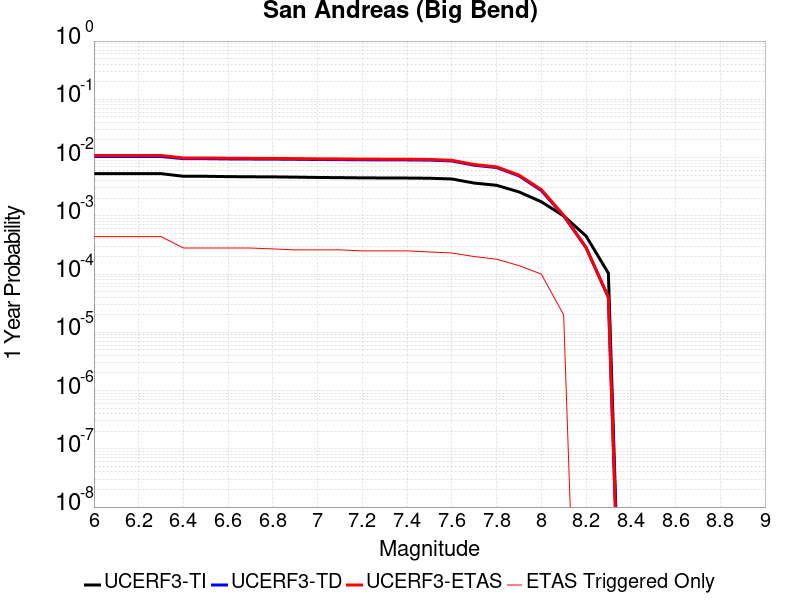 |  |

| Magnitude | 1 wk TI Prob | 1 wk TD Prob | 1 wk ETAS Prob | 1 wk ETAS/TD Gain | 1 wk ETAS Triggered Only | 1 mo TI Prob | 1 mo TD Prob | 1 mo ETAS Prob | 1 mo ETAS/TD Gain | 1 mo ETAS Triggered Only | 1 yr TI Prob | 1 yr TD Prob | 1 yr ETAS Prob | 1 yr ETAS/TD Gain | 1 yr ETAS Triggered Only | 10 yr TI Prob | 10 yr TD Prob | 10 yr ETAS Prob | 10 yr ETAS/TD Gain | 10 yr ETAS Triggered Only |
|-----|-----|-----|-----|-----|-----|-----|-----|-----|-----|-----|-----|-----|-----|-----|-----|-----|-----|-----|-----|-----|
| 6.0 | 1.0179969E-4 | 2.0072258E-4 | 3.4902408E-4 | 1.7388381 | 1.4833127E-4 | 4.362114E-4 | 8.599571E-4 | 0.0010699123 | 1.2441462 | 2.1013597E-4 | 0.0052979486 | 0.010419999 | 0.010860356 | 1.0422608 | 4.449938E-4 | 0.051734097 | 0.10144902 | 0.10203769 | 1.0058026 | 6.551298E-4 |
| 6.1 | 1.0179969E-4 | 2.0072258E-4 | 3.4902408E-4 | 1.7388381 | 1.4833127E-4 | 4.362114E-4 | 8.599571E-4 | 0.0010699123 | 1.2441462 | 2.1013597E-4 | 0.0052979486 | 0.010419999 | 0.010860356 | 1.0422608 | 4.449938E-4 | 0.051734097 | 0.10144902 | 0.10203769 | 1.0058026 | 6.551298E-4 |
| 6.2 | 1.0179969E-4 | 2.0072258E-4 | 3.4902408E-4 | 1.7388381 | 1.4833127E-4 | 4.362114E-4 | 8.599571E-4 | 0.0010699123 | 1.2441462 | 2.1013597E-4 | 0.0052979486 | 0.010419999 | 0.010860356 | 1.0422608 | 4.449938E-4 | 0.051734097 | 0.10144902 | 0.10203769 | 1.0058026 | 6.551298E-4 |
| 6.3 | 1.0179969E-4 | 2.0072258E-4 | 3.4902408E-4 | 1.7388381 | 1.4833127E-4 | 4.362114E-4 | 8.599571E-4 | 0.0010699123 | 1.2441462 | 2.1013597E-4 | 0.0052979486 | 0.010419999 | 0.010860356 | 1.0422608 | 4.449938E-4 | 0.051734097 | 0.10144902 | 0.10203769 | 1.0058026 | 6.551298E-4 |
| 6.4 | 9.1639464E-5 | 1.8429532E-4 | 2.9552326E-4 | 1.6035311 | 1.1124845E-4 | 3.9268145E-4 | 7.895982E-4 | 9.378124E-4 | 1.1877083 | 1.4833127E-4 | 0.0047704205 | 0.009571102 | 0.009852682 | 1.0294199 | 2.843016E-4 | 0.046693064 | 0.09377527 | 0.09415613 | 1.0040615 | 4.2027194E-4 |
| 6.5 | 9.1639464E-5 | 1.8429532E-4 | 2.9552326E-4 | 1.6035311 | 1.1124845E-4 | 3.9268145E-4 | 7.895982E-4 | 9.378124E-4 | 1.1877083 | 1.4833127E-4 | 0.0047704205 | 0.009571102 | 0.009852682 | 1.0294199 | 2.843016E-4 | 0.046693064 | 0.09377527 | 0.09415613 | 1.0040615 | 4.2027194E-4 |
| 6.6 | 9.042622E-5 | 1.823659E-4 | 2.9359406E-4 | 1.6099175 | 1.1124845E-4 | 3.8748336E-4 | 7.8133424E-4 | 9.295496E-4 | 1.1896952 | 1.4833127E-4 | 0.0047074095 | 0.009471365 | 0.009752974 | 1.0297327 | 2.843016E-4 | 0.046089325 | 0.092869274 | 0.09323931 | 1.0039845 | 4.07911E-4 |
| 6.7 | 8.9836685E-5 | 1.8150927E-4 | 2.9273753E-4 | 1.6127967 | 1.1124845E-4 | 3.8495753E-4 | 7.776651E-4 | 9.2588103E-4 | 1.190591 | 1.4833127E-4 | 0.00467679 | 0.00942708 | 0.009708702 | 1.0298736 | 2.843016E-4 | 0.045795817 | 0.09246355 | 0.09283374 | 1.0040036 | 4.07911E-4 |
| 6.8 | 8.9471854E-5 | 1.8097709E-4 | 2.9220543E-4 | 1.6145989 | 1.1124845E-4 | 3.8339442E-4 | 7.7538576E-4 | 9.1125065E-4 | 1.1752224 | 1.3597033E-4 | 0.004657841 | 0.009399569 | 0.009668953 | 1.0286592 | 2.7194066E-4 | 0.04561414 | 0.092210755 | 0.092569835 | 1.0038941 | 3.9555007E-4 |
| 6.9 | 8.858234E-5 | 1.7979681E-4 | 2.9102527E-4 | 1.6186341 | 1.1124845E-4 | 3.7958333E-4 | 7.703304E-4 | 9.06196E-4 | 1.1763731 | 1.3597033E-4 | 0.004611638 | 0.009338548 | 0.009595704 | 1.027537 | 2.5957974E-4 | 0.04517103 | 0.09165087 | 0.091987714 | 1.0036752 | 3.7082817E-4 |
| 7.0 | 8.7433385E-5 | 1.7818481E-4 | 2.8941344E-4 | 1.6242318 | 1.1124845E-4 | 3.746607E-4 | 7.634259E-4 | 8.992924E-4 | 1.1779695 | 1.3597033E-4 | 0.004551957 | 0.009255203 | 0.009512381 | 1.0277873 | 2.5957974E-4 | 0.044598386 | 0.09088532 | 0.09122244 | 1.0037093 | 3.7082817E-4 |
| 7.1 | 8.684964E-5 | 1.7730435E-4 | 2.8853308E-4 | 1.6273322 | 1.1124845E-4 | 3.7215967E-4 | 7.596547E-4 | 8.955217E-4 | 1.1788536 | 1.3597033E-4 | 0.0045216335 | 0.009209678 | 0.009466867 | 1.027926 | 2.5957974E-4 | 0.04430731 | 0.09046686 | 0.09080414 | 1.0037283 | 3.7082817E-4 |
| 7.2 | 8.606521E-5 | 1.762105E-4 | 2.8743935E-4 | 1.6312271 | 1.1124845E-4 | 3.6879873E-4 | 7.549695E-4 | 8.9083717E-4 | 1.1799644 | 1.3597033E-4 | 0.0044808835 | 0.0091531165 | 0.009398072 | 1.026762 | 2.472188E-4 | 0.043916024 | 0.089947365 | 0.0902736 | 1.0036268 | 3.5846725E-4 |
| 7.3 | 8.568266E-5 | 1.7563057E-4 | 2.868595E-4 | 1.6333119 | 1.1124845E-4 | 3.6715972E-4 | 7.524855E-4 | 8.883535E-4 | 1.180559 | 1.3597033E-4 | 0.0044610105 | 0.009123127 | 0.009368091 | 1.0268508 | 2.472188E-4 | 0.043725148 | 0.08966853 | 0.08999485 | 1.0036392 | 3.5846725E-4 |
| 7.4 | 8.5432206E-5 | 1.7525644E-4 | 2.864854E-4 | 1.634664 | 1.1124845E-4 | 3.6608664E-4 | 7.50883E-4 | 8.867513E-4 | 1.1809446 | 1.3597033E-4 | 0.004447999 | 0.009103781 | 0.009348748 | 1.0269084 | 2.472188E-4 | 0.043600157 | 0.08948871 | 0.089803845 | 1.0035214 | 3.461063E-4 |
| 7.5 | 8.4791965E-5 | 1.7394972E-4 | 2.8517883E-4 | 1.6394324 | 1.1124845E-4 | 3.633435E-4 | 7.4528606E-4 | 8.81155E-4 | 1.1823045 | 1.3597033E-4 | 0.0044147377 | 0.009036204 | 0.0092689395 | 1.0257559 | 2.3485786E-4 | 0.043280575 | 0.088866346 | 0.08917043 | 1.0034218 | 3.3374535E-4 |
| 7.6 | 8.241105E-5 | 1.6840403E-4 | 2.7963376E-4 | 1.6604933 | 1.1124845E-4 | 3.531424E-4 | 7.215321E-4 | 8.574044E-4 | 1.1883107 | 1.3597033E-4 | 0.0042910352 | 0.008749358 | 0.008982162 | 1.026608 | 2.3485786E-4 | 0.042091176 | 0.086243294 | 0.08653696 | 1.0034051 | 3.2138443E-4 |
| 7.7 | 7.00432E-5 | 1.42045E-4 | 2.285593E-4 | 1.6090626 | 8.6526576E-5 | 3.001506E-4 | 6.0862233E-4 | 7.198031E-4 | 1.1826761 | 1.1124845E-4 | 0.0036482112 | 0.0073848404 | 0.0075934245 | 1.0282449 | 2.1013597E-4 | 0.035888977 | 0.07351733 | 0.07378073 | 1.0035828 | 2.843016E-4 |
| 7.8 | 6.415362E-5 | 1.2968935E-4 | 2.1620469E-4 | 1.6670969 | 8.6526576E-5 | 2.749151E-4 | 5.556931E-4 | 6.6687976E-4 | 1.2000864 | 1.1124845E-4 | 0.0033419547 | 0.0067446055 | 0.0069410466 | 1.0291257 | 1.9777504E-4 | 0.03292141 | 0.06725231 | 0.06749443 | 1.0036002 | 2.5957974E-4 |
| 7.9 | 4.939911E-5 | 9.3411545E-5 | 1.7993004E-4 | 1.9262078 | 8.6526576E-5 | 2.116933E-4 | 4.0027377E-4 | 5.114777E-4 | 1.2778196 | 1.1124845E-4 | 0.0025743195 | 0.004862453 | 0.0050223637 | 1.0328869 | 1.6069222E-4 | 0.025447013 | 0.048914436 | 0.049090784 | 1.0036051 | 1.8541409E-4 |
| 8.0 | 3.344983E-5 | 5.222685E-5 | 1.2638861E-4 | 2.419993 | 7.416563E-5 | 1.4334853E-4 | 2.2381016E-4 | 3.2267554E-4 | 1.4417377 | 9.888752E-5 | 0.0017438711 | 0.0027214854 | 0.0028447586 | 1.0452962 | 1.236094E-4 | 0.017302496 | 0.027922187 | 0.028054362 | 1.0047337 | 1.3597033E-4 |
| 8.1 | 1.9104898E-5 | 1.9173063E-5 | 4.389447E-5 | 2.289382 | 2.472188E-5 | 8.1875565E-5 | 8.216769E-5 | 1.06887535E-4 | 1.3008463 | 2.472188E-5 | 9.963791E-4 | 9.999331E-4 | 0.0010246303 | 1.0246989 | 2.472188E-5 | 0.009919235 | 0.010749801 | 0.010774257 | 1.002275 | 2.472188E-5 |
| 8.2 | 8.643924E-6 | 5.4748625E-6 | 5.4748625E-6 | 1.0 | 0.0 | 3.704486E-5 | 2.3463486E-5 | 2.3463486E-5 | 1.0 | 0.0 | 4.5092785E-4 | 2.8563058E-4 | 2.8563058E-4 | 1.0 | 0.0 | 0.0045001395 | 0.0032487072 | 0.0032487072 | 1.0 | 0.0 |
| 8.3 | 1.983087E-6 | 7.6599065E-7 | 7.6599065E-7 | 1.0 | 0.0 | 8.498917E-6 | 3.282813E-6 | 3.282813E-6 | 1.0 | 0.0 | 1.034694E-4 | 3.9967534E-5 | 3.9967534E-5 | 1.0 | 0.0 | 0.0010342124 | 4.719687E-4 | 4.719687E-4 | 1.0 | 0.0 |

## San Andreas (Parkfield)
*[(top)](#table-of-contents)*

| 1 Week | 1 Month | 1 Year | 10 Year |
|-----|-----|-----|-----|
|  |  |  |  |

| Magnitude | 1 wk TI Prob | 1 wk TD Prob | 1 wk ETAS Prob | 1 wk ETAS/TD Gain | 1 wk ETAS Triggered Only | 1 mo TI Prob | 1 mo TD Prob | 1 mo ETAS Prob | 1 mo ETAS/TD Gain | 1 mo ETAS Triggered Only | 1 yr TI Prob | 1 yr TD Prob | 1 yr ETAS Prob | 1 yr ETAS/TD Gain | 1 yr ETAS Triggered Only | 10 yr TI Prob | 10 yr TD Prob | 10 yr ETAS Prob | 10 yr ETAS/TD Gain | 10 yr ETAS Triggered Only |
|-----|-----|-----|-----|-----|-----|-----|-----|-----|-----|-----|-----|-----|-----|-----|-----|-----|-----|-----|-----|-----|
| 6.0 | 5.556969E-4 | 7.7782426E-4 | 9.7544544E-4 | 1.2540692 | 1.9777504E-4 | 0.0023793848 | 0.0033298214 | 0.0035885368 | 1.0776964 | 2.5957974E-4 | 0.028586963 | 0.040191233 | 0.04059461 | 1.0100366 | 4.2027194E-4 | 0.25176284 | 0.33716413 | 0.33754104 | 1.0011178 | 5.686032E-4 |
| 6.1 | 1.925858E-4 | 3.0276453E-4 | 4.139793E-4 | 1.3673309 | 1.1124845E-4 | 8.2510663E-4 | 0.0012970108 | 0.0014328047 | 1.1046977 | 1.3597033E-4 | 0.0099994885 | 0.015778083 | 0.015984904 | 1.0131081 | 2.1013597E-4 | 0.095613256 | 0.1497237 | 0.14999695 | 1.0018251 | 3.2138443E-4 |
| 6.2 | 9.4306815E-5 | 1.8242796E-4 | 2.8129743E-4 | 1.5419645 | 9.888752E-5 | 4.0410945E-4 | 7.816011E-4 | 9.051139E-4 | 1.1580254 | 1.236094E-4 | 0.0049089384 | 0.009474681 | 0.009670582 | 1.0206763 | 1.9777504E-4 | 0.048019063 | 0.09185409 | 0.092089824 | 1.0025665 | 2.5957974E-4 |
| 6.3 | 9.283051E-5 | 1.7939322E-4 | 2.7826297E-4 | 1.5511345 | 9.888752E-5 | 3.9778434E-4 | 7.686027E-4 | 8.921171E-4 | 1.1607 | 1.236094E-4 | 0.0048322747 | 0.009317789 | 0.009513721 | 1.0210278 | 1.9777504E-4 | 0.047285385 | 0.09050704 | 0.090743124 | 1.0026085 | 2.5957974E-4 |
| 6.4 | 9.138826E-5 | 1.770153E-4 | 2.758853E-4 | 1.5585393 | 9.888752E-5 | 3.916052E-4 | 7.5841765E-4 | 8.819333E-4 | 1.1628597 | 1.236094E-4 | 0.0047573745 | 0.00919484 | 0.009390797 | 1.0213115 | 1.9777504E-4 | 0.046568092 | 0.08940927 | 0.08964565 | 1.0026437 | 2.5957974E-4 |
| 6.5 | 9.000255E-5 | 1.7459576E-4 | 2.7346602E-4 | 1.566281 | 9.888752E-5 | 3.8566816E-4 | 7.480541E-4 | 8.715711E-4 | 1.1651176 | 1.236094E-4 | 0.0046854047 | 0.009069731 | 0.009265713 | 1.0216082 | 1.9777504E-4 | 0.045878403 | 0.088295065 | 0.088531725 | 1.0026803 | 2.5957974E-4 |
| 6.6 | 8.8109264E-5 | 1.7140752E-4 | 2.7027808E-4 | 1.5768158 | 9.888752E-5 | 3.7755648E-4 | 7.3439797E-4 | 8.579166E-4 | 1.1681902 | 1.236094E-4 | 0.0045870654 | 0.008904854 | 0.009100867 | 1.022012 | 1.9777504E-4 | 0.04493529 | 0.0868267 | 0.08706374 | 1.00273 | 2.5957974E-4 |
| 6.7 | 8.738073E-5 | 1.7007832E-4 | 2.6894902E-4 | 1.5813245 | 9.888752E-5 | 3.7443507E-4 | 7.287046E-4 | 8.5222395E-4 | 1.1695054 | 1.236094E-4 | 0.0045492216 | 0.008836143 | 0.00903217 | 1.0221847 | 1.9777504E-4 | 0.04457213 | 0.08622707 | 0.08646426 | 1.0027509 | 2.5957974E-4 |
| 6.8 | 8.710195E-5 | 1.6953335E-4 | 2.6840408E-4 | 1.5831935 | 9.888752E-5 | 3.7324068E-4 | 7.263703E-4 | 8.498899E-4 | 1.1700505 | 1.236094E-4 | 0.0045347405 | 0.008807961 | 0.009003994 | 1.0222564 | 1.9777504E-4 | 0.04443313 | 0.08597467 | 0.086211935 | 1.0027597 | 2.5957974E-4 |
| 6.9 | 8.6801556E-5 | 1.689429E-4 | 2.678137E-4 | 1.5852321 | 9.888752E-5 | 3.7195362E-4 | 7.2384125E-4 | 8.4736117E-4 | 1.170645 | 1.236094E-4 | 0.0045191357 | 0.008777418 | 0.008973457 | 1.0223345 | 1.9777504E-4 | 0.044283327 | 0.085700735 | 0.085938066 | 1.0027694 | 2.5957974E-4 |
| 7.0 | 8.5571606E-5 | 1.6647128E-4 | 2.6534233E-4 | 1.5939226 | 9.888752E-5 | 3.6668387E-4 | 7.132544E-4 | 8.3677564E-4 | 1.1731797 | 1.236094E-4 | 0.004455241 | 0.008649553 | 0.008845618 | 1.0226675 | 1.9777504E-4 | 0.043669727 | 0.08454914 | 0.08478677 | 1.0028106 | 2.5957974E-4 |
| 7.1 | 7.82589E-5 | 1.5128135E-4 | 2.501539E-4 | 1.6535674 | 9.888752E-5 | 3.3535215E-4 | 6.481883E-4 | 7.717176E-4 | 1.1905762 | 1.236094E-4 | 0.0040752706 | 0.007863307 | 0.008059527 | 1.0249538 | 1.9777504E-4 | 0.040013418 | 0.07746111 | 0.07767777 | 1.0027971 | 2.3485786E-4 |
| 7.2 | 7.690929E-5 | 1.4865391E-4 | 2.4752674E-4 | 1.6651208 | 9.888752E-5 | 3.2956956E-4 | 6.369334E-4 | 7.6046406E-4 | 1.193946 | 1.236094E-4 | 0.004005129 | 0.007727258 | 0.007923504 | 1.0253967 | 1.9777504E-4 | 0.0393371 | 0.07623427 | 0.07645123 | 1.0028459 | 2.3485786E-4 |
| 7.3 | 7.5543794E-5 | 1.4561978E-4 | 2.444929E-4 | 1.6789813 | 9.888752E-5 | 3.2371894E-4 | 6.2393624E-4 | 7.474685E-4 | 1.1979886 | 1.236094E-4 | 0.003934157 | 0.007570127 | 0.007766405 | 1.0259279 | 1.9777504E-4 | 0.038652334 | 0.074797355 | 0.07501464 | 1.002905 | 2.3485786E-4 |
| 7.4 | 7.4214564E-5 | 1.4262961E-4 | 2.4150303E-4 | 1.693218 | 9.888752E-5 | 3.1802364E-4 | 6.111273E-4 | 7.346611E-4 | 1.2021409 | 1.236094E-4 | 0.003865065 | 0.00741525 | 0.0076115583 | 1.0264736 | 1.9777504E-4 | 0.03798529 | 0.07337123 | 0.073588856 | 1.002966 | 2.3485786E-4 |
| 7.5 | 6.149578E-5 | 1.11907226E-4 | 1.9842412E-4 | 1.7731127 | 8.6526576E-5 | 2.6352672E-4 | 4.7951436E-4 | 5.9070945E-4 | 1.2318912 | 1.1124845E-4 | 0.0032037178 | 0.0058224914 | 0.005994537 | 1.0295484 | 1.7305315E-4 | 0.03157923 | 0.058557566 | 0.05874376 | 1.0031797 | 1.9777504E-4 |
| 7.6 | 6.0643448E-5 | 1.10193796E-4 | 1.9671084E-4 | 1.7851353 | 8.6526576E-5 | 2.598746E-4 | 4.7217376E-4 | 5.833697E-4 | 1.235498 | 1.1124845E-4 | 0.0031593828 | 0.0057335934 | 0.0058933645 | 1.0278658 | 1.6069222E-4 | 0.031148417 | 0.057718582 | 0.057893295 | 1.003027 | 1.8541409E-4 |
| 7.7 | 5.1652263E-5 | 9.174698E-5 | 1.53546E-4 | 1.673581 | 6.18047E-5 | 2.2134806E-4 | 3.931421E-4 | 4.7963468E-4 | 1.2200032 | 8.6526576E-5 | 0.002691582 | 0.0047760103 | 0.004911331 | 1.0283334 | 1.3597033E-4 | 0.026592141 | 0.04853623 | 0.04867736 | 1.0029078 | 1.4833127E-4 |
| 7.8 | 4.8090482E-5 | 8.559635E-5 | 1.4739577E-4 | 1.7219864 | 6.18047E-5 | 2.060858E-4 | 3.6678996E-4 | 4.532848E-4 | 1.2358158 | 8.6526576E-5 | 0.0025062072 | 0.0044565317 | 0.004591896 | 1.0303744 | 1.3597033E-4 | 0.024781305 | 0.04530245 | 0.04544406 | 1.0031259 | 1.4833127E-4 |
| 7.9 | 3.970278E-5 | 6.750426E-5 | 1.2930478E-4 | 1.9155055 | 6.18047E-5 | 1.7014367E-4 | 2.892719E-4 | 3.7577344E-4 | 1.299032 | 8.6526576E-5 | 0.002069531 | 0.0035162016 | 0.0036270588 | 1.0315275 | 1.1124845E-4 | 0.020503636 | 0.035881363 | 0.035988618 | 1.0029892 | 1.1124845E-4 |
| 8.0 | 2.8982335E-5 | 4.069796E-5 | 9.013971E-5 | 2.214846 | 4.944376E-5 | 1.2420409E-4 | 1.7440817E-4 | 2.485609E-4 | 1.4251676 | 7.416563E-5 | 0.0015111357 | 0.0021213528 | 0.0022200304 | 1.0465164 | 9.888752E-5 | 0.015009012 | 0.022010697 | 0.022107407 | 1.0043938 | 9.888752E-5 |
| 8.1 | 1.8836186E-5 | 1.8681134E-5 | 4.3402553E-5 | 2.323336 | 2.472188E-5 | 8.0724014E-5 | 8.005955E-5 | 1.0477945E-4 | 1.3087689 | 2.472188E-5 | 9.823717E-4 | 9.742898E-4 | 9.989876E-4 | 1.0253495 | 2.472188E-5 | 0.009780403 | 0.010488115 | 0.010512578 | 1.0023324 | 2.472188E-5 |
| 8.2 | 8.643924E-6 | 5.4748625E-6 | 5.4748625E-6 | 1.0 | 0.0 | 3.704486E-5 | 2.3463486E-5 | 2.3463486E-5 | 1.0 | 0.0 | 4.5092785E-4 | 2.8563058E-4 | 2.8563058E-4 | 1.0 | 0.0 | 0.0045001395 | 0.0032487072 | 0.0032487072 | 1.0 | 0.0 |
| 8.3 | 1.983087E-6 | 7.6599065E-7 | 7.6599065E-7 | 1.0 | 0.0 | 8.498917E-6 | 3.282813E-6 | 3.282813E-6 | 1.0 | 0.0 | 1.034694E-4 | 3.9967534E-5 | 3.9967534E-5 | 1.0 | 0.0 | 0.0010342124 | 4.719687E-4 | 4.719687E-4 | 1.0 | 0.0 |

## Red Pass
*[(top)](#table-of-contents)*

| 1 Week | 1 Month | 1 Year | 10 Year |
|-----|-----|-----|-----|
|  |  |  | 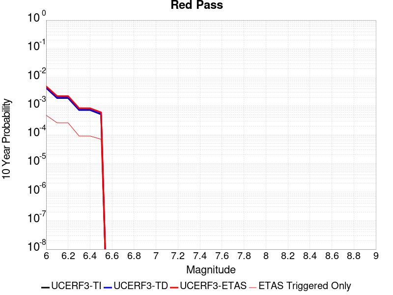 |

| Magnitude | 1 wk TI Prob | 1 wk TD Prob | 1 wk ETAS Prob | 1 wk ETAS/TD Gain | 1 wk ETAS Triggered Only | 1 mo TI Prob | 1 mo TD Prob | 1 mo ETAS Prob | 1 mo ETAS/TD Gain | 1 mo ETAS Triggered Only | 1 yr TI Prob | 1 yr TD Prob | 1 yr ETAS Prob | 1 yr ETAS/TD Gain | 1 yr ETAS Triggered Only | 10 yr TI Prob | 10 yr TD Prob | 10 yr ETAS Prob | 10 yr ETAS/TD Gain | 10 yr ETAS Triggered Only |
|-----|-----|-----|-----|-----|-----|-----|-----|-----|-----|-----|-----|-----|-----|-----|-----|-----|-----|-----|-----|-----|
| 6.0 | 8.258278E-6 | 8.551265E-6 | 1.321596E-4 | 15.454977 | 1.236094E-4 | 3.539214E-5 | 3.6647863E-5 | 2.4677612E-4 | 6.7337112 | 2.1013597E-4 | 4.308141E-4 | 4.4611428E-4 | 7.5499987E-4 | 1.6923913 | 3.0902348E-4 | 0.0042997985 | 0.004453945 | 0.004958486 | 1.1132796 | 5.067985E-4 |
| 6.1 | 3.649988E-6 | 3.7753161E-6 | 5.3218886E-5 | 14.096539 | 4.944376E-5 | 1.5642712E-5 | 1.6179853E-5 | 1.1506577E-4 | 7.1116695 | 9.888752E-5 | 1.9043336E-4 | 1.9697666E-4 | 3.452787E-4 | 1.7528915 | 1.4833127E-4 | 0.0019027026 | 0.001968488 | 0.0022275567 | 1.131608 | 2.5957974E-4 |
| 6.2 | 3.649988E-6 | 3.7753161E-6 | 5.3218886E-5 | 14.096539 | 4.944376E-5 | 1.5642712E-5 | 1.6179853E-5 | 1.1506577E-4 | 7.1116695 | 9.888752E-5 | 1.9043336E-4 | 1.9697666E-4 | 3.452787E-4 | 1.7528915 | 1.4833127E-4 | 0.0019027026 | 0.001968488 | 0.0022275567 | 1.131608 | 2.5957974E-4 |
| 6.3 | 1.3924937E-6 | 1.4411166E-6 | 2.616296E-5 | 18.154644 | 2.472188E-5 | 5.9678164E-6 | 6.1762075E-6 | 3.0897932E-5 | 5.0027356 | 2.472188E-5 | 7.265574E-5 | 7.519415E-5 | 1.12274174E-4 | 1.4931239 | 3.7082817E-5 | 7.263199E-4 | 7.518258E-4 | 8.5063896E-4 | 1.131431 | 9.888752E-5 |
| 6.4 | 1.3924937E-6 | 1.4411166E-6 | 2.616296E-5 | 18.154644 | 2.472188E-5 | 5.9678164E-6 | 6.1762075E-6 | 3.0897932E-5 | 5.0027356 | 2.472188E-5 | 7.265574E-5 | 7.519415E-5 | 1.12274174E-4 | 1.4931239 | 3.7082817E-5 | 7.263199E-4 | 7.518258E-4 | 8.5063896E-4 | 1.131431 | 9.888752E-5 |
| 6.5 | 9.876812E-7 | 1.0221912E-6 | 1.3383118E-5 | 13.092578 | 1.236094E-5 | 4.2329125E-6 | 4.3808195E-6 | 1.6741706E-5 | 3.821592 | 1.236094E-5 | 5.153449E-5 | 5.3336476E-5 | 7.805704E-5 | 1.4634832 | 2.472188E-5 | 5.1522546E-4 | 5.333648E-4 | 6.0749083E-4 | 1.1389782 | 7.416563E-5 |

## Death Valley (No)
*[(top)](#table-of-contents)*

| 1 Week | 1 Month | 1 Year | 10 Year |
|-----|-----|-----|-----|
|  |  |  |  |

| Magnitude | 1 wk TI Prob | 1 wk TD Prob | 1 wk ETAS Prob | 1 wk ETAS/TD Gain | 1 wk ETAS Triggered Only | 1 mo TI Prob | 1 mo TD Prob | 1 mo ETAS Prob | 1 mo ETAS/TD Gain | 1 mo ETAS Triggered Only | 1 yr TI Prob | 1 yr TD Prob | 1 yr ETAS Prob | 1 yr ETAS/TD Gain | 1 yr ETAS Triggered Only | 10 yr TI Prob | 10 yr TD Prob | 10 yr ETAS Prob | 10 yr ETAS/TD Gain | 10 yr ETAS Triggered Only |
|-----|-----|-----|-----|-----|-----|-----|-----|-----|-----|-----|-----|-----|-----|-----|-----|-----|-----|-----|-----|-----|
| 6.0 | 2.0074807E-5 | 2.2500084E-5 | 1.0902471E-4 | 4.845525 | 8.6526576E-5 | 8.603206E-5 | 9.642541E-5 | 2.6946186E-4 | 2.794511 | 1.7305315E-4 | 0.001046937 | 0.0011733545 | 0.0015314011 | 1.3051479 | 3.5846725E-4 | 0.010420183 | 0.011672506 | 0.012210039 | 1.0460511 | 5.438813E-4 |
| 6.1 | 2.0074807E-5 | 2.2500084E-5 | 1.0902471E-4 | 4.845525 | 8.6526576E-5 | 8.603206E-5 | 9.642541E-5 | 2.6946186E-4 | 2.794511 | 1.7305315E-4 | 0.001046937 | 0.0011733545 | 0.0015314011 | 1.3051479 | 3.5846725E-4 | 0.010420183 | 0.011672506 | 0.012210039 | 1.0460511 | 5.438813E-4 |
| 6.2 | 2.0074807E-5 | 2.2500084E-5 | 1.0902471E-4 | 4.845525 | 8.6526576E-5 | 8.603206E-5 | 9.642541E-5 | 2.6946186E-4 | 2.794511 | 1.7305315E-4 | 0.001046937 | 0.0011733545 | 0.0015314011 | 1.3051479 | 3.5846725E-4 | 0.010420183 | 0.011672506 | 0.012210039 | 1.0460511 | 5.438813E-4 |
| 6.3 | 1.9050609E-5 | 2.1336948E-5 | 8.314032E-5 | 3.8965428 | 6.18047E-5 | 8.164292E-5 | 9.1440896E-5 | 2.397586E-4 | 2.6220064 | 1.4833127E-4 | 9.935491E-4 | 0.001112731 | 0.0014461051 | 1.2995998 | 3.3374535E-4 | 0.009891188 | 0.011072419 | 0.01158583 | 1.0463685 | 5.191595E-4 |
| 6.4 | 1.9050609E-5 | 2.1336948E-5 | 8.314032E-5 | 3.8965428 | 6.18047E-5 | 8.164292E-5 | 9.1440896E-5 | 2.397586E-4 | 2.6220064 | 1.4833127E-4 | 9.935491E-4 | 0.001112731 | 0.0014461051 | 1.2995998 | 3.3374535E-4 | 0.009891188 | 0.011072419 | 0.01158583 | 1.0463685 | 5.191595E-4 |
| 6.5 | 1.8367004E-5 | 2.0561009E-5 | 8.236444E-5 | 4.005856 | 6.18047E-5 | 7.8713354E-5 | 8.811567E-5 | 2.3643387E-4 | 2.6832216 | 1.4833127E-4 | 9.5791375E-4 | 0.0010722869 | 0.0014056743 | 1.3109126 | 3.3374535E-4 | 0.009537951 | 0.0106719155 | 0.011185534 | 1.0481281 | 5.191595E-4 |
| 6.6 | 1.779439E-5 | 1.9910927E-5 | 8.1714395E-5 | 4.103997 | 6.18047E-5 | 7.625944E-5 | 8.53298E-5 | 2.336484E-4 | 2.7381809 | 1.4833127E-4 | 9.280632E-4 | 0.0010384015 | 0.0013718003 | 1.3210692 | 3.3374535E-4 | 0.009241969 | 0.010336253 | 0.010850046 | 1.0497079 | 5.191595E-4 |
| 6.7 | 1.7025437E-5 | 1.9043426E-5 | 8.084695E-5 | 4.2453995 | 6.18047E-5 | 7.296412E-5 | 8.161216E-5 | 2.2993133E-4 | 2.817366 | 1.4833127E-4 | 8.87976E-4 | 9.931813E-4 | 0.0013142466 | 1.3232695 | 3.2138443E-4 | 0.008844362 | 0.009888145 | 0.010389932 | 1.0507463 | 5.067985E-4 |
| 6.8 | 1.6545107E-5 | 1.8512545E-5 | 8.03161E-5 | 4.3384686 | 6.18047E-5 | 7.090568E-5 | 7.93371E-5 | 2.2765661E-4 | 2.869485 | 1.4833127E-4 | 8.629347E-4 | 9.655073E-4 | 0.0012865814 | 1.3325444 | 3.2138443E-4 | 0.008595915 | 0.009613829 | 0.010115755 | 1.0522088 | 5.067985E-4 |
| 6.9 | 1.615478E-5 | 1.8087594E-5 | 7.989117E-5 | 4.4169044 | 6.18047E-5 | 6.9232934E-5 | 7.751599E-5 | 2.2583577E-4 | 2.9134088 | 1.4833127E-4 | 8.4258494E-4 | 9.433546E-4 | 0.0012520866 | 1.3272703 | 3.0902348E-4 | 0.008393973 | 0.009394196 | 0.009883989 | 1.0521379 | 4.944376E-4 |
| 7.0 | 1.5894311E-5 | 1.780555E-5 | 7.960915E-5 | 4.4710298 | 6.18047E-5 | 6.81167E-5 | 7.6307304E-5 | 2.2462725E-4 | 2.9437191 | 1.4833127E-4 | 8.2900526E-4 | 9.286515E-4 | 0.001237388 | 1.3324568 | 3.0902348E-4 | 0.008259195 | 0.009248397 | 0.009738263 | 1.0529675 | 4.944376E-4 |
| 7.1 | 1.5602263E-5 | 1.7483504E-5 | 7.928712E-5 | 4.5349674 | 6.18047E-5 | 6.6865134E-5 | 7.492718E-5 | 2.2324733E-4 | 2.9795241 | 1.4833127E-4 | 8.137789E-4 | 9.118627E-4 | 0.0012206044 | 1.3385836 | 3.0902348E-4 | 0.008108052 | 0.009081894 | 0.009559592 | 1.052599 | 4.8207663E-4 |
| 7.2 | 1.5323829E-5 | 1.717063E-5 | 7.897426E-5 | 4.599381 | 6.18047E-5 | 6.56719E-5 | 7.358637E-5 | 2.2190672E-4 | 3.0155954 | 1.4833127E-4 | 7.99262E-4 | 8.9555193E-4 | 0.0011919488 | 1.3309656 | 2.9666253E-4 | 0.007963934 | 0.008920107 | 0.009373382 | 1.050815 | 4.5735476E-4 |
| 7.3 | 1.4556212E-5 | 1.6302456E-5 | 7.8106146E-5 | 4.791066 | 6.18047E-5 | 6.238227E-5 | 6.9865826E-5 | 2.1818673E-4 | 3.1229393 | 1.4833127E-4 | 7.592395E-4 | 8.5029035E-4 | 0.0011343502 | 1.334074 | 2.843016E-4 | 0.0075665074 | 0.008471014 | 0.008912238 | 1.0520864 | 4.449938E-4 |
| 7.4 | 1.411725E-5 | 1.580796E-5 | 7.761168E-5 | 4.909658 | 6.18047E-5 | 6.0501097E-5 | 6.7746674E-5 | 2.160679E-4 | 3.1893506 | 1.4833127E-4 | 7.363519E-4 | 8.245094E-4 | 0.0011085767 | 1.3445288 | 2.843016E-4 | 0.0073391674 | 0.008215138 | 0.008656477 | 1.0537225 | 4.449938E-4 |
| 7.5 | 1.3503312E-5 | 1.5126289E-5 | 7.693005E-5 | 5.0858507 | 6.18047E-5 | 5.7870053E-5 | 6.482538E-5 | 2.1314704E-4 | 3.2880185 | 1.4833127E-4 | 7.043401E-4 | 7.8896893E-4 | 0.0010730462 | 1.3600614 | 2.843016E-4 | 0.007021119 | 0.007862304 | 0.0083038 | 1.0561534 | 4.449938E-4 |
| 7.6 | 1.1279839E-5 | 1.2626327E-5 | 7.4430245E-5 | 5.8948455 | 6.18047E-5 | 4.834127E-5 | 5.4111737E-5 | 2.0243498E-4 | 3.741055 | 1.4833127E-4 | 5.88396E-4 | 6.5861654E-4 | 9.303781E-4 | 1.4126248 | 2.7194066E-4 | 0.005868405 | 0.006567199 | 0.006960151 | 1.0598357 | 3.9555007E-4 |
| 7.7 | 9.189108E-6 | 1.0283358E-5 | 7.208742E-5 | 7.0101047 | 6.18047E-5 | 3.93813E-5 | 4.407082E-5 | 1.6767476E-4 | 3.8046663 | 1.236094E-4 | 4.7936183E-4 | 5.3643517E-4 | 7.588127E-4 | 1.414547 | 2.224969E-4 | 0.004783291 | 0.005351914 | 0.0056715785 | 1.059729 | 3.2138443E-4 |
| 7.8 | 3.4586725E-7 | 3.6482615E-7 | 3.6482615E-7 | 1.0 | 0.0 | 1.4822873E-6 | 1.5635396E-6 | 1.5635396E-6 | 1.0 | 0.0 | 1.80467E-5 | 1.9035933E-5 | 3.1396637E-5 | 1.6493353 | 1.236094E-5 | 1.8045233E-4 | 1.9034347E-4 | 2.1506065E-4 | 1.1298556 | 2.472188E-5 |
| 7.9 | 2.5591178E-9 | 2.6696718E-9 | 2.6696718E-9 | 1.0 | 0.0 | 1.0967647E-8 | 1.14414505E-8 | 1.14414505E-8 | 1.0 | 0.0 | 1.335311E-7 | 1.3929966E-7 | 1.3929966E-7 | 1.0 | 0.0 | 1.3353102E-6 | 1.3929966E-6 | 1.3929966E-6 | 1.0 | 0.0 |

## Elsinore (Glen Ivy) rev
*[(top)](#table-of-contents)*

| 1 Week | 1 Month | 1 Year | 10 Year |
|-----|-----|-----|-----|
| 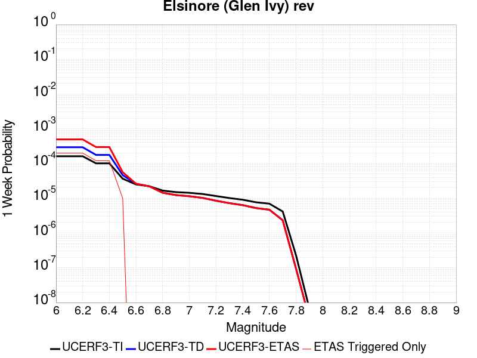 | 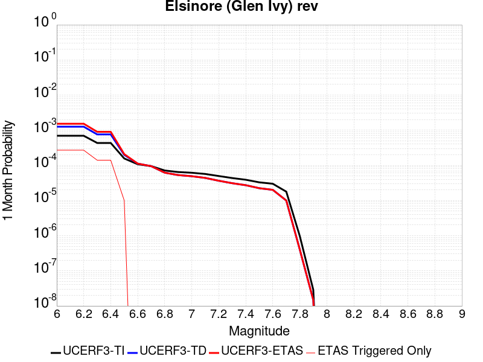 |  |  |

| Magnitude | 1 wk TI Prob | 1 wk TD Prob | 1 wk ETAS Prob | 1 wk ETAS/TD Gain | 1 wk ETAS Triggered Only | 1 mo TI Prob | 1 mo TD Prob | 1 mo ETAS Prob | 1 mo ETAS/TD Gain | 1 mo ETAS Triggered Only | 1 yr TI Prob | 1 yr TD Prob | 1 yr ETAS Prob | 1 yr ETAS/TD Gain | 1 yr ETAS Triggered Only | 10 yr TI Prob | 10 yr TD Prob | 10 yr ETAS Prob | 10 yr ETAS/TD Gain | 10 yr ETAS Triggered Only |
|-----|-----|-----|-----|-----|-----|-----|-----|-----|-----|-----|-----|-----|-----|-----|-----|-----|-----|-----|-----|-----|
| 6.0 | 1.6204086E-4 | 2.9360707E-4 | 5.036813E-4 | 1.7154946 | 2.1013597E-4 | 6.94276E-4 | 0.0012578638 | 0.0015294625 | 1.2159204 | 2.7194066E-4 | 0.008420097 | 0.015234485 | 0.015611837 | 1.0247695 | 3.8318912E-4 | 0.081081145 | 0.13969168 | 0.14010641 | 1.0029689 | 4.8207663E-4 |
| 6.1 | 1.6204086E-4 | 2.9360707E-4 | 5.036813E-4 | 1.7154946 | 2.1013597E-4 | 6.94276E-4 | 0.0012578638 | 0.0015294625 | 1.2159204 | 2.7194066E-4 | 0.008420097 | 0.015234485 | 0.015611837 | 1.0247695 | 3.8318912E-4 | 0.081081145 | 0.13969168 | 0.14010641 | 1.0029689 | 4.8207663E-4 |
| 6.2 | 1.6204086E-4 | 2.9360707E-4 | 5.036813E-4 | 1.7154946 | 2.1013597E-4 | 6.94276E-4 | 0.0012578638 | 0.0015294625 | 1.2159204 | 2.7194066E-4 | 0.008420097 | 0.015234485 | 0.015611837 | 1.0247695 | 3.8318912E-4 | 0.081081145 | 0.13969168 | 0.14010641 | 1.0029689 | 4.8207663E-4 |
| 6.3 | 1.0111737E-4 | 1.7703383E-4 | 3.0062132E-4 | 1.6981012 | 1.236094E-4 | 4.332882E-4 | 7.5861247E-4 | 8.944796E-4 | 1.1790996 | 1.3597033E-4 | 0.005262531 | 0.009217682 | 0.009438128 | 1.0239155 | 2.224969E-4 | 0.0513964 | 0.0870191 | 0.08730123 | 1.0032421 | 3.0902348E-4 |
| 6.4 | 1.0111737E-4 | 1.7703383E-4 | 3.0062132E-4 | 1.6981012 | 1.236094E-4 | 4.332882E-4 | 7.5861247E-4 | 8.944796E-4 | 1.1790996 | 1.3597033E-4 | 0.005262531 | 0.009217682 | 0.009438128 | 1.0239155 | 2.224969E-4 | 0.0513964 | 0.0870191 | 0.08730123 | 1.0032421 | 3.0902348E-4 |
| 6.5 | 3.6624708E-5 | 4.6391084E-5 | 5.8751448E-5 | 1.2664384 | 1.236094E-5 | 1.569536E-4 | 1.9880582E-4 | 2.1116431E-4 | 1.0621636 | 1.236094E-5 | 0.001909235 | 0.0024181372 | 0.0024427993 | 1.0101988 | 2.472188E-5 | 0.01892915 | 0.023739954 | 0.023788225 | 1.0020332 | 4.944376E-5 |
| 6.6 | 2.5051324E-5 | 2.614772E-5 | 2.614772E-5 | 1.0 | 0.0 | 1.073584E-4 | 1.12057096E-4 | 1.12057096E-4 | 1.0 | 0.0 | 0.0013063047 | 0.0013634858 | 0.0013758299 | 1.0090533 | 1.236094E-5 | 0.012986525 | 0.013564618 | 0.013601198 | 1.0026968 | 3.7082817E-5 |
| 6.7 | 2.2189772E-5 | 2.2072849E-5 | 2.2072849E-5 | 1.0 | 0.0 | 9.509556E-5 | 9.4594696E-5 | 9.4594696E-5 | 1.0 | 0.0 | 0.0011571734 | 0.0011511183 | 0.0011634651 | 1.0107259 | 1.236094E-5 | 0.011511663 | 0.011465415 | 0.011502073 | 1.0031972 | 3.7082817E-5 |
| 6.8 | 1.6654378E-5 | 1.4437705E-5 | 1.4437705E-5 | 1.0 | 0.0 | 7.137396E-5 | 6.187444E-5 | 6.187444E-5 | 1.0 | 0.0 | 8.686314E-4 | 7.530661E-4 | 7.530661E-4 | 1.0 | 0.0 | 0.008652439 | 0.00751048 | 0.0075350166 | 1.0032669 | 2.472188E-5 |
| 6.9 | 1.5042909E-5 | 1.2332022E-5 | 1.2332022E-5 | 1.0 | 0.0 | 6.446802E-5 | 5.285047E-5 | 5.285047E-5 | 1.0 | 0.0 | 7.8461546E-4 | 6.4326765E-4 | 6.4326765E-4 | 1.0 | 0.0 | 0.007818509 | 0.00641828 | 0.0064305617 | 1.0019135 | 1.236094E-5 |
| 7.0 | 1.4361385E-5 | 1.1451324E-5 | 1.1451324E-5 | 1.0 | 0.0 | 6.154734E-5 | 4.9076196E-5 | 4.9076196E-5 | 1.0 | 0.0 | 7.490812E-4 | 5.973418E-4 | 5.973418E-4 | 1.0 | 0.0 | 0.007465612 | 0.0059613534 | 0.0059736404 | 1.0020611 | 1.236094E-5 |
| 7.1 | 1.3265571E-5 | 1.0244926E-5 | 1.0244926E-5 | 1.0 | 0.0 | 5.6851208E-5 | 4.39061E-5 | 4.39061E-5 | 1.0 | 0.0 | 6.919436E-4 | 5.344282E-4 | 5.344282E-4 | 1.0 | 0.0 | 0.006897931 | 0.0053347866 | 0.0053470815 | 1.0023047 | 1.236094E-5 |
| 7.2 | 1.1596403E-5 | 8.505067E-6 | 8.505067E-6 | 1.0 | 0.0 | 4.9697923E-5 | 3.6449786E-5 | 3.6449786E-5 | 1.0 | 0.0 | 6.049042E-4 | 4.436875E-4 | 4.436875E-4 | 1.0 | 0.0 | 0.006032603 | 0.0044294316 | 0.0044417377 | 1.0027783 | 1.236094E-5 |
| 7.3 | 1.0150827E-5 | 7.2387597E-6 | 7.2387597E-6 | 1.0 | 0.0 | 4.3502816E-5 | 3.1022897E-5 | 3.1022897E-5 | 1.0 | 0.0 | 5.2951806E-4 | 3.7763975E-4 | 3.7763975E-4 | 1.0 | 0.0 | 0.005282581 | 0.0037703665 | 0.003782681 | 1.0032661 | 1.236094E-5 |
| 7.4 | 9.080705E-6 | 6.352519E-6 | 6.352519E-6 | 1.0 | 0.0 | 3.8916725E-5 | 2.7224805E-5 | 2.7224805E-5 | 1.0 | 0.0 | 4.7370812E-4 | 3.3141294E-4 | 3.3141294E-4 | 1.0 | 0.0 | 0.004726996 | 0.0033093381 | 0.0033093381 | 1.0 | 0.0 |
| 7.5 | 7.671649E-6 | 5.2256332E-6 | 5.2256332E-6 | 1.0 | 0.0 | 3.287808E-5 | 2.2395385E-5 | 2.2395385E-5 | 1.0 | 0.0 | 4.0021708E-4 | 2.7263095E-4 | 2.7263095E-4 | 1.0 | 0.0 | 0.0039949706 | 0.00272309 | 0.00272309 | 1.0 | 0.0 |
| 7.6 | 6.990086E-6 | 4.687545E-6 | 4.687545E-6 | 1.0 | 0.0 | 2.9957167E-5 | 2.008933E-5 | 2.008933E-5 | 1.0 | 0.0 | 3.6466747E-4 | 2.445613E-4 | 2.445613E-4 | 1.0 | 0.0 | 0.0036406964 | 0.002443038 | 0.002443038 | 1.0 | 0.0 |
| 7.7 | 4.163505E-6 | 2.3295343E-6 | 2.3295343E-6 | 1.0 | 0.0 | 1.7843471E-5 | 9.983683E-6 | 9.983683E-6 | 1.0 | 0.0 | 2.172226E-4 | 1.21545316E-4 | 1.21545316E-4 | 1.0 | 0.0 | 0.0021701038 | 0.0012148614 | 0.0012148614 | 1.0 | 0.0 |
| 7.8 | 2.2692414E-7 | 9.3854695E-8 | 9.3854695E-8 | 1.0 | 0.0 | 9.725317E-7 | 4.0223435E-7 | 4.0223435E-7 | 1.0 | 0.0 | 1.1840509E-5 | 4.8971956E-6 | 4.8971956E-6 | 1.0 | 0.0 | 1.1839878E-4 | 4.8971204E-5 | 4.8971204E-5 | 1.0 | 0.0 |
| 7.9 | 6.676829E-9 | 3.439853E-9 | 3.439853E-9 | 1.0 | 0.0 | 2.861498E-8 | 1.4742227E-8 | 1.4742227E-8 | 1.0 | 0.0 | 3.4838732E-7 | 1.7948659E-7 | 1.7948659E-7 | 1.0 | 0.0 | 3.4838679E-6 | 1.7948646E-6 | 1.7948646E-6 | 1.0 | 0.0 |

## Manix-Afton Hills
*[(top)](#table-of-contents)*

| 1 Week | 1 Month | 1 Year | 10 Year |
|-----|-----|-----|-----|
|  | 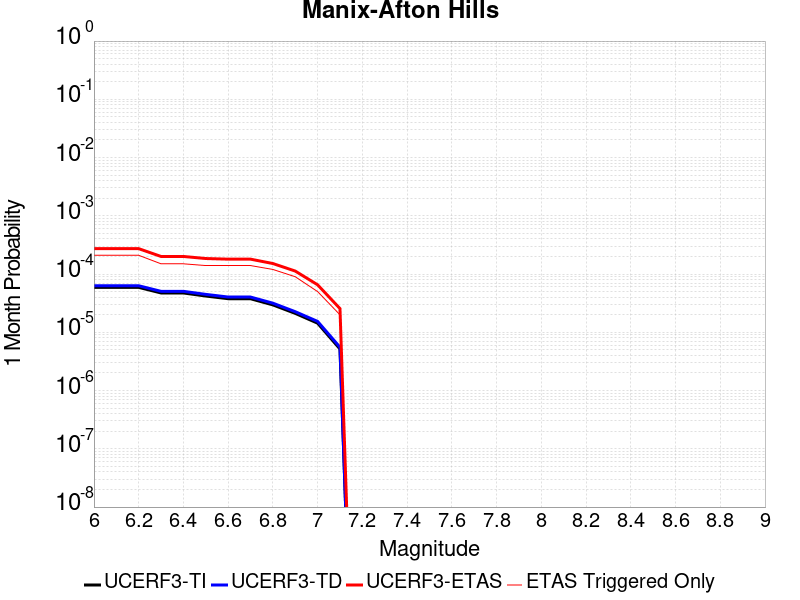 |  |  |

| Magnitude | 1 wk TI Prob | 1 wk TD Prob | 1 wk ETAS Prob | 1 wk ETAS/TD Gain | 1 wk ETAS Triggered Only | 1 mo TI Prob | 1 mo TD Prob | 1 mo ETAS Prob | 1 mo ETAS/TD Gain | 1 mo ETAS Triggered Only | 1 yr TI Prob | 1 yr TD Prob | 1 yr ETAS Prob | 1 yr ETAS/TD Gain | 1 yr ETAS Triggered Only | 10 yr TI Prob | 10 yr TD Prob | 10 yr ETAS Prob | 10 yr ETAS/TD Gain | 10 yr ETAS Triggered Only |
|-----|-----|-----|-----|-----|-----|-----|-----|-----|-----|-----|-----|-----|-----|-----|-----|-----|-----|-----|-----|-----|
| 6.0 | 1.3783202E-5 | 1.47110895E-5 | 1.877617E-4 | 12.763276 | 1.7305315E-4 | 5.906953E-5 | 6.30461E-5 | 2.9788914E-4 | 4.7249413 | 2.3485786E-4 | 7.189342E-4 | 7.6733343E-4 | 0.0010390654 | 1.354125 | 2.7194066E-4 | 0.0071661277 | 0.007648596 | 0.008090186 | 1.0577348 | 4.449938E-4 |
| 6.1 | 1.3783202E-5 | 1.47110895E-5 | 1.877617E-4 | 12.763276 | 1.7305315E-4 | 5.906953E-5 | 6.30461E-5 | 2.9788914E-4 | 4.7249413 | 2.3485786E-4 | 7.189342E-4 | 7.6733343E-4 | 0.0010390654 | 1.354125 | 2.7194066E-4 | 0.0071661277 | 0.007648596 | 0.008090186 | 1.0577348 | 4.449938E-4 |
| 6.2 | 1.3783202E-5 | 1.47110895E-5 | 1.877617E-4 | 12.763276 | 1.7305315E-4 | 5.906953E-5 | 6.30461E-5 | 2.9788914E-4 | 4.7249413 | 2.3485786E-4 | 7.189342E-4 | 7.6733343E-4 | 0.0010390654 | 1.354125 | 2.7194066E-4 | 0.0071661277 | 0.007648596 | 0.008090186 | 1.0577348 | 4.449938E-4 |
| 6.3 | 1.10494875E-5 | 1.1793136E-5 | 1.4776186E-4 | 12.529481 | 1.3597033E-4 | 4.7354086E-5 | 5.054109E-5 | 2.2358549E-4 | 4.423836 | 1.7305315E-4 | 5.763835E-4 | 6.151744E-4 | 8.251811E-4 | 1.3413775 | 2.1013597E-4 | 0.005748908 | 0.0061357557 | 0.0064797383 | 1.056062 | 3.461063E-4 |
| 6.4 | 1.10494875E-5 | 1.1793136E-5 | 1.4776186E-4 | 12.529481 | 1.3597033E-4 | 4.7354086E-5 | 5.054109E-5 | 2.2358549E-4 | 4.423836 | 1.7305315E-4 | 5.763835E-4 | 6.151744E-4 | 8.251811E-4 | 1.3413775 | 2.1013597E-4 | 0.005748908 | 0.0061357557 | 0.0064797383 | 1.056062 | 3.461063E-4 |
| 6.5 | 9.788949E-6 | 1.045432E-5 | 1.3406241E-4 | 12.823639 | 1.236094E-4 | 4.1951964E-5 | 4.480351E-5 | 2.0548853E-4 | 4.586438 | 1.6069222E-4 | 5.1064545E-4 | 5.453555E-4 | 7.306685E-4 | 1.3398021 | 1.8541409E-4 | 0.0050947363 | 0.0054410985 | 0.0057484405 | 1.0564853 | 3.0902348E-4 |
| 6.6 | 8.810006E-6 | 9.4136285E-6 | 1.3302187E-4 | 14.1307745 | 1.236094E-4 | 3.775662E-5 | 4.0343548E-5 | 2.0102928E-4 | 4.982935 | 1.6069222E-4 | 4.5958988E-4 | 4.9108086E-4 | 6.764039E-4 | 1.3773779 | 1.8541409E-4 | 0.0045864056 | 0.004900839 | 0.005196048 | 1.0602363 | 2.9666253E-4 |
| 6.7 | 8.80128E-6 | 9.404108E-6 | 1.3301233E-4 | 14.144068 | 1.236094E-4 | 3.7719226E-5 | 4.0302748E-5 | 2.0098848E-4 | 4.986967 | 1.6069222E-4 | 4.591348E-4 | 4.9058435E-4 | 6.759075E-4 | 1.3777599 | 1.8541409E-4 | 0.004581874 | 0.0048958957 | 0.005191106 | 1.0602975 | 2.9666253E-4 |
| 6.8 | 6.8994877E-6 | 7.380076E-6 | 1.0626686E-4 | 14.399156 | 9.888752E-5 | 2.9568899E-5 | 3.162856E-5 | 1.675946E-4 | 5.298837 | 1.3597033E-4 | 3.5994186E-4 | 3.8501783E-4 | 5.4564816E-4 | 1.4172024 | 1.6069222E-4 | 0.003593594 | 0.0038443129 | 0.0040659546 | 1.0576544 | 2.224969E-4 |
| 6.9 | 4.9328037E-6 | 5.2709615E-6 | 7.9436206E-5 | 15.070535 | 7.416563E-5 | 2.1140417E-5 | 2.2589675E-5 | 1.2147496E-4 | 5.377455 | 9.888752E-5 | 2.5735417E-4 | 2.7500073E-4 | 3.9857614E-4 | 1.449364 | 1.236094E-4 | 0.0025705635 | 0.0027472095 | 0.0028951333 | 1.053845 | 1.4833127E-4 |
| 7.0 | 3.347973E-6 | 3.59003E-6 | 4.0672716E-5 | 11.329352 | 3.7082817E-5 | 1.4348378E-5 | 1.5385775E-5 | 6.4828775E-5 | 4.2135525 | 4.944376E-5 | 1.746775E-4 | 1.8730981E-4 | 2.4910294E-4 | 1.3298979 | 6.18047E-5 | 0.0017454025 | 0.0018719219 | 0.0019582866 | 1.0461369 | 8.6526576E-5 |
| 7.1 | 1.2073567E-6 | 1.293482E-6 | 2.6015328E-5 | 20.112633 | 2.472188E-5 | 5.1743755E-6 | 5.543492E-6 | 3.0265233E-5 | 5.459597 | 2.472188E-5 | 6.29962E-5 | 6.749156E-5 | 9.221177E-5 | 1.3662711 | 2.472188E-5 | 6.297835E-4 | 6.7487074E-4 | 6.9957593E-4 | 1.0366073 | 2.472188E-5 |

## Cady
*[(top)](#table-of-contents)*

| 1 Week | 1 Month | 1 Year | 10 Year |
|-----|-----|-----|-----|
|  |  |  | 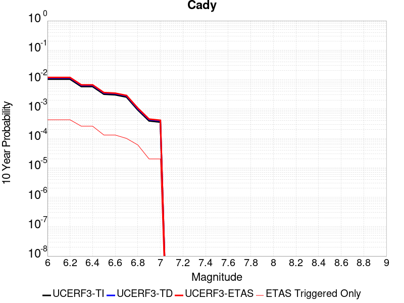 |

| Magnitude | 1 wk TI Prob | 1 wk TD Prob | 1 wk ETAS Prob | 1 wk ETAS/TD Gain | 1 wk ETAS Triggered Only | 1 mo TI Prob | 1 mo TD Prob | 1 mo ETAS Prob | 1 mo ETAS/TD Gain | 1 mo ETAS Triggered Only | 1 yr TI Prob | 1 yr TD Prob | 1 yr ETAS Prob | 1 yr ETAS/TD Gain | 1 yr ETAS Triggered Only | 10 yr TI Prob | 10 yr TD Prob | 10 yr ETAS Prob | 10 yr ETAS/TD Gain | 10 yr ETAS Triggered Only |
|-----|-----|-----|-----|-----|-----|-----|-----|-----|-----|-----|-----|-----|-----|-----|-----|-----|-----|-----|-----|-----|
| 6.0 | 1.9892565E-5 | 2.1858728E-5 | 1.7018676E-4 | 7.785757 | 1.4833127E-4 | 8.525106E-5 | 9.3677416E-5 | 2.914339E-4 | 3.111037 | 1.9777504E-4 | 0.0010374374 | 0.0011400167 | 0.0014363411 | 1.2599298 | 2.9666253E-4 | 0.010326075 | 0.011350701 | 0.011778423 | 1.0376824 | 4.326329E-4 |
| 6.1 | 1.9892565E-5 | 2.1858728E-5 | 1.7018676E-4 | 7.785757 | 1.4833127E-4 | 8.525106E-5 | 9.3677416E-5 | 2.914339E-4 | 3.111037 | 1.9777504E-4 | 0.0010374374 | 0.0011400167 | 0.0014363411 | 1.2599298 | 2.9666253E-4 | 0.010326075 | 0.011350701 | 0.011778423 | 1.0376824 | 4.326329E-4 |
| 6.2 | 1.9892565E-5 | 2.1858728E-5 | 1.7018676E-4 | 7.785757 | 1.4833127E-4 | 8.525106E-5 | 9.3677416E-5 | 2.914339E-4 | 3.111037 | 1.9777504E-4 | 0.0010374374 | 0.0011400167 | 0.0014363411 | 1.2599298 | 2.9666253E-4 | 0.010326075 | 0.011350701 | 0.011778423 | 1.0376824 | 4.326329E-4 |
| 6.3 | 1.1117327E-5 | 1.2176583E-5 | 1.11062895E-4 | 9.121022 | 9.888752E-5 | 4.764482E-5 | 5.2184492E-5 | 1.8814774E-4 | 3.6054337 | 1.3597033E-4 | 5.7992124E-4 | 6.351925E-4 | 8.328419E-4 | 1.3111646 | 1.9777504E-4 | 0.0057841022 | 0.0063368753 | 0.006619375 | 1.0445803 | 2.843016E-4 |
| 6.4 | 1.1117327E-5 | 1.2176583E-5 | 1.11062895E-4 | 9.121022 | 9.888752E-5 | 4.764482E-5 | 5.2184492E-5 | 1.8814774E-4 | 3.6054337 | 1.3597033E-4 | 5.7992124E-4 | 6.351925E-4 | 8.328419E-4 | 1.3111646 | 1.9777504E-4 | 0.0057841022 | 0.0063368753 | 0.006619375 | 1.0445803 | 2.843016E-4 |
| 6.5 | 6.103093E-6 | 6.672021E-6 | 5.611545E-5 | 8.4105625 | 4.944376E-5 | 2.615585E-5 | 2.8594131E-5 | 1.0275765E-4 | 3.593662 | 7.416563E-5 | 3.1840094E-4 | 3.480905E-4 | 4.3458695E-4 | 1.2484884 | 8.6526576E-5 | 0.0031794512 | 0.0034766865 | 0.0036245023 | 1.0425162 | 1.4833127E-4 |
| 6.6 | 5.817237E-6 | 6.3656585E-6 | 5.58091E-5 | 8.767216 | 4.944376E-5 | 2.4930776E-5 | 2.728118E-5 | 1.0144479E-4 | 3.7184901 | 7.416563E-5 | 3.034899E-4 | 3.3211018E-4 | 4.1860802E-4 | 1.2604493 | 8.6526576E-5 | 0.0030307577 | 0.0033173605 | 0.0034651998 | 1.0445653 | 1.4833127E-4 |
| 6.7 | 4.8846314E-6 | 5.3405684E-6 | 3.0062314E-5 | 5.629048 | 2.472188E-5 | 2.0933967E-5 | 2.2888014E-5 | 7.2330644E-5 | 3.1601973 | 4.944376E-5 | 2.5484123E-4 | 2.7863772E-4 | 3.2806772E-4 | 1.1773987 | 4.944376E-5 | 0.0025454918 | 0.0027840391 | 0.0028949778 | 1.0398481 | 1.1124845E-4 |
| 6.8 | 1.7788773E-6 | 1.9399079E-6 | 1.4300824E-5 | 7.371908 | 1.236094E-5 | 7.6237375E-6 | 8.313874E-6 | 4.5396384E-5 | 5.4603167 | 3.7082817E-5 | 9.281505E-5 | 1.01218284E-4 | 1.3829736E-4 | 1.3663278 | 3.7082817E-5 | 9.2776294E-4 | 0.0010118765 | 0.0010859671 | 1.073221 | 7.416563E-5 |
| 6.9 | 7.5455404E-7 | 8.297092E-7 | 8.297092E-7 | 1.0 | 0.0 | 3.233799E-6 | 3.5558937E-6 | 1.5916788E-5 | 4.4761715 | 1.236094E-5 | 3.937079E-5 | 4.3292483E-5 | 5.5652887E-5 | 1.2855092 | 1.236094E-5 | 3.9363815E-4 | 4.3287344E-4 | 4.575846E-4 | 1.0570863 | 2.472188E-5 |
| 7.0 | 6.8578805E-7 | 7.541816E-7 | 7.541816E-7 | 1.0 | 0.0 | 2.9390883E-6 | 3.2322048E-6 | 1.5593105E-5 | 4.8242936 | 1.236094E-5 | 3.578281E-5 | 3.9351715E-5 | 5.1712166E-5 | 1.314102 | 1.236094E-5 | 3.577705E-4 | 3.9347992E-4 | 4.1819207E-4 | 1.0628041 | 2.472188E-5 |

## Calico-Hidalgo
*[(top)](#table-of-contents)*

| 1 Week | 1 Month | 1 Year | 10 Year |
|-----|-----|-----|-----|
|  |  |  |  |

| Magnitude | 1 wk TI Prob | 1 wk TD Prob | 1 wk ETAS Prob | 1 wk ETAS/TD Gain | 1 wk ETAS Triggered Only | 1 mo TI Prob | 1 mo TD Prob | 1 mo ETAS Prob | 1 mo ETAS/TD Gain | 1 mo ETAS Triggered Only | 1 yr TI Prob | 1 yr TD Prob | 1 yr ETAS Prob | 1 yr ETAS/TD Gain | 1 yr ETAS Triggered Only | 10 yr TI Prob | 10 yr TD Prob | 10 yr ETAS Prob | 10 yr ETAS/TD Gain | 10 yr ETAS Triggered Only |
|-----|-----|-----|-----|-----|-----|-----|-----|-----|-----|-----|-----|-----|-----|-----|-----|-----|-----|-----|-----|-----|
| 6.0 | 4.0906612E-5 | 5.0703686E-5 | 1.8666712E-4 | 3.6815298 | 1.3597033E-4 | 1.7530227E-4 | 2.172857E-4 | 4.27376E-4 | 1.9668851 | 2.1013597E-4 | 0.0021322158 | 0.002642648 | 0.0029138702 | 1.1026326 | 2.7194066E-4 | 0.02111873 | 0.026152607 | 0.026585963 | 1.0165703 | 4.449938E-4 |
| 6.1 | 4.0906612E-5 | 5.0703686E-5 | 1.8666712E-4 | 3.6815298 | 1.3597033E-4 | 1.7530227E-4 | 2.172857E-4 | 4.27376E-4 | 1.9668851 | 2.1013597E-4 | 0.0021322158 | 0.002642648 | 0.0029138702 | 1.1026326 | 2.7194066E-4 | 0.02111873 | 0.026152607 | 0.026585963 | 1.0165703 | 4.449938E-4 |
| 6.2 | 4.0906612E-5 | 5.0703686E-5 | 1.8666712E-4 | 3.6815298 | 1.3597033E-4 | 1.7530227E-4 | 2.172857E-4 | 4.27376E-4 | 1.9668851 | 2.1013597E-4 | 0.0021322158 | 0.002642648 | 0.0029138702 | 1.1026326 | 2.7194066E-4 | 0.02111873 | 0.026152607 | 0.026585963 | 1.0165703 | 4.449938E-4 |
| 6.3 | 2.4242801E-5 | 3.0090669E-5 | 1.04254075E-4 | 3.4646647 | 7.416563E-5 | 1.0389358E-4 | 1.2895382E-4 | 2.6490662E-4 | 2.054275 | 1.3597033E-4 | 0.0012641704 | 0.0015689151 | 0.0017293552 | 1.1022618 | 1.6069222E-4 | 0.01257003 | 0.01558206 | 0.01580109 | 1.0140566 | 2.224969E-4 |
| 6.4 | 2.4242801E-5 | 3.0090669E-5 | 1.04254075E-4 | 3.4646647 | 7.416563E-5 | 1.0389358E-4 | 1.2895382E-4 | 2.6490662E-4 | 2.054275 | 1.3597033E-4 | 0.0012641704 | 0.0015689151 | 0.0017293552 | 1.1022618 | 1.6069222E-4 | 0.01257003 | 0.01558206 | 0.01580109 | 1.0140566 | 2.224969E-4 |
| 6.5 | 2.0286952E-5 | 2.5315738E-5 | 7.4758245E-5 | 2.9530344 | 4.944376E-5 | 8.694118E-5 | 1.0849161E-4 | 2.19728E-4 | 2.0252995 | 1.1124845E-4 | 0.0010579949 | 0.001320102 | 0.0014558929 | 1.1028639 | 1.3597033E-4 | 0.010529719 | 0.013124538 | 0.013307518 | 1.0139419 | 1.8541409E-4 |
| 6.6 | 2.0269223E-5 | 2.5296687E-5 | 7.47392E-5 | 2.9545052 | 4.944376E-5 | 8.6865206E-5 | 1.08409964E-4 | 2.1964636E-4 | 2.0260715 | 1.1124845E-4 | 0.0010570707 | 0.0013191093 | 0.0014549003 | 1.1029414 | 1.3597033E-4 | 0.010520565 | 0.013114728 | 0.01329771 | 1.0139525 | 1.8541409E-4 |
| 6.7 | 1.799852E-5 | 2.25406E-5 | 7.1983246E-5 | 3.1934927 | 4.944376E-5 | 7.713423E-5 | 9.659908E-5 | 1.9547704E-4 | 2.0235913 | 9.888752E-5 | 9.3870464E-4 | 0.0011754738 | 0.001298938 | 1.1050335 | 1.236094E-4 | 0.009347493 | 0.011694173 | 0.011865203 | 1.0146252 | 1.7305315E-4 |
| 6.8 | 1.7458793E-5 | 2.184212E-5 | 7.12848E-5 | 3.2636392 | 4.944376E-5 | 7.4821255E-5 | 9.3605806E-5 | 1.9248406E-4 | 2.0563262 | 9.888752E-5 | 9.10568E-4 | 0.0011390693 | 0.0012625379 | 1.1083943 | 1.236094E-4 | 0.009068459 | 0.011333893 | 0.011504985 | 1.0150956 | 1.7305315E-4 |
| 6.9 | 1.542884E-5 | 1.9025927E-5 | 5.6108038E-5 | 2.9490306 | 3.7082817E-5 | 6.612192E-5 | 8.153721E-5 | 1.556968E-4 | 1.9095184 | 7.416563E-5 | 8.04737E-4 | 9.922766E-4 | 0.001091066 | 1.0995584 | 9.888752E-5 | 0.008018291 | 0.009879857 | 0.010026723 | 1.0148652 | 1.4833127E-4 |
| 7.0 | 1.468253E-5 | 1.8030598E-5 | 5.511275E-5 | 3.0566232 | 3.7082817E-5 | 6.292361E-5 | 7.7271776E-5 | 1.5143168E-4 | 1.9597282 | 7.416563E-5 | 7.658257E-4 | 9.4039086E-4 | 0.0010268361 | 1.0919248 | 8.6526576E-5 | 0.0076319184 | 0.009365481 | 0.0095001785 | 1.0143822 | 1.3597033E-4 |
| 7.1 | 1.3139281E-5 | 1.6200942E-5 | 5.3283162E-5 | 3.2888925 | 3.7082817E-5 | 5.6309986E-5 | 6.943083E-5 | 1.3123124E-4 | 1.8901002 | 6.18047E-5 | 6.853584E-4 | 8.4500515E-4 | 9.191081E-4 | 1.0876952 | 7.416563E-5 | 0.0068324856 | 0.0084192185 | 0.008517274 | 1.0116465 | 9.888752E-5 |
| 7.2 | 1.1127404E-5 | 1.3866597E-5 | 2.6227366E-5 | 1.8914059 | 1.236094E-5 | 4.7688E-5 | 5.942698E-5 | 9.6507596E-5 | 1.6239693 | 3.7082817E-5 | 5.8044674E-4 | 7.232942E-4 | 7.727022E-4 | 1.0683097 | 4.944376E-5 | 0.0057893298 | 0.0072105085 | 0.0072841393 | 1.0102116 | 7.416563E-5 |
| 7.3 | 9.808154E-6 | 1.2176215E-5 | 2.4537005E-5 | 2.0151587 | 1.236094E-5 | 4.2034266E-5 | 5.2182797E-5 | 8.926368E-5 | 1.710596 | 3.7082817E-5 | 5.11647E-4 | 6.3515105E-4 | 6.845634E-4 | 1.0777962 | 4.944376E-5 | 0.0051047057 | 0.006334433 | 0.006408129 | 1.0116341 | 7.416563E-5 |
| 7.4 | 7.942452E-6 | 9.792144E-6 | 2.2152963E-5 | 2.26232 | 1.236094E-5 | 3.4038632E-5 | 4.1965708E-5 | 7.904697E-5 | 1.8836087 | 3.7082817E-5 | 4.1434157E-4 | 5.1082217E-4 | 5.4788607E-4 | 1.0725573 | 3.7082817E-5 | 0.0041356985 | 0.005097421 | 0.0051589105 | 1.0120629 | 6.18047E-5 |
| 7.5 | 4.7121216E-6 | 5.772836E-6 | 1.8133704E-5 | 3.1412122 | 1.236094E-5 | 2.019465E-5 | 2.4740535E-5 | 3.710117E-5 | 1.4996105 | 1.236094E-5 | 2.4584212E-4 | 3.0118204E-4 | 3.1353926E-4 | 1.0410291 | 1.236094E-5 | 0.0024557032 | 0.0030084911 | 0.0030454623 | 1.0122889 | 3.7082817E-5 |
| 7.6 | 2.21172E-7 | 2.603961E-7 | 1.2621333E-5 | 48.46975 | 1.236094E-5 | 9.478797E-7 | 1.1159829E-6 | 1.3476909E-5 | 12.076268 | 1.236094E-5 | 1.1540374E-5 | 1.3587036E-5 | 2.5947807E-5 | 1.9097475 | 1.236094E-5 | 1.1539775E-4 | 1.3586486E-4 | 1.4822412E-4 | 1.0909673 | 1.236094E-5 |

## San Andreas (San Gorgonio Pass-Garnet HIll)
*[(top)](#table-of-contents)*

| 1 Week | 1 Month | 1 Year | 10 Year |
|-----|-----|-----|-----|
| 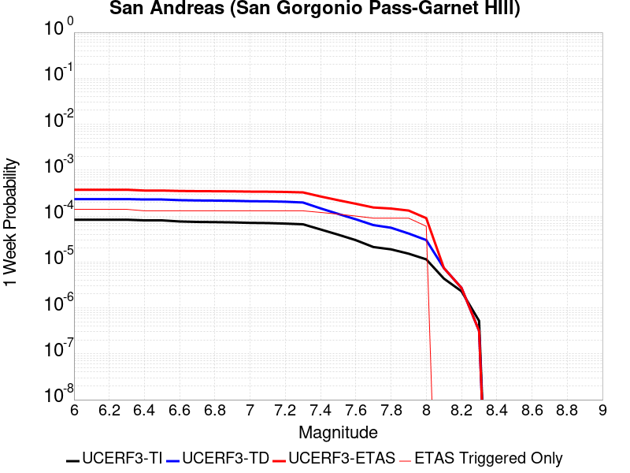 |  |  |  |

| Magnitude | 1 wk TI Prob | 1 wk TD Prob | 1 wk ETAS Prob | 1 wk ETAS/TD Gain | 1 wk ETAS Triggered Only | 1 mo TI Prob | 1 mo TD Prob | 1 mo ETAS Prob | 1 mo ETAS/TD Gain | 1 mo ETAS Triggered Only | 1 yr TI Prob | 1 yr TD Prob | 1 yr ETAS Prob | 1 yr ETAS/TD Gain | 1 yr ETAS Triggered Only | 10 yr TI Prob | 10 yr TD Prob | 10 yr ETAS Prob | 10 yr ETAS/TD Gain | 10 yr ETAS Triggered Only |
|-----|-----|-----|-----|-----|-----|-----|-----|-----|-----|-----|-----|-----|-----|-----|-----|-----|-----|-----|-----|-----|
| 6.0 | 8.31567E-5 | 2.3382473E-4 | 3.4504718E-4 | 1.4756658 | 1.1124845E-4 | 3.5633717E-4 | 0.0010017233 | 0.0011993003 | 1.197237 | 1.9777504E-4 | 0.004329778 | 0.012127888 | 0.012408742 | 1.0231577 | 2.843016E-4 | 0.042463828 | 0.11257892 | 0.11296284 | 1.0034103 | 4.326329E-4 |
| 6.1 | 8.31567E-5 | 2.3382473E-4 | 3.4504718E-4 | 1.4756658 | 1.1124845E-4 | 3.5633717E-4 | 0.0010017233 | 0.0011993003 | 1.197237 | 1.9777504E-4 | 0.004329778 | 0.012127888 | 0.012408742 | 1.0231577 | 2.843016E-4 | 0.042463828 | 0.11257892 | 0.11296284 | 1.0034103 | 4.326329E-4 |
| 6.2 | 8.31567E-5 | 2.3382473E-4 | 3.4504718E-4 | 1.4756658 | 1.1124845E-4 | 3.5633717E-4 | 0.0010017233 | 0.0011993003 | 1.197237 | 1.9777504E-4 | 0.004329778 | 0.012127888 | 0.012408742 | 1.0231577 | 2.843016E-4 | 0.042463828 | 0.11257892 | 0.11296284 | 1.0034103 | 4.326329E-4 |
| 6.3 | 8.31567E-5 | 2.3382473E-4 | 3.4504718E-4 | 1.4756658 | 1.1124845E-4 | 3.5633717E-4 | 0.0010017233 | 0.0011993003 | 1.197237 | 1.9777504E-4 | 0.004329778 | 0.012127888 | 0.012408742 | 1.0231577 | 2.843016E-4 | 0.042463828 | 0.11257892 | 0.11296284 | 1.0034103 | 4.326329E-4 |
| 6.4 | 8.059055E-5 | 2.2940808E-4 | 3.4063103E-4 | 1.4848257 | 1.1124845E-4 | 3.4534236E-4 | 9.828096E-4 | 0.0011803902 | 1.2010366 | 1.9777504E-4 | 0.0041964394 | 0.011900152 | 0.01218107 | 1.0236063 | 2.843016E-4 | 0.041180745 | 0.11056015 | 0.11094495 | 1.0034804 | 4.326329E-4 |
| 6.5 | 8.059055E-5 | 2.2940808E-4 | 3.4063103E-4 | 1.4848257 | 1.1124845E-4 | 3.4534236E-4 | 9.828096E-4 | 0.0011803902 | 1.2010366 | 1.9777504E-4 | 0.0041964394 | 0.011900152 | 0.01218107 | 1.0236063 | 2.843016E-4 | 0.041180745 | 0.11056015 | 0.11094495 | 1.0034804 | 4.326329E-4 |
| 6.6 | 7.619237E-5 | 2.218517E-4 | 3.3307547E-4 | 1.5013429 | 1.1124845E-4 | 3.2649786E-4 | 9.5044886E-4 | 0.001148036 | 1.2078881 | 1.9777504E-4 | 0.0039678677 | 0.01151087 | 0.011791899 | 1.0244142 | 2.843016E-4 | 0.03897764 | 0.10709683 | 0.107483126 | 1.003607 | 4.326329E-4 |
| 6.7 | 7.440636E-5 | 2.1860997E-4 | 3.298341E-4 | 1.5087789 | 1.1124845E-4 | 3.188454E-4 | 9.3656575E-4 | 0.0011341556 | 1.2109727 | 1.9777504E-4 | 0.0038750346 | 0.011343609 | 0.011624685 | 1.0247784 | 2.843016E-4 | 0.038081564 | 0.105605274 | 0.10599222 | 1.003664 | 4.326329E-4 |
| 6.8 | 7.3735864E-5 | 2.1708169E-4 | 3.28306E-4 | 1.5123615 | 1.1124845E-4 | 3.1597257E-4 | 9.3002064E-4 | 0.0011276117 | 1.2124588 | 1.9777504E-4 | 0.0038401815 | 0.011264749 | 0.011545848 | 1.0249538 | 2.843016E-4 | 0.03774495 | 0.10490683 | 0.10529407 | 1.0036913 | 4.326329E-4 |
| 6.9 | 7.27575E-5 | 2.1477141E-4 | 3.25996E-4 | 1.5178741 | 1.1124845E-4 | 3.117806E-4 | 9.201265E-4 | 0.0011177196 | 1.2147455 | 1.9777504E-4 | 0.003789323 | 0.011145527 | 0.011426659 | 1.0252239 | 2.843016E-4 | 0.037253562 | 0.103854746 | 0.104242444 | 1.0037332 | 4.326329E-4 |
| 7.0 | 7.102591E-5 | 2.1061185E-4 | 3.2183688E-4 | 1.5281043 | 1.1124845E-4 | 3.0436125E-4 | 9.023122E-4 | 0.0010999087 | 1.2189891 | 1.9777504E-4 | 0.003699303 | 0.010930831 | 0.011212025 | 1.0257249 | 2.843016E-4 | 0.03638325 | 0.10195695 | 0.10233437 | 1.0037018 | 4.2027194E-4 |
| 7.1 | 7.028513E-5 | 2.0896831E-4 | 3.2019353E-4 | 1.5322587 | 1.1124845E-4 | 3.0118722E-4 | 8.9527335E-4 | 0.0010805214 | 1.2069179 | 1.8541409E-4 | 0.0036607897 | 0.010845989 | 0.01111498 | 1.024801 | 2.7194066E-4 | 0.036010686 | 0.101199985 | 0.10156661 | 1.0036229 | 4.07911E-4 |
| 7.2 | 6.8498244E-5 | 2.0504706E-4 | 3.1627272E-4 | 1.5424396 | 1.1124845E-4 | 2.9353087E-4 | 8.784794E-4 | 0.0010637306 | 1.2108772 | 1.8541409E-4 | 0.003567883 | 0.010643536 | 0.010912582 | 1.0252779 | 2.7194066E-4 | 0.035111405 | 0.09939202 | 0.099759385 | 1.0036962 | 4.07911E-4 |
| 7.3 | 6.622592E-5 | 1.9732013E-4 | 3.0854662E-4 | 1.5636855 | 1.1124845E-4 | 2.8379448E-4 | 8.453858E-4 | 0.0010306431 | 1.2191395 | 1.8541409E-4 | 0.0034497243 | 0.0102444785 | 0.0105136335 | 1.0262731 | 2.7194066E-4 | 0.033966612 | 0.095888525 | 0.09625732 | 1.003846 | 4.07911E-4 |
| 7.4 | 5.1050705E-5 | 1.4689034E-4 | 2.5812245E-4 | 1.757246 | 1.1124845E-4 | 2.1877038E-4 | 6.29379E-4 | 8.146764E-4 | 1.2944131 | 1.8541409E-4 | 0.002660276 | 0.0076359594 | 0.007905824 | 1.0353413 | 2.7194066E-4 | 0.02628654 | 0.07286301 | 0.073229745 | 1.0050331 | 3.9555007E-4 |
| 7.5 | 3.9302922E-5 | 1.1129847E-4 | 2.2253454E-4 | 1.9994394 | 1.1124845E-4 | 1.6843023E-4 | 4.7690657E-4 | 6.622322E-4 | 1.3885995 | 1.8541409E-4 | 0.0020487092 | 0.005790949 | 0.0060613146 | 1.0466877 | 2.7194066E-4 | 0.020299247 | 0.05600951 | 0.056382906 | 1.0066667 | 3.9555007E-4 |
| 7.6 | 2.9851626E-5 | 8.4949745E-5 | 1.9618875E-4 | 2.3094685 | 1.1124845E-4 | 1.2792926E-4 | 3.6401965E-4 | 5.4936623E-4 | 1.5091665 | 1.8541409E-4 | 0.0015564259 | 0.0044229585 | 0.0046936963 | 1.061212 | 2.7194066E-4 | 0.0154556995 | 0.04319374 | 0.043572202 | 1.008762 | 3.9555007E-4 |
| 7.7 | 2.1135214E-5 | 6.3529005E-5 | 1.6241023E-4 | 2.556474 | 9.888752E-5 | 9.0576345E-5 | 2.7223877E-4 | 4.452448E-4 | 1.6354938 | 1.7305315E-4 | 0.0011022091 | 0.0033094748 | 0.0035558755 | 1.0744531 | 2.472188E-4 | 0.010967582 | 0.032582592 | 0.032941338 | 1.0110103 | 3.7082817E-4 |
| 7.8 | 1.883379E-5 | 5.564028E-5 | 1.5452229E-4 | 2.777166 | 9.888752E-5 | 8.0713755E-5 | 2.3843657E-4 | 4.1144845E-4 | 1.7256098 | 1.7305315E-4 | 9.822468E-4 | 0.0028991038 | 0.003145606 | 1.085027 | 2.472188E-4 | 0.0097791655 | 0.028695205 | 0.029055392 | 1.0125521 | 3.7082817E-4 |
| 7.9 | 1.5156185E-5 | 4.1658426E-5 | 1.4054182E-4 | 3.373671 | 9.888752E-5 | 6.495346E-5 | 1.785239E-4 | 3.5154616E-4 | 1.9691826 | 1.7305315E-4 | 7.9052144E-4 | 0.0021713632 | 0.002405711 | 1.1079266 | 2.3485786E-4 | 0.007877152 | 0.021759422 | 0.02211009 | 1.0161157 | 3.5846725E-4 |
| 8.0 | 1.1405907E-5 | 2.9974231E-5 | 1.04137645E-4 | 3.474239 | 7.416563E-5 | 4.8881542E-5 | 1.2845467E-4 | 2.520482E-4 | 1.9621567 | 1.236094E-4 | 5.9497025E-4 | 0.0015628147 | 0.0017479389 | 1.1184558 | 1.8541409E-4 | 0.005933798 | 0.015772851 | 0.016028335 | 1.0161978 | 2.5957974E-4 |
| 8.1 | 4.3511436E-6 | 7.369219E-6 | 7.369219E-6 | 1.0 | 0.0 | 1.8647626E-5 | 3.1581985E-5 | 3.1581985E-5 | 1.0 | 0.0 | 2.2701119E-4 | 3.8444297E-4 | 3.8444297E-4 | 1.0 | 0.0 | 0.0022677942 | 0.0041163345 | 0.0041163345 | 1.0 | 0.0 |
| 8.2 | 2.3042528E-6 | 2.7329415E-6 | 2.7329415E-6 | 1.0 | 0.0 | 9.875332E-6 | 1.1712554E-5 | 1.1712554E-5 | 1.0 | 0.0 | 1.2022553E-4 | 1.4259106E-4 | 1.4259106E-4 | 1.0 | 0.0 | 0.0012016051 | 0.0015979785 | 0.0015979785 | 1.0 | 0.0 |
| 8.3 | 5.202968E-7 | 3.1598344E-7 | 3.1598344E-7 | 1.0 | 0.0 | 2.2298414E-6 | 1.3542141E-6 | 1.3542141E-6 | 1.0 | 0.0 | 2.714798E-5 | 1.6487444E-5 | 1.6487444E-5 | 1.0 | 0.0 | 2.7144665E-4 | 1.9563142E-4 | 1.9563142E-4 | 1.0 | 0.0 |

## San Andreas (Carrizo) rev
*[(top)](#table-of-contents)*

| 1 Week | 1 Month | 1 Year | 10 Year |
|-----|-----|-----|-----|
|  |  | 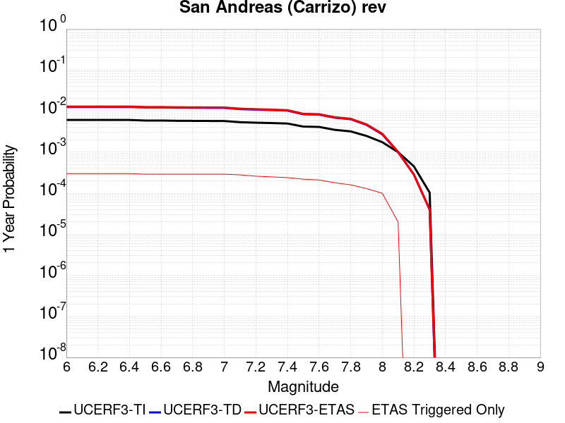 |  |

| Magnitude | 1 wk TI Prob | 1 wk TD Prob | 1 wk ETAS Prob | 1 wk ETAS/TD Gain | 1 wk ETAS Triggered Only | 1 mo TI Prob | 1 mo TD Prob | 1 mo ETAS Prob | 1 mo ETAS/TD Gain | 1 mo ETAS Triggered Only | 1 yr TI Prob | 1 yr TD Prob | 1 yr ETAS Prob | 1 yr ETAS/TD Gain | 1 yr ETAS Triggered Only | 10 yr TI Prob | 10 yr TD Prob | 10 yr ETAS Prob | 10 yr ETAS/TD Gain | 10 yr ETAS Triggered Only |
|-----|-----|-----|-----|-----|-----|-----|-----|-----|-----|-----|-----|-----|-----|-----|-----|-----|-----|-----|-----|-----|
| 6.0 | 1.1674632E-4 | 2.432302E-4 | 4.0388334E-4 | 1.6604983 | 1.6069222E-4 | 5.002454E-4 | 0.0010420004 | 0.0012395693 | 1.1896055 | 1.9777504E-4 | 0.006073493 | 0.012613042 | 0.012918168 | 1.0241913 | 3.0902348E-4 | 0.0591016 | 0.12061418 | 0.12098376 | 1.0030642 | 4.2027194E-4 |
| 6.1 | 1.1674632E-4 | 2.432302E-4 | 4.0388334E-4 | 1.6604983 | 1.6069222E-4 | 5.002454E-4 | 0.0010420004 | 0.0012395693 | 1.1896055 | 1.9777504E-4 | 0.006073493 | 0.012613042 | 0.012918168 | 1.0241913 | 3.0902348E-4 | 0.0591016 | 0.12061418 | 0.12098376 | 1.0030642 | 4.2027194E-4 |
| 6.2 | 1.1674632E-4 | 2.432302E-4 | 4.0388334E-4 | 1.6604983 | 1.6069222E-4 | 5.002454E-4 | 0.0010420004 | 0.0012395693 | 1.1896055 | 1.9777504E-4 | 0.006073493 | 0.012613042 | 0.012918168 | 1.0241913 | 3.0902348E-4 | 0.0591016 | 0.12061418 | 0.12098376 | 1.0030642 | 4.2027194E-4 |
| 6.3 | 1.1674632E-4 | 2.432302E-4 | 4.0388334E-4 | 1.6604983 | 1.6069222E-4 | 5.002454E-4 | 0.0010420004 | 0.0012395693 | 1.1896055 | 1.9777504E-4 | 0.006073493 | 0.012613042 | 0.012918168 | 1.0241913 | 3.0902348E-4 | 0.0591016 | 0.12061418 | 0.12098376 | 1.0030642 | 4.2027194E-4 |
| 6.4 | 1.1674632E-4 | 2.432302E-4 | 4.0388334E-4 | 1.6604983 | 1.6069222E-4 | 5.002454E-4 | 0.0010420004 | 0.0012395693 | 1.1896055 | 1.9777504E-4 | 0.006073493 | 0.012613042 | 0.012918168 | 1.0241913 | 3.0902348E-4 | 0.0591016 | 0.12061418 | 0.12098376 | 1.0030642 | 4.2027194E-4 |
| 6.5 | 1.13136164E-4 | 2.3643032E-4 | 3.8472653E-4 | 1.62723 | 1.4833127E-4 | 4.847792E-4 | 0.0010128808 | 0.0011981071 | 1.1828707 | 1.8541409E-4 | 0.0058862255 | 0.012262545 | 0.0125555685 | 1.0238959 | 2.9666253E-4 | 0.057327334 | 0.117585555 | 0.1179455 | 1.0030612 | 4.07911E-4 |
| 6.6 | 1.13136164E-4 | 2.3643032E-4 | 3.8472653E-4 | 1.62723 | 1.4833127E-4 | 4.847792E-4 | 0.0010128808 | 0.0011981071 | 1.1828707 | 1.8541409E-4 | 0.0058862255 | 0.012262545 | 0.0125555685 | 1.0238959 | 2.9666253E-4 | 0.057327334 | 0.117585555 | 0.1179455 | 1.0030612 | 4.07911E-4 |
| 6.7 | 1.1149675E-4 | 2.3334254E-4 | 3.816392E-4 | 1.635532 | 1.4833127E-4 | 4.777557E-4 | 9.996577E-4 | 0.0011848864 | 1.1852921 | 1.8541409E-4 | 0.0058011734 | 0.012103349 | 0.012396421 | 1.0242141 | 2.9666253E-4 | 0.05652051 | 0.1162071 | 0.11656761 | 1.0031023 | 4.07911E-4 |
| 6.8 | 1.1103589E-4 | 2.3236412E-4 | 3.8066093E-4 | 1.6382087 | 1.4833127E-4 | 4.7578133E-4 | 9.954676E-4 | 0.0011806972 | 1.1860728 | 1.8541409E-4 | 0.005777263 | 0.012052901 | 0.012345988 | 1.0243167 | 2.9666253E-4 | 0.056293584 | 0.1157674 | 0.11612809 | 1.0031157 | 4.07911E-4 |
| 6.9 | 1.1053259E-4 | 2.3128795E-4 | 3.795849E-4 | 1.641179 | 1.4833127E-4 | 4.7362508E-4 | 9.90859E-4 | 0.0011760894 | 1.1869391 | 1.8541409E-4 | 0.0057511497 | 0.01199741 | 0.012290514 | 1.0244305 | 2.9666253E-4 | 0.05604569 | 0.11528359 | 0.11564448 | 1.0031304 | 4.07911E-4 |
| 7.0 | 1.1005377E-4 | 2.3029637E-4 | 3.7859348E-4 | 1.6439403 | 1.4833127E-4 | 4.7157376E-4 | 9.866126E-4 | 0.0011718438 | 1.1877446 | 1.8541409E-4 | 0.0057263062 | 0.011946279 | 0.0122393975 | 1.0245364 | 2.9666253E-4 | 0.055809796 | 0.11483591 | 0.11519698 | 1.0031443 | 4.07911E-4 |
| 7.1 | 1.0308142E-4 | 2.1539345E-4 | 3.513345E-4 | 1.631129 | 1.3597033E-4 | 4.417027E-4 | 9.227892E-4 | 0.0010956827 | 1.1873597 | 1.7305315E-4 | 0.0053644776 | 0.011177397 | 0.011458522 | 1.0251511 | 2.843016E-4 | 0.052368138 | 0.108092256 | 0.10844505 | 1.0032638 | 3.9555007E-4 |
| 7.2 | 1.0027479E-4 | 2.094724E-4 | 3.4541427E-4 | 1.6489726 | 1.3597033E-4 | 4.296783E-4 | 8.9743105E-4 | 0.0010703289 | 1.1926587 | 1.7305315E-4 | 0.0052187922 | 0.010871782 | 0.011140767 | 1.0247415 | 2.7194066E-4 | 0.050979212 | 0.10539625 | 0.10573905 | 1.0032525 | 3.8318912E-4 |
| 7.3 | 9.816942E-5 | 2.0422463E-4 | 3.401672E-4 | 1.6656522 | 1.3597033E-4 | 4.2065824E-4 | 8.7495585E-4 | 0.0010355074 | 1.1834968 | 1.6069222E-4 | 0.005109493 | 0.010600842 | 0.01085767 | 1.0242271 | 2.5957974E-4 | 0.049935985 | 0.102979995 | 0.10331264 | 1.0032301 | 3.7082817E-4 |
| 7.4 | 9.5634205E-5 | 1.9791997E-4 | 3.215049E-4 | 1.6244187 | 1.236094E-4 | 4.0979648E-4 | 8.479536E-4 | 9.961592E-4 | 1.1747802 | 1.4833127E-4 | 0.0049778637 | 0.010275229 | 0.010519908 | 1.0238124 | 2.472188E-4 | 0.048678253 | 0.10006632 | 0.10037779 | 1.0031127 | 3.461063E-4 |
| 7.5 | 8.052417E-5 | 1.611261E-4 | 2.723566E-4 | 1.6903322 | 1.1124845E-4 | 3.4505792E-4 | 6.903579E-4 | 8.262343E-4 | 1.1968204 | 1.3597033E-4 | 0.0041929903 | 0.008372796 | 0.00859343 | 1.0263513 | 2.224969E-4 | 0.04114753 | 0.08281049 | 0.08309393 | 1.0034226 | 3.0902348E-4 |
| 7.6 | 7.897024E-5 | 1.5765853E-4 | 2.6888945E-4 | 1.7055179 | 1.1124845E-4 | 3.384E-4 | 6.755046E-4 | 8.113831E-4 | 1.2011511 | 1.3597033E-4 | 0.0041122385 | 0.008193332 | 0.008401746 | 1.0254371 | 2.1013597E-4 | 0.040369697 | 0.08115171 | 0.081424296 | 1.003359 | 2.9666253E-4 |
| 7.7 | 6.707427E-5 | 1.3276102E-4 | 2.1927612E-4 | 1.6516603 | 8.6526576E-5 | 2.8742946E-4 | 5.688518E-4 | 6.8003696E-4 | 1.1954554 | 1.1124845E-4 | 0.003493839 | 0.00690381 | 0.007087944 | 1.0266714 | 1.8541409E-4 | 0.034394164 | 0.069048055 | 0.069289714 | 1.0034999 | 2.5957974E-4 |
| 7.8 | 6.147705E-5 | 1.2197486E-4 | 2.0849088E-4 | 1.7092938 | 8.6526576E-5 | 2.6344648E-4 | 5.226447E-4 | 6.3383504E-4 | 1.2127455 | 1.1124845E-4 | 0.0032027436 | 0.006344659 | 0.006516614 | 1.0271024 | 1.7305315E-4 | 0.031569764 | 0.06351457 | 0.06373451 | 1.0034628 | 2.3485786E-4 |
| 7.9 | 4.7636717E-5 | 8.87977E-5 | 1.753166E-4 | 1.9743371 | 8.6526576E-5 | 2.0414138E-4 | 3.8050607E-4 | 4.917122E-4 | 1.2922585 | 1.1124845E-4 | 0.0024825884 | 0.0046228287 | 0.004770474 | 1.0319383 | 1.4833127E-4 | 0.024550365 | 0.046628095 | 0.046793077 | 1.0035383 | 1.7305315E-4 |
| 8.0 | 3.3554235E-5 | 5.2136907E-5 | 1.2629868E-4 | 2.4224427 | 7.416563E-5 | 1.4379594E-4 | 2.2342477E-4 | 3.222902E-4 | 1.4424999 | 9.888752E-5 | 0.0017493097 | 0.002716805 | 0.0028400787 | 1.0453745 | 1.236094E-4 | 0.017356034 | 0.027880952 | 0.028013133 | 1.0047408 | 1.3597033E-4 |
| 8.1 | 1.9175432E-5 | 1.9184976E-5 | 4.390638E-5 | 2.2885816 | 2.472188E-5 | 8.217783E-5 | 8.2218736E-5 | 1.0693858E-4 | 1.3006595 | 2.472188E-5 | 0.0010000558 | 0.0010005541 | 0.0010252512 | 1.0246835 | 2.472188E-5 | 0.009955673 | 0.0107580265 | 0.010782483 | 1.0022733 | 2.472188E-5 |
| 8.2 | 8.643924E-6 | 5.4748625E-6 | 5.4748625E-6 | 1.0 | 0.0 | 3.704486E-5 | 2.3463486E-5 | 2.3463486E-5 | 1.0 | 0.0 | 4.5092785E-4 | 2.8563058E-4 | 2.8563058E-4 | 1.0 | 0.0 | 0.0045001395 | 0.0032487072 | 0.0032487072 | 1.0 | 0.0 |
| 8.3 | 1.983087E-6 | 7.6599065E-7 | 7.6599065E-7 | 1.0 | 0.0 | 8.498917E-6 | 3.282813E-6 | 3.282813E-6 | 1.0 | 0.0 | 1.034694E-4 | 3.9967534E-5 | 3.9967534E-5 | 1.0 | 0.0 | 0.0010342124 | 4.719687E-4 | 4.719687E-4 | 1.0 | 0.0 |

## San Andreas (Cholame) rev
*[(top)](#table-of-contents)*

| 1 Week | 1 Month | 1 Year | 10 Year |
|-----|-----|-----|-----|
|  |  |  |  |

| Magnitude | 1 wk TI Prob | 1 wk TD Prob | 1 wk ETAS Prob | 1 wk ETAS/TD Gain | 1 wk ETAS Triggered Only | 1 mo TI Prob | 1 mo TD Prob | 1 mo ETAS Prob | 1 mo ETAS/TD Gain | 1 mo ETAS Triggered Only | 1 yr TI Prob | 1 yr TD Prob | 1 yr ETAS Prob | 1 yr ETAS/TD Gain | 1 yr ETAS Triggered Only | 10 yr TI Prob | 10 yr TD Prob | 10 yr ETAS Prob | 10 yr ETAS/TD Gain | 10 yr ETAS Triggered Only |
|-----|-----|-----|-----|-----|-----|-----|-----|-----|-----|-----|-----|-----|-----|-----|-----|-----|-----|-----|-----|-----|
| 6.0 | 1.2302514E-4 | 2.5204287E-4 | 4.126946E-4 | 1.6373984 | 1.6069222E-4 | 5.27144E-4 | 0.0010797381 | 0.0012772997 | 1.1829716 | 1.9777504E-4 | 0.0063991086 | 0.0130670825 | 0.013359869 | 1.0224063 | 2.9666253E-4 | 0.06217949 | 0.12439073 | 0.124747895 | 1.0028714 | 4.07911E-4 |
| 6.1 | 1.2302514E-4 | 2.5204287E-4 | 4.126946E-4 | 1.6373984 | 1.6069222E-4 | 5.27144E-4 | 0.0010797381 | 0.0012772997 | 1.1829716 | 1.9777504E-4 | 0.0063991086 | 0.0130670825 | 0.013359869 | 1.0224063 | 2.9666253E-4 | 0.06217949 | 0.12439073 | 0.124747895 | 1.0028714 | 4.07911E-4 |
| 6.2 | 1.2203569E-4 | 2.5021084E-4 | 4.1086285E-4 | 1.6420665 | 1.6069222E-4 | 5.2290526E-4 | 0.0010718931 | 0.0012694561 | 1.1843122 | 1.9777504E-4 | 0.006347804 | 0.01297271 | 0.013265524 | 1.0225716 | 2.9666253E-4 | 0.061695136 | 0.12357691 | 0.12393441 | 1.002893 | 4.07911E-4 |
| 6.3 | 1.2142645E-4 | 2.4907055E-4 | 4.0972274E-4 | 1.6450068 | 1.6069222E-4 | 5.202953E-4 | 0.0010670102 | 0.0012645742 | 1.1851566 | 1.9777504E-4 | 0.006316212 | 0.012913967 | 0.013206799 | 1.0226755 | 2.9666253E-4 | 0.06139677 | 0.12307103 | 0.12342874 | 1.0029066 | 4.07911E-4 |
| 6.4 | 1.1865206E-4 | 2.44126E-4 | 4.0477898E-4 | 1.658074 | 1.6069222E-4 | 5.0840975E-4 | 0.0010458364 | 0.0012434046 | 1.1889093 | 1.9777504E-4 | 0.006172335 | 0.012659196 | 0.012952103 | 1.0231379 | 2.9666253E-4 | 0.060036868 | 0.1208638 | 0.121222414 | 1.002967 | 4.07911E-4 |
| 6.5 | 1.17443946E-4 | 2.4205919E-4 | 4.027125E-4 | 1.6636944 | 1.6069222E-4 | 5.032341E-4 | 0.0010369857 | 0.0012345556 | 1.1905233 | 1.9777504E-4 | 0.006109677 | 0.012552682 | 0.012845621 | 1.0233368 | 2.9666253E-4 | 0.059444077 | 0.11993805 | 0.12029704 | 1.0029931 | 4.07911E-4 |
| 6.6 | 1.13579066E-4 | 2.3514954E-4 | 3.8344593E-4 | 1.6306472 | 1.4833127E-4 | 4.866766E-4 | 0.001007396 | 0.0011926233 | 1.1838675 | 1.8541409E-4 | 0.0059092017 | 0.012196515 | 0.012465139 | 1.0220246 | 2.7194066E-4 | 0.057545185 | 0.11685214 | 0.117190555 | 1.0028961 | 3.8318912E-4 |
| 6.7 | 1.1271412E-4 | 2.3359268E-4 | 3.8188932E-4 | 1.6348513 | 1.4833127E-4 | 4.829711E-4 | 0.0010007289 | 0.0011859575 | 1.1850936 | 1.8541409E-4 | 0.005864331 | 0.012116249 | 0.012384894 | 1.0221723 | 2.7194066E-4 | 0.057119697 | 0.116155714 | 0.116494395 | 1.0029157 | 3.8318912E-4 |
| 6.8 | 1.1217975E-4 | 2.3247694E-4 | 3.8077374E-4 | 1.6378989 | 1.4833127E-4 | 4.8068175E-4 | 9.959509E-4 | 0.0011811802 | 1.1859825 | 1.8541409E-4 | 0.005836608 | 0.012058721 | 0.012327382 | 1.0222794 | 2.7194066E-4 | 0.056856725 | 0.11565396 | 0.11599284 | 1.00293 | 3.8318912E-4 |
| 6.9 | 1.1146753E-4 | 2.3096445E-4 | 3.7926147E-4 | 1.6420772 | 1.4833127E-4 | 4.7763053E-4 | 9.894737E-4 | 0.0011747043 | 1.1872011 | 1.8541409E-4 | 0.0057996577 | 0.011980731 | 0.012249414 | 1.0224262 | 2.7194066E-4 | 0.056506127 | 0.11497439 | 0.11531352 | 1.0029496 | 3.8318912E-4 |
| 7.0 | 1.0965793E-4 | 2.2719789E-4 | 3.7549547E-4 | 1.6527243 | 1.4833127E-4 | 4.698779E-4 | 9.733434E-4 | 0.001158577 | 1.1903065 | 1.8541409E-4 | 0.005705768 | 0.011786487 | 0.012055222 | 1.0228003 | 2.7194066E-4 | 0.055614736 | 0.11327597 | 0.11361575 | 1.0029995 | 3.8318912E-4 |
| 7.1 | 9.927982E-5 | 2.0538924E-4 | 3.4133164E-4 | 1.661877 | 1.3597033E-4 | 4.2541555E-4 | 8.7994366E-4 | 0.0010528446 | 1.1964909 | 1.7305315E-4 | 0.0051671406 | 0.010660981 | 0.010917793 | 1.024089 | 2.5957974E-4 | 0.05048634 | 0.1033706 | 0.10368093 | 1.003002 | 3.461063E-4 |
| 7.2 | 9.696786E-5 | 2.0043184E-4 | 3.363749E-4 | 1.6782509 | 1.3597033E-4 | 4.1551032E-4 | 8.5871184E-4 | 0.0010316164 | 1.2013534 | 1.7305315E-4 | 0.00504711 | 0.010404981 | 0.010661859 | 1.024688 | 2.5957974E-4 | 0.04934009 | 0.1011086 | 0.10141971 | 1.003077 | 3.461063E-4 |
| 7.3 | 9.4727984E-5 | 1.9472468E-4 | 3.3066855E-4 | 1.6981337 | 1.3597033E-4 | 4.0591392E-4 | 8.3426846E-4 | 9.948266E-4 | 1.1924539 | 1.6069222E-4 | 0.0049308087 | 0.010110183 | 0.010354902 | 1.0242052 | 2.472188E-4 | 0.048228268 | 0.09847952 | 0.09878039 | 1.0030552 | 3.3374535E-4 |
| 7.4 | 9.220358E-5 | 1.8843076E-4 | 3.1201687E-4 | 1.6558701 | 1.236094E-4 | 3.9509835E-4 | 8.073114E-4 | 9.555229E-4 | 1.1835866 | 1.4833127E-4 | 0.004799717 | 0.009784967 | 0.010017526 | 1.023767 | 2.3485786E-4 | 0.046973653 | 0.095557496 | 0.09584817 | 1.0030419 | 3.2138443E-4 |
| 7.5 | 7.71631E-5 | 1.5177966E-4 | 2.6301123E-4 | 1.732849 | 1.1124845E-4 | 3.306571E-4 | 6.503223E-4 | 7.862042E-4 | 1.2089455 | 1.3597033E-4 | 0.0040183207 | 0.007889002 | 0.008097479 | 1.0264264 | 2.1013597E-4 | 0.03946433 | 0.07828531 | 0.07854735 | 1.0033473 | 2.843016E-4 |
| 7.6 | 7.5634416E-5 | 1.483744E-4 | 2.5960634E-4 | 1.7496707 | 1.1124845E-4 | 3.241072E-4 | 6.3573546E-4 | 7.716194E-4 | 1.2137429 | 1.3597033E-4 | 0.0039388672 | 0.0077126776 | 0.007908927 | 1.0254451 | 1.9777504E-4 | 0.038697794 | 0.07664872 | 0.07689982 | 1.003276 | 2.7194066E-4 |
| 7.7 | 6.3783E-5 | 1.235872E-4 | 2.1010308E-4 | 1.7000391 | 8.6526576E-5 | 2.7332708E-4 | 5.29552E-4 | 6.4074155E-4 | 1.209969 | 1.1124845E-4 | 0.0033226798 | 0.0064282627 | 0.0066002035 | 1.0267476 | 1.7305315E-4 | 0.032734364 | 0.06454029 | 0.06475999 | 1.003404 | 2.3485786E-4 |
| 7.8 | 5.863422E-5 | 1.1416107E-4 | 2.0067776E-4 | 1.7578477 | 8.6526576E-5 | 2.512653E-4 | 4.8917E-4 | 6.0036406E-4 | 1.2273116 | 1.1124845E-4 | 0.003054864 | 0.0059394026 | 0.006111428 | 1.0289634 | 1.7305315E-4 | 0.030132094 | 0.059659187 | 0.05986841 | 1.003507 | 2.224969E-4 |
| 7.9 | 4.595283E-5 | 8.426331E-5 | 1.707826E-4 | 2.026773 | 8.6526576E-5 | 1.9692584E-4 | 3.610785E-4 | 4.722868E-4 | 1.3079892 | 1.1124845E-4 | 0.0023949358 | 0.0043872762 | 0.0045349565 | 1.0336611 | 1.4833127E-4 | 0.023692891 | 0.044362005 | 0.04451557 | 1.0034616 | 1.6069222E-4 |
| 8.0 | 3.2950178E-5 | 5.0772942E-5 | 1.2493481E-4 | 2.4606574 | 7.416563E-5 | 1.412074E-4 | 2.1758018E-4 | 3.1644618E-4 | 1.4543889 | 9.888752E-5 | 0.0017178444 | 0.0026458222 | 0.0027691047 | 1.0465951 | 1.236094E-4 | 0.017046256 | 0.027180137 | 0.027312411 | 1.0048666 | 1.3597033E-4 |
| 8.1 | 1.9177472E-5 | 1.9185145E-5 | 4.390655E-5 | 2.2885702 | 2.472188E-5 | 8.218658E-5 | 8.221946E-5 | 1.0693931E-4 | 1.3006569 | 2.472188E-5 | 0.0010001622 | 0.0010005629 | 0.0010252601 | 1.0246832 | 2.472188E-5 | 0.009956728 | 0.010758142 | 0.0107825985 | 1.0022732 | 2.472188E-5 |
| 8.2 | 8.643924E-6 | 5.4748625E-6 | 5.4748625E-6 | 1.0 | 0.0 | 3.704486E-5 | 2.3463486E-5 | 2.3463486E-5 | 1.0 | 0.0 | 4.5092785E-4 | 2.8563058E-4 | 2.8563058E-4 | 1.0 | 0.0 | 0.0045001395 | 0.0032487072 | 0.0032487072 | 1.0 | 0.0 |
| 8.3 | 1.983087E-6 | 7.6599065E-7 | 7.6599065E-7 | 1.0 | 0.0 | 8.498917E-6 | 3.282813E-6 | 3.282813E-6 | 1.0 | 0.0 | 1.034694E-4 | 3.9967534E-5 | 3.9967534E-5 | 1.0 | 0.0 | 0.0010342124 | 4.719687E-4 | 4.719687E-4 | 1.0 | 0.0 |

## Ludlow
*[(top)](#table-of-contents)*

| 1 Week | 1 Month | 1 Year | 10 Year |
|-----|-----|-----|-----|
|  |  |  |  |

| Magnitude | 1 wk TI Prob | 1 wk TD Prob | 1 wk ETAS Prob | 1 wk ETAS/TD Gain | 1 wk ETAS Triggered Only | 1 mo TI Prob | 1 mo TD Prob | 1 mo ETAS Prob | 1 mo ETAS/TD Gain | 1 mo ETAS Triggered Only | 1 yr TI Prob | 1 yr TD Prob | 1 yr ETAS Prob | 1 yr ETAS/TD Gain | 1 yr ETAS Triggered Only | 10 yr TI Prob | 10 yr TD Prob | 10 yr ETAS Prob | 10 yr ETAS/TD Gain | 10 yr ETAS Triggered Only |
|-----|-----|-----|-----|-----|-----|-----|-----|-----|-----|-----|-----|-----|-----|-----|-----|-----|-----|-----|-----|-----|
| 6.0 | 2.2407607E-5 | 2.3657254E-5 | 1.7198501E-4 | 7.269864 | 1.4833127E-4 | 9.602906E-5 | 1.0138454E-4 | 2.8677983E-4 | 2.8286347 | 1.8541409E-4 | 0.0011685267 | 0.001233702 | 0.0015423442 | 1.2501757 | 3.0902348E-4 | 0.011624013 | 0.012273042 | 0.012651528 | 1.0308388 | 3.8318912E-4 |
| 6.1 | 2.2407607E-5 | 2.3657254E-5 | 1.7198501E-4 | 7.269864 | 1.4833127E-4 | 9.602906E-5 | 1.0138454E-4 | 2.8677983E-4 | 2.8286347 | 1.8541409E-4 | 0.0011685267 | 0.001233702 | 0.0015423442 | 1.2501757 | 3.0902348E-4 | 0.011624013 | 0.012273042 | 0.012651528 | 1.0308388 | 3.8318912E-4 |
| 6.2 | 1.0781252E-5 | 1.1365663E-5 | 9.789126E-5 | 8.612894 | 8.6526576E-5 | 4.620455E-5 | 4.8709102E-5 | 1.3523146E-4 | 2.7763078 | 8.6526576E-5 | 5.623952E-4 | 5.9287593E-4 | 7.534729E-4 | 1.2708778 | 1.6069222E-4 | 0.00560974 | 0.0059133614 | 0.006097679 | 1.0311697 | 1.8541409E-4 |
| 6.3 | 1.0781252E-5 | 1.1365663E-5 | 9.789126E-5 | 8.612894 | 8.6526576E-5 | 4.620455E-5 | 4.8709102E-5 | 1.3523146E-4 | 2.7763078 | 8.6526576E-5 | 5.623952E-4 | 5.9287593E-4 | 7.534729E-4 | 1.2708778 | 1.6069222E-4 | 0.00560974 | 0.0059133614 | 0.006097679 | 1.0311697 | 1.8541409E-4 |
| 6.4 | 7.814439E-6 | 8.237729E-6 | 4.532024E-5 | 5.501546 | 3.7082817E-5 | 3.3490025E-5 | 3.530408E-5 | 7.238559E-5 | 2.0503461 | 3.7082817E-5 | 4.0766477E-4 | 4.2974384E-4 | 4.9152196E-4 | 1.1437557 | 6.18047E-5 | 0.0040691774 | 0.0042892746 | 0.00437543 | 1.0200863 | 8.6526576E-5 |
| 6.5 | 6.4986366E-6 | 6.85092E-6 | 4.3933484E-5 | 6.4127865 | 3.7082817E-5 | 2.7851002E-5 | 2.9360759E-5 | 6.644249E-5 | 2.262969 | 3.7082817E-5 | 3.390332E-4 | 3.5740953E-4 | 4.1919213E-4 | 1.1728622 | 6.18047E-5 | 0.003385164 | 0.0035684432 | 0.0036423441 | 1.0207096 | 7.416563E-5 |
| 6.6 | 5.582177E-6 | 5.8860055E-6 | 3.0607738E-5 | 5.2000866 | 2.472188E-5 | 2.3923398E-5 | 2.5225498E-5 | 4.9946753E-5 | 1.9800106 | 2.472188E-5 | 2.9122844E-4 | 3.0707786E-4 | 3.5650644E-4 | 1.1609643 | 4.944376E-5 | 0.0029084706 | 0.003066609 | 0.003115901 | 1.0160738 | 4.944376E-5 |
| 6.7 | 4.6858763E-6 | 4.940427E-6 | 2.9662184E-5 | 6.0039716 | 2.472188E-5 | 2.0082172E-5 | 2.1173091E-5 | 4.5894445E-5 | 2.1675837 | 2.472188E-5 | 2.4447302E-4 | 2.5775246E-4 | 3.0718345E-4 | 1.1917771 | 4.944376E-5 | 0.0024420423 | 0.0025745912 | 0.0026239078 | 1.019155 | 4.944376E-5 |
| 6.8 | 3.5584908E-6 | 3.7520183E-6 | 1.6112912E-5 | 4.294465 | 1.236094E-5 | 1.5250586E-5 | 1.6079981E-5 | 2.8440723E-5 | 1.7687037 | 1.236094E-5 | 1.8566006E-4 | 1.957566E-4 | 2.3283216E-4 | 1.1893963 | 3.7082817E-5 | 0.0018550502 | 0.0019558826 | 0.001992893 | 1.0189226 | 3.7082817E-5 |
| 6.9 | 2.532834E-6 | 2.6710034E-6 | 1.503191E-5 | 5.627814 | 1.236094E-5 | 1.0854958E-5 | 1.1447109E-5 | 2.3807906E-5 | 2.0798182 | 1.236094E-5 | 1.3215111E-4 | 1.3935992E-4 | 1.6407834E-4 | 1.1773711 | 2.472188E-5 | 0.0013207254 | 0.0013927529 | 0.0014174402 | 1.0177257 | 2.472188E-5 |
| 7.0 | 1.7083285E-6 | 1.8019439E-6 | 1.8019439E-6 | 1.0 | 0.0 | 7.3213873E-6 | 7.722595E-6 | 7.722595E-6 | 1.0 | 0.0 | 8.913424E-5 | 9.40187E-5 | 1.0637848E-4 | 1.1314608 | 1.236094E-5 | 8.9098496E-4 | 9.3980576E-4 | 9.521551E-4 | 1.0131403 | 1.236094E-5 |
| 7.1 | 1.0905424E-6 | 1.1497619E-6 | 1.1497619E-6 | 1.0 | 0.0 | 4.6737446E-6 | 4.9275427E-6 | 4.9275427E-6 | 1.0 | 0.0 | 5.6901354E-5 | 5.999128E-5 | 7.2351475E-5 | 1.2060332 | 1.236094E-5 | 5.6886784E-4 | 5.997606E-4 | 6.1211415E-4 | 1.0205975 | 1.236094E-5 |
| 7.2 | 6.06668E-7 | 6.387277E-7 | 6.387277E-7 | 1.0 | 0.0 | 2.600003E-6 | 2.7374022E-6 | 2.7374022E-6 | 1.0 | 0.0 | 3.1654577E-5 | 3.3327433E-5 | 4.568796E-5 | 1.3708814 | 1.236094E-5 | 3.1650066E-4 | 3.3323118E-4 | 3.45588E-4 | 1.0370818 | 1.236094E-5 |

## Death Valley (Fish Lake Valley)
*[(top)](#table-of-contents)*

| 1 Week | 1 Month | 1 Year | 10 Year |
|-----|-----|-----|-----|
|  |  |  | 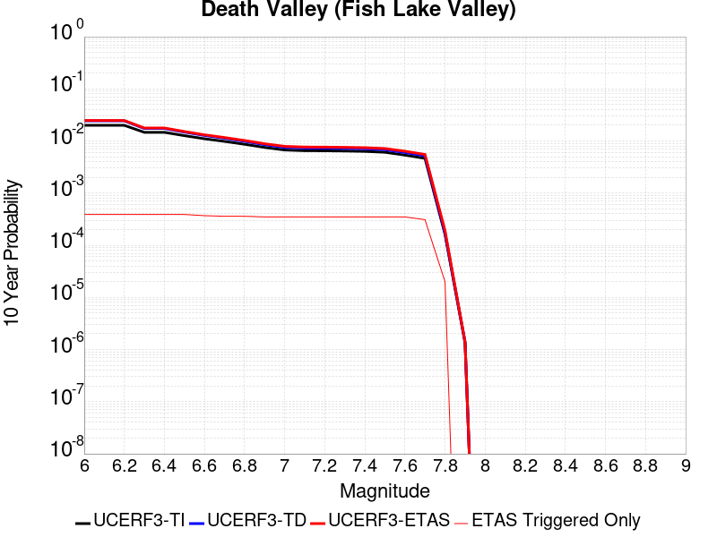 |

| Magnitude | 1 wk TI Prob | 1 wk TD Prob | 1 wk ETAS Prob | 1 wk ETAS/TD Gain | 1 wk ETAS Triggered Only | 1 mo TI Prob | 1 mo TD Prob | 1 mo ETAS Prob | 1 mo ETAS/TD Gain | 1 mo ETAS Triggered Only | 1 yr TI Prob | 1 yr TD Prob | 1 yr ETAS Prob | 1 yr ETAS/TD Gain | 1 yr ETAS Triggered Only | 10 yr TI Prob | 10 yr TD Prob | 10 yr ETAS Prob | 10 yr ETAS/TD Gain | 10 yr ETAS Triggered Only |
|-----|-----|-----|-----|-----|-----|-----|-----|-----|-----|-----|-----|-----|-----|-----|-----|-----|-----|-----|-----|-----|
| 6.0 | 3.872328E-5 | 4.7267473E-5 | 1.21429606E-4 | 2.5689888 | 7.416563E-5 | 1.6594635E-4 | 2.0256084E-4 | 3.6322052E-4 | 1.7931427 | 1.6069222E-4 | 0.0020185246 | 0.002463534 | 0.0027471352 | 1.1151197 | 2.843016E-4 | 0.02000288 | 0.024388181 | 0.024774084 | 1.0158234 | 3.9555007E-4 |
| 6.1 | 3.872328E-5 | 4.7267473E-5 | 1.21429606E-4 | 2.5689888 | 7.416563E-5 | 1.6594635E-4 | 2.0256084E-4 | 3.6322052E-4 | 1.7931427 | 1.6069222E-4 | 0.0020185246 | 0.002463534 | 0.0027471352 | 1.1151197 | 2.843016E-4 | 0.02000288 | 0.024388181 | 0.024774084 | 1.0158234 | 3.9555007E-4 |
| 6.2 | 3.872328E-5 | 4.7267473E-5 | 1.21429606E-4 | 2.5689888 | 7.416563E-5 | 1.6594635E-4 | 2.0256084E-4 | 3.6322052E-4 | 1.7931427 | 1.6069222E-4 | 0.0020185246 | 0.002463534 | 0.0027471352 | 1.1151197 | 2.843016E-4 | 0.02000288 | 0.024388181 | 0.024774084 | 1.0158234 | 3.9555007E-4 |
| 6.3 | 2.8356371E-5 | 3.3609853E-5 | 1.07773E-4 | 3.2065895 | 7.416563E-5 | 1.2152165E-4 | 1.4403471E-4 | 3.0470378E-4 | 2.1154885 | 1.6069222E-4 | 0.0014785219 | 0.0017522911 | 0.0020360944 | 1.1619613 | 2.843016E-4 | 0.014687235 | 0.017391782 | 0.017780453 | 1.0223479 | 3.9555007E-4 |
| 6.4 | 2.8356371E-5 | 3.3609853E-5 | 1.07773E-4 | 3.2065895 | 7.416563E-5 | 1.2152165E-4 | 1.4403471E-4 | 3.0470378E-4 | 2.1154885 | 1.6069222E-4 | 0.0014785219 | 0.0017522911 | 0.0020360944 | 1.1619613 | 2.843016E-4 | 0.014687235 | 0.017391782 | 0.017780453 | 1.0223479 | 3.9555007E-4 |
| 6.5 | 2.4448687E-5 | 2.8607552E-5 | 1.0277107E-4 | 3.5924454 | 7.416563E-5 | 1.0477588E-4 | 1.2259831E-4 | 2.8327084E-4 | 2.3105605 | 1.6069222E-4 | 0.0012748998 | 0.0014916632 | 0.0017755406 | 1.1903094 | 2.843016E-4 | 0.012676105 | 0.014821377 | 0.015211064 | 1.0262922 | 3.9555007E-4 |
| 6.6 | 2.1298161E-5 | 2.4660083E-5 | 9.882389E-5 | 4.0074434 | 7.416563E-5 | 9.127464E-5 | 1.0568198E-4 | 2.663572E-4 | 2.5203655 | 1.6069222E-4 | 0.0011107022 | 0.0012859525 | 0.0015575435 | 1.2111983 | 2.7194066E-4 | 0.011051672 | 0.012788526 | 0.013154611 | 1.0286261 | 3.7082817E-4 |
| 6.7 | 1.8959729E-5 | 2.1781025E-5 | 8.3584375E-5 | 3.8374858 | 6.18047E-5 | 8.125345E-5 | 9.334405E-5 | 2.4166149E-4 | 2.5889328 | 1.4833127E-4 | 9.888117E-4 | 0.001135897 | 0.0013951819 | 1.2282645 | 2.5957974E-4 | 0.009844234 | 0.01130357 | 0.011657985 | 1.0313543 | 3.5846725E-4 |
| 6.8 | 1.6691629E-5 | 1.9018353E-5 | 8.0821876E-5 | 4.249678 | 6.18047E-5 | 7.153359E-5 | 8.150477E-5 | 2.2982396E-4 | 2.8197608 | 1.4833127E-4 | 8.7057345E-4 | 9.918857E-4 | 0.0012512079 | 1.2614437 | 2.5957974E-4 | 0.008671708 | 0.009876343 | 0.01023127 | 1.0359371 | 3.5846725E-4 |
| 6.9 | 1.450505E-5 | 1.638954E-5 | 7.8193225E-5 | 4.7709227 | 6.18047E-5 | 6.216302E-5 | 7.0239046E-5 | 2.185599E-4 | 3.1116583 | 1.4833127E-4 | 7.5657194E-4 | 8.5483363E-4 | 0.0011141915 | 1.3034016 | 2.5957974E-4 | 0.007540013 | 0.008516385 | 0.0088718 | 1.041733 | 3.5846725E-4 |
| 7.0 | 1.2940855E-5 | 1.4537972E-5 | 7.634177E-5 | 5.2511983 | 6.18047E-5 | 5.545963E-5 | 6.230414E-5 | 2.1062617E-4 | 3.3806129 | 1.4833127E-4 | 6.750118E-4 | 7.5829466E-4 | 0.0010176776 | 1.3420608 | 2.5957974E-4 | 0.006729651 | 0.0075576897 | 0.007913448 | 1.0470723 | 3.5846725E-4 |
| 7.1 | 1.2544658E-5 | 1.4078208E-5 | 7.588203E-5 | 5.390035 | 6.18047E-5 | 5.3761712E-5 | 6.0333812E-5 | 2.0865613E-4 | 3.4583616 | 1.4833127E-4 | 6.5435225E-4 | 7.343222E-4 | 9.937113E-4 | 1.3532361 | 2.5957974E-4 | 0.006524288 | 0.007319551 | 0.0076753944 | 1.0486155 | 3.5846725E-4 |
| 7.2 | 1.2489416E-5 | 1.4015674E-5 | 7.58195E-5 | 5.409622 | 6.18047E-5 | 5.3524967E-5 | 6.0065824E-5 | 2.0838818E-4 | 3.4693303 | 1.4833127E-4 | 6.514716E-4 | 7.310616E-4 | 9.904515E-4 | 1.3548127 | 2.5957974E-4 | 0.006495651 | 0.0072871596 | 0.0076430147 | 1.0488331 | 3.5846725E-4 |
| 7.3 | 1.2368307E-5 | 1.3879812E-5 | 7.568365E-5 | 5.4527864 | 6.18047E-5 | 5.3005948E-5 | 5.9483587E-5 | 2.0780604E-4 | 3.4935021 | 1.4833127E-4 | 6.451563E-4 | 7.2397763E-4 | 9.833694E-4 | 1.3582871 | 2.5957974E-4 | 0.0064328653 | 0.007216782 | 0.007572662 | 1.0493128 | 3.5846725E-4 |
| 7.4 | 1.2161707E-5 | 1.36478675E-5 | 7.5451724E-5 | 5.5284624 | 6.18047E-5 | 5.212056E-5 | 5.8489582E-5 | 2.0681218E-4 | 3.5358806 | 1.4833127E-4 | 6.3438306E-4 | 7.118836E-4 | 9.712785E-4 | 1.3643783 | 2.5957974E-4 | 0.006325751 | 0.0070966207 | 0.007452544 | 1.050154 | 3.5846725E-4 |
| 7.5 | 1.1707948E-5 | 1.3145515E-5 | 7.49494E-5 | 5.7015185 | 6.18047E-5 | 5.0175953E-5 | 5.6336736E-5 | 2.0465965E-4 | 3.6327922 | 1.4833127E-4 | 6.10721E-4 | 6.856895E-4 | 9.4509125E-4 | 1.3783078 | 2.5957974E-4 | 0.0060904534 | 0.006836321 | 0.007192338 | 1.0520772 | 3.5846725E-4 |
| 7.6 | 1.0319538E-5 | 1.1579622E-5 | 7.3383606E-5 | 6.3373055 | 6.18047E-5 | 4.4225842E-5 | 4.9626036E-5 | 1.9794995E-4 | 3.9888325 | 1.4833127E-4 | 5.383166E-4 | 6.040347E-4 | 8.634576E-4 | 1.4294835 | 2.5957974E-4 | 0.0053701443 | 0.0060244603 | 0.006380768 | 1.0591435 | 3.5846725E-4 |
| 7.7 | 8.937764E-6 | 1.0022779E-5 | 7.182686E-5 | 7.1663613 | 6.18047E-5 | 3.830414E-5 | 4.295409E-5 | 1.6655818E-4 | 3.877586 | 1.236094E-4 | 4.6625308E-4 | 5.228456E-4 | 7.4522616E-4 | 1.4253274 | 2.224969E-4 | 0.0046527605 | 0.005216664 | 0.0055363723 | 1.0612859 | 3.2138443E-4 |
| 7.8 | 3.108007E-7 | 3.284654E-7 | 3.284654E-7 | 1.0 | 0.0 | 1.3320023E-6 | 1.407708E-6 | 1.407708E-6 | 1.0 | 0.0 | 1.6217007E-5 | 1.7138715E-5 | 2.9499442E-5 | 1.7212167 | 1.236094E-5 | 1.6215823E-4 | 1.7137431E-4 | 1.9609196E-4 | 1.1442319 | 2.472188E-5 |
| 7.9 | 2.5591178E-9 | 2.6696718E-9 | 2.6696718E-9 | 1.0 | 0.0 | 1.0967647E-8 | 1.14414505E-8 | 1.14414505E-8 | 1.0 | 0.0 | 1.335311E-7 | 1.3929966E-7 | 1.3929966E-7 | 1.0 | 0.0 | 1.3353102E-6 | 1.3929966E-6 | 1.3929966E-6 | 1.0 | 0.0 |

## San Andreas (Coachella) rev
*[(top)](#table-of-contents)*

| 1 Week | 1 Month | 1 Year | 10 Year |
|-----|-----|-----|-----|
|  |  |  |  |

| Magnitude | 1 wk TI Prob | 1 wk TD Prob | 1 wk ETAS Prob | 1 wk ETAS/TD Gain | 1 wk ETAS Triggered Only | 1 mo TI Prob | 1 mo TD Prob | 1 mo ETAS Prob | 1 mo ETAS/TD Gain | 1 mo ETAS Triggered Only | 1 yr TI Prob | 1 yr TD Prob | 1 yr ETAS Prob | 1 yr ETAS/TD Gain | 1 yr ETAS Triggered Only | 10 yr TI Prob | 10 yr TD Prob | 10 yr ETAS Prob | 10 yr ETAS/TD Gain | 10 yr ETAS Triggered Only |
|-----|-----|-----|-----|-----|-----|-----|-----|-----|-----|-----|-----|-----|-----|-----|-----|-----|-----|-----|-----|-----|
| 6.0 | 1.1925945E-4 | 3.2729402E-4 | 3.7672158E-4 | 1.1510189 | 4.944376E-5 | 5.110118E-4 | 0.0014019393 | 0.0014883445 | 1.0616326 | 8.6526576E-5 | 0.0062038354 | 0.016936364 | 0.01713079 | 1.0114797 | 1.9777504E-4 | 0.060334753 | 0.15265316 | 0.15293595 | 1.0018525 | 3.3374535E-4 |
| 6.1 | 1.1925945E-4 | 3.2729402E-4 | 3.7672158E-4 | 1.1510189 | 4.944376E-5 | 5.110118E-4 | 0.0014019393 | 0.0014883445 | 1.0616326 | 8.6526576E-5 | 0.0062038354 | 0.016936364 | 0.01713079 | 1.0114797 | 1.9777504E-4 | 0.060334753 | 0.15265316 | 0.15293595 | 1.0018525 | 3.3374535E-4 |
| 6.2 | 1.07432395E-4 | 3.0230157E-4 | 3.5173038E-4 | 1.1635083 | 4.944376E-5 | 4.603433E-4 | 0.0012949388 | 0.0013813534 | 1.0667325 | 8.6526576E-5 | 0.005590286 | 0.015653009 | 0.015847689 | 1.0124372 | 1.9777504E-4 | 0.05451731 | 0.14182423 | 0.14208943 | 1.0018699 | 3.0902348E-4 |
| 6.3 | 1.0718766E-4 | 3.0175463E-4 | 3.5118347E-4 | 1.1638048 | 4.944376E-5 | 4.592948E-4 | 0.0012925972 | 0.0013790119 | 1.0668535 | 8.6526576E-5 | 0.005577586 | 0.015624908 | 0.015819592 | 1.0124599 | 1.9777504E-4 | 0.054396555 | 0.14159249 | 0.14185776 | 1.0018735 | 3.0902348E-4 |
| 6.4 | 1.0355944E-4 | 2.9383553E-4 | 3.4326475E-4 | 1.1682208 | 4.944376E-5 | 4.4375064E-4 | 0.0012586913 | 0.001345109 | 1.0686568 | 8.6526576E-5 | 0.0053892885 | 0.015217941 | 0.015412707 | 1.0127984 | 1.9777504E-4 | 0.052604496 | 0.13815255 | 0.13841888 | 1.0019279 | 3.0902348E-4 |
| 6.5 | 1.0227914E-4 | 2.9102986E-4 | 3.4045923E-4 | 1.169843 | 4.944376E-5 | 4.382655E-4 | 0.0012466786 | 0.0013330973 | 1.0693191 | 8.6526576E-5 | 0.0053228354 | 0.01507372 | 0.015268514 | 1.0129228 | 1.9777504E-4 | 0.051971316 | 0.13693172 | 0.13719843 | 1.0019478 | 3.0902348E-4 |
| 6.6 | 1.0116757E-4 | 2.8868738E-4 | 3.3811686E-4 | 1.1712215 | 4.944376E-5 | 4.3350324E-4 | 0.0012366489 | 0.0013230685 | 1.069882 | 8.6526576E-5 | 0.0052651367 | 0.01495329 | 0.015148108 | 1.0130284 | 1.9777504E-4 | 0.051421247 | 0.1359099 | 0.13617693 | 1.0019647 | 3.0902348E-4 |
| 6.7 | 1.0050676E-4 | 2.8727303E-4 | 3.3670256E-4 | 1.1720648 | 4.944376E-5 | 4.3067214E-4 | 0.0012305931 | 0.0013170132 | 1.0702264 | 8.6526576E-5 | 0.005230834 | 0.014880571 | 0.015075402 | 1.013093 | 1.9777504E-4 | 0.051094085 | 0.13529462 | 0.13556184 | 1.001975 | 3.0902348E-4 |
| 6.8 | 9.976819E-5 | 2.853096E-4 | 3.3473925E-4 | 1.1732491 | 4.944376E-5 | 4.2750788E-4 | 0.0012221863 | 0.0013086072 | 1.0707101 | 8.6526576E-5 | 0.0051924936 | 0.0147796115 | 0.014974464 | 1.0131838 | 1.9777504E-4 | 0.050728295 | 0.13444631 | 0.13471378 | 1.0019895 | 3.0902348E-4 |
| 6.9 | 9.77719E-5 | 2.8027873E-4 | 3.2970865E-4 | 1.1763598 | 4.944376E-5 | 4.1895514E-4 | 0.0012006456 | 0.0012870682 | 1.0719802 | 8.6526576E-5 | 0.0050888555 | 0.014520878 | 0.0147157805 | 1.0134223 | 1.9777504E-4 | 0.049738888 | 0.1322748 | 0.13254295 | 1.0020272 | 3.0902348E-4 |
| 7.0 | 8.500761E-5 | 2.4762485E-4 | 2.9705637E-4 | 1.1996226 | 4.944376E-5 | 3.6426744E-4 | 0.001060821 | 0.0011472558 | 1.0814792 | 8.6526576E-5 | 0.0044259406 | 0.012839786 | 0.0130228195 | 1.0142552 | 1.8541409E-4 | 0.04338823 | 0.11813272 | 0.11839434 | 1.0022146 | 2.9666253E-4 |
| 7.1 | 8.319876E-5 | 2.4365232E-4 | 2.9308404E-4 | 1.2028781 | 4.944376E-5 | 3.5651738E-4 | 0.0010438096 | 0.0011178978 | 1.0709786 | 7.416563E-5 | 0.004331963 | 0.012635092 | 0.012805959 | 1.0135232 | 1.7305315E-4 | 0.042484846 | 0.116353 | 0.116604224 | 1.0021591 | 2.843016E-4 |
| 7.2 | 7.563917E-5 | 2.2413683E-4 | 2.7356952E-4 | 1.2205468 | 4.944376E-5 | 3.2412758E-4 | 9.602359E-4 | 0.0010343303 | 1.0771627 | 7.416563E-5 | 0.0039391145 | 0.011628893 | 0.011799934 | 1.0147083 | 1.7305315E-4 | 0.03870018 | 0.10775925 | 0.10800189 | 1.0022516 | 2.7194066E-4 |
| 7.3 | 7.082985E-5 | 2.0729867E-4 | 2.5673216E-4 | 1.2384652 | 4.944376E-5 | 3.0352117E-4 | 8.881233E-4 | 9.6222304E-4 | 1.0834341 | 7.416563E-5 | 0.0036891096 | 0.010759917 | 0.010931108 | 1.01591 | 1.7305315E-4 | 0.03628465 | 0.100282 | 0.10052667 | 1.0024399 | 2.7194066E-4 |
| 7.4 | 5.146215E-5 | 1.4273795E-4 | 1.9217464E-4 | 1.3463459 | 4.944376E-5 | 2.2053342E-4 | 6.115915E-4 | 6.857118E-4 | 1.1211925 | 7.416563E-5 | 0.0026816884 | 0.0074208933 | 0.0075926622 | 1.0231466 | 1.7305315E-4 | 0.02649557 | 0.070849575 | 0.071090765 | 1.0034043 | 2.5957974E-4 |
| 7.5 | 4.0285166E-5 | 1.09416E-4 | 1.5885435E-4 | 1.4518384 | 4.944376E-5 | 1.7263928E-4 | 4.6884175E-4 | 5.4297264E-4 | 1.1581149 | 7.416563E-5 | 0.002099857 | 0.0056932783 | 0.005865346 | 1.030223 | 1.7305315E-4 | 0.020801254 | 0.055011146 | 0.05525645 | 1.0044591 | 2.5957974E-4 |
| 7.6 | 3.1168736E-5 | 8.4389096E-5 | 1.3382868E-4 | 1.5858527 | 4.944376E-5 | 1.3357346E-4 | 3.6161754E-4 | 4.3575637E-4 | 1.20502 | 7.416563E-5 | 0.0016250437 | 0.0043938323 | 0.004566125 | 1.0392125 | 1.7305315E-4 | 0.016132116 | 0.04281005 | 0.043058515 | 1.005804 | 2.5957974E-4 |
| 7.7 | 2.2100989E-5 | 6.238755E-5 | 9.946806E-5 | 1.5943574 | 3.7082817E-5 | 9.4715084E-5 | 2.6734784E-4 | 3.2913603E-4 | 1.2311152 | 6.18047E-5 | 0.001152546 | 0.0032501083 | 0.0033979577 | 1.0454905 | 1.4833127E-4 | 0.011465867 | 0.0319002 | 0.032127567 | 1.0071274 | 2.3485786E-4 |
| 7.8 | 1.7484861E-5 | 5.179572E-5 | 8.8876615E-5 | 1.7159066 | 3.7082817E-5 | 7.493296E-5 | 2.2196278E-4 | 2.8375376E-4 | 1.2783844 | 6.18047E-5 | 9.1192697E-4 | 0.0026990508 | 0.0028469816 | 1.0548085 | 1.4833127E-4 | 0.009081938 | 0.026640115 | 0.026868718 | 1.008581 | 2.3485786E-4 |
| 7.9 | 1.3967285E-5 | 3.822255E-5 | 7.530395E-5 | 1.9701445 | 3.7082817E-5 | 5.985842E-5 | 1.6380067E-4 | 2.2559523E-4 | 1.3772547 | 6.18047E-5 | 7.2853256E-4 | 0.00199245 | 0.0021281496 | 1.0681068 | 1.3597033E-4 | 0.0072614877 | 0.019909438 | 0.020115389 | 1.0103445 | 2.1013597E-4 |
| 8.0 | 1.1887396E-5 | 3.106521E-5 | 6.8146874E-5 | 2.1936717 | 3.7082817E-5 | 5.094499E-5 | 1.3312983E-4 | 1.949263E-4 | 1.464182 | 6.18047E-5 | 6.200787E-4 | 0.0016196516 | 0.0017554016 | 1.0838144 | 1.3597033E-4 | 0.006183513 | 0.016279267 | 0.016485984 | 1.012698 | 2.1013597E-4 |
| 8.1 | 5.100864E-6 | 8.973418E-6 | 8.973418E-6 | 1.0 | 0.0 | 2.1860664E-5 | 3.8456936E-5 | 3.8456936E-5 | 1.0 | 0.0 | 2.6612106E-4 | 4.6811273E-4 | 4.804679E-4 | 1.0263935 | 1.236094E-5 | 0.002658026 | 0.004917731 | 0.004930031 | 1.0025011 | 1.236094E-5 |
| 8.2 | 2.3004484E-6 | 2.7864487E-6 | 2.7864487E-6 | 1.0 | 0.0 | 9.859027E-6 | 1.1941868E-5 | 1.1941868E-5 | 1.0 | 0.0 | 1.2002704E-4 | 1.4538258E-4 | 1.4538258E-4 | 1.0 | 0.0 | 0.0011996223 | 0.0015973912 | 0.0015973912 | 1.0 | 0.0 |
| 8.3 | 1.0424446E-7 | 5.8161504E-8 | 5.8161504E-8 | 1.0 | 0.0 | 4.4676187E-7 | 2.4926356E-7 | 2.4926356E-7 | 1.0 | 0.0 | 5.439312E-6 | 3.03478E-6 | 3.03478E-6 | 1.0 | 0.0 | 5.4391792E-5 | 3.190716E-5 | 3.190716E-5 | 1.0 | 0.0 |

## Sierra Nevada  (No Extension)
*[(top)](#table-of-contents)*

| 1 Week | 1 Month | 1 Year | 10 Year |
|-----|-----|-----|-----|
|  |  |  |  |

| Magnitude | 1 wk TI Prob | 1 wk TD Prob | 1 wk ETAS Prob | 1 wk ETAS/TD Gain | 1 wk ETAS Triggered Only | 1 mo TI Prob | 1 mo TD Prob | 1 mo ETAS Prob | 1 mo ETAS/TD Gain | 1 mo ETAS Triggered Only | 1 yr TI Prob | 1 yr TD Prob | 1 yr ETAS Prob | 1 yr ETAS/TD Gain | 1 yr ETAS Triggered Only | 10 yr TI Prob | 10 yr TD Prob | 10 yr ETAS Prob | 10 yr ETAS/TD Gain | 10 yr ETAS Triggered Only |
|-----|-----|-----|-----|-----|-----|-----|-----|-----|-----|-----|-----|-----|-----|-----|-----|-----|-----|-----|-----|-----|
| 6.0 | 7.7690465E-6 | 6.976322E-6 | 1.05863146E-4 | 15.174637 | 9.888752E-5 | 3.329549E-5 | 2.9898381E-5 | 1.6586465E-4 | 5.547613 | 1.3597033E-4 | 4.0529718E-4 | 3.6398784E-4 | 5.740473E-4 | 1.5771058 | 2.1013597E-4 | 0.004045588 | 0.0036374326 | 0.0038960683 | 1.0711038 | 2.5957974E-4 |
| 6.1 | 7.7690465E-6 | 6.976322E-6 | 1.05863146E-4 | 15.174637 | 9.888752E-5 | 3.329549E-5 | 2.9898381E-5 | 1.6586465E-4 | 5.547613 | 1.3597033E-4 | 4.0529718E-4 | 3.6398784E-4 | 5.740473E-4 | 1.5771058 | 2.1013597E-4 | 0.004045588 | 0.0036374326 | 0.0038960683 | 1.0711038 | 2.5957974E-4 |
| 6.2 | 7.7690465E-6 | 6.976322E-6 | 1.05863146E-4 | 15.174637 | 9.888752E-5 | 3.329549E-5 | 2.9898381E-5 | 1.6586465E-4 | 5.547613 | 1.3597033E-4 | 4.0529718E-4 | 3.6398784E-4 | 5.740473E-4 | 1.5771058 | 2.1013597E-4 | 0.004045588 | 0.0036374326 | 0.0038960683 | 1.0711038 | 2.5957974E-4 |
| 6.3 | 7.7690465E-6 | 6.976322E-6 | 1.05863146E-4 | 15.174637 | 9.888752E-5 | 3.329549E-5 | 2.9898381E-5 | 1.6586465E-4 | 5.547613 | 1.3597033E-4 | 4.0529718E-4 | 3.6398784E-4 | 5.740473E-4 | 1.5771058 | 2.1013597E-4 | 0.004045588 | 0.0036374326 | 0.0038960683 | 1.0711038 | 2.5957974E-4 |
| 6.4 | 7.7690465E-6 | 6.976322E-6 | 1.05863146E-4 | 15.174637 | 9.888752E-5 | 3.329549E-5 | 2.9898381E-5 | 1.6586465E-4 | 5.547613 | 1.3597033E-4 | 4.0529718E-4 | 3.6398784E-4 | 5.740473E-4 | 1.5771058 | 2.1013597E-4 | 0.004045588 | 0.0036374326 | 0.0038960683 | 1.0711038 | 2.5957974E-4 |
| 6.5 | 7.7690465E-6 | 6.976322E-6 | 1.05863146E-4 | 15.174637 | 9.888752E-5 | 3.329549E-5 | 2.9898381E-5 | 1.6586465E-4 | 5.547613 | 1.3597033E-4 | 4.0529718E-4 | 3.6398784E-4 | 5.740473E-4 | 1.5771058 | 2.1013597E-4 | 0.004045588 | 0.0036374326 | 0.0038960683 | 1.0711038 | 2.5957974E-4 |
| 6.6 | 2.653E-6 | 1.614854E-6 | 6.341945E-5 | 39.27256 | 6.18047E-5 | 1.136995E-5 | 6.9207845E-6 | 1.05807616E-4 | 15.288384 | 9.888752E-5 | 1.3842035E-4 | 8.425733E-5 | 2.202162E-4 | 2.6136148 | 1.3597033E-4 | 0.0013833415 | 8.422573E-4 | 0.0010151647 | 1.2052904 | 1.7305315E-4 |
| 6.7 | 2.5902466E-6 | 1.5501876E-6 | 6.335479E-5 | 40.869114 | 6.18047E-5 | 1.11010095E-5 | 6.643644E-6 | 1.05530504E-4 | 15.884431 | 9.888752E-5 | 1.351464E-4 | 8.0883394E-5 | 2.1684273E-4 | 2.6809301 | 1.3597033E-4 | 0.0013506424 | 8.0854254E-4 | 9.814558E-4 | 1.2138579 | 1.7305315E-4 |
| 6.8 | 2.5853892E-6 | 1.5469877E-6 | 6.335159E-5 | 40.951576 | 6.18047E-5 | 1.1080193E-5 | 6.629931E-6 | 1.0551679E-4 | 15.915217 | 9.888752E-5 | 1.34893E-4 | 8.071645E-5 | 2.166758E-4 | 2.684407 | 1.3597033E-4 | 0.0013481114 | 8.068743E-4 | 9.797878E-4 | 1.2143004 | 1.7305315E-4 |
| 6.9 | 2.458257E-6 | 1.4220619E-6 | 6.3226675E-5 | 44.46126 | 6.18047E-5 | 1.0535345E-5 | 6.094537E-6 | 1.0498145E-4 | 17.2255 | 9.888752E-5 | 1.2826028E-4 | 7.4198484E-5 | 2.1015873E-4 | 2.8323858 | 1.3597033E-4 | 0.0012818627 | 7.4173906E-4 | 9.1466383E-4 | 1.2331343 | 1.7305315E-4 |
| 7.0 | 2.4341468E-6 | 1.3990258E-6 | 6.320364E-5 | 45.17689 | 6.18047E-5 | 1.0432016E-5 | 5.9958115E-6 | 1.0488273E-4 | 17.492668 | 9.888752E-5 | 1.270024E-4 | 7.2996576E-5 | 2.0895699E-4 | 2.8625586 | 1.3597033E-4 | 0.0012692984 | 7.297279E-4 | 9.026548E-4 | 1.2369745 | 1.7305315E-4 |
| 7.1 | 2.3652476E-6 | 1.3339754E-6 | 6.313859E-5 | 47.33115 | 6.18047E-5 | 1.0136736E-5 | 5.717025E-6 | 1.04603976E-4 | 18.296925 | 9.888752E-5 | 1.2340778E-4 | 6.9602575E-5 | 2.0556344E-4 | 2.9533885 | 1.3597033E-4 | 0.0012333926 | 6.9580943E-4 | 8.687422E-4 | 1.2485347 | 1.7305315E-4 |
| 7.2 | 2.272158E-6 | 1.2502821E-6 | 6.3054904E-5 | 50.432537 | 6.18047E-5 | 9.737784E-6 | 5.3583412E-6 | 1.0424533E-4 | 19.454777 | 9.888752E-5 | 1.1855107E-4 | 6.5235865E-5 | 2.0119733E-4 | 3.084152 | 1.3597033E-4 | 0.0011848784 | 6.5216864E-4 | 8.2510896E-4 | 1.2651772 | 1.7305315E-4 |
| 7.3 | 2.1382127E-6 | 1.1419703E-6 | 6.2946594E-5 | 55.121048 | 6.18047E-5 | 9.163737E-6 | 4.8941492E-6 | 1.0378118E-4 | 21.205153 | 9.888752E-5 | 1.1156279E-4 | 5.958465E-5 | 1.9554688E-4 | 3.2818332 | 1.3597033E-4 | 0.001115068 | 5.956879E-4 | 7.68638E-4 | 1.2903367 | 1.7305315E-4 |
| 7.4 | 1.9048055E-6 | 9.575242E-7 | 5.0401235E-5 | 52.63703 | 4.944376E-5 | 8.163426E-6 | 4.1036687E-6 | 9.062989E-5 | 22.085089 | 8.6526576E-5 | 9.9385186E-5 | 4.996103E-5 | 1.6120393E-4 | 3.2265933 | 1.1124845E-4 | 9.934074E-4 | 4.994987E-4 | 6.4775586E-4 | 1.2968119 | 1.4833127E-4 |
| 7.5 | 1.5373403E-6 | 7.560042E-7 | 3.7838796E-5 | 50.051037 | 3.7082817E-5 | 6.5885843E-6 | 3.2400142E-6 | 6.5044514E-5 | 20.075378 | 6.18047E-5 | 8.021306E-5 | 3.9446462E-5 | 1.13609174E-4 | 2.8800852 | 7.416563E-5 | 8.0184115E-4 | 3.943951E-4 | 4.9324357E-4 | 1.2506332 | 9.888752E-5 |
| 7.6 | 1.0680322E-6 | 4.6596554E-7 | 1.2826899E-5 | 27.52757 | 1.236094E-5 | 4.577273E-6 | 1.9969937E-6 | 2.6718822E-5 | 13.379523 | 2.472188E-5 | 5.5726876E-5 | 2.4313129E-5 | 6.139505E-5 | 2.5251808 | 3.7082817E-5 | 5.5712904E-4 | 2.4310495E-4 | 3.0489464E-4 | 1.2541687 | 6.18047E-5 |
| 7.7 | 5.509146E-7 | 1.5580486E-7 | 1.2516743E-5 | 80.33602 | 1.236094E-5 | 2.3610605E-6 | 6.677349E-7 | 1.3028666E-5 | 19.511734 | 1.236094E-5 | 2.8745531E-5 | 8.129644E-6 | 3.2851323E-5 | 4.04093 | 2.472188E-5 | 2.8741814E-4 | 8.1293576E-5 | 1.06013445E-4 | 1.3040814 | 2.472188E-5 |

## Mission Ridge-Arroyo Parida-Santa Ana
*[(top)](#table-of-contents)*

| 1 Week | 1 Month | 1 Year | 10 Year |
|-----|-----|-----|-----|
|  |  |  | 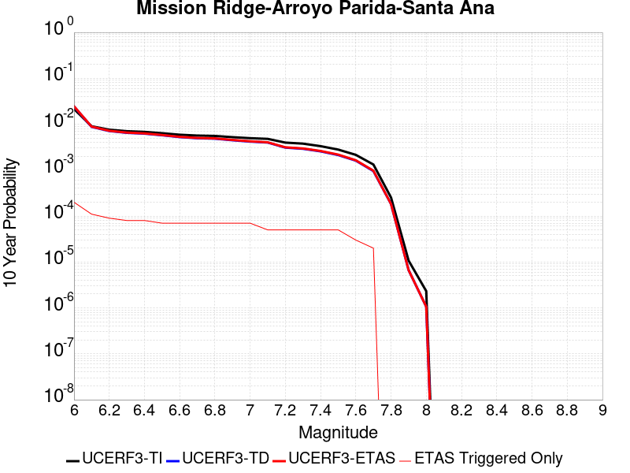 |

| Magnitude | 1 wk TI Prob | 1 wk TD Prob | 1 wk ETAS Prob | 1 wk ETAS/TD Gain | 1 wk ETAS Triggered Only | 1 mo TI Prob | 1 mo TD Prob | 1 mo ETAS Prob | 1 mo ETAS/TD Gain | 1 mo ETAS Triggered Only | 1 yr TI Prob | 1 yr TD Prob | 1 yr ETAS Prob | 1 yr ETAS/TD Gain | 1 yr ETAS Triggered Only | 10 yr TI Prob | 10 yr TD Prob | 10 yr ETAS Prob | 10 yr ETAS/TD Gain | 10 yr ETAS Triggered Only |
|-----|-----|-----|-----|-----|-----|-----|-----|-----|-----|-----|-----|-----|-----|-----|-----|-----|-----|-----|-----|-----|
| 6.0 | 4.169034E-5 | 4.7138263E-5 | 9.657969E-5 | 2.0488598 | 4.944376E-5 | 1.7866064E-4 | 2.0201034E-4 | 2.6380256E-4 | 1.3058864 | 6.18047E-5 | 0.0021730233 | 0.00245745 | 0.0025560944 | 1.040141 | 9.888752E-5 | 0.021518968 | 0.024384614 | 0.024577567 | 1.0079129 | 1.9777504E-4 |
| 6.1 | 1.73813E-5 | 1.6854226E-5 | 5.393642E-5 | 3.2001717 | 3.7082817E-5 | 7.4489166E-5 | 7.223046E-5 | 1.093106E-4 | 1.5133588 | 3.7082817E-5 | 9.065282E-4 | 8.790618E-4 | 9.5316226E-4 | 1.0842949 | 7.416563E-5 | 0.009028391 | 0.008756988 | 0.008867262 | 1.0125927 | 1.1124845E-4 |
| 6.2 | 1.4622182E-5 | 1.367329E-5 | 5.07556E-5 | 3.7120256 | 3.7082817E-5 | 6.2664985E-5 | 5.8598518E-5 | 9.567916E-5 | 1.6327915 | 3.7082817E-5 | 7.6267915E-4 | 7.132073E-4 | 7.8732E-4 | 1.1039147 | 7.416563E-5 | 0.007600669 | 0.007109627 | 0.007207812 | 1.01381 | 9.888752E-5 |
| 6.3 | 1.3552434E-5 | 1.2482201E-5 | 4.9564555E-5 | 3.9708188 | 3.7082817E-5 | 5.8080568E-5 | 5.3494066E-5 | 9.0574904E-5 | 1.6931766 | 3.7082817E-5 | 7.069015E-4 | 6.510988E-4 | 7.128632E-4 | 1.0948619 | 6.18047E-5 | 0.00704657 | 0.006492275 | 0.0065782396 | 1.013241 | 8.6526576E-5 |
| 6.4 | 1.30977305E-5 | 1.1979156E-5 | 4.906153E-5 | 4.095575 | 3.7082817E-5 | 5.613192E-5 | 5.1338247E-5 | 8.841916E-5 | 1.7222863 | 3.7082817E-5 | 6.831918E-4 | 6.248669E-4 | 6.86633E-4 | 1.0988468 | 6.18047E-5 | 0.006810953 | 0.0062314444 | 0.0063174316 | 1.013799 | 8.6526576E-5 |
| 6.5 | 1.225205E-5 | 1.1048803E-5 | 4.8131213E-5 | 4.356238 | 3.7082817E-5 | 5.2507727E-5 | 4.7351168E-5 | 8.443223E-5 | 1.7831076 | 3.7082817E-5 | 6.3909404E-4 | 5.7635066E-4 | 6.2576594E-4 | 1.0857382 | 4.944376E-5 | 0.006372592 | 0.005748869 | 0.0058226082 | 1.0128268 | 7.416563E-5 |
| 6.6 | 1.1352241E-5 | 1.0063535E-5 | 4.714598E-5 | 4.684833 | 3.7082817E-5 | 4.8651553E-5 | 4.3128734E-5 | 8.020995E-5 | 1.85978 | 3.7082817E-5 | 5.921717E-4 | 5.2496797E-4 | 5.7438575E-4 | 1.0941349 | 4.944376E-5 | 0.0059059616 | 0.0052375244 | 0.0053113014 | 1.0140862 | 7.416563E-5 |
| 6.7 | 1.0864116E-5 | 9.517027E-6 | 4.6599493E-5 | 4.896434 | 3.7082817E-5 | 4.6559664E-5 | 4.0786632E-5 | 7.786794E-5 | 1.9091535 | 3.7082817E-5 | 5.667165E-4 | 4.964661E-4 | 5.458853E-4 | 1.099542 | 4.944376E-5 | 0.005652734 | 0.004953804 | 0.005027602 | 1.0148972 | 7.416563E-5 |
| 6.8 | 1.0666365E-5 | 9.299779E-6 | 4.638225E-5 | 4.9874578 | 3.7082817E-5 | 4.571219E-5 | 3.9855597E-5 | 7.6936936E-5 | 1.9303923 | 3.7082817E-5 | 5.564038E-4 | 4.8513585E-4 | 5.3455564E-4 | 1.1018679 | 4.944376E-5 | 0.005550127 | 0.0048410003 | 0.0049148067 | 1.0152462 | 7.416563E-5 |
| 6.9 | 1.0038665E-5 | 8.592046E-6 | 4.5674544E-5 | 5.315911 | 3.7082817E-5 | 4.302214E-5 | 3.682254E-5 | 7.3904E-5 | 2.0070312 | 3.7082817E-5 | 5.236687E-4 | 4.4822405E-4 | 4.9764564E-4 | 1.110261 | 4.944376E-5 | 0.005224364 | 0.004473411 | 0.004547245 | 1.016505 | 7.416563E-5 |
| 7.0 | 9.5379955E-6 | 8.025073E-6 | 4.5107594E-5 | 5.620833 | 3.7082817E-5 | 4.0876483E-5 | 3.4392728E-5 | 7.147427E-5 | 2.0781798 | 3.7082817E-5 | 4.975576E-4 | 4.1865272E-4 | 4.6807577E-4 | 1.1180526 | 4.944376E-5 | 0.00496445 | 0.0041788397 | 0.0042526955 | 1.0176737 | 7.416563E-5 |
| 7.1 | 9.207389E-6 | 7.652375E-6 | 2.001322E-5 | 2.6152952 | 1.236094E-5 | 3.945964E-5 | 3.279549E-5 | 4.5156023E-5 | 1.3768973 | 1.236094E-5 | 4.803152E-4 | 3.9921363E-4 | 4.2392564E-4 | 1.0619017 | 2.472188E-5 | 0.004792784 | 0.003985161 | 0.004034408 | 1.0123575 | 4.944376E-5 |
| 7.2 | 7.638091E-6 | 5.9311183E-6 | 1.8291985E-5 | 3.0840702 | 1.236094E-5 | 3.2734264E-5 | 2.541883E-5 | 3.7779457E-5 | 1.4862783 | 1.236094E-5 | 3.984668E-4 | 3.0943064E-4 | 3.3414486E-4 | 1.07987 | 2.472188E-5 | 0.0039775306 | 0.0030900547 | 0.0031393457 | 1.0159515 | 4.944376E-5 |
| 7.3 | 7.2500147E-6 | 5.5961527E-6 | 1.7957023E-5 | 3.2088158 | 1.236094E-5 | 3.1071122E-5 | 2.3983293E-5 | 3.6343936E-5 | 1.5153855 | 1.236094E-5 | 3.7822526E-4 | 2.9195778E-4 | 3.1667243E-4 | 1.0846515 | 2.472188E-5 | 0.0037758215 | 0.0029157975 | 0.002965097 | 1.0169078 | 4.944376E-5 |
| 7.4 | 6.3899715E-6 | 4.9184964E-6 | 1.7279375E-5 | 3.5131419 | 1.236094E-5 | 2.7385306E-5 | 2.10791E-5 | 3.343978E-5 | 1.586395 | 1.236094E-5 | 3.3336508E-4 | 2.5660804E-4 | 2.8132356E-4 | 1.0963163 | 2.472188E-5 | 0.0033286542 | 0.0025631618 | 0.0026124788 | 1.0192407 | 4.944376E-5 |
| 7.5 | 5.379025E-6 | 4.0838527E-6 | 1.6444741E-5 | 4.0267715 | 1.236094E-5 | 2.305276E-5 | 1.7502109E-5 | 2.9862833E-5 | 1.706242 | 1.236094E-5 | 2.806312E-4 | 2.1306744E-4 | 2.3778406E-4 | 1.1160038 | 2.472188E-5 | 0.0028027708 | 0.002128643 | 0.0021779814 | 1.0231783 | 4.944376E-5 |
| 7.6 | 4.1270696E-6 | 3.0883439E-6 | 1.5449245E-5 | 5.0024366 | 1.236094E-5 | 1.768732E-5 | 1.3235693E-5 | 2.559647E-5 | 1.9338971 | 1.236094E-5 | 2.1532185E-4 | 1.6113273E-4 | 1.8585061E-4 | 1.1534009 | 2.472188E-5 | 0.0021511333 | 0.001610167 | 0.0016471901 | 1.0229933 | 3.7082817E-5 |
| 7.7 | 2.5406805E-6 | 1.8282013E-6 | 1.4189118E-5 | 7.761245 | 1.236094E-5 | 1.0888585E-5 | 7.835125E-6 | 2.0195968E-5 | 2.577619 | 1.236094E-5 | 1.3256045E-4 | 9.538854E-5 | 1.2010806E-4 | 1.2591456 | 2.472188E-5 | 0.0013248142 | 9.534821E-4 | 9.781804E-4 | 1.0259032 | 2.472188E-5 |
| 7.8 | 4.8608285E-7 | 3.5098864E-7 | 3.5098864E-7 | 1.0 | 0.0 | 2.0832106E-6 | 1.5042363E-6 | 1.5042363E-6 | 1.0 | 0.0 | 2.5362791E-5 | 1.8313924E-5 | 1.8313924E-5 | 1.0 | 0.0 | 2.5359896E-4 | 1.8312426E-4 | 1.8312426E-4 | 1.0 | 0.0 |
| 7.9 | 2.0472514E-8 | 1.2688783E-8 | 1.2688783E-8 | 1.0 | 0.0 | 8.7739345E-8 | 5.43805E-8 | 5.43805E-8 | 1.0 | 0.0 | 1.068226E-6 | 6.6208236E-7 | 6.6208236E-7 | 1.0 | 0.0 | 1.0682209E-5 | 6.620805E-6 | 6.620805E-6 | 1.0 | 0.0 |
| 8.0 | 4.443582E-9 | 2.0321211E-9 | 2.0321211E-9 | 1.0 | 0.0 | 1.9043922E-8 | 8.70909E-9 | 8.70909E-9 | 1.0 | 0.0 | 2.3185973E-7 | 1.0603316E-7 | 1.0603316E-7 | 1.0 | 0.0 | 2.3185949E-6 | 1.0603312E-6 | 1.0603312E-6 | 1.0 | 0.0 |

## Santa Ynez (West)
*[(top)](#table-of-contents)*

| 1 Week | 1 Month | 1 Year | 10 Year |
|-----|-----|-----|-----|
|  |  |  |  |

| Magnitude | 1 wk TI Prob | 1 wk TD Prob | 1 wk ETAS Prob | 1 wk ETAS/TD Gain | 1 wk ETAS Triggered Only | 1 mo TI Prob | 1 mo TD Prob | 1 mo ETAS Prob | 1 mo ETAS/TD Gain | 1 mo ETAS Triggered Only | 1 yr TI Prob | 1 yr TD Prob | 1 yr ETAS Prob | 1 yr ETAS/TD Gain | 1 yr ETAS Triggered Only | 10 yr TI Prob | 10 yr TD Prob | 10 yr ETAS Prob | 10 yr ETAS/TD Gain | 10 yr ETAS Triggered Only |
|-----|-----|-----|-----|-----|-----|-----|-----|-----|-----|-----|-----|-----|-----|-----|-----|-----|-----|-----|-----|-----|
| 6.0 | 4.7352758E-5 | 5.4972126E-5 | 1.04413164E-4 | 1.8993838 | 4.944376E-5 | 2.0292461E-4 | 2.3557522E-4 | 3.0972337E-4 | 1.3147537 | 7.416563E-5 | 0.0024678076 | 0.0028645284 | 0.0030001092 | 1.047331 | 1.3597033E-4 | 0.024405818 | 0.028304417 | 0.028496595 | 1.0067897 | 1.9777504E-4 |
| 6.1 | 4.7352758E-5 | 5.4972126E-5 | 9.2052906E-5 | 1.6745379 | 3.7082817E-5 | 2.0292461E-4 | 2.3557522E-4 | 2.9736536E-4 | 1.2622948 | 6.18047E-5 | 0.0024678076 | 0.0028645284 | 0.0030001092 | 1.047331 | 1.3597033E-4 | 0.024405818 | 0.028304417 | 0.028484583 | 1.0063653 | 1.8541409E-4 |
| 6.2 | 3.0415853E-5 | 3.392511E-5 | 7.1006674E-5 | 2.0930417 | 3.7082817E-5 | 1.3034715E-4 | 1.4538545E-4 | 2.0718116E-4 | 1.4250474 | 6.18047E-5 | 0.0015858212 | 0.0017686661 | 0.0018673787 | 1.0558119 | 9.888752E-5 | 0.015745522 | 0.017549807 | 0.017695535 | 1.0083036 | 1.4833127E-4 |
| 6.3 | 3.0415853E-5 | 3.392511E-5 | 7.1006674E-5 | 2.0930417 | 3.7082817E-5 | 1.3034715E-4 | 1.4538545E-4 | 2.0718116E-4 | 1.4250474 | 6.18047E-5 | 0.0015858212 | 0.0017686661 | 0.0018673787 | 1.0558119 | 9.888752E-5 | 0.015745522 | 0.017549807 | 0.017695535 | 1.0083036 | 1.4833127E-4 |
| 6.4 | 2.5452082E-5 | 2.7912422E-5 | 6.499421E-5 | 2.3285046 | 3.7082817E-5 | 1.09075794E-4 | 1.196193E-4 | 1.814166E-4 | 1.5166165 | 6.18047E-5 | 0.0013271887 | 0.0014554089 | 0.0015541525 | 1.067846 | 9.888752E-5 | 0.013192902 | 0.014460951 | 0.014607137 | 1.0101091 | 1.4833127E-4 |
| 6.5 | 2.3143784E-5 | 2.5128256E-5 | 6.221014E-5 | 2.4757047 | 3.7082817E-5 | 9.9183875E-5 | 1.0768817E-4 | 1.6948621E-4 | 1.573861 | 6.18047E-5 | 0.0012068948 | 0.0013103267 | 0.0014090847 | 1.075369 | 9.888752E-5 | 0.012003611 | 0.01302768 | 0.013174079 | 1.0112375 | 1.4833127E-4 |
| 6.6 | 1.9118515E-5 | 2.035434E-5 | 5.7436402E-5 | 2.821826 | 3.7082817E-5 | 8.193392E-5 | 8.7230015E-5 | 1.4902932E-4 | 1.7084638 | 6.18047E-5 | 9.97089E-4 | 0.001061516 | 0.0011602985 | 1.093058 | 9.888752E-5 | 0.00992627 | 0.010565365 | 0.010712129 | 1.0138911 | 1.4833127E-4 |
| 6.7 | 1.722807E-5 | 1.8146347E-5 | 5.522849E-5 | 3.0435047 | 3.7082817E-5 | 7.3832496E-5 | 7.776777E-5 | 1.3956767E-4 | 1.7946723 | 6.18047E-5 | 8.985399E-4 | 9.464169E-4 | 0.0010452109 | 1.1043873 | 9.888752E-5 | 0.008949154 | 0.0094245095 | 0.009571443 | 1.0155905 | 1.4833127E-4 |
| 6.8 | 1.5317364E-5 | 1.5926486E-5 | 4.064797E-5 | 2.5522249 | 2.472188E-5 | 6.56442E-5 | 6.82546E-5 | 1.1769499E-4 | 1.7243524 | 4.944376E-5 | 7.98925E-4 | 8.306873E-4 | 9.1714197E-4 | 1.1040761 | 8.6526576E-5 | 0.007960589 | 0.00827631 | 0.008398896 | 1.0148118 | 1.236094E-4 |
| 6.9 | 1.3071226E-5 | 1.3329624E-5 | 3.8051174E-5 | 2.8546321 | 2.472188E-5 | 5.6018336E-5 | 5.7125722E-5 | 9.420642E-5 | 1.6491069 | 3.7082817E-5 | 6.8180985E-4 | 6.9528597E-4 | 7.570477E-4 | 1.0888293 | 6.18047E-5 | 0.0067972173 | 0.006931367 | 0.0070295692 | 1.0141678 | 9.888752E-5 |
| 7.0 | 1.1836986E-5 | 1.19327815E-5 | 3.6654365E-5 | 3.0717368 | 2.472188E-5 | 5.0728955E-5 | 5.11395E-5 | 8.822042E-5 | 1.7250936 | 3.7082817E-5 | 6.1745E-4 | 6.2244723E-4 | 6.842135E-4 | 1.0992312 | 6.18047E-5 | 0.006157372 | 0.006207231 | 0.0063055046 | 1.0158322 | 9.888752E-5 |
| 7.1 | 1.0597169E-5 | 1.0542201E-5 | 2.290301E-5 | 2.1725075 | 1.236094E-5 | 4.541565E-5 | 4.5180084E-5 | 6.9900845E-5 | 1.5471606 | 2.472188E-5 | 5.5279525E-4 | 5.4992986E-4 | 5.993464E-4 | 1.0898597 | 4.944376E-5 | 0.0055142213 | 0.005485821 | 0.0055595795 | 1.0134454 | 7.416563E-5 |
| 7.2 | 9.59113E-6 | 9.459144E-6 | 2.1819966E-5 | 2.306759 | 1.236094E-5 | 4.11042E-5 | 4.0538565E-5 | 6.525944E-5 | 1.6098113 | 2.472188E-5 | 5.0032866E-4 | 4.934463E-4 | 5.4286566E-4 | 1.1001514 | 4.944376E-5 | 0.004992037 | 0.0049236254 | 0.0049974257 | 1.014989 | 7.416563E-5 |
| 7.3 | 8.586084E-6 | 8.379583E-6 | 2.074042E-5 | 2.4751134 | 1.236094E-5 | 3.679698E-5 | 3.5912013E-5 | 6.0633003E-5 | 1.6883767 | 2.472188E-5 | 4.4791115E-4 | 4.3714207E-4 | 4.865642E-4 | 1.1130574 | 4.944376E-5 | 0.004470094 | 0.004362933 | 0.004436775 | 1.0169249 | 7.416563E-5 |
| 7.4 | 7.2622997E-6 | 6.9515427E-6 | 1.9312396E-5 | 2.7781453 | 1.236094E-5 | 3.112377E-5 | 2.979199E-5 | 5.4513133E-5 | 1.8297915 | 2.472188E-5 | 3.78866E-4 | 3.626581E-4 | 4.1208393E-4 | 1.1362877 | 4.944376E-5 | 0.0037822074 | 0.0036207628 | 0.0036823438 | 1.0170077 | 6.18047E-5 |
| 7.5 | 5.627296E-6 | 5.251588E-6 | 1.7612463E-5 | 3.3537405 | 1.236094E-5 | 2.411676E-5 | 2.2506614E-5 | 3.4867277E-5 | 1.5492013 | 1.236094E-5 | 2.9358198E-4 | 2.739843E-4 | 3.1105694E-4 | 1.1353095 | 3.7082817E-5 | 0.0029319443 | 0.002736537 | 0.0027735184 | 1.0135139 | 3.7082817E-5 |
| 7.6 | 2.265244E-6 | 2.0608625E-6 | 1.44217765E-5 | 6.9979324 | 1.236094E-5 | 9.708152E-6 | 8.832238E-6 | 2.119307E-5 | 2.3995128 | 1.236094E-5 | 1.18190335E-4 | 1.0752728E-4 | 1.322465E-4 | 1.229888 | 2.472188E-5 | 0.001181275 | 0.0010747612 | 0.0010994565 | 1.0229775 | 2.472188E-5 |
| 7.7 | 1.3099874E-6 | 1.1016252E-6 | 1.3462551E-5 | 12.220627 | 1.236094E-5 | 5.61422E-6 | 4.7212425E-6 | 1.7082124E-5 | 3.6181417 | 1.236094E-5 | 6.8350986E-5 | 5.7479636E-5 | 8.2200095E-5 | 1.4300734 | 2.472188E-5 | 6.832996E-4 | 5.7465007E-4 | 5.9935777E-4 | 1.042996 | 2.472188E-5 |
| 7.8 | 7.903951E-7 | 6.0711415E-7 | 6.0711415E-7 | 1.0 | 0.0 | 3.3874032E-6 | 2.6019152E-6 | 2.6019152E-6 | 1.0 | 0.0 | 4.1240855E-5 | 3.167787E-5 | 3.167787E-5 | 1.0 | 0.0 | 4.12332E-4 | 3.167349E-4 | 3.167349E-4 | 1.0 | 0.0 |
| 7.9 | 7.0753297E-9 | 5.0899476E-9 | 5.0899476E-9 | 1.0 | 0.0 | 3.032284E-8 | 2.181406E-8 | 2.181406E-8 | 1.0 | 0.0 | 3.6918053E-7 | 2.6558615E-7 | 2.6558615E-7 | 1.0 | 0.0 | 3.691799E-6 | 2.6558594E-6 | 2.6558594E-6 | 1.0 | 0.0 |

## San Jacinto (San Bernardino)
*[(top)](#table-of-contents)*

| 1 Week | 1 Month | 1 Year | 10 Year |
|-----|-----|-----|-----|
|  |  |  |  |

| Magnitude | 1 wk TI Prob | 1 wk TD Prob | 1 wk ETAS Prob | 1 wk ETAS/TD Gain | 1 wk ETAS Triggered Only | 1 mo TI Prob | 1 mo TD Prob | 1 mo ETAS Prob | 1 mo ETAS/TD Gain | 1 mo ETAS Triggered Only | 1 yr TI Prob | 1 yr TD Prob | 1 yr ETAS Prob | 1 yr ETAS/TD Gain | 1 yr ETAS Triggered Only | 10 yr TI Prob | 10 yr TD Prob | 10 yr ETAS Prob | 10 yr ETAS/TD Gain | 10 yr ETAS Triggered Only |
|-----|-----|-----|-----|-----|-----|-----|-----|-----|-----|-----|-----|-----|-----|-----|-----|-----|-----|-----|-----|-----|
| 6.0 | 3.409352E-5 | 3.5986508E-5 | 1.2250997E-4 | 3.4043305 | 8.6526576E-5 | 1.461069E-4 | 1.542188E-4 | 2.5309107E-4 | 1.6411169 | 9.888752E-5 | 0.0017774 | 0.0018759987 | 0.002061065 | 1.0986495 | 1.8541409E-4 | 0.01763251 | 0.019349935 | 0.019616613 | 1.0137819 | 2.7194066E-4 |
| 6.1 | 3.409352E-5 | 3.5986508E-5 | 1.2250997E-4 | 3.4043305 | 8.6526576E-5 | 1.461069E-4 | 1.542188E-4 | 2.5309107E-4 | 1.6411169 | 9.888752E-5 | 0.0017774 | 0.0018759987 | 0.002061065 | 1.0986495 | 1.8541409E-4 | 0.01763251 | 0.019349935 | 0.019616613 | 1.0137819 | 2.7194066E-4 |
| 6.2 | 3.409352E-5 | 3.5986508E-5 | 1.2250997E-4 | 3.4043305 | 8.6526576E-5 | 1.461069E-4 | 1.542188E-4 | 2.5309107E-4 | 1.6411169 | 9.888752E-5 | 0.0017774 | 0.0018759987 | 0.002061065 | 1.0986495 | 1.8541409E-4 | 0.01763251 | 0.019349935 | 0.019616613 | 1.0137819 | 2.7194066E-4 |
| 6.3 | 3.409352E-5 | 3.5986508E-5 | 1.2250997E-4 | 3.4043305 | 8.6526576E-5 | 1.461069E-4 | 1.542188E-4 | 2.5309107E-4 | 1.6411169 | 9.888752E-5 | 0.0017774 | 0.0018759987 | 0.002061065 | 1.0986495 | 1.8541409E-4 | 0.01763251 | 0.019349935 | 0.019616613 | 1.0137819 | 2.7194066E-4 |
| 6.4 | 3.400795E-5 | 3.5879173E-5 | 1.2240265E-4 | 3.4115236 | 8.6526576E-5 | 1.4574021E-4 | 1.5375883E-4 | 2.5263114E-4 | 1.643035 | 9.888752E-5 | 0.0017729428 | 0.0018704084 | 0.0020554757 | 1.0989449 | 1.8541409E-4 | 0.017588645 | 0.019295016 | 0.01956171 | 1.0138218 | 2.7194066E-4 |
| 6.5 | 3.341482E-5 | 3.5139812E-5 | 1.2166335E-4 | 3.4622653 | 8.6526576E-5 | 1.4319851E-4 | 1.5059051E-4 | 2.4946313E-4 | 1.6565661 | 9.888752E-5 | 0.0017420477 | 0.0018318989 | 0.0020169734 | 1.1010287 | 1.8541409E-4 | 0.017284546 | 0.018916558 | 0.019183354 | 1.0141039 | 2.7194066E-4 |
| 6.6 | 3.3364955E-5 | 3.5077028E-5 | 1.2160057E-4 | 3.4666724 | 8.6526576E-5 | 1.4298483E-4 | 1.5032147E-4 | 2.4919413E-4 | 1.6577413 | 9.888752E-5 | 0.0017394501 | 0.001828629 | 0.002013704 | 1.1012098 | 1.8541409E-4 | 0.017258976 | 0.018884424 | 0.01915123 | 1.0141283 | 2.7194066E-4 |
| 6.7 | 3.335922E-5 | 3.5066805E-5 | 1.2159035E-4 | 3.4673917 | 8.6526576E-5 | 1.4296026E-4 | 1.5027766E-4 | 2.491503E-4 | 1.6579332 | 9.888752E-5 | 0.0017391514 | 0.0018280965 | 0.0020131716 | 1.1012393 | 1.8541409E-4 | 0.017256035 | 0.018879214 | 0.019146021 | 1.0141323 | 2.7194066E-4 |
| 6.8 | 3.327683E-5 | 3.496087E-5 | 1.2148442E-4 | 3.4748683 | 8.6526576E-5 | 1.4260718E-4 | 1.498237E-4 | 2.486964E-4 | 1.659927 | 9.888752E-5 | 0.0017348597 | 0.0018225788 | 0.0020076549 | 1.1015463 | 1.8541409E-4 | 0.017213784 | 0.018824987 | 0.019091807 | 1.0141737 | 2.7194066E-4 |
| 6.9 | 3.3235785E-5 | 3.4901823E-5 | 1.2142538E-4 | 3.4790554 | 8.6526576E-5 | 1.4243131E-4 | 1.4957068E-4 | 2.484434E-4 | 1.6610435 | 9.888752E-5 | 0.0017327217 | 0.0018195034 | 0.00200458 | 1.1017183 | 1.8541409E-4 | 0.017192734 | 0.018794855 | 0.019061685 | 1.014197 | 2.7194066E-4 |
| 7.0 | 3.3197095E-5 | 3.4841752E-5 | 1.21365316E-4 | 3.4833298 | 8.6526576E-5 | 1.422655E-4 | 1.4931326E-4 | 2.4818603E-4 | 1.6621833 | 9.888752E-5 | 0.0017307063 | 0.0018163746 | 0.002001452 | 1.1018938 | 1.8541409E-4 | 0.017172894 | 0.018764233 | 0.01903107 | 1.0142206 | 2.7194066E-4 |
| 7.1 | 3.3129716E-5 | 3.4721965E-5 | 1.2124554E-4 | 3.4918973 | 8.6526576E-5 | 1.4197677E-4 | 1.4879994E-4 | 2.4767275E-4 | 1.664468 | 9.888752E-5 | 0.0017271966 | 0.0018101353 | 0.0019952138 | 1.1022457 | 1.8541409E-4 | 0.017138338 | 0.018703312 | 0.018970167 | 1.0142678 | 2.7194066E-4 |
| 7.2 | 3.3034008E-5 | 3.458941E-5 | 1.2111299E-4 | 3.501447 | 8.6526576E-5 | 1.4156665E-4 | 1.4823192E-4 | 2.471048E-4 | 1.6670146 | 9.888752E-5 | 0.0017222111 | 0.0018032312 | 0.0019883108 | 1.1026379 | 1.8541409E-4 | 0.017089253 | 0.018635705 | 0.018902577 | 1.0143205 | 2.7194066E-4 |
| 7.3 | 3.2956614E-5 | 3.445717E-5 | 1.2098077E-4 | 3.5110476 | 8.6526576E-5 | 1.4123498E-4 | 1.4766524E-4 | 2.4653814E-4 | 1.6695747 | 9.888752E-5 | 0.0017181796 | 0.0017963431 | 0.0019814242 | 1.1030321 | 1.8541409E-4 | 0.017049557 | 0.018568452 | 0.018835343 | 1.0143734 | 2.7194066E-4 |
| 7.4 | 3.2915937E-5 | 3.4378863E-5 | 1.2090246E-4 | 3.5167673 | 8.6526576E-5 | 1.4106068E-4 | 1.4732967E-4 | 2.4620263E-4 | 1.6711 | 9.888752E-5 | 0.0017160608 | 0.0017922645 | 0.0019773464 | 1.103267 | 1.8541409E-4 | 0.017028693 | 0.018528719 | 0.01879562 | 1.0144048 | 2.7194066E-4 |
| 7.5 | 3.281791E-5 | 3.4243778E-5 | 1.2076739E-4 | 3.5266957 | 8.6526576E-5 | 1.406406E-4 | 1.4675081E-4 | 2.456238E-4 | 1.6737477 | 9.888752E-5 | 0.0017109542 | 0.0017852283 | 0.0019703114 | 1.1036748 | 1.8541409E-4 | 0.016978411 | 0.018459605 | 0.018726526 | 1.0144597 | 2.7194066E-4 |
| 7.6 | 3.2521442E-5 | 3.396873E-5 | 1.2049237E-4 | 3.5471554 | 8.6526576E-5 | 1.3937015E-4 | 1.4557215E-4 | 2.4444528E-4 | 1.6792035 | 9.888752E-5 | 0.0016955109 | 0.0017709016 | 0.0019559874 | 1.104515 | 1.8541409E-4 | 0.016826328 | 0.018317232 | 0.018584192 | 1.0145742 | 2.7194066E-4 |
| 7.7 | 3.0287873E-5 | 3.245276E-5 | 1.1897653E-4 | 3.6661448 | 8.6526576E-5 | 1.297987E-4 | 1.3907586E-4 | 2.3794963E-4 | 1.710934 | 9.888752E-5 | 0.0015791537 | 0.0016919347 | 0.001877035 | 1.1094016 | 1.8541409E-4 | 0.01567979 | 0.01752809 | 0.017795265 | 1.0152426 | 2.7194066E-4 |
| 7.8 | 2.6316151E-5 | 2.9663592E-5 | 1.161876E-4 | 3.916842 | 8.6526576E-5 | 1.1277862E-4 | 1.2712348E-4 | 2.2599843E-4 | 1.7777866 | 9.888752E-5 | 0.0013722149 | 0.0015466306 | 0.0017317579 | 1.1196972 | 1.8541409E-4 | 0.013637724 | 0.016069634 | 0.016337205 | 1.0166507 | 2.7194066E-4 |
| 7.9 | 2.0761147E-5 | 2.34181E-5 | 9.7582E-5 | 4.1669474 | 7.416563E-5 | 8.897331E-5 | 1.0035944E-4 | 1.8687733E-4 | 1.8620803 | 8.6526576E-5 | 0.0010827117 | 0.0012211921 | 0.0013940339 | 1.1415353 | 1.7305315E-4 | 0.010774517 | 0.012793174 | 0.013025028 | 1.0181231 | 2.3485786E-4 |
| 8.0 | 1.5738568E-5 | 1.6033575E-5 | 7.7837285E-5 | 4.854643 | 6.18047E-5 | 6.744926E-5 | 6.871352E-5 | 1.4287405E-4 | 2.0792716 | 7.416563E-5 | 8.2088535E-4 | 8.3626667E-4 | 9.597727E-4 | 1.1476873 | 1.236094E-4 | 0.008178596 | 0.008865921 | 0.00903744 | 1.0193459 | 1.7305315E-4 |
| 8.1 | 1.0105832E-5 | 8.3304985E-6 | 4.5413006E-5 | 5.4514155 | 3.7082817E-5 | 4.3309992E-5 | 3.570165E-5 | 7.278314E-5 | 2.0386493 | 3.7082817E-5 | 5.2717153E-4 | 4.345814E-4 | 4.8400369E-4 | 1.1137239 | 4.944376E-5 | 0.005259227 | 0.004677232 | 0.0047387476 | 1.0131521 | 6.18047E-5 |
| 8.2 | 4.189207E-6 | 1.5784357E-6 | 1.5784357E-6 | 1.0 | 0.0 | 1.7953622E-5 | 6.7647065E-6 | 6.7647065E-6 | 1.0 | 0.0 | 2.1856341E-4 | 8.235722E-5 | 8.235722E-5 | 1.0 | 0.0 | 0.0021834858 | 9.565867E-4 | 9.565867E-4 | 1.0 | 0.0 |
| 8.3 | 1.2758221E-6 | 3.6149942E-7 | 3.6149942E-7 | 1.0 | 0.0 | 5.4677976E-6 | 1.5492824E-6 | 1.5492824E-6 | 1.0 | 0.0 | 6.65684E-5 | 1.8862354E-5 | 1.8862354E-5 | 1.0 | 0.0 | 6.6548464E-4 | 2.2751294E-4 | 2.2751294E-4 | 1.0 | 0.0 |

## Baker
*[(top)](#table-of-contents)*

| 1 Week | 1 Month | 1 Year | 10 Year |
|-----|-----|-----|-----|
|  | 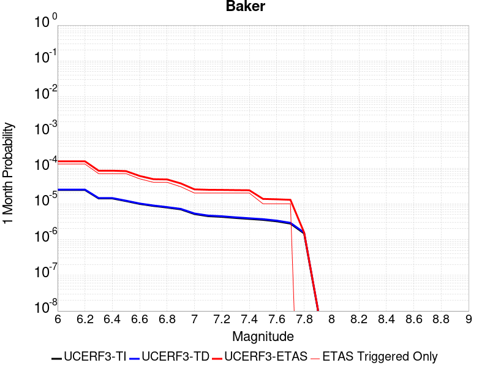 |  |  |

| Magnitude | 1 wk TI Prob | 1 wk TD Prob | 1 wk ETAS Prob | 1 wk ETAS/TD Gain | 1 wk ETAS Triggered Only | 1 mo TI Prob | 1 mo TD Prob | 1 mo ETAS Prob | 1 mo ETAS/TD Gain | 1 mo ETAS Triggered Only | 1 yr TI Prob | 1 yr TD Prob | 1 yr ETAS Prob | 1 yr ETAS/TD Gain | 1 yr ETAS Triggered Only | 10 yr TI Prob | 10 yr TD Prob | 10 yr ETAS Prob | 10 yr ETAS/TD Gain | 10 yr ETAS Triggered Only |
|-----|-----|-----|-----|-----|-----|-----|-----|-----|-----|-----|-----|-----|-----|-----|-----|-----|-----|-----|-----|-----|
| 6.0 | 5.695525E-6 | 5.8348373E-6 | 1.04721774E-4 | 17.947678 | 9.888752E-5 | 2.4409164E-5 | 2.5006228E-5 | 1.6097316E-4 | 6.437323 | 1.3597033E-4 | 2.9714106E-4 | 3.044123E-4 | 5.268415E-4 | 1.7306839 | 2.224969E-4 | 0.0029674405 | 0.0030403486 | 0.0032991392 | 1.0851187 | 2.5957974E-4 |
| 6.1 | 5.695525E-6 | 5.8348373E-6 | 1.04721774E-4 | 17.947678 | 9.888752E-5 | 2.4409164E-5 | 2.5006228E-5 | 1.6097316E-4 | 6.437323 | 1.3597033E-4 | 2.9714106E-4 | 3.044123E-4 | 5.268415E-4 | 1.7306839 | 2.224969E-4 | 0.0029674405 | 0.0030403486 | 0.0032991392 | 1.0851187 | 2.5957974E-4 |
| 6.2 | 5.695525E-6 | 5.8348373E-6 | 1.04721774E-4 | 17.947678 | 9.888752E-5 | 2.4409164E-5 | 2.5006228E-5 | 1.6097316E-4 | 6.437323 | 1.3597033E-4 | 2.9714106E-4 | 3.044123E-4 | 5.268415E-4 | 1.7306839 | 2.224969E-4 | 0.0029674405 | 0.0030403486 | 0.0032991392 | 1.0851187 | 2.5957974E-4 |
| 6.3 | 3.2995713E-6 | 3.383667E-6 | 6.518816E-5 | 19.265535 | 6.18047E-5 | 1.4140943E-5 | 1.4501353E-5 | 8.866591E-5 | 6.1143203 | 7.416563E-5 | 1.7215237E-4 | 1.7654014E-4 | 3.37204E-4 | 1.9100698 | 1.6069222E-4 | 0.0017201907 | 0.001764046 | 0.001949133 | 1.1049218 | 1.8541409E-4 |
| 6.4 | 3.2995713E-6 | 3.383667E-6 | 6.518816E-5 | 19.265535 | 6.18047E-5 | 1.4140943E-5 | 1.4501353E-5 | 8.866591E-5 | 6.1143203 | 7.416563E-5 | 1.7215237E-4 | 1.7654014E-4 | 3.37204E-4 | 1.9100698 | 1.6069222E-4 | 0.0017201907 | 0.001764046 | 0.001949133 | 1.1049218 | 1.8541409E-4 |
| 6.5 | 2.782202E-6 | 2.8558404E-6 | 6.466036E-5 | 22.641447 | 6.18047E-5 | 1.1923668E-5 | 1.223926E-5 | 8.640399E-5 | 7.059576 | 7.416563E-5 | 1.4516099E-4 | 1.4900314E-4 | 3.0967142E-4 | 2.0782878 | 1.6069222E-4 | 0.001450662 | 0.0014890651 | 0.0016742031 | 1.1243317 | 1.8541409E-4 |
| 6.6 | 2.3163404E-6 | 2.38092E-6 | 3.946365E-5 | 16.574959 | 3.7082817E-5 | 9.927136E-6 | 1.0203904E-5 | 5.964716E-5 | 5.8455234 | 4.944376E-5 | 1.20856166E-4 | 1.2422565E-4 | 2.601791E-4 | 2.094407 | 1.3597033E-4 | 0.0012079047 | 0.0012415823 | 0.001402075 | 1.1292646 | 1.6069222E-4 |
| 6.7 | 2.037056E-6 | 2.0965003E-6 | 3.9179242E-5 | 18.687923 | 3.7082817E-5 | 8.7302105E-6 | 8.984972E-6 | 4.6067456E-5 | 5.1271677 | 3.7082817E-5 | 1.0628513E-4 | 1.093867E-4 | 2.3298258E-4 | 2.1298985 | 1.236094E-4 | 0.0010623431 | 0.0010933448 | 0.0012415139 | 1.1355191 | 1.4833127E-4 |
| 6.8 | 1.8356744E-6 | 1.8915287E-6 | 3.8974278E-5 | 20.604645 | 3.7082817E-5 | 7.867153E-6 | 8.106527E-6 | 4.5189045E-5 | 5.5744023 | 3.7082817E-5 | 9.577837E-5 | 9.869264E-5 | 2.2228983E-4 | 2.2523446 | 1.236094E-4 | 9.57371E-4 | 9.86502E-4 | 0.001134687 | 1.1502125 | 1.4833127E-4 |
| 6.9 | 1.6310546E-6 | 1.6832072E-6 | 2.6405045E-5 | 15.687341 | 2.472188E-5 | 6.9902153E-6 | 7.213726E-6 | 3.1935426E-5 | 4.4270363 | 2.472188E-5 | 8.510255E-5 | 8.782368E-5 | 1.7434267E-4 | 1.985144 | 8.6526576E-5 | 8.5069967E-4 | 8.7790104E-4 | 9.890519E-4 | 1.1266097 | 1.1124845E-4 |
| 7.0 | 1.2058036E-6 | 1.2508665E-6 | 1.3611791E-5 | 10.881888 | 1.236094E-5 | 5.1677193E-6 | 5.3608455E-6 | 1.7721719E-5 | 3.3057692 | 1.236094E-5 | 6.291517E-5 | 6.5266366E-5 | 1.2706703E-4 | 1.946899 | 6.18047E-5 | 6.289736E-4 | 6.524743E-4 | 7.389444E-4 | 1.1325265 | 8.6526576E-5 |
| 7.1 | 1.052382E-6 | 1.0951609E-6 | 1.3456087E-5 | 12.286859 | 1.236094E-5 | 4.5102006E-6 | 4.693538E-6 | 1.7054419E-5 | 3.6335957 | 1.236094E-5 | 5.491031E-5 | 5.7142337E-5 | 1.189435E-4 | 2.0815303 | 6.18047E-5 | 5.4896745E-4 | 5.7127734E-4 | 6.454006E-4 | 1.12975 | 7.416563E-5 |
| 7.2 | 1.0067454E-6 | 1.0487711E-6 | 1.3409697E-5 | 12.786105 | 1.236094E-5 | 4.3146156E-6 | 4.4947255E-6 | 1.6855609E-5 | 3.7500865 | 1.236094E-5 | 5.252918E-5 | 5.4721917E-5 | 1.1652323E-4 | 2.1293705 | 6.18047E-5 | 5.251676E-4 | 5.470853E-4 | 6.212103E-4 | 1.1354909 | 7.416563E-5 |
| 7.3 | 9.3596316E-7 | 9.767723E-7 | 1.33377E-5 | 13.65487 | 1.236094E-5 | 4.0112645E-6 | 4.1861604E-6 | 1.6547048E-5 | 3.9527984 | 1.236094E-5 | 4.8836053E-5 | 5.096532E-5 | 1.12766866E-4 | 2.2126195 | 6.18047E-5 | 4.8825322E-4 | 5.095371E-4 | 5.836649E-4 | 1.1454808 | 7.416563E-5 |
| 7.4 | 8.8117395E-7 | 9.2076635E-7 | 1.3281694E-5 | 14.424609 | 1.236094E-5 | 3.7764542E-6 | 3.9461356E-6 | 1.6307025E-5 | 4.132404 | 1.236094E-5 | 4.5977362E-5 | 4.8043148E-5 | 8.5124186E-5 | 1.7718278 | 3.7082817E-5 | 4.596785E-4 | 4.8032837E-4 | 5.297484E-4 | 1.102888 | 4.944376E-5 |
| 7.5 | 8.292386E-7 | 8.6745956E-7 | 8.6745956E-7 | 1.0 | 0.0 | 3.5538749E-6 | 3.7176785E-6 | 3.7176785E-6 | 1.0 | 0.0 | 4.326757E-5 | 4.5261804E-5 | 6.998256E-5 | 1.5461726 | 2.472188E-5 | 4.3259145E-4 | 4.5252658E-4 | 4.895926E-4 | 1.0819091 | 3.7082817E-5 |
| 7.6 | 7.553842E-7 | 7.9144706E-7 | 7.9144706E-7 | 1.0 | 0.0 | 3.2373566E-6 | 3.3919116E-6 | 3.3919116E-6 | 1.0 | 0.0 | 3.9414106E-5 | 4.129575E-5 | 6.6016604E-5 | 1.5986296 | 2.472188E-5 | 3.9407116E-4 | 4.1288146E-4 | 4.4994894E-4 | 1.0897776 | 3.7082817E-5 |
| 7.7 | 6.5285366E-7 | 6.852797E-7 | 6.852797E-7 | 1.0 | 0.0 | 2.797941E-6 | 2.9369096E-6 | 2.9369096E-6 | 1.0 | 0.0 | 3.40644E-5 | 3.5756293E-5 | 4.811679E-5 | 1.3456873 | 1.236094E-5 | 3.405918E-4 | 3.5750607E-4 | 3.8221912E-4 | 1.0691262 | 2.472188E-5 |
| 7.8 | 3.4586725E-7 | 3.6482615E-7 | 3.6482615E-7 | 1.0 | 0.0 | 1.4822873E-6 | 1.5635396E-6 | 1.5635396E-6 | 1.0 | 0.0 | 1.80467E-5 | 1.9035933E-5 | 3.1396637E-5 | 1.6493353 | 1.236094E-5 | 1.8045233E-4 | 1.9034347E-4 | 2.1506065E-4 | 1.1298556 | 2.472188E-5 |
| 7.9 | 2.5591178E-9 | 2.6696718E-9 | 2.6696718E-9 | 1.0 | 0.0 | 1.0967647E-8 | 1.14414505E-8 | 1.14414505E-8 | 1.0 | 0.0 | 1.335311E-7 | 1.3929966E-7 | 1.3929966E-7 | 1.0 | 0.0 | 1.3353102E-6 | 1.3929966E-6 | 1.3929966E-6 | 1.0 | 0.0 |

## Red Mountain
*[(top)](#table-of-contents)*

| 1 Week | 1 Month | 1 Year | 10 Year |
|-----|-----|-----|-----|
| 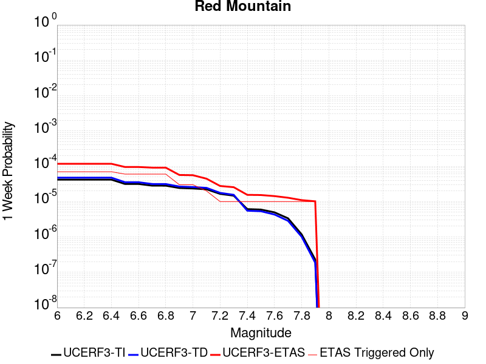 |  |  |  |

| Magnitude | 1 wk TI Prob | 1 wk TD Prob | 1 wk ETAS Prob | 1 wk ETAS/TD Gain | 1 wk ETAS Triggered Only | 1 mo TI Prob | 1 mo TD Prob | 1 mo ETAS Prob | 1 mo ETAS/TD Gain | 1 mo ETAS Triggered Only | 1 yr TI Prob | 1 yr TD Prob | 1 yr ETAS Prob | 1 yr ETAS/TD Gain | 1 yr ETAS Triggered Only | 10 yr TI Prob | 10 yr TD Prob | 10 yr ETAS Prob | 10 yr ETAS/TD Gain | 10 yr ETAS Triggered Only |
|-----|-----|-----|-----|-----|-----|-----|-----|-----|-----|-----|-----|-----|-----|-----|-----|-----|-----|-----|-----|-----|
| 6.0 | 4.1810763E-5 | 4.7589947E-5 | 1.21752055E-4 | 2.5583565 | 7.416563E-5 | 1.7917668E-4 | 2.039419E-4 | 2.9045084E-4 | 1.4241842 | 8.6526576E-5 | 0.0021792934 | 0.0024803306 | 0.0025789728 | 1.0397698 | 9.888752E-5 | 0.021580452 | 0.024544092 | 0.024724955 | 1.0073689 | 1.8541409E-4 |
| 6.1 | 4.1810763E-5 | 4.7589947E-5 | 1.21752055E-4 | 2.5583565 | 7.416563E-5 | 1.7917668E-4 | 2.039419E-4 | 2.9045084E-4 | 1.4241842 | 8.6526576E-5 | 0.0021792934 | 0.0024803306 | 0.0025789728 | 1.0397698 | 9.888752E-5 | 0.021580452 | 0.024544092 | 0.024724955 | 1.0073689 | 1.8541409E-4 |
| 6.2 | 4.1810763E-5 | 4.7589947E-5 | 1.21752055E-4 | 2.5583565 | 7.416563E-5 | 1.7917668E-4 | 2.039419E-4 | 2.9045084E-4 | 1.4241842 | 8.6526576E-5 | 0.0021792934 | 0.0024803306 | 0.0025789728 | 1.0397698 | 9.888752E-5 | 0.021580452 | 0.024544092 | 0.024724955 | 1.0073689 | 1.8541409E-4 |
| 6.3 | 4.1810763E-5 | 4.7589947E-5 | 1.21752055E-4 | 2.5583565 | 7.416563E-5 | 1.7917668E-4 | 2.039419E-4 | 2.9045084E-4 | 1.4241842 | 8.6526576E-5 | 0.0021792934 | 0.0024803306 | 0.0025789728 | 1.0397698 | 9.888752E-5 | 0.021580452 | 0.024544092 | 0.024724955 | 1.0073689 | 1.8541409E-4 |
| 6.4 | 4.1810763E-5 | 4.7589947E-5 | 1.21752055E-4 | 2.5583565 | 7.416563E-5 | 1.7917668E-4 | 2.039419E-4 | 2.9045084E-4 | 1.4241842 | 8.6526576E-5 | 0.0021792934 | 0.0024803306 | 0.0025789728 | 1.0397698 | 9.888752E-5 | 0.021580452 | 0.024544092 | 0.024724955 | 1.0073689 | 1.8541409E-4 |
| 6.5 | 3.154503E-5 | 3.5359728E-5 | 9.716224E-5 | 2.747822 | 6.18047E-5 | 1.3518598E-4 | 1.5153342E-4 | 2.256878E-4 | 1.4893601 | 7.416563E-5 | 0.0016446467 | 0.0018434501 | 0.0019298171 | 1.0468508 | 8.6526576E-5 | 0.01632528 | 0.018291233 | 0.018436853 | 1.007961 | 1.4833127E-4 |
| 6.6 | 3.1535834E-5 | 3.534911E-5 | 9.715162E-5 | 2.748347 | 6.18047E-5 | 1.3514658E-4 | 1.5148791E-4 | 2.256423E-4 | 1.4895071 | 7.416563E-5 | 0.0016441676 | 0.001842897 | 0.0019292642 | 1.0468649 | 8.6526576E-5 | 0.01632056 | 0.018285794 | 0.018431414 | 1.0079635 | 1.4833127E-4 |
| 6.7 | 2.8267326E-5 | 3.146934E-5 | 9.3272094E-5 | 2.9639037 | 6.18047E-5 | 1.2114006E-4 | 1.348621E-4 | 2.0901774E-4 | 1.5498626 | 7.416563E-5 | 0.0014738824 | 0.0016407946 | 0.0017271792 | 1.0526481 | 8.6526576E-5 | 0.014641452 | 0.016295563 | 0.016429318 | 1.008208 | 1.3597033E-4 |
| 6.8 | 2.8212884E-5 | 3.1407224E-5 | 9.320998E-5 | 2.9677877 | 6.18047E-5 | 1.20906756E-4 | 1.3459593E-4 | 2.0875159E-4 | 1.5509502 | 7.416563E-5 | 0.0014710457 | 0.0016375587 | 0.0017239436 | 1.0527523 | 8.6526576E-5 | 0.014613459 | 0.01626368 | 0.016397439 | 1.0082244 | 1.3597033E-4 |
| 6.9 | 2.4227871E-5 | 2.6706979E-5 | 6.378881E-5 | 2.3884697 | 3.7082817E-5 | 1.03829596E-4 | 1.14453884E-4 | 1.6389198E-4 | 1.4319477 | 4.944376E-5 | 0.0012633923 | 0.0013926612 | 0.0014543799 | 1.044317 | 6.18047E-5 | 0.012562336 | 0.013847026 | 0.013944544 | 1.0070425 | 9.888752E-5 |
| 7.0 | 2.348524E-5 | 2.5835763E-5 | 6.291762E-5 | 2.4352918 | 3.7082817E-5 | 1.0064714E-4 | 1.1072042E-4 | 1.4779913E-4 | 1.334886 | 3.7082817E-5 | 0.0012246901 | 0.0013472632 | 0.0013966403 | 1.03665 | 4.944376E-5 | 0.012179627 | 0.01339859 | 0.013483956 | 1.0063714 | 8.6526576E-5 |
| 7.1 | 2.2311642E-5 | 2.4462828E-5 | 4.9184102E-5 | 2.0105648 | 2.472188E-5 | 9.561782E-5 | 1.048369E-4 | 1.295562E-4 | 1.235788 | 2.472188E-5 | 0.0011635252 | 0.0012757168 | 0.0013127523 | 1.0290312 | 3.7082817E-5 | 0.01157452 | 0.012691451 | 0.012764676 | 1.0057696 | 7.416563E-5 |
| 7.2 | 1.6533986E-5 | 1.7670347E-5 | 3.0031068E-5 | 1.6995177 | 1.236094E-5 | 7.085802E-5 | 7.572822E-5 | 8.808822E-5 | 1.1632153 | 1.236094E-5 | 8.623549E-4 | 9.216645E-4 | 9.463636E-4 | 1.0267984 | 2.472188E-5 | 0.008590161 | 0.009184699 | 0.009245936 | 1.0066673 | 6.18047E-5 |
| 7.3 | 1.4703092E-5 | 1.555952E-5 | 2.7920269E-5 | 1.7944169 | 1.236094E-5 | 6.301173E-5 | 6.66823E-5 | 7.904242E-5 | 1.1853583 | 1.236094E-5 | 7.668978E-4 | 8.1161625E-4 | 8.3631807E-4 | 1.0304353 | 2.472188E-5 | 0.0076425658 | 0.008092596 | 0.008129379 | 1.0045452 | 3.7082817E-5 |
| 7.4 | 6.1331984E-6 | 5.528872E-6 | 1.7889743E-5 | 3.2356951 | 1.236094E-5 | 2.6284872E-5 | 2.3694953E-5 | 3.60556E-5 | 1.5216573 | 1.236094E-5 | 3.199713E-4 | 2.8844838E-4 | 3.0080575E-4 | 1.0428408 | 1.236094E-5 | 0.0031951098 | 0.0028807942 | 0.002905445 | 1.0085568 | 2.472188E-5 |
| 7.5 | 5.954766E-6 | 5.3385015E-6 | 1.7699374E-5 | 3.31542 | 1.236094E-5 | 2.5520176E-5 | 2.2879094E-5 | 3.523975E-5 | 1.5402598 | 1.236094E-5 | 3.1066386E-4 | 2.785179E-4 | 2.9087538E-4 | 1.0443687 | 1.236094E-5 | 0.003102299 | 0.0027817423 | 0.0028063953 | 1.0088625 | 2.472188E-5 |
| 7.6 | 4.9726646E-6 | 4.315295E-6 | 1.667618E-5 | 3.864436 | 1.236094E-5 | 2.1311245E-5 | 1.8493993E-5 | 3.0854702E-5 | 1.6683636 | 1.236094E-5 | 2.5943352E-4 | 2.2514143E-4 | 2.3749958E-4 | 1.0548906 | 1.236094E-5 | 0.0025913084 | 0.002249168 | 0.002261501 | 1.0054834 | 1.236094E-5 |
| 7.7 | 3.3613894E-6 | 2.8526642E-6 | 1.5213568E-5 | 5.3331084 | 1.236094E-5 | 1.4405875E-5 | 1.2225649E-5 | 2.4586438E-5 | 2.0110538 | 1.236094E-5 | 1.7537741E-4 | 1.4883737E-4 | 1.6119647E-4 | 1.0830376 | 1.236094E-5 | 0.0017523908 | 0.0014874031 | 0.0014997456 | 1.008298 | 1.236094E-5 |
| 7.8 | 1.1828961E-6 | 1.0122756E-6 | 1.3373203E-5 | 13.211029 | 1.236094E-5 | 5.069545E-6 | 4.338317E-6 | 1.6699203E-5 | 3.8492353 | 1.236094E-5 | 6.171996E-5 | 5.281776E-5 | 6.517804E-5 | 1.2340176 | 1.236094E-5 | 6.170282E-4 | 5.2805495E-4 | 5.404094E-4 | 1.023396 | 1.236094E-5 |
| 7.9 | 2.2967266E-7 | 1.8618952E-7 | 1.2547127E-5 | 67.38901 | 1.236094E-5 | 9.843111E-7 | 7.9795484E-7 | 1.3158884E-5 | 16.490763 | 1.236094E-5 | 1.19839215E-5 | 9.7150605E-6 | 2.207588E-5 | 2.2723358 | 1.236094E-5 | 1.1983275E-4 | 9.714664E-5 | 1.0950638E-4 | 1.1272277 | 1.236094E-5 |

## White Wolf (Extension)
*[(top)](#table-of-contents)*

| 1 Week | 1 Month | 1 Year | 10 Year |
|-----|-----|-----|-----|
| 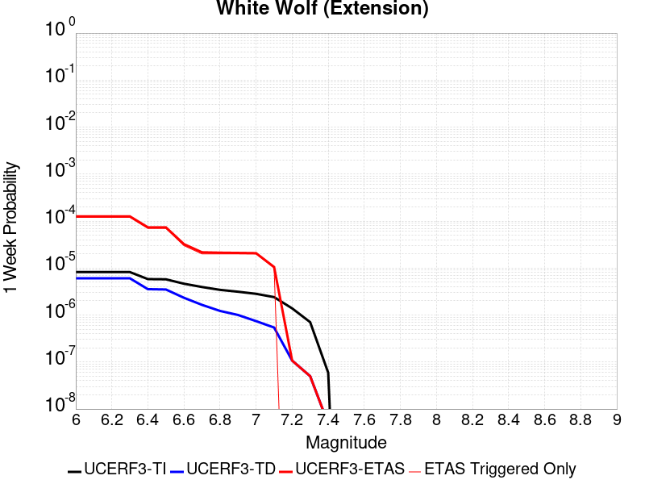 | 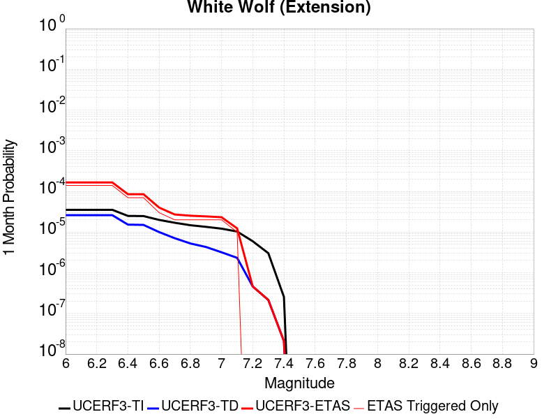 |  |  |

| Magnitude | 1 wk TI Prob | 1 wk TD Prob | 1 wk ETAS Prob | 1 wk ETAS/TD Gain | 1 wk ETAS Triggered Only | 1 mo TI Prob | 1 mo TD Prob | 1 mo ETAS Prob | 1 mo ETAS/TD Gain | 1 mo ETAS Triggered Only | 1 yr TI Prob | 1 yr TD Prob | 1 yr ETAS Prob | 1 yr ETAS/TD Gain | 1 yr ETAS Triggered Only | 10 yr TI Prob | 10 yr TD Prob | 10 yr ETAS Prob | 10 yr ETAS/TD Gain | 10 yr ETAS Triggered Only |
|-----|-----|-----|-----|-----|-----|-----|-----|-----|-----|-----|-----|-----|-----|-----|-----|-----|-----|-----|-----|-----|
| 6.0 | 8.222555E-6 | 6.0666657E-6 | 9.2592716E-5 | 15.262538 | 8.6526576E-5 | 3.5239045E-5 | 2.5999774E-5 | 1.3724534E-4 | 5.2787127 | 1.1124845E-4 | 4.289509E-4 | 3.1650788E-4 | 5.1422033E-4 | 1.6246682 | 1.9777504E-4 | 0.0042812387 | 0.003161223 | 0.0034076604 | 1.0779563 | 2.472188E-4 |
| 6.1 | 8.222555E-6 | 6.0666657E-6 | 9.2592716E-5 | 15.262538 | 8.6526576E-5 | 3.5239045E-5 | 2.5999774E-5 | 1.3724534E-4 | 5.2787127 | 1.1124845E-4 | 4.289509E-4 | 3.1650788E-4 | 5.1422033E-4 | 1.6246682 | 1.9777504E-4 | 0.0042812387 | 0.003161223 | 0.0034076604 | 1.0779563 | 2.472188E-4 |
| 6.2 | 8.222555E-6 | 6.0666657E-6 | 9.2592716E-5 | 15.262538 | 8.6526576E-5 | 3.5239045E-5 | 2.5999774E-5 | 1.3724534E-4 | 5.2787127 | 1.1124845E-4 | 4.289509E-4 | 3.1650788E-4 | 5.1422033E-4 | 1.6246682 | 1.9777504E-4 | 0.0042812387 | 0.003161223 | 0.0034076604 | 1.0779563 | 2.472188E-4 |
| 6.3 | 8.222555E-6 | 6.0666657E-6 | 9.2592716E-5 | 15.262538 | 8.6526576E-5 | 3.5239045E-5 | 2.5999774E-5 | 1.3724534E-4 | 5.2787127 | 1.1124845E-4 | 4.289509E-4 | 3.1650788E-4 | 5.1422033E-4 | 1.6246682 | 1.9777504E-4 | 0.0042812387 | 0.003161223 | 0.0034076604 | 1.0779563 | 2.472188E-4 |
| 6.4 | 5.821773E-6 | 3.5571766E-6 | 4.063986E-5 | 11.424753 | 3.7082817E-5 | 2.4950215E-5 | 1.5244959E-5 | 5.2327214E-5 | 3.4324272 | 3.7082817E-5 | 3.0372653E-4 | 1.8559267E-4 | 2.9682048E-4 | 1.5993115 | 1.1124845E-4 | 0.0030331176 | 0.001854485 | 0.0020025412 | 1.0798368 | 1.4833127E-4 |
| 6.5 | 5.766023E-6 | 3.4991106E-6 | 4.05818E-5 | 11.597747 | 3.7082817E-5 | 2.4711293E-5 | 1.4996108E-5 | 5.207837E-5 | 3.4727924 | 3.7082817E-5 | 3.0081844E-4 | 1.8256342E-4 | 2.9379156E-4 | 1.6092576 | 1.1124845E-4 | 0.0030041158 | 0.0018242426 | 0.0019723033 | 1.0811628 | 1.4833127E-4 |
| 6.6 | 4.643576E-6 | 2.332624E-6 | 1.46935345E-5 | 6.299144 | 1.236094E-5 | 1.9900888E-5 | 9.996925E-6 | 2.235774E-5 | 2.2364619 | 1.236094E-5 | 2.4226638E-4 | 1.2170619E-4 | 1.8350336E-4 | 1.5077571 | 6.18047E-5 | 0.0024200242 | 0.0012164378 | 0.001315205 | 1.0811938 | 9.888752E-5 |
| 6.7 | 3.9529173E-6 | 1.6483477E-6 | 1.6483477E-6 | 1.0 | 0.0 | 1.6940963E-5 | 7.0643296E-6 | 7.0643296E-6 | 1.0 | 0.0 | 2.0623671E-4 | 8.6005006E-5 | 1.1072476E-4 | 1.2874223 | 2.472188E-5 | 0.002060454 | 8.597357E-4 | 9.0913696E-4 | 1.057461 | 4.944376E-5 |
| 6.8 | 3.4377522E-6 | 1.2245237E-6 | 1.2245237E-6 | 1.0 | 0.0 | 1.473314E-5 | 5.2479486E-6 | 5.2479486E-6 | 1.0 | 0.0 | 1.7936122E-4 | 6.3891996E-5 | 8.8612294E-5 | 1.3869076 | 2.472188E-5 | 0.0017921652 | 6.387454E-4 | 6.758045E-4 | 1.0580187 | 3.7082817E-5 |
| 6.9 | 3.1367306E-6 | 1.0033783E-6 | 1.0033783E-6 | 1.0 | 0.0 | 1.3443062E-5 | 4.3001864E-6 | 4.3001864E-6 | 1.0 | 0.0 | 1.63657E-4 | 5.235359E-5 | 5.235359E-5 | 1.0 | 0.0 | 0.0016353652 | 5.2342017E-4 | 5.357746E-4 | 1.0236033 | 1.236094E-5 |
| 7.0 | 2.8298145E-6 | 7.4286646E-7 | 7.4286646E-7 | 1.0 | 0.0 | 1.2127721E-5 | 3.1837099E-6 | 3.1837099E-6 | 1.0 | 0.0 | 1.47645E-4 | 3.8761027E-5 | 3.8761027E-5 | 1.0 | 0.0 | 0.0014754693 | 3.8754768E-4 | 3.9990383E-4 | 1.0318829 | 1.236094E-5 |
| 7.1 | 2.4091064E-6 | 5.4227525E-7 | 5.4227525E-7 | 1.0 | 0.0 | 1.03247E-5 | 2.3240348E-6 | 2.3240348E-6 | 1.0 | 0.0 | 1.2569598E-4 | 2.8294799E-5 | 2.8294799E-5 | 1.0 | 0.0 | 0.001256249 | 2.8291598E-4 | 2.9527344E-4 | 1.0436789 | 1.236094E-5 |
| 7.2 | 1.3875518E-6 | 1.0743063E-7 | 1.0743063E-7 | 1.0 | 0.0 | 5.9466374E-6 | 4.6041689E-7 | 4.6041689E-7 | 1.0 | 0.0 | 7.23979E-5 | 5.6055624E-6 | 5.6055624E-6 | 1.0 | 0.0 | 7.2374323E-4 | 5.6054323E-5 | 5.6054323E-5 | 1.0 | 0.0 |
| 7.3 | 7.056077E-7 | 5.002034E-8 | 5.002034E-8 | 1.0 | 0.0 | 3.0240296E-6 | 2.1437286E-7 | 2.1437286E-7 | 1.0 | 0.0 | 3.681694E-5 | 2.609987E-6 | 2.609987E-6 | 1.0 | 0.0 | 3.681084E-4 | 2.609961E-5 | 2.609961E-5 | 1.0 | 0.0 |
| 7.4 | 5.9334678E-8 | 4.8683537E-9 | 4.8683537E-9 | 1.0 | 0.0 | 2.5429145E-7 | 2.0864372E-8 | 2.0864372E-8 | 1.0 | 0.0 | 3.095994E-6 | 2.5402372E-7 | 2.5402372E-7 | 1.0 | 0.0 | 3.095951E-5 | 2.5402353E-6 | 2.5402353E-6 | 1.0 | 0.0 |

## San Andreas (North Branch Mill Creek)
*[(top)](#table-of-contents)*

| 1 Week | 1 Month | 1 Year | 10 Year |
|-----|-----|-----|-----|
|  | 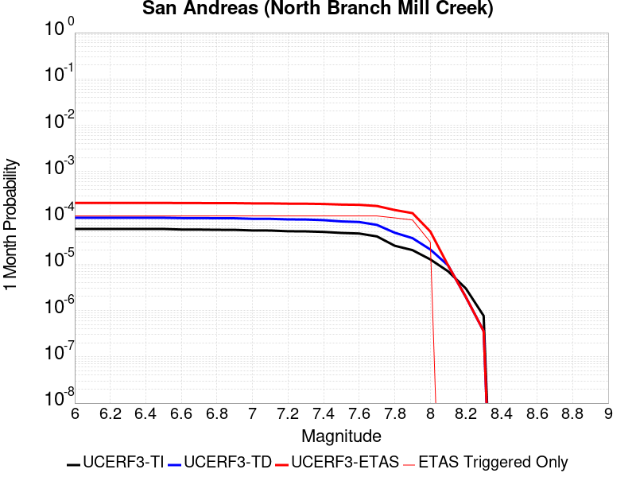 | 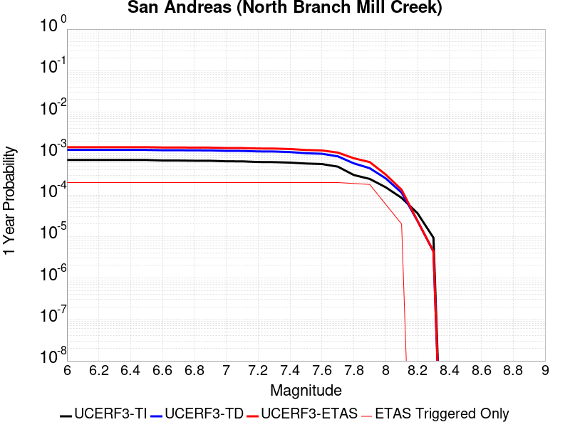 |  |

| Magnitude | 1 wk TI Prob | 1 wk TD Prob | 1 wk ETAS Prob | 1 wk ETAS/TD Gain | 1 wk ETAS Triggered Only | 1 mo TI Prob | 1 mo TD Prob | 1 mo ETAS Prob | 1 mo ETAS/TD Gain | 1 mo ETAS Triggered Only | 1 yr TI Prob | 1 yr TD Prob | 1 yr ETAS Prob | 1 yr ETAS/TD Gain | 1 yr ETAS Triggered Only | 10 yr TI Prob | 10 yr TD Prob | 10 yr ETAS Prob | 10 yr ETAS/TD Gain | 10 yr ETAS Triggered Only |
|-----|-----|-----|-----|-----|-----|-----|-----|-----|-----|-----|-----|-----|-----|-----|-----|-----|-----|-----|-----|-----|
| 6.0 | 1.3461156E-5 | 2.3499893E-5 | 8.530314E-5 | 3.6299372 | 6.18047E-5 | 5.7689394E-5 | 1.00709956E-4 | 1.8722782E-4 | 1.8590795 | 8.6526576E-5 | 7.02142E-4 | 0.0012254574 | 0.0014106443 | 1.1511165 | 1.8541409E-4 | 0.0069992766 | 0.01222957 | 0.012461555 | 1.0189693 | 2.3485786E-4 |
| 6.1 | 1.3461156E-5 | 2.3499893E-5 | 8.530314E-5 | 3.6299372 | 6.18047E-5 | 5.7689394E-5 | 1.00709956E-4 | 1.8722782E-4 | 1.8590795 | 8.6526576E-5 | 7.02142E-4 | 0.0012254574 | 0.0014106443 | 1.1511165 | 1.8541409E-4 | 0.0069992766 | 0.01222957 | 0.012461555 | 1.0189693 | 2.3485786E-4 |
| 6.2 | 1.3461156E-5 | 2.3499893E-5 | 8.530314E-5 | 3.6299372 | 6.18047E-5 | 5.7689394E-5 | 1.00709956E-4 | 1.8722782E-4 | 1.8590795 | 8.6526576E-5 | 7.02142E-4 | 0.0012254574 | 0.0014106443 | 1.1511165 | 1.8541409E-4 | 0.0069992766 | 0.01222957 | 0.012461555 | 1.0189693 | 2.3485786E-4 |
| 6.3 | 1.3461156E-5 | 2.3499893E-5 | 8.530314E-5 | 3.6299372 | 6.18047E-5 | 5.7689394E-5 | 1.00709956E-4 | 1.8722782E-4 | 1.8590795 | 8.6526576E-5 | 7.02142E-4 | 0.0012254574 | 0.0014106443 | 1.1511165 | 1.8541409E-4 | 0.0069992766 | 0.01222957 | 0.012461555 | 1.0189693 | 2.3485786E-4 |
| 6.4 | 1.3461156E-5 | 2.3499893E-5 | 8.530314E-5 | 3.6299372 | 6.18047E-5 | 5.7689394E-5 | 1.00709956E-4 | 1.8722782E-4 | 1.8590795 | 8.6526576E-5 | 7.02142E-4 | 0.0012254574 | 0.0014106443 | 1.1511165 | 1.8541409E-4 | 0.0069992766 | 0.01222957 | 0.012461555 | 1.0189693 | 2.3485786E-4 |
| 6.5 | 1.3450706E-5 | 2.3488852E-5 | 8.52921E-5 | 3.6311734 | 6.18047E-5 | 5.764461E-5 | 1.0066265E-4 | 1.8718051E-4 | 1.8594834 | 8.6526576E-5 | 7.0159714E-4 | 0.001224882 | 0.001410069 | 1.1511877 | 1.8541409E-4 | 0.006993862 | 0.01222388 | 0.012455867 | 1.0189782 | 2.3485786E-4 |
| 6.6 | 1.3074523E-5 | 2.3103135E-5 | 8.49064E-5 | 3.675103 | 6.18047E-5 | 5.6032466E-5 | 9.9009696E-5 | 1.8552771E-4 | 1.8738337 | 8.6526576E-5 | 6.8198174E-4 | 0.0012047797 | 0.0013899704 | 1.1537133 | 1.8541409E-4 | 0.006798926 | 0.012025044 | 0.012257079 | 1.0192958 | 2.3485786E-4 |
| 6.7 | 1.3050216E-5 | 2.3078432E-5 | 8.48817E-5 | 3.6779666 | 6.18047E-5 | 5.59283E-5 | 9.890384E-5 | 1.8542186E-4 | 1.8747691 | 8.6526576E-5 | 6.8071426E-4 | 0.0012034923 | 0.0013886832 | 1.153878 | 1.8541409E-4 | 0.0067863287 | 0.012012309 | 0.012244346 | 1.0193166 | 2.3485786E-4 |
| 6.8 | 1.29049395E-5 | 2.292684E-5 | 8.473012E-5 | 3.6956735 | 6.18047E-5 | 5.530571E-5 | 9.825421E-5 | 1.8477229E-4 | 1.8805534 | 8.6526576E-5 | 6.73139E-4 | 0.0011955918 | 0.0013807842 | 1.154896 | 1.8541409E-4 | 0.0067110364 | 0.011934154 | 0.0121662095 | 1.0194446 | 2.3485786E-4 |
| 6.9 | 1.2867369E-5 | 2.2886245E-5 | 8.468953E-5 | 3.7004554 | 6.18047E-5 | 5.51447E-5 | 9.8080236E-5 | 1.8459832E-4 | 1.8821155 | 8.6526576E-5 | 6.711799E-4 | 0.0011934759 | 0.0013786687 | 1.1551709 | 1.8541409E-4 | 0.006691564 | 0.011913223 | 0.012145284 | 1.0194792 | 2.3485786E-4 |
| 7.0 | 1.2495996E-5 | 2.2286325E-5 | 8.408965E-5 | 3.7731497 | 6.18047E-5 | 5.3553173E-5 | 9.550934E-5 | 1.8202765E-4 | 1.9058623 | 8.6526576E-5 | 6.518148E-4 | 0.0011622087 | 0.0013474073 | 1.1593505 | 1.8541409E-4 | 0.0064990623 | 0.0116038285 | 0.011835961 | 1.0200049 | 2.3485786E-4 |
| 7.1 | 1.2452067E-5 | 2.2231397E-5 | 8.403472E-5 | 3.7800016 | 6.18047E-5 | 5.3364907E-5 | 9.527396E-5 | 1.8179229E-4 | 1.9081005 | 8.6526576E-5 | 6.4952404E-4 | 0.0011593461 | 0.0013445452 | 1.1597445 | 1.8541409E-4 | 0.0064762887 | 0.0115755 | 0.011807639 | 1.0200543 | 2.3485786E-4 |
| 7.2 | 1.2002777E-5 | 2.1609963E-5 | 8.3413324E-5 | 3.8599474 | 6.18047E-5 | 5.143946E-5 | 9.2610855E-5 | 1.7912942E-4 | 1.9342163 | 8.6526576E-5 | 6.2609545E-4 | 0.0011269567 | 0.0013121618 | 1.164341 | 1.8541409E-4 | 0.006243344 | 0.011254923 | 0.0114871375 | 1.0206323 | 2.3485786E-4 |
| 7.3 | 1.1923425E-5 | 2.1479793E-5 | 8.3283165E-5 | 3.8772795 | 6.18047E-5 | 5.109939E-5 | 9.205302E-5 | 1.7857163E-4 | 1.939878 | 8.6526576E-5 | 6.219575E-4 | 0.001120172 | 0.0013053784 | 1.1653374 | 1.8541409E-4 | 0.0062021962 | 0.011187789 | 0.011407796 | 1.019665 | 2.224969E-4 |
| 7.4 | 1.16105175E-5 | 2.0853771E-5 | 8.265718E-5 | 3.9636562 | 6.18047E-5 | 4.975841E-5 | 8.937026E-5 | 1.758891E-4 | 1.9680943 | 8.6526576E-5 | 6.0564023E-4 | 0.0010875424 | 0.0012727549 | 1.1703037 | 1.8541409E-4 | 0.006039923 | 0.010865397 | 0.011085476 | 1.0202551 | 2.224969E-4 |
| 7.5 | 1.1037265E-5 | 1.9553907E-5 | 8.135739E-5 | 4.160672 | 6.18047E-5 | 4.7301706E-5 | 8.379978E-5 | 1.7031911E-4 | 2.0324528 | 8.6526576E-5 | 5.757461E-4 | 0.0010197869 | 0.001205012 | 1.1816311 | 1.8541409E-4 | 0.005742567 | 0.010194898 | 0.010415127 | 1.0216018 | 2.224969E-4 |
| 7.6 | 1.0720915E-5 | 1.899582E-5 | 8.079934E-5 | 4.253533 | 6.18047E-5 | 4.5945973E-5 | 8.140812E-5 | 1.6792766E-4 | 2.0627875 | 8.6526576E-5 | 5.592486E-4 | 9.906954E-4 | 0.0011759258 | 1.1869701 | 1.8541409E-4 | 0.005578433 | 0.009906623 | 0.010126915 | 1.022237 | 2.224969E-4 |
| 7.7 | 9.276279E-6 | 1.6441649E-5 | 7.824533E-5 | 4.758971 | 6.18047E-5 | 3.9754876E-5 | 7.0462316E-5 | 1.5698279E-4 | 2.2278972 | 8.6526576E-5 | 4.839081E-4 | 8.575427E-4 | 0.0010427978 | 1.2160301 | 1.8541409E-4 | 0.0048285574 | 0.008586041 | 0.008806627 | 1.0256913 | 2.224969E-4 |
| 7.8 | 5.8346777E-6 | 1.1155013E-5 | 7.2959025E-5 | 6.540469 | 6.18047E-5 | 2.5005522E-5 | 4.7806327E-5 | 1.3432876E-4 | 2.8098533 | 8.6526576E-5 | 3.043997E-4 | 5.818867E-4 | 7.6719286E-4 | 1.3184575 | 1.8541409E-4 | 0.0030398308 | 0.0058469265 | 0.0060681226 | 1.0378312 | 2.224969E-4 |
| 7.9 | 4.690204E-6 | 8.509093E-6 | 7.031327E-5 | 8.263309 | 6.18047E-5 | 2.0100719E-5 | 3.6467034E-5 | 1.1062997E-4 | 3.0336978 | 7.416563E-5 | 2.4469878E-4 | 4.4389578E-4 | 6.168721E-4 | 1.3896778 | 1.7305315E-4 | 0.002444295 | 0.0044707474 | 0.004667638 | 1.0440398 | 1.9777504E-4 |
| 8.0 | 2.9570454E-6 | 4.846947E-6 | 2.9568706E-5 | 6.1004806 | 2.472188E-5 | 1.267299E-5 | 2.0772464E-5 | 5.785451E-5 | 2.785154 | 3.7082817E-5 | 1.5428272E-4 | 2.5287544E-4 | 3.146645E-4 | 1.2443459 | 6.18047E-5 | 0.0015417566 | 0.002549644 | 0.0026112914 | 1.0241787 | 6.18047E-5 |
| 8.1 | 1.6376824E-6 | 2.1968929E-6 | 2.1968929E-6 | 1.0 | 0.0 | 7.01862E-6 | 9.41522E-6 | 9.41522E-6 | 1.0 | 0.0 | 8.544835E-5 | 1.14624294E-4 | 1.2698382E-4 | 1.1078264 | 1.236094E-5 | 8.54155E-4 | 0.0011606582 | 0.0011730047 | 1.0106375 | 1.236094E-5 |
| 8.2 | 6.9631557E-7 | 4.5360213E-7 | 4.5360213E-7 | 1.0 | 0.0 | 2.984206E-6 | 1.9440076E-6 | 1.9440076E-6 | 1.0 | 0.0 | 3.63321E-5 | 2.3668037E-5 | 2.3668037E-5 | 1.0 | 0.0 | 3.6326164E-4 | 2.451564E-4 | 2.451564E-4 | 1.0 | 0.0 |
| 8.3 | 1.7876137E-7 | 8.360375E-8 | 8.360375E-8 | 1.0 | 0.0 | 7.661199E-7 | 3.5830175E-7 | 3.5830175E-7 | 1.0 | 0.0 | 9.32747E-6 | 4.3623154E-6 | 4.3623154E-6 | 1.0 | 0.0 | 9.3270784E-5 | 4.5817014E-5 | 4.5817014E-5 | 1.0 | 0.0 |

## Lake Isabella (Seismicity)
*[(top)](#table-of-contents)*

| 1 Week | 1 Month | 1 Year | 10 Year |
|-----|-----|-----|-----|
|  |  |  |  |

| Magnitude | 1 wk TI Prob | 1 wk TD Prob | 1 wk ETAS Prob | 1 wk ETAS/TD Gain | 1 wk ETAS Triggered Only | 1 mo TI Prob | 1 mo TD Prob | 1 mo ETAS Prob | 1 mo ETAS/TD Gain | 1 mo ETAS Triggered Only | 1 yr TI Prob | 1 yr TD Prob | 1 yr ETAS Prob | 1 yr ETAS/TD Gain | 1 yr ETAS Triggered Only | 10 yr TI Prob | 10 yr TD Prob | 10 yr ETAS Prob | 10 yr ETAS/TD Gain | 10 yr ETAS Triggered Only |
|-----|-----|-----|-----|-----|-----|-----|-----|-----|-----|-----|-----|-----|-----|-----|-----|-----|-----|-----|-----|-----|
| 6.0 | 9.431637E-6 | 9.741651E-6 | 7.154575E-5 | 7.3443136 | 6.18047E-5 | 4.0420677E-5 | 4.1749343E-5 | 1.5299315E-4 | 3.6645644 | 1.1124845E-4 | 4.920106E-4 | 5.0819275E-4 | 6.81158E-4 | 1.3403536 | 1.7305315E-4 | 0.004909227 | 0.005071599 | 0.0052929674 | 1.0436487 | 2.224969E-4 |
| 6.1 | 9.431637E-6 | 9.741651E-6 | 7.154575E-5 | 7.3443136 | 6.18047E-5 | 4.0420677E-5 | 4.1749343E-5 | 1.5299315E-4 | 3.6645644 | 1.1124845E-4 | 4.920106E-4 | 5.0819275E-4 | 6.81158E-4 | 1.3403536 | 1.7305315E-4 | 0.004909227 | 0.005071599 | 0.0052929674 | 1.0436487 | 2.224969E-4 |
| 6.2 | 9.431637E-6 | 9.741651E-6 | 7.154575E-5 | 7.3443136 | 6.18047E-5 | 4.0420677E-5 | 4.1749343E-5 | 1.5299315E-4 | 3.6645644 | 1.1124845E-4 | 4.920106E-4 | 5.0819275E-4 | 6.81158E-4 | 1.3403536 | 1.7305315E-4 | 0.004909227 | 0.005071599 | 0.0052929674 | 1.0436487 | 2.224969E-4 |
| 6.3 | 9.431637E-6 | 9.741651E-6 | 7.154575E-5 | 7.3443136 | 6.18047E-5 | 4.0420677E-5 | 4.1749343E-5 | 1.5299315E-4 | 3.6645644 | 1.1124845E-4 | 4.920106E-4 | 5.0819275E-4 | 6.81158E-4 | 1.3403536 | 1.7305315E-4 | 0.004909227 | 0.005071599 | 0.0052929674 | 1.0436487 | 2.224969E-4 |
| 6.4 | 5.144063E-6 | 5.3000763E-6 | 4.2382697E-5 | 7.9966207 | 3.7082817E-5 | 2.2045799E-5 | 2.2714434E-5 | 8.451773E-5 | 3.720882 | 6.18047E-5 | 2.6837454E-4 | 2.765166E-4 | 3.6301924E-4 | 1.3128299 | 8.6526576E-5 | 0.0026805066 | 0.0027620657 | 0.00286068 | 1.0357032 | 9.888752E-5 |
| 6.5 | 5.144063E-6 | 5.3000763E-6 | 4.2382697E-5 | 7.9966207 | 3.7082817E-5 | 2.2045799E-5 | 2.2714434E-5 | 8.451773E-5 | 3.720882 | 6.18047E-5 | 2.6837454E-4 | 2.765166E-4 | 3.6301924E-4 | 1.3128299 | 8.6526576E-5 | 0.0026805066 | 0.0027620657 | 0.00286068 | 1.0357032 | 9.888752E-5 |
| 6.6 | 3.4009804E-6 | 3.498786E-6 | 4.0581475E-5 | 11.59873 | 3.7082817E-5 | 1.4575549E-5 | 1.4994721E-5 | 6.4437736E-5 | 4.297362 | 4.944376E-5 | 1.7744285E-4 | 1.8254704E-4 | 2.5669913E-4 | 1.4062082 | 7.416563E-5 | 0.0017730123 | 0.0018241286 | 0.0019104973 | 1.0473479 | 8.6526576E-5 |
| 6.7 | 3.3880428E-6 | 3.4856528E-6 | 4.0568342E-5 | 11.638664 | 3.7082817E-5 | 1.4520103E-5 | 1.4938435E-5 | 6.438146E-5 | 4.309786 | 4.944376E-5 | 1.767679E-4 | 1.8186188E-4 | 2.5601403E-4 | 1.4077388 | 7.416563E-5 | 0.0017662736 | 0.0018172882 | 0.0019036576 | 1.0475265 | 8.6526576E-5 |
| 6.8 | 2.6582E-6 | 2.7337003E-6 | 2.7455511E-5 | 10.043351 | 2.472188E-5 | 1.1392236E-5 | 1.1715813E-5 | 3.6437403E-5 | 3.1101046 | 2.472188E-5 | 1.3869164E-4 | 1.4263204E-4 | 1.9206874E-4 | 1.3466032 | 4.944376E-5 | 0.0013860512 | 0.0014255369 | 0.0014749102 | 1.0346348 | 4.944376E-5 |
| 6.9 | 2.406011E-6 | 2.4743288E-6 | 1.4835237E-5 | 5.9956613 | 1.236094E-5 | 1.0311434E-5 | 1.0604231E-5 | 2.296504E-5 | 2.1656487 | 1.236094E-5 | 1.2553448E-4 | 1.2910018E-4 | 1.6617822E-4 | 1.2872036 | 3.7082817E-5 | 0.0012546359 | 0.0012903814 | 0.0013274164 | 1.0287008 | 3.7082817E-5 |
| 7.0 | 1.6953097E-6 | 1.7429371E-6 | 1.4103855E-5 | 8.092005 | 1.236094E-5 | 7.265593E-6 | 7.469715E-6 | 1.9830562E-5 | 2.654795 | 1.236094E-5 | 8.8455E-5 | 9.094104E-5 | 1.2802047E-4 | 1.4077306 | 3.7082817E-5 | 8.84198E-4 | 9.09141E-4 | 9.4619003E-4 | 1.0407518 | 3.7082817E-5 |
| 7.1 | 3.5013824E-7 | 3.5714822E-7 | 3.5714822E-7 | 1.0 | 0.0 | 1.5005916E-6 | 1.5306344E-6 | 1.5306344E-6 | 1.0 | 0.0 | 1.826955E-5 | 1.8635317E-5 | 1.8635317E-5 | 1.0 | 0.0 | 1.8268047E-4 | 1.863378E-4 | 1.863378E-4 | 1.0 | 0.0 |
| 7.2 | 2.2321095E-7 | 2.2750574E-7 | 2.2750574E-7 | 1.0 | 0.0 | 9.56618E-7 | 9.750242E-7 | 9.750242E-7 | 1.0 | 0.0 | 1.1646762E-5 | 1.1870856E-5 | 1.1870856E-5 | 1.0 | 0.0 | 1.1646151E-4 | 1.1870232E-4 | 1.1870232E-4 | 1.0 | 0.0 |
| 7.3 | 1.5760406E-7 | 1.6060922E-7 | 1.6060922E-7 | 1.0 | 0.0 | 6.7544585E-7 | 6.8832503E-7 | 6.8832503E-7 | 1.0 | 0.0 | 8.223522E-6 | 8.380326E-6 | 8.380326E-6 | 1.0 | 0.0 | 8.2232174E-5 | 8.3800165E-5 | 8.3800165E-5 | 1.0 | 0.0 |
| 7.4 | 1.1216497E-7 | 1.1431706E-7 | 1.1431706E-7 | 1.0 | 0.0 | 4.8070694E-7 | 4.899302E-7 | 4.899302E-7 | 1.0 | 0.0 | 5.852591E-6 | 5.964884E-6 | 5.964884E-6 | 1.0 | 0.0 | 5.8524372E-5 | 5.9647282E-5 | 5.9647282E-5 | 1.0 | 0.0 |
| 7.5 | 4.885185E-8 | 4.9787737E-8 | 4.9787737E-8 | 1.0 | 0.0 | 2.0936506E-7 | 2.13376E-7 | 2.13376E-7 | 1.0 | 0.0 | 2.5490165E-6 | 2.59785E-6 | 2.59785E-6 | 1.0 | 0.0 | 2.5489873E-5 | 2.5978214E-5 | 2.5978214E-5 | 1.0 | 0.0 |
| 7.6 | 1.504641E-9 | 1.5317903E-9 | 1.5317903E-9 | 1.0 | 0.0 | 6.4484613E-9 | 6.5648154E-9 | 6.5648154E-9 | 1.0 | 0.0 | 7.851001E-8 | 7.992663E-8 | 7.992663E-8 | 1.0 | 0.0 | 7.8509987E-7 | 7.992663E-7 | 7.992663E-7 | 1.0 | 0.0 |

## Santa Ynez (East)
*[(top)](#table-of-contents)*

| 1 Week | 1 Month | 1 Year | 10 Year |
|-----|-----|-----|-----|
|  |  |  |  |

| Magnitude | 1 wk TI Prob | 1 wk TD Prob | 1 wk ETAS Prob | 1 wk ETAS/TD Gain | 1 wk ETAS Triggered Only | 1 mo TI Prob | 1 mo TD Prob | 1 mo ETAS Prob | 1 mo ETAS/TD Gain | 1 mo ETAS Triggered Only | 1 yr TI Prob | 1 yr TD Prob | 1 yr ETAS Prob | 1 yr ETAS/TD Gain | 1 yr ETAS Triggered Only | 10 yr TI Prob | 10 yr TD Prob | 10 yr ETAS Prob | 10 yr ETAS/TD Gain | 10 yr ETAS Triggered Only |
|-----|-----|-----|-----|-----|-----|-----|-----|-----|-----|-----|-----|-----|-----|-----|-----|-----|-----|-----|-----|-----|
| 6.0 | 3.2269712E-5 | 3.67505E-5 | 7.383196E-5 | 2.0090053 | 3.7082817E-5 | 1.3829143E-4 | 1.5749598E-4 | 2.1929093E-4 | 1.392359 | 6.18047E-5 | 0.0016823979 | 0.0019164166 | 0.0020397892 | 1.0643767 | 1.236094E-4 | 0.016697178 | 0.019056441 | 0.019274699 | 1.0114532 | 2.224969E-4 |
| 6.1 | 3.2269712E-5 | 3.67505E-5 | 7.383196E-5 | 2.0090053 | 3.7082817E-5 | 1.3829143E-4 | 1.5749598E-4 | 2.1929093E-4 | 1.392359 | 6.18047E-5 | 0.0016823979 | 0.0019164166 | 0.0020397892 | 1.0643767 | 1.236094E-4 | 0.016697178 | 0.019056441 | 0.019274699 | 1.0114532 | 2.224969E-4 |
| 6.2 | 3.2269712E-5 | 3.67505E-5 | 7.383196E-5 | 2.0090053 | 3.7082817E-5 | 1.3829143E-4 | 1.5749598E-4 | 2.1929093E-4 | 1.392359 | 6.18047E-5 | 0.0016823979 | 0.0019164166 | 0.0020397892 | 1.0643767 | 1.236094E-4 | 0.016697178 | 0.019056441 | 0.019274699 | 1.0114532 | 2.224969E-4 |
| 6.3 | 3.2269712E-5 | 3.67505E-5 | 7.383196E-5 | 2.0090053 | 3.7082817E-5 | 1.3829143E-4 | 1.5749598E-4 | 2.1929093E-4 | 1.392359 | 6.18047E-5 | 0.0016823979 | 0.0019164166 | 0.0020397892 | 1.0643767 | 1.236094E-4 | 0.016697178 | 0.019056441 | 0.019274699 | 1.0114532 | 2.224969E-4 |
| 6.4 | 1.4404779E-5 | 1.4849382E-5 | 3.9570896E-5 | 2.6648176 | 2.472188E-5 | 6.1733306E-5 | 6.363868E-5 | 1.00719146E-4 | 1.5826716 | 3.7082817E-5 | 7.513438E-4 | 7.745306E-4 | 8.239361E-4 | 1.0637876 | 4.944376E-5 | 0.0074880854 | 0.007718862 | 0.007829252 | 1.0143013 | 1.1124845E-4 |
| 6.5 | 1.4404779E-5 | 1.4849382E-5 | 3.9570896E-5 | 2.6648176 | 2.472188E-5 | 6.1733306E-5 | 6.363868E-5 | 1.00719146E-4 | 1.5826716 | 3.7082817E-5 | 7.513438E-4 | 7.745306E-4 | 8.239361E-4 | 1.0637876 | 4.944376E-5 | 0.0074880854 | 0.007718862 | 0.007829252 | 1.0143013 | 1.1124845E-4 |
| 6.6 | 1.280208E-5 | 1.3011947E-5 | 3.7733505E-5 | 2.899912 | 2.472188E-5 | 5.4864904E-5 | 5.5764307E-5 | 9.284505E-5 | 1.6649549 | 3.7082817E-5 | 6.6777546E-4 | 6.787207E-4 | 7.281309E-4 | 1.072799 | 4.944376E-5 | 0.006657724 | 0.0067666885 | 0.0068649068 | 1.014515 | 9.888752E-5 |
| 6.7 | 1.2457027E-5 | 1.2628468E-5 | 3.7350033E-5 | 2.9576063 | 2.472188E-5 | 5.3386164E-5 | 5.412089E-5 | 9.12017E-5 | 1.6851479 | 3.7082817E-5 | 6.497827E-4 | 6.587243E-4 | 6.957827E-4 | 1.0562578 | 3.7082817E-5 | 0.00647886 | 0.006567915 | 0.0066538732 | 1.0130876 | 8.6526576E-5 |
| 6.8 | 1.2095134E-5 | 1.2230915E-5 | 3.695249E-5 | 3.021237 | 2.472188E-5 | 5.1835254E-5 | 5.241716E-5 | 8.949803E-5 | 1.7074186 | 3.7082817E-5 | 6.309115E-4 | 6.379937E-4 | 6.750528E-4 | 1.058087 | 3.7082817E-5 | 0.0062912325 | 0.006361809 | 0.006447785 | 1.0135144 | 8.6526576E-5 |
| 6.9 | 1.1104036E-5 | 1.1157347E-5 | 3.587895E-5 | 3.215724 | 2.472188E-5 | 4.758786E-5 | 4.781633E-5 | 8.489738E-5 | 1.7754891 | 3.7082817E-5 | 5.7922816E-4 | 5.820096E-4 | 6.1907084E-4 | 1.063678 | 3.7082817E-5 | 0.005777207 | 0.0058049993 | 0.005891023 | 1.014819 | 8.6526576E-5 |
| 7.0 | 1.0577444E-5 | 1.058168E-5 | 3.53033E-5 | 3.3362658 | 2.472188E-5 | 4.5331115E-5 | 4.5349276E-5 | 8.2430415E-5 | 1.8176787 | 3.7082817E-5 | 5.5176654E-4 | 5.519888E-4 | 5.890511E-4 | 1.0671433 | 3.7082817E-5 | 0.0055039856 | 0.0055063153 | 0.0055923657 | 1.0156275 | 8.6526576E-5 |
| 7.1 | 1.0021775E-5 | 9.980988E-6 | 9.980988E-6 | 1.0 | 0.0 | 4.294976E-5 | 4.2774966E-5 | 5.5135377E-5 | 1.2889637 | 1.236094E-5 | 5.2278786E-4 | 5.2066194E-4 | 5.3301646E-4 | 1.0237285 | 1.236094E-5 | 0.0052155964 | 0.0051945536 | 0.0052437405 | 1.0094689 | 4.944376E-5 |
| 7.2 | 8.874109E-6 | 8.748793E-6 | 8.748793E-6 | 1.0 | 0.0 | 3.8031343E-5 | 3.7494297E-5 | 4.9854774E-5 | 1.3296628 | 1.236094E-5 | 4.629332E-4 | 4.5639853E-4 | 4.6875383E-4 | 1.0270712 | 1.236094E-5 | 0.0046197 | 0.0045547304 | 0.0045916443 | 1.0081046 | 3.7082817E-5 |
| 7.3 | 7.5504267E-6 | 7.5051175E-6 | 7.5051175E-6 | 1.0 | 0.0 | 3.235857E-5 | 3.21644E-5 | 4.4524942E-5 | 1.3842926 | 1.236094E-5 | 3.9389438E-4 | 3.915322E-4 | 4.0388832E-4 | 1.0315583 | 1.236094E-5 | 0.0039319694 | 0.003908531 | 0.003945469 | 1.0094506 | 3.7082817E-5 |
| 7.4 | 6.309394E-6 | 6.1831556E-6 | 6.1831556E-6 | 1.0 | 0.0 | 2.703998E-5 | 2.6498974E-5 | 3.8859587E-5 | 1.4664562 | 1.236094E-5 | 3.2916202E-4 | 3.225782E-4 | 3.3493518E-4 | 1.0383068 | 1.236094E-5 | 0.003286749 | 0.003221197 | 0.0032581603 | 1.0114751 | 3.7082817E-5 |
| 7.5 | 4.6103073E-6 | 4.4408903E-6 | 4.4408903E-6 | 1.0 | 0.0 | 1.975831E-5 | 1.9032252E-5 | 1.9032252E-5 | 1.0 | 0.0 | 2.4053088E-4 | 2.3169373E-4 | 2.3169373E-4 | 1.0 | 0.0 | 0.002402707 | 0.002314591 | 0.0023269234 | 1.005328 | 1.236094E-5 |
| 7.6 | 1.2858658E-6 | 1.3008173E-6 | 1.3008173E-6 | 1.0 | 0.0 | 5.5108417E-6 | 5.5749197E-6 | 5.5749197E-6 | 1.0 | 0.0 | 6.7092435E-5 | 6.78726E-5 | 6.78726E-5 | 1.0 | 0.0 | 6.707218E-4 | 6.785256E-4 | 6.785256E-4 | 1.0 | 0.0 |
| 7.7 | 5.3302307E-7 | 5.612138E-7 | 5.612138E-7 | 1.0 | 0.0 | 2.2843826E-6 | 2.4052001E-6 | 2.4052001E-6 | 1.0 | 0.0 | 2.7812002E-5 | 2.9282954E-5 | 2.9282954E-5 | 1.0 | 0.0 | 2.7808524E-4 | 2.9279452E-4 | 2.9279452E-4 | 1.0 | 0.0 |
| 7.8 | 4.613933E-8 | 4.80301E-8 | 4.80301E-8 | 1.0 | 0.0 | 1.9773998E-7 | 2.0584326E-7 | 2.0584326E-7 | 1.0 | 0.0 | 2.4074816E-6 | 2.5061388E-6 | 2.5061388E-6 | 1.0 | 0.0 | 2.4074554E-5 | 2.5061116E-5 | 2.5061116E-5 | 1.0 | 0.0 |

## San Andreas (Creeping Section) 2011 CFM
*[(top)](#table-of-contents)*

| 1 Week | 1 Month | 1 Year | 10 Year |
|-----|-----|-----|-----|
|  |  |  |  |

| Magnitude | 1 wk TI Prob | 1 wk TD Prob | 1 wk ETAS Prob | 1 wk ETAS/TD Gain | 1 wk ETAS Triggered Only | 1 mo TI Prob | 1 mo TD Prob | 1 mo ETAS Prob | 1 mo ETAS/TD Gain | 1 mo ETAS Triggered Only | 1 yr TI Prob | 1 yr TD Prob | 1 yr ETAS Prob | 1 yr ETAS/TD Gain | 1 yr ETAS Triggered Only | 10 yr TI Prob | 10 yr TD Prob | 10 yr ETAS Prob | 10 yr ETAS/TD Gain | 10 yr ETAS Triggered Only |
|-----|-----|-----|-----|-----|-----|-----|-----|-----|-----|-----|-----|-----|-----|-----|-----|-----|-----|-----|-----|-----|
| 6.0 | 5.986481E-4 | 0.001228691 | 0.001327457 | 1.0803831 | 9.888752E-5 | 0.0025631124 | 0.005246795 | 0.005345164 | 1.0187483 | 9.888752E-5 | 0.030762846 | 0.061203245 | 0.0613425 | 1.0022752 | 1.4833127E-4 | 0.26835477 | 0.425928 | 0.42604864 | 1.0002832 | 2.1013597E-4 |
| 6.1 | 5.015945E-4 | 0.0010230356 | 0.0010847771 | 1.0603513 | 6.18047E-5 | 0.00214792 | 0.004369436 | 0.00443097 | 1.014083 | 6.18047E-5 | 0.025839351 | 0.051246606 | 0.051352154 | 1.0020596 | 1.1124845E-4 | 0.23032776 | 0.37284943 | 0.37295023 | 1.0002702 | 1.6069222E-4 |
| 6.2 | 4.073338E-4 | 8.1157376E-4 | 8.7332824E-4 | 1.0760924 | 6.18047E-5 | 0.0017445484 | 0.0034683137 | 0.003529904 | 1.017758 | 6.18047E-5 | 0.021034058 | 0.04093177 | 0.041038465 | 1.0026066 | 1.1124845E-4 | 0.19150782 | 0.31302592 | 0.31312782 | 1.0003256 | 1.4833127E-4 |
| 6.3 | 3.464099E-4 | 6.7455834E-4 | 7.239687E-4 | 1.0732485 | 4.944376E-5 | 0.0014837692 | 0.0028832308 | 0.002932532 | 1.0170993 | 4.944376E-5 | 0.017915873 | 0.034187846 | 0.034283355 | 1.0027936 | 9.888752E-5 | 0.16538359 | 0.27130842 | 0.27140749 | 1.0003651 | 1.3597033E-4 |
| 6.4 | 2.935057E-4 | 5.5516965E-4 | 6.04586E-4 | 1.0890112 | 4.944376E-5 | 0.0012572751 | 0.0023727308 | 0.0024220573 | 1.0207889 | 4.944376E-5 | 0.015200248 | 0.02826279 | 0.028358882 | 1.0034 | 9.888752E-5 | 0.14201577 | 0.23297668 | 0.23308097 | 1.0004476 | 1.3597033E-4 |
| 6.5 | 2.3409708E-4 | 4.2132285E-4 | 4.5839004E-4 | 1.0879781 | 3.7082817E-5 | 0.0010028875 | 0.0018017791 | 0.0018387951 | 1.0205442 | 3.7082817E-5 | 0.012141965 | 0.021586355 | 0.021671014 | 1.0039219 | 8.6526576E-5 | 0.11499573 | 0.1868149 | 0.18691543 | 1.0005381 | 1.236094E-4 |
| 6.6 | 1.5842178E-4 | 2.5068692E-4 | 2.8776043E-4 | 1.1478877 | 3.7082817E-5 | 6.7877385E-4 | 0.0010739256 | 0.0011109686 | 1.0344931 | 3.7082817E-5 | 0.0082328 | 0.012995283 | 0.013080685 | 1.0065718 | 8.6526576E-5 | 0.07934396 | 0.12313759 | 0.123245984 | 1.0008802 | 1.236094E-4 |
| 6.7 | 1.5616413E-4 | 2.4605254E-4 | 2.8312622E-4 | 1.1506739 | 3.7082817E-5 | 6.691031E-4 | 0.0010540807 | 0.0010911244 | 1.0351431 | 3.7082817E-5 | 0.0081159435 | 0.012757154 | 0.012842577 | 1.0066961 | 8.6526576E-5 | 0.0782586 | 0.12116472 | 0.121273346 | 1.0008966 | 1.236094E-4 |
| 6.8 | 1.5538467E-4 | 2.442914E-4 | 2.8136518E-4 | 1.1517603 | 3.7082817E-5 | 6.6576427E-4 | 0.001046539 | 0.0010835831 | 1.0353967 | 3.7082817E-5 | 0.008075596 | 0.012666538 | 0.012751969 | 1.0067446 | 8.6526576E-5 | 0.07788358 | 0.12039561 | 0.120504335 | 1.0009031 | 1.236094E-4 |
| 6.9 | 1.5153569E-4 | 2.3538464E-4 | 2.724587E-4 | 1.1575043 | 3.7082817E-5 | 6.49277E-4 | 0.0010084033 | 0.0010454487 | 1.0367367 | 3.7082817E-5 | 0.007876333 | 0.012208726 | 0.0122941965 | 1.0070008 | 8.6526576E-5 | 0.07602952 | 0.11646574 | 0.11657496 | 1.0009377 | 1.236094E-4 |
| 7.0 | 1.4588932E-4 | 2.2395732E-4 | 2.6103185E-4 | 1.1655427 | 3.7082817E-5 | 6.250901E-4 | 9.59466E-4 | 9.965133E-4 | 1.0386124 | 3.7082817E-5 | 0.0075839474 | 0.011619428 | 0.011704949 | 1.0073602 | 8.6526576E-5 | 0.073302895 | 0.11131206 | 0.11142191 | 1.0009868 | 1.236094E-4 |
| 7.1 | 1.1565079E-4 | 1.6281323E-4 | 1.9989001E-4 | 1.2277259 | 3.7082817E-5 | 4.955521E-4 | 6.9758523E-4 | 7.3464215E-4 | 1.0531218 | 3.7082817E-5 | 0.006016669 | 0.008460228 | 0.008546023 | 1.0101409 | 8.6526576E-5 | 0.058563538 | 0.08366478 | 0.08377805 | 1.0013539 | 1.236094E-4 |
| 7.2 | 1.0393792E-4 | 1.4615392E-4 | 1.8323131E-4 | 1.2536874 | 3.7082817E-5 | 4.4537216E-4 | 6.262243E-4 | 6.632839E-4 | 1.0591794 | 3.7082817E-5 | 0.005408933 | 0.0075977976 | 0.007683667 | 1.0113019 | 8.6526576E-5 | 0.052791595 | 0.07561503 | 0.075729296 | 1.0015111 | 1.236094E-4 |
| 7.3 | 9.332884E-5 | 1.2780601E-4 | 1.6488408E-4 | 1.2901121 | 3.7082817E-5 | 3.999194E-4 | 5.4762565E-4 | 5.8468815E-4 | 1.0676786 | 3.7082817E-5 | 0.0048581534 | 0.0066470946 | 0.006733046 | 1.0129306 | 8.6526576E-5 | 0.047533102 | 0.06647954 | 0.066594936 | 1.0017358 | 1.236094E-4 |
| 7.4 | 8.670252E-5 | 1.1702972E-4 | 1.5410819E-4 | 1.3168296 | 3.7082817E-5 | 3.715293E-4 | 5.014601E-4 | 5.3852436E-4 | 1.0739126 | 3.7082817E-5 | 0.004513991 | 0.0060883067 | 0.0061743064 | 1.0141253 | 8.6526576E-5 | 0.044233937 | 0.061148684 | 0.061264735 | 1.0018978 | 1.236094E-4 |
| 7.5 | 7.3036405E-5 | 9.005699E-5 | 1.1477664E-4 | 1.274489 | 2.472188E-5 | 3.129756E-4 | 3.859015E-4 | 4.1061384E-4 | 1.0640379 | 2.472188E-5 | 0.0038038217 | 0.0046882504 | 0.0047620684 | 1.0157453 | 7.416563E-5 | 0.03739367 | 0.047875606 | 0.047969762 | 1.0019666 | 9.888752E-5 |
| 7.6 | 6.3935775E-5 | 8.280209E-5 | 1.0752192E-4 | 1.2985412 | 2.472188E-5 | 2.7398168E-4 | 3.5481792E-4 | 3.7953103E-4 | 1.06965 | 2.472188E-5 | 0.0033306254 | 0.00431137 | 0.0043729083 | 1.0142735 | 6.18047E-5 | 0.032811474 | 0.043990135 | 0.044072855 | 1.0018804 | 8.6526576E-5 |
| 7.7 | 5.5050095E-5 | 6.661729E-5 | 7.8977406E-5 | 1.1855391 | 1.236094E-5 | 2.3590765E-4 | 2.8547147E-4 | 2.9782887E-4 | 1.0432878 | 1.236094E-5 | 0.0028683927 | 0.0034700802 | 0.0035193523 | 1.0141991 | 4.944376E-5 | 0.0283165 | 0.03579509 | 0.03585468 | 1.0016649 | 6.18047E-5 |
| 7.8 | 5.027131E-5 | 6.1627725E-5 | 7.39879E-5 | 1.200562 | 1.236094E-5 | 2.1543067E-4 | 2.640921E-4 | 2.7644978E-4 | 1.0467931 | 1.236094E-5 | 0.0026197135 | 0.003210584 | 0.0032598688 | 1.0153508 | 4.944376E-5 | 0.025890453 | 0.03312572 | 0.03318548 | 1.001804 | 6.18047E-5 |
| 7.9 | 3.7271806E-5 | 5.0224386E-5 | 6.25847E-5 | 1.246102 | 1.236094E-5 | 1.5972654E-4 | 2.1522962E-4 | 2.275879E-4 | 1.0574191 | 1.236094E-5 | 0.0019429359 | 0.0026172737 | 0.0026542593 | 1.0141314 | 3.7082817E-5 | 0.019260362 | 0.027066687 | 0.027102767 | 1.001333 | 3.7082817E-5 |
| 8.0 | 2.7310243E-5 | 3.1428404E-5 | 4.3788954E-5 | 1.3932923 | 1.236094E-5 | 1.17038646E-4 | 1.3468621E-4 | 1.4704549E-4 | 1.0917635 | 1.236094E-5 | 0.0014240141 | 0.0016385721 | 0.0016755941 | 1.0225941 | 3.7082817E-5 | 0.014149235 | 0.01721387 | 0.017250314 | 1.0021172 | 3.7082817E-5 |
| 8.1 | 1.7940547E-5 | 1.7400796E-5 | 2.976152E-5 | 1.710354 | 1.236094E-5 | 7.688579E-5 | 7.457271E-5 | 8.693273E-5 | 1.1657445 | 1.236094E-5 | 9.3568244E-4 | 9.075451E-4 | 9.1989484E-4 | 1.0136079 | 1.236094E-5 | 0.009317525 | 0.009799073 | 0.009811314 | 1.0012491 | 1.236094E-5 |
| 8.2 | 8.643924E-6 | 5.4748625E-6 | 5.4748625E-6 | 1.0 | 0.0 | 3.704486E-5 | 2.3463486E-5 | 2.3463486E-5 | 1.0 | 0.0 | 4.5092785E-4 | 2.8563058E-4 | 2.8563058E-4 | 1.0 | 0.0 | 0.0045001395 | 0.0032487072 | 0.0032487072 | 1.0 | 0.0 |
| 8.3 | 1.983087E-6 | 7.6599065E-7 | 7.6599065E-7 | 1.0 | 0.0 | 8.498917E-6 | 3.282813E-6 | 3.282813E-6 | 1.0 | 0.0 | 1.034694E-4 | 3.9967534E-5 | 3.9967534E-5 | 1.0 | 0.0 | 0.0010342124 | 4.719687E-4 | 4.719687E-4 | 1.0 | 0.0 |

## San Jacinto (San Jacinto Valley) rev
*[(top)](#table-of-contents)*

| 1 Week | 1 Month | 1 Year | 10 Year |
|-----|-----|-----|-----|
|  | 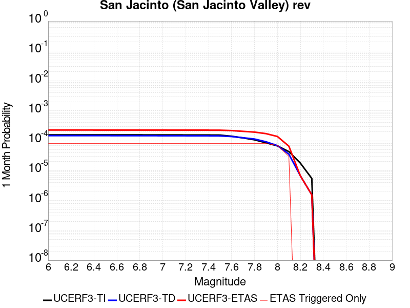 |  |  |

| Magnitude | 1 wk TI Prob | 1 wk TD Prob | 1 wk ETAS Prob | 1 wk ETAS/TD Gain | 1 wk ETAS Triggered Only | 1 mo TI Prob | 1 mo TD Prob | 1 mo ETAS Prob | 1 mo ETAS/TD Gain | 1 mo ETAS Triggered Only | 1 yr TI Prob | 1 yr TD Prob | 1 yr ETAS Prob | 1 yr ETAS/TD Gain | 1 yr ETAS Triggered Only | 10 yr TI Prob | 10 yr TD Prob | 10 yr ETAS Prob | 10 yr ETAS/TD Gain | 10 yr ETAS Triggered Only |
|-----|-----|-----|-----|-----|-----|-----|-----|-----|-----|-----|-----|-----|-----|-----|-----|-----|-----|-----|-----|-----|
| 6.0 | 3.652694E-5 | 3.4402394E-5 | 9.620496E-5 | 2.7964613 | 6.18047E-5 | 1.5653463E-4 | 1.474305E-4 | 2.215852E-4 | 1.5029807 | 7.416563E-5 | 0.0019041431 | 0.00179349 | 0.0019415552 | 1.0825571 | 1.4833127E-4 | 0.018879099 | 0.018526595 | 0.018720705 | 1.0104774 | 1.9777504E-4 |
| 6.1 | 3.652694E-5 | 3.4402394E-5 | 9.620496E-5 | 2.7964613 | 6.18047E-5 | 1.5653463E-4 | 1.474305E-4 | 2.215852E-4 | 1.5029807 | 7.416563E-5 | 0.0019041431 | 0.00179349 | 0.0019415552 | 1.0825571 | 1.4833127E-4 | 0.018879099 | 0.018526595 | 0.018720705 | 1.0104774 | 1.9777504E-4 |
| 6.2 | 3.652694E-5 | 3.4402394E-5 | 9.620496E-5 | 2.7964613 | 6.18047E-5 | 1.5653463E-4 | 1.474305E-4 | 2.215852E-4 | 1.5029807 | 7.416563E-5 | 0.0019041431 | 0.00179349 | 0.0019415552 | 1.0825571 | 1.4833127E-4 | 0.018879099 | 0.018526595 | 0.018720705 | 1.0104774 | 1.9777504E-4 |
| 6.3 | 3.652694E-5 | 3.4402394E-5 | 9.620496E-5 | 2.7964613 | 6.18047E-5 | 1.5653463E-4 | 1.474305E-4 | 2.215852E-4 | 1.5029807 | 7.416563E-5 | 0.0019041431 | 0.00179349 | 0.0019415552 | 1.0825571 | 1.4833127E-4 | 0.018879099 | 0.018526595 | 0.018720705 | 1.0104774 | 1.9777504E-4 |
| 6.4 | 3.646941E-5 | 3.432397E-5 | 9.612655E-5 | 2.8005662 | 6.18047E-5 | 1.5628811E-4 | 1.4709444E-4 | 2.2124917E-4 | 1.50413 | 7.416563E-5 | 0.0019011468 | 0.0017894056 | 0.0019374714 | 1.0827458 | 1.4833127E-4 | 0.018849645 | 0.018486476 | 0.018680595 | 1.0105006 | 1.9777504E-4 |
| 6.5 | 3.646941E-5 | 3.432397E-5 | 9.612655E-5 | 2.8005662 | 6.18047E-5 | 1.5628811E-4 | 1.4709444E-4 | 2.2124917E-4 | 1.50413 | 7.416563E-5 | 0.0019011468 | 0.0017894056 | 0.0019374714 | 1.0827458 | 1.4833127E-4 | 0.018849645 | 0.018486476 | 0.018680595 | 1.0105006 | 1.9777504E-4 |
| 6.6 | 3.6442503E-5 | 3.4287354E-5 | 9.6089934E-5 | 2.802489 | 6.18047E-5 | 1.561728E-4 | 1.4693754E-4 | 2.2109228E-4 | 1.5046685 | 7.416563E-5 | 0.0018997455 | 0.0017874985 | 0.0019355646 | 1.0828342 | 1.4833127E-4 | 0.018835869 | 0.018467745 | 0.018661868 | 1.0105114 | 1.9777504E-4 |
| 6.7 | 3.6432113E-5 | 3.4272925E-5 | 9.6075506E-5 | 2.8032477 | 6.18047E-5 | 1.5612828E-4 | 1.4687571E-4 | 2.2103045E-4 | 1.5048809 | 7.416563E-5 | 0.0018992044 | 0.0017867472 | 0.0019348135 | 1.0828692 | 1.4833127E-4 | 0.018830549 | 0.018460369 | 0.018654494 | 1.0105157 | 1.9777504E-4 |
| 6.8 | 3.6409598E-5 | 3.424198E-5 | 9.604456E-5 | 2.8048775 | 6.18047E-5 | 1.560318E-4 | 1.4674311E-4 | 2.2089787E-4 | 1.5053372 | 7.416563E-5 | 0.0018980318 | 0.0017851355 | 0.0019332019 | 1.0829442 | 1.4833127E-4 | 0.018819023 | 0.018444523 | 0.01863865 | 1.0105249 | 1.9777504E-4 |
| 6.9 | 3.638078E-5 | 3.4202407E-5 | 9.600499E-5 | 2.806966 | 6.18047E-5 | 1.5590832E-4 | 1.4657351E-4 | 2.2072828E-4 | 1.505922 | 7.416563E-5 | 0.0018965311 | 0.001783074 | 0.0019311409 | 1.0830402 | 1.4833127E-4 | 0.018804269 | 0.018424258 | 0.018618388 | 1.0105367 | 1.9777504E-4 |
| 7.0 | 3.6294874E-5 | 3.408442E-5 | 9.588701E-5 | 2.8132212 | 6.18047E-5 | 1.5554018E-4 | 1.4606792E-4 | 2.2022272E-4 | 1.5076734 | 7.416563E-5 | 0.0018920569 | 0.001776929 | 0.0019249966 | 1.0833279 | 1.4833127E-4 | 0.018760284 | 0.018363839 | 0.018557983 | 1.0105721 | 1.9777504E-4 |
| 7.1 | 3.6260717E-5 | 3.4040702E-5 | 9.5843294E-5 | 2.8155499 | 6.18047E-5 | 1.5539382E-4 | 1.4588058E-4 | 2.2003539E-4 | 1.5083255 | 7.416563E-5 | 0.001890278 | 0.0017746518 | 0.0019227199 | 1.0834349 | 1.4833127E-4 | 0.018742796 | 0.018341439 | 0.018535588 | 1.0105852 | 1.9777504E-4 |
| 7.2 | 3.6210204E-5 | 3.397492E-5 | 9.577752E-5 | 2.819065 | 6.18047E-5 | 1.5517735E-4 | 1.455987E-4 | 2.1975354E-4 | 1.5093098 | 7.416563E-5 | 0.001887647 | 0.0017712255 | 0.001919294 | 1.0835967 | 1.4833127E-4 | 0.01871693 | 0.01830772 | 0.018501874 | 1.0106051 | 1.9777504E-4 |
| 7.3 | 3.6119454E-5 | 3.386321E-5 | 9.566581E-5 | 2.8250666 | 6.18047E-5 | 1.5478847E-4 | 1.4511998E-4 | 2.1927485E-4 | 1.5109901 | 7.416563E-5 | 0.0018829206 | 0.0017654065 | 0.0019134759 | 1.0838727 | 1.4833127E-4 | 0.018670462 | 0.018250274 | 0.018444438 | 1.0106391 | 1.9777504E-4 |
| 7.4 | 3.607848E-5 | 3.381071E-5 | 9.5613315E-5 | 2.8279004 | 6.18047E-5 | 1.5461289E-4 | 1.44895E-4 | 2.1904989E-4 | 1.5117836 | 7.416563E-5 | 0.0018807866 | 0.0017626719 | 0.0019107417 | 1.0840031 | 1.4833127E-4 | 0.018649481 | 0.018223269 | 0.018417438 | 1.0106552 | 1.9777504E-4 |
| 7.5 | 3.5856774E-5 | 3.3620483E-5 | 9.54231E-5 | 2.8382432 | 6.18047E-5 | 1.5366284E-4 | 1.4407984E-4 | 2.1823478E-4 | 1.5146796 | 7.416563E-5 | 0.0018692396 | 0.0017527633 | 0.0019008345 | 1.0844787 | 1.4833127E-4 | 0.018535944 | 0.018124366 | 0.018318558 | 1.0107143 | 1.9777504E-4 |
| 7.6 | 3.286655E-5 | 3.2143445E-5 | 9.394616E-5 | 2.9227157 | 6.18047E-5 | 1.4084904E-4 | 1.3775036E-4 | 2.1190579E-4 | 1.538332 | 7.416563E-5 | 0.001713488 | 0.0016758227 | 0.0018239053 | 1.0883641 | 1.4833127E-4 | 0.017003361 | 0.017344031 | 0.017538376 | 1.0112053 | 1.9777504E-4 |
| 7.7 | 2.8882527E-5 | 2.9236293E-5 | 9.103918E-5 | 3.11391 | 6.18047E-5 | 1.237764E-4 | 1.2529238E-4 | 1.9944874E-4 | 1.5918663 | 7.416563E-5 | 0.0015059357 | 0.0015243685 | 0.0016724737 | 1.0971583 | 1.4833127E-4 | 0.014957713 | 0.015830461 | 0.016025105 | 1.0122956 | 1.9777504E-4 |
| 7.8 | 2.4950225E-5 | 2.6527203E-5 | 8.8330264E-5 | 3.3297992 | 6.18047E-5 | 1.0692515E-4 | 1.1368306E-4 | 1.8784027E-4 | 1.6523154 | 7.416563E-5 | 0.0013010362 | 0.0013832134 | 0.0015313395 | 1.1070884 | 1.4833127E-4 | 0.012934455 | 0.014411755 | 0.01460668 | 1.0135254 | 1.9777504E-4 |
| 7.9 | 1.9881603E-5 | 2.1507445E-5 | 8.331081E-5 | 3.8735802 | 6.18047E-5 | 8.520408E-5 | 9.217151E-5 | 1.6633031E-4 | 1.804574 | 7.416563E-5 | 0.001036866 | 0.0011216112 | 0.0012697761 | 1.1321001 | 1.4833127E-4 | 0.010320415 | 0.011777027 | 0.011972472 | 1.0165955 | 1.9777504E-4 |
| 8.0 | 1.563292E-5 | 1.5937347E-5 | 7.774106E-5 | 4.8779173 | 6.18047E-5 | 6.6996516E-5 | 6.8301124E-5 | 1.424617E-4 | 2.0857885 | 7.416563E-5 | 8.153773E-4 | 8.3124964E-4 | 9.547563E-4 | 1.1485795 | 1.236094E-4 | 0.00812392 | 0.008810506 | 0.008982034 | 1.0194687 | 1.7305315E-4 |
| 8.1 | 1.0045313E-5 | 8.301802E-6 | 4.5384313E-5 | 5.466802 | 3.7082817E-5 | 4.305063E-5 | 3.5578672E-5 | 7.266017E-5 | 2.0422397 | 3.7082817E-5 | 5.2401534E-4 | 4.3308473E-4 | 4.8250708E-4 | 1.114117 | 4.944376E-5 | 0.0052278144 | 0.0046591135 | 0.0047206306 | 1.0132035 | 6.18047E-5 |
| 8.2 | 4.1554413E-6 | 1.5655598E-6 | 1.5655598E-6 | 1.0 | 0.0 | 1.7808914E-5 | 6.709525E-6 | 6.709525E-6 | 1.0 | 0.0 | 2.1680194E-4 | 8.168544E-5 | 8.168544E-5 | 1.0 | 0.0 | 0.0021659054 | 9.482903E-4 | 9.482903E-4 | 1.0 | 0.0 |
| 8.3 | 1.2758221E-6 | 3.6149942E-7 | 3.6149942E-7 | 1.0 | 0.0 | 5.4677976E-6 | 1.5492824E-6 | 1.5492824E-6 | 1.0 | 0.0 | 6.65684E-5 | 1.8862354E-5 | 1.8862354E-5 | 1.0 | 0.0 | 6.6548464E-4 | 2.2751294E-4 | 2.2751294E-4 | 1.0 | 0.0 |

## Scodie Lineament
*[(top)](#table-of-contents)*

| 1 Week | 1 Month | 1 Year | 10 Year |
|-----|-----|-----|-----|
| 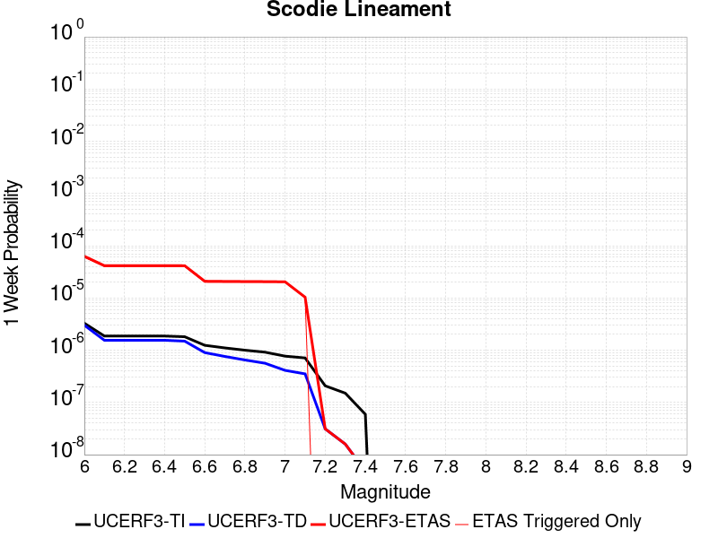 | 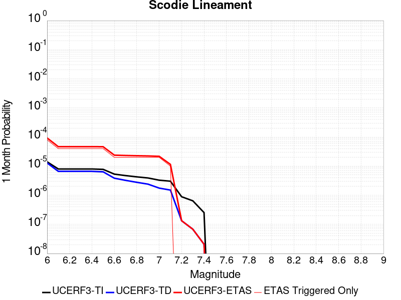 |  |  |

| Magnitude | 1 wk TI Prob | 1 wk TD Prob | 1 wk ETAS Prob | 1 wk ETAS/TD Gain | 1 wk ETAS Triggered Only | 1 mo TI Prob | 1 mo TD Prob | 1 mo ETAS Prob | 1 mo ETAS/TD Gain | 1 mo ETAS Triggered Only | 1 yr TI Prob | 1 yr TD Prob | 1 yr ETAS Prob | 1 yr ETAS/TD Gain | 1 yr ETAS Triggered Only | 10 yr TI Prob | 10 yr TD Prob | 10 yr ETAS Prob | 10 yr ETAS/TD Gain | 10 yr ETAS Triggered Only |
|-----|-----|-----|-----|-----|-----|-----|-----|-----|-----|-----|-----|-----|-----|-----|-----|-----|-----|-----|-----|-----|
| 6.0 | 3.2919327E-6 | 3.0133422E-6 | 4.009605E-5 | 13.306171 | 3.7082817E-5 | 1.4108206E-5 | 1.2914278E-5 | 7.471818E-5 | 5.785703 | 6.18047E-5 | 1.7175387E-4 | 1.5722317E-4 | 2.808131E-4 | 1.7860799 | 1.236094E-4 | 0.0017162118 | 0.0015714309 | 0.0017688952 | 1.1256589 | 1.9777504E-4 |
| 6.1 | 1.8663811E-6 | 1.5490499E-6 | 1.390997E-5 | 8.979678 | 1.236094E-5 | 7.998751E-6 | 6.6387715E-6 | 1.8999628E-5 | 2.8619194 | 1.236094E-5 | 9.738045E-5 | 8.082454E-5 | 1.1790436E-4 | 1.4587693 | 3.7082817E-5 | 9.7337784E-4 | 8.080003E-4 | 8.450531E-4 | 1.0458574 | 3.7082817E-5 |
| 6.2 | 1.8663811E-6 | 1.5490499E-6 | 1.390997E-5 | 8.979678 | 1.236094E-5 | 7.998751E-6 | 6.6387715E-6 | 1.8999628E-5 | 2.8619194 | 1.236094E-5 | 9.738045E-5 | 8.082454E-5 | 1.1790436E-4 | 1.4587693 | 3.7082817E-5 | 9.7337784E-4 | 8.080003E-4 | 8.450531E-4 | 1.0458574 | 3.7082817E-5 |
| 6.3 | 1.8663811E-6 | 1.5490499E-6 | 1.390997E-5 | 8.979678 | 1.236094E-5 | 7.998751E-6 | 6.6387715E-6 | 1.8999628E-5 | 2.8619194 | 1.236094E-5 | 9.738045E-5 | 8.082454E-5 | 1.1790436E-4 | 1.4587693 | 3.7082817E-5 | 9.7337784E-4 | 8.080003E-4 | 8.450531E-4 | 1.0458574 | 3.7082817E-5 |
| 6.4 | 1.8663811E-6 | 1.5490499E-6 | 1.390997E-5 | 8.979678 | 1.236094E-5 | 7.998751E-6 | 6.6387715E-6 | 1.8999628E-5 | 2.8619194 | 1.236094E-5 | 9.738045E-5 | 8.082454E-5 | 1.1790436E-4 | 1.4587693 | 3.7082817E-5 | 9.7337784E-4 | 8.080003E-4 | 8.450531E-4 | 1.0458574 | 3.7082817E-5 |
| 6.5 | 1.8106311E-6 | 1.4909839E-6 | 1.3851905E-5 | 9.290445 | 1.236094E-5 | 7.759824E-6 | 6.3899183E-6 | 1.875078E-5 | 2.9344318 | 1.236094E-5 | 9.447177E-5 | 7.7794975E-5 | 1.1487491E-4 | 1.4766366 | 3.7082817E-5 | 9.4431615E-4 | 7.7772606E-4 | 8.1478007E-4 | 1.047644 | 3.7082817E-5 |
| 6.6 | 1.2414679E-6 | 8.997558E-7 | 8.997558E-7 | 1.0 | 0.0 | 5.320566E-6 | 3.856091E-6 | 3.856091E-6 | 1.0 | 0.0 | 6.477596E-5 | 4.6946985E-5 | 7.16677E-5 | 1.5265667 | 2.472188E-5 | 6.475708E-4 | 4.693793E-4 | 4.9408956E-4 | 1.0526446 | 2.472188E-5 |
| 6.7 | 1.1062215E-6 | 7.594311E-7 | 7.594311E-7 | 1.0 | 0.0 | 4.7409408E-6 | 3.2547011E-6 | 3.2547011E-6 | 1.0 | 0.0 | 5.7719422E-5 | 3.9625334E-5 | 6.434623E-5 | 1.623866 | 2.472188E-5 | 5.770443E-4 | 3.961897E-4 | 4.2090178E-4 | 1.0623744 | 2.472188E-5 |
| 6.8 | 1.0006736E-6 | 6.500397E-7 | 6.500397E-7 | 1.0 | 0.0 | 4.288594E-6 | 2.7858816E-6 | 2.7858816E-6 | 1.0 | 0.0 | 5.221238E-5 | 3.3917644E-5 | 5.8638685E-5 | 1.7288549 | 2.472188E-5 | 5.220012E-4 | 3.3913075E-4 | 3.6384424E-4 | 1.0728731 | 2.472188E-5 |
| 6.9 | 9.167364E-7 | 5.631625E-7 | 5.631625E-7 | 1.0 | 0.0 | 3.9288643E-6 | 2.4135516E-6 | 2.4135516E-6 | 1.0 | 0.0 | 4.7832873E-5 | 2.9384651E-5 | 2.9384651E-5 | 1.0 | 0.0 | 4.782258E-4 | 2.9381333E-4 | 2.9381333E-4 | 1.0 | 0.0 |
| 7.0 | 7.6987664E-7 | 4.113383E-7 | 4.113383E-7 | 1.0 | 0.0 | 3.2994672E-6 | 1.7628774E-6 | 1.7628774E-6 | 1.0 | 0.0 | 4.0170275E-5 | 2.1462862E-5 | 2.1462862E-5 | 1.0 | 0.0 | 4.0163012E-4 | 2.1461173E-4 | 2.1461173E-4 | 1.0 | 0.0 |
| 7.1 | 7.1038727E-7 | 3.5211494E-7 | 3.5211494E-7 | 1.0 | 0.0 | 3.0445133E-6 | 1.5090633E-6 | 1.5090633E-6 | 1.0 | 0.0 | 3.706632E-5 | 1.8372726E-5 | 1.8372726E-5 | 1.0 | 0.0 | 3.7060137E-4 | 1.8371557E-4 | 1.8371557E-4 | 1.0 | 0.0 |
| 7.2 | 2.0799602E-7 | 3.1186854E-8 | 3.1186854E-8 | 1.0 | 0.0 | 8.914113E-7 | 1.3365793E-7 | 1.3365793E-7 | 1.0 | 0.0 | 1.0852878E-5 | 1.6272843E-6 | 1.6272843E-6 | 1.0 | 0.0 | 1.08523476E-4 | 1.627273E-5 | 1.627273E-5 | 1.0 | 0.0 |
| 7.3 | 1.5048182E-7 | 1.5945696E-8 | 1.5945696E-8 | 1.0 | 0.0 | 6.449219E-7 | 6.83387E-8 | 6.83387E-8 | 1.0 | 0.0 | 7.851896E-6 | 8.320234E-7 | 8.320234E-7 | 1.0 | 0.0 | 7.851618E-5 | 8.320206E-6 | 8.320206E-6 | 1.0 | 0.0 |
| 7.4 | 5.9334678E-8 | 4.8683537E-9 | 4.8683537E-9 | 1.0 | 0.0 | 2.5429145E-7 | 2.0864372E-8 | 2.0864372E-8 | 1.0 | 0.0 | 3.095994E-6 | 2.5402372E-7 | 2.5402372E-7 | 1.0 | 0.0 | 3.095951E-5 | 2.5402353E-6 | 2.5402353E-6 | 1.0 | 0.0 |

## San Jacinto (Stepovers Combined)
*[(top)](#table-of-contents)*

| 1 Week | 1 Month | 1 Year | 10 Year |
|-----|-----|-----|-----|
| 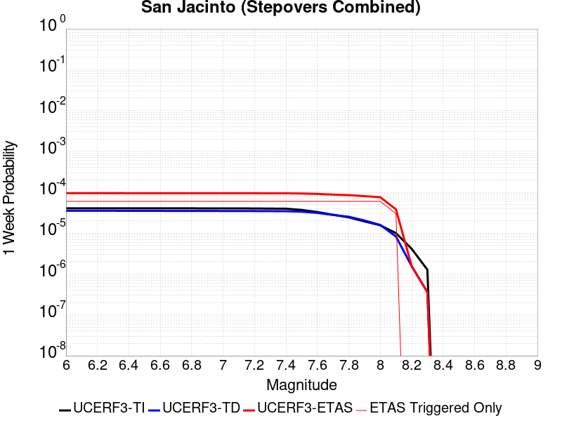 |  |  | 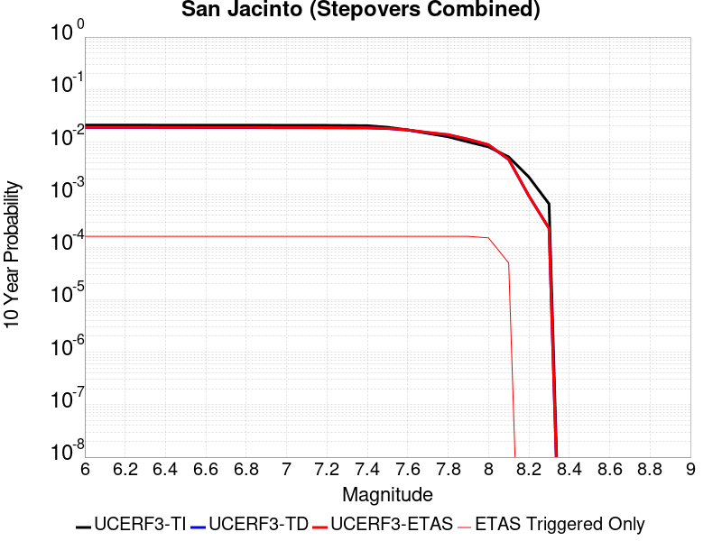 |

| Magnitude | 1 wk TI Prob | 1 wk TD Prob | 1 wk ETAS Prob | 1 wk ETAS/TD Gain | 1 wk ETAS Triggered Only | 1 mo TI Prob | 1 mo TD Prob | 1 mo ETAS Prob | 1 mo ETAS/TD Gain | 1 mo ETAS Triggered Only | 1 yr TI Prob | 1 yr TD Prob | 1 yr ETAS Prob | 1 yr ETAS/TD Gain | 1 yr ETAS Triggered Only | 10 yr TI Prob | 10 yr TD Prob | 10 yr ETAS Prob | 10 yr ETAS/TD Gain | 10 yr ETAS Triggered Only |
|-----|-----|-----|-----|-----|-----|-----|-----|-----|-----|-----|-----|-----|-----|-----|-----|-----|-----|-----|-----|-----|
| 6.0 | 4.0667746E-5 | 3.5272755E-5 | 9.707527E-5 | 2.7521317 | 6.18047E-5 | 1.742787E-4 | 1.5116022E-4 | 2.2531464E-4 | 1.4905684 | 7.416563E-5 | 0.0021197782 | 0.0018388226 | 0.0019745429 | 1.0738083 | 1.3597033E-4 | 0.020996714 | 0.018986892 | 0.019168785 | 1.00958 | 1.8541409E-4 |
| 6.1 | 4.0667746E-5 | 3.5272755E-5 | 9.707527E-5 | 2.7521317 | 6.18047E-5 | 1.742787E-4 | 1.5116022E-4 | 2.2531464E-4 | 1.4905684 | 7.416563E-5 | 0.0021197782 | 0.0018388226 | 0.0019745429 | 1.0738083 | 1.3597033E-4 | 0.020996714 | 0.018986892 | 0.019168785 | 1.00958 | 1.8541409E-4 |
| 6.2 | 4.0667746E-5 | 3.5272755E-5 | 9.707527E-5 | 2.7521317 | 6.18047E-5 | 1.742787E-4 | 1.5116022E-4 | 2.2531464E-4 | 1.4905684 | 7.416563E-5 | 0.0021197782 | 0.0018388226 | 0.0019745429 | 1.0738083 | 1.3597033E-4 | 0.020996714 | 0.018986892 | 0.019168785 | 1.00958 | 1.8541409E-4 |
| 6.3 | 4.0667746E-5 | 3.5272755E-5 | 9.707527E-5 | 2.7521317 | 6.18047E-5 | 1.742787E-4 | 1.5116022E-4 | 2.2531464E-4 | 1.4905684 | 7.416563E-5 | 0.0021197782 | 0.0018388226 | 0.0019745429 | 1.0738083 | 1.3597033E-4 | 0.020996714 | 0.018986892 | 0.019168785 | 1.00958 | 1.8541409E-4 |
| 6.4 | 4.0577226E-5 | 3.5144654E-5 | 9.694718E-5 | 2.7585185 | 6.18047E-5 | 1.738908E-4 | 1.5061127E-4 | 2.2476574E-4 | 1.4923567 | 7.416563E-5 | 0.0021150648 | 0.0018321523 | 0.0019678734 | 1.0740775 | 1.3597033E-4 | 0.020950472 | 0.018921461 | 0.019103367 | 1.0096138 | 1.8541409E-4 |
| 6.5 | 4.0577226E-5 | 3.5144654E-5 | 9.694718E-5 | 2.7585185 | 6.18047E-5 | 1.738908E-4 | 1.5061127E-4 | 2.2476574E-4 | 1.4923567 | 7.416563E-5 | 0.0021150648 | 0.0018321523 | 0.0019678734 | 1.0740775 | 1.3597033E-4 | 0.020950472 | 0.018921461 | 0.019103367 | 1.0096138 | 1.8541409E-4 |
| 6.6 | 4.053861E-5 | 3.509E-5 | 9.689253E-5 | 2.7612574 | 6.18047E-5 | 1.7372532E-4 | 1.5037706E-4 | 2.2453156E-4 | 1.4931237 | 7.416563E-5 | 0.0021130538 | 0.0018293057 | 0.0019650273 | 1.074193 | 1.3597033E-4 | 0.020930743 | 0.018893538 | 0.01907545 | 1.0096282 | 1.8541409E-4 |
| 6.7 | 4.0516545E-5 | 3.5059067E-5 | 9.68616E-5 | 2.7628114 | 6.18047E-5 | 1.7363077E-4 | 1.5024451E-4 | 2.24399E-4 | 1.4935588 | 7.416563E-5 | 0.002111905 | 0.001827695 | 0.0019634168 | 1.0742584 | 1.3597033E-4 | 0.020919468 | 0.018877735 | 0.019059649 | 1.0096364 | 1.8541409E-4 |
| 6.8 | 4.049434E-5 | 3.5030633E-5 | 9.6833166E-5 | 2.7642426 | 6.18047E-5 | 1.7353562E-4 | 1.5012265E-4 | 2.2427716E-4 | 1.4939594 | 7.416563E-5 | 0.0021107488 | 0.0018262138 | 0.0019619358 | 1.0743188 | 1.3597033E-4 | 0.020908125 | 0.018863149 | 0.019045064 | 1.009644 | 1.8541409E-4 |
| 6.9 | 4.046386E-5 | 3.499319E-5 | 9.6795724E-5 | 2.7661302 | 6.18047E-5 | 1.73405E-4 | 1.4996222E-4 | 2.2411674E-4 | 1.494488 | 7.416563E-5 | 0.0021091616 | 0.0018242638 | 0.001959986 | 1.0743984 | 1.3597033E-4 | 0.020892553 | 0.01884392 | 0.019025842 | 1.009654 | 1.8541409E-4 |
| 7.0 | 4.036382E-5 | 3.487376E-5 | 9.66763E-5 | 2.772179 | 6.18047E-5 | 1.7297632E-4 | 1.4945042E-4 | 2.2360498E-4 | 1.4961816 | 7.416563E-5 | 0.0021039525 | 0.0018180435 | 0.0019537667 | 1.0746534 | 1.3597033E-4 | 0.02084144 | 0.018782536 | 0.018964468 | 1.0096862 | 1.8541409E-4 |
| 7.1 | 4.0343282E-5 | 3.4852223E-5 | 9.665477E-5 | 2.7732742 | 6.18047E-5 | 1.7288832E-4 | 1.4935812E-4 | 2.2351269E-4 | 1.4964883 | 7.416563E-5 | 0.002102883 | 0.0018169218 | 0.0019526451 | 1.0746995 | 1.3597033E-4 | 0.020830948 | 0.018771412 | 0.018953346 | 1.0096921 | 1.8541409E-4 |
| 7.2 | 4.0257353E-5 | 3.4756722E-5 | 9.655927E-5 | 2.7781467 | 6.18047E-5 | 1.725201E-4 | 1.489489E-4 | 2.2310349E-4 | 1.4978526 | 7.416563E-5 | 0.0020984085 | 0.0018119477 | 0.0019476716 | 1.074905 | 1.3597033E-4 | 0.020787042 | 0.018722152 | 0.018904096 | 1.0097181 | 1.8541409E-4 |
| 7.3 | 3.9940667E-5 | 3.4584376E-5 | 9.638694E-5 | 2.787008 | 6.18047E-5 | 1.7116306E-4 | 1.4821035E-4 | 2.2236501E-4 | 1.5003338 | 7.416563E-5 | 0.0020819185 | 0.0018029709 | 0.0019386961 | 1.0752786 | 1.3597033E-4 | 0.020625217 | 0.018630784 | 0.018812744 | 1.0097666 | 1.8541409E-4 |
| 7.4 | 3.9721202E-5 | 3.4469766E-5 | 9.6272335E-5 | 2.79295 | 6.18047E-5 | 1.7022261E-4 | 1.4771923E-4 | 2.2187391E-4 | 1.5019975 | 7.416563E-5 | 0.0020704903 | 0.0017970012 | 0.0019327272 | 1.0755292 | 1.3597033E-4 | 0.020513052 | 0.018569905 | 0.018751876 | 1.0097992 | 1.8541409E-4 |
| 7.5 | 3.7036873E-5 | 3.3537188E-5 | 9.533981E-5 | 2.842809 | 6.18047E-5 | 1.5871979E-4 | 1.437229E-4 | 2.1787787E-4 | 1.515958 | 7.416563E-5 | 0.0019307006 | 0.0017484248 | 0.0018841574 | 1.0776314 | 1.3597033E-4 | 0.019140124 | 0.018071463 | 0.018253528 | 1.0100746 | 1.8541409E-4 |
| 7.6 | 3.2940967E-5 | 3.1317984E-5 | 9.312075E-5 | 2.973395 | 6.18047E-5 | 1.4116794E-4 | 1.3421304E-4 | 2.0836873E-4 | 1.5525222 | 7.416563E-5 | 0.0017173645 | 0.0016328214 | 0.0017685697 | 1.0831373 | 1.3597033E-4 | 0.01704153 | 0.016904354 | 0.017086633 | 1.010783 | 1.8541409E-4 |
| 7.7 | 2.8236149E-5 | 2.7883889E-5 | 8.9686866E-5 | 3.2164402 | 6.18047E-5 | 1.2100645E-4 | 1.19496915E-4 | 1.9365369E-4 | 1.6205748 | 7.416563E-5 | 0.0014722579 | 0.001453905 | 0.0015896776 | 1.0933849 | 1.3597033E-4 | 0.014625421 | 0.015115095 | 0.015297707 | 1.0120814 | 1.8541409E-4 |
| 7.8 | 2.4329287E-5 | 2.5207537E-5 | 8.7010674E-5 | 3.4517722 | 6.18047E-5 | 1.042642E-4 | 1.0802783E-4 | 1.8218545E-4 | 1.6864678 | 7.416563E-5 | 0.0012686774 | 0.0013144462 | 0.0014502378 | 1.1033071 | 1.3597033E-4 | 0.012614589 | 0.013712396 | 0.013895268 | 1.0133362 | 1.8541409E-4 |
| 7.9 | 1.9370926E-5 | 2.0421452E-5 | 8.2224884E-5 | 4.0263977 | 6.18047E-5 | 8.301561E-5 | 8.7517576E-5 | 1.6167673E-4 | 1.8473629 | 7.416563E-5 | 0.0010102465 | 0.0010650064 | 0.001200832 | 1.127535 | 1.3597033E-4 | 0.0100566605 | 0.011199483 | 0.01138282 | 1.0163702 | 1.8541409E-4 |
| 8.0 | 1.5583017E-5 | 1.588647E-5 | 7.769019E-5 | 4.890337 | 6.18047E-5 | 6.6782646E-5 | 6.808309E-5 | 1.4224368E-4 | 2.0892658 | 7.416563E-5 | 8.127754E-4 | 8.285971E-4 | 9.5210405E-4 | 1.1490555 | 1.236094E-4 | 0.008098091 | 0.008781809 | 0.008953343 | 1.0195328 | 1.7305315E-4 |
| 8.1 | 1.0024873E-5 | 8.292404E-6 | 4.5374916E-5 | 5.4718647 | 3.7082817E-5 | 4.2963035E-5 | 3.5538393E-5 | 7.261989E-5 | 2.0434208 | 3.7082817E-5 | 5.229494E-4 | 4.3259456E-4 | 4.820169E-4 | 1.1142464 | 4.944376E-5 | 0.0052172043 | 0.0046534105 | 0.0047149276 | 1.0132198 | 6.18047E-5 |
| 8.2 | 4.142796E-6 | 1.5610041E-6 | 1.5610041E-6 | 1.0 | 0.0 | 1.775472E-5 | 6.69E-6 | 6.69E-6 | 1.0 | 0.0 | 2.1614227E-4 | 8.144774E-5 | 8.144774E-5 | 1.0 | 0.0 | 0.0021593217 | 9.454649E-4 | 9.454649E-4 | 1.0 | 0.0 |
| 8.3 | 1.2750878E-6 | 3.612133E-7 | 3.612133E-7 | 1.0 | 0.0 | 5.4646503E-6 | 1.548056E-6 | 1.548056E-6 | 1.0 | 0.0 | 6.653009E-5 | 1.8847424E-5 | 1.8847424E-5 | 1.0 | 0.0 | 6.6510175E-4 | 2.2734253E-4 | 2.2734253E-4 | 1.0 | 0.0 |

## Santa Rosa Island
*[(top)](#table-of-contents)*

| 1 Week | 1 Month | 1 Year | 10 Year |
|-----|-----|-----|-----|
|  |  | 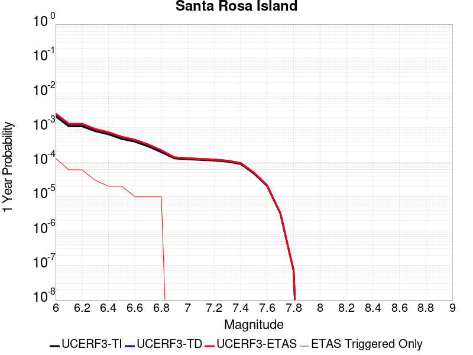 |  |

| Magnitude | 1 wk TI Prob | 1 wk TD Prob | 1 wk ETAS Prob | 1 wk ETAS/TD Gain | 1 wk ETAS Triggered Only | 1 mo TI Prob | 1 mo TD Prob | 1 mo ETAS Prob | 1 mo ETAS/TD Gain | 1 mo ETAS Triggered Only | 1 yr TI Prob | 1 yr TD Prob | 1 yr ETAS Prob | 1 yr ETAS/TD Gain | 1 yr ETAS Triggered Only | 10 yr TI Prob | 10 yr TD Prob | 10 yr ETAS Prob | 10 yr ETAS/TD Gain | 10 yr ETAS Triggered Only |
|-----|-----|-----|-----|-----|-----|-----|-----|-----|-----|-----|-----|-----|-----|-----|-----|-----|-----|-----|-----|-----|
| 6.0 | 4.1143165E-5 | 4.7091133E-5 | 1.0889292E-4 | 2.312387 | 6.18047E-5 | 1.7631594E-4 | 2.0180465E-4 | 2.6359686E-4 | 1.3061982 | 6.18047E-5 | 0.002144533 | 0.0024544 | 0.002577706 | 1.0502387 | 1.236094E-4 | 0.021239553 | 0.024293551 | 0.02445034 | 1.0064539 | 1.6069222E-4 |
| 6.1 | 2.1061249E-5 | 2.3864959E-5 | 6.094689E-5 | 2.5538235 | 3.7082817E-5 | 9.0259375E-5 | 1.0227455E-4 | 1.3935358E-4 | 1.3625441 | 3.7082817E-5 | 0.0010983539 | 0.0012445104 | 0.0012938926 | 1.03968 | 4.944376E-5 | 0.01092941 | 0.012378449 | 0.01242728 | 1.0039449 | 4.944376E-5 |
| 6.2 | 2.1061249E-5 | 2.3864959E-5 | 6.094689E-5 | 2.5538235 | 3.7082817E-5 | 9.0259375E-5 | 1.0227455E-4 | 1.3935358E-4 | 1.3625441 | 3.7082817E-5 | 0.0010983539 | 0.0012445104 | 0.0012938926 | 1.03968 | 4.944376E-5 | 0.01092941 | 0.012378449 | 0.01242728 | 1.0039449 | 4.944376E-5 |
| 6.3 | 1.5158236E-5 | 1.7074419E-5 | 4.1795876E-5 | 2.4478652 | 2.472188E-5 | 6.496225E-5 | 7.3174095E-5 | 9.789417E-5 | 1.3378254 | 2.472188E-5 | 7.906284E-4 | 8.905424E-4 | 9.152423E-4 | 1.0277357 | 2.472188E-5 | 0.007878214 | 0.008870989 | 0.008895492 | 1.0027621 | 2.472188E-5 |
| 6.4 | 1.2341918E-5 | 1.3852917E-5 | 2.6213685E-5 | 1.8922863 | 1.236094E-5 | 5.2892858E-5 | 5.9368336E-5 | 7.1728544E-5 | 1.2081952 | 1.236094E-5 | 6.437803E-4 | 7.225779E-4 | 7.349299E-4 | 1.0170944 | 1.236094E-5 | 0.006419184 | 0.007203121 | 0.0072153932 | 1.0017037 | 1.236094E-5 |
| 6.5 | 9.061158E-6 | 1.0117031E-5 | 2.2477845E-5 | 2.2217827 | 1.236094E-5 | 3.883296E-5 | 4.3358013E-5 | 5.5718418E-5 | 1.2850777 | 1.236094E-5 | 4.726887E-4 | 5.277613E-4 | 5.401157E-4 | 1.0234091 | 1.236094E-5 | 0.004716845 | 0.0052656173 | 0.005277913 | 1.0023351 | 1.236094E-5 |
| 6.6 | 7.5461685E-6 | 8.400733E-6 | 2.0761569E-5 | 2.4713995 | 1.236094E-5 | 3.2340322E-5 | 3.600267E-5 | 4.8363167E-5 | 1.3433216 | 1.236094E-5 | 3.936723E-4 | 4.3824865E-4 | 4.506042E-4 | 1.028193 | 1.236094E-5 | 0.003929756 | 0.0043742736 | 0.0043865805 | 1.0028135 | 1.236094E-5 |
| 6.7 | 5.5023775E-6 | 6.087381E-6 | 1.8448245E-5 | 3.030572 | 1.236094E-5 | 2.3581404E-5 | 2.6088532E-5 | 3.844915E-5 | 1.473795 | 1.236094E-5 | 2.8706578E-4 | 3.1758484E-4 | 3.2994183E-4 | 1.0389093 | 1.236094E-5 | 0.0028669522 | 0.0031716314 | 0.0031839532 | 1.003885 | 1.236094E-5 |
| 6.8 | 3.7351679E-6 | 4.0831405E-6 | 1.644403E-5 | 4.0272994 | 1.236094E-5 | 1.6007763E-5 | 1.749907E-5 | 2.9859793E-5 | 1.7063646 | 1.236094E-5 | 1.948771E-4 | 2.1303284E-4 | 2.2539114E-4 | 1.0580113 | 1.236094E-5 | 0.0019470629 | 0.0021285315 | 0.0021408661 | 1.0057949 | 1.236094E-5 |
| 6.9 | 2.456366E-6 | 2.6292705E-6 | 2.6292705E-6 | 1.0 | 0.0 | 1.0527241E-5 | 1.1268254E-5 | 1.1268254E-5 | 1.0 | 0.0 | 1.2816161E-4 | 1.3718237E-4 | 1.3718237E-4 | 1.0 | 0.0 | 0.0012808773 | 0.0013709799 | 0.0013709799 | 1.0 | 0.0 |
| 7.0 | 2.3245157E-6 | 2.4827782E-6 | 2.4827782E-6 | 1.0 | 0.0 | 9.962172E-6 | 1.0640435E-5 | 1.0640435E-5 | 1.0 | 0.0 | 1.2128269E-4 | 1.2953962E-4 | 1.2953962E-4 | 1.0 | 0.0 | 0.0012121652 | 0.0012946434 | 0.0012946434 | 1.0 | 0.0 |
| 7.1 | 2.2248344E-6 | 2.37325E-6 | 2.37325E-6 | 1.0 | 0.0 | 9.53497E-6 | 1.0171032E-5 | 1.0171032E-5 | 1.0 | 0.0 | 1.1608207E-4 | 1.2382529E-4 | 1.2382529E-4 | 1.0 | 0.0 | 0.0011602144 | 0.001237565 | 0.001237565 | 1.0 | 0.0 |
| 7.2 | 2.1350402E-6 | 2.276154E-6 | 2.276154E-6 | 1.0 | 0.0 | 9.150141E-6 | 9.754909E-6 | 9.754909E-6 | 1.0 | 0.0 | 1.1139726E-4 | 1.1875956E-4 | 1.1875956E-4 | 1.0 | 0.0 | 0.0011134144 | 0.0011869629 | 0.0011869629 | 1.0 | 0.0 |
| 7.3 | 1.9793572E-6 | 2.108719E-6 | 2.108719E-6 | 1.0 | 0.0 | 8.482932E-6 | 9.037336E-6 | 9.037336E-6 | 1.0 | 0.0 | 1.032748E-4 | 1.10024026E-4 | 1.10024026E-4 | 1.0 | 0.0 | 0.0010322682 | 0.0010996973 | 0.0010996973 | 1.0 | 0.0 |
| 7.4 | 1.6951194E-6 | 1.8045733E-6 | 1.8045733E-6 | 1.0 | 0.0 | 7.264777E-6 | 7.733863E-6 | 7.733863E-6 | 1.0 | 0.0 | 8.844508E-5 | 9.415573E-5 | 9.415573E-5 | 1.0 | 0.0 | 8.840988E-4 | 9.4116E-4 | 9.4116E-4 | 1.0 | 0.0 |
| 7.5 | 8.987207E-7 | 9.5122147E-7 | 9.5122147E-7 | 1.0 | 0.0 | 3.8516546E-6 | 4.076657E-6 | 4.076657E-6 | 1.0 | 0.0 | 4.6892885E-5 | 4.963218E-5 | 4.963218E-5 | 1.0 | 0.0 | 4.688299E-4 | 4.9621216E-4 | 4.9621216E-4 | 1.0 | 0.0 |
| 7.6 | 3.8783037E-7 | 4.052932E-7 | 4.052932E-7 | 1.0 | 0.0 | 1.6621291E-6 | 1.7369698E-6 | 1.7369698E-6 | 1.0 | 0.0 | 2.0236233E-5 | 2.1147409E-5 | 2.1147409E-5 | 1.0 | 0.0 | 2.023439E-4 | 2.1145462E-4 | 2.1145462E-4 | 1.0 | 0.0 |
| 7.7 | 6.181804E-8 | 6.339035E-8 | 6.339035E-8 | 1.0 | 0.0 | 2.6493444E-7 | 2.7167292E-7 | 2.7167292E-7 | 1.0 | 0.0 | 3.225572E-6 | 3.3076128E-6 | 3.3076128E-6 | 1.0 | 0.0 | 3.225525E-5 | 3.307564E-5 | 3.307564E-5 | 1.0 | 0.0 |
| 7.8 | 1.3704449E-9 | 1.3964153E-9 | 1.3964153E-9 | 1.0 | 0.0 | 5.873335E-9 | 5.984637E-9 | 5.984637E-9 | 1.0 | 0.0 | 7.1507856E-8 | 7.286295E-8 | 7.286295E-8 | 1.0 | 0.0 | 7.1507833E-7 | 7.286294E-7 | 7.286294E-7 | 1.0 | 0.0 |

## San Jacinto (Anza) rev
*[(top)](#table-of-contents)*

| 1 Week | 1 Month | 1 Year | 10 Year |
|-----|-----|-----|-----|
|  |  |  |  |

| Magnitude | 1 wk TI Prob | 1 wk TD Prob | 1 wk ETAS Prob | 1 wk ETAS/TD Gain | 1 wk ETAS Triggered Only | 1 mo TI Prob | 1 mo TD Prob | 1 mo ETAS Prob | 1 mo ETAS/TD Gain | 1 mo ETAS Triggered Only | 1 yr TI Prob | 1 yr TD Prob | 1 yr ETAS Prob | 1 yr ETAS/TD Gain | 1 yr ETAS Triggered Only | 10 yr TI Prob | 10 yr TD Prob | 10 yr ETAS Prob | 10 yr ETAS/TD Gain | 10 yr ETAS Triggered Only |
|-----|-----|-----|-----|-----|-----|-----|-----|-----|-----|-----|-----|-----|-----|-----|-----|-----|-----|-----|-----|-----|
| 6.0 | 6.3015636E-5 | 4.3302647E-5 | 1.0510467E-4 | 2.427211 | 6.18047E-5 | 2.7003905E-4 | 1.8556965E-4 | 2.597215E-4 | 1.3995905 | 7.416563E-5 | 0.0032827691 | 0.0022569813 | 0.0023926448 | 1.0601084 | 1.3597033E-4 | 0.032346968 | 0.023296192 | 0.023477286 | 1.0077735 | 1.8541409E-4 |
| 6.1 | 6.3015636E-5 | 4.3302647E-5 | 1.0510467E-4 | 2.427211 | 6.18047E-5 | 2.7003905E-4 | 1.8556965E-4 | 2.597215E-4 | 1.3995905 | 7.416563E-5 | 0.0032827691 | 0.0022569813 | 0.0023926448 | 1.0601084 | 1.3597033E-4 | 0.032346968 | 0.023296192 | 0.023477286 | 1.0077735 | 1.8541409E-4 |
| 6.2 | 6.3015636E-5 | 4.3302647E-5 | 1.0510467E-4 | 2.427211 | 6.18047E-5 | 2.7003905E-4 | 1.8556965E-4 | 2.597215E-4 | 1.3995905 | 7.416563E-5 | 0.0032827691 | 0.0022569813 | 0.0023926448 | 1.0601084 | 1.3597033E-4 | 0.032346968 | 0.023296192 | 0.023477286 | 1.0077735 | 1.8541409E-4 |
| 6.3 | 6.3015636E-5 | 4.3302647E-5 | 1.0510467E-4 | 2.427211 | 6.18047E-5 | 2.7003905E-4 | 1.8556965E-4 | 2.597215E-4 | 1.3995905 | 7.416563E-5 | 0.0032827691 | 0.0022569813 | 0.0023926448 | 1.0601084 | 1.3597033E-4 | 0.032346968 | 0.023296192 | 0.023477286 | 1.0077735 | 1.8541409E-4 |
| 6.4 | 6.3015636E-5 | 4.3302647E-5 | 1.0510467E-4 | 2.427211 | 6.18047E-5 | 2.7003905E-4 | 1.8556965E-4 | 2.597215E-4 | 1.3995905 | 7.416563E-5 | 0.0032827691 | 0.0022569813 | 0.0023926448 | 1.0601084 | 1.3597033E-4 | 0.032346968 | 0.023296192 | 0.023477286 | 1.0077735 | 1.8541409E-4 |
| 6.5 | 5.811017E-5 | 4.0082516E-5 | 1.0188473E-4 | 2.541875 | 6.18047E-5 | 2.4901982E-4 | 1.7177092E-4 | 2.4592382E-4 | 1.4316964 | 7.416563E-5 | 0.0030276014 | 0.002089311 | 0.0022249972 | 1.0649431 | 1.3597033E-4 | 0.02986684 | 0.021593736 | 0.021775147 | 1.008401 | 1.8541409E-4 |
| 6.6 | 5.811017E-5 | 4.0082516E-5 | 1.0188473E-4 | 2.541875 | 6.18047E-5 | 2.4901982E-4 | 1.7177092E-4 | 2.4592382E-4 | 1.4316964 | 7.416563E-5 | 0.0030276014 | 0.002089311 | 0.0022249972 | 1.0649431 | 1.3597033E-4 | 0.02986684 | 0.021593736 | 0.021775147 | 1.008401 | 1.8541409E-4 |
| 6.7 | 5.712442E-5 | 3.9505223E-5 | 1.0130748E-4 | 2.564407 | 6.18047E-5 | 2.4479596E-4 | 1.6929714E-4 | 2.4345022E-4 | 1.4380054 | 7.416563E-5 | 0.0029763177 | 0.0020592497 | 0.00219494 | 1.065893 | 1.3597033E-4 | 0.029367693 | 0.021285562 | 0.02146703 | 1.0085254 | 1.8541409E-4 |
| 6.8 | 5.6967532E-5 | 3.9361643E-5 | 1.0116391E-4 | 2.570114 | 6.18047E-5 | 2.4412372E-4 | 1.6868189E-4 | 2.4283501E-4 | 1.4396033 | 7.416563E-5 | 0.0029681553 | 0.002051773 | 0.0021874644 | 1.0661337 | 1.3597033E-4 | 0.029288229 | 0.021210281 | 0.021391762 | 1.0085562 | 1.8541409E-4 |
| 6.9 | 5.6211324E-5 | 3.9066435E-5 | 1.0086872E-4 | 2.581979 | 6.18047E-5 | 2.4088343E-4 | 1.6741687E-4 | 2.4157009E-4 | 1.4429256 | 7.416563E-5 | 0.0029288116 | 0.0020364004 | 0.0021720938 | 1.0666339 | 1.3597033E-4 | 0.028905109 | 0.021049714 | 0.021231225 | 1.008623 | 1.8541409E-4 |
| 7.0 | 5.4383527E-5 | 3.792697E-5 | 9.9729325E-5 | 2.6295094 | 6.18047E-5 | 2.3305144E-4 | 1.6253405E-4 | 2.3668763E-4 | 1.4562341 | 7.416563E-5 | 0.0028337094 | 0.001977061 | 0.0021127625 | 1.068638 | 1.3597033E-4 | 0.027978465 | 0.020440677 | 0.0206223 | 1.0088854 | 1.8541409E-4 |
| 7.1 | 5.1393665E-5 | 3.6389913E-5 | 9.819236E-5 | 2.6983402 | 6.18047E-5 | 2.2023996E-4 | 1.5594746E-4 | 2.3010153E-4 | 1.4755068 | 7.416563E-5 | 0.0026781242 | 0.0018970112 | 0.0020327235 | 1.0715401 | 1.3597033E-4 | 0.026460782 | 0.019614287 | 0.019796064 | 1.0092676 | 1.8541409E-4 |
| 7.2 | 4.785222E-5 | 3.4741795E-5 | 9.654435E-5 | 2.7789106 | 6.18047E-5 | 2.0506482E-4 | 1.4888494E-4 | 2.2303953E-4 | 1.4980664 | 7.416563E-5 | 0.0024938055 | 0.0018111705 | 0.0019468946 | 1.0749372 | 1.3597033E-4 | 0.024660049 | 0.018728992 | 0.018910933 | 1.0097145 | 1.8541409E-4 |
| 7.3 | 4.2143256E-5 | 3.383628E-5 | 9.563888E-5 | 2.826519 | 6.18047E-5 | 1.8060145E-4 | 1.4500458E-4 | 2.1915947E-4 | 1.5113968 | 7.416563E-5 | 0.002196605 | 0.0017640047 | 0.0018997352 | 1.0769445 | 1.3597033E-4 | 0.02175019 | 0.01823724 | 0.018419273 | 1.0099814 | 1.8541409E-4 |
| 7.4 | 4.0264713E-5 | 3.347446E-5 | 9.527709E-5 | 2.846262 | 6.18047E-5 | 1.7255165E-4 | 1.4345412E-4 | 2.1760911E-4 | 1.5169249 | 7.416563E-5 | 0.002098792 | 0.0017451581 | 0.0018808912 | 1.0777769 | 1.3597033E-4 | 0.020790804 | 0.018041821 | 0.01822389 | 1.0100915 | 1.8541409E-4 |
| 7.5 | 3.694492E-5 | 3.218847E-5 | 9.399118E-5 | 2.9200263 | 6.18047E-5 | 1.5832575E-4 | 1.379433E-4 | 2.120987E-4 | 1.5375789 | 7.416563E-5 | 0.0019259118 | 0.001678169 | 0.0018139111 | 1.0808871 | 1.3597033E-4 | 0.01909306 | 0.01735827 | 0.017540466 | 1.0104961 | 1.8541409E-4 |
| 7.6 | 3.200565E-5 | 2.9504106E-5 | 9.130698E-5 | 3.094721 | 6.18047E-5 | 1.3715986E-4 | 1.2644005E-4 | 2.0059632E-4 | 1.5864934 | 7.416563E-5 | 0.001668642 | 0.0015383229 | 0.001674084 | 1.0882527 | 1.3597033E-4 | 0.01656168 | 0.0159463 | 0.016128758 | 1.011442 | 1.8541409E-4 |
| 7.7 | 2.731642E-5 | 2.6092788E-5 | 8.7895874E-5 | 3.3685887 | 6.18047E-5 | 1.1706512E-4 | 1.1182144E-4 | 1.8597879E-4 | 1.6631764 | 7.416563E-5 | 0.001424336 | 0.0013605768 | 0.0014963622 | 1.0997999 | 1.3597033E-4 | 0.014152412 | 0.014167004 | 0.014349792 | 1.0129024 | 1.8541409E-4 |
| 7.8 | 2.3466424E-5 | 2.3504817E-5 | 8.5308064E-5 | 3.6293862 | 6.18047E-5 | 1.0056651E-4 | 1.0073105E-4 | 1.7488921E-4 | 1.7361997 | 7.416563E-5 | 0.0012237094 | 0.0012257113 | 0.001361515 | 1.1107959 | 1.3597033E-4 | 0.012169928 | 0.012808893 | 0.012991932 | 1.01429 | 1.8541409E-4 |
| 7.9 | 1.8611925E-5 | 1.8908117E-5 | 8.0711645E-5 | 4.2686243 | 6.18047E-5 | 7.9762955E-5 | 8.1032274E-5 | 1.551919E-4 | 1.9151863 | 7.416563E-5 | 9.7068126E-4 | 9.861222E-4 | 0.0011219584 | 1.1377479 | 1.3597033E-4 | 0.0096645225 | 0.010393824 | 0.010577312 | 1.0176535 | 1.8541409E-4 |
| 8.0 | 1.5460775E-5 | 1.5740965E-5 | 7.754469E-5 | 4.9262986 | 6.18047E-5 | 6.6258784E-5 | 6.7459536E-5 | 1.4162017E-4 | 2.099335 | 7.416563E-5 | 8.0640207E-4 | 8.21011E-4 | 9.4451895E-4 | 1.1504339 | 1.236094E-4 | 0.008034821 | 0.0087028835 | 0.00887443 | 1.0197115 | 1.7305315E-4 |
| 8.1 | 9.983884E-6 | 8.269952E-6 | 4.5352463E-5 | 5.484006 | 3.7082817E-5 | 4.2787375E-5 | 3.544217E-5 | 7.2523675E-5 | 2.0462537 | 3.7082817E-5 | 5.2081177E-4 | 4.314235E-4 | 4.8084595E-4 | 1.1145567 | 4.944376E-5 | 0.0051959283 | 0.004640022 | 0.00470154 | 1.0132581 | 6.18047E-5 |
| 8.2 | 4.1226E-6 | 1.5529788E-6 | 1.5529788E-6 | 1.0 | 0.0 | 1.7668166E-5 | 6.6556063E-6 | 6.6556063E-6 | 1.0 | 0.0 | 2.1508869E-4 | 8.102902E-5 | 8.102902E-5 | 1.0 | 0.0 | 0.0021488064 | 9.4050163E-4 | 9.4050163E-4 | 1.0 | 0.0 |
| 8.3 | 1.2750878E-6 | 3.612133E-7 | 3.612133E-7 | 1.0 | 0.0 | 5.4646503E-6 | 1.548056E-6 | 1.548056E-6 | 1.0 | 0.0 | 6.653009E-5 | 1.8847424E-5 | 1.8847424E-5 | 1.0 | 0.0 | 6.6510175E-4 | 2.2734253E-4 | 2.2734253E-4 | 1.0 | 0.0 |

## Mission Creek
*[(top)](#table-of-contents)*

| 1 Week | 1 Month | 1 Year | 10 Year |
|-----|-----|-----|-----|
|  |  |  |  |

| Magnitude | 1 wk TI Prob | 1 wk TD Prob | 1 wk ETAS Prob | 1 wk ETAS/TD Gain | 1 wk ETAS Triggered Only | 1 mo TI Prob | 1 mo TD Prob | 1 mo ETAS Prob | 1 mo ETAS/TD Gain | 1 mo ETAS Triggered Only | 1 yr TI Prob | 1 yr TD Prob | 1 yr ETAS Prob | 1 yr ETAS/TD Gain | 1 yr ETAS Triggered Only | 10 yr TI Prob | 10 yr TD Prob | 10 yr ETAS Prob | 10 yr ETAS/TD Gain | 10 yr ETAS Triggered Only |
|-----|-----|-----|-----|-----|-----|-----|-----|-----|-----|-----|-----|-----|-----|-----|-----|-----|-----|-----|-----|-----|
| 6.0 | 1.1549387E-5 | 1.632237E-5 | 1.632237E-5 | 1.0 | 0.0 | 4.9496433E-5 | 6.9951224E-5 | 1.1939152E-4 | 1.7067825 | 4.944376E-5 | 6.0245243E-4 | 8.513384E-4 | 9.6249214E-4 | 1.1305635 | 1.1124845E-4 | 0.006008218 | 0.008509998 | 0.008681579 | 1.0201622 | 1.7305315E-4 |
| 6.1 | 1.1549387E-5 | 1.632237E-5 | 1.632237E-5 | 1.0 | 0.0 | 4.9496433E-5 | 6.9951224E-5 | 1.1939152E-4 | 1.7067825 | 4.944376E-5 | 6.0245243E-4 | 8.513384E-4 | 9.6249214E-4 | 1.1305635 | 1.1124845E-4 | 0.006008218 | 0.008509998 | 0.008681579 | 1.0201622 | 1.7305315E-4 |
| 6.2 | 1.1549387E-5 | 1.632237E-5 | 1.632237E-5 | 1.0 | 0.0 | 4.9496433E-5 | 6.9951224E-5 | 1.1939152E-4 | 1.7067825 | 4.944376E-5 | 6.0245243E-4 | 8.513384E-4 | 9.6249214E-4 | 1.1305635 | 1.1124845E-4 | 0.006008218 | 0.008509998 | 0.008681579 | 1.0201622 | 1.7305315E-4 |
| 6.3 | 1.1549387E-5 | 1.632237E-5 | 1.632237E-5 | 1.0 | 0.0 | 4.9496433E-5 | 6.9951224E-5 | 1.1939152E-4 | 1.7067825 | 4.944376E-5 | 6.0245243E-4 | 8.513384E-4 | 9.6249214E-4 | 1.1305635 | 1.1124845E-4 | 0.006008218 | 0.008509998 | 0.008681579 | 1.0201622 | 1.7305315E-4 |
| 6.4 | 1.1549387E-5 | 1.632237E-5 | 1.632237E-5 | 1.0 | 0.0 | 4.9496433E-5 | 6.9951224E-5 | 1.1939152E-4 | 1.7067825 | 4.944376E-5 | 6.0245243E-4 | 8.513384E-4 | 9.6249214E-4 | 1.1305635 | 1.1124845E-4 | 0.006008218 | 0.008509998 | 0.008681579 | 1.0201622 | 1.7305315E-4 |
| 6.5 | 1.1549387E-5 | 1.632237E-5 | 1.632237E-5 | 1.0 | 0.0 | 4.9496433E-5 | 6.9951224E-5 | 1.1939152E-4 | 1.7067825 | 4.944376E-5 | 6.0245243E-4 | 8.513384E-4 | 9.6249214E-4 | 1.1305635 | 1.1124845E-4 | 0.006008218 | 0.008509998 | 0.008681579 | 1.0201622 | 1.7305315E-4 |
| 6.6 | 9.202681E-6 | 1.3845646E-5 | 1.3845646E-5 | 1.0 | 0.0 | 3.9439463E-5 | 5.9337188E-5 | 1.0877801E-4 | 1.8332182 | 4.944376E-5 | 4.800697E-4 | 7.221998E-4 | 8.210159E-4 | 1.1368265 | 9.888752E-5 | 0.004790339 | 0.0072271815 | 0.007374441 | 1.0203757 | 1.4833127E-4 |
| 6.7 | 9.019164E-6 | 1.3651316E-5 | 1.3651316E-5 | 1.0 | 0.0 | 3.8652986E-5 | 5.8504378E-5 | 1.0794524E-4 | 1.8450798 | 4.944376E-5 | 4.7049852E-4 | 7.12067E-4 | 8.108841E-4 | 1.138775 | 9.888752E-5 | 0.004695036 | 0.007126506 | 0.00727378 | 1.0206656 | 1.4833127E-4 |
| 6.8 | 8.673558E-6 | 1.3273427E-5 | 1.3273427E-5 | 1.0 | 0.0 | 3.717186E-5 | 5.6884925E-5 | 1.0632587E-4 | 1.8691397 | 4.944376E-5 | 4.524734E-4 | 6.923627E-4 | 7.9118175E-4 | 1.1427273 | 9.888752E-5 | 0.0045155324 | 0.006930694 | 0.0070779976 | 1.0212537 | 1.4833127E-4 |
| 6.9 | 7.002255E-6 | 1.1477657E-5 | 1.1477657E-5 | 1.0 | 0.0 | 3.000932E-5 | 4.9189068E-5 | 9.863039E-5 | 2.0051284 | 4.944376E-5 | 3.653022E-4 | 5.9871917E-4 | 6.975475E-4 | 1.1650662 | 9.888752E-5 | 0.0036470229 | 0.005999517 | 0.0061469586 | 1.0245756 | 1.4833127E-4 |
| 7.0 | 5.84644E-6 | 9.67498E-6 | 9.67498E-6 | 1.0 | 0.0 | 2.5055931E-5 | 4.1463565E-5 | 9.0905276E-5 | 2.1924133 | 4.944376E-5 | 3.0501327E-4 | 5.047066E-4 | 6.035442E-4 | 1.1958318 | 9.888752E-5 | 0.0030459496 | 0.0050638523 | 0.0052114325 | 1.0291438 | 1.4833127E-4 |
| 7.1 | 5.54703E-6 | 9.329456E-6 | 9.329456E-6 | 1.0 | 0.0 | 2.377277E-5 | 3.9982795E-5 | 8.9424575E-5 | 2.2365763 | 4.944376E-5 | 2.8939504E-4 | 4.8668624E-4 | 5.8552565E-4 | 1.2030865 | 9.888752E-5 | 0.0028901845 | 0.004884446 | 0.005032053 | 1.0302198 | 1.4833127E-4 |
| 7.2 | 4.384709E-6 | 7.68157E-6 | 7.68157E-6 | 1.0 | 0.0 | 1.8791474E-5 | 3.2920623E-5 | 8.236275E-5 | 2.501859 | 4.944376E-5 | 2.2876218E-4 | 4.0073853E-4 | 4.995864E-4 | 1.2466643 | 9.888752E-5 | 0.0022852682 | 0.004028366 | 0.0041760993 | 1.0366734 | 1.4833127E-4 |
| 7.3 | 3.7888456E-6 | 6.915452E-6 | 6.915452E-6 | 1.0 | 0.0 | 1.623781E-5 | 2.9637333E-5 | 7.9079626E-5 | 2.6682436 | 4.944376E-5 | 1.9767738E-4 | 3.6077813E-4 | 4.5962998E-4 | 1.2739962 | 9.888752E-5 | 0.0019750162 | 0.0036301152 | 0.003777908 | 1.040713 | 1.4833127E-4 |
| 7.4 | 2.1982462E-6 | 5.0237763E-6 | 5.0237763E-6 | 1.0 | 0.0 | 9.421021E-6 | 2.1530293E-5 | 7.097299E-5 | 3.2964244 | 4.944376E-5 | 1.1469489E-4 | 2.621E-4 | 3.609616E-4 | 1.3771904 | 9.888752E-5 | 0.0011463572 | 0.0026458844 | 0.0027938234 | 1.0559129 | 1.4833127E-4 |
| 7.5 | 2.051923E-6 | 4.615016E-6 | 4.615016E-6 | 1.0 | 0.0 | 8.793926E-6 | 1.9778492E-5 | 6.922127E-5 | 3.4998257 | 4.944376E-5 | 1.0706078E-4 | 2.4077666E-4 | 3.3964036E-4 | 1.4106034 | 9.888752E-5 | 0.0010700922 | 0.0024335422 | 0.0025691816 | 1.0557375 | 1.3597033E-4 |
| 7.6 | 1.8733427E-6 | 4.1233748E-6 | 4.1233748E-6 | 1.0 | 0.0 | 8.028587E-6 | 1.7671488E-5 | 6.711437E-5 | 3.7978902 | 4.944376E-5 | 9.774366E-5 | 2.151292E-4 | 3.1399544E-4 | 1.4595668 | 9.888752E-5 | 9.770069E-4 | 0.0021780801 | 0.0023137543 | 1.0622907 | 1.3597033E-4 |
| 7.7 | 1.8411953E-6 | 4.0430496E-6 | 4.0430496E-6 | 1.0 | 0.0 | 7.890813E-6 | 1.732724E-5 | 6.677014E-5 | 3.853478 | 4.944376E-5 | 9.606641E-5 | 2.1093882E-4 | 3.0980547E-4 | 1.4686983 | 9.888752E-5 | 9.6024893E-4 | 0.0021363653 | 0.0022720452 | 1.0635097 | 1.3597033E-4 |
| 7.8 | 1.7194251E-6 | 3.7104276E-6 | 3.7104276E-6 | 1.0 | 0.0 | 7.368944E-6 | 1.5901736E-5 | 6.5344706E-5 | 4.1092815 | 4.944376E-5 | 8.97132E-5 | 1.9358651E-4 | 2.9245488E-4 | 1.5107193 | 9.888752E-5 | 8.967699E-4 | 0.0019623525 | 0.002098056 | 1.0691534 | 1.3597033E-4 |
| 7.9 | 1.4035052E-6 | 2.9500632E-6 | 2.9500632E-6 | 1.0 | 0.0 | 6.0150082E-6 | 1.2643067E-5 | 6.20862E-5 | 4.9106913 | 4.944376E-5 | 7.3230265E-5 | 1.5391852E-4 | 2.527908E-4 | 1.6423677 | 9.888752E-5 | 7.3206134E-4 | 0.0015631086 | 0.0016988665 | 1.0868511 | 1.3597033E-4 |
| 8.0 | 3.9318823E-7 | 5.528522E-7 | 5.528522E-7 | 1.0 | 0.0 | 1.6850913E-6 | 2.3693647E-6 | 2.3693647E-6 | 1.0 | 0.0 | 2.0515794E-5 | 2.8846638E-5 | 2.8846638E-5 | 1.0 | 0.0 | 2.0513899E-4 | 2.9899E-4 | 3.1134725E-4 | 1.04133 | 1.236094E-5 |
| 8.1 | 1.596793E-7 | 1.1380002E-7 | 1.1380002E-7 | 1.0 | 0.0 | 6.8433974E-7 | 4.877143E-7 | 4.877143E-7 | 1.0 | 0.0 | 8.331805E-6 | 5.937906E-6 | 5.937906E-6 | 1.0 | 0.0 | 8.331492E-5 | 6.549966E-5 | 6.549966E-5 | 1.0 | 0.0 |
| 8.2 | 4.9003038E-8 | 2.5444924E-8 | 2.5444924E-8 | 1.0 | 0.0 | 2.10013E-7 | 1.0904967E-7 | 1.0904967E-7 | 1.0 | 0.0 | 2.5569052E-6 | 1.327679E-6 | 1.327679E-6 | 1.0 | 0.0 | 2.556876E-5 | 1.495635E-5 | 1.495635E-5 | 1.0 | 0.0 |

## Rose Canyon
*[(top)](#table-of-contents)*

| 1 Week | 1 Month | 1 Year | 10 Year |
|-----|-----|-----|-----|
|  |  |  | 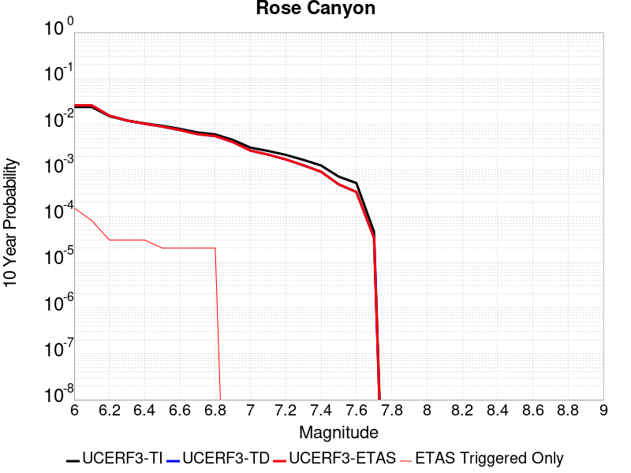 |

| Magnitude | 1 wk TI Prob | 1 wk TD Prob | 1 wk ETAS Prob | 1 wk ETAS/TD Gain | 1 wk ETAS Triggered Only | 1 mo TI Prob | 1 mo TD Prob | 1 mo ETAS Prob | 1 mo ETAS/TD Gain | 1 mo ETAS Triggered Only | 1 yr TI Prob | 1 yr TD Prob | 1 yr ETAS Prob | 1 yr ETAS/TD Gain | 1 yr ETAS Triggered Only | 10 yr TI Prob | 10 yr TD Prob | 10 yr ETAS Prob | 10 yr ETAS/TD Gain | 10 yr ETAS Triggered Only |
|-----|-----|-----|-----|-----|-----|-----|-----|-----|-----|-----|-----|-----|-----|-----|-----|-----|-----|-----|-----|-----|
| 6.0 | 4.5923203E-5 | 4.9714225E-5 | 9.915553E-5 | 1.99451 | 4.944376E-5 | 1.9679888E-4 | 2.1304491E-4 | 2.7483643E-4 | 1.2900399 | 6.18047E-5 | 0.0023933933 | 0.0025909345 | 0.0027018946 | 1.0428263 | 1.1124845E-4 | 0.023677798 | 0.02563999 | 0.025796562 | 1.0061066 | 1.6069222E-4 |
| 6.1 | 4.5923203E-5 | 4.9714225E-5 | 4.9714225E-5 | 1.0 | 0.0 | 1.9679888E-4 | 2.1304491E-4 | 2.2540323E-4 | 1.058008 | 1.236094E-5 | 0.0023933933 | 0.0025909345 | 0.002652579 | 1.0237924 | 6.18047E-5 | 0.023677798 | 0.02563999 | 0.025736343 | 1.0037578 | 9.888752E-5 |
| 6.2 | 2.8844734E-5 | 2.9668723E-5 | 2.9668723E-5 | 1.0 | 0.0 | 1.2361443E-4 | 1.2714567E-4 | 1.2714567E-4 | 1.0 | 0.0 | 0.0015039665 | 0.0015468939 | 0.0015592357 | 1.0079784 | 1.236094E-5 | 0.0149382865 | 0.015374276 | 0.015410789 | 1.0023749 | 3.7082817E-5 |
| 6.3 | 2.3171577E-5 | 2.3161238E-5 | 2.3161238E-5 | 1.0 | 0.0 | 9.9302975E-5 | 9.9258745E-5 | 9.9258745E-5 | 1.0 | 0.0 | 0.0012083431 | 0.0012078186 | 0.0012201646 | 1.0102217 | 1.236094E-5 | 0.012017938 | 0.012022437 | 0.012059074 | 1.0030473 | 3.7082817E-5 |
| 6.4 | 2.0066604E-5 | 1.9667024E-5 | 1.9667024E-5 | 1.0 | 0.0 | 8.599689E-5 | 8.4284584E-5 | 8.4284584E-5 | 1.0 | 0.0 | 0.0010465092 | 0.0010256917 | 0.00103804 | 1.012039 | 1.236094E-5 | 0.010415946 | 0.010217559 | 0.010254262 | 1.0035923 | 3.7082817E-5 |
| 6.5 | 1.776989E-5 | 1.7113807E-5 | 1.7113807E-5 | 1.0 | 0.0 | 7.615444E-5 | 7.334287E-5 | 7.334287E-5 | 1.0 | 0.0 | 9.267859E-4 | 8.925905E-4 | 9.049404E-4 | 1.013836 | 1.236094E-5 | 0.009229303 | 0.008896211 | 0.008920712 | 1.0027542 | 2.472188E-5 |
| 6.6 | 1.5227364E-5 | 1.433926E-5 | 1.433926E-5 | 1.0 | 0.0 | 6.52585E-5 | 6.1452556E-5 | 6.1452556E-5 | 1.0 | 0.0 | 7.942326E-4 | 7.479332E-4 | 7.602849E-4 | 1.0165144 | 1.236094E-5 | 0.007914 | 0.007458359 | 0.0074828966 | 1.0032899 | 2.472188E-5 |
| 6.7 | 1.2703898E-5 | 1.1673274E-5 | 1.1673274E-5 | 1.0 | 0.0 | 5.4444143E-5 | 5.0027378E-5 | 5.0027378E-5 | 1.0 | 0.0 | 6.626558E-4 | 6.089174E-4 | 6.212708E-4 | 1.0202875 | 1.236094E-5 | 0.006606833 | 0.0060750856 | 0.0060996576 | 1.0040447 | 2.472188E-5 |
| 6.8 | 1.1554917E-5 | 1.0609337E-5 | 1.0609337E-5 | 1.0 | 0.0 | 4.9520135E-5 | 4.546782E-5 | 4.546782E-5 | 1.0 | 0.0 | 6.0274085E-4 | 5.5343413E-4 | 5.6578824E-4 | 1.0223227 | 1.236094E-5 | 0.0060110865 | 0.0055225673 | 0.005547153 | 1.0044518 | 2.472188E-5 |
| 6.9 | 8.732078E-6 | 7.881357E-6 | 7.881357E-6 | 1.0 | 0.0 | 3.7422655E-5 | 3.3776825E-5 | 3.3776825E-5 | 1.0 | 0.0 | 4.5552556E-4 | 4.111582E-4 | 4.111582E-4 | 1.0 | 0.0 | 0.0045459294 | 0.0041048084 | 0.0041048084 | 1.0 | 0.0 |
| 7.0 | 5.9337494E-6 | 5.1074853E-6 | 5.1074853E-6 | 1.0 | 0.0 | 2.5430107E-5 | 2.188904E-5 | 2.188904E-5 | 1.0 | 0.0 | 3.0956755E-4 | 2.664666E-4 | 2.664666E-4 | 1.0 | 0.0 | 0.0030913667 | 0.0026614866 | 0.0026614866 | 1.0 | 0.0 |
| 7.1 | 5.013409E-6 | 4.1773833E-6 | 4.1773833E-6 | 1.0 | 0.0 | 2.1485863E-5 | 1.7902948E-5 | 1.7902948E-5 | 1.0 | 0.0 | 2.6155898E-4 | 2.179467E-4 | 2.179467E-4 | 1.0 | 0.0 | 0.0026125133 | 0.0021773411 | 0.0021773411 | 1.0 | 0.0 |
| 7.2 | 4.120763E-6 | 3.2821383E-6 | 3.2821383E-6 | 1.0 | 0.0 | 1.7660293E-5 | 1.4066231E-5 | 1.4066231E-5 | 1.0 | 0.0 | 2.1499286E-4 | 1.7124301E-4 | 1.7124301E-4 | 1.0 | 0.0 | 0.0021478499 | 0.00171112 | 0.00171112 | 1.0 | 0.0 |
| 7.3 | 3.2081239E-6 | 2.4405372E-6 | 2.4405372E-6 | 1.0 | 0.0 | 1.374903E-5 | 1.0459404E-5 | 1.0459404E-5 | 1.0 | 0.0 | 1.6738157E-4 | 1.2733586E-4 | 1.2733586E-4 | 1.0 | 0.0 | 0.0016725556 | 0.001272636 | 0.001272636 | 1.0 | 0.0 |
| 7.4 | 2.4194755E-6 | 1.7680634E-6 | 1.7680634E-6 | 1.0 | 0.0 | 1.0369139E-5 | 7.577393E-6 | 7.577393E-6 | 1.0 | 0.0 | 1.2623696E-4 | 9.2250906E-5 | 9.2250906E-5 | 1.0 | 0.0 | 0.0012616527 | 9.2213147E-4 | 9.2213147E-4 | 1.0 | 0.0 |
| 7.5 | 1.3842889E-6 | 9.3786275E-7 | 9.3786275E-7 | 1.0 | 0.0 | 5.9326535E-6 | 4.019406E-6 | 4.019406E-6 | 1.0 | 0.0 | 7.222766E-5 | 4.8935202E-5 | 4.8935202E-5 | 1.0 | 0.0 | 7.220419E-4 | 4.892478E-4 | 4.892478E-4 | 1.0 | 0.0 |
| 7.6 | 1.0021575E-6 | 6.411463E-7 | 6.411463E-7 | 1.0 | 0.0 | 4.2949537E-6 | 2.7477672E-6 | 2.7477672E-6 | 1.0 | 0.0 | 5.2289808E-5 | 3.3453573E-5 | 3.3453573E-5 | 1.0 | 0.0 | 5.2277505E-4 | 3.344875E-4 | 3.344875E-4 | 1.0 | 0.0 |
| 7.7 | 8.7620116E-8 | 6.4492404E-8 | 6.4492404E-8 | 1.0 | 0.0 | 3.7551473E-7 | 2.76396E-7 | 2.76396E-7 | 1.0 | 0.0 | 4.5718825E-6 | 3.3651165E-6 | 3.3651165E-6 | 1.0 | 0.0 | 4.5717883E-5 | 3.3650686E-5 | 3.3650686E-5 | 1.0 | 0.0 |

## Cleghorn Lake
*[(top)](#table-of-contents)*

| 1 Week | 1 Month | 1 Year | 10 Year |
|-----|-----|-----|-----|
|  | 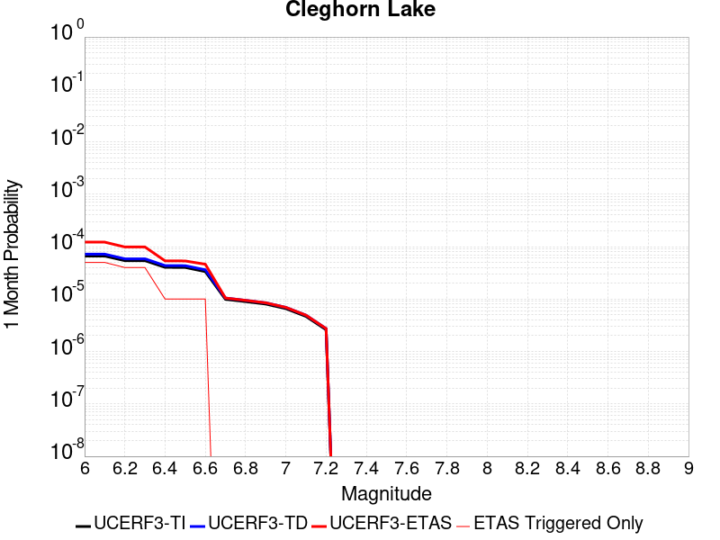 |  |  |

| Magnitude | 1 wk TI Prob | 1 wk TD Prob | 1 wk ETAS Prob | 1 wk ETAS/TD Gain | 1 wk ETAS Triggered Only | 1 mo TI Prob | 1 mo TD Prob | 1 mo ETAS Prob | 1 mo ETAS/TD Gain | 1 mo ETAS Triggered Only | 1 yr TI Prob | 1 yr TD Prob | 1 yr ETAS Prob | 1 yr ETAS/TD Gain | 1 yr ETAS Triggered Only | 10 yr TI Prob | 10 yr TD Prob | 10 yr ETAS Prob | 10 yr ETAS/TD Gain | 10 yr ETAS Triggered Only |
|-----|-----|-----|-----|-----|-----|-----|-----|-----|-----|-----|-----|-----|-----|-----|-----|-----|-----|-----|-----|-----|
| 6.0 | 1.5467183E-5 | 1.6794203E-5 | 2.9154935E-5 | 1.7360117 | 1.236094E-5 | 6.6286244E-5 | 7.197348E-5 | 1.0905363E-4 | 1.5151918 | 3.7082817E-5 | 8.067362E-4 | 8.759797E-4 | 9.871307E-4 | 1.1268877 | 1.1124845E-4 | 0.008038137 | 0.008730696 | 0.008889984 | 1.0182447 | 1.6069222E-4 |
| 6.1 | 1.5467183E-5 | 1.6794203E-5 | 2.9154935E-5 | 1.7360117 | 1.236094E-5 | 6.6286244E-5 | 7.197348E-5 | 1.0905363E-4 | 1.5151918 | 3.7082817E-5 | 8.067362E-4 | 8.759797E-4 | 9.871307E-4 | 1.1268877 | 1.1124845E-4 | 0.008038137 | 0.008730696 | 0.008889984 | 1.0182447 | 1.6069222E-4 |
| 6.2 | 1.2624631E-5 | 1.3681544E-5 | 2.6042315E-5 | 1.9034631 | 1.236094E-5 | 5.410444E-5 | 5.863415E-5 | 8.335458E-5 | 1.4216046 | 2.472188E-5 | 6.585225E-4 | 7.1368564E-4 | 8.125026E-4 | 1.13846 | 9.888752E-5 | 0.0065657445 | 0.0071187317 | 0.007266007 | 1.0206884 | 1.4833127E-4 |
| 6.3 | 1.2624631E-5 | 1.3681544E-5 | 2.6042315E-5 | 1.9034631 | 1.236094E-5 | 5.410444E-5 | 5.863415E-5 | 8.335458E-5 | 1.4216046 | 2.472188E-5 | 6.585225E-4 | 7.1368564E-4 | 8.125026E-4 | 1.13846 | 9.888752E-5 | 0.0065657445 | 0.0071187317 | 0.007266007 | 1.0206884 | 1.4833127E-4 |
| 6.4 | 9.417684E-6 | 1.0170118E-5 | 1.0170118E-5 | 1.0 | 0.0 | 4.036088E-5 | 4.3585722E-5 | 5.5946122E-5 | 1.2835883 | 1.236094E-5 | 4.912829E-4 | 5.3056807E-4 | 6.0469436E-4 | 1.1397111 | 7.416563E-5 | 0.004901982 | 0.005297049 | 0.005395413 | 1.0185695 | 9.888752E-5 |
| 6.5 | 9.368219E-6 | 1.0117545E-5 | 1.0117545E-5 | 1.0 | 0.0 | 4.014889E-5 | 4.3360415E-5 | 5.572082E-5 | 1.285062 | 1.236094E-5 | 4.8870314E-4 | 5.2782625E-4 | 6.019528E-4 | 1.1404372 | 7.416563E-5 | 0.004876298 | 0.0052697617 | 0.005368128 | 1.0186661 | 9.888752E-5 |
| 6.6 | 7.803798E-6 | 8.441831E-6 | 8.441831E-6 | 1.0 | 0.0 | 3.3444423E-5 | 3.6179E-5 | 4.8539492E-5 | 1.3416482 | 1.236094E-5 | 4.0710976E-4 | 4.4043022E-4 | 4.898522E-4 | 1.112213 | 4.944376E-5 | 0.0040636472 | 0.0043994905 | 0.004461023 | 1.0139863 | 6.18047E-5 |
| 6.7 | 2.3108669E-6 | 2.4438336E-6 | 2.4438336E-6 | 1.0 | 0.0 | 9.903678E-6 | 1.0473532E-5 | 1.0473532E-5 | 1.0 | 0.0 | 1.205706E-4 | 1.2750797E-4 | 1.3986733E-4 | 1.0969301 | 1.236094E-5 | 0.001205052 | 0.0012743667 | 0.001286712 | 1.0096873 | 1.236094E-5 |
| 6.8 | 2.0882828E-6 | 2.2062823E-6 | 2.2062823E-6 | 1.0 | 0.0 | 8.949753E-6 | 9.455462E-6 | 9.455462E-6 | 1.0 | 0.0 | 1.08957785E-4 | 1.1511434E-4 | 1.2747385E-4 | 1.1073673 | 1.236094E-5 | 0.0010890438 | 0.0011505639 | 0.0011629106 | 1.010731 | 1.236094E-5 |
| 6.9 | 1.876935E-6 | 1.981051E-6 | 1.981051E-6 | 1.0 | 0.0 | 8.043982E-6 | 8.490192E-6 | 8.490192E-6 | 1.0 | 0.0 | 9.7931086E-5 | 1.03363345E-4 | 1.1572301E-4 | 1.1195749 | 1.236094E-5 | 9.788794E-4 | 0.0010331686 | 0.0010455168 | 1.0119518 | 1.236094E-5 |
| 7.0 | 1.5357559E-6 | 1.6202807E-6 | 1.6202807E-6 | 1.0 | 0.0 | 6.5817944E-6 | 6.9440425E-6 | 6.9440425E-6 | 1.0 | 0.0 | 8.01304E-5 | 8.454057E-5 | 9.690046E-5 | 1.1462008 | 1.236094E-5 | 8.010151E-4 | 8.450965E-4 | 8.57447E-4 | 1.0146143 | 1.236094E-5 |
| 7.1 | 1.0905424E-6 | 1.1497619E-6 | 1.1497619E-6 | 1.0 | 0.0 | 4.6737446E-6 | 4.9275427E-6 | 4.9275427E-6 | 1.0 | 0.0 | 5.6901354E-5 | 5.999128E-5 | 7.2351475E-5 | 1.2060332 | 1.236094E-5 | 5.6886784E-4 | 5.997606E-4 | 6.1211415E-4 | 1.0205975 | 1.236094E-5 |
| 7.2 | 6.06668E-7 | 6.387277E-7 | 6.387277E-7 | 1.0 | 0.0 | 2.600003E-6 | 2.7374022E-6 | 2.7374022E-6 | 1.0 | 0.0 | 3.1654577E-5 | 3.3327433E-5 | 4.568796E-5 | 1.3708814 | 1.236094E-5 | 3.1650066E-4 | 3.3323118E-4 | 3.45588E-4 | 1.0370818 | 1.236094E-5 |

## Brawley (Seismic Zone) alt 1
*[(top)](#table-of-contents)*

| 1 Week | 1 Month | 1 Year | 10 Year |
|-----|-----|-----|-----|
| 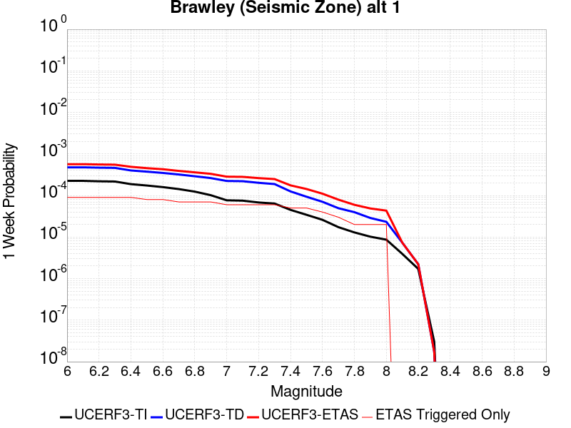 |  |  |  |

| Magnitude | 1 wk TI Prob | 1 wk TD Prob | 1 wk ETAS Prob | 1 wk ETAS/TD Gain | 1 wk ETAS Triggered Only | 1 mo TI Prob | 1 mo TD Prob | 1 mo ETAS Prob | 1 mo ETAS/TD Gain | 1 mo ETAS Triggered Only | 1 yr TI Prob | 1 yr TD Prob | 1 yr ETAS Prob | 1 yr ETAS/TD Gain | 1 yr ETAS Triggered Only | 10 yr TI Prob | 10 yr TD Prob | 10 yr ETAS Prob | 10 yr ETAS/TD Gain | 10 yr ETAS Triggered Only |
|-----|-----|-----|-----|-----|-----|-----|-----|-----|-----|-----|-----|-----|-----|-----|-----|-----|-----|-----|-----|-----|
| 6.0 | 2.2521618E-4 | 4.7632487E-4 | 5.257451E-4 | 1.1037532 | 4.944376E-5 | 9.6485513E-4 | 0.0020398323 | 0.002101511 | 1.0302371 | 6.18047E-5 | 0.011683988 | 0.024546238 | 0.024654755 | 1.004421 | 1.1124845E-4 | 0.11088423 | 0.21350002 | 0.21361668 | 1.0005465 | 1.4833127E-4 |
| 6.1 | 2.2521618E-4 | 4.7632487E-4 | 5.257451E-4 | 1.1037532 | 4.944376E-5 | 9.6485513E-4 | 0.0020398323 | 0.002101511 | 1.0302371 | 6.18047E-5 | 0.011683988 | 0.024546238 | 0.024654755 | 1.004421 | 1.1124845E-4 | 0.11088423 | 0.21350002 | 0.21361668 | 1.0005465 | 1.4833127E-4 |
| 6.2 | 2.198148E-4 | 4.6717093E-4 | 5.165916E-4 | 1.1057872 | 4.944376E-5 | 9.417233E-4 | 0.0020006616 | 0.0020623426 | 1.0308304 | 6.18047E-5 | 0.011405343 | 0.024080504 | 0.024189072 | 1.0045086 | 1.1124845E-4 | 0.10837428 | 0.20993657 | 0.21005376 | 1.0005583 | 1.4833127E-4 |
| 6.3 | 2.1704129E-4 | 4.615278E-4 | 5.109487E-4 | 1.1070812 | 4.944376E-5 | 9.298453E-4 | 0.0019765133 | 0.002038196 | 1.0312078 | 6.18047E-5 | 0.011262234 | 0.02379366 | 0.023902262 | 1.0045643 | 1.1124845E-4 | 0.107082725 | 0.20782755 | 0.20794505 | 1.0005654 | 1.4833127E-4 |
| 6.4 | 1.876142E-4 | 4.00449E-4 | 4.4987298E-4 | 1.1234213 | 4.944376E-5 | 8.038131E-4 | 0.0017150956 | 0.0017767943 | 1.0359739 | 6.18047E-5 | 0.00974259 | 0.020680401 | 0.02078935 | 1.0052682 | 1.1124845E-4 | 0.093263686 | 0.18457815 | 0.1846991 | 1.0006553 | 1.4833127E-4 |
| 6.5 | 1.7390939E-4 | 3.7477075E-4 | 4.118397E-4 | 1.0989109 | 3.7082817E-5 | 7.45113E-4 | 0.0016051838 | 0.0016545482 | 1.0307531 | 4.944376E-5 | 0.009034078 | 0.019368723 | 0.019465696 | 1.0050067 | 9.888752E-5 | 0.086755216 | 0.17440031 | 0.17451258 | 1.0006437 | 1.3597033E-4 |
| 6.6 | 1.591791E-4 | 3.4891962E-4 | 3.859895E-4 | 1.106242 | 3.7082817E-5 | 6.8201777E-4 | 0.0014945229 | 0.0015438928 | 1.0330338 | 4.944376E-5 | 0.008271996 | 0.018045569 | 0.018142672 | 1.005381 | 9.888752E-5 | 0.07970774 | 0.16380852 | 0.16392222 | 1.000694 | 1.3597033E-4 |
| 6.7 | 1.4268003E-4 | 3.20582E-4 | 3.5765293E-4 | 1.1156363 | 3.7082817E-5 | 6.1134255E-4 | 0.0013732077 | 0.0014225835 | 1.0359566 | 4.944376E-5 | 0.007417723 | 0.016592601 | 0.016689848 | 1.0058608 | 9.888752E-5 | 0.07174956 | 0.15193306 | 0.15204838 | 1.000759 | 1.3597033E-4 |
| 6.8 | 1.239713E-4 | 2.9053655E-4 | 3.276086E-4 | 1.1275985 | 3.7082817E-5 | 5.3119735E-4 | 0.0012445687 | 0.001293951 | 1.0396782 | 4.944376E-5 | 0.0064481674 | 0.015048777 | 0.015146176 | 1.0064722 | 9.888752E-5 | 0.06264243 | 0.13837762 | 0.13849477 | 1.0008466 | 1.3597033E-4 |
| 6.9 | 1.0180238E-4 | 2.625439E-4 | 2.9961698E-4 | 1.1412072 | 3.7082817E-5 | 4.3622297E-4 | 0.0011247073 | 0.0011740954 | 1.043912 | 4.944376E-5 | 0.005298089 | 0.013608336 | 0.013705878 | 1.0071678 | 9.888752E-5 | 0.05173543 | 0.124961674 | 0.12508065 | 1.0009521 | 1.3597033E-4 |
| 7.0 | 7.6619996E-5 | 2.23993E-4 | 2.610675E-4 | 1.1655164 | 3.7082817E-5 | 3.283301E-4 | 9.5962E-4 | 0.0010090163 | 1.0514748 | 4.944376E-5 | 0.0039900932 | 0.011621496 | 0.011707016 | 1.0073589 | 8.6526576E-5 | 0.039192066 | 0.107266866 | 0.107377216 | 1.0010288 | 1.236094E-4 |
| 7.1 | 7.5127435E-5 | 2.2082464E-4 | 2.5789926E-4 | 1.1678917 | 3.7082817E-5 | 3.2193496E-4 | 9.4605127E-4 | 9.954482E-4 | 1.0522139 | 4.944376E-5 | 0.0039125155 | 0.011458045 | 0.011543579 | 1.0074651 | 8.6526576E-5 | 0.038443442 | 0.10583085 | 0.10594138 | 1.0010444 | 1.236094E-4 |
| 7.2 | 6.788582E-5 | 2.0210193E-4 | 2.3917726E-4 | 1.1834487 | 3.7082817E-5 | 2.9090676E-4 | 8.6586666E-4 | 9.152676E-4 | 1.0570538 | 4.944376E-5 | 0.0035360386 | 0.0104916105 | 0.010577229 | 1.0081607 | 8.6526576E-5 | 0.034803 | 0.09750131 | 0.09760171 | 1.0010297 | 1.1124845E-4 |
| 7.3 | 6.399602E-5 | 1.8841137E-4 | 2.2548721E-4 | 1.1967813 | 3.7082817E-5 | 2.7423984E-4 | 8.072303E-4 | 8.566342E-4 | 1.0612017 | 4.944376E-5 | 0.0033337586 | 0.009784332 | 0.009870011 | 1.0087569 | 8.6526576E-5 | 0.03284188 | 0.09139617 | 0.09149724 | 1.0011059 | 1.1124845E-4 |
| 7.4 | 4.506759E-5 | 1.2529209E-4 | 1.6237026E-4 | 1.2959338 | 3.7082817E-5 | 1.9313251E-4 | 5.368565E-4 | 5.862737E-4 | 1.0920492 | 4.944376E-5 | 0.0023488526 | 0.0065168133 | 0.0066027762 | 1.0131909 | 8.6526576E-5 | 0.023241805 | 0.062363707 | 0.062456425 | 1.0014868 | 9.888752E-5 |
| 7.5 | 3.43289E-5 | 9.33541E-5 | 1.3043346E-4 | 1.3971905 | 3.7082817E-5 | 1.4711556E-4 | 4.00028E-4 | 4.4945197E-4 | 1.1235512 | 4.944376E-5 | 0.0017896603 | 0.0048595266 | 0.0049456325 | 1.017719 | 8.6526576E-5 | 0.01775316 | 0.04705519 | 0.047149424 | 1.0020026 | 9.888752E-5 |
| 7.6 | 2.5980507E-5 | 7.053101E-5 | 1.0761122E-4 | 1.5257291 | 3.7082817E-5 | 1.1134028E-4 | 3.0224086E-4 | 3.5166967E-4 | 1.1635411 | 4.944376E-5 | 0.001354725 | 0.003673598 | 0.0037598065 | 1.0234671 | 8.6526576E-5 | 0.013464959 | 0.035840835 | 0.035936177 | 1.0026602 | 9.888752E-5 |
| 7.7 | 1.7292105E-5 | 4.9407296E-5 | 7.412795E-5 | 1.5003443 | 2.472188E-5 | 7.4106916E-5 | 2.117284E-4 | 2.4880338E-4 | 1.1751063 | 3.7082817E-5 | 9.018782E-4 | 0.0025747516 | 0.0026363973 | 1.0239424 | 6.18047E-5 | 0.008982267 | 0.025290398 | 0.025362687 | 1.0028584 | 7.416563E-5 |
| 7.8 | 1.2927471E-5 | 3.9693266E-5 | 6.441417E-5 | 1.6227982 | 2.472188E-5 | 5.5402274E-5 | 1.7010293E-4 | 2.0717944E-4 | 1.2179651 | 3.7082817E-5 | 6.743139E-4 | 0.0020690386 | 0.0021307154 | 1.0298094 | 6.18047E-5 | 0.0067227143 | 0.020431727 | 0.020504378 | 1.0035558 | 7.416563E-5 |
| 7.9 | 1.0200774E-5 | 2.874569E-5 | 5.3466858E-5 | 1.8599956 | 2.472188E-5 | 4.371687E-5 | 1.2319001E-4 | 1.6026825E-4 | 1.3009843 | 3.7082817E-5 | 5.321229E-4 | 0.0014988075 | 0.0015481771 | 1.0329393 | 4.944376E-5 | 0.005308505 | 0.014991644 | 0.015040346 | 1.0032487 | 4.944376E-5 |
| 8.0 | 8.650396E-6 | 2.3277367E-5 | 4.799867E-5 | 2.0620317 | 2.472188E-5 | 3.70726E-5 | 9.975634E-5 | 1.3683546E-4 | 1.3716968 | 3.7082817E-5 | 4.5126543E-4 | 0.0012138576 | 0.0012632413 | 1.0406833 | 4.944376E-5 | 0.0045035016 | 0.012211097 | 0.012259937 | 1.0039996 | 4.944376E-5 |
| 8.1 | 3.9368224E-6 | 7.3279825E-6 | 7.3279825E-6 | 1.0 | 0.0 | 1.6871985E-5 | 3.140526E-5 | 3.140526E-5 | 1.0 | 0.0 | 2.0539707E-4 | 3.8229208E-4 | 3.8229208E-4 | 1.0 | 0.0 | 0.0020520731 | 0.004001185 | 0.004001185 | 1.0 | 0.0 |
| 8.2 | 1.7101195E-6 | 2.217876E-6 | 2.217876E-6 | 1.0 | 0.0 | 7.329063E-6 | 9.505149E-6 | 9.505149E-6 | 1.0 | 0.0 | 8.922769E-5 | 1.1571907E-4 | 1.1571907E-4 | 1.0 | 0.0 | 8.9191867E-4 | 0.0012666774 | 0.0012666774 | 1.0 | 0.0 |
| 8.3 | 3.0346666E-8 | 1.721586E-8 | 1.721586E-8 | 1.0 | 0.0 | 1.3005713E-7 | 7.378226E-8 | 7.378226E-8 | 1.0 | 0.0 | 1.5834444E-6 | 8.9829894E-7 | 8.9829894E-7 | 1.0 | 0.0 | 1.5834332E-5 | 9.367729E-6 | 9.367729E-6 | 1.0 | 0.0 |

## Lost Hills
*[(top)](#table-of-contents)*

| 1 Week | 1 Month | 1 Year | 10 Year |
|-----|-----|-----|-----|
|  |  |  | 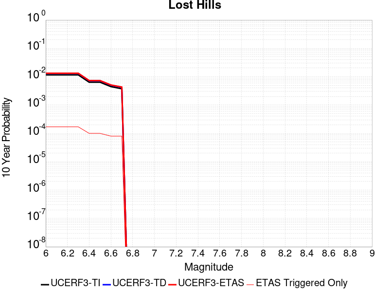 |

| Magnitude | 1 wk TI Prob | 1 wk TD Prob | 1 wk ETAS Prob | 1 wk ETAS/TD Gain | 1 wk ETAS Triggered Only | 1 mo TI Prob | 1 mo TD Prob | 1 mo ETAS Prob | 1 mo ETAS/TD Gain | 1 mo ETAS Triggered Only | 1 yr TI Prob | 1 yr TD Prob | 1 yr ETAS Prob | 1 yr ETAS/TD Gain | 1 yr ETAS Triggered Only | 10 yr TI Prob | 10 yr TD Prob | 10 yr ETAS Prob | 10 yr ETAS/TD Gain | 10 yr ETAS Triggered Only |
|-----|-----|-----|-----|-----|-----|-----|-----|-----|-----|-----|-----|-----|-----|-----|-----|-----|-----|-----|-----|-----|
| 6.0 | 2.233523E-5 | 2.5106583E-5 | 8.690973E-5 | 3.461631 | 6.18047E-5 | 9.571891E-5 | 1.0759615E-4 | 1.817538E-4 | 1.6892222 | 7.416563E-5 | 0.0011647546 | 0.001309364 | 0.0014328116 | 1.0942805 | 1.236094E-4 | 0.011586686 | 0.013033091 | 0.0131794885 | 1.0112329 | 1.4833127E-4 |
| 6.1 | 2.233523E-5 | 2.5106583E-5 | 8.690973E-5 | 3.461631 | 6.18047E-5 | 9.571891E-5 | 1.0759615E-4 | 1.817538E-4 | 1.6892222 | 7.416563E-5 | 0.0011647546 | 0.001309364 | 0.0014328116 | 1.0942805 | 1.236094E-4 | 0.011586686 | 0.013033091 | 0.0131794885 | 1.0112329 | 1.4833127E-4 |
| 6.2 | 2.233523E-5 | 2.5106583E-5 | 8.690973E-5 | 3.461631 | 6.18047E-5 | 9.571891E-5 | 1.0759615E-4 | 1.817538E-4 | 1.6892222 | 7.416563E-5 | 0.0011647546 | 0.001309364 | 0.0014328116 | 1.0942805 | 1.236094E-4 | 0.011586686 | 0.013033091 | 0.0131794885 | 1.0112329 | 1.4833127E-4 |
| 6.3 | 2.233523E-5 | 2.5106583E-5 | 8.690973E-5 | 3.461631 | 6.18047E-5 | 9.571891E-5 | 1.0759615E-4 | 1.817538E-4 | 1.6892222 | 7.416563E-5 | 0.0011647546 | 0.001309364 | 0.0014328116 | 1.0942805 | 1.236094E-4 | 0.011586686 | 0.013033091 | 0.0131794885 | 1.0112329 | 1.4833127E-4 |
| 6.4 | 1.2288092E-5 | 1.3781108E-5 | 2.6141877E-5 | 1.8969358 | 1.236094E-5 | 5.2662188E-5 | 5.906108E-5 | 8.37815E-5 | 1.4185568 | 2.472188E-5 | 6.409735E-4 | 7.189252E-4 | 7.806855E-4 | 1.0859064 | 6.18047E-5 | 0.006391279 | 0.0071752006 | 0.0072488342 | 1.0102623 | 7.416563E-5 |
| 6.5 | 1.2288092E-5 | 1.3781108E-5 | 2.6141877E-5 | 1.8969358 | 1.236094E-5 | 5.2662188E-5 | 5.906108E-5 | 8.37815E-5 | 1.4185568 | 2.472188E-5 | 6.409735E-4 | 7.189252E-4 | 7.806855E-4 | 1.0859064 | 6.18047E-5 | 0.006391279 | 0.0071752006 | 0.0072488342 | 1.0102623 | 7.416563E-5 |
| 6.6 | 8.58281E-6 | 9.63377E-6 | 2.199459E-5 | 2.283072 | 1.236094E-5 | 3.6782953E-5 | 4.12874E-5 | 6.600826E-5 | 1.5987506 | 2.472188E-5 | 4.4774043E-4 | 5.026414E-4 | 5.5206026E-4 | 1.0983185 | 4.944376E-5 | 0.0044683935 | 0.005023205 | 0.0050846995 | 1.0122421 | 6.18047E-5 |
| 6.7 | 7.205685E-6 | 8.088302E-6 | 2.044914E-5 | 2.5282366 | 1.236094E-5 | 3.088114E-5 | 3.466415E-5 | 5.9385173E-5 | 1.7131581 | 2.472188E-5 | 3.7591302E-4 | 4.2203604E-4 | 4.7145892E-4 | 1.1171058 | 4.944376E-5 | 0.0037527776 | 0.0042203604 | 0.004281904 | 1.0145826 | 6.18047E-5 |

## Ventura-Pitas Point
*[(top)](#table-of-contents)*

| 1 Week | 1 Month | 1 Year | 10 Year |
|-----|-----|-----|-----|
| 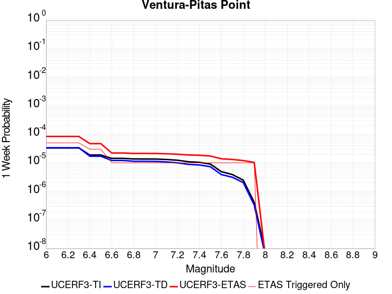 |  |  |  |

| Magnitude | 1 wk TI Prob | 1 wk TD Prob | 1 wk ETAS Prob | 1 wk ETAS/TD Gain | 1 wk ETAS Triggered Only | 1 mo TI Prob | 1 mo TD Prob | 1 mo ETAS Prob | 1 mo ETAS/TD Gain | 1 mo ETAS Triggered Only | 1 yr TI Prob | 1 yr TD Prob | 1 yr ETAS Prob | 1 yr ETAS/TD Gain | 1 yr ETAS Triggered Only | 10 yr TI Prob | 10 yr TD Prob | 10 yr ETAS Prob | 10 yr ETAS/TD Gain | 10 yr ETAS Triggered Only |
|-----|-----|-----|-----|-----|-----|-----|-----|-----|-----|-----|-----|-----|-----|-----|-----|-----|-----|-----|-----|-----|
| 6.0 | 3.3179622E-5 | 3.3735185E-5 | 8.317727E-5 | 2.4655943 | 4.944376E-5 | 1.4219063E-4 | 1.445728E-4 | 2.0636855E-4 | 1.427437 | 6.18047E-5 | 0.0017297962 | 0.0017590096 | 0.0018577232 | 1.0561188 | 9.888752E-5 | 0.017163932 | 0.0174764 | 0.01759785 | 1.0069493 | 1.236094E-4 |
| 6.1 | 3.3179622E-5 | 3.3735185E-5 | 8.317727E-5 | 2.4655943 | 4.944376E-5 | 1.4219063E-4 | 1.445728E-4 | 2.0636855E-4 | 1.427437 | 6.18047E-5 | 0.0017297962 | 0.0017590096 | 0.0018577232 | 1.0561188 | 9.888752E-5 | 0.017163932 | 0.0174764 | 0.01759785 | 1.0069493 | 1.236094E-4 |
| 6.2 | 3.3179622E-5 | 3.3735185E-5 | 8.317727E-5 | 2.4655943 | 4.944376E-5 | 1.4219063E-4 | 1.445728E-4 | 2.0636855E-4 | 1.427437 | 6.18047E-5 | 0.0017297962 | 0.0017590096 | 0.0018577232 | 1.0561188 | 9.888752E-5 | 0.017163932 | 0.0174764 | 0.01759785 | 1.0069493 | 1.236094E-4 |
| 6.3 | 3.3179622E-5 | 3.3735185E-5 | 8.317727E-5 | 2.4655943 | 4.944376E-5 | 1.4219063E-4 | 1.445728E-4 | 2.0636855E-4 | 1.427437 | 6.18047E-5 | 0.0017297962 | 0.0017590096 | 0.0018577232 | 1.0561188 | 9.888752E-5 | 0.017163932 | 0.0174764 | 0.01759785 | 1.0069493 | 1.236094E-4 |
| 6.4 | 1.8754668E-5 | 1.701961E-5 | 5.4101798E-5 | 3.1787918 | 3.7082817E-5 | 8.037467E-5 | 7.293928E-5 | 1.2237942E-4 | 1.6778262 | 4.944376E-5 | 9.781223E-4 | 8.8769704E-4 | 9.7414677E-4 | 1.0973866 | 8.6526576E-5 | 0.009738282 | 0.008843848 | 0.008941861 | 1.0110826 | 9.888752E-5 |
| 6.5 | 1.8754668E-5 | 1.701961E-5 | 5.4101798E-5 | 3.1787918 | 3.7082817E-5 | 8.037467E-5 | 7.293928E-5 | 1.2237942E-4 | 1.6778262 | 4.944376E-5 | 9.781223E-4 | 8.8769704E-4 | 9.7414677E-4 | 1.0973866 | 8.6526576E-5 | 0.009738282 | 0.008843848 | 0.008941861 | 1.0110826 | 9.888752E-5 |
| 6.6 | 1.4361558E-5 | 1.2122275E-5 | 2.4483064E-5 | 2.0196757 | 1.236094E-5 | 6.154808E-5 | 5.1951585E-5 | 6.4311884E-5 | 1.2379196 | 1.236094E-5 | 7.490902E-4 | 6.3232926E-4 | 6.693886E-4 | 1.0586077 | 3.7082817E-5 | 0.0074657016 | 0.0063055577 | 0.0063546896 | 1.0077919 | 4.944376E-5 |
| 6.7 | 1.4361558E-5 | 1.2122275E-5 | 2.4483064E-5 | 2.0196757 | 1.236094E-5 | 6.154808E-5 | 5.1951585E-5 | 6.4311884E-5 | 1.2379196 | 1.236094E-5 | 7.490902E-4 | 6.3232926E-4 | 6.693886E-4 | 1.0586077 | 3.7082817E-5 | 0.0074657016 | 0.0063055577 | 0.0063546896 | 1.0077919 | 4.944376E-5 |
| 6.8 | 1.3663846E-5 | 1.13444175E-5 | 2.3705217E-5 | 2.0895932 | 1.236094E-5 | 5.8558027E-5 | 4.861804E-5 | 6.097838E-5 | 1.2542336 | 1.236094E-5 | 7.127108E-4 | 5.917658E-4 | 6.1647303E-4 | 1.0417517 | 2.472188E-5 | 0.007104293 | 0.005902116 | 0.0059389803 | 1.0062459 | 3.7082817E-5 |
| 6.9 | 1.3644157E-5 | 1.1322519E-5 | 2.3683318E-5 | 2.0917006 | 1.236094E-5 | 5.8473648E-5 | 4.8524187E-5 | 6.0884526E-5 | 1.2547253 | 1.236094E-5 | 7.116841E-4 | 5.9062376E-4 | 6.1533105E-4 | 1.0418326 | 2.472188E-5 | 0.007094092 | 0.0058907564 | 0.005927621 | 1.006258 | 3.7082817E-5 |
| 7.0 | 1.3568845E-5 | 1.1242086E-5 | 2.3602886E-5 | 2.0995114 | 1.236094E-5 | 5.8150898E-5 | 4.817949E-5 | 6.053983E-5 | 1.2565478 | 1.236094E-5 | 7.077572E-4 | 5.864293E-4 | 6.1113667E-4 | 1.0421319 | 2.472188E-5 | 0.007055073 | 0.0058490336 | 0.0058858995 | 1.006303 | 3.7082817E-5 |
| 7.1 | 1.306572E-5 | 1.072054E-5 | 2.3081346E-5 | 2.1530023 | 1.236094E-5 | 5.599474E-5 | 4.5944373E-5 | 5.8304744E-5 | 1.269029 | 1.236094E-5 | 6.815227E-4 | 5.5923103E-4 | 5.839391E-4 | 1.0441822 | 2.472188E-5 | 0.0067943637 | 0.0055784425 | 0.005615318 | 1.0066104 | 3.7082817E-5 |
| 7.2 | 1.232604E-5 | 9.995143E-6 | 2.2355958E-5 | 2.2366822 | 1.236094E-5 | 5.2824813E-5 | 4.2835632E-5 | 5.5196044E-5 | 1.2885544 | 1.236094E-5 | 6.429523E-4 | 5.214008E-4 | 5.461098E-4 | 1.0473896 | 2.472188E-5 | 0.0064109527 | 0.005201967 | 0.0052388567 | 1.0070915 | 3.7082817E-5 |
| 7.3 | 1.0917261E-5 | 8.84384E-6 | 2.120467E-5 | 2.3976767 | 1.236094E-5 | 4.678742E-5 | 3.790163E-5 | 5.0262104E-5 | 1.3261198 | 1.236094E-5 | 5.69488E-4 | 4.6135622E-4 | 4.8606668E-4 | 1.0535605 | 2.472188E-5 | 0.0056803077 | 0.00460415 | 0.004641062 | 1.0080172 | 3.7082817E-5 |
| 7.4 | 1.039959E-5 | 8.423562E-6 | 2.0784397E-5 | 2.467412 | 1.236094E-5 | 4.456891E-5 | 3.610049E-5 | 4.846098E-5 | 1.3423913 | 1.236094E-5 | 5.424914E-4 | 4.3943635E-4 | 4.6414736E-4 | 1.0562334 | 2.472188E-5 | 0.0054116896 | 0.004385836 | 0.004422756 | 1.0084181 | 3.7082817E-5 |
| 7.5 | 9.015877E-6 | 7.2975445E-6 | 1.9658393E-5 | 2.6938367 | 1.236094E-5 | 3.86389E-5 | 3.1274823E-5 | 4.3635377E-5 | 1.3952237 | 1.236094E-5 | 4.7032707E-4 | 3.8070587E-4 | 4.0541834E-4 | 1.0649122 | 2.472188E-5 | 0.004693329 | 0.0038006818 | 0.0038253097 | 1.0064799 | 2.472188E-5 |
| 7.6 | 4.900162E-6 | 3.8741155E-6 | 1.6235008E-5 | 4.1906357 | 1.236094E-5 | 2.1000526E-5 | 1.6603248E-5 | 2.8963981E-5 | 1.7444769 | 1.236094E-5 | 2.556514E-4 | 2.0212591E-4 | 2.1448436E-4 | 1.0611423 | 1.236094E-5 | 0.0025535747 | 0.0020194345 | 0.0020317703 | 1.0061086 | 1.236094E-5 |
| 7.7 | 3.8850626E-6 | 3.1267302E-6 | 1.548763E-5 | 4.9532995 | 1.236094E-5 | 1.6650163E-5 | 1.3400205E-5 | 2.5760979E-5 | 1.9224317 | 1.236094E-5 | 2.0269687E-4 | 1.6313537E-4 | 1.754943E-4 | 1.0757587 | 1.236094E-5 | 0.002025121 | 0.0016301654 | 0.0016425062 | 1.0075703 | 1.236094E-5 |
| 7.8 | 2.4654719E-6 | 2.029875E-6 | 1.4390789E-5 | 7.089495 | 1.236094E-5 | 1.0566265E-5 | 8.699436E-6 | 2.1060267E-5 | 2.4208775 | 1.236094E-5 | 1.2863669E-4 | 1.0591053E-4 | 1.1827016E-4 | 1.1166987 | 1.236094E-5 | 0.0012856225 | 0.0010586053 | 0.0010709531 | 1.0116643 | 1.236094E-5 |
| 7.9 | 4.095894E-7 | 3.2764765E-7 | 1.2688583E-5 | 38.726307 | 1.236094E-5 | 1.7553821E-6 | 1.4042034E-6 | 1.3765126E-5 | 9.8028 | 1.236094E-5 | 2.1371567E-5 | 1.7096047E-5 | 2.9456774E-5 | 1.7230167 | 1.236094E-5 | 2.1369511E-4 | 1.7094762E-4 | 1.8330645E-4 | 1.072296 | 1.236094E-5 |
| 8.0 | 7.791402E-9 | 5.683497E-9 | 5.683497E-9 | 1.0 | 0.0 | 3.3391725E-8 | 2.4357844E-8 | 2.4357844E-8 | 1.0 | 0.0 | 4.0654416E-7 | 2.9655675E-7 | 2.9655675E-7 | 1.0 | 0.0 | 4.065434E-6 | 2.9655655E-6 | 2.9655655E-6 | 1.0 | 0.0 |

## Deep Springs
*[(top)](#table-of-contents)*

| 1 Week | 1 Month | 1 Year | 10 Year |
|-----|-----|-----|-----|
|  | 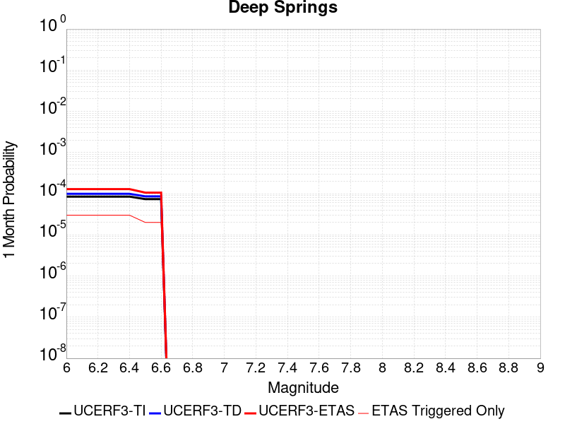 |  |  |

| Magnitude | 1 wk TI Prob | 1 wk TD Prob | 1 wk ETAS Prob | 1 wk ETAS/TD Gain | 1 wk ETAS Triggered Only | 1 mo TI Prob | 1 mo TD Prob | 1 mo ETAS Prob | 1 mo ETAS/TD Gain | 1 mo ETAS Triggered Only | 1 yr TI Prob | 1 yr TD Prob | 1 yr ETAS Prob | 1 yr ETAS/TD Gain | 1 yr ETAS Triggered Only | 10 yr TI Prob | 10 yr TD Prob | 10 yr ETAS Prob | 10 yr ETAS/TD Gain | 10 yr ETAS Triggered Only |
|-----|-----|-----|-----|-----|-----|-----|-----|-----|-----|-----|-----|-----|-----|-----|-----|-----|-----|-----|-----|-----|
| 6.0 | 1.9810619E-5 | 2.311252E-5 | 3.5473175E-5 | 1.5348034 | 1.236094E-5 | 8.489989E-5 | 9.905276E-5 | 1.2377219E-4 | 1.2495582 | 2.472188E-5 | 0.001033166 | 0.0012058079 | 0.0012922302 | 1.0716716 | 8.6526576E-5 | 0.010283757 | 0.012042425 | 0.012176758 | 1.011155 | 1.3597033E-4 |
| 6.1 | 1.9810619E-5 | 2.311252E-5 | 3.5473175E-5 | 1.5348034 | 1.236094E-5 | 8.489989E-5 | 9.905276E-5 | 1.2377219E-4 | 1.2495582 | 2.472188E-5 | 0.001033166 | 0.0012058079 | 0.0012922302 | 1.0716716 | 8.6526576E-5 | 0.010283757 | 0.012042425 | 0.012176758 | 1.011155 | 1.3597033E-4 |
| 6.2 | 1.9810619E-5 | 2.311252E-5 | 3.5473175E-5 | 1.5348034 | 1.236094E-5 | 8.489989E-5 | 9.905276E-5 | 1.2377219E-4 | 1.2495582 | 2.472188E-5 | 0.001033166 | 0.0012058079 | 0.0012922302 | 1.0716716 | 8.6526576E-5 | 0.010283757 | 0.012042425 | 0.012176758 | 1.011155 | 1.3597033E-4 |
| 6.3 | 1.9810619E-5 | 2.311252E-5 | 3.5473175E-5 | 1.5348034 | 1.236094E-5 | 8.489989E-5 | 9.905276E-5 | 1.2377219E-4 | 1.2495582 | 2.472188E-5 | 0.001033166 | 0.0012058079 | 0.0012922302 | 1.0716716 | 8.6526576E-5 | 0.010283757 | 0.012042425 | 0.012176758 | 1.011155 | 1.3597033E-4 |
| 6.4 | 1.9810619E-5 | 2.311252E-5 | 3.5473175E-5 | 1.5348034 | 1.236094E-5 | 8.489989E-5 | 9.905276E-5 | 1.2377219E-4 | 1.2495582 | 2.472188E-5 | 0.001033166 | 0.0012058079 | 0.0012922302 | 1.0716716 | 8.6526576E-5 | 0.010283757 | 0.012042425 | 0.012176758 | 1.011155 | 1.3597033E-4 |
| 6.5 | 1.7190405E-5 | 2.0050555E-5 | 3.2411248E-5 | 1.6164763 | 1.236094E-5 | 7.367108E-5 | 8.593095E-5 | 9.829083E-5 | 1.143835 | 1.236094E-5 | 8.9657627E-4 | 0.0010462094 | 0.0011202974 | 1.0708157 | 7.416563E-5 | 0.008929676 | 0.010462056 | 0.010584372 | 1.0116915 | 1.236094E-4 |
| 6.6 | 1.7190405E-5 | 2.0050555E-5 | 3.2411248E-5 | 1.6164763 | 1.236094E-5 | 7.367108E-5 | 8.593095E-5 | 9.829083E-5 | 1.143835 | 1.236094E-5 | 8.9657627E-4 | 0.0010462094 | 0.0011202974 | 1.0708157 | 7.416563E-5 | 0.008929676 | 0.010462056 | 0.010584372 | 1.0116915 | 1.236094E-4 |

## Cleghorn Pass
*[(top)](#table-of-contents)*

| 1 Week | 1 Month | 1 Year | 10 Year |
|-----|-----|-----|-----|
| 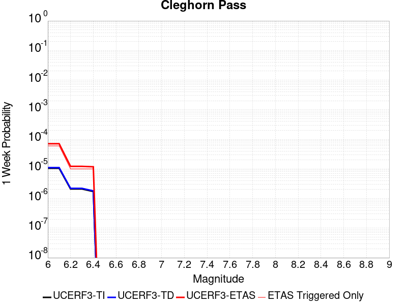 |  |  |  |

| Magnitude | 1 wk TI Prob | 1 wk TD Prob | 1 wk ETAS Prob | 1 wk ETAS/TD Gain | 1 wk ETAS Triggered Only | 1 mo TI Prob | 1 mo TD Prob | 1 mo ETAS Prob | 1 mo ETAS/TD Gain | 1 mo ETAS Triggered Only | 1 yr TI Prob | 1 yr TD Prob | 1 yr ETAS Prob | 1 yr ETAS/TD Gain | 1 yr ETAS Triggered Only | 10 yr TI Prob | 10 yr TD Prob | 10 yr ETAS Prob | 10 yr ETAS/TD Gain | 10 yr ETAS Triggered Only |
|-----|-----|-----|-----|-----|-----|-----|-----|-----|-----|-----|-----|-----|-----|-----|-----|-----|-----|-----|-----|-----|
| 6.0 | 1.0522846E-5 | 1.1040642E-5 | 8.520546E-5 | 7.7174373 | 7.416563E-5 | 4.509713E-5 | 4.7316473E-5 | 1.3383896E-4 | 2.828591 | 8.6526576E-5 | 5.4891926E-4 | 5.759784E-4 | 6.995166E-4 | 1.2144841 | 1.236094E-4 | 0.0054756533 | 0.005750022 | 0.0058729206 | 1.0213736 | 1.236094E-4 |
| 6.1 | 1.0522846E-5 | 1.1040642E-5 | 8.520546E-5 | 7.7174373 | 7.416563E-5 | 4.509713E-5 | 4.7316473E-5 | 1.3383896E-4 | 2.828591 | 8.6526576E-5 | 5.4891926E-4 | 5.759784E-4 | 6.995166E-4 | 1.2144841 | 1.236094E-4 | 0.0054756533 | 0.005750022 | 0.0058729206 | 1.0213736 | 1.236094E-4 |
| 6.2 | 2.1045846E-6 | 2.2082024E-6 | 1.4569115E-5 | 6.597726 | 1.236094E-5 | 9.019617E-6 | 9.463714E-6 | 2.1824537E-5 | 2.306128 | 1.236094E-5 | 1.098083E-4 | 1.1521882E-4 | 1.3993785E-4 | 1.2145399 | 2.472188E-5 | 0.0010975406 | 0.0011520023 | 0.0011766957 | 1.0214351 | 2.472188E-5 |
| 6.3 | 2.1045846E-6 | 2.2082024E-6 | 1.4569115E-5 | 6.597726 | 1.236094E-5 | 9.019617E-6 | 9.463714E-6 | 2.1824537E-5 | 2.306128 | 1.236094E-5 | 1.098083E-4 | 1.1521882E-4 | 1.3993785E-4 | 1.2145399 | 2.472188E-5 | 0.0010975406 | 0.0011520023 | 0.0011766957 | 1.0214351 | 2.472188E-5 |
| 6.4 | 1.7259927E-6 | 1.810877E-6 | 1.4171794E-5 | 7.825928 | 1.236094E-5 | 7.3970905E-6 | 7.760902E-6 | 2.0121744E-5 | 2.5927072 | 1.236094E-5 | 9.005586E-5 | 9.4488976E-5 | 1.06848755E-4 | 1.1308064 | 1.236094E-5 | 9.001937E-4 | 9.448898E-4 | 9.5723907E-4 | 1.0130695 | 1.236094E-5 |

## Owens Valley
*[(top)](#table-of-contents)*

| 1 Week | 1 Month | 1 Year | 10 Year |
|-----|-----|-----|-----|
| 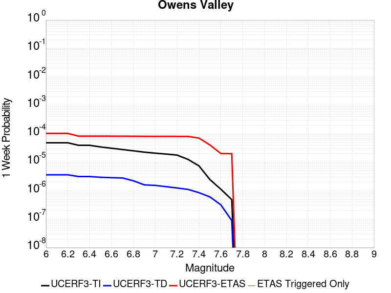 |  |  |  |

| Magnitude | 1 wk TI Prob | 1 wk TD Prob | 1 wk ETAS Prob | 1 wk ETAS/TD Gain | 1 wk ETAS Triggered Only | 1 mo TI Prob | 1 mo TD Prob | 1 mo ETAS Prob | 1 mo ETAS/TD Gain | 1 mo ETAS Triggered Only | 1 yr TI Prob | 1 yr TD Prob | 1 yr ETAS Prob | 1 yr ETAS/TD Gain | 1 yr ETAS Triggered Only | 10 yr TI Prob | 10 yr TD Prob | 10 yr ETAS Prob | 10 yr ETAS/TD Gain | 10 yr ETAS Triggered Only |
|-----|-----|-----|-----|-----|-----|-----|-----|-----|-----|-----|-----|-----|-----|-----|-----|-----|-----|-----|-----|-----|
| 6.0 | 4.83821E-5 | 3.626567E-6 | 9.0152826E-5 | 24.859001 | 8.6526576E-5 | 2.0733538E-4 | 1.5542342E-5 | 1.2678906E-4 | 8.157655 | 1.1124845E-4 | 0.002521386 | 1.8921259E-4 | 3.127986E-4 | 1.6531595 | 1.236094E-4 | 0.024929691 | 0.001925011 | 0.0020483825 | 1.0640887 | 1.236094E-4 |
| 6.1 | 4.83821E-5 | 3.626567E-6 | 9.0152826E-5 | 24.859001 | 8.6526576E-5 | 2.0733538E-4 | 1.5542342E-5 | 1.2678906E-4 | 8.157655 | 1.1124845E-4 | 0.002521386 | 1.8921259E-4 | 3.127986E-4 | 1.6531595 | 1.236094E-4 | 0.024929691 | 0.001925011 | 0.0020483825 | 1.0640887 | 1.236094E-4 |
| 6.2 | 4.83821E-5 | 3.626567E-6 | 9.0152826E-5 | 24.859001 | 8.6526576E-5 | 2.0733538E-4 | 1.5542342E-5 | 1.2678906E-4 | 8.157655 | 1.1124845E-4 | 0.002521386 | 1.8921259E-4 | 3.127986E-4 | 1.6531595 | 1.236094E-4 | 0.024929691 | 0.001925011 | 0.0020483825 | 1.0640887 | 1.236094E-4 |
| 6.3 | 3.953008E-5 | 3.1553948E-6 | 6.4959895E-5 | 20.586931 | 6.18047E-5 | 1.6940363E-4 | 1.3523055E-5 | 1.0004846E-4 | 7.3983626 | 8.6526576E-5 | 0.002060538 | 1.6463149E-4 | 2.6350273E-4 | 1.6005609 | 9.888752E-5 | 0.020415364 | 0.0016592 | 0.0017579234 | 1.0595006 | 9.888752E-5 |
| 6.4 | 3.953008E-5 | 3.1553948E-6 | 6.4959895E-5 | 20.586931 | 6.18047E-5 | 1.6940363E-4 | 1.3523055E-5 | 1.0004846E-4 | 7.3983626 | 8.6526576E-5 | 0.002060538 | 1.6463149E-4 | 2.6350273E-4 | 1.6005609 | 9.888752E-5 | 0.020415364 | 0.0016592 | 0.0017579234 | 1.0595006 | 9.888752E-5 |
| 6.5 | 3.457342E-5 | 2.9715961E-6 | 6.477611E-5 | 21.798422 | 6.18047E-5 | 1.4816338E-4 | 1.2735354E-5 | 9.9260826E-5 | 7.794116 | 8.6526576E-5 | 0.0018023965 | 1.550426E-4 | 2.539148E-4 | 1.6377097 | 9.888752E-5 | 0.017878477 | 0.001555719 | 0.0016544526 | 1.063465 | 9.888752E-5 |
| 6.6 | 3.1127765E-5 | 2.8744932E-6 | 6.4679014E-5 | 22.501013 | 6.18047E-5 | 1.3339789E-4 | 1.2319203E-5 | 9.8844714E-5 | 8.023629 | 8.6526576E-5 | 0.0016229092 | 1.4997667E-4 | 2.4884933E-4 | 1.6592538 | 9.888752E-5 | 0.016111081 | 0.0015012559 | 0.001599995 | 1.065771 | 9.888752E-5 |
| 6.7 | 2.806885E-5 | 2.8104134E-6 | 6.4614935E-5 | 22.991257 | 6.18047E-5 | 1.2028952E-4 | 1.20445775E-5 | 9.857011E-5 | 8.183775 | 8.6526576E-5 | 0.001463541 | 1.4663354E-4 | 2.4550656E-4 | 1.6742865 | 9.888752E-5 | 0.014539397 | 0.0014657511 | 0.0015644936 | 1.0673665 | 9.888752E-5 |
| 6.8 | 2.524524E-5 | 2.2353688E-6 | 6.403993E-5 | 28.648485 | 6.18047E-5 | 1.0818939E-4 | 9.580118E-6 | 9.610587E-5 | 10.031804 | 8.6526576E-5 | 0.0013164099 | 1.16632E-4 | 2.1550799E-4 | 1.8477603 | 9.888752E-5 | 0.01308639 | 0.0011659812 | 0.0012647534 | 1.0847117 | 9.888752E-5 |
| 6.9 | 2.2704568E-5 | 1.6081682E-6 | 6.3412765E-5 | 39.431675 | 6.18047E-5 | 9.730166E-5 | 6.8921313E-6 | 9.341811E-5 | 13.554314 | 8.6526576E-5 | 0.0011840039 | 8.390849E-5 | 1.8278771E-4 | 2.1784174 | 9.888752E-5 | 0.011777153 | 8.3897985E-4 | 9.377844E-4 | 1.1177675 | 9.888752E-5 |
| 7.0 | 2.0871712E-5 | 1.5395453E-6 | 6.3344145E-5 | 41.14471 | 6.18047E-5 | 8.944713E-5 | 6.598035E-6 | 9.312404E-5 | 14.113906 | 8.6526576E-5 | 0.0010884746 | 8.032813E-5 | 1.792077E-4 | 2.2309458 | 9.888752E-5 | 0.010831586 | 8.0316263E-4 | 9.019707E-4 | 1.1230237 | 9.888752E-5 |
| 7.1 | 1.944928E-5 | 1.3864178E-6 | 6.319103E-5 | 45.578636 | 6.18047E-5 | 8.335139E-5 | 5.941777E-6 | 9.246784E-5 | 15.562321 | 8.6526576E-5 | 0.0010143308 | 7.233874E-5 | 1.712191E-4 | 2.3669074 | 9.888752E-5 | 0.010097133 | 7.2330976E-4 | 8.2212576E-4 | 1.1366165 | 9.888752E-5 |
| 7.2 | 1.7876306E-5 | 1.2489141E-6 | 6.3053536E-5 | 50.486687 | 6.18047E-5 | 7.6610486E-5 | 5.352478E-6 | 9.187859E-5 | 17.165617 | 8.6526576E-5 | 9.3233347E-4 | 6.516448E-5 | 1.6404556E-4 | 2.5174074 | 9.888752E-5 | 0.009284316 | 6.5159105E-4 | 7.5041415E-4 | 1.1516643 | 9.888752E-5 |
| 7.3 | 1.2618672E-5 | 1.1115209E-6 | 6.291615E-5 | 56.60366 | 6.18047E-5 | 5.40789E-5 | 4.763652E-6 | 9.128982E-5 | 19.163828 | 8.6526576E-5 | 6.582117E-4 | 5.799593E-5 | 1.5687771E-4 | 2.704978 | 9.888752E-5 | 0.0065626553 | 5.7994033E-4 | 6.787705E-4 | 1.1704143 | 9.888752E-5 |
| 7.4 | 7.4874442E-6 | 8.5486437E-7 | 5.029858E-5 | 58.83808 | 4.944376E-5 | 3.208865E-5 | 3.6636993E-6 | 7.782906E-5 | 21.2433 | 7.416563E-5 | 3.906093E-4 | 4.4604632E-5 | 1.3112735E-4 | 2.9397697 | 8.6526576E-5 | 0.003899234 | 4.4604883E-4 | 5.325368E-4 | 1.193898 | 8.6526576E-5 |
| 7.5 | 2.4734156E-6 | 6.068616E-7 | 3.7689657E-5 | 62.105854 | 3.7082817E-5 | 1.060031E-5 | 2.6008327E-6 | 5.2044463E-5 | 20.01069 | 4.944376E-5 | 1.2905113E-4 | 3.166468E-5 | 8.1106875E-5 | 2.5614302 | 4.944376E-5 | 0.0012897621 | 3.1660203E-4 | 3.6603012E-4 | 1.1561207 | 4.944376E-5 |
| 7.6 | 1.1328841E-6 | 3.196531E-7 | 1.2680589E-5 | 39.669846 | 1.236094E-5 | 4.8552088E-6 | 1.3699412E-6 | 2.6091786E-5 | 19.045918 | 2.472188E-5 | 5.9110564E-5 | 1.6678909E-5 | 4.1400373E-5 | 2.4821994 | 2.472188E-5 | 5.9094845E-4 | 1.6677675E-4 | 1.914945E-4 | 1.1482086 | 2.472188E-5 |
| 7.7 | 4.8613185E-7 | 8.964689E-8 | 1.2450585E-5 | 138.88474 | 1.236094E-5 | 2.0834207E-6 | 3.8420092E-7 | 1.2745136E-5 | 33.1731 | 1.236094E-5 | 2.536535E-5 | 4.6776368E-6 | 1.7038517E-5 | 3.6425486 | 1.236094E-5 | 2.5362454E-4 | 4.677545E-5 | 5.913581E-5 | 1.2642488 | 1.236094E-5 |

## Pine Mtn
*[(top)](#table-of-contents)*

| 1 Week | 1 Month | 1 Year | 10 Year |
|-----|-----|-----|-----|
|  |  |  |  |

| Magnitude | 1 wk TI Prob | 1 wk TD Prob | 1 wk ETAS Prob | 1 wk ETAS/TD Gain | 1 wk ETAS Triggered Only | 1 mo TI Prob | 1 mo TD Prob | 1 mo ETAS Prob | 1 mo ETAS/TD Gain | 1 mo ETAS Triggered Only | 1 yr TI Prob | 1 yr TD Prob | 1 yr ETAS Prob | 1 yr ETAS/TD Gain | 1 yr ETAS Triggered Only | 10 yr TI Prob | 10 yr TD Prob | 10 yr ETAS Prob | 10 yr ETAS/TD Gain | 10 yr ETAS Triggered Only |
|-----|-----|-----|-----|-----|-----|-----|-----|-----|-----|-----|-----|-----|-----|-----|-----|-----|-----|-----|-----|-----|
| 6.0 | 6.894797E-6 | 7.225461E-6 | 7.225461E-6 | 1.0 | 0.0 | 2.9548795E-5 | 3.096591E-5 | 4.332647E-5 | 1.3991666 | 1.236094E-5 | 3.596972E-4 | 3.7694772E-4 | 4.2637286E-4 | 1.1311193 | 4.944376E-5 | 0.0035911554 | 0.003763381 | 0.0038865253 | 1.0327216 | 1.236094E-4 |
| 6.1 | 6.894797E-6 | 7.225461E-6 | 7.225461E-6 | 1.0 | 0.0 | 2.9548795E-5 | 3.096591E-5 | 4.332647E-5 | 1.3991666 | 1.236094E-5 | 3.596972E-4 | 3.7694772E-4 | 4.2637286E-4 | 1.1311193 | 4.944376E-5 | 0.0035911554 | 0.003763381 | 0.0038865253 | 1.0327216 | 1.236094E-4 |
| 6.2 | 6.894797E-6 | 7.225461E-6 | 7.225461E-6 | 1.0 | 0.0 | 2.9548795E-5 | 3.096591E-5 | 4.332647E-5 | 1.3991666 | 1.236094E-5 | 3.596972E-4 | 3.7694772E-4 | 4.2637286E-4 | 1.1311193 | 4.944376E-5 | 0.0035911554 | 0.003763381 | 0.0038865253 | 1.0327216 | 1.236094E-4 |
| 6.3 | 6.894797E-6 | 7.225461E-6 | 7.225461E-6 | 1.0 | 0.0 | 2.9548795E-5 | 3.096591E-5 | 4.332647E-5 | 1.3991666 | 1.236094E-5 | 3.596972E-4 | 3.7694772E-4 | 4.2637286E-4 | 1.1311193 | 4.944376E-5 | 0.0035911554 | 0.003763381 | 0.0038865253 | 1.0327216 | 1.236094E-4 |
| 6.4 | 6.894797E-6 | 7.225461E-6 | 7.225461E-6 | 1.0 | 0.0 | 2.9548795E-5 | 3.096591E-5 | 4.332647E-5 | 1.3991666 | 1.236094E-5 | 3.596972E-4 | 3.7694772E-4 | 4.2637286E-4 | 1.1311193 | 4.944376E-5 | 0.0035911554 | 0.003763381 | 0.0038865253 | 1.0327216 | 1.236094E-4 |
| 6.5 | 6.894797E-6 | 7.225461E-6 | 7.225461E-6 | 1.0 | 0.0 | 2.9548795E-5 | 3.096591E-5 | 4.332647E-5 | 1.3991666 | 1.236094E-5 | 3.596972E-4 | 3.7694772E-4 | 4.2637286E-4 | 1.1311193 | 4.944376E-5 | 0.0035911554 | 0.003763381 | 0.0038865253 | 1.0327216 | 1.236094E-4 |
| 6.6 | 6.894797E-6 | 7.225461E-6 | 7.225461E-6 | 1.0 | 0.0 | 2.9548795E-5 | 3.096591E-5 | 4.332647E-5 | 1.3991666 | 1.236094E-5 | 3.596972E-4 | 3.7694772E-4 | 4.2637286E-4 | 1.1311193 | 4.944376E-5 | 0.0035911554 | 0.003763381 | 0.0038865253 | 1.0327216 | 1.236094E-4 |
| 6.7 | 6.0867933E-6 | 6.3971133E-6 | 6.3971133E-6 | 1.0 | 0.0 | 2.6085996E-5 | 2.7415923E-5 | 3.9776525E-5 | 1.4508548 | 1.236094E-5 | 3.1755073E-4 | 3.3373994E-4 | 3.5845357E-4 | 1.0740505 | 2.472188E-5 | 0.0031709734 | 0.0033326065 | 0.0034311644 | 1.0295738 | 9.888752E-5 |
| 6.8 | 5.6530425E-6 | 5.9505956E-6 | 5.9505956E-6 | 1.0 | 0.0 | 2.42271E-5 | 2.5502315E-5 | 2.5502315E-5 | 1.0 | 0.0 | 2.94925E-4 | 3.104485E-4 | 3.228056E-4 | 1.039804 | 1.236094E-5 | 0.002945339 | 0.0031003528 | 0.0031866112 | 1.0278221 | 8.6526576E-5 |
| 6.9 | 4.6015225E-6 | 4.863834E-6 | 4.863834E-6 | 1.0 | 0.0 | 1.9720663E-5 | 2.0844845E-5 | 2.0844845E-5 | 1.0 | 0.0 | 2.4007261E-4 | 2.5375787E-4 | 2.6611568E-4 | 1.0486991 | 1.236094E-5 | 0.0023981342 | 0.0025348254 | 0.0026211326 | 1.0340486 | 8.6526576E-5 |
| 7.0 | 4.4875965E-6 | 4.747473E-6 | 4.747473E-6 | 1.0 | 0.0 | 1.9232413E-5 | 2.0346162E-5 | 2.0346162E-5 | 1.0 | 0.0 | 2.3412947E-4 | 2.4768783E-4 | 2.600457E-4 | 1.0498929 | 1.236094E-5 | 0.0023388295 | 0.0024742614 | 0.0025605739 | 1.0348841 | 8.6526576E-5 |
| 7.1 | 3.203907E-6 | 3.4294096E-6 | 3.4294096E-6 | 1.0 | 0.0 | 1.3730958E-5 | 1.4697391E-5 | 1.4697391E-5 | 1.0 | 0.0 | 1.6716159E-4 | 1.789267E-4 | 1.9128543E-4 | 1.0690714 | 1.236094E-5 | 0.0016703589 | 0.0017878925 | 0.0018495867 | 1.0345067 | 6.18047E-5 |
| 7.2 | 2.2060601E-6 | 2.3784817E-6 | 2.3784817E-6 | 1.0 | 0.0 | 9.4545085E-6 | 1.0193455E-5 | 1.0193455E-5 | 1.0 | 0.0 | 1.15102564E-4 | 1.240987E-4 | 1.3645811E-4 | 1.0995934 | 1.236094E-5 | 0.0011504296 | 0.0012403389 | 0.0012897213 | 1.0398136 | 4.944376E-5 |
| 7.3 | 1.3765207E-6 | 1.5216481E-6 | 1.5216481E-6 | 1.0 | 0.0 | 5.899361E-6 | 6.521333E-6 | 6.521333E-6 | 1.0 | 0.0 | 7.182235E-5 | 7.939443E-5 | 7.939443E-5 | 1.0 | 0.0 | 7.1799144E-4 | 7.936697E-4 | 8.3072315E-4 | 1.0466862 | 3.7082817E-5 |
| 7.4 | 1.1245983E-6 | 1.2587075E-6 | 1.2587075E-6 | 1.0 | 0.0 | 4.819698E-6 | 5.39445E-6 | 5.39445E-6 | 1.0 | 0.0 | 5.8678244E-5 | 6.567554E-5 | 6.567554E-5 | 1.0 | 0.0 | 5.866275E-4 | 6.5656955E-4 | 6.812752E-4 | 1.0376284 | 2.472188E-5 |
| 7.5 | 8.031682E-7 | 9.276951E-7 | 9.276951E-7 | 1.0 | 0.0 | 3.4421448E-6 | 3.9758306E-6 | 3.9758306E-6 | 1.0 | 0.0 | 4.1907308E-5 | 4.840473E-5 | 4.840473E-5 | 1.0 | 0.0 | 4.1899405E-4 | 4.8394862E-4 | 4.963036E-4 | 1.0255295 | 1.236094E-5 |
| 7.6 | 4.8953444E-7 | 6.003009E-7 | 6.003009E-7 | 1.0 | 0.0 | 2.098003E-6 | 2.5727159E-6 | 2.5727159E-6 | 1.0 | 0.0 | 2.5542888E-5 | 3.1322415E-5 | 3.1322415E-5 | 1.0 | 0.0 | 2.5539953E-4 | 3.1318486E-4 | 3.1318486E-4 | 1.0 | 0.0 |
| 7.7 | 6.634529E-8 | 6.788826E-8 | 6.788826E-8 | 1.0 | 0.0 | 2.843369E-7 | 2.9094966E-7 | 2.9094966E-7 | 1.0 | 0.0 | 3.4617963E-6 | 3.5423066E-6 | 3.5423066E-6 | 1.0 | 0.0 | 3.4617424E-5 | 3.542255E-5 | 3.542255E-5 | 1.0 | 0.0 |
| 7.8 | 9.235578E-9 | 9.488566E-9 | 9.488566E-9 | 1.0 | 0.0 | 3.9581046E-8 | 4.0665284E-8 | 4.0665284E-8 | 1.0 | 0.0 | 4.818991E-7 | 4.950997E-7 | 4.950997E-7 | 1.0 | 0.0 | 4.8189804E-6 | 4.950988E-6 | 4.950988E-6 | 1.0 | 0.0 |

## Pleito
*[(top)](#table-of-contents)*

| 1 Week | 1 Month | 1 Year | 10 Year |
|-----|-----|-----|-----|
| 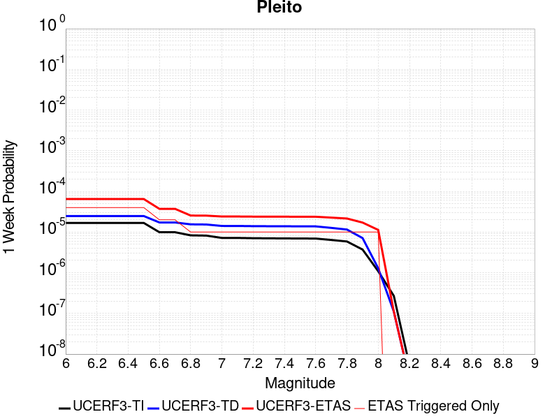 |  |  | 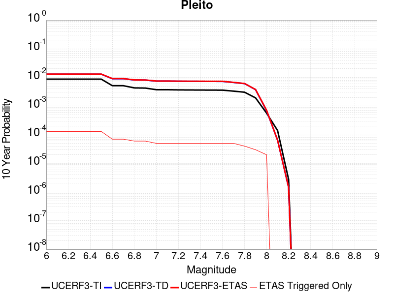 |

| Magnitude | 1 wk TI Prob | 1 wk TD Prob | 1 wk ETAS Prob | 1 wk ETAS/TD Gain | 1 wk ETAS Triggered Only | 1 mo TI Prob | 1 mo TD Prob | 1 mo ETAS Prob | 1 mo ETAS/TD Gain | 1 mo ETAS Triggered Only | 1 yr TI Prob | 1 yr TD Prob | 1 yr ETAS Prob | 1 yr ETAS/TD Gain | 1 yr ETAS Triggered Only | 10 yr TI Prob | 10 yr TD Prob | 10 yr ETAS Prob | 10 yr ETAS/TD Gain | 10 yr ETAS Triggered Only |
|-----|-----|-----|-----|-----|-----|-----|-----|-----|-----|-----|-----|-----|-----|-----|-----|-----|-----|-----|-----|-----|
| 6.0 | 1.6763008E-5 | 2.4763838E-5 | 4.9485105E-5 | 1.9982809 | 2.472188E-5 | 7.183948E-5 | 1.0612683E-4 | 1.5556534E-4 | 1.4658437 | 4.944376E-5 | 8.742947E-4 | 0.0012914003 | 0.0013778151 | 1.0669156 | 8.6526576E-5 | 0.00870863 | 0.0129538905 | 0.013075898 | 1.0094186 | 1.236094E-4 |
| 6.1 | 1.6763008E-5 | 2.4763838E-5 | 4.9485105E-5 | 1.9982809 | 2.472188E-5 | 7.183948E-5 | 1.0612683E-4 | 1.5556534E-4 | 1.4658437 | 4.944376E-5 | 8.742947E-4 | 0.0012914003 | 0.0013778151 | 1.0669156 | 8.6526576E-5 | 0.00870863 | 0.0129538905 | 0.013075898 | 1.0094186 | 1.236094E-4 |
| 6.2 | 1.6763008E-5 | 2.4763838E-5 | 4.9485105E-5 | 1.9982809 | 2.472188E-5 | 7.183948E-5 | 1.0612683E-4 | 1.5556534E-4 | 1.4658437 | 4.944376E-5 | 8.742947E-4 | 0.0012914003 | 0.0013778151 | 1.0669156 | 8.6526576E-5 | 0.00870863 | 0.0129538905 | 0.013075898 | 1.0094186 | 1.236094E-4 |
| 6.3 | 1.6763008E-5 | 2.4763838E-5 | 4.9485105E-5 | 1.9982809 | 2.472188E-5 | 7.183948E-5 | 1.0612683E-4 | 1.5556534E-4 | 1.4658437 | 4.944376E-5 | 8.742947E-4 | 0.0012914003 | 0.0013778151 | 1.0669156 | 8.6526576E-5 | 0.00870863 | 0.0129538905 | 0.013075898 | 1.0094186 | 1.236094E-4 |
| 6.4 | 1.6763008E-5 | 2.4763838E-5 | 4.9485105E-5 | 1.9982809 | 2.472188E-5 | 7.183948E-5 | 1.0612683E-4 | 1.5556534E-4 | 1.4658437 | 4.944376E-5 | 8.742947E-4 | 0.0012914003 | 0.0013778151 | 1.0669156 | 8.6526576E-5 | 0.00870863 | 0.0129538905 | 0.013075898 | 1.0094186 | 1.236094E-4 |
| 6.5 | 1.6763008E-5 | 2.4763838E-5 | 4.9485105E-5 | 1.9982809 | 2.472188E-5 | 7.183948E-5 | 1.0612683E-4 | 1.5556534E-4 | 1.4658437 | 4.944376E-5 | 8.742947E-4 | 0.0012914003 | 0.0013778151 | 1.0669156 | 8.6526576E-5 | 0.00870863 | 0.0129538905 | 0.013075898 | 1.0094186 | 1.236094E-4 |
| 6.6 | 9.910213E-6 | 1.7214623E-5 | 2.957535E-5 | 1.7180364 | 1.236094E-5 | 4.247165E-5 | 7.377489E-5 | 9.849495E-5 | 1.3350741 | 2.472188E-5 | 5.169696E-4 | 8.978429E-4 | 9.595921E-4 | 1.068775 | 6.18047E-5 | 0.0051576863 | 0.009050702 | 0.009124196 | 1.0081203 | 7.416563E-5 |
| 6.7 | 9.910213E-6 | 1.7214623E-5 | 2.957535E-5 | 1.7180364 | 1.236094E-5 | 4.247165E-5 | 7.377489E-5 | 9.849495E-5 | 1.3350741 | 2.472188E-5 | 5.169696E-4 | 8.978429E-4 | 9.595921E-4 | 1.068775 | 6.18047E-5 | 0.0051576863 | 0.009050702 | 0.009124196 | 1.0081203 | 7.416563E-5 |
| 6.8 | 8.300162E-6 | 1.5474232E-5 | 2.783498E-5 | 1.7987956 | 1.236094E-5 | 3.557164E-5 | 6.631646E-5 | 9.10367E-5 | 1.3727617 | 2.472188E-5 | 4.3299864E-4 | 8.071053E-4 | 8.6886005E-4 | 1.076514 | 6.18047E-5 | 0.004321559 | 0.008150139 | 0.0082237 | 1.0090258 | 7.416563E-5 |
| 6.9 | 8.183114E-6 | 1.5345448E-5 | 2.7706197E-5 | 1.8054994 | 1.236094E-5 | 3.5070017E-5 | 6.576455E-5 | 9.0484806E-5 | 1.3758903 | 2.472188E-5 | 4.2689382E-4 | 8.003907E-4 | 8.62146E-4 | 1.0771563 | 6.18047E-5 | 0.0042607468 | 0.008083483 | 0.008157049 | 1.0091008 | 7.416563E-5 |
| 7.0 | 7.1748823E-6 | 1.413244E-5 | 2.6493204E-5 | 1.8746377 | 1.236094E-5 | 3.0749135E-5 | 6.0566195E-5 | 8.528658E-5 | 1.4081547 | 2.472188E-5 | 3.743064E-4 | 7.371445E-4 | 7.865518E-4 | 1.0670253 | 4.944376E-5 | 0.0037367654 | 0.007454939 | 0.007516283 | 1.0082287 | 6.18047E-5 |
| 7.1 | 7.1671807E-6 | 1.412281E-5 | 2.6483574E-5 | 1.8752341 | 1.236094E-5 | 3.0716128E-5 | 6.052493E-5 | 8.524531E-5 | 1.4084331 | 2.472188E-5 | 3.7390468E-4 | 7.366424E-4 | 7.8604976E-4 | 1.067071 | 4.944376E-5 | 0.0037327618 | 0.0074499524 | 0.0075112963 | 1.0082341 | 6.18047E-5 |
| 7.2 | 7.0649667E-6 | 1.39701015E-5 | 2.6330868E-5 | 1.8848015 | 1.236094E-5 | 3.0278077E-5 | 5.9870494E-5 | 8.4590894E-5 | 1.4128978 | 2.472188E-5 | 3.6857324E-4 | 7.2868E-4 | 7.780877E-4 | 1.0678045 | 4.944376E-5 | 0.0036796255 | 0.0073707094 | 0.0074320585 | 1.0083234 | 6.18047E-5 |
| 7.3 | 7.02082E-6 | 1.3913556E-5 | 2.6274323E-5 | 1.8883973 | 1.236094E-5 | 3.008888E-5 | 5.9628168E-5 | 8.4348576E-5 | 1.4145759 | 2.472188E-5 | 3.6627054E-4 | 7.2573166E-4 | 7.7513955E-4 | 1.0680801 | 4.944376E-5 | 0.0036566744 | 0.007341209 | 0.0074025597 | 1.008357 | 6.18047E-5 |
| 7.4 | 6.987146E-6 | 1.3873118E-5 | 2.6233887E-5 | 1.890987 | 1.236094E-5 | 2.9944567E-5 | 5.945487E-5 | 8.417528E-5 | 1.4157845 | 2.472188E-5 | 3.6451413E-4 | 7.2362315E-4 | 7.730311E-4 | 1.0682786 | 4.944376E-5 | 0.0036391679 | 0.007320144 | 0.0073814965 | 1.0083812 | 6.18047E-5 |
| 7.5 | 6.9494554E-6 | 1.3830024E-5 | 2.6190794E-5 | 1.8937633 | 1.236094E-5 | 2.9783041E-5 | 5.9270187E-5 | 8.39906E-5 | 1.41708 | 2.472188E-5 | 3.625482E-4 | 7.2137616E-4 | 7.707842E-4 | 1.0684915 | 4.944376E-5 | 0.0036195726 | 0.0072977724 | 0.007359126 | 1.0084072 | 6.18047E-5 |
| 7.6 | 6.92694E-6 | 1.3789138E-5 | 2.6149906E-5 | 1.8964134 | 1.236094E-5 | 2.9686547E-5 | 5.909497E-5 | 8.381539E-5 | 1.4183168 | 2.472188E-5 | 3.6137376E-4 | 7.1924424E-4 | 7.686525E-4 | 1.0686946 | 4.944376E-5 | 0.0036078666 | 0.0072765257 | 0.007337881 | 1.0084319 | 6.18047E-5 |
| 7.7 | 6.395867E-6 | 1.2668219E-5 | 2.5029001E-5 | 1.9757317 | 1.236094E-5 | 2.741057E-5 | 5.429124E-5 | 7.901178E-5 | 1.4553319 | 2.472188E-5 | 3.336726E-4 | 6.6079566E-4 | 7.1020675E-4 | 1.0747751 | 4.944376E-5 | 0.0033317201 | 0.0066951844 | 0.0067565753 | 1.0091695 | 6.18047E-5 |
| 7.8 | 5.8664327E-6 | 1.153586E-5 | 2.3896657E-5 | 2.0715106 | 1.236094E-5 | 2.5141611E-5 | 4.9438466E-5 | 7.415912E-5 | 1.5000288 | 2.472188E-5 | 3.060561E-4 | 6.017473E-4 | 6.388078E-4 | 1.0615882 | 3.7082817E-5 | 0.0030563495 | 0.0061006667 | 0.0061498084 | 1.0080552 | 4.944376E-5 |
| 7.9 | 3.7167474E-6 | 7.1140853E-6 | 1.9474937E-5 | 2.737518 | 1.236094E-5 | 1.592882E-5 | 3.0488582E-5 | 5.5209708E-5 | 1.8108323 | 2.472188E-5 | 1.9391612E-4 | 3.7113542E-4 | 3.9584812E-4 | 1.0665867 | 2.472188E-5 | 0.0019374699 | 0.0037674906 | 0.0038044336 | 1.0098058 | 3.7082817E-5 |
| 8.0 | 1.0903841E-6 | 1.2879392E-6 | 1.36488625E-5 | 10.597444 | 1.236094E-5 | 4.6730665E-6 | 5.5197274E-6 | 3.024147E-5 | 5.4787974 | 2.472188E-5 | 5.68931E-5 | 6.720063E-5 | 9.192084E-5 | 1.367857 | 2.472188E-5 | 5.6878536E-4 | 6.941948E-4 | 7.1889954E-4 | 1.0355875 | 2.472188E-5 |
| 8.1 | 2.6894583E-7 | 1.1060341E-7 | 1.1060341E-7 | 1.0 | 0.0 | 1.1526245E-6 | 4.740145E-7 | 4.740145E-7 | 1.0 | 0.0 | 1.4033113E-5 | 5.7711113E-6 | 5.7711113E-6 | 1.0 | 0.0 | 1.4032227E-4 | 6.456908E-5 | 6.456908E-5 | 1.0 | 0.0 |
| 8.2 | 5.2967013E-9 | 2.4578228E-9 | 2.4578228E-9 | 1.0 | 0.0 | 2.2700148E-8 | 1.0533527E-8 | 1.0533527E-8 | 1.0 | 0.0 | 2.7637427E-7 | 1.2824569E-7 | 1.2824569E-7 | 1.0 | 0.0 | 2.7637393E-6 | 1.4592787E-6 | 1.4592787E-6 | 1.0 | 0.0 |

## San Jacinto (Coyote Creek)
*[(top)](#table-of-contents)*

| 1 Week | 1 Month | 1 Year | 10 Year |
|-----|-----|-----|-----|
|  |  | 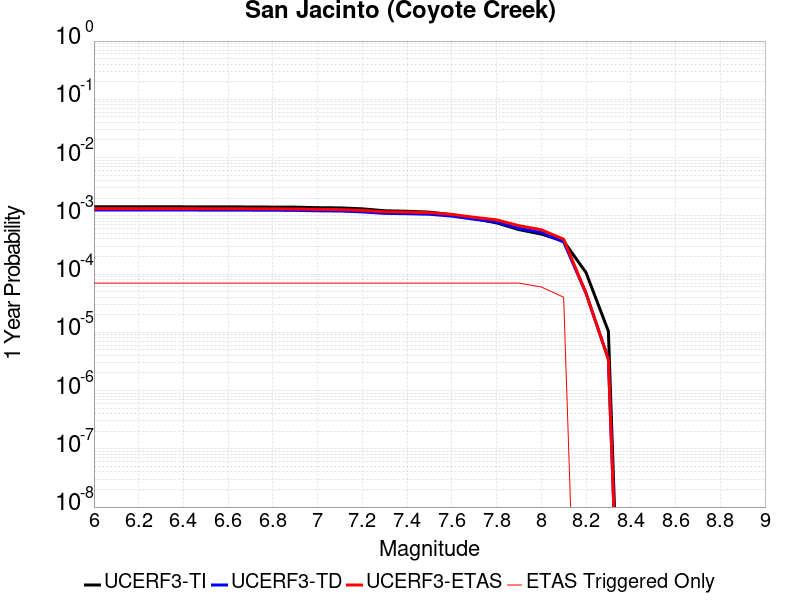 |  |

| Magnitude | 1 wk TI Prob | 1 wk TD Prob | 1 wk ETAS Prob | 1 wk ETAS/TD Gain | 1 wk ETAS Triggered Only | 1 mo TI Prob | 1 mo TD Prob | 1 mo ETAS Prob | 1 mo ETAS/TD Gain | 1 mo ETAS Triggered Only | 1 yr TI Prob | 1 yr TD Prob | 1 yr ETAS Prob | 1 yr ETAS/TD Gain | 1 yr ETAS Triggered Only | 10 yr TI Prob | 10 yr TD Prob | 10 yr ETAS Prob | 10 yr ETAS/TD Gain | 10 yr ETAS Triggered Only |
|-----|-----|-----|-----|-----|-----|-----|-----|-----|-----|-----|-----|-----|-----|-----|-----|-----|-----|-----|-----|-----|
| 6.0 | 2.7374346E-5 | 2.4145214E-5 | 7.358778E-5 | 3.0477169 | 4.944376E-5 | 1.1731335E-4 | 1.034754E-4 | 1.5291404E-4 | 1.4777817 | 4.944376E-5 | 0.0014273542 | 0.0012590875 | 0.0013455051 | 1.0686351 | 8.6526576E-5 | 0.01418221 | 0.012928318 | 0.013038129 | 1.0084938 | 1.1124845E-4 |
| 6.1 | 2.7374346E-5 | 2.4145214E-5 | 7.358778E-5 | 3.0477169 | 4.944376E-5 | 1.1731335E-4 | 1.034754E-4 | 1.5291404E-4 | 1.4777817 | 4.944376E-5 | 0.0014273542 | 0.0012590875 | 0.0013455051 | 1.0686351 | 8.6526576E-5 | 0.01418221 | 0.012928318 | 0.013038129 | 1.0084938 | 1.1124845E-4 |
| 6.2 | 2.7374346E-5 | 2.4145214E-5 | 7.358778E-5 | 3.0477169 | 4.944376E-5 | 1.1731335E-4 | 1.034754E-4 | 1.5291404E-4 | 1.4777817 | 4.944376E-5 | 0.0014273542 | 0.0012590875 | 0.0013455051 | 1.0686351 | 8.6526576E-5 | 0.01418221 | 0.012928318 | 0.013038129 | 1.0084938 | 1.1124845E-4 |
| 6.3 | 2.7374346E-5 | 2.4145214E-5 | 7.358778E-5 | 3.0477169 | 4.944376E-5 | 1.1731335E-4 | 1.034754E-4 | 1.5291404E-4 | 1.4777817 | 4.944376E-5 | 0.0014273542 | 0.0012590875 | 0.0013455051 | 1.0686351 | 8.6526576E-5 | 0.01418221 | 0.012928318 | 0.013038129 | 1.0084938 | 1.1124845E-4 |
| 6.4 | 2.7374346E-5 | 2.4145214E-5 | 7.358778E-5 | 3.0477169 | 4.944376E-5 | 1.1731335E-4 | 1.034754E-4 | 1.5291404E-4 | 1.4777817 | 4.944376E-5 | 0.0014273542 | 0.0012590875 | 0.0013455051 | 1.0686351 | 8.6526576E-5 | 0.01418221 | 0.012928318 | 0.013038129 | 1.0084938 | 1.1124845E-4 |
| 6.5 | 2.7282445E-5 | 2.4031293E-5 | 7.3473864E-5 | 3.0574245 | 4.944376E-5 | 1.16919524E-4 | 1.029872E-4 | 1.5242587E-4 | 1.4800467 | 4.944376E-5 | 0.0014225657 | 0.0012531505 | 0.0013395688 | 1.0689607 | 8.6526576E-5 | 0.014134934 | 0.012869646 | 0.012979463 | 1.008533 | 1.1124845E-4 |
| 6.6 | 2.7282445E-5 | 2.4031293E-5 | 7.3473864E-5 | 3.0574245 | 4.944376E-5 | 1.16919524E-4 | 1.029872E-4 | 1.5242587E-4 | 1.4800467 | 4.944376E-5 | 0.0014225657 | 0.0012531505 | 0.0013395688 | 1.0689607 | 8.6526576E-5 | 0.014134934 | 0.012869646 | 0.012979463 | 1.008533 | 1.1124845E-4 |
| 6.7 | 2.7216198E-5 | 2.3956412E-5 | 7.339899E-5 | 3.0638554 | 4.944376E-5 | 1.1663563E-4 | 1.02666316E-4 | 1.52105E-4 | 1.4815472 | 4.944376E-5 | 0.0014191137 | 0.0012492483 | 0.0013356667 | 1.0691764 | 8.6526576E-5 | 0.014100855 | 0.0128310565 | 0.012940878 | 1.008559 | 1.1124845E-4 |
| 6.8 | 2.7078617E-5 | 2.387363E-5 | 7.331621E-5 | 3.071012 | 4.944376E-5 | 1.1604605E-4 | 1.0231156E-4 | 1.5175025E-4 | 1.4832171 | 4.944376E-5 | 0.001411945 | 0.0012449342 | 0.001331353 | 1.0694164 | 8.6526576E-5 | 0.014030075 | 0.012788199 | 0.012898025 | 1.0085881 | 1.1124845E-4 |
| 6.9 | 2.6982952E-5 | 2.3793142E-5 | 7.323572E-5 | 3.0780182 | 4.944376E-5 | 1.15636096E-4 | 1.0196664E-4 | 1.5140536E-4 | 1.4848518 | 4.944376E-5 | 0.0014069602 | 0.0012407395 | 0.0013271587 | 1.0696514 | 8.6526576E-5 | 0.013980856 | 0.012746515 | 0.012856345 | 1.0086164 | 1.1124845E-4 |
| 7.0 | 2.6449972E-5 | 2.3370165E-5 | 7.281276E-5 | 3.1156292 | 4.944376E-5 | 1.1335209E-4 | 1.00154015E-4 | 1.4959282E-4 | 1.4936278 | 4.944376E-5 | 0.001379188 | 0.0012186957 | 0.0013051168 | 1.0709128 | 8.6526576E-5 | 0.0137065975 | 0.0125278765 | 0.012637732 | 1.0087688 | 1.1124845E-4 |
| 7.1 | 2.6257849E-5 | 2.3196202E-5 | 7.263881E-5 | 3.131496 | 4.944376E-5 | 1.1252879E-4 | 9.940852E-5 | 1.4884736E-4 | 1.4973301 | 4.944376E-5 | 0.0013691769 | 0.0012096294 | 0.0012960512 | 1.071445 | 8.6526576E-5 | 0.013607717 | 0.012437741 | 0.012547607 | 1.0088332 | 1.1124845E-4 |
| 7.2 | 2.5270041E-5 | 2.2390966E-5 | 7.1833616E-5 | 3.2081518 | 4.944376E-5 | 1.0829568E-4 | 9.595777E-5 | 1.4539679E-4 | 1.5152164 | 4.944376E-5 | 0.0013177024 | 0.0011676621 | 0.0012540875 | 1.0740159 | 8.6526576E-5 | 0.013099162 | 0.012018777 | 0.012128688 | 1.009145 | 1.1124845E-4 |
| 7.3 | 2.339701E-5 | 2.1122814E-5 | 7.0565526E-5 | 3.3407257 | 4.944376E-5 | 1.0026905E-4 | 9.0523215E-5 | 1.399625E-4 | 1.5461503 | 4.944376E-5 | 0.001220092 | 0.0011015651 | 0.0011879962 | 1.0784622 | 8.6526576E-5 | 0.012134149 | 0.011357696 | 0.01146768 | 1.0096837 | 1.1124845E-4 |
| 7.4 | 2.296333E-5 | 2.0853171E-5 | 7.029589E-5 | 3.3709934 | 4.944376E-5 | 9.841056E-5 | 8.936768E-5 | 1.3880702E-4 | 1.5532128 | 4.944376E-5 | 0.0011974899 | 0.0010875105 | 0.0011739429 | 1.0794774 | 8.6526576E-5 | 0.011910575 | 0.01121681 | 0.01132681 | 1.0098068 | 1.1124845E-4 |
| 7.5 | 2.2188895E-5 | 2.0376096E-5 | 6.9818845E-5 | 3.4265077 | 4.944376E-5 | 9.50918E-5 | 8.732321E-5 | 1.3676265E-4 | 1.566166 | 4.944376E-5 | 0.0011571277 | 0.0010626436 | 0.0011490782 | 1.0813392 | 8.6526576E-5 | 0.011511209 | 0.010966429 | 0.011076457 | 1.0100332 | 1.1124845E-4 |
| 7.6 | 2.0013189E-5 | 1.8962366E-5 | 6.8405185E-5 | 3.6074183 | 4.944376E-5 | 8.5767984E-5 | 8.1264756E-5 | 1.307045E-4 | 1.6083786 | 4.944376E-5 | 0.001043725 | 9.889511E-4 | 0.0010753921 | 1.0874068 | 8.6526576E-5 | 0.010388365 | 0.010224434 | 0.010334545 | 1.0107694 | 1.1124845E-4 |
| 7.7 | 1.7230794E-5 | 1.674371E-5 | 6.618664E-5 | 3.9529257 | 4.944376E-5 | 7.384417E-5 | 7.175679E-5 | 1.21197E-4 | 1.688997 | 4.944376E-5 | 8.986819E-4 | 8.7328954E-4 | 9.5974054E-4 | 1.0989947 | 8.6526576E-5 | 0.008950562 | 0.009062956 | 0.009173197 | 1.0121639 | 1.1124845E-4 |
| 7.8 | 1.4478809E-5 | 1.4990978E-5 | 6.4433996E-5 | 4.298185 | 4.944376E-5 | 6.205057E-5 | 6.424547E-5 | 1.1368605E-4 | 1.7695575 | 4.944376E-5 | 7.552038E-4 | 7.819085E-4 | 8.6836744E-4 | 1.1105742 | 8.6526576E-5 | 0.0075264242 | 0.008141387 | 0.00825173 | 1.0135533 | 1.1124845E-4 |
| 7.9 | 1.1114467E-5 | 1.1645102E-5 | 6.1088285E-5 | 5.245835 | 4.944376E-5 | 4.7632562E-5 | 4.990663E-5 | 9.934792E-5 | 1.9906758 | 4.944376E-5 | 5.797721E-4 | 6.074444E-4 | 6.939184E-4 | 1.1423571 | 8.6526576E-5 | 0.0057826187 | 0.0063803247 | 0.0064908634 | 1.0173249 | 1.1124845E-4 |
| 8.0 | 9.327402E-6 | 9.899186E-6 | 5.9342456E-5 | 5.99468 | 4.944376E-5 | 3.9973966E-5 | 4.2424395E-5 | 9.186606E-5 | 2.1654062 | 4.944376E-5 | 4.8657437E-4 | 5.1639514E-4 | 5.905225E-4 | 1.1435477 | 7.416563E-5 | 0.0048551033 | 0.0054499684 | 0.005548317 | 1.0180457 | 9.888752E-5 |
| 8.1 | 7.0235833E-6 | 6.827495E-6 | 4.391006E-5 | 6.4313574 | 3.7082817E-5 | 3.0100724E-5 | 2.9260367E-5 | 6.63421E-5 | 2.2673023 | 3.7082817E-5 | 3.664147E-4 | 3.5618723E-4 | 4.056134E-4 | 1.1387645 | 4.944376E-5 | 0.003658111 | 0.0037876023 | 0.003849173 | 1.0162559 | 6.18047E-5 |
| 8.2 | 2.0358202E-6 | 8.994527E-7 | 8.994527E-7 | 1.0 | 0.0 | 8.724915E-6 | 3.854792E-6 | 3.854792E-6 | 1.0 | 0.0 | 1.06220665E-4 | 4.69311E-5 | 4.69311E-5 | 1.0 | 0.0 | 0.001061699 | 5.3254166E-4 | 5.3254166E-4 | 1.0 | 0.0 |
| 8.3 | 2.0051264E-7 | 6.617272E-8 | 6.617272E-8 | 1.0 | 0.0 | 8.5933965E-7 | 2.8359733E-7 | 2.8359733E-7 | 1.0 | 0.0 | 1.046241E-5 | 3.4527925E-6 | 3.4527925E-6 | 1.0 | 0.0 | 1.0461917E-4 | 4.01389E-5 | 4.01389E-5 | 1.0 | 0.0 |

## Imperial
*[(top)](#table-of-contents)*

| 1 Week | 1 Month | 1 Year | 10 Year |
|-----|-----|-----|-----|
|  |  |  | 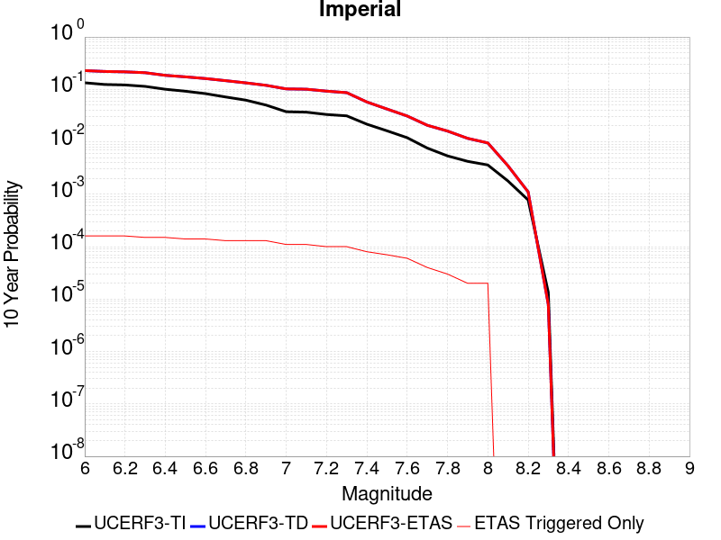 |

| Magnitude | 1 wk TI Prob | 1 wk TD Prob | 1 wk ETAS Prob | 1 wk ETAS/TD Gain | 1 wk ETAS Triggered Only | 1 mo TI Prob | 1 mo TD Prob | 1 mo ETAS Prob | 1 mo ETAS/TD Gain | 1 mo ETAS Triggered Only | 1 yr TI Prob | 1 yr TD Prob | 1 yr ETAS Prob | 1 yr ETAS/TD Gain | 1 yr ETAS Triggered Only | 10 yr TI Prob | 10 yr TD Prob | 10 yr ETAS Prob | 10 yr ETAS/TD Gain | 10 yr ETAS Triggered Only |
|-----|-----|-----|-----|-----|-----|-----|-----|-----|-----|-----|-----|-----|-----|-----|-----|-----|-----|-----|-----|-----|
| 6.0 | 2.7496446E-4 | 5.0552754E-4 | 5.425916E-4 | 1.0733176 | 3.7082817E-5 | 0.0011778869 | 0.002164787 | 0.0022141237 | 1.0227906 | 4.944376E-5 | 0.0142467655 | 0.026038699 | 0.026110932 | 1.0027741 | 7.416563E-5 | 0.13367249 | 0.2280438 | 0.22812967 | 1.0003766 | 1.1124845E-4 |
| 6.1 | 2.5356023E-4 | 4.8656776E-4 | 5.2363257E-4 | 1.0761759 | 3.7082817E-5 | 0.001086234 | 0.0020836622 | 0.002133003 | 1.0236799 | 4.944376E-5 | 0.013144928 | 0.025071215 | 0.02514352 | 1.002884 | 7.416563E-5 | 0.123940155 | 0.21947981 | 0.21956664 | 1.0003957 | 1.1124845E-4 |
| 6.2 | 2.4820742E-4 | 4.7752203E-4 | 5.1458715E-4 | 1.0776197 | 3.7082817E-5 | 0.0010633124 | 0.0020449557 | 0.0020942984 | 1.0241289 | 4.944376E-5 | 0.01286919 | 0.024611235 | 0.024683576 | 1.0029393 | 7.416563E-5 | 0.12148927 | 0.21598552 | 0.21607274 | 1.0004039 | 1.1124845E-4 |
| 6.3 | 2.3205351E-4 | 4.5890483E-4 | 4.959706E-4 | 1.0807701 | 3.7082817E-5 | 9.94136E-4 | 0.0019652895 | 0.002014636 | 1.025109 | 4.944376E-5 | 0.012036599 | 0.02366133 | 0.023733743 | 1.0030603 | 7.416563E-5 | 0.11405133 | 0.20793462 | 0.20802273 | 1.0004238 | 1.1124845E-4 |
| 6.4 | 2.0304754E-4 | 3.987652E-4 | 4.358332E-4 | 1.092957 | 3.7082817E-5 | 8.6991355E-4 | 0.0017078889 | 0.0017572483 | 1.0289007 | 4.944376E-5 | 0.010539869 | 0.020595672 | 0.02066831 | 1.0035268 | 7.416563E-5 | 0.100537635 | 0.1850669 | 0.18515755 | 1.0004898 | 1.1124845E-4 |
| 6.5 | 1.854992E-4 | 3.6988858E-4 | 3.9460132E-4 | 1.0668113 | 2.472188E-5 | 7.9475436E-4 | 0.0015842861 | 0.0016213101 | 1.0233696 | 3.7082817E-5 | 0.009633281 | 0.01911948 | 0.019180104 | 1.0031707 | 6.18047E-5 | 0.0922623 | 0.173298 | 0.17337975 | 1.0004717 | 9.888752E-5 |
| 6.6 | 1.6586106E-4 | 3.403506E-4 | 3.650641E-4 | 1.0726118 | 2.472188E-5 | 7.106394E-4 | 0.0014578402 | 0.001494869 | 1.0253997 | 3.7082817E-5 | 0.008617763 | 0.01760642 | 0.017667137 | 1.0034485 | 6.18047E-5 | 0.08291132 | 0.16077545 | 0.16085844 | 1.0005162 | 9.888752E-5 |
| 6.7 | 1.4224656E-4 | 3.076692E-4 | 3.3238344E-4 | 1.0803274 | 2.472188E-5 | 6.094856E-4 | 0.001317924 | 0.001354958 | 1.0281003 | 3.7082817E-5 | 0.0073952693 | 0.015929576 | 0.015990397 | 1.003818 | 6.18047E-5 | 0.07153955 | 0.14648417 | 0.14656857 | 1.0005761 | 9.888752E-5 |
| 6.8 | 1.2317259E-4 | 2.779122E-4 | 3.026272E-4 | 1.088931 | 2.472188E-5 | 5.2777573E-4 | 0.0011905148 | 0.0012275534 | 1.0311115 | 3.7082817E-5 | 0.0064067547 | 0.0143995695 | 0.0144604845 | 1.0042303 | 6.18047E-5 | 0.06225166 | 0.13293684 | 0.13302258 | 1.0006449 | 9.888752E-5 |
| 6.9 | 9.859898E-5 | 2.5014306E-4 | 2.7485876E-4 | 1.0988063 | 2.472188E-5 | 4.2249862E-4 | 0.0010716055 | 0.0011086485 | 1.0345678 | 3.7082817E-5 | 0.0051317946 | 0.012969712 | 0.013030714 | 1.0047035 | 6.18047E-5 | 0.05014893 | 0.11940631 | 0.119493395 | 1.0007293 | 9.888752E-5 |
| 7.0 | 7.3191884E-5 | 2.1266776E-4 | 2.3738439E-4 | 1.1162218 | 2.472188E-5 | 3.136418E-4 | 9.1111806E-4 | 9.481671E-4 | 1.0406632 | 3.7082817E-5 | 0.003811904 | 0.011037128 | 0.011086025 | 1.0044303 | 4.944376E-5 | 0.037471764 | 0.10206493 | 0.102142625 | 1.0007613 | 8.6526576E-5 |
| 7.1 | 7.1760296E-5 | 2.0968143E-4 | 2.3439812E-4 | 1.1178774 | 2.472188E-5 | 3.0750787E-4 | 8.983284E-4 | 9.3537784E-4 | 1.0412427 | 3.7082817E-5 | 0.003737482 | 0.010882978 | 0.010931884 | 1.0044938 | 4.944376E-5 | 0.03675245 | 0.10070146 | 0.10077927 | 1.0007727 | 8.6526576E-5 |
| 7.2 | 6.46614E-5 | 1.9136685E-4 | 2.1608401E-4 | 1.1291611 | 2.472188E-5 | 2.7709085E-4 | 8.1988896E-4 | 8.5694133E-4 | 1.045192 | 3.7082817E-5 | 0.0033683628 | 0.0099370815 | 0.009986034 | 1.0049262 | 4.944376E-5 | 0.033177625 | 0.09250898 | 0.09257628 | 1.0007275 | 7.416563E-5 |
| 7.3 | 6.088115E-5 | 1.78084E-4 | 2.0280147E-4 | 1.1387967 | 2.472188E-5 | 2.6089314E-4 | 7.6299673E-4 | 8.0005126E-4 | 1.0485644 | 3.7082817E-5 | 0.0031717476 | 0.009250494 | 0.009299479 | 1.0052955 | 4.944376E-5 | 0.031268585 | 0.08655989 | 0.08662764 | 1.0007826 | 7.416563E-5 |
| 7.4 | 4.199346E-5 | 1.1510366E-4 | 1.398227E-4 | 1.2147546 | 2.472188E-5 | 1.7995955E-4 | 4.9320905E-4 | 5.3027354E-4 | 1.0751498 | 3.7082817E-5 | 0.0021888057 | 0.0059884563 | 0.006037604 | 1.0082071 | 4.944376E-5 | 0.02167372 | 0.057439793 | 0.05749805 | 1.0010142 | 6.18047E-5 |
| 7.5 | 3.130448E-5 | 8.33328E-5 | 1.0805262E-4 | 1.2966397 | 2.472188E-5 | 1.3415517E-4 | 3.57092E-4 | 3.941616E-4 | 1.1038096 | 3.7082817E-5 | 0.0016321153 | 0.004338988 | 0.0043882173 | 1.0113457 | 4.944376E-5 | 0.016201803 | 0.04213201 | 0.042191207 | 1.0014051 | 6.18047E-5 |
| 7.6 | 2.3074248E-5 | 6.0844646E-5 | 8.556502E-5 | 1.4062867 | 2.472188E-5 | 9.888588E-5 | 2.6073685E-4 | 2.9780998E-4 | 1.142186 | 3.7082817E-5 | 0.0012032706 | 0.0031698733 | 0.0032191605 | 1.0155486 | 4.944376E-5 | 0.011967761 | 0.031026395 | 0.031086283 | 1.0019302 | 6.18047E-5 |
| 7.7 | 1.45864815E-5 | 4.0124698E-5 | 5.2485142E-5 | 1.3080508 | 1.236094E-5 | 6.2511994E-5 | 1.7195169E-4 | 1.9666932E-4 | 1.1437476 | 2.472188E-5 | 7.608177E-4 | 0.0020915072 | 0.0021161772 | 1.0117954 | 2.472188E-5 | 0.007582182 | 0.020627763 | 0.020664081 | 1.0017606 | 3.7082817E-5 |
| 7.8 | 1.0352979E-5 | 3.0960902E-5 | 4.332146E-5 | 1.3992312 | 1.236094E-5 | 4.4369157E-5 | 1.3268284E-4 | 1.5740143E-4 | 1.1862984 | 2.472188E-5 | 5.400606E-4 | 0.0016142189 | 0.001638901 | 1.0152904 | 2.472188E-5 | 0.0053875 | 0.016016833 | 0.01605332 | 1.0022782 | 3.7082817E-5 |
| 7.9 | 8.137906E-6 | 2.2149103E-5 | 3.450977E-5 | 1.5580662 | 1.236094E-5 | 3.4876273E-5 | 9.492128E-5 | 1.19640805E-4 | 1.2604214 | 2.472188E-5 | 4.2453592E-4 | 0.0011550548 | 0.0011797481 | 1.0213785 | 2.472188E-5 | 0.004237258 | 0.011617903 | 0.011642337 | 1.0021032 | 2.472188E-5 |
| 8.0 | 6.93792E-6 | 1.8008766E-5 | 3.0369483E-5 | 1.6863723 | 1.236094E-5 | 2.9733603E-5 | 7.717814E-5 | 1.0189811E-4 | 1.3202976 | 2.472188E-5 | 3.6194647E-4 | 9.3923963E-4 | 9.6393825E-4 | 1.0262965 | 2.472188E-5 | 0.0036135751 | 0.00950155 | 0.009526038 | 1.0025772 | 2.472188E-5 |
| 8.1 | 3.4286315E-6 | 6.379872E-6 | 6.379872E-6 | 1.0 | 0.0 | 1.4694053E-5 | 2.7342023E-5 | 2.7342023E-5 | 1.0 | 0.0 | 1.7888541E-4 | 3.328384E-4 | 3.328384E-4 | 1.0 | 0.0 | 0.0017874148 | 0.003486031 | 0.003486031 | 1.0 | 0.0 |
| 8.2 | 1.4906886E-6 | 1.9366646E-6 | 1.9366646E-6 | 1.0 | 0.0 | 6.3886496E-6 | 8.299965E-6 | 8.299965E-6 | 1.0 | 0.0 | 7.7779034E-5 | 1.0104742E-4 | 1.0104742E-4 | 1.0 | 0.0 | 7.775182E-4 | 0.0011075331 | 0.0011075331 | 1.0 | 0.0 |
| 8.3 | 2.5758007E-8 | 1.4500102E-8 | 1.4500102E-8 | 1.0 | 0.0 | 1.10391454E-7 | 6.214329E-8 | 6.214329E-8 | 1.0 | 0.0 | 1.3440151E-6 | 7.565946E-7 | 7.565946E-7 | 1.0 | 0.0 | 1.344007E-5 | 7.887763E-6 | 7.887763E-6 | 1.0 | 0.0 |

## Blue Cut
*[(top)](#table-of-contents)*

| 1 Week | 1 Month | 1 Year | 10 Year |
|-----|-----|-----|-----|
|  | 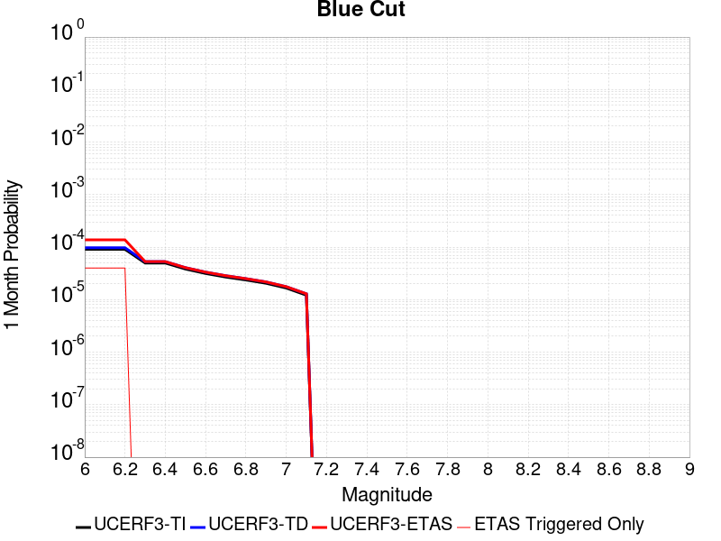 |  | 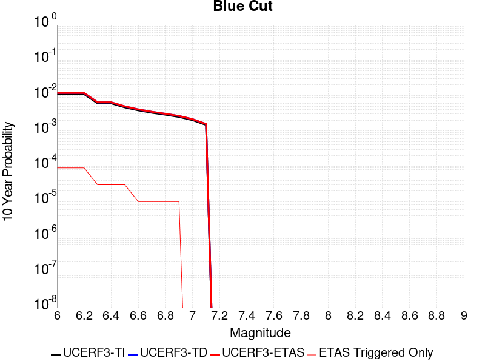 |

| Magnitude | 1 wk TI Prob | 1 wk TD Prob | 1 wk ETAS Prob | 1 wk ETAS/TD Gain | 1 wk ETAS Triggered Only | 1 mo TI Prob | 1 mo TD Prob | 1 mo ETAS Prob | 1 mo ETAS/TD Gain | 1 mo ETAS Triggered Only | 1 yr TI Prob | 1 yr TD Prob | 1 yr ETAS Prob | 1 yr ETAS/TD Gain | 1 yr ETAS Triggered Only | 10 yr TI Prob | 10 yr TD Prob | 10 yr ETAS Prob | 10 yr ETAS/TD Gain | 10 yr ETAS Triggered Only |
|-----|-----|-----|-----|-----|-----|-----|-----|-----|-----|-----|-----|-----|-----|-----|-----|-----|-----|-----|-----|-----|
| 6.0 | 2.1227985E-5 | 2.2719574E-5 | 4.744089E-5 | 2.0881066 | 2.472188E-5 | 9.097391E-5 | 9.73663E-5 | 1.4680524E-4 | 1.5077624 | 4.944376E-5 | 0.0011070445 | 0.0011848481 | 0.0012589259 | 1.0625209 | 7.416563E-5 | 0.011015458 | 0.011791152 | 0.011901088 | 1.0093237 | 1.1124845E-4 |
| 6.1 | 2.1227985E-5 | 2.2719574E-5 | 4.744089E-5 | 2.0881066 | 2.472188E-5 | 9.097391E-5 | 9.73663E-5 | 1.4680524E-4 | 1.5077624 | 4.944376E-5 | 0.0011070445 | 0.0011848481 | 0.0012589259 | 1.0625209 | 7.416563E-5 | 0.011015458 | 0.011791152 | 0.011901088 | 1.0093237 | 1.1124845E-4 |
| 6.2 | 2.1227985E-5 | 2.2719574E-5 | 4.744089E-5 | 2.0881066 | 2.472188E-5 | 9.097391E-5 | 9.73663E-5 | 1.4680524E-4 | 1.5077624 | 4.944376E-5 | 0.0011070445 | 0.0011848481 | 0.0012589259 | 1.0625209 | 7.416563E-5 | 0.011015458 | 0.011791152 | 0.011901088 | 1.0093237 | 1.1124845E-4 |
| 6.3 | 1.1613981E-5 | 1.2353542E-5 | 1.2353542E-5 | 1.0 | 0.0 | 4.9773254E-5 | 5.2942745E-5 | 5.2942745E-5 | 1.0 | 0.0 | 6.0582085E-4 | 6.443998E-4 | 6.5675273E-4 | 1.0191697 | 1.236094E-5 | 0.0060417196 | 0.0064265593 | 0.006463404 | 1.0057331 | 3.7082817E-5 |
| 6.4 | 1.1613981E-5 | 1.2353542E-5 | 1.2353542E-5 | 1.0 | 0.0 | 4.9773254E-5 | 5.2942745E-5 | 5.2942745E-5 | 1.0 | 0.0 | 6.0582085E-4 | 6.443998E-4 | 6.5675273E-4 | 1.0191697 | 1.236094E-5 | 0.0060417196 | 0.0064265593 | 0.006463404 | 1.0057331 | 3.7082817E-5 |
| 6.5 | 8.931326E-6 | 9.4816E-6 | 9.4816E-6 | 1.0 | 0.0 | 3.8276554E-5 | 4.0634844E-5 | 4.0634844E-5 | 1.0 | 0.0 | 4.6591737E-4 | 4.946261E-4 | 5.069809E-4 | 1.0249782 | 1.236094E-5 | 0.0046494175 | 0.004936161 | 0.004973061 | 1.0074754 | 3.7082817E-5 |
| 6.6 | 7.345353E-6 | 7.79028E-6 | 7.79028E-6 | 1.0 | 0.0 | 3.1479703E-5 | 3.338653E-5 | 3.338653E-5 | 1.0 | 0.0 | 3.83198E-4 | 4.064132E-4 | 4.064132E-4 | 1.0 | 0.0 | 0.0038253788 | 0.0040574907 | 0.0040698014 | 1.0030341 | 1.236094E-5 |
| 6.7 | 6.2775666E-6 | 6.655149E-6 | 6.655149E-6 | 1.0 | 0.0 | 2.690358E-5 | 2.8521798E-5 | 2.8521798E-5 | 1.0 | 0.0 | 3.2750185E-4 | 3.472051E-4 | 3.472051E-4 | 1.0 | 0.0 | 0.0032701963 | 0.003467367 | 0.0034796852 | 1.0035526 | 1.236094E-5 |
| 6.8 | 5.5234095E-6 | 5.8551113E-6 | 5.8551113E-6 | 1.0 | 0.0 | 2.367154E-5 | 2.5093133E-5 | 2.5093133E-5 | 1.0 | 0.0 | 2.8816288E-4 | 3.0547334E-4 | 3.0547334E-4 | 1.0 | 0.0 | 0.002877895 | 0.0030512505 | 0.0030635737 | 1.0040387 | 1.236094E-5 |
| 6.9 | 4.7780054E-6 | 5.0654203E-6 | 5.0654203E-6 | 1.0 | 0.0 | 2.0477004E-5 | 2.1708804E-5 | 2.1708804E-5 | 1.0 | 0.0 | 2.4927902E-4 | 2.642797E-4 | 2.642797E-4 | 1.0 | 0.0 | 0.0024899957 | 0.002640346 | 0.0026526744 | 1.0046692 | 1.236094E-5 |
| 7.0 | 3.883171E-6 | 4.118487E-6 | 4.118487E-6 | 1.0 | 0.0 | 1.6642054E-5 | 1.7650578E-5 | 1.7650578E-5 | 1.0 | 0.0 | 2.0259817E-4 | 2.1488148E-4 | 2.1488148E-4 | 1.0 | 0.0 | 0.0020241356 | 0.0021474129 | 0.0021474129 | 1.0 | 0.0 |
| 7.1 | 2.8358215E-6 | 3.0097158E-6 | 3.0097158E-6 | 1.0 | 0.0 | 1.2153464E-5 | 1.2898756E-5 | 1.2898756E-5 | 1.0 | 0.0 | 1.4795837E-4 | 1.5703762E-4 | 1.5703762E-4 | 1.0 | 0.0 | 0.001478599 | 0.0015699116 | 0.0015699116 | 1.0 | 0.0 |

## Santa Cruz Island
*[(top)](#table-of-contents)*

| 1 Week | 1 Month | 1 Year | 10 Year |
|-----|-----|-----|-----|
|  |  |  |  |

| Magnitude | 1 wk TI Prob | 1 wk TD Prob | 1 wk ETAS Prob | 1 wk ETAS/TD Gain | 1 wk ETAS Triggered Only | 1 mo TI Prob | 1 mo TD Prob | 1 mo ETAS Prob | 1 mo ETAS/TD Gain | 1 mo ETAS Triggered Only | 1 yr TI Prob | 1 yr TD Prob | 1 yr ETAS Prob | 1 yr ETAS/TD Gain | 1 yr ETAS Triggered Only | 10 yr TI Prob | 10 yr TD Prob | 10 yr ETAS Prob | 10 yr ETAS/TD Gain | 10 yr ETAS Triggered Only |
|-----|-----|-----|-----|-----|-----|-----|-----|-----|-----|-----|-----|-----|-----|-----|-----|-----|-----|-----|-----|-----|
| 6.0 | 2.9164563E-5 | 3.1599742E-5 | 6.868139E-5 | 2.1734793 | 3.7082817E-5 | 1.2498499E-4 | 1.3542121E-4 | 1.8485828E-4 | 1.3650614 | 4.944376E-5 | 0.0015206301 | 0.0016476426 | 0.0017340266 | 1.0524288 | 8.6526576E-5 | 0.015102667 | 0.016368 | 0.016477427 | 1.0066855 | 1.1124845E-4 |
| 6.1 | 2.9164563E-5 | 3.1599742E-5 | 6.868139E-5 | 2.1734793 | 3.7082817E-5 | 1.2498499E-4 | 1.3542121E-4 | 1.8485828E-4 | 1.3650614 | 4.944376E-5 | 0.0015206301 | 0.0016476426 | 0.0017340266 | 1.0524288 | 8.6526576E-5 | 0.015102667 | 0.016368 | 0.016477427 | 1.0066855 | 1.1124845E-4 |
| 6.2 | 2.9164563E-5 | 3.1599742E-5 | 6.868139E-5 | 2.1734793 | 3.7082817E-5 | 1.2498499E-4 | 1.3542121E-4 | 1.8485828E-4 | 1.3650614 | 4.944376E-5 | 0.0015206301 | 0.0016476426 | 0.0017340266 | 1.0524288 | 8.6526576E-5 | 0.015102667 | 0.016368 | 0.016477427 | 1.0066855 | 1.1124845E-4 |
| 6.3 | 1.6635553E-5 | 1.780436E-5 | 3.0165078E-5 | 1.6942525 | 1.236094E-5 | 7.1293274E-5 | 7.630226E-5 | 1.01022255E-4 | 1.3239746 | 2.472188E-5 | 8.6765E-4 | 9.2860236E-4 | 9.780002E-4 | 1.053196 | 4.944376E-5 | 0.008642701 | 0.009249094 | 0.009310327 | 1.0066204 | 6.18047E-5 |
| 6.4 | 1.6635553E-5 | 1.780436E-5 | 3.0165078E-5 | 1.6942525 | 1.236094E-5 | 7.1293274E-5 | 7.630226E-5 | 1.01022255E-4 | 1.3239746 | 2.472188E-5 | 8.6765E-4 | 9.2860236E-4 | 9.780002E-4 | 1.053196 | 4.944376E-5 | 0.008642701 | 0.009249094 | 0.009310327 | 1.0066204 | 6.18047E-5 |
| 6.5 | 1.2238748E-5 | 1.3042995E-5 | 1.3042995E-5 | 1.0 | 0.0 | 5.2450723E-5 | 5.5897377E-5 | 6.825762E-5 | 1.2211239 | 1.236094E-5 | 6.3840044E-4 | 6.8034173E-4 | 7.050468E-4 | 1.0363127 | 2.472188E-5 | 0.0063656955 | 0.0067829876 | 0.006819819 | 1.00543 | 3.7082817E-5 |
| 6.6 | 1.0489767E-5 | 1.1156636E-5 | 1.1156636E-5 | 1.0 | 0.0 | 4.495537E-5 | 4.781329E-5 | 6.017364E-5 | 1.2585129 | 1.236094E-5 | 5.4719415E-4 | 5.819735E-4 | 6.0668105E-4 | 1.0424547 | 2.472188E-5 | 0.005458487 | 0.0058047357 | 0.0058416035 | 1.0063512 | 3.7082817E-5 |
| 6.7 | 8.699222E-6 | 9.236782E-6 | 9.236782E-6 | 1.0 | 0.0 | 3.7281847E-5 | 3.958561E-5 | 3.958561E-5 | 1.0 | 0.0 | 4.5381195E-4 | 4.8184878E-4 | 4.8184878E-4 | 1.0 | 0.0 | 0.0045288634 | 0.004808108 | 0.004820409 | 1.0025585 | 1.236094E-5 |
| 6.8 | 8.307732E-6 | 8.8169045E-6 | 8.8169045E-6 | 1.0 | 0.0 | 3.560408E-5 | 3.7786187E-5 | 3.7786187E-5 | 1.0 | 0.0 | 4.3339343E-4 | 4.5995016E-4 | 4.5995016E-4 | 1.0 | 0.0 | 0.004325492 | 0.0045900354 | 0.0046023396 | 1.0026807 | 1.236094E-5 |
| 6.9 | 8.073121E-6 | 8.564939E-6 | 8.564939E-6 | 1.0 | 0.0 | 3.459863E-5 | 3.6706366E-5 | 3.6706366E-5 | 1.0 | 0.0 | 4.2115687E-4 | 4.468088E-4 | 4.468088E-4 | 1.0 | 0.0 | 0.004203596 | 0.004459156 | 0.004459156 | 1.0 | 0.0 |
| 7.0 | 7.617019E-6 | 8.074664E-6 | 8.074664E-6 | 1.0 | 0.0 | 3.264396E-5 | 3.4605247E-5 | 3.4605247E-5 | 1.0 | 0.0 | 3.9736772E-4 | 4.212378E-4 | 4.212378E-4 | 1.0 | 0.0 | 0.003966579 | 0.0042044413 | 0.0042044413 | 1.0 | 0.0 |
| 7.1 | 7.1224836E-6 | 7.545788E-6 | 7.545788E-6 | 1.0 | 0.0 | 3.052457E-5 | 3.2338692E-5 | 3.2338692E-5 | 1.0 | 0.0 | 3.715733E-4 | 3.936528E-4 | 3.936528E-4 | 1.0 | 0.0 | 0.003709526 | 0.003929598 | 0.003929598 | 1.0 | 0.0 |
| 7.2 | 6.441115E-6 | 6.8273835E-6 | 6.8273835E-6 | 1.0 | 0.0 | 2.7604487E-5 | 2.9259887E-5 | 2.9259887E-5 | 1.0 | 0.0 | 3.360328E-4 | 3.5618112E-4 | 3.5618112E-4 | 1.0 | 0.0 | 0.0033552512 | 0.003556131 | 0.003556131 | 1.0 | 0.0 |
| 7.3 | 5.494274E-6 | 5.8199944E-6 | 5.8199944E-6 | 1.0 | 0.0 | 2.3546674E-5 | 2.4942596E-5 | 2.4942596E-5 | 1.0 | 0.0 | 2.8664304E-4 | 3.0363398E-4 | 3.0363398E-4 | 1.0 | 0.0 | 0.002862736 | 0.0030322142 | 0.0030322142 | 1.0 | 0.0 |
| 7.4 | 4.0802624E-6 | 4.312256E-6 | 4.312256E-6 | 1.0 | 0.0 | 1.7486722E-5 | 1.8480967E-5 | 1.8480967E-5 | 1.0 | 0.0 | 2.1288003E-4 | 2.2498262E-4 | 2.2498262E-4 | 1.0 | 0.0 | 0.0021267622 | 0.0022475575 | 0.0022475575 | 1.0 | 0.0 |
| 7.5 | 2.3584746E-6 | 2.4753094E-6 | 2.4753094E-6 | 1.0 | 0.0 | 1.0107709E-5 | 1.0608426E-5 | 1.0608426E-5 | 1.0 | 0.0 | 1.2305441E-4 | 1.2915E-4 | 1.2915E-4 | 1.0 | 0.0 | 0.0012298629 | 0.0012907543 | 0.0012907543 | 1.0 | 0.0 |
| 7.6 | 9.4981914E-7 | 9.86093E-7 | 9.86093E-7 | 1.0 | 0.0 | 4.0706473E-6 | 4.2261063E-6 | 4.2261063E-6 | 1.0 | 0.0 | 4.9559E-5 | 5.145164E-5 | 5.145164E-5 | 1.0 | 0.0 | 4.954795E-4 | 5.1439856E-4 | 5.1439856E-4 | 1.0 | 0.0 |
| 7.7 | 2.6013532E-7 | 2.6416603E-7 | 2.6416603E-7 | 1.0 | 0.0 | 1.1148652E-6 | 1.1321397E-6 | 1.1321397E-6 | 1.0 | 0.0 | 1.3573399E-5 | 1.3783714E-5 | 1.3783714E-5 | 1.0 | 0.0 | 1.357257E-4 | 1.3782867E-4 | 1.3782867E-4 | 1.0 | 0.0 |
| 7.8 | 4.1522263E-8 | 3.965679E-8 | 3.965679E-8 | 1.0 | 0.0 | 1.7795254E-7 | 1.6995766E-7 | 1.6995766E-7 | 1.0 | 0.0 | 2.16657E-6 | 2.0692328E-6 | 2.0692328E-6 | 1.0 | 0.0 | 2.1665488E-5 | 2.0692156E-5 | 2.0692156E-5 | 1.0 | 0.0 |
| 7.9 | 7.7242046E-10 | 5.9468175E-10 | 5.9468175E-10 | 1.0 | 0.0 | 3.3103735E-9 | 2.5486364E-9 | 2.5486364E-9 | 1.0 | 0.0 | 4.0303796E-8 | 3.1029646E-8 | 3.1029646E-8 | 1.0 | 0.0 | 4.030379E-7 | 3.1029643E-7 | 3.1029643E-7 | 1.0 | 0.0 |

## Channel Islands Thrust
*[(top)](#table-of-contents)*

| 1 Week | 1 Month | 1 Year | 10 Year |
|-----|-----|-----|-----|
|  |  |  | 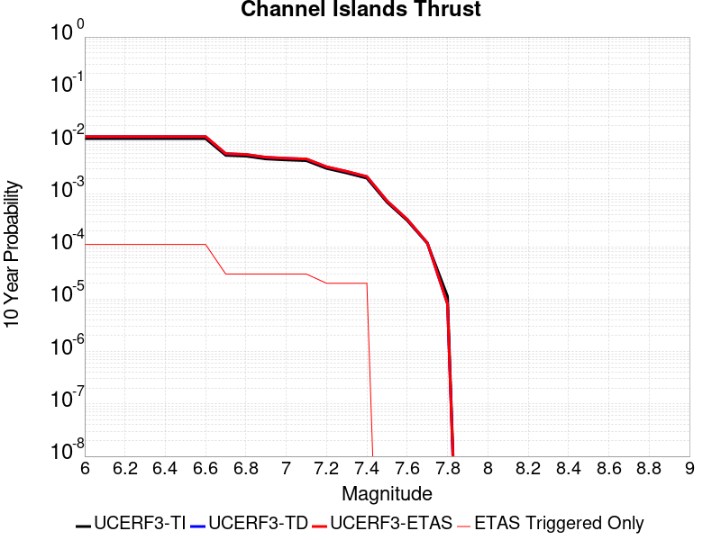 |

| Magnitude | 1 wk TI Prob | 1 wk TD Prob | 1 wk ETAS Prob | 1 wk ETAS/TD Gain | 1 wk ETAS Triggered Only | 1 mo TI Prob | 1 mo TD Prob | 1 mo ETAS Prob | 1 mo ETAS/TD Gain | 1 mo ETAS Triggered Only | 1 yr TI Prob | 1 yr TD Prob | 1 yr ETAS Prob | 1 yr ETAS/TD Gain | 1 yr ETAS Triggered Only | 10 yr TI Prob | 10 yr TD Prob | 10 yr ETAS Prob | 10 yr ETAS/TD Gain | 10 yr ETAS Triggered Only |
|-----|-----|-----|-----|-----|-----|-----|-----|-----|-----|-----|-----|-----|-----|-----|-----|-----|-----|-----|-----|-----|
| 6.0 | 2.2156251E-5 | 2.4092022E-5 | 3.6452664E-5 | 1.5130595 | 1.236094E-5 | 9.495191E-5 | 1.03248036E-4 | 1.4032703E-4 | 1.3591254 | 3.7082817E-5 | 0.0011554264 | 0.0012564264 | 0.0013428443 | 1.0687807 | 8.6526576E-5 | 0.011494373 | 0.0125038205 | 0.012613678 | 1.008786 | 1.1124845E-4 |
| 6.1 | 2.2156251E-5 | 2.4092022E-5 | 3.6452664E-5 | 1.5130595 | 1.236094E-5 | 9.495191E-5 | 1.03248036E-4 | 1.4032703E-4 | 1.3591254 | 3.7082817E-5 | 0.0011554264 | 0.0012564264 | 0.0013428443 | 1.0687807 | 8.6526576E-5 | 0.011494373 | 0.0125038205 | 0.012613678 | 1.008786 | 1.1124845E-4 |
| 6.2 | 2.2156251E-5 | 2.4092022E-5 | 3.6452664E-5 | 1.5130595 | 1.236094E-5 | 9.495191E-5 | 1.03248036E-4 | 1.4032703E-4 | 1.3591254 | 3.7082817E-5 | 0.0011554264 | 0.0012564264 | 0.0013428443 | 1.0687807 | 8.6526576E-5 | 0.011494373 | 0.0125038205 | 0.012613678 | 1.008786 | 1.1124845E-4 |
| 6.3 | 2.2156251E-5 | 2.4092022E-5 | 3.6452664E-5 | 1.5130595 | 1.236094E-5 | 9.495191E-5 | 1.03248036E-4 | 1.4032703E-4 | 1.3591254 | 3.7082817E-5 | 0.0011554264 | 0.0012564264 | 0.0013428443 | 1.0687807 | 8.6526576E-5 | 0.011494373 | 0.0125038205 | 0.012613678 | 1.008786 | 1.1124845E-4 |
| 6.4 | 2.2156251E-5 | 2.4092022E-5 | 3.6452664E-5 | 1.5130595 | 1.236094E-5 | 9.495191E-5 | 1.03248036E-4 | 1.4032703E-4 | 1.3591254 | 3.7082817E-5 | 0.0011554264 | 0.0012564264 | 0.0013428443 | 1.0687807 | 8.6526576E-5 | 0.011494373 | 0.0125038205 | 0.012613678 | 1.008786 | 1.1124845E-4 |
| 6.5 | 2.2156251E-5 | 2.4092022E-5 | 3.6452664E-5 | 1.5130595 | 1.236094E-5 | 9.495191E-5 | 1.03248036E-4 | 1.4032703E-4 | 1.3591254 | 3.7082817E-5 | 0.0011554264 | 0.0012564264 | 0.0013428443 | 1.0687807 | 8.6526576E-5 | 0.011494373 | 0.0125038205 | 0.012613678 | 1.008786 | 1.1124845E-4 |
| 6.6 | 2.2156251E-5 | 2.4092022E-5 | 3.6452664E-5 | 1.5130595 | 1.236094E-5 | 9.495191E-5 | 1.03248036E-4 | 1.4032703E-4 | 1.3591254 | 3.7082817E-5 | 0.0011554264 | 0.0012564264 | 0.0013428443 | 1.0687807 | 8.6526576E-5 | 0.011494373 | 0.0125038205 | 0.012613678 | 1.008786 | 1.1124845E-4 |
| 6.7 | 1.0601296E-5 | 1.1379544E-5 | 1.1379544E-5 | 1.0 | 0.0 | 4.5433335E-5 | 4.876859E-5 | 6.112893E-5 | 1.2534487 | 1.236094E-5 | 5.5301044E-4 | 5.936007E-4 | 6.183079E-4 | 1.0416226 | 2.472188E-5 | 0.005516363 | 0.005920653 | 0.005945229 | 1.0041509 | 2.472188E-5 |
| 6.8 | 1.0246747E-5 | 1.0996669E-5 | 1.0996669E-5 | 1.0 | 0.0 | 4.391389E-5 | 4.7127756E-5 | 5.9488113E-5 | 1.2622734 | 1.236094E-5 | 5.345204E-4 | 5.7363417E-4 | 5.9834187E-4 | 1.0430722 | 2.472188E-5 | 0.0053323656 | 0.005722025 | 0.0057466053 | 1.0042957 | 2.472188E-5 |
| 6.9 | 9.049551E-6 | 9.699645E-6 | 9.699645E-6 | 1.0 | 0.0 | 3.878322E-5 | 4.1569267E-5 | 5.392969E-5 | 1.2973453 | 1.236094E-5 | 4.7208337E-4 | 5.059924E-4 | 5.307018E-4 | 1.0488335 | 2.472188E-5 | 0.0047108172 | 0.0050488203 | 0.0050734174 | 1.0048718 | 2.472188E-5 |
| 7.0 | 8.6542195E-6 | 9.274603E-6 | 9.274603E-6 | 1.0 | 0.0 | 3.7088983E-5 | 3.9747716E-5 | 5.2108164E-5 | 1.3109726 | 1.236094E-5 | 4.5146482E-4 | 4.8382508E-4 | 5.0853495E-4 | 1.051072 | 2.472188E-5 | 0.004505487 | 0.004828129 | 0.0048527317 | 1.0050957 | 2.472188E-5 |
| 7.1 | 8.391028E-6 | 8.992924E-6 | 8.992924E-6 | 1.0 | 0.0 | 3.5961057E-5 | 3.854056E-5 | 5.0901024E-5 | 1.3207132 | 1.236094E-5 | 4.3773788E-4 | 4.6913436E-4 | 4.938446E-4 | 1.052672 | 2.472188E-5 | 0.004368766 | 0.0046818503 | 0.0047064563 | 1.0052557 | 2.472188E-5 |
| 7.2 | 5.965188E-6 | 6.3716952E-6 | 6.3716952E-6 | 1.0 | 0.0 | 2.556484E-5 | 2.7306982E-5 | 3.9667586E-5 | 1.4526535 | 1.236094E-5 | 3.1120746E-4 | 3.3241234E-4 | 3.57126E-4 | 1.0743464 | 2.472188E-5 | 0.00310772 | 0.0033192092 | 0.003343849 | 1.0074234 | 2.472188E-5 |
| 7.3 | 4.877518E-6 | 5.2060063E-6 | 5.2060063E-6 | 1.0 | 0.0 | 2.0903482E-5 | 2.2311267E-5 | 3.467193E-5 | 1.5540099 | 1.236094E-5 | 2.5447016E-4 | 2.716063E-4 | 2.9632144E-4 | 1.0909963 | 2.472188E-5 | 0.0025417898 | 0.0027127895 | 0.0027374444 | 1.0090884 | 2.472188E-5 |
| 7.4 | 3.8829853E-6 | 4.141863E-6 | 4.141863E-6 | 1.0 | 0.0 | 1.664126E-5 | 1.7750723E-5 | 3.0111441E-5 | 1.6963502 | 1.236094E-5 | 2.0258849E-4 | 2.1609402E-4 | 2.4081056E-4 | 1.1143786 | 2.472188E-5 | 0.002024039 | 0.0021588807 | 0.002183549 | 1.0114266 | 2.472188E-5 |
| 7.5 | 1.3489616E-6 | 1.4277903E-6 | 1.4277903E-6 | 1.0 | 0.0 | 5.7812517E-6 | 6.119087E-6 | 6.119087E-6 | 1.0 | 0.0 | 7.038446E-5 | 7.449738E-5 | 7.449738E-5 | 1.0 | 0.0 | 7.036218E-4 | 7.44728E-4 | 7.44728E-4 | 1.0 | 0.0 |
| 7.6 | 6.058192E-7 | 6.353778E-7 | 6.353778E-7 | 1.0 | 0.0 | 2.5963652E-6 | 2.7230449E-6 | 2.7230449E-6 | 1.0 | 0.0 | 3.161029E-5 | 3.3152584E-5 | 3.3152584E-5 | 1.0 | 0.0 | 3.1605794E-4 | 3.31478E-4 | 3.31478E-4 | 1.0 | 0.0 |
| 7.7 | 2.2170494E-7 | 2.2607902E-7 | 2.2607902E-7 | 1.0 | 0.0 | 9.5016367E-7 | 9.689098E-7 | 9.689098E-7 | 1.0 | 0.0 | 1.1568181E-5 | 1.1796425E-5 | 1.1796425E-5 | 1.0 | 0.0 | 1.1567579E-4 | 1.1795909E-4 | 1.1795909E-4 | 1.0 | 0.0 |
| 7.8 | 2.1613102E-8 | 1.5466682E-8 | 1.5466682E-8 | 1.0 | 0.0 | 9.262757E-8 | 6.628578E-8 | 6.628578E-8 | 1.0 | 0.0 | 1.1277401E-6 | 8.070291E-7 | 8.070291E-7 | 1.0 | 0.0 | 1.1277344E-5 | 8.070269E-6 | 8.070269E-6 | 1.0 | 0.0 |

## Coronado Bank alt1
*[(top)](#table-of-contents)*

| 1 Week | 1 Month | 1 Year | 10 Year |
|-----|-----|-----|-----|
|  |  |  |  |

| Magnitude | 1 wk TI Prob | 1 wk TD Prob | 1 wk ETAS Prob | 1 wk ETAS/TD Gain | 1 wk ETAS Triggered Only | 1 mo TI Prob | 1 mo TD Prob | 1 mo ETAS Prob | 1 mo ETAS/TD Gain | 1 mo ETAS Triggered Only | 1 yr TI Prob | 1 yr TD Prob | 1 yr ETAS Prob | 1 yr ETAS/TD Gain | 1 yr ETAS Triggered Only | 10 yr TI Prob | 10 yr TD Prob | 10 yr ETAS Prob | 10 yr ETAS/TD Gain | 10 yr ETAS Triggered Only |
|-----|-----|-----|-----|-----|-----|-----|-----|-----|-----|-----|-----|-----|-----|-----|-----|-----|-----|-----|-----|-----|
| 6.0 | 7.533492E-5 | 9.394913E-5 | 1.18668686E-4 | 1.2631164 | 2.472188E-5 | 3.22824E-4 | 4.0258127E-4 | 4.520051E-4 | 1.1227674 | 4.944376E-5 | 0.0039233007 | 0.0048909658 | 0.004952468 | 1.0125747 | 6.18047E-5 | 0.03854755 | 0.04790356 | 0.04800948 | 1.0022111 | 1.1124845E-4 |
| 6.1 | 4.1807285E-5 | 5.049283E-5 | 5.049283E-5 | 1.0 | 0.0 | 1.7916178E-4 | 2.1638049E-4 | 2.2873875E-4 | 1.0571135 | 1.236094E-5 | 0.0021791123 | 0.0026313474 | 0.0026560042 | 1.0093704 | 2.472188E-5 | 0.021578677 | 0.026011046 | 0.026035126 | 1.0009257 | 2.472188E-5 |
| 6.2 | 4.1807285E-5 | 5.049283E-5 | 5.049283E-5 | 1.0 | 0.0 | 1.7916178E-4 | 2.1638049E-4 | 2.2873875E-4 | 1.0571135 | 1.236094E-5 | 0.0021791123 | 0.0026313474 | 0.0026560042 | 1.0093704 | 2.472188E-5 | 0.021578677 | 0.026011046 | 0.026035126 | 1.0009257 | 2.472188E-5 |
| 6.3 | 3.1793104E-5 | 3.7711117E-5 | 3.7711117E-5 | 1.0 | 0.0 | 1.3624904E-4 | 1.6160926E-4 | 1.6160926E-4 | 1.0 | 0.0 | 0.0016575698 | 0.001965848 | 0.0019781846 | 1.0062755 | 1.236094E-5 | 0.016452603 | 0.019488465 | 0.019500585 | 1.0006219 | 1.236094E-5 |
| 6.4 | 2.9878007E-5 | 3.5335794E-5 | 3.5335794E-5 | 1.0 | 0.0 | 1.2804232E-4 | 1.5143053E-4 | 1.5143053E-4 | 1.0 | 0.0 | 0.0015578003 | 0.0018421387 | 0.0018544769 | 1.0066978 | 1.236094E-5 | 0.015469253 | 0.01827244 | 0.018284576 | 1.0006641 | 1.236094E-5 |
| 6.5 | 2.4512565E-5 | 2.8764043E-5 | 2.8764043E-5 | 1.0 | 0.0 | 1.0504962E-4 | 1.2326881E-4 | 1.2326881E-4 | 1.0 | 0.0 | 0.0012782287 | 0.0014997921 | 0.0015121346 | 1.0082294 | 1.236094E-5 | 0.012709012 | 0.014899683 | 0.01491186 | 1.0008173 | 1.236094E-5 |
| 6.6 | 2.1317413E-5 | 2.490667E-5 | 2.490667E-5 | 1.0 | 0.0 | 9.135714E-5 | 1.0673863E-4 | 1.0673863E-4 | 1.0 | 0.0 | 0.0011117056 | 0.0012987906 | 0.0013111354 | 1.0095049 | 1.236094E-5 | 0.011061605 | 0.012914404 | 0.012926606 | 1.0009447 | 1.236094E-5 |
| 6.7 | 1.8585655E-5 | 2.163488E-5 | 2.163488E-5 | 1.0 | 0.0 | 7.9650374E-5 | 9.271773E-5 | 9.271773E-5 | 1.0 | 0.0 | 9.6931186E-4 | 0.0011282742 | 0.0011406213 | 1.0109433 | 1.236094E-5 | 0.0096509475 | 0.011227623 | 0.011239844 | 1.0010886 | 1.236094E-5 |
| 6.8 | 1.5862879E-5 | 1.8419474E-5 | 1.8419474E-5 | 1.0 | 0.0 | 6.798199E-5 | 7.893833E-5 | 7.893833E-5 | 1.0 | 0.0 | 8.273665E-4 | 9.6066965E-4 | 9.730187E-4 | 1.0128547 | 1.236094E-5 | 0.008242928 | 0.00956715 | 0.009579393 | 1.0012797 | 1.236094E-5 |
| 6.9 | 1.3021509E-5 | 1.5095265E-5 | 1.5095265E-5 | 1.0 | 0.0 | 5.5805274E-5 | 6.469249E-5 | 6.469249E-5 | 1.0 | 0.0 | 6.792174E-4 | 7.8736455E-4 | 7.9971575E-4 | 1.0156868 | 1.236094E-5 | 0.006771452 | 0.007847573 | 0.007859836 | 1.0015627 | 1.236094E-5 |
| 7.0 | 1.0974371E-5 | 1.2720104E-5 | 1.2720104E-5 | 1.0 | 0.0 | 4.7032172E-5 | 5.451369E-5 | 5.451369E-5 | 1.0 | 0.0 | 5.7246623E-4 | 6.6351966E-4 | 6.758724E-4 | 1.018617 | 1.236094E-5 | 0.0057099373 | 0.006617135 | 0.006629414 | 1.0018556 | 1.236094E-5 |
| 7.1 | 8.766221E-6 | 1.01638325E-5 | 1.01638325E-5 | 1.0 | 0.0 | 3.7568978E-5 | 4.355865E-5 | 4.355865E-5 | 1.0 | 0.0 | 4.573063E-4 | 5.3021475E-4 | 5.3021475E-4 | 1.0 | 0.0 | 0.0045636636 | 0.0052911965 | 0.0052911965 | 1.0 | 0.0 |
| 7.2 | 8.026024E-7 | 8.331765E-7 | 8.331765E-7 | 1.0 | 0.0 | 3.43972E-6 | 3.5707515E-6 | 3.5707515E-6 | 1.0 | 0.0 | 4.1877785E-5 | 4.3473043E-5 | 4.3473043E-5 | 1.0 | 0.0 | 4.1869894E-4 | 4.3464647E-4 | 4.3464647E-4 | 1.0 | 0.0 |
| 7.3 | 3.7293114E-7 | 3.7000953E-7 | 3.7000953E-7 | 1.0 | 0.0 | 1.5982754E-6 | 1.5857541E-6 | 1.5857541E-6 | 1.0 | 0.0 | 1.9458828E-5 | 1.9306386E-5 | 1.9306386E-5 | 1.0 | 0.0 | 1.9457124E-4 | 1.9304715E-4 | 1.9304715E-4 | 1.0 | 0.0 |
| 7.4 | 2.0557036E-7 | 1.9674363E-7 | 1.9674363E-7 | 1.0 | 0.0 | 8.810155E-7 | 8.431867E-7 | 8.431867E-7 | 1.0 | 0.0 | 1.0726311E-5 | 1.026575E-5 | 1.026575E-5 | 1.0 | 0.0 | 1.0725793E-4 | 1.0265279E-4 | 1.0265279E-4 | 1.0 | 0.0 |
| 7.5 | 6.845446E-8 | 6.279369E-8 | 6.279369E-8 | 1.0 | 0.0 | 2.9337625E-7 | 2.691158E-7 | 2.691158E-7 | 1.0 | 0.0 | 3.5718497E-6 | 3.2764797E-6 | 3.2764797E-6 | 1.0 | 0.0 | 3.5717923E-5 | 3.2764325E-5 | 3.2764325E-5 | 1.0 | 0.0 |
| 7.6 | 6.0975145E-9 | 5.53185E-9 | 5.53185E-9 | 1.0 | 0.0 | 2.6132206E-8 | 2.370793E-8 | 2.370793E-8 | 1.0 | 0.0 | 3.1815955E-7 | 2.88644E-7 | 2.88644E-7 | 1.0 | 0.0 | 3.181591E-6 | 2.8864374E-6 | 2.8864374E-6 | 1.0 | 0.0 |

## Sheephole
*[(top)](#table-of-contents)*

| 1 Week | 1 Month | 1 Year | 10 Year |
|-----|-----|-----|-----|
|  |  |  |  |

| Magnitude | 1 wk TI Prob | 1 wk TD Prob | 1 wk ETAS Prob | 1 wk ETAS/TD Gain | 1 wk ETAS Triggered Only | 1 mo TI Prob | 1 mo TD Prob | 1 mo ETAS Prob | 1 mo ETAS/TD Gain | 1 mo ETAS Triggered Only | 1 yr TI Prob | 1 yr TD Prob | 1 yr ETAS Prob | 1 yr ETAS/TD Gain | 1 yr ETAS Triggered Only | 10 yr TI Prob | 10 yr TD Prob | 10 yr ETAS Prob | 10 yr ETAS/TD Gain | 10 yr ETAS Triggered Only |
|-----|-----|-----|-----|-----|-----|-----|-----|-----|-----|-----|-----|-----|-----|-----|-----|-----|-----|-----|-----|-----|
| 6.0 | 4.5579695E-6 | 4.7412627E-6 | 2.9463024E-5 | 6.214173 | 2.472188E-5 | 1.9534009E-5 | 2.031957E-5 | 4.5040946E-5 | 2.216629 | 2.472188E-5 | 2.3780059E-4 | 2.473682E-4 | 3.0915762E-4 | 1.2497872 | 6.18047E-5 | 0.0023754628 | 0.002471473 | 0.0025701162 | 1.0399127 | 9.888752E-5 |
| 6.1 | 4.5579695E-6 | 4.7412627E-6 | 2.9463024E-5 | 6.214173 | 2.472188E-5 | 1.9534009E-5 | 2.031957E-5 | 4.5040946E-5 | 2.216629 | 2.472188E-5 | 2.3780059E-4 | 2.473682E-4 | 3.0915762E-4 | 1.2497872 | 6.18047E-5 | 0.0023754628 | 0.002471473 | 0.0025701162 | 1.0399127 | 9.888752E-5 |
| 6.2 | 2.6677674E-6 | 2.7873941E-6 | 2.7873941E-6 | 1.0 | 0.0 | 1.1433239E-5 | 1.1945926E-5 | 1.1945926E-5 | 1.0 | 0.0 | 1.3919079E-4 | 1.4543302E-4 | 1.7015131E-4 | 1.1699634 | 2.472188E-5 | 0.0013910364 | 0.0014534844 | 0.0015151993 | 1.04246 | 6.18047E-5 |
| 6.3 | 2.6677674E-6 | 2.7873941E-6 | 2.7873941E-6 | 1.0 | 0.0 | 1.1433239E-5 | 1.1945926E-5 | 1.1945926E-5 | 1.0 | 0.0 | 1.3919079E-4 | 1.4543302E-4 | 1.7015131E-4 | 1.1699634 | 2.472188E-5 | 0.0013910364 | 0.0014534844 | 0.0015151993 | 1.04246 | 6.18047E-5 |
| 6.4 | 2.2159759E-6 | 2.3228788E-6 | 2.3228788E-6 | 1.0 | 0.0 | 9.497005E-6 | 9.955161E-6 | 9.955161E-6 | 1.0 | 0.0 | 1.156199E-4 | 1.2119815E-4 | 1.4591703E-4 | 1.2039543 | 2.472188E-5 | 0.0011555976 | 0.0012113999 | 0.0012484378 | 1.0305744 | 3.7082817E-5 |
| 6.5 | 2.1986082E-6 | 2.304759E-6 | 2.304759E-6 | 1.0 | 0.0 | 9.4225725E-6 | 9.877506E-6 | 9.877506E-6 | 1.0 | 0.0 | 1.1471378E-4 | 1.2025281E-4 | 1.4497171E-4 | 1.2055578 | 2.472188E-5 | 0.0011465458 | 0.0012019566 | 0.0012389949 | 1.030815 | 3.7082817E-5 |
| 6.6 | 1.5232331E-6 | 1.6018919E-6 | 1.6018919E-6 | 1.0 | 0.0 | 6.5281256E-6 | 6.865234E-6 | 6.865234E-6 | 1.0 | 0.0 | 7.947703E-5 | 8.35812E-5 | 9.594111E-5 | 1.147879 | 1.236094E-5 | 7.9448614E-4 | 8.3551643E-4 | 8.4786705E-4 | 1.014782 | 1.236094E-5 |
| 6.7 | 1.3137362E-6 | 1.382819E-6 | 1.382819E-6 | 1.0 | 0.0 | 5.6302856E-6 | 5.926355E-6 | 5.926355E-6 | 1.0 | 0.0 | 6.854657E-5 | 7.215112E-5 | 8.4511164E-5 | 1.1713078 | 1.236094E-5 | 6.8525434E-4 | 7.212908E-4 | 7.336429E-4 | 1.0171249 | 1.236094E-5 |
| 6.8 | 1.2275751E-6 | 1.2922847E-6 | 1.2922847E-6 | 1.0 | 0.0 | 5.2610258E-6 | 5.5383516E-6 | 5.5383516E-6 | 1.0 | 0.0 | 6.4051106E-5 | 6.7427485E-5 | 7.978759E-5 | 1.1833097 | 1.236094E-5 | 6.4032647E-4 | 6.740836E-4 | 6.864362E-4 | 1.0183251 | 1.236094E-5 |
| 6.9 | 1.1837088E-6 | 1.246102E-6 | 1.246102E-6 | 1.0 | 0.0 | 5.0730278E-6 | 5.340427E-6 | 5.340427E-6 | 1.0 | 0.0 | 6.176237E-5 | 6.501789E-5 | 7.737803E-5 | 1.1901037 | 1.236094E-5 | 6.17452E-4 | 6.5000186E-4 | 6.6235475E-4 | 1.0190045 | 1.236094E-5 |
| 7.0 | 9.849371E-7 | 1.0366288E-6 | 1.0366288E-6 | 1.0 | 0.0 | 4.2211523E-6 | 4.442688E-6 | 4.442688E-6 | 1.0 | 0.0 | 5.1391315E-5 | 5.4088487E-5 | 6.644875E-5 | 1.2285194 | 1.236094E-5 | 5.137943E-4 | 5.407633E-4 | 5.5311754E-4 | 1.022846 | 1.236094E-5 |
| 7.1 | 8.1643645E-7 | 8.591669E-7 | 8.591669E-7 | 1.0 | 0.0 | 3.4990085E-6 | 3.682139E-6 | 3.682139E-6 | 1.0 | 0.0 | 4.2599597E-5 | 4.482921E-5 | 5.7189594E-5 | 1.2757217 | 1.236094E-5 | 4.259143E-4 | 4.4821028E-4 | 4.605657E-4 | 1.0275661 | 1.236094E-5 |
| 7.2 | 5.7295756E-7 | 6.029502E-7 | 6.029502E-7 | 1.0 | 0.0 | 2.45553E-6 | 2.58407E-6 | 2.58407E-6 | 1.0 | 0.0 | 2.9895667E-5 | 3.1460666E-5 | 4.382122E-5 | 1.392889 | 1.236094E-5 | 2.9891645E-4 | 3.145688E-4 | 3.2692586E-4 | 1.0392826 | 1.236094E-5 |

## San Diego Trough north alt1
*[(top)](#table-of-contents)*

| 1 Week | 1 Month | 1 Year | 10 Year |
|-----|-----|-----|-----|
| 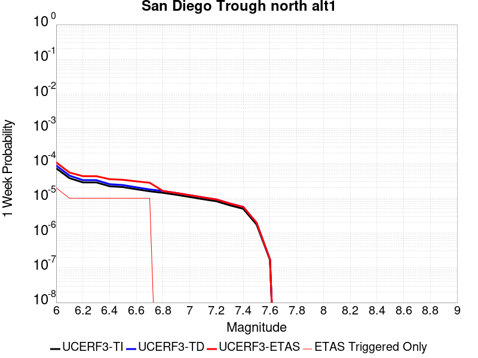 |  |  |  |

| Magnitude | 1 wk TI Prob | 1 wk TD Prob | 1 wk ETAS Prob | 1 wk ETAS/TD Gain | 1 wk ETAS Triggered Only | 1 mo TI Prob | 1 mo TD Prob | 1 mo ETAS Prob | 1 mo ETAS/TD Gain | 1 mo ETAS Triggered Only | 1 yr TI Prob | 1 yr TD Prob | 1 yr ETAS Prob | 1 yr ETAS/TD Gain | 1 yr ETAS Triggered Only | 10 yr TI Prob | 10 yr TD Prob | 10 yr ETAS Prob | 10 yr ETAS/TD Gain | 10 yr ETAS Triggered Only |
|-----|-----|-----|-----|-----|-----|-----|-----|-----|-----|-----|-----|-----|-----|-----|-----|-----|-----|-----|-----|-----|
| 6.0 | 7.329252E-5 | 8.821093E-5 | 8.821093E-5 | 1.0 | 0.0 | 3.14073E-4 | 3.7799572E-4 | 4.2742077E-4 | 1.1307557 | 4.944376E-5 | 0.0038171355 | 0.004593027 | 0.0046545477 | 1.0133944 | 6.18047E-5 | 0.03752231 | 0.045044992 | 0.045139425 | 1.0020964 | 9.888752E-5 |
| 6.1 | 3.7940346E-5 | 4.4885E-5 | 4.4885E-5 | 1.0 | 0.0 | 1.6259136E-4 | 1.9235066E-4 | 2.1706779E-4 | 1.1285003 | 2.472188E-5 | 0.0019777524 | 0.0023394432 | 0.0023764393 | 1.0158141 | 3.7082817E-5 | 0.019602431 | 0.023156688 | 0.02319291 | 1.0015643 | 3.7082817E-5 |
| 6.2 | 2.8645263E-5 | 3.329678E-5 | 3.329678E-5 | 1.0 | 0.0 | 1.2275964E-4 | 1.4269284E-4 | 1.6741118E-4 | 1.1732277 | 2.472188E-5 | 0.0014935739 | 0.0017359189 | 0.0017605979 | 1.0142167 | 2.472188E-5 | 0.0148357535 | 0.017226247 | 0.017250543 | 1.0014104 | 2.472188E-5 |
| 6.3 | 2.8645263E-5 | 3.329678E-5 | 3.329678E-5 | 1.0 | 0.0 | 1.2275964E-4 | 1.4269284E-4 | 1.6741118E-4 | 1.1732277 | 2.472188E-5 | 0.0014935739 | 0.0017359189 | 0.0017605979 | 1.0142167 | 2.472188E-5 | 0.0148357535 | 0.017226247 | 0.017250543 | 1.0014104 | 2.472188E-5 |
| 6.4 | 2.2204576E-5 | 2.5448318E-5 | 2.5448318E-5 | 1.0 | 0.0 | 9.5159E-5 | 1.0905972E-4 | 1.2141931E-4 | 1.1133287 | 1.236094E-5 | 0.001157945 | 0.0013270034 | 0.0013393479 | 1.0093026 | 1.236094E-5 | 0.011519298 | 0.013191955 | 0.013204153 | 1.0009246 | 1.236094E-5 |
| 6.5 | 2.1004838E-5 | 2.4024694E-5 | 2.4024694E-5 | 1.0 | 0.0 | 9.0017624E-5 | 1.0295896E-4 | 1.1531863E-4 | 1.1200446 | 1.236094E-5 | 0.0010954136 | 0.0012528138 | 0.0012651593 | 1.0098542 | 1.236094E-5 | 0.010900296 | 0.012458589 | 0.012470796 | 1.0009798 | 1.236094E-5 |
| 6.6 | 1.820557E-5 | 2.0704787E-5 | 2.0704787E-5 | 1.0 | 0.0 | 7.802154E-5 | 8.873181E-5 | 1.0109165E-4 | 1.1392944 | 1.236094E-5 | 9.4949827E-4 | 0.0010797799 | 0.0010921275 | 1.0114353 | 1.236094E-5 | 0.009454516 | 0.010746004 | 0.010758232 | 1.001138 | 1.236094E-5 |
| 6.7 | 1.5884485E-5 | 1.7983646E-5 | 1.7983646E-5 | 1.0 | 0.0 | 6.807459E-5 | 7.707051E-5 | 8.94305E-5 | 1.1603725 | 1.236094E-5 | 8.284929E-4 | 9.3793223E-4 | 9.5028157E-4 | 1.0131665 | 1.236094E-5 | 0.008254109 | 0.009340104 | 0.009352349 | 1.0013111 | 1.236094E-5 |
| 6.8 | 1.4331171E-5 | 1.6201066E-5 | 1.6201066E-5 | 1.0 | 0.0 | 6.141786E-5 | 6.94313E-5 | 8.179138E-5 | 1.1780189 | 1.236094E-5 | 7.4750587E-4 | 8.450002E-4 | 8.573507E-4 | 1.014616 | 1.236094E-5 | 0.0074499645 | 0.008418139 | 0.008430396 | 1.001456 | 1.236094E-5 |
| 6.9 | 1.2574203E-5 | 1.4205835E-5 | 1.4205835E-5 | 1.0 | 0.0 | 5.3888325E-5 | 6.0880735E-5 | 7.3240924E-5 | 1.203023 | 1.236094E-5 | 6.558929E-4 | 7.409723E-4 | 7.533241E-4 | 1.0166698 | 1.236094E-5 | 0.0065396037 | 0.007385203 | 0.007397473 | 1.0016614 | 1.236094E-5 |
| 7.0 | 1.0883844E-5 | 1.2289262E-5 | 1.2289262E-5 | 1.0 | 0.0 | 4.664421E-5 | 5.2667205E-5 | 6.5027496E-5 | 1.2346866 | 1.236094E-5 | 5.677453E-4 | 6.4103556E-4 | 6.5338856E-4 | 1.0192704 | 1.236094E-5 | 0.00566297 | 0.006391993 | 0.0064042746 | 1.0019214 | 1.236094E-5 |
| 7.1 | 9.393088E-6 | 1.060702E-5 | 1.060702E-5 | 1.0 | 0.0 | 4.025547E-5 | 4.545787E-5 | 5.7818248E-5 | 1.2719084 | 1.236094E-5 | 4.900001E-4 | 5.533098E-4 | 5.656639E-4 | 1.0223277 | 1.236094E-5 | 0.0048892107 | 0.005519418 | 0.0055317106 | 1.0022272 | 1.236094E-5 |
| 7.2 | 8.190791E-6 | 9.258625E-6 | 9.258625E-6 | 1.0 | 0.0 | 3.510292E-5 | 3.9679224E-5 | 5.203967E-5 | 1.3115094 | 1.236094E-5 | 4.2729423E-4 | 4.8298817E-4 | 4.953431E-4 | 1.0255803 | 1.236094E-5 | 0.0042647356 | 0.004819465 | 0.004831766 | 1.0025524 | 1.236094E-5 |
| 7.3 | 6.268162E-6 | 7.089716E-6 | 7.089716E-6 | 1.0 | 0.0 | 2.6863276E-5 | 3.0384144E-5 | 3.0384144E-5 | 1.0 | 0.0 | 3.2701128E-4 | 3.6986457E-4 | 3.6986457E-4 | 1.0 | 0.0 | 0.003265305 | 0.003692536 | 0.003692536 | 1.0 | 0.0 |
| 7.4 | 4.985186E-6 | 5.6426816E-6 | 5.6426816E-6 | 1.0 | 0.0 | 2.1364907E-5 | 2.4182698E-5 | 2.4182698E-5 | 1.0 | 0.0 | 2.600867E-4 | 2.9438498E-4 | 2.9438498E-4 | 1.0 | 0.0 | 0.002597825 | 0.0029399914 | 0.0029399914 | 1.0 | 0.0 |
| 7.5 | 1.7489613E-6 | 1.969678E-6 | 1.969678E-6 | 1.0 | 0.0 | 7.495527E-6 | 8.4414505E-6 | 8.4414505E-6 | 1.0 | 0.0 | 9.125422E-5 | 1.02770035E-4 | 1.02770035E-4 | 1.0 | 0.0 | 9.1216754E-4 | 0.0010272472 | 0.0010272472 | 1.0 | 0.0 |
| 7.6 | 1.6988751E-7 | 1.7533823E-7 | 1.7533823E-7 | 1.0 | 0.0 | 7.2808916E-7 | 7.5144936E-7 | 7.5144936E-7 | 1.0 | 0.0 | 8.864449E-6 | 9.14886E-6 | 9.14886E-6 | 1.0 | 0.0 | 8.8640954E-5 | 9.1485024E-5 | 9.1485024E-5 | 1.0 | 0.0 |

## Kern Canyon (North Kern) 2011
*[(top)](#table-of-contents)*

| 1 Week | 1 Month | 1 Year | 10 Year |
|-----|-----|-----|-----|
| 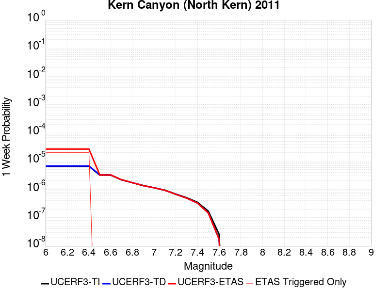 |  | 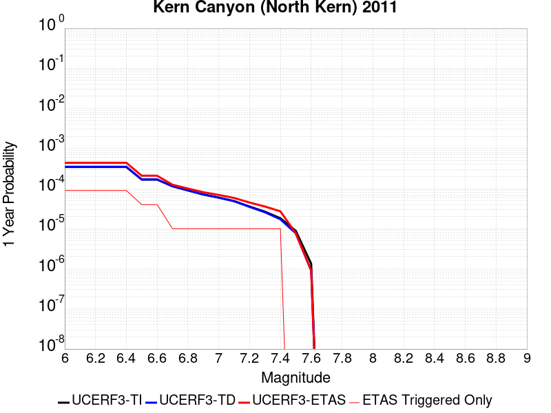 |  |

| Magnitude | 1 wk TI Prob | 1 wk TD Prob | 1 wk ETAS Prob | 1 wk ETAS/TD Gain | 1 wk ETAS Triggered Only | 1 mo TI Prob | 1 mo TD Prob | 1 mo ETAS Prob | 1 mo ETAS/TD Gain | 1 mo ETAS Triggered Only | 1 yr TI Prob | 1 yr TD Prob | 1 yr ETAS Prob | 1 yr ETAS/TD Gain | 1 yr ETAS Triggered Only | 10 yr TI Prob | 10 yr TD Prob | 10 yr ETAS Prob | 10 yr ETAS/TD Gain | 10 yr ETAS Triggered Only |
|-----|-----|-----|-----|-----|-----|-----|-----|-----|-----|-----|-----|-----|-----|-----|-----|-----|-----|-----|-----|-----|
| 6.0 | 6.6264497E-6 | 6.75733E-6 | 1.9118186E-5 | 2.8292515 | 1.236094E-5 | 2.8398761E-5 | 2.895971E-5 | 9.0762616E-5 | 3.1340997 | 6.18047E-5 | 3.4570007E-4 | 3.5253543E-4 | 4.266749E-4 | 1.2103037 | 7.416563E-5 | 0.0034516277 | 0.0035205502 | 0.0036190895 | 1.0279897 | 9.888752E-5 |
| 6.1 | 6.6264497E-6 | 6.75733E-6 | 1.9118186E-5 | 2.8292515 | 1.236094E-5 | 2.8398761E-5 | 2.895971E-5 | 9.0762616E-5 | 3.1340997 | 6.18047E-5 | 3.4570007E-4 | 3.5253543E-4 | 4.266749E-4 | 1.2103037 | 7.416563E-5 | 0.0034516277 | 0.0035205502 | 0.0036190895 | 1.0279897 | 9.888752E-5 |
| 6.2 | 6.6264497E-6 | 6.75733E-6 | 1.9118186E-5 | 2.8292515 | 1.236094E-5 | 2.8398761E-5 | 2.895971E-5 | 9.0762616E-5 | 3.1340997 | 6.18047E-5 | 3.4570007E-4 | 3.5253543E-4 | 4.266749E-4 | 1.2103037 | 7.416563E-5 | 0.0034516277 | 0.0035205502 | 0.0036190895 | 1.0279897 | 9.888752E-5 |
| 6.3 | 6.6264497E-6 | 6.75733E-6 | 1.9118186E-5 | 2.8292515 | 1.236094E-5 | 2.8398761E-5 | 2.895971E-5 | 9.0762616E-5 | 3.1340997 | 6.18047E-5 | 3.4570007E-4 | 3.5253543E-4 | 4.266749E-4 | 1.2103037 | 7.416563E-5 | 0.0034516277 | 0.0035205502 | 0.0036190895 | 1.0279897 | 9.888752E-5 |
| 6.4 | 6.6264497E-6 | 6.75733E-6 | 1.9118186E-5 | 2.8292515 | 1.236094E-5 | 2.8398761E-5 | 2.895971E-5 | 9.0762616E-5 | 3.1340997 | 6.18047E-5 | 3.4570007E-4 | 3.5253543E-4 | 4.266749E-4 | 1.2103037 | 7.416563E-5 | 0.0034516277 | 0.0035205502 | 0.0036190895 | 1.0279897 | 9.888752E-5 |
| 6.5 | 3.2162225E-6 | 3.2570915E-6 | 3.2570915E-6 | 1.0 | 0.0 | 1.3783738E-5 | 1.3958893E-5 | 2.631966E-5 | 1.885512 | 1.236094E-5 | 1.6780409E-4 | 1.6993708E-4 | 1.9465476E-4 | 1.1454519 | 2.472188E-5 | 0.0016767744 | 0.001698151 | 0.0017228309 | 1.0145334 | 2.472188E-5 |
| 6.6 | 3.2162225E-6 | 3.2570915E-6 | 3.2570915E-6 | 1.0 | 0.0 | 1.3783738E-5 | 1.3958893E-5 | 2.631966E-5 | 1.885512 | 1.236094E-5 | 1.6780409E-4 | 1.6993708E-4 | 1.9465476E-4 | 1.1454519 | 2.472188E-5 | 0.0016767744 | 0.001698151 | 0.0017228309 | 1.0145334 | 2.472188E-5 |
| 6.7 | 2.1908265E-6 | 2.2071222E-6 | 2.2071222E-6 | 1.0 | 0.0 | 9.389223E-6 | 9.459061E-6 | 9.459061E-6 | 1.0 | 0.0 | 1.1430779E-4 | 1.1515819E-4 | 1.1515819E-4 | 1.0 | 0.0 | 0.0011424901 | 0.0011510046 | 0.0011510046 | 1.0 | 0.0 |
| 6.8 | 1.7303895E-6 | 1.7365529E-6 | 1.7365529E-6 | 1.0 | 0.0 | 7.415934E-6 | 7.4423488E-6 | 7.4423488E-6 | 1.0 | 0.0 | 9.028525E-5 | 9.0606925E-5 | 9.0606925E-5 | 1.0 | 0.0 | 9.024858E-4 | 9.057096E-4 | 9.057096E-4 | 1.0 | 0.0 |
| 6.9 | 1.3700314E-6 | 1.3688622E-6 | 1.3688622E-6 | 1.0 | 0.0 | 5.87155E-6 | 5.8665396E-6 | 5.8665396E-6 | 1.0 | 0.0 | 7.148377E-5 | 7.142282E-5 | 7.142282E-5 | 1.0 | 0.0 | 7.146078E-4 | 7.140032E-4 | 7.140032E-4 | 1.0 | 0.0 |
| 7.0 | 1.1467797E-6 | 1.1413804E-6 | 1.1413804E-6 | 1.0 | 0.0 | 4.9147607E-6 | 4.8916213E-6 | 4.8916213E-6 | 1.0 | 0.0 | 5.983557E-5 | 5.9553895E-5 | 5.9553895E-5 | 1.0 | 0.0 | 5.981946E-4 | 5.953825E-4 | 5.953825E-4 | 1.0 | 0.0 |
| 7.1 | 9.3952065E-7 | 9.3026904E-7 | 9.3026904E-7 | 1.0 | 0.0 | 4.026511E-6 | 3.9868614E-6 | 3.9868614E-6 | 1.0 | 0.0 | 4.9021666E-5 | 4.8538972E-5 | 4.8538972E-5 | 1.0 | 0.0 | 4.901085E-4 | 4.8528548E-4 | 4.8528548E-4 | 1.0 | 0.0 |
| 7.2 | 6.858055E-7 | 6.7193E-7 | 6.7193E-7 | 1.0 | 0.0 | 2.939163E-6 | 2.879697E-6 | 2.879697E-6 | 1.0 | 0.0 | 3.5783723E-5 | 3.5059755E-5 | 3.5059755E-5 | 1.0 | 0.0 | 3.5777962E-4 | 3.5054312E-4 | 3.5054312E-4 | 1.0 | 0.0 |
| 7.3 | 5.1101983E-7 | 4.9393E-7 | 4.9393E-7 | 1.0 | 0.0 | 2.1900833E-6 | 2.116841E-6 | 2.116841E-6 | 1.0 | 0.0 | 2.6663936E-5 | 2.5772239E-5 | 2.5772239E-5 | 1.0 | 0.0 | 2.6660739E-4 | 2.57693E-4 | 2.57693E-4 | 1.0 | 0.0 |
| 7.4 | 3.4999414E-7 | 3.2995905E-7 | 3.2995905E-7 | 1.0 | 0.0 | 1.499974E-6 | 1.4141094E-6 | 1.4141094E-6 | 1.0 | 0.0 | 1.8262032E-5 | 1.721665E-5 | 1.721665E-5 | 1.0 | 0.0 | 1.826053E-4 | 1.7215339E-4 | 1.7215339E-4 | 1.0 | 0.0 |
| 7.5 | 1.7021522E-7 | 1.4750044E-7 | 1.4750044E-7 | 1.0 | 0.0 | 7.2949354E-7 | 6.321446E-7 | 6.321446E-7 | 1.0 | 0.0 | 8.881548E-6 | 7.696334E-6 | 7.696334E-6 | 1.0 | 0.0 | 8.8811925E-5 | 7.696076E-5 | 7.696076E-5 | 1.0 | 0.0 |
| 7.6 | 2.572245E-8 | 1.7352555E-8 | 1.7352555E-8 | 1.0 | 0.0 | 1.10239064E-7 | 7.436809E-8 | 7.436809E-8 | 1.0 | 0.0 | 1.3421597E-6 | 9.054312E-7 | 9.054312E-7 | 1.0 | 0.0 | 1.3421517E-5 | 9.05428E-6 | 9.05428E-6 | 1.0 | 0.0 |

## Bullion Mountains
*[(top)](#table-of-contents)*

| 1 Week | 1 Month | 1 Year | 10 Year |
|-----|-----|-----|-----|
|  |  |  |  |

| Magnitude | 1 wk TI Prob | 1 wk TD Prob | 1 wk ETAS Prob | 1 wk ETAS/TD Gain | 1 wk ETAS Triggered Only | 1 mo TI Prob | 1 mo TD Prob | 1 mo ETAS Prob | 1 mo ETAS/TD Gain | 1 mo ETAS Triggered Only | 1 yr TI Prob | 1 yr TD Prob | 1 yr ETAS Prob | 1 yr ETAS/TD Gain | 1 yr ETAS Triggered Only | 10 yr TI Prob | 10 yr TD Prob | 10 yr ETAS Prob | 10 yr ETAS/TD Gain | 10 yr ETAS Triggered Only |
|-----|-----|-----|-----|-----|-----|-----|-----|-----|-----|-----|-----|-----|-----|-----|-----|-----|-----|-----|-----|-----|
| 6.0 | 1.6420427E-5 | 1.4692089E-5 | 6.413512E-5 | 4.3652825 | 4.944376E-5 | 7.037136E-5 | 6.296479E-5 | 1.1240544E-4 | 1.785211 | 4.944376E-5 | 8.5643446E-4 | 7.663651E-4 | 8.5282535E-4 | 1.1128186 | 8.6526576E-5 | 0.008531413 | 0.007641016 | 0.007739148 | 1.0128428 | 9.888752E-5 |
| 6.1 | 1.6420427E-5 | 1.4692089E-5 | 6.413512E-5 | 4.3652825 | 4.944376E-5 | 7.037136E-5 | 6.296479E-5 | 1.1240544E-4 | 1.785211 | 4.944376E-5 | 8.5643446E-4 | 7.663651E-4 | 8.5282535E-4 | 1.1128186 | 8.6526576E-5 | 0.008531413 | 0.007641016 | 0.007739148 | 1.0128428 | 9.888752E-5 |
| 6.2 | 1.6420427E-5 | 1.4692089E-5 | 6.413512E-5 | 4.3652825 | 4.944376E-5 | 7.037136E-5 | 6.296479E-5 | 1.1240544E-4 | 1.785211 | 4.944376E-5 | 8.5643446E-4 | 7.663651E-4 | 8.5282535E-4 | 1.1128186 | 8.6526576E-5 | 0.008531413 | 0.007641016 | 0.007739148 | 1.0128428 | 9.888752E-5 |
| 6.3 | 1.2046778E-5 | 9.862335E-6 | 9.862335E-6 | 1.0 | 0.0 | 5.1628023E-5 | 4.2266598E-5 | 4.2266598E-5 | 1.0 | 0.0 | 6.283899E-4 | 5.144975E-4 | 5.144975E-4 | 1.0 | 0.0 | 0.0062661595 | 0.005135345 | 0.005135345 | 1.0 | 0.0 |
| 6.4 | 1.2046778E-5 | 9.862335E-6 | 9.862335E-6 | 1.0 | 0.0 | 5.1628023E-5 | 4.2266598E-5 | 4.2266598E-5 | 1.0 | 0.0 | 6.283899E-4 | 5.144975E-4 | 5.144975E-4 | 1.0 | 0.0 | 0.0062661595 | 0.005135345 | 0.005135345 | 1.0 | 0.0 |
| 6.5 | 1.0244343E-5 | 7.879458E-6 | 7.879458E-6 | 1.0 | 0.0 | 4.390359E-5 | 3.3768785E-5 | 3.3768785E-5 | 1.0 | 0.0 | 5.343951E-4 | 4.110781E-4 | 4.110781E-4 | 1.0 | 0.0 | 0.005331118 | 0.004105208 | 0.004105208 | 1.0 | 0.0 |
| 6.6 | 9.605408E-6 | 7.1774966E-6 | 7.1774966E-6 | 1.0 | 0.0 | 4.1165385E-5 | 3.076045E-5 | 3.076045E-5 | 1.0 | 0.0 | 5.010733E-4 | 3.744645E-4 | 3.744645E-4 | 1.0 | 0.0 | 0.00499945 | 0.003740332 | 0.003740332 | 1.0 | 0.0 |
| 6.7 | 8.60418E-6 | 6.1240044E-6 | 6.1240044E-6 | 1.0 | 0.0 | 3.687454E-5 | 2.624558E-5 | 2.624558E-5 | 1.0 | 0.0 | 4.48855E-4 | 3.1951256E-4 | 3.1951256E-4 | 1.0 | 0.0 | 0.004479495 | 0.0031924439 | 0.0031924439 | 1.0 | 0.0 |
| 6.8 | 5.187994E-6 | 2.5631666E-6 | 2.5631666E-6 | 1.0 | 0.0 | 2.223407E-5 | 1.0984976E-5 | 1.0984976E-5 | 1.0 | 0.0 | 2.7066618E-4 | 1.3373788E-4 | 1.3373788E-4 | 1.0 | 0.0 | 0.0027033675 | 0.0013369655 | 0.0013369655 | 1.0 | 0.0 |
| 6.9 | 4.5302368E-6 | 2.3443165E-6 | 2.3443165E-6 | 1.0 | 0.0 | 1.9415156E-5 | 1.0047055E-5 | 1.0047055E-5 | 1.0 | 0.0 | 2.3635388E-4 | 1.2232E-4 | 1.2232E-4 | 1.0 | 0.0 | 0.0023610266 | 0.0012229157 | 0.0012229157 | 1.0 | 0.0 |
| 7.0 | 3.431668E-6 | 1.6882402E-6 | 1.6882402E-6 | 1.0 | 0.0 | 1.4707065E-5 | 7.235315E-6 | 7.235315E-6 | 1.0 | 0.0 | 1.7904381E-4 | 8.808996E-5 | 8.808996E-5 | 1.0 | 0.0 | 0.0017889962 | 8.808996E-4 | 8.808996E-4 | 1.0 | 0.0 |

## Pinto Mtn
*[(top)](#table-of-contents)*

| 1 Week | 1 Month | 1 Year | 10 Year |
|-----|-----|-----|-----|
|  |  |  |  |

| Magnitude | 1 wk TI Prob | 1 wk TD Prob | 1 wk ETAS Prob | 1 wk ETAS/TD Gain | 1 wk ETAS Triggered Only | 1 mo TI Prob | 1 mo TD Prob | 1 mo ETAS Prob | 1 mo ETAS/TD Gain | 1 mo ETAS Triggered Only | 1 yr TI Prob | 1 yr TD Prob | 1 yr ETAS Prob | 1 yr ETAS/TD Gain | 1 yr ETAS Triggered Only | 10 yr TI Prob | 10 yr TD Prob | 10 yr ETAS Prob | 10 yr ETAS/TD Gain | 10 yr ETAS Triggered Only |
|-----|-----|-----|-----|-----|-----|-----|-----|-----|-----|-----|-----|-----|-----|-----|-----|-----|-----|-----|-----|-----|
| 6.0 | 4.4194956E-5 | 4.785362E-5 | 1.0965536E-4 | 2.2914748 | 6.18047E-5 | 1.893932E-4 | 2.0507174E-4 | 2.7922218E-4 | 1.3615829 | 7.416563E-5 | 0.0023034236 | 0.0024940541 | 0.0025926952 | 1.0395504 | 9.888752E-5 | 0.022796938 | 0.024678145 | 0.024774592 | 1.0039082 | 9.888752E-5 |
| 6.1 | 4.4194956E-5 | 4.785362E-5 | 1.0965536E-4 | 2.2914748 | 6.18047E-5 | 1.893932E-4 | 2.0507174E-4 | 2.7922218E-4 | 1.3615829 | 7.416563E-5 | 0.0023034236 | 0.0024940541 | 0.0025926952 | 1.0395504 | 9.888752E-5 | 0.022796938 | 0.024678145 | 0.024774592 | 1.0039082 | 9.888752E-5 |
| 6.2 | 4.4194956E-5 | 4.785362E-5 | 1.0965536E-4 | 2.2914748 | 6.18047E-5 | 1.893932E-4 | 2.0507174E-4 | 2.7922218E-4 | 1.3615829 | 7.416563E-5 | 0.0023034236 | 0.0024940541 | 0.0025926952 | 1.0395504 | 9.888752E-5 | 0.022796938 | 0.024678145 | 0.024774592 | 1.0039082 | 9.888752E-5 |
| 6.3 | 4.4194956E-5 | 4.785362E-5 | 1.0965536E-4 | 2.2914748 | 6.18047E-5 | 1.893932E-4 | 2.0507174E-4 | 2.7922218E-4 | 1.3615829 | 7.416563E-5 | 0.0023034236 | 0.0024940541 | 0.0025926952 | 1.0395504 | 9.888752E-5 | 0.022796938 | 0.024678145 | 0.024774592 | 1.0039082 | 9.888752E-5 |
| 6.4 | 3.729929E-5 | 3.9603186E-5 | 7.668453E-5 | 1.9363225 | 3.7082817E-5 | 1.5984432E-4 | 1.6971743E-4 | 2.1915279E-4 | 1.2912804 | 4.944376E-5 | 0.0019443673 | 0.002064445 | 0.0021384575 | 1.035851 | 7.416563E-5 | 0.019274427 | 0.02046269 | 0.020535339 | 1.0035503 | 7.416563E-5 |
| 6.5 | 3.729929E-5 | 3.9603186E-5 | 7.668453E-5 | 1.9363225 | 3.7082817E-5 | 1.5984432E-4 | 1.6971743E-4 | 2.1915279E-4 | 1.2912804 | 4.944376E-5 | 0.0019443673 | 0.002064445 | 0.0021384575 | 1.035851 | 7.416563E-5 | 0.019274427 | 0.02046269 | 0.020535339 | 1.0035503 | 7.416563E-5 |
| 6.6 | 3.0204548E-5 | 3.1205298E-5 | 6.828696E-5 | 2.188313 | 3.7082817E-5 | 1.2944164E-4 | 1.3373033E-4 | 1.8316747E-4 | 1.3696779 | 4.944376E-5 | 0.0015748127 | 0.0016269855 | 0.0016763487 | 1.0303403 | 4.944376E-5 | 0.015636992 | 0.01615461 | 0.016203254 | 1.0030112 | 4.944376E-5 |
| 6.7 | 2.9857754E-5 | 3.081468E-5 | 6.7896355E-5 | 2.2033768 | 3.7082817E-5 | 1.2795553E-4 | 1.3205643E-4 | 1.8149365E-4 | 1.3743644 | 4.944376E-5 | 0.0015567453 | 0.001606636 | 0.0016560003 | 1.0307252 | 4.944376E-5 | 0.015458848 | 0.01595405 | 0.016002703 | 1.0030497 | 4.944376E-5 |
| 6.8 | 2.4819734E-5 | 2.5009364E-5 | 4.9730625E-5 | 1.9884802 | 2.472188E-5 | 1.0636595E-4 | 1.07178705E-4 | 1.4425754E-4 | 1.3459535 | 3.7082817E-5 | 0.0012942362 | 0.0013041412 | 0.0013411756 | 1.0283976 | 3.7082817E-5 | 0.012867244 | 0.0129672475 | 0.013003849 | 1.0028226 | 3.7082817E-5 |
| 6.9 | 2.331124E-5 | 2.3337643E-5 | 4.8058944E-5 | 2.0592887 | 2.472188E-5 | 9.990149E-5 | 1.00014746E-4 | 1.3709386E-4 | 1.3707364 | 3.7082817E-5 | 0.001215622 | 0.0012170197 | 0.0012540574 | 1.030433 | 3.7082817E-5 | 0.012089936 | 0.012105742 | 0.012142375 | 1.0030261 | 3.7082817E-5 |
| 7.0 | 2.1818534E-5 | 2.1760772E-5 | 4.6482113E-5 | 2.1360507 | 2.472188E-5 | 9.3504656E-5 | 9.325723E-5 | 1.3033659E-4 | 1.397603 | 3.7082817E-5 | 0.0011378246 | 0.0011348352 | 0.001171876 | 1.0326397 | 3.7082817E-5 | 0.011320163 | 0.011292503 | 0.0113291675 | 1.0032468 | 3.7082817E-5 |
| 7.1 | 2.066081E-5 | 2.0540418E-5 | 4.526179E-5 | 2.2035477 | 2.472188E-5 | 8.854332E-5 | 8.8027504E-5 | 1.2510705E-4 | 1.421227 | 3.7082817E-5 | 0.0010774818 | 0.0010712275 | 0.0011082706 | 1.03458 | 3.7082817E-5 | 0.010722724 | 0.010662688 | 0.0106993755 | 1.0034407 | 3.7082817E-5 |
| 7.2 | 1.8990233E-5 | 1.9053701E-5 | 4.3775108E-5 | 2.2974596 | 2.472188E-5 | 8.138417E-5 | 8.1656275E-5 | 1.1873606E-4 | 1.4540961 | 3.7082817E-5 | 9.904018E-4 | 9.937311E-4 | 0.001030777 | 1.0372797 | 3.7082817E-5 | 0.009859995 | 0.009894874 | 0.0099315895 | 1.0037106 | 3.7082817E-5 |
| 7.3 | 1.3335872E-5 | 1.4906372E-5 | 3.962788E-5 | 2.6584525 | 2.472188E-5 | 5.7152483E-5 | 6.388296E-5 | 1.0096341E-4 | 1.5804435 | 3.7082817E-5 | 6.956093E-4 | 7.775102E-4 | 8.1456424E-4 | 1.0476573 | 3.7082817E-5 | 0.006934359 | 0.0077491994 | 0.0077859946 | 1.0047483 | 3.7082817E-5 |
| 7.4 | 9.414066E-6 | 1.186061E-5 | 3.6582194E-5 | 3.0843434 | 2.472188E-5 | 4.0345374E-5 | 5.0830247E-5 | 8.791118E-5 | 1.7295053 | 3.7082817E-5 | 4.910942E-4 | 6.1869196E-4 | 6.5575185E-4 | 1.0599004 | 3.7082817E-5 | 0.0049001034 | 0.006170644 | 0.006207498 | 1.0059725 | 3.7082817E-5 |
| 7.5 | 7.2101157E-6 | 9.157893E-6 | 3.3879547E-5 | 3.6994913 | 2.472188E-5 | 3.090013E-5 | 3.924757E-5 | 6.396848E-5 | 1.6298711 | 2.472188E-5 | 3.7614413E-4 | 4.7774217E-4 | 5.0245225E-4 | 1.0517226 | 2.472188E-5 | 0.0037550807 | 0.004767927 | 0.004792531 | 1.0051603 | 2.472188E-5 |
| 7.6 | 3.296375E-6 | 4.5453176E-6 | 2.9267085E-5 | 6.4389524 | 2.472188E-5 | 1.4127245E-5 | 1.9479796E-5 | 4.420119E-5 | 2.269079 | 2.472188E-5 | 1.7198564E-4 | 2.3714209E-4 | 2.618581E-4 | 1.1042246 | 2.472188E-5 | 0.0017185259 | 0.0023690276 | 0.0023936909 | 1.0104108 | 2.472188E-5 |
| 7.7 | 2.5741092E-6 | 3.584251E-6 | 3.584251E-6 | 1.0 | 0.0 | 1.103185E-5 | 1.5360993E-5 | 1.5360993E-5 | 1.0 | 0.0 | 1.3430449E-4 | 1.8700535E-4 | 1.8700535E-4 | 1.0 | 0.0 | 0.0013422335 | 0.0018686098 | 0.0018686098 | 1.0 | 0.0 |

## Oceanic - West Huasna
*[(top)](#table-of-contents)*

| 1 Week | 1 Month | 1 Year | 10 Year |
|-----|-----|-----|-----|
| 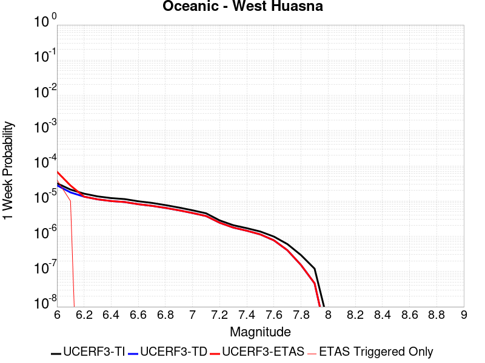 |  |  |  |

| Magnitude | 1 wk TI Prob | 1 wk TD Prob | 1 wk ETAS Prob | 1 wk ETAS/TD Gain | 1 wk ETAS Triggered Only | 1 mo TI Prob | 1 mo TD Prob | 1 mo ETAS Prob | 1 mo ETAS/TD Gain | 1 mo ETAS Triggered Only | 1 yr TI Prob | 1 yr TD Prob | 1 yr ETAS Prob | 1 yr ETAS/TD Gain | 1 yr ETAS Triggered Only | 10 yr TI Prob | 10 yr TD Prob | 10 yr ETAS Prob | 10 yr ETAS/TD Gain | 10 yr ETAS Triggered Only |
|-----|-----|-----|-----|-----|-----|-----|-----|-----|-----|-----|-----|-----|-----|-----|-----|-----|-----|-----|-----|-----|
| 6.0 | 3.195567E-5 | 2.7926868E-5 | 6.500865E-5 | 2.3278174 | 3.7082817E-5 | 1.3694567E-4 | 1.1968133E-4 | 1.567597E-4 | 1.3098092 | 3.7082817E-5 | 0.0016660384 | 0.0014561893 | 0.0015179041 | 1.0423809 | 6.18047E-5 | 0.016536033 | 0.014471028 | 0.014568484 | 1.0067346 | 9.888752E-5 |
| 6.1 | 2.1156782E-5 | 1.7573486E-5 | 2.9934208E-5 | 1.7033734 | 1.236094E-5 | 9.066878E-5 | 7.531282E-5 | 8.767283E-5 | 1.1641155 | 1.236094E-5 | 0.0011033333 | 9.165572E-4 | 9.2890684E-4 | 1.0134739 | 1.236094E-5 | 0.010978713 | 0.009128777 | 0.009141026 | 1.0013417 | 1.236094E-5 |
| 6.2 | 1.6195117E-5 | 1.3327152E-5 | 1.3327152E-5 | 1.0 | 0.0 | 6.9405796E-5 | 5.7115132E-5 | 5.7115132E-5 | 1.0 | 0.0 | 8.44688E-4 | 6.9515745E-4 | 6.9515745E-4 | 1.0 | 0.0 | 0.008414844 | 0.006930123 | 0.006930123 | 1.0 | 0.0 |
| 6.3 | 1.3559345E-5 | 1.1179142E-5 | 1.1179142E-5 | 1.0 | 0.0 | 5.811018E-5 | 4.7909736E-5 | 4.7909736E-5 | 1.0 | 0.0 | 7.072618E-4 | 5.831459E-4 | 5.831459E-4 | 1.0 | 0.0 | 0.0070501505 | 0.0058162753 | 0.0058162753 | 1.0 | 0.0 |
| 6.4 | 1.2120619E-5 | 1.0000977E-5 | 1.0000977E-5 | 1.0 | 0.0 | 5.1944477E-5 | 4.2860633E-5 | 4.2860633E-5 | 1.0 | 0.0 | 6.322405E-4 | 5.2170374E-4 | 5.2170374E-4 | 1.0 | 0.0 | 0.006304447 | 0.0052048573 | 0.0052048573 | 1.0 | 0.0 |
| 6.5 | 1.13511915E-5 | 9.3674735E-6 | 9.3674735E-6 | 1.0 | 0.0 | 4.8647056E-5 | 4.01457E-5 | 4.01457E-5 | 1.0 | 0.0 | 5.9211696E-4 | 4.886647E-4 | 4.886647E-4 | 1.0 | 0.0 | 0.0059054173 | 0.0048759608 | 0.0048759608 | 1.0 | 0.0 |
| 6.6 | 9.850605E-6 | 8.135418E-6 | 8.135418E-6 | 1.0 | 0.0 | 4.2216197E-5 | 3.4865614E-5 | 3.4865614E-5 | 1.0 | 0.0 | 5.1386096E-4 | 4.2440637E-4 | 4.2440637E-4 | 1.0 | 0.0 | 0.0051267436 | 0.004235991 | 0.004235991 | 1.0 | 0.0 |
| 6.7 | 8.8558645E-6 | 7.318433E-6 | 7.318433E-6 | 1.0 | 0.0 | 3.7953152E-5 | 3.1364336E-5 | 3.1364336E-5 | 1.0 | 0.0 | 4.6198163E-4 | 3.8179406E-4 | 3.8179406E-4 | 1.0 | 0.0 | 0.004610224 | 0.0038114067 | 0.0038114067 | 1.0 | 0.0 |
| 6.8 | 7.67136E-6 | 6.391756E-6 | 6.391756E-6 | 1.0 | 0.0 | 3.2876844E-5 | 2.7392953E-5 | 2.7392953E-5 | 1.0 | 0.0 | 4.0020206E-4 | 3.3345833E-4 | 3.3345833E-4 | 1.0 | 0.0 | 0.003994821 | 0.0033296007 | 0.0033296007 | 1.0 | 0.0 |
| 6.9 | 6.534529E-6 | 5.4583297E-6 | 5.4583297E-6 | 1.0 | 0.0 | 2.8004823E-5 | 2.3392633E-5 | 2.3392633E-5 | 1.0 | 0.0 | 3.4090536E-4 | 2.847682E-4 | 2.847682E-4 | 1.0 | 0.0 | 0.0034038287 | 0.0028440498 | 0.0028440498 | 1.0 | 0.0 |
| 7.0 | 5.460525E-6 | 4.5699517E-6 | 4.5699517E-6 | 1.0 | 0.0 | 2.3402039E-5 | 1.958536E-5 | 1.958536E-5 | 1.0 | 0.0 | 2.8488258E-4 | 2.3842578E-4 | 2.3842578E-4 | 1.0 | 0.0 | 0.0028451765 | 0.0023817138 | 0.0023817138 | 1.0 | 0.0 |
| 7.1 | 4.4825083E-6 | 3.7524428E-6 | 3.7524428E-6 | 1.0 | 0.0 | 1.9210609E-5 | 1.60818E-5 | 1.60818E-5 | 1.0 | 0.0 | 2.3386406E-4 | 1.9577841E-4 | 1.9577841E-4 | 1.0 | 0.0 | 0.002336181 | 0.0019560715 | 0.0019560715 | 1.0 | 0.0 |
| 7.2 | 2.821708E-6 | 2.4249334E-6 | 2.4249334E-6 | 1.0 | 0.0 | 1.2092979E-5 | 1.039253E-5 | 1.039253E-5 | 1.0 | 0.0 | 1.4722206E-4 | 1.2652173E-4 | 1.2652173E-4 | 1.0 | 0.0 | 0.0014712457 | 0.0012644994 | 0.0012644994 | 1.0 | 0.0 |
| 7.3 | 2.0644757E-6 | 1.7687412E-6 | 1.7687412E-6 | 1.0 | 0.0 | 8.847723E-6 | 7.5802973E-6 | 7.5802973E-6 | 1.0 | 0.0 | 1.0771569E-4 | 9.228622E-5 | 9.228622E-5 | 1.0 | 0.0 | 0.001076635 | 9.2248066E-4 | 9.2248066E-4 | 1.0 | 0.0 |
| 7.4 | 1.6980367E-6 | 1.4379892E-6 | 1.4379892E-6 | 1.0 | 0.0 | 7.27728E-6 | 6.162796E-6 | 6.162796E-6 | 1.0 | 0.0 | 8.8597284E-5 | 7.5029464E-5 | 7.5029464E-5 | 1.0 | 0.0 | 8.8561967E-4 | 7.500429E-4 | 7.500429E-4 | 1.0 | 0.0 |
| 7.5 | 1.3637683E-6 | 1.1302635E-6 | 1.1302635E-6 | 1.0 | 0.0 | 5.844708E-6 | 4.8439774E-6 | 4.8439774E-6 | 1.0 | 0.0 | 7.1156996E-5 | 5.897383E-5 | 5.897383E-5 | 1.0 | 0.0 | 7.1134215E-4 | 5.895833E-4 | 5.895833E-4 | 1.0 | 0.0 |
| 7.6 | 9.802994E-7 | 7.677247E-7 | 7.677247E-7 | 1.0 | 0.0 | 4.2012766E-6 | 3.2902446E-6 | 3.2902446E-6 | 1.0 | 0.0 | 5.1149345E-5 | 4.0057992E-5 | 4.0057992E-5 | 1.0 | 0.0 | 5.113757E-4 | 4.0050913E-4 | 4.0050913E-4 | 1.0 | 0.0 |
| 7.7 | 5.986191E-7 | 4.0050548E-7 | 4.0050548E-7 | 1.0 | 0.0 | 2.5655079E-6 | 1.7164509E-6 | 1.7164509E-6 | 1.0 | 0.0 | 3.1234613E-5 | 2.089759E-5 | 2.089759E-5 | 1.0 | 0.0 | 3.123022E-4 | 2.089576E-4 | 2.089576E-4 | 1.0 | 0.0 |
| 7.8 | 2.9189815E-7 | 1.5285792E-7 | 1.5285792E-7 | 1.0 | 0.0 | 1.2509914E-6 | 6.5510517E-7 | 6.5510517E-7 | 1.0 | 0.0 | 1.5230714E-5 | 7.9758765E-6 | 7.9758765E-6 | 1.0 | 0.0 | 1.522967E-4 | 7.9757214E-5 | 7.9757214E-5 | 1.0 | 0.0 |
| 7.9 | 1.2057845E-7 | 4.621248E-8 | 4.621248E-8 | 1.0 | 0.0 | 5.1676466E-7 | 1.9805347E-7 | 1.9805347E-7 | 1.0 | 0.0 | 6.2915915E-6 | 2.4112983E-6 | 2.4112983E-6 | 1.0 | 0.0 | 6.2914136E-5 | 2.4114026E-5 | 2.4114026E-5 | 1.0 | 0.0 |
| 8.0 | 3.3806387E-9 | 9.011393E-10 | 9.011393E-10 | 1.0 | 0.0 | 1.4488451E-8 | 3.8620254E-9 | 3.8620254E-9 | 1.0 | 0.0 | 1.7639688E-7 | 4.702016E-8 | 4.702016E-8 | 1.0 | 0.0 | 1.7639674E-6 | 4.7129527E-7 | 4.7129527E-7 | 1.0 | 0.0 |

## Independence rev 2011
*[(top)](#table-of-contents)*

| 1 Week | 1 Month | 1 Year | 10 Year |
|-----|-----|-----|-----|
|  |  |  | 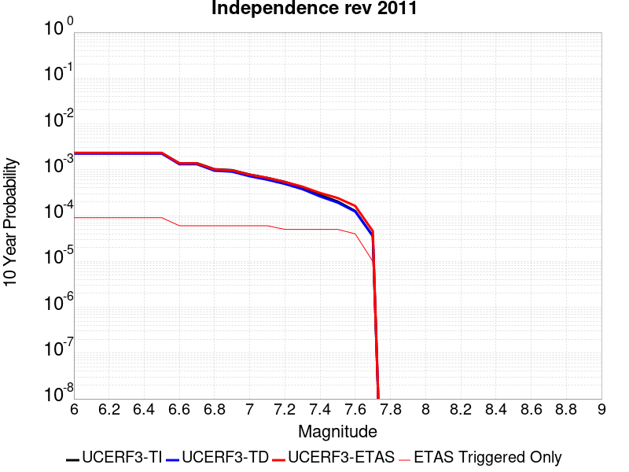 |

| Magnitude | 1 wk TI Prob | 1 wk TD Prob | 1 wk ETAS Prob | 1 wk ETAS/TD Gain | 1 wk ETAS Triggered Only | 1 mo TI Prob | 1 mo TD Prob | 1 mo ETAS Prob | 1 mo ETAS/TD Gain | 1 mo ETAS Triggered Only | 1 yr TI Prob | 1 yr TD Prob | 1 yr ETAS Prob | 1 yr ETAS/TD Gain | 1 yr ETAS Triggered Only | 10 yr TI Prob | 10 yr TD Prob | 10 yr ETAS Prob | 10 yr ETAS/TD Gain | 10 yr ETAS Triggered Only |
|-----|-----|-----|-----|-----|-----|-----|-----|-----|-----|-----|-----|-----|-----|-----|-----|-----|-----|-----|-----|-----|
| 6.0 | 4.422171E-6 | 4.326227E-6 | 1.6687112E-5 | 3.8571978 | 1.236094E-5 | 1.8952025E-5 | 1.8540857E-5 | 6.7983696E-5 | 3.6666965 | 4.944376E-5 | 2.3071647E-4 | 2.2571455E-4 | 2.875053E-4 | 1.2737561 | 6.18047E-5 | 0.0023047708 | 0.0022551466 | 0.002353811 | 1.0437508 | 9.888752E-5 |
| 6.1 | 4.422171E-6 | 4.326227E-6 | 1.6687112E-5 | 3.8571978 | 1.236094E-5 | 1.8952025E-5 | 1.8540857E-5 | 6.7983696E-5 | 3.6666965 | 4.944376E-5 | 2.3071647E-4 | 2.2571455E-4 | 2.875053E-4 | 1.2737561 | 6.18047E-5 | 0.0023047708 | 0.0022551466 | 0.002353811 | 1.0437508 | 9.888752E-5 |
| 6.2 | 4.422171E-6 | 4.326227E-6 | 1.6687112E-5 | 3.8571978 | 1.236094E-5 | 1.8952025E-5 | 1.8540857E-5 | 6.7983696E-5 | 3.6666965 | 4.944376E-5 | 2.3071647E-4 | 2.2571455E-4 | 2.875053E-4 | 1.2737561 | 6.18047E-5 | 0.0023047708 | 0.0022551466 | 0.002353811 | 1.0437508 | 9.888752E-5 |
| 6.3 | 4.422171E-6 | 4.326227E-6 | 1.6687112E-5 | 3.8571978 | 1.236094E-5 | 1.8952025E-5 | 1.8540857E-5 | 6.7983696E-5 | 3.6666965 | 4.944376E-5 | 2.3071647E-4 | 2.2571455E-4 | 2.875053E-4 | 1.2737561 | 6.18047E-5 | 0.0023047708 | 0.0022551466 | 0.002353811 | 1.0437508 | 9.888752E-5 |
| 6.4 | 4.422171E-6 | 4.326227E-6 | 1.6687112E-5 | 3.8571978 | 1.236094E-5 | 1.8952025E-5 | 1.8540857E-5 | 6.7983696E-5 | 3.6666965 | 4.944376E-5 | 2.3071647E-4 | 2.2571455E-4 | 2.875053E-4 | 1.2737561 | 6.18047E-5 | 0.0023047708 | 0.0022551466 | 0.002353811 | 1.0437508 | 9.888752E-5 |
| 6.5 | 4.422171E-6 | 4.326227E-6 | 1.6687112E-5 | 3.8571978 | 1.236094E-5 | 1.8952025E-5 | 1.8540857E-5 | 6.7983696E-5 | 3.6666965 | 4.944376E-5 | 2.3071647E-4 | 2.2571455E-4 | 2.875053E-4 | 1.2737561 | 6.18047E-5 | 0.0023047708 | 0.0022551466 | 0.002353811 | 1.0437508 | 9.888752E-5 |
| 6.6 | 2.663744E-6 | 2.5319862E-6 | 2.5319862E-6 | 1.0 | 0.0 | 1.1415996E-5 | 1.0851327E-5 | 3.557294E-5 | 3.2782109 | 2.472188E-5 | 1.3898089E-4 | 1.3210738E-4 | 1.6918531E-4 | 1.280665 | 3.7082817E-5 | 0.0013889399 | 0.0013203367 | 0.0013820599 | 1.046748 | 6.18047E-5 |
| 6.7 | 2.663744E-6 | 2.5319862E-6 | 2.5319862E-6 | 1.0 | 0.0 | 1.1415996E-5 | 1.0851327E-5 | 3.557294E-5 | 3.2782109 | 2.472188E-5 | 1.3898089E-4 | 1.3210738E-4 | 1.6918531E-4 | 1.280665 | 3.7082817E-5 | 0.0013889399 | 0.0013203367 | 0.0013820599 | 1.046748 | 6.18047E-5 |
| 6.8 | 1.9716529E-6 | 1.8322585E-6 | 1.8322585E-6 | 1.0 | 0.0 | 8.449913E-6 | 7.852514E-6 | 3.2574197E-5 | 4.148251 | 2.472188E-5 | 1.0287284E-4 | 9.5600284E-5 | 1.3267956E-4 | 1.3878573 | 3.7082817E-5 | 0.0010282523 | 9.556045E-4 | 0.0010173501 | 1.0646142 | 6.18047E-5 |
| 6.9 | 1.8788617E-6 | 1.7429993E-6 | 1.7429993E-6 | 1.0 | 0.0 | 8.0522395E-6 | 7.4699765E-6 | 3.219167E-5 | 4.3094745 | 2.472188E-5 | 9.80316E-5 | 9.0943286E-5 | 1.2802273E-4 | 1.4077206 | 3.7082817E-5 | 9.798837E-4 | 9.0907275E-4 | 9.7082125E-4 | 1.0679247 | 6.18047E-5 |
| 7.0 | 1.5045488E-6 | 1.3849503E-6 | 1.3849503E-6 | 1.0 | 0.0 | 6.44805E-6 | 5.9354884E-6 | 3.0657222E-5 | 5.165071 | 2.472188E-5 | 7.8502184E-5 | 7.226223E-5 | 1.0934236E-4 | 1.513133 | 3.7082817E-5 | 7.8474457E-4 | 7.2239246E-4 | 7.841525E-4 | 1.0854938 | 6.18047E-5 |
| 7.1 | 1.272341E-6 | 1.1625096E-6 | 1.1625096E-6 | 1.0 | 0.0 | 5.4528787E-6 | 4.982175E-6 | 2.9703931E-5 | 5.962041 | 2.472188E-5 | 6.6386776E-5 | 6.0656326E-5 | 9.773689E-5 | 1.6113224 | 3.7082817E-5 | 6.636695E-4 | 6.064009E-4 | 6.681681E-4 | 1.1018587 | 6.18047E-5 |
| 7.2 | 1.0416892E-6 | 9.4098806E-7 | 9.4098806E-7 | 1.0 | 0.0 | 4.464375E-6 | 4.0328E-6 | 1.639369E-5 | 4.0650887 | 1.236094E-5 | 5.4352407E-5 | 4.909825E-5 | 7.381891E-5 | 1.5034938 | 2.472188E-5 | 5.4339116E-4 | 4.9087586E-4 | 5.402954E-4 | 1.1006762 | 4.944376E-5 |
| 7.3 | 7.9450155E-7 | 7.235002E-7 | 7.235002E-7 | 1.0 | 0.0 | 3.4050022E-6 | 3.1007114E-6 | 1.5461612E-5 | 4.9864726 | 1.236094E-5 | 4.1455114E-5 | 3.775052E-5 | 6.247147E-5 | 1.6548505 | 2.472188E-5 | 4.144738E-4 | 3.7744216E-4 | 4.2686728E-4 | 1.1309475 | 4.944376E-5 |
| 7.4 | 5.3893444E-7 | 5.019512E-7 | 5.019512E-7 | 1.0 | 0.0 | 2.309717E-6 | 2.1512178E-6 | 1.451213E-5 | 6.7460074 | 1.236094E-5 | 2.8120441E-5 | 2.6190766E-5 | 5.0911996E-5 | 1.9438912 | 2.472188E-5 | 2.8116882E-4 | 2.6187726E-4 | 3.1130805E-4 | 1.1887556 | 4.944376E-5 |
| 7.5 | 3.8852085E-7 | 3.682554E-7 | 3.682554E-7 | 1.0 | 0.0 | 1.6650882E-6 | 1.5782365E-6 | 1.3939157E-5 | 8.832109 | 1.236094E-5 | 2.027226E-5 | 1.9214862E-5 | 4.3936267E-5 | 2.2865772 | 2.472188E-5 | 2.0270412E-4 | 1.9213221E-4 | 2.4156648E-4 | 1.2572929 | 4.944376E-5 |
| 7.6 | 2.414929E-7 | 2.345755E-7 | 2.345755E-7 | 1.0 | 0.0 | 1.0349692E-6 | 1.0053232E-6 | 1.0053232E-6 | 1.0 | 0.0 | 1.2600677E-5 | 1.2239742E-5 | 2.4600531E-5 | 2.0098896 | 1.236094E-5 | 1.2599962E-4 | 1.223908E-4 | 1.5946908E-4 | 1.3029499 | 3.7082817E-5 |
| 7.7 | 6.8298014E-8 | 6.85897E-8 | 6.85897E-8 | 1.0 | 0.0 | 2.9270575E-7 | 2.9395582E-7 | 2.9395582E-7 | 1.0 | 0.0 | 3.5636867E-6 | 3.5789067E-6 | 1.5939802E-5 | 4.453819 | 1.236094E-5 | 3.5636294E-5 | 3.5788536E-5 | 4.8149035E-5 | 1.3453759 | 1.236094E-5 |

## Camp Rock 2011
*[(top)](#table-of-contents)*

| 1 Week | 1 Month | 1 Year | 10 Year |
|-----|-----|-----|-----|
|  |  |  |  |

| Magnitude | 1 wk TI Prob | 1 wk TD Prob | 1 wk ETAS Prob | 1 wk ETAS/TD Gain | 1 wk ETAS Triggered Only | 1 mo TI Prob | 1 mo TD Prob | 1 mo ETAS Prob | 1 mo ETAS/TD Gain | 1 mo ETAS Triggered Only | 1 yr TI Prob | 1 yr TD Prob | 1 yr ETAS Prob | 1 yr ETAS/TD Gain | 1 yr ETAS Triggered Only | 10 yr TI Prob | 10 yr TD Prob | 10 yr ETAS Prob | 10 yr ETAS/TD Gain | 10 yr ETAS Triggered Only |
|-----|-----|-----|-----|-----|-----|-----|-----|-----|-----|-----|-----|-----|-----|-----|-----|-----|-----|-----|-----|-----|
| 6.0 | 1.6710783E-5 | 4.25026E-6 | 4.133292E-5 | 9.724797 | 3.7082817E-5 | 7.161568E-5 | 1.8215276E-5 | 5.529742E-5 | 3.0357716 | 3.7082817E-5 | 8.7157206E-4 | 2.2174895E-4 | 2.7118175E-4 | 1.2229223 | 4.944376E-5 | 0.008681616 | 0.0022153298 | 0.0023016646 | 1.0389715 | 8.6526576E-5 |
| 6.1 | 1.6710783E-5 | 4.25026E-6 | 4.133292E-5 | 9.724797 | 3.7082817E-5 | 7.161568E-5 | 1.8215276E-5 | 5.529742E-5 | 3.0357716 | 3.7082817E-5 | 8.7157206E-4 | 2.2174895E-4 | 2.7118175E-4 | 1.2229223 | 4.944376E-5 | 0.008681616 | 0.0022153298 | 0.0023016646 | 1.0389715 | 8.6526576E-5 |
| 6.2 | 1.6710783E-5 | 4.25026E-6 | 4.133292E-5 | 9.724797 | 3.7082817E-5 | 7.161568E-5 | 1.8215276E-5 | 5.529742E-5 | 3.0357716 | 3.7082817E-5 | 8.7157206E-4 | 2.2174895E-4 | 2.7118175E-4 | 1.2229223 | 4.944376E-5 | 0.008681616 | 0.0022153298 | 0.0023016646 | 1.0389715 | 8.6526576E-5 |
| 6.3 | 1.6710783E-5 | 4.25026E-6 | 4.133292E-5 | 9.724797 | 3.7082817E-5 | 7.161568E-5 | 1.8215276E-5 | 5.529742E-5 | 3.0357716 | 3.7082817E-5 | 8.7157206E-4 | 2.2174895E-4 | 2.7118175E-4 | 1.2229223 | 4.944376E-5 | 0.008681616 | 0.0022153298 | 0.0023016646 | 1.0389715 | 8.6526576E-5 |
| 6.4 | 7.982846E-6 | 3.6820884E-6 | 4.076477E-5 | 11.0711 | 3.7082817E-5 | 3.421175E-5 | 1.5780286E-5 | 5.286252E-5 | 3.3499088 | 3.7082817E-5 | 4.1644843E-4 | 1.9210839E-4 | 2.4154264E-4 | 1.2573248 | 4.944376E-5 | 0.0041566887 | 0.001919458 | 0.0019934813 | 1.0385647 | 7.416563E-5 |
| 6.5 | 7.982846E-6 | 3.6820884E-6 | 4.076477E-5 | 11.0711 | 3.7082817E-5 | 3.421175E-5 | 1.5780286E-5 | 5.286252E-5 | 3.3499088 | 3.7082817E-5 | 4.1644843E-4 | 1.9210839E-4 | 2.4154264E-4 | 1.2573248 | 4.944376E-5 | 0.0041566887 | 0.001919458 | 0.0019934813 | 1.0385647 | 7.416563E-5 |
| 6.6 | 7.048869E-6 | 3.4243571E-6 | 4.050705E-5 | 11.829096 | 3.7082817E-5 | 3.0209088E-5 | 1.4675736E-5 | 5.175801E-5 | 3.5267744 | 3.7082817E-5 | 3.677336E-4 | 1.7866275E-4 | 2.2809768E-4 | 1.276694 | 4.944376E-5 | 0.0036712566 | 0.0017852228 | 0.001859256 | 1.04147 | 7.416563E-5 |
| 6.7 | 6.987307E-6 | 3.3623348E-6 | 4.044503E-5 | 12.028852 | 3.7082817E-5 | 2.9945259E-5 | 1.4409929E-5 | 5.149221E-5 | 3.5733843 | 3.7082817E-5 | 3.6452254E-4 | 1.7542706E-4 | 2.2486215E-4 | 1.2817985 | 4.944376E-5 | 0.0036392517 | 0.001752917 | 0.0018269526 | 1.0422357 | 7.416563E-5 |
| 6.8 | 6.3737602E-6 | 3.1179077E-6 | 4.020061E-5 | 12.893457 | 3.7082817E-5 | 2.731583E-5 | 1.3362394E-5 | 5.0444716E-5 | 3.7751255 | 3.7082817E-5 | 3.3251947E-4 | 1.626753E-4 | 2.1211102E-4 | 1.303892 | 4.944376E-5 | 0.0033202237 | 0.0016255907 | 0.0016996359 | 1.0455496 | 7.416563E-5 |
| 6.9 | 6.112211E-6 | 2.9331156E-6 | 4.0015824E-5 | 13.642772 | 3.7082817E-5 | 2.6194928E-5 | 1.2570436E-5 | 4.965279E-5 | 3.9499655 | 3.7082817E-5 | 3.1887658E-4 | 1.5303459E-4 | 2.0247078E-4 | 1.3230393 | 4.944376E-5 | 0.003184194 | 0.0015293199 | 0.001603372 | 1.0484216 | 7.416563E-5 |
| 7.0 | 5.5140117E-6 | 2.641923E-6 | 2.7363736E-5 | 10.357508 | 2.472188E-5 | 2.3631264E-5 | 1.132248E-5 | 3.604408E-5 | 3.1834087 | 2.472188E-5 | 2.8767265E-4 | 1.3784273E-4 | 1.7492042E-4 | 1.2689856 | 3.7082817E-5 | 0.0028730053 | 0.0013775975 | 0.001439317 | 1.0448023 | 6.18047E-5 |
| 7.1 | 4.8151105E-6 | 2.1342705E-6 | 2.6856096E-5 | 12.583268 | 2.472188E-5 | 2.0636026E-5 | 9.146843E-6 | 3.3868495E-5 | 3.7027526 | 2.472188E-5 | 2.5121463E-4 | 1.1135734E-4 | 1.4843603E-4 | 1.3329704 | 3.7082817E-5 | 0.0025093083 | 0.0011130372 | 0.0011747732 | 1.0554662 | 6.18047E-5 |
| 7.2 | 3.818335E-6 | 1.2937425E-6 | 1.3654666E-5 | 10.554393 | 1.236094E-5 | 1.6364189E-5 | 5.5445994E-6 | 1.790547E-5 | 3.2293534 | 1.236094E-5 | 1.9921579E-4 | 6.750349E-5 | 7.9863596E-5 | 1.1831032 | 1.236094E-5 | 0.0019903728 | 6.748381E-4 | 6.995433E-4 | 1.036609 | 2.472188E-5 |
| 7.3 | 2.7166698E-6 | 7.3835776E-7 | 1.30992885E-5 | 17.741112 | 1.236094E-5 | 1.1642818E-5 | 3.1643867E-6 | 1.5525287E-5 | 4.906255 | 1.236094E-5 | 1.4174209E-4 | 3.8525748E-5 | 5.088621E-5 | 1.3208364 | 1.236094E-5 | 0.0014165172 | 3.851927E-4 | 4.0990504E-4 | 1.0641558 | 2.472188E-5 |
| 7.4 | 2.0893426E-6 | 5.4618386E-7 | 1.2907117E-5 | 23.63145 | 1.236094E-5 | 8.954295E-6 | 2.3407858E-6 | 1.4701696E-5 | 6.280667 | 1.236094E-5 | 1.0901308E-4 | 2.84987E-5 | 4.085929E-5 | 1.4337246 | 1.236094E-5 | 0.0010895962 | 2.84951E-4 | 3.0966583E-4 | 1.0867336 | 2.472188E-5 |
| 7.5 | 1.1681728E-6 | 3.6030585E-7 | 1.2721241E-5 | 35.306786 | 1.236094E-5 | 5.0064455E-6 | 1.544167E-6 | 1.3905087E-5 | 9.004911 | 1.236094E-5 | 6.0951766E-5 | 1.8800076E-5 | 3.1160784E-5 | 1.6574818 | 1.236094E-5 | 6.093505E-4 | 1.8798532E-4 | 2.1270255E-4 | 1.1314849 | 2.472188E-5 |
| 7.6 | 1.3154387E-7 | 7.1197384E-8 | 1.2432136E-5 | 174.61507 | 1.236094E-5 | 5.6375933E-7 | 3.051316E-7 | 1.2666067E-5 | 41.510178 | 1.236094E-5 | 6.863748E-6 | 3.7149728E-6 | 1.6075866E-5 | 4.3273177 | 1.236094E-5 | 6.863536E-5 | 3.7149264E-5 | 4.9509745E-5 | 1.3327248 | 1.236094E-5 |

## San Clemente
*[(top)](#table-of-contents)*

| 1 Week | 1 Month | 1 Year | 10 Year |
|-----|-----|-----|-----|
|  |  |  |  |

| Magnitude | 1 wk TI Prob | 1 wk TD Prob | 1 wk ETAS Prob | 1 wk ETAS/TD Gain | 1 wk ETAS Triggered Only | 1 mo TI Prob | 1 mo TD Prob | 1 mo ETAS Prob | 1 mo ETAS/TD Gain | 1 mo ETAS Triggered Only | 1 yr TI Prob | 1 yr TD Prob | 1 yr ETAS Prob | 1 yr ETAS/TD Gain | 1 yr ETAS Triggered Only | 10 yr TI Prob | 10 yr TD Prob | 10 yr ETAS Prob | 10 yr ETAS/TD Gain | 10 yr ETAS Triggered Only |
|-----|-----|-----|-----|-----|-----|-----|-----|-----|-----|-----|-----|-----|-----|-----|-----|-----|-----|-----|-----|-----|
| 6.0 | 6.681379E-5 | 8.163422E-5 | 9.399415E-5 | 1.1514063 | 1.236094E-5 | 2.8631336E-4 | 3.498173E-4 | 3.7453053E-4 | 1.070646 | 2.472188E-5 | 0.003480294 | 0.0042512873 | 0.0043128296 | 1.0144761 | 6.18047E-5 | 0.03426291 | 0.041755714 | 0.041838627 | 1.0019857 | 8.6526576E-5 |
| 6.1 | 6.681379E-5 | 8.163422E-5 | 9.399415E-5 | 1.1514063 | 1.236094E-5 | 2.8631336E-4 | 3.498173E-4 | 3.6217392E-4 | 1.035323 | 1.236094E-5 | 0.003480294 | 0.0042512873 | 0.004288213 | 1.0086856 | 3.7082817E-5 | 0.03426291 | 0.041755714 | 0.04179125 | 1.000851 | 3.7082817E-5 |
| 6.2 | 3.9400576E-5 | 4.6451984E-5 | 4.6451984E-5 | 1.0 | 0.0 | 1.6884868E-4 | 1.9906509E-4 | 1.9906509E-4 | 1.0 | 0.0 | 0.0020537945 | 0.002420985 | 0.0024333159 | 1.0050933 | 1.236094E-5 | 0.020349167 | 0.02395286 | 0.023964925 | 1.0005037 | 1.236094E-5 |
| 6.3 | 3.2590255E-5 | 3.7929087E-5 | 3.7929087E-5 | 1.0 | 0.0 | 1.3966505E-4 | 1.6254328E-4 | 1.6254328E-4 | 1.0 | 0.0 | 0.0016990956 | 0.0019771985 | 0.0019895348 | 1.0062394 | 1.236094E-5 | 0.01686163 | 0.019599866 | 0.019611984 | 1.0006183 | 1.236094E-5 |
| 6.4 | 2.9454652E-5 | 3.4097775E-5 | 3.4097775E-5 | 1.0 | 0.0 | 1.2622811E-4 | 1.4612528E-4 | 1.4612528E-4 | 1.0 | 0.0 | 0.0015357438 | 0.0017776482 | 0.0017899872 | 1.0069412 | 1.236094E-5 | 0.015251739 | 0.017637458 | 0.0176496 | 1.0006884 | 1.236094E-5 |
| 6.5 | 2.790836E-5 | 3.2247463E-5 | 3.2247463E-5 | 1.0 | 0.0 | 1.1960178E-4 | 1.3819622E-4 | 1.3819622E-4 | 1.0 | 0.0 | 0.001455179 | 0.0016812651 | 0.0016936052 | 1.0073398 | 1.236094E-5 | 0.014456868 | 0.016688475 | 0.01670063 | 1.0007284 | 1.236094E-5 |
| 6.6 | 2.2492153E-5 | 2.5762707E-5 | 2.5762707E-5 | 1.0 | 0.0 | 9.639138E-5 | 1.1040701E-4 | 1.1040701E-4 | 1.0 | 0.0 | 0.0011729331 | 0.0013433908 | 0.0013433908 | 1.0 | 0.0 | 0.011667615 | 0.013354415 | 0.013354415 | 1.0 | 0.0 |
| 6.7 | 1.9862755E-5 | 2.2666423E-5 | 2.2666423E-5 | 1.0 | 0.0 | 8.512331E-5 | 9.713826E-5 | 9.713826E-5 | 1.0 | 0.0 | 0.0010358836 | 0.0011820279 | 0.0011820279 | 1.0 | 0.0 | 0.010310682 | 0.011758701 | 0.011758701 | 1.0 | 0.0 |
| 6.8 | 1.6697575E-5 | 1.897771E-5 | 1.897771E-5 | 1.0 | 0.0 | 7.155907E-5 | 8.133056E-5 | 8.133056E-5 | 1.0 | 0.0 | 8.7088346E-4 | 9.897591E-4 | 9.897591E-4 | 1.0 | 0.0 | 0.008674784 | 0.0098545365 | 0.0098545365 | 1.0 | 0.0 |
| 6.9 | 1.5218415E-5 | 1.72694E-5 | 1.72694E-5 | 1.0 | 0.0 | 6.522015E-5 | 7.4009666E-5 | 7.4009666E-5 | 1.0 | 0.0 | 7.93766E-4 | 9.00704E-4 | 9.00704E-4 | 1.0 | 0.0 | 0.007909367 | 0.008971481 | 0.008971481 | 1.0 | 0.0 |
| 7.0 | 1.2392958E-5 | 1.4033016E-5 | 1.4033016E-5 | 1.0 | 0.0 | 5.3111595E-5 | 6.014015E-5 | 6.014015E-5 | 1.0 | 0.0 | 6.4644177E-4 | 7.319679E-4 | 7.319679E-4 | 1.0 | 0.0 | 0.0064456454 | 0.0072963564 | 0.0072963564 | 1.0 | 0.0 |
| 7.1 | 1.0934128E-5 | 1.2375138E-5 | 1.2375138E-5 | 1.0 | 0.0 | 4.6859706E-5 | 5.303527E-5 | 5.303527E-5 | 1.0 | 0.0 | 5.7036756E-4 | 6.455204E-4 | 6.455204E-4 | 1.0 | 0.0 | 0.0056890585 | 0.0064371997 | 0.0064371997 | 1.0 | 0.0 |
| 7.2 | 9.5798805E-6 | 1.0844935E-5 | 1.0844935E-5 | 1.0 | 0.0 | 4.1055984E-5 | 4.6477508E-5 | 4.6477508E-5 | 1.0 | 0.0 | 4.9974193E-4 | 5.657239E-4 | 5.657239E-4 | 1.0 | 0.0 | 0.0049861963 | 0.0056435615 | 0.0056435615 | 1.0 | 0.0 |
| 7.3 | 8.0167365E-6 | 9.083918E-6 | 9.083918E-6 | 1.0 | 0.0 | 3.4356988E-5 | 3.8930535E-5 | 3.8930535E-5 | 1.0 | 0.0 | 4.1821605E-4 | 4.7388324E-4 | 4.7388324E-4 | 1.0 | 0.0 | 0.0041742986 | 0.0047294297 | 0.0047294297 | 1.0 | 0.0 |
| 7.4 | 2.9581017E-6 | 3.3623792E-6 | 3.3623792E-6 | 1.0 | 0.0 | 1.2677518E-5 | 1.4410146E-5 | 1.4410146E-5 | 1.0 | 0.0 | 1.5433785E-4 | 1.7543444E-4 | 1.7543444E-4 | 1.0 | 0.0 | 0.001542307 | 0.0017534546 | 0.0017534546 | 1.0 | 0.0 |

## San Cayetano
*[(top)](#table-of-contents)*

| 1 Week | 1 Month | 1 Year | 10 Year |
|-----|-----|-----|-----|
|  |  |  |  |

| Magnitude | 1 wk TI Prob | 1 wk TD Prob | 1 wk ETAS Prob | 1 wk ETAS/TD Gain | 1 wk ETAS Triggered Only | 1 mo TI Prob | 1 mo TD Prob | 1 mo ETAS Prob | 1 mo ETAS/TD Gain | 1 mo ETAS Triggered Only | 1 yr TI Prob | 1 yr TD Prob | 1 yr ETAS Prob | 1 yr ETAS/TD Gain | 1 yr ETAS Triggered Only | 10 yr TI Prob | 10 yr TD Prob | 10 yr ETAS Prob | 10 yr ETAS/TD Gain | 10 yr ETAS Triggered Only |
|-----|-----|-----|-----|-----|-----|-----|-----|-----|-----|-----|-----|-----|-----|-----|-----|-----|-----|-----|-----|-----|
| 6.0 | 2.3476267E-5 | 1.816928E-5 | 5.5251425E-5 | 3.0409255 | 3.7082817E-5 | 1.0060869E-4 | 7.786603E-5 | 1.14945964E-4 | 1.4762017 | 3.7082817E-5 | 0.0012242225 | 9.476103E-4 | 9.970072E-4 | 1.0521278 | 4.944376E-5 | 0.012175002 | 0.009436584 | 0.009522295 | 1.0090828 | 8.6526576E-5 |
| 6.1 | 2.3476267E-5 | 1.816928E-5 | 5.5251425E-5 | 3.0409255 | 3.7082817E-5 | 1.0060869E-4 | 7.786603E-5 | 1.14945964E-4 | 1.4762017 | 3.7082817E-5 | 0.0012242225 | 9.476103E-4 | 9.970072E-4 | 1.0521278 | 4.944376E-5 | 0.012175002 | 0.009436584 | 0.009522295 | 1.0090828 | 8.6526576E-5 |
| 6.2 | 2.3476267E-5 | 1.816928E-5 | 5.5251425E-5 | 3.0409255 | 3.7082817E-5 | 1.0060869E-4 | 7.786603E-5 | 1.14945964E-4 | 1.4762017 | 3.7082817E-5 | 0.0012242225 | 9.476103E-4 | 9.970072E-4 | 1.0521278 | 4.944376E-5 | 0.012175002 | 0.009436584 | 0.009522295 | 1.0090828 | 8.6526576E-5 |
| 6.3 | 2.3476267E-5 | 1.816928E-5 | 5.5251425E-5 | 3.0409255 | 3.7082817E-5 | 1.0060869E-4 | 7.786603E-5 | 1.14945964E-4 | 1.4762017 | 3.7082817E-5 | 0.0012242225 | 9.476103E-4 | 9.970072E-4 | 1.0521278 | 4.944376E-5 | 0.012175002 | 0.009436584 | 0.009522295 | 1.0090828 | 8.6526576E-5 |
| 6.4 | 2.3476267E-5 | 1.816928E-5 | 5.5251425E-5 | 3.0409255 | 3.7082817E-5 | 1.0060869E-4 | 7.786603E-5 | 1.14945964E-4 | 1.4762017 | 3.7082817E-5 | 0.0012242225 | 9.476103E-4 | 9.970072E-4 | 1.0521278 | 4.944376E-5 | 0.012175002 | 0.009436584 | 0.009522295 | 1.0090828 | 8.6526576E-5 |
| 6.5 | 2.3476267E-5 | 1.816928E-5 | 5.5251425E-5 | 3.0409255 | 3.7082817E-5 | 1.0060869E-4 | 7.786603E-5 | 1.14945964E-4 | 1.4762017 | 3.7082817E-5 | 0.0012242225 | 9.476103E-4 | 9.970072E-4 | 1.0521278 | 4.944376E-5 | 0.012175002 | 0.009436584 | 0.009522295 | 1.0090828 | 8.6526576E-5 |
| 6.6 | 2.3476267E-5 | 1.816928E-5 | 5.5251425E-5 | 3.0409255 | 3.7082817E-5 | 1.0060869E-4 | 7.786603E-5 | 1.14945964E-4 | 1.4762017 | 3.7082817E-5 | 0.0012242225 | 9.476103E-4 | 9.970072E-4 | 1.0521278 | 4.944376E-5 | 0.012175002 | 0.009436584 | 0.009522295 | 1.0090828 | 8.6526576E-5 |
| 6.7 | 2.3476267E-5 | 1.816928E-5 | 5.5251425E-5 | 3.0409255 | 3.7082817E-5 | 1.0060869E-4 | 7.786603E-5 | 1.14945964E-4 | 1.4762017 | 3.7082817E-5 | 0.0012242225 | 9.476103E-4 | 9.970072E-4 | 1.0521278 | 4.944376E-5 | 0.012175002 | 0.009436584 | 0.009522295 | 1.0090828 | 8.6526576E-5 |
| 6.8 | 2.3241924E-5 | 1.7936987E-5 | 5.501914E-5 | 3.0673568 | 3.7082817E-5 | 9.960445E-5 | 7.687056E-5 | 1.13950526E-4 | 1.482369 | 3.7082817E-5 | 0.0012120095 | 9.3550084E-4 | 9.848983E-4 | 1.0528033 | 4.944376E-5 | 0.012054204 | 0.009316482 | 0.009402202 | 1.0092009 | 8.6526576E-5 |
| 6.9 | 2.2761007E-5 | 1.7432423E-5 | 5.4514596E-5 | 3.1271954 | 3.7082817E-5 | 9.7543525E-5 | 7.470827E-5 | 1.11788315E-4 | 1.4963312 | 3.7082817E-5 | 0.0011869454 | 9.09197E-4 | 9.5859583E-4 | 1.0543324 | 4.944376E-5 | 0.011806256 | 0.009055603 | 0.009141346 | 1.0094686 | 8.6526576E-5 |
| 7.0 | 2.240283E-5 | 1.7066168E-5 | 5.4148353E-5 | 3.1728477 | 3.7082817E-5 | 9.600859E-5 | 7.313869E-5 | 1.10218796E-4 | 1.5069834 | 3.7082817E-5 | 0.0011682777 | 8.9010317E-4 | 9.3950296E-4 | 1.055499 | 4.944376E-5 | 0.011621549 | 0.008866196 | 0.008951955 | 1.0096726 | 8.6526576E-5 |
| 7.1 | 2.1871154E-5 | 1.6586018E-5 | 2.8946752E-5 | 1.7452502 | 1.236094E-5 | 9.373015E-5 | 7.108101E-5 | 8.3441075E-5 | 1.1738869 | 1.236094E-5 | 0.0011405671 | 8.6507114E-4 | 8.897716E-4 | 1.0285531 | 2.472188E-5 | 0.011347309 | 0.008617838 | 0.008679111 | 1.0071099 | 6.18047E-5 |
| 7.2 | 2.0714133E-5 | 1.5564561E-5 | 2.7925307E-5 | 1.7941598 | 1.236094E-5 | 8.8771834E-5 | 6.670357E-5 | 7.906369E-5 | 1.1852992 | 1.236094E-5 | 0.0010802611 | 8.1181666E-4 | 8.365185E-4 | 1.0304278 | 2.472188E-5 | 0.010750249 | 0.008089285 | 0.00815059 | 1.0075785 | 6.18047E-5 |
| 7.3 | 1.8408395E-5 | 1.3996864E-5 | 2.6357631E-5 | 1.8831097 | 1.236094E-5 | 7.8890735E-5 | 5.99852E-5 | 7.23454E-5 | 1.2060541 | 1.236094E-5 | 9.600714E-4 | 7.300781E-4 | 7.5478194E-4 | 1.0338372 | 2.472188E-5 | 0.009559342 | 0.0072775153 | 0.0073388703 | 1.0084307 | 6.18047E-5 |
| 7.4 | 1.6856795E-5 | 1.28500815E-5 | 2.5210862E-5 | 1.9619224 | 1.236094E-5 | 7.2241404E-5 | 5.5070628E-5 | 6.743089E-5 | 1.2244438 | 1.236094E-5 | 8.7918417E-4 | 6.7028153E-4 | 6.949868E-4 | 1.0368581 | 2.472188E-5 | 0.00875714 | 0.0066832784 | 0.00674467 | 1.0091859 | 6.18047E-5 |
| 7.5 | 1.2822778E-5 | 9.577542E-6 | 2.1938364E-5 | 2.2906048 | 1.236094E-5 | 5.495361E-5 | 4.1045972E-5 | 5.3406402E-5 | 1.3011363 | 1.236094E-5 | 6.688548E-4 | 4.996217E-4 | 5.2433123E-4 | 1.0494565 | 2.472188E-5 | 0.006668452 | 0.0049851555 | 0.0050343527 | 1.0098687 | 4.944376E-5 |
| 7.6 | 5.6272684E-6 | 3.854903E-6 | 1.6215794E-5 | 4.2065377 | 1.236094E-5 | 2.4116642E-5 | 1.652091E-5 | 2.8881645E-5 | 1.7481874 | 1.236094E-5 | 2.9358055E-4 | 2.0112359E-4 | 2.258405E-4 | 1.1228942 | 2.472188E-5 | 0.0029319301 | 0.0020094267 | 0.002046435 | 1.0184174 | 3.7082817E-5 |
| 7.7 | 3.5261346E-6 | 2.3407013E-6 | 1.4701612E-5 | 6.2808576 | 1.236094E-5 | 1.5111918E-5 | 1.0031539E-5 | 2.2392354E-5 | 2.2321954 | 1.236094E-5 | 1.8397206E-4 | 1.2212721E-4 | 1.4684607E-4 | 1.2024026 | 2.472188E-5 | 0.0018381984 | 0.0012206084 | 0.0012453 | 1.020229 | 2.472188E-5 |
| 7.8 | 1.4826929E-6 | 1.056428E-6 | 1.056428E-6 | 1.0 | 0.0 | 6.354383E-6 | 4.5275406E-6 | 4.5275406E-6 | 1.0 | 0.0 | 7.736187E-5 | 5.5121433E-5 | 5.5121433E-5 | 1.0 | 0.0 | 7.733494E-4 | 5.5107963E-4 | 5.5107963E-4 | 1.0 | 0.0 |
| 7.9 | 2.7568166E-7 | 1.6978244E-7 | 1.6978244E-7 | 1.0 | 0.0 | 1.1814923E-6 | 7.2763885E-7 | 7.2763885E-7 | 1.0 | 0.0 | 1.4384574E-5 | 8.858967E-6 | 8.858967E-6 | 1.0 | 0.0 | 1.4383643E-4 | 8.8586174E-5 | 8.8586174E-5 | 1.0 | 0.0 |
| 8.0 | 5.407832E-8 | 2.6887697E-8 | 2.6887697E-8 | 1.0 | 0.0 | 2.3176422E-7 | 1.15232986E-7 | 1.15232986E-7 | 1.0 | 0.0 | 2.8217257E-6 | 1.4029607E-6 | 1.4029607E-6 | 1.0 | 0.0 | 2.8216898E-5 | 1.4029522E-5 | 1.4029522E-5 | 1.0 | 0.0 |

## San Pedro Basin
*[(top)](#table-of-contents)*

| 1 Week | 1 Month | 1 Year | 10 Year |
|-----|-----|-----|-----|
|  |  |  | 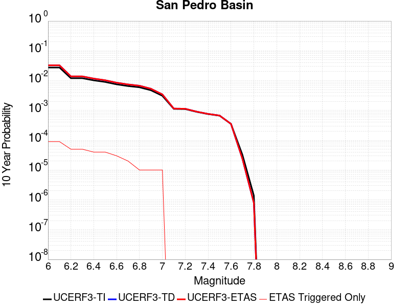 |

| Magnitude | 1 wk TI Prob | 1 wk TD Prob | 1 wk ETAS Prob | 1 wk ETAS/TD Gain | 1 wk ETAS Triggered Only | 1 mo TI Prob | 1 mo TD Prob | 1 mo ETAS Prob | 1 mo ETAS/TD Gain | 1 mo ETAS Triggered Only | 1 yr TI Prob | 1 yr TD Prob | 1 yr ETAS Prob | 1 yr ETAS/TD Gain | 1 yr ETAS Triggered Only | 10 yr TI Prob | 10 yr TD Prob | 10 yr ETAS Prob | 10 yr ETAS/TD Gain | 10 yr ETAS Triggered Only |
|-----|-----|-----|-----|-----|-----|-----|-----|-----|-----|-----|-----|-----|-----|-----|-----|-----|-----|-----|-----|-----|
| 6.0 | 5.3449043E-5 | 6.336954E-5 | 8.808985E-5 | 1.3900977 | 2.472188E-5 | 2.2904722E-4 | 2.715589E-4 | 2.9627408E-4 | 1.0910121 | 2.472188E-5 | 0.0027850836 | 0.0033018254 | 0.0033387856 | 1.0111939 | 3.7082817E-5 | 0.027504366 | 0.03258945 | 0.032673158 | 1.0025685 | 8.6526576E-5 |
| 6.1 | 5.3449043E-5 | 6.336954E-5 | 8.808985E-5 | 1.3900977 | 2.472188E-5 | 2.2904722E-4 | 2.715589E-4 | 2.9627408E-4 | 1.0910121 | 2.472188E-5 | 0.0027850836 | 0.0033018254 | 0.0033387856 | 1.0111939 | 3.7082817E-5 | 0.027504366 | 0.03258945 | 0.032673158 | 1.0025685 | 8.6526576E-5 |
| 6.2 | 2.3189454E-5 | 2.6642796E-5 | 5.1364015E-5 | 1.9278764 | 2.472188E-5 | 9.9379584E-5 | 1.14178685E-4 | 1.3889774E-4 | 1.2164944 | 2.472188E-5 | 0.0012092749 | 0.0013892864 | 0.001413974 | 1.0177699 | 2.472188E-5 | 0.012027155 | 0.013810883 | 0.013871835 | 1.0044132 | 6.18047E-5 |
| 6.3 | 2.3189454E-5 | 2.6642796E-5 | 5.1364015E-5 | 1.9278764 | 2.472188E-5 | 9.9379584E-5 | 1.14178685E-4 | 1.3889774E-4 | 1.2164944 | 2.472188E-5 | 0.0012092749 | 0.0013892864 | 0.001413974 | 1.0177699 | 2.472188E-5 | 0.012027155 | 0.013810883 | 0.013871835 | 1.0044132 | 6.18047E-5 |
| 6.4 | 1.966056E-5 | 2.2463413E-5 | 4.7184738E-5 | 2.1005151 | 2.472188E-5 | 8.425682E-5 | 9.626844E-5 | 1.2098794E-4 | 1.2567768 | 2.472188E-5 | 0.001025344 | 0.0011714783 | 0.0011961713 | 1.0210785 | 2.472188E-5 | 0.010206259 | 0.011657117 | 0.011705983 | 1.0041921 | 4.944376E-5 |
| 6.5 | 1.7342953E-5 | 1.9745148E-5 | 4.446654E-5 | 2.2520235 | 2.472188E-5 | 7.4324824E-5 | 8.4619525E-5 | 1.09339315E-4 | 1.2921287 | 2.472188E-5 | 9.04529E-4 | 0.0010297928 | 0.0010544892 | 1.0239819 | 2.472188E-5 | 0.009008561 | 0.010253931 | 0.010302868 | 1.0047725 | 4.944376E-5 |
| 6.6 | 1.439804E-5 | 1.6322716E-5 | 4.104419E-5 | 2.5145442 | 2.472188E-5 | 6.170443E-5 | 6.99528E-5 | 9.467295E-5 | 1.3533833 | 2.472188E-5 | 7.509924E-4 | 8.513747E-4 | 8.7607553E-4 | 1.0290129 | 2.472188E-5 | 0.0074845953 | 0.008484332 | 0.0085211005 | 1.0043336 | 3.7082817E-5 |
| 6.7 | 1.2634884E-5 | 1.4285297E-5 | 2.664606E-5 | 1.8652787 | 1.236094E-5 | 5.414838E-5 | 6.1221435E-5 | 7.358162E-5 | 1.2018931 | 1.236094E-5 | 6.590571E-4 | 7.4514654E-4 | 7.5749826E-4 | 1.0165763 | 1.236094E-5 | 0.006571059 | 0.007429501 | 0.0074540395 | 1.0033028 | 2.472188E-5 |
| 6.8 | 1.146091E-5 | 1.2933192E-5 | 1.2933192E-5 | 1.0 | 0.0 | 4.911726E-5 | 5.5426954E-5 | 5.5426954E-5 | 1.0 | 0.0 | 5.9783855E-4 | 6.7464396E-4 | 6.7464396E-4 | 1.0 | 0.0 | 0.0059623276 | 0.006728899 | 0.006741177 | 1.0018246 | 1.236094E-5 |
| 6.9 | 9.109035E-6 | 1.0235011E-5 | 1.0235011E-5 | 1.0 | 0.0 | 3.9038136E-5 | 4.3863754E-5 | 4.3863754E-5 | 1.0 | 0.0 | 4.7518566E-4 | 5.3393835E-4 | 5.3393835E-4 | 1.0 | 0.0 | 0.0047417083 | 0.005329309 | 0.005341604 | 1.002307 | 1.236094E-5 |
| 7.0 | 5.9351028E-6 | 6.583964E-6 | 6.583964E-6 | 1.0 | 0.0 | 2.5435906E-5 | 2.8216817E-5 | 2.8216817E-5 | 1.0 | 0.0 | 3.0963816E-4 | 3.435092E-4 | 3.435092E-4 | 1.0 | 0.0 | 0.0030920706 | 0.0034320992 | 0.0034444176 | 1.0035892 | 1.236094E-5 |
| 7.1 | 2.1557585E-6 | 2.209648E-6 | 2.209648E-6 | 1.0 | 0.0 | 9.238933E-6 | 9.469887E-6 | 9.469887E-6 | 1.0 | 0.0 | 1.1247819E-4 | 1.1528993E-4 | 1.1528993E-4 | 1.0 | 0.0 | 0.0011242128 | 0.0011523166 | 0.0011523166 | 1.0 | 0.0 |
| 7.2 | 2.1251979E-6 | 2.1779945E-6 | 2.1779945E-6 | 1.0 | 0.0 | 9.107958E-6 | 9.334229E-6 | 9.334229E-6 | 1.0 | 0.0 | 1.1088375E-4 | 1.1363847E-4 | 1.1363847E-4 | 1.0 | 0.0 | 0.0011082845 | 0.0011358189 | 0.0011358189 | 1.0 | 0.0 |
| 7.3 | 1.7145798E-6 | 1.7442874E-6 | 1.7442874E-6 | 1.0 | 0.0 | 7.3481783E-6 | 7.4754967E-6 | 7.4754967E-6 | 1.0 | 0.0 | 8.94604E-5 | 9.1010465E-5 | 9.1010465E-5 | 1.0 | 0.0 | 8.9424395E-4 | 9.0974104E-4 | 9.0974104E-4 | 1.0 | 0.0 |
| 7.4 | 1.4467993E-6 | 1.4641868E-6 | 1.4641868E-6 | 1.0 | 0.0 | 6.200554E-6 | 6.2750714E-6 | 6.2750714E-6 | 1.0 | 0.0 | 7.548913E-5 | 7.639639E-5 | 7.639639E-5 | 1.0 | 0.0 | 7.546349E-4 | 7.6370855E-4 | 7.6370855E-4 | 1.0 | 0.0 |
| 7.5 | 1.2803735E-6 | 1.2931497E-6 | 1.2931497E-6 | 1.0 | 0.0 | 5.487303E-6 | 5.5420587E-6 | 5.5420587E-6 | 1.0 | 0.0 | 6.680587E-5 | 6.7472545E-5 | 6.7472545E-5 | 1.0 | 0.0 | 6.678579E-4 | 6.7452766E-4 | 6.7452766E-4 | 1.0 | 0.0 |
| 7.6 | 6.755009E-7 | 6.769465E-7 | 6.769465E-7 | 1.0 | 0.0 | 2.8950008E-6 | 2.9011965E-6 | 2.9011965E-6 | 1.0 | 0.0 | 3.5246063E-5 | 3.5321555E-5 | 3.5321555E-5 | 1.0 | 0.0 | 3.5240475E-4 | 3.5316512E-4 | 3.5316512E-4 | 1.0 | 0.0 |
| 7.7 | 6.211885E-8 | 4.569953E-8 | 4.569953E-8 | 1.0 | 0.0 | 2.6622362E-7 | 1.9585512E-7 | 1.9585512E-7 | 1.0 | 0.0 | 3.2412677E-6 | 2.3845337E-6 | 2.3845337E-6 | 1.0 | 0.0 | 3.2412205E-5 | 2.3845101E-5 | 2.3845101E-5 | 1.0 | 0.0 |
| 7.8 | 2.6580573E-9 | 1.5138163E-9 | 1.5138163E-9 | 1.0 | 0.0 | 1.1391674E-8 | 6.487784E-9 | 6.487784E-9 | 1.0 | 0.0 | 1.3869362E-7 | 7.898877E-8 | 7.898877E-8 | 1.0 | 0.0 | 1.3869354E-6 | 7.898877E-7 | 7.898877E-7 | 1.0 | 0.0 |

## San Diego Trough south
*[(top)](#table-of-contents)*

| 1 Week | 1 Month | 1 Year | 10 Year |
|-----|-----|-----|-----|
|  |  |  |  |

| Magnitude | 1 wk TI Prob | 1 wk TD Prob | 1 wk ETAS Prob | 1 wk ETAS/TD Gain | 1 wk ETAS Triggered Only | 1 mo TI Prob | 1 mo TD Prob | 1 mo ETAS Prob | 1 mo ETAS/TD Gain | 1 mo ETAS Triggered Only | 1 yr TI Prob | 1 yr TD Prob | 1 yr ETAS Prob | 1 yr ETAS/TD Gain | 1 yr ETAS Triggered Only | 10 yr TI Prob | 10 yr TD Prob | 10 yr ETAS Prob | 10 yr ETAS/TD Gain | 10 yr ETAS Triggered Only |
|-----|-----|-----|-----|-----|-----|-----|-----|-----|-----|-----|-----|-----|-----|-----|-----|-----|-----|-----|-----|-----|
| 6.0 | 8.279495E-5 | 1.04241306E-4 | 1.1660096E-4 | 1.1185677 | 1.236094E-5 | 3.5478722E-4 | 4.4667677E-4 | 4.8374303E-4 | 1.0829823 | 3.7082817E-5 | 0.004310982 | 0.0054256152 | 0.005474791 | 1.0090636 | 4.944376E-5 | 0.042283054 | 0.05299221 | 0.05307415 | 1.0015463 | 8.6526576E-5 |
| 6.1 | 4.6961468E-5 | 5.772944E-5 | 7.008967E-5 | 1.2141061 | 1.236094E-5 | 2.0124791E-4 | 2.473894E-4 | 2.8446305E-4 | 1.1498594 | 3.7082817E-5 | 0.00244744 | 0.0030079768 | 0.0030572717 | 1.016388 | 4.944376E-5 | 0.024206603 | 0.029679462 | 0.029739432 | 1.0020206 | 6.18047E-5 |
| 6.2 | 3.5079658E-5 | 4.214154E-5 | 5.4501954E-5 | 1.2933073 | 1.236094E-5 | 1.5033272E-4 | 1.8059435E-4 | 2.0531176E-4 | 1.136867 | 2.472188E-5 | 0.0018287642 | 0.0021965632 | 0.0022335644 | 1.0168451 | 3.7082817E-5 | 0.018137876 | 0.021751117 | 0.021799486 | 1.0022237 | 4.944376E-5 |
| 6.3 | 3.5079658E-5 | 4.214154E-5 | 5.4501954E-5 | 1.2933073 | 1.236094E-5 | 1.5033272E-4 | 1.8059435E-4 | 2.0531176E-4 | 1.136867 | 2.472188E-5 | 0.0018287642 | 0.0021965632 | 0.0022335644 | 1.0168451 | 3.7082817E-5 | 0.018137876 | 0.021751117 | 0.021799486 | 1.0022237 | 4.944376E-5 |
| 6.4 | 2.7196904E-5 | 3.2087162E-5 | 4.444771E-5 | 1.3852177 | 1.236094E-5 | 1.16552954E-4 | 1.3750927E-4 | 1.6222775E-4 | 1.1797587 | 2.472188E-5 | 0.0014181085 | 0.0016729041 | 0.0016975846 | 1.0147531 | 2.472188E-5 | 0.014090929 | 0.016604643 | 0.016628955 | 1.0014641 | 2.472188E-5 |
| 6.5 | 2.5584688E-5 | 3.010164E-5 | 4.246221E-5 | 1.4106277 | 1.236094E-5 | 1.0964406E-4 | 1.2900073E-4 | 1.5371943E-4 | 1.1916167 | 2.472188E-5 | 0.0013340989 | 0.0015694655 | 0.0015941486 | 1.015727 | 2.472188E-5 | 0.013261181 | 0.015585314 | 0.015609651 | 1.0015615 | 2.472188E-5 |
| 6.6 | 2.2034688E-5 | 2.5742738E-5 | 3.810336E-5 | 1.4801595 | 1.236094E-5 | 9.443096E-5 | 1.1032141E-4 | 1.3504055E-4 | 1.2240648 | 2.472188E-5 | 0.0011490905 | 0.0013423424 | 0.001367031 | 1.0183922 | 2.472188E-5 | 0.011431668 | 0.013343317 | 0.01336771 | 1.0018281 | 2.472188E-5 |
| 6.7 | 1.9394853E-5 | 2.254176E-5 | 2.254176E-5 | 1.0 | 0.0 | 8.311815E-5 | 9.6603995E-5 | 1.08963744E-4 | 1.1279423 | 1.236094E-5 | 0.0010114936 | 0.0011755243 | 0.0011878707 | 1.0105029 | 1.236094E-5 | 0.01006902 | 0.011693766 | 0.0117059825 | 1.0010448 | 1.236094E-5 |
| 6.8 | 1.7615313E-5 | 2.0403182E-5 | 2.0403182E-5 | 1.0 | 0.0 | 7.549201E-5 | 8.74393E-5 | 9.979917E-5 | 1.1413536 | 1.236094E-5 | 9.1872766E-4 | 0.0010640579 | 0.0010764058 | 1.0116044 | 1.236094E-5 | 0.009149387 | 0.010590198 | 0.010602429 | 1.0011549 | 1.236094E-5 |
| 6.9 | 1.5621423E-5 | 1.8026114E-5 | 1.8026114E-5 | 1.0 | 0.0 | 6.6947236E-5 | 7.725251E-5 | 8.961249E-5 | 1.1599946 | 1.236094E-5 | 8.147778E-4 | 9.40147E-4 | 9.524963E-4 | 1.0131356 | 1.236094E-5 | 0.008117969 | 0.009362142 | 0.009374387 | 1.001308 | 1.236094E-5 |
| 7.0 | 1.3444376E-5 | 1.544809E-5 | 1.544809E-5 | 1.0 | 0.0 | 5.7617483E-5 | 6.620443E-5 | 7.856455E-5 | 1.1866963 | 1.236094E-5 | 7.0126704E-4 | 8.057436E-4 | 8.180946E-4 | 1.0153286 | 1.236094E-5 | 0.006990582 | 0.008028555 | 0.0080408165 | 1.0015273 | 1.236094E-5 |
| 7.1 | 1.2268361E-5 | 1.407303E-5 | 1.407303E-5 | 1.0 | 0.0 | 5.2577634E-5 | 6.0311606E-5 | 7.26718E-5 | 1.2049389 | 1.236094E-5 | 6.399447E-4 | 7.3404907E-4 | 7.464009E-4 | 1.016827 | 1.236094E-5 | 0.0063810493 | 0.0073165493 | 0.0073288195 | 1.001677 | 1.236094E-5 |
| 7.2 | 1.0922655E-5 | 1.2513563E-5 | 1.2513563E-5 | 1.0 | 0.0 | 4.681054E-5 | 5.3628468E-5 | 6.5988745E-5 | 1.2304797 | 1.236094E-5 | 5.697693E-4 | 6.5273355E-4 | 6.650864E-4 | 1.0189248 | 1.236094E-5 | 0.0056831064 | 0.0065084435 | 0.0065207244 | 1.0018868 | 1.236094E-5 |
| 7.3 | 6.1106753E-6 | 6.928925E-6 | 6.928925E-6 | 1.0 | 0.0 | 2.6188345E-5 | 2.9695057E-5 | 2.9695057E-5 | 1.0 | 0.0 | 3.1879646E-4 | 3.6147775E-4 | 3.6147775E-4 | 1.0 | 0.0 | 0.0031833951 | 0.003608943 | 0.003608943 | 1.0 | 0.0 |
| 7.4 | 4.933187E-6 | 5.5895525E-6 | 5.5895525E-6 | 1.0 | 0.0 | 2.114206E-5 | 2.3955008E-5 | 2.3955008E-5 | 1.0 | 0.0 | 2.5737417E-4 | 2.9161357E-4 | 2.9161357E-4 | 1.0 | 0.0 | 0.002570763 | 0.0029123505 | 0.0029123505 | 1.0 | 0.0 |
| 7.5 | 1.7489613E-6 | 1.969678E-6 | 1.969678E-6 | 1.0 | 0.0 | 7.495527E-6 | 8.4414505E-6 | 8.4414505E-6 | 1.0 | 0.0 | 9.125422E-5 | 1.02770035E-4 | 1.02770035E-4 | 1.0 | 0.0 | 9.1216754E-4 | 0.0010272472 | 0.0010272472 | 1.0 | 0.0 |
| 7.6 | 1.6988751E-7 | 1.7533823E-7 | 1.7533823E-7 | 1.0 | 0.0 | 7.2808916E-7 | 7.5144936E-7 | 7.5144936E-7 | 1.0 | 0.0 | 8.864449E-6 | 9.14886E-6 | 9.14886E-6 | 1.0 | 0.0 | 8.8640954E-5 | 9.1485024E-5 | 9.1485024E-5 | 1.0 | 0.0 |

## Chino alt 1
*[(top)](#table-of-contents)*

| 1 Week | 1 Month | 1 Year | 10 Year |
|-----|-----|-----|-----|
|  |  |  |  |

| Magnitude | 1 wk TI Prob | 1 wk TD Prob | 1 wk ETAS Prob | 1 wk ETAS/TD Gain | 1 wk ETAS Triggered Only | 1 mo TI Prob | 1 mo TD Prob | 1 mo ETAS Prob | 1 mo ETAS/TD Gain | 1 mo ETAS Triggered Only | 1 yr TI Prob | 1 yr TD Prob | 1 yr ETAS Prob | 1 yr ETAS/TD Gain | 1 yr ETAS Triggered Only | 10 yr TI Prob | 10 yr TD Prob | 10 yr ETAS Prob | 10 yr ETAS/TD Gain | 10 yr ETAS Triggered Only |
|-----|-----|-----|-----|-----|-----|-----|-----|-----|-----|-----|-----|-----|-----|-----|-----|-----|-----|-----|-----|-----|
| 6.0 | 3.939946E-5 | 4.8948554E-5 | 4.8948554E-5 | 1.0 | 0.0 | 1.6884391E-4 | 2.097656E-4 | 2.097656E-4 | 1.0 | 0.0 | 0.0020537362 | 0.0025513945 | 0.0025760534 | 1.0096648 | 2.472188E-5 | 0.020348595 | 0.025277847 | 0.025350139 | 1.0028598 | 7.416563E-5 |
| 6.1 | 2.1505624E-5 | 2.6879026E-5 | 2.6879026E-5 | 1.0 | 0.0 | 9.2163704E-5 | 1.1519137E-4 | 1.1519137E-4 | 1.0 | 0.0 | 0.0011215154 | 0.001401664 | 0.0014140076 | 1.0088063 | 1.236094E-5 | 0.011158722 | 0.013945141 | 0.013993896 | 1.0034962 | 4.944376E-5 |
| 6.2 | 2.1505624E-5 | 2.6879026E-5 | 2.6879026E-5 | 1.0 | 0.0 | 9.2163704E-5 | 1.1519137E-4 | 1.1519137E-4 | 1.0 | 0.0 | 0.0011215154 | 0.001401664 | 0.0014140076 | 1.0088063 | 1.236094E-5 | 0.011158722 | 0.013945141 | 0.013993896 | 1.0034962 | 4.944376E-5 |
| 6.3 | 1.4290785E-5 | 1.8165128E-5 | 1.8165128E-5 | 1.0 | 0.0 | 6.1244784E-5 | 7.784848E-5 | 7.784848E-5 | 1.0 | 0.0 | 7.454001E-4 | 9.4743853E-4 | 9.5978775E-4 | 1.0130343 | 1.236094E-5 | 0.007429048 | 0.0094444575 | 0.00948119 | 1.0038893 | 3.7082817E-5 |
| 6.4 | 1.4290785E-5 | 1.8165128E-5 | 1.8165128E-5 | 1.0 | 0.0 | 6.1244784E-5 | 7.784848E-5 | 7.784848E-5 | 1.0 | 0.0 | 7.454001E-4 | 9.4743853E-4 | 9.5978775E-4 | 1.0130343 | 1.236094E-5 | 0.007429048 | 0.0094444575 | 0.00948119 | 1.0038893 | 3.7082817E-5 |
| 6.5 | 1.3017944E-5 | 1.6652088E-5 | 1.6652088E-5 | 1.0 | 0.0 | 5.5789995E-5 | 7.136439E-5 | 7.136439E-5 | 1.0 | 0.0 | 6.790315E-4 | 8.685589E-4 | 8.809091E-4 | 1.0142192 | 1.236094E-5 | 0.0067696036 | 0.008661949 | 0.008698711 | 1.0042441 | 3.7082817E-5 |
| 6.6 | 9.470016E-6 | 1.2039424E-5 | 1.2039424E-5 | 1.0 | 0.0 | 4.058515E-5 | 5.1596704E-5 | 5.1596704E-5 | 1.0 | 0.0 | 4.940122E-4 | 6.280428E-4 | 6.403959E-4 | 1.0196693 | 1.236094E-5 | 0.004929154 | 0.0062718987 | 0.0062964656 | 1.003917 | 2.472188E-5 |
| 6.7 | 8.314155E-6 | 1.0407736E-5 | 1.0407736E-5 | 1.0 | 0.0 | 3.5631605E-5 | 4.4604003E-5 | 4.4604003E-5 | 1.0 | 0.0 | 4.3372845E-4 | 5.429507E-4 | 5.553049E-4 | 1.0227538 | 1.236094E-5 | 0.004328829 | 0.005425775 | 0.005450363 | 1.0045316 | 2.472188E-5 |
| 6.8 | 3.4856364E-6 | 3.8133708E-6 | 3.8133708E-6 | 1.0 | 0.0 | 1.4938357E-5 | 1.6342927E-5 | 1.6342927E-5 | 1.0 | 0.0 | 1.8185932E-4 | 1.9895904E-4 | 1.9895904E-4 | 1.0 | 0.0 | 0.0018171056 | 0.0019894864 | 0.002001823 | 1.0062008 | 1.236094E-5 |
| 6.9 | 2.2645952E-6 | 2.1529022E-6 | 2.1529022E-6 | 1.0 | 0.0 | 9.705372E-6 | 9.226692E-6 | 9.226692E-6 | 1.0 | 0.0 | 1.18156495E-4 | 1.123294E-4 | 1.123294E-4 | 1.0 | 0.0 | 0.0011809369 | 0.0011233423 | 0.0011233423 | 1.0 | 0.0 |
| 7.0 | 1.7864003E-6 | 1.5430785E-6 | 1.5430785E-6 | 1.0 | 0.0 | 7.655979E-6 | 6.613177E-6 | 6.613177E-6 | 1.0 | 0.0 | 9.3207556E-5 | 8.051251E-5 | 8.051251E-5 | 1.0 | 0.0 | 9.316847E-4 | 8.0528046E-4 | 8.0528046E-4 | 1.0 | 0.0 |
| 7.1 | 1.7315456E-6 | 1.4733511E-6 | 1.4733511E-6 | 1.0 | 0.0 | 7.420889E-6 | 6.3143466E-6 | 6.3143466E-6 | 1.0 | 0.0 | 9.034557E-5 | 7.6874516E-5 | 7.6874516E-5 | 1.0 | 0.0 | 9.0308854E-4 | 7.6891703E-4 | 7.6891703E-4 | 1.0 | 0.0 |
| 7.2 | 1.6008337E-6 | 1.3574215E-6 | 1.3574215E-6 | 1.0 | 0.0 | 6.860698E-6 | 5.817508E-6 | 5.817508E-6 | 1.0 | 0.0 | 8.352579E-5 | 7.082591E-5 | 7.082591E-5 | 1.0 | 0.0 | 8.34944E-4 | 7.0845755E-4 | 7.0845755E-4 | 1.0 | 0.0 |
| 7.3 | 1.3320939E-6 | 1.121782E-6 | 1.121782E-6 | 1.0 | 0.0 | 5.7089615E-6 | 4.807629E-6 | 4.807629E-6 | 1.0 | 0.0 | 6.9504385E-5 | 5.8531357E-5 | 5.8531357E-5 | 1.0 | 0.0 | 6.9482654E-4 | 5.8530393E-4 | 5.8530393E-4 | 1.0 | 0.0 |
| 7.4 | 1.114294E-6 | 9.237111E-7 | 9.237111E-7 | 1.0 | 0.0 | 4.775537E-6 | 3.958756E-6 | 3.958756E-6 | 1.0 | 0.0 | 5.8140613E-5 | 4.8196827E-5 | 4.8196827E-5 | 1.0 | 0.0 | 5.81254E-4 | 4.8188053E-4 | 4.8188053E-4 | 1.0 | 0.0 |
| 7.5 | 9.354081E-7 | 7.6234323E-7 | 7.6234323E-7 | 1.0 | 0.0 | 4.0088858E-6 | 3.2671815E-6 | 3.2671815E-6 | 1.0 | 0.0 | 4.8807087E-5 | 3.9777242E-5 | 3.9777242E-5 | 1.0 | 0.0 | 4.879637E-4 | 3.977046E-4 | 3.977046E-4 | 1.0 | 0.0 |
| 7.6 | 8.521771E-7 | 6.88071E-7 | 6.88071E-7 | 1.0 | 0.0 | 3.6521824E-6 | 2.9488726E-6 | 2.9488726E-6 | 1.0 | 0.0 | 4.4464414E-5 | 3.5901965E-5 | 3.5901965E-5 | 1.0 | 0.0 | 4.4455516E-4 | 3.589648E-4 | 3.589648E-4 | 1.0 | 0.0 |
| 7.7 | 2.1803626E-7 | 1.418649E-7 | 1.418649E-7 | 1.0 | 0.0 | 9.344408E-7 | 6.079923E-7 | 6.079923E-7 | 1.0 | 0.0 | 1.1376757E-5 | 7.4022914E-6 | 7.4022914E-6 | 1.0 | 0.0 | 1.13761744E-4 | 7.402141E-5 | 7.402141E-5 | 1.0 | 0.0 |

## Pitas Point (Lower West)
*[(top)](#table-of-contents)*

| 1 Week | 1 Month | 1 Year | 10 Year |
|-----|-----|-----|-----|
|  |  |  | 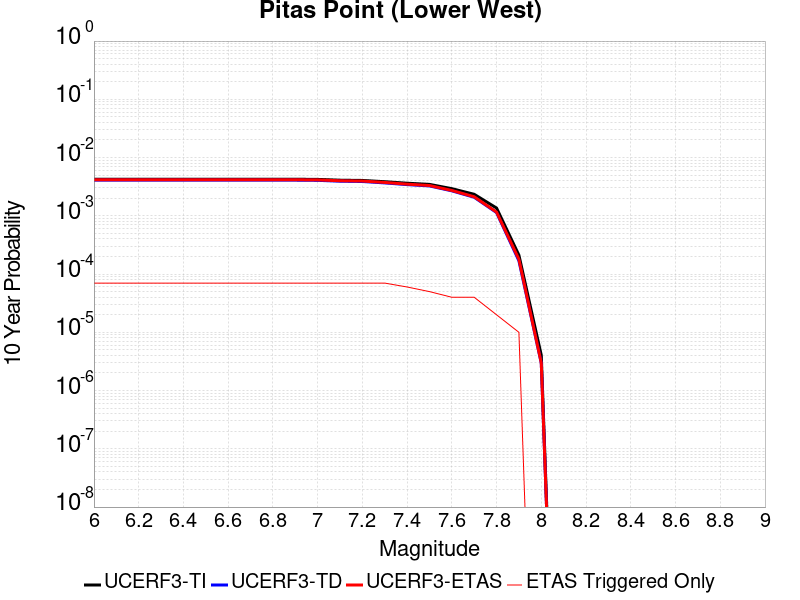 |

| Magnitude | 1 wk TI Prob | 1 wk TD Prob | 1 wk ETAS Prob | 1 wk ETAS/TD Gain | 1 wk ETAS Triggered Only | 1 mo TI Prob | 1 mo TD Prob | 1 mo ETAS Prob | 1 mo ETAS/TD Gain | 1 mo ETAS Triggered Only | 1 yr TI Prob | 1 yr TD Prob | 1 yr ETAS Prob | 1 yr ETAS/TD Gain | 1 yr ETAS Triggered Only | 10 yr TI Prob | 10 yr TD Prob | 10 yr ETAS Prob | 10 yr ETAS/TD Gain | 10 yr ETAS Triggered Only |
|-----|-----|-----|-----|-----|-----|-----|-----|-----|-----|-----|-----|-----|-----|-----|-----|-----|-----|-----|-----|-----|
| 6.0 | 8.151497E-6 | 7.855762E-6 | 3.2577445E-5 | 4.1469493 | 2.472188E-5 | 3.493452E-5 | 3.3667122E-5 | 7.074869E-5 | 2.1014178 | 3.7082817E-5 | 4.252448E-4 | 4.0982084E-4 | 4.7160021E-4 | 1.1507473 | 6.18047E-5 | 0.0042443196 | 0.0040907315 | 0.0041645938 | 1.018056 | 7.416563E-5 |
| 6.1 | 8.151497E-6 | 7.855762E-6 | 3.2577445E-5 | 4.1469493 | 2.472188E-5 | 3.493452E-5 | 3.3667122E-5 | 7.074869E-5 | 2.1014178 | 3.7082817E-5 | 4.252448E-4 | 4.0982084E-4 | 4.7160021E-4 | 1.1507473 | 6.18047E-5 | 0.0042443196 | 0.0040907315 | 0.0041645938 | 1.018056 | 7.416563E-5 |
| 6.2 | 8.151497E-6 | 7.855762E-6 | 3.2577445E-5 | 4.1469493 | 2.472188E-5 | 3.493452E-5 | 3.3667122E-5 | 7.074869E-5 | 2.1014178 | 3.7082817E-5 | 4.252448E-4 | 4.0982084E-4 | 4.7160021E-4 | 1.1507473 | 6.18047E-5 | 0.0042443196 | 0.0040907315 | 0.0041645938 | 1.018056 | 7.416563E-5 |
| 6.3 | 8.151497E-6 | 7.855762E-6 | 3.2577445E-5 | 4.1469493 | 2.472188E-5 | 3.493452E-5 | 3.3667122E-5 | 7.074869E-5 | 2.1014178 | 3.7082817E-5 | 4.252448E-4 | 4.0982084E-4 | 4.7160021E-4 | 1.1507473 | 6.18047E-5 | 0.0042443196 | 0.0040907315 | 0.0041645938 | 1.018056 | 7.416563E-5 |
| 6.4 | 8.151497E-6 | 7.855762E-6 | 3.2577445E-5 | 4.1469493 | 2.472188E-5 | 3.493452E-5 | 3.3667122E-5 | 7.074869E-5 | 2.1014178 | 3.7082817E-5 | 4.252448E-4 | 4.0982084E-4 | 4.7160021E-4 | 1.1507473 | 6.18047E-5 | 0.0042443196 | 0.0040907315 | 0.0041645938 | 1.018056 | 7.416563E-5 |
| 6.5 | 8.151497E-6 | 7.855762E-6 | 3.2577445E-5 | 4.1469493 | 2.472188E-5 | 3.493452E-5 | 3.3667122E-5 | 7.074869E-5 | 2.1014178 | 3.7082817E-5 | 4.252448E-4 | 4.0982084E-4 | 4.7160021E-4 | 1.1507473 | 6.18047E-5 | 0.0042443196 | 0.0040907315 | 0.0041645938 | 1.018056 | 7.416563E-5 |
| 6.6 | 8.151497E-6 | 7.855762E-6 | 3.2577445E-5 | 4.1469493 | 2.472188E-5 | 3.493452E-5 | 3.3667122E-5 | 7.074869E-5 | 2.1014178 | 3.7082817E-5 | 4.252448E-4 | 4.0982084E-4 | 4.7160021E-4 | 1.1507473 | 6.18047E-5 | 0.0042443196 | 0.0040907315 | 0.0041645938 | 1.018056 | 7.416563E-5 |
| 6.7 | 8.151497E-6 | 7.855762E-6 | 3.2577445E-5 | 4.1469493 | 2.472188E-5 | 3.493452E-5 | 3.3667122E-5 | 7.074869E-5 | 2.1014178 | 3.7082817E-5 | 4.252448E-4 | 4.0982084E-4 | 4.7160021E-4 | 1.1507473 | 6.18047E-5 | 0.0042443196 | 0.0040907315 | 0.0041645938 | 1.018056 | 7.416563E-5 |
| 6.8 | 8.151497E-6 | 7.855762E-6 | 3.2577445E-5 | 4.1469493 | 2.472188E-5 | 3.493452E-5 | 3.3667122E-5 | 7.074869E-5 | 2.1014178 | 3.7082817E-5 | 4.252448E-4 | 4.0982084E-4 | 4.7160021E-4 | 1.1507473 | 6.18047E-5 | 0.0042443196 | 0.0040907315 | 0.0041645938 | 1.018056 | 7.416563E-5 |
| 6.9 | 8.151497E-6 | 7.855762E-6 | 3.2577445E-5 | 4.1469493 | 2.472188E-5 | 3.493452E-5 | 3.3667122E-5 | 7.074869E-5 | 2.1014178 | 3.7082817E-5 | 4.252448E-4 | 4.0982084E-4 | 4.7160021E-4 | 1.1507473 | 6.18047E-5 | 0.0042443196 | 0.0040907315 | 0.0041645938 | 1.018056 | 7.416563E-5 |
| 7.0 | 8.103535E-6 | 7.805192E-6 | 3.2526877E-5 | 4.1673384 | 2.472188E-5 | 3.4728975E-5 | 3.3450397E-5 | 7.0531976E-5 | 2.1085541 | 3.7082817E-5 | 4.2274324E-4 | 4.0718322E-4 | 4.6896277E-4 | 1.1517241 | 6.18047E-5 | 0.0042193993 | 0.004064452 | 0.004138316 | 1.0181732 | 7.416563E-5 |
| 7.1 | 7.853298E-6 | 7.540883E-6 | 3.2262575E-5 | 4.278355 | 2.472188E-5 | 3.3656554E-5 | 3.2317676E-5 | 6.939929E-5 | 2.14741 | 3.7082817E-5 | 4.096915E-4 | 3.9339735E-4 | 4.5517774E-4 | 1.1570432 | 6.18047E-5 | 0.00408937 | 0.0039270855 | 0.00400096 | 1.0188115 | 7.416563E-5 |
| 7.2 | 7.771102E-6 | 7.453165E-6 | 3.217486E-5 | 4.3169394 | 2.472188E-5 | 3.33043E-5 | 3.194175E-5 | 6.902338E-5 | 2.1609144 | 3.7082817E-5 | 4.0540437E-4 | 3.8882208E-4 | 4.5060276E-4 | 1.1588919 | 6.18047E-5 | 0.0040466557 | 0.0038814936 | 0.003955371 | 1.0190333 | 7.416563E-5 |
| 7.3 | 7.3945344E-6 | 7.0492697E-6 | 3.1770975E-5 | 4.506988 | 2.472188E-5 | 3.1690477E-5 | 3.021081E-5 | 6.729251E-5 | 2.2274315 | 3.7082817E-5 | 3.8576324E-4 | 3.6775516E-4 | 4.2953712E-4 | 1.1679976 | 6.18047E-5 | 0.0038509427 | 0.0036715334 | 0.0037454267 | 1.020126 | 7.416563E-5 |
| 7.4 | 6.964645E-6 | 6.5901186E-6 | 3.1311836E-5 | 4.751331 | 2.472188E-5 | 2.9848137E-5 | 2.8243063E-5 | 6.5324835E-5 | 2.3129516 | 3.7082817E-5 | 3.6334046E-4 | 3.4380553E-4 | 4.0558897E-4 | 1.1797047 | 6.18047E-5 | 0.0036274698 | 0.0034327896 | 0.0034943821 | 1.0179424 | 6.18047E-5 |
| 7.5 | 6.6525035E-6 | 6.259157E-6 | 3.0980882E-5 | 4.949689 | 2.472188E-5 | 2.851042E-5 | 2.6824686E-5 | 5.1545903E-5 | 1.9215845 | 2.472188E-5 | 3.4705905E-4 | 3.265421E-4 | 3.759697E-4 | 1.1513667 | 4.944376E-5 | 0.0034651754 | 0.0032606742 | 0.0033099568 | 1.0151142 | 4.944376E-5 |
| 7.6 | 5.613338E-6 | 5.151386E-6 | 2.9873137E-5 | 5.7990484 | 2.472188E-5 | 2.405694E-5 | 2.2077185E-5 | 4.679852E-5 | 2.1197684 | 2.472188E-5 | 2.928539E-4 | 2.6875688E-4 | 3.0582972E-4 | 1.137942 | 3.7082817E-5 | 0.0029246826 | 0.0026843501 | 0.0027213334 | 1.0137774 | 3.7082817E-5 |
| 7.7 | 4.494704E-6 | 3.996911E-6 | 2.871869E-5 | 7.1852217 | 2.472188E-5 | 1.9262876E-5 | 1.7129507E-5 | 4.1850963E-5 | 2.4432087 | 2.472188E-5 | 2.3450027E-4 | 2.0853203E-4 | 2.456071E-4 | 1.1777909 | 3.7082817E-5 | 0.0023425296 | 0.0020833875 | 0.002120393 | 1.0177622 | 3.7082817E-5 |
| 7.8 | 2.6075882E-6 | 2.1836374E-6 | 1.454455E-5 | 6.660698 | 1.236094E-5 | 1.117533E-5 | 9.358413E-6 | 2.1719237E-5 | 2.3208246 | 1.236094E-5 | 1.3605114E-4 | 1.1393277E-4 | 1.262923E-4 | 1.1084809 | 1.236094E-5 | 0.0013596788 | 0.0011387484 | 0.0011510951 | 1.0108424 | 1.236094E-5 |
| 7.9 | 4.045984E-7 | 3.242375E-7 | 1.2685173E-5 | 39.123093 | 1.236094E-5 | 1.733992E-6 | 1.3895885E-6 | 1.375051E-5 | 9.895383 | 1.236094E-5 | 2.1111147E-5 | 1.6918111E-5 | 2.9278843E-5 | 1.7306211 | 1.236094E-5 | 2.1109142E-4 | 1.6916855E-4 | 1.815274E-4 | 1.0730565 | 1.236094E-5 |
| 8.0 | 7.791402E-9 | 5.683497E-9 | 5.683497E-9 | 1.0 | 0.0 | 3.3391725E-8 | 2.4357844E-8 | 2.4357844E-8 | 1.0 | 0.0 | 4.0654416E-7 | 2.9655675E-7 | 2.9655675E-7 | 1.0 | 0.0 | 4.065434E-6 | 2.9655655E-6 | 2.9655655E-6 | 1.0 | 0.0 |

## Big Pine (Central)
*[(top)](#table-of-contents)*

| 1 Week | 1 Month | 1 Year | 10 Year |
|-----|-----|-----|-----|
|  |  |  |  |

| Magnitude | 1 wk TI Prob | 1 wk TD Prob | 1 wk ETAS Prob | 1 wk ETAS/TD Gain | 1 wk ETAS Triggered Only | 1 mo TI Prob | 1 mo TD Prob | 1 mo ETAS Prob | 1 mo ETAS/TD Gain | 1 mo ETAS Triggered Only | 1 yr TI Prob | 1 yr TD Prob | 1 yr ETAS Prob | 1 yr ETAS/TD Gain | 1 yr ETAS Triggered Only | 10 yr TI Prob | 10 yr TD Prob | 10 yr ETAS Prob | 10 yr ETAS/TD Gain | 10 yr ETAS Triggered Only |
|-----|-----|-----|-----|-----|-----|-----|-----|-----|-----|-----|-----|-----|-----|-----|-----|-----|-----|-----|-----|-----|
| 6.0 | 1.2706755E-5 | 1.4250529E-5 | 2.6611291E-5 | 1.8673898 | 1.236094E-5 | 5.4456385E-5 | 6.107247E-5 | 8.579284E-5 | 1.4047711 | 2.472188E-5 | 6.628048E-4 | 7.433402E-4 | 7.8039546E-4 | 1.0498496 | 3.7082817E-5 | 0.006608314 | 0.0074135666 | 0.0074749133 | 1.0082749 | 6.18047E-5 |
| 6.1 | 8.342579E-6 | 9.510762E-6 | 2.1871583E-5 | 2.299667 | 1.236094E-5 | 3.5753423E-5 | 4.0759893E-5 | 6.5480766E-5 | 1.6064999 | 2.472188E-5 | 4.3521097E-4 | 4.961604E-4 | 5.3322484E-4 | 1.0747025 | 3.7082817E-5 | 0.0043435963 | 0.0049540824 | 0.0050032814 | 1.009931 | 4.944376E-5 |
| 6.2 | 6.923899E-6 | 7.967147E-6 | 2.0327989E-5 | 2.5514765 | 1.236094E-5 | 2.9673516E-5 | 3.4144578E-5 | 5.8865615E-5 | 1.7240106 | 2.472188E-5 | 3.6121515E-4 | 4.156502E-4 | 4.527176E-4 | 1.0891793 | 3.7082817E-5 | 0.003606286 | 0.0041520367 | 0.0042012753 | 1.0118588 | 4.944376E-5 |
| 6.3 | 2.728396E-6 | 3.4242908E-6 | 3.4242908E-6 | 1.0 | 0.0 | 1.1693074E-5 | 1.4675454E-5 | 2.7036212E-5 | 1.8422743 | 1.236094E-5 | 1.4235388E-4 | 1.7865987E-4 | 2.0337733E-4 | 1.1383493 | 2.472188E-5 | 0.0014226272 | 0.0017866704 | 0.0018113481 | 1.0138121 | 2.472188E-5 |
| 6.4 | 2.7136944E-6 | 3.408584E-6 | 3.408584E-6 | 1.0 | 0.0 | 1.1630066E-5 | 1.4608141E-5 | 2.6968899E-5 | 1.8461555 | 1.236094E-5 | 1.4158686E-4 | 1.7784047E-4 | 2.0255795E-4 | 1.1389868 | 2.472188E-5 | 0.0014149669 | 0.0017784894 | 0.0018031674 | 1.0138757 | 2.472188E-5 |
| 6.5 | 2.6971882E-6 | 3.3909291E-6 | 3.3909291E-6 | 1.0 | 0.0 | 1.1559327E-5 | 1.45324775E-5 | 2.6893238E-5 | 1.850561 | 1.236094E-5 | 1.4072572E-4 | 1.7691942E-4 | 2.0163693E-4 | 1.1397105 | 2.472188E-5 | 0.0014063664 | 0.0017692937 | 0.0017939719 | 1.013948 | 2.472188E-5 |
| 6.6 | 2.669092E-6 | 3.3609497E-6 | 3.3609497E-6 | 1.0 | 0.0 | 1.1438916E-5 | 1.4403995E-5 | 2.6764757E-5 | 1.8581481 | 1.236094E-5 | 1.3925991E-4 | 1.753554E-4 | 2.0007294E-4 | 1.1409569 | 2.472188E-5 | 0.0013917267 | 0.0017536782 | 0.0017783567 | 1.0140724 | 2.472188E-5 |
| 6.7 | 2.6408059E-6 | 3.3309752E-6 | 3.3309752E-6 | 1.0 | 0.0 | 1.1317691E-5 | 1.4275535E-5 | 2.6636299E-5 | 1.8658704 | 1.236094E-5 | 1.3778417E-4 | 1.7379165E-4 | 1.9850922E-4 | 1.1422254 | 2.472188E-5 | 0.0013769877 | 0.0017380653 | 0.0017627442 | 1.014199 | 2.472188E-5 |
| 6.8 | 2.1786943E-6 | 2.8544325E-6 | 2.8544325E-6 | 1.0 | 0.0 | 9.337228E-6 | 1.2233229E-5 | 1.2233229E-5 | 1.0 | 0.0 | 1.1367482E-4 | 1.4893012E-4 | 1.6128922E-4 | 1.0829859 | 1.236094E-5 | 0.0011361669 | 0.0014897975 | 0.0015021401 | 1.0082847 | 1.236094E-5 |
| 6.9 | 1.4411696E-6 | 2.068499E-6 | 2.068499E-6 | 1.0 | 0.0 | 6.1764263E-6 | 8.864968E-6 | 8.864968E-6 | 1.0 | 0.0 | 7.51954E-5 | 1.079259E-4 | 1.20285506E-4 | 1.1145194 | 1.236094E-5 | 7.5169955E-4 | 0.0010801847 | 0.0010925323 | 1.011431 | 1.236094E-5 |
| 7.0 | 1.0073411E-6 | 1.554261E-6 | 1.554261E-6 | 1.0 | 0.0 | 4.317169E-6 | 6.6611024E-6 | 6.6611024E-6 | 1.0 | 0.0 | 5.2560266E-5 | 8.1096056E-5 | 9.3455994E-5 | 1.1524111 | 1.236094E-5 | 5.2547833E-4 | 8.1210316E-4 | 8.2445407E-4 | 1.0152085 | 1.236094E-5 |
| 7.1 | 8.947104E-7 | 1.4302494E-6 | 1.4302494E-6 | 1.0 | 0.0 | 3.834468E-6 | 6.129627E-6 | 6.129627E-6 | 1.0 | 0.0 | 4.6683643E-5 | 7.46258E-5 | 8.698581E-5 | 1.1656266 | 1.236094E-5 | 4.6673836E-4 | 7.474457E-4 | 7.597974E-4 | 1.0165253 | 1.236094E-5 |
| 7.2 | 5.215166E-7 | 1.0111678E-6 | 1.0111678E-6 | 1.0 | 0.0 | 2.2350691E-6 | 4.3335694E-6 | 4.3335694E-6 | 1.0 | 0.0 | 2.7211627E-5 | 5.2759973E-5 | 5.2759973E-5 | 1.0 | 0.0 | 2.7208295E-4 | 5.2890263E-4 | 5.2890263E-4 | 1.0 | 0.0 |
| 7.3 | 4.4024807E-7 | 9.219589E-7 | 9.219589E-7 | 1.0 | 0.0 | 1.8867761E-6 | 3.9512465E-6 | 3.9512465E-6 | 1.0 | 0.0 | 2.2971257E-5 | 4.810541E-5 | 4.810541E-5 | 1.0 | 0.0 | 2.2968883E-4 | 4.8237795E-4 | 4.8237795E-4 | 1.0 | 0.0 |
| 7.4 | 3.6130905E-7 | 8.358523E-7 | 8.358523E-7 | 1.0 | 0.0 | 1.5484665E-6 | 3.5822195E-6 | 3.5822195E-6 | 1.0 | 0.0 | 1.8852415E-5 | 4.3612687E-5 | 4.3612687E-5 | 1.0 | 0.0 | 1.8850817E-4 | 4.374597E-4 | 4.374597E-4 | 1.0 | 0.0 |
| 7.5 | 3.408184E-7 | 8.108147E-7 | 8.108147E-7 | 1.0 | 0.0 | 1.4606494E-6 | 3.4749157E-6 | 3.4749157E-6 | 1.0 | 0.0 | 1.7783263E-5 | 4.2306317E-5 | 4.2306317E-5 | 1.0 | 0.0 | 1.778184E-4 | 4.2437963E-4 | 4.2437963E-4 | 1.0 | 0.0 |
| 7.6 | 3.1428627E-7 | 7.7316E-7 | 7.7316E-7 | 1.0 | 0.0 | 1.3469405E-6 | 3.3135389E-6 | 3.3135389E-6 | 1.0 | 0.0 | 1.6398877E-5 | 4.0341627E-5 | 4.0341627E-5 | 1.0 | 0.0 | 1.6397667E-4 | 4.0471106E-4 | 4.0471106E-4 | 1.0 | 0.0 |
| 7.7 | 1.7972785E-7 | 5.077752E-7 | 5.077752E-7 | 1.0 | 0.0 | 7.70262E-7 | 2.1761778E-6 | 2.1761778E-6 | 1.0 | 0.0 | 9.377899E-6 | 2.6494654E-5 | 2.6494654E-5 | 1.0 | 0.0 | 9.377503E-5 | 2.662899E-4 | 2.662899E-4 | 1.0 | 0.0 |
| 7.8 | 4.9230927E-8 | 1.198079E-7 | 1.198079E-7 | 1.0 | 0.0 | 2.1098968E-7 | 5.134623E-7 | 5.134623E-7 | 1.0 | 0.0 | 2.5687964E-6 | 6.2513873E-6 | 6.2513873E-6 | 1.0 | 0.0 | 2.5687666E-5 | 6.295415E-5 | 6.295415E-5 | 1.0 | 0.0 |
| 7.9 | 3.6805972E-9 | 4.105293E-9 | 4.105293E-9 | 1.0 | 0.0 | 1.5773987E-8 | 1.7594115E-8 | 1.7594115E-8 | 1.0 | 0.0 | 1.9204828E-7 | 2.1420831E-7 | 2.1420831E-7 | 1.0 | 0.0 | 1.920481E-6 | 2.1900614E-6 | 2.1900614E-6 | 1.0 | 0.0 |

## Santa Ynez River
*[(top)](#table-of-contents)*

| 1 Week | 1 Month | 1 Year | 10 Year |
|-----|-----|-----|-----|
|  |  |  |  |

| Magnitude | 1 wk TI Prob | 1 wk TD Prob | 1 wk ETAS Prob | 1 wk ETAS/TD Gain | 1 wk ETAS Triggered Only | 1 mo TI Prob | 1 mo TD Prob | 1 mo ETAS Prob | 1 mo ETAS/TD Gain | 1 mo ETAS Triggered Only | 1 yr TI Prob | 1 yr TD Prob | 1 yr ETAS Prob | 1 yr ETAS/TD Gain | 1 yr ETAS Triggered Only | 10 yr TI Prob | 10 yr TD Prob | 10 yr ETAS Prob | 10 yr ETAS/TD Gain | 10 yr ETAS Triggered Only |
|-----|-----|-----|-----|-----|-----|-----|-----|-----|-----|-----|-----|-----|-----|-----|-----|-----|-----|-----|-----|-----|
| 6.0 | 1.6396456E-5 | 1.7209435E-5 | 4.193089E-5 | 2.4365058 | 2.472188E-5 | 7.026863E-5 | 7.375284E-5 | 9.84729E-5 | 1.3351743 | 2.472188E-5 | 8.551848E-4 | 8.976064E-4 | 9.3465595E-4 | 1.041276 | 3.7082817E-5 | 0.0085190125 | 0.008943358 | 0.00900461 | 1.0068489 | 6.18047E-5 |
| 6.1 | 1.6396456E-5 | 1.7209435E-5 | 4.193089E-5 | 2.4365058 | 2.472188E-5 | 7.026863E-5 | 7.375284E-5 | 9.84729E-5 | 1.3351743 | 2.472188E-5 | 8.551848E-4 | 8.976064E-4 | 9.3465595E-4 | 1.041276 | 3.7082817E-5 | 0.0085190125 | 0.008943358 | 0.00900461 | 1.0068489 | 6.18047E-5 |
| 6.2 | 1.6396456E-5 | 1.7209435E-5 | 4.193089E-5 | 2.4365058 | 2.472188E-5 | 7.026863E-5 | 7.375284E-5 | 9.84729E-5 | 1.3351743 | 2.472188E-5 | 8.551848E-4 | 8.976064E-4 | 9.3465595E-4 | 1.041276 | 3.7082817E-5 | 0.0085190125 | 0.008943358 | 0.00900461 | 1.0068489 | 6.18047E-5 |
| 6.3 | 9.736976E-6 | 1.012233E-5 | 1.012233E-5 | 1.0 | 0.0 | 4.172923E-5 | 4.338072E-5 | 4.338072E-5 | 1.0 | 0.0 | 5.0793495E-4 | 5.280373E-4 | 5.403917E-4 | 1.0233968 | 1.236094E-5 | 0.005067755 | 0.005268332 | 0.0052929237 | 1.0046679 | 2.472188E-5 |
| 6.4 | 9.736976E-6 | 1.012233E-5 | 1.012233E-5 | 1.0 | 0.0 | 4.172923E-5 | 4.338072E-5 | 4.338072E-5 | 1.0 | 0.0 | 5.0793495E-4 | 5.280373E-4 | 5.403917E-4 | 1.0233968 | 1.236094E-5 | 0.005067755 | 0.005268332 | 0.0052929237 | 1.0046679 | 2.472188E-5 |
| 6.5 | 7.081964E-6 | 7.3298966E-6 | 7.3298966E-6 | 1.0 | 0.0 | 3.035092E-5 | 3.1413474E-5 | 3.1413474E-5 | 1.0 | 0.0 | 3.694598E-4 | 3.8239348E-4 | 3.9474972E-4 | 1.0323129 | 1.236094E-5 | 0.0036884616 | 0.0038175168 | 0.0038421443 | 1.0064511 | 2.472188E-5 |
| 6.6 | 5.873247E-6 | 6.059743E-6 | 6.059743E-6 | 1.0 | 0.0 | 2.5170815E-5 | 2.5970074E-5 | 2.5970074E-5 | 1.0 | 0.0 | 3.064116E-4 | 3.1614062E-4 | 3.2849767E-4 | 1.0390872 | 1.236094E-5 | 0.0030598943 | 0.0031569963 | 0.00318164 | 1.0078061 | 2.472188E-5 |
| 6.7 | 4.973277E-6 | 5.115901E-6 | 5.115901E-6 | 1.0 | 0.0 | 2.1313872E-5 | 2.1925109E-5 | 2.1925109E-5 | 1.0 | 0.0 | 2.5946548E-4 | 2.66906E-4 | 2.66906E-4 | 1.0 | 0.0 | 0.0025916274 | 0.0026659032 | 0.002690559 | 1.0092486 | 2.472188E-5 |
| 6.8 | 4.396492E-6 | 4.5109778E-6 | 4.5109778E-6 | 1.0 | 0.0 | 1.884197E-5 | 1.9332621E-5 | 1.9332621E-5 | 1.0 | 0.0 | 2.2937685E-4 | 2.3534958E-4 | 2.3534958E-4 | 1.0 | 0.0 | 0.0022914023 | 0.0023510386 | 0.0023757024 | 1.0104905 | 2.472188E-5 |
| 6.9 | 3.5255632E-6 | 3.6013332E-6 | 3.6013332E-6 | 1.0 | 0.0 | 1.5109469E-5 | 1.5434196E-5 | 1.5434196E-5 | 1.0 | 0.0 | 1.8394225E-4 | 1.8789528E-4 | 1.8789528E-4 | 1.0 | 0.0 | 0.0018379007 | 0.0018773803 | 0.0018897181 | 1.0065718 | 1.236094E-5 |
| 7.0 | 3.211603E-6 | 3.273654E-6 | 3.273654E-6 | 1.0 | 0.0 | 1.376394E-5 | 1.4029872E-5 | 1.4029872E-5 | 1.0 | 0.0 | 1.6756308E-4 | 1.7080043E-4 | 1.7080043E-4 | 1.0 | 0.0 | 0.0016743679 | 0.0017067058 | 0.0017190456 | 1.0072302 | 1.236094E-5 |
| 7.1 | 2.5094619E-6 | 2.5409204E-6 | 2.5409204E-6 | 1.0 | 0.0 | 1.0754793E-5 | 1.0889614E-5 | 1.0889614E-5 | 1.0 | 0.0 | 1.3093173E-4 | 1.3257304E-4 | 1.3257304E-4 | 1.0 | 0.0 | 0.0013085462 | 0.0013249456 | 0.0013249456 | 1.0 | 0.0 |
| 7.2 | 2.0515774E-6 | 2.0619375E-6 | 2.0619375E-6 | 1.0 | 0.0 | 8.792445E-6 | 8.836846E-6 | 8.836846E-6 | 1.0 | 0.0 | 1.0704277E-4 | 1.0758333E-4 | 1.0758333E-4 | 1.0 | 0.0 | 0.0010699122 | 0.0010753168 | 0.0010753168 | 1.0 | 0.0 |
| 7.3 | 1.6845745E-6 | 1.6773907E-6 | 1.6773907E-6 | 1.0 | 0.0 | 7.219585E-6 | 7.1887976E-6 | 7.1887976E-6 | 1.0 | 0.0 | 8.78949E-5 | 8.752012E-5 | 8.752012E-5 | 1.0 | 0.0 | 8.7860145E-4 | 8.7485946E-4 | 8.7485946E-4 | 1.0 | 0.0 |
| 7.4 | 1.3600285E-6 | 1.3333357E-6 | 1.3333357E-6 | 1.0 | 0.0 | 5.82868E-6 | 5.714284E-6 | 5.714284E-6 | 1.0 | 0.0 | 7.096187E-5 | 6.956921E-5 | 6.956921E-5 | 1.0 | 0.0 | 7.0939213E-4 | 6.954765E-4 | 6.954765E-4 | 1.0 | 0.0 |
| 7.5 | 9.735342E-7 | 9.290103E-7 | 9.290103E-7 | 1.0 | 0.0 | 4.172283E-6 | 3.9814668E-6 | 3.9814668E-6 | 1.0 | 0.0 | 5.079636E-5 | 4.8473295E-5 | 4.8473295E-5 | 1.0 | 0.0 | 5.0784746E-4 | 4.8462892E-4 | 4.8462892E-4 | 1.0 | 0.0 |
| 7.6 | 5.067187E-7 | 4.77857E-7 | 4.77857E-7 | 1.0 | 0.0 | 2.1716498E-6 | 2.047957E-6 | 2.047957E-6 | 1.0 | 0.0 | 2.6439517E-5 | 2.4933597E-5 | 2.4933597E-5 | 1.0 | 0.0 | 2.643637E-4 | 2.4930874E-4 | 2.4930874E-4 | 1.0 | 0.0 |
| 7.7 | 2.769089E-7 | 2.5759124E-7 | 2.5759124E-7 | 1.0 | 0.0 | 1.1867519E-6 | 1.1039621E-6 | 1.1039621E-6 | 1.0 | 0.0 | 1.4448608E-5 | 1.34406555E-5 | 1.34406555E-5 | 1.0 | 0.0 | 1.444767E-4 | 1.3439846E-4 | 1.3439846E-4 | 1.0 | 0.0 |
| 7.8 | 1.7044663E-7 | 1.5449015E-7 | 1.5449015E-7 | 1.0 | 0.0 | 7.3048534E-7 | 6.621005E-7 | 6.621005E-7 | 1.0 | 0.0 | 8.893623E-6 | 8.061043E-6 | 8.061043E-6 | 1.0 | 0.0 | 8.893267E-5 | 8.060753E-5 | 8.060753E-5 | 1.0 | 0.0 |
| 7.9 | 4.8344287E-8 | 4.0910923E-8 | 4.0910923E-8 | 1.0 | 0.0 | 2.0718979E-7 | 1.7533252E-7 | 1.7533252E-7 | 1.0 | 0.0 | 2.5225327E-6 | 2.1346711E-6 | 2.1346711E-6 | 1.0 | 0.0 | 2.5225041E-5 | 2.1346512E-5 | 2.1346512E-5 | 1.0 | 0.0 |

## Palos Verdes
*[(top)](#table-of-contents)*

| 1 Week | 1 Month | 1 Year | 10 Year |
|-----|-----|-----|-----|
|  |  |  |  |

| Magnitude | 1 wk TI Prob | 1 wk TD Prob | 1 wk ETAS Prob | 1 wk ETAS/TD Gain | 1 wk ETAS Triggered Only | 1 mo TI Prob | 1 mo TD Prob | 1 mo ETAS Prob | 1 mo ETAS/TD Gain | 1 mo ETAS Triggered Only | 1 yr TI Prob | 1 yr TD Prob | 1 yr ETAS Prob | 1 yr ETAS/TD Gain | 1 yr ETAS Triggered Only | 10 yr TI Prob | 10 yr TD Prob | 10 yr ETAS Prob | 10 yr ETAS/TD Gain | 10 yr ETAS Triggered Only |
|-----|-----|-----|-----|-----|-----|-----|-----|-----|-----|-----|-----|-----|-----|-----|-----|-----|-----|-----|-----|-----|
| 6.0 | 6.126063E-5 | 7.622612E-5 | 1.0094611E-4 | 1.3242983 | 2.472188E-5 | 2.6251914E-4 | 3.2664582E-4 | 3.5135963E-4 | 1.0756593 | 2.472188E-5 | 0.0031914865 | 0.003970174 | 0.00400711 | 1.0093032 | 3.7082817E-5 | 0.031460393 | 0.039048895 | 0.039120167 | 1.0018251 | 7.416563E-5 |
| 6.1 | 6.126063E-5 | 7.622612E-5 | 1.0094611E-4 | 1.3242983 | 2.472188E-5 | 2.6251914E-4 | 3.2664582E-4 | 3.5135963E-4 | 1.0756593 | 2.472188E-5 | 0.0031914865 | 0.003970174 | 0.00400711 | 1.0093032 | 3.7082817E-5 | 0.031460393 | 0.039048895 | 0.039120167 | 1.0018251 | 7.416563E-5 |
| 6.2 | 6.126063E-5 | 7.622612E-5 | 1.0094611E-4 | 1.3242983 | 2.472188E-5 | 2.6251914E-4 | 3.2664582E-4 | 3.5135963E-4 | 1.0756593 | 2.472188E-5 | 0.0031914865 | 0.003970174 | 0.00400711 | 1.0093032 | 3.7082817E-5 | 0.031460393 | 0.039048895 | 0.039120167 | 1.0018251 | 7.416563E-5 |
| 6.3 | 4.0838047E-5 | 4.9749437E-5 | 7.447008E-5 | 1.4969031 | 2.472188E-5 | 1.7500846E-4 | 2.1319572E-4 | 2.3791232E-4 | 1.1159339 | 2.472188E-5 | 0.0021286458 | 0.0025927818 | 0.0026297686 | 1.0142653 | 3.7082817E-5 | 0.021083709 | 0.025646681 | 0.0257069 | 1.0023481 | 6.18047E-5 |
| 6.4 | 4.0838047E-5 | 4.9749437E-5 | 7.447008E-5 | 1.4969031 | 2.472188E-5 | 1.7500846E-4 | 2.1319572E-4 | 2.3791232E-4 | 1.1159339 | 2.472188E-5 | 0.0021286458 | 0.0025927818 | 0.0026297686 | 1.0142653 | 3.7082817E-5 | 0.021083709 | 0.025646681 | 0.0257069 | 1.0023481 | 6.18047E-5 |
| 6.5 | 3.0512005E-5 | 3.656162E-5 | 4.892211E-5 | 1.3380728 | 1.236094E-5 | 1.3075917E-4 | 1.5668393E-4 | 1.6904293E-4 | 1.0788785 | 1.236094E-5 | 0.0015908304 | 0.0019060767 | 0.0019307514 | 1.0129453 | 2.472188E-5 | 0.015794903 | 0.018909154 | 0.018957663 | 1.0025654 | 4.944376E-5 |
| 6.6 | 2.9255087E-5 | 3.515442E-5 | 4.7514925E-5 | 1.351606 | 1.236094E-5 | 1.2537291E-4 | 1.5065377E-4 | 1.6301284E-4 | 1.0820363 | 1.236094E-5 | 0.0015253464 | 0.0018327828 | 0.0018574594 | 1.013464 | 2.472188E-5 | 0.015149189 | 0.018188225 | 0.01823677 | 1.002669 | 4.944376E-5 |
| 6.7 | 2.287198E-5 | 2.7248278E-5 | 3.960888E-5 | 1.4536288 | 1.236094E-5 | 9.801909E-5 | 1.16773626E-4 | 1.2913313E-4 | 1.1058415 | 1.236094E-5 | 0.001192729 | 0.0014208833 | 0.0014455701 | 1.0173743 | 2.472188E-5 | 0.011863477 | 0.014127217 | 0.014175963 | 1.0034504 | 4.944376E-5 |
| 6.8 | 2.1325764E-5 | 2.5431877E-5 | 3.7792503E-5 | 1.4860288 | 1.236094E-5 | 9.139293E-5 | 1.0898971E-4 | 1.2134931E-4 | 1.1134014 | 1.236094E-5 | 0.001112141 | 0.0013262323 | 0.0013509213 | 1.018616 | 2.472188E-5 | 0.011065915 | 0.013192211 | 0.013241002 | 1.0036985 | 4.944376E-5 |
| 6.9 | 1.9009392E-5 | 2.2613547E-5 | 3.4974208E-5 | 1.5466042 | 1.236094E-5 | 8.1466285E-5 | 9.6912096E-5 | 1.0927184E-4 | 1.1275356 | 1.236094E-5 | 9.914007E-4 | 0.0011793535 | 0.0012040462 | 1.0209376 | 2.472188E-5 | 0.009869894 | 0.011739632 | 0.01177628 | 1.0031217 | 3.7082817E-5 |
| 7.0 | 1.7098473E-5 | 2.0319356E-5 | 3.2680044E-5 | 1.6083208 | 1.236094E-5 | 7.3277115E-5 | 8.708052E-5 | 9.944039E-5 | 1.1419361 | 1.236094E-5 | 8.917837E-4 | 0.001059775 | 0.0010844707 | 1.0233028 | 2.472188E-5 | 0.008882134 | 0.010555646 | 0.010592338 | 1.003476 | 3.7082817E-5 |
| 7.1 | 1.5982785E-5 | 1.899476E-5 | 3.1355466E-5 | 1.6507429 | 1.236094E-5 | 6.849585E-5 | 8.1404054E-5 | 9.3763985E-5 | 1.1518344 | 1.236094E-5 | 8.336179E-4 | 9.907284E-4 | 0.0010154258 | 1.0249286 | 2.472188E-5 | 0.008304977 | 0.009871479 | 0.0099081965 | 1.0037194 | 3.7082817E-5 |
| 7.2 | 1.4468002E-5 | 1.7197237E-5 | 2.9557963E-5 | 1.7187624 | 1.236094E-5 | 6.200425E-5 | 7.370083E-5 | 8.606086E-5 | 1.1677054 | 1.236094E-5 | 7.546402E-4 | 8.970222E-4 | 9.217219E-4 | 1.0275352 | 2.472188E-5 | 0.007520827 | 0.008942284 | 0.008979035 | 1.0041099 | 3.7082817E-5 |
| 7.3 | 5.288233E-6 | 6.2036747E-6 | 6.2036747E-6 | 1.0 | 0.0 | 2.2663658E-5 | 2.6587102E-5 | 2.6587102E-5 | 1.0 | 0.0 | 2.7589512E-4 | 3.236848E-4 | 3.236848E-4 | 1.0 | 0.0 | 0.0027555283 | 0.0032355562 | 0.0032355562 | 1.0 | 0.0 |
| 7.4 | 8.279556E-7 | 8.408347E-7 | 8.408347E-7 | 1.0 | 0.0 | 3.5483763E-6 | 3.6035726E-6 | 3.6035726E-6 | 1.0 | 0.0 | 4.3200624E-5 | 4.3872686E-5 | 4.3872686E-5 | 1.0 | 0.0 | 4.3192226E-4 | 4.3864746E-4 | 4.3864746E-4 | 1.0 | 0.0 |
| 7.5 | 6.559831E-7 | 6.667229E-7 | 6.667229E-7 | 1.0 | 0.0 | 2.8113532E-6 | 2.857381E-6 | 2.857381E-6 | 1.0 | 0.0 | 3.4227687E-5 | 3.4788125E-5 | 3.4788125E-5 | 1.0 | 0.0 | 3.4222414E-4 | 3.4783344E-4 | 3.4783344E-4 | 1.0 | 0.0 |
| 7.6 | 3.5018968E-7 | 3.5620027E-7 | 3.5620027E-7 | 1.0 | 0.0 | 1.500812E-6 | 1.526572E-6 | 1.526572E-6 | 1.0 | 0.0 | 1.8272232E-5 | 1.8585903E-5 | 1.8585903E-5 | 1.0 | 0.0 | 1.8270731E-4 | 1.8584808E-4 | 1.8584808E-4 | 1.0 | 0.0 |
| 7.7 | 1.1986104E-7 | 1.2198376E-7 | 1.2198376E-7 | 1.0 | 0.0 | 5.1369005E-7 | 5.2278745E-7 | 5.2278745E-7 | 1.0 | 0.0 | 6.2541585E-6 | 6.364919E-6 | 6.364919E-6 | 1.0 | 0.0 | 6.2539824E-5 | 6.364741E-5 | 6.364741E-5 | 1.0 | 0.0 |
| 7.8 | 3.0445005E-8 | 3.1027582E-8 | 3.1027582E-8 | 1.0 | 0.0 | 1.3047858E-7 | 1.3297536E-7 | 1.3297536E-7 | 1.0 | 0.0 | 1.5885756E-6 | 1.6189739E-6 | 1.6189739E-6 | 1.0 | 0.0 | 1.5885644E-5 | 1.6189642E-5 | 1.6189642E-5 | 1.0 | 0.0 |

## Great Valley 09 (Laguna Seca)
*[(top)](#table-of-contents)*

| 1 Week | 1 Month | 1 Year | 10 Year |
|-----|-----|-----|-----|
|  |  | 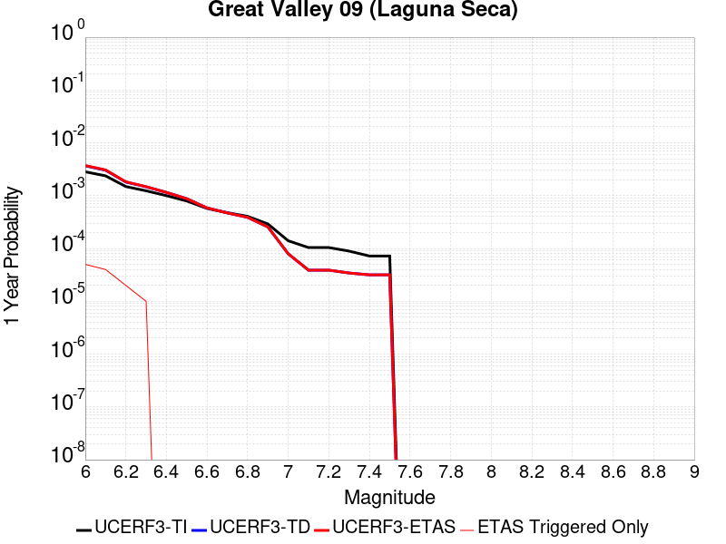 |  |

| Magnitude | 1 wk TI Prob | 1 wk TD Prob | 1 wk ETAS Prob | 1 wk ETAS/TD Gain | 1 wk ETAS Triggered Only | 1 mo TI Prob | 1 mo TD Prob | 1 mo ETAS Prob | 1 mo ETAS/TD Gain | 1 mo ETAS Triggered Only | 1 yr TI Prob | 1 yr TD Prob | 1 yr ETAS Prob | 1 yr ETAS/TD Gain | 1 yr ETAS Triggered Only | 10 yr TI Prob | 10 yr TD Prob | 10 yr ETAS Prob | 10 yr ETAS/TD Gain | 10 yr ETAS Triggered Only |
|-----|-----|-----|-----|-----|-----|-----|-----|-----|-----|-----|-----|-----|-----|-----|-----|-----|-----|-----|-----|-----|
| 6.0 | 5.4353277E-5 | 7.05022E-5 | 1.07582404E-4 | 1.5259439 | 3.7082817E-5 | 2.3292181E-4 | 3.0211566E-4 | 3.3918727E-4 | 1.1227067 | 3.7082817E-5 | 0.0028321352 | 0.0036721937 | 0.0037091405 | 1.0100611 | 3.7082817E-5 | 0.02796312 | 0.03611547 | 0.03618696 | 1.0019794 | 7.416563E-5 |
| 6.1 | 4.5578287E-5 | 5.822118E-5 | 9.530184E-5 | 1.6368929 | 3.7082817E-5 | 1.953209E-4 | 2.4949326E-4 | 2.8656682E-4 | 1.1485955 | 3.7082817E-5 | 0.0023754383 | 0.003033432 | 0.0030704024 | 1.0121876 | 3.7082817E-5 | 0.023502063 | 0.029919548 | 0.029967511 | 1.0016031 | 4.944376E-5 |
| 6.2 | 2.8536782E-5 | 3.4737273E-5 | 5.9458296E-5 | 1.7116569 | 2.472188E-5 | 1.2229476E-4 | 1.4886224E-4 | 1.7358043E-4 | 1.1660475 | 2.472188E-5 | 0.0014879217 | 0.001810813 | 0.0018354901 | 1.0136276 | 2.472188E-5 | 0.014779986 | 0.017958116 | 0.017994534 | 1.0020279 | 3.7082817E-5 |
| 6.3 | 2.3698774E-5 | 2.8213295E-5 | 4.0573887E-5 | 1.4381123 | 1.236094E-5 | 1.01562226E-4 | 1.20905075E-4 | 1.3326452E-4 | 1.1022243 | 1.236094E-5 | 0.0012358186 | 0.0014710218 | 0.0014833645 | 1.0083905 | 1.236094E-5 | 0.012289686 | 0.014611342 | 0.014635703 | 1.0016673 | 2.472188E-5 |
| 6.4 | 1.9191197E-5 | 2.2123184E-5 | 2.2123184E-5 | 1.0 | 0.0 | 8.2245395E-5 | 9.4806666E-5 | 9.4806666E-5 | 1.0 | 0.0 | 0.0010008777 | 0.0011536429 | 0.0011536429 | 1.0 | 0.0 | 0.009963818 | 0.011476948 | 0.011489167 | 1.0010647 | 1.236094E-5 |
| 6.5 | 1.5203241E-5 | 1.6802203E-5 | 1.6802203E-5 | 1.0 | 0.0 | 6.5155116E-5 | 7.200386E-5 | 7.200386E-5 | 1.0 | 0.0 | 7.9297484E-4 | 8.7626575E-4 | 8.7626575E-4 | 1.0 | 0.0 | 0.007901512 | 0.0087295165 | 0.00874177 | 1.0014037 | 1.236094E-5 |
| 6.6 | 1.0984925E-5 | 1.1242595E-5 | 1.1242595E-5 | 1.0 | 0.0 | 4.70774E-5 | 4.8181686E-5 | 4.8181686E-5 | 1.0 | 0.0 | 5.730166E-4 | 5.8645656E-4 | 5.8645656E-4 | 1.0 | 0.0 | 0.005715413 | 0.0058494853 | 0.005861774 | 1.0021008 | 1.236094E-5 |
| 6.7 | 9.134616E-6 | 9.019894E-6 | 9.019894E-6 | 1.0 | 0.0 | 3.9147766E-5 | 3.865613E-5 | 3.865613E-5 | 1.0 | 0.0 | 4.7651984E-4 | 4.7053912E-4 | 4.7053912E-4 | 1.0 | 0.0 | 0.004754993 | 0.0046956735 | 0.0046956735 | 1.0 | 0.0 |
| 6.8 | 7.785589E-6 | 7.4519444E-6 | 7.4519444E-6 | 1.0 | 0.0 | 3.3366385E-5 | 3.1936524E-5 | 3.1936524E-5 | 1.0 | 0.0 | 4.0616E-4 | 3.8875983E-4 | 3.8875983E-4 | 1.0 | 0.0 | 0.0040541845 | 0.0038810016 | 0.0038810016 | 1.0 | 0.0 |
| 6.9 | 5.579095E-6 | 4.898492E-6 | 4.898492E-6 | 1.0 | 0.0 | 2.3910188E-5 | 2.0993377E-5 | 2.0993377E-5 | 1.0 | 0.0 | 2.9106764E-4 | 2.5556577E-4 | 2.5556577E-4 | 1.0 | 0.0 | 0.002906867 | 0.002552856 | 0.002552856 | 1.0 | 0.0 |
| 7.0 | 2.6816688E-6 | 1.5216126E-6 | 1.5216126E-6 | 1.0 | 0.0 | 1.1492816E-5 | 6.521181E-6 | 6.521181E-6 | 1.0 | 0.0 | 1.3991605E-4 | 7.939258E-5 | 7.939258E-5 | 1.0 | 0.0 | 0.0013982799 | 7.9365086E-4 | 7.9365086E-4 | 1.0 | 0.0 |
| 7.1 | 1.9951021E-6 | 7.453827E-7 | 7.453827E-7 | 1.0 | 0.0 | 8.55041E-6 | 3.1944935E-6 | 3.1944935E-6 | 1.0 | 0.0 | 1.0409627E-4 | 3.8892307E-5 | 3.8892307E-5 | 1.0 | 0.0 | 0.0010404752 | 3.8885913E-4 | 3.8885913E-4 | 1.0 | 0.0 |
| 7.2 | 1.9951021E-6 | 7.453827E-7 | 7.453827E-7 | 1.0 | 0.0 | 8.55041E-6 | 3.1944935E-6 | 3.1944935E-6 | 1.0 | 0.0 | 1.0409627E-4 | 3.8892307E-5 | 3.8892307E-5 | 1.0 | 0.0 | 0.0010404752 | 3.8885913E-4 | 3.8885913E-4 | 1.0 | 0.0 |
| 7.3 | 1.7087556E-6 | 6.578881E-7 | 6.578881E-7 | 1.0 | 0.0 | 7.3232177E-6 | 2.8195177E-6 | 2.8195177E-6 | 1.0 | 0.0 | 8.915652E-5 | 3.4327128E-5 | 3.4327128E-5 | 1.0 | 0.0 | 8.9120766E-4 | 3.432223E-4 | 3.432223E-4 | 1.0 | 0.0 |
| 7.4 | 1.3804846E-6 | 6.073852E-7 | 6.073852E-7 | 1.0 | 0.0 | 5.916349E-6 | 2.6030768E-6 | 2.6030768E-6 | 1.0 | 0.0 | 7.2029165E-5 | 3.169204E-5 | 3.169204E-5 | 1.0 | 0.0 | 7.200583E-4 | 3.1687922E-4 | 3.1687922E-4 | 1.0 | 0.0 |
| 7.5 | 1.3804846E-6 | 6.073852E-7 | 6.073852E-7 | 1.0 | 0.0 | 5.916349E-6 | 2.6030768E-6 | 2.6030768E-6 | 1.0 | 0.0 | 7.2029165E-5 | 3.169204E-5 | 3.169204E-5 | 1.0 | 0.0 | 7.200583E-4 | 3.1687922E-4 | 3.1687922E-4 | 1.0 | 0.0 |

## San Jacinto (Borrego)
*[(top)](#table-of-contents)*

| 1 Week | 1 Month | 1 Year | 10 Year |
|-----|-----|-----|-----|
|  |  | 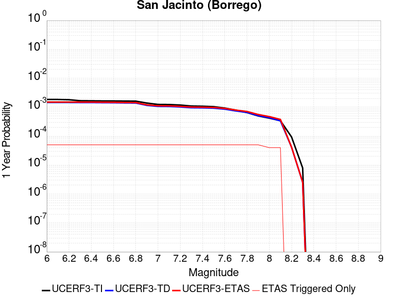 |  |

| Magnitude | 1 wk TI Prob | 1 wk TD Prob | 1 wk ETAS Prob | 1 wk ETAS/TD Gain | 1 wk ETAS Triggered Only | 1 mo TI Prob | 1 mo TD Prob | 1 mo ETAS Prob | 1 mo ETAS/TD Gain | 1 mo ETAS Triggered Only | 1 yr TI Prob | 1 yr TD Prob | 1 yr ETAS Prob | 1 yr ETAS/TD Gain | 1 yr ETAS Triggered Only | 10 yr TI Prob | 10 yr TD Prob | 10 yr ETAS Prob | 10 yr ETAS/TD Gain | 10 yr ETAS Triggered Only |
|-----|-----|-----|-----|-----|-----|-----|-----|-----|-----|-----|-----|-----|-----|-----|-----|-----|-----|-----|-----|-----|
| 6.0 | 3.543992E-5 | 2.7926513E-5 | 6.5008295E-5 | 2.3278344 | 3.7082817E-5 | 1.5187653E-4 | 1.1967963E-4 | 1.5675802E-4 | 1.3098136 | 3.7082817E-5 | 0.0018475284 | 0.0014561379 | 0.0015178525 | 1.0423825 | 6.18047E-5 | 0.018322436 | 0.014869647 | 0.01494271 | 1.0049136 | 7.416563E-5 |
| 6.1 | 3.542281E-5 | 2.7926513E-5 | 6.5008295E-5 | 2.3278344 | 3.7082817E-5 | 1.5180321E-4 | 1.1967963E-4 | 1.5675802E-4 | 1.3098136 | 3.7082817E-5 | 0.0018466372 | 0.0014561379 | 0.0015178525 | 1.0423825 | 6.18047E-5 | 0.018313672 | 0.014869647 | 0.01494271 | 1.0049136 | 7.416563E-5 |
| 6.2 | 3.4688688E-5 | 2.7926511E-5 | 6.5008295E-5 | 2.3278344 | 3.7082817E-5 | 1.4865733E-4 | 1.1967963E-4 | 1.56758E-4 | 1.3098136 | 3.7082817E-5 | 0.0018084005 | 0.0014561379 | 0.0015178525 | 1.0423825 | 6.18047E-5 | 0.017937548 | 0.014869647 | 0.014942709 | 1.0049136 | 7.416563E-5 |
| 6.3 | 3.2087122E-5 | 2.7771865E-5 | 6.485365E-5 | 2.3352287 | 3.7082817E-5 | 1.3750899E-4 | 1.1901691E-4 | 1.5609532E-4 | 1.3115389 | 3.7082817E-5 | 0.0016728862 | 0.00144808 | 0.0015097952 | 1.0426186 | 6.18047E-5 | 0.016603488 | 0.014790683 | 0.014863752 | 1.0049402 | 7.416563E-5 |
| 6.4 | 3.1828724E-5 | 2.7738852E-5 | 6.482064E-5 | 2.3368177 | 3.7082817E-5 | 1.364017E-4 | 1.1887544E-4 | 1.5595385E-4 | 1.3119098 | 3.7082817E-5 | 0.0016594254 | 0.0014463598 | 0.0015080752 | 1.0426694 | 6.18047E-5 | 0.016470885 | 0.014773762 | 0.014846832 | 1.0049459 | 7.416563E-5 |
| 6.5 | 3.1563577E-5 | 2.747857E-5 | 6.456037E-5 | 2.3494806 | 3.7082817E-5 | 1.3526545E-4 | 1.1776006E-4 | 1.548385E-4 | 1.3148644 | 3.7082817E-5 | 0.0016456128 | 0.0014327979 | 0.001494514 | 1.0430739 | 6.18047E-5 | 0.0163348 | 0.014640348 | 0.014713428 | 1.0049917 | 7.416563E-5 |
| 6.6 | 3.1467625E-5 | 2.7322796E-5 | 6.44046E-5 | 2.3571746 | 3.7082817E-5 | 1.3485427E-4 | 1.1709251E-4 | 1.5417098E-4 | 1.3166597 | 3.7082817E-5 | 0.0016406142 | 0.0014246812 | 0.0014863978 | 1.0433196 | 6.18047E-5 | 0.016285548 | 0.014560594 | 0.01463368 | 1.0050194 | 7.416563E-5 |
| 6.7 | 3.1223695E-5 | 2.6940816E-5 | 6.4022635E-5 | 2.3764179 | 3.7082817E-5 | 1.3380898E-4 | 1.15455594E-4 | 1.5253414E-4 | 1.3211497 | 3.7082817E-5 | 0.0016279068 | 0.0014047775 | 0.0014664955 | 1.0439342 | 6.18047E-5 | 0.01616033 | 0.014364966 | 0.014438067 | 1.0050888 | 7.416563E-5 |
| 6.8 | 3.1015585E-5 | 2.6761822E-5 | 6.384365E-5 | 2.3856242 | 3.7082817E-5 | 1.3291716E-4 | 1.1468855E-4 | 1.5176712E-4 | 1.3232979 | 3.7082817E-5 | 0.001617065 | 0.0013954508 | 0.0014571693 | 1.0442283 | 6.18047E-5 | 0.016053487 | 0.014272246 | 0.014345353 | 1.0051223 | 7.416563E-5 |
| 6.9 | 2.6641965E-5 | 2.2184247E-5 | 5.9266244E-5 | 2.6715462 | 3.7082817E-5 | 1.1417485E-4 | 9.50719E-5 | 1.321512E-4 | 1.3900132 | 3.7082817E-5 | 0.0013891924 | 0.0011568897 | 0.0012186229 | 1.0533613 | 6.18047E-5 | 0.0138054015 | 0.011882438 | 0.011955723 | 1.0061674 | 7.416563E-5 |
| 7.0 | 2.3854353E-5 | 2.0479023E-5 | 5.7561083E-5 | 2.8107338 | 3.7082817E-5 | 1.02228936E-4 | 8.77643E-5 | 1.2484386E-4 | 1.4224902 | 3.7082817E-5 | 0.0012439266 | 0.0010680092 | 0.0011297478 | 1.0578072 | 6.18047E-5 | 0.012369866 | 0.0109828 | 0.011056152 | 1.0066787 | 7.416563E-5 |
| 7.1 | 2.3672901E-5 | 2.031551E-5 | 5.7397578E-5 | 2.825308 | 3.7082817E-5 | 1.0145135E-4 | 8.7063585E-5 | 1.2414317E-4 | 1.4258909 | 3.7082817E-5 | 0.0012344702 | 0.0010594862 | 0.0011212254 | 1.0582728 | 6.18047E-5 | 0.0122763505 | 0.010897976 | 0.010971334 | 1.0067313 | 7.416563E-5 |
| 7.2 | 2.2717244E-5 | 1.9542893E-5 | 5.6624987E-5 | 2.8974721 | 3.7082817E-5 | 9.735599E-5 | 8.375258E-5 | 1.2083229E-4 | 1.4427292 | 3.7082817E-5 | 0.0011846646 | 0.001019213 | 0.0010809547 | 1.0605779 | 6.18047E-5 | 0.01178369 | 0.010495341 | 0.010568729 | 1.0069923 | 7.416563E-5 |
| 7.3 | 2.1016205E-5 | 1.8384526E-5 | 5.5466662E-5 | 3.0170298 | 3.7082817E-5 | 9.006634E-5 | 7.878846E-5 | 1.1586835E-4 | 1.470626 | 3.7082817E-5 | 0.001096006 | 9.5882936E-4 | 0.0010205748 | 1.0643967 | 6.18047E-5 | 0.010906163 | 0.009890967 | 0.009964399 | 1.0074241 | 7.416563E-5 |
| 7.4 | 2.0683625E-5 | 1.8187047E-5 | 5.526919E-5 | 3.0389316 | 3.7082817E-5 | 8.86411E-5 | 7.794217E-5 | 1.150221E-4 | 1.4757364 | 3.7082817E-5 | 0.001078671 | 9.485349E-4 | 0.0010102809 | 1.0650963 | 6.18047E-5 | 0.010734501 | 0.009787692 | 0.009861132 | 1.0075033 | 7.416563E-5 |
| 7.5 | 1.9993966E-5 | 1.7782075E-5 | 5.486423E-5 | 3.0853674 | 3.7082817E-5 | 8.568561E-5 | 7.620667E-5 | 1.1328667E-4 | 1.4865714 | 3.7082817E-5 | 0.001042723 | 9.2742336E-4 | 9.891707E-4 | 1.0665795 | 6.18047E-5 | 0.010378438 | 0.009574614 | 0.00964807 | 1.007672 | 7.416563E-5 |
| 7.6 | 1.788966E-5 | 1.6435291E-5 | 5.35175E-5 | 3.2562551 | 3.7082817E-5 | 7.666772E-5 | 7.043507E-5 | 1.07515276E-4 | 1.5264453 | 3.7082817E-5 | 9.3302975E-4 | 8.572113E-4 | 9.1896305E-4 | 1.0720379 | 6.18047E-5 | 0.00929122 | 0.008866487 | 0.0089399945 | 1.0082905 | 7.416563E-5 |
| 7.7 | 1.5125781E-5 | 1.4237377E-5 | 5.131967E-5 | 3.604573 | 3.7082817E-5 | 6.4823165E-5 | 6.1015908E-5 | 9.809647E-5 | 1.6077194 | 3.7082817E-5 | 7.889362E-4 | 7.426163E-4 | 8.043751E-4 | 1.0831639 | 6.18047E-5 | 0.007861412 | 0.0077142045 | 0.0077877976 | 1.00954 | 7.416563E-5 |
| 7.8 | 1.250089E-5 | 1.26304985E-5 | 4.971285E-5 | 3.9359372 | 3.7082817E-5 | 5.3574146E-5 | 5.412959E-5 | 9.12104E-5 | 1.6850377 | 3.7082817E-5 | 6.5207E-4 | 6.588291E-4 | 7.205931E-4 | 1.0937481 | 6.18047E-5 | 0.006501599 | 0.0068677636 | 0.00694142 | 1.0107249 | 7.416563E-5 |
| 7.9 | 9.561E-6 | 9.754616E-6 | 4.6837074E-5 | 4.801529 | 3.7082817E-5 | 4.0975072E-5 | 4.1804833E-5 | 7.88861E-5 | 1.8870091 | 3.7082817E-5 | 4.987573E-4 | 5.088555E-4 | 5.706288E-4 | 1.1213964 | 6.18047E-5 | 0.0049763937 | 0.0053523467 | 0.0054261154 | 1.0137825 | 7.416563E-5 |
| 8.0 | 8.01699E-6 | 8.293488E-6 | 4.5375997E-5 | 5.4712806 | 3.7082817E-5 | 3.4358076E-5 | 3.554304E-5 | 7.2624534E-5 | 2.0432844 | 3.7082817E-5 | 4.1822926E-4 | 4.3265108E-4 | 4.8207343E-4 | 1.1142315 | 4.944376E-5 | 0.0041744304 | 0.004573375 | 0.004634897 | 1.0134522 | 6.18047E-5 |
| 8.1 | 6.541947E-6 | 6.4622354E-6 | 4.3544813E-5 | 6.738352 | 3.7082817E-5 | 2.8036617E-5 | 2.7695003E-5 | 6.4776796E-5 | 2.3389344 | 3.7082817E-5 | 3.4129233E-4 | 3.37135E-4 | 3.8656208E-4 | 1.1466092 | 4.944376E-5 | 0.0034076865 | 0.0035806994 | 0.003642283 | 1.0171987 | 6.18047E-5 |
| 8.2 | 1.7968189E-6 | 7.9713476E-7 | 7.9713476E-7 | 1.0 | 0.0 | 7.70063E-6 | 3.4162877E-6 | 3.4162877E-6 | 1.0 | 0.0 | 9.3751136E-5 | 4.159253E-5 | 4.159253E-5 | 1.0 | 0.0 | 9.371159E-4 | 4.712058E-4 | 4.712058E-4 | 1.0 | 0.0 |
| 8.3 | 1.5167889E-7 | 4.897714E-8 | 4.897714E-8 | 1.0 | 0.0 | 6.500522E-7 | 2.09902E-7 | 2.09902E-7 | 1.0 | 0.0 | 7.9143565E-6 | 2.5555544E-6 | 2.5555544E-6 | 1.0 | 0.0 | 7.914075E-5 | 2.969505E-5 | 2.969505E-5 | 1.0 | 0.0 |

## Pitas Point (Lower)-Montalvo
*[(top)](#table-of-contents)*

| 1 Week | 1 Month | 1 Year | 10 Year |
|-----|-----|-----|-----|
|  |  |  |  |

| Magnitude | 1 wk TI Prob | 1 wk TD Prob | 1 wk ETAS Prob | 1 wk ETAS/TD Gain | 1 wk ETAS Triggered Only | 1 mo TI Prob | 1 mo TD Prob | 1 mo ETAS Prob | 1 mo ETAS/TD Gain | 1 mo ETAS Triggered Only | 1 yr TI Prob | 1 yr TD Prob | 1 yr ETAS Prob | 1 yr ETAS/TD Gain | 1 yr ETAS Triggered Only | 10 yr TI Prob | 10 yr TD Prob | 10 yr ETAS Prob | 10 yr ETAS/TD Gain | 10 yr ETAS Triggered Only |
|-----|-----|-----|-----|-----|-----|-----|-----|-----|-----|-----|-----|-----|-----|-----|-----|-----|-----|-----|-----|-----|
| 6.0 | 5.2543637E-6 | 4.8378706E-6 | 2.955963E-5 | 6.1100497 | 2.472188E-5 | 2.2518509E-5 | 2.0733567E-5 | 4.5454934E-5 | 2.1923354 | 2.472188E-5 | 2.7412834E-4 | 2.5240227E-4 | 3.0183353E-4 | 1.1958432 | 4.944376E-5 | 0.0027379042 | 0.0025211885 | 0.0025828374 | 1.0244523 | 6.18047E-5 |
| 6.1 | 5.2543637E-6 | 4.8378706E-6 | 2.955963E-5 | 6.1100497 | 2.472188E-5 | 2.2518509E-5 | 2.0733567E-5 | 4.5454934E-5 | 2.1923354 | 2.472188E-5 | 2.7412834E-4 | 2.5240227E-4 | 3.0183353E-4 | 1.1958432 | 4.944376E-5 | 0.0027379042 | 0.0025211885 | 0.0025828374 | 1.0244523 | 6.18047E-5 |
| 6.2 | 5.2543637E-6 | 4.8378706E-6 | 2.955963E-5 | 6.1100497 | 2.472188E-5 | 2.2518509E-5 | 2.0733567E-5 | 4.5454934E-5 | 2.1923354 | 2.472188E-5 | 2.7412834E-4 | 2.5240227E-4 | 3.0183353E-4 | 1.1958432 | 4.944376E-5 | 0.0027379042 | 0.0025211885 | 0.0025828374 | 1.0244523 | 6.18047E-5 |
| 6.3 | 5.2543637E-6 | 4.8378706E-6 | 2.955963E-5 | 6.1100497 | 2.472188E-5 | 2.2518509E-5 | 2.0733567E-5 | 4.5454934E-5 | 2.1923354 | 2.472188E-5 | 2.7412834E-4 | 2.5240227E-4 | 3.0183353E-4 | 1.1958432 | 4.944376E-5 | 0.0027379042 | 0.0025211885 | 0.0025828374 | 1.0244523 | 6.18047E-5 |
| 6.4 | 5.2543637E-6 | 4.8378706E-6 | 2.955963E-5 | 6.1100497 | 2.472188E-5 | 2.2518509E-5 | 2.0733567E-5 | 4.5454934E-5 | 2.1923354 | 2.472188E-5 | 2.7412834E-4 | 2.5240227E-4 | 3.0183353E-4 | 1.1958432 | 4.944376E-5 | 0.0027379042 | 0.0025211885 | 0.0025828374 | 1.0244523 | 6.18047E-5 |
| 6.5 | 5.2543637E-6 | 4.8378706E-6 | 2.955963E-5 | 6.1100497 | 2.472188E-5 | 2.2518509E-5 | 2.0733567E-5 | 4.5454934E-5 | 2.1923354 | 2.472188E-5 | 2.7412834E-4 | 2.5240227E-4 | 3.0183353E-4 | 1.1958432 | 4.944376E-5 | 0.0027379042 | 0.0025211885 | 0.0025828374 | 1.0244523 | 6.18047E-5 |
| 6.6 | 5.2543637E-6 | 4.8378706E-6 | 2.955963E-5 | 6.1100497 | 2.472188E-5 | 2.2518509E-5 | 2.0733567E-5 | 4.5454934E-5 | 2.1923354 | 2.472188E-5 | 2.7412834E-4 | 2.5240227E-4 | 3.0183353E-4 | 1.1958432 | 4.944376E-5 | 0.0027379042 | 0.0025211885 | 0.0025828374 | 1.0244523 | 6.18047E-5 |
| 6.7 | 5.2543637E-6 | 4.8378706E-6 | 2.955963E-5 | 6.1100497 | 2.472188E-5 | 2.2518509E-5 | 2.0733567E-5 | 4.5454934E-5 | 2.1923354 | 2.472188E-5 | 2.7412834E-4 | 2.5240227E-4 | 3.0183353E-4 | 1.1958432 | 4.944376E-5 | 0.0027379042 | 0.0025211885 | 0.0025828374 | 1.0244523 | 6.18047E-5 |
| 6.8 | 5.2543637E-6 | 4.8378706E-6 | 2.955963E-5 | 6.1100497 | 2.472188E-5 | 2.2518509E-5 | 2.0733567E-5 | 4.5454934E-5 | 2.1923354 | 2.472188E-5 | 2.7412834E-4 | 2.5240227E-4 | 3.0183353E-4 | 1.1958432 | 4.944376E-5 | 0.0027379042 | 0.0025211885 | 0.0025828374 | 1.0244523 | 6.18047E-5 |
| 6.9 | 5.2543637E-6 | 4.8378706E-6 | 2.955963E-5 | 6.1100497 | 2.472188E-5 | 2.2518509E-5 | 2.0733567E-5 | 4.5454934E-5 | 2.1923354 | 2.472188E-5 | 2.7412834E-4 | 2.5240227E-4 | 3.0183353E-4 | 1.1958432 | 4.944376E-5 | 0.0027379042 | 0.0025211885 | 0.0025828374 | 1.0244523 | 6.18047E-5 |
| 7.0 | 5.2543637E-6 | 4.8378706E-6 | 2.955963E-5 | 6.1100497 | 2.472188E-5 | 2.2518509E-5 | 2.0733567E-5 | 4.5454934E-5 | 2.1923354 | 2.472188E-5 | 2.7412834E-4 | 2.5240227E-4 | 3.0183353E-4 | 1.1958432 | 4.944376E-5 | 0.0027379042 | 0.0025211885 | 0.0025828374 | 1.0244523 | 6.18047E-5 |
| 7.1 | 5.2543637E-6 | 4.8378706E-6 | 2.955963E-5 | 6.1100497 | 2.472188E-5 | 2.2518509E-5 | 2.0733567E-5 | 4.5454934E-5 | 2.1923354 | 2.472188E-5 | 2.7412834E-4 | 2.5240227E-4 | 3.0183353E-4 | 1.1958432 | 4.944376E-5 | 0.0027379042 | 0.0025211885 | 0.0025828374 | 1.0244523 | 6.18047E-5 |
| 7.2 | 5.2458695E-6 | 4.8290244E-6 | 2.9550783E-5 | 6.119411 | 2.472188E-5 | 2.2482105E-5 | 2.0695656E-5 | 4.5417022E-5 | 2.1945195 | 2.472188E-5 | 2.7368523E-4 | 2.519408E-4 | 3.0137209E-4 | 1.196202 | 4.944376E-5 | 0.0027334841 | 0.0025165842 | 0.0025782334 | 1.0244972 | 6.18047E-5 |
| 7.3 | 5.22665E-6 | 4.8089414E-6 | 2.9530702E-5 | 6.1407905 | 2.472188E-5 | 2.2399736E-5 | 2.0609588E-5 | 4.533096E-5 | 2.1995082 | 2.472188E-5 | 2.7268266E-4 | 2.5089315E-4 | 3.0032452E-4 | 1.1970215 | 4.944376E-5 | 0.002723483 | 0.0025061315 | 0.0025677814 | 1.0245996 | 6.18047E-5 |
| 7.4 | 5.210642E-6 | 4.792154E-6 | 2.9513914E-5 | 6.158799 | 2.472188E-5 | 2.233113E-5 | 2.0537642E-5 | 4.5259014E-5 | 2.2037103 | 2.472188E-5 | 2.718476E-4 | 2.5001742E-4 | 2.9944882E-4 | 1.1977118 | 4.944376E-5 | 0.002715153 | 0.0024973939 | 0.0025590442 | 1.0246859 | 6.18047E-5 |
| 7.5 | 5.1226016E-6 | 4.7000403E-6 | 2.9421803E-5 | 6.259904 | 2.472188E-5 | 2.1953823E-5 | 2.0142877E-5 | 4.4864257E-5 | 2.2273014 | 2.472188E-5 | 2.67255E-4 | 2.4521223E-4 | 2.9464386E-4 | 1.2015872 | 4.944376E-5 | 0.0026693381 | 0.0024494485 | 0.0025111015 | 1.0251703 | 6.18047E-5 |
| 7.6 | 4.8796987E-6 | 4.4449403E-6 | 2.916671E-5 | 6.561777 | 2.472188E-5 | 2.0912828E-5 | 1.9049607E-5 | 4.3771015E-5 | 2.2977386 | 2.472188E-5 | 2.5458392E-4 | 2.3190459E-4 | 2.689788E-4 | 1.1598684 | 3.7082817E-5 | 0.0025429246 | 0.0023166565 | 0.0023659857 | 1.0212933 | 4.944376E-5 |
| 7.7 | 4.0834398E-6 | 3.6091124E-6 | 2.8330902E-5 | 7.8498254 | 2.472188E-5 | 1.7500339E-5 | 1.5467534E-5 | 4.0189032E-5 | 2.598283 | 2.472188E-5 | 2.1304579E-4 | 1.8830119E-4 | 2.2537702E-4 | 1.1968964 | 3.7082817E-5 | 0.0021284167 | 0.00188144 | 0.0019184531 | 1.0196728 | 3.7082817E-5 |
| 7.8 | 2.5445438E-6 | 2.121228E-6 | 1.44821415E-5 | 6.8272443 | 1.236094E-5 | 1.0905142E-5 | 9.090945E-6 | 2.1451773E-5 | 2.3596854 | 1.236094E-5 | 1.3276201E-4 | 1.1067669E-4 | 1.2303625E-4 | 1.1116728 | 1.236094E-5 | 0.0013268272 | 0.0011062203 | 0.0011185677 | 1.0111617 | 1.236094E-5 |
| 7.9 | 4.1677114E-7 | 3.3293693E-7 | 1.2693872E-5 | 38.126957 | 1.236094E-5 | 1.7861609E-6 | 1.4268718E-6 | 1.3787793E-5 | 9.662951 | 1.236094E-5 | 2.1746291E-5 | 1.737203E-5 | 2.9732753E-5 | 1.7115303 | 1.236094E-5 | 2.1744163E-4 | 1.7370703E-4 | 1.8606581E-4 | 1.0711473 | 1.236094E-5 |
| 8.0 | 7.791402E-9 | 5.683497E-9 | 5.683497E-9 | 1.0 | 0.0 | 3.3391725E-8 | 2.4357844E-8 | 2.4357844E-8 | 1.0 | 0.0 | 4.0654416E-7 | 2.9655675E-7 | 2.9655675E-7 | 1.0 | 0.0 | 4.065434E-6 | 2.9655655E-6 | 2.9655655E-6 | 1.0 | 0.0 |

## San Luis Range 2011 CFM
*[(top)](#table-of-contents)*

| 1 Week | 1 Month | 1 Year | 10 Year |
|-----|-----|-----|-----|
|  |  |  |  |

| Magnitude | 1 wk TI Prob | 1 wk TD Prob | 1 wk ETAS Prob | 1 wk ETAS/TD Gain | 1 wk ETAS Triggered Only | 1 mo TI Prob | 1 mo TD Prob | 1 mo ETAS Prob | 1 mo ETAS/TD Gain | 1 mo ETAS Triggered Only | 1 yr TI Prob | 1 yr TD Prob | 1 yr ETAS Prob | 1 yr ETAS/TD Gain | 1 yr ETAS Triggered Only | 10 yr TI Prob | 10 yr TD Prob | 10 yr ETAS Prob | 10 yr ETAS/TD Gain | 10 yr ETAS Triggered Only |
|-----|-----|-----|-----|-----|-----|-----|-----|-----|-----|-----|-----|-----|-----|-----|-----|-----|-----|-----|-----|-----|
| 6.0 | 8.8368415E-6 | 8.965454E-6 | 3.3687113E-5 | 3.757435 | 2.472188E-5 | 3.787163E-5 | 3.842285E-5 | 7.550424E-5 | 1.9650869 | 3.7082817E-5 | 4.609895E-4 | 4.677057E-4 | 5.294815E-4 | 1.1320826 | 6.18047E-5 | 0.0046003438 | 0.0046679964 | 0.0047295126 | 1.0131782 | 6.18047E-5 |
| 6.1 | 8.8368415E-6 | 8.965454E-6 | 3.3687113E-5 | 3.757435 | 2.472188E-5 | 3.787163E-5 | 3.842285E-5 | 7.550424E-5 | 1.9650869 | 3.7082817E-5 | 4.609895E-4 | 4.677057E-4 | 5.294815E-4 | 1.1320826 | 6.18047E-5 | 0.0046003438 | 0.0046679964 | 0.0047295126 | 1.0131782 | 6.18047E-5 |
| 6.2 | 8.8368415E-6 | 8.965454E-6 | 3.3687113E-5 | 3.757435 | 2.472188E-5 | 3.787163E-5 | 3.842285E-5 | 7.550424E-5 | 1.9650869 | 3.7082817E-5 | 4.609895E-4 | 4.677057E-4 | 5.294815E-4 | 1.1320826 | 6.18047E-5 | 0.0046003438 | 0.0046679964 | 0.0047295126 | 1.0131782 | 6.18047E-5 |
| 6.3 | 8.8368415E-6 | 8.965454E-6 | 3.3687113E-5 | 3.757435 | 2.472188E-5 | 3.787163E-5 | 3.842285E-5 | 7.550424E-5 | 1.9650869 | 3.7082817E-5 | 4.609895E-4 | 4.677057E-4 | 5.294815E-4 | 1.1320826 | 6.18047E-5 | 0.0046003438 | 0.0046679964 | 0.0047295126 | 1.0131782 | 6.18047E-5 |
| 6.4 | 3.9094193E-6 | 3.9412025E-6 | 1.6302094E-5 | 4.1363244 | 1.236094E-5 | 1.6754546E-5 | 1.689076E-5 | 2.9251492E-5 | 1.7318043 | 1.236094E-5 | 2.039675E-4 | 2.056259E-4 | 2.1798428E-4 | 1.0601014 | 1.236094E-5 | 0.0020378039 | 0.0020543851 | 0.0020667205 | 1.0060045 | 1.236094E-5 |
| 6.5 | 3.9094193E-6 | 3.9412025E-6 | 1.6302094E-5 | 4.1363244 | 1.236094E-5 | 1.6754546E-5 | 1.689076E-5 | 2.9251492E-5 | 1.7318043 | 1.236094E-5 | 2.039675E-4 | 2.056259E-4 | 2.1798428E-4 | 1.0601014 | 1.236094E-5 | 0.0020378039 | 0.0020543851 | 0.0020667205 | 1.0060045 | 1.236094E-5 |
| 6.6 | 3.0587726E-6 | 3.0753883E-6 | 1.543629E-5 | 5.019298 | 1.236094E-5 | 1.3108959E-5 | 1.318017E-5 | 2.5540947E-5 | 1.9378314 | 1.236094E-5 | 1.595899E-4 | 1.6045687E-4 | 1.7281582E-4 | 1.0770235 | 1.236094E-5 | 0.0015947534 | 0.0016034221 | 0.0016157632 | 1.0076967 | 1.236094E-5 |
| 6.7 | 2.6160574E-6 | 2.6251273E-6 | 1.4986034E-5 | 5.7086887 | 1.236094E-5 | 1.1211626E-5 | 1.1250498E-5 | 2.3611297E-5 | 2.0986893 | 1.236094E-5 | 1.3649299E-4 | 1.3696625E-4 | 1.493255E-4 | 1.0902357 | 1.236094E-5 | 0.0013640919 | 0.0013688246 | 0.0013811686 | 1.009018 | 1.236094E-5 |
| 6.8 | 2.5110312E-6 | 2.51814E-6 | 1.4879049E-5 | 5.9087453 | 1.236094E-5 | 1.0761518E-5 | 1.0791985E-5 | 2.315279E-5 | 2.145369 | 1.236094E-5 | 1.310136E-4 | 1.3138456E-4 | 1.4374386E-4 | 1.0940697 | 1.236094E-5 | 0.0013093639 | 0.0013130746 | 0.0013254193 | 1.0094013 | 1.236094E-5 |
| 6.9 | 1.8564405E-6 | 1.852487E-6 | 1.852487E-6 | 1.0 | 0.0 | 7.95615E-6 | 7.939206E-6 | 7.939206E-6 | 1.0 | 0.0 | 9.686181E-5 | 9.665557E-5 | 9.665557E-5 | 1.0 | 0.0 | 9.68196E-4 | 9.661373E-4 | 9.661373E-4 | 1.0 | 0.0 |
| 7.0 | 1.546127E-6 | 1.5369537E-6 | 1.5369537E-6 | 1.0 | 0.0 | 6.626242E-6 | 6.586928E-6 | 6.586928E-6 | 1.0 | 0.0 | 8.06715E-5 | 8.0192905E-5 | 8.0192905E-5 | 1.0 | 0.0 | 8.0642226E-4 | 8.016404E-4 | 8.016404E-4 | 1.0 | 0.0 |
| 7.1 | 1.3368208E-6 | 1.3235326E-6 | 1.3235326E-6 | 1.0 | 0.0 | 5.7292195E-6 | 5.67227E-6 | 5.67227E-6 | 1.0 | 0.0 | 6.975101E-5 | 6.905771E-5 | 6.905771E-5 | 1.0 | 0.0 | 6.972912E-4 | 6.9036294E-4 | 6.9036294E-4 | 1.0 | 0.0 |
| 7.2 | 1.0623363E-6 | 1.0454368E-6 | 1.0454368E-6 | 1.0 | 0.0 | 4.5528623E-6 | 4.4804356E-6 | 4.4804356E-6 | 1.0 | 0.0 | 5.5429686E-5 | 5.4547938E-5 | 5.4547938E-5 | 1.0 | 0.0 | 5.5415864E-4 | 5.4534577E-4 | 5.4534577E-4 | 1.0 | 0.0 |
| 7.3 | 7.831679E-7 | 7.7273904E-7 | 7.7273904E-7 | 1.0 | 0.0 | 3.3564295E-6 | 3.3117344E-6 | 3.3117344E-6 | 1.0 | 0.0 | 4.086376E-5 | 4.0319625E-5 | 4.0319625E-5 | 1.0 | 0.0 | 4.0856248E-4 | 4.031232E-4 | 4.031232E-4 | 1.0 | 0.0 |
| 7.4 | 5.9558846E-7 | 5.910636E-7 | 5.910636E-7 | 1.0 | 0.0 | 2.5525194E-6 | 2.5331274E-6 | 2.5331274E-6 | 1.0 | 0.0 | 3.107648E-5 | 3.084039E-5 | 3.084039E-5 | 1.0 | 0.0 | 3.1072134E-4 | 3.083612E-4 | 3.083612E-4 | 1.0 | 0.0 |
| 7.5 | 4.1616502E-7 | 4.119631E-7 | 4.119631E-7 | 1.0 | 0.0 | 1.7835631E-6 | 1.7655549E-6 | 1.7655549E-6 | 1.0 | 0.0 | 2.1714664E-5 | 2.149542E-5 | 2.149542E-5 | 1.0 | 0.0 | 2.1712543E-4 | 2.1493346E-4 | 2.1493346E-4 | 1.0 | 0.0 |
| 7.6 | 2.3816014E-7 | 2.3376548E-7 | 2.3376548E-7 | 1.0 | 0.0 | 1.0206859E-6 | 1.0018516E-6 | 1.0018516E-6 | 1.0 | 0.0 | 1.242678E-5 | 1.2197475E-5 | 1.2197475E-5 | 1.0 | 0.0 | 1.2426086E-4 | 1.2196808E-4 | 1.2196808E-4 | 1.0 | 0.0 |
| 7.7 | 9.918777E-8 | 9.3867584E-8 | 9.3867584E-8 | 1.0 | 0.0 | 4.2509038E-7 | 4.0228957E-7 | 4.0228957E-7 | 1.0 | 0.0 | 5.1754632E-6 | 4.8978645E-6 | 4.8978645E-6 | 1.0 | 0.0 | 5.1753424E-5 | 4.897757E-5 | 4.897757E-5 | 1.0 | 0.0 |
| 7.8 | 3.4982556E-8 | 2.968655E-8 | 2.968655E-8 | 1.0 | 0.0 | 1.4992524E-7 | 1.2722806E-7 | 1.2722806E-7 | 1.0 | 0.0 | 1.8253382E-6 | 1.5490006E-6 | 1.5490006E-6 | 1.0 | 0.0 | 1.8253233E-5 | 1.5489897E-5 | 1.5489897E-5 | 1.0 | 0.0 |
| 7.9 | 1.6624908E-8 | 1.1477036E-8 | 1.1477036E-8 | 1.0 | 0.0 | 7.12496E-8 | 4.91873E-8 | 4.91873E-8 | 1.0 | 0.0 | 8.6746354E-7 | 5.988552E-7 | 5.988552E-7 | 1.0 | 0.0 | 8.674601E-6 | 5.988536E-6 | 5.988536E-6 | 1.0 | 0.0 |
| 8.0 | 6.3352315E-9 | 3.0888412E-9 | 3.0888412E-9 | 1.0 | 0.0 | 2.715099E-8 | 1.3237893E-8 | 1.3237893E-8 | 1.0 | 0.0 | 3.3056327E-7 | 1.6117131E-7 | 1.6117131E-7 | 1.0 | 0.0 | 3.3056278E-6 | 1.611712E-6 | 1.611712E-6 | 1.0 | 0.0 |

## Elysian Park (Upper)
*[(top)](#table-of-contents)*

| 1 Week | 1 Month | 1 Year | 10 Year |
|-----|-----|-----|-----|
|  |  |  |  |

| Magnitude | 1 wk TI Prob | 1 wk TD Prob | 1 wk ETAS Prob | 1 wk ETAS/TD Gain | 1 wk ETAS Triggered Only | 1 mo TI Prob | 1 mo TD Prob | 1 mo ETAS Prob | 1 mo ETAS/TD Gain | 1 mo ETAS Triggered Only | 1 yr TI Prob | 1 yr TD Prob | 1 yr ETAS Prob | 1 yr ETAS/TD Gain | 1 yr ETAS Triggered Only | 10 yr TI Prob | 10 yr TD Prob | 10 yr ETAS Prob | 10 yr ETAS/TD Gain | 10 yr ETAS Triggered Only |
|-----|-----|-----|-----|-----|-----|-----|-----|-----|-----|-----|-----|-----|-----|-----|-----|-----|-----|-----|-----|-----|
| 6.0 | 3.1876025E-5 | 3.7035516E-5 | 3.7035516E-5 | 1.0 | 0.0 | 1.3660437E-4 | 1.587167E-4 | 1.587167E-4 | 1.0 | 0.0 | 0.0016618895 | 0.0019311075 | 0.0019681186 | 1.0191658 | 3.7082817E-5 | 0.016495159 | 0.019189782 | 0.019250402 | 1.0031589 | 6.18047E-5 |
| 6.1 | 3.1876025E-5 | 3.7035516E-5 | 3.7035516E-5 | 1.0 | 0.0 | 1.3660437E-4 | 1.587167E-4 | 1.587167E-4 | 1.0 | 0.0 | 0.0016618895 | 0.0019311075 | 0.0019681186 | 1.0191658 | 3.7082817E-5 | 0.016495159 | 0.019189782 | 0.019250402 | 1.0031589 | 6.18047E-5 |
| 6.2 | 3.1876025E-5 | 3.7035516E-5 | 3.7035516E-5 | 1.0 | 0.0 | 1.3660437E-4 | 1.587167E-4 | 1.587167E-4 | 1.0 | 0.0 | 0.0016618895 | 0.0019311075 | 0.0019681186 | 1.0191658 | 3.7082817E-5 | 0.016495159 | 0.019189782 | 0.019250402 | 1.0031589 | 6.18047E-5 |
| 6.3 | 3.1876025E-5 | 3.7035516E-5 | 3.7035516E-5 | 1.0 | 0.0 | 1.3660437E-4 | 1.587167E-4 | 1.587167E-4 | 1.0 | 0.0 | 0.0016618895 | 0.0019311075 | 0.0019681186 | 1.0191658 | 3.7082817E-5 | 0.016495159 | 0.019189782 | 0.019250402 | 1.0031589 | 6.18047E-5 |
| 6.4 | 1.9273462E-5 | 2.1202266E-5 | 2.1202266E-5 | 1.0 | 0.0 | 8.259794E-5 | 9.086466E-5 | 9.086466E-5 | 1.0 | 0.0 | 0.001005166 | 0.0011058892 | 0.0011182366 | 1.011165 | 1.236094E-5 | 0.010006315 | 0.011020724 | 0.011032948 | 1.0011092 | 1.236094E-5 |
| 6.5 | 1.9273462E-5 | 2.1202266E-5 | 2.1202266E-5 | 1.0 | 0.0 | 8.259794E-5 | 9.086466E-5 | 9.086466E-5 | 1.0 | 0.0 | 0.001005166 | 0.0011058892 | 0.0011182366 | 1.011165 | 1.236094E-5 | 0.010006315 | 0.011020724 | 0.011032948 | 1.0011092 | 1.236094E-5 |
| 6.6 | 9.813258E-6 | 9.665599E-6 | 9.665599E-6 | 1.0 | 0.0 | 4.205614E-5 | 4.1423376E-5 | 4.1423376E-5 | 1.0 | 0.0 | 5.119132E-4 | 5.0422014E-4 | 5.0422014E-4 | 1.0 | 0.0 | 0.005107356 | 0.0050314846 | 0.0050314846 | 1.0 | 0.0 |
| 6.7 | 9.801478E-6 | 9.653168E-6 | 9.653168E-6 | 1.0 | 0.0 | 4.2005657E-5 | 4.1370105E-5 | 4.1370105E-5 | 1.0 | 0.0 | 5.112989E-4 | 5.035719E-4 | 5.035719E-4 | 1.0 | 0.0 | 0.0051012407 | 0.0050250315 | 0.0050250315 | 1.0 | 0.0 |
| 6.8 | 8.102489E-6 | 7.773004E-6 | 7.773004E-6 | 1.0 | 0.0 | 3.4724493E-5 | 3.3312477E-5 | 3.3312477E-5 | 1.0 | 0.0 | 4.2268867E-4 | 4.055089E-4 | 4.055089E-4 | 1.0 | 0.0 | 0.004218856 | 0.0040481836 | 0.0040481836 | 1.0 | 0.0 |
| 6.9 | 6.08275E-6 | 5.4814514E-6 | 5.4814514E-6 | 1.0 | 0.0 | 2.6068668E-5 | 2.3491726E-5 | 2.3491726E-5 | 1.0 | 0.0 | 3.173398E-4 | 2.85975E-4 | 2.85975E-4 | 1.0 | 0.0 | 0.0031688702 | 0.0028561477 | 0.0028561477 | 1.0 | 0.0 |
| 7.0 | 5.5995934E-6 | 4.98278E-6 | 4.98278E-6 | 1.0 | 0.0 | 2.3998036E-5 | 2.13546E-5 | 2.13546E-5 | 1.0 | 0.0 | 2.9213692E-4 | 2.599619E-4 | 2.599619E-4 | 1.0 | 0.0 | 0.0029175316 | 0.0025966454 | 0.0025966454 | 1.0 | 0.0 |
| 7.1 | 4.709881E-6 | 4.0874015E-6 | 4.0874015E-6 | 1.0 | 0.0 | 2.0185047E-5 | 1.7517319E-5 | 1.7517319E-5 | 1.0 | 0.0 | 2.4572524E-4 | 2.132529E-4 | 2.132529E-4 | 1.0 | 0.0 | 0.002454537 | 0.002130524 | 0.002130524 | 1.0 | 0.0 |
| 7.2 | 3.6063436E-6 | 2.9779544E-6 | 2.9779544E-6 | 1.0 | 0.0 | 1.5455667E-5 | 1.27626E-5 | 1.27626E-5 | 1.0 | 0.0 | 1.881565E-4 | 1.5537368E-4 | 1.5537368E-4 | 1.0 | 0.0 | 0.0018799726 | 0.0015526618 | 0.0015526618 | 1.0 | 0.0 |
| 7.3 | 2.471135E-6 | 2.0954615E-6 | 2.0954615E-6 | 1.0 | 0.0 | 1.0590536E-5 | 8.980519E-6 | 8.980519E-6 | 1.0 | 0.0 | 1.2893214E-4 | 1.093324E-4 | 1.093324E-4 | 1.0 | 0.0 | 0.0012885736 | 0.0010927934 | 0.0010927934 | 1.0 | 0.0 |
| 7.4 | 1.163943E-6 | 1.0275091E-6 | 1.0275091E-6 | 1.0 | 0.0 | 4.988318E-6 | 4.4036033E-6 | 4.4036033E-6 | 1.0 | 0.0 | 6.0731076E-5 | 5.3612584E-5 | 5.3612584E-5 | 1.0 | 0.0 | 6.071448E-4 | 5.359995E-4 | 5.359995E-4 | 1.0 | 0.0 |
| 7.5 | 4.99459E-7 | 4.917604E-7 | 4.917604E-7 | 1.0 | 0.0 | 2.140537E-6 | 2.1075427E-6 | 2.1075427E-6 | 1.0 | 0.0 | 2.6060725E-5 | 2.5659048E-5 | 2.5659048E-5 | 1.0 | 0.0 | 2.605767E-4 | 2.5656243E-4 | 2.5656243E-4 | 1.0 | 0.0 |
| 7.6 | 2.4667852E-7 | 2.4778336E-7 | 2.4778336E-7 | 1.0 | 0.0 | 1.0571932E-6 | 1.0619283E-6 | 1.0619283E-6 | 1.0 | 0.0 | 1.2871251E-5 | 1.2928905E-5 | 1.2928905E-5 | 1.0 | 0.0 | 1.2870505E-4 | 1.2928189E-4 | 1.2928189E-4 | 1.0 | 0.0 |
| 7.7 | 8.2312795E-8 | 7.3864456E-8 | 7.3864456E-8 | 1.0 | 0.0 | 3.527691E-7 | 3.165619E-7 | 3.165619E-7 | 1.0 | 0.0 | 4.294955E-6 | 3.8541357E-6 | 3.8541357E-6 | 1.0 | 0.0 | 4.2948723E-5 | 3.8540802E-5 | 3.8540802E-5 | 1.0 | 0.0 |
| 7.8 | 2.7819295E-8 | 1.7566023E-8 | 1.7566023E-8 | 1.0 | 0.0 | 1.1922555E-7 | 7.5282955E-8 | 7.5282955E-8 | 1.0 | 0.0 | 1.45157E-6 | 9.165697E-7 | 9.165697E-7 | 1.0 | 0.0 | 1.45156055E-5 | 9.165675E-6 | 9.165675E-6 | 1.0 | 0.0 |

## Emerson-Copper Mtn 2011
*[(top)](#table-of-contents)*

| 1 Week | 1 Month | 1 Year | 10 Year |
|-----|-----|-----|-----|
|  |  |  |  |

| Magnitude | 1 wk TI Prob | 1 wk TD Prob | 1 wk ETAS Prob | 1 wk ETAS/TD Gain | 1 wk ETAS Triggered Only | 1 mo TI Prob | 1 mo TD Prob | 1 mo ETAS Prob | 1 mo ETAS/TD Gain | 1 mo ETAS Triggered Only | 1 yr TI Prob | 1 yr TD Prob | 1 yr ETAS Prob | 1 yr ETAS/TD Gain | 1 yr ETAS Triggered Only | 10 yr TI Prob | 10 yr TD Prob | 10 yr ETAS Prob | 10 yr ETAS/TD Gain | 10 yr ETAS Triggered Only |
|-----|-----|-----|-----|-----|-----|-----|-----|-----|-----|-----|-----|-----|-----|-----|-----|-----|-----|-----|-----|-----|
| 6.0 | 2.1364202E-5 | 9.968114E-6 | 3.4689747E-5 | 3.4800713 | 2.472188E-5 | 9.1557646E-5 | 4.2719836E-5 | 6.7440655E-5 | 1.5786731 | 2.472188E-5 | 0.0011141442 | 5.199986E-4 | 5.5706216E-4 | 1.0712762 | 3.7082817E-5 | 0.011085749 | 0.005188688 | 0.005250172 | 1.0118496 | 6.18047E-5 |
| 6.1 | 2.1364202E-5 | 9.968114E-6 | 3.4689747E-5 | 3.4800713 | 2.472188E-5 | 9.1557646E-5 | 4.2719836E-5 | 6.7440655E-5 | 1.5786731 | 2.472188E-5 | 0.0011141442 | 5.199986E-4 | 5.5706216E-4 | 1.0712762 | 3.7082817E-5 | 0.011085749 | 0.005188688 | 0.005250172 | 1.0118496 | 6.18047E-5 |
| 6.2 | 2.1364202E-5 | 9.968114E-6 | 3.4689747E-5 | 3.4800713 | 2.472188E-5 | 9.1557646E-5 | 4.2719836E-5 | 6.7440655E-5 | 1.5786731 | 2.472188E-5 | 0.0011141442 | 5.199986E-4 | 5.5706216E-4 | 1.0712762 | 3.7082817E-5 | 0.011085749 | 0.005188688 | 0.005250172 | 1.0118496 | 6.18047E-5 |
| 6.3 | 1.7751237E-5 | 8.089227E-6 | 3.2810905E-5 | 4.0561237 | 2.472188E-5 | 7.607452E-5 | 3.466769E-5 | 5.9388713E-5 | 1.7130854 | 2.472188E-5 | 9.258136E-4 | 4.2200365E-4 | 4.590708E-4 | 1.0878361 | 3.7082817E-5 | 0.00921966 | 0.0042126453 | 0.00427419 | 1.0146095 | 6.18047E-5 |
| 6.4 | 1.7751237E-5 | 8.089227E-6 | 3.2810905E-5 | 4.0561237 | 2.472188E-5 | 7.607452E-5 | 3.466769E-5 | 5.9388713E-5 | 1.7130854 | 2.472188E-5 | 9.258136E-4 | 4.2200365E-4 | 4.590708E-4 | 1.0878361 | 3.7082817E-5 | 0.00921966 | 0.0042126453 | 0.00427419 | 1.0146095 | 6.18047E-5 |
| 6.5 | 1.5886664E-5 | 6.603819E-6 | 3.1325533E-5 | 4.7435484 | 2.472188E-5 | 6.808392E-5 | 2.8301802E-5 | 5.302298E-5 | 1.8734843 | 2.472188E-5 | 8.286065E-4 | 3.4452465E-4 | 3.815947E-4 | 1.1075977 | 3.7082817E-5 | 0.008255237 | 0.0034403696 | 0.0035019615 | 1.0179027 | 6.18047E-5 |
| 6.6 | 1.5886664E-5 | 6.603819E-6 | 3.1325533E-5 | 4.7435484 | 2.472188E-5 | 6.808392E-5 | 2.8301802E-5 | 5.302298E-5 | 1.8734843 | 2.472188E-5 | 8.286065E-4 | 3.4452465E-4 | 3.815947E-4 | 1.1075977 | 3.7082817E-5 | 0.008255237 | 0.0034403696 | 0.0035019615 | 1.0179027 | 6.18047E-5 |
| 6.7 | 1.428471E-5 | 5.470403E-6 | 1.7831275E-5 | 3.2595909 | 1.236094E-5 | 6.121875E-5 | 2.3444394E-5 | 3.5805046E-5 | 1.5272326 | 1.236094E-5 | 7.450834E-4 | 2.8540206E-4 | 3.1011688E-4 | 1.0865965 | 2.472188E-5 | 0.007425902 | 0.0028507432 | 0.002900046 | 1.0172948 | 4.944376E-5 |
| 6.8 | 1.3490684E-5 | 5.073699E-6 | 1.7434575E-5 | 3.4362655 | 1.236094E-5 | 5.7815934E-5 | 2.1744265E-5 | 3.4104934E-5 | 1.5684566 | 1.236094E-5 | 7.0368167E-4 | 2.6470813E-4 | 2.8942345E-4 | 1.0933683 | 2.472188E-5 | 0.007014576 | 0.002644309 | 0.0026936221 | 1.0186487 | 4.944376E-5 |
| 6.9 | 1.2235421E-5 | 4.289677E-6 | 1.6650563E-5 | 3.8815424 | 1.236094E-5 | 5.2436466E-5 | 1.838422E-5 | 3.0744934E-5 | 1.6723545 | 1.236094E-5 | 6.38227E-4 | 2.238085E-4 | 2.4852486E-4 | 1.1104352 | 2.472188E-5 | 0.0063639707 | 0.0022361854 | 0.0022855187 | 1.0220613 | 4.944376E-5 |
| 7.0 | 1.1009851E-5 | 3.7189886E-6 | 1.6079883E-5 | 4.3237247 | 1.236094E-5 | 4.7184225E-5 | 1.5938444E-5 | 2.8299186E-5 | 1.7755301 | 1.236094E-5 | 5.743165E-4 | 1.9403672E-4 | 2.187538E-4 | 1.1273835 | 2.472188E-5 | 0.005728345 | 0.0019390108 | 0.0019883588 | 1.02545 | 4.944376E-5 |
| 7.1 | 9.726373E-6 | 3.2117953E-6 | 1.5572696E-5 | 4.848595 | 1.236094E-5 | 4.168379E-5 | 1.3764783E-5 | 2.6125552E-5 | 1.8979995 | 1.236094E-5 | 5.07382E-4 | 1.6757673E-4 | 1.799356E-4 | 1.0737505 | 1.236094E-5 | 0.0050622504 | 0.0016748349 | 0.0017118555 | 1.0221041 | 3.7082817E-5 |
| 7.2 | 3.9335127E-6 | 1.1524792E-6 | 1.3513404E-5 | 11.725509 | 1.236094E-5 | 1.6857803E-5 | 4.9391874E-6 | 1.7300066E-5 | 3.5026138 | 1.236094E-5 | 2.0522442E-4 | 6.0133007E-5 | 7.24932E-5 | 1.2055476 | 1.236094E-5 | 0.00205035 | 6.011733E-4 | 6.258803E-4 | 1.041098 | 2.472188E-5 |
| 7.3 | 2.661632E-6 | 6.911505E-7 | 1.3052081E-5 | 18.884573 | 1.236094E-5 | 1.14069435E-5 | 2.9620703E-6 | 1.5322974E-5 | 5.173062 | 1.236094E-5 | 1.3887069E-4 | 3.6062618E-5 | 4.8423113E-5 | 1.3427509 | 1.236094E-5 | 0.0013878393 | 3.605687E-4 | 3.8528166E-4 | 1.0685389 | 2.472188E-5 |
| 7.4 | 2.0893426E-6 | 5.4618386E-7 | 1.2907117E-5 | 23.63145 | 1.236094E-5 | 8.954295E-6 | 2.3407858E-6 | 1.4701696E-5 | 6.280667 | 1.236094E-5 | 1.0901308E-4 | 2.84987E-5 | 4.085929E-5 | 1.4337246 | 1.236094E-5 | 0.0010895962 | 2.84951E-4 | 3.0966583E-4 | 1.0867336 | 2.472188E-5 |
| 7.5 | 1.1681728E-6 | 3.6030585E-7 | 1.2721241E-5 | 35.306786 | 1.236094E-5 | 5.0064455E-6 | 1.544167E-6 | 1.3905087E-5 | 9.004911 | 1.236094E-5 | 6.0951766E-5 | 1.8800076E-5 | 3.1160784E-5 | 1.6574818 | 1.236094E-5 | 6.093505E-4 | 1.8798532E-4 | 2.1270255E-4 | 1.1314849 | 2.472188E-5 |
| 7.6 | 1.3154387E-7 | 7.1197384E-8 | 1.2432136E-5 | 174.61507 | 1.236094E-5 | 5.6375933E-7 | 3.051316E-7 | 1.2666067E-5 | 41.510178 | 1.236094E-5 | 6.863748E-6 | 3.7149728E-6 | 1.6075866E-5 | 4.3273177 | 1.236094E-5 | 6.863536E-5 | 3.7149264E-5 | 4.9509745E-5 | 1.3327248 | 1.236094E-5 |

## San Juan
*[(top)](#table-of-contents)*

| 1 Week | 1 Month | 1 Year | 10 Year |
|-----|-----|-----|-----|
|  |  |  |  |

| Magnitude | 1 wk TI Prob | 1 wk TD Prob | 1 wk ETAS Prob | 1 wk ETAS/TD Gain | 1 wk ETAS Triggered Only | 1 mo TI Prob | 1 mo TD Prob | 1 mo ETAS Prob | 1 mo ETAS/TD Gain | 1 mo ETAS Triggered Only | 1 yr TI Prob | 1 yr TD Prob | 1 yr ETAS Prob | 1 yr ETAS/TD Gain | 1 yr ETAS Triggered Only | 10 yr TI Prob | 10 yr TD Prob | 10 yr ETAS Prob | 10 yr ETAS/TD Gain | 10 yr ETAS Triggered Only |
|-----|-----|-----|-----|-----|-----|-----|-----|-----|-----|-----|-----|-----|-----|-----|-----|-----|-----|-----|-----|-----|
| 6.0 | 8.682808E-6 | 8.7491635E-6 | 2.1109994E-5 | 2.4128015 | 1.236094E-5 | 3.72115E-5 | 3.74959E-5 | 4.985638E-5 | 1.3296487 | 1.236094E-5 | 4.5295584E-4 | 4.564218E-4 | 4.8113242E-4 | 1.0541399 | 2.472188E-5 | 0.004520337 | 0.004555385 | 0.0046046036 | 1.0108044 | 4.944376E-5 |
| 6.1 | 8.682808E-6 | 8.7491635E-6 | 2.1109994E-5 | 2.4128015 | 1.236094E-5 | 3.72115E-5 | 3.74959E-5 | 4.985638E-5 | 1.3296487 | 1.236094E-5 | 4.5295584E-4 | 4.564218E-4 | 4.8113242E-4 | 1.0541399 | 2.472188E-5 | 0.004520337 | 0.004555385 | 0.0046046036 | 1.0108044 | 4.944376E-5 |
| 6.2 | 8.682808E-6 | 8.7491635E-6 | 2.1109994E-5 | 2.4128015 | 1.236094E-5 | 3.72115E-5 | 3.74959E-5 | 4.985638E-5 | 1.3296487 | 1.236094E-5 | 4.5295584E-4 | 4.564218E-4 | 4.8113242E-4 | 1.0541399 | 2.472188E-5 | 0.004520337 | 0.004555385 | 0.0046046036 | 1.0108044 | 4.944376E-5 |
| 6.3 | 6.3054235E-6 | 6.2825848E-6 | 1.8643446E-5 | 2.9674802 | 1.236094E-5 | 2.7022963E-5 | 2.6925094E-5 | 3.92857E-5 | 1.4590739 | 1.236094E-5 | 3.2895492E-4 | 3.2776513E-4 | 3.40122E-4 | 1.0377004 | 1.236094E-5 | 0.003284684 | 0.003273017 | 0.0032853375 | 1.0037643 | 1.236094E-5 |
| 6.4 | 6.1490473E-6 | 6.1144656E-6 | 1.847533E-5 | 3.0215771 | 1.236094E-5 | 2.6352795E-5 | 2.6204598E-5 | 3.8565213E-5 | 1.4716965 | 1.236094E-5 | 3.2079802E-4 | 3.1899565E-4 | 3.3135264E-4 | 1.0387372 | 1.236094E-5 | 0.0032033534 | 0.0031855737 | 0.0031978954 | 1.003868 | 1.236094E-5 |
| 6.5 | 5.204848E-6 | 5.137233E-6 | 1.7498109E-5 | 3.4061348 | 1.236094E-5 | 2.23063E-5 | 2.2016533E-5 | 3.43772E-5 | 1.5614266 | 1.236094E-5 | 2.7154534E-4 | 2.6801927E-4 | 2.803769E-4 | 1.0461072 | 1.236094E-5 | 0.0027121378 | 0.0026771144 | 0.0026894424 | 1.0046049 | 1.236094E-5 |
| 6.6 | 4.5179986E-6 | 4.4150297E-6 | 1.6775915E-5 | 3.7997284 | 1.236094E-5 | 1.9362706E-5 | 1.8921424E-5 | 3.128213E-5 | 1.6532651 | 1.236094E-5 | 2.3571544E-4 | 2.3034477E-4 | 2.4270287E-4 | 1.0536504 | 1.236094E-5 | 0.0023546559 | 0.0023011973 | 0.0023135296 | 1.0053592 | 1.236094E-5 |
| 6.7 | 3.9442616E-6 | 3.819828E-6 | 1.618072E-5 | 4.2359815 | 1.236094E-5 | 1.6903869E-5 | 1.6370592E-5 | 2.8731329E-5 | 1.7550575 | 1.236094E-5 | 2.0578515E-4 | 1.992944E-4 | 2.1165288E-4 | 1.0620111 | 1.236094E-5 | 0.002055947 | 0.0019912818 | 0.002003618 | 1.0061952 | 1.236094E-5 |
| 6.8 | 3.4536245E-6 | 3.3163353E-6 | 1.5677233E-5 | 4.7272763 | 1.236094E-5 | 1.4801163E-5 | 1.4212792E-5 | 2.6573556E-5 | 1.8696929 | 1.236094E-5 | 1.8018926E-4 | 1.7302761E-4 | 1.8538641E-4 | 1.0714267 | 1.236094E-5 | 0.0018004322 | 0.0017290477 | 0.0017413873 | 1.0071366 | 1.236094E-5 |
| 6.9 | 3.059865E-6 | 2.9120315E-6 | 1.5272935E-5 | 5.2447696 | 1.236094E-5 | 1.3113641E-5 | 1.2480078E-5 | 2.4840863E-5 | 1.9904413 | 1.236094E-5 | 1.596469E-4 | 1.5193493E-4 | 1.6429399E-4 | 1.0813445 | 1.236094E-5 | 0.0015953224 | 0.0015184252 | 0.0015307674 | 1.0081283 | 1.236094E-5 |
| 7.0 | 2.6504351E-6 | 2.4920002E-6 | 1.4852909E-5 | 5.9602356 | 1.236094E-5 | 1.1358958E-5 | 1.0679961E-5 | 2.3040768E-5 | 2.1573832 | 1.236094E-5 | 1.3828653E-4 | 1.300213E-4 | 1.4238064E-4 | 1.0950562 | 1.236094E-5 | 0.0013820052 | 0.0012995641 | 0.001311909 | 1.0094992 | 1.236094E-5 |
| 7.1 | 2.2039317E-6 | 2.0338296E-6 | 1.4394744E-5 | 7.077655 | 1.236094E-5 | 9.445387E-6 | 8.716386E-6 | 2.1077218E-5 | 2.4181142 | 1.236094E-5 | 1.1499152E-4 | 1.0611736E-4 | 1.18476986E-4 | 1.1164713 | 1.236094E-5 | 0.0011493203 | 0.0010607769 | 0.0010731247 | 1.0116403 | 1.236094E-5 |
| 7.2 | 1.0786707E-6 | 8.7701903E-7 | 8.7701903E-7 | 1.0 | 0.0 | 4.622866E-6 | 3.7586476E-6 | 3.7586476E-6 | 1.0 | 0.0 | 5.628194E-5 | 4.5760586E-5 | 4.5760586E-5 | 1.0 | 0.0 | 5.6267687E-4 | 4.5757066E-4 | 4.5757066E-4 | 1.0 | 0.0 |
| 7.3 | 6.846433E-7 | 4.868805E-7 | 4.868805E-7 | 1.0 | 0.0 | 2.9341822E-6 | 2.086629E-6 | 2.086629E-6 | 1.0 | 0.0 | 3.5723086E-5 | 2.5404412E-5 | 2.5404412E-5 | 1.0 | 0.0 | 3.571734E-4 | 2.540486E-4 | 2.540486E-4 | 1.0 | 0.0 |
| 7.4 | 5.23043E-7 | 3.2628162E-7 | 3.2628162E-7 | 1.0 | 0.0 | 2.2416111E-6 | 1.398349E-6 | 1.398349E-6 | 1.0 | 0.0 | 2.7291273E-5 | 1.7024766E-5 | 1.7024766E-5 | 1.0 | 0.0 | 2.7287923E-4 | 1.7026656E-4 | 1.7026656E-4 | 1.0 | 0.0 |
| 7.5 | 4.648444E-7 | 2.7234944E-7 | 2.7234944E-7 | 1.0 | 0.0 | 1.9921886E-6 | 1.1672114E-6 | 1.1672114E-6 | 1.0 | 0.0 | 2.4254627E-5 | 1.42107065E-5 | 1.42107065E-5 | 1.0 | 0.0 | 2.425198E-4 | 1.421276E-4 | 1.421276E-4 | 1.0 | 0.0 |
| 7.6 | 3.9906567E-7 | 2.2083314E-7 | 2.2083314E-7 | 1.0 | 0.0 | 1.7102802E-6 | 9.464274E-7 | 9.464274E-7 | 1.0 | 0.0 | 2.0822463E-5 | 1.1522693E-5 | 1.1522693E-5 | 1.0 | 0.0 | 2.0820512E-4 | 1.15245566E-4 | 1.15245566E-4 | 1.0 | 0.0 |
| 7.7 | 1.8784601E-7 | 5.3666906E-8 | 5.3666906E-8 | 1.0 | 0.0 | 8.0505407E-7 | 2.30001E-7 | 2.30001E-7 | 1.0 | 0.0 | 9.80149E-6 | 2.8002585E-6 | 2.8002585E-6 | 1.0 | 0.0 | 9.801057E-5 | 2.8011282E-5 | 2.8011282E-5 | 1.0 | 0.0 |
| 7.8 | 1.00154914E-7 | 1.2415832E-8 | 1.2415832E-8 | 1.0 | 0.0 | 4.2923529E-7 | 5.3210716E-8 | 5.3210716E-8 | 1.0 | 0.0 | 5.225927E-6 | 6.4784024E-7 | 6.4784024E-7 | 1.0 | 0.0 | 5.225804E-5 | 6.484273E-6 | 6.484273E-6 | 1.0 | 0.0 |
| 7.9 | 6.171429E-8 | 4.2966155E-9 | 4.2966155E-9 | 1.0 | 0.0 | 2.6448978E-7 | 1.8414067E-8 | 1.8414067E-8 | 1.0 | 0.0 | 3.2201583E-6 | 2.2419121E-7 | 2.2419121E-7 | 1.0 | 0.0 | 3.2201115E-5 | 2.2472002E-6 | 2.2472002E-6 | 1.0 | 0.0 |
| 8.0 | 1.3974572E-8 | 3.3788217E-10 | 3.3788217E-10 | 1.0 | 0.0 | 5.989102E-8 | 1.448067E-9 | 1.448067E-9 | 1.0 | 0.0 | 7.2917294E-7 | 1.763022E-8 | 1.763022E-8 | 1.0 | 0.0 | 7.2917055E-6 | 1.8060365E-7 | 1.8060365E-7 | 1.0 | 0.0 |
| 8.1 | 1.8403477E-9 | 1.1302803E-10 | 1.1302803E-10 | 1.0 | 0.0 | 7.887204E-9 | 4.844063E-10 | 4.844063E-10 | 1.0 | 0.0 | 9.602671E-8 | 5.8976446E-9 | 5.8976446E-9 | 1.0 | 0.0 | 9.602667E-7 | 6.021993E-8 | 6.021993E-8 | 1.0 | 0.0 |

## Whittier alt 1
*[(top)](#table-of-contents)*

| 1 Week | 1 Month | 1 Year | 10 Year |
|-----|-----|-----|-----|
|  |  | 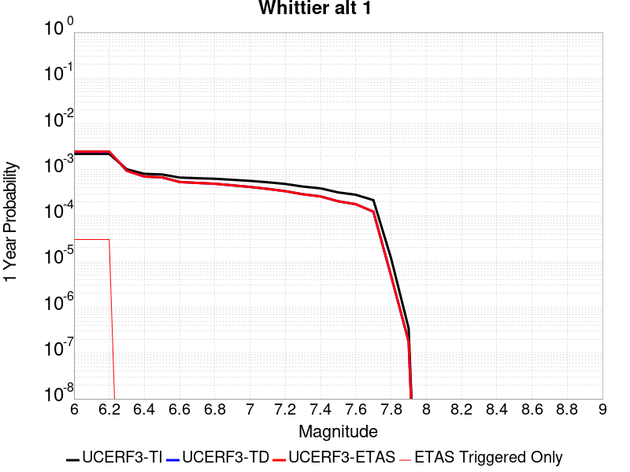 |  |

| Magnitude | 1 wk TI Prob | 1 wk TD Prob | 1 wk ETAS Prob | 1 wk ETAS/TD Gain | 1 wk ETAS Triggered Only | 1 mo TI Prob | 1 mo TD Prob | 1 mo ETAS Prob | 1 mo ETAS/TD Gain | 1 mo ETAS Triggered Only | 1 yr TI Prob | 1 yr TD Prob | 1 yr ETAS Prob | 1 yr ETAS/TD Gain | 1 yr ETAS Triggered Only | 10 yr TI Prob | 10 yr TD Prob | 10 yr ETAS Prob | 10 yr ETAS/TD Gain | 10 yr ETAS Triggered Only |
|-----|-----|-----|-----|-----|-----|-----|-----|-----|-----|-----|-----|-----|-----|-----|-----|-----|-----|-----|-----|-----|
| 6.0 | 4.2554693E-5 | 4.725218E-5 | 7.197289E-5 | 1.5231655 | 2.472188E-5 | 1.8236451E-4 | 2.0249544E-4 | 2.2721231E-4 | 1.1220614 | 2.472188E-5 | 0.002218027 | 0.0024629154 | 0.0024999068 | 1.0150194 | 3.7082817E-5 | 0.02196019 | 0.024390234 | 0.024450531 | 1.0024722 | 6.18047E-5 |
| 6.1 | 4.2554693E-5 | 4.725218E-5 | 7.197289E-5 | 1.5231655 | 2.472188E-5 | 1.8236451E-4 | 2.0249544E-4 | 2.2721231E-4 | 1.1220614 | 2.472188E-5 | 0.002218027 | 0.0024629154 | 0.0024999068 | 1.0150194 | 3.7082817E-5 | 0.02196019 | 0.024390234 | 0.024450531 | 1.0024722 | 6.18047E-5 |
| 6.2 | 4.2554693E-5 | 4.725218E-5 | 7.197289E-5 | 1.5231655 | 2.472188E-5 | 1.8236451E-4 | 2.0249544E-4 | 2.2721231E-4 | 1.1220614 | 2.472188E-5 | 0.002218027 | 0.0024629154 | 0.0024999068 | 1.0150194 | 3.7082817E-5 | 0.02196019 | 0.024390234 | 0.024450531 | 1.0024722 | 6.18047E-5 |
| 6.3 | 1.9617712E-5 | 1.8268593E-5 | 1.8268593E-5 | 1.0 | 0.0 | 8.40732E-5 | 7.829172E-5 | 7.829172E-5 | 1.0 | 0.0 | 0.0010231105 | 9.52804E-4 | 9.52804E-4 | 1.0 | 0.0 | 0.01018413 | 0.009490474 | 0.009514961 | 1.0025802 | 2.472188E-5 |
| 6.4 | 1.5611336E-5 | 1.3604271E-5 | 1.3604271E-5 | 1.0 | 0.0 | 6.690401E-5 | 5.8302747E-5 | 5.8302747E-5 | 1.0 | 0.0 | 8.142519E-4 | 7.0961076E-4 | 7.0961076E-4 | 1.0 | 0.0 | 0.008112748 | 0.0070754145 | 0.0070999614 | 1.0034693 | 2.472188E-5 |
| 6.5 | 1.5150166E-5 | 1.3100925E-5 | 1.3100925E-5 | 1.0 | 0.0 | 6.492767E-5 | 5.6145647E-5 | 5.6145647E-5 | 1.0 | 0.0 | 7.9020765E-4 | 6.8336475E-4 | 6.8336475E-4 | 1.0 | 0.0 | 0.007874036 | 0.0068145846 | 0.006839138 | 1.0036031 | 2.472188E-5 |
| 6.6 | 1.295588E-5 | 1.0380725E-5 | 1.0380725E-5 | 1.0 | 0.0 | 5.552402E-5 | 4.4488075E-5 | 4.4488075E-5 | 1.0 | 0.0 | 6.7579525E-4 | 5.4150965E-4 | 5.4150965E-4 | 1.0 | 0.0 | 0.006737438 | 0.0054033357 | 0.005427924 | 1.0045506 | 2.472188E-5 |
| 6.7 | 1.2542085E-5 | 9.899369E-6 | 9.899369E-6 | 1.0 | 0.0 | 5.3750682E-5 | 4.242519E-5 | 4.242519E-5 | 1.0 | 0.0 | 6.542181E-4 | 5.164061E-4 | 5.164061E-4 | 1.0 | 0.0 | 0.006522954 | 0.0051534795 | 0.0051657767 | 1.0023862 | 1.236094E-5 |
| 6.8 | 1.2195878E-5 | 9.495415E-6 | 9.495415E-6 | 1.0 | 0.0 | 5.2267E-5 | 4.069401E-5 | 4.069401E-5 | 1.0 | 0.0 | 6.36165E-4 | 4.9533875E-4 | 4.9533875E-4 | 1.0 | 0.0 | 0.0063434686 | 0.004943688 | 0.004955988 | 1.002488 | 1.236094E-5 |
| 6.9 | 1.1580298E-5 | 8.772933E-6 | 8.772933E-6 | 1.0 | 0.0 | 4.9628903E-5 | 3.7597754E-5 | 3.7597754E-5 | 1.0 | 0.0 | 6.040644E-4 | 4.5765814E-4 | 4.5765814E-4 | 1.0 | 0.0 | 0.00602425 | 0.0045684157 | 0.0045807203 | 1.0026934 | 1.236094E-5 |
| 7.0 | 1.0964795E-5 | 8.083994E-6 | 8.083994E-6 | 1.0 | 0.0 | 4.6991136E-5 | 3.4645236E-5 | 3.4645236E-5 | 1.0 | 0.0 | 5.7196687E-4 | 4.2172565E-4 | 4.2172565E-4 | 1.0 | 0.0 | 0.0057049696 | 0.004210462 | 0.0042227707 | 1.0029234 | 1.236094E-5 |
| 7.1 | 1.0230601E-5 | 7.3266697E-6 | 7.3266697E-6 | 1.0 | 0.0 | 4.3844695E-5 | 3.1399642E-5 | 3.1399642E-5 | 1.0 | 0.0 | 5.336784E-4 | 3.8222488E-4 | 3.8222488E-4 | 1.0 | 0.0 | 0.005323986 | 0.0038168381 | 0.0038291519 | 1.0032262 | 1.236094E-5 |
| 7.2 | 9.40865E-6 | 6.543289E-6 | 6.543289E-6 | 1.0 | 0.0 | 4.032216E-5 | 2.8042374E-5 | 2.8042374E-5 | 1.0 | 0.0 | 4.908117E-4 | 3.4136363E-4 | 3.4136363E-4 | 1.0 | 0.0 | 0.0048972913 | 0.003409485 | 0.003421804 | 1.0036131 | 1.236094E-5 |
| 7.3 | 8.237384E-6 | 5.5977525E-6 | 5.5977525E-6 | 1.0 | 0.0 | 3.5302593E-5 | 2.3990153E-5 | 2.3990153E-5 | 1.0 | 0.0 | 4.2972428E-4 | 2.92042E-4 | 2.92042E-4 | 1.0 | 0.0 | 0.0042889426 | 0.002916903 | 0.002929228 | 1.0042254 | 1.236094E-5 |
| 7.4 | 7.5316966E-6 | 5.027819E-6 | 5.027819E-6 | 1.0 | 0.0 | 3.2278298E-5 | 2.1547625E-5 | 2.1547625E-5 | 1.0 | 0.0 | 3.9291743E-4 | 2.6231175E-4 | 2.6231175E-4 | 1.0 | 0.0 | 0.0039222343 | 0.0026201333 | 0.0026201333 | 1.0 | 0.0 |
| 7.5 | 6.149649E-6 | 3.933841E-6 | 3.933841E-6 | 1.0 | 0.0 | 2.6355372E-5 | 1.6859214E-5 | 1.6859214E-5 | 1.0 | 0.0 | 3.208294E-4 | 2.052425E-4 | 2.052425E-4 | 1.0 | 0.0 | 0.003203666 | 0.0020506186 | 0.0020506186 | 1.0 | 0.0 |
| 7.6 | 5.457711E-6 | 3.3953788E-6 | 3.3953788E-6 | 1.0 | 0.0 | 2.338998E-5 | 1.4551547E-5 | 1.4551547E-5 | 1.0 | 0.0 | 2.8473578E-4 | 1.771515E-4 | 1.771515E-4 | 1.0 | 0.0 | 0.0028437122 | 0.0017701836 | 0.0017701836 | 1.0 | 0.0 |
| 7.7 | 4.1676276E-6 | 2.3331952E-6 | 2.3331952E-6 | 1.0 | 0.0 | 1.7861139E-5 | 9.999374E-6 | 9.999374E-6 | 1.0 | 0.0 | 2.1743766E-4 | 1.2173632E-4 | 1.2173632E-4 | 1.0 | 0.0 | 0.0021722503 | 0.0012167693 | 0.0012167693 | 1.0 | 0.0 |
| 7.8 | 2.2692414E-7 | 9.3854695E-8 | 9.3854695E-8 | 1.0 | 0.0 | 9.725317E-7 | 4.0223435E-7 | 4.0223435E-7 | 1.0 | 0.0 | 1.1840509E-5 | 4.8971956E-6 | 4.8971956E-6 | 1.0 | 0.0 | 1.1839878E-4 | 4.8971204E-5 | 4.8971204E-5 | 1.0 | 0.0 |
| 7.9 | 6.676829E-9 | 3.439853E-9 | 3.439853E-9 | 1.0 | 0.0 | 2.861498E-8 | 1.4742227E-8 | 1.4742227E-8 | 1.0 | 0.0 | 3.4838732E-7 | 1.7948659E-7 | 1.7948659E-7 | 1.0 | 0.0 | 3.4838679E-6 | 1.7948646E-6 | 1.7948646E-6 | 1.0 | 0.0 |

## Dry Mountain
*[(top)](#table-of-contents)*

| 1 Week | 1 Month | 1 Year | 10 Year |
|-----|-----|-----|-----|
|  |  |  |  |

| Magnitude | 1 wk TI Prob | 1 wk TD Prob | 1 wk ETAS Prob | 1 wk ETAS/TD Gain | 1 wk ETAS Triggered Only | 1 mo TI Prob | 1 mo TD Prob | 1 mo ETAS Prob | 1 mo ETAS/TD Gain | 1 mo ETAS Triggered Only | 1 yr TI Prob | 1 yr TD Prob | 1 yr ETAS Prob | 1 yr ETAS/TD Gain | 1 yr ETAS Triggered Only | 10 yr TI Prob | 10 yr TD Prob | 10 yr ETAS Prob | 10 yr ETAS/TD Gain | 10 yr ETAS Triggered Only |
|-----|-----|-----|-----|-----|-----|-----|-----|-----|-----|-----|-----|-----|-----|-----|-----|-----|-----|-----|-----|-----|
| 6.0 | 6.222801E-6 | 6.439381E-6 | 3.11611E-5 | 4.839145 | 2.472188E-5 | 2.6668875E-5 | 2.7597147E-5 | 5.2318344E-5 | 1.8957882 | 2.472188E-5 | 3.2464517E-4 | 3.3595937E-4 | 3.6067294E-4 | 1.0735612 | 2.472188E-5 | 0.0032417132 | 0.0033560768 | 0.0034176742 | 1.0183539 | 6.18047E-5 |
| 6.1 | 6.222801E-6 | 6.439381E-6 | 3.11611E-5 | 4.839145 | 2.472188E-5 | 2.6668875E-5 | 2.7597147E-5 | 5.2318344E-5 | 1.8957882 | 2.472188E-5 | 3.2464517E-4 | 3.3595937E-4 | 3.6067294E-4 | 1.0735612 | 2.472188E-5 | 0.0032417132 | 0.0033560768 | 0.0034176742 | 1.0183539 | 6.18047E-5 |
| 6.2 | 6.222801E-6 | 6.439381E-6 | 3.11611E-5 | 4.839145 | 2.472188E-5 | 2.6668875E-5 | 2.7597147E-5 | 5.2318344E-5 | 1.8957882 | 2.472188E-5 | 3.2464517E-4 | 3.3595937E-4 | 3.6067294E-4 | 1.0735612 | 2.472188E-5 | 0.0032417132 | 0.0033560768 | 0.0034176742 | 1.0183539 | 6.18047E-5 |
| 6.3 | 6.222801E-6 | 6.439381E-6 | 3.11611E-5 | 4.839145 | 2.472188E-5 | 2.6668875E-5 | 2.7597147E-5 | 5.2318344E-5 | 1.8957882 | 2.472188E-5 | 3.2464517E-4 | 3.3595937E-4 | 3.6067294E-4 | 1.0735612 | 2.472188E-5 | 0.0032417132 | 0.0033560768 | 0.0034176742 | 1.0183539 | 6.18047E-5 |
| 6.4 | 6.222801E-6 | 6.439381E-6 | 3.11611E-5 | 4.839145 | 2.472188E-5 | 2.6668875E-5 | 2.7597147E-5 | 5.2318344E-5 | 1.8957882 | 2.472188E-5 | 3.2464517E-4 | 3.3595937E-4 | 3.6067294E-4 | 1.0735612 | 2.472188E-5 | 0.0032417132 | 0.0033560768 | 0.0034176742 | 1.0183539 | 6.18047E-5 |
| 6.5 | 2.8528623E-6 | 2.9521684E-6 | 2.9521684E-6 | 1.0 | 0.0 | 1.22264955E-5 | 1.2652138E-5 | 1.2652138E-5 | 1.0 | 0.0 | 1.4884741E-4 | 1.540376E-4 | 1.540376E-4 | 1.0 | 0.0 | 0.0014874774 | 0.0015401616 | 0.0015648454 | 1.0160267 | 2.472188E-5 |
| 6.6 | 2.8528623E-6 | 2.9521684E-6 | 2.9521684E-6 | 1.0 | 0.0 | 1.22264955E-5 | 1.2652138E-5 | 1.2652138E-5 | 1.0 | 0.0 | 1.4884741E-4 | 1.540376E-4 | 1.540376E-4 | 1.0 | 0.0 | 0.0014874774 | 0.0015401616 | 0.0015648454 | 1.0160267 | 2.472188E-5 |
| 6.7 | 2.541E-6 | 2.6293578E-6 | 2.6293578E-6 | 1.0 | 0.0 | 1.0889954E-5 | 1.1268677E-5 | 1.1268677E-5 | 1.0 | 0.0 | 1.3257713E-4 | 1.3719614E-4 | 1.3719614E-4 | 1.0 | 0.0 | 0.0013249806 | 0.0013719613 | 0.0013966493 | 1.0179946 | 2.472188E-5 |

## White Mountains
*[(top)](#table-of-contents)*

| 1 Week | 1 Month | 1 Year | 10 Year |
|-----|-----|-----|-----|
|  |  |  |  |

| Magnitude | 1 wk TI Prob | 1 wk TD Prob | 1 wk ETAS Prob | 1 wk ETAS/TD Gain | 1 wk ETAS Triggered Only | 1 mo TI Prob | 1 mo TD Prob | 1 mo ETAS Prob | 1 mo ETAS/TD Gain | 1 mo ETAS Triggered Only | 1 yr TI Prob | 1 yr TD Prob | 1 yr ETAS Prob | 1 yr ETAS/TD Gain | 1 yr ETAS Triggered Only | 10 yr TI Prob | 10 yr TD Prob | 10 yr ETAS Prob | 10 yr ETAS/TD Gain | 10 yr ETAS Triggered Only |
|-----|-----|-----|-----|-----|-----|-----|-----|-----|-----|-----|-----|-----|-----|-----|-----|-----|-----|-----|-----|-----|
| 6.0 | 3.503579E-5 | 3.378405E-5 | 5.8505095E-5 | 1.7317371 | 2.472188E-5 | 1.5014476E-4 | 1.4478143E-4 | 1.6949973E-4 | 1.1707283 | 2.472188E-5 | 0.0018264796 | 0.0017614096 | 0.0017984271 | 1.0210159 | 3.7082817E-5 | 0.018115403 | 0.017486818 | 0.017547542 | 1.0034726 | 6.18047E-5 |
| 6.1 | 3.503579E-5 | 3.378405E-5 | 5.8505095E-5 | 1.7317371 | 2.472188E-5 | 1.5014476E-4 | 1.4478143E-4 | 1.6949973E-4 | 1.1707283 | 2.472188E-5 | 0.0018264796 | 0.0017614096 | 0.0017984271 | 1.0210159 | 3.7082817E-5 | 0.018115403 | 0.017486818 | 0.017547542 | 1.0034726 | 6.18047E-5 |
| 6.2 | 3.503579E-5 | 3.378405E-5 | 5.8505095E-5 | 1.7317371 | 2.472188E-5 | 1.5014476E-4 | 1.4478143E-4 | 1.6949973E-4 | 1.1707283 | 2.472188E-5 | 0.0018264796 | 0.0017614096 | 0.0017984271 | 1.0210159 | 3.7082817E-5 | 0.018115403 | 0.017486818 | 0.017547542 | 1.0034726 | 6.18047E-5 |
| 6.3 | 1.7818425E-5 | 1.5916074E-5 | 1.5916074E-5 | 1.0 | 0.0 | 7.636245E-5 | 6.821004E-5 | 6.821004E-5 | 1.0 | 0.0 | 9.293162E-4 | 8.301551E-4 | 8.425058E-4 | 1.0148776 | 1.236094E-5 | 0.009254395 | 0.008271999 | 0.008296516 | 1.0029639 | 2.472188E-5 |
| 6.4 | 1.7818425E-5 | 1.5916074E-5 | 1.5916074E-5 | 1.0 | 0.0 | 7.636245E-5 | 6.821004E-5 | 6.821004E-5 | 1.0 | 0.0 | 9.293162E-4 | 8.301551E-4 | 8.425058E-4 | 1.0148776 | 1.236094E-5 | 0.009254395 | 0.008271999 | 0.008296516 | 1.0029639 | 2.472188E-5 |
| 6.5 | 1.3397557E-5 | 1.13362685E-5 | 1.13362685E-5 | 1.0 | 0.0 | 5.741684E-5 | 4.858314E-5 | 4.858314E-5 | 1.0 | 0.0 | 6.988258E-4 | 5.913462E-4 | 6.036998E-4 | 1.0208907 | 1.236094E-5 | 0.006966323 | 0.005898432 | 0.005923008 | 1.0041665 | 2.472188E-5 |
| 6.6 | 1.0818695E-5 | 8.625366E-6 | 8.625366E-6 | 1.0 | 0.0 | 4.6365014E-5 | 3.6965357E-5 | 3.6965357E-5 | 1.0 | 0.0 | 5.6434784E-4 | 4.4996463E-4 | 4.6232E-4 | 1.0274585 | 1.236094E-5 | 0.005629168 | 0.004490972 | 0.0045155827 | 1.00548 | 2.472188E-5 |
| 6.7 | 9.067908E-6 | 6.802442E-6 | 6.802442E-6 | 1.0 | 0.0 | 3.8861883E-5 | 2.9153016E-5 | 2.9153016E-5 | 1.0 | 0.0 | 4.7304068E-4 | 3.5488335E-4 | 3.5488335E-4 | 1.0 | 0.0 | 0.00472035 | 0.0035434833 | 0.0035558005 | 1.003476 | 1.236094E-5 |
| 6.8 | 7.295947E-6 | 4.936391E-6 | 4.936391E-6 | 1.0 | 0.0 | 3.126797E-5 | 2.1155796E-5 | 2.1155796E-5 | 1.0 | 0.0 | 3.8062103E-4 | 2.575425E-4 | 2.575425E-4 | 1.0 | 0.0 | 0.0037996976 | 0.0025725532 | 0.0025848825 | 1.0047926 | 1.236094E-5 |
| 6.9 | 6.2243444E-6 | 3.832213E-6 | 3.832213E-6 | 1.0 | 0.0 | 2.6675489E-5 | 1.642367E-5 | 1.642367E-5 | 1.0 | 0.0 | 3.2472567E-4 | 1.9994036E-4 | 1.9994036E-4 | 1.0 | 0.0 | 0.0032425157 | 0.0019976576 | 0.0020099937 | 1.0061754 | 1.236094E-5 |
| 7.0 | 4.9878413E-6 | 2.6795342E-6 | 2.6795342E-6 | 1.0 | 0.0 | 2.1376287E-5 | 1.14836685E-5 | 1.14836685E-5 | 1.0 | 0.0 | 2.602252E-4 | 1.3980496E-4 | 1.3980496E-4 | 1.0 | 0.0 | 0.002599207 | 0.0013971963 | 0.00140954 | 1.0088346 | 1.236094E-5 |
| 7.1 | 4.0252844E-6 | 1.8857575E-6 | 1.8857575E-6 | 1.0 | 0.0 | 1.7251105E-5 | 8.081794E-6 | 8.081794E-6 | 1.0 | 0.0 | 2.1001195E-4 | 9.8391516E-5 | 9.8391516E-5 | 1.0 | 0.0 | 0.0020981359 | 9.834924E-4 | 9.958411E-4 | 1.0125561 | 1.236094E-5 |
| 7.2 | 3.3284066E-6 | 1.281964E-6 | 1.281964E-6 | 1.0 | 0.0 | 1.4264522E-5 | 5.494121E-6 | 5.494121E-6 | 1.0 | 0.0 | 1.736567E-4 | 6.688897E-5 | 6.688897E-5 | 1.0 | 0.0 | 0.0017352107 | 6.6869846E-4 | 6.6869846E-4 | 1.0 | 0.0 |
| 7.3 | 2.458226E-6 | 6.05722E-7 | 6.05722E-7 | 1.0 | 0.0 | 1.0535211E-5 | 2.5959491E-6 | 2.5959491E-6 | 1.0 | 0.0 | 1.2825865E-4 | 3.1605257E-5 | 3.1605257E-5 | 1.0 | 0.0 | 0.0012818464 | 3.160114E-4 | 3.160114E-4 | 1.0 | 0.0 |
| 7.4 | 1.965953E-6 | 3.1089303E-7 | 3.1089303E-7 | 1.0 | 0.0 | 8.425486E-6 | 1.332398E-6 | 1.332398E-6 | 1.0 | 0.0 | 1.0257547E-4 | 1.6221828E-5 | 1.6221828E-5 | 1.0 | 0.0 | 0.0010252813 | 1.6220656E-4 | 1.6220656E-4 | 1.0 | 0.0 |
| 7.5 | 1.2014192E-6 | 1.8244253E-7 | 1.8244253E-7 | 1.0 | 0.0 | 5.148929E-6 | 7.8189635E-7 | 7.8189635E-7 | 1.0 | 0.0 | 6.2686406E-5 | 9.519547E-6 | 9.519547E-6 | 1.0 | 0.0 | 6.266873E-4 | 9.519148E-5 | 9.519148E-5 | 1.0 | 0.0 |
| 7.6 | 2.5612175E-7 | 4.8946475E-8 | 4.8946475E-8 | 1.0 | 0.0 | 1.0976642E-6 | 2.0977059E-7 | 2.0977059E-7 | 1.0 | 0.0 | 1.3363979E-5 | 2.5539543E-6 | 2.5539543E-6 | 1.0 | 0.0 | 1.3363175E-4 | 2.5539286E-5 | 2.5539286E-5 | 1.0 | 0.0 |

## Oak Ridge (Onshore)
*[(top)](#table-of-contents)*

| 1 Week | 1 Month | 1 Year | 10 Year |
|-----|-----|-----|-----|
|  |  |  |  |

| Magnitude | 1 wk TI Prob | 1 wk TD Prob | 1 wk ETAS Prob | 1 wk ETAS/TD Gain | 1 wk ETAS Triggered Only | 1 mo TI Prob | 1 mo TD Prob | 1 mo ETAS Prob | 1 mo ETAS/TD Gain | 1 mo ETAS Triggered Only | 1 yr TI Prob | 1 yr TD Prob | 1 yr ETAS Prob | 1 yr ETAS/TD Gain | 1 yr ETAS Triggered Only | 10 yr TI Prob | 10 yr TD Prob | 10 yr ETAS Prob | 10 yr ETAS/TD Gain | 10 yr ETAS Triggered Only |
|-----|-----|-----|-----|-----|-----|-----|-----|-----|-----|-----|-----|-----|-----|-----|-----|-----|-----|-----|-----|-----|
| 6.0 | 3.155064E-5 | 2.9525974E-5 | 5.4247124E-5 | 1.8372679 | 2.472188E-5 | 1.3521002E-4 | 1.2653397E-4 | 1.5125272E-4 | 1.1953527 | 2.472188E-5 | 0.001644939 | 0.0015395004 | 0.0015765262 | 1.0240505 | 3.7082817E-5 | 0.01632816 | 0.015292859 | 0.015353719 | 1.0039796 | 6.18047E-5 |
| 6.1 | 3.155064E-5 | 2.9525974E-5 | 5.4247124E-5 | 1.8372679 | 2.472188E-5 | 1.3521002E-4 | 1.2653397E-4 | 1.5125272E-4 | 1.1953527 | 2.472188E-5 | 0.001644939 | 0.0015395004 | 0.0015765262 | 1.0240505 | 3.7082817E-5 | 0.01632816 | 0.015292859 | 0.015353719 | 1.0039796 | 6.18047E-5 |
| 6.2 | 3.155064E-5 | 2.9525974E-5 | 5.4247124E-5 | 1.8372679 | 2.472188E-5 | 1.3521002E-4 | 1.2653397E-4 | 1.5125272E-4 | 1.1953527 | 2.472188E-5 | 0.001644939 | 0.0015395004 | 0.0015765262 | 1.0240505 | 3.7082817E-5 | 0.01632816 | 0.015292859 | 0.015353719 | 1.0039796 | 6.18047E-5 |
| 6.3 | 3.155064E-5 | 2.9525974E-5 | 5.4247124E-5 | 1.8372679 | 2.472188E-5 | 1.3521002E-4 | 1.2653397E-4 | 1.5125272E-4 | 1.1953527 | 2.472188E-5 | 0.001644939 | 0.0015395004 | 0.0015765262 | 1.0240505 | 3.7082817E-5 | 0.01632816 | 0.015292859 | 0.015353719 | 1.0039796 | 6.18047E-5 |
| 6.4 | 3.155064E-5 | 2.9525974E-5 | 5.4247124E-5 | 1.8372679 | 2.472188E-5 | 1.3521002E-4 | 1.2653397E-4 | 1.5125272E-4 | 1.1953527 | 2.472188E-5 | 0.001644939 | 0.0015395004 | 0.0015765262 | 1.0240505 | 3.7082817E-5 | 0.01632816 | 0.015292859 | 0.015353719 | 1.0039796 | 6.18047E-5 |
| 6.5 | 3.155064E-5 | 2.9525974E-5 | 5.4247124E-5 | 1.8372679 | 2.472188E-5 | 1.3521002E-4 | 1.2653397E-4 | 1.5125272E-4 | 1.1953527 | 2.472188E-5 | 0.001644939 | 0.0015395004 | 0.0015765262 | 1.0240505 | 3.7082817E-5 | 0.01632816 | 0.015292859 | 0.015353719 | 1.0039796 | 6.18047E-5 |
| 6.6 | 3.155064E-5 | 2.9525974E-5 | 5.4247124E-5 | 1.8372679 | 2.472188E-5 | 1.3521002E-4 | 1.2653397E-4 | 1.5125272E-4 | 1.1953527 | 2.472188E-5 | 0.001644939 | 0.0015395004 | 0.0015765262 | 1.0240505 | 3.7082817E-5 | 0.01632816 | 0.015292859 | 0.015353719 | 1.0039796 | 6.18047E-5 |
| 6.7 | 3.098897E-5 | 2.8864175E-5 | 5.358534E-5 | 1.8564653 | 2.472188E-5 | 1.328031E-4 | 1.2369796E-4 | 1.4841677E-4 | 1.1998321 | 2.472188E-5 | 0.0016156785 | 0.0015050198 | 0.0015420469 | 1.0246023 | 3.7082817E-5 | 0.016039822 | 0.014952714 | 0.015013594 | 1.0040716 | 6.18047E-5 |
| 6.8 | 3.0449872E-5 | 2.8239372E-5 | 5.2960553E-5 | 1.8754153 | 2.472188E-5 | 1.3049292E-4 | 1.2102048E-4 | 1.4573937E-4 | 1.2042538 | 2.472188E-5 | 0.0015875935 | 0.0014724657 | 0.0015094938 | 1.0251471 | 3.7082817E-5 | 0.015762992 | 0.014631462 | 0.014692362 | 1.0041623 | 6.18047E-5 |
| 6.9 | 2.697928E-5 | 2.4219773E-5 | 4.8941052E-5 | 2.0207064 | 2.472188E-5 | 1.15620365E-4 | 1.0379502E-4 | 1.2851434E-4 | 1.2381551 | 2.472188E-5 | 0.0014067689 | 0.0012629933 | 0.0013000293 | 1.0293239 | 3.7082817E-5 | 0.0139789665 | 0.01256087 | 0.012597487 | 1.0029151 | 3.7082817E-5 |
| 7.0 | 2.4893961E-5 | 2.1862043E-5 | 4.658338E-5 | 2.130788 | 2.472188E-5 | 1.0668404E-4 | 9.3691204E-5 | 1.1841076E-4 | 1.2638408 | 2.472188E-5 | 0.0012981043 | 0.0011401111 | 0.0011771517 | 1.0324886 | 3.7082817E-5 | 0.012905477 | 0.011344905 | 0.011381567 | 1.0032316 | 3.7082817E-5 |
| 7.1 | 2.0945363E-5 | 1.7354487E-5 | 2.9715213E-5 | 1.7122495 | 1.236094E-5 | 8.976275E-5 | 7.437428E-5 | 8.67343E-5 | 1.1661868 | 1.236094E-5 | 0.0010923136 | 9.051354E-4 | 9.298349E-4 | 1.0272882 | 2.472188E-5 | 0.0108696 | 0.009015423 | 0.009039922 | 1.0027175 | 2.472188E-5 |
| 7.2 | 2.0439404E-5 | 1.6809423E-5 | 2.9170154E-5 | 1.7353454 | 1.236094E-5 | 8.7594504E-5 | 7.203843E-5 | 8.4398474E-5 | 1.1715758 | 1.236094E-5 | 0.0010659413 | 8.767196E-4 | 9.014198E-4 | 1.0281734 | 2.472188E-5 | 0.010608427 | 0.008733526 | 0.008758032 | 1.002806 | 2.472188E-5 |
| 7.3 | 1.8463334E-5 | 1.5381811E-5 | 2.774256E-5 | 1.8035952 | 1.236094E-5 | 7.912617E-5 | 6.59204E-5 | 7.828053E-5 | 1.1875007 | 1.236094E-5 | 9.6293533E-4 | 8.0228975E-4 | 8.269918E-4 | 1.0307894 | 2.472188E-5 | 0.009587734 | 0.007994797 | 0.008019322 | 1.0030675 | 2.472188E-5 |
| 7.4 | 1.763139E-5 | 1.451684E-5 | 2.68776E-5 | 1.8514774 | 1.236094E-5 | 7.556091E-5 | 6.221356E-5 | 7.4573734E-5 | 1.1986732 | 1.236094E-5 | 9.1956573E-4 | 7.571909E-4 | 7.818941E-4 | 1.0326247 | 2.472188E-5 | 0.009157699 | 0.007546914 | 0.007571449 | 1.0032511 | 2.472188E-5 |
| 7.5 | 1.3594944E-5 | 1.1163356E-5 | 2.3524157E-5 | 2.1072657 | 1.236094E-5 | 5.8262744E-5 | 4.784209E-5 | 6.020244E-5 | 1.2583572 | 1.236094E-5 | 7.0911803E-4 | 5.8232434E-4 | 6.070318E-4 | 1.0424291 | 2.472188E-5 | 0.007068595 | 0.0058082556 | 0.005832834 | 1.0042316 | 2.472188E-5 |
| 7.6 | 6.9889534E-6 | 5.6367144E-6 | 1.7997583E-5 | 3.1929212 | 1.236094E-5 | 2.9952313E-5 | 2.4157125E-5 | 3.6517766E-5 | 1.5116768 | 1.236094E-5 | 3.646084E-4 | 2.9407372E-4 | 3.0643103E-4 | 1.0420212 | 1.236094E-5 | 0.0036401073 | 0.0029368899 | 0.0029492145 | 1.0041965 | 1.236094E-5 |
| 7.7 | 4.0824193E-6 | 3.2832586E-6 | 1.5644157E-5 | 4.7648263 | 1.236094E-5 | 1.7495966E-5 | 1.4071033E-5 | 2.6431799E-5 | 1.8784547 | 1.236094E-5 | 2.1299256E-4 | 1.713015E-4 | 1.8366032E-4 | 1.0721467 | 1.236094E-5 | 0.0021278851 | 0.0017117079 | 0.0017240477 | 1.0072091 | 1.236094E-5 |
| 7.8 | 1.7023609E-6 | 1.4370495E-6 | 1.3797971E-5 | 9.601598 | 1.236094E-5 | 7.295812E-6 | 6.1587693E-6 | 1.8519633E-5 | 3.0070345 | 1.236094E-5 | 8.882289E-5 | 7.498047E-5 | 8.734048E-5 | 1.1648431 | 1.236094E-5 | 8.8787393E-4 | 7.495545E-4 | 7.6190615E-4 | 1.0164787 | 1.236094E-5 |
| 7.9 | 2.721225E-7 | 2.2616497E-7 | 1.2587102E-5 | 55.654514 | 1.236094E-5 | 1.1662388E-6 | 9.692781E-7 | 1.3330206E-5 | 13.752715 | 1.236094E-5 | 1.4198865E-5 | 1.1800899E-5 | 2.4161693E-5 | 2.047445 | 1.236094E-5 | 1.4197957E-4 | 1.1800301E-4 | 1.3036249E-4 | 1.1047387 | 1.236094E-5 |
| 8.0 | 9.364255E-9 | 5.1206666E-9 | 5.1206666E-9 | 1.0 | 0.0 | 4.0132523E-8 | 2.1945715E-8 | 2.1945715E-8 | 1.0 | 0.0 | 4.8861335E-7 | 2.6718905E-7 | 2.6718905E-7 | 1.0 | 0.0 | 4.8861225E-6 | 2.6718876E-6 | 2.6718876E-6 | 1.0 | 0.0 |

## Hosgri
*[(top)](#table-of-contents)*

| 1 Week | 1 Month | 1 Year | 10 Year |
|-----|-----|-----|-----|
|  |  |  |  |

| Magnitude | 1 wk TI Prob | 1 wk TD Prob | 1 wk ETAS Prob | 1 wk ETAS/TD Gain | 1 wk ETAS Triggered Only | 1 mo TI Prob | 1 mo TD Prob | 1 mo ETAS Prob | 1 mo ETAS/TD Gain | 1 mo ETAS Triggered Only | 1 yr TI Prob | 1 yr TD Prob | 1 yr ETAS Prob | 1 yr ETAS/TD Gain | 1 yr ETAS Triggered Only | 10 yr TI Prob | 10 yr TD Prob | 10 yr ETAS Prob | 10 yr ETAS/TD Gain | 10 yr ETAS Triggered Only |
|-----|-----|-----|-----|-----|-----|-----|-----|-----|-----|-----|-----|-----|-----|-----|-----|-----|-----|-----|-----|-----|
| 6.0 | 2.883978E-5 | 2.9128416E-5 | 4.1488995E-5 | 1.4243478 | 1.236094E-5 | 1.235932E-4 | 1.2483024E-4 | 1.4954904E-4 | 1.1980193 | 2.472188E-5 | 0.0015037085 | 0.001518776 | 0.0015681447 | 1.0325055 | 4.944376E-5 | 0.01493574 | 0.01508774 | 0.015148612 | 1.0040345 | 6.18047E-5 |
| 6.1 | 2.883978E-5 | 2.9128416E-5 | 4.1488995E-5 | 1.4243478 | 1.236094E-5 | 1.235932E-4 | 1.2483024E-4 | 1.4954904E-4 | 1.1980193 | 2.472188E-5 | 0.0015037085 | 0.001518776 | 0.0015681447 | 1.0325055 | 4.944376E-5 | 0.01493574 | 0.01508774 | 0.015148612 | 1.0040345 | 6.18047E-5 |
| 6.2 | 2.883978E-5 | 2.9128416E-5 | 4.1488995E-5 | 1.4243478 | 1.236094E-5 | 1.235932E-4 | 1.2483024E-4 | 1.4954904E-4 | 1.1980193 | 2.472188E-5 | 0.0015037085 | 0.001518776 | 0.0015681447 | 1.0325055 | 4.944376E-5 | 0.01493574 | 0.01508774 | 0.015148612 | 1.0040345 | 6.18047E-5 |
| 6.3 | 2.2914428E-5 | 2.2641969E-5 | 3.5002628E-5 | 1.545918 | 1.236094E-5 | 9.8200995E-5 | 9.703343E-5 | 1.0939317E-4 | 1.1273761 | 1.236094E-5 | 0.0011949413 | 0.0011807467 | 0.0012177858 | 1.0313692 | 3.7082817E-5 | 0.011885363 | 0.011746133 | 0.0117949955 | 1.0041599 | 4.944376E-5 |
| 6.4 | 2.0195741E-5 | 1.969656E-5 | 3.2057254E-5 | 1.6275561 | 1.236094E-5 | 8.65503E-5 | 8.4411105E-5 | 9.677101E-5 | 1.146425 | 1.236094E-5 | 0.0010532405 | 0.0010272227 | 0.0010642674 | 1.036063 | 3.7082817E-5 | 0.010482626 | 0.010225792 | 0.010262496 | 1.0035893 | 3.7082817E-5 |
| 6.5 | 1.9924333E-5 | 1.940898E-5 | 3.176968E-5 | 1.6368546 | 1.236094E-5 | 8.53872E-5 | 8.3178704E-5 | 9.553862E-5 | 1.1485946 | 1.236094E-5 | 0.0010390934 | 0.0010122322 | 0.0010492775 | 1.0365976 | 3.7082817E-5 | 0.010342481 | 0.010077253 | 0.010113962 | 1.0036428 | 3.7082817E-5 |
| 6.6 | 1.809694E-5 | 1.74583E-5 | 2.9819024E-5 | 1.7080141 | 1.236094E-5 | 7.7556004E-5 | 7.4819145E-5 | 8.717916E-5 | 1.1651986 | 1.236094E-5 | 9.438353E-4 | 9.105437E-4 | 9.475928E-4 | 1.040689 | 3.7082817E-5 | 0.009398366 | 0.009069073 | 0.009105819 | 1.0040518 | 3.7082817E-5 |
| 6.7 | 1.675989E-5 | 1.6042764E-5 | 2.8403507E-5 | 1.770487 | 1.236094E-5 | 7.182612E-5 | 6.87529E-5 | 8.1112994E-5 | 1.1797755 | 1.236094E-5 | 8.7413215E-4 | 8.3674624E-4 | 8.614474E-4 | 1.0295205 | 2.472188E-5 | 0.008707017 | 0.0083368635 | 0.008361379 | 1.0029407 | 2.472188E-5 |
| 6.8 | 1.5401129E-5 | 1.4614083E-5 | 2.6974842E-5 | 1.8458115 | 1.236094E-5 | 6.6003166E-5 | 6.2630286E-5 | 7.499045E-5 | 1.1973512 | 1.236094E-5 | 8.032922E-4 | 7.622578E-4 | 7.869608E-4 | 1.0324078 | 2.472188E-5 | 0.008003947 | 0.007597296 | 0.0076218303 | 1.0032293 | 2.472188E-5 |
| 6.9 | 1.356559E-5 | 1.2689968E-5 | 2.505075E-5 | 1.9740595 | 1.236094E-5 | 5.8136946E-5 | 5.4384444E-5 | 6.674471E-5 | 1.2272757 | 1.236094E-5 | 7.0758746E-4 | 6.619299E-4 | 6.866354E-4 | 1.0373235 | 2.472188E-5 | 0.007053386 | 0.006600388 | 0.0066249464 | 1.0037208 | 2.472188E-5 |
| 7.0 | 1.2030819E-5 | 1.1095962E-5 | 2.3456763E-5 | 2.113991 | 1.236094E-5 | 5.155963E-5 | 4.7553254E-5 | 5.9913604E-5 | 1.2599266 | 1.236094E-5 | 6.275577E-4 | 5.7880714E-4 | 6.035147E-4 | 1.042687 | 2.472188E-5 | 0.006257884 | 0.005773757 | 0.005798336 | 1.0042571 | 2.472188E-5 |
| 7.1 | 1.0972698E-5 | 1.0022179E-5 | 2.2382994E-5 | 2.2333462 | 1.236094E-5 | 4.7025E-5 | 4.2951488E-5 | 5.5311895E-5 | 1.287776 | 1.236094E-5 | 5.72379E-4 | 5.22809E-4 | 5.475179E-4 | 1.047262 | 2.472188E-5 | 0.0057090693 | 0.005216542 | 0.005241135 | 1.0047144 | 2.472188E-5 |
| 7.2 | 9.961926E-6 | 9.034746E-6 | 9.034746E-6 | 1.0 | 0.0 | 4.2693267E-5 | 3.8719765E-5 | 3.8719765E-5 | 1.0 | 0.0 | 5.1966653E-4 | 4.713112E-4 | 4.836663E-4 | 1.0262144 | 1.236094E-5 | 0.00518453 | 0.0047038626 | 0.0047161654 | 1.0026155 | 1.236094E-5 |
| 7.3 | 8.700929E-6 | 7.8281E-6 | 7.8281E-6 | 1.0 | 0.0 | 3.7289166E-5 | 3.354857E-5 | 3.354857E-5 | 1.0 | 0.0 | 4.53901E-4 | 4.0837732E-4 | 4.0837732E-4 | 1.0 | 0.0 | 0.00452975 | 0.004077008 | 0.004077008 | 1.0 | 0.0 |
| 7.4 | 7.866285E-6 | 6.998739E-6 | 6.998739E-6 | 1.0 | 0.0 | 3.3712215E-5 | 2.9994251E-5 | 2.9994251E-5 | 1.0 | 0.0 | 4.103689E-4 | 3.6511885E-4 | 3.6511885E-4 | 1.0 | 0.0 | 0.004096119 | 0.0036459267 | 0.0036459267 | 1.0 | 0.0 |
| 7.5 | 6.8381305E-6 | 5.9596955E-6 | 5.9596955E-6 | 1.0 | 0.0 | 2.9305946E-5 | 2.5541302E-5 | 2.5541302E-5 | 1.0 | 0.0 | 3.5674145E-4 | 3.10921E-4 | 3.10921E-4 | 1.0 | 0.0 | 0.0035616932 | 0.0031055948 | 0.0031055948 | 1.0 | 0.0 |
| 7.6 | 5.503376E-6 | 4.5952443E-6 | 4.5952443E-6 | 1.0 | 0.0 | 2.3585684E-5 | 1.9693754E-5 | 1.9693754E-5 | 1.0 | 0.0 | 2.8711787E-4 | 2.397451E-4 | 2.397451E-4 | 1.0 | 0.0 | 0.002867472 | 0.0023955975 | 0.0023955975 | 1.0 | 0.0 |
| 7.7 | 3.6144982E-6 | 2.6522112E-6 | 2.6522112E-6 | 1.0 | 0.0 | 1.5490614E-5 | 1.1366569E-5 | 1.1366569E-5 | 1.0 | 0.0 | 1.8858191E-4 | 1.383792E-4 | 1.383792E-4 | 1.0 | 0.0 | 0.0018842196 | 0.0013836613 | 0.0013836613 | 1.0 | 0.0 |
| 7.8 | 1.9853494E-6 | 1.1361129E-6 | 1.1361129E-6 | 1.0 | 0.0 | 8.508612E-6 | 4.8690463E-6 | 4.8690463E-6 | 1.0 | 0.0 | 1.0358743E-4 | 5.9279027E-5 | 5.9279027E-5 | 1.0 | 0.0 | 0.0010353916 | 5.9336185E-4 | 5.9336185E-4 | 1.0 | 0.0 |
| 7.9 | 1.1818757E-6 | 5.2951856E-7 | 5.2951856E-7 | 1.0 | 0.0 | 5.0651715E-6 | 2.2693632E-6 | 2.2693632E-6 | 1.0 | 0.0 | 6.1666724E-5 | 2.7629147E-5 | 2.7629147E-5 | 1.0 | 0.0 | 6.1649614E-4 | 2.7694515E-4 | 2.7694515E-4 | 1.0 | 0.0 |
| 8.0 | 6.962958E-7 | 2.7139782E-7 | 2.7139782E-7 | 1.0 | 0.0 | 2.9841215E-6 | 1.163133E-6 | 1.163133E-6 | 1.0 | 0.0 | 3.6331072E-5 | 1.4161053E-5 | 1.4161053E-5 | 1.0 | 0.0 | 3.6325134E-4 | 1.4217179E-4 | 1.4217179E-4 | 1.0 | 0.0 |
| 8.1 | 1.5033264E-7 | 6.527624E-8 | 6.527624E-8 | 1.0 | 0.0 | 6.442826E-7 | 2.7975528E-7 | 2.7975528E-7 | 1.0 | 0.0 | 7.844113E-6 | 3.4060151E-6 | 3.4060151E-6 | 1.0 | 0.0 | 7.843835E-5 | 3.407693E-5 | 3.407693E-5 | 1.0 | 0.0 |

## Santa Susana East (connector)
*[(top)](#table-of-contents)*

| 1 Week | 1 Month | 1 Year | 10 Year |
|-----|-----|-----|-----|
|  |  |  |  |

| Magnitude | 1 wk TI Prob | 1 wk TD Prob | 1 wk ETAS Prob | 1 wk ETAS/TD Gain | 1 wk ETAS Triggered Only | 1 mo TI Prob | 1 mo TD Prob | 1 mo ETAS Prob | 1 mo ETAS/TD Gain | 1 mo ETAS Triggered Only | 1 yr TI Prob | 1 yr TD Prob | 1 yr ETAS Prob | 1 yr ETAS/TD Gain | 1 yr ETAS Triggered Only | 10 yr TI Prob | 10 yr TD Prob | 10 yr ETAS Prob | 10 yr ETAS/TD Gain | 10 yr ETAS Triggered Only |
|-----|-----|-----|-----|-----|-----|-----|-----|-----|-----|-----|-----|-----|-----|-----|-----|-----|-----|-----|-----|-----|
| 6.0 | 2.858397E-5 | 3.202091E-5 | 3.202091E-5 | 1.0 | 0.0 | 1.2249697E-4 | 1.3722685E-4 | 1.4958609E-4 | 1.0900643 | 1.236094E-5 | 0.0014903803 | 0.0016697381 | 0.001706759 | 1.0221717 | 3.7082817E-5 | 0.014804244 | 0.016599052 | 0.016659832 | 1.0036616 | 6.18047E-5 |
| 6.1 | 2.858397E-5 | 3.202091E-5 | 3.202091E-5 | 1.0 | 0.0 | 1.2249697E-4 | 1.3722685E-4 | 1.4958609E-4 | 1.0900643 | 1.236094E-5 | 0.0014903803 | 0.0016697381 | 0.001706759 | 1.0221717 | 3.7082817E-5 | 0.014804244 | 0.016599052 | 0.016659832 | 1.0036616 | 6.18047E-5 |
| 6.2 | 2.858397E-5 | 3.202091E-5 | 3.202091E-5 | 1.0 | 0.0 | 1.2249697E-4 | 1.3722685E-4 | 1.4958609E-4 | 1.0900643 | 1.236094E-5 | 0.0014903803 | 0.0016697381 | 0.001706759 | 1.0221717 | 3.7082817E-5 | 0.014804244 | 0.016599052 | 0.016659832 | 1.0036616 | 6.18047E-5 |
| 6.3 | 1.943582E-5 | 2.036718E-5 | 2.036718E-5 | 1.0 | 0.0 | 8.329371E-5 | 8.7285625E-5 | 9.9645484E-5 | 1.1416025 | 1.236094E-5 | 0.001013629 | 0.0010622967 | 0.00109934 | 1.0348711 | 3.7082817E-5 | 0.010090181 | 0.010583619 | 0.010632539 | 1.0046223 | 4.944376E-5 |
| 6.4 | 1.943582E-5 | 2.036718E-5 | 2.036718E-5 | 1.0 | 0.0 | 8.329371E-5 | 8.7285625E-5 | 9.9645484E-5 | 1.1416025 | 1.236094E-5 | 0.001013629 | 0.0010622967 | 0.00109934 | 1.0348711 | 3.7082817E-5 | 0.010090181 | 0.010583619 | 0.010632539 | 1.0046223 | 4.944376E-5 |
| 6.5 | 1.943582E-5 | 2.036718E-5 | 2.036718E-5 | 1.0 | 0.0 | 8.329371E-5 | 8.7285625E-5 | 9.9645484E-5 | 1.1416025 | 1.236094E-5 | 0.001013629 | 0.0010622967 | 0.00109934 | 1.0348711 | 3.7082817E-5 | 0.010090181 | 0.010583619 | 0.010632539 | 1.0046223 | 4.944376E-5 |
| 6.6 | 1.943582E-5 | 2.036718E-5 | 2.036718E-5 | 1.0 | 0.0 | 8.329371E-5 | 8.7285625E-5 | 9.9645484E-5 | 1.1416025 | 1.236094E-5 | 0.001013629 | 0.0010622967 | 0.00109934 | 1.0348711 | 3.7082817E-5 | 0.010090181 | 0.010583619 | 0.010632539 | 1.0046223 | 4.944376E-5 |
| 6.7 | 1.9404439E-5 | 2.03546E-5 | 2.03546E-5 | 1.0 | 0.0 | 8.3159226E-5 | 8.723172E-5 | 9.959158E-5 | 1.14169 | 1.236094E-5 | 0.0010119933 | 0.0010616409 | 0.0010986844 | 1.0348927 | 3.7082817E-5 | 0.010073971 | 0.010577125 | 0.010626045 | 1.0046252 | 4.944376E-5 |
| 6.8 | 1.2217526E-5 | 1.1592998E-5 | 1.1592998E-5 | 1.0 | 0.0 | 5.2359774E-5 | 4.9683425E-5 | 6.204375E-5 | 1.2487817 | 1.236094E-5 | 6.372938E-4 | 6.0474465E-4 | 6.294516E-4 | 1.0408552 | 2.472188E-5 | 0.0063546924 | 0.006033037 | 0.006069896 | 1.0061096 | 3.7082817E-5 |
| 6.9 | 1.2217526E-5 | 1.1592998E-5 | 1.1592998E-5 | 1.0 | 0.0 | 5.2359774E-5 | 4.9683425E-5 | 6.204375E-5 | 1.2487817 | 1.236094E-5 | 6.372938E-4 | 6.0474465E-4 | 6.294516E-4 | 1.0408552 | 2.472188E-5 | 0.0063546924 | 0.006033037 | 0.006069896 | 1.0061096 | 3.7082817E-5 |
| 7.0 | 9.276017E-6 | 8.059113E-6 | 8.059113E-6 | 1.0 | 0.0 | 3.9753755E-5 | 3.4538618E-5 | 3.4538618E-5 | 1.0 | 0.0 | 4.8389446E-4 | 4.2042998E-4 | 4.3278572E-4 | 1.0293883 | 1.236094E-5 | 0.0048284214 | 0.0041970722 | 0.0042216904 | 1.0058656 | 2.472188E-5 |
| 7.1 | 9.130355E-6 | 7.942286E-6 | 7.942286E-6 | 1.0 | 0.0 | 3.9129503E-5 | 3.4037945E-5 | 3.4037945E-5 | 1.0 | 0.0 | 4.7629757E-4 | 4.1433662E-4 | 4.2669245E-4 | 1.0298207 | 1.236094E-5 | 0.00475278 | 0.004136367 | 0.0041609863 | 1.005952 | 2.472188E-5 |
| 7.2 | 8.851015E-6 | 7.741445E-6 | 7.741445E-6 | 1.0 | 0.0 | 3.7932372E-5 | 3.317722E-5 | 3.317722E-5 | 1.0 | 0.0 | 4.6172875E-4 | 4.038612E-4 | 4.1621714E-4 | 1.0305946 | 1.236094E-5 | 0.0046077054 | 0.0040319953 | 0.0040566176 | 1.0061067 | 2.472188E-5 |
| 7.3 | 8.573006E-6 | 7.550166E-6 | 7.550166E-6 | 1.0 | 0.0 | 3.6740938E-5 | 3.2357475E-5 | 3.2357475E-5 | 1.0 | 0.0 | 4.472291E-4 | 3.9388443E-4 | 4.0624052E-4 | 1.0313698 | 1.236094E-5 | 0.004463301 | 0.0039325804 | 0.003957205 | 1.0062617 | 2.472188E-5 |
| 7.4 | 7.852282E-6 | 6.817687E-6 | 6.817687E-6 | 1.0 | 0.0 | 3.36522E-5 | 2.9218349E-5 | 2.9218349E-5 | 1.0 | 0.0 | 4.096385E-4 | 3.5567835E-4 | 3.6803487E-4 | 1.0347408 | 1.236094E-5 | 0.0040888423 | 0.0035517553 | 0.0035763893 | 1.0069357 | 2.472188E-5 |
| 7.5 | 4.8869324E-6 | 4.279055E-6 | 4.279055E-6 | 1.0 | 0.0 | 2.0943828E-5 | 1.8338687E-5 | 1.8338687E-5 | 1.0 | 0.0 | 2.5496128E-4 | 2.232523E-4 | 2.3561048E-4 | 1.0553552 | 1.236094E-5 | 0.0025466895 | 0.0022304445 | 0.002242778 | 1.0055295 | 1.236094E-5 |
| 7.6 | 1.3894544E-6 | 1.1568179E-6 | 1.1568179E-6 | 1.0 | 0.0 | 5.954791E-6 | 4.957783E-6 | 4.957783E-6 | 1.0 | 0.0 | 7.249717E-5 | 6.0359558E-5 | 6.0359558E-5 | 1.0 | 0.0 | 7.247352E-4 | 6.0345343E-4 | 6.0345343E-4 | 1.0 | 0.0 |
| 7.7 | 2.9924632E-7 | 2.371928E-7 | 2.371928E-7 | 1.0 | 0.0 | 1.2824837E-6 | 1.0165402E-6 | 1.0165402E-6 | 1.0 | 0.0 | 1.5614127E-5 | 1.2376314E-5 | 1.2376314E-5 | 1.0 | 0.0 | 1.5613029E-4 | 1.2375697E-4 | 1.2375697E-4 | 1.0 | 0.0 |
| 7.8 | 4.8188564E-8 | 2.6323061E-8 | 2.6323061E-8 | 1.0 | 0.0 | 2.065224E-7 | 1.1281311E-7 | 1.1281311E-7 | 1.0 | 0.0 | 2.5144072E-6 | 1.3734989E-6 | 1.3734989E-6 | 1.0 | 0.0 | 2.5143789E-5 | 1.3734912E-5 | 1.3734912E-5 | 1.0 | 0.0 |
| 7.9 | 2.6127251E-9 | 2.7681102E-9 | 2.7681102E-9 | 1.0 | 0.0 | 1.1197393E-8 | 1.186333E-8 | 1.186333E-8 | 1.0 | 0.0 | 1.3632825E-7 | 1.4443603E-7 | 1.4443603E-7 | 1.0 | 0.0 | 1.3632817E-6 | 1.4443604E-6 | 1.4443604E-6 | 1.0 | 0.0 |

## San Jacinto (Lytle Creek connector)
*[(top)](#table-of-contents)*

| 1 Week | 1 Month | 1 Year | 10 Year |
|-----|-----|-----|-----|
| 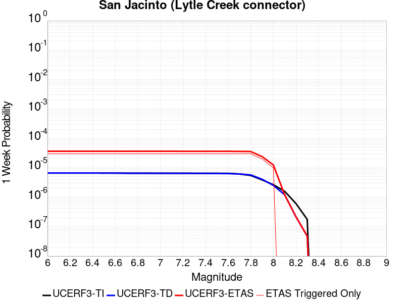 | 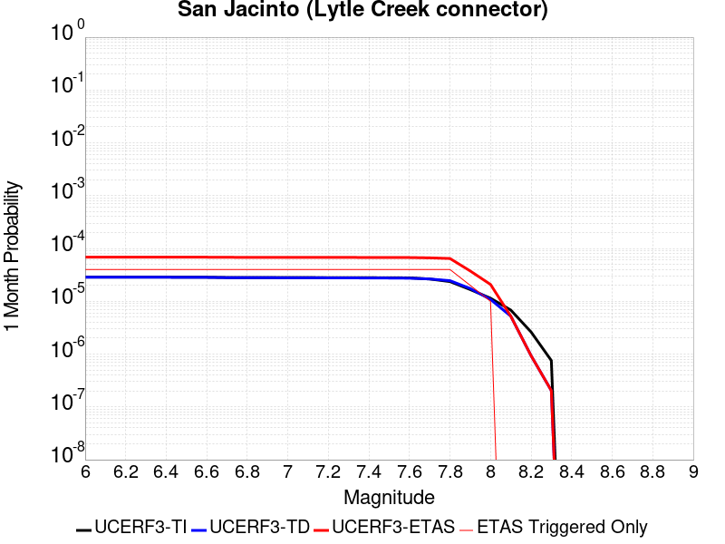 | 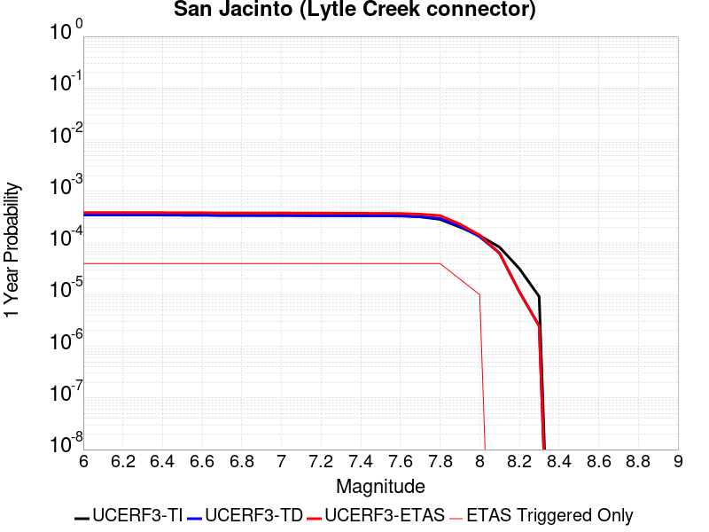 |  |

| Magnitude | 1 wk TI Prob | 1 wk TD Prob | 1 wk ETAS Prob | 1 wk ETAS/TD Gain | 1 wk ETAS Triggered Only | 1 mo TI Prob | 1 mo TD Prob | 1 mo ETAS Prob | 1 mo ETAS/TD Gain | 1 mo ETAS Triggered Only | 1 yr TI Prob | 1 yr TD Prob | 1 yr ETAS Prob | 1 yr ETAS/TD Gain | 1 yr ETAS Triggered Only | 10 yr TI Prob | 10 yr TD Prob | 10 yr ETAS Prob | 10 yr ETAS/TD Gain | 10 yr ETAS Triggered Only |
|-----|-----|-----|-----|-----|-----|-----|-----|-----|-----|-----|-----|-----|-----|-----|-----|-----|-----|-----|-----|-----|
| 6.0 | 6.693995E-6 | 6.660216E-6 | 1.9021074E-5 | 2.8559244 | 1.236094E-5 | 2.8688235E-5 | 2.854347E-5 | 5.3264645E-5 | 1.8660885 | 2.472188E-5 | 3.492233E-4 | 3.4746144E-4 | 3.7217472E-4 | 1.0711253 | 2.472188E-5 | 0.00348675 | 0.0035493854 | 0.0035986535 | 1.0138807 | 4.944376E-5 |
| 6.1 | 6.693995E-6 | 6.660216E-6 | 1.9021074E-5 | 2.8559244 | 1.236094E-5 | 2.8688235E-5 | 2.854347E-5 | 5.3264645E-5 | 1.8660885 | 2.472188E-5 | 3.492233E-4 | 3.4746144E-4 | 3.7217472E-4 | 1.0711253 | 2.472188E-5 | 0.00348675 | 0.0035493854 | 0.0035986535 | 1.0138807 | 4.944376E-5 |
| 6.2 | 6.693995E-6 | 6.660216E-6 | 1.9021074E-5 | 2.8559244 | 1.236094E-5 | 2.8688235E-5 | 2.854347E-5 | 5.3264645E-5 | 1.8660885 | 2.472188E-5 | 3.492233E-4 | 3.4746144E-4 | 3.7217472E-4 | 1.0711253 | 2.472188E-5 | 0.00348675 | 0.0035493854 | 0.0035986535 | 1.0138807 | 4.944376E-5 |
| 6.3 | 6.693995E-6 | 6.660216E-6 | 1.9021074E-5 | 2.8559244 | 1.236094E-5 | 2.8688235E-5 | 2.854347E-5 | 5.3264645E-5 | 1.8660885 | 2.472188E-5 | 3.492233E-4 | 3.4746144E-4 | 3.7217472E-4 | 1.0711253 | 2.472188E-5 | 0.00348675 | 0.0035493854 | 0.0035986535 | 1.0138807 | 4.944376E-5 |
| 6.4 | 6.693995E-6 | 6.660216E-6 | 1.9021074E-5 | 2.8559244 | 1.236094E-5 | 2.8688235E-5 | 2.854347E-5 | 5.3264645E-5 | 1.8660885 | 2.472188E-5 | 3.492233E-4 | 3.4746144E-4 | 3.7217472E-4 | 1.0711253 | 2.472188E-5 | 0.00348675 | 0.0035493854 | 0.0035986535 | 1.0138807 | 4.944376E-5 |
| 6.5 | 6.6561875E-6 | 6.6204343E-6 | 1.8981293E-5 | 2.8670766 | 1.236094E-5 | 2.8526205E-5 | 2.837298E-5 | 5.3094158E-5 | 1.871293 | 2.472188E-5 | 3.472512E-4 | 3.4538636E-4 | 3.700997E-4 | 1.0715528 | 2.472188E-5 | 0.0034670907 | 0.003528701 | 0.0035779702 | 1.0139624 | 4.944376E-5 |
| 6.6 | 6.6561875E-6 | 6.6204343E-6 | 1.8981293E-5 | 2.8670766 | 1.236094E-5 | 2.8526205E-5 | 2.837298E-5 | 5.3094158E-5 | 1.871293 | 2.472188E-5 | 3.472512E-4 | 3.4538636E-4 | 3.700997E-4 | 1.0715528 | 2.472188E-5 | 0.0034670907 | 0.003528701 | 0.0035779702 | 1.0139624 | 4.944376E-5 |
| 6.7 | 6.5802237E-6 | 6.539611E-6 | 1.890047E-5 | 2.890152 | 1.236094E-5 | 2.8200653E-5 | 2.8026603E-5 | 5.274779E-5 | 1.8820615 | 2.472188E-5 | 3.4328885E-4 | 3.4117055E-4 | 3.6588399E-4 | 1.0724372 | 2.472188E-5 | 0.0034275902 | 0.0034866752 | 0.0035359466 | 1.0141313 | 4.944376E-5 |
| 6.8 | 6.575632E-6 | 6.5341005E-6 | 1.889496E-5 | 2.891746 | 1.236094E-5 | 2.8180975E-5 | 2.8002989E-5 | 5.2724175E-5 | 1.8828053 | 2.472188E-5 | 3.4304935E-4 | 3.4088313E-4 | 3.6559658E-4 | 1.0724983 | 2.472188E-5 | 0.0034252026 | 0.00348381 | 0.0035330816 | 1.014143 | 4.944376E-5 |
| 6.9 | 6.570433E-6 | 6.525495E-6 | 1.8886354E-5 | 2.8942409 | 1.236094E-5 | 2.8158694E-5 | 2.7966107E-5 | 5.2687294E-5 | 1.8839695 | 2.472188E-5 | 3.4277816E-4 | 3.4043423E-4 | 3.651477E-4 | 1.0725939 | 2.472188E-5 | 0.0034224992 | 0.0034793352 | 0.0035286068 | 1.0141612 | 4.944376E-5 |
| 7.0 | 6.5643826E-6 | 6.515616E-6 | 1.8876475E-5 | 2.8971128 | 1.236094E-5 | 2.8132765E-5 | 2.792377E-5 | 5.264496E-5 | 1.8853098 | 2.472188E-5 | 3.424626E-4 | 3.3991894E-4 | 3.646324E-4 | 1.0727041 | 2.472188E-5 | 0.0034193532 | 0.0034741985 | 0.0035234704 | 1.0141822 | 4.944376E-5 |
| 7.1 | 6.557402E-6 | 6.5043278E-6 | 1.8865187E-5 | 2.9004054 | 1.236094E-5 | 2.8102848E-5 | 2.7875392E-5 | 5.2596584E-5 | 1.8868463 | 2.472188E-5 | 3.4209844E-4 | 3.3933012E-4 | 3.6404363E-4 | 1.0728302 | 2.472188E-5 | 0.0034157229 | 0.0034683298 | 0.003517602 | 1.0142063 | 4.944376E-5 |
| 7.2 | 6.546394E-6 | 6.4862943E-6 | 1.8847153E-5 | 2.905689 | 1.236094E-5 | 2.8055672E-5 | 2.7798109E-5 | 5.25193E-5 | 1.889312 | 2.472188E-5 | 3.4152428E-4 | 3.3838948E-4 | 3.63103E-4 | 1.0730327 | 2.472188E-5 | 0.0034099987 | 0.0034589572 | 0.0035082297 | 1.0142449 | 4.944376E-5 |
| 7.3 | 6.5364216E-6 | 6.4670803E-6 | 1.882794E-5 | 2.9113507 | 1.236094E-5 | 2.8012933E-5 | 2.7715765E-5 | 5.2436957E-5 | 1.8919542 | 2.472188E-5 | 3.4100408E-4 | 3.3738726E-4 | 3.621008E-4 | 1.0732498 | 2.472188E-5 | 0.003404813 | 0.0034489788 | 0.003498252 | 1.0142863 | 4.944376E-5 |
| 7.4 | 6.5269523E-6 | 6.4481674E-6 | 1.8809027E-5 | 2.916957 | 1.236094E-5 | 2.7972354E-5 | 2.7634711E-5 | 5.2355907E-5 | 1.8945705 | 2.472188E-5 | 3.4051016E-4 | 3.3640073E-4 | 3.611143E-4 | 1.0734646 | 2.472188E-5 | 0.0033998888 | 0.003439161 | 0.0034884347 | 1.0143273 | 4.944376E-5 |
| 7.5 | 6.5111835E-6 | 6.424442E-6 | 1.8785302E-5 | 2.9240365 | 1.236094E-5 | 2.7904773E-5 | 2.7533031E-5 | 5.225423E-5 | 1.8978741 | 2.472188E-5 | 3.3968766E-4 | 3.3516317E-4 | 3.5987678E-4 | 1.073736 | 2.472188E-5 | 0.0033916887 | 0.003426834 | 0.0034761084 | 1.0143789 | 4.944376E-5 |
| 7.6 | 6.4768806E-6 | 6.383551E-6 | 1.8744411E-5 | 2.936361 | 1.236094E-5 | 2.7757764E-5 | 2.735779E-5 | 5.207899E-5 | 1.9036257 | 2.472188E-5 | 3.3789838E-4 | 3.3303024E-4 | 3.577439E-4 | 1.0742084 | 2.472188E-5 | 0.0033738504 | 0.0034055663 | 0.0034548417 | 1.014469 | 4.944376E-5 |
| 7.7 | 6.1655364E-6 | 6.1760365E-6 | 1.8536899E-5 | 3.0014234 | 1.236094E-5 | 2.642346E-5 | 2.646846E-5 | 5.1189683E-5 | 1.933988 | 2.472188E-5 | 3.2165812E-4 | 3.2220592E-4 | 3.469198E-4 | 1.0767022 | 2.472188E-5 | 0.0032119295 | 0.0032971818 | 0.0033464625 | 1.0149463 | 4.944376E-5 |
| 7.8 | 5.5043524E-6 | 5.737097E-6 | 1.8097966E-5 | 3.154551 | 1.236094E-5 | 2.3589868E-5 | 2.4587327E-5 | 4.9308597E-5 | 2.0054476 | 2.472188E-5 | 2.871688E-4 | 2.9930964E-4 | 3.2402412E-4 | 1.0825716 | 2.472188E-5 | 0.0028679797 | 0.0030672832 | 0.0031165753 | 1.0160702 | 4.944376E-5 |
| 7.9 | 3.889249E-6 | 4.076761E-6 | 1.643765E-5 | 4.032037 | 1.236094E-5 | 1.6668104E-5 | 1.7471715E-5 | 2.983244E-5 | 1.7074705 | 1.236094E-5 | 2.0291525E-4 | 2.1269741E-4 | 2.2505573E-4 | 1.0581027 | 1.236094E-5 | 0.0020273007 | 0.0021943315 | 0.002231333 | 1.0168623 | 3.7082817E-5 |
| 8.0 | 2.668535E-6 | 2.5315155E-6 | 1.4892424E-5 | 5.8828096 | 1.236094E-5 | 1.1436528E-5 | 1.0849307E-5 | 2.3210112E-5 | 2.1393175 | 1.236094E-5 | 1.3923083E-4 | 1.3208234E-4 | 1.4444164E-4 | 1.0935727 | 1.236094E-5 | 0.0013914363 | 0.0013757964 | 0.0014004842 | 1.0179445 | 2.472188E-5 |
| 8.1 | 1.5911459E-6 | 1.218661E-6 | 1.218661E-6 | 1.0 | 0.0 | 6.8191785E-6 | 5.2228224E-6 | 5.2228224E-6 | 1.0 | 0.0 | 8.3020335E-5 | 6.3586034E-5 | 6.3586034E-5 | 1.0 | 0.0 | 8.298933E-4 | 6.6932244E-4 | 6.6932244E-4 | 1.0 | 0.0 |
| 8.2 | 6.1294963E-7 | 2.1812275E-7 | 2.1812275E-7 | 1.0 | 0.0 | 2.6269242E-6 | 9.3481145E-7 | 9.3481145E-7 | 1.0 | 0.0 | 3.1982334E-5 | 1.138127E-5 | 1.138127E-5 | 1.0 | 0.0 | 3.1977732E-4 | 1.2784546E-4 | 1.2784546E-4 | 1.0 | 0.0 |
| 8.3 | 1.762871E-7 | 4.7546838E-8 | 4.7546838E-8 | 1.0 | 0.0 | 7.5551594E-7 | 2.0377215E-7 | 2.0377215E-7 | 1.0 | 0.0 | 9.1983675E-6 | 2.480923E-6 | 2.480923E-6 | 1.0 | 0.0 | 9.197987E-5 | 2.868753E-5 | 2.868753E-5 | 1.0 | 0.0 |

## Santa Susana alt 1
*[(top)](#table-of-contents)*

| 1 Week | 1 Month | 1 Year | 10 Year |
|-----|-----|-----|-----|
|  |  |  |  |

| Magnitude | 1 wk TI Prob | 1 wk TD Prob | 1 wk ETAS Prob | 1 wk ETAS/TD Gain | 1 wk ETAS Triggered Only | 1 mo TI Prob | 1 mo TD Prob | 1 mo ETAS Prob | 1 mo ETAS/TD Gain | 1 mo ETAS Triggered Only | 1 yr TI Prob | 1 yr TD Prob | 1 yr ETAS Prob | 1 yr ETAS/TD Gain | 1 yr ETAS Triggered Only | 10 yr TI Prob | 10 yr TD Prob | 10 yr ETAS Prob | 10 yr ETAS/TD Gain | 10 yr ETAS Triggered Only |
|-----|-----|-----|-----|-----|-----|-----|-----|-----|-----|-----|-----|-----|-----|-----|-----|-----|-----|-----|-----|-----|
| 6.0 | 2.674877E-5 | 2.7198023E-5 | 2.7198023E-5 | 1.0 | 0.0 | 1.1463255E-4 | 1.1655839E-4 | 1.2891789E-4 | 1.106037 | 1.236094E-5 | 0.0013947578 | 0.0014182882 | 0.0014553184 | 1.0261091 | 3.7082817E-5 | 0.013860362 | 0.014104128 | 0.014152874 | 1.0034562 | 4.944376E-5 |
| 6.1 | 2.674877E-5 | 2.7198023E-5 | 2.7198023E-5 | 1.0 | 0.0 | 1.1463255E-4 | 1.1655839E-4 | 1.2891789E-4 | 1.106037 | 1.236094E-5 | 0.0013947578 | 0.0014182882 | 0.0014553184 | 1.0261091 | 3.7082817E-5 | 0.013860362 | 0.014104128 | 0.014152874 | 1.0034562 | 4.944376E-5 |
| 6.2 | 2.674877E-5 | 2.7198023E-5 | 2.7198023E-5 | 1.0 | 0.0 | 1.1463255E-4 | 1.1655839E-4 | 1.2891789E-4 | 1.106037 | 1.236094E-5 | 0.0013947578 | 0.0014182882 | 0.0014553184 | 1.0261091 | 3.7082817E-5 | 0.013860362 | 0.014104128 | 0.014152874 | 1.0034562 | 4.944376E-5 |
| 6.3 | 2.674877E-5 | 2.7198023E-5 | 2.7198023E-5 | 1.0 | 0.0 | 1.1463255E-4 | 1.1655839E-4 | 1.2891789E-4 | 1.106037 | 1.236094E-5 | 0.0013947578 | 0.0014182882 | 0.0014553184 | 1.0261091 | 3.7082817E-5 | 0.013860362 | 0.014104128 | 0.014152874 | 1.0034562 | 4.944376E-5 |
| 6.4 | 2.674877E-5 | 2.7198023E-5 | 2.7198023E-5 | 1.0 | 0.0 | 1.1463255E-4 | 1.1655839E-4 | 1.2891789E-4 | 1.106037 | 1.236094E-5 | 0.0013947578 | 0.0014182882 | 0.0014553184 | 1.0261091 | 3.7082817E-5 | 0.013860362 | 0.014104128 | 0.014152874 | 1.0034562 | 4.944376E-5 |
| 6.5 | 2.674877E-5 | 2.7198023E-5 | 2.7198023E-5 | 1.0 | 0.0 | 1.1463255E-4 | 1.1655839E-4 | 1.2891789E-4 | 1.106037 | 1.236094E-5 | 0.0013947578 | 0.0014182882 | 0.0014553184 | 1.0261091 | 3.7082817E-5 | 0.013860362 | 0.014104128 | 0.014152874 | 1.0034562 | 4.944376E-5 |
| 6.6 | 2.6647976E-5 | 2.7074359E-5 | 2.7074359E-5 | 1.0 | 0.0 | 1.14200615E-4 | 1.1602845E-4 | 1.2838795E-4 | 1.1065214 | 1.236094E-5 | 0.0013895056 | 0.0014118447 | 0.0014488753 | 1.0262284 | 3.7082817E-5 | 0.013808494 | 0.014040513 | 0.014089263 | 1.0034721 | 4.944376E-5 |
| 6.7 | 2.6647976E-5 | 2.7074359E-5 | 2.7074359E-5 | 1.0 | 0.0 | 1.14200615E-4 | 1.1602845E-4 | 1.2838795E-4 | 1.1065214 | 1.236094E-5 | 0.0013895056 | 0.0014118447 | 0.0014488753 | 1.0262284 | 3.7082817E-5 | 0.013808494 | 0.014040513 | 0.014089263 | 1.0034721 | 4.944376E-5 |
| 6.8 | 1.9073179E-5 | 1.7637283E-5 | 1.7637283E-5 | 1.0 | 0.0 | 8.1739636E-5 | 7.558627E-5 | 8.7946275E-5 | 1.1635218 | 1.236094E-5 | 9.947256E-4 | 9.198925E-4 | 9.4459165E-4 | 1.02685 | 2.472188E-5 | 0.009902848 | 0.009163101 | 0.009199845 | 1.0040098 | 3.7082817E-5 |
| 6.9 | 1.9041876E-5 | 1.7619415E-5 | 1.7619415E-5 | 1.0 | 0.0 | 8.160549E-5 | 7.55097E-5 | 8.78697E-5 | 1.1636877 | 1.236094E-5 | 9.930939E-4 | 9.1896096E-4 | 9.436601E-4 | 1.0268773 | 2.472188E-5 | 0.0098866755 | 0.0091538625 | 0.009190606 | 1.004014 | 3.7082817E-5 |
| 7.0 | 1.5917482E-5 | 1.3863864E-5 | 1.3863864E-5 | 1.0 | 0.0 | 6.8215995E-5 | 5.9415237E-5 | 5.9415237E-5 | 1.0 | 0.0 | 8.302132E-4 | 7.231451E-4 | 7.3549704E-4 | 1.0170809 | 1.236094E-5 | 0.008271185 | 0.0072088144 | 0.007233358 | 1.0034046 | 2.472188E-5 |
| 7.1 | 1.577788E-5 | 1.3743872E-5 | 1.3743872E-5 | 1.0 | 0.0 | 6.761774E-5 | 5.8901005E-5 | 5.8901005E-5 | 1.0 | 0.0 | 8.2293496E-4 | 7.1688846E-4 | 7.2924054E-4 | 1.0172302 | 1.236094E-5 | 0.008198941 | 0.007146652 | 0.0071711973 | 1.0034345 | 2.472188E-5 |
| 7.2 | 1.5416446E-5 | 1.3469944E-5 | 1.3469944E-5 | 1.0 | 0.0 | 6.606882E-5 | 5.772708E-5 | 5.772708E-5 | 1.0 | 0.0 | 8.0409093E-4 | 7.026052E-4 | 7.149575E-4 | 1.0175806 | 1.236094E-5 | 0.008011877 | 0.0070047234 | 0.007029272 | 1.0035046 | 2.472188E-5 |
| 7.3 | 1.4534083E-5 | 1.2717879E-5 | 1.2717879E-5 | 1.0 | 0.0 | 6.228744E-5 | 5.4504082E-5 | 5.4504082E-5 | 1.0 | 0.0 | 7.580857E-4 | 6.633896E-4 | 6.7574234E-4 | 1.0186206 | 1.236094E-5 | 0.007555048 | 0.0066149444 | 0.006639503 | 1.0037125 | 2.472188E-5 |
| 7.4 | 1.2858995E-5 | 1.1229652E-5 | 1.1229652E-5 | 1.0 | 0.0 | 5.5108816E-5 | 4.8126214E-5 | 4.8126214E-5 | 1.0 | 0.0 | 6.7074323E-4 | 5.857831E-4 | 5.981368E-4 | 1.0210892 | 1.236094E-5 | 0.0066872234 | 0.005843165 | 0.0058677425 | 1.0042062 | 2.472188E-5 |
| 7.5 | 8.827668E-6 | 7.805457E-6 | 7.805457E-6 | 1.0 | 0.0 | 3.7832317E-5 | 3.3451546E-5 | 3.3451546E-5 | 1.0 | 0.0 | 4.605111E-4 | 4.071989E-4 | 4.195548E-4 | 1.0303437 | 1.236094E-5 | 0.0045955796 | 0.0040647765 | 0.004077087 | 1.0030286 | 1.236094E-5 |
| 7.6 | 3.2533426E-6 | 2.871988E-6 | 2.871988E-6 | 1.0 | 0.0 | 1.3942822E-5 | 1.2308465E-5 | 1.2308465E-5 | 1.0 | 0.0 | 1.6974064E-4 | 1.4984563E-4 | 1.4984563E-4 | 1.0 | 0.0 | 0.0016961104 | 0.0014974826 | 0.0014974826 | 1.0 | 0.0 |
| 7.7 | 1.2751709E-6 | 1.1491089E-6 | 1.1491089E-6 | 1.0 | 0.0 | 5.4650063E-6 | 4.9247437E-6 | 4.9247437E-6 | 1.0 | 0.0 | 6.653442E-5 | 5.9957198E-5 | 5.9957198E-5 | 1.0 | 0.0 | 6.6514505E-4 | 5.994191E-4 | 5.994191E-4 | 1.0 | 0.0 |
| 7.8 | 3.067544E-7 | 3.2400436E-7 | 3.2400436E-7 | 1.0 | 0.0 | 1.3146611E-6 | 1.3885895E-6 | 1.3885895E-6 | 1.0 | 0.0 | 1.600588E-5 | 1.6905957E-5 | 1.6905957E-5 | 1.0 | 0.0 | 1.6004729E-4 | 1.6904772E-4 | 1.6904772E-4 | 1.0 | 0.0 |
| 7.9 | 7.622999E-8 | 8.087964E-8 | 8.087964E-8 | 1.0 | 0.0 | 3.2669993E-7 | 3.4662696E-7 | 3.4662696E-7 | 1.0 | 0.0 | 3.977564E-6 | 4.2201773E-6 | 4.2201773E-6 | 1.0 | 0.0 | 3.977493E-5 | 4.220118E-5 | 4.220118E-5 | 1.0 | 0.0 |

## Tin Mountain
*[(top)](#table-of-contents)*

| 1 Week | 1 Month | 1 Year | 10 Year |
|-----|-----|-----|-----|
|  | 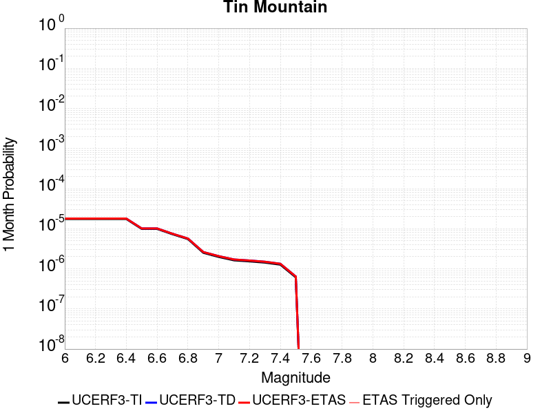 |  |  |

| Magnitude | 1 wk TI Prob | 1 wk TD Prob | 1 wk ETAS Prob | 1 wk ETAS/TD Gain | 1 wk ETAS Triggered Only | 1 mo TI Prob | 1 mo TD Prob | 1 mo ETAS Prob | 1 mo ETAS/TD Gain | 1 mo ETAS Triggered Only | 1 yr TI Prob | 1 yr TD Prob | 1 yr ETAS Prob | 1 yr ETAS/TD Gain | 1 yr ETAS Triggered Only | 10 yr TI Prob | 10 yr TD Prob | 10 yr ETAS Prob | 10 yr ETAS/TD Gain | 10 yr ETAS Triggered Only |
|-----|-----|-----|-----|-----|-----|-----|-----|-----|-----|-----|-----|-----|-----|-----|-----|-----|-----|-----|-----|-----|
| 6.0 | 4.083776E-6 | 4.1815365E-6 | 4.1815365E-6 | 1.0 | 0.0 | 1.750178E-5 | 1.792077E-5 | 1.792077E-5 | 1.0 | 0.0 | 2.1306332E-4 | 2.1816725E-4 | 2.3052549E-4 | 1.0566458 | 1.236094E-5 | 0.0021285915 | 0.0021798965 | 0.0022292323 | 1.0226322 | 4.944376E-5 |
| 6.1 | 4.083776E-6 | 4.1815365E-6 | 4.1815365E-6 | 1.0 | 0.0 | 1.750178E-5 | 1.792077E-5 | 1.792077E-5 | 1.0 | 0.0 | 2.1306332E-4 | 2.1816725E-4 | 2.3052549E-4 | 1.0566458 | 1.236094E-5 | 0.0021285915 | 0.0021798965 | 0.0022292323 | 1.0226322 | 4.944376E-5 |
| 6.2 | 4.083776E-6 | 4.1815365E-6 | 4.1815365E-6 | 1.0 | 0.0 | 1.750178E-5 | 1.792077E-5 | 1.792077E-5 | 1.0 | 0.0 | 2.1306332E-4 | 2.1816725E-4 | 2.3052549E-4 | 1.0566458 | 1.236094E-5 | 0.0021285915 | 0.0021798965 | 0.0022292323 | 1.0226322 | 4.944376E-5 |
| 6.3 | 4.083776E-6 | 4.1815365E-6 | 4.1815365E-6 | 1.0 | 0.0 | 1.750178E-5 | 1.792077E-5 | 1.792077E-5 | 1.0 | 0.0 | 2.1306332E-4 | 2.1816725E-4 | 2.3052549E-4 | 1.0566458 | 1.236094E-5 | 0.0021285915 | 0.0021798965 | 0.0022292323 | 1.0226322 | 4.944376E-5 |
| 6.4 | 4.083776E-6 | 4.1815365E-6 | 4.1815365E-6 | 1.0 | 0.0 | 1.750178E-5 | 1.792077E-5 | 1.792077E-5 | 1.0 | 0.0 | 2.1306332E-4 | 2.1816725E-4 | 2.3052549E-4 | 1.0566458 | 1.236094E-5 | 0.0021285915 | 0.0021798965 | 0.0022292323 | 1.0226322 | 4.944376E-5 |
| 6.5 | 2.3143427E-6 | 2.3731573E-6 | 2.3731573E-6 | 1.0 | 0.0 | 9.9185745E-6 | 1.0170638E-5 | 1.0170638E-5 | 1.0 | 0.0 | 1.2075195E-4 | 1.2382126E-4 | 1.2382126E-4 | 1.0 | 0.0 | 0.0012068636 | 0.0012375986 | 0.0012499442 | 1.0099754 | 1.236094E-5 |
| 6.6 | 2.3143427E-6 | 2.3731573E-6 | 2.3731573E-6 | 1.0 | 0.0 | 9.9185745E-6 | 1.0170638E-5 | 1.0170638E-5 | 1.0 | 0.0 | 1.2075195E-4 | 1.2382126E-4 | 1.2382126E-4 | 1.0 | 0.0 | 0.0012068636 | 0.0012375986 | 0.0012499442 | 1.0099754 | 1.236094E-5 |
| 6.7 | 1.7029532E-6 | 1.7497915E-6 | 1.7497915E-6 | 1.0 | 0.0 | 7.2983503E-6 | 7.499088E-6 | 7.499088E-6 | 1.0 | 0.0 | 8.885379E-5 | 9.1298105E-5 | 9.1298105E-5 | 1.0 | 0.0 | 8.881827E-4 | 9.1265864E-4 | 9.1265864E-4 | 1.0 | 0.0 |
| 6.8 | 1.2914646E-6 | 1.3299378E-6 | 1.3299378E-6 | 1.0 | 0.0 | 5.534837E-6 | 5.6997237E-6 | 5.6997237E-6 | 1.0 | 0.0 | 6.738455E-5 | 6.939237E-5 | 6.939237E-5 | 1.0 | 0.0 | 6.736412E-4 | 6.9375033E-4 | 6.9375033E-4 | 1.0 | 0.0 |
| 6.9 | 5.8708974E-7 | 6.1169936E-7 | 6.1169936E-7 | 1.0 | 0.0 | 2.5160964E-6 | 2.6215664E-6 | 2.6215664E-6 | 1.0 | 0.0 | 3.0633044E-5 | 3.1917145E-5 | 3.1917145E-5 | 1.0 | 0.0 | 3.0628822E-4 | 3.191297E-4 | 3.191297E-4 | 1.0 | 0.0 |
| 7.0 | 4.6248786E-7 | 4.832015E-7 | 4.832015E-7 | 1.0 | 0.0 | 1.9820893E-6 | 2.0708624E-6 | 2.0708624E-6 | 1.0 | 0.0 | 2.413167E-5 | 2.5212494E-5 | 2.5212494E-5 | 1.0 | 0.0 | 2.412905E-4 | 2.5210003E-4 | 2.5210003E-4 | 1.0 | 0.0 |
| 7.1 | 3.804606E-7 | 3.987147E-7 | 3.987147E-7 | 1.0 | 0.0 | 1.6305444E-6 | 1.7087764E-6 | 1.7087764E-6 | 1.0 | 0.0 | 1.9851697E-5 | 2.0804187E-5 | 2.0804187E-5 | 1.0 | 0.0 | 1.9849923E-4 | 2.0802575E-4 | 2.0802575E-4 | 1.0 | 0.0 |
| 7.2 | 3.5864858E-7 | 3.7616863E-7 | 3.7616863E-7 | 1.0 | 0.0 | 1.5370645E-6 | 1.6121504E-6 | 1.6121504E-6 | 1.0 | 0.0 | 1.87136E-5 | 1.9627789E-5 | 1.9627789E-5 | 1.0 | 0.0 | 1.8712023E-4 | 1.9626386E-4 | 1.9626386E-4 | 1.0 | 0.0 |
| 7.3 | 3.342063E-7 | 3.506347E-7 | 3.506347E-7 | 1.0 | 0.0 | 1.4323119E-6 | 1.5027196E-6 | 1.5027196E-6 | 1.0 | 0.0 | 1.7438259E-5 | 1.829549E-5 | 1.829549E-5 | 1.0 | 0.0 | 1.743689E-4 | 1.8294314E-4 | 1.8294314E-4 | 1.0 | 0.0 |
| 7.4 | 2.971242E-7 | 3.1165817E-7 | 3.1165817E-7 | 1.0 | 0.0 | 1.2733886E-6 | 1.3356774E-6 | 1.3356774E-6 | 1.0 | 0.0 | 1.5503398E-5 | 1.6261785E-5 | 1.6261785E-5 | 1.0 | 0.0 | 1.5502315E-4 | 1.6260923E-4 | 1.6260923E-4 | 1.0 | 0.0 |
| 7.5 | 1.4326713E-7 | 1.5012525E-7 | 1.5012525E-7 | 1.0 | 0.0 | 6.140018E-7 | 6.433939E-7 | 6.433939E-7 | 1.0 | 0.0 | 7.4754466E-6 | 7.8333205E-6 | 7.8333205E-6 | 1.0 | 0.0 | 7.475195E-5 | 7.833321E-5 | 7.833321E-5 | 1.0 | 0.0 |

## Malibu Coast alt 1
*[(top)](#table-of-contents)*

| 1 Week | 1 Month | 1 Year | 10 Year |
|-----|-----|-----|-----|
|  | 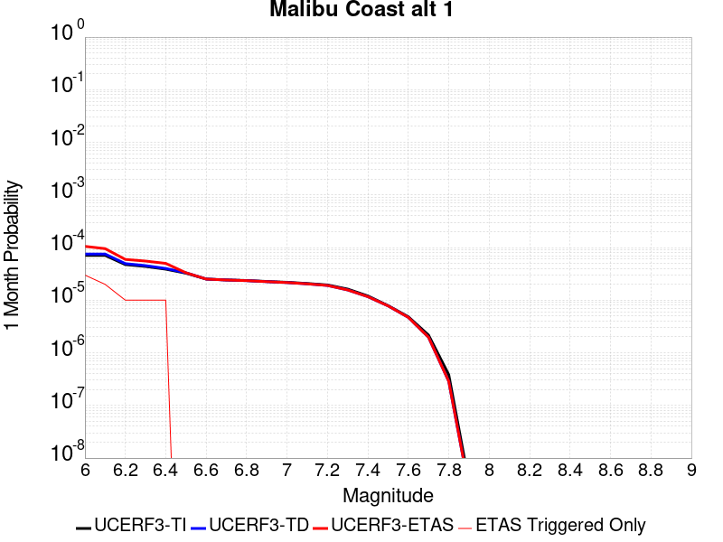 |  |  |

| Magnitude | 1 wk TI Prob | 1 wk TD Prob | 1 wk ETAS Prob | 1 wk ETAS/TD Gain | 1 wk ETAS Triggered Only | 1 mo TI Prob | 1 mo TD Prob | 1 mo ETAS Prob | 1 mo ETAS/TD Gain | 1 mo ETAS Triggered Only | 1 yr TI Prob | 1 yr TD Prob | 1 yr ETAS Prob | 1 yr ETAS/TD Gain | 1 yr ETAS Triggered Only | 10 yr TI Prob | 10 yr TD Prob | 10 yr ETAS Prob | 10 yr ETAS/TD Gain | 10 yr ETAS Triggered Only |
|-----|-----|-----|-----|-----|-----|-----|-----|-----|-----|-----|-----|-----|-----|-----|-----|-----|-----|-----|-----|-----|
| 6.0 | 1.6572556E-5 | 1.7598066E-5 | 2.9958788E-5 | 1.7023909 | 1.236094E-5 | 7.102331E-5 | 7.541821E-5 | 1.1249823E-4 | 1.4916587 | 3.7082817E-5 | 8.6436566E-4 | 9.178488E-4 | 9.5489755E-4 | 1.0403647 | 3.7082817E-5 | 0.0086101135 | 0.009142512 | 0.009191505 | 1.0053587 | 4.944376E-5 |
| 6.1 | 1.6572556E-5 | 1.7598066E-5 | 2.9958788E-5 | 1.7023909 | 1.236094E-5 | 7.102331E-5 | 7.541821E-5 | 1.00138226E-4 | 1.3277725 | 2.472188E-5 | 8.6436566E-4 | 9.178488E-4 | 9.42548E-4 | 1.0269098 | 2.472188E-5 | 0.0086101135 | 0.009142512 | 0.009179256 | 1.004019 | 3.7082817E-5 |
| 6.2 | 1.1085717E-5 | 1.1557147E-5 | 2.3917944E-5 | 2.069537 | 1.236094E-5 | 4.750935E-5 | 4.952971E-5 | 6.189004E-5 | 1.2495538 | 1.236094E-5 | 5.782728E-4 | 6.028609E-4 | 6.152144E-4 | 1.0204915 | 1.236094E-5 | 0.0057677035 | 0.0060126255 | 0.006037199 | 1.004087 | 2.472188E-5 |
| 6.3 | 1.0208568E-5 | 1.0592237E-5 | 2.2953045E-5 | 2.1669686 | 1.236094E-5 | 4.375027E-5 | 4.539453E-5 | 5.7754907E-5 | 1.2722878 | 1.236094E-5 | 5.325294E-4 | 5.5254117E-4 | 5.648953E-4 | 1.0223587 | 1.236094E-5 | 0.0053125503 | 0.0055119814 | 0.0055365674 | 1.0044605 | 2.472188E-5 |
| 6.4 | 9.0682315E-6 | 9.342637E-6 | 2.1703461E-5 | 2.323055 | 1.236094E-5 | 3.8863272E-5 | 4.003927E-5 | 5.2399715E-5 | 1.3087081 | 1.236094E-5 | 4.730576E-4 | 4.8737114E-4 | 4.9972604E-4 | 1.0253501 | 1.236094E-5 | 0.0047205184 | 0.004863236 | 0.004887838 | 1.0050586 | 2.472188E-5 |
| 6.5 | 7.605796E-6 | 7.748587E-6 | 7.748587E-6 | 1.0 | 0.0 | 3.259586E-5 | 3.3207816E-5 | 3.3207816E-5 | 1.0 | 0.0 | 3.9678233E-4 | 4.0423148E-4 | 4.0423148E-4 | 1.0 | 0.0 | 0.0039607463 | 0.0040351 | 0.004047411 | 1.003051 | 1.236094E-5 |
| 6.6 | 5.889873E-6 | 5.8795385E-6 | 5.8795385E-6 | 1.0 | 0.0 | 2.5242069E-5 | 2.519778E-5 | 2.519778E-5 | 1.0 | 0.0 | 3.0727885E-4 | 3.0673988E-4 | 3.0673988E-4 | 1.0 | 0.0 | 0.003068543 | 0.0030631777 | 0.0030755007 | 1.004023 | 1.236094E-5 |
| 6.7 | 5.66586E-6 | 5.641641E-6 | 5.641641E-6 | 1.0 | 0.0 | 2.428203E-5 | 2.417824E-5 | 2.417824E-5 | 1.0 | 0.0 | 2.955936E-4 | 2.9433038E-4 | 2.9433038E-4 | 1.0 | 0.0 | 0.0029520073 | 0.0029394177 | 0.0029517424 | 1.0041928 | 1.236094E-5 |
| 6.8 | 5.521556E-6 | 5.489427E-6 | 5.489427E-6 | 1.0 | 0.0 | 2.3663597E-5 | 2.3525903E-5 | 2.3525903E-5 | 1.0 | 0.0 | 2.880662E-4 | 2.8639034E-4 | 2.8639034E-4 | 1.0 | 0.0 | 0.0028769306 | 0.002860224 | 0.0028725497 | 1.0043093 | 1.236094E-5 |
| 6.9 | 5.29752E-6 | 5.2499317E-6 | 5.2499317E-6 | 1.0 | 0.0 | 2.270346E-5 | 2.2499513E-5 | 2.2499513E-5 | 1.0 | 0.0 | 2.7637955E-4 | 2.7389723E-4 | 2.7389723E-4 | 1.0 | 0.0 | 0.0027603607 | 0.0027356069 | 0.0027479338 | 1.0045062 | 1.236094E-5 |
| 7.0 | 5.106743E-6 | 5.0476788E-6 | 5.0476788E-6 | 1.0 | 0.0 | 2.1885859E-5 | 2.163273E-5 | 2.163273E-5 | 1.0 | 0.0 | 2.6642776E-4 | 2.6334674E-4 | 2.6334674E-4 | 1.0 | 0.0 | 0.0026610855 | 0.0026303562 | 0.0026426846 | 1.004687 | 1.236094E-5 |
| 7.1 | 4.8469647E-6 | 4.770373E-6 | 4.770373E-6 | 1.0 | 0.0 | 2.0772539E-5 | 2.0444295E-5 | 2.0444295E-5 | 1.0 | 0.0 | 2.528763E-4 | 2.4888094E-4 | 2.4888094E-4 | 1.0 | 0.0 | 0.0025258875 | 0.00248603 | 0.0024983604 | 1.0049598 | 1.236094E-5 |
| 7.2 | 4.545514E-6 | 4.4481935E-6 | 4.4481935E-6 | 1.0 | 0.0 | 1.9480629E-5 | 1.9063547E-5 | 1.9063547E-5 | 1.0 | 0.0 | 2.3715083E-4 | 2.3207403E-4 | 2.3207403E-4 | 1.0 | 0.0 | 0.0023689792 | 0.0023183243 | 0.0023306566 | 1.0053195 | 1.236094E-5 |
| 7.3 | 3.794097E-6 | 3.6519348E-6 | 3.6519348E-6 | 1.0 | 0.0 | 1.6260314E-5 | 1.5651056E-5 | 1.5651056E-5 | 1.0 | 0.0 | 1.9795135E-4 | 1.9053498E-4 | 1.9053498E-4 | 1.0 | 0.0 | 0.001977751 | 0.0019037209 | 0.0019160582 | 1.0064807 | 1.236094E-5 |
| 7.4 | 2.808217E-6 | 2.719077E-6 | 2.719077E-6 | 1.0 | 0.0 | 1.203516E-5 | 1.1653135E-5 | 1.1653135E-5 | 1.0 | 0.0 | 1.4651821E-4 | 1.418677E-4 | 1.418677E-4 | 1.0 | 0.0 | 0.0014642165 | 0.001417774 | 0.0014301174 | 1.0087062 | 1.236094E-5 |
| 7.5 | 1.83809E-6 | 1.8190691E-6 | 1.8190691E-6 | 1.0 | 0.0 | 7.877505E-6 | 7.795988E-6 | 7.795988E-6 | 1.0 | 0.0 | 9.59044E-5 | 9.491203E-5 | 9.491203E-5 | 1.0 | 0.0 | 9.5863023E-4 | 9.48717E-4 | 9.6106617E-4 | 1.0130167 | 1.236094E-5 |
| 7.6 | 1.1292672E-6 | 1.1001447E-6 | 1.1001447E-6 | 1.0 | 0.0 | 4.839708E-6 | 4.714897E-6 | 4.714897E-6 | 1.0 | 0.0 | 5.8921847E-5 | 5.7402376E-5 | 5.7402376E-5 | 1.0 | 0.0 | 5.890623E-4 | 5.738771E-4 | 5.86231E-4 | 1.0215269 | 1.236094E-5 |
| 7.7 | 5.065272E-7 | 4.609151E-7 | 4.609151E-7 | 1.0 | 0.0 | 2.170829E-6 | 1.975349E-6 | 1.975349E-6 | 1.0 | 0.0 | 2.6429525E-5 | 2.404962E-5 | 2.404962E-5 | 1.0 | 0.0 | 2.642638E-4 | 2.4047129E-4 | 2.5282925E-4 | 1.0513906 | 1.236094E-5 |
| 7.8 | 8.952991E-8 | 6.707874E-8 | 6.707874E-8 | 1.0 | 0.0 | 3.8369956E-7 | 2.8748025E-7 | 2.8748025E-7 | 1.0 | 0.0 | 4.671532E-6 | 3.5000667E-6 | 3.5000667E-6 | 1.0 | 0.0 | 4.671434E-5 | 3.5000136E-5 | 3.5000136E-5 | 1.0 | 0.0 |
| 7.9 | 8.007447E-10 | 6.1608785E-10 | 6.1608785E-10 | 1.0 | 0.0 | 3.4317629E-9 | 2.6403764E-9 | 2.6403764E-9 | 1.0 | 0.0 | 4.1781714E-8 | 3.2146584E-8 | 3.2146584E-8 | 1.0 | 0.0 | 4.1781706E-7 | 3.214658E-7 | 3.214658E-7 | 1.0 | 0.0 |

## Mono Lake 2011 CFM
*[(top)](#table-of-contents)*

| 1 Week | 1 Month | 1 Year | 10 Year |
|-----|-----|-----|-----|
|  |  |  |  |

| Magnitude | 1 wk TI Prob | 1 wk TD Prob | 1 wk ETAS Prob | 1 wk ETAS/TD Gain | 1 wk ETAS Triggered Only | 1 mo TI Prob | 1 mo TD Prob | 1 mo ETAS Prob | 1 mo ETAS/TD Gain | 1 mo ETAS Triggered Only | 1 yr TI Prob | 1 yr TD Prob | 1 yr ETAS Prob | 1 yr ETAS/TD Gain | 1 yr ETAS Triggered Only | 10 yr TI Prob | 10 yr TD Prob | 10 yr ETAS Prob | 10 yr ETAS/TD Gain | 10 yr ETAS Triggered Only |
|-----|-----|-----|-----|-----|-----|-----|-----|-----|-----|-----|-----|-----|-----|-----|-----|-----|-----|-----|-----|-----|
| 6.0 | 2.0341662E-5 | 2.3828166E-5 | 3.6188812E-5 | 1.5187409 | 1.236094E-5 | 8.717564E-5 | 1.0211971E-4 | 1.2683906E-4 | 1.2420626 | 2.472188E-5 | 0.0010608466 | 0.0012431298 | 0.0012801666 | 1.0297931 | 3.7082817E-5 | 0.010557966 | 0.012413835 | 0.012462665 | 1.0039335 | 4.944376E-5 |
| 6.1 | 2.0341662E-5 | 2.3828166E-5 | 3.6188812E-5 | 1.5187409 | 1.236094E-5 | 8.717564E-5 | 1.0211971E-4 | 1.2683906E-4 | 1.2420626 | 2.472188E-5 | 0.0010608466 | 0.0012431298 | 0.0012801666 | 1.0297931 | 3.7082817E-5 | 0.010557966 | 0.012413835 | 0.012462665 | 1.0039335 | 4.944376E-5 |
| 6.2 | 2.0341662E-5 | 2.3828166E-5 | 3.6188812E-5 | 1.5187409 | 1.236094E-5 | 8.717564E-5 | 1.0211971E-4 | 1.2683906E-4 | 1.2420626 | 2.472188E-5 | 0.0010608466 | 0.0012431298 | 0.0012801666 | 1.0297931 | 3.7082817E-5 | 0.010557966 | 0.012413835 | 0.012462665 | 1.0039335 | 4.944376E-5 |
| 6.3 | 2.0341662E-5 | 2.3828166E-5 | 3.6188812E-5 | 1.5187409 | 1.236094E-5 | 8.717564E-5 | 1.0211971E-4 | 1.2683906E-4 | 1.2420626 | 2.472188E-5 | 0.0010608466 | 0.0012431298 | 0.0012801666 | 1.0297931 | 3.7082817E-5 | 0.010557966 | 0.012413835 | 0.012462665 | 1.0039335 | 4.944376E-5 |
| 6.4 | 1.749821E-5 | 2.0490985E-5 | 3.2851673E-5 | 1.6032256 | 1.236094E-5 | 7.499018E-5 | 8.781851E-5 | 1.1253822E-4 | 1.2814863 | 2.472188E-5 | 9.1262296E-4 | 0.0010691903 | 0.0011062335 | 1.034646 | 3.7082817E-5 | 0.009088841 | 0.010691865 | 0.01074078 | 1.004575 | 4.944376E-5 |
| 6.5 | 1.749821E-5 | 2.0490985E-5 | 3.2851673E-5 | 1.6032256 | 1.236094E-5 | 7.499018E-5 | 8.781851E-5 | 1.1253822E-4 | 1.2814863 | 2.472188E-5 | 9.1262296E-4 | 0.0010691903 | 0.0011062335 | 1.034646 | 3.7082817E-5 | 0.009088841 | 0.010691865 | 0.01074078 | 1.004575 | 4.944376E-5 |

## Ortigalita (North)
*[(top)](#table-of-contents)*

| 1 Week | 1 Month | 1 Year | 10 Year |
|-----|-----|-----|-----|
|  |  |  |  |

| Magnitude | 1 wk TI Prob | 1 wk TD Prob | 1 wk ETAS Prob | 1 wk ETAS/TD Gain | 1 wk ETAS Triggered Only | 1 mo TI Prob | 1 mo TD Prob | 1 mo ETAS Prob | 1 mo ETAS/TD Gain | 1 mo ETAS Triggered Only | 1 yr TI Prob | 1 yr TD Prob | 1 yr ETAS Prob | 1 yr ETAS/TD Gain | 1 yr ETAS Triggered Only | 10 yr TI Prob | 10 yr TD Prob | 10 yr ETAS Prob | 10 yr ETAS/TD Gain | 10 yr ETAS Triggered Only |
|-----|-----|-----|-----|-----|-----|-----|-----|-----|-----|-----|-----|-----|-----|-----|-----|-----|-----|-----|-----|-----|
| 6.0 | 7.711876E-5 | 1.05064966E-4 | 1.2978425E-4 | 1.2352761 | 2.472188E-5 | 3.3046713E-4 | 4.502116E-4 | 4.7492236E-4 | 1.0548869 | 2.472188E-5 | 0.004016016 | 0.0054681194 | 0.005505 | 1.0067445 | 3.7082817E-5 | 0.039442103 | 0.053454787 | 0.053501587 | 1.0008755 | 4.944376E-5 |
| 6.1 | 4.607858E-5 | 6.0239203E-5 | 8.495959E-5 | 1.4103705 | 2.472188E-5 | 1.9746469E-4 | 2.5814527E-4 | 2.8286077E-4 | 1.0957426 | 2.472188E-5 | 0.0024014818 | 0.0031387596 | 0.0031634038 | 1.0078516 | 2.472188E-5 | 0.023756953 | 0.030975068 | 0.031011002 | 1.0011601 | 3.7082817E-5 |
| 6.2 | 4.607858E-5 | 6.0239203E-5 | 8.495959E-5 | 1.4103705 | 2.472188E-5 | 1.9746469E-4 | 2.5814527E-4 | 2.8286077E-4 | 1.0957426 | 2.472188E-5 | 0.0024014818 | 0.0031387596 | 0.0031634038 | 1.0078516 | 2.472188E-5 | 0.023756953 | 0.030975068 | 0.031011002 | 1.0011601 | 3.7082817E-5 |
| 6.3 | 3.327423E-5 | 4.2475127E-5 | 5.4835542E-5 | 1.2910036 | 1.236094E-5 | 1.4259605E-4 | 1.8202531E-4 | 1.94384E-4 | 1.0678954 | 1.236094E-5 | 0.0017347244 | 0.002214197 | 0.0022265306 | 1.0055702 | 1.236094E-5 | 0.017212452 | 0.021945644 | 0.021969823 | 1.0011017 | 2.472188E-5 |
| 6.4 | 2.7732503E-5 | 3.4998593E-5 | 4.73591E-5 | 1.3531715 | 1.236094E-5 | 1.1884817E-4 | 1.4998685E-4 | 1.6234594E-4 | 1.0824012 | 1.236094E-5 | 0.001446016 | 0.0018248095 | 0.0018371479 | 1.0067614 | 1.236094E-5 | 0.014366428 | 0.018121224 | 0.018145498 | 1.0013396 | 2.472188E-5 |
| 6.5 | 2.7689714E-5 | 3.4948407E-5 | 4.7308917E-5 | 1.3536787 | 1.236094E-5 | 1.186648E-4 | 1.497718E-4 | 1.6213089E-4 | 1.0825194 | 1.236094E-5 | 0.0014437864 | 0.0018221956 | 0.001834534 | 1.0067712 | 1.236094E-5 | 0.014344421 | 0.01809551 | 0.018119784 | 1.0013415 | 2.472188E-5 |
| 6.6 | 2.2976905E-5 | 2.8718265E-5 | 4.107885E-5 | 1.4304085 | 1.236094E-5 | 9.846873E-5 | 1.230739E-4 | 1.3543332E-4 | 1.1004227 | 1.236094E-5 | 0.0011981975 | 0.0014976363 | 0.0015099788 | 1.0082413 | 1.236094E-5 | 0.011917574 | 0.014898697 | 0.014910874 | 1.0008173 | 1.236094E-5 |
| 6.7 | 1.9871539E-5 | 2.4904411E-5 | 3.7265043E-5 | 1.496323 | 1.236094E-5 | 8.516096E-5 | 1.0673023E-4 | 1.19089855E-4 | 1.1158024 | 1.236094E-5 | 0.0010363415 | 0.0012989145 | 0.0013112595 | 1.009504 | 1.236094E-5 | 0.010315218 | 0.012936919 | 0.01294912 | 1.0009431 | 1.236094E-5 |
| 6.8 | 6.5640475E-6 | 7.6054926E-6 | 1.9966337E-5 | 2.6252525 | 1.236094E-5 | 2.813133E-5 | 3.2594577E-5 | 4.495511E-5 | 1.3792206 | 1.236094E-5 | 3.424451E-4 | 3.9676955E-4 | 4.0912558E-4 | 1.0311416 | 1.236094E-5 | 0.0034191788 | 0.003960899 | 0.0039732107 | 1.0031084 | 1.236094E-5 |
| 6.9 | 5.6219683E-6 | 6.5018376E-6 | 1.8862696E-5 | 2.901133 | 1.236094E-5 | 2.4093928E-5 | 2.7864735E-5 | 4.022533E-5 | 1.4435928 | 1.236094E-5 | 2.933041E-4 | 3.3920293E-4 | 3.5155966E-4 | 1.0364288 | 1.236094E-5 | 0.0029291727 | 0.003387109 | 0.003399428 | 1.0036371 | 1.236094E-5 |
| 7.0 | 3.875591E-6 | 4.4847548E-6 | 4.4847548E-6 | 1.0 | 0.0 | 1.6609569E-5 | 1.9220248E-5 | 1.9220248E-5 | 1.0 | 0.0 | 2.0220275E-4 | 2.339835E-4 | 2.339835E-4 | 1.0 | 0.0 | 0.0020201886 | 0.0023375798 | 0.0023375798 | 1.0 | 0.0 |
| 7.1 | 1.6017933E-6 | 1.8570418E-6 | 1.8570418E-6 | 1.0 | 0.0 | 6.8648105E-6 | 7.958732E-6 | 7.958732E-6 | 1.0 | 0.0 | 8.357586E-5 | 9.689432E-5 | 9.689432E-5 | 1.0 | 0.0 | 8.3544437E-4 | 9.686254E-4 | 9.686254E-4 | 1.0 | 0.0 |

## Oceanside alt1
*[(top)](#table-of-contents)*

| 1 Week | 1 Month | 1 Year | 10 Year |
|-----|-----|-----|-----|
|  |  |  |  |

| Magnitude | 1 wk TI Prob | 1 wk TD Prob | 1 wk ETAS Prob | 1 wk ETAS/TD Gain | 1 wk ETAS Triggered Only | 1 mo TI Prob | 1 mo TD Prob | 1 mo ETAS Prob | 1 mo ETAS/TD Gain | 1 mo ETAS Triggered Only | 1 yr TI Prob | 1 yr TD Prob | 1 yr ETAS Prob | 1 yr ETAS/TD Gain | 1 yr ETAS Triggered Only | 10 yr TI Prob | 10 yr TD Prob | 10 yr ETAS Prob | 10 yr ETAS/TD Gain | 10 yr ETAS Triggered Only |
|-----|-----|-----|-----|-----|-----|-----|-----|-----|-----|-----|-----|-----|-----|-----|-----|-----|-----|-----|-----|-----|
| 6.0 | 1.1617542E-5 | 1.1423493E-5 | 2.378429E-5 | 2.0820508 | 1.236094E-5 | 4.9788516E-5 | 4.8956997E-5 | 6.131733E-5 | 1.2524734 | 1.236094E-5 | 6.060066E-4 | 5.9590454E-4 | 6.2061165E-4 | 1.0414616 | 2.472188E-5 | 0.0060435664 | 0.005944664 | 0.005981527 | 1.0062009 | 3.7082817E-5 |
| 6.1 | 1.1617542E-5 | 1.1423493E-5 | 2.378429E-5 | 2.0820508 | 1.236094E-5 | 4.9788516E-5 | 4.8956997E-5 | 6.131733E-5 | 1.2524734 | 1.236094E-5 | 6.060066E-4 | 5.9590454E-4 | 6.2061165E-4 | 1.0414616 | 2.472188E-5 | 0.0060435664 | 0.005944664 | 0.005981527 | 1.0062009 | 3.7082817E-5 |
| 6.2 | 1.1617542E-5 | 1.1423493E-5 | 2.378429E-5 | 2.0820508 | 1.236094E-5 | 4.9788516E-5 | 4.8956997E-5 | 6.131733E-5 | 1.2524734 | 1.236094E-5 | 6.060066E-4 | 5.9590454E-4 | 6.2061165E-4 | 1.0414616 | 2.472188E-5 | 0.0060435664 | 0.005944664 | 0.005981527 | 1.0062009 | 3.7082817E-5 |
| 6.3 | 1.1617542E-5 | 1.1423493E-5 | 2.378429E-5 | 2.0820508 | 1.236094E-5 | 4.9788516E-5 | 4.8956997E-5 | 6.131733E-5 | 1.2524734 | 1.236094E-5 | 6.060066E-4 | 5.9590454E-4 | 6.2061165E-4 | 1.0414616 | 2.472188E-5 | 0.0060435664 | 0.005944664 | 0.005981527 | 1.0062009 | 3.7082817E-5 |
| 6.4 | 1.1617542E-5 | 1.1423493E-5 | 2.378429E-5 | 2.0820508 | 1.236094E-5 | 4.9788516E-5 | 4.8956997E-5 | 6.131733E-5 | 1.2524734 | 1.236094E-5 | 6.060066E-4 | 5.9590454E-4 | 6.2061165E-4 | 1.0414616 | 2.472188E-5 | 0.0060435664 | 0.005944664 | 0.005981527 | 1.0062009 | 3.7082817E-5 |
| 6.5 | 1.1617542E-5 | 1.1423493E-5 | 2.378429E-5 | 2.0820508 | 1.236094E-5 | 4.9788516E-5 | 4.8956997E-5 | 6.131733E-5 | 1.2524734 | 1.236094E-5 | 6.060066E-4 | 5.9590454E-4 | 6.2061165E-4 | 1.0414616 | 2.472188E-5 | 0.0060435664 | 0.005944664 | 0.005981527 | 1.0062009 | 3.7082817E-5 |
| 6.6 | 7.561768E-6 | 7.1336153E-6 | 1.9494466E-5 | 2.7327611 | 1.236094E-5 | 3.2407173E-5 | 3.0572286E-5 | 4.2932847E-5 | 1.404306 | 1.236094E-5 | 3.9448592E-4 | 3.7215507E-4 | 3.9686775E-4 | 1.0664042 | 2.472188E-5 | 0.0039378637 | 0.00371543 | 0.003752375 | 1.0099437 | 3.7082817E-5 |
| 6.7 | 7.1042605E-6 | 6.6556854E-6 | 1.9016543E-5 | 2.8571877 | 1.236094E-5 | 3.0446476E-5 | 2.8524059E-5 | 4.0884646E-5 | 1.433339 | 1.236094E-5 | 3.706228E-4 | 3.472259E-4 | 3.7193918E-4 | 1.0711735 | 2.472188E-5 | 0.0037000529 | 0.003466917 | 0.0035038712 | 1.0106591 | 3.7082817E-5 |
| 6.8 | 6.285554E-6 | 5.799706E-6 | 1.8160574E-5 | 3.131292 | 1.236094E-5 | 2.693781E-5 | 2.4855648E-5 | 3.721628E-5 | 1.4972967 | 1.236094E-5 | 3.2791847E-4 | 3.0257605E-4 | 3.2729044E-4 | 1.0816799 | 2.472188E-5 | 0.0032743502 | 0.0030216982 | 0.003058669 | 1.012235 | 3.7082817E-5 |
| 6.9 | 6.148883E-6 | 5.6565445E-6 | 1.8017414E-5 | 3.1852334 | 1.236094E-5 | 2.635209E-5 | 2.424211E-5 | 3.660275E-5 | 1.5098829 | 1.236094E-5 | 3.2078946E-4 | 2.9510827E-4 | 3.1982287E-4 | 1.0837475 | 2.472188E-5 | 0.003203268 | 0.0029472208 | 0.00297187 | 1.0083635 | 2.472188E-5 |
| 7.0 | 5.253857E-6 | 4.722404E-6 | 1.7083285E-5 | 3.6174977 | 1.236094E-5 | 2.2516335E-5 | 2.0238718E-5 | 3.2599408E-5 | 1.6107447 | 1.236094E-5 | 2.7410188E-4 | 2.4637886E-4 | 2.7109464E-4 | 1.1003162 | 2.472188E-5 | 0.0027376404 | 0.0024610884 | 0.0024857495 | 1.0100204 | 2.472188E-5 |
| 7.1 | 4.730754E-6 | 4.17851E-6 | 1.6539398E-5 | 3.9582047 | 1.236094E-5 | 2.0274503E-5 | 1.7907778E-5 | 3.0268497E-5 | 1.690243 | 1.236094E-5 | 2.468141E-4 | 2.1800565E-4 | 2.4272213E-4 | 1.1133754 | 2.472188E-5 | 0.0024654015 | 0.0021779444 | 0.0022026123 | 1.0113263 | 2.472188E-5 |
| 7.2 | 3.7998386E-6 | 3.214026E-6 | 3.214026E-6 | 1.0 | 0.0 | 1.6284921E-5 | 1.37743245E-5 | 1.37743245E-5 | 1.0 | 0.0 | 1.9825088E-4 | 1.6768962E-4 | 1.8004849E-4 | 1.0737008 | 1.236094E-5 | 0.001980741 | 0.001675643 | 0.0016879833 | 1.0073645 | 1.236094E-5 |
| 7.3 | 3.2656465E-6 | 2.698376E-6 | 2.698376E-6 | 1.0 | 0.0 | 1.3995553E-5 | 1.1564418E-5 | 1.1564418E-5 | 1.0 | 0.0 | 1.7038253E-4 | 1.407878E-4 | 1.53147E-4 | 1.087786 | 1.236094E-5 | 0.0017025196 | 0.0014069972 | 0.0014193407 | 1.008773 | 1.236094E-5 |
| 7.4 | 2.593703E-6 | 2.0680277E-6 | 2.0680277E-6 | 1.0 | 0.0 | 1.1115822E-5 | 8.862946E-6 | 8.862946E-6 | 1.0 | 0.0 | 1.3532673E-4 | 1.0790111E-4 | 1.0790111E-4 | 1.0 | 0.0 | 0.0013524436 | 0.0010784961 | 0.0010784961 | 1.0 | 0.0 |
| 7.5 | 1.8715585E-6 | 1.4137177E-6 | 1.4137177E-6 | 1.0 | 0.0 | 8.020941E-6 | 6.0587763E-6 | 6.0587763E-6 | 1.0 | 0.0 | 9.7650576E-5 | 7.376316E-5 | 7.376316E-5 | 1.0 | 0.0 | 9.7607676E-4 | 7.3739287E-4 | 7.3739287E-4 | 1.0 | 0.0 |
| 7.6 | 1.2246786E-6 | 8.5268175E-7 | 8.5268175E-7 | 1.0 | 0.0 | 5.248612E-6 | 3.6543456E-6 | 3.6543456E-6 | 1.0 | 0.0 | 6.389998E-5 | 4.4490793E-5 | 4.4490793E-5 | 1.0 | 0.0 | 6.3881604E-4 | 4.4482335E-4 | 4.4482335E-4 | 1.0 | 0.0 |
| 7.7 | 5.140719E-7 | 2.734703E-7 | 2.734703E-7 | 1.0 | 0.0 | 2.2031636E-6 | 1.1720151E-6 | 1.1720151E-6 | 1.0 | 0.0 | 2.6823185E-5 | 1.4269205E-5 | 1.4269205E-5 | 1.0 | 0.0 | 2.6819948E-4 | 1.4268424E-4 | 1.4268424E-4 | 1.0 | 0.0 |
| 7.8 | 1.16056995E-8 | 9.782373E-9 | 9.782373E-9 | 1.0 | 0.0 | 4.9738713E-8 | 4.1924455E-8 | 4.1924455E-8 | 1.0 | 0.0 | 6.0556863E-7 | 5.1043025E-7 | 5.1043025E-7 | 1.0 | 0.0 | 6.05567E-6 | 5.1043025E-6 | 5.1043025E-6 | 1.0 | 0.0 |

## San Jacinto (Clark) rev
*[(top)](#table-of-contents)*

| 1 Week | 1 Month | 1 Year | 10 Year |
|-----|-----|-----|-----|
|  |  |  |  |

| Magnitude | 1 wk TI Prob | 1 wk TD Prob | 1 wk ETAS Prob | 1 wk ETAS/TD Gain | 1 wk ETAS Triggered Only | 1 mo TI Prob | 1 mo TD Prob | 1 mo ETAS Prob | 1 mo ETAS/TD Gain | 1 mo ETAS Triggered Only | 1 yr TI Prob | 1 yr TD Prob | 1 yr ETAS Prob | 1 yr ETAS/TD Gain | 1 yr ETAS Triggered Only | 10 yr TI Prob | 10 yr TD Prob | 10 yr ETAS Prob | 10 yr ETAS/TD Gain | 10 yr ETAS Triggered Only |
|-----|-----|-----|-----|-----|-----|-----|-----|-----|-----|-----|-----|-----|-----|-----|-----|-----|-----|-----|-----|-----|
| 6.0 | 4.482615E-5 | 2.1154196E-5 | 2.1154196E-5 | 1.0 | 0.0 | 1.9209793E-4 | 9.065773E-5 | 1.03017555E-4 | 1.136335 | 1.236094E-5 | 0.0023362834 | 0.0011032083 | 0.0011402502 | 1.0335765 | 3.7082817E-5 | 0.02311874 | 0.011503847 | 0.011552722 | 1.0042486 | 4.944376E-5 |
| 6.1 | 4.482615E-5 | 2.1154196E-5 | 2.1154196E-5 | 1.0 | 0.0 | 1.9209793E-4 | 9.065773E-5 | 1.03017555E-4 | 1.136335 | 1.236094E-5 | 0.0023362834 | 0.0011032083 | 0.0011402502 | 1.0335765 | 3.7082817E-5 | 0.02311874 | 0.011503847 | 0.011552722 | 1.0042486 | 4.944376E-5 |
| 6.2 | 4.482615E-5 | 2.1154196E-5 | 2.1154196E-5 | 1.0 | 0.0 | 1.9209793E-4 | 9.065773E-5 | 1.03017555E-4 | 1.136335 | 1.236094E-5 | 0.0023362834 | 0.0011032083 | 0.0011402502 | 1.0335765 | 3.7082817E-5 | 0.02311874 | 0.011503847 | 0.011552722 | 1.0042486 | 4.944376E-5 |
| 6.3 | 4.482615E-5 | 2.1154196E-5 | 2.1154196E-5 | 1.0 | 0.0 | 1.9209793E-4 | 9.065773E-5 | 1.03017555E-4 | 1.136335 | 1.236094E-5 | 0.0023362834 | 0.0011032083 | 0.0011402502 | 1.0335765 | 3.7082817E-5 | 0.02311874 | 0.011503847 | 0.011552722 | 1.0042486 | 4.944376E-5 |
| 6.4 | 4.482615E-5 | 2.1154196E-5 | 2.1154196E-5 | 1.0 | 0.0 | 1.9209793E-4 | 9.065773E-5 | 1.03017555E-4 | 1.136335 | 1.236094E-5 | 0.0023362834 | 0.0011032083 | 0.0011402502 | 1.0335765 | 3.7082817E-5 | 0.02311874 | 0.011503847 | 0.011552722 | 1.0042486 | 4.944376E-5 |
| 6.5 | 3.7294863E-5 | 1.7356087E-5 | 1.7356087E-5 | 1.0 | 0.0 | 1.5982533E-4 | 7.438113E-5 | 8.674116E-5 | 1.1661714 | 1.236094E-5 | 0.0019441366 | 9.052186E-4 | 9.422678E-4 | 1.0409285 | 3.7082817E-5 | 0.01927216 | 0.0094941035 | 0.009543078 | 1.0051584 | 4.944376E-5 |
| 6.6 | 3.7294863E-5 | 1.7356087E-5 | 1.7356087E-5 | 1.0 | 0.0 | 1.5982533E-4 | 7.438113E-5 | 8.674116E-5 | 1.1661714 | 1.236094E-5 | 0.0019441366 | 9.052186E-4 | 9.422678E-4 | 1.0409285 | 3.7082817E-5 | 0.01927216 | 0.0094941035 | 0.009543078 | 1.0051584 | 4.944376E-5 |
| 6.7 | 3.6039248E-5 | 1.6604314E-5 | 1.6604314E-5 | 1.0 | 0.0 | 1.5444479E-4 | 7.1159426E-5 | 8.351948E-5 | 1.1736953 | 1.236094E-5 | 0.0018787434 | 8.6602574E-4 | 9.030765E-4 | 1.0427824 | 3.7082817E-5 | 0.01862939 | 0.009096047 | 0.009145041 | 1.0053864 | 4.944376E-5 |
| 6.8 | 3.5031844E-5 | 1.6232942E-5 | 1.6232942E-5 | 1.0 | 0.0 | 1.5012783E-4 | 6.956792E-5 | 8.1927996E-5 | 1.1776693 | 1.236094E-5 | 0.0018262739 | 8.4666436E-4 | 8.8371575E-4 | 1.0437616 | 3.7082817E-5 | 0.01811338 | 0.008895969 | 0.008944973 | 1.0055085 | 4.944376E-5 |
| 6.9 | 3.435112E-5 | 1.6063195E-5 | 1.6063195E-5 | 1.0 | 0.0 | 1.4721078E-4 | 6.884047E-5 | 8.120056E-5 | 1.1795468 | 1.236094E-5 | 0.0017908178 | 8.3781447E-4 | 8.7486627E-4 | 1.0442243 | 3.7082817E-5 | 0.017764548 | 0.008804181 | 0.008853189 | 1.0055665 | 4.944376E-5 |
| 7.0 | 2.8959772E-5 | 1.4336745E-5 | 1.4336745E-5 | 1.0 | 0.0 | 1.241074E-4 | 6.144176E-5 | 7.3801944E-5 | 1.201169 | 1.236094E-5 | 0.0015099603 | 7.477995E-4 | 7.848546E-4 | 1.0495522 | 3.7082817E-5 | 0.014997416 | 0.007868037 | 0.007917091 | 1.0062346 | 4.944376E-5 |
| 7.1 | 2.6002877E-5 | 1.2829002E-5 | 1.2829002E-5 | 1.0 | 0.0 | 1.11436144E-4 | 5.498029E-5 | 6.734055E-5 | 1.2248125 | 1.236094E-5 | 0.0013558907 | 6.691816E-4 | 7.0623955E-4 | 1.0553781 | 3.7082817E-5 | 0.013476475 | 0.0070465137 | 0.0070956093 | 1.0069673 | 4.944376E-5 |
| 7.2 | 2.2544838E-5 | 1.1262543E-5 | 1.1262543E-5 | 1.0 | 0.0 | 9.661716E-5 | 4.8267157E-5 | 6.0627503E-5 | 1.2560818 | 1.236094E-5 | 0.001175679 | 5.874956E-4 | 6.245567E-4 | 1.063083 | 3.7082817E-5 | 0.011694785 | 0.0061927503 | 0.006241888 | 1.0079347 | 4.944376E-5 |
| 7.3 | 1.75334E-5 | 1.0811715E-5 | 1.0811715E-5 | 1.0 | 0.0 | 7.514098E-5 | 4.6335106E-5 | 5.869547E-5 | 1.2667603 | 1.236094E-5 | 9.144575E-4 | 5.6398526E-4 | 6.010472E-4 | 1.0657144 | 3.7082817E-5 | 0.009107036 | 0.0059337732 | 0.005982924 | 1.0082831 | 4.944376E-5 |
| 7.4 | 1.5924552E-5 | 1.0611516E-5 | 1.0611516E-5 | 1.0 | 0.0 | 6.82463E-5 | 4.547714E-5 | 5.783752E-5 | 1.2717932 | 1.236094E-5 | 8.305819E-4 | 5.535449E-4 | 5.906072E-4 | 1.0669545 | 3.7082817E-5 | 0.008274844 | 0.0058210334 | 0.005870189 | 1.0084445 | 4.944376E-5 |
| 7.5 | 1.3428931E-5 | 9.8519E-6 | 9.8519E-6 | 1.0 | 0.0 | 5.7551293E-5 | 4.2221753E-5 | 5.4582168E-5 | 1.29275 | 1.236094E-5 | 7.004617E-4 | 5.1392964E-4 | 5.509934E-4 | 1.0721184 | 3.7082817E-5 | 0.006982579 | 0.0054066023 | 0.005455779 | 1.0090957 | 4.944376E-5 |
| 7.6 | 1.0688787E-5 | 8.614839E-6 | 8.614839E-6 | 1.0 | 0.0 | 4.5808283E-5 | 3.692022E-5 | 4.9280705E-5 | 1.3347889 | 1.236094E-5 | 5.5757316E-4 | 4.4941145E-4 | 4.8647763E-4 | 1.0824771 | 3.7082817E-5 | 0.005561762 | 0.0047416524 | 0.0047908616 | 1.0103781 | 4.944376E-5 |
| 7.7 | 8.81236E-6 | 7.4680274E-6 | 7.4680274E-6 | 1.0 | 0.0 | 3.776671E-5 | 3.2005442E-5 | 4.4365985E-5 | 1.3862014 | 1.236094E-5 | 4.597127E-4 | 3.8959677E-4 | 4.2666515E-4 | 1.0951455 | 3.7082817E-5 | 0.0045876284 | 0.0041346536 | 0.004183893 | 1.0119089 | 4.944376E-5 |
| 7.8 | 7.780431E-6 | 6.696579E-6 | 6.696579E-6 | 1.0 | 0.0 | 3.3344273E-5 | 2.8699309E-5 | 4.1059895E-5 | 1.4306928 | 1.236094E-5 | 4.0589093E-4 | 3.4935825E-4 | 3.8642812E-4 | 1.1061084 | 3.7082817E-5 | 0.0040515037 | 0.0037227906 | 0.0037720504 | 1.0132319 | 4.944376E-5 |
| 7.9 | 6.5437994E-6 | 5.780382E-6 | 5.780382E-6 | 1.0 | 0.0 | 2.8044553E-5 | 2.477283E-5 | 3.7133465E-5 | 1.4989593 | 1.236094E-5 | 3.4138895E-4 | 3.0156763E-4 | 3.3863928E-4 | 1.1229298 | 3.7082817E-5 | 0.0034086495 | 0.0032344845 | 0.0032837684 | 1.015237 | 4.944376E-5 |
| 8.0 | 5.4488164E-6 | 4.8133406E-6 | 4.8133406E-6 | 1.0 | 0.0 | 2.3351862E-5 | 2.062844E-5 | 3.2989126E-5 | 1.599206 | 1.236094E-5 | 2.8427184E-4 | 2.5112246E-4 | 2.8819597E-4 | 1.1476312 | 3.7082817E-5 | 0.0028390845 | 0.002710839 | 0.0027601488 | 1.0181898 | 4.944376E-5 |
| 8.1 | 2.8397242E-6 | 1.3670389E-6 | 1.3670389E-6 | 1.0 | 0.0 | 1.217019E-5 | 5.858725E-6 | 5.858725E-6 | 1.0 | 0.0 | 1.4816198E-4 | 7.132765E-5 | 7.132765E-5 | 1.0 | 0.0 | 0.0014806325 | 8.115382E-4 | 8.115382E-4 | 1.0 | 0.0 |
| 8.2 | 2.030244E-6 | 6.318974E-7 | 6.318974E-7 | 1.0 | 0.0 | 8.701017E-6 | 2.708129E-6 | 2.708129E-6 | 1.0 | 0.0 | 1.05929736E-4 | 3.2970976E-5 | 3.2970976E-5 | 1.0 | 0.0 | 0.0010587925 | 3.9486602E-4 | 3.9486602E-4 | 1.0 | 0.0 |
| 8.3 | 1.0659804E-6 | 2.9250086E-7 | 2.9250086E-7 | 1.0 | 0.0 | 4.568479E-6 | 1.2535745E-6 | 1.2535745E-6 | 1.0 | 0.0 | 5.5619817E-5 | 1.5262167E-5 | 1.5262167E-5 | 1.0 | 0.0 | 5.5605895E-4 | 1.8566217E-4 | 1.8566217E-4 | 1.0 | 0.0 |

## Greenville (No) 2011 CFM
*[(top)](#table-of-contents)*

| 1 Week | 1 Month | 1 Year | 10 Year |
|-----|-----|-----|-----|
|  |  |  |  |

| Magnitude | 1 wk TI Prob | 1 wk TD Prob | 1 wk ETAS Prob | 1 wk ETAS/TD Gain | 1 wk ETAS Triggered Only | 1 mo TI Prob | 1 mo TD Prob | 1 mo ETAS Prob | 1 mo ETAS/TD Gain | 1 mo ETAS Triggered Only | 1 yr TI Prob | 1 yr TD Prob | 1 yr ETAS Prob | 1 yr ETAS/TD Gain | 1 yr ETAS Triggered Only | 10 yr TI Prob | 10 yr TD Prob | 10 yr ETAS Prob | 10 yr ETAS/TD Gain | 10 yr ETAS Triggered Only |
|-----|-----|-----|-----|-----|-----|-----|-----|-----|-----|-----|-----|-----|-----|-----|-----|-----|-----|-----|-----|-----|
| 6.0 | 3.286654E-5 | 4.036648E-5 | 5.2726922E-5 | 1.3062055 | 1.236094E-5 | 1.4084899E-4 | 1.7298796E-4 | 1.8534675E-4 | 1.0714431 | 1.236094E-5 | 0.0017134876 | 0.002104132 | 0.002141137 | 1.0175867 | 3.7082817E-5 | 0.017003356 | 0.020846982 | 0.020883292 | 1.0017418 | 3.7082817E-5 |
| 6.1 | 3.286654E-5 | 4.036648E-5 | 5.2726922E-5 | 1.3062055 | 1.236094E-5 | 1.4084899E-4 | 1.7298796E-4 | 1.8534675E-4 | 1.0714431 | 1.236094E-5 | 0.0017134876 | 0.002104132 | 0.002141137 | 1.0175867 | 3.7082817E-5 | 0.017003356 | 0.020846982 | 0.020883292 | 1.0017418 | 3.7082817E-5 |
| 6.2 | 3.1697953E-5 | 3.8929385E-5 | 5.1289844E-5 | 1.3175098 | 1.236094E-5 | 1.358413E-4 | 1.6682976E-4 | 1.7918865E-4 | 1.0740808 | 1.236094E-5 | 0.0016526132 | 0.002029298 | 0.0020663056 | 1.0182366 | 3.7082817E-5 | 0.01640377 | 0.020112377 | 0.020148713 | 1.0018067 | 3.7082817E-5 |
| 6.3 | 3.1363317E-5 | 3.851826E-5 | 5.0878723E-5 | 1.3208988 | 1.236094E-5 | 1.344073E-4 | 1.6506804E-4 | 1.7742693E-4 | 1.0748715 | 1.236094E-5 | 0.0016351803 | 0.0020078886 | 0.002044897 | 1.0184314 | 3.7082817E-5 | 0.016232004 | 0.019902144 | 0.01993849 | 1.0018262 | 3.7082817E-5 |
| 6.4 | 3.0228604E-5 | 3.7125395E-5 | 4.9485876E-5 | 1.3329387 | 1.236094E-5 | 1.2954473E-4 | 1.5909935E-4 | 1.7145832E-4 | 1.0776808 | 1.236094E-5 | 0.0015760659 | 0.0019353506 | 0.0019723617 | 1.0191237 | 3.7082817E-5 | 0.015649348 | 0.019189484 | 0.019225856 | 1.0018954 | 3.7082817E-5 |
| 6.5 | 2.9537814E-5 | 3.6280853E-5 | 4.864134E-5 | 1.3406891 | 1.236094E-5 | 1.2658449E-4 | 1.554803E-4 | 1.6783932E-4 | 1.0794892 | 1.236094E-5 | 0.0015400766 | 0.0018913659 | 0.0019283786 | 1.0195693 | 3.7082817E-5 | 0.01529447 | 0.018757146 | 0.018793534 | 1.0019399 | 3.7082817E-5 |
| 6.6 | 2.7345395E-5 | 3.3590182E-5 | 4.5950706E-5 | 1.3679802 | 1.236094E-5 | 1.1718928E-4 | 1.4395016E-4 | 1.5630932E-4 | 1.0858573 | 1.236094E-5 | 0.0014258457 | 0.0017512152 | 0.001788233 | 1.0211384 | 3.7082817E-5 | 0.014167317 | 0.01737797 | 0.017414408 | 1.0020968 | 3.7082817E-5 |
| 6.7 | 2.5615784E-5 | 3.1567088E-5 | 4.3927637E-5 | 1.3915645 | 1.236094E-5 | 1.09777306E-4 | 1.3528067E-4 | 1.4763995E-4 | 1.0913602 | 1.236094E-5 | 0.0013357193 | 0.0016458282 | 0.0016828501 | 1.0224943 | 3.7082817E-5 | 0.013277191 | 0.016340064 | 0.016376542 | 1.0022323 | 3.7082817E-5 |
| 6.8 | 2.0059057E-5 | 2.4712073E-5 | 3.7072707E-5 | 1.5001861 | 1.236094E-5 | 8.596455E-5 | 1.0590468E-4 | 1.1826431E-4 | 1.1167052 | 1.236094E-5 | 0.0010461159 | 0.001288643 | 0.0013256781 | 1.0287396 | 3.7082817E-5 | 0.0104120495 | 0.012813724 | 0.012850331 | 1.0028569 | 3.7082817E-5 |
| 6.9 | 1.6321746E-5 | 2.018467E-5 | 3.254536E-5 | 1.6123801 | 1.236094E-5 | 6.9948466E-5 | 8.650293E-5 | 9.88628E-5 | 1.1428838 | 1.236094E-5 | 8.5128983E-4 | 0.0010526767 | 0.0010773725 | 1.02346 | 2.472188E-5 | 0.008480361 | 0.010478431 | 0.010502894 | 1.0023346 | 2.472188E-5 |
| 7.0 | 1.22527645E-5 | 1.5135633E-5 | 2.7496386E-5 | 1.8166658 | 1.236094E-5 | 5.2510793E-5 | 6.486541E-5 | 7.7225544E-5 | 1.1905506 | 1.236094E-5 | 6.3913135E-4 | 7.894544E-4 | 8.141567E-4 | 1.0312904 | 2.472188E-5 | 0.0063729626 | 0.007867137 | 0.007891664 | 1.0031177 | 2.472188E-5 |
| 7.1 | 8.996482E-6 | 1.1164954E-5 | 2.3525756E-5 | 2.1071072 | 1.236094E-5 | 3.8555783E-5 | 4.7848935E-5 | 6.020928E-5 | 1.2583202 | 1.236094E-5 | 4.6931554E-4 | 5.824063E-4 | 6.0711376E-4 | 1.0424231 | 2.472188E-5 | 0.004683256 | 0.0058090906 | 0.005833669 | 1.004231 | 2.472188E-5 |
| 7.2 | 6.0273087E-6 | 7.569474E-6 | 1.993032E-5 | 2.632986 | 1.236094E-5 | 2.5831067E-5 | 3.2440203E-5 | 4.480074E-5 | 1.3810253 | 1.236094E-5 | 3.1444785E-4 | 3.9488857E-4 | 4.0724463E-4 | 1.0312899 | 1.236094E-5 | 0.0031400328 | 0.003942066 | 0.003954378 | 1.0031233 | 1.236094E-5 |
| 7.3 | 3.1209995E-6 | 3.9663746E-6 | 3.9663746E-6 | 1.0 | 0.0 | 1.3375643E-5 | 1.699864E-5 | 1.699864E-5 | 1.0 | 0.0 | 1.6283628E-4 | 2.0693893E-4 | 2.0693893E-4 | 1.0 | 0.0 | 0.0016271701 | 0.0020675526 | 0.0020675526 | 1.0 | 0.0 |
| 7.4 | 2.0254208E-6 | 2.6096043E-6 | 2.6096043E-6 | 1.0 | 0.0 | 8.680347E-6 | 1.1183971E-5 | 1.1183971E-5 | 1.0 | 0.0 | 1.0567809E-4 | 1.361564E-4 | 1.361564E-4 | 1.0 | 0.0 | 0.0010562785 | 0.0013607866 | 0.0013607866 | 1.0 | 0.0 |
| 7.5 | 1.6763418E-6 | 2.173353E-6 | 2.173353E-6 | 1.0 | 0.0 | 7.184302E-6 | 9.314337E-6 | 9.314337E-6 | 1.0 | 0.0 | 8.746537E-5 | 1.1339621E-4 | 1.1339621E-4 | 1.0 | 0.0 | 8.743095E-4 | 0.0011334305 | 0.0011334305 | 1.0 | 0.0 |
| 7.6 | 1.1935462E-6 | 1.5458467E-6 | 1.5458467E-6 | 1.0 | 0.0 | 5.115188E-6 | 6.6250404E-6 | 6.6250404E-6 | 1.0 | 0.0 | 6.2275634E-5 | 8.065693E-5 | 8.065693E-5 | 1.0 | 0.0 | 6.2258187E-4 | 8.0630725E-4 | 8.0630725E-4 | 1.0 | 0.0 |
| 7.7 | 3.0464201E-7 | 3.9846822E-7 | 3.9846822E-7 | 1.0 | 0.0 | 1.3056081E-6 | 1.7077199E-6 | 1.7077199E-6 | 1.0 | 0.0 | 1.589566E-5 | 2.0791296E-5 | 2.0791296E-5 | 1.0 | 0.0 | 1.5894524E-4 | 2.0789822E-4 | 2.0789822E-4 | 1.0 | 0.0 |

## Simi-Santa Rosa
*[(top)](#table-of-contents)*

| 1 Week | 1 Month | 1 Year | 10 Year |
|-----|-----|-----|-----|
|  |  |  |  |

| Magnitude | 1 wk TI Prob | 1 wk TD Prob | 1 wk ETAS Prob | 1 wk ETAS/TD Gain | 1 wk ETAS Triggered Only | 1 mo TI Prob | 1 mo TD Prob | 1 mo ETAS Prob | 1 mo ETAS/TD Gain | 1 mo ETAS Triggered Only | 1 yr TI Prob | 1 yr TD Prob | 1 yr ETAS Prob | 1 yr ETAS/TD Gain | 1 yr ETAS Triggered Only | 10 yr TI Prob | 10 yr TD Prob | 10 yr ETAS Prob | 10 yr ETAS/TD Gain | 10 yr ETAS Triggered Only |
|-----|-----|-----|-----|-----|-----|-----|-----|-----|-----|-----|-----|-----|-----|-----|-----|-----|-----|-----|-----|-----|
| 6.0 | 2.198912E-5 | 2.2275442E-5 | 4.699677E-5 | 2.109802 | 2.472188E-5 | 9.4235686E-5 | 9.5462936E-5 | 1.20182456E-4 | 1.2589437 | 2.472188E-5 | 0.0011467156 | 0.0011616853 | 0.0011863785 | 1.0212563 | 2.472188E-5 | 0.011408163 | 0.011560575 | 0.011597229 | 1.0031706 | 3.7082817E-5 |
| 6.1 | 2.198912E-5 | 2.2275442E-5 | 4.699677E-5 | 2.109802 | 2.472188E-5 | 9.4235686E-5 | 9.5462936E-5 | 1.20182456E-4 | 1.2589437 | 2.472188E-5 | 0.0011467156 | 0.0011616853 | 0.0011863785 | 1.0212563 | 2.472188E-5 | 0.011408163 | 0.011560575 | 0.011597229 | 1.0031706 | 3.7082817E-5 |
| 6.2 | 1.69983E-5 | 1.6668559E-5 | 2.9029292E-5 | 1.7415597 | 1.236094E-5 | 7.284782E-5 | 7.143489E-5 | 8.379495E-5 | 1.1730255 | 1.236094E-5 | 8.865613E-4 | 8.6940196E-4 | 8.817521E-4 | 1.0142053 | 1.236094E-5 | 0.008830327 | 0.008662928 | 0.008675181 | 1.0014145 | 1.236094E-5 |
| 6.3 | 1.69983E-5 | 1.6668559E-5 | 2.9029292E-5 | 1.7415597 | 1.236094E-5 | 7.284782E-5 | 7.143489E-5 | 8.379495E-5 | 1.1730255 | 1.236094E-5 | 8.865613E-4 | 8.6940196E-4 | 8.817521E-4 | 1.0142053 | 1.236094E-5 | 0.008830327 | 0.008662928 | 0.008675181 | 1.0014145 | 1.236094E-5 |
| 6.4 | 1.4666188E-5 | 1.4052543E-5 | 2.6413309E-5 | 1.8796107 | 1.236094E-5 | 6.285358E-5 | 6.0223934E-5 | 7.258413E-5 | 1.2052373 | 1.236094E-5 | 7.6497364E-4 | 7.3300465E-4 | 7.453565E-4 | 1.0168511 | 1.236094E-5 | 0.0076234564 | 0.007308344 | 0.0073206145 | 1.001679 | 1.236094E-5 |
| 6.5 | 1.4666188E-5 | 1.4052543E-5 | 2.6413309E-5 | 1.8796107 | 1.236094E-5 | 6.285358E-5 | 6.0223934E-5 | 7.258413E-5 | 1.2052373 | 1.236094E-5 | 7.6497364E-4 | 7.3300465E-4 | 7.453565E-4 | 1.0168511 | 1.236094E-5 | 0.0076234564 | 0.007308344 | 0.0073206145 | 1.001679 | 1.236094E-5 |
| 6.6 | 1.4377586E-5 | 1.3729583E-5 | 2.6090353E-5 | 1.9003019 | 1.236094E-5 | 6.1616774E-5 | 5.883988E-5 | 7.120009E-5 | 1.2100652 | 1.236094E-5 | 7.4992597E-4 | 7.1616494E-4 | 7.28517E-4 | 1.0172476 | 1.236094E-5 | 0.007474003 | 0.0071410383 | 0.0071533113 | 1.0017186 | 1.236094E-5 |
| 6.7 | 1.3881404E-5 | 1.320755E-5 | 2.5568326E-5 | 1.9358871 | 1.236094E-5 | 5.9490372E-5 | 5.66027E-5 | 6.896294E-5 | 1.2183684 | 1.236094E-5 | 7.240546E-4 | 6.8894465E-4 | 7.012971E-4 | 1.0179294 | 1.236094E-5 | 0.007217 | 0.006870538 | 0.006882814 | 1.0017867 | 1.236094E-5 |
| 6.8 | 1.0176516E-5 | 9.154151E-6 | 2.1514976E-5 | 2.3502975 | 1.236094E-5 | 4.3612912E-5 | 3.9231574E-5 | 5.159203E-5 | 1.315064 | 1.236094E-5 | 5.308578E-4 | 4.7755634E-4 | 4.8991136E-4 | 1.0258714 | 1.236094E-5 | 0.0052959146 | 0.004766934 | 0.0047792364 | 1.0025806 | 1.236094E-5 |
| 6.9 | 9.699797E-6 | 8.774719E-6 | 2.1135551E-5 | 2.4086866 | 1.236094E-5 | 4.15699E-5 | 3.7605492E-5 | 4.9965965E-5 | 1.328688 | 1.236094E-5 | 5.05996E-4 | 4.577671E-4 | 4.701224E-4 | 1.0269903 | 1.236094E-5 | 0.005048454 | 0.0045698597 | 0.004582164 | 1.0026926 | 1.236094E-5 |
| 7.0 | 7.4049476E-6 | 6.559333E-6 | 1.8920191E-5 | 2.8844688 | 1.236094E-5 | 3.1735104E-5 | 2.8111197E-5 | 4.0471787E-5 | 1.4397035 | 1.236094E-5 | 3.8630638E-4 | 3.422127E-4 | 3.545694E-4 | 1.0361083 | 1.236094E-5 | 0.0038563553 | 0.0034180996 | 0.0034304184 | 1.0036039 | 1.236094E-5 |
| 7.1 | 3.873439E-6 | 2.7595095E-6 | 2.7595095E-6 | 1.0 | 0.0 | 1.6600346E-5 | 1.1826417E-5 | 1.1826417E-5 | 1.0 | 0.0 | 2.0209046E-4 | 1.4397735E-4 | 1.4397735E-4 | 1.0 | 0.0 | 0.0020190678 | 0.0014388643 | 0.0014388643 | 1.0 | 0.0 |
| 7.2 | 3.417706E-6 | 2.3676484E-6 | 2.3676484E-6 | 1.0 | 0.0 | 1.4647229E-5 | 1.0147027E-5 | 1.0147027E-5 | 1.0 | 0.0 | 1.7831543E-4 | 1.2353327E-4 | 1.2353327E-4 | 1.0 | 0.0 | 0.0017817242 | 0.0012346683 | 0.0012346683 | 1.0 | 0.0 |
| 7.3 | 1.90225E-6 | 1.4073753E-6 | 1.4073753E-6 | 1.0 | 0.0 | 8.152474E-6 | 6.0315947E-6 | 6.0315947E-6 | 1.0 | 0.0 | 9.9251854E-5 | 7.343221E-5 | 7.343221E-5 | 1.0 | 0.0 | 9.920754E-4 | 7.340817E-4 | 7.340817E-4 | 1.0 | 0.0 |
| 7.4 | 1.5170556E-6 | 1.1024773E-6 | 1.1024773E-6 | 1.0 | 0.0 | 6.5016507E-6 | 4.724894E-6 | 4.724894E-6 | 1.0 | 0.0 | 7.915472E-5 | 5.7524077E-5 | 5.7524077E-5 | 1.0 | 0.0 | 7.9126534E-4 | 5.7509297E-4 | 5.7509297E-4 | 1.0 | 0.0 |
| 7.5 | 1.178732E-6 | 8.535102E-7 | 8.535102E-7 | 1.0 | 0.0 | 5.0516987E-6 | 3.6578958E-6 | 3.6578958E-6 | 1.0 | 0.0 | 6.1502695E-5 | 4.453398E-5 | 4.453398E-5 | 1.0 | 0.0 | 6.148568E-4 | 4.452515E-4 | 4.452515E-4 | 1.0 | 0.0 |
| 7.6 | 6.8722386E-7 | 4.793198E-7 | 4.793198E-7 | 1.0 | 0.0 | 2.9452417E-6 | 2.054226E-6 | 2.054226E-6 | 1.0 | 0.0 | 3.5857727E-5 | 2.5009915E-5 | 2.5009915E-5 | 1.0 | 0.0 | 3.5851944E-4 | 2.5007114E-4 | 2.5007114E-4 | 1.0 | 0.0 |
| 7.7 | 5.5126515E-7 | 3.6731157E-7 | 3.6731157E-7 | 1.0 | 0.0 | 2.3625628E-6 | 1.5741915E-6 | 1.5741915E-6 | 1.0 | 0.0 | 2.8763823E-5 | 1.9165615E-5 | 1.9165615E-5 | 1.0 | 0.0 | 2.87601E-4 | 1.9163972E-4 | 1.9163972E-4 | 1.0 | 0.0 |
| 7.8 | 3.3860243E-7 | 2.0075942E-7 | 2.0075942E-7 | 1.0 | 0.0 | 1.4511525E-6 | 8.6039717E-7 | 8.6039717E-7 | 1.0 | 0.0 | 1.7667637E-5 | 1.0475286E-5 | 1.0475286E-5 | 1.0 | 0.0 | 1.7666233E-4 | 1.04747975E-4 | 1.04747975E-4 | 1.0 | 0.0 |
| 7.9 | 2.7955386E-7 | 1.4649108E-7 | 1.4649108E-7 | 1.0 | 0.0 | 1.1980875E-6 | 6.278188E-7 | 6.278188E-7 | 1.0 | 0.0 | 1.4586617E-5 | 7.643667E-6 | 7.643667E-6 | 1.0 | 0.0 | 1.458566E-4 | 7.643409E-5 | 7.643409E-5 | 1.0 | 0.0 |
| 8.0 | 5.6259015E-8 | 3.3355324E-8 | 3.3355324E-8 | 1.0 | 0.0 | 2.4111003E-7 | 1.4295138E-7 | 1.4295138E-7 | 1.0 | 0.0 | 2.9355108E-6 | 1.7404317E-6 | 1.7404317E-6 | 1.0 | 0.0 | 2.935472E-5 | 1.7404194E-5 | 1.7404194E-5 | 1.0 | 0.0 |

## Ortigalita (South)
*[(top)](#table-of-contents)*

| 1 Week | 1 Month | 1 Year | 10 Year |
|-----|-----|-----|-----|
|  | 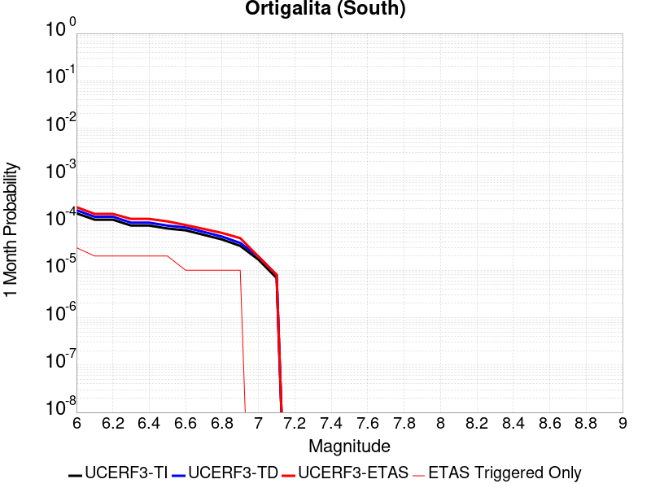 |  | 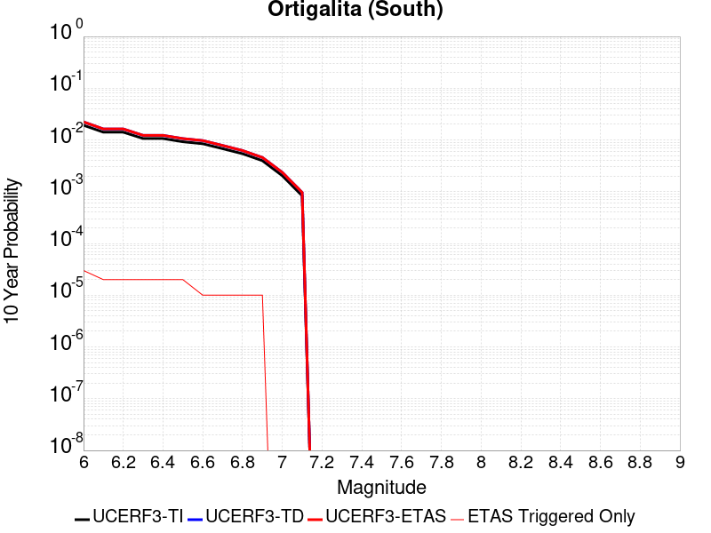 |

| Magnitude | 1 wk TI Prob | 1 wk TD Prob | 1 wk ETAS Prob | 1 wk ETAS/TD Gain | 1 wk ETAS Triggered Only | 1 mo TI Prob | 1 mo TD Prob | 1 mo ETAS Prob | 1 mo ETAS/TD Gain | 1 mo ETAS Triggered Only | 1 yr TI Prob | 1 yr TD Prob | 1 yr ETAS Prob | 1 yr ETAS/TD Gain | 1 yr ETAS Triggered Only | 10 yr TI Prob | 10 yr TD Prob | 10 yr ETAS Prob | 10 yr ETAS/TD Gain | 10 yr ETAS Triggered Only |
|-----|-----|-----|-----|-----|-----|-----|-----|-----|-----|-----|-----|-----|-----|-----|-----|-----|-----|-----|-----|-----|
| 6.0 | 3.72394E-5 | 4.325562E-5 | 6.797643E-5 | 1.5715052 | 2.472188E-5 | 1.5958765E-4 | 1.8536893E-4 | 2.2244488E-4 | 1.2000116 | 3.7082817E-5 | 0.0019412481 | 0.0022546875 | 0.0022916866 | 1.0164099 | 3.7082817E-5 | 0.019243775 | 0.022334497 | 0.022370752 | 1.0016233 | 3.7082817E-5 |
| 6.1 | 2.7299884E-5 | 3.149204E-5 | 5.6213143E-5 | 1.7849952 | 2.472188E-5 | 1.16994255E-4 | 1.3495922E-4 | 1.5967777E-4 | 1.1831557 | 2.472188E-5 | 0.0014234743 | 0.0016419457 | 0.001666627 | 1.0150317 | 2.472188E-5 | 0.014143906 | 0.01630407 | 0.016328389 | 1.0014915 | 2.472188E-5 |
| 6.2 | 2.7299884E-5 | 3.149204E-5 | 5.6213143E-5 | 1.7849952 | 2.472188E-5 | 1.16994255E-4 | 1.3495922E-4 | 1.5967777E-4 | 1.1831557 | 2.472188E-5 | 0.0014234743 | 0.0016419457 | 0.001666627 | 1.0150317 | 2.472188E-5 | 0.014143906 | 0.01630407 | 0.016328389 | 1.0014915 | 2.472188E-5 |
| 6.3 | 2.0546433E-5 | 2.363145E-5 | 4.8352744E-5 | 2.0461185 | 2.472188E-5 | 8.805317E-5 | 1.0127382E-4 | 1.2599319E-4 | 1.2440846 | 2.472188E-5 | 0.00107152 | 0.0012323303 | 0.0012570217 | 1.0200363 | 2.472188E-5 | 0.010663681 | 0.01225703 | 0.0122814495 | 1.0019922 | 2.472188E-5 |
| 6.4 | 2.0546433E-5 | 2.363145E-5 | 4.8352744E-5 | 2.0461185 | 2.472188E-5 | 8.805317E-5 | 1.0127382E-4 | 1.2599319E-4 | 1.2440846 | 2.472188E-5 | 0.00107152 | 0.0012323303 | 0.0012570217 | 1.0200363 | 2.472188E-5 | 0.010663681 | 0.01225703 | 0.0122814495 | 1.0019922 | 2.472188E-5 |
| 6.5 | 1.7779594E-5 | 2.0446974E-5 | 4.5168348E-5 | 2.209048 | 2.472188E-5 | 7.619603E-5 | 8.762702E-5 | 1.1234674E-4 | 1.2821015 | 2.472188E-5 | 9.272918E-4 | 0.0010663504 | 0.0010910459 | 1.0231589 | 2.472188E-5 | 0.009234319 | 0.010613803 | 0.010638263 | 1.0023046 | 2.472188E-5 |
| 6.6 | 1.6272212E-5 | 1.8714967E-5 | 3.1075677E-5 | 1.6604718 | 1.236094E-5 | 6.973618E-5 | 8.0204605E-5 | 9.256455E-5 | 1.1541052 | 1.236094E-5 | 8.487073E-4 | 9.760658E-4 | 9.884147E-4 | 1.0126517 | 1.236094E-5 | 0.008454733 | 0.009719091 | 0.009731331 | 1.0012594 | 1.236094E-5 |
| 6.7 | 1.3051484E-5 | 1.5038758E-5 | 2.7399512E-5 | 1.8219265 | 1.236094E-5 | 5.593373E-5 | 6.445028E-5 | 7.681042E-5 | 1.191778 | 1.236094E-5 | 6.807804E-4 | 7.844092E-4 | 7.9676043E-4 | 1.0157459 | 1.236094E-5 | 0.006786986 | 0.007817388 | 0.007829652 | 1.0015688 | 1.236094E-5 |
| 6.8 | 1.04277415E-5 | 1.1987235E-5 | 2.4348026E-5 | 2.0311627 | 1.236094E-5 | 4.4689557E-5 | 5.1372896E-5 | 6.37332E-5 | 1.2405998 | 1.236094E-5 | 5.439595E-4 | 6.2529295E-4 | 6.376461E-4 | 1.0197558 | 1.236094E-5 | 0.0054262993 | 0.00623609 | 0.0062483735 | 1.0019698 | 1.236094E-5 |
| 6.9 | 7.639968E-6 | 8.791503E-6 | 2.1152335E-5 | 2.4059975 | 1.236094E-5 | 3.274231E-5 | 3.767736E-5 | 5.0037834E-5 | 1.328061 | 1.236094E-5 | 3.9856473E-4 | 4.586312E-4 | 4.7098644E-4 | 1.0269394 | 1.236094E-5 | 0.003978506 | 0.004577433 | 0.0045897374 | 1.002688 | 1.236094E-5 |
| 7.0 | 3.919831E-6 | 4.5334014E-6 | 4.5334014E-6 | 1.0 | 0.0 | 1.679917E-5 | 1.942873E-5 | 1.942873E-5 | 1.0 | 0.0 | 2.045107E-4 | 2.3652123E-4 | 2.3652123E-4 | 1.0 | 0.0 | 0.0020432258 | 0.0023629034 | 0.0023629034 | 1.0 | 0.0 |
| 7.1 | 1.6017933E-6 | 1.8570418E-6 | 1.8570418E-6 | 1.0 | 0.0 | 6.8648105E-6 | 7.958732E-6 | 7.958732E-6 | 1.0 | 0.0 | 8.357586E-5 | 9.689432E-5 | 9.689432E-5 | 1.0 | 0.0 | 8.3544437E-4 | 9.686254E-4 | 9.686254E-4 | 1.0 | 0.0 |

## Cerro Prieto
*[(top)](#table-of-contents)*

| 1 Week | 1 Month | 1 Year | 10 Year |
|-----|-----|-----|-----|
|  |  |  |  |

| Magnitude | 1 wk TI Prob | 1 wk TD Prob | 1 wk ETAS Prob | 1 wk ETAS/TD Gain | 1 wk ETAS Triggered Only | 1 mo TI Prob | 1 mo TD Prob | 1 mo ETAS Prob | 1 mo ETAS/TD Gain | 1 mo ETAS Triggered Only | 1 yr TI Prob | 1 yr TD Prob | 1 yr ETAS Prob | 1 yr ETAS/TD Gain | 1 yr ETAS Triggered Only | 10 yr TI Prob | 10 yr TD Prob | 10 yr ETAS Prob | 10 yr ETAS/TD Gain | 10 yr ETAS Triggered Only |
|-----|-----|-----|-----|-----|-----|-----|-----|-----|-----|-----|-----|-----|-----|-----|-----|-----|-----|-----|-----|-----|
| 6.0 | 2.9101528E-4 | 5.964804E-4 | 6.088339E-4 | 1.0207108 | 1.236094E-5 | 0.0012466122 | 0.002554082 | 0.0025664114 | 1.0048273 | 1.236094E-5 | 0.015072231 | 0.03064807 | 0.030660052 | 1.000391 | 1.236094E-5 | 0.14089979 | 0.25397858 | 0.25400624 | 1.000109 | 3.7082817E-5 |
| 6.1 | 2.9101528E-4 | 5.964804E-4 | 6.088339E-4 | 1.0207108 | 1.236094E-5 | 0.0012466122 | 0.002554082 | 0.0025664114 | 1.0048273 | 1.236094E-5 | 0.015072231 | 0.03064807 | 0.030660052 | 1.000391 | 1.236094E-5 | 0.14089979 | 0.25397858 | 0.25400624 | 1.000109 | 3.7082817E-5 |
| 6.2 | 2.9101528E-4 | 5.964804E-4 | 6.088339E-4 | 1.0207108 | 1.236094E-5 | 0.0012466122 | 0.002554082 | 0.0025664114 | 1.0048273 | 1.236094E-5 | 0.015072231 | 0.03064807 | 0.030660052 | 1.000391 | 1.236094E-5 | 0.14089979 | 0.25397858 | 0.25400624 | 1.000109 | 3.7082817E-5 |
| 6.3 | 2.9101528E-4 | 5.964804E-4 | 6.088339E-4 | 1.0207108 | 1.236094E-5 | 0.0012466122 | 0.002554082 | 0.0025664114 | 1.0048273 | 1.236094E-5 | 0.015072231 | 0.03064807 | 0.030660052 | 1.000391 | 1.236094E-5 | 0.14089979 | 0.25397858 | 0.25400624 | 1.000109 | 3.7082817E-5 |
| 6.4 | 2.508648E-4 | 5.1397446E-4 | 5.2632904E-4 | 1.0240374 | 1.236094E-5 | 0.0010746918 | 0.0022010866 | 0.0022134203 | 1.0056034 | 1.236094E-5 | 0.013006088 | 0.026471792 | 0.026483826 | 1.0004545 | 1.236094E-5 | 0.12270685 | 0.22440416 | 0.22443292 | 1.0001281 | 3.7082817E-5 |
| 6.5 | 2.508648E-4 | 5.1397446E-4 | 5.2632904E-4 | 1.0240374 | 1.236094E-5 | 0.0010746918 | 0.0022010866 | 0.0022134203 | 1.0056034 | 1.236094E-5 | 0.013006088 | 0.026471792 | 0.026483826 | 1.0004545 | 1.236094E-5 | 0.12270685 | 0.22440416 | 0.22443292 | 1.0001281 | 3.7082817E-5 |
| 6.6 | 2.294914E-4 | 4.7116808E-4 | 4.8352318E-4 | 1.0262223 | 1.236094E-5 | 9.831638E-4 | 0.0020179166 | 0.0020302527 | 1.0061133 | 1.236094E-5 | 0.011904482 | 0.02429866 | 0.024310721 | 1.0004964 | 1.236094E-5 | 0.11286586 | 0.20858558 | 0.20861492 | 1.0001407 | 3.7082817E-5 |
| 6.7 | 1.9621674E-4 | 4.0419117E-4 | 4.1654712E-4 | 1.0305696 | 1.236094E-5 | 8.4065786E-4 | 0.0017312564 | 0.0017435958 | 1.0071275 | 1.236094E-5 | 0.010187071 | 0.020884845 | 0.020896947 | 1.0005795 | 1.236094E-5 | 0.09732539 | 0.18290249 | 0.1829328 | 1.0001657 | 3.7082817E-5 |
| 6.8 | 1.5476145E-4 | 3.056516E-4 | 3.1800874E-4 | 1.0404289 | 1.236094E-5 | 6.6309475E-4 | 0.00130938 | 0.0013217247 | 1.0094279 | 1.236094E-5 | 0.008043335 | 0.015836509 | 0.015848674 | 1.0007682 | 1.236094E-5 | 0.07758363 | 0.14336355 | 0.14338474 | 1.0001477 | 2.472188E-5 |
| 6.9 | 1.20509176E-4 | 2.2582515E-4 | 2.2582515E-4 | 1.0 | 0.0 | 5.1636563E-4 | 9.6752634E-4 | 9.6752634E-4 | 1.0 | 0.0 | 0.006268645 | 0.011726342 | 0.011726342 | 1.0 | 0.0 | 0.060947374 | 0.109451205 | 0.10946221 | 1.0001006 | 1.236094E-5 |
| 7.0 | 9.3269155E-5 | 1.6716642E-4 | 1.6716642E-4 | 1.0 | 0.0 | 3.9966372E-4 | 7.162739E-4 | 7.162739E-4 | 1.0 | 0.0 | 0.0048550544 | 0.008693418 | 0.008693418 | 1.0 | 0.0 | 0.04750344 | 0.08315912 | 0.08317045 | 1.0001363 | 1.236094E-5 |
| 7.1 | 5.029709E-5 | 8.1718936E-5 | 8.1718936E-5 | 1.0 | 0.0 | 2.1554115E-4 | 3.5019626E-4 | 3.5019626E-4 | 1.0 | 0.0 | 0.0026210553 | 0.0042587193 | 0.0042587193 | 1.0 | 0.0 | 0.025903556 | 0.042365108 | 0.042376947 | 1.0002794 | 1.236094E-5 |
| 7.2 | 6.5445185E-8 | 6.814903E-8 | 6.814903E-8 | 1.0 | 0.0 | 2.8047933E-7 | 2.9206726E-7 | 2.9206726E-7 | 1.0 | 0.0 | 3.4148304E-6 | 3.555919E-6 | 3.555919E-6 | 1.0 | 0.0 | 3.414778E-5 | 3.5559187E-5 | 3.5559187E-5 | 1.0 | 0.0 |

## San Gregorio (North) 2011 CFM
*[(top)](#table-of-contents)*

| 1 Week | 1 Month | 1 Year | 10 Year |
|-----|-----|-----|-----|
|  | 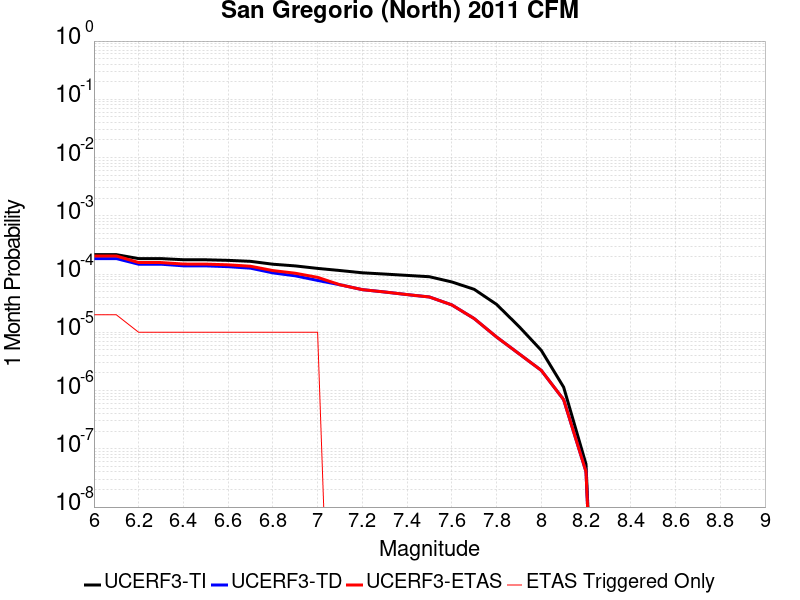 |  |  |

| Magnitude | 1 wk TI Prob | 1 wk TD Prob | 1 wk ETAS Prob | 1 wk ETAS/TD Gain | 1 wk ETAS Triggered Only | 1 mo TI Prob | 1 mo TD Prob | 1 mo ETAS Prob | 1 mo ETAS/TD Gain | 1 mo ETAS Triggered Only | 1 yr TI Prob | 1 yr TD Prob | 1 yr ETAS Prob | 1 yr ETAS/TD Gain | 1 yr ETAS Triggered Only | 10 yr TI Prob | 10 yr TD Prob | 10 yr ETAS Prob | 10 yr ETAS/TD Gain | 10 yr ETAS Triggered Only |
|-----|-----|-----|-----|-----|-----|-----|-----|-----|-----|-----|-----|-----|-----|-----|-----|-----|-----|-----|-----|-----|
| 6.0 | 5.0283932E-5 | 4.3057815E-5 | 5.541822E-5 | 1.2870654 | 1.236094E-5 | 2.1548476E-4 | 1.8452053E-4 | 2.0923784E-4 | 1.1339543 | 2.472188E-5 | 0.0026203706 | 0.002244237 | 0.0022689034 | 1.010991 | 2.472188E-5 | 0.02589687 | 0.022293162 | 0.022317333 | 1.0010842 | 2.472188E-5 |
| 6.1 | 5.0283932E-5 | 4.3057815E-5 | 5.541822E-5 | 1.2870654 | 1.236094E-5 | 2.1548476E-4 | 1.8452053E-4 | 2.0923784E-4 | 1.1339543 | 2.472188E-5 | 0.0026203706 | 0.002244237 | 0.0022689034 | 1.010991 | 2.472188E-5 | 0.02589687 | 0.022293162 | 0.022317333 | 1.0010842 | 2.472188E-5 |
| 6.2 | 4.2998647E-5 | 3.4441564E-5 | 4.6802077E-5 | 1.3588836 | 1.236094E-5 | 1.842669E-4 | 1.475984E-4 | 1.5995752E-4 | 1.0837348 | 1.236094E-5 | 0.0022411412 | 0.00179554 | 0.0018078787 | 1.0068719 | 1.236094E-5 | 0.022186736 | 0.017886506 | 0.017898645 | 1.0006787 | 1.236094E-5 |
| 6.3 | 4.2998647E-5 | 3.4441564E-5 | 4.6802077E-5 | 1.3588836 | 1.236094E-5 | 1.842669E-4 | 1.475984E-4 | 1.5995752E-4 | 1.0837348 | 1.236094E-5 | 0.0022411412 | 0.00179554 | 0.0018078787 | 1.0068719 | 1.236094E-5 | 0.022186736 | 0.017886506 | 0.017898645 | 1.0006787 | 1.236094E-5 |
| 6.4 | 4.1101295E-5 | 3.2326872E-5 | 4.468741E-5 | 1.3823612 | 1.236094E-5 | 1.7613651E-4 | 1.3853642E-4 | 1.5089565E-4 | 1.0892129 | 1.236094E-5 | 0.0021423528 | 0.0016853869 | 0.001697727 | 1.0073218 | 1.236094E-5 | 0.02121817 | 0.016801886 | 0.016814038 | 1.0007234 | 1.236094E-5 |
| 6.5 | 4.1032585E-5 | 3.2244905E-5 | 4.4605447E-5 | 1.3833331 | 1.236094E-5 | 1.7584208E-4 | 1.3818518E-4 | 1.5054441E-4 | 1.0894396 | 1.236094E-5 | 0.0021387753 | 0.0016811171 | 0.0016934572 | 1.0073404 | 1.236094E-5 | 0.021183075 | 0.016759839 | 0.016771993 | 1.0007252 | 1.236094E-5 |
| 6.6 | 4.011629E-5 | 3.1266558E-5 | 4.362711E-5 | 1.3953283 | 1.236094E-5 | 1.7191563E-4 | 1.339927E-4 | 1.4635197E-4 | 1.0922385 | 1.236094E-5 | 0.0020910634 | 0.0016301516 | 0.0016424924 | 1.0075704 | 1.236094E-5 | 0.020714961 | 0.01625741 | 0.01626957 | 1.0007479 | 1.236094E-5 |
| 6.7 | 3.8583938E-5 | 2.9453593E-5 | 4.1814168E-5 | 1.4196627 | 1.236094E-5 | 1.6534925E-4 | 1.2622366E-4 | 1.3858304E-4 | 1.0979165 | 1.236094E-5 | 0.0020112682 | 0.0015357039 | 0.0015480459 | 1.0080367 | 1.236094E-5 | 0.019931622 | 0.015325955 | 0.015338127 | 1.0007942 | 1.236094E-5 |
| 6.8 | 3.44341E-5 | 2.4450854E-5 | 3.6811492E-5 | 1.5055299 | 1.236094E-5 | 1.4756636E-4 | 1.0478523E-4 | 1.1714487E-4 | 1.1179521 | 1.236094E-5 | 0.0017951399 | 0.0012750238 | 0.0012873689 | 1.0096823 | 1.236094E-5 | 0.017807078 | 0.012751131 | 0.012763335 | 1.000957 | 1.236094E-5 |
| 6.9 | 3.221199E-5 | 2.1778029E-5 | 3.41387E-5 | 1.5675752 | 1.236094E-5 | 1.3804408E-4 | 9.333112E-5 | 1.0569091E-4 | 1.1324294 | 1.236094E-5 | 0.0016793909 | 0.0011357224 | 0.0011480693 | 1.0108714 | 1.236094E-5 | 0.01666756 | 0.011372583 | 0.011384804 | 1.0010746 | 1.236094E-5 |
| 7.0 | 2.9186718E-5 | 1.8146875E-5 | 3.050759E-5 | 1.6811484 | 1.236094E-5 | 1.2507994E-4 | 7.7770026E-5 | 9.013E-5 | 1.1589298 | 1.236094E-5 | 0.0015217843 | 9.464431E-4 | 9.5879234E-4 | 1.013048 | 1.236094E-5 | 0.015114053 | 0.009496798 | 0.009509042 | 1.0012892 | 1.236094E-5 |
| 7.1 | 2.6840138E-5 | 1.5284508E-5 | 1.5284508E-5 | 1.0 | 0.0 | 1.1502409E-4 | 6.55034E-5 | 6.55034E-5 | 1.0 | 0.0 | 0.0013995186 | 7.9721404E-4 | 7.9721404E-4 | 1.0 | 0.0 | 0.013907375 | 0.008015723 | 0.008015723 | 1.0 | 0.0 |
| 7.2 | 2.453002E-5 | 1.2606672E-5 | 1.2606672E-5 | 1.0 | 0.0 | 1.05124425E-4 | 5.4027478E-5 | 5.4027478E-5 | 1.0 | 0.0 | 0.0012791384 | 6.575866E-4 | 6.575866E-4 | 1.0 | 0.0 | 0.012718005 | 0.00662763 | 0.00662763 | 1.0 | 0.0 |
| 7.3 | 2.3330727E-5 | 1.1488677E-5 | 1.1488677E-5 | 1.0 | 0.0 | 9.9985E-5 | 4.923626E-5 | 4.923626E-5 | 1.0 | 0.0 | 0.0012166376 | 5.9928704E-4 | 5.9928704E-4 | 1.0 | 0.0 | 0.012099981 | 0.006046564 | 0.006046564 | 1.0 | 0.0 |
| 7.4 | 2.2136466E-5 | 1.0368981E-5 | 1.0368981E-5 | 1.0 | 0.0 | 9.486712E-5 | 4.4437733E-5 | 4.4437733E-5 | 1.0 | 0.0 | 0.0011543952 | 5.4089533E-4 | 5.4089533E-4 | 1.0 | 0.0 | 0.011484168 | 0.005464249 | 0.005464249 | 1.0 | 0.0 |
| 7.5 | 2.0994974E-5 | 9.427217E-6 | 9.427217E-6 | 1.0 | 0.0 | 8.997535E-5 | 4.0401734E-5 | 4.0401734E-5 | 1.0 | 0.0 | 0.0010948994 | 4.9178035E-4 | 4.9178035E-4 | 1.0 | 0.0 | 0.010895205 | 0.004973358 | 0.004973358 | 1.0 | 0.0 |
| 7.6 | 1.7091823E-5 | 6.893766E-6 | 6.893766E-6 | 1.0 | 0.0 | 7.3248615E-5 | 2.9544377E-5 | 2.9544377E-5 | 1.0 | 0.0 | 8.9143694E-4 | 3.596435E-4 | 3.596435E-4 | 1.0 | 0.0 | 0.008878695 | 0.0036482841 | 0.0036482841 | 1.0 | 0.0 |
| 7.7 | 1.2772179E-5 | 4.0208706E-6 | 4.0208706E-6 | 1.0 | 0.0 | 5.473676E-5 | 1.7232189E-5 | 1.7232189E-5 | 1.0 | 0.0 | 6.6621625E-4 | 2.0978172E-4 | 2.0978172E-4 | 1.0 | 0.0 | 0.006642225 | 0.002136922 | 0.002136922 | 1.0 | 0.0 |
| 7.8 | 7.041923E-6 | 1.940626E-6 | 1.940626E-6 | 1.0 | 0.0 | 3.017932E-5 | 8.316942E-6 | 8.316942E-6 | 1.0 | 0.0 | 3.6737128E-4 | 1.0125406E-4 | 1.0125406E-4 | 1.0 | 0.0 | 0.0036676454 | 0.0010379003 | 0.0010379003 | 1.0 | 0.0 |
| 7.9 | 2.946768E-6 | 1.0033551E-6 | 1.0033551E-6 | 1.0 | 0.0 | 1.2628945E-5 | 4.300086E-6 | 4.300086E-6 | 1.0 | 0.0 | 1.5374656E-4 | 5.235229E-5 | 5.235229E-5 | 1.0 | 0.0 | 0.0015364023 | 5.3400313E-4 | 5.3400313E-4 | 1.0 | 0.0 |
| 8.0 | 1.1433375E-6 | 5.18146E-7 | 5.18146E-7 | 1.0 | 0.0 | 4.9000087E-6 | 2.2206239E-6 | 2.2206239E-6 | 1.0 | 0.0 | 5.965597E-5 | 2.703576E-5 | 2.703576E-5 | 1.0 | 0.0 | 5.963996E-4 | 2.7398416E-4 | 2.7398416E-4 | 1.0 | 0.0 |
| 8.1 | 2.6675295E-7 | 1.62899E-7 | 1.62899E-7 | 1.0 | 0.0 | 1.1432264E-6 | 6.9813836E-7 | 6.9813836E-7 | 1.0 | 0.0 | 1.3918692E-5 | 8.499802E-6 | 8.499802E-6 | 1.0 | 0.0 | 1.391782E-4 | 8.63795E-5 | 8.63795E-5 | 1.0 | 0.0 |
| 8.2 | 1.2704569E-8 | 9.431393E-9 | 9.431393E-9 | 1.0 | 0.0 | 5.444815E-8 | 4.042026E-8 | 4.042026E-8 | 1.0 | 0.0 | 6.629061E-7 | 4.9211656E-7 | 4.9211656E-7 | 1.0 | 0.0 | 6.629041E-6 | 5.1121438E-6 | 5.1121438E-6 | 1.0 | 0.0 |

## Hunting Creek - Berryessa 2011 CFM
*[(top)](#table-of-contents)*

| 1 Week | 1 Month | 1 Year | 10 Year |
|-----|-----|-----|-----|
|  |  |  |  |

| Magnitude | 1 wk TI Prob | 1 wk TD Prob | 1 wk ETAS Prob | 1 wk ETAS/TD Gain | 1 wk ETAS Triggered Only | 1 mo TI Prob | 1 mo TD Prob | 1 mo ETAS Prob | 1 mo ETAS/TD Gain | 1 mo ETAS Triggered Only | 1 yr TI Prob | 1 yr TD Prob | 1 yr ETAS Prob | 1 yr ETAS/TD Gain | 1 yr ETAS Triggered Only | 10 yr TI Prob | 10 yr TD Prob | 10 yr ETAS Prob | 10 yr ETAS/TD Gain | 10 yr ETAS Triggered Only |
|-----|-----|-----|-----|-----|-----|-----|-----|-----|-----|-----|-----|-----|-----|-----|-----|-----|-----|-----|-----|-----|
| 6.0 | 1.1270982E-4 | 2.0012174E-4 | 2.0012174E-4 | 1.0 | 0.0 | 4.8295266E-4 | 8.5739547E-4 | 8.5739547E-4 | 1.0 | 0.0 | 0.0058641075 | 0.010386313 | 0.010410778 | 1.0023555 | 2.472188E-5 | 0.057117578 | 0.09803703 | 0.09807047 | 1.0003412 | 3.7082817E-5 |
| 6.1 | 1.1239393E-4 | 1.9960315E-4 | 1.9960315E-4 | 1.0 | 0.0 | 4.8159933E-4 | 8.551744E-4 | 8.551744E-4 | 1.0 | 0.0 | 0.0058477195 | 0.010359551 | 0.010384017 | 1.0023617 | 2.472188E-5 | 0.056962132 | 0.09779551 | 0.09782896 | 1.0003421 | 3.7082817E-5 |
| 6.2 | 7.596265E-5 | 1.2940196E-4 | 1.2940196E-4 | 1.0 | 0.0 | 3.2551357E-4 | 5.5444165E-4 | 5.5444165E-4 | 1.0 | 0.0 | 0.0039559277 | 0.0067210156 | 0.0067210156 | 1.0 | 0.0 | 0.038862433 | 0.0645915 | 0.06460306 | 1.000179 | 1.236094E-5 |
| 6.3 | 6.78794E-5 | 1.145119E-4 | 1.145119E-4 | 1.0 | 0.0 | 2.9087928E-4 | 4.906513E-4 | 4.906513E-4 | 1.0 | 0.0 | 0.003535705 | 0.005952679 | 0.005952679 | 1.0 | 0.0 | 0.034799766 | 0.057465393 | 0.057477042 | 1.0002028 | 1.236094E-5 |
| 6.4 | 6.2165134E-5 | 1.0436625E-4 | 1.0436625E-4 | 1.0 | 0.0 | 2.6639478E-4 | 4.4721062E-4 | 4.4721062E-4 | 1.0 | 0.0 | 0.0032385332 | 0.005427573 | 0.005427573 | 1.0 | 0.0 | 0.03191742 | 0.052550517 | 0.05256223 | 1.0002228 | 1.236094E-5 |
| 6.5 | 5.4368087E-5 | 9.071415E-5 | 9.071415E-5 | 1.0 | 0.0 | 2.3298527E-4 | 3.8872007E-4 | 3.8872007E-4 | 1.0 | 0.0 | 0.0028329059 | 0.0047198683 | 0.0047198683 | 1.0 | 0.0 | 0.027970633 | 0.045880128 | 0.045880128 | 1.0 | 0.0 |
| 6.6 | 4.729947E-5 | 7.847572E-5 | 7.847572E-5 | 1.0 | 0.0 | 2.0269625E-4 | 3.362842E-4 | 3.362842E-4 | 1.0 | 0.0 | 0.002465034 | 0.0040849647 | 0.0040849647 | 1.0 | 0.0 | 0.02437869 | 0.03985155 | 0.03985155 | 1.0 | 0.0 |
| 6.7 | 3.6875328E-5 | 6.0451803E-5 | 6.0451803E-5 | 1.0 | 0.0 | 1.5802756E-4 | 2.59056E-4 | 2.59056E-4 | 1.0 | 0.0 | 0.0019222875 | 0.0031482063 | 0.0031482063 | 1.0 | 0.0 | 0.019057442 | 0.03089237 | 0.03089237 | 1.0 | 0.0 |
| 6.8 | 2.0292036E-5 | 2.8976308E-5 | 2.8976308E-5 | 1.0 | 0.0 | 8.6962966E-5 | 1.2417832E-4 | 1.2417832E-4 | 1.0 | 0.0 | 0.0010582599 | 0.0015108072 | 0.0015108072 | 1.0 | 0.0 | 0.010532344 | 0.014978523 | 0.014978523 | 1.0 | 0.0 |
| 6.9 | 1.7871042E-5 | 2.4472254E-5 | 2.4472254E-5 | 1.0 | 0.0 | 7.658793E-5 | 1.048769E-4 | 1.048769E-4 | 1.0 | 0.0 | 9.320591E-4 | 0.0012761299 | 0.0012761299 | 1.0 | 0.0 | 0.009281595 | 0.012679775 | 0.012679775 | 1.0 | 0.0 |
| 7.0 | 1.6415532E-5 | 2.1906277E-5 | 2.1906277E-5 | 1.0 | 0.0 | 7.035038E-5 | 9.3880684E-5 | 9.3880684E-5 | 1.0 | 0.0 | 8.561793E-4 | 0.0011424015 | 0.0011424015 | 1.0 | 0.0 | 0.008528882 | 0.01136452 | 0.01136452 | 1.0 | 0.0 |
| 7.1 | 1.5409885E-5 | 2.0346342E-5 | 2.0346342E-5 | 1.0 | 0.0 | 6.6040695E-5 | 8.7195716E-5 | 8.7195716E-5 | 1.0 | 0.0 | 8.0374884E-4 | 0.0010610938 | 0.0010610938 | 1.0 | 0.0 | 0.00800848 | 0.010560595 | 0.010560595 | 1.0 | 0.0 |
| 7.2 | 1.4497423E-5 | 1.9054964E-5 | 1.9054964E-5 | 1.0 | 0.0 | 6.213033E-5 | 8.166159E-5 | 8.166159E-5 | 1.0 | 0.0 | 7.5617427E-4 | 9.937795E-4 | 9.937795E-4 | 1.0 | 0.0 | 0.0075360634 | 0.009893929 | 0.009893929 | 1.0 | 0.0 |
| 7.3 | 1.3615175E-5 | 1.7826127E-5 | 1.7826127E-5 | 1.0 | 0.0 | 5.8349444E-5 | 7.639547E-5 | 7.639547E-5 | 1.0 | 0.0 | 7.101729E-4 | 9.297209E-4 | 9.297209E-4 | 1.0 | 0.0 | 0.0070790765 | 0.009258823 | 0.009258823 | 1.0 | 0.0 |
| 7.4 | 1.2252825E-5 | 1.602625E-5 | 1.602625E-5 | 1.0 | 0.0 | 5.251105E-5 | 6.868213E-5 | 6.868213E-5 | 1.0 | 0.0 | 6.391345E-4 | 8.35887E-4 | 8.35887E-4 | 1.0 | 0.0 | 0.0063729943 | 0.008327872 | 0.008327872 | 1.0 | 0.0 |
| 7.5 | 1.0913301E-5 | 1.4241117E-5 | 1.4241117E-5 | 1.0 | 0.0 | 4.6770452E-5 | 6.1031948E-5 | 6.1031948E-5 | 1.0 | 0.0 | 5.6928146E-4 | 7.4281334E-4 | 7.4281334E-4 | 1.0 | 0.0 | 0.0056782532 | 0.0074036797 | 0.0074036797 | 1.0 | 0.0 |
| 7.6 | 8.623192E-6 | 1.12346415E-5 | 1.12346415E-5 | 1.0 | 0.0 | 3.6956015E-5 | 4.814759E-5 | 4.814759E-5 | 1.0 | 0.0 | 4.4984656E-4 | 5.8604183E-4 | 5.8604183E-4 | 1.0 | 0.0 | 0.00448937 | 0.0058452785 | 0.0058452785 | 1.0 | 0.0 |
| 7.7 | 2.0993634E-6 | 2.662584E-6 | 2.662584E-6 | 1.0 | 0.0 | 8.997241E-6 | 1.1411025E-5 | 1.1411025E-5 | 1.0 | 0.0 | 1.09535904E-4 | 1.3892044E-4 | 1.3892044E-4 | 1.0 | 0.0 | 0.0010948193 | 0.0013883426 | 0.0013883426 | 1.0 | 0.0 |
| 7.8 | 1.8428308E-7 | 2.167437E-7 | 2.167437E-7 | 1.0 | 0.0 | 7.897844E-7 | 9.289013E-7 | 9.289013E-7 | 1.0 | 0.0 | 9.615583E-6 | 1.1309318E-5 | 1.1309318E-5 | 1.0 | 0.0 | 9.615166E-5 | 1.13086026E-4 | 1.13086026E-4 | 1.0 | 0.0 |

## Fontana (Seismicity)
*[(top)](#table-of-contents)*

| 1 Week | 1 Month | 1 Year | 10 Year |
|-----|-----|-----|-----|
|  |  |  |  |

| Magnitude | 1 wk TI Prob | 1 wk TD Prob | 1 wk ETAS Prob | 1 wk ETAS/TD Gain | 1 wk ETAS Triggered Only | 1 mo TI Prob | 1 mo TD Prob | 1 mo ETAS Prob | 1 mo ETAS/TD Gain | 1 mo ETAS Triggered Only | 1 yr TI Prob | 1 yr TD Prob | 1 yr ETAS Prob | 1 yr ETAS/TD Gain | 1 yr ETAS Triggered Only | 10 yr TI Prob | 10 yr TD Prob | 10 yr ETAS Prob | 10 yr ETAS/TD Gain | 10 yr ETAS Triggered Only |
|-----|-----|-----|-----|-----|-----|-----|-----|-----|-----|-----|-----|-----|-----|-----|-----|-----|-----|-----|-----|-----|
| 6.0 | 7.1789214E-6 | 7.5520006E-6 | 1.9912846E-5 | 2.6367643 | 1.236094E-5 | 3.076644E-5 | 3.2365548E-5 | 4.4726086E-5 | 1.3819042 | 1.236094E-5 | 3.7451705E-4 | 3.9402005E-4 | 4.187322E-4 | 1.0627179 | 2.472188E-5 | 0.003738865 | 0.003937214 | 0.003974151 | 1.0093814 | 3.7082817E-5 |
| 6.1 | 7.1789214E-6 | 7.5520006E-6 | 1.9912846E-5 | 2.6367643 | 1.236094E-5 | 3.076644E-5 | 3.2365548E-5 | 4.4726086E-5 | 1.3819042 | 1.236094E-5 | 3.7451705E-4 | 3.9402005E-4 | 4.187322E-4 | 1.0627179 | 2.472188E-5 | 0.003738865 | 0.003937214 | 0.003974151 | 1.0093814 | 3.7082817E-5 |
| 6.2 | 7.1789214E-6 | 7.5520006E-6 | 1.9912846E-5 | 2.6367643 | 1.236094E-5 | 3.076644E-5 | 3.2365548E-5 | 4.4726086E-5 | 1.3819042 | 1.236094E-5 | 3.7451705E-4 | 3.9402005E-4 | 4.187322E-4 | 1.0627179 | 2.472188E-5 | 0.003738865 | 0.003937214 | 0.003974151 | 1.0093814 | 3.7082817E-5 |
| 6.3 | 7.1789214E-6 | 7.5520006E-6 | 1.9912846E-5 | 2.6367643 | 1.236094E-5 | 3.076644E-5 | 3.2365548E-5 | 4.4726086E-5 | 1.3819042 | 1.236094E-5 | 3.7451705E-4 | 3.9402005E-4 | 4.187322E-4 | 1.0627179 | 2.472188E-5 | 0.003738865 | 0.003937214 | 0.003974151 | 1.0093814 | 3.7082817E-5 |
| 6.4 | 7.1789214E-6 | 7.5520006E-6 | 1.9912846E-5 | 2.6367643 | 1.236094E-5 | 3.076644E-5 | 3.2365548E-5 | 4.4726086E-5 | 1.3819042 | 1.236094E-5 | 3.7451705E-4 | 3.9402005E-4 | 4.187322E-4 | 1.0627179 | 2.472188E-5 | 0.003738865 | 0.003937214 | 0.003974151 | 1.0093814 | 3.7082817E-5 |
| 6.5 | 5.2611317E-6 | 5.532726E-6 | 1.7893597E-5 | 3.2341378 | 1.236094E-5 | 2.2547512E-5 | 2.3711682E-5 | 3.6072328E-5 | 1.5212893 | 1.236094E-5 | 2.744814E-4 | 2.8868974E-4 | 3.1340448E-4 | 1.08561 | 2.472188E-5 | 0.002741426 | 0.0028868972 | 0.002923873 | 1.0128081 | 3.7082817E-5 |
| 6.6 | 5.2611317E-6 | 5.532726E-6 | 1.7893597E-5 | 3.2341378 | 1.236094E-5 | 2.2547512E-5 | 2.3711682E-5 | 3.6072328E-5 | 1.5212893 | 1.236094E-5 | 2.744814E-4 | 2.8868974E-4 | 3.1340448E-4 | 1.08561 | 2.472188E-5 | 0.002741426 | 0.0028868972 | 0.002923873 | 1.0128081 | 3.7082817E-5 |

## Robinson Creek
*[(top)](#table-of-contents)*

| 1 Week | 1 Month | 1 Year | 10 Year |
|-----|-----|-----|-----|
|  |  |  |  |

| Magnitude | 1 wk TI Prob | 1 wk TD Prob | 1 wk ETAS Prob | 1 wk ETAS/TD Gain | 1 wk ETAS Triggered Only | 1 mo TI Prob | 1 mo TD Prob | 1 mo ETAS Prob | 1 mo ETAS/TD Gain | 1 mo ETAS Triggered Only | 1 yr TI Prob | 1 yr TD Prob | 1 yr ETAS Prob | 1 yr ETAS/TD Gain | 1 yr ETAS Triggered Only | 10 yr TI Prob | 10 yr TD Prob | 10 yr ETAS Prob | 10 yr ETAS/TD Gain | 10 yr ETAS Triggered Only |
|-----|-----|-----|-----|-----|-----|-----|-----|-----|-----|-----|-----|-----|-----|-----|-----|-----|-----|-----|-----|-----|
| 6.0 | 1.3705327E-5 | 1.5285013E-5 | 1.5285013E-5 | 1.0 | 0.0 | 5.8735794E-5 | 6.55072E-5 | 1.0258759E-4 | 1.5660505 | 3.7082817E-5 | 7.1487366E-4 | 7.9755014E-4 | 8.346034E-4 | 1.0464588 | 3.7082817E-5 | 0.0071257832 | 0.007975501 | 0.008012288 | 1.0046126 | 3.7082817E-5 |
| 6.1 | 1.3705327E-5 | 1.5285013E-5 | 1.5285013E-5 | 1.0 | 0.0 | 5.8735794E-5 | 6.55072E-5 | 1.0258759E-4 | 1.5660505 | 3.7082817E-5 | 7.1487366E-4 | 7.9755014E-4 | 8.346034E-4 | 1.0464588 | 3.7082817E-5 | 0.0071257832 | 0.007975501 | 0.008012288 | 1.0046126 | 3.7082817E-5 |
| 6.2 | 1.3705327E-5 | 1.5285013E-5 | 1.5285013E-5 | 1.0 | 0.0 | 5.8735794E-5 | 6.55072E-5 | 1.0258759E-4 | 1.5660505 | 3.7082817E-5 | 7.1487366E-4 | 7.9755014E-4 | 8.346034E-4 | 1.0464588 | 3.7082817E-5 | 0.0071257832 | 0.007975501 | 0.008012288 | 1.0046126 | 3.7082817E-5 |
| 6.3 | 1.3705327E-5 | 1.5285013E-5 | 1.5285013E-5 | 1.0 | 0.0 | 5.8735794E-5 | 6.55072E-5 | 1.0258759E-4 | 1.5660505 | 3.7082817E-5 | 7.1487366E-4 | 7.9755014E-4 | 8.346034E-4 | 1.0464588 | 3.7082817E-5 | 0.0071257832 | 0.007975501 | 0.008012288 | 1.0046126 | 3.7082817E-5 |
| 6.4 | 1.3705327E-5 | 1.5285013E-5 | 1.5285013E-5 | 1.0 | 0.0 | 5.8735794E-5 | 6.55072E-5 | 1.0258759E-4 | 1.5660505 | 3.7082817E-5 | 7.1487366E-4 | 7.9755014E-4 | 8.346034E-4 | 1.0464588 | 3.7082817E-5 | 0.0071257832 | 0.007975501 | 0.008012288 | 1.0046126 | 3.7082817E-5 |

## North Frontal  (East)
*[(top)](#table-of-contents)*

| 1 Week | 1 Month | 1 Year | 10 Year |
|-----|-----|-----|-----|
|  |  | 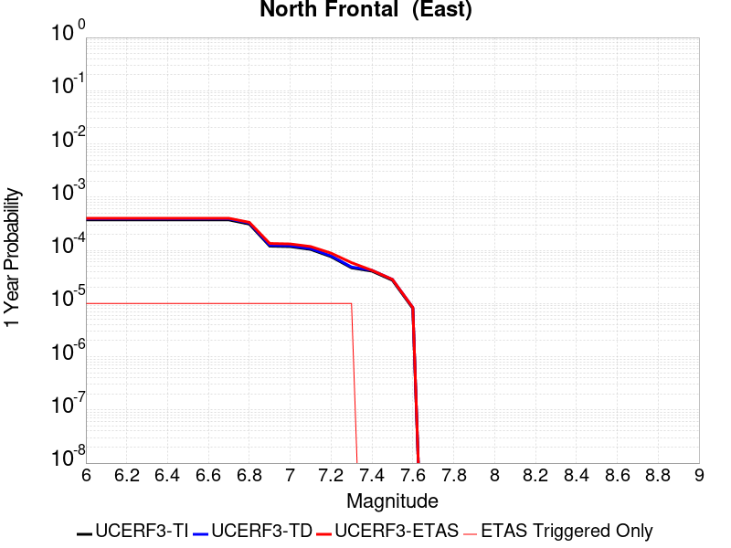 |  |

| Magnitude | 1 wk TI Prob | 1 wk TD Prob | 1 wk ETAS Prob | 1 wk ETAS/TD Gain | 1 wk ETAS Triggered Only | 1 mo TI Prob | 1 mo TD Prob | 1 mo ETAS Prob | 1 mo ETAS/TD Gain | 1 mo ETAS Triggered Only | 1 yr TI Prob | 1 yr TD Prob | 1 yr ETAS Prob | 1 yr ETAS/TD Gain | 1 yr ETAS Triggered Only | 10 yr TI Prob | 10 yr TD Prob | 10 yr ETAS Prob | 10 yr ETAS/TD Gain | 10 yr ETAS Triggered Only |
|-----|-----|-----|-----|-----|-----|-----|-----|-----|-----|-----|-----|-----|-----|-----|-----|-----|-----|-----|-----|-----|
| 6.0 | 7.135738E-6 | 7.4771765E-6 | 1.9838024E-5 | 2.6531436 | 1.236094E-5 | 3.0581377E-5 | 3.204476E-5 | 4.4405304E-5 | 1.3857274 | 1.236094E-5 | 3.7226462E-4 | 3.9009505E-4 | 4.0245117E-4 | 1.0316746 | 1.236094E-5 | 0.0037164164 | 0.0038960609 | 0.003932999 | 1.009481 | 3.7082817E-5 |
| 6.1 | 7.135738E-6 | 7.4771765E-6 | 1.9838024E-5 | 2.6531436 | 1.236094E-5 | 3.0581377E-5 | 3.204476E-5 | 4.4405304E-5 | 1.3857274 | 1.236094E-5 | 3.7226462E-4 | 3.9009505E-4 | 4.0245117E-4 | 1.0316746 | 1.236094E-5 | 0.0037164164 | 0.0038960609 | 0.003932999 | 1.009481 | 3.7082817E-5 |
| 6.2 | 7.135738E-6 | 7.4771765E-6 | 1.9838024E-5 | 2.6531436 | 1.236094E-5 | 3.0581377E-5 | 3.204476E-5 | 4.4405304E-5 | 1.3857274 | 1.236094E-5 | 3.7226462E-4 | 3.9009505E-4 | 4.0245117E-4 | 1.0316746 | 1.236094E-5 | 0.0037164164 | 0.0038960609 | 0.003932999 | 1.009481 | 3.7082817E-5 |
| 6.3 | 7.135738E-6 | 7.4771765E-6 | 1.9838024E-5 | 2.6531436 | 1.236094E-5 | 3.0581377E-5 | 3.204476E-5 | 4.4405304E-5 | 1.3857274 | 1.236094E-5 | 3.7226462E-4 | 3.9009505E-4 | 4.0245117E-4 | 1.0316746 | 1.236094E-5 | 0.0037164164 | 0.0038960609 | 0.003932999 | 1.009481 | 3.7082817E-5 |
| 6.4 | 7.135738E-6 | 7.4771765E-6 | 1.9838024E-5 | 2.6531436 | 1.236094E-5 | 3.0581377E-5 | 3.204476E-5 | 4.4405304E-5 | 1.3857274 | 1.236094E-5 | 3.7226462E-4 | 3.9009505E-4 | 4.0245117E-4 | 1.0316746 | 1.236094E-5 | 0.0037164164 | 0.0038960609 | 0.003932999 | 1.009481 | 3.7082817E-5 |
| 6.5 | 7.135738E-6 | 7.4771765E-6 | 1.9838024E-5 | 2.6531436 | 1.236094E-5 | 3.0581377E-5 | 3.204476E-5 | 4.4405304E-5 | 1.3857274 | 1.236094E-5 | 3.7226462E-4 | 3.9009505E-4 | 4.0245117E-4 | 1.0316746 | 1.236094E-5 | 0.0037164164 | 0.0038960609 | 0.003932999 | 1.009481 | 3.7082817E-5 |
| 6.6 | 7.135738E-6 | 7.4771765E-6 | 1.9838024E-5 | 2.6531436 | 1.236094E-5 | 3.0581377E-5 | 3.204476E-5 | 4.4405304E-5 | 1.3857274 | 1.236094E-5 | 3.7226462E-4 | 3.9009505E-4 | 4.0245117E-4 | 1.0316746 | 1.236094E-5 | 0.0037164164 | 0.0038960609 | 0.003932999 | 1.009481 | 3.7082817E-5 |
| 6.7 | 7.135738E-6 | 7.4771765E-6 | 1.9838024E-5 | 2.6531436 | 1.236094E-5 | 3.0581377E-5 | 3.204476E-5 | 4.4405304E-5 | 1.3857274 | 1.236094E-5 | 3.7226462E-4 | 3.9009505E-4 | 4.0245117E-4 | 1.0316746 | 1.236094E-5 | 0.0037164164 | 0.0038960609 | 0.003932999 | 1.009481 | 3.7082817E-5 |
| 6.8 | 5.959142E-6 | 6.236683E-6 | 1.8597546E-5 | 2.981961 | 1.236094E-5 | 2.553893E-5 | 2.6728469E-5 | 3.908908E-5 | 1.4624511 | 1.236094E-5 | 3.108921E-4 | 3.253886E-4 | 3.377455E-4 | 1.0379759 | 1.236094E-5 | 0.0031045752 | 0.0032508948 | 0.003287857 | 1.0113698 | 3.7082817E-5 |
| 6.9 | 2.2946929E-6 | 2.3824605E-6 | 1.474337E-5 | 6.188296 | 1.236094E-5 | 9.834361E-6 | 1.0210508E-5 | 2.2571321E-5 | 2.2105973 | 1.236094E-5 | 1.1972676E-4 | 1.2430632E-4 | 1.3666571E-4 | 1.099427 | 1.236094E-5 | 0.0011966228 | 0.0012424142 | 0.0012547598 | 1.0099368 | 1.236094E-5 |
| 7.0 | 2.2468673E-6 | 2.3321538E-6 | 1.4693064E-5 | 6.3002124 | 1.236094E-5 | 9.629396E-6 | 9.994909E-6 | 2.2355725E-5 | 2.2367113 | 1.236094E-5 | 1.1723159E-4 | 1.21681696E-4 | 1.3404113E-4 | 1.1015718 | 1.236094E-5 | 0.0011716976 | 0.0012161969 | 0.0012285429 | 1.0101513 | 1.236094E-5 |
| 7.1 | 1.9921076E-6 | 2.0646032E-6 | 1.4425517E-5 | 6.9870653 | 1.236094E-5 | 8.537577E-6 | 8.848272E-6 | 2.1209102E-5 | 2.3969767 | 1.236094E-5 | 1.0394004E-4 | 1.0772282E-4 | 1.20082426E-4 | 1.1147352 | 1.236094E-5 | 0.0010389143 | 0.0010767487 | 0.0010890964 | 1.0114675 | 1.236094E-5 |
| 7.2 | 1.4524545E-6 | 1.5045148E-6 | 1.3865436E-5 | 9.215885 | 1.236094E-5 | 6.2247905E-6 | 6.447906E-6 | 1.8808765E-5 | 2.9170346 | 1.236094E-5 | 7.5784184E-5 | 7.850068E-5 | 9.0860645E-5 | 1.1574504 | 1.236094E-5 | 7.575835E-4 | 7.8475394E-4 | 7.9710514E-4 | 1.015739 | 1.236094E-5 |
| 7.3 | 8.9802575E-7 | 9.3087283E-7 | 1.32918E-5 | 14.278858 | 1.236094E-5 | 3.848676E-6 | 3.9894494E-6 | 1.635034E-5 | 4.098395 | 1.236094E-5 | 4.685662E-5 | 4.857058E-5 | 6.0930917E-5 | 1.254482 | 1.236094E-5 | 4.6846745E-4 | 4.8561094E-4 | 4.979659E-4 | 1.025442 | 1.236094E-5 |
| 7.4 | 7.776139E-7 | 8.0604747E-7 | 8.0604747E-7 | 1.0 | 0.0 | 3.3326266E-6 | 3.4544853E-6 | 3.4544853E-6 | 1.0 | 0.0 | 4.0573974E-5 | 4.2057654E-5 | 4.2057654E-5 | 1.0 | 0.0 | 4.0566566E-4 | 4.205077E-4 | 4.205077E-4 | 1.0 | 0.0 |
| 7.5 | 5.244417E-7 | 5.441219E-7 | 5.441219E-7 | 1.0 | 0.0 | 2.2476054E-6 | 2.3319494E-6 | 2.3319494E-6 | 1.0 | 0.0 | 2.7364253E-5 | 2.839118E-5 | 2.839118E-5 | 1.0 | 0.0 | 2.7360884E-4 | 2.8388205E-4 | 2.8388205E-4 | 1.0 | 0.0 |
| 7.6 | 1.5489647E-7 | 1.6089504E-7 | 1.6089504E-7 | 1.0 | 0.0 | 6.6384183E-7 | 6.895501E-7 | 6.895501E-7 | 1.0 | 0.0 | 8.082245E-6 | 8.395261E-6 | 8.395261E-6 | 1.0 | 0.0 | 8.08195E-5 | 8.395143E-5 | 8.395143E-5 | 1.0 | 0.0 |

## Calaveras (So) 2011 CFM
*[(top)](#table-of-contents)*

| 1 Week | 1 Month | 1 Year | 10 Year |
|-----|-----|-----|-----|
|  |  |  |  |

| Magnitude | 1 wk TI Prob | 1 wk TD Prob | 1 wk ETAS Prob | 1 wk ETAS/TD Gain | 1 wk ETAS Triggered Only | 1 mo TI Prob | 1 mo TD Prob | 1 mo ETAS Prob | 1 mo ETAS/TD Gain | 1 mo ETAS Triggered Only | 1 yr TI Prob | 1 yr TD Prob | 1 yr ETAS Prob | 1 yr ETAS/TD Gain | 1 yr ETAS Triggered Only | 10 yr TI Prob | 10 yr TD Prob | 10 yr ETAS Prob | 10 yr ETAS/TD Gain | 10 yr ETAS Triggered Only |
|-----|-----|-----|-----|-----|-----|-----|-----|-----|-----|-----|-----|-----|-----|-----|-----|-----|-----|-----|-----|-----|
| 6.0 | 1.5950744E-4 | 3.071188E-4 | 3.071188E-4 | 1.0 | 0.0 | 6.834242E-4 | 0.0013155643 | 0.001327909 | 1.0093836 | 1.236094E-5 | 0.00828899 | 0.01585904 | 0.01588337 | 1.0015341 | 2.472188E-5 | 0.079865426 | 0.14440064 | 0.14443237 | 1.0002197 | 3.7082817E-5 |
| 6.1 | 1.3584697E-4 | 2.6036944E-4 | 2.6036944E-4 | 1.0 | 0.0 | 5.8207137E-4 | 0.0011153965 | 0.0011277436 | 1.0110698 | 1.236094E-5 | 0.007063716 | 0.013462106 | 0.013486495 | 1.0018116 | 2.472188E-5 | 0.06843361 | 0.12402854 | 0.124061026 | 1.0002619 | 3.7082817E-5 |
| 6.2 | 1.14676266E-4 | 2.1726108E-4 | 2.1726108E-4 | 1.0 | 0.0 | 4.9137714E-4 | 9.307893E-4 | 9.4313873E-4 | 1.0132678 | 1.236094E-5 | 0.0059661185 | 0.011245592 | 0.011270035 | 1.0021737 | 2.472188E-5 | 0.058084648 | 0.105019294 | 0.10505248 | 1.000316 | 3.7082817E-5 |
| 6.3 | 8.691518E-5 | 1.5987165E-4 | 1.5987165E-4 | 1.0 | 0.0 | 3.7244044E-4 | 6.8496726E-4 | 6.9731975E-4 | 1.0180336 | 1.236094E-5 | 0.004525038 | 0.008300893 | 0.00832541 | 1.0029535 | 2.472188E-5 | 0.044339992 | 0.0793347 | 0.079368845 | 1.0004303 | 3.7082817E-5 |
| 6.4 | 8.50982E-5 | 1.5693568E-4 | 1.5693568E-4 | 1.0 | 0.0 | 3.646556E-4 | 6.7239115E-4 | 6.8474375E-4 | 1.0183712 | 1.236094E-5 | 0.0044306475 | 0.008148931 | 0.008173451 | 1.0030091 | 2.472188E-5 | 0.04343345 | 0.077940844 | 0.077975035 | 1.0004387 | 3.7082817E-5 |
| 6.5 | 8.4062965E-5 | 1.5518135E-4 | 1.5518135E-4 | 1.0 | 0.0 | 3.602201E-4 | 6.648764E-4 | 6.7722914E-4 | 1.018579 | 1.236094E-5 | 0.004376863 | 0.008058134 | 0.008082656 | 1.0030432 | 2.472188E-5 | 0.042916555 | 0.077112116 | 0.07714634 | 1.0004438 | 3.7082817E-5 |
| 6.6 | 8.194716E-5 | 1.5154095E-4 | 1.5154095E-4 | 1.0 | 0.0 | 3.5115483E-4 | 6.492825E-4 | 6.616354E-4 | 1.0190254 | 1.236094E-5 | 0.0042669317 | 0.007869979 | 0.007894507 | 1.0031166 | 2.472188E-5 | 0.04185927 | 0.07539739 | 0.075431675 | 1.0004548 | 3.7082817E-5 |
| 6.7 | 8.012326E-5 | 1.4821833E-4 | 1.4821833E-4 | 1.0 | 0.0 | 3.433402E-4 | 6.350497E-4 | 6.474028E-4 | 1.0194522 | 1.236094E-5 | 0.004172157 | 0.007698474 | 0.007723006 | 1.0031866 | 2.472188E-5 | 0.040946912 | 0.073839515 | 0.07387386 | 1.0004652 | 3.7082817E-5 |
| 6.8 | 7.119773E-5 | 1.2880519E-4 | 1.2880519E-4 | 1.0 | 0.0 | 3.0509746E-4 | 5.519001E-4 | 5.519001E-4 | 1.0 | 0.0 | 0.0037082357 | 0.0066958875 | 0.0067081656 | 1.0018337 | 1.236094E-5 | 0.036469642 | 0.06468402 | 0.06470714 | 1.0003575 | 2.472188E-5 |
| 6.9 | 5.7343088E-5 | 9.9189E-5 | 9.9189E-5 | 1.0 | 0.0 | 2.4573295E-4 | 4.2502693E-4 | 4.2502693E-4 | 1.0 | 0.0 | 0.0029876942 | 0.0051625078 | 0.005174805 | 1.002382 | 1.236094E-5 | 0.02947844 | 0.050509132 | 0.05052087 | 1.0002323 | 1.236094E-5 |
| 7.0 | 4.8746577E-5 | 8.284751E-5 | 8.284751E-5 | 1.0 | 0.0 | 2.0889717E-4 | 3.550128E-4 | 3.550128E-4 | 1.0 | 0.0 | 0.0025403565 | 0.004313781 | 0.0043260884 | 1.002853 | 1.236094E-5 | 0.025115121 | 0.04248505 | 0.042496886 | 1.0002786 | 1.236094E-5 |
| 7.1 | 4.2998014E-5 | 7.264914E-5 | 7.264914E-5 | 1.0 | 0.0 | 1.8426418E-4 | 3.1131663E-4 | 3.1131663E-4 | 1.0 | 0.0 | 0.002241108 | 0.0037837527 | 0.0037960669 | 1.0032545 | 1.236094E-5 | 0.022186412 | 0.037423246 | 0.03743514 | 1.0003179 | 1.236094E-5 |
| 7.2 | 3.221292E-5 | 5.390566E-5 | 5.390566E-5 | 1.0 | 0.0 | 1.3804805E-4 | 2.3100396E-4 | 2.3100396E-4 | 1.0 | 0.0 | 0.0016794393 | 0.0028088738 | 0.0028212 | 1.0043883 | 1.236094E-5 | 0.016668037 | 0.028035998 | 0.028048012 | 1.0004286 | 1.236094E-5 |
| 7.3 | 2.3756531E-5 | 3.9471706E-5 | 3.9471706E-5 | 1.0 | 0.0 | 1.0180973E-4 | 1.6915359E-4 | 1.6915359E-4 | 1.0 | 0.0 | 0.0012388286 | 0.0020575167 | 0.002069852 | 1.0059954 | 1.236094E-5 | 0.012319452 | 0.02064345 | 0.020655556 | 1.0005864 | 1.236094E-5 |
| 7.4 | 1.5997684E-5 | 2.734085E-5 | 2.734085E-5 | 1.0 | 0.0 | 6.8559704E-5 | 1.1716982E-4 | 1.1716982E-4 | 1.0 | 0.0 | 8.343947E-4 | 0.0014256114 | 0.0014379548 | 1.0086583 | 1.236094E-5 | 0.008312687 | 0.014376549 | 0.014388733 | 1.0008475 | 1.236094E-5 |
| 7.5 | 1.3814293E-5 | 2.4782603E-5 | 2.4782603E-5 | 1.0 | 0.0 | 5.9202768E-5 | 1.0620684E-4 | 1.0620684E-4 | 1.0 | 0.0 | 7.205553E-4 | 0.0012923037 | 0.0013046486 | 1.0095527 | 1.236094E-5 | 0.007182234 | 0.013055766 | 0.013067965 | 1.0009344 | 1.236094E-5 |
| 7.6 | 8.817309E-6 | 1.6429829E-5 | 1.6429829E-5 | 1.0 | 0.0 | 3.7787922E-5 | 7.041166E-5 | 7.041166E-5 | 1.0 | 0.0 | 4.5997082E-4 | 8.5692614E-4 | 8.5692614E-4 | 1.0 | 0.0 | 0.004590199 | 0.008719863 | 0.008719863 | 1.0 | 0.0 |
| 7.7 | 4.0352206E-6 | 7.706877E-6 | 7.706877E-6 | 1.0 | 0.0 | 1.7293689E-5 | 3.3029053E-5 | 3.3029053E-5 | 1.0 | 0.0 | 2.1053031E-4 | 4.020546E-4 | 4.020546E-4 | 1.0 | 0.0 | 0.0021033096 | 0.0041649863 | 0.0041649863 | 1.0 | 0.0 |
| 7.8 | 3.413169E-6 | 6.7868646E-6 | 6.7868646E-6 | 1.0 | 0.0 | 1.4627784E-5 | 2.9086239E-5 | 2.9086239E-5 | 1.0 | 0.0 | 1.7807873E-4 | 3.5406748E-4 | 3.5406748E-4 | 1.0 | 0.0 | 0.0017793609 | 0.0036663096 | 0.0036663096 | 1.0 | 0.0 |
| 7.9 | 2.4740732E-6 | 5.278809E-6 | 5.278809E-6 | 1.0 | 0.0 | 1.06031275E-5 | 2.2623271E-5 | 2.2623271E-5 | 1.0 | 0.0 | 1.2908543E-4 | 2.7540355E-4 | 2.7540355E-4 | 1.0 | 0.0 | 0.0012901047 | 0.002834638 | 0.002834638 | 1.0 | 0.0 |
| 8.0 | 1.5231818E-6 | 3.2887135E-6 | 3.2887135E-6 | 1.0 | 0.0 | 6.527906E-6 | 1.409441E-5 | 1.409441E-5 | 1.0 | 0.0 | 7.9474354E-5 | 1.7158597E-4 | 1.7158597E-4 | 1.0 | 0.0 | 7.944594E-4 | 0.001756374 | 0.001756374 | 1.0 | 0.0 |
| 8.1 | 1.0104524E-6 | 2.0456548E-6 | 2.0456548E-6 | 1.0 | 0.0 | 4.330503E-6 | 8.767062E-6 | 8.767062E-6 | 1.0 | 0.0 | 5.2722597E-5 | 1.06733794E-4 | 1.06733794E-4 | 1.0 | 0.0 | 5.271009E-4 | 0.0010929212 | 0.0010929212 | 1.0 | 0.0 |

## San Jacinto (Superstition Mtn)
*[(top)](#table-of-contents)*

| 1 Week | 1 Month | 1 Year | 10 Year |
|-----|-----|-----|-----|
|  |  |  |  |

| Magnitude | 1 wk TI Prob | 1 wk TD Prob | 1 wk ETAS Prob | 1 wk ETAS/TD Gain | 1 wk ETAS Triggered Only | 1 mo TI Prob | 1 mo TD Prob | 1 mo ETAS Prob | 1 mo ETAS/TD Gain | 1 mo ETAS Triggered Only | 1 yr TI Prob | 1 yr TD Prob | 1 yr ETAS Prob | 1 yr ETAS/TD Gain | 1 yr ETAS Triggered Only | 10 yr TI Prob | 10 yr TD Prob | 10 yr ETAS Prob | 10 yr ETAS/TD Gain | 10 yr ETAS Triggered Only |
|-----|-----|-----|-----|-----|-----|-----|-----|-----|-----|-----|-----|-----|-----|-----|-----|-----|-----|-----|-----|-----|
| 6.0 | 6.4193904E-5 | 9.599367E-5 | 1.2071318E-4 | 1.2575119 | 2.472188E-5 | 2.7508775E-4 | 4.1134638E-4 | 4.3605806E-4 | 1.0600752 | 2.472188E-5 | 0.0033440501 | 0.0049980893 | 0.005034987 | 1.0073823 | 3.7082817E-5 | 0.03294174 | 0.048823986 | 0.048859257 | 1.0007224 | 3.7082817E-5 |
| 6.1 | 6.4193904E-5 | 9.599367E-5 | 1.2071318E-4 | 1.2575119 | 2.472188E-5 | 2.7508775E-4 | 4.1134638E-4 | 4.3605806E-4 | 1.0600752 | 2.472188E-5 | 0.0033440501 | 0.0049980893 | 0.005034987 | 1.0073823 | 3.7082817E-5 | 0.03294174 | 0.048823986 | 0.048859257 | 1.0007224 | 3.7082817E-5 |
| 6.2 | 5.7023593E-5 | 8.3144434E-5 | 1.0786425E-4 | 1.2973118 | 2.472188E-5 | 2.4436394E-4 | 3.5629404E-4 | 3.810071E-4 | 1.0693614 | 2.472188E-5 | 0.002971072 | 0.0043308944 | 0.0043678167 | 1.0085253 | 3.7082817E-5 | 0.029316625 | 0.04250403 | 0.042539537 | 1.0008354 | 3.7082817E-5 |
| 6.3 | 5.6940098E-5 | 8.298979E-5 | 1.0770962E-4 | 1.2978659 | 2.472188E-5 | 2.4400617E-4 | 3.5563146E-4 | 3.8034457E-4 | 1.0694907 | 2.472188E-5 | 0.002966728 | 0.00432286 | 0.004359782 | 1.0085412 | 3.7082817E-5 | 0.029274331 | 0.042427283 | 0.042462792 | 1.000837 | 3.7082817E-5 |
| 6.4 | 5.4171585E-5 | 7.7483564E-5 | 1.0220352E-4 | 1.3190349 | 2.472188E-5 | 2.3214328E-4 | 3.3203943E-4 | 3.5675312E-4 | 1.0744299 | 2.472188E-5 | 0.0028226813 | 0.0040367353 | 0.0040736683 | 1.0091493 | 3.7082817E-5 | 0.02787096 | 0.03971653 | 0.03975214 | 1.0008966 | 3.7082817E-5 |
| 6.5 | 4.375144E-5 | 5.642133E-5 | 8.1141814E-5 | 1.4381407 | 2.472188E-5 | 1.874927E-4 | 2.4178992E-4 | 2.665058E-4 | 1.1022205 | 2.472188E-5 | 0.0022803338 | 0.002940994 | 0.0029779677 | 1.0125718 | 3.7082817E-5 | 0.022570757 | 0.029236801 | 0.0292728 | 1.0012313 | 3.7082817E-5 |
| 6.6 | 2.772192E-5 | 2.5488358E-5 | 5.0209605E-5 | 1.9699036 | 2.472188E-5 | 1.1880282E-4 | 1.09231354E-4 | 1.3395053E-4 | 1.2263011 | 2.472188E-5 | 0.0014454646 | 0.0013290998 | 0.0013661333 | 1.0278636 | 3.7082817E-5 | 0.014360986 | 0.01354049 | 0.013577071 | 1.0027015 | 3.7082817E-5 |
| 6.7 | 2.7124124E-5 | 2.4699386E-5 | 4.9420654E-5 | 2.000886 | 2.472188E-5 | 1.1624106E-4 | 1.05850326E-4 | 1.3056959E-4 | 1.2335303 | 2.472188E-5 | 0.0014143161 | 0.001287985 | 0.0013250201 | 1.0287542 | 3.7082817E-5 | 0.014053487 | 0.013133943 | 0.013170539 | 1.0027864 | 3.7082817E-5 |
| 6.8 | 2.5475807E-5 | 2.216446E-5 | 4.688579E-5 | 2.115359 | 2.472188E-5 | 1.0917746E-4 | 9.4987154E-5 | 1.1970668E-4 | 1.2602408 | 2.472188E-5 | 0.001328425 | 0.001155867 | 0.001192907 | 1.0320451 | 3.7082817E-5 | 0.0132051185 | 0.011822182 | 0.0118588265 | 1.0030997 | 3.7082817E-5 |
| 6.9 | 2.1162023E-5 | 1.7626244E-5 | 4.2347685E-5 | 2.4025362 | 2.472188E-5 | 9.069123E-5 | 7.5538876E-5 | 1.0025889E-4 | 1.3272488 | 2.472188E-5 | 0.0011036064 | 9.193016E-4 | 9.563503E-4 | 1.040301 | 3.7082817E-5 | 0.010981417 | 0.00944688 | 0.009483612 | 1.0038884 | 3.7082817E-5 |
| 7.0 | 1.8754288E-5 | 1.6161559E-5 | 4.088304E-5 | 2.529647 | 2.472188E-5 | 8.037304E-5 | 6.9261994E-5 | 9.398216E-5 | 1.3569081 | 2.472188E-5 | 9.781026E-4 | 8.4294105E-4 | 8.799926E-4 | 1.0439551 | 3.7082817E-5 | 0.009738087 | 0.008670042 | 0.008706803 | 1.00424 | 3.7082817E-5 |
| 7.1 | 1.8678527E-5 | 1.6086702E-5 | 4.0808183E-5 | 2.536765 | 2.472188E-5 | 8.0048376E-5 | 6.89412E-5 | 9.366137E-5 | 1.358569 | 2.472188E-5 | 9.7415317E-4 | 8.3903834E-4 | 8.7609E-4 | 1.0441598 | 3.7082817E-5 | 0.009698939 | 0.008630998 | 0.0086677605 | 1.0042593 | 3.7082817E-5 |
| 7.2 | 1.7804578E-5 | 1.5381282E-5 | 4.010278E-5 | 2.6072457 | 2.472188E-5 | 7.6303106E-5 | 6.5918124E-5 | 9.063837E-5 | 1.3750144 | 2.472188E-5 | 9.285943E-4 | 8.022599E-4 | 8.3931297E-4 | 1.0461859 | 3.7082817E-5 | 0.009247236 | 0.008262311 | 0.008299088 | 1.0044512 | 3.7082817E-5 |
| 7.3 | 1.6583685E-5 | 1.4530388E-5 | 3.9251907E-5 | 2.7013667 | 2.472188E-5 | 7.1070994E-5 | 6.227162E-5 | 8.699195E-5 | 1.396976 | 2.472188E-5 | 8.649459E-4 | 7.5789524E-4 | 7.9494994E-4 | 1.0488915 | 3.7082817E-5 | 0.00861587 | 0.007817623 | 0.007854417 | 1.0047064 | 3.7082817E-5 |
| 7.4 | 1.6387552E-5 | 1.4395274E-5 | 3.9116796E-5 | 2.7173362 | 2.472188E-5 | 7.023047E-5 | 6.169258E-5 | 8.641294E-5 | 1.4007022 | 2.472188E-5 | 8.5472054E-4 | 7.5085036E-4 | 7.8790536E-4 | 1.0493506 | 3.7082817E-5 | 0.008514405 | 0.0077470057 | 0.0077838013 | 1.0047497 | 3.7082817E-5 |
| 7.5 | 1.5790754E-5 | 1.4035962E-5 | 3.8757495E-5 | 2.7612994 | 2.472188E-5 | 6.767291E-5 | 6.0152746E-5 | 8.4873136E-5 | 1.4109603 | 2.472188E-5 | 8.236062E-4 | 7.321156E-4 | 7.691712E-4 | 1.0506145 | 3.7082817E-5 | 0.008205604 | 0.007557569 | 0.0075943717 | 1.0048696 | 3.7082817E-5 |
| 7.6 | 1.4248672E-5 | 1.3054932E-5 | 3.7776488E-5 | 2.8936565 | 2.472188E-5 | 6.106431E-5 | 5.594852E-5 | 8.0669015E-5 | 1.4418436 | 2.472188E-5 | 7.432043E-4 | 6.8096205E-4 | 7.180196E-4 | 1.0544194 | 3.7082817E-5 | 0.007407237 | 0.0070401574 | 0.007076979 | 1.0052302 | 3.7082817E-5 |
| 7.7 | 1.15449975E-5 | 1.090368E-5 | 3.562529E-5 | 3.2672722 | 2.472188E-5 | 4.947762E-5 | 4.6729223E-5 | 7.144995E-5 | 1.5290207 | 2.472188E-5 | 6.022235E-4 | 5.687805E-4 | 6.058423E-4 | 1.0651599 | 3.7082817E-5 | 0.006005941 | 0.0059101824 | 0.005947046 | 1.0062373 | 3.7082817E-5 |
| 7.8 | 9.1391985E-6 | 9.514299E-6 | 3.423594E-5 | 3.5983675 | 2.472188E-5 | 3.9167408E-5 | 4.0774932E-5 | 6.5495806E-5 | 1.6062762 | 2.472188E-5 | 4.767588E-4 | 4.963223E-4 | 5.333867E-4 | 1.0746781 | 3.7082817E-5 | 0.0047573727 | 0.0051766867 | 0.0052135773 | 1.0071263 | 3.7082817E-5 |
| 7.9 | 6.973017E-6 | 7.3821784E-6 | 3.2103875E-5 | 4.348835 | 2.472188E-5 | 2.9884017E-5 | 3.1637526E-5 | 5.6358625E-5 | 1.7813852 | 2.472188E-5 | 3.6377716E-4 | 3.8511935E-4 | 4.2218788E-4 | 1.0962521 | 3.7082817E-5 | 0.0036318225 | 0.0040517948 | 0.0040887273 | 1.0091151 | 3.7082817E-5 |
| 8.0 | 5.7638235E-6 | 6.259972E-6 | 3.0981697E-5 | 4.949175 | 2.472188E-5 | 2.4701867E-5 | 2.6828178E-5 | 5.1549392E-5 | 1.9214646 | 2.472188E-5 | 3.0070372E-4 | 3.2658462E-4 | 3.5129843E-4 | 1.0756735 | 2.472188E-5 | 0.0030029714 | 0.0034534496 | 0.003478086 | 1.0071338 | 2.472188E-5 |
| 8.1 | 5.1124434E-6 | 5.4956718E-6 | 3.0217414E-5 | 5.4984026 | 2.472188E-5 | 2.1910288E-5 | 2.355267E-5 | 4.8273967E-5 | 2.0496175 | 2.472188E-5 | 2.6672508E-4 | 2.867165E-4 | 3.114313E-4 | 1.0861994 | 2.472188E-5 | 0.0026640517 | 0.003040336 | 0.0030649828 | 1.0081066 | 2.472188E-5 |
| 8.2 | 1.1075938E-6 | 5.336568E-7 | 5.336568E-7 | 1.0 | 0.0 | 4.7468216E-6 | 2.2870988E-6 | 2.2870988E-6 | 1.0 | 0.0 | 5.779102E-5 | 2.7845093E-5 | 2.7845093E-5 | 1.0 | 0.0 | 5.777599E-4 | 3.1346595E-4 | 3.1346595E-4 | 1.0 | 0.0 |
| 8.3 | 1.3584393E-8 | 4.473836E-9 | 4.473836E-9 | 1.0 | 0.0 | 5.8218827E-8 | 1.9173582E-8 | 1.9173582E-8 | 1.0 | 0.0 | 7.0881396E-7 | 2.3343837E-7 | 2.3343837E-7 | 1.0 | 0.0 | 7.0881174E-6 | 2.6163038E-6 | 2.6163038E-6 | 1.0 | 0.0 |

## Calaveras (So) - Paicines extension 2011 CFM
*[(top)](#table-of-contents)*

| 1 Week | 1 Month | 1 Year | 10 Year |
|-----|-----|-----|-----|
|  |  |  |  |

| Magnitude | 1 wk TI Prob | 1 wk TD Prob | 1 wk ETAS Prob | 1 wk ETAS/TD Gain | 1 wk ETAS Triggered Only | 1 mo TI Prob | 1 mo TD Prob | 1 mo ETAS Prob | 1 mo ETAS/TD Gain | 1 mo ETAS Triggered Only | 1 yr TI Prob | 1 yr TD Prob | 1 yr ETAS Prob | 1 yr ETAS/TD Gain | 1 yr ETAS Triggered Only | 10 yr TI Prob | 10 yr TD Prob | 10 yr ETAS Prob | 10 yr ETAS/TD Gain | 10 yr ETAS Triggered Only |
|-----|-----|-----|-----|-----|-----|-----|-----|-----|-----|-----|-----|-----|-----|-----|-----|-----|-----|-----|-----|-----|
| 6.0 | 1.5183659E-4 | 3.0533716E-4 | 3.0533716E-4 | 1.0 | 0.0 | 6.5056595E-4 | 0.0013069661 | 0.0013193109 | 1.0094454 | 1.236094E-5 | 0.007891912 | 0.01569571 | 0.015720043 | 1.0015503 | 2.472188E-5 | 0.076174594 | 0.13848671 | 0.13851866 | 1.0002307 | 3.7082817E-5 |
| 6.1 | 1.5024997E-4 | 3.0227835E-4 | 3.0227835E-4 | 1.0 | 0.0 | 6.437695E-4 | 0.00129387 | 0.001306215 | 1.0095412 | 1.236094E-5 | 0.0078097614 | 0.015539104 | 0.015563442 | 1.0015662 | 2.472188E-5 | 0.075409345 | 0.13715632 | 0.13718832 | 1.0002333 | 3.7082817E-5 |
| 6.2 | 1.2743923E-4 | 2.5306802E-4 | 2.5306802E-4 | 1.0 | 0.0 | 5.460538E-4 | 0.0010841049 | 0.0010964525 | 1.0113896 | 1.236094E-5 | 0.0066279583 | 0.013046704 | 0.013071103 | 1.0018702 | 2.472188E-5 | 0.064337276 | 0.11725405 | 0.11728678 | 1.0002792 | 3.7082817E-5 |
| 6.3 | 1.1525114E-4 | 2.2595265E-4 | 2.2595265E-4 | 1.0 | 0.0 | 4.9383997E-4 | 9.6799526E-4 | 9.803443E-4 | 1.0127573 | 1.236094E-5 | 0.0059959386 | 0.011667927 | 0.01169236 | 1.002094 | 2.472188E-5 | 0.058367174 | 0.10637007 | 0.10640321 | 1.0003115 | 3.7082817E-5 |
| 6.4 | 1.07200925E-4 | 2.0836305E-4 | 2.0836305E-4 | 1.0 | 0.0 | 4.5935164E-4 | 8.926636E-4 | 9.050135E-4 | 1.0138348 | 1.236094E-5 | 0.0055782744 | 0.010772766 | 0.010797221 | 1.0022701 | 2.472188E-5 | 0.0544031 | 0.09919256 | 0.09922597 | 1.0003368 | 3.7082817E-5 |
| 6.5 | 9.69631E-5 | 1.8729115E-4 | 1.8729115E-4 | 1.0 | 0.0 | 4.1548995E-4 | 8.024135E-4 | 8.147645E-4 | 1.0153923 | 1.236094E-5 | 0.0050468626 | 0.009694662 | 0.009719145 | 1.0025253 | 2.472188E-5 | 0.04933773 | 0.090084255 | 0.090118 | 1.0003746 | 3.7082817E-5 |
| 6.6 | 8.0552316E-5 | 1.5070537E-4 | 1.5070537E-4 | 1.0 | 0.0 | 3.4517853E-4 | 6.456994E-4 | 6.5805233E-4 | 1.0191312 | 1.236094E-5 | 0.0041944524 | 0.007826256 | 0.007850784 | 1.0031341 | 2.472188E-5 | 0.04116161 | 0.074854024 | 0.07488833 | 1.0004584 | 3.7082817E-5 |
| 6.7 | 7.815757E-5 | 1.4610609E-4 | 1.4610609E-4 | 1.0 | 0.0 | 3.34918E-4 | 6.260017E-4 | 6.383549E-4 | 1.0197335 | 1.236094E-5 | 0.004070005 | 0.0075890915 | 0.007613626 | 1.0032328 | 2.472188E-5 | 0.039962657 | 0.072703585 | 0.07273797 | 1.000473 | 3.7082817E-5 |
| 6.8 | 6.965264E-5 | 1.2721405E-4 | 1.2721405E-4 | 1.0 | 0.0 | 2.9847719E-4 | 5.450839E-4 | 5.450839E-4 | 1.0 | 0.0 | 0.0036279052 | 0.00661342 | 0.006625699 | 1.0018567 | 1.236094E-5 | 0.03569247 | 0.06379891 | 0.06382205 | 1.0003628 | 2.472188E-5 |
| 6.9 | 5.8000453E-5 | 1.01435086E-4 | 1.01435086E-4 | 1.0 | 0.0 | 2.4854968E-4 | 4.3464993E-4 | 4.3464993E-4 | 1.0 | 0.0 | 0.0030218933 | 0.0052791284 | 0.005291424 | 1.0023291 | 1.236094E-5 | 0.029811295 | 0.051501602 | 0.05151333 | 1.0002277 | 1.236094E-5 |
| 7.0 | 4.9865852E-5 | 8.567692E-5 | 8.567692E-5 | 1.0 | 0.0 | 2.1369329E-4 | 3.671356E-4 | 3.671356E-4 | 1.0 | 0.0 | 0.0025986114 | 0.0044608037 | 0.0044731097 | 1.0027586 | 1.236094E-5 | 0.025684336 | 0.043781694 | 0.043793514 | 1.00027 | 1.236094E-5 |
| 7.1 | 4.283875E-5 | 7.112159E-5 | 7.112159E-5 | 1.0 | 0.0 | 1.8358172E-4 | 3.047715E-4 | 3.047715E-4 | 1.0 | 0.0 | 0.0022328163 | 0.003704336 | 0.0037166514 | 1.0033245 | 1.236094E-5 | 0.022105146 | 0.03673583 | 0.036747735 | 1.0003241 | 1.236094E-5 |
| 7.2 | 3.450115E-5 | 5.5776054E-5 | 5.5776054E-5 | 1.0 | 0.0 | 1.478537E-4 | 2.390185E-4 | 2.390185E-4 | 1.0 | 0.0 | 0.0017986323 | 0.0029061958 | 0.002918521 | 1.004241 | 1.236094E-5 | 0.017841442 | 0.029079199 | 0.0290912 | 1.0004127 | 1.236094E-5 |
| 7.3 | 2.5709045E-5 | 4.0588155E-5 | 4.0588155E-5 | 1.0 | 0.0 | 1.1017697E-4 | 1.7393773E-4 | 1.7393773E-4 | 1.0 | 0.0 | 0.0013405791 | 0.002115652 | 0.0021279869 | 1.0058303 | 1.236094E-5 | 0.013325208 | 0.021297242 | 0.02130934 | 1.000568 | 1.236094E-5 |
| 7.4 | 1.8003093E-5 | 2.8509934E-5 | 2.8509934E-5 | 1.0 | 0.0 | 7.715383E-5 | 1.2217973E-4 | 1.2217973E-4 | 1.0 | 0.0 | 9.3894306E-4 | 0.0014865254 | 0.001498868 | 1.0083029 | 1.236094E-5 | 0.009349857 | 0.015052196 | 0.015064371 | 1.0008088 | 1.236094E-5 |
| 7.5 | 1.5595824E-5 | 2.5822499E-5 | 2.5822499E-5 | 1.0 | 0.0 | 6.683753E-5 | 1.1066317E-4 | 1.1066317E-4 | 1.0 | 0.0 | 8.134431E-4 | 0.0013464936 | 0.0013588379 | 1.0091678 | 1.236094E-5 | 0.008104719 | 0.01365213 | 0.013664323 | 1.0008931 | 1.236094E-5 |
| 7.6 | 1.1110309E-5 | 1.9222098E-5 | 1.9222098E-5 | 1.0 | 0.0 | 4.761474E-5 | 8.2377825E-5 | 8.2377825E-5 | 1.0 | 0.0 | 5.795553E-4 | 0.0010024898 | 0.0010024898 | 1.0 | 0.0 | 0.0057804612 | 0.010203943 | 0.010203943 | 1.0 | 0.0 |
| 7.7 | 6.2140443E-6 | 1.0437076E-5 | 1.0437076E-5 | 1.0 | 0.0 | 2.6631347E-5 | 4.4729557E-5 | 4.4729557E-5 | 1.0 | 0.0 | 3.241884E-4 | 5.444464E-4 | 5.444464E-4 | 1.0 | 0.0 | 0.0032371588 | 0.005619835 | 0.005619835 | 1.0 | 0.0 |
| 7.8 | 5.305533E-6 | 9.433038E-6 | 9.433038E-6 | 1.0 | 0.0 | 2.27378E-5 | 4.042668E-5 | 4.042668E-5 | 1.0 | 0.0 | 2.7679754E-4 | 4.920837E-4 | 4.920837E-4 | 1.0 | 0.0 | 0.0027645302 | 0.005074324 | 0.005074324 | 1.0 | 0.0 |
| 7.9 | 3.363505E-6 | 7.3848937E-6 | 7.3848937E-6 | 1.0 | 0.0 | 1.4414942E-5 | 3.164916E-5 | 3.164916E-5 | 1.0 | 0.0 | 1.7548777E-4 | 3.8526047E-4 | 3.8526047E-4 | 1.0 | 0.0 | 0.0017534926 | 0.003948527 | 0.003948527 | 1.0 | 0.0 |
| 8.0 | 2.0271132E-6 | 4.413104E-6 | 4.413104E-6 | 1.0 | 0.0 | 8.687599E-6 | 1.8913164E-5 | 1.8913164E-5 | 1.0 | 0.0 | 1.05766376E-4 | 2.302435E-4 | 2.302435E-4 | 1.0 | 0.0 | 0.0010571606 | 0.002351099 | 0.002351099 | 1.0 | 0.0 |
| 8.1 | 1.2206116E-6 | 2.3751331E-6 | 2.3751331E-6 | 1.0 | 0.0 | 5.2311816E-6 | 1.0179103E-5 | 1.0179103E-5 | 1.0 | 0.0 | 6.3687774E-5 | 1.2392356E-4 | 1.2392356E-4 | 1.0 | 0.0 | 6.366953E-4 | 0.0012705477 | 0.0012705477 | 1.0 | 0.0 |

## Malibu Coast (Extension) alt 1
*[(top)](#table-of-contents)*

| 1 Week | 1 Month | 1 Year | 10 Year |
|-----|-----|-----|-----|
|  |  |  |  |

| Magnitude | 1 wk TI Prob | 1 wk TD Prob | 1 wk ETAS Prob | 1 wk ETAS/TD Gain | 1 wk ETAS Triggered Only | 1 mo TI Prob | 1 mo TD Prob | 1 mo ETAS Prob | 1 mo ETAS/TD Gain | 1 mo ETAS Triggered Only | 1 yr TI Prob | 1 yr TD Prob | 1 yr ETAS Prob | 1 yr ETAS/TD Gain | 1 yr ETAS Triggered Only | 10 yr TI Prob | 10 yr TD Prob | 10 yr ETAS Prob | 10 yr ETAS/TD Gain | 10 yr ETAS Triggered Only |
|-----|-----|-----|-----|-----|-----|-----|-----|-----|-----|-----|-----|-----|-----|-----|-----|-----|-----|-----|-----|-----|
| 6.0 | 8.930738E-6 | 9.329276E-6 | 9.329276E-6 | 1.0 | 0.0 | 3.827403E-5 | 3.998201E-5 | 5.2342453E-5 | 1.3091502 | 1.236094E-5 | 4.6588664E-4 | 4.8667393E-4 | 5.113838E-4 | 1.0507729 | 2.472188E-5 | 0.0046491115 | 0.004856264 | 0.004893167 | 1.007599 | 3.7082817E-5 |
| 6.1 | 7.199952E-6 | 7.5302964E-6 | 7.5302964E-6 | 1.0 | 0.0 | 3.0856572E-5 | 3.2272303E-5 | 4.4632845E-5 | 1.3830076 | 1.236094E-5 | 3.75614E-4 | 3.9284505E-4 | 4.1755722E-4 | 1.0629057 | 2.472188E-5 | 0.0037497976 | 0.003921572 | 0.00395851 | 1.0094191 | 3.7082817E-5 |
| 6.2 | 6.3721413E-6 | 6.6667917E-6 | 6.6667917E-6 | 1.0 | 0.0 | 2.7308892E-5 | 2.8571652E-5 | 4.093224E-5 | 1.4326171 | 1.236094E-5 | 3.3243504E-4 | 3.4780471E-4 | 3.7251797E-4 | 1.071055 | 2.472188E-5 | 0.0033193815 | 0.0034726437 | 0.0035095979 | 1.0106415 | 3.7082817E-5 |
| 6.3 | 6.016345E-6 | 6.295158E-6 | 6.295158E-6 | 1.0 | 0.0 | 2.578408E-5 | 2.6978973E-5 | 3.933958E-5 | 1.4581571 | 1.236094E-5 | 3.1387596E-4 | 3.2841982E-4 | 3.5313357E-4 | 1.0752505 | 2.472188E-5 | 0.00313433 | 0.0032793807 | 0.003316342 | 1.0112708 | 3.7082817E-5 |
| 6.4 | 5.8104883E-6 | 6.0795446E-6 | 6.0795446E-6 | 1.0 | 0.0 | 2.4901856E-5 | 2.6054933E-5 | 3.841555E-5 | 1.474406 | 1.236094E-5 | 3.031379E-4 | 3.1717293E-4 | 3.4188697E-4 | 1.0779197 | 2.472188E-5 | 0.0030272473 | 0.0031672374 | 0.0032042027 | 1.0116712 | 3.7082817E-5 |
| 6.5 | 5.476925E-6 | 5.7275133E-6 | 5.7275133E-6 | 1.0 | 0.0 | 2.3472323E-5 | 2.4546256E-5 | 3.690689E-5 | 1.5035651 | 1.236094E-5 | 2.8573806E-4 | 2.9880996E-4 | 3.2352447E-4 | 1.0827097 | 2.472188E-5 | 0.0028537093 | 0.002984114 | 0.003021086 | 1.0123897 | 3.7082817E-5 |
| 6.6 | 5.222387E-6 | 5.45858E-6 | 5.45858E-6 | 1.0 | 0.0 | 2.2381464E-5 | 2.3393704E-5 | 3.5754354E-5 | 1.528375 | 1.236094E-5 | 2.7246025E-4 | 2.8478142E-4 | 3.0949624E-4 | 1.0867853 | 2.472188E-5 | 0.0027212645 | 0.0028441956 | 0.0028811728 | 1.013001 | 3.7082817E-5 |
| 6.7 | 5.0337076E-6 | 5.259103E-6 | 5.259103E-6 | 1.0 | 0.0 | 2.1572854E-5 | 2.253882E-5 | 3.489948E-5 | 1.5484165 | 1.236094E-5 | 2.6261783E-4 | 2.7437587E-4 | 2.9909096E-4 | 1.0900775 | 2.472188E-5 | 0.002623077 | 0.002740401 | 0.0027773823 | 1.0134948 | 3.7082817E-5 |
| 6.8 | 4.5675624E-6 | 4.7587164E-6 | 4.7587164E-6 | 1.0 | 0.0 | 1.9575122E-5 | 2.039434E-5 | 3.275503E-5 | 1.6060842 | 1.236094E-5 | 2.3830103E-4 | 2.48273E-4 | 2.7298872E-4 | 1.0995507 | 2.472188E-5 | 0.0023804565 | 0.002479976 | 0.0025169668 | 1.0149158 | 3.7082817E-5 |
| 6.9 | 4.2802412E-6 | 4.4520207E-6 | 4.4520207E-6 | 1.0 | 0.0 | 1.8343762E-5 | 1.907995E-5 | 3.1440653E-5 | 1.6478373 | 1.236094E-5 | 2.2331243E-4 | 2.3227377E-4 | 2.569899E-4 | 1.1064095 | 2.472188E-5 | 0.0022308815 | 0.0023203269 | 0.0023573237 | 1.0159446 | 3.7082817E-5 |
| 7.0 | 3.9794063E-6 | 4.130099E-6 | 4.130099E-6 | 1.0 | 0.0 | 1.7054486E-5 | 1.7700306E-5 | 3.0061026E-5 | 1.6983337 | 1.236094E-5 | 2.0761859E-4 | 2.1548003E-4 | 2.4019659E-4 | 1.1147046 | 2.472188E-5 | 0.0020742472 | 0.0021527244 | 0.0021897275 | 1.0171889 | 3.7082817E-5 |
| 7.1 | 3.7730424E-6 | 3.911217E-6 | 3.911217E-6 | 1.0 | 0.0 | 1.6170083E-5 | 1.6762251E-5 | 2.9122984E-5 | 1.7374148 | 1.236094E-5 | 1.9685295E-4 | 2.0406142E-4 | 2.2877826E-4 | 1.1211245 | 2.472188E-5 | 0.0019667868 | 0.0020387534 | 0.0020757606 | 1.0181519 | 3.7082817E-5 |
| 7.2 | 3.424985E-6 | 3.541337E-6 | 3.541337E-6 | 1.0 | 0.0 | 1.4678424E-5 | 1.5177071E-5 | 2.7537822E-5 | 1.814436 | 1.236094E-5 | 1.7869516E-4 | 1.8476529E-4 | 2.094826E-4 | 1.1337768 | 2.472188E-5 | 0.0017855153 | 0.0018461287 | 0.0018831431 | 1.0200497 | 3.7082817E-5 |
| 7.3 | 2.6966375E-6 | 2.7596534E-6 | 2.7596534E-6 | 1.0 | 0.0 | 1.15569665E-5 | 1.1827032E-5 | 2.4187826E-5 | 2.0451305 | 1.236094E-5 | 1.4069698E-4 | 1.4398464E-4 | 1.6870296E-4 | 1.1716733 | 2.472188E-5 | 0.0014060794 | 0.0014389176 | 0.0014759471 | 1.0257342 | 3.7082817E-5 |
| 7.4 | 2.215957E-6 | 2.249378E-6 | 2.249378E-6 | 1.0 | 0.0 | 9.496924E-6 | 9.640156E-6 | 2.2000977E-5 | 2.282222 | 1.236094E-5 | 1.1561892E-4 | 1.17362615E-4 | 1.420816E-4 | 1.2106205 | 2.472188E-5 | 0.0011555878 | 0.0011730101 | 0.0012100494 | 1.0315763 | 3.7082817E-5 |
| 7.5 | 1.2040218E-6 | 1.2219067E-6 | 1.2219067E-6 | 1.0 | 0.0 | 5.160083E-6 | 5.2367322E-6 | 5.2367322E-6 | 1.0 | 0.0 | 6.2822204E-5 | 6.375537E-5 | 6.375537E-5 | 1.0 | 0.0 | 6.280445E-4 | 6.3737266E-4 | 6.497257E-4 | 1.0193812 | 1.236094E-5 |
| 7.6 | 6.6157446E-7 | 6.678975E-7 | 6.678975E-7 | 1.0 | 0.0 | 2.835316E-6 | 2.8624147E-6 | 2.8624147E-6 | 1.0 | 0.0 | 3.4519428E-5 | 3.484936E-5 | 3.484936E-5 | 1.0 | 0.0 | 3.4514067E-4 | 3.4844046E-4 | 3.607971E-4 | 1.0354627 | 1.236094E-5 |
| 7.7 | 2.6012302E-7 | 2.4357593E-7 | 2.4357593E-7 | 1.0 | 0.0 | 1.1148124E-6 | 1.0438964E-6 | 1.0438964E-6 | 1.0 | 0.0 | 1.3572758E-5 | 1.2709375E-5 | 1.2709375E-5 | 1.0 | 0.0 | 1.3571928E-4 | 1.2708755E-4 | 1.3944693E-4 | 1.0972508 | 1.236094E-5 |
| 7.8 | 2.8323132E-8 | 2.0266649E-8 | 2.0266649E-8 | 1.0 | 0.0 | 1.2138484E-7 | 8.685707E-8 | 8.685707E-8 | 1.0 | 0.0 | 1.4778595E-6 | 1.0574844E-6 | 1.0574844E-6 | 1.0 | 0.0 | 1.4778497E-5 | 1.0574801E-5 | 1.0574801E-5 | 1.0 | 0.0 |

## Superstition Hills
*[(top)](#table-of-contents)*

| 1 Week | 1 Month | 1 Year | 10 Year |
|-----|-----|-----|-----|
|  |  |  |  |

| Magnitude | 1 wk TI Prob | 1 wk TD Prob | 1 wk ETAS Prob | 1 wk ETAS/TD Gain | 1 wk ETAS Triggered Only | 1 mo TI Prob | 1 mo TD Prob | 1 mo ETAS Prob | 1 mo ETAS/TD Gain | 1 mo ETAS Triggered Only | 1 yr TI Prob | 1 yr TD Prob | 1 yr ETAS Prob | 1 yr ETAS/TD Gain | 1 yr ETAS Triggered Only | 10 yr TI Prob | 10 yr TD Prob | 10 yr ETAS Prob | 10 yr ETAS/TD Gain | 10 yr ETAS Triggered Only |
|-----|-----|-----|-----|-----|-----|-----|-----|-----|-----|-----|-----|-----|-----|-----|-----|-----|-----|-----|-----|-----|
| 6.0 | 6.6865185E-5 | 1.41376995E-5 | 3.8859227E-5 | 2.7486246 | 2.472188E-5 | 2.8653358E-4 | 6.0588824E-5 | 8.5309206E-5 | 1.4080024 | 2.472188E-5 | 0.0034829667 | 7.374355E-4 | 7.7449094E-4 | 1.0502491 | 3.7082817E-5 | 0.03428881 | 0.0075204074 | 0.0075572114 | 1.0048939 | 3.7082817E-5 |
| 6.1 | 6.544851E-5 | 1.41376995E-5 | 3.8859227E-5 | 2.7486246 | 2.472188E-5 | 2.8046346E-4 | 6.0588824E-5 | 8.5309206E-5 | 1.4080024 | 2.472188E-5 | 0.0034092965 | 7.374355E-4 | 7.7449094E-4 | 1.0502491 | 3.7082817E-5 | 0.033574644 | 0.007520407 | 0.007557211 | 1.0048939 | 3.7082817E-5 |
| 6.2 | 6.544851E-5 | 1.41376995E-5 | 3.8859227E-5 | 2.7486246 | 2.472188E-5 | 2.8046346E-4 | 6.0588824E-5 | 8.5309206E-5 | 1.4080024 | 2.472188E-5 | 0.0034092965 | 7.374355E-4 | 7.7449094E-4 | 1.0502491 | 3.7082817E-5 | 0.033574644 | 0.007520407 | 0.007557211 | 1.0048939 | 3.7082817E-5 |
| 6.3 | 5.2402065E-5 | 1.4137698E-5 | 3.8859227E-5 | 2.7486248 | 2.472188E-5 | 2.2456095E-4 | 6.058882E-5 | 8.53092E-5 | 1.4080024 | 2.472188E-5 | 0.0027306017 | 7.374354E-4 | 7.744909E-4 | 1.0502491 | 3.7082817E-5 | 0.02697292 | 0.007520402 | 0.0075572054 | 1.0048939 | 3.7082817E-5 |
| 6.4 | 4.542238E-5 | 1.4137698E-5 | 3.8859227E-5 | 2.7486248 | 2.472188E-5 | 1.9465282E-4 | 6.0588816E-5 | 8.53092E-5 | 1.4080024 | 2.472188E-5 | 0.0023673223 | 7.3743536E-4 | 7.744908E-4 | 1.0502491 | 3.7082817E-5 | 0.023422617 | 0.0075203986 | 0.0075572026 | 1.0048939 | 3.7082817E-5 |
| 6.5 | 2.9672969E-5 | 1.4137696E-5 | 3.8859227E-5 | 2.748625 | 2.472188E-5 | 1.2716366E-4 | 6.058881E-5 | 8.530919E-5 | 1.4080024 | 2.472188E-5 | 0.0015471181 | 7.374353E-4 | 7.7449076E-4 | 1.0502491 | 3.7082817E-5 | 0.015363912 | 0.007520392 | 0.007557196 | 1.0048939 | 3.7082817E-5 |
| 6.6 | 2.6056105E-5 | 1.3803458E-5 | 3.8524995E-5 | 2.790967 | 2.472188E-5 | 1.1166424E-4 | 5.9156428E-5 | 8.387685E-5 | 1.4178822 | 2.472188E-5 | 0.0013586642 | 7.200076E-4 | 7.570637E-4 | 1.0514663 | 3.7082817E-5 | 0.013503874 | 0.0073448285 | 0.007381639 | 1.0050118 | 3.7082817E-5 |
| 6.7 | 1.4611248E-5 | 1.3383359E-5 | 3.8104907E-5 | 2.8471856 | 2.472188E-5 | 6.261813E-5 | 5.7356083E-5 | 8.207654E-5 | 1.4309998 | 2.472188E-5 | 7.6210906E-4 | 6.981025E-4 | 7.3515944E-4 | 1.0530823 | 3.7082817E-5 | 0.0075950073 | 0.00712602 | 0.0071628382 | 1.0051668 | 3.7082817E-5 |
| 6.8 | 1.30607E-5 | 1.09787925E-5 | 3.57004E-5 | 3.25176 | 2.472188E-5 | 5.597323E-5 | 4.705117E-5 | 7.177189E-5 | 1.5254006 | 2.472188E-5 | 6.8126095E-4 | 5.7270617E-4 | 6.0976774E-4 | 1.0647131 | 3.7082817E-5 | 0.006791762 | 0.00587438 | 0.005911245 | 1.0062755 | 3.7082817E-5 |
| 6.9 | 1.0443096E-5 | 8.195349E-6 | 3.2917025E-5 | 4.016549 | 2.472188E-5 | 4.4755358E-5 | 3.5122466E-5 | 5.9843478E-5 | 1.7038518 | 2.472188E-5 | 5.447602E-4 | 4.2753448E-4 | 4.6460144E-4 | 1.0866994 | 3.7082817E-5 | 0.005434267 | 0.0044094524 | 0.004446372 | 1.0083728 | 3.7082817E-5 |
| 7.0 | 8.045912E-6 | 6.739692E-6 | 3.1461404E-5 | 4.6680775 | 2.472188E-5 | 3.4482026E-5 | 2.888408E-5 | 5.3605243E-5 | 1.8558751 | 2.472188E-5 | 4.197378E-4 | 3.5160795E-4 | 3.8867773E-4 | 1.1054293 | 3.7082817E-5 | 0.0041894587 | 0.0036334093 | 0.0036703574 | 1.010169 | 3.7082817E-5 |
| 7.1 | 8.045912E-6 | 6.739692E-6 | 3.1461404E-5 | 4.6680775 | 2.472188E-5 | 3.4482026E-5 | 2.888408E-5 | 5.3605243E-5 | 1.8558751 | 2.472188E-5 | 4.197378E-4 | 3.5160795E-4 | 3.8867773E-4 | 1.1054293 | 3.7082817E-5 | 0.0041894587 | 0.0036334093 | 0.0036703574 | 1.010169 | 3.7082817E-5 |
| 7.2 | 7.375506E-6 | 6.2466297E-6 | 3.0968353E-5 | 4.95761 | 2.472188E-5 | 3.1608928E-5 | 2.6771E-5 | 5.1492218E-5 | 1.9234327 | 2.472188E-5 | 3.8477074E-4 | 3.2588904E-4 | 3.6295978E-4 | 1.1137526 | 3.7082817E-5 | 0.003841052 | 0.003373887 | 0.0034108446 | 1.010954 | 3.7082817E-5 |
| 7.3 | 6.6063913E-6 | 5.7990574E-6 | 3.0520794E-5 | 5.263061 | 2.472188E-5 | 2.8312797E-5 | 2.485287E-5 | 4.9574133E-5 | 1.9947046 | 2.472188E-5 | 3.446538E-4 | 3.025424E-4 | 3.39614E-4 | 1.1225336 | 3.7082817E-5 | 0.0034411973 | 0.003138153 | 0.0031751196 | 1.0117797 | 3.7082817E-5 |
| 7.4 | 6.4313126E-6 | 5.680481E-6 | 3.040222E-5 | 5.35205 | 2.472188E-5 | 2.7562477E-5 | 2.4344696E-5 | 4.9065973E-5 | 2.0154686 | 2.472188E-5 | 3.355215E-4 | 2.9635706E-4 | 3.3342888E-4 | 1.1250918 | 3.7082817E-5 | 0.0033501536 | 0.0030759154 | 0.003112884 | 1.0120188 | 3.7082817E-5 |
| 7.5 | 6.0742927E-6 | 5.4763104E-6 | 3.0198054E-5 | 5.5143065 | 2.472188E-5 | 2.6032423E-5 | 2.3469694E-5 | 4.8190992E-5 | 2.0533285 | 2.472188E-5 | 3.1689866E-4 | 2.8570674E-4 | 3.2277897E-4 | 1.1297562 | 3.7082817E-5 | 0.0031644711 | 0.002967756 | 0.0030047288 | 1.0124582 | 3.7082817E-5 |
| 7.6 | 5.6987187E-6 | 5.294521E-6 | 3.0016268E-5 | 5.6693077 | 2.472188E-5 | 2.4422852E-5 | 2.269061E-5 | 4.741193E-5 | 2.0894954 | 2.472188E-5 | 2.9730765E-4 | 2.7622381E-4 | 3.132964E-4 | 1.1342121 | 3.7082817E-5 | 0.002969102 | 0.0028710118 | 0.0029079881 | 1.0128793 | 3.7082817E-5 |
| 7.7 | 5.1658035E-6 | 4.925535E-6 | 2.9647292E-5 | 6.0191007 | 2.472188E-5 | 2.2138971E-5 | 2.1109268E-5 | 4.5830628E-5 | 2.1711137 | 2.472188E-5 | 2.6950863E-4 | 2.5697565E-4 | 2.9404892E-4 | 1.1442677 | 3.7082817E-5 | 0.00269182 | 0.0026760625 | 0.002713046 | 1.0138202 | 3.7082817E-5 |
| 7.8 | 3.6864697E-6 | 4.1964995E-6 | 2.8918274E-5 | 6.891047 | 2.472188E-5 | 1.579906E-5 | 1.7984876E-5 | 4.270631E-5 | 2.374568 | 2.472188E-5 | 1.9233658E-4 | 2.1894433E-4 | 2.5601903E-4 | 1.1693339 | 3.7082817E-5 | 0.0019217018 | 0.0022892624 | 0.0023262603 | 1.0161616 | 3.7082817E-5 |
| 7.9 | 3.0265903E-6 | 3.5637288E-6 | 2.828552E-5 | 7.937057 | 2.472188E-5 | 1.2971037E-5 | 1.5273037E-5 | 3.999454E-5 | 2.6186368 | 2.472188E-5 | 1.5791094E-4 | 1.859338E-4 | 2.2300972E-4 | 1.1994039 | 3.7082817E-5 | 0.0015779877 | 0.0019534735 | 0.001990484 | 1.0189459 | 3.7082817E-5 |
| 8.0 | 2.5271493E-6 | 3.0867361E-6 | 2.7808539E-5 | 9.009043 | 2.472188E-5 | 1.0830595E-5 | 1.3228804E-5 | 3.7950354E-5 | 2.868767 | 2.472188E-5 | 1.3185451E-4 | 1.610492E-4 | 1.857671E-4 | 1.1534804 | 2.472188E-5 | 0.0013177631 | 0.0016973554 | 0.0017220353 | 1.0145402 | 2.472188E-5 |
| 8.1 | 2.3749135E-6 | 2.917377E-6 | 2.7639184E-5 | 9.473984 | 2.472188E-5 | 1.0178161E-5 | 1.25029865E-5 | 3.7224556E-5 | 2.9772532 | 2.472188E-5 | 1.2391206E-4 | 1.5221364E-4 | 1.7693176E-4 | 1.162391 | 2.472188E-5 | 0.0012384299 | 0.001604949 | 0.0016296313 | 1.0153788 | 2.472188E-5 |
| 8.2 | 1.7186406E-9 | 1.1440594E-9 | 1.1440594E-9 | 1.0 | 0.0 | 7.3656024E-9 | 4.9031117E-9 | 4.9031117E-9 | 1.0 | 0.0 | 8.9676206E-8 | 5.969538E-8 | 5.969538E-8 | 1.0 | 0.0 | 8.9676166E-7 | 6.389059E-7 | 6.389059E-7 | 1.0 | 0.0 |

## Owens Valley Keough Hot Springs
*[(top)](#table-of-contents)*

| 1 Week | 1 Month | 1 Year | 10 Year |
|-----|-----|-----|-----|
|  | 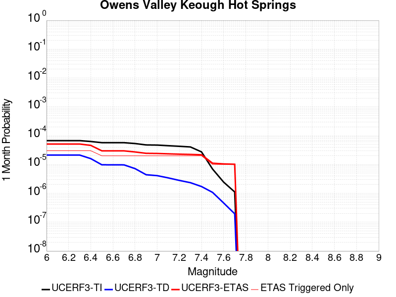 |  |  |

| Magnitude | 1 wk TI Prob | 1 wk TD Prob | 1 wk ETAS Prob | 1 wk ETAS/TD Gain | 1 wk ETAS Triggered Only | 1 mo TI Prob | 1 mo TD Prob | 1 mo ETAS Prob | 1 mo ETAS/TD Gain | 1 mo ETAS Triggered Only | 1 yr TI Prob | 1 yr TD Prob | 1 yr ETAS Prob | 1 yr ETAS/TD Gain | 1 yr ETAS Triggered Only | 10 yr TI Prob | 10 yr TD Prob | 10 yr ETAS Prob | 10 yr ETAS/TD Gain | 10 yr ETAS Triggered Only |
|-----|-----|-----|-----|-----|-----|-----|-----|-----|-----|-----|-----|-----|-----|-----|-----|-----|-----|-----|-----|-----|
| 6.0 | 1.5708529E-5 | 4.950656E-6 | 1.7311535E-5 | 3.4968162 | 1.236094E-5 | 6.7320536E-5 | 2.1216953E-5 | 4.5938308E-5 | 2.16517 | 2.472188E-5 | 8.193192E-4 | 2.582909E-4 | 2.9536415E-4 | 1.1435329 | 3.7082817E-5 | 0.008163051 | 0.0025805652 | 0.0026175522 | 1.014333 | 3.7082817E-5 |
| 6.1 | 1.5708529E-5 | 4.950656E-6 | 1.7311535E-5 | 3.4968162 | 1.236094E-5 | 6.7320536E-5 | 2.1216953E-5 | 4.5938308E-5 | 2.16517 | 2.472188E-5 | 8.193192E-4 | 2.582909E-4 | 2.9536415E-4 | 1.1435329 | 3.7082817E-5 | 0.008163051 | 0.0025805652 | 0.0026175522 | 1.014333 | 3.7082817E-5 |
| 6.2 | 1.5708529E-5 | 4.950656E-6 | 1.7311535E-5 | 3.4968162 | 1.236094E-5 | 6.7320536E-5 | 2.1216953E-5 | 4.5938308E-5 | 2.16517 | 2.472188E-5 | 8.193192E-4 | 2.582909E-4 | 2.9536415E-4 | 1.1435329 | 3.7082817E-5 | 0.008163051 | 0.0025805652 | 0.0026175522 | 1.014333 | 3.7082817E-5 |
| 6.3 | 1.5708529E-5 | 4.950656E-6 | 1.7311535E-5 | 3.4968162 | 1.236094E-5 | 6.7320536E-5 | 2.1216953E-5 | 4.5938308E-5 | 2.16517 | 2.472188E-5 | 8.193192E-4 | 2.582909E-4 | 2.9536415E-4 | 1.1435329 | 3.7082817E-5 | 0.008163051 | 0.0025805652 | 0.0026175522 | 1.014333 | 3.7082817E-5 |
| 6.4 | 1.4622509E-5 | 3.7265204E-6 | 1.6087413E-5 | 4.3170066 | 1.236094E-5 | 6.266639E-5 | 1.5970723E-5 | 4.0692208E-5 | 2.5479252 | 2.472188E-5 | 7.626962E-4 | 1.944295E-4 | 2.3150511E-4 | 1.1906892 | 3.7082817E-5 | 0.007600839 | 0.0019430731 | 0.0019800838 | 1.0190475 | 3.7082817E-5 |
| 6.5 | 1.3335527E-5 | 2.2777172E-6 | 1.4638628E-5 | 6.426886 | 1.236094E-5 | 5.7151006E-5 | 9.761612E-6 | 2.212243E-5 | 2.2662683 | 1.236094E-5 | 6.955913E-4 | 1.18841825E-4 | 1.312013E-4 | 1.1039994 | 1.236094E-5 | 0.0069341804 | 0.0011880046 | 0.0012003509 | 1.0103924 | 1.236094E-5 |
| 6.6 | 1.3332855E-5 | 2.2748663E-6 | 1.4635778E-5 | 6.4336867 | 1.236094E-5 | 5.7139558E-5 | 9.749395E-6 | 2.2110213E-5 | 2.267855 | 1.236094E-5 | 6.9545204E-4 | 1.186931E-4 | 1.3105257E-4 | 1.1041297 | 1.236094E-5 | 0.0069327964 | 0.0011865189 | 0.0011988651 | 1.0104054 | 1.236094E-5 |
| 6.7 | 1.3318214E-5 | 2.2640966E-6 | 1.4625008E-5 | 6.4595337 | 1.236094E-5 | 5.707681E-5 | 9.703239E-6 | 2.2064058E-5 | 2.273886 | 1.236094E-5 | 6.946886E-4 | 1.1813121E-4 | 1.3049069E-4 | 1.104625 | 1.236094E-5 | 0.0069252094 | 0.001180906 | 0.0011932524 | 1.010455 | 1.236094E-5 |
| 6.8 | 1.2441338E-5 | 1.6777863E-6 | 1.4038705E-5 | 8.367397 | 1.236094E-5 | 5.331893E-5 | 7.1904947E-6 | 1.9551346E-5 | 2.7190542 | 1.236094E-5 | 6.489646E-4 | 8.7541055E-5 | 9.9900906E-5 | 1.1411892 | 1.236094E-5 | 0.0064707273 | 8.752499E-4 | 8.876E-4 | 1.0141104 | 1.236094E-5 |
| 6.9 | 1.1130476E-5 | 1.0303868E-6 | 1.3391314E-5 | 12.996395 | 1.236094E-5 | 4.7701167E-5 | 4.415936E-6 | 1.6776821E-5 | 3.799154 | 1.236094E-5 | 5.806069E-4 | 5.3762706E-5 | 6.612298E-5 | 1.2299043 | 1.236094E-5 | 0.0057909233 | 5.37651E-4 | 5.500053E-4 | 1.0229783 | 1.236094E-5 |
| 7.0 | 1.0986073E-5 | 9.579413E-7 | 1.3318869E-5 | 13.903638 | 1.236094E-5 | 4.7082318E-5 | 4.1054564E-6 | 1.6466345E-5 | 4.0108438 | 1.236094E-5 | 5.730765E-4 | 4.99828E-5 | 6.234312E-5 | 1.2472916 | 1.236094E-5 | 0.0057160086 | 4.9986853E-4 | 5.122233E-4 | 1.024716 | 1.236094E-5 |
| 7.1 | 1.0451338E-5 | 8.0002656E-7 | 1.3160956E-5 | 16.45065 | 1.236094E-5 | 4.4790682E-5 | 3.4286807E-6 | 1.5789577E-5 | 4.605147 | 1.236094E-5 | 5.451901E-4 | 4.1743395E-5 | 5.4103817E-5 | 1.2961049 | 1.236094E-5 | 0.005438545 | 4.1750458E-4 | 4.2986035E-4 | 1.0295943 | 1.236094E-5 |
| 7.2 | 9.989061E-6 | 6.544956E-7 | 1.3015427E-5 | 19.886194 | 1.236094E-5 | 4.280956E-5 | 2.804978E-6 | 1.5165883E-5 | 5.406774 | 1.236094E-5 | 5.2108173E-4 | 3.4150078E-5 | 4.6510595E-5 | 1.361947 | 1.236094E-5 | 0.0051986156 | 3.415851E-4 | 3.539418E-4 | 1.0361747 | 1.236094E-5 |
| 7.3 | 9.465365E-6 | 5.4600474E-7 | 1.2906938E-5 | 23.638874 | 1.236094E-5 | 4.056522E-5 | 2.3400182E-6 | 1.4700929E-5 | 6.282399 | 1.236094E-5 | 4.937696E-4 | 2.8489352E-5 | 4.084994E-5 | 1.4338669 | 1.236094E-5 | 0.0049267393 | 2.8498896E-4 | 2.9734639E-4 | 1.0433611 | 1.236094E-5 |
| 7.4 | 6.3824805E-6 | 4.016335E-7 | 1.2762568E-5 | 31.776651 | 1.236094E-5 | 2.73532E-5 | 1.7212853E-6 | 1.4082203E-5 | 8.181214 | 1.236094E-5 | 3.3297433E-4 | 2.095645E-5 | 3.331713E-5 | 1.5898271 | 1.236094E-5 | 0.0033247585 | 2.0963654E-4 | 2.2199488E-4 | 1.0589513 | 1.236094E-5 |
| 7.5 | 1.6192645E-6 | 2.516124E-7 | 1.2612549E-5 | 50.1269 | 1.236094E-5 | 6.9396865E-6 | 1.0783383E-6 | 1.3439265E-5 | 12.462938 | 1.236094E-5 | 8.448741E-5 | 1.31286915E-5 | 2.548947E-5 | 1.9415087 | 1.236094E-5 | 8.4455294E-4 | 1.3127929E-4 | 1.4363861E-4 | 1.0941452 | 1.236094E-5 |
| 7.6 | 5.7062545E-7 | 1.07924045E-7 | 1.2468862E-5 | 115.53368 | 1.236094E-5 | 2.4455355E-6 | 4.6253152E-7 | 1.2823465E-5 | 27.724522 | 1.236094E-5 | 2.9773988E-5 | 5.6313074E-6 | 1.7992177E-5 | 3.1950266 | 1.236094E-5 | 2.977E-4 | 5.6311732E-5 | 6.867197E-5 | 1.2194967 | 1.236094E-5 |
| 7.7 | 2.5988817E-7 | 4.5457977E-8 | 1.2406397E-5 | 272.92014 | 1.236094E-5 | 1.113806E-6 | 1.9481989E-7 | 1.2555757E-5 | 64.44802 | 1.236094E-5 | 1.3560503E-5 | 2.3719301E-6 | 1.473284E-5 | 6.21133 | 1.236094E-5 | 1.3559677E-4 | 2.371909E-5 | 3.607974E-5 | 1.5211265 | 1.236094E-5 |

## Los Alamos 2011 CFM
*[(top)](#table-of-contents)*

| 1 Week | 1 Month | 1 Year | 10 Year |
|-----|-----|-----|-----|
|  |  |  |  |

| Magnitude | 1 wk TI Prob | 1 wk TD Prob | 1 wk ETAS Prob | 1 wk ETAS/TD Gain | 1 wk ETAS Triggered Only | 1 mo TI Prob | 1 mo TD Prob | 1 mo ETAS Prob | 1 mo ETAS/TD Gain | 1 mo ETAS Triggered Only | 1 yr TI Prob | 1 yr TD Prob | 1 yr ETAS Prob | 1 yr ETAS/TD Gain | 1 yr ETAS Triggered Only | 10 yr TI Prob | 10 yr TD Prob | 10 yr ETAS Prob | 10 yr ETAS/TD Gain | 10 yr ETAS Triggered Only |
|-----|-----|-----|-----|-----|-----|-----|-----|-----|-----|-----|-----|-----|-----|-----|-----|-----|-----|-----|-----|-----|
| 6.0 | 4.6284417E-6 | 4.751731E-6 | 1.7112612E-5 | 3.6013427 | 1.236094E-5 | 1.9836029E-5 | 2.0364414E-5 | 3.27251E-5 | 1.606975 | 1.236094E-5 | 2.4147688E-4 | 2.4791027E-4 | 2.7262603E-4 | 1.0996964 | 2.472188E-5 | 0.0024121467 | 0.0024765113 | 0.0025135025 | 1.0149367 | 3.7082817E-5 |
| 6.1 | 4.6284417E-6 | 4.751731E-6 | 1.7112612E-5 | 3.6013427 | 1.236094E-5 | 1.9836029E-5 | 2.0364414E-5 | 3.27251E-5 | 1.606975 | 1.236094E-5 | 2.4147688E-4 | 2.4791027E-4 | 2.7262603E-4 | 1.0996964 | 2.472188E-5 | 0.0024121467 | 0.0024765113 | 0.0025135025 | 1.0149367 | 3.7082817E-5 |
| 6.2 | 4.6284417E-6 | 4.751731E-6 | 1.7112612E-5 | 3.6013427 | 1.236094E-5 | 1.9836029E-5 | 2.0364414E-5 | 3.27251E-5 | 1.606975 | 1.236094E-5 | 2.4147688E-4 | 2.4791027E-4 | 2.7262603E-4 | 1.0996964 | 2.472188E-5 | 0.0024121467 | 0.0024765113 | 0.0025135025 | 1.0149367 | 3.7082817E-5 |
| 6.3 | 4.6284417E-6 | 4.751731E-6 | 1.7112612E-5 | 3.6013427 | 1.236094E-5 | 1.9836029E-5 | 2.0364414E-5 | 3.27251E-5 | 1.606975 | 1.236094E-5 | 2.4147688E-4 | 2.4791027E-4 | 2.7262603E-4 | 1.0996964 | 2.472188E-5 | 0.0024121467 | 0.0024765113 | 0.0025135025 | 1.0149367 | 3.7082817E-5 |
| 6.4 | 4.6284417E-6 | 4.751731E-6 | 1.7112612E-5 | 3.6013427 | 1.236094E-5 | 1.9836029E-5 | 2.0364414E-5 | 3.27251E-5 | 1.606975 | 1.236094E-5 | 2.4147688E-4 | 2.4791027E-4 | 2.7262603E-4 | 1.0996964 | 2.472188E-5 | 0.0024121467 | 0.0024765113 | 0.0025135025 | 1.0149367 | 3.7082817E-5 |
| 6.5 | 4.6284417E-6 | 4.751731E-6 | 1.7112612E-5 | 3.6013427 | 1.236094E-5 | 1.9836029E-5 | 2.0364414E-5 | 3.27251E-5 | 1.606975 | 1.236094E-5 | 2.4147688E-4 | 2.4791027E-4 | 2.7262603E-4 | 1.0996964 | 2.472188E-5 | 0.0024121467 | 0.0024765113 | 0.0025135025 | 1.0149367 | 3.7082817E-5 |
| 6.6 | 4.6284417E-6 | 4.751731E-6 | 1.7112612E-5 | 3.6013427 | 1.236094E-5 | 1.9836029E-5 | 2.0364414E-5 | 3.27251E-5 | 1.606975 | 1.236094E-5 | 2.4147688E-4 | 2.4791027E-4 | 2.7262603E-4 | 1.0996964 | 2.472188E-5 | 0.0024121467 | 0.0024765113 | 0.0025135025 | 1.0149367 | 3.7082817E-5 |
| 6.7 | 4.062321E-6 | 4.166349E-6 | 1.6527236E-5 | 3.9668396 | 1.236094E-5 | 1.7409831E-5 | 1.7855667E-5 | 3.0216386E-5 | 1.6922575 | 1.236094E-5 | 2.1194408E-4 | 2.1737257E-4 | 2.4208908E-4 | 1.1137058 | 2.472188E-5 | 0.0021174205 | 0.0021717492 | 0.0022087514 | 1.017038 | 3.7082817E-5 |
| 6.8 | 4.062321E-6 | 4.166349E-6 | 1.6527236E-5 | 3.9668396 | 1.236094E-5 | 1.7409831E-5 | 1.7855667E-5 | 3.0216386E-5 | 1.6922575 | 1.236094E-5 | 2.1194408E-4 | 2.1737257E-4 | 2.4208908E-4 | 1.1137058 | 2.472188E-5 | 0.0021174205 | 0.0021717492 | 0.0022087514 | 1.017038 | 3.7082817E-5 |
| 6.9 | 3.2936077E-6 | 3.372958E-6 | 1.5733856E-5 | 4.6647058 | 1.236094E-5 | 1.4115385E-5 | 1.4455459E-5 | 2.681622E-5 | 1.8550929 | 1.236094E-5 | 1.7184127E-4 | 1.7598194E-4 | 2.0069946E-4 | 1.1404549 | 2.472188E-5 | 0.0017170844 | 0.0017585184 | 0.001795536 | 1.0210505 | 3.7082817E-5 |
| 7.0 | 3.1687898E-6 | 3.2448156E-6 | 1.5605714E-5 | 4.8094306 | 1.236094E-5 | 1.3580457E-5 | 1.3906283E-5 | 2.6267051E-5 | 1.888862 | 1.236094E-5 | 1.6532952E-4 | 1.6929678E-4 | 1.9401447E-4 | 1.1460022 | 2.472188E-5 | 0.0016520657 | 0.0016917696 | 0.0017287896 | 1.0218824 | 3.7082817E-5 |
| 7.1 | 2.9379228E-6 | 3.0073259E-6 | 3.0073259E-6 | 1.0 | 0.0 | 1.25910365E-5 | 1.288848E-5 | 1.288848E-5 | 1.0 | 0.0 | 1.5328509E-4 | 1.5690686E-4 | 1.6926586E-4 | 1.0787665 | 1.236094E-5 | 0.001531794 | 0.0015680499 | 0.001592733 | 1.0157412 | 2.472188E-5 |
| 7.2 | 2.0020686E-6 | 2.0416298E-6 | 2.0416298E-6 | 1.0 | 0.0 | 8.580266E-6 | 8.749813E-6 | 8.749813E-6 | 1.0 | 0.0 | 1.0445973E-4 | 1.0652381E-4 | 1.1888343E-4 | 1.1160269 | 1.236094E-5 | 0.0010441064 | 0.001064732 | 0.0010770797 | 1.011597 | 1.236094E-5 |
| 7.3 | 1.7364243E-6 | 1.7678802E-6 | 1.7678802E-6 | 1.0 | 0.0 | 7.441797E-6 | 7.576608E-6 | 7.576608E-6 | 1.0 | 0.0 | 9.0600115E-5 | 9.2241324E-5 | 9.2241324E-5 | 1.0 | 0.0 | 9.0563187E-4 | 9.2203356E-4 | 9.2203356E-4 | 1.0 | 0.0 |
| 7.4 | 1.5718434E-6 | 1.5983177E-6 | 1.5983177E-6 | 1.0 | 0.0 | 6.7364545E-6 | 6.849915E-6 | 6.849915E-6 | 1.0 | 0.0 | 8.201325E-5 | 8.339455E-5 | 8.339455E-5 | 1.0 | 0.0 | 8.198299E-4 | 8.3363557E-4 | 8.3363557E-4 | 1.0 | 0.0 |
| 7.5 | 1.3841119E-6 | 1.4042793E-6 | 1.4042793E-6 | 1.0 | 0.0 | 5.9318945E-6 | 6.0183256E-6 | 6.0183256E-6 | 1.0 | 0.0 | 7.221842E-5 | 7.327068E-5 | 7.327068E-5 | 1.0 | 0.0 | 7.2194956E-4 | 7.324681E-4 | 7.324681E-4 | 1.0 | 0.0 |
| 7.6 | 1.0843726E-6 | 1.093442E-6 | 1.093442E-6 | 1.0 | 0.0 | 4.647303E-6 | 4.6861724E-6 | 4.6861724E-6 | 1.0 | 0.0 | 5.6579443E-5 | 5.705268E-5 | 5.705268E-5 | 1.0 | 0.0 | 5.656504E-4 | 5.703829E-4 | 5.703829E-4 | 1.0 | 0.0 |
| 7.7 | 5.544814E-7 | 5.5018705E-7 | 5.5018705E-7 | 1.0 | 0.0 | 2.3763469E-6 | 2.3579425E-6 | 2.3579425E-6 | 1.0 | 0.0 | 2.8931638E-5 | 2.8707573E-5 | 2.8707573E-5 | 1.0 | 0.0 | 2.8927872E-4 | 2.870388E-4 | 2.870388E-4 | 1.0 | 0.0 |
| 7.8 | 2.0707465E-7 | 1.977846E-7 | 1.977846E-7 | 1.0 | 0.0 | 8.874625E-7 | 8.4764804E-7 | 8.4764804E-7 | 1.0 | 0.0 | 1.08048025E-5 | 1.0320066E-5 | 1.0320066E-5 | 1.0 | 0.0 | 1.0804277E-4 | 1.0319592E-4 | 1.0319592E-4 | 1.0 | 0.0 |
| 7.9 | 3.9821284E-8 | 3.433109E-8 | 3.433109E-8 | 1.0 | 0.0 | 1.7066264E-7 | 1.4713324E-7 | 1.4713324E-7 | 1.0 | 0.0 | 2.0778157E-6 | 1.7913457E-6 | 1.7913457E-6 | 1.0 | 0.0 | 2.0777963E-5 | 1.7913319E-5 | 1.7913319E-5 | 1.0 | 0.0 |
| 8.0 | 7.880441E-11 | 8.2353124E-11 | 8.2353124E-11 | 1.0 | 0.0 | 3.3773329E-10 | 3.52942E-10 | 3.52942E-10 | 1.0 | 0.0 | 4.1119033E-9 | 4.2970694E-9 | 4.2970694E-9 | 1.0 | 0.0 | 4.1119034E-8 | 4.2970694E-8 | 4.2970694E-8 | 1.0 | 0.0 |

## Greenville (So) 2011 CFM
*[(top)](#table-of-contents)*

| 1 Week | 1 Month | 1 Year | 10 Year |
|-----|-----|-----|-----|
|  |  |  |  |

| Magnitude | 1 wk TI Prob | 1 wk TD Prob | 1 wk ETAS Prob | 1 wk ETAS/TD Gain | 1 wk ETAS Triggered Only | 1 mo TI Prob | 1 mo TD Prob | 1 mo ETAS Prob | 1 mo ETAS/TD Gain | 1 mo ETAS Triggered Only | 1 yr TI Prob | 1 yr TD Prob | 1 yr ETAS Prob | 1 yr ETAS/TD Gain | 1 yr ETAS Triggered Only | 10 yr TI Prob | 10 yr TD Prob | 10 yr ETAS Prob | 10 yr ETAS/TD Gain | 10 yr ETAS Triggered Only |
|-----|-----|-----|-----|-----|-----|-----|-----|-----|-----|-----|-----|-----|-----|-----|-----|-----|-----|-----|-----|-----|
| 6.0 | 4.279693E-5 | 5.5040087E-5 | 6.7400346E-5 | 1.2245682 | 1.236094E-5 | 1.8340252E-4 | 2.3586681E-4 | 2.4822482E-4 | 1.052394 | 1.236094E-5 | 0.0022306389 | 0.0028682416 | 0.0029052182 | 1.0128917 | 3.7082817E-5 | 0.022083808 | 0.028338138 | 0.028374169 | 1.0012715 | 3.7082817E-5 |
| 6.1 | 3.4037297E-5 | 4.3192387E-5 | 5.5552795E-5 | 1.286171 | 1.236094E-5 | 1.4586597E-4 | 1.8509831E-4 | 1.9745696E-4 | 1.066768 | 1.236094E-5 | 0.0017744715 | 0.0022514379 | 0.0022884372 | 1.0164336 | 3.7082817E-5 | 0.01760369 | 0.022302566 | 0.022338822 | 1.0016257 | 3.7082817E-5 |
| 6.2 | 3.4037297E-5 | 4.3192387E-5 | 5.5552795E-5 | 1.286171 | 1.236094E-5 | 1.4586597E-4 | 1.8509831E-4 | 1.9745696E-4 | 1.066768 | 1.236094E-5 | 0.0017744715 | 0.0022514379 | 0.0022884372 | 1.0164336 | 3.7082817E-5 | 0.01760369 | 0.022302566 | 0.022338822 | 1.0016257 | 3.7082817E-5 |
| 6.3 | 2.5956324E-5 | 3.2428903E-5 | 4.478944E-5 | 1.3811581 | 1.236094E-5 | 1.11236644E-4 | 1.3897405E-4 | 1.5133327E-4 | 1.0889319 | 1.236094E-5 | 0.0013534647 | 0.0016907708 | 0.0017277909 | 1.0218954 | 3.7082817E-5 | 0.013452509 | 0.016785882 | 0.016822342 | 1.0021721 | 3.7082817E-5 |
| 6.4 | 2.1145053E-5 | 2.6197677E-5 | 3.8558293E-5 | 1.4718211 | 1.236094E-5 | 9.061851E-5 | 1.1227112E-4 | 1.2463066E-4 | 1.1100867 | 1.236094E-5 | 0.0011027219 | 0.0013660751 | 0.0014031073 | 1.0271084 | 3.7082817E-5 | 0.01097266 | 0.01358018 | 0.013616759 | 1.0026935 | 3.7082817E-5 |
| 6.5 | 2.0030959E-5 | 2.479578E-5 | 3.7156413E-5 | 1.4984975 | 1.236094E-5 | 8.584414E-5 | 1.06263484E-4 | 1.1862311E-4 | 1.1163111 | 1.236094E-5 | 0.0010446513 | 0.0012930221 | 0.0013300569 | 1.028642 | 3.7082817E-5 | 0.010397541 | 0.012858339 | 0.012894944 | 1.0028468 | 3.7082817E-5 |
| 6.6 | 1.8395405E-5 | 2.2754466E-5 | 3.5115125E-5 | 1.543219 | 1.236094E-5 | 7.8835066E-5 | 9.751565E-5 | 1.09875386E-4 | 1.1267462 | 1.236094E-5 | 9.5939427E-4 | 0.0011866348 | 0.0012236736 | 1.0312133 | 3.7082817E-5 | 0.009552629 | 0.011806041 | 0.011842686 | 1.003104 | 3.7082817E-5 |
| 6.7 | 1.7883482E-5 | 2.212551E-5 | 3.4486176E-5 | 1.5586612 | 1.236094E-5 | 7.664124E-5 | 9.482033E-5 | 1.07180094E-4 | 1.1303494 | 1.236094E-5 | 9.3270757E-4 | 0.0011538545 | 0.0011908945 | 1.0321012 | 3.7082817E-5 | 0.009288026 | 0.011481688 | 0.011518345 | 1.0031927 | 3.7082817E-5 |
| 6.8 | 1.3373564E-5 | 1.6505966E-5 | 2.8866702E-5 | 1.7488648 | 1.236094E-5 | 5.7314013E-5 | 7.073802E-5 | 8.3098086E-5 | 1.1747302 | 1.236094E-5 | 6.975747E-4 | 8.609098E-4 | 8.9796074E-4 | 1.0430369 | 3.7082817E-5 | 0.0069538904 | 0.008577357 | 0.008614122 | 1.0042863 | 3.7082817E-5 |
| 6.9 | 1.06692905E-5 | 1.3152582E-5 | 2.5513358E-5 | 1.9397985 | 1.236094E-5 | 4.5724726E-5 | 5.6367055E-5 | 6.87273E-5 | 1.2192813 | 1.236094E-5 | 5.5655633E-4 | 6.86064E-4 | 7.107689E-4 | 1.0360097 | 2.472188E-5 | 0.005551645 | 0.006840693 | 0.0068652458 | 1.0035893 | 2.472188E-5 |
| 7.0 | 8.157512E-6 | 1.0062639E-5 | 2.2423454E-5 | 2.2283869 | 1.236094E-5 | 3.4960296E-5 | 4.3124903E-5 | 5.548531E-5 | 1.2866187 | 1.236094E-5 | 4.2555845E-4 | 5.2492286E-4 | 5.496318E-4 | 1.0470715 | 2.472188E-5 | 0.004247444 | 0.0052373074 | 0.0052618994 | 1.0046957 | 2.472188E-5 |
| 7.1 | 6.1467113E-6 | 7.6274314E-6 | 1.9988276E-5 | 2.6205776 | 1.236094E-5 | 2.6342783E-5 | 3.268859E-5 | 4.5049124E-5 | 1.37813 | 1.236094E-5 | 3.206762E-4 | 3.9791173E-4 | 4.2262377E-4 | 1.0621043 | 2.472188E-5 | 0.0032021382 | 0.0039721807 | 0.0039968044 | 1.006199 | 2.472188E-5 |
| 7.2 | 4.713467E-6 | 5.9141557E-6 | 1.8275023E-5 | 3.0900476 | 1.236094E-5 | 2.0200418E-5 | 2.5346139E-5 | 3.7706766E-5 | 1.4876729 | 1.236094E-5 | 2.4591232E-4 | 3.0854615E-4 | 3.2090326E-4 | 1.0400496 | 1.236094E-5 | 0.0024564038 | 0.0030813308 | 0.0030936536 | 1.0039992 | 1.236094E-5 |
| 7.3 | 2.3266216E-6 | 2.954009E-6 | 2.954009E-6 | 1.0 | 0.0 | 9.971197E-6 | 1.2659978E-5 | 1.2659978E-5 | 1.0 | 0.0 | 1.2139256E-4 | 1.5412449E-4 | 1.5412449E-4 | 1.0 | 0.0 | 0.0012132627 | 0.0015402455 | 0.0015402455 | 1.0 | 0.0 |
| 7.4 | 1.3314E-6 | 1.7179472E-6 | 1.7179472E-6 | 1.0 | 0.0 | 5.7059874E-6 | 7.36261E-6 | 7.36261E-6 | 1.0 | 0.0 | 6.946818E-5 | 8.963614E-5 | 8.963614E-5 | 1.0 | 0.0 | 6.9446466E-4 | 8.9603866E-4 | 8.9603866E-4 | 1.0 | 0.0 |
| 7.5 | 1.0362941E-6 | 1.3468821E-6 | 1.3468821E-6 | 1.0 | 0.0 | 4.4412527E-6 | 5.772339E-6 | 5.772339E-6 | 1.0 | 0.0 | 5.407091E-5 | 7.027601E-5 | 7.027601E-5 | 1.0 | 0.0 | 5.405776E-4 | 7.025681E-4 | 7.025681E-4 | 1.0 | 0.0 |
| 7.6 | 7.764784E-7 | 1.0088593E-6 | 1.0088593E-6 | 1.0 | 0.0 | 3.3277602E-6 | 4.323676E-6 | 4.323676E-6 | 1.0 | 0.0 | 4.0514726E-5 | 5.263952E-5 | 5.263952E-5 | 1.0 | 0.0 | 4.050734E-4 | 5.262919E-4 | 5.262919E-4 | 1.0 | 0.0 |
| 7.7 | 1.6927763E-7 | 2.2139248E-7 | 2.2139248E-7 | 1.0 | 0.0 | 7.2547533E-7 | 9.4882455E-7 | 9.4882455E-7 | 1.0 | 0.0 | 8.832627E-6 | 1.15518815E-5 | 1.15518815E-5 | 1.0 | 0.0 | 8.8322755E-5 | 1.15515526E-4 | 1.15515526E-4 | 1.0 | 0.0 |

## Pisgah-Bullion Mtn-Mesquite Lk
*[(top)](#table-of-contents)*

| 1 Week | 1 Month | 1 Year | 10 Year |
|-----|-----|-----|-----|
|  |  |  | 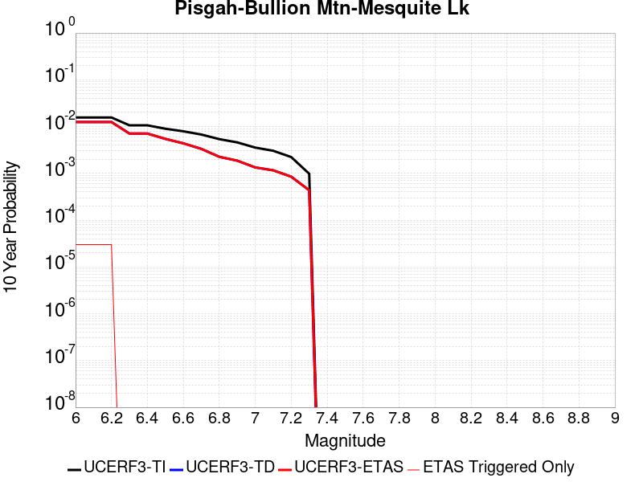 |

| Magnitude | 1 wk TI Prob | 1 wk TD Prob | 1 wk ETAS Prob | 1 wk ETAS/TD Gain | 1 wk ETAS Triggered Only | 1 mo TI Prob | 1 mo TD Prob | 1 mo ETAS Prob | 1 mo ETAS/TD Gain | 1 mo ETAS Triggered Only | 1 yr TI Prob | 1 yr TD Prob | 1 yr ETAS Prob | 1 yr ETAS/TD Gain | 1 yr ETAS Triggered Only | 10 yr TI Prob | 10 yr TD Prob | 10 yr ETAS Prob | 10 yr ETAS/TD Gain | 10 yr ETAS Triggered Only |
|-----|-----|-----|-----|-----|-----|-----|-----|-----|-----|-----|-----|-----|-----|-----|-----|-----|-----|-----|-----|-----|
| 6.0 | 3.0240792E-5 | 2.4091114E-5 | 3.6451755E-5 | 1.5130788 | 1.236094E-5 | 1.2959696E-4 | 1.03244114E-4 | 1.15603776E-4 | 1.119713 | 1.236094E-5 | 0.0015767008 | 0.0012563728 | 0.0012810635 | 1.0196525 | 2.472188E-5 | 0.015655609 | 0.012502721 | 0.01253934 | 1.0029289 | 3.7082817E-5 |
| 6.1 | 3.0240792E-5 | 2.4091114E-5 | 3.6451755E-5 | 1.5130788 | 1.236094E-5 | 1.2959696E-4 | 1.03244114E-4 | 1.15603776E-4 | 1.119713 | 1.236094E-5 | 0.0015767008 | 0.0012563728 | 0.0012810635 | 1.0196525 | 2.472188E-5 | 0.015655609 | 0.012502721 | 0.01253934 | 1.0029289 | 3.7082817E-5 |
| 6.2 | 3.0240792E-5 | 2.4091114E-5 | 3.6451755E-5 | 1.5130788 | 1.236094E-5 | 1.2959696E-4 | 1.03244114E-4 | 1.15603776E-4 | 1.119713 | 1.236094E-5 | 0.0015767008 | 0.0012563728 | 0.0012810635 | 1.0196525 | 2.472188E-5 | 0.015655609 | 0.012502721 | 0.01253934 | 1.0029289 | 3.7082817E-5 |
| 6.3 | 2.0498217E-5 | 1.36380695E-5 | 1.36380695E-5 | 1.0 | 0.0 | 8.784654E-5 | 5.844765E-5 | 5.844765E-5 | 1.0 | 0.0 | 0.0010690069 | 7.1138405E-4 | 7.1138405E-4 | 1.0 | 0.0 | 0.01063879 | 0.0070926943 | 0.0070926943 | 1.0 | 0.0 |
| 6.4 | 2.0498217E-5 | 1.36380695E-5 | 1.36380695E-5 | 1.0 | 0.0 | 8.784654E-5 | 5.844765E-5 | 5.844765E-5 | 1.0 | 0.0 | 0.0010690069 | 7.1138405E-4 | 7.1138405E-4 | 1.0 | 0.0 | 0.01063879 | 0.0070926943 | 0.0070926943 | 1.0 | 0.0 |
| 6.5 | 1.7316182E-5 | 1.0477042E-5 | 1.0477042E-5 | 1.0 | 0.0 | 7.42101E-5 | 4.4900895E-5 | 4.4900895E-5 | 1.0 | 0.0 | 9.0313336E-4 | 5.465413E-4 | 5.465413E-4 | 1.0 | 0.0 | 0.008994718 | 0.0054529672 | 0.0054529672 | 1.0 | 0.0 |
| 6.6 | 1.5251077E-5 | 8.414273E-6 | 8.414273E-6 | 1.0 | 0.0 | 6.536012E-5 | 3.6060712E-5 | 3.6060712E-5 | 1.0 | 0.0 | 7.9546886E-4 | 4.3895794E-4 | 4.3895794E-4 | 1.0 | 0.0 | 0.007926274 | 0.0043816264 | 0.0043816264 | 1.0 | 0.0 |
| 6.7 | 1.2997425E-5 | 6.4114965E-6 | 6.4114965E-6 | 1.0 | 0.0 | 5.570206E-5 | 2.7477578E-5 | 2.7477578E-5 | 1.0 | 0.0 | 6.7796157E-4 | 3.3449283E-4 | 3.3449283E-4 | 1.0 | 0.0 | 0.0067589693 | 0.0033403537 | 0.0033403537 | 1.0 | 0.0 |
| 6.8 | 1.035386E-5 | 4.3332193E-6 | 4.3332193E-6 | 1.0 | 0.0 | 4.437293E-5 | 1.8570812E-5 | 1.8570812E-5 | 1.0 | 0.0 | 5.401065E-4 | 2.2607706E-4 | 2.2607706E-4 | 1.0 | 0.0 | 0.0053879567 | 0.0022585576 | 0.0022585576 | 1.0 | 0.0 |
| 6.9 | 8.816252E-6 | 3.580638E-6 | 3.580638E-6 | 1.0 | 0.0 | 3.778339E-5 | 1.5345504E-5 | 1.5345504E-5 | 1.0 | 0.0 | 4.5991567E-4 | 1.8681608E-4 | 1.8681608E-4 | 1.0 | 0.0 | 0.00458965 | 0.0018666488 | 0.0018666488 | 1.0 | 0.0 |
| 7.0 | 6.8232207E-6 | 2.5675843E-6 | 2.5675843E-6 | 1.0 | 0.0 | 2.9242048E-5 | 1.1003888E-5 | 1.1003888E-5 | 1.0 | 0.0 | 3.5596377E-4 | 1.3396442E-4 | 1.3396442E-4 | 1.0 | 0.0 | 0.0035539411 | 0.0013388677 | 0.0013388677 | 1.0 | 0.0 |
| 7.1 | 5.837013E-6 | 2.22738E-6 | 2.22738E-6 | 1.0 | 0.0 | 2.501553E-5 | 9.545881E-6 | 9.545881E-6 | 1.0 | 0.0 | 3.045215E-4 | 1.16215204E-4 | 1.16215204E-4 | 1.0 | 0.0 | 0.0030410455 | 0.0011615733 | 0.0011615733 | 1.0 | 0.0 |
| 7.2 | 4.278052E-6 | 1.6275711E-6 | 1.6275711E-6 | 1.0 | 0.0 | 1.833438E-5 | 6.9752873E-6 | 6.9752873E-6 | 1.0 | 0.0 | 2.231982E-4 | 8.492105E-5 | 8.492105E-5 | 1.0 | 0.0 | 0.0022297418 | 8.489092E-4 | 8.489092E-4 | 1.0 | 0.0 |
| 7.3 | 1.8803692E-6 | 8.344926E-7 | 8.344926E-7 | 1.0 | 0.0 | 8.0587E-6 | 3.5763926E-6 | 3.5763926E-6 | 1.0 | 0.0 | 9.811026E-5 | 4.354186E-5 | 4.354186E-5 | 1.0 | 0.0 | 9.806695E-4 | 4.3534773E-4 | 4.3534773E-4 | 1.0 | 0.0 |

## Cleghorn
*[(top)](#table-of-contents)*

| 1 Week | 1 Month | 1 Year | 10 Year |
|-----|-----|-----|-----|
|  | 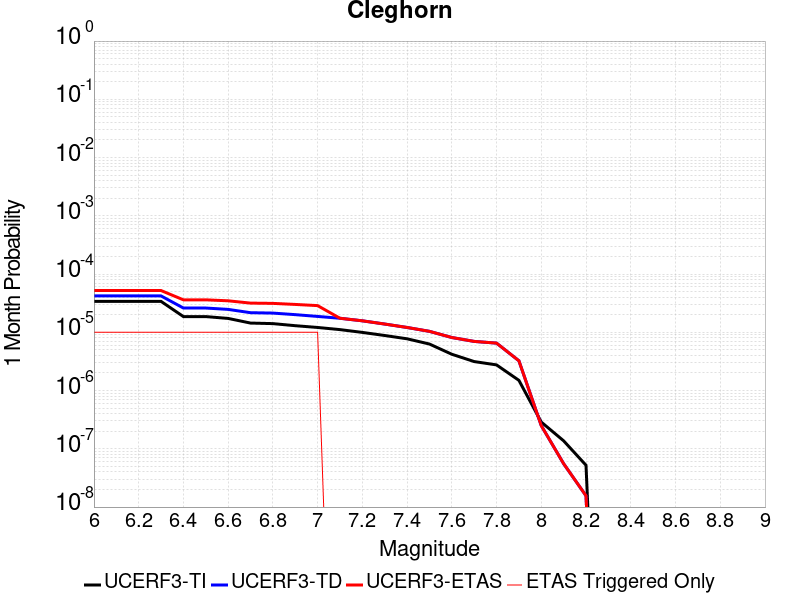 |  |  |

| Magnitude | 1 wk TI Prob | 1 wk TD Prob | 1 wk ETAS Prob | 1 wk ETAS/TD Gain | 1 wk ETAS Triggered Only | 1 mo TI Prob | 1 mo TD Prob | 1 mo ETAS Prob | 1 mo ETAS/TD Gain | 1 mo ETAS Triggered Only | 1 yr TI Prob | 1 yr TD Prob | 1 yr ETAS Prob | 1 yr ETAS/TD Gain | 1 yr ETAS Triggered Only | 10 yr TI Prob | 10 yr TD Prob | 10 yr ETAS Prob | 10 yr ETAS/TD Gain | 10 yr ETAS Triggered Only |
|-----|-----|-----|-----|-----|-----|-----|-----|-----|-----|-----|-----|-----|-----|-----|-----|-----|-----|-----|-----|-----|
| 6.0 | 7.9267165E-6 | 9.831582E-6 | 9.831582E-6 | 1.0 | 0.0 | 3.39712E-5 | 4.2134732E-5 | 4.2134732E-5 | 1.0 | 0.0 | 4.1352084E-4 | 5.128803E-4 | 5.128803E-4 | 1.0 | 0.0 | 0.004127522 | 0.0051320773 | 0.0051689697 | 1.0071886 | 3.7082817E-5 |
| 6.1 | 7.9267165E-6 | 9.831582E-6 | 9.831582E-6 | 1.0 | 0.0 | 3.39712E-5 | 4.2134732E-5 | 4.2134732E-5 | 1.0 | 0.0 | 4.1352084E-4 | 5.128803E-4 | 5.128803E-4 | 1.0 | 0.0 | 0.004127522 | 0.0051320773 | 0.0051689697 | 1.0071886 | 3.7082817E-5 |
| 6.2 | 7.9267165E-6 | 9.831582E-6 | 9.831582E-6 | 1.0 | 0.0 | 3.39712E-5 | 4.2134732E-5 | 4.2134732E-5 | 1.0 | 0.0 | 4.1352084E-4 | 5.128803E-4 | 5.128803E-4 | 1.0 | 0.0 | 0.004127522 | 0.0051320773 | 0.0051689697 | 1.0071886 | 3.7082817E-5 |
| 6.3 | 7.9267165E-6 | 9.831582E-6 | 9.831582E-6 | 1.0 | 0.0 | 3.39712E-5 | 4.2134732E-5 | 4.2134732E-5 | 1.0 | 0.0 | 4.1352084E-4 | 5.128803E-4 | 5.128803E-4 | 1.0 | 0.0 | 0.004127522 | 0.0051320773 | 0.0051689697 | 1.0071886 | 3.7082817E-5 |
| 6.4 | 4.3445207E-6 | 6.0914435E-6 | 6.0914435E-6 | 1.0 | 0.0 | 1.8619241E-5 | 2.610593E-5 | 2.610593E-5 | 1.0 | 0.0 | 2.2666567E-4 | 3.1779436E-4 | 3.1779436E-4 | 1.0 | 0.0 | 0.0022643462 | 0.0031875873 | 0.0031999089 | 1.0038655 | 1.236094E-5 |
| 6.5 | 4.3445207E-6 | 6.0914435E-6 | 6.0914435E-6 | 1.0 | 0.0 | 1.8619241E-5 | 2.610593E-5 | 2.610593E-5 | 1.0 | 0.0 | 2.2666567E-4 | 3.1779436E-4 | 3.1779436E-4 | 1.0 | 0.0 | 0.0022643462 | 0.0031875873 | 0.0031999089 | 1.0038655 | 1.236094E-5 |
| 6.6 | 4.040109E-6 | 5.773851E-6 | 5.773851E-6 | 1.0 | 0.0 | 1.7314638E-5 | 2.4744846E-5 | 2.4744846E-5 | 1.0 | 0.0 | 2.1078532E-4 | 3.012278E-4 | 3.012278E-4 | 1.0 | 0.0 | 0.002105855 | 0.003022377 | 0.0030347006 | 1.0040774 | 1.236094E-5 |
| 6.7 | 3.3632055E-6 | 5.067348E-6 | 5.067348E-6 | 1.0 | 0.0 | 1.4413658E-5 | 2.1717027E-5 | 2.1717027E-5 | 1.0 | 0.0 | 1.7547216E-4 | 2.6437303E-4 | 2.6437303E-4 | 1.0 | 0.0 | 0.0017533366 | 0.0026547113 | 0.0026547113 | 1.0 | 0.0 |
| 6.8 | 3.2902772E-6 | 4.9892556E-6 | 4.9892556E-6 | 1.0 | 0.0 | 1.4101111E-5 | 2.1382351E-5 | 2.1382351E-5 | 1.0 | 0.0 | 1.716675E-4 | 2.6029933E-4 | 2.6029933E-4 | 1.0 | 0.0 | 0.0017153495 | 0.0026140702 | 0.0026140702 | 1.0 | 0.0 |
| 6.9 | 3.031547E-6 | 4.6910186E-6 | 4.6910186E-6 | 1.0 | 0.0 | 1.299228E-5 | 2.0104211E-5 | 2.0104211E-5 | 1.0 | 0.0 | 1.5816953E-4 | 2.4474156E-4 | 2.4474156E-4 | 1.0 | 0.0 | 0.00158057 | 0.0024588439 | 0.0024588439 | 1.0 | 0.0 |
| 7.0 | 2.8259715E-6 | 4.3705895E-6 | 4.3705895E-6 | 1.0 | 0.0 | 1.211125E-5 | 1.8730963E-5 | 1.8730963E-5 | 1.0 | 0.0 | 1.4744449E-4 | 2.2802586E-4 | 2.2802586E-4 | 1.0 | 0.0 | 0.001473467 | 0.0022920412 | 0.0022920412 | 1.0 | 0.0 |
| 7.1 | 2.5962665E-6 | 4.0658106E-6 | 4.0658106E-6 | 1.0 | 0.0 | 1.1126809E-5 | 1.7424789E-5 | 1.7424789E-5 | 1.0 | 0.0 | 1.3546048E-4 | 2.1212637E-4 | 2.1212637E-4 | 1.0 | 0.0 | 0.0013537793 | 0.002133366 | 0.002133366 | 1.0 | 0.0 |
| 7.2 | 2.3247253E-6 | 3.6763672E-6 | 3.6763672E-6 | 1.0 | 0.0 | 9.96307E-6 | 1.5755764E-5 | 1.5755764E-5 | 1.0 | 0.0 | 1.21293626E-4 | 1.9180974E-4 | 1.9180974E-4 | 1.0 | 0.0 | 0.0012122744 | 0.0019305905 | 0.0019305905 | 1.0 | 0.0 |
| 7.3 | 2.056928E-6 | 3.2350938E-6 | 3.2350938E-6 | 1.0 | 0.0 | 8.815376E-6 | 1.3864615E-5 | 1.3864615E-5 | 1.0 | 0.0 | 1.0732192E-4 | 1.6878877E-4 | 1.6878877E-4 | 1.0 | 0.0 | 0.001072701 | 0.0017008206 | 0.0017008206 | 1.0 | 0.0 |
| 7.4 | 1.8055999E-6 | 2.8255042E-6 | 2.8255042E-6 | 1.0 | 0.0 | 7.738263E-6 | 1.2109249E-5 | 1.2109249E-5 | 1.0 | 0.0 | 9.4209274E-5 | 1.4742027E-4 | 1.4742027E-4 | 1.0 | 0.0 | 9.4169343E-4 | 0.0014875771 | 0.0014875771 | 1.0 | 0.0 |
| 7.5 | 1.4683443E-6 | 2.4247483E-6 | 2.4247483E-6 | 1.0 | 0.0 | 6.292889E-6 | 1.0391738E-5 | 1.0391738E-5 | 1.0 | 0.0 | 7.661323E-5 | 1.2651215E-4 | 1.2651215E-4 | 1.0 | 0.0 | 7.658682E-4 | 0.0012787961 | 0.0012787961 | 1.0 | 0.0 |
| 7.6 | 9.804088E-7 | 1.900266E-6 | 1.900266E-6 | 1.0 | 0.0 | 4.201745E-6 | 8.143972E-6 | 8.143972E-6 | 1.0 | 0.0 | 5.1155046E-5 | 9.91484E-5 | 9.91484E-5 | 1.0 | 0.0 | 5.114327E-4 | 0.001005471 | 0.001005471 | 1.0 | 0.0 |
| 7.7 | 7.3434086E-7 | 1.6284146E-6 | 1.6284146E-6 | 1.0 | 0.0 | 3.1471714E-6 | 6.978901E-6 | 6.978901E-6 | 1.0 | 0.0 | 3.831614E-5 | 8.4964835E-5 | 8.4964835E-5 | 1.0 | 0.0 | 3.8309532E-4 | 8.6378685E-4 | 8.6378685E-4 | 1.0 | 0.0 |
| 7.8 | 6.434184E-7 | 1.5220047E-6 | 1.5220047E-6 | 1.0 | 0.0 | 2.7575045E-6 | 6.5228614E-6 | 6.5228614E-6 | 1.0 | 0.0 | 3.35721E-5 | 7.941297E-5 | 7.941297E-5 | 1.0 | 0.0 | 3.3567028E-4 | 8.079678E-4 | 8.079678E-4 | 1.0 | 0.0 |
| 7.9 | 3.4943926E-7 | 7.574459E-7 | 7.574459E-7 | 1.0 | 0.0 | 1.497596E-6 | 3.2461926E-6 | 3.2461926E-6 | 1.0 | 0.0 | 1.8233079E-5 | 3.952169E-5 | 3.952169E-5 | 1.0 | 0.0 | 1.8231584E-4 | 4.040099E-4 | 4.040099E-4 | 1.0 | 0.0 |
| 8.0 | 6.717524E-8 | 5.838828E-8 | 5.838828E-8 | 1.0 | 0.0 | 2.8789387E-7 | 2.5023547E-7 | 2.5023547E-7 | 1.0 | 0.0 | 3.505102E-6 | 3.0466126E-6 | 3.0466126E-6 | 1.0 | 0.0 | 3.5050467E-5 | 3.273506E-5 | 3.273506E-5 | 1.0 | 0.0 |
| 8.1 | 3.1984914E-8 | 1.2956093E-8 | 1.2956093E-8 | 1.0 | 0.0 | 1.370782E-7 | 5.552611E-8 | 5.552611E-8 | 1.0 | 0.0 | 1.6689258E-6 | 6.760302E-7 | 6.760302E-7 | 1.0 | 0.0 | 1.6689133E-5 | 7.74454E-6 | 7.74454E-6 | 1.0 | 0.0 |
| 8.2 | 1.21887656E-8 | 3.6495305E-9 | 3.6495305E-9 | 1.0 | 0.0 | 5.2237567E-8 | 1.5640845E-8 | 1.5640845E-8 | 1.0 | 0.0 | 6.359922E-7 | 1.9042727E-7 | 1.9042727E-7 | 1.0 | 0.0 | 6.3599036E-6 | 2.2470974E-6 | 2.2470974E-6 | 1.0 | 0.0 |

## Rinconada 2011 CFM
*[(top)](#table-of-contents)*

| 1 Week | 1 Month | 1 Year | 10 Year |
|-----|-----|-----|-----|
|  |  |  |  |

| Magnitude | 1 wk TI Prob | 1 wk TD Prob | 1 wk ETAS Prob | 1 wk ETAS/TD Gain | 1 wk ETAS Triggered Only | 1 mo TI Prob | 1 mo TD Prob | 1 mo ETAS Prob | 1 mo ETAS/TD Gain | 1 mo ETAS Triggered Only | 1 yr TI Prob | 1 yr TD Prob | 1 yr ETAS Prob | 1 yr ETAS/TD Gain | 1 yr ETAS Triggered Only | 10 yr TI Prob | 10 yr TD Prob | 10 yr ETAS Prob | 10 yr ETAS/TD Gain | 10 yr ETAS Triggered Only |
|-----|-----|-----|-----|-----|-----|-----|-----|-----|-----|-----|-----|-----|-----|-----|-----|-----|-----|-----|-----|-----|
| 6.0 | 1.5752368E-5 | 1.6274716E-5 | 2.8635453E-5 | 1.7595056 | 1.236094E-5 | 6.75084E-5 | 6.974694E-5 | 8.210701E-5 | 1.1772132 | 1.236094E-5 | 8.2160486E-4 | 8.488412E-4 | 8.6119166E-4 | 1.0145497 | 1.236094E-5 | 0.008185739 | 0.00845637 | 0.008480882 | 1.0028987 | 2.472188E-5 |
| 6.1 | 1.0966133E-5 | 1.1323029E-5 | 1.1323029E-5 | 1.0 | 0.0 | 4.6996865E-5 | 4.852637E-5 | 4.852637E-5 | 1.0 | 0.0 | 5.720366E-4 | 5.906491E-4 | 5.906491E-4 | 1.0 | 0.0 | 0.0057056635 | 0.0058908886 | 0.0058908886 | 1.0 | 0.0 |
| 6.2 | 1.0966133E-5 | 1.1323029E-5 | 1.1323029E-5 | 1.0 | 0.0 | 4.6996865E-5 | 4.852637E-5 | 4.852637E-5 | 1.0 | 0.0 | 5.720366E-4 | 5.906491E-4 | 5.906491E-4 | 1.0 | 0.0 | 0.0057056635 | 0.0058908886 | 0.0058908886 | 1.0 | 0.0 |
| 6.3 | 8.926149E-6 | 9.212771E-6 | 9.212771E-6 | 1.0 | 0.0 | 3.8254362E-5 | 3.948271E-5 | 3.948271E-5 | 1.0 | 0.0 | 4.6564735E-4 | 4.805963E-4 | 4.805963E-4 | 1.0 | 0.0 | 0.0046467283 | 0.0047956146 | 0.0047956146 | 1.0 | 0.0 |
| 6.4 | 7.676955E-6 | 7.920191E-6 | 7.920191E-6 | 1.0 | 0.0 | 3.290082E-5 | 3.3943234E-5 | 3.3943234E-5 | 1.0 | 0.0 | 4.0049385E-4 | 4.1318068E-4 | 4.1318068E-4 | 1.0 | 0.0 | 0.0039977287 | 0.004124151 | 0.004124151 | 1.0 | 0.0 |
| 6.5 | 6.1671026E-6 | 6.3589546E-6 | 6.3589546E-6 | 1.0 | 0.0 | 2.6430173E-5 | 2.725238E-5 | 2.725238E-5 | 1.0 | 0.0 | 3.2173982E-4 | 3.317473E-4 | 3.317473E-4 | 1.0 | 0.0 | 0.003212744 | 0.0033125326 | 0.0033125326 | 1.0 | 0.0 |
| 6.6 | 5.553456E-6 | 5.7248126E-6 | 5.7248126E-6 | 1.0 | 0.0 | 2.3800309E-5 | 2.453468E-5 | 2.453468E-5 | 1.0 | 0.0 | 2.897302E-4 | 2.9866883E-4 | 2.9866883E-4 | 1.0 | 0.0 | 0.0028935277 | 0.002982683 | 0.002982683 | 1.0 | 0.0 |
| 6.7 | 4.787857E-6 | 4.9333094E-6 | 4.9333094E-6 | 1.0 | 0.0 | 2.0519226E-5 | 2.1142583E-5 | 2.1142583E-5 | 1.0 | 0.0 | 2.4979294E-4 | 2.573806E-4 | 2.573806E-4 | 1.0 | 0.0 | 0.0024951235 | 0.0025708308 | 0.0025708308 | 1.0 | 0.0 |
| 6.8 | 3.9955166E-6 | 4.1134763E-6 | 4.1134763E-6 | 1.0 | 0.0 | 1.7123532E-5 | 1.7629065E-5 | 1.7629065E-5 | 1.0 | 0.0 | 2.0845905E-4 | 2.1461274E-4 | 2.1461274E-4 | 1.0 | 0.0 | 0.002082636 | 0.0021440585 | 0.0021440585 | 1.0 | 0.0 |
| 6.9 | 3.4250072E-6 | 3.5224464E-6 | 3.5224464E-6 | 1.0 | 0.0 | 1.46785205E-5 | 1.5096111E-5 | 1.5096111E-5 | 1.0 | 0.0 | 1.7869633E-4 | 1.8377967E-4 | 1.8377967E-4 | 1.0 | 0.0 | 0.001785527 | 0.0018362794 | 0.0018362794 | 1.0 | 0.0 |
| 7.0 | 2.7712713E-6 | 2.8467E-6 | 2.8467E-6 | 1.0 | 0.0 | 1.1876823E-5 | 1.2200086E-5 | 1.2200086E-5 | 1.0 | 0.0 | 1.4459073E-4 | 1.4852593E-4 | 1.4852593E-4 | 1.0 | 0.0 | 0.0014449668 | 0.0014842682 | 0.0014842682 | 1.0 | 0.0 |
| 7.1 | 2.227358E-6 | 2.2856984E-6 | 2.2856984E-6 | 1.0 | 0.0 | 9.545785E-6 | 9.795814E-6 | 9.795814E-6 | 1.0 | 0.0 | 1.16213734E-4 | 1.19257515E-4 | 1.19257515E-4 | 1.0 | 0.0 | 0.0011615298 | 0.0011919362 | 0.0011919362 | 1.0 | 0.0 |
| 7.2 | 1.581796E-6 | 1.6209011E-6 | 1.6209011E-6 | 1.0 | 0.0 | 6.779108E-6 | 6.9467005E-6 | 6.9467005E-6 | 1.0 | 0.0 | 8.253252E-5 | 8.457281E-5 | 8.457281E-5 | 1.0 | 0.0 | 8.250187E-4 | 8.454067E-4 | 8.454067E-4 | 1.0 | 0.0 |
| 7.3 | 1.0306567E-6 | 1.0546477E-6 | 1.0546477E-6 | 1.0 | 0.0 | 4.4170924E-6 | 4.519911E-6 | 4.519911E-6 | 1.0 | 0.0 | 5.3776774E-5 | 5.5028526E-5 | 5.5028526E-5 | 1.0 | 0.0 | 5.376376E-4 | 5.5014924E-4 | 5.5014924E-4 | 1.0 | 0.0 |
| 7.4 | 6.535541E-7 | 6.682742E-7 | 6.682742E-7 | 1.0 | 0.0 | 2.800943E-6 | 2.864029E-6 | 2.864029E-6 | 1.0 | 0.0 | 3.4100947E-5 | 3.4868997E-5 | 3.4868997E-5 | 1.0 | 0.0 | 3.4095717E-4 | 3.4863537E-4 | 3.4863537E-4 | 1.0 | 0.0 |
| 7.5 | 3.2656962E-7 | 3.3316687E-7 | 3.3316687E-7 | 1.0 | 0.0 | 1.3995833E-6 | 1.4278572E-6 | 1.4278572E-6 | 1.0 | 0.0 | 1.7039794E-5 | 1.7384024E-5 | 1.7384024E-5 | 1.0 | 0.0 | 1.7038487E-4 | 1.7382667E-4 | 1.7382667E-4 | 1.0 | 0.0 |
| 7.6 | 9.754343E-8 | 9.82099E-8 | 9.82099E-8 | 1.0 | 0.0 | 4.180432E-7 | 4.208995E-7 | 4.208995E-7 | 1.0 | 0.0 | 5.089664E-6 | 5.1244397E-6 | 5.1244397E-6 | 1.0 | 0.0 | 5.0895473E-5 | 5.1243223E-5 | 5.1243223E-5 | 1.0 | 0.0 |
| 7.7 | 6.0001453E-9 | 5.8490435E-9 | 5.8490435E-9 | 1.0 | 0.0 | 2.5714908E-8 | 2.506733E-8 | 2.506733E-8 | 1.0 | 0.0 | 3.1307894E-7 | 3.051947E-7 | 3.051947E-7 | 1.0 | 0.0 | 3.1307852E-6 | 3.051943E-6 | 3.051943E-6 | 1.0 | 0.0 |
| 7.8 | 7.400003E-11 | 7.4654505E-11 | 7.4654505E-11 | 1.0 | 0.0 | 3.171432E-10 | 3.1994773E-10 | 3.1994773E-10 | 1.0 | 0.0 | 3.861218E-9 | 3.895363E-9 | 3.895363E-9 | 1.0 | 0.0 | 3.861218E-8 | 3.895363E-8 | 3.895363E-8 | 1.0 | 0.0 |

## Likely 2011 CFM
*[(top)](#table-of-contents)*

| 1 Week | 1 Month | 1 Year | 10 Year |
|-----|-----|-----|-----|
|  |  |  |  |

| Magnitude | 1 wk TI Prob | 1 wk TD Prob | 1 wk ETAS Prob | 1 wk ETAS/TD Gain | 1 wk ETAS Triggered Only | 1 mo TI Prob | 1 mo TD Prob | 1 mo ETAS Prob | 1 mo ETAS/TD Gain | 1 mo ETAS Triggered Only | 1 yr TI Prob | 1 yr TD Prob | 1 yr ETAS Prob | 1 yr ETAS/TD Gain | 1 yr ETAS Triggered Only | 10 yr TI Prob | 10 yr TD Prob | 10 yr ETAS Prob | 10 yr ETAS/TD Gain | 10 yr ETAS Triggered Only |
|-----|-----|-----|-----|-----|-----|-----|-----|-----|-----|-----|-----|-----|-----|-----|-----|-----|-----|-----|-----|-----|
| 6.0 | 2.5315949E-5 | 2.7104748E-5 | 3.9465354E-5 | 1.456031 | 1.236094E-5 | 1.0849241E-4 | 1.16158284E-4 | 1.2851779E-4 | 1.1064023 | 1.236094E-5 | 0.0013200947 | 0.0014133542 | 0.0014380411 | 1.0174669 | 2.472188E-5 | 0.013122803 | 0.01404831 | 0.014072685 | 1.0017351 | 2.472188E-5 |
| 6.1 | 2.5315949E-5 | 2.7104748E-5 | 3.9465354E-5 | 1.456031 | 1.236094E-5 | 1.0849241E-4 | 1.16158284E-4 | 1.2851779E-4 | 1.1064023 | 1.236094E-5 | 0.0013200947 | 0.0014133542 | 0.0014380411 | 1.0174669 | 2.472188E-5 | 0.013122803 | 0.01404831 | 0.014072685 | 1.0017351 | 2.472188E-5 |
| 6.2 | 1.6375941E-5 | 1.7465842E-5 | 2.9826566E-5 | 1.7077085 | 1.236094E-5 | 7.0180715E-5 | 7.485153E-5 | 8.721154E-5 | 1.165127 | 1.236094E-5 | 8.5411523E-4 | 9.109487E-4 | 9.35648E-4 | 1.0271139 | 2.472188E-5 | 0.008508399 | 0.009073433 | 0.00909793 | 1.0027 | 2.472188E-5 |
| 6.3 | 1.1945543E-5 | 1.2712587E-5 | 2.5073368E-5 | 1.9723263 | 1.236094E-5 | 5.119418E-5 | 5.4481407E-5 | 6.6841676E-5 | 1.2268713 | 1.236094E-5 | 6.2311086E-4 | 6.631146E-4 | 6.878201E-4 | 1.0372567 | 2.472188E-5 | 0.0062136655 | 0.0066119144 | 0.006636473 | 1.0037143 | 2.472188E-5 |
| 6.4 | 9.192729E-6 | 9.768488E-6 | 2.2129307E-5 | 2.2653768 | 1.236094E-5 | 3.939681E-5 | 4.1864292E-5 | 5.4224714E-5 | 1.2952498 | 1.236094E-5 | 4.7955062E-4 | 5.0958124E-4 | 5.3429056E-4 | 1.0484893 | 2.472188E-5 | 0.004785171 | 0.0050844094 | 0.0051090056 | 1.0048375 | 2.472188E-5 |
| 6.5 | 7.67906E-6 | 8.152622E-6 | 2.051346E-5 | 2.5161796 | 1.236094E-5 | 3.2909844E-5 | 3.4939352E-5 | 4.7299858E-5 | 1.3537704 | 1.236094E-5 | 4.006037E-4 | 4.2530545E-4 | 4.500168E-4 | 1.0581026 | 2.472188E-5 | 0.0039988225 | 0.004245108 | 0.004269725 | 1.0057989 | 2.472188E-5 |
| 6.6 | 6.4884057E-6 | 6.8847507E-6 | 1.9245605E-5 | 2.795396 | 1.236094E-5 | 2.7807157E-5 | 2.9505749E-5 | 4.1866322E-5 | 1.4189209 | 1.236094E-5 | 3.3849955E-4 | 3.591747E-4 | 3.715312E-4 | 1.0344025 | 1.236094E-5 | 0.003379844 | 0.0035860867 | 0.0035984034 | 1.0034345 | 1.236094E-5 |
| 6.7 | 4.6060636E-6 | 4.884041E-6 | 4.884041E-6 | 1.0 | 0.0 | 1.9740122E-5 | 2.0931442E-5 | 2.0931442E-5 | 1.0 | 0.0 | 2.403095E-4 | 2.5481134E-4 | 2.5481134E-4 | 1.0 | 0.0 | 0.002400498 | 0.0025452746 | 0.0025452746 | 1.0 | 0.0 |
| 6.8 | 3.2795615E-6 | 3.4773732E-6 | 3.4773732E-6 | 1.0 | 0.0 | 1.4055187E-5 | 1.4902946E-5 | 1.4902946E-5 | 1.0 | 0.0 | 1.7110848E-4 | 1.8142881E-4 | 1.8142881E-4 | 1.0 | 0.0 | 0.0017097679 | 0.0018128622 | 0.0018128622 | 1.0 | 0.0 |
| 6.9 | 2.3289967E-6 | 2.4705569E-6 | 2.4705569E-6 | 1.0 | 0.0 | 9.981376E-6 | 1.058806E-5 | 1.058806E-5 | 1.0 | 0.0 | 1.2151648E-4 | 1.2890245E-4 | 1.2890245E-4 | 1.0 | 0.0 | 0.0012145005 | 0.0012883197 | 0.0012883197 | 1.0 | 0.0 |
| 7.0 | 1.211292E-6 | 1.2863958E-6 | 1.2863958E-6 | 1.0 | 0.0 | 5.1912407E-6 | 5.5131145E-6 | 5.5131145E-6 | 1.0 | 0.0 | 6.320152E-5 | 6.712041E-5 | 6.712041E-5 | 1.0 | 0.0 | 6.3183554E-4 | 6.710312E-4 | 6.710312E-4 | 1.0 | 0.0 |

## La Panza 2011
*[(top)](#table-of-contents)*

| 1 Week | 1 Month | 1 Year | 10 Year |
|-----|-----|-----|-----|
|  |  |  |  |

| Magnitude | 1 wk TI Prob | 1 wk TD Prob | 1 wk ETAS Prob | 1 wk ETAS/TD Gain | 1 wk ETAS Triggered Only | 1 mo TI Prob | 1 mo TD Prob | 1 mo ETAS Prob | 1 mo ETAS/TD Gain | 1 mo ETAS Triggered Only | 1 yr TI Prob | 1 yr TD Prob | 1 yr ETAS Prob | 1 yr ETAS/TD Gain | 1 yr ETAS Triggered Only | 10 yr TI Prob | 10 yr TD Prob | 10 yr ETAS Prob | 10 yr ETAS/TD Gain | 10 yr ETAS Triggered Only |
|-----|-----|-----|-----|-----|-----|-----|-----|-----|-----|-----|-----|-----|-----|-----|-----|-----|-----|-----|-----|-----|
| 6.0 | 4.6754544E-6 | 4.717587E-6 | 1.7078468E-5 | 3.6201704 | 1.236094E-5 | 2.0037509E-5 | 2.0218084E-5 | 3.2578773E-5 | 1.611368 | 1.236094E-5 | 2.4392935E-4 | 2.4612935E-4 | 2.7084514E-4 | 1.1004179 | 2.472188E-5 | 0.0024366176 | 0.002458762 | 0.002483423 | 1.0100299 | 2.472188E-5 |
| 6.1 | 4.6754544E-6 | 4.717587E-6 | 1.7078468E-5 | 3.6201704 | 1.236094E-5 | 2.0037509E-5 | 2.0218084E-5 | 3.2578773E-5 | 1.611368 | 1.236094E-5 | 2.4392935E-4 | 2.4612935E-4 | 2.7084514E-4 | 1.1004179 | 2.472188E-5 | 0.0024366176 | 0.002458762 | 0.002483423 | 1.0100299 | 2.472188E-5 |
| 6.2 | 4.6754544E-6 | 4.717587E-6 | 1.7078468E-5 | 3.6201704 | 1.236094E-5 | 2.0037509E-5 | 2.0218084E-5 | 3.2578773E-5 | 1.611368 | 1.236094E-5 | 2.4392935E-4 | 2.4612935E-4 | 2.7084514E-4 | 1.1004179 | 2.472188E-5 | 0.0024366176 | 0.002458762 | 0.002483423 | 1.0100299 | 2.472188E-5 |
| 6.3 | 4.6754544E-6 | 4.717587E-6 | 1.7078468E-5 | 3.6201704 | 1.236094E-5 | 2.0037509E-5 | 2.0218084E-5 | 3.2578773E-5 | 1.611368 | 1.236094E-5 | 2.4392935E-4 | 2.4612935E-4 | 2.7084514E-4 | 1.1004179 | 2.472188E-5 | 0.0024366176 | 0.002458762 | 0.002483423 | 1.0100299 | 2.472188E-5 |
| 6.4 | 4.6754544E-6 | 4.717587E-6 | 1.7078468E-5 | 3.6201704 | 1.236094E-5 | 2.0037509E-5 | 2.0218084E-5 | 3.2578773E-5 | 1.611368 | 1.236094E-5 | 2.4392935E-4 | 2.4612935E-4 | 2.7084514E-4 | 1.1004179 | 2.472188E-5 | 0.0024366176 | 0.002458762 | 0.002483423 | 1.0100299 | 2.472188E-5 |
| 6.5 | 2.485343E-6 | 2.5005988E-6 | 1.4861507E-5 | 5.943179 | 1.236094E-5 | 1.0651426E-5 | 1.0716811E-5 | 2.3077617E-5 | 2.1534035 | 1.236094E-5 | 1.296734E-4 | 1.3046975E-4 | 1.4282907E-4 | 1.0947294 | 1.236094E-5 | 0.0012959775 | 0.0013039699 | 0.0013163147 | 1.0094671 | 1.236094E-5 |
| 6.6 | 2.485343E-6 | 2.5005988E-6 | 1.4861507E-5 | 5.943179 | 1.236094E-5 | 1.0651426E-5 | 1.0716811E-5 | 2.3077617E-5 | 2.1534035 | 1.236094E-5 | 1.296734E-4 | 1.3046975E-4 | 1.4282907E-4 | 1.0947294 | 1.236094E-5 | 0.0012959775 | 0.0013039699 | 0.0013163147 | 1.0094671 | 1.236094E-5 |
| 6.7 | 1.5108508E-6 | 1.5146375E-6 | 1.5146375E-6 | 1.0 | 0.0 | 6.4750584E-6 | 6.491288E-6 | 6.491288E-6 | 1.0 | 0.0 | 7.8830984E-5 | 7.902867E-5 | 7.902867E-5 | 1.0 | 0.0 | 7.880303E-4 | 7.900165E-4 | 7.900165E-4 | 1.0 | 0.0 |
| 6.8 | 1.3865837E-6 | 1.3885102E-6 | 1.3885102E-6 | 1.0 | 0.0 | 5.942488E-6 | 5.9507447E-6 | 5.9507447E-6 | 1.0 | 0.0 | 7.234739E-5 | 7.244801E-5 | 7.244801E-5 | 1.0 | 0.0 | 7.232384E-4 | 7.242537E-4 | 7.242537E-4 | 1.0 | 0.0 |
| 6.9 | 9.826583E-7 | 9.796287E-7 | 9.796287E-7 | 1.0 | 0.0 | 4.2113857E-6 | 4.198402E-6 | 4.198402E-6 | 1.0 | 0.0 | 5.1272415E-5 | 5.11144E-5 | 5.11144E-5 | 1.0 | 0.0 | 5.126059E-4 | 5.110318E-4 | 5.110318E-4 | 1.0 | 0.0 |
| 7.0 | 6.7797646E-7 | 6.7102144E-7 | 6.7102144E-7 | 1.0 | 0.0 | 2.9056102E-6 | 2.8758034E-6 | 2.8758034E-6 | 1.0 | 0.0 | 3.537523E-5 | 3.5012374E-5 | 3.5012374E-5 | 1.0 | 0.0 | 3.5369597E-4 | 3.5007167E-4 | 3.5007167E-4 | 1.0 | 0.0 |
| 7.1 | 3.4979826E-7 | 3.387388E-7 | 3.387388E-7 | 1.0 | 0.0 | 1.4991346E-6 | 1.4517369E-6 | 1.4517369E-6 | 1.0 | 0.0 | 1.825181E-5 | 1.7674765E-5 | 1.7674765E-5 | 1.0 | 0.0 | 1.825031E-4 | 1.7673477E-4 | 1.7673477E-4 | 1.0 | 0.0 |
| 7.2 | 2.5088332E-7 | 2.3831899E-7 | 2.3831899E-7 | 1.0 | 0.0 | 1.0752137E-6 | 1.0213668E-6 | 1.0213668E-6 | 1.0 | 0.0 | 1.3090649E-5 | 1.2435077E-5 | 1.2435077E-5 | 1.0 | 0.0 | 1.3089878E-4 | 1.2434467E-4 | 1.2434467E-4 | 1.0 | 0.0 |
| 7.3 | 1.0159086E-7 | 8.64462E-8 | 8.64462E-8 | 1.0 | 0.0 | 4.3538932E-7 | 3.7048366E-7 | 3.7048366E-7 | 1.0 | 0.0 | 5.300852E-6 | 4.5106294E-6 | 4.5106294E-6 | 1.0 | 0.0 | 5.3007258E-5 | 4.5105422E-5 | 4.5105422E-5 | 1.0 | 0.0 |
| 7.4 | 3.5006252E-8 | 1.9404325E-8 | 1.9404325E-8 | 1.0 | 0.0 | 1.5002678E-7 | 8.3161396E-8 | 8.3161396E-8 | 1.0 | 0.0 | 1.8265745E-6 | 1.0124895E-6 | 1.0124895E-6 | 1.0 | 0.0 | 1.8265595E-5 | 1.01248515E-5 | 1.01248515E-5 | 1.0 | 0.0 |
| 7.5 | 2.592274E-8 | 1.0239094E-8 | 1.0239094E-8 | 1.0 | 0.0 | 1.1109746E-7 | 4.388183E-8 | 4.388183E-8 | 1.0 | 0.0 | 1.3526106E-6 | 5.342612E-7 | 5.342612E-7 | 1.0 | 0.0 | 1.3526024E-5 | 5.3425997E-6 | 5.3425997E-6 | 1.0 | 0.0 |
| 7.6 | 1.9016717E-8 | 5.244801E-9 | 5.244801E-9 | 1.0 | 0.0 | 8.150022E-8 | 2.247772E-8 | 2.247772E-8 | 1.0 | 0.0 | 9.922647E-7 | 2.736662E-7 | 2.736662E-7 | 1.0 | 0.0 | 9.922603E-6 | 2.7366589E-6 | 2.7366589E-6 | 1.0 | 0.0 |
| 7.7 | 1.17738495E-8 | 1.2398075E-9 | 1.2398075E-9 | 1.0 | 0.0 | 5.0459356E-8 | 5.3134603E-9 | 5.3134603E-9 | 1.0 | 0.0 | 6.1434247E-7 | 6.469138E-8 | 6.469138E-8 | 1.0 | 0.0 | 6.143408E-6 | 6.469136E-7 | 6.469136E-7 | 1.0 | 0.0 |
| 7.8 | 5.489079E-9 | 2.0111768E-10 | 2.0111768E-10 | 1.0 | 0.0 | 2.3524624E-8 | 8.6193275E-10 | 8.6193275E-10 | 1.0 | 0.0 | 2.8641225E-7 | 1.04940305E-8 | 1.04940305E-8 | 1.0 | 0.0 | 2.8641189E-6 | 1.04940305E-7 | 1.04940305E-7 | 1.0 | 0.0 |
| 7.9 | 2.5081048E-9 | 6.683887E-11 | 6.683887E-11 | 1.0 | 0.0 | 1.0749021E-8 | 2.8645197E-10 | 2.8645197E-10 | 1.0 | 0.0 | 1.3086932E-7 | 3.487552E-9 | 3.487552E-9 | 1.0 | 0.0 | 1.3086925E-6 | 3.487552E-8 | 3.487552E-8 | 1.0 | 0.0 |

## Homestead Valley 2011
*[(top)](#table-of-contents)*

| 1 Week | 1 Month | 1 Year | 10 Year |
|-----|-----|-----|-----|
|  |  |  |  |

| Magnitude | 1 wk TI Prob | 1 wk TD Prob | 1 wk ETAS Prob | 1 wk ETAS/TD Gain | 1 wk ETAS Triggered Only | 1 mo TI Prob | 1 mo TD Prob | 1 mo ETAS Prob | 1 mo ETAS/TD Gain | 1 mo ETAS Triggered Only | 1 yr TI Prob | 1 yr TD Prob | 1 yr ETAS Prob | 1 yr ETAS/TD Gain | 1 yr ETAS Triggered Only | 10 yr TI Prob | 10 yr TD Prob | 10 yr ETAS Prob | 10 yr ETAS/TD Gain | 10 yr ETAS Triggered Only |
|-----|-----|-----|-----|-----|-----|-----|-----|-----|-----|-----|-----|-----|-----|-----|-----|-----|-----|-----|-----|-----|
| 6.0 | 1.539795E-5 | 6.286606E-6 | 1.8647468E-5 | 2.9662218 | 1.236094E-5 | 6.5989545E-5 | 2.6942436E-5 | 3.9303042E-5 | 1.4587784 | 1.236094E-5 | 8.0312655E-4 | 3.279954E-4 | 3.4035227E-4 | 1.037674 | 1.236094E-5 | 0.008002302 | 0.0032771337 | 0.0033017746 | 1.007519 | 2.472188E-5 |
| 6.1 | 1.539795E-5 | 6.286606E-6 | 1.8647468E-5 | 2.9662218 | 1.236094E-5 | 6.5989545E-5 | 2.6942436E-5 | 3.9303042E-5 | 1.4587784 | 1.236094E-5 | 8.0312655E-4 | 3.279954E-4 | 3.4035227E-4 | 1.037674 | 1.236094E-5 | 0.008002302 | 0.0032771337 | 0.0033017746 | 1.007519 | 2.472188E-5 |
| 6.2 | 1.539795E-5 | 6.286606E-6 | 1.8647468E-5 | 2.9662218 | 1.236094E-5 | 6.5989545E-5 | 2.6942436E-5 | 3.9303042E-5 | 1.4587784 | 1.236094E-5 | 8.0312655E-4 | 3.279954E-4 | 3.4035227E-4 | 1.037674 | 1.236094E-5 | 0.008002302 | 0.0032771337 | 0.0033017746 | 1.007519 | 2.472188E-5 |
| 6.3 | 1.539795E-5 | 6.286606E-6 | 1.8647468E-5 | 2.9662218 | 1.236094E-5 | 6.5989545E-5 | 2.6942436E-5 | 3.9303042E-5 | 1.4587784 | 1.236094E-5 | 8.0312655E-4 | 3.279954E-4 | 3.4035227E-4 | 1.037674 | 1.236094E-5 | 0.008002302 | 0.0032771337 | 0.0033017746 | 1.007519 | 2.472188E-5 |
| 6.4 | 1.539795E-5 | 6.286606E-6 | 1.8647468E-5 | 2.9662218 | 1.236094E-5 | 6.5989545E-5 | 2.6942436E-5 | 3.9303042E-5 | 1.4587784 | 1.236094E-5 | 8.0312655E-4 | 3.279954E-4 | 3.4035227E-4 | 1.037674 | 1.236094E-5 | 0.008002302 | 0.0032771337 | 0.0033017746 | 1.007519 | 2.472188E-5 |
| 6.5 | 1.0265258E-5 | 2.8788488E-6 | 2.8788488E-6 | 1.0 | 0.0 | 4.3993223E-5 | 1.2337905E-5 | 1.2337905E-5 | 1.0 | 0.0 | 5.3548586E-4 | 1.5021059E-4 | 1.5021059E-4 | 1.0 | 0.0 | 0.005341973 | 0.0015017724 | 0.0015141149 | 1.0082185 | 1.236094E-5 |
| 6.6 | 6.664671E-6 | 5.348204E-7 | 5.348204E-7 | 1.0 | 0.0 | 2.8562565E-5 | 2.2920863E-6 | 2.2920863E-6 | 1.0 | 0.0 | 3.476937E-4 | 2.7905911E-5 | 2.7905911E-5 | 1.0 | 0.0 | 0.003471502 | 2.790357E-4 | 2.913932E-4 | 1.0442864 | 1.236094E-5 |
| 6.7 | 6.5954046E-6 | 5.348204E-7 | 5.348204E-7 | 1.0 | 0.0 | 2.8265715E-5 | 2.2920863E-6 | 2.2920863E-6 | 1.0 | 0.0 | 3.4408073E-4 | 2.7905911E-5 | 2.7905911E-5 | 1.0 | 0.0 | 0.0034354846 | 2.790357E-4 | 2.913932E-4 | 1.0442864 | 1.236094E-5 |
| 6.8 | 4.648189E-6 | 2.3265572E-7 | 2.3265572E-7 | 1.0 | 0.0 | 1.9920659E-5 | 9.970956E-7 | 9.970956E-7 | 1.0 | 0.0 | 2.4250703E-4 | 1.2139576E-5 | 1.2139576E-5 | 1.0 | 0.0 | 0.0024224254 | 1.2138961E-4 | 1.3374905E-4 | 1.1018163 | 1.236094E-5 |
| 6.9 | 4.1428534E-6 | 1.9344557E-7 | 1.9344557E-7 | 1.0 | 0.0 | 1.7754966E-5 | 8.290522E-7 | 8.290522E-7 | 1.0 | 0.0 | 2.1614527E-4 | 1.0093667E-5 | 1.0093667E-5 | 1.0 | 0.0 | 0.0021593515 | 1.0093238E-4 | 1.1329207E-4 | 1.1224551 | 1.236094E-5 |
| 7.0 | 3.0673707E-6 | 1.5367603E-7 | 1.5367603E-7 | 1.0 | 0.0 | 1.3145808E-5 | 6.586114E-7 | 6.586114E-7 | 1.0 | 0.0 | 1.6003846E-4 | 8.0185655E-6 | 8.0185655E-6 | 1.0 | 0.0 | 0.0015992324 | 8.0182865E-5 | 9.254281E-5 | 1.154147 | 1.236094E-5 |
| 7.1 | 2.340854E-6 | 1.468766E-7 | 1.468766E-7 | 1.0 | 0.0 | 1.0032193E-5 | 6.29471E-7 | 6.29471E-7 | 1.0 | 0.0 | 1.221351E-4 | 7.663783E-6 | 7.663783E-6 | 1.0 | 0.0 | 0.00122068 | 7.663529E-5 | 8.899528E-5 | 1.1612833 | 1.236094E-5 |
| 7.2 | 1.3754182E-6 | 1.3922634E-7 | 1.3922634E-7 | 1.0 | 0.0 | 5.8946357E-6 | 5.966842E-7 | 5.966842E-7 | 1.0 | 0.0 | 7.176483E-5 | 7.2646067E-6 | 7.2646067E-6 | 1.0 | 0.0 | 7.174166E-4 | 7.264379E-5 | 8.500383E-5 | 1.1701459 | 1.236094E-5 |
| 7.3 | 1.2573237E-6 | 1.3827146E-7 | 1.3827146E-7 | 1.0 | 0.0 | 5.388519E-6 | 5.9259185E-7 | 5.9259185E-7 | 1.0 | 0.0 | 6.560324E-5 | 7.2147827E-6 | 7.2147827E-6 | 1.0 | 0.0 | 6.558388E-4 | 7.214558E-5 | 8.450563E-5 | 1.1713209 | 1.236094E-5 |
| 7.4 | 1.0994207E-6 | 1.3106106E-7 | 1.3106106E-7 | 1.0 | 0.0 | 4.7117946E-6 | 5.616901E-7 | 5.616901E-7 | 1.0 | 0.0 | 5.736459E-5 | 6.8385566E-6 | 6.8385566E-6 | 1.0 | 0.0 | 5.734978E-4 | 6.838355E-5 | 8.074365E-5 | 1.1807466 | 1.236094E-5 |
| 7.5 | 5.5569126E-7 | 6.772991E-8 | 6.772991E-8 | 1.0 | 0.0 | 2.3815317E-6 | 2.90271E-7 | 2.90271E-7 | 1.0 | 0.0 | 2.8994764E-5 | 3.5340445E-6 | 3.5340445E-6 | 1.0 | 0.0 | 2.899098E-4 | 3.5339945E-5 | 4.7700447E-5 | 1.34976 | 1.236094E-5 |

## Elmore Ranch
*[(top)](#table-of-contents)*

| 1 Week | 1 Month | 1 Year | 10 Year |
|-----|-----|-----|-----|
|  |  |  |  |

| Magnitude | 1 wk TI Prob | 1 wk TD Prob | 1 wk ETAS Prob | 1 wk ETAS/TD Gain | 1 wk ETAS Triggered Only | 1 mo TI Prob | 1 mo TD Prob | 1 mo ETAS Prob | 1 mo ETAS/TD Gain | 1 mo ETAS Triggered Only | 1 yr TI Prob | 1 yr TD Prob | 1 yr ETAS Prob | 1 yr ETAS/TD Gain | 1 yr ETAS Triggered Only | 10 yr TI Prob | 10 yr TD Prob | 10 yr ETAS Prob | 10 yr ETAS/TD Gain | 10 yr ETAS Triggered Only |
|-----|-----|-----|-----|-----|-----|-----|-----|-----|-----|-----|-----|-----|-----|-----|-----|-----|-----|-----|-----|-----|
| 6.0 | 9.102099E-5 | 8.952015E-5 | 8.952015E-5 | 1.0 | 0.0 | 3.9003167E-4 | 3.8361453E-4 | 3.8361453E-4 | 1.0 | 0.0 | 0.0047383 | 0.004662009 | 0.004674312 | 1.002639 | 1.236094E-5 | 0.046385348 | 0.045870975 | 0.045894563 | 1.0005143 | 2.472188E-5 |
| 6.1 | 3.8306698E-5 | 4.1498504E-5 | 4.1498504E-5 | 1.0 | 0.0 | 1.6416123E-4 | 1.7784268E-4 | 1.7784268E-4 | 1.0 | 0.0 | 0.0019968306 | 0.0021631396 | 0.0021754738 | 1.005702 | 1.236094E-5 | 0.019789828 | 0.021628205 | 0.021652391 | 1.0011183 | 2.472188E-5 |
| 6.2 | 3.8306698E-5 | 4.1498504E-5 | 4.1498504E-5 | 1.0 | 0.0 | 1.6416123E-4 | 1.7784268E-4 | 1.7784268E-4 | 1.0 | 0.0 | 0.0019968306 | 0.0021631396 | 0.0021754738 | 1.005702 | 1.236094E-5 | 0.019789828 | 0.021628205 | 0.021652391 | 1.0011183 | 2.472188E-5 |
| 6.3 | 3.3197924E-5 | 3.6554302E-5 | 3.6554302E-5 | 1.0 | 0.0 | 1.4226905E-4 | 1.5665586E-4 | 1.5665586E-4 | 1.0 | 0.0 | 0.0017307495 | 0.001905917 | 0.0019182544 | 1.0064732 | 1.236094E-5 | 0.017173318 | 0.01908996 | 0.01911421 | 1.0012703 | 2.472188E-5 |
| 6.4 | 2.5148964E-5 | 2.7420487E-5 | 2.7420487E-5 | 1.0 | 0.0 | 1.0777682E-4 | 1.17514726E-4 | 1.17514726E-4 | 1.0 | 0.0 | 0.0013113929 | 0.0014304507 | 0.001442794 | 1.008629 | 1.236094E-5 | 0.01303681 | 0.014387194 | 0.014399378 | 1.0008467 | 1.236094E-5 |
| 6.5 | 2.5148964E-5 | 2.7420487E-5 | 2.7420487E-5 | 1.0 | 0.0 | 1.0777682E-4 | 1.17514726E-4 | 1.17514726E-4 | 1.0 | 0.0 | 0.0013113929 | 0.0014304507 | 0.001442794 | 1.008629 | 1.236094E-5 | 0.01303681 | 0.014387194 | 0.014399378 | 1.0008467 | 1.236094E-5 |

## San Gorgonio Pass
*[(top)](#table-of-contents)*

| 1 Week | 1 Month | 1 Year | 10 Year |
|-----|-----|-----|-----|
|  |  |  |  |

| Magnitude | 1 wk TI Prob | 1 wk TD Prob | 1 wk ETAS Prob | 1 wk ETAS/TD Gain | 1 wk ETAS Triggered Only | 1 mo TI Prob | 1 mo TD Prob | 1 mo ETAS Prob | 1 mo ETAS/TD Gain | 1 mo ETAS Triggered Only | 1 yr TI Prob | 1 yr TD Prob | 1 yr ETAS Prob | 1 yr ETAS/TD Gain | 1 yr ETAS Triggered Only | 10 yr TI Prob | 10 yr TD Prob | 10 yr ETAS Prob | 10 yr ETAS/TD Gain | 10 yr ETAS Triggered Only |
|-----|-----|-----|-----|-----|-----|-----|-----|-----|-----|-----|-----|-----|-----|-----|-----|-----|-----|-----|-----|-----|
| 6.0 | 7.644328E-6 | 1.3314231E-5 | 1.3314231E-5 | 1.0 | 0.0 | 3.2760996E-5 | 5.705979E-5 | 5.705979E-5 | 1.0 | 0.0 | 3.987921E-4 | 6.944901E-4 | 7.0684246E-4 | 1.0177863 | 1.236094E-5 | 0.003980772 | 0.0069299806 | 0.006954531 | 1.0035427 | 2.472188E-5 |
| 6.1 | 7.644328E-6 | 1.3314231E-5 | 1.3314231E-5 | 1.0 | 0.0 | 3.2760996E-5 | 5.705979E-5 | 5.705979E-5 | 1.0 | 0.0 | 3.987921E-4 | 6.944901E-4 | 7.0684246E-4 | 1.0177863 | 1.236094E-5 | 0.003980772 | 0.0069299806 | 0.006954531 | 1.0035427 | 2.472188E-5 |
| 6.2 | 7.644328E-6 | 1.3314231E-5 | 1.3314231E-5 | 1.0 | 0.0 | 3.2760996E-5 | 5.705979E-5 | 5.705979E-5 | 1.0 | 0.0 | 3.987921E-4 | 6.944901E-4 | 7.0684246E-4 | 1.0177863 | 1.236094E-5 | 0.003980772 | 0.0069299806 | 0.006954531 | 1.0035427 | 2.472188E-5 |
| 6.3 | 7.644328E-6 | 1.3314231E-5 | 1.3314231E-5 | 1.0 | 0.0 | 3.2760996E-5 | 5.705979E-5 | 5.705979E-5 | 1.0 | 0.0 | 3.987921E-4 | 6.944901E-4 | 7.0684246E-4 | 1.0177863 | 1.236094E-5 | 0.003980772 | 0.0069299806 | 0.006954531 | 1.0035427 | 2.472188E-5 |
| 6.4 | 7.644328E-6 | 1.3314231E-5 | 1.3314231E-5 | 1.0 | 0.0 | 3.2760996E-5 | 5.705979E-5 | 5.705979E-5 | 1.0 | 0.0 | 3.987921E-4 | 6.944901E-4 | 7.0684246E-4 | 1.0177863 | 1.236094E-5 | 0.003980772 | 0.0069299806 | 0.006954531 | 1.0035427 | 2.472188E-5 |
| 6.5 | 7.644328E-6 | 1.3314231E-5 | 1.3314231E-5 | 1.0 | 0.0 | 3.2760996E-5 | 5.705979E-5 | 5.705979E-5 | 1.0 | 0.0 | 3.987921E-4 | 6.944901E-4 | 7.0684246E-4 | 1.0177863 | 1.236094E-5 | 0.003980772 | 0.0069299806 | 0.006954531 | 1.0035427 | 2.472188E-5 |
| 6.6 | 7.644328E-6 | 1.3314231E-5 | 1.3314231E-5 | 1.0 | 0.0 | 3.2760996E-5 | 5.705979E-5 | 5.705979E-5 | 1.0 | 0.0 | 3.987921E-4 | 6.944901E-4 | 7.0684246E-4 | 1.0177863 | 1.236094E-5 | 0.003980772 | 0.0069299806 | 0.006954531 | 1.0035427 | 2.472188E-5 |
| 6.7 | 6.987586E-6 | 1.2618505E-5 | 1.2618505E-5 | 1.0 | 0.0 | 2.9946454E-5 | 5.4078235E-5 | 5.4078235E-5 | 1.0 | 0.0 | 3.645371E-4 | 6.582117E-4 | 6.7056454E-4 | 1.0187672 | 1.236094E-5 | 0.0036393967 | 0.0065693567 | 0.006593916 | 1.0037385 | 2.472188E-5 |
| 6.8 | 6.987586E-6 | 1.2618505E-5 | 1.2618505E-5 | 1.0 | 0.0 | 2.9946454E-5 | 5.4078235E-5 | 5.4078235E-5 | 1.0 | 0.0 | 3.645371E-4 | 6.582117E-4 | 6.7056454E-4 | 1.0187672 | 1.236094E-5 | 0.0036393967 | 0.0065693567 | 0.006593916 | 1.0037385 | 2.472188E-5 |
| 6.9 | 5.504702E-6 | 1.1049368E-5 | 1.1049368E-5 | 1.0 | 0.0 | 2.3591367E-5 | 4.7353606E-5 | 4.7353606E-5 | 1.0 | 0.0 | 2.8718702E-4 | 5.7638274E-4 | 5.887365E-4 | 1.0214334 | 1.236094E-5 | 0.0028681618 | 0.005755309 | 0.005779889 | 1.0042708 | 2.472188E-5 |
| 7.0 | 5.4825764E-6 | 1.102571E-5 | 1.102571E-5 | 1.0 | 0.0 | 2.3496545E-5 | 4.7252215E-5 | 4.7252215E-5 | 1.0 | 0.0 | 2.8603288E-4 | 5.751489E-4 | 5.875027E-4 | 1.0214794 | 1.236094E-5 | 0.00285665 | 0.005743035 | 0.005767615 | 1.00428 | 2.472188E-5 |
| 7.1 | 5.4692787E-6 | 1.101142E-5 | 1.101142E-5 | 1.0 | 0.0 | 2.3439556E-5 | 4.7190973E-5 | 4.7190973E-5 | 1.0 | 0.0 | 2.8533922E-4 | 5.744037E-4 | 5.8675755E-4 | 1.0215073 | 1.236094E-5 | 0.0028497311 | 0.0057356213 | 0.0057602013 | 1.0042855 | 2.472188E-5 |
| 7.2 | 5.453661E-6 | 1.0994446E-5 | 1.0994446E-5 | 1.0 | 0.0 | 2.3372622E-5 | 4.7118232E-5 | 4.7118232E-5 | 1.0 | 0.0 | 2.8452452E-4 | 5.7351857E-4 | 5.858724E-4 | 1.0215404 | 1.236094E-5 | 0.002841605 | 0.0057268157 | 0.0057513956 | 1.0042921 | 2.472188E-5 |
| 7.3 | 5.4422303E-6 | 1.0981369E-5 | 1.0981369E-5 | 1.0 | 0.0 | 2.3323635E-5 | 4.706219E-5 | 4.706219E-5 | 1.0 | 0.0 | 2.8392827E-4 | 5.728366E-4 | 5.851904E-4 | 1.0215662 | 1.236094E-5 | 0.0028356577 | 0.005720031 | 0.005732321 | 1.0021486 | 1.236094E-5 |
| 7.4 | 5.398595E-6 | 1.0928734E-5 | 1.0928734E-5 | 1.0 | 0.0 | 2.313663E-5 | 4.683662E-5 | 4.683662E-5 | 1.0 | 0.0 | 2.8165206E-4 | 5.700917E-4 | 5.824456E-4 | 1.02167 | 1.236094E-5 | 0.0028129534 | 0.005692723 | 0.005705014 | 1.002159 | 1.236094E-5 |
| 7.5 | 5.3578788E-6 | 1.0855281E-5 | 1.0855281E-5 | 1.0 | 0.0 | 2.2962136E-5 | 4.6521833E-5 | 4.6521833E-5 | 1.0 | 0.0 | 2.7952815E-4 | 5.662612E-4 | 5.786151E-4 | 1.0218167 | 1.236094E-5 | 0.002791768 | 0.0056546377 | 0.005666929 | 1.0021737 | 1.236094E-5 |
| 7.6 | 4.8091474E-6 | 9.60368E-6 | 9.60368E-6 | 1.0 | 0.0 | 2.0610469E-5 | 4.1158008E-5 | 4.1158008E-5 | 1.0 | 0.0 | 2.5090357E-4 | 5.0098833E-4 | 5.133431E-4 | 1.0246607 | 1.236094E-5 | 0.0025062046 | 0.0050053033 | 0.0050176024 | 1.0024573 | 1.236094E-5 |
| 7.7 | 1.5991155E-6 | 3.352866E-6 | 3.352866E-6 | 1.0 | 0.0 | 6.853334E-6 | 1.4369349E-5 | 1.4369349E-5 | 1.0 | 0.0 | 8.343615E-5 | 1.7493303E-4 | 1.8729181E-4 | 1.0706487 | 1.236094E-5 | 8.340483E-4 | 0.0017534072 | 0.0017657465 | 1.0070373 | 1.236094E-5 |
| 7.8 | 9.258398E-7 | 2.0579948E-6 | 2.0579948E-6 | 1.0 | 0.0 | 3.967879E-6 | 8.819949E-6 | 8.819949E-6 | 1.0 | 0.0 | 4.8307855E-5 | 1.073776E-4 | 1.1973721E-4 | 1.1151042 | 1.236094E-5 | 4.8297356E-4 | 0.001078687 | 0.0010910346 | 1.0114468 | 1.236094E-5 |
| 7.9 | 5.975575E-7 | 1.2291794E-6 | 1.2291794E-6 | 1.0 | 0.0 | 2.5609581E-6 | 5.2679006E-6 | 5.2679006E-6 | 1.0 | 0.0 | 3.117922E-5 | 6.4134816E-5 | 7.649496E-5 | 1.1927214 | 1.236094E-5 | 3.1174847E-4 | 6.463092E-4 | 6.586622E-4 | 1.0191131 | 1.236094E-5 |
| 8.0 | 3.4413725E-7 | 6.7148494E-7 | 6.7148494E-7 | 1.0 | 0.0 | 1.4748731E-6 | 2.8777895E-6 | 2.8777895E-6 | 1.0 | 0.0 | 1.7956432E-5 | 3.503653E-5 | 3.503653E-5 | 1.0 | 0.0 | 1.7954981E-4 | 3.5373896E-4 | 3.5373896E-4 | 1.0 | 0.0 |
| 8.1 | 1.1787731E-8 | 9.634385E-9 | 9.634385E-9 | 1.0 | 0.0 | 5.0518846E-8 | 4.129022E-8 | 4.129022E-8 | 1.0 | 0.0 | 6.1506677E-7 | 5.027083E-7 | 5.027083E-7 | 1.0 | 0.0 | 6.1506507E-6 | 5.2424944E-6 | 5.2424944E-6 | 1.0 | 0.0 |

## Kern Canyon (South Kern) 2011
*[(top)](#table-of-contents)*

| 1 Week | 1 Month | 1 Year | 10 Year |
|-----|-----|-----|-----|
|  |  |  |  |

| Magnitude | 1 wk TI Prob | 1 wk TD Prob | 1 wk ETAS Prob | 1 wk ETAS/TD Gain | 1 wk ETAS Triggered Only | 1 mo TI Prob | 1 mo TD Prob | 1 mo ETAS Prob | 1 mo ETAS/TD Gain | 1 mo ETAS Triggered Only | 1 yr TI Prob | 1 yr TD Prob | 1 yr ETAS Prob | 1 yr ETAS/TD Gain | 1 yr ETAS Triggered Only | 10 yr TI Prob | 10 yr TD Prob | 10 yr ETAS Prob | 10 yr ETAS/TD Gain | 10 yr ETAS Triggered Only |
|-----|-----|-----|-----|-----|-----|-----|-----|-----|-----|-----|-----|-----|-----|-----|-----|-----|-----|-----|-----|-----|
| 6.0 | 4.105075E-6 | 4.1137264E-6 | 1.6474614E-5 | 4.0047913 | 1.236094E-5 | 1.7593058E-5 | 1.763014E-5 | 4.2351585E-5 | 2.402226 | 2.472188E-5 | 2.1417443E-4 | 2.1462646E-4 | 2.3934303E-4 | 1.115161 | 2.472188E-5 | 0.0021396813 | 0.0021442557 | 0.0021689245 | 1.0115047 | 2.472188E-5 |
| 6.1 | 4.105075E-6 | 4.1137264E-6 | 1.6474614E-5 | 4.0047913 | 1.236094E-5 | 1.7593058E-5 | 1.763014E-5 | 4.2351585E-5 | 2.402226 | 2.472188E-5 | 2.1417443E-4 | 2.1462646E-4 | 2.3934303E-4 | 1.115161 | 2.472188E-5 | 0.0021396813 | 0.0021442557 | 0.0021689245 | 1.0115047 | 2.472188E-5 |
| 6.2 | 4.105075E-6 | 4.1137264E-6 | 1.6474614E-5 | 4.0047913 | 1.236094E-5 | 1.7593058E-5 | 1.763014E-5 | 4.2351585E-5 | 2.402226 | 2.472188E-5 | 2.1417443E-4 | 2.1462646E-4 | 2.3934303E-4 | 1.115161 | 2.472188E-5 | 0.0021396813 | 0.0021442557 | 0.0021689245 | 1.0115047 | 2.472188E-5 |
| 6.3 | 4.105075E-6 | 4.1137264E-6 | 1.6474614E-5 | 4.0047913 | 1.236094E-5 | 1.7593058E-5 | 1.763014E-5 | 4.2351585E-5 | 2.402226 | 2.472188E-5 | 2.1417443E-4 | 2.1462646E-4 | 2.3934303E-4 | 1.115161 | 2.472188E-5 | 0.0021396813 | 0.0021442557 | 0.0021689245 | 1.0115047 | 2.472188E-5 |
| 6.4 | 4.105075E-6 | 4.1137264E-6 | 1.6474614E-5 | 4.0047913 | 1.236094E-5 | 1.7593058E-5 | 1.763014E-5 | 4.2351585E-5 | 2.402226 | 2.472188E-5 | 2.1417443E-4 | 2.1462646E-4 | 2.3934303E-4 | 1.115161 | 2.472188E-5 | 0.0021396813 | 0.0021442557 | 0.0021689245 | 1.0115047 | 2.472188E-5 |
| 6.5 | 2.9849807E-6 | 2.9731548E-6 | 1.5334057E-5 | 5.157504 | 1.236094E-5 | 1.2792712E-5 | 1.274203E-5 | 3.7463593E-5 | 2.9401588 | 2.472188E-5 | 1.5574014E-4 | 1.5512333E-4 | 1.7984137E-4 | 1.1593444 | 2.472188E-5 | 0.0015563103 | 0.0015501656 | 0.0015748491 | 1.0159231 | 2.472188E-5 |
| 6.6 | 2.9849807E-6 | 2.9731548E-6 | 1.5334057E-5 | 5.157504 | 1.236094E-5 | 1.2792712E-5 | 1.274203E-5 | 3.7463593E-5 | 2.9401588 | 2.472188E-5 | 1.5574014E-4 | 1.5512333E-4 | 1.7984137E-4 | 1.1593444 | 2.472188E-5 | 0.0015563103 | 0.0015501656 | 0.0015748491 | 1.0159231 | 2.472188E-5 |
| 6.7 | 2.6756725E-6 | 2.6582206E-6 | 1.5019127E-5 | 5.650068 | 1.236094E-5 | 1.1467117E-5 | 1.1392325E-5 | 3.611392E-5 | 3.170022 | 2.472188E-5 | 1.396032E-4 | 1.3869285E-4 | 1.634113E-4 | 1.1782244 | 2.472188E-5 | 0.0013951553 | 0.0013860738 | 0.0014107614 | 1.0178112 | 2.472188E-5 |
| 6.8 | 2.3283721E-6 | 2.3047787E-6 | 1.4665689E-5 | 6.363166 | 1.236094E-5 | 9.9787E-6 | 9.877586E-6 | 2.2238404E-5 | 2.2514005 | 1.236094E-5 | 1.214839E-4 | 1.20253055E-4 | 1.326125E-4 | 1.1027787 | 1.236094E-5 | 0.001214175 | 0.0012018873 | 0.0012142333 | 1.0102723 | 1.236094E-5 |
| 6.9 | 2.0972677E-6 | 2.0696411E-6 | 1.4430555E-5 | 6.9724913 | 1.236094E-5 | 8.988259E-6 | 8.869861E-6 | 2.1230691E-5 | 2.3935766 | 1.236094E-5 | 1.0942656E-4 | 1.0798526E-4 | 1.2034486E-4 | 1.1144564 | 1.236094E-5 | 0.0010937268 | 0.0010793337 | 0.0010916813 | 1.01144 | 1.236094E-5 |
| 7.0 | 1.7132242E-6 | 1.6787036E-6 | 1.4039622E-5 | 8.363372 | 1.236094E-5 | 7.3423685E-6 | 7.194424E-6 | 1.9555275E-5 | 2.7181153 | 1.236094E-5 | 8.938967E-5 | 8.758863E-5 | 9.994849E-5 | 1.1411126 | 1.236094E-5 | 8.935372E-4 | 8.7554497E-4 | 8.8789506E-4 | 1.0141057 | 1.236094E-5 |
| 7.1 | 1.4215541E-6 | 1.3815752E-6 | 1.3815752E-6 | 1.0 | 0.0 | 6.0923603E-6 | 5.9210233E-6 | 5.9210233E-6 | 1.0 | 0.0 | 7.417196E-5 | 7.20861E-5 | 7.20861E-5 | 1.0 | 0.0 | 7.414721E-4 | 7.206299E-4 | 7.206299E-4 | 1.0 | 0.0 |
| 7.2 | 9.097853E-7 | 8.6037755E-7 | 8.6037755E-7 | 1.0 | 0.0 | 3.899074E-6 | 3.6873273E-6 | 3.6873273E-6 | 1.0 | 0.0 | 4.7470192E-5 | 4.4892295E-5 | 4.4892295E-5 | 1.0 | 0.0 | 4.7460053E-4 | 4.4883334E-4 | 4.4883334E-4 | 1.0 | 0.0 |
| 7.3 | 6.144169E-7 | 5.628206E-7 | 5.628206E-7 | 1.0 | 0.0 | 2.6332125E-6 | 2.4120861E-6 | 2.4120861E-6 | 1.0 | 0.0 | 3.205889E-5 | 2.9366758E-5 | 2.9366758E-5 | 1.0 | 0.0 | 3.2054266E-4 | 2.936293E-4 | 2.936293E-4 | 1.0 | 0.0 |
| 7.4 | 4.049844E-7 | 3.5728314E-7 | 3.5728314E-7 | 1.0 | 0.0 | 1.7356463E-6 | 1.5312125E-6 | 1.5312125E-6 | 1.0 | 0.0 | 2.1131287E-5 | 1.8642357E-5 | 1.8642357E-5 | 1.0 | 0.0 | 2.1129279E-4 | 1.8640817E-4 | 1.8640817E-4 | 1.0 | 0.0 |
| 7.5 | 1.9871162E-7 | 1.583044E-7 | 1.583044E-7 | 1.0 | 0.0 | 8.5162094E-7 | 6.7844724E-7 | 6.7844724E-7 | 1.0 | 0.0 | 1.0368436E-5 | 8.260065E-6 | 8.260065E-6 | 1.0 | 0.0 | 1.0367952E-4 | 8.259767E-5 | 8.259767E-5 | 1.0 | 0.0 |
| 7.6 | 2.572245E-8 | 1.7352555E-8 | 1.7352555E-8 | 1.0 | 0.0 | 1.10239064E-7 | 7.436809E-8 | 7.436809E-8 | 1.0 | 0.0 | 1.3421597E-6 | 9.054312E-7 | 9.054312E-7 | 1.0 | 0.0 | 1.3421517E-5 | 9.05428E-6 | 9.05428E-6 | 1.0 | 0.0 |

## Newport-Inglewood (Offshore)
*[(top)](#table-of-contents)*

| 1 Week | 1 Month | 1 Year | 10 Year |
|-----|-----|-----|-----|
|  |  |  |  |

| Magnitude | 1 wk TI Prob | 1 wk TD Prob | 1 wk ETAS Prob | 1 wk ETAS/TD Gain | 1 wk ETAS Triggered Only | 1 mo TI Prob | 1 mo TD Prob | 1 mo ETAS Prob | 1 mo ETAS/TD Gain | 1 mo ETAS Triggered Only | 1 yr TI Prob | 1 yr TD Prob | 1 yr ETAS Prob | 1 yr ETAS/TD Gain | 1 yr ETAS Triggered Only | 10 yr TI Prob | 10 yr TD Prob | 10 yr ETAS Prob | 10 yr ETAS/TD Gain | 10 yr ETAS Triggered Only |
|-----|-----|-----|-----|-----|-----|-----|-----|-----|-----|-----|-----|-----|-----|-----|-----|-----|-----|-----|-----|-----|
| 6.0 | 1.9626508E-5 | 1.8965357E-5 | 1.8965357E-5 | 1.0 | 0.0 | 8.411089E-5 | 8.1277634E-5 | 8.1277634E-5 | 1.0 | 0.0 | 0.001023569 | 9.891186E-4 | 0.0010014672 | 1.0124846 | 1.236094E-5 | 0.010188672 | 0.009848503 | 0.009872982 | 1.0024855 | 2.472188E-5 |
| 6.1 | 1.331886E-5 | 1.2218092E-5 | 1.2218092E-5 | 1.0 | 0.0 | 5.707958E-5 | 5.2362207E-5 | 5.2362207E-5 | 1.0 | 0.0 | 6.947222E-4 | 6.3732493E-4 | 6.49678E-4 | 1.0193827 | 1.236094E-5 | 0.006925544 | 0.006355149 | 0.006379714 | 1.0038654 | 2.472188E-5 |
| 6.2 | 1.2250852E-5 | 1.1076029E-5 | 1.1076029E-5 | 1.0 | 0.0 | 5.2502597E-5 | 4.7467838E-5 | 4.7467838E-5 | 1.0 | 0.0 | 6.3903164E-4 | 5.777687E-4 | 5.901225E-4 | 1.0213819 | 1.236094E-5 | 0.006371971 | 0.0057627866 | 0.005787366 | 1.0042652 | 2.472188E-5 |
| 6.3 | 1.2106258E-5 | 1.0918891E-5 | 1.0918891E-5 | 1.0 | 0.0 | 5.1882926E-5 | 4.6794412E-5 | 4.6794412E-5 | 1.0 | 0.0 | 6.3149154E-4 | 5.69574E-4 | 5.8192795E-4 | 1.0216898 | 1.236094E-5 | 0.0062970007 | 0.005681259 | 0.0057058404 | 1.0043267 | 2.472188E-5 |
| 6.4 | 1.1348758E-5 | 1.0109362E-5 | 1.0109362E-5 | 1.0 | 0.0 | 4.8636626E-5 | 4.3325123E-5 | 4.3325123E-5 | 1.0 | 0.0 | 5.919901E-4 | 5.273565E-4 | 5.397109E-4 | 1.0234271 | 1.236094E-5 | 0.005904155 | 0.0052611465 | 0.005285738 | 1.0046742 | 2.472188E-5 |
| 6.5 | 1.100837E-5 | 9.7433895E-6 | 9.7433895E-6 | 1.0 | 0.0 | 4.7177873E-5 | 4.1756717E-5 | 4.1756717E-5 | 1.0 | 0.0 | 5.7423924E-4 | 5.082702E-4 | 5.2062486E-4 | 1.0243073 | 1.236094E-5 | 0.005727576 | 0.0050711688 | 0.0050957655 | 1.0048503 | 2.472188E-5 |
| 6.6 | 1.0634696E-5 | 9.345544E-6 | 9.345544E-6 | 1.0 | 0.0 | 4.557647E-5 | 4.0051716E-5 | 4.0051716E-5 | 1.0 | 0.0 | 5.5475225E-4 | 4.8752132E-4 | 4.998762E-4 | 1.0253423 | 1.236094E-5 | 0.0055336943 | 0.0048646047 | 0.0048892065 | 1.0050572 | 2.472188E-5 |
| 6.7 | 9.9780855E-6 | 8.667911E-6 | 8.667911E-6 | 1.0 | 0.0 | 4.276252E-5 | 3.7147664E-5 | 3.7147664E-5 | 1.0 | 0.0 | 5.205093E-4 | 4.5217964E-4 | 4.64535E-4 | 1.027324 | 1.236094E-5 | 0.0051929182 | 0.004512675 | 0.0045372853 | 1.0054536 | 2.472188E-5 |
| 6.8 | 9.59546E-6 | 8.27295E-6 | 8.27295E-6 | 1.0 | 0.0 | 4.1122752E-5 | 3.5455025E-5 | 3.5455025E-5 | 1.0 | 0.0 | 5.0055445E-4 | 4.315801E-4 | 4.4393569E-4 | 1.0286287 | 1.236094E-5 | 0.004994285 | 0.004307495 | 0.0043321108 | 1.0057145 | 2.472188E-5 |
| 6.9 | 9.000614E-6 | 7.70684E-6 | 7.70684E-6 | 1.0 | 0.0 | 3.857349E-5 | 3.30289E-5 | 3.30289E-5 | 1.0 | 0.0 | 4.6953102E-4 | 4.0205332E-4 | 4.144093E-4 | 1.0307322 | 1.236094E-5 | 0.004685402 | 0.0040133307 | 0.0040256423 | 1.0030676 | 1.236094E-5 |
| 7.0 | 7.4070194E-6 | 6.148904E-6 | 6.148904E-6 | 1.0 | 0.0 | 3.1743984E-5 | 2.635218E-5 | 2.635218E-5 | 1.0 | 0.0 | 3.8641447E-4 | 3.207907E-4 | 3.331477E-4 | 1.0385203 | 1.236094E-5 | 0.0038574322 | 0.0032032963 | 0.0032156175 | 1.0038464 | 1.236094E-5 |
| 7.1 | 6.299615E-6 | 5.0565927E-6 | 5.0565927E-6 | 1.0 | 0.0 | 2.699807E-5 | 2.1670932E-5 | 2.1670932E-5 | 1.0 | 0.0 | 3.2865192E-4 | 2.638118E-4 | 2.7616948E-4 | 1.0468428 | 1.236094E-5 | 0.003281663 | 0.002635001 | 0.0026473294 | 1.0046787 | 1.236094E-5 |
| 7.2 | 5.096653E-6 | 3.892769E-6 | 3.892769E-6 | 1.0 | 0.0 | 2.1842614E-5 | 1.668319E-5 | 1.668319E-5 | 1.0 | 0.0 | 2.6590136E-4 | 2.0309901E-4 | 2.1545743E-4 | 1.0608493 | 1.236094E-5 | 0.0026558342 | 0.0020291451 | 0.002041481 | 1.0060793 | 1.236094E-5 |
| 7.3 | 3.9753018E-6 | 2.9099103E-6 | 2.9099103E-6 | 1.0 | 0.0 | 1.7036897E-5 | 1.2470985E-5 | 1.2470985E-5 | 1.0 | 0.0 | 2.0740448E-4 | 1.5182374E-4 | 1.641828E-4 | 1.081404 | 1.236094E-5 | 0.00207211 | 0.0015172083 | 0.0015295504 | 1.0081348 | 1.236094E-5 |
| 7.4 | 3.0568392E-6 | 2.1449955E-6 | 2.1449955E-6 | 1.0 | 0.0 | 1.3100675E-5 | 9.192806E-6 | 9.192806E-6 | 1.0 | 0.0 | 1.5948903E-4 | 1.1191672E-4 | 1.1191672E-4 | 1.0 | 0.0 | 0.0015937461 | 0.0011186098 | 0.0011186098 | 1.0 | 0.0 |
| 7.5 | 1.7279019E-6 | 1.1469883E-6 | 1.1469883E-6 | 1.0 | 0.0 | 7.405273E-6 | 4.915655E-6 | 4.915655E-6 | 1.0 | 0.0 | 9.015547E-5 | 5.9846494E-5 | 5.9846494E-5 | 1.0 | 0.0 | 9.01189E-4 | 5.9830764E-4 | 5.9830764E-4 | 1.0 | 0.0 |
| 7.6 | 1.1156416E-6 | 7.223012E-7 | 7.223012E-7 | 1.0 | 0.0 | 4.7813123E-6 | 3.095573E-6 | 3.095573E-6 | 1.0 | 0.0 | 5.821092E-5 | 3.7687976E-5 | 3.7687976E-5 | 1.0 | 0.0 | 5.8195676E-4 | 3.7681818E-4 | 3.7681818E-4 | 1.0 | 0.0 |
| 7.7 | 9.117973E-8 | 6.734145E-8 | 6.734145E-8 | 1.0 | 0.0 | 3.907702E-7 | 2.886062E-7 | 2.886062E-7 | 1.0 | 0.0 | 4.757617E-6 | 3.513775E-6 | 3.513775E-6 | 1.0 | 0.0 | 4.7575148E-5 | 3.5137225E-5 | 3.5137225E-5 | 1.0 | 0.0 |

## Hat Creek-McArthur-Mayfield
*[(top)](#table-of-contents)*

| 1 Week | 1 Month | 1 Year | 10 Year |
|-----|-----|-----|-----|
|  |  |  |  |

| Magnitude | 1 wk TI Prob | 1 wk TD Prob | 1 wk ETAS Prob | 1 wk ETAS/TD Gain | 1 wk ETAS Triggered Only | 1 mo TI Prob | 1 mo TD Prob | 1 mo ETAS Prob | 1 mo ETAS/TD Gain | 1 mo ETAS Triggered Only | 1 yr TI Prob | 1 yr TD Prob | 1 yr ETAS Prob | 1 yr ETAS/TD Gain | 1 yr ETAS Triggered Only | 10 yr TI Prob | 10 yr TD Prob | 10 yr ETAS Prob | 10 yr ETAS/TD Gain | 10 yr ETAS Triggered Only |
|-----|-----|-----|-----|-----|-----|-----|-----|-----|-----|-----|-----|-----|-----|-----|-----|-----|-----|-----|-----|-----|
| 6.0 | 3.967457E-5 | 4.315831E-5 | 4.315831E-5 | 1.0 | 0.0 | 1.7002279E-4 | 1.8495171E-4 | 1.8495171E-4 | 1.0 | 0.0 | 0.002068062 | 0.002249576 | 0.002261909 | 1.0054824 | 1.236094E-5 | 0.02048922 | 0.022280399 | 0.022304568 | 1.0010848 | 2.472188E-5 |
| 6.1 | 2.5044013E-5 | 2.7071164E-5 | 2.7071164E-5 | 1.0 | 0.0 | 1.0732707E-4 | 1.1601429E-4 | 1.1601429E-4 | 1.0 | 0.0 | 0.0013059238 | 0.0014115906 | 0.0014239341 | 1.0087444 | 1.236094E-5 | 0.01298276 | 0.01402966 | 0.014054036 | 1.0017374 | 2.472188E-5 |
| 6.2 | 2.5044013E-5 | 2.7071164E-5 | 2.7071164E-5 | 1.0 | 0.0 | 1.0732707E-4 | 1.1601429E-4 | 1.1601429E-4 | 1.0 | 0.0 | 0.0013059238 | 0.0014115906 | 0.0014239341 | 1.0087444 | 1.236094E-5 | 0.01298276 | 0.01402966 | 0.014054036 | 1.0017374 | 2.472188E-5 |
| 6.3 | 1.6624012E-5 | 1.7891072E-5 | 1.7891072E-5 | 1.0 | 0.0 | 7.124382E-5 | 7.6673816E-5 | 7.6673816E-5 | 1.0 | 0.0 | 8.670483E-4 | 9.331125E-4 | 9.331125E-4 | 1.0 | 0.0 | 0.008636732 | 0.009292879 | 0.009292879 | 1.0 | 0.0 |
| 6.4 | 1.6624012E-5 | 1.7891072E-5 | 1.7891072E-5 | 1.0 | 0.0 | 7.124382E-5 | 7.6673816E-5 | 7.6673816E-5 | 1.0 | 0.0 | 8.670483E-4 | 9.331125E-4 | 9.331125E-4 | 1.0 | 0.0 | 0.008636732 | 0.009292879 | 0.009292879 | 1.0 | 0.0 |
| 6.5 | 1.3394842E-5 | 1.4392137E-5 | 1.4392137E-5 | 1.0 | 0.0 | 5.7405203E-5 | 6.167916E-5 | 6.167916E-5 | 1.0 | 0.0 | 6.986842E-4 | 7.506906E-4 | 7.506906E-4 | 1.0 | 0.0 | 0.006964916 | 0.0074821403 | 0.0074821403 | 1.0 | 0.0 |
| 6.6 | 1.1137514E-5 | 1.1954546E-5 | 1.1954546E-5 | 1.0 | 0.0 | 4.7731326E-5 | 5.1232782E-5 | 5.1232782E-5 | 1.0 | 0.0 | 5.809739E-4 | 6.2358467E-4 | 6.2358467E-4 | 1.0 | 0.0 | 0.005794574 | 0.00621877 | 0.00621877 | 1.0 | 0.0 |
| 6.7 | 7.0200663E-6 | 7.5242897E-6 | 7.5242897E-6 | 1.0 | 0.0 | 3.008565E-5 | 3.2246568E-5 | 3.2246568E-5 | 1.0 | 0.0 | 3.6623122E-4 | 3.925328E-4 | 3.925328E-4 | 1.0 | 0.0 | 0.0036562826 | 0.0039185574 | 0.0039185574 | 1.0 | 0.0 |
| 6.8 | 5.940172E-6 | 6.3654766E-6 | 6.3654766E-6 | 1.0 | 0.0 | 2.545763E-5 | 2.7280335E-5 | 2.7280335E-5 | 1.0 | 0.0 | 3.0990256E-4 | 3.3208873E-4 | 3.3208873E-4 | 1.0 | 0.0 | 0.0030947074 | 0.0033160534 | 0.0033160534 | 1.0 | 0.0 |
| 6.9 | 4.129831E-6 | 4.423547E-6 | 4.423547E-6 | 1.0 | 0.0 | 1.7699154E-5 | 1.8957926E-5 | 1.8957926E-5 | 1.0 | 0.0 | 2.154659E-4 | 2.3078908E-4 | 2.3078908E-4 | 1.0 | 0.0 | 0.002152571 | 0.0023055724 | 0.0023055724 | 1.0 | 0.0 |
| 7.0 | 2.6512955E-6 | 2.8374002E-6 | 2.8374002E-6 | 1.0 | 0.0 | 1.1362646E-5 | 1.2160232E-5 | 1.2160232E-5 | 1.0 | 0.0 | 1.3833142E-4 | 1.480412E-4 | 1.480412E-4 | 1.0 | 0.0 | 0.0013824535 | 0.0014794683 | 0.0014794683 | 1.0 | 0.0 |
| 7.1 | 1.2992575E-6 | 1.3909317E-6 | 1.3909317E-6 | 1.0 | 0.0 | 5.568235E-6 | 5.961124E-6 | 5.961124E-6 | 1.0 | 0.0 | 6.779115E-5 | 7.257448E-5 | 7.257448E-5 | 1.0 | 0.0 | 6.7770475E-4 | 7.2552945E-4 | 7.2552945E-4 | 1.0 | 0.0 |
| 7.2 | 4.968191E-7 | 5.3271475E-7 | 5.3271475E-7 | 1.0 | 0.0 | 2.1292228E-6 | 2.283062E-6 | 2.283062E-6 | 1.0 | 0.0 | 2.592298E-5 | 2.7796052E-5 | 2.7796052E-5 | 1.0 | 0.0 | 2.5919956E-4 | 2.7793812E-4 | 2.7793812E-4 | 1.0 | 0.0 |

## Big Pine (East)
*[(top)](#table-of-contents)*

| 1 Week | 1 Month | 1 Year | 10 Year |
|-----|-----|-----|-----|
|  |  |  |  |

| Magnitude | 1 wk TI Prob | 1 wk TD Prob | 1 wk ETAS Prob | 1 wk ETAS/TD Gain | 1 wk ETAS Triggered Only | 1 mo TI Prob | 1 mo TD Prob | 1 mo ETAS Prob | 1 mo ETAS/TD Gain | 1 mo ETAS Triggered Only | 1 yr TI Prob | 1 yr TD Prob | 1 yr ETAS Prob | 1 yr ETAS/TD Gain | 1 yr ETAS Triggered Only | 10 yr TI Prob | 10 yr TD Prob | 10 yr ETAS Prob | 10 yr ETAS/TD Gain | 10 yr ETAS Triggered Only |
|-----|-----|-----|-----|-----|-----|-----|-----|-----|-----|-----|-----|-----|-----|-----|-----|-----|-----|-----|-----|-----|
| 6.0 | 9.916913E-6 | 1.2816984E-5 | 1.2816984E-5 | 1.0 | 0.0 | 4.250036E-5 | 5.49289E-5 | 5.49289E-5 | 1.0 | 0.0 | 5.173191E-4 | 6.685763E-4 | 6.9328165E-4 | 1.0369521 | 2.472188E-5 | 0.0051611643 | 0.006670441 | 0.006694998 | 1.0036814 | 2.472188E-5 |
| 6.1 | 9.916913E-6 | 1.2816984E-5 | 1.2816984E-5 | 1.0 | 0.0 | 4.250036E-5 | 5.49289E-5 | 5.49289E-5 | 1.0 | 0.0 | 5.173191E-4 | 6.685763E-4 | 6.9328165E-4 | 1.0369521 | 2.472188E-5 | 0.0051611643 | 0.006670441 | 0.006694998 | 1.0036814 | 2.472188E-5 |
| 6.2 | 9.916913E-6 | 1.2816984E-5 | 1.2816984E-5 | 1.0 | 0.0 | 4.250036E-5 | 5.49289E-5 | 5.49289E-5 | 1.0 | 0.0 | 5.173191E-4 | 6.685763E-4 | 6.9328165E-4 | 1.0369521 | 2.472188E-5 | 0.0051611643 | 0.006670441 | 0.006694998 | 1.0036814 | 2.472188E-5 |
| 6.3 | 5.479711E-6 | 8.112951E-6 | 8.112951E-6 | 1.0 | 0.0 | 2.3484265E-5 | 3.4769346E-5 | 3.4769346E-5 | 1.0 | 0.0 | 2.858834E-4 | 4.2323777E-4 | 4.4794916E-4 | 1.0583866 | 2.472188E-5 | 0.0028551589 | 0.004227244 | 0.004251861 | 1.0058235 | 2.472188E-5 |
| 6.4 | 5.465009E-6 | 8.097245E-6 | 8.097245E-6 | 1.0 | 0.0 | 2.3421257E-5 | 3.4702036E-5 | 3.4702036E-5 | 1.0 | 0.0 | 2.851165E-4 | 4.2241855E-4 | 4.4712998E-4 | 1.0584999 | 2.472188E-5 | 0.0028475097 | 0.0042190826 | 0.0042437003 | 1.0058348 | 2.472188E-5 |
| 6.5 | 4.826767E-6 | 7.422301E-6 | 7.422301E-6 | 1.0 | 0.0 | 2.068598E-5 | 3.180949E-5 | 3.180949E-5 | 1.0 | 0.0 | 2.518227E-4 | 3.872145E-4 | 4.119268E-4 | 1.0638207 | 2.472188E-5 | 0.0025153751 | 0.003868283 | 0.0038929093 | 1.0063663 | 2.472188E-5 |
| 6.6 | 4.3146847E-6 | 6.8822374E-6 | 6.8822374E-6 | 1.0 | 0.0 | 1.8491375E-5 | 2.9494982E-5 | 2.9494982E-5 | 1.0 | 0.0 | 2.2510924E-4 | 3.590447E-4 | 3.837577E-4 | 1.0688299 | 2.472188E-5 | 0.0022488134 | 0.0035874986 | 0.0036121316 | 1.0068665 | 2.472188E-5 |
| 6.7 | 3.6968106E-6 | 5.9954727E-6 | 5.9954727E-6 | 1.0 | 0.0 | 1.5843378E-5 | 2.5694639E-5 | 2.5694639E-5 | 1.0 | 0.0 | 1.9287605E-4 | 3.1278885E-4 | 3.37503E-4 | 1.0790123 | 2.472188E-5 | 0.0019270873 | 0.0031262483 | 0.003150893 | 1.0078831 | 2.472188E-5 |
| 6.8 | 3.4671132E-6 | 5.702177E-6 | 5.702177E-6 | 1.0 | 0.0 | 1.4858972E-5 | 2.4437682E-5 | 2.4437682E-5 | 1.0 | 0.0 | 1.8089297E-4 | 2.974896E-4 | 3.222041E-4 | 1.083077 | 2.472188E-5 | 0.0018074579 | 0.002973667 | 0.0029983155 | 1.0082889 | 2.472188E-5 |
| 6.9 | 2.7686972E-6 | 4.825223E-6 | 4.825223E-6 | 1.0 | 0.0 | 1.1865792E-5 | 2.0679368E-5 | 2.0679368E-5 | 1.0 | 0.0 | 1.4445644E-4 | 2.5174298E-4 | 2.641008E-4 | 1.0490891 | 1.236094E-5 | 0.0014436257 | 0.0025172636 | 0.0025295937 | 1.0048981 | 1.236094E-5 |
| 7.0 | 2.1472624E-6 | 3.9850406E-6 | 3.9850406E-6 | 1.0 | 0.0 | 9.20252E-6 | 1.7078637E-5 | 1.7078637E-5 | 1.0 | 0.0 | 1.12034926E-4 | 2.079131E-4 | 2.2027147E-4 | 1.05944 | 1.236094E-5 | 0.0011197845 | 0.0020798394 | 0.0020921745 | 1.0059309 | 1.236094E-5 |
| 7.1 | 1.7018335E-6 | 3.344876E-6 | 3.344876E-6 | 1.0 | 0.0 | 7.293552E-6 | 1.4335106E-5 | 1.4335106E-5 | 1.0 | 0.0 | 8.879537E-5 | 1.7451629E-4 | 1.8687507E-4 | 1.0708174 | 1.236094E-5 | 8.87599E-4 | 0.0017464145 | 0.0017587538 | 1.0070655 | 1.236094E-5 |
| 7.2 | 1.25603E-6 | 2.794484E-6 | 2.794484E-6 | 1.0 | 0.0 | 5.3829745E-6 | 1.1976307E-5 | 1.1976307E-5 | 1.0 | 0.0 | 6.553574E-5 | 1.4580201E-4 | 1.4580201E-4 | 1.0 | 0.0 | 6.551642E-4 | 0.001459661 | 0.001459661 | 1.0 | 0.0 |
| 7.3 | 1.112297E-6 | 2.610332E-6 | 2.610332E-6 | 1.0 | 0.0 | 4.7669787E-6 | 1.118709E-5 | 1.118709E-5 | 1.0 | 0.0 | 5.803642E-5 | 1.3619453E-4 | 1.3619453E-4 | 1.0 | 0.0 | 5.802127E-4 | 0.0013635408 | 0.0013635408 | 1.0 | 0.0 |
| 7.4 | 1.0137181E-6 | 2.4834917E-6 | 2.4834917E-6 | 1.0 | 0.0 | 4.3444993E-6 | 1.0643494E-5 | 1.0643494E-5 | 1.0 | 0.0 | 5.2892992E-5 | 1.2957705E-4 | 1.2957705E-4 | 1.0 | 0.0 | 5.288041E-4 | 0.0012972289 | 0.0012972289 | 1.0 | 0.0 |
| 7.5 | 9.598608E-7 | 2.4071483E-6 | 2.4071483E-6 | 1.0 | 0.0 | 4.1136827E-6 | 1.031631E-5 | 1.031631E-5 | 1.0 | 0.0 | 5.0082934E-5 | 1.2559404E-4 | 1.2559404E-4 | 1.0 | 0.0 | 5.007165E-4 | 0.0012572526 | 0.0012572526 | 1.0 | 0.0 |
| 7.6 | 7.929459E-7 | 2.0448588E-6 | 2.0448588E-6 | 1.0 | 0.0 | 3.3983351E-6 | 8.763653E-6 | 8.763653E-6 | 1.0 | 0.0 | 4.1373947E-5 | 1.06692416E-4 | 1.06692416E-4 | 1.0 | 0.0 | 4.1366243E-4 | 0.0010685222 | 0.0010685222 | 1.0 | 0.0 |
| 7.7 | 4.155788E-7 | 1.1605589E-6 | 1.1605589E-6 | 1.0 | 0.0 | 1.7810507E-6 | 4.9738146E-6 | 4.9738146E-6 | 1.0 | 0.0 | 2.1684076E-5 | 6.0554554E-5 | 6.0554554E-5 | 1.0 | 0.0 | 2.1681961E-4 | 6.0857297E-4 | 6.0857297E-4 | 1.0 | 0.0 |
| 7.8 | 1.14666925E-7 | 2.592015E-7 | 2.592015E-7 | 1.0 | 0.0 | 4.914296E-7 | 1.1108631E-6 | 1.1108631E-6 | 1.0 | 0.0 | 5.9831386E-6 | 1.3524678E-5 | 1.3524678E-5 | 1.0 | 0.0 | 5.9829777E-5 | 1.3634123E-4 | 1.3634123E-4 | 1.0 | 0.0 |
| 7.9 | 2.9231824E-8 | 4.1463963E-8 | 4.1463963E-8 | 1.0 | 0.0 | 1.2527924E-7 | 1.7770269E-7 | 1.7770269E-7 | 1.0 | 0.0 | 1.5252737E-6 | 2.1635283E-6 | 2.1635283E-6 | 1.0 | 0.0 | 1.5252632E-5 | 2.1967755E-5 | 2.1967755E-5 | 1.0 | 0.0 |

## Swain Ravine - Spenceville
*[(top)](#table-of-contents)*

| 1 Week | 1 Month | 1 Year | 10 Year |
|-----|-----|-----|-----|
|  |  | 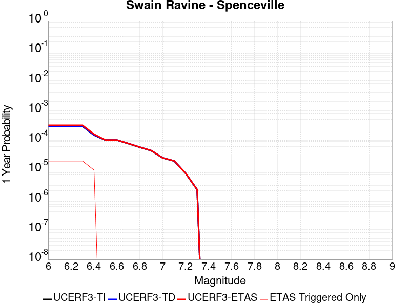 |  |

| Magnitude | 1 wk TI Prob | 1 wk TD Prob | 1 wk ETAS Prob | 1 wk ETAS/TD Gain | 1 wk ETAS Triggered Only | 1 mo TI Prob | 1 mo TD Prob | 1 mo ETAS Prob | 1 mo ETAS/TD Gain | 1 mo ETAS Triggered Only | 1 yr TI Prob | 1 yr TD Prob | 1 yr ETAS Prob | 1 yr ETAS/TD Gain | 1 yr ETAS Triggered Only | 10 yr TI Prob | 10 yr TD Prob | 10 yr ETAS Prob | 10 yr ETAS/TD Gain | 10 yr ETAS Triggered Only |
|-----|-----|-----|-----|-----|-----|-----|-----|-----|-----|-----|-----|-----|-----|-----|-----|-----|-----|-----|-----|-----|
| 6.0 | 5.596169E-6 | 5.663794E-6 | 3.0385534E-5 | 5.3648725 | 2.472188E-5 | 2.398336E-5 | 2.4273193E-5 | 4.8994472E-5 | 2.01846 | 2.472188E-5 | 2.9195828E-4 | 2.9548878E-4 | 3.2020334E-4 | 1.0836396 | 2.472188E-5 | 0.00291575 | 0.002951228 | 0.002975877 | 1.008352 | 2.472188E-5 |
| 6.1 | 5.596169E-6 | 5.663794E-6 | 3.0385534E-5 | 5.3648725 | 2.472188E-5 | 2.398336E-5 | 2.4273193E-5 | 4.8994472E-5 | 2.01846 | 2.472188E-5 | 2.9195828E-4 | 2.9548878E-4 | 3.2020334E-4 | 1.0836396 | 2.472188E-5 | 0.00291575 | 0.002951228 | 0.002975877 | 1.008352 | 2.472188E-5 |
| 6.2 | 5.596169E-6 | 5.663794E-6 | 3.0385534E-5 | 5.3648725 | 2.472188E-5 | 2.398336E-5 | 2.4273193E-5 | 4.8994472E-5 | 2.01846 | 2.472188E-5 | 2.9195828E-4 | 2.9548878E-4 | 3.2020334E-4 | 1.0836396 | 2.472188E-5 | 0.00291575 | 0.002951228 | 0.002975877 | 1.008352 | 2.472188E-5 |
| 6.3 | 5.596169E-6 | 5.663794E-6 | 3.0385534E-5 | 5.3648725 | 2.472188E-5 | 2.398336E-5 | 2.4273193E-5 | 4.8994472E-5 | 2.01846 | 2.472188E-5 | 2.9195828E-4 | 2.9548878E-4 | 3.2020334E-4 | 1.0836396 | 2.472188E-5 | 0.00291575 | 0.002951228 | 0.002975877 | 1.008352 | 2.472188E-5 |
| 6.4 | 2.8426775E-6 | 2.874144E-6 | 1.5235048E-5 | 5.3007255 | 1.236094E-5 | 1.2182847E-5 | 1.2317704E-5 | 2.4678491E-5 | 2.0034976 | 1.236094E-5 | 1.4831607E-4 | 1.4995811E-4 | 1.623172E-4 | 1.0824169 | 1.236094E-5 | 0.0014821711 | 0.0014986077 | 0.00151095 | 1.0082359 | 1.236094E-5 |
| 6.5 | 1.9210793E-6 | 1.9414147E-6 | 1.9414147E-6 | 1.0 | 0.0 | 8.233172E-6 | 8.320323E-6 | 8.320323E-6 | 1.0 | 0.0 | 1.0023425E-4 | 1.0129536E-4 | 1.0129536E-4 | 1.0 | 0.0 | 0.0010018905 | 0.0010125053 | 0.0010125053 | 1.0 | 0.0 |
| 6.6 | 1.9210793E-6 | 1.9414147E-6 | 1.9414147E-6 | 1.0 | 0.0 | 8.233172E-6 | 8.320323E-6 | 8.320323E-6 | 1.0 | 0.0 | 1.0023425E-4 | 1.0129536E-4 | 1.0129536E-4 | 1.0 | 0.0 | 0.0010018905 | 0.0010125053 | 0.0010125053 | 1.0 | 0.0 |
| 6.7 | 1.4667394E-6 | 1.4818934E-6 | 1.4818934E-6 | 1.0 | 0.0 | 6.286011E-6 | 6.3509565E-6 | 6.3509565E-6 | 1.0 | 0.0 | 7.65295E-5 | 7.732023E-5 | 7.732023E-5 | 1.0 | 0.0 | 7.6503144E-4 | 7.72941E-4 | 7.72941E-4 | 1.0 | 0.0 |
| 6.8 | 1.1076943E-6 | 1.1189535E-6 | 1.1189535E-6 | 1.0 | 0.0 | 4.747252E-6 | 4.7955064E-6 | 4.7955064E-6 | 1.0 | 0.0 | 5.7796264E-5 | 5.838377E-5 | 5.838377E-5 | 1.0 | 0.0 | 5.778124E-4 | 5.836887E-4 | 5.836887E-4 | 1.0 | 0.0 |
| 6.9 | 8.514296E-7 | 8.600095E-7 | 8.600095E-7 | 1.0 | 0.0 | 3.648979E-6 | 3.6857498E-6 | 3.6857498E-6 | 1.0 | 0.0 | 4.442541E-5 | 4.4873108E-5 | 4.4873108E-5 | 1.0 | 0.0 | 4.441653E-4 | 4.4864335E-4 | 4.4864335E-4 | 1.0 | 0.0 |
| 7.0 | 4.8544706E-7 | 4.9033E-7 | 4.9033E-7 | 1.0 | 0.0 | 2.0804857E-6 | 2.1014127E-6 | 2.1014127E-6 | 1.0 | 0.0 | 2.532962E-5 | 2.5584413E-5 | 2.5584413E-5 | 1.0 | 0.0 | 2.5326732E-4 | 2.5581598E-4 | 2.5581598E-4 | 1.0 | 0.0 |
| 7.1 | 3.829186E-7 | 3.8678783E-7 | 3.8678783E-7 | 1.0 | 0.0 | 1.6410787E-6 | 1.6576612E-6 | 1.6576612E-6 | 1.0 | 0.0 | 1.997995E-5 | 2.0181848E-5 | 2.0181848E-5 | 1.0 | 0.0 | 1.9978154E-4 | 2.0180122E-4 | 2.0180122E-4 | 1.0 | 0.0 |
| 7.2 | 1.4726595E-7 | 1.4879437E-7 | 1.4879437E-7 | 1.0 | 0.0 | 6.3113964E-7 | 6.3769005E-7 | 6.3769005E-7 | 1.0 | 0.0 | 7.684098E-6 | 7.763854E-6 | 7.763854E-6 | 1.0 | 0.0 | 7.6838325E-5 | 7.763636E-5 | 7.763636E-5 | 1.0 | 0.0 |
| 7.3 | 4.1880604E-8 | 4.2324306E-8 | 4.2324306E-8 | 1.0 | 0.0 | 1.7948828E-7 | 1.8138988E-7 | 1.8138988E-7 | 1.0 | 0.0 | 2.1852677E-6 | 2.2084218E-6 | 2.2084218E-6 | 1.0 | 0.0 | 2.1852462E-5 | 2.2084218E-5 | 2.2084218E-5 | 1.0 | 0.0 |

## Mount Diablo Thrust North CFM
*[(top)](#table-of-contents)*

| 1 Week | 1 Month | 1 Year | 10 Year |
|-----|-----|-----|-----|
|  |  |  |  |

| Magnitude | 1 wk TI Prob | 1 wk TD Prob | 1 wk ETAS Prob | 1 wk ETAS/TD Gain | 1 wk ETAS Triggered Only | 1 mo TI Prob | 1 mo TD Prob | 1 mo ETAS Prob | 1 mo ETAS/TD Gain | 1 mo ETAS Triggered Only | 1 yr TI Prob | 1 yr TD Prob | 1 yr ETAS Prob | 1 yr ETAS/TD Gain | 1 yr ETAS Triggered Only | 10 yr TI Prob | 10 yr TD Prob | 10 yr ETAS Prob | 10 yr ETAS/TD Gain | 10 yr ETAS Triggered Only |
|-----|-----|-----|-----|-----|-----|-----|-----|-----|-----|-----|-----|-----|-----|-----|-----|-----|-----|-----|-----|-----|
| 6.0 | 1.479628E-5 | 1.876973E-5 | 3.113044E-5 | 1.6585448 | 1.236094E-5 | 6.341109E-5 | 8.043928E-5 | 9.279922E-5 | 1.1536556 | 1.236094E-5 | 7.717565E-4 | 9.789177E-4 | 9.912666E-4 | 1.0126148 | 1.236094E-5 | 0.007690818 | 0.009747355 | 0.009771837 | 1.0025115 | 2.472188E-5 |
| 6.1 | 1.479628E-5 | 1.876973E-5 | 3.113044E-5 | 1.6585448 | 1.236094E-5 | 6.341109E-5 | 8.043928E-5 | 9.279922E-5 | 1.1536556 | 1.236094E-5 | 7.717565E-4 | 9.789177E-4 | 9.912666E-4 | 1.0126148 | 1.236094E-5 | 0.007690818 | 0.009747355 | 0.009771837 | 1.0025115 | 2.472188E-5 |
| 6.2 | 1.479628E-5 | 1.876973E-5 | 3.113044E-5 | 1.6585448 | 1.236094E-5 | 6.341109E-5 | 8.043928E-5 | 9.279922E-5 | 1.1536556 | 1.236094E-5 | 7.717565E-4 | 9.789177E-4 | 9.912666E-4 | 1.0126148 | 1.236094E-5 | 0.007690818 | 0.009747355 | 0.009771837 | 1.0025115 | 2.472188E-5 |
| 6.3 | 1.479628E-5 | 1.876973E-5 | 3.113044E-5 | 1.6585448 | 1.236094E-5 | 6.341109E-5 | 8.043928E-5 | 9.279922E-5 | 1.1536556 | 1.236094E-5 | 7.717565E-4 | 9.789177E-4 | 9.912666E-4 | 1.0126148 | 1.236094E-5 | 0.007690818 | 0.009747355 | 0.009771837 | 1.0025115 | 2.472188E-5 |
| 6.4 | 1.479628E-5 | 1.876973E-5 | 3.113044E-5 | 1.6585448 | 1.236094E-5 | 6.341109E-5 | 8.043928E-5 | 9.279922E-5 | 1.1536556 | 1.236094E-5 | 7.717565E-4 | 9.789177E-4 | 9.912666E-4 | 1.0126148 | 1.236094E-5 | 0.007690818 | 0.009747355 | 0.009771837 | 1.0025115 | 2.472188E-5 |
| 6.5 | 1.479628E-5 | 1.876973E-5 | 3.113044E-5 | 1.6585448 | 1.236094E-5 | 6.341109E-5 | 8.043928E-5 | 9.279922E-5 | 1.1536556 | 1.236094E-5 | 7.717565E-4 | 9.789177E-4 | 9.912666E-4 | 1.0126148 | 1.236094E-5 | 0.007690818 | 0.009747355 | 0.009771837 | 1.0025115 | 2.472188E-5 |
| 6.6 | 1.479016E-5 | 1.8762841E-5 | 3.112355E-5 | 1.6587865 | 1.236094E-5 | 6.338486E-5 | 8.040976E-5 | 9.27697E-5 | 1.153712 | 1.236094E-5 | 7.714374E-4 | 9.785586E-4 | 9.909074E-4 | 1.0126194 | 1.236094E-5 | 0.007687649 | 0.009743797 | 0.009768277 | 1.0025125 | 2.472188E-5 |
| 6.7 | 1.479016E-5 | 1.8762841E-5 | 3.112355E-5 | 1.6587865 | 1.236094E-5 | 6.338486E-5 | 8.040976E-5 | 9.27697E-5 | 1.153712 | 1.236094E-5 | 7.714374E-4 | 9.785586E-4 | 9.909074E-4 | 1.0126194 | 1.236094E-5 | 0.007687649 | 0.009743797 | 0.009768277 | 1.0025125 | 2.472188E-5 |
| 6.8 | 1.4771667E-5 | 1.8741612E-5 | 3.110232E-5 | 1.6595328 | 1.236094E-5 | 6.330561E-5 | 8.031878E-5 | 9.2678725E-5 | 1.1538862 | 1.236094E-5 | 7.704732E-4 | 9.774519E-4 | 9.898008E-4 | 1.0126337 | 1.236094E-5 | 0.007678074 | 0.009732827 | 0.009757308 | 1.0025153 | 2.472188E-5 |
| 6.9 | 1.2548234E-5 | 1.5822025E-5 | 2.8182769E-5 | 1.7812365 | 1.236094E-5 | 5.3777036E-5 | 6.780694E-5 | 8.016704E-5 | 1.1822838 | 1.236094E-5 | 6.545387E-4 | 8.2524033E-4 | 8.3759107E-4 | 1.0149662 | 1.236094E-5 | 0.006526142 | 0.008222396 | 0.0082346555 | 1.001491 | 1.236094E-5 |
| 7.0 | 1.01754185E-5 | 1.2808985E-5 | 2.5169767E-5 | 1.9650086 | 1.236094E-5 | 4.360821E-5 | 5.4894506E-5 | 6.725477E-5 | 1.2251639 | 1.236094E-5 | 5.308006E-4 | 6.6813733E-4 | 6.8049E-4 | 1.0184883 | 1.236094E-5 | 0.005295345 | 0.006661672 | 0.0066739507 | 1.0018432 | 1.236094E-5 |
| 7.1 | 8.398341E-6 | 1.0554712E-5 | 2.2915521E-5 | 2.1711175 | 1.236094E-5 | 3.5992394E-5 | 4.5233704E-5 | 5.7594083E-5 | 1.273256 | 1.236094E-5 | 4.3811928E-4 | 5.5058225E-4 | 5.629364E-4 | 1.0224383 | 1.236094E-5 | 0.0043725655 | 0.0054924674 | 0.0055047604 | 1.0022382 | 1.236094E-5 |
| 7.2 | 6.024759E-6 | 7.648385E-6 | 2.0009229E-5 | 2.616138 | 1.236094E-5 | 2.582014E-5 | 3.2778386E-5 | 4.5138917E-5 | 1.377094 | 1.236094E-5 | 3.1431485E-4 | 3.9900444E-4 | 4.1136047E-4 | 1.0309671 | 1.236094E-5 | 0.0031387066 | 0.0039830892 | 0.003995401 | 1.003091 | 1.236094E-5 |
| 7.3 | 3.2099704E-6 | 4.1355897E-6 | 4.1355897E-6 | 1.0 | 0.0 | 1.3756943E-5 | 1.7723836E-5 | 1.7723836E-5 | 1.0 | 0.0 | 1.674779E-4 | 2.1576651E-4 | 2.1576651E-4 | 1.0 | 0.0 | 0.0016735174 | 0.0021556707 | 0.0021556707 | 1.0 | 0.0 |
| 7.4 | 2.2041513E-6 | 2.8734273E-6 | 2.8734273E-6 | 1.0 | 0.0 | 9.4463285E-6 | 1.2314631E-5 | 1.2314631E-5 | 1.0 | 0.0 | 1.1500298E-4 | 1.499204E-4 | 1.499204E-4 | 1.0 | 0.0 | 0.0011494348 | 0.0014982593 | 0.0014982593 | 1.0 | 0.0 |
| 7.5 | 1.8869501E-6 | 2.4696565E-6 | 2.4696565E-6 | 1.0 | 0.0 | 8.086904E-6 | 1.0584199E-5 | 1.0584199E-5 | 1.0 | 0.0 | 9.845361E-5 | 1.2885507E-4 | 1.2885507E-4 | 1.0 | 0.0 | 9.841E-4 | 0.0012878602 | 0.0012878602 | 1.0 | 0.0 |
| 7.6 | 1.3012458E-6 | 1.7005032E-6 | 1.7005032E-6 | 1.0 | 0.0 | 5.576756E-6 | 7.287851E-6 | 7.287851E-6 | 1.0 | 0.0 | 6.7894885E-5 | 8.8726025E-5 | 8.8726025E-5 | 1.0 | 0.0 | 6.787415E-4 | 8.869415E-4 | 8.869415E-4 | 1.0 | 0.0 |
| 7.7 | 3.603383E-7 | 4.716468E-7 | 4.716468E-7 | 1.0 | 0.0 | 1.5443061E-6 | 2.021342E-6 | 2.021342E-6 | 1.0 | 0.0 | 1.8801764E-5 | 2.4609568E-5 | 2.4609568E-5 | 1.0 | 0.0 | 1.8800174E-4 | 2.46074E-4 | 2.46074E-4 | 1.0 | 0.0 |

## Gillem - Big Crack 2011 CFM
*[(top)](#table-of-contents)*

| 1 Week | 1 Month | 1 Year | 10 Year |
|-----|-----|-----|-----|
|  |  |  |  |

| Magnitude | 1 wk TI Prob | 1 wk TD Prob | 1 wk ETAS Prob | 1 wk ETAS/TD Gain | 1 wk ETAS Triggered Only | 1 mo TI Prob | 1 mo TD Prob | 1 mo ETAS Prob | 1 mo ETAS/TD Gain | 1 mo ETAS Triggered Only | 1 yr TI Prob | 1 yr TD Prob | 1 yr ETAS Prob | 1 yr ETAS/TD Gain | 1 yr ETAS Triggered Only | 10 yr TI Prob | 10 yr TD Prob | 10 yr ETAS Prob | 10 yr ETAS/TD Gain | 10 yr ETAS Triggered Only |
|-----|-----|-----|-----|-----|-----|-----|-----|-----|-----|-----|-----|-----|-----|-----|-----|-----|-----|-----|-----|-----|
| 6.0 | 2.196852E-5 | 2.3604485E-5 | 2.3604485E-5 | 1.0 | 0.0 | 9.4147406E-5 | 1.01158665E-4 | 1.01158665E-4 | 1.0 | 0.0 | 0.0011456419 | 0.0012309998 | 0.0012433454 | 1.0100291 | 1.236094E-5 | 0.011397537 | 0.012250669 | 0.012275089 | 1.0019933 | 2.472188E-5 |
| 6.1 | 9.992795E-6 | 1.071189E-5 | 1.071189E-5 | 1.0 | 0.0 | 4.2825563E-5 | 4.5907396E-5 | 4.5907396E-5 | 1.0 | 0.0 | 5.2127644E-4 | 5.587975E-4 | 5.7115156E-4 | 1.0221082 | 1.236094E-5 | 0.0052005537 | 0.0055757347 | 0.0055880267 | 1.0022045 | 1.236094E-5 |
| 6.2 | 9.992795E-6 | 1.071189E-5 | 1.071189E-5 | 1.0 | 0.0 | 4.2825563E-5 | 4.5907396E-5 | 4.5907396E-5 | 1.0 | 0.0 | 5.2127644E-4 | 5.587975E-4 | 5.7115156E-4 | 1.0221082 | 1.236094E-5 | 0.0052005537 | 0.0055757347 | 0.0055880267 | 1.0022045 | 1.236094E-5 |
| 6.3 | 4.6127884E-6 | 4.942657E-6 | 4.942657E-6 | 1.0 | 0.0 | 1.9768944E-5 | 2.1182668E-5 | 2.1182668E-5 | 1.0 | 0.0 | 2.406603E-4 | 2.5787292E-4 | 2.5787292E-4 | 1.0 | 0.0 | 0.0024039985 | 0.0025761751 | 0.0025761751 | 1.0 | 0.0 |
| 6.4 | 4.6127884E-6 | 4.942657E-6 | 4.942657E-6 | 1.0 | 0.0 | 1.9768944E-5 | 2.1182668E-5 | 2.1182668E-5 | 1.0 | 0.0 | 2.406603E-4 | 2.5787292E-4 | 2.5787292E-4 | 1.0 | 0.0 | 0.0024039985 | 0.0025761751 | 0.0025761751 | 1.0 | 0.0 |
| 6.5 | 2.716712E-6 | 2.9111113E-6 | 2.9111113E-6 | 1.0 | 0.0 | 1.1643E-5 | 1.24761455E-5 | 1.24761455E-5 | 1.0 | 0.0 | 1.417443E-4 | 1.5188892E-4 | 1.5188892E-4 | 1.0 | 0.0 | 0.0014165393 | 0.001518089 | 0.001518089 | 1.0 | 0.0 |
| 6.6 | 1.3818255E-6 | 1.4820689E-6 | 1.4820689E-6 | 1.0 | 0.0 | 5.922096E-6 | 6.3517155E-6 | 6.3517155E-6 | 1.0 | 0.0 | 7.209913E-5 | 7.7330624E-5 | 7.7330624E-5 | 1.0 | 0.0 | 7.2075747E-4 | 7.7315804E-4 | 7.7315804E-4 | 1.0 | 0.0 |

## Green Valley 2011 CFM
*[(top)](#table-of-contents)*

| 1 Week | 1 Month | 1 Year | 10 Year |
|-----|-----|-----|-----|
|  |  |  |  |

| Magnitude | 1 wk TI Prob | 1 wk TD Prob | 1 wk ETAS Prob | 1 wk ETAS/TD Gain | 1 wk ETAS Triggered Only | 1 mo TI Prob | 1 mo TD Prob | 1 mo ETAS Prob | 1 mo ETAS/TD Gain | 1 mo ETAS Triggered Only | 1 yr TI Prob | 1 yr TD Prob | 1 yr ETAS Prob | 1 yr ETAS/TD Gain | 1 yr ETAS Triggered Only | 10 yr TI Prob | 10 yr TD Prob | 10 yr ETAS Prob | 10 yr ETAS/TD Gain | 10 yr ETAS Triggered Only |
|-----|-----|-----|-----|-----|-----|-----|-----|-----|-----|-----|-----|-----|-----|-----|-----|-----|-----|-----|-----|-----|
| 6.0 | 9.9629346E-5 | 1.7305532E-4 | 1.7305532E-4 | 1.0 | 0.0 | 4.2691303E-4 | 7.4143766E-4 | 7.4143766E-4 | 1.0 | 0.0 | 0.0051852856 | 0.008986705 | 0.008986705 | 1.0 | 0.0 | 0.050659515 | 0.085522056 | 0.08554467 | 1.0002644 | 2.472188E-5 |
| 6.1 | 9.88615E-5 | 1.7152846E-4 | 1.7152846E-4 | 1.0 | 0.0 | 4.2362334E-4 | 7.348976E-4 | 7.348976E-4 | 1.0 | 0.0 | 0.0051454236 | 0.0089077335 | 0.0089077335 | 1.0 | 0.0 | 0.050279044 | 0.084809676 | 0.0848323 | 1.0002668 | 2.472188E-5 |
| 6.2 | 9.696895E-5 | 1.6791887E-4 | 1.6791887E-4 | 1.0 | 0.0 | 4.15515E-4 | 7.194366E-4 | 7.194366E-4 | 1.0 | 0.0 | 0.0050471667 | 0.008721114 | 0.008721114 | 1.0 | 0.0 | 0.04934063 | 0.0831186 | 0.083141275 | 1.0002728 | 2.472188E-5 |
| 6.3 | 9.275224E-5 | 1.5971228E-4 | 1.5971228E-4 | 1.0 | 0.0 | 3.9744904E-4 | 6.842841E-4 | 6.842841E-4 | 1.0 | 0.0 | 0.0048282105 | 0.008296439 | 0.008296439 | 1.0 | 0.0 | 0.047246475 | 0.07925707 | 0.07927983 | 1.0002872 | 2.472188E-5 |
| 6.4 | 8.391499E-5 | 1.4367796E-4 | 1.4367796E-4 | 1.0 | 0.0 | 3.595861E-4 | 6.156248E-4 | 6.156248E-4 | 1.0 | 0.0 | 0.004369175 | 0.0074670846 | 0.0074670846 | 1.0 | 0.0 | 0.04284265 | 0.071630865 | 0.07165381 | 1.0003204 | 2.472188E-5 |
| 6.5 | 5.9519385E-5 | 9.9340905E-5 | 9.9340905E-5 | 1.0 | 0.0 | 2.5505814E-4 | 4.2568138E-4 | 4.2568138E-4 | 1.0 | 0.0 | 0.0031009112 | 0.005168295 | 0.005168295 | 1.0 | 0.0 | 0.030579966 | 0.050145864 | 0.050157603 | 1.0002341 | 1.236094E-5 |
| 6.6 | 4.5361558E-5 | 7.402609E-5 | 7.402609E-5 | 1.0 | 0.0 | 1.9439218E-4 | 3.1721895E-4 | 3.1721895E-4 | 1.0 | 0.0 | 0.0023641558 | 0.0038539418 | 0.0038539418 | 1.0 | 0.0 | 0.023391623 | 0.037665963 | 0.037677858 | 1.0003158 | 1.236094E-5 |
| 6.7 | 3.8808106E-5 | 6.2651976E-5 | 6.2651976E-5 | 1.0 | 0.0 | 1.6630985E-4 | 2.6848342E-4 | 2.6848342E-4 | 1.0 | 0.0 | 0.0020229418 | 0.0032626586 | 0.0032626586 | 1.0 | 0.0 | 0.020046256 | 0.032005914 | 0.03201788 | 1.0003738 | 1.236094E-5 |
| 6.8 | 2.2284667E-5 | 3.1285235E-5 | 3.1285235E-5 | 1.0 | 0.0 | 9.550222E-5 | 1.3407279E-4 | 1.3407279E-4 | 1.0 | 0.0 | 0.0011621192 | 0.0016311078 | 0.0016311078 | 1.0 | 0.0 | 0.011560607 | 0.016165998 | 0.016178159 | 1.0007522 | 1.236094E-5 |
| 6.9 | 1.8050168E-5 | 2.4448054E-5 | 2.4448054E-5 | 1.0 | 0.0 | 7.735557E-5 | 1.047732E-4 | 1.047732E-4 | 1.0 | 0.0 | 9.4139716E-4 | 0.0012748708 | 0.0012748708 | 1.0 | 0.0 | 0.009374191 | 0.012667833 | 0.012667833 | 1.0 | 0.0 |
| 7.0 | 1.4763166E-5 | 1.9582854E-5 | 1.9582854E-5 | 1.0 | 0.0 | 6.326917E-5 | 8.3923835E-5 | 8.3923835E-5 | 1.0 | 0.0 | 7.7002996E-4 | 0.0010212966 | 0.0010212966 | 1.0 | 0.0 | 0.007673672 | 0.010165343 | 0.010165343 | 1.0 | 0.0 |
| 7.1 | 1.2399713E-5 | 1.6303715E-5 | 1.6303715E-5 | 1.0 | 0.0 | 5.3140546E-5 | 6.98712E-5 | 6.98712E-5 | 1.0 | 0.0 | 6.467941E-4 | 8.503518E-4 | 8.503518E-4 | 1.0 | 0.0 | 0.006449148 | 0.008471259 | 0.008471259 | 1.0 | 0.0 |
| 7.2 | 1.0584195E-5 | 1.3921742E-5 | 1.3921742E-5 | 1.0 | 0.0 | 4.5360044E-5 | 5.9663253E-5 | 5.9663253E-5 | 1.0 | 0.0 | 5.521186E-4 | 7.261596E-4 | 7.261596E-4 | 1.0 | 0.0 | 0.0055074887 | 0.007238285 | 0.007238285 | 1.0 | 0.0 |
| 7.3 | 7.998173E-6 | 1.054402E-5 | 1.054402E-5 | 1.0 | 0.0 | 3.4277433E-5 | 4.518788E-5 | 4.518788E-5 | 1.0 | 0.0 | 4.1724785E-4 | 5.500247E-4 | 5.500247E-4 | 1.0 | 0.0 | 0.004164653 | 0.0054868995 | 0.0054868995 | 1.0 | 0.0 |
| 7.4 | 6.7571127E-6 | 8.932697E-6 | 8.932697E-6 | 1.0 | 0.0 | 2.8958733E-5 | 3.828243E-5 | 3.828243E-5 | 1.0 | 0.0 | 3.5251552E-4 | 4.6598984E-4 | 4.6598984E-4 | 1.0 | 0.0 | 0.0035195686 | 0.0046503306 | 0.0046503306 | 1.0 | 0.0 |
| 7.5 | 5.69878E-6 | 7.516314E-6 | 7.516314E-6 | 1.0 | 0.0 | 2.4423114E-5 | 3.221238E-5 | 3.221238E-5 | 1.0 | 0.0 | 2.9731085E-4 | 3.9211605E-4 | 3.9211605E-4 | 1.0 | 0.0 | 0.002969134 | 0.0039143935 | 0.0039143935 | 1.0 | 0.0 |
| 7.6 | 4.503664E-6 | 5.9356807E-6 | 5.9356807E-6 | 1.0 | 0.0 | 1.9301275E-5 | 2.5438389E-5 | 2.5438389E-5 | 1.0 | 0.0 | 2.3496768E-4 | 3.096692E-4 | 3.096692E-4 | 1.0 | 0.0 | 0.002347194 | 0.003092502 | 0.003092502 | 1.0 | 0.0 |
| 7.7 | 1.0873546E-6 | 1.4106979E-6 | 1.4106979E-6 | 1.0 | 0.0 | 4.6600826E-6 | 6.045834E-6 | 6.045834E-6 | 1.0 | 0.0 | 5.6735033E-5 | 7.360557E-5 | 7.360557E-5 | 1.0 | 0.0 | 5.672055E-4 | 7.35814E-4 | 7.35814E-4 | 1.0 | 0.0 |
| 7.8 | 4.9373917E-8 | 6.1777136E-8 | 6.1777136E-8 | 1.0 | 0.0 | 2.1160248E-7 | 2.6475914E-7 | 2.6475914E-7 | 1.0 | 0.0 | 2.5762572E-6 | 3.223439E-6 | 3.223439E-6 | 1.0 | 0.0 | 2.5762274E-5 | 3.2232296E-5 | 3.2232296E-5 | 1.0 | 0.0 |

## Raymond
*[(top)](#table-of-contents)*

| 1 Week | 1 Month | 1 Year | 10 Year |
|-----|-----|-----|-----|
|  |  | 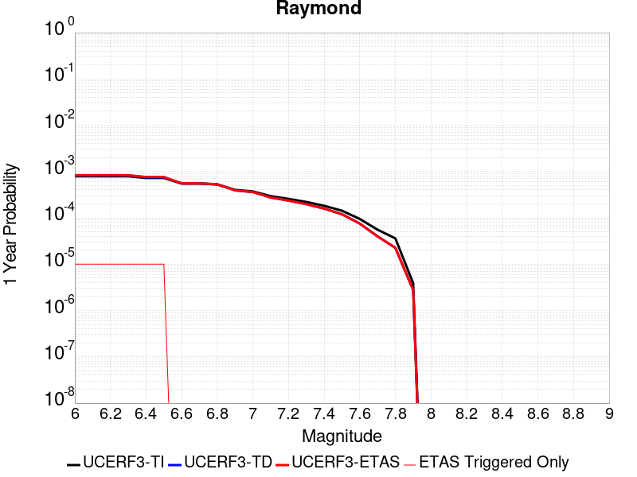 |  |

| Magnitude | 1 wk TI Prob | 1 wk TD Prob | 1 wk ETAS Prob | 1 wk ETAS/TD Gain | 1 wk ETAS Triggered Only | 1 mo TI Prob | 1 mo TD Prob | 1 mo ETAS Prob | 1 mo ETAS/TD Gain | 1 mo ETAS Triggered Only | 1 yr TI Prob | 1 yr TD Prob | 1 yr ETAS Prob | 1 yr ETAS/TD Gain | 1 yr ETAS Triggered Only | 10 yr TI Prob | 10 yr TD Prob | 10 yr ETAS Prob | 10 yr ETAS/TD Gain | 10 yr ETAS Triggered Only |
|-----|-----|-----|-----|-----|-----|-----|-----|-----|-----|-----|-----|-----|-----|-----|-----|-----|-----|-----|-----|-----|
| 6.0 | 1.5157413E-5 | 1.5810128E-5 | 2.8170873E-5 | 1.7818244 | 1.236094E-5 | 6.4958724E-5 | 6.7756075E-5 | 8.011617E-5 | 1.1824206 | 1.236094E-5 | 7.905855E-4 | 8.2464307E-4 | 8.369938E-4 | 1.0149771 | 1.236094E-5 | 0.007877788 | 0.008218348 | 0.008242867 | 1.0029835 | 2.472188E-5 |
| 6.1 | 1.5157413E-5 | 1.5810128E-5 | 2.8170873E-5 | 1.7818244 | 1.236094E-5 | 6.4958724E-5 | 6.7756075E-5 | 8.011617E-5 | 1.1824206 | 1.236094E-5 | 7.905855E-4 | 8.2464307E-4 | 8.369938E-4 | 1.0149771 | 1.236094E-5 | 0.007877788 | 0.008218348 | 0.008242867 | 1.0029835 | 2.472188E-5 |
| 6.2 | 1.5157413E-5 | 1.5810128E-5 | 2.8170873E-5 | 1.7818244 | 1.236094E-5 | 6.4958724E-5 | 6.7756075E-5 | 8.011617E-5 | 1.1824206 | 1.236094E-5 | 7.905855E-4 | 8.2464307E-4 | 8.369938E-4 | 1.0149771 | 1.236094E-5 | 0.007877788 | 0.008218348 | 0.008242867 | 1.0029835 | 2.472188E-5 |
| 6.3 | 1.5157413E-5 | 1.5810128E-5 | 2.8170873E-5 | 1.7818244 | 1.236094E-5 | 6.4958724E-5 | 6.7756075E-5 | 8.011617E-5 | 1.1824206 | 1.236094E-5 | 7.905855E-4 | 8.2464307E-4 | 8.369938E-4 | 1.0149771 | 1.236094E-5 | 0.007877788 | 0.008218348 | 0.008242867 | 1.0029835 | 2.472188E-5 |
| 6.4 | 1.3941944E-5 | 1.445469E-5 | 2.681545E-5 | 1.8551384 | 1.236094E-5 | 5.9749822E-5 | 6.1947336E-5 | 7.430751E-5 | 1.1995271 | 1.236094E-5 | 7.2721124E-4 | 7.5397117E-4 | 7.663228E-4 | 1.0163821 | 1.236094E-5 | 0.007248361 | 0.0075164647 | 0.007541001 | 1.0032643 | 2.472188E-5 |
| 6.5 | 1.3941944E-5 | 1.445469E-5 | 2.681545E-5 | 1.8551384 | 1.236094E-5 | 5.9749822E-5 | 6.1947336E-5 | 7.430751E-5 | 1.1995271 | 1.236094E-5 | 7.2721124E-4 | 7.5397117E-4 | 7.663228E-4 | 1.0163821 | 1.236094E-5 | 0.007248361 | 0.0075164647 | 0.007541001 | 1.0032643 | 2.472188E-5 |
| 6.6 | 1.0542609E-5 | 1.0671113E-5 | 1.0671113E-5 | 1.0 | 0.0 | 4.5181827E-5 | 4.573257E-5 | 4.573257E-5 | 1.0 | 0.0 | 5.499499E-4 | 5.5665727E-4 | 5.5665727E-4 | 1.0 | 0.0 | 0.005485909 | 0.00555319 | 0.00555319 | 1.0 | 0.0 |
| 6.7 | 1.0542609E-5 | 1.0671113E-5 | 1.0671113E-5 | 1.0 | 0.0 | 4.5181827E-5 | 4.573257E-5 | 4.573257E-5 | 1.0 | 0.0 | 5.499499E-4 | 5.5665727E-4 | 5.5665727E-4 | 1.0 | 0.0 | 0.005485909 | 0.00555319 | 0.00555319 | 1.0 | 0.0 |
| 6.8 | 1.0079132E-5 | 1.0176646E-5 | 1.0176646E-5 | 1.0 | 0.0 | 4.3195567E-5 | 4.3613498E-5 | 4.3613498E-5 | 1.0 | 0.0 | 5.257791E-4 | 5.3087034E-4 | 5.3087034E-4 | 1.0 | 0.0 | 0.0052453685 | 0.005296571 | 0.005296571 | 1.0 | 0.0 |
| 6.9 | 7.721598E-6 | 7.5489047E-6 | 7.5489047E-6 | 1.0 | 0.0 | 3.3092143E-5 | 3.2352054E-5 | 3.2352054E-5 | 1.0 | 0.0 | 4.0282236E-4 | 3.9381627E-4 | 3.9381627E-4 | 1.0 | 0.0 | 0.0040209293 | 0.0039313175 | 0.0039313175 | 1.0 | 0.0 |
| 7.0 | 7.137566E-6 | 6.9113057E-6 | 6.9113057E-6 | 1.0 | 0.0 | 3.058921E-5 | 2.961955E-5 | 2.961955E-5 | 1.0 | 0.0 | 3.7236E-4 | 3.6055944E-4 | 3.6055944E-4 | 1.0 | 0.0 | 0.0037173668 | 0.0035998628 | 0.0035998628 | 1.0 | 0.0 |
| 7.1 | 5.654976E-6 | 5.29954E-6 | 5.29954E-6 | 1.0 | 0.0 | 2.4235387E-5 | 2.2712118E-5 | 2.2712118E-5 | 1.0 | 0.0 | 2.9502588E-4 | 2.7648517E-4 | 2.7648517E-4 | 1.0 | 0.0 | 0.0029463451 | 0.002761443 | 0.002761443 | 1.0 | 0.0 |
| 7.2 | 4.9358455E-6 | 4.5266574E-6 | 4.5266574E-6 | 1.0 | 0.0 | 2.1153453E-5 | 1.9399817E-5 | 1.9399817E-5 | 1.0 | 0.0 | 2.5751285E-4 | 2.3616731E-4 | 2.3616731E-4 | 1.0 | 0.0 | 0.0025721465 | 0.0023591854 | 0.0023591854 | 1.0 | 0.0 |
| 7.3 | 4.2368597E-6 | 3.8056164E-6 | 3.8056164E-6 | 1.0 | 0.0 | 1.8157843E-5 | 1.6309683E-5 | 1.6309683E-5 | 1.0 | 0.0 | 2.2104931E-4 | 1.9855241E-4 | 1.9855241E-4 | 1.0 | 0.0 | 0.0022082955 | 0.0019837688 | 0.0019837688 | 1.0 | 0.0 |
| 7.4 | 3.4999923E-6 | 3.043744E-6 | 3.043744E-6 | 1.0 | 0.0 | 1.49998805E-5 | 1.3044552E-5 | 1.3044552E-5 | 1.0 | 0.0 | 1.8260824E-4 | 1.5880594E-4 | 1.5880594E-4 | 1.0 | 0.0 | 0.0018245826 | 0.0015869403 | 0.0015869403 | 1.0 | 0.0 |
| 7.5 | 2.738017E-6 | 2.3020468E-6 | 2.3020468E-6 | 1.0 | 0.0 | 1.1734306E-5 | 9.865878E-6 | 9.865878E-6 | 1.0 | 0.0 | 1.428558E-4 | 1.2011051E-4 | 1.2011051E-4 | 1.0 | 0.0 | 0.0014276401 | 0.0012004703 | 0.0012004703 | 1.0 | 0.0 |
| 7.6 | 1.8186392E-6 | 1.442312E-6 | 1.442312E-6 | 1.0 | 0.0 | 7.794145E-6 | 6.181323E-6 | 6.181323E-6 | 1.0 | 0.0 | 9.488958E-5 | 7.5255055E-5 | 7.5255055E-5 | 1.0 | 0.0 | 9.4849075E-4 | 7.523072E-4 | 7.523072E-4 | 1.0 | 0.0 |
| 7.7 | 1.0660348E-6 | 7.6438056E-7 | 7.6438056E-7 | 1.0 | 0.0 | 4.5687125E-6 | 3.2759126E-6 | 3.2759126E-6 | 1.0 | 0.0 | 5.5622655E-5 | 3.9883522E-5 | 3.9883522E-5 | 1.0 | 0.0 | 5.5608735E-4 | 3.9877277E-4 | 3.9877277E-4 | 1.0 | 0.0 |
| 7.8 | 6.913602E-7 | 4.3204133E-7 | 4.3204133E-7 | 1.0 | 0.0 | 2.962969E-6 | 1.8516045E-6 | 1.8516045E-6 | 1.0 | 0.0 | 3.607355E-5 | 2.2543056E-5 | 2.2543056E-5 | 1.0 | 0.0 | 3.6067693E-4 | 2.2541556E-4 | 2.2541556E-4 | 1.0 | 0.0 |
| 7.9 | 7.425201E-8 | 5.3222113E-8 | 5.3222113E-8 | 1.0 | 0.0 | 3.1822285E-7 | 2.2809476E-7 | 2.2809476E-7 | 1.0 | 0.0 | 3.874356E-6 | 2.7770516E-6 | 2.7770516E-6 | 1.0 | 0.0 | 3.8742884E-5 | 2.7770298E-5 | 2.7770298E-5 | 1.0 | 0.0 |

## Hosgri (Extension)
*[(top)](#table-of-contents)*

| 1 Week | 1 Month | 1 Year | 10 Year |
|-----|-----|-----|-----|
|  |  |  |  |

| Magnitude | 1 wk TI Prob | 1 wk TD Prob | 1 wk ETAS Prob | 1 wk ETAS/TD Gain | 1 wk ETAS Triggered Only | 1 mo TI Prob | 1 mo TD Prob | 1 mo ETAS Prob | 1 mo ETAS/TD Gain | 1 mo ETAS Triggered Only | 1 yr TI Prob | 1 yr TD Prob | 1 yr ETAS Prob | 1 yr ETAS/TD Gain | 1 yr ETAS Triggered Only | 10 yr TI Prob | 10 yr TD Prob | 10 yr ETAS Prob | 10 yr ETAS/TD Gain | 10 yr ETAS Triggered Only |
|-----|-----|-----|-----|-----|-----|-----|-----|-----|-----|-----|-----|-----|-----|-----|-----|-----|-----|-----|-----|-----|
| 6.0 | 1.1369135E-5 | 1.2083072E-5 | 2.4443862E-5 | 2.022984 | 1.236094E-5 | 4.8723956E-5 | 5.1783692E-5 | 7.650429E-5 | 1.477382 | 2.472188E-5 | 5.9305265E-4 | 6.3030684E-4 | 6.5501314E-4 | 1.0391972 | 2.472188E-5 | 0.005914725 | 0.0062874397 | 0.006312006 | 1.0039072 | 2.472188E-5 |
| 6.1 | 6.934979E-6 | 7.324555E-6 | 1.9685403E-5 | 2.6875904 | 1.236094E-5 | 2.9721E-5 | 3.1390595E-5 | 4.3751148E-5 | 1.393766 | 1.236094E-5 | 3.617931E-4 | 3.8211764E-4 | 3.9447384E-4 | 1.0323361 | 1.236094E-5 | 0.0036120464 | 0.0038150186 | 0.0038273323 | 1.0032277 | 1.236094E-5 |
| 6.2 | 6.934979E-6 | 7.324555E-6 | 1.9685403E-5 | 2.6875904 | 1.236094E-5 | 2.9721E-5 | 3.1390595E-5 | 4.3751148E-5 | 1.393766 | 1.236094E-5 | 3.617931E-4 | 3.8211764E-4 | 3.9447384E-4 | 1.0323361 | 1.236094E-5 | 0.0036120464 | 0.0038150186 | 0.0038273323 | 1.0032277 | 1.236094E-5 |
| 6.3 | 4.5484676E-6 | 4.76933E-6 | 1.713021E-5 | 3.5917435 | 1.236094E-5 | 1.9493287E-5 | 2.043983E-5 | 3.2800515E-5 | 1.6047354 | 1.236094E-5 | 2.3730492E-4 | 2.4882692E-4 | 2.611848E-4 | 1.0496645 | 1.236094E-5 | 0.0023705168 | 0.0024855258 | 0.002497856 | 1.0049608 | 1.236094E-5 |
| 6.4 | 4.218095E-6 | 4.4168614E-6 | 1.6777747E-5 | 3.7985675 | 1.236094E-5 | 1.8077424E-5 | 1.8929271E-5 | 3.1289976E-5 | 1.6529943 | 1.236094E-5 | 2.2007042E-4 | 2.3043984E-4 | 2.4279792E-4 | 1.0536283 | 1.236094E-5 | 0.002198526 | 0.0023020422 | 0.0023143748 | 1.0053571 | 1.236094E-5 |
| 6.5 | 3.717374E-6 | 3.8838775E-6 | 1.6244769E-5 | 4.182616 | 1.236094E-5 | 1.5931506E-5 | 1.6645085E-5 | 2.9005818E-5 | 1.7426057 | 1.236094E-5 | 1.9394881E-4 | 2.0263524E-4 | 2.1499368E-4 | 1.0609885 | 1.236094E-5 | 0.0019377962 | 0.0020245234 | 0.0020368595 | 1.0060933 | 1.236094E-5 |
| 6.6 | 3.4605036E-6 | 3.608306E-6 | 1.59692E-5 | 4.4256783 | 1.236094E-5 | 1.4830645E-5 | 1.5464078E-5 | 2.7824826E-5 | 1.7993201 | 1.236094E-5 | 1.8054814E-4 | 1.8825903E-4 | 2.0061764E-4 | 1.0656469 | 1.236094E-5 | 0.0018040152 | 0.0018810101 | 0.0018933478 | 1.0065591 | 1.236094E-5 |
| 6.7 | 3.123439E-6 | 3.2465687E-6 | 1.5607468E-5 | 4.8073735 | 1.236094E-5 | 1.33860985E-5 | 1.3913792E-5 | 2.627456E-5 | 1.8883823 | 1.236094E-5 | 1.6296357E-4 | 1.6938736E-4 | 1.817462E-4 | 1.072962 | 1.236094E-5 | 0.001628441 | 0.0016925934 | 0.0017049335 | 1.0072906 | 1.236094E-5 |
| 6.8 | 2.8290783E-6 | 2.9305404E-6 | 1.5291444E-5 | 5.2179604 | 1.236094E-5 | 1.2124565E-5 | 1.2559399E-5 | 2.4920182E-5 | 1.9841859 | 1.236094E-5 | 1.4760658E-4 | 1.5290003E-4 | 1.6525909E-4 | 1.0808309 | 1.236094E-5 | 0.0014750857 | 0.001527957 | 0.001540299 | 1.0080775 | 1.236094E-5 |
| 6.9 | 2.454112E-6 | 2.5283196E-6 | 1.4889228E-5 | 5.888982 | 1.236094E-5 | 1.0517581E-5 | 1.0835611E-5 | 2.3196417E-5 | 2.1407576 | 1.236094E-5 | 1.2804402E-4 | 1.3191563E-4 | 1.4427493E-4 | 1.093691 | 1.236094E-5 | 0.0012797028 | 0.0013183793 | 0.001330724 | 1.0093635 | 1.236094E-5 |
| 7.0 | 2.1008145E-6 | 2.1498704E-6 | 1.4510783E-5 | 6.7496085 | 1.236094E-5 | 9.003459E-6 | 9.213698E-6 | 2.1574524E-5 | 2.3415706 | 1.236094E-5 | 1.096116E-4 | 1.1217103E-4 | 1.2453059E-4 | 1.1101849 | 1.236094E-5 | 0.0010955755 | 0.0011211479 | 0.0011334949 | 1.0110129 | 1.236094E-5 |
| 7.1 | 1.744384E-6 | 1.7686352E-6 | 1.4129553E-5 | 7.988958 | 1.236094E-5 | 7.47591E-6 | 7.5798434E-6 | 1.994069E-5 | 2.630752 | 1.236094E-5 | 9.1015405E-5 | 9.22807E-5 | 1.046405E-4 | 1.133937 | 1.236094E-5 | 9.097813E-4 | 9.2242553E-4 | 9.347751E-4 | 1.0133882 | 1.236094E-5 |
| 7.2 | 1.5456587E-6 | 1.5562882E-6 | 1.5562882E-6 | 1.0 | 0.0 | 6.6242346E-6 | 6.66979E-6 | 6.66979E-6 | 1.0 | 0.0 | 8.064707E-5 | 8.120168E-5 | 8.120168E-5 | 1.0 | 0.0 | 8.0617814E-4 | 8.117213E-4 | 8.117213E-4 | 1.0 | 0.0 |
| 7.3 | 1.3775123E-6 | 1.3766082E-6 | 1.3766082E-6 | 1.0 | 0.0 | 5.9036106E-6 | 5.899736E-6 | 5.899736E-6 | 1.0 | 0.0 | 7.187409E-5 | 7.182693E-5 | 7.182693E-5 | 1.0 | 0.0 | 7.185085E-4 | 7.180382E-4 | 7.180382E-4 | 1.0 | 0.0 |
| 7.4 | 1.214491E-6 | 1.2023461E-6 | 1.2023461E-6 | 1.0 | 0.0 | 5.2049513E-6 | 5.1529014E-6 | 5.1529014E-6 | 1.0 | 0.0 | 6.336844E-5 | 6.2734776E-5 | 6.2734776E-5 | 1.0 | 0.0 | 6.335037E-4 | 6.271715E-4 | 6.271715E-4 | 1.0 | 0.0 |
| 7.5 | 1.0101123E-6 | 9.842246E-7 | 9.842246E-7 | 1.0 | 0.0 | 4.3290456E-6 | 4.2180986E-6 | 4.2180986E-6 | 1.0 | 0.0 | 5.2704854E-5 | 5.1354145E-5 | 5.1354145E-5 | 1.0 | 0.0 | 5.2692357E-4 | 5.1342335E-4 | 5.1342335E-4 | 1.0 | 0.0 |
| 7.6 | 8.1558215E-7 | 7.765966E-7 | 7.765966E-7 | 1.0 | 0.0 | 3.4953473E-6 | 3.328267E-6 | 3.328267E-6 | 1.0 | 0.0 | 4.255502E-5 | 4.0520903E-5 | 4.0520903E-5 | 1.0 | 0.0 | 4.2546875E-4 | 4.0513556E-4 | 4.0513556E-4 | 1.0 | 0.0 |
| 7.7 | 4.757816E-7 | 4.1308888E-7 | 4.1308888E-7 | 1.0 | 0.0 | 2.0390623E-6 | 1.7703798E-6 | 1.7703798E-6 | 1.0 | 0.0 | 2.4825302E-5 | 2.155416E-5 | 2.155416E-5 | 1.0 | 0.0 | 2.482253E-4 | 2.1552083E-4 | 2.1552083E-4 | 1.0 | 0.0 |
| 7.8 | 2.782787E-7 | 2.0047722E-7 | 2.0047722E-7 | 1.0 | 0.0 | 1.1926223E-6 | 8.5918776E-7 | 8.5918776E-7 | 1.0 | 0.0 | 1.452008E-5 | 1.04605615E-5 | 1.04605615E-5 | 1.0 | 0.0 | 1.4519131E-4 | 1.04600724E-4 | 1.04600724E-4 | 1.0 | 0.0 |
| 7.9 | 1.6948086E-7 | 9.244227E-8 | 9.244227E-8 | 1.0 | 0.0 | 7.2634634E-7 | 3.961811E-7 | 3.961811E-7 | 1.0 | 0.0 | 8.843231E-6 | 4.8234942E-6 | 4.8234942E-6 | 1.0 | 0.0 | 8.842879E-5 | 4.8233902E-5 | 4.8233902E-5 | 1.0 | 0.0 |
| 8.0 | 1.0225492E-7 | 4.4738776E-8 | 4.4738776E-8 | 1.0 | 0.0 | 4.382353E-7 | 1.917376E-7 | 1.917376E-7 | 1.0 | 0.0 | 5.335502E-6 | 2.3344028E-6 | 2.3344028E-6 | 1.0 | 0.0 | 5.335374E-5 | 2.3343786E-5 | 2.3343786E-5 | 1.0 | 0.0 |
| 8.1 | 1.43711345E-8 | 5.787707E-9 | 5.787707E-9 | 1.0 | 0.0 | 6.1590576E-8 | 2.480446E-8 | 2.480446E-8 | 1.0 | 0.0 | 7.4986497E-7 | 3.0199428E-7 | 3.0199428E-7 | 1.0 | 0.0 | 7.4986247E-6 | 3.0199392E-6 | 3.0199392E-6 | 1.0 | 0.0 |

## Los Alamos extension
*[(top)](#table-of-contents)*

| 1 Week | 1 Month | 1 Year | 10 Year |
|-----|-----|-----|-----|
| 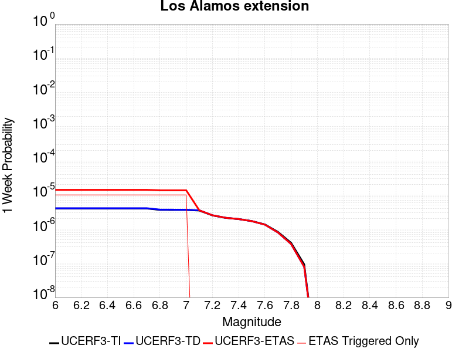 |  |  |  |

| Magnitude | 1 wk TI Prob | 1 wk TD Prob | 1 wk ETAS Prob | 1 wk ETAS/TD Gain | 1 wk ETAS Triggered Only | 1 mo TI Prob | 1 mo TD Prob | 1 mo ETAS Prob | 1 mo ETAS/TD Gain | 1 mo ETAS Triggered Only | 1 yr TI Prob | 1 yr TD Prob | 1 yr ETAS Prob | 1 yr ETAS/TD Gain | 1 yr ETAS Triggered Only | 10 yr TI Prob | 10 yr TD Prob | 10 yr ETAS Prob | 10 yr ETAS/TD Gain | 10 yr ETAS Triggered Only |
|-----|-----|-----|-----|-----|-----|-----|-----|-----|-----|-----|-----|-----|-----|-----|-----|-----|-----|-----|-----|-----|
| 6.0 | 4.0146506E-6 | 4.0861596E-6 | 1.644705E-5 | 4.0250626 | 1.236094E-5 | 1.7205533E-5 | 1.7512002E-5 | 2.9872725E-5 | 1.705843 | 1.236094E-5 | 2.0945723E-4 | 2.1318886E-4 | 2.2554716E-4 | 1.0579689 | 1.236094E-5 | 0.0020925992 | 0.0021299527 | 0.0021546218 | 1.011582 | 2.472188E-5 |
| 6.1 | 4.0146506E-6 | 4.0861596E-6 | 1.644705E-5 | 4.0250626 | 1.236094E-5 | 1.7205533E-5 | 1.7512002E-5 | 2.9872725E-5 | 1.705843 | 1.236094E-5 | 2.0945723E-4 | 2.1318886E-4 | 2.2554716E-4 | 1.0579689 | 1.236094E-5 | 0.0020925992 | 0.0021299527 | 0.0021546218 | 1.011582 | 2.472188E-5 |
| 6.2 | 4.0146506E-6 | 4.0861596E-6 | 1.644705E-5 | 4.0250626 | 1.236094E-5 | 1.7205533E-5 | 1.7512002E-5 | 2.9872725E-5 | 1.705843 | 1.236094E-5 | 2.0945723E-4 | 2.1318886E-4 | 2.2554716E-4 | 1.0579689 | 1.236094E-5 | 0.0020925992 | 0.0021299527 | 0.0021546218 | 1.011582 | 2.472188E-5 |
| 6.3 | 4.0146506E-6 | 4.0861596E-6 | 1.644705E-5 | 4.0250626 | 1.236094E-5 | 1.7205533E-5 | 1.7512002E-5 | 2.9872725E-5 | 1.705843 | 1.236094E-5 | 2.0945723E-4 | 2.1318886E-4 | 2.2554716E-4 | 1.0579689 | 1.236094E-5 | 0.0020925992 | 0.0021299527 | 0.0021546218 | 1.011582 | 2.472188E-5 |
| 6.4 | 4.0146506E-6 | 4.0861596E-6 | 1.644705E-5 | 4.0250626 | 1.236094E-5 | 1.7205533E-5 | 1.7512002E-5 | 2.9872725E-5 | 1.705843 | 1.236094E-5 | 2.0945723E-4 | 2.1318886E-4 | 2.2554716E-4 | 1.0579689 | 1.236094E-5 | 0.0020925992 | 0.0021299527 | 0.0021546218 | 1.011582 | 2.472188E-5 |
| 6.5 | 4.0146506E-6 | 4.0861596E-6 | 1.644705E-5 | 4.0250626 | 1.236094E-5 | 1.7205533E-5 | 1.7512002E-5 | 2.9872725E-5 | 1.705843 | 1.236094E-5 | 2.0945723E-4 | 2.1318886E-4 | 2.2554716E-4 | 1.0579689 | 1.236094E-5 | 0.0020925992 | 0.0021299527 | 0.0021546218 | 1.011582 | 2.472188E-5 |
| 6.6 | 4.0146506E-6 | 4.0861596E-6 | 1.644705E-5 | 4.0250626 | 1.236094E-5 | 1.7205533E-5 | 1.7512002E-5 | 2.9872725E-5 | 1.705843 | 1.236094E-5 | 2.0945723E-4 | 2.1318886E-4 | 2.2554716E-4 | 1.0579689 | 1.236094E-5 | 0.0020925992 | 0.0021299527 | 0.0021546218 | 1.011582 | 2.472188E-5 |
| 6.7 | 4.0146506E-6 | 4.0861596E-6 | 1.644705E-5 | 4.0250626 | 1.236094E-5 | 1.7205533E-5 | 1.7512002E-5 | 2.9872725E-5 | 1.705843 | 1.236094E-5 | 2.0945723E-4 | 2.1318886E-4 | 2.2554716E-4 | 1.0579689 | 1.236094E-5 | 0.0020925992 | 0.0021299527 | 0.0021546218 | 1.011582 | 2.472188E-5 |
| 6.8 | 3.6584688E-6 | 3.7188588E-6 | 1.6079752E-5 | 4.3238406 | 1.236094E-5 | 1.5679057E-5 | 1.5937874E-5 | 2.8298617E-5 | 1.7755578 | 1.236094E-5 | 1.9087581E-4 | 1.9402728E-4 | 2.0638583E-4 | 1.0636948 | 1.236094E-5 | 0.0019071194 | 0.0019386712 | 0.001963345 | 1.0127273 | 2.472188E-5 |
| 6.9 | 3.644631E-6 | 3.7045688E-6 | 1.6065462E-5 | 4.336662 | 1.236094E-5 | 1.5619753E-5 | 1.5876632E-5 | 2.8237375E-5 | 1.7785494 | 1.236094E-5 | 1.901539E-4 | 1.9328178E-4 | 2.0564033E-4 | 1.0639405 | 1.236094E-5 | 0.0018999127 | 0.0019312293 | 0.0019559034 | 1.0127764 | 2.472188E-5 |
| 7.0 | 3.6318522E-6 | 3.6913295E-6 | 1.6052223E-5 | 4.3486295 | 1.236094E-5 | 1.5564989E-5 | 1.5819893E-5 | 2.8180637E-5 | 1.7813418 | 1.236094E-5 | 1.8948725E-4 | 1.925911E-4 | 2.0494967E-4 | 1.0641699 | 1.236094E-5 | 0.0018932576 | 0.0019243343 | 0.0019490087 | 1.0128223 | 2.472188E-5 |
| 7.1 | 3.5001724E-6 | 3.5554E-6 | 3.5554E-6 | 1.0 | 0.0 | 1.5000653E-5 | 1.5237345E-5 | 1.5237345E-5 | 1.0 | 0.0 | 1.8261763E-4 | 1.854998E-4 | 1.854998E-4 | 1.0 | 0.0 | 0.0018246764 | 0.0018535402 | 0.0018658782 | 1.0066564 | 1.236094E-5 |
| 7.2 | 2.5204702E-6 | 2.5436943E-6 | 2.5436943E-6 | 1.0 | 0.0 | 1.080197E-5 | 1.0901502E-5 | 1.0901502E-5 | 1.0 | 0.0 | 1.3150605E-4 | 1.3271775E-4 | 1.3271775E-4 | 1.0 | 0.0 | 0.0013142825 | 0.0013263905 | 0.0013263905 | 1.0 | 0.0 |
| 7.3 | 2.1399692E-6 | 2.1501316E-6 | 2.1501316E-6 | 1.0 | 0.0 | 9.1712645E-6 | 9.2148175E-6 | 9.2148175E-6 | 1.0 | 0.0 | 1.1165442E-4 | 1.1218466E-4 | 1.1218466E-4 | 1.0 | 0.0 | 0.0011159834 | 0.0011212835 | 0.0011212835 | 1.0 | 0.0 |
| 7.4 | 1.9660122E-6 | 1.9702363E-6 | 1.9702363E-6 | 1.0 | 0.0 | 8.42574E-6 | 8.4438425E-6 | 8.4438425E-6 | 1.0 | 0.0 | 1.0257855E-4 | 1.0279897E-4 | 1.0279897E-4 | 1.0 | 0.0 | 0.0010253121 | 0.0010275173 | 0.0010275173 | 1.0 | 0.0 |
| 7.5 | 1.7204633E-6 | 1.7150983E-6 | 1.7150983E-6 | 1.0 | 0.0 | 7.373393E-6 | 7.3504007E-6 | 7.3504007E-6 | 1.0 | 0.0 | 8.976737E-5 | 8.948748E-5 | 8.948748E-5 | 1.0 | 0.0 | 8.9731114E-4 | 8.9451746E-4 | 8.9451746E-4 | 1.0 | 0.0 |
| 7.6 | 1.3717638E-6 | 1.3535827E-6 | 1.3535827E-6 | 1.0 | 0.0 | 5.878974E-6 | 5.8010555E-6 | 5.8010555E-6 | 1.0 | 0.0 | 7.157416E-5 | 7.062559E-5 | 7.062559E-5 | 1.0 | 0.0 | 7.1551115E-4 | 7.060341E-4 | 7.060341E-4 | 1.0 | 0.0 |
| 7.7 | 8.272564E-7 | 7.957636E-7 | 7.957636E-7 | 1.0 | 0.0 | 3.5453797E-6 | 3.410411E-6 | 3.410411E-6 | 1.0 | 0.0 | 4.3164142E-5 | 4.1520965E-5 | 4.1520965E-5 | 1.0 | 0.0 | 4.315576E-4 | 4.1513226E-4 | 4.1513226E-4 | 1.0 | 0.0 |
| 7.8 | 3.9708277E-7 | 3.6719027E-7 | 3.6719027E-7 | 1.0 | 0.0 | 1.7017821E-6 | 1.5736716E-6 | 1.5736716E-6 | 1.0 | 0.0 | 2.0719E-5 | 1.9159284E-5 | 1.9159284E-5 | 1.0 | 0.0 | 2.071707E-4 | 1.9157639E-4 | 1.9157639E-4 | 1.0 | 0.0 |
| 7.9 | 9.292528E-8 | 7.889087E-8 | 7.889087E-8 | 1.0 | 0.0 | 3.9825116E-7 | 3.381037E-7 | 3.381037E-7 | 1.0 | 0.0 | 4.848697E-6 | 4.116405E-6 | 4.116405E-6 | 1.0 | 0.0 | 4.8485912E-5 | 4.1163294E-5 | 4.1163294E-5 | 1.0 | 0.0 |
| 8.0 | 7.880441E-11 | 8.2353124E-11 | 8.2353124E-11 | 1.0 | 0.0 | 3.3773329E-10 | 3.52942E-10 | 3.52942E-10 | 1.0 | 0.0 | 4.1119033E-9 | 4.2970694E-9 | 4.2970694E-9 | 1.0 | 0.0 | 4.1119034E-8 | 4.2970694E-8 | 4.2970694E-8 | 1.0 | 0.0 |

## Concord 2011 CFM
*[(top)](#table-of-contents)*

| 1 Week | 1 Month | 1 Year | 10 Year |
|-----|-----|-----|-----|
|  |  |  |  |

| Magnitude | 1 wk TI Prob | 1 wk TD Prob | 1 wk ETAS Prob | 1 wk ETAS/TD Gain | 1 wk ETAS Triggered Only | 1 mo TI Prob | 1 mo TD Prob | 1 mo ETAS Prob | 1 mo ETAS/TD Gain | 1 mo ETAS Triggered Only | 1 yr TI Prob | 1 yr TD Prob | 1 yr ETAS Prob | 1 yr ETAS/TD Gain | 1 yr ETAS Triggered Only | 10 yr TI Prob | 10 yr TD Prob | 10 yr ETAS Prob | 10 yr ETAS/TD Gain | 10 yr ETAS Triggered Only |
|-----|-----|-----|-----|-----|-----|-----|-----|-----|-----|-----|-----|-----|-----|-----|-----|-----|-----|-----|-----|-----|
| 6.0 | 5.7865112E-5 | 9.759152E-5 | 1.09951245E-4 | 1.1266476 | 1.236094E-5 | 2.4796976E-4 | 4.1818706E-4 | 4.3054283E-4 | 1.029546 | 1.236094E-5 | 0.0030148525 | 0.005079467 | 0.005091765 | 1.0024211 | 1.236094E-5 | 0.029742775 | 0.049248982 | 0.049272485 | 1.0004773 | 2.472188E-5 |
| 6.1 | 5.7865112E-5 | 9.759152E-5 | 1.09951245E-4 | 1.1266476 | 1.236094E-5 | 2.4796976E-4 | 4.1818706E-4 | 4.3054283E-4 | 1.029546 | 1.236094E-5 | 0.0030148525 | 0.005079467 | 0.005091765 | 1.0024211 | 1.236094E-5 | 0.029742775 | 0.049248982 | 0.049272485 | 1.0004773 | 2.472188E-5 |
| 6.2 | 5.6789337E-5 | 9.5795076E-5 | 1.0815483E-4 | 1.1290228 | 1.236094E-5 | 2.4336016E-4 | 4.104905E-4 | 4.2284635E-4 | 1.0301002 | 1.236094E-5 | 0.0029588845 | 0.0049861916 | 0.0049984907 | 1.0024667 | 1.236094E-5 | 0.029197963 | 0.04836556 | 0.048389085 | 1.0004864 | 2.472188E-5 |
| 6.3 | 5.203322E-5 | 8.803056E-5 | 1.0039041E-4 | 1.1404041 | 1.236094E-5 | 2.2298045E-4 | 3.7722368E-4 | 3.8957995E-4 | 1.0327559 | 1.236094E-5 | 0.0027114071 | 0.0045838105 | 0.0045961146 | 1.0026842 | 1.236094E-5 | 0.026785625 | 0.04453672 | 0.04456034 | 1.0005304 | 2.472188E-5 |
| 6.4 | 4.7120942E-5 | 7.897404E-5 | 9.1334E-5 | 1.1565067 | 1.236094E-5 | 2.0193127E-4 | 3.3842045E-4 | 3.507772E-4 | 1.0365131 | 1.236094E-5 | 0.0024557412 | 0.00411323 | 0.0041255397 | 1.0029927 | 1.236094E-5 | 0.024287801 | 0.040065527 | 0.04008926 | 1.0005924 | 2.472188E-5 |
| 6.5 | 2.9598437E-5 | 4.667486E-5 | 5.903522E-5 | 1.2648184 | 1.236094E-5 | 1.2684427E-4 | 2.0002096E-4 | 2.1237943E-4 | 1.0617858 | 1.236094E-5 | 0.001543235 | 0.0024327459 | 0.0024450766 | 1.0050687 | 1.236094E-5 | 0.015325619 | 0.023909973 | 0.023934104 | 1.0010092 | 2.472188E-5 |
| 6.6 | 2.0443718E-5 | 2.998433E-5 | 4.23449E-5 | 1.4122343 | 1.236094E-5 | 8.7613E-5 | 1.2849816E-4 | 1.408575E-4 | 1.0961831 | 1.236094E-5 | 0.0010661662 | 0.0015633785 | 0.0015757201 | 1.0078942 | 1.236094E-5 | 0.010610655 | 0.015466996 | 0.015491336 | 1.0015737 | 2.472188E-5 |
| 6.7 | 1.798539E-5 | 2.5557381E-5 | 3.7918006E-5 | 1.483642 | 1.236094E-5 | 7.7077966E-5 | 1.0952716E-4 | 1.2188675E-4 | 1.112845 | 1.236094E-5 | 9.380202E-4 | 0.001332699 | 0.0013450434 | 1.0092628 | 1.236094E-5 | 0.009340706 | 0.013217433 | 0.013241828 | 1.0018457 | 2.472188E-5 |
| 6.8 | 1.613555E-5 | 2.1959211E-5 | 3.4319877E-5 | 1.5628922 | 1.236094E-5 | 6.915052E-5 | 9.4107585E-5 | 1.0646736E-4 | 1.1313367 | 1.236094E-5 | 8.4158237E-4 | 0.0011451716 | 0.0011575184 | 1.0107816 | 1.236094E-5 | 0.008384023 | 0.0113782035 | 0.011402644 | 1.002148 | 2.472188E-5 |
| 6.9 | 1.2916435E-5 | 1.7081054E-5 | 2.9441782E-5 | 1.7236513 | 1.236094E-5 | 5.5354973E-5 | 7.32025E-5 | 8.556253E-5 | 1.1688472 | 1.236094E-5 | 6.7373837E-4 | 8.908818E-4 | 9.0323173E-4 | 1.0138626 | 1.236094E-5 | 0.006716994 | 0.008867139 | 0.008879391 | 1.0013816 | 1.236094E-5 |
| 7.0 | 9.81129E-6 | 1.2630829E-5 | 2.4991612E-5 | 1.97862 | 1.236094E-5 | 4.2047708E-5 | 5.413101E-5 | 6.649128E-5 | 1.2283399 | 1.236094E-5 | 5.118106E-4 | 6.588474E-4 | 6.712002E-4 | 1.0187491 | 1.236094E-5 | 0.005106334 | 0.006569153 | 0.0065814327 | 1.0018693 | 1.236094E-5 |
| 7.1 | 8.0889195E-6 | 1.0418261E-5 | 2.2779072E-5 | 2.1864562 | 1.236094E-5 | 3.4666336E-5 | 4.4648932E-5 | 5.7009318E-5 | 1.276835 | 1.236094E-5 | 4.219809E-4 | 5.434662E-4 | 5.558204E-4 | 1.0227323 | 1.236094E-5 | 0.004211805 | 0.0054215975 | 0.0054338914 | 1.0022676 | 1.236094E-5 |
| 7.2 | 6.267438E-6 | 8.115699E-6 | 2.0476537E-5 | 2.5230777 | 1.236094E-5 | 2.6860173E-5 | 3.4781104E-5 | 4.7141613E-5 | 1.35538 | 1.236094E-5 | 3.2697353E-4 | 4.233784E-4 | 4.357341E-4 | 1.0291836 | 1.236094E-5 | 0.0032649285 | 0.004225969 | 0.004238277 | 1.0029126 | 1.236094E-5 |
| 7.3 | 3.6761196E-6 | 4.8401653E-6 | 4.8401653E-6 | 1.0 | 0.0 | 1.5754704E-5 | 2.0743402E-5 | 2.0743402E-5 | 1.0 | 0.0 | 1.9179663E-4 | 2.5252186E-4 | 2.5252186E-4 | 1.0 | 0.0 | 0.0019163118 | 0.002522487 | 0.002522487 | 1.0 | 0.0 |
| 7.4 | 2.8044356E-6 | 3.7096036E-6 | 3.7096036E-6 | 1.0 | 0.0 | 1.2018954E-5 | 1.5898204E-5 | 1.5898204E-5 | 1.0 | 0.0 | 1.4632095E-4 | 1.9354356E-4 | 1.9354356E-4 | 1.0 | 0.0 | 0.0014622464 | 0.0019338481 | 0.0019338481 | 1.0 | 0.0 |
| 7.5 | 2.4578699E-6 | 3.2447442E-6 | 3.2447442E-6 | 1.0 | 0.0 | 1.0533685E-5 | 1.3905973E-5 | 1.3905973E-5 | 1.0 | 0.0 | 1.2824008E-4 | 1.6929218E-4 | 1.6929218E-4 | 1.0 | 0.0 | 0.0012816609 | 0.001691713 | 0.001691713 | 1.0 | 0.0 |
| 7.6 | 1.7713267E-6 | 2.3351192E-6 | 2.3351192E-6 | 1.0 | 0.0 | 7.591378E-6 | 1.0007616E-5 | 1.0007616E-5 | 1.0 | 0.0 | 9.2421105E-5 | 1.21836E-4 | 1.21836E-4 | 1.0 | 0.0 | 9.2382677E-4 | 0.0012177454 | 0.0012177454 | 1.0 | 0.0 |
| 7.7 | 5.1912366E-7 | 6.8290143E-7 | 6.8290143E-7 | 1.0 | 0.0 | 2.2248137E-6 | 2.9267171E-6 | 2.9267171E-6 | 1.0 | 0.0 | 2.708677E-5 | 3.5632213E-5 | 3.5632213E-5 | 1.0 | 0.0 | 2.708347E-4 | 3.5627294E-4 | 3.5627294E-4 | 1.0 | 0.0 |

## Elsinore (Temecula) rev
*[(top)](#table-of-contents)*

| 1 Week | 1 Month | 1 Year | 10 Year |
|-----|-----|-----|-----|
|  |  |  |  |

| Magnitude | 1 wk TI Prob | 1 wk TD Prob | 1 wk ETAS Prob | 1 wk ETAS/TD Gain | 1 wk ETAS Triggered Only | 1 mo TI Prob | 1 mo TD Prob | 1 mo ETAS Prob | 1 mo ETAS/TD Gain | 1 mo ETAS Triggered Only | 1 yr TI Prob | 1 yr TD Prob | 1 yr ETAS Prob | 1 yr ETAS/TD Gain | 1 yr ETAS Triggered Only | 10 yr TI Prob | 10 yr TD Prob | 10 yr ETAS Prob | 10 yr ETAS/TD Gain | 10 yr ETAS Triggered Only |
|-----|-----|-----|-----|-----|-----|-----|-----|-----|-----|-----|-----|-----|-----|-----|-----|-----|-----|-----|-----|-----|
| 6.0 | 2.9514995E-5 | 2.2517117E-5 | 3.487778E-5 | 1.5489451 | 1.236094E-5 | 1.264867E-4 | 9.649849E-5 | 1.0885823E-4 | 1.1280823 | 1.236094E-5 | 0.0015388876 | 0.0011742581 | 0.0011866045 | 1.0105143 | 1.236094E-5 | 0.015282745 | 0.011696897 | 0.011721331 | 1.0020888 | 2.472188E-5 |
| 6.1 | 2.9514995E-5 | 2.2517117E-5 | 3.487778E-5 | 1.5489451 | 1.236094E-5 | 1.264867E-4 | 9.649849E-5 | 1.0885823E-4 | 1.1280823 | 1.236094E-5 | 0.0015388876 | 0.0011742581 | 0.0011866045 | 1.0105143 | 1.236094E-5 | 0.015282745 | 0.011696897 | 0.011721331 | 1.0020888 | 2.472188E-5 |
| 6.2 | 2.9514995E-5 | 2.2517117E-5 | 3.487778E-5 | 1.5489451 | 1.236094E-5 | 1.264867E-4 | 9.649849E-5 | 1.0885823E-4 | 1.1280823 | 1.236094E-5 | 0.0015388876 | 0.0011742581 | 0.0011866045 | 1.0105143 | 1.236094E-5 | 0.015282745 | 0.011696897 | 0.011721331 | 1.0020888 | 2.472188E-5 |
| 6.3 | 2.3223649E-5 | 1.8406454E-5 | 3.0767165E-5 | 1.6715423 | 1.236094E-5 | 9.952613E-5 | 7.888251E-5 | 9.124248E-5 | 1.1566882 | 1.236094E-5 | 0.001211057 | 9.599888E-4 | 9.7233785E-4 | 1.0128638 | 1.236094E-5 | 0.012044783 | 0.009569948 | 0.009594433 | 1.0025586 | 2.472188E-5 |
| 6.4 | 2.3223649E-5 | 1.8406454E-5 | 3.0767165E-5 | 1.6715423 | 1.236094E-5 | 9.952613E-5 | 7.888251E-5 | 9.124248E-5 | 1.1566882 | 1.236094E-5 | 0.001211057 | 9.599888E-4 | 9.7233785E-4 | 1.0128638 | 1.236094E-5 | 0.012044783 | 0.009569948 | 0.009594433 | 1.0025586 | 2.472188E-5 |
| 6.5 | 1.8338875E-5 | 1.4750118E-5 | 2.7110875E-5 | 1.8380108 | 1.236094E-5 | 7.8592806E-5 | 6.321331E-5 | 7.5573465E-5 | 1.1955309 | 1.236094E-5 | 9.5644733E-4 | 7.69359E-4 | 7.8171043E-4 | 1.0160542 | 1.236094E-5 | 0.009523412 | 0.0076739118 | 0.0076984437 | 1.0031968 | 2.472188E-5 |
| 6.6 | 1.8223333E-5 | 1.4612673E-5 | 2.6973432E-5 | 1.845893 | 1.236094E-5 | 7.809766E-5 | 6.262429E-5 | 7.4984455E-5 | 1.1973702 | 1.236094E-5 | 9.504242E-4 | 7.6219277E-4 | 7.7454426E-4 | 1.0162052 | 1.236094E-5 | 0.009463696 | 0.0076027405 | 0.0076272744 | 1.003227 | 2.472188E-5 |
| 6.7 | 1.7512752E-5 | 1.402721E-5 | 2.6387976E-5 | 1.8811991 | 1.236094E-5 | 7.505249E-5 | 6.011528E-5 | 7.247547E-5 | 1.2056082 | 1.236094E-5 | 9.13381E-4 | 7.3166634E-4 | 7.4401824E-4 | 1.0168818 | 1.236094E-5 | 0.00909636 | 0.00729892 | 0.007323461 | 1.0033623 | 2.472188E-5 |
| 6.8 | 1.7417142E-5 | 1.3951195E-5 | 2.6311962E-5 | 1.8860006 | 1.236094E-5 | 7.4642754E-5 | 5.9789512E-5 | 7.214971E-5 | 1.2067286 | 1.236094E-5 | 9.083966E-4 | 7.277028E-4 | 7.400547E-4 | 1.0169739 | 1.236094E-5 | 0.009046922 | 0.0072594886 | 0.007284031 | 1.0033808 | 2.472188E-5 |
| 6.9 | 1.6402591E-5 | 1.2988613E-5 | 2.5349393E-5 | 1.9516627 | 1.236094E-5 | 7.0294926E-5 | 5.5664343E-5 | 6.8024594E-5 | 1.2220497 | 1.236094E-5 | 8.5550465E-4 | 6.775103E-4 | 6.898629E-4 | 1.0182323 | 1.236094E-5 | 0.008522186 | 0.006760169 | 0.0067847236 | 1.0036323 | 2.472188E-5 |
| 7.0 | 1.3912486E-5 | 1.0878233E-5 | 2.3239038E-5 | 2.136288 | 1.236094E-5 | 5.9623577E-5 | 4.6620182E-5 | 5.8980546E-5 | 1.265129 | 1.236094E-5 | 7.2567526E-4 | 5.674556E-4 | 5.7980954E-4 | 1.0217707 | 1.236094E-5 | 0.0072331014 | 0.005663986 | 0.0056885676 | 1.00434 | 2.472188E-5 |
| 7.1 | 1.3405147E-5 | 1.03274215E-5 | 2.2688233E-5 | 2.1968925 | 1.236094E-5 | 5.7449364E-5 | 4.425964E-5 | 5.6620032E-5 | 1.27927 | 1.236094E-5 | 6.9922156E-4 | 5.3873047E-4 | 5.5108475E-4 | 1.0229322 | 1.236094E-5 | 0.0069702556 | 0.005377577 | 0.005402166 | 1.0045725 | 2.472188E-5 |
| 7.2 | 1.21402E-5 | 8.996737E-6 | 8.996737E-6 | 1.0 | 0.0 | 5.202839E-5 | 3.8556886E-5 | 3.8556886E-5 | 1.0 | 0.0 | 6.332616E-4 | 4.6933076E-4 | 4.6933076E-4 | 1.0 | 0.0 | 0.0063146 | 0.004684821 | 0.0046971235 | 1.0026262 | 1.236094E-5 |
| 7.3 | 1.05047775E-5 | 7.571771E-6 | 7.571771E-6 | 1.0 | 0.0 | 4.5019697E-5 | 3.245005E-5 | 3.245005E-5 | 1.0 | 0.0 | 5.4797693E-4 | 3.950092E-4 | 3.950092E-4 | 1.0 | 0.0 | 0.005466277 | 0.00394346 | 0.0039557726 | 1.0031222 | 1.236094E-5 |
| 7.4 | 9.624483E-6 | 6.7868696E-6 | 6.7868696E-6 | 1.0 | 0.0 | 4.124713E-5 | 2.9086266E-5 | 2.9086266E-5 | 1.0 | 0.0 | 5.0206814E-4 | 3.5406914E-4 | 3.5406914E-4 | 1.0 | 0.0 | 0.005009353 | 0.003535204 | 0.003535204 | 1.0 | 0.0 |
| 7.5 | 8.215151E-6 | 5.635538E-6 | 5.635538E-6 | 1.0 | 0.0 | 3.5207315E-5 | 2.4152088E-5 | 2.4152088E-5 | 1.0 | 0.0 | 4.2856473E-4 | 2.9401327E-4 | 2.9401327E-4 | 1.0 | 0.0 | 0.004277392 | 0.002936371 | 0.002936371 | 1.0 | 0.0 |
| 7.6 | 6.975058E-6 | 4.676045E-6 | 4.676045E-6 | 1.0 | 0.0 | 2.9892764E-5 | 2.0040046E-5 | 2.0040046E-5 | 1.0 | 0.0 | 3.6388362E-4 | 2.439614E-4 | 2.439614E-4 | 1.0 | 0.0 | 0.0036328835 | 0.002437052 | 0.002437052 | 1.0 | 0.0 |
| 7.7 | 4.159604E-6 | 2.3269924E-6 | 2.3269924E-6 | 1.0 | 0.0 | 1.7826753E-5 | 9.97279E-6 | 9.97279E-6 | 1.0 | 0.0 | 2.1701909E-4 | 1.21412704E-4 | 1.21412704E-4 | 1.0 | 0.0 | 0.0021680726 | 0.0012135367 | 0.0012135367 | 1.0 | 0.0 |
| 7.8 | 2.2692414E-7 | 9.3854695E-8 | 9.3854695E-8 | 1.0 | 0.0 | 9.725317E-7 | 4.0223435E-7 | 4.0223435E-7 | 1.0 | 0.0 | 1.1840509E-5 | 4.8971956E-6 | 4.8971956E-6 | 1.0 | 0.0 | 1.1839878E-4 | 4.8971204E-5 | 4.8971204E-5 | 1.0 | 0.0 |
| 7.9 | 6.676829E-9 | 3.439853E-9 | 3.439853E-9 | 1.0 | 0.0 | 2.861498E-8 | 1.4742227E-8 | 1.4742227E-8 | 1.0 | 0.0 | 3.4838732E-7 | 1.7948659E-7 | 1.7948659E-7 | 1.0 | 0.0 | 3.4838679E-6 | 1.7948646E-6 | 1.7948646E-6 | 1.0 | 0.0 |

## Monterey Bay-Tularcitos
*[(top)](#table-of-contents)*

| 1 Week | 1 Month | 1 Year | 10 Year |
|-----|-----|-----|-----|
|  |  |  |  |

| Magnitude | 1 wk TI Prob | 1 wk TD Prob | 1 wk ETAS Prob | 1 wk ETAS/TD Gain | 1 wk ETAS Triggered Only | 1 mo TI Prob | 1 mo TD Prob | 1 mo ETAS Prob | 1 mo ETAS/TD Gain | 1 mo ETAS Triggered Only | 1 yr TI Prob | 1 yr TD Prob | 1 yr ETAS Prob | 1 yr ETAS/TD Gain | 1 yr ETAS Triggered Only | 10 yr TI Prob | 10 yr TD Prob | 10 yr ETAS Prob | 10 yr ETAS/TD Gain | 10 yr ETAS Triggered Only |
|-----|-----|-----|-----|-----|-----|-----|-----|-----|-----|-----|-----|-----|-----|-----|-----|-----|-----|-----|-----|-----|
| 6.0 | 3.0131365E-5 | 3.279877E-5 | 4.5159304E-5 | 1.3768597 | 1.236094E-5 | 1.2912804E-4 | 1.4055918E-4 | 1.5291838E-4 | 1.0879288 | 1.236094E-5 | 0.001571 | 0.0017100703 | 0.0017224101 | 1.007216 | 1.236094E-5 | 0.015599402 | 0.016979916 | 0.017004218 | 1.0014312 | 2.472188E-5 |
| 6.1 | 3.0131365E-5 | 3.279877E-5 | 4.5159304E-5 | 1.3768597 | 1.236094E-5 | 1.2912804E-4 | 1.4055918E-4 | 1.5291838E-4 | 1.0879288 | 1.236094E-5 | 0.001571 | 0.0017100703 | 0.0017224101 | 1.007216 | 1.236094E-5 | 0.015599402 | 0.016979916 | 0.017004218 | 1.0014312 | 2.472188E-5 |
| 6.2 | 3.0131365E-5 | 3.279877E-5 | 4.5159304E-5 | 1.3768597 | 1.236094E-5 | 1.2912804E-4 | 1.4055918E-4 | 1.5291838E-4 | 1.0879288 | 1.236094E-5 | 0.001571 | 0.0017100703 | 0.0017224101 | 1.007216 | 1.236094E-5 | 0.015599402 | 0.016979916 | 0.017004218 | 1.0014312 | 2.472188E-5 |
| 6.3 | 1.6998249E-5 | 1.8330798E-5 | 1.8330798E-5 | 1.0 | 0.0 | 7.28476E-5 | 7.85583E-5 | 7.85583E-5 | 1.0 | 0.0 | 8.865586E-4 | 9.5604634E-4 | 9.5604634E-4 | 1.0 | 0.0 | 0.0088303005 | 0.009521258 | 0.009521258 | 1.0 | 0.0 |
| 6.4 | 1.6998249E-5 | 1.8330798E-5 | 1.8330798E-5 | 1.0 | 0.0 | 7.28476E-5 | 7.85583E-5 | 7.85583E-5 | 1.0 | 0.0 | 8.865586E-4 | 9.5604634E-4 | 9.5604634E-4 | 1.0 | 0.0 | 0.0088303005 | 0.009521258 | 0.009521258 | 1.0 | 0.0 |
| 6.5 | 1.27470785E-5 | 1.3693312E-5 | 1.3693312E-5 | 1.0 | 0.0 | 5.4629192E-5 | 5.8684363E-5 | 5.8684363E-5 | 1.0 | 0.0 | 6.649074E-4 | 7.1425823E-4 | 7.1425823E-4 | 1.0 | 0.0 | 0.0066292146 | 0.007120678 | 0.007120678 | 1.0 | 0.0 |
| 6.6 | 1.2739422E-5 | 1.36854E-5 | 1.36854E-5 | 1.0 | 0.0 | 5.4596385E-5 | 5.8650454E-5 | 5.8650454E-5 | 1.0 | 0.0 | 6.645082E-4 | 7.1384566E-4 | 7.1384566E-4 | 1.0 | 0.0 | 0.0066252467 | 0.007116579 | 0.007116579 | 1.0 | 0.0 |
| 6.7 | 1.0160109E-5 | 1.0885755E-5 | 1.0885755E-5 | 1.0 | 0.0 | 4.35426E-5 | 4.665244E-5 | 4.665244E-5 | 1.0 | 0.0 | 5.300022E-4 | 5.6785246E-4 | 5.6785246E-4 | 1.0 | 0.0 | 0.005287399 | 0.0056647263 | 0.0056647263 | 1.0 | 0.0 |
| 6.8 | 8.349859E-6 | 8.932587E-6 | 8.932587E-6 | 1.0 | 0.0 | 3.578462E-5 | 3.8281985E-5 | 3.8281985E-5 | 1.0 | 0.0 | 4.3559066E-4 | 4.6598914E-4 | 4.6598914E-4 | 1.0 | 0.0 | 0.004347378 | 0.004650685 | 0.004650685 | 1.0 | 0.0 |
| 6.9 | 5.193639E-6 | 5.53643E-6 | 5.53643E-6 | 1.0 | 0.0 | 2.2258262E-5 | 2.372736E-5 | 2.372736E-5 | 1.0 | 0.0 | 2.7096065E-4 | 2.8884556E-4 | 2.8884556E-4 | 1.0 | 0.0 | 0.0027063051 | 0.0028850222 | 0.0028850222 | 1.0 | 0.0 |
| 7.0 | 4.359381E-6 | 4.643366E-6 | 4.643366E-6 | 1.0 | 0.0 | 1.8682927E-5 | 1.9900004E-5 | 1.9900004E-5 | 1.0 | 0.0 | 2.274409E-4 | 2.422586E-4 | 2.422586E-4 | 1.0 | 0.0 | 0.0022720827 | 0.002420238 | 0.002420238 | 1.0 | 0.0 |
| 7.1 | 3.0398533E-6 | 3.2310427E-6 | 3.2310427E-6 | 1.0 | 0.0 | 1.3027877E-5 | 1.3847267E-5 | 1.3847267E-5 | 1.0 | 0.0 | 1.5860285E-4 | 1.6858005E-4 | 1.6858005E-4 | 1.0 | 0.0 | 0.001584897 | 0.0016847793 | 0.0016847793 | 1.0 | 0.0 |
| 7.2 | 1.642335E-6 | 1.7333153E-6 | 1.7333153E-6 | 1.0 | 0.0 | 7.0385595E-6 | 7.428485E-6 | 7.428485E-6 | 1.0 | 0.0 | 8.569109E-5 | 9.044012E-5 | 9.044012E-5 | 1.0 | 0.0 | 8.5658056E-4 | 9.042358E-4 | 9.042358E-4 | 1.0 | 0.0 |
| 7.3 | 3.356842E-7 | 3.2952389E-7 | 3.2952389E-7 | 1.0 | 0.0 | 1.4386458E-6 | 1.4122444E-6 | 1.4122444E-6 | 1.0 | 0.0 | 1.7515373E-5 | 1.7193941E-5 | 1.7193941E-5 | 1.0 | 0.0 | 1.7513991E-4 | 1.719262E-4 | 1.719262E-4 | 1.0 | 0.0 |
| 7.4 | 2.1973483E-7 | 2.1006413E-7 | 2.1006413E-7 | 1.0 | 0.0 | 9.417204E-7 | 9.0027453E-7 | 9.0027453E-7 | 1.0 | 0.0 | 1.1465385E-5 | 1.0960787E-5 | 1.0960787E-5 | 1.0 | 0.0 | 1.1464794E-4 | 1.096025E-4 | 1.096025E-4 | 1.0 | 0.0 |
| 7.5 | 1.1944135E-7 | 1.0696043E-7 | 1.0696043E-7 | 1.0 | 0.0 | 5.118914E-7 | 4.5840173E-7 | 4.5840173E-7 | 1.0 | 0.0 | 6.23226E-6 | 5.581027E-6 | 5.581027E-6 | 1.0 | 0.0 | 6.2320854E-5 | 5.5808883E-5 | 5.5808883E-5 | 1.0 | 0.0 |
| 7.6 | 4.636058E-8 | 3.336489E-8 | 3.336489E-8 | 1.0 | 0.0 | 1.9868818E-7 | 1.4299238E-7 | 1.4299238E-7 | 1.0 | 0.0 | 2.419026E-6 | 1.7409308E-6 | 1.7409308E-6 | 1.0 | 0.0 | 2.4189996E-5 | 1.7409173E-5 | 1.7409173E-5 | 1.0 | 0.0 |
| 7.7 | 1.8588572E-8 | 8.003744E-9 | 8.003744E-9 | 1.0 | 0.0 | 7.9665305E-8 | 3.430176E-8 | 3.430176E-8 | 1.0 | 0.0 | 9.699246E-7 | 4.1762385E-7 | 4.1762385E-7 | 1.0 | 0.0 | 9.699204E-6 | 4.176231E-6 | 4.176231E-6 | 1.0 | 0.0 |
| 7.8 | 2.7960154E-9 | 7.6099427E-10 | 7.6099427E-10 | 1.0 | 0.0 | 1.1982923E-8 | 3.2614043E-9 | 3.2614043E-9 | 1.0 | 0.0 | 1.4589209E-7 | 3.9707597E-8 | 3.9707597E-8 | 1.0 | 0.0 | 1.4589199E-6 | 3.9707595E-7 | 3.9707595E-7 | 1.0 | 0.0 |

## Kern Canyon (Lake Isabella) 2011
*[(top)](#table-of-contents)*

| 1 Week | 1 Month | 1 Year | 10 Year |
|-----|-----|-----|-----|
| 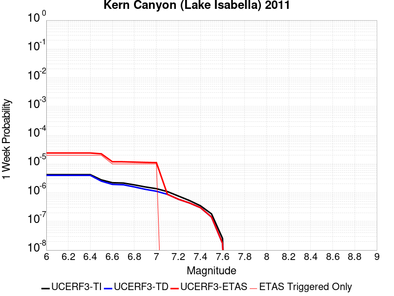 |  |  | 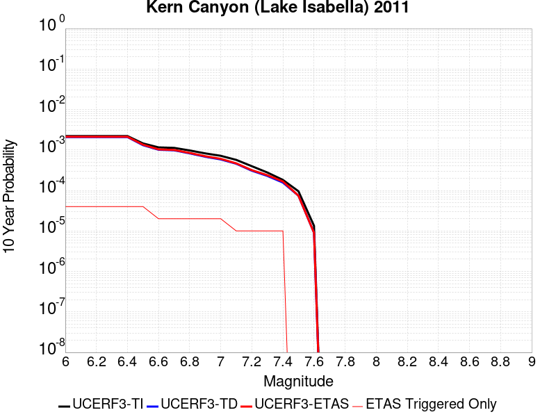 |

| Magnitude | 1 wk TI Prob | 1 wk TD Prob | 1 wk ETAS Prob | 1 wk ETAS/TD Gain | 1 wk ETAS Triggered Only | 1 mo TI Prob | 1 mo TD Prob | 1 mo ETAS Prob | 1 mo ETAS/TD Gain | 1 mo ETAS Triggered Only | 1 yr TI Prob | 1 yr TD Prob | 1 yr ETAS Prob | 1 yr ETAS/TD Gain | 1 yr ETAS Triggered Only | 10 yr TI Prob | 10 yr TD Prob | 10 yr ETAS Prob | 10 yr ETAS/TD Gain | 10 yr ETAS Triggered Only |
|-----|-----|-----|-----|-----|-----|-----|-----|-----|-----|-----|-----|-----|-----|-----|-----|-----|-----|-----|-----|-----|
| 6.0 | 4.2387383E-6 | 4.001639E-6 | 1.6362528E-5 | 4.088957 | 1.236094E-5 | 1.8165894E-5 | 1.7149778E-5 | 2.9510506E-5 | 1.7207514 | 1.236094E-5 | 2.2114732E-4 | 2.087804E-4 | 2.2113876E-4 | 1.0591931 | 1.236094E-5 | 0.0022092736 | 0.0020860266 | 0.0021106969 | 1.0118265 | 2.472188E-5 |
| 6.1 | 4.2387383E-6 | 4.001639E-6 | 1.6362528E-5 | 4.088957 | 1.236094E-5 | 1.8165894E-5 | 1.7149778E-5 | 2.9510506E-5 | 1.7207514 | 1.236094E-5 | 2.2114732E-4 | 2.087804E-4 | 2.2113876E-4 | 1.0591931 | 1.236094E-5 | 0.0022092736 | 0.0020860266 | 0.0021106969 | 1.0118265 | 2.472188E-5 |
| 6.2 | 4.2387383E-6 | 4.001639E-6 | 1.6362528E-5 | 4.088957 | 1.236094E-5 | 1.8165894E-5 | 1.7149778E-5 | 2.9510506E-5 | 1.7207514 | 1.236094E-5 | 2.2114732E-4 | 2.087804E-4 | 2.2113876E-4 | 1.0591931 | 1.236094E-5 | 0.0022092736 | 0.0020860266 | 0.0021106969 | 1.0118265 | 2.472188E-5 |
| 6.3 | 4.2387383E-6 | 4.001639E-6 | 1.6362528E-5 | 4.088957 | 1.236094E-5 | 1.8165894E-5 | 1.7149778E-5 | 2.9510506E-5 | 1.7207514 | 1.236094E-5 | 2.2114732E-4 | 2.087804E-4 | 2.2113876E-4 | 1.0591931 | 1.236094E-5 | 0.0022092736 | 0.0020860266 | 0.0021106969 | 1.0118265 | 2.472188E-5 |
| 6.4 | 4.2387383E-6 | 4.001639E-6 | 1.6362528E-5 | 4.088957 | 1.236094E-5 | 1.8165894E-5 | 1.7149778E-5 | 2.9510506E-5 | 1.7207514 | 1.236094E-5 | 2.2114732E-4 | 2.087804E-4 | 2.2113876E-4 | 1.0591931 | 1.236094E-5 | 0.0022092736 | 0.0020860266 | 0.0021106969 | 1.0118265 | 2.472188E-5 |
| 6.5 | 2.7857532E-6 | 2.517867E-6 | 1.4878775E-5 | 5.909278 | 1.236094E-5 | 1.1938888E-5 | 1.0790815E-5 | 2.315162E-5 | 2.1454933 | 1.236094E-5 | 1.4534626E-4 | 1.3137059E-4 | 1.437299E-4 | 1.0940797 | 1.236094E-5 | 0.0014525123 | 0.001312962 | 0.0013376514 | 1.0188043 | 2.472188E-5 |
| 6.6 | 2.2233348E-6 | 1.9441236E-6 | 1.4305039E-5 | 7.3580914 | 1.236094E-5 | 9.528543E-6 | 8.331932E-6 | 2.0692769E-5 | 2.4835498 | 1.236094E-5 | 1.1600384E-4 | 1.01436635E-4 | 1.13796326E-4 | 1.1218463 | 1.236094E-5 | 0.001159433 | 0.001013912 | 0.0010262604 | 1.012179 | 1.236094E-5 |
| 6.7 | 2.1635126E-6 | 1.8835036E-6 | 1.424442E-5 | 7.562725 | 1.236094E-5 | 9.272164E-6 | 8.072134E-6 | 2.0432974E-5 | 2.5312977 | 1.236094E-5 | 1.1288274E-4 | 9.827388E-5 | 1.106336E-4 | 1.1257682 | 1.236094E-5 | 0.0011282542 | 9.823124E-4 | 9.946611E-4 | 1.0125711 | 1.236094E-5 |
| 6.8 | 1.8685711E-6 | 1.5831425E-6 | 1.3944063E-5 | 8.8078375 | 1.236094E-5 | 8.008137E-6 | 6.784879E-6 | 1.9145735E-5 | 2.821824 | 1.236094E-5 | 9.74947E-5 | 8.260282E-5 | 9.496274E-5 | 1.1496307 | 1.236094E-5 | 9.745194E-4 | 8.2572614E-4 | 8.380768E-4 | 1.0149574 | 1.236094E-5 |
| 6.9 | 1.5815071E-6 | 1.3064928E-6 | 1.3667416E-5 | 10.461149 | 1.236094E-5 | 6.77787E-6 | 5.599243E-6 | 1.7960114E-5 | 3.2075965 | 1.236094E-5 | 8.251744E-5 | 6.816868E-5 | 8.052878E-5 | 1.1813164 | 1.236094E-5 | 8.248681E-4 | 6.8148033E-4 | 6.938329E-4 | 1.018126 | 1.236094E-5 |
| 7.0 | 1.3772564E-6 | 1.1210718E-6 | 1.34819975E-5 | 12.02599 | 1.236094E-5 | 5.9025137E-6 | 4.8045845E-6 | 1.7165465E-5 | 3.572726 | 1.236094E-5 | 7.186073E-5 | 5.8494268E-5 | 7.085448E-5 | 1.2113065 | 1.236094E-5 | 7.18375E-4 | 5.847908E-4 | 5.971445E-4 | 1.021125 | 1.236094E-5 |
| 7.1 | 1.0916998E-6 | 8.763777E-7 | 8.763777E-7 | 1.0 | 0.0 | 4.678705E-6 | 3.7558991E-6 | 3.7558991E-6 | 1.0 | 0.0 | 5.6961744E-5 | 4.5727127E-5 | 4.5727127E-5 | 1.0 | 0.0 | 5.6947145E-4 | 4.571785E-4 | 4.571785E-4 | 1.0 | 0.0 |
| 7.2 | 7.6277024E-7 | 5.901454E-7 | 5.901454E-7 | 1.0 | 0.0 | 3.2690114E-6 | 2.5291922E-6 | 2.5291922E-6 | 1.0 | 0.0 | 3.9799485E-5 | 3.0792486E-5 | 3.0792486E-5 | 1.0 | 0.0 | 3.9792358E-4 | 3.0788282E-4 | 3.0788282E-4 | 1.0 | 0.0 |
| 7.3 | 5.3265916E-7 | 4.3824414E-7 | 4.3824414E-7 | 1.0 | 0.0 | 2.282823E-6 | 1.878188E-6 | 1.878188E-6 | 1.0 | 0.0 | 2.7793016E-5 | 2.2866701E-5 | 2.2866701E-5 | 1.0 | 0.0 | 2.778954E-4 | 2.2864387E-4 | 2.2864387E-4 | 1.0 | 0.0 |
| 7.4 | 3.4946007E-7 | 3.006571E-7 | 3.006571E-7 | 1.0 | 0.0 | 1.497685E-6 | 1.2885298E-6 | 1.2885298E-6 | 1.0 | 0.0 | 1.8234163E-5 | 1.568774E-5 | 1.568774E-5 | 1.0 | 0.0 | 1.8232666E-4 | 1.5686655E-4 | 1.5686655E-4 | 1.0 | 0.0 |
| 7.5 | 1.8317026E-7 | 1.4244812E-7 | 1.4244812E-7 | 1.0 | 0.0 | 7.850152E-7 | 6.104918E-7 | 6.104918E-7 | 1.0 | 0.0 | 9.557518E-6 | 7.432713E-6 | 7.432713E-6 | 1.0 | 0.0 | 9.5571064E-5 | 7.432472E-5 | 7.432472E-5 | 1.0 | 0.0 |
| 7.6 | 2.572245E-8 | 1.7352555E-8 | 1.7352555E-8 | 1.0 | 0.0 | 1.10239064E-7 | 7.436809E-8 | 7.436809E-8 | 1.0 | 0.0 | 1.3421597E-6 | 9.054312E-7 | 9.054312E-7 | 1.0 | 0.0 | 1.3421517E-5 | 9.05428E-6 | 9.05428E-6 | 1.0 | 0.0 |

## San Gabriel
*[(top)](#table-of-contents)*

| 1 Week | 1 Month | 1 Year | 10 Year |
|-----|-----|-----|-----|
|  |  |  |  |

| Magnitude | 1 wk TI Prob | 1 wk TD Prob | 1 wk ETAS Prob | 1 wk ETAS/TD Gain | 1 wk ETAS Triggered Only | 1 mo TI Prob | 1 mo TD Prob | 1 mo ETAS Prob | 1 mo ETAS/TD Gain | 1 mo ETAS Triggered Only | 1 yr TI Prob | 1 yr TD Prob | 1 yr ETAS Prob | 1 yr ETAS/TD Gain | 1 yr ETAS Triggered Only | 10 yr TI Prob | 10 yr TD Prob | 10 yr ETAS Prob | 10 yr ETAS/TD Gain | 10 yr ETAS Triggered Only |
|-----|-----|-----|-----|-----|-----|-----|-----|-----|-----|-----|-----|-----|-----|-----|-----|-----|-----|-----|-----|-----|
| 6.0 | 1.083775E-5 | 1.19851875E-5 | 2.4345978E-5 | 2.031339 | 1.236094E-5 | 4.6446676E-5 | 5.1364143E-5 | 6.3724445E-5 | 1.2406408 | 1.236094E-5 | 5.653415E-4 | 6.251903E-4 | 6.375435E-4 | 1.0197592 | 1.236094E-5 | 0.0056390543 | 0.006246409 | 0.0062709767 | 1.0039331 | 2.472188E-5 |
| 6.1 | 1.083775E-5 | 1.19851875E-5 | 2.4345978E-5 | 2.031339 | 1.236094E-5 | 4.6446676E-5 | 5.1364143E-5 | 6.3724445E-5 | 1.2406408 | 1.236094E-5 | 5.653415E-4 | 6.251903E-4 | 6.375435E-4 | 1.0197592 | 1.236094E-5 | 0.0056390543 | 0.006246409 | 0.0062709767 | 1.0039331 | 2.472188E-5 |
| 6.2 | 1.083775E-5 | 1.19851875E-5 | 2.4345978E-5 | 2.031339 | 1.236094E-5 | 4.6446676E-5 | 5.1364143E-5 | 6.3724445E-5 | 1.2406408 | 1.236094E-5 | 5.653415E-4 | 6.251903E-4 | 6.375435E-4 | 1.0197592 | 1.236094E-5 | 0.0056390543 | 0.006246409 | 0.0062709767 | 1.0039331 | 2.472188E-5 |
| 6.3 | 1.083775E-5 | 1.19851875E-5 | 2.4345978E-5 | 2.031339 | 1.236094E-5 | 4.6446676E-5 | 5.1364143E-5 | 6.3724445E-5 | 1.2406408 | 1.236094E-5 | 5.653415E-4 | 6.251903E-4 | 6.375435E-4 | 1.0197592 | 1.236094E-5 | 0.0056390543 | 0.006246409 | 0.0062709767 | 1.0039331 | 2.472188E-5 |
| 6.4 | 1.083775E-5 | 1.19851875E-5 | 2.4345978E-5 | 2.031339 | 1.236094E-5 | 4.6446676E-5 | 5.1364143E-5 | 6.3724445E-5 | 1.2406408 | 1.236094E-5 | 5.653415E-4 | 6.251903E-4 | 6.375435E-4 | 1.0197592 | 1.236094E-5 | 0.0056390543 | 0.006246409 | 0.0062709767 | 1.0039331 | 2.472188E-5 |
| 6.5 | 6.7317824E-6 | 7.716944E-6 | 2.0077789E-5 | 2.6017795 | 1.236094E-5 | 2.8850178E-5 | 3.3072207E-5 | 4.543274E-5 | 1.3737438 | 1.236094E-5 | 3.511943E-4 | 4.0258077E-4 | 4.1493675E-4 | 1.0306919 | 1.236094E-5 | 0.003506398 | 0.0040296097 | 0.004054232 | 1.0061103 | 2.472188E-5 |
| 6.6 | 6.7317824E-6 | 7.716944E-6 | 2.0077789E-5 | 2.6017795 | 1.236094E-5 | 2.8850178E-5 | 3.3072207E-5 | 4.543274E-5 | 1.3737438 | 1.236094E-5 | 3.511943E-4 | 4.0258077E-4 | 4.1493675E-4 | 1.0306919 | 1.236094E-5 | 0.003506398 | 0.0040296097 | 0.004054232 | 1.0061103 | 2.472188E-5 |
| 6.7 | 6.274881E-6 | 7.2458647E-6 | 1.9606714E-5 | 2.7059178 | 1.236094E-5 | 2.6892068E-5 | 3.1053343E-5 | 4.3413896E-5 | 1.3980427 | 1.236094E-5 | 3.2736175E-4 | 3.780098E-4 | 3.903661E-4 | 1.0326877 | 1.236094E-5 | 0.0032687993 | 0.0037847564 | 0.0038093848 | 1.0065073 | 2.472188E-5 |
| 6.8 | 5.996209E-6 | 6.958585E-6 | 1.931944E-5 | 2.7763457 | 1.236094E-5 | 2.5697784E-5 | 2.9822171E-5 | 4.2182743E-5 | 1.4144759 | 1.236094E-5 | 3.128256E-4 | 3.6302538E-4 | 3.7538182E-4 | 1.0340375 | 1.236094E-5 | 0.003123856 | 0.0036354093 | 0.0036477253 | 1.0033878 | 1.236094E-5 |
| 6.9 | 5.686331E-6 | 6.6236316E-6 | 1.8984489E-5 | 2.8661752 | 1.236094E-5 | 2.4369761E-5 | 2.8386688E-5 | 4.0747276E-5 | 1.4354361 | 1.236094E-5 | 2.9666146E-4 | 3.4555403E-4 | 3.579107E-4 | 1.035759 | 1.236094E-5 | 0.0029626573 | 0.0034612515 | 0.0034735696 | 1.0035589 | 1.236094E-5 |
| 7.0 | 5.2329838E-6 | 6.147514E-6 | 1.8508377E-5 | 3.0107093 | 1.236094E-5 | 2.242688E-5 | 2.6346226E-5 | 3.870684E-5 | 1.4691607 | 1.236094E-5 | 2.7301308E-4 | 3.2071886E-4 | 3.3307585E-4 | 1.038529 | 1.236094E-5 | 0.002726779 | 0.0032136322 | 0.0032259533 | 1.003834 | 1.236094E-5 |
| 7.1 | 5.135671E-6 | 6.03764E-6 | 1.8398505E-5 | 3.0473008 | 1.236094E-5 | 2.2009834E-5 | 2.5875348E-5 | 3.823597E-5 | 1.4776987 | 1.236094E-5 | 2.6793676E-4 | 3.1498758E-4 | 3.2734463E-4 | 1.0392302 | 1.236094E-5 | 0.0026761394 | 0.0031564834 | 0.0031688053 | 1.0039036 | 1.236094E-5 |
| 7.2 | 4.989062E-6 | 5.87102E-6 | 1.8231887E-5 | 3.1054037 | 1.236094E-5 | 2.1381518E-5 | 2.5161276E-5 | 3.7521906E-5 | 1.491256 | 1.236094E-5 | 2.6028889E-4 | 3.0629625E-4 | 3.186534E-4 | 1.0403438 | 1.236094E-5 | 0.0025998424 | 0.003069813 | 0.003082136 | 1.0040143 | 1.236094E-5 |
| 7.3 | 4.8219395E-6 | 5.702574E-6 | 1.8063443E-5 | 3.1675947 | 1.236094E-5 | 2.0665291E-5 | 2.443938E-5 | 3.6800015E-5 | 1.5057672 | 1.236094E-5 | 2.5157086E-4 | 2.9750957E-4 | 3.0986682E-4 | 1.0415357 | 1.236094E-5 | 0.0025128627 | 0.0029821852 | 0.0029945094 | 1.0041325 | 1.236094E-5 |
| 7.4 | 4.7118383E-6 | 5.5911332E-6 | 1.7952003E-5 | 3.2107987 | 1.236094E-5 | 2.0193436E-5 | 2.3961782E-5 | 3.6322424E-5 | 1.5158483 | 1.236094E-5 | 2.4582737E-4 | 2.916964E-4 | 3.0405374E-4 | 1.0423636 | 1.236094E-5 | 0.002455556 | 0.0029242067 | 0.0029365316 | 1.0042148 | 1.236094E-5 |
| 7.5 | 4.5506545E-6 | 5.4365014E-6 | 1.7797374E-5 | 3.2736814 | 1.236094E-5 | 1.9502659E-5 | 2.3299088E-5 | 3.5659737E-5 | 1.5305208 | 1.236094E-5 | 2.37419E-4 | 2.8363022E-4 | 2.9598764E-4 | 1.0435688 | 1.236094E-5 | 0.002371655 | 0.002843753 | 0.0028560788 | 1.0043343 | 1.236094E-5 |
| 7.6 | 4.343636E-6 | 5.2293817E-6 | 1.7590257E-5 | 3.3637354 | 1.236094E-5 | 1.861545E-5 | 2.2411448E-5 | 3.477211E-5 | 1.5515335 | 1.236094E-5 | 2.2661954E-4 | 2.7282597E-4 | 2.8518352E-4 | 1.0452946 | 1.236094E-5 | 0.0022638857 | 0.0027359722 | 0.0027482994 | 1.0045055 | 1.236094E-5 |
| 7.7 | 2.936235E-6 | 2.7440458E-6 | 2.7440458E-6 | 1.0 | 0.0 | 1.2583803E-5 | 1.1760143E-5 | 1.1760143E-5 | 1.0 | 0.0 | 1.5319703E-4 | 1.4317037E-4 | 1.4317037E-4 | 1.0 | 0.0 | 0.0015309147 | 0.0014380751 | 0.0014380751 | 1.0 | 0.0 |
| 7.8 | 1.4541639E-6 | 9.1237047E-7 | 9.1237047E-7 | 1.0 | 0.0 | 6.232116E-6 | 3.9101533E-6 | 3.9101533E-6 | 1.0 | 0.0 | 7.587337E-5 | 4.7605077E-5 | 4.7605077E-5 | 1.0 | 0.0 | 7.584747E-4 | 4.8085177E-4 | 4.8085177E-4 | 1.0 | 0.0 |
| 7.9 | 8.098958E-7 | 2.41753E-7 | 2.41753E-7 | 1.0 | 0.0 | 3.4709774E-6 | 1.0360839E-6 | 1.0360839E-6 | 1.0 | 0.0 | 4.225833E-5 | 1.2614248E-5 | 1.2614248E-5 | 1.0 | 0.0 | 4.2250296E-4 | 1.2921814E-4 | 1.2921814E-4 | 1.0 | 0.0 |
| 8.0 | 5.2473234E-7 | 7.6792055E-8 | 7.6792055E-8 | 1.0 | 0.0 | 2.248851E-6 | 3.2910876E-7 | 3.2910876E-7 | 1.0 | 0.0 | 2.7379416E-5 | 4.0068917E-6 | 4.0068917E-6 | 1.0 | 0.0 | 2.7376044E-4 | 4.21918E-5 | 4.21918E-5 | 1.0 | 0.0 |
| 8.1 | 3.3162388E-7 | 4.1496126E-8 | 4.1496126E-8 | 1.0 | 0.0 | 1.4212444E-6 | 1.7784053E-7 | 1.7784053E-7 | 1.0 | 0.0 | 1.7303513E-5 | 2.1652063E-6 | 2.1652063E-6 | 1.0 | 0.0 | 1.7302166E-4 | 2.2965523E-5 | 2.2965523E-5 | 1.0 | 0.0 |
| 8.2 | 1.0235345E-7 | 1.4043474E-8 | 1.4043474E-8 | 1.0 | 0.0 | 4.3865757E-7 | 6.0186316E-8 | 6.0186316E-8 | 1.0 | 0.0 | 5.340643E-6 | 7.327681E-7 | 7.327681E-7 | 1.0 | 0.0 | 5.3405143E-5 | 7.9273705E-6 | 7.9273705E-6 | 1.0 | 0.0 |

## Great Valley 03a Dunnigan Hills
*[(top)](#table-of-contents)*

| 1 Week | 1 Month | 1 Year | 10 Year |
|-----|-----|-----|-----|
|  |  |  | 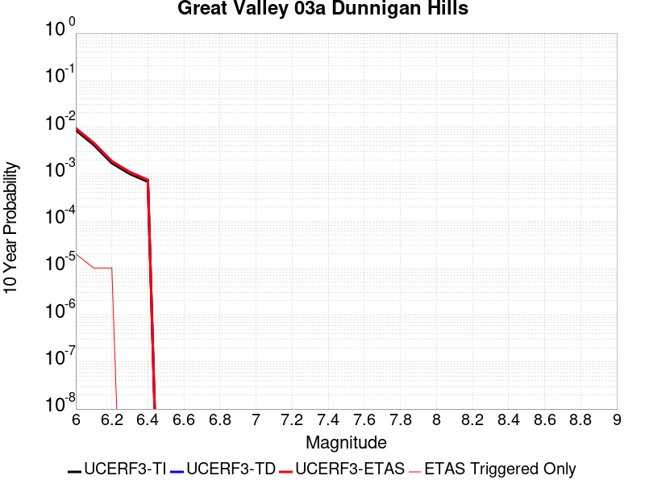 |

| Magnitude | 1 wk TI Prob | 1 wk TD Prob | 1 wk ETAS Prob | 1 wk ETAS/TD Gain | 1 wk ETAS Triggered Only | 1 mo TI Prob | 1 mo TD Prob | 1 mo ETAS Prob | 1 mo ETAS/TD Gain | 1 mo ETAS Triggered Only | 1 yr TI Prob | 1 yr TD Prob | 1 yr ETAS Prob | 1 yr ETAS/TD Gain | 1 yr ETAS Triggered Only | 10 yr TI Prob | 10 yr TD Prob | 10 yr ETAS Prob | 10 yr ETAS/TD Gain | 10 yr ETAS Triggered Only |
|-----|-----|-----|-----|-----|-----|-----|-----|-----|-----|-----|-----|-----|-----|-----|-----|-----|-----|-----|-----|-----|
| 6.0 | 1.6591328E-5 | 1.8107954E-5 | 3.046867E-5 | 1.6826125 | 1.236094E-5 | 7.110376E-5 | 7.7603596E-5 | 8.996358E-5 | 1.1592708 | 1.236094E-5 | 8.6534437E-4 | 9.444834E-4 | 9.6918194E-4 | 1.0261503 | 2.472188E-5 | 0.008619824 | 0.009411525 | 0.009436014 | 1.0026021 | 2.472188E-5 |
| 6.1 | 8.041125E-6 | 8.769726E-6 | 2.1130558E-5 | 2.4094887 | 1.236094E-5 | 3.4461507E-5 | 3.7584115E-5 | 4.9944592E-5 | 1.328875 | 1.236094E-5 | 4.194881E-4 | 4.5751085E-4 | 4.6986615E-4 | 1.0270054 | 1.236094E-5 | 0.004186971 | 0.004567687 | 0.0045799916 | 1.0026938 | 1.236094E-5 |
| 6.2 | 3.2807004E-6 | 3.5795688E-6 | 1.5940464E-5 | 4.45318 | 1.236094E-5 | 1.4060069E-5 | 1.5340942E-5 | 2.7701692E-5 | 1.8057361 | 1.236094E-5 | 1.7116789E-4 | 1.8676413E-4 | 1.9912276E-4 | 1.0661724 | 1.236094E-5 | 0.0017103611 | 0.0018664796 | 0.0018788176 | 1.0066103 | 1.236094E-5 |
| 6.3 | 1.9339366E-6 | 2.1103806E-6 | 2.1103806E-6 | 1.0 | 0.0 | 8.288273E-6 | 9.044474E-6 | 9.044474E-6 | 1.0 | 0.0 | 1.00905054E-4 | 1.1011375E-4 | 1.1011375E-4 | 1.0 | 0.0 | 0.0010085925 | 0.0011008718 | 0.0011008718 | 1.0 | 0.0 |
| 6.4 | 1.3142635E-6 | 1.4339867E-6 | 1.4339867E-6 | 1.0 | 0.0 | 5.6325457E-6 | 6.145657E-6 | 6.145657E-6 | 1.0 | 0.0 | 6.857408E-5 | 7.482337E-5 | 7.482337E-5 | 1.0 | 0.0 | 6.8552926E-4 | 7.4823375E-4 | 7.4823375E-4 | 1.0 | 0.0 |

## Channel Islands Western Deep Ramp
*[(top)](#table-of-contents)*

| 1 Week | 1 Month | 1 Year | 10 Year |
|-----|-----|-----|-----|
|  |  |  |  |

| Magnitude | 1 wk TI Prob | 1 wk TD Prob | 1 wk ETAS Prob | 1 wk ETAS/TD Gain | 1 wk ETAS Triggered Only | 1 mo TI Prob | 1 mo TD Prob | 1 mo ETAS Prob | 1 mo ETAS/TD Gain | 1 mo ETAS Triggered Only | 1 yr TI Prob | 1 yr TD Prob | 1 yr ETAS Prob | 1 yr ETAS/TD Gain | 1 yr ETAS Triggered Only | 10 yr TI Prob | 10 yr TD Prob | 10 yr ETAS Prob | 10 yr ETAS/TD Gain | 10 yr ETAS Triggered Only |
|-----|-----|-----|-----|-----|-----|-----|-----|-----|-----|-----|-----|-----|-----|-----|-----|-----|-----|-----|-----|-----|
| 6.0 | 6.0213506E-6 | 6.2548684E-6 | 6.2548684E-6 | 1.0 | 0.0 | 2.5805533E-5 | 2.6806329E-5 | 3.9166935E-5 | 1.4611079 | 1.236094E-5 | 3.1413708E-4 | 3.2632265E-4 | 3.5103646E-4 | 1.0757343 | 2.472188E-5 | 0.0031369338 | 0.0032588763 | 0.0032835177 | 1.0075613 | 2.472188E-5 |
| 6.1 | 6.0213506E-6 | 6.2548684E-6 | 6.2548684E-6 | 1.0 | 0.0 | 2.5805533E-5 | 2.6806329E-5 | 3.9166935E-5 | 1.4611079 | 1.236094E-5 | 3.1413708E-4 | 3.2632265E-4 | 3.5103646E-4 | 1.0757343 | 2.472188E-5 | 0.0031369338 | 0.0032588763 | 0.0032835177 | 1.0075613 | 2.472188E-5 |
| 6.2 | 6.0213506E-6 | 6.2548684E-6 | 6.2548684E-6 | 1.0 | 0.0 | 2.5805533E-5 | 2.6806329E-5 | 3.9166935E-5 | 1.4611079 | 1.236094E-5 | 3.1413708E-4 | 3.2632265E-4 | 3.5103646E-4 | 1.0757343 | 2.472188E-5 | 0.0031369338 | 0.0032588763 | 0.0032835177 | 1.0075613 | 2.472188E-5 |
| 6.3 | 6.0213506E-6 | 6.2548684E-6 | 6.2548684E-6 | 1.0 | 0.0 | 2.5805533E-5 | 2.6806329E-5 | 3.9166935E-5 | 1.4611079 | 1.236094E-5 | 3.1413708E-4 | 3.2632265E-4 | 3.5103646E-4 | 1.0757343 | 2.472188E-5 | 0.0031369338 | 0.0032588763 | 0.0032835177 | 1.0075613 | 2.472188E-5 |
| 6.4 | 6.0213506E-6 | 6.2548684E-6 | 6.2548684E-6 | 1.0 | 0.0 | 2.5805533E-5 | 2.6806329E-5 | 3.9166935E-5 | 1.4611079 | 1.236094E-5 | 3.1413708E-4 | 3.2632265E-4 | 3.5103646E-4 | 1.0757343 | 2.472188E-5 | 0.0031369338 | 0.0032588763 | 0.0032835177 | 1.0075613 | 2.472188E-5 |
| 6.5 | 6.0213506E-6 | 6.2548684E-6 | 6.2548684E-6 | 1.0 | 0.0 | 2.5805533E-5 | 2.6806329E-5 | 3.9166935E-5 | 1.4611079 | 1.236094E-5 | 3.1413708E-4 | 3.2632265E-4 | 3.5103646E-4 | 1.0757343 | 2.472188E-5 | 0.0031369338 | 0.0032588763 | 0.0032835177 | 1.0075613 | 2.472188E-5 |
| 6.6 | 6.0213506E-6 | 6.2548684E-6 | 6.2548684E-6 | 1.0 | 0.0 | 2.5805533E-5 | 2.6806329E-5 | 3.9166935E-5 | 1.4611079 | 1.236094E-5 | 3.1413708E-4 | 3.2632265E-4 | 3.5103646E-4 | 1.0757343 | 2.472188E-5 | 0.0031369338 | 0.0032588763 | 0.0032835177 | 1.0075613 | 2.472188E-5 |
| 6.7 | 5.313309E-6 | 5.5252403E-6 | 5.5252403E-6 | 1.0 | 0.0 | 2.2771126E-5 | 2.367941E-5 | 3.6040055E-5 | 1.5219997 | 1.236094E-5 | 2.772032E-4 | 2.8826276E-4 | 3.1297753E-4 | 1.0857369 | 2.472188E-5 | 0.0027685766 | 0.0028792918 | 0.0029039423 | 1.0085614 | 2.472188E-5 |
| 6.8 | 5.313309E-6 | 5.5252403E-6 | 5.5252403E-6 | 1.0 | 0.0 | 2.2771126E-5 | 2.367941E-5 | 3.6040055E-5 | 1.5219997 | 1.236094E-5 | 2.772032E-4 | 2.8826276E-4 | 3.1297753E-4 | 1.0857369 | 2.472188E-5 | 0.0027685766 | 0.0028792918 | 0.0029039423 | 1.0085614 | 2.472188E-5 |
| 6.9 | 4.744377E-6 | 4.9394303E-6 | 4.9394303E-6 | 1.0 | 0.0 | 2.0332885E-5 | 2.1168837E-5 | 3.3529515E-5 | 1.5839092 | 1.236094E-5 | 2.4752476E-4 | 2.5770385E-4 | 2.8241935E-4 | 1.0959066 | 2.472188E-5 | 0.0024724922 | 0.0025744175 | 0.0025990757 | 1.0095782 | 2.472188E-5 |
| 7.0 | 4.722209E-6 | 4.9164732E-6 | 4.9164732E-6 | 1.0 | 0.0 | 2.0237881E-5 | 2.107045E-5 | 3.343113E-5 | 1.5866357 | 1.236094E-5 | 2.4636835E-4 | 2.5650626E-4 | 2.812218E-4 | 1.0963545 | 2.472188E-5 | 0.002460954 | 0.0025624693 | 0.002587128 | 1.0096229 | 2.472188E-5 |
| 7.1 | 4.611174E-6 | 4.801409E-6 | 4.801409E-6 | 1.0 | 0.0 | 1.9762025E-5 | 2.0577325E-5 | 3.293801E-5 | 1.6006944 | 1.236094E-5 | 2.4057609E-4 | 2.5050386E-4 | 2.7521956E-4 | 1.0986639 | 2.472188E-5 | 0.002403158 | 0.002502582 | 0.0025272418 | 1.0098538 | 2.472188E-5 |
| 7.2 | 4.043994E-6 | 4.2120264E-6 | 4.2120264E-6 | 1.0 | 0.0 | 1.7331287E-5 | 1.8051438E-5 | 3.0412153E-5 | 1.6847497 | 1.236094E-5 | 2.10988E-4 | 2.1975765E-4 | 2.444741E-4 | 1.1124713 | 2.472188E-5 | 0.002107878 | 0.0021957543 | 0.0022204218 | 1.0112343 | 2.472188E-5 |
| 7.3 | 2.1233036E-6 | 2.2297875E-6 | 2.2297875E-6 | 1.0 | 0.0 | 9.099841E-6 | 9.556197E-6 | 2.1917018E-5 | 2.2934875 | 1.236094E-5 | 1.1078493E-4 | 1.1634055E-4 | 1.4105954E-4 | 1.2124711 | 2.472188E-5 | 0.0011072971 | 0.001162802 | 0.0011874951 | 1.021236 | 2.472188E-5 |
| 7.4 | 1.9051884E-6 | 2.0014973E-6 | 2.0014973E-6 | 1.0 | 0.0 | 8.165067E-6 | 8.577817E-6 | 2.093865E-5 | 2.441023 | 1.236094E-5 | 9.940516E-5 | 1.0442998E-4 | 1.2914927E-4 | 1.236707 | 2.472188E-5 | 9.93607E-4 | 0.0010438144 | 0.0010685103 | 1.0236595 | 2.472188E-5 |
| 7.5 | 1.2408497E-6 | 1.3038839E-6 | 1.3038839E-6 | 1.0 | 0.0 | 5.317916E-6 | 5.588062E-6 | 5.588062E-6 | 1.0 | 0.0 | 6.4743705E-5 | 6.8032554E-5 | 6.8032554E-5 | 1.0 | 0.0 | 6.4724847E-4 | 6.8011944E-4 | 6.8011944E-4 | 1.0 | 0.0 |
| 7.6 | 6.5440025E-7 | 6.886718E-7 | 6.886718E-7 | 1.0 | 0.0 | 2.8045695E-6 | 2.9514472E-6 | 2.9514472E-6 | 1.0 | 0.0 | 3.4145098E-5 | 3.593329E-5 | 3.593329E-5 | 1.0 | 0.0 | 3.4139853E-4 | 3.5927625E-4 | 3.5927625E-4 | 1.0 | 0.0 |
| 7.7 | 3.985963E-7 | 4.1930787E-7 | 4.1930787E-7 | 1.0 | 0.0 | 1.7082689E-6 | 1.7970326E-6 | 1.7970326E-6 | 1.0 | 0.0 | 2.0797976E-5 | 2.1878664E-5 | 2.1878664E-5 | 1.0 | 0.0 | 2.0796029E-4 | 2.1876628E-4 | 2.1876628E-4 | 1.0 | 0.0 |
| 7.8 | 3.706329E-8 | 3.8591796E-8 | 3.8591796E-8 | 1.0 | 0.0 | 1.5884267E-7 | 1.653934E-7 | 1.653934E-7 | 1.0 | 0.0 | 1.9339077E-6 | 2.0136629E-6 | 2.0136629E-6 | 1.0 | 0.0 | 1.933891E-5 | 2.0136458E-5 | 2.0136458E-5 | 1.0 | 0.0 |

## Hollywood
*[(top)](#table-of-contents)*

| 1 Week | 1 Month | 1 Year | 10 Year |
|-----|-----|-----|-----|
|  |  |  |  |

| Magnitude | 1 wk TI Prob | 1 wk TD Prob | 1 wk ETAS Prob | 1 wk ETAS/TD Gain | 1 wk ETAS Triggered Only | 1 mo TI Prob | 1 mo TD Prob | 1 mo ETAS Prob | 1 mo ETAS/TD Gain | 1 mo ETAS Triggered Only | 1 yr TI Prob | 1 yr TD Prob | 1 yr ETAS Prob | 1 yr ETAS/TD Gain | 1 yr ETAS Triggered Only | 10 yr TI Prob | 10 yr TD Prob | 10 yr ETAS Prob | 10 yr ETAS/TD Gain | 10 yr ETAS Triggered Only |
|-----|-----|-----|-----|-----|-----|-----|-----|-----|-----|-----|-----|-----|-----|-----|-----|-----|-----|-----|-----|-----|
| 6.0 | 1.24487615E-5 | 1.2593226E-5 | 1.2593226E-5 | 1.0 | 0.0 | 5.3350745E-5 | 5.3969878E-5 | 5.3969878E-5 | 1.0 | 0.0 | 6.4935174E-4 | 6.568898E-4 | 6.568898E-4 | 1.0 | 0.0 | 0.0064745755 | 0.006549969 | 0.006562249 | 1.0018748 | 1.236094E-5 |
| 6.1 | 1.24487615E-5 | 1.2593226E-5 | 1.2593226E-5 | 1.0 | 0.0 | 5.3350745E-5 | 5.3969878E-5 | 5.3969878E-5 | 1.0 | 0.0 | 6.4935174E-4 | 6.568898E-4 | 6.568898E-4 | 1.0 | 0.0 | 0.0064745755 | 0.006549969 | 0.006562249 | 1.0018748 | 1.236094E-5 |
| 6.2 | 1.24487615E-5 | 1.2593226E-5 | 1.2593226E-5 | 1.0 | 0.0 | 5.3350745E-5 | 5.3969878E-5 | 5.3969878E-5 | 1.0 | 0.0 | 6.4935174E-4 | 6.568898E-4 | 6.568898E-4 | 1.0 | 0.0 | 0.0064745755 | 0.006549969 | 0.006562249 | 1.0018748 | 1.236094E-5 |
| 6.3 | 1.24487615E-5 | 1.2593226E-5 | 1.2593226E-5 | 1.0 | 0.0 | 5.3350745E-5 | 5.3969878E-5 | 5.3969878E-5 | 1.0 | 0.0 | 6.4935174E-4 | 6.568898E-4 | 6.568898E-4 | 1.0 | 0.0 | 0.0064745755 | 0.006549969 | 0.006562249 | 1.0018748 | 1.236094E-5 |
| 6.4 | 1.2431024E-5 | 1.2573839E-5 | 1.2573839E-5 | 1.0 | 0.0 | 5.327473E-5 | 5.3886797E-5 | 5.3886797E-5 | 1.0 | 0.0 | 6.4842677E-4 | 6.558789E-4 | 6.558789E-4 | 1.0 | 0.0 | 0.0064653796 | 0.0065399194 | 0.0065521994 | 1.0018777 | 1.236094E-5 |
| 6.5 | 1.1242222E-5 | 1.13178E-5 | 1.13178E-5 | 1.0 | 0.0 | 4.8180063E-5 | 4.850397E-5 | 4.850397E-5 | 1.0 | 0.0 | 5.864344E-4 | 5.9037853E-4 | 5.9037853E-4 | 1.0 | 0.0 | 0.0058488925 | 0.005888388 | 0.005900676 | 1.0020869 | 1.236094E-5 |
| 6.6 | 1.1234066E-5 | 1.13089145E-5 | 1.13089145E-5 | 1.0 | 0.0 | 4.8145106E-5 | 4.846589E-5 | 4.846589E-5 | 1.0 | 0.0 | 5.86009E-4 | 5.8991514E-4 | 5.8991514E-4 | 1.0 | 0.0 | 0.005844661 | 0.0058837784 | 0.005896067 | 1.0020885 | 1.236094E-5 |
| 6.7 | 1.12294E-5 | 1.1303658E-5 | 1.1303658E-5 | 1.0 | 0.0 | 4.812511E-5 | 4.8443362E-5 | 4.8443362E-5 | 1.0 | 0.0 | 5.857657E-4 | 5.89641E-4 | 5.89641E-4 | 1.0 | 0.0 | 0.0058422405 | 0.005881052 | 0.00589334 | 1.0020895 | 1.236094E-5 |
| 6.8 | 1.0252819E-5 | 1.0218445E-5 | 1.0218445E-5 | 1.0 | 0.0 | 4.3939912E-5 | 4.379261E-5 | 4.379261E-5 | 1.0 | 0.0 | 5.3483713E-4 | 5.330467E-4 | 5.330467E-4 | 1.0 | 0.0 | 0.005335517 | 0.005317908 | 0.0053302026 | 1.0023121 | 1.236094E-5 |
| 6.9 | 9.252289E-6 | 9.110306E-6 | 9.110306E-6 | 1.0 | 0.0 | 3.9652066E-5 | 3.9043593E-5 | 3.9043593E-5 | 1.0 | 0.0 | 4.8265693E-4 | 4.752537E-4 | 4.752537E-4 | 1.0 | 0.0 | 0.0048161 | 0.004742547 | 0.0047548492 | 1.002594 | 1.236094E-5 |
| 7.0 | 8.474604E-6 | 8.258257E-6 | 8.258257E-6 | 1.0 | 0.0 | 3.6319227E-5 | 3.539206E-5 | 3.539206E-5 | 1.0 | 0.0 | 4.4209688E-4 | 4.3081454E-4 | 4.3081454E-4 | 1.0 | 0.0 | 0.004412184 | 0.004299944 | 0.0043122517 | 1.0028623 | 1.236094E-5 |
| 7.1 | 6.643643E-6 | 6.2683675E-6 | 6.2683675E-6 | 1.0 | 0.0 | 2.8472443E-5 | 2.6864158E-5 | 2.6864158E-5 | 1.0 | 0.0 | 3.4659685E-4 | 3.2702246E-4 | 3.2702246E-4 | 1.0 | 0.0 | 0.0034605677 | 0.0032654584 | 0.0032777789 | 1.003773 | 1.236094E-5 |
| 7.2 | 5.549002E-6 | 5.108709E-6 | 5.108709E-6 | 1.0 | 0.0 | 2.378122E-5 | 2.1894284E-5 | 2.1894284E-5 | 1.0 | 0.0 | 2.8949787E-4 | 2.6653046E-4 | 2.6653046E-4 | 1.0 | 0.0 | 0.0028912104 | 0.0026621243 | 0.0026744525 | 1.0046309 | 1.236094E-5 |
| 7.3 | 4.3059727E-6 | 3.9598885E-6 | 3.9598885E-6 | 1.0 | 0.0 | 1.8454039E-5 | 1.6970842E-5 | 1.6970842E-5 | 1.0 | 0.0 | 2.2465475E-4 | 2.066005E-4 | 2.066005E-4 | 1.0 | 0.0 | 0.0022442779 | 0.0020640944 | 0.0020764298 | 1.0059762 | 1.236094E-5 |
| 7.4 | 2.8550733E-6 | 2.7012966E-6 | 2.7012966E-6 | 1.0 | 0.0 | 1.2235971E-5 | 1.1576934E-5 | 1.1576934E-5 | 1.0 | 0.0 | 1.4896276E-4 | 1.409401E-4 | 1.409401E-4 | 1.0 | 0.0 | 0.0014886294 | 0.0014085122 | 0.0014208558 | 1.0087636 | 1.236094E-5 |
| 7.5 | 1.9927045E-6 | 1.8976367E-6 | 1.8976367E-6 | 1.0 | 0.0 | 8.540134E-6 | 8.132703E-6 | 8.132703E-6 | 1.0 | 0.0 | 1.0397117E-4 | 9.90112E-5 | 9.90112E-5 | 1.0 | 0.0 | 0.0010392254 | 9.896745E-4 | 0.0010020232 | 1.0124775 | 1.236094E-5 |
| 7.6 | 1.345084E-6 | 1.2216007E-6 | 1.2216007E-6 | 1.0 | 0.0 | 5.764633E-6 | 5.235421E-6 | 5.235421E-6 | 1.0 | 0.0 | 7.018215E-5 | 6.3739404E-5 | 6.3739404E-5 | 1.0 | 0.0 | 7.0159987E-4 | 6.3721323E-4 | 6.495663E-4 | 1.019386 | 1.236094E-5 |
| 7.7 | 7.6835164E-7 | 6.277697E-7 | 6.277697E-7 | 1.0 | 0.0 | 3.2929315E-6 | 2.6904388E-6 | 2.6904388E-6 | 1.0 | 0.0 | 4.00907E-5 | 3.2755615E-5 | 3.2755615E-5 | 1.0 | 0.0 | 4.0083472E-4 | 3.2750933E-4 | 3.3986624E-4 | 1.0377299 | 1.236094E-5 |
| 7.8 | 3.6562128E-7 | 2.453479E-7 | 2.453479E-7 | 1.0 | 0.0 | 1.5669474E-6 | 1.0514907E-6 | 1.0514907E-6 | 1.0 | 0.0 | 1.9077417E-5 | 1.2801827E-5 | 1.2801827E-5 | 1.0 | 0.0 | 1.907578E-4 | 1.2801126E-4 | 1.2801126E-4 | 1.0 | 0.0 |
| 7.9 | 7.5024424E-8 | 5.3816795E-8 | 5.3816795E-8 | 1.0 | 0.0 | 3.215332E-7 | 2.306434E-7 | 2.306434E-7 | 1.0 | 0.0 | 3.91466E-6 | 2.808081E-6 | 2.808081E-6 | 1.0 | 0.0 | 3.9145907E-5 | 2.8080585E-5 | 2.8080585E-5 | 1.0 | 0.0 |

## Newport-Inglewood alt 1
*[(top)](#table-of-contents)*

| 1 Week | 1 Month | 1 Year | 10 Year |
|-----|-----|-----|-----|
| 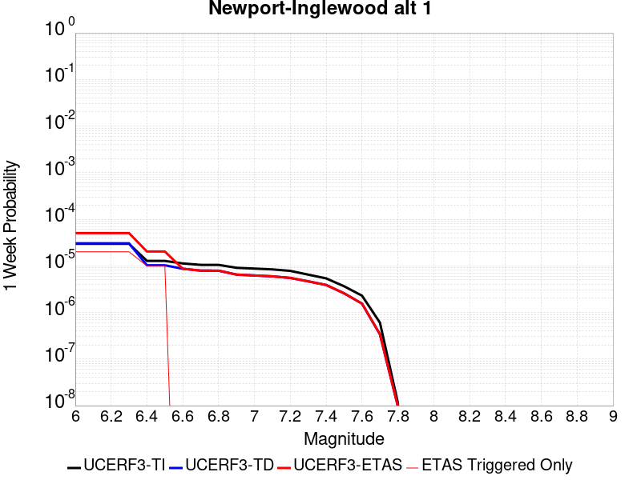 |  |  | 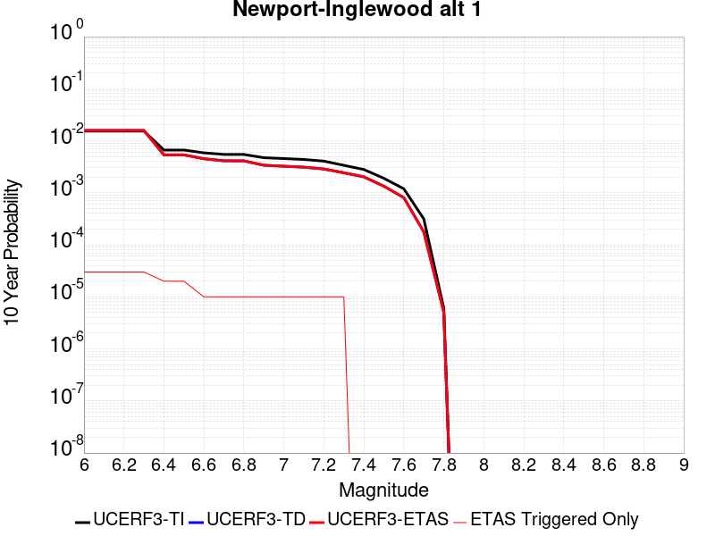 |

| Magnitude | 1 wk TI Prob | 1 wk TD Prob | 1 wk ETAS Prob | 1 wk ETAS/TD Gain | 1 wk ETAS Triggered Only | 1 mo TI Prob | 1 mo TD Prob | 1 mo ETAS Prob | 1 mo ETAS/TD Gain | 1 mo ETAS Triggered Only | 1 yr TI Prob | 1 yr TD Prob | 1 yr ETAS Prob | 1 yr ETAS/TD Gain | 1 yr ETAS Triggered Only | 10 yr TI Prob | 10 yr TD Prob | 10 yr ETAS Prob | 10 yr ETAS/TD Gain | 10 yr ETAS Triggered Only |
|-----|-----|-----|-----|-----|-----|-----|-----|-----|-----|-----|-----|-----|-----|-----|-----|-----|-----|-----|-----|-----|
| 6.0 | 2.9668912E-5 | 3.0404817E-5 | 3.0404817E-5 | 1.0 | 0.0 | 1.2714628E-4 | 1.303026E-4 | 1.303026E-4 | 1.0 | 0.0 | 0.0015469068 | 0.0015857625 | 0.0015981039 | 1.0077826 | 1.236094E-5 | 0.015361829 | 0.015792042 | 0.015804209 | 1.0007703 | 1.236094E-5 |
| 6.1 | 2.9668912E-5 | 3.0404817E-5 | 3.0404817E-5 | 1.0 | 0.0 | 1.2714628E-4 | 1.303026E-4 | 1.303026E-4 | 1.0 | 0.0 | 0.0015469068 | 0.0015857625 | 0.0015981039 | 1.0077826 | 1.236094E-5 | 0.015361829 | 0.015792042 | 0.015804209 | 1.0007703 | 1.236094E-5 |
| 6.2 | 2.9668912E-5 | 3.0404817E-5 | 3.0404817E-5 | 1.0 | 0.0 | 1.2714628E-4 | 1.303026E-4 | 1.303026E-4 | 1.0 | 0.0 | 0.0015469068 | 0.0015857625 | 0.0015981039 | 1.0077826 | 1.236094E-5 | 0.015361829 | 0.015792042 | 0.015804209 | 1.0007703 | 1.236094E-5 |
| 6.3 | 2.9668912E-5 | 3.0404817E-5 | 3.0404817E-5 | 1.0 | 0.0 | 1.2714628E-4 | 1.303026E-4 | 1.303026E-4 | 1.0 | 0.0 | 0.0015469068 | 0.0015857625 | 0.0015981039 | 1.0077826 | 1.236094E-5 | 0.015361829 | 0.015792042 | 0.015804209 | 1.0007703 | 1.236094E-5 |
| 6.4 | 1.275942E-5 | 1.0272503E-5 | 1.0272503E-5 | 1.0 | 0.0 | 5.4682085E-5 | 4.402429E-5 | 4.402429E-5 | 1.0 | 0.0 | 6.65551E-4 | 5.358681E-4 | 5.482224E-4 | 1.0230547 | 1.236094E-5 | 0.0066356123 | 0.005346184 | 0.005358479 | 1.0022998 | 1.236094E-5 |
| 6.5 | 1.275942E-5 | 1.0272503E-5 | 1.0272503E-5 | 1.0 | 0.0 | 5.4682085E-5 | 4.402429E-5 | 4.402429E-5 | 1.0 | 0.0 | 6.65551E-4 | 5.358681E-4 | 5.482224E-4 | 1.0230547 | 1.236094E-5 | 0.0066356123 | 0.005346184 | 0.005358479 | 1.0022998 | 1.236094E-5 |
| 6.6 | 1.1255358E-5 | 8.661884E-6 | 8.661884E-6 | 1.0 | 0.0 | 4.8236358E-5 | 3.712184E-5 | 3.712184E-5 | 1.0 | 0.0 | 5.871194E-4 | 4.518664E-4 | 4.6422172E-4 | 1.0273429 | 1.236094E-5 | 0.005855706 | 0.004509653 | 0.0045219585 | 1.0027286 | 1.236094E-5 |
| 6.7 | 1.0504745E-5 | 7.8997955E-6 | 7.8997955E-6 | 1.0 | 0.0 | 4.5019555E-5 | 3.3855835E-5 | 3.3855835E-5 | 1.0 | 0.0 | 5.4797524E-4 | 4.1211807E-4 | 4.244739E-4 | 1.0299814 | 1.236094E-5 | 0.0054662596 | 0.004113668 | 0.004125978 | 1.0029925 | 1.236094E-5 |
| 6.8 | 1.0476007E-5 | 7.881176E-6 | 7.881176E-6 | 1.0 | 0.0 | 4.4896402E-5 | 3.3776043E-5 | 3.3776043E-5 | 1.0 | 0.0 | 5.464766E-4 | 4.1114696E-4 | 4.2350282E-4 | 1.0300522 | 1.236094E-5 | 0.005451347 | 0.0041039926 | 0.004116303 | 1.0029995 | 1.236094E-5 |
| 6.9 | 9.076797E-6 | 6.4896312E-6 | 6.4896312E-6 | 1.0 | 0.0 | 3.889998E-5 | 2.781241E-5 | 2.781241E-5 | 1.0 | 0.0 | 4.7350433E-4 | 3.385638E-4 | 3.5092057E-4 | 1.0364976 | 1.236094E-5 | 0.004724967 | 0.0033805177 | 0.0033928368 | 1.0036441 | 1.236094E-5 |
| 7.0 | 8.73795E-6 | 6.2120125E-6 | 6.2120125E-6 | 1.0 | 0.0 | 3.7447822E-5 | 2.6622642E-5 | 2.6622642E-5 | 1.0 | 0.0 | 4.5583185E-4 | 3.2408274E-4 | 3.3643967E-4 | 1.038129 | 1.236094E-5 | 0.0045489795 | 0.0032361327 | 0.0032484536 | 1.0038073 | 1.236094E-5 |
| 7.1 | 8.391299E-6 | 5.95579E-6 | 5.95579E-6 | 1.0 | 0.0 | 3.5962214E-5 | 2.5524565E-5 | 2.5524565E-5 | 1.0 | 0.0 | 4.37752E-4 | 3.1071753E-4 | 3.2307464E-4 | 1.0397695 | 1.236094E-5 | 0.004368907 | 0.0031028606 | 0.0031151832 | 1.0039713 | 1.236094E-5 |
| 7.2 | 7.796882E-6 | 5.4965344E-6 | 5.4965344E-6 | 1.0 | 0.0 | 3.341478E-5 | 2.3556364E-5 | 2.3556364E-5 | 1.0 | 0.0 | 4.06749E-4 | 2.867612E-4 | 2.991186E-4 | 1.043093 | 1.236094E-5 | 0.0040600533 | 0.0028639357 | 0.0028762612 | 1.0043037 | 1.236094E-5 |
| 7.3 | 6.4738833E-6 | 4.6478162E-6 | 4.6478162E-6 | 1.0 | 0.0 | 2.774492E-5 | 1.9919062E-5 | 1.9919062E-5 | 1.0 | 0.0 | 3.3774204E-4 | 2.4248775E-4 | 2.5484568E-4 | 1.0509632 | 1.236094E-5 | 0.0033722918 | 0.0024222482 | 0.0024345792 | 1.0050907 | 1.236094E-5 |
| 7.4 | 5.382145E-6 | 3.8857597E-6 | 3.8857597E-6 | 1.0 | 0.0 | 2.3066134E-5 | 1.665315E-5 | 1.665315E-5 | 1.0 | 0.0 | 2.8079396E-4 | 2.0273338E-4 | 2.0273338E-4 | 1.0 | 0.0 | 0.0028043943 | 0.0020254988 | 0.0020254988 | 1.0 | 0.0 |
| 7.5 | 3.648244E-6 | 2.5737843E-6 | 2.5737843E-6 | 1.0 | 0.0 | 1.5635238E-5 | 1.1030458E-5 | 1.1030458E-5 | 1.0 | 0.0 | 1.9034238E-4 | 1.3428765E-4 | 1.3428765E-4 | 1.0 | 0.0 | 0.0019017943 | 0.0013420755 | 0.0013420755 | 1.0 | 0.0 |
| 7.6 | 2.2906888E-6 | 1.5479842E-6 | 1.5479842E-6 | 1.0 | 0.0 | 9.817201E-6 | 6.634202E-6 | 6.634202E-6 | 1.0 | 0.0 | 1.1951787E-4 | 8.076848E-5 | 8.076848E-5 | 1.0 | 0.0 | 0.0011945361 | 8.07398E-4 | 8.07398E-4 | 1.0 | 0.0 |
| 7.7 | 6.0479874E-7 | 3.397512E-7 | 3.397512E-7 | 1.0 | 0.0 | 2.5919921E-6 | 1.4560758E-6 | 1.4560758E-6 | 1.0 | 0.0 | 3.1557047E-5 | 1.7727592E-5 | 1.7727592E-5 | 1.0 | 0.0 | 3.1552566E-4 | 1.7726317E-4 | 1.7726317E-4 | 1.0 | 0.0 |
| 7.8 | 1.16056995E-8 | 9.782373E-9 | 9.782373E-9 | 1.0 | 0.0 | 4.9738713E-8 | 4.1924455E-8 | 4.1924455E-8 | 1.0 | 0.0 | 6.0556863E-7 | 5.1043025E-7 | 5.1043025E-7 | 1.0 | 0.0 | 6.05567E-6 | 5.1043025E-6 | 5.1043025E-6 | 1.0 | 0.0 |

## Round Valley
*[(top)](#table-of-contents)*

| 1 Week | 1 Month | 1 Year | 10 Year |
|-----|-----|-----|-----|
|  |  |  |  |

| Magnitude | 1 wk TI Prob | 1 wk TD Prob | 1 wk ETAS Prob | 1 wk ETAS/TD Gain | 1 wk ETAS Triggered Only | 1 mo TI Prob | 1 mo TD Prob | 1 mo ETAS Prob | 1 mo ETAS/TD Gain | 1 mo ETAS Triggered Only | 1 yr TI Prob | 1 yr TD Prob | 1 yr ETAS Prob | 1 yr ETAS/TD Gain | 1 yr ETAS Triggered Only | 10 yr TI Prob | 10 yr TD Prob | 10 yr ETAS Prob | 10 yr ETAS/TD Gain | 10 yr ETAS Triggered Only |
|-----|-----|-----|-----|-----|-----|-----|-----|-----|-----|-----|-----|-----|-----|-----|-----|-----|-----|-----|-----|-----|
| 6.0 | 1.588152E-5 | 1.3670716E-5 | 2.6031486E-5 | 1.9041787 | 1.236094E-5 | 6.806188E-5 | 5.8587688E-5 | 7.09479E-5 | 1.2109694 | 1.236094E-5 | 8.283384E-4 | 7.13111E-4 | 7.2546315E-4 | 1.0173215 | 1.236094E-5 | 0.008252576 | 0.0071121147 | 0.007124388 | 1.0017257 | 1.236094E-5 |
| 6.1 | 1.588152E-5 | 1.3670716E-5 | 2.6031486E-5 | 1.9041787 | 1.236094E-5 | 6.806188E-5 | 5.8587688E-5 | 7.09479E-5 | 1.2109694 | 1.236094E-5 | 8.283384E-4 | 7.13111E-4 | 7.2546315E-4 | 1.0173215 | 1.236094E-5 | 0.008252576 | 0.0071121147 | 0.007124388 | 1.0017257 | 1.236094E-5 |
| 6.2 | 1.588152E-5 | 1.3670716E-5 | 2.6031486E-5 | 1.9041787 | 1.236094E-5 | 6.806188E-5 | 5.8587688E-5 | 7.09479E-5 | 1.2109694 | 1.236094E-5 | 8.283384E-4 | 7.13111E-4 | 7.2546315E-4 | 1.0173215 | 1.236094E-5 | 0.008252576 | 0.0071121147 | 0.007124388 | 1.0017257 | 1.236094E-5 |
| 6.3 | 1.588152E-5 | 1.3670716E-5 | 2.6031486E-5 | 1.9041787 | 1.236094E-5 | 6.806188E-5 | 5.8587688E-5 | 7.09479E-5 | 1.2109694 | 1.236094E-5 | 8.283384E-4 | 7.13111E-4 | 7.2546315E-4 | 1.0173215 | 1.236094E-5 | 0.008252576 | 0.0071121147 | 0.007124388 | 1.0017257 | 1.236094E-5 |
| 6.4 | 1.588152E-5 | 1.3670716E-5 | 2.6031486E-5 | 1.9041787 | 1.236094E-5 | 6.806188E-5 | 5.8587688E-5 | 7.09479E-5 | 1.2109694 | 1.236094E-5 | 8.283384E-4 | 7.13111E-4 | 7.2546315E-4 | 1.0173215 | 1.236094E-5 | 0.008252576 | 0.0071121147 | 0.007124388 | 1.0017257 | 1.236094E-5 |
| 6.5 | 1.0646776E-5 | 7.953037E-6 | 2.0313879E-5 | 2.554229 | 1.236094E-5 | 4.5628243E-5 | 3.408405E-5 | 4.6444566E-5 | 1.3626481 | 1.236094E-5 | 5.553823E-4 | 4.1490266E-4 | 4.2725846E-4 | 1.02978 | 1.236094E-5 | 0.005539963 | 0.0041421093 | 0.004154419 | 1.0029719 | 1.236094E-5 |
| 6.6 | 8.632956E-6 | 5.768742E-6 | 5.768742E-6 | 1.0 | 0.0 | 3.6997862E-5 | 2.4722967E-5 | 2.4722967E-5 | 1.0 | 0.0 | 4.5035584E-4 | 3.009644E-4 | 3.009644E-4 | 1.0 | 0.0 | 0.0044944426 | 0.003005946 | 0.003005946 | 1.0 | 0.0 |
| 6.7 | 8.632956E-6 | 5.768742E-6 | 5.768742E-6 | 1.0 | 0.0 | 3.6997862E-5 | 2.4722967E-5 | 2.4722967E-5 | 1.0 | 0.0 | 4.5035584E-4 | 3.009644E-4 | 3.009644E-4 | 1.0 | 0.0 | 0.0044944426 | 0.003005946 | 0.003005946 | 1.0 | 0.0 |
| 6.8 | 7.143895E-6 | 4.2018346E-6 | 4.2018346E-6 | 1.0 | 0.0 | 3.0616335E-5 | 1.8007748E-5 | 1.8007748E-5 | 1.0 | 0.0 | 3.726901E-4 | 2.1922393E-4 | 2.1922393E-4 | 1.0 | 0.0 | 0.0037206567 | 0.0021902416 | 0.0021902416 | 1.0 | 0.0 |
| 6.9 | 6.5120694E-6 | 3.6644687E-6 | 3.6644687E-6 | 1.0 | 0.0 | 2.790857E-5 | 1.570478E-5 | 1.570478E-5 | 1.0 | 0.0 | 3.3973387E-4 | 1.9119044E-4 | 1.9119044E-4 | 1.0 | 0.0 | 0.0033921495 | 0.0019104085 | 0.0019104085 | 1.0 | 0.0 |
| 7.0 | 5.0614435E-6 | 2.6836676E-6 | 2.6836676E-6 | 1.0 | 0.0 | 2.169172E-5 | 1.1501388E-5 | 1.1501388E-5 | 1.0 | 0.0 | 2.6406467E-4 | 1.4002144E-4 | 1.4002144E-4 | 1.0 | 0.0 | 0.0026375111 | 0.0013994334 | 0.0013994334 | 1.0 | 0.0 |
| 7.1 | 4.41728E-6 | 2.3575074E-6 | 2.3575074E-6 | 1.0 | 0.0 | 1.8931061E-5 | 1.0103569E-5 | 1.0103569E-5 | 1.0 | 0.0 | 2.304613E-4 | 1.23005E-4 | 1.23005E-4 | 1.0 | 0.0 | 0.0023022245 | 0.0012294657 | 0.0012294657 | 1.0 | 0.0 |
| 7.2 | 2.535495E-6 | 1.1208391E-6 | 1.1208391E-6 | 1.0 | 0.0 | 1.0866362E-5 | 4.8035904E-6 | 4.8035904E-6 | 1.0 | 0.0 | 1.3228992E-4 | 5.8482667E-5 | 5.8482667E-5 | 1.0 | 0.0 | 0.0013221119 | 5.84724E-4 | 5.84724E-4 | 1.0 | 0.0 |
| 7.3 | 7.900015E-7 | 4.0889498E-7 | 4.0889498E-7 | 1.0 | 0.0 | 3.3857161E-6 | 1.752407E-6 | 1.752407E-6 | 1.0 | 0.0 | 4.1220315E-5 | 2.1335554E-5 | 2.1335554E-5 | 1.0 | 0.0 | 4.121267E-4 | 2.1335555E-4 | 2.1335555E-4 | 1.0 | 0.0 |

## Elsinore (Julian)
*[(top)](#table-of-contents)*

| 1 Week | 1 Month | 1 Year | 10 Year |
|-----|-----|-----|-----|
| 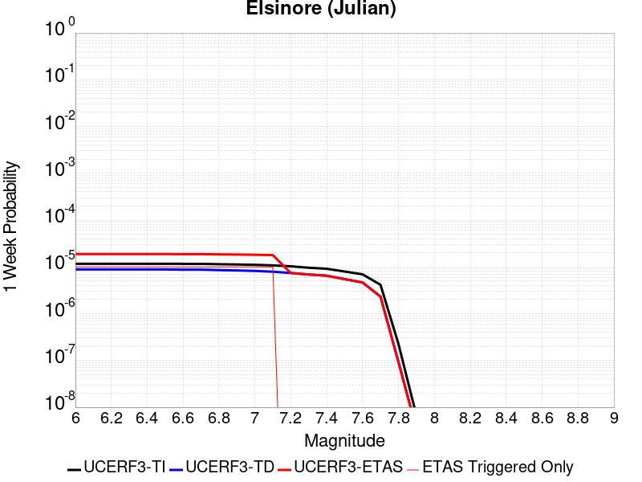 | 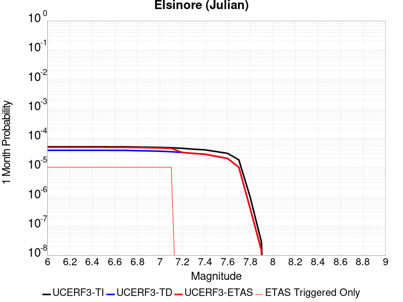 |  |  |

| Magnitude | 1 wk TI Prob | 1 wk TD Prob | 1 wk ETAS Prob | 1 wk ETAS/TD Gain | 1 wk ETAS Triggered Only | 1 mo TI Prob | 1 mo TD Prob | 1 mo ETAS Prob | 1 mo ETAS/TD Gain | 1 mo ETAS Triggered Only | 1 yr TI Prob | 1 yr TD Prob | 1 yr ETAS Prob | 1 yr ETAS/TD Gain | 1 yr ETAS Triggered Only | 10 yr TI Prob | 10 yr TD Prob | 10 yr ETAS Prob | 10 yr ETAS/TD Gain | 10 yr ETAS Triggered Only |
|-----|-----|-----|-----|-----|-----|-----|-----|-----|-----|-----|-----|-----|-----|-----|-----|-----|-----|-----|-----|-----|
| 6.0 | 1.1710231E-5 | 8.845509E-6 | 2.1206339E-5 | 2.397413 | 1.236094E-5 | 5.0185736E-5 | 3.7908783E-5 | 5.0269253E-5 | 1.3260583 | 1.236094E-5 | 6.1084004E-4 | 4.614434E-4 | 4.737986E-4 | 1.0267752 | 1.236094E-5 | 0.006091637 | 0.0046050567 | 0.004617361 | 1.0026718 | 1.236094E-5 |
| 6.1 | 1.1710231E-5 | 8.845509E-6 | 2.1206339E-5 | 2.397413 | 1.236094E-5 | 5.0185736E-5 | 3.7908783E-5 | 5.0269253E-5 | 1.3260583 | 1.236094E-5 | 6.1084004E-4 | 4.614434E-4 | 4.737986E-4 | 1.0267752 | 1.236094E-5 | 0.006091637 | 0.0046050567 | 0.004617361 | 1.0026718 | 1.236094E-5 |
| 6.2 | 1.1710231E-5 | 8.845509E-6 | 2.1206339E-5 | 2.397413 | 1.236094E-5 | 5.0185736E-5 | 3.7908783E-5 | 5.0269253E-5 | 1.3260583 | 1.236094E-5 | 6.1084004E-4 | 4.614434E-4 | 4.737986E-4 | 1.0267752 | 1.236094E-5 | 0.006091637 | 0.0046050567 | 0.004617361 | 1.0026718 | 1.236094E-5 |
| 6.3 | 1.1710231E-5 | 8.845509E-6 | 2.1206339E-5 | 2.397413 | 1.236094E-5 | 5.0185736E-5 | 3.7908783E-5 | 5.0269253E-5 | 1.3260583 | 1.236094E-5 | 6.1084004E-4 | 4.614434E-4 | 4.737986E-4 | 1.0267752 | 1.236094E-5 | 0.006091637 | 0.0046050567 | 0.004617361 | 1.0026718 | 1.236094E-5 |
| 6.4 | 1.1710231E-5 | 8.845509E-6 | 2.1206339E-5 | 2.397413 | 1.236094E-5 | 5.0185736E-5 | 3.7908783E-5 | 5.0269253E-5 | 1.3260583 | 1.236094E-5 | 6.1084004E-4 | 4.614434E-4 | 4.737986E-4 | 1.0267752 | 1.236094E-5 | 0.006091637 | 0.0046050567 | 0.004617361 | 1.0026718 | 1.236094E-5 |
| 6.5 | 1.1710231E-5 | 8.845509E-6 | 2.1206339E-5 | 2.397413 | 1.236094E-5 | 5.0185736E-5 | 3.7908783E-5 | 5.0269253E-5 | 1.3260583 | 1.236094E-5 | 6.1084004E-4 | 4.614434E-4 | 4.737986E-4 | 1.0267752 | 1.236094E-5 | 0.006091637 | 0.0046050567 | 0.004617361 | 1.0026718 | 1.236094E-5 |
| 6.6 | 1.1650619E-5 | 8.777881E-6 | 2.1138712E-5 | 2.4081795 | 1.236094E-5 | 4.993027E-5 | 3.7618956E-5 | 4.997943E-5 | 1.3285704 | 1.236094E-5 | 6.0773146E-4 | 4.5791623E-4 | 4.702715E-4 | 1.0269815 | 1.236094E-5 | 0.0060607214 | 0.004569931 | 0.004582235 | 1.0026925 | 1.236094E-5 |
| 6.7 | 1.1650619E-5 | 8.777881E-6 | 2.1138712E-5 | 2.4081795 | 1.236094E-5 | 4.993027E-5 | 3.7618956E-5 | 4.997943E-5 | 1.3285704 | 1.236094E-5 | 6.0773146E-4 | 4.5791623E-4 | 4.702715E-4 | 1.0269815 | 1.236094E-5 | 0.0060607214 | 0.004569931 | 0.004582235 | 1.0026925 | 1.236094E-5 |
| 6.8 | 1.1442698E-5 | 8.561041E-6 | 2.0921874E-5 | 2.443847 | 1.236094E-5 | 4.9039216E-5 | 3.6689667E-5 | 4.9050155E-5 | 1.3368928 | 1.236094E-5 | 5.968889E-4 | 4.4660683E-4 | 4.5896225E-4 | 1.0276651 | 1.236094E-5 | 0.0059528816 | 0.004457295 | 0.0044696005 | 1.0027609 | 1.236094E-5 |
| 6.9 | 1.1300589E-5 | 8.408907E-6 | 2.0769743E-5 | 2.4699693 | 1.236094E-5 | 4.8430196E-5 | 3.6037683E-5 | 4.839818E-5 | 1.342988 | 1.236094E-5 | 5.894781E-4 | 4.3867214E-4 | 4.5102765E-4 | 1.0281657 | 1.236094E-5 | 0.005879169 | 0.0043782624 | 0.004390569 | 1.0028108 | 1.236094E-5 |
| 7.0 | 1.1117729E-5 | 8.226087E-6 | 2.0586926E-5 | 2.5026388 | 1.236094E-5 | 4.764654E-5 | 3.525419E-5 | 4.7614696E-5 | 1.3506109 | 1.236094E-5 | 5.799422E-4 | 4.291369E-4 | 4.4149254E-4 | 1.0287918 | 1.236094E-5 | 0.0057843104 | 0.004283281 | 0.004295589 | 1.0028735 | 1.236094E-5 |
| 7.1 | 1.08053955E-5 | 7.9117535E-6 | 2.0272595E-5 | 2.562339 | 1.236094E-5 | 4.6308014E-5 | 3.3907087E-5 | 4.6267607E-5 | 1.3645409 | 1.236094E-5 | 5.6365423E-4 | 4.127422E-4 | 4.2509803E-4 | 1.029936 | 1.236094E-5 | 0.005622267 | 0.0041199517 | 0.004132262 | 1.0029879 | 1.236094E-5 |
| 7.2 | 1.032804E-5 | 7.433021E-6 | 7.433021E-6 | 1.0 | 0.0 | 4.4262277E-5 | 3.1855423E-5 | 3.1855423E-5 | 1.0 | 0.0 | 5.387599E-4 | 3.8777234E-4 | 3.8777234E-4 | 1.0 | 0.0 | 0.0053745564 | 0.0038711445 | 0.0038711445 | 1.0 | 0.0 |
| 7.3 | 9.622426E-6 | 6.8978457E-6 | 6.8978457E-6 | 1.0 | 0.0 | 4.1238312E-5 | 2.9561868E-5 | 2.9561868E-5 | 1.0 | 0.0 | 5.019608E-4 | 3.5985775E-4 | 3.5985775E-4 | 1.0 | 0.0 | 0.005008285 | 0.0035929221 | 0.0035929221 | 1.0 | 0.0 |
| 7.4 | 9.144434E-6 | 6.4963933E-6 | 6.4963933E-6 | 1.0 | 0.0 | 3.9189843E-5 | 2.7841395E-5 | 2.7841395E-5 | 1.0 | 0.0 | 4.7703186E-4 | 3.3891766E-4 | 3.3891766E-4 | 1.0 | 0.0 | 0.0047600917 | 0.0033841513 | 0.0033841513 | 1.0 | 0.0 |
| 7.5 | 7.988981E-6 | 5.4983307E-6 | 5.4983307E-6 | 1.0 | 0.0 | 3.4238044E-5 | 2.356407E-5 | 2.356407E-5 | 1.0 | 0.0 | 4.1676845E-4 | 2.8685606E-4 | 2.8685606E-4 | 1.0 | 0.0 | 0.0041598766 | 0.002864985 | 0.002864985 | 1.0 | 0.0 |
| 7.6 | 6.9554876E-6 | 4.6625346E-6 | 4.6625346E-6 | 1.0 | 0.0 | 2.9808893E-5 | 1.9982144E-5 | 1.9982144E-5 | 1.0 | 0.0 | 3.6286283E-4 | 2.4325661E-4 | 2.4325661E-4 | 1.0 | 0.0 | 0.0036227088 | 0.0024300197 | 0.0024300197 | 1.0 | 0.0 |
| 7.7 | 4.1557314E-6 | 2.3246462E-6 | 2.3246462E-6 | 1.0 | 0.0 | 1.7810156E-5 | 9.962735E-6 | 9.962735E-6 | 1.0 | 0.0 | 2.1681708E-4 | 1.2129029E-4 | 1.2129029E-4 | 1.0 | 0.0 | 0.0021660565 | 0.001212314 | 0.001212314 | 1.0 | 0.0 |
| 7.8 | 2.2597293E-7 | 9.332915E-8 | 9.332915E-8 | 1.0 | 0.0 | 9.684551E-7 | 3.99982E-7 | 3.99982E-7 | 1.0 | 0.0 | 1.1790877E-5 | 4.8697734E-6 | 4.8697734E-6 | 1.0 | 0.0 | 1.17902506E-4 | 4.8696995E-5 | 4.8696995E-5 | 1.0 | 0.0 |
| 7.9 | 6.676829E-9 | 3.439853E-9 | 3.439853E-9 | 1.0 | 0.0 | 2.861498E-8 | 1.4742227E-8 | 1.4742227E-8 | 1.0 | 0.0 | 3.4838732E-7 | 1.7948659E-7 | 1.7948659E-7 | 1.0 | 0.0 | 3.4838679E-6 | 1.7948646E-6 | 1.7948646E-6 | 1.0 | 0.0 |

## Clayton
*[(top)](#table-of-contents)*

| 1 Week | 1 Month | 1 Year | 10 Year |
|-----|-----|-----|-----|
|  |  |  |  |

| Magnitude | 1 wk TI Prob | 1 wk TD Prob | 1 wk ETAS Prob | 1 wk ETAS/TD Gain | 1 wk ETAS Triggered Only | 1 mo TI Prob | 1 mo TD Prob | 1 mo ETAS Prob | 1 mo ETAS/TD Gain | 1 mo ETAS Triggered Only | 1 yr TI Prob | 1 yr TD Prob | 1 yr ETAS Prob | 1 yr ETAS/TD Gain | 1 yr ETAS Triggered Only | 10 yr TI Prob | 10 yr TD Prob | 10 yr ETAS Prob | 10 yr ETAS/TD Gain | 10 yr ETAS Triggered Only |
|-----|-----|-----|-----|-----|-----|-----|-----|-----|-----|-----|-----|-----|-----|-----|-----|-----|-----|-----|-----|-----|
| 6.0 | 1.1413061E-5 | 1.2667059E-5 | 1.2667059E-5 | 1.0 | 0.0 | 4.89122E-5 | 5.4286393E-5 | 5.4286393E-5 | 1.0 | 0.0 | 5.953433E-4 | 6.607586E-4 | 6.7311135E-4 | 1.0186949 | 1.236094E-5 | 0.005937509 | 0.0065901424 | 0.006602422 | 1.0018634 | 1.236094E-5 |
| 6.1 | 1.1413061E-5 | 1.2667059E-5 | 1.2667059E-5 | 1.0 | 0.0 | 4.89122E-5 | 5.4286393E-5 | 5.4286393E-5 | 1.0 | 0.0 | 5.953433E-4 | 6.607586E-4 | 6.7311135E-4 | 1.0186949 | 1.236094E-5 | 0.005937509 | 0.0065901424 | 0.006602422 | 1.0018634 | 1.236094E-5 |
| 6.2 | 1.1413061E-5 | 1.2667059E-5 | 1.2667059E-5 | 1.0 | 0.0 | 4.89122E-5 | 5.4286393E-5 | 5.4286393E-5 | 1.0 | 0.0 | 5.953433E-4 | 6.607586E-4 | 6.7311135E-4 | 1.0186949 | 1.236094E-5 | 0.005937509 | 0.0065901424 | 0.006602422 | 1.0018634 | 1.236094E-5 |
| 6.3 | 8.538689E-6 | 9.532753E-6 | 9.532753E-6 | 1.0 | 0.0 | 3.659387E-5 | 4.0854076E-5 | 4.0854076E-5 | 1.0 | 0.0 | 4.4543925E-4 | 4.9729564E-4 | 5.0965045E-4 | 1.0248439 | 1.236094E-5 | 0.0044454746 | 0.0049628937 | 0.004975193 | 1.0024784 | 1.236094E-5 |
| 6.4 | 8.538689E-6 | 9.532753E-6 | 9.532753E-6 | 1.0 | 0.0 | 3.659387E-5 | 4.0854076E-5 | 4.0854076E-5 | 1.0 | 0.0 | 4.4543925E-4 | 4.9729564E-4 | 5.0965045E-4 | 1.0248439 | 1.236094E-5 | 0.0044454746 | 0.0049628937 | 0.004975193 | 1.0024784 | 1.236094E-5 |
| 6.5 | 7.197462E-6 | 8.080952E-6 | 8.080952E-6 | 1.0 | 0.0 | 3.08459E-5 | 3.4632238E-5 | 3.4632238E-5 | 1.0 | 0.0 | 3.7548412E-4 | 4.2157414E-4 | 4.3392985E-4 | 1.0293086 | 1.236094E-5 | 0.003748503 | 0.004208556 | 0.0042208647 | 1.0029247 | 1.236094E-5 |
| 6.6 | 7.1760483E-6 | 8.056968E-6 | 8.056968E-6 | 1.0 | 0.0 | 3.075413E-5 | 3.4529454E-5 | 3.4529454E-5 | 1.0 | 0.0 | 3.743672E-4 | 4.203232E-4 | 4.3267893E-4 | 1.0293958 | 1.236094E-5 | 0.0037373714 | 0.004196094 | 0.0042084027 | 1.0029335 | 1.236094E-5 |
| 6.7 | 6.202582E-6 | 6.9766934E-6 | 6.9766934E-6 | 1.0 | 0.0 | 2.6582224E-5 | 2.9899817E-5 | 2.9899817E-5 | 1.0 | 0.0 | 3.235905E-4 | 3.6397713E-4 | 3.7633357E-4 | 1.0339484 | 1.236094E-5 | 0.0032311971 | 0.0036345655 | 0.0036468816 | 1.0033885 | 1.236094E-5 |
| 6.8 | 3.6417277E-6 | 4.1212957E-6 | 4.1212957E-6 | 1.0 | 0.0 | 1.5607311E-5 | 1.766258E-5 | 1.766258E-5 | 1.0 | 0.0 | 1.9000245E-4 | 2.1502146E-4 | 2.2737974E-4 | 1.0574746 | 1.236094E-5 | 0.0018984007 | 0.0021482105 | 0.002160545 | 1.0057417 | 1.236094E-5 |
| 6.9 | 2.6498485E-6 | 2.9995201E-6 | 2.9995201E-6 | 1.0 | 0.0 | 1.1356444E-5 | 1.2855025E-5 | 1.2855025E-5 | 1.0 | 0.0 | 1.3825593E-4 | 1.5649908E-4 | 1.688581E-4 | 1.0789717 | 1.236094E-5 | 0.0013816995 | 0.0015639283 | 0.00157627 | 1.0078914 | 1.236094E-5 |
| 7.0 | 2.070442E-6 | 2.3407233E-6 | 2.3407233E-6 | 1.0 | 0.0 | 8.873292E-6 | 1.0031635E-5 | 1.0031635E-5 | 1.0 | 0.0 | 1.0802698E-4 | 1.2212861E-4 | 1.3448803E-4 | 1.1012001 | 1.236094E-5 | 0.0010797448 | 0.0012206447 | 0.0012329905 | 1.0101142 | 1.236094E-5 |
| 7.1 | 1.2111691E-6 | 1.3588725E-6 | 1.3588725E-6 | 1.0 | 0.0 | 5.190714E-6 | 5.8237274E-6 | 5.8237274E-6 | 1.0 | 0.0 | 6.319511E-5 | 7.090174E-5 | 8.32618E-5 | 1.1743267 | 1.236094E-5 | 6.3177146E-4 | 7.0880755E-4 | 7.211597E-4 | 1.0174267 | 1.236094E-5 |
| 7.2 | 3.9541607E-7 | 4.2227694E-7 | 4.2227694E-7 | 1.0 | 0.0 | 1.6946392E-6 | 1.8097571E-6 | 1.8097571E-6 | 1.0 | 0.0 | 2.0632036E-5 | 2.2033571E-5 | 2.2033571E-5 | 1.0 | 0.0 | 2.063012E-4 | 2.2031402E-4 | 2.2031402E-4 | 1.0 | 0.0 |
| 7.3 | 2.5685637E-7 | 2.745679E-7 | 2.745679E-7 | 1.0 | 0.0 | 1.1008126E-6 | 1.176719E-6 | 1.176719E-6 | 1.0 | 0.0 | 1.3402311E-5 | 1.4326461E-5 | 1.4326461E-5 | 1.0 | 0.0 | 1.3401502E-4 | 1.4325544E-4 | 1.4325544E-4 | 1.0 | 0.0 |
| 7.4 | 1.482299E-7 | 1.5807963E-7 | 1.5807963E-7 | 1.0 | 0.0 | 6.3527085E-7 | 6.7748397E-7 | 6.7748397E-7 | 1.0 | 0.0 | 7.734395E-6 | 8.248337E-6 | 8.248337E-6 | 1.0 | 0.0 | 7.734126E-5 | 8.248033E-5 | 8.248033E-5 | 1.0 | 0.0 |
| 7.5 | 9.7969505E-8 | 1.04382096E-7 | 1.04382096E-7 | 1.0 | 0.0 | 4.1986925E-7 | 4.4735177E-7 | 4.4735177E-7 | 1.0 | 0.0 | 5.111896E-6 | 5.446494E-6 | 5.446494E-6 | 1.0 | 0.0 | 5.1117782E-5 | 5.4463624E-5 | 5.4463624E-5 | 1.0 | 0.0 |
| 7.6 | 6.125415E-8 | 6.5231326E-8 | 6.5231326E-8 | 1.0 | 0.0 | 2.6251774E-7 | 2.7956278E-7 | 2.7956278E-7 | 1.0 | 0.0 | 3.196149E-6 | 3.4036718E-6 | 3.4036718E-6 | 1.0 | 0.0 | 3.196103E-5 | 3.403621E-5 | 3.403621E-5 | 1.0 | 0.0 |

## Northridge
*[(top)](#table-of-contents)*

| 1 Week | 1 Month | 1 Year | 10 Year |
|-----|-----|-----|-----|
|  | 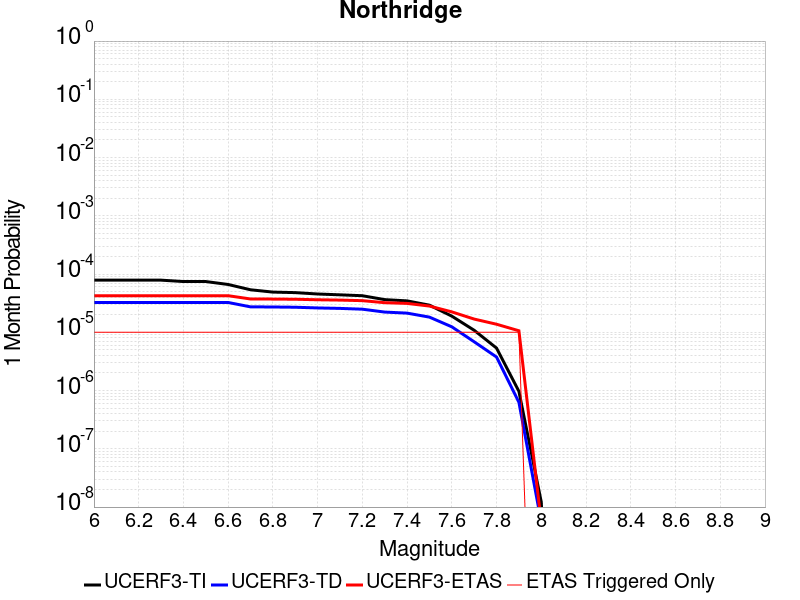 |  |  |

| Magnitude | 1 wk TI Prob | 1 wk TD Prob | 1 wk ETAS Prob | 1 wk ETAS/TD Gain | 1 wk ETAS Triggered Only | 1 mo TI Prob | 1 mo TD Prob | 1 mo ETAS Prob | 1 mo ETAS/TD Gain | 1 mo ETAS Triggered Only | 1 yr TI Prob | 1 yr TD Prob | 1 yr ETAS Prob | 1 yr ETAS/TD Gain | 1 yr ETAS Triggered Only | 10 yr TI Prob | 10 yr TD Prob | 10 yr ETAS Prob | 10 yr ETAS/TD Gain | 10 yr ETAS Triggered Only |
|-----|-----|-----|-----|-----|-----|-----|-----|-----|-----|-----|-----|-----|-----|-----|-----|-----|-----|-----|-----|-----|
| 6.0 | 1.8340852E-5 | 7.5880193E-6 | 1.9948866E-5 | 2.628995 | 1.236094E-5 | 7.860128E-5 | 3.251969E-5 | 4.4880228E-5 | 1.3800939 | 1.236094E-5 | 9.565505E-4 | 3.958575E-4 | 4.0821353E-4 | 1.0312134 | 1.236094E-5 | 0.009524435 | 0.003951746 | 0.003964058 | 1.0031157 | 1.236094E-5 |
| 6.1 | 1.8340852E-5 | 7.5880193E-6 | 1.9948866E-5 | 2.628995 | 1.236094E-5 | 7.860128E-5 | 3.251969E-5 | 4.4880228E-5 | 1.3800939 | 1.236094E-5 | 9.565505E-4 | 3.958575E-4 | 4.0821353E-4 | 1.0312134 | 1.236094E-5 | 0.009524435 | 0.003951746 | 0.003964058 | 1.0031157 | 1.236094E-5 |
| 6.2 | 1.8340852E-5 | 7.5880193E-6 | 1.9948866E-5 | 2.628995 | 1.236094E-5 | 7.860128E-5 | 3.251969E-5 | 4.4880228E-5 | 1.3800939 | 1.236094E-5 | 9.565505E-4 | 3.958575E-4 | 4.0821353E-4 | 1.0312134 | 1.236094E-5 | 0.009524435 | 0.003951746 | 0.003964058 | 1.0031157 | 1.236094E-5 |
| 6.3 | 1.8340852E-5 | 7.5880193E-6 | 1.9948866E-5 | 2.628995 | 1.236094E-5 | 7.860128E-5 | 3.251969E-5 | 4.4880228E-5 | 1.3800939 | 1.236094E-5 | 9.565505E-4 | 3.958575E-4 | 4.0821353E-4 | 1.0312134 | 1.236094E-5 | 0.009524435 | 0.003951746 | 0.003964058 | 1.0031157 | 1.236094E-5 |
| 6.4 | 1.7361892E-5 | 7.5880193E-6 | 1.9948866E-5 | 2.628995 | 1.236094E-5 | 7.440598E-5 | 3.251969E-5 | 4.4880228E-5 | 1.3800939 | 1.236094E-5 | 9.055163E-4 | 3.958575E-4 | 4.0821353E-4 | 1.0312134 | 1.236094E-5 | 0.009018354 | 0.003951746 | 0.003964058 | 1.0031157 | 1.236094E-5 |
| 6.5 | 1.7361892E-5 | 7.5880193E-6 | 1.9948866E-5 | 2.628995 | 1.236094E-5 | 7.440598E-5 | 3.251969E-5 | 4.4880228E-5 | 1.3800939 | 1.236094E-5 | 9.055163E-4 | 3.958575E-4 | 4.0821353E-4 | 1.0312134 | 1.236094E-5 | 0.009018354 | 0.003951746 | 0.003964058 | 1.0031157 | 1.236094E-5 |
| 6.6 | 1.5458201E-5 | 7.5880193E-6 | 1.9948866E-5 | 2.628995 | 1.236094E-5 | 6.624775E-5 | 3.251969E-5 | 4.4880228E-5 | 1.3800939 | 1.236094E-5 | 8.0626784E-4 | 3.958575E-4 | 4.0821353E-4 | 1.0312134 | 1.236094E-5 | 0.008033488 | 0.003951746 | 0.003964058 | 1.0031157 | 1.236094E-5 |
| 6.7 | 1.2538368E-5 | 6.381603E-6 | 1.8742463E-5 | 2.9369524 | 1.236094E-5 | 5.3734755E-5 | 2.7349442E-5 | 3.9710045E-5 | 1.4519508 | 1.236094E-5 | 6.5402425E-4 | 3.3292902E-4 | 3.4528584E-4 | 1.0371155 | 1.236094E-5 | 0.0065210275 | 0.0033243506 | 0.0033366703 | 1.003706 | 1.236094E-5 |
| 6.8 | 1.1438097E-5 | 6.3502566E-6 | 1.8711118E-5 | 2.9465137 | 1.236094E-5 | 4.9019498E-5 | 2.7215105E-5 | 3.957571E-5 | 1.4541817 | 1.236094E-5 | 5.9664896E-4 | 3.3129397E-4 | 3.436508E-4 | 1.0372987 | 1.236094E-5 | 0.005950495 | 0.0033080487 | 0.0033203687 | 1.0037242 | 1.236094E-5 |
| 6.9 | 1.1204891E-5 | 6.2867084E-6 | 1.864757E-5 | 2.9661896 | 1.236094E-5 | 4.8020076E-5 | 2.694276E-5 | 3.9303366E-5 | 1.4587728 | 1.236094E-5 | 5.8448757E-4 | 3.2797916E-4 | 3.4033606E-4 | 1.0376759 | 1.236094E-5 | 0.0058295266 | 0.0032749989 | 0.0032873193 | 1.003762 | 1.236094E-5 |
| 7.0 | 1.061046E-5 | 6.115359E-6 | 1.8476223E-5 | 3.0212817 | 1.236094E-5 | 4.5472607E-5 | 2.6208421E-5 | 3.8569036E-5 | 1.4716276 | 1.236094E-5 | 5.534883E-4 | 3.1904122E-4 | 3.3139822E-4 | 1.0387317 | 1.236094E-5 | 0.0055211177 | 0.0031858785 | 0.0031982001 | 1.0038675 | 1.236094E-5 |
| 7.1 | 1.0266979E-5 | 6.004274E-6 | 1.836514E-5 | 3.0586777 | 1.236094E-5 | 4.40006E-5 | 2.5732352E-5 | 3.8092974E-5 | 1.4803534 | 1.236094E-5 | 5.355756E-4 | 3.1324677E-4 | 3.2560385E-4 | 1.0394484 | 1.236094E-5 | 0.0053428668 | 0.003128098 | 0.0031404204 | 1.0039393 | 1.236094E-5 |
| 7.2 | 9.91273E-6 | 5.819984E-6 | 1.8180852E-5 | 3.123866 | 1.236094E-5 | 4.248244E-5 | 2.4942554E-5 | 3.7303183E-5 | 1.495564 | 1.236094E-5 | 5.171009E-4 | 3.036337E-4 | 3.1599088E-4 | 1.0406977 | 1.236094E-5 | 0.0051589934 | 0.0030322333 | 0.0030445568 | 1.0040642 | 1.236094E-5 |
| 7.3 | 8.4959265E-6 | 5.193062E-6 | 1.7553937E-5 | 3.3802674 | 1.236094E-5 | 3.6410605E-5 | 2.225579E-5 | 3.4616456E-5 | 1.555391 | 1.236094E-5 | 4.4320893E-4 | 2.709308E-4 | 2.832884E-4 | 1.0456116 | 1.236094E-5 | 0.00442326 | 0.0027060313 | 0.002718359 | 1.0045556 | 1.236094E-5 |
| 7.4 | 8.0847185E-6 | 4.9819355E-6 | 1.7342814E-5 | 3.4811397 | 1.236094E-5 | 3.4648332E-5 | 2.135098E-5 | 3.3711654E-5 | 1.5789278 | 1.236094E-5 | 4.2176177E-4 | 2.599174E-4 | 2.7227512E-4 | 1.0475448 | 1.236094E-5 | 0.0042096223 | 0.00259616 | 0.0026084888 | 1.0047488 | 1.236094E-5 |
| 7.5 | 6.8220684E-6 | 4.2533075E-6 | 1.6614194E-5 | 3.9061823 | 1.236094E-5 | 2.9237108E-5 | 1.8228335E-5 | 3.058905E-5 | 1.6781044 | 1.236094E-5 | 3.5590364E-4 | 2.2190758E-4 | 2.3426577E-4 | 1.0556908 | 1.236094E-5 | 0.0035533418 | 0.002216881 | 0.0022292144 | 1.0055635 | 1.236094E-5 |
| 7.6 | 4.4224143E-6 | 2.8999582E-6 | 1.5260863E-5 | 5.262442 | 1.236094E-5 | 1.8953066E-5 | 1.2428334E-5 | 2.478912E-5 | 1.994565 | 1.236094E-5 | 2.3072914E-4 | 1.5130457E-4 | 1.6366364E-4 | 1.0816834 | 1.236094E-5 | 0.0023048974 | 0.0015120271 | 0.0015243695 | 1.0081627 | 1.236094E-5 |
| 7.7 | 2.5297056E-6 | 1.6045905E-6 | 1.396551E-5 | 8.703473 | 1.236094E-5 | 1.0841551E-5 | 6.8767986E-6 | 1.9237654E-5 | 2.7974722 | 1.236094E-5 | 1.319879E-4 | 8.3721854E-5 | 9.6081756E-5 | 1.1476306 | 1.236094E-5 | 0.0013190953 | 8.369078E-4 | 8.4925845E-4 | 1.0147574 | 1.236094E-5 |
| 7.8 | 1.2508156E-6 | 8.780076E-7 | 1.3238936E-5 | 15.078384 | 1.236094E-5 | 5.3606273E-6 | 3.7628845E-6 | 1.6123777E-5 | 4.2849517 | 1.236094E-5 | 6.526368E-5 | 4.581217E-5 | 5.817254E-5 | 1.2698054 | 1.236094E-5 | 6.524452E-4 | 4.5802852E-4 | 4.7038382E-4 | 1.0269749 | 1.236094E-5 |
| 7.9 | 2.262199E-7 | 1.4664671E-7 | 1.2507584E-5 | 85.29058 | 1.236094E-5 | 9.695135E-7 | 6.284858E-7 | 1.2989418E-5 | 20.667799 | 1.236094E-5 | 1.1803763E-5 | 7.651788E-6 | 2.0012632E-5 | 2.6154191 | 1.236094E-5 | 1.1803136E-4 | 7.651533E-5 | 8.887532E-5 | 1.1615362 | 1.236094E-5 |
| 8.0 | 2.865362E-9 | 1.2753101E-9 | 1.2753101E-9 | 1.0 | 0.0 | 1.2280123E-8 | 5.4656146E-9 | 5.4656146E-9 | 1.0 | 0.0 | 1.4951048E-7 | 6.654386E-8 | 6.654386E-8 | 1.0 | 0.0 | 1.4951038E-6 | 6.654386E-7 | 6.654386E-7 | 1.0 | 0.0 |

## Casmalia 2011 CFM
*[(top)](#table-of-contents)*

| 1 Week | 1 Month | 1 Year | 10 Year |
|-----|-----|-----|-----|
|  |  |  |  |

| Magnitude | 1 wk TI Prob | 1 wk TD Prob | 1 wk ETAS Prob | 1 wk ETAS/TD Gain | 1 wk ETAS Triggered Only | 1 mo TI Prob | 1 mo TD Prob | 1 mo ETAS Prob | 1 mo ETAS/TD Gain | 1 mo ETAS Triggered Only | 1 yr TI Prob | 1 yr TD Prob | 1 yr ETAS Prob | 1 yr ETAS/TD Gain | 1 yr ETAS Triggered Only | 10 yr TI Prob | 10 yr TD Prob | 10 yr ETAS Prob | 10 yr ETAS/TD Gain | 10 yr ETAS Triggered Only |
|-----|-----|-----|-----|-----|-----|-----|-----|-----|-----|-----|-----|-----|-----|-----|-----|-----|-----|-----|-----|-----|
| 6.0 | 4.1704893E-6 | 4.262483E-6 | 4.262483E-6 | 1.0 | 0.0 | 1.7873403E-5 | 1.8267656E-5 | 1.8267656E-5 | 1.0 | 0.0 | 2.1758694E-4 | 2.2238622E-4 | 2.3474441E-4 | 1.0555708 | 1.236094E-5 | 0.0021737402 | 0.0022216577 | 0.0022339912 | 1.0055515 | 1.236094E-5 |
| 6.1 | 4.1704893E-6 | 4.262483E-6 | 4.262483E-6 | 1.0 | 0.0 | 1.7873403E-5 | 1.8267656E-5 | 1.8267656E-5 | 1.0 | 0.0 | 2.1758694E-4 | 2.2238622E-4 | 2.3474441E-4 | 1.0555708 | 1.236094E-5 | 0.0021737402 | 0.0022216577 | 0.0022339912 | 1.0055515 | 1.236094E-5 |
| 6.2 | 3.457312E-6 | 3.5370217E-6 | 3.5370217E-6 | 1.0 | 0.0 | 1.4816967E-5 | 1.5158577E-5 | 1.5158577E-5 | 1.0 | 0.0 | 1.8038164E-4 | 1.8454014E-4 | 1.9689879E-4 | 1.06697 | 1.236094E-5 | 0.001802353 | 0.0018438784 | 0.0018562165 | 1.0066915 | 1.236094E-5 |
| 6.3 | 3.457312E-6 | 3.5370217E-6 | 3.5370217E-6 | 1.0 | 0.0 | 1.4816967E-5 | 1.5158577E-5 | 1.5158577E-5 | 1.0 | 0.0 | 1.8038164E-4 | 1.8454014E-4 | 1.9689879E-4 | 1.06697 | 1.236094E-5 | 0.001802353 | 0.0018438784 | 0.0018562165 | 1.0066915 | 1.236094E-5 |
| 6.4 | 3.0957337E-6 | 3.1692257E-6 | 3.1692257E-6 | 1.0 | 0.0 | 1.3267363E-5 | 1.3582326E-5 | 1.3582326E-5 | 1.0 | 0.0 | 1.6151817E-4 | 1.6535232E-4 | 1.7771122E-4 | 1.0747428 | 1.236094E-5 | 0.0016140083 | 0.0016522991 | 0.0016646396 | 1.0074687 | 1.236094E-5 |
| 6.5 | 3.0957337E-6 | 3.1692257E-6 | 3.1692257E-6 | 1.0 | 0.0 | 1.3267363E-5 | 1.3582326E-5 | 1.3582326E-5 | 1.0 | 0.0 | 1.6151817E-4 | 1.6535232E-4 | 1.7771122E-4 | 1.0747428 | 1.236094E-5 | 0.0016140083 | 0.0016522991 | 0.0016646396 | 1.0074687 | 1.236094E-5 |
| 6.6 | 2.9459152E-6 | 3.0165752E-6 | 3.0165752E-6 | 1.0 | 0.0 | 1.262529E-5 | 1.2928115E-5 | 1.2928115E-5 | 1.0 | 0.0 | 1.5370206E-4 | 1.5738848E-4 | 1.6974748E-4 | 1.0785254 | 1.236094E-5 | 0.0015359579 | 0.0015727758 | 0.0015851173 | 1.007847 | 1.236094E-5 |
| 6.7 | 2.8634809E-6 | 2.9324726E-6 | 2.9324726E-6 | 1.0 | 0.0 | 1.2272003E-5 | 1.256768E-5 | 1.256768E-5 | 1.0 | 0.0 | 1.4940138E-4 | 1.530008E-4 | 1.6535984E-4 | 1.0807776 | 1.236094E-5 | 0.0014930099 | 0.0015289601 | 0.0015413021 | 1.0080721 | 1.236094E-5 |
| 6.8 | 2.7999822E-6 | 2.8675968E-6 | 2.8675968E-6 | 1.0 | 0.0 | 1.1999869E-5 | 1.2289643E-5 | 1.2289643E-5 | 1.0 | 0.0 | 1.460886E-4 | 1.4961617E-4 | 1.6197526E-4 | 1.0826054 | 1.236094E-5 | 0.001459926 | 0.0014951597 | 0.0015075022 | 1.0082549 | 1.236094E-5 |
| 6.9 | 2.551052E-6 | 2.6119649E-6 | 2.6119649E-6 | 1.0 | 0.0 | 1.0933034E-5 | 1.1194087E-5 | 1.1194087E-5 | 1.0 | 0.0 | 1.3310155E-4 | 1.3627953E-4 | 1.4863878E-4 | 1.0906905 | 1.236094E-5 | 0.0013302186 | 0.0013619636 | 0.0013743077 | 1.0090635 | 1.236094E-5 |
| 7.0 | 2.3081875E-6 | 2.3624088E-6 | 2.3624088E-6 | 1.0 | 0.0 | 9.892195E-6 | 1.01245705E-5 | 1.01245705E-5 | 1.0 | 0.0 | 1.20430814E-4 | 1.232597E-4 | 1.356191E-4 | 1.1002713 | 1.236094E-5 | 0.0012036557 | 0.0012319161 | 0.0012442619 | 1.0100216 | 1.236094E-5 |
| 7.1 | 2.093245E-6 | 2.1417243E-6 | 2.1417243E-6 | 1.0 | 0.0 | 8.971019E-6 | 9.178786E-6 | 9.178786E-6 | 1.0 | 0.0 | 1.09216686E-4 | 1.1174601E-4 | 1.2410557E-4 | 1.110604 | 1.236094E-5 | 0.0010916302 | 0.0011169002 | 0.0011292474 | 1.0110549 | 1.236094E-5 |
| 7.2 | 1.9714576E-6 | 2.0165091E-6 | 2.0165091E-6 | 1.0 | 0.0 | 8.449076E-6 | 8.642153E-6 | 8.642153E-6 | 1.0 | 0.0 | 1.0286264E-4 | 1.05213156E-4 | 1.17572796E-4 | 1.1174724 | 1.236094E-5 | 0.0010281504 | 0.0010516352 | 0.0010639832 | 1.0117416 | 1.236094E-5 |
| 7.3 | 1.6689512E-6 | 1.7047131E-6 | 1.7047131E-6 | 1.0 | 0.0 | 7.1526288E-6 | 7.3058927E-6 | 7.3058927E-6 | 1.0 | 0.0 | 8.7079774E-5 | 8.894562E-5 | 8.894562E-5 | 1.0 | 0.0 | 8.7045657E-4 | 8.89101E-4 | 8.89101E-4 | 1.0 | 0.0 |
| 7.4 | 1.4490954E-6 | 1.4778908E-6 | 1.4778908E-6 | 1.0 | 0.0 | 6.210394E-6 | 6.333802E-6 | 6.333802E-6 | 1.0 | 0.0 | 7.560892E-5 | 7.711132E-5 | 7.711132E-5 | 1.0 | 0.0 | 7.55832E-4 | 7.7084627E-4 | 7.7084627E-4 | 1.0 | 0.0 |
| 7.5 | 1.226873E-6 | 1.2481701E-6 | 1.2481701E-6 | 1.0 | 0.0 | 5.2580162E-6 | 5.3492895E-6 | 5.3492895E-6 | 1.0 | 0.0 | 6.401447E-5 | 6.5125656E-5 | 6.5125656E-5 | 1.0 | 0.0 | 6.399603E-4 | 6.5106625E-4 | 6.5106625E-4 | 1.0 | 0.0 |
| 7.6 | 9.2561345E-7 | 9.361923E-7 | 9.361923E-7 | 1.0 | 0.0 | 3.966909E-6 | 4.012247E-6 | 4.012247E-6 | 1.0 | 0.0 | 4.8296046E-5 | 4.884801E-5 | 4.884801E-5 | 1.0 | 0.0 | 4.828555E-4 | 4.8837316E-4 | 4.8837316E-4 | 1.0 | 0.0 |
| 7.7 | 5.4367933E-7 | 5.392888E-7 | 5.392888E-7 | 1.0 | 0.0 | 2.3300522E-6 | 2.3112357E-6 | 2.3112357E-6 | 1.0 | 0.0 | 2.8368017E-5 | 2.8138933E-5 | 2.8138933E-5 | 1.0 | 0.0 | 2.8364395E-4 | 2.8135383E-4 | 2.8135383E-4 | 1.0 | 0.0 |
| 7.8 | 1.8825742E-7 | 1.7342276E-7 | 1.7342276E-7 | 1.0 | 0.0 | 8.068173E-7 | 7.4324015E-7 | 7.4324015E-7 | 1.0 | 0.0 | 9.822956E-6 | 9.048912E-6 | 9.048912E-6 | 1.0 | 0.0 | 9.822522E-5 | 9.048546E-5 | 9.048546E-5 | 1.0 | 0.0 |
| 7.9 | 6.342771E-8 | 4.6790706E-8 | 4.6790706E-8 | 1.0 | 0.0 | 2.7183304E-7 | 2.0053157E-7 | 2.0053157E-7 | 1.0 | 0.0 | 3.3095623E-6 | 2.4414692E-6 | 2.4414692E-6 | 1.0 | 0.0 | 3.309513E-5 | 2.4414428E-5 | 2.4414428E-5 | 1.0 | 0.0 |
| 8.0 | 1.2574819E-8 | 6.4733463E-9 | 6.4733463E-9 | 1.0 | 0.0 | 5.3892084E-8 | 2.7742912E-8 | 2.7742912E-8 | 1.0 | 0.0 | 6.561359E-7 | 3.377699E-7 | 3.377699E-7 | 1.0 | 0.0 | 6.56134E-6 | 3.377694E-6 | 3.377694E-6 | 1.0 | 0.0 |

## Polaris 2011 CFM
*[(top)](#table-of-contents)*

| 1 Week | 1 Month | 1 Year | 10 Year |
|-----|-----|-----|-----|
|  |  |  |  |

| Magnitude | 1 wk TI Prob | 1 wk TD Prob | 1 wk ETAS Prob | 1 wk ETAS/TD Gain | 1 wk ETAS Triggered Only | 1 mo TI Prob | 1 mo TD Prob | 1 mo ETAS Prob | 1 mo ETAS/TD Gain | 1 mo ETAS Triggered Only | 1 yr TI Prob | 1 yr TD Prob | 1 yr ETAS Prob | 1 yr ETAS/TD Gain | 1 yr ETAS Triggered Only | 10 yr TI Prob | 10 yr TD Prob | 10 yr ETAS Prob | 10 yr ETAS/TD Gain | 10 yr ETAS Triggered Only |
|-----|-----|-----|-----|-----|-----|-----|-----|-----|-----|-----|-----|-----|-----|-----|-----|-----|-----|-----|-----|-----|
| 6.0 | 1.2630823E-5 | 1.3582916E-5 | 1.3582916E-5 | 1.0 | 0.0 | 5.413098E-5 | 5.821149E-5 | 5.821149E-5 | 1.0 | 0.0 | 6.5884535E-4 | 7.085464E-4 | 7.085464E-4 | 1.0 | 0.0 | 0.0065689543 | 0.007067981 | 0.007080255 | 1.0017365 | 1.236094E-5 |
| 6.1 | 1.2630823E-5 | 1.3582916E-5 | 1.3582916E-5 | 1.0 | 0.0 | 5.413098E-5 | 5.821149E-5 | 5.821149E-5 | 1.0 | 0.0 | 6.5884535E-4 | 7.085464E-4 | 7.085464E-4 | 1.0 | 0.0 | 0.0065689543 | 0.007067981 | 0.007080255 | 1.0017365 | 1.236094E-5 |
| 6.2 | 1.2630823E-5 | 1.3582916E-5 | 1.3582916E-5 | 1.0 | 0.0 | 5.413098E-5 | 5.821149E-5 | 5.821149E-5 | 1.0 | 0.0 | 6.5884535E-4 | 7.085464E-4 | 7.085464E-4 | 1.0 | 0.0 | 0.0065689543 | 0.007067981 | 0.007080255 | 1.0017365 | 1.236094E-5 |
| 6.3 | 1.2630823E-5 | 1.3582916E-5 | 1.3582916E-5 | 1.0 | 0.0 | 5.413098E-5 | 5.821149E-5 | 5.821149E-5 | 1.0 | 0.0 | 6.5884535E-4 | 7.085464E-4 | 7.085464E-4 | 1.0 | 0.0 | 0.0065689543 | 0.007067981 | 0.007080255 | 1.0017365 | 1.236094E-5 |
| 6.4 | 6.642994E-6 | 7.10706E-6 | 7.10706E-6 | 1.0 | 0.0 | 2.8469662E-5 | 3.0458501E-5 | 3.0458501E-5 | 1.0 | 0.0 | 3.46563E-4 | 3.7077433E-4 | 3.7077433E-4 | 1.0 | 0.0 | 0.0034602303 | 0.0037020678 | 0.0037143829 | 1.0033265 | 1.236094E-5 |
| 6.5 | 6.642994E-6 | 7.10706E-6 | 7.10706E-6 | 1.0 | 0.0 | 2.8469662E-5 | 3.0458501E-5 | 3.0458501E-5 | 1.0 | 0.0 | 3.46563E-4 | 3.7077433E-4 | 3.7077433E-4 | 1.0 | 0.0 | 0.0034602303 | 0.0037020678 | 0.0037143829 | 1.0033265 | 1.236094E-5 |
| 6.6 | 6.1286296E-6 | 6.5561712E-6 | 6.5561712E-6 | 1.0 | 0.0 | 2.626529E-5 | 2.8097602E-5 | 2.8097602E-5 | 1.0 | 0.0 | 3.19733E-4 | 3.4203942E-4 | 3.4203942E-4 | 1.0 | 0.0 | 0.0031927335 | 0.003415605 | 0.0034279237 | 1.0036066 | 1.236094E-5 |
| 6.7 | 4.9474666E-6 | 5.298249E-6 | 5.298249E-6 | 1.0 | 0.0 | 2.1203256E-5 | 2.2706601E-5 | 2.2706601E-5 | 1.0 | 0.0 | 2.5811905E-4 | 2.7642061E-4 | 2.7642061E-4 | 1.0 | 0.0 | 0.0025781945 | 0.0027610478 | 0.0027733746 | 1.0044645 | 1.236094E-5 |
| 6.8 | 4.616407E-6 | 4.946264E-6 | 4.946264E-6 | 1.0 | 0.0 | 1.978445E-5 | 2.1198117E-5 | 2.1198117E-5 | 1.0 | 0.0 | 2.4084905E-4 | 2.5805918E-4 | 2.5805918E-4 | 1.0 | 0.0 | 0.0024058819 | 0.0025778597 | 0.0025901888 | 1.0047827 | 1.236094E-5 |
| 6.9 | 4.320343E-6 | 4.630886E-6 | 4.630886E-6 | 1.0 | 0.0 | 1.8515624E-5 | 1.9846519E-5 | 1.9846519E-5 | 1.0 | 0.0 | 2.2540441E-4 | 2.4160717E-4 | 2.4160717E-4 | 1.0 | 0.0 | 0.0022517592 | 0.0024137017 | 0.002426033 | 1.0051088 | 1.236094E-5 |
| 7.0 | 3.7382292E-6 | 4.009553E-6 | 4.009553E-6 | 1.0 | 0.0 | 1.6020884E-5 | 1.7183698E-5 | 1.7183698E-5 | 1.0 | 0.0 | 1.950368E-4 | 2.0919384E-4 | 2.0919384E-4 | 1.0 | 0.0 | 0.0019486571 | 0.0020902045 | 0.0021025396 | 1.0059013 | 1.236094E-5 |
| 7.1 | 3.193576E-6 | 3.427699E-6 | 3.427699E-6 | 1.0 | 0.0 | 1.3686683E-5 | 1.4690068E-5 | 1.4690068E-5 | 1.0 | 0.0 | 1.6662262E-4 | 1.7883914E-4 | 1.7883914E-4 | 1.0 | 0.0 | 0.0016649774 | 0.001787171 | 0.001787171 | 1.0 | 0.0 |
| 7.2 | 2.2356758E-6 | 2.4023684E-6 | 2.4023684E-6 | 1.0 | 0.0 | 9.581432E-6 | 1.0295834E-5 | 1.0295834E-5 | 1.0 | 0.0 | 1.1664769E-4 | 1.2534647E-4 | 1.2534647E-4 | 1.0 | 0.0 | 0.0011658648 | 0.0012529434 | 0.0012529434 | 1.0 | 0.0 |

## South Cuyama
*[(top)](#table-of-contents)*

| 1 Week | 1 Month | 1 Year | 10 Year |
|-----|-----|-----|-----|
|  |  |  |  |

| Magnitude | 1 wk TI Prob | 1 wk TD Prob | 1 wk ETAS Prob | 1 wk ETAS/TD Gain | 1 wk ETAS Triggered Only | 1 mo TI Prob | 1 mo TD Prob | 1 mo ETAS Prob | 1 mo ETAS/TD Gain | 1 mo ETAS Triggered Only | 1 yr TI Prob | 1 yr TD Prob | 1 yr ETAS Prob | 1 yr ETAS/TD Gain | 1 yr ETAS Triggered Only | 10 yr TI Prob | 10 yr TD Prob | 10 yr ETAS Prob | 10 yr ETAS/TD Gain | 10 yr ETAS Triggered Only |
|-----|-----|-----|-----|-----|-----|-----|-----|-----|-----|-----|-----|-----|-----|-----|-----|-----|-----|-----|-----|-----|
| 6.0 | 1.2747308E-6 | 1.2818697E-6 | 1.2818697E-6 | 1.0 | 0.0 | 5.4631205E-6 | 5.4937163E-6 | 5.4937163E-6 | 1.0 | 0.0 | 6.6511464E-5 | 6.6884015E-5 | 7.924413E-5 | 1.1847992 | 1.236094E-5 | 6.649156E-4 | 6.686458E-4 | 6.809985E-4 | 1.0184742 | 1.236094E-5 |
| 6.1 | 1.2747308E-6 | 1.2818697E-6 | 1.2818697E-6 | 1.0 | 0.0 | 5.4631205E-6 | 5.4937163E-6 | 5.4937163E-6 | 1.0 | 0.0 | 6.6511464E-5 | 6.6884015E-5 | 7.924413E-5 | 1.1847992 | 1.236094E-5 | 6.649156E-4 | 6.686458E-4 | 6.809985E-4 | 1.0184742 | 1.236094E-5 |
| 6.2 | 1.2747308E-6 | 1.2818697E-6 | 1.2818697E-6 | 1.0 | 0.0 | 5.4631205E-6 | 5.4937163E-6 | 5.4937163E-6 | 1.0 | 0.0 | 6.6511464E-5 | 6.6884015E-5 | 7.924413E-5 | 1.1847992 | 1.236094E-5 | 6.649156E-4 | 6.686458E-4 | 6.809985E-4 | 1.0184742 | 1.236094E-5 |
| 6.3 | 1.2747308E-6 | 1.2818697E-6 | 1.2818697E-6 | 1.0 | 0.0 | 5.4631205E-6 | 5.4937163E-6 | 5.4937163E-6 | 1.0 | 0.0 | 6.6511464E-5 | 6.6884015E-5 | 7.924413E-5 | 1.1847992 | 1.236094E-5 | 6.649156E-4 | 6.686458E-4 | 6.809985E-4 | 1.0184742 | 1.236094E-5 |
| 6.4 | 1.2747308E-6 | 1.2818697E-6 | 1.2818697E-6 | 1.0 | 0.0 | 5.4631205E-6 | 5.4937163E-6 | 5.4937163E-6 | 1.0 | 0.0 | 6.6511464E-5 | 6.6884015E-5 | 7.924413E-5 | 1.1847992 | 1.236094E-5 | 6.649156E-4 | 6.686458E-4 | 6.809985E-4 | 1.0184742 | 1.236094E-5 |
| 6.5 | 1.2747308E-6 | 1.2818697E-6 | 1.2818697E-6 | 1.0 | 0.0 | 5.4631205E-6 | 5.4937163E-6 | 5.4937163E-6 | 1.0 | 0.0 | 6.6511464E-5 | 6.6884015E-5 | 7.924413E-5 | 1.1847992 | 1.236094E-5 | 6.649156E-4 | 6.686458E-4 | 6.809985E-4 | 1.0184742 | 1.236094E-5 |
| 6.6 | 1.2747308E-6 | 1.2818697E-6 | 1.2818697E-6 | 1.0 | 0.0 | 5.4631205E-6 | 5.4937163E-6 | 5.4937163E-6 | 1.0 | 0.0 | 6.6511464E-5 | 6.6884015E-5 | 7.924413E-5 | 1.1847992 | 1.236094E-5 | 6.649156E-4 | 6.686458E-4 | 6.809985E-4 | 1.0184742 | 1.236094E-5 |
| 6.7 | 1.2747308E-6 | 1.2818697E-6 | 1.2818697E-6 | 1.0 | 0.0 | 5.4631205E-6 | 5.4937163E-6 | 5.4937163E-6 | 1.0 | 0.0 | 6.6511464E-5 | 6.6884015E-5 | 7.924413E-5 | 1.1847992 | 1.236094E-5 | 6.649156E-4 | 6.686458E-4 | 6.809985E-4 | 1.0184742 | 1.236094E-5 |
| 6.8 | 1.2747308E-6 | 1.2818697E-6 | 1.2818697E-6 | 1.0 | 0.0 | 5.4631205E-6 | 5.4937163E-6 | 5.4937163E-6 | 1.0 | 0.0 | 6.6511464E-5 | 6.6884015E-5 | 7.924413E-5 | 1.1847992 | 1.236094E-5 | 6.649156E-4 | 6.686458E-4 | 6.809985E-4 | 1.0184742 | 1.236094E-5 |
| 6.9 | 8.4566324E-7 | 8.507883E-7 | 8.507883E-7 | 1.0 | 0.0 | 3.624266E-6 | 3.6462304E-6 | 3.6462304E-6 | 1.0 | 0.0 | 4.4124543E-5 | 4.439196E-5 | 4.439196E-5 | 1.0 | 0.0 | 4.4115784E-4 | 4.4383196E-4 | 4.4383196E-4 | 1.0 | 0.0 |
| 7.0 | 8.2277904E-7 | 8.27782E-7 | 8.27782E-7 | 1.0 | 0.0 | 3.526191E-6 | 3.5476323E-6 | 3.5476323E-6 | 1.0 | 0.0 | 4.293053E-5 | 4.3191576E-5 | 4.3191576E-5 | 1.0 | 0.0 | 4.292224E-4 | 4.3183283E-4 | 4.3183283E-4 | 1.0 | 0.0 |
| 7.1 | 6.7661887E-7 | 6.80913E-7 | 6.80913E-7 | 1.0 | 0.0 | 2.899792E-6 | 2.9181954E-6 | 2.9181954E-6 | 1.0 | 0.0 | 3.5304394E-5 | 3.5528454E-5 | 3.5528454E-5 | 1.0 | 0.0 | 3.5298787E-4 | 3.552281E-4 | 3.552281E-4 | 1.0 | 0.0 |
| 7.2 | 5.783336E-7 | 5.8211907E-7 | 5.8211907E-7 | 1.0 | 0.0 | 2.4785702E-6 | 2.4947938E-6 | 2.4947938E-6 | 1.0 | 0.0 | 3.0176174E-5 | 3.0373692E-5 | 3.0373692E-5 | 1.0 | 0.0 | 3.0172078E-4 | 3.0369565E-4 | 3.0369565E-4 | 1.0 | 0.0 |
| 7.3 | 5.136759E-7 | 5.170938E-7 | 5.170938E-7 | 1.0 | 0.0 | 2.2014663E-6 | 2.2161144E-6 | 2.2161144E-6 | 1.0 | 0.0 | 2.6802521E-5 | 2.698086E-5 | 2.698086E-5 | 1.0 | 0.0 | 2.679929E-4 | 2.6977606E-4 | 2.6977606E-4 | 1.0 | 0.0 |
| 7.4 | 4.3370295E-7 | 4.3665364E-7 | 4.3665364E-7 | 1.0 | 0.0 | 1.8587256E-6 | 1.8713713E-6 | 1.8713713E-6 | 1.0 | 0.0 | 2.2629749E-5 | 2.278371E-5 | 2.278371E-5 | 1.0 | 0.0 | 2.2627445E-4 | 2.278139E-4 | 2.278139E-4 | 1.0 | 0.0 |
| 7.5 | 3.3242574E-7 | 3.3476465E-7 | 3.3476465E-7 | 1.0 | 0.0 | 1.4246809E-6 | 1.4347048E-6 | 1.4347048E-6 | 1.0 | 0.0 | 1.7345352E-5 | 1.7467393E-5 | 1.7467393E-5 | 1.0 | 0.0 | 1.7343998E-4 | 1.7466032E-4 | 1.7466032E-4 | 1.0 | 0.0 |
| 7.6 | 2.0627535E-7 | 2.07789E-7 | 2.07789E-7 | 1.0 | 0.0 | 8.840369E-7 | 8.90524E-7 | 8.90524E-7 | 1.0 | 0.0 | 1.0763096E-5 | 1.0842076E-5 | 1.0842076E-5 | 1.0 | 0.0 | 1.0762575E-4 | 1.0841556E-4 | 1.0841556E-4 | 1.0 | 0.0 |
| 7.7 | 6.15236E-8 | 6.1983044E-8 | 6.1983044E-8 | 1.0 | 0.0 | 2.6367252E-7 | 2.656416E-7 | 2.656416E-7 | 1.0 | 0.0 | 3.2102084E-6 | 3.2341818E-6 | 3.2341818E-6 | 1.0 | 0.0 | 3.210162E-5 | 3.234136E-5 | 3.234136E-5 | 1.0 | 0.0 |
| 7.8 | 1.1765573E-8 | 1.1873414E-8 | 1.1873414E-8 | 1.0 | 0.0 | 5.0423886E-8 | 5.0886058E-8 | 5.0886058E-8 | 1.0 | 0.0 | 6.1391063E-7 | 6.195376E-7 | 6.195376E-7 | 1.0 | 0.0 | 6.1390897E-6 | 6.19536E-6 | 6.19536E-6 | 1.0 | 0.0 |
| 7.9 | 6.0381755E-10 | 6.10058E-10 | 6.10058E-10 | 1.0 | 0.0 | 2.5877895E-9 | 2.614534E-9 | 2.614534E-9 | 1.0 | 0.0 | 3.1506335E-8 | 3.1831952E-8 | 3.1831952E-8 | 1.0 | 0.0 | 3.1506332E-7 | 3.183195E-7 | 3.183195E-7 | 1.0 | 0.0 |

## Earthquake Valley
*[(top)](#table-of-contents)*

| 1 Week | 1 Month | 1 Year | 10 Year |
|-----|-----|-----|-----|
|  |  |  |  |

| Magnitude | 1 wk TI Prob | 1 wk TD Prob | 1 wk ETAS Prob | 1 wk ETAS/TD Gain | 1 wk ETAS Triggered Only | 1 mo TI Prob | 1 mo TD Prob | 1 mo ETAS Prob | 1 mo ETAS/TD Gain | 1 mo ETAS Triggered Only | 1 yr TI Prob | 1 yr TD Prob | 1 yr ETAS Prob | 1 yr ETAS/TD Gain | 1 yr ETAS Triggered Only | 10 yr TI Prob | 10 yr TD Prob | 10 yr ETAS Prob | 10 yr ETAS/TD Gain | 10 yr ETAS Triggered Only |
|-----|-----|-----|-----|-----|-----|-----|-----|-----|-----|-----|-----|-----|-----|-----|-----|-----|-----|-----|-----|-----|
| 6.0 | 1.9416384E-5 | 2.258408E-5 | 2.258408E-5 | 1.0 | 0.0 | 8.321042E-5 | 9.6785996E-5 | 9.6785996E-5 | 1.0 | 0.0 | 0.001012616 | 0.0011778527 | 0.001190199 | 1.0104821 | 1.236094E-5 | 0.010080142 | 0.011727943 | 0.011740159 | 1.0010417 | 1.236094E-5 |
| 6.1 | 1.9416384E-5 | 2.258408E-5 | 2.258408E-5 | 1.0 | 0.0 | 8.321042E-5 | 9.6785996E-5 | 9.6785996E-5 | 1.0 | 0.0 | 0.001012616 | 0.0011778527 | 0.001190199 | 1.0104821 | 1.236094E-5 | 0.010080142 | 0.011727943 | 0.011740159 | 1.0010417 | 1.236094E-5 |
| 6.2 | 1.9416384E-5 | 2.258408E-5 | 2.258408E-5 | 1.0 | 0.0 | 8.321042E-5 | 9.6785996E-5 | 9.6785996E-5 | 1.0 | 0.0 | 0.001012616 | 0.0011778527 | 0.001190199 | 1.0104821 | 1.236094E-5 | 0.010080142 | 0.011727943 | 0.011740159 | 1.0010417 | 1.236094E-5 |
| 6.3 | 1.9416384E-5 | 2.258408E-5 | 2.258408E-5 | 1.0 | 0.0 | 8.321042E-5 | 9.6785996E-5 | 9.6785996E-5 | 1.0 | 0.0 | 0.001012616 | 0.0011778527 | 0.001190199 | 1.0104821 | 1.236094E-5 | 0.010080142 | 0.011727943 | 0.011740159 | 1.0010417 | 1.236094E-5 |
| 6.4 | 1.9416384E-5 | 2.258408E-5 | 2.258408E-5 | 1.0 | 0.0 | 8.321042E-5 | 9.6785996E-5 | 9.6785996E-5 | 1.0 | 0.0 | 0.001012616 | 0.0011778527 | 0.001190199 | 1.0104821 | 1.236094E-5 | 0.010080142 | 0.011727943 | 0.011740159 | 1.0010417 | 1.236094E-5 |
| 6.5 | 1.9389157E-5 | 2.255267E-5 | 2.255267E-5 | 1.0 | 0.0 | 8.309374E-5 | 9.665139E-5 | 9.665139E-5 | 1.0 | 0.0 | 0.0010111968 | 0.0011762156 | 0.001188562 | 1.0104967 | 1.236094E-5 | 0.010066078 | 0.011711745 | 0.011723961 | 1.0010431 | 1.236094E-5 |
| 6.6 | 1.9389157E-5 | 2.255267E-5 | 2.255267E-5 | 1.0 | 0.0 | 8.309374E-5 | 9.665139E-5 | 9.665139E-5 | 1.0 | 0.0 | 0.0010111968 | 0.0011762156 | 0.001188562 | 1.0104967 | 1.236094E-5 | 0.010066078 | 0.011711745 | 0.011723961 | 1.0010431 | 1.236094E-5 |
| 6.7 | 1.4925434E-5 | 1.7208227E-5 | 1.7208227E-5 | 1.0 | 0.0 | 6.396457E-5 | 7.374794E-5 | 7.374794E-5 | 1.0 | 0.0 | 7.7849044E-4 | 8.9759636E-4 | 9.099462E-4 | 1.0137588 | 1.236094E-5 | 0.007757689 | 0.008948085 | 0.0089603355 | 1.001369 | 1.236094E-5 |
| 6.8 | 1.3570335E-5 | 1.5616843E-5 | 1.5616843E-5 | 1.0 | 0.0 | 5.8157282E-5 | 6.692807E-5 | 6.692807E-5 | 1.0 | 0.0 | 7.0783484E-4 | 8.1462675E-4 | 8.269776E-4 | 1.0151614 | 1.236094E-5 | 0.0070558446 | 0.008124476 | 0.008136737 | 1.0015091 | 1.236094E-5 |
| 6.9 | 1.3570335E-5 | 1.5616843E-5 | 1.5616843E-5 | 1.0 | 0.0 | 5.8157282E-5 | 6.692807E-5 | 6.692807E-5 | 1.0 | 0.0 | 7.0783484E-4 | 8.1462675E-4 | 8.269776E-4 | 1.0151614 | 1.236094E-5 | 0.0070558446 | 0.008124476 | 0.008136737 | 1.0015091 | 1.236094E-5 |
| 7.0 | 1.3433392E-5 | 1.5460388E-5 | 1.5460388E-5 | 1.0 | 0.0 | 5.757041E-5 | 6.6257584E-5 | 6.6257584E-5 | 1.0 | 0.0 | 7.0069433E-4 | 8.064695E-4 | 8.188205E-4 | 1.0153148 | 1.236094E-5 | 0.006984891 | 0.008043497 | 0.008055758 | 1.0015244 | 1.236094E-5 |
| 7.1 | 8.181609E-6 | 9.416851E-6 | 9.416851E-6 | 1.0 | 0.0 | 3.5063567E-5 | 4.0357685E-5 | 4.0357685E-5 | 1.0 | 0.0 | 4.268153E-4 | 4.9131113E-4 | 4.9131113E-4 | 1.0 | 0.0 | 0.0042599645 | 0.0049088253 | 0.0049088253 | 1.0 | 0.0 |
| 7.2 | 2.0663983E-7 | 1.726294E-7 | 1.726294E-7 | 1.0 | 0.0 | 8.855989E-7 | 7.398401E-7 | 7.398401E-7 | 1.0 | 0.0 | 1.0782113E-5 | 9.00752E-6 | 9.00752E-6 | 1.0 | 0.0 | 1.07815904E-4 | 9.00719E-5 | 9.00719E-5 | 1.0 | 0.0 |
| 7.3 | 2.0462376E-7 | 1.7078433E-7 | 1.7078433E-7 | 1.0 | 0.0 | 8.7695867E-7 | 7.319327E-7 | 7.319327E-7 | 1.0 | 0.0 | 1.0676919E-5 | 8.911247E-6 | 8.911247E-6 | 1.0 | 0.0 | 1.0676406E-4 | 8.910926E-5 | 8.910926E-5 | 1.0 | 0.0 |
| 7.4 | 2.0171088E-7 | 1.6860913E-7 | 1.6860913E-7 | 1.0 | 0.0 | 8.644749E-7 | 7.2261037E-7 | 7.2261037E-7 | 1.0 | 0.0 | 1.0524931E-5 | 8.79775E-6 | 8.79775E-6 | 1.0 | 0.0 | 1.05244326E-4 | 8.7974375E-5 | 8.7974375E-5 | 1.0 | 0.0 |
| 7.5 | 1.4847944E-7 | 1.2559275E-7 | 1.2559275E-7 | 1.0 | 0.0 | 6.363403E-7 | 5.3825454E-7 | 5.3825454E-7 | 1.0 | 0.0 | 7.747416E-6 | 6.5532317E-6 | 6.5532317E-6 | 1.0 | 0.0 | 7.747146E-5 | 6.55306E-5 | 6.55306E-5 | 1.0 | 0.0 |
| 7.6 | 1.3185847E-7 | 1.1123213E-7 | 1.1123213E-7 | 1.0 | 0.0 | 5.6510765E-7 | 4.7670906E-7 | 4.7670906E-7 | 1.0 | 0.0 | 6.8801637E-6 | 5.8039195E-6 | 5.8039195E-6 | 1.0 | 0.0 | 6.8799505E-5 | 5.803789E-5 | 5.803789E-5 | 1.0 | 0.0 |
| 7.7 | 2.8609954E-8 | 1.4170958E-8 | 1.4170958E-8 | 1.0 | 0.0 | 1.2261408E-7 | 6.0732674E-8 | 6.0732674E-8 | 1.0 | 0.0 | 1.4928254E-6 | 7.394201E-7 | 7.394201E-7 | 1.0 | 0.0 | 1.4928154E-5 | 7.394182E-6 | 7.394182E-6 | 1.0 | 0.0 |
| 7.8 | 6.527266E-9 | 2.923417E-9 | 2.923417E-9 | 1.0 | 0.0 | 2.7973995E-8 | 1.2528931E-8 | 1.2528931E-8 | 1.0 | 0.0 | 3.4058334E-7 | 1.5253973E-7 | 1.5253973E-7 | 1.0 | 0.0 | 3.4058282E-6 | 1.5253964E-6 | 1.5253964E-6 | 1.0 | 0.0 |
| 7.9 | 1.2898267E-9 | 7.127684E-10 | 7.127684E-10 | 1.0 | 0.0 | 5.527829E-9 | 3.0547218E-9 | 3.0547218E-9 | 1.0 | 0.0 | 6.7301315E-8 | 3.719124E-8 | 3.719124E-8 | 1.0 | 0.0 | 6.7301295E-7 | 3.719124E-7 | 3.719124E-7 | 1.0 | 0.0 |

## San Joaquin Hills
*[(top)](#table-of-contents)*

| 1 Week | 1 Month | 1 Year | 10 Year |
|-----|-----|-----|-----|
|  |  |  |  |

| Magnitude | 1 wk TI Prob | 1 wk TD Prob | 1 wk ETAS Prob | 1 wk ETAS/TD Gain | 1 wk ETAS Triggered Only | 1 mo TI Prob | 1 mo TD Prob | 1 mo ETAS Prob | 1 mo ETAS/TD Gain | 1 mo ETAS Triggered Only | 1 yr TI Prob | 1 yr TD Prob | 1 yr ETAS Prob | 1 yr ETAS/TD Gain | 1 yr ETAS Triggered Only | 10 yr TI Prob | 10 yr TD Prob | 10 yr ETAS Prob | 10 yr ETAS/TD Gain | 10 yr ETAS Triggered Only |
|-----|-----|-----|-----|-----|-----|-----|-----|-----|-----|-----|-----|-----|-----|-----|-----|-----|-----|-----|-----|-----|
| 6.0 | 3.4525704E-6 | 2.8139818E-6 | 1.5174886E-5 | 5.392674 | 1.236094E-5 | 1.4796647E-5 | 1.2059867E-5 | 2.4420657E-5 | 2.0249524 | 1.236094E-5 | 1.8013427E-4 | 1.4681912E-4 | 1.5917823E-4 | 1.0841793 | 1.236094E-5 | 0.0017998833 | 0.0014672345 | 0.0014795773 | 1.0084122 | 1.236094E-5 |
| 6.1 | 3.4525704E-6 | 2.8139818E-6 | 1.5174886E-5 | 5.392674 | 1.236094E-5 | 1.4796647E-5 | 1.2059867E-5 | 2.4420657E-5 | 2.0249524 | 1.236094E-5 | 1.8013427E-4 | 1.4681912E-4 | 1.5917823E-4 | 1.0841793 | 1.236094E-5 | 0.0017998833 | 0.0014672345 | 0.0014795773 | 1.0084122 | 1.236094E-5 |
| 6.2 | 3.4525704E-6 | 2.8139818E-6 | 1.5174886E-5 | 5.392674 | 1.236094E-5 | 1.4796647E-5 | 1.2059867E-5 | 2.4420657E-5 | 2.0249524 | 1.236094E-5 | 1.8013427E-4 | 1.4681912E-4 | 1.5917823E-4 | 1.0841793 | 1.236094E-5 | 0.0017998833 | 0.0014672345 | 0.0014795773 | 1.0084122 | 1.236094E-5 |
| 6.3 | 3.4525704E-6 | 2.8139818E-6 | 1.5174886E-5 | 5.392674 | 1.236094E-5 | 1.4796647E-5 | 1.2059867E-5 | 2.4420657E-5 | 2.0249524 | 1.236094E-5 | 1.8013427E-4 | 1.4681912E-4 | 1.5917823E-4 | 1.0841793 | 1.236094E-5 | 0.0017998833 | 0.0014672345 | 0.0014795773 | 1.0084122 | 1.236094E-5 |
| 6.4 | 3.4525704E-6 | 2.8139818E-6 | 1.5174886E-5 | 5.392674 | 1.236094E-5 | 1.4796647E-5 | 1.2059867E-5 | 2.4420657E-5 | 2.0249524 | 1.236094E-5 | 1.8013427E-4 | 1.4681912E-4 | 1.5917823E-4 | 1.0841793 | 1.236094E-5 | 0.0017998833 | 0.0014672345 | 0.0014795773 | 1.0084122 | 1.236094E-5 |
| 6.5 | 3.4525704E-6 | 2.8139818E-6 | 1.5174886E-5 | 5.392674 | 1.236094E-5 | 1.4796647E-5 | 1.2059867E-5 | 2.4420657E-5 | 2.0249524 | 1.236094E-5 | 1.8013427E-4 | 1.4681912E-4 | 1.5917823E-4 | 1.0841793 | 1.236094E-5 | 0.0017998833 | 0.0014672345 | 0.0014795773 | 1.0084122 | 1.236094E-5 |
| 6.6 | 3.4525704E-6 | 2.8139818E-6 | 1.5174886E-5 | 5.392674 | 1.236094E-5 | 1.4796647E-5 | 1.2059867E-5 | 2.4420657E-5 | 2.0249524 | 1.236094E-5 | 1.8013427E-4 | 1.4681912E-4 | 1.5917823E-4 | 1.0841793 | 1.236094E-5 | 0.0017998833 | 0.0014672345 | 0.0014795773 | 1.0084122 | 1.236094E-5 |
| 6.7 | 3.4525704E-6 | 2.8139818E-6 | 1.5174886E-5 | 5.392674 | 1.236094E-5 | 1.4796647E-5 | 1.2059867E-5 | 2.4420657E-5 | 2.0249524 | 1.236094E-5 | 1.8013427E-4 | 1.4681912E-4 | 1.5917823E-4 | 1.0841793 | 1.236094E-5 | 0.0017998833 | 0.0014672345 | 0.0014795773 | 1.0084122 | 1.236094E-5 |
| 6.8 | 3.388654E-6 | 2.7484202E-6 | 1.5109325E-5 | 5.4974585 | 1.236094E-5 | 1.4522722E-5 | 1.1778891E-5 | 2.4139685E-5 | 2.0494022 | 1.236094E-5 | 1.767998E-4 | 1.4339869E-4 | 1.5575785E-4 | 1.0861875 | 1.236094E-5 | 0.001766592 | 0.0014330745 | 0.0014454176 | 1.0086131 | 1.236094E-5 |
| 6.9 | 3.2694352E-6 | 2.6283346E-6 | 1.4989241E-5 | 5.702943 | 1.236094E-5 | 1.401179E-5 | 1.1264243E-5 | 2.3625043E-5 | 2.0973485 | 1.236094E-5 | 1.7058018E-4 | 1.3713364E-4 | 1.4949289E-4 | 1.0901256 | 1.236094E-5 | 0.0017044931 | 0.0013705015 | 0.0013828455 | 1.009007 | 1.236094E-5 |
| 7.0 | 3.246912E-6 | 2.6069915E-6 | 1.4967899E-5 | 5.741445 | 1.236094E-5 | 1.39152635E-5 | 1.1172774E-5 | 2.3533576E-5 | 2.1063323 | 1.236094E-5 | 1.6940516E-4 | 1.3602014E-4 | 1.483794E-4 | 1.0908635 | 1.236094E-5 | 0.0016927607 | 0.0013593802 | 0.0013717243 | 1.0090808 | 1.236094E-5 |
| 7.1 | 3.1864927E-6 | 2.5523198E-6 | 1.49132275E-5 | 5.8430095 | 1.236094E-5 | 1.3656326E-5 | 1.0938467E-5 | 2.3299272E-5 | 2.1300306 | 1.236094E-5 | 1.6625308E-4 | 1.3316782E-4 | 1.4552711E-4 | 1.0928099 | 1.236094E-5 | 0.0016612876 | 0.0013308912 | 0.0013432357 | 1.0092753 | 1.236094E-5 |
| 7.2 | 3.0220644E-6 | 2.3991677E-6 | 2.3991677E-6 | 1.0 | 0.0 | 1.295164E-5 | 1.0282108E-5 | 1.0282108E-5 | 1.0 | 0.0 | 1.576748E-4 | 1.2517757E-4 | 1.2517757E-4 | 1.0 | 0.0 | 0.0015756298 | 0.0012510809 | 0.0012510809 | 1.0 | 0.0 |
| 7.3 | 2.787619E-6 | 2.2173858E-6 | 2.2173858E-6 | 1.0 | 0.0 | 1.1946884E-5 | 9.503048E-6 | 9.503048E-6 | 1.0 | 0.0 | 1.454436E-4 | 1.1569356E-4 | 1.1569356E-4 | 1.0 | 0.0 | 0.0014534845 | 0.0011563431 | 0.0011563431 | 1.0 | 0.0 |
| 7.4 | 2.4593792E-6 | 1.9226306E-6 | 1.9226306E-6 | 1.0 | 0.0 | 1.0540153E-5 | 8.23982E-6 | 8.23982E-6 | 1.0 | 0.0 | 1.2831882E-4 | 1.0031529E-4 | 1.0031529E-4 | 1.0 | 0.0 | 0.0012824474 | 0.0010027088 | 0.0010027088 | 1.0 | 0.0 |
| 7.5 | 1.926764E-6 | 1.4383021E-6 | 1.4383021E-6 | 1.0 | 0.0 | 8.257534E-6 | 6.1641376E-6 | 6.1641376E-6 | 1.0 | 0.0 | 1.00530844E-4 | 7.504586E-5 | 7.504586E-5 | 1.0 | 0.0 | 0.0010048538 | 7.502115E-4 | 7.502115E-4 | 1.0 | 0.0 |
| 7.6 | 1.1609359E-6 | 8.14558E-7 | 8.14558E-7 | 1.0 | 0.0 | 4.97543E-6 | 3.4909585E-6 | 3.4909585E-6 | 1.0 | 0.0 | 6.0574173E-5 | 4.2501633E-5 | 4.2501633E-5 | 1.0 | 0.0 | 6.055767E-4 | 4.249394E-4 | 4.249394E-4 | 1.0 | 0.0 |
| 7.7 | 5.1168536E-7 | 2.7155914E-7 | 2.7155914E-7 | 1.0 | 0.0 | 2.1929354E-6 | 1.1638244E-6 | 1.1638244E-6 | 1.0 | 0.0 | 2.669866E-5 | 1.41694845E-5 | 1.41694845E-5 | 1.0 | 0.0 | 2.6695454E-4 | 1.4168715E-4 | 1.4168715E-4 | 1.0 | 0.0 |
| 7.8 | 1.16056995E-8 | 9.782373E-9 | 9.782373E-9 | 1.0 | 0.0 | 4.9738713E-8 | 4.1924455E-8 | 4.1924455E-8 | 1.0 | 0.0 | 6.0556863E-7 | 5.1043025E-7 | 5.1043025E-7 | 1.0 | 0.0 | 6.05567E-6 | 5.1043025E-6 | 5.1043025E-6 | 1.0 | 0.0 |

## Yorba Linda
*[(top)](#table-of-contents)*

| 1 Week | 1 Month | 1 Year | 10 Year |
|-----|-----|-----|-----|
|  |  |  |  |

| Magnitude | 1 wk TI Prob | 1 wk TD Prob | 1 wk ETAS Prob | 1 wk ETAS/TD Gain | 1 wk ETAS Triggered Only | 1 mo TI Prob | 1 mo TD Prob | 1 mo ETAS Prob | 1 mo ETAS/TD Gain | 1 mo ETAS Triggered Only | 1 yr TI Prob | 1 yr TD Prob | 1 yr ETAS Prob | 1 yr ETAS/TD Gain | 1 yr ETAS Triggered Only | 10 yr TI Prob | 10 yr TD Prob | 10 yr ETAS Prob | 10 yr ETAS/TD Gain | 10 yr ETAS Triggered Only |
|-----|-----|-----|-----|-----|-----|-----|-----|-----|-----|-----|-----|-----|-----|-----|-----|-----|-----|-----|-----|-----|
| 6.0 | 1.9346849E-6 | 1.6909235E-6 | 1.6909235E-6 | 1.0 | 0.0 | 8.29148E-6 | 7.2468E-6 | 7.2468E-6 | 1.0 | 0.0 | 1.009441E-4 | 8.822717E-5 | 8.822717E-5 | 1.0 | 0.0 | 0.0010089825 | 8.820145E-4 | 8.9436455E-4 | 1.0140021 | 1.236094E-5 |
| 6.1 | 1.9346849E-6 | 1.6909235E-6 | 1.6909235E-6 | 1.0 | 0.0 | 8.29148E-6 | 7.2468E-6 | 7.2468E-6 | 1.0 | 0.0 | 1.009441E-4 | 8.822717E-5 | 8.822717E-5 | 1.0 | 0.0 | 0.0010089825 | 8.820145E-4 | 8.9436455E-4 | 1.0140021 | 1.236094E-5 |
| 6.2 | 1.9346849E-6 | 1.6909235E-6 | 1.6909235E-6 | 1.0 | 0.0 | 8.29148E-6 | 7.2468E-6 | 7.2468E-6 | 1.0 | 0.0 | 1.009441E-4 | 8.822717E-5 | 8.822717E-5 | 1.0 | 0.0 | 0.0010089825 | 8.820145E-4 | 8.9436455E-4 | 1.0140021 | 1.236094E-5 |
| 6.3 | 1.1028608E-6 | 8.481986E-7 | 8.481986E-7 | 1.0 | 0.0 | 4.7265376E-6 | 3.6351323E-6 | 3.6351323E-6 | 1.0 | 0.0 | 5.754407E-5 | 4.4256903E-5 | 4.4256903E-5 | 1.0 | 0.0 | 5.7529175E-4 | 4.4248742E-4 | 4.5484287E-4 | 1.0279227 | 1.236094E-5 |
| 6.4 | 1.1028608E-6 | 8.481986E-7 | 8.481986E-7 | 1.0 | 0.0 | 4.7265376E-6 | 3.6351323E-6 | 3.6351323E-6 | 1.0 | 0.0 | 5.754407E-5 | 4.4256903E-5 | 4.4256903E-5 | 1.0 | 0.0 | 5.7529175E-4 | 4.4248742E-4 | 4.5484287E-4 | 1.0279227 | 1.236094E-5 |
| 6.5 | 8.4451364E-7 | 5.8692325E-7 | 5.8692325E-7 | 1.0 | 0.0 | 3.619339E-6 | 2.5153831E-6 | 2.5153831E-6 | 1.0 | 0.0 | 4.406456E-5 | 3.0624382E-5 | 3.0624382E-5 | 1.0 | 0.0 | 4.4055824E-4 | 3.0620373E-4 | 3.185609E-4 | 1.040356 | 1.236094E-5 |
| 6.6 | 8.422957E-7 | 5.8447665E-7 | 5.8447665E-7 | 1.0 | 0.0 | 3.6098338E-6 | 2.5048976E-6 | 2.5048976E-6 | 1.0 | 0.0 | 4.3948843E-5 | 3.0496723E-5 | 3.0496723E-5 | 1.0 | 0.0 | 4.394015E-4 | 3.0492753E-4 | 3.172847E-4 | 1.040525 | 1.236094E-5 |
| 6.7 | 8.4119705E-7 | 5.832608E-7 | 5.832608E-7 | 1.0 | 0.0 | 3.6051254E-6 | 2.499687E-6 | 2.499687E-6 | 1.0 | 0.0 | 4.3891516E-5 | 3.0433286E-5 | 3.0433286E-5 | 1.0 | 0.0 | 4.388285E-4 | 3.0429332E-4 | 3.166505E-4 | 1.0406095 | 1.236094E-5 |
| 6.8 | 7.5919155E-7 | 4.995118E-7 | 4.995118E-7 | 1.0 | 0.0 | 3.253674E-6 | 2.1407632E-6 | 2.1407632E-6 | 1.0 | 0.0 | 3.961276E-5 | 2.6063499E-5 | 2.6063499E-5 | 1.0 | 0.0 | 3.9605703E-4 | 2.6060612E-4 | 2.7296384E-4 | 1.0474192 | 1.236094E-5 |
| 6.9 | 7.5804564E-7 | 4.981302E-7 | 4.981302E-7 | 1.0 | 0.0 | 3.248763E-6 | 2.134842E-6 | 2.134842E-6 | 1.0 | 0.0 | 3.955297E-5 | 2.5991409E-5 | 2.5991409E-5 | 1.0 | 0.0 | 3.9545933E-4 | 2.598854E-4 | 2.7224314E-4 | 1.0475507 | 1.236094E-5 |
| 7.0 | 7.539293E-7 | 4.943436E-7 | 4.943436E-7 | 1.0 | 0.0 | 3.2311218E-6 | 2.118614E-6 | 2.118614E-6 | 1.0 | 0.0 | 3.9338196E-5 | 2.5793837E-5 | 2.5793837E-5 | 1.0 | 0.0 | 3.9331234E-4 | 2.5791014E-4 | 2.702679E-4 | 1.047915 | 1.236094E-5 |
| 7.1 | 6.0900885E-7 | 3.781838E-7 | 3.781838E-7 | 1.0 | 0.0 | 2.6100352E-6 | 1.6207867E-6 | 1.6207867E-6 | 1.0 | 0.0 | 3.1776715E-5 | 1.9732903E-5 | 1.9732903E-5 | 1.0 | 0.0 | 3.1772171E-4 | 1.9731186E-4 | 2.0967037E-4 | 1.0626343 | 1.236094E-5 |
| 7.2 | 5.849925E-7 | 3.5880063E-7 | 3.5880063E-7 | 1.0 | 0.0 | 2.5071083E-6 | 1.5377161E-6 | 1.5377161E-6 | 1.0 | 0.0 | 3.0523614E-5 | 1.8721537E-5 | 1.8721537E-5 | 1.0 | 0.0 | 3.0519423E-4 | 1.8719993E-4 | 1.9955855E-4 | 1.0660183 | 1.236094E-5 |
| 7.3 | 4.89808E-7 | 3.038045E-7 | 3.038045E-7 | 1.0 | 0.0 | 2.0991754E-6 | 1.3020187E-6 | 1.3020187E-6 | 1.0 | 0.0 | 2.5557161E-5 | 1.5851965E-5 | 1.5851965E-5 | 1.0 | 0.0 | 2.5554223E-4 | 1.5850857E-4 | 1.7086756E-4 | 1.0779704 | 1.236094E-5 |
| 7.4 | 3.8700415E-7 | 2.4723E-7 | 2.4723E-7 | 1.0 | 0.0 | 1.6585881E-6 | 1.0595568E-6 | 1.0595568E-6 | 1.0 | 0.0 | 2.0193123E-5 | 1.2900028E-5 | 1.2900028E-5 | 1.0 | 0.0 | 2.0191289E-4 | 1.2899292E-4 | 1.4135227E-4 | 1.0958141 | 1.236094E-5 |
| 7.5 | 2.900565E-7 | 1.8637812E-7 | 1.8637812E-7 | 1.0 | 0.0 | 1.2430987E-6 | 7.987631E-7 | 7.987631E-7 | 1.0 | 0.0 | 1.5134622E-5 | 9.7248985E-6 | 9.7248985E-6 | 1.0 | 0.0 | 1.5133592E-4 | 9.724481E-5 | 1.09604545E-4 | 1.1270992 | 1.236094E-5 |
| 7.6 | 2.2770318E-7 | 1.4814457E-7 | 1.4814457E-7 | 1.0 | 0.0 | 9.758704E-7 | 6.349051E-7 | 6.349051E-7 | 1.0 | 0.0 | 1.1881158E-5 | 7.729943E-6 | 7.729943E-6 | 1.0 | 0.0 | 1.1880523E-4 | 7.729679E-5 | 8.965678E-5 | 1.1599029 | 1.236094E-5 |
| 7.7 | 1.5017194E-7 | 8.735719E-8 | 8.735719E-8 | 1.0 | 0.0 | 6.4359386E-7 | 3.743879E-7 | 3.743879E-7 | 1.0 | 0.0 | 7.835727E-6 | 4.5581633E-6 | 4.5581633E-6 | 1.0 | 0.0 | 7.835451E-5 | 4.5580728E-5 | 5.7941103E-5 | 1.2711755 | 1.236094E-5 |
| 7.8 | 3.895753E-8 | 1.8533399E-8 | 1.8533399E-8 | 1.0 | 0.0 | 1.6696083E-7 | 7.9428844E-8 | 7.9428844E-8 | 1.0 | 0.0 | 2.0327461E-6 | 9.670458E-7 | 9.670458E-7 | 1.0 | 0.0 | 2.0327276E-5 | 9.670418E-6 | 9.670418E-6 | 1.0 | 0.0 |
| 7.9 | 6.648505E-9 | 3.4184469E-9 | 3.4184469E-9 | 1.0 | 0.0 | 2.8493591E-8 | 1.4650486E-8 | 1.4650486E-8 | 1.0 | 0.0 | 3.4690942E-7 | 1.7836966E-7 | 1.7836966E-7 | 1.0 | 0.0 | 3.4690888E-6 | 1.7836953E-6 | 1.7836953E-6 | 1.0 | 0.0 |

## Elsinore (Stepovers Combined)
*[(top)](#table-of-contents)*

| 1 Week | 1 Month | 1 Year | 10 Year |
|-----|-----|-----|-----|
|  |  |  | 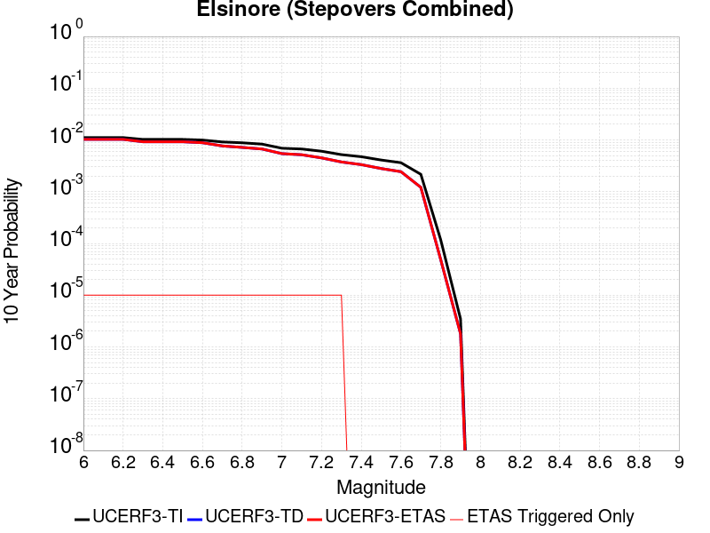 |

| Magnitude | 1 wk TI Prob | 1 wk TD Prob | 1 wk ETAS Prob | 1 wk ETAS/TD Gain | 1 wk ETAS Triggered Only | 1 mo TI Prob | 1 mo TD Prob | 1 mo ETAS Prob | 1 mo ETAS/TD Gain | 1 mo ETAS Triggered Only | 1 yr TI Prob | 1 yr TD Prob | 1 yr ETAS Prob | 1 yr ETAS/TD Gain | 1 yr ETAS Triggered Only | 10 yr TI Prob | 10 yr TD Prob | 10 yr ETAS Prob | 10 yr ETAS/TD Gain | 10 yr ETAS Triggered Only |
|-----|-----|-----|-----|-----|-----|-----|-----|-----|-----|-----|-----|-----|-----|-----|-----|-----|-----|-----|-----|-----|
| 6.0 | 2.144392E-5 | 1.9760193E-5 | 1.9760193E-5 | 1.0 | 0.0 | 9.189928E-5 | 8.468392E-5 | 8.468392E-5 | 1.0 | 0.0 | 0.0011182994 | 0.0010305607 | 0.0010305607 | 1.0 | 0.0 | 0.011126885 | 0.010264917 | 0.010277151 | 1.0011919 | 1.236094E-5 |
| 6.1 | 2.144392E-5 | 1.9760193E-5 | 1.9760193E-5 | 1.0 | 0.0 | 9.189928E-5 | 8.468392E-5 | 8.468392E-5 | 1.0 | 0.0 | 0.0011182994 | 0.0010305607 | 0.0010305607 | 1.0 | 0.0 | 0.011126885 | 0.010264917 | 0.010277151 | 1.0011919 | 1.236094E-5 |
| 6.2 | 2.144392E-5 | 1.9760193E-5 | 1.9760193E-5 | 1.0 | 0.0 | 9.189928E-5 | 8.468392E-5 | 8.468392E-5 | 1.0 | 0.0 | 0.0011182994 | 0.0010305607 | 0.0010305607 | 1.0 | 0.0 | 0.011126885 | 0.010264917 | 0.010277151 | 1.0011919 | 1.236094E-5 |
| 6.3 | 1.9751555E-5 | 1.7741453E-5 | 1.7741453E-5 | 1.0 | 0.0 | 8.4646774E-5 | 7.603267E-5 | 7.603267E-5 | 1.0 | 0.0 | 0.0010300872 | 9.253213E-4 | 9.253213E-4 | 1.0 | 0.0 | 0.010253254 | 0.009221276 | 0.009233523 | 1.0013281 | 1.236094E-5 |
| 6.4 | 1.9751555E-5 | 1.7741453E-5 | 1.7741453E-5 | 1.0 | 0.0 | 8.4646774E-5 | 7.603267E-5 | 7.603267E-5 | 1.0 | 0.0 | 0.0010300872 | 9.253213E-4 | 9.253213E-4 | 1.0 | 0.0 | 0.010253254 | 0.009221276 | 0.009233523 | 1.0013281 | 1.236094E-5 |
| 6.5 | 1.9751555E-5 | 1.7741453E-5 | 1.7741453E-5 | 1.0 | 0.0 | 8.4646774E-5 | 7.603267E-5 | 7.603267E-5 | 1.0 | 0.0 | 0.0010300872 | 9.253213E-4 | 9.253213E-4 | 1.0 | 0.0 | 0.010253254 | 0.009221276 | 0.009233523 | 1.0013281 | 1.236094E-5 |
| 6.6 | 1.9188685E-5 | 1.7003393E-5 | 1.7003393E-5 | 1.0 | 0.0 | 8.2234634E-5 | 7.286974E-5 | 7.286974E-5 | 1.0 | 0.0 | 0.0010007467 | 8.868442E-4 | 8.868442E-4 | 1.0 | 0.0 | 0.00996252 | 0.0088398475 | 0.008852099 | 1.0013859 | 1.236094E-5 |
| 6.7 | 1.7608272E-5 | 1.4732616E-5 | 1.4732616E-5 | 1.0 | 0.0 | 7.546184E-5 | 6.3138315E-5 | 6.3138315E-5 | 1.0 | 0.0 | 9.183606E-4 | 7.684476E-4 | 7.684476E-4 | 1.0 | 0.0 | 0.009145746 | 0.00766491 | 0.007677176 | 1.0016003 | 1.236094E-5 |
| 6.8 | 1.697165E-5 | 1.3783365E-5 | 1.3783365E-5 | 1.0 | 0.0 | 7.273361E-5 | 5.9070277E-5 | 5.9070277E-5 | 1.0 | 0.0 | 8.8517193E-4 | 7.18952E-4 | 7.18952E-4 | 1.0 | 0.0 | 0.008816543 | 0.007172675 | 0.0071849474 | 1.001711 | 1.236094E-5 |
| 6.9 | 1.600365E-5 | 1.2846671E-5 | 1.2846671E-5 | 1.0 | 0.0 | 6.858527E-5 | 5.5056043E-5 | 5.5056043E-5 | 1.0 | 0.0 | 8.347058E-4 | 6.7010894E-4 | 6.7010894E-4 | 1.0 | 0.0 | 0.008315775 | 0.0066867657 | 0.0066990443 | 1.0018362 | 1.236094E-5 |
| 7.0 | 1.3314581E-5 | 1.0447548E-5 | 1.0447548E-5 | 1.0 | 0.0 | 5.7061243E-5 | 4.4774453E-5 | 4.4774453E-5 | 1.0 | 0.0 | 6.944992E-4 | 5.449953E-4 | 5.449953E-4 | 1.0 | 0.0 | 0.006923327 | 0.0054405155 | 0.005452809 | 1.0022596 | 1.236094E-5 |
| 7.1 | 1.2865345E-5 | 9.937536E-6 | 9.937536E-6 | 1.0 | 0.0 | 5.5136024E-5 | 4.258876E-5 | 4.258876E-5 | 1.0 | 0.0 | 6.710743E-4 | 5.183973E-4 | 5.183973E-4 | 1.0 | 0.0 | 0.0066905143 | 0.0051752133 | 0.0051875105 | 1.0023761 | 1.236094E-5 |
| 7.2 | 1.1650051E-5 | 8.633809E-6 | 8.633809E-6 | 1.0 | 0.0 | 4.9927836E-5 | 3.7001522E-5 | 3.7001522E-5 | 1.0 | 0.0 | 6.0770183E-4 | 4.504022E-4 | 4.504022E-4 | 1.0 | 0.0 | 0.0060604266 | 0.0044963174 | 0.0045086225 | 1.0027368 | 1.236094E-5 |
| 7.3 | 1.0008533E-5 | 7.2010425E-6 | 7.2010425E-6 | 1.0 | 0.0 | 4.2893007E-5 | 3.0861254E-5 | 3.0861254E-5 | 1.0 | 0.0 | 5.220972E-4 | 3.7567242E-4 | 3.7567242E-4 | 1.0 | 0.0 | 0.005208723 | 0.003750761 | 0.0037630755 | 1.0032833 | 1.236094E-5 |
| 7.4 | 9.116759E-6 | 6.410068E-6 | 6.410068E-6 | 1.0 | 0.0 | 3.907124E-5 | 2.747144E-5 | 2.747144E-5 | 1.0 | 0.0 | 4.7558855E-4 | 3.3441483E-4 | 3.3441483E-4 | 1.0 | 0.0 | 0.00474572 | 0.0033392678 | 0.0033392678 | 1.0 | 0.0 |
| 7.5 | 7.870524E-6 | 5.3825365E-6 | 5.3825365E-6 | 1.0 | 0.0 | 3.3730383E-5 | 2.3067816E-5 | 2.3067816E-5 | 1.0 | 0.0 | 4.1059E-4 | 2.8081573E-4 | 2.8081573E-4 | 1.0 | 0.0 | 0.0040983222 | 0.0028047354 | 0.0028047354 | 1.0 | 0.0 |
| 7.6 | 6.9774537E-6 | 4.6776067E-6 | 4.6776067E-6 | 1.0 | 0.0 | 2.990303E-5 | 2.0046738E-5 | 2.0046738E-5 | 1.0 | 0.0 | 3.640086E-4 | 2.4404288E-4 | 2.4404288E-4 | 1.0 | 0.0 | 0.003634129 | 0.0024378651 | 0.0024378651 | 1.0 | 0.0 |
| 7.7 | 4.1616954E-6 | 2.32834E-6 | 2.32834E-6 | 1.0 | 0.0 | 1.7835715E-5 | 9.978567E-6 | 9.978567E-6 | 1.0 | 0.0 | 2.171282E-4 | 1.2148302E-4 | 1.2148302E-4 | 1.0 | 0.0 | 0.0021691616 | 0.0012142392 | 0.0012142392 | 1.0 | 0.0 |
| 7.8 | 2.2692414E-7 | 9.3854695E-8 | 9.3854695E-8 | 1.0 | 0.0 | 9.725317E-7 | 4.0223435E-7 | 4.0223435E-7 | 1.0 | 0.0 | 1.1840509E-5 | 4.8971956E-6 | 4.8971956E-6 | 1.0 | 0.0 | 1.1839878E-4 | 4.8971204E-5 | 4.8971204E-5 | 1.0 | 0.0 |
| 7.9 | 6.676829E-9 | 3.439853E-9 | 3.439853E-9 | 1.0 | 0.0 | 2.861498E-8 | 1.4742227E-8 | 1.4742227E-8 | 1.0 | 0.0 | 3.4838732E-7 | 1.7948659E-7 | 1.7948659E-7 | 1.0 | 0.0 | 3.4838679E-6 | 1.7948646E-6 | 1.7948646E-6 | 1.0 | 0.0 |

## Great Valley 06 (Midland) 2011 CFM alt1
*[(top)](#table-of-contents)*

| 1 Week | 1 Month | 1 Year | 10 Year |
|-----|-----|-----|-----|
|  |  | 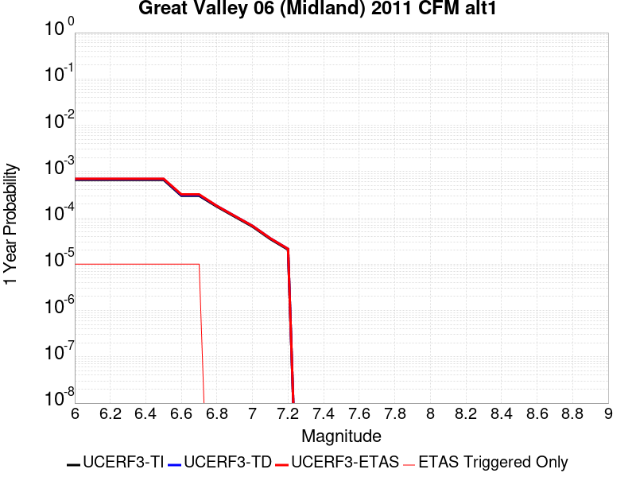 |  |

| Magnitude | 1 wk TI Prob | 1 wk TD Prob | 1 wk ETAS Prob | 1 wk ETAS/TD Gain | 1 wk ETAS Triggered Only | 1 mo TI Prob | 1 mo TD Prob | 1 mo ETAS Prob | 1 mo ETAS/TD Gain | 1 mo ETAS Triggered Only | 1 yr TI Prob | 1 yr TD Prob | 1 yr ETAS Prob | 1 yr ETAS/TD Gain | 1 yr ETAS Triggered Only | 10 yr TI Prob | 10 yr TD Prob | 10 yr ETAS Prob | 10 yr ETAS/TD Gain | 10 yr ETAS Triggered Only |
|-----|-----|-----|-----|-----|-----|-----|-----|-----|-----|-----|-----|-----|-----|-----|-----|-----|-----|-----|-----|-----|
| 6.0 | 1.2712525E-5 | 1.3210576E-5 | 1.3210576E-5 | 1.0 | 0.0 | 5.4481112E-5 | 5.6615667E-5 | 5.6615667E-5 | 1.0 | 0.0 | 6.6310563E-4 | 6.8910315E-4 | 7.014556E-4 | 1.0179254 | 1.236094E-5 | 0.0066113044 | 0.006872179 | 0.0068844547 | 1.0017864 | 1.236094E-5 |
| 6.1 | 1.2712525E-5 | 1.3210576E-5 | 1.3210576E-5 | 1.0 | 0.0 | 5.4481112E-5 | 5.6615667E-5 | 5.6615667E-5 | 1.0 | 0.0 | 6.6310563E-4 | 6.8910315E-4 | 7.014556E-4 | 1.0179254 | 1.236094E-5 | 0.0066113044 | 0.006872179 | 0.0068844547 | 1.0017864 | 1.236094E-5 |
| 6.2 | 1.2712525E-5 | 1.3210576E-5 | 1.3210576E-5 | 1.0 | 0.0 | 5.4481112E-5 | 5.6615667E-5 | 5.6615667E-5 | 1.0 | 0.0 | 6.6310563E-4 | 6.8910315E-4 | 7.014556E-4 | 1.0179254 | 1.236094E-5 | 0.0066113044 | 0.006872179 | 0.0068844547 | 1.0017864 | 1.236094E-5 |
| 6.3 | 1.2712525E-5 | 1.3210576E-5 | 1.3210576E-5 | 1.0 | 0.0 | 5.4481112E-5 | 5.6615667E-5 | 5.6615667E-5 | 1.0 | 0.0 | 6.6310563E-4 | 6.8910315E-4 | 7.014556E-4 | 1.0179254 | 1.236094E-5 | 0.0066113044 | 0.006872179 | 0.0068844547 | 1.0017864 | 1.236094E-5 |
| 6.4 | 1.2712525E-5 | 1.3210576E-5 | 1.3210576E-5 | 1.0 | 0.0 | 5.4481112E-5 | 5.6615667E-5 | 5.6615667E-5 | 1.0 | 0.0 | 6.6310563E-4 | 6.8910315E-4 | 7.014556E-4 | 1.0179254 | 1.236094E-5 | 0.0066113044 | 0.006872179 | 0.0068844547 | 1.0017864 | 1.236094E-5 |
| 6.5 | 1.2712525E-5 | 1.3210576E-5 | 1.3210576E-5 | 1.0 | 0.0 | 5.4481112E-5 | 5.6615667E-5 | 5.6615667E-5 | 1.0 | 0.0 | 6.6310563E-4 | 6.8910315E-4 | 7.014556E-4 | 1.0179254 | 1.236094E-5 | 0.0066113044 | 0.006872179 | 0.0068844547 | 1.0017864 | 1.236094E-5 |
| 6.6 | 5.7574384E-6 | 5.9706463E-6 | 5.9706463E-6 | 1.0 | 0.0 | 2.4674504E-5 | 2.5588255E-5 | 2.5588255E-5 | 1.0 | 0.0 | 3.0037065E-4 | 3.1149638E-4 | 3.2385348E-4 | 1.0396701 | 1.236094E-5 | 0.0029996498 | 0.0031109843 | 0.0031233067 | 1.003961 | 1.236094E-5 |
| 6.7 | 5.7574384E-6 | 5.9706463E-6 | 5.9706463E-6 | 1.0 | 0.0 | 2.4674504E-5 | 2.5588255E-5 | 2.5588255E-5 | 1.0 | 0.0 | 3.0037065E-4 | 3.1149638E-4 | 3.2385348E-4 | 1.0396701 | 1.236094E-5 | 0.0029996498 | 0.0031109843 | 0.0031233067 | 1.003961 | 1.236094E-5 |
| 6.8 | 3.3474828E-6 | 3.4693849E-6 | 3.4693849E-6 | 1.0 | 0.0 | 1.4346277E-5 | 1.4868716E-5 | 1.4868716E-5 | 1.0 | 0.0 | 1.7465191E-4 | 1.8101306E-4 | 1.8101306E-4 | 1.0 | 0.0 | 0.0017451472 | 0.0018088033 | 0.0018088033 | 1.0 | 0.0 |
| 6.9 | 2.035106E-6 | 2.1090357E-6 | 2.1090357E-6 | 1.0 | 0.0 | 8.721853E-6 | 9.038697E-6 | 9.038697E-6 | 1.0 | 0.0 | 1.0618339E-4 | 1.10041314E-4 | 1.10041314E-4 | 1.0 | 0.0 | 0.0010613267 | 0.0010999405 | 0.0010999405 | 1.0 | 0.0 |
| 7.0 | 1.2424716E-6 | 1.2878762E-6 | 1.2878762E-6 | 1.0 | 0.0 | 5.3248673E-6 | 5.51946E-6 | 5.51946E-6 | 1.0 | 0.0 | 6.482833E-5 | 6.7197805E-5 | 6.7197805E-5 | 1.0 | 0.0 | 6.480942E-4 | 6.718192E-4 | 6.718192E-4 | 1.0 | 0.0 |
| 7.1 | 6.6904556E-7 | 6.939035E-7 | 6.939035E-7 | 1.0 | 0.0 | 2.867335E-6 | 2.97387E-6 | 2.97387E-6 | 1.0 | 0.0 | 3.4909244E-5 | 3.6206526E-5 | 3.6206526E-5 | 1.0 | 0.0 | 3.490376E-4 | 3.6203177E-4 | 3.6203177E-4 | 1.0 | 0.0 |
| 7.2 | 3.948168E-7 | 4.095705E-7 | 4.095705E-7 | 1.0 | 0.0 | 1.6920709E-6 | 1.7553022E-6 | 1.7553022E-6 | 1.0 | 0.0 | 2.0600768E-5 | 2.1370803E-5 | 2.1370803E-5 | 1.0 | 0.0 | 2.0598859E-4 | 2.1370803E-4 | 2.1370803E-4 | 1.0 | 0.0 |

## Great Valley 10 (Panoche)
*[(top)](#table-of-contents)*

| 1 Week | 1 Month | 1 Year | 10 Year |
|-----|-----|-----|-----|
| 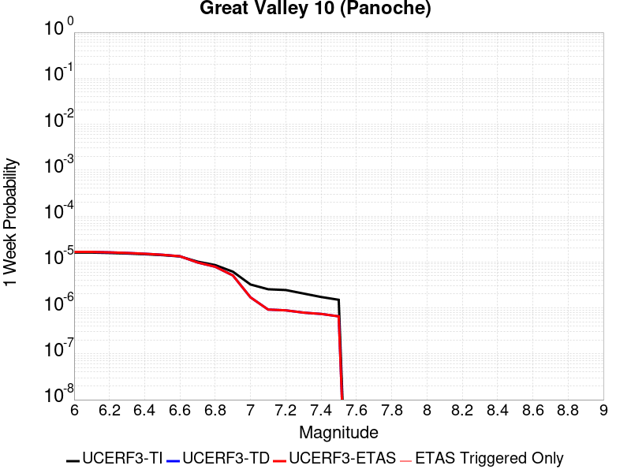 |  |  |  |

| Magnitude | 1 wk TI Prob | 1 wk TD Prob | 1 wk ETAS Prob | 1 wk ETAS/TD Gain | 1 wk ETAS Triggered Only | 1 mo TI Prob | 1 mo TD Prob | 1 mo ETAS Prob | 1 mo ETAS/TD Gain | 1 mo ETAS Triggered Only | 1 yr TI Prob | 1 yr TD Prob | 1 yr ETAS Prob | 1 yr ETAS/TD Gain | 1 yr ETAS Triggered Only | 10 yr TI Prob | 10 yr TD Prob | 10 yr ETAS Prob | 10 yr ETAS/TD Gain | 10 yr ETAS Triggered Only |
|-----|-----|-----|-----|-----|-----|-----|-----|-----|-----|-----|-----|-----|-----|-----|-----|-----|-----|-----|-----|-----|
| 6.0 | 1.6014626E-5 | 1.6575399E-5 | 1.6575399E-5 | 1.0 | 0.0 | 6.863231E-5 | 7.103552E-5 | 7.103552E-5 | 1.0 | 0.0 | 8.35278E-4 | 8.645185E-4 | 8.645185E-4 | 1.0 | 0.0 | 0.008321454 | 0.008612172 | 0.008624426 | 1.0014229 | 1.236094E-5 |
| 6.1 | 1.6014626E-5 | 1.6575399E-5 | 1.6575399E-5 | 1.0 | 0.0 | 6.863231E-5 | 7.103552E-5 | 7.103552E-5 | 1.0 | 0.0 | 8.35278E-4 | 8.645185E-4 | 8.645185E-4 | 1.0 | 0.0 | 0.008321454 | 0.008612172 | 0.008624426 | 1.0014229 | 1.236094E-5 |
| 6.2 | 1.56782E-5 | 1.6198446E-5 | 1.6198446E-5 | 1.0 | 0.0 | 6.719056E-5 | 6.94201E-5 | 6.94201E-5 | 1.0 | 0.0 | 8.17738E-4 | 8.4486604E-4 | 8.4486604E-4 | 1.0 | 0.0 | 0.008147354 | 0.008417147 | 0.008429404 | 1.0014561 | 1.236094E-5 |
| 6.3 | 1.5263338E-5 | 1.5723514E-5 | 1.5723514E-5 | 1.0 | 0.0 | 6.541267E-5 | 6.738478E-5 | 6.738478E-5 | 1.0 | 0.0 | 7.961082E-4 | 8.201049E-4 | 8.201049E-4 | 1.0 | 0.0 | 0.007932622 | 0.008171377 | 0.008183637 | 1.0015004 | 1.236094E-5 |
| 6.4 | 1.4720723E-5 | 1.5099376E-5 | 1.5099376E-5 | 1.0 | 0.0 | 6.308728E-5 | 6.471004E-5 | 6.471004E-5 | 1.0 | 0.0 | 7.67817E-4 | 7.8756385E-4 | 7.8756385E-4 | 1.0 | 0.0 | 0.007651695 | 0.007848303 | 0.0078605665 | 1.0015626 | 1.236094E-5 |
| 6.5 | 1.408264E-5 | 1.4355969E-5 | 1.4355969E-5 | 1.0 | 0.0 | 6.0352773E-5 | 6.1524166E-5 | 6.1524166E-5 | 1.0 | 0.0 | 7.3454727E-4 | 7.488031E-4 | 7.488031E-4 | 1.0 | 0.0 | 0.0073212404 | 0.0074633555 | 0.0074756243 | 1.0016439 | 1.236094E-5 |
| 6.6 | 1.3197086E-5 | 1.3321889E-5 | 1.3321889E-5 | 1.0 | 0.0 | 5.6557717E-5 | 5.709259E-5 | 5.709259E-5 | 1.0 | 0.0 | 6.8837265E-4 | 6.9488434E-4 | 6.9488434E-4 | 1.0 | 0.0 | 0.006862442 | 0.0069276537 | 0.006939929 | 1.0017719 | 1.236094E-5 |
| 6.7 | 1.017583E-5 | 9.745382E-6 | 9.745382E-6 | 1.0 | 0.0 | 4.360997E-5 | 4.176527E-5 | 4.176527E-5 | 1.0 | 0.0 | 5.30822E-4 | 5.0837593E-4 | 5.0837593E-4 | 1.0 | 0.0 | 0.0052955584 | 0.005072382 | 0.005072382 | 1.0 | 0.0 |
| 6.8 | 8.557912E-6 | 7.872707E-6 | 7.872707E-6 | 1.0 | 0.0 | 3.667625E-5 | 3.373975E-5 | 3.373975E-5 | 1.0 | 0.0 | 4.4644187E-4 | 4.1070607E-4 | 4.1070607E-4 | 1.0 | 0.0 | 0.0044554602 | 0.004099677 | 0.004099677 | 1.0 | 0.0 |
| 6.9 | 6.14664E-6 | 5.092071E-6 | 5.092071E-6 | 1.0 | 0.0 | 2.6342475E-5 | 2.1822989E-5 | 2.1822989E-5 | 1.0 | 0.0 | 3.2067244E-4 | 2.6566387E-4 | 2.6566387E-4 | 1.0 | 0.0 | 0.003202101 | 0.002653601 | 0.002653601 | 1.0 | 0.0 |
| 7.0 | 3.2310581E-6 | 1.6951219E-6 | 1.6951219E-6 | 1.0 | 0.0 | 1.3847319E-5 | 7.264788E-6 | 7.264788E-6 | 1.0 | 0.0 | 1.6857806E-4 | 8.8445304E-5 | 8.8445304E-5 | 1.0 | 0.0 | 0.0016845023 | 8.841104E-4 | 8.841104E-4 | 1.0 | 0.0 |
| 7.1 | 2.544492E-6 | 9.1889206E-7 | 9.1889206E-7 | 1.0 | 0.0 | 1.090492E-5 | 3.938103E-6 | 3.938103E-6 | 1.0 | 0.0 | 1.327593E-4 | 4.79454E-5 | 4.79454E-5 | 1.0 | 0.0 | 0.0013268003 | 4.793553E-4 | 4.793553E-4 | 1.0 | 0.0 |
| 7.2 | 2.4479045E-6 | 8.841304E-7 | 8.841304E-7 | 1.0 | 0.0 | 1.0490977E-5 | 3.789125E-6 | 3.789125E-6 | 1.0 | 0.0 | 1.2772017E-4 | 4.6131667E-5 | 4.6131667E-5 | 1.0 | 0.0 | 0.0012764678 | 4.6122566E-4 | 4.6122566E-4 | 1.0 | 0.0 |
| 7.3 | 2.0559578E-6 | 7.892787E-7 | 7.892787E-7 | 1.0 | 0.0 | 8.811218E-6 | 3.3826188E-6 | 3.3826188E-6 | 1.0 | 0.0 | 1.072713E-4 | 4.1182655E-5 | 4.1182655E-5 | 1.0 | 0.0 | 0.0010721954 | 4.1175485E-4 | 4.1175485E-4 | 1.0 | 0.0 |
| 7.4 | 1.727687E-6 | 7.387757E-7 | 7.387757E-7 | 1.0 | 0.0 | 7.404352E-6 | 3.1661782E-6 | 3.1661782E-6 | 1.0 | 0.0 | 9.0144255E-5 | 3.8547583E-5 | 3.8547583E-5 | 1.0 | 0.0 | 9.0107694E-4 | 3.854136E-4 | 3.854136E-4 | 1.0 | 0.0 |
| 7.5 | 1.5002679E-6 | 6.546144E-7 | 6.546144E-7 | 1.0 | 0.0 | 6.4297037E-6 | 2.8054874E-6 | 2.8054874E-6 | 1.0 | 0.0 | 7.827883E-5 | 3.4156317E-5 | 3.4156317E-5 | 1.0 | 0.0 | 7.825126E-4 | 3.4151482E-4 | 3.4151482E-4 | 1.0 | 0.0 |

## Santa Monica alt 1
*[(top)](#table-of-contents)*

| 1 Week | 1 Month | 1 Year | 10 Year |
|-----|-----|-----|-----|
|  |  |  |  |

| Magnitude | 1 wk TI Prob | 1 wk TD Prob | 1 wk ETAS Prob | 1 wk ETAS/TD Gain | 1 wk ETAS Triggered Only | 1 mo TI Prob | 1 mo TD Prob | 1 mo ETAS Prob | 1 mo ETAS/TD Gain | 1 mo ETAS Triggered Only | 1 yr TI Prob | 1 yr TD Prob | 1 yr ETAS Prob | 1 yr ETAS/TD Gain | 1 yr ETAS Triggered Only | 10 yr TI Prob | 10 yr TD Prob | 10 yr ETAS Prob | 10 yr ETAS/TD Gain | 10 yr ETAS Triggered Only |
|-----|-----|-----|-----|-----|-----|-----|-----|-----|-----|-----|-----|-----|-----|-----|-----|-----|-----|-----|-----|-----|
| 6.0 | 1.1066008E-5 | 1.148031E-5 | 1.148031E-5 | 1.0 | 0.0 | 4.742488E-5 | 4.920048E-5 | 4.920048E-5 | 1.0 | 0.0 | 5.7724497E-4 | 5.9886515E-4 | 5.9886515E-4 | 1.0 | 0.0 | 0.005757478 | 0.0059739 | 0.005986187 | 1.0020568 | 1.236094E-5 |
| 6.1 | 1.1066008E-5 | 1.148031E-5 | 1.148031E-5 | 1.0 | 0.0 | 4.742488E-5 | 4.920048E-5 | 4.920048E-5 | 1.0 | 0.0 | 5.7724497E-4 | 5.9886515E-4 | 5.9886515E-4 | 1.0 | 0.0 | 0.005757478 | 0.0059739 | 0.005986187 | 1.0020568 | 1.236094E-5 |
| 6.2 | 1.1066008E-5 | 1.148031E-5 | 1.148031E-5 | 1.0 | 0.0 | 4.742488E-5 | 4.920048E-5 | 4.920048E-5 | 1.0 | 0.0 | 5.7724497E-4 | 5.9886515E-4 | 5.9886515E-4 | 1.0 | 0.0 | 0.005757478 | 0.0059739 | 0.005986187 | 1.0020568 | 1.236094E-5 |
| 6.3 | 1.1066008E-5 | 1.148031E-5 | 1.148031E-5 | 1.0 | 0.0 | 4.742488E-5 | 4.920048E-5 | 4.920048E-5 | 1.0 | 0.0 | 5.7724497E-4 | 5.9886515E-4 | 5.9886515E-4 | 1.0 | 0.0 | 0.005757478 | 0.0059739 | 0.005986187 | 1.0020568 | 1.236094E-5 |
| 6.4 | 1.1066008E-5 | 1.148031E-5 | 1.148031E-5 | 1.0 | 0.0 | 4.742488E-5 | 4.920048E-5 | 4.920048E-5 | 1.0 | 0.0 | 5.7724497E-4 | 5.9886515E-4 | 5.9886515E-4 | 1.0 | 0.0 | 0.005757478 | 0.0059739 | 0.005986187 | 1.0020568 | 1.236094E-5 |
| 6.5 | 8.183544E-6 | 8.335432E-6 | 8.335432E-6 | 1.0 | 0.0 | 3.5071862E-5 | 3.57228E-5 | 3.57228E-5 | 1.0 | 0.0 | 4.2691626E-4 | 4.3483984E-4 | 4.3483984E-4 | 1.0 | 0.0 | 0.0042609703 | 0.0043400554 | 0.004352363 | 1.0028358 | 1.236094E-5 |
| 6.6 | 8.1543285E-6 | 8.303646E-6 | 8.303646E-6 | 1.0 | 0.0 | 3.4946657E-5 | 3.5586578E-5 | 3.5586578E-5 | 1.0 | 0.0 | 4.2539247E-4 | 4.3318202E-4 | 4.3318202E-4 | 1.0 | 0.0 | 0.0042457907 | 0.004323542 | 0.0043358495 | 1.0028466 | 1.236094E-5 |
| 6.7 | 8.110878E-6 | 8.257042E-6 | 8.257042E-6 | 1.0 | 0.0 | 3.4760444E-5 | 3.5386853E-5 | 3.5386853E-5 | 1.0 | 0.0 | 4.231262E-4 | 4.3075136E-4 | 4.3075136E-4 | 1.0 | 0.0 | 0.0042232145 | 0.0042993296 | 0.004311637 | 1.0028627 | 1.236094E-5 |
| 6.8 | 7.644036E-6 | 7.75106E-6 | 7.75106E-6 | 1.0 | 0.0 | 3.275974E-5 | 3.3218414E-5 | 3.3218414E-5 | 1.0 | 0.0 | 3.9877684E-4 | 4.0436056E-4 | 4.0436056E-4 | 1.0 | 0.0 | 0.00398062 | 0.0040363944 | 0.0040487056 | 1.00305 | 1.236094E-5 |
| 6.9 | 7.3698293E-6 | 7.455719E-6 | 7.455719E-6 | 1.0 | 0.0 | 3.15846E-5 | 3.19527E-5 | 3.19527E-5 | 1.0 | 0.0 | 3.8447464E-4 | 3.8895605E-4 | 3.8895605E-4 | 1.0 | 0.0 | 0.0038381014 | 0.0038828964 | 0.0038952094 | 1.0031711 | 1.236094E-5 |
| 7.0 | 7.209872E-6 | 7.2856255E-6 | 7.2856255E-6 | 1.0 | 0.0 | 3.0899086E-5 | 3.1223743E-5 | 3.1223743E-5 | 1.0 | 0.0 | 3.7613141E-4 | 3.8008415E-4 | 3.8008415E-4 | 1.0 | 0.0 | 0.0037549543 | 0.0037944836 | 0.0038067976 | 1.0032452 | 1.236094E-5 |
| 7.1 | 5.603456E-6 | 5.5238925E-6 | 5.5238925E-6 | 1.0 | 0.0 | 2.4014591E-5 | 2.3673612E-5 | 2.3673612E-5 | 1.0 | 0.0 | 2.923384E-4 | 2.881885E-4 | 2.881885E-4 | 1.0 | 0.0 | 0.0029195412 | 0.0028781896 | 0.002890515 | 1.0042824 | 1.236094E-5 |
| 7.2 | 4.7483613E-6 | 4.5911324E-6 | 4.5911324E-6 | 1.0 | 0.0 | 2.0349962E-5 | 1.9676136E-5 | 1.9676136E-5 | 1.0 | 0.0 | 2.4773262E-4 | 2.3953074E-4 | 2.3953074E-4 | 1.0 | 0.0 | 0.0024745662 | 0.0023927398 | 0.0024050712 | 1.0051537 | 1.236094E-5 |
| 7.3 | 3.829015E-6 | 3.6342253E-6 | 3.6342253E-6 | 1.0 | 0.0 | 1.6409962E-5 | 1.5575159E-5 | 1.5575159E-5 | 1.0 | 0.0 | 1.9977297E-4 | 1.8961114E-4 | 1.8961114E-4 | 1.0 | 0.0 | 0.0019959346 | 0.0018945024 | 0.00190684 | 1.0065123 | 1.236094E-5 |
| 7.4 | 2.610755E-6 | 2.4995716E-6 | 2.4995716E-6 | 1.0 | 0.0 | 1.1188902E-5 | 1.0712406E-5 | 1.0712406E-5 | 1.0 | 0.0 | 1.3621636E-4 | 1.3041578E-4 | 1.3041578E-4 | 1.0 | 0.0 | 0.001361329 | 0.0013033969 | 0.0013157417 | 1.0094713 | 1.236094E-5 |
| 7.5 | 1.792146E-6 | 1.7584184E-6 | 1.7584184E-6 | 1.0 | 0.0 | 7.680603E-6 | 7.536057E-6 | 7.536057E-6 | 1.0 | 0.0 | 9.3507326E-5 | 9.1747665E-5 | 9.1747665E-5 | 1.0 | 0.0 | 9.3467993E-4 | 9.1710105E-4 | 9.294506E-4 | 1.0134659 | 1.236094E-5 |
| 7.6 | 1.1473018E-6 | 1.1029152E-6 | 1.1029152E-6 | 1.0 | 0.0 | 4.9169985E-6 | 4.726771E-6 | 4.726771E-6 | 1.0 | 0.0 | 5.986281E-5 | 5.7546935E-5 | 5.7546935E-5 | 1.0 | 0.0 | 5.984669E-4 | 5.7532196E-4 | 5.876758E-4 | 1.0214729 | 1.236094E-5 |
| 7.7 | 5.330919E-7 | 4.7452556E-7 | 4.7452556E-7 | 1.0 | 0.0 | 2.2846775E-6 | 2.0336795E-6 | 2.0336795E-6 | 1.0 | 0.0 | 2.7815593E-5 | 2.4759778E-5 | 2.4759778E-5 | 1.0 | 0.0 | 2.7812112E-4 | 2.4757133E-4 | 2.5992922E-4 | 1.0499164 | 1.236094E-5 |
| 7.8 | 1.1668574E-7 | 8.2966224E-8 | 8.2966224E-8 | 1.0 | 0.0 | 5.000816E-7 | 3.5556948E-7 | 3.5556948E-7 | 1.0 | 0.0 | 6.0884768E-6 | 4.32905E-6 | 4.32905E-6 | 1.0 | 0.0 | 6.08831E-5 | 4.3289692E-5 | 4.3289692E-5 | 1.0 | 0.0 |
| 7.9 | 8.007447E-10 | 6.1608785E-10 | 6.1608785E-10 | 1.0 | 0.0 | 3.4317629E-9 | 2.6403764E-9 | 2.6403764E-9 | 1.0 | 0.0 | 4.1781714E-8 | 3.2146584E-8 | 3.2146584E-8 | 1.0 | 0.0 | 4.1781706E-7 | 3.214658E-7 | 3.214658E-7 | 1.0 | 0.0 |

## Holser alt 1
*[(top)](#table-of-contents)*

| 1 Week | 1 Month | 1 Year | 10 Year |
|-----|-----|-----|-----|
|  |  |  |  |

| Magnitude | 1 wk TI Prob | 1 wk TD Prob | 1 wk ETAS Prob | 1 wk ETAS/TD Gain | 1 wk ETAS Triggered Only | 1 mo TI Prob | 1 mo TD Prob | 1 mo ETAS Prob | 1 mo ETAS/TD Gain | 1 mo ETAS Triggered Only | 1 yr TI Prob | 1 yr TD Prob | 1 yr ETAS Prob | 1 yr ETAS/TD Gain | 1 yr ETAS Triggered Only | 10 yr TI Prob | 10 yr TD Prob | 10 yr ETAS Prob | 10 yr ETAS/TD Gain | 10 yr ETAS Triggered Only |
|-----|-----|-----|-----|-----|-----|-----|-----|-----|-----|-----|-----|-----|-----|-----|-----|-----|-----|-----|-----|-----|
| 6.0 | 6.2746653E-6 | 5.789965E-6 | 5.789965E-6 | 1.0 | 0.0 | 2.6891146E-5 | 2.4813964E-5 | 2.4813964E-5 | 1.0 | 0.0 | 3.273505E-4 | 3.020797E-4 | 3.020797E-4 | 1.0 | 0.0 | 0.0032686873 | 0.0030178234 | 0.0030301472 | 1.0040836 | 1.236094E-5 |
| 6.1 | 6.2746653E-6 | 5.789965E-6 | 5.789965E-6 | 1.0 | 0.0 | 2.6891146E-5 | 2.4813964E-5 | 2.4813964E-5 | 1.0 | 0.0 | 3.273505E-4 | 3.020797E-4 | 3.020797E-4 | 1.0 | 0.0 | 0.0032686873 | 0.0030178234 | 0.0030301472 | 1.0040836 | 1.236094E-5 |
| 6.2 | 6.2746653E-6 | 5.789965E-6 | 5.789965E-6 | 1.0 | 0.0 | 2.6891146E-5 | 2.4813964E-5 | 2.4813964E-5 | 1.0 | 0.0 | 3.273505E-4 | 3.020797E-4 | 3.020797E-4 | 1.0 | 0.0 | 0.0032686873 | 0.0030178234 | 0.0030301472 | 1.0040836 | 1.236094E-5 |
| 6.3 | 6.2746653E-6 | 5.789965E-6 | 5.789965E-6 | 1.0 | 0.0 | 2.6891146E-5 | 2.4813964E-5 | 2.4813964E-5 | 1.0 | 0.0 | 3.273505E-4 | 3.020797E-4 | 3.020797E-4 | 1.0 | 0.0 | 0.0032686873 | 0.0030178234 | 0.0030301472 | 1.0040836 | 1.236094E-5 |
| 6.4 | 6.2746653E-6 | 5.789965E-6 | 5.789965E-6 | 1.0 | 0.0 | 2.6891146E-5 | 2.4813964E-5 | 2.4813964E-5 | 1.0 | 0.0 | 3.273505E-4 | 3.020797E-4 | 3.020797E-4 | 1.0 | 0.0 | 0.0032686873 | 0.0030178234 | 0.0030301472 | 1.0040836 | 1.236094E-5 |
| 6.5 | 6.2746653E-6 | 5.789965E-6 | 5.789965E-6 | 1.0 | 0.0 | 2.6891146E-5 | 2.4813964E-5 | 2.4813964E-5 | 1.0 | 0.0 | 3.273505E-4 | 3.020797E-4 | 3.020797E-4 | 1.0 | 0.0 | 0.0032686873 | 0.0030178234 | 0.0030301472 | 1.0040836 | 1.236094E-5 |
| 6.6 | 3.375825E-6 | 2.7711897E-6 | 2.7711897E-6 | 1.0 | 0.0 | 1.4467741E-5 | 1.1876474E-5 | 1.1876474E-5 | 1.0 | 0.0 | 1.761305E-4 | 1.4458665E-4 | 1.4458665E-4 | 1.0 | 0.0 | 0.0017599097 | 0.0014449427 | 0.0014572858 | 1.0085423 | 1.236094E-5 |
| 6.7 | 3.375825E-6 | 2.7711897E-6 | 2.7711897E-6 | 1.0 | 0.0 | 1.4467741E-5 | 1.1876474E-5 | 1.1876474E-5 | 1.0 | 0.0 | 1.761305E-4 | 1.4458665E-4 | 1.4458665E-4 | 1.0 | 0.0 | 0.0017599097 | 0.0014449427 | 0.0014572858 | 1.0085423 | 1.236094E-5 |
| 6.8 | 3.366533E-6 | 2.7615893E-6 | 2.7615893E-6 | 1.0 | 0.0 | 1.4427919E-5 | 1.183533E-5 | 1.183533E-5 | 1.0 | 0.0 | 1.7564575E-4 | 1.4408577E-4 | 1.4408577E-4 | 1.0 | 0.0 | 0.0017550698 | 0.0014399405 | 0.0014522837 | 1.008572 | 1.236094E-5 |
| 6.9 | 3.253174E-6 | 2.6438113E-6 | 2.6438113E-6 | 1.0 | 0.0 | 1.39421E-5 | 1.1330571E-5 | 1.1330571E-5 | 1.0 | 0.0 | 1.6973184E-4 | 1.3794114E-4 | 1.3794114E-4 | 1.0 | 0.0 | 0.0016960226 | 0.001378571 | 0.0013909149 | 1.0089542 | 1.236094E-5 |
| 7.0 | 2.9336593E-6 | 2.311799E-6 | 2.311799E-6 | 1.0 | 0.0 | 1.2572766E-5 | 9.907673E-6 | 9.907673E-6 | 1.0 | 0.0 | 1.5306266E-4 | 1.2061927E-4 | 1.2061927E-4 | 1.0 | 0.0 | 0.0015295728 | 0.0012055405 | 0.0012178866 | 1.010241 | 1.236094E-5 |
| 7.1 | 2.9087812E-6 | 2.2876513E-6 | 2.2876513E-6 | 1.0 | 0.0 | 1.2466146E-5 | 9.804184E-6 | 9.804184E-6 | 1.0 | 0.0 | 1.5176475E-4 | 1.19359414E-4 | 1.19359414E-4 | 1.0 | 0.0 | 0.0015166114 | 0.0011929555 | 0.0012053017 | 1.0103493 | 1.236094E-5 |
| 7.2 | 2.8674524E-6 | 2.2475429E-6 | 2.2475429E-6 | 1.0 | 0.0 | 1.2289024E-5 | 9.63229E-6 | 9.63229E-6 | 1.0 | 0.0 | 1.4960859E-4 | 1.1726685E-4 | 1.1726685E-4 | 1.0 | 0.0 | 0.0014950791 | 0.001172052 | 0.0011843985 | 1.010534 | 1.236094E-5 |
| 7.3 | 2.8057775E-6 | 2.1954324E-6 | 2.1954324E-6 | 1.0 | 0.0 | 1.2024705E-5 | 9.408962E-6 | 9.408962E-6 | 1.0 | 0.0 | 1.4639096E-4 | 1.14548115E-4 | 1.14548115E-4 | 1.0 | 0.0 | 0.0014629456 | 0.001144893 | 0.0011572398 | 1.0107843 | 1.236094E-5 |
| 7.4 | 2.683666E-6 | 2.1092305E-6 | 2.1092305E-6 | 1.0 | 0.0 | 1.1501375E-5 | 9.039529E-6 | 9.039529E-6 | 1.0 | 0.0 | 1.4002025E-4 | 1.1005072E-4 | 1.1005072E-4 | 1.0 | 0.0 | 0.0013993206 | 0.0010999644 | 0.0011123117 | 1.0112252 | 1.236094E-5 |
| 7.5 | 2.434495E-6 | 1.9195363E-6 | 1.9195363E-6 | 1.0 | 0.0 | 1.0433508E-5 | 8.226558E-6 | 8.226558E-6 | 1.0 | 0.0 | 1.2702055E-4 | 1.0015376E-4 | 1.0015376E-4 | 1.0 | 0.0 | 0.0012694797 | 0.0010010883 | 0.0010010883 | 1.0 | 0.0 |
| 7.6 | 1.9914562E-6 | 1.5731459E-6 | 1.5731459E-6 | 1.0 | 0.0 | 8.534785E-6 | 6.742037E-6 | 6.742037E-6 | 1.0 | 0.0 | 1.03906044E-4 | 8.208122E-5 | 8.208122E-5 | 1.0 | 0.0 | 0.0010385747 | 8.205106E-4 | 8.205106E-4 | 1.0 | 0.0 |
| 7.7 | 1.5229501E-6 | 1.1896061E-6 | 1.1896061E-6 | 1.0 | 0.0 | 6.526913E-6 | 5.098302E-6 | 5.098302E-6 | 1.0 | 0.0 | 7.946226E-5 | 6.2070074E-5 | 6.2070074E-5 | 1.0 | 0.0 | 7.943385E-4 | 6.2052865E-4 | 6.2052865E-4 | 1.0 | 0.0 |
| 7.8 | 6.3489426E-7 | 4.687806E-7 | 4.687806E-7 | 1.0 | 0.0 | 2.7209726E-6 | 2.009058E-6 | 2.009058E-6 | 1.0 | 0.0 | 3.312734E-5 | 2.4460009E-5 | 2.4460009E-5 | 1.0 | 0.0 | 3.31224E-4 | 2.4457334E-4 | 2.4457334E-4 | 1.0 | 0.0 |
| 7.9 | 1.5459432E-7 | 1.0193758E-7 | 1.0193758E-7 | 1.0 | 0.0 | 6.6254694E-7 | 4.3687527E-7 | 4.3687527E-7 | 1.0 | 0.0 | 8.066479E-6 | 5.3189433E-6 | 5.3189433E-6 | 1.0 | 0.0 | 8.066186E-5 | 5.3188178E-5 | 5.3188178E-5 | 1.0 | 0.0 |
| 8.0 | 1.8307812E-8 | 9.690293E-9 | 9.690293E-9 | 1.0 | 0.0 | 7.846205E-8 | 4.152983E-8 | 4.152983E-8 | 1.0 | 0.0 | 9.55275E-7 | 5.0562556E-7 | 5.0562556E-7 | 1.0 | 0.0 | 9.552709E-6 | 5.0562444E-6 | 5.0562444E-6 | 1.0 | 0.0 |

## East Huasna 2011 CFM
*[(top)](#table-of-contents)*

| 1 Week | 1 Month | 1 Year | 10 Year |
|-----|-----|-----|-----|
|  |  |  | 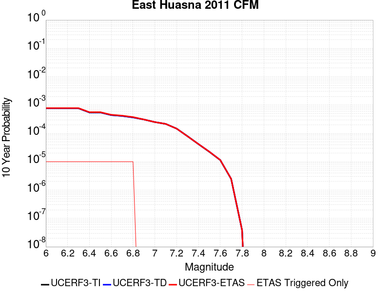 |

| Magnitude | 1 wk TI Prob | 1 wk TD Prob | 1 wk ETAS Prob | 1 wk ETAS/TD Gain | 1 wk ETAS Triggered Only | 1 mo TI Prob | 1 mo TD Prob | 1 mo ETAS Prob | 1 mo ETAS/TD Gain | 1 mo ETAS Triggered Only | 1 yr TI Prob | 1 yr TD Prob | 1 yr ETAS Prob | 1 yr ETAS/TD Gain | 1 yr ETAS Triggered Only | 10 yr TI Prob | 10 yr TD Prob | 10 yr ETAS Prob | 10 yr ETAS/TD Gain | 10 yr ETAS Triggered Only |
|-----|-----|-----|-----|-----|-----|-----|-----|-----|-----|-----|-----|-----|-----|-----|-----|-----|-----|-----|-----|-----|
| 6.0 | 1.4658423E-6 | 1.4715657E-6 | 1.3832487E-5 | 9.399843 | 1.236094E-5 | 6.282166E-6 | 6.3066955E-6 | 1.8667557E-5 | 2.9599586 | 1.236094E-5 | 7.6482684E-5 | 7.678138E-5 | 8.914137E-5 | 1.1609764 | 1.236094E-5 | 7.645637E-4 | 7.6755555E-4 | 7.7990704E-4 | 1.016092 | 1.236094E-5 |
| 6.1 | 1.4658423E-6 | 1.4715657E-6 | 1.3832487E-5 | 9.399843 | 1.236094E-5 | 6.282166E-6 | 6.3066955E-6 | 1.8667557E-5 | 2.9599586 | 1.236094E-5 | 7.6482684E-5 | 7.678138E-5 | 8.914137E-5 | 1.1609764 | 1.236094E-5 | 7.645637E-4 | 7.6755555E-4 | 7.7990704E-4 | 1.016092 | 1.236094E-5 |
| 6.2 | 1.4658423E-6 | 1.4715657E-6 | 1.3832487E-5 | 9.399843 | 1.236094E-5 | 6.282166E-6 | 6.3066955E-6 | 1.8667557E-5 | 2.9599586 | 1.236094E-5 | 7.6482684E-5 | 7.678138E-5 | 8.914137E-5 | 1.1609764 | 1.236094E-5 | 7.645637E-4 | 7.6755555E-4 | 7.7990704E-4 | 1.016092 | 1.236094E-5 |
| 6.3 | 1.4658423E-6 | 1.4715657E-6 | 1.3832487E-5 | 9.399843 | 1.236094E-5 | 6.282166E-6 | 6.3066955E-6 | 1.8667557E-5 | 2.9599586 | 1.236094E-5 | 7.6482684E-5 | 7.678138E-5 | 8.914137E-5 | 1.1609764 | 1.236094E-5 | 7.645637E-4 | 7.6755555E-4 | 7.7990704E-4 | 1.016092 | 1.236094E-5 |
| 6.4 | 1.0488257E-6 | 1.0527513E-6 | 1.3413678E-5 | 12.741546 | 1.236094E-5 | 4.4949593E-6 | 4.5117836E-6 | 1.6872667E-5 | 3.739689 | 1.236094E-5 | 5.472476E-5 | 5.49296E-5 | 6.728986E-5 | 1.22502 | 1.236094E-5 | 5.4711284E-4 | 5.491621E-4 | 5.6151627E-4 | 1.0224963 | 1.236094E-5 |
| 6.5 | 1.0488257E-6 | 1.0527513E-6 | 1.3413678E-5 | 12.741546 | 1.236094E-5 | 4.4949593E-6 | 4.5117836E-6 | 1.6872667E-5 | 3.739689 | 1.236094E-5 | 5.472476E-5 | 5.49296E-5 | 6.728986E-5 | 1.22502 | 1.236094E-5 | 5.4711284E-4 | 5.491621E-4 | 5.6151627E-4 | 1.0224963 | 1.236094E-5 |
| 6.6 | 8.463064E-7 | 8.49363E-7 | 1.3210292E-5 | 15.553175 | 1.236094E-5 | 3.6270226E-6 | 3.6401223E-6 | 1.6001017E-5 | 4.395736 | 1.236094E-5 | 4.4158103E-5 | 4.4317596E-5 | 5.6677985E-5 | 1.2789048 | 1.236094E-5 | 4.414933E-4 | 4.4308844E-4 | 4.5544392E-4 | 1.0278848 | 1.236094E-5 |
| 6.7 | 7.876149E-7 | 7.902531E-7 | 1.3151182E-5 | 16.641735 | 1.236094E-5 | 3.375488E-6 | 3.3867946E-6 | 1.5747692E-5 | 4.6497335 | 1.236094E-5 | 4.109579E-5 | 4.1233452E-5 | 5.359388E-5 | 1.299767 | 1.236094E-5 | 4.108819E-4 | 4.1225864E-4 | 4.2461447E-4 | 1.0299711 | 1.236094E-5 |
| 6.8 | 6.9940785E-7 | 7.0165754E-7 | 1.3062589E-5 | 18.616756 | 1.236094E-5 | 2.9974588E-6 | 3.0071003E-6 | 1.5368003E-5 | 5.110572 | 1.236094E-5 | 3.649345E-5 | 3.6610836E-5 | 4.8971324E-5 | 1.3376182 | 1.236094E-5 | 3.6487455E-4 | 3.660485E-4 | 3.7840495E-4 | 1.0337563 | 1.236094E-5 |
| 6.9 | 5.899658E-7 | 5.9155974E-7 | 5.9155974E-7 | 1.0 | 0.0 | 2.5284223E-6 | 2.5352535E-6 | 2.5352535E-6 | 1.0 | 0.0 | 3.0783107E-5 | 3.086628E-5 | 3.086628E-5 | 1.0 | 0.0 | 3.0778843E-4 | 3.086202E-4 | 3.086202E-4 | 1.0 | 0.0 |
| 7.0 | 4.793814E-7 | 4.8032706E-7 | 4.8032706E-7 | 1.0 | 0.0 | 2.05449E-6 | 2.058543E-6 | 2.058543E-6 | 1.0 | 0.0 | 2.501313E-5 | 2.5062474E-5 | 2.5062474E-5 | 1.0 | 0.0 | 2.5010316E-4 | 2.5059667E-4 | 2.5059667E-4 | 1.0 | 0.0 |
| 7.1 | 4.1256908E-7 | 4.129939E-7 | 4.129939E-7 | 1.0 | 0.0 | 1.768152E-6 | 1.7699726E-6 | 1.7699726E-6 | 1.0 | 0.0 | 2.1527037E-5 | 2.1549205E-5 | 2.1549205E-5 | 1.0 | 0.0 | 2.1524953E-4 | 2.154713E-4 | 2.154713E-4 | 1.0 | 0.0 |
| 7.2 | 2.822599E-7 | 2.8161398E-7 | 2.8161398E-7 | 1.0 | 0.0 | 1.2096847E-6 | 1.2069165E-6 | 1.2069165E-6 | 1.0 | 0.0 | 1.47278115E-5 | 1.469411E-5 | 1.469411E-5 | 1.0 | 0.0 | 1.4726835E-4 | 1.4693146E-4 | 1.4693146E-4 | 1.0 | 0.0 |
| 7.3 | 1.5261652E-7 | 1.5075E-7 | 1.5075E-7 | 1.0 | 0.0 | 6.540707E-7 | 6.4607127E-7 | 6.4607127E-7 | 1.0 | 0.0 | 7.963281E-6 | 7.8658895E-6 | 7.8658895E-6 | 1.0 | 0.0 | 7.962996E-5 | 7.865613E-5 | 7.865613E-5 | 1.0 | 0.0 |
| 7.4 | 7.976414E-8 | 8.057865E-8 | 8.057865E-8 | 1.0 | 0.0 | 3.418463E-7 | 3.45337E-7 | 3.45337E-7 | 1.0 | 0.0 | 4.1619705E-6 | 4.2044703E-6 | 4.2044703E-6 | 1.0 | 0.0 | 4.161893E-5 | 4.2043914E-5 | 4.2043914E-5 | 1.0 | 0.0 |
| 7.5 | 4.2715055E-8 | 4.3202512E-8 | 4.3202512E-8 | 1.0 | 0.0 | 1.830645E-7 | 1.8515361E-7 | 1.8515361E-7 | 1.0 | 0.0 | 2.228808E-6 | 2.2542429E-6 | 2.2542429E-6 | 1.0 | 0.0 | 2.2287857E-5 | 2.2542203E-5 | 2.2542203E-5 | 1.0 | 0.0 |
| 7.6 | 2.1807532E-8 | 2.2057476E-8 | 2.2057476E-8 | 1.0 | 0.0 | 9.346085E-8 | 9.4532034E-8 | 9.4532034E-8 | 1.0 | 0.0 | 1.1378852E-6 | 1.1509269E-6 | 1.1509269E-6 | 1.0 | 0.0 | 1.1378794E-5 | 1.1509211E-5 | 1.1509211E-5 | 1.0 | 0.0 |
| 7.7 | 4.7196043E-9 | 4.767283E-9 | 4.767283E-9 | 1.0 | 0.0 | 2.0226874E-8 | 2.0431212E-8 | 2.0431212E-8 | 1.0 | 0.0 | 2.4626218E-7 | 2.4874998E-7 | 2.4874998E-7 | 1.0 | 0.0 | 2.462619E-6 | 2.487497E-6 | 2.487497E-6 | 1.0 | 0.0 |
| 7.8 | 7.400003E-11 | 7.4654505E-11 | 7.4654505E-11 | 1.0 | 0.0 | 3.171432E-10 | 3.1994773E-10 | 3.1994773E-10 | 1.0 | 0.0 | 3.861218E-9 | 3.895363E-9 | 3.895363E-9 | 1.0 | 0.0 | 3.861218E-8 | 3.895363E-8 | 3.895363E-8 | 1.0 | 0.0 |

## San Pedro Escarpment
*[(top)](#table-of-contents)*

| 1 Week | 1 Month | 1 Year | 10 Year |
|-----|-----|-----|-----|
|  |  | 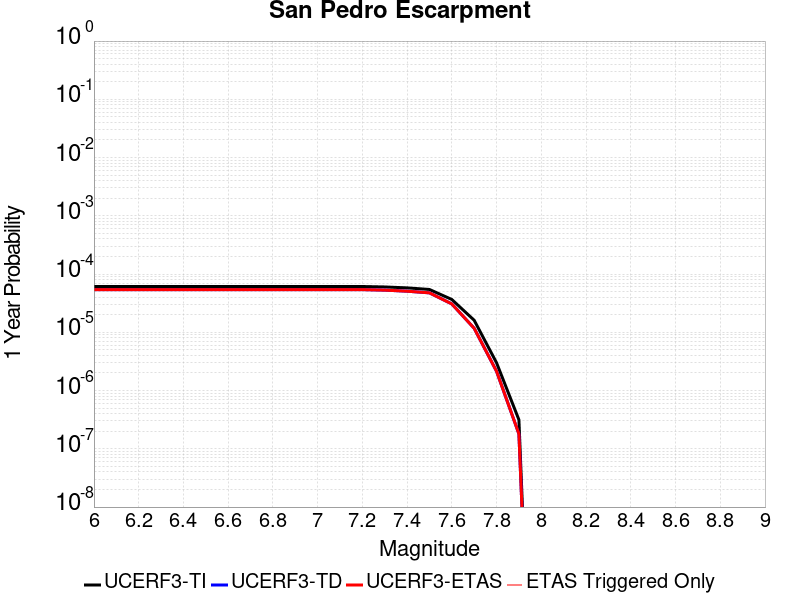 |  |

| Magnitude | 1 wk TI Prob | 1 wk TD Prob | 1 wk ETAS Prob | 1 wk ETAS/TD Gain | 1 wk ETAS Triggered Only | 1 mo TI Prob | 1 mo TD Prob | 1 mo ETAS Prob | 1 mo ETAS/TD Gain | 1 mo ETAS Triggered Only | 1 yr TI Prob | 1 yr TD Prob | 1 yr ETAS Prob | 1 yr ETAS/TD Gain | 1 yr ETAS Triggered Only | 10 yr TI Prob | 10 yr TD Prob | 10 yr ETAS Prob | 10 yr ETAS/TD Gain | 10 yr ETAS Triggered Only |
|-----|-----|-----|-----|-----|-----|-----|-----|-----|-----|-----|-----|-----|-----|-----|-----|-----|-----|-----|-----|-----|
| 6.0 | 1.1740281E-6 | 1.0380262E-6 | 1.0380262E-6 | 1.0 | 0.0 | 5.031539E-6 | 4.4486765E-6 | 4.4486765E-6 | 1.0 | 0.0 | 6.125726E-5 | 5.416135E-5 | 5.416135E-5 | 1.0 | 0.0 | 6.124038E-4 | 5.4148794E-4 | 5.5384217E-4 | 1.0228153 | 1.236094E-5 |
| 6.1 | 1.1740281E-6 | 1.0380262E-6 | 1.0380262E-6 | 1.0 | 0.0 | 5.031539E-6 | 4.4486765E-6 | 4.4486765E-6 | 1.0 | 0.0 | 6.125726E-5 | 5.416135E-5 | 5.416135E-5 | 1.0 | 0.0 | 6.124038E-4 | 5.4148794E-4 | 5.5384217E-4 | 1.0228153 | 1.236094E-5 |
| 6.2 | 1.1740281E-6 | 1.0380262E-6 | 1.0380262E-6 | 1.0 | 0.0 | 5.031539E-6 | 4.4486765E-6 | 4.4486765E-6 | 1.0 | 0.0 | 6.125726E-5 | 5.416135E-5 | 5.416135E-5 | 1.0 | 0.0 | 6.124038E-4 | 5.4148794E-4 | 5.5384217E-4 | 1.0228153 | 1.236094E-5 |
| 6.3 | 1.1740281E-6 | 1.0380262E-6 | 1.0380262E-6 | 1.0 | 0.0 | 5.031539E-6 | 4.4486765E-6 | 4.4486765E-6 | 1.0 | 0.0 | 6.125726E-5 | 5.416135E-5 | 5.416135E-5 | 1.0 | 0.0 | 6.124038E-4 | 5.4148794E-4 | 5.5384217E-4 | 1.0228153 | 1.236094E-5 |
| 6.4 | 1.1740281E-6 | 1.0380262E-6 | 1.0380262E-6 | 1.0 | 0.0 | 5.031539E-6 | 4.4486765E-6 | 4.4486765E-6 | 1.0 | 0.0 | 6.125726E-5 | 5.416135E-5 | 5.416135E-5 | 1.0 | 0.0 | 6.124038E-4 | 5.4148794E-4 | 5.5384217E-4 | 1.0228153 | 1.236094E-5 |
| 6.5 | 1.1740281E-6 | 1.0380262E-6 | 1.0380262E-6 | 1.0 | 0.0 | 5.031539E-6 | 4.4486765E-6 | 4.4486765E-6 | 1.0 | 0.0 | 6.125726E-5 | 5.416135E-5 | 5.416135E-5 | 1.0 | 0.0 | 6.124038E-4 | 5.4148794E-4 | 5.5384217E-4 | 1.0228153 | 1.236094E-5 |
| 6.6 | 1.1740281E-6 | 1.0380262E-6 | 1.0380262E-6 | 1.0 | 0.0 | 5.031539E-6 | 4.4486765E-6 | 4.4486765E-6 | 1.0 | 0.0 | 6.125726E-5 | 5.416135E-5 | 5.416135E-5 | 1.0 | 0.0 | 6.124038E-4 | 5.4148794E-4 | 5.5384217E-4 | 1.0228153 | 1.236094E-5 |
| 6.7 | 1.1740281E-6 | 1.0380262E-6 | 1.0380262E-6 | 1.0 | 0.0 | 5.031539E-6 | 4.4486765E-6 | 4.4486765E-6 | 1.0 | 0.0 | 6.125726E-5 | 5.416135E-5 | 5.416135E-5 | 1.0 | 0.0 | 6.124038E-4 | 5.4148794E-4 | 5.5384217E-4 | 1.0228153 | 1.236094E-5 |
| 6.8 | 1.1740281E-6 | 1.0380262E-6 | 1.0380262E-6 | 1.0 | 0.0 | 5.031539E-6 | 4.4486765E-6 | 4.4486765E-6 | 1.0 | 0.0 | 6.125726E-5 | 5.416135E-5 | 5.416135E-5 | 1.0 | 0.0 | 6.124038E-4 | 5.4148794E-4 | 5.5384217E-4 | 1.0228153 | 1.236094E-5 |
| 6.9 | 1.1740281E-6 | 1.0380262E-6 | 1.0380262E-6 | 1.0 | 0.0 | 5.031539E-6 | 4.4486765E-6 | 4.4486765E-6 | 1.0 | 0.0 | 6.125726E-5 | 5.416135E-5 | 5.416135E-5 | 1.0 | 0.0 | 6.124038E-4 | 5.4148794E-4 | 5.5384217E-4 | 1.0228153 | 1.236094E-5 |
| 7.0 | 1.1740281E-6 | 1.0380262E-6 | 1.0380262E-6 | 1.0 | 0.0 | 5.031539E-6 | 4.4486765E-6 | 4.4486765E-6 | 1.0 | 0.0 | 6.125726E-5 | 5.416135E-5 | 5.416135E-5 | 1.0 | 0.0 | 6.124038E-4 | 5.4148794E-4 | 5.5384217E-4 | 1.0228153 | 1.236094E-5 |
| 7.1 | 1.1740281E-6 | 1.0380262E-6 | 1.0380262E-6 | 1.0 | 0.0 | 5.031539E-6 | 4.4486765E-6 | 4.4486765E-6 | 1.0 | 0.0 | 6.125726E-5 | 5.416135E-5 | 5.416135E-5 | 1.0 | 0.0 | 6.124038E-4 | 5.4148794E-4 | 5.5384217E-4 | 1.0228153 | 1.236094E-5 |
| 7.2 | 1.1722314E-6 | 1.0362135E-6 | 1.0362135E-6 | 1.0 | 0.0 | 5.023839E-6 | 4.4409076E-6 | 4.4409076E-6 | 1.0 | 0.0 | 6.116352E-5 | 5.406677E-5 | 5.406677E-5 | 1.0 | 0.0 | 6.114669E-4 | 5.405426E-4 | 5.528968E-4 | 1.0228553 | 1.236094E-5 |
| 7.3 | 1.1515234E-6 | 1.0152875E-6 | 1.0152875E-6 | 1.0 | 0.0 | 4.935091E-6 | 4.351225E-6 | 4.351225E-6 | 1.0 | 0.0 | 6.008308E-5 | 5.2974945E-5 | 5.2974945E-5 | 1.0 | 0.0 | 6.0066837E-4 | 5.296295E-4 | 5.419839E-4 | 1.0233265 | 1.236094E-5 |
| 7.4 | 1.1103637E-6 | 9.736466E-7 | 9.736466E-7 | 1.0 | 0.0 | 4.7586927E-6 | 4.172765E-6 | 4.172765E-6 | 1.0 | 0.0 | 5.793554E-5 | 5.0802293E-5 | 5.0802293E-5 | 1.0 | 0.0 | 5.792044E-4 | 5.079131E-4 | 5.202678E-4 | 1.0243244 | 1.236094E-5 |
| 7.5 | 1.0425391E-6 | 9.1189133E-7 | 9.1189133E-7 | 1.0 | 0.0 | 4.4680173E-6 | 3.9081E-6 | 3.9081E-6 | 1.0 | 0.0 | 5.439675E-5 | 4.7580146E-5 | 4.7580146E-5 | 1.0 | 0.0 | 5.438344E-4 | 4.7570592E-4 | 4.8806096E-4 | 1.025972 | 1.236094E-5 |
| 7.6 | 7.0184194E-7 | 5.886514E-7 | 5.886514E-7 | 1.0 | 0.0 | 3.0078907E-6 | 2.5227896E-6 | 2.5227896E-6 | 1.0 | 0.0 | 3.6620455E-5 | 3.071458E-5 | 3.071458E-5 | 1.0 | 0.0 | 3.661442E-4 | 3.071081E-4 | 3.1946524E-4 | 1.0402371 | 1.236094E-5 |
| 7.7 | 3.0871365E-7 | 2.2456044E-7 | 2.2456044E-7 | 1.0 | 0.0 | 1.3230577E-6 | 9.624015E-7 | 9.624015E-7 | 1.0 | 0.0 | 1.610811E-5 | 1.1717177E-5 | 1.1717177E-5 | 1.0 | 0.0 | 1.6106942E-4 | 1.171657E-4 | 1.2952519E-4 | 1.1054872 | 1.236094E-5 |
| 7.8 | 5.7512665E-8 | 4.1053042E-8 | 4.1053042E-8 | 1.0 | 0.0 | 2.464828E-7 | 1.759416E-7 | 1.759416E-7 | 1.0 | 0.0 | 3.0009242E-6 | 2.142087E-6 | 2.142087E-6 | 1.0 | 0.0 | 3.0008836E-5 | 2.1420683E-5 | 2.1420683E-5 | 1.0 | 0.0 |
| 7.9 | 6.040053E-9 | 3.4534322E-9 | 3.4534322E-9 | 1.0 | 0.0 | 2.5885942E-8 | 1.4800423E-8 | 1.4800423E-8 | 1.0 | 0.0 | 3.151613E-7 | 1.8019513E-7 | 1.8019513E-7 | 1.0 | 0.0 | 3.1516086E-6 | 1.80195E-6 | 1.80195E-6 | 1.0 | 0.0 |

## Great Valley 11
*[(top)](#table-of-contents)*

| 1 Week | 1 Month | 1 Year | 10 Year |
|-----|-----|-----|-----|
|  | 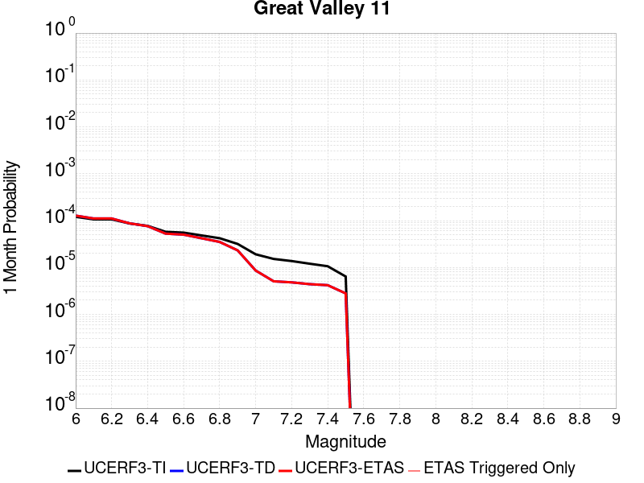 | 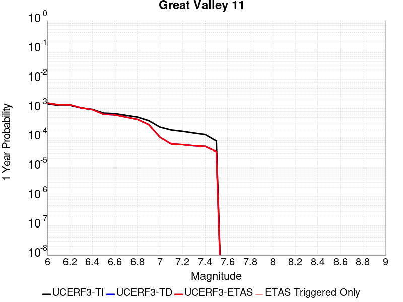 |  |

| Magnitude | 1 wk TI Prob | 1 wk TD Prob | 1 wk ETAS Prob | 1 wk ETAS/TD Gain | 1 wk ETAS Triggered Only | 1 mo TI Prob | 1 mo TD Prob | 1 mo ETAS Prob | 1 mo ETAS/TD Gain | 1 mo ETAS Triggered Only | 1 yr TI Prob | 1 yr TD Prob | 1 yr ETAS Prob | 1 yr ETAS/TD Gain | 1 yr ETAS Triggered Only | 10 yr TI Prob | 10 yr TD Prob | 10 yr ETAS Prob | 10 yr ETAS/TD Gain | 10 yr ETAS Triggered Only |
|-----|-----|-----|-----|-----|-----|-----|-----|-----|-----|-----|-----|-----|-----|-----|-----|-----|-----|-----|-----|-----|
| 6.0 | 2.8099583E-5 | 2.9832152E-5 | 2.9832152E-5 | 1.0 | 0.0 | 1.20421224E-4 | 1.278462E-4 | 1.278462E-4 | 1.0 | 0.0 | 0.0014651422 | 0.0015554909 | 0.0015554909 | 1.0 | 0.0 | 0.0145552 | 0.01545356 | 0.01546573 | 1.0007875 | 1.236094E-5 |
| 6.1 | 2.483194E-5 | 2.590715E-5 | 2.590715E-5 | 1.0 | 0.0 | 1.0641825E-4 | 1.11026246E-4 | 1.11026246E-4 | 1.0 | 0.0 | 0.0012948721 | 0.0013509706 | 0.0013509706 | 1.0 | 0.0 | 0.012873529 | 0.013433994 | 0.0134461885 | 1.0009078 | 1.236094E-5 |
| 6.2 | 2.483194E-5 | 2.590715E-5 | 2.590715E-5 | 1.0 | 0.0 | 1.0641825E-4 | 1.11026246E-4 | 1.11026246E-4 | 1.0 | 0.0 | 0.0012948721 | 0.0013509706 | 0.0013509706 | 1.0 | 0.0 | 0.012873529 | 0.013433994 | 0.0134461885 | 1.0009078 | 1.236094E-5 |
| 6.3 | 2.0257901E-5 | 2.0398922E-5 | 2.0398922E-5 | 1.0 | 0.0 | 8.681669E-5 | 8.742122E-5 | 8.742122E-5 | 1.0 | 0.0 | 0.0010564806 | 0.0010638756 | 0.0010638756 | 1.0 | 0.0 | 0.01051472 | 0.010592012 | 0.010604242 | 1.0011547 | 1.236094E-5 |
| 6.4 | 1.8054898E-5 | 1.7780874E-5 | 1.7780874E-5 | 1.0 | 0.0 | 7.737584E-5 | 7.62017E-5 | 7.62017E-5 | 1.0 | 0.0 | 9.416436E-4 | 9.2739856E-4 | 9.2739856E-4 | 1.0 | 0.0 | 0.009376635 | 0.009239036 | 0.009251283 | 1.0013255 | 1.236094E-5 |
| 6.5 | 1.34804895E-5 | 1.2321055E-5 | 1.2321055E-5 | 1.0 | 0.0 | 5.777225E-5 | 5.2803476E-5 | 5.2803476E-5 | 1.0 | 0.0 | 7.031501E-4 | 6.4269686E-4 | 6.4269686E-4 | 1.0 | 0.0 | 0.007009294 | 0.0064088185 | 0.0064088185 | 1.0 | 0.0 |
| 6.6 | 1.294883E-5 | 1.1732312E-5 | 1.1732312E-5 | 1.0 | 0.0 | 5.5493805E-5 | 5.028039E-5 | 5.028039E-5 | 1.0 | 0.0 | 6.754276E-4 | 6.1199587E-4 | 6.1199587E-4 | 1.0 | 0.0 | 0.006733784 | 0.0061035305 | 0.0061035305 | 1.0 | 0.0 |
| 6.7 | 1.1272237E-5 | 9.811886E-6 | 9.811886E-6 | 1.0 | 0.0 | 4.8308695E-5 | 4.2050277E-5 | 4.2050277E-5 | 1.0 | 0.0 | 5.879996E-4 | 5.118446E-4 | 5.118446E-4 | 1.0 | 0.0 | 0.005864462 | 0.0051069413 | 0.0051069413 | 1.0 | 0.0 |
| 6.8 | 9.8337505E-6 | 8.19377E-6 | 8.19377E-6 | 1.0 | 0.0 | 4.2143965E-5 | 3.5115696E-5 | 3.5115696E-5 | 1.0 | 0.0 | 5.1298196E-4 | 4.2745177E-4 | 4.2745177E-4 | 1.0 | 0.0 | 0.005117994 | 0.0042665056 | 0.0042665056 | 1.0 | 0.0 |
| 6.9 | 7.4224813E-6 | 5.4131347E-6 | 5.4131347E-6 | 1.0 | 0.0 | 3.1810247E-5 | 2.319895E-5 | 2.319895E-5 | 1.0 | 0.0 | 3.872209E-4 | 2.8241202E-4 | 2.8241202E-4 | 1.0 | 0.0 | 0.0038654688 | 0.0028206722 | 0.0028206722 | 1.0 | 0.0 |
| 7.0 | 4.4628923E-6 | 2.0110795E-6 | 2.0110795E-6 | 1.0 | 0.0 | 1.912654E-5 | 8.618884E-6 | 8.618884E-6 | 1.0 | 0.0 | 2.3284076E-4 | 1.04929975E-4 | 1.04929975E-4 | 1.0 | 0.0 | 0.0023259693 | 0.0010488159 | 0.0010488159 | 1.0 | 0.0 |
| 7.1 | 3.5546527E-6 | 1.1855836E-6 | 1.1855836E-6 | 1.0 | 0.0 | 1.5234136E-5 | 5.081063E-6 | 5.081063E-6 | 1.0 | 0.0 | 1.8545982E-4 | 6.186026E-5 | 6.186026E-5 | 1.0 | 0.0 | 0.0018530512 | 6.1843713E-4 | 6.1843713E-4 | 1.0 | 0.0 |
| 7.2 | 3.2039936E-6 | 1.1254128E-6 | 1.1254128E-6 | 1.0 | 0.0 | 1.3731329E-5 | 4.823189E-6 | 4.823189E-6 | 1.0 | 0.0 | 1.671661E-4 | 5.8720816E-5 | 5.8720816E-5 | 1.0 | 0.0 | 0.0016704041 | 5.870597E-4 | 5.870597E-4 | 1.0 | 0.0 |
| 7.3 | 2.8120473E-6 | 1.0305612E-6 | 1.0305612E-6 | 1.0 | 0.0 | 1.2051575E-5 | 4.4166836E-6 | 4.4166836E-6 | 1.0 | 0.0 | 1.4671806E-4 | 5.3771862E-5 | 5.3771862E-5 | 1.0 | 0.0 | 0.0014662122 | 5.3759513E-4 | 5.3759513E-4 | 1.0 | 0.0 |
| 7.4 | 2.4837766E-6 | 9.800582E-7 | 9.800582E-7 | 1.0 | 0.0 | 1.0644713E-5 | 4.200243E-6 | 4.200243E-6 | 1.0 | 0.0 | 1.2959167E-4 | 5.1136827E-5 | 5.1136827E-5 | 1.0 | 0.0 | 0.0012951613 | 5.112572E-4 | 5.112572E-4 | 1.0 | 0.0 |
| 7.5 | 1.5002679E-6 | 6.546144E-7 | 6.546144E-7 | 1.0 | 0.0 | 6.4297037E-6 | 2.8054874E-6 | 2.8054874E-6 | 1.0 | 0.0 | 7.827883E-5 | 3.4156317E-5 | 3.4156317E-5 | 1.0 | 0.0 | 7.825126E-4 | 3.4151482E-4 | 3.4151482E-4 | 1.0 | 0.0 |

## West Tahoe
*[(top)](#table-of-contents)*

| 1 Week | 1 Month | 1 Year | 10 Year |
|-----|-----|-----|-----|
|  |  |  |  |

| Magnitude | 1 wk TI Prob | 1 wk TD Prob | 1 wk ETAS Prob | 1 wk ETAS/TD Gain | 1 wk ETAS Triggered Only | 1 mo TI Prob | 1 mo TD Prob | 1 mo ETAS Prob | 1 mo ETAS/TD Gain | 1 mo ETAS Triggered Only | 1 yr TI Prob | 1 yr TD Prob | 1 yr ETAS Prob | 1 yr ETAS/TD Gain | 1 yr ETAS Triggered Only | 10 yr TI Prob | 10 yr TD Prob | 10 yr ETAS Prob | 10 yr ETAS/TD Gain | 10 yr ETAS Triggered Only |
|-----|-----|-----|-----|-----|-----|-----|-----|-----|-----|-----|-----|-----|-----|-----|-----|-----|-----|-----|-----|-----|
| 6.0 | 1.952444E-5 | 2.118317E-5 | 2.118317E-5 | 1.0 | 0.0 | 8.367348E-5 | 9.078217E-5 | 9.078217E-5 | 1.0 | 0.0 | 0.0010182485 | 0.0011047672 | 0.0011047672 | 1.0 | 0.0 | 0.010135954 | 0.010998235 | 0.011010461 | 1.0011115 | 1.236094E-5 |
| 6.1 | 1.952444E-5 | 2.118317E-5 | 2.118317E-5 | 1.0 | 0.0 | 8.367348E-5 | 9.078217E-5 | 9.078217E-5 | 1.0 | 0.0 | 0.0010182485 | 0.0011047672 | 0.0011047672 | 1.0 | 0.0 | 0.010135954 | 0.010998235 | 0.011010461 | 1.0011115 | 1.236094E-5 |
| 6.2 | 1.952444E-5 | 2.118317E-5 | 2.118317E-5 | 1.0 | 0.0 | 8.367348E-5 | 9.078217E-5 | 9.078217E-5 | 1.0 | 0.0 | 0.0010182485 | 0.0011047672 | 0.0011047672 | 1.0 | 0.0 | 0.010135954 | 0.010998235 | 0.011010461 | 1.0011115 | 1.236094E-5 |
| 6.3 | 1.952444E-5 | 2.118317E-5 | 2.118317E-5 | 1.0 | 0.0 | 8.367348E-5 | 9.078217E-5 | 9.078217E-5 | 1.0 | 0.0 | 0.0010182485 | 0.0011047672 | 0.0011047672 | 1.0 | 0.0 | 0.010135954 | 0.010998235 | 0.011010461 | 1.0011115 | 1.236094E-5 |
| 6.4 | 1.952444E-5 | 2.118317E-5 | 2.118317E-5 | 1.0 | 0.0 | 8.367348E-5 | 9.078217E-5 | 9.078217E-5 | 1.0 | 0.0 | 0.0010182485 | 0.0011047672 | 0.0011047672 | 1.0 | 0.0 | 0.010135954 | 0.010998235 | 0.011010461 | 1.0011115 | 1.236094E-5 |
| 6.5 | 1.2685271E-5 | 1.3690627E-5 | 1.3690627E-5 | 1.0 | 0.0 | 5.4364315E-5 | 5.8672893E-5 | 5.8672893E-5 | 1.0 | 0.0 | 6.616845E-4 | 7.141248E-4 | 7.141248E-4 | 1.0 | 0.0 | 0.0065971776 | 0.00711995 | 0.007132223 | 1.0017238 | 1.236094E-5 |
| 6.6 | 1.2685271E-5 | 1.3690627E-5 | 1.3690627E-5 | 1.0 | 0.0 | 5.4364315E-5 | 5.8672893E-5 | 5.8672893E-5 | 1.0 | 0.0 | 6.616845E-4 | 7.141248E-4 | 7.141248E-4 | 1.0 | 0.0 | 0.0065971776 | 0.00711995 | 0.007132223 | 1.0017238 | 1.236094E-5 |
| 6.7 | 9.117886E-6 | 9.809846E-6 | 9.809846E-6 | 1.0 | 0.0 | 3.9076072E-5 | 4.2041564E-5 | 4.2041564E-5 | 1.0 | 0.0 | 4.756473E-4 | 5.11743E-4 | 5.11743E-4 | 1.0 | 0.0 | 0.0047463053 | 0.0051063634 | 0.0051186616 | 1.0024084 | 1.236094E-5 |
| 6.8 | 8.786828E-6 | 9.457863E-6 | 9.457863E-6 | 1.0 | 0.0 | 3.7657293E-5 | 4.053311E-5 | 4.053311E-5 | 1.0 | 0.0 | 4.5838108E-4 | 4.933859E-4 | 4.933859E-4 | 1.0 | 0.0 | 0.0045743673 | 0.0049236063 | 0.0049359063 | 1.0024981 | 1.236094E-5 |
| 6.9 | 6.7562123E-6 | 7.2638086E-6 | 7.2638086E-6 | 1.0 | 0.0 | 2.8954875E-5 | 3.1130265E-5 | 3.1130265E-5 | 1.0 | 0.0 | 3.5246857E-4 | 3.789498E-4 | 3.789498E-4 | 1.0 | 0.0 | 0.0035191004 | 0.0037835082 | 0.0037958224 | 1.0032547 | 1.236094E-5 |
| 7.0 | 5.1792854E-6 | 5.567338E-6 | 5.567338E-6 | 1.0 | 0.0 | 2.2196748E-5 | 2.3859824E-5 | 2.3859824E-5 | 1.0 | 0.0 | 2.702119E-4 | 2.9045844E-4 | 2.9045844E-4 | 1.0 | 0.0 | 0.0026988357 | 0.0029011632 | 0.0029134883 | 1.0042484 | 1.236094E-5 |
| 7.1 | 4.090765E-6 | 4.3974223E-6 | 4.3974223E-6 | 1.0 | 0.0 | 1.7531731E-5 | 1.884598E-5 | 1.884598E-5 | 1.0 | 0.0 | 2.134279E-4 | 2.2942905E-4 | 2.2942905E-4 | 1.0 | 0.0 | 0.0021322304 | 0.0022922563 | 0.0022922563 | 1.0 | 0.0 |
| 7.2 | 2.2356758E-6 | 2.4023684E-6 | 2.4023684E-6 | 1.0 | 0.0 | 9.581432E-6 | 1.0295834E-5 | 1.0295834E-5 | 1.0 | 0.0 | 1.1664769E-4 | 1.2534647E-4 | 1.2534647E-4 | 1.0 | 0.0 | 0.0011658648 | 0.0012529434 | 0.0012529434 | 1.0 | 0.0 |

## Honey Lake 2011 CFM
*[(top)](#table-of-contents)*

| 1 Week | 1 Month | 1 Year | 10 Year |
|-----|-----|-----|-----|
|  |  |  |  |

| Magnitude | 1 wk TI Prob | 1 wk TD Prob | 1 wk ETAS Prob | 1 wk ETAS/TD Gain | 1 wk ETAS Triggered Only | 1 mo TI Prob | 1 mo TD Prob | 1 mo ETAS Prob | 1 mo ETAS/TD Gain | 1 mo ETAS Triggered Only | 1 yr TI Prob | 1 yr TD Prob | 1 yr ETAS Prob | 1 yr ETAS/TD Gain | 1 yr ETAS Triggered Only | 10 yr TI Prob | 10 yr TD Prob | 10 yr ETAS Prob | 10 yr ETAS/TD Gain | 10 yr ETAS Triggered Only |
|-----|-----|-----|-----|-----|-----|-----|-----|-----|-----|-----|-----|-----|-----|-----|-----|-----|-----|-----|-----|-----|
| 6.0 | 6.155506E-5 | 7.954667E-5 | 9.190662E-5 | 1.1553799 | 1.236094E-5 | 2.6378073E-4 | 3.40873E-4 | 3.5322973E-4 | 1.0362502 | 1.236094E-5 | 0.0032068014 | 0.0041427943 | 0.004155104 | 1.0029714 | 1.236094E-5 | 0.03160919 | 0.040702924 | 0.04071478 | 1.0002913 | 1.236094E-5 |
| 6.1 | 6.155506E-5 | 7.954667E-5 | 9.190662E-5 | 1.1553799 | 1.236094E-5 | 2.6378073E-4 | 3.40873E-4 | 3.5322973E-4 | 1.0362502 | 1.236094E-5 | 0.0032068014 | 0.0041427943 | 0.004155104 | 1.0029714 | 1.236094E-5 | 0.03160919 | 0.040702924 | 0.04071478 | 1.0002913 | 1.236094E-5 |
| 6.2 | 4.1335024E-5 | 5.257629E-5 | 5.257629E-5 | 1.0 | 0.0 | 1.7713808E-4 | 2.253086E-4 | 2.253086E-4 | 1.0 | 0.0 | 0.0021545228 | 0.0027398595 | 0.0027398595 | 1.0 | 0.0 | 0.021337535 | 0.027076708 | 0.027076708 | 1.0 | 0.0 |
| 6.3 | 4.1335024E-5 | 5.257629E-5 | 5.257629E-5 | 1.0 | 0.0 | 1.7713808E-4 | 2.253086E-4 | 2.253086E-4 | 1.0 | 0.0 | 0.0021545228 | 0.0027398595 | 0.0027398595 | 1.0 | 0.0 | 0.021337535 | 0.027076708 | 0.027076708 | 1.0 | 0.0 |
| 6.4 | 3.2393702E-5 | 4.0887444E-5 | 4.0887444E-5 | 1.0 | 0.0 | 1.3882275E-4 | 1.7522085E-4 | 1.7522085E-4 | 1.0 | 0.0 | 0.0016888566 | 0.002131335 | 0.002131335 | 1.0 | 0.0 | 0.016760793 | 0.02111982 | 0.02111982 | 1.0 | 0.0 |
| 6.5 | 2.7205504E-5 | 3.4211684E-5 | 3.4211684E-5 | 1.0 | 0.0 | 1.1658981E-4 | 1.4661385E-4 | 1.4661385E-4 | 1.0 | 0.0 | 0.0014185566 | 0.0017836588 | 0.0017836588 | 1.0 | 0.0 | 0.014095354 | 0.017702932 | 0.017702932 | 1.0 | 0.0 |
| 6.6 | 2.069265E-5 | 2.5955307E-5 | 2.5955307E-5 | 1.0 | 0.0 | 8.867977E-5 | 1.1123277E-4 | 1.1123277E-4 | 1.0 | 0.0 | 0.0010791414 | 0.0013535038 | 0.0013535038 | 1.0 | 0.0 | 0.010739161 | 0.013461002 | 0.013461002 | 1.0 | 0.0 |
| 6.7 | 1.8060919E-5 | 2.2656828E-5 | 2.2656828E-5 | 1.0 | 0.0 | 7.7401644E-5 | 9.709754E-5 | 9.709754E-5 | 1.0 | 0.0 | 9.419576E-4 | 0.0011816026 | 0.0011816026 | 1.0 | 0.0 | 0.009379748 | 0.011761238 | 0.011761238 | 1.0 | 0.0 |
| 6.8 | 1.4474663E-5 | 1.818127E-5 | 1.818127E-5 | 1.0 | 0.0 | 6.203279E-5 | 7.791784E-5 | 7.791784E-5 | 1.0 | 0.0 | 7.5498753E-4 | 9.483136E-4 | 9.483136E-4 | 1.0 | 0.0 | 0.007524277 | 0.009450192 | 0.009450192 | 1.0 | 0.0 |
| 6.9 | 8.564552E-6 | 1.0802308E-5 | 1.0802308E-5 | 1.0 | 0.0 | 3.6704707E-5 | 4.6295158E-5 | 4.6295158E-5 | 1.0 | 0.0 | 4.4678818E-4 | 5.635644E-4 | 5.635644E-4 | 1.0 | 0.0 | 0.0044589094 | 0.0056278477 | 0.0056278477 | 1.0 | 0.0 |

## Mission Hills 2011
*[(top)](#table-of-contents)*

| 1 Week | 1 Month | 1 Year | 10 Year |
|-----|-----|-----|-----|
|  |  | 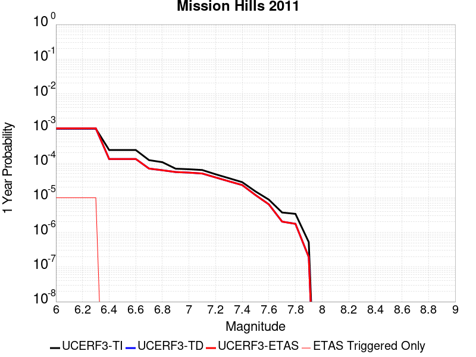 |  |

| Magnitude | 1 wk TI Prob | 1 wk TD Prob | 1 wk ETAS Prob | 1 wk ETAS/TD Gain | 1 wk ETAS Triggered Only | 1 mo TI Prob | 1 mo TD Prob | 1 mo ETAS Prob | 1 mo ETAS/TD Gain | 1 mo ETAS Triggered Only | 1 yr TI Prob | 1 yr TD Prob | 1 yr ETAS Prob | 1 yr ETAS/TD Gain | 1 yr ETAS Triggered Only | 10 yr TI Prob | 10 yr TD Prob | 10 yr ETAS Prob | 10 yr ETAS/TD Gain | 10 yr ETAS Triggered Only |
|-----|-----|-----|-----|-----|-----|-----|-----|-----|-----|-----|-----|-----|-----|-----|-----|-----|-----|-----|-----|-----|
| 6.0 | 1.8765717E-5 | 1.9054645E-5 | 1.9054645E-5 | 1.0 | 0.0 | 8.0422025E-5 | 8.166215E-5 | 9.402208E-5 | 1.1513544 | 1.236094E-5 | 9.786983E-4 | 9.941267E-4 | 0.0010064753 | 1.0124216 | 1.236094E-5 | 0.009743992 | 0.009930461 | 0.009942698 | 1.0012324 | 1.236094E-5 |
| 6.1 | 1.8765717E-5 | 1.9054645E-5 | 1.9054645E-5 | 1.0 | 0.0 | 8.0422025E-5 | 8.166215E-5 | 9.402208E-5 | 1.1513544 | 1.236094E-5 | 9.786983E-4 | 9.941267E-4 | 0.0010064753 | 1.0124216 | 1.236094E-5 | 0.009743992 | 0.009930461 | 0.009942698 | 1.0012324 | 1.236094E-5 |
| 6.2 | 1.8765717E-5 | 1.9054645E-5 | 1.9054645E-5 | 1.0 | 0.0 | 8.0422025E-5 | 8.166215E-5 | 9.402208E-5 | 1.1513544 | 1.236094E-5 | 9.786983E-4 | 9.941267E-4 | 0.0010064753 | 1.0124216 | 1.236094E-5 | 0.009743992 | 0.009930461 | 0.009942698 | 1.0012324 | 1.236094E-5 |
| 6.3 | 1.8765717E-5 | 1.9054645E-5 | 1.9054645E-5 | 1.0 | 0.0 | 8.0422025E-5 | 8.166215E-5 | 9.402208E-5 | 1.1513544 | 1.236094E-5 | 9.786983E-4 | 9.941267E-4 | 0.0010064753 | 1.0124216 | 1.236094E-5 | 0.009743992 | 0.009930461 | 0.009942698 | 1.0012324 | 1.236094E-5 |
| 6.4 | 4.566357E-6 | 2.5148488E-6 | 2.5148488E-6 | 1.0 | 0.0 | 1.9569954E-5 | 1.0777889E-5 | 1.0777889E-5 | 1.0 | 0.0 | 2.3823815E-4 | 1.3121472E-4 | 1.3121472E-4 | 1.0 | 0.0 | 0.002379829 | 0.0013115506 | 0.0013115506 | 1.0 | 0.0 |
| 6.5 | 4.566357E-6 | 2.5148488E-6 | 2.5148488E-6 | 1.0 | 0.0 | 1.9569954E-5 | 1.0777889E-5 | 1.0777889E-5 | 1.0 | 0.0 | 2.3823815E-4 | 1.3121472E-4 | 1.3121472E-4 | 1.0 | 0.0 | 0.002379829 | 0.0013115506 | 0.0013115506 | 1.0 | 0.0 |
| 6.6 | 4.566357E-6 | 2.5148488E-6 | 2.5148488E-6 | 1.0 | 0.0 | 1.9569954E-5 | 1.0777889E-5 | 1.0777889E-5 | 1.0 | 0.0 | 2.3823815E-4 | 1.3121472E-4 | 1.3121472E-4 | 1.0 | 0.0 | 0.002379829 | 0.0013115506 | 0.0013115506 | 1.0 | 0.0 |
| 6.7 | 2.3266773E-6 | 1.3296187E-6 | 1.3296187E-6 | 1.0 | 0.0 | 9.971435E-6 | 5.698354E-6 | 5.698354E-6 | 1.0 | 0.0 | 1.2139547E-4 | 6.937531E-5 | 6.937531E-5 | 1.0 | 0.0 | 0.0012132917 | 6.9354265E-4 | 6.9354265E-4 | 1.0 | 0.0 |
| 6.8 | 2.032735E-6 | 1.1894115E-6 | 1.1894115E-6 | 1.0 | 0.0 | 8.711692E-6 | 5.097468E-6 | 5.097468E-6 | 1.0 | 0.0 | 1.06059684E-4 | 6.205996E-5 | 6.205996E-5 | 1.0 | 0.0 | 0.0010600908 | 6.2043115E-4 | 6.2043115E-4 | 1.0 | 0.0 |
| 6.9 | 1.3186259E-6 | 1.0561778E-6 | 1.0561778E-6 | 1.0 | 0.0 | 5.6512413E-6 | 4.5264687E-6 | 4.5264687E-6 | 1.0 | 0.0 | 6.8801695E-5 | 5.5108394E-5 | 5.5108394E-5 | 1.0 | 0.0 | 6.8780396E-4 | 5.5095024E-4 | 5.5095024E-4 | 1.0 | 0.0 |
| 7.0 | 1.2726016E-6 | 1.0159088E-6 | 1.0159088E-6 | 1.0 | 0.0 | 5.4539955E-6 | 4.3538876E-6 | 4.3538876E-6 | 1.0 | 0.0 | 6.6400375E-5 | 5.300732E-5 | 5.300732E-5 | 1.0 | 0.0 | 6.6380535E-4 | 5.299496E-4 | 5.299496E-4 | 1.0 | 0.0 |
| 7.1 | 1.2063913E-6 | 9.570072E-7 | 9.570072E-7 | 1.0 | 0.0 | 5.170238E-6 | 4.101453E-6 | 4.101453E-6 | 1.0 | 0.0 | 6.294583E-5 | 4.9934075E-5 | 4.9934075E-5 | 1.0 | 0.0 | 6.2928005E-4 | 4.992311E-4 | 4.992311E-4 | 1.0 | 0.0 |
| 7.2 | 9.105806E-7 | 7.3765557E-7 | 7.3765557E-7 | 1.0 | 0.0 | 3.9024826E-6 | 3.1613772E-6 | 3.1613772E-6 | 1.0 | 0.0 | 4.7511687E-5 | 3.8489103E-5 | 3.8489103E-5 | 1.0 | 0.0 | 4.7501532E-4 | 3.8482592E-4 | 3.8482592E-4 | 1.0 | 0.0 |
| 7.3 | 7.020432E-7 | 5.710089E-7 | 5.710089E-7 | 1.0 | 0.0 | 3.0087533E-6 | 2.447179E-6 | 2.447179E-6 | 1.0 | 0.0 | 3.6630954E-5 | 2.979401E-5 | 2.979401E-5 | 1.0 | 0.0 | 3.6624918E-4 | 2.9790145E-4 | 2.9790145E-4 | 1.0 | 0.0 |
| 7.4 | 5.3900635E-7 | 4.4480825E-7 | 4.4480825E-7 | 1.0 | 0.0 | 2.3100251E-6 | 1.9063198E-6 | 1.9063198E-6 | 1.0 | 0.0 | 2.8124194E-5 | 2.3209208E-5 | 2.3209208E-5 | 1.0 | 0.0 | 2.8120633E-4 | 2.3206905E-4 | 2.3206905E-4 | 1.0 | 0.0 |
| 7.5 | 2.907075E-7 | 2.2875415E-7 | 2.2875415E-7 | 1.0 | 0.0 | 1.2458887E-6 | 9.803746E-7 | 9.803746E-7 | 1.0 | 0.0 | 1.5168589E-5 | 1.1935997E-5 | 1.1935997E-5 | 1.0 | 0.0 | 1.5167553E-4 | 1.1935373E-4 | 1.1935373E-4 | 1.0 | 0.0 |
| 7.6 | 1.6903675E-7 | 1.2353402E-7 | 1.2353402E-7 | 1.0 | 0.0 | 7.2444305E-7 | 5.294314E-7 | 5.294314E-7 | 1.0 | 0.0 | 8.820059E-6 | 6.4458095E-6 | 6.4458095E-6 | 1.0 | 0.0 | 8.8197085E-5 | 6.445635E-5 | 6.445635E-5 | 1.0 | 0.0 |
| 7.7 | 7.168073E-8 | 3.9135116E-8 | 3.9135116E-8 | 1.0 | 0.0 | 3.072031E-7 | 1.6772192E-7 | 1.6772192E-7 | 1.0 | 0.0 | 3.7401915E-6 | 2.0420127E-6 | 2.0420127E-6 | 1.0 | 0.0 | 3.7401285E-5 | 2.041995E-5 | 2.041995E-5 | 1.0 | 0.0 |
| 7.8 | 6.564101E-8 | 3.3835356E-8 | 3.3835356E-8 | 1.0 | 0.0 | 2.813186E-7 | 1.4500866E-7 | 1.4500866E-7 | 1.0 | 0.0 | 3.4250486E-6 | 1.7654792E-6 | 1.7654792E-6 | 1.0 | 0.0 | 3.424996E-5 | 1.7654662E-5 | 1.7654662E-5 | 1.0 | 0.0 |
| 7.9 | 1.0029074E-8 | 3.7292542E-9 | 3.7292542E-9 | 1.0 | 0.0 | 4.2981743E-8 | 1.5982518E-8 | 1.5982518E-8 | 1.0 | 0.0 | 5.2330256E-7 | 1.9458714E-7 | 1.9458714E-7 | 1.0 | 0.0 | 5.2330133E-6 | 1.945871E-6 | 1.945871E-6 | 1.0 | 0.0 |

## Los Osos 2011
*[(top)](#table-of-contents)*

| 1 Week | 1 Month | 1 Year | 10 Year |
|-----|-----|-----|-----|
|  |  |  |  |

| Magnitude | 1 wk TI Prob | 1 wk TD Prob | 1 wk ETAS Prob | 1 wk ETAS/TD Gain | 1 wk ETAS Triggered Only | 1 mo TI Prob | 1 mo TD Prob | 1 mo ETAS Prob | 1 mo ETAS/TD Gain | 1 mo ETAS Triggered Only | 1 yr TI Prob | 1 yr TD Prob | 1 yr ETAS Prob | 1 yr ETAS/TD Gain | 1 yr ETAS Triggered Only | 10 yr TI Prob | 10 yr TD Prob | 10 yr ETAS Prob | 10 yr ETAS/TD Gain | 10 yr ETAS Triggered Only |
|-----|-----|-----|-----|-----|-----|-----|-----|-----|-----|-----|-----|-----|-----|-----|-----|-----|-----|-----|-----|-----|
| 6.0 | 4.8871775E-6 | 4.9814835E-6 | 4.9814835E-6 | 1.0 | 0.0 | 2.0944879E-5 | 2.1349055E-5 | 3.370973E-5 | 1.57898 | 1.236094E-5 | 2.5497406E-4 | 2.5989654E-4 | 2.7225426E-4 | 1.0475487 | 1.236094E-5 | 0.002546817 | 0.0025962002 | 0.002608529 | 1.0047488 | 1.236094E-5 |
| 6.1 | 4.8871775E-6 | 4.9814835E-6 | 4.9814835E-6 | 1.0 | 0.0 | 2.0944879E-5 | 2.1349055E-5 | 3.370973E-5 | 1.57898 | 1.236094E-5 | 2.5497406E-4 | 2.5989654E-4 | 2.7225426E-4 | 1.0475487 | 1.236094E-5 | 0.002546817 | 0.0025962002 | 0.002608529 | 1.0047488 | 1.236094E-5 |
| 6.2 | 4.8871775E-6 | 4.9814835E-6 | 4.9814835E-6 | 1.0 | 0.0 | 2.0944879E-5 | 2.1349055E-5 | 3.370973E-5 | 1.57898 | 1.236094E-5 | 2.5497406E-4 | 2.5989654E-4 | 2.7225426E-4 | 1.0475487 | 1.236094E-5 | 0.002546817 | 0.0025962002 | 0.002608529 | 1.0047488 | 1.236094E-5 |
| 6.3 | 4.8871775E-6 | 4.9814835E-6 | 4.9814835E-6 | 1.0 | 0.0 | 2.0944879E-5 | 2.1349055E-5 | 3.370973E-5 | 1.57898 | 1.236094E-5 | 2.5497406E-4 | 2.5989654E-4 | 2.7225426E-4 | 1.0475487 | 1.236094E-5 | 0.002546817 | 0.0025962002 | 0.002608529 | 1.0047488 | 1.236094E-5 |
| 6.4 | 4.8871775E-6 | 4.9814835E-6 | 4.9814835E-6 | 1.0 | 0.0 | 2.0944879E-5 | 2.1349055E-5 | 3.370973E-5 | 1.57898 | 1.236094E-5 | 2.5497406E-4 | 2.5989654E-4 | 2.7225426E-4 | 1.0475487 | 1.236094E-5 | 0.002546817 | 0.0025962002 | 0.002608529 | 1.0047488 | 1.236094E-5 |
| 6.5 | 3.1724062E-6 | 3.223395E-6 | 3.223395E-6 | 1.0 | 0.0 | 1.3595956E-5 | 1.3814477E-5 | 2.6175247E-5 | 1.8947692 | 1.236094E-5 | 1.6551818E-4 | 1.681784E-4 | 1.8053727E-4 | 1.0734866 | 1.236094E-5 | 0.0016539496 | 0.0016805249 | 0.001692865 | 1.007343 | 1.236094E-5 |
| 6.6 | 3.1022591E-6 | 3.1511045E-6 | 3.1511045E-6 | 1.0 | 0.0 | 1.3295328E-5 | 1.3504664E-5 | 2.5865436E-5 | 1.9152966 | 1.236094E-5 | 1.618586E-4 | 1.64407E-4 | 1.7676591E-4 | 1.0751727 | 1.236094E-5 | 0.0016174077 | 0.0016428665 | 0.0016552071 | 1.0075116 | 1.236094E-5 |
| 6.7 | 2.611518E-6 | 2.6491832E-6 | 2.6491832E-6 | 1.0 | 0.0 | 1.1192172E-5 | 1.1353593E-5 | 2.3714392E-5 | 2.0887125 | 1.236094E-5 | 1.3625617E-4 | 1.3822126E-4 | 1.505805E-4 | 1.0894163 | 1.236094E-5 | 0.0013617266 | 0.0013813575 | 0.0013937014 | 1.008936 | 1.236094E-5 |
| 6.8 | 2.4780884E-6 | 2.5121592E-6 | 2.5121592E-6 | 1.0 | 0.0 | 1.0620336E-5 | 1.0766353E-5 | 2.3127159E-5 | 2.148096 | 1.236094E-5 | 1.2929492E-4 | 1.3107249E-4 | 1.4343181E-4 | 1.0942937 | 1.236094E-5 | 0.0012921972 | 0.001309956 | 0.0013223008 | 1.0094237 | 1.236094E-5 |
| 6.9 | 2.1376322E-6 | 2.1635055E-6 | 2.1635055E-6 | 1.0 | 0.0 | 9.161248E-6 | 9.272134E-6 | 2.1632959E-5 | 2.3331153 | 1.236094E-5 | 1.1153249E-4 | 1.128824E-4 | 1.2524195E-4 | 1.1094904 | 1.236094E-5 | 0.0011147653 | 0.0011282525 | 0.0011405995 | 1.0109434 | 1.236094E-5 |
| 7.0 | 1.9282882E-6 | 1.9494585E-6 | 1.9494585E-6 | 1.0 | 0.0 | 8.264066E-6 | 8.354796E-6 | 2.0715632E-5 | 2.47949 | 1.236094E-5 | 1.0061036E-4 | 1.017149E-4 | 1.1407458E-4 | 1.121513 | 1.236094E-5 | 0.0010056482 | 0.0010166848 | 0.0010290332 | 1.0121458 | 1.236094E-5 |
| 7.1 | 1.6353226E-6 | 1.6501118E-6 | 1.6501118E-6 | 1.0 | 0.0 | 7.0085066E-6 | 7.0718884E-6 | 7.0718884E-6 | 1.0 | 0.0 | 8.532523E-5 | 8.609685E-5 | 8.609685E-5 | 1.0 | 0.0 | 8.529247E-4 | 8.6063566E-4 | 8.6063566E-4 | 1.0 | 0.0 |
| 7.2 | 1.4446276E-6 | 1.4553341E-6 | 1.4553341E-6 | 1.0 | 0.0 | 6.191247E-6 | 6.237131E-6 | 6.237131E-6 | 1.0 | 0.0 | 7.537582E-5 | 7.593443E-5 | 7.593443E-5 | 1.0 | 0.0 | 7.535026E-4 | 7.590854E-4 | 7.590854E-4 | 1.0 | 0.0 |
| 7.3 | 1.2014582E-6 | 1.2069073E-6 | 1.2069073E-6 | 1.0 | 0.0 | 5.149096E-6 | 5.1724496E-6 | 5.1724496E-6 | 1.0 | 0.0 | 6.268844E-5 | 6.297276E-5 | 6.297276E-5 | 1.0 | 0.0 | 6.267076E-4 | 6.295495E-4 | 6.295495E-4 | 1.0 | 0.0 |
| 7.4 | 9.707733E-7 | 9.709773E-7 | 9.709773E-7 | 1.0 | 0.0 | 4.16045E-6 | 4.161325E-6 | 4.161325E-6 | 1.0 | 0.0 | 5.0652303E-5 | 5.066295E-5 | 5.066295E-5 | 1.0 | 0.0 | 5.064076E-4 | 5.065143E-4 | 5.065143E-4 | 1.0 | 0.0 |
| 7.5 | 7.174908E-7 | 7.1149134E-7 | 7.1149134E-7 | 1.0 | 0.0 | 3.074957E-6 | 3.0492452E-6 | 3.0492452E-6 | 1.0 | 0.0 | 3.743696E-5 | 3.712393E-5 | 3.712393E-5 | 1.0 | 0.0 | 3.7430652E-4 | 3.7117745E-4 | 3.7117745E-4 | 1.0 | 0.0 |
| 7.6 | 4.5535776E-7 | 4.420792E-7 | 4.420792E-7 | 1.0 | 0.0 | 1.9515319E-6 | 1.8946238E-6 | 1.8946238E-6 | 1.0 | 0.0 | 2.3759641E-5 | 2.3066801E-5 | 2.3066801E-5 | 1.0 | 0.0 | 2.37571E-4 | 2.3064416E-4 | 2.3064416E-4 | 1.0 | 0.0 |
| 7.7 | 2.1173553E-7 | 1.9060796E-7 | 1.9060796E-7 | 1.0 | 0.0 | 9.0743765E-7 | 8.1689103E-7 | 8.1689103E-7 | 1.0 | 0.0 | 1.1047998E-5 | 9.945603E-6 | 9.945603E-6 | 1.0 | 0.0 | 1.1047449E-4 | 9.945161E-5 | 9.945161E-5 | 1.0 | 0.0 |
| 7.8 | 9.873608E-8 | 7.3675665E-8 | 7.3675665E-8 | 1.0 | 0.0 | 4.2315455E-7 | 3.157528E-7 | 3.157528E-7 | 1.0 | 0.0 | 5.1518946E-6 | 3.8442836E-6 | 3.8442836E-6 | 1.0 | 0.0 | 5.1517753E-5 | 3.8442176E-5 | 3.8442176E-5 | 1.0 | 0.0 |
| 7.9 | 5.4399106E-8 | 3.1880155E-8 | 3.1880155E-8 | 1.0 | 0.0 | 2.33139E-7 | 1.3662923E-7 | 1.3662923E-7 | 1.0 | 0.0 | 2.8384638E-6 | 1.6634596E-6 | 1.6634596E-6 | 1.0 | 0.0 | 2.8384275E-5 | 1.6634473E-5 | 1.6634473E-5 | 1.0 | 0.0 |
| 8.0 | 1.817203E-8 | 8.420727E-9 | 8.420727E-9 | 1.0 | 0.0 | 7.7880124E-8 | 3.608883E-8 | 3.608883E-8 | 1.0 | 0.0 | 9.481901E-7 | 4.393814E-7 | 4.393814E-7 | 1.0 | 0.0 | 9.481861E-6 | 4.3938057E-6 | 4.3938057E-6 | 1.0 | 0.0 |

## Hayward (So) 2011 CFM
*[(top)](#table-of-contents)*

| 1 Week | 1 Month | 1 Year | 10 Year |
|-----|-----|-----|-----|
|  |  |  | 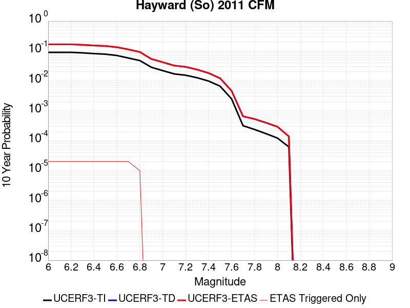 |

| Magnitude | 1 wk TI Prob | 1 wk TD Prob | 1 wk ETAS Prob | 1 wk ETAS/TD Gain | 1 wk ETAS Triggered Only | 1 mo TI Prob | 1 mo TD Prob | 1 mo ETAS Prob | 1 mo ETAS/TD Gain | 1 mo ETAS Triggered Only | 1 yr TI Prob | 1 yr TD Prob | 1 yr ETAS Prob | 1 yr ETAS/TD Gain | 1 yr ETAS Triggered Only | 10 yr TI Prob | 10 yr TD Prob | 10 yr ETAS Prob | 10 yr ETAS/TD Gain | 10 yr ETAS Triggered Only |
|-----|-----|-----|-----|-----|-----|-----|-----|-----|-----|-----|-----|-----|-----|-----|-----|-----|-----|-----|-----|-----|
| 6.0 | 1.8091932E-4 | 3.570541E-4 | 3.570541E-4 | 1.0 | 0.0 | 7.751381E-4 | 0.0015293444 | 0.0015293444 | 1.0 | 0.0 | 0.00939654 | 0.018463207 | 0.018463207 | 1.0 | 0.0 | 0.090090066 | 0.16673161 | 0.16674191 | 1.0000618 | 1.236094E-5 |
| 6.1 | 1.8091932E-4 | 3.570541E-4 | 3.570541E-4 | 1.0 | 0.0 | 7.751381E-4 | 0.0015293444 | 0.0015293444 | 1.0 | 0.0 | 0.00939654 | 0.018463207 | 0.018463207 | 1.0 | 0.0 | 0.090090066 | 0.16673161 | 0.16674191 | 1.0000618 | 1.236094E-5 |
| 6.2 | 1.8091932E-4 | 3.570541E-4 | 3.570541E-4 | 1.0 | 0.0 | 7.751381E-4 | 0.0015293444 | 0.0015293444 | 1.0 | 0.0 | 0.00939654 | 0.018463207 | 0.018463207 | 1.0 | 0.0 | 0.090090066 | 0.16673161 | 0.16674191 | 1.0000618 | 1.236094E-5 |
| 6.3 | 1.7322872E-4 | 3.426234E-4 | 3.426234E-4 | 1.0 | 0.0 | 7.4219756E-4 | 0.0014675693 | 0.0014675693 | 1.0 | 0.0 | 0.0089988755 | 0.017723544 | 0.017723544 | 1.0 | 0.0 | 0.08643075 | 0.16066726 | 0.16067763 | 1.0000646 | 1.236094E-5 |
| 6.4 | 1.6334097E-4 | 3.234411E-4 | 3.234411E-4 | 1.0 | 0.0 | 6.998449E-4 | 0.0013854484 | 0.0013854484 | 1.0 | 0.0 | 0.008487372 | 0.016739385 | 0.016739385 | 1.0 | 0.0 | 0.081704415 | 0.15255594 | 0.15256642 | 1.0000687 | 1.236094E-5 |
| 6.5 | 1.5600289E-4 | 3.1018828E-4 | 3.1018828E-4 | 1.0 | 0.0 | 6.684125E-4 | 0.0013287093 | 0.0013287093 | 1.0 | 0.0 | 0.008107598 | 0.016058935 | 0.016058935 | 1.0 | 0.0 | 0.078181036 | 0.14683272 | 0.14684325 | 1.0000718 | 1.236094E-5 |
| 6.6 | 1.4046066E-4 | 2.8032906E-4 | 2.8032906E-4 | 1.0 | 0.0 | 6.018354E-4 | 0.0012008639 | 0.0012008639 | 1.0 | 0.0 | 0.0073027555 | 0.014524006 | 0.014524006 | 1.0 | 0.0 | 0.07067384 | 0.13391982 | 0.13393053 | 1.00008 | 1.236094E-5 |
| 6.7 | 1.14696966E-4 | 2.3271477E-4 | 2.3271477E-4 | 1.0 | 0.0 | 4.914658E-4 | 9.969729E-4 | 9.969729E-4 | 1.0 | 0.0 | 0.0059671924 | 0.012071652 | 0.012071652 | 1.0 | 0.0 | 0.058094822 | 0.11274672 | 0.11275769 | 1.0000973 | 1.236094E-5 |
| 6.8 | 9.3874296E-5 | 1.8861453E-4 | 1.8861453E-4 | 1.0 | 0.0 | 4.0225635E-4 | 8.0810126E-4 | 8.0810126E-4 | 1.0 | 0.0 | 0.0048864787 | 0.009794984 | 0.009794984 | 1.0 | 0.0 | 0.047804173 | 0.09259856 | 0.09259856 | 1.0 | 0.0 |
| 6.9 | 5.551852E-5 | 1.072948E-4 | 1.072948E-4 | 1.0 | 0.0 | 2.3791482E-4 | 4.5975443E-4 | 4.5975443E-4 | 1.0 | 0.0 | 0.0028927654 | 0.0055832625 | 0.0055832625 | 1.0 | 0.0 | 0.028553981 | 0.054245494 | 0.054245494 | 1.0 | 0.0 |
| 7.0 | 4.2662363E-5 | 8.2464416E-5 | 8.2464416E-5 | 1.0 | 0.0 | 1.8282588E-4 | 3.5337146E-4 | 3.5337146E-4 | 1.0 | 0.0 | 0.0022236328 | 0.0042938837 | 0.0042938837 | 1.0 | 0.0 | 0.022015138 | 0.042064495 | 0.042064495 | 1.0 | 0.0 |
| 7.1 | 3.305886E-5 | 6.3019055E-5 | 6.3019055E-5 | 1.0 | 0.0 | 1.4167312E-4 | 2.700538E-4 | 2.700538E-4 | 1.0 | 0.0 | 0.0017235056 | 0.0032829668 | 0.0032829668 | 1.0 | 0.0 | 0.017101998 | 0.032452874 | 0.032452874 | 1.0 | 0.0 |
| 7.2 | 2.9856887E-5 | 5.7013647E-5 | 5.7013647E-5 | 1.0 | 0.0 | 1.2795182E-4 | 2.4432142E-4 | 2.4432142E-4 | 1.0 | 0.0 | 0.0015567001 | 0.0029705726 | 0.0029705726 | 1.0 | 0.0 | 0.015458403 | 0.029453589 | 0.029453589 | 1.0 | 0.0 |
| 7.3 | 2.4559737E-5 | 4.599088E-5 | 4.599088E-5 | 1.0 | 0.0 | 1.0525176E-4 | 1.9708896E-4 | 1.9708896E-4 | 1.0 | 0.0 | 0.0012806869 | 0.0023969305 | 0.0023969305 | 1.0 | 0.0 | 0.012733313 | 0.023857482 | 0.023857482 | 1.0 | 0.0 |
| 7.4 | 1.9002231E-5 | 3.5049303E-5 | 3.5049303E-5 | 1.0 | 0.0 | 8.143559E-5 | 1.502027E-4 | 1.502027E-4 | 1.0 | 0.0 | 9.910273E-4 | 0.0018271938 | 0.0018271938 | 1.0 | 0.0 | 0.009866194 | 0.018258283 | 0.018258283 | 1.0 | 0.0 |
| 7.5 | 1.2783333E-5 | 2.3330069E-5 | 2.3330069E-5 | 1.0 | 0.0 | 5.4784563E-5 | 9.998221E-5 | 9.998221E-5 | 1.0 | 0.0 | 6.667979E-4 | 0.0012166094 | 0.0012166094 | 1.0 | 0.0 | 0.006648007 | 0.012209582 | 0.012209582 | 1.0 | 0.0 |
| 7.6 | 4.8149627E-6 | 8.887544E-6 | 8.887544E-6 | 1.0 | 0.0 | 2.063539E-5 | 3.8088925E-5 | 3.8088925E-5 | 1.0 | 0.0 | 2.5120692E-4 | 4.636352E-4 | 4.636352E-4 | 1.0 | 0.0 | 0.0025092314 | 0.0046812436 | 0.0046812436 | 1.0 | 0.0 |
| 7.7 | 6.0838227E-7 | 1.2056693E-6 | 1.2056693E-6 | 1.0 | 0.0 | 2.6073499E-6 | 5.1671436E-6 | 5.1671436E-6 | 1.0 | 0.0 | 3.174402E-5 | 6.290816E-5 | 6.290816E-5 | 1.0 | 0.0 | 3.1739488E-4 | 6.5293367E-4 | 6.5293367E-4 | 1.0 | 0.0 |
| 7.8 | 4.5542808E-7 | 9.792182E-7 | 9.792182E-7 | 1.0 | 0.0 | 1.9518332E-6 | 4.1966427E-6 | 4.1966427E-6 | 1.0 | 0.0 | 2.376331E-5 | 5.1092928E-5 | 5.1092928E-5 | 1.0 | 0.0 | 2.3760769E-4 | 5.321372E-4 | 5.321372E-4 | 1.0 | 0.0 |
| 7.9 | 3.3016747E-7 | 7.386335E-7 | 7.386335E-7 | 1.0 | 0.0 | 1.4150027E-6 | 3.1655684E-6 | 3.1655684E-6 | 1.0 | 0.0 | 1.7227521E-5 | 3.8540114E-5 | 3.8540114E-5 | 1.0 | 0.0 | 1.7226185E-4 | 3.9930744E-4 | 3.9930744E-4 | 1.0 | 0.0 |
| 8.0 | 2.347038E-7 | 5.4714894E-7 | 5.4714894E-7 | 1.0 | 0.0 | 1.0058731E-6 | 2.344922E-6 | 2.344922E-6 | 1.0 | 0.0 | 1.2246436E-5 | 2.8549053E-5 | 2.8549053E-5 | 1.0 | 0.0 | 1.2245761E-4 | 2.9355253E-4 | 2.9355253E-4 | 1.0 | 0.0 |
| 8.1 | 1.18822804E-7 | 2.6058973E-7 | 2.6058973E-7 | 1.0 | 0.0 | 5.092405E-7 | 1.1168127E-6 | 1.1168127E-6 | 1.0 | 0.0 | 6.1999854E-6 | 1.359711E-5 | 1.359711E-5 | 1.0 | 0.0 | 6.199812E-5 | 1.3917852E-4 | 1.3917852E-4 | 1.0 | 0.0 |

## Carson Range (Genoa)
*[(top)](#table-of-contents)*

| 1 Week | 1 Month | 1 Year | 10 Year |
|-----|-----|-----|-----|
| 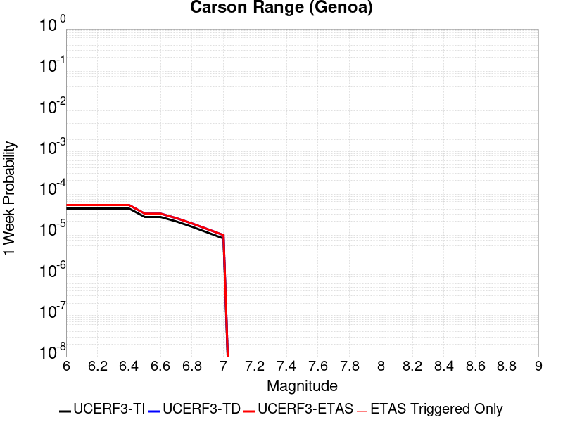 |  |  |  |

| Magnitude | 1 wk TI Prob | 1 wk TD Prob | 1 wk ETAS Prob | 1 wk ETAS/TD Gain | 1 wk ETAS Triggered Only | 1 mo TI Prob | 1 mo TD Prob | 1 mo ETAS Prob | 1 mo ETAS/TD Gain | 1 mo ETAS Triggered Only | 1 yr TI Prob | 1 yr TD Prob | 1 yr ETAS Prob | 1 yr ETAS/TD Gain | 1 yr ETAS Triggered Only | 10 yr TI Prob | 10 yr TD Prob | 10 yr ETAS Prob | 10 yr ETAS/TD Gain | 10 yr ETAS Triggered Only |
|-----|-----|-----|-----|-----|-----|-----|-----|-----|-----|-----|-----|-----|-----|-----|-----|-----|-----|-----|-----|-----|
| 6.0 | 4.1268457E-5 | 5.0146893E-5 | 5.0146893E-5 | 1.0 | 0.0 | 1.7685282E-4 | 2.148998E-4 | 2.148998E-4 | 1.0 | 0.0 | 0.0021510567 | 0.0026136558 | 0.0026136558 | 1.0 | 0.0 | 0.02130354 | 0.025868816 | 0.025880858 | 1.0004655 | 1.236094E-5 |
| 6.1 | 4.1268457E-5 | 5.0146893E-5 | 5.0146893E-5 | 1.0 | 0.0 | 1.7685282E-4 | 2.148998E-4 | 2.148998E-4 | 1.0 | 0.0 | 0.0021510567 | 0.0026136558 | 0.0026136558 | 1.0 | 0.0 | 0.02130354 | 0.025868816 | 0.025880858 | 1.0004655 | 1.236094E-5 |
| 6.2 | 4.1268457E-5 | 5.0146893E-5 | 5.0146893E-5 | 1.0 | 0.0 | 1.7685282E-4 | 2.148998E-4 | 2.148998E-4 | 1.0 | 0.0 | 0.0021510567 | 0.0026136558 | 0.0026136558 | 1.0 | 0.0 | 0.02130354 | 0.025868816 | 0.025880858 | 1.0004655 | 1.236094E-5 |
| 6.3 | 4.1268457E-5 | 5.0146893E-5 | 5.0146893E-5 | 1.0 | 0.0 | 1.7685282E-4 | 2.148998E-4 | 2.148998E-4 | 1.0 | 0.0 | 0.0021510567 | 0.0026136558 | 0.0026136558 | 1.0 | 0.0 | 0.02130354 | 0.025868816 | 0.025880858 | 1.0004655 | 1.236094E-5 |
| 6.4 | 4.1268457E-5 | 5.0146893E-5 | 5.0146893E-5 | 1.0 | 0.0 | 1.7685282E-4 | 2.148998E-4 | 2.148998E-4 | 1.0 | 0.0 | 0.0021510567 | 0.0026136558 | 0.0026136558 | 1.0 | 0.0 | 0.02130354 | 0.025868816 | 0.025880858 | 1.0004655 | 1.236094E-5 |
| 6.5 | 2.5677185E-5 | 3.0978295E-5 | 3.0978295E-5 | 1.0 | 0.0 | 1.1004044E-4 | 1.3275839E-4 | 1.3275839E-4 | 1.0 | 0.0 | 0.0013389189 | 0.0016153135 | 0.0016153135 | 1.0 | 0.0 | 0.0133088045 | 0.016053649 | 0.016053649 | 1.0 | 0.0 |
| 6.6 | 2.5677185E-5 | 3.0978295E-5 | 3.0978295E-5 | 1.0 | 0.0 | 1.1004044E-4 | 1.3275839E-4 | 1.3275839E-4 | 1.0 | 0.0 | 0.0013389189 | 0.0016153135 | 0.0016153135 | 1.0 | 0.0 | 0.0133088045 | 0.016053649 | 0.016053649 | 1.0 | 0.0 |
| 6.7 | 1.9969408E-5 | 2.406347E-5 | 2.406347E-5 | 1.0 | 0.0 | 8.558037E-5 | 1.0312595E-4 | 1.0312595E-4 | 1.0 | 0.0 | 0.0010414429 | 0.0012549888 | 0.0012549888 | 1.0 | 0.0 | 0.010365757 | 0.012494174 | 0.012494174 | 1.0 | 0.0 |
| 6.8 | 1.4783156E-5 | 1.7817569E-5 | 1.7817569E-5 | 1.0 | 0.0 | 6.335485E-5 | 7.635951E-5 | 7.635951E-5 | 1.0 | 0.0 | 7.710722E-4 | 9.294106E-4 | 9.294106E-4 | 1.0 | 0.0 | 0.0076840227 | 0.009268024 | 0.009268024 | 1.0 | 0.0 |
| 6.9 | 1.06660555E-5 | 1.2877026E-5 | 1.2877026E-5 | 1.0 | 0.0 | 4.5710865E-5 | 5.5186738E-5 | 5.5186738E-5 | 1.0 | 0.0 | 5.5638765E-4 | 6.718066E-4 | 6.718066E-4 | 1.0 | 0.0 | 0.005549967 | 0.006709056 | 0.006709056 | 1.0 | 0.0 |
| 7.0 | 7.664838E-6 | 9.258307E-6 | 9.258307E-6 | 1.0 | 0.0 | 3.2848893E-5 | 3.9678456E-5 | 3.9678456E-5 | 1.0 | 0.0 | 3.998619E-4 | 4.830852E-4 | 4.830852E-4 | 1.0 | 0.0 | 0.0039914316 | 0.00483085 | 0.00483085 | 1.0 | 0.0 |

## Laguna Salada
*[(top)](#table-of-contents)*

| 1 Week | 1 Month | 1 Year | 10 Year |
|-----|-----|-----|-----|
|  |  |  | 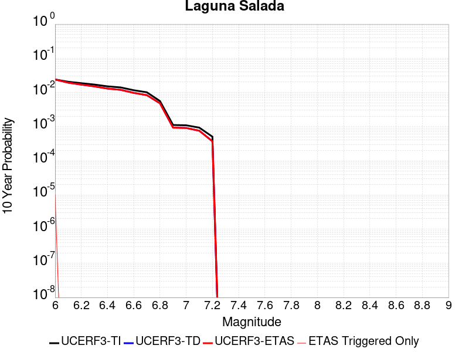 |

| Magnitude | 1 wk TI Prob | 1 wk TD Prob | 1 wk ETAS Prob | 1 wk ETAS/TD Gain | 1 wk ETAS Triggered Only | 1 mo TI Prob | 1 mo TD Prob | 1 mo ETAS Prob | 1 mo ETAS/TD Gain | 1 mo ETAS Triggered Only | 1 yr TI Prob | 1 yr TD Prob | 1 yr ETAS Prob | 1 yr ETAS/TD Gain | 1 yr ETAS Triggered Only | 10 yr TI Prob | 10 yr TD Prob | 10 yr ETAS Prob | 10 yr ETAS/TD Gain | 10 yr ETAS Triggered Only |
|-----|-----|-----|-----|-----|-----|-----|-----|-----|-----|-----|-----|-----|-----|-----|-----|-----|-----|-----|-----|-----|
| 6.0 | 4.6465593E-5 | 4.634639E-5 | 5.870676E-5 | 1.2666954 | 1.236094E-5 | 1.9912305E-4 | 1.9861311E-4 | 2.1097159E-4 | 1.0622239 | 1.236094E-5 | 0.0024216278 | 0.002415429 | 0.00242776 | 1.0051051 | 1.236094E-5 | 0.02395408 | 0.023975259 | 0.023987323 | 1.0005032 | 1.236094E-5 |
| 6.1 | 3.982297E-5 | 3.7246125E-5 | 3.7246125E-5 | 1.0 | 0.0 | 1.706587E-4 | 1.5961716E-4 | 1.5961716E-4 | 1.0 | 0.0 | 0.0020757897 | 0.0019417295 | 0.0019417295 | 1.0 | 0.0 | 0.020565065 | 0.019331863 | 0.019331863 | 1.0 | 0.0 |
| 6.2 | 3.6067784E-5 | 3.2602693E-5 | 3.2602693E-5 | 1.0 | 0.0 | 1.5456705E-4 | 1.3971896E-4 | 1.3971896E-4 | 1.0 | 0.0 | 0.0018802295 | 0.0016998611 | 0.0016998611 | 1.0 | 0.0 | 0.018644003 | 0.016949628 | 0.016949628 | 1.0 | 0.0 |
| 6.3 | 3.2859112E-5 | 2.8849448E-5 | 2.8849448E-5 | 1.0 | 0.0 | 1.4081717E-4 | 1.2363521E-4 | 1.2363521E-4 | 1.0 | 0.0 | 0.0017131006 | 0.0015043203 | 0.0015043203 | 1.0 | 0.0 | 0.016999546 | 0.015018767 | 0.015018767 | 1.0 | 0.0 |
| 6.4 | 2.9132116E-5 | 2.4852965E-5 | 2.4852965E-5 | 1.0 | 0.0 | 1.2484594E-4 | 1.0650887E-4 | 1.0650887E-4 | 1.0 | 0.0 | 0.0015189396 | 0.001296065 | 0.001296065 | 1.0 | 0.0 | 0.015085992 | 0.012956262 | 0.012956262 | 1.0 | 0.0 |
| 6.5 | 2.7075037E-5 | 2.2825836E-5 | 2.2825836E-5 | 1.0 | 0.0 | 1.1603071E-4 | 9.7821845E-5 | 9.7821845E-5 | 1.0 | 0.0 | 0.0014117584 | 0.0011904186 | 0.0011904186 | 1.0 | 0.0 | 0.014028233 | 0.011907749 | 0.011907749 | 1.0 | 0.0 |
| 6.6 | 2.2367465E-5 | 1.8573526E-5 | 1.8573526E-5 | 1.0 | 0.0 | 9.5857045E-5 | 7.959886E-5 | 7.959886E-5 | 1.0 | 0.0 | 0.0011664346 | 9.6876756E-4 | 9.6876756E-4 | 1.0 | 0.0 | 0.011603311 | 0.009702191 | 0.009702191 | 1.0 | 0.0 |
| 6.7 | 1.9458053E-5 | 1.5914242E-5 | 1.5914242E-5 | 1.0 | 0.0 | 8.338899E-5 | 6.8202564E-5 | 6.8202564E-5 | 1.0 | 0.0 | 0.001014788 | 8.3013024E-4 | 8.3013024E-4 | 1.0 | 0.0 | 0.010101665 | 0.0083209425 | 0.0083209425 | 1.0 | 0.0 |
| 6.8 | 1.0767866E-5 | 9.18435E-6 | 9.18435E-6 | 1.0 | 0.0 | 4.614718E-5 | 3.9361294E-5 | 3.9361294E-5 | 1.0 | 0.0 | 5.6169706E-4 | 4.7918706E-4 | 4.7918706E-4 | 1.0 | 0.0 | 0.0056027942 | 0.0048096925 | 0.0048096925 | 1.0 | 0.0 |
| 6.9 | 2.1384765E-6 | 1.7913675E-6 | 1.7913675E-6 | 1.0 | 0.0 | 9.164866E-6 | 7.677269E-6 | 7.677269E-6 | 1.0 | 0.0 | 1.1157654E-4 | 9.346713E-5 | 9.346713E-5 | 1.0 | 0.0 | 0.0011152053 | 9.343165E-4 | 9.343165E-4 | 1.0 | 0.0 |
| 7.0 | 2.0952946E-6 | 1.7493046E-6 | 1.7493046E-6 | 1.0 | 0.0 | 8.979802E-6 | 7.4970003E-6 | 7.4970003E-6 | 1.0 | 0.0 | 1.0932361E-4 | 9.1272545E-5 | 9.1272545E-5 | 1.0 | 0.0 | 0.0010926984 | 9.123888E-4 | 9.123888E-4 | 1.0 | 0.0 |
| 7.1 | 1.7887576E-6 | 1.4500254E-6 | 1.4500254E-6 | 1.0 | 0.0 | 7.666081E-6 | 6.2143813E-6 | 6.2143813E-6 | 1.0 | 0.0 | 9.333054E-5 | 7.565777E-5 | 7.565777E-5 | 1.0 | 0.0 | 9.329135E-4 | 7.563506E-4 | 7.563506E-4 | 1.0 | 0.0 |
| 7.2 | 9.723109E-7 | 7.135619E-7 | 7.135619E-7 | 1.0 | 0.0 | 4.16704E-6 | 3.0581198E-6 | 3.0581198E-6 | 1.0 | 0.0 | 5.073253E-5 | 3.7232137E-5 | 3.7232137E-5 | 1.0 | 0.0 | 5.072095E-4 | 3.7227524E-4 | 3.7227524E-4 | 1.0 | 0.0 |

## Big Pine (West)
*[(top)](#table-of-contents)*

| 1 Week | 1 Month | 1 Year | 10 Year |
|-----|-----|-----|-----|
|  |  |  |  |

| Magnitude | 1 wk TI Prob | 1 wk TD Prob | 1 wk ETAS Prob | 1 wk ETAS/TD Gain | 1 wk ETAS Triggered Only | 1 mo TI Prob | 1 mo TD Prob | 1 mo ETAS Prob | 1 mo ETAS/TD Gain | 1 mo ETAS Triggered Only | 1 yr TI Prob | 1 yr TD Prob | 1 yr ETAS Prob | 1 yr ETAS/TD Gain | 1 yr ETAS Triggered Only | 10 yr TI Prob | 10 yr TD Prob | 10 yr ETAS Prob | 10 yr ETAS/TD Gain | 10 yr ETAS Triggered Only |
|-----|-----|-----|-----|-----|-----|-----|-----|-----|-----|-----|-----|-----|-----|-----|-----|-----|-----|-----|-----|-----|
| 6.0 | 6.8306974E-7 | 6.8818304E-7 | 6.8818304E-7 | 1.0 | 0.0 | 2.9274386E-6 | 2.949353E-6 | 2.949353E-6 | 1.0 | 0.0 | 3.564098E-5 | 3.5907877E-5 | 3.5907877E-5 | 1.0 | 0.0 | 3.5635266E-4 | 3.5903015E-4 | 3.7138665E-4 | 1.0344163 | 1.236094E-5 |
| 6.1 | 6.8306974E-7 | 6.8818304E-7 | 6.8818304E-7 | 1.0 | 0.0 | 2.9274386E-6 | 2.949353E-6 | 2.949353E-6 | 1.0 | 0.0 | 3.564098E-5 | 3.5907877E-5 | 3.5907877E-5 | 1.0 | 0.0 | 3.5635266E-4 | 3.5903015E-4 | 3.7138665E-4 | 1.0344163 | 1.236094E-5 |
| 6.2 | 6.8306974E-7 | 6.8818304E-7 | 6.8818304E-7 | 1.0 | 0.0 | 2.9274386E-6 | 2.949353E-6 | 2.949353E-6 | 1.0 | 0.0 | 3.564098E-5 | 3.5907877E-5 | 3.5907877E-5 | 1.0 | 0.0 | 3.5635266E-4 | 3.5903015E-4 | 3.7138665E-4 | 1.0344163 | 1.236094E-5 |
| 6.3 | 4.227652E-7 | 4.2665604E-7 | 4.2665604E-7 | 1.0 | 0.0 | 1.8118495E-6 | 1.8285248E-6 | 1.8285248E-6 | 1.0 | 0.0 | 2.2059045E-5 | 2.226208E-5 | 2.226208E-5 | 1.0 | 0.0 | 2.2056856E-4 | 2.2260031E-4 | 2.3495851E-4 | 1.0555174 | 1.236094E-5 |
| 6.4 | 4.227652E-7 | 4.2665604E-7 | 4.2665604E-7 | 1.0 | 0.0 | 1.8118495E-6 | 1.8285248E-6 | 1.8285248E-6 | 1.0 | 0.0 | 2.2059045E-5 | 2.226208E-5 | 2.226208E-5 | 1.0 | 0.0 | 2.2056856E-4 | 2.2260031E-4 | 2.3495851E-4 | 1.0555174 | 1.236094E-5 |
| 6.5 | 3.1538403E-7 | 3.1884528E-7 | 3.1884528E-7 | 1.0 | 0.0 | 1.3516451E-6 | 1.3664791E-6 | 1.3664791E-6 | 1.0 | 0.0 | 1.6456155E-5 | 1.6636759E-5 | 1.6636759E-5 | 1.0 | 0.0 | 1.6454936E-4 | 1.6635554E-4 | 1.7871443E-4 | 1.074292 | 1.236094E-5 |
| 6.6 | 3.1538403E-7 | 3.1884528E-7 | 3.1884528E-7 | 1.0 | 0.0 | 1.3516451E-6 | 1.3664791E-6 | 1.3664791E-6 | 1.0 | 0.0 | 1.6456155E-5 | 1.6636759E-5 | 1.6636759E-5 | 1.0 | 0.0 | 1.6454936E-4 | 1.6635554E-4 | 1.7871443E-4 | 1.074292 | 1.236094E-5 |
| 6.7 | 3.1538403E-7 | 3.1884528E-7 | 3.1884528E-7 | 1.0 | 0.0 | 1.3516451E-6 | 1.3664791E-6 | 1.3664791E-6 | 1.0 | 0.0 | 1.6456155E-5 | 1.6636759E-5 | 1.6636759E-5 | 1.0 | 0.0 | 1.6454936E-4 | 1.6635554E-4 | 1.7871443E-4 | 1.074292 | 1.236094E-5 |
| 6.8 | 3.1538403E-7 | 3.1884528E-7 | 3.1884528E-7 | 1.0 | 0.0 | 1.3516451E-6 | 1.3664791E-6 | 1.3664791E-6 | 1.0 | 0.0 | 1.6456155E-5 | 1.6636759E-5 | 1.6636759E-5 | 1.0 | 0.0 | 1.6454936E-4 | 1.6635554E-4 | 1.7871443E-4 | 1.074292 | 1.236094E-5 |
| 6.9 | 3.0402092E-7 | 3.0739798E-7 | 3.0739798E-7 | 1.0 | 0.0 | 1.3029462E-6 | 1.3174192E-6 | 1.3174192E-6 | 1.0 | 0.0 | 1.5863254E-5 | 1.6039465E-5 | 1.6039465E-5 | 1.0 | 0.0 | 1.5862122E-4 | 1.6038347E-4 | 1.7274242E-4 | 1.0770588 | 1.236094E-5 |
| 7.0 | 2.3673063E-7 | 2.3944315E-7 | 2.3944315E-7 | 1.0 | 0.0 | 1.0145594E-6 | 1.0261845E-6 | 1.0261845E-6 | 1.0 | 0.0 | 1.235219E-5 | 1.2493728E-5 | 1.2493728E-5 | 1.0 | 0.0 | 1.2351504E-4 | 1.2493054E-4 | 1.3728993E-4 | 1.0989301 | 1.236094E-5 |
| 7.1 | 1.632138E-7 | 1.6514511E-7 | 1.6514511E-7 | 1.0 | 0.0 | 6.9948754E-7 | 7.0776457E-7 | 7.0776457E-7 | 1.0 | 0.0 | 8.516227E-6 | 8.617002E-6 | 8.617002E-6 | 1.0 | 0.0 | 8.5159016E-5 | 8.616685E-5 | 9.8526725E-5 | 1.1434412 | 1.236094E-5 |
| 7.2 | 1.1523723E-7 | 1.1657165E-7 | 1.1657165E-7 | 1.0 | 0.0 | 4.9387376E-7 | 4.9959266E-7 | 4.9959266E-7 | 1.0 | 0.0 | 6.0128964E-6 | 6.082525E-6 | 6.082525E-6 | 1.0 | 0.0 | 6.0127335E-5 | 6.0823695E-5 | 7.318388E-5 | 1.2032133 | 1.236094E-5 |
| 7.3 | 7.777805E-8 | 7.862446E-8 | 7.862446E-8 | 1.0 | 0.0 | 3.3333444E-7 | 3.3696193E-7 | 3.3696193E-7 | 1.0 | 0.0 | 4.0583395E-6 | 4.102504E-6 | 4.102504E-6 | 1.0 | 0.0 | 4.0582654E-5 | 4.102434E-5 | 5.3384774E-5 | 1.301295 | 1.236094E-5 |
| 7.4 | 4.609946E-8 | 4.6522135E-8 | 4.6522135E-8 | 1.0 | 0.0 | 1.975691E-7 | 1.9938055E-7 | 1.9938055E-7 | 1.0 | 0.0 | 2.4054011E-6 | 2.4274557E-6 | 2.4274557E-6 | 1.0 | 0.0 | 2.405375E-5 | 2.427431E-5 | 2.427431E-5 | 1.0 | 0.0 |
| 7.5 | 2.3439137E-8 | 2.3608283E-8 | 2.3608283E-8 | 1.0 | 0.0 | 1.00453434E-7 | 1.0117836E-7 | 1.0117836E-7 | 1.0 | 0.0 | 1.2230199E-6 | 1.2318458E-6 | 1.2318458E-6 | 1.0 | 0.0 | 1.2230132E-5 | 1.2318393E-5 | 1.2318393E-5 | 1.0 | 0.0 |
| 7.6 | 1.6699769E-8 | 1.6817072E-8 | 1.6817072E-8 | 1.0 | 0.0 | 7.157044E-8 | 7.207316E-8 | 7.207316E-8 | 1.0 | 0.0 | 8.713697E-7 | 8.7749044E-7 | 8.7749044E-7 | 1.0 | 0.0 | 8.713663E-6 | 8.774871E-6 | 8.774871E-6 | 1.0 | 0.0 |
| 7.7 | 7.4061512E-9 | 7.4541635E-9 | 7.4541635E-9 | 1.0 | 0.0 | 3.1740647E-8 | 3.1946417E-8 | 3.1946417E-8 | 1.0 | 0.0 | 3.864423E-7 | 3.8894754E-7 | 3.8894754E-7 | 1.0 | 0.0 | 3.8644166E-6 | 3.8894696E-6 | 3.8894696E-6 | 1.0 | 0.0 |
| 7.8 | 1.2189427E-9 | 1.2270763E-9 | 1.2270763E-9 | 1.0 | 0.0 | 5.2240403E-9 | 5.258898E-9 | 5.258898E-9 | 1.0 | 0.0 | 6.3602684E-8 | 6.4027084E-8 | 6.4027084E-8 | 1.0 | 0.0 | 6.360267E-7 | 6.4027074E-7 | 6.4027074E-7 | 1.0 | 0.0 |

## Compton
*[(top)](#table-of-contents)*

| 1 Week | 1 Month | 1 Year | 10 Year |
|-----|-----|-----|-----|
|  |  |  |  |

| Magnitude | 1 wk TI Prob | 1 wk TD Prob | 1 wk ETAS Prob | 1 wk ETAS/TD Gain | 1 wk ETAS Triggered Only | 1 mo TI Prob | 1 mo TD Prob | 1 mo ETAS Prob | 1 mo ETAS/TD Gain | 1 mo ETAS Triggered Only | 1 yr TI Prob | 1 yr TD Prob | 1 yr ETAS Prob | 1 yr ETAS/TD Gain | 1 yr ETAS Triggered Only | 10 yr TI Prob | 10 yr TD Prob | 10 yr ETAS Prob | 10 yr ETAS/TD Gain | 10 yr ETAS Triggered Only |
|-----|-----|-----|-----|-----|-----|-----|-----|-----|-----|-----|-----|-----|-----|-----|-----|-----|-----|-----|-----|-----|
| 6.0 | 1.06050875E-5 | 6.358671E-6 | 6.358671E-6 | 1.0 | 0.0 | 4.5449582E-5 | 2.7251177E-5 | 2.7251177E-5 | 1.0 | 0.0 | 5.5320817E-4 | 3.317354E-4 | 3.317354E-4 | 1.0 | 0.0 | 0.0055183303 | 0.0033126862 | 0.0033250062 | 1.0037191 | 1.236094E-5 |
| 6.1 | 1.06050875E-5 | 6.358671E-6 | 6.358671E-6 | 1.0 | 0.0 | 4.5449582E-5 | 2.7251177E-5 | 2.7251177E-5 | 1.0 | 0.0 | 5.5320817E-4 | 3.317354E-4 | 3.317354E-4 | 1.0 | 0.0 | 0.0055183303 | 0.0033126862 | 0.0033250062 | 1.0037191 | 1.236094E-5 |
| 6.2 | 1.06050875E-5 | 6.358671E-6 | 6.358671E-6 | 1.0 | 0.0 | 4.5449582E-5 | 2.7251177E-5 | 2.7251177E-5 | 1.0 | 0.0 | 5.5320817E-4 | 3.317354E-4 | 3.317354E-4 | 1.0 | 0.0 | 0.0055183303 | 0.0033126862 | 0.0033250062 | 1.0037191 | 1.236094E-5 |
| 6.3 | 1.06050875E-5 | 6.358671E-6 | 6.358671E-6 | 1.0 | 0.0 | 4.5449582E-5 | 2.7251177E-5 | 2.7251177E-5 | 1.0 | 0.0 | 5.5320817E-4 | 3.317354E-4 | 3.317354E-4 | 1.0 | 0.0 | 0.0055183303 | 0.0033126862 | 0.0033250062 | 1.0037191 | 1.236094E-5 |
| 6.4 | 1.06050875E-5 | 6.358671E-6 | 6.358671E-6 | 1.0 | 0.0 | 4.5449582E-5 | 2.7251177E-5 | 2.7251177E-5 | 1.0 | 0.0 | 5.5320817E-4 | 3.317354E-4 | 3.317354E-4 | 1.0 | 0.0 | 0.0055183303 | 0.0033126862 | 0.0033250062 | 1.0037191 | 1.236094E-5 |
| 6.5 | 1.06050875E-5 | 6.358671E-6 | 6.358671E-6 | 1.0 | 0.0 | 4.5449582E-5 | 2.7251177E-5 | 2.7251177E-5 | 1.0 | 0.0 | 5.5320817E-4 | 3.317354E-4 | 3.317354E-4 | 1.0 | 0.0 | 0.0055183303 | 0.0033126862 | 0.0033250062 | 1.0037191 | 1.236094E-5 |
| 6.6 | 1.06050875E-5 | 6.358671E-6 | 6.358671E-6 | 1.0 | 0.0 | 4.5449582E-5 | 2.7251177E-5 | 2.7251177E-5 | 1.0 | 0.0 | 5.5320817E-4 | 3.317354E-4 | 3.317354E-4 | 1.0 | 0.0 | 0.0055183303 | 0.0033126862 | 0.0033250062 | 1.0037191 | 1.236094E-5 |
| 6.7 | 1.06050875E-5 | 6.358671E-6 | 6.358671E-6 | 1.0 | 0.0 | 4.5449582E-5 | 2.7251177E-5 | 2.7251177E-5 | 1.0 | 0.0 | 5.5320817E-4 | 3.317354E-4 | 3.317354E-4 | 1.0 | 0.0 | 0.0055183303 | 0.0033126862 | 0.0033250062 | 1.0037191 | 1.236094E-5 |
| 6.8 | 1.06050875E-5 | 6.358671E-6 | 6.358671E-6 | 1.0 | 0.0 | 4.5449582E-5 | 2.7251177E-5 | 2.7251177E-5 | 1.0 | 0.0 | 5.5320817E-4 | 3.317354E-4 | 3.317354E-4 | 1.0 | 0.0 | 0.0055183303 | 0.0033126862 | 0.0033250062 | 1.0037191 | 1.236094E-5 |
| 6.9 | 1.06050875E-5 | 6.358671E-6 | 6.358671E-6 | 1.0 | 0.0 | 4.5449582E-5 | 2.7251177E-5 | 2.7251177E-5 | 1.0 | 0.0 | 5.5320817E-4 | 3.317354E-4 | 3.317354E-4 | 1.0 | 0.0 | 0.0055183303 | 0.0033126862 | 0.0033250062 | 1.0037191 | 1.236094E-5 |
| 7.0 | 7.672486E-6 | 4.2720512E-6 | 4.2720512E-6 | 1.0 | 0.0 | 3.288167E-5 | 1.8308665E-5 | 1.8308665E-5 | 1.0 | 0.0 | 4.0026082E-4 | 2.2288582E-4 | 2.2288582E-4 | 1.0 | 0.0 | 0.0039954064 | 0.002226685 | 0.0022390184 | 1.005539 | 1.236094E-5 |
| 7.1 | 7.163992E-6 | 3.883762E-6 | 3.883762E-6 | 1.0 | 0.0 | 3.0702464E-5 | 1.6644592E-5 | 1.6644592E-5 | 1.0 | 0.0 | 3.7373835E-4 | 2.0262963E-4 | 2.0262963E-4 | 1.0 | 0.0 | 0.0037311043 | 0.0020245055 | 0.0020368416 | 1.0060933 | 1.236094E-5 |
| 7.2 | 6.3689185E-6 | 3.3102428E-6 | 3.3102428E-6 | 1.0 | 0.0 | 2.729508E-5 | 1.418668E-5 | 1.418668E-5 | 1.0 | 0.0 | 3.322669E-4 | 1.7270957E-4 | 1.7270957E-4 | 1.0 | 0.0 | 0.0033177056 | 0.0017257951 | 0.0017381348 | 1.00715 | 1.236094E-5 |
| 7.3 | 4.4987873E-6 | 2.4480942E-6 | 2.4480942E-6 | 1.0 | 0.0 | 1.9280375E-5 | 1.0491792E-5 | 1.0491792E-5 | 1.0 | 0.0 | 2.3471327E-4 | 1.2773038E-4 | 1.2773038E-4 | 1.0 | 0.0 | 0.002344655 | 0.0012765999 | 0.0012889451 | 1.0096704 | 1.236094E-5 |
| 7.4 | 2.987296E-6 | 1.7394335E-6 | 1.7394335E-6 | 1.0 | 0.0 | 1.2802635E-5 | 7.454694E-6 | 7.454694E-6 | 1.0 | 0.0 | 1.5586092E-4 | 9.0757174E-5 | 9.0757174E-5 | 1.0 | 0.0 | 0.0015575165 | 9.072069E-4 | 9.195566E-4 | 1.0136129 | 1.236094E-5 |
| 7.5 | 2.4111696E-6 | 1.4472155E-6 | 1.4472155E-6 | 1.0 | 0.0 | 1.0333543E-5 | 6.2023378E-6 | 6.2023378E-6 | 1.0 | 0.0 | 1.2580362E-4 | 7.551089E-5 | 7.551089E-5 | 1.0 | 0.0 | 0.0012573242 | 7.54857E-4 | 7.6720864E-4 | 1.0163628 | 1.236094E-5 |
| 7.6 | 1.8783096E-6 | 1.1360459E-6 | 1.1360459E-6 | 1.0 | 0.0 | 8.049874E-6 | 4.8687593E-6 | 4.8687593E-6 | 1.0 | 0.0 | 9.8002805E-5 | 5.927557E-5 | 5.927557E-5 | 1.0 | 0.0 | 9.795959E-4 | 5.926016E-4 | 6.049552E-4 | 1.0208464 | 1.236094E-5 |
| 7.7 | 6.6646817E-7 | 3.560237E-7 | 3.560237E-7 | 1.0 | 0.0 | 2.856289E-6 | 1.525815E-6 | 1.525815E-6 | 1.0 | 0.0 | 3.4774763E-5 | 1.8576653E-5 | 1.8576653E-5 | 1.0 | 0.0 | 3.4769322E-4 | 1.8575235E-4 | 1.98111E-4 | 1.0665329 | 1.236094E-5 |
| 7.8 | 7.054689E-8 | 4.1342968E-8 | 4.1342968E-8 | 1.0 | 0.0 | 3.0234378E-7 | 1.7718413E-7 | 1.7718413E-7 | 1.0 | 0.0 | 3.6810293E-6 | 2.1572148E-6 | 2.1572148E-6 | 1.0 | 0.0 | 3.6809684E-5 | 2.1571948E-5 | 2.1571948E-5 | 1.0 | 0.0 |
| 7.9 | 7.420925E-9 | 4.0131285E-9 | 4.0131285E-9 | 1.0 | 0.0 | 3.1803964E-8 | 1.7199122E-8 | 1.7199122E-8 | 1.0 | 0.0 | 3.872132E-7 | 2.093993E-7 | 2.093993E-7 | 1.0 | 0.0 | 3.872125E-6 | 2.0939913E-6 | 2.0939913E-6 | 1.0 | 0.0 |

## Anaheim
*[(top)](#table-of-contents)*

| 1 Week | 1 Month | 1 Year | 10 Year |
|-----|-----|-----|-----|
|  |  |  |  |

| Magnitude | 1 wk TI Prob | 1 wk TD Prob | 1 wk ETAS Prob | 1 wk ETAS/TD Gain | 1 wk ETAS Triggered Only | 1 mo TI Prob | 1 mo TD Prob | 1 mo ETAS Prob | 1 mo ETAS/TD Gain | 1 mo ETAS Triggered Only | 1 yr TI Prob | 1 yr TD Prob | 1 yr ETAS Prob | 1 yr ETAS/TD Gain | 1 yr ETAS Triggered Only | 10 yr TI Prob | 10 yr TD Prob | 10 yr ETAS Prob | 10 yr ETAS/TD Gain | 10 yr ETAS Triggered Only |
|-----|-----|-----|-----|-----|-----|-----|-----|-----|-----|-----|-----|-----|-----|-----|-----|-----|-----|-----|-----|-----|
| 6.0 | 2.9254998E-6 | 2.5122863E-6 | 2.5122863E-6 | 1.0 | 0.0 | 1.25377965E-5 | 1.0766909E-5 | 2.3127715E-5 | 2.1480367 | 1.236094E-5 | 1.5263697E-4 | 1.3108159E-4 | 1.434409E-4 | 1.0942873 | 1.236094E-5 | 0.0015253217 | 0.0013102728 | 0.0013226176 | 1.0094215 | 1.236094E-5 |
| 6.1 | 1.6729715E-6 | 1.2337348E-6 | 1.2337348E-6 | 1.0 | 0.0 | 7.1698582E-6 | 5.287426E-6 | 5.287426E-6 | 1.0 | 0.0 | 8.7289525E-5 | 6.437293E-5 | 6.437293E-5 | 1.0 | 0.0 | 8.7255245E-4 | 6.435838E-4 | 6.435838E-4 | 1.0 | 0.0 |
| 6.2 | 1.6729715E-6 | 1.2337348E-6 | 1.2337348E-6 | 1.0 | 0.0 | 7.1698582E-6 | 5.287426E-6 | 5.287426E-6 | 1.0 | 0.0 | 8.7289525E-5 | 6.437293E-5 | 6.437293E-5 | 1.0 | 0.0 | 8.7255245E-4 | 6.435838E-4 | 6.435838E-4 | 1.0 | 0.0 |
| 6.3 | 1.1444064E-6 | 6.9596666E-7 | 6.9596666E-7 | 1.0 | 0.0 | 4.9045893E-6 | 2.9827113E-6 | 2.9827113E-6 | 1.0 | 0.0 | 5.971174E-5 | 3.631396E-5 | 3.631396E-5 | 1.0 | 0.0 | 5.96957E-4 | 3.6308577E-4 | 3.6308577E-4 | 1.0 | 0.0 |
| 6.4 | 1.1444064E-6 | 6.9596666E-7 | 6.9596666E-7 | 1.0 | 0.0 | 4.9045893E-6 | 2.9827113E-6 | 2.9827113E-6 | 1.0 | 0.0 | 5.971174E-5 | 3.631396E-5 | 3.631396E-5 | 1.0 | 0.0 | 5.96957E-4 | 3.6308577E-4 | 3.6308577E-4 | 1.0 | 0.0 |
| 6.5 | 1.1385318E-6 | 6.9003505E-7 | 6.9003505E-7 | 1.0 | 0.0 | 4.879413E-6 | 2.95729E-6 | 2.95729E-6 | 1.0 | 0.0 | 5.9405233E-5 | 3.6004465E-5 | 3.6004465E-5 | 1.0 | 0.0 | 5.938936E-4 | 3.5999183E-4 | 3.5999183E-4 | 1.0 | 0.0 |
| 6.6 | 1.1165511E-6 | 6.678222E-7 | 6.678222E-7 | 1.0 | 0.0 | 4.78521E-6 | 2.862092E-6 | 2.862092E-6 | 1.0 | 0.0 | 5.8258374E-5 | 3.484547E-5 | 3.484547E-5 | 1.0 | 0.0 | 5.8243104E-4 | 3.484055E-4 | 3.484055E-4 | 1.0 | 0.0 |
| 6.7 | 1.1098243E-6 | 6.610416E-7 | 6.610416E-7 | 1.0 | 0.0 | 4.7563813E-6 | 2.8330326E-6 | 2.8330326E-6 | 1.0 | 0.0 | 5.7907404E-5 | 3.449168E-5 | 3.449168E-5 | 1.0 | 0.0 | 5.7892315E-4 | 3.4486872E-4 | 3.4486872E-4 | 1.0 | 0.0 |
| 6.8 | 1.1077587E-6 | 6.589619E-7 | 6.589619E-7 | 1.0 | 0.0 | 4.7475287E-6 | 2.8241195E-6 | 2.8241195E-6 | 1.0 | 0.0 | 5.779963E-5 | 3.438317E-5 | 3.438317E-5 | 1.0 | 0.0 | 5.77846E-4 | 3.4378393E-4 | 3.4378393E-4 | 1.0 | 0.0 |
| 6.9 | 1.1024468E-6 | 6.5361957E-7 | 6.5361957E-7 | 1.0 | 0.0 | 4.7247636E-6 | 2.8012241E-6 | 2.8012241E-6 | 1.0 | 0.0 | 5.752248E-5 | 3.4104425E-5 | 3.4104425E-5 | 1.0 | 0.0 | 5.750759E-4 | 3.4099736E-4 | 3.4099736E-4 | 1.0 | 0.0 |
| 7.0 | 1.0993066E-6 | 6.510303E-7 | 6.510303E-7 | 1.0 | 0.0 | 4.7113053E-6 | 2.7901272E-6 | 2.7901272E-6 | 1.0 | 0.0 | 5.7358633E-5 | 3.3969325E-5 | 3.3969325E-5 | 1.0 | 0.0 | 5.734383E-4 | 3.3964674E-4 | 3.3964674E-4 | 1.0 | 0.0 |
| 7.1 | 8.334877E-7 | 4.4049145E-7 | 4.4049145E-7 | 1.0 | 0.0 | 3.5720855E-6 | 1.8878193E-6 | 1.8878193E-6 | 1.0 | 0.0 | 4.348927E-5 | 2.298398E-5 | 2.298398E-5 | 1.0 | 0.0 | 4.3480762E-4 | 2.2981827E-4 | 2.2981827E-4 | 1.0 | 0.0 |
| 7.2 | 7.794411E-7 | 3.997645E-7 | 3.997645E-7 | 1.0 | 0.0 | 3.3404576E-6 | 1.7132754E-6 | 1.7132754E-6 | 1.0 | 0.0 | 4.0669314E-5 | 2.0858948E-5 | 2.0858948E-5 | 1.0 | 0.0 | 4.066187E-4 | 2.0857195E-4 | 2.0857195E-4 | 1.0 | 0.0 |
| 7.3 | 5.01704E-7 | 2.5573388E-7 | 2.5573388E-7 | 1.0 | 0.0 | 2.150158E-6 | 1.0960019E-6 | 1.0960019E-6 | 1.0 | 0.0 | 2.617786E-5 | 1.3343754E-5 | 1.3343754E-5 | 1.0 | 0.0 | 2.6174777E-4 | 1.3343077E-4 | 1.3343077E-4 | 1.0 | 0.0 |
| 7.4 | 2.4008182E-7 | 1.2367859E-7 | 1.2367859E-7 | 1.0 | 0.0 | 1.0289217E-6 | 5.30051E-7 | 5.30051E-7 | 1.0 | 0.0 | 1.252705E-5 | 6.4533597E-6 | 6.4533597E-6 | 1.0 | 0.0 | 1.2526344E-4 | 6.453248E-5 | 6.453248E-5 | 1.0 | 0.0 |
| 7.5 | 2.0263876E-8 | 1.6120866E-8 | 1.6120866E-8 | 1.0 | 0.0 | 8.684518E-8 | 6.908943E-8 | 6.908943E-8 | 1.0 | 0.0 | 1.0573395E-6 | 8.4116357E-7 | 8.4116357E-7 | 1.0 | 0.0 | 1.0573345E-5 | 8.411613E-6 | 8.411613E-6 | 1.0 | 0.0 |
| 7.6 | 1.4871431E-9 | 1.508418E-9 | 1.508418E-9 | 1.0 | 0.0 | 6.37347E-9 | 6.4646484E-9 | 6.4646484E-9 | 1.0 | 0.0 | 7.7596994E-8 | 7.870709E-8 | 7.870709E-8 | 1.0 | 0.0 | 7.759697E-7 | 7.8707063E-7 | 7.8707063E-7 | 1.0 | 0.0 |
| 7.7 | 1.5093293E-10 | 1.5333512E-10 | 1.5333512E-10 | 1.0 | 0.0 | 6.4685546E-10 | 6.571509E-10 | 6.571509E-10 | 1.0 | 0.0 | 7.875465E-9 | 8.0008125E-9 | 8.0008125E-9 | 1.0 | 0.0 | 7.8754645E-8 | 8.000812E-8 | 8.000812E-8 | 1.0 | 0.0 |

## Johnson Valley (No) 2011 rev
*[(top)](#table-of-contents)*

| 1 Week | 1 Month | 1 Year | 10 Year |
|-----|-----|-----|-----|
| 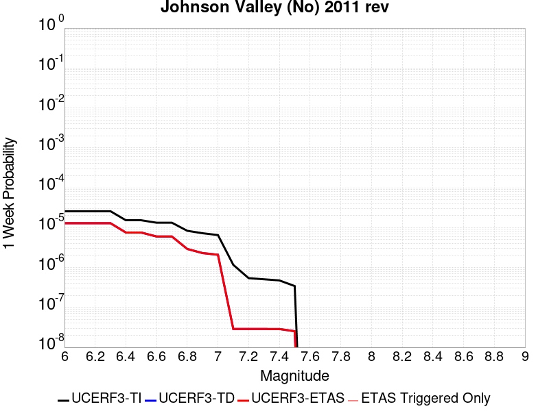 |  |  |  |

| Magnitude | 1 wk TI Prob | 1 wk TD Prob | 1 wk ETAS Prob | 1 wk ETAS/TD Gain | 1 wk ETAS Triggered Only | 1 mo TI Prob | 1 mo TD Prob | 1 mo ETAS Prob | 1 mo ETAS/TD Gain | 1 mo ETAS Triggered Only | 1 yr TI Prob | 1 yr TD Prob | 1 yr ETAS Prob | 1 yr ETAS/TD Gain | 1 yr ETAS Triggered Only | 10 yr TI Prob | 10 yr TD Prob | 10 yr ETAS Prob | 10 yr ETAS/TD Gain | 10 yr ETAS Triggered Only |
|-----|-----|-----|-----|-----|-----|-----|-----|-----|-----|-----|-----|-----|-----|-----|-----|-----|-----|-----|-----|-----|
| 6.0 | 2.577707E-5 | 1.2900938E-5 | 1.2900938E-5 | 1.0 | 0.0 | 1.1046848E-4 | 5.5288787E-5 | 5.5288787E-5 | 1.0 | 0.0 | 0.0013441239 | 6.7297276E-4 | 6.7297276E-4 | 1.0 | 0.0 | 0.013360229 | 0.006713257 | 0.006725535 | 1.0018289 | 1.236094E-5 |
| 6.1 | 2.577707E-5 | 1.2900938E-5 | 1.2900938E-5 | 1.0 | 0.0 | 1.1046848E-4 | 5.5288787E-5 | 5.5288787E-5 | 1.0 | 0.0 | 0.0013441239 | 6.7297276E-4 | 6.7297276E-4 | 1.0 | 0.0 | 0.013360229 | 0.006713257 | 0.006725535 | 1.0018289 | 1.236094E-5 |
| 6.2 | 2.577707E-5 | 1.2900938E-5 | 1.2900938E-5 | 1.0 | 0.0 | 1.1046848E-4 | 5.5288787E-5 | 5.5288787E-5 | 1.0 | 0.0 | 0.0013441239 | 6.7297276E-4 | 6.7297276E-4 | 1.0 | 0.0 | 0.013360229 | 0.006713257 | 0.006725535 | 1.0018289 | 1.236094E-5 |
| 6.3 | 2.577707E-5 | 1.2900938E-5 | 1.2900938E-5 | 1.0 | 0.0 | 1.1046848E-4 | 5.5288787E-5 | 5.5288787E-5 | 1.0 | 0.0 | 0.0013441239 | 6.7297276E-4 | 6.7297276E-4 | 1.0 | 0.0 | 0.013360229 | 0.006713257 | 0.006725535 | 1.0018289 | 1.236094E-5 |
| 6.4 | 1.5296591E-5 | 7.536742E-6 | 7.536742E-6 | 1.0 | 0.0 | 6.555518E-5 | 3.2300028E-5 | 3.2300028E-5 | 1.0 | 0.0 | 7.97842E-4 | 3.9320064E-4 | 3.9320064E-4 | 1.0 | 0.0 | 0.007949836 | 0.0039268904 | 0.0039268904 | 1.0 | 0.0 |
| 6.5 | 1.5296591E-5 | 7.536742E-6 | 7.536742E-6 | 1.0 | 0.0 | 6.555518E-5 | 3.2300028E-5 | 3.2300028E-5 | 1.0 | 0.0 | 7.97842E-4 | 3.9320064E-4 | 3.9320064E-4 | 1.0 | 0.0 | 0.007949836 | 0.0039268904 | 0.0039268904 | 1.0 | 0.0 |
| 6.6 | 1.3289383E-5 | 5.9917306E-6 | 5.9917306E-6 | 1.0 | 0.0 | 5.6953253E-5 | 2.5678688E-5 | 2.5678688E-5 | 1.0 | 0.0 | 6.9318525E-4 | 3.1261015E-4 | 3.1261015E-4 | 1.0 | 0.0 | 0.0069102696 | 0.0031233684 | 0.0031233684 | 1.0 | 0.0 |
| 6.7 | 1.3289383E-5 | 5.9917306E-6 | 5.9917306E-6 | 1.0 | 0.0 | 5.6953253E-5 | 2.5678688E-5 | 2.5678688E-5 | 1.0 | 0.0 | 6.9318525E-4 | 3.1261015E-4 | 3.1261015E-4 | 1.0 | 0.0 | 0.0069102696 | 0.0031233684 | 0.0031233684 | 1.0 | 0.0 |
| 6.8 | 8.330789E-6 | 2.9211888E-6 | 2.9211888E-6 | 1.0 | 0.0 | 3.570289E-5 | 1.2519352E-5 | 1.2519352E-5 | 1.0 | 0.0 | 4.34596E-4 | 1.5241816E-4 | 1.5241816E-4 | 1.0 | 0.0 | 0.0043374705 | 0.0015236961 | 0.0015236961 | 1.0 | 0.0 |
| 6.9 | 7.2359003E-6 | 2.3013247E-6 | 2.3013247E-6 | 1.0 | 0.0 | 3.1010633E-5 | 9.8628125E-6 | 9.8628125E-6 | 1.0 | 0.0 | 3.7748902E-4 | 1.2007845E-4 | 1.2007845E-4 | 1.0 | 0.0 | 0.0037684843 | 0.0012006586 | 0.0012006586 | 1.0 | 0.0 |
| 7.0 | 6.5149957E-6 | 2.088482E-6 | 2.088482E-6 | 1.0 | 0.0 | 2.792111E-5 | 8.950637E-6 | 8.950637E-6 | 1.0 | 0.0 | 3.398865E-4 | 1.0897385E-4 | 1.0897385E-4 | 1.0 | 0.0 | 0.003393671 | 0.0010897239 | 0.0010897239 | 1.0 | 0.0 |
| 7.1 | 1.1662233E-6 | 2.8802024E-8 | 2.8802024E-8 | 1.0 | 0.0 | 4.9980904E-6 | 1.2343725E-7 | 1.2343725E-7 | 1.0 | 0.0 | 6.0850052E-5 | 1.5028476E-6 | 1.5028476E-6 | 1.0 | 0.0 | 6.083339E-4 | 1.50283895E-5 | 1.50283895E-5 | 1.0 | 0.0 |
| 7.2 | 5.413881E-7 | 2.8802024E-8 | 2.8802024E-8 | 1.0 | 0.0 | 2.3202326E-6 | 1.2343725E-7 | 1.2343725E-7 | 1.0 | 0.0 | 2.8248465E-5 | 1.5028476E-6 | 1.5028476E-6 | 1.0 | 0.0 | 2.8244875E-4 | 1.50283895E-5 | 1.50283895E-5 | 1.0 | 0.0 |
| 7.3 | 5.076821E-7 | 2.8802024E-8 | 2.8802024E-8 | 1.0 | 0.0 | 2.1757785E-6 | 1.2343723E-7 | 1.2343723E-7 | 1.0 | 0.0 | 2.648978E-5 | 1.5028475E-6 | 1.5028475E-6 | 1.0 | 0.0 | 2.6486625E-4 | 1.50283895E-5 | 1.50283895E-5 | 1.0 | 0.0 |
| 7.4 | 4.7568687E-7 | 2.8783948E-8 | 2.8783948E-8 | 1.0 | 0.0 | 2.0386565E-6 | 1.2335977E-7 | 1.2335977E-7 | 1.0 | 0.0 | 2.482036E-5 | 1.5019043E-6 | 1.5019043E-6 | 1.0 | 0.0 | 2.4817587E-4 | 1.5018958E-5 | 1.5018958E-5 | 1.0 | 0.0 |
| 7.5 | 3.435626E-7 | 2.5357679E-8 | 2.5357679E-8 | 1.0 | 0.0 | 1.4724103E-6 | 1.0867576E-7 | 1.0867576E-7 | 1.0 | 0.0 | 1.7926448E-5 | 1.3231268E-6 | 1.3231268E-6 | 1.0 | 0.0 | 1.7925001E-4 | 1.3231205E-5 | 1.3231205E-5 | 1.0 | 0.0 |

## Peralta Hills
*[(top)](#table-of-contents)*

| 1 Week | 1 Month | 1 Year | 10 Year |
|-----|-----|-----|-----|
|  |  |  |  |

| Magnitude | 1 wk TI Prob | 1 wk TD Prob | 1 wk ETAS Prob | 1 wk ETAS/TD Gain | 1 wk ETAS Triggered Only | 1 mo TI Prob | 1 mo TD Prob | 1 mo ETAS Prob | 1 mo ETAS/TD Gain | 1 mo ETAS Triggered Only | 1 yr TI Prob | 1 yr TD Prob | 1 yr ETAS Prob | 1 yr ETAS/TD Gain | 1 yr ETAS Triggered Only | 10 yr TI Prob | 10 yr TD Prob | 10 yr ETAS Prob | 10 yr ETAS/TD Gain | 10 yr ETAS Triggered Only |
|-----|-----|-----|-----|-----|-----|-----|-----|-----|-----|-----|-----|-----|-----|-----|-----|-----|-----|-----|-----|-----|
| 6.0 | 3.8850067E-6 | 3.839512E-6 | 3.839512E-6 | 1.0 | 0.0 | 1.6649923E-5 | 1.645499E-5 | 1.645499E-5 | 1.0 | 0.0 | 2.0269395E-4 | 2.0032849E-4 | 2.0032849E-4 | 1.0 | 0.0 | 0.0020250916 | 0.0020022066 | 0.002014543 | 1.0061613 | 1.236094E-5 |
| 6.1 | 3.8850067E-6 | 3.839512E-6 | 3.839512E-6 | 1.0 | 0.0 | 1.6649923E-5 | 1.645499E-5 | 1.645499E-5 | 1.0 | 0.0 | 2.0269395E-4 | 2.0032849E-4 | 2.0032849E-4 | 1.0 | 0.0 | 0.0020250916 | 0.0020022066 | 0.002014543 | 1.0061613 | 1.236094E-5 |
| 6.2 | 3.8850067E-6 | 3.839512E-6 | 3.839512E-6 | 1.0 | 0.0 | 1.6649923E-5 | 1.645499E-5 | 1.645499E-5 | 1.0 | 0.0 | 2.0269395E-4 | 2.0032849E-4 | 2.0032849E-4 | 1.0 | 0.0 | 0.0020250916 | 0.0020022066 | 0.002014543 | 1.0061613 | 1.236094E-5 |
| 6.3 | 3.8850067E-6 | 3.839512E-6 | 3.839512E-6 | 1.0 | 0.0 | 1.6649923E-5 | 1.645499E-5 | 1.645499E-5 | 1.0 | 0.0 | 2.0269395E-4 | 2.0032849E-4 | 2.0032849E-4 | 1.0 | 0.0 | 0.0020250916 | 0.0020022066 | 0.002014543 | 1.0061613 | 1.236094E-5 |
| 6.4 | 3.8850067E-6 | 3.839512E-6 | 3.839512E-6 | 1.0 | 0.0 | 1.6649923E-5 | 1.645499E-5 | 1.645499E-5 | 1.0 | 0.0 | 2.0269395E-4 | 2.0032849E-4 | 2.0032849E-4 | 1.0 | 0.0 | 0.0020250916 | 0.0020022066 | 0.002014543 | 1.0061613 | 1.236094E-5 |
| 6.5 | 1.5587785E-6 | 1.4430796E-6 | 1.4430796E-6 | 1.0 | 0.0 | 6.6804623E-6 | 6.184613E-6 | 6.184613E-6 | 1.0 | 0.0 | 8.133159E-5 | 7.529531E-5 | 7.529531E-5 | 1.0 | 0.0 | 8.1301836E-4 | 7.52722E-4 | 7.650736E-4 | 1.0164093 | 1.236094E-5 |
| 6.6 | 1.5587785E-6 | 1.4430796E-6 | 1.4430796E-6 | 1.0 | 0.0 | 6.6804623E-6 | 6.184613E-6 | 6.184613E-6 | 1.0 | 0.0 | 8.133159E-5 | 7.529531E-5 | 7.529531E-5 | 1.0 | 0.0 | 8.1301836E-4 | 7.52722E-4 | 7.650736E-4 | 1.0164093 | 1.236094E-5 |
| 6.7 | 1.5018579E-6 | 1.3837022E-6 | 1.3837022E-6 | 1.0 | 0.0 | 6.436518E-6 | 5.93014E-6 | 5.93014E-6 | 1.0 | 0.0 | 7.836179E-5 | 7.21973E-5 | 7.21973E-5 | 1.0 | 0.0 | 7.833416E-4 | 7.21762E-4 | 7.3411403E-4 | 1.0171137 | 1.236094E-5 |
| 6.8 | 1.4584314E-6 | 1.3381342E-6 | 1.3381342E-6 | 1.0 | 0.0 | 6.250405E-6 | 5.7348498E-6 | 5.7348498E-6 | 1.0 | 0.0 | 7.6096025E-5 | 6.98198E-5 | 6.98198E-5 | 1.0 | 0.0 | 7.6069974E-4 | 6.98002E-4 | 7.103543E-4 | 1.0176966 | 1.236094E-5 |
| 6.9 | 1.1382393E-6 | 9.862285E-7 | 9.862285E-7 | 1.0 | 0.0 | 4.8781594E-6 | 4.226687E-6 | 4.226687E-6 | 1.0 | 0.0 | 5.9389975E-5 | 5.1458785E-5 | 5.1458785E-5 | 1.0 | 0.0 | 5.93741E-4 | 5.144769E-4 | 5.268315E-4 | 1.0240139 | 1.236094E-5 |
| 7.0 | 9.970413E-7 | 8.309642E-7 | 8.309642E-7 | 1.0 | 0.0 | 4.273027E-6 | 3.561271E-6 | 3.561271E-6 | 1.0 | 0.0 | 5.2022864E-5 | 4.335768E-5 | 4.335768E-5 | 1.0 | 0.0 | 5.2010687E-4 | 4.33499E-4 | 4.458546E-4 | 1.028502 | 1.236094E-5 |
| 7.1 | 9.684443E-7 | 7.99408E-7 | 7.99408E-7 | 1.0 | 0.0 | 4.150469E-6 | 3.4260302E-6 | 3.4260302E-6 | 1.0 | 0.0 | 5.053079E-5 | 4.1711188E-5 | 4.1711188E-5 | 1.0 | 0.0 | 5.05193E-4 | 4.170403E-4 | 4.2939608E-4 | 1.0296273 | 1.236094E-5 |
| 7.2 | 9.240811E-7 | 7.5031426E-7 | 7.5031426E-7 | 1.0 | 0.0 | 3.960342E-6 | 3.215629E-6 | 3.215629E-6 | 1.0 | 0.0 | 4.8216094E-5 | 3.9149647E-5 | 3.9149647E-5 | 1.0 | 0.0 | 4.8205635E-4 | 3.9143403E-4 | 4.0379015E-4 | 1.0315663 | 1.236094E-5 |
| 7.3 | 8.158643E-7 | 6.350017E-7 | 6.350017E-7 | 1.0 | 0.0 | 3.4965567E-6 | 2.7214332E-6 | 2.7214332E-6 | 1.0 | 0.0 | 4.2569747E-5 | 3.313301E-5 | 3.313301E-5 | 1.0 | 0.0 | 4.2561593E-4 | 3.3128684E-4 | 3.4364368E-4 | 1.0372995 | 1.236094E-5 |
| 7.4 | 6.3822824E-7 | 4.7957286E-7 | 4.7957286E-7 | 1.0 | 0.0 | 2.7352612E-6 | 2.0553111E-6 | 2.0553111E-6 | 1.0 | 0.0 | 3.3301294E-5 | 2.5023177E-5 | 2.5023177E-5 | 1.0 | 0.0 | 3.3296304E-4 | 2.5020874E-4 | 2.5020874E-4 | 1.0 | 0.0 |
| 7.5 | 4.0292628E-7 | 2.7846056E-7 | 2.7846056E-7 | 1.0 | 0.0 | 1.7268258E-6 | 1.193402E-6 | 1.193402E-6 | 1.0 | 0.0 | 2.1023901E-5 | 1.4529601E-5 | 1.4529601E-5 | 1.0 | 0.0 | 2.1021912E-4 | 1.452893E-4 | 1.452893E-4 | 1.0 | 0.0 |
| 7.6 | 3.672993E-7 | 2.485495E-7 | 2.485495E-7 | 1.0 | 0.0 | 1.5741389E-6 | 1.0652118E-6 | 1.0652118E-6 | 1.0 | 0.0 | 1.9164972E-5 | 1.2968904E-5 | 1.2968904E-5 | 1.0 | 0.0 | 1.916332E-4 | 1.296842E-4 | 1.296842E-4 | 1.0 | 0.0 |
| 7.7 | 2.8466823E-7 | 1.7859877E-7 | 1.7859877E-7 | 1.0 | 0.0 | 1.2200061E-6 | 7.6542324E-7 | 7.6542324E-7 | 1.0 | 0.0 | 1.4853474E-5 | 9.319015E-6 | 9.319015E-6 | 1.0 | 0.0 | 1.485248E-4 | 9.3188835E-5 | 9.3188835E-5 | 1.0 | 0.0 |

## Reliz 2011 CFM
*[(top)](#table-of-contents)*

| 1 Week | 1 Month | 1 Year | 10 Year |
|-----|-----|-----|-----|
|  |  |  |  |

| Magnitude | 1 wk TI Prob | 1 wk TD Prob | 1 wk ETAS Prob | 1 wk ETAS/TD Gain | 1 wk ETAS Triggered Only | 1 mo TI Prob | 1 mo TD Prob | 1 mo ETAS Prob | 1 mo ETAS/TD Gain | 1 mo ETAS Triggered Only | 1 yr TI Prob | 1 yr TD Prob | 1 yr ETAS Prob | 1 yr ETAS/TD Gain | 1 yr ETAS Triggered Only | 10 yr TI Prob | 10 yr TD Prob | 10 yr ETAS Prob | 10 yr ETAS/TD Gain | 10 yr ETAS Triggered Only |
|-----|-----|-----|-----|-----|-----|-----|-----|-----|-----|-----|-----|-----|-----|-----|-----|-----|-----|-----|-----|-----|
| 6.0 | 1.6002472E-5 | 1.6282804E-5 | 1.6282804E-5 | 1.0 | 0.0 | 6.8580215E-5 | 6.9781694E-5 | 6.9781694E-5 | 1.0 | 0.0 | 8.3464425E-4 | 8.4928074E-4 | 8.4928074E-4 | 1.0 | 0.0 | 0.008315164 | 0.008462547 | 0.0084748035 | 1.0014483 | 1.236094E-5 |
| 6.1 | 1.6002472E-5 | 1.6282804E-5 | 1.6282804E-5 | 1.0 | 0.0 | 6.8580215E-5 | 6.9781694E-5 | 6.9781694E-5 | 1.0 | 0.0 | 8.3464425E-4 | 8.4928074E-4 | 8.4928074E-4 | 1.0 | 0.0 | 0.008315164 | 0.008462547 | 0.0084748035 | 1.0014483 | 1.236094E-5 |
| 6.2 | 1.6002472E-5 | 1.6282804E-5 | 1.6282804E-5 | 1.0 | 0.0 | 6.8580215E-5 | 6.9781694E-5 | 6.9781694E-5 | 1.0 | 0.0 | 8.3464425E-4 | 8.4928074E-4 | 8.4928074E-4 | 1.0 | 0.0 | 0.008315164 | 0.008462547 | 0.0084748035 | 1.0014483 | 1.236094E-5 |
| 6.3 | 7.792404E-6 | 7.803802E-6 | 7.803802E-6 | 1.0 | 0.0 | 3.339559E-5 | 3.344444E-5 | 3.344444E-5 | 1.0 | 0.0 | 4.0651546E-4 | 4.0711078E-4 | 4.0711078E-4 | 1.0 | 0.0 | 0.0040577264 | 0.004063926 | 0.004063926 | 1.0 | 0.0 |
| 6.4 | 7.792404E-6 | 7.803802E-6 | 7.803802E-6 | 1.0 | 0.0 | 3.339559E-5 | 3.344444E-5 | 3.344444E-5 | 1.0 | 0.0 | 4.0651546E-4 | 4.0711078E-4 | 4.0711078E-4 | 1.0 | 0.0 | 0.0040577264 | 0.004063926 | 0.004063926 | 1.0 | 0.0 |
| 6.5 | 5.9659374E-6 | 5.928738E-6 | 5.928738E-6 | 1.0 | 0.0 | 2.5568053E-5 | 2.5408632E-5 | 2.5408632E-5 | 1.0 | 0.0 | 3.1124658E-4 | 3.093064E-4 | 3.093064E-4 | 1.0 | 0.0 | 0.00310811 | 0.0030889767 | 0.0030889767 | 1.0 | 0.0 |
| 6.6 | 5.2350692E-6 | 5.178986E-6 | 5.178986E-6 | 1.0 | 0.0 | 2.2435817E-5 | 2.2195467E-5 | 2.2195467E-5 | 1.0 | 0.0 | 2.7312184E-4 | 2.7019644E-4 | 2.7019644E-4 | 1.0 | 0.0 | 0.002727864 | 0.0026988892 | 0.0026988892 | 1.0 | 0.0 |
| 6.7 | 4.580206E-6 | 4.5061206E-6 | 4.5061206E-6 | 1.0 | 0.0 | 1.9629308E-5 | 1.9311801E-5 | 1.9311801E-5 | 1.0 | 0.0 | 2.389606E-4 | 2.350959E-4 | 2.350959E-4 | 1.0 | 0.0 | 0.002387038 | 0.0023486738 | 0.0023486738 | 1.0 | 0.0 |
| 6.8 | 4.0765017E-6 | 3.9882384E-6 | 3.9882384E-6 | 1.0 | 0.0 | 1.7470604E-5 | 1.7092338E-5 | 1.7092338E-5 | 1.0 | 0.0 | 2.1268385E-4 | 2.0807938E-4 | 2.0807938E-4 | 1.0 | 0.0 | 0.002124804 | 0.0020790435 | 0.0020790435 | 1.0 | 0.0 |
| 6.9 | 3.5752896E-6 | 3.4725176E-6 | 3.4725176E-6 | 1.0 | 0.0 | 1.532258E-5 | 1.4882134E-5 | 1.4882134E-5 | 1.0 | 0.0 | 1.8653645E-4 | 1.8117494E-4 | 1.8117494E-4 | 1.0 | 0.0 | 0.0018637994 | 0.0018104686 | 0.0018104686 | 1.0 | 0.0 |
| 7.0 | 3.0259848E-6 | 2.9079417E-6 | 2.9079417E-6 | 1.0 | 0.0 | 1.2968442E-5 | 1.2462548E-5 | 1.2462548E-5 | 1.0 | 0.0 | 1.5787935E-4 | 1.5172097E-4 | 1.5172097E-4 | 1.0 | 0.0 | 0.0015776722 | 0.001516369 | 0.001516369 | 1.0 | 0.0 |
| 7.1 | 2.5861116E-6 | 2.455167E-6 | 2.455167E-6 | 1.0 | 0.0 | 1.1083288E-5 | 1.05221025E-5 | 1.05221025E-5 | 1.0 | 0.0 | 1.3493067E-4 | 1.2809907E-4 | 1.2809907E-4 | 1.0 | 0.0 | 0.0013484878 | 0.001280447 | 0.001280447 | 1.0 | 0.0 |
| 7.2 | 2.1482588E-6 | 2.003237E-6 | 2.003237E-6 | 1.0 | 0.0 | 9.20679E-6 | 8.585273E-6 | 8.585273E-6 | 1.0 | 0.0 | 1.12086906E-4 | 1.0452068E-4 | 1.0452068E-4 | 1.0 | 0.0 | 0.0011203039 | 0.0010449095 | 0.0010449095 | 1.0 | 0.0 |
| 7.3 | 1.7194744E-6 | 1.5611241E-6 | 1.5611241E-6 | 1.0 | 0.0 | 7.3691554E-6 | 6.690515E-6 | 6.690515E-6 | 1.0 | 0.0 | 8.971577E-5 | 8.1453974E-5 | 8.1453974E-5 | 1.0 | 0.0 | 8.967956E-4 | 8.1443513E-4 | 8.1443513E-4 | 1.0 | 0.0 |
| 7.4 | 1.2755178E-6 | 1.10563E-6 | 1.10563E-6 | 1.0 | 0.0 | 5.4664933E-6 | 4.7384056E-6 | 4.7384056E-6 | 1.0 | 0.0 | 6.655252E-5 | 5.768856E-5 | 5.768856E-5 | 1.0 | 0.0 | 6.6532596E-4 | 5.7692965E-4 | 5.7692965E-4 | 1.0 | 0.0 |
| 7.5 | 8.8463224E-7 | 7.0580273E-7 | 7.0580273E-7 | 1.0 | 0.0 | 3.7912755E-6 | 3.0248652E-6 | 3.0248652E-6 | 1.0 | 0.0 | 4.6157802E-5 | 3.6827114E-5 | 3.6827114E-5 | 1.0 | 0.0 | 4.6148215E-4 | 3.684038E-4 | 3.684038E-4 | 1.0 | 0.0 |
| 7.6 | 5.291355E-7 | 3.500777E-7 | 3.500777E-7 | 1.0 | 0.0 | 2.2677216E-6 | 1.5003321E-6 | 1.5003321E-6 | 1.0 | 0.0 | 2.760916E-5 | 1.8266392E-5 | 1.8266392E-5 | 1.0 | 0.0 | 2.760573E-4 | 1.8284164E-4 | 1.8284164E-4 | 1.0 | 0.0 |
| 7.7 | 2.9663357E-7 | 1.351113E-7 | 1.351113E-7 | 1.0 | 0.0 | 1.2712861E-6 | 5.7904833E-7 | 5.7904833E-7 | 1.0 | 0.0 | 1.5477797E-5 | 7.049891E-6 | 7.049891E-6 | 1.0 | 0.0 | 1.547672E-4 | 7.068132E-5 | 7.068132E-5 | 1.0 | 0.0 |
| 7.8 | 1.2509386E-7 | 2.7157126E-8 | 2.7157126E-8 | 1.0 | 0.0 | 5.3611643E-7 | 1.1638769E-7 | 1.1638769E-7 | 1.0 | 0.0 | 6.527198E-6 | 1.4170191E-6 | 1.4170191E-6 | 1.0 | 0.0 | 6.527006E-5 | 1.4326506E-5 | 1.4326506E-5 | 1.0 | 0.0 |
| 7.9 | 6.213493E-8 | 1.1482114E-8 | 1.1482114E-8 | 1.0 | 0.0 | 2.6629255E-7 | 4.920906E-8 | 4.920906E-8 | 1.0 | 0.0 | 3.242107E-6 | 5.9912014E-7 | 5.9912014E-7 | 1.0 | 0.0 | 3.2420594E-5 | 6.1224223E-6 | 6.1224223E-6 | 1.0 | 0.0 |
| 8.0 | 5.92383E-9 | 1.677887E-9 | 1.677887E-9 | 1.0 | 0.0 | 2.5387841E-8 | 7.190944E-9 | 7.190944E-9 | 1.0 | 0.0 | 3.0909692E-7 | 8.754974E-8 | 8.754974E-8 | 1.0 | 0.0 | 3.090965E-6 | 9.003061E-7 | 9.003061E-7 | 1.0 | 0.0 |

## Mendocino
*[(top)](#table-of-contents)*

| 1 Week | 1 Month | 1 Year | 10 Year |
|-----|-----|-----|-----|
|  |  | 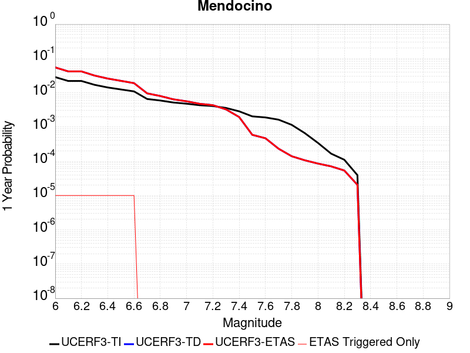 |  |

| Magnitude | 1 wk TI Prob | 1 wk TD Prob | 1 wk ETAS Prob | 1 wk ETAS/TD Gain | 1 wk ETAS Triggered Only | 1 mo TI Prob | 1 mo TD Prob | 1 mo ETAS Prob | 1 mo ETAS/TD Gain | 1 mo ETAS Triggered Only | 1 yr TI Prob | 1 yr TD Prob | 1 yr ETAS Prob | 1 yr ETAS/TD Gain | 1 yr ETAS Triggered Only | 10 yr TI Prob | 10 yr TD Prob | 10 yr ETAS Prob | 10 yr ETAS/TD Gain | 10 yr ETAS Triggered Only |
|-----|-----|-----|-----|-----|-----|-----|-----|-----|-----|-----|-----|-----|-----|-----|-----|-----|-----|-----|-----|-----|
| 6.0 | 5.5409013E-4 | 0.0010850244 | 0.0010850244 | 1.0 | 0.0 | 0.0023725112 | 0.004636911 | 0.004636911 | 1.0 | 0.0 | 0.028505474 | 0.05467285 | 0.054684535 | 1.0002137 | 1.236094E-5 | 0.25113493 | 0.411882 | 0.41188928 | 1.0000176 | 1.236094E-5 |
| 6.1 | 4.2515888E-4 | 8.233315E-4 | 8.233315E-4 | 1.0 | 0.0 | 0.0018208373 | 0.0035215917 | 0.0035215917 | 1.0 | 0.0 | 0.021944538 | 0.041749846 | 0.041761693 | 1.0002837 | 1.236094E-5 | 0.19899574 | 0.32995537 | 0.32996365 | 1.0000252 | 1.236094E-5 |
| 6.2 | 4.2515888E-4 | 8.233315E-4 | 8.233315E-4 | 1.0 | 0.0 | 0.0018208373 | 0.0035215917 | 0.0035215917 | 1.0 | 0.0 | 0.021944538 | 0.041749846 | 0.041761693 | 1.0002837 | 1.236094E-5 | 0.19899574 | 0.32995537 | 0.32996365 | 1.0000252 | 1.236094E-5 |
| 6.3 | 3.2773745E-4 | 6.1941805E-4 | 6.1941805E-4 | 1.0 | 0.0 | 0.0014038329 | 0.0026506495 | 0.0026506495 | 1.0 | 0.0 | 0.016958237 | 0.031592727 | 0.031604696 | 1.0003788 | 1.236094E-5 | 0.1572094 | 0.26077813 | 0.26078728 | 1.000035 | 1.236094E-5 |
| 6.4 | 2.7417165E-4 | 5.0483743E-4 | 5.0483743E-4 | 1.0 | 0.0 | 0.0011744922 | 0.0021604756 | 0.0021604756 | 1.0 | 0.0 | 0.014205975 | 0.025837418 | 0.02584946 | 1.0004661 | 1.236094E-5 | 0.13331394 | 0.21947995 | 0.21948959 | 1.000044 | 1.236094E-5 |
| 6.5 | 2.3984899E-4 | 4.322691E-4 | 4.322691E-4 | 1.0 | 0.0 | 0.0010275192 | 0.0018508129 | 0.0018508129 | 1.0 | 0.0 | 0.012438473 | 0.022180691 | 0.022192778 | 1.0005449 | 1.236094E-5 | 0.11764851 | 0.19203661 | 0.1920466 | 1.000052 | 1.236094E-5 |
| 6.6 | 2.1023539E-4 | 3.6937738E-4 | 3.6937738E-4 | 1.0 | 0.0 | 9.0069766E-4 | 0.0015816262 | 0.0015816262 | 1.0 | 0.0 | 0.010910975 | 0.018990388 | 0.019002514 | 1.0006385 | 1.236094E-5 | 0.10390546 | 0.16749348 | 0.16750376 | 1.0000614 | 1.236094E-5 |
| 6.7 | 1.2592976E-4 | 1.8438937E-4 | 1.8438937E-4 | 1.0 | 0.0 | 5.395873E-4 | 7.8949484E-4 | 7.8949484E-4 | 1.0 | 0.0 | 0.006549705 | 0.009555929 | 0.009555929 | 1.0 | 0.0 | 0.063599944 | 0.09096867 | 0.09096867 | 1.0 | 0.0 |
| 6.8 | 1.13663555E-4 | 1.5403709E-4 | 1.5403709E-4 | 1.0 | 0.0 | 4.8703855E-4 | 6.599124E-4 | 6.599124E-4 | 1.0 | 0.0 | 0.0059135845 | 0.007999982 | 0.007999982 | 1.0 | 0.0 | 0.057586733 | 0.07739284 | 0.07739284 | 1.0 | 0.0 |
| 6.9 | 9.926894E-5 | 1.229904E-4 | 1.229904E-4 | 1.0 | 0.0 | 4.2536893E-4 | 5.2698E-4 | 5.2698E-4 | 1.0 | 0.0 | 0.0051665753 | 0.006396752 | 0.006396752 | 1.0 | 0.0 | 0.050480947 | 0.06286036 | 0.06286036 | 1.0 | 0.0 |
| 7.0 | 9.168125E-5 | 1.0784077E-4 | 1.0784077E-4 | 1.0 | 0.0 | 3.9286047E-4 | 4.6207767E-4 | 4.6207767E-4 | 1.0 | 0.0 | 0.004772591 | 0.0056109587 | 0.0056109587 | 1.0 | 0.0 | 0.04671385 | 0.055621758 | 0.055621758 | 1.0 | 0.0 |
| 7.1 | 8.2854116E-5 | 9.1050766E-5 | 9.1050766E-5 | 1.0 | 0.0 | 3.5504074E-4 | 3.9016004E-4 | 3.9016004E-4 | 1.0 | 0.0 | 0.004314056 | 0.0047398703 | 0.0047398703 | 1.0 | 0.0 | 0.042312626 | 0.047481373 | 0.047481373 | 1.0 | 0.0 |
| 7.2 | 7.8255274E-5 | 8.300278E-5 | 8.300278E-5 | 1.0 | 0.0 | 3.3533663E-4 | 3.5567852E-4 | 3.5567852E-4 | 1.0 | 0.0 | 0.0040750825 | 0.0043219337 | 0.0043219337 | 1.0 | 0.0 | 0.040011603 | 0.043525863 | 0.043525863 | 1.0 | 0.0 |
| 7.3 | 6.887904E-5 | 6.2587686E-5 | 6.2587686E-5 | 1.0 | 0.0 | 2.9516246E-4 | 2.682059E-4 | 2.682059E-4 | 1.0 | 0.0 | 0.0035876823 | 0.0032606125 | 0.0032606125 | 1.0 | 0.0 | 0.035303112 | 0.033351965 | 0.033351965 | 1.0 | 0.0 |
| 7.4 | 5.4898497E-5 | 3.7399142E-5 | 3.7399142E-5 | 1.0 | 0.0 | 2.3525805E-4 | 1.6027251E-4 | 1.6027251E-4 | 1.0 | 0.0 | 0.0028605047 | 0.0019496274 | 0.0019496274 | 1.0 | 0.0 | 0.02823963 | 0.020410953 | 0.020410953 | 1.0 | 0.0 |
| 7.5 | 3.9103943E-5 | 1.1307368E-5 | 1.1307368E-5 | 1.0 | 0.0 | 1.6757756E-4 | 4.8459257E-5 | 4.8459257E-5 | 1.0 | 0.0 | 0.0020383475 | 5.8983336E-4 | 5.8983336E-4 | 1.0 | 0.0 | 0.020197518 | 0.00662414 | 0.00662414 | 1.0 | 0.0 |
| 7.6 | 3.641042E-5 | 8.984288E-6 | 8.984288E-6 | 1.0 | 0.0 | 1.5603533E-4 | 3.850353E-5 | 3.850353E-5 | 1.0 | 0.0 | 0.0018980748 | 4.68681E-4 | 4.68681E-4 | 1.0 | 0.0 | 0.018819444 | 0.005348026 | 0.005348026 | 1.0 | 0.0 |
| 7.7 | 3.1318774E-5 | 4.4553763E-6 | 4.4553763E-6 | 1.0 | 0.0 | 1.342164E-4 | 1.9094332E-5 | 1.9094332E-5 | 1.0 | 0.0 | 0.0016328598 | 2.3244887E-4 | 2.3244887E-4 | 1.0 | 0.0 | 0.016209139 | 0.0028659757 | 0.0028659757 | 1.0 | 0.0 |
| 7.8 | 2.209241E-5 | 2.6815096E-6 | 2.6815096E-6 | 1.0 | 0.0 | 9.467832E-5 | 1.1492133E-5 | 1.1492133E-5 | 1.0 | 0.0 | 0.001152099 | 1.3990777E-4 | 1.3990777E-4 | 1.0 | 0.0 | 0.011461443 | 0.0017378427 | 0.0017378427 | 1.0 | 0.0 |
| 7.9 | 1.2640477E-5 | 2.0423045E-6 | 2.0423045E-6 | 1.0 | 0.0 | 5.4172346E-5 | 8.752703E-6 | 8.752703E-6 | 1.0 | 0.0 | 6.593487E-4 | 1.0655898E-4 | 1.0655898E-4 | 1.0 | 0.0 | 0.006573958 | 0.0012980766 | 0.0012980766 | 1.0 | 0.0 |
| 8.0 | 6.5548907E-6 | 1.638728E-6 | 1.638728E-6 | 1.0 | 0.0 | 2.8092087E-5 | 7.0231013E-6 | 7.0231013E-6 | 1.0 | 0.0 | 3.4196748E-4 | 8.550293E-5 | 8.550293E-5 | 1.0 | 0.0 | 0.0034144172 | 0.0010310268 | 0.0010310268 | 1.0 | 0.0 |
| 8.1 | 3.1916707E-6 | 1.3582962E-6 | 1.3582962E-6 | 1.0 | 0.0 | 1.3678517E-5 | 5.8212563E-6 | 5.8212563E-6 | 1.0 | 0.0 | 1.6652321E-4 | 7.0871516E-5 | 7.0871516E-5 | 1.0 | 0.0 | 0.0016639848 | 8.627292E-4 | 8.627292E-4 | 1.0 | 0.0 |
| 8.2 | 2.1193785E-6 | 1.0301144E-6 | 1.0301144E-6 | 1.0 | 0.0 | 9.083019E-6 | 4.4147682E-6 | 4.4147682E-6 | 1.0 | 0.0 | 1.1058014E-4 | 5.37485E-5 | 5.37485E-5 | 1.0 | 0.0 | 0.0011052513 | 6.5027695E-4 | 6.5027695E-4 | 1.0 | 0.0 |
| 8.3 | 7.536878E-7 | 3.927364E-7 | 3.927364E-7 | 1.0 | 0.0 | 3.2300866E-6 | 1.683155E-6 | 1.683155E-6 | 1.0 | 0.0 | 3.9325594E-5 | 2.0492233E-5 | 2.0492233E-5 | 1.0 | 0.0 | 3.9318635E-4 | 2.4130501E-4 | 2.4130501E-4 | 1.0 | 0.0 |

## Earthquake Valley (No  Extension)
*[(top)](#table-of-contents)*

| 1 Week | 1 Month | 1 Year | 10 Year |
|-----|-----|-----|-----|
|  |  |  |  |

| Magnitude | 1 wk TI Prob | 1 wk TD Prob | 1 wk ETAS Prob | 1 wk ETAS/TD Gain | 1 wk ETAS Triggered Only | 1 mo TI Prob | 1 mo TD Prob | 1 mo ETAS Prob | 1 mo ETAS/TD Gain | 1 mo ETAS Triggered Only | 1 yr TI Prob | 1 yr TD Prob | 1 yr ETAS Prob | 1 yr ETAS/TD Gain | 1 yr ETAS Triggered Only | 10 yr TI Prob | 10 yr TD Prob | 10 yr ETAS Prob | 10 yr ETAS/TD Gain | 10 yr ETAS Triggered Only |
|-----|-----|-----|-----|-----|-----|-----|-----|-----|-----|-----|-----|-----|-----|-----|-----|-----|-----|-----|-----|-----|
| 6.0 | 2.1859703E-5 | 2.5198362E-5 | 2.5198362E-5 | 1.0 | 0.0 | 9.3681076E-5 | 1.07989326E-4 | 1.07989326E-4 | 1.0 | 0.0 | 0.0011399703 | 0.001314122 | 0.0013264668 | 1.0093939 | 1.236094E-5 | 0.011341401 | 0.013077871 | 0.01309007 | 1.0009328 | 1.236094E-5 |
| 6.1 | 2.1859703E-5 | 2.5198362E-5 | 2.5198362E-5 | 1.0 | 0.0 | 9.3681076E-5 | 1.07989326E-4 | 1.07989326E-4 | 1.0 | 0.0 | 0.0011399703 | 0.001314122 | 0.0013264668 | 1.0093939 | 1.236094E-5 | 0.011341401 | 0.013077871 | 0.01309007 | 1.0009328 | 1.236094E-5 |
| 6.2 | 2.1859703E-5 | 2.5198362E-5 | 2.5198362E-5 | 1.0 | 0.0 | 9.3681076E-5 | 1.07989326E-4 | 1.07989326E-4 | 1.0 | 0.0 | 0.0011399703 | 0.001314122 | 0.0013264668 | 1.0093939 | 1.236094E-5 | 0.011341401 | 0.013077871 | 0.01309007 | 1.0009328 | 1.236094E-5 |
| 6.3 | 2.1859703E-5 | 2.5198362E-5 | 2.5198362E-5 | 1.0 | 0.0 | 9.3681076E-5 | 1.07989326E-4 | 1.07989326E-4 | 1.0 | 0.0 | 0.0011399703 | 0.001314122 | 0.0013264668 | 1.0093939 | 1.236094E-5 | 0.011341401 | 0.013077871 | 0.01309007 | 1.0009328 | 1.236094E-5 |
| 6.4 | 2.1859703E-5 | 2.5198362E-5 | 2.5198362E-5 | 1.0 | 0.0 | 9.3681076E-5 | 1.07989326E-4 | 1.07989326E-4 | 1.0 | 0.0 | 0.0011399703 | 0.001314122 | 0.0013264668 | 1.0093939 | 1.236094E-5 | 0.011341401 | 0.013077871 | 0.01309007 | 1.0009328 | 1.236094E-5 |
| 6.5 | 2.1859703E-5 | 2.5198362E-5 | 2.5198362E-5 | 1.0 | 0.0 | 9.3681076E-5 | 1.07989326E-4 | 1.07989326E-4 | 1.0 | 0.0 | 0.0011399703 | 0.001314122 | 0.0013264668 | 1.0093939 | 1.236094E-5 | 0.011341401 | 0.013077871 | 0.01309007 | 1.0009328 | 1.236094E-5 |
| 6.6 | 1.597E-5 | 1.8356275E-5 | 1.8356275E-5 | 1.0 | 0.0 | 6.8441055E-5 | 7.866787E-5 | 7.866787E-5 | 1.0 | 0.0 | 8.329513E-4 | 9.574478E-4 | 9.697969E-4 | 1.012898 | 1.236094E-5 | 0.008298361 | 0.009541836 | 0.009554079 | 1.001283 | 1.236094E-5 |
| 6.7 | 1.597E-5 | 1.8356275E-5 | 1.8356275E-5 | 1.0 | 0.0 | 6.8441055E-5 | 7.866787E-5 | 7.866787E-5 | 1.0 | 0.0 | 8.329513E-4 | 9.574478E-4 | 9.697969E-4 | 1.012898 | 1.236094E-5 | 0.008298361 | 0.009541836 | 0.009554079 | 1.001283 | 1.236094E-5 |
| 6.8 | 1.5315149E-5 | 1.7602091E-5 | 1.7602091E-5 | 1.0 | 0.0 | 6.5634704E-5 | 7.543584E-5 | 7.543584E-5 | 1.0 | 0.0 | 7.988095E-4 | 9.181311E-4 | 9.304807E-4 | 1.0134507 | 1.236094E-5 | 0.007959441 | 0.009151919 | 0.009164167 | 1.0013382 | 1.236094E-5 |
| 6.9 | 1.3634728E-5 | 1.5675821E-5 | 1.5675821E-5 | 1.0 | 0.0 | 5.8433237E-5 | 6.718082E-5 | 6.718082E-5 | 1.0 | 0.0 | 7.1119244E-4 | 8.177017E-4 | 8.3005254E-4 | 1.0151043 | 1.236094E-5 | 0.007089207 | 0.008155 | 0.00816726 | 1.0015033 | 1.236094E-5 |
| 7.0 | 1.3496271E-5 | 1.5517853E-5 | 1.5517853E-5 | 1.0 | 0.0 | 5.783988E-5 | 6.650385E-5 | 6.650385E-5 | 1.0 | 0.0 | 7.03973E-4 | 8.094657E-4 | 8.218166E-4 | 1.0152581 | 1.236094E-5 | 0.007017471 | 0.0080732405 | 0.008085502 | 1.0015187 | 1.236094E-5 |
| 7.1 | 8.242798E-6 | 9.4726E-6 | 9.4726E-6 | 1.0 | 0.0 | 3.53258E-5 | 4.0596606E-5 | 4.0596606E-5 | 1.0 | 0.0 | 4.300067E-4 | 4.9421866E-4 | 4.9421866E-4 | 1.0 | 0.0 | 0.004291756 | 0.0049377717 | 0.0049377717 | 1.0 | 0.0 |
| 7.2 | 2.6506527E-7 | 2.2560312E-7 | 2.2560312E-7 | 1.0 | 0.0 | 1.1359936E-6 | 9.668702E-7 | 9.668702E-7 | 1.0 | 0.0 | 1.3830633E-5 | 1.17715845E-5 | 1.17715845E-5 | 1.0 | 0.0 | 1.3829772E-4 | 1.1771003E-4 | 1.1771003E-4 | 1.0 | 0.0 |
| 7.3 | 2.5810488E-7 | 2.1955442E-7 | 2.1955442E-7 | 1.0 | 0.0 | 1.1061633E-6 | 9.409472E-7 | 9.409472E-7 | 1.0 | 0.0 | 1.3467455E-5 | 1.1455976E-5 | 1.1455976E-5 | 1.0 | 0.0 | 1.3466639E-4 | 1.1455427E-4 | 1.1455427E-4 | 1.0 | 0.0 |
| 7.4 | 2.2676066E-7 | 1.9110601E-7 | 1.9110601E-7 | 1.0 | 0.0 | 9.71831E-7 | 8.190255E-7 | 8.190255E-7 | 1.0 | 0.0 | 1.1831979E-5 | 9.9715935E-6 | 9.9715935E-6 | 1.0 | 0.0 | 1.1831349E-4 | 9.9711855E-5 | 9.9711855E-5 | 1.0 | 0.0 |
| 7.5 | 1.5553917E-7 | 1.3112096E-7 | 1.3112096E-7 | 1.0 | 0.0 | 6.6659624E-7 | 5.619469E-7 | 5.619469E-7 | 1.0 | 0.0 | 8.115779E-6 | 6.8416834E-6 | 6.8416834E-6 | 1.0 | 0.0 | 8.115482E-5 | 6.841495E-5 | 6.841495E-5 | 1.0 | 0.0 |
| 7.6 | 1.3448629E-7 | 1.1288419E-7 | 1.1288419E-7 | 1.0 | 0.0 | 5.7636964E-7 | 4.837893E-7 | 4.837893E-7 | 1.0 | 0.0 | 7.017278E-6 | 5.890121E-6 | 5.890121E-6 | 1.0 | 0.0 | 7.0170565E-5 | 5.889986E-5 | 5.889986E-5 | 1.0 | 0.0 |
| 7.7 | 2.9719402E-8 | 1.458206E-8 | 1.458206E-8 | 1.0 | 0.0 | 1.2736886E-7 | 6.249454E-8 | 6.249454E-8 | 1.0 | 0.0 | 1.5507147E-6 | 7.608708E-7 | 7.608708E-7 | 1.0 | 0.0 | 1.550704E-5 | 7.6086876E-6 | 7.6086876E-6 | 1.0 | 0.0 |
| 7.8 | 7.4390196E-9 | 3.2502152E-9 | 3.2502152E-9 | 1.0 | 0.0 | 3.1881513E-8 | 1.3929493E-8 | 1.3929493E-8 | 1.0 | 0.0 | 3.8815733E-7 | 1.6959156E-7 | 1.6959156E-7 | 1.0 | 0.0 | 3.8815665E-6 | 1.6959145E-6 | 1.6959145E-6 | 1.0 | 0.0 |
| 7.9 | 1.5373532E-9 | 8.440161E-10 | 8.440161E-10 | 1.0 | 0.0 | 6.5886567E-9 | 3.6172119E-9 | 3.6172119E-9 | 1.0 | 0.0 | 8.021689E-8 | 4.4039556E-8 | 4.4039556E-8 | 1.0 | 0.0 | 8.0216864E-7 | 4.4039552E-7 | 4.4039552E-7 | 1.0 | 0.0 |

## Shoreline
*[(top)](#table-of-contents)*

| 1 Week | 1 Month | 1 Year | 10 Year |
|-----|-----|-----|-----|
|  |  |  |  |

| Magnitude | 1 wk TI Prob | 1 wk TD Prob | 1 wk ETAS Prob | 1 wk ETAS/TD Gain | 1 wk ETAS Triggered Only | 1 mo TI Prob | 1 mo TD Prob | 1 mo ETAS Prob | 1 mo ETAS/TD Gain | 1 mo ETAS Triggered Only | 1 yr TI Prob | 1 yr TD Prob | 1 yr ETAS Prob | 1 yr ETAS/TD Gain | 1 yr ETAS Triggered Only | 10 yr TI Prob | 10 yr TD Prob | 10 yr ETAS Prob | 10 yr ETAS/TD Gain | 10 yr ETAS Triggered Only |
|-----|-----|-----|-----|-----|-----|-----|-----|-----|-----|-----|-----|-----|-----|-----|-----|-----|-----|-----|-----|-----|
| 6.0 | 3.9888673E-6 | 4.047929E-6 | 1.6408818E-5 | 4.0536327 | 1.236094E-5 | 1.7095033E-5 | 1.7348184E-5 | 2.9708908E-5 | 1.7125083 | 1.236094E-5 | 2.0811215E-4 | 2.1119925E-4 | 2.2355758E-4 | 1.0585151 | 1.236094E-5 | 0.0020791737 | 0.002110534 | 0.002122869 | 1.0058445 | 1.236094E-5 |
| 6.1 | 3.9888673E-6 | 4.047929E-6 | 1.6408818E-5 | 4.0536327 | 1.236094E-5 | 1.7095033E-5 | 1.7348184E-5 | 2.9708908E-5 | 1.7125083 | 1.236094E-5 | 2.0811215E-4 | 2.1119925E-4 | 2.2355758E-4 | 1.0585151 | 1.236094E-5 | 0.0020791737 | 0.002110534 | 0.002122869 | 1.0058445 | 1.236094E-5 |
| 6.2 | 1.4039653E-6 | 1.4100891E-6 | 1.4100891E-6 | 1.0 | 0.0 | 6.0169805E-6 | 6.0432253E-6 | 6.0432253E-6 | 1.0 | 0.0 | 7.325427E-5 | 7.357384E-5 | 7.357384E-5 | 1.0 | 0.0 | 7.3230127E-4 | 7.355009E-4 | 7.355009E-4 | 1.0 | 0.0 |
| 6.3 | 1.4039653E-6 | 1.4100891E-6 | 1.4100891E-6 | 1.0 | 0.0 | 6.0169805E-6 | 6.0432253E-6 | 6.0432253E-6 | 1.0 | 0.0 | 7.325427E-5 | 7.357384E-5 | 7.357384E-5 | 1.0 | 0.0 | 7.3230127E-4 | 7.355009E-4 | 7.355009E-4 | 1.0 | 0.0 |
| 6.4 | 1.3314152E-6 | 1.3361605E-6 | 1.3361605E-6 | 1.0 | 0.0 | 5.7060524E-6 | 5.7263896E-6 | 5.7263896E-6 | 1.0 | 0.0 | 6.946897E-5 | 6.971662E-5 | 6.971662E-5 | 1.0 | 0.0 | 6.9447263E-4 | 6.9695286E-4 | 6.9695286E-4 | 1.0 | 0.0 |
| 6.5 | 1.1187026E-6 | 1.120364E-6 | 1.120364E-6 | 1.0 | 0.0 | 4.794431E-6 | 4.8015513E-6 | 4.8015513E-6 | 1.0 | 0.0 | 5.8370628E-5 | 5.8457343E-5 | 5.8457343E-5 | 1.0 | 0.0 | 5.83553E-4 | 5.844222E-4 | 5.844222E-4 | 1.0 | 0.0 |
| 6.6 | 9.793089E-7 | 9.784919E-7 | 9.784919E-7 | 1.0 | 0.0 | 4.1970316E-6 | 4.1935305E-6 | 4.1935305E-6 | 1.0 | 0.0 | 5.1097657E-5 | 5.105505E-5 | 5.105505E-5 | 1.0 | 0.0 | 5.108591E-4 | 5.1043445E-4 | 5.1043445E-4 | 1.0 | 0.0 |
| 6.7 | 8.995986E-7 | 8.9728E-7 | 8.9728E-7 | 1.0 | 0.0 | 3.8554167E-6 | 3.84548E-6 | 3.84548E-6 | 1.0 | 0.0 | 4.693869E-5 | 4.6817724E-5 | 4.6817724E-5 | 1.0 | 0.0 | 4.6928777E-4 | 4.6807955E-4 | 4.6807955E-4 | 1.0 | 0.0 |
| 6.8 | 7.931612E-7 | 7.8804027E-7 | 7.8804027E-7 | 1.0 | 0.0 | 3.3992578E-6 | 3.377311E-6 | 3.377311E-6 | 1.0 | 0.0 | 4.1385178E-5 | 4.1117994E-5 | 4.1117994E-5 | 1.0 | 0.0 | 4.1377472E-4 | 4.1110438E-4 | 4.1110438E-4 | 1.0 | 0.0 |
| 6.9 | 7.1465956E-7 | 7.078006E-7 | 7.078006E-7 | 1.0 | 0.0 | 3.062823E-6 | 3.0334277E-6 | 3.0334277E-6 | 1.0 | 0.0 | 3.7289232E-5 | 3.6931357E-5 | 3.6931357E-5 | 1.0 | 0.0 | 3.7282976E-4 | 3.6925258E-4 | 3.6925258E-4 | 1.0 | 0.0 |
| 7.0 | 6.389046E-7 | 6.299458E-7 | 6.299458E-7 | 1.0 | 0.0 | 2.7381598E-6 | 2.699765E-6 | 2.699765E-6 | 1.0 | 0.0 | 3.3336586E-5 | 3.2869146E-5 | 3.2869146E-5 | 1.0 | 0.0 | 3.3331584E-4 | 3.2864307E-4 | 3.2864307E-4 | 1.0 | 0.0 |
| 7.1 | 5.4300875E-7 | 5.3111313E-7 | 5.3111313E-7 | 1.0 | 0.0 | 2.3271782E-6 | 2.276197E-6 | 2.276197E-6 | 1.0 | 0.0 | 2.8333026E-5 | 2.7712347E-5 | 2.7712347E-5 | 1.0 | 0.0 | 2.8329415E-4 | 2.77089E-4 | 2.77089E-4 | 1.0 | 0.0 |
| 7.2 | 4.6768855E-7 | 4.5348952E-7 | 4.5348952E-7 | 1.0 | 0.0 | 2.0043778E-6 | 1.9435251E-6 | 1.9435251E-6 | 1.0 | 0.0 | 2.4403027E-5 | 2.3662162E-5 | 2.3662162E-5 | 1.0 | 0.0 | 2.4400349E-4 | 2.3659648E-4 | 2.3659648E-4 | 1.0 | 0.0 |
| 7.3 | 4.0966103E-7 | 3.9385662E-7 | 3.9385662E-7 | 1.0 | 0.0 | 1.7556889E-6 | 1.6879559E-6 | 1.6879559E-6 | 1.0 | 0.0 | 2.1375303E-5 | 2.055067E-5 | 2.055067E-5 | 1.0 | 0.0 | 2.1373246E-4 | 2.0548773E-4 | 2.0548773E-4 | 1.0 | 0.0 |
| 7.4 | 3.5105785E-7 | 3.3363975E-7 | 3.3363975E-7 | 1.0 | 0.0 | 1.5045327E-6 | 1.4298838E-6 | 1.4298838E-6 | 1.0 | 0.0 | 1.8317533E-5 | 1.7408696E-5 | 1.7408696E-5 | 1.0 | 0.0 | 1.8316023E-4 | 1.7407336E-4 | 1.7407336E-4 | 1.0 | 0.0 |
| 7.5 | 2.8737534E-7 | 2.6820038E-7 | 2.6820038E-7 | 1.0 | 0.0 | 1.2316079E-6 | 1.1494297E-6 | 1.1494297E-6 | 1.0 | 0.0 | 1.4994724E-5 | 1.3994217E-5 | 1.3994217E-5 | 1.0 | 0.0 | 1.4993713E-4 | 1.3993339E-4 | 1.3993339E-4 | 1.0 | 0.0 |
| 7.6 | 2.0924051E-7 | 1.8778988E-7 | 1.8778988E-7 | 1.0 | 0.0 | 8.967448E-7 | 8.048135E-7 | 8.048135E-7 | 1.0 | 0.0 | 1.0917813E-5 | 9.79856E-6 | 9.79856E-6 | 1.0 | 0.0 | 1.0917276E-4 | 9.798129E-5 | 9.798129E-5 | 1.0 | 0.0 |
| 7.7 | 1.392265E-7 | 1.15433906E-7 | 1.15433906E-7 | 1.0 | 0.0 | 5.9668486E-7 | 4.9471663E-7 | 4.9471663E-7 | 1.0 | 0.0 | 7.2646135E-6 | 6.023158E-6 | 6.023158E-6 | 1.0 | 0.0 | 7.2643765E-5 | 6.0229955E-5 | 6.0229955E-5 | 1.0 | 0.0 |
| 7.8 | 8.1080074E-8 | 5.586722E-8 | 5.586722E-8 | 1.0 | 0.0 | 3.4748598E-7 | 2.394309E-7 | 2.394309E-7 | 1.0 | 0.0 | 4.2306337E-6 | 2.9150672E-6 | 2.9150672E-6 | 1.0 | 0.0 | 4.230553E-5 | 2.9150291E-5 | 2.9150291E-5 | 1.0 | 0.0 |
| 7.9 | 5.0859036E-8 | 2.7244445E-8 | 2.7244445E-8 | 1.0 | 0.0 | 2.1796728E-7 | 1.16761896E-7 | 1.16761896E-7 | 1.0 | 0.0 | 2.6537484E-6 | 1.4215751E-6 | 1.4215751E-6 | 1.0 | 0.0 | 2.6537167E-5 | 1.4215661E-5 | 1.4215661E-5 | 1.0 | 0.0 |
| 8.0 | 3.1760536E-8 | 1.3577206E-8 | 1.3577206E-8 | 1.0 | 0.0 | 1.3611657E-7 | 5.8188025E-8 | 5.8188025E-8 | 1.0 | 0.0 | 1.6572179E-6 | 7.0843896E-7 | 7.0843896E-7 | 1.0 | 0.0 | 1.6572056E-5 | 7.084367E-6 | 7.084367E-6 | 1.0 | 0.0 |
| 8.1 | 1.2947896E-8 | 5.6628693E-9 | 5.6628693E-9 | 1.0 | 0.0 | 5.5490982E-8 | 2.426944E-8 | 2.426944E-8 | 1.0 | 0.0 | 6.756025E-7 | 2.954804E-7 | 2.954804E-7 | 1.0 | 0.0 | 6.7560045E-6 | 2.9548003E-6 | 2.9548003E-6 | 1.0 | 0.0 |

## Great Valley 07 (Orestimba)
*[(top)](#table-of-contents)*

| 1 Week | 1 Month | 1 Year | 10 Year |
|-----|-----|-----|-----|
|  |  |  |  |

| Magnitude | 1 wk TI Prob | 1 wk TD Prob | 1 wk ETAS Prob | 1 wk ETAS/TD Gain | 1 wk ETAS Triggered Only | 1 mo TI Prob | 1 mo TD Prob | 1 mo ETAS Prob | 1 mo ETAS/TD Gain | 1 mo ETAS Triggered Only | 1 yr TI Prob | 1 yr TD Prob | 1 yr ETAS Prob | 1 yr ETAS/TD Gain | 1 yr ETAS Triggered Only | 10 yr TI Prob | 10 yr TD Prob | 10 yr ETAS Prob | 10 yr ETAS/TD Gain | 10 yr ETAS Triggered Only |
|-----|-----|-----|-----|-----|-----|-----|-----|-----|-----|-----|-----|-----|-----|-----|-----|-----|-----|-----|-----|-----|
| 6.0 | 2.9687902E-5 | 3.27575E-5 | 3.27575E-5 | 1.0 | 0.0 | 1.2722766E-4 | 1.4038214E-4 | 1.4038214E-4 | 1.0 | 0.0 | 0.0015478961 | 0.0017078844 | 0.0017078844 | 1.0 | 0.0 | 0.015371585 | 0.016955135 | 0.016967287 | 1.0007167 | 1.236094E-5 |
| 6.1 | 2.9687902E-5 | 3.27575E-5 | 3.27575E-5 | 1.0 | 0.0 | 1.2722766E-4 | 1.4038214E-4 | 1.4038214E-4 | 1.0 | 0.0 | 0.0015478961 | 0.0017078844 | 0.0017078844 | 1.0 | 0.0 | 0.015371585 | 0.016955135 | 0.016967287 | 1.0007167 | 1.236094E-5 |
| 6.2 | 1.9231524E-5 | 2.1159167E-5 | 2.1159167E-5 | 1.0 | 0.0 | 8.2418206E-5 | 9.067912E-5 | 9.067912E-5 | 1.0 | 0.0 | 0.0010029797 | 0.0011034822 | 0.0011034822 | 1.0 | 0.0 | 0.00998465 | 0.01098244 | 0.010994665 | 1.0011132 | 1.236094E-5 |
| 6.3 | 1.324766E-5 | 1.4548534E-5 | 1.4548534E-5 | 1.0 | 0.0 | 5.6774446E-5 | 6.234942E-5 | 6.234942E-5 | 1.0 | 0.0 | 6.910097E-4 | 7.5884897E-4 | 7.5884897E-4 | 1.0 | 0.0 | 0.006888649 | 0.0075635235 | 0.0075635235 | 1.0 | 0.0 |
| 6.4 | 7.818645E-6 | 8.57284E-6 | 8.57284E-6 | 1.0 | 0.0 | 3.3508048E-5 | 3.6740246E-5 | 3.6740246E-5 | 1.0 | 0.0 | 4.078841E-4 | 4.4722404E-4 | 4.4722404E-4 | 1.0 | 0.0 | 0.004071363 | 0.0044635804 | 0.0044635804 | 1.0 | 0.0 |
| 6.5 | 5.3076565E-6 | 5.8178007E-6 | 5.8178007E-6 | 1.0 | 0.0 | 2.27469E-5 | 2.4933206E-5 | 2.4933206E-5 | 1.0 | 0.0 | 2.7690834E-4 | 3.035216E-4 | 3.035216E-4 | 1.0 | 0.0 | 0.0027656353 | 0.00303128 | 0.00303128 | 1.0 | 0.0 |
| 6.6 | 3.6003578E-6 | 3.9484953E-6 | 3.9484953E-6 | 1.0 | 0.0 | 1.5430012E-5 | 1.6922022E-5 | 1.6922022E-5 | 1.0 | 0.0 | 1.8784421E-4 | 2.0600771E-4 | 2.0600771E-4 | 1.0 | 0.0 | 0.0018768552 | 0.0020583214 | 0.0020583214 | 1.0 | 0.0 |
| 6.7 | 2.5361826E-6 | 2.7834678E-6 | 2.7834678E-6 | 1.0 | 0.0 | 1.0869308E-5 | 1.1929101E-5 | 1.1929101E-5 | 1.0 | 0.0 | 1.3232579E-4 | 1.4522845E-4 | 1.4522845E-4 | 1.0 | 0.0 | 0.0013224703 | 0.0014514653 | 0.0014514653 | 1.0 | 0.0 |
| 6.8 | 1.2115831E-6 | 1.3313797E-6 | 1.3313797E-6 | 1.0 | 0.0 | 5.1924885E-6 | 5.7059065E-6 | 5.7059065E-6 | 1.0 | 0.0 | 6.3216714E-5 | 6.9468166E-5 | 6.9468166E-5 | 1.0 | 0.0 | 6.3198735E-4 | 6.945596E-4 | 6.945596E-4 | 1.0 | 0.0 |

## Calaveras (Central) 2011 CFM
*[(top)](#table-of-contents)*

| 1 Week | 1 Month | 1 Year | 10 Year |
|-----|-----|-----|-----|
|  |  |  |  |

| Magnitude | 1 wk TI Prob | 1 wk TD Prob | 1 wk ETAS Prob | 1 wk ETAS/TD Gain | 1 wk ETAS Triggered Only | 1 mo TI Prob | 1 mo TD Prob | 1 mo ETAS Prob | 1 mo ETAS/TD Gain | 1 mo ETAS Triggered Only | 1 yr TI Prob | 1 yr TD Prob | 1 yr ETAS Prob | 1 yr ETAS/TD Gain | 1 yr ETAS Triggered Only | 10 yr TI Prob | 10 yr TD Prob | 10 yr ETAS Prob | 10 yr ETAS/TD Gain | 10 yr ETAS Triggered Only |
|-----|-----|-----|-----|-----|-----|-----|-----|-----|-----|-----|-----|-----|-----|-----|-----|-----|-----|-----|-----|-----|
| 6.0 | 1.5010907E-4 | 2.481574E-4 | 2.481574E-4 | 1.0 | 0.0 | 6.4316596E-4 | 0.0010621005 | 0.0010621005 | 1.0 | 0.0 | 0.0078024664 | 0.012850073 | 0.012862275 | 1.0009496 | 1.236094E-5 | 0.07534136 | 0.120401435 | 0.120412305 | 1.0000904 | 1.236094E-5 |
| 6.1 | 1.4521465E-4 | 2.397987E-4 | 2.397987E-4 | 1.0 | 0.0 | 6.222001E-4 | 0.0010263061 | 0.0010263061 | 1.0 | 0.0 | 0.0075490056 | 0.012419341 | 0.012431549 | 1.0009829 | 1.236094E-5 | 0.07297657 | 0.11667323 | 0.116684146 | 1.0000936 | 1.236094E-5 |
| 6.2 | 1.429998E-4 | 2.3911126E-4 | 2.3911126E-4 | 1.0 | 0.0 | 6.127123E-4 | 0.0010233623 | 0.0010233623 | 1.0 | 0.0 | 0.007434286 | 0.01238394 | 0.012396148 | 1.0009857 | 1.236094E-5 | 0.07190444 | 0.1163272 | 0.11633812 | 1.0000939 | 1.236094E-5 |
| 6.3 | 1.3536277E-4 | 2.3242626E-4 | 2.3242626E-4 | 1.0 | 0.0 | 5.799972E-4 | 9.947343E-4 | 9.947343E-4 | 1.0 | 0.0 | 0.0070386264 | 0.012040132 | 0.012052344 | 1.0010142 | 1.236094E-5 | 0.0681982 | 0.11323977 | 0.11325074 | 1.0000968 | 1.236094E-5 |
| 6.4 | 1.2993296E-4 | 2.2666177E-4 | 2.2666177E-4 | 1.0 | 0.0 | 5.5673666E-4 | 9.700479E-4 | 9.700479E-4 | 1.0 | 0.0 | 0.006757223 | 0.011742937 | 0.011755154 | 1.0010402 | 1.236094E-5 | 0.06555412 | 0.11051771 | 0.11052871 | 1.0000995 | 1.236094E-5 |
| 6.5 | 1.0498927E-4 | 1.7981697E-4 | 1.7981697E-4 | 1.0 | 0.0 | 4.498764E-4 | 7.704157E-4 | 7.704157E-4 | 1.0 | 0.0 | 0.005463498 | 0.00933924 | 0.009351486 | 1.0013112 | 1.236094E-5 | 0.053311124 | 0.089199215 | 0.08921047 | 1.0001262 | 1.236094E-5 |
| 6.6 | 1.0157505E-4 | 1.7469203E-4 | 1.7469203E-4 | 1.0 | 0.0 | 4.35249E-4 | 7.484645E-4 | 7.484645E-4 | 1.0 | 0.0 | 0.0052862884 | 0.009074297 | 0.009086546 | 1.0013498 | 1.236094E-5 | 0.05162293 | 0.08677671 | 0.086788 | 1.00013 | 1.236094E-5 |
| 6.7 | 9.660386E-5 | 1.6728524E-4 | 1.6728524E-4 | 1.0 | 0.0 | 4.1395082E-4 | 7.1673887E-4 | 7.1673887E-4 | 1.0 | 0.0 | 0.0050282106 | 0.008691208 | 0.008703462 | 1.0014099 | 1.236094E-5 | 0.049159497 | 0.083266065 | 0.0832774 | 1.0001361 | 1.236094E-5 |
| 6.8 | 9.089927E-5 | 1.5643016E-4 | 1.5643016E-4 | 1.0 | 0.0 | 3.8951015E-4 | 6.702439E-4 | 6.702439E-4 | 1.0 | 0.0 | 0.0047319788 | 0.008129478 | 0.008141739 | 1.0015081 | 1.236094E-5 | 0.046324775 | 0.078159414 | 0.07817081 | 1.0001458 | 1.236094E-5 |
| 6.9 | 7.353187E-5 | 1.2295354E-4 | 1.2295354E-4 | 1.0 | 0.0 | 3.150985E-4 | 5.2683795E-4 | 5.2683795E-4 | 1.0 | 0.0 | 0.0038295772 | 0.006395508 | 0.00640779 | 1.0019203 | 1.236094E-5 | 0.037642512 | 0.062187865 | 0.062199455 | 1.0001864 | 1.236094E-5 |
| 7.0 | 5.746064E-5 | 9.3887444E-5 | 9.3887444E-5 | 1.0 | 0.0 | 2.4623662E-4 | 4.0231308E-4 | 4.0231308E-4 | 1.0 | 0.0 | 0.0029938098 | 0.004887232 | 0.0048995325 | 1.0025169 | 1.236094E-5 | 0.02953797 | 0.04798685 | 0.04799862 | 1.0002452 | 1.236094E-5 |
| 7.1 | 4.9557195E-5 | 8.052461E-5 | 8.052461E-5 | 1.0 | 0.0 | 2.123707E-4 | 3.4506017E-4 | 3.4506017E-4 | 1.0 | 0.0 | 0.0025825473 | 0.0041930773 | 0.0042053866 | 1.0029355 | 1.236094E-5 | 0.0255274 | 0.041373078 | 0.041384928 | 1.0002865 | 1.236094E-5 |
| 7.2 | 3.687595E-5 | 5.9524526E-5 | 5.9524526E-5 | 1.0 | 0.0 | 1.5803022E-4 | 2.5508032E-4 | 2.5508032E-4 | 1.0 | 0.0 | 0.0019223199 | 0.0031012094 | 0.003113532 | 1.0039735 | 1.236094E-5 | 0.01905776 | 0.030883716 | 0.030895695 | 1.0003879 | 1.236094E-5 |
| 7.3 | 2.5846984E-5 | 4.247213E-5 | 4.247213E-5 | 1.0 | 0.0 | 1.1076809E-4 | 1.8201082E-4 | 1.8201082E-4 | 1.0 | 0.0 | 0.0013477671 | 0.002213747 | 0.0022260805 | 1.0055714 | 1.236094E-5 | 0.013396223 | 0.02217554 | 0.022187626 | 1.000545 | 1.236094E-5 |
| 7.4 | 1.7747854E-5 | 2.9936204E-5 | 2.9936204E-5 | 1.0 | 0.0 | 7.6060016E-5 | 1.2829172E-4 | 1.2829172E-4 | 1.0 | 0.0 | 9.2563726E-4 | 0.0015608355 | 0.0015731772 | 1.007907 | 1.236094E-5 | 0.009217911 | 0.015709236 | 0.015721403 | 1.0007745 | 1.236094E-5 |
| 7.5 | 1.4883479E-5 | 2.6243379E-5 | 2.6243379E-5 | 1.0 | 0.0 | 6.378478E-5 | 1.1246678E-4 | 1.1246678E-4 | 1.0 | 0.0 | 7.76303E-4 | 0.0013684258 | 0.0013807699 | 1.0090206 | 1.236094E-5 | 0.0077359667 | 0.013802425 | 0.013814615 | 1.0008832 | 1.236094E-5 |
| 7.6 | 8.166975E-6 | 1.4963478E-5 | 1.4963478E-5 | 1.0 | 0.0 | 3.5000852E-5 | 6.412763E-5 | 6.412763E-5 | 1.0 | 0.0 | 4.2605202E-4 | 7.804755E-4 | 7.804755E-4 | 1.0 | 0.0 | 0.004252361 | 0.00793984 | 0.00793984 | 1.0 | 0.0 |
| 7.7 | 3.3858064E-6 | 6.253914E-6 | 6.253914E-6 | 1.0 | 0.0 | 1.4510518E-5 | 2.6802214E-5 | 2.6802214E-5 | 1.0 | 0.0 | 1.7665124E-4 | 3.2626814E-4 | 3.2626814E-4 | 1.0 | 0.0 | 0.0017651088 | 0.0033882293 | 0.0033882293 | 1.0 | 0.0 |
| 7.8 | 2.7721615E-6 | 5.3663807E-6 | 5.3663807E-6 | 1.0 | 0.0 | 1.1880637E-5 | 2.2998573E-5 | 2.2998573E-5 | 1.0 | 0.0 | 1.4463716E-4 | 2.799717E-4 | 2.799717E-4 | 1.0 | 0.0 | 0.0014454306 | 0.0029074624 | 0.0029074624 | 1.0 | 0.0 |
| 7.9 | 1.9736292E-6 | 4.1284193E-6 | 4.1284193E-6 | 1.0 | 0.0 | 8.4583835E-6 | 1.7693106E-5 | 1.7693106E-5 | 1.0 | 0.0 | 1.0297595E-4 | 2.1539231E-4 | 2.1539231E-4 | 1.0 | 0.0 | 0.0010292825 | 0.0022236116 | 0.0022236116 | 1.0 | 0.0 |
| 8.0 | 1.1767289E-6 | 2.5544743E-6 | 2.5544743E-6 | 1.0 | 0.0 | 5.0431145E-6 | 1.0947701E-5 | 1.0947701E-5 | 1.0 | 0.0 | 6.139818E-5 | 1.3328013E-4 | 1.3328013E-4 | 1.0 | 0.0 | 6.1381224E-4 | 0.0013660848 | 0.0013660848 | 1.0 | 0.0 |
| 8.1 | 7.5112825E-7 | 1.5409794E-6 | 1.5409794E-6 | 1.0 | 0.0 | 3.2191172E-6 | 6.6041807E-6 | 6.6041807E-6 | 1.0 | 0.0 | 3.9192048E-5 | 8.0402955E-5 | 8.0402955E-5 | 1.0 | 0.0 | 3.9185135E-4 | 8.235564E-4 | 8.235564E-4 | 1.0 | 0.0 |

## Pilarcitos 2011 CFM
*[(top)](#table-of-contents)*

| 1 Week | 1 Month | 1 Year | 10 Year |
|-----|-----|-----|-----|
|  |  |  |  |

| Magnitude | 1 wk TI Prob | 1 wk TD Prob | 1 wk ETAS Prob | 1 wk ETAS/TD Gain | 1 wk ETAS Triggered Only | 1 mo TI Prob | 1 mo TD Prob | 1 mo ETAS Prob | 1 mo ETAS/TD Gain | 1 mo ETAS Triggered Only | 1 yr TI Prob | 1 yr TD Prob | 1 yr ETAS Prob | 1 yr ETAS/TD Gain | 1 yr ETAS Triggered Only | 10 yr TI Prob | 10 yr TD Prob | 10 yr ETAS Prob | 10 yr ETAS/TD Gain | 10 yr ETAS Triggered Only |
|-----|-----|-----|-----|-----|-----|-----|-----|-----|-----|-----|-----|-----|-----|-----|-----|-----|-----|-----|-----|-----|
| 6.0 | 4.9150476E-6 | 3.2017424E-6 | 3.2017424E-6 | 1.0 | 0.0 | 2.1064321E-5 | 1.3721682E-5 | 1.3721682E-5 | 1.0 | 0.0 | 2.564279E-4 | 1.6704899E-4 | 1.6704899E-4 | 1.0 | 0.0 | 0.0025613222 | 0.0016816824 | 0.0016940226 | 1.0073379 | 1.236094E-5 |
| 6.1 | 4.9150476E-6 | 3.2017424E-6 | 3.2017424E-6 | 1.0 | 0.0 | 2.1064321E-5 | 1.3721682E-5 | 1.3721682E-5 | 1.0 | 0.0 | 2.564279E-4 | 1.6704899E-4 | 1.6704899E-4 | 1.0 | 0.0 | 0.0025613222 | 0.0016816824 | 0.0016940226 | 1.0073379 | 1.236094E-5 |
| 6.2 | 4.162343E-6 | 2.4301326E-6 | 2.4301326E-6 | 1.0 | 0.0 | 1.783849E-5 | 1.0414812E-5 | 1.0414812E-5 | 1.0 | 0.0 | 2.1716199E-4 | 1.2679303E-4 | 1.2679303E-4 | 1.0 | 0.0 | 0.002169499 | 0.0012796372 | 0.0012919822 | 1.0096474 | 1.236094E-5 |
| 6.3 | 4.162343E-6 | 2.4301326E-6 | 2.4301326E-6 | 1.0 | 0.0 | 1.783849E-5 | 1.0414812E-5 | 1.0414812E-5 | 1.0 | 0.0 | 2.1716199E-4 | 1.2679303E-4 | 1.2679303E-4 | 1.0 | 0.0 | 0.002169499 | 0.0012796372 | 0.0012919822 | 1.0096474 | 1.236094E-5 |
| 6.4 | 3.8768926E-6 | 2.137552E-6 | 2.137552E-6 | 1.0 | 0.0 | 1.6615148E-5 | 9.1609045E-6 | 9.1609045E-6 | 1.0 | 0.0 | 2.0227065E-4 | 1.1152835E-4 | 1.1152835E-4 | 1.0 | 0.0 | 0.0020208664 | 0.0011271521 | 0.0011394991 | 1.0109541 | 1.236094E-5 |
| 6.5 | 3.7137002E-6 | 1.9709112E-6 | 1.9709112E-6 | 1.0 | 0.0 | 1.591576E-5 | 8.446735E-6 | 8.446735E-6 | 1.0 | 0.0 | 1.9375715E-4 | 1.0283417E-4 | 1.0283417E-4 | 1.0 | 0.0 | 0.001935883 | 0.0010402942 | 0.0010526424 | 1.0118698 | 1.236094E-5 |
| 6.6 | 3.5048733E-6 | 1.7558658E-6 | 1.7558658E-6 | 1.0 | 0.0 | 1.5020799E-5 | 7.5251173E-6 | 7.5251173E-6 | 1.0 | 0.0 | 1.8286289E-4 | 9.161448E-5 | 9.161448E-5 | 1.0 | 0.0 | 0.0018271249 | 9.2819595E-4 | 9.2819595E-4 | 1.0 | 0.0 |
| 6.7 | 3.3908584E-6 | 1.6395577E-6 | 1.6395577E-6 | 1.0 | 0.0 | 1.453217E-5 | 7.026657E-6 | 7.026657E-6 | 1.0 | 0.0 | 1.7691481E-4 | 8.5546206E-5 | 8.5546206E-5 | 1.0 | 0.0 | 0.0017677402 | 8.675619E-4 | 8.675619E-4 | 1.0 | 0.0 |
| 6.8 | 3.2451449E-6 | 1.492779E-6 | 1.492779E-6 | 1.0 | 0.0 | 1.3907689E-5 | 6.3976086E-6 | 6.3976086E-6 | 1.0 | 0.0 | 1.6931296E-4 | 7.788811E-5 | 7.788811E-5 | 1.0 | 0.0 | 0.0016918402 | 7.910375E-4 | 7.910375E-4 | 1.0 | 0.0 |
| 6.9 | 3.1239128E-6 | 1.3693062E-6 | 1.3693062E-6 | 1.0 | 0.0 | 1.3388129E-5 | 5.868442E-6 | 5.868442E-6 | 1.0 | 0.0 | 1.6298829E-4 | 7.1445946E-5 | 7.1445946E-5 | 1.0 | 0.0 | 0.001628688 | 7.2665967E-4 | 7.2665967E-4 | 1.0 | 0.0 |
| 7.0 | 2.9940109E-6 | 1.2406205E-6 | 1.2406205E-6 | 1.0 | 0.0 | 1.2831412E-5 | 5.3169338E-6 | 5.3169338E-6 | 1.0 | 0.0 | 1.5621124E-4 | 6.473174E-5 | 6.473174E-5 | 1.0 | 0.0 | 0.0015610148 | 6.5955904E-4 | 6.5955904E-4 | 1.0 | 0.0 |
| 7.1 | 2.7471217E-6 | 1.1523518E-6 | 1.1523518E-6 | 1.0 | 0.0 | 1.1773326E-5 | 4.9386413E-6 | 4.9386413E-6 | 1.0 | 0.0 | 1.4333082E-4 | 6.01263E-5 | 6.01263E-5 | 1.0 | 0.0 | 0.001432384 | 6.134784E-4 | 6.134784E-4 | 1.0 | 0.0 |
| 7.2 | 2.592675E-6 | 1.0184039E-6 | 1.0184039E-6 | 1.0 | 0.0 | 1.1111417E-5 | 4.3645805E-6 | 4.3645805E-6 | 1.0 | 0.0 | 1.3527309E-4 | 5.3137475E-5 | 5.3137475E-5 | 1.0 | 0.0 | 0.0013519078 | 5.436265E-4 | 5.436265E-4 | 1.0 | 0.0 |
| 7.3 | 2.4518663E-6 | 9.093615E-7 | 9.093615E-7 | 1.0 | 0.0 | 1.0507956E-5 | 3.897258E-6 | 3.897258E-6 | 1.0 | 0.0 | 1.2792686E-4 | 4.744808E-5 | 4.744808E-5 | 1.0 | 0.0 | 0.0012785323 | 4.8675635E-4 | 4.8675635E-4 | 1.0 | 0.0 |
| 7.4 | 2.3349535E-6 | 8.7153666E-7 | 8.7153666E-7 | 1.0 | 0.0 | 1.0006905E-5 | 3.7351517E-6 | 3.7351517E-6 | 1.0 | 0.0 | 1.2182725E-4 | 4.5474524E-5 | 4.5474524E-5 | 1.0 | 0.0 | 0.0012176048 | 4.6700423E-4 | 4.6700423E-4 | 1.0 | 0.0 |
| 7.5 | 2.1358665E-6 | 8.235929E-7 | 8.235929E-7 | 1.0 | 0.0 | 9.15368E-6 | 3.5296791E-6 | 3.5296791E-6 | 1.0 | 0.0 | 1.11440364E-4 | 4.2972995E-5 | 4.2972995E-5 | 1.0 | 0.0 | 0.0011138449 | 4.4190476E-4 | 4.4190476E-4 | 1.0 | 0.0 |
| 7.6 | 1.6445446E-6 | 6.778194E-7 | 6.778194E-7 | 1.0 | 0.0 | 7.048029E-6 | 2.9049368E-6 | 2.9049368E-6 | 1.0 | 0.0 | 8.580638E-5 | 3.5367033E-5 | 3.5367033E-5 | 1.0 | 0.0 | 8.5773255E-4 | 3.6580398E-4 | 3.6580398E-4 | 1.0 | 0.0 |
| 7.7 | 1.3650961E-6 | 5.771466E-7 | 5.771466E-7 | 1.0 | 0.0 | 5.850399E-6 | 2.473483E-6 | 2.473483E-6 | 1.0 | 0.0 | 7.122628E-5 | 3.011424E-5 | 3.011424E-5 | 1.0 | 0.0 | 7.120345E-4 | 3.1317407E-4 | 3.1317407E-4 | 1.0 | 0.0 |
| 7.8 | 1.0500993E-6 | 5.487217E-7 | 5.487217E-7 | 1.0 | 0.0 | 4.5004176E-6 | 2.3516623E-6 | 2.3516623E-6 | 1.0 | 0.0 | 5.4791206E-5 | 2.8631113E-5 | 2.8631113E-5 | 1.0 | 0.0 | 5.47777E-4 | 2.982153E-4 | 2.982153E-4 | 1.0 | 0.0 |
| 7.9 | 5.856431E-7 | 5.1290885E-7 | 5.1290885E-7 | 1.0 | 0.0 | 2.5098966E-6 | 2.198179E-6 | 2.198179E-6 | 1.0 | 0.0 | 3.0557563E-5 | 2.67625E-5 | 2.67625E-5 | 1.0 | 0.0 | 3.055336E-4 | 2.7879118E-4 | 2.7879118E-4 | 1.0 | 0.0 |
| 8.0 | 4.4768265E-7 | 4.8356026E-7 | 4.8356026E-7 | 1.0 | 0.0 | 1.9186384E-6 | 2.0723996E-6 | 2.0723996E-6 | 1.0 | 0.0 | 2.3359173E-5 | 2.5231173E-5 | 2.5231173E-5 | 1.0 | 0.0 | 2.3356717E-4 | 2.629472E-4 | 2.629472E-4 | 1.0 | 0.0 |
| 8.1 | 2.6692538E-7 | 3.3572923E-7 | 3.3572923E-7 | 1.0 | 0.0 | 1.1439654E-6 | 1.4388387E-6 | 1.4388387E-6 | 1.0 | 0.0 | 1.392769E-5 | 1.7517721E-5 | 1.7517721E-5 | 1.0 | 0.0 | 1.3926817E-4 | 1.8253834E-4 | 1.8253834E-4 | 1.0 | 0.0 |
| 8.2 | 1.3198862E-8 | 1.0825354E-8 | 1.0825354E-8 | 1.0 | 0.0 | 5.656655E-8 | 4.6394376E-8 | 4.6394376E-8 | 1.0 | 0.0 | 6.886975E-7 | 5.648514E-7 | 5.648514E-7 | 1.0 | 0.0 | 6.8869535E-6 | 5.8803653E-6 | 5.8803653E-6 | 1.0 | 0.0 |

## Morales (West)
*[(top)](#table-of-contents)*

| 1 Week | 1 Month | 1 Year | 10 Year |
|-----|-----|-----|-----|
|  |  |  | 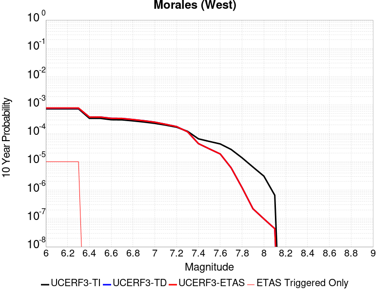 |

| Magnitude | 1 wk TI Prob | 1 wk TD Prob | 1 wk ETAS Prob | 1 wk ETAS/TD Gain | 1 wk ETAS Triggered Only | 1 mo TI Prob | 1 mo TD Prob | 1 mo ETAS Prob | 1 mo ETAS/TD Gain | 1 mo ETAS Triggered Only | 1 yr TI Prob | 1 yr TD Prob | 1 yr ETAS Prob | 1 yr ETAS/TD Gain | 1 yr ETAS Triggered Only | 10 yr TI Prob | 10 yr TD Prob | 10 yr ETAS Prob | 10 yr ETAS/TD Gain | 10 yr ETAS Triggered Only |
|-----|-----|-----|-----|-----|-----|-----|-----|-----|-----|-----|-----|-----|-----|-----|-----|-----|-----|-----|-----|-----|
| 6.0 | 1.4027072E-6 | 1.4791576E-6 | 1.4791576E-6 | 1.0 | 0.0 | 6.0115885E-6 | 6.339236E-6 | 6.339236E-6 | 1.0 | 0.0 | 7.318863E-5 | 7.7178156E-5 | 8.9538145E-5 | 1.1601487 | 1.236094E-5 | 7.316453E-4 | 7.715821E-4 | 7.839335E-4 | 1.0160079 | 1.236094E-5 |
| 6.1 | 1.4027072E-6 | 1.4791576E-6 | 1.4791576E-6 | 1.0 | 0.0 | 6.0115885E-6 | 6.339236E-6 | 6.339236E-6 | 1.0 | 0.0 | 7.318863E-5 | 7.7178156E-5 | 8.9538145E-5 | 1.1601487 | 1.236094E-5 | 7.316453E-4 | 7.715821E-4 | 7.839335E-4 | 1.0160079 | 1.236094E-5 |
| 6.2 | 1.4027072E-6 | 1.4791576E-6 | 1.4791576E-6 | 1.0 | 0.0 | 6.0115885E-6 | 6.339236E-6 | 6.339236E-6 | 1.0 | 0.0 | 7.318863E-5 | 7.7178156E-5 | 8.9538145E-5 | 1.1601487 | 1.236094E-5 | 7.316453E-4 | 7.715821E-4 | 7.839335E-4 | 1.0160079 | 1.236094E-5 |
| 6.3 | 1.4027072E-6 | 1.4791576E-6 | 1.4791576E-6 | 1.0 | 0.0 | 6.0115885E-6 | 6.339236E-6 | 6.339236E-6 | 1.0 | 0.0 | 7.318863E-5 | 7.7178156E-5 | 8.9538145E-5 | 1.1601487 | 1.236094E-5 | 7.316453E-4 | 7.715821E-4 | 7.839335E-4 | 1.0160079 | 1.236094E-5 |
| 6.4 | 6.504502E-7 | 7.2038824E-7 | 7.2038824E-7 | 1.0 | 0.0 | 2.7876408E-6 | 3.0873746E-6 | 3.0873746E-6 | 1.0 | 0.0 | 3.3939E-5 | 3.758815E-5 | 3.758815E-5 | 1.0 | 0.0 | 3.3933815E-4 | 3.758191E-4 | 3.758191E-4 | 1.0 | 0.0 |
| 6.5 | 6.504502E-7 | 7.2038824E-7 | 7.2038824E-7 | 1.0 | 0.0 | 2.7876408E-6 | 3.0873746E-6 | 3.0873746E-6 | 1.0 | 0.0 | 3.3939E-5 | 3.758815E-5 | 3.758815E-5 | 1.0 | 0.0 | 3.3933815E-4 | 3.758191E-4 | 3.758191E-4 | 1.0 | 0.0 |
| 6.6 | 5.8056526E-7 | 6.500143E-7 | 6.500143E-7 | 1.0 | 0.0 | 2.4881344E-6 | 2.7857725E-6 | 2.7857725E-6 | 1.0 | 0.0 | 3.0292615E-5 | 3.3916258E-5 | 3.3916258E-5 | 1.0 | 0.0 | 3.0288487E-4 | 3.3911143E-4 | 3.3911143E-4 | 1.0 | 0.0 |
| 6.7 | 5.741448E-7 | 6.435454E-7 | 6.435454E-7 | 1.0 | 0.0 | 2.4606184E-6 | 2.7580488E-6 | 2.7580488E-6 | 1.0 | 0.0 | 2.9957617E-5 | 3.3578734E-5 | 3.3578734E-5 | 1.0 | 0.0 | 2.9953578E-4 | 3.357372E-4 | 3.357372E-4 | 1.0 | 0.0 |
| 6.8 | 5.299428E-7 | 5.8909023E-7 | 5.8909023E-7 | 1.0 | 0.0 | 2.2711813E-6 | 2.52467E-6 | 2.52467E-6 | 1.0 | 0.0 | 2.7651282E-5 | 3.073743E-5 | 3.073743E-5 | 1.0 | 0.0 | 2.7647841E-4 | 3.0733226E-4 | 3.0733226E-4 | 1.0 | 0.0 |
| 6.9 | 4.82394E-7 | 5.3416807E-7 | 5.3416807E-7 | 1.0 | 0.0 | 2.0674013E-6 | 2.2892896E-6 | 2.2892896E-6 | 1.0 | 0.0 | 2.517032E-5 | 2.7871749E-5 | 2.7871749E-5 | 1.0 | 0.0 | 2.516747E-4 | 2.7868294E-4 | 2.7868294E-4 | 1.0 | 0.0 |
| 7.0 | 4.3264512E-7 | 4.759864E-7 | 4.759864E-7 | 1.0 | 0.0 | 1.8541921E-6 | 2.0399402E-6 | 2.0399402E-6 | 1.0 | 0.0 | 2.2574555E-5 | 2.4835992E-5 | 2.4835992E-5 | 1.0 | 0.0 | 2.2572262E-4 | 2.4833248E-4 | 2.4833248E-4 | 1.0 | 0.0 |
| 7.1 | 3.7388565E-7 | 4.000384E-7 | 4.000384E-7 | 1.0 | 0.0 | 1.6023661E-6 | 1.7144492E-6 | 1.7144492E-6 | 1.0 | 0.0 | 1.9508632E-5 | 2.0873222E-5 | 2.0873222E-5 | 1.0 | 0.0 | 1.950692E-4 | 2.0871284E-4 | 2.0871284E-4 | 1.0 | 0.0 |
| 7.2 | 3.1592543E-7 | 3.3199075E-7 | 3.3199075E-7 | 1.0 | 0.0 | 1.3539654E-6 | 1.4228168E-6 | 1.4228168E-6 | 1.0 | 0.0 | 1.6484404E-5 | 1.7322658E-5 | 1.7322658E-5 | 1.0 | 0.0 | 1.6483181E-4 | 1.7321325E-4 | 1.7321325E-4 | 1.0 | 0.0 |
| 7.3 | 2.2677783E-7 | 2.1793869E-7 | 2.1793869E-7 | 1.0 | 0.0 | 9.719047E-7 | 9.3402264E-7 | 9.3402264E-7 | 1.0 | 0.0 | 1.1832874E-5 | 1.1371666E-5 | 1.1371666E-5 | 1.0 | 0.0 | 1.18322445E-4 | 1.1371089E-4 | 1.1371089E-4 | 1.0 | 0.0 |
| 7.4 | 1.2295531E-7 | 8.350771E-8 | 8.350771E-8 | 1.0 | 0.0 | 5.269512E-7 | 3.5789014E-7 | 3.5789014E-7 | 1.0 | 0.0 | 6.4156125E-6 | 4.3573036E-6 | 4.3573036E-6 | 1.0 | 0.0 | 6.415427E-5 | 4.357219E-5 | 4.357219E-5 | 1.0 | 0.0 |
| 7.5 | 9.9632544E-8 | 5.443089E-8 | 5.443089E-8 | 1.0 | 0.0 | 4.2699656E-7 | 2.3327522E-7 | 2.3327522E-7 | 1.0 | 0.0 | 5.198671E-6 | 2.840122E-6 | 2.840122E-6 | 1.0 | 0.0 | 5.198549E-5 | 2.8400864E-5 | 2.8400864E-5 | 1.0 | 0.0 |
| 7.6 | 8.125894E-8 | 3.594956E-8 | 3.594956E-8 | 1.0 | 0.0 | 3.4825257E-7 | 1.5406955E-7 | 1.5406955E-7 | 1.0 | 0.0 | 4.2399665E-6 | 1.8757952E-6 | 1.8757952E-6 | 1.0 | 0.0 | 4.2398857E-5 | 1.8757797E-5 | 1.8757797E-5 | 1.0 | 0.0 |
| 7.7 | 5.1810765E-8 | 1.1642662E-8 | 1.1642662E-8 | 1.0 | 0.0 | 2.2204613E-7 | 4.9897128E-8 | 4.9897128E-8 | 1.0 | 0.0 | 2.7034082E-6 | 6.074974E-7 | 6.074974E-7 | 1.0 | 0.0 | 2.7033753E-5 | 6.0749603E-6 | 6.0749603E-6 | 1.0 | 0.0 |
| 7.8 | 2.6315043E-8 | 2.3383624E-9 | 2.3383624E-9 | 1.0 | 0.0 | 1.1277875E-7 | 1.0021558E-8 | 1.0021558E-8 | 1.0 | 0.0 | 1.3730804E-6 | 1.2201247E-7 | 1.2201247E-7 | 1.0 | 0.0 | 1.3730719E-5 | 1.2201268E-6 | 1.2201268E-6 | 1.0 | 0.0 |
| 7.9 | 1.24281545E-8 | 4.207228E-10 | 4.207228E-10 | 1.0 | 0.0 | 5.3263516E-8 | 1.8031033E-9 | 1.8031033E-9 | 1.0 | 0.0 | 6.4848314E-7 | 2.1952776E-8 | 2.1952776E-8 | 1.0 | 0.0 | 6.4848123E-6 | 2.195305E-7 | 2.195305E-7 | 1.0 | 0.0 |
| 8.0 | 5.954214E-9 | 1.8509339E-10 | 1.8509339E-10 | 1.0 | 0.0 | 2.551806E-8 | 7.9326146E-10 | 7.9326146E-10 | 1.0 | 0.0 | 3.1068234E-7 | 9.657958E-9 | 9.657958E-9 | 1.0 | 0.0 | 3.1068191E-6 | 9.658236E-8 | 9.658236E-8 | 1.0 | 0.0 |
| 8.1 | 1.2586262E-9 | 8.346668E-11 | 8.346668E-11 | 1.0 | 0.0 | 5.3941123E-9 | 3.5771386E-10 | 3.5771386E-10 | 1.0 | 0.0 | 6.567332E-8 | 4.355168E-9 | 4.355168E-9 | 1.0 | 0.0 | 6.56733E-7 | 4.3554458E-8 | 4.3554458E-8 | 1.0 | 0.0 |

## Cedar Mtn-Mahogany Mtn
*[(top)](#table-of-contents)*

| 1 Week | 1 Month | 1 Year | 10 Year |
|-----|-----|-----|-----|
|  |  | 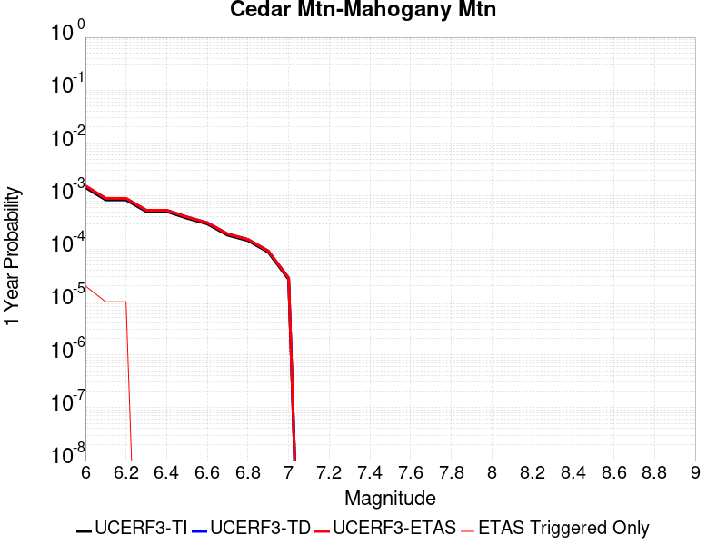 |  |

| Magnitude | 1 wk TI Prob | 1 wk TD Prob | 1 wk ETAS Prob | 1 wk ETAS/TD Gain | 1 wk ETAS Triggered Only | 1 mo TI Prob | 1 mo TD Prob | 1 mo ETAS Prob | 1 mo ETAS/TD Gain | 1 mo ETAS Triggered Only | 1 yr TI Prob | 1 yr TD Prob | 1 yr ETAS Prob | 1 yr ETAS/TD Gain | 1 yr ETAS Triggered Only | 10 yr TI Prob | 10 yr TD Prob | 10 yr ETAS Prob | 10 yr ETAS/TD Gain | 10 yr ETAS Triggered Only |
|-----|-----|-----|-----|-----|-----|-----|-----|-----|-----|-----|-----|-----|-----|-----|-----|-----|-----|-----|-----|-----|
| 6.0 | 2.7763876E-5 | 2.9588866E-5 | 4.194944E-5 | 1.417744 | 1.236094E-5 | 1.1898261E-4 | 1.2680366E-4 | 1.3916302E-4 | 1.0974686 | 1.236094E-5 | 0.0014476506 | 0.0015428112 | 0.001555153 | 1.0079995 | 1.236094E-5 | 0.0143825635 | 0.015328225 | 0.015340396 | 1.000794 | 1.236094E-5 |
| 6.1 | 1.6162443E-5 | 1.7142966E-5 | 1.7142966E-5 | 1.0 | 0.0 | 6.926578E-5 | 7.346788E-5 | 7.346788E-5 | 1.0 | 0.0 | 8.4298453E-4 | 8.941221E-4 | 8.941221E-4 | 1.0 | 0.0 | 0.008397939 | 0.008907059 | 0.008907059 | 1.0 | 0.0 |
| 6.2 | 1.6162443E-5 | 1.7142966E-5 | 1.7142966E-5 | 1.0 | 0.0 | 6.926578E-5 | 7.346788E-5 | 7.346788E-5 | 1.0 | 0.0 | 8.4298453E-4 | 8.941221E-4 | 8.941221E-4 | 1.0 | 0.0 | 0.008397939 | 0.008907059 | 0.008907059 | 1.0 | 0.0 |
| 6.3 | 9.746053E-6 | 1.0303152E-5 | 1.0303152E-5 | 1.0 | 0.0 | 4.1768133E-5 | 4.415564E-5 | 4.415564E-5 | 1.0 | 0.0 | 5.0840835E-4 | 5.3746643E-4 | 5.3746643E-4 | 1.0 | 0.0 | 0.0050724675 | 0.005362084 | 0.005362084 | 1.0 | 0.0 |
| 6.4 | 9.746053E-6 | 1.0303152E-5 | 1.0303152E-5 | 1.0 | 0.0 | 4.1768133E-5 | 4.415564E-5 | 4.415564E-5 | 1.0 | 0.0 | 5.0840835E-4 | 5.3746643E-4 | 5.3746643E-4 | 1.0 | 0.0 | 0.0050724675 | 0.005362084 | 0.005362084 | 1.0 | 0.0 |
| 6.5 | 7.290083E-6 | 7.695325E-6 | 7.695325E-6 | 1.0 | 0.0 | 3.124284E-5 | 3.297956E-5 | 3.297956E-5 | 1.0 | 0.0 | 3.8031515E-4 | 4.014543E-4 | 4.014543E-4 | 1.0 | 0.0 | 0.0037966494 | 0.004007511 | 0.004007511 | 1.0 | 0.0 |
| 6.6 | 5.67907E-6 | 5.9891527E-6 | 5.9891527E-6 | 1.0 | 0.0 | 2.4338644E-5 | 2.5667552E-5 | 2.5667552E-5 | 1.0 | 0.0 | 2.962827E-4 | 3.12459E-4 | 3.12459E-4 | 1.0 | 0.0 | 0.0029588798 | 0.003120333 | 0.003120333 | 1.0 | 0.0 |
| 6.7 | 3.4853963E-6 | 3.672631E-6 | 3.672631E-6 | 1.0 | 0.0 | 1.4937327E-5 | 1.5739755E-5 | 1.5739755E-5 | 1.0 | 0.0 | 1.8184677E-4 | 1.916153E-4 | 1.916153E-4 | 1.0 | 0.0 | 0.0018169804 | 0.0019145629 | 0.0019145629 | 1.0 | 0.0 |
| 6.8 | 2.7535168E-6 | 2.9015764E-6 | 2.9015764E-6 | 1.0 | 0.0 | 1.1800733E-5 | 1.2435271E-5 | 1.2435271E-5 | 1.0 | 0.0 | 1.4366445E-4 | 1.5138938E-4 | 1.5138938E-4 | 1.0 | 0.0 | 0.0014357162 | 0.0015129098 | 0.0015129098 | 1.0 | 0.0 |
| 6.9 | 1.6594106E-6 | 1.7496985E-6 | 1.7496985E-6 | 1.0 | 0.0 | 7.1117406E-6 | 7.4986883E-6 | 7.4986883E-6 | 1.0 | 0.0 | 8.6582E-5 | 9.129302E-5 | 9.129302E-5 | 1.0 | 0.0 | 8.654827E-4 | 9.125856E-4 | 9.125856E-4 | 1.0 | 0.0 |
| 7.0 | 5.10215E-7 | 5.389254E-7 | 5.389254E-7 | 1.0 | 0.0 | 2.186634E-6 | 2.3096788E-6 | 2.3096788E-6 | 1.0 | 0.0 | 2.6621943E-5 | 2.8120105E-5 | 2.8120105E-5 | 1.0 | 0.0 | 2.6618753E-4 | 2.81178E-4 | 2.81178E-4 | 1.0 | 0.0 |

## Sisar
*[(top)](#table-of-contents)*

| 1 Week | 1 Month | 1 Year | 10 Year |
|-----|-----|-----|-----|
|  |  |  |  |

| Magnitude | 1 wk TI Prob | 1 wk TD Prob | 1 wk ETAS Prob | 1 wk ETAS/TD Gain | 1 wk ETAS Triggered Only | 1 mo TI Prob | 1 mo TD Prob | 1 mo ETAS Prob | 1 mo ETAS/TD Gain | 1 mo ETAS Triggered Only | 1 yr TI Prob | 1 yr TD Prob | 1 yr ETAS Prob | 1 yr ETAS/TD Gain | 1 yr ETAS Triggered Only | 10 yr TI Prob | 10 yr TD Prob | 10 yr ETAS Prob | 10 yr ETAS/TD Gain | 10 yr ETAS Triggered Only |
|-----|-----|-----|-----|-----|-----|-----|-----|-----|-----|-----|-----|-----|-----|-----|-----|-----|-----|-----|-----|-----|
| 6.0 | 4.544193E-6 | 3.839576E-6 | 1.6200469E-5 | 4.2193375 | 1.236094E-5 | 1.9474966E-5 | 1.6455224E-5 | 2.881596E-5 | 1.751174 | 1.236094E-5 | 2.3708193E-4 | 2.0032428E-4 | 2.1268275E-4 | 1.0616922 | 1.236094E-5 | 0.0023682916 | 0.002001471 | 0.002013807 | 1.0061636 | 1.236094E-5 |
| 6.1 | 4.544193E-6 | 3.839576E-6 | 1.6200469E-5 | 4.2193375 | 1.236094E-5 | 1.9474966E-5 | 1.6455224E-5 | 2.881596E-5 | 1.751174 | 1.236094E-5 | 2.3708193E-4 | 2.0032428E-4 | 2.1268275E-4 | 1.0616922 | 1.236094E-5 | 0.0023682916 | 0.002001471 | 0.002013807 | 1.0061636 | 1.236094E-5 |
| 6.2 | 4.544193E-6 | 3.839576E-6 | 1.6200469E-5 | 4.2193375 | 1.236094E-5 | 1.9474966E-5 | 1.6455224E-5 | 2.881596E-5 | 1.751174 | 1.236094E-5 | 2.3708193E-4 | 2.0032428E-4 | 2.1268275E-4 | 1.0616922 | 1.236094E-5 | 0.0023682916 | 0.002001471 | 0.002013807 | 1.0061636 | 1.236094E-5 |
| 6.3 | 4.544193E-6 | 3.839576E-6 | 1.6200469E-5 | 4.2193375 | 1.236094E-5 | 1.9474966E-5 | 1.6455224E-5 | 2.881596E-5 | 1.751174 | 1.236094E-5 | 2.3708193E-4 | 2.0032428E-4 | 2.1268275E-4 | 1.0616922 | 1.236094E-5 | 0.0023682916 | 0.002001471 | 0.002013807 | 1.0061636 | 1.236094E-5 |
| 6.4 | 4.544193E-6 | 3.839576E-6 | 1.6200469E-5 | 4.2193375 | 1.236094E-5 | 1.9474966E-5 | 1.6455224E-5 | 2.881596E-5 | 1.751174 | 1.236094E-5 | 2.3708193E-4 | 2.0032428E-4 | 2.1268275E-4 | 1.0616922 | 1.236094E-5 | 0.0023682916 | 0.002001471 | 0.002013807 | 1.0061636 | 1.236094E-5 |
| 6.5 | 4.544193E-6 | 3.839576E-6 | 1.6200469E-5 | 4.2193375 | 1.236094E-5 | 1.9474966E-5 | 1.6455224E-5 | 2.881596E-5 | 1.751174 | 1.236094E-5 | 2.3708193E-4 | 2.0032428E-4 | 2.1268275E-4 | 1.0616922 | 1.236094E-5 | 0.0023682916 | 0.002001471 | 0.002013807 | 1.0061636 | 1.236094E-5 |
| 6.6 | 4.544193E-6 | 3.839576E-6 | 1.6200469E-5 | 4.2193375 | 1.236094E-5 | 1.9474966E-5 | 1.6455224E-5 | 2.881596E-5 | 1.751174 | 1.236094E-5 | 2.3708193E-4 | 2.0032428E-4 | 2.1268275E-4 | 1.0616922 | 1.236094E-5 | 0.0023682916 | 0.002001471 | 0.002013807 | 1.0061636 | 1.236094E-5 |
| 6.7 | 4.544193E-6 | 3.839576E-6 | 1.6200469E-5 | 4.2193375 | 1.236094E-5 | 1.9474966E-5 | 1.6455224E-5 | 2.881596E-5 | 1.751174 | 1.236094E-5 | 2.3708193E-4 | 2.0032428E-4 | 2.1268275E-4 | 1.0616922 | 1.236094E-5 | 0.0023682916 | 0.002001471 | 0.002013807 | 1.0061636 | 1.236094E-5 |
| 6.8 | 4.544193E-6 | 3.839576E-6 | 1.6200469E-5 | 4.2193375 | 1.236094E-5 | 1.9474966E-5 | 1.6455224E-5 | 2.881596E-5 | 1.751174 | 1.236094E-5 | 2.3708193E-4 | 2.0032428E-4 | 2.1268275E-4 | 1.0616922 | 1.236094E-5 | 0.0023682916 | 0.002001471 | 0.002013807 | 1.0061636 | 1.236094E-5 |
| 6.9 | 4.542225E-6 | 3.8375383E-6 | 1.619843E-5 | 4.2210474 | 1.236094E-5 | 1.9466532E-5 | 1.6446491E-5 | 2.8807226E-5 | 1.7515728 | 1.236094E-5 | 2.3697925E-4 | 2.0021795E-4 | 2.1257641E-4 | 1.061725 | 1.236094E-5 | 0.002367267 | 0.0020004094 | 0.0020127457 | 1.0061668 | 1.236094E-5 |
| 7.0 | 4.5278484E-6 | 3.822602E-6 | 1.6183494E-5 | 4.233633 | 1.236094E-5 | 1.940492E-5 | 1.638248E-5 | 2.8743218E-5 | 1.7545094 | 1.236094E-5 | 2.3622929E-4 | 1.9943877E-4 | 2.1179725E-4 | 1.0619663 | 1.236094E-5 | 0.0023597833 | 0.0019926317 | 0.002004968 | 1.006191 | 1.236094E-5 |
| 7.1 | 4.5132488E-6 | 3.8073897E-6 | 1.6168282E-5 | 4.246553 | 1.236094E-5 | 1.9342351E-5 | 1.6317284E-5 | 2.8678021E-5 | 1.7575243 | 1.236094E-5 | 2.3546767E-4 | 1.9864515E-4 | 2.1100364E-4 | 1.0622139 | 1.236094E-5 | 0.0023521832 | 0.0019847096 | 0.0019970462 | 1.0062157 | 1.236094E-5 |
| 7.2 | 4.448859E-6 | 3.7398502E-6 | 1.6100743E-5 | 4.305184 | 1.236094E-5 | 1.9066398E-5 | 1.6027832E-5 | 2.8388575E-5 | 1.7712048 | 1.236094E-5 | 2.3210866E-4 | 1.9512173E-4 | 2.0748025E-4 | 1.0633376 | 1.236094E-5 | 0.0023186638 | 0.0019495375 | 0.0019618745 | 1.0063281 | 1.236094E-5 |
| 7.3 | 4.3424366E-6 | 3.6336846E-6 | 1.599458E-5 | 4.401752 | 1.236094E-5 | 1.861031E-5 | 1.5572843E-5 | 2.7933589E-5 | 1.7937373 | 1.236094E-5 | 2.2655698E-4 | 1.895832E-4 | 2.0194179E-4 | 1.0651883 | 1.236094E-5 | 0.0022632615 | 0.0018942481 | 0.0019065856 | 1.0065131 | 1.236094E-5 |
| 7.4 | 4.218641E-6 | 3.5330384E-6 | 1.5893935E-5 | 4.4986587 | 1.236094E-5 | 1.8079765E-5 | 1.5141507E-5 | 2.750226E-5 | 1.8163489 | 1.236094E-5 | 2.2009891E-4 | 1.8433259E-4 | 1.9669125E-4 | 1.0670455 | 1.236094E-5 | 0.0021988105 | 0.0018418302 | 0.0018541684 | 1.0066988 | 1.236094E-5 |
| 7.5 | 3.983779E-6 | 3.3478068E-6 | 1.5708705E-5 | 4.6922374 | 1.236094E-5 | 1.7073227E-5 | 1.4347666E-5 | 2.6708429E-5 | 1.8615172 | 1.236094E-5 | 2.0784672E-4 | 1.7466917E-4 | 1.8702795E-4 | 1.0707554 | 1.236094E-5 | 0.0020765243 | 0.0017453518 | 0.0017576911 | 1.0070698 | 1.236094E-5 |
| 7.6 | 2.777393E-6 | 2.35225E-6 | 1.471316E-5 | 6.2549305 | 1.236094E-5 | 1.1903058E-5 | 1.0081033E-5 | 2.2441847E-5 | 2.2261457 | 1.236094E-5 | 1.449101E-4 | 1.2272975E-4 | 1.3508917E-4 | 1.1007044 | 1.236094E-5 | 0.0014481564 | 0.0012266274 | 0.0012389731 | 1.0100648 | 1.236094E-5 |
| 7.7 | 1.9028433E-6 | 1.593867E-6 | 1.39547865E-5 | 8.755302 | 1.236094E-5 | 8.155017E-6 | 6.8308404E-6 | 1.9191695E-5 | 2.8095658 | 1.236094E-5 | 9.928281E-5 | 8.3162355E-5 | 9.552227E-5 | 1.1486238 | 1.236094E-5 | 9.923846E-4 | 8.313171E-4 | 8.436678E-4 | 1.0148567 | 1.236094E-5 |
| 7.8 | 4.9095956E-7 | 4.3583708E-7 | 1.2796771E-5 | 29.361364 | 1.236094E-5 | 2.1041105E-6 | 1.8678718E-6 | 1.4228788E-5 | 7.617647 | 1.236094E-5 | 2.5617246E-5 | 2.2741104E-5 | 3.5101762E-5 | 1.5435382 | 1.236094E-5 | 2.5614293E-4 | 2.2738794E-4 | 2.3974606E-4 | 1.0543482 | 1.236094E-5 |
| 7.9 | 1.16657894E-7 | 1.0335569E-7 | 1.2464294E-5 | 120.59611 | 1.236094E-5 | 4.999623E-7 | 4.4295288E-7 | 1.2803886E-5 | 28.905754 | 1.236094E-5 | 6.087024E-6 | 5.3929384E-6 | 1.7753811E-5 | 3.292048 | 1.236094E-5 | 6.0868573E-5 | 5.3928103E-5 | 6.6288376E-5 | 1.229199 | 1.236094E-5 |
| 8.0 | 2.5100346E-9 | 1.7067566E-9 | 1.7067566E-9 | 1.0 | 0.0 | 1.0757291E-8 | 7.3146724E-9 | 7.3146724E-9 | 1.0 | 0.0 | 1.3097001E-7 | 8.905613E-8 | 8.905613E-8 | 1.0 | 0.0 | 1.3096993E-6 | 8.9056095E-7 | 8.9056095E-7 | 1.0 | 0.0 |

## Surprise Valley 2011 CFM
*[(top)](#table-of-contents)*

| 1 Week | 1 Month | 1 Year | 10 Year |
|-----|-----|-----|-----|
|  |  |  |  |

| Magnitude | 1 wk TI Prob | 1 wk TD Prob | 1 wk ETAS Prob | 1 wk ETAS/TD Gain | 1 wk ETAS Triggered Only | 1 mo TI Prob | 1 mo TD Prob | 1 mo ETAS Prob | 1 mo ETAS/TD Gain | 1 mo ETAS Triggered Only | 1 yr TI Prob | 1 yr TD Prob | 1 yr ETAS Prob | 1 yr ETAS/TD Gain | 1 yr ETAS Triggered Only | 10 yr TI Prob | 10 yr TD Prob | 10 yr ETAS Prob | 10 yr ETAS/TD Gain | 10 yr ETAS Triggered Only |
|-----|-----|-----|-----|-----|-----|-----|-----|-----|-----|-----|-----|-----|-----|-----|-----|-----|-----|-----|-----|-----|
| 6.0 | 4.0396248E-5 | 4.485131E-5 | 4.485131E-5 | 1.0 | 0.0 | 1.7311527E-4 | 1.9220692E-4 | 1.9220692E-4 | 1.0 | 0.0 | 0.002105641 | 0.0023378176 | 0.0023378176 | 1.0 | 0.0 | 0.020858008 | 0.023153966 | 0.02316604 | 1.0005215 | 1.236094E-5 |
| 6.1 | 4.0396248E-5 | 4.485131E-5 | 4.485131E-5 | 1.0 | 0.0 | 1.7311527E-4 | 1.9220692E-4 | 1.9220692E-4 | 1.0 | 0.0 | 0.002105641 | 0.0023378176 | 0.0023378176 | 1.0 | 0.0 | 0.020858008 | 0.023153966 | 0.02316604 | 1.0005215 | 1.236094E-5 |
| 6.2 | 2.2295266E-5 | 2.440125E-5 | 2.440125E-5 | 1.0 | 0.0 | 9.554764E-5 | 1.0457276E-4 | 1.0457276E-4 | 1.0 | 0.0 | 0.0011626717 | 0.0012724606 | 0.0012724606 | 1.0 | 0.0 | 0.011566074 | 0.012654981 | 0.012654981 | 1.0 | 0.0 |
| 6.3 | 1.572643E-5 | 1.7096807E-5 | 1.7096807E-5 | 1.0 | 0.0 | 6.7397246E-5 | 7.327003E-5 | 7.327003E-5 | 1.0 | 0.0 | 8.202525E-4 | 8.91708E-4 | 8.91708E-4 | 1.0 | 0.0 | 0.008172315 | 0.008882407 | 0.008882407 | 1.0 | 0.0 |
| 6.4 | 1.5714395E-5 | 1.7084629E-5 | 1.7084629E-5 | 1.0 | 0.0 | 6.734567E-5 | 7.3217845E-5 | 7.3217845E-5 | 1.0 | 0.0 | 8.1962504E-4 | 8.9107314E-4 | 8.9107314E-4 | 1.0 | 0.0 | 0.008166086 | 0.008876109 | 0.008876109 | 1.0 | 0.0 |
| 6.5 | 1.2733495E-5 | 1.38016E-5 | 1.38016E-5 | 1.0 | 0.0 | 5.457098E-5 | 5.9148413E-5 | 5.9148413E-5 | 1.0 | 0.0 | 6.641992E-4 | 7.1990065E-4 | 7.1990065E-4 | 1.0 | 0.0 | 0.0066221743 | 0.0071763797 | 0.0071763797 | 1.0 | 0.0 |
| 6.6 | 1.0983784E-5 | 1.1886554E-5 | 1.1886554E-5 | 1.0 | 0.0 | 4.7072506E-5 | 5.094141E-5 | 5.094141E-5 | 1.0 | 0.0 | 5.7295704E-4 | 6.200405E-4 | 6.200405E-4 | 1.0 | 0.0 | 0.0057148207 | 0.0061836545 | 0.0061836545 | 1.0 | 0.0 |
| 6.7 | 9.104806E-6 | 9.839491E-6 | 9.839491E-6 | 1.0 | 0.0 | 3.902001E-5 | 4.2168587E-5 | 4.2168587E-5 | 1.0 | 0.0 | 4.7496508E-4 | 5.132855E-4 | 5.132855E-4 | 1.0 | 0.0 | 0.004739512 | 0.005121397 | 0.005121397 | 1.0 | 0.0 |
| 6.8 | 6.2162403E-6 | 6.7041337E-6 | 6.7041337E-6 | 1.0 | 0.0 | 2.6640759E-5 | 2.8731698E-5 | 2.8731698E-5 | 1.0 | 0.0 | 3.2430296E-4 | 3.497545E-4 | 3.497545E-4 | 1.0 | 0.0 | 0.003238301 | 0.0034922638 | 0.0034922638 | 1.0 | 0.0 |
| 6.9 | 4.1792696E-6 | 4.50323E-6 | 4.50323E-6 | 1.0 | 0.0 | 1.7911032E-5 | 1.9299423E-5 | 1.9299423E-5 | 1.0 | 0.0 | 2.1804498E-4 | 2.3494668E-4 | 2.3494668E-4 | 1.0 | 0.0 | 0.0021783116 | 0.0023471361 | 0.0023471361 | 1.0 | 0.0 |
| 7.0 | 2.7478413E-6 | 2.9622424E-6 | 2.9622424E-6 | 1.0 | 0.0 | 1.177641E-5 | 1.269527E-5 | 1.269527E-5 | 1.0 | 0.0 | 1.4336836E-4 | 1.545552E-4 | 1.545552E-4 | 1.0 | 0.0 | 0.001432759 | 0.0015445995 | 0.0015445995 | 1.0 | 0.0 |
| 7.1 | 8.128648E-7 | 8.724922E-7 | 8.724922E-7 | 1.0 | 0.0 | 3.4837017E-6 | 3.7392501E-6 | 3.7392501E-6 | 1.0 | 0.0 | 4.2413245E-5 | 4.552502E-5 | 4.552502E-5 | 1.0 | 0.0 | 4.2405148E-4 | 4.5521575E-4 | 4.5521575E-4 | 1.0 | 0.0 |
| 7.2 | 4.8641045E-8 | 4.9402068E-8 | 4.9402068E-8 | 1.0 | 0.0 | 2.084616E-7 | 2.1172312E-7 | 2.1172312E-7 | 1.0 | 0.0 | 2.538017E-6 | 2.577726E-6 | 2.577726E-6 | 1.0 | 0.0 | 2.537988E-5 | 2.5776973E-5 | 2.5776973E-5 | 1.0 | 0.0 |
| 7.3 | 5.3911844E-9 | 5.4758145E-9 | 5.4758145E-9 | 1.0 | 0.0 | 2.3105075E-8 | 2.3467775E-8 | 2.3467775E-8 | 1.0 | 0.0 | 2.8130427E-7 | 2.8572015E-7 | 2.8572015E-7 | 1.0 | 0.0 | 2.8130391E-6 | 2.8571992E-6 | 2.8571992E-6 | 1.0 | 0.0 |

## Santa Cruz Catalina Ridge alt1
*[(top)](#table-of-contents)*

| 1 Week | 1 Month | 1 Year | 10 Year |
|-----|-----|-----|-----|
|  |  |  |  |

| Magnitude | 1 wk TI Prob | 1 wk TD Prob | 1 wk ETAS Prob | 1 wk ETAS/TD Gain | 1 wk ETAS Triggered Only | 1 mo TI Prob | 1 mo TD Prob | 1 mo ETAS Prob | 1 mo ETAS/TD Gain | 1 mo ETAS Triggered Only | 1 yr TI Prob | 1 yr TD Prob | 1 yr ETAS Prob | 1 yr ETAS/TD Gain | 1 yr ETAS Triggered Only | 10 yr TI Prob | 10 yr TD Prob | 10 yr ETAS Prob | 10 yr ETAS/TD Gain | 10 yr ETAS Triggered Only |
|-----|-----|-----|-----|-----|-----|-----|-----|-----|-----|-----|-----|-----|-----|-----|-----|-----|-----|-----|-----|-----|
| 6.0 | 3.2833184E-5 | 3.65584E-5 | 3.65584E-5 | 1.0 | 0.0 | 1.4070606E-4 | 1.5667039E-4 | 1.5667039E-4 | 1.0 | 0.0 | 0.00171175 | 0.0019059596 | 0.0019059596 | 1.0 | 0.0 | 0.016986247 | 0.018913029 | 0.018925156 | 1.0006412 | 1.236094E-5 |
| 6.1 | 1.9835548E-5 | 2.1659505E-5 | 2.1659505E-5 | 1.0 | 0.0 | 8.500672E-5 | 9.282326E-5 | 9.282326E-5 | 1.0 | 0.0 | 0.0010344655 | 0.0011295575 | 0.0011295575 | 1.0 | 0.0 | 0.010296632 | 0.011240295 | 0.011240295 | 1.0 | 0.0 |
| 6.2 | 1.9835548E-5 | 2.1659505E-5 | 2.1659505E-5 | 1.0 | 0.0 | 8.500672E-5 | 9.282326E-5 | 9.282326E-5 | 1.0 | 0.0 | 0.0010344655 | 0.0011295575 | 0.0011295575 | 1.0 | 0.0 | 0.010296632 | 0.011240295 | 0.011240295 | 1.0 | 0.0 |
| 6.3 | 1.5728183E-5 | 1.703395E-5 | 1.703395E-5 | 1.0 | 0.0 | 6.7404755E-5 | 7.300063E-5 | 7.300063E-5 | 1.0 | 0.0 | 8.2034385E-4 | 8.884264E-4 | 8.884264E-4 | 1.0 | 0.0 | 0.008173222 | 0.008849427 | 0.008849427 | 1.0 | 0.0 |
| 6.4 | 1.5728183E-5 | 1.703395E-5 | 1.703395E-5 | 1.0 | 0.0 | 6.7404755E-5 | 7.300063E-5 | 7.300063E-5 | 1.0 | 0.0 | 8.2034385E-4 | 8.884264E-4 | 8.884264E-4 | 1.0 | 0.0 | 0.008173222 | 0.008849427 | 0.008849427 | 1.0 | 0.0 |
| 6.5 | 1.3707734E-5 | 1.4794522E-5 | 1.4794522E-5 | 1.0 | 0.0 | 5.8746107E-5 | 6.3403575E-5 | 6.3403575E-5 | 1.0 | 0.0 | 7.1499916E-4 | 7.716686E-4 | 7.716686E-4 | 1.0 | 0.0 | 0.0071270303 | 0.0076902895 | 0.0076902895 | 1.0 | 0.0 |
| 6.6 | 1.2539813E-5 | 1.3510219E-5 | 1.3510219E-5 | 1.0 | 0.0 | 5.3740947E-5 | 5.789967E-5 | 5.789967E-5 | 1.0 | 0.0 | 6.540996E-4 | 7.0470315E-4 | 7.0470315E-4 | 1.0 | 0.0 | 0.0065217763 | 0.0070249885 | 0.0070249885 | 1.0 | 0.0 |
| 6.7 | 1.1504083E-5 | 1.2377375E-5 | 1.2377375E-5 | 1.0 | 0.0 | 4.930228E-5 | 5.3044827E-5 | 5.3044827E-5 | 1.0 | 0.0 | 6.0008996E-4 | 6.456314E-4 | 6.456314E-4 | 1.0 | 0.0 | 0.005984721 | 0.006437786 | 0.006437786 | 1.0 | 0.0 |
| 6.8 | 1.012739E-5 | 1.0877071E-5 | 1.0877071E-5 | 1.0 | 0.0 | 4.340238E-5 | 4.6615194E-5 | 4.6615194E-5 | 1.0 | 0.0 | 5.282958E-4 | 5.673937E-4 | 5.673937E-4 | 1.0 | 0.0 | 0.0052704164 | 0.0056596193 | 0.0056596193 | 1.0 | 0.0 |
| 6.9 | 8.9607865E-6 | 9.609117E-6 | 9.609117E-6 | 1.0 | 0.0 | 3.8402806E-5 | 4.1181287E-5 | 4.1181287E-5 | 1.0 | 0.0 | 4.6745385E-4 | 5.012679E-4 | 5.012679E-4 | 1.0 | 0.0 | 0.0046647177 | 0.005001492 | 0.005001492 | 1.0 | 0.0 |
| 7.0 | 8.046829E-6 | 8.619746E-6 | 8.619746E-6 | 1.0 | 0.0 | 3.4485955E-5 | 3.694125E-5 | 3.694125E-5 | 1.0 | 0.0 | 4.1978562E-4 | 4.496677E-4 | 4.496677E-4 | 1.0 | 0.0 | 0.004189935 | 0.0044876686 | 0.0044876686 | 1.0 | 0.0 |
| 7.1 | 7.136131E-6 | 7.637656E-6 | 7.637656E-6 | 1.0 | 0.0 | 3.0583058E-5 | 3.2732405E-5 | 3.2732405E-5 | 1.0 | 0.0 | 3.7228514E-4 | 3.9844486E-4 | 3.9844486E-4 | 1.0 | 0.0 | 0.0037166206 | 0.003977381 | 0.003977381 | 1.0 | 0.0 |
| 7.2 | 6.362014E-6 | 6.8049585E-6 | 6.8049585E-6 | 1.0 | 0.0 | 2.726549E-5 | 2.9163786E-5 | 2.9163786E-5 | 1.0 | 0.0 | 3.3190678E-4 | 3.550119E-4 | 3.550119E-4 | 1.0 | 0.0 | 0.0033141149 | 0.003544516 | 0.003544516 | 1.0 | 0.0 |
| 7.3 | 5.004101E-6 | 5.351715E-6 | 5.351715E-6 | 1.0 | 0.0 | 2.1445969E-5 | 2.2935723E-5 | 2.2935723E-5 | 1.0 | 0.0 | 2.6107338E-4 | 2.792072E-4 | 2.792072E-4 | 1.0 | 0.0 | 0.002607669 | 0.0027886187 | 0.0027886187 | 1.0 | 0.0 |
| 7.4 | 3.4901443E-6 | 3.7320526E-6 | 3.7320526E-6 | 1.0 | 0.0 | 1.4957676E-5 | 1.5994416E-5 | 1.5994416E-5 | 1.0 | 0.0 | 1.8209449E-4 | 1.9471499E-4 | 1.9471499E-4 | 1.0 | 0.0 | 0.0018194534 | 0.0019454823 | 0.0019454823 | 1.0 | 0.0 |
| 7.5 | 1.1215045E-6 | 1.189387E-6 | 1.189387E-6 | 1.0 | 0.0 | 4.806439E-6 | 5.097363E-6 | 5.097363E-6 | 1.0 | 0.0 | 5.851682E-5 | 6.205866E-5 | 6.205866E-5 | 1.0 | 0.0 | 5.850142E-4 | 6.2041637E-4 | 6.2041637E-4 | 1.0 | 0.0 |
| 7.6 | 2.8599047E-7 | 2.9951994E-7 | 2.9951994E-7 | 1.0 | 0.0 | 1.2256729E-6 | 1.2836562E-6 | 1.2836562E-6 | 1.0 | 0.0 | 1.4922465E-5 | 1.5628404E-5 | 1.5628404E-5 | 1.0 | 0.0 | 1.4921463E-4 | 1.5627318E-4 | 1.5627318E-4 | 1.0 | 0.0 |
| 7.7 | 2.0781519E-7 | 2.1744323E-7 | 2.1744323E-7 | 1.0 | 0.0 | 8.906362E-7 | 9.3189925E-7 | 9.3189925E-7 | 1.0 | 0.0 | 1.08434415E-5 | 1.13458145E-5 | 1.13458145E-5 | 1.0 | 0.0 | 1.0842913E-4 | 1.1345245E-4 | 1.1345245E-4 | 1.0 | 0.0 |
| 7.8 | 3.614776E-8 | 3.764102E-8 | 3.764102E-8 | 1.0 | 0.0 | 1.5491896E-7 | 1.6131864E-7 | 1.6131864E-7 | 1.0 | 0.0 | 1.8861368E-6 | 1.9640527E-6 | 1.9640527E-6 | 1.0 | 0.0 | 1.8861208E-5 | 1.9640367E-5 | 1.9640367E-5 | 1.0 | 0.0 |

## San Gabriel (Extension)
*[(top)](#table-of-contents)*

| 1 Week | 1 Month | 1 Year | 10 Year |
|-----|-----|-----|-----|
|  |  |  |  |

| Magnitude | 1 wk TI Prob | 1 wk TD Prob | 1 wk ETAS Prob | 1 wk ETAS/TD Gain | 1 wk ETAS Triggered Only | 1 mo TI Prob | 1 mo TD Prob | 1 mo ETAS Prob | 1 mo ETAS/TD Gain | 1 mo ETAS Triggered Only | 1 yr TI Prob | 1 yr TD Prob | 1 yr ETAS Prob | 1 yr ETAS/TD Gain | 1 yr ETAS Triggered Only | 10 yr TI Prob | 10 yr TD Prob | 10 yr ETAS Prob | 10 yr ETAS/TD Gain | 10 yr ETAS Triggered Only |
|-----|-----|-----|-----|-----|-----|-----|-----|-----|-----|-----|-----|-----|-----|-----|-----|-----|-----|-----|-----|-----|
| 6.0 | 5.6486106E-6 | 5.7168304E-6 | 1.8077699E-5 | 3.1621892 | 1.236094E-5 | 2.4208108E-5 | 2.450048E-5 | 3.6861114E-5 | 1.5045059 | 1.236094E-5 | 2.9469383E-4 | 2.9825376E-4 | 3.10611E-4 | 1.041432 | 1.236094E-5 | 0.0029430336 | 0.0029786653 | 0.0029909892 | 1.0041375 | 1.236094E-5 |
| 6.1 | 5.6486106E-6 | 5.7168304E-6 | 1.8077699E-5 | 3.1621892 | 1.236094E-5 | 2.4208108E-5 | 2.450048E-5 | 3.6861114E-5 | 1.5045059 | 1.236094E-5 | 2.9469383E-4 | 2.9825376E-4 | 3.10611E-4 | 1.041432 | 1.236094E-5 | 0.0029430336 | 0.0029786653 | 0.0029909892 | 1.0041375 | 1.236094E-5 |
| 6.2 | 5.6486106E-6 | 5.7168304E-6 | 1.8077699E-5 | 3.1621892 | 1.236094E-5 | 2.4208108E-5 | 2.450048E-5 | 3.6861114E-5 | 1.5045059 | 1.236094E-5 | 2.9469383E-4 | 2.9825376E-4 | 3.10611E-4 | 1.041432 | 1.236094E-5 | 0.0029430336 | 0.0029786653 | 0.0029909892 | 1.0041375 | 1.236094E-5 |
| 6.3 | 5.6486106E-6 | 5.7168304E-6 | 1.8077699E-5 | 3.1621892 | 1.236094E-5 | 2.4208108E-5 | 2.450048E-5 | 3.6861114E-5 | 1.5045059 | 1.236094E-5 | 2.9469383E-4 | 2.9825376E-4 | 3.10611E-4 | 1.041432 | 1.236094E-5 | 0.0029430336 | 0.0029786653 | 0.0029909892 | 1.0041375 | 1.236094E-5 |
| 6.4 | 5.6486106E-6 | 5.7168304E-6 | 1.8077699E-5 | 3.1621892 | 1.236094E-5 | 2.4208108E-5 | 2.450048E-5 | 3.6861114E-5 | 1.5045059 | 1.236094E-5 | 2.9469383E-4 | 2.9825376E-4 | 3.10611E-4 | 1.041432 | 1.236094E-5 | 0.0029430336 | 0.0029786653 | 0.0029909892 | 1.0041375 | 1.236094E-5 |
| 6.5 | 4.7134554E-6 | 4.7542544E-6 | 1.7115135E-5 | 3.599962 | 1.236094E-5 | 2.0200367E-5 | 2.0375222E-5 | 3.273591E-5 | 1.6066529 | 1.236094E-5 | 2.459117E-4 | 2.4804095E-4 | 2.603988E-4 | 1.0498219 | 1.236094E-5 | 0.0024563975 | 0.002477729 | 0.0024900595 | 1.0049765 | 1.236094E-5 |
| 6.6 | 4.7134554E-6 | 4.7542544E-6 | 1.7115135E-5 | 3.599962 | 1.236094E-5 | 2.0200367E-5 | 2.0375222E-5 | 3.273591E-5 | 1.6066529 | 1.236094E-5 | 2.459117E-4 | 2.4804095E-4 | 2.603988E-4 | 1.0498219 | 1.236094E-5 | 0.0024563975 | 0.002477729 | 0.0024900595 | 1.0049765 | 1.236094E-5 |
| 6.7 | 4.2468837E-6 | 4.2740717E-6 | 1.6634958E-5 | 3.8920634 | 1.236094E-5 | 1.8200803E-5 | 1.8317325E-5 | 3.067804E-5 | 1.6748099 | 1.236094E-5 | 2.2157225E-4 | 2.2299135E-4 | 2.3534952E-4 | 1.05542 | 1.236094E-5 | 0.0022135144 | 0.0022277518 | 0.0022400853 | 1.0055362 | 1.236094E-5 |
| 6.8 | 4.1180615E-6 | 4.1414614E-6 | 1.650235E-5 | 3.9846683 | 1.236094E-5 | 1.7648716E-5 | 1.7749004E-5 | 3.0109723E-5 | 1.6964177 | 1.236094E-5 | 2.1485193E-4 | 2.160734E-4 | 2.2843167E-4 | 1.0571947 | 1.236094E-5 | 0.0021464431 | 0.0021587082 | 0.0021710426 | 1.0057137 | 1.236094E-5 |
| 6.9 | 3.863861E-6 | 3.8797766E-6 | 1.6240669E-5 | 4.1859803 | 1.236094E-5 | 1.65593E-5 | 1.6627511E-5 | 2.8988246E-5 | 1.7433904 | 1.236094E-5 | 2.0159081E-4 | 2.0242184E-4 | 2.1478027E-4 | 1.0610529 | 1.236094E-5 | 0.0020140803 | 0.002022446 | 0.002034782 | 1.0060995 | 1.236094E-5 |
| 7.0 | 3.6947372E-6 | 3.705676E-6 | 1.606657E-5 | 4.335665 | 1.236094E-5 | 1.5834492E-5 | 1.5881375E-5 | 2.8242119E-5 | 1.778317 | 1.236094E-5 | 1.9276788E-4 | 1.9333926E-4 | 2.0569781E-4 | 1.0639216 | 1.236094E-5 | 0.0019260074 | 0.0019317807 | 0.0019441178 | 1.0063864 | 1.236094E-5 |
| 7.1 | 3.5686835E-6 | 3.5728963E-6 | 1.5933792E-5 | 4.459629 | 1.236094E-5 | 1.5294268E-5 | 1.5312327E-5 | 2.7673077E-5 | 1.8072418 | 1.236094E-5 | 1.861918E-4 | 1.8641229E-4 | 1.9877093E-4 | 1.0662973 | 1.236094E-5 | 0.0018603588 | 0.0018626289 | 0.0018749668 | 1.006624 | 1.236094E-5 |
| 7.2 | 2.8023446E-6 | 2.7767885E-6 | 2.7767885E-6 | 1.0 | 0.0 | 1.2009994E-5 | 1.1900468E-5 | 1.1900468E-5 | 1.0 | 0.0 | 1.4621185E-4 | 1.4487868E-4 | 1.4487868E-4 | 1.0 | 0.0 | 0.001461157 | 0.0014478569 | 0.0014478569 | 1.0 | 0.0 |
| 7.3 | 2.5843012E-6 | 2.5459642E-6 | 2.5459642E-6 | 1.0 | 0.0 | 1.1075529E-5 | 1.0911231E-5 | 1.0911231E-5 | 1.0 | 0.0 | 1.3483623E-4 | 1.3283623E-4 | 1.3283623E-4 | 1.0 | 0.0 | 0.0013475444 | 0.0013275818 | 0.0013275818 | 1.0 | 0.0 |
| 7.4 | 2.4464468E-6 | 2.396665E-6 | 2.396665E-6 | 1.0 | 0.0 | 1.04847295E-5 | 1.0271382E-5 | 1.0271382E-5 | 1.0 | 0.0 | 1.276441E-4 | 1.25047E-4 | 1.25047E-4 | 1.0 | 0.0 | 0.0012757082 | 0.0012497796 | 0.0012497796 | 1.0 | 0.0 |
| 7.5 | 2.0420266E-6 | 1.8910426E-6 | 1.8910426E-6 | 1.0 | 0.0 | 8.751514E-6 | 8.104444E-6 | 8.104444E-6 | 1.0 | 0.0 | 1.0654447E-4 | 9.8667166E-5 | 9.8667166E-5 | 1.0 | 0.0 | 0.001064934 | 9.862408E-4 | 9.862408E-4 | 1.0 | 0.0 |
| 7.6 | 1.8326596E-6 | 1.6398341E-6 | 1.6398341E-6 | 1.0 | 0.0 | 7.854232E-6 | 7.0278415E-6 | 7.0278415E-6 | 1.0 | 0.0 | 9.562107E-5 | 8.5560634E-5 | 8.5560634E-5 | 1.0 | 0.0 | 9.5579936E-4 | 8.5528276E-4 | 8.5528276E-4 | 1.0 | 0.0 |
| 7.7 | 1.4786998E-6 | 1.2523838E-6 | 1.2523838E-6 | 1.0 | 0.0 | 6.3372695E-6 | 5.367348E-6 | 5.367348E-6 | 1.0 | 0.0 | 7.715353E-5 | 6.534551E-5 | 6.534551E-5 | 1.0 | 0.0 | 7.7126746E-4 | 6.532707E-4 | 6.532707E-4 | 1.0 | 0.0 |
| 7.8 | 7.6975533E-7 | 6.0693884E-7 | 6.0693884E-7 | 1.0 | 0.0 | 3.2989474E-6 | 2.601164E-6 | 2.601164E-6 | 1.0 | 0.0 | 4.0163945E-5 | 3.166871E-5 | 3.166871E-5 | 1.0 | 0.0 | 4.0156685E-4 | 3.1664805E-4 | 3.1664805E-4 | 1.0 | 0.0 |
| 7.9 | 1.7645915E-7 | 9.213256E-8 | 9.213256E-8 | 1.0 | 0.0 | 7.562533E-7 | 3.9485377E-7 | 3.9485377E-7 | 1.0 | 0.0 | 9.207345E-6 | 4.807334E-6 | 4.807334E-6 | 1.0 | 0.0 | 9.206964E-5 | 4.807699E-5 | 4.807699E-5 | 1.0 | 0.0 |
| 8.0 | 1.0463461E-7 | 2.4949307E-8 | 2.4949307E-8 | 1.0 | 0.0 | 4.4843398E-7 | 1.0692559E-7 | 1.0692559E-7 | 1.0 | 0.0 | 5.45967E-6 | 1.3018183E-6 | 1.3018183E-6 | 1.0 | 0.0 | 5.459536E-5 | 1.3022789E-5 | 1.3022789E-5 | 1.0 | 0.0 |
| 8.1 | 7.875717E-8 | 1.3866874E-8 | 1.3866874E-8 | 1.0 | 0.0 | 3.3753068E-7 | 5.942946E-8 | 5.942946E-8 | 1.0 | 0.0 | 4.109428E-6 | 7.235534E-7 | 7.235534E-7 | 1.0 | 0.0 | 4.109352E-5 | 7.2401926E-6 | 7.2401926E-6 | 1.0 | 0.0 |
| 8.2 | 1.33163E-8 | 1.7733891E-9 | 1.7733891E-9 | 1.0 | 0.0 | 5.7069855E-8 | 7.600239E-9 | 7.600239E-9 | 1.0 | 0.0 | 6.9482525E-7 | 9.25329E-8 | 9.25329E-8 | 1.0 | 0.0 | 6.9482307E-6 | 9.272953E-7 | 9.272953E-7 | 1.0 | 0.0 |

## Monte Vista - Shannon 2011 CFM
*[(top)](#table-of-contents)*

| 1 Week | 1 Month | 1 Year | 10 Year |
|-----|-----|-----|-----|
|  |  |  |  |

| Magnitude | 1 wk TI Prob | 1 wk TD Prob | 1 wk ETAS Prob | 1 wk ETAS/TD Gain | 1 wk ETAS Triggered Only | 1 mo TI Prob | 1 mo TD Prob | 1 mo ETAS Prob | 1 mo ETAS/TD Gain | 1 mo ETAS Triggered Only | 1 yr TI Prob | 1 yr TD Prob | 1 yr ETAS Prob | 1 yr ETAS/TD Gain | 1 yr ETAS Triggered Only | 10 yr TI Prob | 10 yr TD Prob | 10 yr ETAS Prob | 10 yr ETAS/TD Gain | 10 yr ETAS Triggered Only |
|-----|-----|-----|-----|-----|-----|-----|-----|-----|-----|-----|-----|-----|-----|-----|-----|-----|-----|-----|-----|-----|
| 6.0 | 2.7907707E-5 | 2.7584209E-5 | 2.7584209E-5 | 1.0 | 0.0 | 1.19598975E-4 | 1.1821338E-4 | 1.1821338E-4 | 1.0 | 0.0 | 0.0014551448 | 0.0014384214 | 0.0014384214 | 1.0 | 0.0 | 0.014456532 | 0.014320195 | 0.014332379 | 1.0008508 | 1.236094E-5 |
| 6.1 | 2.7907707E-5 | 2.7584209E-5 | 2.7584209E-5 | 1.0 | 0.0 | 1.19598975E-4 | 1.1821338E-4 | 1.1821338E-4 | 1.0 | 0.0 | 0.0014551448 | 0.0014384214 | 0.0014384214 | 1.0 | 0.0 | 0.014456532 | 0.014320195 | 0.014332379 | 1.0008508 | 1.236094E-5 |
| 6.2 | 2.7907707E-5 | 2.7584209E-5 | 2.7584209E-5 | 1.0 | 0.0 | 1.19598975E-4 | 1.1821338E-4 | 1.1821338E-4 | 1.0 | 0.0 | 0.0014551448 | 0.0014384214 | 0.0014384214 | 1.0 | 0.0 | 0.014456532 | 0.014320195 | 0.014332379 | 1.0008508 | 1.236094E-5 |
| 6.3 | 2.7907707E-5 | 2.7584209E-5 | 2.7584209E-5 | 1.0 | 0.0 | 1.19598975E-4 | 1.1821338E-4 | 1.1821338E-4 | 1.0 | 0.0 | 0.0014551448 | 0.0014384214 | 0.0014384214 | 1.0 | 0.0 | 0.014456532 | 0.014320195 | 0.014332379 | 1.0008508 | 1.236094E-5 |
| 6.4 | 2.7907707E-5 | 2.7584209E-5 | 2.7584209E-5 | 1.0 | 0.0 | 1.19598975E-4 | 1.1821338E-4 | 1.1821338E-4 | 1.0 | 0.0 | 0.0014551448 | 0.0014384214 | 0.0014384214 | 1.0 | 0.0 | 0.014456532 | 0.014320195 | 0.014332379 | 1.0008508 | 1.236094E-5 |
| 6.5 | 1.7990213E-5 | 1.6639884E-5 | 1.6639884E-5 | 1.0 | 0.0 | 7.709863E-5 | 7.131221E-5 | 7.131221E-5 | 1.0 | 0.0 | 9.382716E-4 | 8.679467E-4 | 8.679467E-4 | 1.0 | 0.0 | 0.0093431985 | 0.008668941 | 0.008668941 | 1.0 | 0.0 |
| 6.6 | 9.650407E-6 | 7.4571435E-6 | 7.4571435E-6 | 1.0 | 0.0 | 4.135823E-5 | 3.195884E-5 | 3.195884E-5 | 1.0 | 0.0 | 5.0342013E-4 | 3.8903722E-4 | 3.8903722E-4 | 1.0 | 0.0 | 0.005022812 | 0.0039012418 | 0.0039012418 | 1.0 | 0.0 |
| 6.7 | 9.62828E-6 | 7.4350583E-6 | 7.4350583E-6 | 1.0 | 0.0 | 4.1263404E-5 | 3.186419E-5 | 3.186419E-5 | 1.0 | 0.0 | 5.022661E-4 | 3.878853E-4 | 3.878853E-4 | 1.0 | 0.0 | 0.0050113243 | 0.003889763 | 0.003889763 | 1.0 | 0.0 |
| 6.8 | 6.887523E-6 | 4.4615676E-6 | 4.4615676E-6 | 1.0 | 0.0 | 2.9517621E-5 | 1.9120876E-5 | 1.9120876E-5 | 1.0 | 0.0 | 3.5931775E-4 | 2.3277402E-4 | 2.3277402E-4 | 1.0 | 0.0 | 0.0035873733 | 0.0023424553 | 0.0023424553 | 1.0 | 0.0 |
| 6.9 | 6.2722347E-6 | 3.8034377E-6 | 3.8034377E-6 | 1.0 | 0.0 | 2.6880729E-5 | 1.6300357E-5 | 1.6300357E-5 | 1.0 | 0.0 | 3.2722374E-4 | 1.984408E-4 | 1.984408E-4 | 1.0 | 0.0 | 0.003267423 | 0.0019997752 | 0.0019997752 | 1.0 | 0.0 |
| 7.0 | 5.5320347E-6 | 3.0305885E-6 | 3.0305885E-6 | 1.0 | 0.0 | 2.3708504E-5 | 1.2988182E-5 | 1.2988182E-5 | 1.0 | 0.0 | 2.8861282E-4 | 1.5812147E-4 | 1.5812147E-4 | 1.0 | 0.0 | 0.0028823826 | 0.001597215 | 0.001597215 | 1.0 | 0.0 |
| 7.1 | 3.8794055E-6 | 1.2837862E-6 | 1.2837862E-6 | 1.0 | 0.0 | 1.6625918E-5 | 5.5019295E-6 | 5.5019295E-6 | 1.0 | 0.0 | 2.0240174E-4 | 6.698394E-5 | 6.698394E-5 | 1.0 | 0.0 | 0.002022175 | 6.865884E-4 | 6.865884E-4 | 1.0 | 0.0 |
| 7.2 | 3.4813652E-6 | 9.671046E-7 | 9.671046E-7 | 1.0 | 0.0 | 1.49200505E-5 | 4.1447274E-6 | 4.1447274E-6 | 1.0 | 0.0 | 1.8163648E-4 | 5.0460894E-5 | 5.0460894E-5 | 1.0 | 0.0 | 0.0018148809 | 5.214329E-4 | 5.214329E-4 | 1.0 | 0.0 |
| 7.3 | 3.1682148E-6 | 7.719097E-7 | 7.719097E-7 | 1.0 | 0.0 | 1.3577992E-5 | 3.30818E-6 | 3.30818E-6 | 1.0 | 0.0 | 1.6529951E-4 | 4.027635E-5 | 4.027635E-5 | 1.0 | 0.0 | 0.0016517661 | 4.1960424E-4 | 4.1960424E-4 | 1.0 | 0.0 |
| 7.4 | 2.9707667E-6 | 7.3457204E-7 | 7.3457204E-7 | 1.0 | 0.0 | 1.2731795E-5 | 3.148162E-6 | 3.148162E-6 | 1.0 | 0.0 | 1.5499859E-4 | 3.8328202E-5 | 3.8328202E-5 | 1.0 | 0.0 | 0.0015489052 | 3.9992164E-4 | 3.9992164E-4 | 1.0 | 0.0 |
| 7.5 | 2.3462758E-6 | 6.007889E-7 | 6.007889E-7 | 1.0 | 0.0 | 1.0055429E-5 | 2.574807E-6 | 2.574807E-6 | 1.0 | 0.0 | 1.2241797E-4 | 3.1347827E-5 | 3.1347827E-5 | 1.0 | 0.0 | 0.0012235056 | 3.2839534E-4 | 3.2839534E-4 | 1.0 | 0.0 |
| 7.6 | 2.112783E-6 | 5.251582E-7 | 5.251582E-7 | 1.0 | 0.0 | 9.054753E-6 | 2.250676E-6 | 2.250676E-6 | 1.0 | 0.0 | 1.1023604E-4 | 2.7401638E-5 | 2.7401638E-5 | 1.0 | 0.0 | 0.0011018137 | 2.885138E-4 | 2.885138E-4 | 1.0 | 0.0 |
| 7.7 | 1.7022471E-6 | 4.231601E-7 | 4.231601E-7 | 1.0 | 0.0 | 7.2953244E-6 | 1.8135419E-6 | 1.8135419E-6 | 1.0 | 0.0 | 8.881695E-5 | 2.207965E-5 | 2.207965E-5 | 1.0 | 0.0 | 8.878146E-4 | 2.3398738E-4 | 2.3398738E-4 | 1.0 | 0.0 |
| 7.8 | 7.230914E-7 | 3.7285864E-7 | 3.7285864E-7 | 1.0 | 0.0 | 3.0989595E-6 | 1.5979647E-6 | 1.5979647E-6 | 1.0 | 0.0 | 3.772918E-5 | 1.9455047E-5 | 1.9455047E-5 | 1.0 | 0.0 | 3.7722773E-4 | 2.0726922E-4 | 2.0726922E-4 | 1.0 | 0.0 |
| 7.9 | 4.3588446E-7 | 3.4305793E-7 | 3.4305793E-7 | 1.0 | 0.0 | 1.868075E-6 | 1.4702474E-6 | 1.4702474E-6 | 1.0 | 0.0 | 2.2743576E-5 | 1.7900116E-5 | 1.7900116E-5 | 1.0 | 0.0 | 2.2741247E-4 | 1.8995286E-4 | 1.8995286E-4 | 1.0 | 0.0 |
| 8.0 | 2.3317523E-7 | 3.1513588E-7 | 3.1513588E-7 | 1.0 | 0.0 | 9.99322E-7 | 1.3505817E-6 | 1.3505817E-6 | 1.0 | 0.0 | 1.2166677E-5 | 1.644321E-5 | 1.644321E-5 | 1.0 | 0.0 | 1.21660116E-4 | 1.7399415E-4 | 1.7399415E-4 | 1.0 | 0.0 |
| 8.1 | 1.4662456E-7 | 2.030774E-7 | 2.030774E-7 | 1.0 | 0.0 | 6.283908E-7 | 8.703314E-7 | 8.703314E-7 | 1.0 | 0.0 | 7.650631E-6 | 1.05962345E-5 | 1.05962345E-5 | 1.0 | 0.0 | 7.650368E-5 | 1.113227E-4 | 1.113227E-4 | 1.0 | 0.0 |
| 8.2 | 5.4931775E-9 | 5.07573E-9 | 5.07573E-9 | 1.0 | 0.0 | 2.3542189E-8 | 2.1753127E-8 | 2.1753127E-8 | 1.0 | 0.0 | 2.8662612E-7 | 2.6484432E-7 | 2.6484432E-7 | 1.0 | 0.0 | 2.8662573E-6 | 2.7539324E-6 | 2.7539324E-6 | 1.0 | 0.0 |

## Garberville - Briceland 2011 CFM
*[(top)](#table-of-contents)*

| 1 Week | 1 Month | 1 Year | 10 Year |
|-----|-----|-----|-----|
|  |  | 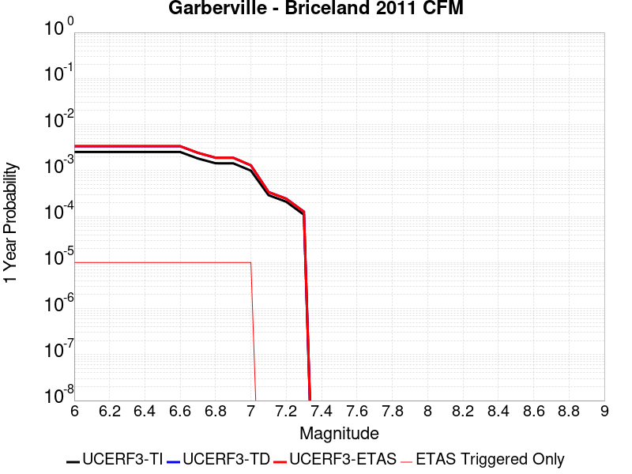 |  |

| Magnitude | 1 wk TI Prob | 1 wk TD Prob | 1 wk ETAS Prob | 1 wk ETAS/TD Gain | 1 wk ETAS Triggered Only | 1 mo TI Prob | 1 mo TD Prob | 1 mo ETAS Prob | 1 mo ETAS/TD Gain | 1 mo ETAS Triggered Only | 1 yr TI Prob | 1 yr TD Prob | 1 yr ETAS Prob | 1 yr ETAS/TD Gain | 1 yr ETAS Triggered Only | 10 yr TI Prob | 10 yr TD Prob | 10 yr ETAS Prob | 10 yr ETAS/TD Gain | 10 yr ETAS Triggered Only |
|-----|-----|-----|-----|-----|-----|-----|-----|-----|-----|-----|-----|-----|-----|-----|-----|-----|-----|-----|-----|-----|
| 6.0 | 4.8399295E-5 | 6.452381E-5 | 7.688395E-5 | 1.1915594 | 1.236094E-5 | 2.0740906E-4 | 2.7650563E-4 | 2.8886314E-4 | 1.0446918 | 1.236094E-5 | 0.002522281 | 0.003362017 | 0.0033743365 | 1.0036643 | 1.236094E-5 | 0.024938442 | 0.03317861 | 0.03319056 | 1.0003603 | 1.236094E-5 |
| 6.1 | 4.8399295E-5 | 6.452381E-5 | 7.688395E-5 | 1.1915594 | 1.236094E-5 | 2.0740906E-4 | 2.7650563E-4 | 2.8886314E-4 | 1.0446918 | 1.236094E-5 | 0.002522281 | 0.003362017 | 0.0033743365 | 1.0036643 | 1.236094E-5 | 0.024938442 | 0.03317861 | 0.03319056 | 1.0003603 | 1.236094E-5 |
| 6.2 | 4.8399295E-5 | 6.452381E-5 | 7.688395E-5 | 1.1915594 | 1.236094E-5 | 2.0740906E-4 | 2.7650563E-4 | 2.8886314E-4 | 1.0446918 | 1.236094E-5 | 0.002522281 | 0.003362017 | 0.0033743365 | 1.0036643 | 1.236094E-5 | 0.024938442 | 0.03317861 | 0.03319056 | 1.0003603 | 1.236094E-5 |
| 6.3 | 4.8399295E-5 | 6.452381E-5 | 7.688395E-5 | 1.1915594 | 1.236094E-5 | 2.0740906E-4 | 2.7650563E-4 | 2.8886314E-4 | 1.0446918 | 1.236094E-5 | 0.002522281 | 0.003362017 | 0.0033743365 | 1.0036643 | 1.236094E-5 | 0.024938442 | 0.03317861 | 0.03319056 | 1.0003603 | 1.236094E-5 |
| 6.4 | 4.8399295E-5 | 6.452381E-5 | 7.688395E-5 | 1.1915594 | 1.236094E-5 | 2.0740906E-4 | 2.7650563E-4 | 2.8886314E-4 | 1.0446918 | 1.236094E-5 | 0.002522281 | 0.003362017 | 0.0033743365 | 1.0036643 | 1.236094E-5 | 0.024938442 | 0.03317861 | 0.03319056 | 1.0003603 | 1.236094E-5 |
| 6.5 | 4.8399295E-5 | 6.452381E-5 | 7.688395E-5 | 1.1915594 | 1.236094E-5 | 2.0740906E-4 | 2.7650563E-4 | 2.8886314E-4 | 1.0446918 | 1.236094E-5 | 0.002522281 | 0.003362017 | 0.0033743365 | 1.0036643 | 1.236094E-5 | 0.024938442 | 0.03317861 | 0.03319056 | 1.0003603 | 1.236094E-5 |
| 6.6 | 4.8399295E-5 | 6.452381E-5 | 7.688395E-5 | 1.1915594 | 1.236094E-5 | 2.0740906E-4 | 2.7650563E-4 | 2.8886314E-4 | 1.0446918 | 1.236094E-5 | 0.002522281 | 0.003362017 | 0.0033743365 | 1.0036643 | 1.236094E-5 | 0.024938442 | 0.03317861 | 0.03319056 | 1.0003603 | 1.236094E-5 |
| 6.7 | 3.495179E-5 | 4.6308873E-5 | 5.8669237E-5 | 1.2669114 | 1.236094E-5 | 1.4978478E-4 | 1.9845461E-4 | 2.108131E-4 | 1.0622736 | 1.236094E-5 | 0.0018221042 | 0.002414053 | 0.0024263842 | 1.005108 | 1.236094E-5 | 0.018072363 | 0.023930617 | 0.023942681 | 1.0005041 | 1.236094E-5 |
| 6.8 | 2.7517597E-5 | 3.6241618E-5 | 4.8602113E-5 | 1.3410579 | 1.236094E-5 | 1.1792722E-4 | 1.5531474E-4 | 1.6767376E-4 | 1.079574 | 1.236094E-5 | 0.0014348183 | 0.0018897996 | 0.0019021372 | 1.0065285 | 1.236094E-5 | 0.014255894 | 0.018783508 | 0.018795637 | 1.0006458 | 1.236094E-5 |
| 6.9 | 2.74461E-5 | 3.6159345E-5 | 4.8519836E-5 | 1.341834 | 1.236094E-5 | 1.1762084E-4 | 1.5496218E-4 | 1.673212E-4 | 1.0797551 | 1.236094E-5 | 0.001431093 | 0.0018855145 | 0.0018978522 | 1.0065434 | 1.236094E-5 | 0.014219119 | 0.018741382 | 0.01875351 | 1.0006472 | 1.236094E-5 |
| 7.0 | 1.9023773E-5 | 2.4707579E-5 | 3.7068214E-5 | 1.500277 | 1.236094E-5 | 8.152791E-5 | 1.0588763E-4 | 1.1824726E-4 | 1.116724 | 1.236094E-5 | 9.921503E-4 | 0.0012888284 | 0.0013011735 | 1.0095785 | 1.236094E-5 | 0.009877323 | 0.012852574 | 0.012864776 | 1.0009494 | 1.236094E-5 |
| 7.1 | 5.566844E-6 | 6.512147E-6 | 6.512147E-6 | 1.0 | 0.0 | 2.3857683E-5 | 2.7908927E-5 | 2.7908927E-5 | 1.0 | 0.0 | 2.9042858E-4 | 3.3974246E-4 | 3.3974246E-4 | 1.0 | 0.0 | 0.002900493 | 0.0033926512 | 0.0033926512 | 1.0 | 0.0 |
| 7.2 | 4.011353E-6 | 4.6746213E-6 | 4.6746213E-6 | 1.0 | 0.0 | 1.7191402E-5 | 2.0033956E-5 | 2.0033956E-5 | 1.0 | 0.0 | 2.0928521E-4 | 2.4388955E-4 | 2.4388955E-4 | 1.0 | 0.0 | 0.0020908823 | 0.0024365564 | 0.0024365564 | 1.0 | 0.0 |
| 7.3 | 2.0974871E-6 | 2.4395908E-6 | 2.4395908E-6 | 1.0 | 0.0 | 8.989199E-6 | 1.0455362E-5 | 1.0455362E-5 | 1.0 | 0.0 | 1.09438006E-4 | 1.272891E-4 | 1.272891E-4 | 1.0 | 0.0 | 0.0010938413 | 0.0012724071 | 0.0012724071 | 1.0 | 0.0 |

## Clamshell-Sawpit
*[(top)](#table-of-contents)*

| 1 Week | 1 Month | 1 Year | 10 Year |
|-----|-----|-----|-----|
|  |  |  |  |

| Magnitude | 1 wk TI Prob | 1 wk TD Prob | 1 wk ETAS Prob | 1 wk ETAS/TD Gain | 1 wk ETAS Triggered Only | 1 mo TI Prob | 1 mo TD Prob | 1 mo ETAS Prob | 1 mo ETAS/TD Gain | 1 mo ETAS Triggered Only | 1 yr TI Prob | 1 yr TD Prob | 1 yr ETAS Prob | 1 yr ETAS/TD Gain | 1 yr ETAS Triggered Only | 10 yr TI Prob | 10 yr TD Prob | 10 yr ETAS Prob | 10 yr ETAS/TD Gain | 10 yr ETAS Triggered Only |
|-----|-----|-----|-----|-----|-----|-----|-----|-----|-----|-----|-----|-----|-----|-----|-----|-----|-----|-----|-----|-----|
| 6.0 | 3.202998E-6 | 3.0127644E-6 | 3.0127644E-6 | 1.0 | 0.0 | 1.3727062E-5 | 1.2911788E-5 | 2.5272568E-5 | 1.9573252 | 1.236094E-5 | 1.6711417E-4 | 1.5719049E-4 | 1.6954947E-4 | 1.0786244 | 1.236094E-5 | 0.0016698855 | 0.0015708724 | 0.0015832138 | 1.0078565 | 1.236094E-5 |
| 6.1 | 3.202998E-6 | 3.0127644E-6 | 3.0127644E-6 | 1.0 | 0.0 | 1.3727062E-5 | 1.2911788E-5 | 2.5272568E-5 | 1.9573252 | 1.236094E-5 | 1.6711417E-4 | 1.5719049E-4 | 1.6954947E-4 | 1.0786244 | 1.236094E-5 | 0.0016698855 | 0.0015708724 | 0.0015832138 | 1.0078565 | 1.236094E-5 |
| 6.2 | 3.202998E-6 | 3.0127644E-6 | 3.0127644E-6 | 1.0 | 0.0 | 1.3727062E-5 | 1.2911788E-5 | 2.5272568E-5 | 1.9573252 | 1.236094E-5 | 1.6711417E-4 | 1.5719049E-4 | 1.6954947E-4 | 1.0786244 | 1.236094E-5 | 0.0016698855 | 0.0015708724 | 0.0015832138 | 1.0078565 | 1.236094E-5 |
| 6.3 | 3.202998E-6 | 3.0127644E-6 | 3.0127644E-6 | 1.0 | 0.0 | 1.3727062E-5 | 1.2911788E-5 | 2.5272568E-5 | 1.9573252 | 1.236094E-5 | 1.6711417E-4 | 1.5719049E-4 | 1.6954947E-4 | 1.0786244 | 1.236094E-5 | 0.0016698855 | 0.0015708724 | 0.0015832138 | 1.0078565 | 1.236094E-5 |
| 6.4 | 3.202998E-6 | 3.0127644E-6 | 3.0127644E-6 | 1.0 | 0.0 | 1.3727062E-5 | 1.2911788E-5 | 2.5272568E-5 | 1.9573252 | 1.236094E-5 | 1.6711417E-4 | 1.5719049E-4 | 1.6954947E-4 | 1.0786244 | 1.236094E-5 | 0.0016698855 | 0.0015708724 | 0.0015832138 | 1.0078565 | 1.236094E-5 |
| 6.5 | 2.5862723E-6 | 2.380775E-6 | 2.380775E-6 | 1.0 | 0.0 | 1.1083977E-5 | 1.0203283E-5 | 1.0203283E-5 | 1.0 | 0.0 | 1.3493907E-4 | 1.2421819E-4 | 1.2421819E-4 | 1.0 | 0.0 | 0.0013485716 | 0.0012415178 | 0.0012415178 | 1.0 | 0.0 |
| 6.6 | 2.5862723E-6 | 2.380775E-6 | 2.380775E-6 | 1.0 | 0.0 | 1.1083977E-5 | 1.0203283E-5 | 1.0203283E-5 | 1.0 | 0.0 | 1.3493907E-4 | 1.2421819E-4 | 1.2421819E-4 | 1.0 | 0.0 | 0.0013485716 | 0.0012415178 | 0.0012415178 | 1.0 | 0.0 |
| 6.7 | 2.5862723E-6 | 2.380775E-6 | 2.380775E-6 | 1.0 | 0.0 | 1.1083977E-5 | 1.0203283E-5 | 1.0203283E-5 | 1.0 | 0.0 | 1.3493907E-4 | 1.2421819E-4 | 1.2421819E-4 | 1.0 | 0.0 | 0.0013485716 | 0.0012415178 | 0.0012415178 | 1.0 | 0.0 |
| 6.8 | 2.4098806E-6 | 2.1977307E-6 | 2.1977307E-6 | 1.0 | 0.0 | 1.0328019E-5 | 9.4188135E-6 | 9.4188135E-6 | 1.0 | 0.0 | 1.2573638E-4 | 1.1466829E-4 | 1.1466829E-4 | 1.0 | 0.0 | 0.0012566525 | 0.0011461178 | 0.0011461178 | 1.0 | 0.0 |
| 6.9 | 2.0073985E-6 | 1.7784248E-6 | 1.7784248E-6 | 1.0 | 0.0 | 8.603109E-6 | 7.621799E-6 | 7.621799E-6 | 1.0 | 0.0 | 1.0473781E-4 | 9.279157E-5 | 9.279157E-5 | 1.0 | 0.0 | 0.0010468846 | 9.275401E-4 | 9.275401E-4 | 1.0 | 0.0 |
| 7.0 | 1.8166766E-6 | 1.5807095E-6 | 1.5807095E-6 | 1.0 | 0.0 | 7.785734E-6 | 6.7744522E-6 | 6.7744522E-6 | 1.0 | 0.0 | 9.478718E-5 | 8.247593E-5 | 8.247593E-5 | 1.0 | 0.0 | 9.4746763E-4 | 8.244633E-4 | 8.244633E-4 | 1.0 | 0.0 |
| 7.1 | 1.5471421E-6 | 1.3052961E-6 | 1.3052961E-6 | 1.0 | 0.0 | 6.6305925E-6 | 5.5941146E-6 | 5.5941146E-6 | 1.0 | 0.0 | 8.072447E-5 | 6.8106274E-5 | 6.8106274E-5 | 1.0 | 0.0 | 8.0695155E-4 | 6.808595E-4 | 6.808595E-4 | 1.0 | 0.0 |
| 7.2 | 1.3608037E-6 | 1.1153443E-6 | 1.1153443E-6 | 1.0 | 0.0 | 5.8320024E-6 | 4.7800386E-6 | 4.7800386E-6 | 1.0 | 0.0 | 7.1002316E-5 | 5.8195463E-5 | 5.8195463E-5 | 1.0 | 0.0 | 7.097964E-4 | 5.818069E-4 | 5.818069E-4 | 1.0 | 0.0 |
| 7.3 | 1.0749634E-6 | 8.384254E-7 | 8.384254E-7 | 1.0 | 0.0 | 4.6069777E-6 | 3.593247E-6 | 3.593247E-6 | 1.0 | 0.0 | 5.608851E-5 | 4.374693E-5 | 4.374693E-5 | 1.0 | 0.0 | 5.6074356E-4 | 4.37386E-4 | 4.37386E-4 | 1.0 | 0.0 |
| 7.4 | 8.416856E-7 | 6.200048E-7 | 6.200048E-7 | 1.0 | 0.0 | 3.607219E-6 | 2.6571608E-6 | 2.6571608E-6 | 1.0 | 0.0 | 4.3917007E-5 | 3.2350472E-5 | 3.2350472E-5 | 1.0 | 0.0 | 4.390833E-4 | 3.2345962E-4 | 3.2345962E-4 | 1.0 | 0.0 |
| 7.5 | 6.2779594E-7 | 4.496886E-7 | 4.496886E-7 | 1.0 | 0.0 | 2.6905511E-6 | 1.9272356E-6 | 1.9272356E-6 | 1.0 | 0.0 | 3.275697E-5 | 2.346386E-5 | 2.346386E-5 | 1.0 | 0.0 | 3.275214E-4 | 2.346157E-4 | 2.346157E-4 | 1.0 | 0.0 |
| 7.6 | 4.3822078E-7 | 3.0595405E-7 | 3.0595405E-7 | 1.0 | 0.0 | 1.8780877E-6 | 1.311231E-6 | 1.311231E-6 | 1.0 | 0.0 | 2.2865479E-5 | 1.5964137E-5 | 1.5964137E-5 | 1.0 | 0.0 | 2.2863125E-4 | 1.5963144E-4 | 1.5963144E-4 | 1.0 | 0.0 |
| 7.7 | 1.8704569E-7 | 1.12379205E-7 | 1.12379205E-7 | 1.0 | 0.0 | 8.0162414E-7 | 4.816251E-7 | 4.816251E-7 | 1.0 | 0.0 | 9.75973E-6 | 5.86377E-6 | 5.86377E-6 | 1.0 | 0.0 | 9.7593016E-5 | 5.863622E-5 | 5.863622E-5 | 1.0 | 0.0 |
| 7.8 | 3.5378733E-8 | 2.1838144E-8 | 2.1838144E-8 | 1.0 | 0.0 | 1.5162313E-7 | 9.359204E-8 | 9.359204E-8 | 1.0 | 0.0 | 1.84601E-6 | 1.1394826E-6 | 1.1394826E-6 | 1.0 | 0.0 | 1.8459947E-5 | 1.139477E-5 | 1.139477E-5 | 1.0 | 0.0 |
| 7.9 | 7.504945E-9 | 5.1920326E-9 | 5.1920326E-9 | 1.0 | 0.0 | 3.2164053E-8 | 2.225157E-8 | 2.225157E-8 | 1.0 | 0.0 | 3.9159727E-7 | 2.7091284E-7 | 2.7091284E-7 | 1.0 | 0.0 | 3.915966E-6 | 2.7091257E-6 | 2.7091257E-6 | 1.0 | 0.0 |
| 8.0 | 1.6554036E-10 | 1.4180768E-10 | 1.4180768E-10 | 1.0 | 0.0 | 7.0945894E-10 | 6.077475E-10 | 6.077475E-10 | 1.0 | 0.0 | 8.637662E-9 | 7.3993256E-9 | 7.3993256E-9 | 1.0 | 0.0 | 8.6376616E-8 | 7.3993256E-8 | 7.3993256E-8 | 1.0 | 0.0 |

## Del Valle
*[(top)](#table-of-contents)*

| 1 Week | 1 Month | 1 Year | 10 Year |
|-----|-----|-----|-----|
|  |  |  |  |

| Magnitude | 1 wk TI Prob | 1 wk TD Prob | 1 wk ETAS Prob | 1 wk ETAS/TD Gain | 1 wk ETAS Triggered Only | 1 mo TI Prob | 1 mo TD Prob | 1 mo ETAS Prob | 1 mo ETAS/TD Gain | 1 mo ETAS Triggered Only | 1 yr TI Prob | 1 yr TD Prob | 1 yr ETAS Prob | 1 yr ETAS/TD Gain | 1 yr ETAS Triggered Only | 10 yr TI Prob | 10 yr TD Prob | 10 yr ETAS Prob | 10 yr ETAS/TD Gain | 10 yr ETAS Triggered Only |
|-----|-----|-----|-----|-----|-----|-----|-----|-----|-----|-----|-----|-----|-----|-----|-----|-----|-----|-----|-----|-----|
| 6.0 | 1.0716125E-5 | 8.767882E-6 | 8.767882E-6 | 1.0 | 0.0 | 4.592544E-5 | 3.7576207E-5 | 3.7576207E-5 | 1.0 | 0.0 | 5.589988E-4 | 4.5741405E-4 | 4.5741405E-4 | 1.0 | 0.0 | 0.0055759475 | 0.00456668 | 0.004578985 | 1.0026944 | 1.236094E-5 |
| 6.1 | 1.0716125E-5 | 8.767882E-6 | 8.767882E-6 | 1.0 | 0.0 | 4.592544E-5 | 3.7576207E-5 | 3.7576207E-5 | 1.0 | 0.0 | 5.589988E-4 | 4.5741405E-4 | 4.5741405E-4 | 1.0 | 0.0 | 0.0055759475 | 0.00456668 | 0.004578985 | 1.0026944 | 1.236094E-5 |
| 6.2 | 1.0716125E-5 | 8.767882E-6 | 8.767882E-6 | 1.0 | 0.0 | 4.592544E-5 | 3.7576207E-5 | 3.7576207E-5 | 1.0 | 0.0 | 5.589988E-4 | 4.5741405E-4 | 4.5741405E-4 | 1.0 | 0.0 | 0.0055759475 | 0.00456668 | 0.004578985 | 1.0026944 | 1.236094E-5 |
| 6.3 | 7.1293784E-6 | 4.865823E-6 | 4.865823E-6 | 1.0 | 0.0 | 3.055412E-5 | 2.0853364E-5 | 2.0853364E-5 | 1.0 | 0.0 | 3.7193293E-4 | 2.5386087E-4 | 2.5386087E-4 | 1.0 | 0.0 | 0.0037131102 | 0.0025357946 | 0.0025481244 | 1.0048622 | 1.236094E-5 |
| 6.4 | 7.1293784E-6 | 4.865823E-6 | 4.865823E-6 | 1.0 | 0.0 | 3.055412E-5 | 2.0853364E-5 | 2.0853364E-5 | 1.0 | 0.0 | 3.7193293E-4 | 2.5386087E-4 | 2.5386087E-4 | 1.0 | 0.0 | 0.0037131102 | 0.0025357946 | 0.0025481244 | 1.0048622 | 1.236094E-5 |
| 6.5 | 7.1293784E-6 | 4.865823E-6 | 4.865823E-6 | 1.0 | 0.0 | 3.055412E-5 | 2.0853364E-5 | 2.0853364E-5 | 1.0 | 0.0 | 3.7193293E-4 | 2.5386087E-4 | 2.5386087E-4 | 1.0 | 0.0 | 0.0037131102 | 0.0025357946 | 0.0025481244 | 1.0048622 | 1.236094E-5 |
| 6.6 | 7.1293784E-6 | 4.865823E-6 | 4.865823E-6 | 1.0 | 0.0 | 3.055412E-5 | 2.0853364E-5 | 2.0853364E-5 | 1.0 | 0.0 | 3.7193293E-4 | 2.5386087E-4 | 2.5386087E-4 | 1.0 | 0.0 | 0.0037131102 | 0.0025357946 | 0.0025481244 | 1.0048622 | 1.236094E-5 |
| 6.7 | 7.12272E-6 | 4.8631987E-6 | 4.8631987E-6 | 1.0 | 0.0 | 3.0525585E-5 | 2.0842117E-5 | 2.0842117E-5 | 1.0 | 0.0 | 3.7158563E-4 | 2.5372396E-4 | 2.5372396E-4 | 1.0 | 0.0 | 0.003709649 | 0.0025344288 | 0.0025467584 | 1.0048648 | 1.236094E-5 |
| 6.8 | 6.7558703E-6 | 4.5594015E-6 | 4.5594015E-6 | 1.0 | 0.0 | 2.895341E-5 | 1.9540148E-5 | 1.9540148E-5 | 1.0 | 0.0 | 3.5245073E-4 | 2.3787597E-4 | 2.3787597E-4 | 1.0 | 0.0 | 0.0035189227 | 0.0023762889 | 0.0023886203 | 1.0051894 | 1.236094E-5 |
| 6.9 | 6.6700386E-6 | 4.502539E-6 | 4.502539E-6 | 1.0 | 0.0 | 2.8585566E-5 | 1.9296456E-5 | 1.9296456E-5 | 1.0 | 0.0 | 3.479737E-4 | 2.3490966E-4 | 2.3490966E-4 | 1.0 | 0.0 | 0.003474293 | 0.0023466884 | 0.0023590203 | 1.005255 | 1.236094E-5 |
| 7.0 | 6.3181424E-6 | 4.0987034E-6 | 4.0987034E-6 | 1.0 | 0.0 | 2.7077473E-5 | 1.7565755E-5 | 1.7565755E-5 | 1.0 | 0.0 | 3.2961834E-4 | 2.1384252E-4 | 2.1384252E-4 | 1.0 | 0.0 | 0.0032912986 | 0.002136422 | 0.0021487568 | 1.0057734 | 1.236094E-5 |
| 7.1 | 6.248759E-6 | 4.033895E-6 | 4.033895E-6 | 1.0 | 0.0 | 2.678012E-5 | 1.7288008E-5 | 1.7288008E-5 | 1.0 | 0.0 | 3.2599916E-4 | 2.104616E-4 | 2.104616E-4 | 1.0 | 0.0 | 0.0032552136 | 0.0021026772 | 0.0021150121 | 1.0058663 | 1.236094E-5 |
| 7.2 | 6.0411944E-6 | 3.869888E-6 | 3.869888E-6 | 1.0 | 0.0 | 2.5890577E-5 | 1.658513E-5 | 1.658513E-5 | 1.0 | 0.0 | 3.1517216E-4 | 2.0190567E-4 | 2.0190567E-4 | 1.0 | 0.0 | 0.0031472554 | 0.0020172757 | 0.0020296117 | 1.0061152 | 1.236094E-5 |
| 7.3 | 4.7691183E-6 | 3.0781202E-6 | 3.0781202E-6 | 1.0 | 0.0 | 2.0438918E-5 | 1.3191879E-5 | 1.3191879E-5 | 1.0 | 0.0 | 2.488154E-4 | 1.605995E-4 | 1.605995E-4 | 1.0 | 0.0 | 0.00248537 | 0.0016048603 | 0.0016172014 | 1.0076898 | 1.236094E-5 |
| 7.4 | 3.5524722E-6 | 2.1893363E-6 | 2.1893363E-6 | 1.0 | 0.0 | 1.5224792E-5 | 9.382837E-6 | 9.382837E-6 | 1.0 | 0.0 | 1.8534607E-4 | 1.1423013E-4 | 1.1423013E-4 | 1.0 | 0.0 | 0.0018519156 | 0.0011417224 | 0.0011540692 | 1.0108142 | 1.236094E-5 |
| 7.5 | 2.7133442E-6 | 1.5916097E-6 | 1.5916097E-6 | 1.0 | 0.0 | 1.1628566E-5 | 6.821167E-6 | 6.821167E-6 | 1.0 | 0.0 | 1.415686E-4 | 8.304456E-5 | 8.304456E-5 | 1.0 | 0.0 | 0.0014147845 | 8.301372E-4 | 8.424879E-4 | 1.0148779 | 1.236094E-5 |
| 7.6 | 1.915338E-6 | 1.173914E-6 | 1.173914E-6 | 1.0 | 0.0 | 8.208566E-6 | 5.0310505E-6 | 5.0310505E-6 | 1.0 | 0.0 | 9.993471E-5 | 6.125133E-5 | 6.125133E-5 | 1.0 | 0.0 | 9.988978E-4 | 6.123454E-4 | 6.2469876E-4 | 1.0201739 | 1.236094E-5 |
| 7.7 | 1.2120448E-6 | 7.180313E-7 | 7.180313E-7 | 1.0 | 0.0 | 5.194467E-6 | 3.0772733E-6 | 3.0772733E-6 | 1.0 | 0.0 | 6.3240805E-5 | 3.746516E-5 | 3.746516E-5 | 1.0 | 0.0 | 6.322281E-4 | 3.7458882E-4 | 3.7458882E-4 | 1.0 | 0.0 |
| 7.8 | 6.272381E-7 | 3.932549E-7 | 3.932549E-7 | 1.0 | 0.0 | 2.6881603E-6 | 1.6853771E-6 | 1.6853771E-6 | 1.0 | 0.0 | 3.272786E-5 | 2.0519275E-5 | 2.0519275E-5 | 1.0 | 0.0 | 3.272304E-4 | 2.0517396E-4 | 2.0517396E-4 | 1.0 | 0.0 |
| 7.9 | 2.0292627E-7 | 1.2004622E-7 | 1.2004622E-7 | 1.0 | 0.0 | 8.6968373E-7 | 5.1448376E-7 | 5.1448376E-7 | 1.0 | 0.0 | 1.0588348E-5 | 6.263822E-6 | 6.263822E-6 | 1.0 | 0.0 | 1.0587843E-4 | 6.263647E-5 | 6.263647E-5 | 1.0 | 0.0 |
| 8.0 | 4.374492E-8 | 2.189964E-8 | 2.189964E-8 | 1.0 | 0.0 | 1.8747821E-7 | 9.385559E-8 | 9.385559E-8 | 1.0 | 0.0 | 2.2825448E-6 | 1.1426913E-6 | 1.1426913E-6 | 1.0 | 0.0 | 2.2825214E-5 | 1.1426858E-5 | 1.1426858E-5 | 1.0 | 0.0 |

## White Wolf
*[(top)](#table-of-contents)*

| 1 Week | 1 Month | 1 Year | 10 Year |
|-----|-----|-----|-----|
|  |  |  |  |

| Magnitude | 1 wk TI Prob | 1 wk TD Prob | 1 wk ETAS Prob | 1 wk ETAS/TD Gain | 1 wk ETAS Triggered Only | 1 mo TI Prob | 1 mo TD Prob | 1 mo ETAS Prob | 1 mo ETAS/TD Gain | 1 mo ETAS Triggered Only | 1 yr TI Prob | 1 yr TD Prob | 1 yr ETAS Prob | 1 yr ETAS/TD Gain | 1 yr ETAS Triggered Only | 10 yr TI Prob | 10 yr TD Prob | 10 yr ETAS Prob | 10 yr ETAS/TD Gain | 10 yr ETAS Triggered Only |
|-----|-----|-----|-----|-----|-----|-----|-----|-----|-----|-----|-----|-----|-----|-----|-----|-----|-----|-----|-----|-----|
| 6.0 | 2.0037822E-5 | 1.0469162E-6 | 1.0469162E-6 | 1.0 | 0.0 | 8.587355E-5 | 4.486776E-6 | 4.486776E-6 | 1.0 | 0.0 | 0.001045009 | 5.4625183E-5 | 5.4625183E-5 | 1.0 | 0.0 | 0.010401085 | 5.461226E-4 | 5.584768E-4 | 1.0226216 | 1.236094E-5 |
| 6.1 | 2.0037822E-5 | 1.0469162E-6 | 1.0469162E-6 | 1.0 | 0.0 | 8.587355E-5 | 4.486776E-6 | 4.486776E-6 | 1.0 | 0.0 | 0.001045009 | 5.4625183E-5 | 5.4625183E-5 | 1.0 | 0.0 | 0.010401085 | 5.461226E-4 | 5.584768E-4 | 1.0226216 | 1.236094E-5 |
| 6.2 | 2.0037822E-5 | 1.0469162E-6 | 1.0469162E-6 | 1.0 | 0.0 | 8.587355E-5 | 4.486776E-6 | 4.486776E-6 | 1.0 | 0.0 | 0.001045009 | 5.4625183E-5 | 5.4625183E-5 | 1.0 | 0.0 | 0.010401085 | 5.461226E-4 | 5.584768E-4 | 1.0226216 | 1.236094E-5 |
| 6.3 | 2.0037822E-5 | 1.0469162E-6 | 1.0469162E-6 | 1.0 | 0.0 | 8.587355E-5 | 4.486776E-6 | 4.486776E-6 | 1.0 | 0.0 | 0.001045009 | 5.4625183E-5 | 5.4625183E-5 | 1.0 | 0.0 | 0.010401085 | 5.461226E-4 | 5.584768E-4 | 1.0226216 | 1.236094E-5 |
| 6.4 | 1.132487E-5 | 1.0469162E-6 | 1.0469162E-6 | 1.0 | 0.0 | 4.8534253E-5 | 4.486776E-6 | 4.486776E-6 | 1.0 | 0.0 | 5.907443E-4 | 5.4625183E-5 | 5.4625183E-5 | 1.0 | 0.0 | 0.005891764 | 5.461226E-4 | 5.584768E-4 | 1.0226216 | 1.236094E-5 |
| 6.5 | 1.132487E-5 | 1.0469162E-6 | 1.0469162E-6 | 1.0 | 0.0 | 4.8534253E-5 | 4.486776E-6 | 4.486776E-6 | 1.0 | 0.0 | 5.907443E-4 | 5.4625183E-5 | 5.4625183E-5 | 1.0 | 0.0 | 0.005891764 | 5.461226E-4 | 5.584768E-4 | 1.0226216 | 1.236094E-5 |
| 6.6 | 9.347473E-6 | 1.0469162E-6 | 1.0469162E-6 | 1.0 | 0.0 | 4.0059982E-5 | 4.486776E-6 | 4.486776E-6 | 1.0 | 0.0 | 4.8762115E-4 | 5.4625183E-5 | 5.4625183E-5 | 1.0 | 0.0 | 0.0048655253 | 5.461226E-4 | 5.584768E-4 | 1.0226216 | 1.236094E-5 |
| 6.7 | 7.842647E-6 | 1.0048342E-6 | 1.0048342E-6 | 1.0 | 0.0 | 3.361091E-5 | 4.3064256E-6 | 4.3064256E-6 | 1.0 | 0.0 | 4.0913603E-4 | 5.2429517E-5 | 5.2429517E-5 | 1.0 | 0.0 | 0.004083836 | 5.2417646E-4 | 5.365309E-4 | 1.0235692 | 1.236094E-5 |
| 6.8 | 6.26597E-6 | 9.734822E-7 | 9.734822E-7 | 1.0 | 0.0 | 2.685388E-5 | 4.17206E-6 | 4.17206E-6 | 1.0 | 0.0 | 3.2689696E-4 | 5.0793697E-5 | 5.0793697E-5 | 1.0 | 0.0 | 0.003264165 | 5.078258E-4 | 5.2018045E-4 | 1.0243286 | 1.236094E-5 |
| 6.9 | 5.258436E-6 | 9.183254E-7 | 9.183254E-7 | 1.0 | 0.0 | 2.2535958E-5 | 3.9356746E-6 | 3.9356746E-6 | 1.0 | 0.0 | 2.7434074E-4 | 4.7915833E-5 | 4.7915833E-5 | 1.0 | 0.0 | 0.0027400232 | 4.790598E-4 | 4.914148E-4 | 1.0257901 | 1.236094E-5 |
| 7.0 | 4.675028E-6 | 8.6611794E-7 | 8.6611794E-7 | 1.0 | 0.0 | 2.003568E-5 | 3.7119291E-6 | 3.7119291E-6 | 1.0 | 0.0 | 2.4390711E-4 | 4.5191846E-5 | 4.5191846E-5 | 1.0 | 0.0 | 0.0024363957 | 4.518313E-4 | 4.6418663E-4 | 1.0273451 | 1.236094E-5 |
| 7.1 | 2.8270078E-6 | 6.8741696E-7 | 6.8741696E-7 | 1.0 | 0.0 | 1.2115692E-5 | 2.9460696E-6 | 2.9460696E-6 | 1.0 | 0.0 | 1.4749856E-4 | 3.5867848E-5 | 3.5867848E-5 | 1.0 | 0.0 | 0.001474007 | 3.586247E-4 | 3.709812E-4 | 1.0344553 | 1.236094E-5 |
| 7.2 | 1.6881406E-6 | 2.2706382E-7 | 2.2706382E-7 | 1.0 | 0.0 | 7.2348685E-6 | 9.731303E-7 | 9.731303E-7 | 1.0 | 0.0 | 8.808096E-5 | 1.1847799E-5 | 1.1847799E-5 | 1.0 | 0.0 | 8.8046055E-4 | 1.1847183E-4 | 1.1847183E-4 | 1.0 | 0.0 |
| 7.3 | 9.086107E-7 | 1.5266386E-7 | 1.5266386E-7 | 1.0 | 0.0 | 3.8940398E-6 | 6.5427355E-7 | 6.5427355E-7 | 1.0 | 0.0 | 4.7408903E-5 | 7.965752E-6 | 7.965752E-6 | 1.0 | 0.0 | 4.739879E-4 | 7.965475E-5 | 7.965475E-5 | 1.0 | 0.0 |
| 7.4 | 1.9717383E-7 | 9.003913E-8 | 9.003913E-8 | 1.0 | 0.0 | 8.450304E-7 | 3.8588192E-7 | 3.8588192E-7 | 1.0 | 0.0 | 1.0288197E-5 | 4.6981027E-6 | 4.6981027E-6 | 1.0 | 0.0 | 1.028772E-4 | 4.6980065E-5 | 4.6980065E-5 | 1.0 | 0.0 |
| 7.5 | 1.086975E-7 | 6.6597195E-8 | 6.6597195E-8 | 1.0 | 0.0 | 4.6584634E-7 | 2.8541652E-7 | 2.8541652E-7 | 1.0 | 0.0 | 5.6716644E-6 | 3.474941E-6 | 3.474941E-6 | 1.0 | 0.0 | 5.6715195E-5 | 3.474889E-5 | 3.474889E-5 | 1.0 | 0.0 |
| 7.6 | 2.4217808E-8 | 1.5820765E-8 | 1.5820765E-8 | 1.0 | 0.0 | 1.03790605E-7 | 6.780328E-8 | 6.780328E-8 | 1.0 | 0.0 | 1.2636499E-6 | 8.255046E-7 | 8.255046E-7 | 1.0 | 0.0 | 1.2636427E-5 | 8.2550205E-6 | 8.2550205E-6 | 1.0 | 0.0 |

## Sierra Madre
*[(top)](#table-of-contents)*

| 1 Week | 1 Month | 1 Year | 10 Year |
|-----|-----|-----|-----|
|  |  |  |  |

| Magnitude | 1 wk TI Prob | 1 wk TD Prob | 1 wk ETAS Prob | 1 wk ETAS/TD Gain | 1 wk ETAS Triggered Only | 1 mo TI Prob | 1 mo TD Prob | 1 mo ETAS Prob | 1 mo ETAS/TD Gain | 1 mo ETAS Triggered Only | 1 yr TI Prob | 1 yr TD Prob | 1 yr ETAS Prob | 1 yr ETAS/TD Gain | 1 yr ETAS Triggered Only | 10 yr TI Prob | 10 yr TD Prob | 10 yr ETAS Prob | 10 yr ETAS/TD Gain | 10 yr ETAS Triggered Only |
|-----|-----|-----|-----|-----|-----|-----|-----|-----|-----|-----|-----|-----|-----|-----|-----|-----|-----|-----|-----|-----|
| 6.0 | 1.3379373E-5 | 1.10007395E-5 | 1.10007395E-5 | 1.0 | 0.0 | 5.7338908E-5 | 4.7145186E-5 | 4.7145186E-5 | 1.0 | 0.0 | 6.978776E-4 | 5.738429E-4 | 5.861968E-4 | 1.0215282 | 1.236094E-5 | 0.0069569005 | 0.0057239756 | 0.005736266 | 1.0021472 | 1.236094E-5 |
| 6.1 | 1.3379373E-5 | 1.10007395E-5 | 1.10007395E-5 | 1.0 | 0.0 | 5.7338908E-5 | 4.7145186E-5 | 4.7145186E-5 | 1.0 | 0.0 | 6.978776E-4 | 5.738429E-4 | 5.861968E-4 | 1.0215282 | 1.236094E-5 | 0.0069569005 | 0.0057239756 | 0.005736266 | 1.0021472 | 1.236094E-5 |
| 6.2 | 1.3379373E-5 | 1.10007395E-5 | 1.10007395E-5 | 1.0 | 0.0 | 5.7338908E-5 | 4.7145186E-5 | 4.7145186E-5 | 1.0 | 0.0 | 6.978776E-4 | 5.738429E-4 | 5.861968E-4 | 1.0215282 | 1.236094E-5 | 0.0069569005 | 0.0057239756 | 0.005736266 | 1.0021472 | 1.236094E-5 |
| 6.3 | 1.3379373E-5 | 1.10007395E-5 | 1.10007395E-5 | 1.0 | 0.0 | 5.7338908E-5 | 4.7145186E-5 | 4.7145186E-5 | 1.0 | 0.0 | 6.978776E-4 | 5.738429E-4 | 5.861968E-4 | 1.0215282 | 1.236094E-5 | 0.0069569005 | 0.0057239756 | 0.005736266 | 1.0021472 | 1.236094E-5 |
| 6.4 | 1.3379373E-5 | 1.10007395E-5 | 1.10007395E-5 | 1.0 | 0.0 | 5.7338908E-5 | 4.7145186E-5 | 4.7145186E-5 | 1.0 | 0.0 | 6.978776E-4 | 5.738429E-4 | 5.861968E-4 | 1.0215282 | 1.236094E-5 | 0.0069569005 | 0.0057239756 | 0.005736266 | 1.0021472 | 1.236094E-5 |
| 6.5 | 1.26563245E-5 | 1.0230196E-5 | 1.0230196E-5 | 1.0 | 0.0 | 5.4240263E-5 | 4.3842967E-5 | 4.3842967E-5 | 1.0 | 0.0 | 6.601751E-4 | 5.336584E-4 | 5.336584E-4 | 1.0 | 0.0 | 0.006582173 | 0.0053240913 | 0.0053240913 | 1.0 | 0.0 |
| 6.6 | 1.26563245E-5 | 1.0230196E-5 | 1.0230196E-5 | 1.0 | 0.0 | 5.4240263E-5 | 4.3842967E-5 | 4.3842967E-5 | 1.0 | 0.0 | 6.601751E-4 | 5.336584E-4 | 5.336584E-4 | 1.0 | 0.0 | 0.006582173 | 0.0053240913 | 0.0053240913 | 1.0 | 0.0 |
| 6.7 | 1.2502474E-5 | 1.006634E-5 | 1.006634E-5 | 1.0 | 0.0 | 5.3580934E-5 | 4.314075E-5 | 4.314075E-5 | 1.0 | 0.0 | 6.521526E-4 | 5.251131E-4 | 5.251131E-4 | 1.0 | 0.0 | 0.0065024206 | 0.0052390425 | 0.0052390425 | 1.0 | 0.0 |
| 6.8 | 1.2454966E-5 | 1.0018625E-5 | 1.0018625E-5 | 1.0 | 0.0 | 5.3377335E-5 | 4.2936266E-5 | 4.2936266E-5 | 1.0 | 0.0 | 6.4967526E-4 | 5.226247E-4 | 5.226247E-4 | 1.0 | 0.0 | 0.006477792 | 0.0052142753 | 0.0052142753 | 1.0 | 0.0 |
| 6.9 | 1.2225574E-5 | 9.792602E-6 | 9.792602E-6 | 1.0 | 0.0 | 5.2394265E-5 | 4.1967625E-5 | 4.1967625E-5 | 1.0 | 0.0 | 6.3771347E-4 | 5.108371E-4 | 5.108371E-4 | 1.0 | 0.0 | 0.006358865 | 0.0050969445 | 0.0050969445 | 1.0 | 0.0 |
| 7.0 | 1.182946E-5 | 9.399144E-6 | 9.399144E-6 | 1.0 | 0.0 | 5.06967E-5 | 4.0281426E-5 | 4.0281426E-5 | 1.0 | 0.0 | 6.1705755E-4 | 4.9031706E-4 | 4.9031706E-4 | 1.0 | 0.0 | 0.006153469 | 0.004892664 | 0.004892664 | 1.0 | 0.0 |
| 7.1 | 1.14369095E-5 | 8.986159E-6 | 8.986159E-6 | 1.0 | 0.0 | 4.9014405E-5 | 3.8511545E-5 | 3.8511545E-5 | 1.0 | 0.0 | 5.9658696E-4 | 4.687782E-4 | 4.687782E-4 | 1.0 | 0.0 | 0.005949879 | 0.004678199 | 0.004678199 | 1.0 | 0.0 |
| 7.2 | 1.0836419E-5 | 8.3995565E-6 | 8.3995565E-6 | 1.0 | 0.0 | 4.644097E-5 | 3.5997607E-5 | 3.5997607E-5 | 1.0 | 0.0 | 5.652721E-4 | 4.3818366E-4 | 4.3818366E-4 | 1.0 | 0.0 | 0.0056383642 | 0.004373494 | 0.004373494 | 1.0 | 0.0 |
| 7.3 | 1.0403439E-5 | 8.02082E-6 | 8.02082E-6 | 1.0 | 0.0 | 4.4585406E-5 | 3.4374494E-5 | 3.4374494E-5 | 1.0 | 0.0 | 5.426921E-4 | 4.1843E-4 | 4.1843E-4 | 1.0 | 0.0 | 0.005413687 | 0.004176717 | 0.004176717 | 1.0 | 0.0 |
| 7.4 | 9.768864E-6 | 7.414448E-6 | 7.414448E-6 | 1.0 | 0.0 | 4.186589E-5 | 3.1775824E-5 | 3.1775824E-5 | 1.0 | 0.0 | 5.09598E-4 | 3.868029E-4 | 3.868029E-4 | 1.0 | 0.0 | 0.0050843097 | 0.0038615882 | 0.0038615882 | 1.0 | 0.0 |
| 7.5 | 8.687089E-6 | 6.4501564E-6 | 6.4501564E-6 | 1.0 | 0.0 | 3.722985E-5 | 2.764324E-5 | 2.764324E-5 | 1.0 | 0.0 | 4.5317915E-4 | 3.3650533E-4 | 3.3650533E-4 | 1.0 | 0.0 | 0.004522561 | 0.0033602451 | 0.0033602451 | 1.0 | 0.0 |
| 7.6 | 6.3506063E-6 | 4.4303215E-6 | 4.4303215E-6 | 1.0 | 0.0 | 2.72166E-5 | 1.8986955E-5 | 1.8986955E-5 | 1.0 | 0.0 | 3.3131172E-4 | 2.3114192E-4 | 2.3114192E-4 | 1.0 | 0.0 | 0.003308182 | 0.0023092402 | 0.0023092402 | 1.0 | 0.0 |
| 7.7 | 4.62223E-6 | 2.932967E-6 | 2.932967E-6 | 1.0 | 0.0 | 1.9809406E-5 | 1.2569798E-5 | 1.2569798E-5 | 1.0 | 0.0 | 2.4115283E-4 | 1.5302657E-4 | 1.5302657E-4 | 1.0 | 0.0 | 0.0024089129 | 0.001529413 | 0.001529413 | 1.0 | 0.0 |
| 7.8 | 3.2145008E-6 | 1.9494332E-6 | 1.9494332E-6 | 1.0 | 0.0 | 1.3776359E-5 | 8.3546865E-6 | 8.3546865E-6 | 1.0 | 0.0 | 1.6771426E-4 | 1.0171358E-4 | 1.0171358E-4 | 1.0 | 0.0 | 0.0016758774 | 0.0010168145 | 0.0010168145 | 1.0 | 0.0 |
| 7.9 | 1.0391769E-6 | 5.6026335E-7 | 5.6026335E-7 | 1.0 | 0.0 | 4.4536077E-6 | 2.4011265E-6 | 2.4011265E-6 | 1.0 | 0.0 | 5.4221324E-5 | 2.9233326E-5 | 2.9233326E-5 | 1.0 | 0.0 | 5.4208096E-4 | 2.9229524E-4 | 2.9229524E-4 | 1.0 | 0.0 |
| 8.0 | 1.210983E-7 | 6.613821E-8 | 6.613821E-8 | 1.0 | 0.0 | 5.1899264E-7 | 2.8344945E-7 | 2.8344945E-7 | 1.0 | 0.0 | 6.3187167E-6 | 3.4509917E-6 | 3.4509917E-6 | 1.0 | 0.0 | 6.318537E-5 | 3.45094E-5 | 3.45094E-5 | 1.0 | 0.0 |

## Morales (East)
*[(top)](#table-of-contents)*

| 1 Week | 1 Month | 1 Year | 10 Year |
|-----|-----|-----|-----|
|  |  |  |  |

| Magnitude | 1 wk TI Prob | 1 wk TD Prob | 1 wk ETAS Prob | 1 wk ETAS/TD Gain | 1 wk ETAS Triggered Only | 1 mo TI Prob | 1 mo TD Prob | 1 mo ETAS Prob | 1 mo ETAS/TD Gain | 1 mo ETAS Triggered Only | 1 yr TI Prob | 1 yr TD Prob | 1 yr ETAS Prob | 1 yr ETAS/TD Gain | 1 yr ETAS Triggered Only | 10 yr TI Prob | 10 yr TD Prob | 10 yr ETAS Prob | 10 yr ETAS/TD Gain | 10 yr ETAS Triggered Only |
|-----|-----|-----|-----|-----|-----|-----|-----|-----|-----|-----|-----|-----|-----|-----|-----|-----|-----|-----|-----|-----|
| 6.0 | 1.4942771E-6 | 2.123479E-6 | 2.123479E-6 | 1.0 | 0.0 | 6.404029E-6 | 9.100596E-6 | 9.100596E-6 | 1.0 | 0.0 | 7.7966266E-5 | 1.107947E-4 | 1.107947E-4 | 1.0 | 0.0 | 7.793892E-4 | 0.0011074544 | 0.0011198017 | 1.0111492 | 1.236094E-5 |
| 6.1 | 1.4942771E-6 | 2.123479E-6 | 2.123479E-6 | 1.0 | 0.0 | 6.404029E-6 | 9.100596E-6 | 9.100596E-6 | 1.0 | 0.0 | 7.7966266E-5 | 1.107947E-4 | 1.107947E-4 | 1.0 | 0.0 | 7.793892E-4 | 0.0011074544 | 0.0011198017 | 1.0111492 | 1.236094E-5 |
| 6.2 | 1.4942771E-6 | 2.123479E-6 | 2.123479E-6 | 1.0 | 0.0 | 6.404029E-6 | 9.100596E-6 | 9.100596E-6 | 1.0 | 0.0 | 7.7966266E-5 | 1.107947E-4 | 1.107947E-4 | 1.0 | 0.0 | 7.793892E-4 | 0.0011074544 | 0.0011198017 | 1.0111492 | 1.236094E-5 |
| 6.3 | 1.4942771E-6 | 2.123479E-6 | 2.123479E-6 | 1.0 | 0.0 | 6.404029E-6 | 9.100596E-6 | 9.100596E-6 | 1.0 | 0.0 | 7.7966266E-5 | 1.107947E-4 | 1.107947E-4 | 1.0 | 0.0 | 7.793892E-4 | 0.0011074544 | 0.0011198017 | 1.0111492 | 1.236094E-5 |
| 6.4 | 8.798845E-7 | 1.5022731E-6 | 1.5022731E-6 | 1.0 | 0.0 | 3.7709283E-6 | 6.438298E-6 | 6.438298E-6 | 1.0 | 0.0 | 4.5910085E-5 | 7.8383564E-5 | 7.8383564E-5 | 1.0 | 0.0 | 4.59006E-4 | 7.835727E-4 | 7.835727E-4 | 1.0 | 0.0 |
| 6.5 | 7.1751725E-7 | 1.3384229E-6 | 1.3384229E-6 | 1.0 | 0.0 | 3.0750705E-6 | 5.7360858E-6 | 5.7360858E-6 | 1.0 | 0.0 | 3.7438338E-5 | 6.9834685E-5 | 6.9834685E-5 | 1.0 | 0.0 | 3.743203E-4 | 6.9813756E-4 | 6.9813756E-4 | 1.0 | 0.0 |
| 6.6 | 7.1751725E-7 | 1.3384229E-6 | 1.3384229E-6 | 1.0 | 0.0 | 3.0750705E-6 | 5.7360858E-6 | 5.7360858E-6 | 1.0 | 0.0 | 3.7438338E-5 | 6.9834685E-5 | 6.9834685E-5 | 1.0 | 0.0 | 3.743203E-4 | 6.9813756E-4 | 6.9813756E-4 | 1.0 | 0.0 |
| 6.7 | 7.159057E-7 | 1.3358889E-6 | 1.3358889E-6 | 1.0 | 0.0 | 3.0681638E-6 | 5.725226E-6 | 5.725226E-6 | 1.0 | 0.0 | 3.7354253E-5 | 6.970247E-5 | 6.970247E-5 | 1.0 | 0.0 | 3.7347974E-4 | 6.968163E-4 | 6.968163E-4 | 1.0 | 0.0 |
| 6.8 | 7.032203E-7 | 1.3174443E-6 | 1.3174443E-6 | 1.0 | 0.0 | 3.0137978E-6 | 5.646178E-6 | 5.646178E-6 | 1.0 | 0.0 | 3.669237E-5 | 6.8740126E-5 | 6.8740126E-5 | 1.0 | 0.0 | 3.6686313E-4 | 6.871988E-4 | 6.871988E-4 | 1.0 | 0.0 |
| 6.9 | 6.941549E-7 | 1.3025061E-6 | 1.3025061E-6 | 1.0 | 0.0 | 2.974946E-6 | 5.582158E-6 | 5.582158E-6 | 1.0 | 0.0 | 3.6219368E-5 | 6.7960726E-5 | 6.7960726E-5 | 1.0 | 0.0 | 3.6213463E-4 | 6.7940954E-4 | 6.7940954E-4 | 1.0 | 0.0 |
| 7.0 | 6.2932247E-7 | 1.18774E-6 | 1.18774E-6 | 1.0 | 0.0 | 2.6970936E-6 | 5.090305E-6 | 5.090305E-6 | 1.0 | 0.0 | 3.283662E-5 | 6.1972765E-5 | 6.1972765E-5 | 1.0 | 0.0 | 3.283177E-4 | 6.1956374E-4 | 6.1956374E-4 | 1.0 | 0.0 |
| 7.1 | 5.6200963E-7 | 1.0640374E-6 | 1.0640374E-6 | 1.0 | 0.0 | 2.4086105E-6 | 4.5601523E-6 | 4.5601523E-6 | 1.0 | 0.0 | 2.9324437E-5 | 5.551849E-5 | 5.551849E-5 | 1.0 | 0.0 | 2.9320567E-4 | 5.550534E-4 | 5.550534E-4 | 1.0 | 0.0 |
| 7.2 | 4.91044E-7 | 9.285713E-7 | 9.285713E-7 | 1.0 | 0.0 | 2.1044725E-6 | 3.9795855E-6 | 3.9795855E-6 | 1.0 | 0.0 | 2.5621652E-5 | 4.8450413E-5 | 4.8450413E-5 | 1.0 | 0.0 | 2.56187E-4 | 4.8440482E-4 | 4.8440482E-4 | 1.0 | 0.0 |
| 7.3 | 4.2978448E-7 | 7.9739846E-7 | 7.9739846E-7 | 1.0 | 0.0 | 1.8419321E-6 | 3.4174175E-6 | 3.4174175E-6 | 1.0 | 0.0 | 2.2425293E-5 | 4.1606294E-5 | 4.1606294E-5 | 1.0 | 0.0 | 2.242303E-4 | 4.1599068E-4 | 4.1599068E-4 | 1.0 | 0.0 |
| 7.4 | 3.774317E-7 | 6.806746E-7 | 6.806746E-7 | 1.0 | 0.0 | 1.6175634E-6 | 2.9171736E-6 | 2.9171736E-6 | 1.0 | 0.0 | 1.9693656E-5 | 3.5516037E-5 | 3.5516037E-5 | 1.0 | 0.0 | 1.969191E-4 | 3.551089E-4 | 3.551089E-4 | 1.0 | 0.0 |
| 7.5 | 1.0603232E-7 | 9.840901E-8 | 9.840901E-8 | 1.0 | 0.0 | 4.5442414E-7 | 4.2175284E-7 | 4.2175284E-7 | 1.0 | 0.0 | 5.5326E-6 | 5.134829E-6 | 5.134829E-6 | 1.0 | 0.0 | 5.532462E-5 | 5.134967E-5 | 5.134967E-5 | 1.0 | 0.0 |
| 7.6 | 9.960384E-8 | 8.755334E-8 | 8.755334E-8 | 1.0 | 0.0 | 4.2687353E-7 | 3.7522852E-7 | 3.7522852E-7 | 1.0 | 0.0 | 5.197173E-6 | 4.568398E-6 | 4.568398E-6 | 1.0 | 0.0 | 5.1970514E-5 | 4.5685607E-5 | 4.5685607E-5 | 1.0 | 0.0 |
| 7.7 | 6.499468E-8 | 4.1038682E-8 | 4.1038682E-8 | 1.0 | 0.0 | 2.785486E-7 | 1.7588006E-7 | 1.7588006E-7 | 1.0 | 0.0 | 3.3913238E-6 | 2.1413375E-6 | 2.1413375E-6 | 1.0 | 0.0 | 3.3912722E-5 | 2.1415728E-5 | 2.1415728E-5 | 1.0 | 0.0 |
| 7.8 | 2.2517119E-8 | 7.1312614E-9 | 7.1312614E-9 | 1.0 | 0.0 | 9.6501935E-8 | 3.0562546E-8 | 3.0562546E-8 | 1.0 | 0.0 | 1.1749105E-6 | 3.7209892E-7 | 3.7209892E-7 | 1.0 | 0.0 | 1.1749043E-5 | 3.7235213E-6 | 3.7235213E-6 | 1.0 | 0.0 |
| 7.9 | 8.493023E-9 | 9.970124E-10 | 9.970124E-10 | 1.0 | 0.0 | 3.639867E-8 | 4.2729082E-9 | 4.2729082E-9 | 1.0 | 0.0 | 4.4315374E-7 | 5.202266E-8 | 5.202266E-8 | 1.0 | 0.0 | 4.4315284E-6 | 5.2233156E-7 | 5.2233156E-7 | 1.0 | 0.0 |
| 8.0 | 1.4971842E-9 | 5.5458416E-11 | 5.5458416E-11 | 1.0 | 0.0 | 6.4165038E-9 | 2.376762E-10 | 2.376762E-10 | 1.0 | 0.0 | 7.812093E-8 | 2.8937068E-9 | 2.8937068E-9 | 1.0 | 0.0 | 7.81209E-7 | 3.019288E-8 | 3.019288E-8 | 1.0 | 0.0 |

## Earthquake Valley (So Extension)
*[(top)](#table-of-contents)*

| 1 Week | 1 Month | 1 Year | 10 Year |
|-----|-----|-----|-----|
|  |  |  |  |

| Magnitude | 1 wk TI Prob | 1 wk TD Prob | 1 wk ETAS Prob | 1 wk ETAS/TD Gain | 1 wk ETAS Triggered Only | 1 mo TI Prob | 1 mo TD Prob | 1 mo ETAS Prob | 1 mo ETAS/TD Gain | 1 mo ETAS Triggered Only | 1 yr TI Prob | 1 yr TD Prob | 1 yr ETAS Prob | 1 yr ETAS/TD Gain | 1 yr ETAS Triggered Only | 10 yr TI Prob | 10 yr TD Prob | 10 yr ETAS Prob | 10 yr ETAS/TD Gain | 10 yr ETAS Triggered Only |
|-----|-----|-----|-----|-----|-----|-----|-----|-----|-----|-----|-----|-----|-----|-----|-----|-----|-----|-----|-----|-----|
| 6.0 | 3.0194888E-5 | 3.7072114E-5 | 3.7072114E-5 | 1.0 | 0.0 | 1.2940024E-4 | 1.5887388E-4 | 1.5887388E-4 | 1.0 | 0.0 | 0.0015743093 | 0.0019331174 | 0.0019454544 | 1.006382 | 1.236094E-5 | 0.01563203 | 0.019213019 | 0.019225141 | 1.000631 | 1.236094E-5 |
| 6.1 | 3.0194888E-5 | 3.7072114E-5 | 3.7072114E-5 | 1.0 | 0.0 | 1.2940024E-4 | 1.5887388E-4 | 1.5887388E-4 | 1.0 | 0.0 | 0.0015743093 | 0.0019331174 | 0.0019454544 | 1.006382 | 1.236094E-5 | 0.01563203 | 0.019213019 | 0.019225141 | 1.000631 | 1.236094E-5 |
| 6.2 | 3.0194888E-5 | 3.7072114E-5 | 3.7072114E-5 | 1.0 | 0.0 | 1.2940024E-4 | 1.5887388E-4 | 1.5887388E-4 | 1.0 | 0.0 | 0.0015743093 | 0.0019331174 | 0.0019454544 | 1.006382 | 1.236094E-5 | 0.01563203 | 0.019213019 | 0.019225141 | 1.000631 | 1.236094E-5 |
| 6.3 | 1.5795305E-5 | 1.844658E-5 | 1.844658E-5 | 1.0 | 0.0 | 6.769241E-5 | 7.9055004E-5 | 7.9055004E-5 | 1.0 | 0.0 | 8.238434E-4 | 9.6218096E-4 | 9.6218096E-4 | 1.0 | 0.0 | 0.008207959 | 0.009591061 | 0.009591061 | 1.0 | 0.0 |
| 6.4 | 1.5795305E-5 | 1.844658E-5 | 1.844658E-5 | 1.0 | 0.0 | 6.769241E-5 | 7.9055004E-5 | 7.9055004E-5 | 1.0 | 0.0 | 8.238434E-4 | 9.6218096E-4 | 9.6218096E-4 | 1.0 | 0.0 | 0.008207959 | 0.009591061 | 0.009591061 | 1.0 | 0.0 |
| 6.5 | 1.5795305E-5 | 1.844658E-5 | 1.844658E-5 | 1.0 | 0.0 | 6.769241E-5 | 7.9055004E-5 | 7.9055004E-5 | 1.0 | 0.0 | 8.238434E-4 | 9.6218096E-4 | 9.6218096E-4 | 1.0 | 0.0 | 0.008207959 | 0.009591061 | 0.009591061 | 1.0 | 0.0 |
| 6.6 | 1.5795305E-5 | 1.844658E-5 | 1.844658E-5 | 1.0 | 0.0 | 6.769241E-5 | 7.9055004E-5 | 7.9055004E-5 | 1.0 | 0.0 | 8.238434E-4 | 9.6218096E-4 | 9.6218096E-4 | 1.0 | 0.0 | 0.008207959 | 0.009591061 | 0.009591061 | 1.0 | 0.0 |
| 6.7 | 1.1363076E-5 | 1.3138294E-5 | 1.3138294E-5 | 1.0 | 0.0 | 4.8697988E-5 | 5.6306188E-5 | 5.6306188E-5 | 1.0 | 0.0 | 5.927367E-4 | 6.8538834E-4 | 6.8538834E-4 | 1.0 | 0.0 | 0.0059115817 | 0.0068402183 | 0.0068402183 | 1.0 | 0.0 |
| 6.8 | 1.0049611E-5 | 1.1594334E-5 | 1.1594334E-5 | 1.0 | 0.0 | 4.306905E-5 | 4.9689468E-5 | 4.9689468E-5 | 1.0 | 0.0 | 5.242395E-4 | 6.048745E-4 | 6.048745E-4 | 1.0 | 0.0 | 0.0052300454 | 0.006039458 | 0.006039458 | 1.0 | 0.0 |
| 6.9 | 1.0049611E-5 | 1.1594334E-5 | 1.1594334E-5 | 1.0 | 0.0 | 4.306905E-5 | 4.9689468E-5 | 4.9689468E-5 | 1.0 | 0.0 | 5.242395E-4 | 6.048745E-4 | 6.048745E-4 | 1.0 | 0.0 | 0.0052300454 | 0.006039458 | 0.006039458 | 1.0 | 0.0 |
| 7.0 | 1.0049611E-5 | 1.1594334E-5 | 1.1594334E-5 | 1.0 | 0.0 | 4.306905E-5 | 4.9689468E-5 | 4.9689468E-5 | 1.0 | 0.0 | 5.242395E-4 | 6.048745E-4 | 6.048745E-4 | 1.0 | 0.0 | 0.0052300454 | 0.006039458 | 0.006039458 | 1.0 | 0.0 |
| 7.1 | 8.140254E-6 | 9.383458E-6 | 9.383458E-6 | 1.0 | 0.0 | 3.4886336E-5 | 4.0214578E-5 | 4.0214578E-5 | 1.0 | 0.0 | 4.2465836E-4 | 4.8956956E-4 | 4.8956956E-4 | 1.0 | 0.0 | 0.0042384774 | 0.0048914864 | 0.0048914864 | 1.0 | 0.0 |
| 7.2 | 1.673835E-7 | 1.4154125E-7 | 1.4154125E-7 | 1.0 | 0.0 | 7.173577E-7 | 6.066052E-7 | 6.066052E-7 | 1.0 | 0.0 | 8.733795E-6 | 7.385397E-6 | 7.385397E-6 | 1.0 | 0.0 | 8.733451E-5 | 7.385187E-5 | 7.385187E-5 | 1.0 | 0.0 |
| 7.3 | 1.6632116E-7 | 1.4052354E-7 | 1.4052354E-7 | 1.0 | 0.0 | 7.1280476E-7 | 6.0224363E-7 | 6.0224363E-7 | 1.0 | 0.0 | 8.678364E-6 | 7.332295E-6 | 7.332295E-6 | 1.0 | 0.0 | 8.6780245E-5 | 7.332089E-5 | 7.332089E-5 | 1.0 | 0.0 |
| 7.4 | 1.6569169E-7 | 1.3996983E-7 | 1.3996983E-7 | 1.0 | 0.0 | 7.1010703E-7 | 5.9987053E-7 | 5.9987053E-7 | 1.0 | 0.0 | 8.645519E-6 | 7.303403E-6 | 7.303403E-6 | 1.0 | 0.0 | 8.645182E-5 | 7.303199E-5 | 7.303199E-5 | 1.0 | 0.0 |
| 7.5 | 1.1764555E-7 | 1.0095917E-7 | 1.0095917E-7 | 1.0 | 0.0 | 5.041951E-7 | 4.326821E-7 | 4.326821E-7 | 1.0 | 0.0 | 6.138558E-6 | 5.267894E-6 | 5.267894E-6 | 1.0 | 0.0 | 6.1383886E-5 | 5.2677904E-5 | 5.2677904E-5 | 1.0 | 0.0 |
| 7.6 | 1.07927605E-7 | 9.260736E-8 | 9.260736E-8 | 1.0 | 0.0 | 4.6254678E-7 | 3.9688865E-7 | 3.9688865E-7 | 1.0 | 0.0 | 5.6314925E-6 | 4.832111E-6 | 4.832111E-6 | 1.0 | 0.0 | 5.63135E-5 | 4.8320264E-5 | 4.8320264E-5 | 1.0 | 0.0 |
| 7.7 | 2.1826905E-8 | 1.1180516E-8 | 1.1180516E-8 | 1.0 | 0.0 | 9.3543875E-8 | 4.7916494E-8 | 4.7916494E-8 | 1.0 | 0.0 | 1.1388961E-6 | 5.833832E-7 | 5.833832E-7 | 1.0 | 0.0 | 1.1388902E-5 | 5.8338223E-6 | 5.8338223E-6 | 1.0 | 0.0 |
| 7.8 | 2.6169649E-9 | 1.1969472E-9 | 1.1969472E-9 | 1.0 | 0.0 | 1.1215564E-8 | 5.1297735E-9 | 5.1297735E-9 | 1.0 | 0.0 | 1.3654947E-7 | 6.2454994E-8 | 6.2454994E-8 | 1.0 | 0.0 | 1.365494E-6 | 6.245499E-7 | 6.245499E-7 | 1.0 | 0.0 |

