# Parent Section Magnitude-Probability Distributions

Only fault sections with at least one triggered aftershock are plotted. Sections are sorted by total supraseismogenic trigger rate (decreasing)

## Table Of Contents

* [Tank Canyon](#tank-canyon)
* [Garlock (Central)](#garlock-central)
* [Little Lake](#little-lake)
* [Owl Lake](#owl-lake)
* [Airport Lake](#airport-lake)
* [Panamint Valley](#panamint-valley)
* [Garlock (East)](#garlock-east)
* [Blackwater](#blackwater)
* [Hunter Mountain-Saline Valley](#hunter-mountain-saline-valley)
* [Ash Hill](#ash-hill)
* [Gravel Hills-Harper Lk](#gravel-hills-harper-lk)
* [Garlock (West)](#garlock-west)
* [McLean Lake](#mclean-lake)
* [Goldstone Lake](#goldstone-lake)
* [Coyote Canyon](#coyote-canyon)
* [San Andreas (Mojave S)](#san-andreas-mojave-s)
* [Lenwood-Lockhart-Old Woman Springs](#lenwood-lockhart-old-woman-springs)
* [So Sierra Nevada](#so-sierra-nevada)
* [Nelson Lake](#nelson-lake)
* [Death Valley (So)](#death-valley-so)
* [San Andreas (Mojave N)](#san-andreas-mojave-n)
* [Towne Pass](#towne-pass)
* [Bicycle Lake](#bicycle-lake)
* [Paradise](#paradise)
* [Garlic Springs](#garlic-springs)
* [San Andreas (San Bernardino N)](#san-andreas-san-bernardino-n)
* [Helendale-So Lockhart](#helendale-so-lockhart)
* [Coyote Lake](#coyote-lake)
* [San Andreas (San Bernardino S)](#san-andreas-san-bernardino-s)
* [Death Valley (Black Mtns Frontal)](#death-valley-black-mtns-frontal)
* [Red Pass](#red-pass)
* [San Andreas (Big Bend)](#san-andreas-big-bend)
* [San Andreas (Parkfield)](#san-andreas-parkfield)
* [Manix-Afton Hills](#manix-afton-hills)
* [Death Valley (No)](#death-valley-no)
* [Elsinore (Glen Ivy) rev](#elsinore-glen-ivy-rev)
* [Cady](#cady)
* [San Andreas (San Gorgonio Pass-Garnet HIll)](#san-andreas-san-gorgonio-pass-garnet-hill)
* [Calico-Hidalgo](#calico-hidalgo)
* [San Andreas (Carrizo) rev](#san-andreas-carrizo-rev)
* [San Andreas (Cholame) rev](#san-andreas-cholame-rev)
* [Ludlow](#ludlow)
* [San Andreas (Coachella) rev](#san-andreas-coachella-rev)
* [Death Valley (Fish Lake Valley)](#death-valley-fish-lake-valley)
* [Mission Ridge-Arroyo Parida-Santa Ana](#mission-ridge-arroyo-parida-santa-ana)
* [Sierra Nevada  (No Extension)](#sierra-nevada--no-extension)
* [White Wolf (Extension)](#white-wolf-extension)
* [Santa Ynez (West)](#santa-ynez-west)
* [Baker](#baker)
* [San Jacinto (San Bernardino)](#san-jacinto-san-bernardino)
* [Red Mountain](#red-mountain)
* [Santa Ynez (East)](#santa-ynez-east)
* [San Andreas (North Branch Mill Creek)](#san-andreas-north-branch-mill-creek)
* [Scodie Lineament](#scodie-lineament)
* [Santa Rosa Island](#santa-rosa-island)
* [Lake Isabella (Seismicity)](#lake-isabella-seismicity)
* [San Andreas (Creeping Section) 2011 CFM](#san-andreas-creeping-section-2011-cfm)
* [Cleghorn Lake](#cleghorn-lake)
* [San Jacinto (San Jacinto Valley) rev](#san-jacinto-san-jacinto-valley-rev)
* [San Jacinto (Stepovers Combined)](#san-jacinto-stepovers-combined)
* [Mission Creek](#mission-creek)
* [San Jacinto (Anza) rev](#san-jacinto-anza-rev)
* [Owens Valley](#owens-valley)
* [Ventura-Pitas Point](#ventura-pitas-point)
* [Rose Canyon](#rose-canyon)
* [Deep Springs](#deep-springs)
* [Brawley (Seismic Zone) alt 1](#brawley-seismic-zone-alt-1)
* [Cleghorn Pass](#cleghorn-pass)
* [Lost Hills](#lost-hills)
* [Pinto Mtn](#pinto-mtn)
* [Pine Mtn](#pine-mtn)
* [Coronado Bank alt1](#coronado-bank-alt1)
* [Sheephole](#sheephole)
* [Kern Canyon (North Kern) 2011](#kern-canyon-north-kern-2011)
* [Bullion Mountains](#bullion-mountains)
* [San Cayetano](#san-cayetano)
* [Pleito](#pleito)
* [Chino alt 1](#chino-alt-1)
* [Camp Rock 2011](#camp-rock-2011)
* [Blue Cut](#blue-cut)
* [Independence rev 2011](#independence-rev-2011)
* [Palos Verdes](#palos-verdes)
* [Pitas Point (Lower)-Montalvo](#pitas-point-lower-montalvo)
* [San Diego Trough north alt1](#san-diego-trough-north-alt1)
* [Pitas Point (Lower West)](#pitas-point-lower-west)
* [San Clemente](#san-clemente)
* [San Jacinto (Coyote Creek)](#san-jacinto-coyote-creek)
* [Imperial](#imperial)
* [Big Pine (Central)](#big-pine-central)
* [Whittier alt 1](#whittier-alt-1)
* [Santa Cruz Island](#santa-cruz-island)
* [Channel Islands Thrust](#channel-islands-thrust)
* [Dry Mountain](#dry-mountain)
* [Santa Ynez River](#santa-ynez-river)
* [San Pedro Basin](#san-pedro-basin)
* [Oak Ridge (Onshore)](#oak-ridge-onshore)
* [San Diego Trough south](#san-diego-trough-south)
* [Elysian Park (Upper)](#elysian-park-upper)
* [Emerson-Copper Mtn 2011](#emerson-copper-mtn-2011)
* [San Juan](#san-juan)
* [Malibu Coast alt 1](#malibu-coast-alt-1)
* [San Jacinto (Borrego)](#san-jacinto-borrego)
* [San Gregorio (North) 2011 CFM](#san-gregorio-north-2011-cfm)
* [San Luis Range 2011 CFM](#san-luis-range-2011-cfm)
* [Fontana (Seismicity)](#fontana-seismicity)
* [San Jacinto (Lytle Creek connector)](#san-jacinto-lytle-creek-connector)
* [Calaveras (So) 2011 CFM](#calaveras-so-2011-cfm)
* [Oceanic - West Huasna](#oceanic---west-huasna)
* [Calaveras (So) - Paicines extension 2011 CFM](#calaveras-so---paicines-extension-2011-cfm)
* [Owens Valley Keough Hot Springs](#owens-valley-keough-hot-springs)
* [Mono Lake 2011 CFM](#mono-lake-2011-cfm)
* [Ortigalita (North)](#ortigalita-north)
* [Los Alamos 2011 CFM](#los-alamos-2011-cfm)
* [White Mountains](#white-mountains)
* [Oceanside alt1](#oceanside-alt1)
* [Hosgri](#hosgri)
* [Pisgah-Bullion Mtn-Mesquite Lk](#pisgah-bullion-mtn-mesquite-lk)
* [San Jacinto (Clark) rev](#san-jacinto-clark-rev)
* [Santa Susana East (connector)](#santa-susana-east-connector)
* [Greenville (No) 2011 CFM](#greenville-no-2011-cfm)
* [Simi-Santa Rosa](#simi-santa-rosa)
* [Ortigalita (South)](#ortigalita-south)
* [Cerro Prieto](#cerro-prieto)
* [Rinconada 2011 CFM](#rinconada-2011-cfm)
* [Likely 2011 CFM](#likely-2011-cfm)
* [La Panza 2011](#la-panza-2011)
* [Hunting Creek - Berryessa 2011 CFM](#hunting-creek---berryessa-2011-cfm)
* [Santa Susana alt 1](#santa-susana-alt-1)
* [Robinson Creek](#robinson-creek)
* [Hat Creek-McArthur-Mayfield](#hat-creek-mcarthur-mayfield)
* [North Frontal  (East)](#north-frontal--east)
* [Swain Ravine - Spenceville](#swain-ravine---spenceville)
* [San Jacinto (Superstition Mtn)](#san-jacinto-superstition-mtn)
* [Tin Mountain](#tin-mountain)
* [Gillem - Big Crack 2011 CFM](#gillem---big-crack-2011-cfm)
* [Raymond](#raymond)
* [Superstition Hills](#superstition-hills)
* [Hosgri (Extension)](#hosgri-extension)
* [Los Alamos extension](#los-alamos-extension)
* [Great Valley 09 (Laguna Seca)](#great-valley-09-laguna-seca)
* [Greenville (So) 2011 CFM](#greenville-so-2011-cfm)
* [Elsinore (Temecula) rev](#elsinore-temecula-rev)
* [Monterey Bay-Tularcitos](#monterey-bay-tularcitos)
* [Cleghorn](#cleghorn)
* [Kern Canyon (Lake Isabella) 2011](#kern-canyon-lake-isabella-2011)
* [Great Valley 03a Dunnigan Hills](#great-valley-03a-dunnigan-hills)
* [Hollywood](#hollywood)
* [Round Valley](#round-valley)
* [Elsinore (Julian)](#elsinore-julian)
* [Clayton](#clayton)
* [Northridge](#northridge)
* [Homestead Valley 2011](#homestead-valley-2011)
* [Casmalia 2011 CFM](#casmalia-2011-cfm)
* [South Cuyama](#south-cuyama)
* [Elmore Ranch](#elmore-ranch)
* [Earthquake Valley](#earthquake-valley)
* [San Joaquin Hills](#san-joaquin-hills)
* [San Gorgonio Pass](#san-gorgonio-pass)
* [Kern Canyon (South Kern) 2011](#kern-canyon-south-kern-2011)
* [Yorba Linda](#yorba-linda)
* [Elsinore (Stepovers Combined)](#elsinore-stepovers-combined)
* [Great Valley 06 (Midland) 2011 CFM alt1](#great-valley-06-midland-2011-cfm-alt1)
* [Santa Monica alt 1](#santa-monica-alt-1)
* [Newport-Inglewood (Offshore)](#newport-inglewood-offshore)
* [Holser alt 1](#holser-alt-1)
* [Big Pine (East)](#big-pine-east)
* [San Pedro Escarpment](#san-pedro-escarpment)
* [Great Valley 11](#great-valley-11)
* [Mount Diablo Thrust North CFM](#mount-diablo-thrust-north-cfm)
* [Honey Lake 2011 CFM](#honey-lake-2011-cfm)
* [Green Valley 2011 CFM](#green-valley-2011-cfm)
* [Los Osos 2011](#los-osos-2011)
* [Malibu Coast (Extension) alt 1](#malibu-coast-extension-alt-1)
* [Carson Range (Genoa)](#carson-range-genoa)
* [Laguna Salada](#laguna-salada)
* [Compton](#compton)
* [Anaheim](#anaheim)
* [Peralta Hills](#peralta-hills)
* [Reliz 2011 CFM](#reliz-2011-cfm)
* [Earthquake Valley (No  Extension)](#earthquake-valley-no--extension)
* [Shoreline](#shoreline)
* [Concord 2011 CFM](#concord-2011-cfm)
* [Great Valley 07 (Orestimba)](#great-valley-07-orestimba)
* [Calaveras (Central) 2011 CFM](#calaveras-central-2011-cfm)
* [Cedar Mtn-Mahogany Mtn](#cedar-mtn-mahogany-mtn)
* [Sisar](#sisar)
* [Surprise Valley 2011 CFM](#surprise-valley-2011-cfm)
* [Santa Cruz Catalina Ridge alt1](#santa-cruz-catalina-ridge-alt1)
* [San Gabriel (Extension)](#san-gabriel-extension)
* [Monte Vista - Shannon 2011 CFM](#monte-vista---shannon-2011-cfm)
* [San Gabriel](#san-gabriel)
* [Del Valle](#del-valle)
* [White Wolf](#white-wolf)
* [Sierra Madre](#sierra-madre)
* [Morales (East)](#morales-east)

## Tank Canyon
*[(top)](#table-of-contents)*

| 1 Week | 1 Month | 1 Year | 10 Year |
|-----|-----|-----|-----|
|  |  |  |  |

| Magnitude | 1 wk TI Prob | 1 wk TD Prob | 1 wk ETAS Prob | 1 wk ETAS/TD Gain | 1 wk ETAS Triggered Only | 1 mo TI Prob | 1 mo TD Prob | 1 mo ETAS Prob | 1 mo ETAS/TD Gain | 1 mo ETAS Triggered Only | 1 yr TI Prob | 1 yr TD Prob | 1 yr ETAS Prob | 1 yr ETAS/TD Gain | 1 yr ETAS Triggered Only | 10 yr TI Prob | 10 yr TD Prob | 10 yr ETAS Prob | 10 yr ETAS/TD Gain | 10 yr ETAS Triggered Only |
|-----|-----|-----|-----|-----|-----|-----|-----|-----|-----|-----|-----|-----|-----|-----|-----|-----|-----|-----|-----|-----|
| 6.0 | 4.8284557E-5 | 5.7964822E-5 | 0.035136316 | 606.1662 | 0.035080384 | 2.0691741E-4 | 2.4840087E-4 | 0.046973124 | 189.10211 | 0.046736334 | 0.0025163088 | 0.0030207601 | 0.07290548 | 24.134811 | 0.07009646 | 0.02488006 | 0.029863637 | 0.12402301 | 4.1529775 | 0.09705788 |
| 6.1 | 1.7796336E-5 | 2.0873314E-5 | 0.012335729 | 590.98083 | 0.012315112 | 7.626778E-5 | 8.945422E-5 | 0.016759988 | 187.35828 | 0.016672026 | 9.281647E-4 | 0.0010885983 | 0.026511054 | 24.353388 | 0.02545016 | 0.009242975 | 0.010836744 | 0.046841014 | 4.3224254 | 0.036398713 |
| 6.2 | 1.7796336E-5 | 2.0873314E-5 | 0.012335729 | 590.98083 | 0.012315112 | 7.626778E-5 | 8.945422E-5 | 0.016759988 | 187.35828 | 0.016672026 | 9.281647E-4 | 0.0010885983 | 0.026511054 | 24.353388 | 0.02545016 | 0.009242975 | 0.010836744 | 0.046841014 | 4.3224254 | 0.036398713 |
| 6.3 | 1.3515912E-5 | 1.5759564E-5 | 0.008922372 | 566.15594 | 0.008906753 | 5.792405E-5 | 6.753938E-5 | 0.012076374 | 178.80493 | 0.012009647 | 7.049971E-4 | 8.2200574E-4 | 0.019311618 | 23.493288 | 0.018504823 | 0.007027647 | 0.0081922645 | 0.03431093 | 4.188211 | 0.026334405 |
| 6.4 | 1.0870146E-5 | 1.2618021E-5 | 0.006539867 | 518.2958 | 0.006527331 | 4.658551E-5 | 5.4076212E-5 | 0.008944271 | 165.4012 | 0.008890675 | 5.67031E-4 | 6.581969E-4 | 0.0145879295 | 22.163473 | 0.013938907 | 0.005655863 | 0.0065644905 | 0.026545003 | 4.043726 | 0.02011254 |
| 6.5 | 7.964826E-6 | 9.196094E-6 | 0.0039802208 | 432.81644 | 0.003971061 | 3.4134522E-5 | 3.9411298E-5 | 0.0055375868 | 140.5076 | 0.0054983925 | 4.1550855E-4 | 4.7973756E-4 | 0.009253661 | 19.289007 | 0.008778135 | 0.0041473247 | 0.004788321 | 0.017396469 | 3.633104 | 0.01266881 |
| 6.6 | 6.6317E-6 | 7.6122988E-6 | 0.002917558 | 383.26898 | 0.002909968 | 2.8421264E-5 | 3.2623782E-5 | 0.0041321684 | 126.66124 | 0.0040996782 | 3.4597394E-4 | 3.9713128E-4 | 0.006809375 | 17.146408 | 0.006414791 | 0.0034543579 | 0.003965368 | 0.013269165 | 3.346263 | 0.009340836 |
| 6.7 | 4.793663E-6 | 5.4307857E-6 | 0.0016452933 | 302.95676 | 0.0016398714 | 2.0544108E-5 | 2.3274613E-5 | 0.0023383333 | 100.46712 | 0.0023151126 | 2.500958E-4 | 2.8333595E-4 | 0.0039800373 | 14.047062 | 0.0036977492 | 0.0024981452 | 0.0028304397 | 0.0079124775 | 2.795494 | 0.005096463 |
| 6.8 | 4.382823E-6 | 4.9692567E-6 | 0.0014840616 | 298.6486 | 0.0014790996 | 1.8783392E-5 | 2.1296666E-5 | 0.0020952076 | 98.38195 | 0.002073955 | 2.286638E-4 | 2.5926033E-4 | 0.003618518 | 13.957083 | 0.0033601287 | 0.0022842865 | 0.002590253 | 0.0072405557 | 2.7953084 | 0.0046623796 |
| 6.9 | 2.729601E-6 | 3.0735416E-6 | 5.97927E-4 | 194.54007 | 5.948553E-4 | 1.1698237E-5 | 1.3172262E-5 | 8.9740497E-4 | 68.12839 | 8.842444E-4 | 1.4241673E-4 | 1.6036171E-4 | 0.001687448 | 10.522761 | 0.0015273312 | 0.001423255 | 0.0016026258 | 0.003865874 | 2.4122124 | 0.002266881 |
| 7.0 | 1.8987357E-6 | 2.126939E-6 | 1.7897543E-4 | 84.14695 | 1.7684887E-4 | 8.137413E-6 | 9.115425E-6 | 3.1457888E-4 | 34.51061 | 3.0546624E-4 | 9.90685E-5 | 1.1097535E-4 | 7.7006617E-4 | 6.9390745 | 6.59164E-4 | 9.902435E-4 | 0.0011092679 | 0.0022334214 | 2.0134194 | 0.0011254019 |
| 7.1 | 1.4928986E-6 | 1.6641272E-6 | 8.2049846E-5 | 49.30503 | 8.038585E-5 | 6.398121E-6 | 7.1319573E-6 | 1.6790252E-4 | 23.542276 | 1.607717E-4 | 7.789434E-5 | 8.682871E-5 | 4.5657152E-4 | 5.2583013 | 3.697749E-4 | 7.786704E-4 | 8.6800574E-4 | 0.0014623447 | 1.6847178 | 5.948553E-4 |
| 7.2 | 1.069082E-6 | 1.1828573E-6 | 3.333716E-5 | 28.183586 | 3.215434E-5 | 4.581772E-6 | 5.0693816E-6 | 5.330065E-5 | 10.514231 | 4.823151E-5 | 5.5781646E-5 | 6.171851E-5 | 2.3855646E-4 | 3.8652341 | 1.7684887E-4 | 5.576765E-4 | 6.170659E-4 | 8.5807464E-4 | 1.3905722 | 2.4115756E-4 |
| 7.3 | 8.776551E-7 | 9.770005E-7 | 9.770005E-7 | 1.0 | 0.0 | 3.7613736E-6 | 4.1871413E-6 | 2.0264244E-5 | 4.8396373 | 1.607717E-5 | 4.579376E-5 | 5.097777E-5 | 1.3135953E-4 | 2.5768 | 8.038585E-5 | 4.5784327E-4 | 5.097118E-4 | 6.221946E-4 | 1.2206793 | 1.1254019E-4 |
| 7.4 | 7.55721E-7 | 8.510244E-7 | 8.510244E-7 | 1.0 | 0.0 | 3.2388E-6 | 3.6472454E-6 | 3.6472454E-6 | 1.0 | 0.0 | 3.9431678E-5 | 4.4404827E-5 | 9.2634196E-5 | 2.086129 | 4.823151E-5 | 3.942468E-4 | 4.440104E-4 | 5.2436057E-4 | 1.1809646 | 8.038585E-5 |
| 7.5 | 5.587665E-7 | 6.305619E-7 | 6.305619E-7 | 1.0 | 0.0 | 2.3947114E-6 | 2.702408E-6 | 2.702408E-6 | 1.0 | 0.0 | 2.915522E-5 | 3.290182E-5 | 6.50551E-5 | 1.9772494 | 3.215434E-5 | 2.9151395E-4 | 3.290182E-4 | 3.933057E-4 | 1.195392 | 6.430868E-5 |

## Garlock (Central)
*[(top)](#table-of-contents)*

| 1 Week | 1 Month | 1 Year | 10 Year |
|-----|-----|-----|-----|
|  |  |  |  |

| Magnitude | 1 wk TI Prob | 1 wk TD Prob | 1 wk ETAS Prob | 1 wk ETAS/TD Gain | 1 wk ETAS Triggered Only | 1 mo TI Prob | 1 mo TD Prob | 1 mo ETAS Prob | 1 mo ETAS/TD Gain | 1 mo ETAS Triggered Only | 1 yr TI Prob | 1 yr TD Prob | 1 yr ETAS Prob | 1 yr ETAS/TD Gain | 1 yr ETAS Triggered Only | 10 yr TI Prob | 10 yr TD Prob | 10 yr ETAS Prob | 10 yr ETAS/TD Gain | 10 yr ETAS Triggered Only |
|-----|-----|-----|-----|-----|-----|-----|-----|-----|-----|-----|-----|-----|-----|-----|-----|-----|-----|-----|-----|-----|
| 6.0 | 5.5131142E-5 | 7.024681E-5 | 0.038958192 | 554.59015 | 0.038890675 | 2.3625491E-4 | 3.010234E-4 | 0.05096101 | 169.29253 | 0.05067524 | 0.0028726095 | 0.0036588663 | 0.07548513 | 20.630743 | 0.07209003 | 0.028357591 | 0.036079824 | 0.1273733 | 3.530319 | 0.09471061 |
| 6.1 | 5.5131142E-5 | 7.024681E-5 | 0.038958192 | 554.59015 | 0.038890675 | 2.3625491E-4 | 3.010234E-4 | 0.05096101 | 169.29253 | 0.05067524 | 0.0028726095 | 0.0036588663 | 0.07548513 | 20.630743 | 0.07209003 | 0.028357591 | 0.036079824 | 0.1273733 | 3.530319 | 0.09471061 |
| 6.2 | 4.216245E-5 | 5.1661493E-5 | 0.026320402 | 509.47812 | 0.026270097 | 1.806837E-4 | 2.2138779E-4 | 0.034747504 | 156.95312 | 0.03453376 | 0.0021976046 | 0.0026920962 | 0.051691663 | 19.201267 | 0.049131833 | 0.021759989 | 0.026689773 | 0.08943855 | 3.351042 | 0.06446946 |
| 6.3 | 4.216245E-5 | 5.1661493E-5 | 0.026320402 | 509.47812 | 0.026270097 | 1.806837E-4 | 2.2138779E-4 | 0.034747504 | 156.95312 | 0.03453376 | 0.0021976046 | 0.0026920962 | 0.051691663 | 19.201267 | 0.049131833 | 0.021759989 | 0.026689773 | 0.08943855 | 3.351042 | 0.06446946 |
| 6.4 | 3.6858168E-5 | 4.411054E-5 | 0.021152504 | 479.534 | 0.021109324 | 1.5795401E-4 | 1.8903162E-4 | 0.027868686 | 147.4287 | 0.027684888 | 0.0019213937 | 0.002299056 | 0.041934412 | 18.23984 | 0.03972669 | 0.019048655 | 0.02284894 | 0.07418864 | 3.2469184 | 0.052540194 |
| 6.5 | 3.39199E-5 | 4.0018083E-5 | 0.018849555 | 471.0259 | 0.018810289 | 1.453629E-4 | 1.7149492E-4 | 0.025038613 | 146.00206 | 0.024871383 | 0.0017683565 | 0.002085973 | 0.03770284 | 18.074463 | 0.035691317 | 0.017543508 | 0.020759864 | 0.06731313 | 3.2424648 | 0.04754019 |
| 6.6 | 3.3571985E-5 | 3.9472274E-5 | 0.018816866 | 476.711 | 0.018778134 | 1.4387199E-4 | 1.6915603E-4 | 0.024972035 | 147.62721 | 0.024807073 | 0.0017502342 | 0.0020575512 | 0.037595212 | 18.271824 | 0.035610933 | 0.017365133 | 0.020481179 | 0.06690596 | 3.2667046 | 0.047395498 |
| 6.7 | 3.2580007E-5 | 3.8088703E-5 | 0.018075988 | 474.57608 | 0.018038586 | 1.3962112E-4 | 1.632272E-4 | 0.024017854 | 147.14369 | 0.023858521 | 0.0016985617 | 0.0019855013 | 0.036065612 | 18.164486 | 0.03414791 | 0.016856372 | 0.019773813 | 0.06427798 | 3.2506614 | 0.04540193 |
| 6.8 | 3.2185937E-5 | 3.7515918E-5 | 0.017657435 | 470.6651 | 0.017620578 | 1.3793244E-4 | 1.6077272E-4 | 0.02353322 | 146.3757 | 0.023376206 | 0.0016780337 | 0.001955672 | 0.035330787 | 18.065804 | 0.033440515 | 0.016654192 | 0.019480614 | 0.06306801 | 3.2374754 | 0.044453375 |
| 6.9 | 3.165394E-5 | 3.6720503E-5 | 0.017270815 | 470.33163 | 0.017234726 | 1.3565269E-4 | 1.5736422E-4 | 0.023063727 | 146.56271 | 0.022909967 | 0.0016503202 | 0.001914247 | 0.034536567 | 18.041855 | 0.03268489 | 0.01638118 | 0.019073246 | 0.061622128 | 3.2308147 | 0.043376207 |
| 7.0 | 3.0903822E-5 | 3.5625766E-5 | 0.016626675 | 466.70364 | 0.01659164 | 1.3243823E-4 | 1.5267303E-4 | 0.022271482 | 145.87698 | 0.022122186 | 0.0016112428 | 0.0018572307 | 0.033470433 | 18.021688 | 0.031672027 | 0.015996104 | 0.018512413 | 0.059823256 | 3.2315214 | 0.042090032 |
| 7.1 | 3.0069863E-5 | 3.4392073E-5 | 0.016127085 | 468.91873 | 0.016093249 | 1.2886449E-4 | 1.4738638E-4 | 0.02155902 | 146.27553 | 0.02141479 | 0.0015677959 | 0.0017929734 | 0.03234902 | 18.042109 | 0.030610932 | 0.01556781 | 0.017880075 | 0.0577333 | 3.2289183 | 0.04057878 |
| 7.2 | 2.7957109E-5 | 3.128145E-5 | 0.013792909 | 440.9293 | 0.013762058 | 1.1981068E-4 | 1.340566E-4 | 0.018202374 | 135.78127 | 0.018070739 | 0.0014577188 | 0.0016309366 | 0.027135896 | 16.638227 | 0.025546623 | 0.014481937 | 0.016283695 | 0.049812287 | 3.0590286 | 0.0340836 |
| 7.3 | 2.4519275E-5 | 2.6714795E-5 | 0.009737066 | 364.48218 | 0.009710611 | 1.0507837E-4 | 1.1448703E-4 | 0.012797922 | 111.784904 | 0.012684887 | 0.0012785783 | 0.001393003 | 0.019454625 | 13.96596 | 0.018086817 | 0.012712469 | 0.013928054 | 0.037818898 | 2.7153037 | 0.024228295 |
| 7.4 | 2.3225532E-5 | 2.51994E-5 | 0.008883497 | 352.5281 | 0.008858521 | 9.95342E-5 | 1.0799304E-4 | 0.01166623 | 108.02761 | 0.011559485 | 0.0012111551 | 0.0013140367 | 0.017787538 | 13.536562 | 0.016495178 | 0.012045753 | 0.013145725 | 0.03489777 | 2.6546857 | 0.022041801 |
| 7.5 | 2.097765E-5 | 2.2483688E-5 | 0.0069998186 | 311.32877 | 0.006977492 | 8.9901114E-5 | 9.635517E-5 | 0.009066552 | 94.09512 | 0.008971062 | 0.0010939965 | 0.0011725046 | 0.013826461 | 11.792244 | 0.01266881 | 0.010886264 | 0.011740365 | 0.028550312 | 2.4318078 | 0.017009646 |
| 7.6 | 1.511254E-5 | 1.5991332E-5 | 0.0041156043 | 257.3647 | 0.0040996782 | 6.476642E-5 | 6.853253E-5 | 0.005566548 | 81.22491 | 0.0054983925 | 7.882459E-4 | 8.3407195E-4 | 0.008351912 | 10.013419 | 0.007524116 | 0.007854558 | 0.008383559 | 0.018379435 | 2.192319 | 0.010080386 |
| 7.7 | 9.934069E-6 | 1.0678794E-5 | 0.0012164537 | 113.913025 | 0.0012057878 | 4.2573887E-5 | 4.5765457E-5 | 0.0017498676 | 38.235554 | 0.00170418 | 5.182138E-4 | 5.570524E-4 | 0.0030476255 | 5.470986 | 0.0024919615 | 0.00517007 | 0.005627684 | 0.008761075 | 1.5567818 | 0.0031511255 |
| 7.8 | 6.7562896E-6 | 8.428449E-6 | 7.1581797E-4 | 84.928795 | 7.073955E-4 | 2.8955206E-5 | 3.6121426E-5 | 0.0011454062 | 31.70988 | 0.0011093247 | 3.5247262E-4 | 4.3968976E-4 | 0.0021270504 | 4.8376164 | 0.0016881028 | 0.0035191406 | 0.004446654 | 0.00657541 | 1.478732 | 0.0021382638 |
| 7.9 | 3.975453E-6 | 5.37103E-6 | 2.9475853E-4 | 54.87933 | 2.8938908E-4 | 1.7037546E-5 | 2.3018498E-5 | 5.374761E-4 | 23.349747 | 5.1446946E-4 | 2.0741238E-4 | 2.8021427E-4 | 0.0010838476 | 3.867924 | 8.038585E-4 | 0.002072189 | 0.0028336283 | 0.0039398097 | 1.3903763 | 0.0011093247 |
| 8.0 | 1.6729537E-6 | 2.0775144E-6 | 9.854034E-5 | 47.431843 | 9.646302E-5 | 7.169782E-6 | 8.903603E-6 | 1.6967388E-4 | 19.056767 | 1.607717E-4 | 8.7288594E-5 | 1.0839601E-4 | 3.4952743E-4 | 3.2245414 | 2.4115756E-4 | 8.7254314E-4 | 0.0010969337 | 0.0014823626 | 1.3513693 | 3.858521E-4 |
| 8.1 | 3.6733252E-7 | 3.1489964E-7 | 1.6392065E-5 | 52.054886 | 1.607717E-5 | 1.5742813E-6 | 1.3495693E-6 | 1.7426719E-5 | 12.9128 | 1.607717E-5 | 1.9166706E-5 | 1.6430899E-5 | 4.8584712E-5 | 2.9569113 | 3.215434E-5 | 1.9165053E-4 | 1.6638759E-4 | 2.1461108E-4 | 1.2898263 | 4.823151E-5 |

## Little Lake
*[(top)](#table-of-contents)*

| 1 Week | 1 Month | 1 Year | 10 Year |
|-----|-----|-----|-----|
|  |  |  |  |

| Magnitude | 1 wk TI Prob | 1 wk TD Prob | 1 wk ETAS Prob | 1 wk ETAS/TD Gain | 1 wk ETAS Triggered Only | 1 mo TI Prob | 1 mo TD Prob | 1 mo ETAS Prob | 1 mo ETAS/TD Gain | 1 mo ETAS Triggered Only | 1 yr TI Prob | 1 yr TD Prob | 1 yr ETAS Prob | 1 yr ETAS/TD Gain | 1 yr ETAS Triggered Only | 10 yr TI Prob | 10 yr TD Prob | 10 yr ETAS Prob | 10 yr ETAS/TD Gain | 10 yr ETAS Triggered Only |
|-----|-----|-----|-----|-----|-----|-----|-----|-----|-----|-----|-----|-----|-----|-----|-----|-----|-----|-----|-----|-----|
| 6.0 | 2.8424427E-5 | 3.120572E-5 | 0.021750785 | 697.01276 | 0.021720257 | 1.2181328E-4 | 1.337327E-4 | 0.027638093 | 206.66667 | 0.027508039 | 0.0014820677 | 0.0016271127 | 0.039876673 | 24.507627 | 0.0383119 | 0.014722223 | 0.016165402 | 0.06382286 | 3.9481146 | 0.048440516 |
| 6.1 | 2.8424427E-5 | 3.120572E-5 | 0.021750785 | 697.01276 | 0.021720257 | 1.2181328E-4 | 1.337327E-4 | 0.027638093 | 206.66667 | 0.027508039 | 0.0014820677 | 0.0016271127 | 0.039876673 | 24.507627 | 0.0383119 | 0.014722223 | 0.016165402 | 0.06382286 | 3.9481146 | 0.048440516 |
| 6.2 | 2.8424427E-5 | 3.120572E-5 | 0.021750785 | 697.01276 | 0.021720257 | 1.2181328E-4 | 1.337327E-4 | 0.027638093 | 206.66667 | 0.027508039 | 0.0014820677 | 0.0016271127 | 0.039876673 | 24.507627 | 0.0383119 | 0.014722223 | 0.016165402 | 0.06382286 | 3.9481146 | 0.048440516 |
| 6.3 | 1.48860645E-5 | 1.6081389E-5 | 0.013183072 | 819.772 | 0.0131672025 | 6.379586E-5 | 6.8918576E-5 | 0.016257513 | 235.8945 | 0.016189711 | 7.7643775E-4 | 8.3878887E-4 | 0.022653272 | 27.007122 | 0.021832798 | 0.007737305 | 0.008359048 | 0.035429887 | 4.2385077 | 0.027299035 |
| 6.4 | 1.48860645E-5 | 1.6081389E-5 | 0.013183072 | 819.772 | 0.0131672025 | 6.379586E-5 | 6.8918576E-5 | 0.016257513 | 235.8945 | 0.016189711 | 7.7643775E-4 | 8.3878887E-4 | 0.022653272 | 27.007122 | 0.021832798 | 0.007737305 | 0.008359048 | 0.035429887 | 4.2385077 | 0.027299035 |
| 6.5 | 1.2797581E-5 | 1.3765565E-5 | 0.012264401 | 890.9479 | 0.012250803 | 5.4845623E-5 | 5.899409E-5 | 0.01513849 | 256.6103 | 0.015080386 | 6.675408E-4 | 7.18042E-4 | 0.021057125 | 29.325756 | 0.020353697 | 0.006655392 | 0.00715977 | 0.03241175 | 4.5269265 | 0.025434084 |
| 6.6 | 9.661896E-6 | 1.0289038E-5 | 0.010781882 | 1047.9 | 0.010771704 | 4.1407468E-5 | 4.409522E-5 | 0.013291099 | 301.41812 | 0.013247589 | 5.040193E-4 | 5.367433E-4 | 0.018276412 | 34.050564 | 0.017749196 | 0.005028777 | 0.0053560743 | 0.02763162 | 5.1589313 | 0.022395499 |
| 6.7 | 7.767871E-6 | 8.199687E-6 | 0.009429344 | 1149.964 | 0.009421222 | 3.329045E-5 | 3.5141118E-5 | 0.01169068 | 332.6781 | 0.011655948 | 4.0523586E-4 | 4.2777284E-4 | 0.016015956 | 37.44033 | 0.015594855 | 0.004044977 | 0.004270846 | 0.02373719 | 5.55796 | 0.01954984 |
| 6.8 | 6.4235196E-6 | 6.7357446E-6 | 0.007337876 | 1089.3934 | 0.0073311897 | 2.752908E-5 | 2.8867229E-5 | 0.009144359 | 316.77304 | 0.009115756 | 3.35115E-4 | 3.5141467E-4 | 0.012485413 | 35.529003 | 0.012138263 | 0.003346101 | 0.00350985 | 0.018777616 | 5.349977 | 0.015321543 |
| 6.9 | 3.1283696E-6 | 3.1121804E-6 | 0.0043117804 | 1385.4532 | 0.0043086815 | 1.3407229E-5 | 1.3337856E-5 | 0.005447349 | 408.41263 | 0.0054340838 | 1.6322079E-4 | 1.6237781E-4 | 0.0072191097 | 44.45872 | 0.0070578777 | 0.0016310095 | 0.00162274 | 0.010194018 | 6.2819786 | 0.008585209 |
| 7.0 | 2.290603E-6 | 2.2286815E-6 | 0.002558493 | 1147.985 | 0.00255627 | 9.816834E-6 | 9.551463E-6 | 0.0032571089 | 341.00626 | 0.0032475884 | 1.19513395E-4 | 1.162839E-4 | 0.004344088 | 37.357605 | 0.0042282958 | 0.0011944914 | 0.0011623327 | 0.0061725797 | 5.31051 | 0.0050160773 |
| 7.1 | 1.293693E-6 | 1.1776827E-6 | 0.0010783469 | 915.65137 | 0.0010771704 | 5.5443866E-6 | 5.0472063E-6 | 0.0014198311 | 281.3103 | 0.001414791 | 6.750081E-5 | 6.14487E-5 | 0.0019745145 | 32.13273 | 0.0019131833 | 6.7480316E-4 | 6.143856E-4 | 0.0028959413 | 4.713557 | 0.0022829582 |
| 7.2 | 4.715842E-7 | 3.0917857E-7 | 6.461784E-5 | 208.99844 | 6.430868E-5 | 2.0210737E-6 | 1.3250503E-6 | 8.1710794E-5 | 61.66618 | 8.038585E-5 | 2.4606294E-5 | 1.6132375E-5 | 1.2867076E-4 | 7.975934 | 1.1254019E-4 | 2.460357E-4 | 1.6131258E-4 | 2.899092E-4 | 1.797189 | 1.2861736E-4 |
| 7.3 | 3.9430947E-7 | 2.3097488E-7 | 4.8462476E-5 | 209.8171 | 4.823151E-5 | 1.6898966E-6 | 9.89892E-7 | 6.529851E-5 | 65.965294 | 6.430868E-5 | 2.0574296E-5 | 1.2051869E-5 | 1.0851373E-4 | 9.003893 | 9.646302E-5 | 2.0572392E-4 | 1.20512224E-4 | 2.3303885E-4 | 1.9337362 | 1.1254019E-4 |
| 7.4 | 3.547123E-7 | 1.9679135E-7 | 3.2351127E-5 | 164.39302 | 3.215434E-5 | 1.5201948E-6 | 8.4339126E-7 | 4.907486E-5 | 58.18754 | 4.823151E-5 | 1.8508214E-5 | 1.0268241E-5 | 7.457626E-5 | 7.2628083 | 6.430868E-5 | 1.8506673E-4 | 1.02677724E-4 | 1.8305532E-4 | 1.7828144 | 8.038585E-5 |
| 7.5 | 2.6354266E-7 | 1.4423138E-7 | 1.62214E-5 | 112.46789 | 1.607717E-5 | 1.129468E-6 | 6.181344E-7 | 1.6695294E-5 | 27.009169 | 1.607717E-5 | 1.3751187E-5 | 7.5257603E-6 | 2.360281E-5 | 3.136269 | 1.607717E-5 | 1.3750336E-4 | 7.5255106E-5 | 1.0740703E-4 | 1.4272391 | 3.215434E-5 |
| 7.6 | 1.269913E-7 | 7.572556E-8 | 7.572556E-8 | 1.0 | 0.0 | 5.4424834E-7 | 3.245381E-7 | 3.245381E-7 | 1.0 | 0.0 | 6.6262032E-6 | 3.9512443E-6 | 3.9512443E-6 | 1.0 | 0.0 | 6.626006E-5 | 3.9511775E-5 | 5.5588313E-5 | 1.4068795 | 1.607717E-5 |

## Owl Lake
*[(top)](#table-of-contents)*

| 1 Week | 1 Month | 1 Year | 10 Year |
|-----|-----|-----|-----|
|  |  |  |  |

| Magnitude | 1 wk TI Prob | 1 wk TD Prob | 1 wk ETAS Prob | 1 wk ETAS/TD Gain | 1 wk ETAS Triggered Only | 1 mo TI Prob | 1 mo TD Prob | 1 mo ETAS Prob | 1 mo ETAS/TD Gain | 1 mo ETAS Triggered Only | 1 yr TI Prob | 1 yr TD Prob | 1 yr ETAS Prob | 1 yr ETAS/TD Gain | 1 yr ETAS Triggered Only | 10 yr TI Prob | 10 yr TD Prob | 10 yr ETAS Prob | 10 yr ETAS/TD Gain | 10 yr ETAS Triggered Only |
|-----|-----|-----|-----|-----|-----|-----|-----|-----|-----|-----|-----|-----|-----|-----|-----|-----|-----|-----|-----|-----|
| 6.0 | 5.0320643E-5 | 6.635816E-5 | 0.011174946 | 168.4035 | 0.011109325 | 2.1564208E-4 | 2.843674E-4 | 0.016083732 | 56.559692 | 0.015803859 | 0.0026222812 | 0.0034577388 | 0.02781054 | 8.042985 | 0.024437299 | 0.02591553 | 0.034140717 | 0.066812225 | 1.9569662 | 0.033826366 |
| 6.1 | 5.0320643E-5 | 6.635816E-5 | 0.011174946 | 168.4035 | 0.011109325 | 2.1564208E-4 | 2.843674E-4 | 0.016083732 | 56.559692 | 0.015803859 | 0.0026222812 | 0.0034577388 | 0.02781054 | 8.042985 | 0.024437299 | 0.02591553 | 0.034140717 | 0.066812225 | 1.9569662 | 0.033826366 |
| 6.2 | 2.4125871E-5 | 3.0981035E-5 | 0.008133624 | 262.53555 | 0.008102894 | 1.0339249E-4 | 1.3277028E-4 | 0.011722871 | 88.294395 | 0.01159164 | 0.0012580766 | 0.001615439 | 0.019496474 | 12.06884 | 0.017909968 | 0.012509781 | 0.016070465 | 0.039988495 | 2.4883223 | 0.024308681 |
| 6.3 | 1.7433485E-5 | 2.2355514E-5 | 0.0070157684 | 313.8272 | 0.006993569 | 7.471279E-5 | 9.580672E-5 | 0.009934092 | 103.68889 | 0.009839228 | 9.0924866E-4 | 0.0011659743 | 0.016566005 | 14.207864 | 0.015418006 | 0.009055373 | 0.011628896 | 0.032079596 | 2.7586107 | 0.020691318 |
| 6.4 | 1.7433485E-5 | 2.2355514E-5 | 0.0070157684 | 313.8272 | 0.006993569 | 7.471279E-5 | 9.580672E-5 | 0.009934092 | 103.68889 | 0.009839228 | 9.0924866E-4 | 0.0011659743 | 0.016566005 | 14.207864 | 0.015418006 | 0.009055373 | 0.011628896 | 0.032079596 | 2.7586107 | 0.020691318 |
| 6.5 | 1.5182742E-5 | 1.9429144E-5 | 0.0067877863 | 349.36105 | 0.006768489 | 6.506727E-5 | 8.326596E-5 | 0.009455476 | 113.55752 | 0.009372991 | 7.919061E-4 | 0.0010134429 | 0.015580659 | 15.373988 | 0.014581993 | 0.0078909 | 0.010118429 | 0.029518198 | 2.917271 | 0.01959807 |
| 6.6 | 6.7271576E-6 | 8.547361E-6 | 0.0055551236 | 649.92267 | 0.005546624 | 2.8830356E-5 | 3.6631063E-5 | 0.0075443946 | 205.95619 | 0.0075080385 | 3.5095305E-4 | 4.458976E-4 | 0.011566339 | 25.93945 | 0.011125402 | 0.0035039932 | 0.004467813 | 0.019112699 | 4.277865 | 0.014710611 |
| 6.7 | 6.682835E-6 | 8.479807E-6 | 0.0055550565 | 655.09235 | 0.005546624 | 2.8640408E-5 | 3.6341557E-5 | 0.0075441073 | 207.589 | 0.0075080385 | 3.4864116E-4 | 4.4237426E-4 | 0.011562855 | 26.138172 | 0.011125402 | 0.003480947 | 0.0044327388 | 0.019078141 | 4.3039174 | 0.014710611 |
| 6.8 | 6.5774975E-6 | 8.32628E-6 | 0.00552275 | 663.2913 | 0.0055144695 | 2.8188972E-5 | 3.5683603E-5 | 0.0074952245 | 210.04674 | 0.007459807 | 3.4314668E-4 | 4.343669E-4 | 0.011506726 | 26.490797 | 0.01107717 | 0.0034261728 | 0.004352885 | 0.018935433 | 4.350088 | 0.014646302 |
| 6.9 | 6.363419E-6 | 7.999454E-6 | 0.005490271 | 686.3306 | 0.005482315 | 2.727151E-5 | 3.428296E-5 | 0.0074456045 | 217.18092 | 0.0074115754 | 3.3198006E-4 | 4.1732067E-4 | 0.011393446 | 27.301418 | 0.010980708 | 0.0033148455 | 0.0041828766 | 0.018623825 | 4.452397 | 0.014501608 |
| 7.0 | 6.1342453E-6 | 7.6316555E-6 | 0.0053773657 | 704.6132 | 0.005369775 | 2.6289357E-5 | 3.2706717E-5 | 0.0073315036 | 224.15895 | 0.0072990353 | 3.2002592E-4 | 3.9813702E-4 | 0.011213765 | 28.165592 | 0.010819935 | 0.0031956544 | 0.003991571 | 0.01825915 | 4.5744276 | 0.014324759 |
| 7.1 | 5.842926E-6 | 7.142211E-6 | 0.005135723 | 719.0662 | 0.0051286174 | 2.504087E-5 | 3.0609146E-5 | 0.007088271 | 231.57361 | 0.0070578777 | 3.0482994E-4 | 3.7260808E-4 | 0.010786733 | 28.949274 | 0.010418006 | 0.0030441214 | 0.0037370329 | 0.017527748 | 4.6902843 | 0.013842444 |
| 7.2 | 4.77173E-6 | 5.358483E-6 | 0.0034940857 | 652.06616 | 0.003488746 | 2.045011E-5 | 2.2964748E-5 | 0.0047495444 | 206.81891 | 0.004726688 | 2.4895166E-4 | 2.79564E-4 | 0.007126524 | 25.491566 | 0.0068488745 | 0.0024867293 | 0.002808645 | 0.011978958 | 4.265031 | 0.009196142 |
| 7.3 | 3.0494948E-6 | 2.710463E-6 | 9.994924E-4 | 368.75336 | 9.967845E-4 | 1.3069198E-5 | 1.1616219E-5 | 0.0013299289 | 114.48897 | 0.001318328 | 1.5910587E-4 | 1.4141845E-4 | 0.002231155 | 15.776973 | 0.0020900322 | 0.0015899199 | 0.0014232415 | 0.004248796 | 2.9852955 | 0.002829582 |
| 7.4 | 2.7263884E-6 | 2.3056762E-6 | 7.2577666E-4 | 314.77823 | 7.234727E-4 | 1.1684469E-5 | 9.881433E-6 | 9.423481E-4 | 95.36553 | 9.324759E-4 | 1.4224913E-4 | 1.20299905E-4 | 0.0016152969 | 13.42725 | 0.0014951768 | 0.0014215811 | 0.0012112238 | 0.0031702628 | 2.6174047 | 0.0019614147 |
| 7.5 | 2.6090431E-6 | 2.1656133E-6 | 6.291739E-4 | 290.5292 | 6.2700966E-4 | 1.1181565E-5 | 9.281167E-6 | 8.292092E-4 | 89.34321 | 8.199357E-4 | 1.3612706E-4 | 1.1299244E-4 | 0.0013990208 | 12.381542 | 0.0012861736 | 0.001360437 | 0.0011379806 | 0.0028241626 | 2.4817317 | 0.0016881028 |
| 7.6 | 2.3008756E-6 | 1.8727933E-6 | 5.0026417E-4 | 267.12192 | 4.9839227E-4 | 9.860858E-6 | 8.0262325E-6 | 6.6718494E-4 | 83.125534 | 6.59164E-4 | 1.20049335E-4 | 9.7715085E-5 | 0.0010461755 | 10.706387 | 9.4855303E-4 | 0.001199845 | 9.849932E-4 | 0.0022217159 | 2.2555647 | 0.0012379421 |
| 7.7 | 1.7184348E-6 | 1.3419171E-6 | 3.2288488E-4 | 240.61464 | 3.215434E-4 | 7.3646997E-6 | 5.7510606E-6 | 4.7198634E-4 | 82.069435 | 4.6623795E-4 | 8.966153E-5 | 7.0016955E-5 | 7.612869E-4 | 10.872893 | 6.913183E-4 | 8.962536E-4 | 7.078345E-4 | 0.0015593214 | 2.2029464 | 8.5209E-4 |
| 7.8 | 8.4612907E-7 | 8.4058576E-7 | 1.6161216E-4 | 192.26135 | 1.607717E-4 | 3.6262625E-6 | 3.6025056E-6 | 2.608363E-4 | 72.40414 | 2.5723473E-4 | 4.4148852E-5 | 4.3859643E-5 | 3.9754188E-4 | 9.063956 | 3.5369775E-4 | 4.414008E-4 | 4.4398365E-4 | 8.778745E-4 | 1.9772677 | 4.340836E-4 |
| 7.9 | 2.716738E-7 | 3.768106E-7 | 1.6453974E-5 | 43.666435 | 1.607717E-5 | 1.1643157E-6 | 1.6149015E-6 | 9.807777E-5 | 60.73297 | 9.646302E-5 | 1.4175452E-5 | 1.966126E-5 | 1.482761E-4 | 7.541536 | 1.2861736E-4 | 1.4174548E-4 | 1.9836679E-4 | 3.4303262E-4 | 1.7292845 | 1.4469454E-4 |
| 8.0 | 2.1995428E-8 | 3.384878E-8 | 3.384878E-8 | 1.0 | 0.0 | 9.426611E-8 | 1.4506621E-7 | 1.6222235E-5 | 111.82642 | 1.607717E-5 | 1.1476893E-6 | 1.7661803E-6 | 1.7843322E-5 | 10.102776 | 1.607717E-5 | 1.14768345E-5 | 1.7963059E-5 | 3.403994E-5 | 1.8949969 | 1.607717E-5 |

## Airport Lake
*[(top)](#table-of-contents)*

| 1 Week | 1 Month | 1 Year | 10 Year |
|-----|-----|-----|-----|
|  |  |  |  |

| Magnitude | 1 wk TI Prob | 1 wk TD Prob | 1 wk ETAS Prob | 1 wk ETAS/TD Gain | 1 wk ETAS Triggered Only | 1 mo TI Prob | 1 mo TD Prob | 1 mo ETAS Prob | 1 mo ETAS/TD Gain | 1 mo ETAS Triggered Only | 1 yr TI Prob | 1 yr TD Prob | 1 yr ETAS Prob | 1 yr ETAS/TD Gain | 1 yr ETAS Triggered Only | 10 yr TI Prob | 10 yr TD Prob | 10 yr ETAS Prob | 10 yr ETAS/TD Gain | 10 yr ETAS Triggered Only |
|-----|-----|-----|-----|-----|-----|-----|-----|-----|-----|-----|-----|-----|-----|-----|-----|-----|-----|-----|-----|-----|
| 6.0 | 1.2387061E-5 | 1.3103157E-5 | 0.014916445 | 1138.3856 | 0.014903537 | 5.3086325E-5 | 5.615534E-5 | 0.0183831 | 327.36157 | 0.018327974 | 6.461343E-4 | 6.8350515E-4 | 0.025055902 | 36.657955 | 0.024389068 | 0.0064425888 | 0.0068168393 | 0.036468625 | 5.3497853 | 0.029855305 |
| 6.1 | 1.2387061E-5 | 1.3103157E-5 | 0.014916445 | 1138.3856 | 0.014903537 | 5.3086325E-5 | 5.615534E-5 | 0.0183831 | 327.36157 | 0.018327974 | 6.461343E-4 | 6.8350515E-4 | 0.025055902 | 36.657955 | 0.024389068 | 0.0064425888 | 0.0068168393 | 0.036468625 | 5.3497853 | 0.029855305 |
| 6.2 | 1.2387061E-5 | 1.3103157E-5 | 0.014916445 | 1138.3856 | 0.014903537 | 5.3086325E-5 | 5.615534E-5 | 0.0183831 | 327.36157 | 0.018327974 | 6.461343E-4 | 6.8350515E-4 | 0.025055902 | 36.657955 | 0.024389068 | 0.0064425888 | 0.0068168393 | 0.036468625 | 5.3497853 | 0.029855305 |
| 6.3 | 1.2387061E-5 | 1.3103157E-5 | 0.014916445 | 1138.3856 | 0.014903537 | 5.3086325E-5 | 5.615534E-5 | 0.0183831 | 327.36157 | 0.018327974 | 6.461343E-4 | 6.8350515E-4 | 0.025055902 | 36.657955 | 0.024389068 | 0.0064425888 | 0.0068168393 | 0.036468625 | 5.3497853 | 0.029855305 |
| 6.4 | 1.2387061E-5 | 1.3103157E-5 | 0.014916445 | 1138.3856 | 0.014903537 | 5.3086325E-5 | 5.615534E-5 | 0.0183831 | 327.36157 | 0.018327974 | 6.461343E-4 | 6.8350515E-4 | 0.025055902 | 36.657955 | 0.024389068 | 0.0064425888 | 0.0068168393 | 0.036468625 | 5.3497853 | 0.029855305 |
| 6.5 | 6.9922594E-6 | 7.384925E-6 | 0.011743633 | 1590.2169 | 0.011736334 | 2.996648E-5 | 3.1649324E-5 | 0.0144845685 | 457.65802 | 0.014453377 | 3.6478083E-4 | 3.8526783E-4 | 0.019429374 | 50.430824 | 0.019051448 | 0.003641826 | 0.0038465366 | 0.026972672 | 7.012197 | 0.023215434 |
| 6.6 | 6.9922594E-6 | 7.384925E-6 | 0.011743633 | 1590.2169 | 0.011736334 | 2.996648E-5 | 3.1649324E-5 | 0.0144845685 | 457.65802 | 0.014453377 | 3.6478083E-4 | 3.8526783E-4 | 0.019429374 | 50.430824 | 0.019051448 | 0.003641826 | 0.0038465366 | 0.026972672 | 7.012197 | 0.023215434 |
| 6.7 | 5.477277E-6 | 5.7860684E-6 | 0.010166499 | 1757.0651 | 0.010160772 | 2.3473833E-5 | 2.4797222E-5 | 0.012516449 | 504.75204 | 0.012491961 | 2.8575645E-4 | 3.0186825E-4 | 0.016904572 | 55.999836 | 0.016607717 | 0.0028538927 | 0.003014966 | 0.02316304 | 7.6826873 | 0.020209003 |
| 6.8 | 3.9950432E-6 | 4.2190873E-6 | 0.007512226 | 1780.5336 | 0.0075080385 | 1.7121502E-5 | 1.8081691E-5 | 0.009342672 | 516.6923 | 0.009324759 | 2.0843433E-4 | 2.2012512E-4 | 0.012596821 | 57.225735 | 0.012379421 | 0.0020823893 | 0.0021993418 | 0.01732677 | 7.8781614 | 0.015160772 |
| 6.9 | 2.95695E-6 | 3.1230243E-6 | 0.0056783464 | 1818.2203 | 0.0056752414 | 1.2672582E-5 | 1.3384334E-5 | 0.0070872447 | 529.51794 | 0.007073955 | 1.5427776E-4 | 1.6294434E-4 | 0.009405811 | 57.72407 | 0.009244373 | 0.001541707 | 0.0016284712 | 0.0127518065 | 7.8305387 | 0.011141479 |
| 7.0 | 1.456072E-6 | 1.540812E-6 | 0.0024291899 | 1576.5647 | 0.0024276527 | 6.2402937E-6 | 6.603469E-6 | 0.0030933998 | 468.4507 | 0.0030868168 | 7.597293E-5 | 8.039528E-5 | 0.004083289 | 50.790157 | 0.0040032156 | 7.594696E-4 | 8.0376083E-4 | 0.005542714 | 6.8959746 | 0.0047427653 |
| 7.1 | 6.995192E-7 | 7.4089746E-7 | 9.975247E-4 | 1346.3735 | 9.967845E-4 | 2.997936E-6 | 3.1752747E-6 | 0.0013054219 | 411.12094 | 0.0013022508 | 3.649926E-5 | 3.865897E-5 | 0.0018070793 | 46.744114 | 0.0017684888 | 3.6493264E-4 | 3.865897E-4 | 0.0025079558 | 6.487384 | 0.0021221866 |

## Panamint Valley
*[(top)](#table-of-contents)*

| 1 Week | 1 Month | 1 Year | 10 Year |
|-----|-----|-----|-----|
|  |  |  | 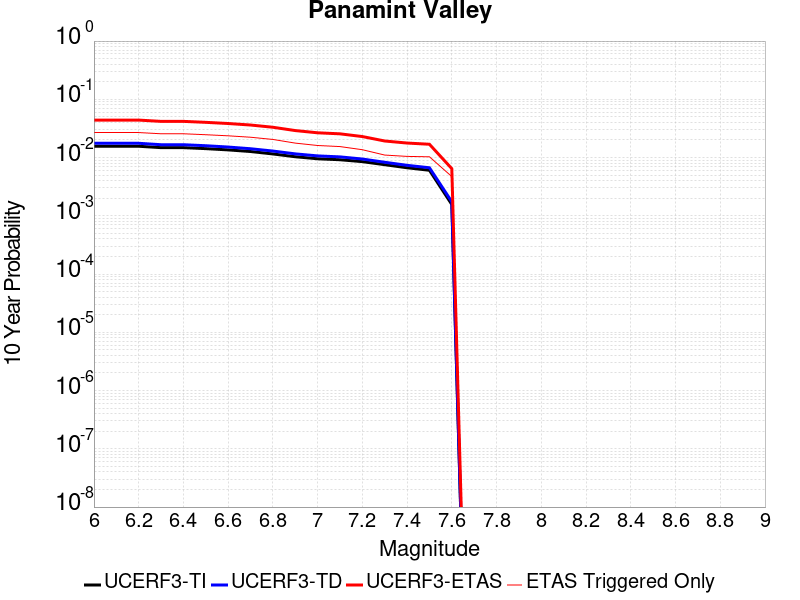 |

| Magnitude | 1 wk TI Prob | 1 wk TD Prob | 1 wk ETAS Prob | 1 wk ETAS/TD Gain | 1 wk ETAS Triggered Only | 1 mo TI Prob | 1 mo TD Prob | 1 mo ETAS Prob | 1 mo ETAS/TD Gain | 1 mo ETAS Triggered Only | 1 yr TI Prob | 1 yr TD Prob | 1 yr ETAS Prob | 1 yr ETAS/TD Gain | 1 yr ETAS Triggered Only | 10 yr TI Prob | 10 yr TD Prob | 10 yr ETAS Prob | 10 yr ETAS/TD Gain | 10 yr ETAS Triggered Only |
|-----|-----|-----|-----|-----|-----|-----|-----|-----|-----|-----|-----|-----|-----|-----|-----|-----|-----|-----|-----|-----|
| 6.0 | 3.0211835E-5 | 3.3984514E-5 | 0.0097924955 | 288.1458 | 0.009758842 | 1.2947287E-4 | 1.4563995E-4 | 0.013327 | 91.506485 | 0.01318328 | 0.0015751923 | 0.0017717537 | 0.0213351 | 12.041799 | 0.01959807 | 0.015640736 | 0.017583137 | 0.04419684 | 2.5135925 | 0.027090032 |
| 6.1 | 3.0211835E-5 | 3.3984514E-5 | 0.0097924955 | 288.1458 | 0.009758842 | 1.2947287E-4 | 1.4563995E-4 | 0.013327 | 91.506485 | 0.01318328 | 0.0015751923 | 0.0017717537 | 0.0213351 | 12.041799 | 0.01959807 | 0.015640736 | 0.017583137 | 0.04419684 | 2.5135925 | 0.027090032 |
| 6.2 | 3.0211835E-5 | 3.3984514E-5 | 0.0097924955 | 288.1458 | 0.009758842 | 1.2947287E-4 | 1.4563995E-4 | 0.013327 | 91.506485 | 0.01318328 | 0.0015751923 | 0.0017717537 | 0.0213351 | 12.041799 | 0.01959807 | 0.015640736 | 0.017583137 | 0.04419684 | 2.5135925 | 0.027090032 |
| 6.3 | 2.8573924E-5 | 3.210268E-5 | 0.009404792 | 292.95972 | 0.009372991 | 1.2245393E-4 | 1.3757581E-4 | 0.012756418 | 92.722824 | 0.0126205785 | 0.001489857 | 0.0016737265 | 0.02029203 | 12.123863 | 0.018649518 | 0.01479908 | 0.016617801 | 0.041929618 | 2.5231748 | 0.02573955 |
| 6.4 | 2.8573924E-5 | 3.210268E-5 | 0.009404792 | 292.95972 | 0.009372991 | 1.2245393E-4 | 1.3757581E-4 | 0.012756418 | 92.722824 | 0.0126205785 | 0.001489857 | 0.0016737265 | 0.02029203 | 12.123863 | 0.018649518 | 0.01479908 | 0.016617801 | 0.041929618 | 2.5231748 | 0.02573955 |
| 6.5 | 2.7468774E-5 | 3.0828433E-5 | 0.00906592 | 294.07657 | 0.009035369 | 1.1771801E-4 | 1.3211532E-4 | 0.012317001 | 93.229164 | 0.012186496 | 0.0014322745 | 0.0016073446 | 0.019600885 | 12.194575 | 0.018022507 | 0.014230782 | 0.015963677 | 0.0404222 | 2.532136 | 0.024855306 |
| 6.6 | 2.6135967E-5 | 2.925248E-5 | 0.008742824 | 298.87463 | 0.008713827 | 1.1200648E-4 | 1.253619E-4 | 0.011779849 | 93.96674 | 0.011655948 | 0.0013628257 | 0.0015252391 | 0.018717626 | 12.27193 | 0.01721865 | 0.013544982 | 0.015154043 | 0.03858768 | 2.5463617 | 0.023794211 |
| 6.7 | 2.4498746E-5 | 2.7341335E-5 | 0.008355088 | 305.5845 | 0.008327974 | 1.04990395E-4 | 1.1717203E-4 | 0.01124127 | 95.93817 | 0.011125402 | 0.0012775084 | 0.0014256609 | 0.017608345 | 12.351005 | 0.016205788 | 0.012701893 | 0.014171274 | 0.03629695 | 2.5613043 | 0.02244373 |
| 6.8 | 2.2244329E-5 | 2.4935423E-5 | 0.0077578616 | 311.1181 | 0.007733119 | 9.532935E-5 | 1.0686185E-4 | 0.010395152 | 97.27654 | 0.010289389 | 0.0011600169 | 0.0013002884 | 0.01629684 | 12.533252 | 0.015016077 | 0.011539802 | 0.0129325185 | 0.033324506 | 2.5767994 | 0.020659164 |
| 6.9 | 1.9902658E-5 | 2.2290267E-5 | 0.006871012 | 308.25168 | 0.0068488745 | 8.529431E-5 | 9.552632E-5 | 0.009113957 | 95.407814 | 0.009019293 | 0.0010379635 | 0.0011624309 | 0.014169801 | 12.189801 | 0.0130225085 | 0.010331288 | 0.011568608 | 0.029350838 | 2.5371108 | 0.017990354 |
| 7.0 | 1.8353881E-5 | 2.0566185E-5 | 0.0063387644 | 308.21292 | 0.006318328 | 7.865712E-5 | 8.813792E-5 | 0.008351075 | 94.750084 | 0.008263665 | 9.5722964E-4 | 0.0010725686 | 0.012908734 | 12.035346 | 0.011848874 | 0.009531168 | 0.010678849 | 0.026902443 | 2.5192268 | 0.016398713 |
| 7.1 | 1.7667631E-5 | 1.9772613E-5 | 0.006193284 | 313.22537 | 0.0061736335 | 7.571623E-5 | 8.473711E-5 | 0.008154793 | 96.236374 | 0.00807074 | 9.2145515E-4 | 0.0010312037 | 0.012498466 | 12.12027 | 0.011479099 | 0.009176437 | 0.010269073 | 0.025846992 | 2.5169742 | 0.015739549 |
| 7.2 | 1.6381597E-5 | 1.8158249E-5 | 0.0056289886 | 309.99622 | 0.0056109326 | 7.020495E-5 | 7.781885E-5 | 0.007215527 | 92.7221 | 0.0071382634 | 8.544101E-4 | 9.4704994E-4 | 0.011017889 | 11.633905 | 0.010080386 | 0.008511325 | 0.009434792 | 0.023146635 | 2.4533277 | 0.013842444 |
| 7.3 | 1.4520491E-5 | 1.5966476E-5 | 0.004533579 | 283.94363 | 0.0045176847 | 6.222919E-5 | 6.842605E-5 | 0.0057272026 | 83.69916 | 0.005659164 | 7.57377E-4 | 8.327849E-4 | 0.008848612 | 10.625326 | 0.008022508 | 0.0075480095 | 0.00829975 | 0.01926904 | 2.3216407 | 0.011061093 |
| 7.4 | 1.2852287E-5 | 1.4145411E-5 | 0.0042263046 | 298.77567 | 0.004212219 | 5.5080065E-5 | 6.062187E-5 | 0.0053657666 | 88.51206 | 0.0053054662 | 6.7039346E-4 | 7.378371E-4 | 0.008288532 | 11.233552 | 0.00755627 | 0.0066837464 | 0.0073567946 | 0.017746035 | 2.4121966 | 0.010466238 |
| 7.5 | 1.1637851E-5 | 1.2836797E-5 | 0.0041928473 | 326.6272 | 0.0041800644 | 4.987555E-5 | 5.5013777E-5 | 0.0053119594 | 96.55689 | 0.005257235 | 6.070656E-4 | 6.6960254E-4 | 0.008140481 | 12.157184 | 0.007475884 | 0.006054099 | 0.0066787465 | 0.016947325 | 2.5375009 | 0.010337621 |
| 7.6 | 3.0068115E-6 | 3.3330316E-6 | 0.0021415895 | 642.53503 | 0.0021382638 | 1.2886271E-5 | 1.4284384E-5 | 0.0028116722 | 196.83537 | 0.0027974276 | 1.5687906E-4 | 1.7390578E-4 | 0.003871012 | 22.259249 | 0.0036977492 | 0.0015676835 | 0.0017391363 | 0.0067304405 | 3.8699903 | 0.005 |

## Garlock (East)
*[(top)](#table-of-contents)*

| 1 Week | 1 Month | 1 Year | 10 Year |
|-----|-----|-----|-----|
| 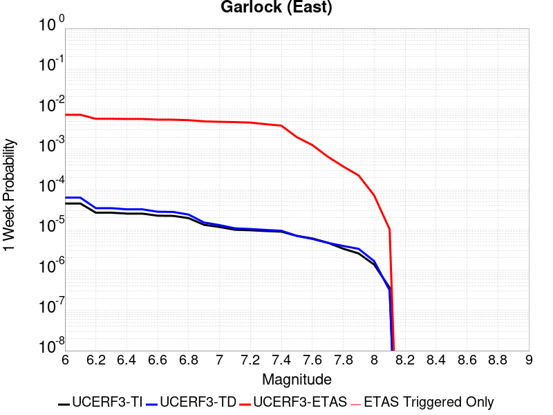 |  |  |  |

| Magnitude | 1 wk TI Prob | 1 wk TD Prob | 1 wk ETAS Prob | 1 wk ETAS/TD Gain | 1 wk ETAS Triggered Only | 1 mo TI Prob | 1 mo TD Prob | 1 mo ETAS Prob | 1 mo ETAS/TD Gain | 1 mo ETAS Triggered Only | 1 yr TI Prob | 1 yr TD Prob | 1 yr ETAS Prob | 1 yr ETAS/TD Gain | 1 yr ETAS Triggered Only | 10 yr TI Prob | 10 yr TD Prob | 10 yr ETAS Prob | 10 yr ETAS/TD Gain | 10 yr ETAS Triggered Only |
|-----|-----|-----|-----|-----|-----|-----|-----|-----|-----|-----|-----|-----|-----|-----|-----|-----|-----|-----|-----|-----|
| 6.0 | 4.5092507E-5 | 6.290325E-5 | 0.0071364134 | 113.45063 | 0.007073955 | 1.9323928E-4 | 2.6956003E-4 | 0.01052403 | 39.041508 | 0.010257235 | 0.0023501497 | 0.0032774 | 0.019365977 | 5.908945 | 0.01614148 | 0.023254504 | 0.032351844 | 0.054162823 | 1.6741803 | 0.022540193 |
| 6.1 | 4.5092507E-5 | 6.290325E-5 | 0.0071364134 | 113.45063 | 0.007073955 | 1.9323928E-4 | 2.6956003E-4 | 0.01052403 | 39.041508 | 0.010257235 | 0.0023501497 | 0.0032774 | 0.019365977 | 5.908945 | 0.01614148 | 0.023254504 | 0.032351844 | 0.054162823 | 1.6741803 | 0.022540193 |
| 6.2 | 2.6674514E-5 | 3.4509674E-5 | 0.0058703213 | 170.10654 | 0.005836013 | 1.1431433E-4 | 1.4789042E-4 | 0.008120988 | 54.912197 | 0.007974276 | 0.0013908884 | 0.0017991117 | 0.013771103 | 7.65439 | 0.011993569 | 0.01382215 | 0.017890299 | 0.034058794 | 1.9037577 | 0.016463023 |
| 6.3 | 2.6674514E-5 | 3.4509674E-5 | 0.0058703213 | 170.10654 | 0.005836013 | 1.1431433E-4 | 1.4789042E-4 | 0.008120988 | 54.912197 | 0.007974276 | 0.0013908884 | 0.0017991117 | 0.013771103 | 7.65439 | 0.011993569 | 0.01382215 | 0.017890299 | 0.034058794 | 1.9037577 | 0.016463023 |
| 6.4 | 2.5312667E-5 | 3.233893E-5 | 0.0058038565 | 179.46965 | 0.005771704 | 1.0847834E-4 | 1.3858822E-4 | 0.007999235 | 57.719444 | 0.007861736 | 0.0013199237 | 0.0016860351 | 0.013563083 | 8.044366 | 0.011897106 | 0.013121112 | 0.016778335 | 0.032728024 | 1.9506121 | 0.016221864 |
| 6.5 | 2.5312667E-5 | 3.233893E-5 | 0.0058038565 | 179.46965 | 0.005771704 | 1.0847834E-4 | 1.3858822E-4 | 0.007999235 | 57.719444 | 0.007861736 | 0.0013199237 | 0.0016860351 | 0.013563083 | 8.044366 | 0.011897106 | 0.013121112 | 0.016778335 | 0.032728024 | 1.9506121 | 0.016221864 |
| 6.6 | 2.246556E-5 | 2.8133776E-5 | 0.0055746017 | 198.14622 | 0.005546624 | 9.627742E-5 | 1.20567885E-4 | 0.007692002 | 63.7981 | 0.0075723473 | 0.0011715472 | 0.0014669491 | 0.012800781 | 8.726125 | 0.011350483 | 0.011653901 | 0.01461866 | 0.029811276 | 2.0392618 | 0.015418006 |
| 6.7 | 2.2241198E-5 | 2.7803519E-5 | 0.0055421195 | 199.33159 | 0.0055144695 | 9.531594E-5 | 1.1915263E-4 | 0.007658447 | 64.27426 | 0.007540193 | 0.0011598538 | 0.0014497414 | 0.01275166 | 8.795817 | 0.011318328 | 0.011538187 | 0.014448853 | 0.029612398 | 2.0494635 | 0.015385852 |
| 6.8 | 1.9528685E-5 | 2.389819E-5 | 0.0053453143 | 223.67026 | 0.005321543 | 8.369167E-5 | 1.0241691E-4 | 0.0073042517 | 71.3188 | 0.007202572 | 0.0010184698 | 0.0012462323 | 0.011795769 | 9.465145 | 0.010562701 | 0.010138147 | 0.012436427 | 0.026614793 | 2.1400673 | 0.014356913 |
| 6.9 | 1.3318621E-5 | 1.5198884E-5 | 0.0050151227 | 329.96652 | 0.005 | 5.7078556E-5 | 6.513648E-5 | 0.0067206514 | 103.17799 | 0.0066559487 | 6.9470983E-4 | 7.927538E-4 | 0.010383216 | 13.097654 | 0.009598071 | 0.0069254204 | 0.007939888 | 0.020651655 | 2.6010008 | 0.012813505 |
| 7.0 | 1.1760853E-5 | 1.31077895E-5 | 0.0048844265 | 372.6354 | 0.004871383 | 5.0402683E-5 | 5.6175057E-5 | 0.0065509873 | 116.61736 | 0.006495177 | 6.134799E-4 | 6.8372174E-4 | 0.009857509 | 14.417429 | 0.009180064 | 0.0061178906 | 0.00685652 | 0.01905526 | 2.7791445 | 0.012282958 |
| 7.1 | 1.0064758E-5 | 1.0902931E-5 | 0.0048018475 | 440.41806 | 0.0047909967 | 4.3133965E-5 | 4.672603E-5 | 0.0063647586 | 136.21442 | 0.006318328 | 5.2502943E-4 | 5.687444E-4 | 0.009390091 | 16.510212 | 0.008826367 | 0.005237907 | 0.0057129986 | 0.017286371 | 3.0257967 | 0.011639872 |
| 7.2 | 9.768808E-6 | 1.0498807E-5 | 0.004640675 | 442.0193 | 0.0046302252 | 4.186565E-5 | 4.499413E-5 | 0.006186197 | 137.48898 | 0.006141479 | 5.095951E-4 | 5.4766936E-4 | 0.009160313 | 16.725992 | 0.008617363 | 0.0050842804 | 0.0055032647 | 0.016775293 | 3.048244 | 0.011334405 |
| 7.3 | 9.344516E-6 | 9.944468E-6 | 0.004189967 | 421.33652 | 0.0041800644 | 4.004731E-5 | 4.261847E-5 | 0.0056693885 | 133.02655 | 0.0056270096 | 4.8746695E-4 | 5.1875977E-4 | 0.008408556 | 16.208958 | 0.007893891 | 0.0048639905 | 0.0052149445 | 0.015626602 | 2.9965038 | 0.010466238 |
| 7.4 | 9.023491E-6 | 9.490661E-6 | 0.003884052 | 409.24988 | 0.003874598 | 3.867153E-5 | 4.0673647E-5 | 0.0052333884 | 128.6678 | 0.005192926 | 4.7072413E-4 | 4.950925E-4 | 0.0077905143 | 15.735473 | 0.0072990353 | 0.004697283 | 0.0049783974 | 0.014544683 | 2.921559 | 0.009614148 |
| 7.5 | 7.081253E-6 | 7.087672E-6 | 0.002081028 | 293.61234 | 0.002073955 | 3.0347876E-5 | 3.0375388E-5 | 0.0027473348 | 90.446075 | 0.0027170419 | 3.6942272E-4 | 3.6975832E-4 | 0.0040339977 | 10.909822 | 0.0036655948 | 0.003688092 | 0.0037243143 | 0.00854552 | 2.2945216 | 0.0048392285 |
| 7.6 | 6.116396E-6 | 5.959245E-6 | 0.001243894 | 208.7335 | 0.0012379421 | 2.6212863E-5 | 2.5539372E-5 | 0.0016975224 | 66.46688 | 0.0016720258 | 3.1909486E-4 | 3.1089774E-4 | 0.0025449297 | 8.185745 | 0.0022347267 | 0.0031863707 | 0.0031357552 | 0.0061327587 | 1.9557518 | 0.0030064308 |
| 7.7 | 4.797145E-6 | 4.757281E-6 | 7.282265E-4 | 153.0762 | 7.234727E-4 | 2.055903E-5 | 2.0388188E-5 | 9.528451E-4 | 46.73515 | 9.324759E-4 | 2.5027743E-4 | 2.4819805E-4 | 0.0014697597 | 5.9217215 | 0.001221865 | 0.0024999576 | 0.0025093474 | 0.0040649194 | 1.6199111 | 0.0015594856 |
| 7.8 | 3.4028885E-6 | 3.978462E-6 | 4.2198322E-4 | 106.06693 | 4.1800644E-4 | 1.4583726E-5 | 1.7050439E-5 | 6.118956E-4 | 35.887383 | 5.948553E-4 | 1.775424E-4 | 2.0756939E-4 | 0.0010434088 | 5.0267944 | 8.360129E-4 | 0.0017740062 | 0.0021012232 | 0.0031761301 | 1.5115626 | 0.0010771704 |
| 7.9 | 2.5928412E-6 | 3.3724489E-6 | 2.2845207E-4 | 67.74071 | 2.2508038E-4 | 1.1112129E-5 | 1.4453272E-5 | 3.681459E-4 | 25.471457 | 3.5369775E-4 | 1.3528178E-4 | 1.7595445E-4 | 6.7425903E-4 | 3.832009 | 4.9839227E-4 | 0.0013519945 | 0.0017812408 | 0.0025194734 | 1.4144485 | 7.395498E-4 |
| 8.0 | 1.3743648E-6 | 1.6734747E-6 | 9.8136334E-5 | 58.642258 | 9.646302E-5 | 5.8901214E-6 | 7.1720146E-6 | 1.518655E-4 | 21.174734 | 1.4469454E-4 | 7.1709874E-5 | 8.731581E-5 | 2.80225E-4 | 3.2093272 | 1.9292605E-4 | 7.1686733E-4 | 8.837234E-4 | 0.0012049826 | 1.3635292 | 3.215434E-4 |
| 8.1 | 3.6733252E-7 | 3.1489964E-7 | 1.6392065E-5 | 52.054886 | 1.607717E-5 | 1.5742813E-6 | 1.3495693E-6 | 1.7426719E-5 | 12.9128 | 1.607717E-5 | 1.9166706E-5 | 1.6430899E-5 | 4.8584712E-5 | 2.9569113 | 3.215434E-5 | 1.9165053E-4 | 1.6638759E-4 | 2.1461108E-4 | 1.2898263 | 4.823151E-5 |

## Blackwater
*[(top)](#table-of-contents)*

| 1 Week | 1 Month | 1 Year | 10 Year |
|-----|-----|-----|-----|
| 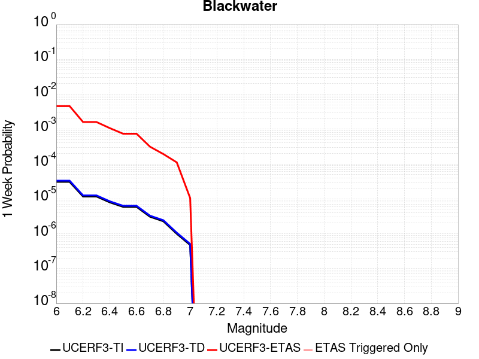 |  |  |  |

| Magnitude | 1 wk TI Prob | 1 wk TD Prob | 1 wk ETAS Prob | 1 wk ETAS/TD Gain | 1 wk ETAS Triggered Only | 1 mo TI Prob | 1 mo TD Prob | 1 mo ETAS Prob | 1 mo ETAS/TD Gain | 1 mo ETAS Triggered Only | 1 yr TI Prob | 1 yr TD Prob | 1 yr ETAS Prob | 1 yr ETAS/TD Gain | 1 yr ETAS Triggered Only | 10 yr TI Prob | 10 yr TD Prob | 10 yr ETAS Prob | 10 yr ETAS/TD Gain | 10 yr ETAS Triggered Only |
|-----|-----|-----|-----|-----|-----|-----|-----|-----|-----|-----|-----|-----|-----|-----|-----|-----|-----|-----|-----|-----|
| 6.0 | 3.0708583E-5 | 3.3095846E-5 | 0.0045345547 | 137.01279 | 0.0045016077 | 1.3160157E-4 | 1.4183241E-4 | 0.0064271144 | 45.31485 | 0.0062861736 | 0.0016010714 | 0.0017255784 | 0.0116280755 | 6.7386537 | 0.0099196145 | 0.015895851 | 0.017135633 | 0.031372946 | 1.83086 | 0.014485531 |
| 6.1 | 3.0708583E-5 | 3.3095846E-5 | 0.0045345547 | 137.01279 | 0.0045016077 | 1.3160157E-4 | 1.4183241E-4 | 0.0064271144 | 45.31485 | 0.0062861736 | 0.0016010714 | 0.0017255784 | 0.0116280755 | 6.7386537 | 0.0099196145 | 0.015895851 | 0.017135633 | 0.031372946 | 1.83086 | 0.014485531 |
| 6.2 | 1.1707779E-5 | 1.2545122E-5 | 0.0015077032 | 120.18243 | 0.0014951768 | 5.017523E-5 | 5.3763757E-5 | 0.0021758361 | 40.470314 | 0.0021221866 | 6.107122E-4 | 6.5438676E-4 | 0.00404445 | 6.180519 | 0.0033922829 | 0.006090366 | 0.0065255696 | 0.011604748 | 1.7783501 | 0.00511254 |
| 6.3 | 1.1707779E-5 | 1.2545122E-5 | 0.0015077032 | 120.18243 | 0.0014951768 | 5.017523E-5 | 5.3763757E-5 | 0.0021758361 | 40.470314 | 0.0021221866 | 6.107122E-4 | 6.5438676E-4 | 0.00404445 | 6.180519 | 0.0033922829 | 0.006090366 | 0.0065255696 | 0.011604748 | 1.7783501 | 0.00511254 |
| 6.4 | 7.929244E-6 | 8.480098E-6 | 0.0010534873 | 124.23056 | 0.0010450161 | 3.3982033E-5 | 3.6342793E-5 | 0.0015314653 | 42.13945 | 0.0014951768 | 4.136527E-4 | 4.423877E-4 | 0.002740406 | 6.1945796 | 0.0022990354 | 0.0041288356 | 0.0044154758 | 0.007904824 | 1.790254 | 0.0035048232 |
| 6.5 | 5.8832115E-6 | 6.285991E-6 | 7.297541E-4 | 116.09214 | 7.234727E-4 | 2.521352E-5 | 2.6939697E-5 | 0.0011201579 | 41.580193 | 0.0010932476 | 3.0693135E-4 | 3.27944E-4 | 0.0019351338 | 5.9008055 | 0.001607717 | 0.0030650778 | 0.0032748538 | 0.005774679 | 1.7633395 | 0.0025080387 |
| 6.6 | 5.8832115E-6 | 6.285991E-6 | 7.297541E-4 | 116.09214 | 7.234727E-4 | 2.521352E-5 | 2.6939697E-5 | 0.0011201579 | 41.580193 | 0.0010932476 | 3.0693135E-4 | 3.27944E-4 | 0.0019351338 | 5.9008055 | 0.001607717 | 0.0030650778 | 0.0032748538 | 0.005774679 | 1.7633395 | 0.0025080387 |
| 6.7 | 3.0715053E-6 | 3.2814662E-6 | 2.9266957E-4 | 89.18867 | 2.8938908E-4 | 1.3163528E-5 | 1.4063357E-5 | 4.320639E-4 | 30.722672 | 4.1800644E-4 | 1.6025416E-4 | 1.7120909E-4 | 9.106323E-4 | 5.318832 | 7.395498E-4 | 0.0016013865 | 0.0017108864 | 0.0028504126 | 1.6660444 | 0.0011414791 |
| 6.8 | 2.2722281E-6 | 2.4287538E-6 | 2.1143146E-4 | 87.05348 | 2.0900322E-4 | 9.738084E-6 | 1.0408908E-5 | 3.3194898E-4 | 31.890854 | 3.215434E-4 | 1.1855473E-4 | 1.26722E-4 | 6.8935164E-4 | 5.4398737 | 5.6270097E-4 | 0.001184915 | 0.0012665876 | 0.0021175984 | 1.6718925 | 8.5209E-4 |
| 6.9 | 9.952399E-7 | 1.0653489E-6 | 1.1360542E-4 | 106.636826 | 1.1254019E-4 | 4.265307E-6 | 4.5657757E-6 | 1.6533675E-4 | 36.212193 | 1.607717E-4 | 5.1928873E-5 | 5.5587418E-5 | 2.8065528E-4 | 5.0488997 | 2.2508038E-4 | 5.191674E-4 | 5.557858E-4 | 8.932187E-4 | 1.6071277 | 3.376206E-4 |
| 7.0 | 4.7385504E-7 | 5.0755597E-7 | 5.0755597E-7 | 1.0 | 0.0 | 2.0308057E-6 | 2.1752398E-6 | 3.432951E-5 | 15.781943 | 3.215434E-5 | 2.4724779E-5 | 2.6483543E-5 | 9.079052E-5 | 3.4281862 | 6.430868E-5 | 2.4722028E-4 | 2.6483546E-4 | 3.9341874E-4 | 1.4855216 | 1.2861736E-4 |

## Hunter Mountain-Saline Valley
*[(top)](#table-of-contents)*

| 1 Week | 1 Month | 1 Year | 10 Year |
|-----|-----|-----|-----|
| 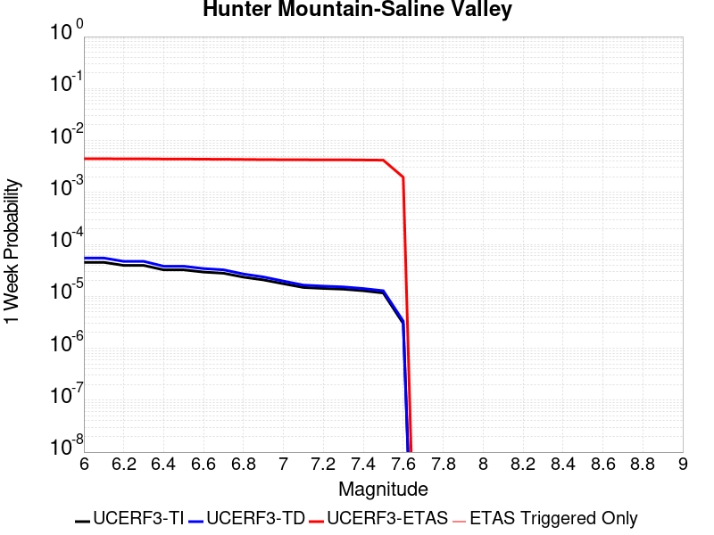 |  |  |  |

| Magnitude | 1 wk TI Prob | 1 wk TD Prob | 1 wk ETAS Prob | 1 wk ETAS/TD Gain | 1 wk ETAS Triggered Only | 1 mo TI Prob | 1 mo TD Prob | 1 mo ETAS Prob | 1 mo ETAS/TD Gain | 1 mo ETAS Triggered Only | 1 yr TI Prob | 1 yr TD Prob | 1 yr ETAS Prob | 1 yr ETAS/TD Gain | 1 yr ETAS Triggered Only | 10 yr TI Prob | 10 yr TD Prob | 10 yr ETAS Prob | 10 yr ETAS/TD Gain | 10 yr ETAS Triggered Only |
|-----|-----|-----|-----|-----|-----|-----|-----|-----|-----|-----|-----|-----|-----|-----|-----|-----|-----|-----|-----|-----|
| 6.0 | 4.5103672E-5 | 5.4570177E-5 | 0.0044594747 | 81.71999 | 0.0044051446 | 1.9328714E-4 | 2.3385242E-4 | 0.0058434727 | 24.987865 | 0.0056109326 | 0.002350731 | 0.0028435152 | 0.010763054 | 3.7851226 | 0.007942122 | 0.023260195 | 0.028091887 | 0.03877975 | 1.3804609 | 0.010996785 |
| 6.1 | 4.5103672E-5 | 5.4570177E-5 | 0.0044594747 | 81.71999 | 0.0044051446 | 1.9328714E-4 | 2.3385242E-4 | 0.0058434727 | 24.987865 | 0.0056109326 | 0.002350731 | 0.0028435152 | 0.010763054 | 3.7851226 | 0.007942122 | 0.023260195 | 0.028091887 | 0.03877975 | 1.3804609 | 0.010996785 |
| 6.2 | 3.9363465E-5 | 4.706337E-5 | 0.0044359243 | 94.25429 | 0.0043890676 | 1.6868966E-4 | 2.0168544E-4 | 0.0057793385 | 28.655209 | 0.005578778 | 0.002051862 | 0.0024528175 | 0.010343384 | 4.21694 | 0.007909968 | 0.020330196 | 0.024273481 | 0.034971964 | 1.4407476 | 0.01096463 |
| 6.3 | 3.9363465E-5 | 4.706337E-5 | 0.0044359243 | 94.25429 | 0.0043890676 | 1.6868966E-4 | 2.0168544E-4 | 0.0057793385 | 28.655209 | 0.005578778 | 0.002051862 | 0.0024528175 | 0.010343384 | 4.21694 | 0.007909968 | 0.020330196 | 0.024273481 | 0.034971964 | 1.4407476 | 0.01096463 |
| 6.4 | 3.2311684E-5 | 3.795099E-5 | 0.004394699 | 115.799324 | 0.0043569133 | 1.384713E-4 | 1.6263737E-4 | 0.0056922846 | 34.999855 | 0.0055305464 | 0.0016845843 | 0.0019783843 | 0.009808522 | 4.9578443 | 0.007845659 | 0.016718714 | 0.019616475 | 0.030287208 | 1.543968 | 0.010884244 |
| 6.5 | 3.2311684E-5 | 3.795099E-5 | 0.004394699 | 115.799324 | 0.0043569133 | 1.384713E-4 | 1.6263737E-4 | 0.0056922846 | 34.999855 | 0.0055305464 | 0.0016845843 | 0.0019783843 | 0.009808522 | 4.9578443 | 0.007845659 | 0.016718714 | 0.019616475 | 0.030287208 | 1.543968 | 0.010884244 |
| 6.6 | 2.9305844E-5 | 3.418183E-5 | 0.0043748696 | 127.98815 | 0.004340836 | 1.2559042E-4 | 1.4648569E-4 | 0.0056601474 | 38.63959 | 0.0055144695 | 0.0015279909 | 0.001782067 | 0.009581648 | 5.376704 | 0.007813505 | 0.015175272 | 0.01768569 | 0.028298477 | 1.6000775 | 0.010803859 |
| 6.7 | 2.7826512E-5 | 3.2344276E-5 | 0.004356963 | 134.70586 | 0.004324759 | 1.19251024E-4 | 1.386113E-4 | 0.0056362413 | 40.66221 | 0.0054983925 | 0.0014509142 | 0.0016863465 | 0.009454574 | 5.6065435 | 0.0077813505 | 0.014414776 | 0.016743187 | 0.02731873 | 1.6316327 | 0.010755627 |
| 6.8 | 2.3389874E-5 | 2.6866714E-5 | 0.004319356 | 160.76979 | 0.0042926045 | 1.0023846E-4 | 1.15138246E-4 | 0.0055646715 | 48.33035 | 0.0054501607 | 0.00121972 | 0.001400954 | 0.009107185 | 6.5007024 | 0.0077170418 | 0.01213047 | 0.013927434 | 0.024469849 | 1.7569532 | 0.010691319 |
| 6.9 | 2.069209E-5 | 2.3570032E-5 | 0.00428392 | 181.75282 | 0.00426045 | 8.867737E-5 | 1.01010715E-4 | 0.00551847 | 54.63252 | 0.0054180063 | 0.0010791123 | 0.0012291478 | 0.008904589 | 7.244523 | 0.0076848874 | 0.010738871 | 0.012228523 | 0.022757342 | 1.8610048 | 0.010659164 |
| 7.0 | 1.7462342E-5 | 1.9633546E-5 | 0.004263923 | 217.1754 | 0.004244373 | 7.483646E-5 | 8.414118E-5 | 0.00546954 | 65.00432 | 0.005385852 | 9.1075303E-4 | 0.0010239601 | 0.008652796 | 8.450326 | 0.007636656 | 0.009070295 | 0.0101960525 | 0.020698795 | 2.0300794 | 0.0106109325 |
| 7.1 | 1.4807709E-5 | 1.6441749E-5 | 0.004260745 | 259.1418 | 0.004244373 | 6.3460066E-5 | 7.046283E-5 | 0.0054398593 | 77.20183 | 0.005369775 | 7.723524E-4 | 8.575638E-4 | 0.008471607 | 9.878691 | 0.0076205786 | 0.007696735 | 0.008545532 | 0.01898609 | 2.2217562 | 0.010530546 |
| 7.2 | 1.4180048E-5 | 1.5698337E-5 | 0.0042600045 | 271.36664 | 0.004244373 | 6.077022E-5 | 6.727694E-5 | 0.0054366905 | 80.81061 | 0.005369775 | 7.396263E-4 | 8.188051E-4 | 0.008433145 | 10.29933 | 0.0076205786 | 0.0073716943 | 0.008160833 | 0.018605443 | 2.279846 | 0.010530546 |
| 7.3 | 1.3730402E-5 | 1.5172075E-5 | 0.0042594806 | 280.74475 | 0.004244373 | 5.8843252E-5 | 6.502165E-5 | 0.0054344474 | 83.57905 | 0.005369775 | 7.161811E-4 | 7.9136714E-4 | 0.008405915 | 10.622017 | 0.0076205786 | 0.007138774 | 0.007888422 | 0.01831995 | 2.3223844 | 0.01051447 |
| 7.4 | 1.2810095E-5 | 1.4109277E-5 | 0.0042262683 | 299.53827 | 0.004212219 | 5.489925E-5 | 6.0467017E-5 | 0.0053656125 | 88.73618 | 0.0053054662 | 6.681934E-4 | 7.359531E-4 | 0.008270597 | 11.23794 | 0.007540193 | 0.006661878 | 0.007338053 | 0.01769557 | 2.4114804 | 0.010434084 |
| 7.5 | 1.1595659E-5 | 1.2800664E-5 | 0.0041928114 | 327.54642 | 0.0041800644 | 4.9694736E-5 | 5.4858923E-5 | 0.0053118053 | 96.826645 | 0.005257235 | 6.0486543E-4 | 6.6771836E-4 | 0.008122545 | 12.164626 | 0.007459807 | 0.006032217 | 0.0066599925 | 0.016896823 | 2.5370636 | 0.010305466 |
| 7.6 | 2.997694E-6 | 3.3251579E-6 | 0.0021415816 | 644.05414 | 0.0021382638 | 1.28471975E-5 | 1.425064E-5 | 0.0028116384 | 197.2991 | 0.0027974276 | 1.564034E-4 | 1.73495E-4 | 0.0038706027 | 22.309591 | 0.0036977492 | 0.0015629337 | 0.001735031 | 0.0067263558 | 3.876793 | 0.005 |

## Ash Hill
*[(top)](#table-of-contents)*

| 1 Week | 1 Month | 1 Year | 10 Year |
|-----|-----|-----|-----|
|  |  |  |  |

| Magnitude | 1 wk TI Prob | 1 wk TD Prob | 1 wk ETAS Prob | 1 wk ETAS/TD Gain | 1 wk ETAS Triggered Only | 1 mo TI Prob | 1 mo TD Prob | 1 mo ETAS Prob | 1 mo ETAS/TD Gain | 1 mo ETAS Triggered Only | 1 yr TI Prob | 1 yr TD Prob | 1 yr ETAS Prob | 1 yr ETAS/TD Gain | 1 yr ETAS Triggered Only | 10 yr TI Prob | 10 yr TD Prob | 10 yr ETAS Prob | 10 yr ETAS/TD Gain | 10 yr ETAS Triggered Only |
|-----|-----|-----|-----|-----|-----|-----|-----|-----|-----|-----|-----|-----|-----|-----|-----|-----|-----|-----|-----|-----|
| 6.0 | 2.1545662E-5 | 2.3194447E-5 | 0.0025794052 | 111.20788 | 0.00255627 | 9.2335285E-5 | 9.940143E-5 | 0.0038450097 | 38.681633 | 0.0037459808 | 0.0011236023 | 0.0012096206 | 0.007407902 | 6.124153 | 0.006205788 | 0.011179381 | 0.012038348 | 0.021568526 | 1.7916515 | 0.009646302 |
| 6.1 | 2.1545662E-5 | 2.3194447E-5 | 0.0025794052 | 111.20788 | 0.00255627 | 9.2335285E-5 | 9.940143E-5 | 0.0038450097 | 38.681633 | 0.0037459808 | 0.0011236023 | 0.0012096206 | 0.007407902 | 6.124153 | 0.006205788 | 0.011179381 | 0.012038348 | 0.021568526 | 1.7916515 | 0.009646302 |
| 6.2 | 2.1545662E-5 | 2.3194447E-5 | 0.0025794052 | 111.20788 | 0.00255627 | 9.2335285E-5 | 9.940143E-5 | 0.0038450097 | 38.681633 | 0.0037459808 | 0.0011236023 | 0.0012096206 | 0.007407902 | 6.124153 | 0.006205788 | 0.011179381 | 0.012038348 | 0.021568526 | 1.7916515 | 0.009646302 |
| 6.3 | 1.0025529E-5 | 1.0746934E-5 | 0.0011522138 | 107.21325 | 0.0011414791 | 4.2965847E-5 | 4.605755E-5 | 0.0017180062 | 37.301292 | 0.0016720258 | 5.229836E-4 | 5.6061964E-4 | 0.0030511841 | 5.4425206 | 0.0024919615 | 0.005217545 | 0.0055933665 | 0.009590178 | 1.7145628 | 0.0040192925 |
| 6.4 | 1.0025529E-5 | 1.0746934E-5 | 0.0011522138 | 107.21325 | 0.0011414791 | 4.2965847E-5 | 4.605755E-5 | 0.0017180062 | 37.301292 | 0.0016720258 | 5.229836E-4 | 5.6061964E-4 | 0.0030511841 | 5.4425206 | 0.0024919615 | 0.005217545 | 0.0055933665 | 0.009590178 | 1.7145628 | 0.0040192925 |
| 6.5 | 6.9617327E-6 | 7.456634E-6 | 8.434633E-4 | 113.115814 | 8.360129E-4 | 2.9835655E-5 | 3.195666E-5 | 0.0012537825 | 39.23384 | 0.001221865 | 3.6318856E-4 | 3.8901155E-4 | 0.0021407413 | 5.503028 | 0.0017524116 | 0.0036259557 | 0.0038841602 | 0.0066386927 | 1.7091707 | 0.0027652732 |
| 6.6 | 4.9919777E-6 | 5.3466883E-6 | 5.8412174E-4 | 109.24926 | 5.7877816E-4 | 2.1394015E-5 | 2.2914215E-5 | 8.267543E-4 | 36.080414 | 8.038585E-4 | 2.60441E-4 | 2.7895154E-4 | 0.001436185 | 5.14851 | 0.0011575563 | 0.0026013597 | 0.0027866727 | 0.004582298 | 1.6443617 | 0.001800643 |
| 6.7 | 3.6630722E-6 | 3.924624E-6 | 4.8623784E-4 | 123.894135 | 4.823151E-4 | 1.5698786E-5 | 1.681974E-5 | 5.955881E-4 | 35.41007 | 5.7877816E-4 | 1.9111596E-4 | 2.0476682E-4 | 0.0010727562 | 5.2389164 | 8.681672E-4 | 0.0019095168 | 0.0020463446 | 0.003378019 | 1.6507577 | 0.0013344052 |
| 6.8 | 2.5599613E-6 | 2.744925E-6 | 3.0821032E-4 | 112.28369 | 3.0546624E-4 | 1.0971216E-5 | 1.1763939E-5 | 3.815345E-4 | 32.432545 | 3.697749E-4 | 1.3356637E-4 | 1.4322149E-4 | 7.5406645E-4 | 5.265037 | 6.109325E-4 | 0.0013348613 | 0.0014317769 | 0.0024431883 | 1.706403 | 0.0010128617 |
| 6.9 | 1.7684905E-6 | 1.8968707E-6 | 1.7874541E-4 | 94.23173 | 1.7684887E-4 | 7.579223E-6 | 8.129446E-6 | 2.33208E-4 | 28.686827 | 2.2508038E-4 | 9.2273134E-5 | 9.8976E-5 | 4.847899E-4 | 4.898055 | 3.858521E-4 | 9.223483E-4 | 9.8976E-4 | 0.0016322103 | 1.6490971 | 6.430868E-4 |

## Gravel Hills-Harper Lk
*[(top)](#table-of-contents)*

| 1 Week | 1 Month | 1 Year | 10 Year |
|-----|-----|-----|-----|
| 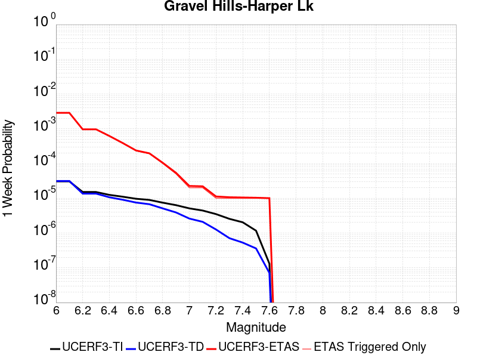 |  |  |  |

| Magnitude | 1 wk TI Prob | 1 wk TD Prob | 1 wk ETAS Prob | 1 wk ETAS/TD Gain | 1 wk ETAS Triggered Only | 1 mo TI Prob | 1 mo TD Prob | 1 mo ETAS Prob | 1 mo ETAS/TD Gain | 1 mo ETAS Triggered Only | 1 yr TI Prob | 1 yr TD Prob | 1 yr ETAS Prob | 1 yr ETAS/TD Gain | 1 yr ETAS Triggered Only | 10 yr TI Prob | 10 yr TD Prob | 10 yr ETAS Prob | 10 yr ETAS/TD Gain | 10 yr ETAS Triggered Only |
|-----|-----|-----|-----|-----|-----|-----|-----|-----|-----|-----|-----|-----|-----|-----|-----|-----|-----|-----|-----|-----|
| 6.0 | 3.0679566E-5 | 3.1464646E-5 | 0.0028770342 | 91.43704 | 0.0028456592 | 1.3147724E-4 | 1.3484273E-4 | 0.0040732184 | 30.207176 | 0.003938907 | 0.0015995599 | 0.0016406906 | 0.0079326015 | 4.834916 | 0.006302251 | 0.015880952 | 0.01630734 | 0.025005585 | 1.5333947 | 0.008842444 |
| 6.1 | 3.0679566E-5 | 3.1464646E-5 | 0.0028770342 | 91.43704 | 0.0028456592 | 1.3147724E-4 | 1.3484273E-4 | 0.0040732184 | 30.207176 | 0.003938907 | 0.0015995599 | 0.0016406906 | 0.0079326015 | 4.834916 | 0.006302251 | 0.015880952 | 0.01630734 | 0.025005585 | 1.5333947 | 0.008842444 |
| 6.2 | 1.514536E-5 | 1.3635206E-5 | 9.621753E-4 | 70.56551 | 9.4855303E-4 | 6.490707E-5 | 5.843536E-5 | 0.0013927625 | 23.834244 | 0.0013344052 | 7.8995706E-4 | 7.1123015E-4 | 0.0027997757 | 3.9365258 | 0.0020900322 | 0.007871548 | 0.0070907404 | 0.010012001 | 1.4119824 | 0.0029421223 |
| 6.3 | 1.514536E-5 | 1.3635206E-5 | 9.621753E-4 | 70.56551 | 9.4855303E-4 | 6.490707E-5 | 5.843536E-5 | 0.0013927625 | 23.834244 | 0.0013344052 | 7.8995706E-4 | 7.1123015E-4 | 0.0027997757 | 3.9365258 | 0.0020900322 | 0.007871548 | 0.0070907404 | 0.010012001 | 1.4119824 | 0.0029421223 |
| 6.4 | 1.2532521E-5 | 1.06896905E-5 | 6.216156E-4 | 58.150948 | 6.109325E-4 | 5.37097E-5 | 4.581219E-5 | 9.139396E-4 | 19.949705 | 8.681672E-4 | 6.537194E-4 | 5.576265E-4 | 0.002003765 | 3.593382 | 0.0014469454 | 0.0065179965 | 0.005562863 | 0.0074654035 | 1.3420074 | 0.0019131833 |
| 6.5 | 1.1094058E-5 | 9.083664E-6 | 4.1100927E-4 | 45.24708 | 4.0192925E-4 | 4.7545094E-5 | 3.892943E-5 | 5.8553193E-4 | 15.040856 | 5.466238E-4 | 5.787078E-4 | 4.7386673E-4 | 0.0014380398 | 3.0346925 | 9.646302E-4 | 0.0057720304 | 0.0047289706 | 0.0059770597 | 1.263924 | 0.0012540193 |
| 6.6 | 9.688328E-6 | 7.5316952E-6 | 2.3261039E-4 | 30.884201 | 2.2508038E-4 | 4.1520743E-5 | 3.227831E-5 | 3.5381134E-4 | 10.961272 | 3.215434E-4 | 5.053978E-4 | 3.9292008E-4 | 0.0010036125 | 2.5542407 | 6.109325E-4 | 0.0050424994 | 0.0039225104 | 0.004707202 | 1.2000482 | 7.877814E-4 |
| 6.7 | 8.974824E-6 | 6.749413E-6 | 1.9967416E-4 | 29.58393 | 1.9292605E-4 | 3.8462964E-5 | 2.8925748E-5 | 3.0222975E-4 | 10.448468 | 2.733119E-4 | 4.6818596E-4 | 3.5211627E-4 | 8.3426153E-4 | 2.3692787 | 4.823151E-4 | 0.004672008 | 0.0035158044 | 0.004172651 | 1.1868268 | 6.59164E-4 |
| 6.8 | 7.4780046E-6 | 5.1161933E-6 | 1.0157872E-4 | 19.854357 | 9.646302E-5 | 3.20482E-5 | 2.1926366E-5 | 1.18387274E-4 | 5.399311 | 9.646302E-5 | 3.9011694E-4 | 2.669222E-4 | 4.4372387E-4 | 1.6623715 | 1.7684887E-4 | 0.0038943281 | 0.0026661542 | 0.0029066687 | 1.0902103 | 2.4115756E-4 |
| 6.9 | 6.3409307E-6 | 3.9074966E-6 | 6.821593E-5 | 17.457705 | 6.430868E-5 | 2.7175134E-5 | 1.6746313E-5 | 8.105392E-5 | 4.840105 | 6.430868E-5 | 3.3080703E-4 | 2.0386827E-4 | 3.1638553E-4 | 1.5519115 | 1.1254019E-4 | 0.0033031502 | 0.0020369107 | 0.0021813104 | 1.0708916 | 1.4469454E-4 |
| 7.0 | 5.1239335E-6 | 2.6058565E-6 | 3.4760113E-5 | 13.339228 | 3.215434E-5 | 2.195953E-5 | 1.116791E-5 | 4.3321892E-5 | 3.8791406 | 3.215434E-5 | 2.6732447E-4 | 1.3596108E-4 | 1.8418602E-4 | 1.3546968 | 4.823151E-5 | 0.0026700313 | 0.0013588042 | 0.0014230255 | 1.0472631 | 6.430868E-5 |
| 7.1 | 4.438899E-6 | 2.0984728E-6 | 3.4252746E-5 | 16.322702 | 3.215434E-5 | 1.9023713E-5 | 8.993425E-6 | 4.1147476E-5 | 4.5752845 | 3.215434E-5 | 2.315891E-4 | 1.0948967E-4 | 1.577159E-4 | 1.4404638 | 4.823151E-5 | 0.002313479 | 0.0010943791 | 0.0011586174 | 1.0586984 | 6.430868E-5 |
| 7.2 | 3.50367E-6 | 1.2615716E-6 | 1.7338722E-5 | 13.743748 | 1.607717E-5 | 1.5015643E-5 | 5.4067245E-6 | 2.1483807E-5 | 3.9735346 | 1.607717E-5 | 1.8280011E-4 | 6.582497E-5 | 8.190108E-5 | 1.2442251 | 1.607717E-5 | 0.0018264982 | 6.580629E-4 | 6.741295E-4 | 1.024415 | 1.607717E-5 |
| 7.3 | 2.561638E-6 | 7.1191585E-7 | 1.6789074E-5 | 23.582949 | 1.607717E-5 | 1.0978401E-5 | 3.0510646E-6 | 1.9128185E-5 | 6.269348 | 1.607717E-5 | 1.3365384E-4 | 3.71461E-5 | 5.322267E-5 | 1.432793 | 1.607717E-5 | 0.0013357349 | 3.7140088E-4 | 3.8747207E-4 | 1.0432718 | 1.607717E-5 |
| 7.4 | 2.0368864E-6 | 5.304837E-7 | 1.6607646E-5 | 31.306608 | 1.607717E-5 | 8.729483E-6 | 2.2734996E-6 | 1.8350633E-5 | 8.071535 | 1.607717E-5 | 1.06276275E-4 | 2.7679513E-5 | 4.3756238E-5 | 1.5808167 | 1.607717E-5 | 0.0010622547 | 2.767612E-4 | 2.9283392E-4 | 1.0580744 | 1.607717E-5 |
| 7.5 | 1.1681728E-6 | 3.6030585E-7 | 1.643747E-5 | 45.62088 | 1.607717E-5 | 5.0064455E-6 | 1.544167E-6 | 1.7621313E-5 | 11.411532 | 1.607717E-5 | 6.0951766E-5 | 1.8800076E-5 | 3.4876943E-5 | 1.8551491 | 1.607717E-5 | 6.093505E-4 | 1.8798532E-4 | 2.0405947E-4 | 1.0855075 | 1.607717E-5 |
| 7.6 | 1.3154387E-7 | 7.1197384E-8 | 1.6148366E-5 | 226.81123 | 1.607717E-5 | 5.6375933E-7 | 3.051316E-7 | 1.6382297E-5 | 53.68928 | 1.607717E-5 | 6.863748E-6 | 3.7149728E-6 | 1.9792084E-5 | 5.3276525 | 1.607717E-5 | 6.863536E-5 | 3.7149264E-5 | 5.322584E-5 | 1.4327562 | 1.607717E-5 |

## Garlock (West)
*[(top)](#table-of-contents)*

| 1 Week | 1 Month | 1 Year | 10 Year |
|-----|-----|-----|-----|
| 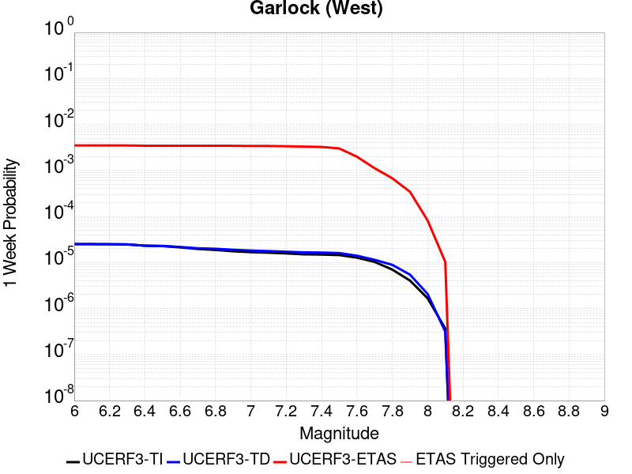 |  |  |  |

| Magnitude | 1 wk TI Prob | 1 wk TD Prob | 1 wk ETAS Prob | 1 wk ETAS/TD Gain | 1 wk ETAS Triggered Only | 1 mo TI Prob | 1 mo TD Prob | 1 mo ETAS Prob | 1 mo ETAS/TD Gain | 1 mo ETAS Triggered Only | 1 yr TI Prob | 1 yr TD Prob | 1 yr ETAS Prob | 1 yr ETAS/TD Gain | 1 yr ETAS Triggered Only | 10 yr TI Prob | 10 yr TD Prob | 10 yr ETAS Prob | 10 yr ETAS/TD Gain | 10 yr ETAS Triggered Only |
|-----|-----|-----|-----|-----|-----|-----|-----|-----|-----|-----|-----|-----|-----|-----|-----|-----|-----|-----|-----|-----|
| 6.0 | 2.5181727E-5 | 2.51973E-5 | 0.0035460088 | 140.72972 | 0.0035209004 | 1.0791722E-4 | 1.0798398E-4 | 0.004737709 | 43.874184 | 0.0046302252 | 0.0013131002 | 0.0013139155 | 0.008089567 | 6.15684 | 0.0067845657 | 0.013053683 | 0.013141977 | 0.021899944 | 1.6664118 | 0.008874598 |
| 6.1 | 2.5077732E-5 | 2.5098372E-5 | 0.0035459104 | 141.28049 | 0.0035209004 | 1.0747157E-4 | 1.0756004E-4 | 0.0047372873 | 44.04319 | 0.0046302252 | 0.001307681 | 0.0013087603 | 0.008084447 | 6.1771793 | 0.0067845657 | 0.013000126 | 0.013091032 | 0.021849453 | 1.6690397 | 0.008874598 |
| 6.2 | 2.494612E-5 | 2.498005E-5 | 0.0035457923 | 141.94496 | 0.0035209004 | 1.0690756E-4 | 1.0705298E-4 | 0.0047367825 | 44.247086 | 0.0046302252 | 0.0013008224 | 0.0013025942 | 0.008078323 | 6.2017183 | 0.0067845657 | 0.012932341 | 0.013030097 | 0.021789057 | 1.67221 | 0.008874598 |
| 6.3 | 2.4733758E-5 | 2.479942E-5 | 0.0035456123 | 142.97159 | 0.0035209004 | 1.0599751E-4 | 1.06278916E-4 | 0.004736012 | 44.562103 | 0.0046302252 | 0.0012897556 | 0.0012931811 | 0.008068973 | 6.239631 | 0.0067845657 | 0.012822957 | 0.012937066 | 0.021696853 | 1.6771077 | 0.008874598 |
| 6.4 | 2.3237335E-5 | 2.317873E-5 | 0.0035118437 | 151.51149 | 0.003488746 | 9.958477E-5 | 9.933365E-5 | 0.0046969475 | 47.284557 | 0.004598071 | 0.0012117702 | 0.001208719 | 0.007952969 | 6.579667 | 0.0067524114 | 0.012051838 | 0.012101916 | 0.020821467 | 1.7205099 | 0.008826367 |
| 6.5 | 2.2732203E-5 | 2.2993298E-5 | 0.003511659 | 152.72533 | 0.003488746 | 9.742009E-5 | 9.8539E-5 | 0.004696157 | 47.65785 | 0.004598071 | 0.0011854442 | 0.0011990548 | 0.007943369 | 6.624693 | 0.0067524114 | 0.011791403 | 0.012006322 | 0.020726716 | 1.7263168 | 0.008826367 |
| 6.6 | 2.1319436E-5 | 2.17735E-5 | 0.0035104435 | 161.22551 | 0.003488746 | 9.136581E-5 | 9.331167E-5 | 0.0046748775 | 50.0996 | 0.0045819934 | 0.001111811 | 0.0011354799 | 0.007864165 | 6.925852 | 0.0067363344 | 0.011062649 | 0.011377227 | 0.02008728 | 1.7655691 | 0.008810289 |
| 6.7 | 1.970802E-5 | 2.0393396E-5 | 0.0035090682 | 172.06885 | 0.003488746 | 8.446021E-5 | 8.739735E-5 | 0.0046689906 | 53.422565 | 0.0045819934 | 0.001027818 | 0.001063545 | 0.007760595 | 7.296912 | 0.00670418 | 0.010230771 | 0.010664964 | 0.01934948 | 1.8143034 | 0.008778135 |
| 6.8 | 1.8744462E-5 | 1.9901045E-5 | 0.0035085776 | 176.30118 | 0.003488746 | 8.033094E-5 | 8.5287415E-5 | 0.00466689 | 54.719566 | 0.0045819934 | 9.775903E-4 | 0.0010378812 | 0.007702982 | 7.4218335 | 0.0066720257 | 0.009733009 | 0.01041075 | 0.01906568 | 1.8313453 | 0.00874598 |
| 6.9 | 1.7559682E-5 | 1.8953415E-5 | 0.0034915565 | 184.2178 | 0.0034726688 | 7.5253614E-5 | 8.12264E-5 | 0.004646772 | 57.207657 | 0.0045659165 | 9.158276E-4 | 9.884841E-4 | 0.0076378533 | 7.7268343 | 0.0066559487 | 0.0091206245 | 0.009921231 | 0.018564524 | 1.8711915 | 0.008729904 |
| 7.0 | 1.6794445E-5 | 1.8216237E-5 | 0.003458668 | 189.86731 | 0.0034405144 | 7.197421E-5 | 7.8067256E-5 | 0.0045953994 | 58.86462 | 0.0045176847 | 8.759337E-4 | 9.5005584E-4 | 0.0075354334 | 7.931569 | 0.00659164 | 0.008724891 | 0.009540141 | 0.018123064 | 1.8996643 | 0.008665595 |
| 7.1 | 1.6337795E-5 | 1.7717046E-5 | 0.0034581705 | 195.1889 | 0.0034405144 | 7.0017246E-5 | 7.5927994E-5 | 0.00459327 | 60.49508 | 0.0045176847 | 8.521265E-4 | 9.240326E-4 | 0.0074613946 | 8.074818 | 0.006543408 | 0.008488664 | 0.009281996 | 0.017803445 | 1.9180621 | 0.008601286 |
| 7.2 | 1.5780008E-5 | 1.7165687E-5 | 0.0033933136 | 197.68004 | 0.0033762057 | 6.762685E-5 | 7.356516E-5 | 0.0045266137 | 61.532032 | 0.0044533764 | 8.2304585E-4 | 8.9528906E-4 | 0.0073204 | 8.176577 | 0.006430868 | 0.008200042 | 0.008996838 | 0.01739328 | 1.9332658 | 0.008472669 |
| 7.3 | 1.5058865E-5 | 1.6618762E-5 | 0.0033284607 | 200.28333 | 0.0033118972 | 6.45364E-5 | 7.122133E-5 | 0.0044439 | 62.395638 | 0.00437299 | 7.854473E-4 | 8.667759E-4 | 0.007163564 | 8.264609 | 0.006302251 | 0.00782677 | 0.008713539 | 0.01695301 | 1.9455942 | 0.0083118975 |
| 7.4 | 1.4887923E-5 | 1.6454731E-5 | 0.0032479127 | 197.38474 | 0.0032315112 | 6.380382E-5 | 7.051838E-5 | 0.004346744 | 61.639877 | 0.0042765276 | 7.7653467E-4 | 8.582243E-4 | 0.007026559 | 8.187323 | 0.0061736335 | 0.0077382675 | 0.008628399 | 0.016709194 | 1.9365346 | 0.008151125 |
| 7.5 | 1.4509299E-5 | 1.6046748E-5 | 0.0030224293 | 188.35152 | 0.0030064308 | 6.218123E-5 | 6.876997E-5 | 0.004087786 | 59.44144 | 0.0040192925 | 7.567935E-4 | 8.36954E-4 | 0.0066038277 | 7.8903117 | 0.005771704 | 0.0075422134 | 0.008416704 | 0.015973143 | 1.8977907 | 0.0076205786 |
| 7.6 | 1.2756717E-5 | 1.4050848E-5 | 0.001975438 | 140.59209 | 0.0019614147 | 5.4670498E-5 | 6.0216535E-5 | 0.0027610185 | 45.8515 | 0.0027009647 | 6.6541E-4 | 7.328904E-4 | 0.004572518 | 6.2390203 | 0.0038424437 | 0.006634211 | 0.0073816874 | 0.012440531 | 1.6853234 | 0.005096463 |
| 7.7 | 1.0328985E-5 | 1.1460557E-5 | 0.0012172345 | 106.21076 | 0.0012057878 | 4.4266326E-5 | 4.911575E-5 | 0.0017532121 | 35.69552 | 0.00170418 | 5.388092E-4 | 5.978206E-4 | 0.0030882922 | 5.1659184 | 0.0024919615 | 0.0053750467 | 0.006038511 | 0.009170609 | 1.518687 | 0.0031511255 |
| 7.8 | 7.0306583E-6 | 8.899601E-6 | 7.162888E-4 | 80.4855 | 7.073955E-4 | 3.0131043E-5 | 3.814059E-5 | 0.001147423 | 30.08404 | 0.0011093247 | 3.667837E-4 | 4.642629E-4 | 0.0021515822 | 4.634404 | 0.0016881028 | 0.003661789 | 0.0046952725 | 0.0068234964 | 1.4532695 | 0.0021382638 |
| 7.9 | 4.060633E-6 | 5.4653938E-6 | 2.9485289E-4 | 53.949062 | 2.8938908E-4 | 1.7402595E-5 | 2.3422906E-5 | 5.378803E-4 | 22.963858 | 5.1446946E-4 | 2.11856E-4 | 2.851367E-4 | 0.001088766 | 3.8184004 | 8.038585E-4 | 0.0021165414 | 0.002884201 | 0.003990326 | 1.3835118 | 0.0011093247 |
| 8.0 | 1.6729537E-6 | 2.0775144E-6 | 9.854034E-5 | 47.431843 | 9.646302E-5 | 7.169782E-6 | 8.903603E-6 | 1.6967388E-4 | 19.056767 | 1.607717E-4 | 8.7288594E-5 | 1.0839601E-4 | 3.4952743E-4 | 3.2245414 | 2.4115756E-4 | 8.7254314E-4 | 0.0010969337 | 0.0014823626 | 1.3513693 | 3.858521E-4 |
| 8.1 | 3.6733252E-7 | 3.1489964E-7 | 1.6392065E-5 | 52.054886 | 1.607717E-5 | 1.5742813E-6 | 1.3495693E-6 | 1.7426719E-5 | 12.9128 | 1.607717E-5 | 1.9166706E-5 | 1.6430899E-5 | 4.8584712E-5 | 2.9569113 | 3.215434E-5 | 1.9165053E-4 | 1.6638759E-4 | 2.1461108E-4 | 1.2898263 | 4.823151E-5 |

## McLean Lake
*[(top)](#table-of-contents)*

| 1 Week | 1 Month | 1 Year | 10 Year |
|-----|-----|-----|-----|
| 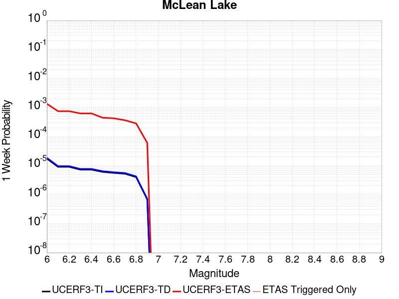 | 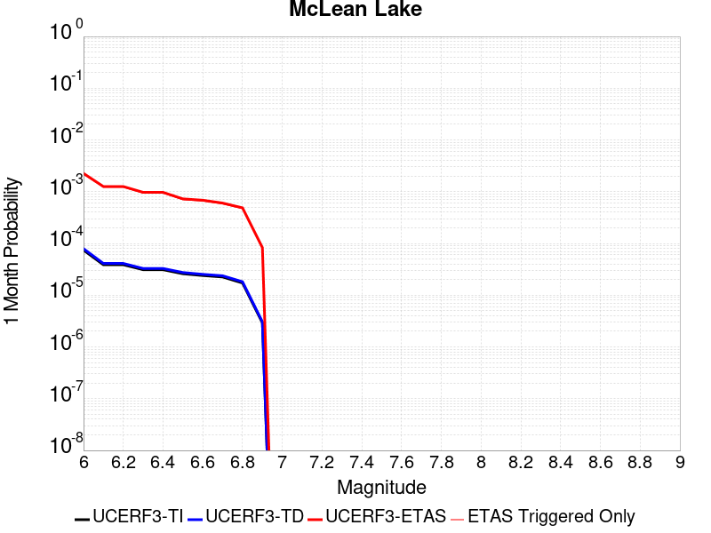 |  |  |

| Magnitude | 1 wk TI Prob | 1 wk TD Prob | 1 wk ETAS Prob | 1 wk ETAS/TD Gain | 1 wk ETAS Triggered Only | 1 mo TI Prob | 1 mo TD Prob | 1 mo ETAS Prob | 1 mo ETAS/TD Gain | 1 mo ETAS Triggered Only | 1 yr TI Prob | 1 yr TD Prob | 1 yr ETAS Prob | 1 yr ETAS/TD Gain | 1 yr ETAS Triggered Only | 10 yr TI Prob | 10 yr TD Prob | 10 yr ETAS Prob | 10 yr ETAS/TD Gain | 10 yr ETAS Triggered Only |
|-----|-----|-----|-----|-----|-----|-----|-----|-----|-----|-----|-----|-----|-----|-----|-----|-----|-----|-----|-----|-----|
| 6.0 | 1.7360222E-5 | 1.8501627E-5 | 0.0014332664 | 77.46705 | 0.001414791 | 7.439883E-5 | 7.9290556E-5 | 0.002185233 | 27.559814 | 0.0021061094 | 9.0542925E-4 | 9.6498354E-4 | 0.0052695074 | 5.4607224 | 0.0043086815 | 0.009017491 | 0.0096127745 | 0.01668242 | 1.7354428 | 0.0071382634 |
| 6.1 | 9.062689E-6 | 9.592193E-6 | 7.9736597E-4 | 83.12656 | 7.877814E-4 | 3.8839516E-5 | 4.1108804E-5 | 0.0012629235 | 30.721487 | 0.001221865 | 4.727685E-4 | 5.003936E-4 | 0.0028946933 | 5.7848325 | 0.0023954983 | 0.0047176396 | 0.004993552 | 0.00896078 | 1.7944703 | 0.003987138 |
| 6.2 | 9.062689E-6 | 9.592193E-6 | 7.9736597E-4 | 83.12656 | 7.877814E-4 | 3.8839516E-5 | 4.1108804E-5 | 0.0012629235 | 30.721487 | 0.001221865 | 4.727685E-4 | 5.003936E-4 | 0.0028946933 | 5.7848325 | 0.0023954983 | 0.0047176396 | 0.004993552 | 0.00896078 | 1.7944703 | 0.003987138 |
| 6.3 | 7.2575485E-6 | 7.66771E-6 | 6.668266E-4 | 86.96556 | 6.59164E-4 | 3.110341E-5 | 3.2861237E-5 | 9.492298E-4 | 28.886003 | 9.163987E-4 | 3.786182E-4 | 4.0001926E-4 | 0.0023124372 | 5.7808146 | 0.0019131833 | 0.0037797375 | 0.0039936965 | 0.0072283153 | 1.8099309 | 0.0032475884 |
| 6.4 | 7.2575485E-6 | 7.66771E-6 | 6.668266E-4 | 86.96556 | 6.59164E-4 | 3.110341E-5 | 3.2861237E-5 | 9.492298E-4 | 28.886003 | 9.163987E-4 | 3.786182E-4 | 4.0001926E-4 | 0.0023124372 | 5.7808146 | 0.0019131833 | 0.0037797375 | 0.0039936965 | 0.0072283153 | 1.8099309 | 0.0032475884 |
| 6.5 | 6.06582E-6 | 6.4038773E-6 | 4.5656177E-4 | 71.294586 | 4.5016076E-4 | 2.5996113E-5 | 2.7444936E-5 | 6.8659085E-4 | 25.017033 | 6.59164E-4 | 3.164567E-4 | 3.3409733E-4 | 0.0017644875 | 5.2813573 | 0.0014308682 | 0.0031600643 | 0.0033365893 | 0.005852283 | 1.7539717 | 0.0025241158 |
| 6.6 | 5.598744E-6 | 5.910262E-6 | 4.2391423E-4 | 71.72511 | 4.1800644E-4 | 2.3994397E-5 | 2.5329486E-5 | 6.2016974E-4 | 24.484102 | 5.948553E-4 | 2.9209262E-4 | 3.0834923E-4 | 0.001578054 | 5.117749 | 0.0012700965 | 0.0029170897 | 0.003079843 | 0.0053878254 | 1.7493831 | 0.0023151126 |
| 6.7 | 5.246996E-6 | 5.539162E-6 | 3.5923495E-4 | 64.85366 | 3.5369775E-4 | 2.2486933E-5 | 2.3739085E-5 | 5.221195E-4 | 21.994087 | 4.9839227E-4 | 2.73744E-4 | 2.8899137E-4 | 0.001381923 | 4.7818832 | 0.0010932476 | 0.0027340704 | 0.0028867796 | 0.0049547474 | 1.7163581 | 0.002073955 |
| 6.8 | 4.02324E-6 | 4.2469046E-6 | 2.6148054E-4 | 61.56968 | 2.5723473E-4 | 1.7242342E-5 | 1.8200926E-5 | 3.879691E-4 | 21.3159 | 3.697749E-4 | 2.099053E-4 | 2.2157968E-4 | 9.931129E-4 | 4.481967 | 7.717042E-4 | 0.0020970714 | 0.002214172 | 0.0037381214 | 1.6882706 | 0.0015273312 |
| 6.9 | 6.835972E-7 | 7.1399285E-7 | 6.502263E-5 | 91.06902 | 6.430868E-5 | 2.9296991E-6 | 3.0599674E-6 | 6.7368455E-5 | 22.016068 | 6.430868E-5 | 3.56685E-5 | 3.7254784E-5 | 1.6586736E-4 | 4.452243 | 1.2861736E-4 | 3.5662777E-4 | 3.7251666E-4 | 5.6537084E-4 | 1.5177062 | 1.9292605E-4 |

## Goldstone Lake
*[(top)](#table-of-contents)*

| 1 Week | 1 Month | 1 Year | 10 Year |
|-----|-----|-----|-----|
|  |  |  |  |

| Magnitude | 1 wk TI Prob | 1 wk TD Prob | 1 wk ETAS Prob | 1 wk ETAS/TD Gain | 1 wk ETAS Triggered Only | 1 mo TI Prob | 1 mo TD Prob | 1 mo ETAS Prob | 1 mo ETAS/TD Gain | 1 mo ETAS Triggered Only | 1 yr TI Prob | 1 yr TD Prob | 1 yr ETAS Prob | 1 yr ETAS/TD Gain | 1 yr ETAS Triggered Only | 10 yr TI Prob | 10 yr TD Prob | 10 yr ETAS Prob | 10 yr ETAS/TD Gain | 10 yr ETAS Triggered Only |
|-----|-----|-----|-----|-----|-----|-----|-----|-----|-----|-----|-----|-----|-----|-----|-----|-----|-----|-----|-----|-----|
| 6.0 | 2.671352E-5 | 3.037609E-5 | 0.0011718206 | 38.57707 | 0.0011414791 | 1.1448149E-4 | 1.3017785E-4 | 0.002027037 | 15.571289 | 0.0018971061 | 0.001392921 | 0.0015839594 | 0.0053400584 | 3.3713353 | 0.003762058 | 0.013842222 | 0.015746197 | 0.021759322 | 1.381878 | 0.0061093247 |
| 6.1 | 2.671352E-5 | 3.037609E-5 | 0.0011718206 | 38.57707 | 0.0011414791 | 1.1448149E-4 | 1.3017785E-4 | 0.002027037 | 15.571289 | 0.0018971061 | 0.001392921 | 0.0015839594 | 0.0053400584 | 3.3713353 | 0.003762058 | 0.013842222 | 0.015746197 | 0.021759322 | 1.381878 | 0.0061093247 |
| 6.2 | 1.4197047E-5 | 1.6096245E-5 | 5.627112E-4 | 34.959164 | 5.466238E-4 | 6.0843064E-5 | 6.8982634E-5 | 9.853181E-4 | 14.283567 | 9.163987E-4 | 7.4051257E-4 | 8.3963864E-4 | 0.0027190882 | 3.2384028 | 0.001881029 | 0.007380498 | 0.0083743585 | 0.011562866 | 1.3807464 | 0.003215434 |
| 6.3 | 1.4197047E-5 | 1.6096245E-5 | 5.627112E-4 | 34.959164 | 5.466238E-4 | 6.0843064E-5 | 6.8982634E-5 | 9.853181E-4 | 14.283567 | 9.163987E-4 | 7.4051257E-4 | 8.3963864E-4 | 0.0027190882 | 3.2384028 | 0.001881029 | 0.007380498 | 0.0083743585 | 0.011562866 | 1.3807464 | 0.003215434 |
| 6.4 | 1.3238931E-5 | 1.500846E-5 | 5.6162407E-4 | 37.420498 | 5.466238E-4 | 5.6737044E-5 | 6.4320935E-5 | 9.806607E-4 | 15.246368 | 9.163987E-4 | 6.9055456E-4 | 7.82924E-4 | 0.0025821573 | 3.2980943 | 0.001800643 | 0.006884126 | 0.0078112837 | 0.01079423 | 1.3818767 | 0.0030064308 |
| 6.5 | 1.3238931E-5 | 1.500846E-5 | 5.6162407E-4 | 37.420498 | 5.466238E-4 | 5.6737044E-5 | 6.4320935E-5 | 9.806607E-4 | 15.246368 | 9.163987E-4 | 6.9055456E-4 | 7.82924E-4 | 0.0025821573 | 3.2980943 | 0.001800643 | 0.006884126 | 0.0078112837 | 0.01079423 | 1.3818767 | 0.0030064308 |
| 6.6 | 1.1328278E-5 | 1.2855166E-5 | 4.1477926E-4 | 32.26557 | 4.0192925E-4 | 4.8548856E-5 | 5.5092944E-5 | 7.9460203E-4 | 14.422937 | 7.395498E-4 | 5.90922E-4 | 6.7064585E-4 | 0.0022290854 | 3.3237894 | 0.0015594856 | 0.0058935313 | 0.0066956086 | 0.009282671 | 1.3863821 | 0.0026045016 |
| 6.7 | 8.651175E-6 | 9.824565E-6 | 2.8313376E-4 | 28.818964 | 2.733119E-4 | 3.707594E-5 | 4.2105108E-5 | 5.726294E-4 | 13.599998 | 5.3054665E-4 | 4.5130608E-4 | 5.1259965E-4 | 0.0017017004 | 3.3197455 | 0.0011897106 | 0.0045039062 | 0.005123051 | 0.007186381 | 1.4027542 | 0.002073955 |
| 6.8 | 1.0215377E-6 | 1.1754702E-6 | 1.7252622E-5 | 14.677209 | 1.607717E-5 | 4.378012E-6 | 5.0377203E-6 | 2.1114809E-5 | 4.191342 | 1.607717E-5 | 5.3300988E-5 | 6.1332634E-5 | 1.0956119E-4 | 1.786344 | 4.823151E-5 | 5.3288206E-4 | 6.1316835E-4 | 7.095722E-4 | 1.1572225 | 9.646302E-5 |
| 6.9 | 7.9360774E-7 | 9.2833966E-7 | 1.7005495E-5 | 18.318182 | 1.607717E-5 | 3.4011714E-6 | 3.9785928E-6 | 2.0055699E-5 | 5.0409026 | 1.607717E-5 | 4.1408475E-5 | 4.843836E-5 | 6.451475E-5 | 1.3318938 | 1.607717E-5 | 4.140076E-4 | 4.8428503E-4 | 5.3249317E-4 | 1.099545 | 4.823151E-5 |
| 7.0 | 7.4382757E-7 | 8.7473285E-7 | 1.695189E-5 | 19.379505 | 1.607717E-5 | 3.1878285E-6 | 3.74885E-6 | 1.982596E-5 | 5.2885447 | 1.607717E-5 | 3.8811122E-5 | 4.564136E-5 | 6.1717794E-5 | 1.3522339 | 1.607717E-5 | 3.8804344E-4 | 4.5632652E-4 | 4.7239635E-4 | 1.0352156 | 1.607717E-5 |
| 7.1 | 6.4709513E-7 | 7.7113E-7 | 1.6848287E-5 | 21.84883 | 1.607717E-5 | 2.773262E-6 | 3.3048389E-6 | 1.9381956E-5 | 5.8647203 | 1.607717E-5 | 3.376394E-5 | 4.0235733E-5 | 5.6312256E-5 | 1.3995584 | 1.607717E-5 | 3.375881E-4 | 4.0229043E-4 | 4.1836113E-4 | 1.039948 | 1.607717E-5 |
| 7.2 | 6.356704E-7 | 7.5883594E-7 | 1.6835995E-5 | 22.186605 | 1.607717E-5 | 2.7242988E-6 | 3.2521505E-6 | 1.9329269E-5 | 5.943535 | 1.607717E-5 | 3.3167835E-5 | 3.959427E-5 | 5.5670804E-5 | 1.4060318 | 1.607717E-5 | 3.3162883E-4 | 3.958781E-4 | 4.1194892E-4 | 1.0405953 | 1.607717E-5 |
| 7.3 | 5.7695723E-7 | 6.8965653E-7 | 1.6766815E-5 | 24.311836 | 1.607717E-5 | 2.4726714E-6 | 2.9556677E-6 | 1.903279E-5 | 6.4394217 | 1.607717E-5 | 3.0104358E-5 | 3.5984718E-5 | 5.206131E-5 | 1.4467616 | 1.607717E-5 | 3.0100282E-4 | 3.5979465E-4 | 3.7586605E-4 | 1.0446682 | 1.607717E-5 |
| 7.4 | 5.209647E-7 | 6.193514E-7 | 1.6696511E-5 | 26.958061 | 1.607717E-5 | 2.232704E-6 | 2.6543607E-6 | 1.8731489E-5 | 7.056874 | 1.607717E-5 | 2.718283E-5 | 3.2316417E-5 | 4.839307E-5 | 1.4974762 | 1.607717E-5 | 2.7179506E-4 | 3.2312275E-4 | 3.3919472E-4 | 1.0497395 | 1.607717E-5 |
| 7.5 | 4.512955E-7 | 5.348885E-7 | 1.661205E-5 | 31.057034 | 1.607717E-5 | 1.934122E-6 | 2.2923775E-6 | 1.8369512E-5 | 8.013301 | 1.607717E-5 | 2.3547682E-5 | 2.7909393E-5 | 4.3986114E-5 | 1.5760326 | 1.607717E-5 | 2.3545188E-4 | 2.7906417E-4 | 2.9513688E-4 | 1.0575949 | 1.607717E-5 |
| 7.6 | 2.21172E-7 | 2.603961E-7 | 1.6337563E-5 | 62.7412 | 1.607717E-5 | 9.478797E-7 | 1.1159829E-6 | 1.7193135E-5 | 15.406272 | 1.607717E-5 | 1.1540374E-5 | 1.3587036E-5 | 2.9663988E-5 | 2.1832569 | 1.607717E-5 | 1.1539775E-4 | 1.3586486E-4 | 1.5193985E-4 | 1.1183159 | 1.607717E-5 |

## Coyote Canyon
*[(top)](#table-of-contents)*

| 1 Week | 1 Month | 1 Year | 10 Year |
|-----|-----|-----|-----|
|  |  |  |  |

| Magnitude | 1 wk TI Prob | 1 wk TD Prob | 1 wk ETAS Prob | 1 wk ETAS/TD Gain | 1 wk ETAS Triggered Only | 1 mo TI Prob | 1 mo TD Prob | 1 mo ETAS Prob | 1 mo ETAS/TD Gain | 1 mo ETAS Triggered Only | 1 yr TI Prob | 1 yr TD Prob | 1 yr ETAS Prob | 1 yr ETAS/TD Gain | 1 yr ETAS Triggered Only | 10 yr TI Prob | 10 yr TD Prob | 10 yr ETAS Prob | 10 yr ETAS/TD Gain | 10 yr ETAS Triggered Only |
|-----|-----|-----|-----|-----|-----|-----|-----|-----|-----|-----|-----|-----|-----|-----|-----|-----|-----|-----|-----|-----|
| 6.0 | 3.5090034E-5 | 4.0364324E-5 | 0.0010049556 | 24.897125 | 9.646302E-4 | 1.503772E-4 | 1.7297994E-4 | 0.0015875262 | 9.177516 | 0.001414791 | 0.0018293047 | 0.0021042528 | 0.004943924 | 2.3494916 | 0.0028456592 | 0.018143194 | 0.020869201 | 0.025497248 | 1.2217644 | 0.004726688 |
| 6.1 | 3.5090034E-5 | 4.0364324E-5 | 0.0010049556 | 24.897125 | 9.646302E-4 | 1.503772E-4 | 1.7297994E-4 | 0.0015875262 | 9.177516 | 0.001414791 | 0.0018293047 | 0.0021042528 | 0.004943924 | 2.3494916 | 0.0028456592 | 0.018143194 | 0.020869201 | 0.025497248 | 1.2217644 | 0.004726688 |
| 6.2 | 1.841879E-5 | 2.1059794E-5 | 5.9982575E-4 | 28.482033 | 5.7877816E-4 | 7.8935285E-5 | 9.0253714E-5 | 9.101154E-4 | 10.083966 | 8.199357E-4 | 9.606133E-4 | 0.001098387 | 0.002543743 | 2.3158896 | 0.0014469454 | 0.0095647145 | 0.010939667 | 0.013467972 | 1.2311136 | 0.00255627 |
| 6.3 | 1.841879E-5 | 2.1059794E-5 | 5.9982575E-4 | 28.482033 | 5.7877816E-4 | 7.8935285E-5 | 9.0253714E-5 | 9.101154E-4 | 10.083966 | 8.199357E-4 | 9.606133E-4 | 0.001098387 | 0.002543743 | 2.3158896 | 0.0014469454 | 0.0095647145 | 0.010939667 | 0.013467972 | 1.2311136 | 0.00255627 |
| 6.4 | 1.712201E-5 | 1.9565212E-5 | 5.340246E-4 | 27.2946 | 5.1446946E-4 | 7.337798E-5 | 8.3848776E-5 | 8.233366E-4 | 9.8193035 | 7.395498E-4 | 8.930107E-4 | 0.0010204813 | 0.002417768 | 2.3692427 | 0.0013987138 | 0.008894307 | 0.010167871 | 0.012539011 | 1.2331994 | 0.0023954983 |
| 6.5 | 1.4744935E-5 | 1.6836972E-5 | 4.5091327E-4 | 26.781137 | 4.340836E-4 | 6.3191044E-5 | 7.215698E-5 | 7.151974E-4 | 9.911687 | 6.430868E-4 | 7.6907943E-4 | 8.7825063E-4 | 0.0021151055 | 2.4083166 | 0.0012379421 | 0.007664232 | 0.008756994 | 0.010860597 | 1.2402197 | 0.0021221866 |
| 6.6 | 1.2017839E-5 | 1.37240895E-5 | 3.6741697E-4 | 26.771685 | 3.5369775E-4 | 5.150401E-5 | 5.88167E-5 | 5.8933214E-4 | 10.01981 | 5.3054665E-4 | 6.268809E-4 | 7.159466E-4 | 0.0017120176 | 2.3912642 | 9.967845E-4 | 0.0062511545 | 0.0071450938 | 0.008884984 | 1.2435085 | 0.0017524116 |
| 6.7 | 1.00956095E-5 | 1.1533517E-5 | 3.3307323E-4 | 28.878721 | 3.215434E-4 | 4.326618E-5 | 4.942891E-5 | 5.317202E-4 | 10.757271 | 4.823151E-4 | 5.266384E-4 | 6.017178E-4 | 0.00148543 | 2.4686491 | 8.842444E-4 | 0.005253921 | 0.0060094125 | 0.0075435457 | 1.2552884 | 0.0015434084 |

## San Andreas (Mojave S)
*[(top)](#table-of-contents)*

| 1 Week | 1 Month | 1 Year | 10 Year |
|-----|-----|-----|-----|
|  |  |  | 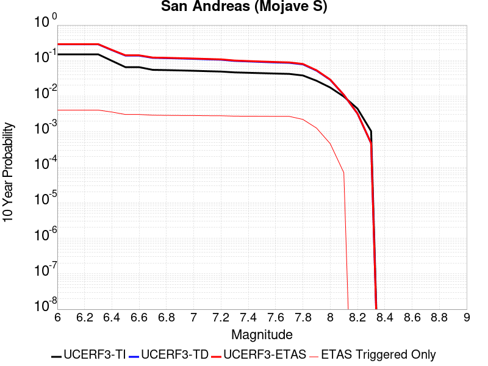 |

| Magnitude | 1 wk TI Prob | 1 wk TD Prob | 1 wk ETAS Prob | 1 wk ETAS/TD Gain | 1 wk ETAS Triggered Only | 1 mo TI Prob | 1 mo TD Prob | 1 mo ETAS Prob | 1 mo ETAS/TD Gain | 1 mo ETAS Triggered Only | 1 yr TI Prob | 1 yr TD Prob | 1 yr ETAS Prob | 1 yr ETAS/TD Gain | 1 yr ETAS Triggered Only | 10 yr TI Prob | 10 yr TD Prob | 10 yr ETAS Prob | 10 yr ETAS/TD Gain | 10 yr ETAS Triggered Only |
|-----|-----|-----|-----|-----|-----|-----|-----|-----|-----|-----|-----|-----|-----|-----|-----|-----|-----|-----|-----|-----|
| 6.0 | 3.1064058E-4 | 6.7460834E-4 | 0.0020402458 | 3.0243416 | 0.0013665595 | 0.0013306376 | 0.0028881032 | 0.0049720993 | 1.7215794 | 0.0020900322 | 0.016080605 | 0.03462235 | 0.037773017 | 1.091001 | 0.0032636656 | 0.1496549 | 0.28660452 | 0.2896554 | 1.0106448 | 0.0042765276 |
| 6.1 | 3.1064058E-4 | 6.7460834E-4 | 0.0020402458 | 3.0243416 | 0.0013665595 | 0.0013306376 | 0.0028881032 | 0.0049720993 | 1.7215794 | 0.0020900322 | 0.016080605 | 0.03462235 | 0.037773017 | 1.091001 | 0.0032636656 | 0.1496549 | 0.28660452 | 0.2896554 | 1.0106448 | 0.0042765276 |
| 6.2 | 3.1064058E-4 | 6.7460834E-4 | 0.0020402458 | 3.0243416 | 0.0013665595 | 0.0013306376 | 0.0028881032 | 0.0049720993 | 1.7215794 | 0.0020900322 | 0.016080605 | 0.03462235 | 0.037773017 | 1.091001 | 0.0032636656 | 0.1496549 | 0.28660452 | 0.2896554 | 1.0106448 | 0.0042765276 |
| 6.3 | 3.1064058E-4 | 6.7460834E-4 | 0.0020402458 | 3.0243416 | 0.0013665595 | 0.0013306376 | 0.0028881032 | 0.0049720993 | 1.7215794 | 0.0020900322 | 0.016080605 | 0.03462235 | 0.037773017 | 1.091001 | 0.0032636656 | 0.1496549 | 0.28660452 | 0.2896554 | 1.0106448 | 0.0042765276 |
| 6.4 | 1.9872203E-4 | 4.3179357E-4 | 0.00158885 | 3.679652 | 0.0011575563 | 8.5138786E-4 | 0.0018492596 | 0.0036626202 | 1.9805874 | 0.0018167202 | 0.010316478 | 0.02228844 | 0.025133548 | 1.1276495 | 0.002909968 | 0.098504856 | 0.19699748 | 0.20004424 | 1.015466 | 0.0037942121 |
| 6.5 | 1.291105E-4 | 2.875267E-4 | 0.0013161697 | 4.5775566 | 0.0010289389 | 5.5321335E-4 | 0.0012316781 | 0.0028053003 | 2.2776246 | 0.0015755628 | 0.006714592 | 0.0148934 | 0.01739576 | 1.1680181 | 0.002540193 | 0.065152965 | 0.13803436 | 0.14087525 | 1.020581 | 0.00329582 |
| 6.6 | 1.291105E-4 | 2.875267E-4 | 0.0013161697 | 4.5775566 | 0.0010289389 | 5.5321335E-4 | 0.0012316781 | 0.0028053003 | 2.2776246 | 0.0015755628 | 0.006714592 | 0.0148934 | 0.01739576 | 1.1680181 | 0.002540193 | 0.065152965 | 0.13803436 | 0.14087525 | 1.020581 | 0.00329582 |
| 6.7 | 1.08001186E-4 | 2.4333889E-4 | 0.0012398809 | 5.0952845 | 9.967845E-4 | 4.6278012E-4 | 0.0010424647 | 0.0025842641 | 2.4789944 | 0.0015434084 | 0.0056198016 | 0.012618446 | 0.015015465 | 1.1899616 | 0.0024276527 | 0.054797906 | 0.119176775 | 0.1219382 | 1.0231708 | 0.0031350483 |
| 6.8 | 1.0624356E-4 | 2.3851555E-4 | 0.0012350624 | 5.178121 | 9.967845E-4 | 4.5525006E-4 | 0.0010218095 | 0.00254758 | 2.4932044 | 0.0015273312 | 0.0055285925 | 0.012369843 | 0.014751588 | 1.1925445 | 0.0024115755 | 0.053930566 | 0.11712591 | 0.11986538 | 1.0233891 | 0.003102894 |
| 6.9 | 1.0393785E-4 | 2.3221898E-4 | 0.0012287721 | 5.2914367 | 9.967845E-4 | 4.4537184E-4 | 9.948451E-4 | 0.002520657 | 2.5337179 | 0.0015273312 | 0.0054089287 | 0.012045221 | 0.0144277485 | 1.1977986 | 0.0024115755 | 0.05279156 | 0.11442335 | 0.11714273 | 1.0237659 | 0.0030707396 |
| 7.0 | 1.0155622E-4 | 2.2591476E-4 | 0.0012224742 | 5.4112186 | 9.967845E-4 | 4.3516833E-4 | 9.6784724E-4 | 0.0024937002 | 2.576543 | 0.0015273312 | 0.005285311 | 0.0117200995 | 0.014087522 | 1.2019968 | 0.0023954983 | 0.05161361 | 0.111683756 | 0.11439726 | 1.0242963 | 0.0030546624 |
| 7.1 | 9.885595E-5 | 2.1879886E-4 | 0.0011992917 | 5.481252 | 9.807074E-4 | 4.2359953E-4 | 9.3737274E-4 | 0.002431148 | 2.5935767 | 0.0014951768 | 0.0051451353 | 0.011352993 | 0.013673611 | 1.2044059 | 0.0023472668 | 0.05027629 | 0.1085682 | 0.11124823 | 1.0246851 | 0.0030064308 |
| 7.2 | 9.6411415E-5 | 2.124288E-4 | 0.0011929278 | 5.6156597 | 9.807074E-4 | 4.1312634E-4 | 9.1009185E-4 | 0.0023878454 | 2.6237411 | 0.0014790996 | 0.005018219 | 0.011024255 | 0.013329746 | 1.2091289 | 0.0023311898 | 0.049064007 | 0.105758004 | 0.1084321 | 1.0252851 | 0.0029903536 |
| 7.3 | 9.1180635E-5 | 1.9471257E-4 | 0.0011591549 | 5.9531593 | 9.646302E-4 | 3.907156E-4 | 8.342157E-4 | 0.002279954 | 2.7330508 | 0.0014469454 | 0.004746591 | 0.01010939 | 0.012369269 | 1.2235426 | 0.0022829582 | 0.046464786 | 0.09795115 | 0.10060509 | 1.0270945 | 0.0029421223 |
| 7.4 | 8.887388E-5 | 1.8719878E-4 | 0.0011516485 | 6.152008 | 9.646302E-4 | 3.8083247E-4 | 8.020339E-4 | 0.0022478187 | 2.802648 | 0.0014469454 | 0.0046267817 | 0.00972114 | 0.011981905 | 1.2325617 | 0.0022829582 | 0.045316286 | 0.09458615 | 0.09723543 | 1.0280092 | 0.002926045 |
| 7.5 | 8.6750515E-5 | 1.8051457E-4 | 0.0011449707 | 6.342816 | 9.646302E-4 | 3.7173493E-4 | 7.7340455E-4 | 0.0022192309 | 2.8694308 | 0.0014469454 | 0.004516484 | 0.009375632 | 0.011637186 | 1.2412162 | 0.0022829582 | 0.04425787 | 0.091549896 | 0.09420806 | 1.0290352 | 0.002926045 |
| 7.6 | 8.453092E-5 | 1.7439072E-4 | 0.0011388527 | 6.530466 | 9.646302E-4 | 3.6222505E-4 | 7.471748E-4 | 0.002193039 | 2.9351084 | 0.0014469454 | 0.0044011753 | 0.009058985 | 0.0113212615 | 1.2497275 | 0.0022829582 | 0.04315024 | 0.08870898 | 0.09137546 | 1.0300587 | 0.002926045 |
| 7.7 | 8.259102E-5 | 1.6961215E-4 | 0.0011340787 | 6.686306 | 9.646302E-4 | 3.539135E-4 | 7.2670676E-4 | 0.0021726007 | 2.9896524 | 0.0014469454 | 0.004300386 | 0.008811831 | 0.0110746715 | 1.2567958 | 0.0022829582 | 0.042181134 | 0.08645982 | 0.08913288 | 1.0309168 | 0.002926045 |
| 7.8 | 7.444844E-5 | 1.5283503E-4 | 9.40496E-4 | 6.153668 | 7.877814E-4 | 3.1902574E-4 | 6.548429E-4 | 0.0018759076 | 2.8646684 | 0.001221865 | 0.0038772223 | 0.007943616 | 0.009825652 | 1.2369244 | 0.0018971061 | 0.03810269 | 0.078290746 | 0.080513515 | 1.0283912 | 0.0024115755 |
| 7.9 | 5.2586525E-5 | 1.00064186E-4 | 4.698021E-4 | 4.6950073 | 3.697749E-4 | 2.2535135E-4 | 4.2877605E-4 | 0.0010555169 | 2.4616973 | 6.2700966E-4 | 0.0027402006 | 0.005207864 | 0.006183464 | 1.187332 | 9.807074E-4 | 0.027066574 | 0.052200034 | 0.053449545 | 1.023937 | 0.001318328 |
| 8.0 | 3.379877E-5 | 5.4074168E-5 | 2.1483717E-4 | 3.9730096 | 1.607717E-4 | 1.4484383E-4 | 2.3172585E-4 | 4.88901E-4 | 2.109825 | 2.5723473E-4 | 0.0017620471 | 0.002817614 | 0.003186347 | 1.1308671 | 3.697749E-4 | 0.017481409 | 0.028834904 | 0.02935015 | 1.0178689 | 5.3054665E-4 |
| 8.1 | 1.8668277E-5 | 1.9309397E-5 | 5.1463117E-5 | 2.6651852 | 3.215434E-5 | 8.000444E-5 | 8.275194E-5 | 1.1490362E-4 | 1.3885309 | 3.215434E-5 | 9.736188E-4 | 0.0010070398 | 0.0010552227 | 1.0478461 | 4.823151E-5 | 0.009693642 | 0.010798888 | 0.010862502 | 1.0058908 | 6.430868E-5 |
| 8.2 | 8.541571E-6 | 5.460819E-6 | 5.460819E-6 | 1.0 | 0.0 | 3.660622E-5 | 2.3403301E-5 | 2.3403301E-5 | 1.0 | 0.0 | 4.455896E-4 | 2.84898E-4 | 2.84898E-4 | 1.0 | 0.0 | 0.0044469717 | 0.0032408056 | 0.0032408056 | 1.0 | 0.0 |
| 8.3 | 1.983087E-6 | 7.6599065E-7 | 7.6599065E-7 | 1.0 | 0.0 | 8.498917E-6 | 3.282813E-6 | 3.282813E-6 | 1.0 | 0.0 | 1.034694E-4 | 3.9967534E-5 | 3.9967534E-5 | 1.0 | 0.0 | 0.0010342124 | 4.719687E-4 | 4.719687E-4 | 1.0 | 0.0 |

## Lenwood-Lockhart-Old Woman Springs
*[(top)](#table-of-contents)*

| 1 Week | 1 Month | 1 Year | 10 Year |
|-----|-----|-----|-----|
|  |  | 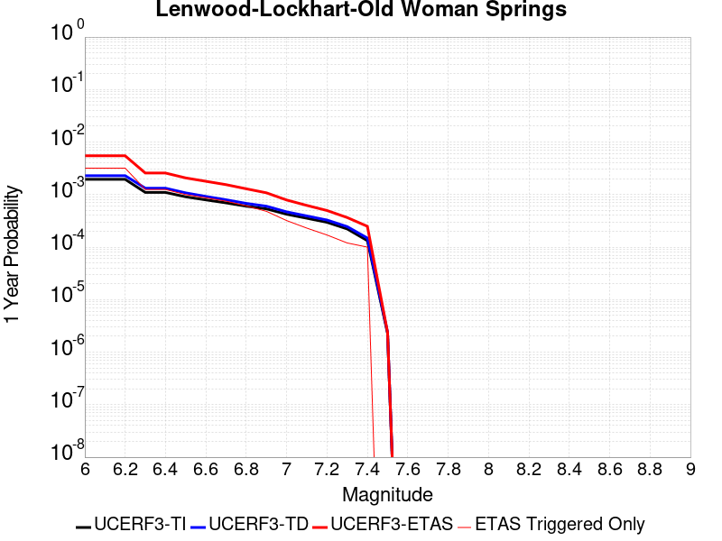 |  |

| Magnitude | 1 wk TI Prob | 1 wk TD Prob | 1 wk ETAS Prob | 1 wk ETAS/TD Gain | 1 wk ETAS Triggered Only | 1 mo TI Prob | 1 mo TD Prob | 1 mo ETAS Prob | 1 mo ETAS/TD Gain | 1 mo ETAS Triggered Only | 1 yr TI Prob | 1 yr TD Prob | 1 yr ETAS Prob | 1 yr ETAS/TD Gain | 1 yr ETAS Triggered Only | 10 yr TI Prob | 10 yr TD Prob | 10 yr ETAS Prob | 10 yr ETAS/TD Gain | 10 yr ETAS Triggered Only |
|-----|-----|-----|-----|-----|-----|-----|-----|-----|-----|-----|-----|-----|-----|-----|-----|-----|-----|-----|-----|-----|
| 6.0 | 3.744542E-5 | 4.396252E-5 | 0.0016998383 | 38.665623 | 0.0016559486 | 1.604705E-4 | 1.8839816E-4 | 0.0022780367 | 12.091607 | 0.0020900322 | 0.0019519776 | 0.0022915069 | 0.0054995725 | 2.399981 | 0.003215434 | 0.019349206 | 0.022696787 | 0.027190497 | 1.1979887 | 0.004598071 |
| 6.1 | 3.744542E-5 | 4.396252E-5 | 0.0016998383 | 38.665623 | 0.0016559486 | 1.604705E-4 | 1.8839816E-4 | 0.0022780367 | 12.091607 | 0.0020900322 | 0.0019519776 | 0.0022915069 | 0.0054995725 | 2.399981 | 0.003215434 | 0.019349206 | 0.022696787 | 0.027190497 | 1.1979887 | 0.004598071 |
| 6.2 | 3.744542E-5 | 4.396252E-5 | 0.0016998383 | 38.665623 | 0.0016559486 | 1.604705E-4 | 1.8839816E-4 | 0.0022780367 | 12.091607 | 0.0020900322 | 0.0019519776 | 0.0022915069 | 0.0054995725 | 2.399981 | 0.003215434 | 0.019349206 | 0.022696787 | 0.027190497 | 1.1979887 | 0.004598071 |
| 6.3 | 2.1079984E-5 | 2.5353434E-5 | 6.6842395E-4 | 26.364237 | 6.430868E-4 | 9.0339665E-5 | 1.0865316E-4 | 8.320472E-4 | 7.657828 | 7.234727E-4 | 0.0010993304 | 0.0013220694 | 0.0024941512 | 1.8865509 | 0.0011736334 | 0.010939079 | 0.0131442575 | 0.014873635 | 1.131569 | 0.0017524116 |
| 6.4 | 2.1079984E-5 | 2.5353434E-5 | 6.6842395E-4 | 26.364237 | 6.430868E-4 | 9.0339665E-5 | 1.0865316E-4 | 8.320472E-4 | 7.657828 | 7.234727E-4 | 0.0010993304 | 0.0013220694 | 0.0024941512 | 1.8865509 | 0.0011736334 | 0.010939079 | 0.0131442575 | 0.014873635 | 1.131569 | 0.0017524116 |
| 6.5 | 1.7397282E-5 | 2.066241E-5 | 5.190444E-4 | 25.120226 | 4.9839227E-4 | 7.455765E-5 | 8.8550245E-5 | 6.351256E-4 | 7.1724887 | 5.466238E-4 | 9.073613E-4 | 0.0010775778 | 0.0020090488 | 1.864412 | 9.324759E-4 | 0.009036654 | 0.010724821 | 0.01206082 | 1.1245707 | 0.0013504823 |
| 6.6 | 1.52050325E-5 | 1.7679693E-5 | 4.1960186E-4 | 23.733547 | 4.0192925E-4 | 6.51628E-5 | 7.576796E-5 | 5.0981867E-4 | 6.728684 | 4.340836E-4 | 7.9306826E-4 | 9.220924E-4 | 0.001693085 | 1.8361337 | 7.717042E-4 | 0.007902439 | 0.009183526 | 0.010298593 | 1.1214204 | 0.0011254019 |
| 6.7 | 1.332523E-5 | 1.5264002E-5 | 3.368025E-4 | 22.06515 | 3.215434E-4 | 5.7106878E-5 | 6.5415545E-5 | 4.1909015E-4 | 6.4065833 | 3.5369775E-4 | 6.950544E-4 | 7.961491E-4 | 0.0014387239 | 1.8071036 | 6.430868E-4 | 0.006928845 | 0.007933599 | 0.008890576 | 1.1206234 | 9.646302E-4 |
| 6.8 | 1.1525329E-5 | 1.3030979E-5 | 2.7026236E-4 | 20.739988 | 2.5723473E-4 | 4.9393333E-5 | 5.584588E-5 | 3.4521878E-4 | 6.181634 | 2.8938908E-4 | 6.011979E-4 | 6.797157E-4 | 0.0011938355 | 1.7563747 | 5.1446946E-4 | 0.00599574 | 0.006776819 | 0.0075592618 | 1.1154587 | 7.877814E-4 |
| 6.9 | 1.0253909E-5 | 1.15144385E-5 | 2.3659223E-4 | 20.54744 | 2.2508038E-4 | 4.3944583E-5 | 4.9346683E-5 | 2.9049235E-4 | 5.8867655 | 2.4115756E-4 | 5.3489394E-4 | 6.0063385E-4 | 0.0010023217 | 1.6687733 | 4.0192925E-4 | 0.0053360825 | 0.0059904843 | 0.0066456995 | 1.109376 | 6.59164E-4 |
| 7.0 | 8.104563E-6 | 8.991279E-6 | 1.6976154E-4 | 18.880688 | 1.607717E-4 | 3.4733377E-5 | 3.8533497E-5 | 1.99299E-4 | 5.1720977 | 1.607717E-4 | 4.2279682E-4 | 4.6904673E-4 | 7.261608E-4 | 1.548163 | 2.5723473E-4 | 0.0042199334 | 0.0046808156 | 0.0051128673 | 1.0923027 | 4.340836E-4 |
| 7.1 | 6.7986157E-6 | 7.515816E-6 | 1.2005516E-4 | 15.97367 | 1.1254019E-4 | 2.91366E-5 | 3.2210253E-5 | 1.4474682E-4 | 4.493812 | 1.1254019E-4 | 3.5468035E-4 | 3.920914E-4 | 5.688709E-4 | 1.450863 | 1.7684887E-4 | 0.003541148 | 0.003914213 | 0.004202469 | 1.0736434 | 2.8938908E-4 |
| 7.2 | 5.6893327E-6 | 6.2800136E-6 | 8.6665365E-5 | 13.800186 | 8.038585E-5 | 2.4382627E-5 | 2.6914078E-5 | 1.0729777E-4 | 3.9866781 | 8.038585E-5 | 2.9681803E-4 | 3.2763163E-4 | 4.5620685E-4 | 1.3924384 | 1.2861736E-4 | 0.002964219 | 0.0032716845 | 0.003480004 | 1.0636735 | 2.0900322E-4 |
| 7.3 | 4.253348E-6 | 4.7069107E-6 | 6.901529E-5 | 14.662545 | 6.430868E-5 | 1.8228506E-5 | 2.0172329E-5 | 8.447971E-5 | 4.187901 | 6.430868E-5 | 2.2190946E-4 | 2.4557224E-4 | 3.4201157E-4 | 1.3927127 | 9.646302E-5 | 0.00221688 | 0.0024531898 | 0.0025975294 | 1.0588375 | 1.4469454E-4 |
| 7.4 | 2.5448119E-6 | 2.852045E-6 | 5.1083418E-5 | 17.911154 | 4.823151E-5 | 1.0906291E-5 | 1.2223002E-5 | 6.0453924E-5 | 4.9459147 | 4.823151E-5 | 1.3277601E-4 | 1.4880655E-4 | 2.2918043E-4 | 1.5401233 | 8.038585E-5 | 0.001326967 | 0.0014872311 | 0.0015674975 | 1.0539703 | 8.038585E-5 |
| 7.5 | 4.3706837E-8 | 4.562909E-8 | 4.562909E-8 | 1.0 | 0.0 | 1.8731501E-7 | 1.9555324E-7 | 1.9555324E-7 | 1.0 | 0.0 | 2.2805577E-6 | 2.3808586E-6 | 2.3808586E-6 | 1.0 | 0.0 | 2.2805343E-5 | 2.3808387E-5 | 2.3808387E-5 | 1.0 | 0.0 |

## So Sierra Nevada
*[(top)](#table-of-contents)*

| 1 Week | 1 Month | 1 Year | 10 Year |
|-----|-----|-----|-----|
|  |  |  |  |

| Magnitude | 1 wk TI Prob | 1 wk TD Prob | 1 wk ETAS Prob | 1 wk ETAS/TD Gain | 1 wk ETAS Triggered Only | 1 mo TI Prob | 1 mo TD Prob | 1 mo ETAS Prob | 1 mo ETAS/TD Gain | 1 mo ETAS Triggered Only | 1 yr TI Prob | 1 yr TD Prob | 1 yr ETAS Prob | 1 yr ETAS/TD Gain | 1 yr ETAS Triggered Only | 10 yr TI Prob | 10 yr TD Prob | 10 yr ETAS Prob | 10 yr ETAS/TD Gain | 10 yr ETAS Triggered Only |
|-----|-----|-----|-----|-----|-----|-----|-----|-----|-----|-----|-----|-----|-----|-----|-----|-----|-----|-----|-----|-----|
| 6.0 | 1.15488665E-5 | 1.1079643E-5 | 0.0010882381 | 98.219604 | 0.0010771704 | 4.9494203E-5 | 4.748339E-5 | 0.001767659 | 37.22689 | 0.0017202572 | 6.024253E-4 | 5.7796965E-4 | 0.003309509 | 5.7260947 | 0.002733119 | 0.006007948 | 0.005765934 | 0.010033787 | 1.7401843 | 0.0042926045 |
| 6.1 | 1.15488665E-5 | 1.1079643E-5 | 0.0010882381 | 98.219604 | 0.0010771704 | 4.9494203E-5 | 4.748339E-5 | 0.001767659 | 37.22689 | 0.0017202572 | 6.024253E-4 | 5.7796965E-4 | 0.003309509 | 5.7260947 | 0.002733119 | 0.006007948 | 0.005765934 | 0.010033787 | 1.7401843 | 0.0042926045 |
| 6.2 | 1.15488665E-5 | 1.1079643E-5 | 0.0010882381 | 98.219604 | 0.0010771704 | 4.9494203E-5 | 4.748339E-5 | 0.001767659 | 37.22689 | 0.0017202572 | 6.024253E-4 | 5.7796965E-4 | 0.003309509 | 5.7260947 | 0.002733119 | 0.006007948 | 0.005765934 | 0.010033787 | 1.7401843 | 0.0042926045 |
| 6.3 | 1.15488665E-5 | 1.1079643E-5 | 0.0010882381 | 98.219604 | 0.0010771704 | 4.9494203E-5 | 4.748339E-5 | 0.001767659 | 37.22689 | 0.0017202572 | 6.024253E-4 | 5.7796965E-4 | 0.003309509 | 5.7260947 | 0.002733119 | 0.006007948 | 0.005765934 | 0.010033787 | 1.7401843 | 0.0042926045 |
| 6.4 | 1.15488665E-5 | 1.1079643E-5 | 0.0010882381 | 98.219604 | 0.0010771704 | 4.9494203E-5 | 4.748339E-5 | 0.001767659 | 37.22689 | 0.0017202572 | 6.024253E-4 | 5.7796965E-4 | 0.003309509 | 5.7260947 | 0.002733119 | 0.006007948 | 0.005765934 | 0.010033787 | 1.7401843 | 0.0042926045 |
| 6.5 | 1.15488665E-5 | 1.1079643E-5 | 0.0010882381 | 98.219604 | 0.0010771704 | 4.9494203E-5 | 4.748339E-5 | 0.001767659 | 37.22689 | 0.0017202572 | 6.024253E-4 | 5.7796965E-4 | 0.003309509 | 5.7260947 | 0.002733119 | 0.006007948 | 0.005765934 | 0.010033787 | 1.7401843 | 0.0042926045 |
| 6.6 | 7.587044E-6 | 6.935635E-6 | 6.178639E-4 | 89.0854 | 6.109325E-4 | 3.2515498E-5 | 2.9723828E-5 | 9.300186E-4 | 31.288654 | 9.003215E-4 | 3.9580427E-4 | 3.6183043E-4 | 0.0016957527 | 4.686595 | 0.0013344052 | 0.003951 | 0.0036127048 | 0.005663148 | 1.5675646 | 0.0020578778 |
| 6.7 | 7.587044E-6 | 6.935635E-6 | 6.178639E-4 | 89.0854 | 6.109325E-4 | 3.2515498E-5 | 2.9723828E-5 | 9.300186E-4 | 31.288654 | 9.003215E-4 | 3.9580427E-4 | 3.6183043E-4 | 0.0016957527 | 4.686595 | 0.0013344052 | 0.003951 | 0.0036127048 | 0.005663148 | 1.5675646 | 0.0020578778 |
| 6.8 | 5.9026956E-6 | 5.1793927E-6 | 4.87492E-4 | 94.12146 | 4.823151E-4 | 2.5297022E-5 | 2.2197215E-5 | 7.135002E-4 | 32.14368 | 6.913183E-4 | 3.0794772E-4 | 2.7021873E-4 | 0.0012506611 | 4.628329 | 9.807074E-4 | 0.0030752132 | 0.002699018 | 0.004142058 | 1.5346538 | 0.0014469454 |
| 6.9 | 5.0118915E-6 | 4.2524252E-6 | 4.222571E-4 | 99.29794 | 4.1800644E-4 | 2.1479358E-5 | 1.8224557E-5 | 5.487615E-4 | 30.111103 | 5.3054665E-4 | 2.614798E-4 | 2.2186211E-4 | 0.0010094687 | 4.549982 | 7.877814E-4 | 0.0026117235 | 0.0022164788 | 0.0033073032 | 1.4921429 | 0.0010932476 |
| 7.0 | 4.4924795E-6 | 3.7139177E-6 | 3.5741035E-4 | 96.2354 | 3.5369775E-4 | 1.925334E-5 | 1.5916696E-5 | 4.660703E-4 | 29.281849 | 4.5016076E-4 | 2.3438422E-4 | 1.9376918E-4 | 7.7243516E-4 | 3.9863675 | 5.7877816E-4 | 0.0023413717 | 0.0019360651 | 0.0027544135 | 1.4226863 | 8.199357E-4 |
| 7.1 | 3.9118436E-6 | 3.1119775E-6 | 2.9250013E-4 | 93.99172 | 2.8938908E-4 | 1.6764936E-5 | 1.3336982E-5 | 3.6703E-4 | 27.51972 | 3.5369775E-4 | 2.0409399E-4 | 1.6236622E-4 | 5.9637934E-4 | 3.6730506 | 4.340836E-4 | 0.0020390663 | 0.001622532 | 0.0022324733 | 1.3759193 | 6.109325E-4 |
| 7.2 | 3.4200818E-6 | 2.6054543E-6 | 2.5983952E-4 | 99.72906 | 2.5723473E-4 | 1.4657411E-5 | 1.11661875E-5 | 3.16629E-4 | 28.356052 | 3.0546624E-4 | 1.7843937E-4 | 1.3594035E-4 | 5.2174E-4 | 3.8380065 | 3.858521E-4 | 0.0017829615 | 0.0013586218 | 0.0018723923 | 1.3781556 | 5.1446946E-4 |
| 7.3 | 2.6593618E-6 | 1.8284203E-6 | 1.6259983E-4 | 88.92913 | 1.607717E-4 | 1.13972155E-5 | 7.836065E-6 | 2.007606E-4 | 25.620079 | 1.9292605E-4 | 1.3875226E-4 | 9.540021E-5 | 3.6868604E-4 | 3.864625 | 2.733119E-4 | 0.0013866565 | 9.5362146E-4 | 0.0012748583 | 1.3368598 | 3.215434E-4 |
| 7.4 | 2.2577992E-6 | 1.436438E-6 | 8.1822174E-5 | 56.961857 | 8.038585E-5 | 9.676246E-6 | 6.15615E-6 | 1.1869565E-4 | 19.280825 | 1.1254019E-4 | 1.1780193E-4 | 7.49488E-5 | 2.3570846E-4 | 3.1449263 | 1.607717E-4 | 0.001177395 | 7.492603E-4 | 9.420418E-4 | 1.2572957 | 1.9292605E-4 |
| 7.5 | 1.489319E-6 | 7.353936E-7 | 4.896687E-5 | 66.58593 | 4.823151E-5 | 6.3827797E-6 | 3.1516831E-6 | 6.746016E-5 | 21.404488 | 6.430868E-5 | 7.770758E-5 | 3.8371072E-5 | 1.1875384E-4 | 3.0948794 | 8.038585E-5 | 7.7680405E-4 | 3.836449E-4 | 4.800709E-4 | 1.2513418 | 9.646302E-5 |
| 7.6 | 1.0680322E-6 | 4.6596554E-7 | 1.6543128E-5 | 35.5029 | 1.607717E-5 | 4.577273E-6 | 1.9969937E-6 | 3.415127E-5 | 17.101341 | 3.215434E-5 | 5.5726876E-5 | 2.4313129E-5 | 7.2543466E-5 | 2.9837158 | 4.823151E-5 | 5.5712904E-4 | 2.4310495E-4 | 3.07398E-4 | 1.2644662 | 6.430868E-5 |
| 7.7 | 5.509146E-7 | 1.5580486E-7 | 1.6232972E-5 | 104.18784 | 1.607717E-5 | 2.3610605E-6 | 6.677349E-7 | 1.6744894E-5 | 25.077158 | 1.607717E-5 | 2.8745531E-5 | 8.129644E-6 | 4.0283725E-5 | 4.9551644 | 3.215434E-5 | 2.8741814E-4 | 8.1293576E-5 | 1.13445305E-4 | 1.3955014 | 3.215434E-5 |

## Nelson Lake
*[(top)](#table-of-contents)*

| 1 Week | 1 Month | 1 Year | 10 Year |
|-----|-----|-----|-----|
|  |  |  |  |

| Magnitude | 1 wk TI Prob | 1 wk TD Prob | 1 wk ETAS Prob | 1 wk ETAS/TD Gain | 1 wk ETAS Triggered Only | 1 mo TI Prob | 1 mo TD Prob | 1 mo ETAS Prob | 1 mo ETAS/TD Gain | 1 mo ETAS Triggered Only | 1 yr TI Prob | 1 yr TD Prob | 1 yr ETAS Prob | 1 yr ETAS/TD Gain | 1 yr ETAS Triggered Only | 10 yr TI Prob | 10 yr TD Prob | 10 yr ETAS Prob | 10 yr ETAS/TD Gain | 10 yr ETAS Triggered Only |
|-----|-----|-----|-----|-----|-----|-----|-----|-----|-----|-----|-----|-----|-----|-----|-----|-----|-----|-----|-----|-----|
| 6.0 | 9.913453E-6 | 1.0192255E-5 | 6.854265E-4 | 67.24974 | 6.752412E-4 | 4.2485535E-5 | 4.3680422E-5 | 0.0010404214 | 23.818943 | 9.967845E-4 | 5.1713863E-4 | 5.316897E-4 | 0.002556336 | 4.8079476 | 0.0020257235 | 0.0051593683 | 0.005305204 | 0.008727466 | 1.6450764 | 0.0034405144 |
| 6.1 | 9.913453E-6 | 1.0192255E-5 | 6.854265E-4 | 67.24974 | 6.752412E-4 | 4.2485535E-5 | 4.3680422E-5 | 0.0010404214 | 23.818943 | 9.967845E-4 | 5.1713863E-4 | 5.316897E-4 | 0.002556336 | 4.8079476 | 0.0020257235 | 0.0051593683 | 0.005305204 | 0.008727466 | 1.6450764 | 0.0034405144 |
| 6.2 | 4.5596407E-6 | 4.696313E-6 | 2.9408402E-4 | 62.62019 | 2.8938908E-4 | 1.954117E-5 | 2.0126909E-5 | 4.220481E-4 | 20.969345 | 4.0192925E-4 | 2.3788778E-4 | 2.4501883E-4 | 9.361678E-4 | 3.8207994 | 6.913183E-4 | 0.0023763329 | 0.0024476128 | 0.0038749787 | 1.5831666 | 0.0014308682 |
| 6.3 | 4.5596407E-6 | 4.696313E-6 | 2.9408402E-4 | 62.62019 | 2.8938908E-4 | 1.954117E-5 | 2.0126909E-5 | 4.220481E-4 | 20.969345 | 4.0192925E-4 | 2.3788778E-4 | 2.4501883E-4 | 9.361678E-4 | 3.8207994 | 6.913183E-4 | 0.0023763329 | 0.0024476128 | 0.0038749787 | 1.5831666 | 0.0014308682 |
| 6.4 | 3.4025713E-6 | 3.5098972E-6 | 2.4466662E-4 | 69.70763 | 2.4115756E-4 | 1.4582367E-5 | 1.5042335E-5 | 3.5265784E-4 | 23.444355 | 3.376206E-4 | 1.7752586E-4 | 1.8312587E-4 | 7.61798E-4 | 4.1599693 | 5.7877816E-4 | 0.001773841 | 0.0018298327 | 0.0028729364 | 1.5700543 | 0.0010450161 |
| 6.5 | 2.8352947E-6 | 2.927856E-6 | 2.1193046E-4 | 72.38418 | 2.0900322E-4 | 1.2151207E-5 | 1.2547898E-5 | 3.180103E-4 | 25.34371 | 3.0546624E-4 | 1.479309E-4 | 1.5276071E-4 | 6.99301E-4 | 4.5777545 | 5.466238E-4 | 0.0014783246 | 0.0015266308 | 0.0024897885 | 1.6309041 | 9.646302E-4 |
| 6.6 | 2.251518E-6 | 2.3290677E-6 | 1.7917753E-4 | 76.931015 | 1.7684887E-4 | 9.649328E-6 | 9.981683E-6 | 2.6721385E-4 | 26.770418 | 2.5723473E-4 | 1.1747423E-4 | 1.2152085E-4 | 5.555517E-4 | 4.5716577 | 4.340836E-4 | 0.0011741214 | 0.0012146058 | 0.0019371996 | 1.5949206 | 7.234727E-4 |
| 6.7 | 1.8911853E-6 | 1.9591396E-6 | 1.6273053E-4 | 83.06224 | 1.607717E-4 | 8.105055E-6 | 8.39629E-6 | 2.0132071E-4 | 23.977345 | 1.9292605E-4 | 9.867457E-5 | 1.0222061E-4 | 4.7195773E-4 | 4.6170506 | 3.697749E-4 | 9.863076E-4 | 0.0010217935 | 0.0015999802 | 1.5658548 | 5.7877816E-4 |
| 6.8 | 1.4874814E-6 | 1.5438305E-6 | 1.3016099E-4 | 84.31042 | 1.2861736E-4 | 6.374905E-6 | 6.6164025E-6 | 1.5130999E-4 | 22.86892 | 1.4469454E-4 | 7.76117E-5 | 8.055224E-5 | 3.69918E-4 | 4.592274 | 2.8938908E-4 | 7.75846E-4 | 8.0528157E-4 | 0.0012550799 | 1.5585603 | 4.5016076E-4 |
| 6.9 | 6.835972E-7 | 7.1399285E-7 | 6.502263E-5 | 91.06902 | 6.430868E-5 | 2.9296991E-6 | 3.0599674E-6 | 6.7368455E-5 | 22.016068 | 6.430868E-5 | 3.56685E-5 | 3.7254784E-5 | 1.6586736E-4 | 4.452243 | 1.2861736E-4 | 3.5662777E-4 | 3.7251666E-4 | 5.6537084E-4 | 1.5177062 | 1.9292605E-4 |

## Death Valley (So)
*[(top)](#table-of-contents)*

| 1 Week | 1 Month | 1 Year | 10 Year |
|-----|-----|-----|-----|
|  |  |  |  |

| Magnitude | 1 wk TI Prob | 1 wk TD Prob | 1 wk ETAS Prob | 1 wk ETAS/TD Gain | 1 wk ETAS Triggered Only | 1 mo TI Prob | 1 mo TD Prob | 1 mo ETAS Prob | 1 mo ETAS/TD Gain | 1 mo ETAS Triggered Only | 1 yr TI Prob | 1 yr TD Prob | 1 yr ETAS Prob | 1 yr ETAS/TD Gain | 1 yr ETAS Triggered Only | 10 yr TI Prob | 10 yr TD Prob | 10 yr ETAS Prob | 10 yr ETAS/TD Gain | 10 yr ETAS Triggered Only |
|-----|-----|-----|-----|-----|-----|-----|-----|-----|-----|-----|-----|-----|-----|-----|-----|-----|-----|-----|-----|-----|
| 6.0 | 2.0684236E-5 | 2.5617775E-5 | 8.294557E-4 | 32.37813 | 8.038585E-4 | 8.864371E-5 | 1.0978594E-4 | 0.0013315168 | 12.128299 | 0.001221865 | 0.0010787029 | 0.0013358411 | 0.0037763068 | 2.8269129 | 0.00244373 | 0.010734817 | 0.013281397 | 0.016961763 | 1.2771068 | 0.0037299036 |
| 6.1 | 2.0684236E-5 | 2.5617775E-5 | 8.294557E-4 | 32.37813 | 8.038585E-4 | 8.864371E-5 | 1.0978594E-4 | 0.0013315168 | 12.128299 | 0.001221865 | 0.0010787029 | 0.0013358411 | 0.0037763068 | 2.8269129 | 0.00244373 | 0.010734817 | 0.013281397 | 0.016961763 | 1.2771068 | 0.0037299036 |
| 6.2 | 2.0684236E-5 | 2.5617775E-5 | 8.294557E-4 | 32.37813 | 8.038585E-4 | 8.864371E-5 | 1.0978594E-4 | 0.0013315168 | 12.128299 | 0.001221865 | 0.0010787029 | 0.0013358411 | 0.0037763068 | 2.8269129 | 0.00244373 | 0.010734817 | 0.013281397 | 0.016961763 | 1.2771068 | 0.0037299036 |
| 6.3 | 2.0240292E-5 | 2.511786E-5 | 8.128794E-4 | 32.362606 | 7.877814E-4 | 8.6741224E-5 | 1.07643624E-4 | 0.0012650753 | 11.75244 | 0.0011575563 | 0.0010555626 | 0.00130979 | 0.0036379264 | 2.7774882 | 0.0023311898 | 0.010505628 | 0.013023956 | 0.016578339 | 1.2729112 | 0.003601286 |
| 6.4 | 2.0240292E-5 | 2.511786E-5 | 8.128794E-4 | 32.362606 | 7.877814E-4 | 8.6741224E-5 | 1.07643624E-4 | 0.0012650753 | 11.75244 | 0.0011575563 | 0.0010555626 | 0.00130979 | 0.0036379264 | 2.7774882 | 0.0023311898 | 0.010505628 | 0.013023956 | 0.016578339 | 1.2729112 | 0.003601286 |
| 6.5 | 1.9962767E-5 | 2.4807114E-5 | 7.643386E-4 | 30.811268 | 7.395498E-4 | 8.55519E-5 | 1.0631196E-4 | 0.0012155188 | 11.433509 | 0.0011093247 | 0.0010410968 | 0.0012935963 | 0.003477263 | 2.6880589 | 0.002186495 | 0.010362327 | 0.012863902 | 0.016244289 | 1.2627807 | 0.0034244373 |
| 6.6 | 1.8937297E-5 | 2.3310964E-5 | 6.8245956E-4 | 29.276333 | 6.59164E-4 | 8.115732E-5 | 9.990039E-5 | 0.001112661 | 11.137704 | 0.0010128617 | 9.876423E-4 | 0.0012156231 | 0.0031425382 | 2.5851254 | 0.0019292604 | 0.009832645 | 0.012092789 | 0.015174042 | 1.2548009 | 0.0031189711 |
| 6.7 | 1.8621096E-5 | 2.2911607E-5 | 6.4990687E-4 | 28.365837 | 6.2700966E-4 | 7.980225E-5 | 9.818898E-5 | 0.0010627245 | 10.823256 | 9.646302E-4 | 9.711593E-4 | 0.0011948098 | 0.0030575334 | 2.5590127 | 0.0018649518 | 0.009669261 | 0.011886904 | 0.01488937 | 1.252586 | 0.0030385852 |
| 6.8 | 1.7830353E-5 | 2.1805688E-5 | 5.6841754E-4 | 26.067398 | 5.466238E-4 | 7.641356E-5 | 9.344968E-5 | 9.1330876E-4 | 9.773268 | 8.199357E-4 | 9.29938E-4 | 0.00113717 | 0.002839412 | 2.4969108 | 0.00170418 | 0.009260561 | 0.011316354 | 0.014129811 | 1.2486186 | 0.0028456592 |
| 6.9 | 1.3135183E-5 | 1.5303925E-5 | 3.850732E-4 | 25.161728 | 3.697749E-4 | 5.6292425E-5 | 6.558664E-5 | 6.282507E-4 | 9.578943 | 5.6270097E-4 | 6.8514474E-4 | 7.982312E-4 | 0.0020030565 | 2.5093687 | 0.0012057878 | 0.006830362 | 0.007954649 | 0.009900461 | 1.2446133 | 0.0019614147 |
| 7.0 | 1.1507512E-5 | 1.3154199E-5 | 2.3823163E-4 | 18.11069 | 2.2508038E-4 | 4.9316975E-5 | 5.6373956E-5 | 4.2612804E-4 | 7.5589523 | 3.697749E-4 | 6.002687E-4 | 6.8614254E-4 | 0.0014573173 | 2.1239278 | 7.717042E-4 | 0.0059864987 | 0.0068409415 | 0.008198152 | 1.1983954 | 0.0013665595 |
| 7.1 | 9.715903E-6 | 1.0865278E-5 | 1.3948124E-4 | 12.8373375 | 1.2861736E-4 | 4.1638916E-5 | 4.656467E-5 | 2.2340531E-4 | 4.797743 | 1.7684887E-4 | 5.068359E-4 | 5.667817E-4 | 9.684831E-4 | 1.7087411 | 4.0192925E-4 | 0.0050568148 | 0.0056538144 | 0.0063092518 | 1.1159283 | 6.59164E-4 |
| 7.2 | 9.233269E-6 | 1.02863105E-5 | 9.067133E-5 | 8.814758 | 8.038585E-5 | 3.9570554E-5 | 4.4083466E-5 | 1.7269516E-4 | 3.9174588 | 1.2861736E-4 | 4.81665E-4 | 5.3658825E-4 | 8.5795915E-4 | 1.5989152 | 3.215434E-4 | 0.0048062233 | 0.0053533576 | 0.005849082 | 1.0926006 | 4.9839227E-4 |
| 7.3 | 8.8041315E-6 | 9.808164E-6 | 5.80392E-5 | 5.917438 | 4.823151E-5 | 3.7731446E-5 | 4.2034335E-5 | 1.2241681E-4 | 2.912305 | 8.038585E-5 | 4.592835E-4 | 5.1165203E-4 | 7.3661725E-4 | 1.439684 | 2.2508038E-4 | 0.0045833546 | 0.005105167 | 0.005457059 | 1.0689286 | 3.5369775E-4 |
| 7.4 | 8.708749E-6 | 9.707175E-6 | 5.7938218E-5 | 5.9685974 | 4.823151E-5 | 3.7322676E-5 | 4.160154E-5 | 1.2198405E-4 | 2.9322004 | 8.038585E-5 | 4.5430884E-4 | 5.0638523E-4 | 6.992136E-4 | 1.3807938 | 1.9292605E-4 | 0.004533812 | 0.0050527398 | 0.0053726584 | 1.0633159 | 3.215434E-4 |
| 7.5 | 8.612678E-6 | 9.604817E-6 | 4.175885E-5 | 4.3476987 | 3.215434E-5 | 3.6910955E-5 | 4.1162875E-5 | 1.0546891E-4 | 2.5622337 | 6.430868E-5 | 4.492982E-4 | 5.01047E-4 | 6.7780726E-4 | 1.3527818 | 1.7684887E-4 | 0.004483909 | 0.0049995985 | 0.005303538 | 1.0607927 | 3.0546624E-4 |
| 7.6 | 8.319024E-6 | 9.283916E-6 | 4.1437957E-5 | 4.4634137 | 3.215434E-5 | 3.5652476E-5 | 3.978763E-5 | 1.0409375E-4 | 2.616234 | 6.430868E-5 | 4.3398244E-4 | 4.8431093E-4 | 6.610741E-4 | 1.3649788 | 1.7684887E-4 | 0.0043313587 | 0.0048329784 | 0.005120969 | 1.0595886 | 2.8938908E-4 |
| 7.7 | 7.4718328E-6 | 8.34517E-6 | 4.0499242E-5 | 4.853016 | 3.215434E-5 | 3.2021748E-5 | 3.5764548E-5 | 1.0007093E-4 | 2.7980483 | 6.430868E-5 | 3.8979502E-4 | 4.353504E-4 | 5.960521E-4 | 1.3691319 | 1.607717E-4 | 0.00389112 | 0.0043453807 | 0.00458549 | 1.0552562 | 2.4115756E-4 |
| 7.8 | 3.4586725E-7 | 3.6482615E-7 | 3.6482615E-7 | 1.0 | 0.0 | 1.4822873E-6 | 1.5635396E-6 | 1.5635396E-6 | 1.0 | 0.0 | 1.80467E-5 | 1.9035933E-5 | 3.5112796E-5 | 1.8445535 | 1.607717E-5 | 1.8045233E-4 | 1.9034347E-4 | 2.0641758E-4 | 1.0844479 | 1.607717E-5 |
| 7.9 | 2.5591178E-9 | 2.6696718E-9 | 2.6696718E-9 | 1.0 | 0.0 | 1.0967647E-8 | 1.14414505E-8 | 1.14414505E-8 | 1.0 | 0.0 | 1.335311E-7 | 1.3929966E-7 | 1.3929966E-7 | 1.0 | 0.0 | 1.3353102E-6 | 1.3929966E-6 | 1.3929966E-6 | 1.0 | 0.0 |

## San Andreas (Mojave N)
*[(top)](#table-of-contents)*

| 1 Week | 1 Month | 1 Year | 10 Year |
|-----|-----|-----|-----|
|  |  |  |  |

| Magnitude | 1 wk TI Prob | 1 wk TD Prob | 1 wk ETAS Prob | 1 wk ETAS/TD Gain | 1 wk ETAS Triggered Only | 1 mo TI Prob | 1 mo TD Prob | 1 mo ETAS Prob | 1 mo ETAS/TD Gain | 1 mo ETAS Triggered Only | 1 yr TI Prob | 1 yr TD Prob | 1 yr ETAS Prob | 1 yr ETAS/TD Gain | 1 yr ETAS Triggered Only | 10 yr TI Prob | 10 yr TD Prob | 10 yr ETAS Prob | 10 yr ETAS/TD Gain | 10 yr ETAS Triggered Only |
|-----|-----|-----|-----|-----|-----|-----|-----|-----|-----|-----|-----|-----|-----|-----|-----|-----|-----|-----|-----|-----|
| 6.0 | 9.877682E-5 | 1.9400702E-4 | 0.0016085235 | 8.291059 | 0.001414791 | 4.2326056E-4 | 8.311939E-4 | 0.0027909784 | 3.3577945 | 0.0019614147 | 0.0051410277 | 0.010072956 | 0.012953612 | 1.2859792 | 0.002909968 | 0.05023708 | 0.09831428 | 0.10169197 | 1.0343561 | 0.0037459808 |
| 6.1 | 9.877682E-5 | 1.9400702E-4 | 0.0016085235 | 8.291059 | 0.001414791 | 4.2326056E-4 | 8.311939E-4 | 0.0027909784 | 3.3577945 | 0.0019614147 | 0.0051410277 | 0.010072956 | 0.012953612 | 1.2859792 | 0.002909968 | 0.05023708 | 0.09831428 | 0.10169197 | 1.0343561 | 0.0037459808 |
| 6.2 | 9.877682E-5 | 1.9400702E-4 | 0.0016085235 | 8.291059 | 0.001414791 | 4.2326056E-4 | 8.311939E-4 | 0.0027909784 | 3.3577945 | 0.0019614147 | 0.0051410277 | 0.010072956 | 0.012953612 | 1.2859792 | 0.002909968 | 0.05023708 | 0.09831428 | 0.10169197 | 1.0343561 | 0.0037459808 |
| 6.3 | 9.877682E-5 | 1.9400702E-4 | 0.0016085235 | 8.291059 | 0.001414791 | 4.2326056E-4 | 8.311939E-4 | 0.0027909784 | 3.3577945 | 0.0019614147 | 0.0051410277 | 0.010072956 | 0.012953612 | 1.2859792 | 0.002909968 | 0.05023708 | 0.09831428 | 0.10169197 | 1.0343561 | 0.0037459808 |
| 6.4 | 9.877682E-5 | 1.9400702E-4 | 0.0016085235 | 8.291059 | 0.001414791 | 4.2326056E-4 | 8.311939E-4 | 0.0027909784 | 3.3577945 | 0.0019614147 | 0.0051410277 | 0.010072956 | 0.012953612 | 1.2859792 | 0.002909968 | 0.05023708 | 0.09831428 | 0.10169197 | 1.0343561 | 0.0037459808 |
| 6.5 | 9.861474E-5 | 1.9374468E-4 | 0.0015921876 | 8.217968 | 0.0013987138 | 4.2256617E-4 | 8.300703E-4 | 0.0027737932 | 3.3416364 | 0.0019453376 | 0.0051326132 | 0.010059402 | 0.012924182 | 1.2847862 | 0.0028938907 | 0.050156746 | 0.098192066 | 0.10155573 | 1.0342559 | 0.0037299036 |
| 6.6 | 9.861474E-5 | 1.9374468E-4 | 0.0015921876 | 8.217968 | 0.0013987138 | 4.2256617E-4 | 8.300703E-4 | 0.0027737932 | 3.3416364 | 0.0019453376 | 0.0051326132 | 0.010059402 | 0.012924182 | 1.2847862 | 0.0028938907 | 0.050156746 | 0.098192066 | 0.10155573 | 1.0342559 | 0.0037299036 |
| 6.7 | 9.8552715E-5 | 1.9364421E-4 | 0.0015920872 | 8.221713 | 0.0013987138 | 4.223004E-4 | 8.2964E-4 | 0.0027733636 | 3.3428519 | 0.0019453376 | 0.0051293927 | 0.010054212 | 0.012919007 | 1.2849348 | 0.0028938907 | 0.050125998 | 0.098145254 | 0.10150909 | 1.034274 | 0.0037299036 |
| 6.8 | 9.8464974E-5 | 1.9349584E-4 | 0.001591939 | 8.227252 | 0.0013987138 | 4.219245E-4 | 8.290045E-4 | 0.0027727294 | 3.3446493 | 0.0019453376 | 0.0051248376 | 0.010046546 | 0.0129113635 | 1.2851545 | 0.0028938907 | 0.05008251 | 0.09807528 | 0.10143937 | 1.0343012 | 0.0037299036 |
| 6.9 | 9.825824E-5 | 1.9317595E-4 | 0.0015916196 | 8.239223 | 0.0013987138 | 4.2103877E-4 | 8.276344E-4 | 0.002771362 | 3.348534 | 0.0019453376 | 0.0051141046 | 0.010030019 | 0.012894884 | 1.285629 | 0.0028938907 | 0.049980022 | 0.09792438 | 0.101274535 | 1.0342116 | 0.0037138264 |
| 7.0 | 9.781462E-5 | 1.924896E-4 | 0.0015909342 | 8.265039 | 0.0013987138 | 4.1913814E-4 | 8.246948E-4 | 0.002768428 | 3.3569124 | 0.0019453376 | 0.005091073 | 0.009994558 | 0.012859526 | 1.2866527 | 0.0028938907 | 0.04976007 | 0.09760077 | 0.100952126 | 1.0343374 | 0.0037138264 |
| 7.1 | 9.7121134E-5 | 1.9150671E-4 | 0.0015899527 | 8.302334 | 0.0013987138 | 4.1616702E-4 | 8.204851E-4 | 0.0027642266 | 3.369015 | 0.0019453376 | 0.005055068 | 0.009943774 | 0.012808889 | 1.2881315 | 0.0028938907 | 0.04941613 | 0.09713728 | 0.10049036 | 1.034519 | 0.0037138264 |
| 7.2 | 9.663819E-5 | 1.9081456E-4 | 0.0015892615 | 8.328827 | 0.0013987138 | 4.1409794E-4 | 8.175206E-4 | 0.0027612678 | 3.3776126 | 0.0019453376 | 0.0050299936 | 0.00990801 | 0.012773229 | 1.289182 | 0.0028938907 | 0.049176537 | 0.09681055 | 0.10016484 | 1.034648 | 0.0037138264 |
| 7.3 | 9.6277574E-5 | 1.9033969E-4 | 0.0015727131 | 8.262665 | 0.0013826366 | 4.125529E-4 | 8.154867E-4 | 0.0027431739 | 3.3638487 | 0.0019292604 | 0.0050112694 | 0.009883473 | 0.012732844 | 1.2882965 | 0.0028778135 | 0.04899759 | 0.09658401 | 0.09992461 | 1.0345876 | 0.0036977492 |
| 7.4 | 9.593308E-5 | 1.897375E-4 | 0.0015721119 | 8.28572 | 0.0013826366 | 4.1107697E-4 | 8.129075E-4 | 0.0027405997 | 3.3713548 | 0.0019292604 | 0.0049933824 | 0.009852355 | 0.012701816 | 1.2892162 | 0.0028778135 | 0.04882661 | 0.09630218 | 0.099643834 | 1.0346996 | 0.0036977492 |
| 7.5 | 9.561707E-5 | 1.8919831E-4 | 0.0015715734 | 8.306487 | 0.0013826366 | 4.0972308E-4 | 8.1059814E-4 | 0.0027382947 | 3.3781164 | 0.0019292604 | 0.0049769743 | 0.009824493 | 0.012674034 | 1.2900445 | 0.0028778135 | 0.048669744 | 0.09604836 | 0.09939095 | 1.0348011 | 0.0036977492 |
| 7.6 | 9.418194E-5 | 1.8572104E-4 | 0.0015681009 | 8.443313 | 0.0013826366 | 4.0357444E-4 | 7.957047E-4 | 0.00272343 | 3.4226642 | 0.0019292604 | 0.004902454 | 0.009644784 | 0.012494842 | 1.2955024 | 0.0028778135 | 0.047957025 | 0.094430685 | 0.09777925 | 1.0354606 | 0.0036977492 |
| 7.7 | 8.202141E-5 | 1.6021315E-4 | 0.0014461807 | 9.026605 | 0.0012861736 | 3.51473E-4 | 6.8644714E-4 | 0.0025019203 | 3.6447384 | 0.0018167202 | 0.00427079 | 0.008325525 | 0.011019946 | 1.3236338 | 0.0027170419 | 0.04189639 | 0.08223219 | 0.085404545 | 1.0385779 | 0.0034565916 |
| 7.8 | 7.2859846E-5 | 1.4516473E-4 | 9.328317E-4 | 6.426022 | 7.877814E-4 | 3.1221908E-4 | 6.219862E-4 | 0.0018430912 | 2.963235 | 0.001221865 | 0.003794643 | 0.0075464295 | 0.009429219 | 1.2494941 | 0.0018971061 | 0.037304975 | 0.07472468 | 0.076956056 | 1.0298612 | 0.0024115755 |
| 7.9 | 5.3874453E-5 | 1.0045676E-4 | 4.7019453E-4 | 4.6805663 | 3.697749E-4 | 2.3087008E-4 | 4.3045796E-4 | 0.0010571977 | 2.4559836 | 6.2700966E-4 | 0.0028072202 | 0.0052282433 | 0.0062038233 | 1.1865981 | 9.807074E-4 | 0.02772022 | 0.05242443 | 0.053673644 | 1.0238289 | 0.001318328 |
| 8.0 | 3.468538E-5 | 5.4260272E-5 | 2.1502325E-4 | 3.962812 | 1.607717E-4 | 1.4864317E-4 | 2.325233E-4 | 4.896982E-4 | 2.1060178 | 2.5723473E-4 | 0.0018082283 | 0.002827298 | 0.0031960274 | 1.1304176 | 3.697749E-4 | 0.017935853 | 0.028947512 | 0.0294627 | 1.0177974 | 5.3054665E-4 |
| 8.1 | 1.9152367E-5 | 1.940263E-5 | 5.1556348E-5 | 2.6571834 | 3.215434E-5 | 8.207899E-5 | 8.3151484E-5 | 1.1530315E-4 | 1.3866638 | 3.215434E-5 | 9.988535E-4 | 0.0010118998 | 0.0010600825 | 1.0476161 | 4.823151E-5 | 0.009943757 | 0.01085625 | 0.010919861 | 1.0058594 | 6.430868E-5 |
| 8.2 | 8.643924E-6 | 5.4748625E-6 | 5.4748625E-6 | 1.0 | 0.0 | 3.704486E-5 | 2.3463486E-5 | 2.3463486E-5 | 1.0 | 0.0 | 4.5092785E-4 | 2.8563058E-4 | 2.8563058E-4 | 1.0 | 0.0 | 0.0045001395 | 0.0032487072 | 0.0032487072 | 1.0 | 0.0 |
| 8.3 | 1.983087E-6 | 7.6599065E-7 | 7.6599065E-7 | 1.0 | 0.0 | 8.498917E-6 | 3.282813E-6 | 3.282813E-6 | 1.0 | 0.0 | 1.034694E-4 | 3.9967534E-5 | 3.9967534E-5 | 1.0 | 0.0 | 0.0010342124 | 4.719687E-4 | 4.719687E-4 | 1.0 | 0.0 |

## Towne Pass
*[(top)](#table-of-contents)*

| 1 Week | 1 Month | 1 Year | 10 Year |
|-----|-----|-----|-----|
|  | 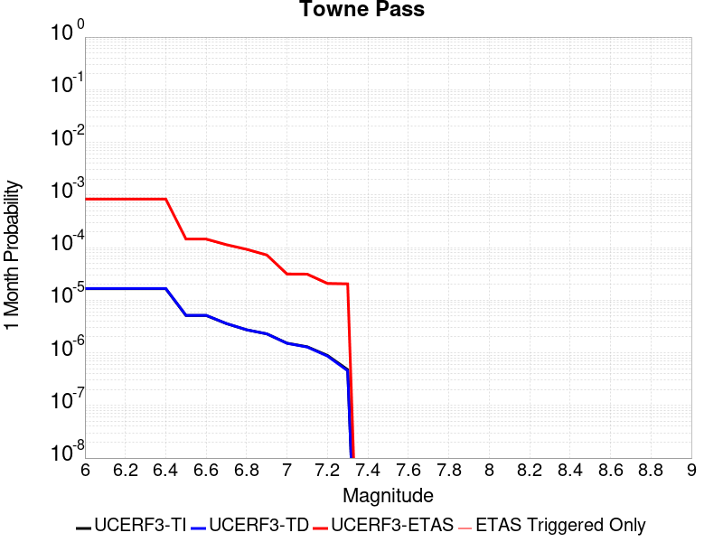 |  | 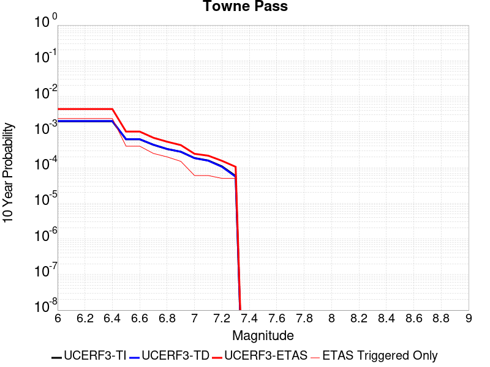 |

| Magnitude | 1 wk TI Prob | 1 wk TD Prob | 1 wk ETAS Prob | 1 wk ETAS/TD Gain | 1 wk ETAS Triggered Only | 1 mo TI Prob | 1 mo TD Prob | 1 mo ETAS Prob | 1 mo ETAS/TD Gain | 1 mo ETAS Triggered Only | 1 yr TI Prob | 1 yr TD Prob | 1 yr ETAS Prob | 1 yr ETAS/TD Gain | 1 yr ETAS Triggered Only | 10 yr TI Prob | 10 yr TD Prob | 10 yr ETAS Prob | 10 yr ETAS/TD Gain | 10 yr ETAS Triggered Only |
|-----|-----|-----|-----|-----|-----|-----|-----|-----|-----|-----|-----|-----|-----|-----|-----|-----|-----|-----|-----|-----|
| 6.0 | 3.849728E-6 | 3.8945414E-6 | 5.022849E-4 | 128.97151 | 4.9839227E-4 | 1.649873E-5 | 1.669081E-5 | 8.3661283E-4 | 50.12416 | 8.199357E-4 | 2.0085352E-4 | 2.0319603E-4 | 0.0017945125 | 8.831435 | 0.0015916398 | 0.0020067208 | 0.0020305314 | 0.0044211657 | 2.177344 | 0.0023954983 |
| 6.1 | 3.849728E-6 | 3.8945414E-6 | 5.022849E-4 | 128.97151 | 4.9839227E-4 | 1.649873E-5 | 1.669081E-5 | 8.3661283E-4 | 50.12416 | 8.199357E-4 | 2.0085352E-4 | 2.0319603E-4 | 0.0017945125 | 8.831435 | 0.0015916398 | 0.0020067208 | 0.0020305314 | 0.0044211657 | 2.177344 | 0.0023954983 |
| 6.2 | 3.849728E-6 | 3.8945414E-6 | 5.022849E-4 | 128.97151 | 4.9839227E-4 | 1.649873E-5 | 1.669081E-5 | 8.3661283E-4 | 50.12416 | 8.199357E-4 | 2.0085352E-4 | 2.0319603E-4 | 0.0017945125 | 8.831435 | 0.0015916398 | 0.0020067208 | 0.0020305314 | 0.0044211657 | 2.177344 | 0.0023954983 |
| 6.3 | 3.849728E-6 | 3.8945414E-6 | 5.022849E-4 | 128.97151 | 4.9839227E-4 | 1.649873E-5 | 1.669081E-5 | 8.3661283E-4 | 50.12416 | 8.199357E-4 | 2.0085352E-4 | 2.0319603E-4 | 0.0017945125 | 8.831435 | 0.0015916398 | 0.0020067208 | 0.0020305314 | 0.0044211657 | 2.177344 | 0.0023954983 |
| 6.4 | 3.849728E-6 | 3.8945414E-6 | 5.022849E-4 | 128.97151 | 4.9839227E-4 | 1.649873E-5 | 1.669081E-5 | 8.3661283E-4 | 50.12416 | 8.199357E-4 | 2.0085352E-4 | 2.0319603E-4 | 0.0017945125 | 8.831435 | 0.0015916398 | 0.0020067208 | 0.0020305314 | 0.0044211657 | 2.177344 | 0.0023954983 |
| 6.5 | 1.1953545E-6 | 1.203052E-6 | 4.9434504E-5 | 41.09091 | 4.823151E-5 | 5.1229376E-6 | 5.1559277E-6 | 6.946428E-5 | 13.472702 | 6.430868E-5 | 6.236998E-5 | 6.277173E-5 | 2.7176182E-4 | 4.3293667 | 2.0900322E-4 | 6.235248E-4 | 6.275517E-4 | 9.006921E-4 | 1.4352475 | 2.733119E-4 |
| 6.6 | 1.1953545E-6 | 1.203052E-6 | 4.9434504E-5 | 41.09091 | 4.823151E-5 | 5.1229376E-6 | 5.1559277E-6 | 6.946428E-5 | 13.472702 | 6.430868E-5 | 6.236998E-5 | 6.277173E-5 | 2.7176182E-4 | 4.3293667 | 2.0900322E-4 | 6.235248E-4 | 6.275517E-4 | 9.006921E-4 | 1.4352475 | 2.733119E-4 |
| 6.7 | 8.375951E-7 | 8.4106705E-7 | 3.299538E-5 | 39.23038 | 3.215434E-5 | 3.5896885E-6 | 3.6045683E-6 | 5.1835905E-5 | 14.380613 | 4.823151E-5 | 4.370358E-5 | 4.3884793E-5 | 2.2072591E-4 | 5.029667 | 1.7684887E-4 | 4.3694986E-4 | 4.38767E-4 | 6.155383E-4 | 1.4028819 | 1.7684887E-4 |
| 6.8 | 6.38041E-7 | 6.392156E-7 | 3.2793538E-5 | 51.302776 | 3.215434E-5 | 2.7344586E-6 | 2.7394929E-6 | 5.0970873E-5 | 18.605951 | 4.823151E-5 | 3.3291526E-5 | 3.3352855E-5 | 1.941192E-4 | 5.8201675 | 1.607717E-4 | 3.3286537E-4 | 3.334823E-4 | 4.942004E-4 | 1.4819388 | 1.607717E-4 |
| 6.9 | 5.3460053E-7 | 5.345333E-7 | 5.345333E-7 | 1.0 | 0.0 | 2.2911431E-6 | 2.2908553E-6 | 1.836799E-5 | 8.0179615 | 1.607717E-5 | 2.789431E-5 | 2.789084E-5 | 1.2435117E-4 | 4.458495 | 9.646302E-5 | 2.789081E-4 | 2.7887672E-4 | 3.7531284E-4 | 1.345802 | 9.646302E-5 |
| 7.0 | 3.557783E-7 | 3.5324226E-7 | 3.5324226E-7 | 1.0 | 0.0 | 1.5247632E-6 | 1.5138945E-6 | 1.5138945E-6 | 1.0 | 0.0 | 1.8563835E-5 | 1.843152E-5 | 5.0585266E-5 | 2.744498 | 3.215434E-5 | 1.8562283E-4 | 1.8430075E-4 | 2.1644916E-4 | 1.1744345 | 3.215434E-5 |
| 7.1 | 3.037942E-7 | 3.0002218E-7 | 3.0002218E-7 | 1.0 | 0.0 | 1.3019744E-6 | 1.2858087E-6 | 1.2858087E-6 | 1.0 | 0.0 | 1.5851423E-5 | 1.5654618E-5 | 4.7808455E-5 | 3.0539525 | 3.215434E-5 | 1.5850292E-4 | 1.5653588E-4 | 1.886852E-4 | 1.2053798 | 3.215434E-5 |
| 7.2 | 2.0808248E-7 | 2.0217689E-7 | 2.0217689E-7 | 1.0 | 0.0 | 8.917818E-7 | 8.6647213E-7 | 8.6647213E-7 | 1.0 | 0.0 | 1.0857389E-5 | 1.0549252E-5 | 4.2703254E-5 | 4.047989 | 3.215434E-5 | 1.0856859E-4 | 1.0548797E-4 | 1.3763893E-4 | 1.3047831 | 3.215434E-5 |
| 7.3 | 1.1162073E-7 | 1.0636894E-7 | 1.0636894E-7 | 1.0 | 0.0 | 4.7837443E-7 | 4.558668E-7 | 4.558668E-7 | 1.0 | 0.0 | 5.8241935E-6 | 5.550166E-6 | 3.770433E-5 | 6.7933693 | 3.215434E-5 | 5.8240406E-5 | 5.5500474E-5 | 8.765303E-5 | 1.5793204 | 3.215434E-5 |

## Bicycle Lake
*[(top)](#table-of-contents)*

| 1 Week | 1 Month | 1 Year | 10 Year |
|-----|-----|-----|-----|
|  | 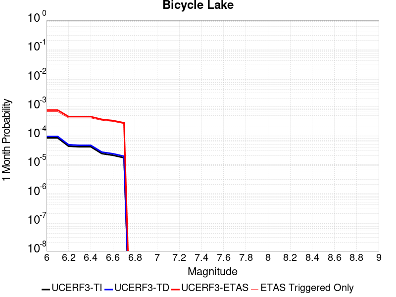 |  |  |

| Magnitude | 1 wk TI Prob | 1 wk TD Prob | 1 wk ETAS Prob | 1 wk ETAS/TD Gain | 1 wk ETAS Triggered Only | 1 mo TI Prob | 1 mo TD Prob | 1 mo ETAS Prob | 1 mo ETAS/TD Gain | 1 mo ETAS Triggered Only | 1 yr TI Prob | 1 yr TD Prob | 1 yr ETAS Prob | 1 yr ETAS/TD Gain | 1 yr ETAS Triggered Only | 10 yr TI Prob | 10 yr TD Prob | 10 yr ETAS Prob | 10 yr ETAS/TD Gain | 10 yr ETAS Triggered Only |
|-----|-----|-----|-----|-----|-----|-----|-----|-----|-----|-----|-----|-----|-----|-----|-----|-----|-----|-----|-----|-----|
| 6.0 | 1.9621975E-5 | 2.2097078E-5 | 4.4009427E-4 | 19.9164 | 4.1800644E-4 | 8.4091465E-5 | 9.4699084E-5 | 6.734224E-4 | 7.1111817 | 5.7877816E-4 | 0.0010233327 | 0.0011524865 | 0.00229265 | 1.9893075 | 0.0011414791 | 0.01018633 | 0.011478408 | 0.013687483 | 1.1924549 | 0.0022347267 |
| 6.1 | 1.9621975E-5 | 2.2097078E-5 | 4.4009427E-4 | 19.9164 | 4.1800644E-4 | 8.4091465E-5 | 9.4699084E-5 | 6.734224E-4 | 7.1111817 | 5.7877816E-4 | 0.0010233327 | 0.0011524865 | 0.00229265 | 1.9893075 | 0.0011414791 | 0.01018633 | 0.011478408 | 0.013687483 | 1.1924549 | 0.0022347267 |
| 6.2 | 9.9971285E-6 | 1.1255639E-5 | 3.0064146E-4 | 26.710295 | 2.8938908E-4 | 4.2844134E-5 | 4.8237856E-5 | 4.5014772E-4 | 9.331836 | 4.0192925E-4 | 5.2150246E-4 | 5.871896E-4 | 0.0013584407 | 2.3134615 | 7.717042E-4 | 0.0052028033 | 0.005861487 | 0.007236019 | 1.2345023 | 0.0013826366 |
| 6.3 | 9.589428E-6 | 1.0798346E-5 | 3.001843E-4 | 27.799099 | 2.8938908E-4 | 4.10969E-5 | 4.62781E-5 | 4.4818874E-4 | 9.684684 | 4.0192925E-4 | 5.002399E-4 | 5.6334207E-4 | 0.0013185433 | 2.3405733 | 7.55627E-4 | 0.0049911533 | 0.0056242296 | 0.0069671166 | 1.2387681 | 0.0013504823 |
| 6.4 | 9.589428E-6 | 1.0798346E-5 | 3.001843E-4 | 27.799099 | 2.8938908E-4 | 4.10969E-5 | 4.62781E-5 | 4.4818874E-4 | 9.684684 | 4.0192925E-4 | 5.002399E-4 | 5.6334207E-4 | 0.0013185433 | 2.3405733 | 7.55627E-4 | 0.0049911533 | 0.0056242296 | 0.0069671166 | 1.2387681 | 0.0013504823 |
| 6.5 | 5.557707E-6 | 6.2856016E-6 | 1.9921044E-4 | 31.693138 | 1.9292605E-4 | 2.3818526E-5 | 2.6938165E-5 | 3.1631943E-4 | 11.742427 | 2.8938908E-4 | 2.8995197E-4 | 3.2794967E-4 | 7.9403474E-4 | 2.421209 | 4.6623795E-4 | 0.0028957394 | 0.0032772934 | 0.0040785177 | 1.2444774 | 8.038585E-4 |
| 6.6 | 4.8742945E-6 | 5.5132896E-6 | 1.823612E-4 | 33.076656 | 1.7684887E-4 | 2.0889667E-5 | 2.3628318E-5 | 2.8085697E-4 | 11.8864565 | 2.5723473E-4 | 2.54302E-4 | 2.87663E-4 | 7.2162173E-4 | 2.5085664 | 4.340836E-4 | 0.002540112 | 0.0028754752 | 0.0036449605 | 1.2676028 | 7.717042E-4 |
| 6.7 | 3.991108E-6 | 4.5159104E-6 | 1.492098E-4 | 33.040913 | 1.4469454E-4 | 1.7104636E-5 | 1.9353902E-5 | 2.2835308E-4 | 11.798814 | 2.0900322E-4 | 2.0822904E-4 | 2.3563375E-4 | 5.8924814E-4 | 2.500695 | 3.5369775E-4 | 0.0020803404 | 0.0023563374 | 0.0029818697 | 1.265468 | 6.2700966E-4 |

## Paradise
*[(top)](#table-of-contents)*

| 1 Week | 1 Month | 1 Year | 10 Year |
|-----|-----|-----|-----|
| 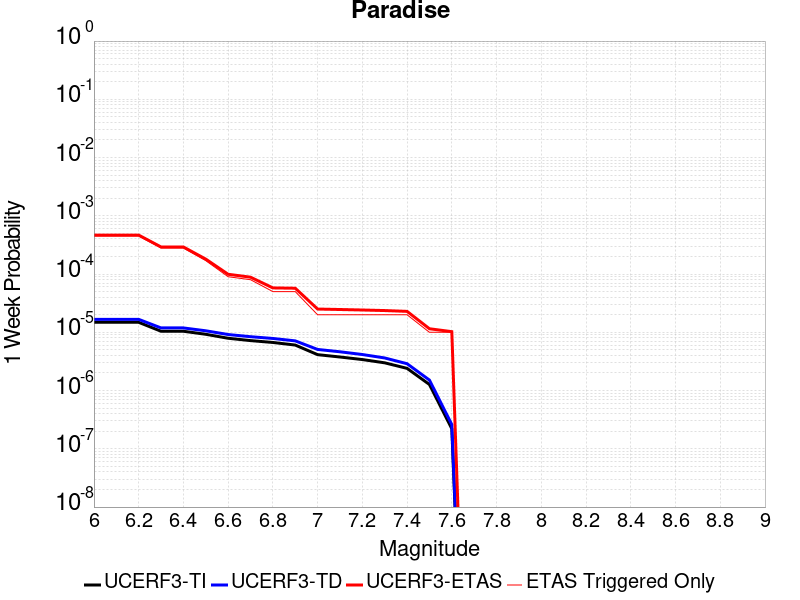 |  |  |  |

| Magnitude | 1 wk TI Prob | 1 wk TD Prob | 1 wk ETAS Prob | 1 wk ETAS/TD Gain | 1 wk ETAS Triggered Only | 1 mo TI Prob | 1 mo TD Prob | 1 mo ETAS Prob | 1 mo ETAS/TD Gain | 1 mo ETAS Triggered Only | 1 yr TI Prob | 1 yr TD Prob | 1 yr ETAS Prob | 1 yr ETAS/TD Gain | 1 yr ETAS Triggered Only | 10 yr TI Prob | 10 yr TD Prob | 10 yr ETAS Prob | 10 yr ETAS/TD Gain | 10 yr ETAS Triggered Only |
|-----|-----|-----|-----|-----|-----|-----|-----|-----|-----|-----|-----|-----|-----|-----|-----|-----|-----|-----|-----|-----|
| 6.0 | 1.4851273E-5 | 1.6694692E-5 | 5.1507866E-4 | 30.85284 | 4.9839227E-4 | 6.364676E-5 | 7.154685E-5 | 8.431958E-4 | 11.785227 | 7.717042E-4 | 7.7462377E-4 | 8.707584E-4 | 0.002252191 | 2.5864708 | 0.0013826366 | 0.0077192914 | 0.008675844 | 0.0109389955 | 1.2608566 | 0.0022829582 |
| 6.1 | 1.4851273E-5 | 1.6694692E-5 | 5.1507866E-4 | 30.85284 | 4.9839227E-4 | 6.364676E-5 | 7.154685E-5 | 8.431958E-4 | 11.785227 | 7.717042E-4 | 7.7462377E-4 | 8.707584E-4 | 0.002252191 | 2.5864708 | 0.0013826366 | 0.0077192914 | 0.008675844 | 0.0109389955 | 1.2608566 | 0.0022829582 |
| 6.2 | 1.4851273E-5 | 1.6694692E-5 | 5.1507866E-4 | 30.85284 | 4.9839227E-4 | 6.364676E-5 | 7.154685E-5 | 8.431958E-4 | 11.785227 | 7.717042E-4 | 7.7462377E-4 | 8.707584E-4 | 0.002252191 | 2.5864708 | 0.0013826366 | 0.0077192914 | 0.008675844 | 0.0109389955 | 1.2608566 | 0.0022829582 |
| 6.3 | 1.0426831E-5 | 1.188862E-5 | 3.334282E-4 | 28.045998 | 3.215434E-4 | 4.4685654E-5 | 5.0950268E-5 | 4.8501175E-4 | 9.519317 | 4.340836E-4 | 5.43912E-4 | 6.201489E-4 | 0.0012949713 | 2.088162 | 6.752412E-4 | 0.0054258266 | 0.0061847917 | 0.0073511666 | 1.1885875 | 0.0011736334 |
| 6.4 | 1.0426831E-5 | 1.188862E-5 | 3.334282E-4 | 28.045998 | 3.215434E-4 | 4.4685654E-5 | 5.0950268E-5 | 4.8501175E-4 | 9.519317 | 4.340836E-4 | 5.43912E-4 | 6.201489E-4 | 0.0012949713 | 2.088162 | 6.752412E-4 | 0.0054258266 | 0.0061847917 | 0.0073511666 | 1.1885875 | 0.0011736334 |
| 6.5 | 9.25027E-6 | 1.06199595E-5 | 1.8746695E-4 | 17.652323 | 1.7684887E-4 | 3.964341E-5 | 4.551335E-5 | 3.1881282E-4 | 7.00482 | 2.733119E-4 | 4.8255164E-4 | 5.53989E-4 | 9.5569564E-4 | 1.7251165 | 4.0192925E-4 | 0.0048150513 | 0.0055265795 | 0.006262042 | 1.1330774 | 7.395498E-4 |
| 6.6 | 7.904275E-6 | 9.159525E-6 | 1.05621664E-4 | 11.531347 | 9.646302E-5 | 3.3875025E-5 | 3.9254537E-5 | 2.0001993E-4 | 5.09546 | 1.607717E-4 | 4.1235037E-4 | 4.7782314E-4 | 7.3493493E-4 | 1.5380899 | 2.5723473E-4 | 0.0041158604 | 0.0047683544 | 0.0052163685 | 1.0939558 | 4.5016076E-4 |
| 6.7 | 7.2061953E-6 | 8.407248E-6 | 8.8792425E-5 | 10.561413 | 8.038585E-5 | 3.088333E-5 | 3.6030586E-5 | 1.8071992E-4 | 5.0157356 | 1.4469454E-4 | 3.7593965E-4 | 4.3858777E-4 | 6.6356943E-4 | 1.5129684 | 2.2508038E-4 | 0.003753043 | 0.004377591 | 0.0047777607 | 1.0914133 | 4.0192925E-4 |
| 6.8 | 6.6948724E-6 | 7.842166E-6 | 5.60733E-5 | 7.1502314 | 4.823151E-5 | 2.8691995E-5 | 3.360887E-5 | 1.4614528E-4 | 4.348414 | 1.1254019E-4 | 3.4926904E-4 | 4.0911473E-4 | 5.8589125E-4 | 1.4320953 | 1.7684887E-4 | 0.003487206 | 0.0040839734 | 0.004420215 | 1.082332 | 3.376206E-4 |
| 6.9 | 6.0421025E-6 | 7.130621E-6 | 5.5361787E-5 | 7.763951 | 4.823151E-5 | 2.5894467E-5 | 3.0559466E-5 | 1.1094286E-4 | 3.6303928 | 8.038585E-5 | 3.1521954E-4 | 3.7200135E-4 | 4.844997E-4 | 1.3024137 | 1.1254019E-4 | 0.0031477278 | 0.0037141247 | 0.0039223516 | 1.0560635 | 2.0900322E-4 |
| 7.0 | 4.134091E-6 | 5.0803087E-6 | 2.1157397E-5 | 4.164589 | 1.607717E-5 | 1.7717413E-5 | 2.177258E-5 | 5.3926222E-5 | 2.4767952 | 3.215434E-5 | 2.1568815E-4 | 2.6505045E-4 | 2.9719627E-4 | 1.1212819 | 3.215434E-5 | 0.0021547892 | 0.0026474963 | 0.0027116349 | 1.0242261 | 6.430868E-5 |
| 7.1 | 3.7674888E-6 | 4.6318696E-6 | 2.0708965E-5 | 4.4709735 | 1.607717E-5 | 1.6146281E-5 | 1.9850726E-5 | 5.200443E-5 | 2.6197746 | 3.215434E-5 | 1.9656324E-4 | 2.4165731E-4 | 2.738039E-4 | 1.1330254 | 3.215434E-5 | 0.0019638946 | 0.002414096 | 0.002462211 | 1.0199308 | 4.823151E-5 |
| 7.2 | 3.4065345E-6 | 4.156723E-6 | 2.0233827E-5 | 4.867735 | 1.607717E-5 | 1.4599351E-5 | 1.7814415E-5 | 4.996818E-5 | 2.8049297 | 3.215434E-5 | 1.777326E-4 | 2.1687041E-4 | 2.490178E-4 | 1.148233 | 3.215434E-5 | 0.0017759053 | 0.002166736 | 0.002214863 | 1.0222118 | 4.823151E-5 |
| 7.3 | 2.9934936E-6 | 3.6293168E-6 | 1.970643E-5 | 5.4297905 | 1.607717E-5 | 1.2829195E-5 | 1.555413E-5 | 4.770797E-5 | 3.067222 | 3.215434E-5 | 1.5618425E-4 | 1.8935655E-4 | 2.215048E-4 | 1.1697763 | 3.215434E-5 | 0.0015607453 | 0.0018920974 | 0.0019402377 | 1.0254428 | 4.823151E-5 |
| 7.4 | 2.4049796E-6 | 2.8889842E-6 | 1.8966108E-5 | 6.564975 | 1.607717E-5 | 1.0307015E-5 | 1.238131E-5 | 4.4535253E-5 | 3.5969741 | 3.215434E-5 | 1.2548068E-4 | 1.5073347E-4 | 1.8288296E-4 | 1.213287 | 3.215434E-5 | 0.0012540985 | 0.0015064536 | 0.0015546125 | 1.0319684 | 4.823151E-5 |
| 7.5 | 1.2710091E-6 | 1.5134682E-6 | 1.7590613E-5 | 11.622718 | 1.607717E-5 | 5.44717E-6 | 6.4862834E-6 | 2.2563348E-5 | 3.4786253 | 1.607717E-5 | 6.631728E-5 | 7.8968886E-5 | 9.504479E-5 | 1.2035726 | 1.607717E-5 | 6.6297496E-4 | 7.8953087E-4 | 8.216598E-4 | 1.0406938 | 3.215434E-5 |
| 7.6 | 2.21172E-7 | 2.603961E-7 | 1.6337563E-5 | 62.7412 | 1.607717E-5 | 9.478797E-7 | 1.1159829E-6 | 1.7193135E-5 | 15.406272 | 1.607717E-5 | 1.1540374E-5 | 1.3587036E-5 | 2.9663988E-5 | 2.1832569 | 1.607717E-5 | 1.1539775E-4 | 1.3586486E-4 | 1.5193985E-4 | 1.1183159 | 1.607717E-5 |

## Garlic Springs
*[(top)](#table-of-contents)*

| 1 Week | 1 Month | 1 Year | 10 Year |
|-----|-----|-----|-----|
|  |  |  |  |

| Magnitude | 1 wk TI Prob | 1 wk TD Prob | 1 wk ETAS Prob | 1 wk ETAS/TD Gain | 1 wk ETAS Triggered Only | 1 mo TI Prob | 1 mo TD Prob | 1 mo ETAS Prob | 1 mo ETAS/TD Gain | 1 mo ETAS Triggered Only | 1 yr TI Prob | 1 yr TD Prob | 1 yr ETAS Prob | 1 yr ETAS/TD Gain | 1 yr ETAS Triggered Only | 10 yr TI Prob | 10 yr TD Prob | 10 yr ETAS Prob | 10 yr ETAS/TD Gain | 10 yr ETAS Triggered Only |
|-----|-----|-----|-----|-----|-----|-----|-----|-----|-----|-----|-----|-----|-----|-----|-----|-----|-----|-----|-----|-----|
| 6.0 | 1.6760017E-5 | 1.8776833E-5 | 3.885448E-4 | 20.692778 | 3.697749E-4 | 7.182667E-5 | 8.0470316E-5 | 5.9489836E-4 | 7.392768 | 5.1446946E-4 | 8.7413884E-4 | 9.794032E-4 | 0.0021197642 | 2.1643429 | 0.0011414791 | 0.008707083 | 0.009762413 | 0.01168876 | 1.1973227 | 0.0019453376 |
| 6.1 | 9.852767E-6 | 1.09735865E-5 | 2.360515E-4 | 21.51088 | 2.2508038E-4 | 4.222546E-5 | 4.702921E-5 | 3.3640466E-4 | 7.1531005 | 2.8938908E-4 | 5.139737E-4 | 5.7250116E-4 | 0.0012634237 | 2.206849 | 6.913183E-4 | 0.005127866 | 0.005717221 | 0.00686816 | 1.2013108 | 0.0011575563 |
| 6.2 | 9.852767E-6 | 1.09735865E-5 | 2.360515E-4 | 21.51088 | 2.2508038E-4 | 4.222546E-5 | 4.702921E-5 | 3.3640466E-4 | 7.1531005 | 2.8938908E-4 | 5.139737E-4 | 5.7250116E-4 | 0.0012634237 | 2.206849 | 6.913183E-4 | 0.005127866 | 0.005717221 | 0.00686816 | 1.2013108 | 0.0011575563 |
| 6.3 | 4.3167724E-6 | 4.7780286E-6 | 6.90864E-5 | 14.459186 | 6.430868E-5 | 1.8500323E-5 | 2.0477235E-5 | 1.3301513E-4 | 6.495756 | 1.1254019E-4 | 2.2521814E-4 | 2.4930484E-4 | 5.225486E-4 | 2.0960226 | 2.733119E-4 | 0.0022499003 | 0.00249251 | 0.00298966 | 1.1994576 | 4.9839227E-4 |
| 6.4 | 4.3167724E-6 | 4.7780286E-6 | 6.90864E-5 | 14.459186 | 6.430868E-5 | 1.8500323E-5 | 2.0477235E-5 | 1.3301513E-4 | 6.495756 | 1.1254019E-4 | 2.2521814E-4 | 2.4930484E-4 | 5.225486E-4 | 2.0960226 | 2.733119E-4 | 0.0022499003 | 0.00249251 | 0.00298966 | 1.1994576 | 4.9839227E-4 |
| 6.5 | 4.3167724E-6 | 4.7780286E-6 | 6.90864E-5 | 14.459186 | 6.430868E-5 | 1.8500323E-5 | 2.0477235E-5 | 1.3301513E-4 | 6.495756 | 1.1254019E-4 | 2.2521814E-4 | 2.4930484E-4 | 5.225486E-4 | 2.0960226 | 2.733119E-4 | 0.0022499003 | 0.00249251 | 0.00298966 | 1.1994576 | 4.9839227E-4 |
| 6.6 | 4.301311E-6 | 4.760897E-6 | 6.9069276E-5 | 14.507617 | 6.430868E-5 | 1.8434059E-5 | 2.0403815E-5 | 1.3294171E-4 | 6.515532 | 1.1254019E-4 | 2.2441156E-4 | 2.4841115E-4 | 5.2165514E-4 | 2.0999668 | 2.733119E-4 | 0.0022418506 | 0.002483593 | 0.0029807475 | 1.2001755 | 4.9839227E-4 |
| 6.7 | 3.8599724E-6 | 4.27106E-6 | 6.8579466E-5 | 16.05678 | 6.430868E-5 | 1.6542634E-5 | 1.8304541E-5 | 1.3084267E-4 | 7.148099 | 1.1254019E-4 | 2.0138794E-4 | 2.228578E-4 | 4.4788801E-4 | 2.009748 | 2.2508038E-4 | 0.0020120554 | 0.002228578 | 0.0026616943 | 1.1943464 | 4.340836E-4 |

## San Andreas (San Bernardino N)
*[(top)](#table-of-contents)*

| 1 Week | 1 Month | 1 Year | 10 Year |
|-----|-----|-----|-----|
|  |  |  |  |

| Magnitude | 1 wk TI Prob | 1 wk TD Prob | 1 wk ETAS Prob | 1 wk ETAS/TD Gain | 1 wk ETAS Triggered Only | 1 mo TI Prob | 1 mo TD Prob | 1 mo ETAS Prob | 1 mo ETAS/TD Gain | 1 mo ETAS Triggered Only | 1 yr TI Prob | 1 yr TD Prob | 1 yr ETAS Prob | 1 yr ETAS/TD Gain | 1 yr ETAS Triggered Only | 10 yr TI Prob | 10 yr TD Prob | 10 yr ETAS Prob | 10 yr ETAS/TD Gain | 10 yr ETAS Triggered Only |
|-----|-----|-----|-----|-----|-----|-----|-----|-----|-----|-----|-----|-----|-----|-----|-----|-----|-----|-----|-----|-----|
| 6.0 | 1.4273766E-4 | 3.1606483E-4 | 7.6608337E-4 | 2.423817 | 4.5016076E-4 | 6.115894E-4 | 0.0013538664 | 0.0021887473 | 1.6166643 | 8.360129E-4 | 0.0074207084 | 0.016360244 | 0.017704446 | 1.0821627 | 0.0013665595 | 0.07177748 | 0.15026689 | 0.15183793 | 1.010455 | 0.0018488746 |
| 6.1 | 1.4273766E-4 | 3.1606483E-4 | 7.6608337E-4 | 2.423817 | 4.5016076E-4 | 6.115894E-4 | 0.0013538664 | 0.0021887473 | 1.6166643 | 8.360129E-4 | 0.0074207084 | 0.016360244 | 0.017704446 | 1.0821627 | 0.0013665595 | 0.07177748 | 0.15026689 | 0.15183793 | 1.010455 | 0.0018488746 |
| 6.2 | 1.4273766E-4 | 3.1606483E-4 | 7.6608337E-4 | 2.423817 | 4.5016076E-4 | 6.115894E-4 | 0.0013538664 | 0.0021887473 | 1.6166643 | 8.360129E-4 | 0.0074207084 | 0.016360244 | 0.017704446 | 1.0821627 | 0.0013665595 | 0.07177748 | 0.15026689 | 0.15183793 | 1.010455 | 0.0018488746 |
| 6.3 | 1.3730655E-4 | 3.0511338E-4 | 7.5513683E-4 | 2.4749384 | 4.5016076E-4 | 5.883239E-4 | 0.0013069791 | 0.0021418994 | 1.6388168 | 8.360129E-4 | 0.0071393442 | 0.015797773 | 0.017142743 | 1.0851368 | 0.0013665595 | 0.06914291 | 0.14556676 | 0.14713277 | 1.0107579 | 0.0018327974 |
| 6.4 | 1.3730655E-4 | 3.0511338E-4 | 7.5513683E-4 | 2.4749384 | 4.5016076E-4 | 5.883239E-4 | 0.0013069791 | 0.0021418994 | 1.6388168 | 8.360129E-4 | 0.0071393442 | 0.015797773 | 0.017142743 | 1.0851368 | 0.0013665595 | 0.06914291 | 0.14556676 | 0.14713277 | 1.0107579 | 0.0018327974 |
| 6.5 | 1.2942807E-4 | 2.8925808E-4 | 7.3928863E-4 | 2.5558097 | 4.5016076E-4 | 5.545738E-4 | 0.0012390936 | 0.0020740705 | 1.673861 | 8.360129E-4 | 0.0067310524 | 0.01498286 | 0.016328944 | 1.0898416 | 0.0013665595 | 0.06530788 | 0.13870941 | 0.140288 | 1.0113804 | 0.0018327974 |
| 6.6 | 1.1125901E-4 | 2.536472E-4 | 6.876207E-4 | 2.7109334 | 4.340836E-4 | 4.767372E-4 | 0.0010866089 | 0.0019056536 | 1.7537622 | 8.199357E-4 | 0.005788839 | 0.013149847 | 0.014482571 | 1.101349 | 0.0013504823 | 0.056403454 | 0.122999296 | 0.12459256 | 1.0129534 | 0.0018167202 |
| 6.7 | 1.02209575E-4 | 2.3499702E-4 | 6.689786E-4 | 2.8467536 | 4.340836E-4 | 4.3796748E-4 | 0.0010067427 | 0.0018258529 | 1.8136241 | 8.199357E-4 | 0.0053192247 | 0.012188629 | 0.013522651 | 1.1094481 | 0.0013504823 | 0.051936906 | 0.114790924 | 0.1163991 | 1.0140096 | 0.0018167202 |
| 6.8 | 9.610582E-5 | 2.2025521E-4 | 6.542432E-4 | 2.970387 | 4.340836E-4 | 4.1181705E-4 | 9.436101E-4 | 0.00174671 | 1.851093 | 8.038585E-4 | 0.0050023515 | 0.011428202 | 0.012747357 | 1.1154299 | 0.0013344052 | 0.048912346 | 0.1081929 | 0.10978439 | 1.0147097 | 0.0017845659 |
| 6.9 | 9.3877505E-5 | 2.1481077E-4 | 6.4880116E-4 | 3.0203378 | 4.340836E-4 | 4.0227012E-4 | 9.2029345E-4 | 0.0017234122 | 1.8726768 | 8.038585E-4 | 0.0048866454 | 0.011147255 | 0.0124667855 | 1.1183727 | 0.0013344052 | 0.04780577 | 0.10578323 | 0.10736464 | 1.0149496 | 0.0017684888 |
| 7.0 | 9.1019785E-5 | 2.0808022E-4 | 6.420735E-4 | 3.0857017 | 4.340836E-4 | 3.900265E-4 | 8.914682E-4 | 0.0016946101 | 1.9009204 | 8.038585E-4 | 0.0047382377 | 0.010799837 | 0.012119831 | 1.1222235 | 0.0013344052 | 0.046384744 | 0.102753714 | 0.104340486 | 1.0154425 | 0.0017684888 |
| 7.1 | 8.771155E-5 | 1.9982594E-4 | 6.177488E-4 | 3.0914347 | 4.1800644E-4 | 3.758525E-4 | 8.5611636E-4 | 0.0016271599 | 1.9006293 | 7.717042E-4 | 0.0045664064 | 0.0103736 | 0.011646431 | 1.1226991 | 0.0012861736 | 0.044737056 | 0.09906527 | 0.10060062 | 1.0154984 | 0.00170418 |
| 7.2 | 8.0830236E-5 | 1.8388197E-4 | 6.0181157E-4 | 3.2728143 | 4.1800644E-4 | 3.4636928E-4 | 7.8782777E-4 | 0.001526795 | 1.9379807 | 7.395498E-4 | 0.0042088944 | 0.009549725 | 0.010759921 | 1.1267258 | 0.001221865 | 0.041300658 | 0.09179615 | 0.093285486 | 1.0162244 | 0.0016398714 |
| 7.3 | 7.7668235E-5 | 1.7331762E-4 | 5.912516E-4 | 3.4113762 | 4.1800644E-4 | 3.328214E-4 | 7.425784E-4 | 0.0014815792 | 1.9951819 | 7.395498E-4 | 0.0040445733 | 0.009003494 | 0.010214358 | 1.1344882 | 0.001221865 | 0.03971748 | 0.08706327 | 0.088560365 | 1.0171956 | 0.0016398714 |
| 7.4 | 7.520177E-5 | 1.6551897E-4 | 5.8345625E-4 | 3.525011 | 4.1800644E-4 | 3.2225347E-4 | 7.0917426E-4 | 0.0014481996 | 2.0420928 | 7.395498E-4 | 0.0039163795 | 0.008600081 | 0.009811439 | 1.1408541 | 0.001221865 | 0.038480744 | 0.08351955 | 0.08500773 | 1.0178183 | 0.0016237942 |
| 7.5 | 7.274697E-5 | 1.5839566E-4 | 5.763359E-4 | 3.638584 | 4.1800644E-4 | 3.1173544E-4 | 6.78662E-4 | 0.0014177099 | 2.088978 | 7.395498E-4 | 0.003788775 | 0.008231463 | 0.00944327 | 1.1472166 | 0.001221865 | 0.03724827 | 0.08023631 | 0.081729814 | 1.0186138 | 0.0016237942 |
| 7.6 | 7.1185845E-5 | 1.540943E-4 | 5.720363E-4 | 3.7122483 | 4.1800644E-4 | 3.0504653E-4 | 6.6023704E-4 | 0.0013992987 | 2.119388 | 7.395498E-4 | 0.0037076178 | 0.008008812 | 0.009220891 | 1.1513432 | 0.001221865 | 0.036463667 | 0.07822598 | 0.07972275 | 1.0191339 | 0.0016237942 |
| 7.7 | 6.709961E-5 | 1.4318313E-4 | 5.611297E-4 | 3.918965 | 4.1800644E-4 | 2.8753807E-4 | 6.1349774E-4 | 0.0013525939 | 2.204725 | 7.395498E-4 | 0.003495157 | 0.0074437927 | 0.008656562 | 1.1629236 | 0.001221865 | 0.034406938 | 0.07305469 | 0.07455986 | 1.0206033 | 0.0016237942 |
| 7.8 | 6.300812E-5 | 1.3202413E-4 | 5.499754E-4 | 4.1657186 | 4.1800644E-4 | 2.7000686E-4 | 5.65695E-4 | 0.0013048265 | 2.30659 | 7.395498E-4 | 0.0032823787 | 0.006865616 | 0.008063125 | 1.1744213 | 0.0012057878 | 0.032343175 | 0.06771354 | 0.06921239 | 1.0221353 | 0.001607717 |
| 7.9 | 4.983037E-5 | 9.723488E-5 | 4.6697384E-4 | 4.802534 | 3.697749E-4 | 2.1354125E-4 | 4.1665437E-4 | 0.0010434028 | 2.5042405 | 6.2700966E-4 | 0.0025967648 | 0.0050609782 | 0.006036722 | 1.1927975 | 9.807074E-4 | 0.025666296 | 0.05064886 | 0.051900417 | 1.0247104 | 0.001318328 |
| 8.0 | 3.2211527E-5 | 5.3304586E-5 | 2.1406772E-4 | 4.0159345 | 1.607717E-4 | 1.380421E-4 | 2.2842824E-4 | 4.856042E-4 | 2.1258502 | 2.5723473E-4 | 0.0016793669 | 0.0027775685 | 0.0031463164 | 1.1327592 | 3.697749E-4 | 0.016667323 | 0.028361378 | 0.028876878 | 1.0181761 | 5.3054665E-4 |
| 8.1 | 1.743376E-5 | 1.8824427E-5 | 5.097816E-5 | 2.7080858 | 3.215434E-5 | 7.471398E-5 | 8.067362E-5 | 1.12825364E-4 | 1.398541 | 3.215434E-5 | 9.0926304E-4 | 9.817594E-4 | 0.0010299436 | 1.0490794 | 4.823151E-5 | 0.009055517 | 0.010484105 | 0.010547739 | 1.0060697 | 6.430868E-5 |
| 8.2 | 7.831616E-6 | 5.1551065E-6 | 5.1551065E-6 | 1.0 | 0.0 | 3.3563636E-5 | 2.2093127E-5 | 2.2093127E-5 | 1.0 | 0.0 | 4.0856065E-4 | 2.6895068E-4 | 2.6895068E-4 | 1.0 | 0.0 | 0.004078103 | 0.0030418145 | 0.0030418145 | 1.0 | 0.0 |
| 8.3 | 1.983087E-6 | 7.6599065E-7 | 7.6599065E-7 | 1.0 | 0.0 | 8.498917E-6 | 3.282813E-6 | 3.282813E-6 | 1.0 | 0.0 | 1.034694E-4 | 3.9967534E-5 | 3.9967534E-5 | 1.0 | 0.0 | 0.0010342124 | 4.719687E-4 | 4.719687E-4 | 1.0 | 0.0 |

## Helendale-So Lockhart
*[(top)](#table-of-contents)*

| 1 Week | 1 Month | 1 Year | 10 Year |
|-----|-----|-----|-----|
|  |  |  |  |

| Magnitude | 1 wk TI Prob | 1 wk TD Prob | 1 wk ETAS Prob | 1 wk ETAS/TD Gain | 1 wk ETAS Triggered Only | 1 mo TI Prob | 1 mo TD Prob | 1 mo ETAS Prob | 1 mo ETAS/TD Gain | 1 mo ETAS Triggered Only | 1 yr TI Prob | 1 yr TD Prob | 1 yr ETAS Prob | 1 yr ETAS/TD Gain | 1 yr ETAS Triggered Only | 10 yr TI Prob | 10 yr TD Prob | 10 yr ETAS Prob | 10 yr ETAS/TD Gain | 10 yr ETAS Triggered Only |
|-----|-----|-----|-----|-----|-----|-----|-----|-----|-----|-----|-----|-----|-----|-----|-----|-----|-----|-----|-----|-----|
| 6.0 | 1.7296055E-5 | 1.8103729E-5 | 4.2002572E-4 | 23.20106 | 4.0192925E-4 | 7.412385E-5 | 7.7585224E-5 | 6.0809066E-4 | 7.837713 | 5.3054665E-4 | 9.0208417E-4 | 9.4421144E-4 | 0.0019239929 | 2.0376716 | 9.807074E-4 | 0.008984311 | 0.009404116 | 0.010710047 | 1.138868 | 0.001318328 |
| 6.1 | 1.7296055E-5 | 1.8103729E-5 | 4.2002572E-4 | 23.20106 | 4.0192925E-4 | 7.412385E-5 | 7.7585224E-5 | 6.0809066E-4 | 7.837713 | 5.3054665E-4 | 9.0208417E-4 | 9.4421144E-4 | 0.0019239929 | 2.0376716 | 9.807074E-4 | 0.008984311 | 0.009404116 | 0.010710047 | 1.138868 | 0.001318328 |
| 6.2 | 1.7296055E-5 | 1.8103729E-5 | 4.2002572E-4 | 23.20106 | 4.0192925E-4 | 7.412385E-5 | 7.7585224E-5 | 6.0809066E-4 | 7.837713 | 5.3054665E-4 | 9.0208417E-4 | 9.4421144E-4 | 0.0019239929 | 2.0376716 | 9.807074E-4 | 0.008984311 | 0.009404116 | 0.010710047 | 1.138868 | 0.001318328 |
| 6.3 | 1.0669118E-5 | 1.1135425E-5 | 2.8444428E-4 | 25.54409 | 2.733119E-4 | 4.5723988E-5 | 4.772239E-5 | 3.8532686E-4 | 8.074341 | 3.376206E-4 | 5.5654737E-4 | 5.80868E-4 | 0.0012396491 | 2.1341321 | 6.59164E-4 | 0.0055515557 | 0.0057937936 | 0.006720867 | 1.1600114 | 9.324759E-4 |
| 6.4 | 1.0669118E-5 | 1.1135425E-5 | 2.8444428E-4 | 25.54409 | 2.733119E-4 | 4.5723988E-5 | 4.772239E-5 | 3.8532686E-4 | 8.074341 | 3.376206E-4 | 5.5654737E-4 | 5.80868E-4 | 0.0012396491 | 2.1341321 | 6.59164E-4 | 0.0055515557 | 0.0057937936 | 0.006720867 | 1.1600114 | 9.324759E-4 |
| 6.5 | 8.790038E-6 | 9.170197E-6 | 2.824796E-4 | 30.804092 | 2.733119E-4 | 3.767105E-5 | 3.930026E-5 | 3.6083104E-4 | 9.181391 | 3.215434E-4 | 4.585485E-4 | 4.7837716E-4 | 0.001040809 | 2.1757078 | 5.6270097E-4 | 0.0045760344 | 0.004773638 | 0.0056056604 | 1.1742952 | 8.360129E-4 |
| 6.6 | 7.396949E-6 | 7.715537E-6 | 2.3279419E-4 | 30.17213 | 2.2508038E-4 | 3.1700827E-5 | 3.3066175E-5 | 2.7421577E-4 | 8.292939 | 2.4115756E-4 | 3.858892E-4 | 4.025073E-4 | 8.846283E-4 | 2.1977944 | 4.823151E-4 | 0.003852198 | 0.00401789 | 0.0047544683 | 1.1833247 | 7.395498E-4 |
| 6.7 | 6.4600285E-6 | 6.738031E-6 | 2.1573984E-4 | 32.01823 | 2.0900322E-4 | 2.7685543E-5 | 2.887696E-5 | 2.5395086E-4 | 8.794237 | 2.2508038E-4 | 3.3701936E-4 | 3.5152107E-4 | 8.0152357E-4 | 2.280158 | 4.5016076E-4 | 0.0033650869 | 0.003509732 | 0.004214645 | 1.2008451 | 7.073955E-4 |
| 6.8 | 5.600104E-6 | 5.836009E-6 | 1.8268386E-4 | 31.302872 | 1.7684887E-4 | 2.4000226E-5 | 2.5011232E-5 | 2.1793245E-4 | 8.713383 | 1.9292605E-4 | 2.9216358E-4 | 3.044698E-4 | 6.902044E-4 | 2.266906 | 3.858521E-4 | 0.0029177975 | 0.003040588 | 0.003649663 | 1.2003149 | 6.109325E-4 |
| 6.9 | 4.839122E-6 | 5.0395092E-6 | 1.1757913E-4 | 23.331465 | 1.1254019E-4 | 2.0738931E-5 | 2.159772E-5 | 1.3413548E-4 | 6.2106314 | 1.1254019E-4 | 2.5246723E-4 | 2.6292098E-4 | 5.2008807E-4 | 1.9781156 | 2.5723473E-4 | 0.002521806 | 0.002626147 | 0.0030751254 | 1.1709647 | 4.5016076E-4 |
| 7.0 | 3.6937633E-6 | 3.845208E-6 | 1.0030786E-4 | 26.086458 | 9.646302E-5 | 1.5830317E-5 | 1.647936E-5 | 1.1294079E-4 | 6.8534694 | 9.646302E-5 | 1.9271708E-4 | 2.0061806E-4 | 3.7743145E-4 | 1.8813434 | 1.7684887E-4 | 0.0019255003 | 0.002004401 | 0.0023413447 | 1.168102 | 3.376206E-4 |
| 7.1 | 2.7858857E-6 | 2.8978538E-6 | 6.720635E-5 | 23.191767 | 6.430868E-5 | 1.1939455E-5 | 1.2419316E-5 | 7.67272E-5 | 6.178054 | 6.430868E-5 | 1.4535317E-4 | 1.511949E-4 | 2.6371807E-4 | 1.7442261 | 1.1254019E-4 | 0.0014525814 | 0.0015109418 | 0.0017196292 | 1.1381174 | 2.0900322E-4 |
| 7.2 | 2.1672065E-6 | 2.2540128E-6 | 3.440828E-5 | 15.265345 | 3.215434E-5 | 9.2879945E-6 | 9.66002E-6 | 4.181405E-5 | 4.3285675 | 3.215434E-5 | 1.1307546E-4 | 1.1760458E-4 | 1.8190569E-4 | 1.546757 | 6.430868E-5 | 0.0011301794 | 0.0011754417 | 0.0013039078 | 1.1092918 | 1.2861736E-4 |
| 7.3 | 1.4823496E-6 | 1.5422102E-6 | 1.7619355E-5 | 11.424744 | 1.607717E-5 | 6.3529114E-6 | 6.6094562E-6 | 2.2686521E-5 | 3.4324336 | 1.607717E-5 | 7.734395E-5 | 8.046731E-5 | 1.2869494E-4 | 1.5993444 | 4.823151E-5 | 7.731704E-4 | 8.0439687E-4 | 8.847181E-4 | 1.0998527 | 8.038585E-5 |
| 7.4 | 4.2321457E-7 | 4.4108765E-7 | 4.4108765E-7 | 1.0 | 0.0 | 1.8137755E-6 | 1.8903745E-6 | 1.8903745E-6 | 1.0 | 0.0 | 2.2082493E-5 | 2.3015113E-5 | 5.5168715E-5 | 2.3970647 | 3.215434E-5 | 2.2080299E-4 | 2.3013182E-4 | 2.6227877E-4 | 1.1396892 | 3.215434E-5 |
| 7.5 | 5.6942316E-8 | 5.9415648E-8 | 5.9415648E-8 | 1.0 | 0.0 | 2.440385E-7 | 2.5463845E-7 | 2.5463845E-7 | 1.0 | 0.0 | 2.9711643E-6 | 3.1002196E-6 | 3.1002196E-6 | 1.0 | 0.0 | 2.9711247E-5 | 3.1001844E-5 | 3.1001844E-5 | 1.0 | 0.0 |

## Coyote Lake
*[(top)](#table-of-contents)*

| 1 Week | 1 Month | 1 Year | 10 Year |
|-----|-----|-----|-----|
|  |  |  |  |

| Magnitude | 1 wk TI Prob | 1 wk TD Prob | 1 wk ETAS Prob | 1 wk ETAS/TD Gain | 1 wk ETAS Triggered Only | 1 mo TI Prob | 1 mo TD Prob | 1 mo ETAS Prob | 1 mo ETAS/TD Gain | 1 mo ETAS Triggered Only | 1 yr TI Prob | 1 yr TD Prob | 1 yr ETAS Prob | 1 yr ETAS/TD Gain | 1 yr ETAS Triggered Only | 10 yr TI Prob | 10 yr TD Prob | 10 yr ETAS Prob | 10 yr ETAS/TD Gain | 10 yr ETAS Triggered Only |
|-----|-----|-----|-----|-----|-----|-----|-----|-----|-----|-----|-----|-----|-----|-----|-----|-----|-----|-----|-----|-----|
| 6.0 | 1.980352E-5 | 2.1706745E-5 | 2.4678223E-4 | 11.36892 | 2.2508038E-4 | 8.486947E-5 | 9.302599E-5 | 3.8238816E-4 | 4.1105514 | 2.8938908E-4 | 0.0010327959 | 0.0011320751 | 0.001742316 | 1.5390463 | 6.109325E-4 | 0.010280091 | 0.011270258 | 0.012382977 | 1.0987306 | 0.0011254019 |
| 6.1 | 1.980352E-5 | 2.1706745E-5 | 2.4678223E-4 | 11.36892 | 2.2508038E-4 | 8.486947E-5 | 9.302599E-5 | 3.8238816E-4 | 4.1105514 | 2.8938908E-4 | 0.0010327959 | 0.0011320751 | 0.001742316 | 1.5390463 | 6.109325E-4 | 0.010280091 | 0.011270258 | 0.012382977 | 1.0987306 | 0.0011254019 |
| 6.2 | 1.980352E-5 | 2.1706745E-5 | 2.4678223E-4 | 11.36892 | 2.2508038E-4 | 8.486947E-5 | 9.302599E-5 | 3.8238816E-4 | 4.1105514 | 2.8938908E-4 | 0.0010327959 | 0.0011320751 | 0.001742316 | 1.5390463 | 6.109325E-4 | 0.010280091 | 0.011270258 | 0.012382977 | 1.0987306 | 0.0011254019 |
| 6.3 | 1.5344787E-5 | 1.682067E-5 | 1.9366656E-4 | 11.513607 | 1.7684887E-4 | 6.576172E-5 | 7.2086936E-5 | 2.971511E-4 | 4.1221213 | 2.2508038E-4 | 8.003548E-4 | 8.773662E-4 | 0.0013592582 | 1.5492483 | 4.823151E-4 | 0.007974784 | 0.00874507 | 0.0096693905 | 1.1056963 | 9.324759E-4 |
| 6.4 | 1.5344787E-5 | 1.682067E-5 | 1.9366656E-4 | 11.513607 | 1.7684887E-4 | 6.576172E-5 | 7.2086936E-5 | 2.971511E-4 | 4.1221213 | 2.2508038E-4 | 8.003548E-4 | 8.773662E-4 | 0.0013592582 | 1.5492483 | 4.823151E-4 | 0.007974784 | 0.00874507 | 0.0096693905 | 1.1056963 | 9.324759E-4 |
| 6.5 | 1.4189697E-5 | 1.5557987E-5 | 1.9240411E-4 | 12.366902 | 1.7684887E-4 | 6.081157E-5 | 6.6675726E-5 | 2.917411E-4 | 4.375522 | 2.2508038E-4 | 7.401293E-4 | 8.115349E-4 | 0.0012934586 | 1.5938423 | 4.823151E-4 | 0.0073766913 | 0.008091656 | 0.008984692 | 1.1103652 | 9.003215E-4 |
| 6.6 | 1.3469301E-5 | 1.4771577E-5 | 1.9161784E-4 | 12.972063 | 1.7684887E-4 | 5.7724297E-5 | 6.330556E-5 | 2.883717E-4 | 4.555235 | 2.2508038E-4 | 7.025667E-4 | 7.7053264E-4 | 0.0012203465 | 1.58377 | 4.5016076E-4 | 0.0070034964 | 0.0076845144 | 0.00854601 | 1.112108 | 8.681672E-4 |
| 6.7 | 1.3027966E-5 | 1.4281745E-5 | 1.911281E-4 | 13.382685 | 1.7684887E-4 | 5.5832945E-5 | 6.120638E-5 | 2.86273E-4 | 4.6771755 | 2.2508038E-4 | 6.7955407E-4 | 7.4499263E-4 | 0.0011626877 | 1.56067 | 4.1800644E-4 | 0.006774798 | 0.0074308286 | 0.008244672 | 1.1095225 | 8.199357E-4 |
| 6.8 | 5.695434E-6 | 6.2244176E-6 | 8.660977E-5 | 13.914517 | 8.038585E-5 | 2.4408775E-5 | 2.6675973E-5 | 1.0705968E-4 | 4.0133376 | 8.038585E-5 | 2.971363E-4 | 3.2476155E-4 | 4.694091E-4 | 1.4453962 | 1.4469454E-4 | 0.0029673933 | 0.0032458105 | 0.0035182352 | 1.0839312 | 2.733119E-4 |
| 6.9 | 4.385688E-6 | 4.7930553E-6 | 6.910143E-5 | 14.416989 | 6.430868E-5 | 1.879567E-5 | 2.0541665E-5 | 8.484902E-5 | 4.1305814 | 6.430868E-5 | 2.2881327E-4 | 2.5009477E-4 | 3.465337E-4 | 1.3856094 | 9.646302E-5 | 0.002285778 | 0.0025009478 | 0.0026613174 | 1.0641235 | 1.607717E-4 |

## San Andreas (San Bernardino S)
*[(top)](#table-of-contents)*

| 1 Week | 1 Month | 1 Year | 10 Year |
|-----|-----|-----|-----|
|  |  | 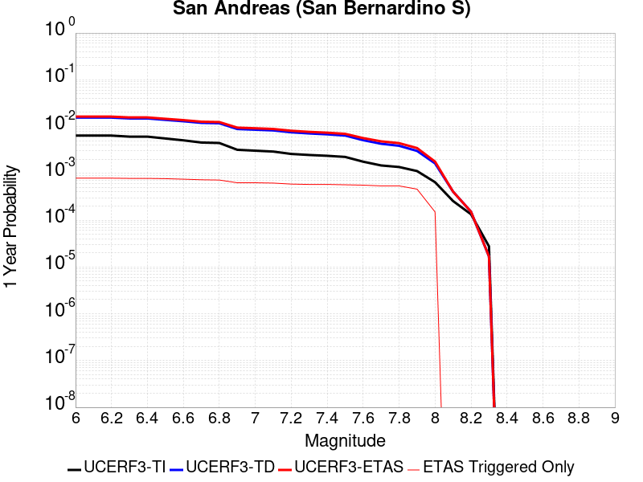 |  |

| Magnitude | 1 wk TI Prob | 1 wk TD Prob | 1 wk ETAS Prob | 1 wk ETAS/TD Gain | 1 wk ETAS Triggered Only | 1 mo TI Prob | 1 mo TD Prob | 1 mo ETAS Prob | 1 mo ETAS/TD Gain | 1 mo ETAS Triggered Only | 1 yr TI Prob | 1 yr TD Prob | 1 yr ETAS Prob | 1 yr ETAS/TD Gain | 1 yr ETAS Triggered Only | 10 yr TI Prob | 10 yr TD Prob | 10 yr ETAS Prob | 10 yr ETAS/TD Gain | 10 yr ETAS Triggered Only |
|-----|-----|-----|-----|-----|-----|-----|-----|-----|-----|-----|-----|-----|-----|-----|-----|-----|-----|-----|-----|-----|
| 6.0 | 1.2336002E-4 | 3.0004102E-4 | 4.9290917E-4 | 1.6428059 | 1.9292605E-4 | 5.2857865E-4 | 0.0012852824 | 0.0017027516 | 1.3248073 | 4.1800644E-4 | 0.006416472 | 0.015540994 | 0.01633236 | 1.0509212 | 8.038585E-4 | 0.06234337 | 0.14283717 | 0.1437467 | 1.0063676 | 0.0010610933 |
| 6.1 | 1.2336002E-4 | 3.0004102E-4 | 4.9290917E-4 | 1.6428059 | 1.9292605E-4 | 5.2857865E-4 | 0.0012852824 | 0.0017027516 | 1.3248073 | 4.1800644E-4 | 0.006416472 | 0.015540994 | 0.01633236 | 1.0509212 | 8.038585E-4 | 0.06234337 | 0.14283717 | 0.1437467 | 1.0063676 | 0.0010610933 |
| 6.2 | 1.2336002E-4 | 3.0004102E-4 | 4.9290917E-4 | 1.6428059 | 1.9292605E-4 | 5.2857865E-4 | 0.0012852824 | 0.0017027516 | 1.3248073 | 4.1800644E-4 | 0.006416472 | 0.015540994 | 0.01633236 | 1.0509212 | 8.038585E-4 | 0.06234337 | 0.14283717 | 0.1437467 | 1.0063676 | 0.0010610933 |
| 6.3 | 1.1712257E-4 | 2.8792414E-4 | 4.8079464E-4 | 1.6698657 | 1.9292605E-4 | 5.018573E-4 | 0.0012334028 | 0.0016508936 | 1.338487 | 4.1800644E-4 | 0.006093008 | 0.014918125 | 0.015694154 | 1.0520192 | 7.877814E-4 | 0.059286322 | 0.13754563 | 0.13844691 | 1.0065526 | 0.0010450161 |
| 6.4 | 1.1712257E-4 | 2.8792414E-4 | 4.8079464E-4 | 1.6698657 | 1.9292605E-4 | 5.018573E-4 | 0.0012334028 | 0.0016508936 | 1.338487 | 4.1800644E-4 | 0.006093008 | 0.014918125 | 0.015694154 | 1.0520192 | 7.877814E-4 | 0.059286322 | 0.13754563 | 0.13844691 | 1.0065526 | 0.0010450161 |
| 6.5 | 1.0689076E-4 | 2.680528E-4 | 4.609271E-4 | 1.7195386 | 1.9292605E-4 | 4.5802278E-4 | 0.0011483167 | 0.0015658431 | 1.3635987 | 4.1800644E-4 | 0.0055621783 | 0.01389575 | 0.014672585 | 1.0559045 | 7.877814E-4 | 0.05425003 | 0.12879294 | 0.12970337 | 1.0070689 | 0.0010450161 |
| 6.6 | 9.7648895E-5 | 2.50501E-4 | 4.4337873E-4 | 1.7699678 | 1.9292605E-4 | 4.1842813E-4 | 0.0010731576 | 0.0014907155 | 1.3890927 | 4.1800644E-4 | 0.005082469 | 0.012991785 | 0.0137534635 | 1.0586277 | 7.717042E-4 | 0.049677886 | 0.12095292 | 0.121857405 | 1.007478 | 0.0010289389 |
| 6.7 | 8.757013E-5 | 2.3120902E-4 | 4.0801702E-4 | 1.7647105 | 1.7684887E-4 | 3.7524657E-4 | 9.905418E-4 | 0.0013920729 | 1.4053651 | 4.0192925E-4 | 0.00455906 | 0.011997245 | 0.012727923 | 1.0609038 | 7.395498E-4 | 0.04466656 | 0.11226123 | 0.11313184 | 1.0077553 | 9.807074E-4 |
| 6.8 | 8.562978E-5 | 2.2680782E-4 | 4.0361658E-4 | 1.7795532 | 1.7684887E-4 | 3.6693315E-4 | 9.7169366E-4 | 0.0013732323 | 1.4132359 | 4.0192925E-4 | 0.004458263 | 0.011770263 | 0.012485221 | 1.0607426 | 7.234727E-4 | 0.043698758 | 0.11027153 | 0.11112979 | 1.0077832 | 9.646302E-4 |
| 6.9 | 6.124075E-5 | 1.7065753E-4 | 3.314018E-4 | 1.9419113 | 1.607717E-4 | 2.6243398E-4 | 7.311852E-4 | 0.0011006898 | 1.5053501 | 3.697749E-4 | 0.0031904527 | 0.008866051 | 0.009503436 | 1.0718906 | 6.430868E-4 | 0.031450346 | 0.08418263 | 0.08499244 | 1.0096196 | 8.842444E-4 |
| 7.0 | 5.8598747E-5 | 1.649477E-4 | 3.256929E-4 | 1.9745221 | 1.607717E-4 | 2.5111332E-4 | 7.06728E-4 | 0.0010762416 | 1.5228512 | 3.697749E-4 | 0.0030530186 | 0.008570663 | 0.009208238 | 1.0743904 | 6.430868E-4 | 0.03011414 | 0.081500374 | 0.08231255 | 1.0099653 | 8.842444E-4 |
| 7.1 | 5.613814E-5 | 1.5913323E-4 | 3.1987936E-4 | 2.0101354 | 1.607717E-4 | 2.4056983E-4 | 6.818221E-4 | 0.0010513449 | 1.5419637 | 3.697749E-4 | 0.0029250039 | 0.008269769 | 0.008891593 | 1.0751925 | 6.2700966E-4 | 0.028868021 | 0.07879931 | 0.07959907 | 1.0101492 | 8.681672E-4 |
| 7.2 | 4.991222E-5 | 1.4519796E-4 | 3.059463E-4 | 2.1070979 | 1.607717E-4 | 2.1389198E-4 | 6.2212895E-4 | 9.916738E-4 | 1.5940005 | 3.697749E-4 | 0.002601025 | 0.007548217 | 0.008122627 | 1.0760987 | 5.7877816E-4 | 0.025707912 | 0.07225321 | 0.0730139 | 1.0105282 | 8.199357E-4 |
| 7.3 | 4.7410045E-5 | 1.3714004E-4 | 2.978897E-4 | 2.172157 | 1.607717E-4 | 2.0317009E-4 | 5.8761094E-4 | 9.571686E-4 | 1.6289155 | 3.697749E-4 | 0.0024707897 | 0.0071307817 | 0.0077054324 | 1.0805874 | 5.7877816E-4 | 0.024434982 | 0.06853558 | 0.06929932 | 1.0111437 | 8.199357E-4 |
| 7.4 | 4.5556746E-5 | 1.3121912E-4 | 2.919697E-4 | 2.2250547 | 1.607717E-4 | 1.952286E-4 | 5.622468E-4 | 9.318138E-4 | 1.6573039 | 3.697749E-4 | 0.002374317 | 0.0068239477 | 0.0073987762 | 1.084237 | 5.7877816E-4 | 0.023491086 | 0.065788016 | 0.06653899 | 1.011415 | 8.038585E-4 |
| 7.5 | 4.3084514E-5 | 1.2357246E-4 | 2.843243E-4 | 2.300871 | 1.607717E-4 | 1.8463485E-4 | 5.2948913E-4 | 8.9906825E-4 | 1.697992 | 3.697749E-4 | 0.0022456115 | 0.0064275465 | 0.0070026047 | 1.0894678 | 5.7877816E-4 | 0.022230545 | 0.062188786 | 0.062942654 | 1.0121223 | 8.038585E-4 |
| 7.6 | 3.408608E-5 | 9.83552E-5 | 2.5911108E-4 | 2.6344423 | 1.607717E-4 | 1.4607502E-4 | 4.214543E-4 | 7.9107337E-4 | 1.8770087 | 3.697749E-4 | 0.0017770125 | 0.0051191594 | 0.005694974 | 1.1124824 | 5.7877816E-4 | 0.017628696 | 0.050020292 | 0.050783943 | 1.0152668 | 8.038585E-4 |
| 7.7 | 2.8315713E-5 | 8.248679E-5 | 2.4324523E-4 | 2.9488993 | 1.607717E-4 | 1.2134742E-4 | 3.5346695E-4 | 7.2311115E-4 | 2.0457673 | 3.697749E-4 | 0.0014764034 | 0.0042949775 | 0.0048712697 | 1.1341782 | 5.7877816E-4 | 0.01466633 | 0.0422714 | 0.04304128 | 1.0182128 | 8.038585E-4 |
| 7.8 | 2.6222975E-5 | 7.463088E-5 | 2.3539059E-4 | 3.1540642 | 1.607717E-4 | 1.1237934E-4 | 3.1980744E-4 | 6.894641E-4 | 2.1558726 | 3.697749E-4 | 0.0013673597 | 0.0038867102 | 0.0044632386 | 1.1483333 | 5.7877816E-4 | 0.013589768 | 0.03843674 | 0.0392097 | 1.0201099 | 8.038585E-4 |
| 7.9 | 2.1469694E-5 | 5.787864E-5 | 2.1864104E-4 | 3.7775774 | 1.607717E-4 | 9.200973E-5 | 2.4802773E-4 | 6.0163776E-4 | 2.4256873 | 3.5369775E-4 | 0.0011196428 | 0.0030155594 | 0.0035124486 | 1.1647751 | 4.9839227E-4 | 0.011140184 | 0.030152109 | 0.030853767 | 1.0232706 | 7.234727E-4 |
| 8.0 | 1.2420249E-5 | 3.131896E-5 | 1.2777896E-4 | 4.0799236 | 9.646302E-5 | 5.322855E-5 | 1.342172E-4 | 2.9496732E-4 | 2.1976864 | 1.607717E-4 | 6.478649E-4 | 0.0016328706 | 0.0018575835 | 1.1376183 | 2.2508038E-4 | 0.0064597935 | 0.016522504 | 0.016838735 | 1.0191394 | 3.215434E-4 |
| 8.1 | 4.9197724E-6 | 7.822348E-6 | 7.822348E-6 | 1.0 | 0.0 | 2.1084568E-5 | 3.352392E-5 | 3.352392E-5 | 1.0 | 0.0 | 2.566744E-4 | 4.0807744E-4 | 4.0807744E-4 | 1.0 | 0.0 | 0.002563781 | 0.0043843705 | 0.0043843705 | 1.0 | 0.0 |
| 8.2 | 2.5634774E-6 | 2.9067196E-6 | 2.9067196E-6 | 1.0 | 0.0 | 1.0986286E-5 | 1.2457311E-5 | 1.2457311E-5 | 1.0 | 0.0 | 1.3374983E-4 | 1.5165724E-4 | 1.5165724E-4 | 1.0 | 0.0 | 0.0013366934 | 0.0017049741 | 0.0017049741 | 1.0 | 0.0 |
| 8.3 | 5.2850464E-7 | 3.2088764E-7 | 3.2088764E-7 | 1.0 | 0.0 | 2.2650179E-6 | 1.375232E-6 | 1.375232E-6 | 1.0 | 0.0 | 2.7576245E-5 | 1.6743334E-5 | 1.6743334E-5 | 1.0 | 0.0 | 2.7572823E-4 | 1.9870348E-4 | 1.9870348E-4 | 1.0 | 0.0 |

## Death Valley (Black Mtns Frontal)
*[(top)](#table-of-contents)*

| 1 Week | 1 Month | 1 Year | 10 Year |
|-----|-----|-----|-----|
|  |  |  |  |

| Magnitude | 1 wk TI Prob | 1 wk TD Prob | 1 wk ETAS Prob | 1 wk ETAS/TD Gain | 1 wk ETAS Triggered Only | 1 mo TI Prob | 1 mo TD Prob | 1 mo ETAS Prob | 1 mo ETAS/TD Gain | 1 mo ETAS Triggered Only | 1 yr TI Prob | 1 yr TD Prob | 1 yr ETAS Prob | 1 yr ETAS/TD Gain | 1 yr ETAS Triggered Only | 10 yr TI Prob | 10 yr TD Prob | 10 yr ETAS Prob | 10 yr ETAS/TD Gain | 10 yr ETAS Triggered Only |
|-----|-----|-----|-----|-----|-----|-----|-----|-----|-----|-----|-----|-----|-----|-----|-----|-----|-----|-----|-----|-----|
| 6.0 | 1.6707214E-5 | 1.867027E-5 | 2.2766959E-4 | 12.194232 | 2.0900322E-4 | 7.160038E-5 | 8.001302E-5 | 4.015307E-4 | 5.0183167 | 3.215434E-4 | 8.71386E-4 | 9.737309E-4 | 0.0016483145 | 1.6927825 | 6.752412E-4 | 0.00867977 | 0.009695496 | 0.010730381 | 1.1067387 | 0.0010450161 |
| 6.1 | 1.6707214E-5 | 1.867027E-5 | 2.2766959E-4 | 12.194232 | 2.0900322E-4 | 7.160038E-5 | 8.001302E-5 | 4.015307E-4 | 5.0183167 | 3.215434E-4 | 8.71386E-4 | 9.737309E-4 | 0.0016483145 | 1.6927825 | 6.752412E-4 | 0.00867977 | 0.009695496 | 0.010730381 | 1.1067387 | 0.0010450161 |
| 6.2 | 1.6707214E-5 | 1.867027E-5 | 2.2766959E-4 | 12.194232 | 2.0900322E-4 | 7.160038E-5 | 8.001302E-5 | 4.015307E-4 | 5.0183167 | 3.215434E-4 | 8.71386E-4 | 9.737309E-4 | 0.0016483145 | 1.6927825 | 6.752412E-4 | 0.00867977 | 0.009695496 | 0.010730381 | 1.1067387 | 0.0010450161 |
| 6.3 | 1.6707214E-5 | 1.867027E-5 | 2.2766959E-4 | 12.194232 | 2.0900322E-4 | 7.160038E-5 | 8.001302E-5 | 4.015307E-4 | 5.0183167 | 3.215434E-4 | 8.71386E-4 | 9.737309E-4 | 0.0016483145 | 1.6927825 | 6.752412E-4 | 0.00867977 | 0.009695496 | 0.010730381 | 1.1067387 | 0.0010450161 |
| 6.4 | 1.5515609E-5 | 1.7338214E-5 | 1.9418402E-4 | 11.199771 | 1.7684887E-4 | 6.649377E-5 | 7.4304546E-5 | 3.4759613E-4 | 4.677993 | 2.733119E-4 | 8.0926094E-4 | 9.042885E-4 | 0.0014986058 | 1.657221 | 5.948553E-4 | 0.008063202 | 0.009006773 | 0.009883053 | 1.0972912 | 8.842444E-4 |
| 6.5 | 1.5515609E-5 | 1.7338214E-5 | 1.9418402E-4 | 11.199771 | 1.7684887E-4 | 6.649377E-5 | 7.4304546E-5 | 3.4759613E-4 | 4.677993 | 2.733119E-4 | 8.0926094E-4 | 9.042885E-4 | 0.0014986058 | 1.657221 | 5.948553E-4 | 0.008063202 | 0.009006773 | 0.009883053 | 1.0972912 | 8.842444E-4 |
| 6.6 | 1.5041828E-5 | 1.6809145E-5 | 1.7757814E-4 | 10.564378 | 1.607717E-4 | 6.4463384E-5 | 7.203723E-5 | 3.2925344E-4 | 4.5706005 | 2.5723473E-4 | 7.8455906E-4 | 8.767063E-4 | 0.001438914 | 1.6412724 | 5.6270097E-4 | 0.00781795 | 0.008733132 | 0.009577781 | 1.0967177 | 8.5209E-4 |
| 6.7 | 1.4634985E-5 | 1.6356016E-5 | 1.771251E-4 | 10.829354 | 1.607717E-4 | 6.271985E-5 | 7.009536E-5 | 3.2731207E-4 | 4.669525 | 2.5723473E-4 | 7.6334673E-4 | 8.5308263E-4 | 0.0013831767 | 1.6213865 | 5.3054665E-4 | 0.007607299 | 0.008498715 | 0.0092798015 | 1.0919064 | 7.877814E-4 |
| 6.8 | 1.4209158E-5 | 1.5882048E-5 | 1.4449738E-4 | 9.098157 | 1.2861736E-4 | 6.089497E-5 | 6.8064175E-5 | 2.9312924E-4 | 4.3066597 | 2.2508038E-4 | 7.4114406E-4 | 8.2837185E-4 | 0.0013102874 | 1.5817623 | 4.823151E-4 | 0.007386771 | 0.008253456 | 0.008970958 | 1.0869335 | 7.234727E-4 |
| 6.9 | 1.3780098E-5 | 1.5404594E-5 | 1.2794306E-4 | 8.305513 | 1.1254019E-4 | 5.9056227E-5 | 6.6018045E-5 | 2.7500745E-4 | 4.165641 | 2.0900322E-4 | 7.1877235E-4 | 8.0347876E-4 | 0.0012211493 | 1.5198277 | 4.1800644E-4 | 0.0071645193 | 0.008006332 | 0.008644271 | 1.0796791 | 6.430868E-4 |
| 7.0 | 1.3585064E-5 | 1.5188155E-5 | 1.2772664E-4 | 8.409621 | 1.1254019E-4 | 5.8220405E-5 | 6.50905E-5 | 2.58004E-4 | 3.9637733 | 1.9292605E-4 | 7.086029E-4 | 7.9219416E-4 | 0.001193805 | 1.5069602 | 4.0192925E-4 | 0.007063476 | 0.007894293 | 0.008500404 | 1.0767782 | 6.109325E-4 |
| 7.1 | 1.3398601E-5 | 1.49813395E-5 | 9.5365984E-5 | 6.3656516 | 8.038585E-5 | 5.742131E-5 | 6.420419E-5 | 2.2496557E-4 | 3.503908 | 1.607717E-4 | 6.9888023E-4 | 7.8141113E-4 | 0.0011508971 | 1.4728445 | 3.697749E-4 | 0.0069668638 | 0.007787224 | 0.008329591 | 1.0696483 | 5.466238E-4 |
| 7.2 | 1.3126312E-5 | 1.4679561E-5 | 7.89873E-5 | 5.3807673 | 6.430868E-5 | 5.6254412E-5 | 6.291092E-5 | 2.0759634E-4 | 3.2998462 | 1.4469454E-4 | 6.846822E-4 | 7.6567667E-4 | 0.0011191036 | 1.4615877 | 3.5369775E-4 | 0.006825765 | 0.00763097 | 0.008125559 | 1.0648134 | 4.9839227E-4 |
| 7.3 | 1.2922429E-5 | 1.4453788E-5 | 7.876154E-5 | 5.4491973 | 6.430868E-5 | 5.5380664E-5 | 6.194336E-5 | 1.9055276E-4 | 3.0762417 | 1.2861736E-4 | 6.74051E-4 | 7.53905E-4 | 0.0010591409 | 1.4048733 | 3.0546624E-4 | 0.006720101 | 0.007514055 | 0.007960833 | 1.059459 | 4.5016076E-4 |
| 7.4 | 1.2768878E-5 | 1.4283772E-5 | 7.859153E-5 | 5.502156 | 6.430868E-5 | 5.4722615E-5 | 6.1214756E-5 | 1.8982425E-4 | 3.1009557 | 1.2861736E-4 | 6.660441E-4 | 7.4504025E-4 | 0.0010342137 | 1.3881314 | 2.8938908E-4 | 0.0066405144 | 0.0074260035 | 0.007856864 | 1.0580205 | 4.340836E-4 |
| 7.5 | 1.2521929E-5 | 1.40120155E-5 | 6.224285E-5 | 4.442106 | 4.823151E-5 | 5.366431E-5 | 6.005014E-5 | 1.7258358E-4 | 2.8739913 | 1.1254019E-4 | 6.531671E-4 | 7.3087064E-4 | 0.0010039828 | 1.3736806 | 2.733119E-4 | 0.006512506 | 0.0072852457 | 0.0077002067 | 1.0569592 | 4.1800644E-4 |
| 7.6 | 1.1301089E-5 | 1.2648149E-5 | 6.087905E-5 | 4.8132777 | 4.823151E-5 | 4.8432343E-5 | 5.4205255E-5 | 1.6673935E-4 | 3.0760734 | 1.1254019E-4 | 5.895042E-4 | 6.5975444E-4 | 9.168195E-4 | 1.3896374 | 2.5723473E-4 | 0.0058794282 | 0.00657851 | 0.0069458527 | 1.0558398 | 3.697749E-4 |
| 7.7 | 9.189108E-6 | 1.0283358E-5 | 5.8514375E-5 | 5.690201 | 4.823151E-5 | 3.93813E-5 | 4.407082E-5 | 1.2445313E-4 | 2.823935 | 8.038585E-5 | 4.7936183E-4 | 5.3643517E-4 | 7.292577E-4 | 1.3594518 | 1.9292605E-4 | 0.004783291 | 0.005351914 | 0.005623763 | 1.0507947 | 2.733119E-4 |
| 7.8 | 3.4586725E-7 | 3.6482615E-7 | 3.6482615E-7 | 1.0 | 0.0 | 1.4822873E-6 | 1.5635396E-6 | 1.5635396E-6 | 1.0 | 0.0 | 1.80467E-5 | 1.9035933E-5 | 3.5112796E-5 | 1.8445535 | 1.607717E-5 | 1.8045233E-4 | 1.9034347E-4 | 2.0641758E-4 | 1.0844479 | 1.607717E-5 |
| 7.9 | 2.5591178E-9 | 2.6696718E-9 | 2.6696718E-9 | 1.0 | 0.0 | 1.0967647E-8 | 1.14414505E-8 | 1.14414505E-8 | 1.0 | 0.0 | 1.335311E-7 | 1.3929966E-7 | 1.3929966E-7 | 1.0 | 0.0 | 1.3353102E-6 | 1.3929966E-6 | 1.3929966E-6 | 1.0 | 0.0 |

## Red Pass
*[(top)](#table-of-contents)*

| 1 Week | 1 Month | 1 Year | 10 Year |
|-----|-----|-----|-----|
|  |  |  |  |

| Magnitude | 1 wk TI Prob | 1 wk TD Prob | 1 wk ETAS Prob | 1 wk ETAS/TD Gain | 1 wk ETAS Triggered Only | 1 mo TI Prob | 1 mo TD Prob | 1 mo ETAS Prob | 1 mo ETAS/TD Gain | 1 mo ETAS Triggered Only | 1 yr TI Prob | 1 yr TD Prob | 1 yr ETAS Prob | 1 yr ETAS/TD Gain | 1 yr ETAS Triggered Only | 10 yr TI Prob | 10 yr TD Prob | 10 yr ETAS Prob | 10 yr ETAS/TD Gain | 10 yr ETAS Triggered Only |
|-----|-----|-----|-----|-----|-----|-----|-----|-----|-----|-----|-----|-----|-----|-----|-----|-----|-----|-----|-----|-----|
| 6.0 | 8.258278E-6 | 8.551265E-6 | 1.21090496E-4 | 14.160536 | 1.1254019E-4 | 3.539214E-5 | 3.6647863E-5 | 2.4564343E-4 | 6.702803 | 2.0900322E-4 | 4.308141E-4 | 4.4611428E-4 | 7.8358426E-4 | 1.7564653 | 3.376206E-4 | 0.0042997985 | 0.004453945 | 0.0050461506 | 1.1329621 | 5.948553E-4 |
| 6.1 | 3.649988E-6 | 3.7753161E-6 | 6.8083755E-5 | 18.033922 | 6.430868E-5 | 1.5642712E-5 | 1.6179853E-5 | 1.2871822E-4 | 7.9554634 | 1.1254019E-4 | 1.9043336E-4 | 1.9697666E-4 | 3.737907E-4 | 1.8976395 | 1.7684887E-4 | 0.0019027026 | 0.001968488 | 0.0022893986 | 1.1630238 | 3.215434E-4 |
| 6.2 | 3.649988E-6 | 3.7753161E-6 | 6.8083755E-5 | 18.033922 | 6.430868E-5 | 1.5642712E-5 | 1.6179853E-5 | 1.2871822E-4 | 7.9554634 | 1.1254019E-4 | 1.9043336E-4 | 1.9697666E-4 | 3.737907E-4 | 1.8976395 | 1.7684887E-4 | 0.0019027026 | 0.001968488 | 0.0022893986 | 1.1630238 | 3.215434E-4 |
| 6.3 | 1.3924937E-6 | 1.4411166E-6 | 3.359541E-5 | 23.312069 | 3.215434E-5 | 5.9678164E-6 | 6.1762075E-6 | 3.833035E-5 | 6.2061305 | 3.215434E-5 | 7.265574E-5 | 7.519415E-5 | 1.2342203E-4 | 1.6413782 | 4.823151E-5 | 7.263199E-4 | 7.518258E-4 | 8.8034646E-4 | 1.1709447 | 1.2861736E-4 |
| 6.4 | 1.3924937E-6 | 1.4411166E-6 | 3.359541E-5 | 23.312069 | 3.215434E-5 | 5.9678164E-6 | 6.1762075E-6 | 3.833035E-5 | 6.2061305 | 3.215434E-5 | 7.265574E-5 | 7.519415E-5 | 1.2342203E-4 | 1.6413782 | 4.823151E-5 | 7.263199E-4 | 7.518258E-4 | 8.8034646E-4 | 1.1709447 | 1.2861736E-4 |
| 6.5 | 9.876812E-7 | 1.0221912E-6 | 1.7099344E-5 | 16.728128 | 1.607717E-5 | 4.2329125E-6 | 4.3808195E-6 | 2.045792E-5 | 4.669884 | 1.607717E-5 | 5.153449E-5 | 5.3336476E-5 | 8.5489104E-5 | 1.6028262 | 3.215434E-5 | 5.1522546E-4 | 5.333648E-4 | 6.2977633E-4 | 1.1807611 | 9.646302E-5 |

## San Andreas (Big Bend)
*[(top)](#table-of-contents)*

| 1 Week | 1 Month | 1 Year | 10 Year |
|-----|-----|-----|-----|
|  |  |  |  |

| Magnitude | 1 wk TI Prob | 1 wk TD Prob | 1 wk ETAS Prob | 1 wk ETAS/TD Gain | 1 wk ETAS Triggered Only | 1 mo TI Prob | 1 mo TD Prob | 1 mo ETAS Prob | 1 mo ETAS/TD Gain | 1 mo ETAS Triggered Only | 1 yr TI Prob | 1 yr TD Prob | 1 yr ETAS Prob | 1 yr ETAS/TD Gain | 1 yr ETAS Triggered Only | 10 yr TI Prob | 10 yr TD Prob | 10 yr ETAS Prob | 10 yr ETAS/TD Gain | 10 yr ETAS Triggered Only |
|-----|-----|-----|-----|-----|-----|-----|-----|-----|-----|-----|-----|-----|-----|-----|-----|-----|-----|-----|-----|-----|
| 6.0 | 1.0179969E-4 | 2.0072258E-4 | 3.2931415E-4 | 1.6406431 | 1.2861736E-4 | 4.362114E-4 | 8.599571E-4 | 0.0010527172 | 1.2241509 | 1.9292605E-4 | 0.0052979486 | 0.010419999 | 0.01081774 | 1.0381709 | 4.0192925E-4 | 0.051734097 | 0.10144902 | 0.10199798 | 1.0054111 | 6.109325E-4 |
| 6.1 | 1.0179969E-4 | 2.0072258E-4 | 3.2931415E-4 | 1.6406431 | 1.2861736E-4 | 4.362114E-4 | 8.599571E-4 | 0.0010527172 | 1.2241509 | 1.9292605E-4 | 0.0052979486 | 0.010419999 | 0.01081774 | 1.0381709 | 4.0192925E-4 | 0.051734097 | 0.10144902 | 0.10199798 | 1.0054111 | 6.109325E-4 |
| 6.2 | 1.0179969E-4 | 2.0072258E-4 | 3.2931415E-4 | 1.6406431 | 1.2861736E-4 | 4.362114E-4 | 8.599571E-4 | 0.0010527172 | 1.2241509 | 1.9292605E-4 | 0.0052979486 | 0.010419999 | 0.01081774 | 1.0381709 | 4.0192925E-4 | 0.051734097 | 0.10144902 | 0.10199798 | 1.0054111 | 6.109325E-4 |
| 6.3 | 1.0179969E-4 | 2.0072258E-4 | 3.2931415E-4 | 1.6406431 | 1.2861736E-4 | 4.362114E-4 | 8.599571E-4 | 0.0010527172 | 1.2241509 | 1.9292605E-4 | 0.0052979486 | 0.010419999 | 0.01081774 | 1.0381709 | 4.0192925E-4 | 0.051734097 | 0.10144902 | 0.10199798 | 1.0054111 | 6.109325E-4 |
| 6.4 | 9.1639464E-5 | 1.8429532E-4 | 2.8074055E-4 | 1.523319 | 9.646302E-5 | 3.9268145E-4 | 7.895982E-4 | 9.3417853E-4 | 1.1831062 | 1.4469454E-4 | 0.0047704205 | 0.009571102 | 0.009857722 | 1.0299463 | 2.8938908E-4 | 0.046693064 | 0.09377527 | 0.09413951 | 1.0038842 | 4.0192925E-4 |
| 6.5 | 9.1639464E-5 | 1.8429532E-4 | 2.8074055E-4 | 1.523319 | 9.646302E-5 | 3.9268145E-4 | 7.895982E-4 | 9.3417853E-4 | 1.1831062 | 1.4469454E-4 | 0.0047704205 | 0.009571102 | 0.009857722 | 1.0299463 | 2.8938908E-4 | 0.046693064 | 0.09377527 | 0.09413951 | 1.0038842 | 4.0192925E-4 |
| 6.6 | 9.042622E-5 | 1.823659E-4 | 2.7881132E-4 | 1.5288568 | 9.646302E-5 | 3.8748336E-4 | 7.8133424E-4 | 9.259157E-4 | 1.1850443 | 1.4469454E-4 | 0.0047074095 | 0.009471365 | 0.009758013 | 1.0302647 | 2.8938908E-4 | 0.046089325 | 0.092869274 | 0.093219295 | 1.0037689 | 3.858521E-4 |
| 6.7 | 8.9836685E-5 | 1.8150927E-4 | 2.7795476E-4 | 1.5313531 | 9.646302E-5 | 3.8495753E-4 | 7.776651E-4 | 9.222471E-4 | 1.1859181 | 1.4469454E-4 | 0.00467679 | 0.00942708 | 0.009713741 | 1.0304083 | 2.8938908E-4 | 0.045795817 | 0.09246355 | 0.09281372 | 1.0037872 | 3.858521E-4 |
| 6.8 | 8.9471854E-5 | 1.8097709E-4 | 2.7742266E-4 | 1.5329158 | 9.646302E-5 | 3.8339442E-4 | 7.7538576E-4 | 9.039034E-4 | 1.1657467 | 1.2861736E-4 | 0.004657841 | 0.009399569 | 0.009670312 | 1.0288037 | 2.733119E-4 | 0.04561414 | 0.092210755 | 0.09254643 | 1.0036403 | 3.697749E-4 |
| 6.9 | 8.858234E-5 | 1.7979681E-4 | 2.762425E-4 | 1.5364149 | 9.646302E-5 | 3.7958333E-4 | 7.703304E-4 | 8.988487E-4 | 1.1668353 | 1.2861736E-4 | 0.004611638 | 0.009338548 | 0.009593382 | 1.0272882 | 2.5723473E-4 | 0.04517103 | 0.09165087 | 0.091957554 | 1.0033462 | 3.376206E-4 |
| 7.0 | 8.7433385E-5 | 1.7818481E-4 | 2.7463064E-4 | 1.5412686 | 9.646302E-5 | 3.746607E-4 | 7.634259E-4 | 8.919451E-4 | 1.1683453 | 1.2861736E-4 | 0.004551957 | 0.009255203 | 0.009510057 | 1.0275363 | 2.5723473E-4 | 0.044598386 | 0.09088532 | 0.09119225 | 1.0033772 | 3.376206E-4 |
| 7.1 | 8.684964E-5 | 1.7730435E-4 | 2.7375028E-4 | 1.5439569 | 9.646302E-5 | 3.7215967E-4 | 7.596547E-4 | 8.8817434E-4 | 1.1691817 | 1.2861736E-4 | 0.0045216335 | 0.009209678 | 0.009464543 | 1.0276737 | 2.5723473E-4 | 0.04430731 | 0.09046686 | 0.09077394 | 1.0033944 | 3.376206E-4 |
| 7.2 | 8.606521E-5 | 1.762105E-4 | 2.7265653E-4 | 1.5473342 | 9.646302E-5 | 3.6879873E-4 | 7.549695E-4 | 8.8348973E-4 | 1.1702324 | 1.2861736E-4 | 0.0044808835 | 0.0091531165 | 0.009407996 | 1.0278463 | 2.5723473E-4 | 0.043916024 | 0.089947365 | 0.09025462 | 1.003416 | 3.376206E-4 |
| 7.3 | 8.568266E-5 | 1.7563057E-4 | 2.7207664E-4 | 1.5491418 | 9.646302E-5 | 3.6715972E-4 | 7.524855E-4 | 8.8100607E-4 | 1.1707947 | 1.2861736E-4 | 0.0044610105 | 0.009123127 | 0.009378015 | 1.0279386 | 2.5723473E-4 | 0.043725148 | 0.08966853 | 0.08997587 | 1.0034276 | 3.376206E-4 |
| 7.4 | 8.5432206E-5 | 1.7525644E-4 | 2.7170256E-4 | 1.5503142 | 9.646302E-5 | 3.6608664E-4 | 7.50883E-4 | 8.794038E-4 | 1.1711595 | 1.2861736E-4 | 0.004447999 | 0.009103781 | 0.009358673 | 1.0279986 | 2.5723473E-4 | 0.043600157 | 0.08948871 | 0.08979612 | 1.0034351 | 3.376206E-4 |
| 7.5 | 8.4791965E-5 | 1.7394972E-4 | 2.7039598E-4 | 1.554449 | 9.646302E-5 | 3.633435E-4 | 7.4528606E-4 | 8.738075E-4 | 1.1724459 | 1.2861736E-4 | 0.0044147377 | 0.009036204 | 0.009275183 | 1.0264468 | 2.4115756E-4 | 0.043280575 | 0.088866346 | 0.08915931 | 1.0032967 | 3.215434E-4 |
| 7.6 | 8.241105E-5 | 1.6840403E-4 | 2.6485082E-4 | 1.5727106 | 9.646302E-5 | 3.531424E-4 | 7.215321E-4 | 8.500567E-4 | 1.1781273 | 1.2861736E-4 | 0.0042910352 | 0.008749358 | 0.0089884065 | 1.0273217 | 2.4115756E-4 | 0.042091176 | 0.086243294 | 0.08653711 | 1.0034068 | 3.215434E-4 |
| 7.7 | 7.00432E-5 | 1.42045E-4 | 2.2241943E-4 | 1.5658379 | 8.038585E-5 | 3.001506E-4 | 6.0862233E-4 | 7.21094E-4 | 1.1847972 | 1.1254019E-4 | 0.0036482112 | 0.0073848404 | 0.0076082586 | 1.0302536 | 2.2508038E-4 | 0.035888977 | 0.07351733 | 0.07380034 | 1.0038495 | 3.0546624E-4 |
| 7.8 | 6.415362E-5 | 1.2968935E-4 | 2.1006477E-4 | 1.6197535 | 8.038585E-5 | 2.749151E-4 | 5.556931E-4 | 6.6817075E-4 | 1.2024096 | 1.1254019E-4 | 0.0033419547 | 0.0067446055 | 0.006952199 | 1.0307792 | 2.0900322E-4 | 0.03292141 | 0.06725231 | 0.06750724 | 1.0037906 | 2.733119E-4 |
| 7.9 | 4.939911E-5 | 9.3411545E-5 | 1.7378989E-4 | 1.8604755 | 8.038585E-5 | 2.116933E-4 | 4.0027377E-4 | 5.127689E-4 | 1.2810456 | 1.1254019E-4 | 0.0025743195 | 0.004862453 | 0.0050384416 | 1.0361935 | 1.7684887E-4 | 0.025447013 | 0.048914436 | 0.049113218 | 1.0040638 | 2.0900322E-4 |
| 8.0 | 3.344983E-5 | 5.222685E-5 | 1.16532174E-4 | 2.2312694 | 6.430868E-5 | 1.4334853E-4 | 2.2381016E-4 | 3.202516E-4 | 1.4309072 | 9.646302E-5 | 0.0017438711 | 0.0027214854 | 0.0028497528 | 1.0471314 | 1.2861736E-4 | 0.017302496 | 0.027922187 | 0.028062843 | 1.0050374 | 1.4469454E-4 |
| 8.1 | 1.9104898E-5 | 1.9173063E-5 | 3.5249926E-5 | 1.8385129 | 1.607717E-5 | 8.1875565E-5 | 8.216769E-5 | 9.824354E-5 | 1.1956469 | 1.607717E-5 | 9.963791E-4 | 9.999331E-4 | 0.0010159942 | 1.0160621 | 1.607717E-5 | 0.009919235 | 0.010749801 | 0.010765705 | 1.0014795 | 1.607717E-5 |
| 8.2 | 8.643924E-6 | 5.4748625E-6 | 5.4748625E-6 | 1.0 | 0.0 | 3.704486E-5 | 2.3463486E-5 | 2.3463486E-5 | 1.0 | 0.0 | 4.5092785E-4 | 2.8563058E-4 | 2.8563058E-4 | 1.0 | 0.0 | 0.0045001395 | 0.0032487072 | 0.0032487072 | 1.0 | 0.0 |
| 8.3 | 1.983087E-6 | 7.6599065E-7 | 7.6599065E-7 | 1.0 | 0.0 | 8.498917E-6 | 3.282813E-6 | 3.282813E-6 | 1.0 | 0.0 | 1.034694E-4 | 3.9967534E-5 | 3.9967534E-5 | 1.0 | 0.0 | 0.0010342124 | 4.719687E-4 | 4.719687E-4 | 1.0 | 0.0 |

## San Andreas (Parkfield)
*[(top)](#table-of-contents)*

| 1 Week | 1 Month | 1 Year | 10 Year |
|-----|-----|-----|-----|
|  |  | 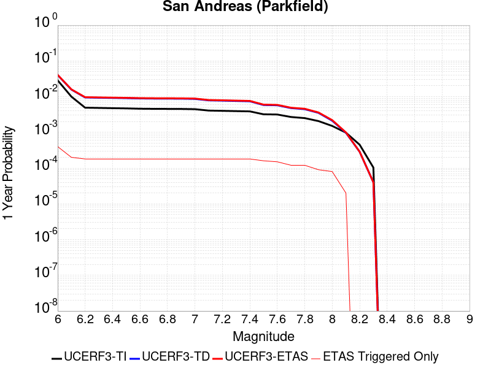 |  |

| Magnitude | 1 wk TI Prob | 1 wk TD Prob | 1 wk ETAS Prob | 1 wk ETAS/TD Gain | 1 wk ETAS Triggered Only | 1 mo TI Prob | 1 mo TD Prob | 1 mo ETAS Prob | 1 mo ETAS/TD Gain | 1 mo ETAS Triggered Only | 1 yr TI Prob | 1 yr TD Prob | 1 yr ETAS Prob | 1 yr ETAS/TD Gain | 1 yr ETAS Triggered Only | 10 yr TI Prob | 10 yr TD Prob | 10 yr ETAS Prob | 10 yr ETAS/TD Gain | 10 yr ETAS Triggered Only |
|-----|-----|-----|-----|-----|-----|-----|-----|-----|-----|-----|-----|-----|-----|-----|-----|-----|-----|-----|-----|-----|
| 6.0 | 5.556969E-4 | 7.7782426E-4 | 9.384709E-4 | 1.2065333 | 1.607717E-4 | 0.0023793848 | 0.0033298214 | 0.0035541523 | 1.0673703 | 2.2508038E-4 | 0.028586963 | 0.040191233 | 0.040561575 | 1.0092145 | 3.858521E-4 | 0.25176284 | 0.33716413 | 0.33750516 | 1.0010114 | 5.1446946E-4 |
| 6.1 | 1.925858E-4 | 3.0276453E-4 | 3.9919835E-4 | 1.3185109 | 9.646302E-5 | 8.2510663E-4 | 0.0012970108 | 0.0014254613 | 1.0990359 | 1.2861736E-4 | 0.0099994885 | 0.015778083 | 0.015983788 | 1.0130374 | 2.0900322E-4 | 0.095613256 | 0.1497237 | 0.14996974 | 1.0016434 | 2.8938908E-4 |
| 6.2 | 9.4306815E-5 | 1.8242796E-4 | 2.6279915E-4 | 1.4405639 | 8.038585E-5 | 4.0410945E-4 | 7.816011E-4 | 8.940533E-4 | 1.1438742 | 1.1254019E-4 | 0.0049089384 | 0.009474681 | 0.009665779 | 1.0201694 | 1.9292605E-4 | 0.048019063 | 0.09185409 | 0.092058495 | 1.0022253 | 2.2508038E-4 |
| 6.3 | 9.283051E-5 | 1.7939322E-4 | 2.5976464E-4 | 1.4480182 | 8.038585E-5 | 3.9778434E-4 | 7.686027E-4 | 8.810564E-4 | 1.1463093 | 1.1254019E-4 | 0.0048322747 | 0.009317789 | 0.009508917 | 1.0205122 | 1.9292605E-4 | 0.047285385 | 0.09050704 | 0.09071174 | 1.0022618 | 2.2508038E-4 |
| 6.4 | 9.138826E-5 | 1.770153E-4 | 2.5738694E-4 | 1.4540377 | 8.038585E-5 | 3.916052E-4 | 7.5841765E-4 | 8.708725E-4 | 1.1482756 | 1.1254019E-4 | 0.0047573745 | 0.00919484 | 0.009385992 | 1.020789 | 1.9292605E-4 | 0.046568092 | 0.08940927 | 0.08961423 | 1.0022924 | 2.2508038E-4 |
| 6.5 | 9.000255E-5 | 1.7459576E-4 | 2.5496757E-4 | 1.4603308 | 8.038585E-5 | 3.8566816E-4 | 7.480541E-4 | 8.6051016E-4 | 1.1503314 | 1.1254019E-4 | 0.0046854047 | 0.009069731 | 0.009260908 | 1.0210785 | 1.9292605E-4 | 0.045878403 | 0.088295065 | 0.08850027 | 1.0023241 | 2.2508038E-4 |
| 6.6 | 8.8109264E-5 | 1.7140752E-4 | 2.517796E-4 | 1.4688947 | 8.038585E-5 | 3.7755648E-4 | 7.3439797E-4 | 8.468555E-4 | 1.1531289 | 1.1254019E-4 | 0.0045870654 | 0.008904854 | 0.009096062 | 1.0214723 | 1.9292605E-4 | 0.04493529 | 0.0868267 | 0.08703223 | 1.0023673 | 2.2508038E-4 |
| 6.7 | 8.738073E-5 | 1.7007832E-4 | 2.504505E-4 | 1.4725598 | 8.038585E-5 | 3.7443507E-4 | 7.287046E-4 | 8.411628E-4 | 1.1543262 | 1.1254019E-4 | 0.0045492216 | 0.008836143 | 0.009027365 | 1.0216408 | 1.9292605E-4 | 0.04457213 | 0.08622707 | 0.08643274 | 1.0023853 | 2.2508038E-4 |
| 6.8 | 8.710195E-5 | 1.6953335E-4 | 2.4990557E-4 | 1.4740791 | 8.038585E-5 | 3.7324068E-4 | 7.263703E-4 | 8.3882874E-4 | 1.1548225 | 1.1254019E-4 | 0.0045347405 | 0.008807961 | 0.0089991875 | 1.0217106 | 1.9292605E-4 | 0.04443313 | 0.08597467 | 0.0861804 | 1.0023929 | 2.2508038E-4 |
| 6.9 | 8.6801556E-5 | 1.689429E-4 | 2.4931517E-4 | 1.4757363 | 8.038585E-5 | 3.7195362E-4 | 7.2384125E-4 | 8.3629997E-4 | 1.1553638 | 1.1254019E-4 | 0.0045191357 | 0.008777418 | 0.00896865 | 1.0217869 | 1.9292605E-4 | 0.044283327 | 0.085700735 | 0.08590652 | 1.0024012 | 2.2508038E-4 |
| 7.0 | 8.5571606E-5 | 1.6647128E-4 | 2.4684376E-4 | 1.4828008 | 8.038585E-5 | 3.6668387E-4 | 7.132544E-4 | 8.257143E-4 | 1.1576716 | 1.1254019E-4 | 0.004455241 | 0.008649553 | 0.0088408105 | 1.0221118 | 1.9292605E-4 | 0.043669727 | 0.08454914 | 0.08475519 | 1.002437 | 2.2508038E-4 |
| 7.1 | 7.82589E-5 | 1.5128135E-4 | 2.3165504E-4 | 1.5312862 | 8.038585E-5 | 3.3535215E-4 | 6.481883E-4 | 7.6065556E-4 | 1.1735102 | 1.1254019E-4 | 0.0040752706 | 0.007863307 | 0.008054716 | 1.0243421 | 1.9292605E-4 | 0.040013418 | 0.07746111 | 0.077668756 | 1.0026807 | 2.2508038E-4 |
| 7.2 | 7.690929E-5 | 1.4865391E-4 | 2.290278E-4 | 1.540678 | 8.038585E-5 | 3.2956956E-4 | 6.369334E-4 | 7.4940186E-4 | 1.1765782 | 1.1254019E-4 | 0.004005129 | 0.007727258 | 0.007918693 | 1.0247741 | 1.9292605E-4 | 0.0393371 | 0.07623427 | 0.0764422 | 1.0027274 | 2.2508038E-4 |
| 7.3 | 7.5543794E-5 | 1.4561978E-4 | 2.2599392E-4 | 1.5519452 | 8.038585E-5 | 3.2371894E-4 | 6.2393624E-4 | 7.364062E-4 | 1.1802588 | 1.1254019E-4 | 0.003934157 | 0.007570127 | 0.007761593 | 1.0252923 | 1.9292605E-4 | 0.038652334 | 0.074797355 | 0.0750056 | 1.0027841 | 2.2508038E-4 |
| 7.4 | 7.4214564E-5 | 1.4262961E-4 | 2.23004E-4 | 1.5635182 | 8.038585E-5 | 3.1802364E-4 | 6.111273E-4 | 7.235987E-4 | 1.1840392 | 1.1254019E-4 | 0.003865065 | 0.00741525 | 0.007606745 | 1.0258245 | 1.9292605E-4 | 0.03798529 | 0.07337123 | 0.073579796 | 1.0028427 | 2.2508038E-4 |
| 7.5 | 6.149578E-5 | 1.11907226E-4 | 1.7620872E-4 | 1.5745964 | 6.430868E-5 | 2.6352672E-4 | 4.7951436E-4 | 5.759311E-4 | 1.2010717 | 9.646302E-5 | 0.0032037178 | 0.0058224914 | 0.005982327 | 1.0274514 | 1.607717E-4 | 0.03157923 | 0.058557566 | 0.058724057 | 1.0028433 | 1.7684887E-4 |
| 7.6 | 6.0643448E-5 | 1.10193796E-4 | 1.7449539E-4 | 1.5835319 | 6.430868E-5 | 2.598746E-4 | 4.7217376E-4 | 5.6859123E-4 | 1.2041992 | 9.646302E-5 | 0.0031593828 | 0.0057335934 | 0.0058774585 | 1.0250915 | 1.4469454E-4 | 0.031148417 | 0.057718582 | 0.05787007 | 1.0026246 | 1.607717E-4 |
| 7.7 | 5.1652263E-5 | 9.174698E-5 | 1.3997407E-4 | 1.5256531 | 4.823151E-5 | 2.2134806E-4 | 3.931421E-4 | 4.7349636E-4 | 1.2043898 | 8.038585E-5 | 0.002691582 | 0.0047760103 | 0.004904013 | 1.0268012 | 1.2861736E-4 | 0.026592141 | 0.04853623 | 0.048673898 | 1.0028365 | 1.4469454E-4 |
| 7.8 | 4.8090482E-5 | 8.559635E-5 | 1.3382373E-4 | 1.563428 | 4.823151E-5 | 2.060858E-4 | 3.6678996E-4 | 4.4714633E-4 | 1.2190801 | 8.038585E-5 | 0.0025062072 | 0.0044565317 | 0.004584576 | 1.0287318 | 1.2861736E-4 | 0.024781305 | 0.04530245 | 0.04544059 | 1.0030493 | 1.4469454E-4 |
| 7.9 | 3.970278E-5 | 6.750426E-5 | 1.1573252E-4 | 1.7144476 | 4.823151E-5 | 1.7014367E-4 | 2.892719E-4 | 3.696345E-4 | 1.2778099 | 8.038585E-5 | 0.002069531 | 0.0035162016 | 0.0036283461 | 1.0318936 | 1.1254019E-4 | 0.020503636 | 0.035881363 | 0.035989866 | 1.0030239 | 1.1254019E-4 |
| 8.0 | 2.8982335E-5 | 4.069796E-5 | 7.285099E-5 | 1.7900404 | 3.215434E-5 | 1.2420409E-4 | 1.7440817E-4 | 2.3870563E-4 | 1.3686608 | 6.430868E-5 | 0.0015111357 | 0.0021213528 | 0.002217611 | 1.045376 | 9.646302E-5 | 0.015009012 | 0.022010697 | 0.022105036 | 1.004286 | 9.646302E-5 |
| 8.1 | 1.8836186E-5 | 1.8681134E-5 | 3.4758006E-5 | 1.8605939 | 1.607717E-5 | 8.0724014E-5 | 8.005955E-5 | 9.613544E-5 | 1.2007991 | 1.607717E-5 | 9.823717E-4 | 9.742898E-4 | 9.903513E-4 | 1.0164853 | 1.607717E-5 | 0.009780403 | 0.010488115 | 0.010504024 | 1.0015168 | 1.607717E-5 |
| 8.2 | 8.643924E-6 | 5.4748625E-6 | 5.4748625E-6 | 1.0 | 0.0 | 3.704486E-5 | 2.3463486E-5 | 2.3463486E-5 | 1.0 | 0.0 | 4.5092785E-4 | 2.8563058E-4 | 2.8563058E-4 | 1.0 | 0.0 | 0.0045001395 | 0.0032487072 | 0.0032487072 | 1.0 | 0.0 |
| 8.3 | 1.983087E-6 | 7.6599065E-7 | 7.6599065E-7 | 1.0 | 0.0 | 8.498917E-6 | 3.282813E-6 | 3.282813E-6 | 1.0 | 0.0 | 1.034694E-4 | 3.9967534E-5 | 3.9967534E-5 | 1.0 | 0.0 | 0.0010342124 | 4.719687E-4 | 4.719687E-4 | 1.0 | 0.0 |

## Manix-Afton Hills
*[(top)](#table-of-contents)*

| 1 Week | 1 Month | 1 Year | 10 Year |
|-----|-----|-----|-----|
|  |  |  |  |

| Magnitude | 1 wk TI Prob | 1 wk TD Prob | 1 wk ETAS Prob | 1 wk ETAS/TD Gain | 1 wk ETAS Triggered Only | 1 mo TI Prob | 1 mo TD Prob | 1 mo ETAS Prob | 1 mo ETAS/TD Gain | 1 mo ETAS Triggered Only | 1 yr TI Prob | 1 yr TD Prob | 1 yr ETAS Prob | 1 yr ETAS/TD Gain | 1 yr ETAS Triggered Only | 10 yr TI Prob | 10 yr TD Prob | 10 yr ETAS Prob | 10 yr ETAS/TD Gain | 10 yr ETAS Triggered Only |
|-----|-----|-----|-----|-----|-----|-----|-----|-----|-----|-----|-----|-----|-----|-----|-----|-----|-----|-----|-----|-----|
| 6.0 | 1.3783202E-5 | 1.47110895E-5 | 1.7548043E-4 | 11.928445 | 1.607717E-4 | 5.906953E-5 | 6.30461E-5 | 3.0418846E-4 | 4.824857 | 2.4115756E-4 | 7.189342E-4 | 7.6733343E-4 | 0.0010565005 | 1.3768466 | 2.8938908E-4 | 0.0071661277 | 0.007648596 | 0.008127222 | 1.062577 | 4.823151E-4 |
| 6.1 | 1.3783202E-5 | 1.47110895E-5 | 1.7548043E-4 | 11.928445 | 1.607717E-4 | 5.906953E-5 | 6.30461E-5 | 3.0418846E-4 | 4.824857 | 2.4115756E-4 | 7.189342E-4 | 7.6733343E-4 | 0.0010565005 | 1.3768466 | 2.8938908E-4 | 0.0071661277 | 0.007648596 | 0.008127222 | 1.062577 | 4.823151E-4 |
| 6.2 | 1.3783202E-5 | 1.47110895E-5 | 1.7548043E-4 | 11.928445 | 1.607717E-4 | 5.906953E-5 | 6.30461E-5 | 3.0418846E-4 | 4.824857 | 2.4115756E-4 | 7.189342E-4 | 7.6733343E-4 | 0.0010565005 | 1.3768466 | 2.8938908E-4 | 0.0071661277 | 0.007648596 | 0.008127222 | 1.062577 | 4.823151E-4 |
| 6.3 | 1.10494875E-5 | 1.1793136E-5 | 1.5648596E-4 | 13.269241 | 1.4469454E-4 | 4.7354086E-5 | 5.054109E-5 | 2.4345738E-4 | 4.817019 | 1.9292605E-4 | 5.763835E-4 | 6.151744E-4 | 8.561836E-4 | 1.3917738 | 2.4115756E-4 | 0.005748908 | 0.0061357557 | 0.00651924 | 1.0625 | 3.858521E-4 |
| 6.4 | 1.10494875E-5 | 1.1793136E-5 | 1.5648596E-4 | 13.269241 | 1.4469454E-4 | 4.7354086E-5 | 5.054109E-5 | 2.4345738E-4 | 4.817019 | 1.9292605E-4 | 5.763835E-4 | 6.151744E-4 | 8.561836E-4 | 1.3917738 | 2.4115756E-4 | 0.005748908 | 0.0061357557 | 0.00651924 | 1.0625 | 3.858521E-4 |
| 6.5 | 9.788949E-6 | 1.045432E-5 | 1.3907034E-4 | 13.302668 | 1.2861736E-4 | 4.1951964E-5 | 4.480351E-5 | 2.2164446E-4 | 4.9470334 | 1.7684887E-4 | 5.1064545E-4 | 5.453555E-4 | 7.5424474E-4 | 1.3830332 | 2.0900322E-4 | 0.0050947363 | 0.0054410985 | 0.005776882 | 1.0617125 | 3.376206E-4 |
| 6.6 | 8.810006E-6 | 9.4136285E-6 | 1.3802978E-4 | 14.662761 | 1.2861736E-4 | 3.775662E-5 | 4.0343548E-5 | 2.1718528E-4 | 5.383396 | 1.7684887E-4 | 4.5958988E-4 | 4.9108086E-4 | 6.9998147E-4 | 1.4253894 | 2.0900322E-4 | 0.0045864056 | 0.004900839 | 0.0052208067 | 1.0652883 | 3.215434E-4 |
| 6.7 | 8.80128E-6 | 9.404108E-6 | 1.3802026E-4 | 14.676593 | 1.2861736E-4 | 3.7719226E-5 | 4.0302748E-5 | 2.171445E-4 | 5.3878336 | 1.7684887E-4 | 4.591348E-4 | 4.9058435E-4 | 6.99485E-4 | 1.4258201 | 2.0900322E-4 | 0.004581874 | 0.0048958957 | 0.005215865 | 1.0653546 | 3.215434E-4 |
| 6.8 | 6.8994877E-6 | 7.380076E-6 | 1.0384239E-4 | 14.07064 | 9.646302E-5 | 2.9568899E-5 | 3.162856E-5 | 1.7631851E-4 | 5.5746617 | 1.4469454E-4 | 3.5994186E-4 | 3.8501783E-4 | 5.6179863E-4 | 1.4591496 | 1.7684887E-4 | 0.003593594 | 0.0038443129 | 0.004100559 | 1.0666559 | 2.5723473E-4 |
| 6.9 | 4.9328037E-6 | 5.2709615E-6 | 8.565639E-5 | 16.25062 | 8.038585E-5 | 2.1140417E-5 | 2.2589675E-5 | 1.3512732E-4 | 5.981818 | 1.1254019E-4 | 2.5735417E-4 | 2.7500073E-4 | 4.1965547E-4 | 1.5260159 | 1.4469454E-4 | 0.0025705635 | 0.0027472095 | 0.0029235724 | 1.0641972 | 1.7684887E-4 |
| 7.0 | 3.347973E-6 | 3.59003E-6 | 5.1821367E-5 | 14.434801 | 4.823151E-5 | 1.4348378E-5 | 1.5385775E-5 | 7.969347E-5 | 5.179685 | 6.430868E-5 | 1.746775E-4 | 1.8730981E-4 | 2.6768062E-4 | 1.4290794 | 8.038585E-5 | 0.0017454025 | 0.0018719219 | 0.0019842514 | 1.0600076 | 1.1254019E-4 |
| 7.1 | 1.2073567E-6 | 1.293482E-6 | 3.344778E-5 | 25.858713 | 3.215434E-5 | 5.1743755E-6 | 5.543492E-6 | 3.7697653E-5 | 6.8003445 | 3.215434E-5 | 6.29962E-5 | 6.749156E-5 | 9.964373E-5 | 1.4763881 | 3.215434E-5 | 6.297835E-4 | 6.7487074E-4 | 7.070034E-4 | 1.047613 | 3.215434E-5 |

## Death Valley (No)
*[(top)](#table-of-contents)*

| 1 Week | 1 Month | 1 Year | 10 Year |
|-----|-----|-----|-----|
|  | 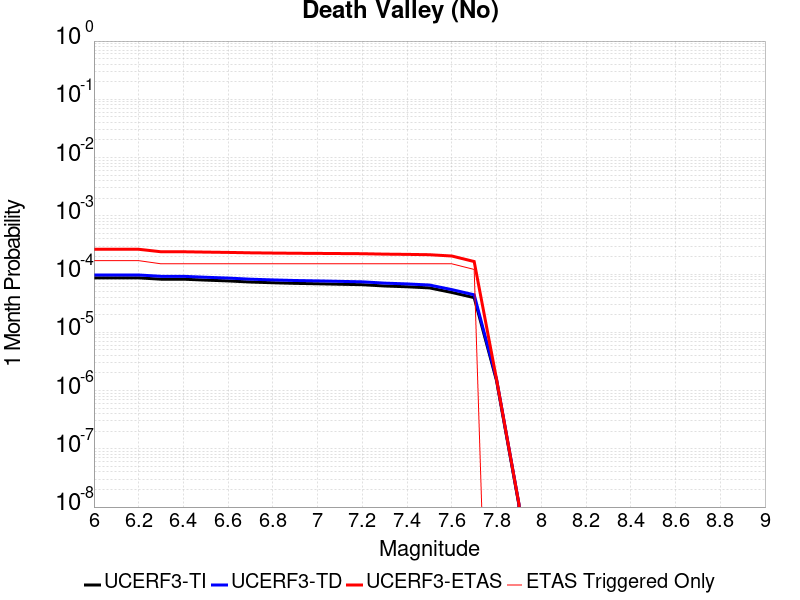 |  | 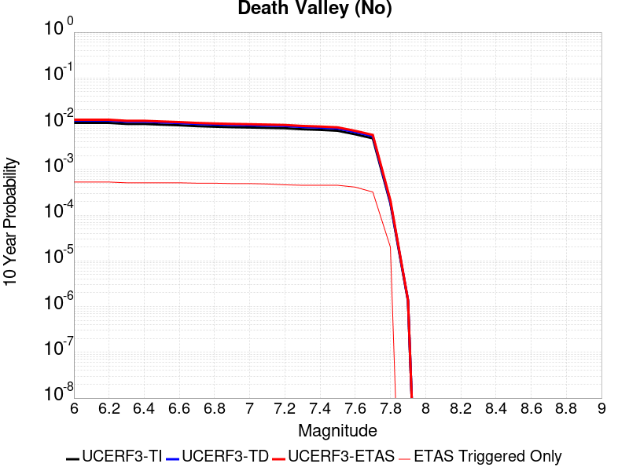 |

| Magnitude | 1 wk TI Prob | 1 wk TD Prob | 1 wk ETAS Prob | 1 wk ETAS/TD Gain | 1 wk ETAS Triggered Only | 1 mo TI Prob | 1 mo TD Prob | 1 mo ETAS Prob | 1 mo ETAS/TD Gain | 1 mo ETAS Triggered Only | 1 yr TI Prob | 1 yr TD Prob | 1 yr ETAS Prob | 1 yr ETAS/TD Gain | 1 yr ETAS Triggered Only | 10 yr TI Prob | 10 yr TD Prob | 10 yr ETAS Prob | 10 yr ETAS/TD Gain | 10 yr ETAS Triggered Only |
|-----|-----|-----|-----|-----|-----|-----|-----|-----|-----|-----|-----|-----|-----|-----|-----|-----|-----|-----|-----|-----|
| 6.0 | 2.0074807E-5 | 2.2500084E-5 | 8.680732E-5 | 3.8580887 | 6.430868E-5 | 8.603206E-5 | 9.642541E-5 | 2.2503037E-4 | 2.3337247 | 1.2861736E-4 | 0.001046937 | 0.0011733545 | 0.0014945206 | 1.2737162 | 3.215434E-4 | 0.010420183 | 0.011672506 | 0.012165082 | 1.0421996 | 4.9839227E-4 |
| 6.1 | 2.0074807E-5 | 2.2500084E-5 | 8.680732E-5 | 3.8580887 | 6.430868E-5 | 8.603206E-5 | 9.642541E-5 | 2.2503037E-4 | 2.3337247 | 1.2861736E-4 | 0.001046937 | 0.0011733545 | 0.0014945206 | 1.2737162 | 3.215434E-4 | 0.010420183 | 0.011672506 | 0.012165082 | 1.0421996 | 4.9839227E-4 |
| 6.2 | 2.0074807E-5 | 2.2500084E-5 | 8.680732E-5 | 3.8580887 | 6.430868E-5 | 8.603206E-5 | 9.642541E-5 | 2.2503037E-4 | 2.3337247 | 1.2861736E-4 | 0.001046937 | 0.0011733545 | 0.0014945206 | 1.2737162 | 3.215434E-4 | 0.010420183 | 0.011672506 | 0.012165082 | 1.0421996 | 4.9839227E-4 |
| 6.3 | 1.9050609E-5 | 2.1336948E-5 | 6.956743E-5 | 3.260421 | 4.823151E-5 | 8.164292E-5 | 9.1440896E-5 | 2.0397079E-4 | 2.23063 | 1.1254019E-4 | 9.935491E-4 | 0.001112731 | 0.0014178574 | 1.2742139 | 3.0546624E-4 | 0.009891188 | 0.011072419 | 0.011549394 | 1.0430777 | 4.823151E-4 |
| 6.4 | 1.9050609E-5 | 2.1336948E-5 | 6.956743E-5 | 3.260421 | 4.823151E-5 | 8.164292E-5 | 9.1440896E-5 | 2.0397079E-4 | 2.23063 | 1.1254019E-4 | 9.935491E-4 | 0.001112731 | 0.0014178574 | 1.2742139 | 3.0546624E-4 | 0.009891188 | 0.011072419 | 0.011549394 | 1.0430777 | 4.823151E-4 |
| 6.5 | 1.8367004E-5 | 2.0561009E-5 | 6.879153E-5 | 3.3457274 | 4.823151E-5 | 7.8713354E-5 | 8.811567E-5 | 2.0064594E-4 | 2.2770746 | 1.1254019E-4 | 9.5791375E-4 | 0.0010722869 | 0.0013774255 | 1.2845682 | 3.0546624E-4 | 0.009537951 | 0.0106719155 | 0.011149083 | 1.0447125 | 4.823151E-4 |
| 6.6 | 1.779439E-5 | 1.9910927E-5 | 6.814148E-5 | 3.4223156 | 4.823151E-5 | 7.625944E-5 | 8.53298E-5 | 1.9786038E-4 | 2.3187726 | 1.1254019E-4 | 9.280632E-4 | 0.0010384015 | 0.0013435505 | 1.2938643 | 3.0546624E-4 | 0.009241969 | 0.010336253 | 0.010813583 | 1.0461801 | 4.823151E-4 |
| 6.7 | 1.7025437E-5 | 1.9043426E-5 | 6.727402E-5 | 3.5326638 | 4.823151E-5 | 7.296412E-5 | 8.161216E-5 | 1.9414317E-4 | 2.378851 | 1.1254019E-4 | 8.87976E-4 | 9.931813E-4 | 0.0012983441 | 1.307258 | 3.0546624E-4 | 0.008844362 | 0.009888145 | 0.010365691 | 1.0482948 | 4.823151E-4 |
| 6.8 | 1.6545107E-5 | 1.8512545E-5 | 6.674317E-5 | 3.6052938 | 4.823151E-5 | 7.090568E-5 | 7.93371E-5 | 1.9186837E-4 | 2.4183939 | 1.1254019E-4 | 8.629347E-4 | 9.655073E-4 | 0.0012706786 | 1.3160735 | 3.0546624E-4 | 0.008595915 | 0.009613829 | 0.010091507 | 1.0496866 | 4.823151E-4 |
| 6.9 | 1.615478E-5 | 1.8087594E-5 | 6.6318236E-5 | 3.666504 | 4.823151E-5 | 6.9232934E-5 | 7.751599E-5 | 1.9004746E-4 | 2.4517195 | 1.1254019E-4 | 8.4258494E-4 | 9.433546E-4 | 0.0012324707 | 1.3064766 | 2.8938908E-4 | 0.008393973 | 0.009394196 | 0.009856054 | 1.0491642 | 4.6623795E-4 |
| 7.0 | 1.5894311E-5 | 1.780555E-5 | 6.6036206E-5 | 3.7087426 | 4.823151E-5 | 6.81167E-5 | 7.6307304E-5 | 1.8883891E-4 | 2.4747162 | 1.1254019E-4 | 8.2900526E-4 | 9.286515E-4 | 0.0012177718 | 1.3113335 | 2.8938908E-4 | 0.008259195 | 0.009248397 | 0.009710323 | 1.0499465 | 4.6623795E-4 |
| 7.1 | 1.5602263E-5 | 1.7483504E-5 | 6.571417E-5 | 3.7586386 | 4.823151E-5 | 6.6865134E-5 | 7.492718E-5 | 1.8745894E-4 | 2.5018816 | 1.1254019E-4 | 8.137789E-4 | 9.118627E-4 | 0.001200988 | 1.317071 | 2.8938908E-4 | 0.008108052 | 0.009081894 | 0.009527966 | 1.0491167 | 4.5016076E-4 |
| 7.2 | 1.5323829E-5 | 1.717063E-5 | 6.540131E-5 | 3.8089058 | 4.823151E-5 | 6.56719E-5 | 7.358637E-5 | 1.8611828E-4 | 2.5292494 | 1.1254019E-4 | 7.99262E-4 | 8.9555193E-4 | 0.001168619 | 1.304915 | 2.733119E-4 | 0.007963934 | 0.008920107 | 0.009334384 | 1.0464431 | 4.1800644E-4 |
| 7.3 | 1.4556212E-5 | 1.6302456E-5 | 6.453318E-5 | 3.9584944 | 4.823151E-5 | 6.238227E-5 | 6.9865826E-5 | 1.8239816E-4 | 2.610692 | 1.1254019E-4 | 7.592395E-4 | 8.5029035E-4 | 0.0011233699 | 1.3211603 | 2.733119E-4 | 0.0075665074 | 0.008471014 | 0.0088854795 | 1.0489275 | 4.1800644E-4 |
| 7.4 | 1.411725E-5 | 1.580796E-5 | 6.403871E-5 | 4.051042 | 4.823151E-5 | 6.0501097E-5 | 6.7746674E-5 | 1.8027924E-4 | 2.661079 | 1.1254019E-4 | 7.363519E-4 | 8.245094E-4 | 0.001097596 | 1.331211 | 2.733119E-4 | 0.0073391674 | 0.008215138 | 0.00862971 | 1.0504645 | 4.1800644E-4 |
| 7.5 | 1.3503312E-5 | 1.5126289E-5 | 6.3357074E-5 | 4.1885405 | 4.823151E-5 | 5.7870053E-5 | 6.482538E-5 | 1.7735828E-4 | 2.735939 | 1.1254019E-4 | 7.043401E-4 | 7.8896893E-4 | 0.0010620652 | 1.3461432 | 2.733119E-4 | 0.007021119 | 0.007862304 | 0.008277024 | 1.0527478 | 4.1800644E-4 |
| 7.6 | 1.1279839E-5 | 1.2626327E-5 | 6.085723E-5 | 4.819868 | 4.823151E-5 | 4.834127E-5 | 5.4111737E-5 | 1.6664584E-4 | 3.0796616 | 1.1254019E-4 | 5.88396E-4 | 6.5861654E-4 | 9.156819E-4 | 1.390311 | 2.5723473E-4 | 0.005868405 | 0.006567199 | 0.006934545 | 1.0559366 | 3.697749E-4 |
| 7.7 | 9.189108E-6 | 1.0283358E-5 | 5.8514375E-5 | 5.690201 | 4.823151E-5 | 3.93813E-5 | 4.407082E-5 | 1.2445313E-4 | 2.823935 | 8.038585E-5 | 4.7936183E-4 | 5.3643517E-4 | 7.292577E-4 | 1.3594518 | 1.9292605E-4 | 0.004783291 | 0.005351914 | 0.005623763 | 1.0507947 | 2.733119E-4 |
| 7.8 | 3.4586725E-7 | 3.6482615E-7 | 3.6482615E-7 | 1.0 | 0.0 | 1.4822873E-6 | 1.5635396E-6 | 1.5635396E-6 | 1.0 | 0.0 | 1.80467E-5 | 1.9035933E-5 | 3.5112796E-5 | 1.8445535 | 1.607717E-5 | 1.8045233E-4 | 1.9034347E-4 | 2.0641758E-4 | 1.0844479 | 1.607717E-5 |
| 7.9 | 2.5591178E-9 | 2.6696718E-9 | 2.6696718E-9 | 1.0 | 0.0 | 1.0967647E-8 | 1.14414505E-8 | 1.14414505E-8 | 1.0 | 0.0 | 1.335311E-7 | 1.3929966E-7 | 1.3929966E-7 | 1.0 | 0.0 | 1.3353102E-6 | 1.3929966E-6 | 1.3929966E-6 | 1.0 | 0.0 |

## Elsinore (Glen Ivy) rev
*[(top)](#table-of-contents)*

| 1 Week | 1 Month | 1 Year | 10 Year |
|-----|-----|-----|-----|
|  |  |  |  |

| Magnitude | 1 wk TI Prob | 1 wk TD Prob | 1 wk ETAS Prob | 1 wk ETAS/TD Gain | 1 wk ETAS Triggered Only | 1 mo TI Prob | 1 mo TD Prob | 1 mo ETAS Prob | 1 mo ETAS/TD Gain | 1 mo ETAS Triggered Only | 1 yr TI Prob | 1 yr TD Prob | 1 yr ETAS Prob | 1 yr ETAS/TD Gain | 1 yr ETAS Triggered Only | 10 yr TI Prob | 10 yr TD Prob | 10 yr ETAS Prob | 10 yr ETAS/TD Gain | 10 yr ETAS Triggered Only |
|-----|-----|-----|-----|-----|-----|-----|-----|-----|-----|-----|-----|-----|-----|-----|-----|-----|-----|-----|-----|-----|
| 6.0 | 1.6204086E-4 | 2.9360707E-4 | 4.8647646E-4 | 1.6568964 | 1.9292605E-4 | 6.94276E-4 | 0.0012578638 | 0.001498718 | 1.1914787 | 2.4115756E-4 | 0.008420097 | 0.015234485 | 0.015566962 | 1.021824 | 3.376206E-4 | 0.081081145 | 0.13969168 | 0.14007895 | 1.0027723 | 4.5016076E-4 |
| 6.1 | 1.6204086E-4 | 2.9360707E-4 | 4.8647646E-4 | 1.6568964 | 1.9292605E-4 | 6.94276E-4 | 0.0012578638 | 0.001498718 | 1.1914787 | 2.4115756E-4 | 0.008420097 | 0.015234485 | 0.015566962 | 1.021824 | 3.376206E-4 | 0.081081145 | 0.13969168 | 0.14007895 | 1.0027723 | 4.5016076E-4 |
| 6.2 | 1.6204086E-4 | 2.9360707E-4 | 4.8647646E-4 | 1.6568964 | 1.9292605E-4 | 6.94276E-4 | 0.0012578638 | 0.001498718 | 1.1914787 | 2.4115756E-4 | 0.008420097 | 0.015234485 | 0.015566962 | 1.021824 | 3.376206E-4 | 0.081081145 | 0.13969168 | 0.14007895 | 1.0027723 | 4.5016076E-4 |
| 6.3 | 1.0111737E-4 | 1.7703383E-4 | 3.056284E-4 | 1.7263843 | 1.2861736E-4 | 4.332882E-4 | 7.5861247E-4 | 8.8713225E-4 | 1.1694143 | 1.2861736E-4 | 0.005262531 | 0.009217682 | 0.009424759 | 1.0224651 | 2.0900322E-4 | 0.0513964 | 0.0870191 | 0.08729798 | 1.0032048 | 3.0546624E-4 |
| 6.4 | 1.0111737E-4 | 1.7703383E-4 | 3.056284E-4 | 1.7263843 | 1.2861736E-4 | 4.332882E-4 | 7.5861247E-4 | 8.8713225E-4 | 1.1694143 | 1.2861736E-4 | 0.005262531 | 0.009217682 | 0.009424759 | 1.0224651 | 2.0900322E-4 | 0.0513964 | 0.0870191 | 0.08729798 | 1.0032048 | 3.0546624E-4 |
| 6.5 | 3.6624708E-5 | 4.6391084E-5 | 6.246751E-5 | 1.3465413 | 1.607717E-5 | 1.569536E-4 | 1.9880582E-4 | 2.148798E-4 | 1.0808526 | 1.607717E-5 | 0.001909235 | 0.0024181372 | 0.0024502138 | 1.013265 | 3.215434E-5 | 0.01892915 | 0.023739954 | 0.023802737 | 1.0026445 | 6.430868E-5 |
| 6.6 | 2.5051324E-5 | 2.614772E-5 | 2.614772E-5 | 1.0 | 0.0 | 1.073584E-4 | 1.12057096E-4 | 1.12057096E-4 | 1.0 | 0.0 | 0.0013063047 | 0.0013634858 | 0.0013795411 | 1.0117751 | 1.607717E-5 | 0.012986525 | 0.013564618 | 0.013612196 | 1.0035075 | 4.823151E-5 |
| 6.7 | 2.2189772E-5 | 2.2072849E-5 | 2.2072849E-5 | 1.0 | 0.0 | 9.509556E-5 | 9.4594696E-5 | 9.4594696E-5 | 1.0 | 0.0 | 0.0011571734 | 0.0011511183 | 0.001167177 | 1.0139505 | 1.607717E-5 | 0.011511663 | 0.011465415 | 0.011513094 | 1.0041585 | 4.823151E-5 |
| 6.8 | 1.6654378E-5 | 1.4437705E-5 | 1.4437705E-5 | 1.0 | 0.0 | 7.137396E-5 | 6.187444E-5 | 6.187444E-5 | 1.0 | 0.0 | 8.686314E-4 | 7.530661E-4 | 7.530661E-4 | 1.0 | 0.0 | 0.008652439 | 0.00751048 | 0.007542393 | 1.0042491 | 3.215434E-5 |
| 6.9 | 1.5042909E-5 | 1.2332022E-5 | 1.2332022E-5 | 1.0 | 0.0 | 6.446802E-5 | 5.285047E-5 | 5.285047E-5 | 1.0 | 0.0 | 7.8461546E-4 | 6.4326765E-4 | 6.4326765E-4 | 1.0 | 0.0 | 0.007818509 | 0.00641828 | 0.006434254 | 1.0024889 | 1.607717E-5 |
| 7.0 | 1.4361385E-5 | 1.1451324E-5 | 1.1451324E-5 | 1.0 | 0.0 | 6.154734E-5 | 4.9076196E-5 | 4.9076196E-5 | 1.0 | 0.0 | 7.490812E-4 | 5.973418E-4 | 5.973418E-4 | 1.0 | 0.0 | 0.007465612 | 0.0059613534 | 0.0059773345 | 1.0026808 | 1.607717E-5 |
| 7.1 | 1.3265571E-5 | 1.0244926E-5 | 1.0244926E-5 | 1.0 | 0.0 | 5.6851208E-5 | 4.39061E-5 | 4.39061E-5 | 1.0 | 0.0 | 6.919436E-4 | 5.344282E-4 | 5.344282E-4 | 1.0 | 0.0 | 0.006897931 | 0.0053347866 | 0.005350778 | 1.0029975 | 1.607717E-5 |
| 7.2 | 1.1596403E-5 | 8.505067E-6 | 8.505067E-6 | 1.0 | 0.0 | 4.9697923E-5 | 3.6449786E-5 | 3.6449786E-5 | 1.0 | 0.0 | 6.049042E-4 | 4.436875E-4 | 4.436875E-4 | 1.0 | 0.0 | 0.006032603 | 0.0044294316 | 0.0044454373 | 1.0036136 | 1.607717E-5 |
| 7.3 | 1.0150827E-5 | 7.2387597E-6 | 7.2387597E-6 | 1.0 | 0.0 | 4.3502816E-5 | 3.1022897E-5 | 3.1022897E-5 | 1.0 | 0.0 | 5.2951806E-4 | 3.7763975E-4 | 3.7763975E-4 | 1.0 | 0.0 | 0.005282581 | 0.0037703665 | 0.0037863832 | 1.004248 | 1.607717E-5 |
| 7.4 | 9.080705E-6 | 6.352519E-6 | 6.352519E-6 | 1.0 | 0.0 | 3.8916725E-5 | 2.7224805E-5 | 2.7224805E-5 | 1.0 | 0.0 | 4.7370812E-4 | 3.3141294E-4 | 3.3141294E-4 | 1.0 | 0.0 | 0.004726996 | 0.0033093381 | 0.0033093381 | 1.0 | 0.0 |
| 7.5 | 7.671649E-6 | 5.2256332E-6 | 5.2256332E-6 | 1.0 | 0.0 | 3.287808E-5 | 2.2395385E-5 | 2.2395385E-5 | 1.0 | 0.0 | 4.0021708E-4 | 2.7263095E-4 | 2.7263095E-4 | 1.0 | 0.0 | 0.0039949706 | 0.00272309 | 0.00272309 | 1.0 | 0.0 |
| 7.6 | 6.990086E-6 | 4.687545E-6 | 4.687545E-6 | 1.0 | 0.0 | 2.9957167E-5 | 2.008933E-5 | 2.008933E-5 | 1.0 | 0.0 | 3.6466747E-4 | 2.445613E-4 | 2.445613E-4 | 1.0 | 0.0 | 0.0036406964 | 0.002443038 | 0.002443038 | 1.0 | 0.0 |
| 7.7 | 4.163505E-6 | 2.3295343E-6 | 2.3295343E-6 | 1.0 | 0.0 | 1.7843471E-5 | 9.983683E-6 | 9.983683E-6 | 1.0 | 0.0 | 2.172226E-4 | 1.21545316E-4 | 1.21545316E-4 | 1.0 | 0.0 | 0.0021701038 | 0.0012148614 | 0.0012148614 | 1.0 | 0.0 |
| 7.8 | 2.2692414E-7 | 9.3854695E-8 | 9.3854695E-8 | 1.0 | 0.0 | 9.725317E-7 | 4.0223435E-7 | 4.0223435E-7 | 1.0 | 0.0 | 1.1840509E-5 | 4.8971956E-6 | 4.8971956E-6 | 1.0 | 0.0 | 1.1839878E-4 | 4.8971204E-5 | 4.8971204E-5 | 1.0 | 0.0 |
| 7.9 | 6.676829E-9 | 3.439853E-9 | 3.439853E-9 | 1.0 | 0.0 | 2.861498E-8 | 1.4742227E-8 | 1.4742227E-8 | 1.0 | 0.0 | 3.4838732E-7 | 1.7948659E-7 | 1.7948659E-7 | 1.0 | 0.0 | 3.4838679E-6 | 1.7948646E-6 | 1.7948646E-6 | 1.0 | 0.0 |

## Cady
*[(top)](#table-of-contents)*

| 1 Week | 1 Month | 1 Year | 10 Year |
|-----|-----|-----|-----|
|  |  |  |  |

| Magnitude | 1 wk TI Prob | 1 wk TD Prob | 1 wk ETAS Prob | 1 wk ETAS/TD Gain | 1 wk ETAS Triggered Only | 1 mo TI Prob | 1 mo TD Prob | 1 mo ETAS Prob | 1 mo ETAS/TD Gain | 1 mo ETAS Triggered Only | 1 yr TI Prob | 1 yr TD Prob | 1 yr ETAS Prob | 1 yr ETAS/TD Gain | 1 yr ETAS Triggered Only | 10 yr TI Prob | 10 yr TD Prob | 10 yr ETAS Prob | 10 yr ETAS/TD Gain | 10 yr ETAS Triggered Only |
|-----|-----|-----|-----|-----|-----|-----|-----|-----|-----|-----|-----|-----|-----|-----|-----|-----|-----|-----|-----|-----|
| 6.0 | 1.9892565E-5 | 2.1858728E-5 | 1.665501E-4 | 7.619386 | 1.4469454E-4 | 8.525106E-5 | 9.3677416E-5 | 3.0266106E-4 | 3.230886 | 2.0900322E-4 | 0.0010374374 | 0.0011400167 | 0.0014451348 | 1.2676435 | 3.0546624E-4 | 0.010326075 | 0.011350701 | 0.011795752 | 1.0392091 | 4.5016076E-4 |
| 6.1 | 1.9892565E-5 | 2.1858728E-5 | 1.665501E-4 | 7.619386 | 1.4469454E-4 | 8.525106E-5 | 9.3677416E-5 | 3.0266106E-4 | 3.230886 | 2.0900322E-4 | 0.0010374374 | 0.0011400167 | 0.0014451348 | 1.2676435 | 3.0546624E-4 | 0.010326075 | 0.011350701 | 0.011795752 | 1.0392091 | 4.5016076E-4 |
| 6.2 | 1.9892565E-5 | 2.1858728E-5 | 1.665501E-4 | 7.619386 | 1.4469454E-4 | 8.525106E-5 | 9.3677416E-5 | 3.0266106E-4 | 3.230886 | 2.0900322E-4 | 0.0010374374 | 0.0011400167 | 0.0014451348 | 1.2676435 | 3.0546624E-4 | 0.010326075 | 0.011350701 | 0.011795752 | 1.0392091 | 4.5016076E-4 |
| 6.3 | 1.1117327E-5 | 1.2176583E-5 | 9.256146E-5 | 7.601595 | 8.038585E-5 | 4.764482E-5 | 5.2184492E-5 | 1.8079515E-4 | 3.4645379 | 1.2861736E-4 | 5.7992124E-4 | 6.351925E-4 | 8.27996E-4 | 1.3035356 | 1.9292605E-4 | 0.0057841022 | 0.0063368753 | 0.0066244304 | 1.0453781 | 2.8938908E-4 |
| 6.4 | 1.1117327E-5 | 1.2176583E-5 | 9.256146E-5 | 7.601595 | 8.038585E-5 | 4.764482E-5 | 5.2184492E-5 | 1.8079515E-4 | 3.4645379 | 1.2861736E-4 | 5.7992124E-4 | 6.351925E-4 | 8.27996E-4 | 1.3035356 | 1.9292605E-4 | 0.0057841022 | 0.0063368753 | 0.0066244304 | 1.0453781 | 2.8938908E-4 |
| 6.5 | 6.103093E-6 | 6.672021E-6 | 5.490321E-5 | 8.228873 | 4.823151E-5 | 2.615585E-5 | 2.8594131E-5 | 1.08977685E-4 | 3.8111906 | 8.038585E-5 | 3.1840094E-4 | 3.480905E-4 | 4.4451994E-4 | 1.277024 | 9.646302E-5 | 0.0031794512 | 0.0034766865 | 0.0036529207 | 1.0506902 | 1.7684887E-4 |
| 6.6 | 5.817237E-6 | 6.3656585E-6 | 5.459686E-5 | 8.576781 | 4.823151E-5 | 2.4930776E-5 | 2.728118E-5 | 1.0766484E-4 | 3.9464877 | 8.038585E-5 | 3.034899E-4 | 3.3211018E-4 | 4.2854116E-4 | 1.2903584 | 9.646302E-5 | 0.0030307577 | 0.0033173605 | 0.0034936229 | 1.0531332 | 1.7684887E-4 |
| 6.7 | 4.8846314E-6 | 5.3405684E-6 | 2.1417653E-5 | 4.01037 | 1.607717E-5 | 2.0933967E-5 | 2.2888014E-5 | 7.1118426E-5 | 3.1072342 | 4.823151E-5 | 2.5484123E-4 | 2.7863772E-4 | 3.268558E-4 | 1.1730493 | 4.823151E-5 | 0.0025454918 | 0.0027840391 | 0.0029122983 | 1.0460695 | 1.2861736E-4 |
| 6.8 | 1.7788773E-6 | 1.9399079E-6 | 1.8017046E-5 | 9.287579 | 1.607717E-5 | 7.6237375E-6 | 8.313874E-6 | 5.6544985E-5 | 6.80128 | 4.823151E-5 | 9.281505E-5 | 1.01218284E-4 | 1.4944491E-4 | 1.4764616 | 4.823151E-5 | 9.2776294E-4 | 0.0010118765 | 0.0011082418 | 1.0952344 | 9.646302E-5 |
| 6.9 | 7.5455404E-7 | 8.297092E-7 | 8.297092E-7 | 1.0 | 0.0 | 3.233799E-6 | 3.5558937E-6 | 1.9633007E-5 | 5.5212584 | 1.607717E-5 | 3.937079E-5 | 4.3292483E-5 | 5.9368955E-5 | 1.3713456 | 1.607717E-5 | 3.9363815E-4 | 4.3287344E-4 | 4.6501384E-4 | 1.074249 | 3.215434E-5 |
| 7.0 | 6.8578805E-7 | 7.541816E-7 | 7.541816E-7 | 1.0 | 0.0 | 2.9390883E-6 | 3.2322048E-6 | 1.9309324E-5 | 5.974041 | 1.607717E-5 | 3.578281E-5 | 3.9351715E-5 | 5.5428252E-5 | 1.4085346 | 1.607717E-5 | 3.577705E-4 | 3.9347992E-4 | 4.256216E-4 | 1.0816857 | 3.215434E-5 |

## San Andreas (San Gorgonio Pass-Garnet HIll)
*[(top)](#table-of-contents)*

| 1 Week | 1 Month | 1 Year | 10 Year |
|-----|-----|-----|-----|
|  |  |  |  |

| Magnitude | 1 wk TI Prob | 1 wk TD Prob | 1 wk ETAS Prob | 1 wk ETAS/TD Gain | 1 wk ETAS Triggered Only | 1 mo TI Prob | 1 mo TD Prob | 1 mo ETAS Prob | 1 mo ETAS/TD Gain | 1 mo ETAS Triggered Only | 1 yr TI Prob | 1 yr TD Prob | 1 yr ETAS Prob | 1 yr ETAS/TD Gain | 1 yr ETAS Triggered Only | 10 yr TI Prob | 10 yr TD Prob | 10 yr ETAS Prob | 10 yr ETAS/TD Gain | 10 yr ETAS Triggered Only |
|-----|-----|-----|-----|-----|-----|-----|-----|-----|-----|-----|-----|-----|-----|-----|-----|-----|-----|-----|-----|-----|
| 6.0 | 8.31567E-5 | 2.3382473E-4 | 3.463386E-4 | 1.4811889 | 1.1254019E-4 | 3.5633717E-4 | 0.0010017233 | 0.0012265783 | 1.2244681 | 2.2508038E-4 | 0.004329778 | 0.012127888 | 0.01242965 | 1.0248816 | 3.0546624E-4 | 0.042463828 | 0.11257892 | 0.113006935 | 1.003802 | 4.823151E-4 |
| 6.1 | 8.31567E-5 | 2.3382473E-4 | 3.463386E-4 | 1.4811889 | 1.1254019E-4 | 3.5633717E-4 | 0.0010017233 | 0.0012265783 | 1.2244681 | 2.2508038E-4 | 0.004329778 | 0.012127888 | 0.01242965 | 1.0248816 | 3.0546624E-4 | 0.042463828 | 0.11257892 | 0.113006935 | 1.003802 | 4.823151E-4 |
| 6.2 | 8.31567E-5 | 2.3382473E-4 | 3.463386E-4 | 1.4811889 | 1.1254019E-4 | 3.5633717E-4 | 0.0010017233 | 0.0012265783 | 1.2244681 | 2.2508038E-4 | 0.004329778 | 0.012127888 | 0.01242965 | 1.0248816 | 3.0546624E-4 | 0.042463828 | 0.11257892 | 0.113006935 | 1.003802 | 4.823151E-4 |
| 6.3 | 8.31567E-5 | 2.3382473E-4 | 3.463386E-4 | 1.4811889 | 1.1254019E-4 | 3.5633717E-4 | 0.0010017233 | 0.0012265783 | 1.2244681 | 2.2508038E-4 | 0.004329778 | 0.012127888 | 0.01242965 | 1.0248816 | 3.0546624E-4 | 0.042463828 | 0.11257892 | 0.113006935 | 1.003802 | 4.823151E-4 |
| 6.4 | 8.059055E-5 | 2.2940808E-4 | 3.4192245E-4 | 1.4904552 | 1.1254019E-4 | 3.4534236E-4 | 9.828096E-4 | 0.0012076687 | 1.2287922 | 2.2508038E-4 | 0.0041964394 | 0.011900152 | 0.012201983 | 1.0253637 | 3.0546624E-4 | 0.041180745 | 0.11056015 | 0.11098914 | 1.0038801 | 4.823151E-4 |
| 6.5 | 8.059055E-5 | 2.2940808E-4 | 3.4192245E-4 | 1.4904552 | 1.1254019E-4 | 3.4534236E-4 | 9.828096E-4 | 0.0012076687 | 1.2287922 | 2.2508038E-4 | 0.0041964394 | 0.011900152 | 0.012201983 | 1.0253637 | 3.0546624E-4 | 0.041180745 | 0.11056015 | 0.11098914 | 1.0038801 | 4.823151E-4 |
| 6.6 | 7.619237E-5 | 2.218517E-4 | 3.3436692E-4 | 1.5071641 | 1.1254019E-4 | 3.2649786E-4 | 9.5044886E-4 | 0.0011753154 | 1.2365898 | 2.2508038E-4 | 0.0039678677 | 0.01151087 | 0.01181282 | 1.0262318 | 3.0546624E-4 | 0.03897764 | 0.10709683 | 0.10752749 | 1.0040212 | 4.823151E-4 |
| 6.7 | 7.440636E-5 | 2.1860997E-4 | 3.3112557E-4 | 1.5146865 | 1.1254019E-4 | 3.188454E-4 | 9.3656575E-4 | 0.0011614353 | 1.2401001 | 2.2508038E-4 | 0.0038750346 | 0.011343609 | 0.0116456095 | 1.026623 | 3.0546624E-4 | 0.038081564 | 0.105605274 | 0.106036656 | 1.0040848 | 4.823151E-4 |
| 6.8 | 7.3735864E-5 | 2.1708169E-4 | 3.2959745E-4 | 1.5183107 | 1.1254019E-4 | 3.1597257E-4 | 9.3002064E-4 | 0.0011548917 | 1.2417915 | 2.2508038E-4 | 0.0038401815 | 0.011264749 | 0.011566774 | 1.0268115 | 3.0546624E-4 | 0.03774495 | 0.10490683 | 0.10533854 | 1.0041152 | 4.823151E-4 |
| 6.9 | 7.27575E-5 | 2.1477141E-4 | 3.2728745E-4 | 1.5238873 | 1.1254019E-4 | 3.117806E-4 | 9.201265E-4 | 0.0011449998 | 1.2443938 | 2.2508038E-4 | 0.003789323 | 0.011145527 | 0.011447588 | 1.0271016 | 3.0546624E-4 | 0.037253562 | 0.103854746 | 0.10428697 | 1.0041618 | 4.823151E-4 |
| 7.0 | 7.102591E-5 | 2.1061185E-4 | 3.2312833E-4 | 1.5342363 | 1.1254019E-4 | 3.0436125E-4 | 9.023122E-4 | 0.0011271895 | 1.2492234 | 2.2508038E-4 | 0.003699303 | 0.010930831 | 0.011232958 | 1.0276399 | 3.0546624E-4 | 0.03638325 | 0.10195695 | 0.10239009 | 1.0042483 | 4.823151E-4 |
| 7.1 | 7.028513E-5 | 2.0896831E-4 | 3.21485E-4 | 1.5384389 | 1.1254019E-4 | 3.0118722E-4 | 8.9527335E-4 | 0.0011040894 | 1.2332429 | 2.0900322E-4 | 0.0036607897 | 0.010845989 | 0.011132239 | 1.0263922 | 2.8938908E-4 | 0.036010686 | 0.101199985 | 0.10161904 | 1.0041409 | 4.6623795E-4 |
| 7.2 | 6.8498244E-5 | 2.0504706E-4 | 3.1756418E-4 | 1.548738 | 1.1254019E-4 | 2.9353087E-4 | 8.784794E-4 | 0.001087299 | 1.2377057 | 2.0900322E-4 | 0.003567883 | 0.010643536 | 0.010929845 | 1.0268998 | 2.8938908E-4 | 0.035111405 | 0.09939202 | 0.09981192 | 1.0042247 | 4.6623795E-4 |
| 7.3 | 6.622592E-5 | 1.9732013E-4 | 3.098381E-4 | 1.5702307 | 1.1254019E-4 | 2.8379448E-4 | 8.453858E-4 | 0.0010542123 | 1.2470192 | 2.0900322E-4 | 0.0034497243 | 0.0102444785 | 0.010530903 | 1.0279589 | 2.8938908E-4 | 0.033966612 | 0.095888525 | 0.09631006 | 1.0043961 | 4.6623795E-4 |
| 7.4 | 5.1050705E-5 | 1.4689034E-4 | 2.59414E-4 | 1.7660385 | 1.1254019E-4 | 2.1877038E-4 | 6.29379E-4 | 8.382507E-4 | 1.3318695 | 2.0900322E-4 | 0.002660276 | 0.0076359594 | 0.007923139 | 1.0376089 | 2.8938908E-4 | 0.02628654 | 0.07286301 | 0.07328038 | 1.005728 | 4.5016076E-4 |
| 7.5 | 3.9302922E-5 | 1.1129847E-4 | 2.2382614E-4 | 2.0110443 | 1.1254019E-4 | 1.6843023E-4 | 4.7690657E-4 | 6.858101E-4 | 1.4380387 | 2.0900322E-4 | 0.0020487092 | 0.005790949 | 0.006078662 | 1.0496832 | 2.8938908E-4 | 0.020299247 | 0.05600951 | 0.056434456 | 1.0075871 | 4.5016076E-4 |
| 7.6 | 2.9851626E-5 | 8.4949745E-5 | 1.9748037E-4 | 2.324673 | 1.1254019E-4 | 1.2792926E-4 | 3.6401965E-4 | 5.729468E-4 | 1.5739447 | 2.0900322E-4 | 0.0015564259 | 0.0044229585 | 0.004711068 | 1.0651394 | 2.8938908E-4 | 0.0154556995 | 0.04319374 | 0.043624453 | 1.0099717 | 4.5016076E-4 |
| 7.7 | 2.1135214E-5 | 6.3529005E-5 | 1.7606205E-4 | 2.771365 | 1.1254019E-4 | 9.0576345E-5 | 2.7223877E-4 | 4.8118507E-4 | 1.7675112 | 2.0900322E-4 | 0.0011022091 | 0.0033094748 | 0.003597906 | 1.0871532 | 2.8938908E-4 | 0.010967582 | 0.032582592 | 0.033018086 | 1.0133659 | 4.5016076E-4 |
| 7.8 | 1.883379E-5 | 5.564028E-5 | 1.6817421E-4 | 3.0225263 | 1.1254019E-4 | 8.0713755E-5 | 2.3843657E-4 | 4.4738993E-4 | 1.8763479 | 2.0900322E-4 | 9.822468E-4 | 0.0028991038 | 0.003187654 | 1.0995308 | 2.8938908E-4 | 0.0097791655 | 0.028695205 | 0.02913245 | 1.0152375 | 4.5016076E-4 |
| 7.9 | 1.5156185E-5 | 4.1658426E-5 | 1.5419393E-4 | 3.7013865 | 1.1254019E-4 | 6.495346E-5 | 1.785239E-4 | 3.874898E-4 | 2.1705205 | 2.0900322E-4 | 7.9052144E-4 | 0.0021713632 | 0.0024440817 | 1.1255978 | 2.733119E-4 | 0.007877152 | 0.021759422 | 0.02218406 | 1.0195152 | 4.340836E-4 |
| 8.0 | 1.1405907E-5 | 2.9974231E-5 | 1.2643436E-4 | 4.218102 | 9.646302E-5 | 4.8881542E-5 | 1.2845467E-4 | 2.8920572E-4 | 2.2514224 | 1.607717E-4 | 5.9497025E-4 | 0.0015628147 | 0.0017875433 | 1.1437974 | 2.2508038E-4 | 0.005933798 | 0.015772851 | 0.016089322 | 1.0200644 | 3.215434E-4 |
| 8.1 | 4.3511436E-6 | 7.369219E-6 | 7.369219E-6 | 1.0 | 0.0 | 1.8647626E-5 | 3.1581985E-5 | 3.1581985E-5 | 1.0 | 0.0 | 2.2701119E-4 | 3.8444297E-4 | 3.8444297E-4 | 1.0 | 0.0 | 0.0022677942 | 0.0041163345 | 0.0041163345 | 1.0 | 0.0 |
| 8.2 | 2.3042528E-6 | 2.7329415E-6 | 2.7329415E-6 | 1.0 | 0.0 | 9.875332E-6 | 1.1712554E-5 | 1.1712554E-5 | 1.0 | 0.0 | 1.2022553E-4 | 1.4259106E-4 | 1.4259106E-4 | 1.0 | 0.0 | 0.0012016051 | 0.0015979785 | 0.0015979785 | 1.0 | 0.0 |
| 8.3 | 5.202968E-7 | 3.1598344E-7 | 3.1598344E-7 | 1.0 | 0.0 | 2.2298414E-6 | 1.3542141E-6 | 1.3542141E-6 | 1.0 | 0.0 | 2.714798E-5 | 1.6487444E-5 | 1.6487444E-5 | 1.0 | 0.0 | 2.7144665E-4 | 1.9563142E-4 | 1.9563142E-4 | 1.0 | 0.0 |

## Calico-Hidalgo
*[(top)](#table-of-contents)*

| 1 Week | 1 Month | 1 Year | 10 Year |
|-----|-----|-----|-----|
| 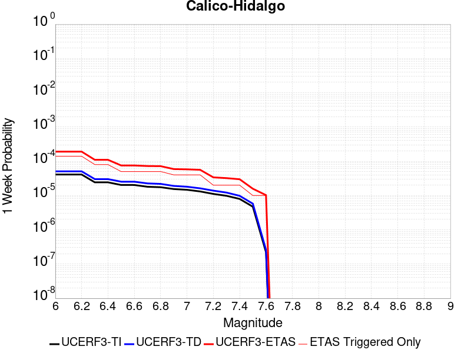 |  | 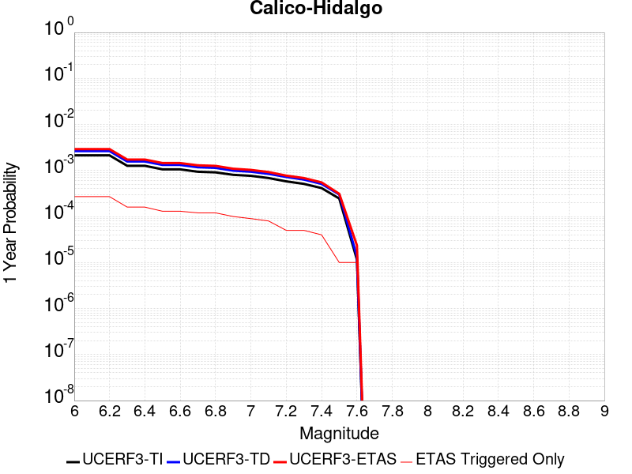 |  |

| Magnitude | 1 wk TI Prob | 1 wk TD Prob | 1 wk ETAS Prob | 1 wk ETAS/TD Gain | 1 wk ETAS Triggered Only | 1 mo TI Prob | 1 mo TD Prob | 1 mo ETAS Prob | 1 mo ETAS/TD Gain | 1 mo ETAS Triggered Only | 1 yr TI Prob | 1 yr TD Prob | 1 yr ETAS Prob | 1 yr ETAS/TD Gain | 1 yr ETAS Triggered Only | 10 yr TI Prob | 10 yr TD Prob | 10 yr ETAS Prob | 10 yr ETAS/TD Gain | 10 yr ETAS Triggered Only |
|-----|-----|-----|-----|-----|-----|-----|-----|-----|-----|-----|-----|-----|-----|-----|-----|-----|-----|-----|-----|-----|
| 6.0 | 4.0906612E-5 | 5.0703686E-5 | 1.9539088E-4 | 3.8535833 | 1.4469454E-4 | 1.7530227E-4 | 2.172857E-4 | 4.423172E-4 | 2.0356479 | 2.2508038E-4 | 0.0021322158 | 0.002642648 | 0.002947307 | 1.1152855 | 3.0546624E-4 | 0.02111873 | 0.026152607 | 0.026606651 | 1.0173614 | 4.6623795E-4 |
| 6.1 | 4.0906612E-5 | 5.0703686E-5 | 1.9539088E-4 | 3.8535833 | 1.4469454E-4 | 1.7530227E-4 | 2.172857E-4 | 4.423172E-4 | 2.0356479 | 2.2508038E-4 | 0.0021322158 | 0.002642648 | 0.002947307 | 1.1152855 | 3.0546624E-4 | 0.02111873 | 0.026152607 | 0.026606651 | 1.0173614 | 4.6623795E-4 |
| 6.2 | 4.0906612E-5 | 5.0703686E-5 | 1.9539088E-4 | 3.8535833 | 1.4469454E-4 | 1.7530227E-4 | 2.172857E-4 | 4.423172E-4 | 2.0356479 | 2.2508038E-4 | 0.0021322158 | 0.002642648 | 0.002947307 | 1.1152855 | 3.0546624E-4 | 0.02111873 | 0.026152607 | 0.026606651 | 1.0173614 | 4.6623795E-4 |
| 6.3 | 2.4242801E-5 | 3.0090669E-5 | 1.104741E-4 | 3.671374 | 8.038585E-5 | 1.0389358E-4 | 1.2895382E-4 | 2.736297E-4 | 2.12192 | 1.4469454E-4 | 0.0012641704 | 0.0015689151 | 0.0017454865 | 1.1125436 | 1.7684887E-4 | 0.01257003 | 0.01558206 | 0.01581946 | 1.0152354 | 2.4115756E-4 |
| 6.4 | 2.4242801E-5 | 3.0090669E-5 | 1.104741E-4 | 3.671374 | 8.038585E-5 | 1.0389358E-4 | 1.2895382E-4 | 2.736297E-4 | 2.12192 | 1.4469454E-4 | 0.0012641704 | 0.0015689151 | 0.0017454865 | 1.1125436 | 1.7684887E-4 | 0.01257003 | 0.01558206 | 0.01581946 | 1.0152354 | 2.4115756E-4 |
| 6.5 | 2.0286952E-5 | 2.5315738E-5 | 7.354603E-5 | 2.9051504 | 4.823151E-5 | 8.694118E-5 | 1.0849161E-4 | 2.2101958E-4 | 2.0372045 | 1.1254019E-4 | 0.0010579949 | 0.001320102 | 0.0014646056 | 1.1094639 | 1.4469454E-4 | 0.010529719 | 0.013124538 | 0.013314932 | 1.0145067 | 1.9292605E-4 |
| 6.6 | 2.0269223E-5 | 2.5296687E-5 | 7.352698E-5 | 2.9065852 | 4.823151E-5 | 8.6865206E-5 | 1.08409964E-4 | 2.2093796E-4 | 2.0379856 | 1.1254019E-4 | 0.0010570707 | 0.0013191093 | 0.001463613 | 1.1095464 | 1.4469454E-4 | 0.010520565 | 0.013114728 | 0.013305124 | 1.0145177 | 1.9292605E-4 |
| 6.7 | 1.799852E-5 | 2.25406E-5 | 7.077103E-5 | 3.1397133 | 4.823151E-5 | 7.713423E-5 | 9.659908E-5 | 2.091284E-4 | 2.164911 | 1.1254019E-4 | 9.3870464E-4 | 0.0011754738 | 0.0013199983 | 1.12295 | 1.4469454E-4 | 0.009347493 | 0.011694173 | 0.011884843 | 1.0163047 | 1.9292605E-4 |
| 6.8 | 1.7458793E-5 | 2.184212E-5 | 7.007258E-5 | 3.20814 | 4.823151E-5 | 7.4821255E-5 | 9.3605806E-5 | 2.0613546E-4 | 2.2021654 | 1.1254019E-4 | 9.10568E-4 | 0.0011390693 | 0.0012835991 | 1.126884 | 1.4469454E-4 | 0.009068459 | 0.011333893 | 0.011524633 | 1.0168291 | 1.9292605E-4 |
| 6.9 | 1.542884E-5 | 1.9025927E-5 | 6.725652E-5 | 3.5349932 | 4.823151E-5 | 6.612192E-5 | 8.153721E-5 | 1.7799236E-4 | 2.1829588 | 9.646302E-5 | 8.04737E-4 | 9.922766E-4 | 0.0011207664 | 1.1294899 | 1.2861736E-4 | 0.008018291 | 0.009879857 | 0.010054959 | 1.0177231 | 1.7684887E-4 |
| 7.0 | 1.468253E-5 | 1.8030598E-5 | 6.6261244E-5 | 3.674933 | 4.823151E-5 | 6.292361E-5 | 7.7271776E-5 | 1.7372734E-4 | 2.2482638 | 9.646302E-5 | 7.658257E-4 | 9.4039086E-4 | 0.0010528252 | 1.1195613 | 1.1254019E-4 | 0.0076319184 | 0.009365481 | 0.009524747 | 1.0170057 | 1.607717E-4 |
| 7.1 | 1.3139281E-5 | 1.6200942E-5 | 6.4431675E-5 | 3.9770324 | 4.823151E-5 | 5.6309986E-5 | 6.943083E-5 | 1.4981111E-4 | 2.1577027 | 8.038585E-5 | 6.853584E-4 | 8.4500515E-4 | 9.413867E-4 | 1.1140603 | 9.646302E-5 | 0.0068324856 | 0.0084192185 | 0.008530811 | 1.0132545 | 1.1254019E-4 |
| 7.2 | 1.1127404E-5 | 1.3866597E-5 | 2.9943545E-5 | 2.159401 | 1.607717E-5 | 4.7688E-5 | 5.942698E-5 | 1.0765563E-4 | 1.8115613 | 4.823151E-5 | 5.8044674E-4 | 7.232942E-4 | 7.875564E-4 | 1.0888466 | 6.430868E-5 | 0.0057893298 | 0.0072105085 | 0.007290315 | 1.011068 | 8.038585E-5 |
| 7.3 | 9.808154E-6 | 1.2176215E-5 | 2.825319E-5 | 2.320359 | 1.607717E-5 | 4.2034266E-5 | 5.2182797E-5 | 1.0041179E-4 | 1.9242318 | 4.823151E-5 | 5.11647E-4 | 6.3515105E-4 | 6.994189E-4 | 1.1011851 | 6.430868E-5 | 0.0051047057 | 0.006334433 | 0.0064143096 | 1.01261 | 8.038585E-5 |
| 7.4 | 7.942452E-6 | 9.792144E-6 | 2.5869156E-5 | 2.6418278 | 1.607717E-5 | 3.4038632E-5 | 4.1965708E-5 | 9.019519E-5 | 2.1492596 | 4.823151E-5 | 4.1434157E-4 | 5.1082217E-4 | 5.5902905E-4 | 1.0943712 | 4.823151E-5 | 0.0041356985 | 0.005097421 | 0.005161402 | 1.0125517 | 6.430868E-5 |
| 7.5 | 4.7121216E-6 | 5.772836E-6 | 2.1849914E-5 | 3.7849529 | 1.607717E-5 | 2.019465E-5 | 2.4740535E-5 | 4.0817307E-5 | 1.6498151 | 1.607717E-5 | 2.4584212E-4 | 3.0118204E-4 | 3.1725437E-4 | 1.0533642 | 1.607717E-5 | 0.0024557032 | 0.0030084911 | 0.0030405486 | 1.0106558 | 3.215434E-5 |
| 7.6 | 2.21172E-7 | 2.603961E-7 | 1.6337563E-5 | 62.7412 | 1.607717E-5 | 9.478797E-7 | 1.1159829E-6 | 1.7193135E-5 | 15.406272 | 1.607717E-5 | 1.1540374E-5 | 1.3587036E-5 | 2.9663988E-5 | 2.1832569 | 1.607717E-5 | 1.1539775E-4 | 1.3586486E-4 | 1.5193985E-4 | 1.1183159 | 1.607717E-5 |

## San Andreas (Carrizo) rev
*[(top)](#table-of-contents)*

| 1 Week | 1 Month | 1 Year | 10 Year |
|-----|-----|-----|-----|
|  |  |  | 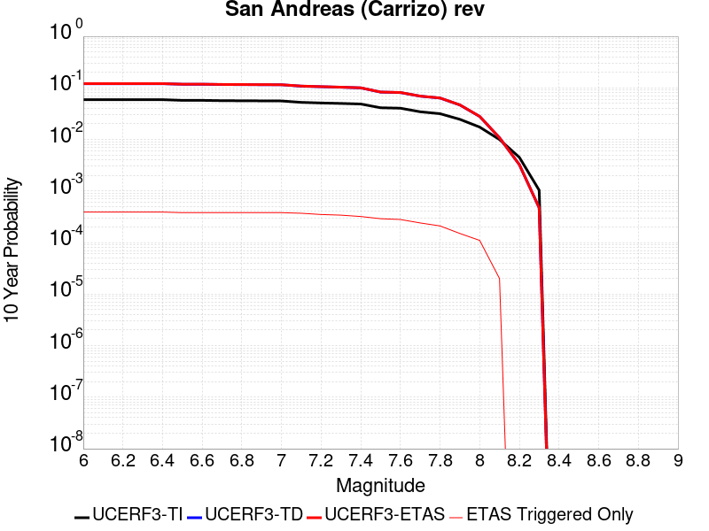 |

| Magnitude | 1 wk TI Prob | 1 wk TD Prob | 1 wk ETAS Prob | 1 wk ETAS/TD Gain | 1 wk ETAS Triggered Only | 1 mo TI Prob | 1 mo TD Prob | 1 mo ETAS Prob | 1 mo ETAS/TD Gain | 1 mo ETAS Triggered Only | 1 yr TI Prob | 1 yr TD Prob | 1 yr ETAS Prob | 1 yr ETAS/TD Gain | 1 yr ETAS Triggered Only | 10 yr TI Prob | 10 yr TD Prob | 10 yr ETAS Prob | 10 yr ETAS/TD Gain | 10 yr ETAS Triggered Only |
|-----|-----|-----|-----|-----|-----|-----|-----|-----|-----|-----|-----|-----|-----|-----|-----|-----|-----|-----|-----|-----|
| 6.0 | 1.1674632E-4 | 2.432302E-4 | 4.039628E-4 | 1.660825 | 1.607717E-4 | 5.002454E-4 | 0.0010420004 | 0.0012507858 | 1.2003698 | 2.0900322E-4 | 0.006073493 | 0.012613042 | 0.0129464045 | 1.02643 | 3.376206E-4 | 0.0591016 | 0.12061418 | 0.12099591 | 1.0031649 | 4.340836E-4 |
| 6.1 | 1.1674632E-4 | 2.432302E-4 | 4.039628E-4 | 1.660825 | 1.607717E-4 | 5.002454E-4 | 0.0010420004 | 0.0012507858 | 1.2003698 | 2.0900322E-4 | 0.006073493 | 0.012613042 | 0.0129464045 | 1.02643 | 3.376206E-4 | 0.0591016 | 0.12061418 | 0.12099591 | 1.0031649 | 4.340836E-4 |
| 6.2 | 1.1674632E-4 | 2.432302E-4 | 4.039628E-4 | 1.660825 | 1.607717E-4 | 5.002454E-4 | 0.0010420004 | 0.0012507858 | 1.2003698 | 2.0900322E-4 | 0.006073493 | 0.012613042 | 0.0129464045 | 1.02643 | 3.376206E-4 | 0.0591016 | 0.12061418 | 0.12099591 | 1.0031649 | 4.340836E-4 |
| 6.3 | 1.1674632E-4 | 2.432302E-4 | 4.039628E-4 | 1.660825 | 1.607717E-4 | 5.002454E-4 | 0.0010420004 | 0.0012507858 | 1.2003698 | 2.0900322E-4 | 0.006073493 | 0.012613042 | 0.0129464045 | 1.02643 | 3.376206E-4 | 0.0591016 | 0.12061418 | 0.12099591 | 1.0031649 | 4.340836E-4 |
| 6.4 | 1.1674632E-4 | 2.432302E-4 | 4.039628E-4 | 1.660825 | 1.607717E-4 | 5.002454E-4 | 0.0010420004 | 0.0012507858 | 1.2003698 | 2.0900322E-4 | 0.006073493 | 0.012613042 | 0.0129464045 | 1.02643 | 3.376206E-4 | 0.0591016 | 0.12061418 | 0.12099591 | 1.0031649 | 4.340836E-4 |
| 6.5 | 1.13136164E-4 | 2.3643032E-4 | 3.8109065E-4 | 1.6118518 | 1.4469454E-4 | 4.847792E-4 | 0.0010128808 | 0.0012056115 | 1.1902797 | 1.9292605E-4 | 0.0058862255 | 0.012262545 | 0.012580144 | 1.0259 | 3.215434E-4 | 0.057327334 | 0.117585555 | 0.1179544 | 1.0031369 | 4.1800644E-4 |
| 6.6 | 1.13136164E-4 | 2.3643032E-4 | 3.8109065E-4 | 1.6118518 | 1.4469454E-4 | 4.847792E-4 | 0.0010128808 | 0.0012056115 | 1.1902797 | 1.9292605E-4 | 0.0058862255 | 0.012262545 | 0.012580144 | 1.0259 | 3.215434E-4 | 0.057327334 | 0.117585555 | 0.1179544 | 1.0031369 | 4.1800644E-4 |
| 6.7 | 1.1149675E-4 | 2.3334254E-4 | 3.7800331E-4 | 1.6199503 | 1.4469454E-4 | 4.777557E-4 | 9.996577E-4 | 0.0011923909 | 1.1927992 | 1.9292605E-4 | 0.0058011734 | 0.012103349 | 0.012421001 | 1.026245 | 3.215434E-4 | 0.05652051 | 0.1162071 | 0.11657653 | 1.0031791 | 4.1800644E-4 |
| 6.8 | 1.1103589E-4 | 2.3236412E-4 | 3.7702505E-4 | 1.6225613 | 1.4469454E-4 | 4.7578133E-4 | 9.954676E-4 | 0.0011882017 | 1.1936115 | 1.9292605E-4 | 0.005777263 | 0.012052901 | 0.01237057 | 1.0263561 | 3.215434E-4 | 0.056293584 | 0.1157674 | 0.11613701 | 1.0031928 | 4.1800644E-4 |
| 6.9 | 1.1053259E-4 | 2.3128795E-4 | 3.7594902E-4 | 1.6254587 | 1.4469454E-4 | 4.7362508E-4 | 9.90859E-4 | 0.0011835939 | 1.194513 | 1.9292605E-4 | 0.0057511497 | 0.01199741 | 0.012315096 | 1.0264795 | 3.215434E-4 | 0.05604569 | 0.11528359 | 0.11565341 | 1.0032079 | 4.1800644E-4 |
| 7.0 | 1.1005377E-4 | 2.3029637E-4 | 3.749576E-4 | 1.6281524 | 1.4469454E-4 | 4.7157376E-4 | 9.866126E-4 | 0.0011793483 | 1.1953509 | 1.9292605E-4 | 0.0057263062 | 0.011946279 | 0.012263981 | 1.0265943 | 3.215434E-4 | 0.055809796 | 0.11483591 | 0.115205914 | 1.003222 | 4.1800644E-4 |
| 7.1 | 1.0308142E-4 | 2.1539345E-4 | 3.439831E-4 | 1.5969989 | 1.2861736E-4 | 4.417027E-4 | 9.227892E-4 | 0.0010994748 | 1.1914692 | 1.7684887E-4 | 0.0053644776 | 0.011177397 | 0.011479449 | 1.0270234 | 3.0546624E-4 | 0.052368138 | 0.108092256 | 0.10845074 | 1.0033164 | 4.0192925E-4 |
| 7.2 | 1.0027479E-4 | 2.094724E-4 | 3.3806282E-4 | 1.6138777 | 1.2861736E-4 | 4.296783E-4 | 8.9743105E-4 | 0.0010741212 | 1.1968844 | 1.7684887E-4 | 0.0052187922 | 0.010871782 | 0.011158025 | 1.0263289 | 2.8938908E-4 | 0.050979212 | 0.10539625 | 0.105741434 | 1.0032752 | 3.858521E-4 |
| 7.3 | 9.816942E-5 | 2.0422463E-4 | 3.3281575E-4 | 1.6296551 | 1.2861736E-4 | 4.2065824E-4 | 8.7495585E-4 | 0.0010355869 | 1.1835876 | 1.607717E-4 | 0.005109493 | 0.010600842 | 0.010871257 | 1.0255088 | 2.733119E-4 | 0.049935985 | 0.102979995 | 0.103311695 | 1.0032209 | 3.697749E-4 |
| 7.4 | 9.5634205E-5 | 1.9791997E-4 | 3.104379E-4 | 1.5685021 | 1.1254019E-4 | 4.0979648E-4 | 8.479536E-4 | 9.925255E-4 | 1.170495 | 1.4469454E-4 | 0.0049778637 | 0.010275229 | 0.010529821 | 1.0247772 | 2.5723473E-4 | 0.048678253 | 0.10006632 | 0.10038462 | 1.003181 | 3.5369775E-4 |
| 7.5 | 8.052417E-5 | 1.611261E-4 | 2.5757359E-4 | 1.5985838 | 9.646302E-5 | 3.4505792E-4 | 6.903579E-4 | 8.1888644E-4 | 1.1861768 | 1.2861736E-4 | 0.0041929903 | 0.008372796 | 0.008595992 | 1.0266572 | 2.2508038E-4 | 0.04114753 | 0.08281049 | 0.08309066 | 1.0033833 | 3.0546624E-4 |
| 7.6 | 7.897024E-5 | 1.5765853E-4 | 2.5410636E-4 | 1.6117513 | 9.646302E-5 | 3.384E-4 | 6.755046E-4 | 8.040351E-4 | 1.1902733 | 1.2861736E-4 | 0.0041122385 | 0.008193332 | 0.008400623 | 1.0252999 | 2.0900322E-4 | 0.040369697 | 0.08115171 | 0.08141761 | 1.0032766 | 2.8938908E-4 |
| 7.7 | 6.707427E-5 | 1.3276102E-4 | 2.1313621E-4 | 1.6054125 | 8.038585E-5 | 2.8742946E-4 | 5.688518E-4 | 6.81328E-4 | 1.1977249 | 1.1254019E-4 | 0.003493839 | 0.00690381 | 0.007095404 | 1.0277519 | 1.9292605E-4 | 0.034394164 | 0.069048055 | 0.0693025 | 1.003685 | 2.733119E-4 |
| 7.8 | 6.147705E-5 | 1.2197486E-4 | 2.0235092E-4 | 1.6589558 | 8.038585E-5 | 2.6344648E-4 | 5.226447E-4 | 6.351261E-4 | 1.2152158 | 1.1254019E-4 | 0.0032027436 | 0.006344659 | 0.006520386 | 1.0276968 | 1.7684887E-4 | 0.031569764 | 0.06351457 | 0.0637404 | 1.0035558 | 2.4115756E-4 |
| 7.9 | 4.7636717E-5 | 8.87977E-5 | 1.6917642E-4 | 1.9051892 | 8.038585E-5 | 2.0414138E-4 | 3.8050607E-4 | 4.9300346E-4 | 1.2956519 | 1.1254019E-4 | 0.0024825884 | 0.0046228287 | 0.0047828574 | 1.034617 | 1.607717E-4 | 0.024550365 | 0.046628095 | 0.046812024 | 1.0039446 | 1.9292605E-4 |
| 8.0 | 3.3554235E-5 | 5.2136907E-5 | 1.16442236E-4 | 2.2333937 | 6.430868E-5 | 1.4379594E-4 | 2.2342477E-4 | 3.1986623E-4 | 1.4316508 | 9.646302E-5 | 0.0017493097 | 0.002716805 | 0.002845073 | 1.0472128 | 1.2861736E-4 | 0.017356034 | 0.027880952 | 0.028021613 | 1.005045 | 1.4469454E-4 |
| 8.1 | 1.9175432E-5 | 1.9184976E-5 | 3.5261837E-5 | 1.8379923 | 1.607717E-5 | 8.217783E-5 | 8.2218736E-5 | 9.8294586E-5 | 1.1955254 | 1.607717E-5 | 0.0010000558 | 0.0010005541 | 0.0010166151 | 1.0160522 | 1.607717E-5 | 0.009955673 | 0.0107580265 | 0.010773931 | 1.0014783 | 1.607717E-5 |
| 8.2 | 8.643924E-6 | 5.4748625E-6 | 5.4748625E-6 | 1.0 | 0.0 | 3.704486E-5 | 2.3463486E-5 | 2.3463486E-5 | 1.0 | 0.0 | 4.5092785E-4 | 2.8563058E-4 | 2.8563058E-4 | 1.0 | 0.0 | 0.0045001395 | 0.0032487072 | 0.0032487072 | 1.0 | 0.0 |
| 8.3 | 1.983087E-6 | 7.6599065E-7 | 7.6599065E-7 | 1.0 | 0.0 | 8.498917E-6 | 3.282813E-6 | 3.282813E-6 | 1.0 | 0.0 | 1.034694E-4 | 3.9967534E-5 | 3.9967534E-5 | 1.0 | 0.0 | 0.0010342124 | 4.719687E-4 | 4.719687E-4 | 1.0 | 0.0 |

## San Andreas (Cholame) rev
*[(top)](#table-of-contents)*

| 1 Week | 1 Month | 1 Year | 10 Year |
|-----|-----|-----|-----|
|  |  |  |  |

| Magnitude | 1 wk TI Prob | 1 wk TD Prob | 1 wk ETAS Prob | 1 wk ETAS/TD Gain | 1 wk ETAS Triggered Only | 1 mo TI Prob | 1 mo TD Prob | 1 mo ETAS Prob | 1 mo ETAS/TD Gain | 1 mo ETAS Triggered Only | 1 yr TI Prob | 1 yr TD Prob | 1 yr ETAS Prob | 1 yr ETAS/TD Gain | 1 yr ETAS Triggered Only | 10 yr TI Prob | 10 yr TD Prob | 10 yr ETAS Prob | 10 yr ETAS/TD Gain | 10 yr ETAS Triggered Only |
|-----|-----|-----|-----|-----|-----|-----|-----|-----|-----|-----|-----|-----|-----|-----|-----|-----|-----|-----|-----|-----|
| 6.0 | 1.2302514E-4 | 2.5204287E-4 | 4.1277404E-4 | 1.6377137 | 1.607717E-4 | 5.27144E-4 | 0.0010797381 | 0.0012885157 | 1.1933594 | 2.0900322E-4 | 0.0063991086 | 0.0130670825 | 0.013384424 | 1.0242856 | 3.215434E-4 | 0.06217949 | 0.12439073 | 0.124742664 | 1.0028293 | 4.0192925E-4 |
| 6.1 | 1.2302514E-4 | 2.5204287E-4 | 4.1277404E-4 | 1.6377137 | 1.607717E-4 | 5.27144E-4 | 0.0010797381 | 0.0012885157 | 1.1933594 | 2.0900322E-4 | 0.0063991086 | 0.0130670825 | 0.013384424 | 1.0242856 | 3.215434E-4 | 0.06217949 | 0.12439073 | 0.124742664 | 1.0028293 | 4.0192925E-4 |
| 6.2 | 1.2203569E-4 | 2.5021084E-4 | 4.109423E-4 | 1.6423842 | 1.607717E-4 | 5.2290526E-4 | 0.0010718931 | 0.0012806723 | 1.1947762 | 2.0900322E-4 | 0.006347804 | 0.01297271 | 0.013290082 | 1.0244646 | 3.215434E-4 | 0.061695136 | 0.12357691 | 0.123929165 | 1.0028505 | 4.0192925E-4 |
| 6.3 | 1.2142645E-4 | 2.4907055E-4 | 4.0980222E-4 | 1.6453258 | 1.607717E-4 | 5.202953E-4 | 0.0010670102 | 0.0012757904 | 1.1956685 | 2.0900322E-4 | 0.006316212 | 0.012913967 | 0.013231358 | 1.0245774 | 3.215434E-4 | 0.06139677 | 0.12307103 | 0.123423494 | 1.0028639 | 4.0192925E-4 |
| 6.4 | 1.1865206E-4 | 2.44126E-4 | 4.0485847E-4 | 1.6583996 | 1.607717E-4 | 5.0840975E-4 | 0.0010458364 | 0.001254621 | 1.1996341 | 2.0900322E-4 | 0.006172335 | 0.012659196 | 0.012976669 | 1.0250784 | 3.215434E-4 | 0.060036868 | 0.1208638 | 0.121217154 | 1.0029235 | 4.0192925E-4 |
| 6.5 | 1.17443946E-4 | 2.4205919E-4 | 4.0279198E-4 | 1.6640227 | 1.607717E-4 | 5.032341E-4 | 0.0010369857 | 0.0012457721 | 1.2013398 | 2.0900322E-4 | 0.006109677 | 0.012552682 | 0.01287019 | 1.025294 | 3.215434E-4 | 0.059444077 | 0.11993805 | 0.12029178 | 1.0029492 | 4.0192925E-4 |
| 6.6 | 1.13579066E-4 | 2.3514954E-4 | 3.7981005E-4 | 1.6151851 | 1.4469454E-4 | 4.866766E-4 | 0.001007396 | 0.0012001278 | 1.1913167 | 1.9292605E-4 | 0.0059092017 | 0.012196515 | 0.012482374 | 1.0234379 | 2.8938908E-4 | 0.057545185 | 0.11685214 | 0.11717871 | 1.0027947 | 3.697749E-4 |
| 6.7 | 1.1271412E-4 | 2.3359268E-4 | 3.7825343E-4 | 1.6192862 | 1.4469454E-4 | 4.829711E-4 | 0.0010007289 | 0.0011934619 | 1.1925926 | 1.9292605E-4 | 0.005864331 | 0.012116249 | 0.012402131 | 1.023595 | 2.8938908E-4 | 0.057119697 | 0.116155714 | 0.11648253 | 1.0028137 | 3.697749E-4 |
| 6.8 | 1.1217975E-4 | 2.3247694E-4 | 3.7713785E-4 | 1.6222591 | 1.4469454E-4 | 4.8068175E-4 | 9.959509E-4 | 0.0011886847 | 1.1935174 | 1.9292605E-4 | 0.005836608 | 0.012058721 | 0.01234462 | 1.0237089 | 2.8938908E-4 | 0.056856725 | 0.11565396 | 0.115980975 | 1.0028275 | 3.697749E-4 |
| 6.9 | 1.1146753E-4 | 2.3096445E-4 | 3.7562556E-4 | 1.626335 | 1.4469454E-4 | 4.7763053E-4 | 9.894737E-4 | 0.0011822088 | 1.1947855 | 1.9292605E-4 | 0.0057996577 | 0.011980731 | 0.012266654 | 1.0238651 | 2.8938908E-4 | 0.056506127 | 0.11497439 | 0.115301654 | 1.0028464 | 3.697749E-4 |
| 7.0 | 1.0965793E-4 | 2.2719789E-4 | 3.7185955E-4 | 1.636721 | 1.4469454E-4 | 4.698779E-4 | 9.733434E-4 | 0.0011660816 | 1.1980168 | 1.9292605E-4 | 0.005705768 | 0.011786487 | 0.012072465 | 1.0242633 | 2.8938908E-4 | 0.055614736 | 0.11327597 | 0.11360385 | 1.0028946 | 3.697749E-4 |
| 7.1 | 9.927982E-5 | 2.0538924E-4 | 3.339802E-4 | 1.6260842 | 1.2861736E-4 | 4.2541555E-4 | 8.7994366E-4 | 0.0010566369 | 1.2008007 | 1.7684887E-4 | 0.0051671406 | 0.010660981 | 0.010931379 | 1.0253633 | 2.733119E-4 | 0.05048634 | 0.1033706 | 0.10368773 | 1.003068 | 3.5369775E-4 |
| 7.2 | 9.696786E-5 | 2.0043184E-4 | 3.2902343E-4 | 1.6415726 | 1.2861736E-4 | 4.1551032E-4 | 8.5871184E-4 | 0.0010354088 | 1.2057699 | 1.7684887E-4 | 0.00504711 | 0.010404981 | 0.010675449 | 1.0259941 | 2.733119E-4 | 0.04934009 | 0.1011086 | 0.101426534 | 1.0031445 | 3.5369775E-4 |
| 7.3 | 9.4727984E-5 | 1.9472468E-4 | 3.23317E-4 | 1.6603801 | 1.2861736E-4 | 4.0591392E-4 | 8.3426846E-4 | 9.949061E-4 | 1.192549 | 1.607717E-4 | 0.0049308087 | 0.010110183 | 0.0103648165 | 1.025186 | 2.5723473E-4 | 0.048228268 | 0.09847952 | 0.09878389 | 1.0030907 | 3.376206E-4 |
| 7.4 | 9.220358E-5 | 1.8843076E-4 | 3.0094973E-4 | 1.5971371 | 1.1254019E-4 | 3.9509835E-4 | 8.073114E-4 | 9.518891E-4 | 1.1790855 | 1.4469454E-4 | 0.004799717 | 0.009784967 | 0.010023764 | 1.0244045 | 2.4115756E-4 | 0.046973653 | 0.095557496 | 0.095848314 | 1.0030434 | 3.215434E-4 |
| 7.5 | 7.71631E-5 | 1.5177966E-4 | 2.4822805E-4 | 1.63545 | 9.646302E-5 | 3.306571E-4 | 6.503223E-4 | 7.78856E-4 | 1.1976461 | 1.2861736E-4 | 0.0040183207 | 0.007889002 | 0.008096356 | 1.026284 | 2.0900322E-4 | 0.03946433 | 0.07828531 | 0.07853722 | 1.0032179 | 2.733119E-4 |
| 7.6 | 7.5634416E-5 | 1.483744E-4 | 2.448231E-4 | 1.6500361 | 9.646302E-5 | 3.241072E-4 | 6.3573546E-4 | 7.6427107E-4 | 1.2021841 | 1.2861736E-4 | 0.0039388672 | 0.0077126776 | 0.007904116 | 1.0248212 | 1.9292605E-4 | 0.038697794 | 0.07664872 | 0.07688624 | 1.0030988 | 2.5723473E-4 |
| 7.7 | 6.3783E-5 | 1.235872E-4 | 2.0396312E-4 | 1.650358 | 8.038585E-5 | 2.7332708E-4 | 5.29552E-4 | 6.420326E-4 | 1.2124071 | 1.1254019E-4 | 0.0033226798 | 0.0064282627 | 0.006603975 | 1.0273343 | 1.7684887E-4 | 0.032734364 | 0.06454029 | 0.064765885 | 1.0034953 | 2.4115756E-4 |
| 7.8 | 5.863422E-5 | 1.1416107E-4 | 1.9453774E-4 | 1.7040638 | 8.038585E-5 | 2.512653E-4 | 4.8917E-4 | 6.0165516E-4 | 1.229951 | 1.1254019E-4 | 0.003054864 | 0.0059394026 | 0.0061152014 | 1.0295987 | 1.7684887E-4 | 0.030132094 | 0.059659187 | 0.05987084 | 1.0035477 | 2.2508038E-4 |
| 7.9 | 4.595283E-5 | 8.426331E-5 | 1.6464239E-4 | 1.9539037 | 8.038585E-5 | 1.9692584E-4 | 3.610785E-4 | 4.7357808E-4 | 1.3115654 | 1.1254019E-4 | 0.0023949358 | 0.0043872762 | 0.0045473427 | 1.0364842 | 1.607717E-4 | 0.023692891 | 0.044362005 | 0.04453101 | 1.0038097 | 1.7684887E-4 |
| 8.0 | 3.2950178E-5 | 5.0772942E-5 | 1.1507836E-4 | 2.2665293 | 6.430868E-5 | 1.412074E-4 | 2.1758018E-4 | 3.140222E-4 | 1.4432483 | 9.646302E-5 | 0.0017178444 | 0.0026458222 | 0.0027740994 | 1.0484829 | 1.2861736E-4 | 0.017046256 | 0.027180137 | 0.0273209 | 1.0051788 | 1.4469454E-4 |
| 8.1 | 1.9177472E-5 | 1.9185145E-5 | 3.5262008E-5 | 1.8379849 | 1.607717E-5 | 8.218658E-5 | 8.221946E-5 | 9.829531E-5 | 1.1955236 | 1.607717E-5 | 0.0010001622 | 0.0010005629 | 0.001016624 | 1.016052 | 1.607717E-5 | 0.009956728 | 0.010758142 | 0.010774046 | 1.0014783 | 1.607717E-5 |
| 8.2 | 8.643924E-6 | 5.4748625E-6 | 5.4748625E-6 | 1.0 | 0.0 | 3.704486E-5 | 2.3463486E-5 | 2.3463486E-5 | 1.0 | 0.0 | 4.5092785E-4 | 2.8563058E-4 | 2.8563058E-4 | 1.0 | 0.0 | 0.0045001395 | 0.0032487072 | 0.0032487072 | 1.0 | 0.0 |
| 8.3 | 1.983087E-6 | 7.6599065E-7 | 7.6599065E-7 | 1.0 | 0.0 | 8.498917E-6 | 3.282813E-6 | 3.282813E-6 | 1.0 | 0.0 | 1.034694E-4 | 3.9967534E-5 | 3.9967534E-5 | 1.0 | 0.0 | 0.0010342124 | 4.719687E-4 | 4.719687E-4 | 1.0 | 0.0 |

## Ludlow
*[(top)](#table-of-contents)*

| 1 Week | 1 Month | 1 Year | 10 Year |
|-----|-----|-----|-----|
|  |  |  |  |

| Magnitude | 1 wk TI Prob | 1 wk TD Prob | 1 wk ETAS Prob | 1 wk ETAS/TD Gain | 1 wk ETAS Triggered Only | 1 mo TI Prob | 1 mo TD Prob | 1 mo ETAS Prob | 1 mo ETAS/TD Gain | 1 mo ETAS Triggered Only | 1 yr TI Prob | 1 yr TD Prob | 1 yr ETAS Prob | 1 yr ETAS/TD Gain | 1 yr ETAS Triggered Only | 10 yr TI Prob | 10 yr TD Prob | 10 yr ETAS Prob | 10 yr ETAS/TD Gain | 10 yr ETAS Triggered Only |
|-----|-----|-----|-----|-----|-----|-----|-----|-----|-----|-----|-----|-----|-----|-----|-----|-----|-----|-----|-----|-----|
| 6.0 | 2.2407607E-5 | 2.3657254E-5 | 1.5227158E-4 | 6.43657 | 1.2861736E-4 | 9.602906E-5 | 1.0138454E-4 | 2.7821548E-4 | 2.744161 | 1.7684887E-4 | 0.0011685267 | 0.001233702 | 0.0015066767 | 1.2212647 | 2.733119E-4 | 0.011624013 | 0.012273042 | 0.012638278 | 1.0297593 | 3.697749E-4 |
| 6.1 | 2.2407607E-5 | 2.3657254E-5 | 1.5227158E-4 | 6.43657 | 1.2861736E-4 | 9.602906E-5 | 1.0138454E-4 | 2.7821548E-4 | 2.744161 | 1.7684887E-4 | 0.0011685267 | 0.001233702 | 0.0015066767 | 1.2212647 | 2.733119E-4 | 0.011624013 | 0.012273042 | 0.012638278 | 1.0297593 | 3.697749E-4 |
| 6.2 | 1.0781252E-5 | 1.1365663E-5 | 7.567361E-5 | 6.65809 | 6.430868E-5 | 4.620455E-5 | 4.8709102E-5 | 1.1301465E-4 | 2.320196 | 6.430868E-5 | 5.623952E-4 | 5.9287593E-4 | 7.0534943E-4 | 1.1897082 | 1.1254019E-4 | 0.00560974 | 0.0059133614 | 0.0060572 | 1.0243244 | 1.4469454E-4 |
| 6.3 | 1.0781252E-5 | 1.1365663E-5 | 7.567361E-5 | 6.65809 | 6.430868E-5 | 4.620455E-5 | 4.8709102E-5 | 1.1301465E-4 | 2.320196 | 6.430868E-5 | 5.623952E-4 | 5.9287593E-4 | 7.0534943E-4 | 1.1897082 | 1.1254019E-4 | 0.00560974 | 0.0059133614 | 0.0060572 | 1.0243244 | 1.4469454E-4 |
| 6.4 | 7.814439E-6 | 8.237729E-6 | 2.4314766E-5 | 2.951635 | 1.607717E-5 | 3.3490025E-5 | 3.530408E-5 | 5.1380684E-5 | 1.4553752 | 1.607717E-5 | 4.0766477E-4 | 4.2974384E-4 | 4.6188434E-4 | 1.07479 | 3.215434E-5 | 0.0040691774 | 0.0042892746 | 0.004353307 | 1.0149286 | 6.430868E-5 |
| 6.5 | 6.4986366E-6 | 6.85092E-6 | 2.292798E-5 | 3.3467011 | 1.607717E-5 | 2.7851002E-5 | 2.9360759E-5 | 4.5437457E-5 | 1.5475574 | 1.607717E-5 | 3.390332E-4 | 3.5740953E-4 | 3.8955238E-4 | 1.0899328 | 3.215434E-5 | 0.003385164 | 0.0035684432 | 0.0036165027 | 1.0134679 | 4.823151E-5 |
| 6.6 | 5.582177E-6 | 5.8860055E-6 | 2.1963082E-5 | 3.731407 | 1.607717E-5 | 2.3923398E-5 | 2.5225498E-5 | 4.1302264E-5 | 1.637322 | 1.607717E-5 | 2.9122844E-4 | 3.0707786E-4 | 3.3922234E-4 | 1.1046785 | 3.215434E-5 | 0.0029084706 | 0.003066609 | 0.0030986646 | 1.0104531 | 3.215434E-5 |
| 6.7 | 4.6858763E-6 | 4.940427E-6 | 2.1017519E-5 | 4.2541904 | 1.607717E-5 | 2.0082172E-5 | 2.1173091E-5 | 3.724992E-5 | 1.7593048 | 1.607717E-5 | 2.4447302E-4 | 2.5775246E-4 | 2.898985E-4 | 1.1247168 | 3.215434E-5 | 0.0024420423 | 0.0025745912 | 0.002606663 | 1.0124569 | 3.215434E-5 |
| 6.8 | 3.5584908E-6 | 3.7520183E-6 | 1.9829129E-5 | 5.284923 | 1.607717E-5 | 1.5250586E-5 | 1.6079981E-5 | 3.2156895E-5 | 1.999809 | 1.607717E-5 | 1.8566006E-4 | 1.957566E-4 | 2.2790465E-4 | 1.1642246 | 3.215434E-5 | 0.0018550502 | 0.0019558826 | 0.0019879742 | 1.0164076 | 3.215434E-5 |
| 6.9 | 2.532834E-6 | 2.6710034E-6 | 1.8748131E-5 | 7.019134 | 1.607717E-5 | 1.0854958E-5 | 1.1447109E-5 | 2.7524095E-5 | 2.4044583 | 1.607717E-5 | 1.3215111E-4 | 1.3935992E-4 | 1.7150978E-4 | 1.2306966 | 3.215434E-5 | 0.0013207254 | 0.0013927529 | 0.0014248624 | 1.0230547 | 3.215434E-5 |
| 7.0 | 1.7083285E-6 | 1.8019439E-6 | 1.8019439E-6 | 1.0 | 0.0 | 7.3213873E-6 | 7.722595E-6 | 7.722595E-6 | 1.0 | 0.0 | 8.913424E-5 | 9.40187E-5 | 1.10094355E-4 | 1.1709837 | 1.607717E-5 | 8.9098496E-4 | 9.3980576E-4 | 9.558678E-4 | 1.0170908 | 1.607717E-5 |
| 7.1 | 1.0905424E-6 | 1.1497619E-6 | 1.1497619E-6 | 1.0 | 0.0 | 4.6737446E-6 | 4.9275427E-6 | 4.9275427E-6 | 1.0 | 0.0 | 5.6901354E-5 | 5.999128E-5 | 7.606748E-5 | 1.2679757 | 1.607717E-5 | 5.6886784E-4 | 5.997606E-4 | 6.1582815E-4 | 1.0267899 | 1.607717E-5 |
| 7.2 | 6.06668E-7 | 6.387277E-7 | 6.387277E-7 | 1.0 | 0.0 | 2.600003E-6 | 2.7374022E-6 | 2.7374022E-6 | 1.0 | 0.0 | 3.1654577E-5 | 3.3327433E-5 | 4.9404065E-5 | 1.4823844 | 1.607717E-5 | 3.1650066E-4 | 3.3323118E-4 | 3.4930298E-4 | 1.0482302 | 1.607717E-5 |

## San Andreas (Coachella) rev
*[(top)](#table-of-contents)*

| 1 Week | 1 Month | 1 Year | 10 Year |
|-----|-----|-----|-----|
|  |  |  |  |

| Magnitude | 1 wk TI Prob | 1 wk TD Prob | 1 wk ETAS Prob | 1 wk ETAS/TD Gain | 1 wk ETAS Triggered Only | 1 mo TI Prob | 1 mo TD Prob | 1 mo ETAS Prob | 1 mo ETAS/TD Gain | 1 mo ETAS Triggered Only | 1 yr TI Prob | 1 yr TD Prob | 1 yr ETAS Prob | 1 yr ETAS/TD Gain | 1 yr ETAS Triggered Only | 10 yr TI Prob | 10 yr TD Prob | 10 yr ETAS Prob | 10 yr ETAS/TD Gain | 10 yr ETAS Triggered Only |
|-----|-----|-----|-----|-----|-----|-----|-----|-----|-----|-----|-----|-----|-----|-----|-----|-----|-----|-----|-----|-----|
| 6.0 | 1.1925945E-4 | 3.2729402E-4 | 3.7550973E-4 | 1.1473162 | 4.823151E-5 | 5.110118E-4 | 0.0014019393 | 0.001498267 | 1.0687103 | 9.646302E-5 | 0.0062038354 | 0.016936364 | 0.017141828 | 1.0121315 | 2.0900322E-4 | 0.060334753 | 0.15265316 | 0.15296648 | 1.0020525 | 3.697749E-4 |
| 6.1 | 1.1925945E-4 | 3.2729402E-4 | 3.7550973E-4 | 1.1473162 | 4.823151E-5 | 5.110118E-4 | 0.0014019393 | 0.001498267 | 1.0687103 | 9.646302E-5 | 0.0062038354 | 0.016936364 | 0.017141828 | 1.0121315 | 2.0900322E-4 | 0.060334753 | 0.15265316 | 0.15296648 | 1.0020525 | 3.697749E-4 |
| 6.2 | 1.07432395E-4 | 3.0230157E-4 | 3.505185E-4 | 1.1594994 | 4.823151E-5 | 4.603433E-4 | 0.0012949388 | 0.001391277 | 1.0743959 | 9.646302E-5 | 0.005590286 | 0.015653009 | 0.01585874 | 1.0131433 | 2.0900322E-4 | 0.05451731 | 0.14182423 | 0.14211397 | 1.0020429 | 3.376206E-4 |
| 6.3 | 1.0718766E-4 | 3.0175463E-4 | 3.4997158E-4 | 1.1597886 | 4.823151E-5 | 4.592948E-4 | 0.0012925972 | 0.0013889355 | 1.0745308 | 9.646302E-5 | 0.005577586 | 0.015624908 | 0.015830645 | 1.0131673 | 2.0900322E-4 | 0.054396555 | 0.14159249 | 0.14188232 | 1.0020468 | 3.376206E-4 |
| 6.4 | 1.0355944E-4 | 2.9383553E-4 | 3.4205287E-4 | 1.1640964 | 4.823151E-5 | 4.4375064E-4 | 0.0012586913 | 0.0013550329 | 1.0765411 | 9.646302E-5 | 0.0053892885 | 0.015217941 | 0.0154237645 | 1.013525 | 2.0900322E-4 | 0.052604496 | 0.13815255 | 0.13844353 | 1.0021062 | 3.376206E-4 |
| 6.5 | 1.0227914E-4 | 2.9102986E-4 | 3.3924734E-4 | 1.1656787 | 4.823151E-5 | 4.382655E-4 | 0.0012466786 | 0.0013430214 | 1.0772796 | 9.646302E-5 | 0.0053228354 | 0.01507372 | 0.015279573 | 1.0136564 | 2.0900322E-4 | 0.051971316 | 0.13693172 | 0.13722311 | 1.002128 | 3.376206E-4 |
| 6.6 | 1.0116757E-4 | 2.8868738E-4 | 3.3690498E-4 | 1.1670235 | 4.823151E-5 | 4.3350324E-4 | 0.0012366489 | 0.0013329927 | 1.0779071 | 9.646302E-5 | 0.0052651367 | 0.01495329 | 0.015159168 | 1.0137681 | 2.0900322E-4 | 0.051421247 | 0.1359099 | 0.13620164 | 1.0021465 | 3.376206E-4 |
| 6.7 | 1.0050676E-4 | 2.8727303E-4 | 3.3549068E-4 | 1.1678461 | 4.823151E-5 | 4.3067214E-4 | 0.0012305931 | 0.0013269373 | 1.0782909 | 9.646302E-5 | 0.005230834 | 0.014880571 | 0.015086464 | 1.0138364 | 2.0900322E-4 | 0.051094085 | 0.13529462 | 0.13558656 | 1.0021578 | 3.376206E-4 |
| 6.8 | 9.976819E-5 | 2.853096E-4 | 3.3352734E-4 | 1.1690015 | 4.823151E-5 | 4.2750788E-4 | 0.0012221863 | 0.0013185315 | 1.0788301 | 9.646302E-5 | 0.0051924936 | 0.0147796115 | 0.014985526 | 1.0139323 | 2.0900322E-4 | 0.050728295 | 0.13444631 | 0.13473853 | 1.0021735 | 3.376206E-4 |
| 6.9 | 9.77719E-5 | 2.8027873E-4 | 3.2849674E-4 | 1.1720358 | 4.823151E-5 | 4.1895514E-4 | 0.0012006456 | 0.0012969928 | 1.0802462 | 9.646302E-5 | 0.0050888555 | 0.014520878 | 0.0147268465 | 1.0141842 | 2.0900322E-4 | 0.049738888 | 0.1322748 | 0.13256778 | 1.0022148 | 3.376206E-4 |
| 7.0 | 8.500761E-5 | 2.4762485E-4 | 2.9584442E-4 | 1.1947283 | 4.823151E-5 | 3.6426744E-4 | 0.001060821 | 0.0011571817 | 1.0908359 | 9.646302E-5 | 0.0044259406 | 0.012839786 | 0.013030235 | 1.0148327 | 1.9292605E-4 | 0.04338823 | 0.11813272 | 0.11841628 | 1.0024004 | 3.215434E-4 |
| 7.1 | 8.319876E-5 | 2.4365232E-4 | 2.9187207E-4 | 1.197904 | 4.823151E-5 | 3.5651738E-4 | 0.0010438096 | 0.0011241115 | 1.0769316 | 8.038585E-5 | 0.004331963 | 0.012635092 | 0.012809707 | 1.0138198 | 1.7684887E-4 | 0.042484846 | 0.116353 | 0.116622925 | 1.0023199 | 3.0546624E-4 |
| 7.2 | 7.563917E-5 | 2.2413683E-4 | 2.7235755E-4 | 1.2151395 | 4.823151E-5 | 3.2412758E-4 | 9.602359E-4 | 0.0010405446 | 1.0836343 | 8.038585E-5 | 0.0039391145 | 0.011628893 | 0.011803686 | 1.0150309 | 1.7684887E-4 | 0.03870018 | 0.10775925 | 0.10801745 | 1.0023961 | 2.8938908E-4 |
| 7.3 | 7.082985E-5 | 2.0729867E-4 | 2.555202E-4 | 1.2326186 | 4.823151E-5 | 3.0352117E-4 | 8.881233E-4 | 9.6843776E-4 | 1.0904317 | 8.038585E-5 | 0.0036891096 | 0.010759917 | 0.010934863 | 1.0162591 | 1.7684887E-4 | 0.03628465 | 0.100282 | 0.10054237 | 1.0025964 | 2.8938908E-4 |
| 7.4 | 5.146215E-5 | 1.4273795E-4 | 1.9096257E-4 | 1.3378543 | 4.823151E-5 | 2.2053342E-4 | 6.115915E-4 | 6.919282E-4 | 1.1313568 | 8.038585E-5 | 0.0026816884 | 0.0074208933 | 0.00759643 | 1.0236543 | 1.7684887E-4 | 0.02649557 | 0.070849575 | 0.07110352 | 1.0035843 | 2.733119E-4 |
| 7.5 | 4.0285166E-5 | 1.09416E-4 | 1.5764224E-4 | 1.4407604 | 4.823151E-5 | 1.7263928E-4 | 4.6884175E-4 | 5.491899E-4 | 1.1713759 | 8.038585E-5 | 0.002099857 | 0.0056932783 | 0.0058691204 | 1.0308859 | 1.7684887E-4 | 0.020801254 | 0.055011146 | 0.055269424 | 1.0046949 | 2.733119E-4 |
| 7.6 | 3.1168736E-5 | 8.4389096E-5 | 1.3261654E-4 | 1.571489 | 4.823151E-5 | 1.3357346E-4 | 3.6161754E-4 | 4.4197432E-4 | 1.2222148 | 8.038585E-5 | 0.0016250437 | 0.0043938323 | 0.004569904 | 1.0400724 | 1.7684887E-4 | 0.016132116 | 0.04281005 | 0.04307166 | 1.006111 | 2.733119E-4 |
| 7.7 | 2.2100989E-5 | 6.238755E-5 | 1.10616056E-4 | 1.7730469 | 4.823151E-5 | 9.4715084E-5 | 2.6734784E-4 | 3.4771222E-4 | 1.3005985 | 8.038585E-5 | 0.001152546 | 0.0032501083 | 0.0034263826 | 1.0542364 | 1.7684887E-4 | 0.011465867 | 0.0319002 | 0.032164793 | 1.0082945 | 2.733119E-4 |
| 7.8 | 1.7484861E-5 | 5.179572E-5 | 1.0002473E-4 | 1.931139 | 4.823151E-5 | 7.493296E-5 | 2.2196278E-4 | 3.023308E-4 | 1.3620788 | 8.038585E-5 | 9.1192697E-4 | 0.0026990508 | 0.0028754224 | 1.0653458 | 1.7684887E-4 | 0.009081938 | 0.026640115 | 0.026906148 | 1.009986 | 2.733119E-4 |
| 7.9 | 1.3967285E-5 | 3.822255E-5 | 8.645222E-5 | 2.2618117 | 4.823151E-5 | 5.985842E-5 | 1.6380067E-4 | 2.4417334E-4 | 1.4906738 | 8.038585E-5 | 7.2853256E-4 | 0.00199245 | 0.0021529016 | 1.0805297 | 1.607717E-4 | 0.0072614877 | 0.019909438 | 0.02016155 | 1.012663 | 2.5723473E-4 |
| 8.0 | 1.1887396E-5 | 3.106521E-5 | 7.929523E-5 | 2.552541 | 4.823151E-5 | 5.094499E-5 | 1.3312983E-4 | 2.1350497E-4 | 1.6037351 | 8.038585E-5 | 6.200787E-4 | 0.0016196516 | 0.0017801629 | 1.0991024 | 1.607717E-4 | 0.006183513 | 0.016279267 | 0.016532315 | 1.0155442 | 2.5723473E-4 |
| 8.1 | 5.100864E-6 | 8.973418E-6 | 8.973418E-6 | 1.0 | 0.0 | 2.1860664E-5 | 3.8456936E-5 | 3.8456936E-5 | 1.0 | 0.0 | 2.6612106E-4 | 4.6811273E-4 | 4.8418238E-4 | 1.0343286 | 1.607717E-5 | 0.002658026 | 0.004917731 | 0.004933729 | 1.0032531 | 1.607717E-5 |
| 8.2 | 2.3004484E-6 | 2.7864487E-6 | 2.7864487E-6 | 1.0 | 0.0 | 9.859027E-6 | 1.1941868E-5 | 1.1941868E-5 | 1.0 | 0.0 | 1.2002704E-4 | 1.4538258E-4 | 1.4538258E-4 | 1.0 | 0.0 | 0.0011996223 | 0.0015973912 | 0.0015973912 | 1.0 | 0.0 |
| 8.3 | 1.0424446E-7 | 5.8161504E-8 | 5.8161504E-8 | 1.0 | 0.0 | 4.4676187E-7 | 2.4926356E-7 | 2.4926356E-7 | 1.0 | 0.0 | 5.439312E-6 | 3.03478E-6 | 3.03478E-6 | 1.0 | 0.0 | 5.4391792E-5 | 3.190716E-5 | 3.190716E-5 | 1.0 | 0.0 |

## Death Valley (Fish Lake Valley)
*[(top)](#table-of-contents)*

| 1 Week | 1 Month | 1 Year | 10 Year |
|-----|-----|-----|-----|
| 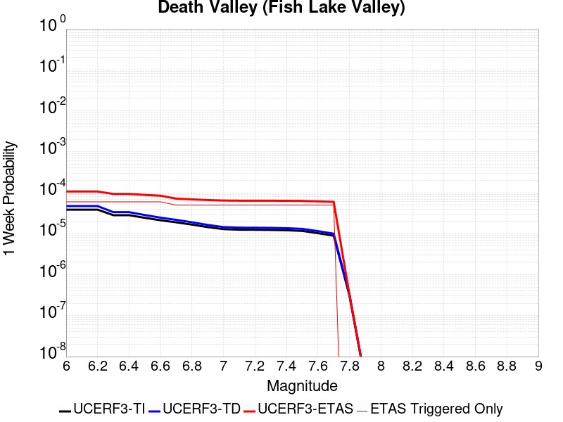 | 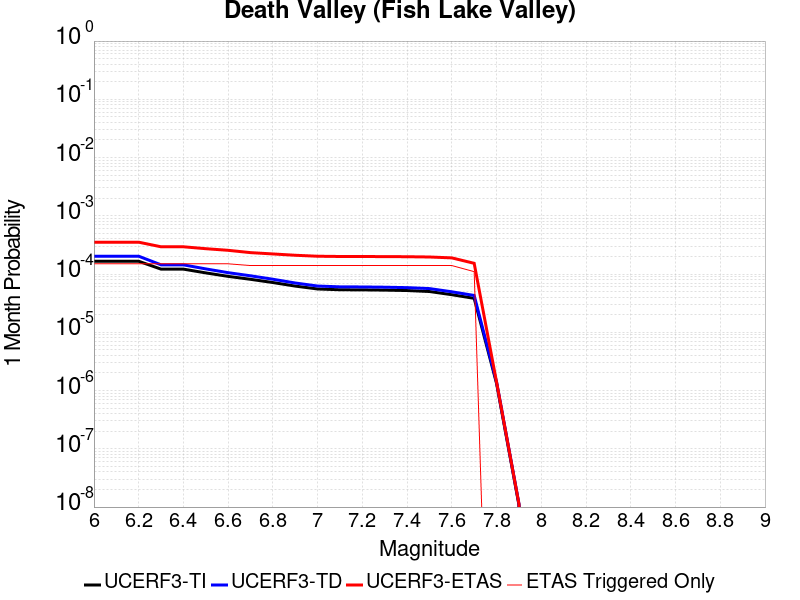 |  |  |

| Magnitude | 1 wk TI Prob | 1 wk TD Prob | 1 wk ETAS Prob | 1 wk ETAS/TD Gain | 1 wk ETAS Triggered Only | 1 mo TI Prob | 1 mo TD Prob | 1 mo ETAS Prob | 1 mo ETAS/TD Gain | 1 mo ETAS Triggered Only | 1 yr TI Prob | 1 yr TD Prob | 1 yr ETAS Prob | 1 yr ETAS/TD Gain | 1 yr ETAS Triggered Only | 10 yr TI Prob | 10 yr TD Prob | 10 yr ETAS Prob | 10 yr ETAS/TD Gain | 10 yr ETAS Triggered Only |
|-----|-----|-----|-----|-----|-----|-----|-----|-----|-----|-----|-----|-----|-----|-----|-----|-----|-----|-----|-----|-----|
| 6.0 | 3.872328E-5 | 4.7267473E-5 | 1.11573114E-4 | 2.360463 | 6.430868E-5 | 1.6594635E-4 | 2.0256084E-4 | 3.3115217E-4 | 1.6348281 | 1.2861736E-4 | 0.0020185246 | 0.002463534 | 0.0027361726 | 1.1106697 | 2.733119E-4 | 0.02000288 | 0.024388181 | 0.024748938 | 1.0147923 | 3.697749E-4 |
| 6.1 | 3.872328E-5 | 4.7267473E-5 | 1.11573114E-4 | 2.360463 | 6.430868E-5 | 1.6594635E-4 | 2.0256084E-4 | 3.3115217E-4 | 1.6348281 | 1.2861736E-4 | 0.0020185246 | 0.002463534 | 0.0027361726 | 1.1106697 | 2.733119E-4 | 0.02000288 | 0.024388181 | 0.024748938 | 1.0147923 | 3.697749E-4 |
| 6.2 | 3.872328E-5 | 4.7267473E-5 | 1.11573114E-4 | 2.360463 | 6.430868E-5 | 1.6594635E-4 | 2.0256084E-4 | 3.3115217E-4 | 1.6348281 | 1.2861736E-4 | 0.0020185246 | 0.002463534 | 0.0027361726 | 1.1106697 | 2.733119E-4 | 0.02000288 | 0.024388181 | 0.024748938 | 1.0147923 | 3.697749E-4 |
| 6.3 | 2.8356371E-5 | 3.3609853E-5 | 9.7916374E-5 | 2.9133236 | 6.430868E-5 | 1.2152165E-4 | 1.4403471E-4 | 2.7263354E-4 | 1.8928323 | 1.2861736E-4 | 0.0014785219 | 0.0017522911 | 0.0020251242 | 1.1557007 | 2.733119E-4 | 0.014687235 | 0.017391782 | 0.017755127 | 1.0208917 | 3.697749E-4 |
| 6.4 | 2.8356371E-5 | 3.3609853E-5 | 9.7916374E-5 | 2.9133236 | 6.430868E-5 | 1.2152165E-4 | 1.4403471E-4 | 2.7263354E-4 | 1.8928323 | 1.2861736E-4 | 0.0014785219 | 0.0017522911 | 0.0020251242 | 1.1557007 | 2.733119E-4 | 0.014687235 | 0.017391782 | 0.017755127 | 1.0208917 | 3.697749E-4 |
| 6.5 | 2.4448687E-5 | 2.8607552E-5 | 9.291439E-5 | 3.2478974 | 6.430868E-5 | 1.0477588E-4 | 1.2259831E-4 | 2.511999E-4 | 2.0489671 | 1.2861736E-4 | 0.0012748998 | 0.0014916632 | 0.0017645673 | 1.182953 | 2.733119E-4 | 0.012676105 | 0.014821377 | 0.015185671 | 1.0245789 | 3.697749E-4 |
| 6.6 | 2.1298161E-5 | 2.4660083E-5 | 8.896718E-5 | 3.6077404 | 6.430868E-5 | 9.127464E-5 | 1.0568198E-4 | 2.3428575E-4 | 2.216894 | 1.2861736E-4 | 0.0011107022 | 0.0012859525 | 0.0015428565 | 1.1997771 | 2.5723473E-4 | 0.011051672 | 0.012788526 | 0.013121828 | 1.0260626 | 3.376206E-4 |
| 6.7 | 1.8959729E-5 | 2.1781025E-5 | 7.001148E-5 | 3.2143338 | 4.823151E-5 | 8.125345E-5 | 9.334405E-5 | 2.0587374E-4 | 2.2055366 | 1.1254019E-4 | 9.888117E-4 | 0.001135897 | 0.0013767806 | 1.2120646 | 2.4115756E-4 | 0.009844234 | 0.01130357 | 0.011621479 | 1.0281247 | 3.215434E-4 |
| 6.8 | 1.6691629E-5 | 1.9018353E-5 | 6.724895E-5 | 3.5360029 | 4.823151E-5 | 7.153359E-5 | 8.150477E-5 | 1.9403579E-4 | 2.380668 | 1.1254019E-4 | 8.7057345E-4 | 9.918857E-4 | 0.001232804 | 1.2428893 | 2.4115756E-4 | 0.008671708 | 0.009876343 | 0.010194711 | 1.0322354 | 3.215434E-4 |
| 6.9 | 1.450505E-5 | 1.638954E-5 | 6.462026E-5 | 3.9427745 | 4.823151E-5 | 6.216302E-5 | 7.0239046E-5 | 1.8277133E-4 | 2.602133 | 1.1254019E-4 | 7.5657194E-4 | 8.5483363E-4 | 0.0010957851 | 1.2818694 | 2.4115756E-4 | 0.007540013 | 0.008516385 | 0.008835191 | 1.0374343 | 3.215434E-4 |
| 7.0 | 1.2940855E-5 | 1.4537972E-5 | 6.2768784E-5 | 4.317575 | 4.823151E-5 | 5.545963E-5 | 6.230414E-5 | 1.7483732E-4 | 2.8061912 | 1.1254019E-4 | 6.750118E-4 | 7.5829466E-4 | 9.992694E-4 | 1.317785 | 2.4115756E-4 | 0.006729651 | 0.0075576897 | 0.007876803 | 1.0422237 | 3.215434E-4 |
| 7.1 | 1.2544658E-5 | 1.4078208E-5 | 6.230904E-5 | 4.4259214 | 4.823151E-5 | 5.3761712E-5 | 6.0333812E-5 | 1.7286722E-4 | 2.8651798 | 1.1254019E-4 | 6.5435225E-4 | 7.343222E-4 | 9.7530265E-4 | 1.3281672 | 2.4115756E-4 | 0.006524288 | 0.007319551 | 0.007638741 | 1.0436078 | 3.215434E-4 |
| 7.2 | 1.2489416E-5 | 1.4015674E-5 | 6.224651E-5 | 4.441207 | 4.823151E-5 | 5.3524967E-5 | 6.0065824E-5 | 1.7259926E-4 | 2.8735018 | 1.1254019E-4 | 6.514716E-4 | 7.310616E-4 | 9.720429E-4 | 1.3296319 | 2.4115756E-4 | 0.006495651 | 0.0072871596 | 0.00760636 | 1.0438031 | 3.215434E-4 |
| 7.3 | 1.2368307E-5 | 1.3879812E-5 | 6.211065E-5 | 4.4748917 | 4.823151E-5 | 5.3005948E-5 | 5.9483587E-5 | 1.7201708E-4 | 2.8918412 | 1.1254019E-4 | 6.451563E-4 | 7.2397763E-4 | 9.649606E-4 | 1.3328596 | 2.4115756E-4 | 0.0064328653 | 0.007216782 | 0.0075360048 | 1.0442334 | 3.215434E-4 |
| 7.4 | 1.2161707E-5 | 1.36478675E-5 | 6.187872E-5 | 4.533948 | 4.823151E-5 | 5.212056E-5 | 5.8489582E-5 | 1.7102319E-4 | 2.923994 | 1.1254019E-4 | 6.3438306E-4 | 7.118836E-4 | 9.528695E-4 | 1.3385186 | 2.4115756E-4 | 0.006325751 | 0.0070966207 | 0.0074158823 | 1.0449878 | 3.215434E-4 |
| 7.5 | 1.1707948E-5 | 1.3145515E-5 | 6.137639E-5 | 4.6689987 | 4.823151E-5 | 5.0175953E-5 | 5.6336736E-5 | 1.688706E-4 | 2.9975216 | 1.1254019E-4 | 6.10721E-4 | 6.856895E-4 | 9.266817E-4 | 1.3514596 | 2.4115756E-4 | 0.0060904534 | 0.006836321 | 0.0071556666 | 1.046713 | 3.215434E-4 |
| 7.6 | 1.0319538E-5 | 1.1579622E-5 | 5.9810576E-5 | 5.165158 | 4.823151E-5 | 4.4225842E-5 | 4.9626036E-5 | 1.6216065E-4 | 3.2676525 | 1.1254019E-4 | 5.383166E-4 | 6.040347E-4 | 8.450466E-4 | 1.3990034 | 2.4115756E-4 | 0.0053701443 | 0.0060244603 | 0.0063440665 | 1.0530515 | 3.215434E-4 |
| 7.7 | 8.937764E-6 | 1.0022779E-5 | 5.825381E-5 | 5.812141 | 4.823151E-5 | 3.830414E-5 | 4.295409E-5 | 1.2333649E-4 | 2.8713562 | 8.038585E-5 | 4.6625308E-4 | 5.228456E-4 | 7.1567076E-4 | 1.3687994 | 1.9292605E-4 | 0.0046527605 | 0.005216664 | 0.0054885503 | 1.0521188 | 2.733119E-4 |
| 7.8 | 3.108007E-7 | 3.284654E-7 | 3.284654E-7 | 1.0 | 0.0 | 1.3320023E-6 | 1.407708E-6 | 1.407708E-6 | 1.0 | 0.0 | 1.6217007E-5 | 1.7138715E-5 | 3.321561E-5 | 1.9380455 | 1.607717E-5 | 1.6215823E-4 | 1.7137431E-4 | 1.8744874E-4 | 1.0937971 | 1.607717E-5 |
| 7.9 | 2.5591178E-9 | 2.6696718E-9 | 2.6696718E-9 | 1.0 | 0.0 | 1.0967647E-8 | 1.14414505E-8 | 1.14414505E-8 | 1.0 | 0.0 | 1.335311E-7 | 1.3929966E-7 | 1.3929966E-7 | 1.0 | 0.0 | 1.3353102E-6 | 1.3929966E-6 | 1.3929966E-6 | 1.0 | 0.0 |

## Mission Ridge-Arroyo Parida-Santa Ana
*[(top)](#table-of-contents)*

| 1 Week | 1 Month | 1 Year | 10 Year |
|-----|-----|-----|-----|
|  |  |  |  |

| Magnitude | 1 wk TI Prob | 1 wk TD Prob | 1 wk ETAS Prob | 1 wk ETAS/TD Gain | 1 wk ETAS Triggered Only | 1 mo TI Prob | 1 mo TD Prob | 1 mo ETAS Prob | 1 mo ETAS/TD Gain | 1 mo ETAS Triggered Only | 1 yr TI Prob | 1 yr TD Prob | 1 yr ETAS Prob | 1 yr ETAS/TD Gain | 1 yr ETAS Triggered Only | 10 yr TI Prob | 10 yr TD Prob | 10 yr ETAS Prob | 10 yr ETAS/TD Gain | 10 yr ETAS Triggered Only |
|-----|-----|-----|-----|-----|-----|-----|-----|-----|-----|-----|-----|-----|-----|-----|-----|-----|-----|-----|-----|-----|
| 6.0 | 4.169034E-5 | 4.7138263E-5 | 1.11443915E-4 | 2.3641922 | 6.430868E-5 | 1.7866064E-4 | 2.0201034E-4 | 2.8237994E-4 | 1.397849 | 8.038585E-5 | 0.0021730233 | 0.00245745 | 0.0025857512 | 1.0522091 | 1.2861736E-4 | 0.021518968 | 0.024384614 | 0.024619892 | 1.0096486 | 2.4115756E-4 |
| 6.1 | 1.73813E-5 | 1.6854226E-5 | 6.5084925E-5 | 3.8616383 | 4.823151E-5 | 7.4489166E-5 | 7.223046E-5 | 1.20458484E-4 | 1.6676966 | 4.823151E-5 | 9.065282E-4 | 8.790618E-4 | 9.7544E-4 | 1.1096376 | 9.646302E-5 | 0.009028391 | 0.008756988 | 0.008900415 | 1.0163786 | 1.4469454E-4 |
| 6.2 | 1.4622182E-5 | 1.367329E-5 | 6.190414E-5 | 4.527377 | 4.823151E-5 | 6.2664985E-5 | 5.8598518E-5 | 1.068272E-4 | 1.823036 | 4.823151E-5 | 7.6267915E-4 | 7.132073E-4 | 8.096015E-4 | 1.1351559 | 9.646302E-5 | 0.007600669 | 0.007109627 | 0.00723733 | 1.017962 | 1.2861736E-4 |
| 6.3 | 1.3552434E-5 | 1.2482201E-5 | 6.071311E-5 | 4.863975 | 4.823151E-5 | 5.8080568E-5 | 5.3494066E-5 | 1.01722995E-4 | 1.9015753 | 4.823151E-5 | 7.069015E-4 | 6.510988E-4 | 7.314323E-4 | 1.1233815 | 8.038585E-5 | 0.00704657 | 0.006492275 | 0.0066040843 | 1.0172219 | 1.1254019E-4 |
| 6.4 | 1.30977305E-5 | 1.1979156E-5 | 6.0210088E-5 | 5.026238 | 4.823151E-5 | 5.613192E-5 | 5.1338247E-5 | 9.956728E-5 | 1.9394368 | 4.823151E-5 | 6.831918E-4 | 6.248669E-4 | 7.052025E-4 | 1.1285644 | 8.038585E-5 | 0.006810953 | 0.0062314444 | 0.006343283 | 1.0179476 | 1.1254019E-4 |
| 6.5 | 1.225205E-5 | 1.1048803E-5 | 5.927978E-5 | 5.3652673 | 4.823151E-5 | 5.2507727E-5 | 4.7351168E-5 | 9.55804E-5 | 2.0185435 | 4.823151E-5 | 6.3909404E-4 | 5.7635066E-4 | 6.406223E-4 | 1.1115148 | 6.430868E-5 | 0.006372592 | 0.005748869 | 0.0058447774 | 1.016683 | 9.646302E-5 |
| 6.6 | 1.1352241E-5 | 1.0063535E-5 | 5.829456E-5 | 5.7926526 | 4.823151E-5 | 4.8651553E-5 | 4.3128734E-5 | 9.135817E-5 | 2.1182668 | 4.823151E-5 | 5.921717E-4 | 5.2496797E-4 | 5.8924285E-4 | 1.1224359 | 6.430868E-5 | 0.0059059616 | 0.0052375244 | 0.0053334823 | 1.0183212 | 9.646302E-5 |
| 6.7 | 1.0864116E-5 | 9.517027E-6 | 5.774808E-5 | 6.0678697 | 4.823151E-5 | 4.6559664E-5 | 4.0786632E-5 | 8.9016175E-5 | 2.1824841 | 4.823151E-5 | 5.667165E-4 | 4.964661E-4 | 5.6074286E-4 | 1.1294686 | 6.430868E-5 | 0.005652734 | 0.004953804 | 0.005049789 | 1.019376 | 9.646302E-5 |
| 6.8 | 1.0666365E-5 | 9.299779E-6 | 5.753084E-5 | 6.1862593 | 4.823151E-5 | 4.571219E-5 | 3.9855597E-5 | 8.808519E-5 | 2.2101083 | 4.823151E-5 | 5.564038E-4 | 4.8513585E-4 | 5.494133E-4 | 1.1324937 | 6.430868E-5 | 0.005550127 | 0.0048410003 | 0.004936996 | 1.0198298 | 9.646302E-5 |
| 6.9 | 1.0038665E-5 | 8.592046E-6 | 5.682314E-5 | 6.613459 | 4.823151E-5 | 4.302214E-5 | 3.682254E-5 | 8.505228E-5 | 2.3097882 | 4.823151E-5 | 5.236687E-4 | 4.4822405E-4 | 5.125039E-4 | 1.1434101 | 6.430868E-5 | 0.005224364 | 0.004473411 | 0.0045694425 | 1.0214672 | 9.646302E-5 |
| 7.0 | 9.5379955E-6 | 8.025073E-6 | 5.6256198E-5 | 7.010054 | 4.823151E-5 | 4.0876483E-5 | 3.4392728E-5 | 8.262258E-5 | 2.402327 | 4.823151E-5 | 4.975576E-4 | 4.1865272E-4 | 4.8293447E-4 | 1.1535443 | 6.430868E-5 | 0.00496445 | 0.0041788397 | 0.0042748996 | 1.0229872 | 9.646302E-5 |
| 7.1 | 9.207389E-6 | 7.652375E-6 | 2.3729423E-5 | 3.1009226 | 1.607717E-5 | 3.945964E-5 | 3.279549E-5 | 4.8872134E-5 | 1.490209 | 1.607717E-5 | 4.803152E-4 | 3.9921363E-4 | 4.3135515E-4 | 1.080512 | 3.215434E-5 | 0.004792784 | 0.003985161 | 0.0040492136 | 1.0160728 | 6.430868E-5 |
| 7.2 | 7.638091E-6 | 5.9311183E-6 | 2.2008193E-5 | 3.7106314 | 1.607717E-5 | 3.2734264E-5 | 2.541883E-5 | 4.1495594E-5 | 1.6324744 | 1.607717E-5 | 3.984668E-4 | 3.0943064E-4 | 3.4157504E-4 | 1.1038824 | 3.215434E-5 | 0.0039775306 | 0.0030900547 | 0.0031541646 | 1.0207472 | 6.430868E-5 |
| 7.3 | 7.2500147E-6 | 5.5961527E-6 | 2.1673233E-5 | 3.872881 | 1.607717E-5 | 3.1071122E-5 | 2.3983293E-5 | 4.0060077E-5 | 1.6703327 | 1.607717E-5 | 3.7822526E-4 | 2.9195778E-4 | 3.2410273E-4 | 1.1101013 | 3.215434E-5 | 0.0037758215 | 0.0029157975 | 0.0029799186 | 1.0219909 | 6.430868E-5 |
| 7.4 | 6.3899715E-6 | 4.9184964E-6 | 2.0995587E-5 | 4.2687006 | 1.607717E-5 | 2.7385306E-5 | 2.10791E-5 | 3.7155933E-5 | 1.7626905 | 1.607717E-5 | 3.3336508E-4 | 2.5660804E-4 | 2.8875412E-4 | 1.1252731 | 3.215434E-5 | 0.0033286542 | 0.0025631618 | 0.0026273055 | 1.0250252 | 6.430868E-5 |
| 7.5 | 5.379025E-6 | 4.0838527E-6 | 2.0160958E-5 | 4.9367495 | 1.607717E-5 | 2.305276E-5 | 1.7502109E-5 | 3.3579E-5 | 1.9185686 | 1.607717E-5 | 2.806312E-4 | 2.1306744E-4 | 2.4521493E-4 | 1.1508794 | 3.215434E-5 | 0.0028027708 | 0.002128643 | 0.0021928148 | 1.0301468 | 6.430868E-5 |
| 7.6 | 4.1270696E-6 | 3.0883439E-6 | 1.9165465E-5 | 6.2057414 | 1.607717E-5 | 1.768732E-5 | 1.3235693E-5 | 2.931265E-5 | 2.2146668 | 1.607717E-5 | 2.1532185E-4 | 1.6113273E-4 | 1.9328189E-4 | 1.1995198 | 3.215434E-5 | 0.0021511333 | 0.001610167 | 0.0016583209 | 1.0299062 | 4.823151E-5 |
| 7.7 | 2.5406805E-6 | 1.8282013E-6 | 1.7905342E-5 | 9.793966 | 1.607717E-5 | 1.0888585E-5 | 7.835125E-6 | 2.391217E-5 | 3.0519192 | 1.607717E-5 | 1.3256045E-4 | 9.538854E-5 | 1.2753981E-4 | 1.3370559 | 3.215434E-5 | 0.0013248142 | 9.534821E-4 | 9.856058E-4 | 1.0336909 | 3.215434E-5 |
| 7.8 | 4.8608285E-7 | 3.5098864E-7 | 3.5098864E-7 | 1.0 | 0.0 | 2.0832106E-6 | 1.5042363E-6 | 1.5042363E-6 | 1.0 | 0.0 | 2.5362791E-5 | 1.8313924E-5 | 1.8313924E-5 | 1.0 | 0.0 | 2.5359896E-4 | 1.8312426E-4 | 1.8312426E-4 | 1.0 | 0.0 |
| 7.9 | 2.0472514E-8 | 1.2688783E-8 | 1.2688783E-8 | 1.0 | 0.0 | 8.7739345E-8 | 5.43805E-8 | 5.43805E-8 | 1.0 | 0.0 | 1.068226E-6 | 6.6208236E-7 | 6.6208236E-7 | 1.0 | 0.0 | 1.0682209E-5 | 6.620805E-6 | 6.620805E-6 | 1.0 | 0.0 |
| 8.0 | 4.443582E-9 | 2.0321211E-9 | 2.0321211E-9 | 1.0 | 0.0 | 1.9043922E-8 | 8.70909E-9 | 8.70909E-9 | 1.0 | 0.0 | 2.3185973E-7 | 1.0603316E-7 | 1.0603316E-7 | 1.0 | 0.0 | 2.3185949E-6 | 1.0603312E-6 | 1.0603312E-6 | 1.0 | 0.0 |

## Sierra Nevada  (No Extension)
*[(top)](#table-of-contents)*

| 1 Week | 1 Month | 1 Year | 10 Year |
|-----|-----|-----|-----|
|  |  |  |  |

| Magnitude | 1 wk TI Prob | 1 wk TD Prob | 1 wk ETAS Prob | 1 wk ETAS/TD Gain | 1 wk ETAS Triggered Only | 1 mo TI Prob | 1 mo TD Prob | 1 mo ETAS Prob | 1 mo ETAS/TD Gain | 1 mo ETAS Triggered Only | 1 yr TI Prob | 1 yr TD Prob | 1 yr ETAS Prob | 1 yr ETAS/TD Gain | 1 yr ETAS Triggered Only | 10 yr TI Prob | 10 yr TD Prob | 10 yr ETAS Prob | 10 yr ETAS/TD Gain | 10 yr ETAS Triggered Only |
|-----|-----|-----|-----|-----|-----|-----|-----|-----|-----|-----|-----|-----|-----|-----|-----|-----|-----|-----|-----|-----|
| 6.0 | 7.7690465E-6 | 6.976322E-6 | 1.1951573E-4 | 17.131626 | 1.1254019E-4 | 3.329549E-5 | 2.9898381E-5 | 1.7458858E-4 | 5.8393993 | 1.4469454E-4 | 4.0529718E-4 | 3.6398784E-4 | 5.7291496E-4 | 1.5739949 | 2.0900322E-4 | 0.004045588 | 0.0036374326 | 0.0038937319 | 1.0704615 | 2.5723473E-4 |
| 6.1 | 7.7690465E-6 | 6.976322E-6 | 1.1951573E-4 | 17.131626 | 1.1254019E-4 | 3.329549E-5 | 2.9898381E-5 | 1.7458858E-4 | 5.8393993 | 1.4469454E-4 | 4.0529718E-4 | 3.6398784E-4 | 5.7291496E-4 | 1.5739949 | 2.0900322E-4 | 0.004045588 | 0.0036374326 | 0.0038937319 | 1.0704615 | 2.5723473E-4 |
| 6.2 | 7.7690465E-6 | 6.976322E-6 | 1.1951573E-4 | 17.131626 | 1.1254019E-4 | 3.329549E-5 | 2.9898381E-5 | 1.7458858E-4 | 5.8393993 | 1.4469454E-4 | 4.0529718E-4 | 3.6398784E-4 | 5.7291496E-4 | 1.5739949 | 2.0900322E-4 | 0.004045588 | 0.0036374326 | 0.0038937319 | 1.0704615 | 2.5723473E-4 |
| 6.3 | 7.7690465E-6 | 6.976322E-6 | 1.1951573E-4 | 17.131626 | 1.1254019E-4 | 3.329549E-5 | 2.9898381E-5 | 1.7458858E-4 | 5.8393993 | 1.4469454E-4 | 4.0529718E-4 | 3.6398784E-4 | 5.7291496E-4 | 1.5739949 | 2.0900322E-4 | 0.004045588 | 0.0036374326 | 0.0038937319 | 1.0704615 | 2.5723473E-4 |
| 6.4 | 7.7690465E-6 | 6.976322E-6 | 1.1951573E-4 | 17.131626 | 1.1254019E-4 | 3.329549E-5 | 2.9898381E-5 | 1.7458858E-4 | 5.8393993 | 1.4469454E-4 | 4.0529718E-4 | 3.6398784E-4 | 5.7291496E-4 | 1.5739949 | 2.0900322E-4 | 0.004045588 | 0.0036374326 | 0.0038937319 | 1.0704615 | 2.5723473E-4 |
| 6.5 | 7.7690465E-6 | 6.976322E-6 | 1.1951573E-4 | 17.131626 | 1.1254019E-4 | 3.329549E-5 | 2.9898381E-5 | 1.7458858E-4 | 5.8393993 | 1.4469454E-4 | 4.0529718E-4 | 3.6398784E-4 | 5.7291496E-4 | 1.5739949 | 2.0900322E-4 | 0.004045588 | 0.0036374326 | 0.0038937319 | 1.0704615 | 2.5723473E-4 |
| 6.6 | 2.653E-6 | 1.614854E-6 | 8.200057E-5 | 50.778942 | 8.038585E-5 | 1.136995E-5 | 6.9207845E-6 | 1.194602E-4 | 17.261078 | 1.1254019E-4 | 1.3842035E-4 | 8.425733E-5 | 2.450155E-4 | 2.9079428 | 1.607717E-4 | 0.0013833415 | 8.422573E-4 | 0.0010350208 | 1.2288654 | 1.9292605E-4 |
| 6.7 | 2.5902466E-6 | 1.5501876E-6 | 8.193591E-5 | 52.855488 | 8.038585E-5 | 1.11010095E-5 | 6.643644E-6 | 1.1918309E-4 | 17.939415 | 1.1254019E-4 | 1.351464E-4 | 8.0883394E-5 | 2.4164209E-4 | 2.9875364 | 1.607717E-4 | 0.0013506424 | 8.0854254E-4 | 0.0010013126 | 1.2384167 | 1.9292605E-4 |
| 6.8 | 2.5853892E-6 | 1.5469877E-6 | 8.193272E-5 | 52.96274 | 8.038585E-5 | 1.1080193E-5 | 6.629931E-6 | 1.1916938E-4 | 17.974453 | 1.1254019E-4 | 1.34893E-4 | 8.071645E-5 | 2.4147518E-4 | 2.9916477 | 1.607717E-4 | 0.0013481114 | 8.068743E-4 | 9.996446E-4 | 1.2389101 | 1.9292605E-4 |
| 6.9 | 2.458257E-6 | 1.4220619E-6 | 8.18078E-5 | 57.52759 | 8.038585E-5 | 1.0535345E-5 | 6.094537E-6 | 1.18634045E-4 | 19.465637 | 1.1254019E-4 | 1.2826028E-4 | 7.4198484E-5 | 2.3495826E-4 | 3.166618 | 1.607717E-4 | 0.0012818627 | 7.4173906E-4 | 9.34522E-4 | 1.2599066 | 1.9292605E-4 |
| 7.0 | 2.4341468E-6 | 1.3990258E-6 | 8.178477E-5 | 58.458366 | 8.038585E-5 | 1.0432016E-5 | 5.9958115E-6 | 1.1853533E-4 | 19.76969 | 1.1254019E-4 | 1.270024E-4 | 7.2996576E-5 | 2.3375654E-4 | 3.2022946 | 1.607717E-4 | 0.0012692984 | 7.297279E-4 | 9.2251314E-4 | 1.2641878 | 1.9292605E-4 |
| 7.1 | 2.3652476E-6 | 1.3339754E-6 | 8.171972E-5 | 61.26029 | 8.038585E-5 | 1.0136736E-5 | 5.717025E-6 | 1.18256576E-4 | 20.684984 | 1.1254019E-4 | 1.2340778E-4 | 6.9602575E-5 | 2.3036309E-4 | 3.3096921 | 1.607717E-4 | 0.0012333926 | 6.9580943E-4 | 8.8860124E-4 | 1.2770755 | 1.9292605E-4 |
| 7.2 | 2.272158E-6 | 1.2502821E-6 | 8.163603E-5 | 65.29409 | 8.038585E-5 | 9.737784E-6 | 5.3583412E-6 | 1.1789793E-4 | 22.002693 | 1.1254019E-4 | 1.1855107E-4 | 6.5235865E-5 | 2.2599708E-4 | 3.4643073 | 1.607717E-4 | 0.0011848784 | 6.5216864E-4 | 8.449689E-4 | 1.2956294 | 1.9292605E-4 |
| 7.3 | 2.1382127E-6 | 1.1419703E-6 | 8.152773E-5 | 71.392166 | 8.038585E-5 | 9.163737E-6 | 4.8941492E-6 | 1.1743379E-4 | 23.99473 | 1.1254019E-4 | 1.1156279E-4 | 5.958465E-5 | 2.2034677E-4 | 3.698046 | 1.607717E-4 | 0.001115068 | 5.956879E-4 | 7.88499E-4 | 1.3236781 | 1.9292605E-4 |
| 7.4 | 1.9048055E-6 | 9.575242E-7 | 6.526615E-5 | 68.16135 | 6.430868E-5 | 8.163426E-6 | 4.1036687E-6 | 1.0056629E-4 | 24.506435 | 9.646302E-5 | 9.9385186E-5 | 4.996103E-5 | 1.7857197E-4 | 3.5742252 | 1.2861736E-4 | 9.934074E-4 | 4.994987E-4 | 6.6019007E-4 | 1.3217053 | 1.607717E-4 |
| 7.5 | 1.5373403E-6 | 7.560042E-7 | 4.898748E-5 | 64.79789 | 4.823151E-5 | 6.5885843E-6 | 3.2400142E-6 | 6.7548484E-5 | 20.848207 | 6.430868E-5 | 8.021306E-5 | 3.9446462E-5 | 1.1982914E-4 | 3.0377665 | 8.038585E-5 | 8.0184115E-4 | 3.943951E-4 | 4.9082004E-4 | 1.2444882 | 9.646302E-5 |
| 7.6 | 1.0680322E-6 | 4.6596554E-7 | 1.6543128E-5 | 35.5029 | 1.607717E-5 | 4.577273E-6 | 1.9969937E-6 | 3.415127E-5 | 17.101341 | 3.215434E-5 | 5.5726876E-5 | 2.4313129E-5 | 7.2543466E-5 | 2.9837158 | 4.823151E-5 | 5.5712904E-4 | 2.4310495E-4 | 3.07398E-4 | 1.2644662 | 6.430868E-5 |
| 7.7 | 5.509146E-7 | 1.5580486E-7 | 1.6232972E-5 | 104.18784 | 1.607717E-5 | 2.3610605E-6 | 6.677349E-7 | 1.6744894E-5 | 25.077158 | 1.607717E-5 | 2.8745531E-5 | 8.129644E-6 | 4.0283725E-5 | 4.9551644 | 3.215434E-5 | 2.8741814E-4 | 8.1293576E-5 | 1.13445305E-4 | 1.3955014 | 3.215434E-5 |

## White Wolf (Extension)
*[(top)](#table-of-contents)*

| 1 Week | 1 Month | 1 Year | 10 Year |
|-----|-----|-----|-----|
|  |  |  |  |

| Magnitude | 1 wk TI Prob | 1 wk TD Prob | 1 wk ETAS Prob | 1 wk ETAS/TD Gain | 1 wk ETAS Triggered Only | 1 mo TI Prob | 1 mo TD Prob | 1 mo ETAS Prob | 1 mo ETAS/TD Gain | 1 mo ETAS Triggered Only | 1 yr TI Prob | 1 yr TD Prob | 1 yr ETAS Prob | 1 yr ETAS/TD Gain | 1 yr ETAS Triggered Only | 10 yr TI Prob | 10 yr TD Prob | 10 yr ETAS Prob | 10 yr ETAS/TD Gain | 10 yr ETAS Triggered Only |
|-----|-----|-----|-----|-----|-----|-----|-----|-----|-----|-----|-----|-----|-----|-----|-----|-----|-----|-----|-----|-----|
| 6.0 | 8.222555E-6 | 6.0666657E-6 | 1.02529106E-4 | 16.900404 | 9.646302E-5 | 3.5239045E-5 | 2.5999774E-5 | 1.546138E-4 | 5.946736 | 1.2861736E-4 | 4.289509E-4 | 3.1650788E-4 | 5.575891E-4 | 1.7616911 | 2.4115756E-4 | 0.0042812387 | 0.003161223 | 0.0034496973 | 1.091254 | 2.8938908E-4 |
| 6.1 | 8.222555E-6 | 6.0666657E-6 | 1.02529106E-4 | 16.900404 | 9.646302E-5 | 3.5239045E-5 | 2.5999774E-5 | 1.546138E-4 | 5.946736 | 1.2861736E-4 | 4.289509E-4 | 3.1650788E-4 | 5.575891E-4 | 1.7616911 | 2.4115756E-4 | 0.0042812387 | 0.003161223 | 0.0034496973 | 1.091254 | 2.8938908E-4 |
| 6.2 | 8.222555E-6 | 6.0666657E-6 | 1.02529106E-4 | 16.900404 | 9.646302E-5 | 3.5239045E-5 | 2.5999774E-5 | 1.546138E-4 | 5.946736 | 1.2861736E-4 | 4.289509E-4 | 3.1650788E-4 | 5.575891E-4 | 1.7616911 | 2.4115756E-4 | 0.0042812387 | 0.003161223 | 0.0034496973 | 1.091254 | 2.8938908E-4 |
| 6.3 | 8.222555E-6 | 6.0666657E-6 | 1.02529106E-4 | 16.900404 | 9.646302E-5 | 3.5239045E-5 | 2.5999774E-5 | 1.546138E-4 | 5.946736 | 1.2861736E-4 | 4.289509E-4 | 3.1650788E-4 | 5.575891E-4 | 1.7616911 | 2.4115756E-4 | 0.0042812387 | 0.003161223 | 0.0034496973 | 1.091254 | 2.8938908E-4 |
| 6.4 | 5.821773E-6 | 3.5571766E-6 | 5.1788516E-5 | 14.558883 | 4.823151E-5 | 2.4950215E-5 | 1.5244959E-5 | 6.347574E-5 | 4.1637197 | 4.823151E-5 | 3.0372653E-4 | 1.8559267E-4 | 3.3026034E-4 | 1.7794902 | 1.4469454E-4 | 0.0030331176 | 0.001854485 | 0.002031006 | 1.095186 | 1.7684887E-4 |
| 6.5 | 5.766023E-6 | 3.4991106E-6 | 5.1730454E-5 | 14.783886 | 4.823151E-5 | 2.4711293E-5 | 1.4996108E-5 | 6.322689E-5 | 4.2162204 | 4.823151E-5 | 3.0081844E-4 | 1.8256342E-4 | 3.2723154E-4 | 1.7924266 | 1.4469454E-4 | 0.0030041158 | 0.0018242426 | 0.002000769 | 1.0967668 | 1.7684887E-4 |
| 6.6 | 4.643576E-6 | 2.332624E-6 | 1.8409757E-5 | 7.892295 | 1.607717E-5 | 1.9900888E-5 | 9.996925E-6 | 2.6073934E-5 | 2.6081955 | 1.607717E-5 | 2.4226638E-4 | 1.2170619E-4 | 2.0208226E-4 | 1.6604106 | 8.038585E-5 | 0.0024200242 | 0.0012164378 | 0.0013288411 | 1.0924037 | 1.1254019E-4 |
| 6.7 | 3.9529173E-6 | 1.6483477E-6 | 1.6483477E-6 | 1.0 | 0.0 | 1.6940963E-5 | 7.0643296E-6 | 7.0643296E-6 | 1.0 | 0.0 | 2.0623671E-4 | 8.6005006E-5 | 1.1815658E-4 | 1.3738338 | 3.215434E-5 | 0.002060454 | 8.597357E-4 | 9.079258E-4 | 1.0560522 | 4.823151E-5 |
| 6.8 | 3.4377522E-6 | 1.2245237E-6 | 1.2245237E-6 | 1.0 | 0.0 | 1.473314E-5 | 5.2479486E-6 | 5.2479486E-6 | 1.0 | 0.0 | 1.7936122E-4 | 6.3891996E-5 | 9.604428E-5 | 1.5032287 | 3.215434E-5 | 0.0017921652 | 6.387454E-4 | 6.8694603E-4 | 1.0754615 | 4.823151E-5 |
| 6.9 | 3.1367306E-6 | 1.0033783E-6 | 1.0033783E-6 | 1.0 | 0.0 | 1.3443062E-5 | 4.3001864E-6 | 4.3001864E-6 | 1.0 | 0.0 | 1.63657E-4 | 5.235359E-5 | 5.235359E-5 | 1.0 | 0.0 | 0.0016353652 | 5.2342017E-4 | 5.394889E-4 | 1.0306995 | 1.607717E-5 |
| 7.0 | 2.8298145E-6 | 7.4286646E-7 | 7.4286646E-7 | 1.0 | 0.0 | 1.2127721E-5 | 3.1837099E-6 | 3.1837099E-6 | 1.0 | 0.0 | 1.47645E-4 | 3.8761027E-5 | 3.8761027E-5 | 1.0 | 0.0 | 0.0014754693 | 3.8754768E-4 | 4.0361861E-4 | 1.0414683 | 1.607717E-5 |
| 7.1 | 2.4091064E-6 | 5.4227525E-7 | 5.4227525E-7 | 1.0 | 0.0 | 1.03247E-5 | 2.3240348E-6 | 2.3240348E-6 | 1.0 | 0.0 | 1.2569598E-4 | 2.8294799E-5 | 2.8294799E-5 | 1.0 | 0.0 | 0.001256249 | 2.8291598E-4 | 2.9898863E-4 | 1.0568106 | 1.607717E-5 |
| 7.2 | 1.3875518E-6 | 1.0743063E-7 | 1.0743063E-7 | 1.0 | 0.0 | 5.9466374E-6 | 4.6041689E-7 | 4.6041689E-7 | 1.0 | 0.0 | 7.23979E-5 | 5.6055624E-6 | 5.6055624E-6 | 1.0 | 0.0 | 7.2374323E-4 | 5.6054323E-5 | 5.6054323E-5 | 1.0 | 0.0 |
| 7.3 | 7.056077E-7 | 5.002034E-8 | 5.002034E-8 | 1.0 | 0.0 | 3.0240296E-6 | 2.1437286E-7 | 2.1437286E-7 | 1.0 | 0.0 | 3.681694E-5 | 2.609987E-6 | 2.609987E-6 | 1.0 | 0.0 | 3.681084E-4 | 2.609961E-5 | 2.609961E-5 | 1.0 | 0.0 |
| 7.4 | 5.9334678E-8 | 4.8683537E-9 | 4.8683537E-9 | 1.0 | 0.0 | 2.5429145E-7 | 2.0864372E-8 | 2.0864372E-8 | 1.0 | 0.0 | 3.095994E-6 | 2.5402372E-7 | 2.5402372E-7 | 1.0 | 0.0 | 3.095951E-5 | 2.5402353E-6 | 2.5402353E-6 | 1.0 | 0.0 |

## Santa Ynez (West)
*[(top)](#table-of-contents)*

| 1 Week | 1 Month | 1 Year | 10 Year |
|-----|-----|-----|-----|
|  |  |  |  |

| Magnitude | 1 wk TI Prob | 1 wk TD Prob | 1 wk ETAS Prob | 1 wk ETAS/TD Gain | 1 wk ETAS Triggered Only | 1 mo TI Prob | 1 mo TD Prob | 1 mo ETAS Prob | 1 mo ETAS/TD Gain | 1 mo ETAS Triggered Only | 1 yr TI Prob | 1 yr TD Prob | 1 yr ETAS Prob | 1 yr ETAS/TD Gain | 1 yr ETAS Triggered Only | 10 yr TI Prob | 10 yr TD Prob | 10 yr ETAS Prob | 10 yr ETAS/TD Gain | 10 yr ETAS Triggered Only |
|-----|-----|-----|-----|-----|-----|-----|-----|-----|-----|-----|-----|-----|-----|-----|-----|-----|-----|-----|-----|-----|
| 6.0 | 4.7352758E-5 | 5.4972126E-5 | 1.1927727E-4 | 2.1697774 | 6.430868E-5 | 2.0292461E-4 | 2.3557522E-4 | 3.1594213E-4 | 1.3411518 | 8.038585E-5 | 0.0024678076 | 0.0028645284 | 0.0029927774 | 1.0447714 | 1.2861736E-4 | 0.024405818 | 0.028304417 | 0.028491883 | 1.0066231 | 1.9292605E-4 |
| 6.1 | 4.7352758E-5 | 5.4972126E-5 | 1.0320098E-4 | 1.877333 | 4.823151E-5 | 2.0292461E-4 | 2.3557522E-4 | 2.9986876E-4 | 1.2729214 | 6.430868E-5 | 0.0024678076 | 0.0028645284 | 0.0029927774 | 1.0447714 | 1.2861736E-4 | 0.024405818 | 0.028304417 | 0.02847626 | 1.0060712 | 1.7684887E-4 |
| 6.2 | 3.0415853E-5 | 3.392511E-5 | 8.2154984E-5 | 2.421657 | 4.823151E-5 | 1.3034715E-4 | 1.4538545E-4 | 2.0968477E-4 | 1.442268 | 6.430868E-5 | 0.0015858212 | 0.0017686661 | 0.0018649584 | 1.0544435 | 9.646302E-5 | 0.015745522 | 0.017549807 | 0.017691962 | 1.0081002 | 1.4469454E-4 |
| 6.3 | 3.0415853E-5 | 3.392511E-5 | 8.2154984E-5 | 2.421657 | 4.823151E-5 | 1.3034715E-4 | 1.4538545E-4 | 2.0968477E-4 | 1.442268 | 6.430868E-5 | 0.0015858212 | 0.0017686661 | 0.0018649584 | 1.0544435 | 9.646302E-5 | 0.015745522 | 0.017549807 | 0.017691962 | 1.0081002 | 1.4469454E-4 |
| 6.4 | 2.5452082E-5 | 2.7912422E-5 | 7.614259E-5 | 2.7279105 | 4.823151E-5 | 1.09075794E-4 | 1.196193E-4 | 1.8392029E-4 | 1.537547 | 6.430868E-5 | 0.0013271887 | 0.0014554089 | 0.0015517315 | 1.0661825 | 9.646302E-5 | 0.013192902 | 0.014460951 | 0.014603553 | 1.0098612 | 1.4469454E-4 |
| 6.5 | 2.3143784E-5 | 2.5128256E-5 | 7.3358555E-5 | 2.9193652 | 4.823151E-5 | 9.9183875E-5 | 1.0768817E-4 | 1.7198993E-4 | 1.5971106 | 6.430868E-5 | 0.0012068948 | 0.0013103267 | 0.0014066633 | 1.073521 | 9.646302E-5 | 0.012003611 | 0.01302768 | 0.013170489 | 1.010962 | 1.4469454E-4 |
| 6.6 | 1.9118515E-5 | 2.035434E-5 | 6.858487E-5 | 3.3695452 | 4.823151E-5 | 8.193392E-5 | 8.7230015E-5 | 1.5153308E-4 | 1.7371668 | 6.430868E-5 | 9.97089E-4 | 0.001061516 | 0.0011578766 | 1.0907764 | 9.646302E-5 | 0.00992627 | 0.010565365 | 0.01070853 | 1.0135505 | 1.4469454E-4 |
| 6.7 | 1.722807E-5 | 1.8146347E-5 | 6.637698E-5 | 3.6578703 | 4.823151E-5 | 7.3832496E-5 | 7.776777E-5 | 1.4207145E-4 | 1.8268679 | 6.430868E-5 | 8.985399E-4 | 9.464169E-4 | 0.0010427886 | 1.101828 | 9.646302E-5 | 0.008949154 | 0.0094245095 | 0.009567841 | 1.0152084 | 1.4469454E-4 |
| 6.8 | 1.5317364E-5 | 1.5926486E-5 | 4.8080314E-5 | 3.0188904 | 3.215434E-5 | 6.56442E-5 | 6.82546E-5 | 1.1648282E-4 | 1.7065929 | 4.823151E-5 | 7.98925E-4 | 8.306873E-4 | 9.1100635E-4 | 1.0966899 | 8.038585E-5 | 0.007960589 | 0.00827631 | 0.008403863 | 1.0154119 | 1.2861736E-4 |
| 6.9 | 1.3071226E-5 | 1.3329624E-5 | 4.5483535E-5 | 3.4122145 | 3.215434E-5 | 5.6018336E-5 | 5.7125722E-5 | 8.927823E-5 | 1.5628376 | 3.215434E-5 | 6.8180985E-4 | 6.9528597E-4 | 7.5954996E-4 | 1.0924281 | 6.430868E-5 | 0.0067972173 | 0.006931367 | 0.0070431274 | 1.0161238 | 1.1254019E-4 |
| 7.0 | 1.1836986E-5 | 1.19327815E-5 | 4.4086737E-5 | 3.6945903 | 3.215434E-5 | 5.0728955E-5 | 5.11395E-5 | 8.3292194E-5 | 1.6287253 | 3.215434E-5 | 6.1745E-4 | 6.2244723E-4 | 6.867159E-4 | 1.1032516 | 6.430868E-5 | 0.006157372 | 0.006207231 | 0.0063190726 | 1.018018 | 1.1254019E-4 |
| 7.1 | 1.0597169E-5 | 1.0542201E-5 | 2.6619202E-5 | 2.5250137 | 1.607717E-5 | 4.541565E-5 | 4.5180084E-5 | 6.125653E-5 | 1.3558303 | 1.607717E-5 | 5.5279525E-4 | 5.4992986E-4 | 5.981348E-4 | 1.0876566 | 4.823151E-5 | 0.0055142213 | 0.005485821 | 0.005565766 | 1.014573 | 8.038585E-5 |
| 7.2 | 9.59113E-6 | 9.459144E-6 | 2.5536163E-5 | 2.6996272 | 1.607717E-5 | 4.11042E-5 | 4.0538565E-5 | 5.6615085E-5 | 1.3965734 | 1.607717E-5 | 5.0032866E-4 | 4.934463E-4 | 5.41654E-4 | 1.097696 | 4.823151E-5 | 0.004992037 | 0.0049236254 | 0.0050036153 | 1.0162462 | 8.038585E-5 |
| 7.3 | 8.586084E-6 | 8.379583E-6 | 2.4456618E-5 | 2.918596 | 1.607717E-5 | 3.679698E-5 | 3.5912013E-5 | 5.1988605E-5 | 1.4476662 | 1.607717E-5 | 4.4791115E-4 | 4.3714207E-4 | 4.8535247E-4 | 1.1102855 | 4.823151E-5 | 0.004470094 | 0.004362933 | 0.004442968 | 1.0183443 | 8.038585E-5 |
| 7.4 | 7.2622997E-6 | 6.9515427E-6 | 2.30286E-5 | 3.3127325 | 1.607717E-5 | 3.112377E-5 | 2.979199E-5 | 4.586868E-5 | 1.5396314 | 1.607717E-5 | 3.78866E-4 | 3.626581E-4 | 4.108721E-4 | 1.1329463 | 4.823151E-5 | 0.0037822074 | 0.0036207628 | 0.0036848388 | 1.0176967 | 6.430868E-5 |
| 7.5 | 5.627296E-6 | 5.251588E-6 | 2.1328673E-5 | 4.061376 | 1.607717E-5 | 2.411676E-5 | 2.2506614E-5 | 3.8583425E-5 | 1.7143148 | 1.607717E-5 | 2.9358198E-4 | 2.739843E-4 | 3.222026E-4 | 1.1759893 | 4.823151E-5 | 0.0029319443 | 0.002736537 | 0.0027846366 | 1.0175768 | 4.823151E-5 |
| 7.6 | 2.265244E-6 | 2.0608625E-6 | 1.8138E-5 | 8.801169 | 1.607717E-5 | 9.708152E-6 | 8.832238E-6 | 2.4909266E-5 | 2.8202667 | 1.607717E-5 | 1.18190335E-4 | 1.0752728E-4 | 1.3967816E-4 | 1.2990022 | 3.215434E-5 | 0.001181275 | 0.0010747612 | 0.001106881 | 1.0298855 | 3.215434E-5 |
| 7.7 | 1.3099874E-6 | 1.1016252E-6 | 1.7178778E-5 | 15.594031 | 1.607717E-5 | 5.61422E-6 | 4.7212425E-6 | 2.0798338E-5 | 4.4052677 | 1.607717E-5 | 6.8350986E-5 | 5.7479636E-5 | 8.963213E-5 | 1.559372 | 3.215434E-5 | 6.832996E-4 | 5.7465007E-4 | 6.0678594E-4 | 1.0559225 | 3.215434E-5 |
| 7.8 | 7.903951E-7 | 6.0711415E-7 | 6.0711415E-7 | 1.0 | 0.0 | 3.3874032E-6 | 2.6019152E-6 | 2.6019152E-6 | 1.0 | 0.0 | 4.1240855E-5 | 3.167787E-5 | 3.167787E-5 | 1.0 | 0.0 | 4.12332E-4 | 3.167349E-4 | 3.167349E-4 | 1.0 | 0.0 |
| 7.9 | 7.0753297E-9 | 5.0899476E-9 | 5.0899476E-9 | 1.0 | 0.0 | 3.032284E-8 | 2.181406E-8 | 2.181406E-8 | 1.0 | 0.0 | 3.6918053E-7 | 2.6558615E-7 | 2.6558615E-7 | 1.0 | 0.0 | 3.691799E-6 | 2.6558594E-6 | 2.6558594E-6 | 1.0 | 0.0 |

## Baker
*[(top)](#table-of-contents)*

| 1 Week | 1 Month | 1 Year | 10 Year |
|-----|-----|-----|-----|
|  |  |  |  |

| Magnitude | 1 wk TI Prob | 1 wk TD Prob | 1 wk ETAS Prob | 1 wk ETAS/TD Gain | 1 wk ETAS Triggered Only | 1 mo TI Prob | 1 mo TD Prob | 1 mo ETAS Prob | 1 mo ETAS/TD Gain | 1 mo ETAS Triggered Only | 1 yr TI Prob | 1 yr TD Prob | 1 yr ETAS Prob | 1 yr ETAS/TD Gain | 1 yr ETAS Triggered Only | 10 yr TI Prob | 10 yr TD Prob | 10 yr ETAS Prob | 10 yr ETAS/TD Gain | 10 yr ETAS Triggered Only |
|-----|-----|-----|-----|-----|-----|-----|-----|-----|-----|-----|-----|-----|-----|-----|-----|-----|-----|-----|-----|-----|
| 6.0 | 5.695525E-6 | 5.8348373E-6 | 1.1837437E-4 | 20.28752 | 1.1254019E-4 | 2.4409164E-5 | 2.5006228E-5 | 1.8577391E-4 | 7.4291058 | 1.607717E-4 | 2.9714106E-4 | 3.044123E-4 | 5.615687E-4 | 1.8447635 | 2.5723473E-4 | 0.0029674405 | 0.0030403486 | 0.003328858 | 1.0948935 | 2.8938908E-4 |
| 6.1 | 5.695525E-6 | 5.8348373E-6 | 1.1837437E-4 | 20.28752 | 1.1254019E-4 | 2.4409164E-5 | 2.5006228E-5 | 1.8577391E-4 | 7.4291058 | 1.607717E-4 | 2.9714106E-4 | 3.044123E-4 | 5.615687E-4 | 1.8447635 | 2.5723473E-4 | 0.0029674405 | 0.0030403486 | 0.003328858 | 1.0948935 | 2.8938908E-4 |
| 6.2 | 5.695525E-6 | 5.8348373E-6 | 1.1837437E-4 | 20.28752 | 1.1254019E-4 | 2.4409164E-5 | 2.5006228E-5 | 1.8577391E-4 | 7.4291058 | 1.607717E-4 | 2.9714106E-4 | 3.044123E-4 | 5.615687E-4 | 1.8447635 | 2.5723473E-4 | 0.0029674405 | 0.0030403486 | 0.003328858 | 1.0948935 | 2.8938908E-4 |
| 6.3 | 3.2995713E-6 | 3.383667E-6 | 8.376925E-5 | 24.75694 | 8.038585E-5 | 1.4140943E-5 | 1.4501353E-5 | 1.10962974E-4 | 7.6519055 | 9.646302E-5 | 1.7215237E-4 | 1.7654014E-4 | 3.6943212E-4 | 2.092624 | 1.9292605E-4 | 0.0017201907 | 0.001764046 | 0.0019726804 | 1.1182704 | 2.0900322E-4 |
| 6.4 | 3.2995713E-6 | 3.383667E-6 | 8.376925E-5 | 24.75694 | 8.038585E-5 | 1.4140943E-5 | 1.4501353E-5 | 1.10962974E-4 | 7.6519055 | 9.646302E-5 | 1.7215237E-4 | 1.7654014E-4 | 3.6943212E-4 | 2.092624 | 1.9292605E-4 | 0.0017201907 | 0.001764046 | 0.0019726804 | 1.1182704 | 2.0900322E-4 |
| 6.5 | 2.782202E-6 | 2.8558404E-6 | 8.3241466E-5 | 29.147799 | 8.038585E-5 | 1.1923668E-5 | 1.223926E-5 | 1.08701104E-4 | 8.881346 | 9.646302E-5 | 1.4516099E-4 | 1.4900314E-4 | 3.4190045E-4 | 2.2945855 | 1.9292605E-4 | 0.001450662 | 0.0014890651 | 0.001697757 | 1.1401497 | 2.0900322E-4 |
| 6.6 | 2.3163404E-6 | 2.38092E-6 | 5.0612318E-5 | 21.257462 | 4.823151E-5 | 9.927136E-6 | 1.0203904E-5 | 7.451193E-5 | 7.302296 | 6.430868E-5 | 1.20856166E-4 | 1.2422565E-4 | 2.8497737E-4 | 2.2940302 | 1.607717E-4 | 0.0012079047 | 0.0012415823 | 0.0014182116 | 1.1422615 | 1.7684887E-4 |
| 6.7 | 2.037056E-6 | 2.0965003E-6 | 5.032791E-5 | 24.005676 | 4.823151E-5 | 8.7302105E-6 | 8.984972E-6 | 5.721605E-5 | 6.367972 | 4.823151E-5 | 1.0628513E-4 | 1.093867E-4 | 2.540654E-4 | 2.3226352 | 1.4469454E-4 | 0.0010623431 | 0.0010933448 | 0.0012539406 | 1.146885 | 1.607717E-4 |
| 6.8 | 1.8356744E-6 | 1.8915287E-6 | 5.0122948E-5 | 26.498646 | 4.823151E-5 | 7.867153E-6 | 8.106527E-6 | 5.633765E-5 | 6.949665 | 4.823151E-5 | 9.577837E-5 | 9.869264E-5 | 2.433729E-4 | 2.4659681 | 1.4469454E-4 | 9.57371E-4 | 9.86502E-4 | 0.0011471151 | 1.1628107 | 1.607717E-4 |
| 6.9 | 1.6310546E-6 | 1.6832072E-6 | 3.3837492E-5 | 20.102987 | 3.215434E-5 | 6.9902153E-6 | 7.213726E-6 | 3.9367835E-5 | 5.457351 | 3.215434E-5 | 8.510255E-5 | 8.782368E-5 | 2.00354E-4 | 2.2813208 | 1.1254019E-4 | 8.5069967E-4 | 8.7790104E-4 | 0.0010064055 | 1.146377 | 1.2861736E-4 |
| 7.0 | 1.2058036E-6 | 1.2508665E-6 | 1.7328017E-5 | 13.85281 | 1.607717E-5 | 5.1677193E-6 | 5.3608455E-6 | 2.143793E-5 | 3.998983 | 1.607717E-5 | 6.291517E-5 | 6.5266366E-5 | 1.4564698E-4 | 2.2315779 | 8.038585E-5 | 6.289736E-4 | 6.524743E-4 | 7.488744E-4 | 1.1477454 | 9.646302E-5 |
| 7.1 | 1.052382E-6 | 1.0951609E-6 | 1.7172313E-5 | 15.680175 | 1.607717E-5 | 4.5102006E-6 | 4.693538E-6 | 2.0770633E-5 | 4.425368 | 1.607717E-5 | 5.491031E-5 | 5.7142337E-5 | 1.375236E-4 | 2.4066849 | 8.038585E-5 | 5.4896745E-4 | 5.7127734E-4 | 6.5161724E-4 | 1.1406322 | 8.038585E-5 |
| 7.2 | 1.0067454E-6 | 1.0487711E-6 | 1.7125925E-5 | 16.329517 | 1.607717E-5 | 4.3146156E-6 | 4.4947255E-6 | 2.0571824E-5 | 4.576881 | 1.607717E-5 | 5.252918E-5 | 5.4721917E-5 | 1.3510337E-4 | 2.4689078 | 8.038585E-5 | 5.251676E-4 | 5.470853E-4 | 6.274271E-4 | 1.1468544 | 8.038585E-5 |
| 7.3 | 9.3596316E-7 | 9.767723E-7 | 1.7053928E-5 | 17.459469 | 1.607717E-5 | 4.0112645E-6 | 4.1861604E-6 | 2.0263264E-5 | 4.8405366 | 1.607717E-5 | 4.8836053E-5 | 5.096532E-5 | 1.3134707E-4 | 2.5771854 | 8.038585E-5 | 4.8825322E-4 | 5.095371E-4 | 5.8988197E-4 | 1.1576822 | 8.038585E-5 |
| 7.4 | 8.8117395E-7 | 9.2076635E-7 | 1.6997921E-5 | 18.460625 | 1.607717E-5 | 3.7764542E-6 | 3.9461356E-6 | 2.0023243E-5 | 5.0741396 | 1.607717E-5 | 4.5977362E-5 | 4.8043148E-5 | 9.627234E-5 | 2.0038724 | 4.823151E-5 | 4.596785E-4 | 4.8032837E-4 | 5.2853674E-4 | 1.1003654 | 4.823151E-5 |
| 7.5 | 8.292386E-7 | 8.6745956E-7 | 8.6745956E-7 | 1.0 | 0.0 | 3.5538749E-6 | 3.7176785E-6 | 3.7176785E-6 | 1.0 | 0.0 | 4.326757E-5 | 4.5261804E-5 | 7.741469E-5 | 1.7103757 | 3.215434E-5 | 4.3259145E-4 | 4.5252658E-4 | 4.8466638E-4 | 1.071023 | 3.215434E-5 |
| 7.6 | 7.553842E-7 | 7.9144706E-7 | 7.9144706E-7 | 1.0 | 0.0 | 3.2373566E-6 | 3.3919116E-6 | 3.3919116E-6 | 1.0 | 0.0 | 3.9414106E-5 | 4.129575E-5 | 7.344876E-5 | 1.7786034 | 3.215434E-5 | 3.9407116E-4 | 4.1288146E-4 | 4.450225E-4 | 1.0778457 | 3.215434E-5 |
| 7.7 | 6.5285366E-7 | 6.852797E-7 | 6.852797E-7 | 1.0 | 0.0 | 2.797941E-6 | 2.9369096E-6 | 2.9369096E-6 | 1.0 | 0.0 | 3.40644E-5 | 3.5756293E-5 | 5.183289E-5 | 1.4496158 | 1.607717E-5 | 3.405918E-4 | 3.5750607E-4 | 3.735775E-4 | 1.0449543 | 1.607717E-5 |
| 7.8 | 3.4586725E-7 | 3.6482615E-7 | 3.6482615E-7 | 1.0 | 0.0 | 1.4822873E-6 | 1.5635396E-6 | 1.5635396E-6 | 1.0 | 0.0 | 1.80467E-5 | 1.9035933E-5 | 3.5112796E-5 | 1.8445535 | 1.607717E-5 | 1.8045233E-4 | 1.9034347E-4 | 2.0641758E-4 | 1.0844479 | 1.607717E-5 |
| 7.9 | 2.5591178E-9 | 2.6696718E-9 | 2.6696718E-9 | 1.0 | 0.0 | 1.0967647E-8 | 1.14414505E-8 | 1.14414505E-8 | 1.0 | 0.0 | 1.335311E-7 | 1.3929966E-7 | 1.3929966E-7 | 1.0 | 0.0 | 1.3353102E-6 | 1.3929966E-6 | 1.3929966E-6 | 1.0 | 0.0 |

## San Jacinto (San Bernardino)
*[(top)](#table-of-contents)*

| 1 Week | 1 Month | 1 Year | 10 Year |
|-----|-----|-----|-----|
|  |  |  |  |

| Magnitude | 1 wk TI Prob | 1 wk TD Prob | 1 wk ETAS Prob | 1 wk ETAS/TD Gain | 1 wk ETAS Triggered Only | 1 mo TI Prob | 1 mo TD Prob | 1 mo ETAS Prob | 1 mo ETAS/TD Gain | 1 mo ETAS Triggered Only | 1 yr TI Prob | 1 yr TD Prob | 1 yr ETAS Prob | 1 yr ETAS/TD Gain | 1 yr ETAS Triggered Only | 10 yr TI Prob | 10 yr TD Prob | 10 yr ETAS Prob | 10 yr ETAS/TD Gain | 10 yr ETAS Triggered Only |
|-----|-----|-----|-----|-----|-----|-----|-----|-----|-----|-----|-----|-----|-----|-----|-----|-----|-----|-----|-----|-----|
| 6.0 | 3.409352E-5 | 3.5986508E-5 | 1.1636947E-4 | 3.233697 | 8.038585E-5 | 1.461069E-4 | 1.542188E-4 | 2.5066693E-4 | 1.6253982 | 9.646302E-5 | 0.0017774 | 0.0018759987 | 0.002020422 | 1.0769846 | 1.4469454E-4 | 0.01763251 | 0.019349935 | 0.019602193 | 1.0130366 | 2.5723473E-4 |
| 6.1 | 3.409352E-5 | 3.5986508E-5 | 1.1636947E-4 | 3.233697 | 8.038585E-5 | 1.461069E-4 | 1.542188E-4 | 2.5066693E-4 | 1.6253982 | 9.646302E-5 | 0.0017774 | 0.0018759987 | 0.002020422 | 1.0769846 | 1.4469454E-4 | 0.01763251 | 0.019349935 | 0.019602193 | 1.0130366 | 2.5723473E-4 |
| 6.2 | 3.409352E-5 | 3.5986508E-5 | 1.1636947E-4 | 3.233697 | 8.038585E-5 | 1.461069E-4 | 1.542188E-4 | 2.5066693E-4 | 1.6253982 | 9.646302E-5 | 0.0017774 | 0.0018759987 | 0.002020422 | 1.0769846 | 1.4469454E-4 | 0.01763251 | 0.019349935 | 0.019602193 | 1.0130366 | 2.5723473E-4 |
| 6.3 | 3.409352E-5 | 3.5986508E-5 | 1.1636947E-4 | 3.233697 | 8.038585E-5 | 1.461069E-4 | 1.542188E-4 | 2.5066693E-4 | 1.6253982 | 9.646302E-5 | 0.0017774 | 0.0018759987 | 0.002020422 | 1.0769846 | 1.4469454E-4 | 0.01763251 | 0.019349935 | 0.019602193 | 1.0130366 | 2.5723473E-4 |
| 6.4 | 3.400795E-5 | 3.5879173E-5 | 1.1626214E-4 | 3.2403796 | 8.038585E-5 | 1.4574021E-4 | 1.5375883E-4 | 2.5020703E-4 | 1.6272693 | 9.646302E-5 | 0.0017729428 | 0.0018704084 | 0.0020148323 | 1.0772152 | 1.4469454E-4 | 0.017588645 | 0.019295016 | 0.019547287 | 1.0130744 | 2.5723473E-4 |
| 6.5 | 3.341482E-5 | 3.5139812E-5 | 1.1552284E-4 | 3.2875202 | 8.038585E-5 | 1.4319851E-4 | 1.5059051E-4 | 2.47039E-4 | 1.6404686 | 9.646302E-5 | 0.0017420477 | 0.0018318989 | 0.0019763284 | 1.0788414 | 1.4469454E-4 | 0.017284546 | 0.018916558 | 0.019168928 | 1.0133412 | 2.5723473E-4 |
| 6.6 | 3.3364955E-5 | 3.5077028E-5 | 1.1546006E-4 | 3.2916145 | 8.038585E-5 | 1.4298483E-4 | 1.5032147E-4 | 2.4676998E-4 | 1.641615 | 9.646302E-5 | 0.0017394501 | 0.001828629 | 0.001973059 | 1.0789826 | 1.4469454E-4 | 0.017258976 | 0.018884424 | 0.019136801 | 1.0133643 | 2.5723473E-4 |
| 6.7 | 3.335922E-5 | 3.5066805E-5 | 1.1544984E-4 | 3.2922828 | 8.038585E-5 | 1.4296026E-4 | 1.5027766E-4 | 2.4672618E-4 | 1.6418022 | 9.646302E-5 | 0.0017391514 | 0.0018280965 | 0.0019725265 | 1.0790057 | 1.4469454E-4 | 0.017256035 | 0.018879214 | 0.019131593 | 1.013368 | 2.5723473E-4 |
| 6.8 | 3.327683E-5 | 3.496087E-5 | 1.1534391E-4 | 3.299229 | 8.038585E-5 | 1.4260718E-4 | 1.498237E-4 | 2.4627228E-4 | 1.6437471 | 9.646302E-5 | 0.0017348597 | 0.0018225788 | 0.0019670096 | 1.0792453 | 1.4469454E-4 | 0.017213784 | 0.018824987 | 0.01907738 | 1.0134073 | 2.5723473E-4 |
| 6.9 | 3.3235785E-5 | 3.4901823E-5 | 1.1528487E-4 | 3.3031187 | 8.038585E-5 | 1.4243131E-4 | 1.4957068E-4 | 2.4601928E-4 | 1.6448363 | 9.646302E-5 | 0.0017327217 | 0.0018195034 | 0.0019639346 | 1.0793794 | 1.4469454E-4 | 0.017192734 | 0.018794855 | 0.019047255 | 1.0134292 | 2.5723473E-4 |
| 7.0 | 3.3197095E-5 | 3.4841752E-5 | 1.1522481E-4 | 3.3070896 | 8.038585E-5 | 1.422655E-4 | 1.4931326E-4 | 2.4576188E-4 | 1.645948 | 9.646302E-5 | 0.0017307063 | 0.0018163746 | 0.0019608063 | 1.0795165 | 1.4469454E-4 | 0.017172894 | 0.018764233 | 0.01901664 | 1.0134516 | 2.5723473E-4 |
| 7.1 | 3.3129716E-5 | 3.4721965E-5 | 1.15105024E-4 | 3.3150494 | 8.038585E-5 | 1.4197677E-4 | 1.4879994E-4 | 2.452486E-4 | 1.6481768 | 9.646302E-5 | 0.0017271966 | 0.0018101353 | 0.0019545679 | 1.0797911 | 1.4469454E-4 | 0.017138338 | 0.018703312 | 0.018955735 | 1.0134962 | 2.5723473E-4 |
| 7.2 | 3.3034008E-5 | 3.458941E-5 | 1.14972485E-4 | 3.3239212 | 8.038585E-5 | 1.4156665E-4 | 1.4823192E-4 | 2.4468065E-4 | 1.650661 | 9.646302E-5 | 0.0017222111 | 0.0018032312 | 0.0019476648 | 1.0800971 | 1.4469454E-4 | 0.017089253 | 0.018635705 | 0.018888146 | 1.0135461 | 2.5723473E-4 |
| 7.3 | 3.2956614E-5 | 3.445717E-5 | 1.1484025E-4 | 3.3328404 | 8.038585E-5 | 1.4123498E-4 | 1.4766524E-4 | 2.4411401E-4 | 1.6531583 | 9.646302E-5 | 0.0017181796 | 0.0017963431 | 0.0019407778 | 1.0804048 | 1.4469454E-4 | 0.017049557 | 0.018568452 | 0.018820912 | 1.013596 | 2.5723473E-4 |
| 7.4 | 3.2915937E-5 | 3.4378863E-5 | 1.14761955E-4 | 3.3381543 | 8.038585E-5 | 1.4106068E-4 | 1.4732967E-4 | 2.4377849E-4 | 1.6546462 | 9.646302E-5 | 0.0017160608 | 0.0017922645 | 0.0019366997 | 1.0805881 | 1.4469454E-4 | 0.017028693 | 0.018528719 | 0.018781187 | 1.0136257 | 2.5723473E-4 |
| 7.5 | 3.281791E-5 | 3.4243778E-5 | 1.1462688E-4 | 3.3473783 | 8.038585E-5 | 1.406406E-4 | 1.4675081E-4 | 2.4319967E-4 | 1.6572288 | 9.646302E-5 | 0.0017109542 | 0.0017852283 | 0.0019296645 | 1.0809063 | 1.4469454E-4 | 0.016978411 | 0.018459605 | 0.018712092 | 1.0136777 | 2.5723473E-4 |
| 7.6 | 3.2521442E-5 | 3.396873E-5 | 1.1435185E-4 | 3.366386 | 8.038585E-5 | 1.3937015E-4 | 1.4557215E-4 | 2.4202114E-4 | 1.662551 | 9.646302E-5 | 0.0016955109 | 0.0017709016 | 0.00191534 | 1.081562 | 1.4469454E-4 | 0.016826328 | 0.018317232 | 0.018569756 | 1.0137861 | 2.5723473E-4 |
| 7.7 | 3.0287873E-5 | 3.245276E-5 | 1.1283601E-4 | 3.4769306 | 8.038585E-5 | 1.297987E-4 | 1.3907586E-4 | 2.3552547E-4 | 1.6935036 | 9.646302E-5 | 0.0015791537 | 0.0016919347 | 0.0018363844 | 1.0853754 | 1.4469454E-4 | 0.01567979 | 0.01752809 | 0.017780816 | 1.0144184 | 2.5723473E-4 |
| 7.8 | 2.6316151E-5 | 2.9663592E-5 | 1.1004706E-4 | 3.709836 | 8.038585E-5 | 1.1277862E-4 | 1.2712348E-4 | 2.2357424E-4 | 1.7587171 | 9.646302E-5 | 0.0013722149 | 0.0015466306 | 0.0016911014 | 1.09341 | 1.4469454E-4 | 0.013637724 | 0.016069634 | 0.016322736 | 1.0157503 | 2.5723473E-4 |
| 7.9 | 2.0761147E-5 | 2.34181E-5 | 8.7725275E-5 | 3.7460456 | 6.430868E-5 | 8.897331E-5 | 1.0035944E-4 | 1.8073722E-4 | 1.8008991 | 8.038585E-5 | 0.0010827117 | 0.0012211921 | 0.0013496523 | 1.1051925 | 1.2861736E-4 | 0.010774517 | 0.012793174 | 0.012999504 | 1.0161281 | 2.0900322E-4 |
| 8.0 | 1.5738568E-5 | 1.6033575E-5 | 6.426431E-5 | 4.0081086 | 4.823151E-5 | 6.744926E-5 | 6.871352E-5 | 1.3301778E-4 | 1.9358313 | 6.430868E-5 | 8.2088535E-4 | 8.3626667E-4 | 9.1658527E-4 | 1.0960443 | 8.038585E-5 | 0.008178596 | 0.008865921 | 0.009009332 | 1.0161756 | 1.4469454E-4 |
| 8.1 | 1.0105832E-5 | 8.3304985E-6 | 4.048457E-5 | 4.859802 | 3.215434E-5 | 4.3309992E-5 | 3.570165E-5 | 6.7854846E-5 | 1.9006081 | 3.215434E-5 | 5.2717153E-4 | 4.345814E-4 | 4.6672177E-4 | 1.0739571 | 3.215434E-5 | 0.005259227 | 0.004677232 | 0.004725238 | 1.0102638 | 4.823151E-5 |
| 8.2 | 4.189207E-6 | 1.5784357E-6 | 1.5784357E-6 | 1.0 | 0.0 | 1.7953622E-5 | 6.7647065E-6 | 6.7647065E-6 | 1.0 | 0.0 | 2.1856341E-4 | 8.235722E-5 | 8.235722E-5 | 1.0 | 0.0 | 0.0021834858 | 9.565867E-4 | 9.565867E-4 | 1.0 | 0.0 |
| 8.3 | 1.2758221E-6 | 3.6149942E-7 | 3.6149942E-7 | 1.0 | 0.0 | 5.4677976E-6 | 1.5492824E-6 | 1.5492824E-6 | 1.0 | 0.0 | 6.65684E-5 | 1.8862354E-5 | 1.8862354E-5 | 1.0 | 0.0 | 6.6548464E-4 | 2.2751294E-4 | 2.2751294E-4 | 1.0 | 0.0 |

## Red Mountain
*[(top)](#table-of-contents)*

| 1 Week | 1 Month | 1 Year | 10 Year |
|-----|-----|-----|-----|
|  |  |  | 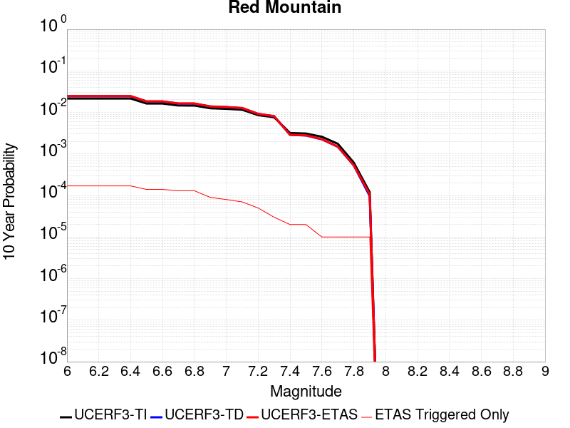 |

| Magnitude | 1 wk TI Prob | 1 wk TD Prob | 1 wk ETAS Prob | 1 wk ETAS/TD Gain | 1 wk ETAS Triggered Only | 1 mo TI Prob | 1 mo TD Prob | 1 mo ETAS Prob | 1 mo ETAS/TD Gain | 1 mo ETAS Triggered Only | 1 yr TI Prob | 1 yr TD Prob | 1 yr ETAS Prob | 1 yr ETAS/TD Gain | 1 yr ETAS Triggered Only | 10 yr TI Prob | 10 yr TD Prob | 10 yr ETAS Prob | 10 yr ETAS/TD Gain | 10 yr ETAS Triggered Only |
|-----|-----|-----|-----|-----|-----|-----|-----|-----|-----|-----|-----|-----|-----|-----|-----|-----|-----|-----|-----|-----|
| 6.0 | 4.1810763E-5 | 4.7589947E-5 | 1.4404838E-4 | 3.0268657 | 9.646302E-5 | 1.7917668E-4 | 2.039419E-4 | 3.0038526E-4 | 1.4728962 | 9.646302E-5 | 0.0021792934 | 0.0024803306 | 0.0025925916 | 1.0452605 | 1.1254019E-4 | 0.021580452 | 0.024544092 | 0.024747964 | 1.0083064 | 2.0900322E-4 |
| 6.1 | 4.1810763E-5 | 4.7589947E-5 | 1.4404838E-4 | 3.0268657 | 9.646302E-5 | 1.7917668E-4 | 2.039419E-4 | 3.0038526E-4 | 1.4728962 | 9.646302E-5 | 0.0021792934 | 0.0024803306 | 0.0025925916 | 1.0452605 | 1.1254019E-4 | 0.021580452 | 0.024544092 | 0.024747964 | 1.0083064 | 2.0900322E-4 |
| 6.2 | 4.1810763E-5 | 4.7589947E-5 | 1.4404838E-4 | 3.0268657 | 9.646302E-5 | 1.7917668E-4 | 2.039419E-4 | 3.0038526E-4 | 1.4728962 | 9.646302E-5 | 0.0021792934 | 0.0024803306 | 0.0025925916 | 1.0452605 | 1.1254019E-4 | 0.021580452 | 0.024544092 | 0.024747964 | 1.0083064 | 2.0900322E-4 |
| 6.3 | 4.1810763E-5 | 4.7589947E-5 | 1.4404838E-4 | 3.0268657 | 9.646302E-5 | 1.7917668E-4 | 2.039419E-4 | 3.0038526E-4 | 1.4728962 | 9.646302E-5 | 0.0021792934 | 0.0024803306 | 0.0025925916 | 1.0452605 | 1.1254019E-4 | 0.021580452 | 0.024544092 | 0.024747964 | 1.0083064 | 2.0900322E-4 |
| 6.4 | 4.1810763E-5 | 4.7589947E-5 | 1.4404838E-4 | 3.0268657 | 9.646302E-5 | 1.7917668E-4 | 2.039419E-4 | 3.0038526E-4 | 1.4728962 | 9.646302E-5 | 0.0021792934 | 0.0024803306 | 0.0025925916 | 1.0452605 | 1.1254019E-4 | 0.021580452 | 0.024544092 | 0.024747964 | 1.0083064 | 2.0900322E-4 |
| 6.5 | 3.154503E-5 | 3.5359728E-5 | 1.1574274E-4 | 3.2732925 | 8.038585E-5 | 1.3518598E-4 | 1.5153342E-4 | 2.3190708E-4 | 1.5304023 | 8.038585E-5 | 0.0016446467 | 0.0018434501 | 0.0019397354 | 1.052231 | 9.646302E-5 | 0.01632528 | 0.018291233 | 0.018449064 | 1.0086287 | 1.607717E-4 |
| 6.6 | 3.1535834E-5 | 3.534911E-5 | 1.15732124E-4 | 3.2739756 | 8.038585E-5 | 1.3514658E-4 | 1.5148791E-4 | 2.3186159E-4 | 1.5305617 | 8.038585E-5 | 0.0016441676 | 0.001842897 | 0.0019391823 | 1.0522467 | 9.646302E-5 | 0.01632056 | 0.018285794 | 0.018443627 | 1.0086313 | 1.607717E-4 |
| 6.7 | 2.8267326E-5 | 3.146934E-5 | 1.1185266E-4 | 3.5543377 | 8.038585E-5 | 1.2114006E-4 | 1.348621E-4 | 2.1523712E-4 | 1.5959792 | 8.038585E-5 | 0.0014738824 | 0.0016407946 | 0.0017370993 | 1.058694 | 9.646302E-5 | 0.014641452 | 0.016295563 | 0.0164379 | 1.0087347 | 1.4469454E-4 |
| 6.8 | 2.8212884E-5 | 3.1407224E-5 | 1.11790556E-4 | 3.5593896 | 8.038585E-5 | 1.20906756E-4 | 1.3459593E-4 | 2.1497096E-4 | 1.597158 | 8.038585E-5 | 0.0014710457 | 0.0016375587 | 0.0017338638 | 1.0588101 | 9.646302E-5 | 0.014613459 | 0.01626368 | 0.01640602 | 1.0087521 | 1.4469454E-4 |
| 6.9 | 2.4227871E-5 | 2.6706979E-5 | 7.4937205E-5 | 2.8059034 | 4.823151E-5 | 1.03829596E-4 | 1.14453884E-4 | 1.6267988E-4 | 1.4213574 | 4.823151E-5 | 0.0012633923 | 0.0013926612 | 0.0014568804 | 1.0461125 | 6.430868E-5 | 0.012562336 | 0.013847026 | 0.013958008 | 1.0080148 | 1.1254019E-4 |
| 7.0 | 2.348524E-5 | 2.5835763E-5 | 7.4066025E-5 | 2.8668025 | 4.823151E-5 | 1.0064714E-4 | 1.1072042E-4 | 1.589466E-4 | 1.435567 | 4.823151E-5 | 0.0012246901 | 0.0013472632 | 0.0014114853 | 1.0476686 | 6.430868E-5 | 0.012179627 | 0.01339859 | 0.013509622 | 1.0082868 | 1.1254019E-4 |
| 7.1 | 2.2311642E-5 | 2.4462828E-5 | 5.6616384E-5 | 2.3143842 | 3.215434E-5 | 9.561782E-5 | 1.048369E-4 | 1.3698787E-4 | 1.306676 | 3.215434E-5 | 0.0011635252 | 0.0012757168 | 0.0013238868 | 1.0377592 | 4.823151E-5 | 0.01157452 | 0.012691451 | 0.01278669 | 1.0075042 | 9.646302E-5 |
| 7.2 | 1.6533986E-5 | 1.7670347E-5 | 3.3747234E-5 | 1.909823 | 1.607717E-5 | 7.085802E-5 | 7.572822E-5 | 9.180417E-5 | 1.2122848 | 1.607717E-5 | 8.623549E-4 | 9.216645E-4 | 9.537892E-4 | 1.0348551 | 3.215434E-5 | 0.008590161 | 0.009184699 | 0.009264346 | 1.0086718 | 8.038585E-5 |
| 7.3 | 1.4703092E-5 | 1.555952E-5 | 3.1636442E-5 | 2.033253 | 1.607717E-5 | 6.301173E-5 | 6.66823E-5 | 8.27584E-5 | 1.2410849 | 1.607717E-5 | 7.668978E-4 | 8.1161625E-4 | 8.437445E-4 | 1.0395855 | 3.215434E-5 | 0.0076425658 | 0.008092596 | 0.008140437 | 1.0059117 | 4.823151E-5 |
| 7.4 | 6.1331984E-6 | 5.528872E-6 | 2.1605952E-5 | 3.9078412 | 1.607717E-5 | 2.6284872E-5 | 2.3694953E-5 | 3.977174E-5 | 1.67849 | 1.607717E-5 | 3.199713E-4 | 2.8844838E-4 | 3.0452092E-4 | 1.0557207 | 1.607717E-5 | 0.0031951098 | 0.0028807942 | 0.002912856 | 1.0111295 | 3.215434E-5 |
| 7.5 | 5.954766E-6 | 5.3385015E-6 | 2.1415586E-5 | 4.011535 | 1.607717E-5 | 2.5520176E-5 | 2.2879094E-5 | 3.89559E-5 | 1.7026852 | 1.607717E-5 | 3.1066386E-4 | 2.785179E-4 | 2.945906E-4 | 1.0577079 | 1.607717E-5 | 0.003102299 | 0.0027817423 | 0.0028138072 | 1.011527 | 3.215434E-5 |
| 7.6 | 4.9726646E-6 | 4.315295E-6 | 2.0392396E-5 | 4.725609 | 1.607717E-5 | 2.1311245E-5 | 1.8493993E-5 | 3.4570865E-5 | 1.8693025 | 1.607717E-5 | 2.5943352E-4 | 2.2514143E-4 | 2.4121498E-4 | 1.0713931 | 1.607717E-5 | 0.0025913084 | 0.002249168 | 0.002265209 | 1.0071319 | 1.607717E-5 |
| 7.7 | 3.3613894E-6 | 2.8526642E-6 | 1.892979E-5 | 6.6358275 | 1.607717E-5 | 1.4405875E-5 | 1.2225649E-5 | 2.8302622E-5 | 2.31502 | 1.607717E-5 | 1.7537741E-4 | 1.4883737E-4 | 1.6491214E-4 | 1.1080023 | 1.607717E-5 | 0.0017523908 | 0.0014874031 | 0.0015034564 | 1.0107929 | 1.607717E-5 |
| 7.8 | 1.1828961E-6 | 1.0122756E-6 | 1.708943E-5 | 16.88219 | 1.607717E-5 | 5.069545E-6 | 4.338317E-6 | 2.0415418E-5 | 4.705838 | 1.607717E-5 | 6.171996E-5 | 5.281776E-5 | 6.889408E-5 | 1.3043734 | 1.607717E-5 | 6.170282E-4 | 5.2805495E-4 | 5.4412364E-4 | 1.03043 | 1.607717E-5 |
| 7.9 | 2.2967266E-7 | 1.8618952E-7 | 1.6263357E-5 | 87.348404 | 1.607717E-5 | 9.843111E-7 | 7.9795484E-7 | 1.6875112E-5 | 21.147953 | 1.607717E-5 | 1.19839215E-5 | 9.7150605E-6 | 2.5792075E-5 | 2.6548548 | 1.607717E-5 | 1.1983275E-4 | 9.714664E-5 | 1.1322225E-4 | 1.1654778 | 1.607717E-5 |

## Santa Ynez (East)
*[(top)](#table-of-contents)*

| 1 Week | 1 Month | 1 Year | 10 Year |
|-----|-----|-----|-----|
|  |  |  |  |

| Magnitude | 1 wk TI Prob | 1 wk TD Prob | 1 wk ETAS Prob | 1 wk ETAS/TD Gain | 1 wk ETAS Triggered Only | 1 mo TI Prob | 1 mo TD Prob | 1 mo ETAS Prob | 1 mo ETAS/TD Gain | 1 mo ETAS Triggered Only | 1 yr TI Prob | 1 yr TD Prob | 1 yr ETAS Prob | 1 yr ETAS/TD Gain | 1 yr ETAS Triggered Only | 10 yr TI Prob | 10 yr TD Prob | 10 yr ETAS Prob | 10 yr ETAS/TD Gain | 10 yr ETAS Triggered Only |
|-----|-----|-----|-----|-----|-----|-----|-----|-----|-----|-----|-----|-----|-----|-----|-----|-----|-----|-----|-----|-----|
| 6.0 | 3.2269712E-5 | 3.67505E-5 | 8.498024E-5 | 2.312356 | 4.823151E-5 | 1.3829143E-4 | 1.5749598E-4 | 2.2179453E-4 | 1.4082552 | 6.430868E-5 | 0.0016823979 | 0.0019164166 | 0.0020447874 | 1.0669849 | 1.2861736E-4 | 0.016697178 | 0.019056441 | 0.019293003 | 1.0124137 | 2.4115756E-4 |
| 6.1 | 3.2269712E-5 | 3.67505E-5 | 8.498024E-5 | 2.312356 | 4.823151E-5 | 1.3829143E-4 | 1.5749598E-4 | 2.2179453E-4 | 1.4082552 | 6.430868E-5 | 0.0016823979 | 0.0019164166 | 0.0020447874 | 1.0669849 | 1.2861736E-4 | 0.016697178 | 0.019056441 | 0.019293003 | 1.0124137 | 2.4115756E-4 |
| 6.2 | 3.2269712E-5 | 3.67505E-5 | 8.498024E-5 | 2.312356 | 4.823151E-5 | 1.3829143E-4 | 1.5749598E-4 | 2.2179453E-4 | 1.4082552 | 6.430868E-5 | 0.0016823979 | 0.0019164166 | 0.0020447874 | 1.0669849 | 1.2861736E-4 | 0.016697178 | 0.019056441 | 0.019293003 | 1.0124137 | 2.4115756E-4 |
| 6.3 | 3.2269712E-5 | 3.67505E-5 | 8.498024E-5 | 2.312356 | 4.823151E-5 | 1.3829143E-4 | 1.5749598E-4 | 2.2179453E-4 | 1.4082552 | 6.430868E-5 | 0.0016823979 | 0.0019164166 | 0.0020447874 | 1.0669849 | 1.2861736E-4 | 0.016697178 | 0.019056441 | 0.019293003 | 1.0124137 | 2.4115756E-4 |
| 6.4 | 1.4404779E-5 | 1.4849382E-5 | 4.7003246E-5 | 3.1653335 | 3.215434E-5 | 6.1733306E-5 | 6.363868E-5 | 9.579098E-5 | 1.5052319 | 3.215434E-5 | 7.513438E-4 | 7.745306E-4 | 8.227248E-4 | 1.0622237 | 4.823151E-5 | 0.0074880854 | 0.007718862 | 0.007846487 | 1.0165341 | 1.2861736E-4 |
| 6.5 | 1.4404779E-5 | 1.4849382E-5 | 4.7003246E-5 | 3.1653335 | 3.215434E-5 | 6.1733306E-5 | 6.363868E-5 | 9.579098E-5 | 1.5052319 | 3.215434E-5 | 7.513438E-4 | 7.745306E-4 | 8.227248E-4 | 1.0622237 | 4.823151E-5 | 0.0074880854 | 0.007718862 | 0.007846487 | 1.0165341 | 1.2861736E-4 |
| 6.6 | 1.280208E-5 | 1.3011947E-5 | 4.516587E-5 | 3.4711077 | 3.215434E-5 | 5.4864904E-5 | 5.5764307E-5 | 8.791685E-5 | 1.5765793 | 3.215434E-5 | 6.6777546E-4 | 6.787207E-4 | 7.269195E-4 | 1.0710142 | 4.823151E-5 | 0.006657724 | 0.0067666885 | 0.0068784673 | 1.016519 | 1.1254019E-4 |
| 6.7 | 1.2457027E-5 | 1.2628468E-5 | 4.4782402E-5 | 3.546147 | 3.215434E-5 | 5.3386164E-5 | 5.412089E-5 | 8.627349E-5 | 1.5940886 | 3.215434E-5 | 6.497827E-4 | 6.587243E-4 | 6.908575E-4 | 1.0487809 | 3.215434E-5 | 0.00647886 | 0.006567915 | 0.0066637443 | 1.0145905 | 9.646302E-5 |
| 6.8 | 1.2095134E-5 | 1.2230915E-5 | 4.4384862E-5 | 3.628908 | 3.215434E-5 | 5.1835254E-5 | 5.241716E-5 | 8.4569816E-5 | 1.6133994 | 3.215434E-5 | 6.309115E-4 | 6.379937E-4 | 6.701275E-4 | 1.050367 | 3.215434E-5 | 0.0062912325 | 0.006361809 | 0.0064576585 | 1.0150664 | 9.646302E-5 |
| 6.9 | 1.1104036E-5 | 1.1157347E-5 | 4.331133E-5 | 3.8818662 | 3.215434E-5 | 4.758786E-5 | 4.781633E-5 | 7.996913E-5 | 1.672423 | 3.215434E-5 | 5.7922816E-4 | 5.820096E-4 | 6.1414525E-4 | 1.055215 | 3.215434E-5 | 0.005777207 | 0.0058049993 | 0.005900902 | 1.0165207 | 9.646302E-5 |
| 7.0 | 1.0577444E-5 | 1.058168E-5 | 4.273568E-5 | 4.038648 | 3.215434E-5 | 4.5331115E-5 | 4.5349276E-5 | 7.750216E-5 | 1.7090055 | 3.215434E-5 | 5.5176654E-4 | 5.519888E-4 | 5.8412534E-4 | 1.0582197 | 3.215434E-5 | 0.0055039856 | 0.0055063153 | 0.0056022475 | 1.0174222 | 9.646302E-5 |
| 7.1 | 1.0021775E-5 | 9.980988E-6 | 9.980988E-6 | 1.0 | 0.0 | 4.294976E-5 | 4.2774966E-5 | 4.2774966E-5 | 1.0 | 0.0 | 5.2278786E-4 | 5.2066194E-4 | 5.2066194E-4 | 1.0 | 0.0 | 0.0052155964 | 0.0051945536 | 0.0052425344 | 1.0092368 | 4.823151E-5 |
| 7.2 | 8.874109E-6 | 8.748793E-6 | 8.748793E-6 | 1.0 | 0.0 | 3.8031343E-5 | 3.7494297E-5 | 3.7494297E-5 | 1.0 | 0.0 | 4.629332E-4 | 4.5639853E-4 | 4.5639853E-4 | 1.0 | 0.0 | 0.0046197 | 0.0045547304 | 0.004586738 | 1.0070274 | 3.215434E-5 |
| 7.3 | 7.5504267E-6 | 7.5051175E-6 | 7.5051175E-6 | 1.0 | 0.0 | 3.235857E-5 | 3.21644E-5 | 3.21644E-5 | 1.0 | 0.0 | 3.9389438E-4 | 3.915322E-4 | 3.915322E-4 | 1.0 | 0.0 | 0.0039319694 | 0.003908531 | 0.0039405595 | 1.0081946 | 3.215434E-5 |
| 7.4 | 6.309394E-6 | 6.1831556E-6 | 6.1831556E-6 | 1.0 | 0.0 | 2.703998E-5 | 2.6498974E-5 | 2.6498974E-5 | 1.0 | 0.0 | 3.2916202E-4 | 3.225782E-4 | 3.225782E-4 | 1.0 | 0.0 | 0.003286749 | 0.003221197 | 0.0032532478 | 1.0099499 | 3.215434E-5 |
| 7.5 | 4.6103073E-6 | 4.4408903E-6 | 4.4408903E-6 | 1.0 | 0.0 | 1.975831E-5 | 1.9032252E-5 | 1.9032252E-5 | 1.0 | 0.0 | 2.4053088E-4 | 2.3169373E-4 | 2.3169373E-4 | 1.0 | 0.0 | 0.002402707 | 0.002314591 | 0.002330631 | 1.0069299 | 1.607717E-5 |
| 7.6 | 1.2858658E-6 | 1.3008173E-6 | 1.3008173E-6 | 1.0 | 0.0 | 5.5108417E-6 | 5.5749197E-6 | 5.5749197E-6 | 1.0 | 0.0 | 6.7092435E-5 | 6.78726E-5 | 6.78726E-5 | 1.0 | 0.0 | 6.707218E-4 | 6.785256E-4 | 6.785256E-4 | 1.0 | 0.0 |
| 7.7 | 5.3302307E-7 | 5.612138E-7 | 5.612138E-7 | 1.0 | 0.0 | 2.2843826E-6 | 2.4052001E-6 | 2.4052001E-6 | 1.0 | 0.0 | 2.7812002E-5 | 2.9282954E-5 | 2.9282954E-5 | 1.0 | 0.0 | 2.7808524E-4 | 2.9279452E-4 | 2.9279452E-4 | 1.0 | 0.0 |
| 7.8 | 4.613933E-8 | 4.80301E-8 | 4.80301E-8 | 1.0 | 0.0 | 1.9773998E-7 | 2.0584326E-7 | 2.0584326E-7 | 1.0 | 0.0 | 2.4074816E-6 | 2.5061388E-6 | 2.5061388E-6 | 1.0 | 0.0 | 2.4074554E-5 | 2.5061116E-5 | 2.5061116E-5 | 1.0 | 0.0 |

## San Andreas (North Branch Mill Creek)
*[(top)](#table-of-contents)*

| 1 Week | 1 Month | 1 Year | 10 Year |
|-----|-----|-----|-----|
| 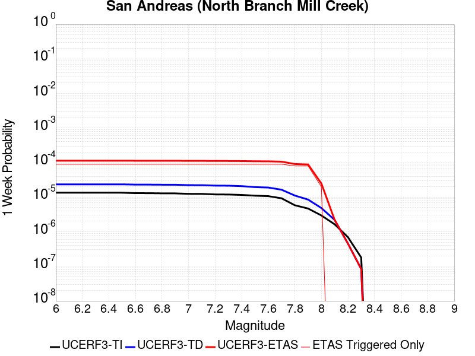 |  |  |  |

| Magnitude | 1 wk TI Prob | 1 wk TD Prob | 1 wk ETAS Prob | 1 wk ETAS/TD Gain | 1 wk ETAS Triggered Only | 1 mo TI Prob | 1 mo TD Prob | 1 mo ETAS Prob | 1 mo ETAS/TD Gain | 1 mo ETAS Triggered Only | 1 yr TI Prob | 1 yr TD Prob | 1 yr ETAS Prob | 1 yr ETAS/TD Gain | 1 yr ETAS Triggered Only | 10 yr TI Prob | 10 yr TD Prob | 10 yr ETAS Prob | 10 yr ETAS/TD Gain | 10 yr ETAS Triggered Only |
|-----|-----|-----|-----|-----|-----|-----|-----|-----|-----|-----|-----|-----|-----|-----|-----|-----|-----|-----|-----|-----|
| 6.0 | 1.3461156E-5 | 2.3499893E-5 | 8.7807064E-5 | 3.7364879 | 6.430868E-5 | 5.7689394E-5 | 1.00709956E-4 | 1.9716326E-4 | 1.9577336 | 9.646302E-5 | 7.02142E-4 | 0.0012254574 | 0.0014342044 | 1.1703422 | 2.0900322E-4 | 0.0069992766 | 0.01222957 | 0.012451897 | 1.0181795 | 2.2508038E-4 |
| 6.1 | 1.3461156E-5 | 2.3499893E-5 | 8.7807064E-5 | 3.7364879 | 6.430868E-5 | 5.7689394E-5 | 1.00709956E-4 | 1.9716326E-4 | 1.9577336 | 9.646302E-5 | 7.02142E-4 | 0.0012254574 | 0.0014342044 | 1.1703422 | 2.0900322E-4 | 0.0069992766 | 0.01222957 | 0.012451897 | 1.0181795 | 2.2508038E-4 |
| 6.2 | 1.3461156E-5 | 2.3499893E-5 | 8.7807064E-5 | 3.7364879 | 6.430868E-5 | 5.7689394E-5 | 1.00709956E-4 | 1.9716326E-4 | 1.9577336 | 9.646302E-5 | 7.02142E-4 | 0.0012254574 | 0.0014342044 | 1.1703422 | 2.0900322E-4 | 0.0069992766 | 0.01222957 | 0.012451897 | 1.0181795 | 2.2508038E-4 |
| 6.3 | 1.3461156E-5 | 2.3499893E-5 | 8.7807064E-5 | 3.7364879 | 6.430868E-5 | 5.7689394E-5 | 1.00709956E-4 | 1.9716326E-4 | 1.9577336 | 9.646302E-5 | 7.02142E-4 | 0.0012254574 | 0.0014342044 | 1.1703422 | 2.0900322E-4 | 0.0069992766 | 0.01222957 | 0.012451897 | 1.0181795 | 2.2508038E-4 |
| 6.4 | 1.3461156E-5 | 2.3499893E-5 | 8.7807064E-5 | 3.7364879 | 6.430868E-5 | 5.7689394E-5 | 1.00709956E-4 | 1.9716326E-4 | 1.9577336 | 9.646302E-5 | 7.02142E-4 | 0.0012254574 | 0.0014342044 | 1.1703422 | 2.0900322E-4 | 0.0069992766 | 0.01222957 | 0.012451897 | 1.0181795 | 2.2508038E-4 |
| 6.5 | 1.3450706E-5 | 2.3488852E-5 | 8.779603E-5 | 3.7377741 | 6.430868E-5 | 5.764461E-5 | 1.0066265E-4 | 1.9711597E-4 | 1.9581838 | 9.646302E-5 | 7.0159714E-4 | 0.001224882 | 0.0014336292 | 1.1704223 | 2.0900322E-4 | 0.006993862 | 0.01222388 | 0.012446209 | 1.0181881 | 2.2508038E-4 |
| 6.6 | 1.3074523E-5 | 2.3103135E-5 | 8.7410335E-5 | 3.7834835 | 6.430868E-5 | 5.6032466E-5 | 9.9009696E-5 | 1.9546317E-4 | 1.974182 | 9.646302E-5 | 6.8198174E-4 | 0.0012047797 | 0.0014135311 | 1.1732694 | 2.0900322E-4 | 0.006798926 | 0.012025044 | 0.012247418 | 1.0184926 | 2.2508038E-4 |
| 6.7 | 1.3050216E-5 | 2.3078432E-5 | 8.7385626E-5 | 3.786463 | 6.430868E-5 | 5.59283E-5 | 9.890384E-5 | 1.9535732E-4 | 1.9752249 | 9.646302E-5 | 6.8071426E-4 | 0.0012034923 | 0.0014122439 | 1.173455 | 2.0900322E-4 | 0.0067863287 | 0.012012309 | 0.012234686 | 1.0185124 | 2.2508038E-4 |
| 6.8 | 1.29049395E-5 | 2.292684E-5 | 8.7234046E-5 | 3.8048873 | 6.430868E-5 | 5.530571E-5 | 9.825421E-5 | 1.9470775E-4 | 1.9816734 | 9.646302E-5 | 6.73139E-4 | 0.0011955918 | 0.001404345 | 1.1746025 | 2.0900322E-4 | 0.0067110364 | 0.011934154 | 0.012156548 | 1.0186352 | 2.2508038E-4 |
| 6.9 | 1.2867369E-5 | 2.2886245E-5 | 8.719345E-5 | 3.8098629 | 6.430868E-5 | 5.51447E-5 | 9.8080236E-5 | 1.945338E-4 | 1.9834149 | 9.646302E-5 | 6.711799E-4 | 0.0011934759 | 0.0014022298 | 1.1749125 | 2.0900322E-4 | 0.006691564 | 0.011913223 | 0.012135622 | 1.0186683 | 2.2508038E-4 |
| 7.0 | 1.2495996E-5 | 2.2286325E-5 | 8.659357E-5 | 3.8855026 | 6.430868E-5 | 5.3553173E-5 | 9.550934E-5 | 1.9196315E-4 | 2.0098886 | 9.646302E-5 | 6.518148E-4 | 0.0011622087 | 0.0013709691 | 1.1796237 | 2.0900322E-4 | 0.0064990623 | 0.0116038285 | 0.011826297 | 1.019172 | 2.2508038E-4 |
| 7.1 | 1.2452067E-5 | 2.2231397E-5 | 8.6538654E-5 | 3.892632 | 6.430868E-5 | 5.3364907E-5 | 9.527396E-5 | 1.9172778E-4 | 2.012384 | 9.646302E-5 | 6.4952404E-4 | 0.0011593461 | 0.0013681069 | 1.1800678 | 2.0900322E-4 | 0.0064762887 | 0.0115755 | 0.011797975 | 1.0192195 | 2.2508038E-4 |
| 7.2 | 1.2002777E-5 | 2.1609963E-5 | 8.591726E-5 | 3.9758167 | 6.430868E-5 | 5.143946E-5 | 9.2610855E-5 | 1.8906494E-4 | 2.0414987 | 9.646302E-5 | 6.2609545E-4 | 0.0011269567 | 0.0013357243 | 1.1852491 | 2.0900322E-4 | 0.006243344 | 0.011254923 | 0.01147747 | 1.0197734 | 2.2508038E-4 |
| 7.3 | 1.1923425E-5 | 2.1479793E-5 | 8.578709E-5 | 3.993851 | 6.430868E-5 | 5.109939E-5 | 9.205302E-5 | 1.8850717E-4 | 2.0478108 | 9.646302E-5 | 6.219575E-4 | 0.001120172 | 0.0013289411 | 1.1863724 | 2.0900322E-4 | 0.0062021962 | 0.011187789 | 0.011410351 | 1.0198933 | 2.2508038E-4 |
| 7.4 | 1.16105175E-5 | 2.0853771E-5 | 8.516111E-5 | 4.083727 | 6.430868E-5 | 4.975841E-5 | 8.937026E-5 | 1.8582467E-4 | 2.0792673 | 9.646302E-5 | 6.0564023E-4 | 0.0010875424 | 0.0012963183 | 1.1919703 | 2.0900322E-4 | 0.006039923 | 0.010865397 | 0.011088031 | 1.0204903 | 2.2508038E-4 |
| 7.5 | 1.1037265E-5 | 1.9553907E-5 | 8.3861334E-5 | 4.288725 | 6.430868E-5 | 4.7301706E-5 | 8.379978E-5 | 1.8025472E-4 | 2.1510167 | 9.646302E-5 | 5.757461E-4 | 0.0010197869 | 0.001228577 | 1.204739 | 2.0900322E-4 | 0.005742567 | 0.010194898 | 0.010417683 | 1.0218526 | 2.2508038E-4 |
| 7.6 | 1.0720915E-5 | 1.899582E-5 | 8.3303275E-5 | 4.3853483 | 6.430868E-5 | 4.5945973E-5 | 8.140812E-5 | 1.7786329E-4 | 2.1848347 | 9.646302E-5 | 5.592486E-4 | 9.906954E-4 | 0.0011994916 | 1.2107571 | 2.0900322E-4 | 0.005578433 | 0.009906623 | 0.010129473 | 1.0224952 | 2.2508038E-4 |
| 7.7 | 9.276279E-6 | 1.6441649E-5 | 8.0749276E-5 | 4.911264 | 6.430868E-5 | 3.9754876E-5 | 7.0462316E-5 | 1.6691854E-4 | 2.368905 | 9.646302E-5 | 4.839081E-4 | 8.575427E-4 | 0.0010663667 | 1.2435144 | 2.0900322E-4 | 0.0048285574 | 0.008586041 | 0.008809189 | 1.0259897 | 2.2508038E-4 |
| 7.8 | 5.8346777E-6 | 1.1155013E-5 | 7.546298E-5 | 6.7649384 | 6.430868E-5 | 2.5005522E-5 | 4.7806327E-5 | 1.4426473E-4 | 3.0176914 | 9.646302E-5 | 3.043997E-4 | 5.818867E-4 | 7.907683E-4 | 1.358973 | 2.0900322E-4 | 0.0030398308 | 0.0058469265 | 0.0060706907 | 1.0382705 | 2.2508038E-4 |
| 7.9 | 4.690204E-6 | 8.509093E-6 | 7.281723E-5 | 8.557578 | 6.430868E-5 | 2.0100719E-5 | 3.6467034E-5 | 1.1684995E-4 | 3.2042627 | 8.038585E-5 | 2.4469878E-4 | 4.4389578E-4 | 6.3673616E-4 | 1.4344273 | 1.9292605E-4 | 0.002444295 | 0.0044707474 | 0.004678816 | 1.04654 | 2.0900322E-4 |
| 8.0 | 2.9570454E-6 | 4.846947E-6 | 2.0924039E-5 | 4.3169527 | 1.607717E-5 | 1.267299E-5 | 2.0772464E-5 | 5.2926138E-5 | 2.5478988 | 3.215434E-5 | 1.5428272E-4 | 2.5287544E-4 | 3.1716784E-4 | 1.2542454 | 6.430868E-5 | 0.0015417566 | 0.002549644 | 0.002613789 | 1.0251583 | 6.430868E-5 |
| 8.1 | 1.6376824E-6 | 2.1968929E-6 | 2.1968929E-6 | 1.0 | 0.0 | 7.01862E-6 | 9.41522E-6 | 9.41522E-6 | 1.0 | 0.0 | 8.544835E-5 | 1.14624294E-4 | 1.3069963E-4 | 1.1402436 | 1.607717E-5 | 8.54155E-4 | 0.0011606582 | 0.0011767168 | 1.0138357 | 1.607717E-5 |
| 8.2 | 6.9631557E-7 | 4.5360213E-7 | 4.5360213E-7 | 1.0 | 0.0 | 2.984206E-6 | 1.9440076E-6 | 1.9440076E-6 | 1.0 | 0.0 | 3.63321E-5 | 2.3668037E-5 | 2.3668037E-5 | 1.0 | 0.0 | 3.6326164E-4 | 2.451564E-4 | 2.451564E-4 | 1.0 | 0.0 |
| 8.3 | 1.7876137E-7 | 8.360375E-8 | 8.360375E-8 | 1.0 | 0.0 | 7.661199E-7 | 3.5830175E-7 | 3.5830175E-7 | 1.0 | 0.0 | 9.32747E-6 | 4.3623154E-6 | 4.3623154E-6 | 1.0 | 0.0 | 9.3270784E-5 | 4.5817014E-5 | 4.5817014E-5 | 1.0 | 0.0 |

## Scodie Lineament
*[(top)](#table-of-contents)*

| 1 Week | 1 Month | 1 Year | 10 Year |
|-----|-----|-----|-----|
|  |  |  | 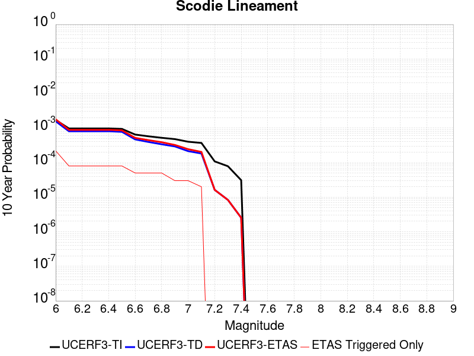 |

| Magnitude | 1 wk TI Prob | 1 wk TD Prob | 1 wk ETAS Prob | 1 wk ETAS/TD Gain | 1 wk ETAS Triggered Only | 1 mo TI Prob | 1 mo TD Prob | 1 mo ETAS Prob | 1 mo ETAS/TD Gain | 1 mo ETAS Triggered Only | 1 yr TI Prob | 1 yr TD Prob | 1 yr ETAS Prob | 1 yr ETAS/TD Gain | 1 yr ETAS Triggered Only | 10 yr TI Prob | 10 yr TD Prob | 10 yr ETAS Prob | 10 yr ETAS/TD Gain | 10 yr ETAS Triggered Only |
|-----|-----|-----|-----|-----|-----|-----|-----|-----|-----|-----|-----|-----|-----|-----|-----|-----|-----|-----|-----|-----|
| 6.0 | 3.2919327E-6 | 3.0133422E-6 | 3.5167584E-5 | 11.670625 | 3.215434E-5 | 1.4108206E-5 | 1.2914278E-5 | 7.722213E-5 | 5.9795933 | 6.430868E-5 | 1.7175387E-4 | 1.5722317E-4 | 3.0189494E-4 | 1.9201684 | 1.4469454E-4 | 0.0017162118 | 0.0015714309 | 0.0017961576 | 1.1430076 | 2.2508038E-4 |
| 6.1 | 1.8663811E-6 | 1.5490499E-6 | 1.7626195E-5 | 11.378714 | 1.607717E-5 | 7.998751E-6 | 6.6387715E-6 | 2.2715834E-5 | 3.4216926 | 1.607717E-5 | 9.738045E-5 | 8.082454E-5 | 1.2905215E-4 | 1.5966952 | 4.823151E-5 | 9.7337784E-4 | 8.080003E-4 | 8.561928E-4 | 1.0596442 | 4.823151E-5 |
| 6.2 | 1.8663811E-6 | 1.5490499E-6 | 1.7626195E-5 | 11.378714 | 1.607717E-5 | 7.998751E-6 | 6.6387715E-6 | 2.2715834E-5 | 3.4216926 | 1.607717E-5 | 9.738045E-5 | 8.082454E-5 | 1.2905215E-4 | 1.5966952 | 4.823151E-5 | 9.7337784E-4 | 8.080003E-4 | 8.561928E-4 | 1.0596442 | 4.823151E-5 |
| 6.3 | 1.8663811E-6 | 1.5490499E-6 | 1.7626195E-5 | 11.378714 | 1.607717E-5 | 7.998751E-6 | 6.6387715E-6 | 2.2715834E-5 | 3.4216926 | 1.607717E-5 | 9.738045E-5 | 8.082454E-5 | 1.2905215E-4 | 1.5966952 | 4.823151E-5 | 9.7337784E-4 | 8.080003E-4 | 8.561928E-4 | 1.0596442 | 4.823151E-5 |
| 6.4 | 1.8663811E-6 | 1.5490499E-6 | 1.7626195E-5 | 11.378714 | 1.607717E-5 | 7.998751E-6 | 6.6387715E-6 | 2.2715834E-5 | 3.4216926 | 1.607717E-5 | 9.738045E-5 | 8.082454E-5 | 1.2905215E-4 | 1.5966952 | 4.823151E-5 | 9.7337784E-4 | 8.080003E-4 | 8.561928E-4 | 1.0596442 | 4.823151E-5 |
| 6.5 | 1.8106311E-6 | 1.4909839E-6 | 1.756813E-5 | 11.78291 | 1.607717E-5 | 7.759824E-6 | 6.3899183E-6 | 2.2466986E-5 | 3.5160053 | 1.607717E-5 | 9.447177E-5 | 7.7794975E-5 | 1.2602273E-4 | 1.6199341 | 4.823151E-5 | 9.4431615E-4 | 7.7772606E-4 | 8.259201E-4 | 1.0619678 | 4.823151E-5 |
| 6.6 | 1.2414679E-6 | 8.997558E-7 | 8.997558E-7 | 1.0 | 0.0 | 5.320566E-6 | 3.856091E-6 | 3.856091E-6 | 1.0 | 0.0 | 6.477596E-5 | 4.6946985E-5 | 7.909982E-5 | 1.6848754 | 3.215434E-5 | 6.475708E-4 | 4.693793E-4 | 5.0151855E-4 | 1.0684718 | 3.215434E-5 |
| 6.7 | 1.1062215E-6 | 7.594311E-7 | 7.594311E-7 | 1.0 | 0.0 | 4.7409408E-6 | 3.2547011E-6 | 3.2547011E-6 | 1.0 | 0.0 | 5.7719422E-5 | 3.9625334E-5 | 7.1778406E-5 | 1.811427 | 3.215434E-5 | 5.770443E-4 | 3.961897E-4 | 4.283313E-4 | 1.0811268 | 3.215434E-5 |
| 6.8 | 1.0006736E-6 | 6.500397E-7 | 6.500397E-7 | 1.0 | 0.0 | 4.288594E-6 | 2.7858816E-6 | 2.7858816E-6 | 1.0 | 0.0 | 5.221238E-5 | 3.3917644E-5 | 6.607089E-5 | 1.94798 | 3.215434E-5 | 5.220012E-4 | 3.3913075E-4 | 3.712742E-4 | 1.0947819 | 3.215434E-5 |
| 6.9 | 9.167364E-7 | 5.631625E-7 | 5.631625E-7 | 1.0 | 0.0 | 3.9288643E-6 | 2.4135516E-6 | 2.4135516E-6 | 1.0 | 0.0 | 4.7832873E-5 | 2.9384651E-5 | 2.9384651E-5 | 1.0 | 0.0 | 4.782258E-4 | 2.9381333E-4 | 2.9381333E-4 | 1.0 | 0.0 |
| 7.0 | 7.6987664E-7 | 4.113383E-7 | 4.113383E-7 | 1.0 | 0.0 | 3.2994672E-6 | 1.7628774E-6 | 1.7628774E-6 | 1.0 | 0.0 | 4.0170275E-5 | 2.1462862E-5 | 2.1462862E-5 | 1.0 | 0.0 | 4.0163012E-4 | 2.1461173E-4 | 2.1461173E-4 | 1.0 | 0.0 |
| 7.1 | 7.1038727E-7 | 3.5211494E-7 | 3.5211494E-7 | 1.0 | 0.0 | 3.0445133E-6 | 1.5090633E-6 | 1.5090633E-6 | 1.0 | 0.0 | 3.706632E-5 | 1.8372726E-5 | 1.8372726E-5 | 1.0 | 0.0 | 3.7060137E-4 | 1.8371557E-4 | 1.8371557E-4 | 1.0 | 0.0 |
| 7.2 | 2.0799602E-7 | 3.1186854E-8 | 3.1186854E-8 | 1.0 | 0.0 | 8.914113E-7 | 1.3365793E-7 | 1.3365793E-7 | 1.0 | 0.0 | 1.0852878E-5 | 1.6272843E-6 | 1.6272843E-6 | 1.0 | 0.0 | 1.08523476E-4 | 1.627273E-5 | 1.627273E-5 | 1.0 | 0.0 |
| 7.3 | 1.5048182E-7 | 1.5945696E-8 | 1.5945696E-8 | 1.0 | 0.0 | 6.449219E-7 | 6.83387E-8 | 6.83387E-8 | 1.0 | 0.0 | 7.851896E-6 | 8.320234E-7 | 8.320234E-7 | 1.0 | 0.0 | 7.851618E-5 | 8.320206E-6 | 8.320206E-6 | 1.0 | 0.0 |
| 7.4 | 5.9334678E-8 | 4.8683537E-9 | 4.8683537E-9 | 1.0 | 0.0 | 2.5429145E-7 | 2.0864372E-8 | 2.0864372E-8 | 1.0 | 0.0 | 3.095994E-6 | 2.5402372E-7 | 2.5402372E-7 | 1.0 | 0.0 | 3.095951E-5 | 2.5402353E-6 | 2.5402353E-6 | 1.0 | 0.0 |

## Santa Rosa Island
*[(top)](#table-of-contents)*

| 1 Week | 1 Month | 1 Year | 10 Year |
|-----|-----|-----|-----|
|  | 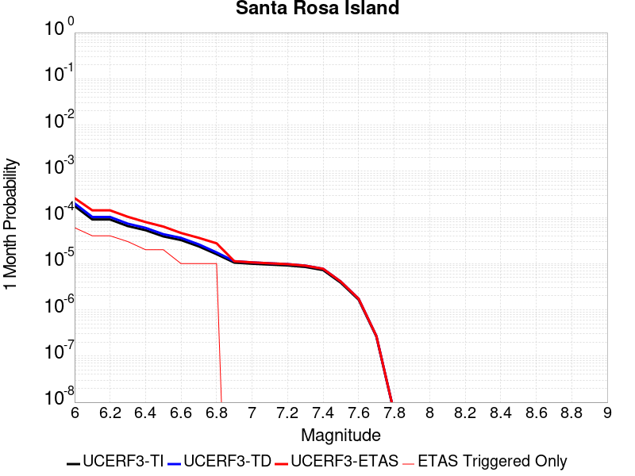 |  |  |

| Magnitude | 1 wk TI Prob | 1 wk TD Prob | 1 wk ETAS Prob | 1 wk ETAS/TD Gain | 1 wk ETAS Triggered Only | 1 mo TI Prob | 1 mo TD Prob | 1 mo ETAS Prob | 1 mo ETAS/TD Gain | 1 mo ETAS Triggered Only | 1 yr TI Prob | 1 yr TD Prob | 1 yr ETAS Prob | 1 yr ETAS/TD Gain | 1 yr ETAS Triggered Only | 10 yr TI Prob | 10 yr TD Prob | 10 yr ETAS Prob | 10 yr ETAS/TD Gain | 10 yr ETAS Triggered Only |
|-----|-----|-----|-----|-----|-----|-----|-----|-----|-----|-----|-----|-----|-----|-----|-----|-----|-----|-----|-----|-----|
| 6.0 | 4.1143165E-5 | 4.7091133E-5 | 1.1139679E-4 | 2.3655577 | 6.430868E-5 | 1.7631594E-4 | 2.0180465E-4 | 2.6610034E-4 | 1.3186036 | 6.430868E-5 | 0.002144533 | 0.0024544 | 0.0025987395 | 1.0588084 | 1.4469454E-4 | 0.021239553 | 0.024293551 | 0.024466103 | 1.0071028 | 1.7684887E-4 |
| 6.1 | 2.1061249E-5 | 2.3864959E-5 | 5.6018533E-5 | 2.3473132 | 3.215434E-5 | 9.0259375E-5 | 1.0227455E-4 | 1.344256E-4 | 1.3143603 | 3.215434E-5 | 0.0010983539 | 0.0012445104 | 0.0012926818 | 1.0387071 | 4.823151E-5 | 0.01092941 | 0.012378449 | 0.012426083 | 1.0038482 | 4.823151E-5 |
| 6.2 | 2.1061249E-5 | 2.3864959E-5 | 5.6018533E-5 | 2.3473132 | 3.215434E-5 | 9.0259375E-5 | 1.0227455E-4 | 1.344256E-4 | 1.3143603 | 3.215434E-5 | 0.0010983539 | 0.0012445104 | 0.0012926818 | 1.0387071 | 4.823151E-5 | 0.01092941 | 0.012378449 | 0.012426083 | 1.0038482 | 4.823151E-5 |
| 6.3 | 1.5158236E-5 | 1.7074419E-5 | 4.9228212E-5 | 2.8831558 | 3.215434E-5 | 6.496225E-5 | 7.3174095E-5 | 1.05326086E-4 | 1.4393903 | 3.215434E-5 | 7.906284E-4 | 8.905424E-4 | 9.2266814E-4 | 1.0360743 | 3.215434E-5 | 0.007878214 | 0.008870989 | 0.008902859 | 1.0035925 | 3.215434E-5 |
| 6.4 | 1.2341918E-5 | 1.3852917E-5 | 2.9929864E-5 | 2.160546 | 1.607717E-5 | 5.2892858E-5 | 5.9368336E-5 | 7.544455E-5 | 1.2707877 | 1.607717E-5 | 6.437803E-4 | 7.225779E-4 | 7.3864346E-4 | 1.0222336 | 1.607717E-5 | 0.006419184 | 0.007203121 | 0.0072190827 | 1.0022159 | 1.607717E-5 |
| 6.5 | 9.061158E-6 | 1.0117031E-5 | 2.6194039E-5 | 2.5891035 | 1.607717E-5 | 3.883296E-5 | 4.3358013E-5 | 5.9434486E-5 | 1.3707844 | 1.607717E-5 | 4.726887E-4 | 5.277613E-4 | 5.4383E-4 | 1.0304469 | 1.607717E-5 | 0.004716845 | 0.0052656173 | 0.00528161 | 1.0030372 | 1.607717E-5 |
| 6.6 | 7.5461685E-6 | 8.400733E-6 | 2.447777E-5 | 2.9137657 | 1.607717E-5 | 3.2340322E-5 | 3.600267E-5 | 5.2079264E-5 | 1.4465388 | 1.607717E-5 | 3.936723E-4 | 4.3824865E-4 | 4.5431877E-4 | 1.036669 | 1.607717E-5 | 0.003929756 | 0.0043742736 | 0.0043902807 | 1.0036594 | 1.607717E-5 |
| 6.7 | 5.5023775E-6 | 6.087381E-6 | 2.2164453E-5 | 3.6410494 | 1.607717E-5 | 2.3581404E-5 | 2.6088532E-5 | 4.2165284E-5 | 1.6162382 | 1.607717E-5 | 2.8706578E-4 | 3.1758484E-4 | 3.336569E-4 | 1.0506072 | 1.607717E-5 | 0.0028669522 | 0.0031716314 | 0.0031876576 | 1.0050529 | 1.607717E-5 |
| 6.8 | 3.7351679E-6 | 4.0831405E-6 | 2.0160245E-5 | 4.937436 | 1.607717E-5 | 1.6007763E-5 | 1.749907E-5 | 3.3575958E-5 | 1.9187282 | 1.607717E-5 | 1.948771E-4 | 2.1303284E-4 | 2.2910659E-4 | 1.075452 | 1.607717E-5 | 0.0019470629 | 0.0021285315 | 0.0021445744 | 1.0075371 | 1.607717E-5 |
| 6.9 | 2.456366E-6 | 2.6292705E-6 | 2.6292705E-6 | 1.0 | 0.0 | 1.0527241E-5 | 1.1268254E-5 | 1.1268254E-5 | 1.0 | 0.0 | 1.2816161E-4 | 1.3718237E-4 | 1.3718237E-4 | 1.0 | 0.0 | 0.0012808773 | 0.0013709799 | 0.0013709799 | 1.0 | 0.0 |
| 7.0 | 2.3245157E-6 | 2.4827782E-6 | 2.4827782E-6 | 1.0 | 0.0 | 9.962172E-6 | 1.0640435E-5 | 1.0640435E-5 | 1.0 | 0.0 | 1.2128269E-4 | 1.2953962E-4 | 1.2953962E-4 | 1.0 | 0.0 | 0.0012121652 | 0.0012946434 | 0.0012946434 | 1.0 | 0.0 |
| 7.1 | 2.2248344E-6 | 2.37325E-6 | 2.37325E-6 | 1.0 | 0.0 | 9.53497E-6 | 1.0171032E-5 | 1.0171032E-5 | 1.0 | 0.0 | 1.1608207E-4 | 1.2382529E-4 | 1.2382529E-4 | 1.0 | 0.0 | 0.0011602144 | 0.001237565 | 0.001237565 | 1.0 | 0.0 |
| 7.2 | 2.1350402E-6 | 2.276154E-6 | 2.276154E-6 | 1.0 | 0.0 | 9.150141E-6 | 9.754909E-6 | 9.754909E-6 | 1.0 | 0.0 | 1.1139726E-4 | 1.1875956E-4 | 1.1875956E-4 | 1.0 | 0.0 | 0.0011134144 | 0.0011869629 | 0.0011869629 | 1.0 | 0.0 |
| 7.3 | 1.9793572E-6 | 2.108719E-6 | 2.108719E-6 | 1.0 | 0.0 | 8.482932E-6 | 9.037336E-6 | 9.037336E-6 | 1.0 | 0.0 | 1.032748E-4 | 1.10024026E-4 | 1.10024026E-4 | 1.0 | 0.0 | 0.0010322682 | 0.0010996973 | 0.0010996973 | 1.0 | 0.0 |
| 7.4 | 1.6951194E-6 | 1.8045733E-6 | 1.8045733E-6 | 1.0 | 0.0 | 7.264777E-6 | 7.733863E-6 | 7.733863E-6 | 1.0 | 0.0 | 8.844508E-5 | 9.415573E-5 | 9.415573E-5 | 1.0 | 0.0 | 8.840988E-4 | 9.4116E-4 | 9.4116E-4 | 1.0 | 0.0 |
| 7.5 | 8.987207E-7 | 9.5122147E-7 | 9.5122147E-7 | 1.0 | 0.0 | 3.8516546E-6 | 4.076657E-6 | 4.076657E-6 | 1.0 | 0.0 | 4.6892885E-5 | 4.963218E-5 | 4.963218E-5 | 1.0 | 0.0 | 4.688299E-4 | 4.9621216E-4 | 4.9621216E-4 | 1.0 | 0.0 |
| 7.6 | 3.8783037E-7 | 4.052932E-7 | 4.052932E-7 | 1.0 | 0.0 | 1.6621291E-6 | 1.7369698E-6 | 1.7369698E-6 | 1.0 | 0.0 | 2.0236233E-5 | 2.1147409E-5 | 2.1147409E-5 | 1.0 | 0.0 | 2.023439E-4 | 2.1145462E-4 | 2.1145462E-4 | 1.0 | 0.0 |
| 7.7 | 6.181804E-8 | 6.339035E-8 | 6.339035E-8 | 1.0 | 0.0 | 2.6493444E-7 | 2.7167292E-7 | 2.7167292E-7 | 1.0 | 0.0 | 3.225572E-6 | 3.3076128E-6 | 3.3076128E-6 | 1.0 | 0.0 | 3.225525E-5 | 3.307564E-5 | 3.307564E-5 | 1.0 | 0.0 |
| 7.8 | 1.3704449E-9 | 1.3964153E-9 | 1.3964153E-9 | 1.0 | 0.0 | 5.873335E-9 | 5.984637E-9 | 5.984637E-9 | 1.0 | 0.0 | 7.1507856E-8 | 7.286295E-8 | 7.286295E-8 | 1.0 | 0.0 | 7.1507833E-7 | 7.286294E-7 | 7.286294E-7 | 1.0 | 0.0 |

## Lake Isabella (Seismicity)
*[(top)](#table-of-contents)*

| 1 Week | 1 Month | 1 Year | 10 Year |
|-----|-----|-----|-----|
| 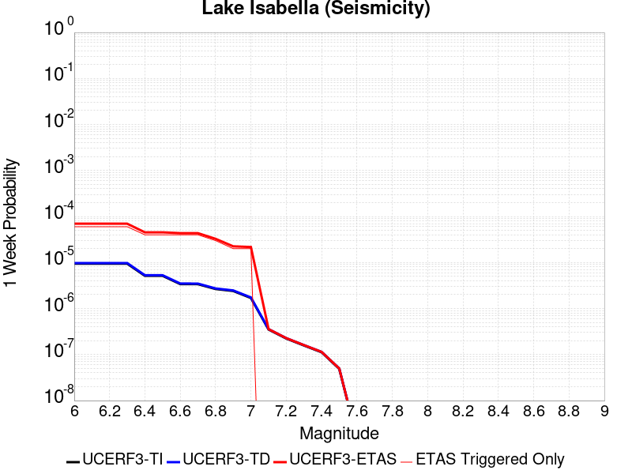 |  | 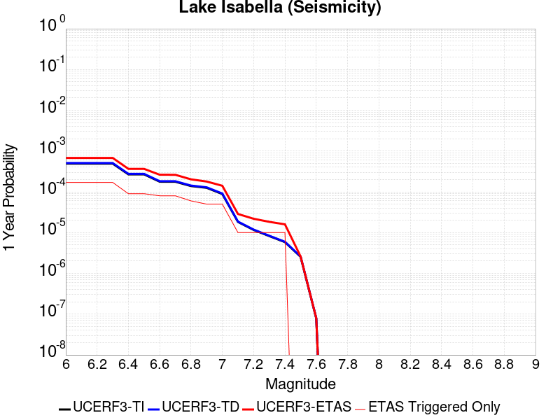 |  |

| Magnitude | 1 wk TI Prob | 1 wk TD Prob | 1 wk ETAS Prob | 1 wk ETAS/TD Gain | 1 wk ETAS Triggered Only | 1 mo TI Prob | 1 mo TD Prob | 1 mo ETAS Prob | 1 mo ETAS/TD Gain | 1 mo ETAS Triggered Only | 1 yr TI Prob | 1 yr TD Prob | 1 yr ETAS Prob | 1 yr ETAS/TD Gain | 1 yr ETAS Triggered Only | 10 yr TI Prob | 10 yr TD Prob | 10 yr ETAS Prob | 10 yr ETAS/TD Gain | 10 yr ETAS Triggered Only |
|-----|-----|-----|-----|-----|-----|-----|-----|-----|-----|-----|-----|-----|-----|-----|-----|-----|-----|-----|-----|-----|
| 6.0 | 9.431637E-6 | 9.741651E-6 | 7.4049705E-5 | 7.6013503 | 6.430868E-5 | 4.0420677E-5 | 4.1749343E-5 | 1.5428483E-4 | 3.6955035 | 1.1254019E-4 | 4.920106E-4 | 5.0819275E-4 | 6.5281376E-4 | 1.284579 | 1.4469454E-4 | 0.004909227 | 0.005071599 | 0.0052635465 | 1.0378475 | 1.9292605E-4 |
| 6.1 | 9.431637E-6 | 9.741651E-6 | 7.4049705E-5 | 7.6013503 | 6.430868E-5 | 4.0420677E-5 | 4.1749343E-5 | 1.5428483E-4 | 3.6955035 | 1.1254019E-4 | 4.920106E-4 | 5.0819275E-4 | 6.5281376E-4 | 1.284579 | 1.4469454E-4 | 0.004909227 | 0.005071599 | 0.0052635465 | 1.0378475 | 1.9292605E-4 |
| 6.2 | 9.431637E-6 | 9.741651E-6 | 7.4049705E-5 | 7.6013503 | 6.430868E-5 | 4.0420677E-5 | 4.1749343E-5 | 1.5428483E-4 | 3.6955035 | 1.1254019E-4 | 4.920106E-4 | 5.0819275E-4 | 6.5281376E-4 | 1.284579 | 1.4469454E-4 | 0.004909227 | 0.005071599 | 0.0052635465 | 1.0378475 | 1.9292605E-4 |
| 6.3 | 9.431637E-6 | 9.741651E-6 | 7.4049705E-5 | 7.6013503 | 6.430868E-5 | 4.0420677E-5 | 4.1749343E-5 | 1.5428483E-4 | 3.6955035 | 1.1254019E-4 | 4.920106E-4 | 5.0819275E-4 | 6.5281376E-4 | 1.284579 | 1.4469454E-4 | 0.004909227 | 0.005071599 | 0.0052635465 | 1.0378475 | 1.9292605E-4 |
| 6.4 | 5.144063E-6 | 5.3000763E-6 | 3.7454247E-5 | 7.0667377 | 3.215434E-5 | 2.2045799E-5 | 2.2714434E-5 | 7.094485E-5 | 3.1233377 | 4.823151E-5 | 2.6837454E-4 | 2.765166E-4 | 3.4080748E-4 | 1.2325028 | 6.430868E-5 | 0.0026805066 | 0.0027620657 | 0.0028422296 | 1.0290232 | 8.038585E-5 |
| 6.5 | 5.144063E-6 | 5.3000763E-6 | 3.7454247E-5 | 7.0667377 | 3.215434E-5 | 2.2045799E-5 | 2.2714434E-5 | 7.094485E-5 | 3.1233377 | 4.823151E-5 | 2.6837454E-4 | 2.765166E-4 | 3.4080748E-4 | 1.2325028 | 6.430868E-5 | 0.0026805066 | 0.0027620657 | 0.0028422296 | 1.0290232 | 8.038585E-5 |
| 6.6 | 3.4009804E-6 | 3.498786E-6 | 3.5653014E-5 | 10.190109 | 3.215434E-5 | 1.4575549E-5 | 1.4994721E-5 | 4.714858E-5 | 3.1443453 | 3.215434E-5 | 1.7744285E-4 | 1.8254704E-4 | 2.3076974E-4 | 1.2641659 | 4.823151E-5 | 0.0017730123 | 0.0018241286 | 0.00188832 | 1.0351901 | 6.430868E-5 |
| 6.7 | 3.3880428E-6 | 3.4856528E-6 | 3.563988E-5 | 10.224736 | 3.215434E-5 | 1.4520103E-5 | 1.4938435E-5 | 4.7092297E-5 | 3.1524248 | 3.215434E-5 | 1.767679E-4 | 1.8186188E-4 | 2.3008461E-4 | 1.2651614 | 4.823151E-5 | 0.0017662736 | 0.0018172882 | 0.00188148 | 1.0353229 | 6.430868E-5 |
| 6.8 | 2.6582E-6 | 2.7337003E-6 | 3.4887955E-5 | 12.762173 | 3.215434E-5 | 1.1392236E-5 | 1.1715813E-5 | 4.3869775E-5 | 3.7444928 | 3.215434E-5 | 1.3869164E-4 | 1.4263204E-4 | 1.9085666E-4 | 1.3381052 | 4.823151E-5 | 0.0013860512 | 0.0014255369 | 0.0014736997 | 1.0337857 | 4.823151E-5 |
| 6.9 | 2.406011E-6 | 2.4743288E-6 | 1.855146E-5 | 7.4975724 | 1.607717E-5 | 1.0311434E-5 | 1.0604231E-5 | 2.6681231E-5 | 2.516093 | 1.607717E-5 | 1.2553448E-4 | 1.2910018E-4 | 1.6125037E-4 | 1.2490329 | 3.215434E-5 | 0.0012546359 | 0.0012903814 | 0.0013224942 | 1.0248864 | 3.215434E-5 |
| 7.0 | 1.6953097E-6 | 1.7429371E-6 | 1.7820079E-5 | 10.224166 | 1.607717E-5 | 7.265593E-6 | 7.469715E-6 | 2.3546765E-5 | 3.1522977 | 1.607717E-5 | 8.8455E-5 | 9.094104E-5 | 1.2309245E-4 | 1.3535414 | 3.215434E-5 | 8.84198E-4 | 9.09141E-4 | 9.412661E-4 | 1.0353357 | 3.215434E-5 |
| 7.1 | 3.5013824E-7 | 3.5714822E-7 | 3.5714822E-7 | 1.0 | 0.0 | 1.5005916E-6 | 1.5306344E-6 | 1.5306344E-6 | 1.0 | 0.0 | 1.826955E-5 | 1.8635317E-5 | 1.8635317E-5 | 1.0 | 0.0 | 1.8268047E-4 | 1.863378E-4 | 1.863378E-4 | 1.0 | 0.0 |
| 7.2 | 2.2321095E-7 | 2.2750574E-7 | 2.2750574E-7 | 1.0 | 0.0 | 9.56618E-7 | 9.750242E-7 | 9.750242E-7 | 1.0 | 0.0 | 1.1646762E-5 | 1.1870856E-5 | 1.1870856E-5 | 1.0 | 0.0 | 1.1646151E-4 | 1.1870232E-4 | 1.1870232E-4 | 1.0 | 0.0 |
| 7.3 | 1.5760406E-7 | 1.6060922E-7 | 1.6060922E-7 | 1.0 | 0.0 | 6.7544585E-7 | 6.8832503E-7 | 6.8832503E-7 | 1.0 | 0.0 | 8.223522E-6 | 8.380326E-6 | 8.380326E-6 | 1.0 | 0.0 | 8.2232174E-5 | 8.3800165E-5 | 8.3800165E-5 | 1.0 | 0.0 |
| 7.4 | 1.1216497E-7 | 1.1431706E-7 | 1.1431706E-7 | 1.0 | 0.0 | 4.8070694E-7 | 4.899302E-7 | 4.899302E-7 | 1.0 | 0.0 | 5.852591E-6 | 5.964884E-6 | 5.964884E-6 | 1.0 | 0.0 | 5.8524372E-5 | 5.9647282E-5 | 5.9647282E-5 | 1.0 | 0.0 |
| 7.5 | 4.885185E-8 | 4.9787737E-8 | 4.9787737E-8 | 1.0 | 0.0 | 2.0936506E-7 | 2.13376E-7 | 2.13376E-7 | 1.0 | 0.0 | 2.5490165E-6 | 2.59785E-6 | 2.59785E-6 | 1.0 | 0.0 | 2.5489873E-5 | 2.5978214E-5 | 2.5978214E-5 | 1.0 | 0.0 |
| 7.6 | 1.504641E-9 | 1.5317903E-9 | 1.5317903E-9 | 1.0 | 0.0 | 6.4484613E-9 | 6.5648154E-9 | 6.5648154E-9 | 1.0 | 0.0 | 7.851001E-8 | 7.992663E-8 | 7.992663E-8 | 1.0 | 0.0 | 7.8509987E-7 | 7.992663E-7 | 7.992663E-7 | 1.0 | 0.0 |

## San Andreas (Creeping Section) 2011 CFM
*[(top)](#table-of-contents)*

| 1 Week | 1 Month | 1 Year | 10 Year |
|-----|-----|-----|-----|
|  |  | 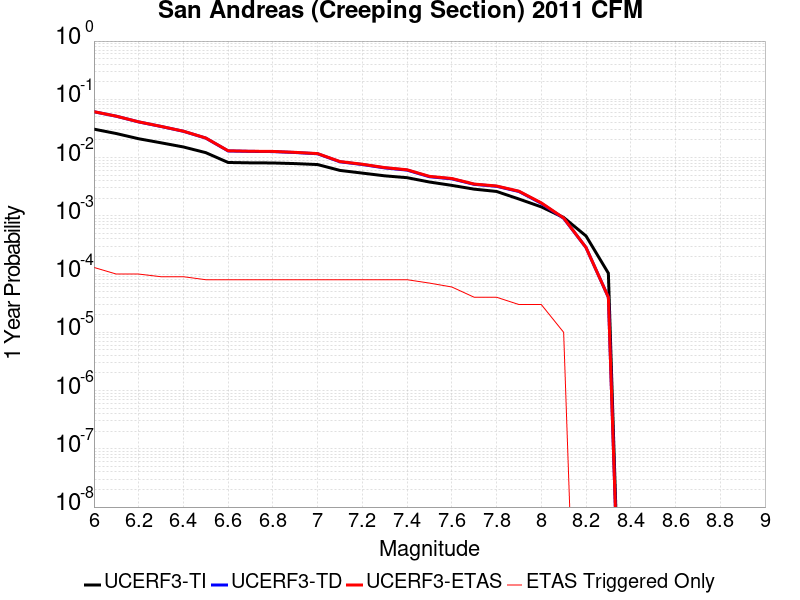 |  |

| Magnitude | 1 wk TI Prob | 1 wk TD Prob | 1 wk ETAS Prob | 1 wk ETAS/TD Gain | 1 wk ETAS Triggered Only | 1 mo TI Prob | 1 mo TD Prob | 1 mo ETAS Prob | 1 mo ETAS/TD Gain | 1 mo ETAS Triggered Only | 1 yr TI Prob | 1 yr TD Prob | 1 yr ETAS Prob | 1 yr ETAS/TD Gain | 1 yr ETAS Triggered Only | 10 yr TI Prob | 10 yr TD Prob | 10 yr ETAS Prob | 10 yr ETAS/TD Gain | 10 yr ETAS Triggered Only |
|-----|-----|-----|-----|-----|-----|-----|-----|-----|-----|-----|-----|-----|-----|-----|-----|-----|-----|-----|-----|-----|
| 6.0 | 5.986481E-4 | 0.001228691 | 0.0012929207 | 1.0522748 | 6.430868E-5 | 0.0025631124 | 0.005246795 | 0.0053107664 | 1.0121925 | 6.430868E-5 | 0.030762846 | 0.061203245 | 0.061323993 | 1.0019729 | 1.2861736E-4 | 0.26835477 | 0.425928 | 0.42602953 | 1.0002384 | 1.7684887E-4 |
| 6.1 | 5.015945E-4 | 0.0010230356 | 0.001055157 | 1.0313982 | 3.215434E-5 | 0.00214792 | 0.004369436 | 0.0044014496 | 1.0073267 | 3.215434E-5 | 0.025839351 | 0.051246606 | 0.051338125 | 1.0017859 | 9.646302E-5 | 0.23032776 | 0.37284943 | 0.37294018 | 1.0002434 | 1.4469454E-4 |
| 6.2 | 4.073338E-4 | 8.1157376E-4 | 8.43702E-4 | 1.0395876 | 3.215434E-5 | 0.0017445484 | 0.0034683137 | 0.0035003563 | 1.0092387 | 3.215434E-5 | 0.021034058 | 0.04093177 | 0.041024283 | 1.0022602 | 9.646302E-5 | 0.19150782 | 0.31302592 | 0.31311426 | 1.0002823 | 1.2861736E-4 |
| 6.3 | 3.464099E-4 | 6.7455834E-4 | 7.06691E-4 | 1.0476351 | 3.215434E-5 | 0.0014837692 | 0.0028832308 | 0.0029152925 | 1.0111201 | 3.215434E-5 | 0.017915873 | 0.034187846 | 0.03428101 | 1.0027251 | 9.646302E-5 | 0.16538359 | 0.27130842 | 0.27140215 | 1.0003455 | 1.2861736E-4 |
| 6.4 | 2.935057E-4 | 5.5516965E-4 | 5.8730616E-4 | 1.0578859 | 3.215434E-5 | 0.0012572751 | 0.0023727308 | 0.002404809 | 1.0135194 | 3.215434E-5 | 0.015200248 | 0.02826279 | 0.028356526 | 1.0033166 | 9.646302E-5 | 0.14201577 | 0.23297668 | 0.23307532 | 1.0004234 | 1.2861736E-4 |
| 6.5 | 2.3409708E-4 | 4.2132285E-4 | 4.3739326E-4 | 1.0381427 | 1.607717E-5 | 0.0010028875 | 0.0018017791 | 0.0018178273 | 1.0089068 | 1.607717E-5 | 0.012141965 | 0.021586355 | 0.021665005 | 1.0036435 | 8.038585E-5 | 0.11499573 | 0.1868149 | 0.18690643 | 1.0004898 | 1.1254019E-4 |
| 6.6 | 1.5842178E-4 | 2.5068692E-4 | 2.6676006E-4 | 1.0641164 | 1.607717E-5 | 6.7877385E-4 | 0.0010739256 | 0.0010899855 | 1.0149544 | 1.607717E-5 | 0.0082328 | 0.012995283 | 0.013074624 | 1.0061054 | 8.038585E-5 | 0.07934396 | 0.12313759 | 0.123236276 | 1.0008014 | 1.1254019E-4 |
| 6.7 | 1.5616413E-4 | 2.4605254E-4 | 2.6212574E-4 | 1.0653243 | 1.607717E-5 | 6.691031E-4 | 0.0010540807 | 0.0010701409 | 1.0152363 | 1.607717E-5 | 0.0081159435 | 0.012757154 | 0.012836514 | 1.0062208 | 8.038585E-5 | 0.0782586 | 0.12116472 | 0.12126362 | 1.0008162 | 1.1254019E-4 |
| 6.8 | 1.5538467E-4 | 2.442914E-4 | 2.6036467E-4 | 1.0657954 | 1.607717E-5 | 6.6576427E-4 | 0.001046539 | 0.0010625994 | 1.0153462 | 1.607717E-5 | 0.008075596 | 0.012666538 | 0.012745906 | 1.0062659 | 8.038585E-5 | 0.07788358 | 0.12039561 | 0.1204946 | 1.0008222 | 1.1254019E-4 |
| 6.9 | 1.5153569E-4 | 2.3538464E-4 | 2.5145803E-4 | 1.0682856 | 1.607717E-5 | 6.49277E-4 | 0.0010084033 | 0.0010244643 | 1.0159271 | 1.607717E-5 | 0.007876333 | 0.012208726 | 0.012288131 | 1.0065039 | 8.038585E-5 | 0.07602952 | 0.11646574 | 0.116565175 | 1.0008538 | 1.1254019E-4 |
| 7.0 | 1.4588932E-4 | 2.2395732E-4 | 2.4003089E-4 | 1.0717707 | 1.607717E-5 | 6.250901E-4 | 9.59466E-4 | 9.7552774E-4 | 1.0167403 | 1.607717E-5 | 0.0075839474 | 0.011619428 | 0.011698879 | 1.0068378 | 8.038585E-5 | 0.073302895 | 0.11131206 | 0.11141208 | 1.0008985 | 1.1254019E-4 |
| 7.1 | 1.1565079E-4 | 1.6281323E-4 | 1.7888777E-4 | 1.09873 | 1.607717E-5 | 4.955521E-4 | 6.9758523E-4 | 7.136512E-4 | 1.0230308 | 1.607717E-5 | 0.006016669 | 0.008460228 | 0.008539934 | 1.0094212 | 8.038585E-5 | 0.058563538 | 0.08366478 | 0.08376791 | 1.0012326 | 1.1254019E-4 |
| 7.2 | 1.0393792E-4 | 1.4615392E-4 | 1.6222874E-4 | 1.1099856 | 1.607717E-5 | 4.4537216E-4 | 6.262243E-4 | 6.4229144E-4 | 1.025657 | 1.607717E-5 | 0.005408933 | 0.0075977976 | 0.007677573 | 1.0104997 | 8.038585E-5 | 0.052791595 | 0.07561503 | 0.075719066 | 1.0013758 | 1.1254019E-4 |
| 7.3 | 9.332884E-5 | 1.2780601E-4 | 1.4388112E-4 | 1.1257775 | 1.607717E-5 | 3.999194E-4 | 5.4762565E-4 | 5.6369405E-4 | 1.0293419 | 1.607717E-5 | 0.0048581534 | 0.0066470946 | 0.0067269458 | 1.012013 | 8.038585E-5 | 0.047533102 | 0.06647954 | 0.0665846 | 1.0015804 | 1.1254019E-4 |
| 7.4 | 8.670252E-5 | 1.1702972E-4 | 1.33105E-4 | 1.1373607 | 1.607717E-5 | 3.715293E-4 | 5.014601E-4 | 5.175292E-4 | 1.0320446 | 1.607717E-5 | 0.004513991 | 0.0060883067 | 0.006168203 | 1.0131229 | 8.038585E-5 | 0.044233937 | 0.061148684 | 0.06125434 | 1.0017279 | 1.1254019E-4 |
| 7.5 | 7.3036405E-5 | 9.005699E-5 | 9.005699E-5 | 1.0 | 0.0 | 3.129756E-4 | 3.859015E-4 | 3.859015E-4 | 1.0 | 0.0 | 0.0038038217 | 0.0046882504 | 0.004752258 | 1.0136527 | 6.430868E-5 | 0.03739367 | 0.047875606 | 0.047952145 | 1.0015987 | 8.038585E-5 |
| 7.6 | 6.3935775E-5 | 8.280209E-5 | 8.280209E-5 | 1.0 | 0.0 | 2.7398168E-4 | 3.5481792E-4 | 3.5481792E-4 | 1.0 | 0.0 | 0.0033306254 | 0.00431137 | 0.004359394 | 1.0111388 | 4.823151E-5 | 0.032811474 | 0.043990135 | 0.044051614 | 1.0013976 | 6.430868E-5 |
| 7.7 | 5.5050095E-5 | 6.661729E-5 | 6.661729E-5 | 1.0 | 0.0 | 2.3590765E-4 | 2.8547147E-4 | 2.8547147E-4 | 1.0 | 0.0 | 0.0028683927 | 0.0034700802 | 0.0035181444 | 1.013851 | 4.823151E-5 | 0.0283165 | 0.03579509 | 0.035857093 | 1.0017322 | 6.430868E-5 |
| 7.8 | 5.027131E-5 | 6.1627725E-5 | 6.1627725E-5 | 1.0 | 0.0 | 2.1543067E-4 | 2.640921E-4 | 2.640921E-4 | 1.0 | 0.0 | 0.0026197135 | 0.003210584 | 0.0032586607 | 1.0149745 | 4.823151E-5 | 0.025890453 | 0.03312572 | 0.0331879 | 1.0018771 | 6.430868E-5 |
| 7.9 | 3.7271806E-5 | 5.0224386E-5 | 5.0224386E-5 | 1.0 | 0.0 | 1.5972654E-4 | 2.1522962E-4 | 2.1522962E-4 | 1.0 | 0.0 | 0.0019429359 | 0.0026172737 | 0.0026493438 | 1.0122533 | 3.215434E-5 | 0.019260362 | 0.027066687 | 0.027097972 | 1.0011559 | 3.215434E-5 |
| 8.0 | 2.7310243E-5 | 3.1428404E-5 | 3.1428404E-5 | 1.0 | 0.0 | 1.17038646E-4 | 1.3468621E-4 | 1.3468621E-4 | 1.0 | 0.0 | 0.0014240141 | 0.0016385721 | 0.0016706737 | 1.0195912 | 3.215434E-5 | 0.014149235 | 0.01721387 | 0.01724547 | 1.0018358 | 3.215434E-5 |
| 8.1 | 1.7940547E-5 | 1.7400796E-5 | 1.7400796E-5 | 1.0 | 0.0 | 7.688579E-5 | 7.457271E-5 | 7.457271E-5 | 1.0 | 0.0 | 9.3568244E-4 | 9.075451E-4 | 9.075451E-4 | 1.0 | 0.0 | 0.009317525 | 0.009799073 | 0.009799073 | 1.0 | 0.0 |
| 8.2 | 8.643924E-6 | 5.4748625E-6 | 5.4748625E-6 | 1.0 | 0.0 | 3.704486E-5 | 2.3463486E-5 | 2.3463486E-5 | 1.0 | 0.0 | 4.5092785E-4 | 2.8563058E-4 | 2.8563058E-4 | 1.0 | 0.0 | 0.0045001395 | 0.0032487072 | 0.0032487072 | 1.0 | 0.0 |
| 8.3 | 1.983087E-6 | 7.6599065E-7 | 7.6599065E-7 | 1.0 | 0.0 | 8.498917E-6 | 3.282813E-6 | 3.282813E-6 | 1.0 | 0.0 | 1.034694E-4 | 3.9967534E-5 | 3.9967534E-5 | 1.0 | 0.0 | 0.0010342124 | 4.719687E-4 | 4.719687E-4 | 1.0 | 0.0 |

## Cleghorn Lake
*[(top)](#table-of-contents)*

| 1 Week | 1 Month | 1 Year | 10 Year |
|-----|-----|-----|-----|
|  |  |  | 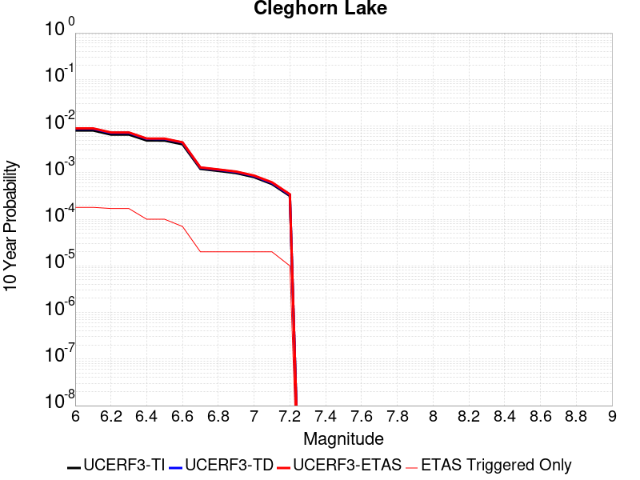 |

| Magnitude | 1 wk TI Prob | 1 wk TD Prob | 1 wk ETAS Prob | 1 wk ETAS/TD Gain | 1 wk ETAS Triggered Only | 1 mo TI Prob | 1 mo TD Prob | 1 mo ETAS Prob | 1 mo ETAS/TD Gain | 1 mo ETAS Triggered Only | 1 yr TI Prob | 1 yr TD Prob | 1 yr ETAS Prob | 1 yr ETAS/TD Gain | 1 yr ETAS Triggered Only | 10 yr TI Prob | 10 yr TD Prob | 10 yr ETAS Prob | 10 yr ETAS/TD Gain | 10 yr ETAS Triggered Only |
|-----|-----|-----|-----|-----|-----|-----|-----|-----|-----|-----|-----|-----|-----|-----|-----|-----|-----|-----|-----|-----|
| 6.0 | 1.5467183E-5 | 1.6794203E-5 | 3.2871103E-5 | 1.9572886 | 1.607717E-5 | 6.6286244E-5 | 7.197348E-5 | 1.0412551E-4 | 1.4467205 | 3.215434E-5 | 8.067362E-4 | 8.759797E-4 | 9.884214E-4 | 1.128361 | 1.1254019E-4 | 0.008038137 | 0.008730696 | 0.008906 | 1.0200791 | 1.7684887E-4 |
| 6.1 | 1.5467183E-5 | 1.6794203E-5 | 3.2871103E-5 | 1.9572886 | 1.607717E-5 | 6.6286244E-5 | 7.197348E-5 | 1.0412551E-4 | 1.4467205 | 3.215434E-5 | 8.067362E-4 | 8.759797E-4 | 9.884214E-4 | 1.128361 | 1.1254019E-4 | 0.008038137 | 0.008730696 | 0.008906 | 1.0200791 | 1.7684887E-4 |
| 6.2 | 1.2624631E-5 | 1.3681544E-5 | 2.9758496E-5 | 2.175083 | 1.607717E-5 | 5.410444E-5 | 5.863415E-5 | 9.0786605E-5 | 1.5483571 | 3.215434E-5 | 6.585225E-4 | 7.1368564E-4 | 8.2614546E-4 | 1.1575762 | 1.1254019E-4 | 0.0065657445 | 0.0071187317 | 0.007294322 | 1.024666 | 1.7684887E-4 |
| 6.3 | 1.2624631E-5 | 1.3681544E-5 | 2.9758496E-5 | 2.175083 | 1.607717E-5 | 5.410444E-5 | 5.863415E-5 | 9.0786605E-5 | 1.5483571 | 3.215434E-5 | 6.585225E-4 | 7.1368564E-4 | 8.2614546E-4 | 1.1575762 | 1.1254019E-4 | 0.0065657445 | 0.0071187317 | 0.007294322 | 1.024666 | 1.7684887E-4 |
| 6.4 | 9.417684E-6 | 1.0170118E-5 | 1.0170118E-5 | 1.0 | 0.0 | 4.036088E-5 | 4.3585722E-5 | 5.966219E-5 | 1.3688471 | 1.607717E-5 | 4.912829E-4 | 5.3056807E-4 | 6.2697986E-4 | 1.1817144 | 9.646302E-5 | 0.004901982 | 0.005297049 | 0.005424985 | 1.0241523 | 1.2861736E-4 |
| 6.5 | 9.368219E-6 | 1.0117545E-5 | 1.0117545E-5 | 1.0 | 0.0 | 4.014889E-5 | 4.3360415E-5 | 5.9436887E-5 | 1.3707638 | 1.607717E-5 | 4.8870314E-4 | 5.2782625E-4 | 6.242384E-4 | 1.1826588 | 9.646302E-5 | 0.004876298 | 0.0052697617 | 0.005397701 | 1.024278 | 1.2861736E-4 |
| 6.6 | 7.803798E-6 | 8.441831E-6 | 8.441831E-6 | 1.0 | 0.0 | 3.3444423E-5 | 3.6179E-5 | 5.225559E-5 | 1.4443624 | 1.607717E-5 | 4.0710976E-4 | 4.4043022E-4 | 5.047106E-4 | 1.145949 | 6.430868E-5 | 0.0040636472 | 0.0043994905 | 0.004479523 | 1.0181912 | 8.038585E-5 |
| 6.7 | 2.3108669E-6 | 2.4438336E-6 | 2.4438336E-6 | 1.0 | 0.0 | 9.903678E-6 | 1.0473532E-5 | 1.0473532E-5 | 1.0 | 0.0 | 1.205706E-4 | 1.2750797E-4 | 1.4358309E-4 | 1.1260715 | 1.607717E-5 | 0.001205052 | 0.0012743667 | 0.0012904234 | 1.0125997 | 1.607717E-5 |
| 6.8 | 2.0882828E-6 | 2.2062823E-6 | 2.2062823E-6 | 1.0 | 0.0 | 8.949753E-6 | 9.455462E-6 | 9.455462E-6 | 1.0 | 0.0 | 1.08957785E-4 | 1.1511434E-4 | 1.3118965E-4 | 1.1396465 | 1.607717E-5 | 0.0010890438 | 0.0011505639 | 0.0011666226 | 1.0139573 | 1.607717E-5 |
| 6.9 | 1.876935E-6 | 1.981051E-6 | 1.981051E-6 | 1.0 | 0.0 | 8.043982E-6 | 8.490192E-6 | 8.490192E-6 | 1.0 | 0.0 | 9.7931086E-5 | 1.03363345E-4 | 1.1943885E-4 | 1.1555243 | 1.607717E-5 | 9.788794E-4 | 0.0010331686 | 0.0010492292 | 1.015545 | 1.607717E-5 |
| 7.0 | 1.5357559E-6 | 1.6202807E-6 | 1.6202807E-6 | 1.0 | 0.0 | 6.5817944E-6 | 6.9440425E-6 | 6.9440425E-6 | 1.0 | 0.0 | 8.01304E-5 | 8.454057E-5 | 1.0061637E-4 | 1.190155 | 1.607717E-5 | 8.010151E-4 | 8.450965E-4 | 8.6116005E-4 | 1.019008 | 1.607717E-5 |
| 7.1 | 1.0905424E-6 | 1.1497619E-6 | 1.1497619E-6 | 1.0 | 0.0 | 4.6737446E-6 | 4.9275427E-6 | 4.9275427E-6 | 1.0 | 0.0 | 5.6901354E-5 | 5.999128E-5 | 7.606748E-5 | 1.2679757 | 1.607717E-5 | 5.6886784E-4 | 5.997606E-4 | 6.1582815E-4 | 1.0267899 | 1.607717E-5 |
| 7.2 | 6.06668E-7 | 6.387277E-7 | 6.387277E-7 | 1.0 | 0.0 | 2.600003E-6 | 2.7374022E-6 | 2.7374022E-6 | 1.0 | 0.0 | 3.1654577E-5 | 3.3327433E-5 | 4.9404065E-5 | 1.4823844 | 1.607717E-5 | 3.1650066E-4 | 3.3323118E-4 | 3.4930298E-4 | 1.0482302 | 1.607717E-5 |

## San Jacinto (San Jacinto Valley) rev
*[(top)](#table-of-contents)*

| 1 Week | 1 Month | 1 Year | 10 Year |
|-----|-----|-----|-----|
|  |  | 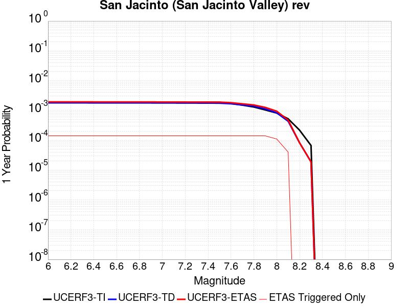 |  |

| Magnitude | 1 wk TI Prob | 1 wk TD Prob | 1 wk ETAS Prob | 1 wk ETAS/TD Gain | 1 wk ETAS Triggered Only | 1 mo TI Prob | 1 mo TD Prob | 1 mo ETAS Prob | 1 mo ETAS/TD Gain | 1 mo ETAS Triggered Only | 1 yr TI Prob | 1 yr TD Prob | 1 yr ETAS Prob | 1 yr ETAS/TD Gain | 1 yr ETAS Triggered Only | 10 yr TI Prob | 10 yr TD Prob | 10 yr ETAS Prob | 10 yr ETAS/TD Gain | 10 yr ETAS Triggered Only |
|-----|-----|-----|-----|-----|-----|-----|-----|-----|-----|-----|-----|-----|-----|-----|-----|-----|-----|-----|-----|-----|
| 6.0 | 3.652694E-5 | 3.4402394E-5 | 8.263224E-5 | 2.4019332 | 4.823151E-5 | 1.5653463E-4 | 1.474305E-4 | 2.1172971E-4 | 1.4361323 | 6.430868E-5 | 0.0019041431 | 0.00179349 | 0.0019058284 | 1.0626367 | 1.1254019E-4 | 0.018879099 | 0.018526595 | 0.018700168 | 1.0093688 | 1.7684887E-4 |
| 6.1 | 3.652694E-5 | 3.4402394E-5 | 8.263224E-5 | 2.4019332 | 4.823151E-5 | 1.5653463E-4 | 1.474305E-4 | 2.1172971E-4 | 1.4361323 | 6.430868E-5 | 0.0019041431 | 0.00179349 | 0.0019058284 | 1.0626367 | 1.1254019E-4 | 0.018879099 | 0.018526595 | 0.018700168 | 1.0093688 | 1.7684887E-4 |
| 6.2 | 3.652694E-5 | 3.4402394E-5 | 8.263224E-5 | 2.4019332 | 4.823151E-5 | 1.5653463E-4 | 1.474305E-4 | 2.1172971E-4 | 1.4361323 | 6.430868E-5 | 0.0019041431 | 0.00179349 | 0.0019058284 | 1.0626367 | 1.1254019E-4 | 0.018879099 | 0.018526595 | 0.018700168 | 1.0093688 | 1.7684887E-4 |
| 6.3 | 3.652694E-5 | 3.4402394E-5 | 8.263224E-5 | 2.4019332 | 4.823151E-5 | 1.5653463E-4 | 1.474305E-4 | 2.1172971E-4 | 1.4361323 | 6.430868E-5 | 0.0019041431 | 0.00179349 | 0.0019058284 | 1.0626367 | 1.1254019E-4 | 0.018879099 | 0.018526595 | 0.018700168 | 1.0093688 | 1.7684887E-4 |
| 6.4 | 3.646941E-5 | 3.432397E-5 | 8.255382E-5 | 2.4051363 | 4.823151E-5 | 1.5628811E-4 | 1.4709444E-4 | 2.1139366E-4 | 1.4371288 | 6.430868E-5 | 0.0019011468 | 0.0017894056 | 0.0019017444 | 1.0627799 | 1.1254019E-4 | 0.018849645 | 0.018486476 | 0.018660055 | 1.0093895 | 1.7684887E-4 |
| 6.5 | 3.646941E-5 | 3.432397E-5 | 8.255382E-5 | 2.4051363 | 4.823151E-5 | 1.5628811E-4 | 1.4709444E-4 | 2.1139366E-4 | 1.4371288 | 6.430868E-5 | 0.0019011468 | 0.0017894056 | 0.0019017444 | 1.0627799 | 1.1254019E-4 | 0.018849645 | 0.018486476 | 0.018660055 | 1.0093895 | 1.7684887E-4 |
| 6.6 | 3.6442503E-5 | 3.4287354E-5 | 8.251721E-5 | 2.406637 | 4.823151E-5 | 1.561728E-4 | 1.4693754E-4 | 2.1123677E-4 | 1.4375957 | 6.430868E-5 | 0.0018997455 | 0.0017874985 | 0.0018998375 | 1.062847 | 1.1254019E-4 | 0.018835869 | 0.018467745 | 0.018641328 | 1.0093993 | 1.7684887E-4 |
| 6.7 | 3.6432113E-5 | 3.4272925E-5 | 8.250278E-5 | 2.4072292 | 4.823151E-5 | 1.5612828E-4 | 1.4687571E-4 | 2.1117495E-4 | 1.4377799 | 6.430868E-5 | 0.0018992044 | 0.0017867472 | 0.0018990864 | 1.0628735 | 1.1254019E-4 | 0.018830549 | 0.018460369 | 0.018633952 | 1.0094031 | 1.7684887E-4 |
| 6.8 | 3.6409598E-5 | 3.424198E-5 | 8.2471845E-5 | 2.408501 | 4.823151E-5 | 1.560318E-4 | 1.4674311E-4 | 2.1104235E-4 | 1.4381756 | 6.430868E-5 | 0.0018980318 | 0.0017851355 | 0.0018974748 | 1.0629303 | 1.1254019E-4 | 0.018819023 | 0.018444523 | 0.01861811 | 1.0094113 | 1.7684887E-4 |
| 6.9 | 3.638078E-5 | 3.4202407E-5 | 8.243227E-5 | 2.4101307 | 4.823151E-5 | 1.5590832E-4 | 1.4657351E-4 | 2.1087278E-4 | 1.4386827 | 6.430868E-5 | 0.0018965311 | 0.001783074 | 0.0018954136 | 1.0630033 | 1.1254019E-4 | 0.018804269 | 0.018424258 | 0.018597847 | 1.0094218 | 1.7684887E-4 |
| 7.0 | 3.6294874E-5 | 3.408442E-5 | 8.2314284E-5 | 2.4150121 | 4.823151E-5 | 1.5554018E-4 | 1.4606792E-4 | 2.1036722E-4 | 1.4402013 | 6.430868E-5 | 0.0018920569 | 0.001776929 | 0.0018892692 | 1.0632216 | 1.1254019E-4 | 0.018760284 | 0.018363839 | 0.018537441 | 1.0094534 | 1.7684887E-4 |
| 7.1 | 3.6260717E-5 | 3.4040702E-5 | 8.227057E-5 | 2.4168293 | 4.823151E-5 | 1.5539382E-4 | 1.4588058E-4 | 2.1017987E-4 | 1.4407667 | 6.430868E-5 | 0.001890278 | 0.0017746518 | 0.0018869922 | 1.0633029 | 1.1254019E-4 | 0.018742796 | 0.018341439 | 0.018515045 | 1.0094652 | 1.7684887E-4 |
| 7.2 | 3.6210204E-5 | 3.397492E-5 | 8.2204795E-5 | 2.4195728 | 4.823151E-5 | 1.5517735E-4 | 1.455987E-4 | 2.0989802E-4 | 1.4416201 | 6.430868E-5 | 0.001887647 | 0.0017712255 | 0.0018835663 | 1.0634255 | 1.1254019E-4 | 0.01871693 | 0.01830772 | 0.018481331 | 1.009483 | 1.7684887E-4 |
| 7.3 | 3.6119454E-5 | 3.386321E-5 | 8.209309E-5 | 2.424256 | 4.823151E-5 | 1.5478847E-4 | 1.4511998E-4 | 2.0941932E-4 | 1.4430772 | 6.430868E-5 | 0.0018829206 | 0.0017654065 | 0.001877748 | 1.0636349 | 1.1254019E-4 | 0.018670462 | 0.018250274 | 0.018423894 | 1.0095134 | 1.7684887E-4 |
| 7.4 | 3.607848E-5 | 3.381071E-5 | 8.204059E-5 | 2.4264677 | 4.823151E-5 | 1.5461289E-4 | 1.44895E-4 | 2.0919436E-4 | 1.4437653 | 6.430868E-5 | 0.0018807866 | 0.0017626719 | 0.0018750137 | 1.0637338 | 1.1254019E-4 | 0.018649481 | 0.018223269 | 0.018396894 | 1.0095277 | 1.7684887E-4 |
| 7.5 | 3.5856774E-5 | 3.3620483E-5 | 8.185037E-5 | 2.4345388 | 4.823151E-5 | 1.5366284E-4 | 1.4407984E-4 | 2.0837925E-4 | 1.4462763 | 6.430868E-5 | 0.0018692396 | 0.0017527633 | 0.0018651062 | 1.0640948 | 1.1254019E-4 | 0.018535944 | 0.018124366 | 0.01829801 | 1.0095806 | 1.7684887E-4 |
| 7.6 | 3.286655E-5 | 3.2143445E-5 | 8.037341E-5 | 2.5004601 | 4.823151E-5 | 1.4084904E-4 | 1.3775036E-4 | 2.0205019E-4 | 1.4667852 | 6.430868E-5 | 0.001713488 | 0.0016758227 | 0.0017881742 | 1.0670427 | 1.1254019E-4 | 0.017003361 | 0.017344031 | 0.017517813 | 1.0100197 | 1.7684887E-4 |
| 7.7 | 2.8882527E-5 | 2.9236293E-5 | 7.746639E-5 | 2.6496654 | 4.823151E-5 | 1.237764E-4 | 1.2529238E-4 | 1.8959302E-4 | 1.5132046 | 6.430868E-5 | 0.0015059357 | 0.0015243685 | 0.0016367371 | 1.0737149 | 1.1254019E-4 | 0.014957713 | 0.015830461 | 0.01600451 | 1.0109946 | 1.7684887E-4 |
| 7.8 | 2.4950225E-5 | 2.6527203E-5 | 7.475744E-5 | 2.8181424 | 4.823151E-5 | 1.0692515E-4 | 1.1368306E-4 | 1.7798443E-4 | 1.5656196 | 6.430868E-5 | 0.0013010362 | 0.0013832134 | 0.0014955979 | 1.0812489 | 1.1254019E-4 | 0.012934455 | 0.014411755 | 0.014586055 | 1.0120943 | 1.7684887E-4 |
| 7.9 | 1.9881603E-5 | 2.1507445E-5 | 6.973792E-5 | 3.2425013 | 4.823151E-5 | 8.520408E-5 | 9.217151E-5 | 1.5647427E-4 | 1.6976423 | 6.430868E-5 | 0.001036866 | 0.0011216112 | 0.0012340252 | 1.1002254 | 1.1254019E-4 | 0.010320415 | 0.011777027 | 0.011951793 | 1.0148395 | 1.7684887E-4 |
| 8.0 | 1.563292E-5 | 1.5937347E-5 | 6.416809E-5 | 4.026272 | 4.823151E-5 | 6.6996516E-5 | 6.8301124E-5 | 1.3260542E-4 | 1.9414821 | 6.430868E-5 | 8.153773E-4 | 8.3124964E-4 | 9.115687E-4 | 1.0966245 | 8.038585E-5 | 0.00812392 | 0.008810506 | 0.008953926 | 1.0162783 | 1.4469454E-4 |
| 8.1 | 1.0045313E-5 | 8.301802E-6 | 4.0455878E-5 | 4.8731437 | 3.215434E-5 | 4.305063E-5 | 3.5578672E-5 | 6.773187E-5 | 1.9037211 | 3.215434E-5 | 5.2401534E-4 | 4.3308473E-4 | 4.6522517E-4 | 1.0742128 | 3.215434E-5 | 0.0052278144 | 0.0046591135 | 0.0047071204 | 1.0103039 | 4.823151E-5 |
| 8.2 | 4.1554413E-6 | 1.5655598E-6 | 1.5655598E-6 | 1.0 | 0.0 | 1.7808914E-5 | 6.709525E-6 | 6.709525E-6 | 1.0 | 0.0 | 2.1680194E-4 | 8.168544E-5 | 8.168544E-5 | 1.0 | 0.0 | 0.0021659054 | 9.482903E-4 | 9.482903E-4 | 1.0 | 0.0 |
| 8.3 | 1.2758221E-6 | 3.6149942E-7 | 3.6149942E-7 | 1.0 | 0.0 | 5.4677976E-6 | 1.5492824E-6 | 1.5492824E-6 | 1.0 | 0.0 | 6.65684E-5 | 1.8862354E-5 | 1.8862354E-5 | 1.0 | 0.0 | 6.6548464E-4 | 2.2751294E-4 | 2.2751294E-4 | 1.0 | 0.0 |

## San Jacinto (Stepovers Combined)
*[(top)](#table-of-contents)*

| 1 Week | 1 Month | 1 Year | 10 Year |
|-----|-----|-----|-----|
|  | 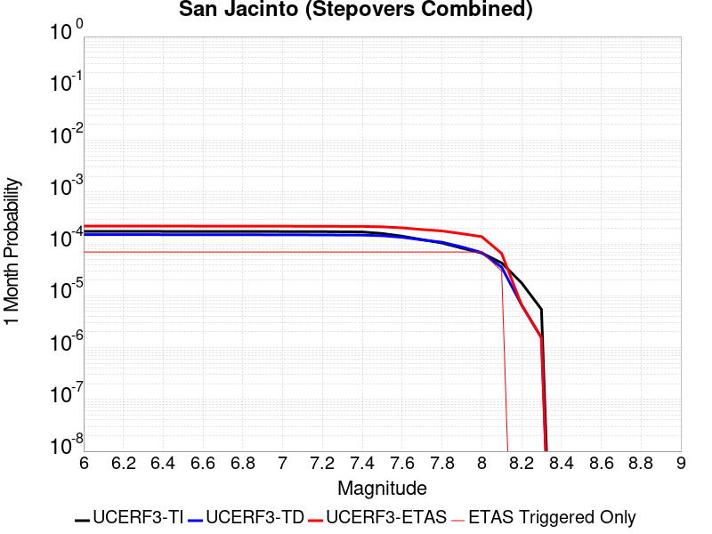 |  |  |

| Magnitude | 1 wk TI Prob | 1 wk TD Prob | 1 wk ETAS Prob | 1 wk ETAS/TD Gain | 1 wk ETAS Triggered Only | 1 mo TI Prob | 1 mo TD Prob | 1 mo ETAS Prob | 1 mo ETAS/TD Gain | 1 mo ETAS Triggered Only | 1 yr TI Prob | 1 yr TD Prob | 1 yr ETAS Prob | 1 yr ETAS/TD Gain | 1 yr ETAS Triggered Only | 10 yr TI Prob | 10 yr TD Prob | 10 yr ETAS Prob | 10 yr ETAS/TD Gain | 10 yr ETAS Triggered Only |
|-----|-----|-----|-----|-----|-----|-----|-----|-----|-----|-----|-----|-----|-----|-----|-----|-----|-----|-----|-----|-----|
| 6.0 | 4.0667746E-5 | 3.5272755E-5 | 8.3502564E-5 | 2.367339 | 4.823151E-5 | 1.742787E-4 | 1.5116022E-4 | 2.1545918E-4 | 1.4253696 | 6.430868E-5 | 0.0021197782 | 0.0018388226 | 0.0019351082 | 1.0523627 | 9.646302E-5 | 0.020996714 | 0.018986892 | 0.019144611 | 1.0083067 | 1.607717E-4 |
| 6.1 | 4.0667746E-5 | 3.5272755E-5 | 8.3502564E-5 | 2.367339 | 4.823151E-5 | 1.742787E-4 | 1.5116022E-4 | 2.1545918E-4 | 1.4253696 | 6.430868E-5 | 0.0021197782 | 0.0018388226 | 0.0019351082 | 1.0523627 | 9.646302E-5 | 0.020996714 | 0.018986892 | 0.019144611 | 1.0083067 | 1.607717E-4 |
| 6.2 | 4.0667746E-5 | 3.5272755E-5 | 8.3502564E-5 | 2.367339 | 4.823151E-5 | 1.742787E-4 | 1.5116022E-4 | 2.1545918E-4 | 1.4253696 | 6.430868E-5 | 0.0021197782 | 0.0018388226 | 0.0019351082 | 1.0523627 | 9.646302E-5 | 0.020996714 | 0.018986892 | 0.019144611 | 1.0083067 | 1.607717E-4 |
| 6.3 | 4.0667746E-5 | 3.5272755E-5 | 8.3502564E-5 | 2.367339 | 4.823151E-5 | 1.742787E-4 | 1.5116022E-4 | 2.1545918E-4 | 1.4253696 | 6.430868E-5 | 0.0021197782 | 0.0018388226 | 0.0019351082 | 1.0523627 | 9.646302E-5 | 0.020996714 | 0.018986892 | 0.019144611 | 1.0083067 | 1.607717E-4 |
| 6.4 | 4.0577226E-5 | 3.5144654E-5 | 8.337447E-5 | 2.3723228 | 4.823151E-5 | 1.738908E-4 | 1.5061127E-4 | 2.1491027E-4 | 1.4269202 | 6.430868E-5 | 0.0021150648 | 0.0018321523 | 0.0019284385 | 1.0525537 | 9.646302E-5 | 0.020950472 | 0.018921461 | 0.01907919 | 1.0083361 | 1.607717E-4 |
| 6.5 | 4.0577226E-5 | 3.5144654E-5 | 8.337447E-5 | 2.3723228 | 4.823151E-5 | 1.738908E-4 | 1.5061127E-4 | 2.1491027E-4 | 1.4269202 | 6.430868E-5 | 0.0021150648 | 0.0018321523 | 0.0019284385 | 1.0525537 | 9.646302E-5 | 0.020950472 | 0.018921461 | 0.01907919 | 1.0083361 | 1.607717E-4 |
| 6.6 | 4.053861E-5 | 3.509E-5 | 8.331982E-5 | 2.3744605 | 4.823151E-5 | 1.7372532E-4 | 1.5037706E-4 | 2.1467608E-4 | 1.4275852 | 6.430868E-5 | 0.0021130538 | 0.0018293057 | 0.0019255922 | 1.0526356 | 9.646302E-5 | 0.020930743 | 0.018893538 | 0.019051272 | 1.0083486 | 1.607717E-4 |
| 6.7 | 4.0516545E-5 | 3.5059067E-5 | 8.328889E-5 | 2.375673 | 4.823151E-5 | 1.7363077E-4 | 1.5024451E-4 | 2.1454353E-4 | 1.4279625 | 6.430868E-5 | 0.002111905 | 0.001827695 | 0.0019239817 | 1.052682 | 9.646302E-5 | 0.020919468 | 0.018877735 | 0.019035472 | 1.0083557 | 1.607717E-4 |
| 6.8 | 4.049434E-5 | 3.5030633E-5 | 8.326045E-5 | 2.37679 | 4.823151E-5 | 1.7353562E-4 | 1.5012265E-4 | 2.1442169E-4 | 1.4283099 | 6.430868E-5 | 0.0021107488 | 0.0018262138 | 0.0019225007 | 1.0527248 | 9.646302E-5 | 0.020908125 | 0.018863149 | 0.019020887 | 1.0083623 | 1.607717E-4 |
| 6.9 | 4.046386E-5 | 3.499319E-5 | 8.3223014E-5 | 2.378263 | 4.823151E-5 | 1.73405E-4 | 1.4996222E-4 | 2.1426125E-4 | 1.4287683 | 6.430868E-5 | 0.0021091616 | 0.0018242638 | 0.0019205508 | 1.0527813 | 9.646302E-5 | 0.020892553 | 0.01884392 | 0.019001663 | 1.008371 | 1.607717E-4 |
| 7.0 | 4.036382E-5 | 3.487376E-5 | 8.310359E-5 | 2.3829834 | 4.823151E-5 | 1.7297632E-4 | 1.4945042E-4 | 2.1374949E-4 | 1.4302368 | 6.430868E-5 | 0.0021039525 | 0.0018180435 | 0.0019143312 | 1.0529622 | 9.646302E-5 | 0.02084144 | 0.018782536 | 0.018940289 | 1.0083989 | 1.607717E-4 |
| 7.1 | 4.0343282E-5 | 3.4852223E-5 | 8.308205E-5 | 2.3838382 | 4.823151E-5 | 1.7288832E-4 | 1.4935812E-4 | 2.136572E-4 | 1.4305027 | 6.430868E-5 | 0.002102883 | 0.0018169218 | 0.0019132096 | 1.052995 | 9.646302E-5 | 0.020830948 | 0.018771412 | 0.018929167 | 1.0084039 | 1.607717E-4 |
| 7.2 | 4.0257353E-5 | 3.4756722E-5 | 8.298656E-5 | 2.3876405 | 4.823151E-5 | 1.725201E-4 | 1.489489E-4 | 2.13248E-4 | 1.4316857 | 6.430868E-5 | 0.0020984085 | 0.0018119477 | 0.001908236 | 1.0531408 | 9.646302E-5 | 0.020787042 | 0.018722152 | 0.018879913 | 1.0084264 | 1.607717E-4 |
| 7.3 | 3.9940667E-5 | 3.4584376E-5 | 8.281422E-5 | 2.3945558 | 4.823151E-5 | 1.7116306E-4 | 1.4821035E-4 | 2.125095E-4 | 1.433837 | 6.430868E-5 | 0.0020819185 | 0.0018029709 | 0.00189926 | 1.0534058 | 9.646302E-5 | 0.020625217 | 0.018630784 | 0.018788561 | 1.0084686 | 1.607717E-4 |
| 7.4 | 3.9721202E-5 | 3.4469766E-5 | 8.269962E-5 | 2.3991928 | 4.823151E-5 | 1.7022261E-4 | 1.4771923E-4 | 2.120184E-4 | 1.4352797 | 6.430868E-5 | 0.0020704903 | 0.0017970012 | 0.0018932909 | 1.0535835 | 9.646302E-5 | 0.020513052 | 0.018569905 | 0.018727692 | 1.0084969 | 1.607717E-4 |
| 7.5 | 3.7036873E-5 | 3.3537188E-5 | 8.176708E-5 | 2.438102 | 4.823151E-5 | 1.5871979E-4 | 1.437229E-4 | 2.0802233E-4 | 1.4473848 | 6.430868E-5 | 0.0019307006 | 0.0017484248 | 0.0018447192 | 1.0550749 | 9.646302E-5 | 0.019140124 | 0.018071463 | 0.01822933 | 1.0087357 | 1.607717E-4 |
| 7.6 | 3.2940967E-5 | 3.1317984E-5 | 7.954799E-5 | 2.5400097 | 4.823151E-5 | 1.4116794E-4 | 1.3421304E-4 | 1.985131E-4 | 1.4790894 | 6.430868E-5 | 0.0017173645 | 0.0016328214 | 0.0017291269 | 1.0589811 | 9.646302E-5 | 0.01704153 | 0.016904354 | 0.017062407 | 1.00935 | 1.607717E-4 |
| 7.7 | 2.8236149E-5 | 2.7883889E-5 | 7.6114055E-5 | 2.7296786 | 4.823151E-5 | 1.2100645E-4 | 1.19496915E-4 | 1.837979E-4 | 1.5380975 | 6.430868E-5 | 0.0014722579 | 0.001453905 | 0.0015502279 | 1.066251 | 9.646302E-5 | 0.014625421 | 0.015115095 | 0.015273437 | 1.0104758 | 1.607717E-4 |
| 7.8 | 2.4329287E-5 | 2.5207537E-5 | 7.343783E-5 | 2.9133284 | 4.823151E-5 | 1.042642E-4 | 1.0802783E-4 | 1.7232957E-4 | 1.5952331 | 6.430868E-5 | 0.0012686774 | 0.0013144462 | 0.0014107823 | 1.0732903 | 9.646302E-5 | 0.012614589 | 0.013712396 | 0.013870963 | 1.0115638 | 1.607717E-4 |
| 7.9 | 1.9370926E-5 | 2.0421452E-5 | 6.865198E-5 | 3.361758 | 4.823151E-5 | 8.301561E-5 | 8.7517576E-5 | 1.5182063E-4 | 1.7347444 | 6.430868E-5 | 0.0010102465 | 0.0010650064 | 0.0011613667 | 1.0904787 | 9.646302E-5 | 0.0100566605 | 0.011199483 | 0.011358453 | 1.0141945 | 1.607717E-4 |
| 8.0 | 1.5583017E-5 | 1.588647E-5 | 6.4117216E-5 | 4.035964 | 4.823151E-5 | 6.6782646E-5 | 6.808309E-5 | 1.323874E-4 | 1.9444973 | 6.430868E-5 | 8.127754E-4 | 8.285971E-4 | 9.0891635E-4 | 1.096934 | 8.038585E-5 | 0.008098091 | 0.008781809 | 0.008925234 | 1.0163319 | 1.4469454E-4 |
| 8.1 | 1.0024873E-5 | 8.292404E-6 | 4.0446477E-5 | 4.8775334 | 3.215434E-5 | 4.2963035E-5 | 3.5538393E-5 | 6.7691595E-5 | 1.9047455 | 3.215434E-5 | 5.229494E-4 | 4.3259456E-4 | 4.6473497E-4 | 1.074297 | 3.215434E-5 | 0.0052172043 | 0.0046534105 | 0.0047014174 | 1.0103165 | 4.823151E-5 |
| 8.2 | 4.142796E-6 | 1.5610041E-6 | 1.5610041E-6 | 1.0 | 0.0 | 1.775472E-5 | 6.69E-6 | 6.69E-6 | 1.0 | 0.0 | 2.1614227E-4 | 8.144774E-5 | 8.144774E-5 | 1.0 | 0.0 | 0.0021593217 | 9.454649E-4 | 9.454649E-4 | 1.0 | 0.0 |
| 8.3 | 1.2750878E-6 | 3.612133E-7 | 3.612133E-7 | 1.0 | 0.0 | 5.4646503E-6 | 1.548056E-6 | 1.548056E-6 | 1.0 | 0.0 | 6.653009E-5 | 1.8847424E-5 | 1.8847424E-5 | 1.0 | 0.0 | 6.6510175E-4 | 2.2734253E-4 | 2.2734253E-4 | 1.0 | 0.0 |

## Mission Creek
*[(top)](#table-of-contents)*

| 1 Week | 1 Month | 1 Year | 10 Year |
|-----|-----|-----|-----|
|  | 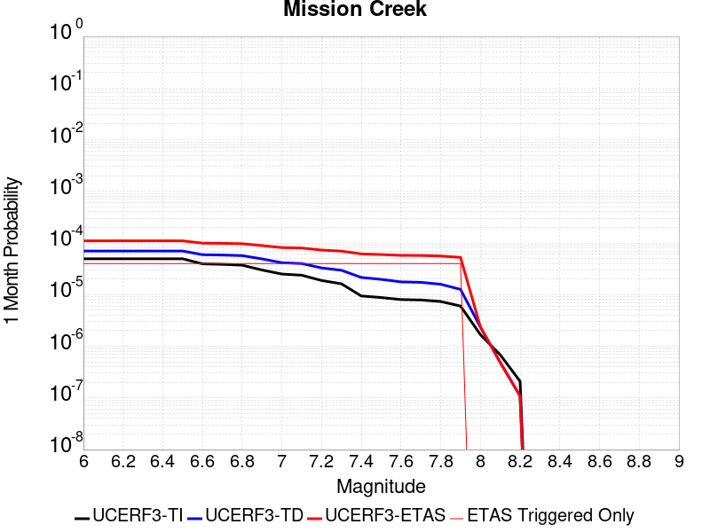 |  | 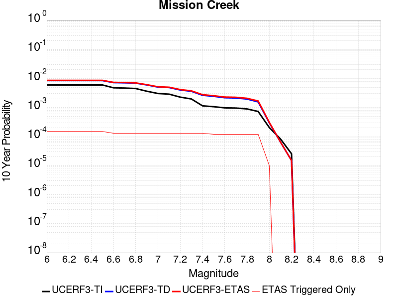 |

| Magnitude | 1 wk TI Prob | 1 wk TD Prob | 1 wk ETAS Prob | 1 wk ETAS/TD Gain | 1 wk ETAS Triggered Only | 1 mo TI Prob | 1 mo TD Prob | 1 mo ETAS Prob | 1 mo ETAS/TD Gain | 1 mo ETAS Triggered Only | 1 yr TI Prob | 1 yr TD Prob | 1 yr ETAS Prob | 1 yr ETAS/TD Gain | 1 yr ETAS Triggered Only | 10 yr TI Prob | 10 yr TD Prob | 10 yr ETAS Prob | 10 yr ETAS/TD Gain | 10 yr ETAS Triggered Only |
|-----|-----|-----|-----|-----|-----|-----|-----|-----|-----|-----|-----|-----|-----|-----|-----|-----|-----|-----|-----|-----|
| 6.0 | 1.1549387E-5 | 1.632237E-5 | 1.632237E-5 | 1.0 | 0.0 | 4.9496433E-5 | 6.9951224E-5 | 1.342554E-4 | 1.9192717 | 6.430868E-5 | 6.0245243E-4 | 8.513384E-4 | 9.798462E-4 | 1.150948 | 1.2861736E-4 | 0.006008218 | 0.008509998 | 0.0086694015 | 1.0187314 | 1.607717E-4 |
| 6.1 | 1.1549387E-5 | 1.632237E-5 | 1.632237E-5 | 1.0 | 0.0 | 4.9496433E-5 | 6.9951224E-5 | 1.342554E-4 | 1.9192717 | 6.430868E-5 | 6.0245243E-4 | 8.513384E-4 | 9.798462E-4 | 1.150948 | 1.2861736E-4 | 0.006008218 | 0.008509998 | 0.0086694015 | 1.0187314 | 1.607717E-4 |
| 6.2 | 1.1549387E-5 | 1.632237E-5 | 1.632237E-5 | 1.0 | 0.0 | 4.9496433E-5 | 6.9951224E-5 | 1.342554E-4 | 1.9192717 | 6.430868E-5 | 6.0245243E-4 | 8.513384E-4 | 9.798462E-4 | 1.150948 | 1.2861736E-4 | 0.006008218 | 0.008509998 | 0.0086694015 | 1.0187314 | 1.607717E-4 |
| 6.3 | 1.1549387E-5 | 1.632237E-5 | 1.632237E-5 | 1.0 | 0.0 | 4.9496433E-5 | 6.9951224E-5 | 1.342554E-4 | 1.9192717 | 6.430868E-5 | 6.0245243E-4 | 8.513384E-4 | 9.798462E-4 | 1.150948 | 1.2861736E-4 | 0.006008218 | 0.008509998 | 0.0086694015 | 1.0187314 | 1.607717E-4 |
| 6.4 | 1.1549387E-5 | 1.632237E-5 | 1.632237E-5 | 1.0 | 0.0 | 4.9496433E-5 | 6.9951224E-5 | 1.342554E-4 | 1.9192717 | 6.430868E-5 | 6.0245243E-4 | 8.513384E-4 | 9.798462E-4 | 1.150948 | 1.2861736E-4 | 0.006008218 | 0.008509998 | 0.0086694015 | 1.0187314 | 1.607717E-4 |
| 6.5 | 1.1549387E-5 | 1.632237E-5 | 1.632237E-5 | 1.0 | 0.0 | 4.9496433E-5 | 6.9951224E-5 | 1.342554E-4 | 1.9192717 | 6.430868E-5 | 6.0245243E-4 | 8.513384E-4 | 9.798462E-4 | 1.150948 | 1.2861736E-4 | 0.006008218 | 0.008509998 | 0.0086694015 | 1.0187314 | 1.607717E-4 |
| 6.6 | 9.202681E-6 | 1.3845646E-5 | 1.3845646E-5 | 1.0 | 0.0 | 3.9439463E-5 | 5.9337188E-5 | 1.2364205E-4 | 2.0837195 | 6.430868E-5 | 4.800697E-4 | 7.221998E-4 | 8.3465874E-4 | 1.1557171 | 1.1254019E-4 | 0.004790339 | 0.0072271815 | 0.0073548695 | 1.0176678 | 1.2861736E-4 |
| 6.7 | 9.019164E-6 | 1.3651316E-5 | 1.3651316E-5 | 1.0 | 0.0 | 3.8652986E-5 | 5.8504378E-5 | 1.228093E-4 | 2.099147 | 6.430868E-5 | 4.7049852E-4 | 7.12067E-4 | 8.245271E-4 | 1.1579347 | 1.1254019E-4 | 0.004695036 | 0.007126506 | 0.0072542066 | 1.0179192 | 1.2861736E-4 |
| 6.8 | 8.673558E-6 | 1.3273427E-5 | 1.3273427E-5 | 1.0 | 0.0 | 3.717186E-5 | 5.6884925E-5 | 1.2118995E-4 | 2.1304405 | 6.430868E-5 | 4.524734E-4 | 6.923627E-4 | 8.04825E-4 | 1.1624326 | 1.1254019E-4 | 0.0045155324 | 0.006930694 | 0.00705842 | 1.018429 | 1.2861736E-4 |
| 6.9 | 7.002255E-6 | 1.1477657E-5 | 1.1477657E-5 | 1.0 | 0.0 | 3.000932E-5 | 4.9189068E-5 | 1.13494585E-4 | 2.3073132 | 6.430868E-5 | 3.653022E-4 | 5.9871917E-4 | 7.11192E-4 | 1.1878557 | 1.1254019E-4 | 0.0036470229 | 0.005999517 | 0.006127363 | 1.0213094 | 1.2861736E-4 |
| 7.0 | 5.84644E-6 | 9.67498E-6 | 9.67498E-6 | 1.0 | 0.0 | 2.5055931E-5 | 4.1463565E-5 | 1.05769584E-4 | 2.550904 | 6.430868E-5 | 3.0501327E-4 | 5.047066E-4 | 6.1719E-4 | 1.2228689 | 1.1254019E-4 | 0.0030459496 | 0.0050638523 | 0.0051918183 | 1.0252705 | 1.2861736E-4 |
| 7.1 | 5.54703E-6 | 9.329456E-6 | 9.329456E-6 | 1.0 | 0.0 | 2.377277E-5 | 3.9982795E-5 | 1.04288905E-4 | 2.6083446 | 6.430868E-5 | 2.8939504E-4 | 4.8668624E-4 | 5.991717E-4 | 1.2311251 | 1.1254019E-4 | 0.0028901845 | 0.004884446 | 0.0050124354 | 1.0262034 | 1.2861736E-4 |
| 7.2 | 4.384709E-6 | 7.68157E-6 | 7.68157E-6 | 1.0 | 0.0 | 1.8791474E-5 | 3.2920623E-5 | 9.722719E-5 | 2.9533825 | 6.430868E-5 | 2.2876218E-4 | 4.0073853E-4 | 5.132336E-4 | 1.2807194 | 1.1254019E-4 | 0.0022852682 | 0.004028366 | 0.004156465 | 1.0317993 | 1.2861736E-4 |
| 7.3 | 3.7888456E-6 | 6.915452E-6 | 6.915452E-6 | 1.0 | 0.0 | 1.623781E-5 | 2.9637333E-5 | 9.394411E-5 | 3.1697896 | 6.430868E-5 | 1.9767738E-4 | 3.6077813E-4 | 4.7327773E-4 | 1.3118248 | 1.1254019E-4 | 0.0019750162 | 0.0036301152 | 0.0037582656 | 1.035302 | 1.2861736E-4 |
| 7.4 | 2.1982462E-6 | 5.0237763E-6 | 5.0237763E-6 | 1.0 | 0.0 | 9.421021E-6 | 2.1530293E-5 | 8.583759E-5 | 3.9868286 | 6.430868E-5 | 1.1469489E-4 | 2.621E-4 | 3.7461068E-4 | 1.4292663 | 1.1254019E-4 | 0.0011463572 | 0.0026458844 | 0.0027741615 | 1.0484817 | 1.2861736E-4 |
| 7.5 | 2.051923E-6 | 4.615016E-6 | 4.615016E-6 | 1.0 | 0.0 | 8.793926E-6 | 1.9778492E-5 | 8.40859E-5 | 4.251381 | 6.430868E-5 | 1.0706078E-4 | 2.4077666E-4 | 3.5328977E-4 | 1.4672923 | 1.1254019E-4 | 0.0010700922 | 0.0024335422 | 0.0025618465 | 1.0527233 | 1.2861736E-4 |
| 7.6 | 1.8733427E-6 | 4.1233748E-6 | 4.1233748E-6 | 1.0 | 0.0 | 8.028587E-6 | 1.7671488E-5 | 8.197903E-5 | 4.6390567 | 6.430868E-5 | 9.774366E-5 | 2.151292E-4 | 3.276452E-4 | 1.5230159 | 1.1254019E-4 | 9.770069E-4 | 0.0021780801 | 0.0023064173 | 1.0589222 | 1.2861736E-4 |
| 7.7 | 1.8411953E-6 | 4.0430496E-6 | 4.0430496E-6 | 1.0 | 0.0 | 7.890813E-6 | 1.732724E-5 | 8.163481E-5 | 4.7113566 | 6.430868E-5 | 9.606641E-5 | 2.1093882E-4 | 3.234553E-4 | 1.533408 | 1.1254019E-4 | 9.6024893E-4 | 0.0021363653 | 0.0022647078 | 1.0600752 | 1.2861736E-4 |
| 7.8 | 1.7194251E-6 | 3.7104276E-6 | 3.7104276E-6 | 1.0 | 0.0 | 7.368944E-6 | 1.5901736E-5 | 8.020939E-5 | 5.0440655 | 6.430868E-5 | 8.97132E-5 | 1.9358651E-4 | 3.0610492E-4 | 1.5812306 | 1.1254019E-4 | 8.967699E-4 | 0.0019623525 | 0.0020907174 | 1.0654138 | 1.2861736E-4 |
| 7.9 | 1.4035052E-6 | 2.9500632E-6 | 2.9500632E-6 | 1.0 | 0.0 | 6.0150082E-6 | 1.2643067E-5 | 7.6950935E-5 | 6.086414 | 6.430868E-5 | 7.3230265E-5 | 1.5391852E-4 | 2.664414E-4 | 1.7310548 | 1.1254019E-4 | 7.3206134E-4 | 0.0015631086 | 0.001691525 | 1.0821544 | 1.2861736E-4 |
| 8.0 | 3.9318823E-7 | 5.528522E-7 | 5.528522E-7 | 1.0 | 0.0 | 1.6850913E-6 | 2.3693647E-6 | 2.3693647E-6 | 1.0 | 0.0 | 2.0515794E-5 | 2.8846638E-5 | 2.8846638E-5 | 1.0 | 0.0 | 2.0513899E-4 | 2.9899E-4 | 2.9899E-4 | 1.0 | 0.0 |
| 8.1 | 1.596793E-7 | 1.1380002E-7 | 1.1380002E-7 | 1.0 | 0.0 | 6.8433974E-7 | 4.877143E-7 | 4.877143E-7 | 1.0 | 0.0 | 8.331805E-6 | 5.937906E-6 | 5.937906E-6 | 1.0 | 0.0 | 8.331492E-5 | 6.549966E-5 | 6.549966E-5 | 1.0 | 0.0 |
| 8.2 | 4.9003038E-8 | 2.5444924E-8 | 2.5444924E-8 | 1.0 | 0.0 | 2.10013E-7 | 1.0904967E-7 | 1.0904967E-7 | 1.0 | 0.0 | 2.5569052E-6 | 1.327679E-6 | 1.327679E-6 | 1.0 | 0.0 | 2.556876E-5 | 1.495635E-5 | 1.495635E-5 | 1.0 | 0.0 |

## San Jacinto (Anza) rev
*[(top)](#table-of-contents)*

| 1 Week | 1 Month | 1 Year | 10 Year |
|-----|-----|-----|-----|
|  |  |  |  |

| Magnitude | 1 wk TI Prob | 1 wk TD Prob | 1 wk ETAS Prob | 1 wk ETAS/TD Gain | 1 wk ETAS Triggered Only | 1 mo TI Prob | 1 mo TD Prob | 1 mo ETAS Prob | 1 mo ETAS/TD Gain | 1 mo ETAS Triggered Only | 1 yr TI Prob | 1 yr TD Prob | 1 yr ETAS Prob | 1 yr ETAS/TD Gain | 1 yr ETAS Triggered Only | 10 yr TI Prob | 10 yr TD Prob | 10 yr ETAS Prob | 10 yr ETAS/TD Gain | 10 yr ETAS Triggered Only |
|-----|-----|-----|-----|-----|-----|-----|-----|-----|-----|-----|-----|-----|-----|-----|-----|-----|-----|-----|-----|-----|
| 6.0 | 6.3015636E-5 | 4.3302647E-5 | 9.153207E-5 | 2.1137755 | 4.823151E-5 | 2.7003905E-4 | 1.8556965E-4 | 2.498664E-4 | 1.3464831 | 6.430868E-5 | 0.0032827691 | 0.0022569813 | 0.0023532265 | 1.0426434 | 9.646302E-5 | 0.032346968 | 0.023296192 | 0.023453219 | 1.0067405 | 1.607717E-4 |
| 6.1 | 6.3015636E-5 | 4.3302647E-5 | 9.153207E-5 | 2.1137755 | 4.823151E-5 | 2.7003905E-4 | 1.8556965E-4 | 2.498664E-4 | 1.3464831 | 6.430868E-5 | 0.0032827691 | 0.0022569813 | 0.0023532265 | 1.0426434 | 9.646302E-5 | 0.032346968 | 0.023296192 | 0.023453219 | 1.0067405 | 1.607717E-4 |
| 6.2 | 6.3015636E-5 | 4.3302647E-5 | 9.153207E-5 | 2.1137755 | 4.823151E-5 | 2.7003905E-4 | 1.8556965E-4 | 2.498664E-4 | 1.3464831 | 6.430868E-5 | 0.0032827691 | 0.0022569813 | 0.0023532265 | 1.0426434 | 9.646302E-5 | 0.032346968 | 0.023296192 | 0.023453219 | 1.0067405 | 1.607717E-4 |
| 6.3 | 6.3015636E-5 | 4.3302647E-5 | 9.153207E-5 | 2.1137755 | 4.823151E-5 | 2.7003905E-4 | 1.8556965E-4 | 2.498664E-4 | 1.3464831 | 6.430868E-5 | 0.0032827691 | 0.0022569813 | 0.0023532265 | 1.0426434 | 9.646302E-5 | 0.032346968 | 0.023296192 | 0.023453219 | 1.0067405 | 1.607717E-4 |
| 6.4 | 6.3015636E-5 | 4.3302647E-5 | 9.153207E-5 | 2.1137755 | 4.823151E-5 | 2.7003905E-4 | 1.8556965E-4 | 2.498664E-4 | 1.3464831 | 6.430868E-5 | 0.0032827691 | 0.0022569813 | 0.0023532265 | 1.0426434 | 9.646302E-5 | 0.032346968 | 0.023296192 | 0.023453219 | 1.0067405 | 1.607717E-4 |
| 6.5 | 5.811017E-5 | 4.0082516E-5 | 8.8312096E-5 | 2.2032573 | 4.823151E-5 | 2.4901982E-4 | 1.7177092E-4 | 2.3606856E-4 | 1.3743219 | 6.430868E-5 | 0.0030276014 | 0.002089311 | 0.0021855722 | 1.0460733 | 9.646302E-5 | 0.02986684 | 0.021593736 | 0.021751037 | 1.0072845 | 1.607717E-4 |
| 6.6 | 5.811017E-5 | 4.0082516E-5 | 8.8312096E-5 | 2.2032573 | 4.823151E-5 | 2.4901982E-4 | 1.7177092E-4 | 2.3606856E-4 | 1.3743219 | 6.430868E-5 | 0.0030276014 | 0.002089311 | 0.0021855722 | 1.0460733 | 9.646302E-5 | 0.02986684 | 0.021593736 | 0.021751037 | 1.0072845 | 1.607717E-4 |
| 6.7 | 5.712442E-5 | 3.9505223E-5 | 8.773483E-5 | 2.2208412 | 4.823151E-5 | 2.4479596E-4 | 1.6929714E-4 | 2.3359494E-4 | 1.3797926 | 6.430868E-5 | 0.0029763177 | 0.0020592497 | 0.002155514 | 1.0467473 | 9.646302E-5 | 0.029367693 | 0.021285562 | 0.021442913 | 1.0073923 | 1.607717E-4 |
| 6.8 | 5.6967532E-5 | 3.9361643E-5 | 8.759126E-5 | 2.2252946 | 4.823151E-5 | 2.4412372E-4 | 1.6868189E-4 | 2.3297971E-4 | 1.381178 | 6.430868E-5 | 0.0029681553 | 0.002051773 | 0.002148038 | 1.046918 | 9.646302E-5 | 0.029288229 | 0.021210281 | 0.021367643 | 1.0074191 | 1.607717E-4 |
| 6.9 | 5.6211324E-5 | 3.9066435E-5 | 8.7296066E-5 | 2.234554 | 4.823151E-5 | 2.4088343E-4 | 1.6741687E-4 | 2.3171479E-4 | 1.3840587 | 6.430868E-5 | 0.0029288116 | 0.0020364004 | 0.002132667 | 1.0472729 | 9.646302E-5 | 0.028905109 | 0.021049714 | 0.021207102 | 1.0074769 | 1.607717E-4 |
| 7.0 | 5.4383527E-5 | 3.792697E-5 | 8.615665E-5 | 2.271646 | 4.823151E-5 | 2.3305144E-4 | 1.6253405E-4 | 2.2683229E-4 | 1.3955985 | 6.430868E-5 | 0.0028337094 | 0.001977061 | 0.0020733334 | 1.0486946 | 9.646302E-5 | 0.027978465 | 0.020440677 | 0.020598162 | 1.0077045 | 1.607717E-4 |
| 7.1 | 5.1393665E-5 | 3.6389913E-5 | 8.461967E-5 | 2.3253605 | 4.823151E-5 | 2.2023996E-4 | 1.5594746E-4 | 2.2024612E-4 | 1.4123096 | 6.430868E-5 | 0.0026781242 | 0.0018970112 | 0.0019932913 | 1.0507536 | 9.646302E-5 | 0.026460782 | 0.019614287 | 0.019771906 | 1.0080359 | 1.607717E-4 |
| 7.2 | 4.785222E-5 | 3.4741795E-5 | 8.297163E-5 | 2.3882368 | 4.823151E-5 | 2.0506482E-4 | 1.4888494E-4 | 2.1318404E-4 | 1.4318712 | 6.430868E-5 | 0.0024938055 | 0.0018111705 | 0.0019074588 | 1.0531635 | 9.646302E-5 | 0.024660049 | 0.018728992 | 0.018886752 | 1.0084233 | 1.607717E-4 |
| 7.3 | 4.2143256E-5 | 3.383628E-5 | 8.206616E-5 | 2.4253895 | 4.823151E-5 | 1.8060145E-4 | 1.4500458E-4 | 2.0930394E-4 | 1.4434298 | 6.430868E-5 | 0.002196605 | 0.0017640047 | 0.0018602975 | 1.0545876 | 9.646302E-5 | 0.02175019 | 0.01823724 | 0.018395081 | 1.0086548 | 1.607717E-4 |
| 7.4 | 4.0264713E-5 | 3.347446E-5 | 8.170436E-5 | 2.4407966 | 4.823151E-5 | 1.7255165E-4 | 1.4345412E-4 | 2.0775358E-4 | 1.4482231 | 6.430868E-5 | 0.002098792 | 0.0017451581 | 0.0018414528 | 1.0551782 | 9.646302E-5 | 0.020790804 | 0.018041821 | 0.018199692 | 1.0087503 | 1.607717E-4 |
| 7.5 | 3.694492E-5 | 3.218847E-5 | 8.0418424E-5 | 2.4983613 | 4.823151E-5 | 1.5832575E-4 | 1.379433E-4 | 2.0224311E-4 | 1.4661322 | 6.430868E-5 | 0.0019259118 | 0.001678169 | 0.0017744701 | 1.0573846 | 9.646302E-5 | 0.01909306 | 0.01735827 | 0.017516252 | 1.0091012 | 1.607717E-4 |
| 7.6 | 3.200565E-5 | 2.9504106E-5 | 7.773419E-5 | 2.6346908 | 4.823151E-5 | 1.3715986E-4 | 1.2644005E-4 | 1.9074061E-4 | 1.5085458 | 6.430868E-5 | 0.001668642 | 0.0015383229 | 0.0016346375 | 1.0626101 | 9.646302E-5 | 0.01656168 | 0.0159463 | 0.016104508 | 1.0099213 | 1.607717E-4 |
| 7.7 | 2.731642E-5 | 2.6092788E-5 | 7.432304E-5 | 2.8484132 | 4.823151E-5 | 1.1706512E-4 | 1.1182144E-4 | 1.7612294E-4 | 1.5750372 | 6.430868E-5 | 0.001424336 | 0.0013605768 | 0.0014569086 | 1.0708022 | 9.646302E-5 | 0.014152412 | 0.014167004 | 0.014325499 | 1.0111876 | 1.607717E-4 |
| 7.8 | 2.3466424E-5 | 2.3504817E-5 | 7.1735194E-5 | 3.051936 | 4.823151E-5 | 1.0056651E-4 | 1.0073105E-4 | 1.6503326E-4 | 1.6383554 | 6.430868E-5 | 0.0012237094 | 0.0012257113 | 0.0013220562 | 1.0786031 | 9.646302E-5 | 0.012169928 | 0.012808893 | 0.012967605 | 1.0123909 | 1.607717E-4 |
| 7.9 | 1.8611925E-5 | 1.8908117E-5 | 6.713872E-5 | 3.5507882 | 4.823151E-5 | 7.9762955E-5 | 8.1032274E-5 | 1.4533574E-4 | 1.7935538 | 6.430868E-5 | 9.7068126E-4 | 9.861222E-4 | 0.0010824901 | 1.0977241 | 9.646302E-5 | 0.0096645225 | 0.010393824 | 0.010552925 | 1.0153072 | 1.607717E-4 |
| 8.0 | 1.5460775E-5 | 1.5740965E-5 | 6.397172E-5 | 4.064028 | 4.823151E-5 | 6.6258784E-5 | 6.7459536E-5 | 1.3176388E-4 | 1.9532284 | 6.430868E-5 | 8.0640207E-4 | 8.21011E-4 | 9.013309E-4 | 1.0978304 | 8.038585E-5 | 0.008034821 | 0.0087028835 | 0.008846318 | 1.0164814 | 1.4469454E-4 |
| 8.1 | 9.983884E-6 | 8.269952E-6 | 4.0424027E-5 | 4.8880606 | 3.215434E-5 | 4.2787375E-5 | 3.544217E-5 | 6.759537E-5 | 1.9072018 | 3.215434E-5 | 5.2081177E-4 | 4.314235E-4 | 4.6356398E-4 | 1.0744987 | 3.215434E-5 | 0.0051959283 | 0.004640022 | 0.0046880296 | 1.0103464 | 4.823151E-5 |
| 8.2 | 4.1226E-6 | 1.5529788E-6 | 1.5529788E-6 | 1.0 | 0.0 | 1.7668166E-5 | 6.6556063E-6 | 6.6556063E-6 | 1.0 | 0.0 | 2.1508869E-4 | 8.102902E-5 | 8.102902E-5 | 1.0 | 0.0 | 0.0021488064 | 9.4050163E-4 | 9.4050163E-4 | 1.0 | 0.0 |
| 8.3 | 1.2750878E-6 | 3.612133E-7 | 3.612133E-7 | 1.0 | 0.0 | 5.4646503E-6 | 1.548056E-6 | 1.548056E-6 | 1.0 | 0.0 | 6.653009E-5 | 1.8847424E-5 | 1.8847424E-5 | 1.0 | 0.0 | 6.6510175E-4 | 2.2734253E-4 | 2.2734253E-4 | 1.0 | 0.0 |

## Owens Valley
*[(top)](#table-of-contents)*

| 1 Week | 1 Month | 1 Year | 10 Year |
|-----|-----|-----|-----|
|  |  |  | 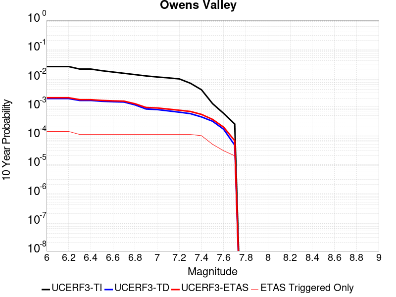 |

| Magnitude | 1 wk TI Prob | 1 wk TD Prob | 1 wk ETAS Prob | 1 wk ETAS/TD Gain | 1 wk ETAS Triggered Only | 1 mo TI Prob | 1 mo TD Prob | 1 mo ETAS Prob | 1 mo ETAS/TD Gain | 1 mo ETAS Triggered Only | 1 yr TI Prob | 1 yr TD Prob | 1 yr ETAS Prob | 1 yr ETAS/TD Gain | 1 yr ETAS Triggered Only | 10 yr TI Prob | 10 yr TD Prob | 10 yr ETAS Prob | 10 yr ETAS/TD Gain | 10 yr ETAS Triggered Only |
|-----|-----|-----|-----|-----|-----|-----|-----|-----|-----|-----|-----|-----|-----|-----|-----|-----|-----|-----|-----|-----|
| 6.0 | 4.83821E-5 | 3.626567E-6 | 1.0008924E-4 | 27.598894 | 9.646302E-5 | 2.0733538E-4 | 1.5542342E-5 | 1.441577E-4 | 9.27516 | 1.2861736E-4 | 0.002521386 | 1.8921259E-4 | 3.3387975E-4 | 1.7645746 | 1.4469454E-4 | 0.024929691 | 0.001925011 | 0.002069427 | 1.0750209 | 1.4469454E-4 |
| 6.1 | 4.83821E-5 | 3.626567E-6 | 1.0008924E-4 | 27.598894 | 9.646302E-5 | 2.0733538E-4 | 1.5542342E-5 | 1.441577E-4 | 9.27516 | 1.2861736E-4 | 0.002521386 | 1.8921259E-4 | 3.3387975E-4 | 1.7645746 | 1.4469454E-4 | 0.024929691 | 0.001925011 | 0.002069427 | 1.0750209 | 1.4469454E-4 |
| 6.2 | 4.83821E-5 | 3.626567E-6 | 1.0008924E-4 | 27.598894 | 9.646302E-5 | 2.0733538E-4 | 1.5542342E-5 | 1.441577E-4 | 9.27516 | 1.2861736E-4 | 0.002521386 | 1.8921259E-4 | 3.3387975E-4 | 1.7645746 | 1.4469454E-4 | 0.024929691 | 0.001925011 | 0.002069427 | 1.0750209 | 1.4469454E-4 |
| 6.3 | 3.953008E-5 | 3.1553948E-6 | 8.3540996E-5 | 26.475607 | 8.038585E-5 | 1.6940363E-4 | 1.3523055E-5 | 1.2606173E-4 | 9.321986 | 1.1254019E-4 | 0.002060538 | 1.6463149E-4 | 2.9322767E-4 | 1.7811154 | 1.2861736E-4 | 0.020415364 | 0.0016592 | 0.0017876038 | 1.0773891 | 1.2861736E-4 |
| 6.4 | 3.953008E-5 | 3.1553948E-6 | 8.3540996E-5 | 26.475607 | 8.038585E-5 | 1.6940363E-4 | 1.3523055E-5 | 1.2606173E-4 | 9.321986 | 1.1254019E-4 | 0.002060538 | 1.6463149E-4 | 2.9322767E-4 | 1.7811154 | 1.2861736E-4 | 0.020415364 | 0.0016592 | 0.0017876038 | 1.0773891 | 1.2861736E-4 |
| 6.5 | 3.457342E-5 | 2.9715961E-6 | 8.335721E-5 | 28.051325 | 8.038585E-5 | 1.4816338E-4 | 1.2735354E-5 | 1.2527412E-4 | 9.83672 | 1.1254019E-4 | 0.0018023965 | 1.550426E-4 | 2.8364002E-4 | 1.8294328 | 1.2861736E-4 | 0.017878477 | 0.001555719 | 0.0016841362 | 1.0825453 | 1.2861736E-4 |
| 6.6 | 3.1127765E-5 | 2.8744932E-6 | 8.3260114E-5 | 28.965145 | 8.038585E-5 | 1.3339789E-4 | 1.2319203E-5 | 1.2485801E-4 | 10.135235 | 1.1254019E-4 | 0.0016229092 | 1.4997667E-4 | 2.7857473E-4 | 1.857454 | 1.2861736E-4 | 0.016111081 | 0.0015012559 | 0.0016296802 | 1.0855446 | 1.2861736E-4 |
| 6.7 | 2.806885E-5 | 2.8104134E-6 | 8.319604E-5 | 29.602777 | 8.038585E-5 | 1.2028952E-4 | 1.20445775E-5 | 1.2458341E-4 | 10.343528 | 1.1254019E-4 | 0.001463541 | 1.4663354E-4 | 2.7523204E-4 | 1.877006 | 1.2861736E-4 | 0.014539397 | 0.0014657511 | 0.0015941799 | 1.0876198 | 1.2861736E-4 |
| 6.8 | 2.524524E-5 | 2.2353688E-6 | 8.262104E-5 | 36.96081 | 8.038585E-5 | 1.0818939E-4 | 9.580118E-6 | 1.2211924E-4 | 12.747153 | 1.1254019E-4 | 0.0013164099 | 1.16632E-4 | 2.4523438E-4 | 2.1026337 | 1.2861736E-4 | 0.01308639 | 0.0011659812 | 0.0012944485 | 1.1101797 | 1.2861736E-4 |
| 6.9 | 2.2704568E-5 | 1.6081682E-6 | 8.1993894E-5 | 50.98589 | 8.038585E-5 | 9.730166E-5 | 6.8921313E-6 | 1.1943155E-4 | 17.328682 | 1.1254019E-4 | 0.0011840039 | 8.390849E-5 | 2.1251506E-4 | 2.5327003 | 1.2861736E-4 | 0.011777153 | 8.3897985E-4 | 9.6748926E-4 | 1.1531734 | 1.2861736E-4 |
| 7.0 | 2.0871712E-5 | 1.5395453E-6 | 8.1925275E-5 | 53.21394 | 8.038585E-5 | 8.944713E-5 | 6.598035E-6 | 1.1913748E-4 | 18.05651 | 1.1254019E-4 | 0.0010884746 | 8.032813E-5 | 2.0893516E-4 | 2.601021 | 1.2861736E-4 | 0.010831586 | 8.0316263E-4 | 9.3167665E-4 | 1.16001 | 1.2861736E-4 |
| 7.1 | 1.944928E-5 | 1.3864178E-6 | 8.177216E-5 | 58.980892 | 8.038585E-5 | 8.335139E-5 | 5.941777E-6 | 1.184813E-4 | 19.940382 | 1.1254019E-4 | 0.0010143308 | 7.233874E-5 | 2.009468E-4 | 2.7778587 | 1.2861736E-4 | 0.010097133 | 7.2330976E-4 | 8.518341E-4 | 1.1776892 | 1.2861736E-4 |
| 7.2 | 1.7876306E-5 | 1.2489141E-6 | 8.1634666E-5 | 65.36452 | 8.038585E-5 | 7.6610486E-5 | 5.352478E-6 | 1.1789207E-4 | 22.025698 | 1.1254019E-4 | 9.3233347E-4 | 6.516448E-5 | 1.9377346E-4 | 2.9736056 | 1.2861736E-4 | 0.009284316 | 6.5159105E-4 | 7.801246E-4 | 1.1972611 | 1.2861736E-4 |
| 7.3 | 1.2618672E-5 | 1.1115209E-6 | 8.149728E-5 | 73.32052 | 8.038585E-5 | 5.40789E-5 | 4.763652E-6 | 1.1730331E-4 | 24.624659 | 1.1254019E-4 | 6.582117E-4 | 5.799593E-5 | 1.8660583E-4 | 3.2175677 | 1.2861736E-4 | 0.0065626553 | 5.7994033E-4 | 7.084831E-4 | 1.2216482 | 1.2861736E-4 |
| 7.4 | 7.4874442E-6 | 8.5486437E-7 | 6.516349E-5 | 76.2267 | 6.430868E-5 | 3.208865E-5 | 3.6636993E-6 | 1.00126366E-4 | 27.329308 | 9.646302E-5 | 3.906093E-4 | 4.4604632E-5 | 1.571398E-4 | 3.5229483 | 1.1254019E-4 | 0.003899234 | 4.4604883E-4 | 5.585388E-4 | 1.2521921 | 1.1254019E-4 |
| 7.5 | 2.4734156E-6 | 6.068616E-7 | 4.8838345E-5 | 80.476906 | 4.823151E-5 | 1.060031E-5 | 2.6008327E-6 | 6.690935E-5 | 25.726124 | 6.430868E-5 | 1.2905113E-4 | 3.166468E-5 | 9.597133E-5 | 3.0308635 | 6.430868E-5 | 0.0012897621 | 3.1660203E-4 | 3.8089036E-4 | 1.2030572 | 6.430868E-5 |
| 7.6 | 1.1328841E-6 | 3.196531E-7 | 1.6396818E-5 | 51.295666 | 1.607717E-5 | 4.8552088E-6 | 1.3699412E-6 | 3.3524237E-5 | 24.471298 | 3.215434E-5 | 5.9110564E-5 | 1.6678909E-5 | 4.8832713E-5 | 2.9278123 | 3.215434E-5 | 5.9094845E-4 | 1.6677675E-4 | 1.9892573E-4 | 1.1927665 | 3.215434E-5 |
| 7.7 | 4.8613185E-7 | 8.964689E-8 | 1.6166816E-5 | 180.33884 | 1.607717E-5 | 2.0834207E-6 | 3.8420092E-7 | 1.6461365E-5 | 42.845722 | 1.607717E-5 | 2.536535E-5 | 4.6776368E-6 | 2.0754733E-5 | 4.437012 | 1.607717E-5 | 2.5362454E-4 | 4.677545E-5 | 6.285187E-5 | 1.3436935 | 1.607717E-5 |

## Ventura-Pitas Point
*[(top)](#table-of-contents)*

| 1 Week | 1 Month | 1 Year | 10 Year |
|-----|-----|-----|-----|
|  |  |  | 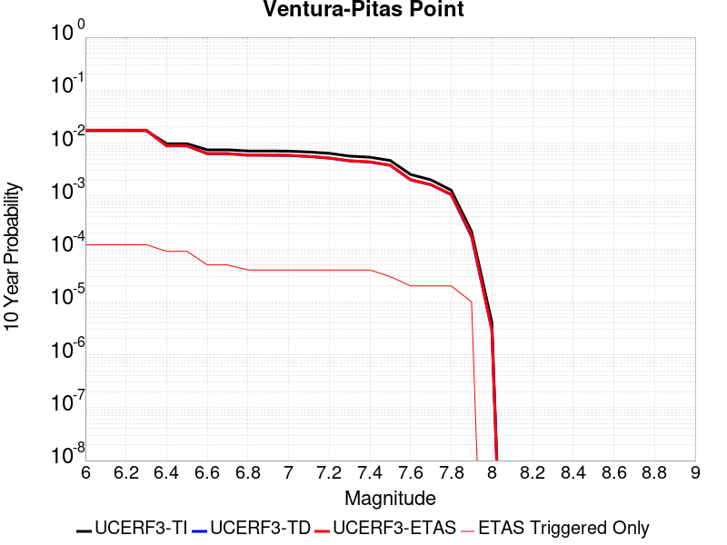 |

| Magnitude | 1 wk TI Prob | 1 wk TD Prob | 1 wk ETAS Prob | 1 wk ETAS/TD Gain | 1 wk ETAS Triggered Only | 1 mo TI Prob | 1 mo TD Prob | 1 mo ETAS Prob | 1 mo ETAS/TD Gain | 1 mo ETAS Triggered Only | 1 yr TI Prob | 1 yr TD Prob | 1 yr ETAS Prob | 1 yr ETAS/TD Gain | 1 yr ETAS Triggered Only | 10 yr TI Prob | 10 yr TD Prob | 10 yr ETAS Prob | 10 yr ETAS/TD Gain | 10 yr ETAS Triggered Only |
|-----|-----|-----|-----|-----|-----|-----|-----|-----|-----|-----|-----|-----|-----|-----|-----|-----|-----|-----|-----|-----|
| 6.0 | 3.3179622E-5 | 3.3735185E-5 | 9.8041695E-5 | 2.906215 | 6.430868E-5 | 1.4219063E-4 | 1.445728E-4 | 2.2494703E-4 | 1.555943 | 8.038585E-5 | 0.0017297962 | 0.0017590096 | 0.001855303 | 1.0547429 | 9.646302E-5 | 0.017163932 | 0.0174764 | 0.01760277 | 1.0072309 | 1.2861736E-4 |
| 6.1 | 3.3179622E-5 | 3.3735185E-5 | 9.8041695E-5 | 2.906215 | 6.430868E-5 | 1.4219063E-4 | 1.445728E-4 | 2.2494703E-4 | 1.555943 | 8.038585E-5 | 0.0017297962 | 0.0017590096 | 0.001855303 | 1.0547429 | 9.646302E-5 | 0.017163932 | 0.0174764 | 0.01760277 | 1.0072309 | 1.2861736E-4 |
| 6.2 | 3.3179622E-5 | 3.3735185E-5 | 9.8041695E-5 | 2.906215 | 6.430868E-5 | 1.4219063E-4 | 1.445728E-4 | 2.2494703E-4 | 1.555943 | 8.038585E-5 | 0.0017297962 | 0.0017590096 | 0.001855303 | 1.0547429 | 9.646302E-5 | 0.017163932 | 0.0174764 | 0.01760277 | 1.0072309 | 1.2861736E-4 |
| 6.3 | 3.3179622E-5 | 3.3735185E-5 | 9.8041695E-5 | 2.906215 | 6.430868E-5 | 1.4219063E-4 | 1.445728E-4 | 2.2494703E-4 | 1.555943 | 8.038585E-5 | 0.0017297962 | 0.0017590096 | 0.001855303 | 1.0547429 | 9.646302E-5 | 0.017163932 | 0.0174764 | 0.01760277 | 1.0072309 | 1.2861736E-4 |
| 6.4 | 1.8754668E-5 | 1.701961E-5 | 6.52503E-5 | 3.8338304 | 4.823151E-5 | 8.037467E-5 | 7.293928E-5 | 1.3724327E-4 | 1.8816099 | 6.430868E-5 | 9.781223E-4 | 8.8769704E-4 | 9.680115E-4 | 1.0904751 | 8.038585E-5 | 0.009738282 | 0.008843848 | 0.008939458 | 1.0108109 | 9.646302E-5 |
| 6.5 | 1.8754668E-5 | 1.701961E-5 | 6.52503E-5 | 3.8338304 | 4.823151E-5 | 8.037467E-5 | 7.293928E-5 | 1.3724327E-4 | 1.8816099 | 6.430868E-5 | 9.781223E-4 | 8.8769704E-4 | 9.680115E-4 | 1.0904751 | 8.038585E-5 | 0.009738282 | 0.008843848 | 0.008939458 | 1.0108109 | 9.646302E-5 |
| 6.6 | 1.4361558E-5 | 1.2122275E-5 | 2.819925E-5 | 2.326234 | 1.607717E-5 | 6.154808E-5 | 5.1951585E-5 | 6.802792E-5 | 1.3094484 | 1.607717E-5 | 7.490902E-4 | 6.3232926E-4 | 6.6446327E-4 | 1.0508184 | 3.215434E-5 | 0.0074657016 | 0.0063055577 | 0.006353485 | 1.0076008 | 4.823151E-5 |
| 6.7 | 1.4361558E-5 | 1.2122275E-5 | 2.819925E-5 | 2.326234 | 1.607717E-5 | 6.154808E-5 | 5.1951585E-5 | 6.802792E-5 | 1.3094484 | 1.607717E-5 | 7.490902E-4 | 6.3232926E-4 | 6.6446327E-4 | 1.0508184 | 3.215434E-5 | 0.0074657016 | 0.0063055577 | 0.006353485 | 1.0076008 | 4.823151E-5 |
| 6.8 | 1.3663846E-5 | 1.13444175E-5 | 2.7421405E-5 | 2.4171717 | 1.607717E-5 | 5.8558027E-5 | 4.861804E-5 | 6.4694425E-5 | 1.3306671 | 1.607717E-5 | 7.127108E-4 | 5.917658E-4 | 6.239011E-4 | 1.0543041 | 3.215434E-5 | 0.007104293 | 0.005902116 | 0.005950063 | 1.0081236 | 4.823151E-5 |
| 6.9 | 1.3644157E-5 | 1.1322519E-5 | 2.7399507E-5 | 2.4199128 | 1.607717E-5 | 5.8473648E-5 | 4.8524187E-5 | 6.460058E-5 | 1.3313067 | 1.607717E-5 | 7.116841E-4 | 5.9062376E-4 | 6.227591E-4 | 1.0544091 | 3.215434E-5 | 0.007094092 | 0.0058907564 | 0.005938704 | 1.0081394 | 4.823151E-5 |
| 7.0 | 1.3568845E-5 | 1.1242086E-5 | 2.7319074E-5 | 2.4300718 | 1.607717E-5 | 5.8150898E-5 | 4.817949E-5 | 6.425588E-5 | 1.3336772 | 1.607717E-5 | 7.077572E-4 | 5.864293E-4 | 6.185648E-4 | 1.0547986 | 3.215434E-5 | 0.007055073 | 0.0058490336 | 0.0058969827 | 1.0081978 | 4.823151E-5 |
| 7.1 | 1.306572E-5 | 1.072054E-5 | 2.6797537E-5 | 2.4996445 | 1.607717E-5 | 5.599474E-5 | 4.5944373E-5 | 6.20208E-5 | 1.3499109 | 1.607717E-5 | 6.815227E-4 | 5.5923103E-4 | 5.9136737E-4 | 1.0574653 | 3.215434E-5 | 0.0067943637 | 0.0055784425 | 0.0056264047 | 1.0085979 | 4.823151E-5 |
| 7.2 | 1.232604E-5 | 9.995143E-6 | 2.6072154E-5 | 2.6084821 | 1.607717E-5 | 5.2824813E-5 | 4.2835632E-5 | 5.8912115E-5 | 1.3753062 | 1.607717E-5 | 6.429523E-4 | 5.214008E-4 | 5.535384E-4 | 1.061637 | 3.215434E-5 | 0.0064109527 | 0.005201967 | 0.0052499473 | 1.0092236 | 4.823151E-5 |
| 7.3 | 1.0917261E-5 | 8.84384E-6 | 2.4920868E-5 | 2.8178785 | 1.607717E-5 | 4.678742E-5 | 3.790163E-5 | 5.3978194E-5 | 1.4241654 | 1.607717E-5 | 5.69488E-4 | 4.6135622E-4 | 4.934957E-4 | 1.069663 | 3.215434E-5 | 0.0056803077 | 0.00460415 | 0.0046521598 | 1.0104275 | 4.823151E-5 |
| 7.4 | 1.039959E-5 | 8.423562E-6 | 2.4500598E-5 | 2.908579 | 1.607717E-5 | 4.456891E-5 | 3.610049E-5 | 5.2177078E-5 | 1.4453288 | 1.607717E-5 | 5.424914E-4 | 4.3943635E-4 | 4.7157655E-4 | 1.0731397 | 3.215434E-5 | 0.0054116896 | 0.004385836 | 0.004433856 | 1.0109489 | 4.823151E-5 |
| 7.5 | 9.015877E-6 | 7.2975445E-6 | 2.3374598E-5 | 3.203077 | 1.607717E-5 | 3.86389E-5 | 3.1274823E-5 | 4.7351492E-5 | 1.514045 | 1.607717E-5 | 4.7032707E-4 | 3.8070587E-4 | 4.1284796E-4 | 1.0844276 | 3.215434E-5 | 0.004693329 | 0.0038006818 | 0.003832714 | 1.008428 | 3.215434E-5 |
| 7.6 | 4.900162E-6 | 3.8741155E-6 | 1.9951223E-5 | 5.1498785 | 1.607717E-5 | 2.1000526E-5 | 1.6603248E-5 | 3.268015E-5 | 1.9682988 | 1.607717E-5 | 2.556514E-4 | 2.0212591E-4 | 2.1819984E-4 | 1.0795243 | 1.607717E-5 | 0.0025535747 | 0.0020194345 | 0.002035479 | 1.0079452 | 1.607717E-5 |
| 7.7 | 3.8850626E-6 | 3.1267302E-6 | 1.920385E-5 | 6.1418314 | 1.607717E-5 | 1.6650163E-5 | 1.3400205E-5 | 2.947716E-5 | 2.1997545 | 1.607717E-5 | 2.0269687E-4 | 1.6313537E-4 | 1.792099E-4 | 1.0985351 | 1.607717E-5 | 0.002025121 | 0.0016301654 | 0.0016462164 | 1.0098462 | 1.607717E-5 |
| 7.8 | 2.4654719E-6 | 2.029875E-6 | 1.8107014E-5 | 8.92026 | 1.607717E-5 | 1.0566265E-5 | 8.699436E-6 | 2.4776466E-5 | 2.8480544 | 1.607717E-5 | 1.2863669E-4 | 1.0591053E-4 | 1.2198599E-4 | 1.1517835 | 1.607717E-5 | 0.0012856225 | 0.0010586053 | 0.0010746653 | 1.015171 | 1.607717E-5 |
| 7.9 | 4.095894E-7 | 3.2764765E-7 | 1.6404812E-5 | 50.06846 | 1.607717E-5 | 1.7553821E-6 | 1.4042034E-6 | 1.748135E-5 | 12.449301 | 1.607717E-5 | 2.1371567E-5 | 1.7096047E-5 | 3.3172942E-5 | 1.9403868 | 1.607717E-5 | 2.1369511E-4 | 1.7094762E-4 | 1.8702204E-4 | 1.0940312 | 1.607717E-5 |
| 8.0 | 7.791402E-9 | 5.683497E-9 | 5.683497E-9 | 1.0 | 0.0 | 3.3391725E-8 | 2.4357844E-8 | 2.4357844E-8 | 1.0 | 0.0 | 4.0654416E-7 | 2.9655675E-7 | 2.9655675E-7 | 1.0 | 0.0 | 4.065434E-6 | 2.9655655E-6 | 2.9655655E-6 | 1.0 | 0.0 |

## Rose Canyon
*[(top)](#table-of-contents)*

| 1 Week | 1 Month | 1 Year | 10 Year |
|-----|-----|-----|-----|
|  |  |  |  |

| Magnitude | 1 wk TI Prob | 1 wk TD Prob | 1 wk ETAS Prob | 1 wk ETAS/TD Gain | 1 wk ETAS Triggered Only | 1 mo TI Prob | 1 mo TD Prob | 1 mo ETAS Prob | 1 mo ETAS/TD Gain | 1 mo ETAS Triggered Only | 1 yr TI Prob | 1 yr TD Prob | 1 yr ETAS Prob | 1 yr ETAS/TD Gain | 1 yr ETAS Triggered Only | 10 yr TI Prob | 10 yr TD Prob | 10 yr ETAS Prob | 10 yr ETAS/TD Gain | 10 yr ETAS Triggered Only |
|-----|-----|-----|-----|-----|-----|-----|-----|-----|-----|-----|-----|-----|-----|-----|-----|-----|-----|-----|-----|-----|
| 6.0 | 4.5923203E-5 | 4.9714225E-5 | 8.1866965E-5 | 1.6467514 | 3.215434E-5 | 1.9679888E-4 | 2.1304491E-4 | 2.6126616E-4 | 1.226343 | 4.823151E-5 | 0.0023933933 | 0.0025909345 | 0.0026871476 | 1.0371345 | 9.646302E-5 | 0.023677798 | 0.02563999 | 0.025780976 | 1.0054986 | 1.4469454E-4 |
| 6.1 | 4.5923203E-5 | 4.9714225E-5 | 4.9714225E-5 | 1.0 | 0.0 | 1.9679888E-4 | 2.1304491E-4 | 2.2911867E-4 | 1.0754477 | 1.607717E-5 | 0.0023933933 | 0.0025909345 | 0.0026550766 | 1.0247563 | 6.430868E-5 | 0.023677798 | 0.02563999 | 0.025733981 | 1.0036658 | 9.646302E-5 |
| 6.2 | 2.8844734E-5 | 2.9668723E-5 | 2.9668723E-5 | 1.0 | 0.0 | 1.2361443E-4 | 1.2714567E-4 | 1.2714567E-4 | 1.0 | 0.0 | 0.0015039665 | 0.0015468939 | 0.0015629461 | 1.0103772 | 1.607717E-5 | 0.0149382865 | 0.015374276 | 0.015421766 | 1.003089 | 4.823151E-5 |
| 6.3 | 2.3171577E-5 | 2.3161238E-5 | 2.3161238E-5 | 1.0 | 0.0 | 9.9302975E-5 | 9.9258745E-5 | 9.9258745E-5 | 1.0 | 0.0 | 0.0012083431 | 0.0012078186 | 0.0012238764 | 1.0132948 | 1.607717E-5 | 0.012017938 | 0.012022437 | 0.012070089 | 1.0039636 | 4.823151E-5 |
| 6.4 | 2.0066604E-5 | 1.9667024E-5 | 1.9667024E-5 | 1.0 | 0.0 | 8.599689E-5 | 8.4284584E-5 | 8.4284584E-5 | 1.0 | 0.0 | 0.0010465092 | 0.0010256917 | 0.0010417524 | 1.0156584 | 1.607717E-5 | 0.010415946 | 0.010217559 | 0.010265297 | 1.0046722 | 4.823151E-5 |
| 6.5 | 1.776989E-5 | 1.7113807E-5 | 1.7113807E-5 | 1.0 | 0.0 | 7.615444E-5 | 7.334287E-5 | 7.334287E-5 | 1.0 | 0.0 | 9.267859E-4 | 8.925905E-4 | 9.0865337E-4 | 1.0179957 | 1.607717E-5 | 0.009229303 | 0.008896211 | 0.008928079 | 1.0035822 | 3.215434E-5 |
| 6.6 | 1.5227364E-5 | 1.433926E-5 | 1.433926E-5 | 1.0 | 0.0 | 6.52585E-5 | 6.1452556E-5 | 6.1452556E-5 | 1.0 | 0.0 | 7.942326E-4 | 7.479332E-4 | 7.6399837E-4 | 1.0214794 | 1.607717E-5 | 0.007914 | 0.007458359 | 0.0074902736 | 1.004279 | 3.215434E-5 |
| 6.7 | 1.2703898E-5 | 1.1673274E-5 | 1.1673274E-5 | 1.0 | 0.0 | 5.4444143E-5 | 5.0027378E-5 | 5.0027378E-5 | 1.0 | 0.0 | 6.626558E-4 | 6.089174E-4 | 6.2498474E-4 | 1.0263869 | 1.607717E-5 | 0.006606833 | 0.0060750856 | 0.006107045 | 1.0052607 | 3.215434E-5 |
| 6.8 | 1.1554917E-5 | 1.0609337E-5 | 1.0609337E-5 | 1.0 | 0.0 | 4.9520135E-5 | 4.546782E-5 | 4.546782E-5 | 1.0 | 0.0 | 6.0274085E-4 | 5.5343413E-4 | 5.695024E-4 | 1.0290338 | 1.607717E-5 | 0.0060110865 | 0.0055225673 | 0.0055545443 | 1.0057902 | 3.215434E-5 |
| 6.9 | 8.732078E-6 | 7.881357E-6 | 7.881357E-6 | 1.0 | 0.0 | 3.7422655E-5 | 3.3776825E-5 | 3.3776825E-5 | 1.0 | 0.0 | 4.5552556E-4 | 4.111582E-4 | 4.111582E-4 | 1.0 | 0.0 | 0.0045459294 | 0.0041048084 | 0.0041048084 | 1.0 | 0.0 |
| 7.0 | 5.9337494E-6 | 5.1074853E-6 | 5.1074853E-6 | 1.0 | 0.0 | 2.5430107E-5 | 2.188904E-5 | 2.188904E-5 | 1.0 | 0.0 | 3.0956755E-4 | 2.664666E-4 | 2.664666E-4 | 1.0 | 0.0 | 0.0030913667 | 0.0026614866 | 0.0026614866 | 1.0 | 0.0 |
| 7.1 | 5.013409E-6 | 4.1773833E-6 | 4.1773833E-6 | 1.0 | 0.0 | 2.1485863E-5 | 1.7902948E-5 | 1.7902948E-5 | 1.0 | 0.0 | 2.6155898E-4 | 2.179467E-4 | 2.179467E-4 | 1.0 | 0.0 | 0.0026125133 | 0.0021773411 | 0.0021773411 | 1.0 | 0.0 |
| 7.2 | 4.120763E-6 | 3.2821383E-6 | 3.2821383E-6 | 1.0 | 0.0 | 1.7660293E-5 | 1.4066231E-5 | 1.4066231E-5 | 1.0 | 0.0 | 2.1499286E-4 | 1.7124301E-4 | 1.7124301E-4 | 1.0 | 0.0 | 0.0021478499 | 0.00171112 | 0.00171112 | 1.0 | 0.0 |
| 7.3 | 3.2081239E-6 | 2.4405372E-6 | 2.4405372E-6 | 1.0 | 0.0 | 1.374903E-5 | 1.0459404E-5 | 1.0459404E-5 | 1.0 | 0.0 | 1.6738157E-4 | 1.2733586E-4 | 1.2733586E-4 | 1.0 | 0.0 | 0.0016725556 | 0.001272636 | 0.001272636 | 1.0 | 0.0 |
| 7.4 | 2.4194755E-6 | 1.7680634E-6 | 1.7680634E-6 | 1.0 | 0.0 | 1.0369139E-5 | 7.577393E-6 | 7.577393E-6 | 1.0 | 0.0 | 1.2623696E-4 | 9.2250906E-5 | 9.2250906E-5 | 1.0 | 0.0 | 0.0012616527 | 9.2213147E-4 | 9.2213147E-4 | 1.0 | 0.0 |
| 7.5 | 1.3842889E-6 | 9.3786275E-7 | 9.3786275E-7 | 1.0 | 0.0 | 5.9326535E-6 | 4.019406E-6 | 4.019406E-6 | 1.0 | 0.0 | 7.222766E-5 | 4.8935202E-5 | 4.8935202E-5 | 1.0 | 0.0 | 7.220419E-4 | 4.892478E-4 | 4.892478E-4 | 1.0 | 0.0 |
| 7.6 | 1.0021575E-6 | 6.411463E-7 | 6.411463E-7 | 1.0 | 0.0 | 4.2949537E-6 | 2.7477672E-6 | 2.7477672E-6 | 1.0 | 0.0 | 5.2289808E-5 | 3.3453573E-5 | 3.3453573E-5 | 1.0 | 0.0 | 5.2277505E-4 | 3.344875E-4 | 3.344875E-4 | 1.0 | 0.0 |
| 7.7 | 8.7620116E-8 | 6.4492404E-8 | 6.4492404E-8 | 1.0 | 0.0 | 3.7551473E-7 | 2.76396E-7 | 2.76396E-7 | 1.0 | 0.0 | 4.5718825E-6 | 3.3651165E-6 | 3.3651165E-6 | 1.0 | 0.0 | 4.5717883E-5 | 3.3650686E-5 | 3.3650686E-5 | 1.0 | 0.0 |

## Deep Springs
*[(top)](#table-of-contents)*

| 1 Week | 1 Month | 1 Year | 10 Year |
|-----|-----|-----|-----|
|  |  |  |  |

| Magnitude | 1 wk TI Prob | 1 wk TD Prob | 1 wk ETAS Prob | 1 wk ETAS/TD Gain | 1 wk ETAS Triggered Only | 1 mo TI Prob | 1 mo TD Prob | 1 mo ETAS Prob | 1 mo ETAS/TD Gain | 1 mo ETAS Triggered Only | 1 yr TI Prob | 1 yr TD Prob | 1 yr ETAS Prob | 1 yr ETAS/TD Gain | 1 yr ETAS Triggered Only | 10 yr TI Prob | 10 yr TD Prob | 10 yr ETAS Prob | 10 yr ETAS/TD Gain | 10 yr ETAS Triggered Only |
|-----|-----|-----|-----|-----|-----|-----|-----|-----|-----|-----|-----|-----|-----|-----|-----|-----|-----|-----|-----|-----|
| 6.0 | 1.9810619E-5 | 2.311252E-5 | 3.918932E-5 | 1.6955884 | 1.607717E-5 | 8.489989E-5 | 9.905276E-5 | 1.3120391E-4 | 1.3245862 | 3.215434E-5 | 0.001033166 | 0.0012058079 | 0.0013021546 | 1.0799022 | 9.646302E-5 | 0.010283757 | 0.012042425 | 0.012185377 | 1.0118707 | 1.4469454E-4 |
| 6.1 | 1.9810619E-5 | 2.311252E-5 | 3.918932E-5 | 1.6955884 | 1.607717E-5 | 8.489989E-5 | 9.905276E-5 | 1.3120391E-4 | 1.3245862 | 3.215434E-5 | 0.001033166 | 0.0012058079 | 0.0013021546 | 1.0799022 | 9.646302E-5 | 0.010283757 | 0.012042425 | 0.012185377 | 1.0118707 | 1.4469454E-4 |
| 6.2 | 1.9810619E-5 | 2.311252E-5 | 3.918932E-5 | 1.6955884 | 1.607717E-5 | 8.489989E-5 | 9.905276E-5 | 1.3120391E-4 | 1.3245862 | 3.215434E-5 | 0.001033166 | 0.0012058079 | 0.0013021546 | 1.0799022 | 9.646302E-5 | 0.010283757 | 0.012042425 | 0.012185377 | 1.0118707 | 1.4469454E-4 |
| 6.3 | 1.9810619E-5 | 2.311252E-5 | 3.918932E-5 | 1.6955884 | 1.607717E-5 | 8.489989E-5 | 9.905276E-5 | 1.3120391E-4 | 1.3245862 | 3.215434E-5 | 0.001033166 | 0.0012058079 | 0.0013021546 | 1.0799022 | 9.646302E-5 | 0.010283757 | 0.012042425 | 0.012185377 | 1.0118707 | 1.4469454E-4 |
| 6.4 | 1.9810619E-5 | 2.311252E-5 | 3.918932E-5 | 1.6955884 | 1.607717E-5 | 8.489989E-5 | 9.905276E-5 | 1.3120391E-4 | 1.3245862 | 3.215434E-5 | 0.001033166 | 0.0012058079 | 0.0013021546 | 1.0799022 | 9.646302E-5 | 0.010283757 | 0.012042425 | 0.012185377 | 1.0118707 | 1.4469454E-4 |
| 6.5 | 1.7190405E-5 | 2.0050555E-5 | 3.6127403E-5 | 1.8018156 | 1.607717E-5 | 7.367108E-5 | 8.593095E-5 | 1.0200674E-4 | 1.187078 | 1.607717E-5 | 8.9657627E-4 | 0.0010462094 | 0.0011265111 | 1.0767549 | 8.038585E-5 | 0.008929676 | 0.010462056 | 0.010589328 | 1.0121651 | 1.2861736E-4 |
| 6.6 | 1.7190405E-5 | 2.0050555E-5 | 3.6127403E-5 | 1.8018156 | 1.607717E-5 | 7.367108E-5 | 8.593095E-5 | 1.0200674E-4 | 1.187078 | 1.607717E-5 | 8.9657627E-4 | 0.0010462094 | 0.0011265111 | 1.0767549 | 8.038585E-5 | 0.008929676 | 0.010462056 | 0.010589328 | 1.0121651 | 1.2861736E-4 |

## Brawley (Seismic Zone) alt 1
*[(top)](#table-of-contents)*

| 1 Week | 1 Month | 1 Year | 10 Year |
|-----|-----|-----|-----|
|  | 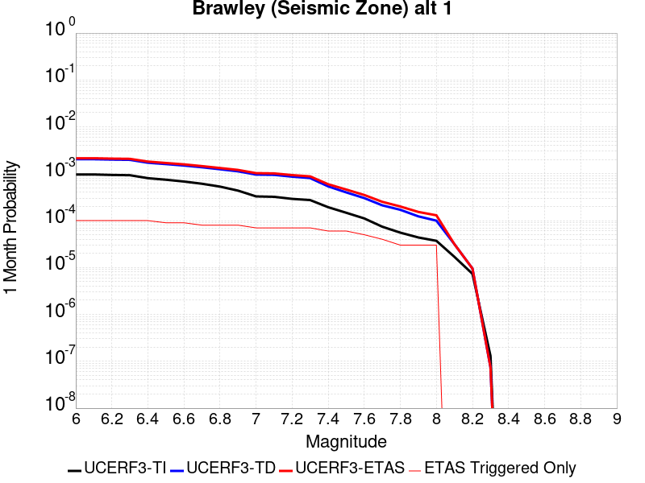 |  |  |

| Magnitude | 1 wk TI Prob | 1 wk TD Prob | 1 wk ETAS Prob | 1 wk ETAS/TD Gain | 1 wk ETAS Triggered Only | 1 mo TI Prob | 1 mo TD Prob | 1 mo ETAS Prob | 1 mo ETAS/TD Gain | 1 mo ETAS Triggered Only | 1 yr TI Prob | 1 yr TD Prob | 1 yr ETAS Prob | 1 yr ETAS/TD Gain | 1 yr ETAS Triggered Only | 10 yr TI Prob | 10 yr TD Prob | 10 yr ETAS Prob | 10 yr ETAS/TD Gain | 10 yr ETAS Triggered Only |
|-----|-----|-----|-----|-----|-----|-----|-----|-----|-----|-----|-----|-----|-----|-----|-----|-----|-----|-----|-----|-----|
| 6.0 | 2.2521618E-4 | 4.7632487E-4 | 5.084639E-4 | 1.0674729 | 3.215434E-5 | 9.6485513E-4 | 0.0020398323 | 0.0020879654 | 1.0235966 | 4.823151E-5 | 0.011683988 | 0.024546238 | 0.024640333 | 1.0038334 | 9.646302E-5 | 0.11088423 | 0.21350002 | 0.21360117 | 1.0004739 | 1.2861736E-4 |
| 6.1 | 2.2521618E-4 | 4.7632487E-4 | 5.084639E-4 | 1.0674729 | 3.215434E-5 | 9.6485513E-4 | 0.0020398323 | 0.0020879654 | 1.0235966 | 4.823151E-5 | 0.011683988 | 0.024546238 | 0.024640333 | 1.0038334 | 9.646302E-5 | 0.11088423 | 0.21350002 | 0.21360117 | 1.0004739 | 1.2861736E-4 |
| 6.2 | 2.198148E-4 | 4.6717093E-4 | 4.9931026E-4 | 1.0687957 | 3.215434E-5 | 9.417233E-4 | 0.0020006616 | 0.0020487965 | 1.0240595 | 4.823151E-5 | 0.011405343 | 0.024080504 | 0.024174644 | 1.0039093 | 9.646302E-5 | 0.10837428 | 0.20993657 | 0.21003819 | 1.000484 | 1.2861736E-4 |
| 6.3 | 2.1704129E-4 | 4.615278E-4 | 4.9366726E-4 | 1.0696372 | 3.215434E-5 | 9.298453E-4 | 0.0019765133 | 0.0020246496 | 1.0243541 | 4.823151E-5 | 0.011262234 | 0.02379366 | 0.023887828 | 1.0039576 | 9.646302E-5 | 0.107082725 | 0.20782755 | 0.20792943 | 1.0004903 | 1.2861736E-4 |
| 6.4 | 1.876142E-4 | 4.00449E-4 | 4.325905E-4 | 1.0802636 | 3.215434E-5 | 8.038131E-4 | 0.0017150956 | 0.0017632444 | 1.0280735 | 4.823151E-5 | 0.00974259 | 0.020680401 | 0.02077487 | 1.004568 | 9.646302E-5 | 0.093263686 | 0.18457815 | 0.18468302 | 1.0005682 | 1.2861736E-4 |
| 6.5 | 1.7390939E-4 | 3.7477075E-4 | 4.0691305E-4 | 1.0857652 | 3.215434E-5 | 7.45113E-4 | 0.0016051838 | 0.001653338 | 1.0299991 | 4.823151E-5 | 0.009034078 | 0.019368723 | 0.019463317 | 1.0048839 | 9.646302E-5 | 0.086755216 | 0.17440031 | 0.1745065 | 1.0006089 | 1.2861736E-4 |
| 6.6 | 1.591791E-4 | 3.4891962E-4 | 3.8106274E-4 | 1.0921218 | 3.215434E-5 | 6.8201777E-4 | 0.0014945229 | 0.0015426823 | 1.0322239 | 4.823151E-5 | 0.008271996 | 0.018045569 | 0.018140292 | 1.005249 | 9.646302E-5 | 0.07970774 | 0.16380852 | 0.16391608 | 1.0006566 | 1.2861736E-4 |
| 6.7 | 1.4268003E-4 | 3.20582E-4 | 3.5272606E-4 | 1.1002678 | 3.215434E-5 | 6.1134255E-4 | 0.0013732077 | 0.001421373 | 1.0350751 | 4.823151E-5 | 0.007417723 | 0.016592601 | 0.016687464 | 1.0057172 | 9.646302E-5 | 0.07174956 | 0.15193306 | 0.15204214 | 1.0007179 | 1.2861736E-4 |
| 6.8 | 1.239713E-4 | 2.9053655E-4 | 3.2268156E-4 | 1.1106402 | 3.215434E-5 | 5.3119735E-4 | 0.0012445687 | 0.0012927401 | 1.0387053 | 4.823151E-5 | 0.0064481674 | 0.015048777 | 0.015143788 | 1.0063136 | 9.646302E-5 | 0.06264243 | 0.13837762 | 0.13848844 | 1.0008008 | 1.2861736E-4 |
| 6.9 | 1.0180238E-4 | 2.625439E-4 | 2.9468982E-4 | 1.1224401 | 3.215434E-5 | 4.3622297E-4 | 0.0011247073 | 0.0011728845 | 1.0428354 | 4.823151E-5 | 0.005298089 | 0.013608336 | 0.013703486 | 1.0069921 | 9.646302E-5 | 0.05173543 | 0.124961674 | 0.12507422 | 1.0009006 | 1.2861736E-4 |
| 7.0 | 7.6619996E-5 | 2.23993E-4 | 2.5614013E-4 | 1.1435184 | 3.215434E-5 | 3.283301E-4 | 9.5962E-4 | 0.0010078052 | 1.0502129 | 4.823151E-5 | 0.0039900932 | 0.011621496 | 0.011700947 | 1.0068367 | 8.038585E-5 | 0.039192066 | 0.107266866 | 0.10736734 | 1.0009366 | 1.1254019E-4 |
| 7.1 | 7.5127435E-5 | 2.2082464E-4 | 2.529719E-4 | 1.1455781 | 3.215434E-5 | 3.2193496E-4 | 9.4605127E-4 | 9.942371E-4 | 1.0509337 | 4.823151E-5 | 0.0039125155 | 0.011458045 | 0.011537509 | 1.0069352 | 8.038585E-5 | 0.038443442 | 0.10583085 | 0.105931476 | 1.0009508 | 1.1254019E-4 |
| 7.2 | 6.788582E-5 | 2.0210193E-4 | 2.3424978E-4 | 1.1590675 | 3.215434E-5 | 2.9090676E-4 | 8.6586666E-4 | 9.1405644E-4 | 1.0556549 | 4.823151E-5 | 0.0035360386 | 0.0104916105 | 0.010571153 | 1.0075815 | 8.038585E-5 | 0.034803 | 0.09750131 | 0.09758837 | 1.0008929 | 9.646302E-5 |
| 7.3 | 6.399602E-5 | 1.8841137E-4 | 2.2055965E-4 | 1.1706282 | 3.215434E-5 | 2.7423984E-4 | 8.072303E-4 | 8.5542287E-4 | 1.0597012 | 4.823151E-5 | 0.0033337586 | 0.009784332 | 0.009863931 | 1.0081354 | 8.038585E-5 | 0.03284188 | 0.09139617 | 0.09148381 | 1.0009589 | 9.646302E-5 |
| 7.4 | 4.506759E-5 | 1.2529209E-4 | 1.574424E-4 | 1.2566029 | 3.215434E-5 | 1.9313251E-4 | 5.368565E-4 | 5.850621E-4 | 1.0897924 | 4.823151E-5 | 0.0023488526 | 0.0065168133 | 0.0065966756 | 1.0122547 | 8.038585E-5 | 0.023241805 | 0.062363707 | 0.062439077 | 1.0012085 | 8.038585E-5 |
| 7.5 | 3.43289E-5 | 9.33541E-5 | 1.2550544E-4 | 1.344402 | 3.215434E-5 | 1.4711556E-4 | 4.00028E-4 | 4.482402E-4 | 1.1205221 | 4.823151E-5 | 0.0017896603 | 0.0048595266 | 0.0049395217 | 1.0164615 | 8.038585E-5 | 0.01775316 | 0.04705519 | 0.04713179 | 1.0016279 | 8.038585E-5 |
| 7.6 | 2.5980507E-5 | 7.053101E-5 | 1.0268309E-4 | 1.4558573 | 3.215434E-5 | 1.1134028E-4 | 3.0224086E-4 | 3.504578E-4 | 1.1595315 | 4.823151E-5 | 0.001354725 | 0.003673598 | 0.0037536884 | 1.0218017 | 8.038585E-5 | 0.013464959 | 0.035840835 | 0.03591834 | 1.0021625 | 8.038585E-5 |
| 7.7 | 1.7292105E-5 | 4.9407296E-5 | 8.156005E-5 | 1.6507694 | 3.215434E-5 | 7.4106916E-5 | 2.117284E-4 | 2.599497E-4 | 1.2277508 | 4.823151E-5 | 9.018782E-4 | 0.0025747516 | 0.0026549306 | 1.0311404 | 8.038585E-5 | 0.008982267 | 0.025290398 | 0.02536875 | 1.0030981 | 8.038585E-5 |
| 7.8 | 1.2927471E-5 | 3.9693266E-5 | 7.1846334E-5 | 1.8100382 | 3.215434E-5 | 5.5402274E-5 | 1.7010293E-4 | 2.1832624E-4 | 1.2834948 | 4.823151E-5 | 6.743139E-4 | 0.0020690386 | 0.002149258 | 1.0387714 | 8.038585E-5 | 0.0067227143 | 0.020431727 | 0.02051047 | 1.003854 | 8.038585E-5 |
| 7.9 | 1.0200774E-5 | 2.874569E-5 | 6.0899107E-5 | 2.1185474 | 3.215434E-5 | 4.371687E-5 | 1.2319001E-4 | 1.7141557E-4 | 1.391473 | 4.823151E-5 | 5.321229E-4 | 0.0014988075 | 0.0015630198 | 1.0428423 | 6.430868E-5 | 0.005308505 | 0.014991644 | 0.015054989 | 1.0042254 | 6.430868E-5 |
| 8.0 | 8.650396E-6 | 2.3277367E-5 | 5.543096E-5 | 2.3813243 | 3.215434E-5 | 3.70726E-5 | 9.975634E-5 | 1.4798304E-4 | 1.4834449 | 4.823151E-5 | 4.5126543E-4 | 0.0012138576 | 0.0012780882 | 1.0529145 | 6.430868E-5 | 0.0045035016 | 0.012211097 | 0.01227462 | 1.005202 | 6.430868E-5 |
| 8.1 | 3.9368224E-6 | 7.3279825E-6 | 7.3279825E-6 | 1.0 | 0.0 | 1.6871985E-5 | 3.140526E-5 | 3.140526E-5 | 1.0 | 0.0 | 2.0539707E-4 | 3.8229208E-4 | 3.8229208E-4 | 1.0 | 0.0 | 0.0020520731 | 0.004001185 | 0.004001185 | 1.0 | 0.0 |
| 8.2 | 1.7101195E-6 | 2.217876E-6 | 2.217876E-6 | 1.0 | 0.0 | 7.329063E-6 | 9.505149E-6 | 9.505149E-6 | 1.0 | 0.0 | 8.922769E-5 | 1.1571907E-4 | 1.1571907E-4 | 1.0 | 0.0 | 8.9191867E-4 | 0.0012666774 | 0.0012666774 | 1.0 | 0.0 |
| 8.3 | 3.0346666E-8 | 1.721586E-8 | 1.721586E-8 | 1.0 | 0.0 | 1.3005713E-7 | 7.378226E-8 | 7.378226E-8 | 1.0 | 0.0 | 1.5834444E-6 | 8.9829894E-7 | 8.9829894E-7 | 1.0 | 0.0 | 1.5834332E-5 | 9.367729E-6 | 9.367729E-6 | 1.0 | 0.0 |

## Cleghorn Pass
*[(top)](#table-of-contents)*

| 1 Week | 1 Month | 1 Year | 10 Year |
|-----|-----|-----|-----|
|  |  |  |  |

| Magnitude | 1 wk TI Prob | 1 wk TD Prob | 1 wk ETAS Prob | 1 wk ETAS/TD Gain | 1 wk ETAS Triggered Only | 1 mo TI Prob | 1 mo TD Prob | 1 mo ETAS Prob | 1 mo ETAS/TD Gain | 1 mo ETAS Triggered Only | 1 yr TI Prob | 1 yr TD Prob | 1 yr ETAS Prob | 1 yr ETAS/TD Gain | 1 yr ETAS Triggered Only | 10 yr TI Prob | 10 yr TD Prob | 10 yr ETAS Prob | 10 yr ETAS/TD Gain | 10 yr ETAS Triggered Only |
|-----|-----|-----|-----|-----|-----|-----|-----|-----|-----|-----|-----|-----|-----|-----|-----|-----|-----|-----|-----|-----|
| 6.0 | 1.0522846E-5 | 1.1040642E-5 | 7.534862E-5 | 6.824659 | 6.430868E-5 | 4.509713E-5 | 4.7316473E-5 | 1.2769853E-4 | 2.6988173 | 8.038585E-5 | 5.4891926E-4 | 5.759784E-4 | 7.045217E-4 | 1.2231737 | 1.2861736E-4 | 0.0054756533 | 0.005750022 | 0.0058778995 | 1.0222396 | 1.2861736E-4 |
| 6.1 | 1.0522846E-5 | 1.1040642E-5 | 7.534862E-5 | 6.824659 | 6.430868E-5 | 4.509713E-5 | 4.7316473E-5 | 1.2769853E-4 | 2.6988173 | 8.038585E-5 | 5.4891926E-4 | 5.759784E-4 | 7.045217E-4 | 1.2231737 | 1.2861736E-4 | 0.0054756533 | 0.005750022 | 0.0058778995 | 1.0222396 | 1.2861736E-4 |
| 6.2 | 2.1045846E-6 | 2.2082024E-6 | 2.2082024E-6 | 1.0 | 0.0 | 9.019617E-6 | 9.463714E-6 | 9.463714E-6 | 1.0 | 0.0 | 1.098083E-4 | 1.1521882E-4 | 1.3129415E-4 | 1.1395199 | 1.607717E-5 | 0.0010975406 | 0.0011520023 | 0.0011680609 | 1.0139397 | 1.607717E-5 |
| 6.3 | 2.1045846E-6 | 2.2082024E-6 | 2.2082024E-6 | 1.0 | 0.0 | 9.019617E-6 | 9.463714E-6 | 9.463714E-6 | 1.0 | 0.0 | 1.098083E-4 | 1.1521882E-4 | 1.3129415E-4 | 1.1395199 | 1.607717E-5 | 0.0010975406 | 0.0011520023 | 0.0011680609 | 1.0139397 | 1.607717E-5 |
| 6.4 | 1.7259927E-6 | 1.810877E-6 | 1.810877E-6 | 1.0 | 0.0 | 7.3970905E-6 | 7.760902E-6 | 7.760902E-6 | 1.0 | 0.0 | 9.005586E-5 | 9.4488976E-5 | 9.4488976E-5 | 1.0 | 0.0 | 9.001937E-4 | 9.448898E-4 | 9.448898E-4 | 1.0 | 0.0 |

## Lost Hills
*[(top)](#table-of-contents)*

| 1 Week | 1 Month | 1 Year | 10 Year |
|-----|-----|-----|-----|
|  |  |  |  |

| Magnitude | 1 wk TI Prob | 1 wk TD Prob | 1 wk ETAS Prob | 1 wk ETAS/TD Gain | 1 wk ETAS Triggered Only | 1 mo TI Prob | 1 mo TD Prob | 1 mo ETAS Prob | 1 mo ETAS/TD Gain | 1 mo ETAS Triggered Only | 1 yr TI Prob | 1 yr TD Prob | 1 yr ETAS Prob | 1 yr ETAS/TD Gain | 1 yr ETAS Triggered Only | 10 yr TI Prob | 10 yr TD Prob | 10 yr ETAS Prob | 10 yr ETAS/TD Gain | 10 yr ETAS Triggered Only |
|-----|-----|-----|-----|-----|-----|-----|-----|-----|-----|-----|-----|-----|-----|-----|-----|-----|-----|-----|-----|-----|
| 6.0 | 2.233523E-5 | 2.5106583E-5 | 8.941365E-5 | 3.5613627 | 6.430868E-5 | 9.571891E-5 | 1.0759615E-4 | 1.8797335E-4 | 1.7470268 | 8.038585E-5 | 0.0011647546 | 0.001309364 | 0.0014378129 | 1.0981003 | 1.2861736E-4 | 0.011586686 | 0.013033091 | 0.013175899 | 1.0109574 | 1.4469454E-4 |
| 6.1 | 2.233523E-5 | 2.5106583E-5 | 8.941365E-5 | 3.5613627 | 6.430868E-5 | 9.571891E-5 | 1.0759615E-4 | 1.8797335E-4 | 1.7470268 | 8.038585E-5 | 0.0011647546 | 0.001309364 | 0.0014378129 | 1.0981003 | 1.2861736E-4 | 0.011586686 | 0.013033091 | 0.013175899 | 1.0109574 | 1.4469454E-4 |
| 6.2 | 2.233523E-5 | 2.5106583E-5 | 8.941365E-5 | 3.5613627 | 6.430868E-5 | 9.571891E-5 | 1.0759615E-4 | 1.8797335E-4 | 1.7470268 | 8.038585E-5 | 0.0011647546 | 0.001309364 | 0.0014378129 | 1.0981003 | 1.2861736E-4 | 0.011586686 | 0.013033091 | 0.013175899 | 1.0109574 | 1.4469454E-4 |
| 6.3 | 2.233523E-5 | 2.5106583E-5 | 8.941365E-5 | 3.5613627 | 6.430868E-5 | 9.571891E-5 | 1.0759615E-4 | 1.8797335E-4 | 1.7470268 | 8.038585E-5 | 0.0011647546 | 0.001309364 | 0.0014378129 | 1.0981003 | 1.2861736E-4 | 0.011586686 | 0.013033091 | 0.013175899 | 1.0109574 | 1.4469454E-4 |
| 6.4 | 1.2288092E-5 | 1.3781108E-5 | 2.9858056E-5 | 2.1665933 | 1.607717E-5 | 5.2662188E-5 | 5.906108E-5 | 9.121352E-5 | 1.5443931 | 3.215434E-5 | 6.409735E-4 | 7.189252E-4 | 7.831877E-4 | 1.0893868 | 6.430868E-5 | 0.006391279 | 0.0071752006 | 0.00725501 | 1.011123 | 8.038585E-5 |
| 6.5 | 1.2288092E-5 | 1.3781108E-5 | 2.9858056E-5 | 2.1665933 | 1.607717E-5 | 5.2662188E-5 | 5.906108E-5 | 9.121352E-5 | 1.5443931 | 3.215434E-5 | 6.409735E-4 | 7.189252E-4 | 7.831877E-4 | 1.0893868 | 6.430868E-5 | 0.006391279 | 0.0071752006 | 0.00725501 | 1.011123 | 8.038585E-5 |
| 6.6 | 8.58281E-6 | 9.63377E-6 | 2.5710786E-5 | 2.6688187 | 1.607717E-5 | 3.6782953E-5 | 4.12874E-5 | 7.344042E-5 | 1.7787609 | 3.215434E-5 | 4.4774043E-4 | 5.026414E-4 | 5.5084866E-4 | 1.0959079 | 4.823151E-5 | 0.0044683935 | 0.005023205 | 0.005087191 | 1.012738 | 6.430868E-5 |
| 6.7 | 7.205685E-6 | 8.088302E-6 | 2.4165342E-5 | 2.9876904 | 1.607717E-5 | 3.088114E-5 | 3.466415E-5 | 6.6817374E-5 | 1.9275643 | 3.215434E-5 | 3.7591302E-4 | 4.2203604E-4 | 4.7024718E-4 | 1.1142347 | 4.823151E-5 | 0.0037527776 | 0.0042203604 | 0.0042843977 | 1.0151734 | 6.430868E-5 |

## Pinto Mtn
*[(top)](#table-of-contents)*

| 1 Week | 1 Month | 1 Year | 10 Year |
|-----|-----|-----|-----|
|  |  | 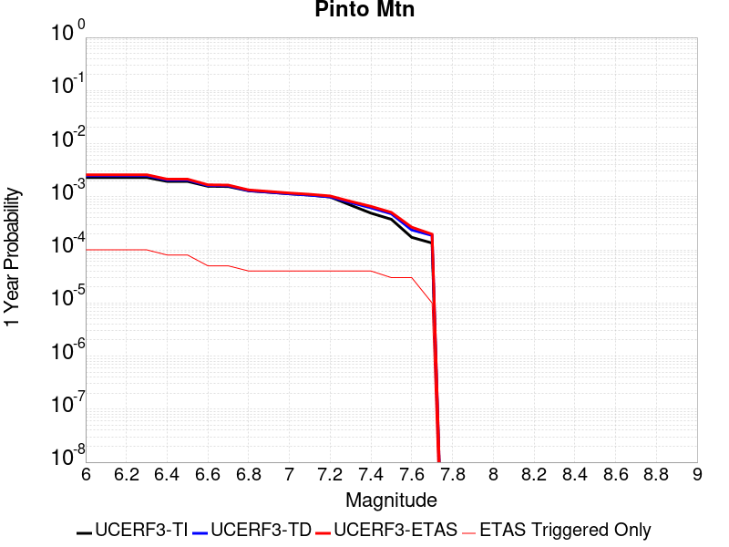 |  |

| Magnitude | 1 wk TI Prob | 1 wk TD Prob | 1 wk ETAS Prob | 1 wk ETAS/TD Gain | 1 wk ETAS Triggered Only | 1 mo TI Prob | 1 mo TD Prob | 1 mo ETAS Prob | 1 mo ETAS/TD Gain | 1 mo ETAS Triggered Only | 1 yr TI Prob | 1 yr TD Prob | 1 yr ETAS Prob | 1 yr ETAS/TD Gain | 1 yr ETAS Triggered Only | 10 yr TI Prob | 10 yr TD Prob | 10 yr ETAS Prob | 10 yr ETAS/TD Gain | 10 yr ETAS Triggered Only |
|-----|-----|-----|-----|-----|-----|-----|-----|-----|-----|-----|-----|-----|-----|-----|-----|-----|-----|-----|-----|-----|
| 6.0 | 4.4194956E-5 | 4.785362E-5 | 1.2823562E-4 | 2.6797476 | 8.038585E-5 | 1.893932E-4 | 2.0507174E-4 | 3.0151499E-4 | 1.4702902 | 9.646302E-5 | 0.0023034236 | 0.0024940541 | 0.0026223508 | 1.051441 | 1.2861736E-4 | 0.022796938 | 0.024678145 | 0.024803588 | 1.0050832 | 1.2861736E-4 |
| 6.1 | 4.4194956E-5 | 4.785362E-5 | 1.2823562E-4 | 2.6797476 | 8.038585E-5 | 1.893932E-4 | 2.0507174E-4 | 3.0151499E-4 | 1.4702902 | 9.646302E-5 | 0.0023034236 | 0.0024940541 | 0.0026223508 | 1.051441 | 1.2861736E-4 | 0.022796938 | 0.024678145 | 0.024803588 | 1.0050832 | 1.2861736E-4 |
| 6.2 | 4.4194956E-5 | 4.785362E-5 | 1.2823562E-4 | 2.6797476 | 8.038585E-5 | 1.893932E-4 | 2.0507174E-4 | 3.0151499E-4 | 1.4702902 | 9.646302E-5 | 0.0023034236 | 0.0024940541 | 0.0026223508 | 1.051441 | 1.2861736E-4 | 0.022796938 | 0.024678145 | 0.024803588 | 1.0050832 | 1.2861736E-4 |
| 6.3 | 4.4194956E-5 | 4.785362E-5 | 1.2823562E-4 | 2.6797476 | 8.038585E-5 | 1.893932E-4 | 2.0507174E-4 | 3.0151499E-4 | 1.4702902 | 9.646302E-5 | 0.0023034236 | 0.0024940541 | 0.0026223508 | 1.051441 | 1.2861736E-4 | 0.022796938 | 0.024678145 | 0.024803588 | 1.0050832 | 1.2861736E-4 |
| 6.4 | 3.729929E-5 | 3.9603186E-5 | 8.7832785E-5 | 2.2178214 | 4.823151E-5 | 1.5984432E-4 | 1.6971743E-4 | 2.340152E-4 | 1.3788519 | 6.430868E-5 | 0.0019443673 | 0.002064445 | 0.002160709 | 1.0466294 | 9.646302E-5 | 0.019274427 | 0.02046269 | 0.02055718 | 1.0046176 | 9.646302E-5 |
| 6.5 | 3.729929E-5 | 3.9603186E-5 | 8.7832785E-5 | 2.2178214 | 4.823151E-5 | 1.5984432E-4 | 1.6971743E-4 | 2.340152E-4 | 1.3788519 | 6.430868E-5 | 0.0019443673 | 0.002064445 | 0.002160709 | 1.0466294 | 9.646302E-5 | 0.019274427 | 0.02046269 | 0.02055718 | 1.0046176 | 9.646302E-5 |
| 6.6 | 3.0204548E-5 | 3.1205298E-5 | 7.94353E-5 | 2.545571 | 4.823151E-5 | 1.2944164E-4 | 1.3373033E-4 | 1.9803041E-4 | 1.480819 | 6.430868E-5 | 0.0015748127 | 0.0016269855 | 0.0016911895 | 1.039462 | 6.430868E-5 | 0.015636992 | 0.01615461 | 0.016217878 | 1.0039165 | 6.430868E-5 |
| 6.7 | 2.9857754E-5 | 3.081468E-5 | 7.904471E-5 | 2.5651639 | 4.823151E-5 | 1.2795553E-4 | 1.3205643E-4 | 1.9635662E-4 | 1.4869145 | 6.430868E-5 | 0.0015567453 | 0.001606636 | 0.0016708412 | 1.0399626 | 6.430868E-5 | 0.015458848 | 0.01595405 | 0.01601733 | 1.0039666 | 6.430868E-5 |
| 6.8 | 2.4819734E-5 | 2.5009364E-5 | 5.71629E-5 | 2.28566 | 3.215434E-5 | 1.0636595E-4 | 1.07178705E-4 | 1.5540504E-4 | 1.449962 | 4.823151E-5 | 0.0012942362 | 0.0013041412 | 0.0013523098 | 1.0369351 | 4.823151E-5 | 0.012867244 | 0.0129672475 | 0.013014853 | 1.0036713 | 4.823151E-5 |
| 6.9 | 2.331124E-5 | 2.3337643E-5 | 5.5491233E-5 | 2.3777566 | 3.215434E-5 | 9.990149E-5 | 1.00014746E-4 | 1.4824144E-4 | 1.4821957 | 4.823151E-5 | 0.001215622 | 0.0012170197 | 0.0012651925 | 1.0395826 | 4.823151E-5 | 0.012089936 | 0.012105742 | 0.012153389 | 1.0039359 | 4.823151E-5 |
| 7.0 | 2.1818534E-5 | 2.1760772E-5 | 5.3914413E-5 | 2.4775965 | 3.215434E-5 | 9.3504656E-5 | 9.325723E-5 | 1.4148424E-4 | 1.5171397 | 4.823151E-5 | 0.0011378246 | 0.0011348352 | 0.001183012 | 1.0424527 | 4.823151E-5 | 0.011320163 | 0.011292503 | 0.011340191 | 1.0042229 | 4.823151E-5 |
| 7.1 | 2.066081E-5 | 2.0540418E-5 | 5.2694097E-5 | 2.5653858 | 3.215434E-5 | 8.854332E-5 | 8.8027504E-5 | 1.3625476E-4 | 1.5478659 | 4.823151E-5 | 0.0010774818 | 0.0010712275 | 0.0011194072 | 1.0449764 | 4.823151E-5 | 0.010722724 | 0.010662688 | 0.010710405 | 1.0044751 | 4.823151E-5 |
| 7.2 | 1.8990233E-5 | 1.9053701E-5 | 5.120743E-5 | 2.687532 | 3.215434E-5 | 8.138417E-5 | 8.1656275E-5 | 1.2988385E-4 | 1.5906168 | 4.823151E-5 | 9.904018E-4 | 9.937311E-4 | 0.0010419146 | 1.0484875 | 4.823151E-5 | 0.009859995 | 0.009894874 | 0.009942628 | 1.0048262 | 4.823151E-5 |
| 7.3 | 1.3335872E-5 | 1.4906372E-5 | 4.706023E-5 | 3.157055 | 3.215434E-5 | 5.7152483E-5 | 6.388296E-5 | 1.1211139E-4 | 1.7549498 | 4.823151E-5 | 6.956093E-4 | 7.775102E-4 | 8.2570425E-4 | 1.061985 | 4.823151E-5 | 0.006934359 | 0.0077491994 | 0.007797057 | 1.0061759 | 4.823151E-5 |
| 7.4 | 9.414066E-6 | 1.186061E-5 | 4.401457E-5 | 3.710987 | 3.215434E-5 | 4.0345374E-5 | 5.0830247E-5 | 9.905931E-5 | 1.948826 | 4.823151E-5 | 4.910942E-4 | 6.1869196E-4 | 6.6689367E-4 | 1.077909 | 4.823151E-5 | 0.0049001034 | 0.006170644 | 0.0062185777 | 1.007768 | 4.823151E-5 |
| 7.5 | 7.2101157E-6 | 9.157893E-6 | 4.131194E-5 | 4.5110745 | 3.215434E-5 | 3.090013E-5 | 3.924757E-5 | 7.1400646E-5 | 1.8192375 | 3.215434E-5 | 3.7614413E-4 | 4.7774217E-4 | 5.098812E-4 | 1.0672727 | 3.215434E-5 | 0.0037550807 | 0.004767927 | 0.004799928 | 1.0067117 | 3.215434E-5 |
| 7.6 | 3.296375E-6 | 4.5453176E-6 | 3.6699512E-5 | 8.074136 | 3.215434E-5 | 1.4127245E-5 | 1.9479796E-5 | 5.163351E-5 | 2.6506188 | 3.215434E-5 | 1.7198564E-4 | 2.3714209E-4 | 2.692888E-4 | 1.1355588 | 3.215434E-5 | 0.0017185259 | 0.0023690276 | 0.0024011058 | 1.0135406 | 3.215434E-5 |
| 7.7 | 2.5741092E-6 | 3.584251E-6 | 3.584251E-6 | 1.0 | 0.0 | 1.103185E-5 | 1.5360993E-5 | 1.5360993E-5 | 1.0 | 0.0 | 1.3430449E-4 | 1.8700535E-4 | 1.8700535E-4 | 1.0 | 0.0 | 0.0013422335 | 0.0018686098 | 0.0018686098 | 1.0 | 0.0 |

## Pine Mtn
*[(top)](#table-of-contents)*

| 1 Week | 1 Month | 1 Year | 10 Year |
|-----|-----|-----|-----|
|  |  |  |  |

| Magnitude | 1 wk TI Prob | 1 wk TD Prob | 1 wk ETAS Prob | 1 wk ETAS/TD Gain | 1 wk ETAS Triggered Only | 1 mo TI Prob | 1 mo TD Prob | 1 mo ETAS Prob | 1 mo ETAS/TD Gain | 1 mo ETAS Triggered Only | 1 yr TI Prob | 1 yr TD Prob | 1 yr ETAS Prob | 1 yr ETAS/TD Gain | 1 yr ETAS Triggered Only | 10 yr TI Prob | 10 yr TD Prob | 10 yr ETAS Prob | 10 yr ETAS/TD Gain | 10 yr ETAS Triggered Only |
|-----|-----|-----|-----|-----|-----|-----|-----|-----|-----|-----|-----|-----|-----|-----|-----|-----|-----|-----|-----|-----|
| 6.0 | 6.894797E-6 | 7.225461E-6 | 7.225461E-6 | 1.0 | 0.0 | 2.9548795E-5 | 3.096591E-5 | 4.7042584E-5 | 1.5191733 | 1.607717E-5 | 3.596972E-4 | 3.7694772E-4 | 4.2516107E-4 | 1.1279045 | 4.823151E-5 | 0.0035911554 | 0.003763381 | 0.0038915144 | 1.0340474 | 1.2861736E-4 |
| 6.1 | 6.894797E-6 | 7.225461E-6 | 7.225461E-6 | 1.0 | 0.0 | 2.9548795E-5 | 3.096591E-5 | 4.7042584E-5 | 1.5191733 | 1.607717E-5 | 3.596972E-4 | 3.7694772E-4 | 4.2516107E-4 | 1.1279045 | 4.823151E-5 | 0.0035911554 | 0.003763381 | 0.0038915144 | 1.0340474 | 1.2861736E-4 |
| 6.2 | 6.894797E-6 | 7.225461E-6 | 7.225461E-6 | 1.0 | 0.0 | 2.9548795E-5 | 3.096591E-5 | 4.7042584E-5 | 1.5191733 | 1.607717E-5 | 3.596972E-4 | 3.7694772E-4 | 4.2516107E-4 | 1.1279045 | 4.823151E-5 | 0.0035911554 | 0.003763381 | 0.0038915144 | 1.0340474 | 1.2861736E-4 |
| 6.3 | 6.894797E-6 | 7.225461E-6 | 7.225461E-6 | 1.0 | 0.0 | 2.9548795E-5 | 3.096591E-5 | 4.7042584E-5 | 1.5191733 | 1.607717E-5 | 3.596972E-4 | 3.7694772E-4 | 4.2516107E-4 | 1.1279045 | 4.823151E-5 | 0.0035911554 | 0.003763381 | 0.0038915144 | 1.0340474 | 1.2861736E-4 |
| 6.4 | 6.894797E-6 | 7.225461E-6 | 7.225461E-6 | 1.0 | 0.0 | 2.9548795E-5 | 3.096591E-5 | 4.7042584E-5 | 1.5191733 | 1.607717E-5 | 3.596972E-4 | 3.7694772E-4 | 4.2516107E-4 | 1.1279045 | 4.823151E-5 | 0.0035911554 | 0.003763381 | 0.0038915144 | 1.0340474 | 1.2861736E-4 |
| 6.5 | 6.894797E-6 | 7.225461E-6 | 7.225461E-6 | 1.0 | 0.0 | 2.9548795E-5 | 3.096591E-5 | 4.7042584E-5 | 1.5191733 | 1.607717E-5 | 3.596972E-4 | 3.7694772E-4 | 4.2516107E-4 | 1.1279045 | 4.823151E-5 | 0.0035911554 | 0.003763381 | 0.0038915144 | 1.0340474 | 1.2861736E-4 |
| 6.6 | 6.894797E-6 | 7.225461E-6 | 7.225461E-6 | 1.0 | 0.0 | 2.9548795E-5 | 3.096591E-5 | 4.7042584E-5 | 1.5191733 | 1.607717E-5 | 3.596972E-4 | 3.7694772E-4 | 4.2516107E-4 | 1.1279045 | 4.823151E-5 | 0.0035911554 | 0.003763381 | 0.0038915144 | 1.0340474 | 1.2861736E-4 |
| 6.7 | 6.0867933E-6 | 6.3971133E-6 | 6.3971133E-6 | 1.0 | 0.0 | 2.6085996E-5 | 2.7415923E-5 | 4.3492655E-5 | 1.5864012 | 1.607717E-5 | 3.1755073E-4 | 3.3373994E-4 | 3.6588355E-4 | 1.0963134 | 3.215434E-5 | 0.0031709734 | 0.0033326065 | 0.0034447715 | 1.0336568 | 1.1254019E-4 |
| 6.8 | 5.6530425E-6 | 5.9505956E-6 | 5.9505956E-6 | 1.0 | 0.0 | 2.42271E-5 | 2.5502315E-5 | 2.5502315E-5 | 1.0 | 0.0 | 2.94925E-4 | 3.104485E-4 | 3.2652068E-4 | 1.0517708 | 1.607717E-5 | 0.002945339 | 0.0031003528 | 0.0031965168 | 1.0310171 | 9.646302E-5 |
| 6.9 | 4.6015225E-6 | 4.863834E-6 | 4.863834E-6 | 1.0 | 0.0 | 1.9720663E-5 | 2.0844845E-5 | 2.0844845E-5 | 1.0 | 0.0 | 2.4007261E-4 | 2.5375787E-4 | 2.6983098E-4 | 1.0633403 | 1.607717E-5 | 0.0023981342 | 0.0025348254 | 0.002631044 | 1.0379586 | 9.646302E-5 |
| 7.0 | 4.4875965E-6 | 4.747473E-6 | 4.747473E-6 | 1.0 | 0.0 | 1.9232413E-5 | 2.0346162E-5 | 2.0346162E-5 | 1.0 | 0.0 | 2.3412947E-4 | 2.4768783E-4 | 2.63761E-4 | 1.0648929 | 1.607717E-5 | 0.0023388295 | 0.0024742614 | 0.0025704857 | 1.0388901 | 9.646302E-5 |
| 7.1 | 3.203907E-6 | 3.4294096E-6 | 3.4294096E-6 | 1.0 | 0.0 | 1.3730958E-5 | 1.4697391E-5 | 1.4697391E-5 | 1.0 | 0.0 | 1.6716159E-4 | 1.789267E-4 | 1.9500099E-4 | 1.0898373 | 1.607717E-5 | 0.0016703589 | 0.0017878925 | 0.0018520863 | 1.0359046 | 6.430868E-5 |
| 7.2 | 2.2060601E-6 | 2.3784817E-6 | 2.3784817E-6 | 1.0 | 0.0 | 9.4545085E-6 | 1.0193455E-5 | 1.0193455E-5 | 1.0 | 0.0 | 1.15102564E-4 | 1.240987E-4 | 1.4017388E-4 | 1.1295354 | 1.607717E-5 | 0.0011504296 | 0.0012403389 | 0.0012885105 | 1.0388376 | 4.823151E-5 |
| 7.3 | 1.3765207E-6 | 1.5216481E-6 | 1.5216481E-6 | 1.0 | 0.0 | 5.899361E-6 | 6.521333E-6 | 6.521333E-6 | 1.0 | 0.0 | 7.182235E-5 | 7.939443E-5 | 7.939443E-5 | 1.0 | 0.0 | 7.1799144E-4 | 7.936697E-4 | 8.2579855E-4 | 1.0404813 | 3.215434E-5 |
| 7.4 | 1.1245983E-6 | 1.2587075E-6 | 1.2587075E-6 | 1.0 | 0.0 | 4.819698E-6 | 5.39445E-6 | 5.39445E-6 | 1.0 | 0.0 | 5.8678244E-5 | 6.567554E-5 | 6.567554E-5 | 1.0 | 0.0 | 5.866275E-4 | 6.5656955E-4 | 6.887028E-4 | 1.0489411 | 3.215434E-5 |
| 7.5 | 8.031682E-7 | 9.276951E-7 | 9.276951E-7 | 1.0 | 0.0 | 3.4421448E-6 | 3.9758306E-6 | 3.9758306E-6 | 1.0 | 0.0 | 4.1907308E-5 | 4.840473E-5 | 4.840473E-5 | 1.0 | 0.0 | 4.1899405E-4 | 4.8394862E-4 | 5.00018E-4 | 1.0332048 | 1.607717E-5 |
| 7.6 | 4.8953444E-7 | 6.003009E-7 | 6.003009E-7 | 1.0 | 0.0 | 2.098003E-6 | 2.5727159E-6 | 2.5727159E-6 | 1.0 | 0.0 | 2.5542888E-5 | 3.1322415E-5 | 3.1322415E-5 | 1.0 | 0.0 | 2.5539953E-4 | 3.1318486E-4 | 3.1318486E-4 | 1.0 | 0.0 |
| 7.7 | 6.634529E-8 | 6.788826E-8 | 6.788826E-8 | 1.0 | 0.0 | 2.843369E-7 | 2.9094966E-7 | 2.9094966E-7 | 1.0 | 0.0 | 3.4617963E-6 | 3.5423066E-6 | 3.5423066E-6 | 1.0 | 0.0 | 3.4617424E-5 | 3.542255E-5 | 3.542255E-5 | 1.0 | 0.0 |
| 7.8 | 9.235578E-9 | 9.488566E-9 | 9.488566E-9 | 1.0 | 0.0 | 3.9581046E-8 | 4.0665284E-8 | 4.0665284E-8 | 1.0 | 0.0 | 4.818991E-7 | 4.950997E-7 | 4.950997E-7 | 1.0 | 0.0 | 4.8189804E-6 | 4.950988E-6 | 4.950988E-6 | 1.0 | 0.0 |

## Coronado Bank alt1
*[(top)](#table-of-contents)*

| 1 Week | 1 Month | 1 Year | 10 Year |
|-----|-----|-----|-----|
|  |  |  |  |

| Magnitude | 1 wk TI Prob | 1 wk TD Prob | 1 wk ETAS Prob | 1 wk ETAS/TD Gain | 1 wk ETAS Triggered Only | 1 mo TI Prob | 1 mo TD Prob | 1 mo ETAS Prob | 1 mo ETAS/TD Gain | 1 mo ETAS Triggered Only | 1 yr TI Prob | 1 yr TD Prob | 1 yr ETAS Prob | 1 yr ETAS/TD Gain | 1 yr ETAS Triggered Only | 10 yr TI Prob | 10 yr TD Prob | 10 yr ETAS Prob | 10 yr ETAS/TD Gain | 10 yr ETAS Triggered Only |
|-----|-----|-----|-----|-----|-----|-----|-----|-----|-----|-----|-----|-----|-----|-----|-----|-----|-----|-----|-----|-----|
| 6.0 | 7.533492E-5 | 9.394913E-5 | 1.2610045E-4 | 1.3422205 | 3.215434E-5 | 3.22824E-4 | 4.0258127E-4 | 4.6686406E-4 | 1.1596766 | 6.430868E-5 | 0.0039233007 | 0.0048909658 | 0.004970958 | 1.0163552 | 8.038585E-5 | 0.03854755 | 0.04790356 | 0.048026018 | 1.0025563 | 1.2861736E-4 |
| 6.1 | 4.1807285E-5 | 5.049283E-5 | 5.049283E-5 | 1.0 | 0.0 | 1.7916178E-4 | 2.1638049E-4 | 2.3245417E-4 | 1.0742844 | 1.607717E-5 | 0.0021791123 | 0.0026313474 | 0.0026634173 | 1.0121876 | 3.215434E-5 | 0.021578677 | 0.026011046 | 0.026042365 | 1.001204 | 3.215434E-5 |
| 6.2 | 4.1807285E-5 | 5.049283E-5 | 5.049283E-5 | 1.0 | 0.0 | 1.7916178E-4 | 2.1638049E-4 | 2.3245417E-4 | 1.0742844 | 1.607717E-5 | 0.0021791123 | 0.0026313474 | 0.0026634173 | 1.0121876 | 3.215434E-5 | 0.021578677 | 0.026011046 | 0.026042365 | 1.001204 | 3.215434E-5 |
| 6.3 | 3.1793104E-5 | 3.7711117E-5 | 3.7711117E-5 | 1.0 | 0.0 | 1.3624904E-4 | 1.6160926E-4 | 1.6160926E-4 | 1.0 | 0.0 | 0.0016575698 | 0.001965848 | 0.0019818936 | 1.0081621 | 1.607717E-5 | 0.016452603 | 0.019488465 | 0.019504229 | 1.0008088 | 1.607717E-5 |
| 6.4 | 2.9878007E-5 | 3.5335794E-5 | 3.5335794E-5 | 1.0 | 0.0 | 1.2804232E-4 | 1.5143053E-4 | 1.5143053E-4 | 1.0 | 0.0 | 0.0015578003 | 0.0018421387 | 0.0018581862 | 1.0087113 | 1.607717E-5 | 0.015469253 | 0.01827244 | 0.018288225 | 1.0008638 | 1.607717E-5 |
| 6.5 | 2.4512565E-5 | 2.8764043E-5 | 2.8764043E-5 | 1.0 | 0.0 | 1.0504962E-4 | 1.2326881E-4 | 1.2326881E-4 | 1.0 | 0.0 | 0.0012782287 | 0.0014997921 | 0.0015158452 | 1.0107036 | 1.607717E-5 | 0.012709012 | 0.014899683 | 0.01491552 | 1.001063 | 1.607717E-5 |
| 6.6 | 2.1317413E-5 | 2.490667E-5 | 2.490667E-5 | 1.0 | 0.0 | 9.135714E-5 | 1.0673863E-4 | 1.0673863E-4 | 1.0 | 0.0 | 0.0011117056 | 0.0012987906 | 0.0013148468 | 1.0123625 | 1.607717E-5 | 0.011061605 | 0.012914404 | 0.012930274 | 1.0012288 | 1.607717E-5 |
| 6.7 | 1.8585655E-5 | 2.163488E-5 | 2.163488E-5 | 1.0 | 0.0 | 7.9650374E-5 | 9.271773E-5 | 9.271773E-5 | 1.0 | 0.0 | 9.6931186E-4 | 0.0011282742 | 0.0011443333 | 1.0142332 | 1.607717E-5 | 0.0096509475 | 0.011227623 | 0.011243518 | 1.0014158 | 1.607717E-5 |
| 6.8 | 1.5862879E-5 | 1.8419474E-5 | 1.8419474E-5 | 1.0 | 0.0 | 6.798199E-5 | 7.893833E-5 | 7.893833E-5 | 1.0 | 0.0 | 8.273665E-4 | 9.6066965E-4 | 9.767314E-4 | 1.0167193 | 1.607717E-5 | 0.008242928 | 0.00956715 | 0.009583074 | 1.0016644 | 1.607717E-5 |
| 6.9 | 1.3021509E-5 | 1.5095265E-5 | 1.5095265E-5 | 1.0 | 0.0 | 5.5805274E-5 | 6.469249E-5 | 6.469249E-5 | 1.0 | 0.0 | 6.792174E-4 | 7.8736455E-4 | 8.0342905E-4 | 1.0204029 | 1.607717E-5 | 0.006771452 | 0.007847573 | 0.007863523 | 1.0020326 | 1.607717E-5 |
| 7.0 | 1.0974371E-5 | 1.2720104E-5 | 1.2720104E-5 | 1.0 | 0.0 | 4.7032172E-5 | 5.451369E-5 | 5.451369E-5 | 1.0 | 0.0 | 5.7246623E-4 | 6.6351966E-4 | 6.7958614E-4 | 1.024214 | 1.607717E-5 | 0.0057099373 | 0.006617135 | 0.0066331057 | 1.0024135 | 1.607717E-5 |
| 7.1 | 8.766221E-6 | 1.01638325E-5 | 1.01638325E-5 | 1.0 | 0.0 | 3.7568978E-5 | 4.355865E-5 | 4.355865E-5 | 1.0 | 0.0 | 4.573063E-4 | 5.3021475E-4 | 5.3021475E-4 | 1.0 | 0.0 | 0.0045636636 | 0.0052911965 | 0.0052911965 | 1.0 | 0.0 |
| 7.2 | 8.026024E-7 | 8.331765E-7 | 8.331765E-7 | 1.0 | 0.0 | 3.43972E-6 | 3.5707515E-6 | 3.5707515E-6 | 1.0 | 0.0 | 4.1877785E-5 | 4.3473043E-5 | 4.3473043E-5 | 1.0 | 0.0 | 4.1869894E-4 | 4.3464647E-4 | 4.3464647E-4 | 1.0 | 0.0 |
| 7.3 | 3.7293114E-7 | 3.7000953E-7 | 3.7000953E-7 | 1.0 | 0.0 | 1.5982754E-6 | 1.5857541E-6 | 1.5857541E-6 | 1.0 | 0.0 | 1.9458828E-5 | 1.9306386E-5 | 1.9306386E-5 | 1.0 | 0.0 | 1.9457124E-4 | 1.9304715E-4 | 1.9304715E-4 | 1.0 | 0.0 |
| 7.4 | 2.0557036E-7 | 1.9674363E-7 | 1.9674363E-7 | 1.0 | 0.0 | 8.810155E-7 | 8.431867E-7 | 8.431867E-7 | 1.0 | 0.0 | 1.0726311E-5 | 1.026575E-5 | 1.026575E-5 | 1.0 | 0.0 | 1.0725793E-4 | 1.0265279E-4 | 1.0265279E-4 | 1.0 | 0.0 |
| 7.5 | 6.845446E-8 | 6.279369E-8 | 6.279369E-8 | 1.0 | 0.0 | 2.9337625E-7 | 2.691158E-7 | 2.691158E-7 | 1.0 | 0.0 | 3.5718497E-6 | 3.2764797E-6 | 3.2764797E-6 | 1.0 | 0.0 | 3.5717923E-5 | 3.2764325E-5 | 3.2764325E-5 | 1.0 | 0.0 |
| 7.6 | 6.0975145E-9 | 5.53185E-9 | 5.53185E-9 | 1.0 | 0.0 | 2.6132206E-8 | 2.370793E-8 | 2.370793E-8 | 1.0 | 0.0 | 3.1815955E-7 | 2.88644E-7 | 2.88644E-7 | 1.0 | 0.0 | 3.181591E-6 | 2.8864374E-6 | 2.8864374E-6 | 1.0 | 0.0 |

## Sheephole
*[(top)](#table-of-contents)*

| 1 Week | 1 Month | 1 Year | 10 Year |
|-----|-----|-----|-----|
|  |  |  |  |

| Magnitude | 1 wk TI Prob | 1 wk TD Prob | 1 wk ETAS Prob | 1 wk ETAS/TD Gain | 1 wk ETAS Triggered Only | 1 mo TI Prob | 1 mo TD Prob | 1 mo ETAS Prob | 1 mo ETAS/TD Gain | 1 mo ETAS Triggered Only | 1 yr TI Prob | 1 yr TD Prob | 1 yr ETAS Prob | 1 yr ETAS/TD Gain | 1 yr ETAS Triggered Only | 10 yr TI Prob | 10 yr TD Prob | 10 yr ETAS Prob | 10 yr ETAS/TD Gain | 10 yr ETAS Triggered Only |
|-----|-----|-----|-----|-----|-----|-----|-----|-----|-----|-----|-----|-----|-----|-----|-----|-----|-----|-----|-----|-----|
| 6.0 | 4.5579695E-6 | 4.7412627E-6 | 2.0818357E-5 | 4.3908887 | 1.607717E-5 | 1.9534009E-5 | 2.031957E-5 | 3.6396414E-5 | 1.7912 | 1.607717E-5 | 2.3780059E-4 | 2.473682E-4 | 3.11661E-4 | 1.2599071 | 6.430868E-5 | 0.0023754628 | 0.002471473 | 0.0025837352 | 1.0454232 | 1.1254019E-4 |
| 6.1 | 4.5579695E-6 | 4.7412627E-6 | 2.0818357E-5 | 4.3908887 | 1.607717E-5 | 1.9534009E-5 | 2.031957E-5 | 3.6396414E-5 | 1.7912 | 1.607717E-5 | 2.3780059E-4 | 2.473682E-4 | 3.11661E-4 | 1.2599071 | 6.430868E-5 | 0.0023754628 | 0.002471473 | 0.0025837352 | 1.0454232 | 1.1254019E-4 |
| 6.2 | 2.6677674E-6 | 2.7873941E-6 | 2.7873941E-6 | 1.0 | 0.0 | 1.1433239E-5 | 1.1945926E-5 | 1.1945926E-5 | 1.0 | 0.0 | 1.3919079E-4 | 1.4543302E-4 | 1.775827E-4 | 1.2210617 | 3.215434E-5 | 0.0013910364 | 0.0014534844 | 0.0015337534 | 1.0552253 | 8.038585E-5 |
| 6.3 | 2.6677674E-6 | 2.7873941E-6 | 2.7873941E-6 | 1.0 | 0.0 | 1.1433239E-5 | 1.1945926E-5 | 1.1945926E-5 | 1.0 | 0.0 | 1.3919079E-4 | 1.4543302E-4 | 1.775827E-4 | 1.2210617 | 3.215434E-5 | 0.0013910364 | 0.0014534844 | 0.0015337534 | 1.0552253 | 8.038585E-5 |
| 6.4 | 2.2159759E-6 | 2.3228788E-6 | 2.3228788E-6 | 1.0 | 0.0 | 9.497005E-6 | 9.955161E-6 | 9.955161E-6 | 1.0 | 0.0 | 1.156199E-4 | 1.2119815E-4 | 1.5334859E-4 | 1.2652718 | 3.215434E-5 | 0.0011555976 | 0.0012113999 | 0.001259573 | 1.0397664 | 4.823151E-5 |
| 6.5 | 2.1986082E-6 | 2.304759E-6 | 2.304759E-6 | 1.0 | 0.0 | 9.4225725E-6 | 9.877506E-6 | 9.877506E-6 | 1.0 | 0.0 | 1.1471378E-4 | 1.2025281E-4 | 1.5240329E-4 | 1.2673573 | 3.215434E-5 | 0.0011465458 | 0.0012019566 | 0.0012501302 | 1.0400792 | 4.823151E-5 |
| 6.6 | 1.5232331E-6 | 1.6018919E-6 | 1.6018919E-6 | 1.0 | 0.0 | 6.5281256E-6 | 6.865234E-6 | 6.865234E-6 | 1.0 | 0.0 | 7.947703E-5 | 8.35812E-5 | 9.965703E-5 | 1.1923379 | 1.607717E-5 | 7.9448614E-4 | 8.3551643E-4 | 8.515802E-4 | 1.0192261 | 1.607717E-5 |
| 6.7 | 1.3137362E-6 | 1.382819E-6 | 1.382819E-6 | 1.0 | 0.0 | 5.6302856E-6 | 5.926355E-6 | 5.926355E-6 | 1.0 | 0.0 | 6.854657E-5 | 7.215112E-5 | 8.8227134E-5 | 1.2228103 | 1.607717E-5 | 6.8525434E-4 | 7.212908E-4 | 7.3735643E-4 | 1.0222734 | 1.607717E-5 |
| 6.8 | 1.2275751E-6 | 1.2922847E-6 | 1.2922847E-6 | 1.0 | 0.0 | 5.2610258E-6 | 5.5383516E-6 | 5.5383516E-6 | 1.0 | 0.0 | 6.4051106E-5 | 6.7427485E-5 | 8.350357E-5 | 1.2384204 | 1.607717E-5 | 6.4032647E-4 | 6.740836E-4 | 6.901499E-4 | 1.0238343 | 1.607717E-5 |
| 6.9 | 1.1837088E-6 | 1.246102E-6 | 1.246102E-6 | 1.0 | 0.0 | 5.0730278E-6 | 5.340427E-6 | 5.340427E-6 | 1.0 | 0.0 | 6.176237E-5 | 6.501789E-5 | 8.109402E-5 | 1.247257 | 1.607717E-5 | 6.17452E-4 | 6.5000186E-4 | 6.660686E-4 | 1.0247179 | 1.607717E-5 |
| 7.0 | 9.849371E-7 | 1.0366288E-6 | 1.0366288E-6 | 1.0 | 0.0 | 4.2211523E-6 | 4.442688E-6 | 4.442688E-6 | 1.0 | 0.0 | 5.1391315E-5 | 5.4088487E-5 | 7.016479E-5 | 1.2972223 | 1.607717E-5 | 5.137943E-4 | 5.407633E-4 | 5.568318E-4 | 1.0297145 | 1.607717E-5 |
| 7.1 | 8.1643645E-7 | 8.591669E-7 | 8.591669E-7 | 1.0 | 0.0 | 3.4990085E-6 | 3.682139E-6 | 3.682139E-6 | 1.0 | 0.0 | 4.2599597E-5 | 4.482921E-5 | 6.090566E-5 | 1.3586155 | 1.607717E-5 | 4.259143E-4 | 4.4821028E-4 | 4.6428025E-4 | 1.0358536 | 1.607717E-5 |
| 7.2 | 5.7295756E-7 | 6.029502E-7 | 6.029502E-7 | 1.0 | 0.0 | 2.45553E-6 | 2.58407E-6 | 2.58407E-6 | 1.0 | 0.0 | 2.9895667E-5 | 3.1460666E-5 | 4.753733E-5 | 1.5110084 | 1.607717E-5 | 2.9891645E-4 | 3.145688E-4 | 3.3064093E-4 | 1.0510925 | 1.607717E-5 |

## Kern Canyon (North Kern) 2011
*[(top)](#table-of-contents)*

| 1 Week | 1 Month | 1 Year | 10 Year |
|-----|-----|-----|-----|
|  |  |  | 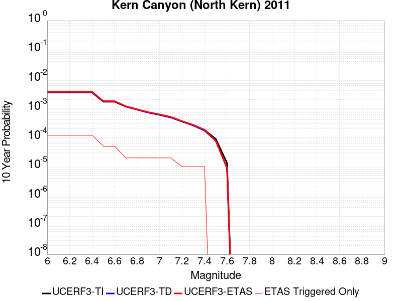 |

| Magnitude | 1 wk TI Prob | 1 wk TD Prob | 1 wk ETAS Prob | 1 wk ETAS/TD Gain | 1 wk ETAS Triggered Only | 1 mo TI Prob | 1 mo TD Prob | 1 mo ETAS Prob | 1 mo ETAS/TD Gain | 1 mo ETAS Triggered Only | 1 yr TI Prob | 1 yr TD Prob | 1 yr ETAS Prob | 1 yr ETAS/TD Gain | 1 yr ETAS Triggered Only | 10 yr TI Prob | 10 yr TD Prob | 10 yr ETAS Prob | 10 yr ETAS/TD Gain | 10 yr ETAS Triggered Only |
|-----|-----|-----|-----|-----|-----|-----|-----|-----|-----|-----|-----|-----|-----|-----|-----|-----|-----|-----|-----|-----|
| 6.0 | 6.6264497E-6 | 6.75733E-6 | 2.2834392E-5 | 3.3792033 | 1.607717E-5 | 2.8398761E-5 | 2.895971E-5 | 9.326653E-5 | 3.2205615 | 6.430868E-5 | 3.4570007E-4 | 3.5253543E-4 | 4.3289294E-4 | 1.2279416 | 8.038585E-5 | 0.0034516277 | 0.0035205502 | 0.0036326942 | 1.0318542 | 1.1254019E-4 |
| 6.1 | 6.6264497E-6 | 6.75733E-6 | 2.2834392E-5 | 3.3792033 | 1.607717E-5 | 2.8398761E-5 | 2.895971E-5 | 9.326653E-5 | 3.2205615 | 6.430868E-5 | 3.4570007E-4 | 3.5253543E-4 | 4.3289294E-4 | 1.2279416 | 8.038585E-5 | 0.0034516277 | 0.0035205502 | 0.0036326942 | 1.0318542 | 1.1254019E-4 |
| 6.2 | 6.6264497E-6 | 6.75733E-6 | 2.2834392E-5 | 3.3792033 | 1.607717E-5 | 2.8398761E-5 | 2.895971E-5 | 9.326653E-5 | 3.2205615 | 6.430868E-5 | 3.4570007E-4 | 3.5253543E-4 | 4.3289294E-4 | 1.2279416 | 8.038585E-5 | 0.0034516277 | 0.0035205502 | 0.0036326942 | 1.0318542 | 1.1254019E-4 |
| 6.3 | 6.6264497E-6 | 6.75733E-6 | 2.2834392E-5 | 3.3792033 | 1.607717E-5 | 2.8398761E-5 | 2.895971E-5 | 9.326653E-5 | 3.2205615 | 6.430868E-5 | 3.4570007E-4 | 3.5253543E-4 | 4.3289294E-4 | 1.2279416 | 8.038585E-5 | 0.0034516277 | 0.0035205502 | 0.0036326942 | 1.0318542 | 1.1254019E-4 |
| 6.4 | 6.6264497E-6 | 6.75733E-6 | 2.2834392E-5 | 3.3792033 | 1.607717E-5 | 2.8398761E-5 | 2.895971E-5 | 9.326653E-5 | 3.2205615 | 6.430868E-5 | 3.4570007E-4 | 3.5253543E-4 | 4.3289294E-4 | 1.2279416 | 8.038585E-5 | 0.0034516277 | 0.0035205502 | 0.0036326942 | 1.0318542 | 1.1254019E-4 |
| 6.5 | 3.2162225E-6 | 3.2570915E-6 | 3.2570915E-6 | 1.0 | 0.0 | 1.3783738E-5 | 1.3958893E-5 | 3.0035839E-5 | 2.151735 | 1.607717E-5 | 1.6780409E-4 | 1.6993708E-4 | 2.0208595E-4 | 1.1891811 | 3.215434E-5 | 0.0016767744 | 0.001698151 | 0.0017302507 | 1.0189028 | 3.215434E-5 |
| 6.6 | 3.2162225E-6 | 3.2570915E-6 | 3.2570915E-6 | 1.0 | 0.0 | 1.3783738E-5 | 1.3958893E-5 | 3.0035839E-5 | 2.151735 | 1.607717E-5 | 1.6780409E-4 | 1.6993708E-4 | 2.0208595E-4 | 1.1891811 | 3.215434E-5 | 0.0016767744 | 0.001698151 | 0.0017302507 | 1.0189028 | 3.215434E-5 |
| 6.7 | 2.1908265E-6 | 2.2071222E-6 | 2.2071222E-6 | 1.0 | 0.0 | 9.389223E-6 | 9.459061E-6 | 9.459061E-6 | 1.0 | 0.0 | 1.1430779E-4 | 1.1515819E-4 | 1.1515819E-4 | 1.0 | 0.0 | 0.0011424901 | 0.0011510046 | 0.0011510046 | 1.0 | 0.0 |
| 6.8 | 1.7303895E-6 | 1.7365529E-6 | 1.7365529E-6 | 1.0 | 0.0 | 7.415934E-6 | 7.4423488E-6 | 7.4423488E-6 | 1.0 | 0.0 | 9.028525E-5 | 9.0606925E-5 | 9.0606925E-5 | 1.0 | 0.0 | 9.024858E-4 | 9.057096E-4 | 9.057096E-4 | 1.0 | 0.0 |
| 6.9 | 1.3700314E-6 | 1.3688622E-6 | 1.3688622E-6 | 1.0 | 0.0 | 5.87155E-6 | 5.8665396E-6 | 5.8665396E-6 | 1.0 | 0.0 | 7.148377E-5 | 7.142282E-5 | 7.142282E-5 | 1.0 | 0.0 | 7.146078E-4 | 7.140032E-4 | 7.140032E-4 | 1.0 | 0.0 |
| 7.0 | 1.1467797E-6 | 1.1413804E-6 | 1.1413804E-6 | 1.0 | 0.0 | 4.9147607E-6 | 4.8916213E-6 | 4.8916213E-6 | 1.0 | 0.0 | 5.983557E-5 | 5.9553895E-5 | 5.9553895E-5 | 1.0 | 0.0 | 5.981946E-4 | 5.953825E-4 | 5.953825E-4 | 1.0 | 0.0 |
| 7.1 | 9.3952065E-7 | 9.3026904E-7 | 9.3026904E-7 | 1.0 | 0.0 | 4.026511E-6 | 3.9868614E-6 | 3.9868614E-6 | 1.0 | 0.0 | 4.9021666E-5 | 4.8538972E-5 | 4.8538972E-5 | 1.0 | 0.0 | 4.901085E-4 | 4.8528548E-4 | 4.8528548E-4 | 1.0 | 0.0 |
| 7.2 | 6.858055E-7 | 6.7193E-7 | 6.7193E-7 | 1.0 | 0.0 | 2.939163E-6 | 2.879697E-6 | 2.879697E-6 | 1.0 | 0.0 | 3.5783723E-5 | 3.5059755E-5 | 3.5059755E-5 | 1.0 | 0.0 | 3.5777962E-4 | 3.5054312E-4 | 3.5054312E-4 | 1.0 | 0.0 |
| 7.3 | 5.1101983E-7 | 4.9393E-7 | 4.9393E-7 | 1.0 | 0.0 | 2.1900833E-6 | 2.116841E-6 | 2.116841E-6 | 1.0 | 0.0 | 2.6663936E-5 | 2.5772239E-5 | 2.5772239E-5 | 1.0 | 0.0 | 2.6660739E-4 | 2.57693E-4 | 2.57693E-4 | 1.0 | 0.0 |
| 7.4 | 3.4999414E-7 | 3.2995905E-7 | 3.2995905E-7 | 1.0 | 0.0 | 1.499974E-6 | 1.4141094E-6 | 1.4141094E-6 | 1.0 | 0.0 | 1.8262032E-5 | 1.721665E-5 | 1.721665E-5 | 1.0 | 0.0 | 1.826053E-4 | 1.7215339E-4 | 1.7215339E-4 | 1.0 | 0.0 |
| 7.5 | 1.7021522E-7 | 1.4750044E-7 | 1.4750044E-7 | 1.0 | 0.0 | 7.2949354E-7 | 6.321446E-7 | 6.321446E-7 | 1.0 | 0.0 | 8.881548E-6 | 7.696334E-6 | 7.696334E-6 | 1.0 | 0.0 | 8.8811925E-5 | 7.696076E-5 | 7.696076E-5 | 1.0 | 0.0 |
| 7.6 | 2.572245E-8 | 1.7352555E-8 | 1.7352555E-8 | 1.0 | 0.0 | 1.10239064E-7 | 7.436809E-8 | 7.436809E-8 | 1.0 | 0.0 | 1.3421597E-6 | 9.054312E-7 | 9.054312E-7 | 1.0 | 0.0 | 1.3421517E-5 | 9.05428E-6 | 9.05428E-6 | 1.0 | 0.0 |

## Bullion Mountains
*[(top)](#table-of-contents)*

| 1 Week | 1 Month | 1 Year | 10 Year |
|-----|-----|-----|-----|
|  |  |  |  |

| Magnitude | 1 wk TI Prob | 1 wk TD Prob | 1 wk ETAS Prob | 1 wk ETAS/TD Gain | 1 wk ETAS Triggered Only | 1 mo TI Prob | 1 mo TD Prob | 1 mo ETAS Prob | 1 mo ETAS/TD Gain | 1 mo ETAS Triggered Only | 1 yr TI Prob | 1 yr TD Prob | 1 yr ETAS Prob | 1 yr ETAS/TD Gain | 1 yr ETAS Triggered Only | 10 yr TI Prob | 10 yr TD Prob | 10 yr ETAS Prob | 10 yr ETAS/TD Gain | 10 yr ETAS Triggered Only |
|-----|-----|-----|-----|-----|-----|-----|-----|-----|-----|-----|-----|-----|-----|-----|-----|-----|-----|-----|-----|-----|
| 6.0 | 1.6420427E-5 | 1.4692089E-5 | 7.899982E-5 | 5.3770313 | 6.430868E-5 | 7.037136E-5 | 6.296479E-5 | 1.2726942E-4 | 2.021279 | 6.430868E-5 | 8.5643446E-4 | 7.663651E-4 | 8.627542E-4 | 1.1257744 | 9.646302E-5 | 0.008531413 | 0.007641016 | 0.0077526965 | 1.0146159 | 1.1254019E-4 |
| 6.1 | 1.6420427E-5 | 1.4692089E-5 | 7.899982E-5 | 5.3770313 | 6.430868E-5 | 7.037136E-5 | 6.296479E-5 | 1.2726942E-4 | 2.021279 | 6.430868E-5 | 8.5643446E-4 | 7.663651E-4 | 8.627542E-4 | 1.1257744 | 9.646302E-5 | 0.008531413 | 0.007641016 | 0.0077526965 | 1.0146159 | 1.1254019E-4 |
| 6.2 | 1.6420427E-5 | 1.4692089E-5 | 7.899982E-5 | 5.3770313 | 6.430868E-5 | 7.037136E-5 | 6.296479E-5 | 1.2726942E-4 | 2.021279 | 6.430868E-5 | 8.5643446E-4 | 7.663651E-4 | 8.627542E-4 | 1.1257744 | 9.646302E-5 | 0.008531413 | 0.007641016 | 0.0077526965 | 1.0146159 | 1.1254019E-4 |
| 6.3 | 1.2046778E-5 | 9.862335E-6 | 9.862335E-6 | 1.0 | 0.0 | 5.1628023E-5 | 4.2266598E-5 | 4.2266598E-5 | 1.0 | 0.0 | 6.283899E-4 | 5.144975E-4 | 5.144975E-4 | 1.0 | 0.0 | 0.0062661595 | 0.005135345 | 0.005135345 | 1.0 | 0.0 |
| 6.4 | 1.2046778E-5 | 9.862335E-6 | 9.862335E-6 | 1.0 | 0.0 | 5.1628023E-5 | 4.2266598E-5 | 4.2266598E-5 | 1.0 | 0.0 | 6.283899E-4 | 5.144975E-4 | 5.144975E-4 | 1.0 | 0.0 | 0.0062661595 | 0.005135345 | 0.005135345 | 1.0 | 0.0 |
| 6.5 | 1.0244343E-5 | 7.879458E-6 | 7.879458E-6 | 1.0 | 0.0 | 4.390359E-5 | 3.3768785E-5 | 3.3768785E-5 | 1.0 | 0.0 | 5.343951E-4 | 4.110781E-4 | 4.110781E-4 | 1.0 | 0.0 | 0.005331118 | 0.004105208 | 0.004105208 | 1.0 | 0.0 |
| 6.6 | 9.605408E-6 | 7.1774966E-6 | 7.1774966E-6 | 1.0 | 0.0 | 4.1165385E-5 | 3.076045E-5 | 3.076045E-5 | 1.0 | 0.0 | 5.010733E-4 | 3.744645E-4 | 3.744645E-4 | 1.0 | 0.0 | 0.00499945 | 0.003740332 | 0.003740332 | 1.0 | 0.0 |
| 6.7 | 8.60418E-6 | 6.1240044E-6 | 6.1240044E-6 | 1.0 | 0.0 | 3.687454E-5 | 2.624558E-5 | 2.624558E-5 | 1.0 | 0.0 | 4.48855E-4 | 3.1951256E-4 | 3.1951256E-4 | 1.0 | 0.0 | 0.004479495 | 0.0031924439 | 0.0031924439 | 1.0 | 0.0 |
| 6.8 | 5.187994E-6 | 2.5631666E-6 | 2.5631666E-6 | 1.0 | 0.0 | 2.223407E-5 | 1.0984976E-5 | 1.0984976E-5 | 1.0 | 0.0 | 2.7066618E-4 | 1.3373788E-4 | 1.3373788E-4 | 1.0 | 0.0 | 0.0027033675 | 0.0013369655 | 0.0013369655 | 1.0 | 0.0 |
| 6.9 | 4.5302368E-6 | 2.3443165E-6 | 2.3443165E-6 | 1.0 | 0.0 | 1.9415156E-5 | 1.0047055E-5 | 1.0047055E-5 | 1.0 | 0.0 | 2.3635388E-4 | 1.2232E-4 | 1.2232E-4 | 1.0 | 0.0 | 0.0023610266 | 0.0012229157 | 0.0012229157 | 1.0 | 0.0 |
| 7.0 | 3.431668E-6 | 1.6882402E-6 | 1.6882402E-6 | 1.0 | 0.0 | 1.4707065E-5 | 7.235315E-6 | 7.235315E-6 | 1.0 | 0.0 | 1.7904381E-4 | 8.808996E-5 | 8.808996E-5 | 1.0 | 0.0 | 0.0017889962 | 8.808996E-4 | 8.808996E-4 | 1.0 | 0.0 |

## San Cayetano
*[(top)](#table-of-contents)*

| 1 Week | 1 Month | 1 Year | 10 Year |
|-----|-----|-----|-----|
|  |  |  |  |

| Magnitude | 1 wk TI Prob | 1 wk TD Prob | 1 wk ETAS Prob | 1 wk ETAS/TD Gain | 1 wk ETAS Triggered Only | 1 mo TI Prob | 1 mo TD Prob | 1 mo ETAS Prob | 1 mo ETAS/TD Gain | 1 mo ETAS Triggered Only | 1 yr TI Prob | 1 yr TD Prob | 1 yr ETAS Prob | 1 yr ETAS/TD Gain | 1 yr ETAS Triggered Only | 10 yr TI Prob | 10 yr TD Prob | 10 yr ETAS Prob | 10 yr ETAS/TD Gain | 10 yr ETAS Triggered Only |
|-----|-----|-----|-----|-----|-----|-----|-----|-----|-----|-----|-----|-----|-----|-----|-----|-----|-----|-----|-----|-----|
| 6.0 | 2.3476267E-5 | 1.816928E-5 | 6.6399916E-5 | 3.6545157 | 4.823151E-5 | 1.0060869E-4 | 7.786603E-5 | 1.2609379E-4 | 1.6193683 | 4.823151E-5 | 0.0012242225 | 9.476103E-4 | 0.001011858 | 1.0677998 | 6.430868E-5 | 0.012175002 | 0.009436584 | 0.009548062 | 1.0118134 | 1.1254019E-4 |
| 6.1 | 2.3476267E-5 | 1.816928E-5 | 6.6399916E-5 | 3.6545157 | 4.823151E-5 | 1.0060869E-4 | 7.786603E-5 | 1.2609379E-4 | 1.6193683 | 4.823151E-5 | 0.0012242225 | 9.476103E-4 | 0.001011858 | 1.0677998 | 6.430868E-5 | 0.012175002 | 0.009436584 | 0.009548062 | 1.0118134 | 1.1254019E-4 |
| 6.2 | 2.3476267E-5 | 1.816928E-5 | 6.6399916E-5 | 3.6545157 | 4.823151E-5 | 1.0060869E-4 | 7.786603E-5 | 1.2609379E-4 | 1.6193683 | 4.823151E-5 | 0.0012242225 | 9.476103E-4 | 0.001011858 | 1.0677998 | 6.430868E-5 | 0.012175002 | 0.009436584 | 0.009548062 | 1.0118134 | 1.1254019E-4 |
| 6.3 | 2.3476267E-5 | 1.816928E-5 | 6.6399916E-5 | 3.6545157 | 4.823151E-5 | 1.0060869E-4 | 7.786603E-5 | 1.2609379E-4 | 1.6193683 | 4.823151E-5 | 0.0012242225 | 9.476103E-4 | 0.001011858 | 1.0677998 | 6.430868E-5 | 0.012175002 | 0.009436584 | 0.009548062 | 1.0118134 | 1.1254019E-4 |
| 6.4 | 2.3476267E-5 | 1.816928E-5 | 6.6399916E-5 | 3.6545157 | 4.823151E-5 | 1.0060869E-4 | 7.786603E-5 | 1.2609379E-4 | 1.6193683 | 4.823151E-5 | 0.0012242225 | 9.476103E-4 | 0.001011858 | 1.0677998 | 6.430868E-5 | 0.012175002 | 0.009436584 | 0.009548062 | 1.0118134 | 1.1254019E-4 |
| 6.5 | 2.3476267E-5 | 1.816928E-5 | 6.6399916E-5 | 3.6545157 | 4.823151E-5 | 1.0060869E-4 | 7.786603E-5 | 1.2609379E-4 | 1.6193683 | 4.823151E-5 | 0.0012242225 | 9.476103E-4 | 0.001011858 | 1.0677998 | 6.430868E-5 | 0.012175002 | 0.009436584 | 0.009548062 | 1.0118134 | 1.1254019E-4 |
| 6.6 | 2.3476267E-5 | 1.816928E-5 | 6.6399916E-5 | 3.6545157 | 4.823151E-5 | 1.0060869E-4 | 7.786603E-5 | 1.2609379E-4 | 1.6193683 | 4.823151E-5 | 0.0012242225 | 9.476103E-4 | 0.001011858 | 1.0677998 | 6.430868E-5 | 0.012175002 | 0.009436584 | 0.009548062 | 1.0118134 | 1.1254019E-4 |
| 6.7 | 2.3476267E-5 | 1.816928E-5 | 6.6399916E-5 | 3.6545157 | 4.823151E-5 | 1.0060869E-4 | 7.786603E-5 | 1.2609379E-4 | 1.6193683 | 4.823151E-5 | 0.0012242225 | 9.476103E-4 | 0.001011858 | 1.0677998 | 6.430868E-5 | 0.012175002 | 0.009436584 | 0.009548062 | 1.0118134 | 1.1254019E-4 |
| 6.8 | 2.3241924E-5 | 1.7936987E-5 | 6.616763E-5 | 3.6888933 | 4.823151E-5 | 9.960445E-5 | 7.687056E-5 | 1.2509836E-4 | 1.6273898 | 4.823151E-5 | 0.0012120095 | 9.3550084E-4 | 9.997493E-4 | 1.0686783 | 6.430868E-5 | 0.012054204 | 0.009316482 | 0.009427974 | 1.0119672 | 1.1254019E-4 |
| 6.9 | 2.2761007E-5 | 1.7432423E-5 | 6.5663095E-5 | 3.766722 | 4.823151E-5 | 9.7543525E-5 | 7.470827E-5 | 1.2293618E-4 | 1.6455498 | 4.823151E-5 | 0.0011869454 | 9.09197E-4 | 9.734472E-4 | 1.070667 | 6.430868E-5 | 0.011806256 | 0.009055603 | 0.0091671245 | 1.0123152 | 1.1254019E-4 |
| 7.0 | 2.240283E-5 | 1.7066168E-5 | 6.529686E-5 | 3.8260994 | 4.823151E-5 | 9.600859E-5 | 7.313869E-5 | 1.2136668E-4 | 1.6594045 | 4.823151E-5 | 0.0011682777 | 8.9010317E-4 | 9.5435465E-4 | 1.0721842 | 6.430868E-5 | 0.011621549 | 0.008866196 | 0.008977737 | 1.0125806 | 1.1254019E-4 |
| 7.1 | 2.1871154E-5 | 1.6586018E-5 | 3.2662923E-5 | 1.9693047 | 1.607717E-5 | 9.373015E-5 | 7.108101E-5 | 8.7157045E-5 | 1.2261648 | 1.607717E-5 | 0.0011405671 | 8.6507114E-4 | 8.9719763E-4 | 1.0371374 | 3.215434E-5 | 0.011347309 | 0.008617838 | 0.008697531 | 1.0092474 | 8.038585E-5 |
| 7.2 | 2.0714133E-5 | 1.5564561E-5 | 3.164148E-5 | 2.0329185 | 1.607717E-5 | 8.8771834E-5 | 6.670357E-5 | 8.277967E-5 | 1.241008 | 1.607717E-5 | 0.0010802611 | 8.1181666E-4 | 8.439449E-4 | 1.0395757 | 3.215434E-5 | 0.010750249 | 0.008089285 | 0.0081690205 | 1.0098569 | 8.038585E-5 |
| 7.3 | 1.8408395E-5 | 1.3996864E-5 | 3.007381E-5 | 2.1486106 | 1.607717E-5 | 7.8890735E-5 | 5.99852E-5 | 7.6061406E-5 | 1.2680029 | 1.607717E-5 | 9.600714E-4 | 7.300781E-4 | 7.6220895E-4 | 1.0440102 | 3.215434E-5 | 0.009559342 | 0.0072775153 | 0.007357316 | 1.0109653 | 8.038585E-5 |
| 7.4 | 1.6856795E-5 | 1.28500815E-5 | 2.8927045E-5 | 2.2511177 | 1.607717E-5 | 7.2241404E-5 | 5.5070628E-5 | 7.114691E-5 | 1.2919213 | 1.607717E-5 | 8.7918417E-4 | 6.7028153E-4 | 7.024143E-4 | 1.0479393 | 3.215434E-5 | 0.00875714 | 0.0066832784 | 0.006763127 | 1.0119475 | 8.038585E-5 |
| 7.5 | 1.2822778E-5 | 9.577542E-6 | 2.5654559E-5 | 2.678616 | 1.607717E-5 | 5.495361E-5 | 4.1045972E-5 | 5.712248E-5 | 1.3916708 | 1.607717E-5 | 6.688548E-4 | 4.996217E-4 | 5.3176E-4 | 1.0643252 | 3.215434E-5 | 0.006668452 | 0.0049851555 | 0.0050491435 | 1.0128357 | 6.430868E-5 |
| 7.6 | 5.6272684E-6 | 3.854903E-6 | 1.9932011E-5 | 5.1705613 | 1.607717E-5 | 2.4116642E-5 | 1.652091E-5 | 3.2597814E-5 | 1.9731247 | 1.607717E-5 | 2.9358055E-4 | 2.0112359E-4 | 2.3327146E-4 | 1.1598414 | 3.215434E-5 | 0.0029319301 | 0.0020094267 | 0.0020575612 | 1.0239544 | 4.823151E-5 |
| 7.7 | 3.5261346E-6 | 2.3407013E-6 | 1.8417833E-5 | 7.868511 | 1.607717E-5 | 1.5111918E-5 | 1.0031539E-5 | 2.6108548E-5 | 2.6026464 | 1.607717E-5 | 1.8397206E-4 | 1.2212721E-4 | 1.5427763E-4 | 1.2632535 | 3.215434E-5 | 0.0018381984 | 0.0012206084 | 0.0012527235 | 1.0263107 | 3.215434E-5 |
| 7.8 | 1.4826929E-6 | 1.056428E-6 | 1.056428E-6 | 1.0 | 0.0 | 6.354383E-6 | 4.5275406E-6 | 4.5275406E-6 | 1.0 | 0.0 | 7.736187E-5 | 5.5121433E-5 | 5.5121433E-5 | 1.0 | 0.0 | 7.733494E-4 | 5.5107963E-4 | 5.5107963E-4 | 1.0 | 0.0 |
| 7.9 | 2.7568166E-7 | 1.6978244E-7 | 1.6978244E-7 | 1.0 | 0.0 | 1.1814923E-6 | 7.2763885E-7 | 7.2763885E-7 | 1.0 | 0.0 | 1.4384574E-5 | 8.858967E-6 | 8.858967E-6 | 1.0 | 0.0 | 1.4383643E-4 | 8.8586174E-5 | 8.8586174E-5 | 1.0 | 0.0 |
| 8.0 | 5.407832E-8 | 2.6887697E-8 | 2.6887697E-8 | 1.0 | 0.0 | 2.3176422E-7 | 1.15232986E-7 | 1.15232986E-7 | 1.0 | 0.0 | 2.8217257E-6 | 1.4029607E-6 | 1.4029607E-6 | 1.0 | 0.0 | 2.8216898E-5 | 1.4029522E-5 | 1.4029522E-5 | 1.0 | 0.0 |

## Pleito
*[(top)](#table-of-contents)*

| 1 Week | 1 Month | 1 Year | 10 Year |
|-----|-----|-----|-----|
|  |  |  |  |

| Magnitude | 1 wk TI Prob | 1 wk TD Prob | 1 wk ETAS Prob | 1 wk ETAS/TD Gain | 1 wk ETAS Triggered Only | 1 mo TI Prob | 1 mo TD Prob | 1 mo ETAS Prob | 1 mo ETAS/TD Gain | 1 mo ETAS Triggered Only | 1 yr TI Prob | 1 yr TD Prob | 1 yr ETAS Prob | 1 yr ETAS/TD Gain | 1 yr ETAS Triggered Only | 10 yr TI Prob | 10 yr TD Prob | 10 yr ETAS Prob | 10 yr ETAS/TD Gain | 10 yr ETAS Triggered Only |
|-----|-----|-----|-----|-----|-----|-----|-----|-----|-----|-----|-----|-----|-----|-----|-----|-----|-----|-----|-----|-----|
| 6.0 | 1.6763008E-5 | 2.4763838E-5 | 2.4763838E-5 | 1.0 | 0.0 | 7.183948E-5 | 1.0612683E-4 | 1.3827776E-4 | 1.3029481 | 3.215434E-5 | 8.742947E-4 | 0.0012914003 | 0.0013716824 | 1.0621667 | 8.038585E-5 | 0.00870863 | 0.0129538905 | 0.013064972 | 1.0085752 | 1.1254019E-4 |
| 6.1 | 1.6763008E-5 | 2.4763838E-5 | 2.4763838E-5 | 1.0 | 0.0 | 7.183948E-5 | 1.0612683E-4 | 1.3827776E-4 | 1.3029481 | 3.215434E-5 | 8.742947E-4 | 0.0012914003 | 0.0013716824 | 1.0621667 | 8.038585E-5 | 0.00870863 | 0.0129538905 | 0.013064972 | 1.0085752 | 1.1254019E-4 |
| 6.2 | 1.6763008E-5 | 2.4763838E-5 | 2.4763838E-5 | 1.0 | 0.0 | 7.183948E-5 | 1.0612683E-4 | 1.3827776E-4 | 1.3029481 | 3.215434E-5 | 8.742947E-4 | 0.0012914003 | 0.0013716824 | 1.0621667 | 8.038585E-5 | 0.00870863 | 0.0129538905 | 0.013064972 | 1.0085752 | 1.1254019E-4 |
| 6.3 | 1.6763008E-5 | 2.4763838E-5 | 2.4763838E-5 | 1.0 | 0.0 | 7.183948E-5 | 1.0612683E-4 | 1.3827776E-4 | 1.3029481 | 3.215434E-5 | 8.742947E-4 | 0.0012914003 | 0.0013716824 | 1.0621667 | 8.038585E-5 | 0.00870863 | 0.0129538905 | 0.013064972 | 1.0085752 | 1.1254019E-4 |
| 6.4 | 1.6763008E-5 | 2.4763838E-5 | 2.4763838E-5 | 1.0 | 0.0 | 7.183948E-5 | 1.0612683E-4 | 1.3827776E-4 | 1.3029481 | 3.215434E-5 | 8.742947E-4 | 0.0012914003 | 0.0013716824 | 1.0621667 | 8.038585E-5 | 0.00870863 | 0.0129538905 | 0.013064972 | 1.0085752 | 1.1254019E-4 |
| 6.5 | 1.6763008E-5 | 2.4763838E-5 | 2.4763838E-5 | 1.0 | 0.0 | 7.183948E-5 | 1.0612683E-4 | 1.3827776E-4 | 1.3029481 | 3.215434E-5 | 8.742947E-4 | 0.0012914003 | 0.0013716824 | 1.0621667 | 8.038585E-5 | 0.00870863 | 0.0129538905 | 0.013064972 | 1.0085752 | 1.1254019E-4 |
| 6.6 | 9.910213E-6 | 1.7214623E-5 | 1.7214623E-5 | 1.0 | 0.0 | 4.247165E-5 | 7.377489E-5 | 8.985087E-5 | 1.2179059 | 1.607717E-5 | 5.169696E-4 | 8.978429E-4 | 9.620938E-4 | 1.0715615 | 6.430868E-5 | 0.0051576863 | 0.009050702 | 0.009130361 | 1.0088013 | 8.038585E-5 |
| 6.7 | 9.910213E-6 | 1.7214623E-5 | 1.7214623E-5 | 1.0 | 0.0 | 4.247165E-5 | 7.377489E-5 | 8.985087E-5 | 1.2179059 | 1.607717E-5 | 5.169696E-4 | 8.978429E-4 | 9.620938E-4 | 1.0715615 | 6.430868E-5 | 0.0051576863 | 0.009050702 | 0.009130361 | 1.0088013 | 8.038585E-5 |
| 6.8 | 8.300162E-6 | 1.5474232E-5 | 1.5474232E-5 | 1.0 | 0.0 | 3.557164E-5 | 6.631646E-5 | 8.2392566E-5 | 1.242415 | 1.607717E-5 | 4.3299864E-4 | 8.071053E-4 | 8.7136205E-4 | 1.0796139 | 6.430868E-5 | 0.004321559 | 0.008150139 | 0.008229869 | 1.0097828 | 8.038585E-5 |
| 6.9 | 8.183114E-6 | 1.5345448E-5 | 1.5345448E-5 | 1.0 | 0.0 | 3.5070017E-5 | 6.576455E-5 | 8.184067E-5 | 1.2444495 | 1.607717E-5 | 4.2689382E-4 | 8.003907E-4 | 8.646479E-4 | 1.0802823 | 6.430868E-5 | 0.0042607468 | 0.008083483 | 0.008163219 | 1.0098641 | 8.038585E-5 |
| 7.0 | 7.1748823E-6 | 1.413244E-5 | 1.413244E-5 | 1.0 | 0.0 | 3.0749135E-5 | 6.0566195E-5 | 7.664239E-5 | 1.2654319 | 1.607717E-5 | 3.743064E-4 | 7.371445E-4 | 7.8534044E-4 | 1.065382 | 4.823151E-5 | 0.0037367654 | 0.007454939 | 0.0075187683 | 1.008562 | 6.430868E-5 |
| 7.1 | 7.1671807E-6 | 1.412281E-5 | 1.412281E-5 | 1.0 | 0.0 | 3.0716128E-5 | 6.052493E-5 | 7.660113E-5 | 1.2656128 | 1.607717E-5 | 3.7390468E-4 | 7.366424E-4 | 7.848384E-4 | 1.0654266 | 4.823151E-5 | 0.0037327618 | 0.0074499524 | 0.007513782 | 1.0085678 | 6.430868E-5 |
| 7.2 | 7.0649667E-6 | 1.39701015E-5 | 1.39701015E-5 | 1.0 | 0.0 | 3.0278077E-5 | 5.9870494E-5 | 7.59467E-5 | 1.2685164 | 1.607717E-5 | 3.6857324E-4 | 7.2868E-4 | 7.7687635E-4 | 1.066142 | 4.823151E-5 | 0.0036796255 | 0.0073707094 | 0.007434544 | 1.0086606 | 6.430868E-5 |
| 7.3 | 7.02082E-6 | 1.3913556E-5 | 1.3913556E-5 | 1.0 | 0.0 | 3.008888E-5 | 5.9628168E-5 | 7.570438E-5 | 1.2696077 | 1.607717E-5 | 3.6627054E-4 | 7.2573166E-4 | 7.739282E-4 | 1.0664109 | 4.823151E-5 | 0.0036566744 | 0.007341209 | 0.0074050454 | 1.0086956 | 6.430868E-5 |
| 7.4 | 6.987146E-6 | 1.3873118E-5 | 1.3873118E-5 | 1.0 | 0.0 | 2.9944567E-5 | 5.945487E-5 | 7.553108E-5 | 1.2703936 | 1.607717E-5 | 3.6451413E-4 | 7.2362315E-4 | 7.7181973E-4 | 1.0666046 | 4.823151E-5 | 0.0036391679 | 0.007320144 | 0.007383982 | 1.0087209 | 6.430868E-5 |
| 7.5 | 6.9494554E-6 | 1.3830024E-5 | 1.3830024E-5 | 1.0 | 0.0 | 2.9783041E-5 | 5.9270187E-5 | 7.5346405E-5 | 1.2712362 | 1.607717E-5 | 3.625482E-4 | 7.2137616E-4 | 7.6957286E-4 | 1.0668122 | 4.823151E-5 | 0.0036195726 | 0.0072977724 | 0.007361612 | 1.0087478 | 6.430868E-5 |
| 7.6 | 6.92694E-6 | 1.3789138E-5 | 1.3789138E-5 | 1.0 | 0.0 | 2.9686547E-5 | 5.909497E-5 | 7.517119E-5 | 1.2720404 | 1.607717E-5 | 3.6137376E-4 | 7.1924424E-4 | 7.674411E-4 | 1.0670104 | 4.823151E-5 | 0.0036078666 | 0.0072765257 | 0.0073403665 | 1.0087736 | 6.430868E-5 |
| 7.7 | 6.395867E-6 | 1.2668219E-5 | 1.2668219E-5 | 1.0 | 0.0 | 2.741057E-5 | 5.429124E-5 | 7.036754E-5 | 1.2961122 | 1.607717E-5 | 3.336726E-4 | 6.6079566E-4 | 7.089953E-4 | 1.0729418 | 4.823151E-5 | 0.0033317201 | 0.0066951844 | 0.0067590624 | 1.0095409 | 6.430868E-5 |
| 7.8 | 5.8664327E-6 | 1.153586E-5 | 1.153586E-5 | 1.0 | 0.0 | 2.5141611E-5 | 4.9438466E-5 | 6.551484E-5 | 1.3251795 | 1.607717E-5 | 3.060561E-4 | 6.017473E-4 | 6.338823E-4 | 1.0534028 | 3.215434E-5 | 0.0030563495 | 0.0061006667 | 0.0061486037 | 1.0078577 | 4.823151E-5 |
| 7.9 | 3.7167474E-6 | 7.1140853E-6 | 7.1140853E-6 | 1.0 | 0.0 | 1.592882E-5 | 3.0488582E-5 | 4.6565263E-5 | 1.5273017 | 1.607717E-5 | 1.9391612E-4 | 3.7113542E-4 | 3.8720662E-4 | 1.0433028 | 1.607717E-5 | 0.0019374699 | 0.0037674906 | 0.0037995237 | 1.0085025 | 3.215434E-5 |
| 8.0 | 1.0903841E-6 | 1.2879392E-6 | 1.2879392E-6 | 1.0 | 0.0 | 4.6730665E-6 | 5.5197274E-6 | 2.1596808E-5 | 3.9126585 | 1.607717E-5 | 5.68931E-5 | 6.720063E-5 | 8.327672E-5 | 1.2392253 | 1.607717E-5 | 5.6878536E-4 | 6.941948E-4 | 7.102608E-4 | 1.0231434 | 1.607717E-5 |
| 8.1 | 2.6894583E-7 | 1.1060341E-7 | 1.1060341E-7 | 1.0 | 0.0 | 1.1526245E-6 | 4.740145E-7 | 4.740145E-7 | 1.0 | 0.0 | 1.4033113E-5 | 5.7711113E-6 | 5.7711113E-6 | 1.0 | 0.0 | 1.4032227E-4 | 6.456908E-5 | 6.456908E-5 | 1.0 | 0.0 |
| 8.2 | 5.2967013E-9 | 2.4578228E-9 | 2.4578228E-9 | 1.0 | 0.0 | 2.2700148E-8 | 1.0533527E-8 | 1.0533527E-8 | 1.0 | 0.0 | 2.7637427E-7 | 1.2824569E-7 | 1.2824569E-7 | 1.0 | 0.0 | 2.7637393E-6 | 1.4592787E-6 | 1.4592787E-6 | 1.0 | 0.0 |

## Chino alt 1
*[(top)](#table-of-contents)*

| 1 Week | 1 Month | 1 Year | 10 Year |
|-----|-----|-----|-----|
|  | 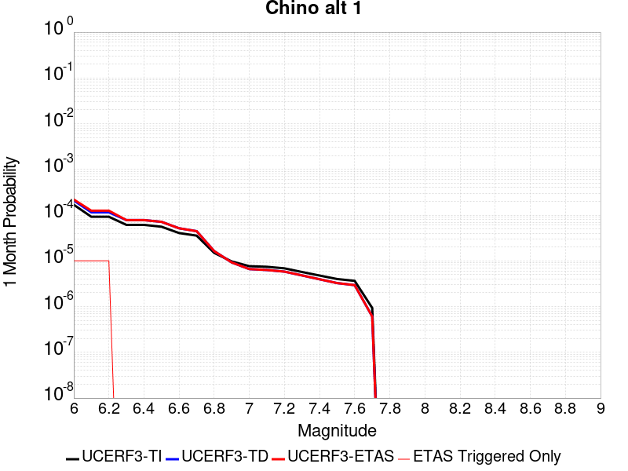 |  |  |

| Magnitude | 1 wk TI Prob | 1 wk TD Prob | 1 wk ETAS Prob | 1 wk ETAS/TD Gain | 1 wk ETAS Triggered Only | 1 mo TI Prob | 1 mo TD Prob | 1 mo ETAS Prob | 1 mo ETAS/TD Gain | 1 mo ETAS Triggered Only | 1 yr TI Prob | 1 yr TD Prob | 1 yr ETAS Prob | 1 yr ETAS/TD Gain | 1 yr ETAS Triggered Only | 10 yr TI Prob | 10 yr TD Prob | 10 yr ETAS Prob | 10 yr ETAS/TD Gain | 10 yr ETAS Triggered Only |
|-----|-----|-----|-----|-----|-----|-----|-----|-----|-----|-----|-----|-----|-----|-----|-----|-----|-----|-----|-----|-----|
| 6.0 | 3.939946E-5 | 4.8948554E-5 | 4.8948554E-5 | 1.0 | 0.0 | 1.6884391E-4 | 2.097656E-4 | 2.097656E-4 | 1.0 | 0.0 | 0.0020537362 | 0.0025513945 | 0.002583467 | 1.0125705 | 3.215434E-5 | 0.020348595 | 0.025277847 | 0.025371872 | 1.0037197 | 9.646302E-5 |
| 6.1 | 2.1505624E-5 | 2.6879026E-5 | 2.6879026E-5 | 1.0 | 0.0 | 9.2163704E-5 | 1.1519137E-4 | 1.1519137E-4 | 1.0 | 0.0 | 0.0011215154 | 0.001401664 | 0.0014177186 | 1.011454 | 1.607717E-5 | 0.011158722 | 0.013945141 | 0.014008553 | 1.0045472 | 6.430868E-5 |
| 6.2 | 2.1505624E-5 | 2.6879026E-5 | 2.6879026E-5 | 1.0 | 0.0 | 9.2163704E-5 | 1.1519137E-4 | 1.1519137E-4 | 1.0 | 0.0 | 0.0011215154 | 0.001401664 | 0.0014177186 | 1.011454 | 1.607717E-5 | 0.011158722 | 0.013945141 | 0.014008553 | 1.0045472 | 6.430868E-5 |
| 6.3 | 1.4290785E-5 | 1.8165128E-5 | 1.8165128E-5 | 1.0 | 0.0 | 6.1244784E-5 | 7.784848E-5 | 7.784848E-5 | 1.0 | 0.0 | 7.454001E-4 | 9.4743853E-4 | 9.6350047E-4 | 1.016953 | 1.607717E-5 | 0.007429048 | 0.0094444575 | 0.009492233 | 1.0050586 | 4.823151E-5 |
| 6.4 | 1.4290785E-5 | 1.8165128E-5 | 1.8165128E-5 | 1.0 | 0.0 | 6.1244784E-5 | 7.784848E-5 | 7.784848E-5 | 1.0 | 0.0 | 7.454001E-4 | 9.4743853E-4 | 9.6350047E-4 | 1.016953 | 1.607717E-5 | 0.007429048 | 0.0094444575 | 0.009492233 | 1.0050586 | 4.823151E-5 |
| 6.5 | 1.3017944E-5 | 1.6652088E-5 | 1.6652088E-5 | 1.0 | 0.0 | 5.5789995E-5 | 7.136439E-5 | 7.136439E-5 | 1.0 | 0.0 | 6.790315E-4 | 8.685589E-4 | 8.8462204E-4 | 1.0184941 | 1.607717E-5 | 0.0067696036 | 0.008661949 | 0.008709763 | 1.00552 | 4.823151E-5 |
| 6.6 | 9.470016E-6 | 1.2039424E-5 | 1.2039424E-5 | 1.0 | 0.0 | 4.058515E-5 | 5.1596704E-5 | 5.1596704E-5 | 1.0 | 0.0 | 4.940122E-4 | 6.280428E-4 | 6.4410985E-4 | 1.0255828 | 1.607717E-5 | 0.004929154 | 0.0062718987 | 0.0063038515 | 1.0050945 | 3.215434E-5 |
| 6.7 | 8.314155E-6 | 1.0407736E-5 | 1.0407736E-5 | 1.0 | 0.0 | 3.5631605E-5 | 4.4604003E-5 | 4.4604003E-5 | 1.0 | 0.0 | 4.3372845E-4 | 5.429507E-4 | 5.590191E-4 | 1.0295947 | 1.607717E-5 | 0.004328829 | 0.005425775 | 0.005457755 | 1.0058941 | 3.215434E-5 |
| 6.8 | 3.4856364E-6 | 3.8133708E-6 | 3.8133708E-6 | 1.0 | 0.0 | 1.4938357E-5 | 1.6342927E-5 | 1.6342927E-5 | 1.0 | 0.0 | 1.8185932E-4 | 1.9895904E-4 | 1.9895904E-4 | 1.0 | 0.0 | 0.0018171056 | 0.0019894864 | 0.0020055317 | 1.008065 | 1.607717E-5 |
| 6.9 | 2.2645952E-6 | 2.1529022E-6 | 2.1529022E-6 | 1.0 | 0.0 | 9.705372E-6 | 9.226692E-6 | 9.226692E-6 | 1.0 | 0.0 | 1.18156495E-4 | 1.123294E-4 | 1.123294E-4 | 1.0 | 0.0 | 0.0011809369 | 0.0011233423 | 0.0011233423 | 1.0 | 0.0 |
| 7.0 | 1.7864003E-6 | 1.5430785E-6 | 1.5430785E-6 | 1.0 | 0.0 | 7.655979E-6 | 6.613177E-6 | 6.613177E-6 | 1.0 | 0.0 | 9.3207556E-5 | 8.051251E-5 | 8.051251E-5 | 1.0 | 0.0 | 9.316847E-4 | 8.0528046E-4 | 8.0528046E-4 | 1.0 | 0.0 |
| 7.1 | 1.7315456E-6 | 1.4733511E-6 | 1.4733511E-6 | 1.0 | 0.0 | 7.420889E-6 | 6.3143466E-6 | 6.3143466E-6 | 1.0 | 0.0 | 9.034557E-5 | 7.6874516E-5 | 7.6874516E-5 | 1.0 | 0.0 | 9.0308854E-4 | 7.6891703E-4 | 7.6891703E-4 | 1.0 | 0.0 |
| 7.2 | 1.6008337E-6 | 1.3574215E-6 | 1.3574215E-6 | 1.0 | 0.0 | 6.860698E-6 | 5.817508E-6 | 5.817508E-6 | 1.0 | 0.0 | 8.352579E-5 | 7.082591E-5 | 7.082591E-5 | 1.0 | 0.0 | 8.34944E-4 | 7.0845755E-4 | 7.0845755E-4 | 1.0 | 0.0 |
| 7.3 | 1.3320939E-6 | 1.121782E-6 | 1.121782E-6 | 1.0 | 0.0 | 5.7089615E-6 | 4.807629E-6 | 4.807629E-6 | 1.0 | 0.0 | 6.9504385E-5 | 5.8531357E-5 | 5.8531357E-5 | 1.0 | 0.0 | 6.9482654E-4 | 5.8530393E-4 | 5.8530393E-4 | 1.0 | 0.0 |
| 7.4 | 1.114294E-6 | 9.237111E-7 | 9.237111E-7 | 1.0 | 0.0 | 4.775537E-6 | 3.958756E-6 | 3.958756E-6 | 1.0 | 0.0 | 5.8140613E-5 | 4.8196827E-5 | 4.8196827E-5 | 1.0 | 0.0 | 5.81254E-4 | 4.8188053E-4 | 4.8188053E-4 | 1.0 | 0.0 |
| 7.5 | 9.354081E-7 | 7.6234323E-7 | 7.6234323E-7 | 1.0 | 0.0 | 4.0088858E-6 | 3.2671815E-6 | 3.2671815E-6 | 1.0 | 0.0 | 4.8807087E-5 | 3.9777242E-5 | 3.9777242E-5 | 1.0 | 0.0 | 4.879637E-4 | 3.977046E-4 | 3.977046E-4 | 1.0 | 0.0 |
| 7.6 | 8.521771E-7 | 6.88071E-7 | 6.88071E-7 | 1.0 | 0.0 | 3.6521824E-6 | 2.9488726E-6 | 2.9488726E-6 | 1.0 | 0.0 | 4.4464414E-5 | 3.5901965E-5 | 3.5901965E-5 | 1.0 | 0.0 | 4.4455516E-4 | 3.589648E-4 | 3.589648E-4 | 1.0 | 0.0 |
| 7.7 | 2.1803626E-7 | 1.418649E-7 | 1.418649E-7 | 1.0 | 0.0 | 9.344408E-7 | 6.079923E-7 | 6.079923E-7 | 1.0 | 0.0 | 1.1376757E-5 | 7.4022914E-6 | 7.4022914E-6 | 1.0 | 0.0 | 1.13761744E-4 | 7.402141E-5 | 7.402141E-5 | 1.0 | 0.0 |

## Camp Rock 2011
*[(top)](#table-of-contents)*

| 1 Week | 1 Month | 1 Year | 10 Year |
|-----|-----|-----|-----|
|  |  |  |  |

| Magnitude | 1 wk TI Prob | 1 wk TD Prob | 1 wk ETAS Prob | 1 wk ETAS/TD Gain | 1 wk ETAS Triggered Only | 1 mo TI Prob | 1 mo TD Prob | 1 mo ETAS Prob | 1 mo ETAS/TD Gain | 1 mo ETAS Triggered Only | 1 yr TI Prob | 1 yr TD Prob | 1 yr ETAS Prob | 1 yr ETAS/TD Gain | 1 yr ETAS Triggered Only | 10 yr TI Prob | 10 yr TD Prob | 10 yr ETAS Prob | 10 yr ETAS/TD Gain | 10 yr ETAS Triggered Only |
|-----|-----|-----|-----|-----|-----|-----|-----|-----|-----|-----|-----|-----|-----|-----|-----|-----|-----|-----|-----|-----|
| 6.0 | 1.6710783E-5 | 4.25026E-6 | 5.2481566E-5 | 12.347848 | 4.823151E-5 | 7.161568E-5 | 1.8215276E-5 | 6.644591E-5 | 3.6478121 | 4.823151E-5 | 8.7157206E-4 | 2.2174895E-4 | 2.860434E-4 | 1.2899424 | 6.430868E-5 | 0.008681616 | 0.0022153298 | 0.002311579 | 1.0434469 | 9.646302E-5 |
| 6.1 | 1.6710783E-5 | 4.25026E-6 | 5.2481566E-5 | 12.347848 | 4.823151E-5 | 7.161568E-5 | 1.8215276E-5 | 6.644591E-5 | 3.6478121 | 4.823151E-5 | 8.7157206E-4 | 2.2174895E-4 | 2.860434E-4 | 1.2899424 | 6.430868E-5 | 0.008681616 | 0.0022153298 | 0.002311579 | 1.0434469 | 9.646302E-5 |
| 6.2 | 1.6710783E-5 | 4.25026E-6 | 5.2481566E-5 | 12.347848 | 4.823151E-5 | 7.161568E-5 | 1.8215276E-5 | 6.644591E-5 | 3.6478121 | 4.823151E-5 | 8.7157206E-4 | 2.2174895E-4 | 2.860434E-4 | 1.2899424 | 6.430868E-5 | 0.008681616 | 0.0022153298 | 0.002311579 | 1.0434469 | 9.646302E-5 |
| 6.3 | 1.6710783E-5 | 4.25026E-6 | 5.2481566E-5 | 12.347848 | 4.823151E-5 | 7.161568E-5 | 1.8215276E-5 | 6.644591E-5 | 3.6478121 | 4.823151E-5 | 8.7157206E-4 | 2.2174895E-4 | 2.860434E-4 | 1.2899424 | 6.430868E-5 | 0.008681616 | 0.0022153298 | 0.002311579 | 1.0434469 | 9.646302E-5 |
| 6.4 | 7.982846E-6 | 3.6820884E-6 | 5.1913423E-5 | 14.0989065 | 4.823151E-5 | 3.421175E-5 | 1.5780286E-5 | 6.401104E-5 | 4.0563927 | 4.823151E-5 | 4.1644843E-4 | 1.9210839E-4 | 2.5640472E-4 | 1.3346877 | 6.430868E-5 | 0.0041566887 | 0.001919458 | 0.0019996895 | 1.0417991 | 8.038585E-5 |
| 6.5 | 7.982846E-6 | 3.6820884E-6 | 5.1913423E-5 | 14.0989065 | 4.823151E-5 | 3.421175E-5 | 1.5780286E-5 | 6.401104E-5 | 4.0563927 | 4.823151E-5 | 4.1644843E-4 | 1.9210839E-4 | 2.5640472E-4 | 1.3346877 | 6.430868E-5 | 0.0041566887 | 0.001919458 | 0.0019996895 | 1.0417991 | 8.038585E-5 |
| 6.6 | 7.048869E-6 | 3.4243571E-6 | 5.1655705E-5 | 15.084788 | 4.823151E-5 | 3.0209088E-5 | 1.4675736E-5 | 6.290654E-5 | 4.286432 | 4.823151E-5 | 3.677336E-4 | 1.7866275E-4 | 2.4295994E-4 | 1.3598802 | 6.430868E-5 | 0.0036712566 | 0.0017852228 | 0.0018654651 | 1.0449481 | 8.038585E-5 |
| 6.7 | 6.987307E-6 | 3.3623348E-6 | 5.1593684E-5 | 15.344601 | 4.823151E-5 | 2.9945259E-5 | 1.4409929E-5 | 6.264074E-5 | 4.3470545 | 4.823151E-5 | 3.6452254E-4 | 1.7542706E-4 | 2.3972447E-4 | 1.3665193 | 6.430868E-5 | 0.0036392517 | 0.001752917 | 0.0018331619 | 1.0457779 | 8.038585E-5 |
| 6.8 | 6.3737602E-6 | 3.1179077E-6 | 5.1349267E-5 | 16.469143 | 4.823151E-5 | 2.731583E-5 | 1.3362394E-5 | 6.159326E-5 | 4.609448 | 4.823151E-5 | 3.3251947E-4 | 1.626753E-4 | 2.2697351E-4 | 1.395255 | 6.430868E-5 | 0.0033202237 | 0.0016255907 | 0.0017058459 | 1.0493698 | 8.038585E-5 |
| 6.9 | 6.112211E-6 | 2.9331156E-6 | 5.1164487E-5 | 17.443733 | 4.823151E-5 | 2.6194928E-5 | 1.2570436E-5 | 6.080134E-5 | 4.836852 | 4.823151E-5 | 3.1887658E-4 | 1.5303459E-4 | 2.1733344E-4 | 1.4201589 | 6.430868E-5 | 0.003184194 | 0.0015293199 | 0.0016095828 | 1.0524827 | 8.038585E-5 |
| 7.0 | 5.5140117E-6 | 2.641923E-6 | 3.479618E-5 | 13.170777 | 3.215434E-5 | 2.3631264E-5 | 1.132248E-5 | 4.3476455E-5 | 3.8398354 | 3.215434E-5 | 2.8767265E-4 | 1.3784273E-4 | 1.8606758E-4 | 1.3498542 | 4.823151E-5 | 0.0028730053 | 0.0013775975 | 0.0014418176 | 1.0466175 | 6.430868E-5 |
| 7.1 | 4.8151105E-6 | 2.1342705E-6 | 3.4288543E-5 | 16.065697 | 3.215434E-5 | 2.0636026E-5 | 9.146843E-6 | 4.130089E-5 | 4.5153165 | 3.215434E-5 | 2.5121463E-4 | 1.1135734E-4 | 1.5958348E-4 | 1.4330755 | 4.823151E-5 | 0.0025093083 | 0.0011130372 | 0.0011772744 | 1.0577134 | 6.430868E-5 |
| 7.2 | 3.818335E-6 | 1.2937425E-6 | 1.7370892E-5 | 13.426855 | 1.607717E-5 | 1.6364189E-5 | 5.5445994E-6 | 2.1621681E-5 | 3.899593 | 1.607717E-5 | 1.9921579E-4 | 6.750349E-5 | 8.357957E-5 | 1.2381519 | 1.607717E-5 | 0.0019903728 | 6.748381E-4 | 6.909044E-4 | 1.0238076 | 1.607717E-5 |
| 7.3 | 2.7166698E-6 | 7.3835776E-7 | 1.6815517E-5 | 22.774212 | 1.607717E-5 | 1.1642818E-5 | 3.1643867E-6 | 1.9241506E-5 | 6.080643 | 1.607717E-5 | 1.4174209E-4 | 3.8525748E-5 | 5.4602297E-5 | 1.4172937 | 1.607717E-5 | 0.0014165172 | 3.851927E-4 | 4.0126368E-4 | 1.0417219 | 1.607717E-5 |
| 7.4 | 2.0893426E-6 | 5.4618386E-7 | 1.6623346E-5 | 30.43544 | 1.607717E-5 | 8.954295E-6 | 2.3407858E-6 | 1.8417919E-5 | 7.868263 | 1.607717E-5 | 1.0901308E-4 | 2.84987E-5 | 4.4575412E-5 | 1.5641209 | 1.607717E-5 | 0.0010895962 | 2.84951E-4 | 3.010236E-4 | 1.0564047 | 1.607717E-5 |
| 7.5 | 1.1681728E-6 | 3.6030585E-7 | 1.643747E-5 | 45.62088 | 1.607717E-5 | 5.0064455E-6 | 1.544167E-6 | 1.7621313E-5 | 11.411532 | 1.607717E-5 | 6.0951766E-5 | 1.8800076E-5 | 3.4876943E-5 | 1.8551491 | 1.607717E-5 | 6.093505E-4 | 1.8798532E-4 | 2.0405947E-4 | 1.0855075 | 1.607717E-5 |
| 7.6 | 1.3154387E-7 | 7.1197384E-8 | 1.6148366E-5 | 226.81123 | 1.607717E-5 | 5.6375933E-7 | 3.051316E-7 | 1.6382297E-5 | 53.68928 | 1.607717E-5 | 6.863748E-6 | 3.7149728E-6 | 1.9792084E-5 | 5.3276525 | 1.607717E-5 | 6.863536E-5 | 3.7149264E-5 | 5.322584E-5 | 1.4327562 | 1.607717E-5 |

## Blue Cut
*[(top)](#table-of-contents)*

| 1 Week | 1 Month | 1 Year | 10 Year |
|-----|-----|-----|-----|
|  |  |  |  |

| Magnitude | 1 wk TI Prob | 1 wk TD Prob | 1 wk ETAS Prob | 1 wk ETAS/TD Gain | 1 wk ETAS Triggered Only | 1 mo TI Prob | 1 mo TD Prob | 1 mo ETAS Prob | 1 mo ETAS/TD Gain | 1 mo ETAS Triggered Only | 1 yr TI Prob | 1 yr TD Prob | 1 yr ETAS Prob | 1 yr ETAS/TD Gain | 1 yr ETAS Triggered Only | 10 yr TI Prob | 10 yr TD Prob | 10 yr ETAS Prob | 10 yr ETAS/TD Gain | 10 yr ETAS Triggered Only |
|-----|-----|-----|-----|-----|-----|-----|-----|-----|-----|-----|-----|-----|-----|-----|-----|-----|-----|-----|-----|-----|
| 6.0 | 2.1227985E-5 | 2.2719574E-5 | 5.4873184E-5 | 2.4152381 | 3.215434E-5 | 9.097391E-5 | 9.73663E-5 | 1.4559312E-4 | 1.4953132 | 4.823151E-5 | 0.0011070445 | 0.0011848481 | 0.0012651387 | 1.0677645 | 8.038585E-5 | 0.011015458 | 0.011791152 | 0.0118864775 | 1.0080845 | 9.646302E-5 |
| 6.1 | 2.1227985E-5 | 2.2719574E-5 | 5.4873184E-5 | 2.4152381 | 3.215434E-5 | 9.097391E-5 | 9.73663E-5 | 1.4559312E-4 | 1.4953132 | 4.823151E-5 | 0.0011070445 | 0.0011848481 | 0.0012651387 | 1.0677645 | 8.038585E-5 | 0.011015458 | 0.011791152 | 0.0118864775 | 1.0080845 | 9.646302E-5 |
| 6.2 | 2.1227985E-5 | 2.2719574E-5 | 5.4873184E-5 | 2.4152381 | 3.215434E-5 | 9.097391E-5 | 9.73663E-5 | 1.4559312E-4 | 1.4953132 | 4.823151E-5 | 0.0011070445 | 0.0011848481 | 0.0012651387 | 1.0677645 | 8.038585E-5 | 0.011015458 | 0.011791152 | 0.0118864775 | 1.0080845 | 9.646302E-5 |
| 6.3 | 1.1613981E-5 | 1.2353542E-5 | 1.2353542E-5 | 1.0 | 0.0 | 4.9773254E-5 | 5.2942745E-5 | 5.2942745E-5 | 1.0 | 0.0 | 6.0582085E-4 | 6.443998E-4 | 6.6046655E-4 | 1.024933 | 1.607717E-5 | 0.0060417196 | 0.0064265593 | 0.006442533 | 1.0024856 | 1.607717E-5 |
| 6.4 | 1.1613981E-5 | 1.2353542E-5 | 1.2353542E-5 | 1.0 | 0.0 | 4.9773254E-5 | 5.2942745E-5 | 5.2942745E-5 | 1.0 | 0.0 | 6.0582085E-4 | 6.443998E-4 | 6.6046655E-4 | 1.024933 | 1.607717E-5 | 0.0060417196 | 0.0064265593 | 0.006442533 | 1.0024856 | 1.607717E-5 |
| 6.5 | 8.931326E-6 | 9.4816E-6 | 9.4816E-6 | 1.0 | 0.0 | 3.8276554E-5 | 4.0634844E-5 | 4.0634844E-5 | 1.0 | 0.0 | 4.6591737E-4 | 4.946261E-4 | 5.1069533E-4 | 1.0324876 | 1.607717E-5 | 0.0046494175 | 0.004936161 | 0.004952159 | 1.003241 | 1.607717E-5 |
| 6.6 | 7.345353E-6 | 7.79028E-6 | 7.79028E-6 | 1.0 | 0.0 | 3.1479703E-5 | 3.338653E-5 | 3.338653E-5 | 1.0 | 0.0 | 3.83198E-4 | 4.064132E-4 | 4.064132E-4 | 1.0 | 0.0 | 0.0038253788 | 0.0040574907 | 0.0040574907 | 1.0 | 0.0 |
| 6.7 | 6.2775666E-6 | 6.655149E-6 | 6.655149E-6 | 1.0 | 0.0 | 2.690358E-5 | 2.8521798E-5 | 2.8521798E-5 | 1.0 | 0.0 | 3.2750185E-4 | 3.472051E-4 | 3.472051E-4 | 1.0 | 0.0 | 0.0032701963 | 0.003467367 | 0.003467367 | 1.0 | 0.0 |
| 6.8 | 5.5234095E-6 | 5.8551113E-6 | 5.8551113E-6 | 1.0 | 0.0 | 2.367154E-5 | 2.5093133E-5 | 2.5093133E-5 | 1.0 | 0.0 | 2.8816288E-4 | 3.0547334E-4 | 3.0547334E-4 | 1.0 | 0.0 | 0.002877895 | 0.0030512505 | 0.0030512505 | 1.0 | 0.0 |
| 6.9 | 4.7780054E-6 | 5.0654203E-6 | 5.0654203E-6 | 1.0 | 0.0 | 2.0477004E-5 | 2.1708804E-5 | 2.1708804E-5 | 1.0 | 0.0 | 2.4927902E-4 | 2.642797E-4 | 2.642797E-4 | 1.0 | 0.0 | 0.0024899957 | 0.002640346 | 0.002640346 | 1.0 | 0.0 |
| 7.0 | 3.883171E-6 | 4.118487E-6 | 4.118487E-6 | 1.0 | 0.0 | 1.6642054E-5 | 1.7650578E-5 | 1.7650578E-5 | 1.0 | 0.0 | 2.0259817E-4 | 2.1488148E-4 | 2.1488148E-4 | 1.0 | 0.0 | 0.0020241356 | 0.0021474129 | 0.0021474129 | 1.0 | 0.0 |
| 7.1 | 2.8358215E-6 | 3.0097158E-6 | 3.0097158E-6 | 1.0 | 0.0 | 1.2153464E-5 | 1.2898756E-5 | 1.2898756E-5 | 1.0 | 0.0 | 1.4795837E-4 | 1.5703762E-4 | 1.5703762E-4 | 1.0 | 0.0 | 0.001478599 | 0.0015699116 | 0.0015699116 | 1.0 | 0.0 |

## Independence rev 2011
*[(top)](#table-of-contents)*

| 1 Week | 1 Month | 1 Year | 10 Year |
|-----|-----|-----|-----|
|  |  |  |  |

| Magnitude | 1 wk TI Prob | 1 wk TD Prob | 1 wk ETAS Prob | 1 wk ETAS/TD Gain | 1 wk ETAS Triggered Only | 1 mo TI Prob | 1 mo TD Prob | 1 mo ETAS Prob | 1 mo ETAS/TD Gain | 1 mo ETAS Triggered Only | 1 yr TI Prob | 1 yr TD Prob | 1 yr ETAS Prob | 1 yr ETAS/TD Gain | 1 yr ETAS Triggered Only | 10 yr TI Prob | 10 yr TD Prob | 10 yr ETAS Prob | 10 yr ETAS/TD Gain | 10 yr ETAS Triggered Only |
|-----|-----|-----|-----|-----|-----|-----|-----|-----|-----|-----|-----|-----|-----|-----|-----|-----|-----|-----|-----|-----|
| 6.0 | 4.422171E-6 | 4.326227E-6 | 2.0403328E-5 | 4.7161946 | 1.607717E-5 | 1.8952025E-5 | 1.8540857E-5 | 6.677148E-5 | 3.6013153 | 4.823151E-5 | 2.3071647E-4 | 2.2571455E-4 | 2.9000873E-4 | 1.2848473 | 6.430868E-5 | 0.0023047708 | 0.0022551466 | 0.002351392 | 1.0426781 | 9.646302E-5 |
| 6.1 | 4.422171E-6 | 4.326227E-6 | 2.0403328E-5 | 4.7161946 | 1.607717E-5 | 1.8952025E-5 | 1.8540857E-5 | 6.677148E-5 | 3.6013153 | 4.823151E-5 | 2.3071647E-4 | 2.2571455E-4 | 2.9000873E-4 | 1.2848473 | 6.430868E-5 | 0.0023047708 | 0.0022551466 | 0.002351392 | 1.0426781 | 9.646302E-5 |
| 6.2 | 4.422171E-6 | 4.326227E-6 | 2.0403328E-5 | 4.7161946 | 1.607717E-5 | 1.8952025E-5 | 1.8540857E-5 | 6.677148E-5 | 3.6013153 | 4.823151E-5 | 2.3071647E-4 | 2.2571455E-4 | 2.9000873E-4 | 1.2848473 | 6.430868E-5 | 0.0023047708 | 0.0022551466 | 0.002351392 | 1.0426781 | 9.646302E-5 |
| 6.3 | 4.422171E-6 | 4.326227E-6 | 2.0403328E-5 | 4.7161946 | 1.607717E-5 | 1.8952025E-5 | 1.8540857E-5 | 6.677148E-5 | 3.6013153 | 4.823151E-5 | 2.3071647E-4 | 2.2571455E-4 | 2.9000873E-4 | 1.2848473 | 6.430868E-5 | 0.0023047708 | 0.0022551466 | 0.002351392 | 1.0426781 | 9.646302E-5 |
| 6.4 | 4.422171E-6 | 4.326227E-6 | 2.0403328E-5 | 4.7161946 | 1.607717E-5 | 1.8952025E-5 | 1.8540857E-5 | 6.677148E-5 | 3.6013153 | 4.823151E-5 | 2.3071647E-4 | 2.2571455E-4 | 2.9000873E-4 | 1.2848473 | 6.430868E-5 | 0.0023047708 | 0.0022551466 | 0.002351392 | 1.0426781 | 9.646302E-5 |
| 6.5 | 4.422171E-6 | 4.326227E-6 | 2.0403328E-5 | 4.7161946 | 1.607717E-5 | 1.8952025E-5 | 1.8540857E-5 | 6.677148E-5 | 3.6013153 | 4.823151E-5 | 2.3071647E-4 | 2.2571455E-4 | 2.9000873E-4 | 1.2848473 | 6.430868E-5 | 0.0023047708 | 0.0022551466 | 0.002351392 | 1.0426781 | 9.646302E-5 |
| 6.6 | 2.663744E-6 | 2.5319862E-6 | 2.5319862E-6 | 1.0 | 0.0 | 1.1415996E-5 | 1.0851327E-5 | 2.6928323E-5 | 2.4815695 | 1.607717E-5 | 1.3898089E-4 | 1.3210738E-4 | 1.6425748E-4 | 1.2433634 | 3.215434E-5 | 0.0013889399 | 0.0013203367 | 0.0013685046 | 1.0364815 | 4.823151E-5 |
| 6.7 | 2.663744E-6 | 2.5319862E-6 | 2.5319862E-6 | 1.0 | 0.0 | 1.1415996E-5 | 1.0851327E-5 | 2.6928323E-5 | 2.4815695 | 1.607717E-5 | 1.3898089E-4 | 1.3210738E-4 | 1.6425748E-4 | 1.2433634 | 3.215434E-5 | 0.0013889399 | 0.0013203367 | 0.0013685046 | 1.0364815 | 4.823151E-5 |
| 6.8 | 1.9716529E-6 | 1.8322585E-6 | 1.8322585E-6 | 1.0 | 0.0 | 8.449913E-6 | 7.852514E-6 | 2.3929557E-5 | 3.0473757 | 1.607717E-5 | 1.0287284E-4 | 9.5600284E-5 | 1.2775155E-4 | 1.3363093 | 3.215434E-5 | 0.0010282523 | 9.556045E-4 | 0.00100379 | 1.050424 | 4.823151E-5 |
| 6.9 | 1.8788617E-6 | 1.7429993E-6 | 1.7429993E-6 | 1.0 | 0.0 | 8.0522395E-6 | 7.4699765E-6 | 2.3547027E-5 | 3.1522224 | 1.607717E-5 | 9.80316E-5 | 9.0943286E-5 | 1.2309471E-4 | 1.3535326 | 3.215434E-5 | 9.798837E-4 | 9.0907275E-4 | 9.5726043E-4 | 1.0530075 | 4.823151E-5 |
| 7.0 | 1.5045488E-6 | 1.3849503E-6 | 1.3849503E-6 | 1.0 | 0.0 | 6.44805E-6 | 5.9354884E-6 | 2.2012564E-5 | 3.7086356 | 1.607717E-5 | 7.8502184E-5 | 7.226223E-5 | 1.0441425E-4 | 1.4449353 | 3.215434E-5 | 7.8474457E-4 | 7.2239246E-4 | 7.705891E-4 | 1.0667181 | 4.823151E-5 |
| 7.1 | 1.272341E-6 | 1.1625096E-6 | 1.1625096E-6 | 1.0 | 0.0 | 5.4528787E-6 | 4.982175E-6 | 2.1059266E-5 | 4.226922 | 1.607717E-5 | 6.6386776E-5 | 6.0656326E-5 | 9.280872E-5 | 1.5300748 | 3.215434E-5 | 6.636695E-4 | 6.064009E-4 | 6.546032E-4 | 1.0794891 | 4.823151E-5 |
| 7.2 | 1.0416892E-6 | 9.4098806E-7 | 9.4098806E-7 | 1.0 | 0.0 | 4.464375E-6 | 4.0328E-6 | 4.0328E-6 | 1.0 | 0.0 | 5.4352407E-5 | 4.909825E-5 | 6.517463E-5 | 1.3274329 | 1.607717E-5 | 5.4339116E-4 | 4.9087586E-4 | 5.2301446E-4 | 1.0654719 | 3.215434E-5 |
| 7.3 | 7.9450155E-7 | 7.235002E-7 | 7.235002E-7 | 1.0 | 0.0 | 3.4050022E-6 | 3.1007114E-6 | 3.1007114E-6 | 1.0 | 0.0 | 4.1455114E-5 | 3.775052E-5 | 5.3827083E-5 | 1.4258634 | 1.607717E-5 | 4.144738E-4 | 3.7744216E-4 | 4.0958438E-4 | 1.085158 | 3.215434E-5 |
| 7.4 | 5.3893444E-7 | 5.019512E-7 | 5.019512E-7 | 1.0 | 0.0 | 2.309717E-6 | 2.1512178E-6 | 2.1512178E-6 | 1.0 | 0.0 | 2.8120441E-5 | 2.6190766E-5 | 4.2267515E-5 | 1.6138327 | 1.607717E-5 | 2.8116882E-4 | 2.6187726E-4 | 2.9402316E-4 | 1.1227518 | 3.215434E-5 |
| 7.5 | 3.8852085E-7 | 3.682554E-7 | 3.682554E-7 | 1.0 | 0.0 | 1.6650882E-6 | 1.5782365E-6 | 1.5782365E-6 | 1.0 | 0.0 | 2.027226E-5 | 1.9214862E-5 | 3.5291723E-5 | 1.8366889 | 1.607717E-5 | 2.0270412E-4 | 1.9213221E-4 | 2.2428037E-4 | 1.1673231 | 3.215434E-5 |
| 7.6 | 2.414929E-7 | 2.345755E-7 | 2.345755E-7 | 1.0 | 0.0 | 1.0349692E-6 | 1.0053232E-6 | 1.0053232E-6 | 1.0 | 0.0 | 1.2600677E-5 | 1.2239742E-5 | 2.8316716E-5 | 2.313506 | 1.607717E-5 | 1.2599962E-4 | 1.223908E-4 | 1.5454121E-4 | 1.2626865 | 3.215434E-5 |
| 7.7 | 6.8298014E-8 | 6.85897E-8 | 6.85897E-8 | 1.0 | 0.0 | 2.9270575E-7 | 2.9395582E-7 | 2.9395582E-7 | 1.0 | 0.0 | 3.5636867E-6 | 3.5789067E-6 | 1.965602E-5 | 5.4921856 | 1.607717E-5 | 3.5636294E-5 | 3.5788536E-5 | 5.1865132E-5 | 1.4492108 | 1.607717E-5 |

## Palos Verdes
*[(top)](#table-of-contents)*

| 1 Week | 1 Month | 1 Year | 10 Year |
|-----|-----|-----|-----|
|  |  |  |  |

| Magnitude | 1 wk TI Prob | 1 wk TD Prob | 1 wk ETAS Prob | 1 wk ETAS/TD Gain | 1 wk ETAS Triggered Only | 1 mo TI Prob | 1 mo TD Prob | 1 mo ETAS Prob | 1 mo ETAS/TD Gain | 1 mo ETAS Triggered Only | 1 yr TI Prob | 1 yr TD Prob | 1 yr ETAS Prob | 1 yr ETAS/TD Gain | 1 yr ETAS Triggered Only | 10 yr TI Prob | 10 yr TD Prob | 10 yr ETAS Prob | 10 yr ETAS/TD Gain | 10 yr ETAS Triggered Only |
|-----|-----|-----|-----|-----|-----|-----|-----|-----|-----|-----|-----|-----|-----|-----|-----|-----|-----|-----|-----|-----|
| 6.0 | 6.126063E-5 | 7.622612E-5 | 1.0837801E-4 | 1.4217962 | 3.215434E-5 | 2.6251914E-4 | 3.2664582E-4 | 3.5878966E-4 | 1.0984058 | 3.215434E-5 | 0.0031914865 | 0.003970174 | 0.004018214 | 1.0121002 | 4.823151E-5 | 0.031460393 | 0.039048895 | 0.03914159 | 1.0023738 | 9.646302E-5 |
| 6.1 | 6.126063E-5 | 7.622612E-5 | 1.0837801E-4 | 1.4217962 | 3.215434E-5 | 2.6251914E-4 | 3.2664582E-4 | 3.5878966E-4 | 1.0984058 | 3.215434E-5 | 0.0031914865 | 0.003970174 | 0.004018214 | 1.0121002 | 4.823151E-5 | 0.031460393 | 0.039048895 | 0.03914159 | 1.0023738 | 9.646302E-5 |
| 6.2 | 6.126063E-5 | 7.622612E-5 | 1.0837801E-4 | 1.4217962 | 3.215434E-5 | 2.6251914E-4 | 3.2664582E-4 | 3.5878966E-4 | 1.0984058 | 3.215434E-5 | 0.0031914865 | 0.003970174 | 0.004018214 | 1.0121002 | 4.823151E-5 | 0.031460393 | 0.039048895 | 0.03914159 | 1.0023738 | 9.646302E-5 |
| 6.3 | 4.0838047E-5 | 4.9749437E-5 | 8.190217E-5 | 1.6462936 | 3.215434E-5 | 1.7500846E-4 | 2.1319572E-4 | 2.453432E-4 | 1.1507887 | 3.215434E-5 | 0.0021286458 | 0.0025927818 | 0.0026408883 | 1.018554 | 4.823151E-5 | 0.021083709 | 0.025646681 | 0.025725005 | 1.003054 | 8.038585E-5 |
| 6.4 | 4.0838047E-5 | 4.9749437E-5 | 8.190217E-5 | 1.6462936 | 3.215434E-5 | 1.7500846E-4 | 2.1319572E-4 | 2.453432E-4 | 1.1507887 | 3.215434E-5 | 0.0021286458 | 0.0025927818 | 0.0026408883 | 1.018554 | 4.823151E-5 | 0.021083709 | 0.025646681 | 0.025725005 | 1.003054 | 8.038585E-5 |
| 6.5 | 3.0512005E-5 | 3.656162E-5 | 5.2638206E-5 | 1.4397119 | 1.607717E-5 | 1.3075917E-4 | 1.5668393E-4 | 1.7275858E-4 | 1.1025928 | 1.607717E-5 | 0.0015908304 | 0.0019060767 | 0.0019381697 | 1.0168372 | 3.215434E-5 | 0.015794903 | 0.018909154 | 0.018972246 | 1.0033367 | 6.430868E-5 |
| 6.6 | 2.9255087E-5 | 3.515442E-5 | 5.1231025E-5 | 1.4573139 | 1.607717E-5 | 1.2537291E-4 | 1.5065377E-4 | 1.6672851E-4 | 1.1067 | 1.607717E-5 | 0.0015253464 | 0.0018327828 | 0.0018648782 | 1.0175118 | 3.215434E-5 | 0.015149189 | 0.018188225 | 0.018251363 | 1.0034714 | 6.430868E-5 |
| 6.7 | 2.287198E-5 | 2.7248278E-5 | 4.332501E-5 | 1.5900091 | 1.607717E-5 | 9.801909E-5 | 1.16773626E-4 | 1.3284892E-4 | 1.137662 | 1.607717E-5 | 0.001192729 | 0.0014208833 | 0.001452992 | 1.0225977 | 3.215434E-5 | 0.011863477 | 0.014127217 | 0.014190617 | 1.0044878 | 6.430868E-5 |
| 6.8 | 2.1325764E-5 | 2.5431877E-5 | 4.150864E-5 | 1.63215 | 1.607717E-5 | 9.139293E-5 | 1.0898971E-4 | 1.2506514E-4 | 1.1474948 | 1.607717E-5 | 0.001112141 | 0.0013262323 | 0.001358344 | 1.0242127 | 3.215434E-5 | 0.011065915 | 0.013192211 | 0.013255672 | 1.0048105 | 6.430868E-5 |
| 6.9 | 1.9009392E-5 | 2.2613547E-5 | 3.8690356E-5 | 1.7109369 | 1.607717E-5 | 8.1466285E-5 | 9.6912096E-5 | 1.1298771E-4 | 1.1658783 | 1.607717E-5 | 9.914007E-4 | 0.0011793535 | 0.0012114699 | 1.0272322 | 3.215434E-5 | 0.009869894 | 0.011739632 | 0.011787298 | 1.0040601 | 4.823151E-5 |
| 7.0 | 1.7098473E-5 | 2.0319356E-5 | 3.63962E-5 | 1.7912084 | 1.607717E-5 | 7.3277115E-5 | 8.708052E-5 | 1.0315629E-4 | 1.1846081 | 1.607717E-5 | 8.917837E-4 | 0.001059775 | 0.0010918953 | 1.0303086 | 3.215434E-5 | 0.008882134 | 0.010555646 | 0.010603369 | 1.004521 | 4.823151E-5 |
| 7.1 | 1.5982785E-5 | 1.899476E-5 | 3.5071625E-5 | 1.8463842 | 1.607717E-5 | 6.849585E-5 | 8.1404054E-5 | 9.747991E-5 | 1.1974823 | 1.607717E-5 | 8.336179E-4 | 9.907284E-4 | 0.0010228509 | 1.0324231 | 3.215434E-5 | 0.008304977 | 0.009871479 | 0.009919235 | 1.0048378 | 4.823151E-5 |
| 7.2 | 1.4468002E-5 | 1.7197237E-5 | 3.327413E-5 | 1.9348533 | 1.607717E-5 | 6.200425E-5 | 7.370083E-5 | 8.977682E-5 | 1.2181249 | 1.607717E-5 | 7.546402E-4 | 8.970222E-4 | 9.291477E-4 | 1.0358135 | 3.215434E-5 | 0.007520827 | 0.008942284 | 0.008990084 | 1.0053455 | 4.823151E-5 |
| 7.3 | 5.288233E-6 | 6.2036747E-6 | 6.2036747E-6 | 1.0 | 0.0 | 2.2663658E-5 | 2.6587102E-5 | 2.6587102E-5 | 1.0 | 0.0 | 2.7589512E-4 | 3.236848E-4 | 3.236848E-4 | 1.0 | 0.0 | 0.0027555283 | 0.0032355562 | 0.0032355562 | 1.0 | 0.0 |
| 7.4 | 8.279556E-7 | 8.408347E-7 | 8.408347E-7 | 1.0 | 0.0 | 3.5483763E-6 | 3.6035726E-6 | 3.6035726E-6 | 1.0 | 0.0 | 4.3200624E-5 | 4.3872686E-5 | 4.3872686E-5 | 1.0 | 0.0 | 4.3192226E-4 | 4.3864746E-4 | 4.3864746E-4 | 1.0 | 0.0 |
| 7.5 | 6.559831E-7 | 6.667229E-7 | 6.667229E-7 | 1.0 | 0.0 | 2.8113532E-6 | 2.857381E-6 | 2.857381E-6 | 1.0 | 0.0 | 3.4227687E-5 | 3.4788125E-5 | 3.4788125E-5 | 1.0 | 0.0 | 3.4222414E-4 | 3.4783344E-4 | 3.4783344E-4 | 1.0 | 0.0 |
| 7.6 | 3.5018968E-7 | 3.5620027E-7 | 3.5620027E-7 | 1.0 | 0.0 | 1.500812E-6 | 1.526572E-6 | 1.526572E-6 | 1.0 | 0.0 | 1.8272232E-5 | 1.8585903E-5 | 1.8585903E-5 | 1.0 | 0.0 | 1.8270731E-4 | 1.8584808E-4 | 1.8584808E-4 | 1.0 | 0.0 |
| 7.7 | 1.1986104E-7 | 1.2198376E-7 | 1.2198376E-7 | 1.0 | 0.0 | 5.1369005E-7 | 5.2278745E-7 | 5.2278745E-7 | 1.0 | 0.0 | 6.2541585E-6 | 6.364919E-6 | 6.364919E-6 | 1.0 | 0.0 | 6.2539824E-5 | 6.364741E-5 | 6.364741E-5 | 1.0 | 0.0 |
| 7.8 | 3.0445005E-8 | 3.1027582E-8 | 3.1027582E-8 | 1.0 | 0.0 | 1.3047858E-7 | 1.3297536E-7 | 1.3297536E-7 | 1.0 | 0.0 | 1.5885756E-6 | 1.6189739E-6 | 1.6189739E-6 | 1.0 | 0.0 | 1.5885644E-5 | 1.6189642E-5 | 1.6189642E-5 | 1.0 | 0.0 |

## Pitas Point (Lower)-Montalvo
*[(top)](#table-of-contents)*

| 1 Week | 1 Month | 1 Year | 10 Year |
|-----|-----|-----|-----|
|  |  |  |  |

| Magnitude | 1 wk TI Prob | 1 wk TD Prob | 1 wk ETAS Prob | 1 wk ETAS/TD Gain | 1 wk ETAS Triggered Only | 1 mo TI Prob | 1 mo TD Prob | 1 mo ETAS Prob | 1 mo ETAS/TD Gain | 1 mo ETAS Triggered Only | 1 yr TI Prob | 1 yr TD Prob | 1 yr ETAS Prob | 1 yr ETAS/TD Gain | 1 yr ETAS Triggered Only | 10 yr TI Prob | 10 yr TD Prob | 10 yr ETAS Prob | 10 yr ETAS/TD Gain | 10 yr ETAS Triggered Only |
|-----|-----|-----|-----|-----|-----|-----|-----|-----|-----|-----|-----|-----|-----|-----|-----|-----|-----|-----|-----|-----|
| 6.0 | 5.2543637E-6 | 4.8378706E-6 | 3.6992056E-5 | 7.646351 | 3.215434E-5 | 2.2518509E-5 | 2.0733567E-5 | 5.288724E-5 | 2.5508027 | 3.215434E-5 | 2.7412834E-4 | 2.5240227E-4 | 3.166947E-4 | 1.2547221 | 6.430868E-5 | 0.0027379042 | 0.0025211885 | 0.0026013716 | 1.0318037 | 8.038585E-5 |
| 6.1 | 5.2543637E-6 | 4.8378706E-6 | 3.6992056E-5 | 7.646351 | 3.215434E-5 | 2.2518509E-5 | 2.0733567E-5 | 5.288724E-5 | 2.5508027 | 3.215434E-5 | 2.7412834E-4 | 2.5240227E-4 | 3.166947E-4 | 1.2547221 | 6.430868E-5 | 0.0027379042 | 0.0025211885 | 0.0026013716 | 1.0318037 | 8.038585E-5 |
| 6.2 | 5.2543637E-6 | 4.8378706E-6 | 3.6992056E-5 | 7.646351 | 3.215434E-5 | 2.2518509E-5 | 2.0733567E-5 | 5.288724E-5 | 2.5508027 | 3.215434E-5 | 2.7412834E-4 | 2.5240227E-4 | 3.166947E-4 | 1.2547221 | 6.430868E-5 | 0.0027379042 | 0.0025211885 | 0.0026013716 | 1.0318037 | 8.038585E-5 |
| 6.3 | 5.2543637E-6 | 4.8378706E-6 | 3.6992056E-5 | 7.646351 | 3.215434E-5 | 2.2518509E-5 | 2.0733567E-5 | 5.288724E-5 | 2.5508027 | 3.215434E-5 | 2.7412834E-4 | 2.5240227E-4 | 3.166947E-4 | 1.2547221 | 6.430868E-5 | 0.0027379042 | 0.0025211885 | 0.0026013716 | 1.0318037 | 8.038585E-5 |
| 6.4 | 5.2543637E-6 | 4.8378706E-6 | 3.6992056E-5 | 7.646351 | 3.215434E-5 | 2.2518509E-5 | 2.0733567E-5 | 5.288724E-5 | 2.5508027 | 3.215434E-5 | 2.7412834E-4 | 2.5240227E-4 | 3.166947E-4 | 1.2547221 | 6.430868E-5 | 0.0027379042 | 0.0025211885 | 0.0026013716 | 1.0318037 | 8.038585E-5 |
| 6.5 | 5.2543637E-6 | 4.8378706E-6 | 3.6992056E-5 | 7.646351 | 3.215434E-5 | 2.2518509E-5 | 2.0733567E-5 | 5.288724E-5 | 2.5508027 | 3.215434E-5 | 2.7412834E-4 | 2.5240227E-4 | 3.166947E-4 | 1.2547221 | 6.430868E-5 | 0.0027379042 | 0.0025211885 | 0.0026013716 | 1.0318037 | 8.038585E-5 |
| 6.6 | 5.2543637E-6 | 4.8378706E-6 | 3.6992056E-5 | 7.646351 | 3.215434E-5 | 2.2518509E-5 | 2.0733567E-5 | 5.288724E-5 | 2.5508027 | 3.215434E-5 | 2.7412834E-4 | 2.5240227E-4 | 3.166947E-4 | 1.2547221 | 6.430868E-5 | 0.0027379042 | 0.0025211885 | 0.0026013716 | 1.0318037 | 8.038585E-5 |
| 6.7 | 5.2543637E-6 | 4.8378706E-6 | 3.6992056E-5 | 7.646351 | 3.215434E-5 | 2.2518509E-5 | 2.0733567E-5 | 5.288724E-5 | 2.5508027 | 3.215434E-5 | 2.7412834E-4 | 2.5240227E-4 | 3.166947E-4 | 1.2547221 | 6.430868E-5 | 0.0027379042 | 0.0025211885 | 0.0026013716 | 1.0318037 | 8.038585E-5 |
| 6.8 | 5.2543637E-6 | 4.8378706E-6 | 3.6992056E-5 | 7.646351 | 3.215434E-5 | 2.2518509E-5 | 2.0733567E-5 | 5.288724E-5 | 2.5508027 | 3.215434E-5 | 2.7412834E-4 | 2.5240227E-4 | 3.166947E-4 | 1.2547221 | 6.430868E-5 | 0.0027379042 | 0.0025211885 | 0.0026013716 | 1.0318037 | 8.038585E-5 |
| 6.9 | 5.2543637E-6 | 4.8378706E-6 | 3.6992056E-5 | 7.646351 | 3.215434E-5 | 2.2518509E-5 | 2.0733567E-5 | 5.288724E-5 | 2.5508027 | 3.215434E-5 | 2.7412834E-4 | 2.5240227E-4 | 3.166947E-4 | 1.2547221 | 6.430868E-5 | 0.0027379042 | 0.0025211885 | 0.0026013716 | 1.0318037 | 8.038585E-5 |
| 7.0 | 5.2543637E-6 | 4.8378706E-6 | 3.6992056E-5 | 7.646351 | 3.215434E-5 | 2.2518509E-5 | 2.0733567E-5 | 5.288724E-5 | 2.5508027 | 3.215434E-5 | 2.7412834E-4 | 2.5240227E-4 | 3.166947E-4 | 1.2547221 | 6.430868E-5 | 0.0027379042 | 0.0025211885 | 0.0026013716 | 1.0318037 | 8.038585E-5 |
| 7.1 | 5.2543637E-6 | 4.8378706E-6 | 3.6992056E-5 | 7.646351 | 3.215434E-5 | 2.2518509E-5 | 2.0733567E-5 | 5.288724E-5 | 2.5508027 | 3.215434E-5 | 2.7412834E-4 | 2.5240227E-4 | 3.166947E-4 | 1.2547221 | 6.430868E-5 | 0.0027379042 | 0.0025211885 | 0.0026013716 | 1.0318037 | 8.038585E-5 |
| 7.2 | 5.2458695E-6 | 4.8290244E-6 | 3.698321E-5 | 7.6585264 | 3.215434E-5 | 2.2482105E-5 | 2.0695656E-5 | 5.2849333E-5 | 2.5536437 | 3.215434E-5 | 2.7368523E-4 | 2.519408E-4 | 3.1623326E-4 | 1.2551888 | 6.430868E-5 | 0.0027334841 | 0.0025165842 | 0.0025967676 | 1.031862 | 8.038585E-5 |
| 7.3 | 5.22665E-6 | 4.8089414E-6 | 3.6963127E-5 | 7.686333 | 3.215434E-5 | 2.2399736E-5 | 2.0609588E-5 | 5.2763266E-5 | 2.560132 | 3.215434E-5 | 2.7268266E-4 | 2.5089315E-4 | 3.151857E-4 | 1.2562547 | 6.430868E-5 | 0.002723483 | 0.0025061315 | 0.0025863159 | 1.0319953 | 8.038585E-5 |
| 7.4 | 5.210642E-6 | 4.792154E-6 | 3.694634E-5 | 7.709757 | 3.215434E-5 | 2.233113E-5 | 2.0537642E-5 | 5.2691325E-5 | 2.5655975 | 3.215434E-5 | 2.718476E-4 | 2.5001742E-4 | 3.1431002E-4 | 1.2571524 | 6.430868E-5 | 0.002715153 | 0.0024973939 | 0.0025775789 | 1.0321075 | 8.038585E-5 |
| 7.5 | 5.1226016E-6 | 4.7000403E-6 | 3.685423E-5 | 7.841258 | 3.215434E-5 | 2.1953823E-5 | 2.0142877E-5 | 5.229657E-5 | 2.596281 | 3.215434E-5 | 2.67255E-4 | 2.4521223E-4 | 3.0950515E-4 | 1.262193 | 6.430868E-5 | 0.0026693381 | 0.0024494485 | 0.0025296372 | 1.0327376 | 8.038585E-5 |
| 7.6 | 4.8796987E-6 | 4.4449403E-6 | 3.659914E-5 | 8.233888 | 3.215434E-5 | 2.0912828E-5 | 1.9049607E-5 | 5.1203337E-5 | 2.6878946 | 3.215434E-5 | 2.5458392E-4 | 2.3190459E-4 | 2.8012492E-4 | 1.2079318 | 4.823151E-5 | 0.0025429246 | 0.0023166565 | 0.002380816 | 1.027695 | 6.430868E-5 |
| 7.7 | 4.0834398E-6 | 3.6091124E-6 | 3.5763336E-5 | 9.909178 | 3.215434E-5 | 1.7500339E-5 | 1.5467534E-5 | 4.762138E-5 | 3.0787957 | 3.215434E-5 | 2.1304579E-4 | 1.8830119E-4 | 2.3652361E-4 | 1.256092 | 4.823151E-5 | 0.0021284167 | 0.00188144 | 0.0019295808 | 1.0255872 | 4.823151E-5 |
| 7.8 | 2.5445438E-6 | 2.121228E-6 | 1.8198365E-5 | 8.5791645 | 1.607717E-5 | 1.0905142E-5 | 9.090945E-6 | 2.516797E-5 | 2.7684655 | 1.607717E-5 | 1.3276201E-4 | 1.1067669E-4 | 1.2675207E-4 | 1.1452464 | 1.607717E-5 | 0.0013268272 | 0.0011062203 | 0.0011222797 | 1.0145173 | 1.607717E-5 |
| 7.9 | 4.1677114E-7 | 3.3293693E-7 | 1.6410102E-5 | 49.288918 | 1.607717E-5 | 1.7861609E-6 | 1.4268718E-6 | 1.7504019E-5 | 12.267408 | 1.607717E-5 | 2.1746291E-5 | 1.737203E-5 | 3.344892E-5 | 1.925447 | 1.607717E-5 | 2.1744163E-4 | 1.7370703E-4 | 1.897814E-4 | 1.0925373 | 1.607717E-5 |
| 8.0 | 7.791402E-9 | 5.683497E-9 | 5.683497E-9 | 1.0 | 0.0 | 3.3391725E-8 | 2.4357844E-8 | 2.4357844E-8 | 1.0 | 0.0 | 4.0654416E-7 | 2.9655675E-7 | 2.9655675E-7 | 1.0 | 0.0 | 4.065434E-6 | 2.9655655E-6 | 2.9655655E-6 | 1.0 | 0.0 |

## San Diego Trough north alt1
*[(top)](#table-of-contents)*

| 1 Week | 1 Month | 1 Year | 10 Year |
|-----|-----|-----|-----|
|  |  |  |  |

| Magnitude | 1 wk TI Prob | 1 wk TD Prob | 1 wk ETAS Prob | 1 wk ETAS/TD Gain | 1 wk ETAS Triggered Only | 1 mo TI Prob | 1 mo TD Prob | 1 mo ETAS Prob | 1 mo ETAS/TD Gain | 1 mo ETAS Triggered Only | 1 yr TI Prob | 1 yr TD Prob | 1 yr ETAS Prob | 1 yr ETAS/TD Gain | 1 yr ETAS Triggered Only | 10 yr TI Prob | 10 yr TD Prob | 10 yr ETAS Prob | 10 yr ETAS/TD Gain | 10 yr ETAS Triggered Only |
|-----|-----|-----|-----|-----|-----|-----|-----|-----|-----|-----|-----|-----|-----|-----|-----|-----|-----|-----|-----|-----|
| 6.0 | 7.329252E-5 | 8.821093E-5 | 8.821093E-5 | 1.0 | 0.0 | 3.14073E-4 | 3.7799572E-4 | 4.26209E-4 | 1.1275498 | 4.823151E-5 | 0.0038171355 | 0.004593027 | 0.0046570404 | 1.0139371 | 6.430868E-5 | 0.03752231 | 0.045044992 | 0.045121755 | 1.0017042 | 8.038585E-5 |
| 6.1 | 3.7940346E-5 | 4.4885E-5 | 4.4885E-5 | 1.0 | 0.0 | 1.6259136E-4 | 1.9235066E-4 | 2.0842474E-4 | 1.0835665 | 1.607717E-5 | 0.0019777524 | 0.0023394432 | 0.0023715224 | 1.0137123 | 3.215434E-5 | 0.019602431 | 0.023156688 | 0.023188097 | 1.0013564 | 3.215434E-5 |
| 6.2 | 2.8645263E-5 | 3.329678E-5 | 3.329678E-5 | 1.0 | 0.0 | 1.2275964E-4 | 1.4269284E-4 | 1.5876771E-4 | 1.1126537 | 1.607717E-5 | 0.0014935739 | 0.0017359189 | 0.0017519682 | 1.0092454 | 1.607717E-5 | 0.0148357535 | 0.017226247 | 0.017242048 | 1.0009172 | 1.607717E-5 |
| 6.3 | 2.8645263E-5 | 3.329678E-5 | 3.329678E-5 | 1.0 | 0.0 | 1.2275964E-4 | 1.4269284E-4 | 1.5876771E-4 | 1.1126537 | 1.607717E-5 | 0.0014935739 | 0.0017359189 | 0.0017519682 | 1.0092454 | 1.607717E-5 | 0.0148357535 | 0.017226247 | 0.017242048 | 1.0009172 | 1.607717E-5 |
| 6.4 | 2.2204576E-5 | 2.5448318E-5 | 2.5448318E-5 | 1.0 | 0.0 | 9.5159E-5 | 1.0905972E-4 | 1.2513514E-4 | 1.1474001 | 1.607717E-5 | 0.001157945 | 0.0013270034 | 0.0013430592 | 1.0120993 | 1.607717E-5 | 0.011519298 | 0.013191955 | 0.01320782 | 1.0012026 | 1.607717E-5 |
| 6.5 | 2.1004838E-5 | 2.4024694E-5 | 2.4024694E-5 | 1.0 | 0.0 | 9.0017624E-5 | 1.0295896E-4 | 1.1903448E-4 | 1.1561352 | 1.607717E-5 | 0.0010954136 | 0.0012528138 | 0.0012688709 | 1.0128168 | 1.607717E-5 | 0.010900296 | 0.012458589 | 0.012474465 | 1.0012743 | 1.607717E-5 |
| 6.6 | 1.820557E-5 | 2.0704787E-5 | 2.0704787E-5 | 1.0 | 0.0 | 7.802154E-5 | 8.873181E-5 | 1.0480756E-4 | 1.1811723 | 1.607717E-5 | 9.4949827E-4 | 0.0010797799 | 0.0010958397 | 1.0148733 | 1.607717E-5 | 0.009454516 | 0.010746004 | 0.010761908 | 1.00148 | 1.607717E-5 |
| 6.7 | 1.5884485E-5 | 1.7983646E-5 | 1.7983646E-5 | 1.0 | 0.0 | 6.807459E-5 | 7.707051E-5 | 9.314644E-5 | 1.2085873 | 1.607717E-5 | 8.284929E-4 | 9.3793223E-4 | 9.5399434E-4 | 1.017125 | 1.607717E-5 | 0.008254109 | 0.009340104 | 0.00935603 | 1.0017052 | 1.607717E-5 |
| 6.8 | 1.4331171E-5 | 1.6201066E-5 | 1.6201066E-5 | 1.0 | 0.0 | 6.141786E-5 | 6.94313E-5 | 8.550735E-5 | 1.231539 | 1.607717E-5 | 7.4750587E-4 | 8.450002E-4 | 8.610638E-4 | 1.0190102 | 1.607717E-5 | 0.0074499645 | 0.008418139 | 0.0084340805 | 1.0018938 | 1.607717E-5 |
| 6.9 | 1.2574203E-5 | 1.4205835E-5 | 1.4205835E-5 | 1.0 | 0.0 | 5.3888325E-5 | 6.0880735E-5 | 7.695693E-5 | 1.2640604 | 1.607717E-5 | 6.558929E-4 | 7.409723E-4 | 7.5703755E-4 | 1.0216813 | 1.607717E-5 | 0.0065396037 | 0.007385203 | 0.007401162 | 1.0021609 | 1.607717E-5 |
| 7.0 | 1.0883844E-5 | 1.2289262E-5 | 1.2289262E-5 | 1.0 | 0.0 | 4.664421E-5 | 5.2667205E-5 | 6.874353E-5 | 1.3052435 | 1.607717E-5 | 5.677453E-4 | 6.4103556E-4 | 6.5710244E-4 | 1.0250639 | 1.607717E-5 | 0.00566297 | 0.006391993 | 0.006407967 | 1.0024991 | 1.607717E-5 |
| 7.1 | 9.393088E-6 | 1.060702E-5 | 1.060702E-5 | 1.0 | 0.0 | 4.025547E-5 | 4.545787E-5 | 6.153431E-5 | 1.3536558 | 1.607717E-5 | 4.900001E-4 | 5.533098E-4 | 5.693781E-4 | 1.0290403 | 1.607717E-5 | 0.0048892107 | 0.005519418 | 0.0055354065 | 1.0028968 | 1.607717E-5 |
| 7.2 | 8.190791E-6 | 9.258625E-6 | 9.258625E-6 | 1.0 | 0.0 | 3.510292E-5 | 3.9679224E-5 | 5.5755758E-5 | 1.4051625 | 1.607717E-5 | 4.2729423E-4 | 4.8298817E-4 | 4.990576E-4 | 1.0332708 | 1.607717E-5 | 0.0042647356 | 0.004819465 | 0.0048354645 | 1.0033199 | 1.607717E-5 |
| 7.3 | 6.268162E-6 | 7.089716E-6 | 7.089716E-6 | 1.0 | 0.0 | 2.6863276E-5 | 3.0384144E-5 | 3.0384144E-5 | 1.0 | 0.0 | 3.2701128E-4 | 3.6986457E-4 | 3.6986457E-4 | 1.0 | 0.0 | 0.003265305 | 0.003692536 | 0.003692536 | 1.0 | 0.0 |
| 7.4 | 4.985186E-6 | 5.6426816E-6 | 5.6426816E-6 | 1.0 | 0.0 | 2.1364907E-5 | 2.4182698E-5 | 2.4182698E-5 | 1.0 | 0.0 | 2.600867E-4 | 2.9438498E-4 | 2.9438498E-4 | 1.0 | 0.0 | 0.002597825 | 0.0029399914 | 0.0029399914 | 1.0 | 0.0 |
| 7.5 | 1.7489613E-6 | 1.969678E-6 | 1.969678E-6 | 1.0 | 0.0 | 7.495527E-6 | 8.4414505E-6 | 8.4414505E-6 | 1.0 | 0.0 | 9.125422E-5 | 1.02770035E-4 | 1.02770035E-4 | 1.0 | 0.0 | 9.1216754E-4 | 0.0010272472 | 0.0010272472 | 1.0 | 0.0 |
| 7.6 | 1.6988751E-7 | 1.7533823E-7 | 1.7533823E-7 | 1.0 | 0.0 | 7.2808916E-7 | 7.5144936E-7 | 7.5144936E-7 | 1.0 | 0.0 | 8.864449E-6 | 9.14886E-6 | 9.14886E-6 | 1.0 | 0.0 | 8.8640954E-5 | 9.1485024E-5 | 9.1485024E-5 | 1.0 | 0.0 |

## Pitas Point (Lower West)
*[(top)](#table-of-contents)*

| 1 Week | 1 Month | 1 Year | 10 Year |
|-----|-----|-----|-----|
|  |  |  |  |

| Magnitude | 1 wk TI Prob | 1 wk TD Prob | 1 wk ETAS Prob | 1 wk ETAS/TD Gain | 1 wk ETAS Triggered Only | 1 mo TI Prob | 1 mo TD Prob | 1 mo ETAS Prob | 1 mo ETAS/TD Gain | 1 mo ETAS Triggered Only | 1 yr TI Prob | 1 yr TD Prob | 1 yr ETAS Prob | 1 yr ETAS/TD Gain | 1 yr ETAS Triggered Only | 10 yr TI Prob | 10 yr TD Prob | 10 yr ETAS Prob | 10 yr ETAS/TD Gain | 10 yr ETAS Triggered Only |
|-----|-----|-----|-----|-----|-----|-----|-----|-----|-----|-----|-----|-----|-----|-----|-----|-----|-----|-----|-----|-----|
| 6.0 | 8.151497E-6 | 7.855762E-6 | 4.000985E-5 | 5.0930576 | 3.215434E-5 | 3.493452E-5 | 3.3667122E-5 | 6.582038E-5 | 1.9550344 | 3.215434E-5 | 4.252448E-4 | 4.0982084E-4 | 4.7410317E-4 | 1.1568547 | 6.430868E-5 | 0.0042443196 | 0.0040907315 | 0.0041707885 | 1.0195704 | 8.038585E-5 |
| 6.1 | 8.151497E-6 | 7.855762E-6 | 4.000985E-5 | 5.0930576 | 3.215434E-5 | 3.493452E-5 | 3.3667122E-5 | 6.582038E-5 | 1.9550344 | 3.215434E-5 | 4.252448E-4 | 4.0982084E-4 | 4.7410317E-4 | 1.1568547 | 6.430868E-5 | 0.0042443196 | 0.0040907315 | 0.0041707885 | 1.0195704 | 8.038585E-5 |
| 6.2 | 8.151497E-6 | 7.855762E-6 | 4.000985E-5 | 5.0930576 | 3.215434E-5 | 3.493452E-5 | 3.3667122E-5 | 6.582038E-5 | 1.9550344 | 3.215434E-5 | 4.252448E-4 | 4.0982084E-4 | 4.7410317E-4 | 1.1568547 | 6.430868E-5 | 0.0042443196 | 0.0040907315 | 0.0041707885 | 1.0195704 | 8.038585E-5 |
| 6.3 | 8.151497E-6 | 7.855762E-6 | 4.000985E-5 | 5.0930576 | 3.215434E-5 | 3.493452E-5 | 3.3667122E-5 | 6.582038E-5 | 1.9550344 | 3.215434E-5 | 4.252448E-4 | 4.0982084E-4 | 4.7410317E-4 | 1.1568547 | 6.430868E-5 | 0.0042443196 | 0.0040907315 | 0.0041707885 | 1.0195704 | 8.038585E-5 |
| 6.4 | 8.151497E-6 | 7.855762E-6 | 4.000985E-5 | 5.0930576 | 3.215434E-5 | 3.493452E-5 | 3.3667122E-5 | 6.582038E-5 | 1.9550344 | 3.215434E-5 | 4.252448E-4 | 4.0982084E-4 | 4.7410317E-4 | 1.1568547 | 6.430868E-5 | 0.0042443196 | 0.0040907315 | 0.0041707885 | 1.0195704 | 8.038585E-5 |
| 6.5 | 8.151497E-6 | 7.855762E-6 | 4.000985E-5 | 5.0930576 | 3.215434E-5 | 3.493452E-5 | 3.3667122E-5 | 6.582038E-5 | 1.9550344 | 3.215434E-5 | 4.252448E-4 | 4.0982084E-4 | 4.7410317E-4 | 1.1568547 | 6.430868E-5 | 0.0042443196 | 0.0040907315 | 0.0041707885 | 1.0195704 | 8.038585E-5 |
| 6.6 | 8.151497E-6 | 7.855762E-6 | 4.000985E-5 | 5.0930576 | 3.215434E-5 | 3.493452E-5 | 3.3667122E-5 | 6.582038E-5 | 1.9550344 | 3.215434E-5 | 4.252448E-4 | 4.0982084E-4 | 4.7410317E-4 | 1.1568547 | 6.430868E-5 | 0.0042443196 | 0.0040907315 | 0.0041707885 | 1.0195704 | 8.038585E-5 |
| 6.7 | 8.151497E-6 | 7.855762E-6 | 4.000985E-5 | 5.0930576 | 3.215434E-5 | 3.493452E-5 | 3.3667122E-5 | 6.582038E-5 | 1.9550344 | 3.215434E-5 | 4.252448E-4 | 4.0982084E-4 | 4.7410317E-4 | 1.1568547 | 6.430868E-5 | 0.0042443196 | 0.0040907315 | 0.0041707885 | 1.0195704 | 8.038585E-5 |
| 6.8 | 8.151497E-6 | 7.855762E-6 | 4.000985E-5 | 5.0930576 | 3.215434E-5 | 3.493452E-5 | 3.3667122E-5 | 6.582038E-5 | 1.9550344 | 3.215434E-5 | 4.252448E-4 | 4.0982084E-4 | 4.7410317E-4 | 1.1568547 | 6.430868E-5 | 0.0042443196 | 0.0040907315 | 0.0041707885 | 1.0195704 | 8.038585E-5 |
| 6.9 | 8.151497E-6 | 7.855762E-6 | 4.000985E-5 | 5.0930576 | 3.215434E-5 | 3.493452E-5 | 3.3667122E-5 | 6.582038E-5 | 1.9550344 | 3.215434E-5 | 4.252448E-4 | 4.0982084E-4 | 4.7410317E-4 | 1.1568547 | 6.430868E-5 | 0.0042443196 | 0.0040907315 | 0.0041707885 | 1.0195704 | 8.038585E-5 |
| 7.0 | 8.103535E-6 | 7.805192E-6 | 3.9959283E-5 | 5.119577 | 3.215434E-5 | 3.4728975E-5 | 3.3450397E-5 | 6.5603665E-5 | 1.9612222 | 3.215434E-5 | 4.2274324E-4 | 4.0718322E-4 | 4.7146573E-4 | 1.1578711 | 6.430868E-5 | 0.0042193993 | 0.004064452 | 0.004144511 | 1.0196974 | 8.038585E-5 |
| 7.1 | 7.853298E-6 | 7.540883E-6 | 3.969498E-5 | 5.26397 | 3.215434E-5 | 3.3656554E-5 | 3.2317676E-5 | 6.447097E-5 | 1.9949138 | 3.215434E-5 | 4.096915E-4 | 3.9339735E-4 | 4.5768073E-4 | 1.1634058 | 6.430868E-5 | 0.00408937 | 0.0039270855 | 0.0040071555 | 1.0203892 | 8.038585E-5 |
| 7.2 | 7.771102E-6 | 7.453165E-6 | 3.9607265E-5 | 5.314154 | 3.215434E-5 | 3.33043E-5 | 3.194175E-5 | 6.409506E-5 | 2.0066235 | 3.215434E-5 | 4.0540437E-4 | 3.8882208E-4 | 4.5310578E-4 | 1.1653293 | 6.430868E-5 | 0.0040466557 | 0.0038814936 | 0.0039615673 | 1.0206296 | 8.038585E-5 |
| 7.3 | 7.3945344E-6 | 7.0492697E-6 | 3.9203383E-5 | 5.56134 | 3.215434E-5 | 3.1690477E-5 | 3.021081E-5 | 6.2364175E-5 | 2.0643003 | 3.215434E-5 | 3.8576324E-4 | 3.6775516E-4 | 4.3204016E-4 | 1.1748039 | 6.430868E-5 | 0.0038509427 | 0.0036715334 | 0.0037516241 | 1.021814 | 8.038585E-5 |
| 7.4 | 6.964645E-6 | 6.5901186E-6 | 3.874425E-5 | 5.8791428 | 3.215434E-5 | 2.9848137E-5 | 2.8243063E-5 | 6.0396495E-5 | 2.1384542 | 3.215434E-5 | 3.6334046E-4 | 3.4380553E-4 | 4.080921E-4 | 1.1869853 | 6.430868E-5 | 0.0036274698 | 0.0034327896 | 0.0034968774 | 1.0186694 | 6.430868E-5 |
| 7.5 | 6.6525035E-6 | 6.259157E-6 | 3.8413298E-5 | 6.1371355 | 3.215434E-5 | 2.851042E-5 | 2.6824686E-5 | 5.8978163E-5 | 2.1986525 | 3.215434E-5 | 3.4705905E-4 | 3.265421E-4 | 3.9082978E-4 | 1.1968741 | 6.430868E-5 | 0.0034651754 | 0.0032606742 | 0.0033247732 | 1.0196582 | 6.430868E-5 |
| 7.6 | 5.613338E-6 | 5.151386E-6 | 3.7305563E-5 | 7.241849 | 3.215434E-5 | 2.405694E-5 | 2.2077185E-5 | 5.4230815E-5 | 2.456419 | 3.215434E-5 | 2.928539E-4 | 2.6875688E-4 | 3.169754E-4 | 1.1794133 | 4.823151E-5 | 0.0029246826 | 0.0026843501 | 0.002732452 | 1.0179194 | 4.823151E-5 |
| 7.7 | 4.494704E-6 | 3.996911E-6 | 3.6151123E-5 | 9.044765 | 3.215434E-5 | 1.9262876E-5 | 1.7129507E-5 | 4.92833E-5 | 2.8770995 | 3.215434E-5 | 2.3450027E-4 | 2.0853203E-4 | 2.5675347E-4 | 1.2312424 | 4.823151E-5 | 0.0023425296 | 0.0020833875 | 0.0021315187 | 1.0231023 | 4.823151E-5 |
| 7.8 | 2.6075882E-6 | 2.1836374E-6 | 1.8260773E-5 | 8.362548 | 1.607717E-5 | 1.117533E-5 | 9.358413E-6 | 2.5435433E-5 | 2.7179215 | 1.607717E-5 | 1.3605114E-4 | 1.1393277E-4 | 1.300081E-4 | 1.1410949 | 1.607717E-5 | 0.0013596788 | 0.0011387484 | 0.0011548072 | 1.0141022 | 1.607717E-5 |
| 7.9 | 4.045984E-7 | 3.242375E-7 | 1.6401402E-5 | 50.584534 | 1.607717E-5 | 1.733992E-6 | 1.3895885E-6 | 1.7466737E-5 | 12.569718 | 1.607717E-5 | 2.1111147E-5 | 1.6918111E-5 | 3.299501E-5 | 1.9502773 | 1.607717E-5 | 2.1109142E-4 | 1.6916855E-4 | 1.85243E-4 | 1.0950203 | 1.607717E-5 |
| 8.0 | 7.791402E-9 | 5.683497E-9 | 5.683497E-9 | 1.0 | 0.0 | 3.3391725E-8 | 2.4357844E-8 | 2.4357844E-8 | 1.0 | 0.0 | 4.0654416E-7 | 2.9655675E-7 | 2.9655675E-7 | 1.0 | 0.0 | 4.065434E-6 | 2.9655655E-6 | 2.9655655E-6 | 1.0 | 0.0 |

## San Clemente
*[(top)](#table-of-contents)*

| 1 Week | 1 Month | 1 Year | 10 Year |
|-----|-----|-----|-----|
|  |  |  |  |

| Magnitude | 1 wk TI Prob | 1 wk TD Prob | 1 wk ETAS Prob | 1 wk ETAS/TD Gain | 1 wk ETAS Triggered Only | 1 mo TI Prob | 1 mo TD Prob | 1 mo ETAS Prob | 1 mo ETAS/TD Gain | 1 mo ETAS Triggered Only | 1 yr TI Prob | 1 yr TD Prob | 1 yr ETAS Prob | 1 yr ETAS/TD Gain | 1 yr ETAS Triggered Only | 10 yr TI Prob | 10 yr TD Prob | 10 yr ETAS Prob | 10 yr ETAS/TD Gain | 10 yr ETAS Triggered Only |
|-----|-----|-----|-----|-----|-----|-----|-----|-----|-----|-----|-----|-----|-----|-----|-----|-----|-----|-----|-----|-----|
| 6.0 | 6.681379E-5 | 8.163422E-5 | 9.771008E-5 | 1.1969255 | 1.607717E-5 | 2.8631336E-4 | 3.498173E-4 | 3.819604E-4 | 1.0918853 | 3.215434E-5 | 0.003480294 | 0.0042512873 | 0.0043153227 | 1.0150626 | 6.430868E-5 | 0.03426291 | 0.041755714 | 0.04183274 | 1.0018448 | 8.038585E-5 |
| 6.1 | 6.681379E-5 | 8.163422E-5 | 9.771008E-5 | 1.1969255 | 1.607717E-5 | 2.8631336E-4 | 3.498173E-4 | 3.6588885E-4 | 1.0459427 | 1.607717E-5 | 0.003480294 | 0.0042512873 | 0.0042833053 | 1.0075313 | 3.215434E-5 | 0.03426291 | 0.041755714 | 0.041786525 | 1.0007379 | 3.215434E-5 |
| 6.2 | 3.9400576E-5 | 4.6451984E-5 | 4.6451984E-5 | 1.0 | 0.0 | 1.6884868E-4 | 1.9906509E-4 | 1.9906509E-4 | 1.0 | 0.0 | 0.0020537945 | 0.002420985 | 0.002437023 | 1.0066247 | 1.607717E-5 | 0.020349167 | 0.02395286 | 0.023968551 | 1.0006552 | 1.607717E-5 |
| 6.3 | 3.2590255E-5 | 3.7929087E-5 | 3.7929087E-5 | 1.0 | 0.0 | 1.3966505E-4 | 1.6254328E-4 | 1.6254328E-4 | 1.0 | 0.0 | 0.0016990956 | 0.0019771985 | 0.0019932438 | 1.0081152 | 1.607717E-5 | 0.01686163 | 0.019599866 | 0.019615628 | 1.0008042 | 1.607717E-5 |
| 6.4 | 2.9454652E-5 | 3.4097775E-5 | 3.4097775E-5 | 1.0 | 0.0 | 1.2622811E-4 | 1.4612528E-4 | 1.4612528E-4 | 1.0 | 0.0 | 0.0015357438 | 0.0017776482 | 0.0017936968 | 1.009028 | 1.607717E-5 | 0.015251739 | 0.017637458 | 0.017653251 | 1.0008955 | 1.607717E-5 |
| 6.5 | 2.790836E-5 | 3.2247463E-5 | 3.2247463E-5 | 1.0 | 0.0 | 1.1960178E-4 | 1.3819622E-4 | 1.3819622E-4 | 1.0 | 0.0 | 0.001455179 | 0.0016812651 | 0.0016973153 | 1.0095465 | 1.607717E-5 | 0.014456868 | 0.016688475 | 0.016704284 | 1.0009472 | 1.607717E-5 |
| 6.6 | 2.2492153E-5 | 2.5762707E-5 | 2.5762707E-5 | 1.0 | 0.0 | 9.639138E-5 | 1.1040701E-4 | 1.1040701E-4 | 1.0 | 0.0 | 0.0011729331 | 0.0013433908 | 0.0013433908 | 1.0 | 0.0 | 0.011667615 | 0.013354415 | 0.013354415 | 1.0 | 0.0 |
| 6.7 | 1.9862755E-5 | 2.2666423E-5 | 2.2666423E-5 | 1.0 | 0.0 | 8.512331E-5 | 9.713826E-5 | 9.713826E-5 | 1.0 | 0.0 | 0.0010358836 | 0.0011820279 | 0.0011820279 | 1.0 | 0.0 | 0.010310682 | 0.011758701 | 0.011758701 | 1.0 | 0.0 |
| 6.8 | 1.6697575E-5 | 1.897771E-5 | 1.897771E-5 | 1.0 | 0.0 | 7.155907E-5 | 8.133056E-5 | 8.133056E-5 | 1.0 | 0.0 | 8.7088346E-4 | 9.897591E-4 | 9.897591E-4 | 1.0 | 0.0 | 0.008674784 | 0.0098545365 | 0.0098545365 | 1.0 | 0.0 |
| 6.9 | 1.5218415E-5 | 1.72694E-5 | 1.72694E-5 | 1.0 | 0.0 | 6.522015E-5 | 7.4009666E-5 | 7.4009666E-5 | 1.0 | 0.0 | 7.93766E-4 | 9.00704E-4 | 9.00704E-4 | 1.0 | 0.0 | 0.007909367 | 0.008971481 | 0.008971481 | 1.0 | 0.0 |
| 7.0 | 1.2392958E-5 | 1.4033016E-5 | 1.4033016E-5 | 1.0 | 0.0 | 5.3111595E-5 | 6.014015E-5 | 6.014015E-5 | 1.0 | 0.0 | 6.4644177E-4 | 7.319679E-4 | 7.319679E-4 | 1.0 | 0.0 | 0.0064456454 | 0.0072963564 | 0.0072963564 | 1.0 | 0.0 |
| 7.1 | 1.0934128E-5 | 1.2375138E-5 | 1.2375138E-5 | 1.0 | 0.0 | 4.6859706E-5 | 5.303527E-5 | 5.303527E-5 | 1.0 | 0.0 | 5.7036756E-4 | 6.455204E-4 | 6.455204E-4 | 1.0 | 0.0 | 0.0056890585 | 0.0064371997 | 0.0064371997 | 1.0 | 0.0 |
| 7.2 | 9.5798805E-6 | 1.0844935E-5 | 1.0844935E-5 | 1.0 | 0.0 | 4.1055984E-5 | 4.6477508E-5 | 4.6477508E-5 | 1.0 | 0.0 | 4.9974193E-4 | 5.657239E-4 | 5.657239E-4 | 1.0 | 0.0 | 0.0049861963 | 0.0056435615 | 0.0056435615 | 1.0 | 0.0 |
| 7.3 | 8.0167365E-6 | 9.083918E-6 | 9.083918E-6 | 1.0 | 0.0 | 3.4356988E-5 | 3.8930535E-5 | 3.8930535E-5 | 1.0 | 0.0 | 4.1821605E-4 | 4.7388324E-4 | 4.7388324E-4 | 1.0 | 0.0 | 0.0041742986 | 0.0047294297 | 0.0047294297 | 1.0 | 0.0 |
| 7.4 | 2.9581017E-6 | 3.3623792E-6 | 3.3623792E-6 | 1.0 | 0.0 | 1.2677518E-5 | 1.4410146E-5 | 1.4410146E-5 | 1.0 | 0.0 | 1.5433785E-4 | 1.7543444E-4 | 1.7543444E-4 | 1.0 | 0.0 | 0.001542307 | 0.0017534546 | 0.0017534546 | 1.0 | 0.0 |

## San Jacinto (Coyote Creek)
*[(top)](#table-of-contents)*

| 1 Week | 1 Month | 1 Year | 10 Year |
|-----|-----|-----|-----|
|  |  |  |  |

| Magnitude | 1 wk TI Prob | 1 wk TD Prob | 1 wk ETAS Prob | 1 wk ETAS/TD Gain | 1 wk ETAS Triggered Only | 1 mo TI Prob | 1 mo TD Prob | 1 mo ETAS Prob | 1 mo ETAS/TD Gain | 1 mo ETAS Triggered Only | 1 yr TI Prob | 1 yr TD Prob | 1 yr ETAS Prob | 1 yr ETAS/TD Gain | 1 yr ETAS Triggered Only | 10 yr TI Prob | 10 yr TD Prob | 10 yr ETAS Prob | 10 yr ETAS/TD Gain | 10 yr ETAS Triggered Only |
|-----|-----|-----|-----|-----|-----|-----|-----|-----|-----|-----|-----|-----|-----|-----|-----|-----|-----|-----|-----|-----|
| 6.0 | 2.7374346E-5 | 2.4145214E-5 | 5.6298777E-5 | 2.3316743 | 3.215434E-5 | 1.1731335E-4 | 1.034754E-4 | 1.3562641E-4 | 1.3107116 | 3.215434E-5 | 0.0014273542 | 0.0012590875 | 0.0013072583 | 1.0382584 | 4.823151E-5 | 0.01418221 | 0.012928318 | 0.013007664 | 1.0061374 | 8.038585E-5 |
| 6.1 | 2.7374346E-5 | 2.4145214E-5 | 5.6298777E-5 | 2.3316743 | 3.215434E-5 | 1.1731335E-4 | 1.034754E-4 | 1.3562641E-4 | 1.3107116 | 3.215434E-5 | 0.0014273542 | 0.0012590875 | 0.0013072583 | 1.0382584 | 4.823151E-5 | 0.01418221 | 0.012928318 | 0.013007664 | 1.0061374 | 8.038585E-5 |
| 6.2 | 2.7374346E-5 | 2.4145214E-5 | 5.6298777E-5 | 2.3316743 | 3.215434E-5 | 1.1731335E-4 | 1.034754E-4 | 1.3562641E-4 | 1.3107116 | 3.215434E-5 | 0.0014273542 | 0.0012590875 | 0.0013072583 | 1.0382584 | 4.823151E-5 | 0.01418221 | 0.012928318 | 0.013007664 | 1.0061374 | 8.038585E-5 |
| 6.3 | 2.7374346E-5 | 2.4145214E-5 | 5.6298777E-5 | 2.3316743 | 3.215434E-5 | 1.1731335E-4 | 1.034754E-4 | 1.3562641E-4 | 1.3107116 | 3.215434E-5 | 0.0014273542 | 0.0012590875 | 0.0013072583 | 1.0382584 | 4.823151E-5 | 0.01418221 | 0.012928318 | 0.013007664 | 1.0061374 | 8.038585E-5 |
| 6.4 | 2.7374346E-5 | 2.4145214E-5 | 5.6298777E-5 | 2.3316743 | 3.215434E-5 | 1.1731335E-4 | 1.034754E-4 | 1.3562641E-4 | 1.3107116 | 3.215434E-5 | 0.0014273542 | 0.0012590875 | 0.0013072583 | 1.0382584 | 4.823151E-5 | 0.01418221 | 0.012928318 | 0.013007664 | 1.0061374 | 8.038585E-5 |
| 6.5 | 2.7282445E-5 | 2.4031293E-5 | 5.618486E-5 | 2.3379874 | 3.215434E-5 | 1.16919524E-4 | 1.029872E-4 | 1.3513824E-4 | 1.3121847 | 3.215434E-5 | 0.0014225657 | 0.0012531505 | 0.0013013217 | 1.03844 | 4.823151E-5 | 0.014134934 | 0.012869646 | 0.012948997 | 1.0061657 | 8.038585E-5 |
| 6.6 | 2.7282445E-5 | 2.4031293E-5 | 5.618486E-5 | 2.3379874 | 3.215434E-5 | 1.16919524E-4 | 1.029872E-4 | 1.3513824E-4 | 1.3121847 | 3.215434E-5 | 0.0014225657 | 0.0012531505 | 0.0013013217 | 1.03844 | 4.823151E-5 | 0.014134934 | 0.012869646 | 0.012948997 | 1.0061657 | 8.038585E-5 |
| 6.7 | 2.7216198E-5 | 2.3956412E-5 | 5.6109984E-5 | 2.3421698 | 3.215434E-5 | 1.1663563E-4 | 1.02666316E-4 | 1.3481735E-4 | 1.3131605 | 3.215434E-5 | 0.0014191137 | 0.0012492483 | 0.0012974195 | 1.0385602 | 4.823151E-5 | 0.014100855 | 0.0128310565 | 0.012910411 | 1.0061846 | 8.038585E-5 |
| 6.8 | 2.7078617E-5 | 2.387363E-5 | 5.6027202E-5 | 2.3468237 | 3.215434E-5 | 1.1604605E-4 | 1.0231156E-4 | 1.344626E-4 | 1.3142465 | 3.215434E-5 | 0.001411945 | 0.0012449342 | 0.0012931055 | 1.038694 | 4.823151E-5 | 0.014030075 | 0.012788199 | 0.012867557 | 1.0062056 | 8.038585E-5 |
| 6.9 | 2.6982952E-5 | 2.3793142E-5 | 5.594672E-5 | 2.35138 | 3.215434E-5 | 1.15636096E-4 | 1.0196664E-4 | 1.341177E-4 | 1.3153096 | 3.215434E-5 | 0.0014069602 | 0.0012407395 | 0.0012889111 | 1.0388249 | 4.823151E-5 | 0.013980856 | 0.012746515 | 0.012825876 | 1.0062261 | 8.038585E-5 |
| 7.0 | 2.6449972E-5 | 2.3370165E-5 | 5.5523753E-5 | 2.3758392 | 3.215434E-5 | 1.1335209E-4 | 1.00154015E-4 | 1.3230514E-4 | 1.3210168 | 3.215434E-5 | 0.001379188 | 0.0012186957 | 0.0012668683 | 1.0395281 | 4.823151E-5 | 0.0137065975 | 0.0125278765 | 0.012607256 | 1.0063362 | 8.038585E-5 |
| 7.1 | 2.6257849E-5 | 2.3196202E-5 | 5.5349796E-5 | 2.3861578 | 3.215434E-5 | 1.1252879E-4 | 9.940852E-5 | 1.3155966E-4 | 1.3234245 | 3.215434E-5 | 0.0013691769 | 0.0012096294 | 0.0012578025 | 1.0398247 | 4.823151E-5 | 0.013607717 | 0.012437741 | 0.012517127 | 1.0063827 | 8.038585E-5 |
| 7.2 | 2.5270041E-5 | 2.2390966E-5 | 5.4544587E-5 | 2.4360087 | 3.215434E-5 | 1.0829568E-4 | 9.595777E-5 | 1.2810902E-4 | 1.3350563 | 3.215434E-5 | 0.0013177024 | 0.0011676621 | 0.0012158372 | 1.0412579 | 4.823151E-5 | 0.013099162 | 0.012018777 | 0.012098197 | 1.006608 | 8.038585E-5 |
| 7.3 | 2.339701E-5 | 2.1122814E-5 | 5.3276475E-5 | 2.5222244 | 3.215434E-5 | 1.0026905E-4 | 9.0523215E-5 | 1.2267465E-4 | 1.3551733 | 3.215434E-5 | 0.001220092 | 0.0011015651 | 0.0011497434 | 1.0437363 | 4.823151E-5 | 0.012134149 | 0.011357696 | 0.011437168 | 1.0069972 | 8.038585E-5 |
| 7.4 | 2.296333E-5 | 2.0853171E-5 | 5.300684E-5 | 2.541908 | 3.215434E-5 | 9.841056E-5 | 8.936768E-5 | 1.21519144E-4 | 1.3597661 | 3.215434E-5 | 0.0011974899 | 0.0010875105 | 0.0011356896 | 1.0443021 | 4.823151E-5 | 0.011910575 | 0.01121681 | 0.011296294 | 1.0070862 | 8.038585E-5 |
| 7.5 | 2.2188895E-5 | 2.0376096E-5 | 5.252978E-5 | 2.57801 | 3.215434E-5 | 9.50918E-5 | 8.732321E-5 | 1.19474746E-4 | 1.36819 | 3.215434E-5 | 0.0011571277 | 0.0010626436 | 0.0011108238 | 1.04534 | 4.823151E-5 | 0.011511209 | 0.010966429 | 0.011045933 | 1.0072498 | 8.038585E-5 |
| 7.6 | 2.0013189E-5 | 1.8962366E-5 | 5.1116098E-5 | 2.6956604 | 3.215434E-5 | 8.5767984E-5 | 8.1264756E-5 | 1.13416485E-4 | 1.3956417 | 3.215434E-5 | 0.001043725 | 9.889511E-4 | 0.0010371349 | 1.0487221 | 4.823151E-5 | 0.010388365 | 0.010224434 | 0.010303997 | 1.0077817 | 8.038585E-5 |
| 7.7 | 1.7230794E-5 | 1.674371E-5 | 4.8897513E-5 | 2.920351 | 3.215434E-5 | 7.384417E-5 | 7.175679E-5 | 1.03908824E-4 | 1.4480696 | 3.215434E-5 | 8.986819E-4 | 8.7328954E-4 | 9.214789E-4 | 1.0551815 | 4.823151E-5 | 0.008950562 | 0.009062956 | 0.009142614 | 1.0087893 | 8.038585E-5 |
| 7.8 | 1.4478809E-5 | 1.4990978E-5 | 4.7144837E-5 | 3.1448805 | 3.215434E-5 | 6.205057E-5 | 6.424547E-5 | 9.639774E-5 | 1.5004598 | 3.215434E-5 | 7.552038E-4 | 7.819085E-4 | 8.3010236E-4 | 1.0616361 | 4.823151E-5 | 0.0075264242 | 0.008141387 | 0.008221119 | 1.0097934 | 8.038585E-5 |
| 7.9 | 1.1114467E-5 | 1.1645102E-5 | 4.3799067E-5 | 3.761158 | 3.215434E-5 | 4.7632562E-5 | 4.990663E-5 | 8.205936E-5 | 1.6442578 | 3.215434E-5 | 5.797721E-4 | 6.074444E-4 | 6.556466E-4 | 1.0793525 | 4.823151E-5 | 0.0057826187 | 0.0063803247 | 0.0064601977 | 1.0125186 | 8.038585E-5 |
| 8.0 | 9.327402E-6 | 9.899186E-6 | 4.205321E-5 | 4.248148 | 3.215434E-5 | 3.9973966E-5 | 4.2424395E-5 | 7.457737E-5 | 1.7578888 | 3.215434E-5 | 4.8657437E-4 | 5.1639514E-4 | 5.485329E-4 | 1.0622348 | 3.215434E-5 | 0.0048551033 | 0.0054499684 | 0.005513927 | 1.0117356 | 6.430868E-5 |
| 8.1 | 7.0235833E-6 | 6.827495E-6 | 3.8981616E-5 | 5.709505 | 3.215434E-5 | 3.0100724E-5 | 2.9260367E-5 | 6.141377E-5 | 2.098872 | 3.215434E-5 | 3.664147E-4 | 3.5618723E-4 | 3.8833014E-4 | 1.0902416 | 3.215434E-5 | 0.003658111 | 0.0037876023 | 0.003835651 | 1.0126858 | 4.823151E-5 |
| 8.2 | 2.0358202E-6 | 8.994527E-7 | 8.994527E-7 | 1.0 | 0.0 | 8.724915E-6 | 3.854792E-6 | 3.854792E-6 | 1.0 | 0.0 | 1.06220665E-4 | 4.69311E-5 | 4.69311E-5 | 1.0 | 0.0 | 0.001061699 | 5.3254166E-4 | 5.3254166E-4 | 1.0 | 0.0 |
| 8.3 | 2.0051264E-7 | 6.617272E-8 | 6.617272E-8 | 1.0 | 0.0 | 8.5933965E-7 | 2.8359733E-7 | 2.8359733E-7 | 1.0 | 0.0 | 1.046241E-5 | 3.4527925E-6 | 3.4527925E-6 | 1.0 | 0.0 | 1.0461917E-4 | 4.01389E-5 | 4.01389E-5 | 1.0 | 0.0 |

## Imperial
*[(top)](#table-of-contents)*

| 1 Week | 1 Month | 1 Year | 10 Year |
|-----|-----|-----|-----|
|  |  |  |  |

| Magnitude | 1 wk TI Prob | 1 wk TD Prob | 1 wk ETAS Prob | 1 wk ETAS/TD Gain | 1 wk ETAS Triggered Only | 1 mo TI Prob | 1 mo TD Prob | 1 mo ETAS Prob | 1 mo ETAS/TD Gain | 1 mo ETAS Triggered Only | 1 yr TI Prob | 1 yr TD Prob | 1 yr ETAS Prob | 1 yr ETAS/TD Gain | 1 yr ETAS Triggered Only | 10 yr TI Prob | 10 yr TD Prob | 10 yr ETAS Prob | 10 yr ETAS/TD Gain | 10 yr ETAS Triggered Only |
|-----|-----|-----|-----|-----|-----|-----|-----|-----|-----|-----|-----|-----|-----|-----|-----|-----|-----|-----|-----|-----|
| 6.0 | 2.7496446E-4 | 5.0552754E-4 | 5.215966E-4 | 1.0317867 | 1.607717E-5 | 0.0011778869 | 0.002164787 | 0.0021968717 | 1.0148212 | 3.215434E-5 | 0.0142467655 | 0.026038699 | 0.026085675 | 1.0018041 | 4.823151E-5 | 0.13367249 | 0.2280438 | 0.22810584 | 1.0002722 | 8.038585E-5 |
| 6.1 | 2.5356023E-4 | 4.8656776E-4 | 5.026371E-4 | 1.0330259 | 1.607717E-5 | 0.001086234 | 0.0020836622 | 0.0021157495 | 1.0153995 | 3.215434E-5 | 0.013144928 | 0.025071215 | 0.025118237 | 1.0018755 | 4.823151E-5 | 0.123940155 | 0.21947981 | 0.21954255 | 1.0002859 | 8.038585E-5 |
| 6.2 | 2.4820742E-4 | 4.7752203E-4 | 4.9359153E-4 | 1.0336518 | 1.607717E-5 | 0.0010633124 | 0.0020449557 | 0.0020770442 | 1.0156916 | 3.215434E-5 | 0.01286919 | 0.024611235 | 0.02465828 | 1.0019115 | 4.823151E-5 | 0.12148927 | 0.21598552 | 0.21604855 | 1.0002918 | 8.038585E-5 |
| 6.3 | 2.3205351E-4 | 4.5890483E-4 | 4.749746E-4 | 1.0350177 | 1.607717E-5 | 9.94136E-4 | 0.0019652895 | 0.0019973805 | 1.0163289 | 3.215434E-5 | 0.012036599 | 0.02366133 | 0.023708422 | 1.0019902 | 4.823151E-5 | 0.11405133 | 0.20793462 | 0.20799829 | 1.0003062 | 8.038585E-5 |
| 6.4 | 2.0304754E-4 | 3.987652E-4 | 4.1483596E-4 | 1.0403013 | 1.607717E-5 | 8.6991355E-4 | 0.0017078889 | 0.0017399883 | 1.0187948 | 3.215434E-5 | 0.010539869 | 0.020595672 | 0.020642908 | 1.0022936 | 4.823151E-5 | 0.100537635 | 0.1850669 | 0.1851324 | 1.0003539 | 8.038585E-5 |
| 6.5 | 1.854992E-4 | 3.6988858E-4 | 3.859598E-4 | 1.0434488 | 1.607717E-5 | 7.9475436E-4 | 0.0015842861 | 0.0016163895 | 1.0202637 | 3.215434E-5 | 0.009633281 | 0.01911948 | 0.01916679 | 1.0024744 | 4.823151E-5 | 0.0922623 | 0.173298 | 0.17336446 | 1.0003835 | 8.038585E-5 |
| 6.6 | 1.6586106E-4 | 3.403506E-4 | 3.5642233E-4 | 1.0472211 | 1.607717E-5 | 7.106394E-4 | 0.0014578402 | 0.0014899478 | 1.022024 | 3.215434E-5 | 0.008617763 | 0.01760642 | 0.017653802 | 1.0026911 | 4.823151E-5 | 0.08291132 | 0.16077545 | 0.16084291 | 1.0004196 | 8.038585E-5 |
| 6.7 | 1.4224656E-4 | 3.076692E-4 | 3.237414E-4 | 1.0522387 | 1.607717E-5 | 6.094856E-4 | 0.001317924 | 0.001350036 | 1.0243655 | 3.215434E-5 | 0.0073952693 | 0.015929576 | 0.01597704 | 1.0029795 | 4.823151E-5 | 0.07153955 | 0.14648417 | 0.14655277 | 1.0004684 | 8.038585E-5 |
| 6.8 | 1.2317259E-4 | 2.779122E-4 | 2.939849E-4 | 1.0578338 | 1.607717E-5 | 5.2777573E-4 | 0.0011905148 | 0.0012226307 | 1.0269766 | 3.215434E-5 | 0.0064067547 | 0.0143995695 | 0.014447107 | 1.0033013 | 4.823151E-5 | 0.06225166 | 0.13293684 | 0.13300653 | 1.0005243 | 8.038585E-5 |
| 6.9 | 9.859898E-5 | 2.5014306E-4 | 2.662162E-4 | 1.0642558 | 1.607717E-5 | 4.2249862E-4 | 0.0010716055 | 0.0011037254 | 1.0299736 | 3.215434E-5 | 0.0051317946 | 0.012969712 | 0.013017317 | 1.0036706 | 4.823151E-5 | 0.05014893 | 0.11940631 | 0.1194771 | 1.0005928 | 8.038585E-5 |
| 7.0 | 7.3191884E-5 | 2.1266776E-4 | 2.2874151E-4 | 1.0755816 | 1.607717E-5 | 3.136418E-4 | 9.1111806E-4 | 9.432431E-4 | 1.0352589 | 3.215434E-5 | 0.003811904 | 0.011037128 | 0.011068927 | 1.0028812 | 3.215434E-5 | 0.037471764 | 0.10206493 | 0.10212267 | 1.0005658 | 6.430868E-5 |
| 7.1 | 7.1760296E-5 | 2.0968143E-4 | 2.2575523E-4 | 1.0766582 | 1.607717E-5 | 3.0750787E-4 | 8.983284E-4 | 9.304538E-4 | 1.0357614 | 3.215434E-5 | 0.003737482 | 0.010882978 | 0.010914783 | 1.0029224 | 3.215434E-5 | 0.03675245 | 0.10070146 | 0.10075929 | 1.0005744 | 6.430868E-5 |
| 7.2 | 6.46614E-5 | 1.9136685E-4 | 2.0744096E-4 | 1.0839962 | 1.607717E-5 | 2.7709085E-4 | 8.1988896E-4 | 8.520169E-4 | 1.0391858 | 3.215434E-5 | 0.0033683628 | 0.0099370815 | 0.009968917 | 1.0032036 | 3.215434E-5 | 0.033177625 | 0.09250898 | 0.09255275 | 1.0004731 | 4.823151E-5 |
| 7.3 | 6.088115E-5 | 1.78084E-4 | 1.941583E-4 | 1.0902625 | 1.607717E-5 | 2.6089314E-4 | 7.6299673E-4 | 7.9512654E-4 | 1.04211 | 3.215434E-5 | 0.0031717476 | 0.009250494 | 0.009282351 | 1.0034438 | 3.215434E-5 | 0.031268585 | 0.08655989 | 0.08660395 | 1.000509 | 4.823151E-5 |
| 7.4 | 4.199346E-5 | 1.1510366E-4 | 1.3117898E-4 | 1.1396595 | 1.607717E-5 | 1.7995955E-4 | 4.9320905E-4 | 5.2534754E-4 | 1.065162 | 3.215434E-5 | 0.0021888057 | 0.0059884563 | 0.006020418 | 1.0053372 | 3.215434E-5 | 0.02167372 | 0.057439793 | 0.057470102 | 1.0005276 | 3.215434E-5 |
| 7.5 | 3.130448E-5 | 8.33328E-5 | 9.940863E-5 | 1.1929111 | 1.607717E-5 | 1.3415517E-4 | 3.57092E-4 | 3.8923486E-4 | 1.0900128 | 3.215434E-5 | 0.0016321153 | 0.004338988 | 0.004371003 | 1.0073785 | 3.215434E-5 | 0.016201803 | 0.04213201 | 0.042162806 | 1.000731 | 3.215434E-5 |
| 7.6 | 2.3074248E-5 | 6.0844646E-5 | 7.692084E-5 | 1.264217 | 1.607717E-5 | 9.888588E-5 | 2.6073685E-4 | 2.928828E-4 | 1.1232889 | 3.215434E-5 | 0.0012032706 | 0.0031698733 | 0.0032019257 | 1.0101116 | 3.215434E-5 | 0.011967761 | 0.031026395 | 0.031057552 | 1.0010042 | 3.215434E-5 |
| 7.7 | 1.45864815E-5 | 4.0124698E-5 | 5.6201225E-5 | 1.4006641 | 1.607717E-5 | 6.2511994E-5 | 1.7195169E-4 | 2.041005E-4 | 1.1869642 | 3.215434E-5 | 7.608177E-4 | 0.0020915072 | 0.0021235943 | 1.0153416 | 3.215434E-5 | 0.007582182 | 0.020627763 | 0.020659255 | 1.0015266 | 3.215434E-5 |
| 7.8 | 1.0352979E-5 | 3.0960902E-5 | 4.7037574E-5 | 1.5192573 | 1.607717E-5 | 4.4369157E-5 | 1.3268284E-4 | 1.6483292E-4 | 1.2423077 | 3.215434E-5 | 5.400606E-4 | 0.0016142189 | 0.0016463214 | 1.0198873 | 3.215434E-5 | 0.0053875 | 0.016016833 | 0.016048472 | 1.0019754 | 3.215434E-5 |
| 7.9 | 8.137906E-6 | 2.2149103E-5 | 3.8225917E-5 | 1.725845 | 1.607717E-5 | 3.4876273E-5 | 9.492128E-5 | 1.2707256E-4 | 1.3387153 | 3.215434E-5 | 4.2453592E-4 | 0.0011550548 | 0.001187172 | 1.0278058 | 3.215434E-5 | 0.004237258 | 0.011617903 | 0.011649683 | 1.0027355 | 3.215434E-5 |
| 8.0 | 6.93792E-6 | 1.8008766E-5 | 3.4085646E-5 | 1.8927253 | 1.607717E-5 | 2.9733603E-5 | 7.717814E-5 | 1.0933E-4 | 1.4165928 | 3.215434E-5 | 3.6194647E-4 | 9.3923963E-4 | 9.7136374E-4 | 1.0342023 | 3.215434E-5 | 0.0036135751 | 0.00950155 | 0.0095334 | 1.0033519 | 3.215434E-5 |
| 8.1 | 3.4286315E-6 | 6.379872E-6 | 6.379872E-6 | 1.0 | 0.0 | 1.4694053E-5 | 2.7342023E-5 | 2.7342023E-5 | 1.0 | 0.0 | 1.7888541E-4 | 3.328384E-4 | 3.328384E-4 | 1.0 | 0.0 | 0.0017874148 | 0.003486031 | 0.003486031 | 1.0 | 0.0 |
| 8.2 | 1.4906886E-6 | 1.9366646E-6 | 1.9366646E-6 | 1.0 | 0.0 | 6.3886496E-6 | 8.299965E-6 | 8.299965E-6 | 1.0 | 0.0 | 7.7779034E-5 | 1.0104742E-4 | 1.0104742E-4 | 1.0 | 0.0 | 7.775182E-4 | 0.0011075331 | 0.0011075331 | 1.0 | 0.0 |
| 8.3 | 2.5758007E-8 | 1.4500102E-8 | 1.4500102E-8 | 1.0 | 0.0 | 1.10391454E-7 | 6.214329E-8 | 6.214329E-8 | 1.0 | 0.0 | 1.3440151E-6 | 7.565946E-7 | 7.565946E-7 | 1.0 | 0.0 | 1.344007E-5 | 7.887763E-6 | 7.887763E-6 | 1.0 | 0.0 |

## Big Pine (Central)
*[(top)](#table-of-contents)*

| 1 Week | 1 Month | 1 Year | 10 Year |
|-----|-----|-----|-----|
|  |  |  |  |

| Magnitude | 1 wk TI Prob | 1 wk TD Prob | 1 wk ETAS Prob | 1 wk ETAS/TD Gain | 1 wk ETAS Triggered Only | 1 mo TI Prob | 1 mo TD Prob | 1 mo ETAS Prob | 1 mo ETAS/TD Gain | 1 mo ETAS Triggered Only | 1 yr TI Prob | 1 yr TD Prob | 1 yr ETAS Prob | 1 yr ETAS/TD Gain | 1 yr ETAS Triggered Only | 10 yr TI Prob | 10 yr TD Prob | 10 yr ETAS Prob | 10 yr ETAS/TD Gain | 10 yr ETAS Triggered Only |
|-----|-----|-----|-----|-----|-----|-----|-----|-----|-----|-----|-----|-----|-----|-----|-----|-----|-----|-----|-----|-----|
| 6.0 | 1.2706755E-5 | 1.4250529E-5 | 3.032747E-5 | 2.1281645 | 1.607717E-5 | 5.4456385E-5 | 6.107247E-5 | 9.3224844E-5 | 1.5264627 | 3.215434E-5 | 6.628048E-4 | 7.433402E-4 | 7.7547063E-4 | 1.0432245 | 3.215434E-5 | 0.006608314 | 0.0074135666 | 0.0074773985 | 1.0086101 | 6.430868E-5 |
| 6.1 | 8.342579E-6 | 9.510762E-6 | 2.5587779E-5 | 2.6904027 | 1.607717E-5 | 3.5753423E-5 | 4.0759893E-5 | 7.2912924E-5 | 1.7888399 | 3.215434E-5 | 4.3521097E-4 | 4.961604E-4 | 5.282988E-4 | 1.0647742 | 3.215434E-5 | 0.0043435963 | 0.0049540824 | 0.005002075 | 1.0096874 | 4.823151E-5 |
| 6.2 | 6.923899E-6 | 7.967147E-6 | 2.404419E-5 | 3.0179172 | 1.607717E-5 | 2.9673516E-5 | 3.4144578E-5 | 6.629782E-5 | 1.9416794 | 3.215434E-5 | 3.6121515E-4 | 4.156502E-4 | 4.4779116E-4 | 1.077327 | 3.215434E-5 | 0.003606286 | 0.0041520367 | 0.004200068 | 1.0115681 | 4.823151E-5 |
| 6.3 | 2.728396E-6 | 3.4242908E-6 | 3.4242908E-6 | 1.0 | 0.0 | 1.1693074E-5 | 1.4675454E-5 | 3.0752388E-5 | 2.0954983 | 1.607717E-5 | 1.4235388E-4 | 1.7865987E-4 | 1.9473417E-4 | 1.0899715 | 1.607717E-5 | 0.0014226272 | 0.0017866704 | 0.0018027188 | 1.0089823 | 1.607717E-5 |
| 6.4 | 2.7136944E-6 | 3.408584E-6 | 3.408584E-6 | 1.0 | 0.0 | 1.1630066E-5 | 1.4608141E-5 | 3.0685078E-5 | 2.1005464 | 1.607717E-5 | 1.4158686E-4 | 1.7784047E-4 | 1.9391478E-4 | 1.0903862 | 1.607717E-5 | 0.0014149669 | 0.0017784894 | 0.001794538 | 1.0090237 | 1.607717E-5 |
| 6.5 | 2.6971882E-6 | 3.3909291E-6 | 3.3909291E-6 | 1.0 | 0.0 | 1.1559327E-5 | 1.45324775E-5 | 3.0609415E-5 | 2.1062763 | 1.607717E-5 | 1.4072572E-4 | 1.7691942E-4 | 1.9299374E-4 | 1.0908568 | 1.607717E-5 | 0.0014063664 | 0.0017692937 | 0.0017853423 | 1.0090708 | 1.607717E-5 |
| 6.6 | 2.669092E-6 | 3.3609497E-6 | 3.3609497E-6 | 1.0 | 0.0 | 1.1438916E-5 | 1.4403995E-5 | 3.0480935E-5 | 2.1161444 | 1.607717E-5 | 1.3925991E-4 | 1.753554E-4 | 1.9142975E-4 | 1.0916673 | 1.607717E-5 | 0.0013917267 | 0.0017536782 | 0.0017697272 | 1.0091516 | 1.607717E-5 |
| 6.7 | 2.6408059E-6 | 3.3309752E-6 | 3.3309752E-6 | 1.0 | 0.0 | 1.1317691E-5 | 1.4275535E-5 | 3.0352476E-5 | 2.1261883 | 1.607717E-5 | 1.3778417E-4 | 1.7379165E-4 | 1.8986603E-4 | 1.0924922 | 1.607717E-5 | 0.0013769877 | 0.0017380653 | 0.0017541145 | 1.009234 | 1.607717E-5 |
| 6.8 | 2.1786943E-6 | 2.8544325E-6 | 2.8544325E-6 | 1.0 | 0.0 | 9.337228E-6 | 1.2233229E-5 | 1.2233229E-5 | 1.0 | 0.0 | 1.1367482E-4 | 1.4893012E-4 | 1.4893012E-4 | 1.0 | 0.0 | 0.0011361669 | 0.0014897975 | 0.0014897975 | 1.0 | 0.0 |
| 6.9 | 1.4411696E-6 | 2.068499E-6 | 2.068499E-6 | 1.0 | 0.0 | 6.1764263E-6 | 8.864968E-6 | 8.864968E-6 | 1.0 | 0.0 | 7.51954E-5 | 1.079259E-4 | 1.079259E-4 | 1.0 | 0.0 | 7.5169955E-4 | 0.0010801847 | 0.0010801847 | 1.0 | 0.0 |
| 7.0 | 1.0073411E-6 | 1.554261E-6 | 1.554261E-6 | 1.0 | 0.0 | 4.317169E-6 | 6.6611024E-6 | 6.6611024E-6 | 1.0 | 0.0 | 5.2560266E-5 | 8.1096056E-5 | 8.1096056E-5 | 1.0 | 0.0 | 5.2547833E-4 | 8.1210316E-4 | 8.1210316E-4 | 1.0 | 0.0 |
| 7.1 | 8.947104E-7 | 1.4302494E-6 | 1.4302494E-6 | 1.0 | 0.0 | 3.834468E-6 | 6.129627E-6 | 6.129627E-6 | 1.0 | 0.0 | 4.6683643E-5 | 7.46258E-5 | 7.46258E-5 | 1.0 | 0.0 | 4.6673836E-4 | 7.474457E-4 | 7.474457E-4 | 1.0 | 0.0 |
| 7.2 | 5.215166E-7 | 1.0111678E-6 | 1.0111678E-6 | 1.0 | 0.0 | 2.2350691E-6 | 4.3335694E-6 | 4.3335694E-6 | 1.0 | 0.0 | 2.7211627E-5 | 5.2759973E-5 | 5.2759973E-5 | 1.0 | 0.0 | 2.7208295E-4 | 5.2890263E-4 | 5.2890263E-4 | 1.0 | 0.0 |
| 7.3 | 4.4024807E-7 | 9.219589E-7 | 9.219589E-7 | 1.0 | 0.0 | 1.8867761E-6 | 3.9512465E-6 | 3.9512465E-6 | 1.0 | 0.0 | 2.2971257E-5 | 4.810541E-5 | 4.810541E-5 | 1.0 | 0.0 | 2.2968883E-4 | 4.8237795E-4 | 4.8237795E-4 | 1.0 | 0.0 |
| 7.4 | 3.6130905E-7 | 8.358523E-7 | 8.358523E-7 | 1.0 | 0.0 | 1.5484665E-6 | 3.5822195E-6 | 3.5822195E-6 | 1.0 | 0.0 | 1.8852415E-5 | 4.3612687E-5 | 4.3612687E-5 | 1.0 | 0.0 | 1.8850817E-4 | 4.374597E-4 | 4.374597E-4 | 1.0 | 0.0 |
| 7.5 | 3.408184E-7 | 8.108147E-7 | 8.108147E-7 | 1.0 | 0.0 | 1.4606494E-6 | 3.4749157E-6 | 3.4749157E-6 | 1.0 | 0.0 | 1.7783263E-5 | 4.2306317E-5 | 4.2306317E-5 | 1.0 | 0.0 | 1.778184E-4 | 4.2437963E-4 | 4.2437963E-4 | 1.0 | 0.0 |
| 7.6 | 3.1428627E-7 | 7.7316E-7 | 7.7316E-7 | 1.0 | 0.0 | 1.3469405E-6 | 3.3135389E-6 | 3.3135389E-6 | 1.0 | 0.0 | 1.6398877E-5 | 4.0341627E-5 | 4.0341627E-5 | 1.0 | 0.0 | 1.6397667E-4 | 4.0471106E-4 | 4.0471106E-4 | 1.0 | 0.0 |
| 7.7 | 1.7972785E-7 | 5.077752E-7 | 5.077752E-7 | 1.0 | 0.0 | 7.70262E-7 | 2.1761778E-6 | 2.1761778E-6 | 1.0 | 0.0 | 9.377899E-6 | 2.6494654E-5 | 2.6494654E-5 | 1.0 | 0.0 | 9.377503E-5 | 2.662899E-4 | 2.662899E-4 | 1.0 | 0.0 |
| 7.8 | 4.9230927E-8 | 1.198079E-7 | 1.198079E-7 | 1.0 | 0.0 | 2.1098968E-7 | 5.134623E-7 | 5.134623E-7 | 1.0 | 0.0 | 2.5687964E-6 | 6.2513873E-6 | 6.2513873E-6 | 1.0 | 0.0 | 2.5687666E-5 | 6.295415E-5 | 6.295415E-5 | 1.0 | 0.0 |
| 7.9 | 3.6805972E-9 | 4.105293E-9 | 4.105293E-9 | 1.0 | 0.0 | 1.5773987E-8 | 1.7594115E-8 | 1.7594115E-8 | 1.0 | 0.0 | 1.9204828E-7 | 2.1420831E-7 | 2.1420831E-7 | 1.0 | 0.0 | 1.920481E-6 | 2.1900614E-6 | 2.1900614E-6 | 1.0 | 0.0 |

## Whittier alt 1
*[(top)](#table-of-contents)*

| 1 Week | 1 Month | 1 Year | 10 Year |
|-----|-----|-----|-----|
|  |  |  |  |

| Magnitude | 1 wk TI Prob | 1 wk TD Prob | 1 wk ETAS Prob | 1 wk ETAS/TD Gain | 1 wk ETAS Triggered Only | 1 mo TI Prob | 1 mo TD Prob | 1 mo ETAS Prob | 1 mo ETAS/TD Gain | 1 mo ETAS Triggered Only | 1 yr TI Prob | 1 yr TD Prob | 1 yr ETAS Prob | 1 yr ETAS/TD Gain | 1 yr ETAS Triggered Only | 10 yr TI Prob | 10 yr TD Prob | 10 yr ETAS Prob | 10 yr ETAS/TD Gain | 10 yr ETAS Triggered Only |
|-----|-----|-----|-----|-----|-----|-----|-----|-----|-----|-----|-----|-----|-----|-----|-----|-----|-----|-----|-----|-----|
| 6.0 | 4.2554693E-5 | 4.725218E-5 | 7.9405E-5 | 1.6804516 | 3.215434E-5 | 1.8236451E-4 | 2.0249544E-4 | 2.3464327E-4 | 1.1587583 | 3.215434E-5 | 0.002218027 | 0.0024629154 | 0.002511028 | 1.0195348 | 4.823151E-5 | 0.02196019 | 0.024390234 | 0.02446866 | 1.0032154 | 8.038585E-5 |
| 6.1 | 4.2554693E-5 | 4.725218E-5 | 7.9405E-5 | 1.6804516 | 3.215434E-5 | 1.8236451E-4 | 2.0249544E-4 | 2.3464327E-4 | 1.1587583 | 3.215434E-5 | 0.002218027 | 0.0024629154 | 0.002511028 | 1.0195348 | 4.823151E-5 | 0.02196019 | 0.024390234 | 0.02446866 | 1.0032154 | 8.038585E-5 |
| 6.2 | 4.2554693E-5 | 4.725218E-5 | 7.9405E-5 | 1.6804516 | 3.215434E-5 | 1.8236451E-4 | 2.0249544E-4 | 2.3464327E-4 | 1.1587583 | 3.215434E-5 | 0.002218027 | 0.0024629154 | 0.002511028 | 1.0195348 | 4.823151E-5 | 0.02196019 | 0.024390234 | 0.02446866 | 1.0032154 | 8.038585E-5 |
| 6.3 | 1.9617712E-5 | 1.8268593E-5 | 1.8268593E-5 | 1.0 | 0.0 | 8.40732E-5 | 7.829172E-5 | 7.829172E-5 | 1.0 | 0.0 | 0.0010231105 | 9.52804E-4 | 9.52804E-4 | 1.0 | 0.0 | 0.01018413 | 0.009490474 | 0.0095223235 | 1.0033559 | 3.215434E-5 |
| 6.4 | 1.5611336E-5 | 1.3604271E-5 | 1.3604271E-5 | 1.0 | 0.0 | 6.690401E-5 | 5.8302747E-5 | 5.8302747E-5 | 1.0 | 0.0 | 8.142519E-4 | 7.0961076E-4 | 7.0961076E-4 | 1.0 | 0.0 | 0.008112748 | 0.0070754145 | 0.0071073417 | 1.0045123 | 3.215434E-5 |
| 6.5 | 1.5150166E-5 | 1.3100925E-5 | 1.3100925E-5 | 1.0 | 0.0 | 6.492767E-5 | 5.6145647E-5 | 5.6145647E-5 | 1.0 | 0.0 | 7.9020765E-4 | 6.8336475E-4 | 6.8336475E-4 | 1.0 | 0.0 | 0.007874036 | 0.0068145846 | 0.00684652 | 1.0046864 | 3.215434E-5 |
| 6.6 | 1.295588E-5 | 1.0380725E-5 | 1.0380725E-5 | 1.0 | 0.0 | 5.552402E-5 | 4.4488075E-5 | 4.4488075E-5 | 1.0 | 0.0 | 6.7579525E-4 | 5.4150965E-4 | 5.4150965E-4 | 1.0 | 0.0 | 0.006737438 | 0.0054033357 | 0.0054353164 | 1.0059186 | 3.215434E-5 |
| 6.7 | 1.2542085E-5 | 9.899369E-6 | 9.899369E-6 | 1.0 | 0.0 | 5.3750682E-5 | 4.242519E-5 | 4.242519E-5 | 1.0 | 0.0 | 6.542181E-4 | 5.164061E-4 | 5.164061E-4 | 1.0 | 0.0 | 0.006522954 | 0.0051534795 | 0.0051694736 | 1.0031036 | 1.607717E-5 |
| 6.8 | 1.2195878E-5 | 9.495415E-6 | 9.495415E-6 | 1.0 | 0.0 | 5.2267E-5 | 4.069401E-5 | 4.069401E-5 | 1.0 | 0.0 | 6.36165E-4 | 4.9533875E-4 | 4.9533875E-4 | 1.0 | 0.0 | 0.0063434686 | 0.004943688 | 0.0049596857 | 1.0032359 | 1.607717E-5 |
| 6.9 | 1.1580298E-5 | 8.772933E-6 | 8.772933E-6 | 1.0 | 0.0 | 4.9628903E-5 | 3.7597754E-5 | 3.7597754E-5 | 1.0 | 0.0 | 6.040644E-4 | 4.5765814E-4 | 4.5765814E-4 | 1.0 | 0.0 | 0.00602425 | 0.0045684157 | 0.0045844195 | 1.0035031 | 1.607717E-5 |
| 7.0 | 1.0964795E-5 | 8.083994E-6 | 8.083994E-6 | 1.0 | 0.0 | 4.6991136E-5 | 3.4645236E-5 | 3.4645236E-5 | 1.0 | 0.0 | 5.7196687E-4 | 4.2172565E-4 | 4.2172565E-4 | 1.0 | 0.0 | 0.0057049696 | 0.004210462 | 0.0042264713 | 1.0038023 | 1.607717E-5 |
| 7.1 | 1.0230601E-5 | 7.3266697E-6 | 7.3266697E-6 | 1.0 | 0.0 | 4.3844695E-5 | 3.1399642E-5 | 3.1399642E-5 | 1.0 | 0.0 | 5.336784E-4 | 3.8222488E-4 | 3.8222488E-4 | 1.0 | 0.0 | 0.005323986 | 0.0038168381 | 0.0038328539 | 1.004196 | 1.607717E-5 |
| 7.2 | 9.40865E-6 | 6.543289E-6 | 6.543289E-6 | 1.0 | 0.0 | 4.032216E-5 | 2.8042374E-5 | 2.8042374E-5 | 1.0 | 0.0 | 4.908117E-4 | 3.4136363E-4 | 3.4136363E-4 | 1.0 | 0.0 | 0.0048972913 | 0.003409485 | 0.0034255076 | 1.0046993 | 1.607717E-5 |
| 7.3 | 8.237384E-6 | 5.5977525E-6 | 5.5977525E-6 | 1.0 | 0.0 | 3.5302593E-5 | 2.3990153E-5 | 2.3990153E-5 | 1.0 | 0.0 | 4.2972428E-4 | 2.92042E-4 | 2.92042E-4 | 1.0 | 0.0 | 0.0042889426 | 0.002916903 | 0.0029329334 | 1.0054957 | 1.607717E-5 |
| 7.4 | 7.5316966E-6 | 5.027819E-6 | 5.027819E-6 | 1.0 | 0.0 | 3.2278298E-5 | 2.1547625E-5 | 2.1547625E-5 | 1.0 | 0.0 | 3.9291743E-4 | 2.6231175E-4 | 2.6231175E-4 | 1.0 | 0.0 | 0.0039222343 | 0.0026201333 | 0.0026201333 | 1.0 | 0.0 |
| 7.5 | 6.149649E-6 | 3.933841E-6 | 3.933841E-6 | 1.0 | 0.0 | 2.6355372E-5 | 1.6859214E-5 | 1.6859214E-5 | 1.0 | 0.0 | 3.208294E-4 | 2.052425E-4 | 2.052425E-4 | 1.0 | 0.0 | 0.003203666 | 0.0020506186 | 0.0020506186 | 1.0 | 0.0 |
| 7.6 | 5.457711E-6 | 3.3953788E-6 | 3.3953788E-6 | 1.0 | 0.0 | 2.338998E-5 | 1.4551547E-5 | 1.4551547E-5 | 1.0 | 0.0 | 2.8473578E-4 | 1.771515E-4 | 1.771515E-4 | 1.0 | 0.0 | 0.0028437122 | 0.0017701836 | 0.0017701836 | 1.0 | 0.0 |
| 7.7 | 4.1676276E-6 | 2.3331952E-6 | 2.3331952E-6 | 1.0 | 0.0 | 1.7861139E-5 | 9.999374E-6 | 9.999374E-6 | 1.0 | 0.0 | 2.1743766E-4 | 1.2173632E-4 | 1.2173632E-4 | 1.0 | 0.0 | 0.0021722503 | 0.0012167693 | 0.0012167693 | 1.0 | 0.0 |
| 7.8 | 2.2692414E-7 | 9.3854695E-8 | 9.3854695E-8 | 1.0 | 0.0 | 9.725317E-7 | 4.0223435E-7 | 4.0223435E-7 | 1.0 | 0.0 | 1.1840509E-5 | 4.8971956E-6 | 4.8971956E-6 | 1.0 | 0.0 | 1.1839878E-4 | 4.8971204E-5 | 4.8971204E-5 | 1.0 | 0.0 |
| 7.9 | 6.676829E-9 | 3.439853E-9 | 3.439853E-9 | 1.0 | 0.0 | 2.861498E-8 | 1.4742227E-8 | 1.4742227E-8 | 1.0 | 0.0 | 3.4838732E-7 | 1.7948659E-7 | 1.7948659E-7 | 1.0 | 0.0 | 3.4838679E-6 | 1.7948646E-6 | 1.7948646E-6 | 1.0 | 0.0 |

## Santa Cruz Island
*[(top)](#table-of-contents)*

| 1 Week | 1 Month | 1 Year | 10 Year |
|-----|-----|-----|-----|
|  |  |  |  |

| Magnitude | 1 wk TI Prob | 1 wk TD Prob | 1 wk ETAS Prob | 1 wk ETAS/TD Gain | 1 wk ETAS Triggered Only | 1 mo TI Prob | 1 mo TD Prob | 1 mo ETAS Prob | 1 mo ETAS/TD Gain | 1 mo ETAS Triggered Only | 1 yr TI Prob | 1 yr TD Prob | 1 yr ETAS Prob | 1 yr ETAS/TD Gain | 1 yr ETAS Triggered Only | 10 yr TI Prob | 10 yr TD Prob | 10 yr ETAS Prob | 10 yr ETAS/TD Gain | 10 yr ETAS Triggered Only |
|-----|-----|-----|-----|-----|-----|-----|-----|-----|-----|-----|-----|-----|-----|-----|-----|-----|-----|-----|-----|-----|
| 6.0 | 2.9164563E-5 | 3.1599742E-5 | 6.375307E-5 | 2.0175185 | 3.215434E-5 | 1.2498499E-4 | 1.3542121E-4 | 1.675712E-4 | 1.2374073 | 3.215434E-5 | 0.0015206301 | 0.0016476426 | 0.0016957945 | 1.0292248 | 4.823151E-5 | 0.015102667 | 0.016368 | 0.01644707 | 1.0048307 | 8.038585E-5 |
| 6.1 | 2.9164563E-5 | 3.1599742E-5 | 6.375307E-5 | 2.0175185 | 3.215434E-5 | 1.2498499E-4 | 1.3542121E-4 | 1.675712E-4 | 1.2374073 | 3.215434E-5 | 0.0015206301 | 0.0016476426 | 0.0016957945 | 1.0292248 | 4.823151E-5 | 0.015102667 | 0.016368 | 0.01644707 | 1.0048307 | 8.038585E-5 |
| 6.2 | 2.9164563E-5 | 3.1599742E-5 | 6.375307E-5 | 2.0175185 | 3.215434E-5 | 1.2498499E-4 | 1.3542121E-4 | 1.675712E-4 | 1.2374073 | 3.215434E-5 | 0.0015206301 | 0.0016476426 | 0.0016957945 | 1.0292248 | 4.823151E-5 | 0.015102667 | 0.016368 | 0.01644707 | 1.0048307 | 8.038585E-5 |
| 6.3 | 1.6635553E-5 | 1.780436E-5 | 3.3881242E-5 | 1.9029746 | 1.607717E-5 | 7.1293274E-5 | 7.630226E-5 | 9.2378206E-5 | 1.2106876 | 1.607717E-5 | 8.6765E-4 | 9.2860236E-4 | 9.607269E-4 | 1.0345944 | 3.215434E-5 | 0.008642701 | 0.009249094 | 0.009296879 | 1.0051665 | 4.823151E-5 |
| 6.4 | 1.6635553E-5 | 1.780436E-5 | 3.3881242E-5 | 1.9029746 | 1.607717E-5 | 7.1293274E-5 | 7.630226E-5 | 9.2378206E-5 | 1.2106876 | 1.607717E-5 | 8.6765E-4 | 9.2860236E-4 | 9.607269E-4 | 1.0345944 | 3.215434E-5 | 0.008642701 | 0.009249094 | 0.009296879 | 1.0051665 | 4.823151E-5 |
| 6.5 | 1.2238748E-5 | 1.3042995E-5 | 1.3042995E-5 | 1.0 | 0.0 | 5.2450723E-5 | 5.5897377E-5 | 5.5897377E-5 | 1.0 | 0.0 | 6.3840044E-4 | 6.8034173E-4 | 6.8034173E-4 | 1.0 | 0.0 | 0.0063656955 | 0.0067829876 | 0.006798956 | 1.0023541 | 1.607717E-5 |
| 6.6 | 1.0489767E-5 | 1.1156636E-5 | 1.1156636E-5 | 1.0 | 0.0 | 4.495537E-5 | 4.781329E-5 | 4.781329E-5 | 1.0 | 0.0 | 5.4719415E-4 | 5.819735E-4 | 5.819735E-4 | 1.0 | 0.0 | 0.005458487 | 0.0058047357 | 0.0058207195 | 1.0027536 | 1.607717E-5 |
| 6.7 | 8.699222E-6 | 9.236782E-6 | 9.236782E-6 | 1.0 | 0.0 | 3.7281847E-5 | 3.958561E-5 | 3.958561E-5 | 1.0 | 0.0 | 4.5381195E-4 | 4.8184878E-4 | 4.8184878E-4 | 1.0 | 0.0 | 0.0045288634 | 0.004808108 | 0.0048241075 | 1.0033277 | 1.607717E-5 |
| 6.8 | 8.307732E-6 | 8.8169045E-6 | 8.8169045E-6 | 1.0 | 0.0 | 3.560408E-5 | 3.7786187E-5 | 3.7786187E-5 | 1.0 | 0.0 | 4.3339343E-4 | 4.5995016E-4 | 4.5995016E-4 | 1.0 | 0.0 | 0.004325492 | 0.0045900354 | 0.004606039 | 1.0034865 | 1.607717E-5 |
| 6.9 | 8.073121E-6 | 8.564939E-6 | 8.564939E-6 | 1.0 | 0.0 | 3.459863E-5 | 3.6706366E-5 | 3.6706366E-5 | 1.0 | 0.0 | 4.2115687E-4 | 4.468088E-4 | 4.468088E-4 | 1.0 | 0.0 | 0.004203596 | 0.004459156 | 0.004459156 | 1.0 | 0.0 |
| 7.0 | 7.617019E-6 | 8.074664E-6 | 8.074664E-6 | 1.0 | 0.0 | 3.264396E-5 | 3.4605247E-5 | 3.4605247E-5 | 1.0 | 0.0 | 3.9736772E-4 | 4.212378E-4 | 4.212378E-4 | 1.0 | 0.0 | 0.003966579 | 0.0042044413 | 0.0042044413 | 1.0 | 0.0 |
| 7.1 | 7.1224836E-6 | 7.545788E-6 | 7.545788E-6 | 1.0 | 0.0 | 3.052457E-5 | 3.2338692E-5 | 3.2338692E-5 | 1.0 | 0.0 | 3.715733E-4 | 3.936528E-4 | 3.936528E-4 | 1.0 | 0.0 | 0.003709526 | 0.003929598 | 0.003929598 | 1.0 | 0.0 |
| 7.2 | 6.441115E-6 | 6.8273835E-6 | 6.8273835E-6 | 1.0 | 0.0 | 2.7604487E-5 | 2.9259887E-5 | 2.9259887E-5 | 1.0 | 0.0 | 3.360328E-4 | 3.5618112E-4 | 3.5618112E-4 | 1.0 | 0.0 | 0.0033552512 | 0.003556131 | 0.003556131 | 1.0 | 0.0 |
| 7.3 | 5.494274E-6 | 5.8199944E-6 | 5.8199944E-6 | 1.0 | 0.0 | 2.3546674E-5 | 2.4942596E-5 | 2.4942596E-5 | 1.0 | 0.0 | 2.8664304E-4 | 3.0363398E-4 | 3.0363398E-4 | 1.0 | 0.0 | 0.002862736 | 0.0030322142 | 0.0030322142 | 1.0 | 0.0 |
| 7.4 | 4.0802624E-6 | 4.312256E-6 | 4.312256E-6 | 1.0 | 0.0 | 1.7486722E-5 | 1.8480967E-5 | 1.8480967E-5 | 1.0 | 0.0 | 2.1288003E-4 | 2.2498262E-4 | 2.2498262E-4 | 1.0 | 0.0 | 0.0021267622 | 0.0022475575 | 0.0022475575 | 1.0 | 0.0 |
| 7.5 | 2.3584746E-6 | 2.4753094E-6 | 2.4753094E-6 | 1.0 | 0.0 | 1.0107709E-5 | 1.0608426E-5 | 1.0608426E-5 | 1.0 | 0.0 | 1.2305441E-4 | 1.2915E-4 | 1.2915E-4 | 1.0 | 0.0 | 0.0012298629 | 0.0012907543 | 0.0012907543 | 1.0 | 0.0 |
| 7.6 | 9.4981914E-7 | 9.86093E-7 | 9.86093E-7 | 1.0 | 0.0 | 4.0706473E-6 | 4.2261063E-6 | 4.2261063E-6 | 1.0 | 0.0 | 4.9559E-5 | 5.145164E-5 | 5.145164E-5 | 1.0 | 0.0 | 4.954795E-4 | 5.1439856E-4 | 5.1439856E-4 | 1.0 | 0.0 |
| 7.7 | 2.6013532E-7 | 2.6416603E-7 | 2.6416603E-7 | 1.0 | 0.0 | 1.1148652E-6 | 1.1321397E-6 | 1.1321397E-6 | 1.0 | 0.0 | 1.3573399E-5 | 1.3783714E-5 | 1.3783714E-5 | 1.0 | 0.0 | 1.357257E-4 | 1.3782867E-4 | 1.3782867E-4 | 1.0 | 0.0 |
| 7.8 | 4.1522263E-8 | 3.965679E-8 | 3.965679E-8 | 1.0 | 0.0 | 1.7795254E-7 | 1.6995766E-7 | 1.6995766E-7 | 1.0 | 0.0 | 2.16657E-6 | 2.0692328E-6 | 2.0692328E-6 | 1.0 | 0.0 | 2.1665488E-5 | 2.0692156E-5 | 2.0692156E-5 | 1.0 | 0.0 |
| 7.9 | 7.7242046E-10 | 5.9468175E-10 | 5.9468175E-10 | 1.0 | 0.0 | 3.3103735E-9 | 2.5486364E-9 | 2.5486364E-9 | 1.0 | 0.0 | 4.0303796E-8 | 3.1029646E-8 | 3.1029646E-8 | 1.0 | 0.0 | 4.030379E-7 | 3.1029643E-7 | 3.1029643E-7 | 1.0 | 0.0 |

## Channel Islands Thrust
*[(top)](#table-of-contents)*

| 1 Week | 1 Month | 1 Year | 10 Year |
|-----|-----|-----|-----|
|  | 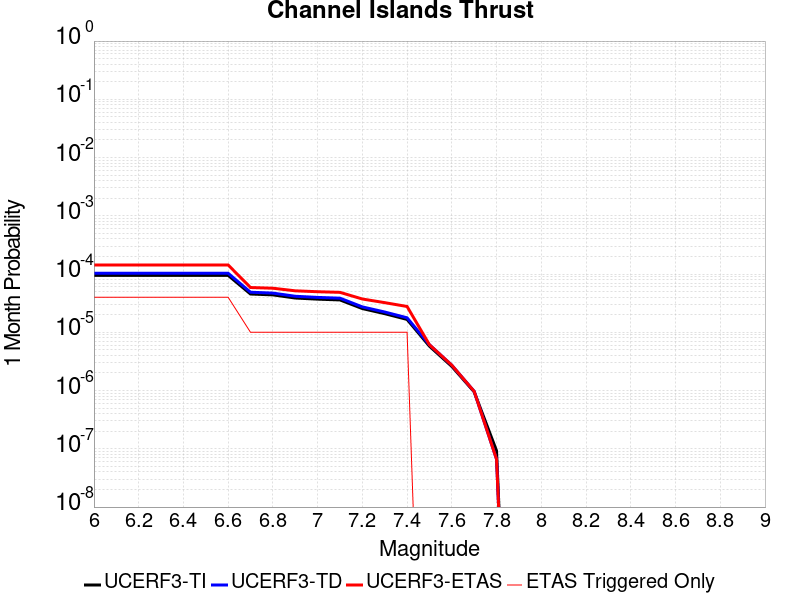 |  |  |

| Magnitude | 1 wk TI Prob | 1 wk TD Prob | 1 wk ETAS Prob | 1 wk ETAS/TD Gain | 1 wk ETAS Triggered Only | 1 mo TI Prob | 1 mo TD Prob | 1 mo ETAS Prob | 1 mo ETAS/TD Gain | 1 mo ETAS Triggered Only | 1 yr TI Prob | 1 yr TD Prob | 1 yr ETAS Prob | 1 yr ETAS/TD Gain | 1 yr ETAS Triggered Only | 10 yr TI Prob | 10 yr TD Prob | 10 yr ETAS Prob | 10 yr ETAS/TD Gain | 10 yr ETAS Triggered Only |
|-----|-----|-----|-----|-----|-----|-----|-----|-----|-----|-----|-----|-----|-----|-----|-----|-----|-----|-----|-----|-----|
| 6.0 | 2.2156251E-5 | 2.4092022E-5 | 2.4092022E-5 | 1.0 | 0.0 | 9.495191E-5 | 1.03248036E-4 | 1.1932355E-4 | 1.155698 | 1.607717E-5 | 0.0011554264 | 0.0012564264 | 0.0013045974 | 1.0383396 | 4.823151E-5 | 0.011494373 | 0.0125038205 | 0.012583201 | 1.0063485 | 8.038585E-5 |
| 6.1 | 2.2156251E-5 | 2.4092022E-5 | 2.4092022E-5 | 1.0 | 0.0 | 9.495191E-5 | 1.03248036E-4 | 1.1932355E-4 | 1.155698 | 1.607717E-5 | 0.0011554264 | 0.0012564264 | 0.0013045974 | 1.0383396 | 4.823151E-5 | 0.011494373 | 0.0125038205 | 0.012583201 | 1.0063485 | 8.038585E-5 |
| 6.2 | 2.2156251E-5 | 2.4092022E-5 | 2.4092022E-5 | 1.0 | 0.0 | 9.495191E-5 | 1.03248036E-4 | 1.1932355E-4 | 1.155698 | 1.607717E-5 | 0.0011554264 | 0.0012564264 | 0.0013045974 | 1.0383396 | 4.823151E-5 | 0.011494373 | 0.0125038205 | 0.012583201 | 1.0063485 | 8.038585E-5 |
| 6.3 | 2.2156251E-5 | 2.4092022E-5 | 2.4092022E-5 | 1.0 | 0.0 | 9.495191E-5 | 1.03248036E-4 | 1.1932355E-4 | 1.155698 | 1.607717E-5 | 0.0011554264 | 0.0012564264 | 0.0013045974 | 1.0383396 | 4.823151E-5 | 0.011494373 | 0.0125038205 | 0.012583201 | 1.0063485 | 8.038585E-5 |
| 6.4 | 2.2156251E-5 | 2.4092022E-5 | 2.4092022E-5 | 1.0 | 0.0 | 9.495191E-5 | 1.03248036E-4 | 1.1932355E-4 | 1.155698 | 1.607717E-5 | 0.0011554264 | 0.0012564264 | 0.0013045974 | 1.0383396 | 4.823151E-5 | 0.011494373 | 0.0125038205 | 0.012583201 | 1.0063485 | 8.038585E-5 |
| 6.5 | 2.2156251E-5 | 2.4092022E-5 | 2.4092022E-5 | 1.0 | 0.0 | 9.495191E-5 | 1.03248036E-4 | 1.1932355E-4 | 1.155698 | 1.607717E-5 | 0.0011554264 | 0.0012564264 | 0.0013045974 | 1.0383396 | 4.823151E-5 | 0.011494373 | 0.0125038205 | 0.012583201 | 1.0063485 | 8.038585E-5 |
| 6.6 | 2.2156251E-5 | 2.4092022E-5 | 2.4092022E-5 | 1.0 | 0.0 | 9.495191E-5 | 1.03248036E-4 | 1.1932355E-4 | 1.155698 | 1.607717E-5 | 0.0011554264 | 0.0012564264 | 0.0013045974 | 1.0383396 | 4.823151E-5 | 0.011494373 | 0.0125038205 | 0.012583201 | 1.0063485 | 8.038585E-5 |
| 6.7 | 1.0601296E-5 | 1.1379544E-5 | 1.1379544E-5 | 1.0 | 0.0 | 4.5433335E-5 | 4.876859E-5 | 4.876859E-5 | 1.0 | 0.0 | 5.5301044E-4 | 5.936007E-4 | 5.936007E-4 | 1.0 | 0.0 | 0.005516363 | 0.005920653 | 0.005920653 | 1.0 | 0.0 |
| 6.8 | 1.0246747E-5 | 1.0996669E-5 | 1.0996669E-5 | 1.0 | 0.0 | 4.391389E-5 | 4.7127756E-5 | 4.7127756E-5 | 1.0 | 0.0 | 5.345204E-4 | 5.7363417E-4 | 5.7363417E-4 | 1.0 | 0.0 | 0.0053323656 | 0.005722025 | 0.005722025 | 1.0 | 0.0 |
| 6.9 | 9.049551E-6 | 9.699645E-6 | 9.699645E-6 | 1.0 | 0.0 | 3.878322E-5 | 4.1569267E-5 | 4.1569267E-5 | 1.0 | 0.0 | 4.7208337E-4 | 5.059924E-4 | 5.059924E-4 | 1.0 | 0.0 | 0.0047108172 | 0.0050488203 | 0.0050488203 | 1.0 | 0.0 |
| 7.0 | 8.6542195E-6 | 9.274603E-6 | 9.274603E-6 | 1.0 | 0.0 | 3.7088983E-5 | 3.9747716E-5 | 3.9747716E-5 | 1.0 | 0.0 | 4.5146482E-4 | 4.8382508E-4 | 4.8382508E-4 | 1.0 | 0.0 | 0.004505487 | 0.004828129 | 0.004828129 | 1.0 | 0.0 |
| 7.1 | 8.391028E-6 | 8.992924E-6 | 8.992924E-6 | 1.0 | 0.0 | 3.5961057E-5 | 3.854056E-5 | 3.854056E-5 | 1.0 | 0.0 | 4.3773788E-4 | 4.6913436E-4 | 4.6913436E-4 | 1.0 | 0.0 | 0.004368766 | 0.0046818503 | 0.0046818503 | 1.0 | 0.0 |
| 7.2 | 5.965188E-6 | 6.3716952E-6 | 6.3716952E-6 | 1.0 | 0.0 | 2.556484E-5 | 2.7306982E-5 | 2.7306982E-5 | 1.0 | 0.0 | 3.1120746E-4 | 3.3241234E-4 | 3.3241234E-4 | 1.0 | 0.0 | 0.00310772 | 0.0033192092 | 0.0033192092 | 1.0 | 0.0 |
| 7.3 | 4.877518E-6 | 5.2060063E-6 | 5.2060063E-6 | 1.0 | 0.0 | 2.0903482E-5 | 2.2311267E-5 | 2.2311267E-5 | 1.0 | 0.0 | 2.5447016E-4 | 2.716063E-4 | 2.716063E-4 | 1.0 | 0.0 | 0.0025417898 | 0.0027127895 | 0.0027127895 | 1.0 | 0.0 |
| 7.4 | 3.8829853E-6 | 4.141863E-6 | 4.141863E-6 | 1.0 | 0.0 | 1.664126E-5 | 1.7750723E-5 | 1.7750723E-5 | 1.0 | 0.0 | 2.0258849E-4 | 2.1609402E-4 | 2.1609402E-4 | 1.0 | 0.0 | 0.002024039 | 0.0021588807 | 0.0021588807 | 1.0 | 0.0 |
| 7.5 | 1.3489616E-6 | 1.4277903E-6 | 1.4277903E-6 | 1.0 | 0.0 | 5.7812517E-6 | 6.119087E-6 | 6.119087E-6 | 1.0 | 0.0 | 7.038446E-5 | 7.449738E-5 | 7.449738E-5 | 1.0 | 0.0 | 7.036218E-4 | 7.44728E-4 | 7.44728E-4 | 1.0 | 0.0 |
| 7.6 | 6.058192E-7 | 6.353778E-7 | 6.353778E-7 | 1.0 | 0.0 | 2.5963652E-6 | 2.7230449E-6 | 2.7230449E-6 | 1.0 | 0.0 | 3.161029E-5 | 3.3152584E-5 | 3.3152584E-5 | 1.0 | 0.0 | 3.1605794E-4 | 3.31478E-4 | 3.31478E-4 | 1.0 | 0.0 |
| 7.7 | 2.2170494E-7 | 2.2607902E-7 | 2.2607902E-7 | 1.0 | 0.0 | 9.5016367E-7 | 9.689098E-7 | 9.689098E-7 | 1.0 | 0.0 | 1.1568181E-5 | 1.1796425E-5 | 1.1796425E-5 | 1.0 | 0.0 | 1.1567579E-4 | 1.1795909E-4 | 1.1795909E-4 | 1.0 | 0.0 |
| 7.8 | 2.1613102E-8 | 1.5466682E-8 | 1.5466682E-8 | 1.0 | 0.0 | 9.262757E-8 | 6.628578E-8 | 6.628578E-8 | 1.0 | 0.0 | 1.1277401E-6 | 8.070291E-7 | 8.070291E-7 | 1.0 | 0.0 | 1.1277344E-5 | 8.070269E-6 | 8.070269E-6 | 1.0 | 0.0 |

## Dry Mountain
*[(top)](#table-of-contents)*

| 1 Week | 1 Month | 1 Year | 10 Year |
|-----|-----|-----|-----|
|  |  | 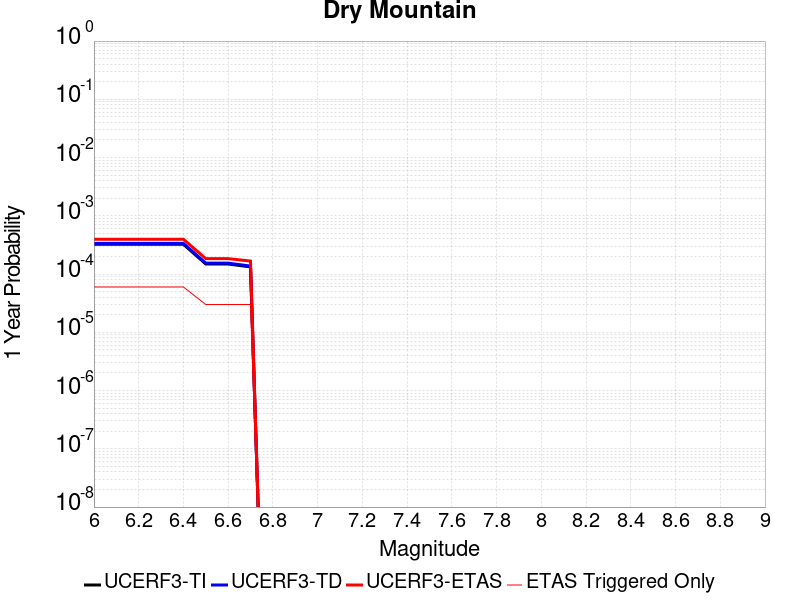 |  |

| Magnitude | 1 wk TI Prob | 1 wk TD Prob | 1 wk ETAS Prob | 1 wk ETAS/TD Gain | 1 wk ETAS Triggered Only | 1 mo TI Prob | 1 mo TD Prob | 1 mo ETAS Prob | 1 mo ETAS/TD Gain | 1 mo ETAS Triggered Only | 1 yr TI Prob | 1 yr TD Prob | 1 yr ETAS Prob | 1 yr ETAS/TD Gain | 1 yr ETAS Triggered Only | 10 yr TI Prob | 10 yr TD Prob | 10 yr ETAS Prob | 10 yr ETAS/TD Gain | 10 yr ETAS Triggered Only |
|-----|-----|-----|-----|-----|-----|-----|-----|-----|-----|-----|-----|-----|-----|-----|-----|-----|-----|-----|-----|-----|
| 6.0 | 6.222801E-6 | 6.439381E-6 | 3.8593516E-5 | 5.9933577 | 3.215434E-5 | 2.6668875E-5 | 2.7597147E-5 | 5.97506E-5 | 2.1651006 | 3.215434E-5 | 3.2464517E-4 | 3.3595937E-4 | 3.6810292E-4 | 1.0956769 | 3.215434E-5 | 0.0032417132 | 0.0033560768 | 0.0034361929 | 1.0238719 | 8.038585E-5 |
| 6.1 | 6.222801E-6 | 6.439381E-6 | 3.8593516E-5 | 5.9933577 | 3.215434E-5 | 2.6668875E-5 | 2.7597147E-5 | 5.97506E-5 | 2.1651006 | 3.215434E-5 | 3.2464517E-4 | 3.3595937E-4 | 3.6810292E-4 | 1.0956769 | 3.215434E-5 | 0.0032417132 | 0.0033560768 | 0.0034361929 | 1.0238719 | 8.038585E-5 |
| 6.2 | 6.222801E-6 | 6.439381E-6 | 3.8593516E-5 | 5.9933577 | 3.215434E-5 | 2.6668875E-5 | 2.7597147E-5 | 5.97506E-5 | 2.1651006 | 3.215434E-5 | 3.2464517E-4 | 3.3595937E-4 | 3.6810292E-4 | 1.0956769 | 3.215434E-5 | 0.0032417132 | 0.0033560768 | 0.0034361929 | 1.0238719 | 8.038585E-5 |
| 6.3 | 6.222801E-6 | 6.439381E-6 | 3.8593516E-5 | 5.9933577 | 3.215434E-5 | 2.6668875E-5 | 2.7597147E-5 | 5.97506E-5 | 2.1651006 | 3.215434E-5 | 3.2464517E-4 | 3.3595937E-4 | 3.6810292E-4 | 1.0956769 | 3.215434E-5 | 0.0032417132 | 0.0033560768 | 0.0034361929 | 1.0238719 | 8.038585E-5 |
| 6.4 | 6.222801E-6 | 6.439381E-6 | 3.8593516E-5 | 5.9933577 | 3.215434E-5 | 2.6668875E-5 | 2.7597147E-5 | 5.97506E-5 | 2.1651006 | 3.215434E-5 | 3.2464517E-4 | 3.3595937E-4 | 3.6810292E-4 | 1.0956769 | 3.215434E-5 | 0.0032417132 | 0.0033560768 | 0.0034361929 | 1.0238719 | 8.038585E-5 |
| 6.5 | 2.8528623E-6 | 2.9521684E-6 | 2.9521684E-6 | 1.0 | 0.0 | 1.22264955E-5 | 1.2652138E-5 | 1.2652138E-5 | 1.0 | 0.0 | 1.4884741E-4 | 1.540376E-4 | 1.540376E-4 | 1.0 | 0.0 | 0.0014874774 | 0.0015401616 | 0.0015722665 | 1.020845 | 3.215434E-5 |
| 6.6 | 2.8528623E-6 | 2.9521684E-6 | 2.9521684E-6 | 1.0 | 0.0 | 1.22264955E-5 | 1.2652138E-5 | 1.2652138E-5 | 1.0 | 0.0 | 1.4884741E-4 | 1.540376E-4 | 1.540376E-4 | 1.0 | 0.0 | 0.0014874774 | 0.0015401616 | 0.0015722665 | 1.020845 | 3.215434E-5 |
| 6.7 | 2.541E-6 | 2.6293578E-6 | 2.6293578E-6 | 1.0 | 0.0 | 1.0889954E-5 | 1.1268677E-5 | 1.1268677E-5 | 1.0 | 0.0 | 1.3257713E-4 | 1.3719614E-4 | 1.3719614E-4 | 1.0 | 0.0 | 0.0013249806 | 0.0013719613 | 0.0014040716 | 1.0234046 | 3.215434E-5 |

## Santa Ynez River
*[(top)](#table-of-contents)*

| 1 Week | 1 Month | 1 Year | 10 Year |
|-----|-----|-----|-----|
|  |  |  |  |

| Magnitude | 1 wk TI Prob | 1 wk TD Prob | 1 wk ETAS Prob | 1 wk ETAS/TD Gain | 1 wk ETAS Triggered Only | 1 mo TI Prob | 1 mo TD Prob | 1 mo ETAS Prob | 1 mo ETAS/TD Gain | 1 mo ETAS Triggered Only | 1 yr TI Prob | 1 yr TD Prob | 1 yr ETAS Prob | 1 yr ETAS/TD Gain | 1 yr ETAS Triggered Only | 10 yr TI Prob | 10 yr TD Prob | 10 yr ETAS Prob | 10 yr ETAS/TD Gain | 10 yr ETAS Triggered Only |
|-----|-----|-----|-----|-----|-----|-----|-----|-----|-----|-----|-----|-----|-----|-----|-----|-----|-----|-----|-----|-----|
| 6.0 | 1.6396456E-5 | 1.7209435E-5 | 4.936322E-5 | 2.8683813 | 3.215434E-5 | 7.026863E-5 | 7.375284E-5 | 1.0590481E-4 | 1.4359422 | 3.215434E-5 | 8.551848E-4 | 8.976064E-4 | 9.457946E-4 | 1.0536852 | 4.823151E-5 | 0.0085190125 | 0.008943358 | 0.009007092 | 1.0071263 | 6.430868E-5 |
| 6.1 | 1.6396456E-5 | 1.7209435E-5 | 4.936322E-5 | 2.8683813 | 3.215434E-5 | 7.026863E-5 | 7.375284E-5 | 1.0590481E-4 | 1.4359422 | 3.215434E-5 | 8.551848E-4 | 8.976064E-4 | 9.457946E-4 | 1.0536852 | 4.823151E-5 | 0.0085190125 | 0.008943358 | 0.009007092 | 1.0071263 | 6.430868E-5 |
| 6.2 | 1.6396456E-5 | 1.7209435E-5 | 4.936322E-5 | 2.8683813 | 3.215434E-5 | 7.026863E-5 | 7.375284E-5 | 1.0590481E-4 | 1.4359422 | 3.215434E-5 | 8.551848E-4 | 8.976064E-4 | 9.457946E-4 | 1.0536852 | 4.823151E-5 | 0.0085190125 | 0.008943358 | 0.009007092 | 1.0071263 | 6.430868E-5 |
| 6.3 | 9.736976E-6 | 1.012233E-5 | 1.012233E-5 | 1.0 | 0.0 | 4.172923E-5 | 4.338072E-5 | 4.338072E-5 | 1.0 | 0.0 | 5.0793495E-4 | 5.280373E-4 | 5.4410595E-4 | 1.0304309 | 1.607717E-5 | 0.005067755 | 0.005268332 | 0.005300317 | 1.0060712 | 3.215434E-5 |
| 6.4 | 9.736976E-6 | 1.012233E-5 | 1.012233E-5 | 1.0 | 0.0 | 4.172923E-5 | 4.338072E-5 | 4.338072E-5 | 1.0 | 0.0 | 5.0793495E-4 | 5.280373E-4 | 5.4410595E-4 | 1.0304309 | 1.607717E-5 | 0.005067755 | 0.005268332 | 0.005300317 | 1.0060712 | 3.215434E-5 |
| 6.5 | 7.081964E-6 | 7.3298966E-6 | 7.3298966E-6 | 1.0 | 0.0 | 3.035092E-5 | 3.1413474E-5 | 3.1413474E-5 | 1.0 | 0.0 | 3.694598E-4 | 3.8239348E-4 | 3.984645E-4 | 1.0420275 | 1.607717E-5 | 0.0036884616 | 0.0038175168 | 0.0038495483 | 1.0083907 | 3.215434E-5 |
| 6.6 | 5.873247E-6 | 6.059743E-6 | 6.059743E-6 | 1.0 | 0.0 | 2.5170815E-5 | 2.5970074E-5 | 2.5970074E-5 | 1.0 | 0.0 | 3.064116E-4 | 3.1614062E-4 | 3.3221272E-4 | 1.0508385 | 1.607717E-5 | 0.0030598943 | 0.0031569963 | 0.0031890492 | 1.0101529 | 3.215434E-5 |
| 6.7 | 4.973277E-6 | 5.115901E-6 | 5.115901E-6 | 1.0 | 0.0 | 2.1313872E-5 | 2.1925109E-5 | 2.1925109E-5 | 1.0 | 0.0 | 2.5946548E-4 | 2.66906E-4 | 2.66906E-4 | 1.0 | 0.0 | 0.0025916274 | 0.0026659032 | 0.0026979719 | 1.0120292 | 3.215434E-5 |
| 6.8 | 4.396492E-6 | 4.5109778E-6 | 4.5109778E-6 | 1.0 | 0.0 | 1.884197E-5 | 1.9332621E-5 | 1.9332621E-5 | 1.0 | 0.0 | 2.2937685E-4 | 2.3534958E-4 | 2.3534958E-4 | 1.0 | 0.0 | 0.0022914023 | 0.0023510386 | 0.0023831176 | 1.0136445 | 3.215434E-5 |
| 6.9 | 3.5255632E-6 | 3.6013332E-6 | 3.6013332E-6 | 1.0 | 0.0 | 1.5109469E-5 | 1.5434196E-5 | 1.5434196E-5 | 1.0 | 0.0 | 1.8394225E-4 | 1.8789528E-4 | 1.8789528E-4 | 1.0 | 0.0 | 0.0018379007 | 0.0018773803 | 0.0018934273 | 1.0085475 | 1.607717E-5 |
| 7.0 | 3.211603E-6 | 3.273654E-6 | 3.273654E-6 | 1.0 | 0.0 | 1.376394E-5 | 1.4029872E-5 | 1.4029872E-5 | 1.0 | 0.0 | 1.6756308E-4 | 1.7080043E-4 | 1.7080043E-4 | 1.0 | 0.0 | 0.0016743679 | 0.0017067058 | 0.0017227555 | 1.009404 | 1.607717E-5 |
| 7.1 | 2.5094619E-6 | 2.5409204E-6 | 2.5409204E-6 | 1.0 | 0.0 | 1.0754793E-5 | 1.0889614E-5 | 1.0889614E-5 | 1.0 | 0.0 | 1.3093173E-4 | 1.3257304E-4 | 1.3257304E-4 | 1.0 | 0.0 | 0.0013085462 | 0.0013249456 | 0.0013249456 | 1.0 | 0.0 |
| 7.2 | 2.0515774E-6 | 2.0619375E-6 | 2.0619375E-6 | 1.0 | 0.0 | 8.792445E-6 | 8.836846E-6 | 8.836846E-6 | 1.0 | 0.0 | 1.0704277E-4 | 1.0758333E-4 | 1.0758333E-4 | 1.0 | 0.0 | 0.0010699122 | 0.0010753168 | 0.0010753168 | 1.0 | 0.0 |
| 7.3 | 1.6845745E-6 | 1.6773907E-6 | 1.6773907E-6 | 1.0 | 0.0 | 7.219585E-6 | 7.1887976E-6 | 7.1887976E-6 | 1.0 | 0.0 | 8.78949E-5 | 8.752012E-5 | 8.752012E-5 | 1.0 | 0.0 | 8.7860145E-4 | 8.7485946E-4 | 8.7485946E-4 | 1.0 | 0.0 |
| 7.4 | 1.3600285E-6 | 1.3333357E-6 | 1.3333357E-6 | 1.0 | 0.0 | 5.82868E-6 | 5.714284E-6 | 5.714284E-6 | 1.0 | 0.0 | 7.096187E-5 | 6.956921E-5 | 6.956921E-5 | 1.0 | 0.0 | 7.0939213E-4 | 6.954765E-4 | 6.954765E-4 | 1.0 | 0.0 |
| 7.5 | 9.735342E-7 | 9.290103E-7 | 9.290103E-7 | 1.0 | 0.0 | 4.172283E-6 | 3.9814668E-6 | 3.9814668E-6 | 1.0 | 0.0 | 5.079636E-5 | 4.8473295E-5 | 4.8473295E-5 | 1.0 | 0.0 | 5.0784746E-4 | 4.8462892E-4 | 4.8462892E-4 | 1.0 | 0.0 |
| 7.6 | 5.067187E-7 | 4.77857E-7 | 4.77857E-7 | 1.0 | 0.0 | 2.1716498E-6 | 2.047957E-6 | 2.047957E-6 | 1.0 | 0.0 | 2.6439517E-5 | 2.4933597E-5 | 2.4933597E-5 | 1.0 | 0.0 | 2.643637E-4 | 2.4930874E-4 | 2.4930874E-4 | 1.0 | 0.0 |
| 7.7 | 2.769089E-7 | 2.5759124E-7 | 2.5759124E-7 | 1.0 | 0.0 | 1.1867519E-6 | 1.1039621E-6 | 1.1039621E-6 | 1.0 | 0.0 | 1.4448608E-5 | 1.34406555E-5 | 1.34406555E-5 | 1.0 | 0.0 | 1.444767E-4 | 1.3439846E-4 | 1.3439846E-4 | 1.0 | 0.0 |
| 7.8 | 1.7044663E-7 | 1.5449015E-7 | 1.5449015E-7 | 1.0 | 0.0 | 7.3048534E-7 | 6.621005E-7 | 6.621005E-7 | 1.0 | 0.0 | 8.893623E-6 | 8.061043E-6 | 8.061043E-6 | 1.0 | 0.0 | 8.893267E-5 | 8.060753E-5 | 8.060753E-5 | 1.0 | 0.0 |
| 7.9 | 4.8344287E-8 | 4.0910923E-8 | 4.0910923E-8 | 1.0 | 0.0 | 2.0718979E-7 | 1.7533252E-7 | 1.7533252E-7 | 1.0 | 0.0 | 2.5225327E-6 | 2.1346711E-6 | 2.1346711E-6 | 1.0 | 0.0 | 2.5225041E-5 | 2.1346512E-5 | 2.1346512E-5 | 1.0 | 0.0 |

## San Pedro Basin
*[(top)](#table-of-contents)*

| 1 Week | 1 Month | 1 Year | 10 Year |
|-----|-----|-----|-----|
|  |  |  |  |

| Magnitude | 1 wk TI Prob | 1 wk TD Prob | 1 wk ETAS Prob | 1 wk ETAS/TD Gain | 1 wk ETAS Triggered Only | 1 mo TI Prob | 1 mo TD Prob | 1 mo ETAS Prob | 1 mo ETAS/TD Gain | 1 mo ETAS Triggered Only | 1 yr TI Prob | 1 yr TD Prob | 1 yr ETAS Prob | 1 yr ETAS/TD Gain | 1 yr ETAS Triggered Only | 10 yr TI Prob | 10 yr TD Prob | 10 yr ETAS Prob | 10 yr ETAS/TD Gain | 10 yr ETAS Triggered Only |
|-----|-----|-----|-----|-----|-----|-----|-----|-----|-----|-----|-----|-----|-----|-----|-----|-----|-----|-----|-----|-----|
| 6.0 | 5.3449043E-5 | 6.336954E-5 | 7.944569E-5 | 1.2536889 | 1.607717E-5 | 2.2904722E-4 | 2.715589E-4 | 2.8763173E-4 | 1.0591872 | 1.607717E-5 | 0.0027850836 | 0.0033018254 | 0.0033178495 | 1.0048531 | 1.607717E-5 | 0.027504366 | 0.03258945 | 0.032667216 | 1.0023862 | 8.038585E-5 |
| 6.1 | 5.3449043E-5 | 6.336954E-5 | 7.944569E-5 | 1.2536889 | 1.607717E-5 | 2.2904722E-4 | 2.715589E-4 | 2.8763173E-4 | 1.0591872 | 1.607717E-5 | 0.0027850836 | 0.0033018254 | 0.0033178495 | 1.0048531 | 1.607717E-5 | 0.027504366 | 0.03258945 | 0.032667216 | 1.0023862 | 8.038585E-5 |
| 6.2 | 2.3189454E-5 | 2.6642796E-5 | 4.2719537E-5 | 1.603418 | 1.607717E-5 | 9.9379584E-5 | 1.14178685E-4 | 1.3025402E-4 | 1.140791 | 1.607717E-5 | 0.0012092749 | 0.0013892864 | 0.0014053412 | 1.0115561 | 1.607717E-5 | 0.012027155 | 0.013810883 | 0.0138743045 | 1.0045921 | 6.430868E-5 |
| 6.3 | 2.3189454E-5 | 2.6642796E-5 | 4.2719537E-5 | 1.603418 | 1.607717E-5 | 9.9379584E-5 | 1.14178685E-4 | 1.3025402E-4 | 1.140791 | 1.607717E-5 | 0.0012092749 | 0.0013892864 | 0.0014053412 | 1.0115561 | 1.607717E-5 | 0.012027155 | 0.013810883 | 0.0138743045 | 1.0045921 | 6.430868E-5 |
| 6.4 | 1.966056E-5 | 2.2463413E-5 | 3.8540224E-5 | 1.7156886 | 1.607717E-5 | 8.425682E-5 | 9.626844E-5 | 1.1234407E-4 | 1.1669874 | 1.607717E-5 | 0.001025344 | 0.0011714783 | 0.0011875366 | 1.0137078 | 1.607717E-5 | 0.010206259 | 0.011657117 | 0.011704786 | 1.0040892 | 4.823151E-5 |
| 6.5 | 1.7342953E-5 | 1.9745148E-5 | 3.5822002E-5 | 1.8142179 | 1.607717E-5 | 7.4324824E-5 | 8.4619525E-5 | 1.0069534E-4 | 1.1899775 | 1.607717E-5 | 9.04529E-4 | 0.0010297928 | 0.0010458534 | 1.0155959 | 1.607717E-5 | 0.009008561 | 0.010253931 | 0.010301668 | 1.0046555 | 4.823151E-5 |
| 6.6 | 1.439804E-5 | 1.6322716E-5 | 3.2399625E-5 | 1.9849408 | 1.607717E-5 | 6.170443E-5 | 6.99528E-5 | 8.602885E-5 | 1.2298127 | 1.607717E-5 | 7.509924E-4 | 8.513747E-4 | 8.6743815E-4 | 1.0188677 | 1.607717E-5 | 0.0074845953 | 0.008484332 | 0.008516214 | 1.0037577 | 3.215434E-5 |
| 6.7 | 1.2634884E-5 | 1.4285297E-5 | 1.4285297E-5 | 1.0 | 0.0 | 5.414838E-5 | 6.1221435E-5 | 6.1221435E-5 | 1.0 | 0.0 | 6.590571E-4 | 7.4514654E-4 | 7.4514654E-4 | 1.0 | 0.0 | 0.006571059 | 0.007429501 | 0.007445459 | 1.0021479 | 1.607717E-5 |
| 6.8 | 1.146091E-5 | 1.2933192E-5 | 1.2933192E-5 | 1.0 | 0.0 | 4.911726E-5 | 5.5426954E-5 | 5.5426954E-5 | 1.0 | 0.0 | 5.9783855E-4 | 6.7464396E-4 | 6.7464396E-4 | 1.0 | 0.0 | 0.0059623276 | 0.006728899 | 0.006744868 | 1.0023732 | 1.607717E-5 |
| 6.9 | 9.109035E-6 | 1.0235011E-5 | 1.0235011E-5 | 1.0 | 0.0 | 3.9038136E-5 | 4.3863754E-5 | 4.3863754E-5 | 1.0 | 0.0 | 4.7518566E-4 | 5.3393835E-4 | 5.3393835E-4 | 1.0 | 0.0 | 0.0047417083 | 0.005329309 | 0.0053453003 | 1.0030006 | 1.607717E-5 |
| 7.0 | 5.9351028E-6 | 6.583964E-6 | 6.583964E-6 | 1.0 | 0.0 | 2.5435906E-5 | 2.8216817E-5 | 2.8216817E-5 | 1.0 | 0.0 | 3.0963816E-4 | 3.435092E-4 | 3.435092E-4 | 1.0 | 0.0 | 0.0030920706 | 0.0034320992 | 0.0034481212 | 1.0046682 | 1.607717E-5 |
| 7.1 | 2.1557585E-6 | 2.209648E-6 | 2.209648E-6 | 1.0 | 0.0 | 9.238933E-6 | 9.469887E-6 | 9.469887E-6 | 1.0 | 0.0 | 1.1247819E-4 | 1.1528993E-4 | 1.1528993E-4 | 1.0 | 0.0 | 0.0011242128 | 0.0011523166 | 0.0011523166 | 1.0 | 0.0 |
| 7.2 | 2.1251979E-6 | 2.1779945E-6 | 2.1779945E-6 | 1.0 | 0.0 | 9.107958E-6 | 9.334229E-6 | 9.334229E-6 | 1.0 | 0.0 | 1.1088375E-4 | 1.1363847E-4 | 1.1363847E-4 | 1.0 | 0.0 | 0.0011082845 | 0.0011358189 | 0.0011358189 | 1.0 | 0.0 |
| 7.3 | 1.7145798E-6 | 1.7442874E-6 | 1.7442874E-6 | 1.0 | 0.0 | 7.3481783E-6 | 7.4754967E-6 | 7.4754967E-6 | 1.0 | 0.0 | 8.94604E-5 | 9.1010465E-5 | 9.1010465E-5 | 1.0 | 0.0 | 8.9424395E-4 | 9.0974104E-4 | 9.0974104E-4 | 1.0 | 0.0 |
| 7.4 | 1.4467993E-6 | 1.4641868E-6 | 1.4641868E-6 | 1.0 | 0.0 | 6.200554E-6 | 6.2750714E-6 | 6.2750714E-6 | 1.0 | 0.0 | 7.548913E-5 | 7.639639E-5 | 7.639639E-5 | 1.0 | 0.0 | 7.546349E-4 | 7.6370855E-4 | 7.6370855E-4 | 1.0 | 0.0 |
| 7.5 | 1.2803735E-6 | 1.2931497E-6 | 1.2931497E-6 | 1.0 | 0.0 | 5.487303E-6 | 5.5420587E-6 | 5.5420587E-6 | 1.0 | 0.0 | 6.680587E-5 | 6.7472545E-5 | 6.7472545E-5 | 1.0 | 0.0 | 6.678579E-4 | 6.7452766E-4 | 6.7452766E-4 | 1.0 | 0.0 |
| 7.6 | 6.755009E-7 | 6.769465E-7 | 6.769465E-7 | 1.0 | 0.0 | 2.8950008E-6 | 2.9011965E-6 | 2.9011965E-6 | 1.0 | 0.0 | 3.5246063E-5 | 3.5321555E-5 | 3.5321555E-5 | 1.0 | 0.0 | 3.5240475E-4 | 3.5316512E-4 | 3.5316512E-4 | 1.0 | 0.0 |
| 7.7 | 6.211885E-8 | 4.569953E-8 | 4.569953E-8 | 1.0 | 0.0 | 2.6622362E-7 | 1.9585512E-7 | 1.9585512E-7 | 1.0 | 0.0 | 3.2412677E-6 | 2.3845337E-6 | 2.3845337E-6 | 1.0 | 0.0 | 3.2412205E-5 | 2.3845101E-5 | 2.3845101E-5 | 1.0 | 0.0 |
| 7.8 | 2.6580573E-9 | 1.5138163E-9 | 1.5138163E-9 | 1.0 | 0.0 | 1.1391674E-8 | 6.487784E-9 | 6.487784E-9 | 1.0 | 0.0 | 1.3869362E-7 | 7.898877E-8 | 7.898877E-8 | 1.0 | 0.0 | 1.3869354E-6 | 7.898877E-7 | 7.898877E-7 | 1.0 | 0.0 |

## Oak Ridge (Onshore)
*[(top)](#table-of-contents)*

| 1 Week | 1 Month | 1 Year | 10 Year |
|-----|-----|-----|-----|
|  |  |  |  |

| Magnitude | 1 wk TI Prob | 1 wk TD Prob | 1 wk ETAS Prob | 1 wk ETAS/TD Gain | 1 wk ETAS Triggered Only | 1 mo TI Prob | 1 mo TD Prob | 1 mo ETAS Prob | 1 mo ETAS/TD Gain | 1 mo ETAS Triggered Only | 1 yr TI Prob | 1 yr TD Prob | 1 yr ETAS Prob | 1 yr ETAS/TD Gain | 1 yr ETAS Triggered Only | 10 yr TI Prob | 10 yr TD Prob | 10 yr ETAS Prob | 10 yr ETAS/TD Gain | 10 yr ETAS Triggered Only |
|-----|-----|-----|-----|-----|-----|-----|-----|-----|-----|-----|-----|-----|-----|-----|-----|-----|-----|-----|-----|-----|
| 6.0 | 3.155064E-5 | 2.9525974E-5 | 6.167936E-5 | 2.0889866 | 3.215434E-5 | 1.3521002E-4 | 1.2653397E-4 | 1.5868424E-4 | 1.2540841 | 3.215434E-5 | 0.001644939 | 0.0015395004 | 0.0015876577 | 1.0312811 | 4.823151E-5 | 0.01632816 | 0.015292859 | 0.015372016 | 1.0051761 | 8.038585E-5 |
| 6.1 | 3.155064E-5 | 2.9525974E-5 | 6.167936E-5 | 2.0889866 | 3.215434E-5 | 1.3521002E-4 | 1.2653397E-4 | 1.5868424E-4 | 1.2540841 | 3.215434E-5 | 0.001644939 | 0.0015395004 | 0.0015876577 | 1.0312811 | 4.823151E-5 | 0.01632816 | 0.015292859 | 0.015372016 | 1.0051761 | 8.038585E-5 |
| 6.2 | 3.155064E-5 | 2.9525974E-5 | 6.167936E-5 | 2.0889866 | 3.215434E-5 | 1.3521002E-4 | 1.2653397E-4 | 1.5868424E-4 | 1.2540841 | 3.215434E-5 | 0.001644939 | 0.0015395004 | 0.0015876577 | 1.0312811 | 4.823151E-5 | 0.01632816 | 0.015292859 | 0.015372016 | 1.0051761 | 8.038585E-5 |
| 6.3 | 3.155064E-5 | 2.9525974E-5 | 6.167936E-5 | 2.0889866 | 3.215434E-5 | 1.3521002E-4 | 1.2653397E-4 | 1.5868424E-4 | 1.2540841 | 3.215434E-5 | 0.001644939 | 0.0015395004 | 0.0015876577 | 1.0312811 | 4.823151E-5 | 0.01632816 | 0.015292859 | 0.015372016 | 1.0051761 | 8.038585E-5 |
| 6.4 | 3.155064E-5 | 2.9525974E-5 | 6.167936E-5 | 2.0889866 | 3.215434E-5 | 1.3521002E-4 | 1.2653397E-4 | 1.5868424E-4 | 1.2540841 | 3.215434E-5 | 0.001644939 | 0.0015395004 | 0.0015876577 | 1.0312811 | 4.823151E-5 | 0.01632816 | 0.015292859 | 0.015372016 | 1.0051761 | 8.038585E-5 |
| 6.5 | 3.155064E-5 | 2.9525974E-5 | 6.167936E-5 | 2.0889866 | 3.215434E-5 | 1.3521002E-4 | 1.2653397E-4 | 1.5868424E-4 | 1.2540841 | 3.215434E-5 | 0.001644939 | 0.0015395004 | 0.0015876577 | 1.0312811 | 4.823151E-5 | 0.01632816 | 0.015292859 | 0.015372016 | 1.0051761 | 8.038585E-5 |
| 6.6 | 3.155064E-5 | 2.9525974E-5 | 6.167936E-5 | 2.0889866 | 3.215434E-5 | 1.3521002E-4 | 1.2653397E-4 | 1.5868424E-4 | 1.2540841 | 3.215434E-5 | 0.001644939 | 0.0015395004 | 0.0015876577 | 1.0312811 | 4.823151E-5 | 0.01632816 | 0.015292859 | 0.015372016 | 1.0051761 | 8.038585E-5 |
| 6.7 | 3.098897E-5 | 2.8864175E-5 | 6.101759E-5 | 2.1139557 | 3.215434E-5 | 1.328031E-4 | 1.2369796E-4 | 1.5584832E-4 | 1.2599102 | 3.215434E-5 | 0.0016156785 | 0.0015050198 | 0.0015531788 | 1.0319989 | 4.823151E-5 | 0.016039822 | 0.014952714 | 0.015031897 | 1.0052956 | 8.038585E-5 |
| 6.8 | 3.0449872E-5 | 2.8239372E-5 | 6.0392806E-5 | 2.138603 | 3.215434E-5 | 1.3049292E-4 | 1.2102048E-4 | 1.5317093E-4 | 1.2656612 | 3.215434E-5 | 0.0015875935 | 0.0014724657 | 0.0015206261 | 1.0327073 | 4.823151E-5 | 0.015762992 | 0.014631462 | 0.014710671 | 1.0054137 | 8.038585E-5 |
| 6.9 | 2.697928E-5 | 2.4219773E-5 | 5.6373334E-5 | 2.327575 | 3.215434E-5 | 1.15620365E-4 | 1.0379502E-4 | 1.3594603E-4 | 1.3097547 | 3.215434E-5 | 0.0014067689 | 0.0012629933 | 0.0013111639 | 1.03814 | 4.823151E-5 | 0.0139789665 | 0.01256087 | 0.012608496 | 1.0037916 | 4.823151E-5 |
| 7.0 | 2.4893961E-5 | 2.1862043E-5 | 5.401568E-5 | 2.4707518 | 3.215434E-5 | 1.0668404E-4 | 9.3691204E-5 | 1.2584253E-4 | 1.3431628 | 3.215434E-5 | 0.0012981043 | 0.0011401111 | 0.0011882877 | 1.042256 | 4.823151E-5 | 0.012905477 | 0.011344905 | 0.01139259 | 1.0042032 | 4.823151E-5 |
| 7.1 | 2.0945363E-5 | 1.7354487E-5 | 3.3431377E-5 | 1.9263824 | 1.607717E-5 | 8.976275E-5 | 7.437428E-5 | 9.045025E-5 | 1.2161497 | 1.607717E-5 | 0.0010923136 | 9.051354E-4 | 9.3726063E-4 | 1.0354922 | 3.215434E-5 | 0.0108696 | 0.009015423 | 0.0090472875 | 1.0035344 | 3.215434E-5 |
| 7.2 | 2.0439404E-5 | 1.6809423E-5 | 3.2886324E-5 | 1.9564219 | 1.607717E-5 | 8.7594504E-5 | 7.203843E-5 | 8.811444E-5 | 1.2231588 | 1.607717E-5 | 0.0010659413 | 8.767196E-4 | 9.0884574E-4 | 1.0366436 | 3.215434E-5 | 0.010608427 | 0.008733526 | 0.008765399 | 1.0036496 | 3.215434E-5 |
| 7.3 | 1.8463334E-5 | 1.5381811E-5 | 3.1458734E-5 | 2.0451906 | 1.607717E-5 | 7.912617E-5 | 6.59204E-5 | 8.199651E-5 | 1.2438716 | 1.607717E-5 | 9.6293533E-4 | 8.0228975E-4 | 8.344183E-4 | 1.0400461 | 3.215434E-5 | 0.009587734 | 0.007994797 | 0.008026694 | 1.0039897 | 3.215434E-5 |
| 7.4 | 1.763139E-5 | 1.451684E-5 | 3.0593776E-5 | 2.1074681 | 1.607717E-5 | 7.556091E-5 | 6.221356E-5 | 7.828973E-5 | 1.258403 | 1.607717E-5 | 9.1956573E-4 | 7.571909E-4 | 7.893209E-4 | 1.0424331 | 3.215434E-5 | 0.009157699 | 0.007546914 | 0.007578825 | 1.0042285 | 3.215434E-5 |
| 7.5 | 1.3594944E-5 | 1.1163356E-5 | 2.7240347E-5 | 2.4401574 | 1.607717E-5 | 5.8262744E-5 | 4.784209E-5 | 6.3918495E-5 | 1.3360305 | 1.607717E-5 | 7.0911803E-4 | 5.8232434E-4 | 6.144599E-4 | 1.0551851 | 3.215434E-5 | 0.007068595 | 0.0058082556 | 0.0058402233 | 1.0055038 | 3.215434E-5 |
| 7.6 | 6.9889534E-6 | 5.6367144E-6 | 2.1713795E-5 | 3.8522077 | 1.607717E-5 | 2.9952313E-5 | 2.4157125E-5 | 4.0233906E-5 | 1.6655089 | 1.607717E-5 | 3.646084E-4 | 2.9407372E-4 | 3.1014616E-4 | 1.0546545 | 1.607717E-5 | 0.0036401073 | 0.0029368899 | 0.0029529198 | 1.0054581 | 1.607717E-5 |
| 7.7 | 4.0824193E-6 | 3.2832586E-6 | 1.9360376E-5 | 5.8966956 | 1.607717E-5 | 1.7495966E-5 | 1.4071033E-5 | 3.0147978E-5 | 2.1425562 | 1.607717E-5 | 2.1299256E-4 | 1.713015E-4 | 1.873759E-4 | 1.093837 | 1.607717E-5 | 0.0021278851 | 0.0017117079 | 0.0017277575 | 1.0093764 | 1.607717E-5 |
| 7.8 | 1.7023609E-6 | 1.4370495E-6 | 1.7514198E-5 | 12.187608 | 1.607717E-5 | 7.295812E-6 | 6.1587693E-6 | 2.2235841E-5 | 3.6104357 | 1.607717E-5 | 8.882289E-5 | 7.498047E-5 | 9.105643E-5 | 1.2144021 | 1.607717E-5 | 8.8787393E-4 | 7.495545E-4 | 7.6561957E-4 | 1.0214329 | 1.607717E-5 |
| 7.9 | 2.721225E-7 | 2.2616497E-7 | 1.6303331E-5 | 72.08602 | 1.607717E-5 | 1.1662388E-6 | 9.692781E-7 | 1.7046434E-5 | 17.586731 | 1.607717E-5 | 1.4198865E-5 | 1.1800899E-5 | 2.787788E-5 | 2.3623521 | 1.607717E-5 | 1.4197957E-4 | 1.1800301E-4 | 1.3407828E-4 | 1.1362276 | 1.607717E-5 |
| 8.0 | 9.364255E-9 | 5.1206666E-9 | 5.1206666E-9 | 1.0 | 0.0 | 4.0132523E-8 | 2.1945715E-8 | 2.1945715E-8 | 1.0 | 0.0 | 4.8861335E-7 | 2.6718905E-7 | 2.6718905E-7 | 1.0 | 0.0 | 4.8861225E-6 | 2.6718876E-6 | 2.6718876E-6 | 1.0 | 0.0 |

## San Diego Trough south
*[(top)](#table-of-contents)*

| 1 Week | 1 Month | 1 Year | 10 Year |
|-----|-----|-----|-----|
|  |  | 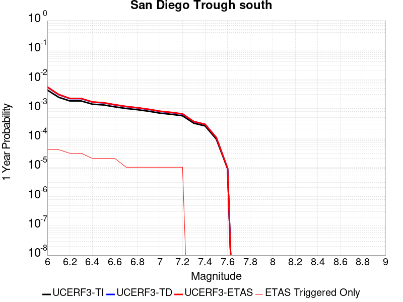 | 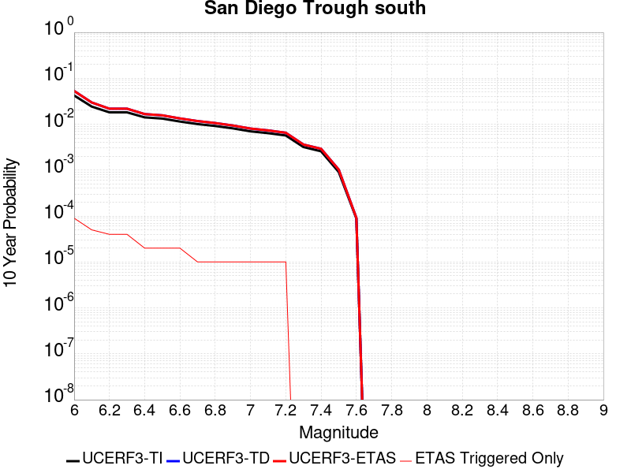 |

| Magnitude | 1 wk TI Prob | 1 wk TD Prob | 1 wk ETAS Prob | 1 wk ETAS/TD Gain | 1 wk ETAS Triggered Only | 1 mo TI Prob | 1 mo TD Prob | 1 mo ETAS Prob | 1 mo ETAS/TD Gain | 1 mo ETAS Triggered Only | 1 yr TI Prob | 1 yr TD Prob | 1 yr ETAS Prob | 1 yr ETAS/TD Gain | 1 yr ETAS Triggered Only | 10 yr TI Prob | 10 yr TD Prob | 10 yr ETAS Prob | 10 yr ETAS/TD Gain | 10 yr ETAS Triggered Only |
|-----|-----|-----|-----|-----|-----|-----|-----|-----|-----|-----|-----|-----|-----|-----|-----|-----|-----|-----|-----|-----|
| 6.0 | 8.279495E-5 | 1.04241306E-4 | 1.04241306E-4 | 1.0 | 0.0 | 3.5478722E-4 | 4.4667677E-4 | 4.7881677E-4 | 1.0719535 | 3.215434E-5 | 0.004310982 | 0.0054256152 | 0.0054575955 | 1.0058942 | 3.215434E-5 | 0.042283054 | 0.05299221 | 0.053068336 | 1.0014366 | 8.038585E-5 |
| 6.1 | 4.6961468E-5 | 5.772944E-5 | 5.772944E-5 | 1.0 | 0.0 | 2.0124791E-4 | 2.473894E-4 | 2.795358E-4 | 1.1299424 | 3.215434E-5 | 0.00244744 | 0.0030079768 | 0.0030400343 | 1.0106575 | 3.215434E-5 | 0.024206603 | 0.029679462 | 0.029726261 | 1.0015769 | 4.823151E-5 |
| 6.2 | 3.5079658E-5 | 4.214154E-5 | 4.214154E-5 | 1.0 | 0.0 | 1.5033272E-4 | 1.8059435E-4 | 1.9666861E-4 | 1.0890076 | 1.607717E-5 | 0.0018287642 | 0.0021965632 | 0.002212605 | 1.0073031 | 1.607717E-5 | 0.018137876 | 0.021751117 | 0.021782573 | 1.0014461 | 3.215434E-5 |
| 6.3 | 3.5079658E-5 | 4.214154E-5 | 4.214154E-5 | 1.0 | 0.0 | 1.5033272E-4 | 1.8059435E-4 | 1.9666861E-4 | 1.0890076 | 1.607717E-5 | 0.0018287642 | 0.0021965632 | 0.002212605 | 1.0073031 | 1.607717E-5 | 0.018137876 | 0.021751117 | 0.021782573 | 1.0014461 | 3.215434E-5 |
| 6.4 | 2.7196904E-5 | 3.2087162E-5 | 3.2087162E-5 | 1.0 | 0.0 | 1.16552954E-4 | 1.3750927E-4 | 1.5358423E-4 | 1.1169009 | 1.607717E-5 | 0.0014181085 | 0.0016729041 | 0.0016889544 | 1.0095942 | 1.607717E-5 | 0.014090929 | 0.016604643 | 0.016620453 | 1.0009521 | 1.607717E-5 |
| 6.5 | 2.5584688E-5 | 3.010164E-5 | 3.010164E-5 | 1.0 | 0.0 | 1.0964406E-4 | 1.2900073E-4 | 1.4507583E-4 | 1.1246125 | 1.607717E-5 | 0.0013340989 | 0.0015694655 | 0.0015855174 | 1.0102277 | 1.607717E-5 | 0.013261181 | 0.015585314 | 0.01560114 | 1.0010154 | 1.607717E-5 |
| 6.6 | 2.2034688E-5 | 2.5742738E-5 | 2.5742738E-5 | 1.0 | 0.0 | 9.443096E-5 | 1.1032141E-4 | 1.263968E-4 | 1.1457142 | 1.607717E-5 | 0.0011490905 | 0.0013423424 | 0.001358398 | 1.0119609 | 1.607717E-5 | 0.011431668 | 0.013343317 | 0.013359181 | 1.0011888 | 1.607717E-5 |
| 6.7 | 1.9394853E-5 | 2.254176E-5 | 2.254176E-5 | 1.0 | 0.0 | 8.311815E-5 | 9.6603995E-5 | 1.1267962E-4 | 1.1664073 | 1.607717E-5 | 0.0010114936 | 0.0011755243 | 0.0011915825 | 1.0136606 | 1.607717E-5 | 0.01006902 | 0.011693766 | 0.011709656 | 1.0013587 | 1.607717E-5 |
| 6.8 | 1.7615313E-5 | 2.0403182E-5 | 2.0403182E-5 | 1.0 | 0.0 | 7.549201E-5 | 8.74393E-5 | 1.0351507E-4 | 1.1838505 | 1.607717E-5 | 9.1872766E-4 | 0.0010640579 | 0.001080118 | 1.0150932 | 1.607717E-5 | 0.009149387 | 0.010590198 | 0.010606105 | 1.001502 | 1.607717E-5 |
| 6.9 | 1.5621423E-5 | 1.8026114E-5 | 1.8026114E-5 | 1.0 | 0.0 | 6.6947236E-5 | 7.725251E-5 | 9.332844E-5 | 1.2080959 | 1.607717E-5 | 8.147778E-4 | 9.40147E-4 | 9.56209E-4 | 1.0170846 | 1.607717E-5 | 0.008117969 | 0.009362142 | 0.009378068 | 1.0017012 | 1.607717E-5 |
| 7.0 | 1.3444376E-5 | 1.544809E-5 | 1.544809E-5 | 1.0 | 0.0 | 5.7617483E-5 | 6.620443E-5 | 8.228054E-5 | 1.2428253 | 1.607717E-5 | 7.0126704E-4 | 8.057436E-4 | 8.2180783E-4 | 1.0199372 | 1.607717E-5 | 0.006990582 | 0.008028555 | 0.008044503 | 1.0019864 | 1.607717E-5 |
| 7.1 | 1.2268361E-5 | 1.407303E-5 | 1.407303E-5 | 1.0 | 0.0 | 5.2577634E-5 | 6.0311606E-5 | 7.6387805E-5 | 1.2665523 | 1.607717E-5 | 6.399447E-4 | 7.3404907E-4 | 7.5011444E-4 | 1.021886 | 1.607717E-5 | 0.0063810493 | 0.0073165493 | 0.0073325085 | 1.0021813 | 1.607717E-5 |
| 7.2 | 1.0922655E-5 | 1.2513563E-5 | 1.2513563E-5 | 1.0 | 0.0 | 4.681054E-5 | 5.3628468E-5 | 6.970477E-5 | 1.2997719 | 1.607717E-5 | 5.697693E-4 | 6.5273355E-4 | 6.688002E-4 | 1.0246145 | 1.607717E-5 | 0.0056831064 | 0.0065084435 | 0.006524416 | 1.0024542 | 1.607717E-5 |
| 7.3 | 6.1106753E-6 | 6.928925E-6 | 6.928925E-6 | 1.0 | 0.0 | 2.6188345E-5 | 2.9695057E-5 | 2.9695057E-5 | 1.0 | 0.0 | 3.1879646E-4 | 3.6147775E-4 | 3.6147775E-4 | 1.0 | 0.0 | 0.0031833951 | 0.003608943 | 0.003608943 | 1.0 | 0.0 |
| 7.4 | 4.933187E-6 | 5.5895525E-6 | 5.5895525E-6 | 1.0 | 0.0 | 2.114206E-5 | 2.3955008E-5 | 2.3955008E-5 | 1.0 | 0.0 | 2.5737417E-4 | 2.9161357E-4 | 2.9161357E-4 | 1.0 | 0.0 | 0.002570763 | 0.0029123505 | 0.0029123505 | 1.0 | 0.0 |
| 7.5 | 1.7489613E-6 | 1.969678E-6 | 1.969678E-6 | 1.0 | 0.0 | 7.495527E-6 | 8.4414505E-6 | 8.4414505E-6 | 1.0 | 0.0 | 9.125422E-5 | 1.02770035E-4 | 1.02770035E-4 | 1.0 | 0.0 | 9.1216754E-4 | 0.0010272472 | 0.0010272472 | 1.0 | 0.0 |
| 7.6 | 1.6988751E-7 | 1.7533823E-7 | 1.7533823E-7 | 1.0 | 0.0 | 7.2808916E-7 | 7.5144936E-7 | 7.5144936E-7 | 1.0 | 0.0 | 8.864449E-6 | 9.14886E-6 | 9.14886E-6 | 1.0 | 0.0 | 8.8640954E-5 | 9.1485024E-5 | 9.1485024E-5 | 1.0 | 0.0 |

## Elysian Park (Upper)
*[(top)](#table-of-contents)*

| 1 Week | 1 Month | 1 Year | 10 Year |
|-----|-----|-----|-----|
|  |  | 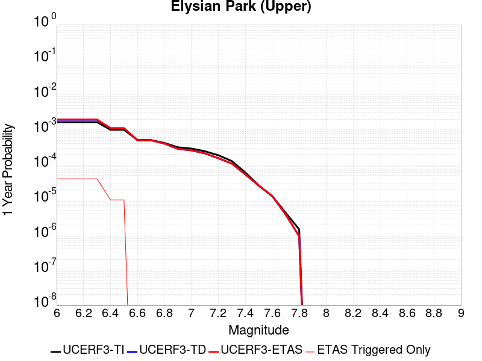 |  |

| Magnitude | 1 wk TI Prob | 1 wk TD Prob | 1 wk ETAS Prob | 1 wk ETAS/TD Gain | 1 wk ETAS Triggered Only | 1 mo TI Prob | 1 mo TD Prob | 1 mo ETAS Prob | 1 mo ETAS/TD Gain | 1 mo ETAS Triggered Only | 1 yr TI Prob | 1 yr TD Prob | 1 yr ETAS Prob | 1 yr ETAS/TD Gain | 1 yr ETAS Triggered Only | 10 yr TI Prob | 10 yr TD Prob | 10 yr ETAS Prob | 10 yr ETAS/TD Gain | 10 yr ETAS Triggered Only |
|-----|-----|-----|-----|-----|-----|-----|-----|-----|-----|-----|-----|-----|-----|-----|-----|-----|-----|-----|-----|-----|
| 6.0 | 3.1876025E-5 | 3.7035516E-5 | 3.7035516E-5 | 1.0 | 0.0 | 1.3660437E-4 | 1.587167E-4 | 1.587167E-4 | 1.0 | 0.0 | 0.0016618895 | 0.0019311075 | 0.0019631996 | 1.0166186 | 3.215434E-5 | 0.016495159 | 0.019189782 | 0.019252857 | 1.0032868 | 6.430868E-5 |
| 6.1 | 3.1876025E-5 | 3.7035516E-5 | 3.7035516E-5 | 1.0 | 0.0 | 1.3660437E-4 | 1.587167E-4 | 1.587167E-4 | 1.0 | 0.0 | 0.0016618895 | 0.0019311075 | 0.0019631996 | 1.0166186 | 3.215434E-5 | 0.016495159 | 0.019189782 | 0.019252857 | 1.0032868 | 6.430868E-5 |
| 6.2 | 3.1876025E-5 | 3.7035516E-5 | 3.7035516E-5 | 1.0 | 0.0 | 1.3660437E-4 | 1.587167E-4 | 1.587167E-4 | 1.0 | 0.0 | 0.0016618895 | 0.0019311075 | 0.0019631996 | 1.0166186 | 3.215434E-5 | 0.016495159 | 0.019189782 | 0.019252857 | 1.0032868 | 6.430868E-5 |
| 6.3 | 3.1876025E-5 | 3.7035516E-5 | 3.7035516E-5 | 1.0 | 0.0 | 1.3660437E-4 | 1.587167E-4 | 1.587167E-4 | 1.0 | 0.0 | 0.0016618895 | 0.0019311075 | 0.0019631996 | 1.0166186 | 3.215434E-5 | 0.016495159 | 0.019189782 | 0.019252857 | 1.0032868 | 6.430868E-5 |
| 6.4 | 1.9273462E-5 | 2.1202266E-5 | 2.1202266E-5 | 1.0 | 0.0 | 8.259794E-5 | 9.086466E-5 | 9.086466E-5 | 1.0 | 0.0 | 0.001005166 | 0.0011058892 | 0.0011219486 | 1.0145217 | 1.607717E-5 | 0.010006315 | 0.011020724 | 0.011036623 | 1.0014428 | 1.607717E-5 |
| 6.5 | 1.9273462E-5 | 2.1202266E-5 | 2.1202266E-5 | 1.0 | 0.0 | 8.259794E-5 | 9.086466E-5 | 9.086466E-5 | 1.0 | 0.0 | 0.001005166 | 0.0011058892 | 0.0011219486 | 1.0145217 | 1.607717E-5 | 0.010006315 | 0.011020724 | 0.011036623 | 1.0014428 | 1.607717E-5 |
| 6.6 | 9.813258E-6 | 9.665599E-6 | 9.665599E-6 | 1.0 | 0.0 | 4.205614E-5 | 4.1423376E-5 | 4.1423376E-5 | 1.0 | 0.0 | 5.119132E-4 | 5.0422014E-4 | 5.0422014E-4 | 1.0 | 0.0 | 0.005107356 | 0.0050314846 | 0.0050314846 | 1.0 | 0.0 |
| 6.7 | 9.801478E-6 | 9.653168E-6 | 9.653168E-6 | 1.0 | 0.0 | 4.2005657E-5 | 4.1370105E-5 | 4.1370105E-5 | 1.0 | 0.0 | 5.112989E-4 | 5.035719E-4 | 5.035719E-4 | 1.0 | 0.0 | 0.0051012407 | 0.0050250315 | 0.0050250315 | 1.0 | 0.0 |
| 6.8 | 8.102489E-6 | 7.773004E-6 | 7.773004E-6 | 1.0 | 0.0 | 3.4724493E-5 | 3.3312477E-5 | 3.3312477E-5 | 1.0 | 0.0 | 4.2268867E-4 | 4.055089E-4 | 4.055089E-4 | 1.0 | 0.0 | 0.004218856 | 0.0040481836 | 0.0040481836 | 1.0 | 0.0 |
| 6.9 | 6.08275E-6 | 5.4814514E-6 | 5.4814514E-6 | 1.0 | 0.0 | 2.6068668E-5 | 2.3491726E-5 | 2.3491726E-5 | 1.0 | 0.0 | 3.173398E-4 | 2.85975E-4 | 2.85975E-4 | 1.0 | 0.0 | 0.0031688702 | 0.0028561477 | 0.0028561477 | 1.0 | 0.0 |
| 7.0 | 5.5995934E-6 | 4.98278E-6 | 4.98278E-6 | 1.0 | 0.0 | 2.3998036E-5 | 2.13546E-5 | 2.13546E-5 | 1.0 | 0.0 | 2.9213692E-4 | 2.599619E-4 | 2.599619E-4 | 1.0 | 0.0 | 0.0029175316 | 0.0025966454 | 0.0025966454 | 1.0 | 0.0 |
| 7.1 | 4.709881E-6 | 4.0874015E-6 | 4.0874015E-6 | 1.0 | 0.0 | 2.0185047E-5 | 1.7517319E-5 | 1.7517319E-5 | 1.0 | 0.0 | 2.4572524E-4 | 2.132529E-4 | 2.132529E-4 | 1.0 | 0.0 | 0.002454537 | 0.002130524 | 0.002130524 | 1.0 | 0.0 |
| 7.2 | 3.6063436E-6 | 2.9779544E-6 | 2.9779544E-6 | 1.0 | 0.0 | 1.5455667E-5 | 1.27626E-5 | 1.27626E-5 | 1.0 | 0.0 | 1.881565E-4 | 1.5537368E-4 | 1.5537368E-4 | 1.0 | 0.0 | 0.0018799726 | 0.0015526618 | 0.0015526618 | 1.0 | 0.0 |
| 7.3 | 2.471135E-6 | 2.0954615E-6 | 2.0954615E-6 | 1.0 | 0.0 | 1.0590536E-5 | 8.980519E-6 | 8.980519E-6 | 1.0 | 0.0 | 1.2893214E-4 | 1.093324E-4 | 1.093324E-4 | 1.0 | 0.0 | 0.0012885736 | 0.0010927934 | 0.0010927934 | 1.0 | 0.0 |
| 7.4 | 1.163943E-6 | 1.0275091E-6 | 1.0275091E-6 | 1.0 | 0.0 | 4.988318E-6 | 4.4036033E-6 | 4.4036033E-6 | 1.0 | 0.0 | 6.0731076E-5 | 5.3612584E-5 | 5.3612584E-5 | 1.0 | 0.0 | 6.071448E-4 | 5.359995E-4 | 5.359995E-4 | 1.0 | 0.0 |
| 7.5 | 4.99459E-7 | 4.917604E-7 | 4.917604E-7 | 1.0 | 0.0 | 2.140537E-6 | 2.1075427E-6 | 2.1075427E-6 | 1.0 | 0.0 | 2.6060725E-5 | 2.5659048E-5 | 2.5659048E-5 | 1.0 | 0.0 | 2.605767E-4 | 2.5656243E-4 | 2.5656243E-4 | 1.0 | 0.0 |
| 7.6 | 2.4667852E-7 | 2.4778336E-7 | 2.4778336E-7 | 1.0 | 0.0 | 1.0571932E-6 | 1.0619283E-6 | 1.0619283E-6 | 1.0 | 0.0 | 1.2871251E-5 | 1.2928905E-5 | 1.2928905E-5 | 1.0 | 0.0 | 1.2870505E-4 | 1.2928189E-4 | 1.2928189E-4 | 1.0 | 0.0 |
| 7.7 | 8.2312795E-8 | 7.3864456E-8 | 7.3864456E-8 | 1.0 | 0.0 | 3.527691E-7 | 3.165619E-7 | 3.165619E-7 | 1.0 | 0.0 | 4.294955E-6 | 3.8541357E-6 | 3.8541357E-6 | 1.0 | 0.0 | 4.2948723E-5 | 3.8540802E-5 | 3.8540802E-5 | 1.0 | 0.0 |
| 7.8 | 2.7819295E-8 | 1.7566023E-8 | 1.7566023E-8 | 1.0 | 0.0 | 1.1922555E-7 | 7.5282955E-8 | 7.5282955E-8 | 1.0 | 0.0 | 1.45157E-6 | 9.165697E-7 | 9.165697E-7 | 1.0 | 0.0 | 1.45156055E-5 | 9.165675E-6 | 9.165675E-6 | 1.0 | 0.0 |

## Emerson-Copper Mtn 2011
*[(top)](#table-of-contents)*

| 1 Week | 1 Month | 1 Year | 10 Year |
|-----|-----|-----|-----|
|  |  |  | 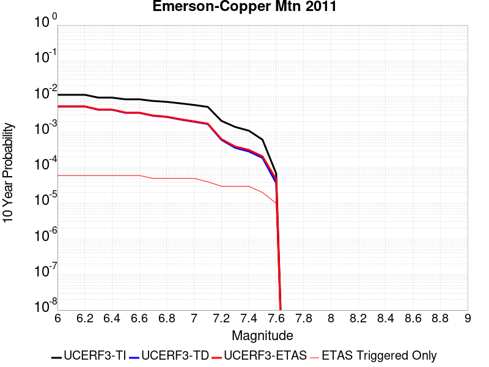 |

| Magnitude | 1 wk TI Prob | 1 wk TD Prob | 1 wk ETAS Prob | 1 wk ETAS/TD Gain | 1 wk ETAS Triggered Only | 1 mo TI Prob | 1 mo TD Prob | 1 mo ETAS Prob | 1 mo ETAS/TD Gain | 1 mo ETAS Triggered Only | 1 yr TI Prob | 1 yr TD Prob | 1 yr ETAS Prob | 1 yr ETAS/TD Gain | 1 yr ETAS Triggered Only | 10 yr TI Prob | 10 yr TD Prob | 10 yr ETAS Prob | 10 yr ETAS/TD Gain | 10 yr ETAS Triggered Only |
|-----|-----|-----|-----|-----|-----|-----|-----|-----|-----|-----|-----|-----|-----|-----|-----|-----|-----|-----|-----|-----|
| 6.0 | 2.1364202E-5 | 9.968114E-6 | 4.2122134E-5 | 4.2256875 | 3.215434E-5 | 9.1557646E-5 | 4.2719836E-5 | 7.4872805E-5 | 1.7526473 | 3.215434E-5 | 0.0011141442 | 5.199986E-4 | 5.68205E-4 | 1.0927049 | 4.823151E-5 | 0.011085749 | 0.005188688 | 0.005252663 | 1.0123297 | 6.430868E-5 |
| 6.1 | 2.1364202E-5 | 9.968114E-6 | 4.2122134E-5 | 4.2256875 | 3.215434E-5 | 9.1557646E-5 | 4.2719836E-5 | 7.4872805E-5 | 1.7526473 | 3.215434E-5 | 0.0011141442 | 5.199986E-4 | 5.68205E-4 | 1.0927049 | 4.823151E-5 | 0.011085749 | 0.005188688 | 0.005252663 | 1.0123297 | 6.430868E-5 |
| 6.2 | 2.1364202E-5 | 9.968114E-6 | 4.2122134E-5 | 4.2256875 | 3.215434E-5 | 9.1557646E-5 | 4.2719836E-5 | 7.4872805E-5 | 1.7526473 | 3.215434E-5 | 0.0011141442 | 5.199986E-4 | 5.68205E-4 | 1.0927049 | 4.823151E-5 | 0.011085749 | 0.005188688 | 0.005252663 | 1.0123297 | 6.430868E-5 |
| 6.3 | 1.7751237E-5 | 8.089227E-6 | 4.0243307E-5 | 4.9749265 | 3.215434E-5 | 7.607452E-5 | 3.466769E-5 | 6.682092E-5 | 1.9274695 | 3.215434E-5 | 9.258136E-4 | 4.2200365E-4 | 4.702148E-4 | 1.1142435 | 4.823151E-5 | 0.00921966 | 0.0042126453 | 0.004276683 | 1.0152013 | 6.430868E-5 |
| 6.4 | 1.7751237E-5 | 8.089227E-6 | 4.0243307E-5 | 4.9749265 | 3.215434E-5 | 7.607452E-5 | 3.466769E-5 | 6.682092E-5 | 1.9274695 | 3.215434E-5 | 9.258136E-4 | 4.2200365E-4 | 4.702148E-4 | 1.1142435 | 4.823151E-5 | 0.00921966 | 0.0042126453 | 0.004276683 | 1.0152013 | 6.430868E-5 |
| 6.5 | 1.5886664E-5 | 6.603819E-6 | 3.8757946E-5 | 5.86902 | 3.215434E-5 | 6.808392E-5 | 2.8301802E-5 | 6.0455233E-5 | 2.1360912 | 3.215434E-5 | 8.286065E-4 | 3.4452465E-4 | 3.9273954E-4 | 1.1399461 | 4.823151E-5 | 0.008255237 | 0.0034403696 | 0.003504457 | 1.0186281 | 6.430868E-5 |
| 6.6 | 1.5886664E-5 | 6.603819E-6 | 3.8757946E-5 | 5.86902 | 3.215434E-5 | 6.808392E-5 | 2.8301802E-5 | 6.0455233E-5 | 2.1360912 | 3.215434E-5 | 8.286065E-4 | 3.4452465E-4 | 3.9273954E-4 | 1.1399461 | 4.823151E-5 | 0.008255237 | 0.0034403696 | 0.003504457 | 1.0186281 | 6.430868E-5 |
| 6.7 | 1.428471E-5 | 5.470403E-6 | 2.1547485E-5 | 3.9389212 | 1.607717E-5 | 6.121875E-5 | 2.3444394E-5 | 3.9521186E-5 | 1.6857414 | 1.607717E-5 | 7.450834E-4 | 2.8540206E-4 | 3.175472E-4 | 1.1126312 | 3.215434E-5 | 0.007425902 | 0.0028507432 | 0.0028988372 | 1.0168707 | 4.823151E-5 |
| 6.8 | 1.3490684E-5 | 5.073699E-6 | 2.1150789E-5 | 4.1687117 | 1.607717E-5 | 5.7815934E-5 | 2.1744265E-5 | 3.7821086E-5 | 1.7393591 | 1.607717E-5 | 7.0368167E-4 | 2.6470813E-4 | 2.9685395E-4 | 1.1214387 | 3.215434E-5 | 0.007014576 | 0.002644309 | 0.002692413 | 1.0181915 | 4.823151E-5 |
| 6.9 | 1.2235421E-5 | 4.289677E-6 | 2.0366779E-5 | 4.7478585 | 1.607717E-5 | 5.2436466E-5 | 1.838422E-5 | 3.4461096E-5 | 1.8744931 | 1.607717E-5 | 6.38227E-4 | 2.238085E-4 | 2.5595565E-4 | 1.1436368 | 3.215434E-5 | 0.0063639707 | 0.0022361854 | 0.0022843091 | 1.0215204 | 4.823151E-5 |
| 7.0 | 1.1009851E-5 | 3.7189886E-6 | 1.97961E-5 | 5.3229795 | 1.607717E-5 | 4.7184225E-5 | 1.5938444E-5 | 3.201536E-5 | 2.0086877 | 1.607717E-5 | 5.743165E-4 | 1.9403672E-4 | 2.2618483E-4 | 1.1656805 | 3.215434E-5 | 0.005728345 | 0.0019390108 | 0.0019871488 | 1.024826 | 4.823151E-5 |
| 7.1 | 9.726373E-6 | 3.2117953E-6 | 1.9288915E-5 | 6.0056486 | 1.607717E-5 | 4.168379E-5 | 1.3764783E-5 | 2.9841733E-5 | 2.1679769 | 1.607717E-5 | 5.07382E-4 | 1.6757673E-4 | 1.836512E-4 | 1.0959231 | 1.607717E-5 | 0.0050622504 | 0.0016748349 | 0.0017069353 | 1.0191664 | 3.215434E-5 |
| 7.2 | 3.9335127E-6 | 1.1524792E-6 | 1.7229631E-5 | 14.950059 | 1.607717E-5 | 1.6857803E-5 | 4.9391874E-6 | 2.1016278E-5 | 4.2550073 | 1.607717E-5 | 2.0522442E-4 | 6.0133007E-5 | 7.620921E-5 | 1.2673441 | 1.607717E-5 | 0.00205035 | 6.011733E-4 | 6.172408E-4 | 1.026727 | 1.607717E-5 |
| 7.3 | 2.661632E-6 | 6.911505E-7 | 1.676831E-5 | 24.261446 | 1.607717E-5 | 1.14069435E-5 | 2.9620703E-6 | 1.9039193E-5 | 6.4276643 | 1.607717E-5 | 1.3887069E-4 | 3.6062618E-5 | 5.213921E-5 | 1.4457965 | 1.607717E-5 | 0.0013878393 | 3.605687E-4 | 3.766401E-4 | 1.0445722 | 1.607717E-5 |
| 7.4 | 2.0893426E-6 | 5.4618386E-7 | 1.6623346E-5 | 30.43544 | 1.607717E-5 | 8.954295E-6 | 2.3407858E-6 | 1.8417919E-5 | 7.868263 | 1.607717E-5 | 1.0901308E-4 | 2.84987E-5 | 4.4575412E-5 | 1.5641209 | 1.607717E-5 | 0.0010895962 | 2.84951E-4 | 3.010236E-4 | 1.0564047 | 1.607717E-5 |
| 7.5 | 1.1681728E-6 | 3.6030585E-7 | 1.643747E-5 | 45.62088 | 1.607717E-5 | 5.0064455E-6 | 1.544167E-6 | 1.7621313E-5 | 11.411532 | 1.607717E-5 | 6.0951766E-5 | 1.8800076E-5 | 3.4876943E-5 | 1.8551491 | 1.607717E-5 | 6.093505E-4 | 1.8798532E-4 | 2.0405947E-4 | 1.0855075 | 1.607717E-5 |
| 7.6 | 1.3154387E-7 | 7.1197384E-8 | 1.6148366E-5 | 226.81123 | 1.607717E-5 | 5.6375933E-7 | 3.051316E-7 | 1.6382297E-5 | 53.68928 | 1.607717E-5 | 6.863748E-6 | 3.7149728E-6 | 1.9792084E-5 | 5.3276525 | 1.607717E-5 | 6.863536E-5 | 3.7149264E-5 | 5.322584E-5 | 1.4327562 | 1.607717E-5 |

## San Juan
*[(top)](#table-of-contents)*

| 1 Week | 1 Month | 1 Year | 10 Year |
|-----|-----|-----|-----|
|  | 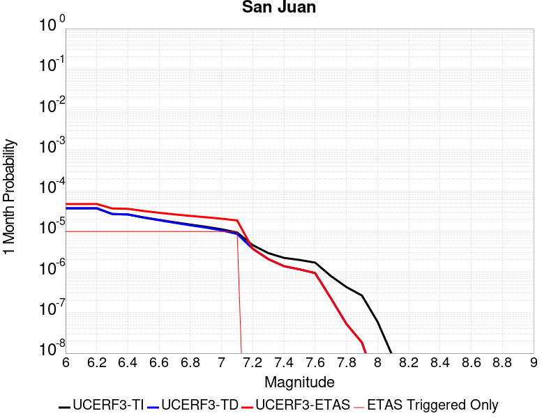 |  |  |

| Magnitude | 1 wk TI Prob | 1 wk TD Prob | 1 wk ETAS Prob | 1 wk ETAS/TD Gain | 1 wk ETAS Triggered Only | 1 mo TI Prob | 1 mo TD Prob | 1 mo ETAS Prob | 1 mo ETAS/TD Gain | 1 mo ETAS Triggered Only | 1 yr TI Prob | 1 yr TD Prob | 1 yr ETAS Prob | 1 yr ETAS/TD Gain | 1 yr ETAS Triggered Only | 10 yr TI Prob | 10 yr TD Prob | 10 yr ETAS Prob | 10 yr ETAS/TD Gain | 10 yr ETAS Triggered Only |
|-----|-----|-----|-----|-----|-----|-----|-----|-----|-----|-----|-----|-----|-----|-----|-----|-----|-----|-----|-----|-----|
| 6.0 | 8.682808E-6 | 8.7491635E-6 | 8.7491635E-6 | 1.0 | 0.0 | 3.72115E-5 | 3.74959E-5 | 3.74959E-5 | 1.0 | 0.0 | 4.5295584E-4 | 4.564218E-4 | 4.7249164E-4 | 1.0352083 | 1.607717E-5 | 0.004520337 | 0.004555385 | 0.0046033966 | 1.0105395 | 4.823151E-5 |
| 6.1 | 8.682808E-6 | 8.7491635E-6 | 8.7491635E-6 | 1.0 | 0.0 | 3.72115E-5 | 3.74959E-5 | 3.74959E-5 | 1.0 | 0.0 | 4.5295584E-4 | 4.564218E-4 | 4.7249164E-4 | 1.0352083 | 1.607717E-5 | 0.004520337 | 0.004555385 | 0.0046033966 | 1.0105395 | 4.823151E-5 |
| 6.2 | 8.682808E-6 | 8.7491635E-6 | 8.7491635E-6 | 1.0 | 0.0 | 3.72115E-5 | 3.74959E-5 | 3.74959E-5 | 1.0 | 0.0 | 4.5295584E-4 | 4.564218E-4 | 4.7249164E-4 | 1.0352083 | 1.607717E-5 | 0.004520337 | 0.004555385 | 0.0046033966 | 1.0105395 | 4.823151E-5 |
| 6.3 | 6.3054235E-6 | 6.2825848E-6 | 6.2825848E-6 | 1.0 | 0.0 | 2.7022963E-5 | 2.6925094E-5 | 2.6925094E-5 | 1.0 | 0.0 | 3.2895492E-4 | 3.2776513E-4 | 3.2776513E-4 | 1.0 | 0.0 | 0.003284684 | 0.003273017 | 0.003273017 | 1.0 | 0.0 |
| 6.4 | 6.1490473E-6 | 6.1144656E-6 | 6.1144656E-6 | 1.0 | 0.0 | 2.6352795E-5 | 2.6204598E-5 | 2.6204598E-5 | 1.0 | 0.0 | 3.2079802E-4 | 3.1899565E-4 | 3.1899565E-4 | 1.0 | 0.0 | 0.0032033534 | 0.0031855737 | 0.0031855737 | 1.0 | 0.0 |
| 6.5 | 5.204848E-6 | 5.137233E-6 | 5.137233E-6 | 1.0 | 0.0 | 2.23063E-5 | 2.2016533E-5 | 2.2016533E-5 | 1.0 | 0.0 | 2.7154534E-4 | 2.6801927E-4 | 2.6801927E-4 | 1.0 | 0.0 | 0.0027121378 | 0.0026771144 | 0.0026771144 | 1.0 | 0.0 |
| 6.6 | 4.5179986E-6 | 4.4150297E-6 | 4.4150297E-6 | 1.0 | 0.0 | 1.9362706E-5 | 1.8921424E-5 | 1.8921424E-5 | 1.0 | 0.0 | 2.3571544E-4 | 2.3034477E-4 | 2.3034477E-4 | 1.0 | 0.0 | 0.0023546559 | 0.0023011973 | 0.0023011973 | 1.0 | 0.0 |
| 6.7 | 3.9442616E-6 | 3.819828E-6 | 3.819828E-6 | 1.0 | 0.0 | 1.6903869E-5 | 1.6370592E-5 | 1.6370592E-5 | 1.0 | 0.0 | 2.0578515E-4 | 1.992944E-4 | 1.992944E-4 | 1.0 | 0.0 | 0.002055947 | 0.0019912818 | 0.0019912818 | 1.0 | 0.0 |
| 6.8 | 3.4536245E-6 | 3.3163353E-6 | 3.3163353E-6 | 1.0 | 0.0 | 1.4801163E-5 | 1.4212792E-5 | 1.4212792E-5 | 1.0 | 0.0 | 1.8018926E-4 | 1.7302761E-4 | 1.7302761E-4 | 1.0 | 0.0 | 0.0018004322 | 0.0017290477 | 0.0017290477 | 1.0 | 0.0 |
| 6.9 | 3.059865E-6 | 2.9120315E-6 | 2.9120315E-6 | 1.0 | 0.0 | 1.3113641E-5 | 1.2480078E-5 | 1.2480078E-5 | 1.0 | 0.0 | 1.596469E-4 | 1.5193493E-4 | 1.5193493E-4 | 1.0 | 0.0 | 0.0015953224 | 0.0015184252 | 0.0015184252 | 1.0 | 0.0 |
| 7.0 | 2.6504351E-6 | 2.4920002E-6 | 2.4920002E-6 | 1.0 | 0.0 | 1.1358958E-5 | 1.0679961E-5 | 1.0679961E-5 | 1.0 | 0.0 | 1.3828653E-4 | 1.300213E-4 | 1.300213E-4 | 1.0 | 0.0 | 0.0013820052 | 0.0012995641 | 0.0012995641 | 1.0 | 0.0 |
| 7.1 | 2.2039317E-6 | 2.0338296E-6 | 2.0338296E-6 | 1.0 | 0.0 | 9.445387E-6 | 8.716386E-6 | 8.716386E-6 | 1.0 | 0.0 | 1.1499152E-4 | 1.0611736E-4 | 1.0611736E-4 | 1.0 | 0.0 | 0.0011493203 | 0.0010607769 | 0.0010607769 | 1.0 | 0.0 |
| 7.2 | 1.0786707E-6 | 8.7701903E-7 | 8.7701903E-7 | 1.0 | 0.0 | 4.622866E-6 | 3.7586476E-6 | 3.7586476E-6 | 1.0 | 0.0 | 5.628194E-5 | 4.5760586E-5 | 4.5760586E-5 | 1.0 | 0.0 | 5.6267687E-4 | 4.5757066E-4 | 4.5757066E-4 | 1.0 | 0.0 |
| 7.3 | 6.846433E-7 | 4.868805E-7 | 4.868805E-7 | 1.0 | 0.0 | 2.9341822E-6 | 2.086629E-6 | 2.086629E-6 | 1.0 | 0.0 | 3.5723086E-5 | 2.5404412E-5 | 2.5404412E-5 | 1.0 | 0.0 | 3.571734E-4 | 2.540486E-4 | 2.540486E-4 | 1.0 | 0.0 |
| 7.4 | 5.23043E-7 | 3.2628162E-7 | 3.2628162E-7 | 1.0 | 0.0 | 2.2416111E-6 | 1.398349E-6 | 1.398349E-6 | 1.0 | 0.0 | 2.7291273E-5 | 1.7024766E-5 | 1.7024766E-5 | 1.0 | 0.0 | 2.7287923E-4 | 1.7026656E-4 | 1.7026656E-4 | 1.0 | 0.0 |
| 7.5 | 4.648444E-7 | 2.7234944E-7 | 2.7234944E-7 | 1.0 | 0.0 | 1.9921886E-6 | 1.1672114E-6 | 1.1672114E-6 | 1.0 | 0.0 | 2.4254627E-5 | 1.42107065E-5 | 1.42107065E-5 | 1.0 | 0.0 | 2.425198E-4 | 1.421276E-4 | 1.421276E-4 | 1.0 | 0.0 |
| 7.6 | 3.9906567E-7 | 2.2083314E-7 | 2.2083314E-7 | 1.0 | 0.0 | 1.7102802E-6 | 9.464274E-7 | 9.464274E-7 | 1.0 | 0.0 | 2.0822463E-5 | 1.1522693E-5 | 1.1522693E-5 | 1.0 | 0.0 | 2.0820512E-4 | 1.15245566E-4 | 1.15245566E-4 | 1.0 | 0.0 |
| 7.7 | 1.8784601E-7 | 5.3666906E-8 | 5.3666906E-8 | 1.0 | 0.0 | 8.0505407E-7 | 2.30001E-7 | 2.30001E-7 | 1.0 | 0.0 | 9.80149E-6 | 2.8002585E-6 | 2.8002585E-6 | 1.0 | 0.0 | 9.801057E-5 | 2.8011282E-5 | 2.8011282E-5 | 1.0 | 0.0 |
| 7.8 | 1.00154914E-7 | 1.2415832E-8 | 1.2415832E-8 | 1.0 | 0.0 | 4.2923529E-7 | 5.3210716E-8 | 5.3210716E-8 | 1.0 | 0.0 | 5.225927E-6 | 6.4784024E-7 | 6.4784024E-7 | 1.0 | 0.0 | 5.225804E-5 | 6.484273E-6 | 6.484273E-6 | 1.0 | 0.0 |
| 7.9 | 6.171429E-8 | 4.2966155E-9 | 4.2966155E-9 | 1.0 | 0.0 | 2.6448978E-7 | 1.8414067E-8 | 1.8414067E-8 | 1.0 | 0.0 | 3.2201583E-6 | 2.2419121E-7 | 2.2419121E-7 | 1.0 | 0.0 | 3.2201115E-5 | 2.2472002E-6 | 2.2472002E-6 | 1.0 | 0.0 |
| 8.0 | 1.3974572E-8 | 3.3788217E-10 | 3.3788217E-10 | 1.0 | 0.0 | 5.989102E-8 | 1.448067E-9 | 1.448067E-9 | 1.0 | 0.0 | 7.2917294E-7 | 1.763022E-8 | 1.763022E-8 | 1.0 | 0.0 | 7.2917055E-6 | 1.8060365E-7 | 1.8060365E-7 | 1.0 | 0.0 |
| 8.1 | 1.8403477E-9 | 1.1302803E-10 | 1.1302803E-10 | 1.0 | 0.0 | 7.887204E-9 | 4.844063E-10 | 4.844063E-10 | 1.0 | 0.0 | 9.602671E-8 | 5.8976446E-9 | 5.8976446E-9 | 1.0 | 0.0 | 9.602667E-7 | 6.021993E-8 | 6.021993E-8 | 1.0 | 0.0 |

## Malibu Coast alt 1
*[(top)](#table-of-contents)*

| 1 Week | 1 Month | 1 Year | 10 Year |
|-----|-----|-----|-----|
|  |  |  |  |

| Magnitude | 1 wk TI Prob | 1 wk TD Prob | 1 wk ETAS Prob | 1 wk ETAS/TD Gain | 1 wk ETAS Triggered Only | 1 mo TI Prob | 1 mo TD Prob | 1 mo ETAS Prob | 1 mo ETAS/TD Gain | 1 mo ETAS Triggered Only | 1 yr TI Prob | 1 yr TD Prob | 1 yr ETAS Prob | 1 yr ETAS/TD Gain | 1 yr ETAS Triggered Only | 10 yr TI Prob | 10 yr TD Prob | 10 yr ETAS Prob | 10 yr ETAS/TD Gain | 10 yr ETAS Triggered Only |
|-----|-----|-----|-----|-----|-----|-----|-----|-----|-----|-----|-----|-----|-----|-----|-----|-----|-----|-----|-----|-----|
| 6.0 | 1.6572556E-5 | 1.7598066E-5 | 3.3674954E-5 | 1.9135599 | 1.607717E-5 | 7.102331E-5 | 7.541821E-5 | 1.2364608E-4 | 1.6394725 | 4.823151E-5 | 8.6436566E-4 | 9.178488E-4 | 9.6603605E-4 | 1.0525002 | 4.823151E-5 | 0.0086101135 | 0.009142512 | 0.009206234 | 1.0069697 | 6.430868E-5 |
| 6.1 | 1.6572556E-5 | 1.7598066E-5 | 3.3674954E-5 | 1.9135599 | 1.607717E-5 | 7.102331E-5 | 7.541821E-5 | 1.0757012E-4 | 1.4263151 | 3.215434E-5 | 8.6436566E-4 | 9.178488E-4 | 9.4997365E-4 | 1.0350001 | 3.215434E-5 | 0.0086101135 | 0.009142512 | 0.009190303 | 1.0052273 | 4.823151E-5 |
| 6.2 | 1.1085717E-5 | 1.1557147E-5 | 2.7634132E-5 | 2.3910859 | 1.607717E-5 | 4.750935E-5 | 4.952971E-5 | 6.560609E-5 | 1.3245804 | 1.607717E-5 | 5.782728E-4 | 6.028609E-4 | 6.189284E-4 | 1.0266521 | 1.607717E-5 | 0.0057677035 | 0.0060126255 | 0.0060445867 | 1.0053157 | 3.215434E-5 |
| 6.3 | 1.0208568E-5 | 1.0592237E-5 | 2.6669237E-5 | 2.5178096 | 1.607717E-5 | 4.375027E-5 | 4.539453E-5 | 6.147097E-5 | 1.3541493 | 1.607717E-5 | 5.325294E-4 | 5.5254117E-4 | 5.686095E-4 | 1.0290807 | 1.607717E-5 | 0.0053125503 | 0.0055119814 | 0.005543959 | 1.0058014 | 3.215434E-5 |
| 6.4 | 9.0682315E-6 | 9.342637E-6 | 2.5419658E-5 | 2.7208226 | 1.607717E-5 | 3.8863272E-5 | 4.003927E-5 | 5.6115798E-5 | 1.401519 | 1.607717E-5 | 4.730576E-4 | 4.8737114E-4 | 5.0344045E-4 | 1.0329715 | 1.607717E-5 | 0.0047205184 | 0.004863236 | 0.0048952345 | 1.0065795 | 3.215434E-5 |
| 6.5 | 7.605796E-6 | 7.748587E-6 | 7.748587E-6 | 1.0 | 0.0 | 3.259586E-5 | 3.3207816E-5 | 3.3207816E-5 | 1.0 | 0.0 | 3.9678233E-4 | 4.0423148E-4 | 4.0423148E-4 | 1.0 | 0.0 | 0.0039607463 | 0.0040351 | 0.004051112 | 1.0039682 | 1.607717E-5 |
| 6.6 | 5.889873E-6 | 5.8795385E-6 | 5.8795385E-6 | 1.0 | 0.0 | 2.5242069E-5 | 2.519778E-5 | 2.519778E-5 | 1.0 | 0.0 | 3.0727885E-4 | 3.0673988E-4 | 3.0673988E-4 | 1.0 | 0.0 | 0.003068543 | 0.0030631777 | 0.0030792058 | 1.0052325 | 1.607717E-5 |
| 6.7 | 5.66586E-6 | 5.641641E-6 | 5.641641E-6 | 1.0 | 0.0 | 2.428203E-5 | 2.417824E-5 | 2.417824E-5 | 1.0 | 0.0 | 2.955936E-4 | 2.9433038E-4 | 2.9433038E-4 | 1.0 | 0.0 | 0.0029520073 | 0.0029394177 | 0.0029554476 | 1.0054535 | 1.607717E-5 |
| 6.8 | 5.521556E-6 | 5.489427E-6 | 5.489427E-6 | 1.0 | 0.0 | 2.3663597E-5 | 2.3525903E-5 | 2.3525903E-5 | 1.0 | 0.0 | 2.880662E-4 | 2.8639034E-4 | 2.8639034E-4 | 1.0 | 0.0 | 0.0028769306 | 0.002860224 | 0.0028762554 | 1.0056049 | 1.607717E-5 |
| 6.9 | 5.29752E-6 | 5.2499317E-6 | 5.2499317E-6 | 1.0 | 0.0 | 2.270346E-5 | 2.2499513E-5 | 2.2499513E-5 | 1.0 | 0.0 | 2.7637955E-4 | 2.7389723E-4 | 2.7389723E-4 | 1.0 | 0.0 | 0.0027603607 | 0.0027356069 | 0.00275164 | 1.0058609 | 1.607717E-5 |
| 7.0 | 5.106743E-6 | 5.0476788E-6 | 5.0476788E-6 | 1.0 | 0.0 | 2.1885859E-5 | 2.163273E-5 | 2.163273E-5 | 1.0 | 0.0 | 2.6642776E-4 | 2.6334674E-4 | 2.6334674E-4 | 1.0 | 0.0 | 0.0026610855 | 0.0026303562 | 0.002646391 | 1.0060961 | 1.607717E-5 |
| 7.1 | 4.8469647E-6 | 4.770373E-6 | 4.770373E-6 | 1.0 | 0.0 | 2.0772539E-5 | 2.0444295E-5 | 2.0444295E-5 | 1.0 | 0.0 | 2.528763E-4 | 2.4888094E-4 | 2.4888094E-4 | 1.0 | 0.0 | 0.0025258875 | 0.00248603 | 0.0025020675 | 1.0064509 | 1.607717E-5 |
| 7.2 | 4.545514E-6 | 4.4481935E-6 | 4.4481935E-6 | 1.0 | 0.0 | 1.9480629E-5 | 1.9063547E-5 | 1.9063547E-5 | 1.0 | 0.0 | 2.3715083E-4 | 2.3207403E-4 | 2.3207403E-4 | 1.0 | 0.0 | 0.0023689792 | 0.0023183243 | 0.0023343642 | 1.0069188 | 1.607717E-5 |
| 7.3 | 3.794097E-6 | 3.6519348E-6 | 3.6519348E-6 | 1.0 | 0.0 | 1.6260314E-5 | 1.5651056E-5 | 1.5651056E-5 | 1.0 | 0.0 | 1.9795135E-4 | 1.9053498E-4 | 1.9053498E-4 | 1.0 | 0.0 | 0.001977751 | 0.0019037209 | 0.0019197675 | 1.008429 | 1.607717E-5 |
| 7.4 | 2.808217E-6 | 2.719077E-6 | 2.719077E-6 | 1.0 | 0.0 | 1.203516E-5 | 1.1653135E-5 | 1.1653135E-5 | 1.0 | 0.0 | 1.4651821E-4 | 1.418677E-4 | 1.418677E-4 | 1.0 | 0.0 | 0.0014642165 | 0.001417774 | 0.0014338284 | 1.0113237 | 1.607717E-5 |
| 7.5 | 1.83809E-6 | 1.8190691E-6 | 1.8190691E-6 | 1.0 | 0.0 | 7.877505E-6 | 7.795988E-6 | 7.795988E-6 | 1.0 | 0.0 | 9.59044E-5 | 9.491203E-5 | 9.491203E-5 | 1.0 | 0.0 | 9.5863023E-4 | 9.48717E-4 | 9.647789E-4 | 1.0169301 | 1.607717E-5 |
| 7.6 | 1.1292672E-6 | 1.1001447E-6 | 1.1001447E-6 | 1.0 | 0.0 | 4.839708E-6 | 4.714897E-6 | 4.714897E-6 | 1.0 | 0.0 | 5.8921847E-5 | 5.7402376E-5 | 5.7402376E-5 | 1.0 | 0.0 | 5.890623E-4 | 5.738771E-4 | 5.8994506E-4 | 1.0279989 | 1.607717E-5 |
| 7.7 | 5.065272E-7 | 4.609151E-7 | 4.609151E-7 | 1.0 | 0.0 | 2.170829E-6 | 1.975349E-6 | 1.975349E-6 | 1.0 | 0.0 | 2.6429525E-5 | 2.404962E-5 | 2.404962E-5 | 1.0 | 0.0 | 2.642638E-4 | 2.4047129E-4 | 2.565446E-4 | 1.0668409 | 1.607717E-5 |
| 7.8 | 8.952991E-8 | 6.707874E-8 | 6.707874E-8 | 1.0 | 0.0 | 3.8369956E-7 | 2.8748025E-7 | 2.8748025E-7 | 1.0 | 0.0 | 4.671532E-6 | 3.5000667E-6 | 3.5000667E-6 | 1.0 | 0.0 | 4.671434E-5 | 3.5000136E-5 | 3.5000136E-5 | 1.0 | 0.0 |
| 7.9 | 8.007447E-10 | 6.1608785E-10 | 6.1608785E-10 | 1.0 | 0.0 | 3.4317629E-9 | 2.6403764E-9 | 2.6403764E-9 | 1.0 | 0.0 | 4.1781714E-8 | 3.2146584E-8 | 3.2146584E-8 | 1.0 | 0.0 | 4.1781706E-7 | 3.214658E-7 | 3.214658E-7 | 1.0 | 0.0 |

## San Jacinto (Borrego)
*[(top)](#table-of-contents)*

| 1 Week | 1 Month | 1 Year | 10 Year |
|-----|-----|-----|-----|
|  |  |  |  |

| Magnitude | 1 wk TI Prob | 1 wk TD Prob | 1 wk ETAS Prob | 1 wk ETAS/TD Gain | 1 wk ETAS Triggered Only | 1 mo TI Prob | 1 mo TD Prob | 1 mo ETAS Prob | 1 mo ETAS/TD Gain | 1 mo ETAS Triggered Only | 1 yr TI Prob | 1 yr TD Prob | 1 yr ETAS Prob | 1 yr ETAS/TD Gain | 1 yr ETAS Triggered Only | 10 yr TI Prob | 10 yr TD Prob | 10 yr ETAS Prob | 10 yr ETAS/TD Gain | 10 yr ETAS Triggered Only |
|-----|-----|-----|-----|-----|-----|-----|-----|-----|-----|-----|-----|-----|-----|-----|-----|-----|-----|-----|-----|-----|
| 6.0 | 3.543992E-5 | 2.7926513E-5 | 6.0079954E-5 | 2.151359 | 3.215434E-5 | 1.5187653E-4 | 1.1967963E-4 | 1.5183013E-4 | 1.268638 | 3.215434E-5 | 0.0018475284 | 0.0014561379 | 0.0015042991 | 1.0330746 | 4.823151E-5 | 0.018322436 | 0.014869647 | 0.014932999 | 1.0042605 | 6.430868E-5 |
| 6.1 | 3.542281E-5 | 2.7926513E-5 | 6.0079954E-5 | 2.151359 | 3.215434E-5 | 1.5180321E-4 | 1.1967963E-4 | 1.5183013E-4 | 1.268638 | 3.215434E-5 | 0.0018466372 | 0.0014561379 | 0.0015042991 | 1.0330746 | 4.823151E-5 | 0.018313672 | 0.014869647 | 0.014932999 | 1.0042605 | 6.430868E-5 |
| 6.2 | 3.4688688E-5 | 2.7926511E-5 | 6.0079954E-5 | 2.151359 | 3.215434E-5 | 1.4865733E-4 | 1.1967963E-4 | 1.5183013E-4 | 1.268638 | 3.215434E-5 | 0.0018084005 | 0.0014561379 | 0.0015042991 | 1.0330746 | 4.823151E-5 | 0.017937548 | 0.014869647 | 0.014932999 | 1.0042605 | 6.430868E-5 |
| 6.3 | 3.2087122E-5 | 2.7771865E-5 | 5.992531E-5 | 2.1577706 | 3.215434E-5 | 1.3750899E-4 | 1.1901691E-4 | 1.5116743E-4 | 1.270134 | 3.215434E-5 | 0.0016728862 | 0.00144808 | 0.0014962417 | 1.033259 | 4.823151E-5 | 0.016603488 | 0.014790683 | 0.014854041 | 1.0042837 | 6.430868E-5 |
| 6.4 | 3.1828724E-5 | 2.7738852E-5 | 5.98923E-5 | 2.1591485 | 3.215434E-5 | 1.364017E-4 | 1.1887544E-4 | 1.5102596E-4 | 1.2704555 | 3.215434E-5 | 0.0016594254 | 0.0014463598 | 0.0014945216 | 1.0332986 | 4.823151E-5 | 0.016470885 | 0.014773762 | 0.014837121 | 1.0042886 | 6.430868E-5 |
| 6.5 | 3.1563577E-5 | 2.747857E-5 | 5.9632028E-5 | 2.1701286 | 3.215434E-5 | 1.3526545E-4 | 1.1776006E-4 | 1.4991061E-4 | 1.2730175 | 3.215434E-5 | 0.0016456128 | 0.0014327979 | 0.0014809603 | 1.0336143 | 4.823151E-5 | 0.0163348 | 0.014640348 | 0.014703715 | 1.0043283 | 6.430868E-5 |
| 6.6 | 3.1467625E-5 | 2.7322796E-5 | 5.9476257E-5 | 2.1767998 | 3.215434E-5 | 1.3485427E-4 | 1.1709251E-4 | 1.4924309E-4 | 1.2745742 | 3.215434E-5 | 0.0016406142 | 0.0014246812 | 0.0014728439 | 1.033806 | 4.823151E-5 | 0.016285548 | 0.014560594 | 0.014623967 | 1.0043523 | 6.430868E-5 |
| 6.7 | 3.1223695E-5 | 2.6940816E-5 | 5.909429E-5 | 2.1934855 | 3.215434E-5 | 1.3380898E-4 | 1.15455594E-4 | 1.4760622E-4 | 1.2784675 | 3.215434E-5 | 0.0016279068 | 0.0014047775 | 0.0014529413 | 1.0342857 | 4.823151E-5 | 0.01616033 | 0.014364966 | 0.014428351 | 1.0044124 | 6.430868E-5 |
| 6.8 | 3.1015585E-5 | 2.6761822E-5 | 5.8915302E-5 | 2.2014682 | 3.215434E-5 | 1.3291716E-4 | 1.1468855E-4 | 1.468392E-4 | 1.2803301 | 3.215434E-5 | 0.001617065 | 0.0013954508 | 0.0014436151 | 1.0345151 | 4.823151E-5 | 0.016053487 | 0.014272246 | 0.014335637 | 1.0044415 | 6.430868E-5 |
| 6.9 | 2.6641965E-5 | 2.2184247E-5 | 5.4337874E-5 | 2.4493902 | 3.215434E-5 | 1.1417485E-4 | 9.50719E-5 | 1.2722319E-4 | 1.3381786 | 3.215434E-5 | 0.0013891924 | 0.0011568897 | 0.0012050654 | 1.0416424 | 4.823151E-5 | 0.0138054015 | 0.011882438 | 0.011945983 | 1.0053477 | 6.430868E-5 |
| 7.0 | 2.3854353E-5 | 2.0479023E-5 | 5.2632706E-5 | 2.5700788 | 3.215434E-5 | 1.02228936E-4 | 8.77643E-5 | 1.1991582E-4 | 1.3663393 | 3.215434E-5 | 0.0012439266 | 0.0010680092 | 0.0011161892 | 1.045112 | 4.823151E-5 | 0.012369866 | 0.0109828 | 0.011046403 | 1.0057911 | 6.430868E-5 |
| 7.1 | 2.3672901E-5 | 2.031551E-5 | 5.2469197E-5 | 2.5827162 | 3.215434E-5 | 1.0145135E-4 | 8.7063585E-5 | 1.19215125E-4 | 1.3692881 | 3.215434E-5 | 0.0012344702 | 0.0010594862 | 0.0011076666 | 1.0454752 | 4.823151E-5 | 0.0122763505 | 0.010897976 | 0.010961584 | 1.0058367 | 6.430868E-5 |
| 7.2 | 2.2717244E-5 | 1.9542893E-5 | 5.1696607E-5 | 2.6452894 | 3.215434E-5 | 9.735599E-5 | 8.375258E-5 | 1.1590422E-4 | 1.3838885 | 3.215434E-5 | 0.0011846646 | 0.001019213 | 0.0010673953 | 1.0472741 | 4.823151E-5 | 0.01178369 | 0.010495341 | 0.010558975 | 1.0060631 | 6.430868E-5 |
| 7.3 | 2.1016205E-5 | 1.8384526E-5 | 5.0538274E-5 | 2.7489574 | 3.215434E-5 | 9.006634E-5 | 7.878846E-5 | 1.1094026E-4 | 1.4080776 | 3.215434E-5 | 0.001096006 | 9.5882936E-4 | 0.0010070147 | 1.0502542 | 4.823151E-5 | 0.010906163 | 0.009890967 | 0.00995464 | 1.0064374 | 6.430868E-5 |
| 7.4 | 2.0683625E-5 | 1.8187047E-5 | 5.0340805E-5 | 2.7679482 | 3.215434E-5 | 8.86411E-5 | 7.794217E-5 | 1.10094006E-4 | 1.4125088 | 3.215434E-5 | 0.001078671 | 9.485349E-4 | 9.967206E-4 | 1.0508002 | 4.823151E-5 | 0.010734501 | 0.009787692 | 0.009851371 | 1.0065061 | 6.430868E-5 |
| 7.5 | 1.9993966E-5 | 1.7782075E-5 | 4.9935843E-5 | 2.8082125 | 3.215434E-5 | 8.568561E-5 | 7.620667E-5 | 1.0835857E-4 | 1.4219038 | 3.215434E-5 | 0.001042723 | 9.2742336E-4 | 9.756101E-4 | 1.0519577 | 4.823151E-5 | 0.010378438 | 0.009574614 | 0.009638308 | 1.0066522 | 6.430868E-5 |
| 7.6 | 1.788966E-5 | 1.6435291E-5 | 4.8589103E-5 | 2.9563885 | 3.215434E-5 | 7.666772E-5 | 7.043507E-5 | 1.02587146E-4 | 1.4564782 | 3.215434E-5 | 9.3302975E-4 | 8.572113E-4 | 9.054015E-4 | 1.0562173 | 4.823151E-5 | 0.00929122 | 0.008866487 | 0.008930225 | 1.0071887 | 6.430868E-5 |
| 7.7 | 1.5125781E-5 | 1.4237377E-5 | 4.6391262E-5 | 3.2584133 | 3.215434E-5 | 6.4823165E-5 | 6.1015908E-5 | 9.316829E-5 | 1.5269507 | 3.215434E-5 | 7.889362E-4 | 7.426163E-4 | 7.90812E-4 | 1.0648998 | 4.823151E-5 | 0.007861412 | 0.0077142045 | 0.007778017 | 1.008272 | 6.430868E-5 |
| 7.8 | 1.250089E-5 | 1.26304985E-5 | 4.4784432E-5 | 3.5457375 | 3.215434E-5 | 5.3574146E-5 | 5.412959E-5 | 8.628219E-5 | 1.5939931 | 3.215434E-5 | 6.5207E-4 | 6.588291E-4 | 7.0702884E-4 | 1.0731597 | 4.823151E-5 | 0.006501599 | 0.0068677636 | 0.006931631 | 1.0092995 | 6.430868E-5 |
| 7.9 | 9.561E-6 | 9.754616E-6 | 4.1908643E-5 | 4.296288 | 3.215434E-5 | 4.0975072E-5 | 4.1804833E-5 | 7.395783E-5 | 1.7691215 | 3.215434E-5 | 4.987573E-4 | 5.088555E-4 | 5.570625E-4 | 1.0947361 | 4.823151E-5 | 0.0049763937 | 0.0053523467 | 0.005416311 | 1.0119507 | 6.430868E-5 |
| 8.0 | 8.01699E-6 | 8.293488E-6 | 4.044756E-5 | 4.877027 | 3.215434E-5 | 3.4358076E-5 | 3.554304E-5 | 6.769624E-5 | 1.9046272 | 3.215434E-5 | 4.1822926E-4 | 4.3265108E-4 | 4.647915E-4 | 1.0742872 | 3.215434E-5 | 0.0041744304 | 0.004573375 | 0.004621386 | 1.0104979 | 4.823151E-5 |
| 8.1 | 6.541947E-6 | 6.4622354E-6 | 3.861637E-5 | 5.975698 | 3.215434E-5 | 2.8036617E-5 | 2.7695003E-5 | 5.9848455E-5 | 2.1609838 | 3.215434E-5 | 3.4129233E-4 | 3.37135E-4 | 3.692785E-4 | 1.0953431 | 3.215434E-5 | 0.0034076865 | 0.0035806994 | 0.0036287582 | 1.0134217 | 4.823151E-5 |
| 8.2 | 1.7968189E-6 | 7.9713476E-7 | 7.9713476E-7 | 1.0 | 0.0 | 7.70063E-6 | 3.4162877E-6 | 3.4162877E-6 | 1.0 | 0.0 | 9.3751136E-5 | 4.159253E-5 | 4.159253E-5 | 1.0 | 0.0 | 9.371159E-4 | 4.712058E-4 | 4.712058E-4 | 1.0 | 0.0 |
| 8.3 | 1.5167889E-7 | 4.897714E-8 | 4.897714E-8 | 1.0 | 0.0 | 6.500522E-7 | 2.09902E-7 | 2.09902E-7 | 1.0 | 0.0 | 7.9143565E-6 | 2.5555544E-6 | 2.5555544E-6 | 1.0 | 0.0 | 7.914075E-5 | 2.969505E-5 | 2.969505E-5 | 1.0 | 0.0 |

## San Gregorio (North) 2011 CFM
*[(top)](#table-of-contents)*

| 1 Week | 1 Month | 1 Year | 10 Year |
|-----|-----|-----|-----|
| 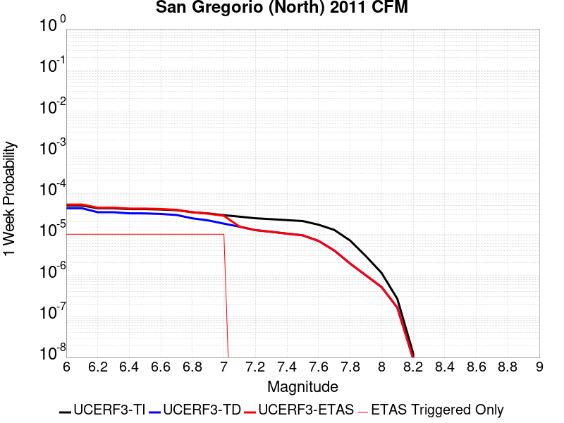 |  | 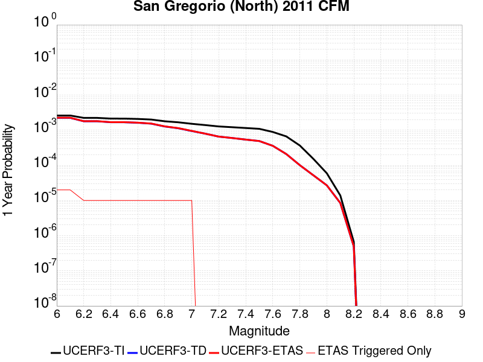 |  |

| Magnitude | 1 wk TI Prob | 1 wk TD Prob | 1 wk ETAS Prob | 1 wk ETAS/TD Gain | 1 wk ETAS Triggered Only | 1 mo TI Prob | 1 mo TD Prob | 1 mo ETAS Prob | 1 mo ETAS/TD Gain | 1 mo ETAS Triggered Only | 1 yr TI Prob | 1 yr TD Prob | 1 yr ETAS Prob | 1 yr ETAS/TD Gain | 1 yr ETAS Triggered Only | 10 yr TI Prob | 10 yr TD Prob | 10 yr ETAS Prob | 10 yr ETAS/TD Gain | 10 yr ETAS Triggered Only |
|-----|-----|-----|-----|-----|-----|-----|-----|-----|-----|-----|-----|-----|-----|-----|-----|-----|-----|-----|-----|-----|
| 6.0 | 5.0283932E-5 | 4.3057815E-5 | 5.913429E-5 | 1.3733696 | 1.607717E-5 | 2.1548476E-4 | 1.8452053E-4 | 2.1666894E-4 | 1.1742268 | 3.215434E-5 | 0.0026203706 | 0.002244237 | 0.0022763193 | 1.0142953 | 3.215434E-5 | 0.02589687 | 0.022293162 | 0.0223246 | 1.0014102 | 3.215434E-5 |
| 6.1 | 5.0283932E-5 | 4.3057815E-5 | 5.913429E-5 | 1.3733696 | 1.607717E-5 | 2.1548476E-4 | 1.8452053E-4 | 2.1666894E-4 | 1.1742268 | 3.215434E-5 | 0.0026203706 | 0.002244237 | 0.0022763193 | 1.0142953 | 3.215434E-5 | 0.02589687 | 0.022293162 | 0.0223246 | 1.0014102 | 3.215434E-5 |
| 6.2 | 4.2998647E-5 | 3.4441564E-5 | 5.051818E-5 | 1.4667795 | 1.607717E-5 | 1.842669E-4 | 1.475984E-4 | 1.6367319E-4 | 1.108909 | 1.607717E-5 | 0.0022411412 | 0.00179554 | 0.0018115883 | 1.0089378 | 1.607717E-5 | 0.022186736 | 0.017886506 | 0.017902296 | 1.0008827 | 1.607717E-5 |
| 6.3 | 4.2998647E-5 | 3.4441564E-5 | 5.051818E-5 | 1.4667795 | 1.607717E-5 | 1.842669E-4 | 1.475984E-4 | 1.6367319E-4 | 1.108909 | 1.607717E-5 | 0.0022411412 | 0.00179554 | 0.0018115883 | 1.0089378 | 1.607717E-5 | 0.022186736 | 0.017886506 | 0.017902296 | 1.0008827 | 1.607717E-5 |
| 6.4 | 4.1101295E-5 | 3.2326872E-5 | 4.8403523E-5 | 1.4973154 | 1.607717E-5 | 1.7613651E-4 | 1.3853642E-4 | 1.5461136E-4 | 1.116034 | 1.607717E-5 | 0.0021423528 | 0.0016853869 | 0.0017014369 | 1.009523 | 1.607717E-5 | 0.02121817 | 0.016801886 | 0.016817693 | 1.0009408 | 1.607717E-5 |
| 6.5 | 4.1032585E-5 | 3.2244905E-5 | 4.832156E-5 | 1.4985796 | 1.607717E-5 | 1.7584208E-4 | 1.3818518E-4 | 1.5426012E-4 | 1.1163291 | 1.607717E-5 | 0.0021387753 | 0.0016811171 | 0.0016971673 | 1.0095474 | 1.607717E-5 | 0.021183075 | 0.016759839 | 0.016775647 | 1.0009432 | 1.607717E-5 |
| 6.6 | 4.011629E-5 | 3.1266558E-5 | 4.7343223E-5 | 1.5141809 | 1.607717E-5 | 1.7191563E-4 | 1.339927E-4 | 1.500677E-4 | 1.1199694 | 1.607717E-5 | 0.0020910634 | 0.0016301516 | 0.0016462025 | 1.0098463 | 1.607717E-5 | 0.020714961 | 0.01625741 | 0.016273227 | 1.0009729 | 1.607717E-5 |
| 6.7 | 3.8583938E-5 | 2.9453593E-5 | 4.553029E-5 | 1.5458314 | 1.607717E-5 | 1.6534925E-4 | 1.2622366E-4 | 1.422988E-4 | 1.1273544 | 1.607717E-5 | 0.0020112682 | 0.0015357039 | 0.0015517564 | 1.0104529 | 1.607717E-5 | 0.019931622 | 0.015325955 | 0.015341786 | 1.001033 | 1.607717E-5 |
| 6.8 | 3.44341E-5 | 2.4450854E-5 | 4.0527633E-5 | 1.657514 | 1.607717E-5 | 1.4756636E-4 | 1.0478523E-4 | 1.20860714E-4 | 1.1534137 | 1.607717E-5 | 0.0017951399 | 0.0012750238 | 0.0012910805 | 1.0125933 | 1.607717E-5 | 0.017807078 | 0.012751131 | 0.012767004 | 1.0012448 | 1.607717E-5 |
| 6.9 | 3.221199E-5 | 2.1778029E-5 | 3.785485E-5 | 1.7382128 | 1.607717E-5 | 1.3804408E-4 | 9.333112E-5 | 1.0940679E-4 | 1.1722434 | 1.607717E-5 | 0.0016793909 | 0.0011357224 | 0.0011517813 | 1.0141398 | 1.607717E-5 | 0.01666756 | 0.011372583 | 0.011388478 | 1.0013976 | 1.607717E-5 |
| 7.0 | 2.9186718E-5 | 1.8146875E-5 | 3.4223754E-5 | 1.885931 | 1.607717E-5 | 1.2507994E-4 | 7.7770026E-5 | 9.384594E-5 | 1.206711 | 1.607717E-5 | 0.0015217843 | 9.464431E-4 | 9.6250506E-4 | 1.0169709 | 1.607717E-5 | 0.015114053 | 0.009496798 | 0.0095127225 | 1.0016768 | 1.607717E-5 |
| 7.1 | 2.6840138E-5 | 1.5284508E-5 | 1.5284508E-5 | 1.0 | 0.0 | 1.1502409E-4 | 6.55034E-5 | 6.55034E-5 | 1.0 | 0.0 | 0.0013995186 | 7.9721404E-4 | 7.9721404E-4 | 1.0 | 0.0 | 0.013907375 | 0.008015723 | 0.008015723 | 1.0 | 0.0 |
| 7.2 | 2.453002E-5 | 1.2606672E-5 | 1.2606672E-5 | 1.0 | 0.0 | 1.05124425E-4 | 5.4027478E-5 | 5.4027478E-5 | 1.0 | 0.0 | 0.0012791384 | 6.575866E-4 | 6.575866E-4 | 1.0 | 0.0 | 0.012718005 | 0.00662763 | 0.00662763 | 1.0 | 0.0 |
| 7.3 | 2.3330727E-5 | 1.1488677E-5 | 1.1488677E-5 | 1.0 | 0.0 | 9.9985E-5 | 4.923626E-5 | 4.923626E-5 | 1.0 | 0.0 | 0.0012166376 | 5.9928704E-4 | 5.9928704E-4 | 1.0 | 0.0 | 0.012099981 | 0.006046564 | 0.006046564 | 1.0 | 0.0 |
| 7.4 | 2.2136466E-5 | 1.0368981E-5 | 1.0368981E-5 | 1.0 | 0.0 | 9.486712E-5 | 4.4437733E-5 | 4.4437733E-5 | 1.0 | 0.0 | 0.0011543952 | 5.4089533E-4 | 5.4089533E-4 | 1.0 | 0.0 | 0.011484168 | 0.005464249 | 0.005464249 | 1.0 | 0.0 |
| 7.5 | 2.0994974E-5 | 9.427217E-6 | 9.427217E-6 | 1.0 | 0.0 | 8.997535E-5 | 4.0401734E-5 | 4.0401734E-5 | 1.0 | 0.0 | 0.0010948994 | 4.9178035E-4 | 4.9178035E-4 | 1.0 | 0.0 | 0.010895205 | 0.004973358 | 0.004973358 | 1.0 | 0.0 |
| 7.6 | 1.7091823E-5 | 6.893766E-6 | 6.893766E-6 | 1.0 | 0.0 | 7.3248615E-5 | 2.9544377E-5 | 2.9544377E-5 | 1.0 | 0.0 | 8.9143694E-4 | 3.596435E-4 | 3.596435E-4 | 1.0 | 0.0 | 0.008878695 | 0.0036482841 | 0.0036482841 | 1.0 | 0.0 |
| 7.7 | 1.2772179E-5 | 4.0208706E-6 | 4.0208706E-6 | 1.0 | 0.0 | 5.473676E-5 | 1.7232189E-5 | 1.7232189E-5 | 1.0 | 0.0 | 6.6621625E-4 | 2.0978172E-4 | 2.0978172E-4 | 1.0 | 0.0 | 0.006642225 | 0.002136922 | 0.002136922 | 1.0 | 0.0 |
| 7.8 | 7.041923E-6 | 1.940626E-6 | 1.940626E-6 | 1.0 | 0.0 | 3.017932E-5 | 8.316942E-6 | 8.316942E-6 | 1.0 | 0.0 | 3.6737128E-4 | 1.0125406E-4 | 1.0125406E-4 | 1.0 | 0.0 | 0.0036676454 | 0.0010379003 | 0.0010379003 | 1.0 | 0.0 |
| 7.9 | 2.946768E-6 | 1.0033551E-6 | 1.0033551E-6 | 1.0 | 0.0 | 1.2628945E-5 | 4.300086E-6 | 4.300086E-6 | 1.0 | 0.0 | 1.5374656E-4 | 5.235229E-5 | 5.235229E-5 | 1.0 | 0.0 | 0.0015364023 | 5.3400313E-4 | 5.3400313E-4 | 1.0 | 0.0 |
| 8.0 | 1.1433375E-6 | 5.18146E-7 | 5.18146E-7 | 1.0 | 0.0 | 4.9000087E-6 | 2.2206239E-6 | 2.2206239E-6 | 1.0 | 0.0 | 5.965597E-5 | 2.703576E-5 | 2.703576E-5 | 1.0 | 0.0 | 5.963996E-4 | 2.7398416E-4 | 2.7398416E-4 | 1.0 | 0.0 |
| 8.1 | 2.6675295E-7 | 1.62899E-7 | 1.62899E-7 | 1.0 | 0.0 | 1.1432264E-6 | 6.9813836E-7 | 6.9813836E-7 | 1.0 | 0.0 | 1.3918692E-5 | 8.499802E-6 | 8.499802E-6 | 1.0 | 0.0 | 1.391782E-4 | 8.63795E-5 | 8.63795E-5 | 1.0 | 0.0 |
| 8.2 | 1.2704569E-8 | 9.431393E-9 | 9.431393E-9 | 1.0 | 0.0 | 5.444815E-8 | 4.042026E-8 | 4.042026E-8 | 1.0 | 0.0 | 6.629061E-7 | 4.9211656E-7 | 4.9211656E-7 | 1.0 | 0.0 | 6.629041E-6 | 5.1121438E-6 | 5.1121438E-6 | 1.0 | 0.0 |

## San Luis Range 2011 CFM
*[(top)](#table-of-contents)*

| 1 Week | 1 Month | 1 Year | 10 Year |
|-----|-----|-----|-----|
|  |  |  |  |

| Magnitude | 1 wk TI Prob | 1 wk TD Prob | 1 wk ETAS Prob | 1 wk ETAS/TD Gain | 1 wk ETAS Triggered Only | 1 mo TI Prob | 1 mo TD Prob | 1 mo ETAS Prob | 1 mo ETAS/TD Gain | 1 mo ETAS Triggered Only | 1 yr TI Prob | 1 yr TD Prob | 1 yr ETAS Prob | 1 yr ETAS/TD Gain | 1 yr ETAS Triggered Only | 10 yr TI Prob | 10 yr TD Prob | 10 yr ETAS Prob | 10 yr ETAS/TD Gain | 10 yr ETAS Triggered Only |
|-----|-----|-----|-----|-----|-----|-----|-----|-----|-----|-----|-----|-----|-----|-----|-----|-----|-----|-----|-----|-----|
| 6.0 | 8.8368415E-6 | 8.965454E-6 | 2.504248E-5 | 2.7932196 | 1.607717E-5 | 3.787163E-5 | 3.842285E-5 | 7.057596E-5 | 1.8368225 | 3.215434E-5 | 4.609895E-4 | 4.677057E-4 | 5.1591464E-4 | 1.1030754 | 4.823151E-5 | 0.0046003438 | 0.0046679964 | 0.0047160024 | 1.0102842 | 4.823151E-5 |
| 6.1 | 8.8368415E-6 | 8.965454E-6 | 2.504248E-5 | 2.7932196 | 1.607717E-5 | 3.787163E-5 | 3.842285E-5 | 7.057596E-5 | 1.8368225 | 3.215434E-5 | 4.609895E-4 | 4.677057E-4 | 5.1591464E-4 | 1.1030754 | 4.823151E-5 | 0.0046003438 | 0.0046679964 | 0.0047160024 | 1.0102842 | 4.823151E-5 |
| 6.2 | 8.8368415E-6 | 8.965454E-6 | 2.504248E-5 | 2.7932196 | 1.607717E-5 | 3.787163E-5 | 3.842285E-5 | 7.057596E-5 | 1.8368225 | 3.215434E-5 | 4.609895E-4 | 4.677057E-4 | 5.1591464E-4 | 1.1030754 | 4.823151E-5 | 0.0046003438 | 0.0046679964 | 0.0047160024 | 1.0102842 | 4.823151E-5 |
| 6.3 | 8.8368415E-6 | 8.965454E-6 | 2.504248E-5 | 2.7932196 | 1.607717E-5 | 3.787163E-5 | 3.842285E-5 | 7.057596E-5 | 1.8368225 | 3.215434E-5 | 4.609895E-4 | 4.677057E-4 | 5.1591464E-4 | 1.1030754 | 4.823151E-5 | 0.0046003438 | 0.0046679964 | 0.0047160024 | 1.0102842 | 4.823151E-5 |
| 6.4 | 3.9094193E-6 | 3.9412025E-6 | 3.9412025E-6 | 1.0 | 0.0 | 1.6754546E-5 | 1.689076E-5 | 1.689076E-5 | 1.0 | 0.0 | 2.039675E-4 | 2.056259E-4 | 2.056259E-4 | 1.0 | 0.0 | 0.0020378039 | 0.0020543851 | 0.0020543851 | 1.0 | 0.0 |
| 6.5 | 3.9094193E-6 | 3.9412025E-6 | 3.9412025E-6 | 1.0 | 0.0 | 1.6754546E-5 | 1.689076E-5 | 1.689076E-5 | 1.0 | 0.0 | 2.039675E-4 | 2.056259E-4 | 2.056259E-4 | 1.0 | 0.0 | 0.0020378039 | 0.0020543851 | 0.0020543851 | 1.0 | 0.0 |
| 6.6 | 3.0587726E-6 | 3.0753883E-6 | 3.0753883E-6 | 1.0 | 0.0 | 1.3108959E-5 | 1.318017E-5 | 1.318017E-5 | 1.0 | 0.0 | 1.595899E-4 | 1.6045687E-4 | 1.6045687E-4 | 1.0 | 0.0 | 0.0015947534 | 0.0016034221 | 0.0016034221 | 1.0 | 0.0 |
| 6.7 | 2.6160574E-6 | 2.6251273E-6 | 2.6251273E-6 | 1.0 | 0.0 | 1.1211626E-5 | 1.1250498E-5 | 1.1250498E-5 | 1.0 | 0.0 | 1.3649299E-4 | 1.3696625E-4 | 1.3696625E-4 | 1.0 | 0.0 | 0.0013640919 | 0.0013688246 | 0.0013688246 | 1.0 | 0.0 |
| 6.8 | 2.5110312E-6 | 2.51814E-6 | 2.51814E-6 | 1.0 | 0.0 | 1.0761518E-5 | 1.0791985E-5 | 1.0791985E-5 | 1.0 | 0.0 | 1.310136E-4 | 1.3138456E-4 | 1.3138456E-4 | 1.0 | 0.0 | 0.0013093639 | 0.0013130746 | 0.0013130746 | 1.0 | 0.0 |
| 6.9 | 1.8564405E-6 | 1.852487E-6 | 1.852487E-6 | 1.0 | 0.0 | 7.95615E-6 | 7.939206E-6 | 7.939206E-6 | 1.0 | 0.0 | 9.686181E-5 | 9.665557E-5 | 9.665557E-5 | 1.0 | 0.0 | 9.68196E-4 | 9.661373E-4 | 9.661373E-4 | 1.0 | 0.0 |
| 7.0 | 1.546127E-6 | 1.5369537E-6 | 1.5369537E-6 | 1.0 | 0.0 | 6.626242E-6 | 6.586928E-6 | 6.586928E-6 | 1.0 | 0.0 | 8.06715E-5 | 8.0192905E-5 | 8.0192905E-5 | 1.0 | 0.0 | 8.0642226E-4 | 8.016404E-4 | 8.016404E-4 | 1.0 | 0.0 |
| 7.1 | 1.3368208E-6 | 1.3235326E-6 | 1.3235326E-6 | 1.0 | 0.0 | 5.7292195E-6 | 5.67227E-6 | 5.67227E-6 | 1.0 | 0.0 | 6.975101E-5 | 6.905771E-5 | 6.905771E-5 | 1.0 | 0.0 | 6.972912E-4 | 6.9036294E-4 | 6.9036294E-4 | 1.0 | 0.0 |
| 7.2 | 1.0623363E-6 | 1.0454368E-6 | 1.0454368E-6 | 1.0 | 0.0 | 4.5528623E-6 | 4.4804356E-6 | 4.4804356E-6 | 1.0 | 0.0 | 5.5429686E-5 | 5.4547938E-5 | 5.4547938E-5 | 1.0 | 0.0 | 5.5415864E-4 | 5.4534577E-4 | 5.4534577E-4 | 1.0 | 0.0 |
| 7.3 | 7.831679E-7 | 7.7273904E-7 | 7.7273904E-7 | 1.0 | 0.0 | 3.3564295E-6 | 3.3117344E-6 | 3.3117344E-6 | 1.0 | 0.0 | 4.086376E-5 | 4.0319625E-5 | 4.0319625E-5 | 1.0 | 0.0 | 4.0856248E-4 | 4.031232E-4 | 4.031232E-4 | 1.0 | 0.0 |
| 7.4 | 5.9558846E-7 | 5.910636E-7 | 5.910636E-7 | 1.0 | 0.0 | 2.5525194E-6 | 2.5331274E-6 | 2.5331274E-6 | 1.0 | 0.0 | 3.107648E-5 | 3.084039E-5 | 3.084039E-5 | 1.0 | 0.0 | 3.1072134E-4 | 3.083612E-4 | 3.083612E-4 | 1.0 | 0.0 |
| 7.5 | 4.1616502E-7 | 4.119631E-7 | 4.119631E-7 | 1.0 | 0.0 | 1.7835631E-6 | 1.7655549E-6 | 1.7655549E-6 | 1.0 | 0.0 | 2.1714664E-5 | 2.149542E-5 | 2.149542E-5 | 1.0 | 0.0 | 2.1712543E-4 | 2.1493346E-4 | 2.1493346E-4 | 1.0 | 0.0 |
| 7.6 | 2.3816014E-7 | 2.3376548E-7 | 2.3376548E-7 | 1.0 | 0.0 | 1.0206859E-6 | 1.0018516E-6 | 1.0018516E-6 | 1.0 | 0.0 | 1.242678E-5 | 1.2197475E-5 | 1.2197475E-5 | 1.0 | 0.0 | 1.2426086E-4 | 1.2196808E-4 | 1.2196808E-4 | 1.0 | 0.0 |
| 7.7 | 9.918777E-8 | 9.3867584E-8 | 9.3867584E-8 | 1.0 | 0.0 | 4.2509038E-7 | 4.0228957E-7 | 4.0228957E-7 | 1.0 | 0.0 | 5.1754632E-6 | 4.8978645E-6 | 4.8978645E-6 | 1.0 | 0.0 | 5.1753424E-5 | 4.897757E-5 | 4.897757E-5 | 1.0 | 0.0 |
| 7.8 | 3.4982556E-8 | 2.968655E-8 | 2.968655E-8 | 1.0 | 0.0 | 1.4992524E-7 | 1.2722806E-7 | 1.2722806E-7 | 1.0 | 0.0 | 1.8253382E-6 | 1.5490006E-6 | 1.5490006E-6 | 1.0 | 0.0 | 1.8253233E-5 | 1.5489897E-5 | 1.5489897E-5 | 1.0 | 0.0 |
| 7.9 | 1.6624908E-8 | 1.1477036E-8 | 1.1477036E-8 | 1.0 | 0.0 | 7.12496E-8 | 4.91873E-8 | 4.91873E-8 | 1.0 | 0.0 | 8.6746354E-7 | 5.988552E-7 | 5.988552E-7 | 1.0 | 0.0 | 8.674601E-6 | 5.988536E-6 | 5.988536E-6 | 1.0 | 0.0 |
| 8.0 | 6.3352315E-9 | 3.0888412E-9 | 3.0888412E-9 | 1.0 | 0.0 | 2.715099E-8 | 1.3237893E-8 | 1.3237893E-8 | 1.0 | 0.0 | 3.3056327E-7 | 1.6117131E-7 | 1.6117131E-7 | 1.0 | 0.0 | 3.3056278E-6 | 1.611712E-6 | 1.611712E-6 | 1.0 | 0.0 |

## Fontana (Seismicity)
*[(top)](#table-of-contents)*

| 1 Week | 1 Month | 1 Year | 10 Year |
|-----|-----|-----|-----|
|  |  |  |  |

| Magnitude | 1 wk TI Prob | 1 wk TD Prob | 1 wk ETAS Prob | 1 wk ETAS/TD Gain | 1 wk ETAS Triggered Only | 1 mo TI Prob | 1 mo TD Prob | 1 mo ETAS Prob | 1 mo ETAS/TD Gain | 1 mo ETAS Triggered Only | 1 yr TI Prob | 1 yr TD Prob | 1 yr ETAS Prob | 1 yr ETAS/TD Gain | 1 yr ETAS Triggered Only | 10 yr TI Prob | 10 yr TD Prob | 10 yr ETAS Prob | 10 yr ETAS/TD Gain | 10 yr ETAS Triggered Only |
|-----|-----|-----|-----|-----|-----|-----|-----|-----|-----|-----|-----|-----|-----|-----|-----|-----|-----|-----|-----|-----|
| 6.0 | 7.1789214E-6 | 7.5520006E-6 | 2.3629049E-5 | 3.1288464 | 1.607717E-5 | 3.076644E-5 | 3.2365548E-5 | 4.8442194E-5 | 1.4967211 | 1.607717E-5 | 3.7451705E-4 | 3.9402005E-4 | 4.261617E-4 | 1.0815737 | 3.215434E-5 | 0.003738865 | 0.003937214 | 0.0039852555 | 1.0122019 | 4.823151E-5 |
| 6.1 | 7.1789214E-6 | 7.5520006E-6 | 2.3629049E-5 | 3.1288464 | 1.607717E-5 | 3.076644E-5 | 3.2365548E-5 | 4.8442194E-5 | 1.4967211 | 1.607717E-5 | 3.7451705E-4 | 3.9402005E-4 | 4.261617E-4 | 1.0815737 | 3.215434E-5 | 0.003738865 | 0.003937214 | 0.0039852555 | 1.0122019 | 4.823151E-5 |
| 6.2 | 7.1789214E-6 | 7.5520006E-6 | 2.3629049E-5 | 3.1288464 | 1.607717E-5 | 3.076644E-5 | 3.2365548E-5 | 4.8442194E-5 | 1.4967211 | 1.607717E-5 | 3.7451705E-4 | 3.9402005E-4 | 4.261617E-4 | 1.0815737 | 3.215434E-5 | 0.003738865 | 0.003937214 | 0.0039852555 | 1.0122019 | 4.823151E-5 |
| 6.3 | 7.1789214E-6 | 7.5520006E-6 | 2.3629049E-5 | 3.1288464 | 1.607717E-5 | 3.076644E-5 | 3.2365548E-5 | 4.8442194E-5 | 1.4967211 | 1.607717E-5 | 3.7451705E-4 | 3.9402005E-4 | 4.261617E-4 | 1.0815737 | 3.215434E-5 | 0.003738865 | 0.003937214 | 0.0039852555 | 1.0122019 | 4.823151E-5 |
| 6.4 | 7.1789214E-6 | 7.5520006E-6 | 2.3629049E-5 | 3.1288464 | 1.607717E-5 | 3.076644E-5 | 3.2365548E-5 | 4.8442194E-5 | 1.4967211 | 1.607717E-5 | 3.7451705E-4 | 3.9402005E-4 | 4.261617E-4 | 1.0815737 | 3.215434E-5 | 0.003738865 | 0.003937214 | 0.0039852555 | 1.0122019 | 4.823151E-5 |
| 6.5 | 5.2611317E-6 | 5.532726E-6 | 2.1609807E-5 | 3.9058156 | 1.607717E-5 | 2.2547512E-5 | 2.3711682E-5 | 3.9788472E-5 | 1.6780113 | 1.607717E-5 | 2.744814E-4 | 2.8868974E-4 | 3.2083478E-4 | 1.1113482 | 3.215434E-5 | 0.002741426 | 0.0028868972 | 0.0029349895 | 1.0166588 | 4.823151E-5 |
| 6.6 | 5.2611317E-6 | 5.532726E-6 | 2.1609807E-5 | 3.9058156 | 1.607717E-5 | 2.2547512E-5 | 2.3711682E-5 | 3.9788472E-5 | 1.6780113 | 1.607717E-5 | 2.744814E-4 | 2.8868974E-4 | 3.2083478E-4 | 1.1113482 | 3.215434E-5 | 0.002741426 | 0.0028868972 | 0.0029349895 | 1.0166588 | 4.823151E-5 |

## San Jacinto (Lytle Creek connector)
*[(top)](#table-of-contents)*

| 1 Week | 1 Month | 1 Year | 10 Year |
|-----|-----|-----|-----|
|  |  |  |  |

| Magnitude | 1 wk TI Prob | 1 wk TD Prob | 1 wk ETAS Prob | 1 wk ETAS/TD Gain | 1 wk ETAS Triggered Only | 1 mo TI Prob | 1 mo TD Prob | 1 mo ETAS Prob | 1 mo ETAS/TD Gain | 1 mo ETAS Triggered Only | 1 yr TI Prob | 1 yr TD Prob | 1 yr ETAS Prob | 1 yr ETAS/TD Gain | 1 yr ETAS Triggered Only | 10 yr TI Prob | 10 yr TD Prob | 10 yr ETAS Prob | 10 yr ETAS/TD Gain | 10 yr ETAS Triggered Only |
|-----|-----|-----|-----|-----|-----|-----|-----|-----|-----|-----|-----|-----|-----|-----|-----|-----|-----|-----|-----|-----|
| 6.0 | 6.693995E-6 | 6.660216E-6 | 6.660216E-6 | 1.0 | 0.0 | 2.8688235E-5 | 2.854347E-5 | 4.4620185E-5 | 1.563236 | 1.607717E-5 | 3.492233E-4 | 3.4746144E-4 | 3.63533E-4 | 1.0462543 | 1.607717E-5 | 0.00348675 | 0.0035493854 | 0.0035974456 | 1.0135405 | 4.823151E-5 |
| 6.1 | 6.693995E-6 | 6.660216E-6 | 6.660216E-6 | 1.0 | 0.0 | 2.8688235E-5 | 2.854347E-5 | 4.4620185E-5 | 1.563236 | 1.607717E-5 | 3.492233E-4 | 3.4746144E-4 | 3.63533E-4 | 1.0462543 | 1.607717E-5 | 0.00348675 | 0.0035493854 | 0.0035974456 | 1.0135405 | 4.823151E-5 |
| 6.2 | 6.693995E-6 | 6.660216E-6 | 6.660216E-6 | 1.0 | 0.0 | 2.8688235E-5 | 2.854347E-5 | 4.4620185E-5 | 1.563236 | 1.607717E-5 | 3.492233E-4 | 3.4746144E-4 | 3.63533E-4 | 1.0462543 | 1.607717E-5 | 0.00348675 | 0.0035493854 | 0.0035974456 | 1.0135405 | 4.823151E-5 |
| 6.3 | 6.693995E-6 | 6.660216E-6 | 6.660216E-6 | 1.0 | 0.0 | 2.8688235E-5 | 2.854347E-5 | 4.4620185E-5 | 1.563236 | 1.607717E-5 | 3.492233E-4 | 3.4746144E-4 | 3.63533E-4 | 1.0462543 | 1.607717E-5 | 0.00348675 | 0.0035493854 | 0.0035974456 | 1.0135405 | 4.823151E-5 |
| 6.4 | 6.693995E-6 | 6.660216E-6 | 6.660216E-6 | 1.0 | 0.0 | 2.8688235E-5 | 2.854347E-5 | 4.4620185E-5 | 1.563236 | 1.607717E-5 | 3.492233E-4 | 3.4746144E-4 | 3.63533E-4 | 1.0462543 | 1.607717E-5 | 0.00348675 | 0.0035493854 | 0.0035974456 | 1.0135405 | 4.823151E-5 |
| 6.5 | 6.6561875E-6 | 6.6204343E-6 | 6.6204343E-6 | 1.0 | 0.0 | 2.8526205E-5 | 2.837298E-5 | 4.4449695E-5 | 1.5666206 | 1.607717E-5 | 3.472512E-4 | 3.4538636E-4 | 3.61458E-4 | 1.0465323 | 1.607717E-5 | 0.0034670907 | 0.003528701 | 0.003576762 | 1.0136201 | 4.823151E-5 |
| 6.6 | 6.6561875E-6 | 6.6204343E-6 | 6.6204343E-6 | 1.0 | 0.0 | 2.8526205E-5 | 2.837298E-5 | 4.4449695E-5 | 1.5666206 | 1.607717E-5 | 3.472512E-4 | 3.4538636E-4 | 3.61458E-4 | 1.0465323 | 1.607717E-5 | 0.0034670907 | 0.003528701 | 0.003576762 | 1.0136201 | 4.823151E-5 |
| 6.7 | 6.5802237E-6 | 6.539611E-6 | 6.539611E-6 | 1.0 | 0.0 | 2.8200653E-5 | 2.8026603E-5 | 4.4103323E-5 | 1.5736235 | 1.607717E-5 | 3.4328885E-4 | 3.4117055E-4 | 3.5724224E-4 | 1.0471075 | 1.607717E-5 | 0.0034275902 | 0.0034866752 | 0.0035347387 | 1.0137849 | 4.823151E-5 |
| 6.8 | 6.575632E-6 | 6.5341005E-6 | 6.5341005E-6 | 1.0 | 0.0 | 2.8180975E-5 | 2.8002989E-5 | 4.407971E-5 | 1.5741073 | 1.607717E-5 | 3.4304935E-4 | 3.4088313E-4 | 3.569548E-4 | 1.0471473 | 1.607717E-5 | 0.0034252026 | 0.00348381 | 0.0035318735 | 1.0137962 | 4.823151E-5 |
| 6.9 | 6.570433E-6 | 6.525495E-6 | 6.525495E-6 | 1.0 | 0.0 | 2.8158694E-5 | 2.7966107E-5 | 4.4042827E-5 | 1.5748645 | 1.607717E-5 | 3.4277816E-4 | 3.4043423E-4 | 3.5650592E-4 | 1.0472094 | 1.607717E-5 | 0.0034224992 | 0.0034793352 | 0.003527399 | 1.0138141 | 4.823151E-5 |
| 7.0 | 6.5643826E-6 | 6.515616E-6 | 6.515616E-6 | 1.0 | 0.0 | 2.8132765E-5 | 2.792377E-5 | 4.400049E-5 | 1.575736 | 1.607717E-5 | 3.424626E-4 | 3.3991894E-4 | 3.5599063E-4 | 1.047281 | 1.607717E-5 | 0.0034193532 | 0.0034741985 | 0.0035222624 | 1.0138346 | 4.823151E-5 |
| 7.1 | 6.557402E-6 | 6.5043278E-6 | 6.5043278E-6 | 1.0 | 0.0 | 2.8102848E-5 | 2.7875392E-5 | 4.3952114E-5 | 1.5767353 | 1.607717E-5 | 3.4209844E-4 | 3.3933012E-4 | 3.5540183E-4 | 1.047363 | 1.607717E-5 | 0.0034157229 | 0.0034683298 | 0.003516394 | 1.0138581 | 4.823151E-5 |
| 7.2 | 6.546394E-6 | 6.4862943E-6 | 6.4862943E-6 | 1.0 | 0.0 | 2.8055672E-5 | 2.7798109E-5 | 4.3874832E-5 | 1.5783387 | 1.607717E-5 | 3.4152428E-4 | 3.3838948E-4 | 3.5446123E-4 | 1.0474948 | 1.607717E-5 | 0.0034099987 | 0.0034589572 | 0.0035070218 | 1.0138958 | 4.823151E-5 |
| 7.3 | 6.5364216E-6 | 6.4670803E-6 | 6.4670803E-6 | 1.0 | 0.0 | 2.8012933E-5 | 2.7715765E-5 | 4.379249E-5 | 1.580057 | 1.607717E-5 | 3.4100408E-4 | 3.3738726E-4 | 3.53459E-4 | 1.0476359 | 1.607717E-5 | 0.003404813 | 0.0034489788 | 0.0034970439 | 1.013936 | 4.823151E-5 |
| 7.4 | 6.5269523E-6 | 6.4481674E-6 | 6.4481674E-6 | 1.0 | 0.0 | 2.7972354E-5 | 2.7634711E-5 | 4.3711436E-5 | 1.5817584 | 1.607717E-5 | 3.4051016E-4 | 3.3640073E-4 | 3.524725E-4 | 1.0477756 | 1.607717E-5 | 0.0033998888 | 0.003439161 | 0.0034872266 | 1.013976 | 4.823151E-5 |
| 7.5 | 6.5111835E-6 | 6.424442E-6 | 6.424442E-6 | 1.0 | 0.0 | 2.7904773E-5 | 2.7533031E-5 | 4.360976E-5 | 1.5839069 | 1.607717E-5 | 3.3968766E-4 | 3.3516317E-4 | 3.5123495E-4 | 1.047952 | 1.607717E-5 | 0.0033916887 | 0.003426834 | 0.0034749003 | 1.0140264 | 4.823151E-5 |
| 7.6 | 6.4768806E-6 | 6.383551E-6 | 6.383551E-6 | 1.0 | 0.0 | 2.7757764E-5 | 2.735779E-5 | 4.343452E-5 | 1.5876473 | 1.607717E-5 | 3.3789838E-4 | 3.3303024E-4 | 3.4910208E-4 | 1.0482594 | 1.607717E-5 | 0.0033738504 | 0.0034055663 | 0.0034536335 | 1.0141144 | 4.823151E-5 |
| 7.7 | 6.1655364E-6 | 6.1760365E-6 | 6.1760365E-6 | 1.0 | 0.0 | 2.642346E-5 | 2.646846E-5 | 4.2545205E-5 | 1.6073925 | 1.607717E-5 | 3.2165812E-4 | 3.2220592E-4 | 3.382779E-4 | 1.0498811 | 1.607717E-5 | 0.0032119295 | 0.0032971818 | 0.003345254 | 1.0145799 | 4.823151E-5 |
| 7.8 | 5.5043524E-6 | 5.737097E-6 | 5.737097E-6 | 1.0 | 0.0 | 2.3589868E-5 | 2.4587327E-5 | 4.06641E-5 | 1.6538643 | 1.607717E-5 | 2.871688E-4 | 2.9930964E-4 | 3.15382E-4 | 1.0536981 | 1.607717E-5 | 0.0028679797 | 0.0030672832 | 0.003115367 | 1.0156763 | 4.823151E-5 |
| 7.9 | 3.889249E-6 | 4.076761E-6 | 4.076761E-6 | 1.0 | 0.0 | 1.6668104E-5 | 1.7471715E-5 | 1.7471715E-5 | 1.0 | 0.0 | 2.0291525E-4 | 2.1269741E-4 | 2.1269741E-4 | 1.0 | 0.0 | 0.0020273007 | 0.0021943315 | 0.0022264153 | 1.0146213 | 3.215434E-5 |
| 8.0 | 2.668535E-6 | 2.5315155E-6 | 2.5315155E-6 | 1.0 | 0.0 | 1.1436528E-5 | 1.0849307E-5 | 1.0849307E-5 | 1.0 | 0.0 | 1.3923083E-4 | 1.3208234E-4 | 1.3208234E-4 | 1.0 | 0.0 | 0.0013914363 | 0.0013757964 | 0.0013918513 | 1.0116696 | 1.607717E-5 |
| 8.1 | 1.5911459E-6 | 1.218661E-6 | 1.218661E-6 | 1.0 | 0.0 | 6.8191785E-6 | 5.2228224E-6 | 5.2228224E-6 | 1.0 | 0.0 | 8.3020335E-5 | 6.3586034E-5 | 6.3586034E-5 | 1.0 | 0.0 | 8.298933E-4 | 6.6932244E-4 | 6.6932244E-4 | 1.0 | 0.0 |
| 8.2 | 6.1294963E-7 | 2.1812275E-7 | 2.1812275E-7 | 1.0 | 0.0 | 2.6269242E-6 | 9.3481145E-7 | 9.3481145E-7 | 1.0 | 0.0 | 3.1982334E-5 | 1.138127E-5 | 1.138127E-5 | 1.0 | 0.0 | 3.1977732E-4 | 1.2784546E-4 | 1.2784546E-4 | 1.0 | 0.0 |
| 8.3 | 1.762871E-7 | 4.7546838E-8 | 4.7546838E-8 | 1.0 | 0.0 | 7.5551594E-7 | 2.0377215E-7 | 2.0377215E-7 | 1.0 | 0.0 | 9.1983675E-6 | 2.480923E-6 | 2.480923E-6 | 1.0 | 0.0 | 9.197987E-5 | 2.868753E-5 | 2.868753E-5 | 1.0 | 0.0 |

## Calaveras (So) 2011 CFM
*[(top)](#table-of-contents)*

| 1 Week | 1 Month | 1 Year | 10 Year |
|-----|-----|-----|-----|
|  |  |  |  |

| Magnitude | 1 wk TI Prob | 1 wk TD Prob | 1 wk ETAS Prob | 1 wk ETAS/TD Gain | 1 wk ETAS Triggered Only | 1 mo TI Prob | 1 mo TD Prob | 1 mo ETAS Prob | 1 mo ETAS/TD Gain | 1 mo ETAS Triggered Only | 1 yr TI Prob | 1 yr TD Prob | 1 yr ETAS Prob | 1 yr ETAS/TD Gain | 1 yr ETAS Triggered Only | 10 yr TI Prob | 10 yr TD Prob | 10 yr ETAS Prob | 10 yr ETAS/TD Gain | 10 yr ETAS Triggered Only |
|-----|-----|-----|-----|-----|-----|-----|-----|-----|-----|-----|-----|-----|-----|-----|-----|-----|-----|-----|-----|-----|
| 6.0 | 1.5950744E-4 | 3.071188E-4 | 3.071188E-4 | 1.0 | 0.0 | 6.834242E-4 | 0.0013155643 | 0.0013316203 | 1.0122046 | 1.607717E-5 | 0.00828899 | 0.01585904 | 0.015890684 | 1.0019953 | 3.215434E-5 | 0.079865426 | 0.14440064 | 0.14444192 | 1.0002857 | 4.823151E-5 |
| 6.1 | 1.3584697E-4 | 2.6036944E-4 | 2.6036944E-4 | 1.0 | 0.0 | 5.8207137E-4 | 0.0011153965 | 0.0011314558 | 1.0143977 | 1.607717E-5 | 0.007063716 | 0.013462106 | 0.013493828 | 1.0023564 | 3.215434E-5 | 0.06843361 | 0.12402854 | 0.12407079 | 1.0003407 | 4.823151E-5 |
| 6.2 | 1.14676266E-4 | 2.1726108E-4 | 2.1726108E-4 | 1.0 | 0.0 | 4.9137714E-4 | 9.307893E-4 | 9.468515E-4 | 1.0172565 | 1.607717E-5 | 0.0059661185 | 0.011245592 | 0.011277384 | 1.0028272 | 3.215434E-5 | 0.058084648 | 0.105019294 | 0.105062455 | 1.000411 | 4.823151E-5 |
| 6.3 | 8.691518E-5 | 1.5987165E-4 | 1.5987165E-4 | 1.0 | 0.0 | 3.7244044E-4 | 6.8496726E-4 | 7.010334E-4 | 1.0234554 | 1.607717E-5 | 0.004525038 | 0.008300893 | 0.008332781 | 1.0038414 | 3.215434E-5 | 0.044339992 | 0.0793347 | 0.079379104 | 1.0005597 | 4.823151E-5 |
| 6.4 | 8.50982E-5 | 1.5693568E-4 | 1.5693568E-4 | 1.0 | 0.0 | 3.646556E-4 | 6.7239115E-4 | 6.884575E-4 | 1.0238943 | 1.607717E-5 | 0.0044306475 | 0.008148931 | 0.008180823 | 1.0039136 | 3.215434E-5 | 0.04343345 | 0.077940844 | 0.07798532 | 1.0005705 | 4.823151E-5 |
| 6.5 | 8.4062965E-5 | 1.5518135E-4 | 1.5518135E-4 | 1.0 | 0.0 | 3.602201E-4 | 6.648764E-4 | 6.809429E-4 | 1.0241646 | 1.607717E-5 | 0.004376863 | 0.008058134 | 0.008090029 | 1.0039581 | 3.215434E-5 | 0.042916555 | 0.077112116 | 0.077156626 | 1.0005772 | 4.823151E-5 |
| 6.6 | 8.194716E-5 | 1.5154095E-4 | 1.5154095E-4 | 1.0 | 0.0 | 3.5115483E-4 | 6.492825E-4 | 6.6534925E-4 | 1.0247453 | 1.607717E-5 | 0.0042669317 | 0.007869979 | 0.007901881 | 1.0040536 | 3.215434E-5 | 0.04185927 | 0.07539739 | 0.07544198 | 1.0005915 | 4.823151E-5 |
| 6.7 | 8.012326E-5 | 1.4821833E-4 | 1.4821833E-4 | 1.0 | 0.0 | 3.433402E-4 | 6.350497E-4 | 6.5111666E-4 | 1.0253003 | 1.607717E-5 | 0.004172157 | 0.007698474 | 0.007730381 | 1.0041445 | 3.215434E-5 | 0.040946912 | 0.073839515 | 0.07388419 | 1.000605 | 4.823151E-5 |
| 6.8 | 7.119773E-5 | 1.2880519E-4 | 1.2880519E-4 | 1.0 | 0.0 | 3.0509746E-4 | 5.519001E-4 | 5.519001E-4 | 1.0 | 0.0 | 0.0037082357 | 0.0066958875 | 0.006711857 | 1.002385 | 1.607717E-5 | 0.036469642 | 0.06468402 | 0.06471409 | 1.0004649 | 3.215434E-5 |
| 6.9 | 5.7343088E-5 | 9.9189E-5 | 9.9189E-5 | 1.0 | 0.0 | 2.4573295E-4 | 4.2502693E-4 | 4.2502693E-4 | 1.0 | 0.0 | 0.0029876942 | 0.0051625078 | 0.005178502 | 1.0030981 | 1.607717E-5 | 0.02947844 | 0.050509132 | 0.0505244 | 1.0003022 | 1.607717E-5 |
| 7.0 | 4.8746577E-5 | 8.284751E-5 | 8.284751E-5 | 1.0 | 0.0 | 2.0889717E-4 | 3.550128E-4 | 3.550128E-4 | 1.0 | 0.0 | 0.0025403565 | 0.004313781 | 0.0043297885 | 1.0037109 | 1.607717E-5 | 0.025115121 | 0.04248505 | 0.042500444 | 1.0003624 | 1.607717E-5 |
| 7.1 | 4.2998014E-5 | 7.264914E-5 | 7.264914E-5 | 1.0 | 0.0 | 1.8426418E-4 | 3.1131663E-4 | 3.1131663E-4 | 1.0 | 0.0 | 0.002241108 | 0.0037837527 | 0.003799769 | 1.0042329 | 1.607717E-5 | 0.022186412 | 0.037423246 | 0.03743872 | 1.0004135 | 1.607717E-5 |
| 7.2 | 3.221292E-5 | 5.390566E-5 | 5.390566E-5 | 1.0 | 0.0 | 1.3804805E-4 | 2.3100396E-4 | 2.3100396E-4 | 1.0 | 0.0 | 0.0016794393 | 0.0028088738 | 0.0028249058 | 1.0057076 | 1.607717E-5 | 0.016668037 | 0.028035998 | 0.028051624 | 1.0005574 | 1.607717E-5 |
| 7.3 | 2.3756531E-5 | 3.9471706E-5 | 3.9471706E-5 | 1.0 | 0.0 | 1.0180973E-4 | 1.6915359E-4 | 1.6915359E-4 | 1.0 | 0.0 | 0.0012388286 | 0.0020575167 | 0.0020735608 | 1.0077978 | 1.607717E-5 | 0.012319452 | 0.02064345 | 0.020659195 | 1.0007627 | 1.607717E-5 |
| 7.4 | 1.5997684E-5 | 2.734085E-5 | 2.734085E-5 | 1.0 | 0.0 | 6.8559704E-5 | 1.1716982E-4 | 1.1716982E-4 | 1.0 | 0.0 | 8.343947E-4 | 0.0014256114 | 0.0014416657 | 1.0112613 | 1.607717E-5 | 0.008312687 | 0.014376549 | 0.014392395 | 1.0011022 | 1.607717E-5 |
| 7.5 | 1.3814293E-5 | 2.4782603E-5 | 2.4782603E-5 | 1.0 | 0.0 | 5.9202768E-5 | 1.0620684E-4 | 1.0620684E-4 | 1.0 | 0.0 | 7.205553E-4 | 0.0012923037 | 0.00130836 | 1.0124246 | 1.607717E-5 | 0.007182234 | 0.013055766 | 0.013071633 | 1.0012153 | 1.607717E-5 |
| 7.6 | 8.817309E-6 | 1.6429829E-5 | 1.6429829E-5 | 1.0 | 0.0 | 3.7787922E-5 | 7.041166E-5 | 7.041166E-5 | 1.0 | 0.0 | 4.5997082E-4 | 8.5692614E-4 | 8.5692614E-4 | 1.0 | 0.0 | 0.004590199 | 0.008719863 | 0.008719863 | 1.0 | 0.0 |
| 7.7 | 4.0352206E-6 | 7.706877E-6 | 7.706877E-6 | 1.0 | 0.0 | 1.7293689E-5 | 3.3029053E-5 | 3.3029053E-5 | 1.0 | 0.0 | 2.1053031E-4 | 4.020546E-4 | 4.020546E-4 | 1.0 | 0.0 | 0.0021033096 | 0.0041649863 | 0.0041649863 | 1.0 | 0.0 |
| 7.8 | 3.413169E-6 | 6.7868646E-6 | 6.7868646E-6 | 1.0 | 0.0 | 1.4627784E-5 | 2.9086239E-5 | 2.9086239E-5 | 1.0 | 0.0 | 1.7807873E-4 | 3.5406748E-4 | 3.5406748E-4 | 1.0 | 0.0 | 0.0017793609 | 0.0036663096 | 0.0036663096 | 1.0 | 0.0 |
| 7.9 | 2.4740732E-6 | 5.278809E-6 | 5.278809E-6 | 1.0 | 0.0 | 1.06031275E-5 | 2.2623271E-5 | 2.2623271E-5 | 1.0 | 0.0 | 1.2908543E-4 | 2.7540355E-4 | 2.7540355E-4 | 1.0 | 0.0 | 0.0012901047 | 0.002834638 | 0.002834638 | 1.0 | 0.0 |
| 8.0 | 1.5231818E-6 | 3.2887135E-6 | 3.2887135E-6 | 1.0 | 0.0 | 6.527906E-6 | 1.409441E-5 | 1.409441E-5 | 1.0 | 0.0 | 7.9474354E-5 | 1.7158597E-4 | 1.7158597E-4 | 1.0 | 0.0 | 7.944594E-4 | 0.001756374 | 0.001756374 | 1.0 | 0.0 |
| 8.1 | 1.0104524E-6 | 2.0456548E-6 | 2.0456548E-6 | 1.0 | 0.0 | 4.330503E-6 | 8.767062E-6 | 8.767062E-6 | 1.0 | 0.0 | 5.2722597E-5 | 1.06733794E-4 | 1.06733794E-4 | 1.0 | 0.0 | 5.271009E-4 | 0.0010929212 | 0.0010929212 | 1.0 | 0.0 |

## Oceanic - West Huasna
*[(top)](#table-of-contents)*

| 1 Week | 1 Month | 1 Year | 10 Year |
|-----|-----|-----|-----|
|  |  | 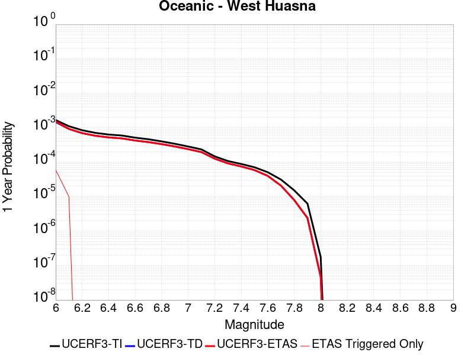 |  |

| Magnitude | 1 wk TI Prob | 1 wk TD Prob | 1 wk ETAS Prob | 1 wk ETAS/TD Gain | 1 wk ETAS Triggered Only | 1 mo TI Prob | 1 mo TD Prob | 1 mo ETAS Prob | 1 mo ETAS/TD Gain | 1 mo ETAS Triggered Only | 1 yr TI Prob | 1 yr TD Prob | 1 yr ETAS Prob | 1 yr ETAS/TD Gain | 1 yr ETAS Triggered Only | 10 yr TI Prob | 10 yr TD Prob | 10 yr ETAS Prob | 10 yr ETAS/TD Gain | 10 yr ETAS Triggered Only |
|-----|-----|-----|-----|-----|-----|-----|-----|-----|-----|-----|-----|-----|-----|-----|-----|-----|-----|-----|-----|-----|
| 6.0 | 3.195567E-5 | 2.7926868E-5 | 4.400359E-5 | 1.5756721 | 1.607717E-5 | 1.3694567E-4 | 1.1968133E-4 | 1.3575658E-4 | 1.134317 | 1.607717E-5 | 0.0016660384 | 0.0014561893 | 0.0014722431 | 1.0110245 | 1.607717E-5 | 0.016536033 | 0.014471028 | 0.014518561 | 1.0032847 | 4.823151E-5 |
| 6.1 | 2.1156782E-5 | 1.7573486E-5 | 3.3650373E-5 | 1.9148377 | 1.607717E-5 | 9.066878E-5 | 7.531282E-5 | 9.138878E-5 | 1.2134558 | 1.607717E-5 | 0.0011033333 | 9.165572E-4 | 9.326197E-4 | 1.0175247 | 1.607717E-5 | 0.010978713 | 0.009128777 | 0.0091447085 | 1.0017451 | 1.607717E-5 |
| 6.2 | 1.6195117E-5 | 1.3327152E-5 | 1.3327152E-5 | 1.0 | 0.0 | 6.9405796E-5 | 5.7115132E-5 | 5.7115132E-5 | 1.0 | 0.0 | 8.44688E-4 | 6.9515745E-4 | 6.9515745E-4 | 1.0 | 0.0 | 0.008414844 | 0.006930123 | 0.006930123 | 1.0 | 0.0 |
| 6.3 | 1.3559345E-5 | 1.1179142E-5 | 1.1179142E-5 | 1.0 | 0.0 | 5.811018E-5 | 4.7909736E-5 | 4.7909736E-5 | 1.0 | 0.0 | 7.072618E-4 | 5.831459E-4 | 5.831459E-4 | 1.0 | 0.0 | 0.0070501505 | 0.0058162753 | 0.0058162753 | 1.0 | 0.0 |
| 6.4 | 1.2120619E-5 | 1.0000977E-5 | 1.0000977E-5 | 1.0 | 0.0 | 5.1944477E-5 | 4.2860633E-5 | 4.2860633E-5 | 1.0 | 0.0 | 6.322405E-4 | 5.2170374E-4 | 5.2170374E-4 | 1.0 | 0.0 | 0.006304447 | 0.0052048573 | 0.0052048573 | 1.0 | 0.0 |
| 6.5 | 1.13511915E-5 | 9.3674735E-6 | 9.3674735E-6 | 1.0 | 0.0 | 4.8647056E-5 | 4.01457E-5 | 4.01457E-5 | 1.0 | 0.0 | 5.9211696E-4 | 4.886647E-4 | 4.886647E-4 | 1.0 | 0.0 | 0.0059054173 | 0.0048759608 | 0.0048759608 | 1.0 | 0.0 |
| 6.6 | 9.850605E-6 | 8.135418E-6 | 8.135418E-6 | 1.0 | 0.0 | 4.2216197E-5 | 3.4865614E-5 | 3.4865614E-5 | 1.0 | 0.0 | 5.1386096E-4 | 4.2440637E-4 | 4.2440637E-4 | 1.0 | 0.0 | 0.0051267436 | 0.004235991 | 0.004235991 | 1.0 | 0.0 |
| 6.7 | 8.8558645E-6 | 7.318433E-6 | 7.318433E-6 | 1.0 | 0.0 | 3.7953152E-5 | 3.1364336E-5 | 3.1364336E-5 | 1.0 | 0.0 | 4.6198163E-4 | 3.8179406E-4 | 3.8179406E-4 | 1.0 | 0.0 | 0.004610224 | 0.0038114067 | 0.0038114067 | 1.0 | 0.0 |
| 6.8 | 7.67136E-6 | 6.391756E-6 | 6.391756E-6 | 1.0 | 0.0 | 3.2876844E-5 | 2.7392953E-5 | 2.7392953E-5 | 1.0 | 0.0 | 4.0020206E-4 | 3.3345833E-4 | 3.3345833E-4 | 1.0 | 0.0 | 0.003994821 | 0.0033296007 | 0.0033296007 | 1.0 | 0.0 |
| 6.9 | 6.534529E-6 | 5.4583297E-6 | 5.4583297E-6 | 1.0 | 0.0 | 2.8004823E-5 | 2.3392633E-5 | 2.3392633E-5 | 1.0 | 0.0 | 3.4090536E-4 | 2.847682E-4 | 2.847682E-4 | 1.0 | 0.0 | 0.0034038287 | 0.0028440498 | 0.0028440498 | 1.0 | 0.0 |
| 7.0 | 5.460525E-6 | 4.5699517E-6 | 4.5699517E-6 | 1.0 | 0.0 | 2.3402039E-5 | 1.958536E-5 | 1.958536E-5 | 1.0 | 0.0 | 2.8488258E-4 | 2.3842578E-4 | 2.3842578E-4 | 1.0 | 0.0 | 0.0028451765 | 0.0023817138 | 0.0023817138 | 1.0 | 0.0 |
| 7.1 | 4.4825083E-6 | 3.7524428E-6 | 3.7524428E-6 | 1.0 | 0.0 | 1.9210609E-5 | 1.60818E-5 | 1.60818E-5 | 1.0 | 0.0 | 2.3386406E-4 | 1.9577841E-4 | 1.9577841E-4 | 1.0 | 0.0 | 0.002336181 | 0.0019560715 | 0.0019560715 | 1.0 | 0.0 |
| 7.2 | 2.821708E-6 | 2.4249334E-6 | 2.4249334E-6 | 1.0 | 0.0 | 1.2092979E-5 | 1.039253E-5 | 1.039253E-5 | 1.0 | 0.0 | 1.4722206E-4 | 1.2652173E-4 | 1.2652173E-4 | 1.0 | 0.0 | 0.0014712457 | 0.0012644994 | 0.0012644994 | 1.0 | 0.0 |
| 7.3 | 2.0644757E-6 | 1.7687412E-6 | 1.7687412E-6 | 1.0 | 0.0 | 8.847723E-6 | 7.5802973E-6 | 7.5802973E-6 | 1.0 | 0.0 | 1.0771569E-4 | 9.228622E-5 | 9.228622E-5 | 1.0 | 0.0 | 0.001076635 | 9.2248066E-4 | 9.2248066E-4 | 1.0 | 0.0 |
| 7.4 | 1.6980367E-6 | 1.4379892E-6 | 1.4379892E-6 | 1.0 | 0.0 | 7.27728E-6 | 6.162796E-6 | 6.162796E-6 | 1.0 | 0.0 | 8.8597284E-5 | 7.5029464E-5 | 7.5029464E-5 | 1.0 | 0.0 | 8.8561967E-4 | 7.500429E-4 | 7.500429E-4 | 1.0 | 0.0 |
| 7.5 | 1.3637683E-6 | 1.1302635E-6 | 1.1302635E-6 | 1.0 | 0.0 | 5.844708E-6 | 4.8439774E-6 | 4.8439774E-6 | 1.0 | 0.0 | 7.1156996E-5 | 5.897383E-5 | 5.897383E-5 | 1.0 | 0.0 | 7.1134215E-4 | 5.895833E-4 | 5.895833E-4 | 1.0 | 0.0 |
| 7.6 | 9.802994E-7 | 7.677247E-7 | 7.677247E-7 | 1.0 | 0.0 | 4.2012766E-6 | 3.2902446E-6 | 3.2902446E-6 | 1.0 | 0.0 | 5.1149345E-5 | 4.0057992E-5 | 4.0057992E-5 | 1.0 | 0.0 | 5.113757E-4 | 4.0050913E-4 | 4.0050913E-4 | 1.0 | 0.0 |
| 7.7 | 5.986191E-7 | 4.0050548E-7 | 4.0050548E-7 | 1.0 | 0.0 | 2.5655079E-6 | 1.7164509E-6 | 1.7164509E-6 | 1.0 | 0.0 | 3.1234613E-5 | 2.089759E-5 | 2.089759E-5 | 1.0 | 0.0 | 3.123022E-4 | 2.089576E-4 | 2.089576E-4 | 1.0 | 0.0 |
| 7.8 | 2.9189815E-7 | 1.5285792E-7 | 1.5285792E-7 | 1.0 | 0.0 | 1.2509914E-6 | 6.5510517E-7 | 6.5510517E-7 | 1.0 | 0.0 | 1.5230714E-5 | 7.9758765E-6 | 7.9758765E-6 | 1.0 | 0.0 | 1.522967E-4 | 7.9757214E-5 | 7.9757214E-5 | 1.0 | 0.0 |
| 7.9 | 1.2057845E-7 | 4.621248E-8 | 4.621248E-8 | 1.0 | 0.0 | 5.1676466E-7 | 1.9805347E-7 | 1.9805347E-7 | 1.0 | 0.0 | 6.2915915E-6 | 2.4112983E-6 | 2.4112983E-6 | 1.0 | 0.0 | 6.2914136E-5 | 2.4114026E-5 | 2.4114026E-5 | 1.0 | 0.0 |
| 8.0 | 3.3806387E-9 | 9.011393E-10 | 9.011393E-10 | 1.0 | 0.0 | 1.4488451E-8 | 3.8620254E-9 | 3.8620254E-9 | 1.0 | 0.0 | 1.7639688E-7 | 4.702016E-8 | 4.702016E-8 | 1.0 | 0.0 | 1.7639674E-6 | 4.7129527E-7 | 4.7129527E-7 | 1.0 | 0.0 |

## Calaveras (So) - Paicines extension 2011 CFM
*[(top)](#table-of-contents)*

| 1 Week | 1 Month | 1 Year | 10 Year |
|-----|-----|-----|-----|
|  |  |  |  |

| Magnitude | 1 wk TI Prob | 1 wk TD Prob | 1 wk ETAS Prob | 1 wk ETAS/TD Gain | 1 wk ETAS Triggered Only | 1 mo TI Prob | 1 mo TD Prob | 1 mo ETAS Prob | 1 mo ETAS/TD Gain | 1 mo ETAS Triggered Only | 1 yr TI Prob | 1 yr TD Prob | 1 yr ETAS Prob | 1 yr ETAS/TD Gain | 1 yr ETAS Triggered Only | 10 yr TI Prob | 10 yr TD Prob | 10 yr ETAS Prob | 10 yr ETAS/TD Gain | 10 yr ETAS Triggered Only |
|-----|-----|-----|-----|-----|-----|-----|-----|-----|-----|-----|-----|-----|-----|-----|-----|-----|-----|-----|-----|-----|
| 6.0 | 1.5183659E-4 | 3.0533716E-4 | 3.0533716E-4 | 1.0 | 0.0 | 6.5056595E-4 | 0.0013069661 | 0.0013230223 | 1.0122851 | 1.607717E-5 | 0.007891912 | 0.01569571 | 0.01572736 | 1.0020164 | 3.215434E-5 | 0.076174594 | 0.13848671 | 0.13852827 | 1.0003 | 4.823151E-5 |
| 6.1 | 1.5024997E-4 | 3.0227835E-4 | 3.0227835E-4 | 1.0 | 0.0 | 6.437695E-4 | 0.00129387 | 0.0013099264 | 1.0124096 | 1.607717E-5 | 0.0078097614 | 0.015539104 | 0.015570759 | 1.002037 | 3.215434E-5 | 0.075409345 | 0.13715632 | 0.13719794 | 1.0003034 | 4.823151E-5 |
| 6.2 | 1.2743923E-4 | 2.5306802E-4 | 2.5306802E-4 | 1.0 | 0.0 | 5.460538E-4 | 0.0010841049 | 0.0011001646 | 1.0148138 | 1.607717E-5 | 0.0066279583 | 0.013046704 | 0.013078439 | 1.0024323 | 3.215434E-5 | 0.064337276 | 0.11725405 | 0.11729662 | 1.0003631 | 4.823151E-5 |
| 6.3 | 1.1525114E-4 | 2.2595265E-4 | 2.2595265E-4 | 1.0 | 0.0 | 4.9383997E-4 | 9.6799526E-4 | 9.840569E-4 | 1.0165926 | 1.607717E-5 | 0.0059959386 | 0.011667927 | 0.011699706 | 1.0027237 | 3.215434E-5 | 0.058367174 | 0.10637007 | 0.10641317 | 1.0004052 | 4.823151E-5 |
| 6.4 | 1.07200925E-4 | 2.0836305E-4 | 2.0836305E-4 | 1.0 | 0.0 | 4.5935164E-4 | 8.926636E-4 | 9.087264E-4 | 1.0179943 | 1.607717E-5 | 0.0055782744 | 0.010772766 | 0.010804573 | 1.0029526 | 3.215434E-5 | 0.0544031 | 0.09919256 | 0.09923601 | 1.000438 | 4.823151E-5 |
| 6.5 | 9.69631E-5 | 1.8729115E-4 | 1.8729115E-4 | 1.0 | 0.0 | 4.1548995E-4 | 8.024135E-4 | 8.1847777E-4 | 1.0200199 | 1.607717E-5 | 0.0050468626 | 0.009694662 | 0.009726505 | 1.0032846 | 3.215434E-5 | 0.04933773 | 0.090084255 | 0.090128146 | 1.0004872 | 4.823151E-5 |
| 6.6 | 8.0552316E-5 | 1.5070537E-4 | 1.5070537E-4 | 1.0 | 0.0 | 3.4517853E-4 | 6.456994E-4 | 6.6176616E-4 | 1.0248828 | 1.607717E-5 | 0.0041944524 | 0.007826256 | 0.007858159 | 1.0040764 | 3.215434E-5 | 0.04116161 | 0.074854024 | 0.074898645 | 1.0005962 | 4.823151E-5 |
| 6.7 | 7.815757E-5 | 1.4610609E-4 | 1.4610609E-4 | 1.0 | 0.0 | 3.34918E-4 | 6.260017E-4 | 6.420688E-4 | 1.0256662 | 1.607717E-5 | 0.004070005 | 0.0075890915 | 0.007621002 | 1.0042048 | 3.215434E-5 | 0.039962657 | 0.072703585 | 0.07274831 | 1.0006151 | 4.823151E-5 |
| 6.8 | 6.965264E-5 | 1.2721405E-4 | 1.2721405E-4 | 1.0 | 0.0 | 2.9847719E-4 | 5.450839E-4 | 5.450839E-4 | 1.0 | 0.0 | 0.0036279052 | 0.00661342 | 0.0066293906 | 1.002415 | 1.607717E-5 | 0.03569247 | 0.06379891 | 0.06382901 | 1.0004718 | 3.215434E-5 |
| 6.9 | 5.8000453E-5 | 1.01435086E-4 | 1.01435086E-4 | 1.0 | 0.0 | 2.4854968E-4 | 4.3464993E-4 | 4.3464993E-4 | 1.0 | 0.0 | 0.0030218933 | 0.0052791284 | 0.005295121 | 1.0030293 | 1.607717E-5 | 0.029811295 | 0.051501602 | 0.051516853 | 1.0002961 | 1.607717E-5 |
| 7.0 | 4.9865852E-5 | 8.567692E-5 | 8.567692E-5 | 1.0 | 0.0 | 2.1369329E-4 | 3.671356E-4 | 3.671356E-4 | 1.0 | 0.0 | 0.0025986114 | 0.0044608037 | 0.004476809 | 1.003588 | 1.607717E-5 | 0.025684336 | 0.043781694 | 0.04379707 | 1.0003512 | 1.607717E-5 |
| 7.1 | 4.283875E-5 | 7.112159E-5 | 7.112159E-5 | 1.0 | 0.0 | 1.8358172E-4 | 3.047715E-4 | 3.047715E-4 | 1.0 | 0.0 | 0.0022328163 | 0.003704336 | 0.0037203538 | 1.004324 | 1.607717E-5 | 0.022105146 | 0.03673583 | 0.036751315 | 1.0004215 | 1.607717E-5 |
| 7.2 | 3.450115E-5 | 5.5776054E-5 | 5.5776054E-5 | 1.0 | 0.0 | 1.478537E-4 | 2.390185E-4 | 2.390185E-4 | 1.0 | 0.0 | 0.0017986323 | 0.0029061958 | 0.0029222262 | 1.0055159 | 1.607717E-5 | 0.017841442 | 0.029079199 | 0.029094808 | 1.0005368 | 1.607717E-5 |
| 7.3 | 2.5709045E-5 | 4.0588155E-5 | 4.0588155E-5 | 1.0 | 0.0 | 1.1017697E-4 | 1.7393773E-4 | 1.7393773E-4 | 1.0 | 0.0 | 0.0013405791 | 0.002115652 | 0.0021316952 | 1.007583 | 1.607717E-5 | 0.013325208 | 0.021297242 | 0.021312976 | 1.0007389 | 1.607717E-5 |
| 7.4 | 1.8003093E-5 | 2.8509934E-5 | 2.8509934E-5 | 1.0 | 0.0 | 7.715383E-5 | 1.2217973E-4 | 1.2217973E-4 | 1.0 | 0.0 | 9.3894306E-4 | 0.0014865254 | 0.0015025787 | 1.0107992 | 1.607717E-5 | 0.009349857 | 0.015052196 | 0.015068031 | 1.001052 | 1.607717E-5 |
| 7.5 | 1.5595824E-5 | 2.5822499E-5 | 2.5822499E-5 | 1.0 | 0.0 | 6.683753E-5 | 1.1066317E-4 | 1.1066317E-4 | 1.0 | 0.0 | 8.134431E-4 | 0.0013464936 | 0.0013625491 | 1.0119239 | 1.607717E-5 | 0.008104719 | 0.01365213 | 0.013667988 | 1.0011616 | 1.607717E-5 |
| 7.6 | 1.1110309E-5 | 1.9222098E-5 | 1.9222098E-5 | 1.0 | 0.0 | 4.761474E-5 | 8.2377825E-5 | 8.2377825E-5 | 1.0 | 0.0 | 5.795553E-4 | 0.0010024898 | 0.0010024898 | 1.0 | 0.0 | 0.0057804612 | 0.010203943 | 0.010203943 | 1.0 | 0.0 |
| 7.7 | 6.2140443E-6 | 1.0437076E-5 | 1.0437076E-5 | 1.0 | 0.0 | 2.6631347E-5 | 4.4729557E-5 | 4.4729557E-5 | 1.0 | 0.0 | 3.241884E-4 | 5.444464E-4 | 5.444464E-4 | 1.0 | 0.0 | 0.0032371588 | 0.005619835 | 0.005619835 | 1.0 | 0.0 |
| 7.8 | 5.305533E-6 | 9.433038E-6 | 9.433038E-6 | 1.0 | 0.0 | 2.27378E-5 | 4.042668E-5 | 4.042668E-5 | 1.0 | 0.0 | 2.7679754E-4 | 4.920837E-4 | 4.920837E-4 | 1.0 | 0.0 | 0.0027645302 | 0.005074324 | 0.005074324 | 1.0 | 0.0 |
| 7.9 | 3.363505E-6 | 7.3848937E-6 | 7.3848937E-6 | 1.0 | 0.0 | 1.4414942E-5 | 3.164916E-5 | 3.164916E-5 | 1.0 | 0.0 | 1.7548777E-4 | 3.8526047E-4 | 3.8526047E-4 | 1.0 | 0.0 | 0.0017534926 | 0.003948527 | 0.003948527 | 1.0 | 0.0 |
| 8.0 | 2.0271132E-6 | 4.413104E-6 | 4.413104E-6 | 1.0 | 0.0 | 8.687599E-6 | 1.8913164E-5 | 1.8913164E-5 | 1.0 | 0.0 | 1.05766376E-4 | 2.302435E-4 | 2.302435E-4 | 1.0 | 0.0 | 0.0010571606 | 0.002351099 | 0.002351099 | 1.0 | 0.0 |
| 8.1 | 1.2206116E-6 | 2.3751331E-6 | 2.3751331E-6 | 1.0 | 0.0 | 5.2311816E-6 | 1.0179103E-5 | 1.0179103E-5 | 1.0 | 0.0 | 6.3687774E-5 | 1.2392356E-4 | 1.2392356E-4 | 1.0 | 0.0 | 6.366953E-4 | 0.0012705477 | 0.0012705477 | 1.0 | 0.0 |

## Owens Valley Keough Hot Springs
*[(top)](#table-of-contents)*

| 1 Week | 1 Month | 1 Year | 10 Year |
|-----|-----|-----|-----|
|  |  |  | 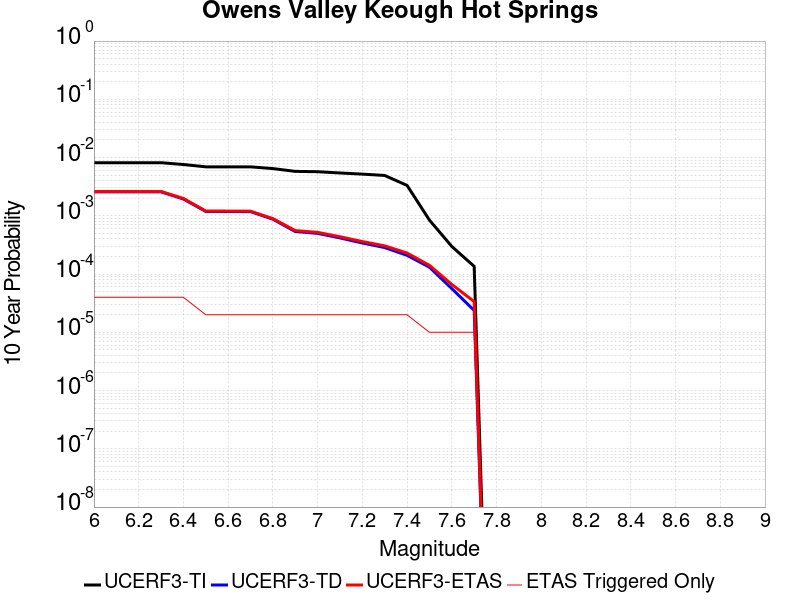 |

| Magnitude | 1 wk TI Prob | 1 wk TD Prob | 1 wk ETAS Prob | 1 wk ETAS/TD Gain | 1 wk ETAS Triggered Only | 1 mo TI Prob | 1 mo TD Prob | 1 mo ETAS Prob | 1 mo ETAS/TD Gain | 1 mo ETAS Triggered Only | 1 yr TI Prob | 1 yr TD Prob | 1 yr ETAS Prob | 1 yr ETAS/TD Gain | 1 yr ETAS Triggered Only | 10 yr TI Prob | 10 yr TD Prob | 10 yr ETAS Prob | 10 yr ETAS/TD Gain | 10 yr ETAS Triggered Only |
|-----|-----|-----|-----|-----|-----|-----|-----|-----|-----|-----|-----|-----|-----|-----|-----|-----|-----|-----|-----|-----|
| 6.0 | 1.5708529E-5 | 4.950656E-6 | 2.1027747E-5 | 4.247467 | 1.607717E-5 | 6.7320536E-5 | 2.1216953E-5 | 5.337061E-5 | 2.51547 | 3.215434E-5 | 8.193192E-4 | 2.582909E-4 | 3.0650996E-4 | 1.1866851 | 4.823151E-5 | 0.008163051 | 0.0025805652 | 0.0026286722 | 1.0186421 | 4.823151E-5 |
| 6.1 | 1.5708529E-5 | 4.950656E-6 | 2.1027747E-5 | 4.247467 | 1.607717E-5 | 6.7320536E-5 | 2.1216953E-5 | 5.337061E-5 | 2.51547 | 3.215434E-5 | 8.193192E-4 | 2.582909E-4 | 3.0650996E-4 | 1.1866851 | 4.823151E-5 | 0.008163051 | 0.0025805652 | 0.0026286722 | 1.0186421 | 4.823151E-5 |
| 6.2 | 1.5708529E-5 | 4.950656E-6 | 2.1027747E-5 | 4.247467 | 1.607717E-5 | 6.7320536E-5 | 2.1216953E-5 | 5.337061E-5 | 2.51547 | 3.215434E-5 | 8.193192E-4 | 2.582909E-4 | 3.0650996E-4 | 1.1866851 | 4.823151E-5 | 0.008163051 | 0.0025805652 | 0.0026286722 | 1.0186421 | 4.823151E-5 |
| 6.3 | 1.5708529E-5 | 4.950656E-6 | 2.1027747E-5 | 4.247467 | 1.607717E-5 | 6.7320536E-5 | 2.1216953E-5 | 5.337061E-5 | 2.51547 | 3.215434E-5 | 8.193192E-4 | 2.582909E-4 | 3.0650996E-4 | 1.1866851 | 4.823151E-5 | 0.008163051 | 0.0025805652 | 0.0026286722 | 1.0186421 | 4.823151E-5 |
| 6.4 | 1.4622509E-5 | 3.7265204E-6 | 1.980363E-5 | 5.314242 | 1.607717E-5 | 6.266639E-5 | 1.5970723E-5 | 4.812455E-5 | 3.0132983 | 3.215434E-5 | 7.626962E-4 | 1.944295E-4 | 2.4265164E-4 | 1.2480186 | 4.823151E-5 | 0.007600839 | 0.0019430731 | 0.001991211 | 1.0247741 | 4.823151E-5 |
| 6.5 | 1.3335527E-5 | 2.2777172E-6 | 1.835485E-5 | 8.058442 | 1.607717E-5 | 5.7151006E-5 | 9.761612E-6 | 2.5838626E-5 | 2.646963 | 1.607717E-5 | 6.955913E-4 | 1.18841825E-4 | 1.3491709E-4 | 1.1352661 | 1.607717E-5 | 0.0069341804 | 0.0011880046 | 0.0012040627 | 1.0135168 | 1.607717E-5 |
| 6.6 | 1.3332855E-5 | 2.2748663E-6 | 1.8352E-5 | 8.067287 | 1.607717E-5 | 5.7139558E-5 | 9.749395E-6 | 2.5826408E-5 | 2.6490269 | 1.607717E-5 | 6.9545204E-4 | 1.186931E-4 | 1.3476836E-4 | 1.1354356 | 1.607717E-5 | 0.0069327964 | 0.0011865189 | 0.0012025769 | 1.0135338 | 1.607717E-5 |
| 6.7 | 1.3318214E-5 | 2.2640966E-6 | 1.834123E-5 | 8.100904 | 1.607717E-5 | 5.707681E-5 | 9.703239E-6 | 2.5780253E-5 | 2.6568708 | 1.607717E-5 | 6.946886E-4 | 1.1813121E-4 | 1.3420648E-4 | 1.1360798 | 1.607717E-5 | 0.0069252094 | 0.001180906 | 0.0011969642 | 1.0135982 | 1.607717E-5 |
| 6.8 | 1.2441338E-5 | 1.6777863E-6 | 1.775493E-5 | 10.582355 | 1.607717E-5 | 5.331893E-5 | 7.1904947E-6 | 2.3267548E-5 | 3.235876 | 1.607717E-5 | 6.489646E-4 | 8.7541055E-5 | 1.0361682E-4 | 1.1836369 | 1.607717E-5 | 0.0064707273 | 8.752499E-4 | 8.91313E-4 | 1.0183526 | 1.607717E-5 |
| 6.9 | 1.1130476E-5 | 1.0303868E-6 | 1.710754E-5 | 16.60303 | 1.607717E-5 | 4.7701167E-5 | 4.415936E-6 | 2.0493035E-5 | 4.6407003 | 1.607717E-5 | 5.806069E-4 | 5.3762706E-5 | 6.9839014E-5 | 1.2990234 | 1.607717E-5 | 0.0057909233 | 5.37651E-4 | 5.537195E-4 | 1.0298865 | 1.607717E-5 |
| 7.0 | 1.0986073E-5 | 9.579413E-7 | 1.7035096E-5 | 17.783028 | 1.607717E-5 | 4.7082318E-5 | 4.1054564E-6 | 2.018256E-5 | 4.9160333 | 1.607717E-5 | 5.730765E-4 | 4.99828E-5 | 6.605916E-5 | 1.321638 | 1.607717E-5 | 0.0057160086 | 4.9986853E-4 | 5.1593763E-4 | 1.0321467 | 1.607717E-5 |
| 7.1 | 1.0451338E-5 | 8.0002656E-7 | 1.6877184E-5 | 21.09578 | 1.607717E-5 | 4.4790682E-5 | 3.4286807E-6 | 1.9505796E-5 | 5.689009 | 1.607717E-5 | 5.451901E-4 | 4.1743395E-5 | 5.7819892E-5 | 1.3851268 | 1.607717E-5 | 0.005438545 | 4.1750458E-4 | 4.3357504E-4 | 1.0384917 | 1.607717E-5 |
| 7.2 | 9.989061E-6 | 6.544956E-7 | 1.6731656E-5 | 25.5642 | 1.607717E-5 | 4.280956E-5 | 2.804978E-6 | 1.8882103E-5 | 6.7316403 | 1.607717E-5 | 5.2108173E-4 | 3.4150078E-5 | 5.02267E-5 | 1.4707638 | 1.607717E-5 | 0.0051986156 | 3.415851E-4 | 3.5765677E-4 | 1.0470502 | 1.607717E-5 |
| 7.3 | 9.465365E-6 | 5.4600474E-7 | 1.6623166E-5 | 30.445095 | 1.607717E-5 | 4.056522E-5 | 2.3400182E-6 | 1.8417151E-5 | 7.8705163 | 1.607717E-5 | 4.937696E-4 | 2.8489352E-5 | 4.4566066E-5 | 1.564306 | 1.607717E-5 | 0.0049267393 | 2.8498896E-4 | 3.0106155E-4 | 1.0563972 | 1.607717E-5 |
| 7.4 | 6.3824805E-6 | 4.016335E-7 | 1.6478798E-5 | 41.029438 | 1.607717E-5 | 2.73532E-5 | 1.7212853E-6 | 1.7798428E-5 | 10.340197 | 1.607717E-5 | 3.3297433E-4 | 2.095645E-5 | 3.7033282E-5 | 1.7671545 | 1.607717E-5 | 0.0033247585 | 2.0963654E-4 | 2.2571033E-4 | 1.0766746 | 1.607717E-5 |
| 7.5 | 1.6192645E-6 | 2.516124E-7 | 1.6328779E-5 | 64.89656 | 1.607717E-5 | 6.9396865E-6 | 1.0783383E-6 | 1.7155491E-5 | 15.909191 | 1.607717E-5 | 8.448741E-5 | 1.31286915E-5 | 2.920565E-5 | 2.2245667 | 1.607717E-5 | 8.4455294E-4 | 1.3127929E-4 | 1.4735435E-4 | 1.1224493 | 1.607717E-5 |
| 7.6 | 5.7062545E-7 | 1.07924045E-7 | 1.6185093E-5 | 149.96744 | 1.607717E-5 | 2.4455355E-6 | 4.6253152E-7 | 1.6539694E-5 | 35.759064 | 1.607717E-5 | 2.9773988E-5 | 5.6313074E-6 | 2.1708387E-5 | 3.8549461 | 1.607717E-5 | 2.977E-4 | 5.6311732E-5 | 7.238799E-5 | 1.2854869 | 1.607717E-5 |
| 7.7 | 2.5988817E-7 | 4.5457977E-8 | 1.6122627E-5 | 354.67102 | 1.607717E-5 | 1.113806E-6 | 1.9481989E-7 | 1.6271988E-5 | 83.52323 | 1.607717E-5 | 1.3560503E-5 | 2.3719301E-6 | 1.8449062E-5 | 7.7780805 | 1.607717E-5 | 1.3559677E-4 | 2.371909E-5 | 3.979588E-5 | 1.6777996 | 1.607717E-5 |

## Mono Lake 2011 CFM
*[(top)](#table-of-contents)*

| 1 Week | 1 Month | 1 Year | 10 Year |
|-----|-----|-----|-----|
|  |  |  |  |

| Magnitude | 1 wk TI Prob | 1 wk TD Prob | 1 wk ETAS Prob | 1 wk ETAS/TD Gain | 1 wk ETAS Triggered Only | 1 mo TI Prob | 1 mo TD Prob | 1 mo ETAS Prob | 1 mo ETAS/TD Gain | 1 mo ETAS Triggered Only | 1 yr TI Prob | 1 yr TD Prob | 1 yr ETAS Prob | 1 yr ETAS/TD Gain | 1 yr ETAS Triggered Only | 10 yr TI Prob | 10 yr TD Prob | 10 yr ETAS Prob | 10 yr ETAS/TD Gain | 10 yr ETAS Triggered Only |
|-----|-----|-----|-----|-----|-----|-----|-----|-----|-----|-----|-----|-----|-----|-----|-----|-----|-----|-----|-----|-----|
| 6.0 | 2.0341662E-5 | 2.3828166E-5 | 3.9904953E-5 | 1.6746968 | 1.607717E-5 | 8.717564E-5 | 1.0211971E-4 | 1.1819524E-4 | 1.1574185 | 1.607717E-5 | 0.0010608466 | 0.0012431298 | 0.0012752442 | 1.0258335 | 3.215434E-5 | 0.010557966 | 0.012413835 | 0.012461468 | 1.0038371 | 4.823151E-5 |
| 6.1 | 2.0341662E-5 | 2.3828166E-5 | 3.9904953E-5 | 1.6746968 | 1.607717E-5 | 8.717564E-5 | 1.0211971E-4 | 1.1819524E-4 | 1.1574185 | 1.607717E-5 | 0.0010608466 | 0.0012431298 | 0.0012752442 | 1.0258335 | 3.215434E-5 | 0.010557966 | 0.012413835 | 0.012461468 | 1.0038371 | 4.823151E-5 |
| 6.2 | 2.0341662E-5 | 2.3828166E-5 | 3.9904953E-5 | 1.6746968 | 1.607717E-5 | 8.717564E-5 | 1.0211971E-4 | 1.1819524E-4 | 1.1574185 | 1.607717E-5 | 0.0010608466 | 0.0012431298 | 0.0012752442 | 1.0258335 | 3.215434E-5 | 0.010557966 | 0.012413835 | 0.012461468 | 1.0038371 | 4.823151E-5 |
| 6.3 | 2.0341662E-5 | 2.3828166E-5 | 3.9904953E-5 | 1.6746968 | 1.607717E-5 | 8.717564E-5 | 1.0211971E-4 | 1.1819524E-4 | 1.1574185 | 1.607717E-5 | 0.0010608466 | 0.0012431298 | 0.0012752442 | 1.0258335 | 3.215434E-5 | 0.010557966 | 0.012413835 | 0.012461468 | 1.0038371 | 4.823151E-5 |
| 6.4 | 1.749821E-5 | 2.0490985E-5 | 3.6567828E-5 | 1.7845812 | 1.607717E-5 | 7.499018E-5 | 8.781851E-5 | 1.03894265E-4 | 1.1830566 | 1.607717E-5 | 9.1262296E-4 | 0.0010691903 | 0.0011013102 | 1.0300413 | 3.215434E-5 | 0.009088841 | 0.010691865 | 0.010739581 | 1.0044628 | 4.823151E-5 |
| 6.5 | 1.749821E-5 | 2.0490985E-5 | 3.6567828E-5 | 1.7845812 | 1.607717E-5 | 7.499018E-5 | 8.781851E-5 | 1.03894265E-4 | 1.1830566 | 1.607717E-5 | 9.1262296E-4 | 0.0010691903 | 0.0011013102 | 1.0300413 | 3.215434E-5 | 0.009088841 | 0.010691865 | 0.010739581 | 1.0044628 | 4.823151E-5 |

## Ortigalita (North)
*[(top)](#table-of-contents)*

| 1 Week | 1 Month | 1 Year | 10 Year |
|-----|-----|-----|-----|
|  |  |  |  |

| Magnitude | 1 wk TI Prob | 1 wk TD Prob | 1 wk ETAS Prob | 1 wk ETAS/TD Gain | 1 wk ETAS Triggered Only | 1 mo TI Prob | 1 mo TD Prob | 1 mo ETAS Prob | 1 mo ETAS/TD Gain | 1 mo ETAS Triggered Only | 1 yr TI Prob | 1 yr TD Prob | 1 yr ETAS Prob | 1 yr ETAS/TD Gain | 1 yr ETAS Triggered Only | 10 yr TI Prob | 10 yr TD Prob | 10 yr ETAS Prob | 10 yr ETAS/TD Gain | 10 yr ETAS Triggered Only |
|-----|-----|-----|-----|-----|-----|-----|-----|-----|-----|-----|-----|-----|-----|-----|-----|-----|-----|-----|-----|-----|
| 6.0 | 7.711876E-5 | 1.05064966E-4 | 1.2114045E-4 | 1.1530051 | 1.607717E-5 | 3.3046713E-4 | 4.502116E-4 | 4.6628152E-4 | 1.0356941 | 1.607717E-5 | 0.004016016 | 0.0054681194 | 0.005500098 | 1.0058482 | 3.215434E-5 | 0.039442103 | 0.053454787 | 0.05350044 | 1.000854 | 4.823151E-5 |
| 6.1 | 4.607858E-5 | 6.0239203E-5 | 7.63154E-5 | 1.2668728 | 1.607717E-5 | 1.9746469E-4 | 2.5814527E-4 | 2.7421827E-4 | 1.0622635 | 1.607717E-5 | 0.0024014818 | 0.0031387596 | 0.0031547863 | 1.0051061 | 1.607717E-5 | 0.023756953 | 0.030975068 | 0.031006226 | 1.0010059 | 3.215434E-5 |
| 6.2 | 4.607858E-5 | 6.0239203E-5 | 7.63154E-5 | 1.2668728 | 1.607717E-5 | 1.9746469E-4 | 2.5814527E-4 | 2.7421827E-4 | 1.0622635 | 1.607717E-5 | 0.0024014818 | 0.0031387596 | 0.0031547863 | 1.0051061 | 1.607717E-5 | 0.023756953 | 0.030975068 | 0.031006226 | 1.0010059 | 3.215434E-5 |
| 6.3 | 3.327423E-5 | 4.2475127E-5 | 5.8551614E-5 | 1.3784918 | 1.607717E-5 | 1.4259605E-4 | 1.8202531E-4 | 1.9809956E-4 | 1.0883077 | 1.607717E-5 | 0.0017347244 | 0.002214197 | 0.0022302386 | 1.0072448 | 1.607717E-5 | 0.017212452 | 0.021945644 | 0.021977093 | 1.001433 | 3.215434E-5 |
| 6.4 | 2.7732503E-5 | 3.4998593E-5 | 5.1075203E-5 | 1.4593501 | 1.607717E-5 | 1.1884817E-4 | 1.4998685E-4 | 1.6606161E-4 | 1.1071744 | 1.607717E-5 | 0.001446016 | 0.0018248095 | 0.0018408573 | 1.0087943 | 1.607717E-5 | 0.014366428 | 0.018121224 | 0.018152796 | 1.0017422 | 3.215434E-5 |
| 6.5 | 2.7689714E-5 | 3.4948407E-5 | 5.1025017E-5 | 1.4600098 | 1.607717E-5 | 1.186648E-4 | 1.497718E-4 | 1.6584656E-4 | 1.1073284 | 1.607717E-5 | 0.0014437864 | 0.0018221956 | 0.0018382435 | 1.008807 | 1.607717E-5 | 0.014344421 | 0.01809551 | 0.018127082 | 1.0017447 | 3.215434E-5 |
| 6.6 | 2.2976905E-5 | 2.8718265E-5 | 4.4794975E-5 | 1.5598078 | 1.607717E-5 | 9.846873E-5 | 1.230739E-4 | 1.391491E-4 | 1.1306142 | 1.607717E-5 | 0.0011981975 | 0.0014976363 | 0.0015136894 | 1.010719 | 1.607717E-5 | 0.011917574 | 0.014898697 | 0.014914535 | 1.001063 | 1.607717E-5 |
| 6.7 | 1.9871539E-5 | 2.4904411E-5 | 4.0981184E-5 | 1.645539 | 1.607717E-5 | 8.516096E-5 | 1.0673023E-4 | 1.2280568E-4 | 1.1506176 | 1.607717E-5 | 0.0010363415 | 0.0012989145 | 0.0013149709 | 1.0123613 | 1.607717E-5 | 0.010315218 | 0.012936919 | 0.012952788 | 1.0012267 | 1.607717E-5 |
| 6.8 | 6.5640475E-6 | 7.6054926E-6 | 2.368254E-5 | 3.1138735 | 1.607717E-5 | 2.813133E-5 | 3.2594577E-5 | 4.8671223E-5 | 1.4932307 | 1.607717E-5 | 3.424451E-4 | 3.9676955E-4 | 4.1284037E-4 | 1.0405041 | 1.607717E-5 | 0.0034191788 | 0.003960899 | 0.0039769122 | 1.0040429 | 1.607717E-5 |
| 6.9 | 5.6219683E-6 | 6.5018376E-6 | 2.2578904E-5 | 3.4726956 | 1.607717E-5 | 2.4093928E-5 | 2.7864735E-5 | 4.3941458E-5 | 1.5769559 | 1.607717E-5 | 2.933041E-4 | 3.3920293E-4 | 3.5527465E-4 | 1.0473808 | 1.607717E-5 | 0.0029291727 | 0.003387109 | 0.0034031316 | 1.0047305 | 1.607717E-5 |
| 7.0 | 3.875591E-6 | 4.4847548E-6 | 4.4847548E-6 | 1.0 | 0.0 | 1.6609569E-5 | 1.9220248E-5 | 1.9220248E-5 | 1.0 | 0.0 | 2.0220275E-4 | 2.339835E-4 | 2.339835E-4 | 1.0 | 0.0 | 0.0020201886 | 0.0023375798 | 0.0023375798 | 1.0 | 0.0 |
| 7.1 | 1.6017933E-6 | 1.8570418E-6 | 1.8570418E-6 | 1.0 | 0.0 | 6.8648105E-6 | 7.958732E-6 | 7.958732E-6 | 1.0 | 0.0 | 8.357586E-5 | 9.689432E-5 | 9.689432E-5 | 1.0 | 0.0 | 8.3544437E-4 | 9.686254E-4 | 9.686254E-4 | 1.0 | 0.0 |

## Los Alamos 2011 CFM
*[(top)](#table-of-contents)*

| 1 Week | 1 Month | 1 Year | 10 Year |
|-----|-----|-----|-----|
|  |  |  |  |

| Magnitude | 1 wk TI Prob | 1 wk TD Prob | 1 wk ETAS Prob | 1 wk ETAS/TD Gain | 1 wk ETAS Triggered Only | 1 mo TI Prob | 1 mo TD Prob | 1 mo ETAS Prob | 1 mo ETAS/TD Gain | 1 mo ETAS Triggered Only | 1 yr TI Prob | 1 yr TD Prob | 1 yr ETAS Prob | 1 yr ETAS/TD Gain | 1 yr ETAS Triggered Only | 10 yr TI Prob | 10 yr TD Prob | 10 yr ETAS Prob | 10 yr ETAS/TD Gain | 10 yr ETAS Triggered Only |
|-----|-----|-----|-----|-----|-----|-----|-----|-----|-----|-----|-----|-----|-----|-----|-----|-----|-----|-----|-----|-----|
| 6.0 | 4.6284417E-6 | 4.751731E-6 | 2.0828826E-5 | 4.383418 | 1.607717E-5 | 1.9836029E-5 | 2.0364414E-5 | 3.6441255E-5 | 1.7894577 | 1.607717E-5 | 2.4147688E-4 | 2.4791027E-4 | 2.8005664E-4 | 1.1296693 | 3.215434E-5 | 0.0024121467 | 0.0024765113 | 0.0025246234 | 1.0194273 | 4.823151E-5 |
| 6.1 | 4.6284417E-6 | 4.751731E-6 | 2.0828826E-5 | 4.383418 | 1.607717E-5 | 1.9836029E-5 | 2.0364414E-5 | 3.6441255E-5 | 1.7894577 | 1.607717E-5 | 2.4147688E-4 | 2.4791027E-4 | 2.8005664E-4 | 1.1296693 | 3.215434E-5 | 0.0024121467 | 0.0024765113 | 0.0025246234 | 1.0194273 | 4.823151E-5 |
| 6.2 | 4.6284417E-6 | 4.751731E-6 | 2.0828826E-5 | 4.383418 | 1.607717E-5 | 1.9836029E-5 | 2.0364414E-5 | 3.6441255E-5 | 1.7894577 | 1.607717E-5 | 2.4147688E-4 | 2.4791027E-4 | 2.8005664E-4 | 1.1296693 | 3.215434E-5 | 0.0024121467 | 0.0024765113 | 0.0025246234 | 1.0194273 | 4.823151E-5 |
| 6.3 | 4.6284417E-6 | 4.751731E-6 | 2.0828826E-5 | 4.383418 | 1.607717E-5 | 1.9836029E-5 | 2.0364414E-5 | 3.6441255E-5 | 1.7894577 | 1.607717E-5 | 2.4147688E-4 | 2.4791027E-4 | 2.8005664E-4 | 1.1296693 | 3.215434E-5 | 0.0024121467 | 0.0024765113 | 0.0025246234 | 1.0194273 | 4.823151E-5 |
| 6.4 | 4.6284417E-6 | 4.751731E-6 | 2.0828826E-5 | 4.383418 | 1.607717E-5 | 1.9836029E-5 | 2.0364414E-5 | 3.6441255E-5 | 1.7894577 | 1.607717E-5 | 2.4147688E-4 | 2.4791027E-4 | 2.8005664E-4 | 1.1296693 | 3.215434E-5 | 0.0024121467 | 0.0024765113 | 0.0025246234 | 1.0194273 | 4.823151E-5 |
| 6.5 | 4.6284417E-6 | 4.751731E-6 | 2.0828826E-5 | 4.383418 | 1.607717E-5 | 1.9836029E-5 | 2.0364414E-5 | 3.6441255E-5 | 1.7894577 | 1.607717E-5 | 2.4147688E-4 | 2.4791027E-4 | 2.8005664E-4 | 1.1296693 | 3.215434E-5 | 0.0024121467 | 0.0024765113 | 0.0025246234 | 1.0194273 | 4.823151E-5 |
| 6.6 | 4.6284417E-6 | 4.751731E-6 | 2.0828826E-5 | 4.383418 | 1.607717E-5 | 1.9836029E-5 | 2.0364414E-5 | 3.6441255E-5 | 1.7894577 | 1.607717E-5 | 2.4147688E-4 | 2.4791027E-4 | 2.8005664E-4 | 1.1296693 | 3.215434E-5 | 0.0024121467 | 0.0024765113 | 0.0025246234 | 1.0194273 | 4.823151E-5 |
| 6.7 | 4.062321E-6 | 4.166349E-6 | 2.0243453E-5 | 4.8587995 | 1.607717E-5 | 1.7409831E-5 | 1.7855667E-5 | 3.393255E-5 | 1.9003799 | 1.607717E-5 | 2.1194408E-4 | 2.1737257E-4 | 2.4951992E-4 | 1.1478906 | 3.215434E-5 | 0.0021174205 | 0.0021717492 | 0.002219876 | 1.0221604 | 4.823151E-5 |
| 6.8 | 4.062321E-6 | 4.166349E-6 | 2.0243453E-5 | 4.8587995 | 1.607717E-5 | 1.7409831E-5 | 1.7855667E-5 | 3.393255E-5 | 1.9003799 | 1.607717E-5 | 2.1194408E-4 | 2.1737257E-4 | 2.4951992E-4 | 1.1478906 | 3.215434E-5 | 0.0021174205 | 0.0021717492 | 0.002219876 | 1.0221604 | 4.823151E-5 |
| 6.9 | 3.2936077E-6 | 3.372958E-6 | 1.9450074E-5 | 5.7664742 | 1.607717E-5 | 1.4115385E-5 | 1.4455459E-5 | 3.0532396E-5 | 2.1121707 | 1.607717E-5 | 1.7184127E-4 | 1.7598194E-4 | 2.0813062E-4 | 1.1826817 | 3.215434E-5 | 0.0017170844 | 0.0017585184 | 0.0018066651 | 1.0273792 | 4.823151E-5 |
| 7.0 | 3.1687898E-6 | 3.2448156E-6 | 1.9321933E-5 | 5.9547095 | 1.607717E-5 | 1.3580457E-5 | 1.3906283E-5 | 2.998323E-5 | 2.1560922 | 1.607717E-5 | 1.6532952E-4 | 1.6929678E-4 | 2.0144567E-4 | 1.1898967 | 3.215434E-5 | 0.0016520657 | 0.0016917696 | 0.0017399195 | 1.0284612 | 4.823151E-5 |
| 7.1 | 2.9379228E-6 | 3.0073259E-6 | 3.0073259E-6 | 1.0 | 0.0 | 1.25910365E-5 | 1.288848E-5 | 1.288848E-5 | 1.0 | 0.0 | 1.5328509E-4 | 1.5690686E-4 | 1.7298151E-4 | 1.102447 | 1.607717E-5 | 0.001531794 | 0.0015680499 | 0.0016001539 | 1.0204738 | 3.215434E-5 |
| 7.2 | 2.0020686E-6 | 2.0416298E-6 | 2.0416298E-6 | 1.0 | 0.0 | 8.580266E-6 | 8.749813E-6 | 8.749813E-6 | 1.0 | 0.0 | 1.0445973E-4 | 1.0652381E-4 | 1.2259926E-4 | 1.1509095 | 1.607717E-5 | 0.0010441064 | 0.001064732 | 0.0010807919 | 1.0150837 | 1.607717E-5 |
| 7.3 | 1.7364243E-6 | 1.7678802E-6 | 1.7678802E-6 | 1.0 | 0.0 | 7.441797E-6 | 7.576608E-6 | 7.576608E-6 | 1.0 | 0.0 | 9.0600115E-5 | 9.2241324E-5 | 9.2241324E-5 | 1.0 | 0.0 | 9.0563187E-4 | 9.2203356E-4 | 9.2203356E-4 | 1.0 | 0.0 |
| 7.4 | 1.5718434E-6 | 1.5983177E-6 | 1.5983177E-6 | 1.0 | 0.0 | 6.7364545E-6 | 6.849915E-6 | 6.849915E-6 | 1.0 | 0.0 | 8.201325E-5 | 8.339455E-5 | 8.339455E-5 | 1.0 | 0.0 | 8.198299E-4 | 8.3363557E-4 | 8.3363557E-4 | 1.0 | 0.0 |
| 7.5 | 1.3841119E-6 | 1.4042793E-6 | 1.4042793E-6 | 1.0 | 0.0 | 5.9318945E-6 | 6.0183256E-6 | 6.0183256E-6 | 1.0 | 0.0 | 7.221842E-5 | 7.327068E-5 | 7.327068E-5 | 1.0 | 0.0 | 7.2194956E-4 | 7.324681E-4 | 7.324681E-4 | 1.0 | 0.0 |
| 7.6 | 1.0843726E-6 | 1.093442E-6 | 1.093442E-6 | 1.0 | 0.0 | 4.647303E-6 | 4.6861724E-6 | 4.6861724E-6 | 1.0 | 0.0 | 5.6579443E-5 | 5.705268E-5 | 5.705268E-5 | 1.0 | 0.0 | 5.656504E-4 | 5.703829E-4 | 5.703829E-4 | 1.0 | 0.0 |
| 7.7 | 5.544814E-7 | 5.5018705E-7 | 5.5018705E-7 | 1.0 | 0.0 | 2.3763469E-6 | 2.3579425E-6 | 2.3579425E-6 | 1.0 | 0.0 | 2.8931638E-5 | 2.8707573E-5 | 2.8707573E-5 | 1.0 | 0.0 | 2.8927872E-4 | 2.870388E-4 | 2.870388E-4 | 1.0 | 0.0 |
| 7.8 | 2.0707465E-7 | 1.977846E-7 | 1.977846E-7 | 1.0 | 0.0 | 8.874625E-7 | 8.4764804E-7 | 8.4764804E-7 | 1.0 | 0.0 | 1.08048025E-5 | 1.0320066E-5 | 1.0320066E-5 | 1.0 | 0.0 | 1.0804277E-4 | 1.0319592E-4 | 1.0319592E-4 | 1.0 | 0.0 |
| 7.9 | 3.9821284E-8 | 3.433109E-8 | 3.433109E-8 | 1.0 | 0.0 | 1.7066264E-7 | 1.4713324E-7 | 1.4713324E-7 | 1.0 | 0.0 | 2.0778157E-6 | 1.7913457E-6 | 1.7913457E-6 | 1.0 | 0.0 | 2.0777963E-5 | 1.7913319E-5 | 1.7913319E-5 | 1.0 | 0.0 |
| 8.0 | 7.880441E-11 | 8.2353124E-11 | 8.2353124E-11 | 1.0 | 0.0 | 3.3773329E-10 | 3.52942E-10 | 3.52942E-10 | 1.0 | 0.0 | 4.1119033E-9 | 4.2970694E-9 | 4.2970694E-9 | 1.0 | 0.0 | 4.1119034E-8 | 4.2970694E-8 | 4.2970694E-8 | 1.0 | 0.0 |

## White Mountains
*[(top)](#table-of-contents)*

| 1 Week | 1 Month | 1 Year | 10 Year |
|-----|-----|-----|-----|
|  | 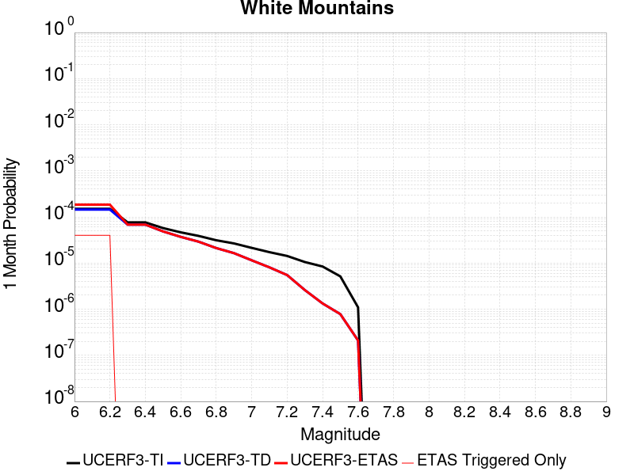 |  |  |

| Magnitude | 1 wk TI Prob | 1 wk TD Prob | 1 wk ETAS Prob | 1 wk ETAS/TD Gain | 1 wk ETAS Triggered Only | 1 mo TI Prob | 1 mo TD Prob | 1 mo ETAS Prob | 1 mo ETAS/TD Gain | 1 mo ETAS Triggered Only | 1 yr TI Prob | 1 yr TD Prob | 1 yr ETAS Prob | 1 yr ETAS/TD Gain | 1 yr ETAS Triggered Only | 10 yr TI Prob | 10 yr TD Prob | 10 yr ETAS Prob | 10 yr ETAS/TD Gain | 10 yr ETAS Triggered Only |
|-----|-----|-----|-----|-----|-----|-----|-----|-----|-----|-----|-----|-----|-----|-----|-----|-----|-----|-----|-----|-----|
| 6.0 | 3.503579E-5 | 3.378405E-5 | 3.378405E-5 | 1.0 | 0.0 | 1.5014476E-4 | 1.4478143E-4 | 1.4478143E-4 | 1.0 | 0.0 | 0.0018264796 | 0.0017614096 | 0.0017774584 | 1.0091114 | 1.607717E-5 | 0.018115403 | 0.017486818 | 0.017534206 | 1.00271 | 4.823151E-5 |
| 6.1 | 3.503579E-5 | 3.378405E-5 | 3.378405E-5 | 1.0 | 0.0 | 1.5014476E-4 | 1.4478143E-4 | 1.4478143E-4 | 1.0 | 0.0 | 0.0018264796 | 0.0017614096 | 0.0017774584 | 1.0091114 | 1.607717E-5 | 0.018115403 | 0.017486818 | 0.017534206 | 1.00271 | 4.823151E-5 |
| 6.2 | 3.503579E-5 | 3.378405E-5 | 3.378405E-5 | 1.0 | 0.0 | 1.5014476E-4 | 1.4478143E-4 | 1.4478143E-4 | 1.0 | 0.0 | 0.0018264796 | 0.0017614096 | 0.0017774584 | 1.0091114 | 1.607717E-5 | 0.018115403 | 0.017486818 | 0.017534206 | 1.00271 | 4.823151E-5 |
| 6.3 | 1.7818425E-5 | 1.5916074E-5 | 1.5916074E-5 | 1.0 | 0.0 | 7.636245E-5 | 6.821004E-5 | 6.821004E-5 | 1.0 | 0.0 | 9.293162E-4 | 8.301551E-4 | 8.4621896E-4 | 1.0193504 | 1.607717E-5 | 0.009254395 | 0.008271999 | 0.008303887 | 1.003855 | 3.215434E-5 |
| 6.4 | 1.7818425E-5 | 1.5916074E-5 | 1.5916074E-5 | 1.0 | 0.0 | 7.636245E-5 | 6.821004E-5 | 6.821004E-5 | 1.0 | 0.0 | 9.293162E-4 | 8.301551E-4 | 8.4621896E-4 | 1.0193504 | 1.607717E-5 | 0.009254395 | 0.008271999 | 0.008303887 | 1.003855 | 3.215434E-5 |
| 6.5 | 1.3397557E-5 | 1.13362685E-5 | 1.13362685E-5 | 1.0 | 0.0 | 5.741684E-5 | 4.858314E-5 | 4.858314E-5 | 1.0 | 0.0 | 6.988258E-4 | 5.913462E-4 | 6.074139E-4 | 1.0271714 | 1.607717E-5 | 0.006966323 | 0.005898432 | 0.0059303967 | 1.0054191 | 3.215434E-5 |
| 6.6 | 1.0818695E-5 | 8.625366E-6 | 8.625366E-6 | 1.0 | 0.0 | 4.6365014E-5 | 3.6965357E-5 | 3.6965357E-5 | 1.0 | 0.0 | 5.6434784E-4 | 4.4996463E-4 | 4.6603457E-4 | 1.0357138 | 1.607717E-5 | 0.005629168 | 0.004490972 | 0.004522982 | 1.0071276 | 3.215434E-5 |
| 6.7 | 9.067908E-6 | 6.802442E-6 | 6.802442E-6 | 1.0 | 0.0 | 3.8861883E-5 | 2.9153016E-5 | 2.9153016E-5 | 1.0 | 0.0 | 4.7304068E-4 | 3.5488335E-4 | 3.5488335E-4 | 1.0 | 0.0 | 0.00472035 | 0.0035434833 | 0.0035595037 | 1.004521 | 1.607717E-5 |
| 6.8 | 7.295947E-6 | 4.936391E-6 | 4.936391E-6 | 1.0 | 0.0 | 3.126797E-5 | 2.1155796E-5 | 2.1155796E-5 | 1.0 | 0.0 | 3.8062103E-4 | 2.575425E-4 | 2.575425E-4 | 1.0 | 0.0 | 0.0037996976 | 0.0025725532 | 0.0025885892 | 1.0062335 | 1.607717E-5 |
| 6.9 | 6.2243444E-6 | 3.832213E-6 | 3.832213E-6 | 1.0 | 0.0 | 2.6675489E-5 | 1.642367E-5 | 1.642367E-5 | 1.0 | 0.0 | 3.2472567E-4 | 1.9994036E-4 | 1.9994036E-4 | 1.0 | 0.0 | 0.0032425157 | 0.0019976576 | 0.0020137026 | 1.008032 | 1.607717E-5 |
| 7.0 | 4.9878413E-6 | 2.6795342E-6 | 2.6795342E-6 | 1.0 | 0.0 | 2.1376287E-5 | 1.14836685E-5 | 1.14836685E-5 | 1.0 | 0.0 | 2.602252E-4 | 1.3980496E-4 | 1.3980496E-4 | 1.0 | 0.0 | 0.002599207 | 0.0013971963 | 0.001413251 | 1.0114907 | 1.607717E-5 |
| 7.1 | 4.0252844E-6 | 1.8857575E-6 | 1.8857575E-6 | 1.0 | 0.0 | 1.7251105E-5 | 8.081794E-6 | 8.081794E-6 | 1.0 | 0.0 | 2.1001195E-4 | 9.8391516E-5 | 9.8391516E-5 | 1.0 | 0.0 | 0.0020981359 | 9.834924E-4 | 9.995537E-4 | 1.016331 | 1.607717E-5 |
| 7.2 | 3.3284066E-6 | 1.281964E-6 | 1.281964E-6 | 1.0 | 0.0 | 1.4264522E-5 | 5.494121E-6 | 5.494121E-6 | 1.0 | 0.0 | 1.736567E-4 | 6.688897E-5 | 6.688897E-5 | 1.0 | 0.0 | 0.0017352107 | 6.6869846E-4 | 6.6869846E-4 | 1.0 | 0.0 |
| 7.3 | 2.458226E-6 | 6.05722E-7 | 6.05722E-7 | 1.0 | 0.0 | 1.0535211E-5 | 2.5959491E-6 | 2.5959491E-6 | 1.0 | 0.0 | 1.2825865E-4 | 3.1605257E-5 | 3.1605257E-5 | 1.0 | 0.0 | 0.0012818464 | 3.160114E-4 | 3.160114E-4 | 1.0 | 0.0 |
| 7.4 | 1.965953E-6 | 3.1089303E-7 | 3.1089303E-7 | 1.0 | 0.0 | 8.425486E-6 | 1.332398E-6 | 1.332398E-6 | 1.0 | 0.0 | 1.0257547E-4 | 1.6221828E-5 | 1.6221828E-5 | 1.0 | 0.0 | 0.0010252813 | 1.6220656E-4 | 1.6220656E-4 | 1.0 | 0.0 |
| 7.5 | 1.2014192E-6 | 1.8244253E-7 | 1.8244253E-7 | 1.0 | 0.0 | 5.148929E-6 | 7.8189635E-7 | 7.8189635E-7 | 1.0 | 0.0 | 6.2686406E-5 | 9.519547E-6 | 9.519547E-6 | 1.0 | 0.0 | 6.266873E-4 | 9.519148E-5 | 9.519148E-5 | 1.0 | 0.0 |
| 7.6 | 2.5612175E-7 | 4.8946475E-8 | 4.8946475E-8 | 1.0 | 0.0 | 1.0976642E-6 | 2.0977059E-7 | 2.0977059E-7 | 1.0 | 0.0 | 1.3363979E-5 | 2.5539543E-6 | 2.5539543E-6 | 1.0 | 0.0 | 1.3363175E-4 | 2.5539286E-5 | 2.5539286E-5 | 1.0 | 0.0 |

## Oceanside alt1
*[(top)](#table-of-contents)*

| 1 Week | 1 Month | 1 Year | 10 Year |
|-----|-----|-----|-----|
|  |  | 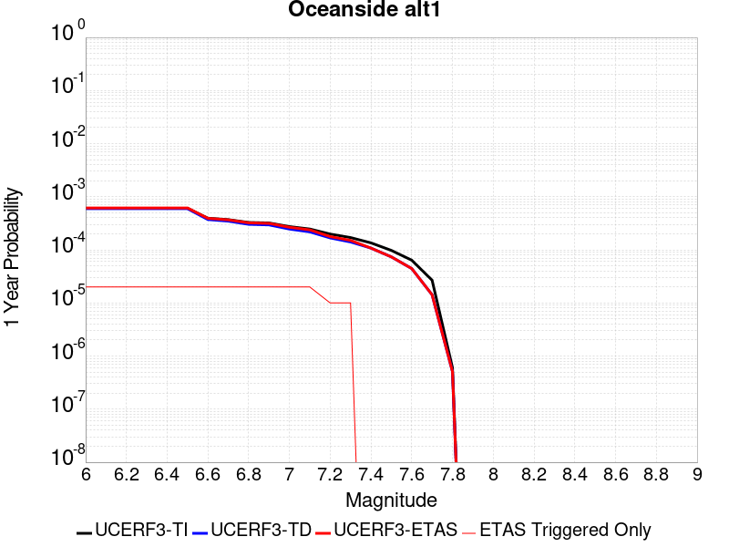 | 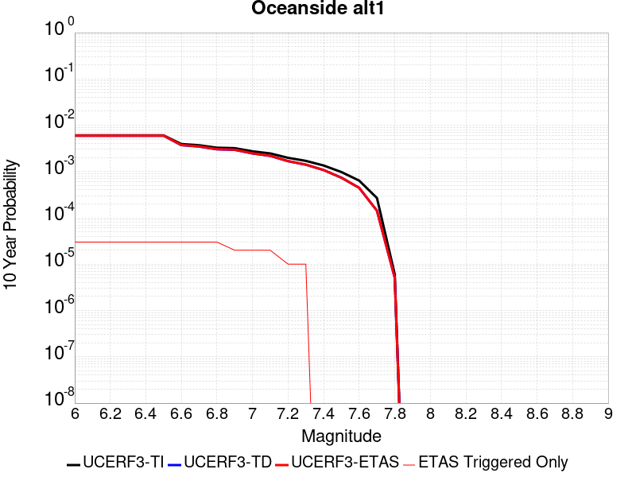 |

| Magnitude | 1 wk TI Prob | 1 wk TD Prob | 1 wk ETAS Prob | 1 wk ETAS/TD Gain | 1 wk ETAS Triggered Only | 1 mo TI Prob | 1 mo TD Prob | 1 mo ETAS Prob | 1 mo ETAS/TD Gain | 1 mo ETAS Triggered Only | 1 yr TI Prob | 1 yr TD Prob | 1 yr ETAS Prob | 1 yr ETAS/TD Gain | 1 yr ETAS Triggered Only | 10 yr TI Prob | 10 yr TD Prob | 10 yr ETAS Prob | 10 yr ETAS/TD Gain | 10 yr ETAS Triggered Only |
|-----|-----|-----|-----|-----|-----|-----|-----|-----|-----|-----|-----|-----|-----|-----|-----|-----|-----|-----|-----|-----|
| 6.0 | 1.1617542E-5 | 1.1423493E-5 | 2.7500479E-5 | 2.4073617 | 1.607717E-5 | 4.9788516E-5 | 4.8956997E-5 | 6.503338E-5 | 1.3283776 | 1.607717E-5 | 6.060066E-4 | 5.9590454E-4 | 6.119721E-4 | 1.0269634 | 1.607717E-5 | 0.0060435664 | 0.005944664 | 0.0059766276 | 1.0053768 | 3.215434E-5 |
| 6.1 | 1.1617542E-5 | 1.1423493E-5 | 2.7500479E-5 | 2.4073617 | 1.607717E-5 | 4.9788516E-5 | 4.8956997E-5 | 6.503338E-5 | 1.3283776 | 1.607717E-5 | 6.060066E-4 | 5.9590454E-4 | 6.119721E-4 | 1.0269634 | 1.607717E-5 | 0.0060435664 | 0.005944664 | 0.0059766276 | 1.0053768 | 3.215434E-5 |
| 6.2 | 1.1617542E-5 | 1.1423493E-5 | 2.7500479E-5 | 2.4073617 | 1.607717E-5 | 4.9788516E-5 | 4.8956997E-5 | 6.503338E-5 | 1.3283776 | 1.607717E-5 | 6.060066E-4 | 5.9590454E-4 | 6.119721E-4 | 1.0269634 | 1.607717E-5 | 0.0060435664 | 0.005944664 | 0.0059766276 | 1.0053768 | 3.215434E-5 |
| 6.3 | 1.1617542E-5 | 1.1423493E-5 | 2.7500479E-5 | 2.4073617 | 1.607717E-5 | 4.9788516E-5 | 4.8956997E-5 | 6.503338E-5 | 1.3283776 | 1.607717E-5 | 6.060066E-4 | 5.9590454E-4 | 6.119721E-4 | 1.0269634 | 1.607717E-5 | 0.0060435664 | 0.005944664 | 0.0059766276 | 1.0053768 | 3.215434E-5 |
| 6.4 | 1.1617542E-5 | 1.1423493E-5 | 2.7500479E-5 | 2.4073617 | 1.607717E-5 | 4.9788516E-5 | 4.8956997E-5 | 6.503338E-5 | 1.3283776 | 1.607717E-5 | 6.060066E-4 | 5.9590454E-4 | 6.119721E-4 | 1.0269634 | 1.607717E-5 | 0.0060435664 | 0.005944664 | 0.0059766276 | 1.0053768 | 3.215434E-5 |
| 6.5 | 1.1617542E-5 | 1.1423493E-5 | 2.7500479E-5 | 2.4073617 | 1.607717E-5 | 4.9788516E-5 | 4.8956997E-5 | 6.503338E-5 | 1.3283776 | 1.607717E-5 | 6.060066E-4 | 5.9590454E-4 | 6.119721E-4 | 1.0269634 | 1.607717E-5 | 0.0060435664 | 0.005944664 | 0.0059766276 | 1.0053768 | 3.215434E-5 |
| 6.6 | 7.561768E-6 | 7.1336153E-6 | 2.321067E-5 | 3.2537038 | 1.607717E-5 | 3.2407173E-5 | 3.0572286E-5 | 4.6648966E-5 | 1.5258579 | 1.607717E-5 | 3.9448592E-4 | 3.7215507E-4 | 3.8822627E-4 | 1.0431842 | 1.607717E-5 | 0.0039378637 | 0.00371543 | 0.0037474649 | 1.0086222 | 3.215434E-5 |
| 6.7 | 7.1042605E-6 | 6.6556854E-6 | 2.273275E-5 | 3.4155383 | 1.607717E-5 | 3.0446476E-5 | 2.8524059E-5 | 4.4600773E-5 | 1.5636194 | 1.607717E-5 | 3.706228E-4 | 3.472259E-4 | 3.6329747E-4 | 1.0462856 | 1.607717E-5 | 0.0037000529 | 0.003466917 | 0.0034989598 | 1.0092424 | 3.215434E-5 |
| 6.8 | 6.285554E-6 | 5.799706E-6 | 2.1876784E-5 | 3.7720504 | 1.607717E-5 | 2.693781E-5 | 2.4855648E-5 | 4.093242E-5 | 1.6468055 | 1.607717E-5 | 3.2791847E-4 | 3.0257605E-4 | 3.1864835E-4 | 1.0531182 | 1.607717E-5 | 0.0032743502 | 0.0030216982 | 0.0030537553 | 1.010609 | 3.215434E-5 |
| 6.9 | 6.148883E-6 | 5.6565445E-6 | 2.1733624E-5 | 3.8422086 | 1.607717E-5 | 2.635209E-5 | 2.424211E-5 | 4.031889E-5 | 1.6631758 | 1.607717E-5 | 3.2078946E-4 | 2.9510827E-4 | 3.111807E-4 | 1.0544628 | 1.607717E-5 | 0.003203268 | 0.0029472208 | 0.0029632505 | 1.0054389 | 1.607717E-5 |
| 7.0 | 5.253857E-6 | 4.722404E-6 | 2.0799498E-5 | 4.4044304 | 1.607717E-5 | 2.2516335E-5 | 2.0238718E-5 | 3.6315563E-5 | 1.7943608 | 1.607717E-5 | 2.7410188E-4 | 2.4637886E-4 | 2.6245206E-4 | 1.0652378 | 1.607717E-5 | 0.0027376404 | 0.0024610884 | 0.002477126 | 1.0065165 | 1.607717E-5 |
| 7.1 | 4.730754E-6 | 4.17851E-6 | 2.0255613E-5 | 4.8475685 | 1.607717E-5 | 2.0274503E-5 | 1.7907778E-5 | 3.3984663E-5 | 1.8977597 | 1.607717E-5 | 2.468141E-4 | 2.1800565E-4 | 2.3407931E-4 | 1.0737305 | 1.607717E-5 | 0.0024654015 | 0.0021779444 | 0.0021939864 | 1.0073657 | 1.607717E-5 |
| 7.2 | 3.7998386E-6 | 3.214026E-6 | 3.214026E-6 | 1.0 | 0.0 | 1.6284921E-5 | 1.37743245E-5 | 1.37743245E-5 | 1.0 | 0.0 | 1.9825088E-4 | 1.6768962E-4 | 1.6768962E-4 | 1.0 | 0.0 | 0.001980741 | 0.001675643 | 0.001675643 | 1.0 | 0.0 |
| 7.3 | 3.2656465E-6 | 2.698376E-6 | 2.698376E-6 | 1.0 | 0.0 | 1.3995553E-5 | 1.1564418E-5 | 1.1564418E-5 | 1.0 | 0.0 | 1.7038253E-4 | 1.407878E-4 | 1.407878E-4 | 1.0 | 0.0 | 0.0017025196 | 0.0014069972 | 0.0014069972 | 1.0 | 0.0 |
| 7.4 | 2.593703E-6 | 2.0680277E-6 | 2.0680277E-6 | 1.0 | 0.0 | 1.1115822E-5 | 8.862946E-6 | 8.862946E-6 | 1.0 | 0.0 | 1.3532673E-4 | 1.0790111E-4 | 1.0790111E-4 | 1.0 | 0.0 | 0.0013524436 | 0.0010784961 | 0.0010784961 | 1.0 | 0.0 |
| 7.5 | 1.8715585E-6 | 1.4137177E-6 | 1.4137177E-6 | 1.0 | 0.0 | 8.020941E-6 | 6.0587763E-6 | 6.0587763E-6 | 1.0 | 0.0 | 9.7650576E-5 | 7.376316E-5 | 7.376316E-5 | 1.0 | 0.0 | 9.7607676E-4 | 7.3739287E-4 | 7.3739287E-4 | 1.0 | 0.0 |
| 7.6 | 1.2246786E-6 | 8.5268175E-7 | 8.5268175E-7 | 1.0 | 0.0 | 5.248612E-6 | 3.6543456E-6 | 3.6543456E-6 | 1.0 | 0.0 | 6.389998E-5 | 4.4490793E-5 | 4.4490793E-5 | 1.0 | 0.0 | 6.3881604E-4 | 4.4482335E-4 | 4.4482335E-4 | 1.0 | 0.0 |
| 7.7 | 5.140719E-7 | 2.734703E-7 | 2.734703E-7 | 1.0 | 0.0 | 2.2031636E-6 | 1.1720151E-6 | 1.1720151E-6 | 1.0 | 0.0 | 2.6823185E-5 | 1.4269205E-5 | 1.4269205E-5 | 1.0 | 0.0 | 2.6819948E-4 | 1.4268424E-4 | 1.4268424E-4 | 1.0 | 0.0 |
| 7.8 | 1.16056995E-8 | 9.782373E-9 | 9.782373E-9 | 1.0 | 0.0 | 4.9738713E-8 | 4.1924455E-8 | 4.1924455E-8 | 1.0 | 0.0 | 6.0556863E-7 | 5.1043025E-7 | 5.1043025E-7 | 1.0 | 0.0 | 6.05567E-6 | 5.1043025E-6 | 5.1043025E-6 | 1.0 | 0.0 |

## Hosgri
*[(top)](#table-of-contents)*

| 1 Week | 1 Month | 1 Year | 10 Year |
|-----|-----|-----|-----|
| 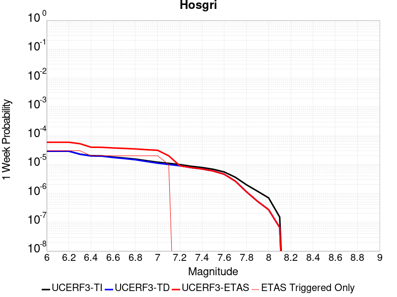 |  |  |  |

| Magnitude | 1 wk TI Prob | 1 wk TD Prob | 1 wk ETAS Prob | 1 wk ETAS/TD Gain | 1 wk ETAS Triggered Only | 1 mo TI Prob | 1 mo TD Prob | 1 mo ETAS Prob | 1 mo ETAS/TD Gain | 1 mo ETAS Triggered Only | 1 yr TI Prob | 1 yr TD Prob | 1 yr ETAS Prob | 1 yr ETAS/TD Gain | 1 yr ETAS Triggered Only | 10 yr TI Prob | 10 yr TD Prob | 10 yr ETAS Prob | 10 yr ETAS/TD Gain | 10 yr ETAS Triggered Only |
|-----|-----|-----|-----|-----|-----|-----|-----|-----|-----|-----|-----|-----|-----|-----|-----|-----|-----|-----|-----|-----|
| 6.0 | 2.883978E-5 | 2.9128416E-5 | 4.5205117E-5 | 1.5519251 | 1.607717E-5 | 1.235932E-4 | 1.2483024E-4 | 1.4090541E-4 | 1.1287762 | 1.607717E-5 | 0.0015037085 | 0.001518776 | 0.0015508814 | 1.021139 | 3.215434E-5 | 0.01493574 | 0.01508774 | 0.015135244 | 1.0031486 | 4.823151E-5 |
| 6.1 | 2.883978E-5 | 2.9128416E-5 | 4.5205117E-5 | 1.5519251 | 1.607717E-5 | 1.235932E-4 | 1.2483024E-4 | 1.4090541E-4 | 1.1287762 | 1.607717E-5 | 0.0015037085 | 0.001518776 | 0.0015508814 | 1.021139 | 3.215434E-5 | 0.01493574 | 0.01508774 | 0.015135244 | 1.0031486 | 4.823151E-5 |
| 6.2 | 2.883978E-5 | 2.9128416E-5 | 4.5205117E-5 | 1.5519251 | 1.607717E-5 | 1.235932E-4 | 1.2483024E-4 | 1.4090541E-4 | 1.1287762 | 1.607717E-5 | 0.0015037085 | 0.001518776 | 0.0015508814 | 1.021139 | 3.215434E-5 | 0.01493574 | 0.01508774 | 0.015135244 | 1.0031486 | 4.823151E-5 |
| 6.3 | 2.2914428E-5 | 2.2641969E-5 | 3.8718776E-5 | 1.7100445 | 1.607717E-5 | 9.8200995E-5 | 9.703343E-5 | 1.1310904E-4 | 1.1656709 | 1.607717E-5 | 0.0011949413 | 0.0011807467 | 0.001212863 | 1.0272001 | 3.215434E-5 | 0.011885363 | 0.011746133 | 0.011793798 | 1.0040579 | 4.823151E-5 |
| 6.4 | 2.0195741E-5 | 1.969656E-5 | 3.5773413E-5 | 1.8162265 | 1.607717E-5 | 8.65503E-5 | 8.4411105E-5 | 1.0048692E-4 | 1.1904466 | 1.607717E-5 | 0.0010532405 | 0.0010272227 | 0.001059344 | 1.03127 | 3.215434E-5 | 0.010482626 | 0.010225792 | 0.0102576185 | 1.0031123 | 3.215434E-5 |
| 6.5 | 1.9924333E-5 | 1.940898E-5 | 3.548584E-5 | 1.8283206 | 1.607717E-5 | 8.53872E-5 | 8.3178704E-5 | 9.925454E-5 | 1.1932687 | 1.607717E-5 | 0.0010390934 | 0.0010122322 | 0.0010443539 | 1.0317336 | 3.215434E-5 | 0.010342481 | 0.010077253 | 0.010109084 | 1.0031587 | 3.215434E-5 |
| 6.6 | 1.809694E-5 | 1.74583E-5 | 3.353519E-5 | 1.9208738 | 1.607717E-5 | 7.7556004E-5 | 7.4819145E-5 | 9.089512E-5 | 1.2148644 | 1.607717E-5 | 9.438353E-4 | 9.105437E-4 | 9.426688E-4 | 1.0352812 | 3.215434E-5 | 0.009398366 | 0.009069073 | 0.009100935 | 1.0035133 | 3.215434E-5 |
| 6.7 | 1.675989E-5 | 1.6042764E-5 | 3.211968E-5 | 2.0021286 | 1.607717E-5 | 7.182612E-5 | 6.87529E-5 | 8.4828964E-5 | 1.2338238 | 1.607717E-5 | 8.7413215E-4 | 8.3674624E-4 | 8.6887367E-4 | 1.0383956 | 3.215434E-5 | 0.008707017 | 0.0083368635 | 0.008368749 | 1.0038247 | 3.215434E-5 |
| 6.8 | 1.5401129E-5 | 1.4614083E-5 | 3.069102E-5 | 2.1000988 | 1.607717E-5 | 6.6003166E-5 | 6.2630286E-5 | 7.870645E-5 | 1.2566836 | 1.607717E-5 | 8.032922E-4 | 7.622578E-4 | 7.943876E-4 | 1.0421509 | 3.215434E-5 | 0.008003947 | 0.007597296 | 0.0076292064 | 1.0042002 | 3.215434E-5 |
| 6.9 | 1.356559E-5 | 1.2689968E-5 | 2.8766934E-5 | 2.2669036 | 1.607717E-5 | 5.8136946E-5 | 5.4384444E-5 | 7.046074E-5 | 1.2956047 | 1.607717E-5 | 7.0758746E-4 | 6.619299E-4 | 6.9406297E-4 | 1.0485445 | 3.215434E-5 | 0.007053386 | 0.006600388 | 0.00663233 | 1.0048394 | 3.215434E-5 |
| 7.0 | 1.2030819E-5 | 1.1095962E-5 | 2.7172953E-5 | 2.4489048 | 1.607717E-5 | 5.155963E-5 | 4.7553254E-5 | 6.362966E-5 | 1.3380716 | 1.607717E-5 | 6.275577E-4 | 5.7880714E-4 | 6.109429E-4 | 1.0555207 | 3.215434E-5 | 0.006257884 | 0.005773757 | 0.0058057257 | 1.0055369 | 3.215434E-5 |
| 7.1 | 1.0972698E-5 | 1.0022179E-5 | 2.6099187E-5 | 2.6041431 | 1.607717E-5 | 4.7025E-5 | 4.2951488E-5 | 5.9027967E-5 | 1.3742939 | 1.607717E-5 | 5.72379E-4 | 5.22809E-4 | 5.549465E-4 | 1.0614709 | 3.215434E-5 | 0.0057090693 | 0.005216542 | 0.005248529 | 1.0061318 | 3.215434E-5 |
| 7.2 | 9.961926E-6 | 9.034746E-6 | 9.034746E-6 | 1.0 | 0.0 | 4.2693267E-5 | 3.8719765E-5 | 3.8719765E-5 | 1.0 | 0.0 | 5.1966653E-4 | 4.713112E-4 | 4.873808E-4 | 1.0340955 | 1.607717E-5 | 0.00518453 | 0.0047038626 | 0.004719864 | 1.0034018 | 1.607717E-5 |
| 7.3 | 8.700929E-6 | 7.8281E-6 | 7.8281E-6 | 1.0 | 0.0 | 3.7289166E-5 | 3.354857E-5 | 3.354857E-5 | 1.0 | 0.0 | 4.53901E-4 | 4.0837732E-4 | 4.0837732E-4 | 1.0 | 0.0 | 0.00452975 | 0.004077008 | 0.004077008 | 1.0 | 0.0 |
| 7.4 | 7.866285E-6 | 6.998739E-6 | 6.998739E-6 | 1.0 | 0.0 | 3.3712215E-5 | 2.9994251E-5 | 2.9994251E-5 | 1.0 | 0.0 | 4.103689E-4 | 3.6511885E-4 | 3.6511885E-4 | 1.0 | 0.0 | 0.004096119 | 0.0036459267 | 0.0036459267 | 1.0 | 0.0 |
| 7.5 | 6.8381305E-6 | 5.9596955E-6 | 5.9596955E-6 | 1.0 | 0.0 | 2.9305946E-5 | 2.5541302E-5 | 2.5541302E-5 | 1.0 | 0.0 | 3.5674145E-4 | 3.10921E-4 | 3.10921E-4 | 1.0 | 0.0 | 0.0035616932 | 0.0031055948 | 0.0031055948 | 1.0 | 0.0 |
| 7.6 | 5.503376E-6 | 4.5952443E-6 | 4.5952443E-6 | 1.0 | 0.0 | 2.3585684E-5 | 1.9693754E-5 | 1.9693754E-5 | 1.0 | 0.0 | 2.8711787E-4 | 2.397451E-4 | 2.397451E-4 | 1.0 | 0.0 | 0.002867472 | 0.0023955975 | 0.0023955975 | 1.0 | 0.0 |
| 7.7 | 3.6144982E-6 | 2.6522112E-6 | 2.6522112E-6 | 1.0 | 0.0 | 1.5490614E-5 | 1.1366569E-5 | 1.1366569E-5 | 1.0 | 0.0 | 1.8858191E-4 | 1.383792E-4 | 1.383792E-4 | 1.0 | 0.0 | 0.0018842196 | 0.0013836613 | 0.0013836613 | 1.0 | 0.0 |
| 7.8 | 1.9853494E-6 | 1.1361129E-6 | 1.1361129E-6 | 1.0 | 0.0 | 8.508612E-6 | 4.8690463E-6 | 4.8690463E-6 | 1.0 | 0.0 | 1.0358743E-4 | 5.9279027E-5 | 5.9279027E-5 | 1.0 | 0.0 | 0.0010353916 | 5.9336185E-4 | 5.9336185E-4 | 1.0 | 0.0 |
| 7.9 | 1.1818757E-6 | 5.2951856E-7 | 5.2951856E-7 | 1.0 | 0.0 | 5.0651715E-6 | 2.2693632E-6 | 2.2693632E-6 | 1.0 | 0.0 | 6.1666724E-5 | 2.7629147E-5 | 2.7629147E-5 | 1.0 | 0.0 | 6.1649614E-4 | 2.7694515E-4 | 2.7694515E-4 | 1.0 | 0.0 |
| 8.0 | 6.962958E-7 | 2.7139782E-7 | 2.7139782E-7 | 1.0 | 0.0 | 2.9841215E-6 | 1.163133E-6 | 1.163133E-6 | 1.0 | 0.0 | 3.6331072E-5 | 1.4161053E-5 | 1.4161053E-5 | 1.0 | 0.0 | 3.6325134E-4 | 1.4217179E-4 | 1.4217179E-4 | 1.0 | 0.0 |
| 8.1 | 1.5033264E-7 | 6.527624E-8 | 6.527624E-8 | 1.0 | 0.0 | 6.442826E-7 | 2.7975528E-7 | 2.7975528E-7 | 1.0 | 0.0 | 7.844113E-6 | 3.4060151E-6 | 3.4060151E-6 | 1.0 | 0.0 | 7.843835E-5 | 3.407693E-5 | 3.407693E-5 | 1.0 | 0.0 |

## Pisgah-Bullion Mtn-Mesquite Lk
*[(top)](#table-of-contents)*

| 1 Week | 1 Month | 1 Year | 10 Year |
|-----|-----|-----|-----|
|  | 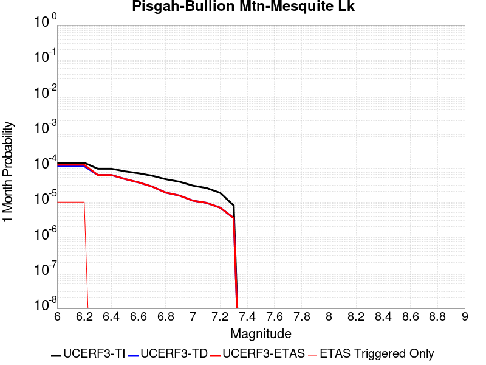 |  |  |

| Magnitude | 1 wk TI Prob | 1 wk TD Prob | 1 wk ETAS Prob | 1 wk ETAS/TD Gain | 1 wk ETAS Triggered Only | 1 mo TI Prob | 1 mo TD Prob | 1 mo ETAS Prob | 1 mo ETAS/TD Gain | 1 mo ETAS Triggered Only | 1 yr TI Prob | 1 yr TD Prob | 1 yr ETAS Prob | 1 yr ETAS/TD Gain | 1 yr ETAS Triggered Only | 10 yr TI Prob | 10 yr TD Prob | 10 yr ETAS Prob | 10 yr ETAS/TD Gain | 10 yr ETAS Triggered Only |
|-----|-----|-----|-----|-----|-----|-----|-----|-----|-----|-----|-----|-----|-----|-----|-----|-----|-----|-----|-----|-----|
| 6.0 | 3.0240792E-5 | 2.4091114E-5 | 4.01679E-5 | 1.6673325 | 1.607717E-5 | 1.2959696E-4 | 1.03244114E-4 | 1.1931962E-4 | 1.1557039 | 1.607717E-5 | 0.0015767008 | 0.0012563728 | 0.0012884866 | 1.0255609 | 3.215434E-5 | 0.015655609 | 0.012502721 | 0.012550349 | 1.0038095 | 4.823151E-5 |
| 6.1 | 3.0240792E-5 | 2.4091114E-5 | 4.01679E-5 | 1.6673325 | 1.607717E-5 | 1.2959696E-4 | 1.03244114E-4 | 1.1931962E-4 | 1.1557039 | 1.607717E-5 | 0.0015767008 | 0.0012563728 | 0.0012884866 | 1.0255609 | 3.215434E-5 | 0.015655609 | 0.012502721 | 0.012550349 | 1.0038095 | 4.823151E-5 |
| 6.2 | 3.0240792E-5 | 2.4091114E-5 | 4.01679E-5 | 1.6673325 | 1.607717E-5 | 1.2959696E-4 | 1.03244114E-4 | 1.1931962E-4 | 1.1557039 | 1.607717E-5 | 0.0015767008 | 0.0012563728 | 0.0012884866 | 1.0255609 | 3.215434E-5 | 0.015655609 | 0.012502721 | 0.012550349 | 1.0038095 | 4.823151E-5 |
| 6.3 | 2.0498217E-5 | 1.36380695E-5 | 1.36380695E-5 | 1.0 | 0.0 | 8.784654E-5 | 5.844765E-5 | 5.844765E-5 | 1.0 | 0.0 | 0.0010690069 | 7.1138405E-4 | 7.1138405E-4 | 1.0 | 0.0 | 0.01063879 | 0.0070926943 | 0.0070926943 | 1.0 | 0.0 |
| 6.4 | 2.0498217E-5 | 1.36380695E-5 | 1.36380695E-5 | 1.0 | 0.0 | 8.784654E-5 | 5.844765E-5 | 5.844765E-5 | 1.0 | 0.0 | 0.0010690069 | 7.1138405E-4 | 7.1138405E-4 | 1.0 | 0.0 | 0.01063879 | 0.0070926943 | 0.0070926943 | 1.0 | 0.0 |
| 6.5 | 1.7316182E-5 | 1.0477042E-5 | 1.0477042E-5 | 1.0 | 0.0 | 7.42101E-5 | 4.4900895E-5 | 4.4900895E-5 | 1.0 | 0.0 | 9.0313336E-4 | 5.465413E-4 | 5.465413E-4 | 1.0 | 0.0 | 0.008994718 | 0.0054529672 | 0.0054529672 | 1.0 | 0.0 |
| 6.6 | 1.5251077E-5 | 8.414273E-6 | 8.414273E-6 | 1.0 | 0.0 | 6.536012E-5 | 3.6060712E-5 | 3.6060712E-5 | 1.0 | 0.0 | 7.9546886E-4 | 4.3895794E-4 | 4.3895794E-4 | 1.0 | 0.0 | 0.007926274 | 0.0043816264 | 0.0043816264 | 1.0 | 0.0 |
| 6.7 | 1.2997425E-5 | 6.4114965E-6 | 6.4114965E-6 | 1.0 | 0.0 | 5.570206E-5 | 2.7477578E-5 | 2.7477578E-5 | 1.0 | 0.0 | 6.7796157E-4 | 3.3449283E-4 | 3.3449283E-4 | 1.0 | 0.0 | 0.0067589693 | 0.0033403537 | 0.0033403537 | 1.0 | 0.0 |
| 6.8 | 1.035386E-5 | 4.3332193E-6 | 4.3332193E-6 | 1.0 | 0.0 | 4.437293E-5 | 1.8570812E-5 | 1.8570812E-5 | 1.0 | 0.0 | 5.401065E-4 | 2.2607706E-4 | 2.2607706E-4 | 1.0 | 0.0 | 0.0053879567 | 0.0022585576 | 0.0022585576 | 1.0 | 0.0 |
| 6.9 | 8.816252E-6 | 3.580638E-6 | 3.580638E-6 | 1.0 | 0.0 | 3.778339E-5 | 1.5345504E-5 | 1.5345504E-5 | 1.0 | 0.0 | 4.5991567E-4 | 1.8681608E-4 | 1.8681608E-4 | 1.0 | 0.0 | 0.00458965 | 0.0018666488 | 0.0018666488 | 1.0 | 0.0 |
| 7.0 | 6.8232207E-6 | 2.5675843E-6 | 2.5675843E-6 | 1.0 | 0.0 | 2.9242048E-5 | 1.1003888E-5 | 1.1003888E-5 | 1.0 | 0.0 | 3.5596377E-4 | 1.3396442E-4 | 1.3396442E-4 | 1.0 | 0.0 | 0.0035539411 | 0.0013388677 | 0.0013388677 | 1.0 | 0.0 |
| 7.1 | 5.837013E-6 | 2.22738E-6 | 2.22738E-6 | 1.0 | 0.0 | 2.501553E-5 | 9.545881E-6 | 9.545881E-6 | 1.0 | 0.0 | 3.045215E-4 | 1.16215204E-4 | 1.16215204E-4 | 1.0 | 0.0 | 0.0030410455 | 0.0011615733 | 0.0011615733 | 1.0 | 0.0 |
| 7.2 | 4.278052E-6 | 1.6275711E-6 | 1.6275711E-6 | 1.0 | 0.0 | 1.833438E-5 | 6.9752873E-6 | 6.9752873E-6 | 1.0 | 0.0 | 2.231982E-4 | 8.492105E-5 | 8.492105E-5 | 1.0 | 0.0 | 0.0022297418 | 8.489092E-4 | 8.489092E-4 | 1.0 | 0.0 |
| 7.3 | 1.8803692E-6 | 8.344926E-7 | 8.344926E-7 | 1.0 | 0.0 | 8.0587E-6 | 3.5763926E-6 | 3.5763926E-6 | 1.0 | 0.0 | 9.811026E-5 | 4.354186E-5 | 4.354186E-5 | 1.0 | 0.0 | 9.806695E-4 | 4.3534773E-4 | 4.3534773E-4 | 1.0 | 0.0 |

## San Jacinto (Clark) rev
*[(top)](#table-of-contents)*

| 1 Week | 1 Month | 1 Year | 10 Year |
|-----|-----|-----|-----|
|  |  | 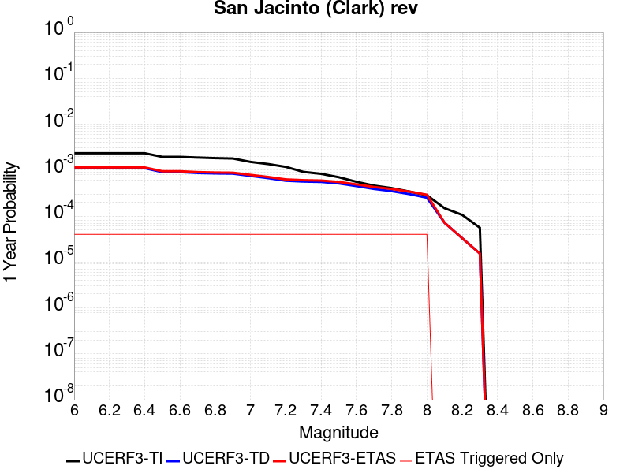 | 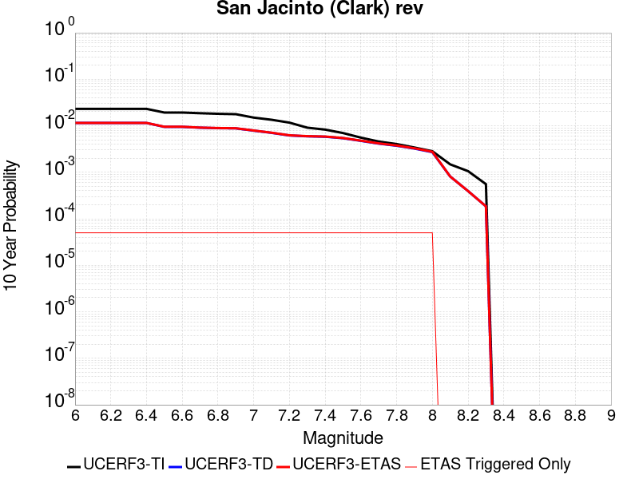 |

| Magnitude | 1 wk TI Prob | 1 wk TD Prob | 1 wk ETAS Prob | 1 wk ETAS/TD Gain | 1 wk ETAS Triggered Only | 1 mo TI Prob | 1 mo TD Prob | 1 mo ETAS Prob | 1 mo ETAS/TD Gain | 1 mo ETAS Triggered Only | 1 yr TI Prob | 1 yr TD Prob | 1 yr ETAS Prob | 1 yr ETAS/TD Gain | 1 yr ETAS Triggered Only | 10 yr TI Prob | 10 yr TD Prob | 10 yr ETAS Prob | 10 yr ETAS/TD Gain | 10 yr ETAS Triggered Only |
|-----|-----|-----|-----|-----|-----|-----|-----|-----|-----|-----|-----|-----|-----|-----|-----|-----|-----|-----|-----|-----|
| 6.0 | 4.482615E-5 | 2.1154196E-5 | 2.1154196E-5 | 1.0 | 0.0 | 1.9209793E-4 | 9.065773E-5 | 1.0673345E-4 | 1.1773231 | 1.607717E-5 | 0.0023362834 | 0.0011032083 | 0.0011353272 | 1.029114 | 3.215434E-5 | 0.02311874 | 0.011503847 | 0.011551524 | 1.0041444 | 4.823151E-5 |
| 6.1 | 4.482615E-5 | 2.1154196E-5 | 2.1154196E-5 | 1.0 | 0.0 | 1.9209793E-4 | 9.065773E-5 | 1.0673345E-4 | 1.1773231 | 1.607717E-5 | 0.0023362834 | 0.0011032083 | 0.0011353272 | 1.029114 | 3.215434E-5 | 0.02311874 | 0.011503847 | 0.011551524 | 1.0041444 | 4.823151E-5 |
| 6.2 | 4.482615E-5 | 2.1154196E-5 | 2.1154196E-5 | 1.0 | 0.0 | 1.9209793E-4 | 9.065773E-5 | 1.0673345E-4 | 1.1773231 | 1.607717E-5 | 0.0023362834 | 0.0011032083 | 0.0011353272 | 1.029114 | 3.215434E-5 | 0.02311874 | 0.011503847 | 0.011551524 | 1.0041444 | 4.823151E-5 |
| 6.3 | 4.482615E-5 | 2.1154196E-5 | 2.1154196E-5 | 1.0 | 0.0 | 1.9209793E-4 | 9.065773E-5 | 1.0673345E-4 | 1.1773231 | 1.607717E-5 | 0.0023362834 | 0.0011032083 | 0.0011353272 | 1.029114 | 3.215434E-5 | 0.02311874 | 0.011503847 | 0.011551524 | 1.0041444 | 4.823151E-5 |
| 6.4 | 4.482615E-5 | 2.1154196E-5 | 2.1154196E-5 | 1.0 | 0.0 | 1.9209793E-4 | 9.065773E-5 | 1.0673345E-4 | 1.1773231 | 1.607717E-5 | 0.0023362834 | 0.0011032083 | 0.0011353272 | 1.029114 | 3.215434E-5 | 0.02311874 | 0.011503847 | 0.011551524 | 1.0041444 | 4.823151E-5 |
| 6.5 | 3.7294863E-5 | 1.7356087E-5 | 1.7356087E-5 | 1.0 | 0.0 | 1.5982533E-4 | 7.438113E-5 | 9.045711E-5 | 1.2161298 | 1.607717E-5 | 0.0019441366 | 9.052186E-4 | 9.373438E-4 | 1.035489 | 3.215434E-5 | 0.01927216 | 0.0094941035 | 0.009541877 | 1.005032 | 4.823151E-5 |
| 6.6 | 3.7294863E-5 | 1.7356087E-5 | 1.7356087E-5 | 1.0 | 0.0 | 1.5982533E-4 | 7.438113E-5 | 9.045711E-5 | 1.2161298 | 1.607717E-5 | 0.0019441366 | 9.052186E-4 | 9.373438E-4 | 1.035489 | 3.215434E-5 | 0.01927216 | 0.0094941035 | 0.009541877 | 1.005032 | 4.823151E-5 |
| 6.7 | 3.6039248E-5 | 1.6604314E-5 | 1.6604314E-5 | 1.0 | 0.0 | 1.5444479E-4 | 7.1159426E-5 | 8.723545E-5 | 1.2259157 | 1.607717E-5 | 0.0018787434 | 8.6602574E-4 | 8.9815224E-4 | 1.0370965 | 3.215434E-5 | 0.01862939 | 0.009096047 | 0.00914384 | 1.0052543 | 4.823151E-5 |
| 6.8 | 3.5031844E-5 | 1.6232942E-5 | 1.6232942E-5 | 1.0 | 0.0 | 1.5012783E-4 | 6.956792E-5 | 8.5643966E-5 | 1.2310842 | 1.607717E-5 | 0.0018262739 | 8.4666436E-4 | 8.7879144E-4 | 1.0379455 | 3.215434E-5 | 0.01811338 | 0.008895969 | 0.008943772 | 1.0053735 | 4.823151E-5 |
| 6.9 | 3.435112E-5 | 1.6063195E-5 | 1.6063195E-5 | 1.0 | 0.0 | 1.4721078E-4 | 6.884047E-5 | 8.491653E-5 | 1.2335263 | 1.607717E-5 | 0.0017908178 | 8.3781447E-4 | 8.699419E-4 | 1.0383466 | 3.215434E-5 | 0.017764548 | 0.008804181 | 0.008851987 | 1.00543 | 4.823151E-5 |
| 7.0 | 2.8959772E-5 | 1.4336745E-5 | 1.4336745E-5 | 1.0 | 0.0 | 1.241074E-4 | 6.144176E-5 | 7.751794E-5 | 1.2616491 | 1.607717E-5 | 0.0015099603 | 7.477995E-4 | 7.799298E-4 | 1.0429665 | 3.215434E-5 | 0.014997416 | 0.007868037 | 0.007915888 | 1.0060818 | 4.823151E-5 |
| 7.1 | 2.6002877E-5 | 1.2829002E-5 | 1.2829002E-5 | 1.0 | 0.0 | 1.11436144E-4 | 5.498029E-5 | 7.105657E-5 | 1.292401 | 1.607717E-5 | 0.0013558907 | 6.691816E-4 | 7.0131436E-4 | 1.0480181 | 3.215434E-5 | 0.013476475 | 0.0070465137 | 0.0070944056 | 1.0067965 | 4.823151E-5 |
| 7.2 | 2.2544838E-5 | 1.1262543E-5 | 1.1262543E-5 | 1.0 | 0.0 | 9.661716E-5 | 4.8267157E-5 | 6.4343556E-5 | 1.3330711 | 1.607717E-5 | 0.001175679 | 5.874956E-4 | 6.196311E-4 | 1.0546991 | 3.215434E-5 | 0.011694785 | 0.0061927503 | 0.006240683 | 1.0077401 | 4.823151E-5 |
| 7.3 | 1.75334E-5 | 1.0811715E-5 | 1.0811715E-5 | 1.0 | 0.0 | 7.514098E-5 | 4.6335106E-5 | 6.241153E-5 | 1.34696 | 1.607717E-5 | 9.144575E-4 | 5.6398526E-4 | 5.961215E-4 | 1.0569806 | 3.215434E-5 | 0.009107036 | 0.0059337732 | 0.0059817187 | 1.0080801 | 4.823151E-5 |
| 7.4 | 1.5924552E-5 | 1.0611516E-5 | 1.0611516E-5 | 1.0 | 0.0 | 6.82463E-5 | 4.547714E-5 | 6.155358E-5 | 1.353506 | 1.607717E-5 | 8.305819E-4 | 5.535449E-4 | 5.8568147E-4 | 1.0580559 | 3.215434E-5 | 0.008274844 | 0.0058210334 | 0.005868984 | 1.0082375 | 4.823151E-5 |
| 7.5 | 1.3428931E-5 | 9.8519E-6 | 9.8519E-6 | 1.0 | 0.0 | 5.7551293E-5 | 4.2221753E-5 | 5.8298243E-5 | 1.3807633 | 1.607717E-5 | 7.004617E-4 | 5.1392964E-4 | 5.460675E-4 | 1.0625335 | 3.215434E-5 | 0.006982579 | 0.0054066023 | 0.0054545733 | 1.0088726 | 4.823151E-5 |
| 7.6 | 1.0688787E-5 | 8.614839E-6 | 8.614839E-6 | 1.0 | 0.0 | 4.5808283E-5 | 3.692022E-5 | 5.29968E-5 | 1.435441 | 1.607717E-5 | 5.5757316E-4 | 4.4941145E-4 | 4.8155134E-4 | 1.0715156 | 3.215434E-5 | 0.005561762 | 0.0047416524 | 0.004789655 | 1.0101236 | 4.823151E-5 |
| 7.7 | 8.81236E-6 | 7.4680274E-6 | 7.4680274E-6 | 1.0 | 0.0 | 3.776671E-5 | 3.2005442E-5 | 4.8082096E-5 | 1.50231 | 1.607717E-5 | 4.597127E-4 | 3.8959677E-4 | 4.217386E-4 | 1.0825002 | 3.215434E-5 | 0.0045876284 | 0.0041346536 | 0.0041826856 | 1.011617 | 4.823151E-5 |
| 7.8 | 7.780431E-6 | 6.696579E-6 | 6.696579E-6 | 1.0 | 0.0 | 3.3344273E-5 | 2.8699309E-5 | 4.4776018E-5 | 1.5601776 | 1.607717E-5 | 4.0589093E-4 | 3.4935825E-4 | 3.8150136E-4 | 1.0920062 | 3.215434E-5 | 0.0040515037 | 0.0037227906 | 0.0037708427 | 1.0129075 | 4.823151E-5 |
| 7.9 | 6.5437994E-6 | 5.780382E-6 | 5.780382E-6 | 1.0 | 0.0 | 2.8044553E-5 | 2.477283E-5 | 4.08496E-5 | 1.6489679 | 1.607717E-5 | 3.4138895E-4 | 3.0156763E-4 | 3.337123E-4 | 1.1065918 | 3.215434E-5 | 0.0034086495 | 0.0032344845 | 0.00328256 | 1.0148634 | 4.823151E-5 |
| 8.0 | 5.4488164E-6 | 4.8133406E-6 | 4.8133406E-6 | 1.0 | 0.0 | 2.3351862E-5 | 2.062844E-5 | 3.6705278E-5 | 1.779353 | 1.607717E-5 | 2.8427184E-4 | 2.5112246E-4 | 2.8326875E-4 | 1.1280103 | 3.215434E-5 | 0.0028390845 | 0.002710839 | 0.0027589398 | 1.0177438 | 4.823151E-5 |
| 8.1 | 2.8397242E-6 | 1.3670389E-6 | 1.3670389E-6 | 1.0 | 0.0 | 1.217019E-5 | 5.858725E-6 | 5.858725E-6 | 1.0 | 0.0 | 1.4816198E-4 | 7.132765E-5 | 7.132765E-5 | 1.0 | 0.0 | 0.0014806325 | 8.115382E-4 | 8.115382E-4 | 1.0 | 0.0 |
| 8.2 | 2.030244E-6 | 6.318974E-7 | 6.318974E-7 | 1.0 | 0.0 | 8.701017E-6 | 2.708129E-6 | 2.708129E-6 | 1.0 | 0.0 | 1.05929736E-4 | 3.2970976E-5 | 3.2970976E-5 | 1.0 | 0.0 | 0.0010587925 | 3.9486602E-4 | 3.9486602E-4 | 1.0 | 0.0 |
| 8.3 | 1.0659804E-6 | 2.9250086E-7 | 2.9250086E-7 | 1.0 | 0.0 | 4.568479E-6 | 1.2535745E-6 | 1.2535745E-6 | 1.0 | 0.0 | 5.5619817E-5 | 1.5262167E-5 | 1.5262167E-5 | 1.0 | 0.0 | 5.5605895E-4 | 1.8566217E-4 | 1.8566217E-4 | 1.0 | 0.0 |

## Santa Susana East (connector)
*[(top)](#table-of-contents)*

| 1 Week | 1 Month | 1 Year | 10 Year |
|-----|-----|-----|-----|
|  |  |  |  |

| Magnitude | 1 wk TI Prob | 1 wk TD Prob | 1 wk ETAS Prob | 1 wk ETAS/TD Gain | 1 wk ETAS Triggered Only | 1 mo TI Prob | 1 mo TD Prob | 1 mo ETAS Prob | 1 mo ETAS/TD Gain | 1 mo ETAS Triggered Only | 1 yr TI Prob | 1 yr TD Prob | 1 yr ETAS Prob | 1 yr ETAS/TD Gain | 1 yr ETAS Triggered Only | 10 yr TI Prob | 10 yr TD Prob | 10 yr ETAS Prob | 10 yr ETAS/TD Gain | 10 yr ETAS Triggered Only |
|-----|-----|-----|-----|-----|-----|-----|-----|-----|-----|-----|-----|-----|-----|-----|-----|-----|-----|-----|-----|-----|
| 6.0 | 2.858397E-5 | 3.202091E-5 | 3.202091E-5 | 1.0 | 0.0 | 1.2249697E-4 | 1.3722685E-4 | 1.3722685E-4 | 1.0 | 0.0 | 0.0014903803 | 0.0016697381 | 0.0016857884 | 1.0096124 | 1.607717E-5 | 0.014804244 | 0.016599052 | 0.016646484 | 1.0028574 | 4.823151E-5 |
| 6.1 | 2.858397E-5 | 3.202091E-5 | 3.202091E-5 | 1.0 | 0.0 | 1.2249697E-4 | 1.3722685E-4 | 1.3722685E-4 | 1.0 | 0.0 | 0.0014903803 | 0.0016697381 | 0.0016857884 | 1.0096124 | 1.607717E-5 | 0.014804244 | 0.016599052 | 0.016646484 | 1.0028574 | 4.823151E-5 |
| 6.2 | 2.858397E-5 | 3.202091E-5 | 3.202091E-5 | 1.0 | 0.0 | 1.2249697E-4 | 1.3722685E-4 | 1.3722685E-4 | 1.0 | 0.0 | 0.0014903803 | 0.0016697381 | 0.0016857884 | 1.0096124 | 1.607717E-5 | 0.014804244 | 0.016599052 | 0.016646484 | 1.0028574 | 4.823151E-5 |
| 6.3 | 1.943582E-5 | 2.036718E-5 | 2.036718E-5 | 1.0 | 0.0 | 8.329371E-5 | 8.7285625E-5 | 8.7285625E-5 | 1.0 | 0.0 | 0.001013629 | 0.0010622967 | 0.0010783568 | 1.0151182 | 1.607717E-5 | 0.010090181 | 0.010583619 | 0.010615433 | 1.003006 | 3.215434E-5 |
| 6.4 | 1.943582E-5 | 2.036718E-5 | 2.036718E-5 | 1.0 | 0.0 | 8.329371E-5 | 8.7285625E-5 | 8.7285625E-5 | 1.0 | 0.0 | 0.001013629 | 0.0010622967 | 0.0010783568 | 1.0151182 | 1.607717E-5 | 0.010090181 | 0.010583619 | 0.010615433 | 1.003006 | 3.215434E-5 |
| 6.5 | 1.943582E-5 | 2.036718E-5 | 2.036718E-5 | 1.0 | 0.0 | 8.329371E-5 | 8.7285625E-5 | 8.7285625E-5 | 1.0 | 0.0 | 0.001013629 | 0.0010622967 | 0.0010783568 | 1.0151182 | 1.607717E-5 | 0.010090181 | 0.010583619 | 0.010615433 | 1.003006 | 3.215434E-5 |
| 6.6 | 1.943582E-5 | 2.036718E-5 | 2.036718E-5 | 1.0 | 0.0 | 8.329371E-5 | 8.7285625E-5 | 8.7285625E-5 | 1.0 | 0.0 | 0.001013629 | 0.0010622967 | 0.0010783568 | 1.0151182 | 1.607717E-5 | 0.010090181 | 0.010583619 | 0.010615433 | 1.003006 | 3.215434E-5 |
| 6.7 | 1.9404439E-5 | 2.03546E-5 | 2.03546E-5 | 1.0 | 0.0 | 8.3159226E-5 | 8.723172E-5 | 8.723172E-5 | 1.0 | 0.0 | 0.0010119933 | 0.0010616409 | 0.0010777011 | 1.0151277 | 1.607717E-5 | 0.010073971 | 0.010577125 | 0.0106089385 | 1.0030079 | 3.215434E-5 |
| 6.8 | 1.2217526E-5 | 1.1592998E-5 | 1.1592998E-5 | 1.0 | 0.0 | 5.2359774E-5 | 4.9683425E-5 | 4.9683425E-5 | 1.0 | 0.0 | 6.372938E-4 | 6.0474465E-4 | 6.2081206E-4 | 1.026569 | 1.607717E-5 | 0.0063546924 | 0.006033037 | 0.006064997 | 1.0052975 | 3.215434E-5 |
| 6.9 | 1.2217526E-5 | 1.1592998E-5 | 1.1592998E-5 | 1.0 | 0.0 | 5.2359774E-5 | 4.9683425E-5 | 4.9683425E-5 | 1.0 | 0.0 | 6.372938E-4 | 6.0474465E-4 | 6.2081206E-4 | 1.026569 | 1.607717E-5 | 0.0063546924 | 0.006033037 | 0.006064997 | 1.0052975 | 3.215434E-5 |
| 7.0 | 9.276017E-6 | 8.059113E-6 | 8.059113E-6 | 1.0 | 0.0 | 3.9753755E-5 | 3.4538618E-5 | 3.4538618E-5 | 1.0 | 0.0 | 4.8389446E-4 | 4.2042998E-4 | 4.3650038E-4 | 1.0382237 | 1.607717E-5 | 0.0048284214 | 0.0041970722 | 0.0042290916 | 1.007629 | 3.215434E-5 |
| 7.1 | 9.130355E-6 | 7.942286E-6 | 7.942286E-6 | 1.0 | 0.0 | 3.9129503E-5 | 3.4037945E-5 | 3.4037945E-5 | 1.0 | 0.0 | 4.7629757E-4 | 4.1433662E-4 | 4.3040712E-4 | 1.0387862 | 1.607717E-5 | 0.00475278 | 0.004136367 | 0.004168388 | 1.0077415 | 3.215434E-5 |
| 7.2 | 8.851015E-6 | 7.741445E-6 | 7.741445E-6 | 1.0 | 0.0 | 3.7932372E-5 | 3.317722E-5 | 3.317722E-5 | 1.0 | 0.0 | 4.6172875E-4 | 4.038612E-4 | 4.199319E-4 | 1.0397925 | 1.607717E-5 | 0.0046077054 | 0.0040319953 | 0.0040640202 | 1.0079427 | 3.215434E-5 |
| 7.3 | 8.573006E-6 | 7.550166E-6 | 7.550166E-6 | 1.0 | 0.0 | 3.6740938E-5 | 3.2357475E-5 | 3.2357475E-5 | 1.0 | 0.0 | 4.472291E-4 | 3.9388443E-4 | 4.0995528E-4 | 1.0408009 | 1.607717E-5 | 0.004463301 | 0.0039325804 | 0.0039646085 | 1.0081443 | 3.215434E-5 |
| 7.4 | 7.852282E-6 | 6.817687E-6 | 6.817687E-6 | 1.0 | 0.0 | 3.36522E-5 | 2.9218349E-5 | 2.9218349E-5 | 1.0 | 0.0 | 4.096385E-4 | 3.5567835E-4 | 3.717498E-4 | 1.0451853 | 1.607717E-5 | 0.0040888423 | 0.0035517553 | 0.0035837954 | 1.0090209 | 3.215434E-5 |
| 7.5 | 4.8869324E-6 | 4.279055E-6 | 4.279055E-6 | 1.0 | 0.0 | 2.0943828E-5 | 1.8338687E-5 | 1.8338687E-5 | 1.0 | 0.0 | 2.5496128E-4 | 2.232523E-4 | 2.3932588E-4 | 1.0719974 | 1.607717E-5 | 0.0025466895 | 0.0022304445 | 0.0022464858 | 1.007192 | 1.607717E-5 |
| 7.6 | 1.3894544E-6 | 1.1568179E-6 | 1.1568179E-6 | 1.0 | 0.0 | 5.954791E-6 | 4.957783E-6 | 4.957783E-6 | 1.0 | 0.0 | 7.249717E-5 | 6.0359558E-5 | 6.0359558E-5 | 1.0 | 0.0 | 7.247352E-4 | 6.0345343E-4 | 6.0345343E-4 | 1.0 | 0.0 |
| 7.7 | 2.9924632E-7 | 2.371928E-7 | 2.371928E-7 | 1.0 | 0.0 | 1.2824837E-6 | 1.0165402E-6 | 1.0165402E-6 | 1.0 | 0.0 | 1.5614127E-5 | 1.2376314E-5 | 1.2376314E-5 | 1.0 | 0.0 | 1.5613029E-4 | 1.2375697E-4 | 1.2375697E-4 | 1.0 | 0.0 |
| 7.8 | 4.8188564E-8 | 2.6323061E-8 | 2.6323061E-8 | 1.0 | 0.0 | 2.065224E-7 | 1.1281311E-7 | 1.1281311E-7 | 1.0 | 0.0 | 2.5144072E-6 | 1.3734989E-6 | 1.3734989E-6 | 1.0 | 0.0 | 2.5143789E-5 | 1.3734912E-5 | 1.3734912E-5 | 1.0 | 0.0 |
| 7.9 | 2.6127251E-9 | 2.7681102E-9 | 2.7681102E-9 | 1.0 | 0.0 | 1.1197393E-8 | 1.186333E-8 | 1.186333E-8 | 1.0 | 0.0 | 1.3632825E-7 | 1.4443603E-7 | 1.4443603E-7 | 1.0 | 0.0 | 1.3632817E-6 | 1.4443604E-6 | 1.4443604E-6 | 1.0 | 0.0 |

## Greenville (No) 2011 CFM
*[(top)](#table-of-contents)*

| 1 Week | 1 Month | 1 Year | 10 Year |
|-----|-----|-----|-----|
|  |  |  |  |

| Magnitude | 1 wk TI Prob | 1 wk TD Prob | 1 wk ETAS Prob | 1 wk ETAS/TD Gain | 1 wk ETAS Triggered Only | 1 mo TI Prob | 1 mo TD Prob | 1 mo ETAS Prob | 1 mo ETAS/TD Gain | 1 mo ETAS Triggered Only | 1 yr TI Prob | 1 yr TD Prob | 1 yr ETAS Prob | 1 yr ETAS/TD Gain | 1 yr ETAS Triggered Only | 10 yr TI Prob | 10 yr TD Prob | 10 yr ETAS Prob | 10 yr ETAS/TD Gain | 10 yr ETAS Triggered Only |
|-----|-----|-----|-----|-----|-----|-----|-----|-----|-----|-----|-----|-----|-----|-----|-----|-----|-----|-----|-----|-----|
| 6.0 | 3.286654E-5 | 4.036648E-5 | 4.036648E-5 | 1.0 | 0.0 | 1.4084899E-4 | 1.7298796E-4 | 1.7298796E-4 | 1.0 | 0.0 | 0.0017134876 | 0.002104132 | 0.0021362188 | 1.0152494 | 3.215434E-5 | 0.017003356 | 0.020846982 | 0.020878466 | 1.0015103 | 3.215434E-5 |
| 6.1 | 3.286654E-5 | 4.036648E-5 | 4.036648E-5 | 1.0 | 0.0 | 1.4084899E-4 | 1.7298796E-4 | 1.7298796E-4 | 1.0 | 0.0 | 0.0017134876 | 0.002104132 | 0.0021362188 | 1.0152494 | 3.215434E-5 | 0.017003356 | 0.020846982 | 0.020878466 | 1.0015103 | 3.215434E-5 |
| 6.2 | 3.1697953E-5 | 3.8929385E-5 | 3.8929385E-5 | 1.0 | 0.0 | 1.358413E-4 | 1.6682976E-4 | 1.6682976E-4 | 1.0 | 0.0 | 0.0016526132 | 0.002029298 | 0.0020613873 | 1.0158129 | 3.215434E-5 | 0.01640377 | 0.020112377 | 0.020143883 | 1.0015665 | 3.215434E-5 |
| 6.3 | 3.1363317E-5 | 3.851826E-5 | 3.851826E-5 | 1.0 | 0.0 | 1.344073E-4 | 1.6506804E-4 | 1.6506804E-4 | 1.0 | 0.0 | 0.0016351803 | 0.0020078886 | 0.0020399785 | 1.0159818 | 3.215434E-5 | 0.016232004 | 0.019902144 | 0.019933658 | 1.0015835 | 3.215434E-5 |
| 6.4 | 3.0228604E-5 | 3.7125395E-5 | 3.7125395E-5 | 1.0 | 0.0 | 1.2954473E-4 | 1.5909935E-4 | 1.5909935E-4 | 1.0 | 0.0 | 0.0015760659 | 0.0019353506 | 0.0019674427 | 1.016582 | 3.215434E-5 | 0.015649348 | 0.019189484 | 0.019221023 | 1.0016434 | 3.215434E-5 |
| 6.5 | 2.9537814E-5 | 3.6280853E-5 | 3.6280853E-5 | 1.0 | 0.0 | 1.2658449E-4 | 1.554803E-4 | 1.554803E-4 | 1.0 | 0.0 | 0.0015400766 | 0.0018913659 | 0.0019234593 | 1.0169685 | 3.215434E-5 | 0.01529447 | 0.018757146 | 0.018788697 | 1.001682 | 3.215434E-5 |
| 6.6 | 2.7345395E-5 | 3.3590182E-5 | 3.3590182E-5 | 1.0 | 0.0 | 1.1718928E-4 | 1.4395016E-4 | 1.4395016E-4 | 1.0 | 0.0 | 0.0014258457 | 0.0017512152 | 0.0017833132 | 1.018329 | 3.215434E-5 | 0.014167317 | 0.01737797 | 0.017409565 | 1.0018182 | 3.215434E-5 |
| 6.7 | 2.5615784E-5 | 3.1567088E-5 | 3.1567088E-5 | 1.0 | 0.0 | 1.09777306E-4 | 1.3528067E-4 | 1.3528067E-4 | 1.0 | 0.0 | 0.0013357193 | 0.0016458282 | 0.0016779297 | 1.0195047 | 3.215434E-5 | 0.013277191 | 0.016340064 | 0.016371693 | 1.0019357 | 3.215434E-5 |
| 6.8 | 2.0059057E-5 | 2.4712073E-5 | 2.4712073E-5 | 1.0 | 0.0 | 8.596455E-5 | 1.0590468E-4 | 1.0590468E-4 | 1.0 | 0.0 | 0.0010461159 | 0.001288643 | 0.0013207559 | 1.02492 | 3.215434E-5 | 0.0104120495 | 0.012813724 | 0.012845466 | 1.0024772 | 3.215434E-5 |
| 6.9 | 1.6321746E-5 | 2.018467E-5 | 2.018467E-5 | 1.0 | 0.0 | 6.9948466E-5 | 8.650293E-5 | 8.650293E-5 | 1.0 | 0.0 | 8.5128983E-4 | 0.0010526767 | 0.0010687369 | 1.0152565 | 1.607717E-5 | 0.008480361 | 0.010478431 | 0.01049434 | 1.0015182 | 1.607717E-5 |
| 7.0 | 1.22527645E-5 | 1.5135633E-5 | 1.5135633E-5 | 1.0 | 0.0 | 5.2510793E-5 | 6.486541E-5 | 6.486541E-5 | 1.0 | 0.0 | 6.3913135E-4 | 7.894544E-4 | 8.055189E-4 | 1.0203488 | 1.607717E-5 | 0.0063729626 | 0.007867137 | 0.007883087 | 1.0020275 | 1.607717E-5 |
| 7.1 | 8.996482E-6 | 1.1164954E-5 | 1.1164954E-5 | 1.0 | 0.0 | 3.8555783E-5 | 4.7848935E-5 | 4.7848935E-5 | 1.0 | 0.0 | 4.6931554E-4 | 5.824063E-4 | 5.9847406E-4 | 1.0275886 | 1.607717E-5 | 0.004683256 | 0.0058090906 | 0.0058250744 | 1.0027515 | 1.607717E-5 |
| 7.2 | 6.0273087E-6 | 7.569474E-6 | 7.569474E-6 | 1.0 | 0.0 | 2.5831067E-5 | 3.2440203E-5 | 3.2440203E-5 | 1.0 | 0.0 | 3.1444785E-4 | 3.9488857E-4 | 3.9488857E-4 | 1.0 | 0.0 | 0.0031400328 | 0.003942066 | 0.003942066 | 1.0 | 0.0 |
| 7.3 | 3.1209995E-6 | 3.9663746E-6 | 3.9663746E-6 | 1.0 | 0.0 | 1.3375643E-5 | 1.699864E-5 | 1.699864E-5 | 1.0 | 0.0 | 1.6283628E-4 | 2.0693893E-4 | 2.0693893E-4 | 1.0 | 0.0 | 0.0016271701 | 0.0020675526 | 0.0020675526 | 1.0 | 0.0 |
| 7.4 | 2.0254208E-6 | 2.6096043E-6 | 2.6096043E-6 | 1.0 | 0.0 | 8.680347E-6 | 1.1183971E-5 | 1.1183971E-5 | 1.0 | 0.0 | 1.0567809E-4 | 1.361564E-4 | 1.361564E-4 | 1.0 | 0.0 | 0.0010562785 | 0.0013607866 | 0.0013607866 | 1.0 | 0.0 |
| 7.5 | 1.6763418E-6 | 2.173353E-6 | 2.173353E-6 | 1.0 | 0.0 | 7.184302E-6 | 9.314337E-6 | 9.314337E-6 | 1.0 | 0.0 | 8.746537E-5 | 1.1339621E-4 | 1.1339621E-4 | 1.0 | 0.0 | 8.743095E-4 | 0.0011334305 | 0.0011334305 | 1.0 | 0.0 |
| 7.6 | 1.1935462E-6 | 1.5458467E-6 | 1.5458467E-6 | 1.0 | 0.0 | 5.115188E-6 | 6.6250404E-6 | 6.6250404E-6 | 1.0 | 0.0 | 6.2275634E-5 | 8.065693E-5 | 8.065693E-5 | 1.0 | 0.0 | 6.2258187E-4 | 8.0630725E-4 | 8.0630725E-4 | 1.0 | 0.0 |
| 7.7 | 3.0464201E-7 | 3.9846822E-7 | 3.9846822E-7 | 1.0 | 0.0 | 1.3056081E-6 | 1.7077199E-6 | 1.7077199E-6 | 1.0 | 0.0 | 1.589566E-5 | 2.0791296E-5 | 2.0791296E-5 | 1.0 | 0.0 | 1.5894524E-4 | 2.0789822E-4 | 2.0789822E-4 | 1.0 | 0.0 |

## Simi-Santa Rosa
*[(top)](#table-of-contents)*

| 1 Week | 1 Month | 1 Year | 10 Year |
|-----|-----|-----|-----|
|  |  |  |  |

| Magnitude | 1 wk TI Prob | 1 wk TD Prob | 1 wk ETAS Prob | 1 wk ETAS/TD Gain | 1 wk ETAS Triggered Only | 1 mo TI Prob | 1 mo TD Prob | 1 mo ETAS Prob | 1 mo ETAS/TD Gain | 1 mo ETAS Triggered Only | 1 yr TI Prob | 1 yr TD Prob | 1 yr ETAS Prob | 1 yr ETAS/TD Gain | 1 yr ETAS Triggered Only | 10 yr TI Prob | 10 yr TD Prob | 10 yr ETAS Prob | 10 yr ETAS/TD Gain | 10 yr ETAS Triggered Only |
|-----|-----|-----|-----|-----|-----|-----|-----|-----|-----|-----|-----|-----|-----|-----|-----|-----|-----|-----|-----|-----|
| 6.0 | 2.198912E-5 | 2.2275442E-5 | 3.8352253E-5 | 1.7217281 | 1.607717E-5 | 9.4235686E-5 | 9.5462936E-5 | 1.11538575E-4 | 1.1683966 | 1.607717E-5 | 0.0011467156 | 0.0011616853 | 0.0011777439 | 1.0138234 | 1.607717E-5 | 0.011408163 | 0.011560575 | 0.011592357 | 1.0027492 | 3.215434E-5 |
| 6.1 | 2.198912E-5 | 2.2275442E-5 | 3.8352253E-5 | 1.7217281 | 1.607717E-5 | 9.4235686E-5 | 9.5462936E-5 | 1.11538575E-4 | 1.1683966 | 1.607717E-5 | 0.0011467156 | 0.0011616853 | 0.0011777439 | 1.0138234 | 1.607717E-5 | 0.011408163 | 0.011560575 | 0.011592357 | 1.0027492 | 3.215434E-5 |
| 6.2 | 1.69983E-5 | 1.6668559E-5 | 3.274546E-5 | 1.9645046 | 1.607717E-5 | 7.284782E-5 | 7.143489E-5 | 8.751091E-5 | 1.2250444 | 1.607717E-5 | 8.865613E-4 | 8.6940196E-4 | 8.854651E-4 | 1.0184761 | 1.607717E-5 | 0.008830327 | 0.008662928 | 0.008678866 | 1.0018398 | 1.607717E-5 |
| 6.3 | 1.69983E-5 | 1.6668559E-5 | 3.274546E-5 | 1.9645046 | 1.607717E-5 | 7.284782E-5 | 7.143489E-5 | 8.751091E-5 | 1.2250444 | 1.607717E-5 | 8.865613E-4 | 8.6940196E-4 | 8.854651E-4 | 1.0184761 | 1.607717E-5 | 0.008830327 | 0.008662928 | 0.008678866 | 1.0018398 | 1.607717E-5 |
| 6.4 | 1.4666188E-5 | 1.4052543E-5 | 3.0129488E-5 | 2.1440594 | 1.607717E-5 | 6.285358E-5 | 6.0223934E-5 | 7.630014E-5 | 1.2669405 | 1.607717E-5 | 7.6497364E-4 | 7.3300465E-4 | 7.4907E-4 | 1.0219172 | 1.607717E-5 | 0.0076234564 | 0.007308344 | 0.007324304 | 1.0021838 | 1.607717E-5 |
| 6.5 | 1.4666188E-5 | 1.4052543E-5 | 3.0129488E-5 | 2.1440594 | 1.607717E-5 | 6.285358E-5 | 6.0223934E-5 | 7.630014E-5 | 1.2669405 | 1.607717E-5 | 7.6497364E-4 | 7.3300465E-4 | 7.4907E-4 | 1.0219172 | 1.607717E-5 | 0.0076234564 | 0.007308344 | 0.007324304 | 1.0021838 | 1.607717E-5 |
| 6.6 | 1.4377586E-5 | 1.3729583E-5 | 2.9806532E-5 | 2.1709714 | 1.607717E-5 | 6.1616774E-5 | 5.883988E-5 | 7.4916104E-5 | 1.2732198 | 1.607717E-5 | 7.4992597E-4 | 7.1616494E-4 | 7.322306E-4 | 1.0224329 | 1.607717E-5 | 0.007474003 | 0.0071410383 | 0.0071570007 | 1.0022353 | 1.607717E-5 |
| 6.7 | 1.3881404E-5 | 1.320755E-5 | 2.9284509E-5 | 2.217255 | 1.607717E-5 | 5.9490372E-5 | 5.66027E-5 | 7.267896E-5 | 1.2840194 | 1.607717E-5 | 7.240546E-4 | 6.8894465E-4 | 7.050108E-4 | 1.0233198 | 1.607717E-5 | 0.007217 | 0.006870538 | 0.006886505 | 1.002324 | 1.607717E-5 |
| 6.8 | 1.0176516E-5 | 9.154151E-6 | 2.5231173E-5 | 2.7562551 | 1.607717E-5 | 4.3612912E-5 | 3.9231574E-5 | 5.5308115E-5 | 1.4097857 | 1.607717E-5 | 5.308578E-4 | 4.7755634E-4 | 4.936258E-4 | 1.0336494 | 1.607717E-5 | 0.0052959146 | 0.004766934 | 0.0047829347 | 1.0033566 | 1.607717E-5 |
| 6.9 | 9.699797E-6 | 8.774719E-6 | 2.485175E-5 | 2.8321986 | 1.607717E-5 | 4.15699E-5 | 3.7605492E-5 | 5.368206E-5 | 1.4275059 | 1.607717E-5 | 5.05996E-4 | 4.577671E-4 | 4.7383693E-4 | 1.0351048 | 1.607717E-5 | 0.005048454 | 0.0045698597 | 0.004585863 | 1.003502 | 1.607717E-5 |
| 7.0 | 7.4049476E-6 | 6.559333E-6 | 2.2636397E-5 | 3.4510212 | 1.607717E-5 | 3.1735104E-5 | 2.8111197E-5 | 4.4187917E-5 | 1.5718974 | 1.607717E-5 | 3.8630638E-4 | 3.422127E-4 | 3.5828436E-4 | 1.0469639 | 1.607717E-5 | 0.0038563553 | 0.0034180996 | 0.0034341218 | 1.0046874 | 1.607717E-5 |
| 7.1 | 3.873439E-6 | 2.7595095E-6 | 2.7595095E-6 | 1.0 | 0.0 | 1.6600346E-5 | 1.1826417E-5 | 1.1826417E-5 | 1.0 | 0.0 | 2.0209046E-4 | 1.4397735E-4 | 1.4397735E-4 | 1.0 | 0.0 | 0.0020190678 | 0.0014388643 | 0.0014388643 | 1.0 | 0.0 |
| 7.2 | 3.417706E-6 | 2.3676484E-6 | 2.3676484E-6 | 1.0 | 0.0 | 1.4647229E-5 | 1.0147027E-5 | 1.0147027E-5 | 1.0 | 0.0 | 1.7831543E-4 | 1.2353327E-4 | 1.2353327E-4 | 1.0 | 0.0 | 0.0017817242 | 0.0012346683 | 0.0012346683 | 1.0 | 0.0 |
| 7.3 | 1.90225E-6 | 1.4073753E-6 | 1.4073753E-6 | 1.0 | 0.0 | 8.152474E-6 | 6.0315947E-6 | 6.0315947E-6 | 1.0 | 0.0 | 9.9251854E-5 | 7.343221E-5 | 7.343221E-5 | 1.0 | 0.0 | 9.920754E-4 | 7.340817E-4 | 7.340817E-4 | 1.0 | 0.0 |
| 7.4 | 1.5170556E-6 | 1.1024773E-6 | 1.1024773E-6 | 1.0 | 0.0 | 6.5016507E-6 | 4.724894E-6 | 4.724894E-6 | 1.0 | 0.0 | 7.915472E-5 | 5.7524077E-5 | 5.7524077E-5 | 1.0 | 0.0 | 7.9126534E-4 | 5.7509297E-4 | 5.7509297E-4 | 1.0 | 0.0 |
| 7.5 | 1.178732E-6 | 8.535102E-7 | 8.535102E-7 | 1.0 | 0.0 | 5.0516987E-6 | 3.6578958E-6 | 3.6578958E-6 | 1.0 | 0.0 | 6.1502695E-5 | 4.453398E-5 | 4.453398E-5 | 1.0 | 0.0 | 6.148568E-4 | 4.452515E-4 | 4.452515E-4 | 1.0 | 0.0 |
| 7.6 | 6.8722386E-7 | 4.793198E-7 | 4.793198E-7 | 1.0 | 0.0 | 2.9452417E-6 | 2.054226E-6 | 2.054226E-6 | 1.0 | 0.0 | 3.5857727E-5 | 2.5009915E-5 | 2.5009915E-5 | 1.0 | 0.0 | 3.5851944E-4 | 2.5007114E-4 | 2.5007114E-4 | 1.0 | 0.0 |
| 7.7 | 5.5126515E-7 | 3.6731157E-7 | 3.6731157E-7 | 1.0 | 0.0 | 2.3625628E-6 | 1.5741915E-6 | 1.5741915E-6 | 1.0 | 0.0 | 2.8763823E-5 | 1.9165615E-5 | 1.9165615E-5 | 1.0 | 0.0 | 2.87601E-4 | 1.9163972E-4 | 1.9163972E-4 | 1.0 | 0.0 |
| 7.8 | 3.3860243E-7 | 2.0075942E-7 | 2.0075942E-7 | 1.0 | 0.0 | 1.4511525E-6 | 8.6039717E-7 | 8.6039717E-7 | 1.0 | 0.0 | 1.7667637E-5 | 1.0475286E-5 | 1.0475286E-5 | 1.0 | 0.0 | 1.7666233E-4 | 1.04747975E-4 | 1.04747975E-4 | 1.0 | 0.0 |
| 7.9 | 2.7955386E-7 | 1.4649108E-7 | 1.4649108E-7 | 1.0 | 0.0 | 1.1980875E-6 | 6.278188E-7 | 6.278188E-7 | 1.0 | 0.0 | 1.4586617E-5 | 7.643667E-6 | 7.643667E-6 | 1.0 | 0.0 | 1.458566E-4 | 7.643409E-5 | 7.643409E-5 | 1.0 | 0.0 |
| 8.0 | 5.6259015E-8 | 3.3355324E-8 | 3.3355324E-8 | 1.0 | 0.0 | 2.4111003E-7 | 1.4295138E-7 | 1.4295138E-7 | 1.0 | 0.0 | 2.9355108E-6 | 1.7404317E-6 | 1.7404317E-6 | 1.0 | 0.0 | 2.935472E-5 | 1.7404194E-5 | 1.7404194E-5 | 1.0 | 0.0 |

## Ortigalita (South)
*[(top)](#table-of-contents)*

| 1 Week | 1 Month | 1 Year | 10 Year |
|-----|-----|-----|-----|
| 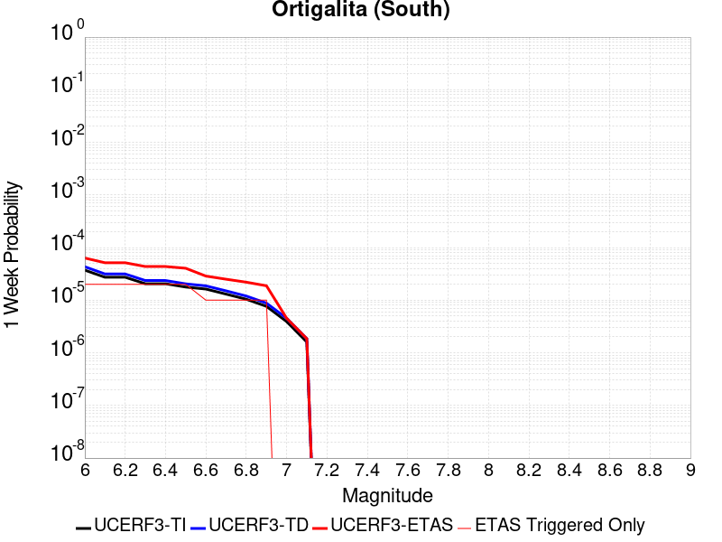 |  |  |  |

| Magnitude | 1 wk TI Prob | 1 wk TD Prob | 1 wk ETAS Prob | 1 wk ETAS/TD Gain | 1 wk ETAS Triggered Only | 1 mo TI Prob | 1 mo TD Prob | 1 mo ETAS Prob | 1 mo ETAS/TD Gain | 1 mo ETAS Triggered Only | 1 yr TI Prob | 1 yr TD Prob | 1 yr ETAS Prob | 1 yr ETAS/TD Gain | 1 yr ETAS Triggered Only | 10 yr TI Prob | 10 yr TD Prob | 10 yr ETAS Prob | 10 yr ETAS/TD Gain | 10 yr ETAS Triggered Only |
|-----|-----|-----|-----|-----|-----|-----|-----|-----|-----|-----|-----|-----|-----|-----|-----|-----|-----|-----|-----|-----|
| 6.0 | 3.72394E-5 | 4.325562E-5 | 5.933209E-5 | 1.3716621 | 1.607717E-5 | 1.5958765E-4 | 1.8536893E-4 | 2.1751731E-4 | 1.1734291 | 3.215434E-5 | 0.0019412481 | 0.0022546875 | 0.0022867692 | 1.0142289 | 3.215434E-5 | 0.019243775 | 0.022334497 | 0.022365933 | 1.0014075 | 3.215434E-5 |
| 6.1 | 2.7299884E-5 | 3.149204E-5 | 4.7568705E-5 | 1.5104992 | 1.607717E-5 | 1.16994255E-4 | 1.3495922E-4 | 1.5103423E-4 | 1.1191101 | 1.607717E-5 | 0.0014234743 | 0.0016419457 | 0.0016579964 | 1.0097754 | 1.607717E-5 | 0.014143906 | 0.01630407 | 0.016319886 | 1.00097 | 1.607717E-5 |
| 6.2 | 2.7299884E-5 | 3.149204E-5 | 4.7568705E-5 | 1.5104992 | 1.607717E-5 | 1.16994255E-4 | 1.3495922E-4 | 1.5103423E-4 | 1.1191101 | 1.607717E-5 | 0.0014234743 | 0.0016419457 | 0.0016579964 | 1.0097754 | 1.607717E-5 | 0.014143906 | 0.01630407 | 0.016319886 | 1.00097 | 1.607717E-5 |
| 6.3 | 2.0546433E-5 | 2.363145E-5 | 3.970824E-5 | 1.6803133 | 1.607717E-5 | 8.805317E-5 | 1.0127382E-4 | 1.17349366E-4 | 1.1587335 | 1.607717E-5 | 0.00107152 | 0.0012323303 | 0.0012483876 | 1.01303 | 1.607717E-5 | 0.010663681 | 0.01225703 | 0.01227291 | 1.0012956 | 1.607717E-5 |
| 6.4 | 2.0546433E-5 | 2.363145E-5 | 3.970824E-5 | 1.6803133 | 1.607717E-5 | 8.805317E-5 | 1.0127382E-4 | 1.17349366E-4 | 1.1587335 | 1.607717E-5 | 0.00107152 | 0.0012323303 | 0.0012483876 | 1.01303 | 1.607717E-5 | 0.010663681 | 0.01225703 | 0.01227291 | 1.0012956 | 1.607717E-5 |
| 6.5 | 1.7779594E-5 | 2.0446974E-5 | 3.6523816E-5 | 1.78627 | 1.607717E-5 | 7.619603E-5 | 8.762702E-5 | 1.0370278E-4 | 1.1834567 | 1.607717E-5 | 9.272918E-4 | 0.0010663504 | 0.0010824105 | 1.0150608 | 1.607717E-5 | 0.009234319 | 0.010613803 | 0.01062971 | 1.0014987 | 1.607717E-5 |
| 6.6 | 1.6272212E-5 | 1.8714967E-5 | 3.4791836E-5 | 1.8590381 | 1.607717E-5 | 6.973618E-5 | 8.0204605E-5 | 9.6280484E-5 | 1.2004359 | 1.607717E-5 | 8.487073E-4 | 9.760658E-4 | 9.921273E-4 | 1.0164553 | 1.607717E-5 | 0.008454733 | 0.009719091 | 0.0097350115 | 1.001638 | 1.607717E-5 |
| 6.7 | 1.3051484E-5 | 1.5038758E-5 | 3.1115687E-5 | 2.069033 | 1.607717E-5 | 5.593373E-5 | 6.445028E-5 | 8.052641E-5 | 1.2494347 | 1.607717E-5 | 6.807804E-4 | 7.844092E-4 | 8.0047373E-4 | 1.0204798 | 1.607717E-5 | 0.006786986 | 0.007817388 | 0.007833339 | 1.0020405 | 1.607717E-5 |
| 6.8 | 1.04277415E-5 | 1.1987235E-5 | 2.8064213E-5 | 2.3411748 | 1.607717E-5 | 4.4689557E-5 | 5.1372896E-5 | 6.744924E-5 | 1.3129344 | 1.607717E-5 | 5.439595E-4 | 6.2529295E-4 | 6.4136006E-4 | 1.0256953 | 1.607717E-5 | 0.0054262993 | 0.00623609 | 0.0062520667 | 1.002562 | 1.607717E-5 |
| 6.9 | 7.639968E-6 | 8.791503E-6 | 2.4868532E-5 | 2.8287008 | 1.607717E-5 | 3.274231E-5 | 3.767736E-5 | 5.3753924E-5 | 1.4266903 | 1.607717E-5 | 3.9856473E-4 | 4.586312E-4 | 4.74701E-4 | 1.0350386 | 1.607717E-5 | 0.003978506 | 0.004577433 | 0.0045934366 | 1.0034962 | 1.607717E-5 |
| 7.0 | 3.919831E-6 | 4.5334014E-6 | 4.5334014E-6 | 1.0 | 0.0 | 1.679917E-5 | 1.942873E-5 | 1.942873E-5 | 1.0 | 0.0 | 2.045107E-4 | 2.3652123E-4 | 2.3652123E-4 | 1.0 | 0.0 | 0.0020432258 | 0.0023629034 | 0.0023629034 | 1.0 | 0.0 |
| 7.1 | 1.6017933E-6 | 1.8570418E-6 | 1.8570418E-6 | 1.0 | 0.0 | 6.8648105E-6 | 7.958732E-6 | 7.958732E-6 | 1.0 | 0.0 | 8.357586E-5 | 9.689432E-5 | 9.689432E-5 | 1.0 | 0.0 | 8.3544437E-4 | 9.686254E-4 | 9.686254E-4 | 1.0 | 0.0 |

## Cerro Prieto
*[(top)](#table-of-contents)*

| 1 Week | 1 Month | 1 Year | 10 Year |
|-----|-----|-----|-----|
|  |  |  |  |

| Magnitude | 1 wk TI Prob | 1 wk TD Prob | 1 wk ETAS Prob | 1 wk ETAS/TD Gain | 1 wk ETAS Triggered Only | 1 mo TI Prob | 1 mo TD Prob | 1 mo ETAS Prob | 1 mo ETAS/TD Gain | 1 mo ETAS Triggered Only | 1 yr TI Prob | 1 yr TD Prob | 1 yr ETAS Prob | 1 yr ETAS/TD Gain | 1 yr ETAS Triggered Only | 10 yr TI Prob | 10 yr TD Prob | 10 yr ETAS Prob | 10 yr ETAS/TD Gain | 10 yr ETAS Triggered Only |
|-----|-----|-----|-----|-----|-----|-----|-----|-----|-----|-----|-----|-----|-----|-----|-----|-----|-----|-----|-----|-----|
| 6.0 | 2.9101528E-4 | 5.964804E-4 | 5.964804E-4 | 1.0 | 0.0 | 0.0012466122 | 0.002554082 | 0.002554082 | 1.0 | 0.0 | 0.015072231 | 0.03064807 | 0.03064807 | 1.0 | 0.0 | 0.14089979 | 0.25397858 | 0.25400257 | 1.0000944 | 3.215434E-5 |
| 6.1 | 2.9101528E-4 | 5.964804E-4 | 5.964804E-4 | 1.0 | 0.0 | 0.0012466122 | 0.002554082 | 0.002554082 | 1.0 | 0.0 | 0.015072231 | 0.03064807 | 0.03064807 | 1.0 | 0.0 | 0.14089979 | 0.25397858 | 0.25400257 | 1.0000944 | 3.215434E-5 |
| 6.2 | 2.9101528E-4 | 5.964804E-4 | 5.964804E-4 | 1.0 | 0.0 | 0.0012466122 | 0.002554082 | 0.002554082 | 1.0 | 0.0 | 0.015072231 | 0.03064807 | 0.03064807 | 1.0 | 0.0 | 0.14089979 | 0.25397858 | 0.25400257 | 1.0000944 | 3.215434E-5 |
| 6.3 | 2.9101528E-4 | 5.964804E-4 | 5.964804E-4 | 1.0 | 0.0 | 0.0012466122 | 0.002554082 | 0.002554082 | 1.0 | 0.0 | 0.015072231 | 0.03064807 | 0.03064807 | 1.0 | 0.0 | 0.14089979 | 0.25397858 | 0.25400257 | 1.0000944 | 3.215434E-5 |
| 6.4 | 2.508648E-4 | 5.1397446E-4 | 5.1397446E-4 | 1.0 | 0.0 | 0.0010746918 | 0.0022010866 | 0.0022010866 | 1.0 | 0.0 | 0.013006088 | 0.026471792 | 0.026471792 | 1.0 | 0.0 | 0.12270685 | 0.22440416 | 0.22442909 | 1.0001111 | 3.215434E-5 |
| 6.5 | 2.508648E-4 | 5.1397446E-4 | 5.1397446E-4 | 1.0 | 0.0 | 0.0010746918 | 0.0022010866 | 0.0022010866 | 1.0 | 0.0 | 0.013006088 | 0.026471792 | 0.026471792 | 1.0 | 0.0 | 0.12270685 | 0.22440416 | 0.22442909 | 1.0001111 | 3.215434E-5 |
| 6.6 | 2.294914E-4 | 4.7116808E-4 | 4.7116808E-4 | 1.0 | 0.0 | 9.831638E-4 | 0.0020179166 | 0.0020179166 | 1.0 | 0.0 | 0.011904482 | 0.02429866 | 0.02429866 | 1.0 | 0.0 | 0.11286586 | 0.20858558 | 0.20861101 | 1.000122 | 3.215434E-5 |
| 6.7 | 1.9621674E-4 | 4.0419117E-4 | 4.0419117E-4 | 1.0 | 0.0 | 8.4065786E-4 | 0.0017312564 | 0.0017312564 | 1.0 | 0.0 | 0.010187071 | 0.020884845 | 0.020884845 | 1.0 | 0.0 | 0.09732539 | 0.18290249 | 0.18292876 | 1.0001436 | 3.215434E-5 |
| 6.8 | 1.5476145E-4 | 3.056516E-4 | 3.056516E-4 | 1.0 | 0.0 | 6.6309475E-4 | 0.00130938 | 0.00130938 | 1.0 | 0.0 | 0.008043335 | 0.015836509 | 0.015836509 | 1.0 | 0.0 | 0.07758363 | 0.14336355 | 0.14337733 | 1.0000961 | 1.607717E-5 |
| 6.9 | 1.20509176E-4 | 2.2582515E-4 | 2.2582515E-4 | 1.0 | 0.0 | 5.1636563E-4 | 9.6752634E-4 | 9.6752634E-4 | 1.0 | 0.0 | 0.006268645 | 0.011726342 | 0.011726342 | 1.0 | 0.0 | 0.060947374 | 0.109451205 | 0.10946552 | 1.0001308 | 1.607717E-5 |
| 7.0 | 9.3269155E-5 | 1.6716642E-4 | 1.6716642E-4 | 1.0 | 0.0 | 3.9966372E-4 | 7.162739E-4 | 7.162739E-4 | 1.0 | 0.0 | 0.0048550544 | 0.008693418 | 0.008693418 | 1.0 | 0.0 | 0.04750344 | 0.08315912 | 0.083173856 | 1.0001773 | 1.607717E-5 |
| 7.1 | 5.029709E-5 | 8.1718936E-5 | 8.1718936E-5 | 1.0 | 0.0 | 2.1554115E-4 | 3.5019626E-4 | 3.5019626E-4 | 1.0 | 0.0 | 0.0026210553 | 0.0042587193 | 0.0042587193 | 1.0 | 0.0 | 0.025903556 | 0.042365108 | 0.042380504 | 1.0003635 | 1.607717E-5 |
| 7.2 | 6.5445185E-8 | 6.814903E-8 | 6.814903E-8 | 1.0 | 0.0 | 2.8047933E-7 | 2.9206726E-7 | 2.9206726E-7 | 1.0 | 0.0 | 3.4148304E-6 | 3.555919E-6 | 3.555919E-6 | 1.0 | 0.0 | 3.414778E-5 | 3.5559187E-5 | 3.5559187E-5 | 1.0 | 0.0 |

## Rinconada 2011 CFM
*[(top)](#table-of-contents)*

| 1 Week | 1 Month | 1 Year | 10 Year |
|-----|-----|-----|-----|
|  |  |  | 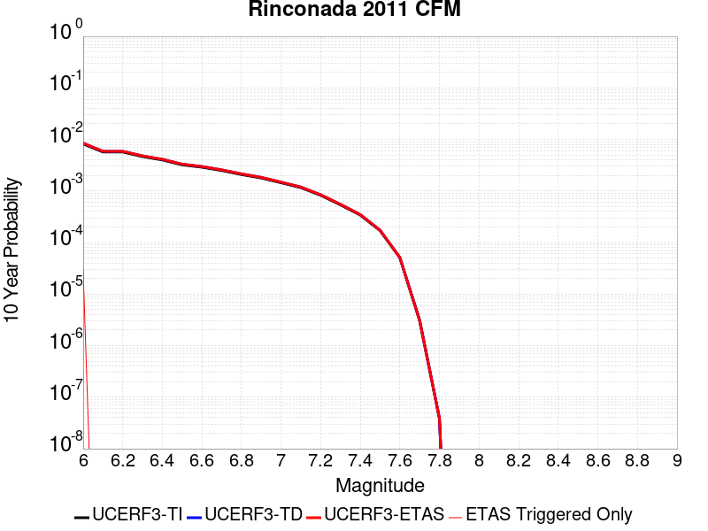 |

| Magnitude | 1 wk TI Prob | 1 wk TD Prob | 1 wk ETAS Prob | 1 wk ETAS/TD Gain | 1 wk ETAS Triggered Only | 1 mo TI Prob | 1 mo TD Prob | 1 mo ETAS Prob | 1 mo ETAS/TD Gain | 1 mo ETAS Triggered Only | 1 yr TI Prob | 1 yr TD Prob | 1 yr ETAS Prob | 1 yr ETAS/TD Gain | 1 yr ETAS Triggered Only | 10 yr TI Prob | 10 yr TD Prob | 10 yr ETAS Prob | 10 yr ETAS/TD Gain | 10 yr ETAS Triggered Only |
|-----|-----|-----|-----|-----|-----|-----|-----|-----|-----|-----|-----|-----|-----|-----|-----|-----|-----|-----|-----|-----|
| 6.0 | 1.5752368E-5 | 1.6274716E-5 | 3.2351625E-5 | 1.9878458 | 1.607717E-5 | 6.75084E-5 | 6.974694E-5 | 8.582298E-5 | 1.2304912 | 1.607717E-5 | 8.2160486E-4 | 8.488412E-4 | 8.649048E-4 | 1.0189241 | 1.607717E-5 | 0.008185739 | 0.00845637 | 0.008488253 | 1.0037702 | 3.215434E-5 |
| 6.1 | 1.0966133E-5 | 1.1323029E-5 | 1.1323029E-5 | 1.0 | 0.0 | 4.6996865E-5 | 4.852637E-5 | 4.852637E-5 | 1.0 | 0.0 | 5.720366E-4 | 5.906491E-4 | 5.906491E-4 | 1.0 | 0.0 | 0.0057056635 | 0.0058908886 | 0.0058908886 | 1.0 | 0.0 |
| 6.2 | 1.0966133E-5 | 1.1323029E-5 | 1.1323029E-5 | 1.0 | 0.0 | 4.6996865E-5 | 4.852637E-5 | 4.852637E-5 | 1.0 | 0.0 | 5.720366E-4 | 5.906491E-4 | 5.906491E-4 | 1.0 | 0.0 | 0.0057056635 | 0.0058908886 | 0.0058908886 | 1.0 | 0.0 |
| 6.3 | 8.926149E-6 | 9.212771E-6 | 9.212771E-6 | 1.0 | 0.0 | 3.8254362E-5 | 3.948271E-5 | 3.948271E-5 | 1.0 | 0.0 | 4.6564735E-4 | 4.805963E-4 | 4.805963E-4 | 1.0 | 0.0 | 0.0046467283 | 0.0047956146 | 0.0047956146 | 1.0 | 0.0 |
| 6.4 | 7.676955E-6 | 7.920191E-6 | 7.920191E-6 | 1.0 | 0.0 | 3.290082E-5 | 3.3943234E-5 | 3.3943234E-5 | 1.0 | 0.0 | 4.0049385E-4 | 4.1318068E-4 | 4.1318068E-4 | 1.0 | 0.0 | 0.0039977287 | 0.004124151 | 0.004124151 | 1.0 | 0.0 |
| 6.5 | 6.1671026E-6 | 6.3589546E-6 | 6.3589546E-6 | 1.0 | 0.0 | 2.6430173E-5 | 2.725238E-5 | 2.725238E-5 | 1.0 | 0.0 | 3.2173982E-4 | 3.317473E-4 | 3.317473E-4 | 1.0 | 0.0 | 0.003212744 | 0.0033125326 | 0.0033125326 | 1.0 | 0.0 |
| 6.6 | 5.553456E-6 | 5.7248126E-6 | 5.7248126E-6 | 1.0 | 0.0 | 2.3800309E-5 | 2.453468E-5 | 2.453468E-5 | 1.0 | 0.0 | 2.897302E-4 | 2.9866883E-4 | 2.9866883E-4 | 1.0 | 0.0 | 0.0028935277 | 0.002982683 | 0.002982683 | 1.0 | 0.0 |
| 6.7 | 4.787857E-6 | 4.9333094E-6 | 4.9333094E-6 | 1.0 | 0.0 | 2.0519226E-5 | 2.1142583E-5 | 2.1142583E-5 | 1.0 | 0.0 | 2.4979294E-4 | 2.573806E-4 | 2.573806E-4 | 1.0 | 0.0 | 0.0024951235 | 0.0025708308 | 0.0025708308 | 1.0 | 0.0 |
| 6.8 | 3.9955166E-6 | 4.1134763E-6 | 4.1134763E-6 | 1.0 | 0.0 | 1.7123532E-5 | 1.7629065E-5 | 1.7629065E-5 | 1.0 | 0.0 | 2.0845905E-4 | 2.1461274E-4 | 2.1461274E-4 | 1.0 | 0.0 | 0.002082636 | 0.0021440585 | 0.0021440585 | 1.0 | 0.0 |
| 6.9 | 3.4250072E-6 | 3.5224464E-6 | 3.5224464E-6 | 1.0 | 0.0 | 1.46785205E-5 | 1.5096111E-5 | 1.5096111E-5 | 1.0 | 0.0 | 1.7869633E-4 | 1.8377967E-4 | 1.8377967E-4 | 1.0 | 0.0 | 0.001785527 | 0.0018362794 | 0.0018362794 | 1.0 | 0.0 |
| 7.0 | 2.7712713E-6 | 2.8467E-6 | 2.8467E-6 | 1.0 | 0.0 | 1.1876823E-5 | 1.2200086E-5 | 1.2200086E-5 | 1.0 | 0.0 | 1.4459073E-4 | 1.4852593E-4 | 1.4852593E-4 | 1.0 | 0.0 | 0.0014449668 | 0.0014842682 | 0.0014842682 | 1.0 | 0.0 |
| 7.1 | 2.227358E-6 | 2.2856984E-6 | 2.2856984E-6 | 1.0 | 0.0 | 9.545785E-6 | 9.795814E-6 | 9.795814E-6 | 1.0 | 0.0 | 1.16213734E-4 | 1.19257515E-4 | 1.19257515E-4 | 1.0 | 0.0 | 0.0011615298 | 0.0011919362 | 0.0011919362 | 1.0 | 0.0 |
| 7.2 | 1.581796E-6 | 1.6209011E-6 | 1.6209011E-6 | 1.0 | 0.0 | 6.779108E-6 | 6.9467005E-6 | 6.9467005E-6 | 1.0 | 0.0 | 8.253252E-5 | 8.457281E-5 | 8.457281E-5 | 1.0 | 0.0 | 8.250187E-4 | 8.454067E-4 | 8.454067E-4 | 1.0 | 0.0 |
| 7.3 | 1.0306567E-6 | 1.0546477E-6 | 1.0546477E-6 | 1.0 | 0.0 | 4.4170924E-6 | 4.519911E-6 | 4.519911E-6 | 1.0 | 0.0 | 5.3776774E-5 | 5.5028526E-5 | 5.5028526E-5 | 1.0 | 0.0 | 5.376376E-4 | 5.5014924E-4 | 5.5014924E-4 | 1.0 | 0.0 |
| 7.4 | 6.535541E-7 | 6.682742E-7 | 6.682742E-7 | 1.0 | 0.0 | 2.800943E-6 | 2.864029E-6 | 2.864029E-6 | 1.0 | 0.0 | 3.4100947E-5 | 3.4868997E-5 | 3.4868997E-5 | 1.0 | 0.0 | 3.4095717E-4 | 3.4863537E-4 | 3.4863537E-4 | 1.0 | 0.0 |
| 7.5 | 3.2656962E-7 | 3.3316687E-7 | 3.3316687E-7 | 1.0 | 0.0 | 1.3995833E-6 | 1.4278572E-6 | 1.4278572E-6 | 1.0 | 0.0 | 1.7039794E-5 | 1.7384024E-5 | 1.7384024E-5 | 1.0 | 0.0 | 1.7038487E-4 | 1.7382667E-4 | 1.7382667E-4 | 1.0 | 0.0 |
| 7.6 | 9.754343E-8 | 9.82099E-8 | 9.82099E-8 | 1.0 | 0.0 | 4.180432E-7 | 4.208995E-7 | 4.208995E-7 | 1.0 | 0.0 | 5.089664E-6 | 5.1244397E-6 | 5.1244397E-6 | 1.0 | 0.0 | 5.0895473E-5 | 5.1243223E-5 | 5.1243223E-5 | 1.0 | 0.0 |
| 7.7 | 6.0001453E-9 | 5.8490435E-9 | 5.8490435E-9 | 1.0 | 0.0 | 2.5714908E-8 | 2.506733E-8 | 2.506733E-8 | 1.0 | 0.0 | 3.1307894E-7 | 3.051947E-7 | 3.051947E-7 | 1.0 | 0.0 | 3.1307852E-6 | 3.051943E-6 | 3.051943E-6 | 1.0 | 0.0 |
| 7.8 | 7.400003E-11 | 7.4654505E-11 | 7.4654505E-11 | 1.0 | 0.0 | 3.171432E-10 | 3.1994773E-10 | 3.1994773E-10 | 1.0 | 0.0 | 3.861218E-9 | 3.895363E-9 | 3.895363E-9 | 1.0 | 0.0 | 3.861218E-8 | 3.895363E-8 | 3.895363E-8 | 1.0 | 0.0 |

## Likely 2011 CFM
*[(top)](#table-of-contents)*

| 1 Week | 1 Month | 1 Year | 10 Year |
|-----|-----|-----|-----|
|  |  |  | 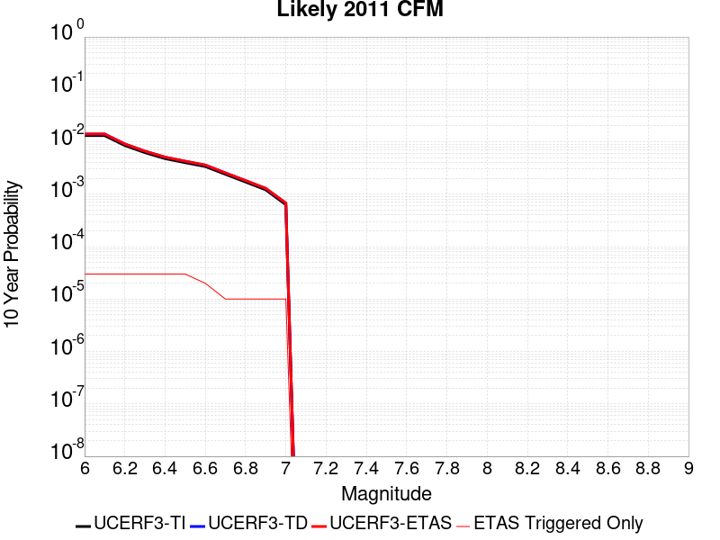 |

| Magnitude | 1 wk TI Prob | 1 wk TD Prob | 1 wk ETAS Prob | 1 wk ETAS/TD Gain | 1 wk ETAS Triggered Only | 1 mo TI Prob | 1 mo TD Prob | 1 mo ETAS Prob | 1 mo ETAS/TD Gain | 1 mo ETAS Triggered Only | 1 yr TI Prob | 1 yr TD Prob | 1 yr ETAS Prob | 1 yr ETAS/TD Gain | 1 yr ETAS Triggered Only | 10 yr TI Prob | 10 yr TD Prob | 10 yr ETAS Prob | 10 yr ETAS/TD Gain | 10 yr ETAS Triggered Only |
|-----|-----|-----|-----|-----|-----|-----|-----|-----|-----|-----|-----|-----|-----|-----|-----|-----|-----|-----|-----|-----|
| 6.0 | 2.5315949E-5 | 2.7104748E-5 | 4.3181484E-5 | 1.5931336 | 1.607717E-5 | 1.0849241E-4 | 1.16158284E-4 | 1.3223359E-4 | 1.1383914 | 1.607717E-5 | 0.0013200947 | 0.0014133542 | 0.001445463 | 1.0227182 | 3.215434E-5 | 0.013122803 | 0.01404831 | 0.014080013 | 1.0022566 | 3.215434E-5 |
| 6.1 | 2.5315949E-5 | 2.7104748E-5 | 4.3181484E-5 | 1.5931336 | 1.607717E-5 | 1.0849241E-4 | 1.16158284E-4 | 1.3223359E-4 | 1.1383914 | 1.607717E-5 | 0.0013200947 | 0.0014133542 | 0.001445463 | 1.0227182 | 3.215434E-5 | 0.013122803 | 0.01404831 | 0.014080013 | 1.0022566 | 3.215434E-5 |
| 6.2 | 1.6375941E-5 | 1.7465842E-5 | 3.3542732E-5 | 1.9204761 | 1.607717E-5 | 7.0180715E-5 | 7.485153E-5 | 9.09275E-5 | 1.2147714 | 1.607717E-5 | 8.5411523E-4 | 9.109487E-4 | 9.430737E-4 | 1.0352654 | 3.215434E-5 | 0.008508399 | 0.009073433 | 0.009105295 | 1.0035117 | 3.215434E-5 |
| 6.3 | 1.1945543E-5 | 1.2712587E-5 | 2.8789553E-5 | 2.2646494 | 1.607717E-5 | 5.119418E-5 | 5.4481407E-5 | 7.0557704E-5 | 1.2950785 | 1.607717E-5 | 6.2311086E-4 | 6.631146E-4 | 6.952476E-4 | 1.0484577 | 3.215434E-5 | 0.0062136655 | 0.0066119144 | 0.006643856 | 1.004831 | 3.215434E-5 |
| 6.4 | 9.192729E-6 | 9.768488E-6 | 2.5845502E-5 | 2.6458037 | 1.607717E-5 | 3.939681E-5 | 4.1864292E-5 | 5.794079E-5 | 1.3840146 | 1.607717E-5 | 4.7955062E-4 | 5.0958124E-4 | 5.417192E-4 | 1.0630674 | 3.215434E-5 | 0.004785171 | 0.0050844094 | 0.0051164 | 1.006292 | 3.215434E-5 |
| 6.5 | 7.67906E-6 | 8.152622E-6 | 2.4229661E-5 | 2.9720085 | 1.607717E-5 | 3.2909844E-5 | 3.4939352E-5 | 5.1015963E-5 | 1.460129 | 1.607717E-5 | 4.006037E-4 | 4.2530545E-4 | 4.5744612E-4 | 1.0755708 | 3.215434E-5 | 0.0039988225 | 0.004245108 | 0.004277126 | 1.0075423 | 3.215434E-5 |
| 6.6 | 6.4884057E-6 | 6.8847507E-6 | 2.296181E-5 | 3.3351696 | 1.607717E-5 | 2.7807157E-5 | 2.9505749E-5 | 4.5582445E-5 | 1.5448666 | 1.607717E-5 | 3.3849955E-4 | 3.591747E-4 | 3.752461E-4 | 1.0447453 | 1.607717E-5 | 0.003379844 | 0.0035860867 | 0.0036021064 | 1.0044671 | 1.607717E-5 |
| 6.7 | 4.6060636E-6 | 4.884041E-6 | 4.884041E-6 | 1.0 | 0.0 | 1.9740122E-5 | 2.0931442E-5 | 2.0931442E-5 | 1.0 | 0.0 | 2.403095E-4 | 2.5481134E-4 | 2.5481134E-4 | 1.0 | 0.0 | 0.002400498 | 0.0025452746 | 0.0025452746 | 1.0 | 0.0 |
| 6.8 | 3.2795615E-6 | 3.4773732E-6 | 3.4773732E-6 | 1.0 | 0.0 | 1.4055187E-5 | 1.4902946E-5 | 1.4902946E-5 | 1.0 | 0.0 | 1.7110848E-4 | 1.8142881E-4 | 1.8142881E-4 | 1.0 | 0.0 | 0.0017097679 | 0.0018128622 | 0.0018128622 | 1.0 | 0.0 |
| 6.9 | 2.3289967E-6 | 2.4705569E-6 | 2.4705569E-6 | 1.0 | 0.0 | 9.981376E-6 | 1.058806E-5 | 1.058806E-5 | 1.0 | 0.0 | 1.2151648E-4 | 1.2890245E-4 | 1.2890245E-4 | 1.0 | 0.0 | 0.0012145005 | 0.0012883197 | 0.0012883197 | 1.0 | 0.0 |
| 7.0 | 1.211292E-6 | 1.2863958E-6 | 1.2863958E-6 | 1.0 | 0.0 | 5.1912407E-6 | 5.5131145E-6 | 5.5131145E-6 | 1.0 | 0.0 | 6.320152E-5 | 6.712041E-5 | 6.712041E-5 | 1.0 | 0.0 | 6.3183554E-4 | 6.710312E-4 | 6.710312E-4 | 1.0 | 0.0 |

## La Panza 2011
*[(top)](#table-of-contents)*

| 1 Week | 1 Month | 1 Year | 10 Year |
|-----|-----|-----|-----|
|  |  |  |  |

| Magnitude | 1 wk TI Prob | 1 wk TD Prob | 1 wk ETAS Prob | 1 wk ETAS/TD Gain | 1 wk ETAS Triggered Only | 1 mo TI Prob | 1 mo TD Prob | 1 mo ETAS Prob | 1 mo ETAS/TD Gain | 1 mo ETAS Triggered Only | 1 yr TI Prob | 1 yr TD Prob | 1 yr ETAS Prob | 1 yr ETAS/TD Gain | 1 yr ETAS Triggered Only | 10 yr TI Prob | 10 yr TD Prob | 10 yr ETAS Prob | 10 yr ETAS/TD Gain | 10 yr ETAS Triggered Only |
|-----|-----|-----|-----|-----|-----|-----|-----|-----|-----|-----|-----|-----|-----|-----|-----|-----|-----|-----|-----|-----|
| 6.0 | 4.6754544E-6 | 4.717587E-6 | 2.0794681E-5 | 4.4079065 | 1.607717E-5 | 2.0037509E-5 | 2.0218084E-5 | 3.629493E-5 | 1.7951715 | 1.607717E-5 | 2.4392935E-4 | 2.4612935E-4 | 2.7827578E-4 | 1.1306078 | 3.215434E-5 | 0.0024366176 | 0.002458762 | 0.0024908371 | 1.0130453 | 3.215434E-5 |
| 6.1 | 4.6754544E-6 | 4.717587E-6 | 2.0794681E-5 | 4.4079065 | 1.607717E-5 | 2.0037509E-5 | 2.0218084E-5 | 3.629493E-5 | 1.7951715 | 1.607717E-5 | 2.4392935E-4 | 2.4612935E-4 | 2.7827578E-4 | 1.1306078 | 3.215434E-5 | 0.0024366176 | 0.002458762 | 0.0024908371 | 1.0130453 | 3.215434E-5 |
| 6.2 | 4.6754544E-6 | 4.717587E-6 | 2.0794681E-5 | 4.4079065 | 1.607717E-5 | 2.0037509E-5 | 2.0218084E-5 | 3.629493E-5 | 1.7951715 | 1.607717E-5 | 2.4392935E-4 | 2.4612935E-4 | 2.7827578E-4 | 1.1306078 | 3.215434E-5 | 0.0024366176 | 0.002458762 | 0.0024908371 | 1.0130453 | 3.215434E-5 |
| 6.3 | 4.6754544E-6 | 4.717587E-6 | 2.0794681E-5 | 4.4079065 | 1.607717E-5 | 2.0037509E-5 | 2.0218084E-5 | 3.629493E-5 | 1.7951715 | 1.607717E-5 | 2.4392935E-4 | 2.4612935E-4 | 2.7827578E-4 | 1.1306078 | 3.215434E-5 | 0.0024366176 | 0.002458762 | 0.0024908371 | 1.0130453 | 3.215434E-5 |
| 6.4 | 4.6754544E-6 | 4.717587E-6 | 2.0794681E-5 | 4.4079065 | 1.607717E-5 | 2.0037509E-5 | 2.0218084E-5 | 3.629493E-5 | 1.7951715 | 1.607717E-5 | 2.4392935E-4 | 2.4612935E-4 | 2.7827578E-4 | 1.1306078 | 3.215434E-5 | 0.0024366176 | 0.002458762 | 0.0024908371 | 1.0130453 | 3.215434E-5 |
| 6.5 | 2.485343E-6 | 2.5005988E-6 | 1.857773E-5 | 7.4293118 | 1.607717E-5 | 1.0651426E-5 | 1.0716811E-5 | 2.6793809E-5 | 2.5001662 | 1.607717E-5 | 1.296734E-4 | 1.3046975E-4 | 1.4654481E-4 | 1.1232092 | 1.607717E-5 | 0.0012959775 | 0.0013039699 | 0.0013200261 | 1.0123134 | 1.607717E-5 |
| 6.6 | 2.485343E-6 | 2.5005988E-6 | 1.857773E-5 | 7.4293118 | 1.607717E-5 | 1.0651426E-5 | 1.0716811E-5 | 2.6793809E-5 | 2.5001662 | 1.607717E-5 | 1.296734E-4 | 1.3046975E-4 | 1.4654481E-4 | 1.1232092 | 1.607717E-5 | 0.0012959775 | 0.0013039699 | 0.0013200261 | 1.0123134 | 1.607717E-5 |
| 6.7 | 1.5108508E-6 | 1.5146375E-6 | 1.5146375E-6 | 1.0 | 0.0 | 6.4750584E-6 | 6.491288E-6 | 6.491288E-6 | 1.0 | 0.0 | 7.8830984E-5 | 7.902867E-5 | 7.902867E-5 | 1.0 | 0.0 | 7.880303E-4 | 7.900165E-4 | 7.900165E-4 | 1.0 | 0.0 |
| 6.8 | 1.3865837E-6 | 1.3885102E-6 | 1.3885102E-6 | 1.0 | 0.0 | 5.942488E-6 | 5.9507447E-6 | 5.9507447E-6 | 1.0 | 0.0 | 7.234739E-5 | 7.244801E-5 | 7.244801E-5 | 1.0 | 0.0 | 7.232384E-4 | 7.242537E-4 | 7.242537E-4 | 1.0 | 0.0 |
| 6.9 | 9.826583E-7 | 9.796287E-7 | 9.796287E-7 | 1.0 | 0.0 | 4.2113857E-6 | 4.198402E-6 | 4.198402E-6 | 1.0 | 0.0 | 5.1272415E-5 | 5.11144E-5 | 5.11144E-5 | 1.0 | 0.0 | 5.126059E-4 | 5.110318E-4 | 5.110318E-4 | 1.0 | 0.0 |
| 7.0 | 6.7797646E-7 | 6.7102144E-7 | 6.7102144E-7 | 1.0 | 0.0 | 2.9056102E-6 | 2.8758034E-6 | 2.8758034E-6 | 1.0 | 0.0 | 3.537523E-5 | 3.5012374E-5 | 3.5012374E-5 | 1.0 | 0.0 | 3.5369597E-4 | 3.5007167E-4 | 3.5007167E-4 | 1.0 | 0.0 |
| 7.1 | 3.4979826E-7 | 3.387388E-7 | 3.387388E-7 | 1.0 | 0.0 | 1.4991346E-6 | 1.4517369E-6 | 1.4517369E-6 | 1.0 | 0.0 | 1.825181E-5 | 1.7674765E-5 | 1.7674765E-5 | 1.0 | 0.0 | 1.825031E-4 | 1.7673477E-4 | 1.7673477E-4 | 1.0 | 0.0 |
| 7.2 | 2.5088332E-7 | 2.3831899E-7 | 2.3831899E-7 | 1.0 | 0.0 | 1.0752137E-6 | 1.0213668E-6 | 1.0213668E-6 | 1.0 | 0.0 | 1.3090649E-5 | 1.2435077E-5 | 1.2435077E-5 | 1.0 | 0.0 | 1.3089878E-4 | 1.2434467E-4 | 1.2434467E-4 | 1.0 | 0.0 |
| 7.3 | 1.0159086E-7 | 8.64462E-8 | 8.64462E-8 | 1.0 | 0.0 | 4.3538932E-7 | 3.7048366E-7 | 3.7048366E-7 | 1.0 | 0.0 | 5.300852E-6 | 4.5106294E-6 | 4.5106294E-6 | 1.0 | 0.0 | 5.3007258E-5 | 4.5105422E-5 | 4.5105422E-5 | 1.0 | 0.0 |
| 7.4 | 3.5006252E-8 | 1.9404325E-8 | 1.9404325E-8 | 1.0 | 0.0 | 1.5002678E-7 | 8.3161396E-8 | 8.3161396E-8 | 1.0 | 0.0 | 1.8265745E-6 | 1.0124895E-6 | 1.0124895E-6 | 1.0 | 0.0 | 1.8265595E-5 | 1.01248515E-5 | 1.01248515E-5 | 1.0 | 0.0 |
| 7.5 | 2.592274E-8 | 1.0239094E-8 | 1.0239094E-8 | 1.0 | 0.0 | 1.1109746E-7 | 4.388183E-8 | 4.388183E-8 | 1.0 | 0.0 | 1.3526106E-6 | 5.342612E-7 | 5.342612E-7 | 1.0 | 0.0 | 1.3526024E-5 | 5.3425997E-6 | 5.3425997E-6 | 1.0 | 0.0 |
| 7.6 | 1.9016717E-8 | 5.244801E-9 | 5.244801E-9 | 1.0 | 0.0 | 8.150022E-8 | 2.247772E-8 | 2.247772E-8 | 1.0 | 0.0 | 9.922647E-7 | 2.736662E-7 | 2.736662E-7 | 1.0 | 0.0 | 9.922603E-6 | 2.7366589E-6 | 2.7366589E-6 | 1.0 | 0.0 |
| 7.7 | 1.17738495E-8 | 1.2398075E-9 | 1.2398075E-9 | 1.0 | 0.0 | 5.0459356E-8 | 5.3134603E-9 | 5.3134603E-9 | 1.0 | 0.0 | 6.1434247E-7 | 6.469138E-8 | 6.469138E-8 | 1.0 | 0.0 | 6.143408E-6 | 6.469136E-7 | 6.469136E-7 | 1.0 | 0.0 |
| 7.8 | 5.489079E-9 | 2.0111768E-10 | 2.0111768E-10 | 1.0 | 0.0 | 2.3524624E-8 | 8.6193275E-10 | 8.6193275E-10 | 1.0 | 0.0 | 2.8641225E-7 | 1.04940305E-8 | 1.04940305E-8 | 1.0 | 0.0 | 2.8641189E-6 | 1.04940305E-7 | 1.04940305E-7 | 1.0 | 0.0 |
| 7.9 | 2.5081048E-9 | 6.683887E-11 | 6.683887E-11 | 1.0 | 0.0 | 1.0749021E-8 | 2.8645197E-10 | 2.8645197E-10 | 1.0 | 0.0 | 1.3086932E-7 | 3.487552E-9 | 3.487552E-9 | 1.0 | 0.0 | 1.3086925E-6 | 3.487552E-8 | 3.487552E-8 | 1.0 | 0.0 |

## Hunting Creek - Berryessa 2011 CFM
*[(top)](#table-of-contents)*

| 1 Week | 1 Month | 1 Year | 10 Year |
|-----|-----|-----|-----|
|  | 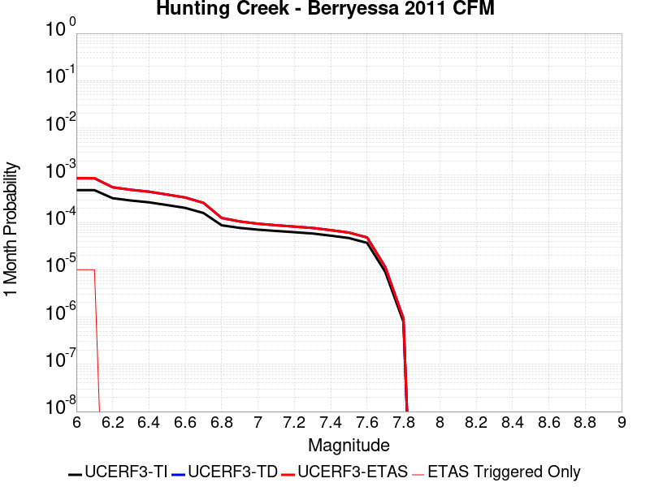 |  |  |

| Magnitude | 1 wk TI Prob | 1 wk TD Prob | 1 wk ETAS Prob | 1 wk ETAS/TD Gain | 1 wk ETAS Triggered Only | 1 mo TI Prob | 1 mo TD Prob | 1 mo ETAS Prob | 1 mo ETAS/TD Gain | 1 mo ETAS Triggered Only | 1 yr TI Prob | 1 yr TD Prob | 1 yr ETAS Prob | 1 yr ETAS/TD Gain | 1 yr ETAS Triggered Only | 10 yr TI Prob | 10 yr TD Prob | 10 yr ETAS Prob | 10 yr ETAS/TD Gain | 10 yr ETAS Triggered Only |
|-----|-----|-----|-----|-----|-----|-----|-----|-----|-----|-----|-----|-----|-----|-----|-----|-----|-----|-----|-----|-----|
| 6.0 | 1.1270982E-4 | 2.0012174E-4 | 2.0012174E-4 | 1.0 | 0.0 | 4.8295266E-4 | 8.5739547E-4 | 8.5739547E-4 | 1.0 | 0.0 | 0.0058641075 | 0.010386313 | 0.010418133 | 1.0030637 | 3.215434E-5 | 0.057117578 | 0.09803703 | 0.098066024 | 1.0002959 | 3.215434E-5 |
| 6.1 | 1.1239393E-4 | 1.9960315E-4 | 1.9960315E-4 | 1.0 | 0.0 | 4.8159933E-4 | 8.551744E-4 | 8.551744E-4 | 1.0 | 0.0 | 0.0058477195 | 0.010359551 | 0.010391372 | 1.0030717 | 3.215434E-5 | 0.056962132 | 0.09779551 | 0.097824514 | 1.0002966 | 3.215434E-5 |
| 6.2 | 7.596265E-5 | 1.2940196E-4 | 1.2940196E-4 | 1.0 | 0.0 | 3.2551357E-4 | 5.5444165E-4 | 5.5444165E-4 | 1.0 | 0.0 | 0.0039559277 | 0.0067210156 | 0.0067210156 | 1.0 | 0.0 | 0.038862433 | 0.0645915 | 0.0645915 | 1.0 | 0.0 |
| 6.3 | 6.78794E-5 | 1.145119E-4 | 1.145119E-4 | 1.0 | 0.0 | 2.9087928E-4 | 4.906513E-4 | 4.906513E-4 | 1.0 | 0.0 | 0.003535705 | 0.005952679 | 0.005952679 | 1.0 | 0.0 | 0.034799766 | 0.057465393 | 0.057465393 | 1.0 | 0.0 |
| 6.4 | 6.2165134E-5 | 1.0436625E-4 | 1.0436625E-4 | 1.0 | 0.0 | 2.6639478E-4 | 4.4721062E-4 | 4.4721062E-4 | 1.0 | 0.0 | 0.0032385332 | 0.005427573 | 0.005427573 | 1.0 | 0.0 | 0.03191742 | 0.052550517 | 0.052550517 | 1.0 | 0.0 |
| 6.5 | 5.4368087E-5 | 9.071415E-5 | 9.071415E-5 | 1.0 | 0.0 | 2.3298527E-4 | 3.8872007E-4 | 3.8872007E-4 | 1.0 | 0.0 | 0.0028329059 | 0.0047198683 | 0.0047198683 | 1.0 | 0.0 | 0.027970633 | 0.045880128 | 0.045880128 | 1.0 | 0.0 |
| 6.6 | 4.729947E-5 | 7.847572E-5 | 7.847572E-5 | 1.0 | 0.0 | 2.0269625E-4 | 3.362842E-4 | 3.362842E-4 | 1.0 | 0.0 | 0.002465034 | 0.0040849647 | 0.0040849647 | 1.0 | 0.0 | 0.02437869 | 0.03985155 | 0.03985155 | 1.0 | 0.0 |
| 6.7 | 3.6875328E-5 | 6.0451803E-5 | 6.0451803E-5 | 1.0 | 0.0 | 1.5802756E-4 | 2.59056E-4 | 2.59056E-4 | 1.0 | 0.0 | 0.0019222875 | 0.0031482063 | 0.0031482063 | 1.0 | 0.0 | 0.019057442 | 0.03089237 | 0.03089237 | 1.0 | 0.0 |
| 6.8 | 2.0292036E-5 | 2.8976308E-5 | 2.8976308E-5 | 1.0 | 0.0 | 8.6962966E-5 | 1.2417832E-4 | 1.2417832E-4 | 1.0 | 0.0 | 0.0010582599 | 0.0015108072 | 0.0015108072 | 1.0 | 0.0 | 0.010532344 | 0.014978523 | 0.014978523 | 1.0 | 0.0 |
| 6.9 | 1.7871042E-5 | 2.4472254E-5 | 2.4472254E-5 | 1.0 | 0.0 | 7.658793E-5 | 1.048769E-4 | 1.048769E-4 | 1.0 | 0.0 | 9.320591E-4 | 0.0012761299 | 0.0012761299 | 1.0 | 0.0 | 0.009281595 | 0.012679775 | 0.012679775 | 1.0 | 0.0 |
| 7.0 | 1.6415532E-5 | 2.1906277E-5 | 2.1906277E-5 | 1.0 | 0.0 | 7.035038E-5 | 9.3880684E-5 | 9.3880684E-5 | 1.0 | 0.0 | 8.561793E-4 | 0.0011424015 | 0.0011424015 | 1.0 | 0.0 | 0.008528882 | 0.01136452 | 0.01136452 | 1.0 | 0.0 |
| 7.1 | 1.5409885E-5 | 2.0346342E-5 | 2.0346342E-5 | 1.0 | 0.0 | 6.6040695E-5 | 8.7195716E-5 | 8.7195716E-5 | 1.0 | 0.0 | 8.0374884E-4 | 0.0010610938 | 0.0010610938 | 1.0 | 0.0 | 0.00800848 | 0.010560595 | 0.010560595 | 1.0 | 0.0 |
| 7.2 | 1.4497423E-5 | 1.9054964E-5 | 1.9054964E-5 | 1.0 | 0.0 | 6.213033E-5 | 8.166159E-5 | 8.166159E-5 | 1.0 | 0.0 | 7.5617427E-4 | 9.937795E-4 | 9.937795E-4 | 1.0 | 0.0 | 0.0075360634 | 0.009893929 | 0.009893929 | 1.0 | 0.0 |
| 7.3 | 1.3615175E-5 | 1.7826127E-5 | 1.7826127E-5 | 1.0 | 0.0 | 5.8349444E-5 | 7.639547E-5 | 7.639547E-5 | 1.0 | 0.0 | 7.101729E-4 | 9.297209E-4 | 9.297209E-4 | 1.0 | 0.0 | 0.0070790765 | 0.009258823 | 0.009258823 | 1.0 | 0.0 |
| 7.4 | 1.2252825E-5 | 1.602625E-5 | 1.602625E-5 | 1.0 | 0.0 | 5.251105E-5 | 6.868213E-5 | 6.868213E-5 | 1.0 | 0.0 | 6.391345E-4 | 8.35887E-4 | 8.35887E-4 | 1.0 | 0.0 | 0.0063729943 | 0.008327872 | 0.008327872 | 1.0 | 0.0 |
| 7.5 | 1.0913301E-5 | 1.4241117E-5 | 1.4241117E-5 | 1.0 | 0.0 | 4.6770452E-5 | 6.1031948E-5 | 6.1031948E-5 | 1.0 | 0.0 | 5.6928146E-4 | 7.4281334E-4 | 7.4281334E-4 | 1.0 | 0.0 | 0.0056782532 | 0.0074036797 | 0.0074036797 | 1.0 | 0.0 |
| 7.6 | 8.623192E-6 | 1.12346415E-5 | 1.12346415E-5 | 1.0 | 0.0 | 3.6956015E-5 | 4.814759E-5 | 4.814759E-5 | 1.0 | 0.0 | 4.4984656E-4 | 5.8604183E-4 | 5.8604183E-4 | 1.0 | 0.0 | 0.00448937 | 0.0058452785 | 0.0058452785 | 1.0 | 0.0 |
| 7.7 | 2.0993634E-6 | 2.662584E-6 | 2.662584E-6 | 1.0 | 0.0 | 8.997241E-6 | 1.1411025E-5 | 1.1411025E-5 | 1.0 | 0.0 | 1.09535904E-4 | 1.3892044E-4 | 1.3892044E-4 | 1.0 | 0.0 | 0.0010948193 | 0.0013883426 | 0.0013883426 | 1.0 | 0.0 |
| 7.8 | 1.8428308E-7 | 2.167437E-7 | 2.167437E-7 | 1.0 | 0.0 | 7.897844E-7 | 9.289013E-7 | 9.289013E-7 | 1.0 | 0.0 | 9.615583E-6 | 1.1309318E-5 | 1.1309318E-5 | 1.0 | 0.0 | 9.615166E-5 | 1.13086026E-4 | 1.13086026E-4 | 1.0 | 0.0 |

## Santa Susana alt 1
*[(top)](#table-of-contents)*

| 1 Week | 1 Month | 1 Year | 10 Year |
|-----|-----|-----|-----|
|  | 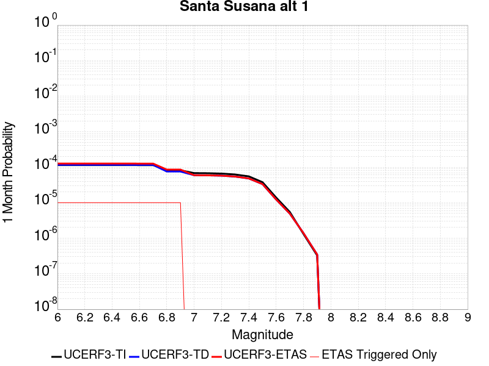 |  |  |

| Magnitude | 1 wk TI Prob | 1 wk TD Prob | 1 wk ETAS Prob | 1 wk ETAS/TD Gain | 1 wk ETAS Triggered Only | 1 mo TI Prob | 1 mo TD Prob | 1 mo ETAS Prob | 1 mo ETAS/TD Gain | 1 mo ETAS Triggered Only | 1 yr TI Prob | 1 yr TD Prob | 1 yr ETAS Prob | 1 yr ETAS/TD Gain | 1 yr ETAS Triggered Only | 10 yr TI Prob | 10 yr TD Prob | 10 yr ETAS Prob | 10 yr ETAS/TD Gain | 10 yr ETAS Triggered Only |
|-----|-----|-----|-----|-----|-----|-----|-----|-----|-----|-----|-----|-----|-----|-----|-----|-----|-----|-----|-----|-----|
| 6.0 | 2.674877E-5 | 2.7198023E-5 | 2.7198023E-5 | 1.0 | 0.0 | 1.1463255E-4 | 1.1655839E-4 | 1.1655839E-4 | 1.0 | 0.0 | 0.0013947578 | 0.0014182882 | 0.0014343426 | 1.0113195 | 1.607717E-5 | 0.013860362 | 0.014104128 | 0.014135828 | 1.0022476 | 3.215434E-5 |
| 6.1 | 2.674877E-5 | 2.7198023E-5 | 2.7198023E-5 | 1.0 | 0.0 | 1.1463255E-4 | 1.1655839E-4 | 1.1655839E-4 | 1.0 | 0.0 | 0.0013947578 | 0.0014182882 | 0.0014343426 | 1.0113195 | 1.607717E-5 | 0.013860362 | 0.014104128 | 0.014135828 | 1.0022476 | 3.215434E-5 |
| 6.2 | 2.674877E-5 | 2.7198023E-5 | 2.7198023E-5 | 1.0 | 0.0 | 1.1463255E-4 | 1.1655839E-4 | 1.1655839E-4 | 1.0 | 0.0 | 0.0013947578 | 0.0014182882 | 0.0014343426 | 1.0113195 | 1.607717E-5 | 0.013860362 | 0.014104128 | 0.014135828 | 1.0022476 | 3.215434E-5 |
| 6.3 | 2.674877E-5 | 2.7198023E-5 | 2.7198023E-5 | 1.0 | 0.0 | 1.1463255E-4 | 1.1655839E-4 | 1.1655839E-4 | 1.0 | 0.0 | 0.0013947578 | 0.0014182882 | 0.0014343426 | 1.0113195 | 1.607717E-5 | 0.013860362 | 0.014104128 | 0.014135828 | 1.0022476 | 3.215434E-5 |
| 6.4 | 2.674877E-5 | 2.7198023E-5 | 2.7198023E-5 | 1.0 | 0.0 | 1.1463255E-4 | 1.1655839E-4 | 1.1655839E-4 | 1.0 | 0.0 | 0.0013947578 | 0.0014182882 | 0.0014343426 | 1.0113195 | 1.607717E-5 | 0.013860362 | 0.014104128 | 0.014135828 | 1.0022476 | 3.215434E-5 |
| 6.5 | 2.674877E-5 | 2.7198023E-5 | 2.7198023E-5 | 1.0 | 0.0 | 1.1463255E-4 | 1.1655839E-4 | 1.1655839E-4 | 1.0 | 0.0 | 0.0013947578 | 0.0014182882 | 0.0014343426 | 1.0113195 | 1.607717E-5 | 0.013860362 | 0.014104128 | 0.014135828 | 1.0022476 | 3.215434E-5 |
| 6.6 | 2.6647976E-5 | 2.7074359E-5 | 2.7074359E-5 | 1.0 | 0.0 | 1.14200615E-4 | 1.1602845E-4 | 1.1602845E-4 | 1.0 | 0.0 | 0.0013895056 | 0.0014118447 | 0.0014278992 | 1.0113713 | 1.607717E-5 | 0.013808494 | 0.014040513 | 0.014072216 | 1.002258 | 3.215434E-5 |
| 6.7 | 2.6647976E-5 | 2.7074359E-5 | 2.7074359E-5 | 1.0 | 0.0 | 1.14200615E-4 | 1.1602845E-4 | 1.1602845E-4 | 1.0 | 0.0 | 0.0013895056 | 0.0014118447 | 0.0014278992 | 1.0113713 | 1.607717E-5 | 0.013808494 | 0.014040513 | 0.014072216 | 1.002258 | 3.215434E-5 |
| 6.8 | 1.9073179E-5 | 1.7637283E-5 | 1.7637283E-5 | 1.0 | 0.0 | 8.1739636E-5 | 7.558627E-5 | 7.558627E-5 | 1.0 | 0.0 | 9.947256E-4 | 9.198925E-4 | 9.3595486E-4 | 1.0174612 | 1.607717E-5 | 0.009902848 | 0.009163101 | 0.009194961 | 1.003477 | 3.215434E-5 |
| 6.9 | 1.9041876E-5 | 1.7619415E-5 | 1.7619415E-5 | 1.0 | 0.0 | 8.160549E-5 | 7.55097E-5 | 7.55097E-5 | 1.0 | 0.0 | 9.930939E-4 | 9.1896096E-4 | 9.3502336E-4 | 1.0174788 | 1.607717E-5 | 0.0098866755 | 0.0091538625 | 0.009185723 | 1.0034806 | 3.215434E-5 |
| 7.0 | 1.5917482E-5 | 1.3863864E-5 | 1.3863864E-5 | 1.0 | 0.0 | 6.8215995E-5 | 5.9415237E-5 | 5.9415237E-5 | 1.0 | 0.0 | 8.302132E-4 | 7.231451E-4 | 7.3921063E-4 | 1.0222162 | 1.607717E-5 | 0.008271185 | 0.0072088144 | 0.007240737 | 1.0044283 | 3.215434E-5 |
| 7.1 | 1.577788E-5 | 1.3743872E-5 | 1.3743872E-5 | 1.0 | 0.0 | 6.761774E-5 | 5.8901005E-5 | 5.8901005E-5 | 1.0 | 0.0 | 8.2293496E-4 | 7.1688846E-4 | 7.3295407E-4 | 1.0224103 | 1.607717E-5 | 0.008198941 | 0.007146652 | 0.0071785767 | 1.004467 | 3.215434E-5 |
| 7.2 | 1.5416446E-5 | 1.3469944E-5 | 1.3469944E-5 | 1.0 | 0.0 | 6.606882E-5 | 5.772708E-5 | 5.772708E-5 | 1.0 | 0.0 | 8.0409093E-4 | 7.026052E-4 | 7.186711E-4 | 1.0228661 | 1.607717E-5 | 0.008011877 | 0.0070047234 | 0.0070366524 | 1.0045582 | 3.215434E-5 |
| 7.3 | 1.4534083E-5 | 1.2717879E-5 | 1.2717879E-5 | 1.0 | 0.0 | 6.228744E-5 | 5.4504082E-5 | 5.4504082E-5 | 1.0 | 0.0 | 7.580857E-4 | 6.633896E-4 | 6.794561E-4 | 1.0242188 | 1.607717E-5 | 0.007555048 | 0.0066149444 | 0.006646886 | 1.0048287 | 3.215434E-5 |
| 7.4 | 1.2858995E-5 | 1.1229652E-5 | 1.1229652E-5 | 1.0 | 0.0 | 5.5108816E-5 | 4.8126214E-5 | 4.8126214E-5 | 1.0 | 0.0 | 6.7074323E-4 | 5.857831E-4 | 6.0185086E-4 | 1.0274296 | 1.607717E-5 | 0.0066872234 | 0.005843165 | 0.0058751316 | 1.0054708 | 3.215434E-5 |
| 7.5 | 8.827668E-6 | 7.805457E-6 | 7.805457E-6 | 1.0 | 0.0 | 3.7832317E-5 | 3.3451546E-5 | 3.3451546E-5 | 1.0 | 0.0 | 4.605111E-4 | 4.071989E-4 | 4.2326952E-4 | 1.0394663 | 1.607717E-5 | 0.0045955796 | 0.0040647765 | 0.004080788 | 1.0039392 | 1.607717E-5 |
| 7.6 | 3.2533426E-6 | 2.871988E-6 | 2.871988E-6 | 1.0 | 0.0 | 1.3942822E-5 | 1.2308465E-5 | 1.2308465E-5 | 1.0 | 0.0 | 1.6974064E-4 | 1.4984563E-4 | 1.4984563E-4 | 1.0 | 0.0 | 0.0016961104 | 0.0014974826 | 0.0014974826 | 1.0 | 0.0 |
| 7.7 | 1.2751709E-6 | 1.1491089E-6 | 1.1491089E-6 | 1.0 | 0.0 | 5.4650063E-6 | 4.9247437E-6 | 4.9247437E-6 | 1.0 | 0.0 | 6.653442E-5 | 5.9957198E-5 | 5.9957198E-5 | 1.0 | 0.0 | 6.6514505E-4 | 5.994191E-4 | 5.994191E-4 | 1.0 | 0.0 |
| 7.8 | 3.067544E-7 | 3.2400436E-7 | 3.2400436E-7 | 1.0 | 0.0 | 1.3146611E-6 | 1.3885895E-6 | 1.3885895E-6 | 1.0 | 0.0 | 1.600588E-5 | 1.6905957E-5 | 1.6905957E-5 | 1.0 | 0.0 | 1.6004729E-4 | 1.6904772E-4 | 1.6904772E-4 | 1.0 | 0.0 |
| 7.9 | 7.622999E-8 | 8.087964E-8 | 8.087964E-8 | 1.0 | 0.0 | 3.2669993E-7 | 3.4662696E-7 | 3.4662696E-7 | 1.0 | 0.0 | 3.977564E-6 | 4.2201773E-6 | 4.2201773E-6 | 1.0 | 0.0 | 3.977493E-5 | 4.220118E-5 | 4.220118E-5 | 1.0 | 0.0 |

## Robinson Creek
*[(top)](#table-of-contents)*

| 1 Week | 1 Month | 1 Year | 10 Year |
|-----|-----|-----|-----|
|  |  |  |  |

| Magnitude | 1 wk TI Prob | 1 wk TD Prob | 1 wk ETAS Prob | 1 wk ETAS/TD Gain | 1 wk ETAS Triggered Only | 1 mo TI Prob | 1 mo TD Prob | 1 mo ETAS Prob | 1 mo ETAS/TD Gain | 1 mo ETAS Triggered Only | 1 yr TI Prob | 1 yr TD Prob | 1 yr ETAS Prob | 1 yr ETAS/TD Gain | 1 yr ETAS Triggered Only | 10 yr TI Prob | 10 yr TD Prob | 10 yr ETAS Prob | 10 yr ETAS/TD Gain | 10 yr ETAS Triggered Only |
|-----|-----|-----|-----|-----|-----|-----|-----|-----|-----|-----|-----|-----|-----|-----|-----|-----|-----|-----|-----|-----|
| 6.0 | 1.3705327E-5 | 1.5285013E-5 | 1.5285013E-5 | 1.0 | 0.0 | 5.8735794E-5 | 6.55072E-5 | 9.765943E-5 | 1.4908198 | 3.215434E-5 | 7.1487366E-4 | 7.9755014E-4 | 8.2967884E-4 | 1.0402843 | 3.215434E-5 | 0.0071257832 | 0.007975501 | 0.008007399 | 1.0039995 | 3.215434E-5 |
| 6.1 | 1.3705327E-5 | 1.5285013E-5 | 1.5285013E-5 | 1.0 | 0.0 | 5.8735794E-5 | 6.55072E-5 | 9.765943E-5 | 1.4908198 | 3.215434E-5 | 7.1487366E-4 | 7.9755014E-4 | 8.2967884E-4 | 1.0402843 | 3.215434E-5 | 0.0071257832 | 0.007975501 | 0.008007399 | 1.0039995 | 3.215434E-5 |
| 6.2 | 1.3705327E-5 | 1.5285013E-5 | 1.5285013E-5 | 1.0 | 0.0 | 5.8735794E-5 | 6.55072E-5 | 9.765943E-5 | 1.4908198 | 3.215434E-5 | 7.1487366E-4 | 7.9755014E-4 | 8.2967884E-4 | 1.0402843 | 3.215434E-5 | 0.0071257832 | 0.007975501 | 0.008007399 | 1.0039995 | 3.215434E-5 |
| 6.3 | 1.3705327E-5 | 1.5285013E-5 | 1.5285013E-5 | 1.0 | 0.0 | 5.8735794E-5 | 6.55072E-5 | 9.765943E-5 | 1.4908198 | 3.215434E-5 | 7.1487366E-4 | 7.9755014E-4 | 8.2967884E-4 | 1.0402843 | 3.215434E-5 | 0.0071257832 | 0.007975501 | 0.008007399 | 1.0039995 | 3.215434E-5 |
| 6.4 | 1.3705327E-5 | 1.5285013E-5 | 1.5285013E-5 | 1.0 | 0.0 | 5.8735794E-5 | 6.55072E-5 | 9.765943E-5 | 1.4908198 | 3.215434E-5 | 7.1487366E-4 | 7.9755014E-4 | 8.2967884E-4 | 1.0402843 | 3.215434E-5 | 0.0071257832 | 0.007975501 | 0.008007399 | 1.0039995 | 3.215434E-5 |

## Hat Creek-McArthur-Mayfield
*[(top)](#table-of-contents)*

| 1 Week | 1 Month | 1 Year | 10 Year |
|-----|-----|-----|-----|
|  |  |  |  |

| Magnitude | 1 wk TI Prob | 1 wk TD Prob | 1 wk ETAS Prob | 1 wk ETAS/TD Gain | 1 wk ETAS Triggered Only | 1 mo TI Prob | 1 mo TD Prob | 1 mo ETAS Prob | 1 mo ETAS/TD Gain | 1 mo ETAS Triggered Only | 1 yr TI Prob | 1 yr TD Prob | 1 yr ETAS Prob | 1 yr ETAS/TD Gain | 1 yr ETAS Triggered Only | 10 yr TI Prob | 10 yr TD Prob | 10 yr ETAS Prob | 10 yr ETAS/TD Gain | 10 yr ETAS Triggered Only |
|-----|-----|-----|-----|-----|-----|-----|-----|-----|-----|-----|-----|-----|-----|-----|-----|-----|-----|-----|-----|-----|
| 6.0 | 3.967457E-5 | 4.315831E-5 | 4.315831E-5 | 1.0 | 0.0 | 1.7002279E-4 | 1.8495171E-4 | 1.8495171E-4 | 1.0 | 0.0 | 0.002068062 | 0.002249576 | 0.002265617 | 1.0071306 | 1.607717E-5 | 0.02048922 | 0.022280399 | 0.022311836 | 1.001411 | 3.215434E-5 |
| 6.1 | 2.5044013E-5 | 2.7071164E-5 | 2.7071164E-5 | 1.0 | 0.0 | 1.0732707E-4 | 1.1601429E-4 | 1.1601429E-4 | 1.0 | 0.0 | 0.0013059238 | 0.0014115906 | 0.0014276451 | 1.0113733 | 1.607717E-5 | 0.01298276 | 0.01402966 | 0.014061363 | 1.0022597 | 3.215434E-5 |
| 6.2 | 2.5044013E-5 | 2.7071164E-5 | 2.7071164E-5 | 1.0 | 0.0 | 1.0732707E-4 | 1.1601429E-4 | 1.1601429E-4 | 1.0 | 0.0 | 0.0013059238 | 0.0014115906 | 0.0014276451 | 1.0113733 | 1.607717E-5 | 0.01298276 | 0.01402966 | 0.014061363 | 1.0022597 | 3.215434E-5 |
| 6.3 | 1.6624012E-5 | 1.7891072E-5 | 1.7891072E-5 | 1.0 | 0.0 | 7.124382E-5 | 7.6673816E-5 | 7.6673816E-5 | 1.0 | 0.0 | 8.670483E-4 | 9.331125E-4 | 9.331125E-4 | 1.0 | 0.0 | 0.008636732 | 0.009292879 | 0.009292879 | 1.0 | 0.0 |
| 6.4 | 1.6624012E-5 | 1.7891072E-5 | 1.7891072E-5 | 1.0 | 0.0 | 7.124382E-5 | 7.6673816E-5 | 7.6673816E-5 | 1.0 | 0.0 | 8.670483E-4 | 9.331125E-4 | 9.331125E-4 | 1.0 | 0.0 | 0.008636732 | 0.009292879 | 0.009292879 | 1.0 | 0.0 |
| 6.5 | 1.3394842E-5 | 1.4392137E-5 | 1.4392137E-5 | 1.0 | 0.0 | 5.7405203E-5 | 6.167916E-5 | 6.167916E-5 | 1.0 | 0.0 | 6.986842E-4 | 7.506906E-4 | 7.506906E-4 | 1.0 | 0.0 | 0.006964916 | 0.0074821403 | 0.0074821403 | 1.0 | 0.0 |
| 6.6 | 1.1137514E-5 | 1.1954546E-5 | 1.1954546E-5 | 1.0 | 0.0 | 4.7731326E-5 | 5.1232782E-5 | 5.1232782E-5 | 1.0 | 0.0 | 5.809739E-4 | 6.2358467E-4 | 6.2358467E-4 | 1.0 | 0.0 | 0.005794574 | 0.00621877 | 0.00621877 | 1.0 | 0.0 |
| 6.7 | 7.0200663E-6 | 7.5242897E-6 | 7.5242897E-6 | 1.0 | 0.0 | 3.008565E-5 | 3.2246568E-5 | 3.2246568E-5 | 1.0 | 0.0 | 3.6623122E-4 | 3.925328E-4 | 3.925328E-4 | 1.0 | 0.0 | 0.0036562826 | 0.0039185574 | 0.0039185574 | 1.0 | 0.0 |
| 6.8 | 5.940172E-6 | 6.3654766E-6 | 6.3654766E-6 | 1.0 | 0.0 | 2.545763E-5 | 2.7280335E-5 | 2.7280335E-5 | 1.0 | 0.0 | 3.0990256E-4 | 3.3208873E-4 | 3.3208873E-4 | 1.0 | 0.0 | 0.0030947074 | 0.0033160534 | 0.0033160534 | 1.0 | 0.0 |
| 6.9 | 4.129831E-6 | 4.423547E-6 | 4.423547E-6 | 1.0 | 0.0 | 1.7699154E-5 | 1.8957926E-5 | 1.8957926E-5 | 1.0 | 0.0 | 2.154659E-4 | 2.3078908E-4 | 2.3078908E-4 | 1.0 | 0.0 | 0.002152571 | 0.0023055724 | 0.0023055724 | 1.0 | 0.0 |
| 7.0 | 2.6512955E-6 | 2.8374002E-6 | 2.8374002E-6 | 1.0 | 0.0 | 1.1362646E-5 | 1.2160232E-5 | 1.2160232E-5 | 1.0 | 0.0 | 1.3833142E-4 | 1.480412E-4 | 1.480412E-4 | 1.0 | 0.0 | 0.0013824535 | 0.0014794683 | 0.0014794683 | 1.0 | 0.0 |
| 7.1 | 1.2992575E-6 | 1.3909317E-6 | 1.3909317E-6 | 1.0 | 0.0 | 5.568235E-6 | 5.961124E-6 | 5.961124E-6 | 1.0 | 0.0 | 6.779115E-5 | 7.257448E-5 | 7.257448E-5 | 1.0 | 0.0 | 6.7770475E-4 | 7.2552945E-4 | 7.2552945E-4 | 1.0 | 0.0 |
| 7.2 | 4.968191E-7 | 5.3271475E-7 | 5.3271475E-7 | 1.0 | 0.0 | 2.1292228E-6 | 2.283062E-6 | 2.283062E-6 | 1.0 | 0.0 | 2.592298E-5 | 2.7796052E-5 | 2.7796052E-5 | 1.0 | 0.0 | 2.5919956E-4 | 2.7793812E-4 | 2.7793812E-4 | 1.0 | 0.0 |

## North Frontal  (East)
*[(top)](#table-of-contents)*

| 1 Week | 1 Month | 1 Year | 10 Year |
|-----|-----|-----|-----|
|  |  |  |  |

| Magnitude | 1 wk TI Prob | 1 wk TD Prob | 1 wk ETAS Prob | 1 wk ETAS/TD Gain | 1 wk ETAS Triggered Only | 1 mo TI Prob | 1 mo TD Prob | 1 mo ETAS Prob | 1 mo ETAS/TD Gain | 1 mo ETAS Triggered Only | 1 yr TI Prob | 1 yr TD Prob | 1 yr ETAS Prob | 1 yr ETAS/TD Gain | 1 yr ETAS Triggered Only | 10 yr TI Prob | 10 yr TD Prob | 10 yr ETAS Prob | 10 yr ETAS/TD Gain | 10 yr ETAS Triggered Only |
|-----|-----|-----|-----|-----|-----|-----|-----|-----|-----|-----|-----|-----|-----|-----|-----|-----|-----|-----|-----|-----|
| 6.0 | 7.135738E-6 | 7.4771765E-6 | 7.4771765E-6 | 1.0 | 0.0 | 3.0581377E-5 | 3.204476E-5 | 3.204476E-5 | 1.0 | 0.0 | 3.7226462E-4 | 3.9009505E-4 | 3.9009505E-4 | 1.0 | 0.0 | 0.0037164164 | 0.0038960609 | 0.00392809 | 1.0082209 | 3.215434E-5 |
| 6.1 | 7.135738E-6 | 7.4771765E-6 | 7.4771765E-6 | 1.0 | 0.0 | 3.0581377E-5 | 3.204476E-5 | 3.204476E-5 | 1.0 | 0.0 | 3.7226462E-4 | 3.9009505E-4 | 3.9009505E-4 | 1.0 | 0.0 | 0.0037164164 | 0.0038960609 | 0.00392809 | 1.0082209 | 3.215434E-5 |
| 6.2 | 7.135738E-6 | 7.4771765E-6 | 7.4771765E-6 | 1.0 | 0.0 | 3.0581377E-5 | 3.204476E-5 | 3.204476E-5 | 1.0 | 0.0 | 3.7226462E-4 | 3.9009505E-4 | 3.9009505E-4 | 1.0 | 0.0 | 0.0037164164 | 0.0038960609 | 0.00392809 | 1.0082209 | 3.215434E-5 |
| 6.3 | 7.135738E-6 | 7.4771765E-6 | 7.4771765E-6 | 1.0 | 0.0 | 3.0581377E-5 | 3.204476E-5 | 3.204476E-5 | 1.0 | 0.0 | 3.7226462E-4 | 3.9009505E-4 | 3.9009505E-4 | 1.0 | 0.0 | 0.0037164164 | 0.0038960609 | 0.00392809 | 1.0082209 | 3.215434E-5 |
| 6.4 | 7.135738E-6 | 7.4771765E-6 | 7.4771765E-6 | 1.0 | 0.0 | 3.0581377E-5 | 3.204476E-5 | 3.204476E-5 | 1.0 | 0.0 | 3.7226462E-4 | 3.9009505E-4 | 3.9009505E-4 | 1.0 | 0.0 | 0.0037164164 | 0.0038960609 | 0.00392809 | 1.0082209 | 3.215434E-5 |
| 6.5 | 7.135738E-6 | 7.4771765E-6 | 7.4771765E-6 | 1.0 | 0.0 | 3.0581377E-5 | 3.204476E-5 | 3.204476E-5 | 1.0 | 0.0 | 3.7226462E-4 | 3.9009505E-4 | 3.9009505E-4 | 1.0 | 0.0 | 0.0037164164 | 0.0038960609 | 0.00392809 | 1.0082209 | 3.215434E-5 |
| 6.6 | 7.135738E-6 | 7.4771765E-6 | 7.4771765E-6 | 1.0 | 0.0 | 3.0581377E-5 | 3.204476E-5 | 3.204476E-5 | 1.0 | 0.0 | 3.7226462E-4 | 3.9009505E-4 | 3.9009505E-4 | 1.0 | 0.0 | 0.0037164164 | 0.0038960609 | 0.00392809 | 1.0082209 | 3.215434E-5 |
| 6.7 | 7.135738E-6 | 7.4771765E-6 | 7.4771765E-6 | 1.0 | 0.0 | 3.0581377E-5 | 3.204476E-5 | 3.204476E-5 | 1.0 | 0.0 | 3.7226462E-4 | 3.9009505E-4 | 3.9009505E-4 | 1.0 | 0.0 | 0.0037164164 | 0.0038960609 | 0.00392809 | 1.0082209 | 3.215434E-5 |
| 6.8 | 5.959142E-6 | 6.236683E-6 | 6.236683E-6 | 1.0 | 0.0 | 2.553893E-5 | 2.6728469E-5 | 2.6728469E-5 | 1.0 | 0.0 | 3.108921E-4 | 3.253886E-4 | 3.253886E-4 | 1.0 | 0.0 | 0.0031045752 | 0.0032508948 | 0.0032829447 | 1.0098587 | 3.215434E-5 |
| 6.9 | 2.2946929E-6 | 2.3824605E-6 | 2.3824605E-6 | 1.0 | 0.0 | 9.834361E-6 | 1.0210508E-5 | 1.0210508E-5 | 1.0 | 0.0 | 1.1972676E-4 | 1.2430632E-4 | 1.2430632E-4 | 1.0 | 0.0 | 0.0011966228 | 0.0012424142 | 0.0012424142 | 1.0 | 0.0 |
| 7.0 | 2.2468673E-6 | 2.3321538E-6 | 2.3321538E-6 | 1.0 | 0.0 | 9.629396E-6 | 9.994909E-6 | 9.994909E-6 | 1.0 | 0.0 | 1.1723159E-4 | 1.21681696E-4 | 1.21681696E-4 | 1.0 | 0.0 | 0.0011716976 | 0.0012161969 | 0.0012161969 | 1.0 | 0.0 |
| 7.1 | 1.9921076E-6 | 2.0646032E-6 | 2.0646032E-6 | 1.0 | 0.0 | 8.537577E-6 | 8.848272E-6 | 8.848272E-6 | 1.0 | 0.0 | 1.0394004E-4 | 1.0772282E-4 | 1.0772282E-4 | 1.0 | 0.0 | 0.0010389143 | 0.0010767487 | 0.0010767487 | 1.0 | 0.0 |
| 7.2 | 1.4524545E-6 | 1.5045148E-6 | 1.5045148E-6 | 1.0 | 0.0 | 6.2247905E-6 | 6.447906E-6 | 6.447906E-6 | 1.0 | 0.0 | 7.5784184E-5 | 7.850068E-5 | 7.850068E-5 | 1.0 | 0.0 | 7.575835E-4 | 7.8475394E-4 | 7.8475394E-4 | 1.0 | 0.0 |
| 7.3 | 8.9802575E-7 | 9.3087283E-7 | 9.3087283E-7 | 1.0 | 0.0 | 3.848676E-6 | 3.9894494E-6 | 3.9894494E-6 | 1.0 | 0.0 | 4.685662E-5 | 4.857058E-5 | 4.857058E-5 | 1.0 | 0.0 | 4.6846745E-4 | 4.8561094E-4 | 4.8561094E-4 | 1.0 | 0.0 |
| 7.4 | 7.776139E-7 | 8.0604747E-7 | 8.0604747E-7 | 1.0 | 0.0 | 3.3326266E-6 | 3.4544853E-6 | 3.4544853E-6 | 1.0 | 0.0 | 4.0573974E-5 | 4.2057654E-5 | 4.2057654E-5 | 1.0 | 0.0 | 4.0566566E-4 | 4.205077E-4 | 4.205077E-4 | 1.0 | 0.0 |
| 7.5 | 5.244417E-7 | 5.441219E-7 | 5.441219E-7 | 1.0 | 0.0 | 2.2476054E-6 | 2.3319494E-6 | 2.3319494E-6 | 1.0 | 0.0 | 2.7364253E-5 | 2.839118E-5 | 2.839118E-5 | 1.0 | 0.0 | 2.7360884E-4 | 2.8388205E-4 | 2.8388205E-4 | 1.0 | 0.0 |
| 7.6 | 1.5489647E-7 | 1.6089504E-7 | 1.6089504E-7 | 1.0 | 0.0 | 6.6384183E-7 | 6.895501E-7 | 6.895501E-7 | 1.0 | 0.0 | 8.082245E-6 | 8.395261E-6 | 8.395261E-6 | 1.0 | 0.0 | 8.08195E-5 | 8.395143E-5 | 8.395143E-5 | 1.0 | 0.0 |

## Swain Ravine - Spenceville
*[(top)](#table-of-contents)*

| 1 Week | 1 Month | 1 Year | 10 Year |
|-----|-----|-----|-----|
| 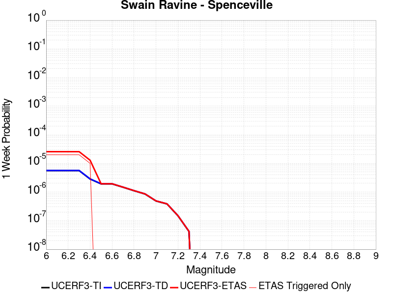 |  |  |  |

| Magnitude | 1 wk TI Prob | 1 wk TD Prob | 1 wk ETAS Prob | 1 wk ETAS/TD Gain | 1 wk ETAS Triggered Only | 1 mo TI Prob | 1 mo TD Prob | 1 mo ETAS Prob | 1 mo ETAS/TD Gain | 1 mo ETAS Triggered Only | 1 yr TI Prob | 1 yr TD Prob | 1 yr ETAS Prob | 1 yr ETAS/TD Gain | 1 yr ETAS Triggered Only | 10 yr TI Prob | 10 yr TD Prob | 10 yr ETAS Prob | 10 yr ETAS/TD Gain | 10 yr ETAS Triggered Only |
|-----|-----|-----|-----|-----|-----|-----|-----|-----|-----|-----|-----|-----|-----|-----|-----|-----|-----|-----|-----|-----|
| 6.0 | 5.596169E-6 | 5.663794E-6 | 3.7817954E-5 | 6.677141 | 3.215434E-5 | 2.398336E-5 | 2.4273193E-5 | 5.6426754E-5 | 2.3246531 | 3.215434E-5 | 2.9195828E-4 | 2.9548878E-4 | 3.276336E-4 | 1.1087853 | 3.215434E-5 | 0.00291575 | 0.002951228 | 0.0029832874 | 1.0108631 | 3.215434E-5 |
| 6.1 | 5.596169E-6 | 5.663794E-6 | 3.7817954E-5 | 6.677141 | 3.215434E-5 | 2.398336E-5 | 2.4273193E-5 | 5.6426754E-5 | 2.3246531 | 3.215434E-5 | 2.9195828E-4 | 2.9548878E-4 | 3.276336E-4 | 1.1087853 | 3.215434E-5 | 0.00291575 | 0.002951228 | 0.0029832874 | 1.0108631 | 3.215434E-5 |
| 6.2 | 5.596169E-6 | 5.663794E-6 | 3.7817954E-5 | 6.677141 | 3.215434E-5 | 2.398336E-5 | 2.4273193E-5 | 5.6426754E-5 | 2.3246531 | 3.215434E-5 | 2.9195828E-4 | 2.9548878E-4 | 3.276336E-4 | 1.1087853 | 3.215434E-5 | 0.00291575 | 0.002951228 | 0.0029832874 | 1.0108631 | 3.215434E-5 |
| 6.3 | 5.596169E-6 | 5.663794E-6 | 3.7817954E-5 | 6.677141 | 3.215434E-5 | 2.398336E-5 | 2.4273193E-5 | 5.6426754E-5 | 2.3246531 | 3.215434E-5 | 2.9195828E-4 | 2.9548878E-4 | 3.276336E-4 | 1.1087853 | 3.215434E-5 | 0.00291575 | 0.002951228 | 0.0029832874 | 1.0108631 | 3.215434E-5 |
| 6.4 | 2.8426775E-6 | 2.874144E-6 | 1.8951268E-5 | 6.593709 | 1.607717E-5 | 1.2182847E-5 | 1.2317704E-5 | 2.8394676E-5 | 2.3051922 | 1.607717E-5 | 1.4831607E-4 | 1.4995811E-4 | 1.6603287E-4 | 1.107195 | 1.607717E-5 | 0.0014821711 | 0.0014986077 | 0.0015146608 | 1.010712 | 1.607717E-5 |
| 6.5 | 1.9210793E-6 | 1.9414147E-6 | 1.9414147E-6 | 1.0 | 0.0 | 8.233172E-6 | 8.320323E-6 | 8.320323E-6 | 1.0 | 0.0 | 1.0023425E-4 | 1.0129536E-4 | 1.0129536E-4 | 1.0 | 0.0 | 0.0010018905 | 0.0010125053 | 0.0010125053 | 1.0 | 0.0 |
| 6.6 | 1.9210793E-6 | 1.9414147E-6 | 1.9414147E-6 | 1.0 | 0.0 | 8.233172E-6 | 8.320323E-6 | 8.320323E-6 | 1.0 | 0.0 | 1.0023425E-4 | 1.0129536E-4 | 1.0129536E-4 | 1.0 | 0.0 | 0.0010018905 | 0.0010125053 | 0.0010125053 | 1.0 | 0.0 |
| 6.7 | 1.4667394E-6 | 1.4818934E-6 | 1.4818934E-6 | 1.0 | 0.0 | 6.286011E-6 | 6.3509565E-6 | 6.3509565E-6 | 1.0 | 0.0 | 7.65295E-5 | 7.732023E-5 | 7.732023E-5 | 1.0 | 0.0 | 7.6503144E-4 | 7.72941E-4 | 7.72941E-4 | 1.0 | 0.0 |
| 6.8 | 1.1076943E-6 | 1.1189535E-6 | 1.1189535E-6 | 1.0 | 0.0 | 4.747252E-6 | 4.7955064E-6 | 4.7955064E-6 | 1.0 | 0.0 | 5.7796264E-5 | 5.838377E-5 | 5.838377E-5 | 1.0 | 0.0 | 5.778124E-4 | 5.836887E-4 | 5.836887E-4 | 1.0 | 0.0 |
| 6.9 | 8.514296E-7 | 8.600095E-7 | 8.600095E-7 | 1.0 | 0.0 | 3.648979E-6 | 3.6857498E-6 | 3.6857498E-6 | 1.0 | 0.0 | 4.442541E-5 | 4.4873108E-5 | 4.4873108E-5 | 1.0 | 0.0 | 4.441653E-4 | 4.4864335E-4 | 4.4864335E-4 | 1.0 | 0.0 |
| 7.0 | 4.8544706E-7 | 4.9033E-7 | 4.9033E-7 | 1.0 | 0.0 | 2.0804857E-6 | 2.1014127E-6 | 2.1014127E-6 | 1.0 | 0.0 | 2.532962E-5 | 2.5584413E-5 | 2.5584413E-5 | 1.0 | 0.0 | 2.5326732E-4 | 2.5581598E-4 | 2.5581598E-4 | 1.0 | 0.0 |
| 7.1 | 3.829186E-7 | 3.8678783E-7 | 3.8678783E-7 | 1.0 | 0.0 | 1.6410787E-6 | 1.6576612E-6 | 1.6576612E-6 | 1.0 | 0.0 | 1.997995E-5 | 2.0181848E-5 | 2.0181848E-5 | 1.0 | 0.0 | 1.9978154E-4 | 2.0180122E-4 | 2.0180122E-4 | 1.0 | 0.0 |
| 7.2 | 1.4726595E-7 | 1.4879437E-7 | 1.4879437E-7 | 1.0 | 0.0 | 6.3113964E-7 | 6.3769005E-7 | 6.3769005E-7 | 1.0 | 0.0 | 7.684098E-6 | 7.763854E-6 | 7.763854E-6 | 1.0 | 0.0 | 7.6838325E-5 | 7.763636E-5 | 7.763636E-5 | 1.0 | 0.0 |
| 7.3 | 4.1880604E-8 | 4.2324306E-8 | 4.2324306E-8 | 1.0 | 0.0 | 1.7948828E-7 | 1.8138988E-7 | 1.8138988E-7 | 1.0 | 0.0 | 2.1852677E-6 | 2.2084218E-6 | 2.2084218E-6 | 1.0 | 0.0 | 2.1852462E-5 | 2.2084218E-5 | 2.2084218E-5 | 1.0 | 0.0 |

## San Jacinto (Superstition Mtn)
*[(top)](#table-of-contents)*

| 1 Week | 1 Month | 1 Year | 10 Year |
|-----|-----|-----|-----|
|  |  |  |  |

| Magnitude | 1 wk TI Prob | 1 wk TD Prob | 1 wk ETAS Prob | 1 wk ETAS/TD Gain | 1 wk ETAS Triggered Only | 1 mo TI Prob | 1 mo TD Prob | 1 mo ETAS Prob | 1 mo ETAS/TD Gain | 1 mo ETAS Triggered Only | 1 yr TI Prob | 1 yr TD Prob | 1 yr ETAS Prob | 1 yr ETAS/TD Gain | 1 yr ETAS Triggered Only | 10 yr TI Prob | 10 yr TD Prob | 10 yr ETAS Prob | 10 yr ETAS/TD Gain | 10 yr ETAS Triggered Only |
|-----|-----|-----|-----|-----|-----|-----|-----|-----|-----|-----|-----|-----|-----|-----|-----|-----|-----|-----|-----|-----|
| 6.0 | 6.4193904E-5 | 9.599367E-5 | 1.120693E-4 | 1.1674654 | 1.607717E-5 | 2.7508775E-4 | 4.1134638E-4 | 4.2741693E-4 | 1.0390682 | 1.607717E-5 | 0.0033440501 | 0.0049980893 | 0.005030083 | 1.0064012 | 3.215434E-5 | 0.03294174 | 0.048823986 | 0.04885457 | 1.0006264 | 3.215434E-5 |
| 6.1 | 6.4193904E-5 | 9.599367E-5 | 1.120693E-4 | 1.1674654 | 1.607717E-5 | 2.7508775E-4 | 4.1134638E-4 | 4.2741693E-4 | 1.0390682 | 1.607717E-5 | 0.0033440501 | 0.0049980893 | 0.005030083 | 1.0064012 | 3.215434E-5 | 0.03294174 | 0.048823986 | 0.04885457 | 1.0006264 | 3.215434E-5 |
| 6.2 | 5.7023593E-5 | 8.3144434E-5 | 9.922026E-5 | 1.1933483 | 1.607717E-5 | 2.4436394E-4 | 3.5629404E-4 | 3.7236547E-4 | 1.0451072 | 1.607717E-5 | 0.002971072 | 0.0043308944 | 0.0043629096 | 1.0073923 | 3.215434E-5 | 0.029316625 | 0.04250403 | 0.042534817 | 1.0007243 | 3.215434E-5 |
| 6.3 | 5.6940098E-5 | 8.298979E-5 | 9.9065626E-5 | 1.1937085 | 1.607717E-5 | 2.4400617E-4 | 3.5563146E-4 | 3.7170292E-4 | 1.0451913 | 1.607717E-5 | 0.002966728 | 0.00432286 | 0.004354875 | 1.0074061 | 3.215434E-5 | 0.029274331 | 0.042427283 | 0.042458072 | 1.0007257 | 3.215434E-5 |
| 6.4 | 5.4171585E-5 | 7.7483564E-5 | 9.355949E-5 | 1.2074753 | 1.607717E-5 | 2.3214328E-4 | 3.3203943E-4 | 3.4811127E-4 | 1.0484034 | 1.607717E-5 | 0.0028226813 | 0.0040367353 | 0.0040687597 | 1.0079333 | 3.215434E-5 | 0.02787096 | 0.03971653 | 0.03974741 | 1.0007775 | 3.215434E-5 |
| 6.5 | 4.375144E-5 | 5.642133E-5 | 7.249759E-5 | 1.2849324 | 1.607717E-5 | 1.874927E-4 | 2.4178992E-4 | 2.578632E-4 | 1.0664762 | 1.607717E-5 | 0.0022803338 | 0.002940994 | 0.0029730538 | 1.010901 | 3.215434E-5 | 0.022570757 | 0.029236801 | 0.029268015 | 1.0010676 | 3.215434E-5 |
| 6.6 | 2.772192E-5 | 2.5488358E-5 | 4.156512E-5 | 1.6307492 | 1.607717E-5 | 1.1880282E-4 | 1.09231354E-4 | 1.2530676E-4 | 1.1471685 | 1.607717E-5 | 0.0014454646 | 0.0013290998 | 0.0013612114 | 1.0241604 | 3.215434E-5 | 0.014360986 | 0.01354049 | 0.013572209 | 1.0023426 | 3.215434E-5 |
| 6.7 | 2.7124124E-5 | 2.4699386E-5 | 4.0776158E-5 | 1.6508976 | 1.607717E-5 | 1.1624106E-4 | 1.05850326E-4 | 1.219258E-4 | 1.1518698 | 1.607717E-5 | 0.0014143161 | 0.001287985 | 0.001320098 | 1.0249327 | 3.215434E-5 | 0.014053487 | 0.013133943 | 0.013165675 | 1.002416 | 3.215434E-5 |
| 6.8 | 2.5475807E-5 | 2.216446E-5 | 3.8241273E-5 | 1.725342 | 1.607717E-5 | 1.0917746E-4 | 9.4987154E-5 | 1.1106279E-4 | 1.1692402 | 1.607717E-5 | 0.001328425 | 0.001155867 | 0.0011879841 | 1.0277863 | 3.215434E-5 | 0.0132051185 | 0.011822182 | 0.011853956 | 1.0026877 | 3.215434E-5 |
| 6.9 | 2.1162023E-5 | 1.7626244E-5 | 3.370313E-5 | 1.9120995 | 1.607717E-5 | 9.069123E-5 | 7.5538876E-5 | 9.1614835E-5 | 1.212817 | 1.607717E-5 | 0.0011036064 | 9.193016E-4 | 9.5142634E-4 | 1.0349448 | 3.215434E-5 | 0.010981417 | 0.00944688 | 0.00947873 | 1.0033716 | 3.215434E-5 |
| 7.0 | 1.8754288E-5 | 1.6161559E-5 | 3.223847E-5 | 1.9947624 | 1.607717E-5 | 8.037304E-5 | 6.9261994E-5 | 8.5338055E-5 | 1.232105 | 1.607717E-5 | 9.781026E-4 | 8.4294105E-4 | 8.750683E-4 | 1.0381132 | 3.215434E-5 | 0.009738087 | 0.008670042 | 0.008701918 | 1.0036765 | 3.215434E-5 |
| 7.1 | 1.8678527E-5 | 1.6086702E-5 | 3.2163614E-5 | 1.9993914 | 1.607717E-5 | 8.0048376E-5 | 6.89412E-5 | 8.501726E-5 | 1.2331852 | 1.607717E-5 | 9.7415317E-4 | 8.3903834E-4 | 8.711657E-4 | 1.0382907 | 3.215434E-5 | 0.009698939 | 0.008630998 | 0.008662875 | 1.0036933 | 3.215434E-5 |
| 7.2 | 1.7804578E-5 | 1.5381282E-5 | 3.1458203E-5 | 2.0452266 | 1.607717E-5 | 7.6303106E-5 | 6.5918124E-5 | 8.1994236E-5 | 1.24388 | 1.607717E-5 | 9.285943E-4 | 8.022599E-4 | 8.343884E-4 | 1.0400475 | 3.215434E-5 | 0.009247236 | 0.008262311 | 0.0082942005 | 1.0038595 | 3.215434E-5 |
| 7.3 | 1.6583685E-5 | 1.4530388E-5 | 3.0607323E-5 | 2.1064355 | 1.607717E-5 | 7.1070994E-5 | 6.227162E-5 | 7.834779E-5 | 1.258162 | 1.607717E-5 | 8.649459E-4 | 7.5789524E-4 | 7.900252E-4 | 1.0423937 | 3.215434E-5 | 0.00861587 | 0.007817623 | 0.007849527 | 1.0040809 | 3.215434E-5 |
| 7.4 | 1.6387552E-5 | 1.4395274E-5 | 3.0472213E-5 | 2.1168206 | 1.607717E-5 | 7.023047E-5 | 6.169258E-5 | 7.776876E-5 | 1.2605853 | 1.607717E-5 | 8.5472054E-4 | 7.5085036E-4 | 7.829805E-4 | 1.0427917 | 3.215434E-5 | 0.008514405 | 0.0077470057 | 0.007778911 | 1.0041184 | 3.215434E-5 |
| 7.5 | 1.5790754E-5 | 1.4035962E-5 | 3.0112906E-5 | 2.145411 | 1.607717E-5 | 6.767291E-5 | 6.0152746E-5 | 7.622895E-5 | 1.2672564 | 1.607717E-5 | 8.236062E-4 | 7.321156E-4 | 7.642464E-4 | 1.0438876 | 3.215434E-5 | 0.008205604 | 0.007557569 | 0.0075894804 | 1.0042224 | 3.215434E-5 |
| 7.6 | 1.4248672E-5 | 1.3054932E-5 | 2.9131894E-5 | 2.2314856 | 1.607717E-5 | 6.106431E-5 | 5.594852E-5 | 7.202479E-5 | 1.2873404 | 1.607717E-5 | 7.432043E-4 | 6.8096205E-4 | 7.130945E-4 | 1.0471869 | 3.215434E-5 | 0.007407237 | 0.0070401574 | 0.007072085 | 1.0045351 | 3.215434E-5 |
| 7.7 | 1.15449975E-5 | 1.090368E-5 | 2.6980675E-5 | 2.4744558 | 1.607717E-5 | 4.947762E-5 | 4.6729223E-5 | 6.2805644E-5 | 1.3440335 | 1.607717E-5 | 6.022235E-4 | 5.687805E-4 | 6.009166E-4 | 1.0565 | 3.215434E-5 | 0.006005941 | 0.0059101824 | 0.0059421468 | 1.0054083 | 3.215434E-5 |
| 7.8 | 9.1391985E-6 | 9.514299E-6 | 2.5591316E-5 | 2.6897743 | 1.607717E-5 | 3.9167408E-5 | 4.0774932E-5 | 5.6851448E-5 | 1.3942745 | 1.607717E-5 | 4.767588E-4 | 4.963223E-4 | 5.284607E-4 | 1.064753 | 3.215434E-5 | 0.0047573727 | 0.0051766867 | 0.0052086744 | 1.0061792 | 3.215434E-5 |
| 7.9 | 6.973017E-6 | 7.3821784E-6 | 2.345923E-5 | 3.1778195 | 1.607717E-5 | 2.9884017E-5 | 3.1637526E-5 | 4.7714188E-5 | 1.5081517 | 1.607717E-5 | 3.6377716E-4 | 3.8511935E-4 | 4.172613E-4 | 1.0834597 | 3.215434E-5 | 0.0036318225 | 0.0040517948 | 0.0040838188 | 1.0079037 | 3.215434E-5 |
| 8.0 | 5.7638235E-6 | 6.259972E-6 | 2.2337043E-5 | 3.5682335 | 1.607717E-5 | 2.4701867E-5 | 2.6828178E-5 | 4.2904918E-5 | 1.5992483 | 1.607717E-5 | 3.0070372E-4 | 3.2658462E-4 | 3.4265654E-4 | 1.0492121 | 1.607717E-5 | 0.0030029714 | 0.0034534496 | 0.0034694711 | 1.0046393 | 1.607717E-5 |
| 8.1 | 5.1124434E-6 | 5.4956718E-6 | 2.1572754E-5 | 3.9254081 | 1.607717E-5 | 2.1910288E-5 | 2.355267E-5 | 3.962946E-5 | 1.6825889 | 1.607717E-5 | 2.6672508E-4 | 2.867165E-4 | 3.0278906E-4 | 1.0560573 | 1.607717E-5 | 0.0026640517 | 0.003040336 | 0.0030563644 | 1.0052719 | 1.607717E-5 |
| 8.2 | 1.1075938E-6 | 5.336568E-7 | 5.336568E-7 | 1.0 | 0.0 | 4.7468216E-6 | 2.2870988E-6 | 2.2870988E-6 | 1.0 | 0.0 | 5.779102E-5 | 2.7845093E-5 | 2.7845093E-5 | 1.0 | 0.0 | 5.777599E-4 | 3.1346595E-4 | 3.1346595E-4 | 1.0 | 0.0 |
| 8.3 | 1.3584393E-8 | 4.473836E-9 | 4.473836E-9 | 1.0 | 0.0 | 5.8218827E-8 | 1.9173582E-8 | 1.9173582E-8 | 1.0 | 0.0 | 7.0881396E-7 | 2.3343837E-7 | 2.3343837E-7 | 1.0 | 0.0 | 7.0881174E-6 | 2.6163038E-6 | 2.6163038E-6 | 1.0 | 0.0 |

## Tin Mountain
*[(top)](#table-of-contents)*

| 1 Week | 1 Month | 1 Year | 10 Year |
|-----|-----|-----|-----|
|  |  |  |  |

| Magnitude | 1 wk TI Prob | 1 wk TD Prob | 1 wk ETAS Prob | 1 wk ETAS/TD Gain | 1 wk ETAS Triggered Only | 1 mo TI Prob | 1 mo TD Prob | 1 mo ETAS Prob | 1 mo ETAS/TD Gain | 1 mo ETAS Triggered Only | 1 yr TI Prob | 1 yr TD Prob | 1 yr ETAS Prob | 1 yr ETAS/TD Gain | 1 yr ETAS Triggered Only | 10 yr TI Prob | 10 yr TD Prob | 10 yr ETAS Prob | 10 yr ETAS/TD Gain | 10 yr ETAS Triggered Only |
|-----|-----|-----|-----|-----|-----|-----|-----|-----|-----|-----|-----|-----|-----|-----|-----|-----|-----|-----|-----|-----|
| 6.0 | 4.083776E-6 | 4.1815365E-6 | 4.1815365E-6 | 1.0 | 0.0 | 1.750178E-5 | 1.792077E-5 | 1.792077E-5 | 1.0 | 0.0 | 2.1306332E-4 | 2.1816725E-4 | 2.3424091E-4 | 1.0736759 | 1.607717E-5 | 0.0021285915 | 0.0021798965 | 0.0022119805 | 1.0147183 | 3.215434E-5 |
| 6.1 | 4.083776E-6 | 4.1815365E-6 | 4.1815365E-6 | 1.0 | 0.0 | 1.750178E-5 | 1.792077E-5 | 1.792077E-5 | 1.0 | 0.0 | 2.1306332E-4 | 2.1816725E-4 | 2.3424091E-4 | 1.0736759 | 1.607717E-5 | 0.0021285915 | 0.0021798965 | 0.0022119805 | 1.0147183 | 3.215434E-5 |
| 6.2 | 4.083776E-6 | 4.1815365E-6 | 4.1815365E-6 | 1.0 | 0.0 | 1.750178E-5 | 1.792077E-5 | 1.792077E-5 | 1.0 | 0.0 | 2.1306332E-4 | 2.1816725E-4 | 2.3424091E-4 | 1.0736759 | 1.607717E-5 | 0.0021285915 | 0.0021798965 | 0.0022119805 | 1.0147183 | 3.215434E-5 |
| 6.3 | 4.083776E-6 | 4.1815365E-6 | 4.1815365E-6 | 1.0 | 0.0 | 1.750178E-5 | 1.792077E-5 | 1.792077E-5 | 1.0 | 0.0 | 2.1306332E-4 | 2.1816725E-4 | 2.3424091E-4 | 1.0736759 | 1.607717E-5 | 0.0021285915 | 0.0021798965 | 0.0022119805 | 1.0147183 | 3.215434E-5 |
| 6.4 | 4.083776E-6 | 4.1815365E-6 | 4.1815365E-6 | 1.0 | 0.0 | 1.750178E-5 | 1.792077E-5 | 1.792077E-5 | 1.0 | 0.0 | 2.1306332E-4 | 2.1816725E-4 | 2.3424091E-4 | 1.0736759 | 1.607717E-5 | 0.0021285915 | 0.0021798965 | 0.0022119805 | 1.0147183 | 3.215434E-5 |
| 6.5 | 2.3143427E-6 | 2.3731573E-6 | 2.3731573E-6 | 1.0 | 0.0 | 9.9185745E-6 | 1.0170638E-5 | 1.0170638E-5 | 1.0 | 0.0 | 1.2075195E-4 | 1.2382126E-4 | 1.2382126E-4 | 1.0 | 0.0 | 0.0012068636 | 0.0012375986 | 0.0012536559 | 1.0129745 | 1.607717E-5 |
| 6.6 | 2.3143427E-6 | 2.3731573E-6 | 2.3731573E-6 | 1.0 | 0.0 | 9.9185745E-6 | 1.0170638E-5 | 1.0170638E-5 | 1.0 | 0.0 | 1.2075195E-4 | 1.2382126E-4 | 1.2382126E-4 | 1.0 | 0.0 | 0.0012068636 | 0.0012375986 | 0.0012536559 | 1.0129745 | 1.607717E-5 |
| 6.7 | 1.7029532E-6 | 1.7497915E-6 | 1.7497915E-6 | 1.0 | 0.0 | 7.2983503E-6 | 7.499088E-6 | 7.499088E-6 | 1.0 | 0.0 | 8.885379E-5 | 9.1298105E-5 | 9.1298105E-5 | 1.0 | 0.0 | 8.881827E-4 | 9.1265864E-4 | 9.1265864E-4 | 1.0 | 0.0 |
| 6.8 | 1.2914646E-6 | 1.3299378E-6 | 1.3299378E-6 | 1.0 | 0.0 | 5.534837E-6 | 5.6997237E-6 | 5.6997237E-6 | 1.0 | 0.0 | 6.738455E-5 | 6.939237E-5 | 6.939237E-5 | 1.0 | 0.0 | 6.736412E-4 | 6.9375033E-4 | 6.9375033E-4 | 1.0 | 0.0 |
| 6.9 | 5.8708974E-7 | 6.1169936E-7 | 6.1169936E-7 | 1.0 | 0.0 | 2.5160964E-6 | 2.6215664E-6 | 2.6215664E-6 | 1.0 | 0.0 | 3.0633044E-5 | 3.1917145E-5 | 3.1917145E-5 | 1.0 | 0.0 | 3.0628822E-4 | 3.191297E-4 | 3.191297E-4 | 1.0 | 0.0 |
| 7.0 | 4.6248786E-7 | 4.832015E-7 | 4.832015E-7 | 1.0 | 0.0 | 1.9820893E-6 | 2.0708624E-6 | 2.0708624E-6 | 1.0 | 0.0 | 2.413167E-5 | 2.5212494E-5 | 2.5212494E-5 | 1.0 | 0.0 | 2.412905E-4 | 2.5210003E-4 | 2.5210003E-4 | 1.0 | 0.0 |
| 7.1 | 3.804606E-7 | 3.987147E-7 | 3.987147E-7 | 1.0 | 0.0 | 1.6305444E-6 | 1.7087764E-6 | 1.7087764E-6 | 1.0 | 0.0 | 1.9851697E-5 | 2.0804187E-5 | 2.0804187E-5 | 1.0 | 0.0 | 1.9849923E-4 | 2.0802575E-4 | 2.0802575E-4 | 1.0 | 0.0 |
| 7.2 | 3.5864858E-7 | 3.7616863E-7 | 3.7616863E-7 | 1.0 | 0.0 | 1.5370645E-6 | 1.6121504E-6 | 1.6121504E-6 | 1.0 | 0.0 | 1.87136E-5 | 1.9627789E-5 | 1.9627789E-5 | 1.0 | 0.0 | 1.8712023E-4 | 1.9626386E-4 | 1.9626386E-4 | 1.0 | 0.0 |
| 7.3 | 3.342063E-7 | 3.506347E-7 | 3.506347E-7 | 1.0 | 0.0 | 1.4323119E-6 | 1.5027196E-6 | 1.5027196E-6 | 1.0 | 0.0 | 1.7438259E-5 | 1.829549E-5 | 1.829549E-5 | 1.0 | 0.0 | 1.743689E-4 | 1.8294314E-4 | 1.8294314E-4 | 1.0 | 0.0 |
| 7.4 | 2.971242E-7 | 3.1165817E-7 | 3.1165817E-7 | 1.0 | 0.0 | 1.2733886E-6 | 1.3356774E-6 | 1.3356774E-6 | 1.0 | 0.0 | 1.5503398E-5 | 1.6261785E-5 | 1.6261785E-5 | 1.0 | 0.0 | 1.5502315E-4 | 1.6260923E-4 | 1.6260923E-4 | 1.0 | 0.0 |
| 7.5 | 1.4326713E-7 | 1.5012525E-7 | 1.5012525E-7 | 1.0 | 0.0 | 6.140018E-7 | 6.433939E-7 | 6.433939E-7 | 1.0 | 0.0 | 7.4754466E-6 | 7.8333205E-6 | 7.8333205E-6 | 1.0 | 0.0 | 7.475195E-5 | 7.833321E-5 | 7.833321E-5 | 1.0 | 0.0 |

## Gillem - Big Crack 2011 CFM
*[(top)](#table-of-contents)*

| 1 Week | 1 Month | 1 Year | 10 Year |
|-----|-----|-----|-----|
|  |  |  |  |

| Magnitude | 1 wk TI Prob | 1 wk TD Prob | 1 wk ETAS Prob | 1 wk ETAS/TD Gain | 1 wk ETAS Triggered Only | 1 mo TI Prob | 1 mo TD Prob | 1 mo ETAS Prob | 1 mo ETAS/TD Gain | 1 mo ETAS Triggered Only | 1 yr TI Prob | 1 yr TD Prob | 1 yr ETAS Prob | 1 yr ETAS/TD Gain | 1 yr ETAS Triggered Only | 10 yr TI Prob | 10 yr TD Prob | 10 yr ETAS Prob | 10 yr ETAS/TD Gain | 10 yr ETAS Triggered Only |
|-----|-----|-----|-----|-----|-----|-----|-----|-----|-----|-----|-----|-----|-----|-----|-----|-----|-----|-----|-----|-----|
| 6.0 | 2.196852E-5 | 2.3604485E-5 | 2.3604485E-5 | 1.0 | 0.0 | 9.4147406E-5 | 1.01158665E-4 | 1.01158665E-4 | 1.0 | 0.0 | 0.0011456419 | 0.0012309998 | 0.0012470571 | 1.0130441 | 1.607717E-5 | 0.011397537 | 0.012250669 | 0.01228243 | 1.0025926 | 3.215434E-5 |
| 6.1 | 9.992795E-6 | 1.071189E-5 | 1.071189E-5 | 1.0 | 0.0 | 4.2825563E-5 | 4.5907396E-5 | 4.5907396E-5 | 1.0 | 0.0 | 5.2127644E-4 | 5.587975E-4 | 5.748657E-4 | 1.028755 | 1.607717E-5 | 0.0052005537 | 0.0055757347 | 0.005591722 | 1.0028673 | 1.607717E-5 |
| 6.2 | 9.992795E-6 | 1.071189E-5 | 1.071189E-5 | 1.0 | 0.0 | 4.2825563E-5 | 4.5907396E-5 | 4.5907396E-5 | 1.0 | 0.0 | 5.2127644E-4 | 5.587975E-4 | 5.748657E-4 | 1.028755 | 1.607717E-5 | 0.0052005537 | 0.0055757347 | 0.005591722 | 1.0028673 | 1.607717E-5 |
| 6.3 | 4.6127884E-6 | 4.942657E-6 | 4.942657E-6 | 1.0 | 0.0 | 1.9768944E-5 | 2.1182668E-5 | 2.1182668E-5 | 1.0 | 0.0 | 2.406603E-4 | 2.5787292E-4 | 2.5787292E-4 | 1.0 | 0.0 | 0.0024039985 | 0.0025761751 | 0.0025761751 | 1.0 | 0.0 |
| 6.4 | 4.6127884E-6 | 4.942657E-6 | 4.942657E-6 | 1.0 | 0.0 | 1.9768944E-5 | 2.1182668E-5 | 2.1182668E-5 | 1.0 | 0.0 | 2.406603E-4 | 2.5787292E-4 | 2.5787292E-4 | 1.0 | 0.0 | 0.0024039985 | 0.0025761751 | 0.0025761751 | 1.0 | 0.0 |
| 6.5 | 2.716712E-6 | 2.9111113E-6 | 2.9111113E-6 | 1.0 | 0.0 | 1.1643E-5 | 1.24761455E-5 | 1.24761455E-5 | 1.0 | 0.0 | 1.417443E-4 | 1.5188892E-4 | 1.5188892E-4 | 1.0 | 0.0 | 0.0014165393 | 0.001518089 | 0.001518089 | 1.0 | 0.0 |
| 6.6 | 1.3818255E-6 | 1.4820689E-6 | 1.4820689E-6 | 1.0 | 0.0 | 5.922096E-6 | 6.3517155E-6 | 6.3517155E-6 | 1.0 | 0.0 | 7.209913E-5 | 7.7330624E-5 | 7.7330624E-5 | 1.0 | 0.0 | 7.2075747E-4 | 7.7315804E-4 | 7.7315804E-4 | 1.0 | 0.0 |

## Raymond
*[(top)](#table-of-contents)*

| 1 Week | 1 Month | 1 Year | 10 Year |
|-----|-----|-----|-----|
|  |  |  |  |

| Magnitude | 1 wk TI Prob | 1 wk TD Prob | 1 wk ETAS Prob | 1 wk ETAS/TD Gain | 1 wk ETAS Triggered Only | 1 mo TI Prob | 1 mo TD Prob | 1 mo ETAS Prob | 1 mo ETAS/TD Gain | 1 mo ETAS Triggered Only | 1 yr TI Prob | 1 yr TD Prob | 1 yr ETAS Prob | 1 yr ETAS/TD Gain | 1 yr ETAS Triggered Only | 10 yr TI Prob | 10 yr TD Prob | 10 yr ETAS Prob | 10 yr ETAS/TD Gain | 10 yr ETAS Triggered Only |
|-----|-----|-----|-----|-----|-----|-----|-----|-----|-----|-----|-----|-----|-----|-----|-----|-----|-----|-----|-----|-----|
| 6.0 | 1.5157413E-5 | 1.5810128E-5 | 3.1887044E-5 | 2.0168746 | 1.607717E-5 | 6.4958724E-5 | 6.7756075E-5 | 8.383216E-5 | 1.237264 | 1.607717E-5 | 7.905855E-4 | 8.2464307E-4 | 8.40707E-4 | 1.0194799 | 1.607717E-5 | 0.007877788 | 0.008218348 | 0.008250238 | 1.0038804 | 3.215434E-5 |
| 6.1 | 1.5157413E-5 | 1.5810128E-5 | 3.1887044E-5 | 2.0168746 | 1.607717E-5 | 6.4958724E-5 | 6.7756075E-5 | 8.383216E-5 | 1.237264 | 1.607717E-5 | 7.905855E-4 | 8.2464307E-4 | 8.40707E-4 | 1.0194799 | 1.607717E-5 | 0.007877788 | 0.008218348 | 0.008250238 | 1.0038804 | 3.215434E-5 |
| 6.2 | 1.5157413E-5 | 1.5810128E-5 | 3.1887044E-5 | 2.0168746 | 1.607717E-5 | 6.4958724E-5 | 6.7756075E-5 | 8.383216E-5 | 1.237264 | 1.607717E-5 | 7.905855E-4 | 8.2464307E-4 | 8.40707E-4 | 1.0194799 | 1.607717E-5 | 0.007877788 | 0.008218348 | 0.008250238 | 1.0038804 | 3.215434E-5 |
| 6.3 | 1.5157413E-5 | 1.5810128E-5 | 3.1887044E-5 | 2.0168746 | 1.607717E-5 | 6.4958724E-5 | 6.7756075E-5 | 8.383216E-5 | 1.237264 | 1.607717E-5 | 7.905855E-4 | 8.2464307E-4 | 8.40707E-4 | 1.0194799 | 1.607717E-5 | 0.007877788 | 0.008218348 | 0.008250238 | 1.0038804 | 3.215434E-5 |
| 6.4 | 1.3941944E-5 | 1.445469E-5 | 3.0531628E-5 | 2.1122298 | 1.607717E-5 | 5.9749822E-5 | 6.1947336E-5 | 7.8023506E-5 | 1.2595136 | 1.607717E-5 | 7.2721124E-4 | 7.5397117E-4 | 7.700362E-4 | 1.0213072 | 1.607717E-5 | 0.007248361 | 0.0075164647 | 0.0075483774 | 1.0042458 | 3.215434E-5 |
| 6.5 | 1.3941944E-5 | 1.445469E-5 | 3.0531628E-5 | 2.1122298 | 1.607717E-5 | 5.9749822E-5 | 6.1947336E-5 | 7.8023506E-5 | 1.2595136 | 1.607717E-5 | 7.2721124E-4 | 7.5397117E-4 | 7.700362E-4 | 1.0213072 | 1.607717E-5 | 0.007248361 | 0.0075164647 | 0.0075483774 | 1.0042458 | 3.215434E-5 |
| 6.6 | 1.0542609E-5 | 1.0671113E-5 | 1.0671113E-5 | 1.0 | 0.0 | 4.5181827E-5 | 4.573257E-5 | 4.573257E-5 | 1.0 | 0.0 | 5.499499E-4 | 5.5665727E-4 | 5.5665727E-4 | 1.0 | 0.0 | 0.005485909 | 0.00555319 | 0.00555319 | 1.0 | 0.0 |
| 6.7 | 1.0542609E-5 | 1.0671113E-5 | 1.0671113E-5 | 1.0 | 0.0 | 4.5181827E-5 | 4.573257E-5 | 4.573257E-5 | 1.0 | 0.0 | 5.499499E-4 | 5.5665727E-4 | 5.5665727E-4 | 1.0 | 0.0 | 0.005485909 | 0.00555319 | 0.00555319 | 1.0 | 0.0 |
| 6.8 | 1.0079132E-5 | 1.0176646E-5 | 1.0176646E-5 | 1.0 | 0.0 | 4.3195567E-5 | 4.3613498E-5 | 4.3613498E-5 | 1.0 | 0.0 | 5.257791E-4 | 5.3087034E-4 | 5.3087034E-4 | 1.0 | 0.0 | 0.0052453685 | 0.005296571 | 0.005296571 | 1.0 | 0.0 |
| 6.9 | 7.721598E-6 | 7.5489047E-6 | 7.5489047E-6 | 1.0 | 0.0 | 3.3092143E-5 | 3.2352054E-5 | 3.2352054E-5 | 1.0 | 0.0 | 4.0282236E-4 | 3.9381627E-4 | 3.9381627E-4 | 1.0 | 0.0 | 0.0040209293 | 0.0039313175 | 0.0039313175 | 1.0 | 0.0 |
| 7.0 | 7.137566E-6 | 6.9113057E-6 | 6.9113057E-6 | 1.0 | 0.0 | 3.058921E-5 | 2.961955E-5 | 2.961955E-5 | 1.0 | 0.0 | 3.7236E-4 | 3.6055944E-4 | 3.6055944E-4 | 1.0 | 0.0 | 0.0037173668 | 0.0035998628 | 0.0035998628 | 1.0 | 0.0 |
| 7.1 | 5.654976E-6 | 5.29954E-6 | 5.29954E-6 | 1.0 | 0.0 | 2.4235387E-5 | 2.2712118E-5 | 2.2712118E-5 | 1.0 | 0.0 | 2.9502588E-4 | 2.7648517E-4 | 2.7648517E-4 | 1.0 | 0.0 | 0.0029463451 | 0.002761443 | 0.002761443 | 1.0 | 0.0 |
| 7.2 | 4.9358455E-6 | 4.5266574E-6 | 4.5266574E-6 | 1.0 | 0.0 | 2.1153453E-5 | 1.9399817E-5 | 1.9399817E-5 | 1.0 | 0.0 | 2.5751285E-4 | 2.3616731E-4 | 2.3616731E-4 | 1.0 | 0.0 | 0.0025721465 | 0.0023591854 | 0.0023591854 | 1.0 | 0.0 |
| 7.3 | 4.2368597E-6 | 3.8056164E-6 | 3.8056164E-6 | 1.0 | 0.0 | 1.8157843E-5 | 1.6309683E-5 | 1.6309683E-5 | 1.0 | 0.0 | 2.2104931E-4 | 1.9855241E-4 | 1.9855241E-4 | 1.0 | 0.0 | 0.0022082955 | 0.0019837688 | 0.0019837688 | 1.0 | 0.0 |
| 7.4 | 3.4999923E-6 | 3.043744E-6 | 3.043744E-6 | 1.0 | 0.0 | 1.49998805E-5 | 1.3044552E-5 | 1.3044552E-5 | 1.0 | 0.0 | 1.8260824E-4 | 1.5880594E-4 | 1.5880594E-4 | 1.0 | 0.0 | 0.0018245826 | 0.0015869403 | 0.0015869403 | 1.0 | 0.0 |
| 7.5 | 2.738017E-6 | 2.3020468E-6 | 2.3020468E-6 | 1.0 | 0.0 | 1.1734306E-5 | 9.865878E-6 | 9.865878E-6 | 1.0 | 0.0 | 1.428558E-4 | 1.2011051E-4 | 1.2011051E-4 | 1.0 | 0.0 | 0.0014276401 | 0.0012004703 | 0.0012004703 | 1.0 | 0.0 |
| 7.6 | 1.8186392E-6 | 1.442312E-6 | 1.442312E-6 | 1.0 | 0.0 | 7.794145E-6 | 6.181323E-6 | 6.181323E-6 | 1.0 | 0.0 | 9.488958E-5 | 7.5255055E-5 | 7.5255055E-5 | 1.0 | 0.0 | 9.4849075E-4 | 7.523072E-4 | 7.523072E-4 | 1.0 | 0.0 |
| 7.7 | 1.0660348E-6 | 7.6438056E-7 | 7.6438056E-7 | 1.0 | 0.0 | 4.5687125E-6 | 3.2759126E-6 | 3.2759126E-6 | 1.0 | 0.0 | 5.5622655E-5 | 3.9883522E-5 | 3.9883522E-5 | 1.0 | 0.0 | 5.5608735E-4 | 3.9877277E-4 | 3.9877277E-4 | 1.0 | 0.0 |
| 7.8 | 6.913602E-7 | 4.3204133E-7 | 4.3204133E-7 | 1.0 | 0.0 | 2.962969E-6 | 1.8516045E-6 | 1.8516045E-6 | 1.0 | 0.0 | 3.607355E-5 | 2.2543056E-5 | 2.2543056E-5 | 1.0 | 0.0 | 3.6067693E-4 | 2.2541556E-4 | 2.2541556E-4 | 1.0 | 0.0 |
| 7.9 | 7.425201E-8 | 5.3222113E-8 | 5.3222113E-8 | 1.0 | 0.0 | 3.1822285E-7 | 2.2809476E-7 | 2.2809476E-7 | 1.0 | 0.0 | 3.874356E-6 | 2.7770516E-6 | 2.7770516E-6 | 1.0 | 0.0 | 3.8742884E-5 | 2.7770298E-5 | 2.7770298E-5 | 1.0 | 0.0 |

## Superstition Hills
*[(top)](#table-of-contents)*

| 1 Week | 1 Month | 1 Year | 10 Year |
|-----|-----|-----|-----|
| 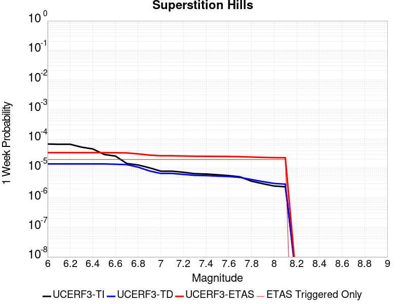 |  | 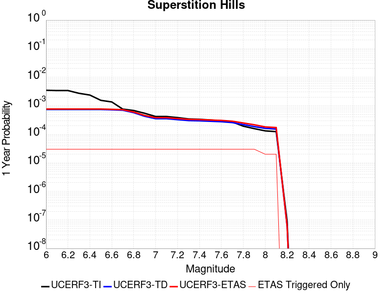 |  |

| Magnitude | 1 wk TI Prob | 1 wk TD Prob | 1 wk ETAS Prob | 1 wk ETAS/TD Gain | 1 wk ETAS Triggered Only | 1 mo TI Prob | 1 mo TD Prob | 1 mo ETAS Prob | 1 mo ETAS/TD Gain | 1 mo ETAS Triggered Only | 1 yr TI Prob | 1 yr TD Prob | 1 yr ETAS Prob | 1 yr ETAS/TD Gain | 1 yr ETAS Triggered Only | 10 yr TI Prob | 10 yr TD Prob | 10 yr ETAS Prob | 10 yr ETAS/TD Gain | 10 yr ETAS Triggered Only |
|-----|-----|-----|-----|-----|-----|-----|-----|-----|-----|-----|-----|-----|-----|-----|-----|-----|-----|-----|-----|-----|
| 6.0 | 6.6865185E-5 | 1.41376995E-5 | 3.0214642E-5 | 2.1371682 | 1.607717E-5 | 2.8653358E-4 | 6.0588824E-5 | 7.666502E-5 | 1.2653327 | 1.607717E-5 | 0.0034829667 | 7.374355E-4 | 7.695661E-4 | 1.0435708 | 3.215434E-5 | 0.03428881 | 0.0075204074 | 0.00755232 | 1.0042435 | 3.215434E-5 |
| 6.1 | 6.544851E-5 | 1.41376995E-5 | 3.0214642E-5 | 2.1371682 | 1.607717E-5 | 2.8046346E-4 | 6.0588824E-5 | 7.666502E-5 | 1.2653327 | 1.607717E-5 | 0.0034092965 | 7.374355E-4 | 7.695661E-4 | 1.0435708 | 3.215434E-5 | 0.033574644 | 0.007520407 | 0.007552319 | 1.0042435 | 3.215434E-5 |
| 6.2 | 6.544851E-5 | 1.41376995E-5 | 3.0214642E-5 | 2.1371682 | 1.607717E-5 | 2.8046346E-4 | 6.0588824E-5 | 7.666502E-5 | 1.2653327 | 1.607717E-5 | 0.0034092965 | 7.374355E-4 | 7.695661E-4 | 1.0435708 | 3.215434E-5 | 0.033574644 | 0.007520407 | 0.007552319 | 1.0042435 | 3.215434E-5 |
| 6.3 | 5.2402065E-5 | 1.4137698E-5 | 3.0214642E-5 | 2.1371684 | 1.607717E-5 | 2.2456095E-4 | 6.058882E-5 | 7.666501E-5 | 1.2653327 | 1.607717E-5 | 0.0027306017 | 7.374354E-4 | 7.6956605E-4 | 1.0435708 | 3.215434E-5 | 0.02697292 | 0.007520402 | 0.007552314 | 1.0042435 | 3.215434E-5 |
| 6.4 | 4.542238E-5 | 1.4137698E-5 | 3.021464E-5 | 2.1371684 | 1.607717E-5 | 1.9465282E-4 | 6.0588816E-5 | 7.666501E-5 | 1.2653327 | 1.607717E-5 | 0.0023673223 | 7.3743536E-4 | 7.69566E-4 | 1.0435708 | 3.215434E-5 | 0.023422617 | 0.0075203986 | 0.0075523113 | 1.0042435 | 3.215434E-5 |
| 6.5 | 2.9672969E-5 | 1.4137696E-5 | 3.021464E-5 | 2.1371684 | 1.607717E-5 | 1.2716366E-4 | 6.058881E-5 | 7.6665005E-5 | 1.2653328 | 1.607717E-5 | 0.0015471181 | 7.374353E-4 | 7.6956593E-4 | 1.0435708 | 3.215434E-5 | 0.015363912 | 0.007520392 | 0.007552305 | 1.0042435 | 3.215434E-5 |
| 6.6 | 2.6056105E-5 | 1.3803458E-5 | 2.9880406E-5 | 2.1647043 | 1.607717E-5 | 1.1166424E-4 | 5.9156428E-5 | 7.5232645E-5 | 1.2717577 | 1.607717E-5 | 0.0013586642 | 7.200076E-4 | 7.521388E-4 | 1.0446262 | 3.215434E-5 | 0.013503874 | 0.0073448285 | 0.0073767467 | 1.0043457 | 3.215434E-5 |
| 6.7 | 1.4611248E-5 | 1.3383359E-5 | 2.9460314E-5 | 2.2012646 | 1.607717E-5 | 6.261813E-5 | 5.7356083E-5 | 7.343233E-5 | 1.2802885 | 1.607717E-5 | 7.6210906E-4 | 6.981025E-4 | 7.3023443E-4 | 1.0460274 | 3.215434E-5 | 0.0075950073 | 0.00712602 | 0.007157945 | 1.0044801 | 3.215434E-5 |
| 6.8 | 1.30607E-5 | 1.09787925E-5 | 2.7055787E-5 | 2.464368 | 1.607717E-5 | 5.597323E-5 | 4.705117E-5 | 6.312758E-5 | 1.3416793 | 1.607717E-5 | 6.8126095E-4 | 5.7270617E-4 | 6.048421E-4 | 1.0561124 | 3.215434E-5 | 0.006791762 | 0.00587438 | 0.0059063453 | 1.0054415 | 3.215434E-5 |
| 6.9 | 1.0443096E-5 | 8.195349E-6 | 2.4272389E-5 | 2.961727 | 1.607717E-5 | 4.4755358E-5 | 3.5122466E-5 | 5.1199073E-5 | 1.4577299 | 1.607717E-5 | 5.447602E-4 | 4.2753448E-4 | 4.5967507E-4 | 1.0751766 | 3.215434E-5 | 0.005434267 | 0.0044094524 | 0.004441465 | 1.00726 | 3.215434E-5 |
| 7.0 | 8.045912E-6 | 6.739692E-6 | 2.2816754E-5 | 3.3854299 | 1.607717E-5 | 3.4482026E-5 | 2.888408E-5 | 4.4960787E-5 | 1.556594 | 1.607717E-5 | 4.197378E-4 | 3.5160795E-4 | 3.83751E-4 | 1.0914173 | 3.215434E-5 | 0.0041894587 | 0.0036334093 | 0.003665447 | 1.0088174 | 3.215434E-5 |
| 7.1 | 8.045912E-6 | 6.739692E-6 | 2.2816754E-5 | 3.3854299 | 1.607717E-5 | 3.4482026E-5 | 2.888408E-5 | 4.4960787E-5 | 1.556594 | 1.607717E-5 | 4.197378E-4 | 3.5160795E-4 | 3.83751E-4 | 1.0914173 | 3.215434E-5 | 0.0041894587 | 0.0036334093 | 0.003665447 | 1.0088174 | 3.215434E-5 |
| 7.2 | 7.375506E-6 | 6.2466297E-6 | 2.23237E-5 | 3.573719 | 1.607717E-5 | 3.1608928E-5 | 2.6771E-5 | 4.284774E-5 | 1.6005281 | 1.607717E-5 | 3.8477074E-4 | 3.2588904E-4 | 3.580329E-4 | 1.0986344 | 3.215434E-5 | 0.003841052 | 0.003373887 | 0.0034059328 | 1.0094982 | 3.215434E-5 |
| 7.3 | 6.6063913E-6 | 5.7990574E-6 | 2.1876134E-5 | 3.7723603 | 1.607717E-5 | 2.8312797E-5 | 2.485287E-5 | 4.092964E-5 | 1.6468779 | 1.607717E-5 | 3.446538E-4 | 3.025424E-4 | 3.34687E-4 | 1.1062483 | 3.215434E-5 | 0.0034411973 | 0.003138153 | 0.0031702067 | 1.0102141 | 3.215434E-5 |
| 7.4 | 6.4313126E-6 | 5.680481E-6 | 2.175756E-5 | 3.830232 | 1.607717E-5 | 2.7562477E-5 | 2.4344696E-5 | 4.0421477E-5 | 1.6603812 | 1.607717E-5 | 3.355215E-4 | 2.9635706E-4 | 3.2850186E-4 | 1.1084665 | 3.215434E-5 | 0.0033501536 | 0.0030759154 | 0.0031079708 | 1.0104214 | 3.215434E-5 |
| 7.5 | 6.0742927E-6 | 5.4763104E-6 | 2.1553393E-5 | 3.9357507 | 1.607717E-5 | 2.6032423E-5 | 2.3469694E-5 | 3.954649E-5 | 1.6850022 | 1.607717E-5 | 3.1689866E-4 | 2.8570674E-4 | 3.178519E-4 | 1.112511 | 3.215434E-5 | 0.0031644711 | 0.002967756 | 0.002999815 | 1.0108024 | 3.215434E-5 |
| 7.6 | 5.6987187E-6 | 5.294521E-6 | 2.1371607E-5 | 4.0365515 | 1.607717E-5 | 2.4422852E-5 | 2.269061E-5 | 3.8767415E-5 | 1.7085223 | 1.607717E-5 | 2.9730765E-4 | 2.7622381E-4 | 3.083693E-4 | 1.1163747 | 3.215434E-5 | 0.002969102 | 0.0028710118 | 0.0029030738 | 1.0111675 | 3.215434E-5 |
| 7.7 | 5.1658035E-6 | 4.925535E-6 | 2.1002626E-5 | 4.2640295 | 1.607717E-5 | 2.2138971E-5 | 2.1109268E-5 | 3.71861E-5 | 1.7616005 | 1.607717E-5 | 2.6950863E-4 | 2.5697565E-4 | 2.8912173E-4 | 1.1250938 | 3.215434E-5 | 0.00269182 | 0.0026760625 | 0.0027081307 | 1.0119834 | 3.215434E-5 |
| 7.8 | 3.6864697E-6 | 4.1964995E-6 | 2.0273603E-5 | 4.8310747 | 1.607717E-5 | 1.579906E-5 | 1.7984876E-5 | 3.4061755E-5 | 1.8939111 | 1.607717E-5 | 1.9233658E-4 | 2.1894433E-4 | 2.5109164E-4 | 1.1468287 | 3.215434E-5 | 0.0019217018 | 0.0022892624 | 0.0023213432 | 1.0140135 | 3.215434E-5 |
| 7.9 | 3.0265903E-6 | 3.5637288E-6 | 1.9640842E-5 | 5.5113177 | 1.607717E-5 | 1.2971037E-5 | 1.5273037E-5 | 3.1349962E-5 | 2.0526345 | 1.607717E-5 | 1.5791094E-4 | 1.859338E-4 | 2.1808216E-4 | 1.1729022 | 3.215434E-5 | 0.0015779877 | 0.0019534735 | 0.001985565 | 1.0164279 | 3.215434E-5 |
| 8.0 | 2.5271493E-6 | 3.0867361E-6 | 1.9163857E-5 | 6.208453 | 1.607717E-5 | 1.0830595E-5 | 1.3228804E-5 | 2.9305762E-5 | 2.2152994 | 1.607717E-5 | 1.3185451E-4 | 1.610492E-4 | 1.7712379E-4 | 1.0998117 | 1.607717E-5 | 0.0013177631 | 0.0016973554 | 0.0017134052 | 1.0094558 | 1.607717E-5 |
| 8.1 | 2.3749135E-6 | 2.917377E-6 | 1.89945E-5 | 6.5108147 | 1.607717E-5 | 1.0178161E-5 | 1.25029865E-5 | 2.8579956E-5 | 2.2858503 | 1.607717E-5 | 1.2391206E-4 | 1.5221364E-4 | 1.6828837E-4 | 1.1056063 | 1.607717E-5 | 0.0012384299 | 0.001604949 | 0.0016210004 | 1.0100012 | 1.607717E-5 |
| 8.2 | 1.7186406E-9 | 1.1440594E-9 | 1.1440594E-9 | 1.0 | 0.0 | 7.3656024E-9 | 4.9031117E-9 | 4.9031117E-9 | 1.0 | 0.0 | 8.9676206E-8 | 5.969538E-8 | 5.969538E-8 | 1.0 | 0.0 | 8.9676166E-7 | 6.389059E-7 | 6.389059E-7 | 1.0 | 0.0 |

## Hosgri (Extension)
*[(top)](#table-of-contents)*

| 1 Week | 1 Month | 1 Year | 10 Year |
|-----|-----|-----|-----|
|  |  |  |  |

| Magnitude | 1 wk TI Prob | 1 wk TD Prob | 1 wk ETAS Prob | 1 wk ETAS/TD Gain | 1 wk ETAS Triggered Only | 1 mo TI Prob | 1 mo TD Prob | 1 mo ETAS Prob | 1 mo ETAS/TD Gain | 1 mo ETAS Triggered Only | 1 yr TI Prob | 1 yr TD Prob | 1 yr ETAS Prob | 1 yr ETAS/TD Gain | 1 yr ETAS Triggered Only | 10 yr TI Prob | 10 yr TD Prob | 10 yr ETAS Prob | 10 yr ETAS/TD Gain | 10 yr ETAS Triggered Only |
|-----|-----|-----|-----|-----|-----|-----|-----|-----|-----|-----|-----|-----|-----|-----|-----|-----|-----|-----|-----|-----|
| 6.0 | 1.1369135E-5 | 1.2083072E-5 | 2.8160048E-5 | 2.330537 | 1.607717E-5 | 4.8723956E-5 | 5.1783692E-5 | 8.393637E-5 | 1.6209035 | 3.215434E-5 | 5.9305265E-4 | 6.3030684E-4 | 6.624409E-4 | 1.0509816 | 3.215434E-5 | 0.005914725 | 0.0062874397 | 0.006319392 | 1.0050819 | 3.215434E-5 |
| 6.1 | 6.934979E-6 | 7.324555E-6 | 2.3401608E-5 | 3.194953 | 1.607717E-5 | 2.9721E-5 | 3.1390595E-5 | 4.746726E-5 | 1.5121491 | 1.607717E-5 | 3.617931E-4 | 3.8211764E-4 | 3.9818865E-4 | 1.0420578 | 1.607717E-5 | 0.0036120464 | 0.0038150186 | 0.0038310343 | 1.0041981 | 1.607717E-5 |
| 6.2 | 6.934979E-6 | 7.324555E-6 | 2.3401608E-5 | 3.194953 | 1.607717E-5 | 2.9721E-5 | 3.1390595E-5 | 4.746726E-5 | 1.5121491 | 1.607717E-5 | 3.617931E-4 | 3.8211764E-4 | 3.9818865E-4 | 1.0420578 | 1.607717E-5 | 0.0036120464 | 0.0038150186 | 0.0038310343 | 1.0041981 | 1.607717E-5 |
| 6.3 | 4.5484676E-6 | 4.76933E-6 | 2.0846424E-5 | 4.370933 | 1.607717E-5 | 1.9493287E-5 | 2.043983E-5 | 3.651667E-5 | 1.7865448 | 1.607717E-5 | 2.3730492E-4 | 2.4882692E-4 | 2.649001E-4 | 1.0645958 | 1.607717E-5 | 0.0023705168 | 0.0024855258 | 0.002501563 | 1.0064522 | 1.607717E-5 |
| 6.4 | 4.218095E-6 | 4.4168614E-6 | 2.049396E-5 | 4.6399374 | 1.607717E-5 | 1.8077424E-5 | 1.8929271E-5 | 3.500614E-5 | 1.8493124 | 1.607717E-5 | 2.2007042E-4 | 2.3043984E-4 | 2.465133E-4 | 1.0697513 | 1.607717E-5 | 0.002198526 | 0.0023020422 | 0.0023180824 | 1.0069678 | 1.607717E-5 |
| 6.5 | 3.717374E-6 | 3.8838775E-6 | 1.9960986E-5 | 5.1394477 | 1.607717E-5 | 1.5931506E-5 | 1.6645085E-5 | 3.2721986E-5 | 1.9658649 | 1.607717E-5 | 1.9394881E-4 | 2.0263524E-4 | 2.1870916E-4 | 1.0793244 | 1.607717E-5 | 0.0019377962 | 0.0020245234 | 0.0020405683 | 1.0079252 | 1.607717E-5 |
| 6.6 | 3.4605036E-6 | 3.608306E-6 | 1.9685418E-5 | 5.4555845 | 1.607717E-5 | 1.4830645E-5 | 1.5464078E-5 | 3.1541E-5 | 2.0396302 | 1.607717E-5 | 1.8054814E-4 | 1.8825903E-4 | 2.0433316E-4 | 1.0853832 | 1.607717E-5 | 0.0018040152 | 0.0018810101 | 0.001897057 | 1.008531 | 1.607717E-5 |
| 6.7 | 3.123439E-6 | 3.2465687E-6 | 1.9323687E-5 | 5.952034 | 1.607717E-5 | 1.33860985E-5 | 1.3913792E-5 | 2.9990739E-5 | 2.1554685 | 1.607717E-5 | 1.6296357E-4 | 1.6938736E-4 | 1.854618E-4 | 1.0948975 | 1.607717E-5 | 0.001628441 | 0.0016925934 | 0.0017086434 | 1.0094825 | 1.607717E-5 |
| 6.8 | 2.8290783E-6 | 2.9305404E-6 | 1.9007664E-5 | 6.486061 | 1.607717E-5 | 1.2124565E-5 | 1.2559399E-5 | 2.8636367E-5 | 2.2800746 | 1.607717E-5 | 1.4760658E-4 | 1.5290003E-4 | 1.6897474E-4 | 1.1051322 | 1.607717E-5 | 0.0014750857 | 0.001527957 | 0.0015440097 | 1.0105059 | 1.607717E-5 |
| 6.9 | 2.454112E-6 | 2.5283196E-6 | 1.860545E-5 | 7.3588204 | 1.607717E-5 | 1.0517581E-5 | 1.0835611E-5 | 2.6912607E-5 | 2.4837186 | 1.607717E-5 | 1.2804402E-4 | 1.3191563E-4 | 1.4799068E-4 | 1.1218586 | 1.607717E-5 | 0.0012797028 | 0.0013183793 | 0.0013344353 | 1.0121785 | 1.607717E-5 |
| 7.0 | 2.1008145E-6 | 2.1498704E-6 | 1.8227007E-5 | 8.4781885 | 1.607717E-5 | 9.003459E-6 | 9.213698E-6 | 2.529072E-5 | 2.7449045 | 1.607717E-5 | 1.096116E-4 | 1.1217103E-4 | 1.2824639E-4 | 1.1433113 | 1.607717E-5 | 0.0010955755 | 0.0011211479 | 0.001137207 | 1.0143238 | 1.607717E-5 |
| 7.1 | 1.744384E-6 | 1.7686352E-6 | 1.7845778E-5 | 10.09014 | 1.607717E-5 | 7.47591E-6 | 7.5798434E-6 | 2.3656892E-5 | 3.1210265 | 1.607717E-5 | 9.1015405E-5 | 9.22807E-5 | 1.0835639E-4 | 1.1742042 | 1.607717E-5 | 9.097813E-4 | 9.2242553E-4 | 9.384879E-4 | 1.0174131 | 1.607717E-5 |
| 7.2 | 1.5456587E-6 | 1.5562882E-6 | 1.5562882E-6 | 1.0 | 0.0 | 6.6242346E-6 | 6.66979E-6 | 6.66979E-6 | 1.0 | 0.0 | 8.064707E-5 | 8.120168E-5 | 8.120168E-5 | 1.0 | 0.0 | 8.0617814E-4 | 8.117213E-4 | 8.117213E-4 | 1.0 | 0.0 |
| 7.3 | 1.3775123E-6 | 1.3766082E-6 | 1.3766082E-6 | 1.0 | 0.0 | 5.9036106E-6 | 5.899736E-6 | 5.899736E-6 | 1.0 | 0.0 | 7.187409E-5 | 7.182693E-5 | 7.182693E-5 | 1.0 | 0.0 | 7.185085E-4 | 7.180382E-4 | 7.180382E-4 | 1.0 | 0.0 |
| 7.4 | 1.214491E-6 | 1.2023461E-6 | 1.2023461E-6 | 1.0 | 0.0 | 5.2049513E-6 | 5.1529014E-6 | 5.1529014E-6 | 1.0 | 0.0 | 6.336844E-5 | 6.2734776E-5 | 6.2734776E-5 | 1.0 | 0.0 | 6.335037E-4 | 6.271715E-4 | 6.271715E-4 | 1.0 | 0.0 |
| 7.5 | 1.0101123E-6 | 9.842246E-7 | 9.842246E-7 | 1.0 | 0.0 | 4.3290456E-6 | 4.2180986E-6 | 4.2180986E-6 | 1.0 | 0.0 | 5.2704854E-5 | 5.1354145E-5 | 5.1354145E-5 | 1.0 | 0.0 | 5.2692357E-4 | 5.1342335E-4 | 5.1342335E-4 | 1.0 | 0.0 |
| 7.6 | 8.1558215E-7 | 7.765966E-7 | 7.765966E-7 | 1.0 | 0.0 | 3.4953473E-6 | 3.328267E-6 | 3.328267E-6 | 1.0 | 0.0 | 4.255502E-5 | 4.0520903E-5 | 4.0520903E-5 | 1.0 | 0.0 | 4.2546875E-4 | 4.0513556E-4 | 4.0513556E-4 | 1.0 | 0.0 |
| 7.7 | 4.757816E-7 | 4.1308888E-7 | 4.1308888E-7 | 1.0 | 0.0 | 2.0390623E-6 | 1.7703798E-6 | 1.7703798E-6 | 1.0 | 0.0 | 2.4825302E-5 | 2.155416E-5 | 2.155416E-5 | 1.0 | 0.0 | 2.482253E-4 | 2.1552083E-4 | 2.1552083E-4 | 1.0 | 0.0 |
| 7.8 | 2.782787E-7 | 2.0047722E-7 | 2.0047722E-7 | 1.0 | 0.0 | 1.1926223E-6 | 8.5918776E-7 | 8.5918776E-7 | 1.0 | 0.0 | 1.452008E-5 | 1.04605615E-5 | 1.04605615E-5 | 1.0 | 0.0 | 1.4519131E-4 | 1.04600724E-4 | 1.04600724E-4 | 1.0 | 0.0 |
| 7.9 | 1.6948086E-7 | 9.244227E-8 | 9.244227E-8 | 1.0 | 0.0 | 7.2634634E-7 | 3.961811E-7 | 3.961811E-7 | 1.0 | 0.0 | 8.843231E-6 | 4.8234942E-6 | 4.8234942E-6 | 1.0 | 0.0 | 8.842879E-5 | 4.8233902E-5 | 4.8233902E-5 | 1.0 | 0.0 |
| 8.0 | 1.0225492E-7 | 4.4738776E-8 | 4.4738776E-8 | 1.0 | 0.0 | 4.382353E-7 | 1.917376E-7 | 1.917376E-7 | 1.0 | 0.0 | 5.335502E-6 | 2.3344028E-6 | 2.3344028E-6 | 1.0 | 0.0 | 5.335374E-5 | 2.3343786E-5 | 2.3343786E-5 | 1.0 | 0.0 |
| 8.1 | 1.43711345E-8 | 5.787707E-9 | 5.787707E-9 | 1.0 | 0.0 | 6.1590576E-8 | 2.480446E-8 | 2.480446E-8 | 1.0 | 0.0 | 7.4986497E-7 | 3.0199428E-7 | 3.0199428E-7 | 1.0 | 0.0 | 7.4986247E-6 | 3.0199392E-6 | 3.0199392E-6 | 1.0 | 0.0 |

## Los Alamos extension
*[(top)](#table-of-contents)*

| 1 Week | 1 Month | 1 Year | 10 Year |
|-----|-----|-----|-----|
|  | 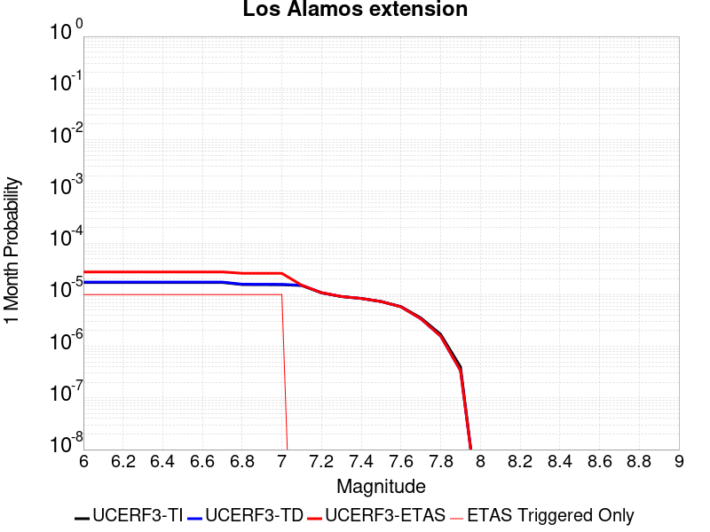 | 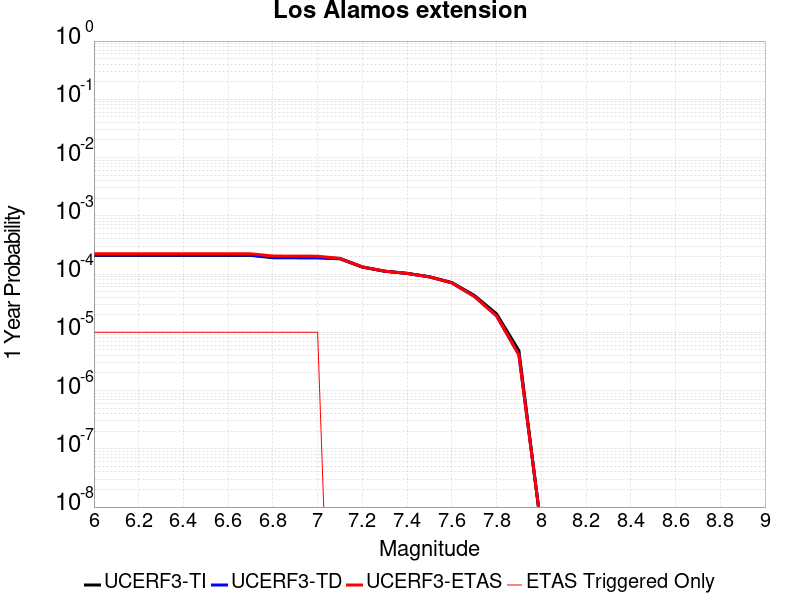 |  |

| Magnitude | 1 wk TI Prob | 1 wk TD Prob | 1 wk ETAS Prob | 1 wk ETAS/TD Gain | 1 wk ETAS Triggered Only | 1 mo TI Prob | 1 mo TD Prob | 1 mo ETAS Prob | 1 mo ETAS/TD Gain | 1 mo ETAS Triggered Only | 1 yr TI Prob | 1 yr TD Prob | 1 yr ETAS Prob | 1 yr ETAS/TD Gain | 1 yr ETAS Triggered Only | 10 yr TI Prob | 10 yr TD Prob | 10 yr ETAS Prob | 10 yr ETAS/TD Gain | 10 yr ETAS Triggered Only |
|-----|-----|-----|-----|-----|-----|-----|-----|-----|-----|-----|-----|-----|-----|-----|-----|-----|-----|-----|-----|-----|
| 6.0 | 4.0146506E-6 | 4.0861596E-6 | 2.0163265E-5 | 4.934527 | 1.607717E-5 | 1.7205533E-5 | 1.7512002E-5 | 3.358889E-5 | 1.9180498 | 1.607717E-5 | 2.0945723E-4 | 2.1318886E-4 | 2.292626E-4 | 1.0753968 | 1.607717E-5 | 0.0020925992 | 0.0021299527 | 0.0021620386 | 1.0150641 | 3.215434E-5 |
| 6.1 | 4.0146506E-6 | 4.0861596E-6 | 2.0163265E-5 | 4.934527 | 1.607717E-5 | 1.7205533E-5 | 1.7512002E-5 | 3.358889E-5 | 1.9180498 | 1.607717E-5 | 2.0945723E-4 | 2.1318886E-4 | 2.292626E-4 | 1.0753968 | 1.607717E-5 | 0.0020925992 | 0.0021299527 | 0.0021620386 | 1.0150641 | 3.215434E-5 |
| 6.2 | 4.0146506E-6 | 4.0861596E-6 | 2.0163265E-5 | 4.934527 | 1.607717E-5 | 1.7205533E-5 | 1.7512002E-5 | 3.358889E-5 | 1.9180498 | 1.607717E-5 | 2.0945723E-4 | 2.1318886E-4 | 2.292626E-4 | 1.0753968 | 1.607717E-5 | 0.0020925992 | 0.0021299527 | 0.0021620386 | 1.0150641 | 3.215434E-5 |
| 6.3 | 4.0146506E-6 | 4.0861596E-6 | 2.0163265E-5 | 4.934527 | 1.607717E-5 | 1.7205533E-5 | 1.7512002E-5 | 3.358889E-5 | 1.9180498 | 1.607717E-5 | 2.0945723E-4 | 2.1318886E-4 | 2.292626E-4 | 1.0753968 | 1.607717E-5 | 0.0020925992 | 0.0021299527 | 0.0021620386 | 1.0150641 | 3.215434E-5 |
| 6.4 | 4.0146506E-6 | 4.0861596E-6 | 2.0163265E-5 | 4.934527 | 1.607717E-5 | 1.7205533E-5 | 1.7512002E-5 | 3.358889E-5 | 1.9180498 | 1.607717E-5 | 2.0945723E-4 | 2.1318886E-4 | 2.292626E-4 | 1.0753968 | 1.607717E-5 | 0.0020925992 | 0.0021299527 | 0.0021620386 | 1.0150641 | 3.215434E-5 |
| 6.5 | 4.0146506E-6 | 4.0861596E-6 | 2.0163265E-5 | 4.934527 | 1.607717E-5 | 1.7205533E-5 | 1.7512002E-5 | 3.358889E-5 | 1.9180498 | 1.607717E-5 | 2.0945723E-4 | 2.1318886E-4 | 2.292626E-4 | 1.0753968 | 1.607717E-5 | 0.0020925992 | 0.0021299527 | 0.0021620386 | 1.0150641 | 3.215434E-5 |
| 6.6 | 4.0146506E-6 | 4.0861596E-6 | 2.0163265E-5 | 4.934527 | 1.607717E-5 | 1.7205533E-5 | 1.7512002E-5 | 3.358889E-5 | 1.9180498 | 1.607717E-5 | 2.0945723E-4 | 2.1318886E-4 | 2.292626E-4 | 1.0753968 | 1.607717E-5 | 0.0020925992 | 0.0021299527 | 0.0021620386 | 1.0150641 | 3.215434E-5 |
| 6.7 | 4.0146506E-6 | 4.0861596E-6 | 2.0163265E-5 | 4.934527 | 1.607717E-5 | 1.7205533E-5 | 1.7512002E-5 | 3.358889E-5 | 1.9180498 | 1.607717E-5 | 2.0945723E-4 | 2.1318886E-4 | 2.292626E-4 | 1.0753968 | 1.607717E-5 | 0.0020925992 | 0.0021299527 | 0.0021620386 | 1.0150641 | 3.215434E-5 |
| 6.8 | 3.6584688E-6 | 3.7188588E-6 | 1.9795969E-5 | 5.32313 | 1.607717E-5 | 1.5679057E-5 | 1.5937874E-5 | 3.201479E-5 | 2.0087237 | 1.607717E-5 | 1.9087581E-4 | 1.9402728E-4 | 2.1010134E-4 | 1.0828443 | 1.607717E-5 | 0.0019071194 | 0.0019386712 | 0.001970763 | 1.0165536 | 3.215434E-5 |
| 6.9 | 3.644631E-6 | 3.7045688E-6 | 1.9781679E-5 | 5.339806 | 1.607717E-5 | 1.5619753E-5 | 1.5876632E-5 | 3.1953547E-5 | 2.012615 | 1.607717E-5 | 1.901539E-4 | 1.9328178E-4 | 2.0935584E-4 | 1.0831639 | 1.607717E-5 | 0.0018999127 | 0.0019312293 | 0.0019633216 | 1.0166175 | 3.215434E-5 |
| 7.0 | 3.6318522E-6 | 3.6913295E-6 | 1.976844E-5 | 5.3553715 | 1.607717E-5 | 1.5564989E-5 | 1.5819893E-5 | 3.189681E-5 | 2.0162468 | 1.607717E-5 | 1.8948725E-4 | 1.925911E-4 | 2.0866518E-4 | 1.0834622 | 1.607717E-5 | 0.0018932576 | 0.0019243343 | 0.0019564268 | 1.0166771 | 3.215434E-5 |
| 7.1 | 3.5001724E-6 | 3.5554E-6 | 3.5554E-6 | 1.0 | 0.0 | 1.5000653E-5 | 1.5237345E-5 | 1.5237345E-5 | 1.0 | 0.0 | 1.8261763E-4 | 1.854998E-4 | 1.854998E-4 | 1.0 | 0.0 | 0.0018246764 | 0.0018535402 | 0.0018695876 | 1.0086577 | 1.607717E-5 |
| 7.2 | 2.5204702E-6 | 2.5436943E-6 | 2.5436943E-6 | 1.0 | 0.0 | 1.080197E-5 | 1.0901502E-5 | 1.0901502E-5 | 1.0 | 0.0 | 1.3150605E-4 | 1.3271775E-4 | 1.3271775E-4 | 1.0 | 0.0 | 0.0013142825 | 0.0013263905 | 0.0013263905 | 1.0 | 0.0 |
| 7.3 | 2.1399692E-6 | 2.1501316E-6 | 2.1501316E-6 | 1.0 | 0.0 | 9.1712645E-6 | 9.2148175E-6 | 9.2148175E-6 | 1.0 | 0.0 | 1.1165442E-4 | 1.1218466E-4 | 1.1218466E-4 | 1.0 | 0.0 | 0.0011159834 | 0.0011212835 | 0.0011212835 | 1.0 | 0.0 |
| 7.4 | 1.9660122E-6 | 1.9702363E-6 | 1.9702363E-6 | 1.0 | 0.0 | 8.42574E-6 | 8.4438425E-6 | 8.4438425E-6 | 1.0 | 0.0 | 1.0257855E-4 | 1.0279897E-4 | 1.0279897E-4 | 1.0 | 0.0 | 0.0010253121 | 0.0010275173 | 0.0010275173 | 1.0 | 0.0 |
| 7.5 | 1.7204633E-6 | 1.7150983E-6 | 1.7150983E-6 | 1.0 | 0.0 | 7.373393E-6 | 7.3504007E-6 | 7.3504007E-6 | 1.0 | 0.0 | 8.976737E-5 | 8.948748E-5 | 8.948748E-5 | 1.0 | 0.0 | 8.9731114E-4 | 8.9451746E-4 | 8.9451746E-4 | 1.0 | 0.0 |
| 7.6 | 1.3717638E-6 | 1.3535827E-6 | 1.3535827E-6 | 1.0 | 0.0 | 5.878974E-6 | 5.8010555E-6 | 5.8010555E-6 | 1.0 | 0.0 | 7.157416E-5 | 7.062559E-5 | 7.062559E-5 | 1.0 | 0.0 | 7.1551115E-4 | 7.060341E-4 | 7.060341E-4 | 1.0 | 0.0 |
| 7.7 | 8.272564E-7 | 7.957636E-7 | 7.957636E-7 | 1.0 | 0.0 | 3.5453797E-6 | 3.410411E-6 | 3.410411E-6 | 1.0 | 0.0 | 4.3164142E-5 | 4.1520965E-5 | 4.1520965E-5 | 1.0 | 0.0 | 4.315576E-4 | 4.1513226E-4 | 4.1513226E-4 | 1.0 | 0.0 |
| 7.8 | 3.9708277E-7 | 3.6719027E-7 | 3.6719027E-7 | 1.0 | 0.0 | 1.7017821E-6 | 1.5736716E-6 | 1.5736716E-6 | 1.0 | 0.0 | 2.0719E-5 | 1.9159284E-5 | 1.9159284E-5 | 1.0 | 0.0 | 2.071707E-4 | 1.9157639E-4 | 1.9157639E-4 | 1.0 | 0.0 |
| 7.9 | 9.292528E-8 | 7.889087E-8 | 7.889087E-8 | 1.0 | 0.0 | 3.9825116E-7 | 3.381037E-7 | 3.381037E-7 | 1.0 | 0.0 | 4.848697E-6 | 4.116405E-6 | 4.116405E-6 | 1.0 | 0.0 | 4.8485912E-5 | 4.1163294E-5 | 4.1163294E-5 | 1.0 | 0.0 |
| 8.0 | 7.880441E-11 | 8.2353124E-11 | 8.2353124E-11 | 1.0 | 0.0 | 3.3773329E-10 | 3.52942E-10 | 3.52942E-10 | 1.0 | 0.0 | 4.1119033E-9 | 4.2970694E-9 | 4.2970694E-9 | 1.0 | 0.0 | 4.1119034E-8 | 4.2970694E-8 | 4.2970694E-8 | 1.0 | 0.0 |

## Great Valley 09 (Laguna Seca)
*[(top)](#table-of-contents)*

| 1 Week | 1 Month | 1 Year | 10 Year |
|-----|-----|-----|-----|
| 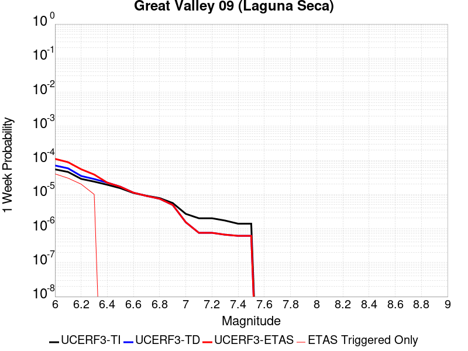 | 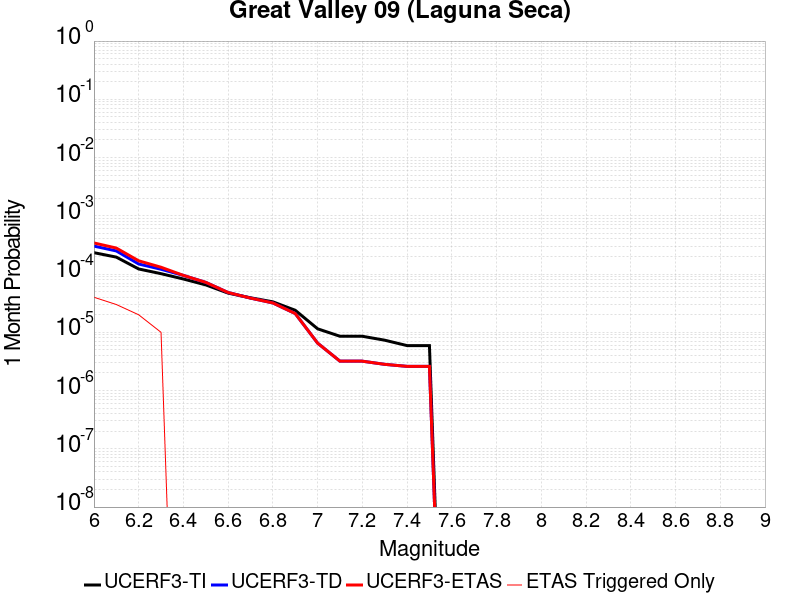 |  |  |

| Magnitude | 1 wk TI Prob | 1 wk TD Prob | 1 wk ETAS Prob | 1 wk ETAS/TD Gain | 1 wk ETAS Triggered Only | 1 mo TI Prob | 1 mo TD Prob | 1 mo ETAS Prob | 1 mo ETAS/TD Gain | 1 mo ETAS Triggered Only | 1 yr TI Prob | 1 yr TD Prob | 1 yr ETAS Prob | 1 yr ETAS/TD Gain | 1 yr ETAS Triggered Only | 10 yr TI Prob | 10 yr TD Prob | 10 yr ETAS Prob | 10 yr ETAS/TD Gain | 10 yr ETAS Triggered Only |
|-----|-----|-----|-----|-----|-----|-----|-----|-----|-----|-----|-----|-----|-----|-----|-----|-----|-----|-----|-----|-----|
| 6.0 | 5.4353277E-5 | 7.05022E-5 | 8.6578235E-5 | 1.2280217 | 1.607717E-5 | 2.3292181E-4 | 3.0211566E-4 | 3.18188E-4 | 1.0531992 | 1.607717E-5 | 0.0028321352 | 0.0036721937 | 0.003688212 | 1.004362 | 1.607717E-5 | 0.02796312 | 0.03611547 | 0.036146466 | 1.0008582 | 3.215434E-5 |
| 6.1 | 4.5578287E-5 | 5.822118E-5 | 7.4297415E-5 | 1.2761235 | 1.607717E-5 | 1.953209E-4 | 2.4949326E-4 | 2.6556643E-4 | 1.0644232 | 1.607717E-5 | 0.0023754383 | 0.003033432 | 0.0030494605 | 1.005284 | 1.607717E-5 | 0.023502063 | 0.029919548 | 0.029935144 | 1.0005213 | 1.607717E-5 |
| 6.2 | 2.8536782E-5 | 3.4737273E-5 | 5.0813887E-5 | 1.4628057 | 1.607717E-5 | 1.2229476E-4 | 1.4886224E-4 | 1.6493701E-4 | 1.1079843 | 1.607717E-5 | 0.0014879217 | 0.001810813 | 0.0018268611 | 1.0088624 | 1.607717E-5 | 0.014779986 | 0.017958116 | 0.017973905 | 1.0008792 | 1.607717E-5 |
| 6.3 | 2.3698774E-5 | 2.8213295E-5 | 4.4290013E-5 | 1.5698277 | 1.607717E-5 | 1.01562226E-4 | 1.20905075E-4 | 1.369803E-4 | 1.1329575 | 1.607717E-5 | 0.0012358186 | 0.0014710218 | 0.0014870754 | 1.0109131 | 1.607717E-5 | 0.012289686 | 0.014611342 | 0.014627184 | 1.0010842 | 1.607717E-5 |
| 6.4 | 1.9191197E-5 | 2.2123184E-5 | 2.2123184E-5 | 1.0 | 0.0 | 8.2245395E-5 | 9.4806666E-5 | 9.4806666E-5 | 1.0 | 0.0 | 0.0010008777 | 0.0011536429 | 0.0011536429 | 1.0 | 0.0 | 0.009963818 | 0.011476948 | 0.011476948 | 1.0 | 0.0 |
| 6.5 | 1.5203241E-5 | 1.6802203E-5 | 1.6802203E-5 | 1.0 | 0.0 | 6.5155116E-5 | 7.200386E-5 | 7.200386E-5 | 1.0 | 0.0 | 7.9297484E-4 | 8.7626575E-4 | 8.7626575E-4 | 1.0 | 0.0 | 0.007901512 | 0.0087295165 | 0.0087295165 | 1.0 | 0.0 |
| 6.6 | 1.0984925E-5 | 1.1242595E-5 | 1.1242595E-5 | 1.0 | 0.0 | 4.70774E-5 | 4.8181686E-5 | 4.8181686E-5 | 1.0 | 0.0 | 5.730166E-4 | 5.8645656E-4 | 5.8645656E-4 | 1.0 | 0.0 | 0.005715413 | 0.0058494853 | 0.0058494853 | 1.0 | 0.0 |
| 6.7 | 9.134616E-6 | 9.019894E-6 | 9.019894E-6 | 1.0 | 0.0 | 3.9147766E-5 | 3.865613E-5 | 3.865613E-5 | 1.0 | 0.0 | 4.7651984E-4 | 4.7053912E-4 | 4.7053912E-4 | 1.0 | 0.0 | 0.004754993 | 0.0046956735 | 0.0046956735 | 1.0 | 0.0 |
| 6.8 | 7.785589E-6 | 7.4519444E-6 | 7.4519444E-6 | 1.0 | 0.0 | 3.3366385E-5 | 3.1936524E-5 | 3.1936524E-5 | 1.0 | 0.0 | 4.0616E-4 | 3.8875983E-4 | 3.8875983E-4 | 1.0 | 0.0 | 0.0040541845 | 0.0038810016 | 0.0038810016 | 1.0 | 0.0 |
| 6.9 | 5.579095E-6 | 4.898492E-6 | 4.898492E-6 | 1.0 | 0.0 | 2.3910188E-5 | 2.0993377E-5 | 2.0993377E-5 | 1.0 | 0.0 | 2.9106764E-4 | 2.5556577E-4 | 2.5556577E-4 | 1.0 | 0.0 | 0.002906867 | 0.002552856 | 0.002552856 | 1.0 | 0.0 |
| 7.0 | 2.6816688E-6 | 1.5216126E-6 | 1.5216126E-6 | 1.0 | 0.0 | 1.1492816E-5 | 6.521181E-6 | 6.521181E-6 | 1.0 | 0.0 | 1.3991605E-4 | 7.939258E-5 | 7.939258E-5 | 1.0 | 0.0 | 0.0013982799 | 7.9365086E-4 | 7.9365086E-4 | 1.0 | 0.0 |
| 7.1 | 1.9951021E-6 | 7.453827E-7 | 7.453827E-7 | 1.0 | 0.0 | 8.55041E-6 | 3.1944935E-6 | 3.1944935E-6 | 1.0 | 0.0 | 1.0409627E-4 | 3.8892307E-5 | 3.8892307E-5 | 1.0 | 0.0 | 0.0010404752 | 3.8885913E-4 | 3.8885913E-4 | 1.0 | 0.0 |
| 7.2 | 1.9951021E-6 | 7.453827E-7 | 7.453827E-7 | 1.0 | 0.0 | 8.55041E-6 | 3.1944935E-6 | 3.1944935E-6 | 1.0 | 0.0 | 1.0409627E-4 | 3.8892307E-5 | 3.8892307E-5 | 1.0 | 0.0 | 0.0010404752 | 3.8885913E-4 | 3.8885913E-4 | 1.0 | 0.0 |
| 7.3 | 1.7087556E-6 | 6.578881E-7 | 6.578881E-7 | 1.0 | 0.0 | 7.3232177E-6 | 2.8195177E-6 | 2.8195177E-6 | 1.0 | 0.0 | 8.915652E-5 | 3.4327128E-5 | 3.4327128E-5 | 1.0 | 0.0 | 8.9120766E-4 | 3.432223E-4 | 3.432223E-4 | 1.0 | 0.0 |
| 7.4 | 1.3804846E-6 | 6.073852E-7 | 6.073852E-7 | 1.0 | 0.0 | 5.916349E-6 | 2.6030768E-6 | 2.6030768E-6 | 1.0 | 0.0 | 7.2029165E-5 | 3.169204E-5 | 3.169204E-5 | 1.0 | 0.0 | 7.200583E-4 | 3.1687922E-4 | 3.1687922E-4 | 1.0 | 0.0 |
| 7.5 | 1.3804846E-6 | 6.073852E-7 | 6.073852E-7 | 1.0 | 0.0 | 5.916349E-6 | 2.6030768E-6 | 2.6030768E-6 | 1.0 | 0.0 | 7.2029165E-5 | 3.169204E-5 | 3.169204E-5 | 1.0 | 0.0 | 7.200583E-4 | 3.1687922E-4 | 3.1687922E-4 | 1.0 | 0.0 |

## Greenville (So) 2011 CFM
*[(top)](#table-of-contents)*

| 1 Week | 1 Month | 1 Year | 10 Year |
|-----|-----|-----|-----|
| 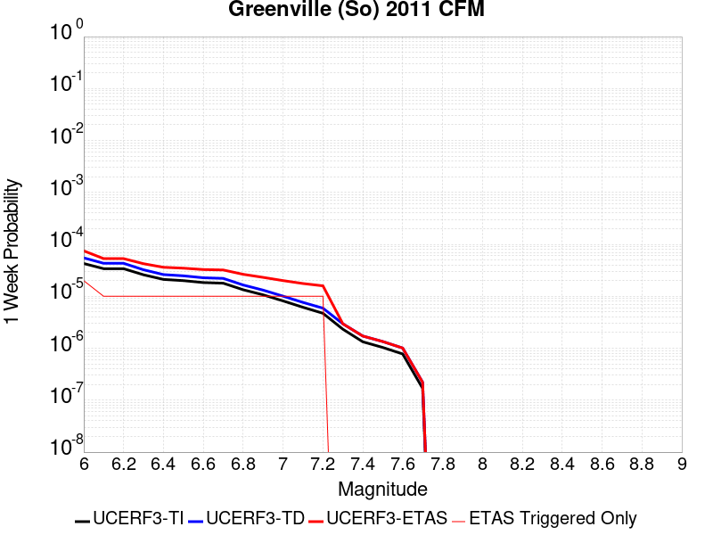 |  |  |  |

| Magnitude | 1 wk TI Prob | 1 wk TD Prob | 1 wk ETAS Prob | 1 wk ETAS/TD Gain | 1 wk ETAS Triggered Only | 1 mo TI Prob | 1 mo TD Prob | 1 mo ETAS Prob | 1 mo ETAS/TD Gain | 1 mo ETAS Triggered Only | 1 yr TI Prob | 1 yr TD Prob | 1 yr ETAS Prob | 1 yr ETAS/TD Gain | 1 yr ETAS Triggered Only | 10 yr TI Prob | 10 yr TD Prob | 10 yr ETAS Prob | 10 yr ETAS/TD Gain | 10 yr ETAS Triggered Only |
|-----|-----|-----|-----|-----|-----|-----|-----|-----|-----|-----|-----|-----|-----|-----|-----|-----|-----|-----|-----|-----|
| 6.0 | 4.279693E-5 | 5.5040087E-5 | 5.5040087E-5 | 1.0 | 0.0 | 1.8340252E-4 | 2.3586681E-4 | 2.3586681E-4 | 1.0 | 0.0 | 0.0022306389 | 0.0028682416 | 0.0029003038 | 1.0111784 | 3.215434E-5 | 0.022083808 | 0.028338138 | 0.02836938 | 1.0011026 | 3.215434E-5 |
| 6.1 | 3.4037297E-5 | 4.3192387E-5 | 4.3192387E-5 | 1.0 | 0.0 | 1.4586597E-4 | 1.8509831E-4 | 1.8509831E-4 | 1.0 | 0.0 | 0.0017744715 | 0.0022514379 | 0.0022835198 | 1.0142496 | 3.215434E-5 | 0.01760369 | 0.022302566 | 0.022334004 | 1.0014095 | 3.215434E-5 |
| 6.2 | 3.4037297E-5 | 4.3192387E-5 | 4.3192387E-5 | 1.0 | 0.0 | 1.4586597E-4 | 1.8509831E-4 | 1.8509831E-4 | 1.0 | 0.0 | 0.0017744715 | 0.0022514379 | 0.0022835198 | 1.0142496 | 3.215434E-5 | 0.01760369 | 0.022302566 | 0.022334004 | 1.0014095 | 3.215434E-5 |
| 6.3 | 2.5956324E-5 | 3.2428903E-5 | 3.2428903E-5 | 1.0 | 0.0 | 1.11236644E-4 | 1.3897405E-4 | 1.3897405E-4 | 1.0 | 0.0 | 0.0013534647 | 0.0016907708 | 0.0017228709 | 1.0189854 | 3.215434E-5 | 0.013452509 | 0.016785882 | 0.016817497 | 1.0018834 | 3.215434E-5 |
| 6.4 | 2.1145053E-5 | 2.6197677E-5 | 2.6197677E-5 | 1.0 | 0.0 | 9.061851E-5 | 1.1227112E-4 | 1.1227112E-4 | 1.0 | 0.0 | 0.0011027219 | 0.0013660751 | 0.0013981856 | 1.0235056 | 3.215434E-5 | 0.01097266 | 0.01358018 | 0.013611898 | 1.0023355 | 3.215434E-5 |
| 6.5 | 2.0030959E-5 | 2.479578E-5 | 2.479578E-5 | 1.0 | 0.0 | 8.584414E-5 | 1.06263484E-4 | 1.06263484E-4 | 1.0 | 0.0 | 0.0010446513 | 0.0012930221 | 0.0013251349 | 1.0248355 | 3.215434E-5 | 0.010397541 | 0.012858339 | 0.012890079 | 1.0024685 | 3.215434E-5 |
| 6.6 | 1.8395405E-5 | 2.2754466E-5 | 2.2754466E-5 | 1.0 | 0.0 | 7.8835066E-5 | 9.751565E-5 | 9.751565E-5 | 1.0 | 0.0 | 9.5939427E-4 | 0.0011866348 | 0.001218751 | 1.0270649 | 3.215434E-5 | 0.009552629 | 0.011806041 | 0.011837816 | 1.0026914 | 3.215434E-5 |
| 6.7 | 1.7883482E-5 | 2.212551E-5 | 2.212551E-5 | 1.0 | 0.0 | 7.664124E-5 | 9.482033E-5 | 9.482033E-5 | 1.0 | 0.0 | 9.3270757E-4 | 0.0011538545 | 0.0011859718 | 1.0278348 | 3.215434E-5 | 0.009288026 | 0.011481688 | 0.0115134735 | 1.0027683 | 3.215434E-5 |
| 6.8 | 1.3373564E-5 | 1.6505966E-5 | 1.6505966E-5 | 1.0 | 0.0 | 5.7314013E-5 | 7.073802E-5 | 7.073802E-5 | 1.0 | 0.0 | 6.975747E-4 | 8.609098E-4 | 8.930365E-4 | 1.0373172 | 3.215434E-5 | 0.0069538904 | 0.008577357 | 0.008609235 | 1.0037166 | 3.215434E-5 |
| 6.9 | 1.06692905E-5 | 1.3152582E-5 | 1.3152582E-5 | 1.0 | 0.0 | 4.5724726E-5 | 5.6367055E-5 | 5.6367055E-5 | 1.0 | 0.0 | 5.5655633E-4 | 6.86064E-4 | 7.0213014E-4 | 1.0234178 | 1.607717E-5 | 0.005551645 | 0.006840693 | 0.0068566604 | 1.0023341 | 1.607717E-5 |
| 7.0 | 8.157512E-6 | 1.0062639E-5 | 1.0062639E-5 | 1.0 | 0.0 | 3.4960296E-5 | 4.3124903E-5 | 4.3124903E-5 | 1.0 | 0.0 | 4.2555845E-4 | 5.2492286E-4 | 5.409916E-4 | 1.0306116 | 1.607717E-5 | 0.004247444 | 0.0052373074 | 0.0052533 | 1.0030537 | 1.607717E-5 |
| 7.1 | 6.1467113E-6 | 7.6274314E-6 | 7.6274314E-6 | 1.0 | 0.0 | 2.6342783E-5 | 3.268859E-5 | 3.268859E-5 | 1.0 | 0.0 | 3.206762E-4 | 3.9791173E-4 | 4.139825E-4 | 1.0403877 | 1.607717E-5 | 0.0032021382 | 0.0039721807 | 0.003988194 | 1.0040314 | 1.607717E-5 |
| 7.2 | 4.713467E-6 | 5.9141557E-6 | 5.9141557E-6 | 1.0 | 0.0 | 2.0200418E-5 | 2.5346139E-5 | 2.5346139E-5 | 1.0 | 0.0 | 2.4591232E-4 | 3.0854615E-4 | 3.0854615E-4 | 1.0 | 0.0 | 0.0024564038 | 0.0030813308 | 0.0030813308 | 1.0 | 0.0 |
| 7.3 | 2.3266216E-6 | 2.954009E-6 | 2.954009E-6 | 1.0 | 0.0 | 9.971197E-6 | 1.2659978E-5 | 1.2659978E-5 | 1.0 | 0.0 | 1.2139256E-4 | 1.5412449E-4 | 1.5412449E-4 | 1.0 | 0.0 | 0.0012132627 | 0.0015402455 | 0.0015402455 | 1.0 | 0.0 |
| 7.4 | 1.3314E-6 | 1.7179472E-6 | 1.7179472E-6 | 1.0 | 0.0 | 5.7059874E-6 | 7.36261E-6 | 7.36261E-6 | 1.0 | 0.0 | 6.946818E-5 | 8.963614E-5 | 8.963614E-5 | 1.0 | 0.0 | 6.9446466E-4 | 8.9603866E-4 | 8.9603866E-4 | 1.0 | 0.0 |
| 7.5 | 1.0362941E-6 | 1.3468821E-6 | 1.3468821E-6 | 1.0 | 0.0 | 4.4412527E-6 | 5.772339E-6 | 5.772339E-6 | 1.0 | 0.0 | 5.407091E-5 | 7.027601E-5 | 7.027601E-5 | 1.0 | 0.0 | 5.405776E-4 | 7.025681E-4 | 7.025681E-4 | 1.0 | 0.0 |
| 7.6 | 7.764784E-7 | 1.0088593E-6 | 1.0088593E-6 | 1.0 | 0.0 | 3.3277602E-6 | 4.323676E-6 | 4.323676E-6 | 1.0 | 0.0 | 4.0514726E-5 | 5.263952E-5 | 5.263952E-5 | 1.0 | 0.0 | 4.050734E-4 | 5.262919E-4 | 5.262919E-4 | 1.0 | 0.0 |
| 7.7 | 1.6927763E-7 | 2.2139248E-7 | 2.2139248E-7 | 1.0 | 0.0 | 7.2547533E-7 | 9.4882455E-7 | 9.4882455E-7 | 1.0 | 0.0 | 8.832627E-6 | 1.15518815E-5 | 1.15518815E-5 | 1.0 | 0.0 | 8.8322755E-5 | 1.15515526E-4 | 1.15515526E-4 | 1.0 | 0.0 |

## Elsinore (Temecula) rev
*[(top)](#table-of-contents)*

| 1 Week | 1 Month | 1 Year | 10 Year |
|-----|-----|-----|-----|
|  |  |  | 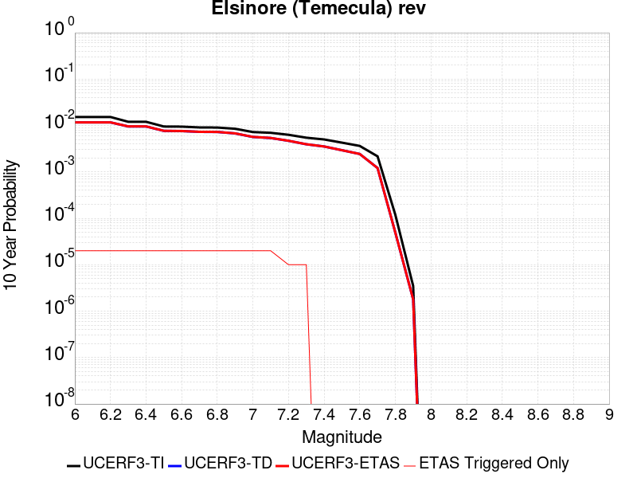 |

| Magnitude | 1 wk TI Prob | 1 wk TD Prob | 1 wk ETAS Prob | 1 wk ETAS/TD Gain | 1 wk ETAS Triggered Only | 1 mo TI Prob | 1 mo TD Prob | 1 mo ETAS Prob | 1 mo ETAS/TD Gain | 1 mo ETAS Triggered Only | 1 yr TI Prob | 1 yr TD Prob | 1 yr ETAS Prob | 1 yr ETAS/TD Gain | 1 yr ETAS Triggered Only | 10 yr TI Prob | 10 yr TD Prob | 10 yr ETAS Prob | 10 yr ETAS/TD Gain | 10 yr ETAS Triggered Only |
|-----|-----|-----|-----|-----|-----|-----|-----|-----|-----|-----|-----|-----|-----|-----|-----|-----|-----|-----|-----|-----|
| 6.0 | 2.9514995E-5 | 2.2517117E-5 | 3.8593924E-5 | 1.7139816 | 1.607717E-5 | 1.264867E-4 | 9.649849E-5 | 1.12574104E-4 | 1.1665894 | 1.607717E-5 | 0.0015388876 | 0.0011742581 | 0.0011903163 | 1.0136752 | 1.607717E-5 | 0.015282745 | 0.011696897 | 0.011728676 | 1.0027168 | 3.215434E-5 |
| 6.1 | 2.9514995E-5 | 2.2517117E-5 | 3.8593924E-5 | 1.7139816 | 1.607717E-5 | 1.264867E-4 | 9.649849E-5 | 1.12574104E-4 | 1.1665894 | 1.607717E-5 | 0.0015388876 | 0.0011742581 | 0.0011903163 | 1.0136752 | 1.607717E-5 | 0.015282745 | 0.011696897 | 0.011728676 | 1.0027168 | 3.215434E-5 |
| 6.2 | 2.9514995E-5 | 2.2517117E-5 | 3.8593924E-5 | 1.7139816 | 1.607717E-5 | 1.264867E-4 | 9.649849E-5 | 1.12574104E-4 | 1.1665894 | 1.607717E-5 | 0.0015388876 | 0.0011742581 | 0.0011903163 | 1.0136752 | 1.607717E-5 | 0.015282745 | 0.011696897 | 0.011728676 | 1.0027168 | 3.215434E-5 |
| 6.3 | 2.3223649E-5 | 1.8406454E-5 | 3.4483328E-5 | 1.8734368 | 1.607717E-5 | 9.952613E-5 | 7.888251E-5 | 9.495842E-5 | 1.2037956 | 1.607717E-5 | 0.001211057 | 9.599888E-4 | 9.760505E-4 | 1.0167311 | 1.607717E-5 | 0.012044783 | 0.009569948 | 0.009601794 | 1.0033277 | 3.215434E-5 |
| 6.4 | 2.3223649E-5 | 1.8406454E-5 | 3.4483328E-5 | 1.8734368 | 1.607717E-5 | 9.952613E-5 | 7.888251E-5 | 9.495842E-5 | 1.2037956 | 1.607717E-5 | 0.001211057 | 9.599888E-4 | 9.760505E-4 | 1.0167311 | 1.607717E-5 | 0.012044783 | 0.009569948 | 0.009601794 | 1.0033277 | 3.215434E-5 |
| 6.5 | 1.8338875E-5 | 1.4750118E-5 | 3.082705E-5 | 2.089953 | 1.607717E-5 | 7.8592806E-5 | 6.321331E-5 | 7.9289464E-5 | 1.254316 | 1.607717E-5 | 9.5644733E-4 | 7.69359E-4 | 7.854238E-4 | 1.0208808 | 1.607717E-5 | 0.009523412 | 0.0076739118 | 0.0077058193 | 1.0041579 | 3.215434E-5 |
| 6.6 | 1.8223333E-5 | 1.4612673E-5 | 3.0689607E-5 | 2.100205 | 1.607717E-5 | 7.809766E-5 | 6.262429E-5 | 7.8700454E-5 | 1.2567081 | 1.607717E-5 | 9.504242E-4 | 7.6219277E-4 | 7.782577E-4 | 1.0210773 | 1.607717E-5 | 0.009463696 | 0.0076027405 | 0.0076346505 | 1.0041971 | 3.215434E-5 |
| 6.7 | 1.7512752E-5 | 1.402721E-5 | 3.0104155E-5 | 2.1461256 | 1.607717E-5 | 7.505249E-5 | 6.011528E-5 | 7.6191485E-5 | 1.2674229 | 1.607717E-5 | 9.13381E-4 | 7.3166634E-4 | 7.477317E-4 | 1.0219573 | 1.607717E-5 | 0.00909636 | 0.00729892 | 0.0073308395 | 1.0043732 | 3.215434E-5 |
| 6.8 | 1.7417142E-5 | 1.3951195E-5 | 3.002814E-5 | 2.1523705 | 1.607717E-5 | 7.4642754E-5 | 5.9789512E-5 | 7.586572E-5 | 1.2688801 | 1.607717E-5 | 9.083966E-4 | 7.277028E-4 | 7.4376824E-4 | 1.022077 | 1.607717E-5 | 0.009046922 | 0.0072594886 | 0.0072914097 | 1.0043972 | 3.215434E-5 |
| 6.9 | 1.6402591E-5 | 1.2988613E-5 | 2.9065575E-5 | 2.2377734 | 1.607717E-5 | 7.0294926E-5 | 5.5664343E-5 | 7.1740615E-5 | 1.2888074 | 1.607717E-5 | 8.5550465E-4 | 6.775103E-4 | 6.935766E-4 | 1.0237137 | 1.607717E-5 | 0.008522186 | 0.006760169 | 0.0067921057 | 1.0047243 | 3.215434E-5 |
| 7.0 | 1.3912486E-5 | 1.0878233E-5 | 2.695523E-5 | 2.477905 | 1.607717E-5 | 5.9623577E-5 | 4.6620182E-5 | 6.269661E-5 | 1.3448383 | 1.607717E-5 | 7.2567526E-4 | 5.674556E-4 | 5.8352365E-4 | 1.0283159 | 1.607717E-5 | 0.0072331014 | 0.005663986 | 0.005695958 | 1.0056448 | 3.215434E-5 |
| 7.1 | 1.3405147E-5 | 1.03274215E-5 | 2.6404425E-5 | 2.5567298 | 1.607717E-5 | 5.7449364E-5 | 4.425964E-5 | 6.0336097E-5 | 1.3632307 | 1.607717E-5 | 6.9922156E-4 | 5.3873047E-4 | 5.547989E-4 | 1.0298266 | 1.607717E-5 | 0.0069702556 | 0.005377577 | 0.0054095583 | 1.0059472 | 3.215434E-5 |
| 7.2 | 1.21402E-5 | 8.996737E-6 | 8.996737E-6 | 1.0 | 0.0 | 5.202839E-5 | 3.8556886E-5 | 3.8556886E-5 | 1.0 | 0.0 | 6.332616E-4 | 4.6933076E-4 | 4.6933076E-4 | 1.0 | 0.0 | 0.0063146 | 0.004684821 | 0.0047008228 | 1.0034157 | 1.607717E-5 |
| 7.3 | 1.05047775E-5 | 7.571771E-6 | 7.571771E-6 | 1.0 | 0.0 | 4.5019697E-5 | 3.245005E-5 | 3.245005E-5 | 1.0 | 0.0 | 5.4797693E-4 | 3.950092E-4 | 3.950092E-4 | 1.0 | 0.0 | 0.005466277 | 0.00394346 | 0.003959474 | 1.0040609 | 1.607717E-5 |
| 7.4 | 9.624483E-6 | 6.7868696E-6 | 6.7868696E-6 | 1.0 | 0.0 | 4.124713E-5 | 2.9086266E-5 | 2.9086266E-5 | 1.0 | 0.0 | 5.0206814E-4 | 3.5406914E-4 | 3.5406914E-4 | 1.0 | 0.0 | 0.005009353 | 0.003535204 | 0.003535204 | 1.0 | 0.0 |
| 7.5 | 8.215151E-6 | 5.635538E-6 | 5.635538E-6 | 1.0 | 0.0 | 3.5207315E-5 | 2.4152088E-5 | 2.4152088E-5 | 1.0 | 0.0 | 4.2856473E-4 | 2.9401327E-4 | 2.9401327E-4 | 1.0 | 0.0 | 0.004277392 | 0.002936371 | 0.002936371 | 1.0 | 0.0 |
| 7.6 | 6.975058E-6 | 4.676045E-6 | 4.676045E-6 | 1.0 | 0.0 | 2.9892764E-5 | 2.0040046E-5 | 2.0040046E-5 | 1.0 | 0.0 | 3.6388362E-4 | 2.439614E-4 | 2.439614E-4 | 1.0 | 0.0 | 0.0036328835 | 0.002437052 | 0.002437052 | 1.0 | 0.0 |
| 7.7 | 4.159604E-6 | 2.3269924E-6 | 2.3269924E-6 | 1.0 | 0.0 | 1.7826753E-5 | 9.97279E-6 | 9.97279E-6 | 1.0 | 0.0 | 2.1701909E-4 | 1.21412704E-4 | 1.21412704E-4 | 1.0 | 0.0 | 0.0021680726 | 0.0012135367 | 0.0012135367 | 1.0 | 0.0 |
| 7.8 | 2.2692414E-7 | 9.3854695E-8 | 9.3854695E-8 | 1.0 | 0.0 | 9.725317E-7 | 4.0223435E-7 | 4.0223435E-7 | 1.0 | 0.0 | 1.1840509E-5 | 4.8971956E-6 | 4.8971956E-6 | 1.0 | 0.0 | 1.1839878E-4 | 4.8971204E-5 | 4.8971204E-5 | 1.0 | 0.0 |
| 7.9 | 6.676829E-9 | 3.439853E-9 | 3.439853E-9 | 1.0 | 0.0 | 2.861498E-8 | 1.4742227E-8 | 1.4742227E-8 | 1.0 | 0.0 | 3.4838732E-7 | 1.7948659E-7 | 1.7948659E-7 | 1.0 | 0.0 | 3.4838679E-6 | 1.7948646E-6 | 1.7948646E-6 | 1.0 | 0.0 |

## Monterey Bay-Tularcitos
*[(top)](#table-of-contents)*

| 1 Week | 1 Month | 1 Year | 10 Year |
|-----|-----|-----|-----|
|  |  |  |  |

| Magnitude | 1 wk TI Prob | 1 wk TD Prob | 1 wk ETAS Prob | 1 wk ETAS/TD Gain | 1 wk ETAS Triggered Only | 1 mo TI Prob | 1 mo TD Prob | 1 mo ETAS Prob | 1 mo ETAS/TD Gain | 1 mo ETAS Triggered Only | 1 yr TI Prob | 1 yr TD Prob | 1 yr ETAS Prob | 1 yr ETAS/TD Gain | 1 yr ETAS Triggered Only | 10 yr TI Prob | 10 yr TD Prob | 10 yr ETAS Prob | 10 yr ETAS/TD Gain | 10 yr ETAS Triggered Only |
|-----|-----|-----|-----|-----|-----|-----|-----|-----|-----|-----|-----|-----|-----|-----|-----|-----|-----|-----|-----|-----|
| 6.0 | 3.0131365E-5 | 3.279877E-5 | 4.8875412E-5 | 1.4901599 | 1.607717E-5 | 1.2912804E-4 | 1.4055918E-4 | 1.566341E-4 | 1.114364 | 1.607717E-5 | 0.001571 | 0.0017100703 | 0.0017261199 | 1.0093853 | 1.607717E-5 | 0.015599402 | 0.016979916 | 0.017011525 | 1.0018616 | 3.215434E-5 |
| 6.1 | 3.0131365E-5 | 3.279877E-5 | 4.8875412E-5 | 1.4901599 | 1.607717E-5 | 1.2912804E-4 | 1.4055918E-4 | 1.566341E-4 | 1.114364 | 1.607717E-5 | 0.001571 | 0.0017100703 | 0.0017261199 | 1.0093853 | 1.607717E-5 | 0.015599402 | 0.016979916 | 0.017011525 | 1.0018616 | 3.215434E-5 |
| 6.2 | 3.0131365E-5 | 3.279877E-5 | 4.8875412E-5 | 1.4901599 | 1.607717E-5 | 1.2912804E-4 | 1.4055918E-4 | 1.566341E-4 | 1.114364 | 1.607717E-5 | 0.001571 | 0.0017100703 | 0.0017261199 | 1.0093853 | 1.607717E-5 | 0.015599402 | 0.016979916 | 0.017011525 | 1.0018616 | 3.215434E-5 |
| 6.3 | 1.6998249E-5 | 1.8330798E-5 | 1.8330798E-5 | 1.0 | 0.0 | 7.28476E-5 | 7.85583E-5 | 7.85583E-5 | 1.0 | 0.0 | 8.865586E-4 | 9.5604634E-4 | 9.5604634E-4 | 1.0 | 0.0 | 0.0088303005 | 0.009521258 | 0.009521258 | 1.0 | 0.0 |
| 6.4 | 1.6998249E-5 | 1.8330798E-5 | 1.8330798E-5 | 1.0 | 0.0 | 7.28476E-5 | 7.85583E-5 | 7.85583E-5 | 1.0 | 0.0 | 8.865586E-4 | 9.5604634E-4 | 9.5604634E-4 | 1.0 | 0.0 | 0.0088303005 | 0.009521258 | 0.009521258 | 1.0 | 0.0 |
| 6.5 | 1.27470785E-5 | 1.3693312E-5 | 1.3693312E-5 | 1.0 | 0.0 | 5.4629192E-5 | 5.8684363E-5 | 5.8684363E-5 | 1.0 | 0.0 | 6.649074E-4 | 7.1425823E-4 | 7.1425823E-4 | 1.0 | 0.0 | 0.0066292146 | 0.007120678 | 0.007120678 | 1.0 | 0.0 |
| 6.6 | 1.2739422E-5 | 1.36854E-5 | 1.36854E-5 | 1.0 | 0.0 | 5.4596385E-5 | 5.8650454E-5 | 5.8650454E-5 | 1.0 | 0.0 | 6.645082E-4 | 7.1384566E-4 | 7.1384566E-4 | 1.0 | 0.0 | 0.0066252467 | 0.007116579 | 0.007116579 | 1.0 | 0.0 |
| 6.7 | 1.0160109E-5 | 1.0885755E-5 | 1.0885755E-5 | 1.0 | 0.0 | 4.35426E-5 | 4.665244E-5 | 4.665244E-5 | 1.0 | 0.0 | 5.300022E-4 | 5.6785246E-4 | 5.6785246E-4 | 1.0 | 0.0 | 0.005287399 | 0.0056647263 | 0.0056647263 | 1.0 | 0.0 |
| 6.8 | 8.349859E-6 | 8.932587E-6 | 8.932587E-6 | 1.0 | 0.0 | 3.578462E-5 | 3.8281985E-5 | 3.8281985E-5 | 1.0 | 0.0 | 4.3559066E-4 | 4.6598914E-4 | 4.6598914E-4 | 1.0 | 0.0 | 0.004347378 | 0.004650685 | 0.004650685 | 1.0 | 0.0 |
| 6.9 | 5.193639E-6 | 5.53643E-6 | 5.53643E-6 | 1.0 | 0.0 | 2.2258262E-5 | 2.372736E-5 | 2.372736E-5 | 1.0 | 0.0 | 2.7096065E-4 | 2.8884556E-4 | 2.8884556E-4 | 1.0 | 0.0 | 0.0027063051 | 0.0028850222 | 0.0028850222 | 1.0 | 0.0 |
| 7.0 | 4.359381E-6 | 4.643366E-6 | 4.643366E-6 | 1.0 | 0.0 | 1.8682927E-5 | 1.9900004E-5 | 1.9900004E-5 | 1.0 | 0.0 | 2.274409E-4 | 2.422586E-4 | 2.422586E-4 | 1.0 | 0.0 | 0.0022720827 | 0.002420238 | 0.002420238 | 1.0 | 0.0 |
| 7.1 | 3.0398533E-6 | 3.2310427E-6 | 3.2310427E-6 | 1.0 | 0.0 | 1.3027877E-5 | 1.3847267E-5 | 1.3847267E-5 | 1.0 | 0.0 | 1.5860285E-4 | 1.6858005E-4 | 1.6858005E-4 | 1.0 | 0.0 | 0.001584897 | 0.0016847793 | 0.0016847793 | 1.0 | 0.0 |
| 7.2 | 1.642335E-6 | 1.7333153E-6 | 1.7333153E-6 | 1.0 | 0.0 | 7.0385595E-6 | 7.428485E-6 | 7.428485E-6 | 1.0 | 0.0 | 8.569109E-5 | 9.044012E-5 | 9.044012E-5 | 1.0 | 0.0 | 8.5658056E-4 | 9.042358E-4 | 9.042358E-4 | 1.0 | 0.0 |
| 7.3 | 3.356842E-7 | 3.2952389E-7 | 3.2952389E-7 | 1.0 | 0.0 | 1.4386458E-6 | 1.4122444E-6 | 1.4122444E-6 | 1.0 | 0.0 | 1.7515373E-5 | 1.7193941E-5 | 1.7193941E-5 | 1.0 | 0.0 | 1.7513991E-4 | 1.719262E-4 | 1.719262E-4 | 1.0 | 0.0 |
| 7.4 | 2.1973483E-7 | 2.1006413E-7 | 2.1006413E-7 | 1.0 | 0.0 | 9.417204E-7 | 9.0027453E-7 | 9.0027453E-7 | 1.0 | 0.0 | 1.1465385E-5 | 1.0960787E-5 | 1.0960787E-5 | 1.0 | 0.0 | 1.1464794E-4 | 1.096025E-4 | 1.096025E-4 | 1.0 | 0.0 |
| 7.5 | 1.1944135E-7 | 1.0696043E-7 | 1.0696043E-7 | 1.0 | 0.0 | 5.118914E-7 | 4.5840173E-7 | 4.5840173E-7 | 1.0 | 0.0 | 6.23226E-6 | 5.581027E-6 | 5.581027E-6 | 1.0 | 0.0 | 6.2320854E-5 | 5.5808883E-5 | 5.5808883E-5 | 1.0 | 0.0 |
| 7.6 | 4.636058E-8 | 3.336489E-8 | 3.336489E-8 | 1.0 | 0.0 | 1.9868818E-7 | 1.4299238E-7 | 1.4299238E-7 | 1.0 | 0.0 | 2.419026E-6 | 1.7409308E-6 | 1.7409308E-6 | 1.0 | 0.0 | 2.4189996E-5 | 1.7409173E-5 | 1.7409173E-5 | 1.0 | 0.0 |
| 7.7 | 1.8588572E-8 | 8.003744E-9 | 8.003744E-9 | 1.0 | 0.0 | 7.9665305E-8 | 3.430176E-8 | 3.430176E-8 | 1.0 | 0.0 | 9.699246E-7 | 4.1762385E-7 | 4.1762385E-7 | 1.0 | 0.0 | 9.699204E-6 | 4.176231E-6 | 4.176231E-6 | 1.0 | 0.0 |
| 7.8 | 2.7960154E-9 | 7.6099427E-10 | 7.6099427E-10 | 1.0 | 0.0 | 1.1982923E-8 | 3.2614043E-9 | 3.2614043E-9 | 1.0 | 0.0 | 1.4589209E-7 | 3.9707597E-8 | 3.9707597E-8 | 1.0 | 0.0 | 1.4589199E-6 | 3.9707595E-7 | 3.9707595E-7 | 1.0 | 0.0 |

## Cleghorn
*[(top)](#table-of-contents)*

| 1 Week | 1 Month | 1 Year | 10 Year |
|-----|-----|-----|-----|
|  |  |  |  |

| Magnitude | 1 wk TI Prob | 1 wk TD Prob | 1 wk ETAS Prob | 1 wk ETAS/TD Gain | 1 wk ETAS Triggered Only | 1 mo TI Prob | 1 mo TD Prob | 1 mo ETAS Prob | 1 mo ETAS/TD Gain | 1 mo ETAS Triggered Only | 1 yr TI Prob | 1 yr TD Prob | 1 yr ETAS Prob | 1 yr ETAS/TD Gain | 1 yr ETAS Triggered Only | 10 yr TI Prob | 10 yr TD Prob | 10 yr ETAS Prob | 10 yr ETAS/TD Gain | 10 yr ETAS Triggered Only |
|-----|-----|-----|-----|-----|-----|-----|-----|-----|-----|-----|-----|-----|-----|-----|-----|-----|-----|-----|-----|-----|
| 6.0 | 7.9267165E-6 | 9.831582E-6 | 9.831582E-6 | 1.0 | 0.0 | 3.39712E-5 | 4.2134732E-5 | 4.2134732E-5 | 1.0 | 0.0 | 4.1352084E-4 | 5.128803E-4 | 5.128803E-4 | 1.0 | 0.0 | 0.004127522 | 0.0051320773 | 0.0051640663 | 1.0062332 | 3.215434E-5 |
| 6.1 | 7.9267165E-6 | 9.831582E-6 | 9.831582E-6 | 1.0 | 0.0 | 3.39712E-5 | 4.2134732E-5 | 4.2134732E-5 | 1.0 | 0.0 | 4.1352084E-4 | 5.128803E-4 | 5.128803E-4 | 1.0 | 0.0 | 0.004127522 | 0.0051320773 | 0.0051640663 | 1.0062332 | 3.215434E-5 |
| 6.2 | 7.9267165E-6 | 9.831582E-6 | 9.831582E-6 | 1.0 | 0.0 | 3.39712E-5 | 4.2134732E-5 | 4.2134732E-5 | 1.0 | 0.0 | 4.1352084E-4 | 5.128803E-4 | 5.128803E-4 | 1.0 | 0.0 | 0.004127522 | 0.0051320773 | 0.0051640663 | 1.0062332 | 3.215434E-5 |
| 6.3 | 7.9267165E-6 | 9.831582E-6 | 9.831582E-6 | 1.0 | 0.0 | 3.39712E-5 | 4.2134732E-5 | 4.2134732E-5 | 1.0 | 0.0 | 4.1352084E-4 | 5.128803E-4 | 5.128803E-4 | 1.0 | 0.0 | 0.004127522 | 0.0051320773 | 0.0051640663 | 1.0062332 | 3.215434E-5 |
| 6.4 | 4.3445207E-6 | 6.0914435E-6 | 6.0914435E-6 | 1.0 | 0.0 | 1.8619241E-5 | 2.610593E-5 | 2.610593E-5 | 1.0 | 0.0 | 2.2666567E-4 | 3.1779436E-4 | 3.1779436E-4 | 1.0 | 0.0 | 0.0022643462 | 0.0031875873 | 0.0031875873 | 1.0 | 0.0 |
| 6.5 | 4.3445207E-6 | 6.0914435E-6 | 6.0914435E-6 | 1.0 | 0.0 | 1.8619241E-5 | 2.610593E-5 | 2.610593E-5 | 1.0 | 0.0 | 2.2666567E-4 | 3.1779436E-4 | 3.1779436E-4 | 1.0 | 0.0 | 0.0022643462 | 0.0031875873 | 0.0031875873 | 1.0 | 0.0 |
| 6.6 | 4.040109E-6 | 5.773851E-6 | 5.773851E-6 | 1.0 | 0.0 | 1.7314638E-5 | 2.4744846E-5 | 2.4744846E-5 | 1.0 | 0.0 | 2.1078532E-4 | 3.012278E-4 | 3.012278E-4 | 1.0 | 0.0 | 0.002105855 | 0.003022377 | 0.003022377 | 1.0 | 0.0 |
| 6.7 | 3.3632055E-6 | 5.067348E-6 | 5.067348E-6 | 1.0 | 0.0 | 1.4413658E-5 | 2.1717027E-5 | 2.1717027E-5 | 1.0 | 0.0 | 1.7547216E-4 | 2.6437303E-4 | 2.6437303E-4 | 1.0 | 0.0 | 0.0017533366 | 0.0026547113 | 0.0026547113 | 1.0 | 0.0 |
| 6.8 | 3.2902772E-6 | 4.9892556E-6 | 4.9892556E-6 | 1.0 | 0.0 | 1.4101111E-5 | 2.1382351E-5 | 2.1382351E-5 | 1.0 | 0.0 | 1.716675E-4 | 2.6029933E-4 | 2.6029933E-4 | 1.0 | 0.0 | 0.0017153495 | 0.0026140702 | 0.0026140702 | 1.0 | 0.0 |
| 6.9 | 3.031547E-6 | 4.6910186E-6 | 4.6910186E-6 | 1.0 | 0.0 | 1.299228E-5 | 2.0104211E-5 | 2.0104211E-5 | 1.0 | 0.0 | 1.5816953E-4 | 2.4474156E-4 | 2.4474156E-4 | 1.0 | 0.0 | 0.00158057 | 0.0024588439 | 0.0024588439 | 1.0 | 0.0 |
| 7.0 | 2.8259715E-6 | 4.3705895E-6 | 4.3705895E-6 | 1.0 | 0.0 | 1.211125E-5 | 1.8730963E-5 | 1.8730963E-5 | 1.0 | 0.0 | 1.4744449E-4 | 2.2802586E-4 | 2.2802586E-4 | 1.0 | 0.0 | 0.001473467 | 0.0022920412 | 0.0022920412 | 1.0 | 0.0 |
| 7.1 | 2.5962665E-6 | 4.0658106E-6 | 4.0658106E-6 | 1.0 | 0.0 | 1.1126809E-5 | 1.7424789E-5 | 1.7424789E-5 | 1.0 | 0.0 | 1.3546048E-4 | 2.1212637E-4 | 2.1212637E-4 | 1.0 | 0.0 | 0.0013537793 | 0.002133366 | 0.002133366 | 1.0 | 0.0 |
| 7.2 | 2.3247253E-6 | 3.6763672E-6 | 3.6763672E-6 | 1.0 | 0.0 | 9.96307E-6 | 1.5755764E-5 | 1.5755764E-5 | 1.0 | 0.0 | 1.21293626E-4 | 1.9180974E-4 | 1.9180974E-4 | 1.0 | 0.0 | 0.0012122744 | 0.0019305905 | 0.0019305905 | 1.0 | 0.0 |
| 7.3 | 2.056928E-6 | 3.2350938E-6 | 3.2350938E-6 | 1.0 | 0.0 | 8.815376E-6 | 1.3864615E-5 | 1.3864615E-5 | 1.0 | 0.0 | 1.0732192E-4 | 1.6878877E-4 | 1.6878877E-4 | 1.0 | 0.0 | 0.001072701 | 0.0017008206 | 0.0017008206 | 1.0 | 0.0 |
| 7.4 | 1.8055999E-6 | 2.8255042E-6 | 2.8255042E-6 | 1.0 | 0.0 | 7.738263E-6 | 1.2109249E-5 | 1.2109249E-5 | 1.0 | 0.0 | 9.4209274E-5 | 1.4742027E-4 | 1.4742027E-4 | 1.0 | 0.0 | 9.4169343E-4 | 0.0014875771 | 0.0014875771 | 1.0 | 0.0 |
| 7.5 | 1.4683443E-6 | 2.4247483E-6 | 2.4247483E-6 | 1.0 | 0.0 | 6.292889E-6 | 1.0391738E-5 | 1.0391738E-5 | 1.0 | 0.0 | 7.661323E-5 | 1.2651215E-4 | 1.2651215E-4 | 1.0 | 0.0 | 7.658682E-4 | 0.0012787961 | 0.0012787961 | 1.0 | 0.0 |
| 7.6 | 9.804088E-7 | 1.900266E-6 | 1.900266E-6 | 1.0 | 0.0 | 4.201745E-6 | 8.143972E-6 | 8.143972E-6 | 1.0 | 0.0 | 5.1155046E-5 | 9.91484E-5 | 9.91484E-5 | 1.0 | 0.0 | 5.114327E-4 | 0.001005471 | 0.001005471 | 1.0 | 0.0 |
| 7.7 | 7.3434086E-7 | 1.6284146E-6 | 1.6284146E-6 | 1.0 | 0.0 | 3.1471714E-6 | 6.978901E-6 | 6.978901E-6 | 1.0 | 0.0 | 3.831614E-5 | 8.4964835E-5 | 8.4964835E-5 | 1.0 | 0.0 | 3.8309532E-4 | 8.6378685E-4 | 8.6378685E-4 | 1.0 | 0.0 |
| 7.8 | 6.434184E-7 | 1.5220047E-6 | 1.5220047E-6 | 1.0 | 0.0 | 2.7575045E-6 | 6.5228614E-6 | 6.5228614E-6 | 1.0 | 0.0 | 3.35721E-5 | 7.941297E-5 | 7.941297E-5 | 1.0 | 0.0 | 3.3567028E-4 | 8.079678E-4 | 8.079678E-4 | 1.0 | 0.0 |
| 7.9 | 3.4943926E-7 | 7.574459E-7 | 7.574459E-7 | 1.0 | 0.0 | 1.497596E-6 | 3.2461926E-6 | 3.2461926E-6 | 1.0 | 0.0 | 1.8233079E-5 | 3.952169E-5 | 3.952169E-5 | 1.0 | 0.0 | 1.8231584E-4 | 4.040099E-4 | 4.040099E-4 | 1.0 | 0.0 |
| 8.0 | 6.717524E-8 | 5.838828E-8 | 5.838828E-8 | 1.0 | 0.0 | 2.8789387E-7 | 2.5023547E-7 | 2.5023547E-7 | 1.0 | 0.0 | 3.505102E-6 | 3.0466126E-6 | 3.0466126E-6 | 1.0 | 0.0 | 3.5050467E-5 | 3.273506E-5 | 3.273506E-5 | 1.0 | 0.0 |
| 8.1 | 3.1984914E-8 | 1.2956093E-8 | 1.2956093E-8 | 1.0 | 0.0 | 1.370782E-7 | 5.552611E-8 | 5.552611E-8 | 1.0 | 0.0 | 1.6689258E-6 | 6.760302E-7 | 6.760302E-7 | 1.0 | 0.0 | 1.6689133E-5 | 7.74454E-6 | 7.74454E-6 | 1.0 | 0.0 |
| 8.2 | 1.21887656E-8 | 3.6495305E-9 | 3.6495305E-9 | 1.0 | 0.0 | 5.2237567E-8 | 1.5640845E-8 | 1.5640845E-8 | 1.0 | 0.0 | 6.359922E-7 | 1.9042727E-7 | 1.9042727E-7 | 1.0 | 0.0 | 6.3599036E-6 | 2.2470974E-6 | 2.2470974E-6 | 1.0 | 0.0 |

## Kern Canyon (Lake Isabella) 2011
*[(top)](#table-of-contents)*

| 1 Week | 1 Month | 1 Year | 10 Year |
|-----|-----|-----|-----|
|  |  |  |  |

| Magnitude | 1 wk TI Prob | 1 wk TD Prob | 1 wk ETAS Prob | 1 wk ETAS/TD Gain | 1 wk ETAS Triggered Only | 1 mo TI Prob | 1 mo TD Prob | 1 mo ETAS Prob | 1 mo ETAS/TD Gain | 1 mo ETAS Triggered Only | 1 yr TI Prob | 1 yr TD Prob | 1 yr ETAS Prob | 1 yr ETAS/TD Gain | 1 yr ETAS Triggered Only | 10 yr TI Prob | 10 yr TD Prob | 10 yr ETAS Prob | 10 yr ETAS/TD Gain | 10 yr ETAS Triggered Only |
|-----|-----|-----|-----|-----|-----|-----|-----|-----|-----|-----|-----|-----|-----|-----|-----|-----|-----|-----|-----|-----|
| 6.0 | 4.2387383E-6 | 4.001639E-6 | 2.0078745E-5 | 5.0176306 | 1.607717E-5 | 1.8165894E-5 | 1.7149778E-5 | 3.322667E-5 | 1.9374404 | 1.607717E-5 | 2.2114732E-4 | 2.087804E-4 | 2.2485422E-4 | 1.076989 | 1.607717E-5 | 0.0022092736 | 0.0020860266 | 0.0021181137 | 1.015382 | 3.215434E-5 |
| 6.1 | 4.2387383E-6 | 4.001639E-6 | 2.0078745E-5 | 5.0176306 | 1.607717E-5 | 1.8165894E-5 | 1.7149778E-5 | 3.322667E-5 | 1.9374404 | 1.607717E-5 | 2.2114732E-4 | 2.087804E-4 | 2.2485422E-4 | 1.076989 | 1.607717E-5 | 0.0022092736 | 0.0020860266 | 0.0021181137 | 1.015382 | 3.215434E-5 |
| 6.2 | 4.2387383E-6 | 4.001639E-6 | 2.0078745E-5 | 5.0176306 | 1.607717E-5 | 1.8165894E-5 | 1.7149778E-5 | 3.322667E-5 | 1.9374404 | 1.607717E-5 | 2.2114732E-4 | 2.087804E-4 | 2.2485422E-4 | 1.076989 | 1.607717E-5 | 0.0022092736 | 0.0020860266 | 0.0021181137 | 1.015382 | 3.215434E-5 |
| 6.3 | 4.2387383E-6 | 4.001639E-6 | 2.0078745E-5 | 5.0176306 | 1.607717E-5 | 1.8165894E-5 | 1.7149778E-5 | 3.322667E-5 | 1.9374404 | 1.607717E-5 | 2.2114732E-4 | 2.087804E-4 | 2.2485422E-4 | 1.076989 | 1.607717E-5 | 0.0022092736 | 0.0020860266 | 0.0021181137 | 1.015382 | 3.215434E-5 |
| 6.4 | 4.2387383E-6 | 4.001639E-6 | 2.0078745E-5 | 5.0176306 | 1.607717E-5 | 1.8165894E-5 | 1.7149778E-5 | 3.322667E-5 | 1.9374404 | 1.607717E-5 | 2.2114732E-4 | 2.087804E-4 | 2.2485422E-4 | 1.076989 | 1.607717E-5 | 0.0022092736 | 0.0020860266 | 0.0021181137 | 1.015382 | 3.215434E-5 |
| 6.5 | 2.7857532E-6 | 2.517867E-6 | 1.8594998E-5 | 7.385218 | 1.607717E-5 | 1.1938888E-5 | 1.0790815E-5 | 2.6867812E-5 | 2.489878 | 1.607717E-5 | 1.4534626E-4 | 1.3137059E-4 | 1.4744565E-4 | 1.1223642 | 1.607717E-5 | 0.0014525123 | 0.001312962 | 0.0013450742 | 1.0244578 | 3.215434E-5 |
| 6.6 | 2.2233348E-6 | 1.9441236E-6 | 1.8021263E-5 | 9.269608 | 1.607717E-5 | 9.528543E-6 | 8.331932E-6 | 2.4408968E-5 | 2.9295688 | 1.607717E-5 | 1.1600384E-4 | 1.01436635E-4 | 1.1751218E-4 | 1.1584786 | 1.607717E-5 | 0.001159433 | 0.001013912 | 0.0010299729 | 1.0158405 | 1.607717E-5 |
| 6.7 | 2.1635126E-6 | 1.8835036E-6 | 1.7960643E-5 | 9.535763 | 1.607717E-5 | 9.272164E-6 | 8.072134E-6 | 2.4149174E-5 | 2.9916718 | 1.607717E-5 | 1.1288274E-4 | 9.827388E-5 | 1.1434947E-4 | 1.1635795 | 1.607717E-5 | 0.0011282542 | 9.823124E-4 | 9.983737E-4 | 1.0163506 | 1.607717E-5 |
| 6.8 | 1.8685711E-6 | 1.5831425E-6 | 1.7660288E-5 | 11.1552105 | 1.607717E-5 | 8.008137E-6 | 6.784879E-6 | 2.2861941E-5 | 3.3695428 | 1.607717E-5 | 9.74947E-5 | 8.260282E-5 | 9.867866E-5 | 1.1946162 | 1.607717E-5 | 9.745194E-4 | 8.2572614E-4 | 8.4179E-4 | 1.0194542 | 1.607717E-5 |
| 6.9 | 1.5815071E-6 | 1.3064928E-6 | 1.7383642E-5 | 13.305578 | 1.607717E-5 | 6.77787E-6 | 5.599243E-6 | 2.1676324E-5 | 3.8712952 | 1.607717E-5 | 8.251744E-5 | 6.816868E-5 | 8.4244755E-5 | 1.2358279 | 1.607717E-5 | 8.248681E-4 | 6.8148033E-4 | 6.975466E-4 | 1.0235754 | 1.607717E-5 |
| 7.0 | 1.3772564E-6 | 1.1210718E-6 | 1.7198225E-5 | 15.340877 | 1.607717E-5 | 5.9025137E-6 | 4.8045845E-6 | 2.0881678E-5 | 4.3461986 | 1.607717E-5 | 7.186073E-5 | 5.8494268E-5 | 7.45705E-5 | 1.2748343 | 1.607717E-5 | 7.18375E-4 | 5.847908E-4 | 6.0085853E-4 | 1.0274761 | 1.607717E-5 |
| 7.1 | 1.0916998E-6 | 8.763777E-7 | 8.763777E-7 | 1.0 | 0.0 | 4.678705E-6 | 3.7558991E-6 | 3.7558991E-6 | 1.0 | 0.0 | 5.6961744E-5 | 4.5727127E-5 | 4.5727127E-5 | 1.0 | 0.0 | 5.6947145E-4 | 4.571785E-4 | 4.571785E-4 | 1.0 | 0.0 |
| 7.2 | 7.6277024E-7 | 5.901454E-7 | 5.901454E-7 | 1.0 | 0.0 | 3.2690114E-6 | 2.5291922E-6 | 2.5291922E-6 | 1.0 | 0.0 | 3.9799485E-5 | 3.0792486E-5 | 3.0792486E-5 | 1.0 | 0.0 | 3.9792358E-4 | 3.0788282E-4 | 3.0788282E-4 | 1.0 | 0.0 |
| 7.3 | 5.3265916E-7 | 4.3824414E-7 | 4.3824414E-7 | 1.0 | 0.0 | 2.282823E-6 | 1.878188E-6 | 1.878188E-6 | 1.0 | 0.0 | 2.7793016E-5 | 2.2866701E-5 | 2.2866701E-5 | 1.0 | 0.0 | 2.778954E-4 | 2.2864387E-4 | 2.2864387E-4 | 1.0 | 0.0 |
| 7.4 | 3.4946007E-7 | 3.006571E-7 | 3.006571E-7 | 1.0 | 0.0 | 1.497685E-6 | 1.2885298E-6 | 1.2885298E-6 | 1.0 | 0.0 | 1.8234163E-5 | 1.568774E-5 | 1.568774E-5 | 1.0 | 0.0 | 1.8232666E-4 | 1.5686655E-4 | 1.5686655E-4 | 1.0 | 0.0 |
| 7.5 | 1.8317026E-7 | 1.4244812E-7 | 1.4244812E-7 | 1.0 | 0.0 | 7.850152E-7 | 6.104918E-7 | 6.104918E-7 | 1.0 | 0.0 | 9.557518E-6 | 7.432713E-6 | 7.432713E-6 | 1.0 | 0.0 | 9.5571064E-5 | 7.432472E-5 | 7.432472E-5 | 1.0 | 0.0 |
| 7.6 | 2.572245E-8 | 1.7352555E-8 | 1.7352555E-8 | 1.0 | 0.0 | 1.10239064E-7 | 7.436809E-8 | 7.436809E-8 | 1.0 | 0.0 | 1.3421597E-6 | 9.054312E-7 | 9.054312E-7 | 1.0 | 0.0 | 1.3421517E-5 | 9.05428E-6 | 9.05428E-6 | 1.0 | 0.0 |

## Great Valley 03a Dunnigan Hills
*[(top)](#table-of-contents)*

| 1 Week | 1 Month | 1 Year | 10 Year |
|-----|-----|-----|-----|
|  |  |  |  |

| Magnitude | 1 wk TI Prob | 1 wk TD Prob | 1 wk ETAS Prob | 1 wk ETAS/TD Gain | 1 wk ETAS Triggered Only | 1 mo TI Prob | 1 mo TD Prob | 1 mo ETAS Prob | 1 mo ETAS/TD Gain | 1 mo ETAS Triggered Only | 1 yr TI Prob | 1 yr TD Prob | 1 yr ETAS Prob | 1 yr ETAS/TD Gain | 1 yr ETAS Triggered Only | 10 yr TI Prob | 10 yr TD Prob | 10 yr ETAS Prob | 10 yr ETAS/TD Gain | 10 yr ETAS Triggered Only |
|-----|-----|-----|-----|-----|-----|-----|-----|-----|-----|-----|-----|-----|-----|-----|-----|-----|-----|-----|-----|-----|
| 6.0 | 1.6591328E-5 | 1.8107954E-5 | 3.418483E-5 | 1.8878353 | 1.607717E-5 | 7.110376E-5 | 7.7603596E-5 | 9.367952E-5 | 1.2071544 | 1.607717E-5 | 8.6534437E-4 | 9.444834E-4 | 9.766073E-4 | 1.0340122 | 3.215434E-5 | 0.008619824 | 0.009411525 | 0.009443377 | 1.0033844 | 3.215434E-5 |
| 6.1 | 8.041125E-6 | 8.769726E-6 | 2.4846757E-5 | 2.8332417 | 1.607717E-5 | 3.4461507E-5 | 3.7584115E-5 | 5.3660682E-5 | 1.4277489 | 1.607717E-5 | 4.194881E-4 | 4.5751085E-4 | 4.7358067E-4 | 1.0351244 | 1.607717E-5 | 0.004186971 | 0.004567687 | 0.004583691 | 1.0035037 | 1.607717E-5 |
| 6.2 | 3.2807004E-6 | 3.5795688E-6 | 1.9656682E-5 | 5.4913545 | 1.607717E-5 | 1.4060069E-5 | 1.5340942E-5 | 3.1417865E-5 | 2.047975 | 1.607717E-5 | 1.7116789E-4 | 1.8676413E-4 | 2.0283829E-4 | 1.0860667 | 1.607717E-5 | 0.0017103611 | 0.0018664796 | 0.0018825268 | 1.0085976 | 1.607717E-5 |
| 6.3 | 1.9339366E-6 | 2.1103806E-6 | 2.1103806E-6 | 1.0 | 0.0 | 8.288273E-6 | 9.044474E-6 | 9.044474E-6 | 1.0 | 0.0 | 1.00905054E-4 | 1.1011375E-4 | 1.1011375E-4 | 1.0 | 0.0 | 0.0010085925 | 0.0011008718 | 0.0011008718 | 1.0 | 0.0 |
| 6.4 | 1.3142635E-6 | 1.4339867E-6 | 1.4339867E-6 | 1.0 | 0.0 | 5.6325457E-6 | 6.145657E-6 | 6.145657E-6 | 1.0 | 0.0 | 6.857408E-5 | 7.482337E-5 | 7.482337E-5 | 1.0 | 0.0 | 6.8552926E-4 | 7.4823375E-4 | 7.4823375E-4 | 1.0 | 0.0 |

## Hollywood
*[(top)](#table-of-contents)*

| 1 Week | 1 Month | 1 Year | 10 Year |
|-----|-----|-----|-----|
|  |  |  |  |

| Magnitude | 1 wk TI Prob | 1 wk TD Prob | 1 wk ETAS Prob | 1 wk ETAS/TD Gain | 1 wk ETAS Triggered Only | 1 mo TI Prob | 1 mo TD Prob | 1 mo ETAS Prob | 1 mo ETAS/TD Gain | 1 mo ETAS Triggered Only | 1 yr TI Prob | 1 yr TD Prob | 1 yr ETAS Prob | 1 yr ETAS/TD Gain | 1 yr ETAS Triggered Only | 10 yr TI Prob | 10 yr TD Prob | 10 yr ETAS Prob | 10 yr ETAS/TD Gain | 10 yr ETAS Triggered Only |
|-----|-----|-----|-----|-----|-----|-----|-----|-----|-----|-----|-----|-----|-----|-----|-----|-----|-----|-----|-----|-----|
| 6.0 | 1.24487615E-5 | 1.2593226E-5 | 1.2593226E-5 | 1.0 | 0.0 | 5.3350745E-5 | 5.3969878E-5 | 5.3969878E-5 | 1.0 | 0.0 | 6.4935174E-4 | 6.568898E-4 | 6.568898E-4 | 1.0 | 0.0 | 0.0064745755 | 0.006549969 | 0.0065659406 | 1.0024384 | 1.607717E-5 |
| 6.1 | 1.24487615E-5 | 1.2593226E-5 | 1.2593226E-5 | 1.0 | 0.0 | 5.3350745E-5 | 5.3969878E-5 | 5.3969878E-5 | 1.0 | 0.0 | 6.4935174E-4 | 6.568898E-4 | 6.568898E-4 | 1.0 | 0.0 | 0.0064745755 | 0.006549969 | 0.0065659406 | 1.0024384 | 1.607717E-5 |
| 6.2 | 1.24487615E-5 | 1.2593226E-5 | 1.2593226E-5 | 1.0 | 0.0 | 5.3350745E-5 | 5.3969878E-5 | 5.3969878E-5 | 1.0 | 0.0 | 6.4935174E-4 | 6.568898E-4 | 6.568898E-4 | 1.0 | 0.0 | 0.0064745755 | 0.006549969 | 0.0065659406 | 1.0024384 | 1.607717E-5 |
| 6.3 | 1.24487615E-5 | 1.2593226E-5 | 1.2593226E-5 | 1.0 | 0.0 | 5.3350745E-5 | 5.3969878E-5 | 5.3969878E-5 | 1.0 | 0.0 | 6.4935174E-4 | 6.568898E-4 | 6.568898E-4 | 1.0 | 0.0 | 0.0064745755 | 0.006549969 | 0.0065659406 | 1.0024384 | 1.607717E-5 |
| 6.4 | 1.2431024E-5 | 1.2573839E-5 | 1.2573839E-5 | 1.0 | 0.0 | 5.327473E-5 | 5.3886797E-5 | 5.3886797E-5 | 1.0 | 0.0 | 6.4842677E-4 | 6.558789E-4 | 6.558789E-4 | 1.0 | 0.0 | 0.0064653796 | 0.0065399194 | 0.006555891 | 1.0024422 | 1.607717E-5 |
| 6.5 | 1.1242222E-5 | 1.13178E-5 | 1.13178E-5 | 1.0 | 0.0 | 4.8180063E-5 | 4.850397E-5 | 4.850397E-5 | 1.0 | 0.0 | 5.864344E-4 | 5.9037853E-4 | 5.9037853E-4 | 1.0 | 0.0 | 0.0058488925 | 0.005888388 | 0.0059043705 | 1.0027143 | 1.607717E-5 |
| 6.6 | 1.1234066E-5 | 1.13089145E-5 | 1.13089145E-5 | 1.0 | 0.0 | 4.8145106E-5 | 4.846589E-5 | 4.846589E-5 | 1.0 | 0.0 | 5.86009E-4 | 5.8991514E-4 | 5.8991514E-4 | 1.0 | 0.0 | 0.005844661 | 0.0058837784 | 0.005899761 | 1.0027164 | 1.607717E-5 |
| 6.7 | 1.12294E-5 | 1.1303658E-5 | 1.1303658E-5 | 1.0 | 0.0 | 4.812511E-5 | 4.8443362E-5 | 4.8443362E-5 | 1.0 | 0.0 | 5.857657E-4 | 5.89641E-4 | 5.89641E-4 | 1.0 | 0.0 | 0.0058422405 | 0.005881052 | 0.0058970344 | 1.0027176 | 1.607717E-5 |
| 6.8 | 1.0252819E-5 | 1.0218445E-5 | 1.0218445E-5 | 1.0 | 0.0 | 4.3939912E-5 | 4.379261E-5 | 4.379261E-5 | 1.0 | 0.0 | 5.3483713E-4 | 5.330467E-4 | 5.330467E-4 | 1.0 | 0.0 | 0.005335517 | 0.005317908 | 0.005333899 | 1.0030072 | 1.607717E-5 |
| 6.9 | 9.252289E-6 | 9.110306E-6 | 9.110306E-6 | 1.0 | 0.0 | 3.9652066E-5 | 3.9043593E-5 | 3.9043593E-5 | 1.0 | 0.0 | 4.8265693E-4 | 4.752537E-4 | 4.752537E-4 | 1.0 | 0.0 | 0.0048161 | 0.004742547 | 0.004758548 | 1.0033739 | 1.607717E-5 |
| 7.0 | 8.474604E-6 | 8.258257E-6 | 8.258257E-6 | 1.0 | 0.0 | 3.6319227E-5 | 3.539206E-5 | 3.539206E-5 | 1.0 | 0.0 | 4.4209688E-4 | 4.3081454E-4 | 4.3081454E-4 | 1.0 | 0.0 | 0.004412184 | 0.004299944 | 0.004315952 | 1.0037229 | 1.607717E-5 |
| 7.1 | 6.643643E-6 | 6.2683675E-6 | 6.2683675E-6 | 1.0 | 0.0 | 2.8472443E-5 | 2.6864158E-5 | 2.6864158E-5 | 1.0 | 0.0 | 3.4659685E-4 | 3.2702246E-4 | 3.2702246E-4 | 1.0 | 0.0 | 0.0034605677 | 0.0032654584 | 0.003281483 | 1.0049074 | 1.607717E-5 |
| 7.2 | 5.549002E-6 | 5.108709E-6 | 5.108709E-6 | 1.0 | 0.0 | 2.378122E-5 | 2.1894284E-5 | 2.1894284E-5 | 1.0 | 0.0 | 2.8949787E-4 | 2.6653046E-4 | 2.6653046E-4 | 1.0 | 0.0 | 0.0028912104 | 0.0026621243 | 0.0026781587 | 1.0060232 | 1.607717E-5 |
| 7.3 | 4.3059727E-6 | 3.9598885E-6 | 3.9598885E-6 | 1.0 | 0.0 | 1.8454039E-5 | 1.6970842E-5 | 1.6970842E-5 | 1.0 | 0.0 | 2.2465475E-4 | 2.066005E-4 | 2.066005E-4 | 1.0 | 0.0 | 0.0022442779 | 0.0020640944 | 0.0020801383 | 1.0077729 | 1.607717E-5 |
| 7.4 | 2.8550733E-6 | 2.7012966E-6 | 2.7012966E-6 | 1.0 | 0.0 | 1.2235971E-5 | 1.1576934E-5 | 1.1576934E-5 | 1.0 | 0.0 | 1.4896276E-4 | 1.409401E-4 | 1.409401E-4 | 1.0 | 0.0 | 0.0014886294 | 0.0014085122 | 0.0014245668 | 1.0113982 | 1.607717E-5 |
| 7.5 | 1.9927045E-6 | 1.8976367E-6 | 1.8976367E-6 | 1.0 | 0.0 | 8.540134E-6 | 8.132703E-6 | 8.132703E-6 | 1.0 | 0.0 | 1.0397117E-4 | 9.90112E-5 | 9.90112E-5 | 1.0 | 0.0 | 0.0010392254 | 9.896745E-4 | 0.0010057357 | 1.0162288 | 1.607717E-5 |
| 7.6 | 1.345084E-6 | 1.2216007E-6 | 1.2216007E-6 | 1.0 | 0.0 | 5.764633E-6 | 5.235421E-6 | 5.235421E-6 | 1.0 | 0.0 | 7.018215E-5 | 6.3739404E-5 | 6.3739404E-5 | 1.0 | 0.0 | 7.0159987E-4 | 6.3721323E-4 | 6.532802E-4 | 1.0252143 | 1.607717E-5 |
| 7.7 | 7.6835164E-7 | 6.277697E-7 | 6.277697E-7 | 1.0 | 0.0 | 3.2929315E-6 | 2.6904388E-6 | 2.6904388E-6 | 1.0 | 0.0 | 4.00907E-5 | 3.2755615E-5 | 3.2755615E-5 | 1.0 | 0.0 | 4.0083472E-4 | 3.2750933E-4 | 3.4358125E-4 | 1.0490731 | 1.607717E-5 |
| 7.8 | 3.6562128E-7 | 2.453479E-7 | 2.453479E-7 | 1.0 | 0.0 | 1.5669474E-6 | 1.0514907E-6 | 1.0514907E-6 | 1.0 | 0.0 | 1.9077417E-5 | 1.2801827E-5 | 1.2801827E-5 | 1.0 | 0.0 | 1.907578E-4 | 1.2801126E-4 | 1.2801126E-4 | 1.0 | 0.0 |
| 7.9 | 7.5024424E-8 | 5.3816795E-8 | 5.3816795E-8 | 1.0 | 0.0 | 3.215332E-7 | 2.306434E-7 | 2.306434E-7 | 1.0 | 0.0 | 3.91466E-6 | 2.808081E-6 | 2.808081E-6 | 1.0 | 0.0 | 3.9145907E-5 | 2.8080585E-5 | 2.8080585E-5 | 1.0 | 0.0 |

## Round Valley
*[(top)](#table-of-contents)*

| 1 Week | 1 Month | 1 Year | 10 Year |
|-----|-----|-----|-----|
|  |  |  |  |

| Magnitude | 1 wk TI Prob | 1 wk TD Prob | 1 wk ETAS Prob | 1 wk ETAS/TD Gain | 1 wk ETAS Triggered Only | 1 mo TI Prob | 1 mo TD Prob | 1 mo ETAS Prob | 1 mo ETAS/TD Gain | 1 mo ETAS Triggered Only | 1 yr TI Prob | 1 yr TD Prob | 1 yr ETAS Prob | 1 yr ETAS/TD Gain | 1 yr ETAS Triggered Only | 10 yr TI Prob | 10 yr TD Prob | 10 yr ETAS Prob | 10 yr ETAS/TD Gain | 10 yr ETAS Triggered Only |
|-----|-----|-----|-----|-----|-----|-----|-----|-----|-----|-----|-----|-----|-----|-----|-----|-----|-----|-----|-----|-----|
| 6.0 | 1.588152E-5 | 1.3670716E-5 | 2.9747665E-5 | 2.176014 | 1.607717E-5 | 6.806188E-5 | 5.8587688E-5 | 7.466391E-5 | 1.2743961 | 1.607717E-5 | 8.283384E-4 | 7.13111E-4 | 7.2917674E-4 | 1.022529 | 1.607717E-5 | 0.008252576 | 0.0071121147 | 0.0071280776 | 1.0022445 | 1.607717E-5 |
| 6.1 | 1.588152E-5 | 1.3670716E-5 | 2.9747665E-5 | 2.176014 | 1.607717E-5 | 6.806188E-5 | 5.8587688E-5 | 7.466391E-5 | 1.2743961 | 1.607717E-5 | 8.283384E-4 | 7.13111E-4 | 7.2917674E-4 | 1.022529 | 1.607717E-5 | 0.008252576 | 0.0071121147 | 0.0071280776 | 1.0022445 | 1.607717E-5 |
| 6.2 | 1.588152E-5 | 1.3670716E-5 | 2.9747665E-5 | 2.176014 | 1.607717E-5 | 6.806188E-5 | 5.8587688E-5 | 7.466391E-5 | 1.2743961 | 1.607717E-5 | 8.283384E-4 | 7.13111E-4 | 7.2917674E-4 | 1.022529 | 1.607717E-5 | 0.008252576 | 0.0071121147 | 0.0071280776 | 1.0022445 | 1.607717E-5 |
| 6.3 | 1.588152E-5 | 1.3670716E-5 | 2.9747665E-5 | 2.176014 | 1.607717E-5 | 6.806188E-5 | 5.8587688E-5 | 7.466391E-5 | 1.2743961 | 1.607717E-5 | 8.283384E-4 | 7.13111E-4 | 7.2917674E-4 | 1.022529 | 1.607717E-5 | 0.008252576 | 0.0071121147 | 0.0071280776 | 1.0022445 | 1.607717E-5 |
| 6.4 | 1.588152E-5 | 1.3670716E-5 | 2.9747665E-5 | 2.176014 | 1.607717E-5 | 6.806188E-5 | 5.8587688E-5 | 7.466391E-5 | 1.2743961 | 1.607717E-5 | 8.283384E-4 | 7.13111E-4 | 7.2917674E-4 | 1.022529 | 1.607717E-5 | 0.008252576 | 0.0071121147 | 0.0071280776 | 1.0022445 | 1.607717E-5 |
| 6.5 | 1.0646776E-5 | 7.953037E-6 | 2.403008E-5 | 3.0214972 | 1.607717E-5 | 4.5628243E-5 | 3.408405E-5 | 5.016067E-5 | 1.4716759 | 1.607717E-5 | 5.553823E-4 | 4.1490266E-4 | 4.3097316E-4 | 1.0387331 | 1.607717E-5 | 0.005539963 | 0.0041421093 | 0.0041581197 | 1.0038654 | 1.607717E-5 |
| 6.6 | 8.632956E-6 | 5.768742E-6 | 5.768742E-6 | 1.0 | 0.0 | 3.6997862E-5 | 2.4722967E-5 | 2.4722967E-5 | 1.0 | 0.0 | 4.5035584E-4 | 3.009644E-4 | 3.009644E-4 | 1.0 | 0.0 | 0.0044944426 | 0.003005946 | 0.003005946 | 1.0 | 0.0 |
| 6.7 | 8.632956E-6 | 5.768742E-6 | 5.768742E-6 | 1.0 | 0.0 | 3.6997862E-5 | 2.4722967E-5 | 2.4722967E-5 | 1.0 | 0.0 | 4.5035584E-4 | 3.009644E-4 | 3.009644E-4 | 1.0 | 0.0 | 0.0044944426 | 0.003005946 | 0.003005946 | 1.0 | 0.0 |
| 6.8 | 7.143895E-6 | 4.2018346E-6 | 4.2018346E-6 | 1.0 | 0.0 | 3.0616335E-5 | 1.8007748E-5 | 1.8007748E-5 | 1.0 | 0.0 | 3.726901E-4 | 2.1922393E-4 | 2.1922393E-4 | 1.0 | 0.0 | 0.0037206567 | 0.0021902416 | 0.0021902416 | 1.0 | 0.0 |
| 6.9 | 6.5120694E-6 | 3.6644687E-6 | 3.6644687E-6 | 1.0 | 0.0 | 2.790857E-5 | 1.570478E-5 | 1.570478E-5 | 1.0 | 0.0 | 3.3973387E-4 | 1.9119044E-4 | 1.9119044E-4 | 1.0 | 0.0 | 0.0033921495 | 0.0019104085 | 0.0019104085 | 1.0 | 0.0 |
| 7.0 | 5.0614435E-6 | 2.6836676E-6 | 2.6836676E-6 | 1.0 | 0.0 | 2.169172E-5 | 1.1501388E-5 | 1.1501388E-5 | 1.0 | 0.0 | 2.6406467E-4 | 1.4002144E-4 | 1.4002144E-4 | 1.0 | 0.0 | 0.0026375111 | 0.0013994334 | 0.0013994334 | 1.0 | 0.0 |
| 7.1 | 4.41728E-6 | 2.3575074E-6 | 2.3575074E-6 | 1.0 | 0.0 | 1.8931061E-5 | 1.0103569E-5 | 1.0103569E-5 | 1.0 | 0.0 | 2.304613E-4 | 1.23005E-4 | 1.23005E-4 | 1.0 | 0.0 | 0.0023022245 | 0.0012294657 | 0.0012294657 | 1.0 | 0.0 |
| 7.2 | 2.535495E-6 | 1.1208391E-6 | 1.1208391E-6 | 1.0 | 0.0 | 1.0866362E-5 | 4.8035904E-6 | 4.8035904E-6 | 1.0 | 0.0 | 1.3228992E-4 | 5.8482667E-5 | 5.8482667E-5 | 1.0 | 0.0 | 0.0013221119 | 5.84724E-4 | 5.84724E-4 | 1.0 | 0.0 |
| 7.3 | 7.900015E-7 | 4.0889498E-7 | 4.0889498E-7 | 1.0 | 0.0 | 3.3857161E-6 | 1.752407E-6 | 1.752407E-6 | 1.0 | 0.0 | 4.1220315E-5 | 2.1335554E-5 | 2.1335554E-5 | 1.0 | 0.0 | 4.121267E-4 | 2.1335555E-4 | 2.1335555E-4 | 1.0 | 0.0 |

## Elsinore (Julian)
*[(top)](#table-of-contents)*

| 1 Week | 1 Month | 1 Year | 10 Year |
|-----|-----|-----|-----|
|  |  |  |  |

| Magnitude | 1 wk TI Prob | 1 wk TD Prob | 1 wk ETAS Prob | 1 wk ETAS/TD Gain | 1 wk ETAS Triggered Only | 1 mo TI Prob | 1 mo TD Prob | 1 mo ETAS Prob | 1 mo ETAS/TD Gain | 1 mo ETAS Triggered Only | 1 yr TI Prob | 1 yr TD Prob | 1 yr ETAS Prob | 1 yr ETAS/TD Gain | 1 yr ETAS Triggered Only | 10 yr TI Prob | 10 yr TD Prob | 10 yr ETAS Prob | 10 yr ETAS/TD Gain | 10 yr ETAS Triggered Only |
|-----|-----|-----|-----|-----|-----|-----|-----|-----|-----|-----|-----|-----|-----|-----|-----|-----|-----|-----|-----|-----|
| 6.0 | 1.1710231E-5 | 8.845509E-6 | 2.4922538E-5 | 2.8175356 | 1.607717E-5 | 5.0185736E-5 | 3.7908783E-5 | 5.3985343E-5 | 1.4240854 | 1.607717E-5 | 6.1084004E-4 | 4.614434E-4 | 4.7751312E-4 | 1.034825 | 1.607717E-5 | 0.006091637 | 0.0046050567 | 0.0046210596 | 1.0034751 | 1.607717E-5 |
| 6.1 | 1.1710231E-5 | 8.845509E-6 | 2.4922538E-5 | 2.8175356 | 1.607717E-5 | 5.0185736E-5 | 3.7908783E-5 | 5.3985343E-5 | 1.4240854 | 1.607717E-5 | 6.1084004E-4 | 4.614434E-4 | 4.7751312E-4 | 1.034825 | 1.607717E-5 | 0.006091637 | 0.0046050567 | 0.0046210596 | 1.0034751 | 1.607717E-5 |
| 6.2 | 1.1710231E-5 | 8.845509E-6 | 2.4922538E-5 | 2.8175356 | 1.607717E-5 | 5.0185736E-5 | 3.7908783E-5 | 5.3985343E-5 | 1.4240854 | 1.607717E-5 | 6.1084004E-4 | 4.614434E-4 | 4.7751312E-4 | 1.034825 | 1.607717E-5 | 0.006091637 | 0.0046050567 | 0.0046210596 | 1.0034751 | 1.607717E-5 |
| 6.3 | 1.1710231E-5 | 8.845509E-6 | 2.4922538E-5 | 2.8175356 | 1.607717E-5 | 5.0185736E-5 | 3.7908783E-5 | 5.3985343E-5 | 1.4240854 | 1.607717E-5 | 6.1084004E-4 | 4.614434E-4 | 4.7751312E-4 | 1.034825 | 1.607717E-5 | 0.006091637 | 0.0046050567 | 0.0046210596 | 1.0034751 | 1.607717E-5 |
| 6.4 | 1.1710231E-5 | 8.845509E-6 | 2.4922538E-5 | 2.8175356 | 1.607717E-5 | 5.0185736E-5 | 3.7908783E-5 | 5.3985343E-5 | 1.4240854 | 1.607717E-5 | 6.1084004E-4 | 4.614434E-4 | 4.7751312E-4 | 1.034825 | 1.607717E-5 | 0.006091637 | 0.0046050567 | 0.0046210596 | 1.0034751 | 1.607717E-5 |
| 6.5 | 1.1710231E-5 | 8.845509E-6 | 2.4922538E-5 | 2.8175356 | 1.607717E-5 | 5.0185736E-5 | 3.7908783E-5 | 5.3985343E-5 | 1.4240854 | 1.607717E-5 | 6.1084004E-4 | 4.614434E-4 | 4.7751312E-4 | 1.034825 | 1.607717E-5 | 0.006091637 | 0.0046050567 | 0.0046210596 | 1.0034751 | 1.607717E-5 |
| 6.6 | 1.1650619E-5 | 8.777881E-6 | 2.485491E-5 | 2.831539 | 1.607717E-5 | 4.993027E-5 | 3.7618956E-5 | 5.3695523E-5 | 1.4273528 | 1.607717E-5 | 6.0773146E-4 | 4.5791623E-4 | 4.7398603E-4 | 1.0350933 | 1.607717E-5 | 0.0060607214 | 0.004569931 | 0.0045859343 | 1.003502 | 1.607717E-5 |
| 6.7 | 1.1650619E-5 | 8.777881E-6 | 2.485491E-5 | 2.831539 | 1.607717E-5 | 4.993027E-5 | 3.7618956E-5 | 5.3695523E-5 | 1.4273528 | 1.607717E-5 | 6.0773146E-4 | 4.5791623E-4 | 4.7398603E-4 | 1.0350933 | 1.607717E-5 | 0.0060607214 | 0.004569931 | 0.0045859343 | 1.003502 | 1.607717E-5 |
| 6.8 | 1.1442698E-5 | 8.561041E-6 | 2.4638073E-5 | 2.8779297 | 1.607717E-5 | 4.9039216E-5 | 3.6689667E-5 | 5.276625E-5 | 1.4381773 | 1.607717E-5 | 5.968889E-4 | 4.4660683E-4 | 4.6267684E-4 | 1.0359824 | 1.607717E-5 | 0.0059528816 | 0.004457295 | 0.0044733 | 1.0035908 | 1.607717E-5 |
| 6.9 | 1.1300589E-5 | 8.408907E-6 | 2.4485942E-5 | 2.9119055 | 1.607717E-5 | 4.8430196E-5 | 3.6037683E-5 | 5.2114276E-5 | 1.446105 | 1.607717E-5 | 5.894781E-4 | 4.3867214E-4 | 4.5474226E-4 | 1.0366335 | 1.607717E-5 | 0.005879169 | 0.0043782624 | 0.004394269 | 1.0036559 | 1.607717E-5 |
| 7.0 | 1.1117729E-5 | 8.226087E-6 | 2.4303125E-5 | 2.9543967 | 1.607717E-5 | 4.764654E-5 | 3.525419E-5 | 5.1330797E-5 | 1.4560196 | 1.607717E-5 | 5.799422E-4 | 4.291369E-4 | 4.4520717E-4 | 1.0374479 | 1.607717E-5 | 0.0057843104 | 0.004283281 | 0.004299289 | 1.0037374 | 1.607717E-5 |
| 7.1 | 1.08053955E-5 | 7.9117535E-6 | 2.3988798E-5 | 3.0320454 | 1.607717E-5 | 4.6308014E-5 | 3.3907087E-5 | 4.998371E-5 | 1.4741377 | 1.607717E-5 | 5.6365423E-4 | 4.127422E-4 | 4.2881272E-4 | 1.038936 | 1.607717E-5 | 0.005622267 | 0.0041199517 | 0.004135963 | 1.0038862 | 1.607717E-5 |
| 7.2 | 1.032804E-5 | 7.433021E-6 | 7.433021E-6 | 1.0 | 0.0 | 4.4262277E-5 | 3.1855423E-5 | 3.1855423E-5 | 1.0 | 0.0 | 5.387599E-4 | 3.8777234E-4 | 3.8777234E-4 | 1.0 | 0.0 | 0.0053745564 | 0.0038711445 | 0.0038711445 | 1.0 | 0.0 |
| 7.3 | 9.622426E-6 | 6.8978457E-6 | 6.8978457E-6 | 1.0 | 0.0 | 4.1238312E-5 | 2.9561868E-5 | 2.9561868E-5 | 1.0 | 0.0 | 5.019608E-4 | 3.5985775E-4 | 3.5985775E-4 | 1.0 | 0.0 | 0.005008285 | 0.0035929221 | 0.0035929221 | 1.0 | 0.0 |
| 7.4 | 9.144434E-6 | 6.4963933E-6 | 6.4963933E-6 | 1.0 | 0.0 | 3.9189843E-5 | 2.7841395E-5 | 2.7841395E-5 | 1.0 | 0.0 | 4.7703186E-4 | 3.3891766E-4 | 3.3891766E-4 | 1.0 | 0.0 | 0.0047600917 | 0.0033841513 | 0.0033841513 | 1.0 | 0.0 |
| 7.5 | 7.988981E-6 | 5.4983307E-6 | 5.4983307E-6 | 1.0 | 0.0 | 3.4238044E-5 | 2.356407E-5 | 2.356407E-5 | 1.0 | 0.0 | 4.1676845E-4 | 2.8685606E-4 | 2.8685606E-4 | 1.0 | 0.0 | 0.0041598766 | 0.002864985 | 0.002864985 | 1.0 | 0.0 |
| 7.6 | 6.9554876E-6 | 4.6625346E-6 | 4.6625346E-6 | 1.0 | 0.0 | 2.9808893E-5 | 1.9982144E-5 | 1.9982144E-5 | 1.0 | 0.0 | 3.6286283E-4 | 2.4325661E-4 | 2.4325661E-4 | 1.0 | 0.0 | 0.0036227088 | 0.0024300197 | 0.0024300197 | 1.0 | 0.0 |
| 7.7 | 4.1557314E-6 | 2.3246462E-6 | 2.3246462E-6 | 1.0 | 0.0 | 1.7810156E-5 | 9.962735E-6 | 9.962735E-6 | 1.0 | 0.0 | 2.1681708E-4 | 1.2129029E-4 | 1.2129029E-4 | 1.0 | 0.0 | 0.0021660565 | 0.001212314 | 0.001212314 | 1.0 | 0.0 |
| 7.8 | 2.2597293E-7 | 9.332915E-8 | 9.332915E-8 | 1.0 | 0.0 | 9.684551E-7 | 3.99982E-7 | 3.99982E-7 | 1.0 | 0.0 | 1.1790877E-5 | 4.8697734E-6 | 4.8697734E-6 | 1.0 | 0.0 | 1.17902506E-4 | 4.8696995E-5 | 4.8696995E-5 | 1.0 | 0.0 |
| 7.9 | 6.676829E-9 | 3.439853E-9 | 3.439853E-9 | 1.0 | 0.0 | 2.861498E-8 | 1.4742227E-8 | 1.4742227E-8 | 1.0 | 0.0 | 3.4838732E-7 | 1.7948659E-7 | 1.7948659E-7 | 1.0 | 0.0 | 3.4838679E-6 | 1.7948646E-6 | 1.7948646E-6 | 1.0 | 0.0 |

## Clayton
*[(top)](#table-of-contents)*

| 1 Week | 1 Month | 1 Year | 10 Year |
|-----|-----|-----|-----|
|  |  |  |  |

| Magnitude | 1 wk TI Prob | 1 wk TD Prob | 1 wk ETAS Prob | 1 wk ETAS/TD Gain | 1 wk ETAS Triggered Only | 1 mo TI Prob | 1 mo TD Prob | 1 mo ETAS Prob | 1 mo ETAS/TD Gain | 1 mo ETAS Triggered Only | 1 yr TI Prob | 1 yr TD Prob | 1 yr ETAS Prob | 1 yr ETAS/TD Gain | 1 yr ETAS Triggered Only | 10 yr TI Prob | 10 yr TD Prob | 10 yr ETAS Prob | 10 yr ETAS/TD Gain | 10 yr ETAS Triggered Only |
|-----|-----|-----|-----|-----|-----|-----|-----|-----|-----|-----|-----|-----|-----|-----|-----|-----|-----|-----|-----|-----|
| 6.0 | 1.1413061E-5 | 1.2667059E-5 | 1.2667059E-5 | 1.0 | 0.0 | 4.89122E-5 | 5.4286393E-5 | 5.4286393E-5 | 1.0 | 0.0 | 5.953433E-4 | 6.607586E-4 | 6.768252E-4 | 1.0243154 | 1.607717E-5 | 0.005937509 | 0.0065901424 | 0.0066061136 | 1.0024235 | 1.607717E-5 |
| 6.1 | 1.1413061E-5 | 1.2667059E-5 | 1.2667059E-5 | 1.0 | 0.0 | 4.89122E-5 | 5.4286393E-5 | 5.4286393E-5 | 1.0 | 0.0 | 5.953433E-4 | 6.607586E-4 | 6.768252E-4 | 1.0243154 | 1.607717E-5 | 0.005937509 | 0.0065901424 | 0.0066061136 | 1.0024235 | 1.607717E-5 |
| 6.2 | 1.1413061E-5 | 1.2667059E-5 | 1.2667059E-5 | 1.0 | 0.0 | 4.89122E-5 | 5.4286393E-5 | 5.4286393E-5 | 1.0 | 0.0 | 5.953433E-4 | 6.607586E-4 | 6.768252E-4 | 1.0243154 | 1.607717E-5 | 0.005937509 | 0.0065901424 | 0.0066061136 | 1.0024235 | 1.607717E-5 |
| 6.3 | 8.538689E-6 | 9.532753E-6 | 9.532753E-6 | 1.0 | 0.0 | 3.659387E-5 | 4.0854076E-5 | 4.0854076E-5 | 1.0 | 0.0 | 4.4543925E-4 | 4.9729564E-4 | 5.133648E-4 | 1.0323131 | 1.607717E-5 | 0.0044454746 | 0.0049628937 | 0.004978891 | 1.0032234 | 1.607717E-5 |
| 6.4 | 8.538689E-6 | 9.532753E-6 | 9.532753E-6 | 1.0 | 0.0 | 3.659387E-5 | 4.0854076E-5 | 4.0854076E-5 | 1.0 | 0.0 | 4.4543925E-4 | 4.9729564E-4 | 5.133648E-4 | 1.0323131 | 1.607717E-5 | 0.0044454746 | 0.0049628937 | 0.004978891 | 1.0032234 | 1.607717E-5 |
| 6.5 | 7.197462E-6 | 8.080952E-6 | 8.080952E-6 | 1.0 | 0.0 | 3.08459E-5 | 3.4632238E-5 | 3.4632238E-5 | 1.0 | 0.0 | 3.7548412E-4 | 4.2157414E-4 | 4.376445E-4 | 1.0381199 | 1.607717E-5 | 0.003748503 | 0.004208556 | 0.0042245653 | 1.0038041 | 1.607717E-5 |
| 6.6 | 7.1760483E-6 | 8.056968E-6 | 8.056968E-6 | 1.0 | 0.0 | 3.075413E-5 | 3.4529454E-5 | 3.4529454E-5 | 1.0 | 0.0 | 3.743672E-4 | 4.203232E-4 | 4.363936E-4 | 1.0382335 | 1.607717E-5 | 0.0037373714 | 0.004196094 | 0.0042121033 | 1.0038154 | 1.607717E-5 |
| 6.7 | 6.202582E-6 | 6.9766934E-6 | 6.9766934E-6 | 1.0 | 0.0 | 2.6582224E-5 | 2.9899817E-5 | 2.9899817E-5 | 1.0 | 0.0 | 3.235905E-4 | 3.6397713E-4 | 3.8004844E-4 | 1.0441548 | 1.607717E-5 | 0.0032311971 | 0.0036345655 | 0.0036505843 | 1.0044073 | 1.607717E-5 |
| 6.8 | 3.6417277E-6 | 4.1212957E-6 | 4.1212957E-6 | 1.0 | 0.0 | 1.5607311E-5 | 1.766258E-5 | 1.766258E-5 | 1.0 | 0.0 | 1.9000245E-4 | 2.1502146E-4 | 2.3109518E-4 | 1.074754 | 1.607717E-5 | 0.0018984007 | 0.0021482105 | 0.0021642533 | 1.0074679 | 1.607717E-5 |
| 6.9 | 2.6498485E-6 | 2.9995201E-6 | 2.9995201E-6 | 1.0 | 0.0 | 1.1356444E-5 | 1.2855025E-5 | 1.2855025E-5 | 1.0 | 0.0 | 1.3825593E-4 | 1.5649908E-4 | 1.7257374E-4 | 1.1027141 | 1.607717E-5 | 0.0013816995 | 0.0015639283 | 0.0015799804 | 1.0102639 | 1.607717E-5 |
| 7.0 | 2.070442E-6 | 2.3407233E-6 | 2.3407233E-6 | 1.0 | 0.0 | 8.873292E-6 | 1.0031635E-5 | 1.0031635E-5 | 1.0 | 0.0 | 1.0802698E-4 | 1.2212861E-4 | 1.3820382E-4 | 1.1316253 | 1.607717E-5 | 0.0010797448 | 0.0012206447 | 0.0012367023 | 1.013155 | 1.607717E-5 |
| 7.1 | 1.2111691E-6 | 1.3588725E-6 | 1.3588725E-6 | 1.0 | 0.0 | 5.190714E-6 | 5.8237274E-6 | 5.8237274E-6 | 1.0 | 0.0 | 6.319511E-5 | 7.090174E-5 | 8.697777E-5 | 1.2267368 | 1.607717E-5 | 6.3177146E-4 | 7.0880755E-4 | 7.248733E-4 | 1.022666 | 1.607717E-5 |
| 7.2 | 3.9541607E-7 | 4.2227694E-7 | 4.2227694E-7 | 1.0 | 0.0 | 1.6946392E-6 | 1.8097571E-6 | 1.8097571E-6 | 1.0 | 0.0 | 2.0632036E-5 | 2.2033571E-5 | 2.2033571E-5 | 1.0 | 0.0 | 2.063012E-4 | 2.2031402E-4 | 2.2031402E-4 | 1.0 | 0.0 |
| 7.3 | 2.5685637E-7 | 2.745679E-7 | 2.745679E-7 | 1.0 | 0.0 | 1.1008126E-6 | 1.176719E-6 | 1.176719E-6 | 1.0 | 0.0 | 1.3402311E-5 | 1.4326461E-5 | 1.4326461E-5 | 1.0 | 0.0 | 1.3401502E-4 | 1.4325544E-4 | 1.4325544E-4 | 1.0 | 0.0 |
| 7.4 | 1.482299E-7 | 1.5807963E-7 | 1.5807963E-7 | 1.0 | 0.0 | 6.3527085E-7 | 6.7748397E-7 | 6.7748397E-7 | 1.0 | 0.0 | 7.734395E-6 | 8.248337E-6 | 8.248337E-6 | 1.0 | 0.0 | 7.734126E-5 | 8.248033E-5 | 8.248033E-5 | 1.0 | 0.0 |
| 7.5 | 9.7969505E-8 | 1.04382096E-7 | 1.04382096E-7 | 1.0 | 0.0 | 4.1986925E-7 | 4.4735177E-7 | 4.4735177E-7 | 1.0 | 0.0 | 5.111896E-6 | 5.446494E-6 | 5.446494E-6 | 1.0 | 0.0 | 5.1117782E-5 | 5.4463624E-5 | 5.4463624E-5 | 1.0 | 0.0 |
| 7.6 | 6.125415E-8 | 6.5231326E-8 | 6.5231326E-8 | 1.0 | 0.0 | 2.6251774E-7 | 2.7956278E-7 | 2.7956278E-7 | 1.0 | 0.0 | 3.196149E-6 | 3.4036718E-6 | 3.4036718E-6 | 1.0 | 0.0 | 3.196103E-5 | 3.403621E-5 | 3.403621E-5 | 1.0 | 0.0 |

## Northridge
*[(top)](#table-of-contents)*

| 1 Week | 1 Month | 1 Year | 10 Year |
|-----|-----|-----|-----|
|  |  |  |  |

| Magnitude | 1 wk TI Prob | 1 wk TD Prob | 1 wk ETAS Prob | 1 wk ETAS/TD Gain | 1 wk ETAS Triggered Only | 1 mo TI Prob | 1 mo TD Prob | 1 mo ETAS Prob | 1 mo ETAS/TD Gain | 1 mo ETAS Triggered Only | 1 yr TI Prob | 1 yr TD Prob | 1 yr ETAS Prob | 1 yr ETAS/TD Gain | 1 yr ETAS Triggered Only | 10 yr TI Prob | 10 yr TD Prob | 10 yr ETAS Prob | 10 yr ETAS/TD Gain | 10 yr ETAS Triggered Only |
|-----|-----|-----|-----|-----|-----|-----|-----|-----|-----|-----|-----|-----|-----|-----|-----|-----|-----|-----|-----|-----|
| 6.0 | 1.8340852E-5 | 7.5880193E-6 | 2.3665069E-5 | 3.118741 | 1.607717E-5 | 7.860128E-5 | 3.251969E-5 | 4.859634E-5 | 1.4943665 | 1.607717E-5 | 9.565505E-4 | 3.958575E-4 | 4.119283E-4 | 1.0405974 | 1.607717E-5 | 0.009524435 | 0.003951746 | 0.0039677597 | 1.0040523 | 1.607717E-5 |
| 6.1 | 1.8340852E-5 | 7.5880193E-6 | 2.3665069E-5 | 3.118741 | 1.607717E-5 | 7.860128E-5 | 3.251969E-5 | 4.859634E-5 | 1.4943665 | 1.607717E-5 | 9.565505E-4 | 3.958575E-4 | 4.119283E-4 | 1.0405974 | 1.607717E-5 | 0.009524435 | 0.003951746 | 0.0039677597 | 1.0040523 | 1.607717E-5 |
| 6.2 | 1.8340852E-5 | 7.5880193E-6 | 2.3665069E-5 | 3.118741 | 1.607717E-5 | 7.860128E-5 | 3.251969E-5 | 4.859634E-5 | 1.4943665 | 1.607717E-5 | 9.565505E-4 | 3.958575E-4 | 4.119283E-4 | 1.0405974 | 1.607717E-5 | 0.009524435 | 0.003951746 | 0.0039677597 | 1.0040523 | 1.607717E-5 |
| 6.3 | 1.8340852E-5 | 7.5880193E-6 | 2.3665069E-5 | 3.118741 | 1.607717E-5 | 7.860128E-5 | 3.251969E-5 | 4.859634E-5 | 1.4943665 | 1.607717E-5 | 9.565505E-4 | 3.958575E-4 | 4.119283E-4 | 1.0405974 | 1.607717E-5 | 0.009524435 | 0.003951746 | 0.0039677597 | 1.0040523 | 1.607717E-5 |
| 6.4 | 1.7361892E-5 | 7.5880193E-6 | 2.3665069E-5 | 3.118741 | 1.607717E-5 | 7.440598E-5 | 3.251969E-5 | 4.859634E-5 | 1.4943665 | 1.607717E-5 | 9.055163E-4 | 3.958575E-4 | 4.119283E-4 | 1.0405974 | 1.607717E-5 | 0.009018354 | 0.003951746 | 0.0039677597 | 1.0040523 | 1.607717E-5 |
| 6.5 | 1.7361892E-5 | 7.5880193E-6 | 2.3665069E-5 | 3.118741 | 1.607717E-5 | 7.440598E-5 | 3.251969E-5 | 4.859634E-5 | 1.4943665 | 1.607717E-5 | 9.055163E-4 | 3.958575E-4 | 4.119283E-4 | 1.0405974 | 1.607717E-5 | 0.009018354 | 0.003951746 | 0.0039677597 | 1.0040523 | 1.607717E-5 |
| 6.6 | 1.5458201E-5 | 7.5880193E-6 | 2.3665069E-5 | 3.118741 | 1.607717E-5 | 6.624775E-5 | 3.251969E-5 | 4.859634E-5 | 1.4943665 | 1.607717E-5 | 8.0626784E-4 | 3.958575E-4 | 4.119283E-4 | 1.0405974 | 1.607717E-5 | 0.008033488 | 0.003951746 | 0.0039677597 | 1.0040523 | 1.607717E-5 |
| 6.7 | 1.2538368E-5 | 6.381603E-6 | 2.2458671E-5 | 3.5192835 | 1.607717E-5 | 5.3734755E-5 | 2.7349442E-5 | 4.3426175E-5 | 1.5878266 | 1.607717E-5 | 6.5402425E-4 | 3.3292902E-4 | 3.4900085E-4 | 1.048274 | 1.607717E-5 | 0.0065210275 | 0.0033243506 | 0.0033403742 | 1.0048201 | 1.607717E-5 |
| 6.8 | 1.1438097E-5 | 6.3502566E-6 | 2.2427324E-5 | 3.5317194 | 1.607717E-5 | 4.9019498E-5 | 2.7215105E-5 | 4.329184E-5 | 1.5907283 | 1.607717E-5 | 5.9664896E-4 | 3.3129397E-4 | 3.473658E-4 | 1.0485123 | 1.607717E-5 | 0.005950495 | 0.0033080487 | 0.0033240726 | 1.004844 | 1.607717E-5 |
| 6.9 | 1.1204891E-5 | 6.2867084E-6 | 2.2363778E-5 | 3.557311 | 1.607717E-5 | 4.8020076E-5 | 2.694276E-5 | 4.30195E-5 | 1.5966997 | 1.607717E-5 | 5.8448757E-4 | 3.2797916E-4 | 3.4405108E-4 | 1.0490028 | 1.607717E-5 | 0.0058295266 | 0.0032749989 | 0.0032910234 | 1.004893 | 1.607717E-5 |
| 7.0 | 1.061046E-5 | 6.115359E-6 | 2.2192431E-5 | 3.628966 | 1.607717E-5 | 4.5472607E-5 | 2.6208421E-5 | 4.228517E-5 | 1.6134192 | 1.607717E-5 | 5.534883E-4 | 3.1904122E-4 | 3.3511326E-4 | 1.050376 | 1.607717E-5 | 0.0055211177 | 0.0031858785 | 0.0032019045 | 1.0050303 | 1.607717E-5 |
| 7.1 | 1.0266979E-5 | 6.004274E-6 | 2.2081347E-5 | 3.677605 | 1.607717E-5 | 4.40006E-5 | 2.5732352E-5 | 4.1809108E-5 | 1.6247683 | 1.607717E-5 | 5.355756E-4 | 3.1324677E-4 | 3.293189E-4 | 1.0513083 | 1.607717E-5 | 0.0053428668 | 0.003128098 | 0.003144125 | 1.0051235 | 1.607717E-5 |
| 7.2 | 9.91273E-6 | 5.819984E-6 | 2.1897062E-5 | 3.7623918 | 1.607717E-5 | 4.248244E-5 | 2.4942554E-5 | 4.101932E-5 | 1.6445519 | 1.607717E-5 | 5.171009E-4 | 3.036337E-4 | 3.1970599E-4 | 1.0529331 | 1.607717E-5 | 0.0051589934 | 0.0030322333 | 0.0030482619 | 1.005286 | 1.607717E-5 |
| 7.3 | 8.4959265E-6 | 5.193062E-6 | 2.1270149E-5 | 4.095878 | 1.607717E-5 | 3.6410605E-5 | 2.225579E-5 | 3.8332604E-5 | 1.7223654 | 1.607717E-5 | 4.4320893E-4 | 2.709308E-4 | 2.870036E-4 | 1.0593244 | 1.607717E-5 | 0.00442326 | 0.0027060313 | 0.0027220652 | 1.0059252 | 1.607717E-5 |
| 7.4 | 8.0847185E-6 | 4.9819355E-6 | 2.1059026E-5 | 4.227077 | 1.607717E-5 | 3.4648332E-5 | 2.135098E-5 | 3.7427806E-5 | 1.7529784 | 1.607717E-5 | 4.2176177E-4 | 2.599174E-4 | 2.759904E-4 | 1.0618389 | 1.607717E-5 | 0.0042096223 | 0.00259616 | 0.0026121954 | 1.0061766 | 1.607717E-5 |
| 7.5 | 6.8220684E-6 | 4.2533075E-6 | 2.033041E-5 | 4.779906 | 1.607717E-5 | 2.9237108E-5 | 1.8228335E-5 | 3.4305212E-5 | 1.8819718 | 1.607717E-5 | 3.5590364E-4 | 2.2190758E-4 | 2.3798118E-4 | 1.0724338 | 1.607717E-5 | 0.0035533418 | 0.002216881 | 0.0022329225 | 1.0072361 | 1.607717E-5 |
| 7.6 | 4.4224143E-6 | 2.8999582E-6 | 1.8977082E-5 | 6.5439157 | 1.607717E-5 | 1.8953066E-5 | 1.2428334E-5 | 2.8505305E-5 | 2.293574 | 1.607717E-5 | 2.3072914E-4 | 1.5130457E-4 | 1.6737932E-4 | 1.1062409 | 1.607717E-5 | 0.0023048974 | 0.0015120271 | 0.00152808 | 1.0106168 | 1.607717E-5 |
| 7.7 | 2.5297056E-6 | 1.6045905E-6 | 1.7681736E-5 | 11.019469 | 1.607717E-5 | 1.0841551E-5 | 6.8767986E-6 | 2.2953858E-5 | 3.33787 | 1.607717E-5 | 1.319879E-4 | 8.3721854E-5 | 9.9797675E-5 | 1.1920147 | 1.607717E-5 | 0.0013190953 | 8.369078E-4 | 8.5297157E-4 | 1.0191941 | 1.607717E-5 |
| 7.8 | 1.2508156E-6 | 8.780076E-7 | 1.6955164E-5 | 19.310953 | 1.607717E-5 | 5.3606273E-6 | 3.7628845E-6 | 1.9839994E-5 | 5.2725496 | 1.607717E-5 | 6.526368E-5 | 4.581217E-5 | 6.1888604E-5 | 1.3509206 | 1.607717E-5 | 6.524452E-4 | 4.5802852E-4 | 4.7409834E-4 | 1.0350847 | 1.607717E-5 |
| 7.9 | 2.262199E-7 | 1.4664671E-7 | 1.6223814E-5 | 110.631966 | 1.607717E-5 | 9.695135E-7 | 6.284858E-7 | 1.6705646E-5 | 26.580786 | 1.607717E-5 | 1.1803763E-5 | 7.651788E-6 | 2.3728835E-5 | 3.1010835 | 1.607717E-5 | 1.1803136E-4 | 7.651533E-5 | 9.259127E-5 | 1.2101009 | 1.607717E-5 |
| 8.0 | 2.865362E-9 | 1.2753101E-9 | 1.2753101E-9 | 1.0 | 0.0 | 1.2280123E-8 | 5.4656146E-9 | 5.4656146E-9 | 1.0 | 0.0 | 1.4951048E-7 | 6.654386E-8 | 6.654386E-8 | 1.0 | 0.0 | 1.4951038E-6 | 6.654386E-7 | 6.654386E-7 | 1.0 | 0.0 |

## Homestead Valley 2011
*[(top)](#table-of-contents)*

| 1 Week | 1 Month | 1 Year | 10 Year |
|-----|-----|-----|-----|
| 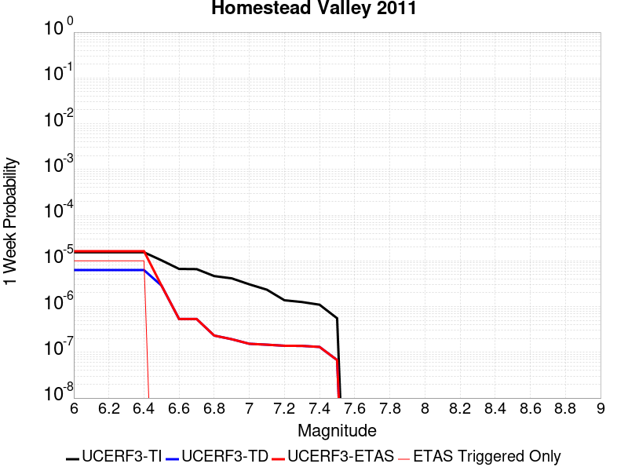 |  |  |  |

| Magnitude | 1 wk TI Prob | 1 wk TD Prob | 1 wk ETAS Prob | 1 wk ETAS/TD Gain | 1 wk ETAS Triggered Only | 1 mo TI Prob | 1 mo TD Prob | 1 mo ETAS Prob | 1 mo ETAS/TD Gain | 1 mo ETAS Triggered Only | 1 yr TI Prob | 1 yr TD Prob | 1 yr ETAS Prob | 1 yr ETAS/TD Gain | 1 yr ETAS Triggered Only | 10 yr TI Prob | 10 yr TD Prob | 10 yr ETAS Prob | 10 yr ETAS/TD Gain | 10 yr ETAS Triggered Only |
|-----|-----|-----|-----|-----|-----|-----|-----|-----|-----|-----|-----|-----|-----|-----|-----|-----|-----|-----|-----|-----|
| 6.0 | 1.539795E-5 | 6.286606E-6 | 2.2363676E-5 | 3.5573528 | 1.607717E-5 | 6.5989545E-5 | 2.6942436E-5 | 4.3019172E-5 | 1.5967069 | 1.607717E-5 | 8.0312655E-4 | 3.279954E-4 | 3.440673E-4 | 1.0490004 | 1.607717E-5 | 0.008002302 | 0.0032771337 | 0.0032931583 | 1.0048897 | 1.607717E-5 |
| 6.1 | 1.539795E-5 | 6.286606E-6 | 2.2363676E-5 | 3.5573528 | 1.607717E-5 | 6.5989545E-5 | 2.6942436E-5 | 4.3019172E-5 | 1.5967069 | 1.607717E-5 | 8.0312655E-4 | 3.279954E-4 | 3.440673E-4 | 1.0490004 | 1.607717E-5 | 0.008002302 | 0.0032771337 | 0.0032931583 | 1.0048897 | 1.607717E-5 |
| 6.2 | 1.539795E-5 | 6.286606E-6 | 2.2363676E-5 | 3.5573528 | 1.607717E-5 | 6.5989545E-5 | 2.6942436E-5 | 4.3019172E-5 | 1.5967069 | 1.607717E-5 | 8.0312655E-4 | 3.279954E-4 | 3.440673E-4 | 1.0490004 | 1.607717E-5 | 0.008002302 | 0.0032771337 | 0.0032931583 | 1.0048897 | 1.607717E-5 |
| 6.3 | 1.539795E-5 | 6.286606E-6 | 2.2363676E-5 | 3.5573528 | 1.607717E-5 | 6.5989545E-5 | 2.6942436E-5 | 4.3019172E-5 | 1.5967069 | 1.607717E-5 | 8.0312655E-4 | 3.279954E-4 | 3.440673E-4 | 1.0490004 | 1.607717E-5 | 0.008002302 | 0.0032771337 | 0.0032931583 | 1.0048897 | 1.607717E-5 |
| 6.4 | 1.539795E-5 | 6.286606E-6 | 2.2363676E-5 | 3.5573528 | 1.607717E-5 | 6.5989545E-5 | 2.6942436E-5 | 4.3019172E-5 | 1.5967069 | 1.607717E-5 | 8.0312655E-4 | 3.279954E-4 | 3.440673E-4 | 1.0490004 | 1.607717E-5 | 0.008002302 | 0.0032771337 | 0.0032931583 | 1.0048897 | 1.607717E-5 |
| 6.5 | 1.0265258E-5 | 2.8788488E-6 | 2.8788488E-6 | 1.0 | 0.0 | 4.3993223E-5 | 1.2337905E-5 | 1.2337905E-5 | 1.0 | 0.0 | 5.3548586E-4 | 1.5021059E-4 | 1.5021059E-4 | 1.0 | 0.0 | 0.005341973 | 0.0015017724 | 0.0015017724 | 1.0 | 0.0 |
| 6.6 | 6.664671E-6 | 5.348204E-7 | 5.348204E-7 | 1.0 | 0.0 | 2.8562565E-5 | 2.2920863E-6 | 2.2920863E-6 | 1.0 | 0.0 | 3.476937E-4 | 2.7905911E-5 | 2.7905911E-5 | 1.0 | 0.0 | 0.003471502 | 2.790357E-4 | 2.790357E-4 | 1.0 | 0.0 |
| 6.7 | 6.5954046E-6 | 5.348204E-7 | 5.348204E-7 | 1.0 | 0.0 | 2.8265715E-5 | 2.2920863E-6 | 2.2920863E-6 | 1.0 | 0.0 | 3.4408073E-4 | 2.7905911E-5 | 2.7905911E-5 | 1.0 | 0.0 | 0.0034354846 | 2.790357E-4 | 2.790357E-4 | 1.0 | 0.0 |
| 6.8 | 4.648189E-6 | 2.3265572E-7 | 2.3265572E-7 | 1.0 | 0.0 | 1.9920659E-5 | 9.970956E-7 | 9.970956E-7 | 1.0 | 0.0 | 2.4250703E-4 | 1.2139576E-5 | 1.2139576E-5 | 1.0 | 0.0 | 0.0024224254 | 1.2138961E-4 | 1.2138961E-4 | 1.0 | 0.0 |
| 6.9 | 4.1428534E-6 | 1.9344557E-7 | 1.9344557E-7 | 1.0 | 0.0 | 1.7754966E-5 | 8.290522E-7 | 8.290522E-7 | 1.0 | 0.0 | 2.1614527E-4 | 1.0093667E-5 | 1.0093667E-5 | 1.0 | 0.0 | 0.0021593515 | 1.0093238E-4 | 1.0093238E-4 | 1.0 | 0.0 |
| 7.0 | 3.0673707E-6 | 1.5367603E-7 | 1.5367603E-7 | 1.0 | 0.0 | 1.3145808E-5 | 6.586114E-7 | 6.586114E-7 | 1.0 | 0.0 | 1.6003846E-4 | 8.0185655E-6 | 8.0185655E-6 | 1.0 | 0.0 | 0.0015992324 | 8.0182865E-5 | 8.0182865E-5 | 1.0 | 0.0 |
| 7.1 | 2.340854E-6 | 1.468766E-7 | 1.468766E-7 | 1.0 | 0.0 | 1.0032193E-5 | 6.29471E-7 | 6.29471E-7 | 1.0 | 0.0 | 1.221351E-4 | 7.663783E-6 | 7.663783E-6 | 1.0 | 0.0 | 0.00122068 | 7.663529E-5 | 7.663529E-5 | 1.0 | 0.0 |
| 7.2 | 1.3754182E-6 | 1.3922634E-7 | 1.3922634E-7 | 1.0 | 0.0 | 5.8946357E-6 | 5.966842E-7 | 5.966842E-7 | 1.0 | 0.0 | 7.176483E-5 | 7.2646067E-6 | 7.2646067E-6 | 1.0 | 0.0 | 7.174166E-4 | 7.264379E-5 | 7.264379E-5 | 1.0 | 0.0 |
| 7.3 | 1.2573237E-6 | 1.3827146E-7 | 1.3827146E-7 | 1.0 | 0.0 | 5.388519E-6 | 5.9259185E-7 | 5.9259185E-7 | 1.0 | 0.0 | 6.560324E-5 | 7.2147827E-6 | 7.2147827E-6 | 1.0 | 0.0 | 6.558388E-4 | 7.214558E-5 | 7.214558E-5 | 1.0 | 0.0 |
| 7.4 | 1.0994207E-6 | 1.3106106E-7 | 1.3106106E-7 | 1.0 | 0.0 | 4.7117946E-6 | 5.616901E-7 | 5.616901E-7 | 1.0 | 0.0 | 5.736459E-5 | 6.8385566E-6 | 6.8385566E-6 | 1.0 | 0.0 | 5.734978E-4 | 6.838355E-5 | 6.838355E-5 | 1.0 | 0.0 |
| 7.5 | 5.5569126E-7 | 6.772991E-8 | 6.772991E-8 | 1.0 | 0.0 | 2.3815317E-6 | 2.90271E-7 | 2.90271E-7 | 1.0 | 0.0 | 2.8994764E-5 | 3.5340445E-6 | 3.5340445E-6 | 1.0 | 0.0 | 2.899098E-4 | 3.5339945E-5 | 3.5339945E-5 | 1.0 | 0.0 |

## Casmalia 2011 CFM
*[(top)](#table-of-contents)*

| 1 Week | 1 Month | 1 Year | 10 Year |
|-----|-----|-----|-----|
|  |  |  |  |

| Magnitude | 1 wk TI Prob | 1 wk TD Prob | 1 wk ETAS Prob | 1 wk ETAS/TD Gain | 1 wk ETAS Triggered Only | 1 mo TI Prob | 1 mo TD Prob | 1 mo ETAS Prob | 1 mo ETAS/TD Gain | 1 mo ETAS Triggered Only | 1 yr TI Prob | 1 yr TD Prob | 1 yr ETAS Prob | 1 yr ETAS/TD Gain | 1 yr ETAS Triggered Only | 10 yr TI Prob | 10 yr TD Prob | 10 yr ETAS Prob | 10 yr ETAS/TD Gain | 10 yr ETAS Triggered Only |
|-----|-----|-----|-----|-----|-----|-----|-----|-----|-----|-----|-----|-----|-----|-----|-----|-----|-----|-----|-----|-----|
| 6.0 | 4.1704893E-6 | 4.262483E-6 | 4.262483E-6 | 1.0 | 0.0 | 1.7873403E-5 | 1.8267656E-5 | 1.8267656E-5 | 1.0 | 0.0 | 2.1758694E-4 | 2.2238622E-4 | 2.3845982E-4 | 1.0722778 | 1.607717E-5 | 0.0021737402 | 0.0022216577 | 0.0022376992 | 1.0072205 | 1.607717E-5 |
| 6.1 | 4.1704893E-6 | 4.262483E-6 | 4.262483E-6 | 1.0 | 0.0 | 1.7873403E-5 | 1.8267656E-5 | 1.8267656E-5 | 1.0 | 0.0 | 2.1758694E-4 | 2.2238622E-4 | 2.3845982E-4 | 1.0722778 | 1.607717E-5 | 0.0021737402 | 0.0022216577 | 0.0022376992 | 1.0072205 | 1.607717E-5 |
| 6.2 | 3.457312E-6 | 3.5370217E-6 | 3.5370217E-6 | 1.0 | 0.0 | 1.4816967E-5 | 1.5158577E-5 | 1.5158577E-5 | 1.0 | 0.0 | 1.8038164E-4 | 1.8454014E-4 | 2.0061433E-4 | 1.0871041 | 1.607717E-5 | 0.001802353 | 0.0018438784 | 0.0018599259 | 1.0087031 | 1.607717E-5 |
| 6.3 | 3.457312E-6 | 3.5370217E-6 | 3.5370217E-6 | 1.0 | 0.0 | 1.4816967E-5 | 1.5158577E-5 | 1.5158577E-5 | 1.0 | 0.0 | 1.8038164E-4 | 1.8454014E-4 | 2.0061433E-4 | 1.0871041 | 1.607717E-5 | 0.001802353 | 0.0018438784 | 0.0018599259 | 1.0087031 | 1.607717E-5 |
| 6.4 | 3.0957337E-6 | 3.1692257E-6 | 3.1692257E-6 | 1.0 | 0.0 | 1.3267363E-5 | 1.3582326E-5 | 1.3582326E-5 | 1.0 | 0.0 | 1.6151817E-4 | 1.6535232E-4 | 1.8142683E-4 | 1.0972137 | 1.607717E-5 | 0.0016140083 | 0.0016522991 | 0.0016683496 | 1.0097141 | 1.607717E-5 |
| 6.5 | 3.0957337E-6 | 3.1692257E-6 | 3.1692257E-6 | 1.0 | 0.0 | 1.3267363E-5 | 1.3582326E-5 | 1.3582326E-5 | 1.0 | 0.0 | 1.6151817E-4 | 1.6535232E-4 | 1.8142683E-4 | 1.0972137 | 1.607717E-5 | 0.0016140083 | 0.0016522991 | 0.0016683496 | 1.0097141 | 1.607717E-5 |
| 6.6 | 2.9459152E-6 | 3.0165752E-6 | 3.0165752E-6 | 1.0 | 0.0 | 1.262529E-5 | 1.2928115E-5 | 1.2928115E-5 | 1.0 | 0.0 | 1.5370206E-4 | 1.5738848E-4 | 1.7346312E-4 | 1.1021335 | 1.607717E-5 | 0.0015359579 | 0.0015727758 | 0.0015888277 | 1.0102061 | 1.607717E-5 |
| 6.7 | 2.8634809E-6 | 2.9324726E-6 | 2.9324726E-6 | 1.0 | 0.0 | 1.2272003E-5 | 1.256768E-5 | 1.256768E-5 | 1.0 | 0.0 | 1.4940138E-4 | 1.530008E-4 | 1.6907552E-4 | 1.105063 | 1.607717E-5 | 0.0014930099 | 0.0015289601 | 0.0015450127 | 1.010499 | 1.607717E-5 |
| 6.8 | 2.7999822E-6 | 2.8675968E-6 | 2.8675968E-6 | 1.0 | 0.0 | 1.1999869E-5 | 1.2289643E-5 | 1.2289643E-5 | 1.0 | 0.0 | 1.460886E-4 | 1.4961617E-4 | 1.6569094E-4 | 1.10744 | 1.607717E-5 | 0.001459926 | 0.0014951597 | 0.0015112129 | 1.0107367 | 1.607717E-5 |
| 6.9 | 2.551052E-6 | 2.6119649E-6 | 2.6119649E-6 | 1.0 | 0.0 | 1.0933034E-5 | 1.1194087E-5 | 1.1194087E-5 | 1.0 | 0.0 | 1.3310155E-4 | 1.3627953E-4 | 1.523545E-4 | 1.1179559 | 1.607717E-5 | 0.0013302186 | 0.0013619636 | 0.0013780189 | 1.0117884 | 1.607717E-5 |
| 7.0 | 2.3081875E-6 | 2.3624088E-6 | 2.3624088E-6 | 1.0 | 0.0 | 9.892195E-6 | 1.01245705E-5 | 1.01245705E-5 | 1.0 | 0.0 | 1.20430814E-4 | 1.232597E-4 | 1.3933488E-4 | 1.1304172 | 1.607717E-5 | 0.0012036557 | 0.0012319161 | 0.0012479735 | 1.0130345 | 1.607717E-5 |
| 7.1 | 2.093245E-6 | 2.1417243E-6 | 2.1417243E-6 | 1.0 | 0.0 | 8.971019E-6 | 9.178786E-6 | 9.178786E-6 | 1.0 | 0.0 | 1.09216686E-4 | 1.1174601E-4 | 1.2782139E-4 | 1.1438564 | 1.607717E-5 | 0.0010916302 | 0.0011169002 | 0.0011329595 | 1.0143784 | 1.607717E-5 |
| 7.2 | 1.9714576E-6 | 2.0165091E-6 | 2.0165091E-6 | 1.0 | 0.0 | 8.449076E-6 | 8.642153E-6 | 8.642153E-6 | 1.0 | 0.0 | 1.0286264E-4 | 1.05213156E-4 | 1.21288635E-4 | 1.1527896 | 1.607717E-5 | 0.0010281504 | 0.0010516352 | 0.0010676956 | 1.0152717 | 1.607717E-5 |
| 7.3 | 1.6689512E-6 | 1.7047131E-6 | 1.7047131E-6 | 1.0 | 0.0 | 7.1526288E-6 | 7.3058927E-6 | 7.3058927E-6 | 1.0 | 0.0 | 8.7079774E-5 | 8.894562E-5 | 8.894562E-5 | 1.0 | 0.0 | 8.7045657E-4 | 8.89101E-4 | 8.89101E-4 | 1.0 | 0.0 |
| 7.4 | 1.4490954E-6 | 1.4778908E-6 | 1.4778908E-6 | 1.0 | 0.0 | 6.210394E-6 | 6.333802E-6 | 6.333802E-6 | 1.0 | 0.0 | 7.560892E-5 | 7.711132E-5 | 7.711132E-5 | 1.0 | 0.0 | 7.55832E-4 | 7.7084627E-4 | 7.7084627E-4 | 1.0 | 0.0 |
| 7.5 | 1.226873E-6 | 1.2481701E-6 | 1.2481701E-6 | 1.0 | 0.0 | 5.2580162E-6 | 5.3492895E-6 | 5.3492895E-6 | 1.0 | 0.0 | 6.401447E-5 | 6.5125656E-5 | 6.5125656E-5 | 1.0 | 0.0 | 6.399603E-4 | 6.5106625E-4 | 6.5106625E-4 | 1.0 | 0.0 |
| 7.6 | 9.2561345E-7 | 9.361923E-7 | 9.361923E-7 | 1.0 | 0.0 | 3.966909E-6 | 4.012247E-6 | 4.012247E-6 | 1.0 | 0.0 | 4.8296046E-5 | 4.884801E-5 | 4.884801E-5 | 1.0 | 0.0 | 4.828555E-4 | 4.8837316E-4 | 4.8837316E-4 | 1.0 | 0.0 |
| 7.7 | 5.4367933E-7 | 5.392888E-7 | 5.392888E-7 | 1.0 | 0.0 | 2.3300522E-6 | 2.3112357E-6 | 2.3112357E-6 | 1.0 | 0.0 | 2.8368017E-5 | 2.8138933E-5 | 2.8138933E-5 | 1.0 | 0.0 | 2.8364395E-4 | 2.8135383E-4 | 2.8135383E-4 | 1.0 | 0.0 |
| 7.8 | 1.8825742E-7 | 1.7342276E-7 | 1.7342276E-7 | 1.0 | 0.0 | 8.068173E-7 | 7.4324015E-7 | 7.4324015E-7 | 1.0 | 0.0 | 9.822956E-6 | 9.048912E-6 | 9.048912E-6 | 1.0 | 0.0 | 9.822522E-5 | 9.048546E-5 | 9.048546E-5 | 1.0 | 0.0 |
| 7.9 | 6.342771E-8 | 4.6790706E-8 | 4.6790706E-8 | 1.0 | 0.0 | 2.7183304E-7 | 2.0053157E-7 | 2.0053157E-7 | 1.0 | 0.0 | 3.3095623E-6 | 2.4414692E-6 | 2.4414692E-6 | 1.0 | 0.0 | 3.309513E-5 | 2.4414428E-5 | 2.4414428E-5 | 1.0 | 0.0 |
| 8.0 | 1.2574819E-8 | 6.4733463E-9 | 6.4733463E-9 | 1.0 | 0.0 | 5.3892084E-8 | 2.7742912E-8 | 2.7742912E-8 | 1.0 | 0.0 | 6.561359E-7 | 3.377699E-7 | 3.377699E-7 | 1.0 | 0.0 | 6.56134E-6 | 3.377694E-6 | 3.377694E-6 | 1.0 | 0.0 |

## South Cuyama
*[(top)](#table-of-contents)*

| 1 Week | 1 Month | 1 Year | 10 Year |
|-----|-----|-----|-----|
|  |  |  |  |

| Magnitude | 1 wk TI Prob | 1 wk TD Prob | 1 wk ETAS Prob | 1 wk ETAS/TD Gain | 1 wk ETAS Triggered Only | 1 mo TI Prob | 1 mo TD Prob | 1 mo ETAS Prob | 1 mo ETAS/TD Gain | 1 mo ETAS Triggered Only | 1 yr TI Prob | 1 yr TD Prob | 1 yr ETAS Prob | 1 yr ETAS/TD Gain | 1 yr ETAS Triggered Only | 10 yr TI Prob | 10 yr TD Prob | 10 yr ETAS Prob | 10 yr ETAS/TD Gain | 10 yr ETAS Triggered Only |
|-----|-----|-----|-----|-----|-----|-----|-----|-----|-----|-----|-----|-----|-----|-----|-----|-----|-----|-----|-----|-----|
| 6.0 | 1.2747308E-6 | 1.2818697E-6 | 1.2818697E-6 | 1.0 | 0.0 | 5.4631205E-6 | 5.4937163E-6 | 5.4937163E-6 | 1.0 | 0.0 | 6.6511464E-5 | 6.6884015E-5 | 8.2960105E-5 | 1.2403578 | 1.607717E-5 | 6.649156E-4 | 6.686458E-4 | 6.847122E-4 | 1.0240283 | 1.607717E-5 |
| 6.1 | 1.2747308E-6 | 1.2818697E-6 | 1.2818697E-6 | 1.0 | 0.0 | 5.4631205E-6 | 5.4937163E-6 | 5.4937163E-6 | 1.0 | 0.0 | 6.6511464E-5 | 6.6884015E-5 | 8.2960105E-5 | 1.2403578 | 1.607717E-5 | 6.649156E-4 | 6.686458E-4 | 6.847122E-4 | 1.0240283 | 1.607717E-5 |
| 6.2 | 1.2747308E-6 | 1.2818697E-6 | 1.2818697E-6 | 1.0 | 0.0 | 5.4631205E-6 | 5.4937163E-6 | 5.4937163E-6 | 1.0 | 0.0 | 6.6511464E-5 | 6.6884015E-5 | 8.2960105E-5 | 1.2403578 | 1.607717E-5 | 6.649156E-4 | 6.686458E-4 | 6.847122E-4 | 1.0240283 | 1.607717E-5 |
| 6.3 | 1.2747308E-6 | 1.2818697E-6 | 1.2818697E-6 | 1.0 | 0.0 | 5.4631205E-6 | 5.4937163E-6 | 5.4937163E-6 | 1.0 | 0.0 | 6.6511464E-5 | 6.6884015E-5 | 8.2960105E-5 | 1.2403578 | 1.607717E-5 | 6.649156E-4 | 6.686458E-4 | 6.847122E-4 | 1.0240283 | 1.607717E-5 |
| 6.4 | 1.2747308E-6 | 1.2818697E-6 | 1.2818697E-6 | 1.0 | 0.0 | 5.4631205E-6 | 5.4937163E-6 | 5.4937163E-6 | 1.0 | 0.0 | 6.6511464E-5 | 6.6884015E-5 | 8.2960105E-5 | 1.2403578 | 1.607717E-5 | 6.649156E-4 | 6.686458E-4 | 6.847122E-4 | 1.0240283 | 1.607717E-5 |
| 6.5 | 1.2747308E-6 | 1.2818697E-6 | 1.2818697E-6 | 1.0 | 0.0 | 5.4631205E-6 | 5.4937163E-6 | 5.4937163E-6 | 1.0 | 0.0 | 6.6511464E-5 | 6.6884015E-5 | 8.2960105E-5 | 1.2403578 | 1.607717E-5 | 6.649156E-4 | 6.686458E-4 | 6.847122E-4 | 1.0240283 | 1.607717E-5 |
| 6.6 | 1.2747308E-6 | 1.2818697E-6 | 1.2818697E-6 | 1.0 | 0.0 | 5.4631205E-6 | 5.4937163E-6 | 5.4937163E-6 | 1.0 | 0.0 | 6.6511464E-5 | 6.6884015E-5 | 8.2960105E-5 | 1.2403578 | 1.607717E-5 | 6.649156E-4 | 6.686458E-4 | 6.847122E-4 | 1.0240283 | 1.607717E-5 |
| 6.7 | 1.2747308E-6 | 1.2818697E-6 | 1.2818697E-6 | 1.0 | 0.0 | 5.4631205E-6 | 5.4937163E-6 | 5.4937163E-6 | 1.0 | 0.0 | 6.6511464E-5 | 6.6884015E-5 | 8.2960105E-5 | 1.2403578 | 1.607717E-5 | 6.649156E-4 | 6.686458E-4 | 6.847122E-4 | 1.0240283 | 1.607717E-5 |
| 6.8 | 1.2747308E-6 | 1.2818697E-6 | 1.2818697E-6 | 1.0 | 0.0 | 5.4631205E-6 | 5.4937163E-6 | 5.4937163E-6 | 1.0 | 0.0 | 6.6511464E-5 | 6.6884015E-5 | 8.2960105E-5 | 1.2403578 | 1.607717E-5 | 6.649156E-4 | 6.686458E-4 | 6.847122E-4 | 1.0240283 | 1.607717E-5 |
| 6.9 | 8.4566324E-7 | 8.507883E-7 | 8.507883E-7 | 1.0 | 0.0 | 3.624266E-6 | 3.6462304E-6 | 3.6462304E-6 | 1.0 | 0.0 | 4.4124543E-5 | 4.439196E-5 | 4.439196E-5 | 1.0 | 0.0 | 4.4115784E-4 | 4.4383196E-4 | 4.4383196E-4 | 1.0 | 0.0 |
| 7.0 | 8.2277904E-7 | 8.27782E-7 | 8.27782E-7 | 1.0 | 0.0 | 3.526191E-6 | 3.5476323E-6 | 3.5476323E-6 | 1.0 | 0.0 | 4.293053E-5 | 4.3191576E-5 | 4.3191576E-5 | 1.0 | 0.0 | 4.292224E-4 | 4.3183283E-4 | 4.3183283E-4 | 1.0 | 0.0 |
| 7.1 | 6.7661887E-7 | 6.80913E-7 | 6.80913E-7 | 1.0 | 0.0 | 2.899792E-6 | 2.9181954E-6 | 2.9181954E-6 | 1.0 | 0.0 | 3.5304394E-5 | 3.5528454E-5 | 3.5528454E-5 | 1.0 | 0.0 | 3.5298787E-4 | 3.552281E-4 | 3.552281E-4 | 1.0 | 0.0 |
| 7.2 | 5.783336E-7 | 5.8211907E-7 | 5.8211907E-7 | 1.0 | 0.0 | 2.4785702E-6 | 2.4947938E-6 | 2.4947938E-6 | 1.0 | 0.0 | 3.0176174E-5 | 3.0373692E-5 | 3.0373692E-5 | 1.0 | 0.0 | 3.0172078E-4 | 3.0369565E-4 | 3.0369565E-4 | 1.0 | 0.0 |
| 7.3 | 5.136759E-7 | 5.170938E-7 | 5.170938E-7 | 1.0 | 0.0 | 2.2014663E-6 | 2.2161144E-6 | 2.2161144E-6 | 1.0 | 0.0 | 2.6802521E-5 | 2.698086E-5 | 2.698086E-5 | 1.0 | 0.0 | 2.679929E-4 | 2.6977606E-4 | 2.6977606E-4 | 1.0 | 0.0 |
| 7.4 | 4.3370295E-7 | 4.3665364E-7 | 4.3665364E-7 | 1.0 | 0.0 | 1.8587256E-6 | 1.8713713E-6 | 1.8713713E-6 | 1.0 | 0.0 | 2.2629749E-5 | 2.278371E-5 | 2.278371E-5 | 1.0 | 0.0 | 2.2627445E-4 | 2.278139E-4 | 2.278139E-4 | 1.0 | 0.0 |
| 7.5 | 3.3242574E-7 | 3.3476465E-7 | 3.3476465E-7 | 1.0 | 0.0 | 1.4246809E-6 | 1.4347048E-6 | 1.4347048E-6 | 1.0 | 0.0 | 1.7345352E-5 | 1.7467393E-5 | 1.7467393E-5 | 1.0 | 0.0 | 1.7343998E-4 | 1.7466032E-4 | 1.7466032E-4 | 1.0 | 0.0 |
| 7.6 | 2.0627535E-7 | 2.07789E-7 | 2.07789E-7 | 1.0 | 0.0 | 8.840369E-7 | 8.90524E-7 | 8.90524E-7 | 1.0 | 0.0 | 1.0763096E-5 | 1.0842076E-5 | 1.0842076E-5 | 1.0 | 0.0 | 1.0762575E-4 | 1.0841556E-4 | 1.0841556E-4 | 1.0 | 0.0 |
| 7.7 | 6.15236E-8 | 6.1983044E-8 | 6.1983044E-8 | 1.0 | 0.0 | 2.6367252E-7 | 2.656416E-7 | 2.656416E-7 | 1.0 | 0.0 | 3.2102084E-6 | 3.2341818E-6 | 3.2341818E-6 | 1.0 | 0.0 | 3.210162E-5 | 3.234136E-5 | 3.234136E-5 | 1.0 | 0.0 |
| 7.8 | 1.1765573E-8 | 1.1873414E-8 | 1.1873414E-8 | 1.0 | 0.0 | 5.0423886E-8 | 5.0886058E-8 | 5.0886058E-8 | 1.0 | 0.0 | 6.1391063E-7 | 6.195376E-7 | 6.195376E-7 | 1.0 | 0.0 | 6.1390897E-6 | 6.19536E-6 | 6.19536E-6 | 1.0 | 0.0 |
| 7.9 | 6.0381755E-10 | 6.10058E-10 | 6.10058E-10 | 1.0 | 0.0 | 2.5877895E-9 | 2.614534E-9 | 2.614534E-9 | 1.0 | 0.0 | 3.1506335E-8 | 3.1831952E-8 | 3.1831952E-8 | 1.0 | 0.0 | 3.1506332E-7 | 3.183195E-7 | 3.183195E-7 | 1.0 | 0.0 |

## Elmore Ranch
*[(top)](#table-of-contents)*

| 1 Week | 1 Month | 1 Year | 10 Year |
|-----|-----|-----|-----|
|  |  |  |  |

| Magnitude | 1 wk TI Prob | 1 wk TD Prob | 1 wk ETAS Prob | 1 wk ETAS/TD Gain | 1 wk ETAS Triggered Only | 1 mo TI Prob | 1 mo TD Prob | 1 mo ETAS Prob | 1 mo ETAS/TD Gain | 1 mo ETAS Triggered Only | 1 yr TI Prob | 1 yr TD Prob | 1 yr ETAS Prob | 1 yr ETAS/TD Gain | 1 yr ETAS Triggered Only | 10 yr TI Prob | 10 yr TD Prob | 10 yr ETAS Prob | 10 yr ETAS/TD Gain | 10 yr ETAS Triggered Only |
|-----|-----|-----|-----|-----|-----|-----|-----|-----|-----|-----|-----|-----|-----|-----|-----|-----|-----|-----|-----|-----|
| 6.0 | 9.102099E-5 | 8.952015E-5 | 8.952015E-5 | 1.0 | 0.0 | 3.9003167E-4 | 3.8361453E-4 | 3.8361453E-4 | 1.0 | 0.0 | 0.0047383 | 0.004662009 | 0.004678011 | 1.0034325 | 1.607717E-5 | 0.046385348 | 0.045870975 | 0.045886315 | 1.0003344 | 1.607717E-5 |
| 6.1 | 3.8306698E-5 | 4.1498504E-5 | 4.1498504E-5 | 1.0 | 0.0 | 1.6416123E-4 | 1.7784268E-4 | 1.7784268E-4 | 1.0 | 0.0 | 0.0019968306 | 0.0021631396 | 0.002179182 | 1.0074162 | 1.607717E-5 | 0.019789828 | 0.021628205 | 0.021643935 | 1.0007273 | 1.607717E-5 |
| 6.2 | 3.8306698E-5 | 4.1498504E-5 | 4.1498504E-5 | 1.0 | 0.0 | 1.6416123E-4 | 1.7784268E-4 | 1.7784268E-4 | 1.0 | 0.0 | 0.0019968306 | 0.0021631396 | 0.002179182 | 1.0074162 | 1.607717E-5 | 0.019789828 | 0.021628205 | 0.021643935 | 1.0007273 | 1.607717E-5 |
| 6.3 | 3.3197924E-5 | 3.6554302E-5 | 3.6554302E-5 | 1.0 | 0.0 | 1.4226905E-4 | 1.5665586E-4 | 1.5665586E-4 | 1.0 | 0.0 | 0.0017307495 | 0.001905917 | 0.0019219635 | 1.0084193 | 1.607717E-5 | 0.017173318 | 0.01908996 | 0.019105729 | 1.0008261 | 1.607717E-5 |
| 6.4 | 2.5148964E-5 | 2.7420487E-5 | 2.7420487E-5 | 1.0 | 0.0 | 1.0777682E-4 | 1.17514726E-4 | 1.17514726E-4 | 1.0 | 0.0 | 0.0013113929 | 0.0014304507 | 0.0014465048 | 1.0112232 | 1.607717E-5 | 0.01303681 | 0.014387194 | 0.01440304 | 1.0011014 | 1.607717E-5 |
| 6.5 | 2.5148964E-5 | 2.7420487E-5 | 2.7420487E-5 | 1.0 | 0.0 | 1.0777682E-4 | 1.17514726E-4 | 1.17514726E-4 | 1.0 | 0.0 | 0.0013113929 | 0.0014304507 | 0.0014465048 | 1.0112232 | 1.607717E-5 | 0.01303681 | 0.014387194 | 0.01440304 | 1.0011014 | 1.607717E-5 |

## Earthquake Valley
*[(top)](#table-of-contents)*

| 1 Week | 1 Month | 1 Year | 10 Year |
|-----|-----|-----|-----|
|  |  |  |  |

| Magnitude | 1 wk TI Prob | 1 wk TD Prob | 1 wk ETAS Prob | 1 wk ETAS/TD Gain | 1 wk ETAS Triggered Only | 1 mo TI Prob | 1 mo TD Prob | 1 mo ETAS Prob | 1 mo ETAS/TD Gain | 1 mo ETAS Triggered Only | 1 yr TI Prob | 1 yr TD Prob | 1 yr ETAS Prob | 1 yr ETAS/TD Gain | 1 yr ETAS Triggered Only | 10 yr TI Prob | 10 yr TD Prob | 10 yr ETAS Prob | 10 yr ETAS/TD Gain | 10 yr ETAS Triggered Only |
|-----|-----|-----|-----|-----|-----|-----|-----|-----|-----|-----|-----|-----|-----|-----|-----|-----|-----|-----|-----|-----|
| 6.0 | 1.9416384E-5 | 2.258408E-5 | 2.258408E-5 | 1.0 | 0.0 | 8.321042E-5 | 9.6785996E-5 | 9.6785996E-5 | 1.0 | 0.0 | 0.001012616 | 0.0011778527 | 0.001193911 | 1.0136335 | 1.607717E-5 | 0.010080142 | 0.011727943 | 0.011743831 | 1.0013548 | 1.607717E-5 |
| 6.1 | 1.9416384E-5 | 2.258408E-5 | 2.258408E-5 | 1.0 | 0.0 | 8.321042E-5 | 9.6785996E-5 | 9.6785996E-5 | 1.0 | 0.0 | 0.001012616 | 0.0011778527 | 0.001193911 | 1.0136335 | 1.607717E-5 | 0.010080142 | 0.011727943 | 0.011743831 | 1.0013548 | 1.607717E-5 |
| 6.2 | 1.9416384E-5 | 2.258408E-5 | 2.258408E-5 | 1.0 | 0.0 | 8.321042E-5 | 9.6785996E-5 | 9.6785996E-5 | 1.0 | 0.0 | 0.001012616 | 0.0011778527 | 0.001193911 | 1.0136335 | 1.607717E-5 | 0.010080142 | 0.011727943 | 0.011743831 | 1.0013548 | 1.607717E-5 |
| 6.3 | 1.9416384E-5 | 2.258408E-5 | 2.258408E-5 | 1.0 | 0.0 | 8.321042E-5 | 9.6785996E-5 | 9.6785996E-5 | 1.0 | 0.0 | 0.001012616 | 0.0011778527 | 0.001193911 | 1.0136335 | 1.607717E-5 | 0.010080142 | 0.011727943 | 0.011743831 | 1.0013548 | 1.607717E-5 |
| 6.4 | 1.9416384E-5 | 2.258408E-5 | 2.258408E-5 | 1.0 | 0.0 | 8.321042E-5 | 9.6785996E-5 | 9.6785996E-5 | 1.0 | 0.0 | 0.001012616 | 0.0011778527 | 0.001193911 | 1.0136335 | 1.607717E-5 | 0.010080142 | 0.011727943 | 0.011743831 | 1.0013548 | 1.607717E-5 |
| 6.5 | 1.9389157E-5 | 2.255267E-5 | 2.255267E-5 | 1.0 | 0.0 | 8.309374E-5 | 9.665139E-5 | 9.665139E-5 | 1.0 | 0.0 | 0.0010111968 | 0.0011762156 | 0.0011922739 | 1.0136524 | 1.607717E-5 | 0.010066078 | 0.011711745 | 0.011727634 | 1.0013567 | 1.607717E-5 |
| 6.6 | 1.9389157E-5 | 2.255267E-5 | 2.255267E-5 | 1.0 | 0.0 | 8.309374E-5 | 9.665139E-5 | 9.665139E-5 | 1.0 | 0.0 | 0.0010111968 | 0.0011762156 | 0.0011922739 | 1.0136524 | 1.607717E-5 | 0.010066078 | 0.011711745 | 0.011727634 | 1.0013567 | 1.607717E-5 |
| 6.7 | 1.4925434E-5 | 1.7208227E-5 | 1.7208227E-5 | 1.0 | 0.0 | 6.396457E-5 | 7.374794E-5 | 7.374794E-5 | 1.0 | 0.0 | 7.7849044E-4 | 8.9759636E-4 | 9.136591E-4 | 1.0178953 | 1.607717E-5 | 0.007757689 | 0.008948085 | 0.008964018 | 1.0017806 | 1.607717E-5 |
| 6.8 | 1.3570335E-5 | 1.5616843E-5 | 1.5616843E-5 | 1.0 | 0.0 | 5.8157282E-5 | 6.692807E-5 | 6.692807E-5 | 1.0 | 0.0 | 7.0783484E-4 | 8.1462675E-4 | 8.3069084E-4 | 1.0197196 | 1.607717E-5 | 0.0070558446 | 0.008124476 | 0.008140423 | 1.0019628 | 1.607717E-5 |
| 6.9 | 1.3570335E-5 | 1.5616843E-5 | 1.5616843E-5 | 1.0 | 0.0 | 5.8157282E-5 | 6.692807E-5 | 6.692807E-5 | 1.0 | 0.0 | 7.0783484E-4 | 8.1462675E-4 | 8.3069084E-4 | 1.0197196 | 1.607717E-5 | 0.0070558446 | 0.008124476 | 0.008140423 | 1.0019628 | 1.607717E-5 |
| 7.0 | 1.3433392E-5 | 1.5460388E-5 | 1.5460388E-5 | 1.0 | 0.0 | 5.757041E-5 | 6.6257584E-5 | 6.6257584E-5 | 1.0 | 0.0 | 7.0069433E-4 | 8.064695E-4 | 8.2253374E-4 | 1.0199192 | 1.607717E-5 | 0.006984891 | 0.008043497 | 0.008059445 | 1.0019827 | 1.607717E-5 |
| 7.1 | 8.181609E-6 | 9.416851E-6 | 9.416851E-6 | 1.0 | 0.0 | 3.5063567E-5 | 4.0357685E-5 | 4.0357685E-5 | 1.0 | 0.0 | 4.268153E-4 | 4.9131113E-4 | 4.9131113E-4 | 1.0 | 0.0 | 0.0042599645 | 0.0049088253 | 0.0049088253 | 1.0 | 0.0 |
| 7.2 | 2.0663983E-7 | 1.726294E-7 | 1.726294E-7 | 1.0 | 0.0 | 8.855989E-7 | 7.398401E-7 | 7.398401E-7 | 1.0 | 0.0 | 1.0782113E-5 | 9.00752E-6 | 9.00752E-6 | 1.0 | 0.0 | 1.07815904E-4 | 9.00719E-5 | 9.00719E-5 | 1.0 | 0.0 |
| 7.3 | 2.0462376E-7 | 1.7078433E-7 | 1.7078433E-7 | 1.0 | 0.0 | 8.7695867E-7 | 7.319327E-7 | 7.319327E-7 | 1.0 | 0.0 | 1.0676919E-5 | 8.911247E-6 | 8.911247E-6 | 1.0 | 0.0 | 1.0676406E-4 | 8.910926E-5 | 8.910926E-5 | 1.0 | 0.0 |
| 7.4 | 2.0171088E-7 | 1.6860913E-7 | 1.6860913E-7 | 1.0 | 0.0 | 8.644749E-7 | 7.2261037E-7 | 7.2261037E-7 | 1.0 | 0.0 | 1.0524931E-5 | 8.79775E-6 | 8.79775E-6 | 1.0 | 0.0 | 1.05244326E-4 | 8.7974375E-5 | 8.7974375E-5 | 1.0 | 0.0 |
| 7.5 | 1.4847944E-7 | 1.2559275E-7 | 1.2559275E-7 | 1.0 | 0.0 | 6.363403E-7 | 5.3825454E-7 | 5.3825454E-7 | 1.0 | 0.0 | 7.747416E-6 | 6.5532317E-6 | 6.5532317E-6 | 1.0 | 0.0 | 7.747146E-5 | 6.55306E-5 | 6.55306E-5 | 1.0 | 0.0 |
| 7.6 | 1.3185847E-7 | 1.1123213E-7 | 1.1123213E-7 | 1.0 | 0.0 | 5.6510765E-7 | 4.7670906E-7 | 4.7670906E-7 | 1.0 | 0.0 | 6.8801637E-6 | 5.8039195E-6 | 5.8039195E-6 | 1.0 | 0.0 | 6.8799505E-5 | 5.803789E-5 | 5.803789E-5 | 1.0 | 0.0 |
| 7.7 | 2.8609954E-8 | 1.4170958E-8 | 1.4170958E-8 | 1.0 | 0.0 | 1.2261408E-7 | 6.0732674E-8 | 6.0732674E-8 | 1.0 | 0.0 | 1.4928254E-6 | 7.394201E-7 | 7.394201E-7 | 1.0 | 0.0 | 1.4928154E-5 | 7.394182E-6 | 7.394182E-6 | 1.0 | 0.0 |
| 7.8 | 6.527266E-9 | 2.923417E-9 | 2.923417E-9 | 1.0 | 0.0 | 2.7973995E-8 | 1.2528931E-8 | 1.2528931E-8 | 1.0 | 0.0 | 3.4058334E-7 | 1.5253973E-7 | 1.5253973E-7 | 1.0 | 0.0 | 3.4058282E-6 | 1.5253964E-6 | 1.5253964E-6 | 1.0 | 0.0 |
| 7.9 | 1.2898267E-9 | 7.127684E-10 | 7.127684E-10 | 1.0 | 0.0 | 5.527829E-9 | 3.0547218E-9 | 3.0547218E-9 | 1.0 | 0.0 | 6.7301315E-8 | 3.719124E-8 | 3.719124E-8 | 1.0 | 0.0 | 6.7301295E-7 | 3.719124E-7 | 3.719124E-7 | 1.0 | 0.0 |

## San Joaquin Hills
*[(top)](#table-of-contents)*

| 1 Week | 1 Month | 1 Year | 10 Year |
|-----|-----|-----|-----|
|  | 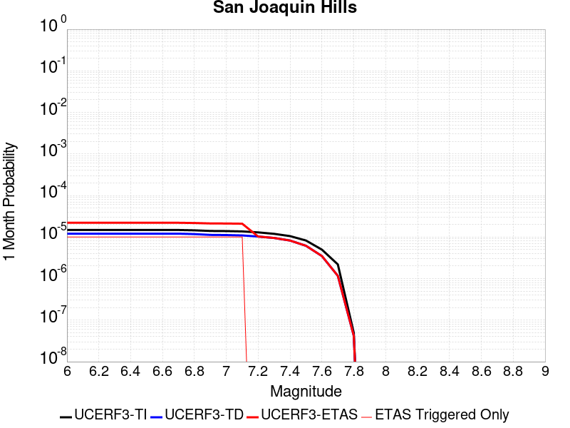 |  | 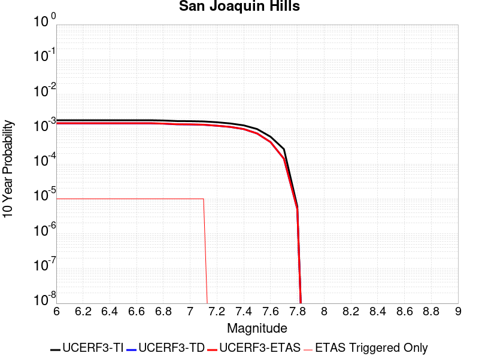 |

| Magnitude | 1 wk TI Prob | 1 wk TD Prob | 1 wk ETAS Prob | 1 wk ETAS/TD Gain | 1 wk ETAS Triggered Only | 1 mo TI Prob | 1 mo TD Prob | 1 mo ETAS Prob | 1 mo ETAS/TD Gain | 1 mo ETAS Triggered Only | 1 yr TI Prob | 1 yr TD Prob | 1 yr ETAS Prob | 1 yr ETAS/TD Gain | 1 yr ETAS Triggered Only | 10 yr TI Prob | 10 yr TD Prob | 10 yr ETAS Prob | 10 yr ETAS/TD Gain | 10 yr ETAS Triggered Only |
|-----|-----|-----|-----|-----|-----|-----|-----|-----|-----|-----|-----|-----|-----|-----|-----|-----|-----|-----|-----|-----|
| 6.0 | 3.4525704E-6 | 2.8139818E-6 | 1.8891107E-5 | 6.713301 | 1.607717E-5 | 1.4796647E-5 | 1.2059867E-5 | 2.8136843E-5 | 2.3330975 | 1.607717E-5 | 1.8013427E-4 | 1.4681912E-4 | 1.6289392E-4 | 1.1094872 | 1.607717E-5 | 0.0017998833 | 0.0014672345 | 0.001483288 | 1.0109414 | 1.607717E-5 |
| 6.1 | 3.4525704E-6 | 2.8139818E-6 | 1.8891107E-5 | 6.713301 | 1.607717E-5 | 1.4796647E-5 | 1.2059867E-5 | 2.8136843E-5 | 2.3330975 | 1.607717E-5 | 1.8013427E-4 | 1.4681912E-4 | 1.6289392E-4 | 1.1094872 | 1.607717E-5 | 0.0017998833 | 0.0014672345 | 0.001483288 | 1.0109414 | 1.607717E-5 |
| 6.2 | 3.4525704E-6 | 2.8139818E-6 | 1.8891107E-5 | 6.713301 | 1.607717E-5 | 1.4796647E-5 | 1.2059867E-5 | 2.8136843E-5 | 2.3330975 | 1.607717E-5 | 1.8013427E-4 | 1.4681912E-4 | 1.6289392E-4 | 1.1094872 | 1.607717E-5 | 0.0017998833 | 0.0014672345 | 0.001483288 | 1.0109414 | 1.607717E-5 |
| 6.3 | 3.4525704E-6 | 2.8139818E-6 | 1.8891107E-5 | 6.713301 | 1.607717E-5 | 1.4796647E-5 | 1.2059867E-5 | 2.8136843E-5 | 2.3330975 | 1.607717E-5 | 1.8013427E-4 | 1.4681912E-4 | 1.6289392E-4 | 1.1094872 | 1.607717E-5 | 0.0017998833 | 0.0014672345 | 0.001483288 | 1.0109414 | 1.607717E-5 |
| 6.4 | 3.4525704E-6 | 2.8139818E-6 | 1.8891107E-5 | 6.713301 | 1.607717E-5 | 1.4796647E-5 | 1.2059867E-5 | 2.8136843E-5 | 2.3330975 | 1.607717E-5 | 1.8013427E-4 | 1.4681912E-4 | 1.6289392E-4 | 1.1094872 | 1.607717E-5 | 0.0017998833 | 0.0014672345 | 0.001483288 | 1.0109414 | 1.607717E-5 |
| 6.5 | 3.4525704E-6 | 2.8139818E-6 | 1.8891107E-5 | 6.713301 | 1.607717E-5 | 1.4796647E-5 | 1.2059867E-5 | 2.8136843E-5 | 2.3330975 | 1.607717E-5 | 1.8013427E-4 | 1.4681912E-4 | 1.6289392E-4 | 1.1094872 | 1.607717E-5 | 0.0017998833 | 0.0014672345 | 0.001483288 | 1.0109414 | 1.607717E-5 |
| 6.6 | 3.4525704E-6 | 2.8139818E-6 | 1.8891107E-5 | 6.713301 | 1.607717E-5 | 1.4796647E-5 | 1.2059867E-5 | 2.8136843E-5 | 2.3330975 | 1.607717E-5 | 1.8013427E-4 | 1.4681912E-4 | 1.6289392E-4 | 1.1094872 | 1.607717E-5 | 0.0017998833 | 0.0014672345 | 0.001483288 | 1.0109414 | 1.607717E-5 |
| 6.7 | 3.4525704E-6 | 2.8139818E-6 | 1.8891107E-5 | 6.713301 | 1.607717E-5 | 1.4796647E-5 | 1.2059867E-5 | 2.8136843E-5 | 2.3330975 | 1.607717E-5 | 1.8013427E-4 | 1.4681912E-4 | 1.6289392E-4 | 1.1094872 | 1.607717E-5 | 0.0017998833 | 0.0014672345 | 0.001483288 | 1.0109414 | 1.607717E-5 |
| 6.8 | 3.388654E-6 | 2.7484202E-6 | 1.8825547E-5 | 6.8495884 | 1.607717E-5 | 1.4522722E-5 | 1.1778891E-5 | 2.7855873E-5 | 2.3648977 | 1.607717E-5 | 1.767998E-4 | 1.4339869E-4 | 1.5947355E-4 | 1.112099 | 1.607717E-5 | 0.001766592 | 0.0014330745 | 0.0014491286 | 1.0112026 | 1.607717E-5 |
| 6.9 | 3.2694352E-6 | 2.6283346E-6 | 1.8705463E-5 | 7.11685 | 1.607717E-5 | 1.401179E-5 | 1.1264243E-5 | 2.7341232E-5 | 2.4272587 | 1.607717E-5 | 1.7058018E-4 | 1.3713364E-4 | 1.532086E-4 | 1.1172211 | 1.607717E-5 | 0.0017044931 | 0.0013705015 | 0.0013865565 | 1.0117148 | 1.607717E-5 |
| 7.0 | 3.246912E-6 | 2.6069915E-6 | 1.868412E-5 | 7.166928 | 1.607717E-5 | 1.39152635E-5 | 1.1172774E-5 | 2.7249765E-5 | 2.4389436 | 1.607717E-5 | 1.6940516E-4 | 1.3602014E-4 | 1.5209513E-4 | 1.1181809 | 1.607717E-5 | 0.0016927607 | 0.0013593802 | 0.0013754355 | 1.0118108 | 1.607717E-5 |
| 7.1 | 3.1864927E-6 | 2.5523198E-6 | 1.862945E-5 | 7.2990265 | 1.607717E-5 | 1.3656326E-5 | 1.0938467E-5 | 2.7015461E-5 | 2.4697666 | 1.607717E-5 | 1.6625308E-4 | 1.3316782E-4 | 1.4924284E-4 | 1.1207125 | 1.607717E-5 | 0.0016612876 | 0.0013308912 | 0.0013469469 | 1.012064 | 1.607717E-5 |
| 7.2 | 3.0220644E-6 | 2.3991677E-6 | 2.3991677E-6 | 1.0 | 0.0 | 1.295164E-5 | 1.0282108E-5 | 1.0282108E-5 | 1.0 | 0.0 | 1.576748E-4 | 1.2517757E-4 | 1.2517757E-4 | 1.0 | 0.0 | 0.0015756298 | 0.0012510809 | 0.0012510809 | 1.0 | 0.0 |
| 7.3 | 2.787619E-6 | 2.2173858E-6 | 2.2173858E-6 | 1.0 | 0.0 | 1.1946884E-5 | 9.503048E-6 | 9.503048E-6 | 1.0 | 0.0 | 1.454436E-4 | 1.1569356E-4 | 1.1569356E-4 | 1.0 | 0.0 | 0.0014534845 | 0.0011563431 | 0.0011563431 | 1.0 | 0.0 |
| 7.4 | 2.4593792E-6 | 1.9226306E-6 | 1.9226306E-6 | 1.0 | 0.0 | 1.0540153E-5 | 8.23982E-6 | 8.23982E-6 | 1.0 | 0.0 | 1.2831882E-4 | 1.0031529E-4 | 1.0031529E-4 | 1.0 | 0.0 | 0.0012824474 | 0.0010027088 | 0.0010027088 | 1.0 | 0.0 |
| 7.5 | 1.926764E-6 | 1.4383021E-6 | 1.4383021E-6 | 1.0 | 0.0 | 8.257534E-6 | 6.1641376E-6 | 6.1641376E-6 | 1.0 | 0.0 | 1.00530844E-4 | 7.504586E-5 | 7.504586E-5 | 1.0 | 0.0 | 0.0010048538 | 7.502115E-4 | 7.502115E-4 | 1.0 | 0.0 |
| 7.6 | 1.1609359E-6 | 8.14558E-7 | 8.14558E-7 | 1.0 | 0.0 | 4.97543E-6 | 3.4909585E-6 | 3.4909585E-6 | 1.0 | 0.0 | 6.0574173E-5 | 4.2501633E-5 | 4.2501633E-5 | 1.0 | 0.0 | 6.055767E-4 | 4.249394E-4 | 4.249394E-4 | 1.0 | 0.0 |
| 7.7 | 5.1168536E-7 | 2.7155914E-7 | 2.7155914E-7 | 1.0 | 0.0 | 2.1929354E-6 | 1.1638244E-6 | 1.1638244E-6 | 1.0 | 0.0 | 2.669866E-5 | 1.41694845E-5 | 1.41694845E-5 | 1.0 | 0.0 | 2.6695454E-4 | 1.4168715E-4 | 1.4168715E-4 | 1.0 | 0.0 |
| 7.8 | 1.16056995E-8 | 9.782373E-9 | 9.782373E-9 | 1.0 | 0.0 | 4.9738713E-8 | 4.1924455E-8 | 4.1924455E-8 | 1.0 | 0.0 | 6.0556863E-7 | 5.1043025E-7 | 5.1043025E-7 | 1.0 | 0.0 | 6.05567E-6 | 5.1043025E-6 | 5.1043025E-6 | 1.0 | 0.0 |

## San Gorgonio Pass
*[(top)](#table-of-contents)*

| 1 Week | 1 Month | 1 Year | 10 Year |
|-----|-----|-----|-----|
|  |  |  |  |

| Magnitude | 1 wk TI Prob | 1 wk TD Prob | 1 wk ETAS Prob | 1 wk ETAS/TD Gain | 1 wk ETAS Triggered Only | 1 mo TI Prob | 1 mo TD Prob | 1 mo ETAS Prob | 1 mo ETAS/TD Gain | 1 mo ETAS Triggered Only | 1 yr TI Prob | 1 yr TD Prob | 1 yr ETAS Prob | 1 yr ETAS/TD Gain | 1 yr ETAS Triggered Only | 10 yr TI Prob | 10 yr TD Prob | 10 yr ETAS Prob | 10 yr ETAS/TD Gain | 10 yr ETAS Triggered Only |
|-----|-----|-----|-----|-----|-----|-----|-----|-----|-----|-----|-----|-----|-----|-----|-----|-----|-----|-----|-----|-----|
| 6.0 | 7.644328E-6 | 1.3314231E-5 | 1.3314231E-5 | 1.0 | 0.0 | 3.2760996E-5 | 5.705979E-5 | 5.705979E-5 | 1.0 | 0.0 | 3.987921E-4 | 6.944901E-4 | 7.105561E-4 | 1.0231335 | 1.607717E-5 | 0.003980772 | 0.0069299806 | 0.0069459463 | 1.0023038 | 1.607717E-5 |
| 6.1 | 7.644328E-6 | 1.3314231E-5 | 1.3314231E-5 | 1.0 | 0.0 | 3.2760996E-5 | 5.705979E-5 | 5.705979E-5 | 1.0 | 0.0 | 3.987921E-4 | 6.944901E-4 | 7.105561E-4 | 1.0231335 | 1.607717E-5 | 0.003980772 | 0.0069299806 | 0.0069459463 | 1.0023038 | 1.607717E-5 |
| 6.2 | 7.644328E-6 | 1.3314231E-5 | 1.3314231E-5 | 1.0 | 0.0 | 3.2760996E-5 | 5.705979E-5 | 5.705979E-5 | 1.0 | 0.0 | 3.987921E-4 | 6.944901E-4 | 7.105561E-4 | 1.0231335 | 1.607717E-5 | 0.003980772 | 0.0069299806 | 0.0069459463 | 1.0023038 | 1.607717E-5 |
| 6.3 | 7.644328E-6 | 1.3314231E-5 | 1.3314231E-5 | 1.0 | 0.0 | 3.2760996E-5 | 5.705979E-5 | 5.705979E-5 | 1.0 | 0.0 | 3.987921E-4 | 6.944901E-4 | 7.105561E-4 | 1.0231335 | 1.607717E-5 | 0.003980772 | 0.0069299806 | 0.0069459463 | 1.0023038 | 1.607717E-5 |
| 6.4 | 7.644328E-6 | 1.3314231E-5 | 1.3314231E-5 | 1.0 | 0.0 | 3.2760996E-5 | 5.705979E-5 | 5.705979E-5 | 1.0 | 0.0 | 3.987921E-4 | 6.944901E-4 | 7.105561E-4 | 1.0231335 | 1.607717E-5 | 0.003980772 | 0.0069299806 | 0.0069459463 | 1.0023038 | 1.607717E-5 |
| 6.5 | 7.644328E-6 | 1.3314231E-5 | 1.3314231E-5 | 1.0 | 0.0 | 3.2760996E-5 | 5.705979E-5 | 5.705979E-5 | 1.0 | 0.0 | 3.987921E-4 | 6.944901E-4 | 7.105561E-4 | 1.0231335 | 1.607717E-5 | 0.003980772 | 0.0069299806 | 0.0069459463 | 1.0023038 | 1.607717E-5 |
| 6.6 | 7.644328E-6 | 1.3314231E-5 | 1.3314231E-5 | 1.0 | 0.0 | 3.2760996E-5 | 5.705979E-5 | 5.705979E-5 | 1.0 | 0.0 | 3.987921E-4 | 6.944901E-4 | 7.105561E-4 | 1.0231335 | 1.607717E-5 | 0.003980772 | 0.0069299806 | 0.0069459463 | 1.0023038 | 1.607717E-5 |
| 6.7 | 6.987586E-6 | 1.2618505E-5 | 1.2618505E-5 | 1.0 | 0.0 | 2.9946454E-5 | 5.4078235E-5 | 5.4078235E-5 | 1.0 | 0.0 | 3.645371E-4 | 6.582117E-4 | 6.742783E-4 | 1.0244094 | 1.607717E-5 | 0.0036393967 | 0.0065693567 | 0.0065853284 | 1.0024313 | 1.607717E-5 |
| 6.8 | 6.987586E-6 | 1.2618505E-5 | 1.2618505E-5 | 1.0 | 0.0 | 2.9946454E-5 | 5.4078235E-5 | 5.4078235E-5 | 1.0 | 0.0 | 3.645371E-4 | 6.582117E-4 | 6.742783E-4 | 1.0244094 | 1.607717E-5 | 0.0036393967 | 0.0065693567 | 0.0065853284 | 1.0024313 | 1.607717E-5 |
| 6.9 | 5.504702E-6 | 1.1049368E-5 | 1.1049368E-5 | 1.0 | 0.0 | 2.3591367E-5 | 4.7353606E-5 | 4.7353606E-5 | 1.0 | 0.0 | 2.8718702E-4 | 5.7638274E-4 | 5.924506E-4 | 1.0278771 | 1.607717E-5 | 0.0028681618 | 0.005755309 | 0.005771294 | 1.0027773 | 1.607717E-5 |
| 7.0 | 5.4825764E-6 | 1.102571E-5 | 1.102571E-5 | 1.0 | 0.0 | 2.3496545E-5 | 4.7252215E-5 | 4.7252215E-5 | 1.0 | 0.0 | 2.8603288E-4 | 5.751489E-4 | 5.9121684E-4 | 1.0279369 | 1.607717E-5 | 0.00285665 | 0.005743035 | 0.00575902 | 1.0027833 | 1.607717E-5 |
| 7.1 | 5.4692787E-6 | 1.101142E-5 | 1.101142E-5 | 1.0 | 0.0 | 2.3439556E-5 | 4.7190973E-5 | 4.7190973E-5 | 1.0 | 0.0 | 2.8533922E-4 | 5.744037E-4 | 5.904716E-4 | 1.0279733 | 1.607717E-5 | 0.0028497311 | 0.0057356213 | 0.0057516065 | 1.002787 | 1.607717E-5 |
| 7.2 | 5.453661E-6 | 1.0994446E-5 | 1.0994446E-5 | 1.0 | 0.0 | 2.3372622E-5 | 4.7118232E-5 | 4.7118232E-5 | 1.0 | 0.0 | 2.8452452E-4 | 5.7351857E-4 | 5.895865E-4 | 1.0280164 | 1.607717E-5 | 0.002841605 | 0.0057268157 | 0.0057428004 | 1.0027913 | 1.607717E-5 |
| 7.3 | 5.4422303E-6 | 1.0981369E-5 | 1.0981369E-5 | 1.0 | 0.0 | 2.3323635E-5 | 4.706219E-5 | 4.706219E-5 | 1.0 | 0.0 | 2.8392827E-4 | 5.728366E-4 | 5.8890454E-4 | 1.0280498 | 1.607717E-5 | 0.0028356577 | 0.005720031 | 0.005736016 | 1.0027946 | 1.607717E-5 |
| 7.4 | 5.398595E-6 | 1.0928734E-5 | 1.0928734E-5 | 1.0 | 0.0 | 2.313663E-5 | 4.683662E-5 | 4.683662E-5 | 1.0 | 0.0 | 2.8165206E-4 | 5.700917E-4 | 5.861597E-4 | 1.0281849 | 1.607717E-5 | 0.0028129534 | 0.005692723 | 0.005708709 | 1.0028081 | 1.607717E-5 |
| 7.5 | 5.3578788E-6 | 1.0855281E-5 | 1.0855281E-5 | 1.0 | 0.0 | 2.2962136E-5 | 4.6521833E-5 | 4.6521833E-5 | 1.0 | 0.0 | 2.7952815E-4 | 5.662612E-4 | 5.8232923E-4 | 1.0283757 | 1.607717E-5 | 0.002791768 | 0.0056546377 | 0.005670624 | 1.002827 | 1.607717E-5 |
| 7.6 | 4.8091474E-6 | 9.60368E-6 | 9.60368E-6 | 1.0 | 0.0 | 2.0610469E-5 | 4.1158008E-5 | 4.1158008E-5 | 1.0 | 0.0 | 2.5090357E-4 | 5.0098833E-4 | 5.1705743E-4 | 1.0320748 | 1.607717E-5 | 0.0025062046 | 0.0050053033 | 0.0050212997 | 1.003196 | 1.607717E-5 |
| 7.7 | 1.5991155E-6 | 3.352866E-6 | 3.352866E-6 | 1.0 | 0.0 | 6.853334E-6 | 1.4369349E-5 | 1.4369349E-5 | 1.0 | 0.0 | 8.343615E-5 | 1.7493303E-4 | 1.9100739E-4 | 1.0918887 | 1.607717E-5 | 8.340483E-4 | 0.0017534072 | 0.0017694562 | 1.009153 | 1.607717E-5 |
| 7.8 | 9.258398E-7 | 2.0579948E-6 | 2.0579948E-6 | 1.0 | 0.0 | 3.967879E-6 | 8.819949E-6 | 8.819949E-6 | 1.0 | 0.0 | 4.8307855E-5 | 1.073776E-4 | 1.2345304E-4 | 1.1497095 | 1.607717E-5 | 4.8297356E-4 | 0.001078687 | 0.0010947469 | 1.0148883 | 1.607717E-5 |
| 7.9 | 5.975575E-7 | 1.2291794E-6 | 1.2291794E-6 | 1.0 | 0.0 | 2.5609581E-6 | 5.2679006E-6 | 5.2679006E-6 | 1.0 | 0.0 | 3.117922E-5 | 6.4134816E-5 | 8.021095E-5 | 1.2506616 | 1.607717E-5 | 3.1174847E-4 | 6.463092E-4 | 6.62376E-4 | 1.0248593 | 1.607717E-5 |
| 8.0 | 3.4413725E-7 | 6.7148494E-7 | 6.7148494E-7 | 1.0 | 0.0 | 1.4748731E-6 | 2.8777895E-6 | 2.8777895E-6 | 1.0 | 0.0 | 1.7956432E-5 | 3.503653E-5 | 3.503653E-5 | 1.0 | 0.0 | 1.7954981E-4 | 3.5373896E-4 | 3.5373896E-4 | 1.0 | 0.0 |
| 8.1 | 1.1787731E-8 | 9.634385E-9 | 9.634385E-9 | 1.0 | 0.0 | 5.0518846E-8 | 4.129022E-8 | 4.129022E-8 | 1.0 | 0.0 | 6.1506677E-7 | 5.027083E-7 | 5.027083E-7 | 1.0 | 0.0 | 6.1506507E-6 | 5.2424944E-6 | 5.2424944E-6 | 1.0 | 0.0 |

## Kern Canyon (South Kern) 2011
*[(top)](#table-of-contents)*

| 1 Week | 1 Month | 1 Year | 10 Year |
|-----|-----|-----|-----|
|  |  |  |  |

| Magnitude | 1 wk TI Prob | 1 wk TD Prob | 1 wk ETAS Prob | 1 wk ETAS/TD Gain | 1 wk ETAS Triggered Only | 1 mo TI Prob | 1 mo TD Prob | 1 mo ETAS Prob | 1 mo ETAS/TD Gain | 1 mo ETAS Triggered Only | 1 yr TI Prob | 1 yr TD Prob | 1 yr ETAS Prob | 1 yr ETAS/TD Gain | 1 yr ETAS Triggered Only | 10 yr TI Prob | 10 yr TD Prob | 10 yr ETAS Prob | 10 yr ETAS/TD Gain | 10 yr ETAS Triggered Only |
|-----|-----|-----|-----|-----|-----|-----|-----|-----|-----|-----|-----|-----|-----|-----|-----|-----|-----|-----|-----|-----|
| 6.0 | 4.105075E-6 | 4.1137264E-6 | 2.0190831E-5 | 4.9081607 | 1.607717E-5 | 1.7593058E-5 | 1.763014E-5 | 3.3707027E-5 | 1.9118978 | 1.607717E-5 | 2.1417443E-4 | 2.1462646E-4 | 2.3070019E-4 | 1.0748916 | 1.607717E-5 | 0.0021396813 | 0.0021442557 | 0.0021602984 | 1.0074817 | 1.607717E-5 |
| 6.1 | 4.105075E-6 | 4.1137264E-6 | 2.0190831E-5 | 4.9081607 | 1.607717E-5 | 1.7593058E-5 | 1.763014E-5 | 3.3707027E-5 | 1.9118978 | 1.607717E-5 | 2.1417443E-4 | 2.1462646E-4 | 2.3070019E-4 | 1.0748916 | 1.607717E-5 | 0.0021396813 | 0.0021442557 | 0.0021602984 | 1.0074817 | 1.607717E-5 |
| 6.2 | 4.105075E-6 | 4.1137264E-6 | 2.0190831E-5 | 4.9081607 | 1.607717E-5 | 1.7593058E-5 | 1.763014E-5 | 3.3707027E-5 | 1.9118978 | 1.607717E-5 | 2.1417443E-4 | 2.1462646E-4 | 2.3070019E-4 | 1.0748916 | 1.607717E-5 | 0.0021396813 | 0.0021442557 | 0.0021602984 | 1.0074817 | 1.607717E-5 |
| 6.3 | 4.105075E-6 | 4.1137264E-6 | 2.0190831E-5 | 4.9081607 | 1.607717E-5 | 1.7593058E-5 | 1.763014E-5 | 3.3707027E-5 | 1.9118978 | 1.607717E-5 | 2.1417443E-4 | 2.1462646E-4 | 2.3070019E-4 | 1.0748916 | 1.607717E-5 | 0.0021396813 | 0.0021442557 | 0.0021602984 | 1.0074817 | 1.607717E-5 |
| 6.4 | 4.105075E-6 | 4.1137264E-6 | 2.0190831E-5 | 4.9081607 | 1.607717E-5 | 1.7593058E-5 | 1.763014E-5 | 3.3707027E-5 | 1.9118978 | 1.607717E-5 | 2.1417443E-4 | 2.1462646E-4 | 2.3070019E-4 | 1.0748916 | 1.607717E-5 | 0.0021396813 | 0.0021442557 | 0.0021602984 | 1.0074817 | 1.607717E-5 |
| 6.5 | 2.9849807E-6 | 2.9731548E-6 | 1.9050278E-5 | 6.4074287 | 1.607717E-5 | 1.2792712E-5 | 1.274203E-5 | 2.8818997E-5 | 2.261727 | 1.607717E-5 | 1.5574014E-4 | 1.5512333E-4 | 1.71198E-4 | 1.1036252 | 1.607717E-5 | 0.0015563103 | 0.0015501656 | 0.0015662179 | 1.0103552 | 1.607717E-5 |
| 6.6 | 2.9849807E-6 | 2.9731548E-6 | 1.9050278E-5 | 6.4074287 | 1.607717E-5 | 1.2792712E-5 | 1.274203E-5 | 2.8818997E-5 | 2.261727 | 1.607717E-5 | 1.5574014E-4 | 1.5512333E-4 | 1.71198E-4 | 1.1036252 | 1.607717E-5 | 0.0015563103 | 0.0015501656 | 0.0015662179 | 1.0103552 | 1.607717E-5 |
| 6.7 | 2.6756725E-6 | 2.6582206E-6 | 1.8735349E-5 | 7.0480785 | 1.607717E-5 | 1.1467117E-5 | 1.1392325E-5 | 2.7469312E-5 | 2.411212 | 1.607717E-5 | 1.396032E-4 | 1.3869285E-4 | 1.5476778E-4 | 1.1159031 | 1.607717E-5 | 0.0013951553 | 0.0013860738 | 0.0014021287 | 1.011583 | 1.607717E-5 |
| 6.8 | 2.3283721E-6 | 2.3047787E-6 | 1.8381912E-5 | 7.9755645 | 1.607717E-5 | 9.9787E-6 | 9.877586E-6 | 2.5954598E-5 | 2.6276255 | 1.607717E-5 | 1.214839E-4 | 1.20253055E-4 | 1.363283E-4 | 1.1336784 | 1.607717E-5 | 0.001214175 | 0.0012018873 | 0.0012179451 | 1.0133605 | 1.607717E-5 |
| 6.9 | 2.0972677E-6 | 2.0696411E-6 | 1.8146779E-5 | 8.76808 | 1.607717E-5 | 8.988259E-6 | 8.869861E-6 | 2.4946889E-5 | 2.8125458 | 1.607717E-5 | 1.0942656E-4 | 1.0798526E-4 | 1.240607E-4 | 1.1488669 | 1.607717E-5 | 0.0010937268 | 0.0010793337 | 0.0010953936 | 1.0148793 | 1.607717E-5 |
| 7.0 | 1.7132242E-6 | 1.6787036E-6 | 1.7755847E-5 | 10.577119 | 1.607717E-5 | 7.3423685E-6 | 7.194424E-6 | 2.327148E-5 | 3.234655 | 1.607717E-5 | 8.938967E-5 | 8.758863E-5 | 1.03664395E-4 | 1.1835371 | 1.607717E-5 | 8.935372E-4 | 8.7554497E-4 | 8.9160807E-4 | 1.0183464 | 1.607717E-5 |
| 7.1 | 1.4215541E-6 | 1.3815752E-6 | 1.3815752E-6 | 1.0 | 0.0 | 6.0923603E-6 | 5.9210233E-6 | 5.9210233E-6 | 1.0 | 0.0 | 7.417196E-5 | 7.20861E-5 | 7.20861E-5 | 1.0 | 0.0 | 7.414721E-4 | 7.206299E-4 | 7.206299E-4 | 1.0 | 0.0 |
| 7.2 | 9.097853E-7 | 8.6037755E-7 | 8.6037755E-7 | 1.0 | 0.0 | 3.899074E-6 | 3.6873273E-6 | 3.6873273E-6 | 1.0 | 0.0 | 4.7470192E-5 | 4.4892295E-5 | 4.4892295E-5 | 1.0 | 0.0 | 4.7460053E-4 | 4.4883334E-4 | 4.4883334E-4 | 1.0 | 0.0 |
| 7.3 | 6.144169E-7 | 5.628206E-7 | 5.628206E-7 | 1.0 | 0.0 | 2.6332125E-6 | 2.4120861E-6 | 2.4120861E-6 | 1.0 | 0.0 | 3.205889E-5 | 2.9366758E-5 | 2.9366758E-5 | 1.0 | 0.0 | 3.2054266E-4 | 2.936293E-4 | 2.936293E-4 | 1.0 | 0.0 |
| 7.4 | 4.049844E-7 | 3.5728314E-7 | 3.5728314E-7 | 1.0 | 0.0 | 1.7356463E-6 | 1.5312125E-6 | 1.5312125E-6 | 1.0 | 0.0 | 2.1131287E-5 | 1.8642357E-5 | 1.8642357E-5 | 1.0 | 0.0 | 2.1129279E-4 | 1.8640817E-4 | 1.8640817E-4 | 1.0 | 0.0 |
| 7.5 | 1.9871162E-7 | 1.583044E-7 | 1.583044E-7 | 1.0 | 0.0 | 8.5162094E-7 | 6.7844724E-7 | 6.7844724E-7 | 1.0 | 0.0 | 1.0368436E-5 | 8.260065E-6 | 8.260065E-6 | 1.0 | 0.0 | 1.0367952E-4 | 8.259767E-5 | 8.259767E-5 | 1.0 | 0.0 |
| 7.6 | 2.572245E-8 | 1.7352555E-8 | 1.7352555E-8 | 1.0 | 0.0 | 1.10239064E-7 | 7.436809E-8 | 7.436809E-8 | 1.0 | 0.0 | 1.3421597E-6 | 9.054312E-7 | 9.054312E-7 | 1.0 | 0.0 | 1.3421517E-5 | 9.05428E-6 | 9.05428E-6 | 1.0 | 0.0 |

## Yorba Linda
*[(top)](#table-of-contents)*

| 1 Week | 1 Month | 1 Year | 10 Year |
|-----|-----|-----|-----|
|  |  |  |  |

| Magnitude | 1 wk TI Prob | 1 wk TD Prob | 1 wk ETAS Prob | 1 wk ETAS/TD Gain | 1 wk ETAS Triggered Only | 1 mo TI Prob | 1 mo TD Prob | 1 mo ETAS Prob | 1 mo ETAS/TD Gain | 1 mo ETAS Triggered Only | 1 yr TI Prob | 1 yr TD Prob | 1 yr ETAS Prob | 1 yr ETAS/TD Gain | 1 yr ETAS Triggered Only | 10 yr TI Prob | 10 yr TD Prob | 10 yr ETAS Prob | 10 yr ETAS/TD Gain | 10 yr ETAS Triggered Only |
|-----|-----|-----|-----|-----|-----|-----|-----|-----|-----|-----|-----|-----|-----|-----|-----|-----|-----|-----|-----|-----|
| 6.0 | 1.9346849E-6 | 1.6909235E-6 | 1.6909235E-6 | 1.0 | 0.0 | 8.29148E-6 | 7.2468E-6 | 7.2468E-6 | 1.0 | 0.0 | 1.009441E-4 | 8.822717E-5 | 8.822717E-5 | 1.0 | 0.0 | 0.0010089825 | 8.820145E-4 | 8.980775E-4 | 1.0182117 | 1.607717E-5 |
| 6.1 | 1.9346849E-6 | 1.6909235E-6 | 1.6909235E-6 | 1.0 | 0.0 | 8.29148E-6 | 7.2468E-6 | 7.2468E-6 | 1.0 | 0.0 | 1.009441E-4 | 8.822717E-5 | 8.822717E-5 | 1.0 | 0.0 | 0.0010089825 | 8.820145E-4 | 8.980775E-4 | 1.0182117 | 1.607717E-5 |
| 6.2 | 1.9346849E-6 | 1.6909235E-6 | 1.6909235E-6 | 1.0 | 0.0 | 8.29148E-6 | 7.2468E-6 | 7.2468E-6 | 1.0 | 0.0 | 1.009441E-4 | 8.822717E-5 | 8.822717E-5 | 1.0 | 0.0 | 0.0010089825 | 8.820145E-4 | 8.980775E-4 | 1.0182117 | 1.607717E-5 |
| 6.3 | 1.1028608E-6 | 8.481986E-7 | 8.481986E-7 | 1.0 | 0.0 | 4.7265376E-6 | 3.6351323E-6 | 3.6351323E-6 | 1.0 | 0.0 | 5.754407E-5 | 4.4256903E-5 | 4.4256903E-5 | 1.0 | 0.0 | 5.7529175E-4 | 4.4248742E-4 | 4.5855748E-4 | 1.0363176 | 1.607717E-5 |
| 6.4 | 1.1028608E-6 | 8.481986E-7 | 8.481986E-7 | 1.0 | 0.0 | 4.7265376E-6 | 3.6351323E-6 | 3.6351323E-6 | 1.0 | 0.0 | 5.754407E-5 | 4.4256903E-5 | 4.4256903E-5 | 1.0 | 0.0 | 5.7529175E-4 | 4.4248742E-4 | 4.5855748E-4 | 1.0363176 | 1.607717E-5 |
| 6.5 | 8.4451364E-7 | 5.8692325E-7 | 5.8692325E-7 | 1.0 | 0.0 | 3.619339E-6 | 2.5153831E-6 | 2.5153831E-6 | 1.0 | 0.0 | 4.406456E-5 | 3.0624382E-5 | 3.0624382E-5 | 1.0 | 0.0 | 4.4055824E-4 | 3.0620373E-4 | 3.22276E-4 | 1.0524887 | 1.607717E-5 |
| 6.6 | 8.422957E-7 | 5.8447665E-7 | 5.8447665E-7 | 1.0 | 0.0 | 3.6098338E-6 | 2.5048976E-6 | 2.5048976E-6 | 1.0 | 0.0 | 4.3948843E-5 | 3.0496723E-5 | 3.0496723E-5 | 1.0 | 0.0 | 4.394015E-4 | 3.0492753E-4 | 3.209998E-4 | 1.0527085 | 1.607717E-5 |
| 6.7 | 8.4119705E-7 | 5.832608E-7 | 5.832608E-7 | 1.0 | 0.0 | 3.6051254E-6 | 2.499687E-6 | 2.499687E-6 | 1.0 | 0.0 | 4.3891516E-5 | 3.0433286E-5 | 3.0433286E-5 | 1.0 | 0.0 | 4.388285E-4 | 3.0429332E-4 | 3.203656E-4 | 1.0528184 | 1.607717E-5 |
| 6.8 | 7.5919155E-7 | 4.995118E-7 | 4.995118E-7 | 1.0 | 0.0 | 3.253674E-6 | 2.1407632E-6 | 2.1407632E-6 | 1.0 | 0.0 | 3.961276E-5 | 2.6063499E-5 | 2.6063499E-5 | 1.0 | 0.0 | 3.9605703E-4 | 2.6060612E-4 | 2.7667911E-4 | 1.0616754 | 1.607717E-5 |
| 6.9 | 7.5804564E-7 | 4.981302E-7 | 4.981302E-7 | 1.0 | 0.0 | 3.248763E-6 | 2.134842E-6 | 2.134842E-6 | 1.0 | 0.0 | 3.955297E-5 | 2.5991409E-5 | 2.5991409E-5 | 1.0 | 0.0 | 3.9545933E-4 | 2.598854E-4 | 2.759584E-4 | 1.0618465 | 1.607717E-5 |
| 7.0 | 7.539293E-7 | 4.943436E-7 | 4.943436E-7 | 1.0 | 0.0 | 3.2311218E-6 | 2.118614E-6 | 2.118614E-6 | 1.0 | 0.0 | 3.9338196E-5 | 2.5793837E-5 | 2.5793837E-5 | 1.0 | 0.0 | 3.9331234E-4 | 2.5791014E-4 | 2.7398317E-4 | 1.0623202 | 1.607717E-5 |
| 7.1 | 6.0900885E-7 | 3.781838E-7 | 3.781838E-7 | 1.0 | 0.0 | 2.6100352E-6 | 1.6207867E-6 | 1.6207867E-6 | 1.0 | 0.0 | 3.1776715E-5 | 1.9732903E-5 | 1.9732903E-5 | 1.0 | 0.0 | 3.1772171E-4 | 1.9731186E-4 | 2.1338587E-4 | 1.0814649 | 1.607717E-5 |
| 7.2 | 5.849925E-7 | 3.5880063E-7 | 3.5880063E-7 | 1.0 | 0.0 | 2.5071083E-6 | 1.5377161E-6 | 1.5377161E-6 | 1.0 | 0.0 | 3.0523614E-5 | 1.8721537E-5 | 1.8721537E-5 | 1.0 | 0.0 | 3.0519423E-4 | 1.8719993E-4 | 2.0327409E-4 | 1.0858663 | 1.607717E-5 |
| 7.3 | 4.89808E-7 | 3.038045E-7 | 3.038045E-7 | 1.0 | 0.0 | 2.0991754E-6 | 1.3020187E-6 | 1.3020187E-6 | 1.0 | 0.0 | 2.5557161E-5 | 1.5851965E-5 | 1.5851965E-5 | 1.0 | 0.0 | 2.5554223E-4 | 1.5850857E-4 | 1.745832E-4 | 1.1014117 | 1.607717E-5 |
| 7.4 | 3.8700415E-7 | 2.4723E-7 | 2.4723E-7 | 1.0 | 0.0 | 1.6585881E-6 | 1.0595568E-6 | 1.0595568E-6 | 1.0 | 0.0 | 2.0193123E-5 | 1.2900028E-5 | 1.2900028E-5 | 1.0 | 0.0 | 2.0191289E-4 | 1.2899292E-4 | 1.4506801E-4 | 1.12462 | 1.607717E-5 |
| 7.5 | 2.900565E-7 | 1.8637812E-7 | 1.8637812E-7 | 1.0 | 0.0 | 1.2430987E-6 | 7.987631E-7 | 7.987631E-7 | 1.0 | 0.0 | 1.5134622E-5 | 9.7248985E-6 | 9.7248985E-6 | 1.0 | 0.0 | 1.5133592E-4 | 9.724481E-5 | 1.1332041E-4 | 1.1653107 | 1.607717E-5 |
| 7.6 | 2.2770318E-7 | 1.4814457E-7 | 1.4814457E-7 | 1.0 | 0.0 | 9.758704E-7 | 6.349051E-7 | 6.349051E-7 | 1.0 | 0.0 | 1.1881158E-5 | 7.729943E-6 | 7.729943E-6 | 1.0 | 0.0 | 1.1880523E-4 | 7.729679E-5 | 9.337272E-5 | 1.2079767 | 1.607717E-5 |
| 7.7 | 1.5017194E-7 | 8.735719E-8 | 8.735719E-8 | 1.0 | 0.0 | 6.4359386E-7 | 3.743879E-7 | 3.743879E-7 | 1.0 | 0.0 | 7.835727E-6 | 4.5581633E-6 | 4.5581633E-6 | 1.0 | 0.0 | 7.835451E-5 | 4.5580728E-5 | 6.165716E-5 | 1.3527025 | 1.607717E-5 |
| 7.8 | 3.895753E-8 | 1.8533399E-8 | 1.8533399E-8 | 1.0 | 0.0 | 1.6696083E-7 | 7.9428844E-8 | 7.9428844E-8 | 1.0 | 0.0 | 2.0327461E-6 | 9.670458E-7 | 9.670458E-7 | 1.0 | 0.0 | 2.0327276E-5 | 9.670418E-6 | 9.670418E-6 | 1.0 | 0.0 |
| 7.9 | 6.648505E-9 | 3.4184469E-9 | 3.4184469E-9 | 1.0 | 0.0 | 2.8493591E-8 | 1.4650486E-8 | 1.4650486E-8 | 1.0 | 0.0 | 3.4690942E-7 | 1.7836966E-7 | 1.7836966E-7 | 1.0 | 0.0 | 3.4690888E-6 | 1.7836953E-6 | 1.7836953E-6 | 1.0 | 0.0 |

## Elsinore (Stepovers Combined)
*[(top)](#table-of-contents)*

| 1 Week | 1 Month | 1 Year | 10 Year |
|-----|-----|-----|-----|
|  |  |  |  |

| Magnitude | 1 wk TI Prob | 1 wk TD Prob | 1 wk ETAS Prob | 1 wk ETAS/TD Gain | 1 wk ETAS Triggered Only | 1 mo TI Prob | 1 mo TD Prob | 1 mo ETAS Prob | 1 mo ETAS/TD Gain | 1 mo ETAS Triggered Only | 1 yr TI Prob | 1 yr TD Prob | 1 yr ETAS Prob | 1 yr ETAS/TD Gain | 1 yr ETAS Triggered Only | 10 yr TI Prob | 10 yr TD Prob | 10 yr ETAS Prob | 10 yr ETAS/TD Gain | 10 yr ETAS Triggered Only |
|-----|-----|-----|-----|-----|-----|-----|-----|-----|-----|-----|-----|-----|-----|-----|-----|-----|-----|-----|-----|-----|
| 6.0 | 2.144392E-5 | 1.9760193E-5 | 1.9760193E-5 | 1.0 | 0.0 | 9.189928E-5 | 8.468392E-5 | 8.468392E-5 | 1.0 | 0.0 | 0.0011182994 | 0.0010305607 | 0.0010305607 | 1.0 | 0.0 | 0.011126885 | 0.010264917 | 0.01028083 | 1.0015502 | 1.607717E-5 |
| 6.1 | 2.144392E-5 | 1.9760193E-5 | 1.9760193E-5 | 1.0 | 0.0 | 9.189928E-5 | 8.468392E-5 | 8.468392E-5 | 1.0 | 0.0 | 0.0011182994 | 0.0010305607 | 0.0010305607 | 1.0 | 0.0 | 0.011126885 | 0.010264917 | 0.01028083 | 1.0015502 | 1.607717E-5 |
| 6.2 | 2.144392E-5 | 1.9760193E-5 | 1.9760193E-5 | 1.0 | 0.0 | 9.189928E-5 | 8.468392E-5 | 8.468392E-5 | 1.0 | 0.0 | 0.0011182994 | 0.0010305607 | 0.0010305607 | 1.0 | 0.0 | 0.011126885 | 0.010264917 | 0.01028083 | 1.0015502 | 1.607717E-5 |
| 6.3 | 1.9751555E-5 | 1.7741453E-5 | 1.7741453E-5 | 1.0 | 0.0 | 8.4646774E-5 | 7.603267E-5 | 7.603267E-5 | 1.0 | 0.0 | 0.0010300872 | 9.253213E-4 | 9.253213E-4 | 1.0 | 0.0 | 0.010253254 | 0.009221276 | 0.009237206 | 1.0017275 | 1.607717E-5 |
| 6.4 | 1.9751555E-5 | 1.7741453E-5 | 1.7741453E-5 | 1.0 | 0.0 | 8.4646774E-5 | 7.603267E-5 | 7.603267E-5 | 1.0 | 0.0 | 0.0010300872 | 9.253213E-4 | 9.253213E-4 | 1.0 | 0.0 | 0.010253254 | 0.009221276 | 0.009237206 | 1.0017275 | 1.607717E-5 |
| 6.5 | 1.9751555E-5 | 1.7741453E-5 | 1.7741453E-5 | 1.0 | 0.0 | 8.4646774E-5 | 7.603267E-5 | 7.603267E-5 | 1.0 | 0.0 | 0.0010300872 | 9.253213E-4 | 9.253213E-4 | 1.0 | 0.0 | 0.010253254 | 0.009221276 | 0.009237206 | 1.0017275 | 1.607717E-5 |
| 6.6 | 1.9188685E-5 | 1.7003393E-5 | 1.7003393E-5 | 1.0 | 0.0 | 8.2234634E-5 | 7.286974E-5 | 7.286974E-5 | 1.0 | 0.0 | 0.0010007467 | 8.868442E-4 | 8.868442E-4 | 1.0 | 0.0 | 0.00996252 | 0.0088398475 | 0.008855782 | 1.0018027 | 1.607717E-5 |
| 6.7 | 1.7608272E-5 | 1.4732616E-5 | 1.4732616E-5 | 1.0 | 0.0 | 7.546184E-5 | 6.3138315E-5 | 6.3138315E-5 | 1.0 | 0.0 | 9.183606E-4 | 7.684476E-4 | 7.684476E-4 | 1.0 | 0.0 | 0.009145746 | 0.00766491 | 0.007680864 | 1.0020814 | 1.607717E-5 |
| 6.8 | 1.697165E-5 | 1.3783365E-5 | 1.3783365E-5 | 1.0 | 0.0 | 7.273361E-5 | 5.9070277E-5 | 5.9070277E-5 | 1.0 | 0.0 | 8.8517193E-4 | 7.18952E-4 | 7.18952E-4 | 1.0 | 0.0 | 0.008816543 | 0.007172675 | 0.007188637 | 1.0022254 | 1.607717E-5 |
| 6.9 | 1.600365E-5 | 1.2846671E-5 | 1.2846671E-5 | 1.0 | 0.0 | 6.858527E-5 | 5.5056043E-5 | 5.5056043E-5 | 1.0 | 0.0 | 8.347058E-4 | 6.7010894E-4 | 6.7010894E-4 | 1.0 | 0.0 | 0.008315775 | 0.0066867657 | 0.0067027356 | 1.0023882 | 1.607717E-5 |
| 7.0 | 1.3314581E-5 | 1.0447548E-5 | 1.0447548E-5 | 1.0 | 0.0 | 5.7061243E-5 | 4.4774453E-5 | 4.4774453E-5 | 1.0 | 0.0 | 6.944992E-4 | 5.449953E-4 | 5.449953E-4 | 1.0 | 0.0 | 0.006923327 | 0.0054405155 | 0.005456505 | 1.002939 | 1.607717E-5 |
| 7.1 | 1.2865345E-5 | 9.937536E-6 | 9.937536E-6 | 1.0 | 0.0 | 5.5136024E-5 | 4.258876E-5 | 4.258876E-5 | 1.0 | 0.0 | 6.710743E-4 | 5.183973E-4 | 5.183973E-4 | 1.0 | 0.0 | 0.0066905143 | 0.0051752133 | 0.0051912074 | 1.0030905 | 1.607717E-5 |
| 7.2 | 1.1650051E-5 | 8.633809E-6 | 8.633809E-6 | 1.0 | 0.0 | 4.9927836E-5 | 3.7001522E-5 | 3.7001522E-5 | 1.0 | 0.0 | 6.0770183E-4 | 4.504022E-4 | 4.504022E-4 | 1.0 | 0.0 | 0.0060604266 | 0.0044963174 | 0.004512322 | 1.0035596 | 1.607717E-5 |
| 7.3 | 1.0008533E-5 | 7.2010425E-6 | 7.2010425E-6 | 1.0 | 0.0 | 4.2893007E-5 | 3.0861254E-5 | 3.0861254E-5 | 1.0 | 0.0 | 5.220972E-4 | 3.7567242E-4 | 3.7567242E-4 | 1.0 | 0.0 | 0.005208723 | 0.003750761 | 0.0037667777 | 1.0042703 | 1.607717E-5 |
| 7.4 | 9.116759E-6 | 6.410068E-6 | 6.410068E-6 | 1.0 | 0.0 | 3.907124E-5 | 2.747144E-5 | 2.747144E-5 | 1.0 | 0.0 | 4.7558855E-4 | 3.3441483E-4 | 3.3441483E-4 | 1.0 | 0.0 | 0.00474572 | 0.0033392678 | 0.0033392678 | 1.0 | 0.0 |
| 7.5 | 7.870524E-6 | 5.3825365E-6 | 5.3825365E-6 | 1.0 | 0.0 | 3.3730383E-5 | 2.3067816E-5 | 2.3067816E-5 | 1.0 | 0.0 | 4.1059E-4 | 2.8081573E-4 | 2.8081573E-4 | 1.0 | 0.0 | 0.0040983222 | 0.0028047354 | 0.0028047354 | 1.0 | 0.0 |
| 7.6 | 6.9774537E-6 | 4.6776067E-6 | 4.6776067E-6 | 1.0 | 0.0 | 2.990303E-5 | 2.0046738E-5 | 2.0046738E-5 | 1.0 | 0.0 | 3.640086E-4 | 2.4404288E-4 | 2.4404288E-4 | 1.0 | 0.0 | 0.003634129 | 0.0024378651 | 0.0024378651 | 1.0 | 0.0 |
| 7.7 | 4.1616954E-6 | 2.32834E-6 | 2.32834E-6 | 1.0 | 0.0 | 1.7835715E-5 | 9.978567E-6 | 9.978567E-6 | 1.0 | 0.0 | 2.171282E-4 | 1.2148302E-4 | 1.2148302E-4 | 1.0 | 0.0 | 0.0021691616 | 0.0012142392 | 0.0012142392 | 1.0 | 0.0 |
| 7.8 | 2.2692414E-7 | 9.3854695E-8 | 9.3854695E-8 | 1.0 | 0.0 | 9.725317E-7 | 4.0223435E-7 | 4.0223435E-7 | 1.0 | 0.0 | 1.1840509E-5 | 4.8971956E-6 | 4.8971956E-6 | 1.0 | 0.0 | 1.1839878E-4 | 4.8971204E-5 | 4.8971204E-5 | 1.0 | 0.0 |
| 7.9 | 6.676829E-9 | 3.439853E-9 | 3.439853E-9 | 1.0 | 0.0 | 2.861498E-8 | 1.4742227E-8 | 1.4742227E-8 | 1.0 | 0.0 | 3.4838732E-7 | 1.7948659E-7 | 1.7948659E-7 | 1.0 | 0.0 | 3.4838679E-6 | 1.7948646E-6 | 1.7948646E-6 | 1.0 | 0.0 |

## Great Valley 06 (Midland) 2011 CFM alt1
*[(top)](#table-of-contents)*

| 1 Week | 1 Month | 1 Year | 10 Year |
|-----|-----|-----|-----|
|  |  |  |  |

| Magnitude | 1 wk TI Prob | 1 wk TD Prob | 1 wk ETAS Prob | 1 wk ETAS/TD Gain | 1 wk ETAS Triggered Only | 1 mo TI Prob | 1 mo TD Prob | 1 mo ETAS Prob | 1 mo ETAS/TD Gain | 1 mo ETAS Triggered Only | 1 yr TI Prob | 1 yr TD Prob | 1 yr ETAS Prob | 1 yr ETAS/TD Gain | 1 yr ETAS Triggered Only | 10 yr TI Prob | 10 yr TD Prob | 10 yr ETAS Prob | 10 yr ETAS/TD Gain | 10 yr ETAS Triggered Only |
|-----|-----|-----|-----|-----|-----|-----|-----|-----|-----|-----|-----|-----|-----|-----|-----|-----|-----|-----|-----|-----|
| 6.0 | 1.2712525E-5 | 1.3210576E-5 | 1.3210576E-5 | 1.0 | 0.0 | 5.4481112E-5 | 5.6615667E-5 | 5.6615667E-5 | 1.0 | 0.0 | 6.6310563E-4 | 6.8910315E-4 | 7.051692E-4 | 1.0233145 | 1.607717E-5 | 0.0066113044 | 0.006872179 | 0.0068881456 | 1.0023234 | 1.607717E-5 |
| 6.1 | 1.2712525E-5 | 1.3210576E-5 | 1.3210576E-5 | 1.0 | 0.0 | 5.4481112E-5 | 5.6615667E-5 | 5.6615667E-5 | 1.0 | 0.0 | 6.6310563E-4 | 6.8910315E-4 | 7.051692E-4 | 1.0233145 | 1.607717E-5 | 0.0066113044 | 0.006872179 | 0.0068881456 | 1.0023234 | 1.607717E-5 |
| 6.2 | 1.2712525E-5 | 1.3210576E-5 | 1.3210576E-5 | 1.0 | 0.0 | 5.4481112E-5 | 5.6615667E-5 | 5.6615667E-5 | 1.0 | 0.0 | 6.6310563E-4 | 6.8910315E-4 | 7.051692E-4 | 1.0233145 | 1.607717E-5 | 0.0066113044 | 0.006872179 | 0.0068881456 | 1.0023234 | 1.607717E-5 |
| 6.3 | 1.2712525E-5 | 1.3210576E-5 | 1.3210576E-5 | 1.0 | 0.0 | 5.4481112E-5 | 5.6615667E-5 | 5.6615667E-5 | 1.0 | 0.0 | 6.6310563E-4 | 6.8910315E-4 | 7.051692E-4 | 1.0233145 | 1.607717E-5 | 0.0066113044 | 0.006872179 | 0.0068881456 | 1.0023234 | 1.607717E-5 |
| 6.4 | 1.2712525E-5 | 1.3210576E-5 | 1.3210576E-5 | 1.0 | 0.0 | 5.4481112E-5 | 5.6615667E-5 | 5.6615667E-5 | 1.0 | 0.0 | 6.6310563E-4 | 6.8910315E-4 | 7.051692E-4 | 1.0233145 | 1.607717E-5 | 0.0066113044 | 0.006872179 | 0.0068881456 | 1.0023234 | 1.607717E-5 |
| 6.5 | 1.2712525E-5 | 1.3210576E-5 | 1.3210576E-5 | 1.0 | 0.0 | 5.4481112E-5 | 5.6615667E-5 | 5.6615667E-5 | 1.0 | 0.0 | 6.6310563E-4 | 6.8910315E-4 | 7.051692E-4 | 1.0233145 | 1.607717E-5 | 0.0066113044 | 0.006872179 | 0.0068881456 | 1.0023234 | 1.607717E-5 |
| 6.6 | 5.7574384E-6 | 5.9706463E-6 | 5.9706463E-6 | 1.0 | 0.0 | 2.4674504E-5 | 2.5588255E-5 | 2.5588255E-5 | 1.0 | 0.0 | 3.0037065E-4 | 3.1149638E-4 | 3.2756856E-4 | 1.0515966 | 1.607717E-5 | 0.0029996498 | 0.0031109843 | 0.0031270115 | 1.0051517 | 1.607717E-5 |
| 6.7 | 5.7574384E-6 | 5.9706463E-6 | 5.9706463E-6 | 1.0 | 0.0 | 2.4674504E-5 | 2.5588255E-5 | 2.5588255E-5 | 1.0 | 0.0 | 3.0037065E-4 | 3.1149638E-4 | 3.2756856E-4 | 1.0515966 | 1.607717E-5 | 0.0029996498 | 0.0031109843 | 0.0031270115 | 1.0051517 | 1.607717E-5 |
| 6.8 | 3.3474828E-6 | 3.4693849E-6 | 3.4693849E-6 | 1.0 | 0.0 | 1.4346277E-5 | 1.4868716E-5 | 1.4868716E-5 | 1.0 | 0.0 | 1.7465191E-4 | 1.8101306E-4 | 1.8101306E-4 | 1.0 | 0.0 | 0.0017451472 | 0.0018088033 | 0.0018088033 | 1.0 | 0.0 |
| 6.9 | 2.035106E-6 | 2.1090357E-6 | 2.1090357E-6 | 1.0 | 0.0 | 8.721853E-6 | 9.038697E-6 | 9.038697E-6 | 1.0 | 0.0 | 1.0618339E-4 | 1.10041314E-4 | 1.10041314E-4 | 1.0 | 0.0 | 0.0010613267 | 0.0010999405 | 0.0010999405 | 1.0 | 0.0 |
| 7.0 | 1.2424716E-6 | 1.2878762E-6 | 1.2878762E-6 | 1.0 | 0.0 | 5.3248673E-6 | 5.51946E-6 | 5.51946E-6 | 1.0 | 0.0 | 6.482833E-5 | 6.7197805E-5 | 6.7197805E-5 | 1.0 | 0.0 | 6.480942E-4 | 6.718192E-4 | 6.718192E-4 | 1.0 | 0.0 |
| 7.1 | 6.6904556E-7 | 6.939035E-7 | 6.939035E-7 | 1.0 | 0.0 | 2.867335E-6 | 2.97387E-6 | 2.97387E-6 | 1.0 | 0.0 | 3.4909244E-5 | 3.6206526E-5 | 3.6206526E-5 | 1.0 | 0.0 | 3.490376E-4 | 3.6203177E-4 | 3.6203177E-4 | 1.0 | 0.0 |
| 7.2 | 3.948168E-7 | 4.095705E-7 | 4.095705E-7 | 1.0 | 0.0 | 1.6920709E-6 | 1.7553022E-6 | 1.7553022E-6 | 1.0 | 0.0 | 2.0600768E-5 | 2.1370803E-5 | 2.1370803E-5 | 1.0 | 0.0 | 2.0598859E-4 | 2.1370803E-4 | 2.1370803E-4 | 1.0 | 0.0 |

## Santa Monica alt 1
*[(top)](#table-of-contents)*

| 1 Week | 1 Month | 1 Year | 10 Year |
|-----|-----|-----|-----|
|  | 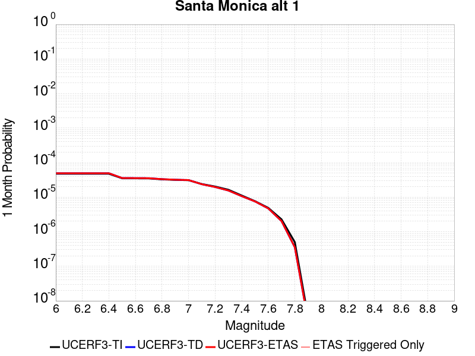 |  |  |

| Magnitude | 1 wk TI Prob | 1 wk TD Prob | 1 wk ETAS Prob | 1 wk ETAS/TD Gain | 1 wk ETAS Triggered Only | 1 mo TI Prob | 1 mo TD Prob | 1 mo ETAS Prob | 1 mo ETAS/TD Gain | 1 mo ETAS Triggered Only | 1 yr TI Prob | 1 yr TD Prob | 1 yr ETAS Prob | 1 yr ETAS/TD Gain | 1 yr ETAS Triggered Only | 10 yr TI Prob | 10 yr TD Prob | 10 yr ETAS Prob | 10 yr ETAS/TD Gain | 10 yr ETAS Triggered Only |
|-----|-----|-----|-----|-----|-----|-----|-----|-----|-----|-----|-----|-----|-----|-----|-----|-----|-----|-----|-----|-----|
| 6.0 | 1.1066008E-5 | 1.148031E-5 | 1.148031E-5 | 1.0 | 0.0 | 4.742488E-5 | 4.920048E-5 | 4.920048E-5 | 1.0 | 0.0 | 5.7724497E-4 | 5.9886515E-4 | 5.9886515E-4 | 1.0 | 0.0 | 0.005757478 | 0.0059739 | 0.005989881 | 1.0026752 | 1.607717E-5 |
| 6.1 | 1.1066008E-5 | 1.148031E-5 | 1.148031E-5 | 1.0 | 0.0 | 4.742488E-5 | 4.920048E-5 | 4.920048E-5 | 1.0 | 0.0 | 5.7724497E-4 | 5.9886515E-4 | 5.9886515E-4 | 1.0 | 0.0 | 0.005757478 | 0.0059739 | 0.005989881 | 1.0026752 | 1.607717E-5 |
| 6.2 | 1.1066008E-5 | 1.148031E-5 | 1.148031E-5 | 1.0 | 0.0 | 4.742488E-5 | 4.920048E-5 | 4.920048E-5 | 1.0 | 0.0 | 5.7724497E-4 | 5.9886515E-4 | 5.9886515E-4 | 1.0 | 0.0 | 0.005757478 | 0.0059739 | 0.005989881 | 1.0026752 | 1.607717E-5 |
| 6.3 | 1.1066008E-5 | 1.148031E-5 | 1.148031E-5 | 1.0 | 0.0 | 4.742488E-5 | 4.920048E-5 | 4.920048E-5 | 1.0 | 0.0 | 5.7724497E-4 | 5.9886515E-4 | 5.9886515E-4 | 1.0 | 0.0 | 0.005757478 | 0.0059739 | 0.005989881 | 1.0026752 | 1.607717E-5 |
| 6.4 | 1.1066008E-5 | 1.148031E-5 | 1.148031E-5 | 1.0 | 0.0 | 4.742488E-5 | 4.920048E-5 | 4.920048E-5 | 1.0 | 0.0 | 5.7724497E-4 | 5.9886515E-4 | 5.9886515E-4 | 1.0 | 0.0 | 0.005757478 | 0.0059739 | 0.005989881 | 1.0026752 | 1.607717E-5 |
| 6.5 | 8.183544E-6 | 8.335432E-6 | 8.335432E-6 | 1.0 | 0.0 | 3.5071862E-5 | 3.57228E-5 | 3.57228E-5 | 1.0 | 0.0 | 4.2691626E-4 | 4.3483984E-4 | 4.3483984E-4 | 1.0 | 0.0 | 0.0042609703 | 0.0043400554 | 0.004356063 | 1.0036883 | 1.607717E-5 |
| 6.6 | 8.1543285E-6 | 8.303646E-6 | 8.303646E-6 | 1.0 | 0.0 | 3.4946657E-5 | 3.5586578E-5 | 3.5586578E-5 | 1.0 | 0.0 | 4.2539247E-4 | 4.3318202E-4 | 4.3318202E-4 | 1.0 | 0.0 | 0.0042457907 | 0.004323542 | 0.0043395497 | 1.0037024 | 1.607717E-5 |
| 6.7 | 8.110878E-6 | 8.257042E-6 | 8.257042E-6 | 1.0 | 0.0 | 3.4760444E-5 | 3.5386853E-5 | 3.5386853E-5 | 1.0 | 0.0 | 4.231262E-4 | 4.3075136E-4 | 4.3075136E-4 | 1.0 | 0.0 | 0.0042232145 | 0.0042993296 | 0.0043153376 | 1.0037234 | 1.607717E-5 |
| 6.8 | 7.644036E-6 | 7.75106E-6 | 7.75106E-6 | 1.0 | 0.0 | 3.275974E-5 | 3.3218414E-5 | 3.3218414E-5 | 1.0 | 0.0 | 3.9877684E-4 | 4.0436056E-4 | 4.0436056E-4 | 1.0 | 0.0 | 0.00398062 | 0.0040363944 | 0.0040524066 | 1.0039669 | 1.607717E-5 |
| 6.9 | 7.3698293E-6 | 7.455719E-6 | 7.455719E-6 | 1.0 | 0.0 | 3.15846E-5 | 3.19527E-5 | 3.19527E-5 | 1.0 | 0.0 | 3.8447464E-4 | 3.8895605E-4 | 3.8895605E-4 | 1.0 | 0.0 | 0.0038381014 | 0.0038828964 | 0.0038989112 | 1.0041244 | 1.607717E-5 |
| 7.0 | 7.209872E-6 | 7.2856255E-6 | 7.2856255E-6 | 1.0 | 0.0 | 3.0899086E-5 | 3.1223743E-5 | 3.1223743E-5 | 1.0 | 0.0 | 3.7613141E-4 | 3.8008415E-4 | 3.8008415E-4 | 1.0 | 0.0 | 0.0037549543 | 0.0037944836 | 0.0038104998 | 1.004221 | 1.607717E-5 |
| 7.1 | 5.603456E-6 | 5.5238925E-6 | 5.5238925E-6 | 1.0 | 0.0 | 2.4014591E-5 | 2.3673612E-5 | 2.3673612E-5 | 1.0 | 0.0 | 2.923384E-4 | 2.881885E-4 | 2.881885E-4 | 1.0 | 0.0 | 0.0029195412 | 0.0028781896 | 0.0028942204 | 1.0055698 | 1.607717E-5 |
| 7.2 | 4.7483613E-6 | 4.5911324E-6 | 4.5911324E-6 | 1.0 | 0.0 | 2.0349962E-5 | 1.9676136E-5 | 1.9676136E-5 | 1.0 | 0.0 | 2.4773262E-4 | 2.3953074E-4 | 2.3953074E-4 | 1.0 | 0.0 | 0.0024745662 | 0.0023927398 | 0.0024087785 | 1.006703 | 1.607717E-5 |
| 7.3 | 3.829015E-6 | 3.6342253E-6 | 3.6342253E-6 | 1.0 | 0.0 | 1.6409962E-5 | 1.5575159E-5 | 1.5575159E-5 | 1.0 | 0.0 | 1.9977297E-4 | 1.8961114E-4 | 1.8961114E-4 | 1.0 | 0.0 | 0.0019959346 | 0.0018945024 | 0.0019105491 | 1.0084702 | 1.607717E-5 |
| 7.4 | 2.610755E-6 | 2.4995716E-6 | 2.4995716E-6 | 1.0 | 0.0 | 1.1188902E-5 | 1.0712406E-5 | 1.0712406E-5 | 1.0 | 0.0 | 1.3621636E-4 | 1.3041578E-4 | 1.3041578E-4 | 1.0 | 0.0 | 0.001361329 | 0.0013033969 | 0.0013194531 | 1.0123187 | 1.607717E-5 |
| 7.5 | 1.792146E-6 | 1.7584184E-6 | 1.7584184E-6 | 1.0 | 0.0 | 7.680603E-6 | 7.536057E-6 | 7.536057E-6 | 1.0 | 0.0 | 9.3507326E-5 | 9.1747665E-5 | 9.1747665E-5 | 1.0 | 0.0 | 9.3467993E-4 | 9.1710105E-4 | 9.3316345E-4 | 1.0175143 | 1.607717E-5 |
| 7.6 | 1.1473018E-6 | 1.1029152E-6 | 1.1029152E-6 | 1.0 | 0.0 | 4.9169985E-6 | 4.726771E-6 | 4.726771E-6 | 1.0 | 0.0 | 5.986281E-5 | 5.7546935E-5 | 5.7546935E-5 | 1.0 | 0.0 | 5.984669E-4 | 5.7532196E-4 | 5.913899E-4 | 1.0279286 | 1.607717E-5 |
| 7.7 | 5.330919E-7 | 4.7452556E-7 | 4.7452556E-7 | 1.0 | 0.0 | 2.2846775E-6 | 2.0336795E-6 | 2.0336795E-6 | 1.0 | 0.0 | 2.7815593E-5 | 2.4759778E-5 | 2.4759778E-5 | 1.0 | 0.0 | 2.7812112E-4 | 2.4757133E-4 | 2.6364453E-4 | 1.0649235 | 1.607717E-5 |
| 7.8 | 1.1668574E-7 | 8.2966224E-8 | 8.2966224E-8 | 1.0 | 0.0 | 5.000816E-7 | 3.5556948E-7 | 3.5556948E-7 | 1.0 | 0.0 | 6.0884768E-6 | 4.32905E-6 | 4.32905E-6 | 1.0 | 0.0 | 6.08831E-5 | 4.3289692E-5 | 4.3289692E-5 | 1.0 | 0.0 |
| 7.9 | 8.007447E-10 | 6.1608785E-10 | 6.1608785E-10 | 1.0 | 0.0 | 3.4317629E-9 | 2.6403764E-9 | 2.6403764E-9 | 1.0 | 0.0 | 4.1781714E-8 | 3.2146584E-8 | 3.2146584E-8 | 1.0 | 0.0 | 4.1781706E-7 | 3.214658E-7 | 3.214658E-7 | 1.0 | 0.0 |

## Newport-Inglewood (Offshore)
*[(top)](#table-of-contents)*

| 1 Week | 1 Month | 1 Year | 10 Year |
|-----|-----|-----|-----|
|  |  |  | 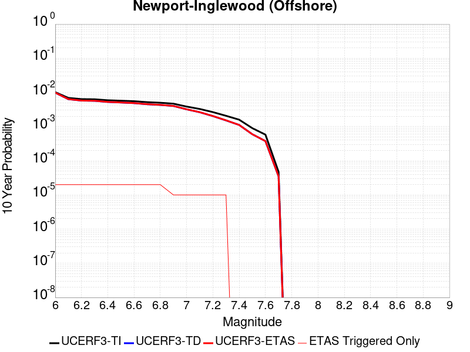 |

| Magnitude | 1 wk TI Prob | 1 wk TD Prob | 1 wk ETAS Prob | 1 wk ETAS/TD Gain | 1 wk ETAS Triggered Only | 1 mo TI Prob | 1 mo TD Prob | 1 mo ETAS Prob | 1 mo ETAS/TD Gain | 1 mo ETAS Triggered Only | 1 yr TI Prob | 1 yr TD Prob | 1 yr ETAS Prob | 1 yr ETAS/TD Gain | 1 yr ETAS Triggered Only | 10 yr TI Prob | 10 yr TD Prob | 10 yr ETAS Prob | 10 yr ETAS/TD Gain | 10 yr ETAS Triggered Only |
|-----|-----|-----|-----|-----|-----|-----|-----|-----|-----|-----|-----|-----|-----|-----|-----|-----|-----|-----|-----|-----|
| 6.0 | 1.9626508E-5 | 1.8965357E-5 | 1.8965357E-5 | 1.0 | 0.0 | 8.411089E-5 | 8.1277634E-5 | 8.1277634E-5 | 1.0 | 0.0 | 0.001023569 | 9.891186E-4 | 9.891186E-4 | 1.0 | 0.0 | 0.010188672 | 0.009848503 | 0.0098644225 | 1.0016164 | 1.607717E-5 |
| 6.1 | 1.331886E-5 | 1.2218092E-5 | 1.2218092E-5 | 1.0 | 0.0 | 5.707958E-5 | 5.2362207E-5 | 5.2362207E-5 | 1.0 | 0.0 | 6.947222E-4 | 6.3732493E-4 | 6.3732493E-4 | 1.0 | 0.0 | 0.006925544 | 0.006355149 | 0.006371124 | 1.0025138 | 1.607717E-5 |
| 6.2 | 1.2250852E-5 | 1.1076029E-5 | 1.1076029E-5 | 1.0 | 0.0 | 5.2502597E-5 | 4.7467838E-5 | 4.7467838E-5 | 1.0 | 0.0 | 6.3903164E-4 | 5.777687E-4 | 5.777687E-4 | 1.0 | 0.0 | 0.006371971 | 0.0057627866 | 0.0057787714 | 1.0027738 | 1.607717E-5 |
| 6.3 | 1.2106258E-5 | 1.0918891E-5 | 1.0918891E-5 | 1.0 | 0.0 | 5.1882926E-5 | 4.6794412E-5 | 4.6794412E-5 | 1.0 | 0.0 | 6.3149154E-4 | 5.69574E-4 | 5.69574E-4 | 1.0 | 0.0 | 0.0062970007 | 0.005681259 | 0.005697245 | 1.0028138 | 1.607717E-5 |
| 6.4 | 1.1348758E-5 | 1.0109362E-5 | 1.0109362E-5 | 1.0 | 0.0 | 4.8636626E-5 | 4.3325123E-5 | 4.3325123E-5 | 1.0 | 0.0 | 5.919901E-4 | 5.273565E-4 | 5.273565E-4 | 1.0 | 0.0 | 0.005904155 | 0.0052611465 | 0.005277139 | 1.0030397 | 1.607717E-5 |
| 6.5 | 1.100837E-5 | 9.7433895E-6 | 9.7433895E-6 | 1.0 | 0.0 | 4.7177873E-5 | 4.1756717E-5 | 4.1756717E-5 | 1.0 | 0.0 | 5.7423924E-4 | 5.082702E-4 | 5.082702E-4 | 1.0 | 0.0 | 0.005727576 | 0.0050711688 | 0.005087164 | 1.0031543 | 1.607717E-5 |
| 6.6 | 1.0634696E-5 | 9.345544E-6 | 9.345544E-6 | 1.0 | 0.0 | 4.557647E-5 | 4.0051716E-5 | 4.0051716E-5 | 1.0 | 0.0 | 5.5475225E-4 | 4.8752132E-4 | 4.8752132E-4 | 1.0 | 0.0 | 0.0055336943 | 0.0048646047 | 0.0048806034 | 1.0032889 | 1.607717E-5 |
| 6.7 | 9.9780855E-6 | 8.667911E-6 | 8.667911E-6 | 1.0 | 0.0 | 4.276252E-5 | 3.7147664E-5 | 3.7147664E-5 | 1.0 | 0.0 | 5.205093E-4 | 4.5217964E-4 | 4.5217964E-4 | 1.0 | 0.0 | 0.0051929182 | 0.004512675 | 0.0045286794 | 1.0035466 | 1.607717E-5 |
| 6.8 | 9.59546E-6 | 8.27295E-6 | 8.27295E-6 | 1.0 | 0.0 | 4.1122752E-5 | 3.5455025E-5 | 3.5455025E-5 | 1.0 | 0.0 | 5.0055445E-4 | 4.315801E-4 | 4.315801E-4 | 1.0 | 0.0 | 0.004994285 | 0.004307495 | 0.004323503 | 1.0037163 | 1.607717E-5 |
| 6.9 | 9.000614E-6 | 7.70684E-6 | 7.70684E-6 | 1.0 | 0.0 | 3.857349E-5 | 3.30289E-5 | 3.30289E-5 | 1.0 | 0.0 | 4.6953102E-4 | 4.0205332E-4 | 4.0205332E-4 | 1.0 | 0.0 | 0.004685402 | 0.0040133307 | 0.0040133307 | 1.0 | 0.0 |
| 7.0 | 7.4070194E-6 | 6.148904E-6 | 6.148904E-6 | 1.0 | 0.0 | 3.1743984E-5 | 2.635218E-5 | 2.635218E-5 | 1.0 | 0.0 | 3.8641447E-4 | 3.207907E-4 | 3.207907E-4 | 1.0 | 0.0 | 0.0038574322 | 0.0032032963 | 0.0032032963 | 1.0 | 0.0 |
| 7.1 | 6.299615E-6 | 5.0565927E-6 | 5.0565927E-6 | 1.0 | 0.0 | 2.699807E-5 | 2.1670932E-5 | 2.1670932E-5 | 1.0 | 0.0 | 3.2865192E-4 | 2.638118E-4 | 2.638118E-4 | 1.0 | 0.0 | 0.003281663 | 0.002635001 | 0.002635001 | 1.0 | 0.0 |
| 7.2 | 5.096653E-6 | 3.892769E-6 | 3.892769E-6 | 1.0 | 0.0 | 2.1842614E-5 | 1.668319E-5 | 1.668319E-5 | 1.0 | 0.0 | 2.6590136E-4 | 2.0309901E-4 | 2.0309901E-4 | 1.0 | 0.0 | 0.0026558342 | 0.0020291451 | 0.0020291451 | 1.0 | 0.0 |
| 7.3 | 3.9753018E-6 | 2.9099103E-6 | 2.9099103E-6 | 1.0 | 0.0 | 1.7036897E-5 | 1.2470985E-5 | 1.2470985E-5 | 1.0 | 0.0 | 2.0740448E-4 | 1.5182374E-4 | 1.5182374E-4 | 1.0 | 0.0 | 0.00207211 | 0.0015172083 | 0.0015172083 | 1.0 | 0.0 |
| 7.4 | 3.0568392E-6 | 2.1449955E-6 | 2.1449955E-6 | 1.0 | 0.0 | 1.3100675E-5 | 9.192806E-6 | 9.192806E-6 | 1.0 | 0.0 | 1.5948903E-4 | 1.1191672E-4 | 1.1191672E-4 | 1.0 | 0.0 | 0.0015937461 | 0.0011186098 | 0.0011186098 | 1.0 | 0.0 |
| 7.5 | 1.7279019E-6 | 1.1469883E-6 | 1.1469883E-6 | 1.0 | 0.0 | 7.405273E-6 | 4.915655E-6 | 4.915655E-6 | 1.0 | 0.0 | 9.015547E-5 | 5.9846494E-5 | 5.9846494E-5 | 1.0 | 0.0 | 9.01189E-4 | 5.9830764E-4 | 5.9830764E-4 | 1.0 | 0.0 |
| 7.6 | 1.1156416E-6 | 7.223012E-7 | 7.223012E-7 | 1.0 | 0.0 | 4.7813123E-6 | 3.095573E-6 | 3.095573E-6 | 1.0 | 0.0 | 5.821092E-5 | 3.7687976E-5 | 3.7687976E-5 | 1.0 | 0.0 | 5.8195676E-4 | 3.7681818E-4 | 3.7681818E-4 | 1.0 | 0.0 |
| 7.7 | 9.117973E-8 | 6.734145E-8 | 6.734145E-8 | 1.0 | 0.0 | 3.907702E-7 | 2.886062E-7 | 2.886062E-7 | 1.0 | 0.0 | 4.757617E-6 | 3.513775E-6 | 3.513775E-6 | 1.0 | 0.0 | 4.7575148E-5 | 3.5137225E-5 | 3.5137225E-5 | 1.0 | 0.0 |

## Holser alt 1
*[(top)](#table-of-contents)*

| 1 Week | 1 Month | 1 Year | 10 Year |
|-----|-----|-----|-----|
|  |  |  | 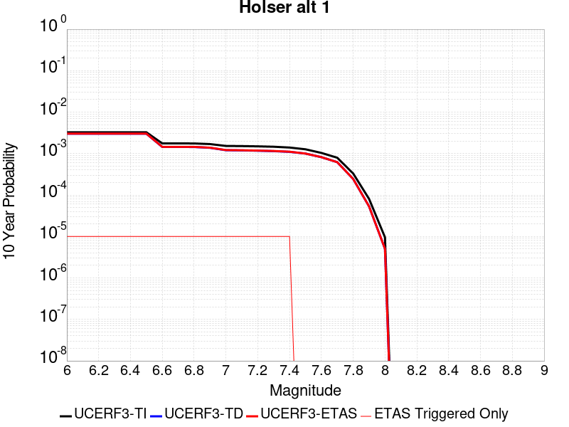 |

| Magnitude | 1 wk TI Prob | 1 wk TD Prob | 1 wk ETAS Prob | 1 wk ETAS/TD Gain | 1 wk ETAS Triggered Only | 1 mo TI Prob | 1 mo TD Prob | 1 mo ETAS Prob | 1 mo ETAS/TD Gain | 1 mo ETAS Triggered Only | 1 yr TI Prob | 1 yr TD Prob | 1 yr ETAS Prob | 1 yr ETAS/TD Gain | 1 yr ETAS Triggered Only | 10 yr TI Prob | 10 yr TD Prob | 10 yr ETAS Prob | 10 yr ETAS/TD Gain | 10 yr ETAS Triggered Only |
|-----|-----|-----|-----|-----|-----|-----|-----|-----|-----|-----|-----|-----|-----|-----|-----|-----|-----|-----|-----|-----|
| 6.0 | 6.2746653E-6 | 5.789965E-6 | 5.789965E-6 | 1.0 | 0.0 | 2.6891146E-5 | 2.4813964E-5 | 2.4813964E-5 | 1.0 | 0.0 | 3.273505E-4 | 3.020797E-4 | 3.020797E-4 | 1.0 | 0.0 | 0.0032686873 | 0.0030178234 | 0.0030338522 | 1.0053114 | 1.607717E-5 |
| 6.1 | 6.2746653E-6 | 5.789965E-6 | 5.789965E-6 | 1.0 | 0.0 | 2.6891146E-5 | 2.4813964E-5 | 2.4813964E-5 | 1.0 | 0.0 | 3.273505E-4 | 3.020797E-4 | 3.020797E-4 | 1.0 | 0.0 | 0.0032686873 | 0.0030178234 | 0.0030338522 | 1.0053114 | 1.607717E-5 |
| 6.2 | 6.2746653E-6 | 5.789965E-6 | 5.789965E-6 | 1.0 | 0.0 | 2.6891146E-5 | 2.4813964E-5 | 2.4813964E-5 | 1.0 | 0.0 | 3.273505E-4 | 3.020797E-4 | 3.020797E-4 | 1.0 | 0.0 | 0.0032686873 | 0.0030178234 | 0.0030338522 | 1.0053114 | 1.607717E-5 |
| 6.3 | 6.2746653E-6 | 5.789965E-6 | 5.789965E-6 | 1.0 | 0.0 | 2.6891146E-5 | 2.4813964E-5 | 2.4813964E-5 | 1.0 | 0.0 | 3.273505E-4 | 3.020797E-4 | 3.020797E-4 | 1.0 | 0.0 | 0.0032686873 | 0.0030178234 | 0.0030338522 | 1.0053114 | 1.607717E-5 |
| 6.4 | 6.2746653E-6 | 5.789965E-6 | 5.789965E-6 | 1.0 | 0.0 | 2.6891146E-5 | 2.4813964E-5 | 2.4813964E-5 | 1.0 | 0.0 | 3.273505E-4 | 3.020797E-4 | 3.020797E-4 | 1.0 | 0.0 | 0.0032686873 | 0.0030178234 | 0.0030338522 | 1.0053114 | 1.607717E-5 |
| 6.5 | 6.2746653E-6 | 5.789965E-6 | 5.789965E-6 | 1.0 | 0.0 | 2.6891146E-5 | 2.4813964E-5 | 2.4813964E-5 | 1.0 | 0.0 | 3.273505E-4 | 3.020797E-4 | 3.020797E-4 | 1.0 | 0.0 | 0.0032686873 | 0.0030178234 | 0.0030338522 | 1.0053114 | 1.607717E-5 |
| 6.6 | 3.375825E-6 | 2.7711897E-6 | 2.7711897E-6 | 1.0 | 0.0 | 1.4467741E-5 | 1.1876474E-5 | 1.1876474E-5 | 1.0 | 0.0 | 1.761305E-4 | 1.4458665E-4 | 1.4458665E-4 | 1.0 | 0.0 | 0.0017599097 | 0.0014449427 | 0.0014609967 | 1.0111104 | 1.607717E-5 |
| 6.7 | 3.375825E-6 | 2.7711897E-6 | 2.7711897E-6 | 1.0 | 0.0 | 1.4467741E-5 | 1.1876474E-5 | 1.1876474E-5 | 1.0 | 0.0 | 1.761305E-4 | 1.4458665E-4 | 1.4458665E-4 | 1.0 | 0.0 | 0.0017599097 | 0.0014449427 | 0.0014609967 | 1.0111104 | 1.607717E-5 |
| 6.8 | 3.366533E-6 | 2.7615893E-6 | 2.7615893E-6 | 1.0 | 0.0 | 1.4427919E-5 | 1.183533E-5 | 1.183533E-5 | 1.0 | 0.0 | 1.7564575E-4 | 1.4408577E-4 | 1.4408577E-4 | 1.0 | 0.0 | 0.0017550698 | 0.0014399405 | 0.0014559946 | 1.011149 | 1.607717E-5 |
| 6.9 | 3.253174E-6 | 2.6438113E-6 | 2.6438113E-6 | 1.0 | 0.0 | 1.39421E-5 | 1.1330571E-5 | 1.1330571E-5 | 1.0 | 0.0 | 1.6973184E-4 | 1.3794114E-4 | 1.3794114E-4 | 1.0 | 0.0 | 0.0016960226 | 0.001378571 | 0.001394626 | 1.0116462 | 1.607717E-5 |
| 7.0 | 2.9336593E-6 | 2.311799E-6 | 2.311799E-6 | 1.0 | 0.0 | 1.2572766E-5 | 9.907673E-6 | 9.907673E-6 | 1.0 | 0.0 | 1.5306266E-4 | 1.2061927E-4 | 1.2061927E-4 | 1.0 | 0.0 | 0.0015295728 | 0.0012055405 | 0.0012215982 | 1.01332 | 1.607717E-5 |
| 7.1 | 2.9087812E-6 | 2.2876513E-6 | 2.2876513E-6 | 1.0 | 0.0 | 1.2466146E-5 | 9.804184E-6 | 9.804184E-6 | 1.0 | 0.0 | 1.5176475E-4 | 1.19359414E-4 | 1.19359414E-4 | 1.0 | 0.0 | 0.0015166114 | 0.0011929555 | 0.0012090135 | 1.0134606 | 1.607717E-5 |
| 7.2 | 2.8674524E-6 | 2.2475429E-6 | 2.2475429E-6 | 1.0 | 0.0 | 1.2289024E-5 | 9.63229E-6 | 9.63229E-6 | 1.0 | 0.0 | 1.4960859E-4 | 1.1726685E-4 | 1.1726685E-4 | 1.0 | 0.0 | 0.0014950791 | 0.001172052 | 0.0011881103 | 1.0137011 | 1.607717E-5 |
| 7.3 | 2.8057775E-6 | 2.1954324E-6 | 2.1954324E-6 | 1.0 | 0.0 | 1.2024705E-5 | 9.408962E-6 | 9.408962E-6 | 1.0 | 0.0 | 1.4639096E-4 | 1.14548115E-4 | 1.14548115E-4 | 1.0 | 0.0 | 0.0014629456 | 0.001144893 | 0.0011609518 | 1.0140264 | 1.607717E-5 |
| 7.4 | 2.683666E-6 | 2.1092305E-6 | 2.1092305E-6 | 1.0 | 0.0 | 1.1501375E-5 | 9.039529E-6 | 9.039529E-6 | 1.0 | 0.0 | 1.4002025E-4 | 1.1005072E-4 | 1.1005072E-4 | 1.0 | 0.0 | 0.0013993206 | 0.0010999644 | 0.0011160239 | 1.0146 | 1.607717E-5 |
| 7.5 | 2.434495E-6 | 1.9195363E-6 | 1.9195363E-6 | 1.0 | 0.0 | 1.0433508E-5 | 8.226558E-6 | 8.226558E-6 | 1.0 | 0.0 | 1.2702055E-4 | 1.0015376E-4 | 1.0015376E-4 | 1.0 | 0.0 | 0.0012694797 | 0.0010010883 | 0.0010010883 | 1.0 | 0.0 |
| 7.6 | 1.9914562E-6 | 1.5731459E-6 | 1.5731459E-6 | 1.0 | 0.0 | 8.534785E-6 | 6.742037E-6 | 6.742037E-6 | 1.0 | 0.0 | 1.03906044E-4 | 8.208122E-5 | 8.208122E-5 | 1.0 | 0.0 | 0.0010385747 | 8.205106E-4 | 8.205106E-4 | 1.0 | 0.0 |
| 7.7 | 1.5229501E-6 | 1.1896061E-6 | 1.1896061E-6 | 1.0 | 0.0 | 6.526913E-6 | 5.098302E-6 | 5.098302E-6 | 1.0 | 0.0 | 7.946226E-5 | 6.2070074E-5 | 6.2070074E-5 | 1.0 | 0.0 | 7.943385E-4 | 6.2052865E-4 | 6.2052865E-4 | 1.0 | 0.0 |
| 7.8 | 6.3489426E-7 | 4.687806E-7 | 4.687806E-7 | 1.0 | 0.0 | 2.7209726E-6 | 2.009058E-6 | 2.009058E-6 | 1.0 | 0.0 | 3.312734E-5 | 2.4460009E-5 | 2.4460009E-5 | 1.0 | 0.0 | 3.31224E-4 | 2.4457334E-4 | 2.4457334E-4 | 1.0 | 0.0 |
| 7.9 | 1.5459432E-7 | 1.0193758E-7 | 1.0193758E-7 | 1.0 | 0.0 | 6.6254694E-7 | 4.3687527E-7 | 4.3687527E-7 | 1.0 | 0.0 | 8.066479E-6 | 5.3189433E-6 | 5.3189433E-6 | 1.0 | 0.0 | 8.066186E-5 | 5.3188178E-5 | 5.3188178E-5 | 1.0 | 0.0 |
| 8.0 | 1.8307812E-8 | 9.690293E-9 | 9.690293E-9 | 1.0 | 0.0 | 7.846205E-8 | 4.152983E-8 | 4.152983E-8 | 1.0 | 0.0 | 9.55275E-7 | 5.0562556E-7 | 5.0562556E-7 | 1.0 | 0.0 | 9.552709E-6 | 5.0562444E-6 | 5.0562444E-6 | 1.0 | 0.0 |

## Big Pine (East)
*[(top)](#table-of-contents)*

| 1 Week | 1 Month | 1 Year | 10 Year |
|-----|-----|-----|-----|
|  |  |  |  |

| Magnitude | 1 wk TI Prob | 1 wk TD Prob | 1 wk ETAS Prob | 1 wk ETAS/TD Gain | 1 wk ETAS Triggered Only | 1 mo TI Prob | 1 mo TD Prob | 1 mo ETAS Prob | 1 mo ETAS/TD Gain | 1 mo ETAS Triggered Only | 1 yr TI Prob | 1 yr TD Prob | 1 yr ETAS Prob | 1 yr ETAS/TD Gain | 1 yr ETAS Triggered Only | 10 yr TI Prob | 10 yr TD Prob | 10 yr ETAS Prob | 10 yr ETAS/TD Gain | 10 yr ETAS Triggered Only |
|-----|-----|-----|-----|-----|-----|-----|-----|-----|-----|-----|-----|-----|-----|-----|-----|-----|-----|-----|-----|-----|
| 6.0 | 9.916913E-6 | 1.2816984E-5 | 1.2816984E-5 | 1.0 | 0.0 | 4.250036E-5 | 5.49289E-5 | 5.49289E-5 | 1.0 | 0.0 | 5.173191E-4 | 6.685763E-4 | 6.846427E-4 | 1.0240308 | 1.607717E-5 | 0.0051611643 | 0.006670441 | 0.006686411 | 1.0023941 | 1.607717E-5 |
| 6.1 | 9.916913E-6 | 1.2816984E-5 | 1.2816984E-5 | 1.0 | 0.0 | 4.250036E-5 | 5.49289E-5 | 5.49289E-5 | 1.0 | 0.0 | 5.173191E-4 | 6.685763E-4 | 6.846427E-4 | 1.0240308 | 1.607717E-5 | 0.0051611643 | 0.006670441 | 0.006686411 | 1.0023941 | 1.607717E-5 |
| 6.2 | 9.916913E-6 | 1.2816984E-5 | 1.2816984E-5 | 1.0 | 0.0 | 4.250036E-5 | 5.49289E-5 | 5.49289E-5 | 1.0 | 0.0 | 5.173191E-4 | 6.685763E-4 | 6.846427E-4 | 1.0240308 | 1.607717E-5 | 0.0051611643 | 0.006670441 | 0.006686411 | 1.0023941 | 1.607717E-5 |
| 6.3 | 5.479711E-6 | 8.112951E-6 | 8.112951E-6 | 1.0 | 0.0 | 2.3484265E-5 | 3.4769346E-5 | 3.4769346E-5 | 1.0 | 0.0 | 2.858834E-4 | 4.2323777E-4 | 4.3930812E-4 | 1.0379701 | 1.607717E-5 | 0.0028551589 | 0.004227244 | 0.004243253 | 1.0037872 | 1.607717E-5 |
| 6.4 | 5.465009E-6 | 8.097245E-6 | 8.097245E-6 | 1.0 | 0.0 | 2.3421257E-5 | 3.4702036E-5 | 3.4702036E-5 | 1.0 | 0.0 | 2.851165E-4 | 4.2241855E-4 | 4.3848893E-4 | 1.0380437 | 1.607717E-5 | 0.0028475097 | 0.0042190826 | 0.004235092 | 1.0037946 | 1.607717E-5 |
| 6.5 | 4.826767E-6 | 7.422301E-6 | 7.422301E-6 | 1.0 | 0.0 | 2.068598E-5 | 3.180949E-5 | 3.180949E-5 | 1.0 | 0.0 | 2.518227E-4 | 3.872145E-4 | 4.0328543E-4 | 1.041504 | 1.607717E-5 | 0.0025153751 | 0.003868283 | 0.003884298 | 1.00414 | 1.607717E-5 |
| 6.6 | 4.3146847E-6 | 6.8822374E-6 | 6.8822374E-6 | 1.0 | 0.0 | 1.8491375E-5 | 2.9494982E-5 | 2.9494982E-5 | 1.0 | 0.0 | 2.2510924E-4 | 3.590447E-4 | 3.751161E-4 | 1.0447615 | 1.607717E-5 | 0.0022488134 | 0.0035874986 | 0.003603518 | 1.0044653 | 1.607717E-5 |
| 6.7 | 3.6968106E-6 | 5.9954727E-6 | 5.9954727E-6 | 1.0 | 0.0 | 1.5843378E-5 | 2.5694639E-5 | 2.5694639E-5 | 1.0 | 0.0 | 1.9287605E-4 | 3.1278885E-4 | 3.28861E-4 | 1.0513834 | 1.607717E-5 | 0.0019270873 | 0.0031262483 | 0.0031422751 | 1.0051266 | 1.607717E-5 |
| 6.8 | 3.4671132E-6 | 5.702177E-6 | 5.702177E-6 | 1.0 | 0.0 | 1.4858972E-5 | 2.4437682E-5 | 2.4437682E-5 | 1.0 | 0.0 | 1.8089297E-4 | 2.974896E-4 | 3.13562E-4 | 1.0540267 | 1.607717E-5 | 0.0018074579 | 0.002973667 | 0.0029896966 | 1.0053904 | 1.607717E-5 |
| 6.9 | 2.7686972E-6 | 4.825223E-6 | 4.825223E-6 | 1.0 | 0.0 | 1.1865792E-5 | 2.0679368E-5 | 2.0679368E-5 | 1.0 | 0.0 | 1.4445644E-4 | 2.5174298E-4 | 2.5174298E-4 | 1.0 | 0.0 | 0.0014436257 | 0.0025172636 | 0.0025172636 | 1.0 | 0.0 |
| 7.0 | 2.1472624E-6 | 3.9850406E-6 | 3.9850406E-6 | 1.0 | 0.0 | 9.20252E-6 | 1.7078637E-5 | 1.7078637E-5 | 1.0 | 0.0 | 1.12034926E-4 | 2.079131E-4 | 2.079131E-4 | 1.0 | 0.0 | 0.0011197845 | 0.0020798394 | 0.0020798394 | 1.0 | 0.0 |
| 7.1 | 1.7018335E-6 | 3.344876E-6 | 3.344876E-6 | 1.0 | 0.0 | 7.293552E-6 | 1.4335106E-5 | 1.4335106E-5 | 1.0 | 0.0 | 8.879537E-5 | 1.7451629E-4 | 1.7451629E-4 | 1.0 | 0.0 | 8.87599E-4 | 0.0017464145 | 0.0017464145 | 1.0 | 0.0 |
| 7.2 | 1.25603E-6 | 2.794484E-6 | 2.794484E-6 | 1.0 | 0.0 | 5.3829745E-6 | 1.1976307E-5 | 1.1976307E-5 | 1.0 | 0.0 | 6.553574E-5 | 1.4580201E-4 | 1.4580201E-4 | 1.0 | 0.0 | 6.551642E-4 | 0.001459661 | 0.001459661 | 1.0 | 0.0 |
| 7.3 | 1.112297E-6 | 2.610332E-6 | 2.610332E-6 | 1.0 | 0.0 | 4.7669787E-6 | 1.118709E-5 | 1.118709E-5 | 1.0 | 0.0 | 5.803642E-5 | 1.3619453E-4 | 1.3619453E-4 | 1.0 | 0.0 | 5.802127E-4 | 0.0013635408 | 0.0013635408 | 1.0 | 0.0 |
| 7.4 | 1.0137181E-6 | 2.4834917E-6 | 2.4834917E-6 | 1.0 | 0.0 | 4.3444993E-6 | 1.0643494E-5 | 1.0643494E-5 | 1.0 | 0.0 | 5.2892992E-5 | 1.2957705E-4 | 1.2957705E-4 | 1.0 | 0.0 | 5.288041E-4 | 0.0012972289 | 0.0012972289 | 1.0 | 0.0 |
| 7.5 | 9.598608E-7 | 2.4071483E-6 | 2.4071483E-6 | 1.0 | 0.0 | 4.1136827E-6 | 1.031631E-5 | 1.031631E-5 | 1.0 | 0.0 | 5.0082934E-5 | 1.2559404E-4 | 1.2559404E-4 | 1.0 | 0.0 | 5.007165E-4 | 0.0012572526 | 0.0012572526 | 1.0 | 0.0 |
| 7.6 | 7.929459E-7 | 2.0448588E-6 | 2.0448588E-6 | 1.0 | 0.0 | 3.3983351E-6 | 8.763653E-6 | 8.763653E-6 | 1.0 | 0.0 | 4.1373947E-5 | 1.06692416E-4 | 1.06692416E-4 | 1.0 | 0.0 | 4.1366243E-4 | 0.0010685222 | 0.0010685222 | 1.0 | 0.0 |
| 7.7 | 4.155788E-7 | 1.1605589E-6 | 1.1605589E-6 | 1.0 | 0.0 | 1.7810507E-6 | 4.9738146E-6 | 4.9738146E-6 | 1.0 | 0.0 | 2.1684076E-5 | 6.0554554E-5 | 6.0554554E-5 | 1.0 | 0.0 | 2.1681961E-4 | 6.0857297E-4 | 6.0857297E-4 | 1.0 | 0.0 |
| 7.8 | 1.14666925E-7 | 2.592015E-7 | 2.592015E-7 | 1.0 | 0.0 | 4.914296E-7 | 1.1108631E-6 | 1.1108631E-6 | 1.0 | 0.0 | 5.9831386E-6 | 1.3524678E-5 | 1.3524678E-5 | 1.0 | 0.0 | 5.9829777E-5 | 1.3634123E-4 | 1.3634123E-4 | 1.0 | 0.0 |
| 7.9 | 2.9231824E-8 | 4.1463963E-8 | 4.1463963E-8 | 1.0 | 0.0 | 1.2527924E-7 | 1.7770269E-7 | 1.7770269E-7 | 1.0 | 0.0 | 1.5252737E-6 | 2.1635283E-6 | 2.1635283E-6 | 1.0 | 0.0 | 1.5252632E-5 | 2.1967755E-5 | 2.1967755E-5 | 1.0 | 0.0 |

## San Pedro Escarpment
*[(top)](#table-of-contents)*

| 1 Week | 1 Month | 1 Year | 10 Year |
|-----|-----|-----|-----|
|  |  |  |  |

| Magnitude | 1 wk TI Prob | 1 wk TD Prob | 1 wk ETAS Prob | 1 wk ETAS/TD Gain | 1 wk ETAS Triggered Only | 1 mo TI Prob | 1 mo TD Prob | 1 mo ETAS Prob | 1 mo ETAS/TD Gain | 1 mo ETAS Triggered Only | 1 yr TI Prob | 1 yr TD Prob | 1 yr ETAS Prob | 1 yr ETAS/TD Gain | 1 yr ETAS Triggered Only | 10 yr TI Prob | 10 yr TD Prob | 10 yr ETAS Prob | 10 yr ETAS/TD Gain | 10 yr ETAS Triggered Only |
|-----|-----|-----|-----|-----|-----|-----|-----|-----|-----|-----|-----|-----|-----|-----|-----|-----|-----|-----|-----|-----|
| 6.0 | 1.1740281E-6 | 1.0380262E-6 | 1.0380262E-6 | 1.0 | 0.0 | 5.031539E-6 | 4.4486765E-6 | 4.4486765E-6 | 1.0 | 0.0 | 6.125726E-5 | 5.416135E-5 | 5.416135E-5 | 1.0 | 0.0 | 6.124038E-4 | 5.4148794E-4 | 5.575564E-4 | 1.0296746 | 1.607717E-5 |
| 6.1 | 1.1740281E-6 | 1.0380262E-6 | 1.0380262E-6 | 1.0 | 0.0 | 5.031539E-6 | 4.4486765E-6 | 4.4486765E-6 | 1.0 | 0.0 | 6.125726E-5 | 5.416135E-5 | 5.416135E-5 | 1.0 | 0.0 | 6.124038E-4 | 5.4148794E-4 | 5.575564E-4 | 1.0296746 | 1.607717E-5 |
| 6.2 | 1.1740281E-6 | 1.0380262E-6 | 1.0380262E-6 | 1.0 | 0.0 | 5.031539E-6 | 4.4486765E-6 | 4.4486765E-6 | 1.0 | 0.0 | 6.125726E-5 | 5.416135E-5 | 5.416135E-5 | 1.0 | 0.0 | 6.124038E-4 | 5.4148794E-4 | 5.575564E-4 | 1.0296746 | 1.607717E-5 |
| 6.3 | 1.1740281E-6 | 1.0380262E-6 | 1.0380262E-6 | 1.0 | 0.0 | 5.031539E-6 | 4.4486765E-6 | 4.4486765E-6 | 1.0 | 0.0 | 6.125726E-5 | 5.416135E-5 | 5.416135E-5 | 1.0 | 0.0 | 6.124038E-4 | 5.4148794E-4 | 5.575564E-4 | 1.0296746 | 1.607717E-5 |
| 6.4 | 1.1740281E-6 | 1.0380262E-6 | 1.0380262E-6 | 1.0 | 0.0 | 5.031539E-6 | 4.4486765E-6 | 4.4486765E-6 | 1.0 | 0.0 | 6.125726E-5 | 5.416135E-5 | 5.416135E-5 | 1.0 | 0.0 | 6.124038E-4 | 5.4148794E-4 | 5.575564E-4 | 1.0296746 | 1.607717E-5 |
| 6.5 | 1.1740281E-6 | 1.0380262E-6 | 1.0380262E-6 | 1.0 | 0.0 | 5.031539E-6 | 4.4486765E-6 | 4.4486765E-6 | 1.0 | 0.0 | 6.125726E-5 | 5.416135E-5 | 5.416135E-5 | 1.0 | 0.0 | 6.124038E-4 | 5.4148794E-4 | 5.575564E-4 | 1.0296746 | 1.607717E-5 |
| 6.6 | 1.1740281E-6 | 1.0380262E-6 | 1.0380262E-6 | 1.0 | 0.0 | 5.031539E-6 | 4.4486765E-6 | 4.4486765E-6 | 1.0 | 0.0 | 6.125726E-5 | 5.416135E-5 | 5.416135E-5 | 1.0 | 0.0 | 6.124038E-4 | 5.4148794E-4 | 5.575564E-4 | 1.0296746 | 1.607717E-5 |
| 6.7 | 1.1740281E-6 | 1.0380262E-6 | 1.0380262E-6 | 1.0 | 0.0 | 5.031539E-6 | 4.4486765E-6 | 4.4486765E-6 | 1.0 | 0.0 | 6.125726E-5 | 5.416135E-5 | 5.416135E-5 | 1.0 | 0.0 | 6.124038E-4 | 5.4148794E-4 | 5.575564E-4 | 1.0296746 | 1.607717E-5 |
| 6.8 | 1.1740281E-6 | 1.0380262E-6 | 1.0380262E-6 | 1.0 | 0.0 | 5.031539E-6 | 4.4486765E-6 | 4.4486765E-6 | 1.0 | 0.0 | 6.125726E-5 | 5.416135E-5 | 5.416135E-5 | 1.0 | 0.0 | 6.124038E-4 | 5.4148794E-4 | 5.575564E-4 | 1.0296746 | 1.607717E-5 |
| 6.9 | 1.1740281E-6 | 1.0380262E-6 | 1.0380262E-6 | 1.0 | 0.0 | 5.031539E-6 | 4.4486765E-6 | 4.4486765E-6 | 1.0 | 0.0 | 6.125726E-5 | 5.416135E-5 | 5.416135E-5 | 1.0 | 0.0 | 6.124038E-4 | 5.4148794E-4 | 5.575564E-4 | 1.0296746 | 1.607717E-5 |
| 7.0 | 1.1740281E-6 | 1.0380262E-6 | 1.0380262E-6 | 1.0 | 0.0 | 5.031539E-6 | 4.4486765E-6 | 4.4486765E-6 | 1.0 | 0.0 | 6.125726E-5 | 5.416135E-5 | 5.416135E-5 | 1.0 | 0.0 | 6.124038E-4 | 5.4148794E-4 | 5.575564E-4 | 1.0296746 | 1.607717E-5 |
| 7.1 | 1.1740281E-6 | 1.0380262E-6 | 1.0380262E-6 | 1.0 | 0.0 | 5.031539E-6 | 4.4486765E-6 | 4.4486765E-6 | 1.0 | 0.0 | 6.125726E-5 | 5.416135E-5 | 5.416135E-5 | 1.0 | 0.0 | 6.124038E-4 | 5.4148794E-4 | 5.575564E-4 | 1.0296746 | 1.607717E-5 |
| 7.2 | 1.1722314E-6 | 1.0362135E-6 | 1.0362135E-6 | 1.0 | 0.0 | 5.023839E-6 | 4.4409076E-6 | 4.4409076E-6 | 1.0 | 0.0 | 6.116352E-5 | 5.406677E-5 | 5.406677E-5 | 1.0 | 0.0 | 6.114669E-4 | 5.405426E-4 | 5.5661105E-4 | 1.0297266 | 1.607717E-5 |
| 7.3 | 1.1515234E-6 | 1.0152875E-6 | 1.0152875E-6 | 1.0 | 0.0 | 4.935091E-6 | 4.351225E-6 | 4.351225E-6 | 1.0 | 0.0 | 6.008308E-5 | 5.2974945E-5 | 5.2974945E-5 | 1.0 | 0.0 | 6.0066837E-4 | 5.296295E-4 | 5.456982E-4 | 1.0303395 | 1.607717E-5 |
| 7.4 | 1.1103637E-6 | 9.736466E-7 | 9.736466E-7 | 1.0 | 0.0 | 4.7586927E-6 | 4.172765E-6 | 4.172765E-6 | 1.0 | 0.0 | 5.793554E-5 | 5.0802293E-5 | 5.0802293E-5 | 1.0 | 0.0 | 5.792044E-4 | 5.079131E-4 | 5.2398216E-4 | 1.0316373 | 1.607717E-5 |
| 7.5 | 1.0425391E-6 | 9.1189133E-7 | 9.1189133E-7 | 1.0 | 0.0 | 4.4680173E-6 | 3.9081E-6 | 3.9081E-6 | 1.0 | 0.0 | 5.439675E-5 | 4.7580146E-5 | 4.7580146E-5 | 1.0 | 0.0 | 5.438344E-4 | 4.7570592E-4 | 4.9177546E-4 | 1.0337803 | 1.607717E-5 |
| 7.6 | 7.0184194E-7 | 5.886514E-7 | 5.886514E-7 | 1.0 | 0.0 | 3.0078907E-6 | 2.5227896E-6 | 2.5227896E-6 | 1.0 | 0.0 | 3.6620455E-5 | 3.071458E-5 | 3.071458E-5 | 1.0 | 0.0 | 3.661442E-4 | 3.071081E-4 | 3.231803E-4 | 1.0523341 | 1.607717E-5 |
| 7.7 | 3.0871365E-7 | 2.2456044E-7 | 2.2456044E-7 | 1.0 | 0.0 | 1.3230577E-6 | 9.624015E-7 | 9.624015E-7 | 1.0 | 0.0 | 1.610811E-5 | 1.1717177E-5 | 1.1717177E-5 | 1.0 | 0.0 | 1.6106942E-4 | 1.171657E-4 | 1.3324099E-4 | 1.1372013 | 1.607717E-5 |
| 7.8 | 5.7512665E-8 | 4.1053042E-8 | 4.1053042E-8 | 1.0 | 0.0 | 2.464828E-7 | 1.759416E-7 | 1.759416E-7 | 1.0 | 0.0 | 3.0009242E-6 | 2.142087E-6 | 2.142087E-6 | 1.0 | 0.0 | 3.0008836E-5 | 2.1420683E-5 | 2.1420683E-5 | 1.0 | 0.0 |
| 7.9 | 6.040053E-9 | 3.4534322E-9 | 3.4534322E-9 | 1.0 | 0.0 | 2.5885942E-8 | 1.4800423E-8 | 1.4800423E-8 | 1.0 | 0.0 | 3.151613E-7 | 1.8019513E-7 | 1.8019513E-7 | 1.0 | 0.0 | 3.1516086E-6 | 1.80195E-6 | 1.80195E-6 | 1.0 | 0.0 |

## Great Valley 11
*[(top)](#table-of-contents)*

| 1 Week | 1 Month | 1 Year | 10 Year |
|-----|-----|-----|-----|
|  |  |  |  |

| Magnitude | 1 wk TI Prob | 1 wk TD Prob | 1 wk ETAS Prob | 1 wk ETAS/TD Gain | 1 wk ETAS Triggered Only | 1 mo TI Prob | 1 mo TD Prob | 1 mo ETAS Prob | 1 mo ETAS/TD Gain | 1 mo ETAS Triggered Only | 1 yr TI Prob | 1 yr TD Prob | 1 yr ETAS Prob | 1 yr ETAS/TD Gain | 1 yr ETAS Triggered Only | 10 yr TI Prob | 10 yr TD Prob | 10 yr ETAS Prob | 10 yr ETAS/TD Gain | 10 yr ETAS Triggered Only |
|-----|-----|-----|-----|-----|-----|-----|-----|-----|-----|-----|-----|-----|-----|-----|-----|-----|-----|-----|-----|-----|
| 6.0 | 2.8099583E-5 | 2.9832152E-5 | 2.9832152E-5 | 1.0 | 0.0 | 1.20421224E-4 | 1.278462E-4 | 1.278462E-4 | 1.0 | 0.0 | 0.0014651422 | 0.0015554909 | 0.0015554909 | 1.0 | 0.0 | 0.0145552 | 0.01545356 | 0.015469389 | 1.0010242 | 1.607717E-5 |
| 6.1 | 2.483194E-5 | 2.590715E-5 | 2.590715E-5 | 1.0 | 0.0 | 1.0641825E-4 | 1.11026246E-4 | 1.11026246E-4 | 1.0 | 0.0 | 0.0012948721 | 0.0013509706 | 0.0013509706 | 1.0 | 0.0 | 0.012873529 | 0.013433994 | 0.013449855 | 1.0011806 | 1.607717E-5 |
| 6.2 | 2.483194E-5 | 2.590715E-5 | 2.590715E-5 | 1.0 | 0.0 | 1.0641825E-4 | 1.11026246E-4 | 1.11026246E-4 | 1.0 | 0.0 | 0.0012948721 | 0.0013509706 | 0.0013509706 | 1.0 | 0.0 | 0.012873529 | 0.013433994 | 0.013449855 | 1.0011806 | 1.607717E-5 |
| 6.3 | 2.0257901E-5 | 2.0398922E-5 | 2.0398922E-5 | 1.0 | 0.0 | 8.681669E-5 | 8.742122E-5 | 8.742122E-5 | 1.0 | 0.0 | 0.0010564806 | 0.0010638756 | 0.0010638756 | 1.0 | 0.0 | 0.01051472 | 0.010592012 | 0.010607919 | 1.0015018 | 1.607717E-5 |
| 6.4 | 1.8054898E-5 | 1.7780874E-5 | 1.7780874E-5 | 1.0 | 0.0 | 7.737584E-5 | 7.62017E-5 | 7.62017E-5 | 1.0 | 0.0 | 9.416436E-4 | 9.2739856E-4 | 9.2739856E-4 | 1.0 | 0.0 | 0.009376635 | 0.009239036 | 0.009254964 | 1.001724 | 1.607717E-5 |
| 6.5 | 1.34804895E-5 | 1.2321055E-5 | 1.2321055E-5 | 1.0 | 0.0 | 5.777225E-5 | 5.2803476E-5 | 5.2803476E-5 | 1.0 | 0.0 | 7.031501E-4 | 6.4269686E-4 | 6.4269686E-4 | 1.0 | 0.0 | 0.007009294 | 0.0064088185 | 0.0064088185 | 1.0 | 0.0 |
| 6.6 | 1.294883E-5 | 1.1732312E-5 | 1.1732312E-5 | 1.0 | 0.0 | 5.5493805E-5 | 5.028039E-5 | 5.028039E-5 | 1.0 | 0.0 | 6.754276E-4 | 6.1199587E-4 | 6.1199587E-4 | 1.0 | 0.0 | 0.006733784 | 0.0061035305 | 0.0061035305 | 1.0 | 0.0 |
| 6.7 | 1.1272237E-5 | 9.811886E-6 | 9.811886E-6 | 1.0 | 0.0 | 4.8308695E-5 | 4.2050277E-5 | 4.2050277E-5 | 1.0 | 0.0 | 5.879996E-4 | 5.118446E-4 | 5.118446E-4 | 1.0 | 0.0 | 0.005864462 | 0.0051069413 | 0.0051069413 | 1.0 | 0.0 |
| 6.8 | 9.8337505E-6 | 8.19377E-6 | 8.19377E-6 | 1.0 | 0.0 | 4.2143965E-5 | 3.5115696E-5 | 3.5115696E-5 | 1.0 | 0.0 | 5.1298196E-4 | 4.2745177E-4 | 4.2745177E-4 | 1.0 | 0.0 | 0.005117994 | 0.0042665056 | 0.0042665056 | 1.0 | 0.0 |
| 6.9 | 7.4224813E-6 | 5.4131347E-6 | 5.4131347E-6 | 1.0 | 0.0 | 3.1810247E-5 | 2.319895E-5 | 2.319895E-5 | 1.0 | 0.0 | 3.872209E-4 | 2.8241202E-4 | 2.8241202E-4 | 1.0 | 0.0 | 0.0038654688 | 0.0028206722 | 0.0028206722 | 1.0 | 0.0 |
| 7.0 | 4.4628923E-6 | 2.0110795E-6 | 2.0110795E-6 | 1.0 | 0.0 | 1.912654E-5 | 8.618884E-6 | 8.618884E-6 | 1.0 | 0.0 | 2.3284076E-4 | 1.04929975E-4 | 1.04929975E-4 | 1.0 | 0.0 | 0.0023259693 | 0.0010488159 | 0.0010488159 | 1.0 | 0.0 |
| 7.1 | 3.5546527E-6 | 1.1855836E-6 | 1.1855836E-6 | 1.0 | 0.0 | 1.5234136E-5 | 5.081063E-6 | 5.081063E-6 | 1.0 | 0.0 | 1.8545982E-4 | 6.186026E-5 | 6.186026E-5 | 1.0 | 0.0 | 0.0018530512 | 6.1843713E-4 | 6.1843713E-4 | 1.0 | 0.0 |
| 7.2 | 3.2039936E-6 | 1.1254128E-6 | 1.1254128E-6 | 1.0 | 0.0 | 1.3731329E-5 | 4.823189E-6 | 4.823189E-6 | 1.0 | 0.0 | 1.671661E-4 | 5.8720816E-5 | 5.8720816E-5 | 1.0 | 0.0 | 0.0016704041 | 5.870597E-4 | 5.870597E-4 | 1.0 | 0.0 |
| 7.3 | 2.8120473E-6 | 1.0305612E-6 | 1.0305612E-6 | 1.0 | 0.0 | 1.2051575E-5 | 4.4166836E-6 | 4.4166836E-6 | 1.0 | 0.0 | 1.4671806E-4 | 5.3771862E-5 | 5.3771862E-5 | 1.0 | 0.0 | 0.0014662122 | 5.3759513E-4 | 5.3759513E-4 | 1.0 | 0.0 |
| 7.4 | 2.4837766E-6 | 9.800582E-7 | 9.800582E-7 | 1.0 | 0.0 | 1.0644713E-5 | 4.200243E-6 | 4.200243E-6 | 1.0 | 0.0 | 1.2959167E-4 | 5.1136827E-5 | 5.1136827E-5 | 1.0 | 0.0 | 0.0012951613 | 5.112572E-4 | 5.112572E-4 | 1.0 | 0.0 |
| 7.5 | 1.5002679E-6 | 6.546144E-7 | 6.546144E-7 | 1.0 | 0.0 | 6.4297037E-6 | 2.8054874E-6 | 2.8054874E-6 | 1.0 | 0.0 | 7.827883E-5 | 3.4156317E-5 | 3.4156317E-5 | 1.0 | 0.0 | 7.825126E-4 | 3.4151482E-4 | 3.4151482E-4 | 1.0 | 0.0 |

## Mount Diablo Thrust North CFM
*[(top)](#table-of-contents)*

| 1 Week | 1 Month | 1 Year | 10 Year |
|-----|-----|-----|-----|
|  |  |  |  |

| Magnitude | 1 wk TI Prob | 1 wk TD Prob | 1 wk ETAS Prob | 1 wk ETAS/TD Gain | 1 wk ETAS Triggered Only | 1 mo TI Prob | 1 mo TD Prob | 1 mo ETAS Prob | 1 mo ETAS/TD Gain | 1 mo ETAS Triggered Only | 1 yr TI Prob | 1 yr TD Prob | 1 yr ETAS Prob | 1 yr ETAS/TD Gain | 1 yr ETAS Triggered Only | 10 yr TI Prob | 10 yr TD Prob | 10 yr ETAS Prob | 10 yr ETAS/TD Gain | 10 yr ETAS Triggered Only |
|-----|-----|-----|-----|-----|-----|-----|-----|-----|-----|-----|-----|-----|-----|-----|-----|-----|-----|-----|-----|-----|
| 6.0 | 1.479628E-5 | 1.876973E-5 | 1.876973E-5 | 1.0 | 0.0 | 6.341109E-5 | 8.043928E-5 | 8.043928E-5 | 1.0 | 0.0 | 7.717565E-4 | 9.789177E-4 | 9.789177E-4 | 1.0 | 0.0 | 0.007690818 | 0.009747355 | 0.009763276 | 1.0016333 | 1.607717E-5 |
| 6.1 | 1.479628E-5 | 1.876973E-5 | 1.876973E-5 | 1.0 | 0.0 | 6.341109E-5 | 8.043928E-5 | 8.043928E-5 | 1.0 | 0.0 | 7.717565E-4 | 9.789177E-4 | 9.789177E-4 | 1.0 | 0.0 | 0.007690818 | 0.009747355 | 0.009763276 | 1.0016333 | 1.607717E-5 |
| 6.2 | 1.479628E-5 | 1.876973E-5 | 1.876973E-5 | 1.0 | 0.0 | 6.341109E-5 | 8.043928E-5 | 8.043928E-5 | 1.0 | 0.0 | 7.717565E-4 | 9.789177E-4 | 9.789177E-4 | 1.0 | 0.0 | 0.007690818 | 0.009747355 | 0.009763276 | 1.0016333 | 1.607717E-5 |
| 6.3 | 1.479628E-5 | 1.876973E-5 | 1.876973E-5 | 1.0 | 0.0 | 6.341109E-5 | 8.043928E-5 | 8.043928E-5 | 1.0 | 0.0 | 7.717565E-4 | 9.789177E-4 | 9.789177E-4 | 1.0 | 0.0 | 0.007690818 | 0.009747355 | 0.009763276 | 1.0016333 | 1.607717E-5 |
| 6.4 | 1.479628E-5 | 1.876973E-5 | 1.876973E-5 | 1.0 | 0.0 | 6.341109E-5 | 8.043928E-5 | 8.043928E-5 | 1.0 | 0.0 | 7.717565E-4 | 9.789177E-4 | 9.789177E-4 | 1.0 | 0.0 | 0.007690818 | 0.009747355 | 0.009763276 | 1.0016333 | 1.607717E-5 |
| 6.5 | 1.479628E-5 | 1.876973E-5 | 1.876973E-5 | 1.0 | 0.0 | 6.341109E-5 | 8.043928E-5 | 8.043928E-5 | 1.0 | 0.0 | 7.717565E-4 | 9.789177E-4 | 9.789177E-4 | 1.0 | 0.0 | 0.007690818 | 0.009747355 | 0.009763276 | 1.0016333 | 1.607717E-5 |
| 6.6 | 1.479016E-5 | 1.8762841E-5 | 1.8762841E-5 | 1.0 | 0.0 | 6.338486E-5 | 8.040976E-5 | 8.040976E-5 | 1.0 | 0.0 | 7.714374E-4 | 9.785586E-4 | 9.785586E-4 | 1.0 | 0.0 | 0.007687649 | 0.009743797 | 0.009759717 | 1.0016339 | 1.607717E-5 |
| 6.7 | 1.479016E-5 | 1.8762841E-5 | 1.8762841E-5 | 1.0 | 0.0 | 6.338486E-5 | 8.040976E-5 | 8.040976E-5 | 1.0 | 0.0 | 7.714374E-4 | 9.785586E-4 | 9.785586E-4 | 1.0 | 0.0 | 0.007687649 | 0.009743797 | 0.009759717 | 1.0016339 | 1.607717E-5 |
| 6.8 | 1.4771667E-5 | 1.8741612E-5 | 1.8741612E-5 | 1.0 | 0.0 | 6.330561E-5 | 8.031878E-5 | 8.031878E-5 | 1.0 | 0.0 | 7.704732E-4 | 9.774519E-4 | 9.774519E-4 | 1.0 | 0.0 | 0.007678074 | 0.009732827 | 0.009748748 | 1.0016358 | 1.607717E-5 |
| 6.9 | 1.2548234E-5 | 1.5822025E-5 | 1.5822025E-5 | 1.0 | 0.0 | 5.3777036E-5 | 6.780694E-5 | 6.780694E-5 | 1.0 | 0.0 | 6.545387E-4 | 8.2524033E-4 | 8.2524033E-4 | 1.0 | 0.0 | 0.006526142 | 0.008222396 | 0.008222396 | 1.0 | 0.0 |
| 7.0 | 1.01754185E-5 | 1.2808985E-5 | 1.2808985E-5 | 1.0 | 0.0 | 4.360821E-5 | 5.4894506E-5 | 5.4894506E-5 | 1.0 | 0.0 | 5.308006E-4 | 6.6813733E-4 | 6.6813733E-4 | 1.0 | 0.0 | 0.005295345 | 0.006661672 | 0.006661672 | 1.0 | 0.0 |
| 7.1 | 8.398341E-6 | 1.0554712E-5 | 1.0554712E-5 | 1.0 | 0.0 | 3.5992394E-5 | 4.5233704E-5 | 4.5233704E-5 | 1.0 | 0.0 | 4.3811928E-4 | 5.5058225E-4 | 5.5058225E-4 | 1.0 | 0.0 | 0.0043725655 | 0.0054924674 | 0.0054924674 | 1.0 | 0.0 |
| 7.2 | 6.024759E-6 | 7.648385E-6 | 7.648385E-6 | 1.0 | 0.0 | 2.582014E-5 | 3.2778386E-5 | 3.2778386E-5 | 1.0 | 0.0 | 3.1431485E-4 | 3.9900444E-4 | 3.9900444E-4 | 1.0 | 0.0 | 0.0031387066 | 0.0039830892 | 0.0039830892 | 1.0 | 0.0 |
| 7.3 | 3.2099704E-6 | 4.1355897E-6 | 4.1355897E-6 | 1.0 | 0.0 | 1.3756943E-5 | 1.7723836E-5 | 1.7723836E-5 | 1.0 | 0.0 | 1.674779E-4 | 2.1576651E-4 | 2.1576651E-4 | 1.0 | 0.0 | 0.0016735174 | 0.0021556707 | 0.0021556707 | 1.0 | 0.0 |
| 7.4 | 2.2041513E-6 | 2.8734273E-6 | 2.8734273E-6 | 1.0 | 0.0 | 9.4463285E-6 | 1.2314631E-5 | 1.2314631E-5 | 1.0 | 0.0 | 1.1500298E-4 | 1.499204E-4 | 1.499204E-4 | 1.0 | 0.0 | 0.0011494348 | 0.0014982593 | 0.0014982593 | 1.0 | 0.0 |
| 7.5 | 1.8869501E-6 | 2.4696565E-6 | 2.4696565E-6 | 1.0 | 0.0 | 8.086904E-6 | 1.0584199E-5 | 1.0584199E-5 | 1.0 | 0.0 | 9.845361E-5 | 1.2885507E-4 | 1.2885507E-4 | 1.0 | 0.0 | 9.841E-4 | 0.0012878602 | 0.0012878602 | 1.0 | 0.0 |
| 7.6 | 1.3012458E-6 | 1.7005032E-6 | 1.7005032E-6 | 1.0 | 0.0 | 5.576756E-6 | 7.287851E-6 | 7.287851E-6 | 1.0 | 0.0 | 6.7894885E-5 | 8.8726025E-5 | 8.8726025E-5 | 1.0 | 0.0 | 6.787415E-4 | 8.869415E-4 | 8.869415E-4 | 1.0 | 0.0 |
| 7.7 | 3.603383E-7 | 4.716468E-7 | 4.716468E-7 | 1.0 | 0.0 | 1.5443061E-6 | 2.021342E-6 | 2.021342E-6 | 1.0 | 0.0 | 1.8801764E-5 | 2.4609568E-5 | 2.4609568E-5 | 1.0 | 0.0 | 1.8800174E-4 | 2.46074E-4 | 2.46074E-4 | 1.0 | 0.0 |

## Honey Lake 2011 CFM
*[(top)](#table-of-contents)*

| 1 Week | 1 Month | 1 Year | 10 Year |
|-----|-----|-----|-----|
|  |  |  |  |

| Magnitude | 1 wk TI Prob | 1 wk TD Prob | 1 wk ETAS Prob | 1 wk ETAS/TD Gain | 1 wk ETAS Triggered Only | 1 mo TI Prob | 1 mo TD Prob | 1 mo ETAS Prob | 1 mo ETAS/TD Gain | 1 mo ETAS Triggered Only | 1 yr TI Prob | 1 yr TD Prob | 1 yr ETAS Prob | 1 yr ETAS/TD Gain | 1 yr ETAS Triggered Only | 10 yr TI Prob | 10 yr TD Prob | 10 yr ETAS Prob | 10 yr ETAS/TD Gain | 10 yr ETAS Triggered Only |
|-----|-----|-----|-----|-----|-----|-----|-----|-----|-----|-----|-----|-----|-----|-----|-----|-----|-----|-----|-----|-----|
| 6.0 | 6.155506E-5 | 7.954667E-5 | 9.5622556E-5 | 1.2020938 | 1.607717E-5 | 2.6378073E-4 | 3.40873E-4 | 3.5694469E-4 | 1.0471486 | 1.607717E-5 | 0.0032068014 | 0.0041427943 | 0.004158805 | 1.0038646 | 1.607717E-5 | 0.03160919 | 0.040702924 | 0.040718347 | 1.000379 | 1.607717E-5 |
| 6.1 | 6.155506E-5 | 7.954667E-5 | 9.5622556E-5 | 1.2020938 | 1.607717E-5 | 2.6378073E-4 | 3.40873E-4 | 3.5694469E-4 | 1.0471486 | 1.607717E-5 | 0.0032068014 | 0.0041427943 | 0.004158805 | 1.0038646 | 1.607717E-5 | 0.03160919 | 0.040702924 | 0.040718347 | 1.000379 | 1.607717E-5 |
| 6.2 | 4.1335024E-5 | 5.257629E-5 | 5.257629E-5 | 1.0 | 0.0 | 1.7713808E-4 | 2.253086E-4 | 2.253086E-4 | 1.0 | 0.0 | 0.0021545228 | 0.0027398595 | 0.0027398595 | 1.0 | 0.0 | 0.021337535 | 0.027076708 | 0.027076708 | 1.0 | 0.0 |
| 6.3 | 4.1335024E-5 | 5.257629E-5 | 5.257629E-5 | 1.0 | 0.0 | 1.7713808E-4 | 2.253086E-4 | 2.253086E-4 | 1.0 | 0.0 | 0.0021545228 | 0.0027398595 | 0.0027398595 | 1.0 | 0.0 | 0.021337535 | 0.027076708 | 0.027076708 | 1.0 | 0.0 |
| 6.4 | 3.2393702E-5 | 4.0887444E-5 | 4.0887444E-5 | 1.0 | 0.0 | 1.3882275E-4 | 1.7522085E-4 | 1.7522085E-4 | 1.0 | 0.0 | 0.0016888566 | 0.002131335 | 0.002131335 | 1.0 | 0.0 | 0.016760793 | 0.02111982 | 0.02111982 | 1.0 | 0.0 |
| 6.5 | 2.7205504E-5 | 3.4211684E-5 | 3.4211684E-5 | 1.0 | 0.0 | 1.1658981E-4 | 1.4661385E-4 | 1.4661385E-4 | 1.0 | 0.0 | 0.0014185566 | 0.0017836588 | 0.0017836588 | 1.0 | 0.0 | 0.014095354 | 0.017702932 | 0.017702932 | 1.0 | 0.0 |
| 6.6 | 2.069265E-5 | 2.5955307E-5 | 2.5955307E-5 | 1.0 | 0.0 | 8.867977E-5 | 1.1123277E-4 | 1.1123277E-4 | 1.0 | 0.0 | 0.0010791414 | 0.0013535038 | 0.0013535038 | 1.0 | 0.0 | 0.010739161 | 0.013461002 | 0.013461002 | 1.0 | 0.0 |
| 6.7 | 1.8060919E-5 | 2.2656828E-5 | 2.2656828E-5 | 1.0 | 0.0 | 7.7401644E-5 | 9.709754E-5 | 9.709754E-5 | 1.0 | 0.0 | 9.419576E-4 | 0.0011816026 | 0.0011816026 | 1.0 | 0.0 | 0.009379748 | 0.011761238 | 0.011761238 | 1.0 | 0.0 |
| 6.8 | 1.4474663E-5 | 1.818127E-5 | 1.818127E-5 | 1.0 | 0.0 | 6.203279E-5 | 7.791784E-5 | 7.791784E-5 | 1.0 | 0.0 | 7.5498753E-4 | 9.483136E-4 | 9.483136E-4 | 1.0 | 0.0 | 0.007524277 | 0.009450192 | 0.009450192 | 1.0 | 0.0 |
| 6.9 | 8.564552E-6 | 1.0802308E-5 | 1.0802308E-5 | 1.0 | 0.0 | 3.6704707E-5 | 4.6295158E-5 | 4.6295158E-5 | 1.0 | 0.0 | 4.4678818E-4 | 5.635644E-4 | 5.635644E-4 | 1.0 | 0.0 | 0.0044589094 | 0.0056278477 | 0.0056278477 | 1.0 | 0.0 |

## Green Valley 2011 CFM
*[(top)](#table-of-contents)*

| 1 Week | 1 Month | 1 Year | 10 Year |
|-----|-----|-----|-----|
|  |  |  | 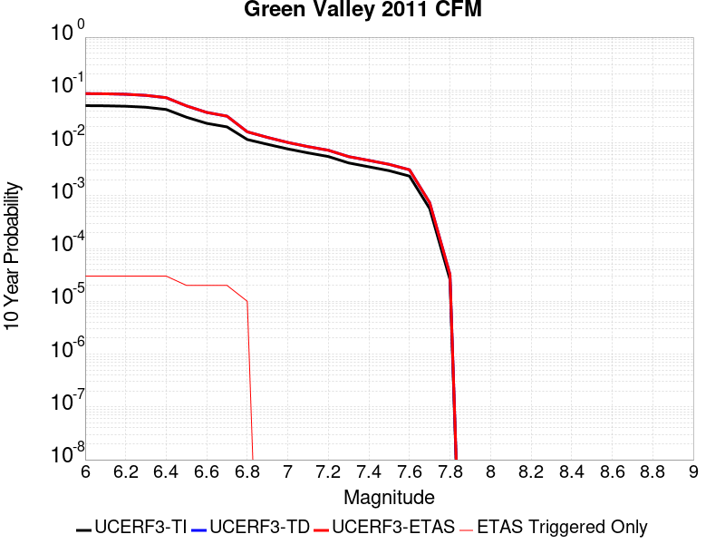 |

| Magnitude | 1 wk TI Prob | 1 wk TD Prob | 1 wk ETAS Prob | 1 wk ETAS/TD Gain | 1 wk ETAS Triggered Only | 1 mo TI Prob | 1 mo TD Prob | 1 mo ETAS Prob | 1 mo ETAS/TD Gain | 1 mo ETAS Triggered Only | 1 yr TI Prob | 1 yr TD Prob | 1 yr ETAS Prob | 1 yr ETAS/TD Gain | 1 yr ETAS Triggered Only | 10 yr TI Prob | 10 yr TD Prob | 10 yr ETAS Prob | 10 yr ETAS/TD Gain | 10 yr ETAS Triggered Only |
|-----|-----|-----|-----|-----|-----|-----|-----|-----|-----|-----|-----|-----|-----|-----|-----|-----|-----|-----|-----|-----|
| 6.0 | 9.9629346E-5 | 1.7305532E-4 | 1.7305532E-4 | 1.0 | 0.0 | 4.2691303E-4 | 7.4143766E-4 | 7.4143766E-4 | 1.0 | 0.0 | 0.0051852856 | 0.008986705 | 0.008986705 | 1.0 | 0.0 | 0.050659515 | 0.085522056 | 0.08553676 | 1.0001719 | 1.607717E-5 |
| 6.1 | 9.88615E-5 | 1.7152846E-4 | 1.7152846E-4 | 1.0 | 0.0 | 4.2362334E-4 | 7.348976E-4 | 7.348976E-4 | 1.0 | 0.0 | 0.0051454236 | 0.0089077335 | 0.0089077335 | 1.0 | 0.0 | 0.050279044 | 0.084809676 | 0.08482439 | 1.0001734 | 1.607717E-5 |
| 6.2 | 9.696895E-5 | 1.6791887E-4 | 1.6791887E-4 | 1.0 | 0.0 | 4.15515E-4 | 7.194366E-4 | 7.194366E-4 | 1.0 | 0.0 | 0.0050471667 | 0.008721114 | 0.008721114 | 1.0 | 0.0 | 0.04934063 | 0.0831186 | 0.08313335 | 1.0001774 | 1.607717E-5 |
| 6.3 | 9.275224E-5 | 1.5971228E-4 | 1.5971228E-4 | 1.0 | 0.0 | 3.9744904E-4 | 6.842841E-4 | 6.842841E-4 | 1.0 | 0.0 | 0.0048282105 | 0.008296439 | 0.008296439 | 1.0 | 0.0 | 0.047246475 | 0.07925707 | 0.07927187 | 1.0001868 | 1.607717E-5 |
| 6.4 | 8.391499E-5 | 1.4367796E-4 | 1.4367796E-4 | 1.0 | 0.0 | 3.595861E-4 | 6.156248E-4 | 6.156248E-4 | 1.0 | 0.0 | 0.004369175 | 0.0074670846 | 0.0074670846 | 1.0 | 0.0 | 0.04284265 | 0.071630865 | 0.07164579 | 1.0002084 | 1.607717E-5 |
| 6.5 | 5.9519385E-5 | 9.9340905E-5 | 9.9340905E-5 | 1.0 | 0.0 | 2.5505814E-4 | 4.2568138E-4 | 4.2568138E-4 | 1.0 | 0.0 | 0.0031009112 | 0.005168295 | 0.005168295 | 1.0 | 0.0 | 0.030579966 | 0.050145864 | 0.050161134 | 1.0003046 | 1.607717E-5 |
| 6.6 | 4.5361558E-5 | 7.402609E-5 | 7.402609E-5 | 1.0 | 0.0 | 1.9439218E-4 | 3.1721895E-4 | 3.1721895E-4 | 1.0 | 0.0 | 0.0023641558 | 0.0038539418 | 0.0038539418 | 1.0 | 0.0 | 0.023391623 | 0.037665963 | 0.037681434 | 1.0004108 | 1.607717E-5 |
| 6.7 | 3.8808106E-5 | 6.2651976E-5 | 6.2651976E-5 | 1.0 | 0.0 | 1.6630985E-4 | 2.6848342E-4 | 2.6848342E-4 | 1.0 | 0.0 | 0.0020229418 | 0.0032626586 | 0.0032626586 | 1.0 | 0.0 | 0.020046256 | 0.032005914 | 0.032021478 | 1.0004863 | 1.607717E-5 |
| 6.8 | 2.2284667E-5 | 3.1285235E-5 | 3.1285235E-5 | 1.0 | 0.0 | 9.550222E-5 | 1.3407279E-4 | 1.3407279E-4 | 1.0 | 0.0 | 0.0011621192 | 0.0016311078 | 0.0016311078 | 1.0 | 0.0 | 0.011560607 | 0.016165998 | 0.016181815 | 1.0009785 | 1.607717E-5 |
| 6.9 | 1.8050168E-5 | 2.4448054E-5 | 2.4448054E-5 | 1.0 | 0.0 | 7.735557E-5 | 1.047732E-4 | 1.047732E-4 | 1.0 | 0.0 | 9.4139716E-4 | 0.0012748708 | 0.0012748708 | 1.0 | 0.0 | 0.009374191 | 0.012667833 | 0.012667833 | 1.0 | 0.0 |
| 7.0 | 1.4763166E-5 | 1.9582854E-5 | 1.9582854E-5 | 1.0 | 0.0 | 6.326917E-5 | 8.3923835E-5 | 8.3923835E-5 | 1.0 | 0.0 | 7.7002996E-4 | 0.0010212966 | 0.0010212966 | 1.0 | 0.0 | 0.007673672 | 0.010165343 | 0.010165343 | 1.0 | 0.0 |
| 7.1 | 1.2399713E-5 | 1.6303715E-5 | 1.6303715E-5 | 1.0 | 0.0 | 5.3140546E-5 | 6.98712E-5 | 6.98712E-5 | 1.0 | 0.0 | 6.467941E-4 | 8.503518E-4 | 8.503518E-4 | 1.0 | 0.0 | 0.006449148 | 0.008471259 | 0.008471259 | 1.0 | 0.0 |
| 7.2 | 1.0584195E-5 | 1.3921742E-5 | 1.3921742E-5 | 1.0 | 0.0 | 4.5360044E-5 | 5.9663253E-5 | 5.9663253E-5 | 1.0 | 0.0 | 5.521186E-4 | 7.261596E-4 | 7.261596E-4 | 1.0 | 0.0 | 0.0055074887 | 0.007238285 | 0.007238285 | 1.0 | 0.0 |
| 7.3 | 7.998173E-6 | 1.054402E-5 | 1.054402E-5 | 1.0 | 0.0 | 3.4277433E-5 | 4.518788E-5 | 4.518788E-5 | 1.0 | 0.0 | 4.1724785E-4 | 5.500247E-4 | 5.500247E-4 | 1.0 | 0.0 | 0.004164653 | 0.0054868995 | 0.0054868995 | 1.0 | 0.0 |
| 7.4 | 6.7571127E-6 | 8.932697E-6 | 8.932697E-6 | 1.0 | 0.0 | 2.8958733E-5 | 3.828243E-5 | 3.828243E-5 | 1.0 | 0.0 | 3.5251552E-4 | 4.6598984E-4 | 4.6598984E-4 | 1.0 | 0.0 | 0.0035195686 | 0.0046503306 | 0.0046503306 | 1.0 | 0.0 |
| 7.5 | 5.69878E-6 | 7.516314E-6 | 7.516314E-6 | 1.0 | 0.0 | 2.4423114E-5 | 3.221238E-5 | 3.221238E-5 | 1.0 | 0.0 | 2.9731085E-4 | 3.9211605E-4 | 3.9211605E-4 | 1.0 | 0.0 | 0.002969134 | 0.0039143935 | 0.0039143935 | 1.0 | 0.0 |
| 7.6 | 4.503664E-6 | 5.9356807E-6 | 5.9356807E-6 | 1.0 | 0.0 | 1.9301275E-5 | 2.5438389E-5 | 2.5438389E-5 | 1.0 | 0.0 | 2.3496768E-4 | 3.096692E-4 | 3.096692E-4 | 1.0 | 0.0 | 0.002347194 | 0.003092502 | 0.003092502 | 1.0 | 0.0 |
| 7.7 | 1.0873546E-6 | 1.4106979E-6 | 1.4106979E-6 | 1.0 | 0.0 | 4.6600826E-6 | 6.045834E-6 | 6.045834E-6 | 1.0 | 0.0 | 5.6735033E-5 | 7.360557E-5 | 7.360557E-5 | 1.0 | 0.0 | 5.672055E-4 | 7.35814E-4 | 7.35814E-4 | 1.0 | 0.0 |
| 7.8 | 4.9373917E-8 | 6.1777136E-8 | 6.1777136E-8 | 1.0 | 0.0 | 2.1160248E-7 | 2.6475914E-7 | 2.6475914E-7 | 1.0 | 0.0 | 2.5762572E-6 | 3.223439E-6 | 3.223439E-6 | 1.0 | 0.0 | 2.5762274E-5 | 3.2232296E-5 | 3.2232296E-5 | 1.0 | 0.0 |

## Los Osos 2011
*[(top)](#table-of-contents)*

| 1 Week | 1 Month | 1 Year | 10 Year |
|-----|-----|-----|-----|
|  |  |  |  |

| Magnitude | 1 wk TI Prob | 1 wk TD Prob | 1 wk ETAS Prob | 1 wk ETAS/TD Gain | 1 wk ETAS Triggered Only | 1 mo TI Prob | 1 mo TD Prob | 1 mo ETAS Prob | 1 mo ETAS/TD Gain | 1 mo ETAS Triggered Only | 1 yr TI Prob | 1 yr TD Prob | 1 yr ETAS Prob | 1 yr ETAS/TD Gain | 1 yr ETAS Triggered Only | 10 yr TI Prob | 10 yr TD Prob | 10 yr ETAS Prob | 10 yr ETAS/TD Gain | 10 yr ETAS Triggered Only |
|-----|-----|-----|-----|-----|-----|-----|-----|-----|-----|-----|-----|-----|-----|-----|-----|-----|-----|-----|-----|-----|
| 6.0 | 4.8871775E-6 | 4.9814835E-6 | 4.9814835E-6 | 1.0 | 0.0 | 2.0944879E-5 | 2.1349055E-5 | 3.742588E-5 | 1.7530463 | 1.607717E-5 | 2.5497406E-4 | 2.5989654E-4 | 2.7596953E-4 | 1.0618438 | 1.607717E-5 | 0.002546817 | 0.0025962002 | 0.0026122357 | 1.0061765 | 1.607717E-5 |
| 6.1 | 4.8871775E-6 | 4.9814835E-6 | 4.9814835E-6 | 1.0 | 0.0 | 2.0944879E-5 | 2.1349055E-5 | 3.742588E-5 | 1.7530463 | 1.607717E-5 | 2.5497406E-4 | 2.5989654E-4 | 2.7596953E-4 | 1.0618438 | 1.607717E-5 | 0.002546817 | 0.0025962002 | 0.0026122357 | 1.0061765 | 1.607717E-5 |
| 6.2 | 4.8871775E-6 | 4.9814835E-6 | 4.9814835E-6 | 1.0 | 0.0 | 2.0944879E-5 | 2.1349055E-5 | 3.742588E-5 | 1.7530463 | 1.607717E-5 | 2.5497406E-4 | 2.5989654E-4 | 2.7596953E-4 | 1.0618438 | 1.607717E-5 | 0.002546817 | 0.0025962002 | 0.0026122357 | 1.0061765 | 1.607717E-5 |
| 6.3 | 4.8871775E-6 | 4.9814835E-6 | 4.9814835E-6 | 1.0 | 0.0 | 2.0944879E-5 | 2.1349055E-5 | 3.742588E-5 | 1.7530463 | 1.607717E-5 | 2.5497406E-4 | 2.5989654E-4 | 2.7596953E-4 | 1.0618438 | 1.607717E-5 | 0.002546817 | 0.0025962002 | 0.0026122357 | 1.0061765 | 1.607717E-5 |
| 6.4 | 4.8871775E-6 | 4.9814835E-6 | 4.9814835E-6 | 1.0 | 0.0 | 2.0944879E-5 | 2.1349055E-5 | 3.742588E-5 | 1.7530463 | 1.607717E-5 | 2.5497406E-4 | 2.5989654E-4 | 2.7596953E-4 | 1.0618438 | 1.607717E-5 | 0.002546817 | 0.0025962002 | 0.0026122357 | 1.0061765 | 1.607717E-5 |
| 6.5 | 3.1724062E-6 | 3.223395E-6 | 3.223395E-6 | 1.0 | 0.0 | 1.3595956E-5 | 1.3814477E-5 | 2.9891426E-5 | 2.1637754 | 1.607717E-5 | 1.6551818E-4 | 1.681784E-4 | 1.8425287E-4 | 1.0955799 | 1.607717E-5 | 0.0016539496 | 0.0016805249 | 0.001696575 | 1.0095507 | 1.607717E-5 |
| 6.6 | 3.1022591E-6 | 3.1511045E-6 | 3.1511045E-6 | 1.0 | 0.0 | 1.3295328E-5 | 1.3504664E-5 | 2.9581617E-5 | 2.190474 | 1.607717E-5 | 1.618586E-4 | 1.64407E-4 | 1.8048153E-4 | 1.0977727 | 1.607717E-5 | 0.0016174077 | 0.0016428665 | 0.0016589173 | 1.0097699 | 1.607717E-5 |
| 6.7 | 2.611518E-6 | 2.6491832E-6 | 2.6491832E-6 | 1.0 | 0.0 | 1.1192172E-5 | 1.1353593E-5 | 2.743058E-5 | 2.4160264 | 1.607717E-5 | 1.3625617E-4 | 1.3822126E-4 | 1.5429621E-4 | 1.1162987 | 1.607717E-5 | 0.0013617266 | 0.0013813575 | 0.0013974125 | 1.0116225 | 1.607717E-5 |
| 6.8 | 2.4780884E-6 | 2.5121592E-6 | 2.5121592E-6 | 1.0 | 0.0 | 1.0620336E-5 | 1.0766353E-5 | 2.684335E-5 | 2.493263 | 1.607717E-5 | 1.2929492E-4 | 1.3107249E-4 | 1.4714756E-4 | 1.1226425 | 1.607717E-5 | 0.0012921972 | 0.001309956 | 0.0013260121 | 1.012257 | 1.607717E-5 |
| 6.9 | 2.1376322E-6 | 2.1635055E-6 | 2.1635055E-6 | 1.0 | 0.0 | 9.161248E-6 | 9.272134E-6 | 2.5349156E-5 | 2.7339075 | 1.607717E-5 | 1.1153249E-4 | 1.128824E-4 | 1.2895776E-4 | 1.142408 | 1.607717E-5 | 0.0011147653 | 0.0011282525 | 0.0011443115 | 1.0142336 | 1.607717E-5 |
| 7.0 | 1.9282882E-6 | 1.9494585E-6 | 1.9494585E-6 | 1.0 | 0.0 | 8.264066E-6 | 8.354796E-6 | 2.443183E-5 | 2.9242885 | 1.607717E-5 | 1.0061036E-4 | 1.017149E-4 | 1.17790434E-4 | 1.158045 | 1.607717E-5 | 0.0010056482 | 0.0010166848 | 0.0010327457 | 1.0157973 | 1.607717E-5 |
| 7.1 | 1.6353226E-6 | 1.6501118E-6 | 1.6501118E-6 | 1.0 | 0.0 | 7.0085066E-6 | 7.0718884E-6 | 7.0718884E-6 | 1.0 | 0.0 | 8.532523E-5 | 8.609685E-5 | 8.609685E-5 | 1.0 | 0.0 | 8.529247E-4 | 8.6063566E-4 | 8.6063566E-4 | 1.0 | 0.0 |
| 7.2 | 1.4446276E-6 | 1.4553341E-6 | 1.4553341E-6 | 1.0 | 0.0 | 6.191247E-6 | 6.237131E-6 | 6.237131E-6 | 1.0 | 0.0 | 7.537582E-5 | 7.593443E-5 | 7.593443E-5 | 1.0 | 0.0 | 7.535026E-4 | 7.590854E-4 | 7.590854E-4 | 1.0 | 0.0 |
| 7.3 | 1.2014582E-6 | 1.2069073E-6 | 1.2069073E-6 | 1.0 | 0.0 | 5.149096E-6 | 5.1724496E-6 | 5.1724496E-6 | 1.0 | 0.0 | 6.268844E-5 | 6.297276E-5 | 6.297276E-5 | 1.0 | 0.0 | 6.267076E-4 | 6.295495E-4 | 6.295495E-4 | 1.0 | 0.0 |
| 7.4 | 9.707733E-7 | 9.709773E-7 | 9.709773E-7 | 1.0 | 0.0 | 4.16045E-6 | 4.161325E-6 | 4.161325E-6 | 1.0 | 0.0 | 5.0652303E-5 | 5.066295E-5 | 5.066295E-5 | 1.0 | 0.0 | 5.064076E-4 | 5.065143E-4 | 5.065143E-4 | 1.0 | 0.0 |
| 7.5 | 7.174908E-7 | 7.1149134E-7 | 7.1149134E-7 | 1.0 | 0.0 | 3.074957E-6 | 3.0492452E-6 | 3.0492452E-6 | 1.0 | 0.0 | 3.743696E-5 | 3.712393E-5 | 3.712393E-5 | 1.0 | 0.0 | 3.7430652E-4 | 3.7117745E-4 | 3.7117745E-4 | 1.0 | 0.0 |
| 7.6 | 4.5535776E-7 | 4.420792E-7 | 4.420792E-7 | 1.0 | 0.0 | 1.9515319E-6 | 1.8946238E-6 | 1.8946238E-6 | 1.0 | 0.0 | 2.3759641E-5 | 2.3066801E-5 | 2.3066801E-5 | 1.0 | 0.0 | 2.37571E-4 | 2.3064416E-4 | 2.3064416E-4 | 1.0 | 0.0 |
| 7.7 | 2.1173553E-7 | 1.9060796E-7 | 1.9060796E-7 | 1.0 | 0.0 | 9.0743765E-7 | 8.1689103E-7 | 8.1689103E-7 | 1.0 | 0.0 | 1.1047998E-5 | 9.945603E-6 | 9.945603E-6 | 1.0 | 0.0 | 1.1047449E-4 | 9.945161E-5 | 9.945161E-5 | 1.0 | 0.0 |
| 7.8 | 9.873608E-8 | 7.3675665E-8 | 7.3675665E-8 | 1.0 | 0.0 | 4.2315455E-7 | 3.157528E-7 | 3.157528E-7 | 1.0 | 0.0 | 5.1518946E-6 | 3.8442836E-6 | 3.8442836E-6 | 1.0 | 0.0 | 5.1517753E-5 | 3.8442176E-5 | 3.8442176E-5 | 1.0 | 0.0 |
| 7.9 | 5.4399106E-8 | 3.1880155E-8 | 3.1880155E-8 | 1.0 | 0.0 | 2.33139E-7 | 1.3662923E-7 | 1.3662923E-7 | 1.0 | 0.0 | 2.8384638E-6 | 1.6634596E-6 | 1.6634596E-6 | 1.0 | 0.0 | 2.8384275E-5 | 1.6634473E-5 | 1.6634473E-5 | 1.0 | 0.0 |
| 8.0 | 1.817203E-8 | 8.420727E-9 | 8.420727E-9 | 1.0 | 0.0 | 7.7880124E-8 | 3.608883E-8 | 3.608883E-8 | 1.0 | 0.0 | 9.481901E-7 | 4.393814E-7 | 4.393814E-7 | 1.0 | 0.0 | 9.481861E-6 | 4.3938057E-6 | 4.3938057E-6 | 1.0 | 0.0 |

## Malibu Coast (Extension) alt 1
*[(top)](#table-of-contents)*

| 1 Week | 1 Month | 1 Year | 10 Year |
|-----|-----|-----|-----|
|  |  |  |  |

| Magnitude | 1 wk TI Prob | 1 wk TD Prob | 1 wk ETAS Prob | 1 wk ETAS/TD Gain | 1 wk ETAS Triggered Only | 1 mo TI Prob | 1 mo TD Prob | 1 mo ETAS Prob | 1 mo ETAS/TD Gain | 1 mo ETAS Triggered Only | 1 yr TI Prob | 1 yr TD Prob | 1 yr ETAS Prob | 1 yr ETAS/TD Gain | 1 yr ETAS Triggered Only | 10 yr TI Prob | 10 yr TD Prob | 10 yr ETAS Prob | 10 yr ETAS/TD Gain | 10 yr ETAS Triggered Only |
|-----|-----|-----|-----|-----|-----|-----|-----|-----|-----|-----|-----|-----|-----|-----|-----|-----|-----|-----|-----|-----|
| 6.0 | 8.930738E-6 | 9.329276E-6 | 9.329276E-6 | 1.0 | 0.0 | 3.827403E-5 | 3.998201E-5 | 3.998201E-5 | 1.0 | 0.0 | 4.6588664E-4 | 4.8667393E-4 | 4.8667393E-4 | 1.0 | 0.0 | 0.0046491115 | 0.004856264 | 0.004872263 | 1.0032945 | 1.607717E-5 |
| 6.1 | 7.199952E-6 | 7.5302964E-6 | 7.5302964E-6 | 1.0 | 0.0 | 3.0856572E-5 | 3.2272303E-5 | 3.2272303E-5 | 1.0 | 0.0 | 3.75614E-4 | 3.9284505E-4 | 3.9284505E-4 | 1.0 | 0.0 | 0.0037497976 | 0.003921572 | 0.003937586 | 1.0040836 | 1.607717E-5 |
| 6.2 | 6.3721413E-6 | 6.6667917E-6 | 6.6667917E-6 | 1.0 | 0.0 | 2.7308892E-5 | 2.8571652E-5 | 2.8571652E-5 | 1.0 | 0.0 | 3.3243504E-4 | 3.4780471E-4 | 3.4780471E-4 | 1.0 | 0.0 | 0.0033193815 | 0.0034726437 | 0.003488665 | 1.0046136 | 1.607717E-5 |
| 6.3 | 6.016345E-6 | 6.295158E-6 | 6.295158E-6 | 1.0 | 0.0 | 2.578408E-5 | 2.6978973E-5 | 2.6978973E-5 | 1.0 | 0.0 | 3.1387596E-4 | 3.2841982E-4 | 3.2841982E-4 | 1.0 | 0.0 | 0.00313433 | 0.0032793807 | 0.003295405 | 1.0048864 | 1.607717E-5 |
| 6.4 | 5.8104883E-6 | 6.0795446E-6 | 6.0795446E-6 | 1.0 | 0.0 | 2.4901856E-5 | 2.6054933E-5 | 2.6054933E-5 | 1.0 | 0.0 | 3.031379E-4 | 3.1717293E-4 | 3.1717293E-4 | 1.0 | 0.0 | 0.0030272473 | 0.0031672374 | 0.0031832636 | 1.00506 | 1.607717E-5 |
| 6.5 | 5.476925E-6 | 5.7275133E-6 | 5.7275133E-6 | 1.0 | 0.0 | 2.3472323E-5 | 2.4546256E-5 | 2.4546256E-5 | 1.0 | 0.0 | 2.8573806E-4 | 2.9880996E-4 | 2.9880996E-4 | 1.0 | 0.0 | 0.0028537093 | 0.002984114 | 0.003000143 | 1.0053715 | 1.607717E-5 |
| 6.6 | 5.222387E-6 | 5.45858E-6 | 5.45858E-6 | 1.0 | 0.0 | 2.2381464E-5 | 2.3393704E-5 | 2.3393704E-5 | 1.0 | 0.0 | 2.7246025E-4 | 2.8478142E-4 | 2.8478142E-4 | 1.0 | 0.0 | 0.0027212645 | 0.0028441956 | 0.002860227 | 1.0056366 | 1.607717E-5 |
| 6.7 | 5.0337076E-6 | 5.259103E-6 | 5.259103E-6 | 1.0 | 0.0 | 2.1572854E-5 | 2.253882E-5 | 2.253882E-5 | 1.0 | 0.0 | 2.6261783E-4 | 2.7437587E-4 | 2.7437587E-4 | 1.0 | 0.0 | 0.002623077 | 0.002740401 | 0.0027564343 | 1.0058507 | 1.607717E-5 |
| 6.8 | 4.5675624E-6 | 4.7587164E-6 | 4.7587164E-6 | 1.0 | 0.0 | 1.9575122E-5 | 2.039434E-5 | 2.039434E-5 | 1.0 | 0.0 | 2.3830103E-4 | 2.48273E-4 | 2.48273E-4 | 1.0 | 0.0 | 0.0023804565 | 0.002479976 | 0.0024960132 | 1.0064667 | 1.607717E-5 |
| 6.9 | 4.2802412E-6 | 4.4520207E-6 | 4.4520207E-6 | 1.0 | 0.0 | 1.8343762E-5 | 1.907995E-5 | 1.907995E-5 | 1.0 | 0.0 | 2.2331243E-4 | 2.3227377E-4 | 2.3227377E-4 | 1.0 | 0.0 | 0.0022308815 | 0.0023203269 | 0.0023363666 | 1.0069127 | 1.607717E-5 |
| 7.0 | 3.9794063E-6 | 4.130099E-6 | 4.130099E-6 | 1.0 | 0.0 | 1.7054486E-5 | 1.7700306E-5 | 1.7700306E-5 | 1.0 | 0.0 | 2.0761859E-4 | 2.1548003E-4 | 2.1548003E-4 | 1.0 | 0.0 | 0.0020742472 | 0.0021527244 | 0.0021687672 | 1.0074522 | 1.607717E-5 |
| 7.1 | 3.7730424E-6 | 3.911217E-6 | 3.911217E-6 | 1.0 | 0.0 | 1.6170083E-5 | 1.6762251E-5 | 1.6762251E-5 | 1.0 | 0.0 | 1.9685295E-4 | 2.0406142E-4 | 2.0406142E-4 | 1.0 | 0.0 | 0.0019667868 | 0.0020387534 | 0.0020547977 | 1.0078697 | 1.607717E-5 |
| 7.2 | 3.424985E-6 | 3.541337E-6 | 3.541337E-6 | 1.0 | 0.0 | 1.4678424E-5 | 1.5177071E-5 | 1.5177071E-5 | 1.0 | 0.0 | 1.7869516E-4 | 1.8476529E-4 | 1.8476529E-4 | 1.0 | 0.0 | 0.0017855153 | 0.0018461287 | 0.0018621762 | 1.0086925 | 1.607717E-5 |
| 7.3 | 2.6966375E-6 | 2.7596534E-6 | 2.7596534E-6 | 1.0 | 0.0 | 1.15569665E-5 | 1.1827032E-5 | 1.1827032E-5 | 1.0 | 0.0 | 1.4069698E-4 | 1.4398464E-4 | 1.4398464E-4 | 1.0 | 0.0 | 0.0014060794 | 0.0014389176 | 0.0014549717 | 1.011157 | 1.607717E-5 |
| 7.4 | 2.215957E-6 | 2.249378E-6 | 2.249378E-6 | 1.0 | 0.0 | 9.496924E-6 | 9.640156E-6 | 9.640156E-6 | 1.0 | 0.0 | 1.1561892E-4 | 1.17362615E-4 | 1.17362615E-4 | 1.0 | 0.0 | 0.0011555878 | 0.0011730101 | 0.0011890684 | 1.0136899 | 1.607717E-5 |
| 7.5 | 1.2040218E-6 | 1.2219067E-6 | 1.2219067E-6 | 1.0 | 0.0 | 5.160083E-6 | 5.2367322E-6 | 5.2367322E-6 | 1.0 | 0.0 | 6.2822204E-5 | 6.375537E-5 | 6.375537E-5 | 1.0 | 0.0 | 6.280445E-4 | 6.3737266E-4 | 6.5343955E-4 | 1.025208 | 1.607717E-5 |
| 7.6 | 6.6157446E-7 | 6.678975E-7 | 6.678975E-7 | 1.0 | 0.0 | 2.835316E-6 | 2.8624147E-6 | 2.8624147E-6 | 1.0 | 0.0 | 3.4519428E-5 | 3.484936E-5 | 3.484936E-5 | 1.0 | 0.0 | 3.4514067E-4 | 3.4844046E-4 | 3.6451203E-4 | 1.0461243 | 1.607717E-5 |
| 7.7 | 2.6012302E-7 | 2.4357593E-7 | 2.4357593E-7 | 1.0 | 0.0 | 1.1148124E-6 | 1.0438964E-6 | 1.0438964E-6 | 1.0 | 0.0 | 1.3572758E-5 | 1.2709375E-5 | 1.2709375E-5 | 1.0 | 0.0 | 1.3571928E-4 | 1.2708755E-4 | 1.4316269E-4 | 1.1264886 | 1.607717E-5 |
| 7.8 | 2.8323132E-8 | 2.0266649E-8 | 2.0266649E-8 | 1.0 | 0.0 | 1.2138484E-7 | 8.685707E-8 | 8.685707E-8 | 1.0 | 0.0 | 1.4778595E-6 | 1.0574844E-6 | 1.0574844E-6 | 1.0 | 0.0 | 1.4778497E-5 | 1.0574801E-5 | 1.0574801E-5 | 1.0 | 0.0 |

## Carson Range (Genoa)
*[(top)](#table-of-contents)*

| 1 Week | 1 Month | 1 Year | 10 Year |
|-----|-----|-----|-----|
|  | 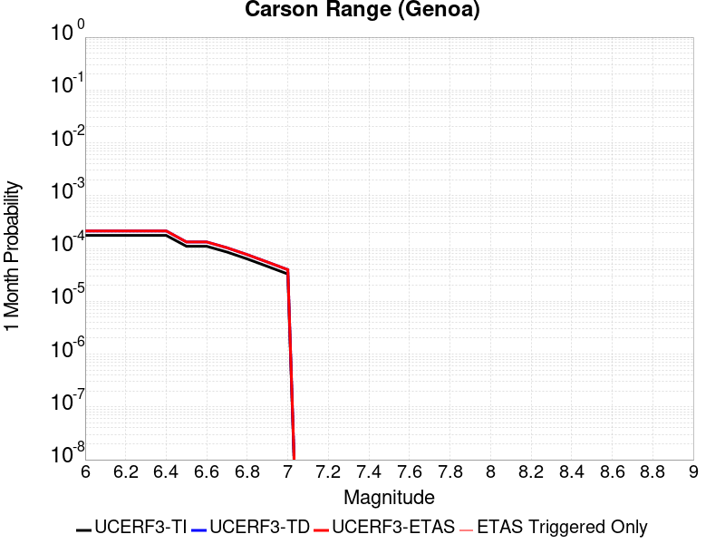 | 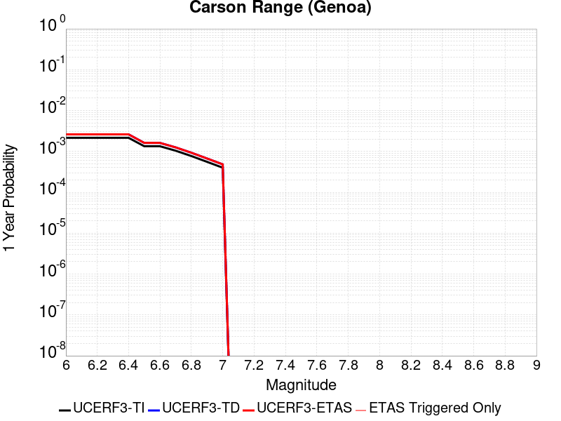 |  |

| Magnitude | 1 wk TI Prob | 1 wk TD Prob | 1 wk ETAS Prob | 1 wk ETAS/TD Gain | 1 wk ETAS Triggered Only | 1 mo TI Prob | 1 mo TD Prob | 1 mo ETAS Prob | 1 mo ETAS/TD Gain | 1 mo ETAS Triggered Only | 1 yr TI Prob | 1 yr TD Prob | 1 yr ETAS Prob | 1 yr ETAS/TD Gain | 1 yr ETAS Triggered Only | 10 yr TI Prob | 10 yr TD Prob | 10 yr ETAS Prob | 10 yr ETAS/TD Gain | 10 yr ETAS Triggered Only |
|-----|-----|-----|-----|-----|-----|-----|-----|-----|-----|-----|-----|-----|-----|-----|-----|-----|-----|-----|-----|-----|
| 6.0 | 4.1268457E-5 | 5.0146893E-5 | 5.0146893E-5 | 1.0 | 0.0 | 1.7685282E-4 | 2.148998E-4 | 2.148998E-4 | 1.0 | 0.0 | 0.0021510567 | 0.0026136558 | 0.0026136558 | 1.0 | 0.0 | 0.02130354 | 0.025868816 | 0.025884477 | 1.0006055 | 1.607717E-5 |
| 6.1 | 4.1268457E-5 | 5.0146893E-5 | 5.0146893E-5 | 1.0 | 0.0 | 1.7685282E-4 | 2.148998E-4 | 2.148998E-4 | 1.0 | 0.0 | 0.0021510567 | 0.0026136558 | 0.0026136558 | 1.0 | 0.0 | 0.02130354 | 0.025868816 | 0.025884477 | 1.0006055 | 1.607717E-5 |
| 6.2 | 4.1268457E-5 | 5.0146893E-5 | 5.0146893E-5 | 1.0 | 0.0 | 1.7685282E-4 | 2.148998E-4 | 2.148998E-4 | 1.0 | 0.0 | 0.0021510567 | 0.0026136558 | 0.0026136558 | 1.0 | 0.0 | 0.02130354 | 0.025868816 | 0.025884477 | 1.0006055 | 1.607717E-5 |
| 6.3 | 4.1268457E-5 | 5.0146893E-5 | 5.0146893E-5 | 1.0 | 0.0 | 1.7685282E-4 | 2.148998E-4 | 2.148998E-4 | 1.0 | 0.0 | 0.0021510567 | 0.0026136558 | 0.0026136558 | 1.0 | 0.0 | 0.02130354 | 0.025868816 | 0.025884477 | 1.0006055 | 1.607717E-5 |
| 6.4 | 4.1268457E-5 | 5.0146893E-5 | 5.0146893E-5 | 1.0 | 0.0 | 1.7685282E-4 | 2.148998E-4 | 2.148998E-4 | 1.0 | 0.0 | 0.0021510567 | 0.0026136558 | 0.0026136558 | 1.0 | 0.0 | 0.02130354 | 0.025868816 | 0.025884477 | 1.0006055 | 1.607717E-5 |
| 6.5 | 2.5677185E-5 | 3.0978295E-5 | 3.0978295E-5 | 1.0 | 0.0 | 1.1004044E-4 | 1.3275839E-4 | 1.3275839E-4 | 1.0 | 0.0 | 0.0013389189 | 0.0016153135 | 0.0016153135 | 1.0 | 0.0 | 0.0133088045 | 0.016053649 | 0.016053649 | 1.0 | 0.0 |
| 6.6 | 2.5677185E-5 | 3.0978295E-5 | 3.0978295E-5 | 1.0 | 0.0 | 1.1004044E-4 | 1.3275839E-4 | 1.3275839E-4 | 1.0 | 0.0 | 0.0013389189 | 0.0016153135 | 0.0016153135 | 1.0 | 0.0 | 0.0133088045 | 0.016053649 | 0.016053649 | 1.0 | 0.0 |
| 6.7 | 1.9969408E-5 | 2.406347E-5 | 2.406347E-5 | 1.0 | 0.0 | 8.558037E-5 | 1.0312595E-4 | 1.0312595E-4 | 1.0 | 0.0 | 0.0010414429 | 0.0012549888 | 0.0012549888 | 1.0 | 0.0 | 0.010365757 | 0.012494174 | 0.012494174 | 1.0 | 0.0 |
| 6.8 | 1.4783156E-5 | 1.7817569E-5 | 1.7817569E-5 | 1.0 | 0.0 | 6.335485E-5 | 7.635951E-5 | 7.635951E-5 | 1.0 | 0.0 | 7.710722E-4 | 9.294106E-4 | 9.294106E-4 | 1.0 | 0.0 | 0.0076840227 | 0.009268024 | 0.009268024 | 1.0 | 0.0 |
| 6.9 | 1.06660555E-5 | 1.2877026E-5 | 1.2877026E-5 | 1.0 | 0.0 | 4.5710865E-5 | 5.5186738E-5 | 5.5186738E-5 | 1.0 | 0.0 | 5.5638765E-4 | 6.718066E-4 | 6.718066E-4 | 1.0 | 0.0 | 0.005549967 | 0.006709056 | 0.006709056 | 1.0 | 0.0 |
| 7.0 | 7.664838E-6 | 9.258307E-6 | 9.258307E-6 | 1.0 | 0.0 | 3.2848893E-5 | 3.9678456E-5 | 3.9678456E-5 | 1.0 | 0.0 | 3.998619E-4 | 4.830852E-4 | 4.830852E-4 | 1.0 | 0.0 | 0.0039914316 | 0.00483085 | 0.00483085 | 1.0 | 0.0 |

## Laguna Salada
*[(top)](#table-of-contents)*

| 1 Week | 1 Month | 1 Year | 10 Year |
|-----|-----|-----|-----|
|  |  |  |  |

| Magnitude | 1 wk TI Prob | 1 wk TD Prob | 1 wk ETAS Prob | 1 wk ETAS/TD Gain | 1 wk ETAS Triggered Only | 1 mo TI Prob | 1 mo TD Prob | 1 mo ETAS Prob | 1 mo ETAS/TD Gain | 1 mo ETAS Triggered Only | 1 yr TI Prob | 1 yr TD Prob | 1 yr ETAS Prob | 1 yr ETAS/TD Gain | 1 yr ETAS Triggered Only | 10 yr TI Prob | 10 yr TD Prob | 10 yr ETAS Prob | 10 yr ETAS/TD Gain | 10 yr ETAS Triggered Only |
|-----|-----|-----|-----|-----|-----|-----|-----|-----|-----|-----|-----|-----|-----|-----|-----|-----|-----|-----|-----|-----|
| 6.0 | 4.6465593E-5 | 4.634639E-5 | 6.242282E-5 | 1.3468754 | 1.607717E-5 | 1.9912305E-4 | 1.9861311E-4 | 2.1468708E-4 | 1.0809311 | 1.607717E-5 | 0.0024216278 | 0.002415429 | 0.0024314674 | 1.00664 | 1.607717E-5 | 0.02395408 | 0.023975259 | 0.02399095 | 1.0006545 | 1.607717E-5 |
| 6.1 | 3.982297E-5 | 3.7246125E-5 | 3.7246125E-5 | 1.0 | 0.0 | 1.706587E-4 | 1.5961716E-4 | 1.5961716E-4 | 1.0 | 0.0 | 0.0020757897 | 0.0019417295 | 0.0019417295 | 1.0 | 0.0 | 0.020565065 | 0.019331863 | 0.019331863 | 1.0 | 0.0 |
| 6.2 | 3.6067784E-5 | 3.2602693E-5 | 3.2602693E-5 | 1.0 | 0.0 | 1.5456705E-4 | 1.3971896E-4 | 1.3971896E-4 | 1.0 | 0.0 | 0.0018802295 | 0.0016998611 | 0.0016998611 | 1.0 | 0.0 | 0.018644003 | 0.016949628 | 0.016949628 | 1.0 | 0.0 |
| 6.3 | 3.2859112E-5 | 2.8849448E-5 | 2.8849448E-5 | 1.0 | 0.0 | 1.4081717E-4 | 1.2363521E-4 | 1.2363521E-4 | 1.0 | 0.0 | 0.0017131006 | 0.0015043203 | 0.0015043203 | 1.0 | 0.0 | 0.016999546 | 0.015018767 | 0.015018767 | 1.0 | 0.0 |
| 6.4 | 2.9132116E-5 | 2.4852965E-5 | 2.4852965E-5 | 1.0 | 0.0 | 1.2484594E-4 | 1.0650887E-4 | 1.0650887E-4 | 1.0 | 0.0 | 0.0015189396 | 0.001296065 | 0.001296065 | 1.0 | 0.0 | 0.015085992 | 0.012956262 | 0.012956262 | 1.0 | 0.0 |
| 6.5 | 2.7075037E-5 | 2.2825836E-5 | 2.2825836E-5 | 1.0 | 0.0 | 1.1603071E-4 | 9.7821845E-5 | 9.7821845E-5 | 1.0 | 0.0 | 0.0014117584 | 0.0011904186 | 0.0011904186 | 1.0 | 0.0 | 0.014028233 | 0.011907749 | 0.011907749 | 1.0 | 0.0 |
| 6.6 | 2.2367465E-5 | 1.8573526E-5 | 1.8573526E-5 | 1.0 | 0.0 | 9.5857045E-5 | 7.959886E-5 | 7.959886E-5 | 1.0 | 0.0 | 0.0011664346 | 9.6876756E-4 | 9.6876756E-4 | 1.0 | 0.0 | 0.011603311 | 0.009702191 | 0.009702191 | 1.0 | 0.0 |
| 6.7 | 1.9458053E-5 | 1.5914242E-5 | 1.5914242E-5 | 1.0 | 0.0 | 8.338899E-5 | 6.8202564E-5 | 6.8202564E-5 | 1.0 | 0.0 | 0.001014788 | 8.3013024E-4 | 8.3013024E-4 | 1.0 | 0.0 | 0.010101665 | 0.0083209425 | 0.0083209425 | 1.0 | 0.0 |
| 6.8 | 1.0767866E-5 | 9.18435E-6 | 9.18435E-6 | 1.0 | 0.0 | 4.614718E-5 | 3.9361294E-5 | 3.9361294E-5 | 1.0 | 0.0 | 5.6169706E-4 | 4.7918706E-4 | 4.7918706E-4 | 1.0 | 0.0 | 0.0056027942 | 0.0048096925 | 0.0048096925 | 1.0 | 0.0 |
| 6.9 | 2.1384765E-6 | 1.7913675E-6 | 1.7913675E-6 | 1.0 | 0.0 | 9.164866E-6 | 7.677269E-6 | 7.677269E-6 | 1.0 | 0.0 | 1.1157654E-4 | 9.346713E-5 | 9.346713E-5 | 1.0 | 0.0 | 0.0011152053 | 9.343165E-4 | 9.343165E-4 | 1.0 | 0.0 |
| 7.0 | 2.0952946E-6 | 1.7493046E-6 | 1.7493046E-6 | 1.0 | 0.0 | 8.979802E-6 | 7.4970003E-6 | 7.4970003E-6 | 1.0 | 0.0 | 1.0932361E-4 | 9.1272545E-5 | 9.1272545E-5 | 1.0 | 0.0 | 0.0010926984 | 9.123888E-4 | 9.123888E-4 | 1.0 | 0.0 |
| 7.1 | 1.7887576E-6 | 1.4500254E-6 | 1.4500254E-6 | 1.0 | 0.0 | 7.666081E-6 | 6.2143813E-6 | 6.2143813E-6 | 1.0 | 0.0 | 9.333054E-5 | 7.565777E-5 | 7.565777E-5 | 1.0 | 0.0 | 9.329135E-4 | 7.563506E-4 | 7.563506E-4 | 1.0 | 0.0 |
| 7.2 | 9.723109E-7 | 7.135619E-7 | 7.135619E-7 | 1.0 | 0.0 | 4.16704E-6 | 3.0581198E-6 | 3.0581198E-6 | 1.0 | 0.0 | 5.073253E-5 | 3.7232137E-5 | 3.7232137E-5 | 1.0 | 0.0 | 5.072095E-4 | 3.7227524E-4 | 3.7227524E-4 | 1.0 | 0.0 |

## Compton
*[(top)](#table-of-contents)*

| 1 Week | 1 Month | 1 Year | 10 Year |
|-----|-----|-----|-----|
|  |  |  |  |

| Magnitude | 1 wk TI Prob | 1 wk TD Prob | 1 wk ETAS Prob | 1 wk ETAS/TD Gain | 1 wk ETAS Triggered Only | 1 mo TI Prob | 1 mo TD Prob | 1 mo ETAS Prob | 1 mo ETAS/TD Gain | 1 mo ETAS Triggered Only | 1 yr TI Prob | 1 yr TD Prob | 1 yr ETAS Prob | 1 yr ETAS/TD Gain | 1 yr ETAS Triggered Only | 10 yr TI Prob | 10 yr TD Prob | 10 yr ETAS Prob | 10 yr ETAS/TD Gain | 10 yr ETAS Triggered Only |
|-----|-----|-----|-----|-----|-----|-----|-----|-----|-----|-----|-----|-----|-----|-----|-----|-----|-----|-----|-----|-----|
| 6.0 | 1.06050875E-5 | 6.358671E-6 | 6.358671E-6 | 1.0 | 0.0 | 4.5449582E-5 | 2.7251177E-5 | 2.7251177E-5 | 1.0 | 0.0 | 5.5320817E-4 | 3.317354E-4 | 3.317354E-4 | 1.0 | 0.0 | 0.0055183303 | 0.0033126862 | 0.00332871 | 1.0048372 | 1.607717E-5 |
| 6.1 | 1.06050875E-5 | 6.358671E-6 | 6.358671E-6 | 1.0 | 0.0 | 4.5449582E-5 | 2.7251177E-5 | 2.7251177E-5 | 1.0 | 0.0 | 5.5320817E-4 | 3.317354E-4 | 3.317354E-4 | 1.0 | 0.0 | 0.0055183303 | 0.0033126862 | 0.00332871 | 1.0048372 | 1.607717E-5 |
| 6.2 | 1.06050875E-5 | 6.358671E-6 | 6.358671E-6 | 1.0 | 0.0 | 4.5449582E-5 | 2.7251177E-5 | 2.7251177E-5 | 1.0 | 0.0 | 5.5320817E-4 | 3.317354E-4 | 3.317354E-4 | 1.0 | 0.0 | 0.0055183303 | 0.0033126862 | 0.00332871 | 1.0048372 | 1.607717E-5 |
| 6.3 | 1.06050875E-5 | 6.358671E-6 | 6.358671E-6 | 1.0 | 0.0 | 4.5449582E-5 | 2.7251177E-5 | 2.7251177E-5 | 1.0 | 0.0 | 5.5320817E-4 | 3.317354E-4 | 3.317354E-4 | 1.0 | 0.0 | 0.0055183303 | 0.0033126862 | 0.00332871 | 1.0048372 | 1.607717E-5 |
| 6.4 | 1.06050875E-5 | 6.358671E-6 | 6.358671E-6 | 1.0 | 0.0 | 4.5449582E-5 | 2.7251177E-5 | 2.7251177E-5 | 1.0 | 0.0 | 5.5320817E-4 | 3.317354E-4 | 3.317354E-4 | 1.0 | 0.0 | 0.0055183303 | 0.0033126862 | 0.00332871 | 1.0048372 | 1.607717E-5 |
| 6.5 | 1.06050875E-5 | 6.358671E-6 | 6.358671E-6 | 1.0 | 0.0 | 4.5449582E-5 | 2.7251177E-5 | 2.7251177E-5 | 1.0 | 0.0 | 5.5320817E-4 | 3.317354E-4 | 3.317354E-4 | 1.0 | 0.0 | 0.0055183303 | 0.0033126862 | 0.00332871 | 1.0048372 | 1.607717E-5 |
| 6.6 | 1.06050875E-5 | 6.358671E-6 | 6.358671E-6 | 1.0 | 0.0 | 4.5449582E-5 | 2.7251177E-5 | 2.7251177E-5 | 1.0 | 0.0 | 5.5320817E-4 | 3.317354E-4 | 3.317354E-4 | 1.0 | 0.0 | 0.0055183303 | 0.0033126862 | 0.00332871 | 1.0048372 | 1.607717E-5 |
| 6.7 | 1.06050875E-5 | 6.358671E-6 | 6.358671E-6 | 1.0 | 0.0 | 4.5449582E-5 | 2.7251177E-5 | 2.7251177E-5 | 1.0 | 0.0 | 5.5320817E-4 | 3.317354E-4 | 3.317354E-4 | 1.0 | 0.0 | 0.0055183303 | 0.0033126862 | 0.00332871 | 1.0048372 | 1.607717E-5 |
| 6.8 | 1.06050875E-5 | 6.358671E-6 | 6.358671E-6 | 1.0 | 0.0 | 4.5449582E-5 | 2.7251177E-5 | 2.7251177E-5 | 1.0 | 0.0 | 5.5320817E-4 | 3.317354E-4 | 3.317354E-4 | 1.0 | 0.0 | 0.0055183303 | 0.0033126862 | 0.00332871 | 1.0048372 | 1.607717E-5 |
| 6.9 | 1.06050875E-5 | 6.358671E-6 | 6.358671E-6 | 1.0 | 0.0 | 4.5449582E-5 | 2.7251177E-5 | 2.7251177E-5 | 1.0 | 0.0 | 5.5320817E-4 | 3.317354E-4 | 3.317354E-4 | 1.0 | 0.0 | 0.0055183303 | 0.0033126862 | 0.00332871 | 1.0048372 | 1.607717E-5 |
| 7.0 | 7.672486E-6 | 4.2720512E-6 | 4.2720512E-6 | 1.0 | 0.0 | 3.288167E-5 | 1.8308665E-5 | 1.8308665E-5 | 1.0 | 0.0 | 4.0026082E-4 | 2.2288582E-4 | 2.2288582E-4 | 1.0 | 0.0 | 0.0039954064 | 0.002226685 | 0.0022427263 | 1.0072042 | 1.607717E-5 |
| 7.1 | 7.163992E-6 | 3.883762E-6 | 3.883762E-6 | 1.0 | 0.0 | 3.0702464E-5 | 1.6644592E-5 | 1.6644592E-5 | 1.0 | 0.0 | 3.7373835E-4 | 2.0262963E-4 | 2.0262963E-4 | 1.0 | 0.0 | 0.0037311043 | 0.0020245055 | 0.0020405503 | 1.0079252 | 1.607717E-5 |
| 7.2 | 6.3689185E-6 | 3.3102428E-6 | 3.3102428E-6 | 1.0 | 0.0 | 2.729508E-5 | 1.418668E-5 | 1.418668E-5 | 1.0 | 0.0 | 3.322669E-4 | 1.7270957E-4 | 1.7270957E-4 | 1.0 | 0.0 | 0.0033177056 | 0.0017257951 | 0.0017418446 | 1.0092998 | 1.607717E-5 |
| 7.3 | 4.4987873E-6 | 2.4480942E-6 | 2.4480942E-6 | 1.0 | 0.0 | 1.9280375E-5 | 1.0491792E-5 | 1.0491792E-5 | 1.0 | 0.0 | 2.3471327E-4 | 1.2773038E-4 | 1.2773038E-4 | 1.0 | 0.0 | 0.002344655 | 0.0012765999 | 0.0012926565 | 1.0125777 | 1.607717E-5 |
| 7.4 | 2.987296E-6 | 1.7394335E-6 | 1.7394335E-6 | 1.0 | 0.0 | 1.2802635E-5 | 7.454694E-6 | 7.454694E-6 | 1.0 | 0.0 | 1.5586092E-4 | 9.0757174E-5 | 9.0757174E-5 | 1.0 | 0.0 | 0.0015575165 | 9.072069E-4 | 9.232695E-4 | 1.0177056 | 1.607717E-5 |
| 7.5 | 2.4111696E-6 | 1.4472155E-6 | 1.4472155E-6 | 1.0 | 0.0 | 1.0333543E-5 | 6.2023378E-6 | 6.2023378E-6 | 1.0 | 0.0 | 1.2580362E-4 | 7.551089E-5 | 7.551089E-5 | 1.0 | 0.0 | 0.0012573242 | 7.54857E-4 | 7.7092205E-4 | 1.0212822 | 1.607717E-5 |
| 7.6 | 1.8783096E-6 | 1.1360459E-6 | 1.1360459E-6 | 1.0 | 0.0 | 8.049874E-6 | 4.8687593E-6 | 4.8687593E-6 | 1.0 | 0.0 | 9.8002805E-5 | 5.927557E-5 | 5.927557E-5 | 1.0 | 0.0 | 9.795959E-4 | 5.926016E-4 | 6.0866924E-4 | 1.0271138 | 1.607717E-5 |
| 7.7 | 6.6646817E-7 | 3.560237E-7 | 3.560237E-7 | 1.0 | 0.0 | 2.856289E-6 | 1.525815E-6 | 1.525815E-6 | 1.0 | 0.0 | 3.4774763E-5 | 1.8576653E-5 | 1.8576653E-5 | 1.0 | 0.0 | 3.4769322E-4 | 1.8575235E-4 | 2.0182654E-4 | 1.0865356 | 1.607717E-5 |
| 7.8 | 7.054689E-8 | 4.1342968E-8 | 4.1342968E-8 | 1.0 | 0.0 | 3.0234378E-7 | 1.7718413E-7 | 1.7718413E-7 | 1.0 | 0.0 | 3.6810293E-6 | 2.1572148E-6 | 2.1572148E-6 | 1.0 | 0.0 | 3.6809684E-5 | 2.1571948E-5 | 2.1571948E-5 | 1.0 | 0.0 |
| 7.9 | 7.420925E-9 | 4.0131285E-9 | 4.0131285E-9 | 1.0 | 0.0 | 3.1803964E-8 | 1.7199122E-8 | 1.7199122E-8 | 1.0 | 0.0 | 3.872132E-7 | 2.093993E-7 | 2.093993E-7 | 1.0 | 0.0 | 3.872125E-6 | 2.0939913E-6 | 2.0939913E-6 | 1.0 | 0.0 |

## Anaheim
*[(top)](#table-of-contents)*

| 1 Week | 1 Month | 1 Year | 10 Year |
|-----|-----|-----|-----|
|  |  |  |  |

| Magnitude | 1 wk TI Prob | 1 wk TD Prob | 1 wk ETAS Prob | 1 wk ETAS/TD Gain | 1 wk ETAS Triggered Only | 1 mo TI Prob | 1 mo TD Prob | 1 mo ETAS Prob | 1 mo ETAS/TD Gain | 1 mo ETAS Triggered Only | 1 yr TI Prob | 1 yr TD Prob | 1 yr ETAS Prob | 1 yr ETAS/TD Gain | 1 yr ETAS Triggered Only | 10 yr TI Prob | 10 yr TD Prob | 10 yr ETAS Prob | 10 yr ETAS/TD Gain | 10 yr ETAS Triggered Only |
|-----|-----|-----|-----|-----|-----|-----|-----|-----|-----|-----|-----|-----|-----|-----|-----|-----|-----|-----|-----|-----|
| 6.0 | 2.9254998E-6 | 2.5122863E-6 | 2.5122863E-6 | 1.0 | 0.0 | 1.25377965E-5 | 1.0766909E-5 | 2.6843907E-5 | 2.4931858 | 1.607717E-5 | 1.5263697E-4 | 1.3108159E-4 | 1.4715665E-4 | 1.122634 | 1.607717E-5 | 0.0015253217 | 0.0013102728 | 0.001326329 | 1.012254 | 1.607717E-5 |
| 6.1 | 1.6729715E-6 | 1.2337348E-6 | 1.2337348E-6 | 1.0 | 0.0 | 7.1698582E-6 | 5.287426E-6 | 5.287426E-6 | 1.0 | 0.0 | 8.7289525E-5 | 6.437293E-5 | 6.437293E-5 | 1.0 | 0.0 | 8.7255245E-4 | 6.435838E-4 | 6.435838E-4 | 1.0 | 0.0 |
| 6.2 | 1.6729715E-6 | 1.2337348E-6 | 1.2337348E-6 | 1.0 | 0.0 | 7.1698582E-6 | 5.287426E-6 | 5.287426E-6 | 1.0 | 0.0 | 8.7289525E-5 | 6.437293E-5 | 6.437293E-5 | 1.0 | 0.0 | 8.7255245E-4 | 6.435838E-4 | 6.435838E-4 | 1.0 | 0.0 |
| 6.3 | 1.1444064E-6 | 6.9596666E-7 | 6.9596666E-7 | 1.0 | 0.0 | 4.9045893E-6 | 2.9827113E-6 | 2.9827113E-6 | 1.0 | 0.0 | 5.971174E-5 | 3.631396E-5 | 3.631396E-5 | 1.0 | 0.0 | 5.96957E-4 | 3.6308577E-4 | 3.6308577E-4 | 1.0 | 0.0 |
| 6.4 | 1.1444064E-6 | 6.9596666E-7 | 6.9596666E-7 | 1.0 | 0.0 | 4.9045893E-6 | 2.9827113E-6 | 2.9827113E-6 | 1.0 | 0.0 | 5.971174E-5 | 3.631396E-5 | 3.631396E-5 | 1.0 | 0.0 | 5.96957E-4 | 3.6308577E-4 | 3.6308577E-4 | 1.0 | 0.0 |
| 6.5 | 1.1385318E-6 | 6.9003505E-7 | 6.9003505E-7 | 1.0 | 0.0 | 4.879413E-6 | 2.95729E-6 | 2.95729E-6 | 1.0 | 0.0 | 5.9405233E-5 | 3.6004465E-5 | 3.6004465E-5 | 1.0 | 0.0 | 5.938936E-4 | 3.5999183E-4 | 3.5999183E-4 | 1.0 | 0.0 |
| 6.6 | 1.1165511E-6 | 6.678222E-7 | 6.678222E-7 | 1.0 | 0.0 | 4.78521E-6 | 2.862092E-6 | 2.862092E-6 | 1.0 | 0.0 | 5.8258374E-5 | 3.484547E-5 | 3.484547E-5 | 1.0 | 0.0 | 5.8243104E-4 | 3.484055E-4 | 3.484055E-4 | 1.0 | 0.0 |
| 6.7 | 1.1098243E-6 | 6.610416E-7 | 6.610416E-7 | 1.0 | 0.0 | 4.7563813E-6 | 2.8330326E-6 | 2.8330326E-6 | 1.0 | 0.0 | 5.7907404E-5 | 3.449168E-5 | 3.449168E-5 | 1.0 | 0.0 | 5.7892315E-4 | 3.4486872E-4 | 3.4486872E-4 | 1.0 | 0.0 |
| 6.8 | 1.1077587E-6 | 6.589619E-7 | 6.589619E-7 | 1.0 | 0.0 | 4.7475287E-6 | 2.8241195E-6 | 2.8241195E-6 | 1.0 | 0.0 | 5.779963E-5 | 3.438317E-5 | 3.438317E-5 | 1.0 | 0.0 | 5.77846E-4 | 3.4378393E-4 | 3.4378393E-4 | 1.0 | 0.0 |
| 6.9 | 1.1024468E-6 | 6.5361957E-7 | 6.5361957E-7 | 1.0 | 0.0 | 4.7247636E-6 | 2.8012241E-6 | 2.8012241E-6 | 1.0 | 0.0 | 5.752248E-5 | 3.4104425E-5 | 3.4104425E-5 | 1.0 | 0.0 | 5.750759E-4 | 3.4099736E-4 | 3.4099736E-4 | 1.0 | 0.0 |
| 7.0 | 1.0993066E-6 | 6.510303E-7 | 6.510303E-7 | 1.0 | 0.0 | 4.7113053E-6 | 2.7901272E-6 | 2.7901272E-6 | 1.0 | 0.0 | 5.7358633E-5 | 3.3969325E-5 | 3.3969325E-5 | 1.0 | 0.0 | 5.734383E-4 | 3.3964674E-4 | 3.3964674E-4 | 1.0 | 0.0 |
| 7.1 | 8.334877E-7 | 4.4049145E-7 | 4.4049145E-7 | 1.0 | 0.0 | 3.5720855E-6 | 1.8878193E-6 | 1.8878193E-6 | 1.0 | 0.0 | 4.348927E-5 | 2.298398E-5 | 2.298398E-5 | 1.0 | 0.0 | 4.3480762E-4 | 2.2981827E-4 | 2.2981827E-4 | 1.0 | 0.0 |
| 7.2 | 7.794411E-7 | 3.997645E-7 | 3.997645E-7 | 1.0 | 0.0 | 3.3404576E-6 | 1.7132754E-6 | 1.7132754E-6 | 1.0 | 0.0 | 4.0669314E-5 | 2.0858948E-5 | 2.0858948E-5 | 1.0 | 0.0 | 4.066187E-4 | 2.0857195E-4 | 2.0857195E-4 | 1.0 | 0.0 |
| 7.3 | 5.01704E-7 | 2.5573388E-7 | 2.5573388E-7 | 1.0 | 0.0 | 2.150158E-6 | 1.0960019E-6 | 1.0960019E-6 | 1.0 | 0.0 | 2.617786E-5 | 1.3343754E-5 | 1.3343754E-5 | 1.0 | 0.0 | 2.6174777E-4 | 1.3343077E-4 | 1.3343077E-4 | 1.0 | 0.0 |
| 7.4 | 2.4008182E-7 | 1.2367859E-7 | 1.2367859E-7 | 1.0 | 0.0 | 1.0289217E-6 | 5.30051E-7 | 5.30051E-7 | 1.0 | 0.0 | 1.252705E-5 | 6.4533597E-6 | 6.4533597E-6 | 1.0 | 0.0 | 1.2526344E-4 | 6.453248E-5 | 6.453248E-5 | 1.0 | 0.0 |
| 7.5 | 2.0263876E-8 | 1.6120866E-8 | 1.6120866E-8 | 1.0 | 0.0 | 8.684518E-8 | 6.908943E-8 | 6.908943E-8 | 1.0 | 0.0 | 1.0573395E-6 | 8.4116357E-7 | 8.4116357E-7 | 1.0 | 0.0 | 1.0573345E-5 | 8.411613E-6 | 8.411613E-6 | 1.0 | 0.0 |
| 7.6 | 1.4871431E-9 | 1.508418E-9 | 1.508418E-9 | 1.0 | 0.0 | 6.37347E-9 | 6.4646484E-9 | 6.4646484E-9 | 1.0 | 0.0 | 7.7596994E-8 | 7.870709E-8 | 7.870709E-8 | 1.0 | 0.0 | 7.759697E-7 | 7.8707063E-7 | 7.8707063E-7 | 1.0 | 0.0 |
| 7.7 | 1.5093293E-10 | 1.5333512E-10 | 1.5333512E-10 | 1.0 | 0.0 | 6.4685546E-10 | 6.571509E-10 | 6.571509E-10 | 1.0 | 0.0 | 7.875465E-9 | 8.0008125E-9 | 8.0008125E-9 | 1.0 | 0.0 | 7.8754645E-8 | 8.000812E-8 | 8.000812E-8 | 1.0 | 0.0 |

## Peralta Hills
*[(top)](#table-of-contents)*

| 1 Week | 1 Month | 1 Year | 10 Year |
|-----|-----|-----|-----|
|  |  |  |  |

| Magnitude | 1 wk TI Prob | 1 wk TD Prob | 1 wk ETAS Prob | 1 wk ETAS/TD Gain | 1 wk ETAS Triggered Only | 1 mo TI Prob | 1 mo TD Prob | 1 mo ETAS Prob | 1 mo ETAS/TD Gain | 1 mo ETAS Triggered Only | 1 yr TI Prob | 1 yr TD Prob | 1 yr ETAS Prob | 1 yr ETAS/TD Gain | 1 yr ETAS Triggered Only | 10 yr TI Prob | 10 yr TD Prob | 10 yr ETAS Prob | 10 yr ETAS/TD Gain | 10 yr ETAS Triggered Only |
|-----|-----|-----|-----|-----|-----|-----|-----|-----|-----|-----|-----|-----|-----|-----|-----|-----|-----|-----|-----|-----|
| 6.0 | 3.8850067E-6 | 3.839512E-6 | 3.839512E-6 | 1.0 | 0.0 | 1.6649923E-5 | 1.645499E-5 | 1.645499E-5 | 1.0 | 0.0 | 2.0269395E-4 | 2.0032849E-4 | 2.0032849E-4 | 1.0 | 0.0 | 0.0020250916 | 0.0020022066 | 0.0020182517 | 1.0080136 | 1.607717E-5 |
| 6.1 | 3.8850067E-6 | 3.839512E-6 | 3.839512E-6 | 1.0 | 0.0 | 1.6649923E-5 | 1.645499E-5 | 1.645499E-5 | 1.0 | 0.0 | 2.0269395E-4 | 2.0032849E-4 | 2.0032849E-4 | 1.0 | 0.0 | 0.0020250916 | 0.0020022066 | 0.0020182517 | 1.0080136 | 1.607717E-5 |
| 6.2 | 3.8850067E-6 | 3.839512E-6 | 3.839512E-6 | 1.0 | 0.0 | 1.6649923E-5 | 1.645499E-5 | 1.645499E-5 | 1.0 | 0.0 | 2.0269395E-4 | 2.0032849E-4 | 2.0032849E-4 | 1.0 | 0.0 | 0.0020250916 | 0.0020022066 | 0.0020182517 | 1.0080136 | 1.607717E-5 |
| 6.3 | 3.8850067E-6 | 3.839512E-6 | 3.839512E-6 | 1.0 | 0.0 | 1.6649923E-5 | 1.645499E-5 | 1.645499E-5 | 1.0 | 0.0 | 2.0269395E-4 | 2.0032849E-4 | 2.0032849E-4 | 1.0 | 0.0 | 0.0020250916 | 0.0020022066 | 0.0020182517 | 1.0080136 | 1.607717E-5 |
| 6.4 | 3.8850067E-6 | 3.839512E-6 | 3.839512E-6 | 1.0 | 0.0 | 1.6649923E-5 | 1.645499E-5 | 1.645499E-5 | 1.0 | 0.0 | 2.0269395E-4 | 2.0032849E-4 | 2.0032849E-4 | 1.0 | 0.0 | 0.0020250916 | 0.0020022066 | 0.0020182517 | 1.0080136 | 1.607717E-5 |
| 6.5 | 1.5587785E-6 | 1.4430796E-6 | 1.4430796E-6 | 1.0 | 0.0 | 6.6804623E-6 | 6.184613E-6 | 6.184613E-6 | 1.0 | 0.0 | 8.133159E-5 | 7.529531E-5 | 7.529531E-5 | 1.0 | 0.0 | 8.1301836E-4 | 7.52722E-4 | 7.6878705E-4 | 1.0213426 | 1.607717E-5 |
| 6.6 | 1.5587785E-6 | 1.4430796E-6 | 1.4430796E-6 | 1.0 | 0.0 | 6.6804623E-6 | 6.184613E-6 | 6.184613E-6 | 1.0 | 0.0 | 8.133159E-5 | 7.529531E-5 | 7.529531E-5 | 1.0 | 0.0 | 8.1301836E-4 | 7.52722E-4 | 7.6878705E-4 | 1.0213426 | 1.607717E-5 |
| 6.7 | 1.5018579E-6 | 1.3837022E-6 | 1.3837022E-6 | 1.0 | 0.0 | 6.436518E-6 | 5.93014E-6 | 5.93014E-6 | 1.0 | 0.0 | 7.836179E-5 | 7.21973E-5 | 7.21973E-5 | 1.0 | 0.0 | 7.833416E-4 | 7.21762E-4 | 7.3782756E-4 | 1.0222588 | 1.607717E-5 |
| 6.8 | 1.4584314E-6 | 1.3381342E-6 | 1.3381342E-6 | 1.0 | 0.0 | 6.250405E-6 | 5.7348498E-6 | 5.7348498E-6 | 1.0 | 0.0 | 7.6096025E-5 | 6.98198E-5 | 6.98198E-5 | 1.0 | 0.0 | 7.6069974E-4 | 6.98002E-4 | 7.1406795E-4 | 1.023017 | 1.607717E-5 |
| 6.9 | 1.1382393E-6 | 9.862285E-7 | 9.862285E-7 | 1.0 | 0.0 | 4.8781594E-6 | 4.226687E-6 | 4.226687E-6 | 1.0 | 0.0 | 5.9389975E-5 | 5.1458785E-5 | 5.1458785E-5 | 1.0 | 0.0 | 5.93741E-4 | 5.144769E-4 | 5.3054583E-4 | 1.0312334 | 1.607717E-5 |
| 7.0 | 9.970413E-7 | 8.309642E-7 | 8.309642E-7 | 1.0 | 0.0 | 4.273027E-6 | 3.561271E-6 | 3.561271E-6 | 1.0 | 0.0 | 5.2022864E-5 | 4.335768E-5 | 4.335768E-5 | 1.0 | 0.0 | 5.2010687E-4 | 4.33499E-4 | 4.495692E-4 | 1.0370709 | 1.607717E-5 |
| 7.1 | 9.684443E-7 | 7.99408E-7 | 7.99408E-7 | 1.0 | 0.0 | 4.150469E-6 | 3.4260302E-6 | 3.4260302E-6 | 1.0 | 0.0 | 5.053079E-5 | 4.1711188E-5 | 4.1711188E-5 | 1.0 | 0.0 | 5.05193E-4 | 4.170403E-4 | 4.3311078E-4 | 1.0385345 | 1.607717E-5 |
| 7.2 | 9.240811E-7 | 7.5031426E-7 | 7.5031426E-7 | 1.0 | 0.0 | 3.960342E-6 | 3.215629E-6 | 3.215629E-6 | 1.0 | 0.0 | 4.8216094E-5 | 3.9149647E-5 | 3.9149647E-5 | 1.0 | 0.0 | 4.8205635E-4 | 3.9143403E-4 | 4.075049E-4 | 1.0410564 | 1.607717E-5 |
| 7.3 | 8.158643E-7 | 6.350017E-7 | 6.350017E-7 | 1.0 | 0.0 | 3.4965567E-6 | 2.7214332E-6 | 2.7214332E-6 | 1.0 | 0.0 | 4.2569747E-5 | 3.313301E-5 | 3.313301E-5 | 1.0 | 0.0 | 4.2561593E-4 | 3.3128684E-4 | 3.473587E-4 | 1.0485134 | 1.607717E-5 |
| 7.4 | 6.3822824E-7 | 4.7957286E-7 | 4.7957286E-7 | 1.0 | 0.0 | 2.7352612E-6 | 2.0553111E-6 | 2.0553111E-6 | 1.0 | 0.0 | 3.3301294E-5 | 2.5023177E-5 | 2.5023177E-5 | 1.0 | 0.0 | 3.3296304E-4 | 2.5020874E-4 | 2.5020874E-4 | 1.0 | 0.0 |
| 7.5 | 4.0292628E-7 | 2.7846056E-7 | 2.7846056E-7 | 1.0 | 0.0 | 1.7268258E-6 | 1.193402E-6 | 1.193402E-6 | 1.0 | 0.0 | 2.1023901E-5 | 1.4529601E-5 | 1.4529601E-5 | 1.0 | 0.0 | 2.1021912E-4 | 1.452893E-4 | 1.452893E-4 | 1.0 | 0.0 |
| 7.6 | 3.672993E-7 | 2.485495E-7 | 2.485495E-7 | 1.0 | 0.0 | 1.5741389E-6 | 1.0652118E-6 | 1.0652118E-6 | 1.0 | 0.0 | 1.9164972E-5 | 1.2968904E-5 | 1.2968904E-5 | 1.0 | 0.0 | 1.916332E-4 | 1.296842E-4 | 1.296842E-4 | 1.0 | 0.0 |
| 7.7 | 2.8466823E-7 | 1.7859877E-7 | 1.7859877E-7 | 1.0 | 0.0 | 1.2200061E-6 | 7.6542324E-7 | 7.6542324E-7 | 1.0 | 0.0 | 1.4853474E-5 | 9.319015E-6 | 9.319015E-6 | 1.0 | 0.0 | 1.485248E-4 | 9.3188835E-5 | 9.3188835E-5 | 1.0 | 0.0 |

## Reliz 2011 CFM
*[(top)](#table-of-contents)*

| 1 Week | 1 Month | 1 Year | 10 Year |
|-----|-----|-----|-----|
|  |  |  |  |

| Magnitude | 1 wk TI Prob | 1 wk TD Prob | 1 wk ETAS Prob | 1 wk ETAS/TD Gain | 1 wk ETAS Triggered Only | 1 mo TI Prob | 1 mo TD Prob | 1 mo ETAS Prob | 1 mo ETAS/TD Gain | 1 mo ETAS Triggered Only | 1 yr TI Prob | 1 yr TD Prob | 1 yr ETAS Prob | 1 yr ETAS/TD Gain | 1 yr ETAS Triggered Only | 10 yr TI Prob | 10 yr TD Prob | 10 yr ETAS Prob | 10 yr ETAS/TD Gain | 10 yr ETAS Triggered Only |
|-----|-----|-----|-----|-----|-----|-----|-----|-----|-----|-----|-----|-----|-----|-----|-----|-----|-----|-----|-----|-----|
| 6.0 | 1.6002472E-5 | 1.6282804E-5 | 1.6282804E-5 | 1.0 | 0.0 | 6.8580215E-5 | 6.9781694E-5 | 6.9781694E-5 | 1.0 | 0.0 | 8.3464425E-4 | 8.4928074E-4 | 8.4928074E-4 | 1.0 | 0.0 | 0.008315164 | 0.008462547 | 0.008478489 | 1.0018837 | 1.607717E-5 |
| 6.1 | 1.6002472E-5 | 1.6282804E-5 | 1.6282804E-5 | 1.0 | 0.0 | 6.8580215E-5 | 6.9781694E-5 | 6.9781694E-5 | 1.0 | 0.0 | 8.3464425E-4 | 8.4928074E-4 | 8.4928074E-4 | 1.0 | 0.0 | 0.008315164 | 0.008462547 | 0.008478489 | 1.0018837 | 1.607717E-5 |
| 6.2 | 1.6002472E-5 | 1.6282804E-5 | 1.6282804E-5 | 1.0 | 0.0 | 6.8580215E-5 | 6.9781694E-5 | 6.9781694E-5 | 1.0 | 0.0 | 8.3464425E-4 | 8.4928074E-4 | 8.4928074E-4 | 1.0 | 0.0 | 0.008315164 | 0.008462547 | 0.008478489 | 1.0018837 | 1.607717E-5 |
| 6.3 | 7.792404E-6 | 7.803802E-6 | 7.803802E-6 | 1.0 | 0.0 | 3.339559E-5 | 3.344444E-5 | 3.344444E-5 | 1.0 | 0.0 | 4.0651546E-4 | 4.0711078E-4 | 4.0711078E-4 | 1.0 | 0.0 | 0.0040577264 | 0.004063926 | 0.004063926 | 1.0 | 0.0 |
| 6.4 | 7.792404E-6 | 7.803802E-6 | 7.803802E-6 | 1.0 | 0.0 | 3.339559E-5 | 3.344444E-5 | 3.344444E-5 | 1.0 | 0.0 | 4.0651546E-4 | 4.0711078E-4 | 4.0711078E-4 | 1.0 | 0.0 | 0.0040577264 | 0.004063926 | 0.004063926 | 1.0 | 0.0 |
| 6.5 | 5.9659374E-6 | 5.928738E-6 | 5.928738E-6 | 1.0 | 0.0 | 2.5568053E-5 | 2.5408632E-5 | 2.5408632E-5 | 1.0 | 0.0 | 3.1124658E-4 | 3.093064E-4 | 3.093064E-4 | 1.0 | 0.0 | 0.00310811 | 0.0030889767 | 0.0030889767 | 1.0 | 0.0 |
| 6.6 | 5.2350692E-6 | 5.178986E-6 | 5.178986E-6 | 1.0 | 0.0 | 2.2435817E-5 | 2.2195467E-5 | 2.2195467E-5 | 1.0 | 0.0 | 2.7312184E-4 | 2.7019644E-4 | 2.7019644E-4 | 1.0 | 0.0 | 0.002727864 | 0.0026988892 | 0.0026988892 | 1.0 | 0.0 |
| 6.7 | 4.580206E-6 | 4.5061206E-6 | 4.5061206E-6 | 1.0 | 0.0 | 1.9629308E-5 | 1.9311801E-5 | 1.9311801E-5 | 1.0 | 0.0 | 2.389606E-4 | 2.350959E-4 | 2.350959E-4 | 1.0 | 0.0 | 0.002387038 | 0.0023486738 | 0.0023486738 | 1.0 | 0.0 |
| 6.8 | 4.0765017E-6 | 3.9882384E-6 | 3.9882384E-6 | 1.0 | 0.0 | 1.7470604E-5 | 1.7092338E-5 | 1.7092338E-5 | 1.0 | 0.0 | 2.1268385E-4 | 2.0807938E-4 | 2.0807938E-4 | 1.0 | 0.0 | 0.002124804 | 0.0020790435 | 0.0020790435 | 1.0 | 0.0 |
| 6.9 | 3.5752896E-6 | 3.4725176E-6 | 3.4725176E-6 | 1.0 | 0.0 | 1.532258E-5 | 1.4882134E-5 | 1.4882134E-5 | 1.0 | 0.0 | 1.8653645E-4 | 1.8117494E-4 | 1.8117494E-4 | 1.0 | 0.0 | 0.0018637994 | 0.0018104686 | 0.0018104686 | 1.0 | 0.0 |
| 7.0 | 3.0259848E-6 | 2.9079417E-6 | 2.9079417E-6 | 1.0 | 0.0 | 1.2968442E-5 | 1.2462548E-5 | 1.2462548E-5 | 1.0 | 0.0 | 1.5787935E-4 | 1.5172097E-4 | 1.5172097E-4 | 1.0 | 0.0 | 0.0015776722 | 0.001516369 | 0.001516369 | 1.0 | 0.0 |
| 7.1 | 2.5861116E-6 | 2.455167E-6 | 2.455167E-6 | 1.0 | 0.0 | 1.1083288E-5 | 1.05221025E-5 | 1.05221025E-5 | 1.0 | 0.0 | 1.3493067E-4 | 1.2809907E-4 | 1.2809907E-4 | 1.0 | 0.0 | 0.0013484878 | 0.001280447 | 0.001280447 | 1.0 | 0.0 |
| 7.2 | 2.1482588E-6 | 2.003237E-6 | 2.003237E-6 | 1.0 | 0.0 | 9.20679E-6 | 8.585273E-6 | 8.585273E-6 | 1.0 | 0.0 | 1.12086906E-4 | 1.0452068E-4 | 1.0452068E-4 | 1.0 | 0.0 | 0.0011203039 | 0.0010449095 | 0.0010449095 | 1.0 | 0.0 |
| 7.3 | 1.7194744E-6 | 1.5611241E-6 | 1.5611241E-6 | 1.0 | 0.0 | 7.3691554E-6 | 6.690515E-6 | 6.690515E-6 | 1.0 | 0.0 | 8.971577E-5 | 8.1453974E-5 | 8.1453974E-5 | 1.0 | 0.0 | 8.967956E-4 | 8.1443513E-4 | 8.1443513E-4 | 1.0 | 0.0 |
| 7.4 | 1.2755178E-6 | 1.10563E-6 | 1.10563E-6 | 1.0 | 0.0 | 5.4664933E-6 | 4.7384056E-6 | 4.7384056E-6 | 1.0 | 0.0 | 6.655252E-5 | 5.768856E-5 | 5.768856E-5 | 1.0 | 0.0 | 6.6532596E-4 | 5.7692965E-4 | 5.7692965E-4 | 1.0 | 0.0 |
| 7.5 | 8.8463224E-7 | 7.0580273E-7 | 7.0580273E-7 | 1.0 | 0.0 | 3.7912755E-6 | 3.0248652E-6 | 3.0248652E-6 | 1.0 | 0.0 | 4.6157802E-5 | 3.6827114E-5 | 3.6827114E-5 | 1.0 | 0.0 | 4.6148215E-4 | 3.684038E-4 | 3.684038E-4 | 1.0 | 0.0 |
| 7.6 | 5.291355E-7 | 3.500777E-7 | 3.500777E-7 | 1.0 | 0.0 | 2.2677216E-6 | 1.5003321E-6 | 1.5003321E-6 | 1.0 | 0.0 | 2.760916E-5 | 1.8266392E-5 | 1.8266392E-5 | 1.0 | 0.0 | 2.760573E-4 | 1.8284164E-4 | 1.8284164E-4 | 1.0 | 0.0 |
| 7.7 | 2.9663357E-7 | 1.351113E-7 | 1.351113E-7 | 1.0 | 0.0 | 1.2712861E-6 | 5.7904833E-7 | 5.7904833E-7 | 1.0 | 0.0 | 1.5477797E-5 | 7.049891E-6 | 7.049891E-6 | 1.0 | 0.0 | 1.547672E-4 | 7.068132E-5 | 7.068132E-5 | 1.0 | 0.0 |
| 7.8 | 1.2509386E-7 | 2.7157126E-8 | 2.7157126E-8 | 1.0 | 0.0 | 5.3611643E-7 | 1.1638769E-7 | 1.1638769E-7 | 1.0 | 0.0 | 6.527198E-6 | 1.4170191E-6 | 1.4170191E-6 | 1.0 | 0.0 | 6.527006E-5 | 1.4326506E-5 | 1.4326506E-5 | 1.0 | 0.0 |
| 7.9 | 6.213493E-8 | 1.1482114E-8 | 1.1482114E-8 | 1.0 | 0.0 | 2.6629255E-7 | 4.920906E-8 | 4.920906E-8 | 1.0 | 0.0 | 3.242107E-6 | 5.9912014E-7 | 5.9912014E-7 | 1.0 | 0.0 | 3.2420594E-5 | 6.1224223E-6 | 6.1224223E-6 | 1.0 | 0.0 |
| 8.0 | 5.92383E-9 | 1.677887E-9 | 1.677887E-9 | 1.0 | 0.0 | 2.5387841E-8 | 7.190944E-9 | 7.190944E-9 | 1.0 | 0.0 | 3.0909692E-7 | 8.754974E-8 | 8.754974E-8 | 1.0 | 0.0 | 3.090965E-6 | 9.003061E-7 | 9.003061E-7 | 1.0 | 0.0 |

## Earthquake Valley (No  Extension)
*[(top)](#table-of-contents)*

| 1 Week | 1 Month | 1 Year | 10 Year |
|-----|-----|-----|-----|
|  |  |  |  |

| Magnitude | 1 wk TI Prob | 1 wk TD Prob | 1 wk ETAS Prob | 1 wk ETAS/TD Gain | 1 wk ETAS Triggered Only | 1 mo TI Prob | 1 mo TD Prob | 1 mo ETAS Prob | 1 mo ETAS/TD Gain | 1 mo ETAS Triggered Only | 1 yr TI Prob | 1 yr TD Prob | 1 yr ETAS Prob | 1 yr ETAS/TD Gain | 1 yr ETAS Triggered Only | 10 yr TI Prob | 10 yr TD Prob | 10 yr ETAS Prob | 10 yr ETAS/TD Gain | 10 yr ETAS Triggered Only |
|-----|-----|-----|-----|-----|-----|-----|-----|-----|-----|-----|-----|-----|-----|-----|-----|-----|-----|-----|-----|-----|
| 6.0 | 2.1859703E-5 | 2.5198362E-5 | 2.5198362E-5 | 1.0 | 0.0 | 9.3681076E-5 | 1.07989326E-4 | 1.07989326E-4 | 1.0 | 0.0 | 0.0011399703 | 0.001314122 | 0.0013301781 | 1.0122181 | 1.607717E-5 | 0.011341401 | 0.013077871 | 0.013093738 | 1.0012133 | 1.607717E-5 |
| 6.1 | 2.1859703E-5 | 2.5198362E-5 | 2.5198362E-5 | 1.0 | 0.0 | 9.3681076E-5 | 1.07989326E-4 | 1.07989326E-4 | 1.0 | 0.0 | 0.0011399703 | 0.001314122 | 0.0013301781 | 1.0122181 | 1.607717E-5 | 0.011341401 | 0.013077871 | 0.013093738 | 1.0012133 | 1.607717E-5 |
| 6.2 | 2.1859703E-5 | 2.5198362E-5 | 2.5198362E-5 | 1.0 | 0.0 | 9.3681076E-5 | 1.07989326E-4 | 1.07989326E-4 | 1.0 | 0.0 | 0.0011399703 | 0.001314122 | 0.0013301781 | 1.0122181 | 1.607717E-5 | 0.011341401 | 0.013077871 | 0.013093738 | 1.0012133 | 1.607717E-5 |
| 6.3 | 2.1859703E-5 | 2.5198362E-5 | 2.5198362E-5 | 1.0 | 0.0 | 9.3681076E-5 | 1.07989326E-4 | 1.07989326E-4 | 1.0 | 0.0 | 0.0011399703 | 0.001314122 | 0.0013301781 | 1.0122181 | 1.607717E-5 | 0.011341401 | 0.013077871 | 0.013093738 | 1.0012133 | 1.607717E-5 |
| 6.4 | 2.1859703E-5 | 2.5198362E-5 | 2.5198362E-5 | 1.0 | 0.0 | 9.3681076E-5 | 1.07989326E-4 | 1.07989326E-4 | 1.0 | 0.0 | 0.0011399703 | 0.001314122 | 0.0013301781 | 1.0122181 | 1.607717E-5 | 0.011341401 | 0.013077871 | 0.013093738 | 1.0012133 | 1.607717E-5 |
| 6.5 | 2.1859703E-5 | 2.5198362E-5 | 2.5198362E-5 | 1.0 | 0.0 | 9.3681076E-5 | 1.07989326E-4 | 1.07989326E-4 | 1.0 | 0.0 | 0.0011399703 | 0.001314122 | 0.0013301781 | 1.0122181 | 1.607717E-5 | 0.011341401 | 0.013077871 | 0.013093738 | 1.0012133 | 1.607717E-5 |
| 6.6 | 1.597E-5 | 1.8356275E-5 | 1.8356275E-5 | 1.0 | 0.0 | 6.8441055E-5 | 7.866787E-5 | 7.866787E-5 | 1.0 | 0.0 | 8.329513E-4 | 9.574478E-4 | 9.7350957E-4 | 1.0167756 | 1.607717E-5 | 0.008298361 | 0.009541836 | 0.009557759 | 1.0016688 | 1.607717E-5 |
| 6.7 | 1.597E-5 | 1.8356275E-5 | 1.8356275E-5 | 1.0 | 0.0 | 6.8441055E-5 | 7.866787E-5 | 7.866787E-5 | 1.0 | 0.0 | 8.329513E-4 | 9.574478E-4 | 9.7350957E-4 | 1.0167756 | 1.607717E-5 | 0.008298361 | 0.009541836 | 0.009557759 | 1.0016688 | 1.607717E-5 |
| 6.8 | 1.5315149E-5 | 1.7602091E-5 | 1.7602091E-5 | 1.0 | 0.0 | 6.5634704E-5 | 7.543584E-5 | 7.543584E-5 | 1.0 | 0.0 | 7.988095E-4 | 9.181311E-4 | 9.341935E-4 | 1.0174947 | 1.607717E-5 | 0.007959441 | 0.009151919 | 0.009167849 | 1.0017406 | 1.607717E-5 |
| 6.9 | 1.3634728E-5 | 1.5675821E-5 | 1.5675821E-5 | 1.0 | 0.0 | 5.8433237E-5 | 6.718082E-5 | 6.718082E-5 | 1.0 | 0.0 | 7.1119244E-4 | 8.177017E-4 | 8.337657E-4 | 1.0196453 | 1.607717E-5 | 0.007089207 | 0.008155 | 0.0081709465 | 1.0019554 | 1.607717E-5 |
| 7.0 | 1.3496271E-5 | 1.5517853E-5 | 1.5517853E-5 | 1.0 | 0.0 | 5.783988E-5 | 6.650385E-5 | 6.650385E-5 | 1.0 | 0.0 | 7.03973E-4 | 8.094657E-4 | 8.2552986E-4 | 1.0198454 | 1.607717E-5 | 0.007017471 | 0.0080732405 | 0.0080891885 | 1.0019753 | 1.607717E-5 |
| 7.1 | 8.242798E-6 | 9.4726E-6 | 9.4726E-6 | 1.0 | 0.0 | 3.53258E-5 | 4.0596606E-5 | 4.0596606E-5 | 1.0 | 0.0 | 4.300067E-4 | 4.9421866E-4 | 4.9421866E-4 | 1.0 | 0.0 | 0.004291756 | 0.0049377717 | 0.0049377717 | 1.0 | 0.0 |
| 7.2 | 2.6506527E-7 | 2.2560312E-7 | 2.2560312E-7 | 1.0 | 0.0 | 1.1359936E-6 | 9.668702E-7 | 9.668702E-7 | 1.0 | 0.0 | 1.3830633E-5 | 1.17715845E-5 | 1.17715845E-5 | 1.0 | 0.0 | 1.3829772E-4 | 1.1771003E-4 | 1.1771003E-4 | 1.0 | 0.0 |
| 7.3 | 2.5810488E-7 | 2.1955442E-7 | 2.1955442E-7 | 1.0 | 0.0 | 1.1061633E-6 | 9.409472E-7 | 9.409472E-7 | 1.0 | 0.0 | 1.3467455E-5 | 1.1455976E-5 | 1.1455976E-5 | 1.0 | 0.0 | 1.3466639E-4 | 1.1455427E-4 | 1.1455427E-4 | 1.0 | 0.0 |
| 7.4 | 2.2676066E-7 | 1.9110601E-7 | 1.9110601E-7 | 1.0 | 0.0 | 9.71831E-7 | 8.190255E-7 | 8.190255E-7 | 1.0 | 0.0 | 1.1831979E-5 | 9.9715935E-6 | 9.9715935E-6 | 1.0 | 0.0 | 1.1831349E-4 | 9.9711855E-5 | 9.9711855E-5 | 1.0 | 0.0 |
| 7.5 | 1.5553917E-7 | 1.3112096E-7 | 1.3112096E-7 | 1.0 | 0.0 | 6.6659624E-7 | 5.619469E-7 | 5.619469E-7 | 1.0 | 0.0 | 8.115779E-6 | 6.8416834E-6 | 6.8416834E-6 | 1.0 | 0.0 | 8.115482E-5 | 6.841495E-5 | 6.841495E-5 | 1.0 | 0.0 |
| 7.6 | 1.3448629E-7 | 1.1288419E-7 | 1.1288419E-7 | 1.0 | 0.0 | 5.7636964E-7 | 4.837893E-7 | 4.837893E-7 | 1.0 | 0.0 | 7.017278E-6 | 5.890121E-6 | 5.890121E-6 | 1.0 | 0.0 | 7.0170565E-5 | 5.889986E-5 | 5.889986E-5 | 1.0 | 0.0 |
| 7.7 | 2.9719402E-8 | 1.458206E-8 | 1.458206E-8 | 1.0 | 0.0 | 1.2736886E-7 | 6.249454E-8 | 6.249454E-8 | 1.0 | 0.0 | 1.5507147E-6 | 7.608708E-7 | 7.608708E-7 | 1.0 | 0.0 | 1.550704E-5 | 7.6086876E-6 | 7.6086876E-6 | 1.0 | 0.0 |
| 7.8 | 7.4390196E-9 | 3.2502152E-9 | 3.2502152E-9 | 1.0 | 0.0 | 3.1881513E-8 | 1.3929493E-8 | 1.3929493E-8 | 1.0 | 0.0 | 3.8815733E-7 | 1.6959156E-7 | 1.6959156E-7 | 1.0 | 0.0 | 3.8815665E-6 | 1.6959145E-6 | 1.6959145E-6 | 1.0 | 0.0 |
| 7.9 | 1.5373532E-9 | 8.440161E-10 | 8.440161E-10 | 1.0 | 0.0 | 6.5886567E-9 | 3.6172119E-9 | 3.6172119E-9 | 1.0 | 0.0 | 8.021689E-8 | 4.4039556E-8 | 4.4039556E-8 | 1.0 | 0.0 | 8.0216864E-7 | 4.4039552E-7 | 4.4039552E-7 | 1.0 | 0.0 |

## Shoreline
*[(top)](#table-of-contents)*

| 1 Week | 1 Month | 1 Year | 10 Year |
|-----|-----|-----|-----|
|  |  |  |  |

| Magnitude | 1 wk TI Prob | 1 wk TD Prob | 1 wk ETAS Prob | 1 wk ETAS/TD Gain | 1 wk ETAS Triggered Only | 1 mo TI Prob | 1 mo TD Prob | 1 mo ETAS Prob | 1 mo ETAS/TD Gain | 1 mo ETAS Triggered Only | 1 yr TI Prob | 1 yr TD Prob | 1 yr ETAS Prob | 1 yr ETAS/TD Gain | 1 yr ETAS Triggered Only | 10 yr TI Prob | 10 yr TD Prob | 10 yr ETAS Prob | 10 yr ETAS/TD Gain | 10 yr ETAS Triggered Only |
|-----|-----|-----|-----|-----|-----|-----|-----|-----|-----|-----|-----|-----|-----|-----|-----|-----|-----|-----|-----|-----|
| 6.0 | 3.9888673E-6 | 4.047929E-6 | 2.0125035E-5 | 4.9716864 | 1.607717E-5 | 1.7095033E-5 | 1.7348184E-5 | 3.3425076E-5 | 1.9267191 | 1.607717E-5 | 2.0811215E-4 | 2.1119925E-4 | 2.2727303E-4 | 1.0761071 | 1.607717E-5 | 0.0020791737 | 0.002110534 | 0.0021265773 | 1.0076015 | 1.607717E-5 |
| 6.1 | 3.9888673E-6 | 4.047929E-6 | 2.0125035E-5 | 4.9716864 | 1.607717E-5 | 1.7095033E-5 | 1.7348184E-5 | 3.3425076E-5 | 1.9267191 | 1.607717E-5 | 2.0811215E-4 | 2.1119925E-4 | 2.2727303E-4 | 1.0761071 | 1.607717E-5 | 0.0020791737 | 0.002110534 | 0.0021265773 | 1.0076015 | 1.607717E-5 |
| 6.2 | 1.4039653E-6 | 1.4100891E-6 | 1.4100891E-6 | 1.0 | 0.0 | 6.0169805E-6 | 6.0432253E-6 | 6.0432253E-6 | 1.0 | 0.0 | 7.325427E-5 | 7.357384E-5 | 7.357384E-5 | 1.0 | 0.0 | 7.3230127E-4 | 7.355009E-4 | 7.355009E-4 | 1.0 | 0.0 |
| 6.3 | 1.4039653E-6 | 1.4100891E-6 | 1.4100891E-6 | 1.0 | 0.0 | 6.0169805E-6 | 6.0432253E-6 | 6.0432253E-6 | 1.0 | 0.0 | 7.325427E-5 | 7.357384E-5 | 7.357384E-5 | 1.0 | 0.0 | 7.3230127E-4 | 7.355009E-4 | 7.355009E-4 | 1.0 | 0.0 |
| 6.4 | 1.3314152E-6 | 1.3361605E-6 | 1.3361605E-6 | 1.0 | 0.0 | 5.7060524E-6 | 5.7263896E-6 | 5.7263896E-6 | 1.0 | 0.0 | 6.946897E-5 | 6.971662E-5 | 6.971662E-5 | 1.0 | 0.0 | 6.9447263E-4 | 6.9695286E-4 | 6.9695286E-4 | 1.0 | 0.0 |
| 6.5 | 1.1187026E-6 | 1.120364E-6 | 1.120364E-6 | 1.0 | 0.0 | 4.794431E-6 | 4.8015513E-6 | 4.8015513E-6 | 1.0 | 0.0 | 5.8370628E-5 | 5.8457343E-5 | 5.8457343E-5 | 1.0 | 0.0 | 5.83553E-4 | 5.844222E-4 | 5.844222E-4 | 1.0 | 0.0 |
| 6.6 | 9.793089E-7 | 9.784919E-7 | 9.784919E-7 | 1.0 | 0.0 | 4.1970316E-6 | 4.1935305E-6 | 4.1935305E-6 | 1.0 | 0.0 | 5.1097657E-5 | 5.105505E-5 | 5.105505E-5 | 1.0 | 0.0 | 5.108591E-4 | 5.1043445E-4 | 5.1043445E-4 | 1.0 | 0.0 |
| 6.7 | 8.995986E-7 | 8.9728E-7 | 8.9728E-7 | 1.0 | 0.0 | 3.8554167E-6 | 3.84548E-6 | 3.84548E-6 | 1.0 | 0.0 | 4.693869E-5 | 4.6817724E-5 | 4.6817724E-5 | 1.0 | 0.0 | 4.6928777E-4 | 4.6807955E-4 | 4.6807955E-4 | 1.0 | 0.0 |
| 6.8 | 7.931612E-7 | 7.8804027E-7 | 7.8804027E-7 | 1.0 | 0.0 | 3.3992578E-6 | 3.377311E-6 | 3.377311E-6 | 1.0 | 0.0 | 4.1385178E-5 | 4.1117994E-5 | 4.1117994E-5 | 1.0 | 0.0 | 4.1377472E-4 | 4.1110438E-4 | 4.1110438E-4 | 1.0 | 0.0 |
| 6.9 | 7.1465956E-7 | 7.078006E-7 | 7.078006E-7 | 1.0 | 0.0 | 3.062823E-6 | 3.0334277E-6 | 3.0334277E-6 | 1.0 | 0.0 | 3.7289232E-5 | 3.6931357E-5 | 3.6931357E-5 | 1.0 | 0.0 | 3.7282976E-4 | 3.6925258E-4 | 3.6925258E-4 | 1.0 | 0.0 |
| 7.0 | 6.389046E-7 | 6.299458E-7 | 6.299458E-7 | 1.0 | 0.0 | 2.7381598E-6 | 2.699765E-6 | 2.699765E-6 | 1.0 | 0.0 | 3.3336586E-5 | 3.2869146E-5 | 3.2869146E-5 | 1.0 | 0.0 | 3.3331584E-4 | 3.2864307E-4 | 3.2864307E-4 | 1.0 | 0.0 |
| 7.1 | 5.4300875E-7 | 5.3111313E-7 | 5.3111313E-7 | 1.0 | 0.0 | 2.3271782E-6 | 2.276197E-6 | 2.276197E-6 | 1.0 | 0.0 | 2.8333026E-5 | 2.7712347E-5 | 2.7712347E-5 | 1.0 | 0.0 | 2.8329415E-4 | 2.77089E-4 | 2.77089E-4 | 1.0 | 0.0 |
| 7.2 | 4.6768855E-7 | 4.5348952E-7 | 4.5348952E-7 | 1.0 | 0.0 | 2.0043778E-6 | 1.9435251E-6 | 1.9435251E-6 | 1.0 | 0.0 | 2.4403027E-5 | 2.3662162E-5 | 2.3662162E-5 | 1.0 | 0.0 | 2.4400349E-4 | 2.3659648E-4 | 2.3659648E-4 | 1.0 | 0.0 |
| 7.3 | 4.0966103E-7 | 3.9385662E-7 | 3.9385662E-7 | 1.0 | 0.0 | 1.7556889E-6 | 1.6879559E-6 | 1.6879559E-6 | 1.0 | 0.0 | 2.1375303E-5 | 2.055067E-5 | 2.055067E-5 | 1.0 | 0.0 | 2.1373246E-4 | 2.0548773E-4 | 2.0548773E-4 | 1.0 | 0.0 |
| 7.4 | 3.5105785E-7 | 3.3363975E-7 | 3.3363975E-7 | 1.0 | 0.0 | 1.5045327E-6 | 1.4298838E-6 | 1.4298838E-6 | 1.0 | 0.0 | 1.8317533E-5 | 1.7408696E-5 | 1.7408696E-5 | 1.0 | 0.0 | 1.8316023E-4 | 1.7407336E-4 | 1.7407336E-4 | 1.0 | 0.0 |
| 7.5 | 2.8737534E-7 | 2.6820038E-7 | 2.6820038E-7 | 1.0 | 0.0 | 1.2316079E-6 | 1.1494297E-6 | 1.1494297E-6 | 1.0 | 0.0 | 1.4994724E-5 | 1.3994217E-5 | 1.3994217E-5 | 1.0 | 0.0 | 1.4993713E-4 | 1.3993339E-4 | 1.3993339E-4 | 1.0 | 0.0 |
| 7.6 | 2.0924051E-7 | 1.8778988E-7 | 1.8778988E-7 | 1.0 | 0.0 | 8.967448E-7 | 8.048135E-7 | 8.048135E-7 | 1.0 | 0.0 | 1.0917813E-5 | 9.79856E-6 | 9.79856E-6 | 1.0 | 0.0 | 1.0917276E-4 | 9.798129E-5 | 9.798129E-5 | 1.0 | 0.0 |
| 7.7 | 1.392265E-7 | 1.15433906E-7 | 1.15433906E-7 | 1.0 | 0.0 | 5.9668486E-7 | 4.9471663E-7 | 4.9471663E-7 | 1.0 | 0.0 | 7.2646135E-6 | 6.023158E-6 | 6.023158E-6 | 1.0 | 0.0 | 7.2643765E-5 | 6.0229955E-5 | 6.0229955E-5 | 1.0 | 0.0 |
| 7.8 | 8.1080074E-8 | 5.586722E-8 | 5.586722E-8 | 1.0 | 0.0 | 3.4748598E-7 | 2.394309E-7 | 2.394309E-7 | 1.0 | 0.0 | 4.2306337E-6 | 2.9150672E-6 | 2.9150672E-6 | 1.0 | 0.0 | 4.230553E-5 | 2.9150291E-5 | 2.9150291E-5 | 1.0 | 0.0 |
| 7.9 | 5.0859036E-8 | 2.7244445E-8 | 2.7244445E-8 | 1.0 | 0.0 | 2.1796728E-7 | 1.16761896E-7 | 1.16761896E-7 | 1.0 | 0.0 | 2.6537484E-6 | 1.4215751E-6 | 1.4215751E-6 | 1.0 | 0.0 | 2.6537167E-5 | 1.4215661E-5 | 1.4215661E-5 | 1.0 | 0.0 |
| 8.0 | 3.1760536E-8 | 1.3577206E-8 | 1.3577206E-8 | 1.0 | 0.0 | 1.3611657E-7 | 5.8188025E-8 | 5.8188025E-8 | 1.0 | 0.0 | 1.6572179E-6 | 7.0843896E-7 | 7.0843896E-7 | 1.0 | 0.0 | 1.6572056E-5 | 7.084367E-6 | 7.084367E-6 | 1.0 | 0.0 |
| 8.1 | 1.2947896E-8 | 5.6628693E-9 | 5.6628693E-9 | 1.0 | 0.0 | 5.5490982E-8 | 2.426944E-8 | 2.426944E-8 | 1.0 | 0.0 | 6.756025E-7 | 2.954804E-7 | 2.954804E-7 | 1.0 | 0.0 | 6.7560045E-6 | 2.9548003E-6 | 2.9548003E-6 | 1.0 | 0.0 |

## Concord 2011 CFM
*[(top)](#table-of-contents)*

| 1 Week | 1 Month | 1 Year | 10 Year |
|-----|-----|-----|-----|
|  |  |  |  |

| Magnitude | 1 wk TI Prob | 1 wk TD Prob | 1 wk ETAS Prob | 1 wk ETAS/TD Gain | 1 wk ETAS Triggered Only | 1 mo TI Prob | 1 mo TD Prob | 1 mo ETAS Prob | 1 mo ETAS/TD Gain | 1 mo ETAS Triggered Only | 1 yr TI Prob | 1 yr TD Prob | 1 yr ETAS Prob | 1 yr ETAS/TD Gain | 1 yr ETAS Triggered Only | 10 yr TI Prob | 10 yr TD Prob | 10 yr ETAS Prob | 10 yr ETAS/TD Gain | 10 yr ETAS Triggered Only |
|-----|-----|-----|-----|-----|-----|-----|-----|-----|-----|-----|-----|-----|-----|-----|-----|-----|-----|-----|-----|-----|
| 6.0 | 5.7865112E-5 | 9.759152E-5 | 9.759152E-5 | 1.0 | 0.0 | 2.4796976E-4 | 4.1818706E-4 | 4.1818706E-4 | 1.0 | 0.0 | 0.0030148525 | 0.005079467 | 0.005079467 | 1.0 | 0.0 | 0.029742775 | 0.049248982 | 0.049264267 | 1.0003104 | 1.607717E-5 |
| 6.1 | 5.7865112E-5 | 9.759152E-5 | 9.759152E-5 | 1.0 | 0.0 | 2.4796976E-4 | 4.1818706E-4 | 4.1818706E-4 | 1.0 | 0.0 | 0.0030148525 | 0.005079467 | 0.005079467 | 1.0 | 0.0 | 0.029742775 | 0.049248982 | 0.049264267 | 1.0003104 | 1.607717E-5 |
| 6.2 | 5.6789337E-5 | 9.5795076E-5 | 9.5795076E-5 | 1.0 | 0.0 | 2.4336016E-4 | 4.104905E-4 | 4.104905E-4 | 1.0 | 0.0 | 0.0029588845 | 0.0049861916 | 0.0049861916 | 1.0 | 0.0 | 0.029197963 | 0.04836556 | 0.04838086 | 1.0003164 | 1.607717E-5 |
| 6.3 | 5.203322E-5 | 8.803056E-5 | 8.803056E-5 | 1.0 | 0.0 | 2.2298045E-4 | 3.7722368E-4 | 3.7722368E-4 | 1.0 | 0.0 | 0.0027114071 | 0.0045838105 | 0.0045838105 | 1.0 | 0.0 | 0.026785625 | 0.04453672 | 0.04455208 | 1.0003449 | 1.607717E-5 |
| 6.4 | 4.7120942E-5 | 7.897404E-5 | 7.897404E-5 | 1.0 | 0.0 | 2.0193127E-4 | 3.3842045E-4 | 3.3842045E-4 | 1.0 | 0.0 | 0.0024557412 | 0.00411323 | 0.00411323 | 1.0 | 0.0 | 0.024287801 | 0.040065527 | 0.04008096 | 1.0003852 | 1.607717E-5 |
| 6.5 | 2.9598437E-5 | 4.667486E-5 | 4.667486E-5 | 1.0 | 0.0 | 1.2684427E-4 | 2.0002096E-4 | 2.0002096E-4 | 1.0 | 0.0 | 0.001543235 | 0.0024327459 | 0.0024327459 | 1.0 | 0.0 | 0.015325619 | 0.023909973 | 0.023925666 | 1.0006564 | 1.607717E-5 |
| 6.6 | 2.0443718E-5 | 2.998433E-5 | 2.998433E-5 | 1.0 | 0.0 | 8.7613E-5 | 1.2849816E-4 | 1.2849816E-4 | 1.0 | 0.0 | 0.0010661662 | 0.0015633785 | 0.0015633785 | 1.0 | 0.0 | 0.010610655 | 0.015466996 | 0.015482824 | 1.0010234 | 1.607717E-5 |
| 6.7 | 1.798539E-5 | 2.5557381E-5 | 2.5557381E-5 | 1.0 | 0.0 | 7.7077966E-5 | 1.0952716E-4 | 1.0952716E-4 | 1.0 | 0.0 | 9.380202E-4 | 0.001332699 | 0.001332699 | 1.0 | 0.0 | 0.009340706 | 0.013217433 | 0.0132332975 | 1.0012003 | 1.607717E-5 |
| 6.8 | 1.613555E-5 | 2.1959211E-5 | 2.1959211E-5 | 1.0 | 0.0 | 6.915052E-5 | 9.4107585E-5 | 9.4107585E-5 | 1.0 | 0.0 | 8.4158237E-4 | 0.0011451716 | 0.0011451716 | 1.0 | 0.0 | 0.008384023 | 0.0113782035 | 0.011394098 | 1.0013969 | 1.607717E-5 |
| 6.9 | 1.2916435E-5 | 1.7081054E-5 | 1.7081054E-5 | 1.0 | 0.0 | 5.5354973E-5 | 7.32025E-5 | 7.32025E-5 | 1.0 | 0.0 | 6.7373837E-4 | 8.908818E-4 | 8.908818E-4 | 1.0 | 0.0 | 0.006716994 | 0.008867139 | 0.008867139 | 1.0 | 0.0 |
| 7.0 | 9.81129E-6 | 1.2630829E-5 | 1.2630829E-5 | 1.0 | 0.0 | 4.2047708E-5 | 5.413101E-5 | 5.413101E-5 | 1.0 | 0.0 | 5.118106E-4 | 6.588474E-4 | 6.588474E-4 | 1.0 | 0.0 | 0.005106334 | 0.006569153 | 0.006569153 | 1.0 | 0.0 |
| 7.1 | 8.0889195E-6 | 1.0418261E-5 | 1.0418261E-5 | 1.0 | 0.0 | 3.4666336E-5 | 4.4648932E-5 | 4.4648932E-5 | 1.0 | 0.0 | 4.219809E-4 | 5.434662E-4 | 5.434662E-4 | 1.0 | 0.0 | 0.004211805 | 0.0054215975 | 0.0054215975 | 1.0 | 0.0 |
| 7.2 | 6.267438E-6 | 8.115699E-6 | 8.115699E-6 | 1.0 | 0.0 | 2.6860173E-5 | 3.4781104E-5 | 3.4781104E-5 | 1.0 | 0.0 | 3.2697353E-4 | 4.233784E-4 | 4.233784E-4 | 1.0 | 0.0 | 0.0032649285 | 0.004225969 | 0.004225969 | 1.0 | 0.0 |
| 7.3 | 3.6761196E-6 | 4.8401653E-6 | 4.8401653E-6 | 1.0 | 0.0 | 1.5754704E-5 | 2.0743402E-5 | 2.0743402E-5 | 1.0 | 0.0 | 1.9179663E-4 | 2.5252186E-4 | 2.5252186E-4 | 1.0 | 0.0 | 0.0019163118 | 0.002522487 | 0.002522487 | 1.0 | 0.0 |
| 7.4 | 2.8044356E-6 | 3.7096036E-6 | 3.7096036E-6 | 1.0 | 0.0 | 1.2018954E-5 | 1.5898204E-5 | 1.5898204E-5 | 1.0 | 0.0 | 1.4632095E-4 | 1.9354356E-4 | 1.9354356E-4 | 1.0 | 0.0 | 0.0014622464 | 0.0019338481 | 0.0019338481 | 1.0 | 0.0 |
| 7.5 | 2.4578699E-6 | 3.2447442E-6 | 3.2447442E-6 | 1.0 | 0.0 | 1.0533685E-5 | 1.3905973E-5 | 1.3905973E-5 | 1.0 | 0.0 | 1.2824008E-4 | 1.6929218E-4 | 1.6929218E-4 | 1.0 | 0.0 | 0.0012816609 | 0.001691713 | 0.001691713 | 1.0 | 0.0 |
| 7.6 | 1.7713267E-6 | 2.3351192E-6 | 2.3351192E-6 | 1.0 | 0.0 | 7.591378E-6 | 1.0007616E-5 | 1.0007616E-5 | 1.0 | 0.0 | 9.2421105E-5 | 1.21836E-4 | 1.21836E-4 | 1.0 | 0.0 | 9.2382677E-4 | 0.0012177454 | 0.0012177454 | 1.0 | 0.0 |
| 7.7 | 5.1912366E-7 | 6.8290143E-7 | 6.8290143E-7 | 1.0 | 0.0 | 2.2248137E-6 | 2.9267171E-6 | 2.9267171E-6 | 1.0 | 0.0 | 2.708677E-5 | 3.5632213E-5 | 3.5632213E-5 | 1.0 | 0.0 | 2.708347E-4 | 3.5627294E-4 | 3.5627294E-4 | 1.0 | 0.0 |

## Great Valley 07 (Orestimba)
*[(top)](#table-of-contents)*

| 1 Week | 1 Month | 1 Year | 10 Year |
|-----|-----|-----|-----|
|  |  |  |  |

| Magnitude | 1 wk TI Prob | 1 wk TD Prob | 1 wk ETAS Prob | 1 wk ETAS/TD Gain | 1 wk ETAS Triggered Only | 1 mo TI Prob | 1 mo TD Prob | 1 mo ETAS Prob | 1 mo ETAS/TD Gain | 1 mo ETAS Triggered Only | 1 yr TI Prob | 1 yr TD Prob | 1 yr ETAS Prob | 1 yr ETAS/TD Gain | 1 yr ETAS Triggered Only | 10 yr TI Prob | 10 yr TD Prob | 10 yr ETAS Prob | 10 yr ETAS/TD Gain | 10 yr ETAS Triggered Only |
|-----|-----|-----|-----|-----|-----|-----|-----|-----|-----|-----|-----|-----|-----|-----|-----|-----|-----|-----|-----|-----|
| 6.0 | 2.9687902E-5 | 3.27575E-5 | 3.27575E-5 | 1.0 | 0.0 | 1.2722766E-4 | 1.4038214E-4 | 1.4038214E-4 | 1.0 | 0.0 | 0.0015478961 | 0.0017078844 | 0.0017078844 | 1.0 | 0.0 | 0.015371585 | 0.016955135 | 0.01697094 | 1.0009321 | 1.607717E-5 |
| 6.1 | 2.9687902E-5 | 3.27575E-5 | 3.27575E-5 | 1.0 | 0.0 | 1.2722766E-4 | 1.4038214E-4 | 1.4038214E-4 | 1.0 | 0.0 | 0.0015478961 | 0.0017078844 | 0.0017078844 | 1.0 | 0.0 | 0.015371585 | 0.016955135 | 0.01697094 | 1.0009321 | 1.607717E-5 |
| 6.2 | 1.9231524E-5 | 2.1159167E-5 | 2.1159167E-5 | 1.0 | 0.0 | 8.2418206E-5 | 9.067912E-5 | 9.067912E-5 | 1.0 | 0.0 | 0.0010029797 | 0.0011034822 | 0.0011034822 | 1.0 | 0.0 | 0.00998465 | 0.01098244 | 0.010998341 | 1.0014478 | 1.607717E-5 |
| 6.3 | 1.324766E-5 | 1.4548534E-5 | 1.4548534E-5 | 1.0 | 0.0 | 5.6774446E-5 | 6.234942E-5 | 6.234942E-5 | 1.0 | 0.0 | 6.910097E-4 | 7.5884897E-4 | 7.5884897E-4 | 1.0 | 0.0 | 0.006888649 | 0.0075635235 | 0.0075635235 | 1.0 | 0.0 |
| 6.4 | 7.818645E-6 | 8.57284E-6 | 8.57284E-6 | 1.0 | 0.0 | 3.3508048E-5 | 3.6740246E-5 | 3.6740246E-5 | 1.0 | 0.0 | 4.078841E-4 | 4.4722404E-4 | 4.4722404E-4 | 1.0 | 0.0 | 0.004071363 | 0.0044635804 | 0.0044635804 | 1.0 | 0.0 |
| 6.5 | 5.3076565E-6 | 5.8178007E-6 | 5.8178007E-6 | 1.0 | 0.0 | 2.27469E-5 | 2.4933206E-5 | 2.4933206E-5 | 1.0 | 0.0 | 2.7690834E-4 | 3.035216E-4 | 3.035216E-4 | 1.0 | 0.0 | 0.0027656353 | 0.00303128 | 0.00303128 | 1.0 | 0.0 |
| 6.6 | 3.6003578E-6 | 3.9484953E-6 | 3.9484953E-6 | 1.0 | 0.0 | 1.5430012E-5 | 1.6922022E-5 | 1.6922022E-5 | 1.0 | 0.0 | 1.8784421E-4 | 2.0600771E-4 | 2.0600771E-4 | 1.0 | 0.0 | 0.0018768552 | 0.0020583214 | 0.0020583214 | 1.0 | 0.0 |
| 6.7 | 2.5361826E-6 | 2.7834678E-6 | 2.7834678E-6 | 1.0 | 0.0 | 1.0869308E-5 | 1.1929101E-5 | 1.1929101E-5 | 1.0 | 0.0 | 1.3232579E-4 | 1.4522845E-4 | 1.4522845E-4 | 1.0 | 0.0 | 0.0013224703 | 0.0014514653 | 0.0014514653 | 1.0 | 0.0 |
| 6.8 | 1.2115831E-6 | 1.3313797E-6 | 1.3313797E-6 | 1.0 | 0.0 | 5.1924885E-6 | 5.7059065E-6 | 5.7059065E-6 | 1.0 | 0.0 | 6.3216714E-5 | 6.9468166E-5 | 6.9468166E-5 | 1.0 | 0.0 | 6.3198735E-4 | 6.945596E-4 | 6.945596E-4 | 1.0 | 0.0 |

## Calaveras (Central) 2011 CFM
*[(top)](#table-of-contents)*

| 1 Week | 1 Month | 1 Year | 10 Year |
|-----|-----|-----|-----|
|  |  |  |  |

| Magnitude | 1 wk TI Prob | 1 wk TD Prob | 1 wk ETAS Prob | 1 wk ETAS/TD Gain | 1 wk ETAS Triggered Only | 1 mo TI Prob | 1 mo TD Prob | 1 mo ETAS Prob | 1 mo ETAS/TD Gain | 1 mo ETAS Triggered Only | 1 yr TI Prob | 1 yr TD Prob | 1 yr ETAS Prob | 1 yr ETAS/TD Gain | 1 yr ETAS Triggered Only | 10 yr TI Prob | 10 yr TD Prob | 10 yr ETAS Prob | 10 yr ETAS/TD Gain | 10 yr ETAS Triggered Only |
|-----|-----|-----|-----|-----|-----|-----|-----|-----|-----|-----|-----|-----|-----|-----|-----|-----|-----|-----|-----|-----|
| 6.0 | 1.5010907E-4 | 2.481574E-4 | 2.481574E-4 | 1.0 | 0.0 | 6.4316596E-4 | 0.0010621005 | 0.0010621005 | 1.0 | 0.0 | 0.0078024664 | 0.012850073 | 0.012865944 | 1.001235 | 1.607717E-5 | 0.07534136 | 0.120401435 | 0.120415576 | 1.0001174 | 1.607717E-5 |
| 6.1 | 1.4521465E-4 | 2.397987E-4 | 2.397987E-4 | 1.0 | 0.0 | 6.222001E-4 | 0.0010263061 | 0.0010263061 | 1.0 | 0.0 | 0.0075490056 | 0.012419341 | 0.012435219 | 1.0012784 | 1.607717E-5 | 0.07297657 | 0.11667323 | 0.11668743 | 1.0001217 | 1.607717E-5 |
| 6.2 | 1.429998E-4 | 2.3911126E-4 | 2.3911126E-4 | 1.0 | 0.0 | 6.127123E-4 | 0.0010233623 | 0.0010233623 | 1.0 | 0.0 | 0.007434286 | 0.01238394 | 0.012399818 | 1.0012821 | 1.607717E-5 | 0.07190444 | 0.1163272 | 0.116341405 | 1.0001221 | 1.607717E-5 |
| 6.3 | 1.3536277E-4 | 2.3242626E-4 | 2.3242626E-4 | 1.0 | 0.0 | 5.799972E-4 | 9.947343E-4 | 9.947343E-4 | 1.0 | 0.0 | 0.0070386264 | 0.012040132 | 0.012056015 | 1.0013192 | 1.607717E-5 | 0.0681982 | 0.11323977 | 0.11325403 | 1.0001259 | 1.607717E-5 |
| 6.4 | 1.2993296E-4 | 2.2666177E-4 | 2.2666177E-4 | 1.0 | 0.0 | 5.5673666E-4 | 9.700479E-4 | 9.700479E-4 | 1.0 | 0.0 | 0.006757223 | 0.011742937 | 0.011758826 | 1.001353 | 1.607717E-5 | 0.06555412 | 0.11051771 | 0.110532016 | 1.0001293 | 1.607717E-5 |
| 6.5 | 1.0498927E-4 | 1.7981697E-4 | 1.7981697E-4 | 1.0 | 0.0 | 4.498764E-4 | 7.704157E-4 | 7.704157E-4 | 1.0 | 0.0 | 0.005463498 | 0.00933924 | 0.009355168 | 1.0017054 | 1.607717E-5 | 0.053311124 | 0.089199215 | 0.089213856 | 1.0001642 | 1.607717E-5 |
| 6.6 | 1.0157505E-4 | 1.7469203E-4 | 1.7469203E-4 | 1.0 | 0.0 | 4.35249E-4 | 7.484645E-4 | 7.484645E-4 | 1.0 | 0.0 | 0.0052862884 | 0.009074297 | 0.009090228 | 1.0017556 | 1.607717E-5 | 0.05162293 | 0.08677671 | 0.086791396 | 1.0001692 | 1.607717E-5 |
| 6.7 | 9.660386E-5 | 1.6728524E-4 | 1.6728524E-4 | 1.0 | 0.0 | 4.1395082E-4 | 7.1673887E-4 | 7.1673887E-4 | 1.0 | 0.0 | 0.0050282106 | 0.008691208 | 0.008707145 | 1.0018338 | 1.607717E-5 | 0.049159497 | 0.083266065 | 0.0832808 | 1.000177 | 1.607717E-5 |
| 6.8 | 9.089927E-5 | 1.5643016E-4 | 1.5643016E-4 | 1.0 | 0.0 | 3.8951015E-4 | 6.702439E-4 | 6.702439E-4 | 1.0 | 0.0 | 0.0047319788 | 0.008129478 | 0.0081454255 | 1.0019616 | 1.607717E-5 | 0.046324775 | 0.078159414 | 0.07817423 | 1.0001897 | 1.607717E-5 |
| 6.9 | 7.353187E-5 | 1.2295354E-4 | 1.2295354E-4 | 1.0 | 0.0 | 3.150985E-4 | 5.2683795E-4 | 5.2683795E-4 | 1.0 | 0.0 | 0.0038295772 | 0.006395508 | 0.006411482 | 1.0024978 | 1.607717E-5 | 0.037642512 | 0.062187865 | 0.06220294 | 1.0002425 | 1.607717E-5 |
| 7.0 | 5.746064E-5 | 9.3887444E-5 | 9.3887444E-5 | 1.0 | 0.0 | 2.4623662E-4 | 4.0231308E-4 | 4.0231308E-4 | 1.0 | 0.0 | 0.0029938098 | 0.004887232 | 0.004903231 | 1.0032736 | 1.607717E-5 | 0.02953797 | 0.04798685 | 0.048002157 | 1.000319 | 1.607717E-5 |
| 7.1 | 4.9557195E-5 | 8.052461E-5 | 8.052461E-5 | 1.0 | 0.0 | 2.123707E-4 | 3.4506017E-4 | 3.4506017E-4 | 1.0 | 0.0 | 0.0025825473 | 0.0041930773 | 0.004209087 | 1.0038182 | 1.607717E-5 | 0.0255274 | 0.041373078 | 0.04138849 | 1.0003725 | 1.607717E-5 |
| 7.2 | 3.687595E-5 | 5.9524526E-5 | 5.9524526E-5 | 1.0 | 0.0 | 1.5803022E-4 | 2.5508032E-4 | 2.5508032E-4 | 1.0 | 0.0 | 0.0019223199 | 0.0031012094 | 0.0031172368 | 1.0051681 | 1.607717E-5 | 0.01905776 | 0.030883716 | 0.030899297 | 1.0005045 | 1.607717E-5 |
| 7.3 | 2.5846984E-5 | 4.247213E-5 | 4.247213E-5 | 1.0 | 0.0 | 1.1076809E-4 | 1.8201082E-4 | 1.8201082E-4 | 1.0 | 0.0 | 0.0013477671 | 0.002213747 | 0.0022297886 | 1.0072464 | 1.607717E-5 | 0.013396223 | 0.02217554 | 0.02219126 | 1.0007089 | 1.607717E-5 |
| 7.4 | 1.7747854E-5 | 2.9936204E-5 | 2.9936204E-5 | 1.0 | 0.0 | 7.6060016E-5 | 1.2829172E-4 | 1.2829172E-4 | 1.0 | 0.0 | 9.2563726E-4 | 0.0015608355 | 0.0015768876 | 1.0102843 | 1.607717E-5 | 0.009217911 | 0.015709236 | 0.015725061 | 1.0010073 | 1.607717E-5 |
| 7.5 | 1.4883479E-5 | 2.6243379E-5 | 2.6243379E-5 | 1.0 | 0.0 | 6.378478E-5 | 1.1246678E-4 | 1.1246678E-4 | 1.0 | 0.0 | 7.76303E-4 | 0.0013684258 | 0.001384481 | 1.0117326 | 1.607717E-5 | 0.0077359667 | 0.013802425 | 0.01381828 | 1.0011487 | 1.607717E-5 |
| 7.6 | 8.166975E-6 | 1.4963478E-5 | 1.4963478E-5 | 1.0 | 0.0 | 3.5000852E-5 | 6.412763E-5 | 6.412763E-5 | 1.0 | 0.0 | 4.2605202E-4 | 7.804755E-4 | 7.804755E-4 | 1.0 | 0.0 | 0.004252361 | 0.00793984 | 0.00793984 | 1.0 | 0.0 |
| 7.7 | 3.3858064E-6 | 6.253914E-6 | 6.253914E-6 | 1.0 | 0.0 | 1.4510518E-5 | 2.6802214E-5 | 2.6802214E-5 | 1.0 | 0.0 | 1.7665124E-4 | 3.2626814E-4 | 3.2626814E-4 | 1.0 | 0.0 | 0.0017651088 | 0.0033882293 | 0.0033882293 | 1.0 | 0.0 |
| 7.8 | 2.7721615E-6 | 5.3663807E-6 | 5.3663807E-6 | 1.0 | 0.0 | 1.1880637E-5 | 2.2998573E-5 | 2.2998573E-5 | 1.0 | 0.0 | 1.4463716E-4 | 2.799717E-4 | 2.799717E-4 | 1.0 | 0.0 | 0.0014454306 | 0.0029074624 | 0.0029074624 | 1.0 | 0.0 |
| 7.9 | 1.9736292E-6 | 4.1284193E-6 | 4.1284193E-6 | 1.0 | 0.0 | 8.4583835E-6 | 1.7693106E-5 | 1.7693106E-5 | 1.0 | 0.0 | 1.0297595E-4 | 2.1539231E-4 | 2.1539231E-4 | 1.0 | 0.0 | 0.0010292825 | 0.0022236116 | 0.0022236116 | 1.0 | 0.0 |
| 8.0 | 1.1767289E-6 | 2.5544743E-6 | 2.5544743E-6 | 1.0 | 0.0 | 5.0431145E-6 | 1.0947701E-5 | 1.0947701E-5 | 1.0 | 0.0 | 6.139818E-5 | 1.3328013E-4 | 1.3328013E-4 | 1.0 | 0.0 | 6.1381224E-4 | 0.0013660848 | 0.0013660848 | 1.0 | 0.0 |
| 8.1 | 7.5112825E-7 | 1.5409794E-6 | 1.5409794E-6 | 1.0 | 0.0 | 3.2191172E-6 | 6.6041807E-6 | 6.6041807E-6 | 1.0 | 0.0 | 3.9192048E-5 | 8.0402955E-5 | 8.0402955E-5 | 1.0 | 0.0 | 3.9185135E-4 | 8.235564E-4 | 8.235564E-4 | 1.0 | 0.0 |

## Cedar Mtn-Mahogany Mtn
*[(top)](#table-of-contents)*

| 1 Week | 1 Month | 1 Year | 10 Year |
|-----|-----|-----|-----|
|  |  |  |  |

| Magnitude | 1 wk TI Prob | 1 wk TD Prob | 1 wk ETAS Prob | 1 wk ETAS/TD Gain | 1 wk ETAS Triggered Only | 1 mo TI Prob | 1 mo TD Prob | 1 mo ETAS Prob | 1 mo ETAS/TD Gain | 1 mo ETAS Triggered Only | 1 yr TI Prob | 1 yr TD Prob | 1 yr ETAS Prob | 1 yr ETAS/TD Gain | 1 yr ETAS Triggered Only | 10 yr TI Prob | 10 yr TD Prob | 10 yr ETAS Prob | 10 yr ETAS/TD Gain | 10 yr ETAS Triggered Only |
|-----|-----|-----|-----|-----|-----|-----|-----|-----|-----|-----|-----|-----|-----|-----|-----|-----|-----|-----|-----|-----|
| 6.0 | 2.7763876E-5 | 2.9588866E-5 | 4.566556E-5 | 1.5433359 | 1.607717E-5 | 1.1898261E-4 | 1.2680366E-4 | 1.4287878E-4 | 1.1267718 | 1.607717E-5 | 0.0014476506 | 0.0015428112 | 0.0015588636 | 1.0104046 | 1.607717E-5 | 0.0143825635 | 0.015328225 | 0.015344055 | 1.0010328 | 1.607717E-5 |
| 6.1 | 1.6162443E-5 | 1.7142966E-5 | 1.7142966E-5 | 1.0 | 0.0 | 6.926578E-5 | 7.346788E-5 | 7.346788E-5 | 1.0 | 0.0 | 8.4298453E-4 | 8.941221E-4 | 8.941221E-4 | 1.0 | 0.0 | 0.008397939 | 0.008907059 | 0.008907059 | 1.0 | 0.0 |
| 6.2 | 1.6162443E-5 | 1.7142966E-5 | 1.7142966E-5 | 1.0 | 0.0 | 6.926578E-5 | 7.346788E-5 | 7.346788E-5 | 1.0 | 0.0 | 8.4298453E-4 | 8.941221E-4 | 8.941221E-4 | 1.0 | 0.0 | 0.008397939 | 0.008907059 | 0.008907059 | 1.0 | 0.0 |
| 6.3 | 9.746053E-6 | 1.0303152E-5 | 1.0303152E-5 | 1.0 | 0.0 | 4.1768133E-5 | 4.415564E-5 | 4.415564E-5 | 1.0 | 0.0 | 5.0840835E-4 | 5.3746643E-4 | 5.3746643E-4 | 1.0 | 0.0 | 0.0050724675 | 0.005362084 | 0.005362084 | 1.0 | 0.0 |
| 6.4 | 9.746053E-6 | 1.0303152E-5 | 1.0303152E-5 | 1.0 | 0.0 | 4.1768133E-5 | 4.415564E-5 | 4.415564E-5 | 1.0 | 0.0 | 5.0840835E-4 | 5.3746643E-4 | 5.3746643E-4 | 1.0 | 0.0 | 0.0050724675 | 0.005362084 | 0.005362084 | 1.0 | 0.0 |
| 6.5 | 7.290083E-6 | 7.695325E-6 | 7.695325E-6 | 1.0 | 0.0 | 3.124284E-5 | 3.297956E-5 | 3.297956E-5 | 1.0 | 0.0 | 3.8031515E-4 | 4.014543E-4 | 4.014543E-4 | 1.0 | 0.0 | 0.0037966494 | 0.004007511 | 0.004007511 | 1.0 | 0.0 |
| 6.6 | 5.67907E-6 | 5.9891527E-6 | 5.9891527E-6 | 1.0 | 0.0 | 2.4338644E-5 | 2.5667552E-5 | 2.5667552E-5 | 1.0 | 0.0 | 2.962827E-4 | 3.12459E-4 | 3.12459E-4 | 1.0 | 0.0 | 0.0029588798 | 0.003120333 | 0.003120333 | 1.0 | 0.0 |
| 6.7 | 3.4853963E-6 | 3.672631E-6 | 3.672631E-6 | 1.0 | 0.0 | 1.4937327E-5 | 1.5739755E-5 | 1.5739755E-5 | 1.0 | 0.0 | 1.8184677E-4 | 1.916153E-4 | 1.916153E-4 | 1.0 | 0.0 | 0.0018169804 | 0.0019145629 | 0.0019145629 | 1.0 | 0.0 |
| 6.8 | 2.7535168E-6 | 2.9015764E-6 | 2.9015764E-6 | 1.0 | 0.0 | 1.1800733E-5 | 1.2435271E-5 | 1.2435271E-5 | 1.0 | 0.0 | 1.4366445E-4 | 1.5138938E-4 | 1.5138938E-4 | 1.0 | 0.0 | 0.0014357162 | 0.0015129098 | 0.0015129098 | 1.0 | 0.0 |
| 6.9 | 1.6594106E-6 | 1.7496985E-6 | 1.7496985E-6 | 1.0 | 0.0 | 7.1117406E-6 | 7.4986883E-6 | 7.4986883E-6 | 1.0 | 0.0 | 8.6582E-5 | 9.129302E-5 | 9.129302E-5 | 1.0 | 0.0 | 8.654827E-4 | 9.125856E-4 | 9.125856E-4 | 1.0 | 0.0 |
| 7.0 | 5.10215E-7 | 5.389254E-7 | 5.389254E-7 | 1.0 | 0.0 | 2.186634E-6 | 2.3096788E-6 | 2.3096788E-6 | 1.0 | 0.0 | 2.6621943E-5 | 2.8120105E-5 | 2.8120105E-5 | 1.0 | 0.0 | 2.6618753E-4 | 2.81178E-4 | 2.81178E-4 | 1.0 | 0.0 |

## Sisar
*[(top)](#table-of-contents)*

| 1 Week | 1 Month | 1 Year | 10 Year |
|-----|-----|-----|-----|
|  |  |  |  |

| Magnitude | 1 wk TI Prob | 1 wk TD Prob | 1 wk ETAS Prob | 1 wk ETAS/TD Gain | 1 wk ETAS Triggered Only | 1 mo TI Prob | 1 mo TD Prob | 1 mo ETAS Prob | 1 mo ETAS/TD Gain | 1 mo ETAS Triggered Only | 1 yr TI Prob | 1 yr TD Prob | 1 yr ETAS Prob | 1 yr ETAS/TD Gain | 1 yr ETAS Triggered Only | 10 yr TI Prob | 10 yr TD Prob | 10 yr ETAS Prob | 10 yr ETAS/TD Gain | 10 yr ETAS Triggered Only |
|-----|-----|-----|-----|-----|-----|-----|-----|-----|-----|-----|-----|-----|-----|-----|-----|-----|-----|-----|-----|-----|
| 6.0 | 4.544193E-6 | 3.839576E-6 | 1.9916684E-5 | 5.187209 | 1.607717E-5 | 1.9474966E-5 | 1.6455224E-5 | 3.253213E-5 | 1.9770092 | 1.607717E-5 | 2.3708193E-4 | 2.0032428E-4 | 2.1639823E-4 | 1.0802397 | 1.607717E-5 | 0.0023682916 | 0.002001471 | 0.0020175157 | 1.0080166 | 1.607717E-5 |
| 6.1 | 4.544193E-6 | 3.839576E-6 | 1.9916684E-5 | 5.187209 | 1.607717E-5 | 1.9474966E-5 | 1.6455224E-5 | 3.253213E-5 | 1.9770092 | 1.607717E-5 | 2.3708193E-4 | 2.0032428E-4 | 2.1639823E-4 | 1.0802397 | 1.607717E-5 | 0.0023682916 | 0.002001471 | 0.0020175157 | 1.0080166 | 1.607717E-5 |
| 6.2 | 4.544193E-6 | 3.839576E-6 | 1.9916684E-5 | 5.187209 | 1.607717E-5 | 1.9474966E-5 | 1.6455224E-5 | 3.253213E-5 | 1.9770092 | 1.607717E-5 | 2.3708193E-4 | 2.0032428E-4 | 2.1639823E-4 | 1.0802397 | 1.607717E-5 | 0.0023682916 | 0.002001471 | 0.0020175157 | 1.0080166 | 1.607717E-5 |
| 6.3 | 4.544193E-6 | 3.839576E-6 | 1.9916684E-5 | 5.187209 | 1.607717E-5 | 1.9474966E-5 | 1.6455224E-5 | 3.253213E-5 | 1.9770092 | 1.607717E-5 | 2.3708193E-4 | 2.0032428E-4 | 2.1639823E-4 | 1.0802397 | 1.607717E-5 | 0.0023682916 | 0.002001471 | 0.0020175157 | 1.0080166 | 1.607717E-5 |
| 6.4 | 4.544193E-6 | 3.839576E-6 | 1.9916684E-5 | 5.187209 | 1.607717E-5 | 1.9474966E-5 | 1.6455224E-5 | 3.253213E-5 | 1.9770092 | 1.607717E-5 | 2.3708193E-4 | 2.0032428E-4 | 2.1639823E-4 | 1.0802397 | 1.607717E-5 | 0.0023682916 | 0.002001471 | 0.0020175157 | 1.0080166 | 1.607717E-5 |
| 6.5 | 4.544193E-6 | 3.839576E-6 | 1.9916684E-5 | 5.187209 | 1.607717E-5 | 1.9474966E-5 | 1.6455224E-5 | 3.253213E-5 | 1.9770092 | 1.607717E-5 | 2.3708193E-4 | 2.0032428E-4 | 2.1639823E-4 | 1.0802397 | 1.607717E-5 | 0.0023682916 | 0.002001471 | 0.0020175157 | 1.0080166 | 1.607717E-5 |
| 6.6 | 4.544193E-6 | 3.839576E-6 | 1.9916684E-5 | 5.187209 | 1.607717E-5 | 1.9474966E-5 | 1.6455224E-5 | 3.253213E-5 | 1.9770092 | 1.607717E-5 | 2.3708193E-4 | 2.0032428E-4 | 2.1639823E-4 | 1.0802397 | 1.607717E-5 | 0.0023682916 | 0.002001471 | 0.0020175157 | 1.0080166 | 1.607717E-5 |
| 6.7 | 4.544193E-6 | 3.839576E-6 | 1.9916684E-5 | 5.187209 | 1.607717E-5 | 1.9474966E-5 | 1.6455224E-5 | 3.253213E-5 | 1.9770092 | 1.607717E-5 | 2.3708193E-4 | 2.0032428E-4 | 2.1639823E-4 | 1.0802397 | 1.607717E-5 | 0.0023682916 | 0.002001471 | 0.0020175157 | 1.0080166 | 1.607717E-5 |
| 6.8 | 4.544193E-6 | 3.839576E-6 | 1.9916684E-5 | 5.187209 | 1.607717E-5 | 1.9474966E-5 | 1.6455224E-5 | 3.253213E-5 | 1.9770092 | 1.607717E-5 | 2.3708193E-4 | 2.0032428E-4 | 2.1639823E-4 | 1.0802397 | 1.607717E-5 | 0.0023682916 | 0.002001471 | 0.0020175157 | 1.0080166 | 1.607717E-5 |
| 6.9 | 4.542225E-6 | 3.8375383E-6 | 1.9914647E-5 | 5.189433 | 1.607717E-5 | 1.9466532E-5 | 1.6446491E-5 | 3.2523396E-5 | 1.9775281 | 1.607717E-5 | 2.3697925E-4 | 2.0021795E-4 | 2.1629191E-4 | 1.0802822 | 1.607717E-5 | 0.002367267 | 0.0020004094 | 0.0020164545 | 1.0080209 | 1.607717E-5 |
| 7.0 | 4.5278484E-6 | 3.822602E-6 | 1.9899711E-5 | 5.2058024 | 1.607717E-5 | 1.940492E-5 | 1.638248E-5 | 3.2459386E-5 | 1.9813476 | 1.607717E-5 | 2.3622929E-4 | 1.9943877E-4 | 2.1551274E-4 | 1.080596 | 1.607717E-5 | 0.0023597833 | 0.0019926317 | 0.0020086768 | 1.0080522 | 1.607717E-5 |
| 7.1 | 4.5132488E-6 | 3.8073897E-6 | 1.98845E-5 | 5.2226067 | 1.607717E-5 | 1.9342351E-5 | 1.6317284E-5 | 3.2394193E-5 | 1.9852686 | 1.607717E-5 | 2.3546767E-4 | 1.9864515E-4 | 2.1471914E-4 | 1.0809181 | 1.607717E-5 | 0.0023521832 | 0.0019847096 | 0.002000755 | 1.0080844 | 1.607717E-5 |
| 7.2 | 4.448859E-6 | 3.7398502E-6 | 1.981696E-5 | 5.298865 | 1.607717E-5 | 1.9066398E-5 | 1.6027832E-5 | 3.2104745E-5 | 2.0030622 | 1.607717E-5 | 2.3210866E-4 | 1.9512173E-4 | 2.1119576E-4 | 1.0823795 | 1.607717E-5 | 0.0023186638 | 0.0019495375 | 0.0019655835 | 1.0082306 | 1.607717E-5 |
| 7.3 | 4.3424366E-6 | 3.6336846E-6 | 1.9710797E-5 | 5.4244657 | 1.607717E-5 | 1.861031E-5 | 1.5572843E-5 | 3.1649764E-5 | 2.032369 | 1.607717E-5 | 2.2655698E-4 | 1.895832E-4 | 2.0565731E-4 | 1.0847867 | 1.607717E-5 | 0.0022632615 | 0.0018942481 | 0.0019102949 | 1.0084713 | 1.607717E-5 |
| 7.4 | 4.218641E-6 | 3.5330384E-6 | 1.9610152E-5 | 5.550506 | 1.607717E-5 | 1.8079765E-5 | 1.5141507E-5 | 3.1218435E-5 | 2.0617785 | 1.607717E-5 | 2.2009891E-4 | 1.8433259E-4 | 2.004068E-4 | 1.0872022 | 1.607717E-5 | 0.0021988105 | 0.0018418302 | 0.0018578778 | 1.0087129 | 1.607717E-5 |
| 7.5 | 3.983779E-6 | 3.3478068E-6 | 1.9424924E-5 | 5.8022833 | 1.607717E-5 | 1.7073227E-5 | 1.4347666E-5 | 3.0424606E-5 | 2.1205266 | 1.607717E-5 | 2.0784672E-4 | 1.7466917E-4 | 1.9074354E-4 | 1.0920274 | 1.607717E-5 | 0.0020765243 | 0.0017453518 | 0.001761401 | 1.0091953 | 1.607717E-5 |
| 7.6 | 2.777393E-6 | 2.35225E-6 | 1.8429382E-5 | 7.834789 | 1.607717E-5 | 1.1903058E-5 | 1.0081033E-5 | 2.615804E-5 | 2.5947778 | 1.607717E-5 | 1.449101E-4 | 1.2272975E-4 | 1.3880494E-4 | 1.1309805 | 1.607717E-5 | 0.0014481564 | 0.0012266274 | 0.0012426848 | 1.0130907 | 1.607717E-5 |
| 7.7 | 1.9028433E-6 | 1.593867E-6 | 1.7671011E-5 | 11.086881 | 1.607717E-5 | 8.155017E-6 | 6.8308404E-6 | 2.2907901E-5 | 3.353599 | 1.607717E-5 | 9.928281E-5 | 8.3162355E-5 | 9.923819E-5 | 1.1933066 | 1.607717E-5 | 9.923846E-4 | 8.313171E-4 | 8.473809E-4 | 1.0193233 | 1.607717E-5 |
| 7.8 | 4.9095956E-7 | 4.3583708E-7 | 1.6513E-5 | 37.888012 | 1.607717E-5 | 2.1041105E-6 | 1.8678718E-6 | 1.7945013E-5 | 9.607197 | 1.607717E-5 | 2.5617246E-5 | 2.2741104E-5 | 3.8817907E-5 | 1.7069492 | 1.607717E-5 | 2.5614293E-4 | 2.2738794E-4 | 2.4346146E-4 | 1.0706877 | 1.607717E-5 |
| 7.9 | 1.16657894E-7 | 1.0335569E-7 | 1.6180524E-5 | 156.55185 | 1.607717E-5 | 4.999623E-7 | 4.4295288E-7 | 1.6520116E-5 | 37.295425 | 1.607717E-5 | 6.087024E-6 | 5.3929384E-6 | 2.1470021E-5 | 3.9811363 | 1.607717E-5 | 6.0868573E-5 | 5.3928103E-5 | 7.0004404E-5 | 1.2981062 | 1.607717E-5 |
| 8.0 | 2.5100346E-9 | 1.7067566E-9 | 1.7067566E-9 | 1.0 | 0.0 | 1.0757291E-8 | 7.3146724E-9 | 7.3146724E-9 | 1.0 | 0.0 | 1.3097001E-7 | 8.905613E-8 | 8.905613E-8 | 1.0 | 0.0 | 1.3096993E-6 | 8.9056095E-7 | 8.9056095E-7 | 1.0 | 0.0 |

## Surprise Valley 2011 CFM
*[(top)](#table-of-contents)*

| 1 Week | 1 Month | 1 Year | 10 Year |
|-----|-----|-----|-----|
|  |  |  |  |

| Magnitude | 1 wk TI Prob | 1 wk TD Prob | 1 wk ETAS Prob | 1 wk ETAS/TD Gain | 1 wk ETAS Triggered Only | 1 mo TI Prob | 1 mo TD Prob | 1 mo ETAS Prob | 1 mo ETAS/TD Gain | 1 mo ETAS Triggered Only | 1 yr TI Prob | 1 yr TD Prob | 1 yr ETAS Prob | 1 yr ETAS/TD Gain | 1 yr ETAS Triggered Only | 10 yr TI Prob | 10 yr TD Prob | 10 yr ETAS Prob | 10 yr ETAS/TD Gain | 10 yr ETAS Triggered Only |
|-----|-----|-----|-----|-----|-----|-----|-----|-----|-----|-----|-----|-----|-----|-----|-----|-----|-----|-----|-----|-----|
| 6.0 | 4.0396248E-5 | 4.485131E-5 | 4.485131E-5 | 1.0 | 0.0 | 1.7311527E-4 | 1.9220692E-4 | 1.9220692E-4 | 1.0 | 0.0 | 0.002105641 | 0.0023378176 | 0.0023378176 | 1.0 | 0.0 | 0.020858008 | 0.023153966 | 0.02316967 | 1.0006783 | 1.607717E-5 |
| 6.1 | 4.0396248E-5 | 4.485131E-5 | 4.485131E-5 | 1.0 | 0.0 | 1.7311527E-4 | 1.9220692E-4 | 1.9220692E-4 | 1.0 | 0.0 | 0.002105641 | 0.0023378176 | 0.0023378176 | 1.0 | 0.0 | 0.020858008 | 0.023153966 | 0.02316967 | 1.0006783 | 1.607717E-5 |
| 6.2 | 2.2295266E-5 | 2.440125E-5 | 2.440125E-5 | 1.0 | 0.0 | 9.554764E-5 | 1.0457276E-4 | 1.0457276E-4 | 1.0 | 0.0 | 0.0011626717 | 0.0012724606 | 0.0012724606 | 1.0 | 0.0 | 0.011566074 | 0.012654981 | 0.012654981 | 1.0 | 0.0 |
| 6.3 | 1.572643E-5 | 1.7096807E-5 | 1.7096807E-5 | 1.0 | 0.0 | 6.7397246E-5 | 7.327003E-5 | 7.327003E-5 | 1.0 | 0.0 | 8.202525E-4 | 8.91708E-4 | 8.91708E-4 | 1.0 | 0.0 | 0.008172315 | 0.008882407 | 0.008882407 | 1.0 | 0.0 |
| 6.4 | 1.5714395E-5 | 1.7084629E-5 | 1.7084629E-5 | 1.0 | 0.0 | 6.734567E-5 | 7.3217845E-5 | 7.3217845E-5 | 1.0 | 0.0 | 8.1962504E-4 | 8.9107314E-4 | 8.9107314E-4 | 1.0 | 0.0 | 0.008166086 | 0.008876109 | 0.008876109 | 1.0 | 0.0 |
| 6.5 | 1.2733495E-5 | 1.38016E-5 | 1.38016E-5 | 1.0 | 0.0 | 5.457098E-5 | 5.9148413E-5 | 5.9148413E-5 | 1.0 | 0.0 | 6.641992E-4 | 7.1990065E-4 | 7.1990065E-4 | 1.0 | 0.0 | 0.0066221743 | 0.0071763797 | 0.0071763797 | 1.0 | 0.0 |
| 6.6 | 1.0983784E-5 | 1.1886554E-5 | 1.1886554E-5 | 1.0 | 0.0 | 4.7072506E-5 | 5.094141E-5 | 5.094141E-5 | 1.0 | 0.0 | 5.7295704E-4 | 6.200405E-4 | 6.200405E-4 | 1.0 | 0.0 | 0.0057148207 | 0.0061836545 | 0.0061836545 | 1.0 | 0.0 |
| 6.7 | 9.104806E-6 | 9.839491E-6 | 9.839491E-6 | 1.0 | 0.0 | 3.902001E-5 | 4.2168587E-5 | 4.2168587E-5 | 1.0 | 0.0 | 4.7496508E-4 | 5.132855E-4 | 5.132855E-4 | 1.0 | 0.0 | 0.004739512 | 0.005121397 | 0.005121397 | 1.0 | 0.0 |
| 6.8 | 6.2162403E-6 | 6.7041337E-6 | 6.7041337E-6 | 1.0 | 0.0 | 2.6640759E-5 | 2.8731698E-5 | 2.8731698E-5 | 1.0 | 0.0 | 3.2430296E-4 | 3.497545E-4 | 3.497545E-4 | 1.0 | 0.0 | 0.003238301 | 0.0034922638 | 0.0034922638 | 1.0 | 0.0 |
| 6.9 | 4.1792696E-6 | 4.50323E-6 | 4.50323E-6 | 1.0 | 0.0 | 1.7911032E-5 | 1.9299423E-5 | 1.9299423E-5 | 1.0 | 0.0 | 2.1804498E-4 | 2.3494668E-4 | 2.3494668E-4 | 1.0 | 0.0 | 0.0021783116 | 0.0023471361 | 0.0023471361 | 1.0 | 0.0 |
| 7.0 | 2.7478413E-6 | 2.9622424E-6 | 2.9622424E-6 | 1.0 | 0.0 | 1.177641E-5 | 1.269527E-5 | 1.269527E-5 | 1.0 | 0.0 | 1.4336836E-4 | 1.545552E-4 | 1.545552E-4 | 1.0 | 0.0 | 0.001432759 | 0.0015445995 | 0.0015445995 | 1.0 | 0.0 |
| 7.1 | 8.128648E-7 | 8.724922E-7 | 8.724922E-7 | 1.0 | 0.0 | 3.4837017E-6 | 3.7392501E-6 | 3.7392501E-6 | 1.0 | 0.0 | 4.2413245E-5 | 4.552502E-5 | 4.552502E-5 | 1.0 | 0.0 | 4.2405148E-4 | 4.5521575E-4 | 4.5521575E-4 | 1.0 | 0.0 |
| 7.2 | 4.8641045E-8 | 4.9402068E-8 | 4.9402068E-8 | 1.0 | 0.0 | 2.084616E-7 | 2.1172312E-7 | 2.1172312E-7 | 1.0 | 0.0 | 2.538017E-6 | 2.577726E-6 | 2.577726E-6 | 1.0 | 0.0 | 2.537988E-5 | 2.5776973E-5 | 2.5776973E-5 | 1.0 | 0.0 |
| 7.3 | 5.3911844E-9 | 5.4758145E-9 | 5.4758145E-9 | 1.0 | 0.0 | 2.3105075E-8 | 2.3467775E-8 | 2.3467775E-8 | 1.0 | 0.0 | 2.8130427E-7 | 2.8572015E-7 | 2.8572015E-7 | 1.0 | 0.0 | 2.8130391E-6 | 2.8571992E-6 | 2.8571992E-6 | 1.0 | 0.0 |

## Santa Cruz Catalina Ridge alt1
*[(top)](#table-of-contents)*

| 1 Week | 1 Month | 1 Year | 10 Year |
|-----|-----|-----|-----|
|  |  |  |  |

| Magnitude | 1 wk TI Prob | 1 wk TD Prob | 1 wk ETAS Prob | 1 wk ETAS/TD Gain | 1 wk ETAS Triggered Only | 1 mo TI Prob | 1 mo TD Prob | 1 mo ETAS Prob | 1 mo ETAS/TD Gain | 1 mo ETAS Triggered Only | 1 yr TI Prob | 1 yr TD Prob | 1 yr ETAS Prob | 1 yr ETAS/TD Gain | 1 yr ETAS Triggered Only | 10 yr TI Prob | 10 yr TD Prob | 10 yr ETAS Prob | 10 yr ETAS/TD Gain | 10 yr ETAS Triggered Only |
|-----|-----|-----|-----|-----|-----|-----|-----|-----|-----|-----|-----|-----|-----|-----|-----|-----|-----|-----|-----|-----|
| 6.0 | 3.2833184E-5 | 3.65584E-5 | 3.65584E-5 | 1.0 | 0.0 | 1.4070606E-4 | 1.5667039E-4 | 1.5667039E-4 | 1.0 | 0.0 | 0.00171175 | 0.0019059596 | 0.0019059596 | 1.0 | 0.0 | 0.016986247 | 0.018913029 | 0.018928804 | 1.000834 | 1.607717E-5 |
| 6.1 | 1.9835548E-5 | 2.1659505E-5 | 2.1659505E-5 | 1.0 | 0.0 | 8.500672E-5 | 9.282326E-5 | 9.282326E-5 | 1.0 | 0.0 | 0.0010344655 | 0.0011295575 | 0.0011295575 | 1.0 | 0.0 | 0.010296632 | 0.011240295 | 0.011240295 | 1.0 | 0.0 |
| 6.2 | 1.9835548E-5 | 2.1659505E-5 | 2.1659505E-5 | 1.0 | 0.0 | 8.500672E-5 | 9.282326E-5 | 9.282326E-5 | 1.0 | 0.0 | 0.0010344655 | 0.0011295575 | 0.0011295575 | 1.0 | 0.0 | 0.010296632 | 0.011240295 | 0.011240295 | 1.0 | 0.0 |
| 6.3 | 1.5728183E-5 | 1.703395E-5 | 1.703395E-5 | 1.0 | 0.0 | 6.7404755E-5 | 7.300063E-5 | 7.300063E-5 | 1.0 | 0.0 | 8.2034385E-4 | 8.884264E-4 | 8.884264E-4 | 1.0 | 0.0 | 0.008173222 | 0.008849427 | 0.008849427 | 1.0 | 0.0 |
| 6.4 | 1.5728183E-5 | 1.703395E-5 | 1.703395E-5 | 1.0 | 0.0 | 6.7404755E-5 | 7.300063E-5 | 7.300063E-5 | 1.0 | 0.0 | 8.2034385E-4 | 8.884264E-4 | 8.884264E-4 | 1.0 | 0.0 | 0.008173222 | 0.008849427 | 0.008849427 | 1.0 | 0.0 |
| 6.5 | 1.3707734E-5 | 1.4794522E-5 | 1.4794522E-5 | 1.0 | 0.0 | 5.8746107E-5 | 6.3403575E-5 | 6.3403575E-5 | 1.0 | 0.0 | 7.1499916E-4 | 7.716686E-4 | 7.716686E-4 | 1.0 | 0.0 | 0.0071270303 | 0.0076902895 | 0.0076902895 | 1.0 | 0.0 |
| 6.6 | 1.2539813E-5 | 1.3510219E-5 | 1.3510219E-5 | 1.0 | 0.0 | 5.3740947E-5 | 5.789967E-5 | 5.789967E-5 | 1.0 | 0.0 | 6.540996E-4 | 7.0470315E-4 | 7.0470315E-4 | 1.0 | 0.0 | 0.0065217763 | 0.0070249885 | 0.0070249885 | 1.0 | 0.0 |
| 6.7 | 1.1504083E-5 | 1.2377375E-5 | 1.2377375E-5 | 1.0 | 0.0 | 4.930228E-5 | 5.3044827E-5 | 5.3044827E-5 | 1.0 | 0.0 | 6.0008996E-4 | 6.456314E-4 | 6.456314E-4 | 1.0 | 0.0 | 0.005984721 | 0.006437786 | 0.006437786 | 1.0 | 0.0 |
| 6.8 | 1.012739E-5 | 1.0877071E-5 | 1.0877071E-5 | 1.0 | 0.0 | 4.340238E-5 | 4.6615194E-5 | 4.6615194E-5 | 1.0 | 0.0 | 5.282958E-4 | 5.673937E-4 | 5.673937E-4 | 1.0 | 0.0 | 0.0052704164 | 0.0056596193 | 0.0056596193 | 1.0 | 0.0 |
| 6.9 | 8.9607865E-6 | 9.609117E-6 | 9.609117E-6 | 1.0 | 0.0 | 3.8402806E-5 | 4.1181287E-5 | 4.1181287E-5 | 1.0 | 0.0 | 4.6745385E-4 | 5.012679E-4 | 5.012679E-4 | 1.0 | 0.0 | 0.0046647177 | 0.005001492 | 0.005001492 | 1.0 | 0.0 |
| 7.0 | 8.046829E-6 | 8.619746E-6 | 8.619746E-6 | 1.0 | 0.0 | 3.4485955E-5 | 3.694125E-5 | 3.694125E-5 | 1.0 | 0.0 | 4.1978562E-4 | 4.496677E-4 | 4.496677E-4 | 1.0 | 0.0 | 0.004189935 | 0.0044876686 | 0.0044876686 | 1.0 | 0.0 |
| 7.1 | 7.136131E-6 | 7.637656E-6 | 7.637656E-6 | 1.0 | 0.0 | 3.0583058E-5 | 3.2732405E-5 | 3.2732405E-5 | 1.0 | 0.0 | 3.7228514E-4 | 3.9844486E-4 | 3.9844486E-4 | 1.0 | 0.0 | 0.0037166206 | 0.003977381 | 0.003977381 | 1.0 | 0.0 |
| 7.2 | 6.362014E-6 | 6.8049585E-6 | 6.8049585E-6 | 1.0 | 0.0 | 2.726549E-5 | 2.9163786E-5 | 2.9163786E-5 | 1.0 | 0.0 | 3.3190678E-4 | 3.550119E-4 | 3.550119E-4 | 1.0 | 0.0 | 0.0033141149 | 0.003544516 | 0.003544516 | 1.0 | 0.0 |
| 7.3 | 5.004101E-6 | 5.351715E-6 | 5.351715E-6 | 1.0 | 0.0 | 2.1445969E-5 | 2.2935723E-5 | 2.2935723E-5 | 1.0 | 0.0 | 2.6107338E-4 | 2.792072E-4 | 2.792072E-4 | 1.0 | 0.0 | 0.002607669 | 0.0027886187 | 0.0027886187 | 1.0 | 0.0 |
| 7.4 | 3.4901443E-6 | 3.7320526E-6 | 3.7320526E-6 | 1.0 | 0.0 | 1.4957676E-5 | 1.5994416E-5 | 1.5994416E-5 | 1.0 | 0.0 | 1.8209449E-4 | 1.9471499E-4 | 1.9471499E-4 | 1.0 | 0.0 | 0.0018194534 | 0.0019454823 | 0.0019454823 | 1.0 | 0.0 |
| 7.5 | 1.1215045E-6 | 1.189387E-6 | 1.189387E-6 | 1.0 | 0.0 | 4.806439E-6 | 5.097363E-6 | 5.097363E-6 | 1.0 | 0.0 | 5.851682E-5 | 6.205866E-5 | 6.205866E-5 | 1.0 | 0.0 | 5.850142E-4 | 6.2041637E-4 | 6.2041637E-4 | 1.0 | 0.0 |
| 7.6 | 2.8599047E-7 | 2.9951994E-7 | 2.9951994E-7 | 1.0 | 0.0 | 1.2256729E-6 | 1.2836562E-6 | 1.2836562E-6 | 1.0 | 0.0 | 1.4922465E-5 | 1.5628404E-5 | 1.5628404E-5 | 1.0 | 0.0 | 1.4921463E-4 | 1.5627318E-4 | 1.5627318E-4 | 1.0 | 0.0 |
| 7.7 | 2.0781519E-7 | 2.1744323E-7 | 2.1744323E-7 | 1.0 | 0.0 | 8.906362E-7 | 9.3189925E-7 | 9.3189925E-7 | 1.0 | 0.0 | 1.08434415E-5 | 1.13458145E-5 | 1.13458145E-5 | 1.0 | 0.0 | 1.0842913E-4 | 1.1345245E-4 | 1.1345245E-4 | 1.0 | 0.0 |
| 7.8 | 3.614776E-8 | 3.764102E-8 | 3.764102E-8 | 1.0 | 0.0 | 1.5491896E-7 | 1.6131864E-7 | 1.6131864E-7 | 1.0 | 0.0 | 1.8861368E-6 | 1.9640527E-6 | 1.9640527E-6 | 1.0 | 0.0 | 1.8861208E-5 | 1.9640367E-5 | 1.9640367E-5 | 1.0 | 0.0 |

## San Gabriel (Extension)
*[(top)](#table-of-contents)*

| 1 Week | 1 Month | 1 Year | 10 Year |
|-----|-----|-----|-----|
|  |  |  |  |

| Magnitude | 1 wk TI Prob | 1 wk TD Prob | 1 wk ETAS Prob | 1 wk ETAS/TD Gain | 1 wk ETAS Triggered Only | 1 mo TI Prob | 1 mo TD Prob | 1 mo ETAS Prob | 1 mo ETAS/TD Gain | 1 mo ETAS Triggered Only | 1 yr TI Prob | 1 yr TD Prob | 1 yr ETAS Prob | 1 yr ETAS/TD Gain | 1 yr ETAS Triggered Only | 10 yr TI Prob | 10 yr TD Prob | 10 yr ETAS Prob | 10 yr ETAS/TD Gain | 10 yr ETAS Triggered Only |
|-----|-----|-----|-----|-----|-----|-----|-----|-----|-----|-----|-----|-----|-----|-----|-----|-----|-----|-----|-----|-----|
| 6.0 | 5.6486106E-6 | 5.7168304E-6 | 2.1793909E-5 | 3.8122363 | 1.607717E-5 | 2.4208108E-5 | 2.450048E-5 | 4.0577255E-5 | 1.6561822 | 1.607717E-5 | 2.9469383E-4 | 2.9825376E-4 | 3.1432614E-4 | 1.0538882 | 1.607717E-5 | 0.0029430336 | 0.0029786653 | 0.0029946945 | 1.0053813 | 1.607717E-5 |
| 6.1 | 5.6486106E-6 | 5.7168304E-6 | 2.1793909E-5 | 3.8122363 | 1.607717E-5 | 2.4208108E-5 | 2.450048E-5 | 4.0577255E-5 | 1.6561822 | 1.607717E-5 | 2.9469383E-4 | 2.9825376E-4 | 3.1432614E-4 | 1.0538882 | 1.607717E-5 | 0.0029430336 | 0.0029786653 | 0.0029946945 | 1.0053813 | 1.607717E-5 |
| 6.2 | 5.6486106E-6 | 5.7168304E-6 | 2.1793909E-5 | 3.8122363 | 1.607717E-5 | 2.4208108E-5 | 2.450048E-5 | 4.0577255E-5 | 1.6561822 | 1.607717E-5 | 2.9469383E-4 | 2.9825376E-4 | 3.1432614E-4 | 1.0538882 | 1.607717E-5 | 0.0029430336 | 0.0029786653 | 0.0029946945 | 1.0053813 | 1.607717E-5 |
| 6.3 | 5.6486106E-6 | 5.7168304E-6 | 2.1793909E-5 | 3.8122363 | 1.607717E-5 | 2.4208108E-5 | 2.450048E-5 | 4.0577255E-5 | 1.6561822 | 1.607717E-5 | 2.9469383E-4 | 2.9825376E-4 | 3.1432614E-4 | 1.0538882 | 1.607717E-5 | 0.0029430336 | 0.0029786653 | 0.0029946945 | 1.0053813 | 1.607717E-5 |
| 6.4 | 5.6486106E-6 | 5.7168304E-6 | 2.1793909E-5 | 3.8122363 | 1.607717E-5 | 2.4208108E-5 | 2.450048E-5 | 4.0577255E-5 | 1.6561822 | 1.607717E-5 | 2.9469383E-4 | 2.9825376E-4 | 3.1432614E-4 | 1.0538882 | 1.607717E-5 | 0.0029430336 | 0.0029786653 | 0.0029946945 | 1.0053813 | 1.607717E-5 |
| 6.5 | 4.7134554E-6 | 4.7542544E-6 | 2.0831349E-5 | 4.3816223 | 1.607717E-5 | 2.0200367E-5 | 2.0375222E-5 | 3.6452064E-5 | 1.7890389 | 1.607717E-5 | 2.459117E-4 | 2.4804095E-4 | 2.6411412E-4 | 1.0648005 | 1.607717E-5 | 0.0024563975 | 0.002477729 | 0.0024937664 | 1.0064726 | 1.607717E-5 |
| 6.6 | 4.7134554E-6 | 4.7542544E-6 | 2.0831349E-5 | 4.3816223 | 1.607717E-5 | 2.0200367E-5 | 2.0375222E-5 | 3.6452064E-5 | 1.7890389 | 1.607717E-5 | 2.459117E-4 | 2.4804095E-4 | 2.6411412E-4 | 1.0648005 | 1.607717E-5 | 0.0024563975 | 0.002477729 | 0.0024937664 | 1.0064726 | 1.607717E-5 |
| 6.7 | 4.2468837E-6 | 4.2740717E-6 | 2.0351174E-5 | 4.7615423 | 1.607717E-5 | 1.8200803E-5 | 1.8317325E-5 | 3.43942E-5 | 1.8776869 | 1.607717E-5 | 2.2157225E-4 | 2.2299135E-4 | 2.3906493E-4 | 1.0720817 | 1.607717E-5 | 0.0022135144 | 0.0022277518 | 0.002243793 | 1.0072007 | 1.607717E-5 |
| 6.8 | 4.1180615E-6 | 4.1414614E-6 | 2.0218566E-5 | 4.881988 | 1.607717E-5 | 1.7648716E-5 | 1.7749004E-5 | 3.3825887E-5 | 1.9057909 | 1.607717E-5 | 2.1485193E-4 | 2.160734E-4 | 2.321471E-4 | 1.0743899 | 1.607717E-5 | 0.0021464431 | 0.0021587082 | 0.0021747507 | 1.0074315 | 1.607717E-5 |
| 6.9 | 3.863861E-6 | 3.8797766E-6 | 1.9956884E-5 | 5.143823 | 1.607717E-5 | 1.65593E-5 | 1.6627511E-5 | 3.2704414E-5 | 1.9668857 | 1.607717E-5 | 2.0159081E-4 | 2.0242184E-4 | 2.1849576E-4 | 1.079408 | 1.607717E-5 | 0.0020140803 | 0.002022446 | 0.0020384907 | 1.0079333 | 1.607717E-5 |
| 7.0 | 3.6947372E-6 | 3.705676E-6 | 1.9782787E-5 | 5.3385096 | 1.607717E-5 | 1.5834492E-5 | 1.5881375E-5 | 3.195829E-5 | 2.0123124 | 1.607717E-5 | 1.9276788E-4 | 1.9333926E-4 | 2.0941332E-4 | 1.0831392 | 1.607717E-5 | 0.0019260074 | 0.0019317807 | 0.0019478268 | 1.0083064 | 1.607717E-5 |
| 7.1 | 3.5686835E-6 | 3.5728963E-6 | 1.965001E-5 | 5.4997425 | 1.607717E-5 | 1.5294268E-5 | 1.5312327E-5 | 3.1389252E-5 | 2.0499334 | 1.607717E-5 | 1.861918E-4 | 1.8641229E-4 | 2.0248647E-4 | 1.0862292 | 1.607717E-5 | 0.0018603588 | 0.0018626289 | 0.0018786761 | 1.0086154 | 1.607717E-5 |
| 7.2 | 2.8023446E-6 | 2.7767885E-6 | 2.7767885E-6 | 1.0 | 0.0 | 1.2009994E-5 | 1.1900468E-5 | 1.1900468E-5 | 1.0 | 0.0 | 1.4621185E-4 | 1.4487868E-4 | 1.4487868E-4 | 1.0 | 0.0 | 0.001461157 | 0.0014478569 | 0.0014478569 | 1.0 | 0.0 |
| 7.3 | 2.5843012E-6 | 2.5459642E-6 | 2.5459642E-6 | 1.0 | 0.0 | 1.1075529E-5 | 1.0911231E-5 | 1.0911231E-5 | 1.0 | 0.0 | 1.3483623E-4 | 1.3283623E-4 | 1.3283623E-4 | 1.0 | 0.0 | 0.0013475444 | 0.0013275818 | 0.0013275818 | 1.0 | 0.0 |
| 7.4 | 2.4464468E-6 | 2.396665E-6 | 2.396665E-6 | 1.0 | 0.0 | 1.04847295E-5 | 1.0271382E-5 | 1.0271382E-5 | 1.0 | 0.0 | 1.276441E-4 | 1.25047E-4 | 1.25047E-4 | 1.0 | 0.0 | 0.0012757082 | 0.0012497796 | 0.0012497796 | 1.0 | 0.0 |
| 7.5 | 2.0420266E-6 | 1.8910426E-6 | 1.8910426E-6 | 1.0 | 0.0 | 8.751514E-6 | 8.104444E-6 | 8.104444E-6 | 1.0 | 0.0 | 1.0654447E-4 | 9.8667166E-5 | 9.8667166E-5 | 1.0 | 0.0 | 0.001064934 | 9.862408E-4 | 9.862408E-4 | 1.0 | 0.0 |
| 7.6 | 1.8326596E-6 | 1.6398341E-6 | 1.6398341E-6 | 1.0 | 0.0 | 7.854232E-6 | 7.0278415E-6 | 7.0278415E-6 | 1.0 | 0.0 | 9.562107E-5 | 8.5560634E-5 | 8.5560634E-5 | 1.0 | 0.0 | 9.5579936E-4 | 8.5528276E-4 | 8.5528276E-4 | 1.0 | 0.0 |
| 7.7 | 1.4786998E-6 | 1.2523838E-6 | 1.2523838E-6 | 1.0 | 0.0 | 6.3372695E-6 | 5.367348E-6 | 5.367348E-6 | 1.0 | 0.0 | 7.715353E-5 | 6.534551E-5 | 6.534551E-5 | 1.0 | 0.0 | 7.7126746E-4 | 6.532707E-4 | 6.532707E-4 | 1.0 | 0.0 |
| 7.8 | 7.6975533E-7 | 6.0693884E-7 | 6.0693884E-7 | 1.0 | 0.0 | 3.2989474E-6 | 2.601164E-6 | 2.601164E-6 | 1.0 | 0.0 | 4.0163945E-5 | 3.166871E-5 | 3.166871E-5 | 1.0 | 0.0 | 4.0156685E-4 | 3.1664805E-4 | 3.1664805E-4 | 1.0 | 0.0 |
| 7.9 | 1.7645915E-7 | 9.213256E-8 | 9.213256E-8 | 1.0 | 0.0 | 7.562533E-7 | 3.9485377E-7 | 3.9485377E-7 | 1.0 | 0.0 | 9.207345E-6 | 4.807334E-6 | 4.807334E-6 | 1.0 | 0.0 | 9.206964E-5 | 4.807699E-5 | 4.807699E-5 | 1.0 | 0.0 |
| 8.0 | 1.0463461E-7 | 2.4949307E-8 | 2.4949307E-8 | 1.0 | 0.0 | 4.4843398E-7 | 1.0692559E-7 | 1.0692559E-7 | 1.0 | 0.0 | 5.45967E-6 | 1.3018183E-6 | 1.3018183E-6 | 1.0 | 0.0 | 5.459536E-5 | 1.3022789E-5 | 1.3022789E-5 | 1.0 | 0.0 |
| 8.1 | 7.875717E-8 | 1.3866874E-8 | 1.3866874E-8 | 1.0 | 0.0 | 3.3753068E-7 | 5.942946E-8 | 5.942946E-8 | 1.0 | 0.0 | 4.109428E-6 | 7.235534E-7 | 7.235534E-7 | 1.0 | 0.0 | 4.109352E-5 | 7.2401926E-6 | 7.2401926E-6 | 1.0 | 0.0 |
| 8.2 | 1.33163E-8 | 1.7733891E-9 | 1.7733891E-9 | 1.0 | 0.0 | 5.7069855E-8 | 7.600239E-9 | 7.600239E-9 | 1.0 | 0.0 | 6.9482525E-7 | 9.25329E-8 | 9.25329E-8 | 1.0 | 0.0 | 6.9482307E-6 | 9.272953E-7 | 9.272953E-7 | 1.0 | 0.0 |

## Monte Vista - Shannon 2011 CFM
*[(top)](#table-of-contents)*

| 1 Week | 1 Month | 1 Year | 10 Year |
|-----|-----|-----|-----|
|  |  |  |  |

| Magnitude | 1 wk TI Prob | 1 wk TD Prob | 1 wk ETAS Prob | 1 wk ETAS/TD Gain | 1 wk ETAS Triggered Only | 1 mo TI Prob | 1 mo TD Prob | 1 mo ETAS Prob | 1 mo ETAS/TD Gain | 1 mo ETAS Triggered Only | 1 yr TI Prob | 1 yr TD Prob | 1 yr ETAS Prob | 1 yr ETAS/TD Gain | 1 yr ETAS Triggered Only | 10 yr TI Prob | 10 yr TD Prob | 10 yr ETAS Prob | 10 yr ETAS/TD Gain | 10 yr ETAS Triggered Only |
|-----|-----|-----|-----|-----|-----|-----|-----|-----|-----|-----|-----|-----|-----|-----|-----|-----|-----|-----|-----|-----|
| 6.0 | 2.7907707E-5 | 2.7584209E-5 | 2.7584209E-5 | 1.0 | 0.0 | 1.19598975E-4 | 1.1821338E-4 | 1.1821338E-4 | 1.0 | 0.0 | 0.0014551448 | 0.0014384214 | 0.0014384214 | 1.0 | 0.0 | 0.014456532 | 0.014320195 | 0.014336042 | 1.0011066 | 1.607717E-5 |
| 6.1 | 2.7907707E-5 | 2.7584209E-5 | 2.7584209E-5 | 1.0 | 0.0 | 1.19598975E-4 | 1.1821338E-4 | 1.1821338E-4 | 1.0 | 0.0 | 0.0014551448 | 0.0014384214 | 0.0014384214 | 1.0 | 0.0 | 0.014456532 | 0.014320195 | 0.014336042 | 1.0011066 | 1.607717E-5 |
| 6.2 | 2.7907707E-5 | 2.7584209E-5 | 2.7584209E-5 | 1.0 | 0.0 | 1.19598975E-4 | 1.1821338E-4 | 1.1821338E-4 | 1.0 | 0.0 | 0.0014551448 | 0.0014384214 | 0.0014384214 | 1.0 | 0.0 | 0.014456532 | 0.014320195 | 0.014336042 | 1.0011066 | 1.607717E-5 |
| 6.3 | 2.7907707E-5 | 2.7584209E-5 | 2.7584209E-5 | 1.0 | 0.0 | 1.19598975E-4 | 1.1821338E-4 | 1.1821338E-4 | 1.0 | 0.0 | 0.0014551448 | 0.0014384214 | 0.0014384214 | 1.0 | 0.0 | 0.014456532 | 0.014320195 | 0.014336042 | 1.0011066 | 1.607717E-5 |
| 6.4 | 2.7907707E-5 | 2.7584209E-5 | 2.7584209E-5 | 1.0 | 0.0 | 1.19598975E-4 | 1.1821338E-4 | 1.1821338E-4 | 1.0 | 0.0 | 0.0014551448 | 0.0014384214 | 0.0014384214 | 1.0 | 0.0 | 0.014456532 | 0.014320195 | 0.014336042 | 1.0011066 | 1.607717E-5 |
| 6.5 | 1.7990213E-5 | 1.6639884E-5 | 1.6639884E-5 | 1.0 | 0.0 | 7.709863E-5 | 7.131221E-5 | 7.131221E-5 | 1.0 | 0.0 | 9.382716E-4 | 8.679467E-4 | 8.679467E-4 | 1.0 | 0.0 | 0.0093431985 | 0.008668941 | 0.008668941 | 1.0 | 0.0 |
| 6.6 | 9.650407E-6 | 7.4571435E-6 | 7.4571435E-6 | 1.0 | 0.0 | 4.135823E-5 | 3.195884E-5 | 3.195884E-5 | 1.0 | 0.0 | 5.0342013E-4 | 3.8903722E-4 | 3.8903722E-4 | 1.0 | 0.0 | 0.005022812 | 0.0039012418 | 0.0039012418 | 1.0 | 0.0 |
| 6.7 | 9.62828E-6 | 7.4350583E-6 | 7.4350583E-6 | 1.0 | 0.0 | 4.1263404E-5 | 3.186419E-5 | 3.186419E-5 | 1.0 | 0.0 | 5.022661E-4 | 3.878853E-4 | 3.878853E-4 | 1.0 | 0.0 | 0.0050113243 | 0.003889763 | 0.003889763 | 1.0 | 0.0 |
| 6.8 | 6.887523E-6 | 4.4615676E-6 | 4.4615676E-6 | 1.0 | 0.0 | 2.9517621E-5 | 1.9120876E-5 | 1.9120876E-5 | 1.0 | 0.0 | 3.5931775E-4 | 2.3277402E-4 | 2.3277402E-4 | 1.0 | 0.0 | 0.0035873733 | 0.0023424553 | 0.0023424553 | 1.0 | 0.0 |
| 6.9 | 6.2722347E-6 | 3.8034377E-6 | 3.8034377E-6 | 1.0 | 0.0 | 2.6880729E-5 | 1.6300357E-5 | 1.6300357E-5 | 1.0 | 0.0 | 3.2722374E-4 | 1.984408E-4 | 1.984408E-4 | 1.0 | 0.0 | 0.003267423 | 0.0019997752 | 0.0019997752 | 1.0 | 0.0 |
| 7.0 | 5.5320347E-6 | 3.0305885E-6 | 3.0305885E-6 | 1.0 | 0.0 | 2.3708504E-5 | 1.2988182E-5 | 1.2988182E-5 | 1.0 | 0.0 | 2.8861282E-4 | 1.5812147E-4 | 1.5812147E-4 | 1.0 | 0.0 | 0.0028823826 | 0.001597215 | 0.001597215 | 1.0 | 0.0 |
| 7.1 | 3.8794055E-6 | 1.2837862E-6 | 1.2837862E-6 | 1.0 | 0.0 | 1.6625918E-5 | 5.5019295E-6 | 5.5019295E-6 | 1.0 | 0.0 | 2.0240174E-4 | 6.698394E-5 | 6.698394E-5 | 1.0 | 0.0 | 0.002022175 | 6.865884E-4 | 6.865884E-4 | 1.0 | 0.0 |
| 7.2 | 3.4813652E-6 | 9.671046E-7 | 9.671046E-7 | 1.0 | 0.0 | 1.49200505E-5 | 4.1447274E-6 | 4.1447274E-6 | 1.0 | 0.0 | 1.8163648E-4 | 5.0460894E-5 | 5.0460894E-5 | 1.0 | 0.0 | 0.0018148809 | 5.214329E-4 | 5.214329E-4 | 1.0 | 0.0 |
| 7.3 | 3.1682148E-6 | 7.719097E-7 | 7.719097E-7 | 1.0 | 0.0 | 1.3577992E-5 | 3.30818E-6 | 3.30818E-6 | 1.0 | 0.0 | 1.6529951E-4 | 4.027635E-5 | 4.027635E-5 | 1.0 | 0.0 | 0.0016517661 | 4.1960424E-4 | 4.1960424E-4 | 1.0 | 0.0 |
| 7.4 | 2.9707667E-6 | 7.3457204E-7 | 7.3457204E-7 | 1.0 | 0.0 | 1.2731795E-5 | 3.148162E-6 | 3.148162E-6 | 1.0 | 0.0 | 1.5499859E-4 | 3.8328202E-5 | 3.8328202E-5 | 1.0 | 0.0 | 0.0015489052 | 3.9992164E-4 | 3.9992164E-4 | 1.0 | 0.0 |
| 7.5 | 2.3462758E-6 | 6.007889E-7 | 6.007889E-7 | 1.0 | 0.0 | 1.0055429E-5 | 2.574807E-6 | 2.574807E-6 | 1.0 | 0.0 | 1.2241797E-4 | 3.1347827E-5 | 3.1347827E-5 | 1.0 | 0.0 | 0.0012235056 | 3.2839534E-4 | 3.2839534E-4 | 1.0 | 0.0 |
| 7.6 | 2.112783E-6 | 5.251582E-7 | 5.251582E-7 | 1.0 | 0.0 | 9.054753E-6 | 2.250676E-6 | 2.250676E-6 | 1.0 | 0.0 | 1.1023604E-4 | 2.7401638E-5 | 2.7401638E-5 | 1.0 | 0.0 | 0.0011018137 | 2.885138E-4 | 2.885138E-4 | 1.0 | 0.0 |
| 7.7 | 1.7022471E-6 | 4.231601E-7 | 4.231601E-7 | 1.0 | 0.0 | 7.2953244E-6 | 1.8135419E-6 | 1.8135419E-6 | 1.0 | 0.0 | 8.881695E-5 | 2.207965E-5 | 2.207965E-5 | 1.0 | 0.0 | 8.878146E-4 | 2.3398738E-4 | 2.3398738E-4 | 1.0 | 0.0 |
| 7.8 | 7.230914E-7 | 3.7285864E-7 | 3.7285864E-7 | 1.0 | 0.0 | 3.0989595E-6 | 1.5979647E-6 | 1.5979647E-6 | 1.0 | 0.0 | 3.772918E-5 | 1.9455047E-5 | 1.9455047E-5 | 1.0 | 0.0 | 3.7722773E-4 | 2.0726922E-4 | 2.0726922E-4 | 1.0 | 0.0 |
| 7.9 | 4.3588446E-7 | 3.4305793E-7 | 3.4305793E-7 | 1.0 | 0.0 | 1.868075E-6 | 1.4702474E-6 | 1.4702474E-6 | 1.0 | 0.0 | 2.2743576E-5 | 1.7900116E-5 | 1.7900116E-5 | 1.0 | 0.0 | 2.2741247E-4 | 1.8995286E-4 | 1.8995286E-4 | 1.0 | 0.0 |
| 8.0 | 2.3317523E-7 | 3.1513588E-7 | 3.1513588E-7 | 1.0 | 0.0 | 9.99322E-7 | 1.3505817E-6 | 1.3505817E-6 | 1.0 | 0.0 | 1.2166677E-5 | 1.644321E-5 | 1.644321E-5 | 1.0 | 0.0 | 1.21660116E-4 | 1.7399415E-4 | 1.7399415E-4 | 1.0 | 0.0 |
| 8.1 | 1.4662456E-7 | 2.030774E-7 | 2.030774E-7 | 1.0 | 0.0 | 6.283908E-7 | 8.703314E-7 | 8.703314E-7 | 1.0 | 0.0 | 7.650631E-6 | 1.05962345E-5 | 1.05962345E-5 | 1.0 | 0.0 | 7.650368E-5 | 1.113227E-4 | 1.113227E-4 | 1.0 | 0.0 |
| 8.2 | 5.4931775E-9 | 5.07573E-9 | 5.07573E-9 | 1.0 | 0.0 | 2.3542189E-8 | 2.1753127E-8 | 2.1753127E-8 | 1.0 | 0.0 | 2.8662612E-7 | 2.6484432E-7 | 2.6484432E-7 | 1.0 | 0.0 | 2.8662573E-6 | 2.7539324E-6 | 2.7539324E-6 | 1.0 | 0.0 |

## San Gabriel
*[(top)](#table-of-contents)*

| 1 Week | 1 Month | 1 Year | 10 Year |
|-----|-----|-----|-----|
|  |  |  | 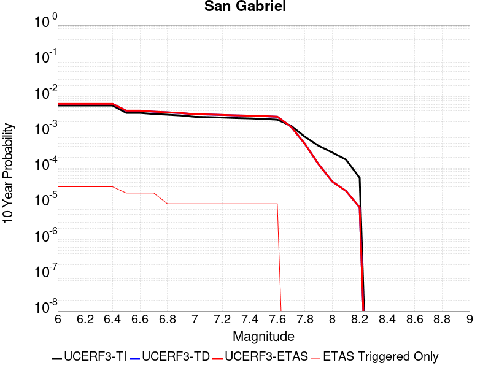 |

| Magnitude | 1 wk TI Prob | 1 wk TD Prob | 1 wk ETAS Prob | 1 wk ETAS/TD Gain | 1 wk ETAS Triggered Only | 1 mo TI Prob | 1 mo TD Prob | 1 mo ETAS Prob | 1 mo ETAS/TD Gain | 1 mo ETAS Triggered Only | 1 yr TI Prob | 1 yr TD Prob | 1 yr ETAS Prob | 1 yr ETAS/TD Gain | 1 yr ETAS Triggered Only | 10 yr TI Prob | 10 yr TD Prob | 10 yr ETAS Prob | 10 yr ETAS/TD Gain | 10 yr ETAS Triggered Only |
|-----|-----|-----|-----|-----|-----|-----|-----|-----|-----|-----|-----|-----|-----|-----|-----|-----|-----|-----|-----|-----|
| 6.0 | 1.083775E-5 | 1.19851875E-5 | 1.19851875E-5 | 1.0 | 0.0 | 4.6446676E-5 | 5.1364143E-5 | 5.1364143E-5 | 1.0 | 0.0 | 5.653415E-4 | 6.251903E-4 | 6.251903E-4 | 1.0 | 0.0 | 0.0056390543 | 0.006246409 | 0.0062623858 | 1.0025578 | 1.607717E-5 |
| 6.1 | 1.083775E-5 | 1.19851875E-5 | 1.19851875E-5 | 1.0 | 0.0 | 4.6446676E-5 | 5.1364143E-5 | 5.1364143E-5 | 1.0 | 0.0 | 5.653415E-4 | 6.251903E-4 | 6.251903E-4 | 1.0 | 0.0 | 0.0056390543 | 0.006246409 | 0.0062623858 | 1.0025578 | 1.607717E-5 |
| 6.2 | 1.083775E-5 | 1.19851875E-5 | 1.19851875E-5 | 1.0 | 0.0 | 4.6446676E-5 | 5.1364143E-5 | 5.1364143E-5 | 1.0 | 0.0 | 5.653415E-4 | 6.251903E-4 | 6.251903E-4 | 1.0 | 0.0 | 0.0056390543 | 0.006246409 | 0.0062623858 | 1.0025578 | 1.607717E-5 |
| 6.3 | 1.083775E-5 | 1.19851875E-5 | 1.19851875E-5 | 1.0 | 0.0 | 4.6446676E-5 | 5.1364143E-5 | 5.1364143E-5 | 1.0 | 0.0 | 5.653415E-4 | 6.251903E-4 | 6.251903E-4 | 1.0 | 0.0 | 0.0056390543 | 0.006246409 | 0.0062623858 | 1.0025578 | 1.607717E-5 |
| 6.4 | 1.083775E-5 | 1.19851875E-5 | 1.19851875E-5 | 1.0 | 0.0 | 4.6446676E-5 | 5.1364143E-5 | 5.1364143E-5 | 1.0 | 0.0 | 5.653415E-4 | 6.251903E-4 | 6.251903E-4 | 1.0 | 0.0 | 0.0056390543 | 0.006246409 | 0.0062623858 | 1.0025578 | 1.607717E-5 |
| 6.5 | 6.7317824E-6 | 7.716944E-6 | 7.716944E-6 | 1.0 | 0.0 | 2.8850178E-5 | 3.3072207E-5 | 3.3072207E-5 | 1.0 | 0.0 | 3.511943E-4 | 4.0258077E-4 | 4.0258077E-4 | 1.0 | 0.0 | 0.003506398 | 0.0040296097 | 0.004045622 | 1.0039737 | 1.607717E-5 |
| 6.6 | 6.7317824E-6 | 7.716944E-6 | 7.716944E-6 | 1.0 | 0.0 | 2.8850178E-5 | 3.3072207E-5 | 3.3072207E-5 | 1.0 | 0.0 | 3.511943E-4 | 4.0258077E-4 | 4.0258077E-4 | 1.0 | 0.0 | 0.003506398 | 0.0040296097 | 0.004045622 | 1.0039737 | 1.607717E-5 |
| 6.7 | 6.274881E-6 | 7.2458647E-6 | 7.2458647E-6 | 1.0 | 0.0 | 2.6892068E-5 | 3.1053343E-5 | 3.1053343E-5 | 1.0 | 0.0 | 3.2736175E-4 | 3.780098E-4 | 3.780098E-4 | 1.0 | 0.0 | 0.0032687993 | 0.0037847564 | 0.0038007726 | 1.0042318 | 1.607717E-5 |
| 6.8 | 5.996209E-6 | 6.958585E-6 | 6.958585E-6 | 1.0 | 0.0 | 2.5697784E-5 | 2.9822171E-5 | 2.9822171E-5 | 1.0 | 0.0 | 3.128256E-4 | 3.6302538E-4 | 3.6302538E-4 | 1.0 | 0.0 | 0.003123856 | 0.0036354093 | 0.0036354093 | 1.0 | 0.0 |
| 6.9 | 5.686331E-6 | 6.6236316E-6 | 6.6236316E-6 | 1.0 | 0.0 | 2.4369761E-5 | 2.8386688E-5 | 2.8386688E-5 | 1.0 | 0.0 | 2.9666146E-4 | 3.4555403E-4 | 3.4555403E-4 | 1.0 | 0.0 | 0.0029626573 | 0.0034612515 | 0.0034612515 | 1.0 | 0.0 |
| 7.0 | 5.2329838E-6 | 6.147514E-6 | 6.147514E-6 | 1.0 | 0.0 | 2.242688E-5 | 2.6346226E-5 | 2.6346226E-5 | 1.0 | 0.0 | 2.7301308E-4 | 3.2071886E-4 | 3.2071886E-4 | 1.0 | 0.0 | 0.002726779 | 0.0032136322 | 0.0032136322 | 1.0 | 0.0 |
| 7.1 | 5.135671E-6 | 6.03764E-6 | 6.03764E-6 | 1.0 | 0.0 | 2.2009834E-5 | 2.5875348E-5 | 2.5875348E-5 | 1.0 | 0.0 | 2.6793676E-4 | 3.1498758E-4 | 3.1498758E-4 | 1.0 | 0.0 | 0.0026761394 | 0.0031564834 | 0.0031564834 | 1.0 | 0.0 |
| 7.2 | 4.989062E-6 | 5.87102E-6 | 5.87102E-6 | 1.0 | 0.0 | 2.1381518E-5 | 2.5161276E-5 | 2.5161276E-5 | 1.0 | 0.0 | 2.6028889E-4 | 3.0629625E-4 | 3.0629625E-4 | 1.0 | 0.0 | 0.0025998424 | 0.003069813 | 0.003069813 | 1.0 | 0.0 |
| 7.3 | 4.8219395E-6 | 5.702574E-6 | 5.702574E-6 | 1.0 | 0.0 | 2.0665291E-5 | 2.443938E-5 | 2.443938E-5 | 1.0 | 0.0 | 2.5157086E-4 | 2.9750957E-4 | 2.9750957E-4 | 1.0 | 0.0 | 0.0025128627 | 0.0029821852 | 0.0029821852 | 1.0 | 0.0 |
| 7.4 | 4.7118383E-6 | 5.5911332E-6 | 5.5911332E-6 | 1.0 | 0.0 | 2.0193436E-5 | 2.3961782E-5 | 2.3961782E-5 | 1.0 | 0.0 | 2.4582737E-4 | 2.916964E-4 | 2.916964E-4 | 1.0 | 0.0 | 0.002455556 | 0.0029242067 | 0.0029242067 | 1.0 | 0.0 |
| 7.5 | 4.5506545E-6 | 5.4365014E-6 | 5.4365014E-6 | 1.0 | 0.0 | 1.9502659E-5 | 2.3299088E-5 | 2.3299088E-5 | 1.0 | 0.0 | 2.37419E-4 | 2.8363022E-4 | 2.8363022E-4 | 1.0 | 0.0 | 0.002371655 | 0.002843753 | 0.002843753 | 1.0 | 0.0 |
| 7.6 | 4.343636E-6 | 5.2293817E-6 | 5.2293817E-6 | 1.0 | 0.0 | 1.861545E-5 | 2.2411448E-5 | 2.2411448E-5 | 1.0 | 0.0 | 2.2661954E-4 | 2.7282597E-4 | 2.7282597E-4 | 1.0 | 0.0 | 0.0022638857 | 0.0027359722 | 0.0027359722 | 1.0 | 0.0 |
| 7.7 | 2.936235E-6 | 2.7440458E-6 | 2.7440458E-6 | 1.0 | 0.0 | 1.2583803E-5 | 1.1760143E-5 | 1.1760143E-5 | 1.0 | 0.0 | 1.5319703E-4 | 1.4317037E-4 | 1.4317037E-4 | 1.0 | 0.0 | 0.0015309147 | 0.0014380751 | 0.0014380751 | 1.0 | 0.0 |
| 7.8 | 1.4541639E-6 | 9.1237047E-7 | 9.1237047E-7 | 1.0 | 0.0 | 6.232116E-6 | 3.9101533E-6 | 3.9101533E-6 | 1.0 | 0.0 | 7.587337E-5 | 4.7605077E-5 | 4.7605077E-5 | 1.0 | 0.0 | 7.584747E-4 | 4.8085177E-4 | 4.8085177E-4 | 1.0 | 0.0 |
| 7.9 | 8.098958E-7 | 2.41753E-7 | 2.41753E-7 | 1.0 | 0.0 | 3.4709774E-6 | 1.0360839E-6 | 1.0360839E-6 | 1.0 | 0.0 | 4.225833E-5 | 1.2614248E-5 | 1.2614248E-5 | 1.0 | 0.0 | 4.2250296E-4 | 1.2921814E-4 | 1.2921814E-4 | 1.0 | 0.0 |
| 8.0 | 5.2473234E-7 | 7.6792055E-8 | 7.6792055E-8 | 1.0 | 0.0 | 2.248851E-6 | 3.2910876E-7 | 3.2910876E-7 | 1.0 | 0.0 | 2.7379416E-5 | 4.0068917E-6 | 4.0068917E-6 | 1.0 | 0.0 | 2.7376044E-4 | 4.21918E-5 | 4.21918E-5 | 1.0 | 0.0 |
| 8.1 | 3.3162388E-7 | 4.1496126E-8 | 4.1496126E-8 | 1.0 | 0.0 | 1.4212444E-6 | 1.7784053E-7 | 1.7784053E-7 | 1.0 | 0.0 | 1.7303513E-5 | 2.1652063E-6 | 2.1652063E-6 | 1.0 | 0.0 | 1.7302166E-4 | 2.2965523E-5 | 2.2965523E-5 | 1.0 | 0.0 |
| 8.2 | 1.0235345E-7 | 1.4043474E-8 | 1.4043474E-8 | 1.0 | 0.0 | 4.3865757E-7 | 6.0186316E-8 | 6.0186316E-8 | 1.0 | 0.0 | 5.340643E-6 | 7.327681E-7 | 7.327681E-7 | 1.0 | 0.0 | 5.3405143E-5 | 7.9273705E-6 | 7.9273705E-6 | 1.0 | 0.0 |

## Del Valle
*[(top)](#table-of-contents)*

| 1 Week | 1 Month | 1 Year | 10 Year |
|-----|-----|-----|-----|
|  |  |  |  |

| Magnitude | 1 wk TI Prob | 1 wk TD Prob | 1 wk ETAS Prob | 1 wk ETAS/TD Gain | 1 wk ETAS Triggered Only | 1 mo TI Prob | 1 mo TD Prob | 1 mo ETAS Prob | 1 mo ETAS/TD Gain | 1 mo ETAS Triggered Only | 1 yr TI Prob | 1 yr TD Prob | 1 yr ETAS Prob | 1 yr ETAS/TD Gain | 1 yr ETAS Triggered Only | 10 yr TI Prob | 10 yr TD Prob | 10 yr ETAS Prob | 10 yr ETAS/TD Gain | 10 yr ETAS Triggered Only |
|-----|-----|-----|-----|-----|-----|-----|-----|-----|-----|-----|-----|-----|-----|-----|-----|-----|-----|-----|-----|-----|
| 6.0 | 1.0716125E-5 | 8.767882E-6 | 8.767882E-6 | 1.0 | 0.0 | 4.592544E-5 | 3.7576207E-5 | 3.7576207E-5 | 1.0 | 0.0 | 5.589988E-4 | 4.5741405E-4 | 4.5741405E-4 | 1.0 | 0.0 | 0.0055759475 | 0.00456668 | 0.004582684 | 1.0035045 | 1.607717E-5 |
| 6.1 | 1.0716125E-5 | 8.767882E-6 | 8.767882E-6 | 1.0 | 0.0 | 4.592544E-5 | 3.7576207E-5 | 3.7576207E-5 | 1.0 | 0.0 | 5.589988E-4 | 4.5741405E-4 | 4.5741405E-4 | 1.0 | 0.0 | 0.0055759475 | 0.00456668 | 0.004582684 | 1.0035045 | 1.607717E-5 |
| 6.2 | 1.0716125E-5 | 8.767882E-6 | 8.767882E-6 | 1.0 | 0.0 | 4.592544E-5 | 3.7576207E-5 | 3.7576207E-5 | 1.0 | 0.0 | 5.589988E-4 | 4.5741405E-4 | 4.5741405E-4 | 1.0 | 0.0 | 0.0055759475 | 0.00456668 | 0.004582684 | 1.0035045 | 1.607717E-5 |
| 6.3 | 7.1293784E-6 | 4.865823E-6 | 4.865823E-6 | 1.0 | 0.0 | 3.055412E-5 | 2.0853364E-5 | 2.0853364E-5 | 1.0 | 0.0 | 3.7193293E-4 | 2.5386087E-4 | 2.5386087E-4 | 1.0 | 0.0 | 0.0037131102 | 0.0025357946 | 0.002551831 | 1.006324 | 1.607717E-5 |
| 6.4 | 7.1293784E-6 | 4.865823E-6 | 4.865823E-6 | 1.0 | 0.0 | 3.055412E-5 | 2.0853364E-5 | 2.0853364E-5 | 1.0 | 0.0 | 3.7193293E-4 | 2.5386087E-4 | 2.5386087E-4 | 1.0 | 0.0 | 0.0037131102 | 0.0025357946 | 0.002551831 | 1.006324 | 1.607717E-5 |
| 6.5 | 7.1293784E-6 | 4.865823E-6 | 4.865823E-6 | 1.0 | 0.0 | 3.055412E-5 | 2.0853364E-5 | 2.0853364E-5 | 1.0 | 0.0 | 3.7193293E-4 | 2.5386087E-4 | 2.5386087E-4 | 1.0 | 0.0 | 0.0037131102 | 0.0025357946 | 0.002551831 | 1.006324 | 1.607717E-5 |
| 6.6 | 7.1293784E-6 | 4.865823E-6 | 4.865823E-6 | 1.0 | 0.0 | 3.055412E-5 | 2.0853364E-5 | 2.0853364E-5 | 1.0 | 0.0 | 3.7193293E-4 | 2.5386087E-4 | 2.5386087E-4 | 1.0 | 0.0 | 0.0037131102 | 0.0025357946 | 0.002551831 | 1.006324 | 1.607717E-5 |
| 6.7 | 7.12272E-6 | 4.8631987E-6 | 4.8631987E-6 | 1.0 | 0.0 | 3.0525585E-5 | 2.0842117E-5 | 2.0842117E-5 | 1.0 | 0.0 | 3.7158563E-4 | 2.5372396E-4 | 2.5372396E-4 | 1.0 | 0.0 | 0.003709649 | 0.0025344288 | 0.0025504653 | 1.0063274 | 1.607717E-5 |
| 6.8 | 6.7558703E-6 | 4.5594015E-6 | 4.5594015E-6 | 1.0 | 0.0 | 2.895341E-5 | 1.9540148E-5 | 1.9540148E-5 | 1.0 | 0.0 | 3.5245073E-4 | 2.3787597E-4 | 2.3787597E-4 | 1.0 | 0.0 | 0.0035189227 | 0.0023762889 | 0.0023923276 | 1.0067496 | 1.607717E-5 |
| 6.9 | 6.6700386E-6 | 4.502539E-6 | 4.502539E-6 | 1.0 | 0.0 | 2.8585566E-5 | 1.9296456E-5 | 1.9296456E-5 | 1.0 | 0.0 | 3.479737E-4 | 2.3490966E-4 | 2.3490966E-4 | 1.0 | 0.0 | 0.003474293 | 0.0023466884 | 0.002362728 | 1.006835 | 1.607717E-5 |
| 7.0 | 6.3181424E-6 | 4.0987034E-6 | 4.0987034E-6 | 1.0 | 0.0 | 2.7077473E-5 | 1.7565755E-5 | 1.7565755E-5 | 1.0 | 0.0 | 3.2961834E-4 | 2.1384252E-4 | 2.1384252E-4 | 1.0 | 0.0 | 0.0032912986 | 0.002136422 | 0.002152465 | 1.0075092 | 1.607717E-5 |
| 7.1 | 6.248759E-6 | 4.033895E-6 | 4.033895E-6 | 1.0 | 0.0 | 2.678012E-5 | 1.7288008E-5 | 1.7288008E-5 | 1.0 | 0.0 | 3.2599916E-4 | 2.104616E-4 | 2.104616E-4 | 1.0 | 0.0 | 0.0032552136 | 0.0021026772 | 0.0021187207 | 1.00763 | 1.607717E-5 |
| 7.2 | 6.0411944E-6 | 3.869888E-6 | 3.869888E-6 | 1.0 | 0.0 | 2.5890577E-5 | 1.658513E-5 | 1.658513E-5 | 1.0 | 0.0 | 3.1517216E-4 | 2.0190567E-4 | 2.0190567E-4 | 1.0 | 0.0 | 0.0031472554 | 0.0020172757 | 0.0020333205 | 1.0079536 | 1.607717E-5 |
| 7.3 | 4.7691183E-6 | 3.0781202E-6 | 3.0781202E-6 | 1.0 | 0.0 | 2.0438918E-5 | 1.3191879E-5 | 1.3191879E-5 | 1.0 | 0.0 | 2.488154E-4 | 1.605995E-4 | 1.605995E-4 | 1.0 | 0.0 | 0.00248537 | 0.0016048603 | 0.0016209116 | 1.0100018 | 1.607717E-5 |
| 7.4 | 3.5524722E-6 | 2.1893363E-6 | 2.1893363E-6 | 1.0 | 0.0 | 1.5224792E-5 | 9.382837E-6 | 9.382837E-6 | 1.0 | 0.0 | 1.8534607E-4 | 1.1423013E-4 | 1.1423013E-4 | 1.0 | 0.0 | 0.0018519156 | 0.0011417224 | 0.0011577812 | 1.0140654 | 1.607717E-5 |
| 7.5 | 2.7133442E-6 | 1.5916097E-6 | 1.5916097E-6 | 1.0 | 0.0 | 1.1628566E-5 | 6.821167E-6 | 6.821167E-6 | 1.0 | 0.0 | 1.415686E-4 | 8.304456E-5 | 8.304456E-5 | 1.0 | 0.0 | 0.0014147845 | 8.301372E-4 | 8.4620103E-4 | 1.0193508 | 1.607717E-5 |
| 7.6 | 1.915338E-6 | 1.173914E-6 | 1.173914E-6 | 1.0 | 0.0 | 8.208566E-6 | 5.0310505E-6 | 5.0310505E-6 | 1.0 | 0.0 | 9.993471E-5 | 6.125133E-5 | 6.125133E-5 | 1.0 | 0.0 | 9.988978E-4 | 6.123454E-4 | 6.284127E-4 | 1.026239 | 1.607717E-5 |
| 7.7 | 1.2120448E-6 | 7.180313E-7 | 7.180313E-7 | 1.0 | 0.0 | 5.194467E-6 | 3.0772733E-6 | 3.0772733E-6 | 1.0 | 0.0 | 6.3240805E-5 | 3.746516E-5 | 3.746516E-5 | 1.0 | 0.0 | 6.322281E-4 | 3.7458882E-4 | 3.7458882E-4 | 1.0 | 0.0 |
| 7.8 | 6.272381E-7 | 3.932549E-7 | 3.932549E-7 | 1.0 | 0.0 | 2.6881603E-6 | 1.6853771E-6 | 1.6853771E-6 | 1.0 | 0.0 | 3.272786E-5 | 2.0519275E-5 | 2.0519275E-5 | 1.0 | 0.0 | 3.272304E-4 | 2.0517396E-4 | 2.0517396E-4 | 1.0 | 0.0 |
| 7.9 | 2.0292627E-7 | 1.2004622E-7 | 1.2004622E-7 | 1.0 | 0.0 | 8.6968373E-7 | 5.1448376E-7 | 5.1448376E-7 | 1.0 | 0.0 | 1.0588348E-5 | 6.263822E-6 | 6.263822E-6 | 1.0 | 0.0 | 1.0587843E-4 | 6.263647E-5 | 6.263647E-5 | 1.0 | 0.0 |
| 8.0 | 4.374492E-8 | 2.189964E-8 | 2.189964E-8 | 1.0 | 0.0 | 1.8747821E-7 | 9.385559E-8 | 9.385559E-8 | 1.0 | 0.0 | 2.2825448E-6 | 1.1426913E-6 | 1.1426913E-6 | 1.0 | 0.0 | 2.2825214E-5 | 1.1426858E-5 | 1.1426858E-5 | 1.0 | 0.0 |

## White Wolf
*[(top)](#table-of-contents)*

| 1 Week | 1 Month | 1 Year | 10 Year |
|-----|-----|-----|-----|
|  |  |  |  |

| Magnitude | 1 wk TI Prob | 1 wk TD Prob | 1 wk ETAS Prob | 1 wk ETAS/TD Gain | 1 wk ETAS Triggered Only | 1 mo TI Prob | 1 mo TD Prob | 1 mo ETAS Prob | 1 mo ETAS/TD Gain | 1 mo ETAS Triggered Only | 1 yr TI Prob | 1 yr TD Prob | 1 yr ETAS Prob | 1 yr ETAS/TD Gain | 1 yr ETAS Triggered Only | 10 yr TI Prob | 10 yr TD Prob | 10 yr ETAS Prob | 10 yr ETAS/TD Gain | 10 yr ETAS Triggered Only |
|-----|-----|-----|-----|-----|-----|-----|-----|-----|-----|-----|-----|-----|-----|-----|-----|-----|-----|-----|-----|-----|
| 6.0 | 2.0037822E-5 | 1.0469162E-6 | 1.0469162E-6 | 1.0 | 0.0 | 8.587355E-5 | 4.486776E-6 | 4.486776E-6 | 1.0 | 0.0 | 0.001045009 | 5.4625183E-5 | 5.4625183E-5 | 1.0 | 0.0 | 0.010401085 | 5.461226E-4 | 5.62191E-4 | 1.0294226 | 1.607717E-5 |
| 6.1 | 2.0037822E-5 | 1.0469162E-6 | 1.0469162E-6 | 1.0 | 0.0 | 8.587355E-5 | 4.486776E-6 | 4.486776E-6 | 1.0 | 0.0 | 0.001045009 | 5.4625183E-5 | 5.4625183E-5 | 1.0 | 0.0 | 0.010401085 | 5.461226E-4 | 5.62191E-4 | 1.0294226 | 1.607717E-5 |
| 6.2 | 2.0037822E-5 | 1.0469162E-6 | 1.0469162E-6 | 1.0 | 0.0 | 8.587355E-5 | 4.486776E-6 | 4.486776E-6 | 1.0 | 0.0 | 0.001045009 | 5.4625183E-5 | 5.4625183E-5 | 1.0 | 0.0 | 0.010401085 | 5.461226E-4 | 5.62191E-4 | 1.0294226 | 1.607717E-5 |
| 6.3 | 2.0037822E-5 | 1.0469162E-6 | 1.0469162E-6 | 1.0 | 0.0 | 8.587355E-5 | 4.486776E-6 | 4.486776E-6 | 1.0 | 0.0 | 0.001045009 | 5.4625183E-5 | 5.4625183E-5 | 1.0 | 0.0 | 0.010401085 | 5.461226E-4 | 5.62191E-4 | 1.0294226 | 1.607717E-5 |
| 6.4 | 1.132487E-5 | 1.0469162E-6 | 1.0469162E-6 | 1.0 | 0.0 | 4.8534253E-5 | 4.486776E-6 | 4.486776E-6 | 1.0 | 0.0 | 5.907443E-4 | 5.4625183E-5 | 5.4625183E-5 | 1.0 | 0.0 | 0.005891764 | 5.461226E-4 | 5.62191E-4 | 1.0294226 | 1.607717E-5 |
| 6.5 | 1.132487E-5 | 1.0469162E-6 | 1.0469162E-6 | 1.0 | 0.0 | 4.8534253E-5 | 4.486776E-6 | 4.486776E-6 | 1.0 | 0.0 | 5.907443E-4 | 5.4625183E-5 | 5.4625183E-5 | 1.0 | 0.0 | 0.005891764 | 5.461226E-4 | 5.62191E-4 | 1.0294226 | 1.607717E-5 |
| 6.6 | 9.347473E-6 | 1.0469162E-6 | 1.0469162E-6 | 1.0 | 0.0 | 4.0059982E-5 | 4.486776E-6 | 4.486776E-6 | 1.0 | 0.0 | 4.8762115E-4 | 5.4625183E-5 | 5.4625183E-5 | 1.0 | 0.0 | 0.0048655253 | 5.461226E-4 | 5.62191E-4 | 1.0294226 | 1.607717E-5 |
| 6.7 | 7.842647E-6 | 1.0048342E-6 | 1.0048342E-6 | 1.0 | 0.0 | 3.361091E-5 | 4.3064256E-6 | 4.3064256E-6 | 1.0 | 0.0 | 4.0913603E-4 | 5.2429517E-5 | 5.2429517E-5 | 1.0 | 0.0 | 0.004083836 | 5.2417646E-4 | 5.402452E-4 | 1.0306553 | 1.607717E-5 |
| 6.8 | 6.26597E-6 | 9.734822E-7 | 9.734822E-7 | 1.0 | 0.0 | 2.685388E-5 | 4.17206E-6 | 4.17206E-6 | 1.0 | 0.0 | 3.2689696E-4 | 5.0793697E-5 | 5.0793697E-5 | 1.0 | 0.0 | 0.003264165 | 5.078258E-4 | 5.238948E-4 | 1.0316428 | 1.607717E-5 |
| 6.9 | 5.258436E-6 | 9.183254E-7 | 9.183254E-7 | 1.0 | 0.0 | 2.2535958E-5 | 3.9356746E-6 | 3.9356746E-6 | 1.0 | 0.0 | 2.7434074E-4 | 4.7915833E-5 | 4.7915833E-5 | 1.0 | 0.0 | 0.0027400232 | 4.790598E-4 | 4.9512926E-4 | 1.0335437 | 1.607717E-5 |
| 7.0 | 4.675028E-6 | 8.6611794E-7 | 8.6611794E-7 | 1.0 | 0.0 | 2.003568E-5 | 3.7119291E-6 | 3.7119291E-6 | 1.0 | 0.0 | 2.4390711E-4 | 4.5191846E-5 | 4.5191846E-5 | 1.0 | 0.0 | 0.0024363957 | 4.518313E-4 | 4.6790118E-4 | 1.0355662 | 1.607717E-5 |
| 7.1 | 2.8270078E-6 | 6.8741696E-7 | 6.8741696E-7 | 1.0 | 0.0 | 1.2115692E-5 | 2.9460696E-6 | 2.9460696E-6 | 1.0 | 0.0 | 1.4749856E-4 | 3.5867848E-5 | 3.5867848E-5 | 1.0 | 0.0 | 0.001474007 | 3.586247E-4 | 3.746961E-4 | 1.044814 | 1.607717E-5 |
| 7.2 | 1.6881406E-6 | 2.2706382E-7 | 2.2706382E-7 | 1.0 | 0.0 | 7.2348685E-6 | 9.731303E-7 | 9.731303E-7 | 1.0 | 0.0 | 8.808096E-5 | 1.1847799E-5 | 1.1847799E-5 | 1.0 | 0.0 | 8.8046055E-4 | 1.1847183E-4 | 1.1847183E-4 | 1.0 | 0.0 |
| 7.3 | 9.086107E-7 | 1.5266386E-7 | 1.5266386E-7 | 1.0 | 0.0 | 3.8940398E-6 | 6.5427355E-7 | 6.5427355E-7 | 1.0 | 0.0 | 4.7408903E-5 | 7.965752E-6 | 7.965752E-6 | 1.0 | 0.0 | 4.739879E-4 | 7.965475E-5 | 7.965475E-5 | 1.0 | 0.0 |
| 7.4 | 1.9717383E-7 | 9.003913E-8 | 9.003913E-8 | 1.0 | 0.0 | 8.450304E-7 | 3.8588192E-7 | 3.8588192E-7 | 1.0 | 0.0 | 1.0288197E-5 | 4.6981027E-6 | 4.6981027E-6 | 1.0 | 0.0 | 1.028772E-4 | 4.6980065E-5 | 4.6980065E-5 | 1.0 | 0.0 |
| 7.5 | 1.086975E-7 | 6.6597195E-8 | 6.6597195E-8 | 1.0 | 0.0 | 4.6584634E-7 | 2.8541652E-7 | 2.8541652E-7 | 1.0 | 0.0 | 5.6716644E-6 | 3.474941E-6 | 3.474941E-6 | 1.0 | 0.0 | 5.6715195E-5 | 3.474889E-5 | 3.474889E-5 | 1.0 | 0.0 |
| 7.6 | 2.4217808E-8 | 1.5820765E-8 | 1.5820765E-8 | 1.0 | 0.0 | 1.03790605E-7 | 6.780328E-8 | 6.780328E-8 | 1.0 | 0.0 | 1.2636499E-6 | 8.255046E-7 | 8.255046E-7 | 1.0 | 0.0 | 1.2636427E-5 | 8.2550205E-6 | 8.2550205E-6 | 1.0 | 0.0 |

## Sierra Madre
*[(top)](#table-of-contents)*

| 1 Week | 1 Month | 1 Year | 10 Year |
|-----|-----|-----|-----|
|  |  |  |  |

| Magnitude | 1 wk TI Prob | 1 wk TD Prob | 1 wk ETAS Prob | 1 wk ETAS/TD Gain | 1 wk ETAS Triggered Only | 1 mo TI Prob | 1 mo TD Prob | 1 mo ETAS Prob | 1 mo ETAS/TD Gain | 1 mo ETAS Triggered Only | 1 yr TI Prob | 1 yr TD Prob | 1 yr ETAS Prob | 1 yr ETAS/TD Gain | 1 yr ETAS Triggered Only | 10 yr TI Prob | 10 yr TD Prob | 10 yr ETAS Prob | 10 yr ETAS/TD Gain | 10 yr ETAS Triggered Only |
|-----|-----|-----|-----|-----|-----|-----|-----|-----|-----|-----|-----|-----|-----|-----|-----|-----|-----|-----|-----|-----|
| 6.0 | 1.3379373E-5 | 1.10007395E-5 | 1.10007395E-5 | 1.0 | 0.0 | 5.7338908E-5 | 4.7145186E-5 | 4.7145186E-5 | 1.0 | 0.0 | 6.978776E-4 | 5.738429E-4 | 5.899109E-4 | 1.0280006 | 1.607717E-5 | 0.0069569005 | 0.0057239756 | 0.005739961 | 1.0027927 | 1.607717E-5 |
| 6.1 | 1.3379373E-5 | 1.10007395E-5 | 1.10007395E-5 | 1.0 | 0.0 | 5.7338908E-5 | 4.7145186E-5 | 4.7145186E-5 | 1.0 | 0.0 | 6.978776E-4 | 5.738429E-4 | 5.899109E-4 | 1.0280006 | 1.607717E-5 | 0.0069569005 | 0.0057239756 | 0.005739961 | 1.0027927 | 1.607717E-5 |
| 6.2 | 1.3379373E-5 | 1.10007395E-5 | 1.10007395E-5 | 1.0 | 0.0 | 5.7338908E-5 | 4.7145186E-5 | 4.7145186E-5 | 1.0 | 0.0 | 6.978776E-4 | 5.738429E-4 | 5.899109E-4 | 1.0280006 | 1.607717E-5 | 0.0069569005 | 0.0057239756 | 0.005739961 | 1.0027927 | 1.607717E-5 |
| 6.3 | 1.3379373E-5 | 1.10007395E-5 | 1.10007395E-5 | 1.0 | 0.0 | 5.7338908E-5 | 4.7145186E-5 | 4.7145186E-5 | 1.0 | 0.0 | 6.978776E-4 | 5.738429E-4 | 5.899109E-4 | 1.0280006 | 1.607717E-5 | 0.0069569005 | 0.0057239756 | 0.005739961 | 1.0027927 | 1.607717E-5 |
| 6.4 | 1.3379373E-5 | 1.10007395E-5 | 1.10007395E-5 | 1.0 | 0.0 | 5.7338908E-5 | 4.7145186E-5 | 4.7145186E-5 | 1.0 | 0.0 | 6.978776E-4 | 5.738429E-4 | 5.899109E-4 | 1.0280006 | 1.607717E-5 | 0.0069569005 | 0.0057239756 | 0.005739961 | 1.0027927 | 1.607717E-5 |
| 6.5 | 1.26563245E-5 | 1.0230196E-5 | 1.0230196E-5 | 1.0 | 0.0 | 5.4240263E-5 | 4.3842967E-5 | 4.3842967E-5 | 1.0 | 0.0 | 6.601751E-4 | 5.336584E-4 | 5.336584E-4 | 1.0 | 0.0 | 0.006582173 | 0.0053240913 | 0.0053240913 | 1.0 | 0.0 |
| 6.6 | 1.26563245E-5 | 1.0230196E-5 | 1.0230196E-5 | 1.0 | 0.0 | 5.4240263E-5 | 4.3842967E-5 | 4.3842967E-5 | 1.0 | 0.0 | 6.601751E-4 | 5.336584E-4 | 5.336584E-4 | 1.0 | 0.0 | 0.006582173 | 0.0053240913 | 0.0053240913 | 1.0 | 0.0 |
| 6.7 | 1.2502474E-5 | 1.006634E-5 | 1.006634E-5 | 1.0 | 0.0 | 5.3580934E-5 | 4.314075E-5 | 4.314075E-5 | 1.0 | 0.0 | 6.521526E-4 | 5.251131E-4 | 5.251131E-4 | 1.0 | 0.0 | 0.0065024206 | 0.0052390425 | 0.0052390425 | 1.0 | 0.0 |
| 6.8 | 1.2454966E-5 | 1.0018625E-5 | 1.0018625E-5 | 1.0 | 0.0 | 5.3377335E-5 | 4.2936266E-5 | 4.2936266E-5 | 1.0 | 0.0 | 6.4967526E-4 | 5.226247E-4 | 5.226247E-4 | 1.0 | 0.0 | 0.006477792 | 0.0052142753 | 0.0052142753 | 1.0 | 0.0 |
| 6.9 | 1.2225574E-5 | 9.792602E-6 | 9.792602E-6 | 1.0 | 0.0 | 5.2394265E-5 | 4.1967625E-5 | 4.1967625E-5 | 1.0 | 0.0 | 6.3771347E-4 | 5.108371E-4 | 5.108371E-4 | 1.0 | 0.0 | 0.006358865 | 0.0050969445 | 0.0050969445 | 1.0 | 0.0 |
| 7.0 | 1.182946E-5 | 9.399144E-6 | 9.399144E-6 | 1.0 | 0.0 | 5.06967E-5 | 4.0281426E-5 | 4.0281426E-5 | 1.0 | 0.0 | 6.1705755E-4 | 4.9031706E-4 | 4.9031706E-4 | 1.0 | 0.0 | 0.006153469 | 0.004892664 | 0.004892664 | 1.0 | 0.0 |
| 7.1 | 1.14369095E-5 | 8.986159E-6 | 8.986159E-6 | 1.0 | 0.0 | 4.9014405E-5 | 3.8511545E-5 | 3.8511545E-5 | 1.0 | 0.0 | 5.9658696E-4 | 4.687782E-4 | 4.687782E-4 | 1.0 | 0.0 | 0.005949879 | 0.004678199 | 0.004678199 | 1.0 | 0.0 |
| 7.2 | 1.0836419E-5 | 8.3995565E-6 | 8.3995565E-6 | 1.0 | 0.0 | 4.644097E-5 | 3.5997607E-5 | 3.5997607E-5 | 1.0 | 0.0 | 5.652721E-4 | 4.3818366E-4 | 4.3818366E-4 | 1.0 | 0.0 | 0.0056383642 | 0.004373494 | 0.004373494 | 1.0 | 0.0 |
| 7.3 | 1.0403439E-5 | 8.02082E-6 | 8.02082E-6 | 1.0 | 0.0 | 4.4585406E-5 | 3.4374494E-5 | 3.4374494E-5 | 1.0 | 0.0 | 5.426921E-4 | 4.1843E-4 | 4.1843E-4 | 1.0 | 0.0 | 0.005413687 | 0.004176717 | 0.004176717 | 1.0 | 0.0 |
| 7.4 | 9.768864E-6 | 7.414448E-6 | 7.414448E-6 | 1.0 | 0.0 | 4.186589E-5 | 3.1775824E-5 | 3.1775824E-5 | 1.0 | 0.0 | 5.09598E-4 | 3.868029E-4 | 3.868029E-4 | 1.0 | 0.0 | 0.0050843097 | 0.0038615882 | 0.0038615882 | 1.0 | 0.0 |
| 7.5 | 8.687089E-6 | 6.4501564E-6 | 6.4501564E-6 | 1.0 | 0.0 | 3.722985E-5 | 2.764324E-5 | 2.764324E-5 | 1.0 | 0.0 | 4.5317915E-4 | 3.3650533E-4 | 3.3650533E-4 | 1.0 | 0.0 | 0.004522561 | 0.0033602451 | 0.0033602451 | 1.0 | 0.0 |
| 7.6 | 6.3506063E-6 | 4.4303215E-6 | 4.4303215E-6 | 1.0 | 0.0 | 2.72166E-5 | 1.8986955E-5 | 1.8986955E-5 | 1.0 | 0.0 | 3.3131172E-4 | 2.3114192E-4 | 2.3114192E-4 | 1.0 | 0.0 | 0.003308182 | 0.0023092402 | 0.0023092402 | 1.0 | 0.0 |
| 7.7 | 4.62223E-6 | 2.932967E-6 | 2.932967E-6 | 1.0 | 0.0 | 1.9809406E-5 | 1.2569798E-5 | 1.2569798E-5 | 1.0 | 0.0 | 2.4115283E-4 | 1.5302657E-4 | 1.5302657E-4 | 1.0 | 0.0 | 0.0024089129 | 0.001529413 | 0.001529413 | 1.0 | 0.0 |
| 7.8 | 3.2145008E-6 | 1.9494332E-6 | 1.9494332E-6 | 1.0 | 0.0 | 1.3776359E-5 | 8.3546865E-6 | 8.3546865E-6 | 1.0 | 0.0 | 1.6771426E-4 | 1.0171358E-4 | 1.0171358E-4 | 1.0 | 0.0 | 0.0016758774 | 0.0010168145 | 0.0010168145 | 1.0 | 0.0 |
| 7.9 | 1.0391769E-6 | 5.6026335E-7 | 5.6026335E-7 | 1.0 | 0.0 | 4.4536077E-6 | 2.4011265E-6 | 2.4011265E-6 | 1.0 | 0.0 | 5.4221324E-5 | 2.9233326E-5 | 2.9233326E-5 | 1.0 | 0.0 | 5.4208096E-4 | 2.9229524E-4 | 2.9229524E-4 | 1.0 | 0.0 |
| 8.0 | 1.210983E-7 | 6.613821E-8 | 6.613821E-8 | 1.0 | 0.0 | 5.1899264E-7 | 2.8344945E-7 | 2.8344945E-7 | 1.0 | 0.0 | 6.3187167E-6 | 3.4509917E-6 | 3.4509917E-6 | 1.0 | 0.0 | 6.318537E-5 | 3.45094E-5 | 3.45094E-5 | 1.0 | 0.0 |

## Morales (East)
*[(top)](#table-of-contents)*

| 1 Week | 1 Month | 1 Year | 10 Year |
|-----|-----|-----|-----|
|  |  |  |  |

| Magnitude | 1 wk TI Prob | 1 wk TD Prob | 1 wk ETAS Prob | 1 wk ETAS/TD Gain | 1 wk ETAS Triggered Only | 1 mo TI Prob | 1 mo TD Prob | 1 mo ETAS Prob | 1 mo ETAS/TD Gain | 1 mo ETAS Triggered Only | 1 yr TI Prob | 1 yr TD Prob | 1 yr ETAS Prob | 1 yr ETAS/TD Gain | 1 yr ETAS Triggered Only | 10 yr TI Prob | 10 yr TD Prob | 10 yr ETAS Prob | 10 yr ETAS/TD Gain | 10 yr ETAS Triggered Only |
|-----|-----|-----|-----|-----|-----|-----|-----|-----|-----|-----|-----|-----|-----|-----|-----|-----|-----|-----|-----|-----|
| 6.0 | 1.4942771E-6 | 2.123479E-6 | 2.123479E-6 | 1.0 | 0.0 | 6.404029E-6 | 9.100596E-6 | 9.100596E-6 | 1.0 | 0.0 | 7.7966266E-5 | 1.107947E-4 | 1.107947E-4 | 1.0 | 0.0 | 7.793892E-4 | 0.0011074544 | 0.0011235138 | 1.0145011 | 1.607717E-5 |
| 6.1 | 1.4942771E-6 | 2.123479E-6 | 2.123479E-6 | 1.0 | 0.0 | 6.404029E-6 | 9.100596E-6 | 9.100596E-6 | 1.0 | 0.0 | 7.7966266E-5 | 1.107947E-4 | 1.107947E-4 | 1.0 | 0.0 | 7.793892E-4 | 0.0011074544 | 0.0011235138 | 1.0145011 | 1.607717E-5 |
| 6.2 | 1.4942771E-6 | 2.123479E-6 | 2.123479E-6 | 1.0 | 0.0 | 6.404029E-6 | 9.100596E-6 | 9.100596E-6 | 1.0 | 0.0 | 7.7966266E-5 | 1.107947E-4 | 1.107947E-4 | 1.0 | 0.0 | 7.793892E-4 | 0.0011074544 | 0.0011235138 | 1.0145011 | 1.607717E-5 |
| 6.3 | 1.4942771E-6 | 2.123479E-6 | 2.123479E-6 | 1.0 | 0.0 | 6.404029E-6 | 9.100596E-6 | 9.100596E-6 | 1.0 | 0.0 | 7.7966266E-5 | 1.107947E-4 | 1.107947E-4 | 1.0 | 0.0 | 7.793892E-4 | 0.0011074544 | 0.0011235138 | 1.0145011 | 1.607717E-5 |
| 6.4 | 8.798845E-7 | 1.5022731E-6 | 1.5022731E-6 | 1.0 | 0.0 | 3.7709283E-6 | 6.438298E-6 | 6.438298E-6 | 1.0 | 0.0 | 4.5910085E-5 | 7.8383564E-5 | 7.8383564E-5 | 1.0 | 0.0 | 4.59006E-4 | 7.835727E-4 | 7.835727E-4 | 1.0 | 0.0 |
| 6.5 | 7.1751725E-7 | 1.3384229E-6 | 1.3384229E-6 | 1.0 | 0.0 | 3.0750705E-6 | 5.7360858E-6 | 5.7360858E-6 | 1.0 | 0.0 | 3.7438338E-5 | 6.9834685E-5 | 6.9834685E-5 | 1.0 | 0.0 | 3.743203E-4 | 6.9813756E-4 | 6.9813756E-4 | 1.0 | 0.0 |
| 6.6 | 7.1751725E-7 | 1.3384229E-6 | 1.3384229E-6 | 1.0 | 0.0 | 3.0750705E-6 | 5.7360858E-6 | 5.7360858E-6 | 1.0 | 0.0 | 3.7438338E-5 | 6.9834685E-5 | 6.9834685E-5 | 1.0 | 0.0 | 3.743203E-4 | 6.9813756E-4 | 6.9813756E-4 | 1.0 | 0.0 |
| 6.7 | 7.159057E-7 | 1.3358889E-6 | 1.3358889E-6 | 1.0 | 0.0 | 3.0681638E-6 | 5.725226E-6 | 5.725226E-6 | 1.0 | 0.0 | 3.7354253E-5 | 6.970247E-5 | 6.970247E-5 | 1.0 | 0.0 | 3.7347974E-4 | 6.968163E-4 | 6.968163E-4 | 1.0 | 0.0 |
| 6.8 | 7.032203E-7 | 1.3174443E-6 | 1.3174443E-6 | 1.0 | 0.0 | 3.0137978E-6 | 5.646178E-6 | 5.646178E-6 | 1.0 | 0.0 | 3.669237E-5 | 6.8740126E-5 | 6.8740126E-5 | 1.0 | 0.0 | 3.6686313E-4 | 6.871988E-4 | 6.871988E-4 | 1.0 | 0.0 |
| 6.9 | 6.941549E-7 | 1.3025061E-6 | 1.3025061E-6 | 1.0 | 0.0 | 2.974946E-6 | 5.582158E-6 | 5.582158E-6 | 1.0 | 0.0 | 3.6219368E-5 | 6.7960726E-5 | 6.7960726E-5 | 1.0 | 0.0 | 3.6213463E-4 | 6.7940954E-4 | 6.7940954E-4 | 1.0 | 0.0 |
| 7.0 | 6.2932247E-7 | 1.18774E-6 | 1.18774E-6 | 1.0 | 0.0 | 2.6970936E-6 | 5.090305E-6 | 5.090305E-6 | 1.0 | 0.0 | 3.283662E-5 | 6.1972765E-5 | 6.1972765E-5 | 1.0 | 0.0 | 3.283177E-4 | 6.1956374E-4 | 6.1956374E-4 | 1.0 | 0.0 |
| 7.1 | 5.6200963E-7 | 1.0640374E-6 | 1.0640374E-6 | 1.0 | 0.0 | 2.4086105E-6 | 4.5601523E-6 | 4.5601523E-6 | 1.0 | 0.0 | 2.9324437E-5 | 5.551849E-5 | 5.551849E-5 | 1.0 | 0.0 | 2.9320567E-4 | 5.550534E-4 | 5.550534E-4 | 1.0 | 0.0 |
| 7.2 | 4.91044E-7 | 9.285713E-7 | 9.285713E-7 | 1.0 | 0.0 | 2.1044725E-6 | 3.9795855E-6 | 3.9795855E-6 | 1.0 | 0.0 | 2.5621652E-5 | 4.8450413E-5 | 4.8450413E-5 | 1.0 | 0.0 | 2.56187E-4 | 4.8440482E-4 | 4.8440482E-4 | 1.0 | 0.0 |
| 7.3 | 4.2978448E-7 | 7.9739846E-7 | 7.9739846E-7 | 1.0 | 0.0 | 1.8419321E-6 | 3.4174175E-6 | 3.4174175E-6 | 1.0 | 0.0 | 2.2425293E-5 | 4.1606294E-5 | 4.1606294E-5 | 1.0 | 0.0 | 2.242303E-4 | 4.1599068E-4 | 4.1599068E-4 | 1.0 | 0.0 |
| 7.4 | 3.774317E-7 | 6.806746E-7 | 6.806746E-7 | 1.0 | 0.0 | 1.6175634E-6 | 2.9171736E-6 | 2.9171736E-6 | 1.0 | 0.0 | 1.9693656E-5 | 3.5516037E-5 | 3.5516037E-5 | 1.0 | 0.0 | 1.969191E-4 | 3.551089E-4 | 3.551089E-4 | 1.0 | 0.0 |
| 7.5 | 1.0603232E-7 | 9.840901E-8 | 9.840901E-8 | 1.0 | 0.0 | 4.5442414E-7 | 4.2175284E-7 | 4.2175284E-7 | 1.0 | 0.0 | 5.5326E-6 | 5.134829E-6 | 5.134829E-6 | 1.0 | 0.0 | 5.532462E-5 | 5.134967E-5 | 5.134967E-5 | 1.0 | 0.0 |
| 7.6 | 9.960384E-8 | 8.755334E-8 | 8.755334E-8 | 1.0 | 0.0 | 4.2687353E-7 | 3.7522852E-7 | 3.7522852E-7 | 1.0 | 0.0 | 5.197173E-6 | 4.568398E-6 | 4.568398E-6 | 1.0 | 0.0 | 5.1970514E-5 | 4.5685607E-5 | 4.5685607E-5 | 1.0 | 0.0 |
| 7.7 | 6.499468E-8 | 4.1038682E-8 | 4.1038682E-8 | 1.0 | 0.0 | 2.785486E-7 | 1.7588006E-7 | 1.7588006E-7 | 1.0 | 0.0 | 3.3913238E-6 | 2.1413375E-6 | 2.1413375E-6 | 1.0 | 0.0 | 3.3912722E-5 | 2.1415728E-5 | 2.1415728E-5 | 1.0 | 0.0 |
| 7.8 | 2.2517119E-8 | 7.1312614E-9 | 7.1312614E-9 | 1.0 | 0.0 | 9.6501935E-8 | 3.0562546E-8 | 3.0562546E-8 | 1.0 | 0.0 | 1.1749105E-6 | 3.7209892E-7 | 3.7209892E-7 | 1.0 | 0.0 | 1.1749043E-5 | 3.7235213E-6 | 3.7235213E-6 | 1.0 | 0.0 |
| 7.9 | 8.493023E-9 | 9.970124E-10 | 9.970124E-10 | 1.0 | 0.0 | 3.639867E-8 | 4.2729082E-9 | 4.2729082E-9 | 1.0 | 0.0 | 4.4315374E-7 | 5.202266E-8 | 5.202266E-8 | 1.0 | 0.0 | 4.4315284E-6 | 5.2233156E-7 | 5.2233156E-7 | 1.0 | 0.0 |
| 8.0 | 1.4971842E-9 | 5.5458416E-11 | 5.5458416E-11 | 1.0 | 0.0 | 6.4165038E-9 | 2.376762E-10 | 2.376762E-10 | 1.0 | 0.0 | 7.812093E-8 | 2.8937068E-9 | 2.8937068E-9 | 1.0 | 0.0 | 7.81209E-7 | 3.019288E-8 | 3.019288E-8 | 1.0 | 0.0 |

