# Parent Section Magnitude-Probability Distributions

Only fault sections with at least one triggered aftershock are plotted. Sections are sorted by total supraseismogenic trigger rate (decreasing)

## Table Of Contents

* [Tank Canyon](#tank-canyon)
* [Garlock (Central)](#garlock-central)
* [Little Lake](#little-lake)
* [Owl Lake](#owl-lake)
* [Airport Lake](#airport-lake)
* [Panamint Valley](#panamint-valley)
* [Garlock (East)](#garlock-east)
* [Blackwater](#blackwater)
* [Hunter Mountain-Saline Valley](#hunter-mountain-saline-valley)
* [Ash Hill](#ash-hill)
* [Garlock (West)](#garlock-west)
* [Gravel Hills-Harper Lk](#gravel-hills-harper-lk)
* [McLean Lake](#mclean-lake)
* [Goldstone Lake](#goldstone-lake)
* [Coyote Canyon](#coyote-canyon)
* [Lenwood-Lockhart-Old Woman Springs](#lenwood-lockhart-old-woman-springs)
* [San Andreas (Mojave S)](#san-andreas-mojave-s)
* [Nelson Lake](#nelson-lake)
* [So Sierra Nevada](#so-sierra-nevada)
* [San Andreas (Mojave N)](#san-andreas-mojave-n)
* [Death Valley (So)](#death-valley-so)
* [Bicycle Lake](#bicycle-lake)
* [Paradise](#paradise)
* [Towne Pass](#towne-pass)
* [San Andreas (San Bernardino N)](#san-andreas-san-bernardino-n)
* [Garlic Springs](#garlic-springs)
* [Helendale-So Lockhart](#helendale-so-lockhart)
* [Coyote Lake](#coyote-lake)
* [Death Valley (Black Mtns Frontal)](#death-valley-black-mtns-frontal)
* [San Andreas (San Bernardino S)](#san-andreas-san-bernardino-s)
* [Red Pass](#red-pass)
* [San Andreas (Big Bend)](#san-andreas-big-bend)
* [Cady](#cady)
* [Manix-Afton Hills](#manix-afton-hills)
* [Death Valley (No)](#death-valley-no)
* [San Andreas (Parkfield)](#san-andreas-parkfield)
* [Ludlow](#ludlow)
* [Baker](#baker)
* [San Andreas (Carrizo) rev](#san-andreas-carrizo-rev)
* [San Andreas (Cholame) rev](#san-andreas-cholame-rev)
* [Elsinore (Glen Ivy) rev](#elsinore-glen-ivy-rev)
* [Mission Ridge-Arroyo Parida-Santa Ana](#mission-ridge-arroyo-parida-santa-ana)
* [San Jacinto (San Bernardino)](#san-jacinto-san-bernardino)
* [San Andreas (San Gorgonio Pass-Garnet HIll)](#san-andreas-san-gorgonio-pass-garnet-hill)
* [Death Valley (Fish Lake Valley)](#death-valley-fish-lake-valley)
* [Sierra Nevada  (No Extension)](#sierra-nevada--no-extension)
* [Calico-Hidalgo](#calico-hidalgo)
* [Santa Ynez (East)](#santa-ynez-east)
* [Scodie Lineament](#scodie-lineament)
* [San Andreas (Coachella) rev](#san-andreas-coachella-rev)
* [San Andreas (Creeping Section) 2011 CFM](#san-andreas-creeping-section-2011-cfm)
* [Rose Canyon](#rose-canyon)
* [Cleghorn Lake](#cleghorn-lake)
* [San Jacinto (Anza) rev](#san-jacinto-anza-rev)
* [San Jacinto (Stepovers Combined)](#san-jacinto-stepovers-combined)
* [San Jacinto (San Jacinto Valley) rev](#san-jacinto-san-jacinto-valley-rev)
* [Red Mountain](#red-mountain)
* [Santa Rosa Island](#santa-rosa-island)
* [Ventura-Pitas Point](#ventura-pitas-point)
* [Coronado Bank alt1](#coronado-bank-alt1)
* [Lost Hills](#lost-hills)
* [Pinto Mtn](#pinto-mtn)
* [Lake Isabella (Seismicity)](#lake-isabella-seismicity)
* [Santa Ynez (West)](#santa-ynez-west)
* [Cleghorn Pass](#cleghorn-pass)
* [White Wolf (Extension)](#white-wolf-extension)
* [Blue Cut](#blue-cut)
* [San Diego Trough north alt1](#san-diego-trough-north-alt1)
* [San Andreas (North Branch Mill Creek)](#san-andreas-north-branch-mill-creek)
* [Chino alt 1](#chino-alt-1)
* [San Jacinto (Coyote Creek)](#san-jacinto-coyote-creek)
* [Sheephole](#sheephole)
* [Owens Valley](#owens-valley)
* [San Jacinto (Borrego)](#san-jacinto-borrego)
* [San Cayetano](#san-cayetano)
* [Pleito](#pleito)
* [Camp Rock 2011](#camp-rock-2011)
* [Mission Creek](#mission-creek)
* [San Juan](#san-juan)
* [Independence rev 2011](#independence-rev-2011)
* [Ortigalita (North)](#ortigalita-north)
* [Pine Mtn](#pine-mtn)
* [Palos Verdes](#palos-verdes)
* [Whittier alt 1](#whittier-alt-1)
* [Pitas Point (Lower)-Montalvo](#pitas-point-lower-montalvo)
* [Greenville (No) 2011 CFM](#greenville-no-2011-cfm)
* [Hosgri (Extension)](#hosgri-extension)
* [Pitas Point (Lower West)](#pitas-point-lower-west)
* [Malibu Coast alt 1](#malibu-coast-alt-1)
* [Mono Lake 2011 CFM](#mono-lake-2011-cfm)
* [Bullion Mountains](#bullion-mountains)
* [Calaveras (So) - Paicines extension 2011 CFM](#calaveras-so---paicines-extension-2011-cfm)
* [Hosgri](#hosgri)
* [Raymond](#raymond)
* [Monterey Bay-Tularcitos](#monterey-bay-tularcitos)
* [Elysian Park (Upper)](#elysian-park-upper)
* [Elsinore (Temecula) rev](#elsinore-temecula-rev)
* [San Jacinto (Clark) rev](#san-jacinto-clark-rev)
* [San Diego Trough south](#san-diego-trough-south)
* [San Jacinto (Superstition Mtn)](#san-jacinto-superstition-mtn)
* [Greenville (So) 2011 CFM](#greenville-so-2011-cfm)
* [Calaveras (So) 2011 CFM](#calaveras-so-2011-cfm)
* [Superstition Hills](#superstition-hills)
* [Oceanside alt1](#oceanside-alt1)
* [Ortigalita (South)](#ortigalita-south)
* [San Jacinto (Lytle Creek connector)](#san-jacinto-lytle-creek-connector)
* [Deep Springs](#deep-springs)
* [Fontana (Seismicity)](#fontana-seismicity)
* [Channel Islands Thrust](#channel-islands-thrust)
* [Oak Ridge (Onshore)](#oak-ridge-onshore)
* [Mount Diablo Thrust North CFM](#mount-diablo-thrust-north-cfm)
* [San Gorgonio Pass](#san-gorgonio-pass)
* [Los Alamos 2011 CFM](#los-alamos-2011-cfm)
* [Rinconada 2011 CFM](#rinconada-2011-cfm)
* [Santa Monica alt 1](#santa-monica-alt-1)
* [Malibu Coast (Extension) alt 1](#malibu-coast-extension-alt-1)
* [Kern Canyon (Lake Isabella) 2011](#kern-canyon-lake-isabella-2011)
* [Clayton](#clayton)
* [Great Valley 09 (Laguna Seca)](#great-valley-09-laguna-seca)
* [Newport-Inglewood (Offshore)](#newport-inglewood-offshore)
* [Anaheim](#anaheim)
* [Simi-Santa Rosa](#simi-santa-rosa)
* [Casmalia 2011 CFM](#casmalia-2011-cfm)
* [Santa Ynez River](#santa-ynez-river)
* [Northridge](#northridge)
* [Round Valley](#round-valley)
* [Elsinore (Stepovers Combined)](#elsinore-stepovers-combined)
* [San Pedro Escarpment](#san-pedro-escarpment)
* [Hunting Creek - Berryessa 2011 CFM](#hunting-creek---berryessa-2011-cfm)
* [Hollywood](#hollywood)
* [Pisgah-Bullion Mtn-Mesquite Lk](#pisgah-bullion-mtn-mesquite-lk)
* [Yorba Linda](#yorba-linda)
* [Laguna Salada](#laguna-salada)
* [Monte Vista - Shannon 2011 CFM](#monte-vista---shannon-2011-cfm)
* [Shoreline](#shoreline)
* [Santa Cruz Island](#santa-cruz-island)
* [Imperial](#imperial)
* [Great Valley 06 (Midland) 2011 CFM alt1](#great-valley-06-midland-2011-cfm-alt1)
* [San Gabriel (Extension)](#san-gabriel-extension)
* [Brawley (Seismic Zone) alt 1](#brawley-seismic-zone-alt-1)
* [Elsinore (Julian)](#elsinore-julian)
* [Owens Valley Keough Hot Springs](#owens-valley-keough-hot-springs)
* [Dry Mountain](#dry-mountain)
* [Reliz 2011 CFM](#reliz-2011-cfm)
* [Big Pine (Central)](#big-pine-central)
* [Concord 2011 CFM](#concord-2011-cfm)
* [Honey Lake 2011 CFM](#honey-lake-2011-cfm)
* [Los Osos 2011](#los-osos-2011)
* [South Cuyama](#south-cuyama)
* [Cerro Prieto](#cerro-prieto)
* [Kern Canyon (North Kern) 2011](#kern-canyon-north-kern-2011)
* [Santa Cruz Catalina Ridge alt1](#santa-cruz-catalina-ridge-alt1)
* [White Mountains](#white-mountains)
* [Compton](#compton)
* [Peralta Hills](#peralta-hills)
* [Oceanic - West Huasna](#oceanic---west-huasna)
* [La Panza 2011](#la-panza-2011)
* [Del Valle](#del-valle)
* [Surprise Valley 2011 CFM](#surprise-valley-2011-cfm)
* [San Luis Range 2011 CFM](#san-luis-range-2011-cfm)
* [Robinson Creek](#robinson-creek)
* [Emerson-Copper Mtn 2011](#emerson-copper-mtn-2011)
* [Morales (East)](#morales-east)
* [Likely 2011 CFM](#likely-2011-cfm)
* [Great Valley 03a Dunnigan Hills](#great-valley-03a-dunnigan-hills)
* [Sisar](#sisar)
* [Green Valley 2011 CFM](#green-valley-2011-cfm)

## Tank Canyon
*[(top)](#table-of-contents)*

| 1 Week | 1 Month | 1 Year | 10 Year |
|-----|-----|-----|-----|
|  |  |  | 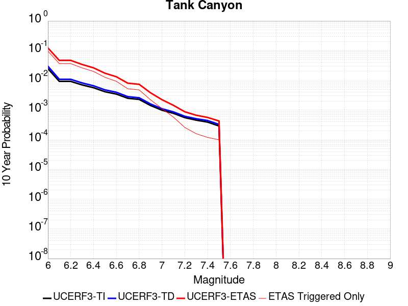 |

| Magnitude | 1 wk TI Prob | 1 wk TD Prob | 1 wk ETAS Prob | 1 wk ETAS/TD Gain | 1 wk ETAS Triggered Only | 1 mo TI Prob | 1 mo TD Prob | 1 mo ETAS Prob | 1 mo ETAS/TD Gain | 1 mo ETAS Triggered Only | 1 yr TI Prob | 1 yr TD Prob | 1 yr ETAS Prob | 1 yr ETAS/TD Gain | 1 yr ETAS Triggered Only | 10 yr TI Prob | 10 yr TD Prob | 10 yr ETAS Prob | 10 yr ETAS/TD Gain | 10 yr ETAS Triggered Only |
|-----|-----|-----|-----|-----|-----|-----|-----|-----|-----|-----|-----|-----|-----|-----|-----|-----|-----|-----|-----|-----|
| 6.0 | 4.8284557E-5 | 5.7964822E-5 | 0.035400044 | 610.716 | 0.03534413 | 2.0691741E-4 | 2.4840087E-4 | 0.046957444 | 189.03897 | 0.046720646 | 0.0025163088 | 0.0030207601 | 0.07297076 | 24.156424 | 0.070161946 | 0.02488006 | 0.029863637 | 0.124402836 | 4.165696 | 0.09744939 |
| 6.1 | 1.7796336E-5 | 2.0873314E-5 | 0.012611704 | 604.2022 | 0.012591093 | 7.626778E-5 | 8.945422E-5 | 0.016808607 | 187.90178 | 0.016720647 | 9.281647E-4 | 0.0010885983 | 0.026041163 | 23.92174 | 0.024979757 | 0.009242975 | 0.010836744 | 0.047079366 | 4.34442 | 0.036639675 |
| 6.2 | 1.7796336E-5 | 2.0873314E-5 | 0.012611704 | 604.2022 | 0.012591093 | 7.626778E-5 | 8.945422E-5 | 0.016808607 | 187.90178 | 0.016720647 | 9.281647E-4 | 0.0010885983 | 0.026041163 | 23.92174 | 0.024979757 | 0.009242975 | 0.010836744 | 0.047079366 | 4.34442 | 0.036639675 |
| 6.3 | 1.3515912E-5 | 1.5759564E-5 | 0.009165413 | 581.5778 | 0.009149797 | 5.792405E-5 | 6.753938E-5 | 0.012131502 | 179.62117 | 0.012064777 | 7.049971E-4 | 8.2200574E-4 | 0.019025654 | 23.145401 | 0.018218623 | 0.007027647 | 0.0081922645 | 0.034453087 | 4.205563 | 0.026477734 |
| 6.4 | 1.0870146E-5 | 1.2618021E-5 | 0.0064092986 | 507.948 | 0.006396761 | 4.658551E-5 | 5.4076212E-5 | 0.008798542 | 162.70634 | 0.008744939 | 5.67031E-4 | 6.581969E-4 | 0.014292941 | 21.715296 | 0.013643725 | 0.005655863 | 0.0065644905 | 0.026634302 | 4.0573297 | 0.02020243 |
| 6.5 | 7.964826E-6 | 9.196094E-6 | 0.0036528872 | 397.22162 | 0.0036437246 | 3.4134522E-5 | 3.9411298E-5 | 0.0050189723 | 127.348564 | 0.004979757 | 4.1550855E-4 | 4.7973756E-4 | 0.008653952 | 18.038929 | 0.008178137 | 0.0041473247 | 0.004788321 | 0.017157957 | 3.5832927 | 0.01242915 |
| 6.6 | 6.6317E-6 | 7.6122988E-6 | 0.0025986857 | 341.37988 | 0.002591093 | 2.8421264E-5 | 3.2623782E-5 | 0.003635745 | 111.444626 | 0.0036032388 | 3.4597394E-4 | 3.9713128E-4 | 0.0062652454 | 15.7762575 | 0.005870445 | 0.0034543579 | 0.003965368 | 0.013078883 | 3.2982774 | 0.009149797 |
| 6.7 | 4.793663E-6 | 5.4307857E-6 | 0.0015033984 | 276.8289 | 0.0014979757 | 2.0544108E-5 | 2.3274613E-5 | 0.0020880038 | 89.71165 | 0.0020647773 | 2.500958E-4 | 2.8333595E-4 | 0.0037236565 | 13.142196 | 0.0034412956 | 0.0024981452 | 0.0028304397 | 0.007957587 | 2.8114314 | 0.0051417006 |
| 6.8 | 4.382823E-6 | 4.9692567E-6 | 0.0013005093 | 261.71103 | 0.0012955465 | 1.8783392E-5 | 2.1296666E-5 | 0.0018431202 | 86.54501 | 0.0018218623 | 2.286638E-4 | 2.5926033E-4 | 0.0033353856 | 12.865006 | 0.003076923 | 0.0022842865 | 0.002590253 | 0.0071533015 | 2.761623 | 0.0045748986 |
| 6.9 | 2.729601E-6 | 3.0735416E-6 | 4.8890203E-4 | 159.06796 | 4.8582995E-4 | 1.1698237E-5 | 1.3172262E-5 | 7.419076E-4 | 56.32348 | 7.2874496E-4 | 1.4241673E-4 | 1.6036171E-4 | 0.0015771386 | 9.834882 | 0.001417004 | 0.001423255 | 0.0016026258 | 0.003825778 | 2.3871934 | 0.0022267206 |
| 7.0 | 1.8987357E-6 | 2.126939E-6 | 2.0455566E-4 | 96.17373 | 2.0242915E-4 | 8.137413E-6 | 9.115425E-6 | 3.329991E-4 | 36.531387 | 3.2388663E-4 | 9.90685E-5 | 1.1097535E-4 | 7.9915806E-4 | 7.2012215 | 6.882591E-4 | 9.902435E-4 | 0.0011092679 | 0.0022416138 | 2.0208046 | 0.0011336033 |
| 7.1 | 1.4928986E-6 | 1.6641272E-6 | 4.2149888E-5 | 25.328527 | 4.048583E-5 | 6.398121E-6 | 7.1319573E-6 | 4.7617497E-5 | 6.676638 | 4.048583E-5 | 7.789434E-5 | 8.682871E-5 | 3.702049E-4 | 4.263623 | 2.8340082E-4 | 7.786704E-4 | 8.6800574E-4 | 0.001353414 | 1.5592225 | 4.8582995E-4 |
| 7.2 | 1.069082E-6 | 1.1828573E-6 | 1.1828573E-6 | 1.0 | 0.0 | 4.581772E-6 | 5.0693816E-6 | 5.0693816E-6 | 1.0 | 0.0 | 5.5781646E-5 | 6.171851E-5 | 1.831685E-4 | 2.9678051 | 1.2145749E-4 | 5.576765E-4 | 6.170659E-4 | 8.59831E-4 | 1.3934184 | 2.4291498E-4 |
| 7.3 | 8.776551E-7 | 9.770005E-7 | 9.770005E-7 | 1.0 | 0.0 | 3.7613736E-6 | 4.1871413E-6 | 4.1871413E-6 | 1.0 | 0.0 | 4.579376E-5 | 5.097777E-5 | 5.097777E-5 | 1.0 | 0.0 | 4.5784327E-4 | 5.097118E-4 | 5.50177E-4 | 1.0793884 | 4.048583E-5 |
| 7.4 | 7.55721E-7 | 8.510244E-7 | 8.510244E-7 | 1.0 | 0.0 | 3.2388E-6 | 3.6472454E-6 | 3.6472454E-6 | 1.0 | 0.0 | 3.9431678E-5 | 4.4404827E-5 | 4.4404827E-5 | 1.0 | 0.0 | 3.942468E-4 | 4.440104E-4 | 4.8447825E-4 | 1.0911417 | 4.048583E-5 |
| 7.5 | 5.587665E-7 | 6.305619E-7 | 6.305619E-7 | 1.0 | 0.0 | 2.3947114E-6 | 2.702408E-6 | 2.702408E-6 | 1.0 | 0.0 | 2.915522E-5 | 3.290182E-5 | 3.290182E-5 | 1.0 | 0.0 | 2.9151395E-4 | 3.290182E-4 | 3.694907E-4 | 1.1230099 | 4.048583E-5 |

## Garlock (Central)
*[(top)](#table-of-contents)*

| 1 Week | 1 Month | 1 Year | 10 Year |
|-----|-----|-----|-----|
|  |  |  |  |

| Magnitude | 1 wk TI Prob | 1 wk TD Prob | 1 wk ETAS Prob | 1 wk ETAS/TD Gain | 1 wk ETAS Triggered Only | 1 mo TI Prob | 1 mo TD Prob | 1 mo ETAS Prob | 1 mo ETAS/TD Gain | 1 mo ETAS Triggered Only | 1 yr TI Prob | 1 yr TD Prob | 1 yr ETAS Prob | 1 yr ETAS/TD Gain | 1 yr ETAS Triggered Only | 10 yr TI Prob | 10 yr TD Prob | 10 yr ETAS Prob | 10 yr ETAS/TD Gain | 10 yr ETAS Triggered Only |
|-----|-----|-----|-----|-----|-----|-----|-----|-----|-----|-----|-----|-----|-----|-----|-----|-----|-----|-----|-----|-----|
| 6.0 | 5.5131142E-5 | 7.024681E-5 | 0.039743572 | 565.7705 | 0.039676115 | 2.3625491E-4 | 3.010234E-4 | 0.05137876 | 170.6803 | 0.051093116 | 0.0028726095 | 0.0036588663 | 0.074653216 | 20.403374 | 0.07125506 | 0.028357591 | 0.036079824 | 0.12755468 | 3.5353463 | 0.09489878 |
| 6.1 | 5.5131142E-5 | 7.024681E-5 | 0.039743572 | 565.7705 | 0.039676115 | 2.3625491E-4 | 3.010234E-4 | 0.05137876 | 170.6803 | 0.051093116 | 0.0028726095 | 0.0036588663 | 0.074653216 | 20.403374 | 0.07125506 | 0.028357591 | 0.036079824 | 0.12755468 | 3.5353463 | 0.09489878 |
| 6.2 | 4.216245E-5 | 5.1661493E-5 | 0.02721625 | 526.8189 | 0.027165992 | 1.806837E-4 | 2.2138779E-4 | 0.03547674 | 160.24704 | 0.03526316 | 0.0021976046 | 0.0026920962 | 0.051749956 | 19.222921 | 0.049190283 | 0.021759989 | 0.026689773 | 0.0904081 | 3.3873684 | 0.065465584 |
| 6.3 | 4.216245E-5 | 5.1661493E-5 | 0.02721625 | 526.8189 | 0.027165992 | 1.806837E-4 | 2.2138779E-4 | 0.03547674 | 160.24704 | 0.03526316 | 0.0021976046 | 0.0026920962 | 0.051749956 | 19.222921 | 0.049190283 | 0.021759989 | 0.026689773 | 0.0904081 | 3.3873684 | 0.065465584 |
| 6.4 | 3.6858168E-5 | 4.411054E-5 | 0.022107914 | 501.19345 | 0.022064777 | 1.5795401E-4 | 1.8903162E-4 | 0.029252363 | 154.74852 | 0.029068826 | 0.0019213937 | 0.002299056 | 0.042732198 | 18.586845 | 0.040526316 | 0.019048655 | 0.02284894 | 0.075781256 | 3.31662 | 0.054170042 |
| 6.5 | 3.39199E-5 | 4.0018083E-5 | 0.019715345 | 492.6609 | 0.019676114 | 1.453629E-4 | 1.7149492E-4 | 0.026199419 | 152.77081 | 0.026032388 | 0.0017683565 | 0.002085973 | 0.03832601 | 18.373205 | 0.03631579 | 0.017543508 | 0.020759864 | 0.0686118 | 3.3050218 | 0.048866395 |
| 6.6 | 3.3571985E-5 | 3.9472274E-5 | 0.019674325 | 498.43405 | 0.019635627 | 1.4387199E-4 | 1.6915603E-4 | 0.026156662 | 154.63039 | 0.025991904 | 0.0017502342 | 0.0020575512 | 0.038217813 | 18.574417 | 0.03623482 | 0.017365133 | 0.020481179 | 0.06814845 | 3.3273697 | 0.048663966 |
| 6.7 | 3.2580007E-5 | 3.8088703E-5 | 0.018863283 | 495.24615 | 0.018825911 | 1.3962112E-4 | 1.632272E-4 | 0.025098428 | 153.76376 | 0.02493927 | 0.0016985617 | 0.0019855013 | 0.036249317 | 18.257011 | 0.034331985 | 0.016856372 | 0.019773813 | 0.06517376 | 3.2959633 | 0.04631579 |
| 6.8 | 3.2185937E-5 | 3.7515918E-5 | 0.01837691 | 489.84296 | 0.018340081 | 1.3793244E-4 | 1.6077272E-4 | 0.024569804 | 152.82321 | 0.024412956 | 0.0016780337 | 0.001955672 | 0.0355336 | 18.16951 | 0.033643726 | 0.016654192 | 0.019480614 | 0.06394141 | 3.2823098 | 0.04534413 |
| 6.9 | 3.165394E-5 | 3.6720503E-5 | 0.017971285 | 489.40735 | 0.017935222 | 1.3565269E-4 | 1.5736422E-4 | 0.024080724 | 153.02542 | 0.023927126 | 0.0016503202 | 0.001914247 | 0.034685403 | 18.119606 | 0.03283401 | 0.01638118 | 0.019073246 | 0.06248025 | 3.2758057 | 0.044251014 |
| 7.0 | 3.0903822E-5 | 3.5625766E-5 | 0.017281976 | 485.09766 | 0.017246963 | 1.3243823E-4 | 1.5267303E-4 | 0.023266552 | 152.39464 | 0.023117408 | 0.0016112428 | 0.0018572307 | 0.033619992 | 18.102217 | 0.031821862 | 0.015996104 | 0.018512413 | 0.06055346 | 3.2709653 | 0.042834006 |
| 7.1 | 3.0069863E-5 | 3.4392073E-5 | 0.016633011 | 483.62924 | 0.01659919 | 1.2886449E-4 | 1.4738638E-4 | 0.022289872 | 151.23427 | 0.022145748 | 0.0015677959 | 0.0017929734 | 0.032224145 | 17.97246 | 0.03048583 | 0.01556781 | 0.017880075 | 0.058278207 | 3.259394 | 0.041133605 |
| 7.2 | 2.7957109E-5 | 3.128145E-5 | 0.013917487 | 444.91177 | 0.01388664 | 1.1981068E-4 | 1.340566E-4 | 0.01859312 | 138.69606 | 0.018461538 | 0.0014577188 | 0.0016309366 | 0.026852893 | 16.464706 | 0.025263159 | 0.014481937 | 0.016283695 | 0.049817666 | 3.059359 | 0.03408907 |
| 7.3 | 2.4519275E-5 | 2.6714795E-5 | 0.009824024 | 367.7372 | 0.009797571 | 1.0507837E-4 | 1.1448703E-4 | 0.013189913 | 115.20879 | 0.013076923 | 0.0012785783 | 0.001393003 | 0.019303242 | 13.8572855 | 0.017935222 | 0.012712469 | 0.013928054 | 0.037641685 | 2.7025805 | 0.024048584 |
| 7.4 | 2.3225532E-5 | 2.51994E-5 | 0.009134281 | 362.48013 | 0.009109312 | 9.95342E-5 | 1.0799304E-4 | 0.012292912 | 113.8306 | 0.012186235 | 0.0012111551 | 0.0013140367 | 0.017850982 | 13.584844 | 0.016558705 | 0.012045753 | 0.013145725 | 0.034920447 | 2.6564107 | 0.022064777 |
| 7.5 | 2.097765E-5 | 2.2483688E-5 | 0.007390739 | 328.7156 | 0.007368421 | 8.9901114E-5 | 9.635517E-5 | 0.0098525 | 102.25191 | 0.009757085 | 0.0010939965 | 0.0011725046 | 0.01435541 | 12.243371 | 0.01319838 | 0.010886264 | 0.011740365 | 0.028704822 | 2.4449685 | 0.017165992 |
| 7.6 | 1.511254E-5 | 1.5991332E-5 | 0.0045503317 | 284.54987 | 0.004534413 | 6.476642E-5 | 6.853253E-5 | 0.0060195415 | 87.834816 | 0.005951417 | 7.882459E-4 | 8.3407195E-4 | 0.008722224 | 10.4574 | 0.007894737 | 0.007854558 | 0.008383559 | 0.018500455 | 2.2067544 | 0.010202429 |
| 7.7 | 9.934069E-6 | 1.0678794E-5 | 0.0014681531 | 137.48305 | 0.0014574899 | 4.2573887E-5 | 4.5765457E-5 | 0.0020699643 | 45.22984 | 0.0020242915 | 5.182138E-4 | 5.570524E-4 | 0.003308555 | 5.939397 | 0.0027530363 | 0.00517007 | 0.005627684 | 0.009009355 | 1.6008992 | 0.0034008098 |
| 7.8 | 6.7562896E-6 | 8.428449E-6 | 7.776527E-4 | 92.26522 | 7.6923077E-4 | 2.8955206E-5 | 3.6121426E-5 | 0.0012101681 | 33.502777 | 0.001174089 | 3.5247262E-4 | 4.3968976E-4 | 0.0020988788 | 4.7735453 | 0.001659919 | 0.0035191406 | 0.004446654 | 0.00650225 | 1.4622792 | 0.0020647773 |
| 7.9 | 3.975453E-6 | 5.37103E-6 | 3.2925594E-4 | 61.302193 | 3.2388663E-4 | 1.7037546E-5 | 2.3018498E-5 | 6.30292E-4 | 27.381975 | 6.0728745E-4 | 2.0741238E-4 | 2.8021427E-4 | 0.001089704 | 3.888824 | 8.097166E-4 | 0.002072189 | 0.0028336283 | 0.003923648 | 1.3846729 | 0.0010931174 |
| 8.0 | 1.6729537E-6 | 2.0775144E-6 | 1.2353476E-4 | 59.462765 | 1.2145749E-4 | 7.169782E-6 | 8.903603E-6 | 1.7084548E-4 | 19.188354 | 1.6194332E-4 | 8.7288594E-5 | 1.0839601E-4 | 3.917661E-4 | 3.6142116 | 2.8340082E-4 | 8.7254314E-4 | 0.0010969337 | 0.0015822308 | 1.4424124 | 4.8582995E-4 |
| 8.1 | 3.6733252E-7 | 3.1489964E-7 | 4.0800718E-5 | 129.56737 | 4.048583E-5 | 1.5742813E-6 | 1.3495693E-6 | 4.1835345E-5 | 30.999033 | 4.048583E-5 | 1.9166706E-5 | 1.6430899E-5 | 5.6916062E-5 | 3.4639654 | 4.048583E-5 | 1.9165053E-4 | 1.6638759E-4 | 2.4734577E-4 | 1.4865639 | 8.097166E-5 |

## Little Lake
*[(top)](#table-of-contents)*

| 1 Week | 1 Month | 1 Year | 10 Year |
|-----|-----|-----|-----|
|  |  |  |  |

| Magnitude | 1 wk TI Prob | 1 wk TD Prob | 1 wk ETAS Prob | 1 wk ETAS/TD Gain | 1 wk ETAS Triggered Only | 1 mo TI Prob | 1 mo TD Prob | 1 mo ETAS Prob | 1 mo ETAS/TD Gain | 1 mo ETAS Triggered Only | 1 yr TI Prob | 1 yr TD Prob | 1 yr ETAS Prob | 1 yr ETAS/TD Gain | 1 yr ETAS Triggered Only | 10 yr TI Prob | 10 yr TD Prob | 10 yr ETAS Prob | 10 yr ETAS/TD Gain | 10 yr ETAS Triggered Only |
|-----|-----|-----|-----|-----|-----|-----|-----|-----|-----|-----|-----|-----|-----|-----|-----|-----|-----|-----|-----|-----|
| 6.0 | 2.8424427E-5 | 3.120572E-5 | 0.021649964 | 693.7819 | 0.021619434 | 1.2181328E-4 | 1.337327E-4 | 0.027255611 | 203.80664 | 0.027125506 | 0.0014820677 | 0.0016271127 | 0.03897515 | 23.953566 | 0.037408907 | 0.014722223 | 0.016165402 | 0.06320624 | 3.9099703 | 0.047813766 |
| 6.1 | 2.8424427E-5 | 3.120572E-5 | 0.021649964 | 693.7819 | 0.021619434 | 1.2181328E-4 | 1.337327E-4 | 0.027255611 | 203.80664 | 0.027125506 | 0.0014820677 | 0.0016271127 | 0.03897515 | 23.953566 | 0.037408907 | 0.014722223 | 0.016165402 | 0.06320624 | 3.9099703 | 0.047813766 |
| 6.2 | 2.8424427E-5 | 3.120572E-5 | 0.021649964 | 693.7819 | 0.021619434 | 1.2181328E-4 | 1.337327E-4 | 0.027255611 | 203.80664 | 0.027125506 | 0.0014820677 | 0.0016271127 | 0.03897515 | 23.953566 | 0.037408907 | 0.014722223 | 0.016165402 | 0.06320624 | 3.9099703 | 0.047813766 |
| 6.3 | 1.48860645E-5 | 1.6081389E-5 | 0.012890369 | 801.57056 | 0.012874494 | 6.379586E-5 | 6.8918576E-5 | 0.015978754 | 231.84972 | 0.015910931 | 7.7643775E-4 | 8.3878887E-4 | 0.022076022 | 26.318924 | 0.021255061 | 0.007737305 | 0.008359048 | 0.035177514 | 4.2083163 | 0.027044535 |
| 6.4 | 1.48860645E-5 | 1.6081389E-5 | 0.012890369 | 801.57056 | 0.012874494 | 6.379586E-5 | 6.8918576E-5 | 0.015978754 | 231.84972 | 0.015910931 | 7.7643775E-4 | 8.3878887E-4 | 0.022076022 | 26.318924 | 0.021255061 | 0.007737305 | 0.008359048 | 0.035177514 | 4.2083163 | 0.027044535 |
| 6.5 | 1.2797581E-5 | 1.3765565E-5 | 0.012037892 | 874.4931 | 0.012024292 | 5.4845623E-5 | 5.899409E-5 | 0.014997384 | 254.21841 | 0.014939271 | 6.675408E-4 | 7.18042E-4 | 0.02070368 | 28.833523 | 0.02 | 0.006655392 | 0.00715977 | 0.03232244 | 4.5144525 | 0.02534413 |
| 6.6 | 9.661896E-6 | 1.0289038E-5 | 0.0104555255 | 1016.1811 | 0.010445344 | 4.1407468E-5 | 4.409522E-5 | 0.013079958 | 296.62982 | 0.013036437 | 5.040193E-4 | 5.367433E-4 | 0.017895842 | 33.341526 | 0.017368421 | 0.005028777 | 0.0053560743 | 0.027584555 | 5.150144 | 0.022348179 |
| 6.7 | 7.767871E-6 | 8.199687E-6 | 0.009076951 | 1106.9875 | 0.009068826 | 3.329045E-5 | 3.5141118E-5 | 0.011451744 | 325.87875 | 0.011417004 | 4.0523586E-4 | 4.2777284E-4 | 0.015684402 | 36.665257 | 0.015263158 | 0.004044977 | 0.004270846 | 0.023621049 | 5.5307655 | 0.019433198 |
| 6.8 | 6.4235196E-6 | 6.7357446E-6 | 0.007375107 | 1094.9209 | 0.007368421 | 2.752908E-5 | 2.8867229E-5 | 0.009097432 | 315.14737 | 0.009068826 | 3.35115E-4 | 3.5141467E-4 | 0.012533367 | 35.665462 | 0.012186235 | 0.003346101 | 0.00350985 | 0.018961499 | 5.402367 | 0.015506073 |
| 6.9 | 3.1283696E-6 | 3.1121804E-6 | 0.004416054 | 1418.9581 | 0.0044129556 | 1.3407229E-5 | 1.3337856E-5 | 0.005316911 | 398.6331 | 0.0053036436 | 1.6322079E-4 | 1.6237781E-4 | 0.007327206 | 45.124428 | 0.0071659917 | 0.0016310095 | 0.00162274 | 0.010515169 | 6.4798856 | 0.008906882 |
| 7.0 | 2.290603E-6 | 2.2286815E-6 | 0.0027147732 | 1218.1073 | 0.0027125506 | 9.816834E-6 | 9.551463E-6 | 0.003248387 | 340.0931 | 0.0032388663 | 1.19513395E-4 | 1.162839E-4 | 0.0045692073 | 39.293552 | 0.004453441 | 0.0011944914 | 0.0011623327 | 0.0064598117 | 5.557627 | 0.0053036436 |
| 7.1 | 1.293693E-6 | 1.1776827E-6 | 0.001053808 | 894.8148 | 0.0010526315 | 5.5443866E-6 | 5.0472063E-6 | 0.0013005872 | 257.6846 | 0.0012955465 | 6.750081E-5 | 6.14487E-5 | 0.0019641658 | 31.964317 | 0.001902834 | 6.7480316E-4 | 6.143856E-4 | 0.002961121 | 4.8196464 | 0.002348178 |
| 7.2 | 4.715842E-7 | 3.0917857E-7 | 8.1280814E-5 | 262.8928 | 8.097166E-5 | 2.0210737E-6 | 1.3250503E-6 | 8.22966E-5 | 62.108284 | 8.097166E-5 | 2.4606294E-5 | 1.6132375E-5 | 1.3758791E-4 | 8.528683 | 1.2145749E-4 | 2.460357E-4 | 1.6131258E-4 | 3.2322976E-4 | 2.0037482 | 1.6194332E-4 |
| 7.3 | 3.9430947E-7 | 2.3097488E-7 | 8.120262E-5 | 351.56473 | 8.097166E-5 | 1.6898966E-6 | 9.89892E-7 | 8.196147E-5 | 82.7984 | 8.097166E-5 | 2.0574296E-5 | 1.2051869E-5 | 1.335079E-4 | 11.077776 | 1.2145749E-4 | 2.0572392E-4 | 1.20512224E-4 | 2.8243603E-4 | 2.3436296 | 1.6194332E-4 |
| 7.4 | 3.547123E-7 | 1.9679135E-7 | 4.0682615E-5 | 206.72968 | 4.048583E-5 | 1.5201948E-6 | 8.4339126E-7 | 4.1329185E-5 | 49.003574 | 4.048583E-5 | 1.8508214E-5 | 1.0268241E-5 | 5.0753653E-5 | 4.94278 | 4.048583E-5 | 1.8506673E-4 | 1.02677724E-4 | 1.8364107E-4 | 1.788519 | 8.097166E-5 |
| 7.5 | 2.6354266E-7 | 1.4423138E-7 | 4.0630057E-5 | 281.70053 | 4.048583E-5 | 1.129468E-6 | 6.181344E-7 | 4.110394E-5 | 66.49677 | 4.048583E-5 | 1.3751187E-5 | 7.5257603E-6 | 4.8011287E-5 | 6.379593 | 4.048583E-5 | 1.3750336E-4 | 7.5255106E-5 | 1.5622067E-4 | 2.0758812 | 8.097166E-5 |
| 7.6 | 1.269913E-7 | 7.572556E-8 | 7.572556E-8 | 1.0 | 0.0 | 5.4424834E-7 | 3.245381E-7 | 3.245381E-7 | 1.0 | 0.0 | 6.6262032E-6 | 3.9512443E-6 | 3.9512443E-6 | 1.0 | 0.0 | 6.626006E-5 | 3.9511775E-5 | 7.9996E-5 | 2.0246117 | 4.048583E-5 |

## Owl Lake
*[(top)](#table-of-contents)*

| 1 Week | 1 Month | 1 Year | 10 Year |
|-----|-----|-----|-----|
|  |  |  |  |

| Magnitude | 1 wk TI Prob | 1 wk TD Prob | 1 wk ETAS Prob | 1 wk ETAS/TD Gain | 1 wk ETAS Triggered Only | 1 mo TI Prob | 1 mo TD Prob | 1 mo ETAS Prob | 1 mo ETAS/TD Gain | 1 mo ETAS Triggered Only | 1 yr TI Prob | 1 yr TD Prob | 1 yr ETAS Prob | 1 yr ETAS/TD Gain | 1 yr ETAS Triggered Only | 10 yr TI Prob | 10 yr TD Prob | 10 yr ETAS Prob | 10 yr ETAS/TD Gain | 10 yr ETAS Triggered Only |
|-----|-----|-----|-----|-----|-----|-----|-----|-----|-----|-----|-----|-----|-----|-----|-----|-----|-----|-----|-----|-----|
| 6.0 | 5.0320643E-5 | 6.635816E-5 | 0.012859032 | 193.78223 | 0.012793522 | 2.1564208E-4 | 2.843674E-4 | 0.018052593 | 63.483345 | 0.01777328 | 0.0026222812 | 0.0034577388 | 0.029117694 | 8.421021 | 0.025748989 | 0.02591553 | 0.034140717 | 0.06866921 | 2.011358 | 0.03574899 |
| 6.1 | 5.0320643E-5 | 6.635816E-5 | 0.012859032 | 193.78223 | 0.012793522 | 2.1564208E-4 | 2.843674E-4 | 0.018052593 | 63.483345 | 0.01777328 | 0.0026222812 | 0.0034577388 | 0.029117694 | 8.421021 | 0.025748989 | 0.02591553 | 0.034140717 | 0.06866921 | 2.011358 | 0.03574899 |
| 6.2 | 2.4125871E-5 | 3.0981035E-5 | 0.0091804955 | 296.32626 | 0.009149797 | 1.0339249E-4 | 1.3277028E-4 | 0.012884114 | 97.04065 | 0.012753037 | 0.0012580766 | 0.001615439 | 0.020330098 | 12.584875 | 0.01874494 | 0.012509781 | 0.016070465 | 0.041405655 | 2.5765064 | 0.025748989 |
| 6.3 | 1.7433485E-5 | 2.2355514E-5 | 0.007957401 | 355.94803 | 0.007935222 | 7.471279E-5 | 9.580672E-5 | 0.011106897 | 115.93026 | 0.011012145 | 9.0924866E-4 | 0.0011659743 | 0.017422302 | 14.942268 | 0.016275303 | 0.009055373 | 0.011628896 | 0.033277024 | 2.8615806 | 0.021902833 |
| 6.4 | 1.7433485E-5 | 2.2355514E-5 | 0.007957401 | 355.94803 | 0.007935222 | 7.471279E-5 | 9.580672E-5 | 0.011106897 | 115.93026 | 0.011012145 | 9.0924866E-4 | 0.0011659743 | 0.017422302 | 14.942268 | 0.016275303 | 0.009055373 | 0.011628896 | 0.033277024 | 2.8615806 | 0.021902833 |
| 6.5 | 1.5182742E-5 | 1.9429144E-5 | 0.007509162 | 386.4896 | 0.0074898787 | 6.506727E-5 | 8.326596E-5 | 0.010325328 | 124.004196 | 0.010242915 | 7.919061E-4 | 0.0010134429 | 0.016301578 | 16.085344 | 0.015303643 | 0.0078909 | 0.010118429 | 0.030717583 | 3.0358057 | 0.020809717 |
| 6.6 | 6.7271576E-6 | 8.547361E-6 | 0.006243312 | 730.4374 | 0.0062348177 | 2.8830356E-5 | 3.6631063E-5 | 0.008254954 | 225.35391 | 0.008218624 | 3.5095305E-4 | 4.458976E-4 | 0.012222021 | 27.409927 | 0.011781377 | 0.0035039932 | 0.004467813 | 0.020186743 | 4.5182605 | 0.015789473 |
| 6.7 | 6.682835E-6 | 8.479807E-6 | 0.0062432447 | 736.2484 | 0.0062348177 | 2.8640408E-5 | 3.6341557E-5 | 0.008254667 | 227.14125 | 0.008218624 | 3.4864116E-4 | 4.4237426E-4 | 0.012218539 | 27.620365 | 0.011781377 | 0.003480947 | 0.0044327388 | 0.020152222 | 4.5462236 | 0.015789473 |
| 6.8 | 6.5774975E-6 | 8.32628E-6 | 0.0062026065 | 744.9433 | 0.006194332 | 2.8188972E-5 | 3.5683603E-5 | 0.008213529 | 230.17657 | 0.008178137 | 3.4314668E-4 | 4.343669E-4 | 0.012170157 | 28.018152 | 0.01174089 | 0.0034261728 | 0.004352885 | 0.020033319 | 4.6023088 | 0.015748987 |
| 6.9 | 6.363419E-6 | 7.999454E-6 | 0.006202282 | 775.3381 | 0.006194332 | 2.727151E-5 | 3.428296E-5 | 0.008171656 | 238.35913 | 0.008137652 | 3.3198006E-4 | 4.1732067E-4 | 0.012031904 | 28.831318 | 0.011619433 | 0.0033148455 | 0.0041828766 | 0.019664407 | 4.701168 | 0.015546558 |
| 7.0 | 6.1342453E-6 | 7.6316555E-6 | 0.0060399743 | 791.43695 | 0.0060323887 | 2.6289357E-5 | 3.2706717E-5 | 0.008008154 | 244.8474 | 0.007975709 | 3.2002592E-4 | 3.9813702E-4 | 0.0117701255 | 29.563004 | 0.011376518 | 0.0031956544 | 0.003991571 | 0.019193804 | 4.808584 | 0.015263158 |
| 7.1 | 5.842926E-6 | 7.142211E-6 | 0.0057156035 | 800.25684 | 0.005708502 | 2.504087E-5 | 3.0609146E-5 | 0.007682197 | 250.97716 | 0.0076518217 | 3.0482994E-4 | 3.7260808E-4 | 0.011218768 | 30.108763 | 0.010850202 | 0.0030441214 | 0.0037370329 | 0.018338135 | 4.9071374 | 0.01465587 |
| 7.2 | 4.77173E-6 | 5.358483E-6 | 0.0038919772 | 726.3207 | 0.0038866396 | 2.045011E-5 | 2.2964748E-5 | 0.005205032 | 226.65312 | 0.005182186 | 2.4895166E-4 | 2.79564E-4 | 0.007484027 | 26.770353 | 0.0072064777 | 0.0024867293 | 0.002808645 | 0.012296093 | 4.377945 | 0.00951417 |
| 7.3 | 3.0494948E-6 | 2.710463E-6 | 0.0010553392 | 389.35754 | 0.0010526315 | 1.3069198E-5 | 1.1616219E-5 | 0.0013071477 | 112.52782 | 0.0012955465 | 1.5910587E-4 | 1.4141845E-4 | 0.0020844634 | 14.739685 | 0.0019433198 | 0.0015899199 | 0.0014232415 | 0.004091503 | 2.874778 | 0.0026720648 |
| 7.4 | 2.7263884E-6 | 2.3056762E-6 | 8.120204E-4 | 352.1832 | 8.097166E-4 | 1.1684469E-5 | 9.881433E-6 | 0.0010220172 | 103.42803 | 0.0010121458 | 1.4224913E-4 | 1.20299905E-4 | 0.0016180954 | 13.450513 | 0.0014979757 | 0.0014215811 | 0.0012112238 | 0.0031117531 | 2.5690982 | 0.001902834 |
| 7.5 | 2.6090431E-6 | 2.1656133E-6 | 7.30909E-4 | 337.50668 | 7.2874496E-4 | 1.1181565E-5 | 9.281167E-6 | 9.404466E-4 | 101.32848 | 9.311741E-4 | 1.3612706E-4 | 1.1299244E-4 | 0.0014893551 | 13.181015 | 0.0013765182 | 0.001360437 | 0.0011379806 | 0.0028364505 | 2.4925296 | 0.0017004049 |
| 7.6 | 2.3008756E-6 | 1.8727933E-6 | 6.091591E-4 | 325.26767 | 6.0728745E-4 | 9.860858E-6 | 8.0262325E-6 | 7.3676533E-4 | 91.79466 | 7.2874496E-4 | 1.20049335E-4 | 9.7715085E-5 | 0.0011097619 | 11.35712 | 0.0010121458 | 0.001199845 | 9.849932E-4 | 0.0022792637 | 2.3139892 | 0.0012955465 |
| 7.7 | 1.7184348E-6 | 1.3419171E-6 | 3.657139E-4 | 272.5309 | 3.6437248E-4 | 7.3646997E-6 | 5.7510606E-6 | 4.9157825E-4 | 85.4761 | 4.8582995E-4 | 8.966153E-5 | 7.0016955E-5 | 7.177449E-4 | 10.251015 | 6.4777327E-4 | 8.962536E-4 | 7.078345E-4 | 0.0014765208 | 2.085969 | 7.6923077E-4 |
| 7.8 | 8.4612907E-7 | 8.4058576E-7 | 1.2229798E-4 | 145.49136 | 1.2145749E-4 | 3.6262625E-6 | 3.6025056E-6 | 1.6554524E-4 | 45.95281 | 1.6194332E-4 | 4.4148852E-5 | 4.3859643E-5 | 2.462799E-4 | 5.615183 | 2.0242915E-4 | 4.414008E-4 | 4.4398365E-4 | 6.8679074E-4 | 1.5468831 | 2.4291498E-4 |
| 7.9 | 2.716738E-7 | 3.768106E-7 | 4.0862626E-5 | 108.44341 | 4.048583E-5 | 1.1643157E-6 | 1.6149015E-6 | 8.258643E-5 | 51.14023 | 8.097166E-5 | 1.4175452E-5 | 1.966126E-5 | 1.00631325E-4 | 5.118254 | 8.097166E-5 | 1.4174548E-4 | 1.9836679E-4 | 2.7932238E-4 | 1.4081106 | 8.097166E-5 |
| 8.0 | 2.1995428E-8 | 3.384878E-8 | 3.384878E-8 | 1.0 | 0.0 | 9.426611E-8 | 1.4506621E-7 | 1.4506621E-7 | 1.0 | 0.0 | 1.1476893E-6 | 1.7661803E-6 | 1.7661803E-6 | 1.0 | 0.0 | 1.14768345E-5 | 1.7963059E-5 | 1.7963059E-5 | 1.0 | 0.0 |

## Airport Lake
*[(top)](#table-of-contents)*

| 1 Week | 1 Month | 1 Year | 10 Year |
|-----|-----|-----|-----|
| 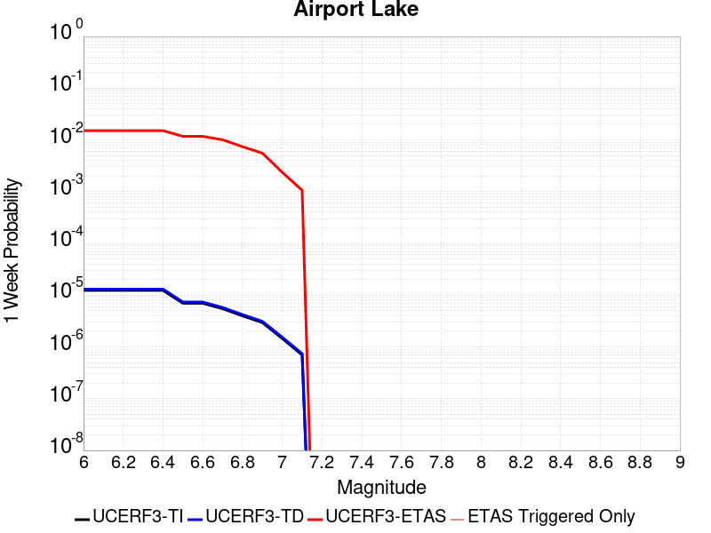 | 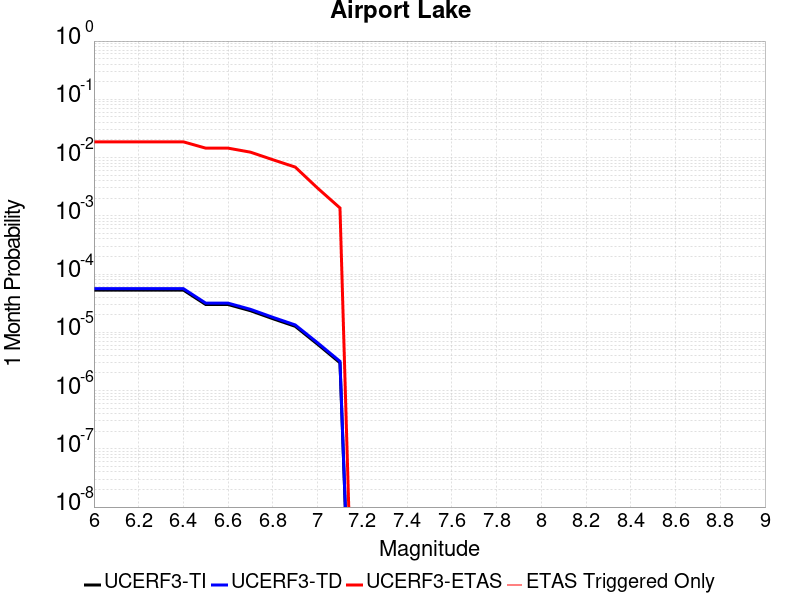 |  |  |

| Magnitude | 1 wk TI Prob | 1 wk TD Prob | 1 wk ETAS Prob | 1 wk ETAS/TD Gain | 1 wk ETAS Triggered Only | 1 mo TI Prob | 1 mo TD Prob | 1 mo ETAS Prob | 1 mo ETAS/TD Gain | 1 mo ETAS Triggered Only | 1 yr TI Prob | 1 yr TD Prob | 1 yr ETAS Prob | 1 yr ETAS/TD Gain | 1 yr ETAS Triggered Only | 10 yr TI Prob | 10 yr TD Prob | 10 yr ETAS Prob | 10 yr ETAS/TD Gain | 10 yr ETAS Triggered Only |
|-----|-----|-----|-----|-----|-----|-----|-----|-----|-----|-----|-----|-----|-----|-----|-----|-----|-----|-----|-----|-----|
| 6.0 | 1.2387061E-5 | 1.3103157E-5 | 0.015478487 | 1181.2793 | 0.015465587 | 5.3086325E-5 | 5.615534E-5 | 0.01888101 | 336.2282 | 0.018825911 | 6.461343E-4 | 6.8350515E-4 | 0.025282064 | 36.988842 | 0.024615385 | 0.0064425888 | 0.0068168393 | 0.036531914 | 5.3590693 | 0.029919028 |
| 6.1 | 1.2387061E-5 | 1.3103157E-5 | 0.015478487 | 1181.2793 | 0.015465587 | 5.3086325E-5 | 5.615534E-5 | 0.01888101 | 336.2282 | 0.018825911 | 6.461343E-4 | 6.8350515E-4 | 0.025282064 | 36.988842 | 0.024615385 | 0.0064425888 | 0.0068168393 | 0.036531914 | 5.3590693 | 0.029919028 |
| 6.2 | 1.2387061E-5 | 1.3103157E-5 | 0.015478487 | 1181.2793 | 0.015465587 | 5.3086325E-5 | 5.615534E-5 | 0.01888101 | 336.2282 | 0.018825911 | 6.461343E-4 | 6.8350515E-4 | 0.025282064 | 36.988842 | 0.024615385 | 0.0064425888 | 0.0068168393 | 0.036531914 | 5.3590693 | 0.029919028 |
| 6.3 | 1.2387061E-5 | 1.3103157E-5 | 0.015478487 | 1181.2793 | 0.015465587 | 5.3086325E-5 | 5.615534E-5 | 0.01888101 | 336.2282 | 0.018825911 | 6.461343E-4 | 6.8350515E-4 | 0.025282064 | 36.988842 | 0.024615385 | 0.0064425888 | 0.0068168393 | 0.036531914 | 5.3590693 | 0.029919028 |
| 6.4 | 1.2387061E-5 | 1.3103157E-5 | 0.015478487 | 1181.2793 | 0.015465587 | 5.3086325E-5 | 5.615534E-5 | 0.01888101 | 336.2282 | 0.018825911 | 6.461343E-4 | 6.8350515E-4 | 0.025282064 | 36.988842 | 0.024615385 | 0.0064425888 | 0.0068168393 | 0.036531914 | 5.3590693 | 0.029919028 |
| 6.5 | 6.9922594E-6 | 7.384925E-6 | 0.011707704 | 1585.3517 | 0.011700405 | 2.996648E-5 | 3.1649324E-5 | 0.014444148 | 456.38092 | 0.014412955 | 3.6478083E-4 | 3.8526783E-4 | 0.019203926 | 49.84565 | 0.018825911 | 0.003641826 | 0.0038465366 | 0.026713703 | 6.944872 | 0.022955466 |
| 6.6 | 6.9922594E-6 | 7.384925E-6 | 0.011707704 | 1585.3517 | 0.011700405 | 2.996648E-5 | 3.1649324E-5 | 0.014444148 | 456.38092 | 0.014412955 | 3.6478083E-4 | 3.8526783E-4 | 0.019203926 | 49.84565 | 0.018825911 | 0.003641826 | 0.0038465366 | 0.026713703 | 6.944872 | 0.022955466 |
| 6.7 | 5.477277E-6 | 5.7860684E-6 | 0.01016767 | 1757.2676 | 0.010161944 | 2.3473833E-5 | 2.4797222E-5 | 0.012575094 | 507.117 | 0.012550607 | 2.8575645E-4 | 3.0186825E-4 | 0.016976995 | 56.23975 | 0.016680162 | 0.0028538927 | 0.003014966 | 0.023277577 | 7.7206764 | 0.020323887 |
| 6.8 | 3.9950432E-6 | 4.2190873E-6 | 0.007615523 | 1805.0167 | 0.007611336 | 1.7121502E-5 | 1.8081691E-5 | 0.009370139 | 518.2114 | 0.009352227 | 2.0843433E-4 | 2.2012512E-4 | 0.012808447 | 58.18712 | 0.012591093 | 0.0020823893 | 0.0021993418 | 0.017630914 | 8.016451 | 0.015465587 |
| 6.9 | 2.95695E-6 | 3.1230243E-6 | 0.005711607 | 1828.8706 | 0.005708502 | 1.2672582E-5 | 1.3384334E-5 | 0.007017339 | 524.295 | 0.0070040487 | 1.5427776E-4 | 1.6294434E-4 | 0.009513647 | 58.385868 | 0.009352227 | 0.001541707 | 0.0016284712 | 0.012946043 | 7.9498143 | 0.011336032 |
| 7.0 | 1.456072E-6 | 1.540812E-6 | 0.0026331157 | 1708.9143 | 0.002631579 | 6.2402937E-6 | 6.603469E-6 | 0.003123992 | 473.08344 | 0.0031174088 | 7.597293E-5 | 8.039528E-5 | 0.004331066 | 53.87214 | 0.004251012 | 7.594696E-4 | 8.0376083E-4 | 0.005819969 | 7.240921 | 0.005020243 |
| 7.1 | 6.995192E-7 | 7.4089746E-7 | 9.7240007E-4 | 1312.4625 | 9.716599E-4 | 2.997936E-6 | 3.1752747E-6 | 0.0011772607 | 370.75867 | 0.001174089 | 3.649926E-5 | 3.865897E-5 | 0.0017794824 | 46.03026 | 0.0017408907 | 3.6493264E-4 | 3.865897E-4 | 0.0025315091 | 6.54831 | 0.002145749 |

## Panamint Valley
*[(top)](#table-of-contents)*

| 1 Week | 1 Month | 1 Year | 10 Year |
|-----|-----|-----|-----|
| 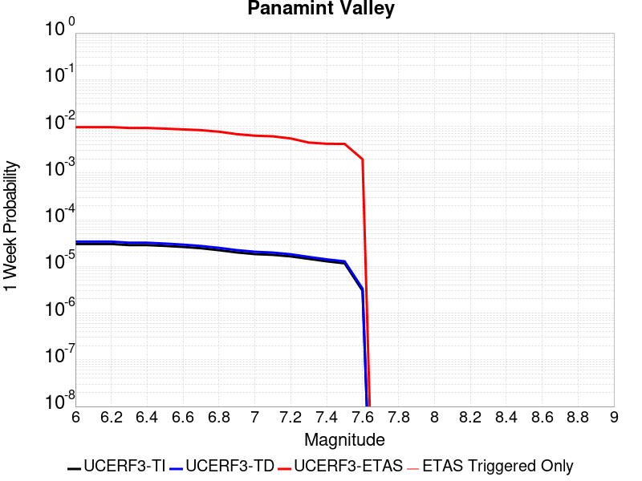 |  |  |  |

| Magnitude | 1 wk TI Prob | 1 wk TD Prob | 1 wk ETAS Prob | 1 wk ETAS/TD Gain | 1 wk ETAS Triggered Only | 1 mo TI Prob | 1 mo TD Prob | 1 mo ETAS Prob | 1 mo ETAS/TD Gain | 1 mo ETAS Triggered Only | 1 yr TI Prob | 1 yr TD Prob | 1 yr ETAS Prob | 1 yr ETAS/TD Gain | 1 yr ETAS Triggered Only | 10 yr TI Prob | 10 yr TD Prob | 10 yr ETAS Prob | 10 yr ETAS/TD Gain | 10 yr ETAS Triggered Only |
|-----|-----|-----|-----|-----|-----|-----|-----|-----|-----|-----|-----|-----|-----|-----|-----|-----|-----|-----|-----|-----|
| 6.0 | 3.0211835E-5 | 3.3984514E-5 | 0.0096288 | 283.32907 | 0.009595142 | 1.2947287E-4 | 1.4563995E-4 | 0.013180179 | 90.498375 | 0.013036437 | 0.0015751923 | 0.0017717537 | 0.020766381 | 11.720805 | 0.01902834 | 0.015640736 | 0.017583137 | 0.043873727 | 2.4952161 | 0.026761133 |
| 6.1 | 3.0211835E-5 | 3.3984514E-5 | 0.0096288 | 283.32907 | 0.009595142 | 1.2947287E-4 | 1.4563995E-4 | 0.013180179 | 90.498375 | 0.013036437 | 0.0015751923 | 0.0017717537 | 0.020766381 | 11.720805 | 0.01902834 | 0.015640736 | 0.017583137 | 0.043873727 | 2.4952161 | 0.026761133 |
| 6.2 | 3.0211835E-5 | 3.3984514E-5 | 0.0096288 | 283.32907 | 0.009595142 | 1.2947287E-4 | 1.4563995E-4 | 0.013180179 | 90.498375 | 0.013036437 | 0.0015751923 | 0.0017717537 | 0.020766381 | 11.720805 | 0.01902834 | 0.015640736 | 0.017583137 | 0.043873727 | 2.4952161 | 0.026761133 |
| 6.3 | 2.8573924E-5 | 3.210268E-5 | 0.00930306 | 289.79077 | 0.009271255 | 1.2245393E-4 | 1.3757581E-4 | 0.012645977 | 91.92005 | 0.012510122 | 0.001489857 | 0.0016737265 | 0.019902276 | 11.890996 | 0.01825911 | 0.01479908 | 0.016617801 | 0.04170002 | 2.5093584 | 0.025506074 |
| 6.4 | 2.8573924E-5 | 3.210268E-5 | 0.00930306 | 289.79077 | 0.009271255 | 1.2245393E-4 | 1.3757581E-4 | 0.012645977 | 91.92005 | 0.012510122 | 0.001489857 | 0.0016737265 | 0.019902276 | 11.890996 | 0.01825911 | 0.01479908 | 0.016617801 | 0.04170002 | 2.5093584 | 0.025506074 |
| 6.5 | 2.7468774E-5 | 3.0828433E-5 | 0.008977921 | 291.2221 | 0.008947369 | 1.1771801E-4 | 1.3211532E-4 | 0.012235779 | 92.61439 | 0.012105263 | 0.0014322745 | 0.0016073446 | 0.019230794 | 11.964325 | 0.017651822 | 0.014230782 | 0.015963677 | 0.04010643 | 2.5123556 | 0.024534414 |
| 6.6 | 2.6135967E-5 | 2.925248E-5 | 0.008571513 | 293.0183 | 0.00854251 | 1.1200648E-4 | 1.253619E-4 | 0.011500454 | 91.73803 | 0.011376518 | 0.0013628257 | 0.0015252391 | 0.01817996 | 11.919416 | 0.016680162 | 0.013544982 | 0.015154043 | 0.038000874 | 2.5076392 | 0.023198381 |
| 6.7 | 2.4498746E-5 | 2.7341335E-5 | 0.008083801 | 295.66226 | 0.00805668 | 1.04990395E-4 | 1.1717203E-4 | 0.0109661035 | 93.58977 | 0.010850202 | 0.0012775084 | 0.0014256609 | 0.017030912 | 11.945976 | 0.01562753 | 0.012701893 | 0.014171274 | 0.03576372 | 2.5236769 | 0.021902833 |
| 6.8 | 2.2244329E-5 | 2.4935423E-5 | 0.007514627 | 301.36353 | 0.0074898787 | 9.532935E-5 | 1.0686185E-4 | 0.01026772 | 96.08405 | 0.010161944 | 0.0011600169 | 0.0013002884 | 0.015694503 | 12.070018 | 0.014412955 | 0.011539802 | 0.0129325185 | 0.03271383 | 2.5295792 | 0.020040486 |
| 6.9 | 1.9902658E-5 | 2.2290267E-5 | 0.0066618184 | 298.8667 | 0.006639676 | 8.529431E-5 | 9.552632E-5 | 0.009001558 | 94.23118 | 0.008906882 | 0.0010379635 | 0.0011624309 | 0.013617571 | 11.714736 | 0.012469635 | 0.010331288 | 0.011568608 | 0.028696083 | 2.480513 | 0.017327935 |
| 7.0 | 1.8353881E-5 | 2.0566185E-5 | 0.006214771 | 302.18393 | 0.006194332 | 7.865712E-5 | 8.813792E-5 | 0.008387001 | 95.1577 | 0.008299595 | 9.5722964E-4 | 0.0010725686 | 0.012558212 | 11.70854 | 0.011497975 | 0.009531168 | 0.010678849 | 0.026339764 | 2.4665358 | 0.01582996 |
| 7.1 | 1.7667631E-5 | 1.9772613E-5 | 0.006011557 | 304.03455 | 0.0059919027 | 7.571623E-5 | 8.473711E-5 | 0.00805977 | 95.11499 | 0.007975709 | 9.2145515E-4 | 0.0010312037 | 0.011991549 | 11.628692 | 0.01097166 | 0.009176437 | 0.010269073 | 0.025215212 | 2.4554517 | 0.015101215 |
| 7.2 | 1.6381597E-5 | 1.8158249E-5 | 0.0052812207 | 290.84415 | 0.005263158 | 7.020495E-5 | 7.781885E-5 | 0.0069193915 | 88.91666 | 0.006842105 | 8.544101E-4 | 9.4704994E-4 | 0.010371314 | 10.95118 | 0.009433199 | 0.008511325 | 0.009434792 | 0.022468545 | 2.3814564 | 0.013157895 |
| 7.3 | 1.4520491E-5 | 1.5966476E-5 | 0.004307396 | 269.7775 | 0.004291498 | 6.222919E-5 | 6.842605E-5 | 0.005695571 | 83.236885 | 0.00562753 | 7.57377E-4 | 8.327849E-4 | 0.0085591385 | 10.27773 | 0.0077327937 | 0.0075480095 | 0.00829975 | 0.018578101 | 2.2383928 | 0.010364372 |
| 7.4 | 1.2852287E-5 | 1.4145411E-5 | 0.004062671 | 287.2077 | 0.004048583 | 5.5080065E-5 | 6.062187E-5 | 0.005444911 | 89.8176 | 0.005384615 | 6.7039346E-4 | 7.378371E-4 | 0.008141277 | 11.033977 | 0.0074089067 | 0.0066837464 | 0.0073567946 | 0.01720285 | 2.3383622 | 0.009919029 |
| 7.5 | 1.1637851E-5 | 1.2836797E-5 | 0.0040208823 | 313.23096 | 0.004008097 | 4.987555E-5 | 5.5013777E-5 | 0.005358366 | 97.40044 | 0.0053036436 | 6.070656E-4 | 6.6960254E-4 | 0.007992631 | 11.93638 | 0.007327935 | 0.006054099 | 0.0066787465 | 0.016451098 | 2.4632013 | 0.009838057 |
| 7.6 | 3.0068115E-6 | 3.3330316E-6 | 0.0021895606 | 656.9276 | 0.0021862348 | 1.2886271E-5 | 1.4284384E-5 | 0.0027672816 | 193.72775 | 0.0027530363 | 1.5687906E-4 | 1.7390578E-4 | 0.0038169967 | 21.948648 | 0.0036437246 | 0.0015676835 | 0.0017391363 | 0.0064677405 | 3.718938 | 0.004736842 |

## Garlock (East)
*[(top)](#table-of-contents)*

| 1 Week | 1 Month | 1 Year | 10 Year |
|-----|-----|-----|-----|
|  | 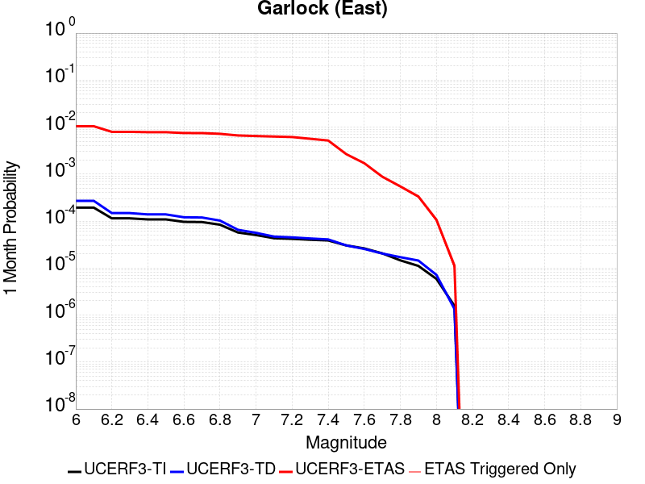 |  |  |

| Magnitude | 1 wk TI Prob | 1 wk TD Prob | 1 wk ETAS Prob | 1 wk ETAS/TD Gain | 1 wk ETAS Triggered Only | 1 mo TI Prob | 1 mo TD Prob | 1 mo ETAS Prob | 1 mo ETAS/TD Gain | 1 mo ETAS Triggered Only | 1 yr TI Prob | 1 yr TD Prob | 1 yr ETAS Prob | 1 yr ETAS/TD Gain | 1 yr ETAS Triggered Only | 10 yr TI Prob | 10 yr TD Prob | 10 yr ETAS Prob | 10 yr ETAS/TD Gain | 10 yr ETAS Triggered Only |
|-----|-----|-----|-----|-----|-----|-----|-----|-----|-----|-----|-----|-----|-----|-----|-----|-----|-----|-----|-----|-----|
| 6.0 | 4.5092507E-5 | 6.290325E-5 | 0.007026028 | 111.695786 | 0.0069635627 | 1.9323928E-4 | 2.6956003E-4 | 0.010631138 | 39.438854 | 0.010364372 | 0.0023501497 | 0.0032774 | 0.019095832 | 5.8265185 | 0.015870444 | 0.023254504 | 0.032351844 | 0.054290425 | 1.6781245 | 0.022672065 |
| 6.1 | 4.5092507E-5 | 6.290325E-5 | 0.007026028 | 111.695786 | 0.0069635627 | 1.9323928E-4 | 2.6956003E-4 | 0.010631138 | 39.438854 | 0.010364372 | 0.0023501497 | 0.0032774 | 0.019095832 | 5.8265185 | 0.015870444 | 0.023254504 | 0.032351844 | 0.054290425 | 1.6781245 | 0.022672065 |
| 6.2 | 2.6674514E-5 | 3.4509674E-5 | 0.005864268 | 169.93112 | 0.0058299596 | 1.1431433E-4 | 1.4789042E-4 | 0.008284339 | 56.01674 | 0.008137652 | 0.0013908884 | 0.0017991117 | 0.013640118 | 7.581585 | 0.011862348 | 0.01382215 | 0.017890299 | 0.034232285 | 1.9134552 | 0.016639676 |
| 6.3 | 2.6674514E-5 | 3.4509674E-5 | 0.005864268 | 169.93112 | 0.0058299596 | 1.1431433E-4 | 1.4789042E-4 | 0.008284339 | 56.01674 | 0.008137652 | 0.0013908884 | 0.0017991117 | 0.013640118 | 7.581585 | 0.011862348 | 0.01382215 | 0.017890299 | 0.034232285 | 1.9134552 | 0.016639676 |
| 6.4 | 2.5312667E-5 | 3.233893E-5 | 0.0057811406 | 178.76723 | 0.0057489877 | 1.0847834E-4 | 1.3858822E-4 | 0.008153671 | 58.8338 | 0.008016194 | 0.0013199237 | 0.0016860351 | 0.01340713 | 7.951869 | 0.01174089 | 0.013121112 | 0.016778335 | 0.032820374 | 1.9561162 | 0.01631579 |
| 6.5 | 2.5312667E-5 | 3.233893E-5 | 0.0057811406 | 178.76723 | 0.0057489877 | 1.0847834E-4 | 1.3858822E-4 | 0.008153671 | 58.8338 | 0.008016194 | 0.0013199237 | 0.0016860351 | 0.01340713 | 7.951869 | 0.01174089 | 0.013121112 | 0.016778335 | 0.032820374 | 1.9561162 | 0.01631579 |
| 6.6 | 2.246556E-5 | 2.8133776E-5 | 0.0054530823 | 193.82689 | 0.005425101 | 9.627742E-5 | 1.20567885E-4 | 0.007690505 | 63.785683 | 0.00757085 | 0.0011715472 | 0.0014669491 | 0.012503367 | 8.523381 | 0.011052632 | 0.011653901 | 0.01461866 | 0.02953901 | 2.0206373 | 0.0151417 |
| 6.7 | 2.2241198E-5 | 2.7803519E-5 | 0.005452754 | 196.1174 | 0.005425101 | 9.531594E-5 | 1.1915263E-4 | 0.0076891007 | 64.531525 | 0.00757085 | 0.0011598538 | 0.0014497414 | 0.01248635 | 8.612812 | 0.011052632 | 0.011538187 | 0.014448853 | 0.029371774 | 2.03281 | 0.0151417 |
| 6.8 | 1.9528685E-5 | 2.389819E-5 | 0.00528693 | 221.22722 | 0.005263158 | 8.369167E-5 | 1.0241691E-4 | 0.007348638 | 71.7522 | 0.0072469637 | 0.0010184698 | 0.0012462323 | 0.011435946 | 9.176417 | 0.010202429 | 0.010138147 | 0.012436427 | 0.026270313 | 2.112368 | 0.014008097 |
| 6.9 | 1.3318621E-5 | 1.5198884E-5 | 0.004873425 | 320.6436 | 0.0048582996 | 5.7078556E-5 | 6.513648E-5 | 0.0067043803 | 102.928185 | 0.006639676 | 6.9470983E-4 | 7.927538E-4 | 0.010056659 | 12.685727 | 0.009271255 | 0.0069254204 | 0.007939888 | 0.020431008 | 2.5732112 | 0.012591093 |
| 7.0 | 1.1760853E-5 | 1.31077895E-5 | 0.0047498876 | 362.3714 | 0.004736842 | 5.0402683E-5 | 5.6175057E-5 | 0.0065740277 | 117.02752 | 0.0065182187 | 6.134799E-4 | 6.8372174E-4 | 0.009544056 | 13.958978 | 0.008866397 | 0.0061178906 | 0.00685652 | 0.018878784 | 2.7534058 | 0.012105263 |
| 7.1 | 1.0064758E-5 | 1.0902931E-5 | 0.0046262373 | 424.31137 | 0.0046153846 | 4.3133965E-5 | 4.672603E-5 | 0.0062812525 | 134.42728 | 0.0062348177 | 5.2502943E-4 | 5.687444E-4 | 0.008944545 | 15.726827 | 0.008380567 | 0.005237907 | 0.0057129986 | 0.016984269 | 2.9729166 | 0.011336032 |
| 7.2 | 9.768808E-6 | 1.0498807E-5 | 0.004504379 | 429.0372 | 0.004493927 | 4.186565E-5 | 4.499413E-5 | 0.0061580795 | 136.86406 | 0.00611336 | 5.095951E-4 | 5.4766936E-4 | 0.0087617915 | 15.998324 | 0.008218624 | 0.0050842804 | 0.0055032647 | 0.016575597 | 3.0119572 | 0.011133603 |
| 7.3 | 9.344516E-6 | 9.944468E-6 | 0.0042609144 | 428.47086 | 0.004251012 | 4.004731E-5 | 4.261847E-5 | 0.0058723297 | 137.78838 | 0.0058299596 | 4.8746695E-4 | 5.1875977E-4 | 0.008247542 | 15.898576 | 0.0077327937 | 0.0048639905 | 0.0052149445 | 0.01564609 | 3.0002413 | 0.01048583 |
| 7.4 | 9.023491E-6 | 9.490661E-6 | 0.0040175496 | 423.31613 | 0.004008097 | 3.867153E-5 | 4.0673647E-5 | 0.005506038 | 135.37115 | 0.005465587 | 4.7072413E-4 | 4.950925E-4 | 0.0076980023 | 15.548615 | 0.0072064777 | 0.004697283 | 0.0049783974 | 0.014646623 | 2.942036 | 0.009716599 |
| 7.5 | 7.081253E-6 | 7.087672E-6 | 0.0023957347 | 338.01434 | 0.002388664 | 3.0347876E-5 | 3.0375388E-5 | 0.0032286588 | 106.29194 | 0.0031983806 | 3.6942272E-4 | 3.6975832E-4 | 0.0044168443 | 11.945219 | 0.004048583 | 0.003688092 | 0.0037243143 | 0.00880653 | 2.3646045 | 0.0051012146 |
| 7.6 | 6.116396E-6 | 5.959245E-6 | 0.0014634405 | 245.57483 | 0.0014574899 | 2.6212863E-5 | 2.5539372E-5 | 0.0020092945 | 78.674385 | 0.0019838056 | 3.1909486E-4 | 3.1089774E-4 | 0.0027797655 | 8.9410925 | 0.0024696356 | 0.0031863707 | 0.0031357552 | 0.006364465 | 2.0296435 | 0.0032388663 |
| 7.7 | 4.797145E-6 | 4.757281E-6 | 9.359269E-4 | 196.73569 | 9.311741E-4 | 2.055903E-5 | 2.0388188E-5 | 0.0011944533 | 58.585552 | 0.001174089 | 2.5027743E-4 | 2.4819805E-4 | 0.0017053261 | 6.870828 | 0.0014574899 | 0.0024999576 | 0.0025093474 | 0.0043670223 | 1.740302 | 0.0018623482 |
| 7.8 | 3.4028885E-6 | 3.978462E-6 | 4.8980647E-4 | 123.11454 | 4.8582995E-4 | 1.4583726E-5 | 1.7050439E-5 | 7.052978E-4 | 41.365376 | 6.882591E-4 | 1.775424E-4 | 2.0756939E-4 | 0.0010980727 | 5.290148 | 8.906883E-4 | 0.0017740062 | 0.0021012232 | 0.0032728452 | 1.5575905 | 0.001174089 |
| 7.9 | 2.5928412E-6 | 3.3724489E-6 | 2.462866E-4 | 73.029015 | 2.4291498E-4 | 1.1112129E-5 | 1.4453272E-5 | 4.5979096E-4 | 31.812239 | 4.4534414E-4 | 1.3528178E-4 | 1.7595445E-4 | 7.0217764E-4 | 3.9906785 | 5.2631577E-4 | 0.0013519945 | 0.0017812408 | 0.0025895152 | 1.4537704 | 8.097166E-4 |
| 8.0 | 1.3743648E-6 | 1.6734747E-6 | 1.2313075E-4 | 73.5779 | 1.2145749E-4 | 5.8901214E-6 | 7.1720146E-6 | 1.6911417E-4 | 23.579731 | 1.6194332E-4 | 7.1709874E-5 | 8.731581E-5 | 3.302096E-4 | 3.7817845 | 2.4291498E-4 | 7.1686733E-4 | 8.837234E-4 | 0.0013286739 | 1.5034953 | 4.4534414E-4 |
| 8.1 | 3.6733252E-7 | 3.1489964E-7 | 4.0800718E-5 | 129.56737 | 4.048583E-5 | 1.5742813E-6 | 1.3495693E-6 | 4.1835345E-5 | 30.999033 | 4.048583E-5 | 1.9166706E-5 | 1.6430899E-5 | 5.6916062E-5 | 3.4639654 | 4.048583E-5 | 1.9165053E-4 | 1.6638759E-4 | 2.4734577E-4 | 1.4865639 | 8.097166E-5 |

## Blackwater
*[(top)](#table-of-contents)*

| 1 Week | 1 Month | 1 Year | 10 Year |
|-----|-----|-----|-----|
|  |  |  | 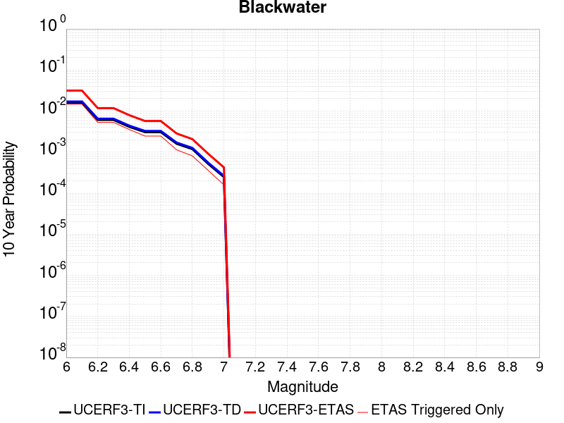 |

| Magnitude | 1 wk TI Prob | 1 wk TD Prob | 1 wk ETAS Prob | 1 wk ETAS/TD Gain | 1 wk ETAS Triggered Only | 1 mo TI Prob | 1 mo TD Prob | 1 mo ETAS Prob | 1 mo ETAS/TD Gain | 1 mo ETAS Triggered Only | 1 yr TI Prob | 1 yr TD Prob | 1 yr ETAS Prob | 1 yr ETAS/TD Gain | 1 yr ETAS Triggered Only | 10 yr TI Prob | 10 yr TD Prob | 10 yr ETAS Prob | 10 yr ETAS/TD Gain | 10 yr ETAS Triggered Only |
|-----|-----|-----|-----|-----|-----|-----|-----|-----|-----|-----|-----|-----|-----|-----|-----|-----|-----|-----|-----|-----|
| 6.0 | 3.0708583E-5 | 3.3095846E-5 | 0.0048912345 | 147.78998 | 0.0048582996 | 1.3160157E-4 | 1.4183241E-4 | 0.006861527 | 48.37771 | 0.0067206477 | 0.0016010714 | 0.0017255784 | 0.011910402 | 6.9022665 | 0.010202429 | 0.015895851 | 0.017135633 | 0.03146078 | 1.8359859 | 0.014574898 |
| 6.1 | 3.0708583E-5 | 3.3095846E-5 | 0.0048912345 | 147.78998 | 0.0048582996 | 1.3160157E-4 | 1.4183241E-4 | 0.006861527 | 48.37771 | 0.0067206477 | 0.0016010714 | 0.0017255784 | 0.011910402 | 6.9022665 | 0.010202429 | 0.015895851 | 0.017135633 | 0.03146078 | 1.8359859 | 0.014574898 |
| 6.2 | 1.1707779E-5 | 1.2545122E-5 | 0.0014700167 | 117.17835 | 0.0014574899 | 5.017523E-5 | 5.3763757E-5 | 0.002239881 | 41.661545 | 0.0021862348 | 6.107122E-4 | 6.5438676E-4 | 0.00413389 | 6.3171964 | 0.0034817813 | 0.006090366 | 0.0065255696 | 0.01171416 | 1.795117 | 0.005222672 |
| 6.3 | 1.1707779E-5 | 1.2545122E-5 | 0.0014700167 | 117.17835 | 0.0014574899 | 5.017523E-5 | 5.3763757E-5 | 0.002239881 | 41.661545 | 0.0021862348 | 6.107122E-4 | 6.5438676E-4 | 0.00413389 | 6.3171964 | 0.0034817813 | 0.006090366 | 0.0065255696 | 0.01171416 | 1.795117 | 0.005222672 |
| 6.4 | 7.929244E-6 | 8.480098E-6 | 0.0010611027 | 125.12859 | 0.0010526315 | 3.3982033E-5 | 3.6342793E-5 | 0.0016557171 | 45.558334 | 0.0016194332 | 4.136527E-4 | 4.423877E-4 | 0.002910931 | 6.5800443 | 0.0024696356 | 0.0041288356 | 0.0044154758 | 0.008123726 | 1.8398302 | 0.0037246963 |
| 6.5 | 5.8832115E-6 | 6.285991E-6 | 7.350264E-4 | 116.93086 | 7.2874496E-4 | 2.521352E-5 | 2.6939697E-5 | 0.0012009972 | 44.580944 | 0.001174089 | 3.0693135E-4 | 3.27944E-4 | 0.002149209 | 6.553585 | 0.0018218623 | 0.0030650778 | 0.0032748538 | 0.005938168 | 1.813262 | 0.0026720648 |
| 6.6 | 5.8832115E-6 | 6.285991E-6 | 7.350264E-4 | 116.93086 | 7.2874496E-4 | 2.521352E-5 | 2.6939697E-5 | 0.0012009972 | 44.580944 | 0.001174089 | 3.0693135E-4 | 3.27944E-4 | 0.002149209 | 6.553585 | 0.0018218623 | 0.0030650778 | 0.0032748538 | 0.005938168 | 1.813262 | 0.0026720648 |
| 6.7 | 3.0715053E-6 | 3.2814662E-6 | 2.8668134E-4 | 87.3638 | 2.8340082E-4 | 1.3163528E-5 | 1.4063357E-5 | 4.5940123E-4 | 32.666542 | 4.4534414E-4 | 1.6025416E-4 | 1.7120909E-4 | 0.001021266 | 5.965022 | 8.5020246E-4 | 0.0016013865 | 0.0017108864 | 0.0030042164 | 1.7559415 | 0.0012955465 |
| 6.8 | 2.2722281E-6 | 2.4287538E-6 | 2.0485741E-4 | 84.346725 | 2.0242915E-4 | 9.738084E-6 | 1.0408908E-5 | 3.3429218E-4 | 32.11597 | 3.2388663E-4 | 1.1855473E-4 | 1.26722E-4 | 7.744132E-4 | 6.111119 | 6.4777327E-4 | 0.001184915 | 0.0012665876 | 0.0022370168 | 1.7661762 | 9.716599E-4 |
| 6.9 | 9.952399E-7 | 1.0653489E-6 | 4.1551135E-5 | 39.002377 | 4.048583E-5 | 4.265307E-6 | 4.5657757E-6 | 1.6650835E-4 | 36.4688 | 1.6194332E-4 | 5.1928873E-5 | 5.5587418E-5 | 3.389725E-4 | 6.098007 | 2.8340082E-4 | 5.191674E-4 | 5.557858E-4 | 0.0010008824 | 1.800842 | 4.4534414E-4 |
| 7.0 | 4.7385504E-7 | 5.0755597E-7 | 5.0755597E-7 | 1.0 | 0.0 | 2.0308057E-6 | 2.1752398E-6 | 8.3146726E-5 | 38.224163 | 8.097166E-5 | 2.4724779E-5 | 2.6483543E-5 | 1.8842258E-4 | 7.114704 | 1.6194332E-4 | 2.4722028E-4 | 2.6483546E-4 | 5.076861E-4 | 1.916987 | 2.4291498E-4 |

## Hunter Mountain-Saline Valley
*[(top)](#table-of-contents)*

| 1 Week | 1 Month | 1 Year | 10 Year |
|-----|-----|-----|-----|
|  |  |  |  |

| Magnitude | 1 wk TI Prob | 1 wk TD Prob | 1 wk ETAS Prob | 1 wk ETAS/TD Gain | 1 wk ETAS Triggered Only | 1 mo TI Prob | 1 mo TD Prob | 1 mo ETAS Prob | 1 mo ETAS/TD Gain | 1 mo ETAS Triggered Only | 1 yr TI Prob | 1 yr TD Prob | 1 yr ETAS Prob | 1 yr ETAS/TD Gain | 1 yr ETAS Triggered Only | 10 yr TI Prob | 10 yr TD Prob | 10 yr ETAS Prob | 10 yr ETAS/TD Gain | 10 yr ETAS Triggered Only |
|-----|-----|-----|-----|-----|-----|-----|-----|-----|-----|-----|-----|-----|-----|-----|-----|-----|-----|-----|-----|-----|
| 6.0 | 4.5103672E-5 | 5.4570177E-5 | 0.004345834 | 79.63753 | 0.004291498 | 1.9328714E-4 | 2.3385242E-4 | 0.005900543 | 25.231909 | 0.005668016 | 0.002350731 | 0.0028435152 | 0.01051395 | 3.6975183 | 0.0076923077 | 0.023260195 | 0.028091887 | 0.038086407 | 1.3557796 | 0.010283401 |
| 6.1 | 4.5103672E-5 | 5.4570177E-5 | 0.004345834 | 79.63753 | 0.004291498 | 1.9328714E-4 | 2.3385242E-4 | 0.005900543 | 25.231909 | 0.005668016 | 0.002350731 | 0.0028435152 | 0.01051395 | 3.6975183 | 0.0076923077 | 0.023260195 | 0.028091887 | 0.038086407 | 1.3557796 | 0.010283401 |
| 6.2 | 3.9363465E-5 | 4.706337E-5 | 0.0042978753 | 91.32103 | 0.004251012 | 1.6868966E-4 | 2.0168544E-4 | 0.0058280807 | 28.896885 | 0.00562753 | 0.002051862 | 0.0024528175 | 0.0100858705 | 4.1119533 | 0.0076518217 | 0.020330196 | 0.024273481 | 0.034267765 | 1.4117367 | 0.010242915 |
| 6.3 | 3.9363465E-5 | 4.706337E-5 | 0.0042978753 | 91.32103 | 0.004251012 | 1.6868966E-4 | 2.0168544E-4 | 0.0058280807 | 28.896885 | 0.00562753 | 0.002051862 | 0.0024528175 | 0.0100858705 | 4.1119533 | 0.0076518217 | 0.020330196 | 0.024273481 | 0.034267765 | 1.4117367 | 0.010242915 |
| 6.4 | 3.2311684E-5 | 3.795099E-5 | 0.0042483173 | 111.94221 | 0.004210526 | 1.384713E-4 | 1.6263737E-4 | 0.0057487735 | 35.347187 | 0.0055870446 | 0.0016845843 | 0.0019783843 | 0.009574662 | 4.839637 | 0.007611336 | 0.016718714 | 0.019616475 | 0.029618768 | 1.5098925 | 0.010202429 |
| 6.5 | 3.2311684E-5 | 3.795099E-5 | 0.0042483173 | 111.94221 | 0.004210526 | 1.384713E-4 | 1.6263737E-4 | 0.0057487735 | 35.347187 | 0.0055870446 | 0.0016845843 | 0.0019783843 | 0.009574662 | 4.839637 | 0.007611336 | 0.016718714 | 0.019616475 | 0.029618768 | 1.5098925 | 0.010202429 |
| 6.6 | 2.9305844E-5 | 3.418183E-5 | 0.00420408 | 122.991646 | 0.0041700406 | 1.2559042E-4 | 1.4648569E-4 | 0.005692232 | 38.85862 | 0.0055465586 | 0.0015279909 | 0.001782067 | 0.009339426 | 5.2407823 | 0.00757085 | 0.015175272 | 0.01768569 | 0.027628144 | 1.5621749 | 0.010121457 |
| 6.7 | 2.7826512E-5 | 3.2344276E-5 | 0.0041617653 | 128.67085 | 0.0041295546 | 1.19251024E-4 | 1.386113E-4 | 0.005643921 | 40.717613 | 0.0055060727 | 0.0014509142 | 0.0016863465 | 0.009163595 | 5.433993 | 0.0074898787 | 0.014414776 | 0.016743187 | 0.026615562 | 1.5896355 | 0.010040486 |
| 6.8 | 2.3389874E-5 | 2.6866714E-5 | 0.0041158255 | 153.19423 | 0.0040890686 | 1.0023846E-4 | 1.15138246E-4 | 0.005580096 | 48.464314 | 0.005465587 | 0.00121972 | 0.001400954 | 0.008839911 | 6.309922 | 0.0074493927 | 0.01213047 | 0.013927434 | 0.02378816 | 1.7080073 | 0.01 |
| 6.9 | 2.069209E-5 | 2.3570032E-5 | 0.0041125426 | 174.48184 | 0.0040890686 | 8.867737E-5 | 1.01010715E-4 | 0.0055660456 | 55.10352 | 0.005465587 | 0.0010791123 | 0.0012291478 | 0.008669384 | 7.053167 | 0.0074493927 | 0.010738871 | 0.012228523 | 0.022106238 | 1.8077602 | 0.01 |
| 7.0 | 1.7462342E-5 | 1.9633546E-5 | 0.004108622 | 209.26541 | 0.0040890686 | 7.483646E-5 | 8.414118E-5 | 0.0055492683 | 65.95187 | 0.005465587 | 9.1075303E-4 | 0.0010239601 | 0.008465725 | 8.267632 | 0.0074493927 | 0.009070295 | 0.0101960525 | 0.020094091 | 1.9707717 | 0.01 |
| 7.1 | 1.4807709E-5 | 1.6441749E-5 | 0.004105443 | 249.69626 | 0.0040890686 | 6.3460066E-5 | 7.046283E-5 | 0.005495182 | 77.98696 | 0.005425101 | 7.723524E-4 | 8.575638E-4 | 0.008260117 | 9.632073 | 0.0074089067 | 0.007696735 | 0.008545532 | 0.018379796 | 2.1508079 | 0.009919029 |
| 7.2 | 1.4180048E-5 | 1.5698337E-5 | 0.004104703 | 261.47375 | 0.0040890686 | 6.077022E-5 | 6.727694E-5 | 0.005492013 | 81.63292 | 0.005425101 | 7.396263E-4 | 8.188051E-4 | 0.008221646 | 10.041028 | 0.0074089067 | 0.0073716943 | 0.008160833 | 0.017998913 | 2.205524 | 0.009919029 |
| 7.3 | 1.3730402E-5 | 1.5172075E-5 | 0.004104179 | 270.50873 | 0.0040890686 | 5.8843252E-5 | 6.502165E-5 | 0.0054897703 | 84.42988 | 0.005425101 | 7.161811E-4 | 7.9136714E-4 | 0.008194411 | 10.354753 | 0.0074089067 | 0.007138774 | 0.007888422 | 0.01768904 | 2.2424052 | 0.009878542 |
| 7.4 | 1.2810095E-5 | 1.4109277E-5 | 0.0040626354 | 287.9407 | 0.004048583 | 5.489925E-5 | 6.0467017E-5 | 0.0054447567 | 90.04507 | 0.005384615 | 6.681934E-4 | 7.359531E-4 | 0.008098952 | 11.004711 | 0.007368421 | 0.006661878 | 0.007338053 | 0.017103918 | 2.3308523 | 0.009838057 |
| 7.5 | 1.1595659E-5 | 1.2800664E-5 | 0.0040208464 | 314.11234 | 0.004008097 | 4.9694736E-5 | 5.4858923E-5 | 0.0053582117 | 97.67256 | 0.0053036436 | 6.0486543E-4 | 6.6771836E-4 | 0.007950302 | 11.906669 | 0.007287449 | 0.006032217 | 0.0066599925 | 0.016352095 | 2.4552724 | 0.009757085 |
| 7.6 | 2.997694E-6 | 3.3251579E-6 | 0.0021895526 | 658.48083 | 0.0021862348 | 1.28471975E-5 | 1.425064E-5 | 0.0027672478 | 194.18411 | 0.0027530363 | 1.564034E-4 | 1.73495E-4 | 0.0038165876 | 21.998255 | 0.0036437246 | 0.0015629337 | 0.001735031 | 0.0064636543 | 3.7253828 | 0.004736842 |

## Ash Hill
*[(top)](#table-of-contents)*

| 1 Week | 1 Month | 1 Year | 10 Year |
|-----|-----|-----|-----|
|  |  |  |  |

| Magnitude | 1 wk TI Prob | 1 wk TD Prob | 1 wk ETAS Prob | 1 wk ETAS/TD Gain | 1 wk ETAS Triggered Only | 1 mo TI Prob | 1 mo TD Prob | 1 mo ETAS Prob | 1 mo ETAS/TD Gain | 1 mo ETAS Triggered Only | 1 yr TI Prob | 1 yr TD Prob | 1 yr ETAS Prob | 1 yr ETAS/TD Gain | 1 yr ETAS Triggered Only | 10 yr TI Prob | 10 yr TD Prob | 10 yr ETAS Prob | 10 yr ETAS/TD Gain | 10 yr ETAS Triggered Only |
|-----|-----|-----|-----|-----|-----|-----|-----|-----|-----|-----|-----|-----|-----|-----|-----|-----|-----|-----|-----|-----|
| 6.0 | 2.1545662E-5 | 2.3194447E-5 | 0.0024522878 | 105.72737 | 0.0024291498 | 9.2335285E-5 | 9.940143E-5 | 0.0036213186 | 36.43125 | 0.003522267 | 0.0011236023 | 0.0012096206 | 0.0069516543 | 5.746971 | 0.0057489877 | 0.011179381 | 0.012038348 | 0.020998001 | 1.7442592 | 0.009068826 |
| 6.1 | 2.1545662E-5 | 2.3194447E-5 | 0.0024522878 | 105.72737 | 0.0024291498 | 9.2335285E-5 | 9.940143E-5 | 0.0036213186 | 36.43125 | 0.003522267 | 0.0011236023 | 0.0012096206 | 0.0069516543 | 5.746971 | 0.0057489877 | 0.011179381 | 0.012038348 | 0.020998001 | 1.7442592 | 0.009068826 |
| 6.2 | 2.1545662E-5 | 2.3194447E-5 | 0.0024522878 | 105.72737 | 0.0024291498 | 9.2335285E-5 | 9.940143E-5 | 0.0036213186 | 36.43125 | 0.003522267 | 0.0011236023 | 0.0012096206 | 0.0069516543 | 5.746971 | 0.0057489877 | 0.011179381 | 0.012038348 | 0.020998001 | 1.7442592 | 0.009068826 |
| 6.3 | 1.0025529E-5 | 1.0746934E-5 | 0.0011848233 | 110.24757 | 0.001174089 | 4.2965847E-5 | 4.605755E-5 | 0.0017059002 | 37.038445 | 0.001659919 | 5.229836E-4 | 5.6061964E-4 | 0.0030288708 | 5.4027195 | 0.0024696356 | 0.005217545 | 0.0055933665 | 0.009579045 | 1.7125723 | 0.004008097 |
| 6.4 | 1.0025529E-5 | 1.0746934E-5 | 0.0011848233 | 110.24757 | 0.001174089 | 4.2965847E-5 | 4.605755E-5 | 0.0017059002 | 37.038445 | 0.001659919 | 5.229836E-4 | 5.6061964E-4 | 0.0030288708 | 5.4027195 | 0.0024696356 | 0.005217545 | 0.0055933665 | 0.009579045 | 1.7125723 | 0.004008097 |
| 6.5 | 6.9617327E-6 | 7.456634E-6 | 8.9813827E-4 | 120.44821 | 8.906883E-4 | 2.9835655E-5 | 3.195666E-5 | 0.0013274618 | 41.53944 | 0.0012955465 | 3.6318856E-4 | 3.8901155E-4 | 0.0022506353 | 5.785523 | 0.0018623482 | 0.0036259557 | 0.0038841602 | 0.0067071607 | 1.726798 | 0.002834008 |
| 6.6 | 4.9919777E-6 | 5.3466883E-6 | 6.126309E-4 | 114.581375 | 6.0728745E-4 | 2.1394015E-5 | 2.2914215E-5 | 7.9212734E-4 | 34.569256 | 7.6923077E-4 | 2.60441E-4 | 2.7895154E-4 | 0.001371764 | 4.917571 | 0.0010931174 | 0.0026013597 | 0.0027866727 | 0.004522712 | 1.6229793 | 0.0017408907 |
| 6.7 | 3.6630722E-6 | 3.924624E-6 | 5.302383E-4 | 135.10553 | 5.2631577E-4 | 1.5698786E-5 | 1.681974E-5 | 6.645821E-4 | 39.512035 | 6.4777327E-4 | 1.9111596E-4 | 2.0476682E-4 | 0.0011357502 | 5.546554 | 9.311741E-4 | 0.0019095168 | 0.0020463446 | 0.0035008518 | 1.7107832 | 0.0014574899 |
| 6.8 | 2.5599613E-6 | 2.744925E-6 | 4.076021E-4 | 148.49298 | 4.048583E-4 | 1.0971216E-5 | 1.1763939E-5 | 4.5710284E-4 | 38.85627 | 4.4534414E-4 | 1.3356637E-4 | 1.4322149E-4 | 8.3138206E-4 | 5.804869 | 6.882591E-4 | 0.0013348613 | 0.0014317769 | 0.002604185 | 1.8188483 | 0.001174089 |
| 6.9 | 1.7684905E-6 | 1.8968707E-6 | 2.8529714E-4 | 150.4041 | 2.8340082E-4 | 7.579223E-6 | 8.129446E-6 | 3.3201344E-4 | 40.840847 | 3.2388663E-4 | 9.2273134E-5 | 9.8976E-5 | 5.847579E-4 | 5.9080772 | 4.8582995E-4 | 9.223483E-4 | 9.8976E-4 | 0.0017986752 | 1.8172841 | 8.097166E-4 |

## Garlock (West)
*[(top)](#table-of-contents)*

| 1 Week | 1 Month | 1 Year | 10 Year |
|-----|-----|-----|-----|
|  |  | 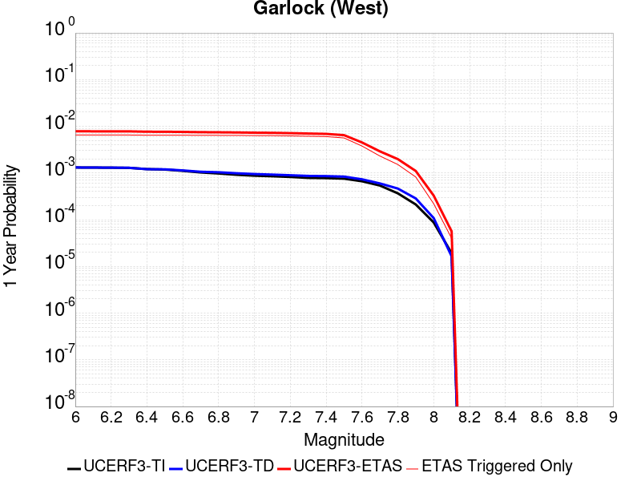 |  |

| Magnitude | 1 wk TI Prob | 1 wk TD Prob | 1 wk ETAS Prob | 1 wk ETAS/TD Gain | 1 wk ETAS Triggered Only | 1 mo TI Prob | 1 mo TD Prob | 1 mo ETAS Prob | 1 mo ETAS/TD Gain | 1 mo ETAS Triggered Only | 1 yr TI Prob | 1 yr TD Prob | 1 yr ETAS Prob | 1 yr ETAS/TD Gain | 1 yr ETAS Triggered Only | 10 yr TI Prob | 10 yr TD Prob | 10 yr ETAS Prob | 10 yr ETAS/TD Gain | 10 yr ETAS Triggered Only |
|-----|-----|-----|-----|-----|-----|-----|-----|-----|-----|-----|-----|-----|-----|-----|-----|-----|-----|-----|-----|-----|
| 6.0 | 2.5181727E-5 | 2.51973E-5 | 0.003992709 | 158.4578 | 0.003967611 | 1.0791722E-4 | 1.0798398E-4 | 0.005411055 | 50.109795 | 0.0053036436 | 0.0013131002 | 0.0013139155 | 0.00859179 | 6.5390735 | 0.007287449 | 0.013053683 | 0.013141977 | 0.022371296 | 1.7022779 | 0.009352227 |
| 6.1 | 2.5077732E-5 | 2.5098372E-5 | 0.00399261 | 159.07845 | 0.003967611 | 1.0747157E-4 | 1.0756004E-4 | 0.0054106335 | 50.30338 | 0.0053036436 | 0.001307681 | 0.0013087603 | 0.008586672 | 6.5609207 | 0.007287449 | 0.013000126 | 0.013091032 | 0.02232083 | 1.7050472 | 0.009352227 |
| 6.2 | 2.494612E-5 | 2.498005E-5 | 0.0039924923 | 159.82722 | 0.003967611 | 1.0690756E-4 | 1.0705298E-4 | 0.0054101287 | 50.536926 | 0.0053036436 | 0.0013008224 | 0.0013025942 | 0.0085805515 | 6.5872784 | 0.007287449 | 0.012932341 | 0.013030097 | 0.022260463 | 1.7083882 | 0.009352227 |
| 6.3 | 2.4733758E-5 | 2.479942E-5 | 0.0039923126 | 160.9841 | 0.003967611 | 1.0599751E-4 | 1.06278916E-4 | 0.005409359 | 50.897762 | 0.0053036436 | 0.0012897556 | 0.0012931811 | 0.008571207 | 6.6280017 | 0.007287449 | 0.012822957 | 0.012937066 | 0.022168303 | 1.7135495 | 0.009352227 |
| 6.4 | 2.3237335E-5 | 2.317873E-5 | 0.003990698 | 172.1707 | 0.003967611 | 9.958477E-5 | 9.933365E-5 | 0.0054024504 | 54.386913 | 0.0053036436 | 0.0012117702 | 0.001208719 | 0.00848736 | 7.021781 | 0.007287449 | 0.012051838 | 0.012101916 | 0.021340962 | 1.7634367 | 0.009352227 |
| 6.5 | 2.2732203E-5 | 2.2993298E-5 | 0.0039905133 | 173.55116 | 0.003967611 | 9.742009E-5 | 9.8539E-5 | 0.00540166 | 54.817486 | 0.0053036436 | 0.0011854442 | 0.0011990548 | 0.008477766 | 7.070374 | 0.007287449 | 0.011791403 | 0.012006322 | 0.021246264 | 1.7695897 | 0.009352227 |
| 6.6 | 2.1319436E-5 | 2.17735E-5 | 0.0039892984 | 183.21806 | 0.003967611 | 9.136581E-5 | 9.331167E-5 | 0.0053964606 | 57.83264 | 0.0053036436 | 0.001111811 | 0.0011354799 | 0.008414654 | 7.4106593 | 0.007287449 | 0.011062649 | 0.011377227 | 0.02062305 | 1.8126607 | 0.009352227 |
| 6.7 | 1.970802E-5 | 2.0393396E-5 | 0.0039879237 | 195.54977 | 0.003967611 | 8.446021E-5 | 8.739735E-5 | 0.0053905775 | 61.67896 | 0.0053036436 | 0.001027818 | 0.001063545 | 0.008262359 | 7.7686963 | 0.0072064777 | 0.010230771 | 0.010664964 | 0.019837342 | 1.8600477 | 0.009271255 |
| 6.8 | 1.8744462E-5 | 1.9901045E-5 | 0.0039874334 | 200.36302 | 0.003967611 | 8.033094E-5 | 8.5287415E-5 | 0.0053884787 | 63.180237 | 0.0053036436 | 9.775903E-4 | 0.0010378812 | 0.008196436 | 7.897277 | 0.0071659917 | 0.009733009 | 0.01041075 | 0.019545421 | 1.8774266 | 0.009230769 |
| 6.9 | 1.7559682E-5 | 1.8953415E-5 | 0.0039460044 | 208.19492 | 0.0039271256 | 7.5253614E-5 | 8.12264E-5 | 0.005343957 | 65.790886 | 0.005263158 | 9.158276E-4 | 9.884841E-4 | 0.008106947 | 8.201392 | 0.007125506 | 0.0091206245 | 0.009921231 | 0.019020336 | 1.9171346 | 0.009190284 |
| 7.0 | 1.6794445E-5 | 1.8216237E-5 | 0.003904785 | 214.35739 | 0.0038866396 | 7.197421E-5 | 7.8067256E-5 | 0.005259849 | 67.37586 | 0.005182186 | 8.759337E-4 | 9.5005584E-4 | 0.007987898 | 8.407819 | 0.007044534 | 0.008724891 | 0.009540141 | 0.018562548 | 1.9457312 | 0.009109312 |
| 7.1 | 1.6337795E-5 | 1.7717046E-5 | 0.003904288 | 220.36902 | 0.0038866396 | 7.0017246E-5 | 7.5927994E-5 | 0.0052577206 | 69.24615 | 0.005182186 | 8.521265E-4 | 9.240326E-4 | 0.007921609 | 8.572867 | 0.0070040487 | 0.008488664 | 0.009281996 | 0.018226536 | 1.9636439 | 0.00902834 |
| 7.2 | 1.5780008E-5 | 1.7165687E-5 | 0.0037822833 | 220.33977 | 0.003765182 | 6.762685E-5 | 7.356516E-5 | 0.0051339217 | 69.78741 | 0.0050607286 | 8.2304585E-4 | 8.9528906E-4 | 0.0077312686 | 8.6355 | 0.006842105 | 0.008200042 | 0.008996838 | 0.017783465 | 1.976635 | 0.008866397 |
| 7.3 | 1.5058865E-5 | 1.6618762E-5 | 0.0037412532 | 225.12225 | 0.0037246963 | 6.45364E-5 | 7.122133E-5 | 0.0050911065 | 71.482895 | 0.005020243 | 7.854473E-4 | 8.667759E-4 | 0.0076625 | 8.840232 | 0.0068016197 | 0.00782677 | 0.008713539 | 0.017382279 | 1.9948587 | 0.008744939 |
| 7.4 | 1.4887923E-5 | 1.6454731E-5 | 0.0036601194 | 222.43568 | 0.0036437246 | 6.380382E-5 | 7.051838E-5 | 0.0049689584 | 70.46331 | 0.0048987856 | 7.7653467E-4 | 8.582243E-4 | 0.007451751 | 8.6827545 | 0.00659919 | 0.0077382675 | 0.008628399 | 0.017057065 | 1.9768516 | 0.008502024 |
| 7.5 | 1.4509299E-5 | 1.6046748E-5 | 0.003457287 | 215.45094 | 0.0034412956 | 6.218123E-5 | 6.876997E-5 | 0.00472432 | 68.697426 | 0.0046558706 | 7.567935E-4 | 8.36954E-4 | 0.0071070055 | 8.491513 | 0.0062753037 | 0.0075422134 | 0.008416704 | 0.016325284 | 1.939629 | 0.007975709 |
| 7.6 | 1.2756717E-5 | 1.4050848E-5 | 0.002362196 | 168.11768 | 0.002348178 | 5.4670498E-5 | 6.0216535E-5 | 0.0032584046 | 54.111458 | 0.0031983806 | 6.6541E-4 | 7.328904E-4 | 0.004980787 | 6.7960873 | 0.004251012 | 0.006634211 | 0.0073816874 | 0.01280693 | 1.7349596 | 0.005465587 |
| 7.7 | 1.0328985E-5 | 1.1460557E-5 | 0.0014689338 | 128.17297 | 0.0014574899 | 4.4266326E-5 | 4.911575E-5 | 0.0020733078 | 42.21269 | 0.0020242915 | 5.388092E-4 | 5.978206E-4 | 0.0033492113 | 5.6023684 | 0.0027530363 | 0.0053750467 | 0.006038511 | 0.009418786 | 1.559786 | 0.0034008098 |
| 7.8 | 7.0306583E-6 | 8.899601E-6 | 7.781235E-4 | 87.433525 | 7.6923077E-4 | 3.0131043E-5 | 3.814059E-5 | 0.0012121849 | 31.782017 | 0.001174089 | 3.667837E-4 | 4.642629E-4 | 0.0021234113 | 4.5737257 | 0.001659919 | 0.003661789 | 0.0046952725 | 0.006750355 | 1.4376919 | 0.0020647773 |
| 7.9 | 4.060633E-6 | 5.4653938E-6 | 3.2935027E-4 | 60.26103 | 3.2388663E-4 | 1.7402595E-5 | 2.3422906E-5 | 6.3069613E-4 | 26.926466 | 6.0728745E-4 | 2.11856E-4 | 2.851367E-4 | 0.0010946224 | 3.8389394 | 8.097166E-4 | 0.0021165414 | 0.002884201 | 0.003974166 | 1.3779087 | 0.0010931174 |
| 8.0 | 1.6729537E-6 | 2.0775144E-6 | 1.2353476E-4 | 59.462765 | 1.2145749E-4 | 7.169782E-6 | 8.903603E-6 | 1.7084548E-4 | 19.188354 | 1.6194332E-4 | 8.7288594E-5 | 1.0839601E-4 | 3.917661E-4 | 3.6142116 | 2.8340082E-4 | 8.7254314E-4 | 0.0010969337 | 0.0015822308 | 1.4424124 | 4.8582995E-4 |
| 8.1 | 3.6733252E-7 | 3.1489964E-7 | 4.0800718E-5 | 129.56737 | 4.048583E-5 | 1.5742813E-6 | 1.3495693E-6 | 4.1835345E-5 | 30.999033 | 4.048583E-5 | 1.9166706E-5 | 1.6430899E-5 | 5.6916062E-5 | 3.4639654 | 4.048583E-5 | 1.9165053E-4 | 1.6638759E-4 | 2.4734577E-4 | 1.4865639 | 8.097166E-5 |

## Gravel Hills-Harper Lk
*[(top)](#table-of-contents)*

| 1 Week | 1 Month | 1 Year | 10 Year |
|-----|-----|-----|-----|
|  |  | 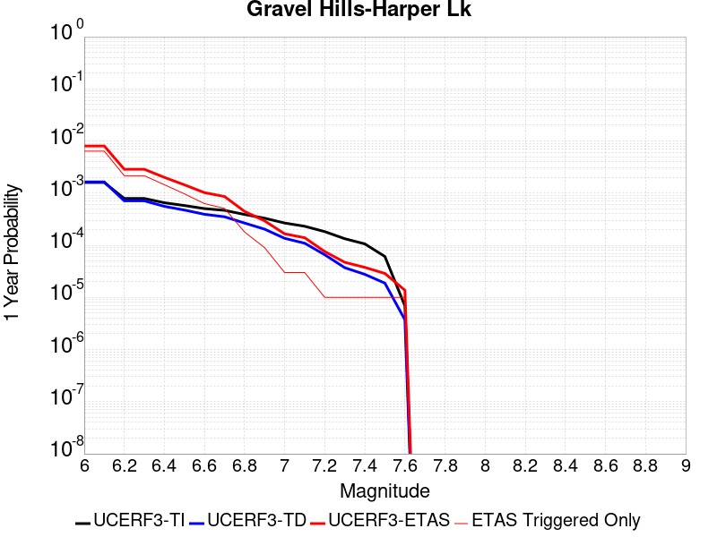 |  |

| Magnitude | 1 wk TI Prob | 1 wk TD Prob | 1 wk ETAS Prob | 1 wk ETAS/TD Gain | 1 wk ETAS Triggered Only | 1 mo TI Prob | 1 mo TD Prob | 1 mo ETAS Prob | 1 mo ETAS/TD Gain | 1 mo ETAS Triggered Only | 1 yr TI Prob | 1 yr TD Prob | 1 yr ETAS Prob | 1 yr ETAS/TD Gain | 1 yr ETAS Triggered Only | 10 yr TI Prob | 10 yr TD Prob | 10 yr ETAS Prob | 10 yr ETAS/TD Gain | 10 yr ETAS Triggered Only |
|-----|-----|-----|-----|-----|-----|-----|-----|-----|-----|-----|-----|-----|-----|-----|-----|-----|-----|-----|-----|-----|
| 6.0 | 3.0679566E-5 | 3.1464646E-5 | 0.003108291 | 98.78677 | 0.003076923 | 1.3147724E-4 | 1.3484273E-4 | 0.00422336 | 31.320635 | 0.0040890686 | 0.0015995599 | 0.0016406906 | 0.007905698 | 4.8185186 | 0.0062753037 | 0.015880952 | 0.01630734 | 0.024869846 | 1.5250708 | 0.008704454 |
| 6.1 | 3.0679566E-5 | 3.1464646E-5 | 0.003108291 | 98.78677 | 0.003076923 | 1.3147724E-4 | 1.3484273E-4 | 0.00422336 | 31.320635 | 0.0040890686 | 0.0015995599 | 0.0016406906 | 0.007905698 | 4.8185186 | 0.0062753037 | 0.015880952 | 0.01630734 | 0.024869846 | 1.5250708 | 0.008704454 |
| 6.2 | 1.514536E-5 | 1.3635206E-5 | 0.0011877082 | 87.105995 | 0.001174089 | 6.490707E-5 | 5.843536E-5 | 0.001596807 | 27.32604 | 0.0015384615 | 7.8995706E-4 | 7.1123015E-4 | 0.002814996 | 3.9579256 | 0.002105263 | 0.007871548 | 0.0070907404 | 0.009904654 | 1.3968433 | 0.002834008 |
| 6.3 | 1.514536E-5 | 1.3635206E-5 | 0.0011877082 | 87.105995 | 0.001174089 | 6.490707E-5 | 5.843536E-5 | 0.001596807 | 27.32604 | 0.0015384615 | 7.8995706E-4 | 7.1123015E-4 | 0.002814996 | 3.9579256 | 0.002105263 | 0.007871548 | 0.0070907404 | 0.009904654 | 1.3968433 | 0.002834008 |
| 6.4 | 1.2532521E-5 | 1.06896905E-5 | 9.0136845E-4 | 84.32128 | 8.906883E-4 | 5.37097E-5 | 4.581219E-5 | 0.0012198475 | 26.627138 | 0.001174089 | 6.537194E-4 | 5.576265E-4 | 0.0021356933 | 3.8299713 | 0.0015789474 | 0.0065179965 | 0.005562863 | 0.007495372 | 1.3473948 | 0.0019433198 |
| 6.5 | 1.1094058E-5 | 9.083664E-6 | 6.163656E-4 | 67.854294 | 6.0728745E-4 | 4.7545094E-5 | 3.892943E-5 | 8.0813025E-4 | 20.758852 | 7.6923077E-4 | 5.787078E-4 | 4.7386673E-4 | 0.0015259995 | 3.2203135 | 0.0010526315 | 0.0057720304 | 0.0047289706 | 0.0059780963 | 1.2641432 | 0.0012550608 |
| 6.6 | 9.688328E-6 | 7.5316952E-6 | 3.3141588E-4 | 44.00283 | 3.2388663E-4 | 4.1520743E-5 | 3.227831E-5 | 4.7760806E-4 | 14.796564 | 4.4534414E-4 | 5.053978E-4 | 3.9292008E-4 | 0.0010809088 | 2.7509634 | 6.882591E-4 | 0.0050424994 | 0.0039225104 | 0.004809705 | 1.2261803 | 8.906883E-4 |
| 6.7 | 8.974824E-6 | 6.749413E-6 | 2.4966276E-4 | 36.99029 | 2.4291498E-4 | 3.8462964E-5 | 2.8925748E-5 | 3.932877E-4 | 13.596457 | 3.6437248E-4 | 4.6818596E-4 | 3.5211627E-4 | 8.7824673E-4 | 2.4941952 | 5.2631577E-4 | 0.004672008 | 0.0035158044 | 0.004241987 | 1.2065481 | 7.2874496E-4 |
| 6.8 | 7.4780046E-6 | 5.1161933E-6 | 1.2657307E-4 | 24.739695 | 1.2145749E-4 | 3.20482E-5 | 2.1926366E-5 | 1.433812E-4 | 6.5392137 | 1.2145749E-4 | 3.9011694E-4 | 2.669222E-4 | 5.0977233E-4 | 1.9098163 | 2.4291498E-4 | 0.0038943281 | 0.0026661542 | 0.0029891774 | 1.1211569 | 3.2388663E-4 |
| 6.9 | 6.3409307E-6 | 3.9074966E-6 | 8.487884E-5 | 21.72205 | 8.097166E-5 | 2.7175134E-5 | 1.6746313E-5 | 9.771662E-5 | 5.835112 | 8.097166E-5 | 3.3080703E-4 | 2.0386827E-4 | 3.6577857E-4 | 1.7941908 | 1.6194332E-4 | 0.0033031502 | 0.0020369107 | 0.002198524 | 1.0793425 | 1.6194332E-4 |
| 7.0 | 5.1239335E-6 | 2.6058565E-6 | 4.3091582E-5 | 16.536436 | 4.048583E-5 | 2.195953E-5 | 1.116791E-5 | 5.165329E-5 | 4.6251526 | 4.048583E-5 | 2.6732447E-4 | 1.3596108E-4 | 1.764414E-4 | 1.2977346 | 4.048583E-5 | 0.0026700313 | 0.0013588042 | 0.001399235 | 1.0297548 | 4.048583E-5 |
| 7.1 | 4.438899E-6 | 2.0984728E-6 | 4.258422E-5 | 20.292957 | 4.048583E-5 | 1.9023713E-5 | 8.993425E-6 | 4.947889E-5 | 5.5016737 | 4.048583E-5 | 2.315891E-4 | 1.0948967E-4 | 1.4997106E-4 | 1.369728 | 4.048583E-5 | 0.002313479 | 0.0010943791 | 0.0011348206 | 1.0369538 | 4.048583E-5 |
| 7.2 | 3.50367E-6 | 1.2615716E-6 | 4.174735E-5 | 33.09154 | 4.048583E-5 | 1.5015643E-5 | 5.4067245E-6 | 4.5892335E-5 | 8.48801 | 4.048583E-5 | 1.8280011E-4 | 6.582497E-5 | 1.06308136E-4 | 1.6150123 | 4.048583E-5 | 0.0018264982 | 6.580629E-4 | 6.9852214E-4 | 1.0614822 | 4.048583E-5 |
| 7.3 | 2.561638E-6 | 7.1191585E-7 | 4.1197716E-5 | 57.8688 | 4.048583E-5 | 1.0978401E-5 | 3.0510646E-6 | 4.353677E-5 | 14.269371 | 4.048583E-5 | 1.3365384E-4 | 3.71461E-5 | 7.763042E-5 | 2.0898676 | 4.048583E-5 | 0.0013357349 | 3.7140088E-4 | 4.1187168E-4 | 1.1089679 | 4.048583E-5 |
| 7.4 | 2.0368864E-6 | 5.304837E-7 | 4.1016294E-5 | 77.318665 | 4.048583E-5 | 8.729483E-6 | 2.2734996E-6 | 4.275924E-5 | 18.807673 | 4.048583E-5 | 1.06276275E-4 | 2.7679513E-5 | 6.816422E-5 | 2.4626236 | 4.048583E-5 | 0.0010622547 | 2.767612E-4 | 3.1723583E-4 | 1.1462438 | 4.048583E-5 |
| 7.5 | 1.1681728E-6 | 3.6030585E-7 | 4.084612E-5 | 113.365135 | 4.048583E-5 | 5.0064455E-6 | 1.544167E-6 | 4.2029933E-5 | 27.218515 | 4.048583E-5 | 6.0951766E-5 | 1.8800076E-5 | 5.9285147E-5 | 3.1534524 | 4.048583E-5 | 6.093505E-4 | 1.8798532E-4 | 2.2846354E-4 | 1.2153264 | 4.048583E-5 |
| 7.6 | 1.3154387E-7 | 7.1197384E-8 | 4.0557024E-5 | 569.6421 | 4.048583E-5 | 5.6375933E-7 | 3.051316E-7 | 4.079095E-5 | 133.68314 | 4.048583E-5 | 6.863748E-6 | 3.7149728E-6 | 4.4200653E-5 | 11.897975 | 4.048583E-5 | 6.863536E-5 | 3.7149264E-5 | 7.763359E-5 | 2.0897746 | 4.048583E-5 |

## McLean Lake
*[(top)](#table-of-contents)*

| 1 Week | 1 Month | 1 Year | 10 Year |
|-----|-----|-----|-----|
|  |  |  | 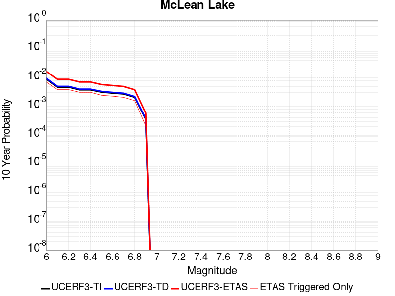 |

| Magnitude | 1 wk TI Prob | 1 wk TD Prob | 1 wk ETAS Prob | 1 wk ETAS/TD Gain | 1 wk ETAS Triggered Only | 1 mo TI Prob | 1 mo TD Prob | 1 mo ETAS Prob | 1 mo ETAS/TD Gain | 1 mo ETAS Triggered Only | 1 yr TI Prob | 1 yr TD Prob | 1 yr ETAS Prob | 1 yr ETAS/TD Gain | 1 yr ETAS Triggered Only | 10 yr TI Prob | 10 yr TD Prob | 10 yr ETAS Prob | 10 yr ETAS/TD Gain | 10 yr ETAS Triggered Only |
|-----|-----|-----|-----|-----|-----|-----|-----|-----|-----|-----|-----|-----|-----|-----|-----|-----|-----|-----|-----|-----|
| 6.0 | 1.7360222E-5 | 1.8501627E-5 | 0.0012330541 | 66.645706 | 0.0012145749 | 7.439883E-5 | 7.9290556E-5 | 0.0021843868 | 27.549143 | 0.002105263 | 9.0542925E-4 | 9.6498354E-4 | 0.0053332336 | 5.5267615 | 0.0043724696 | 0.009017491 | 0.0096127745 | 0.016389107 | 1.7049301 | 0.006842105 |
| 6.1 | 9.062689E-6 | 9.592193E-6 | 7.788156E-4 | 81.19265 | 7.6923077E-4 | 3.8839516E-5 | 4.1108804E-5 | 0.0014175704 | 34.48338 | 0.0013765182 | 4.727685E-4 | 5.003936E-4 | 0.0030901902 | 6.1755185 | 0.002591093 | 0.0047176396 | 0.004993552 | 0.008860784 | 1.774445 | 0.0038866396 |
| 6.2 | 9.062689E-6 | 9.592193E-6 | 7.788156E-4 | 81.19265 | 7.6923077E-4 | 3.8839516E-5 | 4.1108804E-5 | 0.0014175704 | 34.48338 | 0.0013765182 | 4.727685E-4 | 5.003936E-4 | 0.0030901902 | 6.1755185 | 0.002591093 | 0.0047176396 | 0.004993552 | 0.008860784 | 1.774445 | 0.0038866396 |
| 6.3 | 7.2575485E-6 | 7.66771E-6 | 6.149505E-4 | 80.20003 | 6.0728745E-4 | 3.110341E-5 | 3.2861237E-5 | 0.0010449737 | 31.799585 | 0.0010121458 | 3.786182E-4 | 4.0001926E-4 | 0.0025044403 | 6.2607994 | 0.002105263 | 0.0037797375 | 0.0039936965 | 0.007179304 | 1.7976588 | 0.0031983806 |
| 6.4 | 7.2575485E-6 | 7.66771E-6 | 6.149505E-4 | 80.20003 | 6.0728745E-4 | 3.110341E-5 | 3.2861237E-5 | 0.0010449737 | 31.799585 | 0.0010121458 | 3.786182E-4 | 4.0001926E-4 | 0.0025044403 | 6.2607994 | 0.002105263 | 0.0037797375 | 0.0039936965 | 0.007179304 | 1.7976588 | 0.0031983806 |
| 6.5 | 6.06582E-6 | 6.4038773E-6 | 3.70774E-4 | 57.898365 | 3.6437248E-4 | 2.5996113E-5 | 2.7444936E-5 | 7.1568514E-4 | 26.07713 | 6.882591E-4 | 3.164567E-4 | 3.3409733E-4 | 0.0018720449 | 5.603292 | 0.0015384615 | 0.0031600643 | 0.0033365893 | 0.0058383355 | 1.7497915 | 0.0025101216 |
| 6.6 | 5.598744E-6 | 5.910262E-6 | 3.7028058E-4 | 62.650448 | 3.6437248E-4 | 2.3994397E-5 | 2.5329486E-5 | 6.730864E-4 | 26.573235 | 6.4777327E-4 | 2.9209262E-4 | 3.0834923E-4 | 0.0016034963 | 5.20026 | 0.0012955465 | 0.0029170897 | 0.003079843 | 0.005259345 | 1.7076664 | 0.0021862348 |
| 6.7 | 5.246996E-6 | 5.539162E-6 | 3.2942402E-4 | 59.471813 | 3.2388663E-4 | 2.2486933E-5 | 2.3739085E-5 | 5.500424E-4 | 23.170326 | 5.2631577E-4 | 2.73744E-4 | 2.8899137E-4 | 0.0014627412 | 5.061539 | 0.001174089 | 0.0027340704 | 0.0028867796 | 0.0049052276 | 1.699204 | 0.0020242915 |
| 6.8 | 4.02324E-6 | 4.2469046E-6 | 2.0667519E-4 | 48.6649 | 2.0242915E-4 | 1.7242342E-5 | 1.8200926E-5 | 3.4208168E-4 | 18.79474 | 3.2388663E-4 | 2.099053E-4 | 2.2157968E-4 | 9.501632E-4 | 4.2881327 | 7.2874496E-4 | 0.0020970714 | 0.002214172 | 0.0036280386 | 1.6385531 | 0.001417004 |
| 6.9 | 6.835972E-7 | 7.1399285E-7 | 4.1199793E-5 | 57.703373 | 4.048583E-5 | 2.9296991E-6 | 3.0599674E-6 | 4.3545675E-5 | 14.230763 | 4.048583E-5 | 3.56685E-5 | 3.7254784E-5 | 1.9919207E-4 | 5.346751 | 1.6194332E-4 | 3.5662777E-4 | 3.7251666E-4 | 5.3439965E-4 | 1.4345658 | 1.6194332E-4 |

## Goldstone Lake
*[(top)](#table-of-contents)*

| 1 Week | 1 Month | 1 Year | 10 Year |
|-----|-----|-----|-----|
| 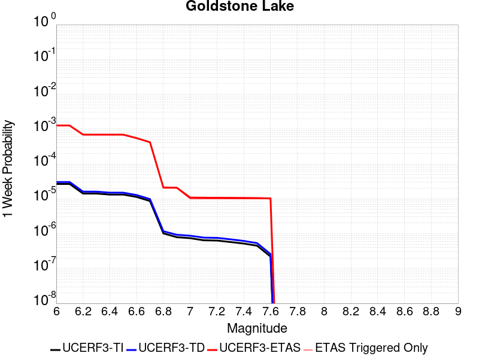 |  |  |  |

| Magnitude | 1 wk TI Prob | 1 wk TD Prob | 1 wk ETAS Prob | 1 wk ETAS/TD Gain | 1 wk ETAS Triggered Only | 1 mo TI Prob | 1 mo TD Prob | 1 mo ETAS Prob | 1 mo ETAS/TD Gain | 1 mo ETAS Triggered Only | 1 yr TI Prob | 1 yr TD Prob | 1 yr ETAS Prob | 1 yr ETAS/TD Gain | 1 yr ETAS Triggered Only | 10 yr TI Prob | 10 yr TD Prob | 10 yr ETAS Prob | 10 yr ETAS/TD Gain | 10 yr ETAS Triggered Only |
|-----|-----|-----|-----|-----|-----|-----|-----|-----|-----|-----|-----|-----|-----|-----|-----|-----|-----|-----|-----|-----|
| 6.0 | 2.671352E-5 | 3.037609E-5 | 0.0010829757 | 35.65224 | 0.0010526315 | 1.1448149E-4 | 1.3017785E-4 | 0.0021137253 | 16.237211 | 0.0019838056 | 0.001392921 | 0.0015839594 | 0.0052219126 | 3.2967465 | 0.0036437246 | 0.013842222 | 0.015746197 | 0.021285115 | 1.3517623 | 0.00562753 |
| 6.1 | 2.671352E-5 | 3.037609E-5 | 0.0010829757 | 35.65224 | 0.0010526315 | 1.1448149E-4 | 1.3017785E-4 | 0.0021137253 | 16.237211 | 0.0019838056 | 0.001392921 | 0.0015839594 | 0.0052219126 | 3.2967465 | 0.0036437246 | 0.013842222 | 0.015746197 | 0.021285115 | 1.3517623 | 0.00562753 |
| 6.2 | 1.4197047E-5 | 1.6096245E-5 | 5.828887E-4 | 36.212715 | 5.6680164E-4 | 6.0843064E-5 | 6.8982634E-5 | 0.0011620247 | 16.845175 | 0.0010931174 | 7.4051257E-4 | 8.3963864E-4 | 0.0026599714 | 3.1679955 | 0.0018218623 | 0.007380498 | 0.0083743585 | 0.011345221 | 1.354757 | 0.0029959513 |
| 6.3 | 1.4197047E-5 | 1.6096245E-5 | 5.828887E-4 | 36.212715 | 5.6680164E-4 | 6.0843064E-5 | 6.8982634E-5 | 0.0011620247 | 16.845175 | 0.0010931174 | 7.4051257E-4 | 8.3963864E-4 | 0.0026599714 | 3.1679955 | 0.0018218623 | 0.007380498 | 0.0083743585 | 0.011345221 | 1.354757 | 0.0029959513 |
| 6.4 | 1.3238931E-5 | 1.500846E-5 | 5.818016E-4 | 38.764908 | 5.6680164E-4 | 5.6737044E-5 | 6.4320935E-5 | 0.0011573681 | 17.993645 | 0.0010931174 | 6.9055456E-4 | 7.82924E-4 | 0.00260336 | 3.3251758 | 0.0018218623 | 0.006884126 | 0.0078112837 | 0.010743663 | 1.375403 | 0.0029554656 |
| 6.5 | 1.3238931E-5 | 1.500846E-5 | 5.818016E-4 | 38.764908 | 5.6680164E-4 | 5.6737044E-5 | 6.4320935E-5 | 0.0011573681 | 17.993645 | 0.0010931174 | 6.9055456E-4 | 7.82924E-4 | 0.00260336 | 3.3251758 | 0.0018218623 | 0.006884126 | 0.0078112837 | 0.010743663 | 1.375403 | 0.0029554656 |
| 6.6 | 1.1328278E-5 | 1.2855166E-5 | 4.1770827E-4 | 32.493416 | 4.048583E-4 | 4.8548856E-5 | 5.5092944E-5 | 9.052485E-4 | 16.431297 | 8.5020246E-4 | 5.90922E-4 | 6.7064585E-4 | 0.0021271582 | 3.1718056 | 0.0014574899 | 0.0058935313 | 0.0066956086 | 0.009229138 | 1.3783867 | 0.0025506073 |
| 6.7 | 8.651175E-6 | 9.824565E-6 | 3.7419345E-4 | 38.087536 | 3.6437248E-4 | 3.707594E-5 | 4.2105108E-5 | 6.49367E-4 | 15.4225235 | 6.0728745E-4 | 4.5130608E-4 | 5.1259965E-4 | 0.0016456218 | 3.2103453 | 0.0011336033 | 0.0045039062 | 0.005123051 | 0.007136972 | 1.3931097 | 0.0020242915 |
| 6.8 | 1.0215377E-6 | 1.1754702E-6 | 4.1661253E-5 | 35.4422 | 4.048583E-5 | 4.378012E-6 | 5.0377203E-6 | 4.5523346E-5 | 9.036497 | 4.048583E-5 | 5.3300988E-5 | 6.1332634E-5 | 1.8278268E-4 | 2.9801862 | 1.2145749E-4 | 5.3288206E-4 | 6.1316835E-4 | 8.154734E-4 | 1.3299339 | 2.0242915E-4 |
| 6.9 | 7.9360774E-7 | 9.2833966E-7 | 4.1414132E-5 | 44.61097 | 4.048583E-5 | 3.4011714E-6 | 3.9785928E-6 | 4.446426E-5 | 11.175877 | 4.048583E-5 | 4.1408475E-5 | 4.843836E-5 | 8.892223E-5 | 1.8357811 | 4.048583E-5 | 4.140076E-4 | 4.8428503E-4 | 5.6521746E-4 | 1.1671174 | 8.097166E-5 |
| 7.0 | 7.4382757E-7 | 8.7473285E-7 | 4.1360527E-5 | 47.28361 | 4.048583E-5 | 3.1878285E-6 | 3.74885E-6 | 4.423453E-5 | 11.799493 | 4.048583E-5 | 3.8811122E-5 | 4.564136E-5 | 8.612534E-5 | 1.8870021 | 4.048583E-5 | 3.8804344E-4 | 4.5632652E-4 | 4.967939E-4 | 1.0886807 | 4.048583E-5 |
| 7.1 | 6.4709513E-7 | 7.7113E-7 | 4.1256928E-5 | 53.50191 | 4.048583E-5 | 2.773262E-6 | 3.3048389E-6 | 4.3790536E-5 | 13.250429 | 4.048583E-5 | 3.376394E-5 | 4.0235733E-5 | 8.071993E-5 | 2.0061753 | 4.048583E-5 | 3.375881E-4 | 4.0229043E-4 | 4.4275998E-4 | 1.1005979 | 4.048583E-5 |
| 7.2 | 6.356704E-7 | 7.5883594E-7 | 4.1244635E-5 | 54.352505 | 4.048583E-5 | 2.7242988E-6 | 3.2521505E-6 | 4.3737848E-5 | 13.448901 | 4.048583E-5 | 3.3167835E-5 | 3.959427E-5 | 8.00785E-5 | 2.022477 | 4.048583E-5 | 3.3162883E-4 | 3.958781E-4 | 4.363479E-4 | 1.1022279 | 4.048583E-5 |
| 7.3 | 5.7695723E-7 | 6.8965653E-7 | 4.117546E-5 | 59.704296 | 4.048583E-5 | 2.4726714E-6 | 2.9556677E-6 | 4.3441378E-5 | 14.697653 | 4.048583E-5 | 3.0104358E-5 | 3.5984718E-5 | 7.646909E-5 | 2.1250434 | 4.048583E-5 | 3.0100282E-4 | 3.5979465E-4 | 4.002659E-4 | 1.1124843 | 4.048583E-5 |
| 7.4 | 5.209647E-7 | 6.193514E-7 | 4.1105155E-5 | 66.36807 | 4.048583E-5 | 2.232704E-6 | 2.6543607E-6 | 4.3140084E-5 | 16.252533 | 4.048583E-5 | 2.718283E-5 | 3.2316417E-5 | 7.280094E-5 | 2.252754 | 4.048583E-5 | 2.7179506E-4 | 3.2312275E-4 | 3.635955E-4 | 1.125255 | 4.048583E-5 |
| 7.5 | 4.512955E-7 | 5.348885E-7 | 4.1020696E-5 | 76.690186 | 4.048583E-5 | 1.934122E-6 | 2.2923775E-6 | 4.2778116E-5 | 18.661024 | 4.048583E-5 | 2.3547682E-5 | 2.7909393E-5 | 6.8394096E-5 | 2.450576 | 4.048583E-5 | 2.3545188E-4 | 2.7906417E-4 | 3.1953873E-4 | 1.1450367 | 4.048583E-5 |
| 7.6 | 2.21172E-7 | 2.603961E-7 | 4.0746214E-5 | 156.47784 | 4.048583E-5 | 9.478797E-7 | 1.1159829E-6 | 4.160177E-5 | 37.27814 | 4.048583E-5 | 1.1540374E-5 | 1.3587036E-5 | 5.4072316E-5 | 3.9796994 | 4.048583E-5 | 1.1539775E-4 | 1.3586486E-4 | 1.7634519E-4 | 1.2979455 | 4.048583E-5 |

## Coyote Canyon
*[(top)](#table-of-contents)*

| 1 Week | 1 Month | 1 Year | 10 Year |
|-----|-----|-----|-----|
| 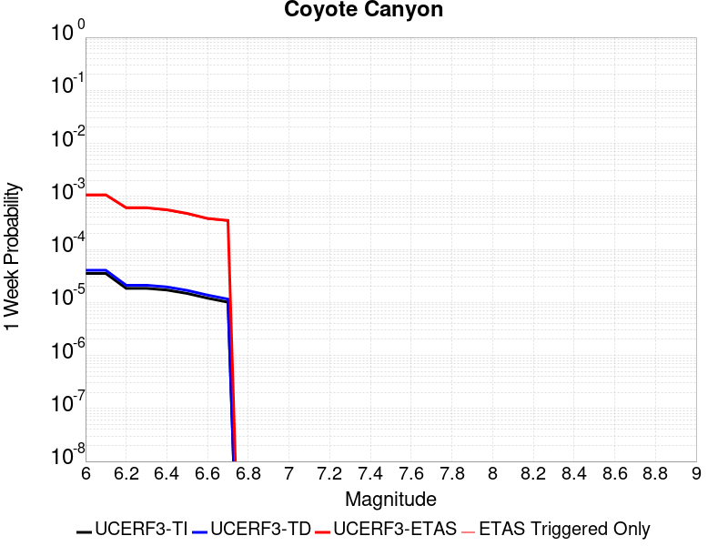 |  |  |  |

| Magnitude | 1 wk TI Prob | 1 wk TD Prob | 1 wk ETAS Prob | 1 wk ETAS/TD Gain | 1 wk ETAS Triggered Only | 1 mo TI Prob | 1 mo TD Prob | 1 mo ETAS Prob | 1 mo ETAS/TD Gain | 1 mo ETAS Triggered Only | 1 yr TI Prob | 1 yr TD Prob | 1 yr ETAS Prob | 1 yr ETAS/TD Gain | 1 yr ETAS Triggered Only | 10 yr TI Prob | 10 yr TD Prob | 10 yr ETAS Prob | 10 yr ETAS/TD Gain | 10 yr ETAS Triggered Only |
|-----|-----|-----|-----|-----|-----|-----|-----|-----|-----|-----|-----|-----|-----|-----|-----|-----|-----|-----|-----|-----|
| 6.0 | 3.5090034E-5 | 4.0364324E-5 | 0.001214406 | 30.086123 | 0.001174089 | 1.503772E-4 | 1.7297994E-4 | 0.0018326119 | 10.59436 | 0.001659919 | 0.0018293047 | 0.0021042528 | 0.0048110955 | 2.2863677 | 0.0027125506 | 0.018143194 | 0.020869201 | 0.025388267 | 1.2165424 | 0.0046153846 |
| 6.1 | 3.5090034E-5 | 4.0364324E-5 | 0.001214406 | 30.086123 | 0.001174089 | 1.503772E-4 | 1.7297994E-4 | 0.0018326119 | 10.59436 | 0.001659919 | 0.0018293047 | 0.0021042528 | 0.0048110955 | 2.2863677 | 0.0027125506 | 0.018143194 | 0.020869201 | 0.025388267 | 1.2165424 | 0.0046153846 |
| 6.2 | 1.841879E-5 | 2.1059794E-5 | 6.688194E-4 | 31.75812 | 6.4777327E-4 | 7.8935285E-5 | 9.0253714E-5 | 9.808616E-4 | 10.8678255 | 8.906883E-4 | 9.606133E-4 | 0.001098387 | 0.0024733932 | 2.2518413 | 0.0013765182 | 0.0095647145 | 0.010939667 | 0.013422329 | 1.2269412 | 0.0025101216 |
| 6.3 | 1.841879E-5 | 2.1059794E-5 | 6.688194E-4 | 31.75812 | 6.4777327E-4 | 7.8935285E-5 | 9.0253714E-5 | 9.808616E-4 | 10.8678255 | 8.906883E-4 | 9.606133E-4 | 0.001098387 | 0.0024733932 | 2.2518413 | 0.0013765182 | 0.0095647145 | 0.010939667 | 0.013422329 | 1.2269412 | 0.0025101216 |
| 6.4 | 1.712201E-5 | 1.9565212E-5 | 5.053857E-4 | 25.83083 | 4.8582995E-4 | 7.337798E-5 | 8.3848776E-5 | 7.720502E-4 | 9.207649 | 6.882591E-4 | 8.930107E-4 | 0.0010204813 | 0.0022742613 | 2.2286162 | 0.0012550608 | 0.008894307 | 0.010167871 | 0.012452099 | 1.2246516 | 0.0023076923 |
| 6.5 | 1.4744935E-5 | 1.6836972E-5 | 4.621736E-4 | 27.449924 | 4.4534414E-4 | 6.3191044E-5 | 7.215698E-5 | 7.1988354E-4 | 9.97663 | 6.4777327E-4 | 7.6907943E-4 | 8.7825063E-4 | 0.0020513085 | 2.3356755 | 0.001174089 | 0.007664232 | 0.008756994 | 0.01080369 | 1.2337213 | 0.0020647773 |
| 6.6 | 1.2017839E-5 | 1.37240895E-5 | 3.7809156E-4 | 27.549482 | 3.6437248E-4 | 5.150401E-5 | 5.88167E-5 | 5.4461806E-4 | 9.2595825 | 4.8582995E-4 | 6.268809E-4 | 7.159466E-4 | 0.0015655403 | 2.186672 | 8.5020246E-4 | 0.0062511545 | 0.0071450938 | 0.008752956 | 1.2250303 | 0.0016194332 |
| 6.7 | 1.00956095E-5 | 1.1533517E-5 | 3.354164E-4 | 29.081886 | 3.2388663E-4 | 4.326618E-5 | 4.942891E-5 | 4.542672E-4 | 9.190314 | 4.048583E-4 | 5.266384E-4 | 6.017178E-4 | 0.0013704856 | 2.277622 | 7.6923077E-4 | 0.005253921 | 0.0060094125 | 0.007417901 | 1.2343805 | 0.001417004 |

## Lenwood-Lockhart-Old Woman Springs
*[(top)](#table-of-contents)*

| 1 Week | 1 Month | 1 Year | 10 Year |
|-----|-----|-----|-----|
|  |  |  |  |

| Magnitude | 1 wk TI Prob | 1 wk TD Prob | 1 wk ETAS Prob | 1 wk ETAS/TD Gain | 1 wk ETAS Triggered Only | 1 mo TI Prob | 1 mo TD Prob | 1 mo ETAS Prob | 1 mo ETAS/TD Gain | 1 mo ETAS Triggered Only | 1 yr TI Prob | 1 yr TD Prob | 1 yr ETAS Prob | 1 yr ETAS/TD Gain | 1 yr ETAS Triggered Only | 10 yr TI Prob | 10 yr TD Prob | 10 yr ETAS Prob | 10 yr ETAS/TD Gain | 10 yr ETAS Triggered Only |
|-----|-----|-----|-----|-----|-----|-----|-----|-----|-----|-----|-----|-----|-----|-----|-----|-----|-----|-----|-----|-----|
| 6.0 | 3.744542E-5 | 4.396252E-5 | 0.0018657448 | 42.43944 | 0.0018218623 | 1.604705E-4 | 1.8839816E-4 | 0.002374221 | 12.602145 | 0.0021862348 | 0.0019519776 | 0.0022915069 | 0.005805703 | 2.5335743 | 0.003522267 | 0.019349206 | 0.022696787 | 0.027642654 | 1.2179104 | 0.0050607286 |
| 6.1 | 3.744542E-5 | 4.396252E-5 | 0.0018657448 | 42.43944 | 0.0018218623 | 1.604705E-4 | 1.8839816E-4 | 0.002374221 | 12.602145 | 0.0021862348 | 0.0019519776 | 0.0022915069 | 0.005805703 | 2.5335743 | 0.003522267 | 0.019349206 | 0.022696787 | 0.027642654 | 1.2179104 | 0.0050607286 |
| 6.2 | 3.744542E-5 | 4.396252E-5 | 0.0018657448 | 42.43944 | 0.0018218623 | 1.604705E-4 | 1.8839816E-4 | 0.002374221 | 12.602145 | 0.0021862348 | 0.0019519776 | 0.0022915069 | 0.005805703 | 2.5335743 | 0.003522267 | 0.019349206 | 0.022696787 | 0.027642654 | 1.2179104 | 0.0050607286 |
| 6.3 | 2.1079984E-5 | 2.5353434E-5 | 9.160191E-4 | 36.129982 | 8.906883E-4 | 9.0339665E-5 | 1.0865316E-4 | 0.0010397261 | 9.569221 | 9.311741E-4 | 0.0010993304 | 0.0013220694 | 0.0027776323 | 2.1009731 | 0.0014574899 | 0.010939079 | 0.0131442575 | 0.015221848 | 1.1580608 | 0.002105263 |
| 6.4 | 2.1079984E-5 | 2.5353434E-5 | 9.160191E-4 | 36.129982 | 8.906883E-4 | 9.0339665E-5 | 1.0865316E-4 | 0.0010397261 | 9.569221 | 9.311741E-4 | 0.0010993304 | 0.0013220694 | 0.0027776323 | 2.1009731 | 0.0014574899 | 0.010939079 | 0.0131442575 | 0.015221848 | 1.1580608 | 0.002105263 |
| 6.5 | 1.7397282E-5 | 2.066241E-5 | 6.684223E-4 | 32.349678 | 6.4777327E-4 | 7.455765E-5 | 8.8550245E-5 | 7.767484E-4 | 8.771838 | 6.882591E-4 | 9.073613E-4 | 0.0010775778 | 0.002290844 | 2.1259198 | 0.0012145749 | 0.009036654 | 0.010724821 | 0.012326886 | 1.1493791 | 0.0016194332 |
| 6.6 | 1.52050325E-5 | 1.7679693E-5 | 5.0350104E-4 | 28.47906 | 4.8582995E-4 | 6.51628E-5 | 7.576796E-5 | 6.020439E-4 | 7.94589 | 5.2631577E-4 | 7.9306826E-4 | 9.220924E-4 | 0.0018928563 | 2.0527837 | 9.716599E-4 | 0.007902439 | 0.009183526 | 0.010467175 | 1.1397773 | 0.0012955465 |
| 6.7 | 1.332523E-5 | 1.5264002E-5 | 4.2011612E-4 | 27.523327 | 4.048583E-4 | 5.7106878E-5 | 6.5415545E-5 | 5.1073055E-4 | 7.8074794 | 4.4534414E-4 | 6.950544E-4 | 7.961491E-4 | 0.0016456747 | 2.0670433 | 8.5020246E-4 | 0.006928845 | 0.007933599 | 0.009018044 | 1.1366901 | 0.0010931174 |
| 6.8 | 1.1525329E-5 | 1.3030979E-5 | 3.369134E-4 | 25.854803 | 3.2388663E-4 | 4.9393333E-5 | 5.584588E-5 | 4.20198E-4 | 7.5242434 | 3.6437248E-4 | 6.011979E-4 | 6.797157E-4 | 0.0014079653 | 2.0714033 | 7.2874496E-4 | 0.00599574 | 0.006776819 | 0.007701683 | 1.1364746 | 9.311741E-4 |
| 6.9 | 1.0253909E-5 | 1.15144385E-5 | 3.3539734E-4 | 29.128414 | 3.2388663E-4 | 4.3944583E-5 | 4.9346683E-5 | 4.1370117E-4 | 8.383566 | 3.6437248E-4 | 5.3489394E-4 | 6.0063385E-4 | 0.0012075566 | 2.0104704 | 6.0728745E-4 | 0.0053360825 | 0.0059904843 | 0.0067953505 | 1.1343575 | 8.097166E-4 |
| 7.0 | 8.104563E-6 | 8.991279E-6 | 2.9238954E-4 | 32.519238 | 2.8340082E-4 | 3.4733377E-5 | 3.8533497E-5 | 3.2192338E-4 | 8.354378 | 2.8340082E-4 | 4.2279682E-4 | 4.6904673E-4 | 9.14182E-4 | 1.9490211 | 4.4534414E-4 | 0.0042199334 | 0.0046808156 | 0.0052449643 | 1.1205236 | 5.6680164E-4 |
| 7.1 | 6.7986157E-6 | 7.515816E-6 | 2.0994345E-4 | 27.933554 | 2.0242915E-4 | 2.91366E-5 | 3.2210253E-5 | 2.3463288E-4 | 7.2844157 | 2.0242915E-4 | 3.5468035E-4 | 3.920914E-4 | 7.15851E-4 | 1.825725 | 3.2388663E-4 | 0.003541148 | 0.003914213 | 0.004317486 | 1.103028 | 4.048583E-4 |
| 7.2 | 5.6893327E-6 | 6.2800136E-6 | 1.2773674E-4 | 20.3402 | 1.2145749E-4 | 2.4382627E-5 | 2.6914078E-5 | 1.483683E-4 | 5.5126653 | 1.2145749E-4 | 2.9681803E-4 | 3.2763163E-4 | 5.2999443E-4 | 1.6176535 | 2.0242915E-4 | 0.002964219 | 0.0032716845 | 0.0035541581 | 1.0863389 | 2.8340082E-4 |
| 7.3 | 4.253348E-6 | 4.7069107E-6 | 1.2616382E-4 | 26.803957 | 1.2145749E-4 | 1.8228506E-5 | 2.0172329E-5 | 1.4162737E-4 | 7.0208735 | 1.2145749E-4 | 2.2190946E-4 | 2.4557224E-4 | 4.074758E-4 | 1.6592909 | 1.6194332E-4 | 0.00221688 | 0.0024531898 | 0.0026955088 | 1.0987772 | 2.4291498E-4 |
| 7.4 | 2.5448119E-6 | 2.852045E-6 | 1.2430918E-4 | 43.585983 | 1.2145749E-4 | 1.0906291E-5 | 1.2223002E-5 | 1.33679E-4 | 10.936675 | 1.2145749E-4 | 1.3277601E-4 | 1.4880655E-4 | 3.1072577E-4 | 2.088119 | 1.6194332E-4 | 0.001326967 | 0.0014872311 | 0.0016489336 | 1.1087272 | 1.6194332E-4 |
| 7.5 | 4.3706837E-8 | 4.562909E-8 | 4.562909E-8 | 1.0 | 0.0 | 1.8731501E-7 | 1.9555324E-7 | 1.9555324E-7 | 1.0 | 0.0 | 2.2805577E-6 | 2.3808586E-6 | 2.3808586E-6 | 1.0 | 0.0 | 2.2805343E-5 | 2.3808387E-5 | 2.3808387E-5 | 1.0 | 0.0 |

## San Andreas (Mojave S)
*[(top)](#table-of-contents)*

| 1 Week | 1 Month | 1 Year | 10 Year |
|-----|-----|-----|-----|
|  |  |  |  |

| Magnitude | 1 wk TI Prob | 1 wk TD Prob | 1 wk ETAS Prob | 1 wk ETAS/TD Gain | 1 wk ETAS Triggered Only | 1 mo TI Prob | 1 mo TD Prob | 1 mo ETAS Prob | 1 mo ETAS/TD Gain | 1 mo ETAS Triggered Only | 1 yr TI Prob | 1 yr TD Prob | 1 yr ETAS Prob | 1 yr ETAS/TD Gain | 1 yr ETAS Triggered Only | 10 yr TI Prob | 10 yr TD Prob | 10 yr ETAS Prob | 10 yr ETAS/TD Gain | 10 yr ETAS Triggered Only |
|-----|-----|-----|-----|-----|-----|-----|-----|-----|-----|-----|-----|-----|-----|-----|-----|-----|-----|-----|-----|-----|
| 6.0 | 3.1064058E-4 | 6.7460834E-4 | 0.0020097394 | 2.9791205 | 0.0013360324 | 0.0013306376 | 0.0028881032 | 0.0049872864 | 1.7268379 | 0.002105263 | 0.016080605 | 0.03462235 | 0.03798358 | 1.0970827 | 0.0034817813 | 0.1496549 | 0.28660452 | 0.28975272 | 1.0109844 | 0.0044129556 |
| 6.1 | 3.1064058E-4 | 6.7460834E-4 | 0.0020097394 | 2.9791205 | 0.0013360324 | 0.0013306376 | 0.0028881032 | 0.0049872864 | 1.7268379 | 0.002105263 | 0.016080605 | 0.03462235 | 0.03798358 | 1.0970827 | 0.0034817813 | 0.1496549 | 0.28660452 | 0.28975272 | 1.0109844 | 0.0044129556 |
| 6.2 | 3.1064058E-4 | 6.7460834E-4 | 0.0020097394 | 2.9791205 | 0.0013360324 | 0.0013306376 | 0.0028881032 | 0.0049872864 | 1.7268379 | 0.002105263 | 0.016080605 | 0.03462235 | 0.03798358 | 1.0970827 | 0.0034817813 | 0.1496549 | 0.28660452 | 0.28975272 | 1.0109844 | 0.0044129556 |
| 6.3 | 3.1064058E-4 | 6.7460834E-4 | 0.0020097394 | 2.9791205 | 0.0013360324 | 0.0013306376 | 0.0028881032 | 0.0049872864 | 1.7268379 | 0.002105263 | 0.016080605 | 0.03462235 | 0.03798358 | 1.0970827 | 0.0034817813 | 0.1496549 | 0.28660452 | 0.28975272 | 1.0109844 | 0.0044129556 |
| 6.4 | 1.9872203E-4 | 4.3179357E-4 | 0.001645844 | 3.8116455 | 0.0012145749 | 8.5138786E-4 | 0.0018492596 | 0.0037889858 | 2.0489204 | 0.0019433198 | 0.010316478 | 0.02228844 | 0.025415532 | 1.1403011 | 0.0031983806 | 0.098504856 | 0.19699748 | 0.200216 | 1.0163379 | 0.004008097 |
| 6.5 | 1.291105E-4 | 2.875267E-4 | 0.001420804 | 4.9414682 | 0.0011336033 | 5.5321335E-4 | 0.0012316781 | 0.0030108606 | 2.444519 | 0.0017813765 | 0.006714592 | 0.0148934 | 0.017725082 | 1.1901301 | 0.0028744938 | 0.065152965 | 0.13803436 | 0.14107043 | 1.0219951 | 0.003522267 |
| 6.6 | 1.291105E-4 | 2.875267E-4 | 0.001420804 | 4.9414682 | 0.0011336033 | 5.5321335E-4 | 0.0012316781 | 0.0030108606 | 2.444519 | 0.0017813765 | 0.006714592 | 0.0148934 | 0.017725082 | 1.1901301 | 0.0028744938 | 0.065152965 | 0.13803436 | 0.14107043 | 1.0219951 | 0.003522267 |
| 6.7 | 1.08001186E-4 | 2.4333889E-4 | 0.0013361903 | 5.491068 | 0.0010931174 | 4.6278012E-4 | 0.0010424647 | 0.0027815406 | 2.6682348 | 0.0017408907 | 0.0056198016 | 0.012618446 | 0.015296768 | 1.2122545 | 0.0027125506 | 0.054797906 | 0.119176775 | 0.122100964 | 1.0245366 | 0.003319838 |
| 6.8 | 1.0624356E-4 | 2.3851555E-4 | 0.0013313722 | 5.5819097 | 0.0010931174 | 4.5525006E-4 | 0.0010218095 | 0.0027204768 | 2.662411 | 0.0017004049 | 0.0055285925 | 0.012369843 | 0.015008855 | 1.2133424 | 0.0026720648 | 0.053930566 | 0.11712591 | 0.12002117 | 1.0247191 | 0.0032793523 |
| 6.9 | 1.0393785E-4 | 2.3221898E-4 | 0.0013250825 | 5.7061768 | 0.0010931174 | 4.4537184E-4 | 9.948451E-4 | 0.0026935583 | 2.7075152 | 0.0017004049 | 0.0054089287 | 0.012045221 | 0.0146851 | 1.219164 | 0.0026720648 | 0.05279156 | 0.11442335 | 0.117327474 | 1.0253805 | 0.0032793523 |
| 7.0 | 1.0155622E-4 | 2.2591476E-4 | 0.0013187852 | 5.8375344 | 0.0010931174 | 4.3516833E-4 | 9.6784724E-4 | 0.0026666063 | 2.7551935 | 0.0017004049 | 0.005285311 | 0.0117200995 | 0.014320836 | 1.2219039 | 0.002631579 | 0.05161361 | 0.111683756 | 0.11456089 | 1.0257615 | 0.0032388663 |
| 7.1 | 9.885595E-5 | 2.1879886E-4 | 0.0012712001 | 5.809903 | 0.0010526315 | 4.2359953E-4 | 9.3737274E-4 | 0.002555288 | 2.7260106 | 0.0016194332 | 0.0051451353 | 0.011352993 | 0.013874643 | 1.2221133 | 0.0025506073 | 0.05027629 | 0.1085682 | 0.11138325 | 1.0259289 | 0.0031578948 |
| 7.2 | 9.6411415E-5 | 2.124288E-4 | 0.0012648368 | 5.954168 | 0.0010526315 | 4.1312634E-4 | 9.1009185E-4 | 0.0025280511 | 2.777798 | 0.0016194332 | 0.005018219 | 0.011024255 | 0.013546744 | 1.2288126 | 0.0025506073 | 0.049064007 | 0.105758004 | 0.10858192 | 1.0267017 | 0.0031578948 |
| 7.3 | 9.1180635E-5 | 1.9471257E-4 | 0.0012066612 | 6.1971407 | 0.0010121458 | 3.907156E-4 | 8.342157E-4 | 0.0023713938 | 2.8426626 | 0.0015384615 | 0.004746591 | 0.01010939 | 0.012513982 | 1.2378573 | 0.0024291498 | 0.046464786 | 0.09795115 | 0.10069016 | 1.027963 | 0.0030364373 |
| 7.4 | 8.887388E-5 | 1.8719878E-4 | 0.0011991551 | 6.4057846 | 0.0010121458 | 3.8083247E-4 | 8.020339E-4 | 0.0023392616 | 2.9166617 | 0.0015384615 | 0.0046267817 | 0.00972114 | 0.012126676 | 1.247454 | 0.0024291498 | 0.045316286 | 0.09458615 | 0.097335376 | 1.029066 | 0.0030364373 |
| 7.5 | 8.6750515E-5 | 1.8051457E-4 | 0.0011924776 | 6.605991 | 0.0010121458 | 3.7173493E-4 | 7.7340455E-4 | 0.0023106763 | 2.9876683 | 0.0015384615 | 0.004516484 | 0.009375632 | 0.011782007 | 1.2566627 | 0.0024291498 | 0.04425787 | 0.091549896 | 0.09430835 | 1.0301306 | 0.0030364373 |
| 7.6 | 8.453092E-5 | 1.7439072E-4 | 0.0011863599 | 6.8028846 | 0.0010121458 | 3.6222505E-4 | 7.471748E-4 | 0.0022844868 | 3.0575 | 0.0015384615 | 0.0044011753 | 0.009058985 | 0.011466129 | 1.2657189 | 0.0024291498 | 0.04315024 | 0.08870898 | 0.09147606 | 1.0311928 | 0.0030364373 |
| 7.7 | 8.259102E-5 | 1.6961215E-4 | 0.0011815862 | 6.9664006 | 0.0010121458 | 3.539135E-4 | 7.2670676E-4 | 0.0022640503 | 3.1154935 | 0.0015384615 | 0.004300386 | 0.008811831 | 0.011219575 | 1.27324 | 0.0024291498 | 0.042181134 | 0.08645982 | 0.08923373 | 1.0320832 | 0.0030364373 |
| 7.8 | 7.444844E-5 | 1.5283503E-4 | 0.0010029075 | 6.5620265 | 8.5020246E-4 | 3.1902574E-4 | 6.548429E-4 | 0.0019090817 | 2.915328 | 0.0012550608 | 0.0038772223 | 0.007943616 | 0.009831334 | 1.2376397 | 0.001902834 | 0.03810269 | 0.078290746 | 0.0804924 | 1.0281215 | 0.002388664 |
| 7.9 | 5.2586525E-5 | 1.00064186E-4 | 5.0488196E-4 | 5.0455813 | 4.048583E-4 | 2.2535135E-4 | 4.2877605E-4 | 0.00111674 | 2.6044834 | 6.882591E-4 | 0.0027402006 | 0.005207864 | 0.0062147384 | 1.1933373 | 0.0010121458 | 0.027066574 | 0.052200034 | 0.053427953 | 1.0235233 | 0.0012955465 |
| 8.0 | 3.379877E-5 | 5.4074168E-5 | 2.1600873E-4 | 3.9946752 | 1.6194332E-4 | 1.4484383E-4 | 2.3172585E-4 | 4.3410808E-4 | 1.8733693 | 2.0242915E-4 | 0.0017620471 | 0.002817614 | 0.00318096 | 1.1289551 | 3.6437248E-4 | 0.017481409 | 0.028834904 | 0.02938536 | 1.0190899 | 5.6680164E-4 |
| 8.1 | 1.8668277E-5 | 1.9309397E-5 | 1.00279496E-4 | 5.1933002 | 8.097166E-5 | 8.000444E-5 | 8.275194E-5 | 1.6371689E-4 | 1.9784056 | 8.097166E-5 | 9.736188E-4 | 0.0010070398 | 0.0010879299 | 1.0803246 | 8.097166E-5 | 0.009693642 | 0.010798888 | 0.0109190345 | 1.0111258 | 1.2145749E-4 |
| 8.2 | 8.541571E-6 | 5.460819E-6 | 5.460819E-6 | 1.0 | 0.0 | 3.660622E-5 | 2.3403301E-5 | 2.3403301E-5 | 1.0 | 0.0 | 4.455896E-4 | 2.84898E-4 | 2.84898E-4 | 1.0 | 0.0 | 0.0044469717 | 0.0032408056 | 0.0032408056 | 1.0 | 0.0 |
| 8.3 | 1.983087E-6 | 7.6599065E-7 | 7.6599065E-7 | 1.0 | 0.0 | 8.498917E-6 | 3.282813E-6 | 3.282813E-6 | 1.0 | 0.0 | 1.034694E-4 | 3.9967534E-5 | 3.9967534E-5 | 1.0 | 0.0 | 0.0010342124 | 4.719687E-4 | 4.719687E-4 | 1.0 | 0.0 |

## Nelson Lake
*[(top)](#table-of-contents)*

| 1 Week | 1 Month | 1 Year | 10 Year |
|-----|-----|-----|-----|
|  | 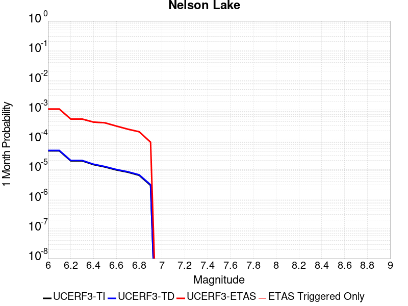 |  | 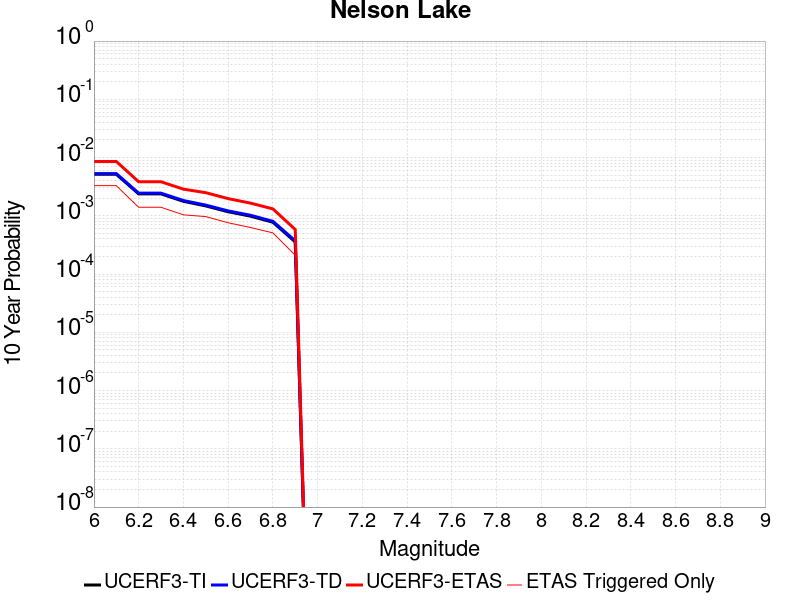 |

| Magnitude | 1 wk TI Prob | 1 wk TD Prob | 1 wk ETAS Prob | 1 wk ETAS/TD Gain | 1 wk ETAS Triggered Only | 1 mo TI Prob | 1 mo TD Prob | 1 mo ETAS Prob | 1 mo ETAS/TD Gain | 1 mo ETAS Triggered Only | 1 yr TI Prob | 1 yr TD Prob | 1 yr ETAS Prob | 1 yr ETAS/TD Gain | 1 yr ETAS Triggered Only | 10 yr TI Prob | 10 yr TD Prob | 10 yr ETAS Prob | 10 yr ETAS/TD Gain | 10 yr ETAS Triggered Only |
|-----|-----|-----|-----|-----|-----|-----|-----|-----|-----|-----|-----|-----|-----|-----|-----|-----|-----|-----|-----|-----|
| 6.0 | 9.913453E-6 | 1.0192255E-5 | 7.794152E-4 | 76.47131 | 7.6923077E-4 | 4.2485535E-5 | 4.3680422E-5 | 0.0012986864 | 29.731543 | 0.0012550608 | 5.1713863E-4 | 5.316897E-4 | 0.0029190837 | 5.4902015 | 0.002388664 | 0.0051593683 | 0.005305204 | 0.009050411 | 1.7059497 | 0.003765182 |
| 6.1 | 9.913453E-6 | 1.0192255E-5 | 7.794152E-4 | 76.47131 | 7.6923077E-4 | 4.2485535E-5 | 4.3680422E-5 | 0.0012986864 | 29.731543 | 0.0012550608 | 5.1713863E-4 | 5.316897E-4 | 0.0029190837 | 5.4902015 | 0.002388664 | 0.0051593683 | 0.005305204 | 0.009050411 | 1.7059497 | 0.003765182 |
| 6.2 | 4.5596407E-6 | 4.696313E-6 | 3.6906707E-4 | 78.586555 | 3.6437248E-4 | 1.954117E-5 | 2.0126909E-5 | 5.464321E-4 | 27.149332 | 5.2631577E-4 | 2.3788778E-4 | 2.4501883E-4 | 0.0010950129 | 4.469097 | 8.5020246E-4 | 0.0023763329 | 0.0024476128 | 0.003941922 | 1.610517 | 0.0014979757 |
| 6.3 | 4.5596407E-6 | 4.696313E-6 | 3.6906707E-4 | 78.586555 | 3.6437248E-4 | 1.954117E-5 | 2.0126909E-5 | 5.464321E-4 | 27.149332 | 5.2631577E-4 | 2.3788778E-4 | 2.4501883E-4 | 0.0010950129 | 4.469097 | 8.5020246E-4 | 0.0023763329 | 0.0024476128 | 0.003941922 | 1.610517 | 0.0014979757 |
| 6.4 | 3.4025713E-6 | 3.5098972E-6 | 2.8690972E-4 | 81.74305 | 2.8340082E-4 | 1.4582367E-5 | 1.5042335E-5 | 4.6037976E-4 | 30.605606 | 4.4534414E-4 | 1.7752586E-4 | 1.8312587E-4 | 9.5221575E-4 | 5.199788 | 7.6923077E-4 | 0.001773841 | 0.0018298327 | 0.0029613615 | 1.6183784 | 0.0011336033 |
| 6.5 | 2.8352947E-6 | 2.927856E-6 | 2.0535641E-4 | 70.13883 | 2.0242915E-4 | 1.2151207E-5 | 1.2547898E-5 | 3.769158E-4 | 30.03816 | 3.6437248E-4 | 1.479309E-4 | 1.5276071E-4 | 8.4091467E-4 | 5.504784 | 6.882591E-4 | 0.0014783246 | 0.0015266308 | 0.0025372314 | 1.661981 | 0.0010121458 |
| 6.6 | 2.251518E-6 | 2.3290677E-6 | 2.0475774E-4 | 87.91404 | 2.0242915E-4 | 9.649328E-6 | 9.981683E-6 | 3.7435052E-4 | 37.503746 | 3.6437248E-4 | 1.1747423E-4 | 1.2152085E-4 | 7.287345E-4 | 5.9967856 | 6.0728745E-4 | 0.0011741214 | 0.0012146058 | 0.0019829022 | 1.6325481 | 7.6923077E-4 |
| 6.7 | 1.8911853E-6 | 1.9591396E-6 | 2.0438789E-4 | 104.32533 | 2.0242915E-4 | 8.105055E-6 | 8.39629E-6 | 2.5130922E-4 | 29.930988 | 2.4291498E-4 | 9.867457E-5 | 1.0222061E-4 | 5.880009E-4 | 5.7522736 | 4.8582995E-4 | 9.863076E-4 | 0.0010217935 | 0.0015880159 | 1.5541457 | 5.6680164E-4 |
| 6.8 | 1.4874814E-6 | 1.5438305E-6 | 1.634869E-4 | 105.89693 | 1.6194332E-4 | 6.374905E-6 | 6.6164025E-6 | 1.6855865E-4 | 25.475876 | 1.6194332E-4 | 7.76117E-5 | 8.055224E-5 | 4.8537794E-4 | 6.025629 | 4.048583E-4 | 7.75846E-4 | 8.0528157E-4 | 0.0012907203 | 1.6028186 | 4.8582995E-4 |
| 6.9 | 6.835972E-7 | 7.1399285E-7 | 4.1199793E-5 | 57.703373 | 4.048583E-5 | 2.9296991E-6 | 3.0599674E-6 | 4.3545675E-5 | 14.230763 | 4.048583E-5 | 3.56685E-5 | 3.7254784E-5 | 1.9919207E-4 | 5.346751 | 1.6194332E-4 | 3.5662777E-4 | 3.7251666E-4 | 5.3439965E-4 | 1.4345658 | 1.6194332E-4 |

## So Sierra Nevada
*[(top)](#table-of-contents)*

| 1 Week | 1 Month | 1 Year | 10 Year |
|-----|-----|-----|-----|
|  | 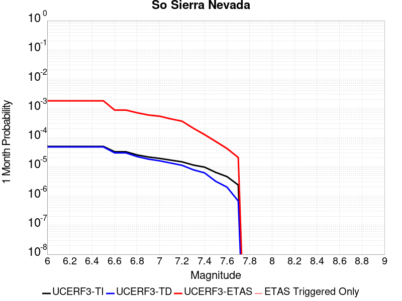 | 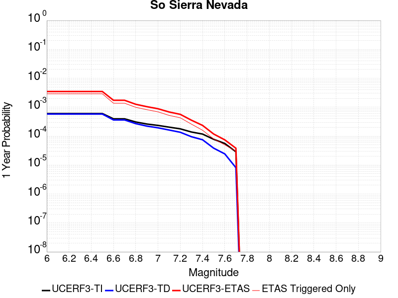 |  |

| Magnitude | 1 wk TI Prob | 1 wk TD Prob | 1 wk ETAS Prob | 1 wk ETAS/TD Gain | 1 wk ETAS Triggered Only | 1 mo TI Prob | 1 mo TD Prob | 1 mo ETAS Prob | 1 mo ETAS/TD Gain | 1 mo ETAS Triggered Only | 1 yr TI Prob | 1 yr TD Prob | 1 yr ETAS Prob | 1 yr ETAS/TD Gain | 1 yr ETAS Triggered Only | 10 yr TI Prob | 10 yr TD Prob | 10 yr ETAS Prob | 10 yr ETAS/TD Gain | 10 yr ETAS Triggered Only |
|-----|-----|-----|-----|-----|-----|-----|-----|-----|-----|-----|-----|-----|-----|-----|-----|-----|-----|-----|-----|-----|
| 6.0 | 1.15488665E-5 | 1.1079643E-5 | 0.0012256411 | 110.620995 | 0.0012145749 | 4.9494203E-5 | 4.748339E-5 | 0.0019502271 | 41.071774 | 0.001902834 | 6.024253E-4 | 5.7796965E-4 | 0.0037340391 | 6.4606147 | 0.0031578948 | 0.006007948 | 0.005765934 | 0.010032687 | 1.7399935 | 0.004291498 |
| 6.1 | 1.15488665E-5 | 1.1079643E-5 | 0.0012256411 | 110.620995 | 0.0012145749 | 4.9494203E-5 | 4.748339E-5 | 0.0019502271 | 41.071774 | 0.001902834 | 6.024253E-4 | 5.7796965E-4 | 0.0037340391 | 6.4606147 | 0.0031578948 | 0.006007948 | 0.005765934 | 0.010032687 | 1.7399935 | 0.004291498 |
| 6.2 | 1.15488665E-5 | 1.1079643E-5 | 0.0012256411 | 110.620995 | 0.0012145749 | 4.9494203E-5 | 4.748339E-5 | 0.0019502271 | 41.071774 | 0.001902834 | 6.024253E-4 | 5.7796965E-4 | 0.0037340391 | 6.4606147 | 0.0031578948 | 0.006007948 | 0.005765934 | 0.010032687 | 1.7399935 | 0.004291498 |
| 6.3 | 1.15488665E-5 | 1.1079643E-5 | 0.0012256411 | 110.620995 | 0.0012145749 | 4.9494203E-5 | 4.748339E-5 | 0.0019502271 | 41.071774 | 0.001902834 | 6.024253E-4 | 5.7796965E-4 | 0.0037340391 | 6.4606147 | 0.0031578948 | 0.006007948 | 0.005765934 | 0.010032687 | 1.7399935 | 0.004291498 |
| 6.4 | 1.15488665E-5 | 1.1079643E-5 | 0.0012256411 | 110.620995 | 0.0012145749 | 4.9494203E-5 | 4.748339E-5 | 0.0019502271 | 41.071774 | 0.001902834 | 6.024253E-4 | 5.7796965E-4 | 0.0037340391 | 6.4606147 | 0.0031578948 | 0.006007948 | 0.005765934 | 0.010032687 | 1.7399935 | 0.004291498 |
| 6.5 | 1.15488665E-5 | 1.1079643E-5 | 0.0012256411 | 110.620995 | 0.0012145749 | 4.9494203E-5 | 4.748339E-5 | 0.0019502271 | 41.071774 | 0.001902834 | 6.024253E-4 | 5.7796965E-4 | 0.0037340391 | 6.4606147 | 0.0031578948 | 0.006007948 | 0.005765934 | 0.010032687 | 1.7399935 | 0.004291498 |
| 6.6 | 7.587044E-6 | 6.935635E-6 | 6.547044E-4 | 94.39719 | 6.4777327E-4 | 3.2515498E-5 | 2.9723828E-5 | 8.79901E-4 | 29.602545 | 8.5020246E-4 | 3.9580427E-4 | 3.6183043E-4 | 0.0016569082 | 4.5792394 | 0.0012955465 | 0.003951 | 0.0036127048 | 0.0054279855 | 1.5024713 | 0.0018218623 |
| 6.7 | 7.587044E-6 | 6.935635E-6 | 6.547044E-4 | 94.39719 | 6.4777327E-4 | 3.2515498E-5 | 2.9723828E-5 | 8.79901E-4 | 29.602545 | 8.5020246E-4 | 3.9580427E-4 | 3.6183043E-4 | 0.0016569082 | 4.5792394 | 0.0012955465 | 0.003951 | 0.0036127048 | 0.0054279855 | 1.5024713 | 0.0018218623 |
| 6.8 | 5.9026956E-6 | 5.1793927E-6 | 4.910068E-4 | 94.80008 | 4.8582995E-4 | 2.5297022E-5 | 2.2197215E-5 | 6.699561E-4 | 30.18199 | 6.4777327E-4 | 3.0794772E-4 | 2.7021873E-4 | 0.0012011412 | 4.44507 | 9.311741E-4 | 0.0030752132 | 0.002699018 | 0.0039506913 | 1.4637514 | 0.0012550608 |
| 6.9 | 5.0118915E-6 | 4.2524252E-6 | 3.6862335E-4 | 86.68544 | 3.6437248E-4 | 2.1479358E-5 | 1.8224557E-5 | 5.040457E-4 | 27.6575 | 4.8582995E-4 | 2.614798E-4 | 2.2186211E-4 | 9.5044536E-4 | 4.283946 | 7.2874496E-4 | 0.0026117235 | 0.0022164788 | 0.003226381 | 1.4556336 | 0.0010121458 |
| 7.0 | 4.4924795E-6 | 3.7139177E-6 | 3.6808502E-4 | 99.109634 | 3.6437248E-4 | 1.925334E-5 | 1.5916696E-5 | 5.017389E-4 | 31.522806 | 4.8582995E-4 | 2.3438422E-4 | 1.9376918E-4 | 8.009389E-4 | 4.133469 | 6.0728745E-4 | 0.0023413717 | 0.0019360651 | 0.002825029 | 1.4591601 | 8.906883E-4 |
| 7.1 | 3.9118436E-6 | 3.1119775E-6 | 3.269976E-4 | 105.07711 | 3.2388663E-4 | 1.6764936E-5 | 1.3336982E-5 | 4.1818988E-4 | 31.355661 | 4.048583E-4 | 2.0409399E-4 | 1.6236622E-4 | 6.481173E-4 | 3.9917004 | 4.8582995E-4 | 0.0020390663 | 0.001622532 | 0.0023500945 | 1.4484118 | 7.2874496E-4 |
| 7.2 | 3.4200818E-6 | 2.6054543E-6 | 3.2649125E-4 | 125.31068 | 3.2388663E-4 | 1.4657411E-5 | 1.11661875E-5 | 3.7553458E-4 | 33.631405 | 3.6437248E-4 | 1.7843937E-4 | 1.3594035E-4 | 5.812239E-4 | 4.2755804 | 4.4534414E-4 | 0.0017829615 | 0.0013586218 | 0.001965084 | 1.4463806 | 6.0728745E-4 |
| 7.3 | 2.6593618E-6 | 1.8284203E-6 | 2.4474296E-4 | 133.85487 | 2.4291498E-4 | 1.13972155E-5 | 7.836065E-6 | 2.5074914E-4 | 31.99937 | 2.4291498E-4 | 1.3875226E-4 | 9.540021E-5 | 4.1925596E-4 | 4.3947067 | 3.2388663E-4 | 0.0013866565 | 9.5362146E-4 | 0.0013985409 | 1.4665577 | 4.4534414E-4 |
| 7.4 | 2.2577992E-6 | 1.436438E-6 | 1.2289375E-4 | 85.55451 | 1.2145749E-4 | 9.676246E-6 | 6.15615E-6 | 1.2761289E-4 | 20.729336 | 1.2145749E-4 | 1.1780193E-4 | 7.49488E-5 | 2.3687999E-4 | 3.1605573 | 1.6194332E-4 | 0.001177395 | 7.492603E-4 | 9.919932E-4 | 1.3239635 | 2.4291498E-4 |
| 7.5 | 1.489319E-6 | 7.353936E-7 | 8.1706996E-5 | 111.106476 | 8.097166E-5 | 6.3827797E-6 | 3.1516831E-6 | 8.412309E-5 | 26.69148 | 8.097166E-5 | 7.770758E-5 | 3.8371072E-5 | 1.598239E-4 | 4.165219 | 1.2145749E-4 | 7.7680405E-4 | 3.836449E-4 | 5.455261E-4 | 1.4219558 | 1.6194332E-4 |
| 7.6 | 1.0680322E-6 | 4.6596554E-7 | 4.6596554E-7 | 1.0 | 0.0 | 4.577273E-6 | 1.9969937E-6 | 1.9969937E-6 | 1.0 | 0.0 | 5.5726876E-5 | 2.4313129E-5 | 6.4797976E-5 | 2.6651433 | 4.048583E-5 | 5.5712904E-4 | 2.4310495E-4 | 3.2405692E-4 | 1.3329918 | 8.097166E-5 |
| 7.7 | 5.509146E-7 | 1.5580486E-7 | 1.5580486E-7 | 1.0 | 0.0 | 2.3610605E-6 | 6.677349E-7 | 6.677349E-7 | 1.0 | 0.0 | 2.8745531E-5 | 8.129644E-6 | 4.8615144E-5 | 5.9799848 | 4.048583E-5 | 2.8741814E-4 | 8.1293576E-5 | 1.2177612E-4 | 1.4979795 | 4.048583E-5 |

## San Andreas (Mojave N)
*[(top)](#table-of-contents)*

| 1 Week | 1 Month | 1 Year | 10 Year |
|-----|-----|-----|-----|
|  |  |  |  |

| Magnitude | 1 wk TI Prob | 1 wk TD Prob | 1 wk ETAS Prob | 1 wk ETAS/TD Gain | 1 wk ETAS Triggered Only | 1 mo TI Prob | 1 mo TD Prob | 1 mo ETAS Prob | 1 mo ETAS/TD Gain | 1 mo ETAS Triggered Only | 1 yr TI Prob | 1 yr TD Prob | 1 yr ETAS Prob | 1 yr ETAS/TD Gain | 1 yr ETAS Triggered Only | 10 yr TI Prob | 10 yr TD Prob | 10 yr ETAS Prob | 10 yr ETAS/TD Gain | 10 yr ETAS Triggered Only |
|-----|-----|-----|-----|-----|-----|-----|-----|-----|-----|-----|-----|-----|-----|-----|-----|-----|-----|-----|-----|-----|
| 6.0 | 9.877682E-5 | 1.9400702E-4 | 0.002015516 | 10.388882 | 0.0018218623 | 4.2326056E-4 | 8.311939E-4 | 0.0032178725 | 3.871386 | 0.002388664 | 0.0051410277 | 0.010072956 | 0.013439509 | 1.3342171 | 0.0034008098 | 0.05023708 | 0.09831428 | 0.10214735 | 1.038988 | 0.004251012 |
| 6.1 | 9.877682E-5 | 1.9400702E-4 | 0.002015516 | 10.388882 | 0.0018218623 | 4.2326056E-4 | 8.311939E-4 | 0.0032178725 | 3.871386 | 0.002388664 | 0.0051410277 | 0.010072956 | 0.013439509 | 1.3342171 | 0.0034008098 | 0.05023708 | 0.09831428 | 0.10214735 | 1.038988 | 0.004251012 |
| 6.2 | 9.877682E-5 | 1.9400702E-4 | 0.002015516 | 10.388882 | 0.0018218623 | 4.2326056E-4 | 8.311939E-4 | 0.0032178725 | 3.871386 | 0.002388664 | 0.0051410277 | 0.010072956 | 0.013439509 | 1.3342171 | 0.0034008098 | 0.05023708 | 0.09831428 | 0.10214735 | 1.038988 | 0.004251012 |
| 6.3 | 9.877682E-5 | 1.9400702E-4 | 0.002015516 | 10.388882 | 0.0018218623 | 4.2326056E-4 | 8.311939E-4 | 0.0032178725 | 3.871386 | 0.002388664 | 0.0051410277 | 0.010072956 | 0.013439509 | 1.3342171 | 0.0034008098 | 0.05023708 | 0.09831428 | 0.10214735 | 1.038988 | 0.004251012 |
| 6.4 | 9.877682E-5 | 1.9400702E-4 | 0.002015516 | 10.388882 | 0.0018218623 | 4.2326056E-4 | 8.311939E-4 | 0.0032178725 | 3.871386 | 0.002388664 | 0.0051410277 | 0.010072956 | 0.013439509 | 1.3342171 | 0.0034008098 | 0.05023708 | 0.09831428 | 0.10214735 | 1.038988 | 0.004251012 |
| 6.5 | 9.861474E-5 | 1.9374468E-4 | 0.0019747762 | 10.192673 | 0.0017813765 | 4.2256617E-4 | 8.300703E-4 | 0.0031762994 | 3.8265424 | 0.002348178 | 0.0051326132 | 0.010059402 | 0.013385924 | 1.3306878 | 0.0033603238 | 0.050156746 | 0.098192066 | 0.10198916 | 1.03867 | 0.004210526 |
| 6.6 | 9.861474E-5 | 1.9374468E-4 | 0.0019747762 | 10.192673 | 0.0017813765 | 4.2256617E-4 | 8.300703E-4 | 0.0031762994 | 3.8265424 | 0.002348178 | 0.0051326132 | 0.010059402 | 0.013385924 | 1.3306878 | 0.0033603238 | 0.050156746 | 0.098192066 | 0.10198916 | 1.03867 | 0.004210526 |
| 6.7 | 9.8552715E-5 | 1.9364421E-4 | 0.0019746758 | 10.197443 | 0.0017813765 | 4.223004E-4 | 8.2964E-4 | 0.00317587 | 3.8280096 | 0.002348178 | 0.0051293927 | 0.010054212 | 0.013380751 | 1.3308601 | 0.0033603238 | 0.050125998 | 0.098145254 | 0.10194254 | 1.0386904 | 0.004210526 |
| 6.8 | 9.8464974E-5 | 1.9349584E-4 | 0.0019745277 | 10.204496 | 0.0017813765 | 4.219245E-4 | 8.290045E-4 | 0.003175236 | 3.8301792 | 0.002348178 | 0.0051248376 | 0.010046546 | 0.013373111 | 1.3311152 | 0.0033603238 | 0.05008251 | 0.09807528 | 0.10187286 | 1.0387211 | 0.004210526 |
| 6.9 | 9.825824E-5 | 1.9317595E-4 | 0.0019742083 | 10.219743 | 0.0017813765 | 4.2103877E-4 | 8.276344E-4 | 0.003173869 | 3.8348684 | 0.002348178 | 0.0051141046 | 0.010030019 | 0.013356639 | 1.3316664 | 0.0033603238 | 0.049980022 | 0.09792438 | 0.101686075 | 1.0384142 | 0.0041700406 |
| 7.0 | 9.781462E-5 | 1.924896E-4 | 0.0019735233 | 10.252623 | 0.0017813765 | 4.1913814E-4 | 8.246948E-4 | 0.0031709364 | 3.8449817 | 0.002348178 | 0.005091073 | 0.009994558 | 0.013321297 | 1.332855 | 0.0033603238 | 0.04976007 | 0.09760077 | 0.101363815 | 1.0385555 | 0.0041700406 |
| 7.1 | 9.7121134E-5 | 1.9150671E-4 | 0.0019725421 | 10.300119 | 0.0017813765 | 4.1616702E-4 | 8.204851E-4 | 0.0031667366 | 3.8595905 | 0.002348178 | 0.005055068 | 0.009943774 | 0.013270684 | 1.3345721 | 0.0033603238 | 0.04941613 | 0.09713728 | 0.10090226 | 1.0387594 | 0.0041700406 |
| 7.2 | 9.663819E-5 | 1.9081456E-4 | 0.001971851 | 10.33386 | 0.0017813765 | 4.1409794E-4 | 8.175206E-4 | 0.0031637792 | 3.8699687 | 0.002348178 | 0.0050299936 | 0.00990801 | 0.01323504 | 1.335792 | 0.0033603238 | 0.049176537 | 0.09681055 | 0.100576885 | 1.0389042 | 0.0041700406 |
| 7.3 | 9.6277574E-5 | 1.9033969E-4 | 0.001930899 | 10.144489 | 0.0017408907 | 4.125529E-4 | 8.154867E-4 | 0.003121297 | 3.8275266 | 0.0023076923 | 0.0050112694 | 0.009883473 | 0.013170499 | 1.3325781 | 0.003319838 | 0.04899759 | 0.09658401 | 0.100314714 | 1.0386266 | 0.0041295546 |
| 7.4 | 9.593308E-5 | 1.897375E-4 | 0.0019302979 | 10.173518 | 0.0017408907 | 4.1107697E-4 | 8.129075E-4 | 0.0031187239 | 3.8365052 | 0.0023076923 | 0.0049933824 | 0.009852355 | 0.013139485 | 1.333639 | 0.003319838 | 0.04882661 | 0.09630218 | 0.10003406 | 1.0387516 | 0.0041295546 |
| 7.5 | 9.561707E-5 | 1.8919831E-4 | 0.0019297596 | 10.199666 | 0.0017408907 | 4.0972308E-4 | 8.1059814E-4 | 0.0031164198 | 3.8445928 | 0.0023076923 | 0.0049769743 | 0.009824493 | 0.013111715 | 1.3345946 | 0.003319838 | 0.048669744 | 0.09604836 | 0.09978128 | 1.038865 | 0.0041295546 |
| 7.6 | 9.418194E-5 | 1.8572104E-4 | 0.0019262884 | 10.371944 | 0.0017408907 | 4.0357444E-4 | 7.957047E-4 | 0.0031015608 | 3.8978791 | 0.0023076923 | 0.004902454 | 0.009644784 | 0.012932603 | 1.3408909 | 0.003319838 | 0.047957025 | 0.094430685 | 0.09817028 | 1.0396016 | 0.0041295546 |
| 7.7 | 8.202141E-5 | 1.6021315E-4 | 0.0016984282 | 10.601053 | 0.0015384615 | 3.51473E-4 | 6.8644714E-4 | 0.0027902653 | 4.064792 | 0.002105263 | 0.00427079 | 0.008325525 | 0.011336682 | 1.3616778 | 0.0030364373 | 0.04189639 | 0.08223219 | 0.08568776 | 1.042022 | 0.003765182 |
| 7.8 | 7.2859846E-5 | 1.4516473E-4 | 9.952438E-4 | 6.8559613 | 8.5020246E-4 | 3.1221908E-4 | 6.219862E-4 | 0.0018762663 | 3.0165722 | 0.0012550608 | 0.003794643 | 0.0075464295 | 0.009434904 | 1.2502474 | 0.001902834 | 0.037304975 | 0.07472468 | 0.07693485 | 1.0295775 | 0.002388664 |
| 7.9 | 5.3874453E-5 | 1.0045676E-4 | 5.052744E-4 | 5.02977 | 4.048583E-4 | 2.3087008E-4 | 4.3045796E-4 | 0.0011184209 | 2.5982115 | 6.882591E-4 | 0.0028072202 | 0.0052282433 | 0.006235097 | 1.1925797 | 0.0010121458 | 0.02772022 | 0.05242443 | 0.05365206 | 1.0234171 | 0.0012955465 |
| 8.0 | 3.468538E-5 | 5.4260272E-5 | 2.161948E-4 | 3.9844034 | 1.6194332E-4 | 1.4864317E-4 | 2.325233E-4 | 4.3490538E-4 | 1.8703734 | 2.0242915E-4 | 0.0018082283 | 0.002827298 | 0.0031906401 | 1.1285123 | 3.6437248E-4 | 0.017935853 | 0.028947512 | 0.029497905 | 1.0190135 | 5.6680164E-4 |
| 8.1 | 1.9152367E-5 | 1.940263E-5 | 1.00372716E-4 | 5.17315 | 8.097166E-5 | 8.207899E-5 | 8.3151484E-5 | 1.6411641E-4 | 1.973704 | 8.097166E-5 | 9.988535E-4 | 0.0010118998 | 0.0010927895 | 1.0799385 | 8.097166E-5 | 0.009943757 | 0.01085625 | 0.010976389 | 1.0110663 | 1.2145749E-4 |
| 8.2 | 8.643924E-6 | 5.4748625E-6 | 5.4748625E-6 | 1.0 | 0.0 | 3.704486E-5 | 2.3463486E-5 | 2.3463486E-5 | 1.0 | 0.0 | 4.5092785E-4 | 2.8563058E-4 | 2.8563058E-4 | 1.0 | 0.0 | 0.0045001395 | 0.0032487072 | 0.0032487072 | 1.0 | 0.0 |
| 8.3 | 1.983087E-6 | 7.6599065E-7 | 7.6599065E-7 | 1.0 | 0.0 | 8.498917E-6 | 3.282813E-6 | 3.282813E-6 | 1.0 | 0.0 | 1.034694E-4 | 3.9967534E-5 | 3.9967534E-5 | 1.0 | 0.0 | 0.0010342124 | 4.719687E-4 | 4.719687E-4 | 1.0 | 0.0 |

## Death Valley (So)
*[(top)](#table-of-contents)*

| 1 Week | 1 Month | 1 Year | 10 Year |
|-----|-----|-----|-----|
|  | 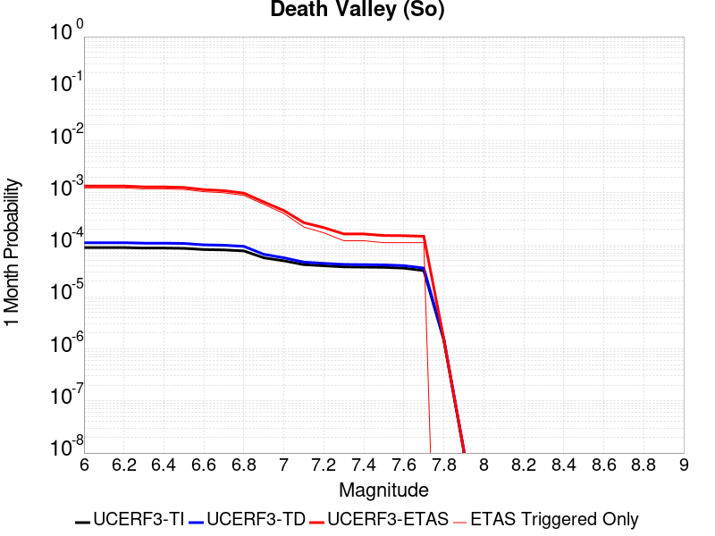 |  |  |

| Magnitude | 1 wk TI Prob | 1 wk TD Prob | 1 wk ETAS Prob | 1 wk ETAS/TD Gain | 1 wk ETAS Triggered Only | 1 mo TI Prob | 1 mo TD Prob | 1 mo ETAS Prob | 1 mo ETAS/TD Gain | 1 mo ETAS Triggered Only | 1 yr TI Prob | 1 yr TD Prob | 1 yr ETAS Prob | 1 yr ETAS/TD Gain | 1 yr ETAS Triggered Only | 10 yr TI Prob | 10 yr TD Prob | 10 yr ETAS Prob | 10 yr ETAS/TD Gain | 10 yr ETAS Triggered Only |
|-----|-----|-----|-----|-----|-----|-----|-----|-----|-----|-----|-----|-----|-----|-----|-----|-----|-----|-----|-----|-----|
| 6.0 | 2.0684236E-5 | 2.5617775E-5 | 7.138593E-4 | 27.865778 | 6.882591E-4 | 8.864371E-5 | 1.0978594E-4 | 0.0014456717 | 13.168095 | 0.0013360324 | 0.0010787029 | 0.0013358411 | 0.003923473 | 2.9370804 | 0.002591093 | 0.010734817 | 0.013281397 | 0.017156364 | 1.291759 | 0.0039271256 |
| 6.1 | 2.0684236E-5 | 2.5617775E-5 | 7.138593E-4 | 27.865778 | 6.882591E-4 | 8.864371E-5 | 1.0978594E-4 | 0.0014456717 | 13.168095 | 0.0013360324 | 0.0010787029 | 0.0013358411 | 0.003923473 | 2.9370804 | 0.002591093 | 0.010734817 | 0.013281397 | 0.017156364 | 1.291759 | 0.0039271256 |
| 6.2 | 2.0684236E-5 | 2.5617775E-5 | 7.138593E-4 | 27.865778 | 6.882591E-4 | 8.864371E-5 | 1.0978594E-4 | 0.0014456717 | 13.168095 | 0.0013360324 | 0.0010787029 | 0.0013358411 | 0.003923473 | 2.9370804 | 0.002591093 | 0.010734817 | 0.013281397 | 0.017156364 | 1.291759 | 0.0039271256 |
| 6.3 | 2.0240292E-5 | 2.511786E-5 | 7.133597E-4 | 28.400496 | 6.882591E-4 | 8.6741224E-5 | 1.07643624E-4 | 0.0014030507 | 13.03422 | 0.0012955465 | 0.0010555626 | 0.00130979 | 0.0037761908 | 2.8830507 | 0.0024696356 | 0.010505628 | 0.013023956 | 0.01678006 | 1.2883996 | 0.003805668 |
| 6.4 | 2.0240292E-5 | 2.511786E-5 | 7.133597E-4 | 28.400496 | 6.882591E-4 | 8.6741224E-5 | 1.07643624E-4 | 0.0014030507 | 13.03422 | 0.0012955465 | 0.0010555626 | 0.00130979 | 0.0037761908 | 2.8830507 | 0.0024696356 | 0.010505628 | 0.013023956 | 0.01678006 | 1.2883996 | 0.003805668 |
| 6.5 | 1.9962767E-5 | 2.4807114E-5 | 6.725643E-4 | 27.111752 | 6.4777327E-4 | 8.55519E-5 | 1.0631196E-4 | 0.0013612392 | 12.804196 | 0.0012550608 | 0.0010410968 | 0.0012935963 | 0.0036791703 | 2.844141 | 0.002388664 | 0.010362327 | 0.012863902 | 0.016540686 | 1.2858217 | 0.0037246963 |
| 6.6 | 1.8937297E-5 | 2.3310964E-5 | 5.900994E-4 | 25.314241 | 5.6680164E-4 | 8.115732E-5 | 9.990039E-5 | 0.0012333904 | 12.346202 | 0.0011336033 | 9.876423E-4 | 0.0012156231 | 0.003318327 | 2.7297335 | 0.002105263 | 0.009832645 | 0.012092789 | 0.015412477 | 1.274518 | 0.0033603238 |
| 6.7 | 1.8621096E-5 | 2.2911607E-5 | 5.8970024E-4 | 25.738058 | 5.6680164E-4 | 7.980225E-5 | 9.818898E-5 | 0.001231681 | 12.5439825 | 0.0011336033 | 9.711593E-4 | 0.0011948098 | 0.0032975576 | 2.7599018 | 0.002105263 | 0.009669261 | 0.011886904 | 0.015167279 | 1.2759655 | 0.003319838 |
| 6.8 | 1.7830353E-5 | 2.1805688E-5 | 5.0762505E-4 | 23.279478 | 4.8582995E-4 | 7.641356E-5 | 9.344968E-5 | 0.0010245368 | 10.963512 | 9.311741E-4 | 9.29938E-4 | 0.00113717 | 0.0030378401 | 2.6714036 | 0.001902834 | 0.009260561 | 0.011316354 | 0.014398485 | 1.2723608 | 0.0031174088 |
| 6.9 | 1.3135183E-5 | 1.5303925E-5 | 4.2015602E-4 | 27.454136 | 4.048583E-4 | 5.6292425E-5 | 6.558664E-5 | 7.538006E-4 | 11.493204 | 6.882591E-4 | 6.8514474E-4 | 7.982312E-4 | 0.0022141042 | 2.773763 | 0.001417004 | 0.006830362 | 0.007954649 | 0.010003001 | 1.2575039 | 0.0020647773 |
| 7.0 | 1.1507512E-5 | 1.3154199E-5 | 2.9655127E-4 | 22.54423 | 2.8340082E-4 | 4.9316975E-5 | 5.6373956E-5 | 5.826601E-4 | 10.335626 | 5.2631577E-4 | 6.002687E-4 | 6.8614254E-4 | 0.0016571358 | 2.415148 | 9.716599E-4 | 0.0059864987 | 0.0068409415 | 0.00832867 | 1.2174742 | 0.0014979757 |
| 7.1 | 9.715903E-6 | 1.0865278E-5 | 1.3232145E-4 | 12.178376 | 1.2145749E-4 | 4.1638916E-5 | 4.656467E-5 | 2.489844E-4 | 5.3470664 | 2.0242915E-4 | 5.068359E-4 | 5.667817E-4 | 0.0010118734 | 1.7852967 | 4.4534414E-4 | 0.0050568148 | 0.0056538144 | 0.0062979255 | 1.113925 | 6.4777327E-4 |
| 7.2 | 9.233269E-6 | 1.02863105E-5 | 1.3174255E-4 | 12.807561 | 1.2145749E-4 | 3.9570554E-5 | 4.4083466E-5 | 2.4650368E-4 | 5.591749 | 2.0242915E-4 | 4.81665E-4 | 5.3658825E-4 | 9.412293E-4 | 1.7540997 | 4.048583E-4 | 0.0048062233 | 0.0053533576 | 0.005876856 | 1.0977888 | 5.2631577E-4 |
| 7.3 | 8.8041315E-6 | 9.808164E-6 | 9.077903E-5 | 9.255456 | 8.097166E-5 | 3.7731446E-5 | 4.2034335E-5 | 2.0397085E-4 | 4.852482 | 1.6194332E-4 | 4.592835E-4 | 5.1165203E-4 | 8.3537295E-4 | 1.6326973 | 3.2388663E-4 | 0.0045833546 | 0.005105167 | 0.005548238 | 1.0867887 | 4.4534414E-4 |
| 7.4 | 8.708749E-6 | 9.707175E-6 | 9.067805E-5 | 9.341343 | 8.097166E-5 | 3.7322676E-5 | 4.160154E-5 | 2.0353812E-4 | 4.8925624 | 1.6194332E-4 | 4.5430884E-4 | 5.0638523E-4 | 7.896425E-4 | 1.5593712 | 2.8340082E-4 | 0.004533812 | 0.0050527398 | 0.005455552 | 1.0797217 | 4.048583E-4 |
| 7.5 | 8.612678E-6 | 9.604817E-6 | 5.0090257E-5 | 5.2151184 | 4.048583E-5 | 3.6910955E-5 | 4.1162875E-5 | 1.6261537E-4 | 3.9505346 | 1.2145749E-4 | 4.492982E-4 | 5.01047E-4 | 7.4384024E-4 | 1.4845718 | 2.4291498E-4 | 0.004483909 | 0.0049995985 | 0.0053621493 | 1.072516 | 3.6437248E-4 |
| 7.6 | 8.319024E-6 | 9.283916E-6 | 4.976937E-5 | 5.3608165 | 4.048583E-5 | 3.5652476E-5 | 3.978763E-5 | 1.6124028E-4 | 4.052523 | 1.2145749E-4 | 4.3398244E-4 | 4.8431093E-4 | 7.271083E-4 | 1.5013254 | 2.4291498E-4 | 0.0043313587 | 0.0048329784 | 0.0051553 | 1.0666921 | 3.2388663E-4 |
| 7.7 | 7.4718328E-6 | 8.34517E-6 | 4.883066E-5 | 5.8513684 | 4.048583E-5 | 3.2021748E-5 | 3.5764548E-5 | 1.572177E-4 | 4.395909 | 1.2145749E-4 | 3.8979502E-4 | 4.353504E-4 | 6.376914E-4 | 1.4647774 | 2.0242915E-4 | 0.00389112 | 0.0043453807 | 0.00458724 | 1.0556589 | 2.4291498E-4 |
| 7.8 | 3.4586725E-7 | 3.6482615E-7 | 3.6482615E-7 | 1.0 | 0.0 | 1.4822873E-6 | 1.5635396E-6 | 1.5635396E-6 | 1.0 | 0.0 | 1.80467E-5 | 1.9035933E-5 | 5.9520993E-5 | 3.1267703 | 4.048583E-5 | 1.8045233E-4 | 1.9034347E-4 | 2.3082159E-4 | 1.2126583 | 4.048583E-5 |
| 7.9 | 2.5591178E-9 | 2.6696718E-9 | 2.6696718E-9 | 1.0 | 0.0 | 1.0967647E-8 | 1.14414505E-8 | 1.14414505E-8 | 1.0 | 0.0 | 1.335311E-7 | 1.3929966E-7 | 1.3929966E-7 | 1.0 | 0.0 | 1.3353102E-6 | 1.3929966E-6 | 1.3929966E-6 | 1.0 | 0.0 |

## Bicycle Lake
*[(top)](#table-of-contents)*

| 1 Week | 1 Month | 1 Year | 10 Year |
|-----|-----|-----|-----|
|  |  |  |  |

| Magnitude | 1 wk TI Prob | 1 wk TD Prob | 1 wk ETAS Prob | 1 wk ETAS/TD Gain | 1 wk ETAS Triggered Only | 1 mo TI Prob | 1 mo TD Prob | 1 mo ETAS Prob | 1 mo ETAS/TD Gain | 1 mo ETAS Triggered Only | 1 yr TI Prob | 1 yr TD Prob | 1 yr ETAS Prob | 1 yr ETAS/TD Gain | 1 yr ETAS Triggered Only | 10 yr TI Prob | 10 yr TD Prob | 10 yr ETAS Prob | 10 yr ETAS/TD Gain | 10 yr ETAS Triggered Only |
|-----|-----|-----|-----|-----|-----|-----|-----|-----|-----|-----|-----|-----|-----|-----|-----|-----|-----|-----|-----|-----|
| 6.0 | 1.9621975E-5 | 2.2097078E-5 | 4.6743135E-4 | 21.153538 | 4.4534414E-4 | 8.4091465E-5 | 9.4699084E-5 | 7.42411E-4 | 7.839685 | 6.4777327E-4 | 0.0010233327 | 0.0011524865 | 0.0023656616 | 2.0526588 | 0.0012145749 | 0.01018633 | 0.011478408 | 0.013999739 | 1.2196585 | 0.0025506073 |
| 6.1 | 1.9621975E-5 | 2.2097078E-5 | 4.6743135E-4 | 21.153538 | 4.4534414E-4 | 8.4091465E-5 | 9.4699084E-5 | 7.42411E-4 | 7.839685 | 6.4777327E-4 | 0.0010233327 | 0.0011524865 | 0.0023656616 | 2.0526588 | 0.0012145749 | 0.01018633 | 0.011478408 | 0.013999739 | 1.2196585 | 0.0025506073 |
| 6.2 | 9.9971285E-6 | 1.1255639E-5 | 3.3513864E-4 | 29.775175 | 3.2388663E-4 | 4.2844134E-5 | 4.8237856E-5 | 4.5307662E-4 | 9.392553 | 4.048583E-4 | 5.2150246E-4 | 5.871896E-4 | 0.0013155066 | 2.2403438 | 7.2874496E-4 | 0.0052028033 | 0.005861487 | 0.007270185 | 1.2403313 | 0.001417004 |
| 6.3 | 9.589428E-6 | 1.0798346E-5 | 3.3468148E-4 | 30.993773 | 3.2388663E-4 | 4.10969E-5 | 4.62781E-5 | 4.5111767E-4 | 9.747973 | 4.048583E-4 | 5.002399E-4 | 5.6334207E-4 | 0.0012916764 | 2.2928813 | 7.2874496E-4 | 0.0049911533 | 0.0056242296 | 0.006993006 | 1.2433714 | 0.0013765182 |
| 6.4 | 9.589428E-6 | 1.0798346E-5 | 3.3468148E-4 | 30.993773 | 3.2388663E-4 | 4.10969E-5 | 4.62781E-5 | 4.5111767E-4 | 9.747973 | 4.048583E-4 | 5.002399E-4 | 5.6334207E-4 | 0.0012916764 | 2.2928813 | 7.2874496E-4 | 0.0049911533 | 0.0056242296 | 0.006993006 | 1.2433714 | 0.0013765182 |
| 6.5 | 5.557707E-6 | 6.2856016E-6 | 1.682279E-4 | 26.764011 | 1.6194332E-4 | 2.3818526E-5 | 2.6938165E-5 | 2.698466E-4 | 10.01726 | 2.4291498E-4 | 2.8995197E-4 | 3.2794967E-4 | 7.7314774E-4 | 2.3575194 | 4.4534414E-4 | 0.0028957394 | 0.0032772934 | 0.004205416 | 1.2831979 | 9.311741E-4 |
| 6.6 | 4.8742945E-6 | 5.5132896E-6 | 1.2697012E-4 | 23.029827 | 1.2145749E-4 | 2.0889667E-5 | 2.3628318E-5 | 1.8556781E-4 | 7.853619 | 1.6194332E-4 | 2.54302E-4 | 2.87663E-4 | 6.5193063E-4 | 2.2663 | 3.6437248E-4 | 0.002540112 | 0.0028754752 | 0.003723233 | 1.2948235 | 8.5020246E-4 |
| 6.7 | 3.991108E-6 | 4.5159104E-6 | 8.5487205E-5 | 18.930227 | 8.097166E-5 | 1.7104636E-5 | 1.9353902E-5 | 1.00323996E-4 | 5.1836576 | 8.097166E-5 | 2.0822904E-4 | 2.3563375E-4 | 5.189678E-4 | 2.202434 | 2.8340082E-4 | 0.0020803404 | 0.0023563374 | 0.002962194 | 1.2571179 | 6.0728745E-4 |

## Paradise
*[(top)](#table-of-contents)*

| 1 Week | 1 Month | 1 Year | 10 Year |
|-----|-----|-----|-----|
|  |  |  |  |

| Magnitude | 1 wk TI Prob | 1 wk TD Prob | 1 wk ETAS Prob | 1 wk ETAS/TD Gain | 1 wk ETAS Triggered Only | 1 mo TI Prob | 1 mo TD Prob | 1 mo ETAS Prob | 1 mo ETAS/TD Gain | 1 mo ETAS Triggered Only | 1 yr TI Prob | 1 yr TD Prob | 1 yr ETAS Prob | 1 yr ETAS/TD Gain | 1 yr ETAS Triggered Only | 10 yr TI Prob | 10 yr TD Prob | 10 yr ETAS Prob | 10 yr ETAS/TD Gain | 10 yr ETAS Triggered Only |
|-----|-----|-----|-----|-----|-----|-----|-----|-----|-----|-----|-----|-----|-----|-----|-----|-----|-----|-----|-----|-----|
| 6.0 | 1.4851273E-5 | 1.6694692E-5 | 4.620314E-4 | 27.675348 | 4.4534414E-4 | 6.364676E-5 | 7.154685E-5 | 8.812055E-4 | 12.316483 | 8.097166E-4 | 7.7462377E-4 | 8.707584E-4 | 0.0022056275 | 2.532996 | 0.0013360324 | 0.0077192914 | 0.008675844 | 0.010802977 | 1.2451788 | 0.002145749 |
| 6.1 | 1.4851273E-5 | 1.6694692E-5 | 4.620314E-4 | 27.675348 | 4.4534414E-4 | 6.364676E-5 | 7.154685E-5 | 8.812055E-4 | 12.316483 | 8.097166E-4 | 7.7462377E-4 | 8.707584E-4 | 0.0022056275 | 2.532996 | 0.0013360324 | 0.0077192914 | 0.008675844 | 0.010802977 | 1.2451788 | 0.002145749 |
| 6.2 | 1.4851273E-5 | 1.6694692E-5 | 4.620314E-4 | 27.675348 | 4.4534414E-4 | 6.364676E-5 | 7.154685E-5 | 8.812055E-4 | 12.316483 | 8.097166E-4 | 7.7462377E-4 | 8.707584E-4 | 0.0022056275 | 2.532996 | 0.0013360324 | 0.0077192914 | 0.008675844 | 0.010802977 | 1.2451788 | 0.002145749 |
| 6.3 | 1.0426831E-5 | 1.188862E-5 | 2.1431537E-4 | 18.026934 | 2.0242915E-4 | 4.4685654E-5 | 5.0950268E-5 | 3.3433663E-4 | 6.5620193 | 2.8340082E-4 | 5.43912E-4 | 6.201489E-4 | 0.001186599 | 1.9134098 | 5.6680164E-4 | 0.0054258266 | 0.0061847917 | 0.007230913 | 1.1691442 | 0.0010526315 |
| 6.4 | 1.0426831E-5 | 1.188862E-5 | 2.1431537E-4 | 18.026934 | 2.0242915E-4 | 4.4685654E-5 | 5.0950268E-5 | 3.3433663E-4 | 6.5620193 | 2.8340082E-4 | 5.43912E-4 | 6.201489E-4 | 0.001186599 | 1.9134098 | 5.6680164E-4 | 0.0054258266 | 0.0061847917 | 0.007230913 | 1.1691442 | 0.0010526315 |
| 6.5 | 9.25027E-6 | 1.06199595E-5 | 9.159076E-5 | 8.624398 | 8.097166E-5 | 3.964341E-5 | 4.551335E-5 | 2.074493E-4 | 4.557988 | 1.6194332E-4 | 4.8255164E-4 | 5.53989E-4 | 8.776962E-4 | 1.5843207 | 3.2388663E-4 | 0.0048150513 | 0.0055265795 | 0.0060902485 | 1.1019924 | 5.6680164E-4 |
| 6.6 | 7.904275E-6 | 9.159525E-6 | 9.0130445E-5 | 9.840078 | 8.097166E-5 | 3.3875025E-5 | 3.9254537E-5 | 1.6070726E-4 | 4.093979 | 1.2145749E-4 | 4.1235037E-4 | 4.7782314E-4 | 7.610885E-4 | 1.5928248 | 2.8340082E-4 | 0.0041158604 | 0.0047683544 | 0.005171282 | 1.0845004 | 4.048583E-4 |
| 6.7 | 7.2061953E-6 | 8.407248E-6 | 8.937823E-5 | 10.631091 | 8.097166E-5 | 3.088333E-5 | 3.6030586E-5 | 1.5748371E-4 | 4.3708334 | 1.2145749E-4 | 3.7593965E-4 | 4.3858777E-4 | 7.218643E-4 | 1.6458833 | 2.8340082E-4 | 0.003753043 | 0.004377591 | 0.004780677 | 1.0920794 | 4.048583E-4 |
| 6.8 | 6.6948724E-6 | 7.842166E-6 | 8.881319E-5 | 11.325085 | 8.097166E-5 | 2.8691995E-5 | 3.360887E-5 | 1.5506228E-4 | 4.613731 | 1.2145749E-4 | 3.4926904E-4 | 4.0911473E-4 | 6.5193034E-4 | 1.5935147 | 2.4291498E-4 | 0.003487206 | 0.0040839734 | 0.0044468576 | 1.0888557 | 3.6437248E-4 |
| 6.9 | 6.0421025E-6 | 7.130621E-6 | 8.8101704E-5 | 12.355404 | 8.097166E-5 | 2.5894467E-5 | 3.0559466E-5 | 1.1152865E-4 | 3.6495616 | 8.097166E-5 | 3.1521954E-4 | 3.7200135E-4 | 4.9341365E-4 | 1.326376 | 1.2145749E-4 | 0.0031477278 | 0.0037141247 | 0.0038754665 | 1.0434401 | 1.6194332E-4 |
| 7.0 | 4.134091E-6 | 5.0803087E-6 | 4.5565932E-5 | 8.969127 | 4.048583E-5 | 1.7717413E-5 | 2.177258E-5 | 6.2257524E-5 | 2.8594465 | 4.048583E-5 | 2.1568815E-4 | 2.6505045E-4 | 3.0552555E-4 | 1.1527071 | 4.048583E-5 | 0.0021547892 | 0.0026474963 | 0.002687875 | 1.0152516 | 4.048583E-5 |
| 7.1 | 3.7674888E-6 | 4.6318696E-6 | 4.511751E-5 | 9.74067 | 4.048583E-5 | 1.6146281E-5 | 1.9850726E-5 | 6.033575E-5 | 3.0394733 | 4.048583E-5 | 1.9656324E-4 | 2.4165731E-4 | 2.8213335E-4 | 1.1674936 | 4.048583E-5 | 0.0019638946 | 0.002414096 | 0.002454484 | 1.0167301 | 4.048583E-5 |
| 7.2 | 3.4065345E-6 | 4.156723E-6 | 4.4642384E-5 | 10.739802 | 4.048583E-5 | 1.4599351E-5 | 1.7814415E-5 | 5.8299524E-5 | 3.272604 | 4.048583E-5 | 1.777326E-4 | 2.1687041E-4 | 2.5734745E-4 | 1.1866417 | 4.048583E-5 | 0.0017759053 | 0.002166736 | 0.002207134 | 1.0186447 | 4.048583E-5 |
| 7.3 | 2.9934936E-6 | 3.6293168E-6 | 4.4115E-5 | 12.15518 | 4.048583E-5 | 1.2829195E-5 | 1.555413E-5 | 5.603933E-5 | 3.6028585 | 4.048583E-5 | 1.5618425E-4 | 1.8935655E-4 | 2.2983472E-4 | 1.2137669 | 4.048583E-5 | 0.0015607453 | 0.0018920974 | 0.0019325067 | 1.0213568 | 4.048583E-5 |
| 7.4 | 2.4049796E-6 | 2.8889842E-6 | 4.3374697E-5 | 15.0138235 | 4.048583E-5 | 1.0307015E-5 | 1.238131E-5 | 5.286664E-5 | 4.2698746 | 4.048583E-5 | 1.2548068E-4 | 1.5073347E-4 | 1.9121318E-4 | 1.2685517 | 4.048583E-5 | 0.0012540985 | 0.0015064536 | 0.0015468785 | 1.0268345 | 4.048583E-5 |
| 7.5 | 1.2710091E-6 | 1.5134682E-6 | 4.1999236E-5 | 27.750326 | 4.048583E-5 | 5.44717E-6 | 6.4862834E-6 | 4.697185E-5 | 7.2417207 | 4.048583E-5 | 6.631728E-5 | 7.8968886E-5 | 1.1945152E-4 | 1.5126402 | 4.048583E-5 | 6.6297496E-4 | 7.8953087E-4 | 8.299847E-4 | 1.0512378 | 4.048583E-5 |
| 7.6 | 2.21172E-7 | 2.603961E-7 | 4.0746214E-5 | 156.47784 | 4.048583E-5 | 9.478797E-7 | 1.1159829E-6 | 4.160177E-5 | 37.27814 | 4.048583E-5 | 1.1540374E-5 | 1.3587036E-5 | 5.4072316E-5 | 3.9796994 | 4.048583E-5 | 1.1539775E-4 | 1.3586486E-4 | 1.7634519E-4 | 1.2979455 | 4.048583E-5 |

## Towne Pass
*[(top)](#table-of-contents)*

| 1 Week | 1 Month | 1 Year | 10 Year |
|-----|-----|-----|-----|
|  |  |  |  |

| Magnitude | 1 wk TI Prob | 1 wk TD Prob | 1 wk ETAS Prob | 1 wk ETAS/TD Gain | 1 wk ETAS Triggered Only | 1 mo TI Prob | 1 mo TD Prob | 1 mo ETAS Prob | 1 mo ETAS/TD Gain | 1 mo ETAS Triggered Only | 1 yr TI Prob | 1 yr TD Prob | 1 yr ETAS Prob | 1 yr ETAS/TD Gain | 1 yr ETAS Triggered Only | 10 yr TI Prob | 10 yr TD Prob | 10 yr ETAS Prob | 10 yr ETAS/TD Gain | 10 yr ETAS Triggered Only |
|-----|-----|-----|-----|-----|-----|-----|-----|-----|-----|-----|-----|-----|-----|-----|-----|-----|-----|-----|-----|-----|
| 6.0 | 3.849728E-6 | 3.8945414E-6 | 4.0875125E-4 | 104.95492 | 4.048583E-4 | 1.649873E-5 | 1.669081E-5 | 7.859087E-4 | 47.086315 | 7.6923077E-4 | 2.0085352E-4 | 2.0319603E-4 | 0.0016603897 | 8.17137 | 0.0014574899 | 0.0020067208 | 0.0020305314 | 0.0041315197 | 2.0346987 | 0.002105263 |
| 6.1 | 3.849728E-6 | 3.8945414E-6 | 4.0875125E-4 | 104.95492 | 4.048583E-4 | 1.649873E-5 | 1.669081E-5 | 7.859087E-4 | 47.086315 | 7.6923077E-4 | 2.0085352E-4 | 2.0319603E-4 | 0.0016603897 | 8.17137 | 0.0014574899 | 0.0020067208 | 0.0020305314 | 0.0041315197 | 2.0346987 | 0.002105263 |
| 6.2 | 3.849728E-6 | 3.8945414E-6 | 4.0875125E-4 | 104.95492 | 4.048583E-4 | 1.649873E-5 | 1.669081E-5 | 7.859087E-4 | 47.086315 | 7.6923077E-4 | 2.0085352E-4 | 2.0319603E-4 | 0.0016603897 | 8.17137 | 0.0014574899 | 0.0020067208 | 0.0020305314 | 0.0041315197 | 2.0346987 | 0.002105263 |
| 6.3 | 3.849728E-6 | 3.8945414E-6 | 4.0875125E-4 | 104.95492 | 4.048583E-4 | 1.649873E-5 | 1.669081E-5 | 7.859087E-4 | 47.086315 | 7.6923077E-4 | 2.0085352E-4 | 2.0319603E-4 | 0.0016603897 | 8.17137 | 0.0014574899 | 0.0020067208 | 0.0020305314 | 0.0041315197 | 2.0346987 | 0.002105263 |
| 6.4 | 3.849728E-6 | 3.8945414E-6 | 4.0875125E-4 | 104.95492 | 4.048583E-4 | 1.649873E-5 | 1.669081E-5 | 7.859087E-4 | 47.086315 | 7.6923077E-4 | 2.0085352E-4 | 2.0319603E-4 | 0.0016603897 | 8.17137 | 0.0014574899 | 0.0020067208 | 0.0020305314 | 0.0041315197 | 2.0346987 | 0.002105263 |
| 6.5 | 1.1953545E-6 | 1.203052E-6 | 8.2174614E-5 | 68.30512 | 8.097166E-5 | 5.1229376E-6 | 5.1559277E-6 | 1.266128E-4 | 24.556744 | 1.2145749E-4 | 6.236998E-5 | 6.277173E-5 | 3.4615476E-4 | 5.5145006 | 2.8340082E-4 | 6.235248E-4 | 6.275517E-4 | 9.512351E-4 | 1.5157876 | 3.2388663E-4 |
| 6.6 | 1.1953545E-6 | 1.203052E-6 | 8.2174614E-5 | 68.30512 | 8.097166E-5 | 5.1229376E-6 | 5.1559277E-6 | 1.266128E-4 | 24.556744 | 1.2145749E-4 | 6.236998E-5 | 6.277173E-5 | 3.4615476E-4 | 5.5145006 | 2.8340082E-4 | 6.235248E-4 | 6.275517E-4 | 9.512351E-4 | 1.5157876 | 3.2388663E-4 |
| 6.7 | 8.375951E-7 | 8.4106705E-7 | 4.1326864E-5 | 49.13623 | 4.048583E-5 | 3.5896885E-6 | 3.6045683E-6 | 8.4575935E-5 | 23.463541 | 8.097166E-5 | 4.370358E-5 | 4.3884793E-5 | 2.4630505E-4 | 5.612538 | 2.0242915E-4 | 4.3694986E-4 | 4.38767E-4 | 6.411073E-4 | 1.4611567 | 2.0242915E-4 |
| 6.8 | 6.38041E-7 | 6.392156E-7 | 4.112502E-5 | 64.33669 | 4.048583E-5 | 2.7344586E-6 | 2.7394929E-6 | 8.371093E-5 | 30.557089 | 8.097166E-5 | 3.3291526E-5 | 3.3352855E-5 | 2.3577525E-4 | 7.0691175 | 2.0242915E-4 | 3.3286537E-4 | 3.334823E-4 | 5.3584395E-4 | 1.6068138 | 2.0242915E-4 |
| 6.9 | 5.3460053E-7 | 5.345333E-7 | 5.345333E-7 | 1.0 | 0.0 | 2.2911431E-6 | 2.2908553E-6 | 4.277659E-5 | 18.672762 | 4.048583E-5 | 2.789431E-5 | 2.789084E-5 | 1.4934494E-4 | 5.3546233 | 1.2145749E-4 | 2.789081E-4 | 2.7887672E-4 | 4.003003E-4 | 1.4354025 | 1.2145749E-4 |
| 7.0 | 3.557783E-7 | 3.5324226E-7 | 3.5324226E-7 | 1.0 | 0.0 | 1.5247632E-6 | 1.5138945E-6 | 1.5138945E-6 | 1.0 | 0.0 | 1.8563835E-5 | 1.843152E-5 | 1.843152E-5 | 1.0 | 0.0 | 1.8562283E-4 | 1.8430075E-4 | 1.8430075E-4 | 1.0 | 0.0 |
| 7.1 | 3.037942E-7 | 3.0002218E-7 | 3.0002218E-7 | 1.0 | 0.0 | 1.3019744E-6 | 1.2858087E-6 | 1.2858087E-6 | 1.0 | 0.0 | 1.5851423E-5 | 1.5654618E-5 | 1.5654618E-5 | 1.0 | 0.0 | 1.5850292E-4 | 1.5653588E-4 | 1.5653588E-4 | 1.0 | 0.0 |
| 7.2 | 2.0808248E-7 | 2.0217689E-7 | 2.0217689E-7 | 1.0 | 0.0 | 8.917818E-7 | 8.6647213E-7 | 8.6647213E-7 | 1.0 | 0.0 | 1.0857389E-5 | 1.0549252E-5 | 1.0549252E-5 | 1.0 | 0.0 | 1.0856859E-4 | 1.0548797E-4 | 1.0548797E-4 | 1.0 | 0.0 |
| 7.3 | 1.1162073E-7 | 1.0636894E-7 | 1.0636894E-7 | 1.0 | 0.0 | 4.7837443E-7 | 4.558668E-7 | 4.558668E-7 | 1.0 | 0.0 | 5.8241935E-6 | 5.550166E-6 | 5.550166E-6 | 1.0 | 0.0 | 5.8240406E-5 | 5.5500474E-5 | 5.5500474E-5 | 1.0 | 0.0 |

## San Andreas (San Bernardino N)
*[(top)](#table-of-contents)*

| 1 Week | 1 Month | 1 Year | 10 Year |
|-----|-----|-----|-----|
|  |  | 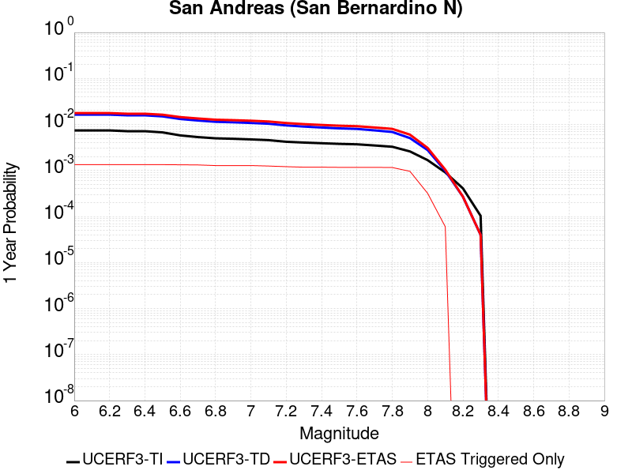 |  |

| Magnitude | 1 wk TI Prob | 1 wk TD Prob | 1 wk ETAS Prob | 1 wk ETAS/TD Gain | 1 wk ETAS Triggered Only | 1 mo TI Prob | 1 mo TD Prob | 1 mo ETAS Prob | 1 mo ETAS/TD Gain | 1 mo ETAS Triggered Only | 1 yr TI Prob | 1 yr TD Prob | 1 yr ETAS Prob | 1 yr ETAS/TD Gain | 1 yr ETAS Triggered Only | 10 yr TI Prob | 10 yr TD Prob | 10 yr ETAS Prob | 10 yr ETAS/TD Gain | 10 yr ETAS Triggered Only |
|-----|-----|-----|-----|-----|-----|-----|-----|-----|-----|-----|-----|-----|-----|-----|-----|-----|-----|-----|-----|-----|
| 6.0 | 1.4273766E-4 | 3.1606483E-4 | 9.2316035E-4 | 2.9207942 | 6.0728745E-4 | 6.115894E-4 | 0.0013538664 | 0.0024455038 | 1.8063111 | 0.0010931174 | 0.0074207084 | 0.016360244 | 0.017833712 | 1.0900639 | 0.0014979757 | 0.07177748 | 0.15026689 | 0.15184939 | 1.0105313 | 0.0018623482 |
| 6.1 | 1.4273766E-4 | 3.1606483E-4 | 9.2316035E-4 | 2.9207942 | 6.0728745E-4 | 6.115894E-4 | 0.0013538664 | 0.0024455038 | 1.8063111 | 0.0010931174 | 0.0074207084 | 0.016360244 | 0.017833712 | 1.0900639 | 0.0014979757 | 0.07177748 | 0.15026689 | 0.15184939 | 1.0105313 | 0.0018623482 |
| 6.2 | 1.4273766E-4 | 3.1606483E-4 | 9.2316035E-4 | 2.9207942 | 6.0728745E-4 | 6.115894E-4 | 0.0013538664 | 0.0024455038 | 1.8063111 | 0.0010931174 | 0.0074207084 | 0.016360244 | 0.017833712 | 1.0900639 | 0.0014979757 | 0.07177748 | 0.15026689 | 0.15184939 | 1.0105313 | 0.0018623482 |
| 6.3 | 1.3730655E-4 | 3.0511338E-4 | 9.1221556E-4 | 2.9897592 | 6.0728745E-4 | 5.883239E-4 | 0.0013069791 | 0.0023986679 | 1.8352764 | 0.0010931174 | 0.0071393442 | 0.015797773 | 0.017272083 | 1.093324 | 0.0014979757 | 0.06914291 | 0.14556676 | 0.14715801 | 1.0109314 | 0.0018623482 |
| 6.4 | 1.3730655E-4 | 3.0511338E-4 | 9.1221556E-4 | 2.9897592 | 6.0728745E-4 | 5.883239E-4 | 0.0013069791 | 0.0023986679 | 1.8352764 | 0.0010931174 | 0.0071393442 | 0.015797773 | 0.017272083 | 1.093324 | 0.0014979757 | 0.06914291 | 0.14556676 | 0.14715801 | 1.0109314 | 0.0018623482 |
| 6.5 | 1.2942807E-4 | 2.8925808E-4 | 8.9636986E-4 | 3.0988586 | 6.0728745E-4 | 5.545738E-4 | 0.0012390936 | 0.0023308566 | 1.881098 | 0.0010931174 | 0.0067310524 | 0.01498286 | 0.016458392 | 1.0984813 | 0.0014979757 | 0.06530788 | 0.13870941 | 0.14031345 | 1.0115639 | 0.0018623482 |
| 6.6 | 1.1125901E-4 | 2.536472E-4 | 8.20305E-4 | 3.2340395 | 5.6680164E-4 | 4.767372E-4 | 0.0010866089 | 0.0021380966 | 1.9676783 | 0.0010526315 | 0.005788839 | 0.013149847 | 0.014588172 | 1.1093795 | 0.0014574899 | 0.056403454 | 0.122999296 | 0.124597065 | 1.0129901 | 0.0018218623 |
| 6.7 | 1.02209575E-4 | 2.3499702E-4 | 8.016654E-4 | 3.4113855 | 5.6680164E-4 | 4.3796748E-4 | 0.0010067427 | 0.0020583146 | 2.044529 | 0.0010526315 | 0.0053192247 | 0.012188629 | 0.013628354 | 1.1181203 | 0.0014574899 | 0.051936906 | 0.114790924 | 0.116403654 | 1.0140493 | 0.0018218623 |
| 6.8 | 9.610582E-5 | 2.2025521E-4 | 7.86932E-4 | 3.572819 | 5.6680164E-4 | 4.1181705E-4 | 9.436101E-4 | 0.0019548007 | 2.0716193 | 0.0010121458 | 0.0050023515 | 0.011428202 | 0.012829011 | 1.1225748 | 0.001417004 | 0.048912346 | 0.1081929 | 0.10978155 | 1.0146835 | 0.0017813765 |
| 6.9 | 9.3877505E-5 | 2.1481077E-4 | 7.8149064E-4 | 3.638042 | 5.6680164E-4 | 4.0227012E-4 | 9.2029345E-4 | 0.0019315077 | 2.0987954 | 0.0010121458 | 0.0048866454 | 0.011147255 | 0.012548463 | 1.1256999 | 0.001417004 | 0.04780577 | 0.10578323 | 0.107376166 | 1.0150585 | 0.0017813765 |
| 7.0 | 9.1019785E-5 | 2.0808022E-4 | 7.7476393E-4 | 3.7233903 | 5.6680164E-4 | 3.900265E-4 | 8.914682E-4 | 0.0019027117 | 2.1343572 | 0.0010121458 | 0.0047382377 | 0.010799837 | 0.012201537 | 1.1297891 | 0.001417004 | 0.046384744 | 0.102753714 | 0.10435205 | 1.015555 | 0.0017813765 |
| 7.1 | 8.771155E-5 | 1.9982594E-4 | 7.2603655E-4 | 3.633345 | 5.2631577E-4 | 3.758525E-4 | 8.5611636E-4 | 0.0017864932 | 2.0867412 | 9.311741E-4 | 0.0045664064 | 0.0103736 | 0.011695772 | 1.1274556 | 0.0013360324 | 0.044737056 | 0.09906527 | 0.10059722 | 1.0154641 | 0.0017004049 |
| 7.2 | 8.0830236E-5 | 1.8388197E-4 | 7.10101E-4 | 3.8617215 | 5.2631577E-4 | 3.4636928E-4 | 7.8782777E-4 | 0.0017182683 | 2.1810203 | 9.311741E-4 | 0.0042088944 | 0.009549725 | 0.010872998 | 1.1385667 | 0.0013360324 | 0.041300658 | 0.09179615 | 0.093340464 | 1.0168233 | 0.0017004049 |
| 7.3 | 7.7668235E-5 | 1.7331762E-4 | 6.995422E-4 | 4.036186 | 5.2631577E-4 | 3.328214E-4 | 7.425784E-4 | 0.001673061 | 2.253043 | 9.311741E-4 | 0.0040445733 | 0.009003494 | 0.0103274975 | 1.1470544 | 0.0013360324 | 0.03971748 | 0.08706327 | 0.088615626 | 1.0178303 | 0.0017004049 |
| 7.4 | 7.520177E-5 | 1.6551897E-4 | 6.9174764E-4 | 4.179265 | 5.2631577E-4 | 3.2225347E-4 | 7.0917426E-4 | 0.001639688 | 2.3121088 | 9.311741E-4 | 0.0039163795 | 0.008600081 | 0.009924624 | 1.1540151 | 0.0013360324 | 0.038480744 | 0.08351955 | 0.085077934 | 1.018659 | 0.0017004049 |
| 7.5 | 7.274697E-5 | 1.5839566E-4 | 6.846281E-4 | 4.3222656 | 5.2631577E-4 | 3.1173544E-4 | 6.78662E-4 | 0.0016092041 | 2.3711424 | 9.311741E-4 | 0.003788775 | 0.008231463 | 0.009556497 | 1.160972 | 0.0013360324 | 0.03724827 | 0.08023631 | 0.08180028 | 1.019492 | 0.0017004049 |
| 7.6 | 7.1185845E-5 | 1.540943E-4 | 6.80329E-4 | 4.415017 | 5.2631577E-4 | 3.0504653E-4 | 6.6023704E-4 | 0.0015907964 | 2.4094322 | 9.311741E-4 | 0.0037076178 | 0.008008812 | 0.009334143 | 1.1654843 | 0.0013360324 | 0.036463667 | 0.07822598 | 0.079793364 | 1.0200367 | 0.0017004049 |
| 7.7 | 6.709961E-5 | 1.4318313E-4 | 6.6942355E-4 | 4.6752963 | 5.2631577E-4 | 2.8753807E-4 | 6.1349774E-4 | 0.0015441006 | 2.5168808 | 9.311741E-4 | 0.003495157 | 0.0074437927 | 0.00876988 | 1.1781467 | 0.0013360324 | 0.034406938 | 0.07305469 | 0.07463088 | 1.0215753 | 0.0017004049 |
| 7.8 | 6.300812E-5 | 1.3202413E-4 | 6.5827044E-4 | 4.9859858 | 5.2631577E-4 | 2.7000686E-4 | 5.65695E-4 | 0.0014963424 | 2.6451397 | 9.311741E-4 | 0.0032823787 | 0.006865616 | 0.008152268 | 1.1874051 | 0.0012955465 | 0.032343175 | 0.06771354 | 0.06926106 | 1.022854 | 0.001659919 |
| 7.9 | 4.983037E-5 | 9.723488E-5 | 5.020538E-4 | 5.16331 | 4.048583E-4 | 2.1354125E-4 | 4.1665437E-4 | 0.0011046267 | 2.6511824 | 6.882591E-4 | 0.0025967648 | 0.0050609782 | 0.0060680015 | 1.198978 | 0.0010121458 | 0.025666296 | 0.05064886 | 0.051878788 | 1.0242834 | 0.0012955465 |
| 8.0 | 3.2211527E-5 | 5.3304586E-5 | 2.1523927E-4 | 4.037913 | 1.6194332E-4 | 1.380421E-4 | 2.2842824E-4 | 4.3081114E-4 | 1.8859802 | 2.0242915E-4 | 0.0016793669 | 0.0027775685 | 0.0031409292 | 1.1308196 | 3.6437248E-4 | 0.016667323 | 0.028361378 | 0.028912105 | 1.0194181 | 5.6680164E-4 |
| 8.1 | 1.743376E-5 | 1.8824427E-5 | 9.979456E-5 | 5.3013334 | 8.097166E-5 | 7.471398E-5 | 8.067362E-5 | 1.6163875E-4 | 2.0036135 | 8.097166E-5 | 9.0926304E-4 | 9.817594E-4 | 0.0010626515 | 1.0823951 | 8.097166E-5 | 0.009055517 | 0.010484105 | 0.010604289 | 1.0114634 | 1.2145749E-4 |
| 8.2 | 7.831616E-6 | 5.1551065E-6 | 5.1551065E-6 | 1.0 | 0.0 | 3.3563636E-5 | 2.2093127E-5 | 2.2093127E-5 | 1.0 | 0.0 | 4.0856065E-4 | 2.6895068E-4 | 2.6895068E-4 | 1.0 | 0.0 | 0.004078103 | 0.0030418145 | 0.0030418145 | 1.0 | 0.0 |
| 8.3 | 1.983087E-6 | 7.6599065E-7 | 7.6599065E-7 | 1.0 | 0.0 | 8.498917E-6 | 3.282813E-6 | 3.282813E-6 | 1.0 | 0.0 | 1.034694E-4 | 3.9967534E-5 | 3.9967534E-5 | 1.0 | 0.0 | 0.0010342124 | 4.719687E-4 | 4.719687E-4 | 1.0 | 0.0 |

## Garlic Springs
*[(top)](#table-of-contents)*

| 1 Week | 1 Month | 1 Year | 10 Year |
|-----|-----|-----|-----|
|  | 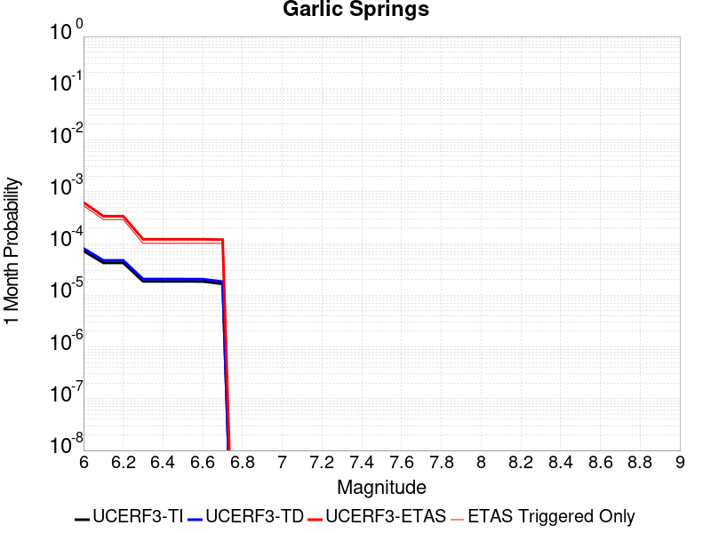 |  |  |

| Magnitude | 1 wk TI Prob | 1 wk TD Prob | 1 wk ETAS Prob | 1 wk ETAS/TD Gain | 1 wk ETAS Triggered Only | 1 mo TI Prob | 1 mo TD Prob | 1 mo ETAS Prob | 1 mo ETAS/TD Gain | 1 mo ETAS Triggered Only | 1 yr TI Prob | 1 yr TD Prob | 1 yr ETAS Prob | 1 yr ETAS/TD Gain | 1 yr ETAS Triggered Only | 10 yr TI Prob | 10 yr TD Prob | 10 yr ETAS Prob | 10 yr ETAS/TD Gain | 10 yr ETAS Triggered Only |
|-----|-----|-----|-----|-----|-----|-----|-----|-----|-----|-----|-----|-----|-----|-----|-----|-----|-----|-----|-----|-----|
| 6.0 | 1.6760017E-5 | 1.8776833E-5 | 3.0217232E-4 | 16.092827 | 2.8340082E-4 | 7.182667E-5 | 8.0470316E-5 | 5.257786E-4 | 6.5338206 | 4.4534414E-4 | 8.7413884E-4 | 9.794032E-4 | 0.0019501115 | 1.9911222 | 9.716599E-4 | 0.008707083 | 0.009762413 | 0.011526398 | 1.1806916 | 0.0017813765 |
| 6.1 | 9.852767E-6 | 1.09735865E-5 | 1.7291513E-4 | 15.757394 | 1.6194332E-4 | 4.222546E-5 | 4.702921E-5 | 2.4944884E-4 | 5.304126 | 2.0242915E-4 | 5.139737E-4 | 5.7250116E-4 | 0.001179441 | 2.0601547 | 6.0728745E-4 | 0.005127866 | 0.005717221 | 0.0068845977 | 1.204186 | 0.001174089 |
| 6.2 | 9.852767E-6 | 1.09735865E-5 | 1.7291513E-4 | 15.757394 | 1.6194332E-4 | 4.222546E-5 | 4.702921E-5 | 2.4944884E-4 | 5.304126 | 2.0242915E-4 | 5.139737E-4 | 5.7250116E-4 | 0.001179441 | 2.0601547 | 6.0728745E-4 | 0.005127866 | 0.005717221 | 0.0068845977 | 1.204186 | 0.001174089 |
| 6.3 | 4.3167724E-6 | 4.7780286E-6 | 8.57493E-5 | 17.946587 | 8.097166E-5 | 1.8500323E-5 | 2.0477235E-5 | 1.4193224E-4 | 6.931221 | 1.2145749E-4 | 2.2521814E-4 | 2.4930484E-4 | 4.921593E-4 | 1.9741263 | 2.4291498E-4 | 0.0022499003 | 0.00249251 | 0.0029367441 | 1.1782277 | 4.4534414E-4 |
| 6.4 | 4.3167724E-6 | 4.7780286E-6 | 8.57493E-5 | 17.946587 | 8.097166E-5 | 1.8500323E-5 | 2.0477235E-5 | 1.4193224E-4 | 6.931221 | 1.2145749E-4 | 2.2521814E-4 | 2.4930484E-4 | 4.921593E-4 | 1.9741263 | 2.4291498E-4 | 0.0022499003 | 0.00249251 | 0.0029367441 | 1.1782277 | 4.4534414E-4 |
| 6.5 | 4.3167724E-6 | 4.7780286E-6 | 8.57493E-5 | 17.946587 | 8.097166E-5 | 1.8500323E-5 | 2.0477235E-5 | 1.4193224E-4 | 6.931221 | 1.2145749E-4 | 2.2521814E-4 | 2.4930484E-4 | 4.921593E-4 | 1.9741263 | 2.4291498E-4 | 0.0022499003 | 0.00249251 | 0.0029367441 | 1.1782277 | 4.4534414E-4 |
| 6.6 | 4.301311E-6 | 4.760897E-6 | 8.573217E-5 | 18.007566 | 8.097166E-5 | 1.8434059E-5 | 2.0403815E-5 | 1.4185882E-4 | 6.952564 | 1.2145749E-4 | 2.2441156E-4 | 2.4841115E-4 | 4.912658E-4 | 1.9776318 | 2.4291498E-4 | 0.0022418506 | 0.002483593 | 0.0029278311 | 1.1788691 | 4.4534414E-4 |
| 6.7 | 3.8599724E-6 | 4.27106E-6 | 8.524238E-5 | 19.958132 | 8.097166E-5 | 1.6542634E-5 | 1.8304541E-5 | 1.3975981E-4 | 7.635253 | 1.2145749E-4 | 2.0138794E-4 | 2.228578E-4 | 4.2524183E-4 | 1.9081308 | 2.0242915E-4 | 0.0020120554 | 0.002228578 | 0.0026325341 | 1.1812618 | 4.048583E-4 |

## Helendale-So Lockhart
*[(top)](#table-of-contents)*

| 1 Week | 1 Month | 1 Year | 10 Year |
|-----|-----|-----|-----|
|  | 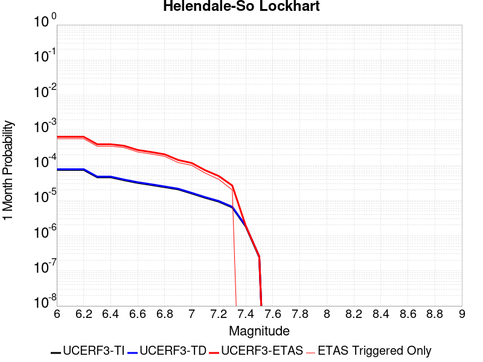 |  |  |

| Magnitude | 1 wk TI Prob | 1 wk TD Prob | 1 wk ETAS Prob | 1 wk ETAS/TD Gain | 1 wk ETAS Triggered Only | 1 mo TI Prob | 1 mo TD Prob | 1 mo ETAS Prob | 1 mo ETAS/TD Gain | 1 mo ETAS Triggered Only | 1 yr TI Prob | 1 yr TD Prob | 1 yr ETAS Prob | 1 yr ETAS/TD Gain | 1 yr ETAS Triggered Only | 10 yr TI Prob | 10 yr TD Prob | 10 yr ETAS Prob | 10 yr ETAS/TD Gain | 10 yr ETAS Triggered Only |
|-----|-----|-----|-----|-----|-----|-----|-----|-----|-----|-----|-----|-----|-----|-----|-----|-----|-----|-----|-----|-----|
| 6.0 | 1.7296055E-5 | 1.8103729E-5 | 5.4440997E-4 | 30.071705 | 5.2631577E-4 | 7.412385E-5 | 7.7585224E-5 | 7.6579093E-4 | 9.870319 | 6.882591E-4 | 9.0208417E-4 | 9.4421144E-4 | 0.0024003251 | 2.5421479 | 0.0014574899 | 0.008984311 | 0.009404116 | 0.011048425 | 1.1748499 | 0.001659919 |
| 6.1 | 1.7296055E-5 | 1.8103729E-5 | 5.4440997E-4 | 30.071705 | 5.2631577E-4 | 7.412385E-5 | 7.7585224E-5 | 7.6579093E-4 | 9.870319 | 6.882591E-4 | 9.0208417E-4 | 9.4421144E-4 | 0.0024003251 | 2.5421479 | 0.0014574899 | 0.008984311 | 0.009404116 | 0.011048425 | 1.1748499 | 0.001659919 |
| 6.2 | 1.7296055E-5 | 1.8103729E-5 | 5.4440997E-4 | 30.071705 | 5.2631577E-4 | 7.412385E-5 | 7.7585224E-5 | 7.6579093E-4 | 9.870319 | 6.882591E-4 | 9.0208417E-4 | 9.4421144E-4 | 0.0024003251 | 2.5421479 | 0.0014574899 | 0.008984311 | 0.009404116 | 0.011048425 | 1.1748499 | 0.001659919 |
| 6.3 | 1.0669118E-5 | 1.1135425E-5 | 3.3501847E-4 | 30.085827 | 3.2388663E-4 | 4.5723988E-5 | 4.772239E-5 | 4.5256136E-4 | 9.483209 | 4.048583E-4 | 5.5654737E-4 | 5.80868E-4 | 0.0015519635 | 2.6718006 | 9.716599E-4 | 0.0055515557 | 0.0057937936 | 0.0068805777 | 1.1875772 | 0.0010931174 |
| 6.4 | 1.0669118E-5 | 1.1135425E-5 | 3.3501847E-4 | 30.085827 | 3.2388663E-4 | 4.5723988E-5 | 4.772239E-5 | 4.5256136E-4 | 9.483209 | 4.048583E-4 | 5.5654737E-4 | 5.80868E-4 | 0.0015519635 | 2.6718006 | 9.716599E-4 | 0.0055515557 | 0.0057937936 | 0.0068805777 | 1.1875772 | 0.0010931174 |
| 6.5 | 8.790038E-6 | 9.170197E-6 | 3.3305387E-4 | 36.31916 | 3.2388663E-4 | 3.767105E-5 | 3.930026E-5 | 4.036584E-4 | 10.271138 | 3.6437248E-4 | 4.585485E-4 | 4.7837716E-4 | 0.00124724 | 2.6072314 | 7.6923077E-4 | 0.0045760344 | 0.004773638 | 0.0056600748 | 1.1856941 | 8.906883E-4 |
| 6.6 | 7.396949E-6 | 7.715537E-6 | 2.5062865E-4 | 32.48363 | 2.4291498E-4 | 3.1700827E-5 | 3.3066175E-5 | 2.759731E-4 | 8.346086 | 2.4291498E-4 | 3.858892E-4 | 4.025073E-4 | 0.0010500199 | 2.6086977 | 6.4777327E-4 | 0.003852198 | 0.00401789 | 0.00478403 | 1.1906822 | 7.6923077E-4 |
| 6.7 | 6.4600285E-6 | 6.738031E-6 | 2.4965138E-4 | 37.051086 | 2.4291498E-4 | 2.7685543E-5 | 2.887696E-5 | 2.7178493E-4 | 9.411826 | 2.4291498E-4 | 3.3701936E-4 | 3.5152107E-4 | 9.990666E-4 | 2.8421245 | 6.4777327E-4 | 0.0033650869 | 0.003509732 | 0.004276263 | 1.2184016 | 7.6923077E-4 |
| 6.8 | 5.600104E-6 | 5.836009E-6 | 2.0826398E-4 | 35.686024 | 2.0242915E-4 | 2.4000226E-5 | 2.5011232E-5 | 2.2743532E-4 | 9.0933275 | 2.0242915E-4 | 2.9216358E-4 | 3.044698E-4 | 8.7109883E-4 | 2.8610353 | 5.6680164E-4 | 0.0029177975 | 0.003040588 | 0.0037267546 | 1.225669 | 6.882591E-4 |
| 6.9 | 4.839122E-6 | 5.0395092E-6 | 1.6698202E-4 | 33.13458 | 1.6194332E-4 | 2.0738931E-5 | 2.159772E-5 | 1.8353754E-4 | 8.498005 | 1.6194332E-4 | 2.5246723E-4 | 2.6292098E-4 | 6.6767284E-4 | 2.539443 | 4.048583E-4 | 0.002521806 | 0.002626147 | 0.0031510803 | 1.1998874 | 5.2631577E-4 |
| 7.0 | 3.6937633E-6 | 3.845208E-6 | 1.657879E-4 | 43.11546 | 1.6194332E-4 | 1.5830317E-5 | 1.647936E-5 | 1.7842001E-4 | 10.826878 | 1.6194332E-4 | 1.9271708E-4 | 2.0061806E-4 | 4.83962E-4 | 2.4123552 | 2.8340082E-4 | 0.0019255003 | 0.002004401 | 0.0024084477 | 1.2015798 | 4.048583E-4 |
| 7.1 | 2.7858857E-6 | 2.8978538E-6 | 8.386928E-5 | 28.94186 | 8.097166E-5 | 1.1939455E-5 | 1.2419316E-5 | 9.338997E-5 | 7.519736 | 8.097166E-5 | 1.4535317E-4 | 1.511949E-4 | 3.1311373E-4 | 2.0709279 | 1.6194332E-4 | 0.0014525814 | 0.0015109418 | 0.0017534897 | 1.1605277 | 2.4291498E-4 |
| 7.2 | 2.1672065E-6 | 2.2540128E-6 | 2.2540128E-6 | 1.0 | 0.0 | 9.2879945E-6 | 9.66002E-6 | 9.66002E-6 | 1.0 | 0.0 | 1.1307546E-4 | 1.1760458E-4 | 1.5808565E-4 | 1.3442134 | 4.048583E-5 | 0.0011301794 | 0.0011754417 | 0.0012967563 | 1.1032078 | 1.2145749E-4 |
| 7.3 | 1.4823496E-6 | 1.5422102E-6 | 1.5422102E-6 | 1.0 | 0.0 | 6.3529114E-6 | 6.6094562E-6 | 6.6094562E-6 | 1.0 | 0.0 | 7.734395E-5 | 8.046731E-5 | 1.2094989E-4 | 1.5030934 | 4.048583E-5 | 7.731704E-4 | 8.0439687E-4 | 9.257567E-4 | 1.1508706 | 1.2145749E-4 |
| 7.4 | 4.2321457E-7 | 4.4108765E-7 | 4.4108765E-7 | 1.0 | 0.0 | 1.8137755E-6 | 1.8903745E-6 | 1.8903745E-6 | 1.0 | 0.0 | 2.2082493E-5 | 2.3015113E-5 | 6.350001E-5 | 2.759057 | 4.048583E-5 | 2.2080299E-4 | 2.3013182E-4 | 2.7060835E-4 | 1.175884 | 4.048583E-5 |
| 7.5 | 5.6942316E-8 | 5.9415648E-8 | 5.9415648E-8 | 1.0 | 0.0 | 2.440385E-7 | 2.5463845E-7 | 2.5463845E-7 | 1.0 | 0.0 | 2.9711643E-6 | 3.1002196E-6 | 3.1002196E-6 | 1.0 | 0.0 | 2.9711247E-5 | 3.1001844E-5 | 3.1001844E-5 | 1.0 | 0.0 |

## Coyote Lake
*[(top)](#table-of-contents)*

| 1 Week | 1 Month | 1 Year | 10 Year |
|-----|-----|-----|-----|
| 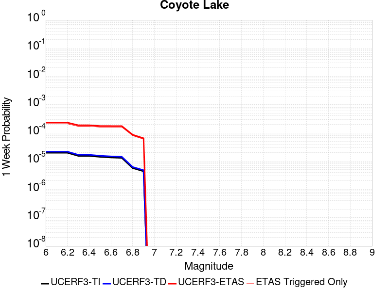 |  |  |  |

| Magnitude | 1 wk TI Prob | 1 wk TD Prob | 1 wk ETAS Prob | 1 wk ETAS/TD Gain | 1 wk ETAS Triggered Only | 1 mo TI Prob | 1 mo TD Prob | 1 mo ETAS Prob | 1 mo ETAS/TD Gain | 1 mo ETAS Triggered Only | 1 yr TI Prob | 1 yr TD Prob | 1 yr ETAS Prob | 1 yr ETAS/TD Gain | 1 yr ETAS Triggered Only | 10 yr TI Prob | 10 yr TD Prob | 10 yr ETAS Prob | 10 yr ETAS/TD Gain | 10 yr ETAS Triggered Only |
|-----|-----|-----|-----|-----|-----|-----|-----|-----|-----|-----|-----|-----|-----|-----|-----|-----|-----|-----|-----|-----|
| 6.0 | 1.980352E-5 | 2.1706745E-5 | 3.051014E-4 | 14.055604 | 2.8340082E-4 | 8.486947E-5 | 9.302599E-5 | 4.5736457E-4 | 4.9165244 | 3.6437248E-4 | 0.0010327959 | 0.0011320751 | 0.0017791151 | 1.5715522 | 6.4777327E-4 | 0.010280091 | 0.011270258 | 0.012391086 | 1.09945 | 0.0011336033 |
| 6.1 | 1.980352E-5 | 2.1706745E-5 | 3.051014E-4 | 14.055604 | 2.8340082E-4 | 8.486947E-5 | 9.302599E-5 | 4.5736457E-4 | 4.9165244 | 3.6437248E-4 | 0.0010327959 | 0.0011320751 | 0.0017791151 | 1.5715522 | 6.4777327E-4 | 0.010280091 | 0.011270258 | 0.012391086 | 1.09945 | 0.0011336033 |
| 6.2 | 1.980352E-5 | 2.1706745E-5 | 3.051014E-4 | 14.055604 | 2.8340082E-4 | 8.486947E-5 | 9.302599E-5 | 4.5736457E-4 | 4.9165244 | 3.6437248E-4 | 0.0010327959 | 0.0011320751 | 0.0017791151 | 1.5715522 | 6.4777327E-4 | 0.010280091 | 0.011270258 | 0.012391086 | 1.09945 | 0.0011336033 |
| 6.3 | 1.5344787E-5 | 1.682067E-5 | 2.5973158E-4 | 15.441215 | 2.4291498E-4 | 6.576172E-5 | 7.2086936E-5 | 3.5546732E-4 | 4.9310923 | 2.8340082E-4 | 8.003548E-4 | 8.773662E-4 | 0.0014436706 | 1.6454594 | 5.6680164E-4 | 0.007974784 | 0.00874507 | 0.009748364 | 1.1147269 | 0.0010121458 |
| 6.4 | 1.5344787E-5 | 1.682067E-5 | 2.5973158E-4 | 15.441215 | 2.4291498E-4 | 6.576172E-5 | 7.2086936E-5 | 3.5546732E-4 | 4.9310923 | 2.8340082E-4 | 8.003548E-4 | 8.773662E-4 | 0.0014436706 | 1.6454594 | 5.6680164E-4 | 0.007974784 | 0.00874507 | 0.009748364 | 1.1147269 | 0.0010121458 |
| 6.5 | 1.4189697E-5 | 1.5557987E-5 | 2.584692E-4 | 16.61328 | 2.4291498E-4 | 6.081157E-5 | 6.6675726E-5 | 3.5005764E-4 | 5.250151 | 2.8340082E-4 | 7.401293E-4 | 8.115349E-4 | 0.0013778765 | 1.6978648 | 5.6680164E-4 | 0.0073766913 | 0.008091656 | 0.009015296 | 1.1141472 | 9.311741E-4 |
| 6.6 | 1.3469301E-5 | 1.4771577E-5 | 2.5768296E-4 | 17.444513 | 2.4291498E-4 | 5.7724297E-5 | 6.330556E-5 | 3.4668844E-4 | 5.4764295 | 2.8340082E-4 | 7.025667E-4 | 7.7053264E-4 | 0.0012964429 | 1.6825281 | 5.2631577E-4 | 0.0070034964 | 0.0076845144 | 0.008568358 | 1.1150162 | 8.906883E-4 |
| 6.7 | 1.3027966E-5 | 1.4281745E-5 | 2.5719326E-4 | 18.008532 | 2.4291498E-4 | 5.5832945E-5 | 6.120638E-5 | 3.4458985E-4 | 5.6299663 | 2.8340082E-4 | 6.7955407E-4 | 7.4499263E-4 | 0.0012304607 | 1.6516414 | 4.8582995E-4 | 0.006774798 | 0.0074308286 | 0.0082747135 | 1.1135653 | 8.5020246E-4 |
| 6.8 | 5.695434E-6 | 6.2244176E-6 | 1.2768115E-4 | 20.512947 | 1.2145749E-4 | 2.4408775E-5 | 2.6675973E-5 | 1.4813022E-4 | 5.5529456 | 1.2145749E-4 | 2.971363E-4 | 3.2476155E-4 | 5.2712497E-4 | 1.6231139 | 2.0242915E-4 | 0.0029673933 | 0.0032458105 | 0.0035282914 | 1.0870295 | 2.8340082E-4 |
| 6.9 | 4.385688E-6 | 4.7930553E-6 | 1.2624996E-4 | 26.340185 | 1.2145749E-4 | 1.879567E-5 | 2.0541665E-5 | 1.4199666E-4 | 6.9126167 | 1.2145749E-4 | 2.2881327E-4 | 2.5009477E-4 | 3.715219E-4 | 1.4855244 | 1.2145749E-4 | 0.002285778 | 0.0025009478 | 0.0026624862 | 1.0645908 | 1.6194332E-4 |

## Death Valley (Black Mtns Frontal)
*[(top)](#table-of-contents)*

| 1 Week | 1 Month | 1 Year | 10 Year |
|-----|-----|-----|-----|
| 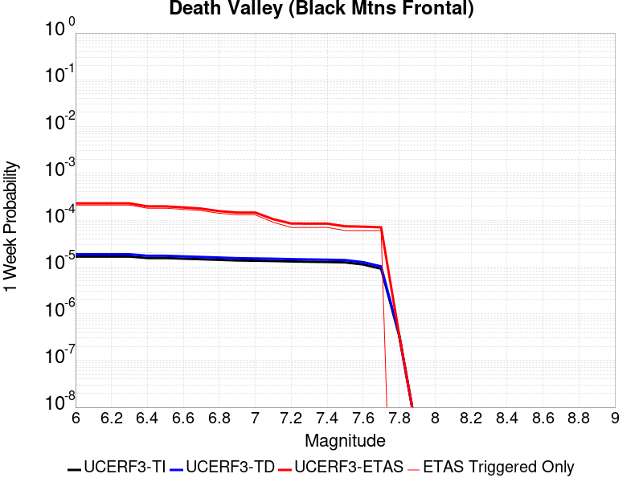 | 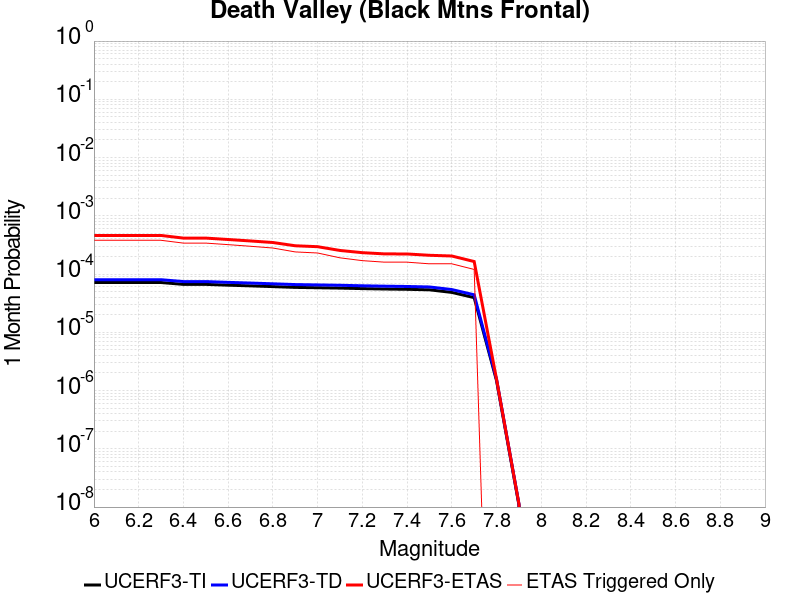 |  |  |

| Magnitude | 1 wk TI Prob | 1 wk TD Prob | 1 wk ETAS Prob | 1 wk ETAS/TD Gain | 1 wk ETAS Triggered Only | 1 mo TI Prob | 1 mo TD Prob | 1 mo ETAS Prob | 1 mo ETAS/TD Gain | 1 mo ETAS Triggered Only | 1 yr TI Prob | 1 yr TD Prob | 1 yr ETAS Prob | 1 yr ETAS/TD Gain | 1 yr ETAS Triggered Only | 10 yr TI Prob | 10 yr TD Prob | 10 yr ETAS Prob | 10 yr ETAS/TD Gain | 10 yr ETAS Triggered Only |
|-----|-----|-----|-----|-----|-----|-----|-----|-----|-----|-----|-----|-----|-----|-----|-----|-----|-----|-----|-----|-----|
| 6.0 | 1.6707214E-5 | 1.867027E-5 | 2.6158072E-4 | 14.010549 | 2.4291498E-4 | 7.160038E-5 | 8.001302E-5 | 4.4435635E-4 | 5.5535502 | 3.6437248E-4 | 8.71386E-4 | 9.737309E-4 | 0.0016613198 | 1.7061386 | 6.882591E-4 | 0.00867977 | 0.009695496 | 0.010737923 | 1.1075165 | 0.0010526315 |
| 6.1 | 1.6707214E-5 | 1.867027E-5 | 2.6158072E-4 | 14.010549 | 2.4291498E-4 | 7.160038E-5 | 8.001302E-5 | 4.4435635E-4 | 5.5535502 | 3.6437248E-4 | 8.71386E-4 | 9.737309E-4 | 0.0016613198 | 1.7061386 | 6.882591E-4 | 0.00867977 | 0.009695496 | 0.010737923 | 1.1075165 | 0.0010526315 |
| 6.2 | 1.6707214E-5 | 1.867027E-5 | 2.6158072E-4 | 14.010549 | 2.4291498E-4 | 7.160038E-5 | 8.001302E-5 | 4.4435635E-4 | 5.5535502 | 3.6437248E-4 | 8.71386E-4 | 9.737309E-4 | 0.0016613198 | 1.7061386 | 6.882591E-4 | 0.00867977 | 0.009695496 | 0.010737923 | 1.1075165 | 0.0010526315 |
| 6.3 | 1.6707214E-5 | 1.867027E-5 | 2.6158072E-4 | 14.010549 | 2.4291498E-4 | 7.160038E-5 | 8.001302E-5 | 4.4435635E-4 | 5.5535502 | 3.6437248E-4 | 8.71386E-4 | 9.737309E-4 | 0.0016613198 | 1.7061386 | 6.882591E-4 | 0.00867977 | 0.009695496 | 0.010737923 | 1.1075165 | 0.0010526315 |
| 6.4 | 1.5515609E-5 | 1.7338214E-5 | 2.6024898E-4 | 15.0101385 | 2.4291498E-4 | 6.649377E-5 | 7.4304546E-5 | 4.3864993E-4 | 5.9034066 | 3.6437248E-4 | 8.0926094E-4 | 9.042885E-4 | 0.0015919253 | 1.7604175 | 6.882591E-4 | 0.008063202 | 0.009006773 | 0.0099696815 | 1.1069094 | 9.716599E-4 |
| 6.5 | 1.5515609E-5 | 1.7338214E-5 | 2.6024898E-4 | 15.0101385 | 2.4291498E-4 | 6.649377E-5 | 7.4304546E-5 | 4.3864993E-4 | 5.9034066 | 3.6437248E-4 | 8.0926094E-4 | 9.042885E-4 | 0.0015919253 | 1.7604175 | 6.882591E-4 | 0.008063202 | 0.009006773 | 0.0099696815 | 1.1069094 | 9.716599E-4 |
| 6.6 | 1.5041828E-5 | 1.6809145E-5 | 2.1923489E-4 | 13.042597 | 2.0242915E-4 | 6.4463384E-5 | 7.203723E-5 | 3.9590054E-4 | 5.4957767 | 3.2388663E-4 | 7.8455906E-4 | 8.767063E-4 | 0.0015239117 | 1.7382237 | 6.4777327E-4 | 0.00781795 | 0.008733132 | 0.009656174 | 1.1056943 | 9.311741E-4 |
| 6.7 | 1.4634985E-5 | 1.6356016E-5 | 2.1878186E-4 | 13.376231 | 2.0242915E-4 | 6.271985E-5 | 7.009536E-5 | 3.939593E-4 | 5.620333 | 3.2388663E-4 | 7.6334673E-4 | 8.5308263E-4 | 0.001459852 | 1.7112669 | 6.0728745E-4 | 0.007607299 | 0.008498715 | 0.009381834 | 1.103912 | 8.906883E-4 |
| 6.8 | 1.4209158E-5 | 1.5882048E-5 | 2.1830798E-4 | 13.745582 | 2.0242915E-4 | 6.089497E-5 | 6.8064175E-5 | 3.9192877E-4 | 5.758224 | 3.2388663E-4 | 7.4114406E-4 | 8.2837185E-4 | 0.001394704 | 1.683669 | 5.6680164E-4 | 0.007386771 | 0.008253456 | 0.009096642 | 1.1021615 | 8.5020246E-4 |
| 6.9 | 1.3780098E-5 | 1.5404594E-5 | 1.7734541E-4 | 11.512503 | 1.6194332E-4 | 5.9056227E-5 | 6.6018045E-5 | 3.4940016E-4 | 5.292495 | 2.8340082E-4 | 7.1877235E-4 | 8.0347876E-4 | 0.0013293717 | 1.65452 | 5.2631577E-4 | 0.0071645193 | 0.008006332 | 0.0088095665 | 1.1003247 | 8.097166E-4 |
| 7.0 | 1.3585064E-5 | 1.5188155E-5 | 1.7712901E-4 | 11.6623125 | 1.6194332E-4 | 5.8220405E-5 | 6.50905E-5 | 3.0798966E-4 | 4.7317147 | 2.4291498E-4 | 7.086029E-4 | 7.9219416E-4 | 0.0012776393 | 1.6127855 | 4.8582995E-4 | 0.007063476 | 0.007894293 | 0.008657452 | 1.0966722 | 7.6923077E-4 |
| 7.1 | 1.3398601E-5 | 1.49813395E-5 | 1.3643701E-4 | 9.10713 | 1.2145749E-4 | 5.742131E-5 | 6.420419E-5 | 2.6662034E-4 | 4.1526937 | 2.0242915E-4 | 6.9888023E-4 | 7.8141113E-4 | 0.0012264072 | 1.5694776 | 4.4534414E-4 | 0.0069668638 | 0.007787224 | 0.008470124 | 1.0876949 | 6.882591E-4 |
| 7.2 | 1.3126312E-5 | 1.4679561E-5 | 1.3613526E-4 | 9.273797 | 1.2145749E-4 | 5.6254412E-5 | 6.291092E-5 | 2.6532734E-4 | 4.217509 | 2.0242915E-4 | 6.846822E-4 | 7.6567667E-4 | 0.0012106798 | 1.5811894 | 4.4534414E-4 | 0.006825765 | 0.00763097 | 0.008233624 | 1.0789746 | 6.0728745E-4 |
| 7.3 | 1.2922429E-5 | 1.4453788E-5 | 1.3590952E-4 | 9.403038 | 1.2145749E-4 | 5.5380664E-5 | 6.194336E-5 | 2.6436E-4 | 4.267769 | 2.0242915E-4 | 6.74051E-4 | 7.53905E-4 | 0.0011584581 | 1.5366101 | 4.048583E-4 | 0.006720101 | 0.007514055 | 0.008076597 | 1.0748653 | 5.6680164E-4 |
| 7.4 | 1.2768878E-5 | 1.4283772E-5 | 1.3573952E-4 | 9.503059 | 1.2145749E-4 | 5.4722615E-5 | 6.1214756E-5 | 2.6363152E-4 | 4.306666 | 2.0242915E-4 | 6.660441E-4 | 7.4504025E-4 | 0.0011495969 | 1.5429997 | 4.048583E-4 | 0.0066405144 | 0.0074260035 | 0.007988596 | 1.0757598 | 5.6680164E-4 |
| 7.5 | 1.2521929E-5 | 1.40120155E-5 | 9.498254E-5 | 6.77865 | 8.097166E-5 | 5.366431E-5 | 6.005014E-5 | 2.2198373E-4 | 3.6966398 | 1.6194332E-4 | 6.531671E-4 | 7.3087064E-4 | 0.0010949768 | 1.4981813 | 3.6437248E-4 | 0.006512506 | 0.0072852457 | 0.007807727 | 1.0717177 | 5.2631577E-4 |
| 7.6 | 1.1301089E-5 | 1.2648149E-5 | 9.3618786E-5 | 7.4017777 | 8.097166E-5 | 4.8432343E-5 | 5.4205255E-5 | 2.161398E-4 | 3.9874325 | 1.6194332E-4 | 5.895042E-4 | 6.5975444E-4 | 9.834274E-4 | 1.490596 | 3.2388663E-4 | 0.0058794282 | 0.00657851 | 0.006980705 | 1.0611377 | 4.048583E-4 |
| 7.7 | 9.189108E-6 | 1.0283358E-5 | 9.125419E-5 | 8.873967 | 8.097166E-5 | 3.93813E-5 | 4.407082E-5 | 2.06007E-4 | 4.6744537 | 1.6194332E-4 | 4.7936183E-4 | 5.3643517E-4 | 8.1968395E-4 | 1.5280205 | 2.8340082E-4 | 0.004783291 | 0.005351914 | 0.005674067 | 1.060194 | 3.2388663E-4 |
| 7.8 | 3.4586725E-7 | 3.6482615E-7 | 3.6482615E-7 | 1.0 | 0.0 | 1.4822873E-6 | 1.5635396E-6 | 1.5635396E-6 | 1.0 | 0.0 | 1.80467E-5 | 1.9035933E-5 | 5.9520993E-5 | 3.1267703 | 4.048583E-5 | 1.8045233E-4 | 1.9034347E-4 | 2.3082159E-4 | 1.2126583 | 4.048583E-5 |
| 7.9 | 2.5591178E-9 | 2.6696718E-9 | 2.6696718E-9 | 1.0 | 0.0 | 1.0967647E-8 | 1.14414505E-8 | 1.14414505E-8 | 1.0 | 0.0 | 1.335311E-7 | 1.3929966E-7 | 1.3929966E-7 | 1.0 | 0.0 | 1.3353102E-6 | 1.3929966E-6 | 1.3929966E-6 | 1.0 | 0.0 |

## San Andreas (San Bernardino S)
*[(top)](#table-of-contents)*

| 1 Week | 1 Month | 1 Year | 10 Year |
|-----|-----|-----|-----|
|  |  |  |  |

| Magnitude | 1 wk TI Prob | 1 wk TD Prob | 1 wk ETAS Prob | 1 wk ETAS/TD Gain | 1 wk ETAS Triggered Only | 1 mo TI Prob | 1 mo TD Prob | 1 mo ETAS Prob | 1 mo ETAS/TD Gain | 1 mo ETAS Triggered Only | 1 yr TI Prob | 1 yr TD Prob | 1 yr ETAS Prob | 1 yr ETAS/TD Gain | 1 yr ETAS Triggered Only | 10 yr TI Prob | 10 yr TD Prob | 10 yr ETAS Prob | 10 yr ETAS/TD Gain | 10 yr ETAS Triggered Only |
|-----|-----|-----|-----|-----|-----|-----|-----|-----|-----|-----|-----|-----|-----|-----|-----|-----|-----|-----|-----|-----|
| 6.0 | 1.2336002E-4 | 3.0004102E-4 | 5.024094E-4 | 1.6744691 | 2.0242915E-4 | 5.2857865E-4 | 0.0012852824 | 0.0016896204 | 1.3145907 | 4.048583E-4 | 0.006416472 | 0.015540994 | 0.01629827 | 1.0487276 | 7.6923077E-4 | 0.06234337 | 0.14283717 | 0.14367004 | 1.0058309 | 9.716599E-4 |
| 6.1 | 1.2336002E-4 | 3.0004102E-4 | 5.024094E-4 | 1.6744691 | 2.0242915E-4 | 5.2857865E-4 | 0.0012852824 | 0.0016896204 | 1.3145907 | 4.048583E-4 | 0.006416472 | 0.015540994 | 0.01629827 | 1.0487276 | 7.6923077E-4 | 0.06234337 | 0.14283717 | 0.14367004 | 1.0058309 | 9.716599E-4 |
| 6.2 | 1.2336002E-4 | 3.0004102E-4 | 5.024094E-4 | 1.6744691 | 2.0242915E-4 | 5.2857865E-4 | 0.0012852824 | 0.0016896204 | 1.3145907 | 4.048583E-4 | 0.006416472 | 0.015540994 | 0.01629827 | 1.0487276 | 7.6923077E-4 | 0.06234337 | 0.14283717 | 0.14367004 | 1.0058309 | 9.716599E-4 |
| 6.3 | 1.1712257E-4 | 2.8792414E-4 | 4.90295E-4 | 1.7028618 | 2.0242915E-4 | 5.018573E-4 | 0.0012334028 | 0.0016377617 | 1.3278402 | 4.048583E-4 | 0.006093008 | 0.014918125 | 0.015635999 | 1.0481209 | 7.2874496E-4 | 0.059286322 | 0.13754563 | 0.13834873 | 1.0058388 | 9.311741E-4 |
| 6.4 | 1.1712257E-4 | 2.8792414E-4 | 4.90295E-4 | 1.7028618 | 2.0242915E-4 | 5.018573E-4 | 0.0012334028 | 0.0016377617 | 1.3278402 | 4.048583E-4 | 0.006093008 | 0.014918125 | 0.015635999 | 1.0481209 | 7.2874496E-4 | 0.059286322 | 0.13754563 | 0.13834873 | 1.0058388 | 9.311741E-4 |
| 6.5 | 1.0689076E-4 | 2.680528E-4 | 4.7042768E-4 | 1.7549814 | 2.0242915E-4 | 4.5802278E-4 | 0.0011483167 | 0.0015527101 | 1.3521619 | 4.048583E-4 | 0.0055621783 | 0.01389575 | 0.014614369 | 1.051715 | 7.2874496E-4 | 0.05425003 | 0.12879294 | 0.12960419 | 1.0062988 | 9.311741E-4 |
| 6.6 | 9.7648895E-5 | 2.50501E-4 | 4.5287944E-4 | 1.8078947 | 2.0242915E-4 | 4.1842813E-4 | 0.0010731576 | 0.0014775814 | 1.3768541 | 4.048583E-4 | 0.005082469 | 0.012991785 | 0.013711062 | 1.055364 | 7.2874496E-4 | 0.049677886 | 0.12095292 | 0.12177146 | 1.0067675 | 9.311741E-4 |
| 6.7 | 8.757013E-5 | 2.3120902E-4 | 4.3359137E-4 | 1.875322 | 2.0242915E-4 | 3.7524657E-4 | 9.905418E-4 | 0.0013949991 | 1.4083192 | 4.048583E-4 | 0.00455906 | 0.011997245 | 0.012717247 | 1.0600139 | 7.2874496E-4 | 0.04466656 | 0.11226123 | 0.11308787 | 1.0073636 | 9.311741E-4 |
| 6.8 | 8.562978E-5 | 2.2680782E-4 | 4.2919107E-4 | 1.8923116 | 2.0242915E-4 | 3.6693315E-4 | 9.7169366E-4 | 0.0013761586 | 1.4162474 | 4.048583E-4 | 0.004458263 | 0.011770263 | 0.012450421 | 1.0577861 | 6.882591E-4 | 0.043698758 | 0.11027153 | 0.111064 | 1.0071865 | 8.906883E-4 |
| 6.9 | 6.124075E-5 | 1.7065753E-4 | 3.325732E-4 | 1.9487755 | 1.6194332E-4 | 2.6243398E-4 | 7.311852E-4 | 0.0010952912 | 1.4979669 | 3.6437248E-4 | 0.0031904527 | 0.008866051 | 0.009427827 | 1.0633626 | 5.6680164E-4 | 0.031450346 | 0.08418263 | 0.0848871 | 1.0083684 | 7.6923077E-4 |
| 7.0 | 5.8598747E-5 | 1.649477E-4 | 3.268643E-4 | 1.9816239 | 1.6194332E-4 | 2.5111332E-4 | 7.06728E-4 | 0.001070843 | 1.5152123 | 3.6437248E-4 | 0.0030530186 | 0.008570663 | 0.009132607 | 1.065566 | 5.6680164E-4 | 0.03011414 | 0.081500374 | 0.08220691 | 1.0086691 | 7.6923077E-4 |
| 7.1 | 5.613814E-5 | 1.5913323E-4 | 3.210508E-4 | 2.0174968 | 1.6194332E-4 | 2.4056983E-4 | 6.818221E-4 | 0.001045946 | 1.5340456 | 3.6437248E-4 | 0.0029250039 | 0.008269769 | 0.008831883 | 1.0679722 | 5.6680164E-4 | 0.028868021 | 0.07879931 | 0.079507925 | 1.0089927 | 7.6923077E-4 |
| 7.2 | 4.991222E-5 | 1.4519796E-4 | 3.0711776E-4 | 2.115166 | 1.6194332E-4 | 2.1389198E-4 | 6.2212895E-4 | 9.862747E-4 | 1.585322 | 3.6437248E-4 | 0.002601025 | 0.007548217 | 0.00811074 | 1.074524 | 5.6680164E-4 | 0.025707912 | 0.07225321 | 0.07296686 | 1.0098771 | 7.6923077E-4 |
| 7.3 | 4.7410045E-5 | 1.3714004E-4 | 2.9906115E-4 | 2.180699 | 1.6194332E-4 | 2.0317009E-4 | 5.8761094E-4 | 9.517693E-4 | 1.619727 | 3.6437248E-4 | 0.0024707897 | 0.0071307817 | 0.0076935412 | 1.0789198 | 5.6680164E-4 | 0.024434982 | 0.06853558 | 0.06925209 | 1.0104545 | 7.6923077E-4 |
| 7.4 | 4.5556746E-5 | 1.3121912E-4 | 2.931412E-4 | 2.2339823 | 1.6194332E-4 | 1.952286E-4 | 5.622468E-4 | 9.2641433E-4 | 1.6477007 | 3.6437248E-4 | 0.002374317 | 0.0068239477 | 0.0073868814 | 1.0824939 | 5.6680164E-4 | 0.023491086 | 0.065788016 | 0.06650664 | 1.0109234 | 7.6923077E-4 |
| 7.5 | 4.3084514E-5 | 1.2357246E-4 | 2.8549577E-4 | 2.310351 | 1.6194332E-4 | 1.8463485E-4 | 5.2948913E-4 | 8.936686E-4 | 1.6877942 | 3.6437248E-4 | 0.0022456115 | 0.0064275465 | 0.006990705 | 1.0876164 | 5.6680164E-4 | 0.022230545 | 0.062188786 | 0.06291018 | 1.0116 | 7.6923077E-4 |
| 7.6 | 3.408608E-5 | 9.83552E-5 | 2.602826E-4 | 2.6463532 | 1.6194332E-4 | 1.4607502E-4 | 4.214543E-4 | 7.856732E-4 | 1.8641955 | 3.6437248E-4 | 0.0017770125 | 0.0051191594 | 0.0056830593 | 1.1101549 | 5.6680164E-4 | 0.017628696 | 0.050020292 | 0.050751045 | 1.0146091 | 7.6923077E-4 |
| 7.7 | 2.8315713E-5 | 8.248679E-5 | 2.4441676E-4 | 2.9631016 | 1.6194332E-4 | 1.2134742E-4 | 3.5346695E-4 | 7.1771065E-4 | 2.0304887 | 3.6437248E-4 | 0.0014764034 | 0.0042949775 | 0.0048593446 | 1.1314017 | 5.6680164E-4 | 0.01466633 | 0.0422714 | 0.043008115 | 1.0174282 | 7.6923077E-4 |
| 7.8 | 2.6222975E-5 | 7.463088E-5 | 2.3656212E-4 | 3.169762 | 1.6194332E-4 | 1.1237934E-4 | 3.1980744E-4 | 6.8406336E-4 | 2.1389852 | 3.6437248E-4 | 0.0013673597 | 0.0038867102 | 0.004451309 | 1.1452639 | 5.6680164E-4 | 0.013589768 | 0.03843674 | 0.039176404 | 1.0192437 | 7.6923077E-4 |
| 7.9 | 2.1469694E-5 | 5.787864E-5 | 2.1981259E-4 | 3.797819 | 1.6194332E-4 | 9.200973E-5 | 2.4802773E-4 | 5.7183404E-4 | 2.3055246 | 3.2388663E-4 | 0.0011196428 | 0.0030155594 | 0.003540288 | 1.174007 | 5.2631577E-4 | 0.011140184 | 0.030152109 | 0.03085888 | 1.0234402 | 7.2874496E-4 |
| 8.0 | 1.2420249E-5 | 3.131896E-5 | 1.12288086E-4 | 3.5853071 | 8.097166E-5 | 5.322855E-5 | 1.342172E-4 | 2.15178E-4 | 1.6032072 | 8.097166E-5 | 6.478649E-4 | 0.0016328706 | 0.0018349693 | 1.1237689 | 2.0242915E-4 | 0.0064597935 | 0.016522504 | 0.016841039 | 1.0192789 | 3.2388663E-4 |
| 8.1 | 4.9197724E-6 | 7.822348E-6 | 7.822348E-6 | 1.0 | 0.0 | 2.1084568E-5 | 3.352392E-5 | 3.352392E-5 | 1.0 | 0.0 | 2.566744E-4 | 4.0807744E-4 | 4.0807744E-4 | 1.0 | 0.0 | 0.002563781 | 0.0043843705 | 0.0043843705 | 1.0 | 0.0 |
| 8.2 | 2.5634774E-6 | 2.9067196E-6 | 2.9067196E-6 | 1.0 | 0.0 | 1.0986286E-5 | 1.2457311E-5 | 1.2457311E-5 | 1.0 | 0.0 | 1.3374983E-4 | 1.5165724E-4 | 1.5165724E-4 | 1.0 | 0.0 | 0.0013366934 | 0.0017049741 | 0.0017049741 | 1.0 | 0.0 |
| 8.3 | 5.2850464E-7 | 3.2088764E-7 | 3.2088764E-7 | 1.0 | 0.0 | 2.2650179E-6 | 1.375232E-6 | 1.375232E-6 | 1.0 | 0.0 | 2.7576245E-5 | 1.6743334E-5 | 1.6743334E-5 | 1.0 | 0.0 | 2.7572823E-4 | 1.9870348E-4 | 1.9870348E-4 | 1.0 | 0.0 |

## Red Pass
*[(top)](#table-of-contents)*

| 1 Week | 1 Month | 1 Year | 10 Year |
|-----|-----|-----|-----|
| 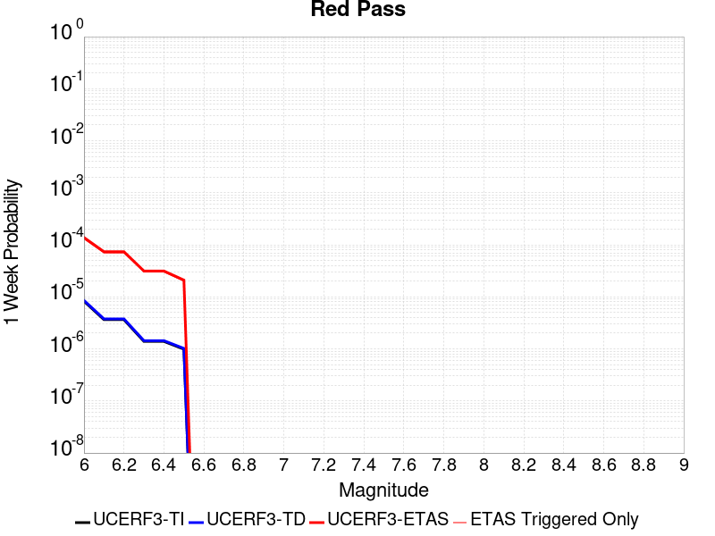 | 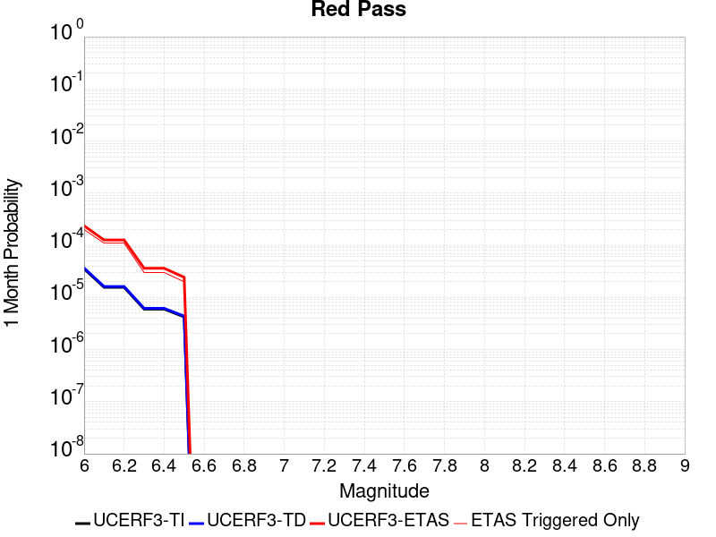 |  |  |

| Magnitude | 1 wk TI Prob | 1 wk TD Prob | 1 wk ETAS Prob | 1 wk ETAS/TD Gain | 1 wk ETAS Triggered Only | 1 mo TI Prob | 1 mo TD Prob | 1 mo ETAS Prob | 1 mo ETAS/TD Gain | 1 mo ETAS Triggered Only | 1 yr TI Prob | 1 yr TD Prob | 1 yr ETAS Prob | 1 yr ETAS/TD Gain | 1 yr ETAS Triggered Only | 10 yr TI Prob | 10 yr TD Prob | 10 yr ETAS Prob | 10 yr ETAS/TD Gain | 10 yr ETAS Triggered Only |
|-----|-----|-----|-----|-----|-----|-----|-----|-----|-----|-----|-----|-----|-----|-----|-----|-----|-----|-----|-----|-----|
| 6.0 | 8.258278E-6 | 8.551265E-6 | 1.3000771E-4 | 15.203332 | 1.2145749E-4 | 3.539214E-5 | 3.6647863E-5 | 2.7955393E-4 | 7.62811 | 2.4291498E-4 | 4.308141E-4 | 4.4611428E-4 | 8.9125976E-4 | 1.9978284 | 4.4534414E-4 | 0.0042997985 | 0.004453945 | 0.005098833 | 1.1447903 | 6.4777327E-4 |
| 6.1 | 3.649988E-6 | 3.7753161E-6 | 8.474667E-5 | 22.447569 | 8.097166E-5 | 1.5642712E-5 | 1.6179853E-5 | 1.7812055E-4 | 11.008787 | 1.6194332E-4 | 1.9043336E-4 | 1.9697666E-4 | 4.8032164E-4 | 2.43847 | 2.8340082E-4 | 0.0019027026 | 0.001968488 | 0.0022917371 | 1.1642119 | 3.2388663E-4 |
| 6.2 | 3.649988E-6 | 3.7753161E-6 | 8.474667E-5 | 22.447569 | 8.097166E-5 | 1.5642712E-5 | 1.6179853E-5 | 1.7812055E-4 | 11.008787 | 1.6194332E-4 | 1.9043336E-4 | 1.9697666E-4 | 4.8032164E-4 | 2.43847 | 2.8340082E-4 | 0.0019027026 | 0.001968488 | 0.0022917371 | 1.1642119 | 3.2388663E-4 |
| 6.3 | 1.3924937E-6 | 1.4411166E-6 | 4.1926887E-5 | 29.093334 | 4.048583E-5 | 5.9678164E-6 | 6.1762075E-6 | 4.6661786E-5 | 7.5550876 | 4.048583E-5 | 7.265574E-5 | 7.519415E-5 | 1.5615972E-4 | 2.0767536 | 8.097166E-5 | 7.263199E-4 | 7.518258E-4 | 8.73192E-4 | 1.1614286 | 1.2145749E-4 |
| 6.4 | 1.3924937E-6 | 1.4411166E-6 | 4.1926887E-5 | 29.093334 | 4.048583E-5 | 5.9678164E-6 | 6.1762075E-6 | 4.6661786E-5 | 7.5550876 | 4.048583E-5 | 7.265574E-5 | 7.519415E-5 | 1.5615972E-4 | 2.0767536 | 8.097166E-5 | 7.263199E-4 | 7.518258E-4 | 8.73192E-4 | 1.1614286 | 1.2145749E-4 |
| 6.5 | 9.876812E-7 | 1.0221912E-6 | 4.150798E-5 | 40.606865 | 4.048583E-5 | 4.2329125E-6 | 4.3808195E-6 | 4.4866472E-5 | 10.24157 | 4.048583E-5 | 5.153449E-5 | 5.3336476E-5 | 1.3430382E-4 | 2.518048 | 8.097166E-5 | 5.1522546E-4 | 5.333648E-4 | 6.547575E-4 | 1.227598 | 1.2145749E-4 |

## San Andreas (Big Bend)
*[(top)](#table-of-contents)*

| 1 Week | 1 Month | 1 Year | 10 Year |
|-----|-----|-----|-----|
|  |  |  |  |

| Magnitude | 1 wk TI Prob | 1 wk TD Prob | 1 wk ETAS Prob | 1 wk ETAS/TD Gain | 1 wk ETAS Triggered Only | 1 mo TI Prob | 1 mo TD Prob | 1 mo ETAS Prob | 1 mo ETAS/TD Gain | 1 mo ETAS Triggered Only | 1 yr TI Prob | 1 yr TD Prob | 1 yr ETAS Prob | 1 yr ETAS/TD Gain | 1 yr ETAS Triggered Only | 10 yr TI Prob | 10 yr TD Prob | 10 yr ETAS Prob | 10 yr ETAS/TD Gain | 10 yr ETAS Triggered Only |
|-----|-----|-----|-----|-----|-----|-----|-----|-----|-----|-----|-----|-----|-----|-----|-----|-----|-----|-----|-----|-----|
| 6.0 | 1.0179969E-4 | 2.0072258E-4 | 3.221557E-4 | 1.6049798 | 1.2145749E-4 | 4.362114E-4 | 8.599571E-4 | 0.0010217611 | 1.1881536 | 1.6194332E-4 | 0.0052979486 | 0.010419999 | 0.010900767 | 1.0461389 | 4.8582995E-4 | 0.051734097 | 0.10144902 | 0.10210384 | 1.0064546 | 7.2874496E-4 |
| 6.1 | 1.0179969E-4 | 2.0072258E-4 | 3.221557E-4 | 1.6049798 | 1.2145749E-4 | 4.362114E-4 | 8.599571E-4 | 0.0010217611 | 1.1881536 | 1.6194332E-4 | 0.0052979486 | 0.010419999 | 0.010900767 | 1.0461389 | 4.8582995E-4 | 0.051734097 | 0.10144902 | 0.10210384 | 1.0064546 | 7.2874496E-4 |
| 6.2 | 1.0179969E-4 | 2.0072258E-4 | 3.221557E-4 | 1.6049798 | 1.2145749E-4 | 4.362114E-4 | 8.599571E-4 | 0.0010217611 | 1.1881536 | 1.6194332E-4 | 0.0052979486 | 0.010419999 | 0.010900767 | 1.0461389 | 4.8582995E-4 | 0.051734097 | 0.10144902 | 0.10210384 | 1.0064546 | 7.2874496E-4 |
| 6.3 | 1.0179969E-4 | 2.0072258E-4 | 3.221557E-4 | 1.6049798 | 1.2145749E-4 | 4.362114E-4 | 8.599571E-4 | 0.0010217611 | 1.1881536 | 1.6194332E-4 | 0.0052979486 | 0.010419999 | 0.010900767 | 1.0461389 | 4.8582995E-4 | 0.051734097 | 0.10144902 | 0.10210384 | 1.0064546 | 7.2874496E-4 |
| 6.4 | 9.1639464E-5 | 1.8429532E-4 | 3.057304E-4 | 1.6589159 | 1.2145749E-4 | 3.9268145E-4 | 7.895982E-4 | 9.514137E-4 | 1.2049339 | 1.6194332E-4 | 0.0047704205 | 0.009571102 | 0.009931987 | 1.0377057 | 3.6437248E-4 | 0.046693064 | 0.09377527 | 0.09421554 | 1.0046949 | 4.8582995E-4 |
| 6.5 | 9.1639464E-5 | 1.8429532E-4 | 3.057304E-4 | 1.6589159 | 1.2145749E-4 | 3.9268145E-4 | 7.895982E-4 | 9.514137E-4 | 1.2049339 | 1.6194332E-4 | 0.0047704205 | 0.009571102 | 0.009931987 | 1.0377057 | 3.6437248E-4 | 0.046693064 | 0.09377527 | 0.09421554 | 1.0046949 | 4.8582995E-4 |
| 6.6 | 9.042622E-5 | 1.823659E-4 | 3.0380124E-4 | 1.6658884 | 1.2145749E-4 | 3.8748336E-4 | 7.8133424E-4 | 9.4315107E-4 | 1.2071031 | 1.6194332E-4 | 0.0047074095 | 0.009471365 | 0.009832286 | 1.0381066 | 3.6437248E-4 | 0.046089325 | 0.092869274 | 0.09330998 | 1.0047455 | 4.8582995E-4 |
| 6.7 | 8.9836685E-5 | 1.8150927E-4 | 3.029447E-4 | 1.6690316 | 1.2145749E-4 | 3.8495753E-4 | 7.776651E-4 | 9.3948253E-4 | 1.208081 | 1.6194332E-4 | 0.00467679 | 0.00942708 | 0.009788018 | 1.0382873 | 3.6437248E-4 | 0.045795817 | 0.09246355 | 0.092904456 | 1.0047685 | 4.8582995E-4 |
| 6.8 | 8.9471854E-5 | 1.8097709E-4 | 3.024126E-4 | 1.6709993 | 1.2145749E-4 | 3.8339442E-4 | 7.7538576E-4 | 8.967491E-4 | 1.1565199 | 1.2145749E-4 | 0.004657841 | 0.009399569 | 0.009720411 | 1.0341337 | 3.2388663E-4 | 0.04561414 | 0.092210755 | 0.09261504 | 1.0043843 | 4.4534414E-4 |
| 6.9 | 8.858234E-5 | 1.7979681E-4 | 3.0123247E-4 | 1.6754049 | 1.2145749E-4 | 3.7958333E-4 | 7.703304E-4 | 8.9169433E-4 | 1.1575478 | 1.2145749E-4 | 0.004611638 | 0.009338548 | 0.00965941 | 1.0343589 | 3.2388663E-4 | 0.04517103 | 0.09165087 | 0.09201863 | 1.0040126 | 4.048583E-4 |
| 7.0 | 8.7433385E-5 | 1.7818481E-4 | 2.9962067E-4 | 1.6815163 | 1.2145749E-4 | 3.746607E-4 | 7.634259E-4 | 8.847907E-4 | 1.1589738 | 1.2145749E-4 | 0.004551957 | 0.009255203 | 0.0095760925 | 1.0346712 | 3.2388663E-4 | 0.044598386 | 0.09088532 | 0.09125338 | 1.0040498 | 4.048583E-4 |
| 7.1 | 8.684964E-5 | 1.7730435E-4 | 2.987403E-4 | 1.6849011 | 1.2145749E-4 | 3.7215967E-4 | 7.596547E-4 | 8.810199E-4 | 1.1597637 | 1.2145749E-4 | 0.0045216335 | 0.009209678 | 0.0095305815 | 1.0348442 | 3.2388663E-4 | 0.04430731 | 0.09046686 | 0.090835094 | 1.0040704 | 4.048583E-4 |
| 7.2 | 8.606521E-5 | 1.762105E-4 | 2.976466E-4 | 1.6891536 | 1.2145749E-4 | 3.6879873E-4 | 7.549695E-4 | 8.763353E-4 | 1.1607559 | 1.2145749E-4 | 0.0044808835 | 0.0091531165 | 0.009474038 | 1.0350615 | 3.2388663E-4 | 0.043916024 | 0.089947365 | 0.09031581 | 1.0040962 | 4.048583E-4 |
| 7.3 | 8.568266E-5 | 1.7563057E-4 | 2.9706673E-4 | 1.6914295 | 1.2145749E-4 | 3.6715972E-4 | 7.524855E-4 | 8.738516E-4 | 1.161287 | 1.2145749E-4 | 0.0044610105 | 0.009123127 | 0.009444059 | 1.0351778 | 3.2388663E-4 | 0.043725148 | 0.08966853 | 0.090037085 | 1.0041102 | 4.048583E-4 |
| 7.4 | 8.5432206E-5 | 1.7525644E-4 | 2.9669265E-4 | 1.6929058 | 1.2145749E-4 | 3.6608664E-4 | 7.50883E-4 | 8.722493E-4 | 1.1616315 | 1.2145749E-4 | 0.004447999 | 0.009103781 | 0.009424718 | 1.0352533 | 3.2388663E-4 | 0.043600157 | 0.08948871 | 0.08985733 | 1.0041193 | 4.048583E-4 |
| 7.5 | 8.4791965E-5 | 1.7394972E-4 | 2.953861E-4 | 1.6981118 | 1.2145749E-4 | 3.633435E-4 | 7.4528606E-4 | 8.66653E-4 | 1.1628462 | 1.2145749E-4 | 0.0044147377 | 0.009036204 | 0.009357165 | 1.0355194 | 3.2388663E-4 | 0.043280575 | 0.088866346 | 0.089235224 | 1.004151 | 4.048583E-4 |
| 7.6 | 8.241105E-5 | 1.6840403E-4 | 2.8984106E-4 | 1.7211052 | 1.2145749E-4 | 3.531424E-4 | 7.215321E-4 | 8.42902E-4 | 1.1682113 | 1.2145749E-4 | 0.0042910352 | 0.008749358 | 0.009070411 | 1.0366944 | 3.2388663E-4 | 0.042091176 | 0.086243294 | 0.08661324 | 1.0042895 | 4.048583E-4 |
| 7.7 | 7.00432E-5 | 1.42045E-4 | 2.2300516E-4 | 1.5699613 | 8.097166E-5 | 3.001506E-4 | 6.0862233E-4 | 6.895447E-4 | 1.13296 | 8.097166E-5 | 0.0036482112 | 0.0073848404 | 0.0076661482 | 1.0380926 | 2.8340082E-4 | 0.035888977 | 0.07351733 | 0.073854916 | 1.004592 | 3.6437248E-4 |
| 7.8 | 6.415362E-5 | 1.2968935E-4 | 2.106505E-4 | 1.62427 | 8.097166E-5 | 2.749151E-4 | 5.556931E-4 | 6.3661975E-4 | 1.1456319 | 8.097166E-5 | 0.0033419547 | 0.0067446055 | 0.0069858823 | 1.0357733 | 2.4291498E-4 | 0.03292141 | 0.06725231 | 0.06755441 | 1.0044922 | 3.2388663E-4 |
| 7.9 | 4.939911E-5 | 9.3411545E-5 | 1.7437564E-4 | 1.8667462 | 8.097166E-5 | 2.116933E-4 | 4.0027377E-4 | 4.81213E-4 | 1.2022097 | 8.097166E-5 | 0.0025743195 | 0.004862453 | 0.0050638975 | 1.0414287 | 2.0242915E-4 | 0.025447013 | 0.048914436 | 0.049106967 | 1.003936 | 2.0242915E-4 |
| 8.0 | 3.344983E-5 | 5.222685E-5 | 9.2710565E-5 | 1.7751514 | 4.048583E-5 | 1.4334853E-4 | 2.2381016E-4 | 2.6428694E-4 | 1.1808531 | 4.048583E-5 | 0.0017438711 | 0.0027214854 | 0.002802237 | 1.0296718 | 8.097166E-5 | 0.017302496 | 0.027922187 | 0.028000899 | 1.002819 | 8.097166E-5 |
| 8.1 | 1.9104898E-5 | 1.9173063E-5 | 5.965812E-5 | 3.111559 | 4.048583E-5 | 8.1875565E-5 | 8.216769E-5 | 1.2265019E-4 | 1.4926815 | 4.048583E-5 | 9.963791E-4 | 9.999331E-4 | 0.0010403785 | 1.0404481 | 4.048583E-5 | 0.009919235 | 0.010749801 | 0.010789852 | 1.0037258 | 4.048583E-5 |
| 8.2 | 8.643924E-6 | 5.4748625E-6 | 5.4748625E-6 | 1.0 | 0.0 | 3.704486E-5 | 2.3463486E-5 | 2.3463486E-5 | 1.0 | 0.0 | 4.5092785E-4 | 2.8563058E-4 | 2.8563058E-4 | 1.0 | 0.0 | 0.0045001395 | 0.0032487072 | 0.0032487072 | 1.0 | 0.0 |
| 8.3 | 1.983087E-6 | 7.6599065E-7 | 7.6599065E-7 | 1.0 | 0.0 | 8.498917E-6 | 3.282813E-6 | 3.282813E-6 | 1.0 | 0.0 | 1.034694E-4 | 3.9967534E-5 | 3.9967534E-5 | 1.0 | 0.0 | 0.0010342124 | 4.719687E-4 | 4.719687E-4 | 1.0 | 0.0 |

## Cady
*[(top)](#table-of-contents)*

| 1 Week | 1 Month | 1 Year | 10 Year |
|-----|-----|-----|-----|
| 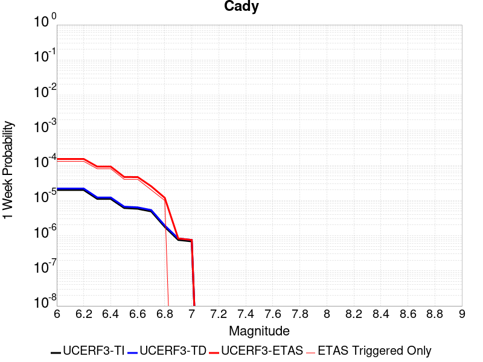 |  |  |  |

| Magnitude | 1 wk TI Prob | 1 wk TD Prob | 1 wk ETAS Prob | 1 wk ETAS/TD Gain | 1 wk ETAS Triggered Only | 1 mo TI Prob | 1 mo TD Prob | 1 mo ETAS Prob | 1 mo ETAS/TD Gain | 1 mo ETAS Triggered Only | 1 yr TI Prob | 1 yr TD Prob | 1 yr ETAS Prob | 1 yr ETAS/TD Gain | 1 yr ETAS Triggered Only | 10 yr TI Prob | 10 yr TD Prob | 10 yr ETAS Prob | 10 yr ETAS/TD Gain | 10 yr ETAS Triggered Only |
|-----|-----|-----|-----|-----|-----|-----|-----|-----|-----|-----|-----|-----|-----|-----|-----|-----|-----|-----|-----|-----|
| 6.0 | 1.9892565E-5 | 2.1858728E-5 | 2.647684E-4 | 12.112708 | 2.4291498E-4 | 8.525106E-5 | 9.3677416E-5 | 4.175337E-4 | 4.457144 | 3.2388663E-4 | 0.0010374374 | 0.0011400167 | 0.0015444135 | 1.3547288 | 4.048583E-4 | 0.010326075 | 0.011350701 | 0.011911068 | 1.0493686 | 5.6680164E-4 |
| 6.1 | 1.9892565E-5 | 2.1858728E-5 | 2.647684E-4 | 12.112708 | 2.4291498E-4 | 8.525106E-5 | 9.3677416E-5 | 4.175337E-4 | 4.457144 | 3.2388663E-4 | 0.0010374374 | 0.0011400167 | 0.0015444135 | 1.3547288 | 4.048583E-4 | 0.010326075 | 0.011350701 | 0.011911068 | 1.0493686 | 5.6680164E-4 |
| 6.2 | 1.9892565E-5 | 2.1858728E-5 | 2.647684E-4 | 12.112708 | 2.4291498E-4 | 8.525106E-5 | 9.3677416E-5 | 4.175337E-4 | 4.457144 | 3.2388663E-4 | 0.0010374374 | 0.0011400167 | 0.0015444135 | 1.3547288 | 4.048583E-4 | 0.010326075 | 0.011350701 | 0.011911068 | 1.0493686 | 5.6680164E-4 |
| 6.3 | 1.1117327E-5 | 1.2176583E-5 | 1.7411793E-4 | 14.299408 | 1.6194332E-4 | 4.764482E-5 | 5.2184492E-5 | 2.5460307E-4 | 4.878903 | 2.0242915E-4 | 5.7992124E-4 | 6.351925E-4 | 9.184133E-4 | 1.4458818 | 2.8340082E-4 | 0.0057841022 | 0.0063368753 | 0.006698939 | 1.0571359 | 3.6437248E-4 |
| 6.4 | 1.1117327E-5 | 1.2176583E-5 | 1.7411793E-4 | 14.299408 | 1.6194332E-4 | 4.764482E-5 | 5.2184492E-5 | 2.5460307E-4 | 4.878903 | 2.0242915E-4 | 5.7992124E-4 | 6.351925E-4 | 9.184133E-4 | 1.4458818 | 2.8340082E-4 | 0.0057841022 | 0.0063368753 | 0.006698939 | 1.0571359 | 3.6437248E-4 |
| 6.5 | 6.103093E-6 | 6.672021E-6 | 1.281287E-4 | 19.203882 | 1.2145749E-4 | 2.615585E-5 | 2.8594131E-5 | 1.5004814E-4 | 5.2475157 | 1.2145749E-4 | 3.1840094E-4 | 3.480905E-4 | 4.695057E-4 | 1.3488035 | 1.2145749E-4 | 0.0031794512 | 0.0034766865 | 0.003638067 | 1.0464178 | 1.6194332E-4 |
| 6.6 | 5.817237E-6 | 6.3656585E-6 | 1.2782238E-4 | 20.079992 | 1.2145749E-4 | 2.4930776E-5 | 2.728118E-5 | 1.4873536E-4 | 5.45194 | 1.2145749E-4 | 3.034899E-4 | 3.3211018E-4 | 4.5352732E-4 | 1.365593 | 1.2145749E-4 | 0.0030307577 | 0.0033173605 | 0.0034787667 | 1.048655 | 1.6194332E-4 |
| 6.7 | 4.8846314E-6 | 5.3405684E-6 | 4.5826182E-5 | 8.580769 | 4.048583E-5 | 2.0933967E-5 | 2.2888014E-5 | 6.337292E-5 | 2.7688255 | 4.048583E-5 | 2.5484123E-4 | 2.7863772E-4 | 3.1911227E-4 | 1.1452587 | 4.048583E-5 | 0.0025454918 | 0.0027840391 | 0.0028647853 | 1.0290033 | 8.097166E-5 |
| 6.8 | 1.7788773E-6 | 1.9399079E-6 | 4.2425658E-5 | 21.869934 | 4.048583E-5 | 7.6237375E-6 | 8.313874E-6 | 4.8799368E-5 | 5.8696303 | 4.048583E-5 | 9.281505E-5 | 1.01218284E-4 | 1.4170002E-4 | 1.3999449 | 4.048583E-5 | 9.2776294E-4 | 0.0010118765 | 0.0010523213 | 1.0399702 | 4.048583E-5 |
| 6.9 | 7.5455404E-7 | 8.297092E-7 | 8.297092E-7 | 1.0 | 0.0 | 3.233799E-6 | 3.5558937E-6 | 3.5558937E-6 | 1.0 | 0.0 | 3.937079E-5 | 4.3292483E-5 | 4.3292483E-5 | 1.0 | 0.0 | 3.9363815E-4 | 4.3287344E-4 | 4.3287344E-4 | 1.0 | 0.0 |
| 7.0 | 6.8578805E-7 | 7.541816E-7 | 7.541816E-7 | 1.0 | 0.0 | 2.9390883E-6 | 3.2322048E-6 | 3.2322048E-6 | 1.0 | 0.0 | 3.578281E-5 | 3.9351715E-5 | 3.9351715E-5 | 1.0 | 0.0 | 3.577705E-4 | 3.9347992E-4 | 3.9347992E-4 | 1.0 | 0.0 |

## Manix-Afton Hills
*[(top)](#table-of-contents)*

| 1 Week | 1 Month | 1 Year | 10 Year |
|-----|-----|-----|-----|
| 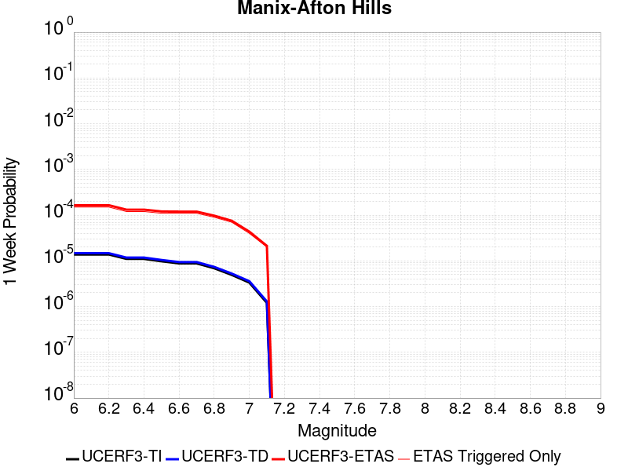 |  |  |  |

| Magnitude | 1 wk TI Prob | 1 wk TD Prob | 1 wk ETAS Prob | 1 wk ETAS/TD Gain | 1 wk ETAS Triggered Only | 1 mo TI Prob | 1 mo TD Prob | 1 mo ETAS Prob | 1 mo ETAS/TD Gain | 1 mo ETAS Triggered Only | 1 yr TI Prob | 1 yr TD Prob | 1 yr ETAS Prob | 1 yr ETAS/TD Gain | 1 yr ETAS Triggered Only | 10 yr TI Prob | 10 yr TD Prob | 10 yr ETAS Prob | 10 yr ETAS/TD Gain | 10 yr ETAS Triggered Only |
|-----|-----|-----|-----|-----|-----|-----|-----|-----|-----|-----|-----|-----|-----|-----|-----|-----|-----|-----|-----|-----|
| 6.0 | 1.3783202E-5 | 1.47110895E-5 | 1.7665203E-4 | 12.008085 | 1.6194332E-4 | 5.906953E-5 | 6.30461E-5 | 3.0594578E-4 | 4.8527308 | 2.4291498E-4 | 7.189342E-4 | 7.6733343E-4 | 0.0010909715 | 1.4217699 | 3.2388663E-4 | 0.0071661277 | 0.007648596 | 0.008170886 | 1.0682858 | 5.2631577E-4 |
| 6.1 | 1.3783202E-5 | 1.47110895E-5 | 1.7665203E-4 | 12.008085 | 1.6194332E-4 | 5.906953E-5 | 6.30461E-5 | 3.0594578E-4 | 4.8527308 | 2.4291498E-4 | 7.189342E-4 | 7.6733343E-4 | 0.0010909715 | 1.4217699 | 3.2388663E-4 | 0.0071661277 | 0.007648596 | 0.008170886 | 1.0682858 | 5.2631577E-4 |
| 6.2 | 1.3783202E-5 | 1.47110895E-5 | 1.7665203E-4 | 12.008085 | 1.6194332E-4 | 5.906953E-5 | 6.30461E-5 | 3.0594578E-4 | 4.8527308 | 2.4291498E-4 | 7.189342E-4 | 7.6733343E-4 | 0.0010909715 | 1.4217699 | 3.2388663E-4 | 0.0071661277 | 0.007648596 | 0.008170886 | 1.0682858 | 5.2631577E-4 |
| 6.3 | 1.10494875E-5 | 1.1793136E-5 | 1.7373454E-4 | 14.731836 | 1.6194332E-4 | 4.7354086E-5 | 5.054109E-5 | 2.1247622E-4 | 4.2040296 | 1.6194332E-4 | 5.763835E-4 | 6.151744E-4 | 8.5793994E-4 | 1.3946288 | 2.4291498E-4 | 0.005748908 | 0.0061357557 | 0.006497892 | 1.0590208 | 3.6437248E-4 |
| 6.4 | 1.10494875E-5 | 1.1793136E-5 | 1.7373454E-4 | 14.731836 | 1.6194332E-4 | 4.7354086E-5 | 5.054109E-5 | 2.1247622E-4 | 4.2040296 | 1.6194332E-4 | 5.763835E-4 | 6.151744E-4 | 8.5793994E-4 | 1.3946288 | 2.4291498E-4 | 0.005748908 | 0.0061357557 | 0.006497892 | 1.0590208 | 3.6437248E-4 |
| 6.5 | 9.788949E-6 | 1.045432E-5 | 1.3191054E-4 | 12.617803 | 1.2145749E-4 | 4.1951964E-5 | 4.480351E-5 | 1.6625556E-4 | 3.7107708 | 1.2145749E-4 | 5.1064545E-4 | 5.453555E-4 | 7.072105E-4 | 1.2967881 | 1.6194332E-4 | 0.0050947363 | 0.0054410985 | 0.005682692 | 1.0444015 | 2.4291498E-4 |
| 6.6 | 8.810006E-6 | 9.4136285E-6 | 1.3086997E-4 | 13.902183 | 1.2145749E-4 | 3.775662E-5 | 4.0343548E-5 | 1.6179614E-4 | 4.010459 | 1.2145749E-4 | 4.5958988E-4 | 4.9108086E-4 | 6.5294467E-4 | 1.3296072 | 1.6194332E-4 | 0.0045864056 | 0.004900839 | 0.0051425635 | 1.0493231 | 2.4291498E-4 |
| 6.7 | 8.80128E-6 | 9.404108E-6 | 1.3086046E-4 | 13.915244 | 1.2145749E-4 | 3.7719226E-5 | 4.0302748E-5 | 1.6175534E-4 | 4.0135064 | 1.2145749E-4 | 4.591348E-4 | 4.9058435E-4 | 6.524482E-4 | 1.3299409 | 1.6194332E-4 | 0.004581874 | 0.0048958957 | 0.0051376214 | 1.0493731 | 2.4291498E-4 |
| 6.8 | 6.8994877E-6 | 7.380076E-6 | 1.2883668E-4 | 17.457363 | 1.2145749E-4 | 2.9568899E-5 | 3.162856E-5 | 1.530822E-4 | 4.839999 | 1.2145749E-4 | 3.5994186E-4 | 3.8501783E-4 | 5.468988E-4 | 1.4204506 | 1.6194332E-4 | 0.003593594 | 0.0038443129 | 0.004086294 | 1.0629452 | 2.4291498E-4 |
| 6.9 | 4.9328037E-6 | 5.2709615E-6 | 8.6242195E-5 | 16.361757 | 8.097166E-5 | 2.1140417E-5 | 2.2589675E-5 | 1.03559505E-4 | 4.5843735 | 8.097166E-5 | 2.5735417E-4 | 2.7500073E-4 | 3.9642482E-4 | 1.441541 | 1.2145749E-4 | 0.0025705635 | 0.0027472095 | 0.0029087078 | 1.0587864 | 1.6194332E-4 |
| 7.0 | 3.347973E-6 | 3.59003E-6 | 8.45614E-5 | 23.55451 | 8.097166E-5 | 1.4348378E-5 | 1.5385775E-5 | 9.635619E-5 | 6.26268 | 8.097166E-5 | 1.746775E-4 | 1.8730981E-4 | 3.0874455E-4 | 1.6483096 | 1.2145749E-4 | 0.0017454025 | 0.0018719219 | 0.001993152 | 1.0647624 | 1.2145749E-4 |
| 7.1 | 1.2073567E-6 | 1.293482E-6 | 4.1779258E-5 | 32.29984 | 4.048583E-5 | 5.1743755E-6 | 5.543492E-6 | 4.6029098E-5 | 8.3032675 | 4.048583E-5 | 6.29962E-5 | 6.749156E-5 | 1.0797466E-4 | 1.5998247 | 4.048583E-5 | 6.297835E-4 | 6.7487074E-4 | 7.1532925E-4 | 1.05995 | 4.048583E-5 |

## Death Valley (No)
*[(top)](#table-of-contents)*

| 1 Week | 1 Month | 1 Year | 10 Year |
|-----|-----|-----|-----|
|  |  |  |  |

| Magnitude | 1 wk TI Prob | 1 wk TD Prob | 1 wk ETAS Prob | 1 wk ETAS/TD Gain | 1 wk ETAS Triggered Only | 1 mo TI Prob | 1 mo TD Prob | 1 mo ETAS Prob | 1 mo ETAS/TD Gain | 1 mo ETAS Triggered Only | 1 yr TI Prob | 1 yr TD Prob | 1 yr ETAS Prob | 1 yr ETAS/TD Gain | 1 yr ETAS Triggered Only | 10 yr TI Prob | 10 yr TD Prob | 10 yr ETAS Prob | 10 yr ETAS/TD Gain | 10 yr ETAS Triggered Only |
|-----|-----|-----|-----|-----|-----|-----|-----|-----|-----|-----|-----|-----|-----|-----|-----|-----|-----|-----|-----|-----|
| 6.0 | 2.0074807E-5 | 2.2500084E-5 | 1.0346992E-4 | 4.598646 | 8.097166E-5 | 8.603206E-5 | 9.642541E-5 | 2.583531E-4 | 2.6793053 | 1.6194332E-4 | 0.001046937 | 0.0011733545 | 0.0015777377 | 1.3446386 | 4.048583E-4 | 0.010420183 | 0.011672506 | 0.012232692 | 1.0479919 | 5.6680164E-4 |
| 6.1 | 2.0074807E-5 | 2.2500084E-5 | 1.0346992E-4 | 4.598646 | 8.097166E-5 | 8.603206E-5 | 9.642541E-5 | 2.583531E-4 | 2.6793053 | 1.6194332E-4 | 0.001046937 | 0.0011733545 | 0.0015777377 | 1.3446386 | 4.048583E-4 | 0.010420183 | 0.011672506 | 0.012232692 | 1.0479919 | 5.6680164E-4 |
| 6.2 | 2.0074807E-5 | 2.2500084E-5 | 1.0346992E-4 | 4.598646 | 8.097166E-5 | 8.603206E-5 | 9.642541E-5 | 2.583531E-4 | 2.6793053 | 1.6194332E-4 | 0.001046937 | 0.0011733545 | 0.0015777377 | 1.3446386 | 4.048583E-4 | 0.010420183 | 0.011672506 | 0.012232692 | 1.0479919 | 5.6680164E-4 |
| 6.3 | 1.9050609E-5 | 2.1336948E-5 | 1.02306876E-4 | 4.7948227 | 8.097166E-5 | 8.164292E-5 | 9.1440896E-5 | 2.533694E-4 | 2.7708545 | 1.6194332E-4 | 9.935491E-4 | 0.001112731 | 0.0015171388 | 1.3634372 | 4.048583E-4 | 0.009891188 | 0.011072419 | 0.011632944 | 1.0506237 | 5.6680164E-4 |
| 6.4 | 1.9050609E-5 | 2.1336948E-5 | 1.02306876E-4 | 4.7948227 | 8.097166E-5 | 8.164292E-5 | 9.1440896E-5 | 2.533694E-4 | 2.7708545 | 1.6194332E-4 | 9.935491E-4 | 0.001112731 | 0.0015171388 | 1.3634372 | 4.048583E-4 | 0.009891188 | 0.011072419 | 0.011632944 | 1.0506237 | 5.6680164E-4 |
| 6.5 | 1.8367004E-5 | 2.0561009E-5 | 1.01531004E-4 | 4.938036 | 8.097166E-5 | 7.8713354E-5 | 8.811567E-5 | 2.5004472E-4 | 2.8376873 | 1.6194332E-4 | 9.5791375E-4 | 0.0010722869 | 0.001476711 | 1.3771604 | 4.048583E-4 | 0.009537951 | 0.0106719155 | 0.0112326685 | 1.0525447 | 5.6680164E-4 |
| 6.6 | 1.779439E-5 | 1.9910927E-5 | 1.0088098E-4 | 5.0666137 | 8.097166E-5 | 7.625944E-5 | 8.53298E-5 | 2.472593E-4 | 2.89769 | 1.6194332E-4 | 9.280632E-4 | 0.0010384015 | 0.0014428394 | 1.3894812 | 4.048583E-4 | 0.009241969 | 0.010336253 | 0.010897196 | 1.0542694 | 5.6680164E-4 |
| 6.7 | 1.7025437E-5 | 1.9043426E-5 | 1.00013545E-4 | 5.2518673 | 8.097166E-5 | 7.296412E-5 | 8.161216E-5 | 2.4354226E-4 | 2.9841418 | 1.6194332E-4 | 8.87976E-4 | 9.931813E-4 | 0.0013976375 | 1.407233 | 4.048583E-4 | 0.008844362 | 0.009888145 | 0.010449342 | 1.0567545 | 5.6680164E-4 |
| 6.8 | 1.6545107E-5 | 1.8512545E-5 | 9.9482706E-5 | 5.3737993 | 8.097166E-5 | 7.090568E-5 | 7.93371E-5 | 2.4126757E-4 | 3.0410435 | 1.6194332E-4 | 8.629347E-4 | 9.655073E-4 | 0.0013699747 | 1.418917 | 4.048583E-4 | 0.008595915 | 0.009613829 | 0.010175182 | 1.0583901 | 5.6680164E-4 |
| 6.9 | 1.615478E-5 | 1.8087594E-5 | 9.905779E-5 | 5.4765596 | 8.097166E-5 | 6.9232934E-5 | 7.751599E-5 | 2.3944676E-4 | 3.0889983 | 1.6194332E-4 | 8.4258494E-4 | 9.433546E-4 | 0.0013073834 | 1.3858875 | 3.6437248E-4 | 0.008393973 | 0.009394196 | 0.009915567 | 1.0554993 | 5.2631577E-4 |
| 7.0 | 1.5894311E-5 | 1.780555E-5 | 9.877577E-5 | 5.547471 | 8.097166E-5 | 6.81167E-5 | 7.6307304E-5 | 2.3823827E-4 | 3.12209 | 1.6194332E-4 | 8.2900526E-4 | 9.286515E-4 | 0.0012926856 | 1.3920029 | 3.6437248E-4 | 0.008259195 | 0.009248397 | 0.009769846 | 1.0563825 | 5.2631577E-4 |
| 7.1 | 1.5602263E-5 | 1.7483504E-5 | 9.845375E-5 | 5.631237 | 8.097166E-5 | 6.6865134E-5 | 7.492718E-5 | 2.3685837E-4 | 3.1611807 | 1.6194332E-4 | 8.137789E-4 | 9.118627E-4 | 0.001275903 | 1.399227 | 3.6437248E-4 | 0.008108052 | 0.009081894 | 0.00960343 | 1.0574259 | 5.2631577E-4 |
| 7.2 | 1.5323829E-5 | 1.717063E-5 | 9.81409E-5 | 5.715626 | 8.097166E-5 | 6.56719E-5 | 7.358637E-5 | 2.3551777E-4 | 3.2005622 | 1.6194332E-4 | 7.99262E-4 | 8.9555193E-4 | 0.0012595981 | 1.4065048 | 3.6437248E-4 | 0.007963934 | 0.008920107 | 0.009441728 | 1.058477 | 5.2631577E-4 |
| 7.3 | 1.4556212E-5 | 1.6302456E-5 | 9.7272794E-5 | 5.9667573 | 8.097166E-5 | 6.238227E-5 | 6.9865826E-5 | 2.3179784E-4 | 3.317757 | 1.6194332E-4 | 7.592395E-4 | 8.5029035E-4 | 0.001214353 | 1.4281627 | 3.6437248E-4 | 0.0075665074 | 0.008471014 | 0.008992871 | 1.0616051 | 5.2631577E-4 |
| 7.4 | 1.411725E-5 | 1.580796E-5 | 9.677834E-5 | 6.122127 | 8.097166E-5 | 6.0501097E-5 | 6.7746674E-5 | 2.2967902E-4 | 3.3902628 | 1.6194332E-4 | 7.363519E-4 | 8.245094E-4 | 0.0011885815 | 1.441562 | 3.6437248E-4 | 0.0073391674 | 0.008215138 | 0.00873713 | 1.0635402 | 5.2631577E-4 |
| 7.5 | 1.3503312E-5 | 1.5126289E-5 | 9.609672E-5 | 6.352961 | 8.097166E-5 | 5.7870053E-5 | 6.482538E-5 | 2.267582E-4 | 3.4979851 | 1.6194332E-4 | 7.043401E-4 | 7.8896893E-4 | 0.001153054 | 1.4614693 | 3.6437248E-4 | 0.007021119 | 0.007862304 | 0.008384482 | 1.0664153 | 5.2631577E-4 |
| 7.6 | 1.1279839E-5 | 1.2626327E-5 | 9.3596966E-5 | 7.412842 | 8.097166E-5 | 4.834127E-5 | 5.4111737E-5 | 2.1604629E-4 | 3.992596 | 1.6194332E-4 | 5.88396E-4 | 6.5861654E-4 | 9.822899E-4 | 1.4914442 | 3.2388663E-4 | 0.005868405 | 0.006567199 | 0.006969398 | 1.0612437 | 4.048583E-4 |
| 7.7 | 9.189108E-6 | 1.0283358E-5 | 9.125419E-5 | 8.873967 | 8.097166E-5 | 3.93813E-5 | 4.407082E-5 | 2.06007E-4 | 4.6744537 | 1.6194332E-4 | 4.7936183E-4 | 5.3643517E-4 | 8.1968395E-4 | 1.5280205 | 2.8340082E-4 | 0.004783291 | 0.005351914 | 0.005674067 | 1.060194 | 3.2388663E-4 |
| 7.8 | 3.4586725E-7 | 3.6482615E-7 | 3.6482615E-7 | 1.0 | 0.0 | 1.4822873E-6 | 1.5635396E-6 | 1.5635396E-6 | 1.0 | 0.0 | 1.80467E-5 | 1.9035933E-5 | 5.9520993E-5 | 3.1267703 | 4.048583E-5 | 1.8045233E-4 | 1.9034347E-4 | 2.3082159E-4 | 1.2126583 | 4.048583E-5 |
| 7.9 | 2.5591178E-9 | 2.6696718E-9 | 2.6696718E-9 | 1.0 | 0.0 | 1.0967647E-8 | 1.14414505E-8 | 1.14414505E-8 | 1.0 | 0.0 | 1.335311E-7 | 1.3929966E-7 | 1.3929966E-7 | 1.0 | 0.0 | 1.3353102E-6 | 1.3929966E-6 | 1.3929966E-6 | 1.0 | 0.0 |

## San Andreas (Parkfield)
*[(top)](#table-of-contents)*

| 1 Week | 1 Month | 1 Year | 10 Year |
|-----|-----|-----|-----|
|  |  |  |  |

| Magnitude | 1 wk TI Prob | 1 wk TD Prob | 1 wk ETAS Prob | 1 wk ETAS/TD Gain | 1 wk ETAS Triggered Only | 1 mo TI Prob | 1 mo TD Prob | 1 mo ETAS Prob | 1 mo ETAS/TD Gain | 1 mo ETAS Triggered Only | 1 yr TI Prob | 1 yr TD Prob | 1 yr ETAS Prob | 1 yr ETAS/TD Gain | 1 yr ETAS Triggered Only | 10 yr TI Prob | 10 yr TD Prob | 10 yr ETAS Prob | 10 yr ETAS/TD Gain | 10 yr ETAS Triggered Only |
|-----|-----|-----|-----|-----|-----|-----|-----|-----|-----|-----|-----|-----|-----|-----|-----|-----|-----|-----|-----|-----|
| 6.0 | 5.556969E-4 | 7.7782426E-4 | 9.800959E-4 | 1.260048 | 2.0242915E-4 | 0.0023793848 | 0.0033298214 | 0.0035719275 | 1.0727085 | 2.4291498E-4 | 0.028586963 | 0.040191233 | 0.04054096 | 1.0087016 | 3.6437248E-4 | 0.25176284 | 0.33716413 | 0.33748618 | 1.0009551 | 4.8582995E-4 |
| 6.1 | 1.925858E-4 | 3.0276453E-4 | 4.646588E-4 | 1.5347202 | 1.6194332E-4 | 8.2510663E-4 | 0.0012970108 | 0.001458744 | 1.124697 | 1.6194332E-4 | 0.0099994885 | 0.015778083 | 0.016017165 | 1.0151528 | 2.4291498E-4 | 0.095613256 | 0.1497237 | 0.1500335 | 1.0020692 | 3.6437248E-4 |
| 6.2 | 9.4306815E-5 | 1.8242796E-4 | 3.4434174E-4 | 1.8875492 | 1.6194332E-4 | 4.0410945E-4 | 7.816011E-4 | 9.4341784E-4 | 1.2070324 | 1.6194332E-4 | 0.0049089384 | 0.009474681 | 0.009715294 | 1.0253954 | 2.4291498E-4 | 0.048019063 | 0.09185409 | 0.09211146 | 1.0028019 | 2.8340082E-4 |
| 6.3 | 9.283051E-5 | 1.7939322E-4 | 3.413075E-4 | 1.9025663 | 1.6194332E-4 | 3.9778434E-4 | 7.686027E-4 | 9.304216E-4 | 1.2105364 | 1.6194332E-4 | 0.0048322747 | 0.009317789 | 0.00955844 | 1.025827 | 2.4291498E-4 | 0.047285385 | 0.09050704 | 0.09076478 | 1.0028479 | 2.8340082E-4 |
| 6.4 | 9.138826E-5 | 1.770153E-4 | 3.3892997E-4 | 1.914693 | 1.6194332E-4 | 3.916052E-4 | 7.5841765E-4 | 9.2023815E-4 | 1.2133659 | 1.6194332E-4 | 0.0047573745 | 0.00919484 | 0.009435521 | 1.0261757 | 2.4291498E-4 | 0.046568092 | 0.08940927 | 0.089667335 | 1.0028863 | 2.8340082E-4 |
| 6.5 | 9.000255E-5 | 1.7459576E-4 | 3.365108E-4 | 1.927371 | 1.6194332E-4 | 3.8566816E-4 | 7.480541E-4 | 9.098763E-4 | 1.2163242 | 1.6194332E-4 | 0.0046854047 | 0.009069731 | 0.009310444 | 1.0265402 | 2.4291498E-4 | 0.045878403 | 0.088295065 | 0.08855344 | 1.0029263 | 2.8340082E-4 |
| 6.6 | 8.8109264E-5 | 1.7140752E-4 | 3.3332309E-4 | 1.9446235 | 1.6194332E-4 | 3.7755648E-4 | 7.3439797E-4 | 8.9622237E-4 | 1.2203497 | 1.6194332E-4 | 0.0045870654 | 0.008904854 | 0.009145605 | 1.0270361 | 2.4291498E-4 | 0.04493529 | 0.0868267 | 0.087085485 | 1.0029806 | 2.8340082E-4 |
| 6.7 | 8.738073E-5 | 1.7007832E-4 | 3.319941E-4 | 1.9520072 | 1.6194332E-4 | 3.7443507E-4 | 7.287046E-4 | 8.9052995E-4 | 1.2220726 | 1.6194332E-4 | 0.0045492216 | 0.008836143 | 0.009076912 | 1.0272481 | 2.4291498E-4 | 0.04457213 | 0.08622707 | 0.08648603 | 1.0030032 | 2.8340082E-4 |
| 6.8 | 8.710195E-5 | 1.6953335E-4 | 3.314492E-4 | 1.955068 | 1.6194332E-4 | 3.7324068E-4 | 7.263703E-4 | 8.88196E-4 | 1.2227868 | 1.6194332E-4 | 0.0045347405 | 0.008807961 | 0.009048737 | 1.0273361 | 2.4291498E-4 | 0.04443313 | 0.08597467 | 0.086233705 | 1.0030129 | 2.8340082E-4 |
| 6.9 | 8.6801556E-5 | 1.689429E-4 | 3.3085886E-4 | 1.9584064 | 1.6194332E-4 | 3.7195362E-4 | 7.2384125E-4 | 8.8566734E-4 | 1.2235657 | 1.6194332E-4 | 0.0045191357 | 0.008777418 | 0.009018201 | 1.0274321 | 2.4291498E-4 | 0.044283327 | 0.085700735 | 0.085959844 | 1.0030235 | 2.8340082E-4 |
| 7.0 | 8.5571606E-5 | 1.6647128E-4 | 3.2838763E-4 | 1.9726384 | 1.6194332E-4 | 3.6668387E-4 | 7.132544E-4 | 8.750822E-4 | 1.2268865 | 1.6194332E-4 | 0.004455241 | 0.008649553 | 0.008890367 | 1.0278412 | 2.4291498E-4 | 0.043669727 | 0.08454914 | 0.08480858 | 1.0030684 | 2.8340082E-4 |
| 7.1 | 7.82589E-5 | 1.5128135E-4 | 3.1320017E-4 | 2.0703158 | 1.6194332E-4 | 3.3535215E-4 | 6.481883E-4 | 8.1002666E-4 | 1.249678 | 1.6194332E-4 | 0.0040752706 | 0.007863307 | 0.008104312 | 1.0306493 | 2.4291498E-4 | 0.040013418 | 0.07746111 | 0.07772256 | 1.0033752 | 2.8340082E-4 |
| 7.2 | 7.690929E-5 | 1.4865391E-4 | 3.1057314E-4 | 2.0892363 | 1.6194332E-4 | 3.2956956E-4 | 6.369334E-4 | 7.9877354E-4 | 1.2540928 | 1.6194332E-4 | 0.004005129 | 0.007727258 | 0.007968295 | 1.0311933 | 2.4291498E-4 | 0.0393371 | 0.07623427 | 0.076496065 | 1.0034341 | 2.8340082E-4 |
| 7.3 | 7.5543794E-5 | 1.4561978E-4 | 3.075395E-4 | 2.1119351 | 1.6194332E-4 | 3.2371894E-4 | 6.2393624E-4 | 7.857785E-4 | 1.2593892 | 1.6194332E-4 | 0.003934157 | 0.007570127 | 0.007811203 | 1.0318457 | 2.4291498E-4 | 0.038652334 | 0.074797355 | 0.075059555 | 1.0035055 | 2.8340082E-4 |
| 7.4 | 7.4214564E-5 | 1.4262961E-4 | 3.0454985E-4 | 2.1352496 | 1.6194332E-4 | 3.1802364E-4 | 6.111273E-4 | 7.7297166E-4 | 1.2648292 | 1.6194332E-4 | 0.003865065 | 0.00741525 | 0.007656364 | 1.0325159 | 2.4291498E-4 | 0.03798529 | 0.07337123 | 0.07363384 | 1.0035791 | 2.8340082E-4 |
| 7.5 | 6.149578E-5 | 1.11907226E-4 | 2.3335112E-4 | 2.0852194 | 1.2145749E-4 | 2.6352672E-4 | 4.7951436E-4 | 6.009136E-4 | 1.2531712 | 1.2145749E-4 | 0.0032037178 | 0.0058224914 | 0.006023742 | 1.0345644 | 2.0242915E-4 | 0.03157923 | 0.058557566 | 0.058786254 | 1.0039054 | 2.4291498E-4 |
| 7.6 | 6.0643448E-5 | 1.10193796E-4 | 2.3163791E-4 | 2.1020956 | 1.2145749E-4 | 2.598746E-4 | 4.7217376E-4 | 5.935739E-4 | 1.257109 | 1.2145749E-4 | 0.0031593828 | 0.0057335934 | 0.005934862 | 1.0351033 | 2.0242915E-4 | 0.031148417 | 0.057718582 | 0.057947475 | 1.0039657 | 2.4291498E-4 |
| 7.7 | 5.1652263E-5 | 9.174698E-5 | 1.7271121E-4 | 1.882473 | 8.097166E-5 | 2.2134806E-4 | 3.931421E-4 | 4.7408193E-4 | 1.2058793 | 8.097166E-5 | 0.002691582 | 0.0047760103 | 0.0049371803 | 1.0337458 | 1.6194332E-4 | 0.026592141 | 0.04853623 | 0.04872883 | 1.0039682 | 2.0242915E-4 |
| 7.8 | 4.8090482E-5 | 8.559635E-5 | 1.6656109E-4 | 1.94589 | 8.097166E-5 | 2.060858E-4 | 3.6678996E-4 | 4.4773193E-4 | 1.2206765 | 8.097166E-5 | 0.0025062072 | 0.0044565317 | 0.0046177534 | 1.0361764 | 1.6194332E-4 | 0.024781305 | 0.04530245 | 0.045495708 | 1.0042659 | 2.0242915E-4 |
| 7.9 | 3.970278E-5 | 6.750426E-5 | 1.4847046E-4 | 2.1994236 | 8.097166E-5 | 1.7014367E-4 | 2.892719E-4 | 3.7022014E-4 | 1.2798344 | 8.097166E-5 | 0.002069531 | 0.0035162016 | 0.0036372321 | 1.0344207 | 1.2145749E-4 | 0.020503636 | 0.035881363 | 0.03599846 | 1.0032635 | 1.2145749E-4 |
| 8.0 | 2.8982335E-5 | 4.069796E-5 | 8.1182145E-5 | 1.9947473 | 4.048583E-5 | 1.2420409E-4 | 1.7440817E-4 | 2.1488694E-4 | 1.2320921 | 4.048583E-5 | 0.0015111357 | 0.0021213528 | 0.0022021527 | 1.0380888 | 8.097166E-5 | 0.015009012 | 0.022010697 | 0.022089886 | 1.0035977 | 8.097166E-5 |
| 8.1 | 1.8836186E-5 | 1.8681134E-5 | 5.916621E-5 | 3.1671636 | 4.048583E-5 | 8.0724014E-5 | 8.005955E-5 | 1.2054214E-4 | 1.505656 | 4.048583E-5 | 9.823717E-4 | 9.742898E-4 | 0.0010147361 | 1.0415137 | 4.048583E-5 | 0.009780403 | 0.010488115 | 0.010528177 | 1.0038197 | 4.048583E-5 |
| 8.2 | 8.643924E-6 | 5.4748625E-6 | 5.4748625E-6 | 1.0 | 0.0 | 3.704486E-5 | 2.3463486E-5 | 2.3463486E-5 | 1.0 | 0.0 | 4.5092785E-4 | 2.8563058E-4 | 2.8563058E-4 | 1.0 | 0.0 | 0.0045001395 | 0.0032487072 | 0.0032487072 | 1.0 | 0.0 |
| 8.3 | 1.983087E-6 | 7.6599065E-7 | 7.6599065E-7 | 1.0 | 0.0 | 8.498917E-6 | 3.282813E-6 | 3.282813E-6 | 1.0 | 0.0 | 1.034694E-4 | 3.9967534E-5 | 3.9967534E-5 | 1.0 | 0.0 | 0.0010342124 | 4.719687E-4 | 4.719687E-4 | 1.0 | 0.0 |

## Ludlow
*[(top)](#table-of-contents)*

| 1 Week | 1 Month | 1 Year | 10 Year |
|-----|-----|-----|-----|
|  | 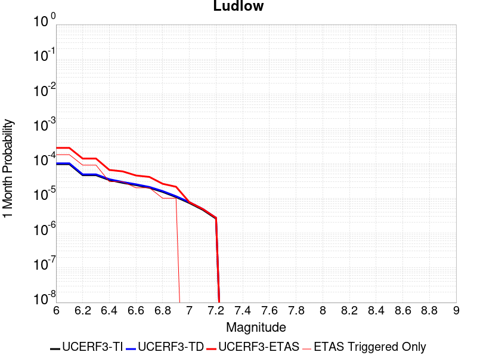 |  |  |

| Magnitude | 1 wk TI Prob | 1 wk TD Prob | 1 wk ETAS Prob | 1 wk ETAS/TD Gain | 1 wk ETAS Triggered Only | 1 mo TI Prob | 1 mo TD Prob | 1 mo ETAS Prob | 1 mo ETAS/TD Gain | 1 mo ETAS Triggered Only | 1 yr TI Prob | 1 yr TD Prob | 1 yr ETAS Prob | 1 yr ETAS/TD Gain | 1 yr ETAS Triggered Only | 10 yr TI Prob | 10 yr TD Prob | 10 yr ETAS Prob | 10 yr ETAS/TD Gain | 10 yr ETAS Triggered Only |
|-----|-----|-----|-----|-----|-----|-----|-----|-----|-----|-----|-----|-----|-----|-----|-----|-----|-----|-----|-----|-----|
| 6.0 | 2.2407607E-5 | 2.3657254E-5 | 1.4511187E-4 | 6.1339273 | 1.2145749E-4 | 9.602906E-5 | 1.0138454E-4 | 3.442749E-4 | 3.3957336 | 2.4291498E-4 | 0.0011685267 | 0.001233702 | 0.0015976249 | 1.2949845 | 3.6437248E-4 | 0.011624013 | 0.012273042 | 0.012752909 | 1.0390993 | 4.8582995E-4 |
| 6.1 | 2.2407607E-5 | 2.3657254E-5 | 1.4511187E-4 | 6.1339273 | 1.2145749E-4 | 9.602906E-5 | 1.0138454E-4 | 3.442749E-4 | 3.3957336 | 2.4291498E-4 | 0.0011685267 | 0.001233702 | 0.0015976249 | 1.2949845 | 3.6437248E-4 | 0.011624013 | 0.012273042 | 0.012752909 | 1.0390993 | 4.8582995E-4 |
| 6.2 | 1.0781252E-5 | 1.1365663E-5 | 9.2336406E-5 | 8.124154 | 8.097166E-5 | 4.620455E-5 | 4.8709102E-5 | 1.2967682E-4 | 2.6622708 | 8.097166E-5 | 5.623952E-4 | 5.9287593E-4 | 7.5472327E-4 | 1.2729868 | 1.6194332E-4 | 0.00560974 | 0.0059133614 | 0.00615484 | 1.0408361 | 2.4291498E-4 |
| 6.3 | 1.0781252E-5 | 1.1365663E-5 | 9.2336406E-5 | 8.124154 | 8.097166E-5 | 4.620455E-5 | 4.8709102E-5 | 1.2967682E-4 | 2.6622708 | 8.097166E-5 | 5.623952E-4 | 5.9287593E-4 | 7.5472327E-4 | 1.2729868 | 1.6194332E-4 | 0.00560974 | 0.0059133614 | 0.00615484 | 1.0408361 | 2.4291498E-4 |
| 6.4 | 7.814439E-6 | 8.237729E-6 | 4.8723225E-5 | 5.914643 | 4.048583E-5 | 3.3490025E-5 | 3.530408E-5 | 7.5788485E-5 | 2.1467342 | 4.048583E-5 | 4.0766477E-4 | 4.2974384E-4 | 5.1068066E-4 | 1.1883374 | 8.097166E-5 | 0.0040691774 | 0.0042892746 | 0.0044505233 | 1.0375935 | 1.6194332E-4 |
| 6.5 | 6.4986366E-6 | 6.85092E-6 | 4.733647E-5 | 6.9095063 | 4.048583E-5 | 2.7851002E-5 | 2.9360759E-5 | 6.98454E-5 | 2.378869 | 4.048583E-5 | 3.390332E-4 | 3.5740953E-4 | 4.3835226E-4 | 1.2264705 | 8.097166E-5 | 0.003385164 | 0.0035684432 | 0.0036894674 | 1.033915 | 1.2145749E-4 |
| 6.6 | 5.582177E-6 | 5.8860055E-6 | 4.63716E-5 | 7.8782797 | 4.048583E-5 | 2.3923398E-5 | 2.5225498E-5 | 6.571031E-5 | 2.604916 | 4.048583E-5 | 2.9122844E-4 | 3.0707786E-4 | 3.8802467E-4 | 1.2636034 | 8.097166E-5 | 0.0029084706 | 0.003066609 | 0.0031473322 | 1.0263233 | 8.097166E-5 |
| 6.7 | 4.6858763E-6 | 4.940427E-6 | 4.542606E-5 | 9.194763 | 4.048583E-5 | 2.0082172E-5 | 2.1173091E-5 | 6.1658066E-5 | 2.9120955 | 4.048583E-5 | 2.4447302E-4 | 2.5775246E-4 | 3.3870322E-4 | 1.3140641 | 8.097166E-5 | 0.0024420423 | 0.0025745912 | 0.0026553546 | 1.0313693 | 8.097166E-5 |
| 6.8 | 3.5584908E-6 | 3.7520183E-6 | 4.4237695E-5 | 11.790373 | 4.048583E-5 | 1.5250586E-5 | 1.6079981E-5 | 5.656516E-5 | 3.5177379 | 4.048583E-5 | 1.8566006E-4 | 1.957566E-4 | 2.767124E-4 | 1.4135534 | 8.097166E-5 | 0.0018550502 | 0.0019558826 | 0.002036696 | 1.041318 | 8.097166E-5 |
| 6.9 | 2.532834E-6 | 2.6710034E-6 | 4.3156724E-5 | 16.157495 | 4.048583E-5 | 1.0854958E-5 | 1.1447109E-5 | 5.1932475E-5 | 4.5367327 | 4.048583E-5 | 1.3215111E-4 | 1.3935992E-4 | 2.2032029E-4 | 1.5809445 | 8.097166E-5 | 0.0013207254 | 0.0013927529 | 0.0014736117 | 1.0580568 | 8.097166E-5 |
| 7.0 | 1.7083285E-6 | 1.8019439E-6 | 1.8019439E-6 | 1.0 | 0.0 | 7.3213873E-6 | 7.722595E-6 | 7.722595E-6 | 1.0 | 0.0 | 8.913424E-5 | 9.40187E-5 | 1.3450072E-4 | 1.4305742 | 4.048583E-5 | 8.9098496E-4 | 9.3980576E-4 | 9.802536E-4 | 1.0430385 | 4.048583E-5 |
| 7.1 | 1.0905424E-6 | 1.1497619E-6 | 1.1497619E-6 | 1.0 | 0.0 | 4.6737446E-6 | 4.9275427E-6 | 4.9275427E-6 | 1.0 | 0.0 | 5.6901354E-5 | 5.999128E-5 | 1.0047468E-4 | 1.6748215 | 4.048583E-5 | 5.6886784E-4 | 5.997606E-4 | 6.4022216E-4 | 1.0674628 | 4.048583E-5 |
| 7.2 | 6.06668E-7 | 6.387277E-7 | 6.387277E-7 | 1.0 | 0.0 | 2.600003E-6 | 2.7374022E-6 | 2.7374022E-6 | 1.0 | 0.0 | 3.1654577E-5 | 3.3327433E-5 | 7.381191E-5 | 2.2147496 | 4.048583E-5 | 3.1650066E-4 | 3.3323118E-4 | 3.7370351E-4 | 1.1214542 | 4.048583E-5 |

## Baker
*[(top)](#table-of-contents)*

| 1 Week | 1 Month | 1 Year | 10 Year |
|-----|-----|-----|-----|
|  |  |  | 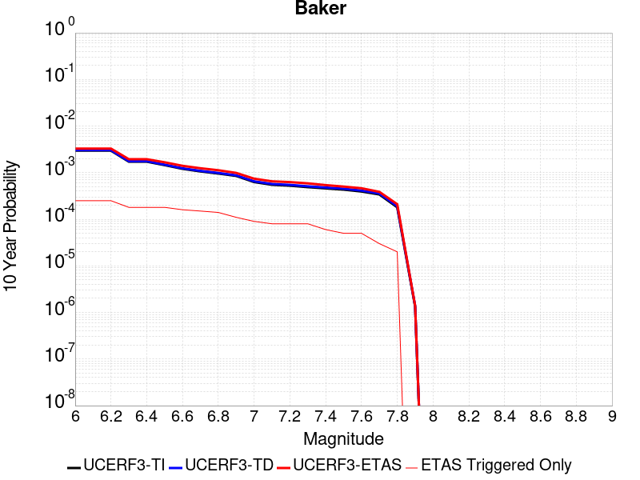 |

| Magnitude | 1 wk TI Prob | 1 wk TD Prob | 1 wk ETAS Prob | 1 wk ETAS/TD Gain | 1 wk ETAS Triggered Only | 1 mo TI Prob | 1 mo TD Prob | 1 mo ETAS Prob | 1 mo ETAS/TD Gain | 1 mo ETAS Triggered Only | 1 yr TI Prob | 1 yr TD Prob | 1 yr ETAS Prob | 1 yr ETAS/TD Gain | 1 yr ETAS Triggered Only | 10 yr TI Prob | 10 yr TD Prob | 10 yr ETAS Prob | 10 yr ETAS/TD Gain | 10 yr ETAS Triggered Only |
|-----|-----|-----|-----|-----|-----|-----|-----|-----|-----|-----|-----|-----|-----|-----|-----|-----|-----|-----|-----|-----|
| 6.0 | 5.695525E-6 | 5.8348373E-6 | 1.2729161E-4 | 21.815796 | 1.2145749E-4 | 2.4409164E-5 | 2.5006228E-5 | 2.2743031E-4 | 9.094947 | 2.0242915E-4 | 2.9714106E-4 | 3.044123E-4 | 7.0914737E-4 | 2.3295622 | 4.048583E-4 | 0.0029674405 | 0.0030403486 | 0.0035247016 | 1.1593083 | 4.8582995E-4 |
| 6.1 | 5.695525E-6 | 5.8348373E-6 | 1.2729161E-4 | 21.815796 | 1.2145749E-4 | 2.4409164E-5 | 2.5006228E-5 | 2.2743031E-4 | 9.094947 | 2.0242915E-4 | 2.9714106E-4 | 3.044123E-4 | 7.0914737E-4 | 2.3295622 | 4.048583E-4 | 0.0029674405 | 0.0030403486 | 0.0035247016 | 1.1593083 | 4.8582995E-4 |
| 6.2 | 5.695525E-6 | 5.8348373E-6 | 1.2729161E-4 | 21.815796 | 1.2145749E-4 | 2.4409164E-5 | 2.5006228E-5 | 2.2743031E-4 | 9.094947 | 2.0242915E-4 | 2.9714106E-4 | 3.044123E-4 | 7.0914737E-4 | 2.3295622 | 4.048583E-4 | 0.0029674405 | 0.0030403486 | 0.0035247016 | 1.1593083 | 4.8582995E-4 |
| 6.3 | 3.2995713E-6 | 3.383667E-6 | 8.435505E-5 | 24.930069 | 8.097166E-5 | 1.4140943E-5 | 1.4501353E-5 | 9.547184E-5 | 6.5836506 | 8.097166E-5 | 1.7215237E-4 | 1.7654014E-4 | 4.598909E-4 | 2.605022 | 2.8340082E-4 | 0.0017201907 | 0.001764046 | 0.0020873614 | 1.1832806 | 3.2388663E-4 |
| 6.4 | 3.2995713E-6 | 3.383667E-6 | 8.435505E-5 | 24.930069 | 8.097166E-5 | 1.4140943E-5 | 1.4501353E-5 | 9.547184E-5 | 6.5836506 | 8.097166E-5 | 1.7215237E-4 | 1.7654014E-4 | 4.598909E-4 | 2.605022 | 2.8340082E-4 | 0.0017201907 | 0.001764046 | 0.0020873614 | 1.1832806 | 3.2388663E-4 |
| 6.5 | 2.782202E-6 | 2.8558404E-6 | 8.382727E-5 | 29.352924 | 8.097166E-5 | 1.1923668E-5 | 1.223926E-5 | 9.320993E-5 | 7.61565 | 8.097166E-5 | 1.4516099E-4 | 1.4900314E-4 | 4.3236173E-4 | 2.9016955 | 2.8340082E-4 | 0.001450662 | 0.0014890651 | 0.0018124694 | 1.2171862 | 3.2388663E-4 |
| 6.6 | 2.3163404E-6 | 2.38092E-6 | 4.2866654E-5 | 18.00424 | 4.048583E-5 | 9.927136E-6 | 1.0203904E-5 | 5.068932E-5 | 4.96764 | 4.048583E-5 | 1.20856166E-4 | 1.2422565E-4 | 3.6711045E-4 | 2.9551904 | 2.4291498E-4 | 0.0012079047 | 0.0012415823 | 0.0015246313 | 1.2279744 | 2.8340082E-4 |
| 6.7 | 2.037056E-6 | 2.0965003E-6 | 4.2582247E-5 | 20.311108 | 4.048583E-5 | 8.7302105E-6 | 8.984972E-6 | 4.9470436E-5 | 5.505909 | 4.048583E-5 | 1.0628513E-4 | 1.093867E-4 | 3.5227512E-4 | 3.2204564 | 2.4291498E-4 | 0.0010623431 | 0.0010933448 | 0.0013764357 | 1.258922 | 2.8340082E-4 |
| 6.8 | 1.8356744E-6 | 1.8915287E-6 | 4.2377284E-5 | 22.40372 | 4.048583E-5 | 7.867153E-6 | 8.106527E-6 | 4.8592028E-5 | 5.994186 | 4.048583E-5 | 9.577837E-5 | 9.869264E-5 | 3.4158365E-4 | 3.4610853 | 2.4291498E-4 | 9.57371E-4 | 9.86502E-4 | 0.0012696233 | 1.286995 | 2.8340082E-4 |
| 6.9 | 1.6310546E-6 | 1.6832072E-6 | 4.216897E-5 | 25.05275 | 4.048583E-5 | 6.9902153E-6 | 7.213726E-6 | 4.7699265E-5 | 6.6122923 | 4.048583E-5 | 8.510255E-5 | 8.782368E-5 | 2.9023507E-4 | 3.3047469 | 2.0242915E-4 | 8.5069967E-4 | 8.7790104E-4 | 0.0011206028 | 1.2764568 | 2.4291498E-4 |
| 7.0 | 1.2058036E-6 | 1.2508665E-6 | 4.1736646E-5 | 33.366184 | 4.048583E-5 | 5.1677193E-6 | 5.3608455E-6 | 4.584646E-5 | 8.552094 | 4.048583E-5 | 6.291517E-5 | 6.5266366E-5 | 2.2719911E-4 | 3.4811058 | 1.6194332E-4 | 6.289736E-4 | 6.524743E-4 | 8.5477135E-4 | 1.3100461 | 2.0242915E-4 |
| 7.1 | 1.052382E-6 | 1.0951609E-6 | 4.1580948E-5 | 37.967888 | 4.048583E-5 | 4.5102006E-6 | 4.693538E-6 | 4.517918E-5 | 9.625825 | 4.048583E-5 | 5.491031E-5 | 5.7142337E-5 | 2.190764E-4 | 3.8338718 | 1.6194332E-4 | 5.4896745E-4 | 5.7127734E-4 | 7.331281E-4 | 1.2833139 | 1.6194332E-4 |
| 7.2 | 1.0067454E-6 | 1.0487711E-6 | 4.153456E-5 | 39.603073 | 4.048583E-5 | 4.3146156E-6 | 4.4947255E-6 | 4.4980374E-5 | 10.007368 | 4.048583E-5 | 5.252918E-5 | 5.4721917E-5 | 2.1665638E-4 | 3.959225 | 1.6194332E-4 | 5.251676E-4 | 5.470853E-4 | 7.0894003E-4 | 1.2958492 | 1.6194332E-4 |
| 7.3 | 9.3596316E-7 | 9.767723E-7 | 4.146256E-5 | 42.448544 | 4.048583E-5 | 4.0112645E-6 | 4.1861604E-6 | 4.4671822E-5 | 10.671311 | 4.048583E-5 | 4.8836053E-5 | 5.096532E-5 | 2.1290038E-4 | 4.177358 | 1.6194332E-4 | 4.8825322E-4 | 5.095371E-4 | 6.713979E-4 | 1.3176625 | 1.6194332E-4 |
| 7.4 | 8.8117395E-7 | 9.2076635E-7 | 4.1406558E-5 | 44.96967 | 4.048583E-5 | 3.7764542E-6 | 3.9461356E-6 | 4.4431807E-5 | 11.259574 | 4.048583E-5 | 4.5977362E-5 | 4.8043148E-5 | 1.694948E-4 | 3.5279703 | 1.2145749E-4 | 4.596785E-4 | 4.8032837E-4 | 6.017275E-4 | 1.2527419 | 1.2145749E-4 |
| 7.5 | 8.292386E-7 | 8.6745956E-7 | 8.6745956E-7 | 1.0 | 0.0 | 3.5538749E-6 | 3.7176785E-6 | 3.7176785E-6 | 1.0 | 0.0 | 4.326757E-5 | 4.5261804E-5 | 1.262298E-4 | 2.7888813 | 8.097166E-5 | 4.3259145E-4 | 4.5252658E-4 | 5.334616E-4 | 1.1788514 | 8.097166E-5 |
| 7.6 | 7.553842E-7 | 7.9144706E-7 | 7.9144706E-7 | 1.0 | 0.0 | 3.2373566E-6 | 3.3919116E-6 | 3.3919116E-6 | 1.0 | 0.0 | 3.9414106E-5 | 4.129575E-5 | 1.2226407E-4 | 2.9606938 | 8.097166E-5 | 3.9407116E-4 | 4.1288146E-4 | 4.9381965E-4 | 1.1960326 | 8.097166E-5 |
| 7.7 | 6.5285366E-7 | 6.852797E-7 | 6.852797E-7 | 1.0 | 0.0 | 2.797941E-6 | 2.9369096E-6 | 2.9369096E-6 | 1.0 | 0.0 | 3.40644E-5 | 3.5756293E-5 | 7.624068E-5 | 2.132231 | 4.048583E-5 | 3.405918E-4 | 3.5750607E-4 | 3.9797742E-4 | 1.1132047 | 4.048583E-5 |
| 7.8 | 3.4586725E-7 | 3.6482615E-7 | 3.6482615E-7 | 1.0 | 0.0 | 1.4822873E-6 | 1.5635396E-6 | 1.5635396E-6 | 1.0 | 0.0 | 1.80467E-5 | 1.9035933E-5 | 5.9520993E-5 | 3.1267703 | 4.048583E-5 | 1.8045233E-4 | 1.9034347E-4 | 2.3082159E-4 | 1.2126583 | 4.048583E-5 |
| 7.9 | 2.5591178E-9 | 2.6696718E-9 | 2.6696718E-9 | 1.0 | 0.0 | 1.0967647E-8 | 1.14414505E-8 | 1.14414505E-8 | 1.0 | 0.0 | 1.335311E-7 | 1.3929966E-7 | 1.3929966E-7 | 1.0 | 0.0 | 1.3353102E-6 | 1.3929966E-6 | 1.3929966E-6 | 1.0 | 0.0 |

## San Andreas (Carrizo) rev
*[(top)](#table-of-contents)*

| 1 Week | 1 Month | 1 Year | 10 Year |
|-----|-----|-----|-----|
|  |  |  |  |

| Magnitude | 1 wk TI Prob | 1 wk TD Prob | 1 wk ETAS Prob | 1 wk ETAS/TD Gain | 1 wk ETAS Triggered Only | 1 mo TI Prob | 1 mo TD Prob | 1 mo ETAS Prob | 1 mo ETAS/TD Gain | 1 mo ETAS Triggered Only | 1 yr TI Prob | 1 yr TD Prob | 1 yr ETAS Prob | 1 yr ETAS/TD Gain | 1 yr ETAS Triggered Only | 10 yr TI Prob | 10 yr TD Prob | 10 yr ETAS Prob | 10 yr ETAS/TD Gain | 10 yr ETAS Triggered Only |
|-----|-----|-----|-----|-----|-----|-----|-----|-----|-----|-----|-----|-----|-----|-----|-----|-----|-----|-----|-----|-----|
| 6.0 | 1.1674632E-4 | 2.432302E-4 | 4.860861E-4 | 1.9984611 | 2.4291498E-4 | 5.002454E-4 | 0.0010420004 | 0.0012846622 | 1.2328808 | 2.4291498E-4 | 0.006073493 | 0.012613042 | 0.013012794 | 1.0316936 | 4.048583E-4 | 0.0591016 | 0.12061418 | 0.12104141 | 1.0035422 | 4.8582995E-4 |
| 6.1 | 1.1674632E-4 | 2.432302E-4 | 4.860861E-4 | 1.9984611 | 2.4291498E-4 | 5.002454E-4 | 0.0010420004 | 0.0012846622 | 1.2328808 | 2.4291498E-4 | 0.006073493 | 0.012613042 | 0.013012794 | 1.0316936 | 4.048583E-4 | 0.0591016 | 0.12061418 | 0.12104141 | 1.0035422 | 4.8582995E-4 |
| 6.2 | 1.1674632E-4 | 2.432302E-4 | 4.860861E-4 | 1.9984611 | 2.4291498E-4 | 5.002454E-4 | 0.0010420004 | 0.0012846622 | 1.2328808 | 2.4291498E-4 | 0.006073493 | 0.012613042 | 0.013012794 | 1.0316936 | 4.048583E-4 | 0.0591016 | 0.12061418 | 0.12104141 | 1.0035422 | 4.8582995E-4 |
| 6.3 | 1.1674632E-4 | 2.432302E-4 | 4.860861E-4 | 1.9984611 | 2.4291498E-4 | 5.002454E-4 | 0.0010420004 | 0.0012846622 | 1.2328808 | 2.4291498E-4 | 0.006073493 | 0.012613042 | 0.013012794 | 1.0316936 | 4.048583E-4 | 0.0591016 | 0.12061418 | 0.12104141 | 1.0035422 | 4.8582995E-4 |
| 6.4 | 1.1674632E-4 | 2.432302E-4 | 4.860861E-4 | 1.9984611 | 2.4291498E-4 | 5.002454E-4 | 0.0010420004 | 0.0012846622 | 1.2328808 | 2.4291498E-4 | 0.006073493 | 0.012613042 | 0.013012794 | 1.0316936 | 4.048583E-4 | 0.0591016 | 0.12061418 | 0.12104141 | 1.0035422 | 4.8582995E-4 |
| 6.5 | 1.13136164E-4 | 2.3643032E-4 | 4.7928788E-4 | 2.0271845 | 2.4291498E-4 | 4.847792E-4 | 0.0010128808 | 0.0012555497 | 1.2395829 | 2.4291498E-4 | 0.0058862255 | 0.012262545 | 0.012662438 | 1.032611 | 4.048583E-4 | 0.057327334 | 0.117585555 | 0.11801425 | 1.0036459 | 4.8582995E-4 |
| 6.6 | 1.13136164E-4 | 2.3643032E-4 | 4.7928788E-4 | 2.0271845 | 2.4291498E-4 | 4.847792E-4 | 0.0010128808 | 0.0012555497 | 1.2395829 | 2.4291498E-4 | 0.0058862255 | 0.012262545 | 0.012662438 | 1.032611 | 4.048583E-4 | 0.057327334 | 0.117585555 | 0.11801425 | 1.0036459 | 4.8582995E-4 |
| 6.7 | 1.1149675E-4 | 2.3334254E-4 | 4.7620083E-4 | 2.0407803 | 2.4291498E-4 | 4.777557E-4 | 9.996577E-4 | 0.0012423298 | 1.2427553 | 2.4291498E-4 | 0.0058011734 | 0.012103349 | 0.012503307 | 1.0330453 | 4.048583E-4 | 0.05652051 | 0.1162071 | 0.11663647 | 1.0036949 | 4.8582995E-4 |
| 6.8 | 1.1103589E-4 | 2.3236412E-4 | 4.7522265E-4 | 2.0451636 | 2.4291498E-4 | 4.7578133E-4 | 9.954676E-4 | 0.0012381409 | 1.243778 | 2.4291498E-4 | 0.005777263 | 0.012052901 | 0.01245288 | 1.0331852 | 4.048583E-4 | 0.056293584 | 0.1157674 | 0.11619698 | 1.0037107 | 4.8582995E-4 |
| 6.9 | 1.1053259E-4 | 2.3128795E-4 | 4.7414674E-4 | 2.0500278 | 2.4291498E-4 | 4.7362508E-4 | 9.90859E-4 | 0.0012335333 | 1.244913 | 2.4291498E-4 | 0.0057511497 | 0.01199741 | 0.012397411 | 1.0333406 | 4.048583E-4 | 0.05604569 | 0.11528359 | 0.11571342 | 1.0037284 | 4.8582995E-4 |
| 7.0 | 1.1005377E-4 | 2.3029637E-4 | 4.731554E-4 | 2.05455 | 2.4291498E-4 | 4.7157376E-4 | 9.866126E-4 | 0.0012292879 | 1.2459682 | 2.4291498E-4 | 0.0057263062 | 0.011946279 | 0.0123463 | 1.033485 | 4.048583E-4 | 0.055809796 | 0.11483591 | 0.11526595 | 1.0037448 | 4.8582995E-4 |
| 7.1 | 1.0308142E-4 | 2.1539345E-4 | 4.17779E-4 | 1.9396087 | 2.0242915E-4 | 4.417027E-4 | 9.227892E-4 | 0.0011250316 | 1.2191641 | 2.0242915E-4 | 0.0053644776 | 0.011177397 | 0.011537697 | 1.0322347 | 3.6437248E-4 | 0.052368138 | 0.108092256 | 0.10848946 | 1.0036747 | 4.4534414E-4 |
| 7.2 | 1.0027479E-4 | 2.094724E-4 | 4.1185916E-4 | 1.9661738 | 2.0242915E-4 | 4.296783E-4 | 8.9743105E-4 | 0.0010996786 | 1.2253627 | 2.0242915E-4 | 0.0052187922 | 0.010871782 | 0.011232194 | 1.033151 | 3.6437248E-4 | 0.050979212 | 0.10539625 | 0.10579465 | 1.0037801 | 4.4534414E-4 |
| 7.3 | 9.816942E-5 | 2.0422463E-4 | 4.0661244E-4 | 1.9910058 | 2.0242915E-4 | 4.2065824E-4 | 8.7495585E-4 | 0.0010772079 | 1.2311568 | 2.0242915E-4 | 0.005109493 | 0.010600842 | 0.010961352 | 1.0340077 | 3.6437248E-4 | 0.049935985 | 0.102979995 | 0.10337948 | 1.0038792 | 4.4534414E-4 |
| 7.4 | 9.5634205E-5 | 1.9791997E-4 | 3.5983123E-4 | 1.8180643 | 1.6194332E-4 | 4.0979648E-4 | 8.479536E-4 | 0.0010097596 | 1.1908194 | 1.6194332E-4 | 0.0049778637 | 0.010275229 | 0.010595787 | 1.0311972 | 3.2388663E-4 | 0.048678253 | 0.10006632 | 0.10043067 | 1.003641 | 4.048583E-4 |
| 7.5 | 8.052417E-5 | 1.611261E-4 | 2.8256403E-4 | 1.7536825 | 1.2145749E-4 | 3.4505792E-4 | 6.903579E-4 | 8.117315E-4 | 1.1758126 | 1.2145749E-4 | 0.0041929903 | 0.008372796 | 0.008653823 | 1.0335644 | 2.8340082E-4 | 0.04114753 | 0.08281049 | 0.08314469 | 1.0040357 | 3.6437248E-4 |
| 7.6 | 7.897024E-5 | 1.5765853E-4 | 2.790969E-4 | 1.7702618 | 1.2145749E-4 | 3.384E-4 | 6.755046E-4 | 7.968801E-4 | 1.1796812 | 1.2145749E-4 | 0.0041122385 | 0.008193332 | 0.0084744105 | 1.0343058 | 2.8340082E-4 | 0.040369697 | 0.08115171 | 0.08148651 | 1.0041256 | 3.6437248E-4 |
| 7.7 | 6.707427E-5 | 1.3276102E-4 | 2.1372194E-4 | 1.6098244 | 8.097166E-5 | 2.8742946E-4 | 5.688518E-4 | 6.497774E-4 | 1.1422613 | 8.097166E-5 | 0.003493839 | 0.00690381 | 0.007145048 | 1.0349427 | 2.4291498E-4 | 0.034394164 | 0.069048055 | 0.06934958 | 1.0043669 | 3.2388663E-4 |
| 7.8 | 6.147705E-5 | 1.2197486E-4 | 2.0293664E-4 | 1.6637579 | 8.097166E-5 | 2.6344648E-4 | 5.226447E-4 | 6.0357404E-4 | 1.1548458 | 8.097166E-5 | 0.0032027436 | 0.006344659 | 0.006545804 | 1.031703 | 2.0242915E-4 | 0.031569764 | 0.06351457 | 0.063779965 | 1.0041785 | 2.8340082E-4 |
| 7.9 | 4.7636717E-5 | 8.87977E-5 | 1.6976218E-4 | 1.9117856 | 8.097166E-5 | 2.0414138E-4 | 3.8050607E-4 | 4.6144694E-4 | 1.212719 | 8.097166E-5 | 0.0024825884 | 0.0046228287 | 0.0047840234 | 1.0348693 | 1.6194332E-4 | 0.024550365 | 0.046628095 | 0.046782486 | 1.0033112 | 1.6194332E-4 |
| 8.0 | 3.3554235E-5 | 5.2136907E-5 | 9.262063E-5 | 1.7764887 | 4.048583E-5 | 1.4379594E-4 | 2.2342477E-4 | 2.6390154E-4 | 1.1811652 | 4.048583E-5 | 0.0017493097 | 0.002716805 | 0.0027975568 | 1.029723 | 8.097166E-5 | 0.017356034 | 0.027880952 | 0.027959667 | 1.0028232 | 8.097166E-5 |
| 8.1 | 1.9175432E-5 | 1.9184976E-5 | 5.967003E-5 | 3.1102479 | 4.048583E-5 | 8.217783E-5 | 8.2218736E-5 | 1.2270124E-4 | 1.4923756 | 4.048583E-5 | 0.0010000558 | 0.0010005541 | 0.0010409993 | 1.0404229 | 4.048583E-5 | 0.009955673 | 0.0107580265 | 0.010798077 | 1.0037228 | 4.048583E-5 |
| 8.2 | 8.643924E-6 | 5.4748625E-6 | 5.4748625E-6 | 1.0 | 0.0 | 3.704486E-5 | 2.3463486E-5 | 2.3463486E-5 | 1.0 | 0.0 | 4.5092785E-4 | 2.8563058E-4 | 2.8563058E-4 | 1.0 | 0.0 | 0.0045001395 | 0.0032487072 | 0.0032487072 | 1.0 | 0.0 |
| 8.3 | 1.983087E-6 | 7.6599065E-7 | 7.6599065E-7 | 1.0 | 0.0 | 8.498917E-6 | 3.282813E-6 | 3.282813E-6 | 1.0 | 0.0 | 1.034694E-4 | 3.9967534E-5 | 3.9967534E-5 | 1.0 | 0.0 | 0.0010342124 | 4.719687E-4 | 4.719687E-4 | 1.0 | 0.0 |

## San Andreas (Cholame) rev
*[(top)](#table-of-contents)*

| 1 Week | 1 Month | 1 Year | 10 Year |
|-----|-----|-----|-----|
|  |  |  |  |

| Magnitude | 1 wk TI Prob | 1 wk TD Prob | 1 wk ETAS Prob | 1 wk ETAS/TD Gain | 1 wk ETAS Triggered Only | 1 mo TI Prob | 1 mo TD Prob | 1 mo ETAS Prob | 1 mo ETAS/TD Gain | 1 mo ETAS Triggered Only | 1 yr TI Prob | 1 yr TD Prob | 1 yr ETAS Prob | 1 yr ETAS/TD Gain | 1 yr ETAS Triggered Only | 10 yr TI Prob | 10 yr TD Prob | 10 yr ETAS Prob | 10 yr ETAS/TD Gain | 10 yr ETAS Triggered Only |
|-----|-----|-----|-----|-----|-----|-----|-----|-----|-----|-----|-----|-----|-----|-----|-----|-----|-----|-----|-----|-----|
| 6.0 | 1.2302514E-4 | 2.5204287E-4 | 4.948966E-4 | 1.9635415 | 2.4291498E-4 | 5.27144E-4 | 0.0010797381 | 0.0013223909 | 1.2247329 | 2.4291498E-4 | 0.0063991086 | 0.0130670825 | 0.013426694 | 1.0275204 | 3.6437248E-4 | 0.06217949 | 0.12439073 | 0.12478068 | 1.0031348 | 4.4534414E-4 |
| 6.1 | 1.2302514E-4 | 2.5204287E-4 | 4.948966E-4 | 1.9635415 | 2.4291498E-4 | 5.27144E-4 | 0.0010797381 | 0.0013223909 | 1.2247329 | 2.4291498E-4 | 0.0063991086 | 0.0130670825 | 0.013426694 | 1.0275204 | 3.6437248E-4 | 0.06217949 | 0.12439073 | 0.12478068 | 1.0031348 | 4.4534414E-4 |
| 6.2 | 1.2203569E-4 | 2.5021084E-4 | 4.9306505E-4 | 1.9705982 | 2.4291498E-4 | 5.2290526E-4 | 0.0010718931 | 0.0013145477 | 1.2263795 | 2.4291498E-4 | 0.006347804 | 0.01297271 | 0.013332355 | 1.0277232 | 3.6437248E-4 | 0.061695136 | 0.12357691 | 0.123967215 | 1.0031585 | 4.4534414E-4 |
| 6.3 | 1.2142645E-4 | 2.4907055E-4 | 4.9192505E-4 | 1.9750428 | 2.4291498E-4 | 5.202953E-4 | 0.0010670102 | 0.001309666 | 1.2274165 | 2.4291498E-4 | 0.006316212 | 0.012913967 | 0.013273634 | 1.027851 | 3.6437248E-4 | 0.06139677 | 0.12307103 | 0.12346157 | 1.0031732 | 4.4534414E-4 |
| 6.4 | 1.1865206E-4 | 2.44126E-4 | 4.8698168E-4 | 1.9947964 | 2.4291498E-4 | 5.0840975E-4 | 0.0010458364 | 0.0012884974 | 1.2320257 | 2.4291498E-4 | 0.006172335 | 0.012659196 | 0.013018956 | 1.0284189 | 3.6437248E-4 | 0.060036868 | 0.1208638 | 0.12125532 | 1.0032393 | 4.4534414E-4 |
| 6.5 | 1.17443946E-4 | 2.4205919E-4 | 4.8491536E-4 | 2.0032926 | 2.4291498E-4 | 5.032341E-4 | 0.0010369857 | 0.0012796487 | 1.2340082 | 2.4291498E-4 | 0.006109677 | 0.012552682 | 0.012912481 | 1.028663 | 3.6437248E-4 | 0.059444077 | 0.11993805 | 0.12032998 | 1.0032678 | 4.4534414E-4 |
| 6.6 | 1.13579066E-4 | 2.3514954E-4 | 4.780074E-4 | 2.0327804 | 2.4291498E-4 | 4.866766E-4 | 0.001007396 | 0.0012500663 | 1.2408886 | 2.4291498E-4 | 0.0059092017 | 0.012196515 | 0.012556443 | 1.0295107 | 3.6437248E-4 | 0.057545185 | 0.11685214 | 0.11724545 | 1.0033659 | 4.4534414E-4 |
| 6.7 | 1.1271412E-4 | 2.3359268E-4 | 4.7645092E-4 | 2.0396655 | 2.4291498E-4 | 4.829711E-4 | 0.0010007289 | 0.0012434009 | 1.2424952 | 2.4291498E-4 | 0.005864331 | 0.012116249 | 0.012476206 | 1.0297086 | 3.6437248E-4 | 0.057119697 | 0.116155714 | 0.11654933 | 1.0033886 | 4.4534414E-4 |
| 6.8 | 1.1217975E-4 | 2.3247694E-4 | 4.7533546E-4 | 2.0446563 | 2.4291498E-4 | 4.8068175E-4 | 9.959509E-4 | 0.0012386239 | 1.2436596 | 2.4291498E-4 | 0.005836608 | 0.012058721 | 0.012418699 | 1.0298522 | 3.6437248E-4 | 0.056856725 | 0.11565396 | 0.11604781 | 1.0034053 | 4.4534414E-4 |
| 6.9 | 1.1146753E-4 | 2.3096445E-4 | 4.738233E-4 | 2.051499 | 2.4291498E-4 | 4.7763053E-4 | 9.894737E-4 | 0.0012321483 | 1.2452563 | 2.4291498E-4 | 0.0057996577 | 0.011980731 | 0.012340738 | 1.0300488 | 3.6437248E-4 | 0.056506127 | 0.11497439 | 0.11536853 | 1.0034281 | 4.4534414E-4 |
| 7.0 | 1.0965793E-4 | 2.2719789E-4 | 4.7005768E-4 | 2.0689352 | 2.4291498E-4 | 4.698779E-4 | 9.733434E-4 | 0.001216022 | 1.2493247 | 2.4291498E-4 | 0.005705768 | 0.011786487 | 0.012146564 | 1.03055 | 3.6437248E-4 | 0.055614736 | 0.11327597 | 0.11367086 | 1.0034862 | 4.4534414E-4 |
| 7.1 | 9.927982E-5 | 2.0538924E-4 | 4.077768E-4 | 1.9853855 | 2.0242915E-4 | 4.2541555E-4 | 8.7994366E-4 | 0.0010821946 | 1.2298454 | 2.0242915E-4 | 0.0051671406 | 0.010660981 | 0.0109814145 | 1.0300567 | 3.2388663E-4 | 0.05048634 | 0.1033706 | 0.10373361 | 1.0035117 | 4.048583E-4 |
| 7.2 | 9.696786E-5 | 2.0043184E-4 | 4.028204E-4 | 2.0097625 | 2.0242915E-4 | 4.1551032E-4 | 8.5871184E-4 | 0.0010609671 | 1.2355334 | 2.0242915E-4 | 0.00504711 | 0.010404981 | 0.010725497 | 1.0308042 | 3.2388663E-4 | 0.04934009 | 0.1011086 | 0.10147253 | 1.0035993 | 4.048583E-4 |
| 7.3 | 9.4727984E-5 | 1.9472468E-4 | 3.971144E-4 | 2.0393636 | 2.0242915E-4 | 4.0591392E-4 | 8.3426846E-4 | 0.0010365287 | 1.2424402 | 2.0242915E-4 | 0.0049308087 | 0.010110183 | 0.010430794 | 1.0317118 | 3.2388663E-4 | 0.048228268 | 0.09847952 | 0.098844506 | 1.0037062 | 4.048583E-4 |
| 7.4 | 9.220358E-5 | 1.8843076E-4 | 3.5034356E-4 | 1.8592695 | 1.6194332E-4 | 3.9509835E-4 | 8.073114E-4 | 9.6912397E-4 | 1.200434 | 1.6194332E-4 | 0.004799717 | 0.009784967 | 0.010065594 | 1.0286795 | 2.8340082E-4 | 0.046973653 | 0.095557496 | 0.09588705 | 1.0034487 | 3.6437248E-4 |
| 7.5 | 7.71631E-5 | 1.5177966E-4 | 2.7321873E-4 | 1.8001009 | 1.2145749E-4 | 3.306571E-4 | 6.503223E-4 | 7.717008E-4 | 1.1866436 | 1.2145749E-4 | 0.0040183207 | 0.007889002 | 0.00813 | 1.0305487 | 2.4291498E-4 | 0.03946433 | 0.07828531 | 0.07858384 | 1.0038134 | 3.2388663E-4 |
| 7.6 | 7.5634416E-5 | 1.483744E-4 | 2.6981387E-4 | 1.8184664 | 1.2145749E-4 | 3.241072E-4 | 6.3573546E-4 | 7.571157E-4 | 1.1909289 | 1.2145749E-4 | 0.0039388672 | 0.0077126776 | 0.007953719 | 1.0312526 | 2.4291498E-4 | 0.038697794 | 0.07664872 | 0.07694778 | 1.0039017 | 3.2388663E-4 |
| 7.7 | 6.3783E-5 | 1.235872E-4 | 2.0454887E-4 | 1.6550974 | 8.097166E-5 | 2.7332708E-4 | 5.29552E-4 | 6.104808E-4 | 1.152825 | 8.097166E-5 | 0.0033226798 | 0.0064282627 | 0.0066293906 | 1.031288 | 2.0242915E-4 | 0.032734364 | 0.06454029 | 0.0648054 | 1.0041077 | 2.8340082E-4 |
| 7.8 | 5.863422E-5 | 1.1416107E-4 | 1.9512349E-4 | 1.7091945 | 8.097166E-5 | 2.512653E-4 | 4.8917E-4 | 5.701021E-4 | 1.1654477 | 8.097166E-5 | 0.003054864 | 0.0059394026 | 0.0061406298 | 1.03388 | 2.0242915E-4 | 0.030132094 | 0.059659187 | 0.05992568 | 1.0044669 | 2.8340082E-4 |
| 7.9 | 4.595283E-5 | 8.426331E-5 | 1.6522815E-4 | 1.9608551 | 8.097166E-5 | 1.9692584E-4 | 3.610785E-4 | 4.4202094E-4 | 1.2241685 | 8.097166E-5 | 0.0023949358 | 0.0043872762 | 0.004548509 | 1.0367501 | 1.6194332E-4 | 0.023692891 | 0.044362005 | 0.044516765 | 1.0034885 | 1.6194332E-4 |
| 8.0 | 3.2950178E-5 | 5.0772942E-5 | 9.125672E-5 | 1.7973493 | 4.048583E-5 | 1.412074E-4 | 2.1758018E-4 | 2.580572E-4 | 1.1860327 | 4.048583E-5 | 0.0017178444 | 0.0026458222 | 0.0027265798 | 1.0305226 | 8.097166E-5 | 0.017046256 | 0.027180137 | 0.027258908 | 1.0028981 | 8.097166E-5 |
| 8.1 | 1.9177472E-5 | 1.9185145E-5 | 5.9670198E-5 | 3.110229 | 4.048583E-5 | 8.218658E-5 | 8.221946E-5 | 1.2270197E-4 | 1.4923712 | 4.048583E-5 | 0.0010001622 | 0.0010005629 | 0.0010410083 | 1.0404226 | 4.048583E-5 | 0.009956728 | 0.010758142 | 0.010798193 | 1.0037228 | 4.048583E-5 |
| 8.2 | 8.643924E-6 | 5.4748625E-6 | 5.4748625E-6 | 1.0 | 0.0 | 3.704486E-5 | 2.3463486E-5 | 2.3463486E-5 | 1.0 | 0.0 | 4.5092785E-4 | 2.8563058E-4 | 2.8563058E-4 | 1.0 | 0.0 | 0.0045001395 | 0.0032487072 | 0.0032487072 | 1.0 | 0.0 |
| 8.3 | 1.983087E-6 | 7.6599065E-7 | 7.6599065E-7 | 1.0 | 0.0 | 8.498917E-6 | 3.282813E-6 | 3.282813E-6 | 1.0 | 0.0 | 1.034694E-4 | 3.9967534E-5 | 3.9967534E-5 | 1.0 | 0.0 | 0.0010342124 | 4.719687E-4 | 4.719687E-4 | 1.0 | 0.0 |

## Elsinore (Glen Ivy) rev
*[(top)](#table-of-contents)*

| 1 Week | 1 Month | 1 Year | 10 Year |
|-----|-----|-----|-----|
|  |  | 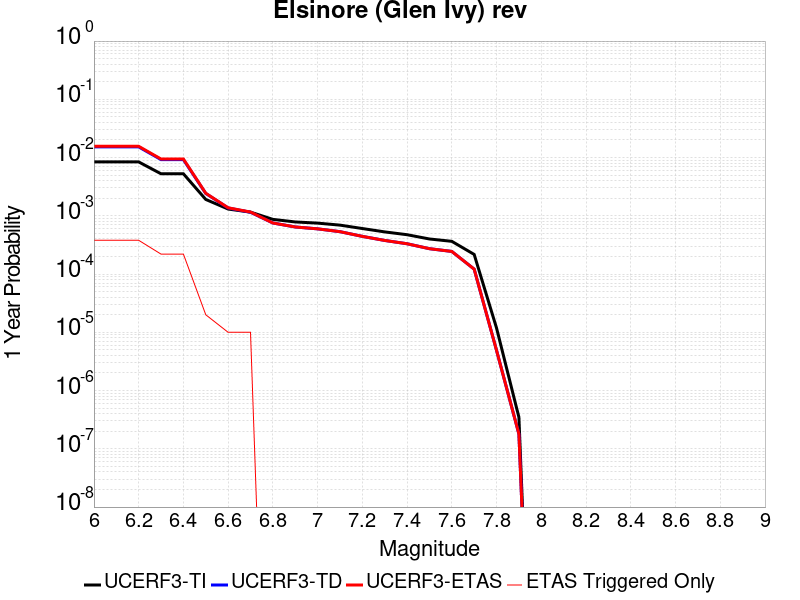 |  |

| Magnitude | 1 wk TI Prob | 1 wk TD Prob | 1 wk ETAS Prob | 1 wk ETAS/TD Gain | 1 wk ETAS Triggered Only | 1 mo TI Prob | 1 mo TD Prob | 1 mo ETAS Prob | 1 mo ETAS/TD Gain | 1 mo ETAS Triggered Only | 1 yr TI Prob | 1 yr TD Prob | 1 yr ETAS Prob | 1 yr ETAS/TD Gain | 1 yr ETAS Triggered Only | 10 yr TI Prob | 10 yr TD Prob | 10 yr ETAS Prob | 10 yr ETAS/TD Gain | 10 yr ETAS Triggered Only |
|-----|-----|-----|-----|-----|-----|-----|-----|-----|-----|-----|-----|-----|-----|-----|-----|-----|-----|-----|-----|-----|
| 6.0 | 1.6204086E-4 | 2.9360707E-4 | 4.5550283E-4 | 1.5514028 | 1.6194332E-4 | 6.94276E-4 | 0.0012578638 | 0.0014196035 | 1.1285827 | 1.6194332E-4 | 0.008420097 | 0.015234485 | 0.015513568 | 1.0183191 | 2.8340082E-4 | 0.081081145 | 0.13969168 | 0.14003998 | 1.0024934 | 4.048583E-4 |
| 6.1 | 1.6204086E-4 | 2.9360707E-4 | 4.5550283E-4 | 1.5514028 | 1.6194332E-4 | 6.94276E-4 | 0.0012578638 | 0.0014196035 | 1.1285827 | 1.6194332E-4 | 0.008420097 | 0.015234485 | 0.015513568 | 1.0183191 | 2.8340082E-4 | 0.081081145 | 0.13969168 | 0.14003998 | 1.0024934 | 4.048583E-4 |
| 6.2 | 1.6204086E-4 | 2.9360707E-4 | 4.5550283E-4 | 1.5514028 | 1.6194332E-4 | 6.94276E-4 | 0.0012578638 | 0.0014196035 | 1.1285827 | 1.6194332E-4 | 0.008420097 | 0.015234485 | 0.015513568 | 1.0183191 | 2.8340082E-4 | 0.081081145 | 0.13969168 | 0.14003998 | 1.0024934 | 4.048583E-4 |
| 6.3 | 1.0111737E-4 | 1.7703383E-4 | 2.5799114E-4 | 1.4572986 | 8.097166E-5 | 4.332882E-4 | 7.5861247E-4 | 8.395227E-4 | 1.1066556 | 8.097166E-5 | 0.005262531 | 0.009217682 | 0.00933802 | 1.0130551 | 1.2145749E-4 | 0.0513964 | 0.0870191 | 0.087240875 | 1.0025486 | 2.4291498E-4 |
| 6.4 | 1.0111737E-4 | 1.7703383E-4 | 2.5799114E-4 | 1.4572986 | 8.097166E-5 | 4.332882E-4 | 7.5861247E-4 | 8.395227E-4 | 1.1066556 | 8.097166E-5 | 0.005262531 | 0.009217682 | 0.00933802 | 1.0130551 | 1.2145749E-4 | 0.0513964 | 0.0870191 | 0.087240875 | 1.0025486 | 2.4291498E-4 |
| 6.5 | 3.6624708E-5 | 4.6391084E-5 | 8.6875036E-5 | 1.8726667 | 4.048583E-5 | 1.569536E-4 | 1.9880582E-4 | 2.392836E-4 | 1.2036046 | 4.048583E-5 | 0.001909235 | 0.0024181372 | 0.0024585251 | 1.016702 | 4.048583E-5 | 0.01892915 | 0.023739954 | 0.023819003 | 1.0033298 | 8.097166E-5 |
| 6.6 | 2.5051324E-5 | 2.614772E-5 | 2.614772E-5 | 1.0 | 0.0 | 1.073584E-4 | 1.12057096E-4 | 1.12057096E-4 | 1.0 | 0.0 | 0.0013063047 | 0.0013634858 | 0.0013634858 | 1.0 | 0.0 | 0.012986525 | 0.013564618 | 0.013604555 | 1.0029442 | 4.048583E-5 |
| 6.7 | 2.2189772E-5 | 2.2072849E-5 | 2.2072849E-5 | 1.0 | 0.0 | 9.509556E-5 | 9.4594696E-5 | 9.4594696E-5 | 1.0 | 0.0 | 0.0011571734 | 0.0011511183 | 0.0011511183 | 1.0 | 0.0 | 0.011511663 | 0.011465415 | 0.011505437 | 1.0034907 | 4.048583E-5 |
| 6.8 | 1.6654378E-5 | 1.4437705E-5 | 1.4437705E-5 | 1.0 | 0.0 | 7.137396E-5 | 6.187444E-5 | 6.187444E-5 | 1.0 | 0.0 | 8.686314E-4 | 7.530661E-4 | 7.530661E-4 | 1.0 | 0.0 | 0.008652439 | 0.00751048 | 0.007550662 | 1.0053501 | 4.048583E-5 |
| 6.9 | 1.5042909E-5 | 1.2332022E-5 | 1.2332022E-5 | 1.0 | 0.0 | 6.446802E-5 | 5.285047E-5 | 5.285047E-5 | 1.0 | 0.0 | 7.8461546E-4 | 6.4326765E-4 | 6.4326765E-4 | 1.0 | 0.0 | 0.007818509 | 0.00641828 | 0.006458506 | 1.0062674 | 4.048583E-5 |
| 7.0 | 1.4361385E-5 | 1.1451324E-5 | 1.1451324E-5 | 1.0 | 0.0 | 6.154734E-5 | 4.9076196E-5 | 4.9076196E-5 | 1.0 | 0.0 | 7.490812E-4 | 5.973418E-4 | 5.973418E-4 | 1.0 | 0.0 | 0.007465612 | 0.0059613534 | 0.0060015977 | 1.006751 | 4.048583E-5 |
| 7.1 | 1.3265571E-5 | 1.0244926E-5 | 1.0244926E-5 | 1.0 | 0.0 | 5.6851208E-5 | 4.39061E-5 | 4.39061E-5 | 1.0 | 0.0 | 6.919436E-4 | 5.344282E-4 | 5.344282E-4 | 1.0 | 0.0 | 0.006897931 | 0.0053347866 | 0.0053750565 | 1.0075486 | 4.048583E-5 |
| 7.2 | 1.1596403E-5 | 8.505067E-6 | 8.505067E-6 | 1.0 | 0.0 | 4.9697923E-5 | 3.6449786E-5 | 3.6449786E-5 | 1.0 | 0.0 | 6.049042E-4 | 4.436875E-4 | 4.436875E-4 | 1.0 | 0.0 | 0.006032603 | 0.0044294316 | 0.004469738 | 1.0090997 | 4.048583E-5 |
| 7.3 | 1.0150827E-5 | 7.2387597E-6 | 7.2387597E-6 | 1.0 | 0.0 | 4.3502816E-5 | 3.1022897E-5 | 3.1022897E-5 | 1.0 | 0.0 | 5.2951806E-4 | 3.7763975E-4 | 3.7763975E-4 | 1.0 | 0.0 | 0.005282581 | 0.0037703665 | 0.0038106998 | 1.0106974 | 4.048583E-5 |
| 7.4 | 9.080705E-6 | 6.352519E-6 | 6.352519E-6 | 1.0 | 0.0 | 3.8916725E-5 | 2.7224805E-5 | 2.7224805E-5 | 1.0 | 0.0 | 4.7370812E-4 | 3.3141294E-4 | 3.3141294E-4 | 1.0 | 0.0 | 0.004726996 | 0.0033093381 | 0.0033093381 | 1.0 | 0.0 |
| 7.5 | 7.671649E-6 | 5.2256332E-6 | 5.2256332E-6 | 1.0 | 0.0 | 3.287808E-5 | 2.2395385E-5 | 2.2395385E-5 | 1.0 | 0.0 | 4.0021708E-4 | 2.7263095E-4 | 2.7263095E-4 | 1.0 | 0.0 | 0.0039949706 | 0.00272309 | 0.00272309 | 1.0 | 0.0 |
| 7.6 | 6.990086E-6 | 4.687545E-6 | 4.687545E-6 | 1.0 | 0.0 | 2.9957167E-5 | 2.008933E-5 | 2.008933E-5 | 1.0 | 0.0 | 3.6466747E-4 | 2.445613E-4 | 2.445613E-4 | 1.0 | 0.0 | 0.0036406964 | 0.002443038 | 0.002443038 | 1.0 | 0.0 |
| 7.7 | 4.163505E-6 | 2.3295343E-6 | 2.3295343E-6 | 1.0 | 0.0 | 1.7843471E-5 | 9.983683E-6 | 9.983683E-6 | 1.0 | 0.0 | 2.172226E-4 | 1.21545316E-4 | 1.21545316E-4 | 1.0 | 0.0 | 0.0021701038 | 0.0012148614 | 0.0012148614 | 1.0 | 0.0 |
| 7.8 | 2.2692414E-7 | 9.3854695E-8 | 9.3854695E-8 | 1.0 | 0.0 | 9.725317E-7 | 4.0223435E-7 | 4.0223435E-7 | 1.0 | 0.0 | 1.1840509E-5 | 4.8971956E-6 | 4.8971956E-6 | 1.0 | 0.0 | 1.1839878E-4 | 4.8971204E-5 | 4.8971204E-5 | 1.0 | 0.0 |
| 7.9 | 6.676829E-9 | 3.439853E-9 | 3.439853E-9 | 1.0 | 0.0 | 2.861498E-8 | 1.4742227E-8 | 1.4742227E-8 | 1.0 | 0.0 | 3.4838732E-7 | 1.7948659E-7 | 1.7948659E-7 | 1.0 | 0.0 | 3.4838679E-6 | 1.7948646E-6 | 1.7948646E-6 | 1.0 | 0.0 |

## Mission Ridge-Arroyo Parida-Santa Ana
*[(top)](#table-of-contents)*

| 1 Week | 1 Month | 1 Year | 10 Year |
|-----|-----|-----|-----|
|  |  |  |  |

| Magnitude | 1 wk TI Prob | 1 wk TD Prob | 1 wk ETAS Prob | 1 wk ETAS/TD Gain | 1 wk ETAS Triggered Only | 1 mo TI Prob | 1 mo TD Prob | 1 mo ETAS Prob | 1 mo ETAS/TD Gain | 1 mo ETAS Triggered Only | 1 yr TI Prob | 1 yr TD Prob | 1 yr ETAS Prob | 1 yr ETAS/TD Gain | 1 yr ETAS Triggered Only | 10 yr TI Prob | 10 yr TD Prob | 10 yr ETAS Prob | 10 yr ETAS/TD Gain | 10 yr ETAS Triggered Only |
|-----|-----|-----|-----|-----|-----|-----|-----|-----|-----|-----|-----|-----|-----|-----|-----|-----|-----|-----|-----|-----|
| 6.0 | 4.169034E-5 | 4.7138263E-5 | 1.2810611E-4 | 2.717667 | 8.097166E-5 | 1.7866064E-4 | 2.0201034E-4 | 3.234433E-4 | 1.6011225 | 1.2145749E-4 | 0.0021730233 | 0.00245745 | 0.002578609 | 1.0493027 | 1.2145749E-4 | 0.021518968 | 0.024384614 | 0.024621606 | 1.0097189 | 2.4291498E-4 |
| 6.1 | 1.73813E-5 | 1.6854226E-5 | 9.782452E-5 | 5.804154 | 8.097166E-5 | 7.4489166E-5 | 7.223046E-5 | 1.5319628E-4 | 2.1209373 | 8.097166E-5 | 9.065282E-4 | 8.790618E-4 | 9.599623E-4 | 1.0920305 | 8.097166E-5 | 0.009028391 | 0.008756988 | 0.008917513 | 1.018331 | 1.6194332E-4 |
| 6.2 | 1.4622182E-5 | 1.367329E-5 | 9.4643845E-5 | 6.921805 | 8.097166E-5 | 6.2664985E-5 | 5.8598518E-5 | 1.3956544E-4 | 2.381723 | 8.097166E-5 | 7.6267915E-4 | 7.132073E-4 | 7.941212E-4 | 1.1134508 | 8.097166E-5 | 0.007600669 | 0.007109627 | 0.007270419 | 1.0226161 | 1.6194332E-4 |
| 6.3 | 1.3552434E-5 | 1.2482201E-5 | 9.345285E-5 | 7.486889 | 8.097166E-5 | 5.8080568E-5 | 5.3494066E-5 | 1.344614E-4 | 2.5135758 | 8.097166E-5 | 7.069015E-4 | 6.510988E-4 | 7.3201774E-4 | 1.1242806 | 8.097166E-5 | 0.00704657 | 0.006492275 | 0.006653167 | 1.0247821 | 1.6194332E-4 |
| 6.4 | 1.30977305E-5 | 1.1979156E-5 | 9.294985E-5 | 7.7592983 | 8.097166E-5 | 5.613192E-5 | 5.1338247E-5 | 1.3230575E-4 | 2.5771382 | 8.097166E-5 | 6.831918E-4 | 6.248669E-4 | 7.0578797E-4 | 1.1295012 | 8.097166E-5 | 0.006810953 | 0.0062314444 | 0.0063923784 | 1.0258261 | 1.6194332E-4 |
| 6.5 | 1.225205E-5 | 1.1048803E-5 | 9.201957E-5 | 8.3284645 | 8.097166E-5 | 5.2507727E-5 | 4.7351168E-5 | 1.2831899E-4 | 2.7099435 | 8.097166E-5 | 6.3909404E-4 | 5.7635066E-4 | 6.5727567E-4 | 1.1404094 | 8.097166E-5 | 0.006372592 | 0.005748869 | 0.0059098816 | 1.0280076 | 1.6194332E-4 |
| 6.6 | 1.1352241E-5 | 1.0063535E-5 | 9.103438E-5 | 9.045964 | 8.097166E-5 | 4.8651553E-5 | 4.3128734E-5 | 1.240969E-4 | 2.87736 | 8.097166E-5 | 5.921717E-4 | 5.2496797E-4 | 6.058971E-4 | 1.1541601 | 8.097166E-5 | 0.0059059616 | 0.0052375244 | 0.0053986195 | 1.0307579 | 1.6194332E-4 |
| 6.7 | 1.0864116E-5 | 9.517027E-6 | 9.048792E-5 | 9.508002 | 8.097166E-5 | 4.6559664E-5 | 4.0786632E-5 | 1.2175499E-4 | 2.985169 | 8.097166E-5 | 5.667165E-4 | 4.964661E-4 | 5.773976E-4 | 1.1630151 | 8.097166E-5 | 0.005652734 | 0.004953804 | 0.0051149447 | 1.0325288 | 1.6194332E-4 |
| 6.8 | 1.0666365E-5 | 9.299779E-6 | 9.027069E-5 | 9.706757 | 8.097166E-5 | 4.571219E-5 | 3.9855597E-5 | 1.2082403E-4 | 3.031545 | 8.097166E-5 | 5.564038E-4 | 4.8513585E-4 | 5.660682E-4 | 1.1668241 | 8.097166E-5 | 0.005550127 | 0.0048410003 | 0.0050021596 | 1.0332905 | 1.6194332E-4 |
| 6.9 | 1.0038665E-5 | 8.592046E-6 | 8.956301E-5 | 10.423945 | 8.097166E-5 | 4.302214E-5 | 3.682254E-5 | 1.1779122E-4 | 3.1988888 | 8.097166E-5 | 5.236687E-4 | 4.4822405E-4 | 5.291594E-4 | 1.180569 | 8.097166E-5 | 0.005224364 | 0.004473411 | 0.00463463 | 1.0360394 | 1.6194332E-4 |
| 7.0 | 9.5379955E-6 | 8.025073E-6 | 8.899609E-5 | 11.089753 | 8.097166E-5 | 4.0876483E-5 | 3.4392728E-5 | 1.153616E-4 | 3.3542442 | 8.097166E-5 | 4.975576E-4 | 4.1865272E-4 | 4.995905E-4 | 1.1933291 | 8.097166E-5 | 0.00496445 | 0.0041788397 | 0.004340106 | 1.0385913 | 1.6194332E-4 |
| 7.1 | 9.207389E-6 | 7.652375E-6 | 7.652375E-6 | 1.0 | 0.0 | 3.945964E-5 | 3.279549E-5 | 3.279549E-5 | 1.0 | 0.0 | 4.803152E-4 | 3.9921363E-4 | 3.9921363E-4 | 1.0 | 0.0 | 0.004792784 | 0.003985161 | 0.0040658102 | 1.0202373 | 8.097166E-5 |
| 7.2 | 7.638091E-6 | 5.9311183E-6 | 5.9311183E-6 | 1.0 | 0.0 | 3.2734264E-5 | 2.541883E-5 | 2.541883E-5 | 1.0 | 0.0 | 3.984668E-4 | 3.0943064E-4 | 3.0943064E-4 | 1.0 | 0.0 | 0.0039775306 | 0.0030900547 | 0.0031707762 | 1.0261229 | 8.097166E-5 |
| 7.3 | 7.2500147E-6 | 5.5961527E-6 | 5.5961527E-6 | 1.0 | 0.0 | 3.1071122E-5 | 2.3983293E-5 | 2.3983293E-5 | 1.0 | 0.0 | 3.7822526E-4 | 2.9195778E-4 | 2.9195778E-4 | 1.0 | 0.0 | 0.0037758215 | 0.0029157975 | 0.0029965332 | 1.027689 | 8.097166E-5 |
| 7.4 | 6.3899715E-6 | 4.9184964E-6 | 4.9184964E-6 | 1.0 | 0.0 | 2.7385306E-5 | 2.10791E-5 | 2.10791E-5 | 1.0 | 0.0 | 3.3336508E-4 | 2.5660804E-4 | 2.5660804E-4 | 1.0 | 0.0 | 0.0033286542 | 0.0025631618 | 0.0026439258 | 1.0315095 | 8.097166E-5 |
| 7.5 | 5.379025E-6 | 4.0838527E-6 | 4.0838527E-6 | 1.0 | 0.0 | 2.305276E-5 | 1.7502109E-5 | 1.7502109E-5 | 1.0 | 0.0 | 2.806312E-4 | 2.1306744E-4 | 2.1306744E-4 | 1.0 | 0.0 | 0.0028027708 | 0.002128643 | 0.0022094422 | 1.0379581 | 8.097166E-5 |
| 7.6 | 4.1270696E-6 | 3.0883439E-6 | 3.0883439E-6 | 1.0 | 0.0 | 1.768732E-5 | 1.3235693E-5 | 1.3235693E-5 | 1.0 | 0.0 | 2.1532185E-4 | 1.6113273E-4 | 1.6113273E-4 | 1.0 | 0.0 | 0.0021511333 | 0.001610167 | 0.0016505877 | 1.0251033 | 4.048583E-5 |
| 7.7 | 2.5406805E-6 | 1.8282013E-6 | 1.8282013E-6 | 1.0 | 0.0 | 1.0888585E-5 | 7.835125E-6 | 7.835125E-6 | 1.0 | 0.0 | 1.3256045E-4 | 9.538854E-5 | 9.538854E-5 | 1.0 | 0.0 | 0.0013248142 | 9.534821E-4 | 9.534821E-4 | 1.0 | 0.0 |
| 7.8 | 4.8608285E-7 | 3.5098864E-7 | 3.5098864E-7 | 1.0 | 0.0 | 2.0832106E-6 | 1.5042363E-6 | 1.5042363E-6 | 1.0 | 0.0 | 2.5362791E-5 | 1.8313924E-5 | 1.8313924E-5 | 1.0 | 0.0 | 2.5359896E-4 | 1.8312426E-4 | 1.8312426E-4 | 1.0 | 0.0 |
| 7.9 | 2.0472514E-8 | 1.2688783E-8 | 1.2688783E-8 | 1.0 | 0.0 | 8.7739345E-8 | 5.43805E-8 | 5.43805E-8 | 1.0 | 0.0 | 1.068226E-6 | 6.6208236E-7 | 6.6208236E-7 | 1.0 | 0.0 | 1.0682209E-5 | 6.620805E-6 | 6.620805E-6 | 1.0 | 0.0 |
| 8.0 | 4.443582E-9 | 2.0321211E-9 | 2.0321211E-9 | 1.0 | 0.0 | 1.9043922E-8 | 8.70909E-9 | 8.70909E-9 | 1.0 | 0.0 | 2.3185973E-7 | 1.0603316E-7 | 1.0603316E-7 | 1.0 | 0.0 | 2.3185949E-6 | 1.0603312E-6 | 1.0603312E-6 | 1.0 | 0.0 |

## San Jacinto (San Bernardino)
*[(top)](#table-of-contents)*

| 1 Week | 1 Month | 1 Year | 10 Year |
|-----|-----|-----|-----|
|  |  |  |  |

| Magnitude | 1 wk TI Prob | 1 wk TD Prob | 1 wk ETAS Prob | 1 wk ETAS/TD Gain | 1 wk ETAS Triggered Only | 1 mo TI Prob | 1 mo TD Prob | 1 mo ETAS Prob | 1 mo ETAS/TD Gain | 1 mo ETAS Triggered Only | 1 yr TI Prob | 1 yr TD Prob | 1 yr ETAS Prob | 1 yr ETAS/TD Gain | 1 yr ETAS Triggered Only | 10 yr TI Prob | 10 yr TD Prob | 10 yr ETAS Prob | 10 yr ETAS/TD Gain | 10 yr ETAS Triggered Only |
|-----|-----|-----|-----|-----|-----|-----|-----|-----|-----|-----|-----|-----|-----|-----|-----|-----|-----|-----|-----|-----|
| 6.0 | 3.409352E-5 | 3.5986508E-5 | 1.97924E-4 | 5.49995 | 1.6194332E-4 | 1.461069E-4 | 1.542188E-4 | 3.566167E-4 | 2.3124077 | 2.0242915E-4 | 0.0017774 | 0.0018759987 | 0.002158868 | 1.1507832 | 2.8340082E-4 | 0.01763251 | 0.019349935 | 0.01974696 | 1.0205181 | 4.048583E-4 |
| 6.1 | 3.409352E-5 | 3.5986508E-5 | 1.97924E-4 | 5.49995 | 1.6194332E-4 | 1.461069E-4 | 1.542188E-4 | 3.566167E-4 | 2.3124077 | 2.0242915E-4 | 0.0017774 | 0.0018759987 | 0.002158868 | 1.1507832 | 2.8340082E-4 | 0.01763251 | 0.019349935 | 0.01974696 | 1.0205181 | 4.048583E-4 |
| 6.2 | 3.409352E-5 | 3.5986508E-5 | 1.97924E-4 | 5.49995 | 1.6194332E-4 | 1.461069E-4 | 1.542188E-4 | 3.566167E-4 | 2.3124077 | 2.0242915E-4 | 0.0017774 | 0.0018759987 | 0.002158868 | 1.1507832 | 2.8340082E-4 | 0.01763251 | 0.019349935 | 0.01974696 | 1.0205181 | 4.048583E-4 |
| 6.3 | 3.409352E-5 | 3.5986508E-5 | 1.97924E-4 | 5.49995 | 1.6194332E-4 | 1.461069E-4 | 1.542188E-4 | 3.566167E-4 | 2.3124077 | 2.0242915E-4 | 0.0017774 | 0.0018759987 | 0.002158868 | 1.1507832 | 2.8340082E-4 | 0.01763251 | 0.019349935 | 0.01974696 | 1.0205181 | 4.048583E-4 |
| 6.4 | 3.400795E-5 | 3.5879173E-5 | 1.9781668E-4 | 5.5134125 | 1.6194332E-4 | 1.4574021E-4 | 1.5375883E-4 | 3.5615684E-4 | 2.3163342 | 2.0242915E-4 | 0.0017729428 | 0.0018704084 | 0.0021532793 | 1.1512347 | 2.8340082E-4 | 0.017588645 | 0.019295016 | 0.019692063 | 1.0205777 | 4.048583E-4 |
| 6.5 | 3.341482E-5 | 3.5139812E-5 | 1.9707745E-4 | 5.608381 | 1.6194332E-4 | 1.4319851E-4 | 1.5059051E-4 | 3.5298915E-4 | 2.3440335 | 2.0242915E-4 | 0.0017420477 | 0.0018318989 | 0.0021147807 | 1.1544199 | 2.8340082E-4 | 0.017284546 | 0.018916558 | 0.019313758 | 1.0209975 | 4.048583E-4 |
| 6.6 | 3.3364955E-5 | 3.5077028E-5 | 1.9701467E-4 | 5.616629 | 1.6194332E-4 | 1.4298483E-4 | 1.5032147E-4 | 3.527202E-4 | 2.3464391 | 2.0242915E-4 | 0.0017394501 | 0.001828629 | 0.0021115115 | 1.1546966 | 2.8340082E-4 | 0.017258976 | 0.018884424 | 0.019281637 | 1.0210339 | 4.048583E-4 |
| 6.7 | 3.335922E-5 | 3.5066805E-5 | 1.9700444E-4 | 5.6179757 | 1.6194332E-4 | 1.4296026E-4 | 1.5027766E-4 | 3.5267638E-4 | 2.3468318 | 2.0242915E-4 | 0.0017391514 | 0.0018280965 | 0.002110979 | 1.1547416 | 2.8340082E-4 | 0.017256035 | 0.018879214 | 0.019276429 | 1.0210398 | 4.048583E-4 |
| 6.8 | 3.327683E-5 | 3.496087E-5 | 1.9689853E-4 | 5.631969 | 1.6194332E-4 | 1.4260718E-4 | 1.498237E-4 | 3.5222253E-4 | 2.3509133 | 2.0242915E-4 | 0.0017348597 | 0.0018225788 | 0.002105463 | 1.155211 | 2.8340082E-4 | 0.017213784 | 0.018824987 | 0.019222224 | 1.0211016 | 4.048583E-4 |
| 6.9 | 3.3235785E-5 | 3.4901823E-5 | 1.968395E-4 | 5.6398053 | 1.6194332E-4 | 1.4243131E-4 | 1.4957068E-4 | 3.5196956E-4 | 2.3531988 | 2.0242915E-4 | 0.0017327217 | 0.0018195034 | 0.0021023885 | 1.1554738 | 2.8340082E-4 | 0.017192734 | 0.018794855 | 0.019192105 | 1.021136 | 4.048583E-4 |
| 7.0 | 3.3197095E-5 | 3.4841752E-5 | 1.9677944E-4 | 5.6478047 | 1.6194332E-4 | 1.422655E-4 | 1.4931326E-4 | 3.517122E-4 | 2.3555322 | 2.0242915E-4 | 0.0017307063 | 0.0018163746 | 0.0020992607 | 1.1557422 | 2.8340082E-4 | 0.017172894 | 0.018764233 | 0.019161494 | 1.0211712 | 4.048583E-4 |
| 7.1 | 3.3129716E-5 | 3.4721965E-5 | 1.9665966E-4 | 5.6638403 | 1.6194332E-4 | 1.4197677E-4 | 1.4879994E-4 | 3.5119898E-4 | 2.360209 | 2.0242915E-4 | 0.0017271966 | 0.0018101353 | 0.0020930232 | 1.1562799 | 2.8340082E-4 | 0.017138338 | 0.018703312 | 0.019100599 | 1.0212414 | 4.048583E-4 |
| 7.2 | 3.3034008E-5 | 3.458941E-5 | 1.9652714E-4 | 5.6817136 | 1.6194332E-4 | 1.4156665E-4 | 1.4823192E-4 | 3.5063107E-4 | 2.365422 | 2.0242915E-4 | 0.0017222111 | 0.0018032312 | 0.002086121 | 1.1568794 | 2.8340082E-4 | 0.017089253 | 0.018635705 | 0.019033018 | 1.02132 | 4.048583E-4 |
| 7.3 | 3.2956614E-5 | 3.445717E-5 | 1.963949E-4 | 5.6996818 | 1.6194332E-4 | 1.4123498E-4 | 1.4766524E-4 | 3.5006448E-4 | 2.370663 | 2.0242915E-4 | 0.0017181796 | 0.0017963431 | 0.002079235 | 1.157482 | 2.8340082E-4 | 0.017049557 | 0.018568452 | 0.018965794 | 1.0213987 | 4.048583E-4 |
| 7.4 | 3.2915937E-5 | 3.4378863E-5 | 1.9631661E-4 | 5.7103868 | 1.6194332E-4 | 1.4106068E-4 | 1.4732967E-4 | 3.49729E-4 | 2.3737853 | 2.0242915E-4 | 0.0017160608 | 0.0017922645 | 0.0020751574 | 1.1578411 | 2.8340082E-4 | 0.017028693 | 0.018528719 | 0.018926075 | 1.0214455 | 4.048583E-4 |
| 7.5 | 3.281791E-5 | 3.4243778E-5 | 1.9618156E-4 | 5.728969 | 1.6194332E-4 | 1.406406E-4 | 1.4675081E-4 | 3.4915024E-4 | 2.379205 | 2.0242915E-4 | 0.0017109542 | 0.0017852283 | 0.002068123 | 1.1584643 | 2.8340082E-4 | 0.016978411 | 0.018459605 | 0.018856991 | 1.0215273 | 4.048583E-4 |
| 7.6 | 3.2521442E-5 | 3.396873E-5 | 1.9590656E-4 | 5.7672615 | 1.6194332E-4 | 1.3937015E-4 | 1.4557215E-4 | 3.4797183E-4 | 2.3903737 | 2.0242915E-4 | 0.0016955109 | 0.0017709016 | 0.0020538005 | 1.1597486 | 2.8340082E-4 | 0.016826328 | 0.018317232 | 0.018714676 | 1.0216978 | 4.048583E-4 |
| 7.7 | 3.0287873E-5 | 3.245276E-5 | 1.9439083E-4 | 5.9899626 | 1.6194332E-4 | 1.297987E-4 | 1.3907586E-4 | 3.4147684E-4 | 2.455328 | 2.0242915E-4 | 0.0015791537 | 0.0016919347 | 0.001974856 | 1.1672176 | 2.8340082E-4 | 0.01567979 | 0.01752809 | 0.017925853 | 1.0226928 | 4.048583E-4 |
| 7.8 | 2.6316151E-5 | 2.9663592E-5 | 1.9160211E-4 | 6.4591675 | 1.6194332E-4 | 1.1277862E-4 | 1.2712348E-4 | 3.295269E-4 | 2.5921795 | 2.0242915E-4 | 0.0013722149 | 0.0015466306 | 0.0018295931 | 1.1829542 | 2.8340082E-4 | 0.013637724 | 0.016069634 | 0.016467987 | 1.0247891 | 4.048583E-4 |
| 7.9 | 2.0761147E-5 | 2.34181E-5 | 1.4487274E-4 | 6.1863575 | 1.2145749E-4 | 8.897331E-5 | 1.0035944E-4 | 2.622865E-4 | 2.6134713 | 1.6194332E-4 | 0.0010827117 | 0.0012211921 | 0.0014638104 | 1.1986734 | 2.4291498E-4 | 0.010774517 | 0.012793174 | 0.013112918 | 1.0249933 | 3.2388663E-4 |
| 8.0 | 1.5738568E-5 | 1.6033575E-5 | 9.700394E-5 | 6.0500503 | 8.097166E-5 | 6.744926E-5 | 6.871352E-5 | 1.9016267E-4 | 2.7674708 | 1.2145749E-4 | 8.2088535E-4 | 8.3626667E-4 | 9.980745E-4 | 1.1934884 | 1.6194332E-4 | 0.008178596 | 0.008865921 | 0.009106682 | 1.0271559 | 2.4291498E-4 |
| 8.1 | 1.0105832E-5 | 8.3304985E-6 | 8.930148E-5 | 10.719825 | 8.097166E-5 | 4.3309992E-5 | 3.570165E-5 | 1.1667042E-4 | 3.267928 | 8.097166E-5 | 5.2717153E-4 | 4.345814E-4 | 5.155179E-4 | 1.1862401 | 8.097166E-5 | 0.005259227 | 0.004677232 | 0.0047981213 | 1.0258464 | 1.2145749E-4 |
| 8.2 | 4.189207E-6 | 1.5784357E-6 | 1.5784357E-6 | 1.0 | 0.0 | 1.7953622E-5 | 6.7647065E-6 | 6.7647065E-6 | 1.0 | 0.0 | 2.1856341E-4 | 8.235722E-5 | 8.235722E-5 | 1.0 | 0.0 | 0.0021834858 | 9.565867E-4 | 9.565867E-4 | 1.0 | 0.0 |
| 8.3 | 1.2758221E-6 | 3.6149942E-7 | 3.6149942E-7 | 1.0 | 0.0 | 5.4677976E-6 | 1.5492824E-6 | 1.5492824E-6 | 1.0 | 0.0 | 6.65684E-5 | 1.8862354E-5 | 1.8862354E-5 | 1.0 | 0.0 | 6.6548464E-4 | 2.2751294E-4 | 2.2751294E-4 | 1.0 | 0.0 |

## San Andreas (San Gorgonio Pass-Garnet HIll)
*[(top)](#table-of-contents)*

| 1 Week | 1 Month | 1 Year | 10 Year |
|-----|-----|-----|-----|
|  |  | 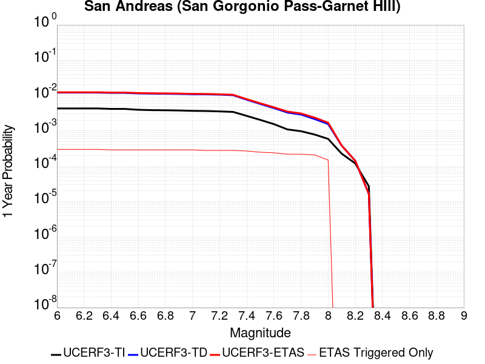 |  |

| Magnitude | 1 wk TI Prob | 1 wk TD Prob | 1 wk ETAS Prob | 1 wk ETAS/TD Gain | 1 wk ETAS Triggered Only | 1 mo TI Prob | 1 mo TD Prob | 1 mo ETAS Prob | 1 mo ETAS/TD Gain | 1 mo ETAS Triggered Only | 1 yr TI Prob | 1 yr TD Prob | 1 yr ETAS Prob | 1 yr ETAS/TD Gain | 1 yr ETAS Triggered Only | 10 yr TI Prob | 10 yr TD Prob | 10 yr ETAS Prob | 10 yr ETAS/TD Gain | 10 yr ETAS Triggered Only |
|-----|-----|-----|-----|-----|-----|-----|-----|-----|-----|-----|-----|-----|-----|-----|-----|-----|-----|-----|-----|-----|
| 6.0 | 8.31567E-5 | 2.3382473E-4 | 3.1477746E-4 | 1.3462111 | 8.097166E-5 | 3.5633717E-4 | 0.0010017233 | 0.0011230592 | 1.1211271 | 1.2145749E-4 | 0.004329778 | 0.012127888 | 0.012367858 | 1.0197866 | 2.4291498E-4 | 0.042463828 | 0.11257892 | 0.112938195 | 1.0031914 | 4.048583E-4 |
| 6.1 | 8.31567E-5 | 2.3382473E-4 | 3.1477746E-4 | 1.3462111 | 8.097166E-5 | 3.5633717E-4 | 0.0010017233 | 0.0011230592 | 1.1211271 | 1.2145749E-4 | 0.004329778 | 0.012127888 | 0.012367858 | 1.0197866 | 2.4291498E-4 | 0.042463828 | 0.11257892 | 0.112938195 | 1.0031914 | 4.048583E-4 |
| 6.2 | 8.31567E-5 | 2.3382473E-4 | 3.1477746E-4 | 1.3462111 | 8.097166E-5 | 3.5633717E-4 | 0.0010017233 | 0.0011230592 | 1.1211271 | 1.2145749E-4 | 0.004329778 | 0.012127888 | 0.012367858 | 1.0197866 | 2.4291498E-4 | 0.042463828 | 0.11257892 | 0.112938195 | 1.0031914 | 4.048583E-4 |
| 6.3 | 8.31567E-5 | 2.3382473E-4 | 3.1477746E-4 | 1.3462111 | 8.097166E-5 | 3.5633717E-4 | 0.0010017233 | 0.0011230592 | 1.1211271 | 1.2145749E-4 | 0.004329778 | 0.012127888 | 0.012367858 | 1.0197866 | 2.4291498E-4 | 0.042463828 | 0.11257892 | 0.112938195 | 1.0031914 | 4.048583E-4 |
| 6.4 | 8.059055E-5 | 2.2940808E-4 | 3.1036118E-4 | 1.3528781 | 8.097166E-5 | 3.4534236E-4 | 9.828096E-4 | 0.0011041476 | 1.1234604 | 1.2145749E-4 | 0.0041964394 | 0.011900152 | 0.012140176 | 1.0201699 | 2.4291498E-4 | 0.041180745 | 0.11056015 | 0.11092024 | 1.003257 | 4.048583E-4 |
| 6.5 | 8.059055E-5 | 2.2940808E-4 | 3.1036118E-4 | 1.3528781 | 8.097166E-5 | 3.4534236E-4 | 9.828096E-4 | 0.0011041476 | 1.1234604 | 1.2145749E-4 | 0.0041964394 | 0.011900152 | 0.012140176 | 1.0201699 | 2.4291498E-4 | 0.041180745 | 0.11056015 | 0.11092024 | 1.003257 | 4.048583E-4 |
| 6.6 | 7.619237E-5 | 2.218517E-4 | 3.028054E-4 | 1.3649 | 8.097166E-5 | 3.2649786E-4 | 9.5044886E-4 | 0.0010717909 | 1.1276681 | 1.2145749E-4 | 0.0039678677 | 0.01151087 | 0.011750989 | 1.0208602 | 2.4291498E-4 | 0.03897764 | 0.10709683 | 0.10745833 | 1.0033754 | 4.048583E-4 |
| 6.7 | 7.440636E-5 | 2.1860997E-4 | 2.9956392E-4 | 1.3703123 | 8.097166E-5 | 3.188454E-4 | 9.3656575E-4 | 0.0010579095 | 1.1295624 | 1.2145749E-4 | 0.0038750346 | 0.011343609 | 0.011583768 | 1.0211713 | 2.4291498E-4 | 0.038081564 | 0.105605274 | 0.10596738 | 1.0034288 | 4.048583E-4 |
| 6.8 | 7.3735864E-5 | 2.1708169E-4 | 2.9803577E-4 | 1.3729199 | 8.097166E-5 | 3.1597257E-4 | 9.3002064E-4 | 0.0010513652 | 1.130475 | 1.2145749E-4 | 0.0038401815 | 0.011264749 | 0.011504928 | 1.0213213 | 2.4291498E-4 | 0.03774495 | 0.10490683 | 0.105269216 | 1.0034543 | 4.048583E-4 |
| 6.9 | 7.27575E-5 | 2.1477141E-4 | 2.9572568E-4 | 1.3769323 | 8.097166E-5 | 3.117806E-4 | 9.201265E-4 | 0.0010414722 | 1.1318794 | 1.2145749E-4 | 0.003789323 | 0.011145527 | 0.011385733 | 1.021552 | 2.4291498E-4 | 0.037253562 | 0.103854746 | 0.10421755 | 1.0034934 | 4.048583E-4 |
| 7.0 | 7.102591E-5 | 2.1061185E-4 | 2.9156645E-4 | 1.3843782 | 8.097166E-5 | 3.0436125E-4 | 9.023122E-4 | 0.0010236601 | 1.1344855 | 1.2145749E-4 | 0.003699303 | 0.010930831 | 0.01117109 | 1.02198 | 2.4291498E-4 | 0.03638325 | 0.10195695 | 0.10232053 | 1.003566 | 4.048583E-4 |
| 7.1 | 7.028513E-5 | 2.0896831E-4 | 2.8992305E-4 | 1.3874019 | 8.097166E-5 | 3.0118722E-4 | 8.9527335E-4 | 0.0010166221 | 1.1355438 | 1.2145749E-4 | 0.0036607897 | 0.010845989 | 0.011086269 | 1.0221539 | 2.4291498E-4 | 0.036010686 | 0.101199985 | 0.10156387 | 1.0035957 | 4.048583E-4 |
| 7.2 | 6.8498244E-5 | 2.0504706E-4 | 2.8600212E-4 | 1.3948121 | 8.097166E-5 | 2.9353087E-4 | 8.784794E-4 | 9.998302E-4 | 1.1381373 | 1.2145749E-4 | 0.003567883 | 0.010643536 | 0.010883866 | 1.0225799 | 2.4291498E-4 | 0.035111405 | 0.09939202 | 0.099756636 | 1.0036685 | 4.048583E-4 |
| 7.3 | 6.622592E-5 | 1.9732013E-4 | 2.782758E-4 | 1.4102758 | 8.097166E-5 | 2.8379448E-4 | 8.453858E-4 | 9.667406E-4 | 1.1435497 | 1.2145749E-4 | 0.0034497243 | 0.0102444785 | 0.010484905 | 1.0234689 | 2.4291498E-4 | 0.033966612 | 0.095888525 | 0.096254565 | 1.0038173 | 4.048583E-4 |
| 7.4 | 5.1050705E-5 | 1.4689034E-4 | 2.2785009E-4 | 1.551158 | 8.097166E-5 | 2.1877038E-4 | 6.29379E-4 | 7.5076E-4 | 1.1928585 | 1.2145749E-4 | 0.002660276 | 0.0076359594 | 0.00787702 | 1.031569 | 2.4291498E-4 | 0.02628654 | 0.07286301 | 0.07323837 | 1.0051516 | 4.048583E-4 |
| 7.5 | 3.9302922E-5 | 1.1129847E-4 | 1.9226111E-4 | 1.7274373 | 8.097166E-5 | 1.6843023E-4 | 4.7690657E-4 | 5.983061E-4 | 1.2545563 | 1.2145749E-4 | 0.0020487092 | 0.005790949 | 0.006032457 | 1.0417044 | 2.4291498E-4 | 0.020299247 | 0.05600951 | 0.056391694 | 1.0068235 | 4.048583E-4 |
| 7.6 | 2.9851626E-5 | 8.4949745E-5 | 1.6591452E-4 | 1.9530903 | 8.097166E-5 | 1.2792926E-4 | 3.6401965E-4 | 4.8543292E-4 | 1.333535 | 1.2145749E-4 | 0.0015564259 | 0.0044229585 | 0.004664799 | 1.0546784 | 2.4291498E-4 | 0.0154556995 | 0.04319374 | 0.04358111 | 1.0089682 | 4.048583E-4 |
| 7.7 | 2.1135214E-5 | 6.3529005E-5 | 1.4449551E-4 | 2.274481 | 8.097166E-5 | 9.0576345E-5 | 2.7223877E-4 | 3.9366318E-4 | 1.4460218 | 1.2145749E-4 | 0.0011022091 | 0.0033094748 | 0.0035515858 | 1.073157 | 2.4291498E-4 | 0.010967582 | 0.032582592 | 0.03297426 | 1.0120207 | 4.048583E-4 |
| 7.8 | 1.883379E-5 | 5.564028E-5 | 1.3660743E-4 | 2.4551895 | 8.097166E-5 | 8.0713755E-5 | 2.3843657E-4 | 3.5986508E-4 | 1.5092697 | 1.2145749E-4 | 9.822468E-4 | 0.0028991038 | 0.0031413147 | 1.0835468 | 2.4291498E-4 | 0.0097791655 | 0.028695205 | 0.029088447 | 1.0137041 | 4.048583E-4 |
| 7.9 | 1.5156185E-5 | 4.1658426E-5 | 1.2262672E-4 | 2.9436233 | 8.097166E-5 | 6.495346E-5 | 1.785239E-4 | 2.999597E-4 | 1.6802216 | 1.2145749E-4 | 7.9052144E-4 | 0.0021713632 | 0.0024137506 | 1.1116292 | 2.4291498E-4 | 0.007877152 | 0.021759422 | 0.022155471 | 1.0182012 | 4.048583E-4 |
| 8.0 | 1.1405907E-5 | 2.9974231E-5 | 1.1094347E-4 | 3.7012947 | 8.097166E-5 | 4.8881542E-5 | 1.2845467E-4 | 2.0941593E-4 | 1.6302711 | 8.097166E-5 | 5.9497025E-4 | 0.0015628147 | 0.0017649274 | 1.1293261 | 2.0242915E-4 | 0.005933798 | 0.015772851 | 0.016091628 | 1.0202105 | 3.2388663E-4 |
| 8.1 | 4.3511436E-6 | 7.369219E-6 | 7.369219E-6 | 1.0 | 0.0 | 1.8647626E-5 | 3.1581985E-5 | 3.1581985E-5 | 1.0 | 0.0 | 2.2701119E-4 | 3.8444297E-4 | 3.8444297E-4 | 1.0 | 0.0 | 0.0022677942 | 0.0041163345 | 0.0041163345 | 1.0 | 0.0 |
| 8.2 | 2.3042528E-6 | 2.7329415E-6 | 2.7329415E-6 | 1.0 | 0.0 | 9.875332E-6 | 1.1712554E-5 | 1.1712554E-5 | 1.0 | 0.0 | 1.2022553E-4 | 1.4259106E-4 | 1.4259106E-4 | 1.0 | 0.0 | 0.0012016051 | 0.0015979785 | 0.0015979785 | 1.0 | 0.0 |
| 8.3 | 5.202968E-7 | 3.1598344E-7 | 3.1598344E-7 | 1.0 | 0.0 | 2.2298414E-6 | 1.3542141E-6 | 1.3542141E-6 | 1.0 | 0.0 | 2.714798E-5 | 1.6487444E-5 | 1.6487444E-5 | 1.0 | 0.0 | 2.7144665E-4 | 1.9563142E-4 | 1.9563142E-4 | 1.0 | 0.0 |

## Death Valley (Fish Lake Valley)
*[(top)](#table-of-contents)*

| 1 Week | 1 Month | 1 Year | 10 Year |
|-----|-----|-----|-----|
|  |  |  |  |

| Magnitude | 1 wk TI Prob | 1 wk TD Prob | 1 wk ETAS Prob | 1 wk ETAS/TD Gain | 1 wk ETAS Triggered Only | 1 mo TI Prob | 1 mo TD Prob | 1 mo ETAS Prob | 1 mo ETAS/TD Gain | 1 mo ETAS Triggered Only | 1 yr TI Prob | 1 yr TD Prob | 1 yr ETAS Prob | 1 yr ETAS/TD Gain | 1 yr ETAS Triggered Only | 10 yr TI Prob | 10 yr TD Prob | 10 yr ETAS Prob | 10 yr ETAS/TD Gain | 10 yr ETAS Triggered Only |
|-----|-----|-----|-----|-----|-----|-----|-----|-----|-----|-----|-----|-----|-----|-----|-----|-----|-----|-----|-----|-----|
| 6.0 | 3.872328E-5 | 4.7267473E-5 | 1.282353E-4 | 2.7129714 | 8.097166E-5 | 1.6594635E-4 | 2.0256084E-4 | 3.6447137E-4 | 1.799318 | 1.6194332E-4 | 0.0020185246 | 0.002463534 | 0.0027462367 | 1.1147549 | 2.8340082E-4 | 0.02000288 | 0.024388181 | 0.024743667 | 1.0145762 | 3.6437248E-4 |
| 6.1 | 3.872328E-5 | 4.7267473E-5 | 1.282353E-4 | 2.7129714 | 8.097166E-5 | 1.6594635E-4 | 2.0256084E-4 | 3.6447137E-4 | 1.799318 | 1.6194332E-4 | 0.0020185246 | 0.002463534 | 0.0027462367 | 1.1147549 | 2.8340082E-4 | 0.02000288 | 0.024388181 | 0.024743667 | 1.0145762 | 3.6437248E-4 |
| 6.2 | 3.872328E-5 | 4.7267473E-5 | 1.282353E-4 | 2.7129714 | 8.097166E-5 | 1.6594635E-4 | 2.0256084E-4 | 3.6447137E-4 | 1.799318 | 1.6194332E-4 | 0.0020185246 | 0.002463534 | 0.0027462367 | 1.1147549 | 2.8340082E-4 | 0.02000288 | 0.024388181 | 0.024743667 | 1.0145762 | 3.6437248E-4 |
| 6.3 | 2.8356371E-5 | 3.3609853E-5 | 1.1457879E-4 | 3.4090836 | 8.097166E-5 | 1.2152165E-4 | 1.4403471E-4 | 3.0595472E-4 | 2.1241734 | 1.6194332E-4 | 0.0014785219 | 0.0017522911 | 0.0020351952 | 1.1614481 | 2.8340082E-4 | 0.014687235 | 0.017391782 | 0.017749818 | 1.0205865 | 3.6437248E-4 |
| 6.4 | 2.8356371E-5 | 3.3609853E-5 | 1.1457879E-4 | 3.4090836 | 8.097166E-5 | 1.2152165E-4 | 1.4403471E-4 | 3.0595472E-4 | 2.1241734 | 1.6194332E-4 | 0.0014785219 | 0.0017522911 | 0.0020351952 | 1.1614481 | 2.8340082E-4 | 0.014687235 | 0.017391782 | 0.017749818 | 1.0205865 | 3.6437248E-4 |
| 6.5 | 2.4448687E-5 | 2.8607552E-5 | 1.095769E-4 | 3.8303485 | 8.097166E-5 | 1.0477588E-4 | 1.2259831E-4 | 2.8452178E-4 | 2.320764 | 1.6194332E-4 | 0.0012748998 | 0.0014916632 | 0.0017746412 | 1.1897064 | 2.8340082E-4 | 0.012676105 | 0.014821377 | 0.015180348 | 1.0242199 | 3.6437248E-4 |
| 6.6 | 2.1298161E-5 | 2.4660083E-5 | 1.0562975E-4 | 4.28343 | 8.097166E-5 | 9.127464E-5 | 1.0568198E-4 | 2.6760818E-4 | 2.5322025 | 1.6194332E-4 | 0.0011107022 | 0.0012859525 | 0.0015689889 | 1.2200986 | 2.8340082E-4 | 0.011051672 | 0.012788526 | 0.01310827 | 1.0250025 | 3.2388663E-4 |
| 6.7 | 1.8959729E-5 | 2.1781025E-5 | 1.0275092E-4 | 4.717451 | 8.097166E-5 | 8.125345E-5 | 9.334405E-5 | 2.5527226E-4 | 2.7347457 | 1.6194332E-4 | 9.888117E-4 | 0.001135897 | 0.0014189759 | 1.2492118 | 2.8340082E-4 | 0.009844234 | 0.01130357 | 0.011623795 | 1.0283296 | 3.2388663E-4 |
| 6.8 | 1.6691629E-5 | 1.9018353E-5 | 9.998847E-5 | 5.257473 | 8.097166E-5 | 7.153359E-5 | 8.150477E-5 | 2.4343489E-4 | 2.9867563 | 1.6194332E-4 | 8.7057345E-4 | 9.918857E-4 | 0.0012750054 | 1.2854358 | 2.8340082E-4 | 0.008671708 | 0.009876343 | 0.010197031 | 1.0324703 | 3.2388663E-4 |
| 6.9 | 1.450505E-5 | 1.638954E-5 | 9.735987E-5 | 5.9403663 | 8.097166E-5 | 6.216302E-5 | 7.0239046E-5 | 2.3217099E-4 | 3.3054407 | 1.6194332E-4 | 7.5657194E-4 | 8.5483363E-4 | 0.0011379921 | 1.331244 | 2.8340082E-4 | 0.007540013 | 0.008516385 | 0.008837514 | 1.0377071 | 3.2388663E-4 |
| 7.0 | 1.2940855E-5 | 1.4537972E-5 | 9.5508454E-5 | 6.569586 | 8.097166E-5 | 5.545963E-5 | 6.230414E-5 | 2.2423737E-4 | 3.5990767 | 1.6194332E-4 | 6.750118E-4 | 7.5829466E-4 | 0.0010414806 | 1.373451 | 2.8340082E-4 | 0.006729651 | 0.0075576897 | 0.007879129 | 1.0425314 | 3.2388663E-4 |
| 7.1 | 1.2544658E-5 | 1.4078208E-5 | 9.504873E-5 | 6.751479 | 8.097166E-5 | 5.3761712E-5 | 6.0333812E-5 | 2.2226736E-4 | 3.6839602 | 1.6194332E-4 | 6.5435225E-4 | 7.343222E-4 | 0.0010175148 | 1.3856518 | 2.8340082E-4 | 0.006524288 | 0.007319551 | 0.007641067 | 1.0439256 | 3.2388663E-4 |
| 7.2 | 1.2489416E-5 | 1.4015674E-5 | 9.49862E-5 | 6.777141 | 8.097166E-5 | 5.3524967E-5 | 6.0065824E-5 | 2.2199942E-4 | 3.6959355 | 1.6194332E-4 | 6.514716E-4 | 7.310616E-4 | 0.0010142552 | 1.3873731 | 2.8340082E-4 | 0.006495651 | 0.0072871596 | 0.007608686 | 1.0441223 | 3.2388663E-4 |
| 7.3 | 1.2368307E-5 | 1.3879812E-5 | 9.485035E-5 | 6.833691 | 8.097166E-5 | 5.3005948E-5 | 5.9483587E-5 | 2.2141727E-4 | 3.7223256 | 1.6194332E-4 | 6.451563E-4 | 7.2397763E-4 | 0.0010071732 | 1.3911663 | 2.8340082E-4 | 0.0064328653 | 0.007216782 | 0.007538331 | 1.0445558 | 3.2388663E-4 |
| 7.4 | 1.2161707E-5 | 1.36478675E-5 | 9.461842E-5 | 6.9328356 | 8.097166E-5 | 5.212056E-5 | 5.8489582E-5 | 2.2042343E-4 | 3.768593 | 1.6194332E-4 | 6.3438306E-4 | 7.118836E-4 | 9.950827E-4 | 1.3978165 | 2.8340082E-4 | 0.006325751 | 0.0070966207 | 0.0074182088 | 1.0453156 | 3.2388663E-4 |
| 7.5 | 1.1707948E-5 | 1.3145515E-5 | 9.411611E-5 | 7.1595607 | 8.097166E-5 | 5.0175953E-5 | 5.6336736E-5 | 2.1827093E-4 | 3.874398 | 1.6194332E-4 | 6.10721E-4 | 6.856895E-4 | 9.6889597E-4 | 1.4130244 | 2.8340082E-4 | 0.0060904534 | 0.006836321 | 0.0071579935 | 1.0470535 | 3.2388663E-4 |
| 7.6 | 1.0319538E-5 | 1.1579622E-5 | 9.255035E-5 | 7.9925184 | 8.097166E-5 | 4.4225842E-5 | 4.9626036E-5 | 2.1156132E-4 | 4.263111 | 1.6194332E-4 | 5.383166E-4 | 6.040347E-4 | 8.872643E-4 | 1.4688963 | 2.8340082E-4 | 0.0053701443 | 0.0060244603 | 0.0063463957 | 1.0534381 | 3.2388663E-4 |
| 7.7 | 8.937764E-6 | 1.0022779E-5 | 9.099363E-5 | 9.078682 | 8.097166E-5 | 3.830414E-5 | 4.295409E-5 | 2.0489046E-4 | 4.769987 | 1.6194332E-4 | 4.6625308E-4 | 5.228456E-4 | 8.060982E-4 | 1.541752 | 2.8340082E-4 | 0.0046527605 | 0.005216664 | 0.0055388613 | 1.061763 | 3.2388663E-4 |
| 7.8 | 3.108007E-7 | 3.284654E-7 | 3.284654E-7 | 1.0 | 0.0 | 1.3320023E-6 | 1.407708E-6 | 1.407708E-6 | 1.0 | 0.0 | 1.6217007E-5 | 1.7138715E-5 | 5.7623853E-5 | 3.3622036 | 4.048583E-5 | 1.6215823E-4 | 1.7137431E-4 | 2.1185321E-4 | 1.2362016 | 4.048583E-5 |
| 7.9 | 2.5591178E-9 | 2.6696718E-9 | 2.6696718E-9 | 1.0 | 0.0 | 1.0967647E-8 | 1.14414505E-8 | 1.14414505E-8 | 1.0 | 0.0 | 1.335311E-7 | 1.3929966E-7 | 1.3929966E-7 | 1.0 | 0.0 | 1.3353102E-6 | 1.3929966E-6 | 1.3929966E-6 | 1.0 | 0.0 |

## Sierra Nevada  (No Extension)
*[(top)](#table-of-contents)*

| 1 Week | 1 Month | 1 Year | 10 Year |
|-----|-----|-----|-----|
|  |  |  |  |

| Magnitude | 1 wk TI Prob | 1 wk TD Prob | 1 wk ETAS Prob | 1 wk ETAS/TD Gain | 1 wk ETAS Triggered Only | 1 mo TI Prob | 1 mo TD Prob | 1 mo ETAS Prob | 1 mo ETAS/TD Gain | 1 mo ETAS Triggered Only | 1 yr TI Prob | 1 yr TD Prob | 1 yr ETAS Prob | 1 yr ETAS/TD Gain | 1 yr ETAS Triggered Only | 10 yr TI Prob | 10 yr TD Prob | 10 yr ETAS Prob | 10 yr ETAS/TD Gain | 10 yr ETAS Triggered Only |
|-----|-----|-----|-----|-----|-----|-----|-----|-----|-----|-----|-----|-----|-----|-----|-----|-----|-----|-----|-----|-----|
| 6.0 | 7.7690465E-6 | 6.976322E-6 | 1.2843296E-4 | 18.40984 | 1.2145749E-4 | 3.329549E-5 | 2.9898381E-5 | 1.5135224E-4 | 5.062222 | 1.2145749E-4 | 4.0529718E-4 | 3.6398784E-4 | 6.068144E-4 | 1.6671282 | 2.4291498E-4 | 0.004045588 | 0.0036374326 | 0.0039601414 | 1.0887188 | 3.2388663E-4 |
| 6.1 | 7.7690465E-6 | 6.976322E-6 | 1.2843296E-4 | 18.40984 | 1.2145749E-4 | 3.329549E-5 | 2.9898381E-5 | 1.5135224E-4 | 5.062222 | 1.2145749E-4 | 4.0529718E-4 | 3.6398784E-4 | 6.068144E-4 | 1.6671282 | 2.4291498E-4 | 0.004045588 | 0.0036374326 | 0.0039601414 | 1.0887188 | 3.2388663E-4 |
| 6.2 | 7.7690465E-6 | 6.976322E-6 | 1.2843296E-4 | 18.40984 | 1.2145749E-4 | 3.329549E-5 | 2.9898381E-5 | 1.5135224E-4 | 5.062222 | 1.2145749E-4 | 4.0529718E-4 | 3.6398784E-4 | 6.068144E-4 | 1.6671282 | 2.4291498E-4 | 0.004045588 | 0.0036374326 | 0.0039601414 | 1.0887188 | 3.2388663E-4 |
| 6.3 | 7.7690465E-6 | 6.976322E-6 | 1.2843296E-4 | 18.40984 | 1.2145749E-4 | 3.329549E-5 | 2.9898381E-5 | 1.5135224E-4 | 5.062222 | 1.2145749E-4 | 4.0529718E-4 | 3.6398784E-4 | 6.068144E-4 | 1.6671282 | 2.4291498E-4 | 0.004045588 | 0.0036374326 | 0.0039601414 | 1.0887188 | 3.2388663E-4 |
| 6.4 | 7.7690465E-6 | 6.976322E-6 | 1.2843296E-4 | 18.40984 | 1.2145749E-4 | 3.329549E-5 | 2.9898381E-5 | 1.5135224E-4 | 5.062222 | 1.2145749E-4 | 4.0529718E-4 | 3.6398784E-4 | 6.068144E-4 | 1.6671282 | 2.4291498E-4 | 0.004045588 | 0.0036374326 | 0.0039601414 | 1.0887188 | 3.2388663E-4 |
| 6.5 | 7.7690465E-6 | 6.976322E-6 | 1.2843296E-4 | 18.40984 | 1.2145749E-4 | 3.329549E-5 | 2.9898381E-5 | 1.5135224E-4 | 5.062222 | 1.2145749E-4 | 4.0529718E-4 | 3.6398784E-4 | 6.068144E-4 | 1.6671282 | 2.4291498E-4 | 0.004045588 | 0.0036374326 | 0.0039601414 | 1.0887188 | 3.2388663E-4 |
| 6.6 | 2.653E-6 | 1.614854E-6 | 1.2307215E-4 | 76.212555 | 1.2145749E-4 | 1.136995E-5 | 6.9207845E-6 | 1.2837743E-4 | 18.54955 | 1.2145749E-4 | 1.3842035E-4 | 8.425733E-5 | 2.866694E-4 | 3.4023085 | 2.0242915E-4 | 0.0013833415 | 8.422573E-4 | 0.0011254194 | 1.3361943 | 2.8340082E-4 |
| 6.7 | 2.5902466E-6 | 1.5501876E-6 | 1.2300748E-4 | 79.35007 | 1.2145749E-4 | 1.11010095E-5 | 6.643644E-6 | 1.2810032E-4 | 19.281635 | 1.2145749E-4 | 1.351464E-4 | 8.0883394E-5 | 2.8329616E-4 | 3.5025258 | 2.0242915E-4 | 0.0013506424 | 8.0854254E-4 | 0.0010917142 | 1.3502249 | 2.8340082E-4 |
| 6.8 | 2.5853892E-6 | 1.5469877E-6 | 1.2300428E-4 | 79.51213 | 1.2145749E-4 | 1.1080193E-5 | 6.629931E-6 | 1.2808661E-4 | 19.31945 | 1.2145749E-4 | 1.34893E-4 | 8.071645E-5 | 2.8312925E-4 | 3.507702 | 2.0242915E-4 | 0.0013481114 | 8.068743E-4 | 0.0010900465 | 1.3509495 | 2.8340082E-4 |
| 6.9 | 2.458257E-6 | 1.4220619E-6 | 1.2287938E-4 | 86.4093 | 1.2145749E-4 | 1.0535345E-5 | 6.094537E-6 | 1.2755129E-4 | 20.92879 | 1.2145749E-4 | 1.2826028E-4 | 7.4198484E-5 | 2.766126E-4 | 3.728009 | 2.0242915E-4 | 0.0012818627 | 7.4173906E-4 | 0.0010249297 | 1.3817928 | 2.8340082E-4 |
| 7.0 | 2.4341468E-6 | 1.3990258E-6 | 1.2285635E-4 | 87.815636 | 1.2145749E-4 | 1.0432016E-5 | 5.9958115E-6 | 1.2745257E-4 | 21.256935 | 1.2145749E-4 | 1.270024E-4 | 7.2996576E-5 | 2.7541094E-4 | 3.7729297 | 2.0242915E-4 | 0.0012692984 | 7.297279E-4 | 0.0010129219 | 1.3880817 | 2.8340082E-4 |
| 7.1 | 2.3652476E-6 | 1.3339754E-6 | 1.227913E-4 | 92.04915 | 1.2145749E-4 | 1.0136736E-5 | 5.717025E-6 | 1.2717381E-4 | 22.244755 | 1.2145749E-4 | 1.2340778E-4 | 6.9602575E-5 | 2.7201764E-4 | 3.9081547 | 2.0242915E-4 | 0.0012333926 | 6.9580943E-4 | 9.79013E-4 | 1.4070132 | 2.8340082E-4 |
| 7.2 | 2.272158E-6 | 1.2502821E-6 | 1.2270761E-4 | 98.14394 | 1.2145749E-4 | 9.737784E-6 | 5.3583412E-6 | 1.2681518E-4 | 23.666874 | 1.2145749E-4 | 1.1855107E-4 | 6.5235865E-5 | 2.676518E-4 | 4.1028323 | 2.0242915E-4 | 0.0011848784 | 6.5216864E-4 | 9.3538465E-4 | 1.434268 | 2.8340082E-4 |
| 7.3 | 2.1382127E-6 | 1.1419703E-6 | 1.2259932E-4 | 107.35772 | 1.2145749E-4 | 9.163737E-6 | 4.8941492E-6 | 1.2635105E-4 | 25.816753 | 1.2145749E-4 | 1.1156279E-4 | 5.958465E-5 | 2.6200173E-4 | 4.397135 | 2.0242915E-4 | 0.001115068 | 5.956879E-4 | 8.789199E-4 | 1.4754704 | 2.8340082E-4 |
| 7.4 | 1.9048055E-6 | 9.575242E-7 | 8.192911E-5 | 85.56348 | 8.097166E-5 | 8.163426E-6 | 4.1036687E-6 | 8.507499E-5 | 20.731447 | 8.097166E-5 | 9.9385186E-5 | 4.996103E-5 | 1.7141245E-4 | 3.430923 | 1.2145749E-4 | 9.934074E-4 | 4.994987E-4 | 7.018267E-4 | 1.4050622 | 2.0242915E-4 |
| 7.5 | 1.5373403E-6 | 7.560042E-7 | 8.17276E-5 | 108.10469 | 8.097166E-5 | 6.5885843E-6 | 3.2400142E-6 | 8.421141E-5 | 25.991062 | 8.097166E-5 | 8.021306E-5 | 3.9446462E-5 | 1.6089916E-4 | 4.078925 | 1.2145749E-4 | 8.0184115E-4 | 3.943951E-4 | 5.5627455E-4 | 1.41045 | 1.6194332E-4 |
| 7.6 | 1.0680322E-6 | 4.6596554E-7 | 4.6596554E-7 | 1.0 | 0.0 | 4.577273E-6 | 1.9969937E-6 | 1.9969937E-6 | 1.0 | 0.0 | 5.5726876E-5 | 2.4313129E-5 | 6.4797976E-5 | 2.6651433 | 4.048583E-5 | 5.5712904E-4 | 2.4310495E-4 | 3.2405692E-4 | 1.3329918 | 8.097166E-5 |
| 7.7 | 5.509146E-7 | 1.5580486E-7 | 1.5580486E-7 | 1.0 | 0.0 | 2.3610605E-6 | 6.677349E-7 | 6.677349E-7 | 1.0 | 0.0 | 2.8745531E-5 | 8.129644E-6 | 4.8615144E-5 | 5.9799848 | 4.048583E-5 | 2.8741814E-4 | 8.1293576E-5 | 1.2177612E-4 | 1.4979795 | 4.048583E-5 |

## Calico-Hidalgo
*[(top)](#table-of-contents)*

| 1 Week | 1 Month | 1 Year | 10 Year |
|-----|-----|-----|-----|
|  |  |  |  |

| Magnitude | 1 wk TI Prob | 1 wk TD Prob | 1 wk ETAS Prob | 1 wk ETAS/TD Gain | 1 wk ETAS Triggered Only | 1 mo TI Prob | 1 mo TD Prob | 1 mo ETAS Prob | 1 mo ETAS/TD Gain | 1 mo ETAS Triggered Only | 1 yr TI Prob | 1 yr TD Prob | 1 yr ETAS Prob | 1 yr ETAS/TD Gain | 1 yr ETAS Triggered Only | 10 yr TI Prob | 10 yr TD Prob | 10 yr ETAS Prob | 10 yr ETAS/TD Gain | 10 yr ETAS Triggered Only |
|-----|-----|-----|-----|-----|-----|-----|-----|-----|-----|-----|-----|-----|-----|-----|-----|-----|-----|-----|-----|-----|
| 6.0 | 4.0906612E-5 | 5.0703686E-5 | 2.126388E-4 | 4.193754 | 1.6194332E-4 | 1.7530227E-4 | 2.172857E-4 | 3.7919384E-4 | 1.7451394 | 1.6194332E-4 | 0.0021322158 | 0.002642648 | 0.0028445423 | 1.0763985 | 2.0242915E-4 | 0.02111873 | 0.026152607 | 0.02650745 | 1.0135682 | 3.6437248E-4 |
| 6.1 | 4.0906612E-5 | 5.0703686E-5 | 2.126388E-4 | 4.193754 | 1.6194332E-4 | 1.7530227E-4 | 2.172857E-4 | 3.7919384E-4 | 1.7451394 | 1.6194332E-4 | 0.0021322158 | 0.002642648 | 0.0028445423 | 1.0763985 | 2.0242915E-4 | 0.02111873 | 0.026152607 | 0.02650745 | 1.0135682 | 3.6437248E-4 |
| 6.2 | 4.0906612E-5 | 5.0703686E-5 | 2.126388E-4 | 4.193754 | 1.6194332E-4 | 1.7530227E-4 | 2.172857E-4 | 3.7919384E-4 | 1.7451394 | 1.6194332E-4 | 0.0021322158 | 0.002642648 | 0.0028445423 | 1.0763985 | 2.0242915E-4 | 0.02111873 | 0.026152607 | 0.02650745 | 1.0135682 | 3.6437248E-4 |
| 6.3 | 2.4242801E-5 | 3.0090669E-5 | 1.515445E-4 | 5.0362625 | 1.2145749E-4 | 1.0389358E-4 | 1.2895382E-4 | 2.5039565E-4 | 1.9417466 | 1.2145749E-4 | 0.0012641704 | 0.0015689151 | 0.0017306043 | 1.103058 | 1.6194332E-4 | 0.01257003 | 0.01558206 | 0.01574148 | 1.010231 | 1.6194332E-4 |
| 6.4 | 2.4242801E-5 | 3.0090669E-5 | 1.515445E-4 | 5.0362625 | 1.2145749E-4 | 1.0389358E-4 | 1.2895382E-4 | 2.5039565E-4 | 1.9417466 | 1.2145749E-4 | 0.0012641704 | 0.0015689151 | 0.0017306043 | 1.103058 | 1.6194332E-4 | 0.01257003 | 0.01558206 | 0.01574148 | 1.010231 | 1.6194332E-4 |
| 6.5 | 2.0286952E-5 | 2.5315738E-5 | 1.0628535E-4 | 4.1983905 | 8.097166E-5 | 8.694118E-5 | 1.0849161E-4 | 1.8945448E-4 | 1.7462593 | 8.097166E-5 | 0.0010579949 | 0.001320102 | 0.0014413992 | 1.0918847 | 1.2145749E-4 | 0.010529719 | 0.013124538 | 0.013244402 | 1.0091327 | 1.2145749E-4 |
| 6.6 | 2.0269223E-5 | 2.5296687E-5 | 1.062663E-4 | 4.200799 | 8.097166E-5 | 8.6865206E-5 | 1.08409964E-4 | 1.8937285E-4 | 1.7468214 | 8.097166E-5 | 0.0010570707 | 0.0013191093 | 0.0014404065 | 1.0919539 | 1.2145749E-4 | 0.010520565 | 0.013114728 | 0.013234592 | 1.0091397 | 1.2145749E-4 |
| 6.7 | 1.799852E-5 | 2.25406E-5 | 1.03510436E-4 | 4.5921774 | 8.097166E-5 | 7.713423E-5 | 9.659908E-5 | 1.7756292E-4 | 1.838143 | 8.097166E-5 | 9.3870464E-4 | 0.0011754738 | 0.0012967886 | 1.103205 | 1.2145749E-4 | 0.009347493 | 0.011694173 | 0.011814211 | 1.0102648 | 1.2145749E-4 |
| 6.8 | 1.7458793E-5 | 2.184212E-5 | 1.0281201E-4 | 4.7070527 | 8.097166E-5 | 7.4821255E-5 | 9.3605806E-5 | 1.7456988E-4 | 1.8649472 | 8.097166E-5 | 9.10568E-4 | 0.0011390693 | 0.0012603885 | 1.1065073 | 1.2145749E-4 | 0.009068459 | 0.011333893 | 0.011453974 | 1.0105948 | 1.2145749E-4 |
| 6.9 | 1.542884E-5 | 1.9025927E-5 | 9.999605E-5 | 5.255778 | 8.097166E-5 | 6.612192E-5 | 8.153721E-5 | 1.6250227E-4 | 1.9929829 | 8.097166E-5 | 8.04737E-4 | 9.922766E-4 | 0.0011136136 | 1.1222814 | 1.2145749E-4 | 0.008018291 | 0.009879857 | 0.010000115 | 1.012172 | 1.2145749E-4 |
| 7.0 | 1.468253E-5 | 1.8030598E-5 | 9.90008E-5 | 5.4907107 | 8.097166E-5 | 6.292361E-5 | 7.7271776E-5 | 1.5823718E-4 | 2.0478005 | 8.097166E-5 | 7.658257E-4 | 9.4039086E-4 | 0.0010212864 | 1.0860233 | 8.097166E-5 | 0.0076319184 | 0.009365481 | 0.009445694 | 1.0085648 | 8.097166E-5 |
| 7.1 | 1.3139281E-5 | 1.6200942E-5 | 9.7171294E-5 | 5.997879 | 8.097166E-5 | 5.6309986E-5 | 6.943083E-5 | 1.5039687E-4 | 2.1661396 | 8.097166E-5 | 6.853584E-4 | 8.4500515E-4 | 9.259084E-4 | 1.095743 | 8.097166E-5 | 0.0068324856 | 0.0084192185 | 0.008499509 | 1.0095365 | 8.097166E-5 |
| 7.2 | 1.1127404E-5 | 1.3866597E-5 | 5.4351865E-5 | 3.9196253 | 4.048583E-5 | 4.7688E-5 | 5.942698E-5 | 9.991041E-5 | 1.6812297 | 4.048583E-5 | 5.8044674E-4 | 7.232942E-4 | 7.6375075E-4 | 1.0559337 | 4.048583E-5 | 0.0057893298 | 0.0072105085 | 0.0072507025 | 1.0055743 | 4.048583E-5 |
| 7.3 | 9.808154E-6 | 1.2176215E-5 | 5.266155E-5 | 4.3249526 | 4.048583E-5 | 4.2034266E-5 | 5.2182797E-5 | 9.2666516E-5 | 1.7758058 | 4.048583E-5 | 5.11647E-4 | 6.3515105E-4 | 6.7561114E-4 | 1.0637015 | 4.048583E-5 | 0.0051047057 | 0.006334433 | 0.0063746623 | 1.0063509 | 4.048583E-5 |
| 7.4 | 7.942452E-6 | 9.792144E-6 | 5.0277577E-5 | 5.1344814 | 4.048583E-5 | 3.4038632E-5 | 4.1965708E-5 | 8.2449835E-5 | 1.9646956 | 4.048583E-5 | 4.1434157E-4 | 5.1082217E-4 | 5.512873E-4 | 1.0792158 | 4.048583E-5 | 0.0041356985 | 0.005097421 | 0.0051377006 | 1.0079019 | 4.048583E-5 |
| 7.5 | 4.7121216E-6 | 5.772836E-6 | 4.6258432E-5 | 8.013121 | 4.048583E-5 | 2.019465E-5 | 2.4740535E-5 | 6.5225366E-5 | 2.6363764 | 4.048583E-5 | 2.4584212E-4 | 3.0118204E-4 | 3.416557E-4 | 1.1343826 | 4.048583E-5 | 0.0024557032 | 0.0030084911 | 0.003048855 | 1.0134166 | 4.048583E-5 |
| 7.6 | 2.21172E-7 | 2.603961E-7 | 4.0746214E-5 | 156.47784 | 4.048583E-5 | 9.478797E-7 | 1.1159829E-6 | 4.160177E-5 | 37.27814 | 4.048583E-5 | 1.1540374E-5 | 1.3587036E-5 | 5.4072316E-5 | 3.9796994 | 4.048583E-5 | 1.1539775E-4 | 1.3586486E-4 | 1.7634519E-4 | 1.2979455 | 4.048583E-5 |

## Santa Ynez (East)
*[(top)](#table-of-contents)*

| 1 Week | 1 Month | 1 Year | 10 Year |
|-----|-----|-----|-----|
|  |  |  |  |

| Magnitude | 1 wk TI Prob | 1 wk TD Prob | 1 wk ETAS Prob | 1 wk ETAS/TD Gain | 1 wk ETAS Triggered Only | 1 mo TI Prob | 1 mo TD Prob | 1 mo ETAS Prob | 1 mo ETAS/TD Gain | 1 mo ETAS Triggered Only | 1 yr TI Prob | 1 yr TD Prob | 1 yr ETAS Prob | 1 yr ETAS/TD Gain | 1 yr ETAS Triggered Only | 10 yr TI Prob | 10 yr TD Prob | 10 yr ETAS Prob | 10 yr ETAS/TD Gain | 10 yr ETAS Triggered Only |
|-----|-----|-----|-----|-----|-----|-----|-----|-----|-----|-----|-----|-----|-----|-----|-----|-----|-----|-----|-----|-----|
| 6.0 | 3.2269712E-5 | 3.67505E-5 | 1.1771919E-4 | 3.2031994 | 8.097166E-5 | 1.3829143E-4 | 1.5749598E-4 | 2.3845489E-4 | 1.514038 | 8.097166E-5 | 0.0016823979 | 0.0019164166 | 0.0020780496 | 1.0843413 | 1.6194332E-4 | 0.016697178 | 0.019056441 | 0.019374156 | 1.0166723 | 3.2388663E-4 |
| 6.1 | 3.2269712E-5 | 3.67505E-5 | 1.1771919E-4 | 3.2031994 | 8.097166E-5 | 1.3829143E-4 | 1.5749598E-4 | 2.3845489E-4 | 1.514038 | 8.097166E-5 | 0.0016823979 | 0.0019164166 | 0.0020780496 | 1.0843413 | 1.6194332E-4 | 0.016697178 | 0.019056441 | 0.019374156 | 1.0166723 | 3.2388663E-4 |
| 6.2 | 3.2269712E-5 | 3.67505E-5 | 1.1771919E-4 | 3.2031994 | 8.097166E-5 | 1.3829143E-4 | 1.5749598E-4 | 2.3845489E-4 | 1.514038 | 8.097166E-5 | 0.0016823979 | 0.0019164166 | 0.0020780496 | 1.0843413 | 1.6194332E-4 | 0.016697178 | 0.019056441 | 0.019374156 | 1.0166723 | 3.2388663E-4 |
| 6.3 | 3.2269712E-5 | 3.67505E-5 | 1.1771919E-4 | 3.2031994 | 8.097166E-5 | 1.3829143E-4 | 1.5749598E-4 | 2.3845489E-4 | 1.514038 | 8.097166E-5 | 0.0016823979 | 0.0019164166 | 0.0020780496 | 1.0843413 | 1.6194332E-4 | 0.016697178 | 0.019056441 | 0.019374156 | 1.0166723 | 3.2388663E-4 |
| 6.4 | 1.4404779E-5 | 1.4849382E-5 | 9.5819836E-5 | 6.452783 | 8.097166E-5 | 6.1733306E-5 | 6.363868E-5 | 1.4460519E-4 | 2.2722845 | 8.097166E-5 | 7.513438E-4 | 7.745306E-4 | 8.554395E-4 | 1.1044619 | 8.097166E-5 | 0.0074880854 | 0.007718862 | 0.007879555 | 1.0208182 | 1.6194332E-4 |
| 6.5 | 1.4404779E-5 | 1.4849382E-5 | 9.5819836E-5 | 6.452783 | 8.097166E-5 | 6.1733306E-5 | 6.363868E-5 | 1.4460519E-4 | 2.2722845 | 8.097166E-5 | 7.513438E-4 | 7.745306E-4 | 8.554395E-4 | 1.1044619 | 8.097166E-5 | 0.0074880854 | 0.007718862 | 0.007879555 | 1.0208182 | 1.6194332E-4 |
| 6.6 | 1.280208E-5 | 1.3011947E-5 | 9.3982555E-5 | 7.2227893 | 8.097166E-5 | 5.4864904E-5 | 5.5764307E-5 | 1.3673145E-4 | 2.451953 | 8.097166E-5 | 6.6777546E-4 | 6.787207E-4 | 7.596374E-4 | 1.1192194 | 8.097166E-5 | 0.006657724 | 0.0067666885 | 0.006887324 | 1.0178279 | 1.2145749E-4 |
| 6.7 | 1.2457027E-5 | 1.2628468E-5 | 9.3599105E-5 | 7.4117546 | 8.097166E-5 | 5.3386164E-5 | 5.412089E-5 | 1.3508816E-4 | 2.4960449 | 8.097166E-5 | 6.497827E-4 | 6.587243E-4 | 7.3964265E-4 | 1.122841 | 8.097166E-5 | 0.00647886 | 0.006567915 | 0.006688575 | 1.0183711 | 1.2145749E-4 |
| 6.8 | 1.2095134E-5 | 1.2230915E-5 | 9.320158E-5 | 7.620165 | 8.097166E-5 | 5.1835254E-5 | 5.241716E-5 | 1.3338457E-4 | 2.544674 | 8.097166E-5 | 6.309115E-4 | 6.379937E-4 | 7.189137E-4 | 1.1268351 | 8.097166E-5 | 0.0062912325 | 0.006361809 | 0.0064824936 | 1.0189703 | 1.2145749E-4 |
| 6.9 | 1.1104036E-5 | 1.1157347E-5 | 9.21281E-5 | 8.257169 | 8.097166E-5 | 4.758786E-5 | 4.781633E-5 | 1.2878412E-4 | 2.693308 | 8.097166E-5 | 5.7922816E-4 | 5.820096E-4 | 6.6293415E-4 | 1.1390433 | 8.097166E-5 | 0.005777207 | 0.0058049993 | 0.0059257518 | 1.0208014 | 1.2145749E-4 |
| 7.0 | 1.0577444E-5 | 1.058168E-5 | 9.155248E-5 | 8.651979 | 8.097166E-5 | 4.5331115E-5 | 4.5349276E-5 | 1.2631726E-4 | 2.7854307 | 8.097166E-5 | 5.5176654E-4 | 5.519888E-4 | 6.3291576E-4 | 1.1466098 | 8.097166E-5 | 0.0055039856 | 0.0055063153 | 0.005627104 | 1.0219364 | 1.2145749E-4 |
| 7.1 | 1.0021775E-5 | 9.980988E-6 | 9.980988E-6 | 1.0 | 0.0 | 4.294976E-5 | 4.2774966E-5 | 4.2774966E-5 | 1.0 | 0.0 | 5.2278786E-4 | 5.2066194E-4 | 5.2066194E-4 | 1.0 | 0.0 | 0.0052155964 | 0.0051945536 | 0.005234829 | 1.0077534 | 4.048583E-5 |
| 7.2 | 8.874109E-6 | 8.748793E-6 | 8.748793E-6 | 1.0 | 0.0 | 3.8031343E-5 | 3.7494297E-5 | 3.7494297E-5 | 1.0 | 0.0 | 4.629332E-4 | 4.5639853E-4 | 4.5639853E-4 | 1.0 | 0.0 | 0.0046197 | 0.0045547304 | 0.0045950315 | 1.0088483 | 4.048583E-5 |
| 7.3 | 7.5504267E-6 | 7.5051175E-6 | 7.5051175E-6 | 1.0 | 0.0 | 3.235857E-5 | 3.21644E-5 | 3.21644E-5 | 1.0 | 0.0 | 3.9389438E-4 | 3.915322E-4 | 3.915322E-4 | 1.0 | 0.0 | 0.0039319694 | 0.003908531 | 0.0039488585 | 1.0103178 | 4.048583E-5 |
| 7.4 | 6.309394E-6 | 6.1831556E-6 | 6.1831556E-6 | 1.0 | 0.0 | 2.703998E-5 | 2.6498974E-5 | 2.6498974E-5 | 1.0 | 0.0 | 3.2916202E-4 | 3.225782E-4 | 3.225782E-4 | 1.0 | 0.0 | 0.003286749 | 0.003221197 | 0.0032615524 | 1.0125281 | 4.048583E-5 |
| 7.5 | 4.6103073E-6 | 4.4408903E-6 | 4.4408903E-6 | 1.0 | 0.0 | 1.975831E-5 | 1.9032252E-5 | 1.9032252E-5 | 1.0 | 0.0 | 2.4053088E-4 | 2.3169373E-4 | 2.3169373E-4 | 1.0 | 0.0 | 0.002402707 | 0.002314591 | 0.0023549832 | 1.017451 | 4.048583E-5 |
| 7.6 | 1.2858658E-6 | 1.3008173E-6 | 1.3008173E-6 | 1.0 | 0.0 | 5.5108417E-6 | 5.5749197E-6 | 5.5749197E-6 | 1.0 | 0.0 | 6.7092435E-5 | 6.78726E-5 | 6.78726E-5 | 1.0 | 0.0 | 6.707218E-4 | 6.785256E-4 | 6.785256E-4 | 1.0 | 0.0 |
| 7.7 | 5.3302307E-7 | 5.612138E-7 | 5.612138E-7 | 1.0 | 0.0 | 2.2843826E-6 | 2.4052001E-6 | 2.4052001E-6 | 1.0 | 0.0 | 2.7812002E-5 | 2.9282954E-5 | 2.9282954E-5 | 1.0 | 0.0 | 2.7808524E-4 | 2.9279452E-4 | 2.9279452E-4 | 1.0 | 0.0 |
| 7.8 | 4.613933E-8 | 4.80301E-8 | 4.80301E-8 | 1.0 | 0.0 | 1.9773998E-7 | 2.0584326E-7 | 2.0584326E-7 | 1.0 | 0.0 | 2.4074816E-6 | 2.5061388E-6 | 2.5061388E-6 | 1.0 | 0.0 | 2.4074554E-5 | 2.5061116E-5 | 2.5061116E-5 | 1.0 | 0.0 |

## Scodie Lineament
*[(top)](#table-of-contents)*

| 1 Week | 1 Month | 1 Year | 10 Year |
|-----|-----|-----|-----|
|  |  |  |  |

| Magnitude | 1 wk TI Prob | 1 wk TD Prob | 1 wk ETAS Prob | 1 wk ETAS/TD Gain | 1 wk ETAS Triggered Only | 1 mo TI Prob | 1 mo TD Prob | 1 mo ETAS Prob | 1 mo ETAS/TD Gain | 1 mo ETAS Triggered Only | 1 yr TI Prob | 1 yr TD Prob | 1 yr ETAS Prob | 1 yr ETAS/TD Gain | 1 yr ETAS Triggered Only | 10 yr TI Prob | 10 yr TD Prob | 10 yr ETAS Prob | 10 yr ETAS/TD Gain | 10 yr ETAS Triggered Only |
|-----|-----|-----|-----|-----|-----|-----|-----|-----|-----|-----|-----|-----|-----|-----|-----|-----|-----|-----|-----|-----|
| 6.0 | 3.2919327E-6 | 3.0133422E-6 | 4.349905E-5 | 14.435483 | 4.048583E-5 | 1.4108206E-5 | 1.2914278E-5 | 9.388489E-5 | 7.269852 | 8.097166E-5 | 1.7175387E-4 | 1.5722317E-4 | 4.0009996E-4 | 2.54479 | 2.4291498E-4 | 0.0017162118 | 0.0015714309 | 0.0018948086 | 1.2057855 | 3.2388663E-4 |
| 6.1 | 1.8663811E-6 | 1.5490499E-6 | 1.5490499E-6 | 1.0 | 0.0 | 7.998751E-6 | 6.6387715E-6 | 6.6387715E-6 | 1.0 | 0.0 | 9.738045E-5 | 8.082454E-5 | 1.213071E-4 | 1.5008696 | 4.048583E-5 | 9.7337784E-4 | 8.080003E-4 | 8.484534E-4 | 1.0500658 | 4.048583E-5 |
| 6.2 | 1.8663811E-6 | 1.5490499E-6 | 1.5490499E-6 | 1.0 | 0.0 | 7.998751E-6 | 6.6387715E-6 | 6.6387715E-6 | 1.0 | 0.0 | 9.738045E-5 | 8.082454E-5 | 1.213071E-4 | 1.5008696 | 4.048583E-5 | 9.7337784E-4 | 8.080003E-4 | 8.484534E-4 | 1.0500658 | 4.048583E-5 |
| 6.3 | 1.8663811E-6 | 1.5490499E-6 | 1.5490499E-6 | 1.0 | 0.0 | 7.998751E-6 | 6.6387715E-6 | 6.6387715E-6 | 1.0 | 0.0 | 9.738045E-5 | 8.082454E-5 | 1.213071E-4 | 1.5008696 | 4.048583E-5 | 9.7337784E-4 | 8.080003E-4 | 8.484534E-4 | 1.0500658 | 4.048583E-5 |
| 6.4 | 1.8663811E-6 | 1.5490499E-6 | 1.5490499E-6 | 1.0 | 0.0 | 7.998751E-6 | 6.6387715E-6 | 6.6387715E-6 | 1.0 | 0.0 | 9.738045E-5 | 8.082454E-5 | 1.213071E-4 | 1.5008696 | 4.048583E-5 | 9.7337784E-4 | 8.080003E-4 | 8.484534E-4 | 1.0500658 | 4.048583E-5 |
| 6.5 | 1.8106311E-6 | 1.4909839E-6 | 1.4909839E-6 | 1.0 | 0.0 | 7.759824E-6 | 6.3899183E-6 | 6.3899183E-6 | 1.0 | 0.0 | 9.447177E-5 | 7.7794975E-5 | 1.18277654E-4 | 1.5203766 | 4.048583E-5 | 9.4431615E-4 | 7.7772606E-4 | 8.1818044E-4 | 1.0520161 | 4.048583E-5 |
| 6.6 | 1.2414679E-6 | 8.997558E-7 | 8.997558E-7 | 1.0 | 0.0 | 5.320566E-6 | 3.856091E-6 | 3.856091E-6 | 1.0 | 0.0 | 6.477596E-5 | 4.6946985E-5 | 8.743091E-5 | 1.8623329 | 4.048583E-5 | 6.475708E-4 | 4.693793E-4 | 5.0984614E-4 | 1.0862135 | 4.048583E-5 |
| 6.7 | 1.1062215E-6 | 7.594311E-7 | 7.594311E-7 | 1.0 | 0.0 | 4.7409408E-6 | 3.2547011E-6 | 3.2547011E-6 | 1.0 | 0.0 | 5.7719422E-5 | 3.9625334E-5 | 8.010956E-5 | 2.0216753 | 4.048583E-5 | 5.770443E-4 | 3.961897E-4 | 4.366595E-4 | 1.1021475 | 4.048583E-5 |
| 6.8 | 1.0006736E-6 | 6.500397E-7 | 6.500397E-7 | 1.0 | 0.0 | 4.288594E-6 | 2.7858816E-6 | 2.7858816E-6 | 1.0 | 0.0 | 5.221238E-5 | 3.3917644E-5 | 7.44021E-5 | 2.1936104 | 4.048583E-5 | 5.220012E-4 | 3.3913075E-4 | 3.7960283E-4 | 1.1193407 | 4.048583E-5 |
| 6.9 | 9.167364E-7 | 5.631625E-7 | 5.631625E-7 | 1.0 | 0.0 | 3.9288643E-6 | 2.4135516E-6 | 2.4135516E-6 | 1.0 | 0.0 | 4.7832873E-5 | 2.9384651E-5 | 2.9384651E-5 | 1.0 | 0.0 | 4.782258E-4 | 2.9381333E-4 | 2.9381333E-4 | 1.0 | 0.0 |
| 7.0 | 7.6987664E-7 | 4.113383E-7 | 4.113383E-7 | 1.0 | 0.0 | 3.2994672E-6 | 1.7628774E-6 | 1.7628774E-6 | 1.0 | 0.0 | 4.0170275E-5 | 2.1462862E-5 | 2.1462862E-5 | 1.0 | 0.0 | 4.0163012E-4 | 2.1461173E-4 | 2.1461173E-4 | 1.0 | 0.0 |
| 7.1 | 7.1038727E-7 | 3.5211494E-7 | 3.5211494E-7 | 1.0 | 0.0 | 3.0445133E-6 | 1.5090633E-6 | 1.5090633E-6 | 1.0 | 0.0 | 3.706632E-5 | 1.8372726E-5 | 1.8372726E-5 | 1.0 | 0.0 | 3.7060137E-4 | 1.8371557E-4 | 1.8371557E-4 | 1.0 | 0.0 |
| 7.2 | 2.0799602E-7 | 3.1186854E-8 | 3.1186854E-8 | 1.0 | 0.0 | 8.914113E-7 | 1.3365793E-7 | 1.3365793E-7 | 1.0 | 0.0 | 1.0852878E-5 | 1.6272843E-6 | 1.6272843E-6 | 1.0 | 0.0 | 1.08523476E-4 | 1.627273E-5 | 1.627273E-5 | 1.0 | 0.0 |
| 7.3 | 1.5048182E-7 | 1.5945696E-8 | 1.5945696E-8 | 1.0 | 0.0 | 6.449219E-7 | 6.83387E-8 | 6.83387E-8 | 1.0 | 0.0 | 7.851896E-6 | 8.320234E-7 | 8.320234E-7 | 1.0 | 0.0 | 7.851618E-5 | 8.320206E-6 | 8.320206E-6 | 1.0 | 0.0 |
| 7.4 | 5.9334678E-8 | 4.8683537E-9 | 4.8683537E-9 | 1.0 | 0.0 | 2.5429145E-7 | 2.0864372E-8 | 2.0864372E-8 | 1.0 | 0.0 | 3.095994E-6 | 2.5402372E-7 | 2.5402372E-7 | 1.0 | 0.0 | 3.095951E-5 | 2.5402353E-6 | 2.5402353E-6 | 1.0 | 0.0 |

## San Andreas (Coachella) rev
*[(top)](#table-of-contents)*

| 1 Week | 1 Month | 1 Year | 10 Year |
|-----|-----|-----|-----|
|  |  |  |  |

| Magnitude | 1 wk TI Prob | 1 wk TD Prob | 1 wk ETAS Prob | 1 wk ETAS/TD Gain | 1 wk ETAS Triggered Only | 1 mo TI Prob | 1 mo TD Prob | 1 mo ETAS Prob | 1 mo ETAS/TD Gain | 1 mo ETAS Triggered Only | 1 yr TI Prob | 1 yr TD Prob | 1 yr ETAS Prob | 1 yr ETAS/TD Gain | 1 yr ETAS Triggered Only | 10 yr TI Prob | 10 yr TD Prob | 10 yr ETAS Prob | 10 yr ETAS/TD Gain | 10 yr ETAS Triggered Only |
|-----|-----|-----|-----|-----|-----|-----|-----|-----|-----|-----|-----|-----|-----|-----|-----|-----|-----|-----|-----|-----|
| 6.0 | 1.1925945E-4 | 3.2729402E-4 | 3.677666E-4 | 1.1236582 | 4.048583E-5 | 5.110118E-4 | 0.0014019393 | 0.0014423684 | 1.0288379 | 4.048583E-5 | 0.0062038354 | 0.016936364 | 0.017095564 | 1.0093999 | 1.6194332E-4 | 0.060334753 | 0.15265316 | 0.15292759 | 1.0017978 | 3.2388663E-4 |
| 6.1 | 1.1925945E-4 | 3.2729402E-4 | 3.677666E-4 | 1.1236582 | 4.048583E-5 | 5.110118E-4 | 0.0014019393 | 0.0014423684 | 1.0288379 | 4.048583E-5 | 0.0062038354 | 0.016936364 | 0.017095564 | 1.0093999 | 1.6194332E-4 | 0.060334753 | 0.15265316 | 0.15292759 | 1.0017978 | 3.2388663E-4 |
| 6.2 | 1.07432395E-4 | 3.0230157E-4 | 3.4277517E-4 | 1.1338848 | 4.048583E-5 | 4.603433E-4 | 0.0012949388 | 0.0013353722 | 1.0312241 | 4.048583E-5 | 0.005590286 | 0.015653009 | 0.015812417 | 1.0101839 | 1.6194332E-4 | 0.05451731 | 0.14182423 | 0.14206745 | 1.0017148 | 2.8340082E-4 |
| 6.3 | 1.0718766E-4 | 3.0175463E-4 | 3.4222822E-4 | 1.1341276 | 4.048583E-5 | 4.592948E-4 | 0.0012925972 | 0.0013330306 | 1.0312809 | 4.048583E-5 | 0.005577586 | 0.015624908 | 0.01578432 | 1.0102025 | 1.6194332E-4 | 0.054396555 | 0.14159249 | 0.14183576 | 1.0017182 | 2.8340082E-4 |
| 6.4 | 1.0355944E-4 | 2.9383553E-4 | 3.3430947E-4 | 1.1377435 | 4.048583E-5 | 4.4375064E-4 | 0.0012586913 | 0.0012991262 | 1.0321245 | 4.048583E-5 | 0.0053892885 | 0.015217941 | 0.015377421 | 1.0104797 | 1.6194332E-4 | 0.052604496 | 0.13815255 | 0.1383968 | 1.001768 | 2.8340082E-4 |
| 6.5 | 1.0227914E-4 | 2.9102986E-4 | 3.3150392E-4 | 1.1390718 | 4.048583E-5 | 4.382655E-4 | 0.0012466786 | 0.001287114 | 1.0324345 | 4.048583E-5 | 0.0053228354 | 0.01507372 | 0.015233222 | 1.0105815 | 1.6194332E-4 | 0.051971316 | 0.13693172 | 0.13717632 | 1.0017862 | 2.8340082E-4 |
| 6.6 | 1.0116757E-4 | 2.8868738E-4 | 3.2916153E-4 | 1.1402006 | 4.048583E-5 | 4.3350324E-4 | 0.0012366489 | 0.0012770847 | 1.0326978 | 4.048583E-5 | 0.0052651367 | 0.01495329 | 0.015112813 | 1.010668 | 1.6194332E-4 | 0.051421247 | 0.1359099 | 0.13615479 | 1.0018018 | 2.8340082E-4 |
| 6.7 | 1.0050676E-4 | 2.8727303E-4 | 3.2774723E-4 | 1.1408911 | 4.048583E-5 | 4.3067214E-4 | 0.0012305931 | 0.0012710291 | 1.032859 | 4.048583E-5 | 0.005230834 | 0.014880571 | 0.015040103 | 1.010721 | 1.6194332E-4 | 0.051094085 | 0.13529462 | 0.13553968 | 1.0018113 | 2.8340082E-4 |
| 6.8 | 9.976819E-5 | 2.853096E-4 | 3.2578388E-4 | 1.141861 | 4.048583E-5 | 4.2750788E-4 | 0.0012221863 | 0.0012626227 | 1.0330852 | 4.048583E-5 | 0.0051924936 | 0.0147796115 | 0.014939161 | 1.0107952 | 1.6194332E-4 | 0.050728295 | 0.13444631 | 0.13469161 | 1.0018245 | 2.8340082E-4 |
| 6.9 | 9.77719E-5 | 2.8027873E-4 | 3.2075323E-4 | 1.144408 | 4.048583E-5 | 4.1895514E-4 | 0.0012006456 | 0.0012410828 | 1.0336796 | 4.048583E-5 | 0.0050888555 | 0.014520878 | 0.014680469 | 1.0109905 | 1.6194332E-4 | 0.049738888 | 0.1322748 | 0.13252072 | 1.0018591 | 2.8340082E-4 |
| 7.0 | 8.500761E-5 | 2.4762485E-4 | 2.8810065E-4 | 1.1634562 | 4.048583E-5 | 3.6426744E-4 | 0.001060821 | 0.0011012639 | 1.0381241 | 4.048583E-5 | 0.0044259406 | 0.012839786 | 0.012959683 | 1.009338 | 1.2145749E-4 | 0.04338823 | 0.11813272 | 0.11834694 | 1.0018134 | 2.4291498E-4 |
| 7.1 | 8.319876E-5 | 2.4365232E-4 | 2.841283E-4 | 1.1661218 | 4.048583E-5 | 3.5651738E-4 | 0.0010438096 | 0.0010842532 | 1.0387461 | 4.048583E-5 | 0.004331963 | 0.012635092 | 0.012755016 | 1.0094912 | 1.2145749E-4 | 0.042484846 | 0.116353 | 0.11656765 | 1.0018449 | 2.4291498E-4 |
| 7.2 | 7.563917E-5 | 2.2413683E-4 | 2.646136E-4 | 1.1805894 | 4.048583E-5 | 3.2412758E-4 | 9.602359E-4 | 0.0010006828 | 1.0421219 | 4.048583E-5 | 0.0039391145 | 0.011628893 | 0.011748939 | 1.010323 | 1.2145749E-4 | 0.03870018 | 0.10775925 | 0.10797599 | 1.0020113 | 2.4291498E-4 |
| 7.3 | 7.082985E-5 | 2.0729867E-4 | 2.477761E-4 | 1.1952615 | 4.048583E-5 | 3.0352117E-4 | 8.881233E-4 | 9.2857314E-4 | 1.0455453 | 4.048583E-5 | 0.0036891096 | 0.010759917 | 0.010880068 | 1.0111665 | 1.2145749E-4 | 0.03628465 | 0.100282 | 0.100500554 | 1.0021794 | 2.4291498E-4 |
| 7.4 | 5.146215E-5 | 1.4273795E-4 | 1.83218E-4 | 1.283597 | 4.048583E-5 | 2.2053342E-4 | 6.115915E-4 | 6.520526E-4 | 1.066157 | 4.048583E-5 | 0.0026816884 | 0.0074208933 | 0.0075414493 | 1.0162455 | 1.2145749E-4 | 0.02649557 | 0.070849575 | 0.07107528 | 1.0031856 | 2.4291498E-4 |
| 7.5 | 4.0285166E-5 | 1.09416E-4 | 1.498974E-4 | 1.369977 | 4.048583E-5 | 1.7263928E-4 | 4.6884175E-4 | 5.093086E-4 | 1.0863124 | 4.048583E-5 | 0.002099857 | 0.0056932783 | 0.0058140443 | 1.021212 | 1.2145749E-4 | 0.020801254 | 0.055011146 | 0.0552407 | 1.0041728 | 2.4291498E-4 |
| 7.6 | 3.1168736E-5 | 8.4389096E-5 | 1.2487151E-4 | 1.4797114 | 4.048583E-5 | 1.3357346E-4 | 3.6161754E-4 | 4.0208874E-4 | 1.1119171 | 4.048583E-5 | 0.0016250437 | 0.0043938323 | 0.004514756 | 1.0275213 | 1.2145749E-4 | 0.016132116 | 0.04281005 | 0.043042567 | 1.0054313 | 2.4291498E-4 |
| 7.7 | 2.2100989E-5 | 6.238755E-5 | 1.0287086E-4 | 1.6489004 | 4.048583E-5 | 9.4715084E-5 | 2.6734784E-4 | 3.0782286E-4 | 1.1513945 | 4.048583E-5 | 0.001152546 | 0.0032501083 | 0.0033711712 | 1.0372488 | 1.2145749E-4 | 0.011465867 | 0.0319002 | 0.032135364 | 1.0073719 | 2.4291498E-4 |
| 7.8 | 1.7484861E-5 | 5.179572E-5 | 9.227945E-5 | 1.7816038 | 4.048583E-5 | 7.493296E-5 | 2.2196278E-4 | 2.6243963E-4 | 1.1823587 | 4.048583E-5 | 9.1192697E-4 | 0.0026990508 | 0.0028201805 | 1.0448786 | 1.2145749E-4 | 0.009081938 | 0.026640115 | 0.02687656 | 1.0088755 | 2.4291498E-4 |
| 7.9 | 1.3967285E-5 | 3.822255E-5 | 7.8706835E-5 | 2.0591726 | 4.048583E-5 | 5.985842E-5 | 1.6380067E-4 | 2.0427986E-4 | 1.2471248 | 4.048583E-5 | 7.2853256E-4 | 0.00199245 | 0.0021136657 | 1.0608374 | 1.2145749E-4 | 0.0072614877 | 0.019909438 | 0.020147515 | 1.0119581 | 2.4291498E-4 |
| 8.0 | 1.1887396E-5 | 3.106521E-5 | 7.154978E-5 | 2.3032126 | 4.048583E-5 | 5.094499E-5 | 1.3312983E-4 | 1.7361027E-4 | 1.3040674 | 4.048583E-5 | 6.200787E-4 | 0.0016196516 | 0.0017409123 | 1.0748684 | 1.2145749E-4 | 0.006183513 | 0.016279267 | 0.016518228 | 1.0146788 | 2.4291498E-4 |
| 8.1 | 5.100864E-6 | 8.973418E-6 | 8.973418E-6 | 1.0 | 0.0 | 2.1860664E-5 | 3.8456936E-5 | 3.8456936E-5 | 1.0 | 0.0 | 2.6612106E-4 | 4.6811273E-4 | 4.6811273E-4 | 1.0 | 0.0 | 0.002658026 | 0.004917731 | 0.004917731 | 1.0 | 0.0 |
| 8.2 | 2.3004484E-6 | 2.7864487E-6 | 2.7864487E-6 | 1.0 | 0.0 | 9.859027E-6 | 1.1941868E-5 | 1.1941868E-5 | 1.0 | 0.0 | 1.2002704E-4 | 1.4538258E-4 | 1.4538258E-4 | 1.0 | 0.0 | 0.0011996223 | 0.0015973912 | 0.0015973912 | 1.0 | 0.0 |
| 8.3 | 1.0424446E-7 | 5.8161504E-8 | 5.8161504E-8 | 1.0 | 0.0 | 4.4676187E-7 | 2.4926356E-7 | 2.4926356E-7 | 1.0 | 0.0 | 5.439312E-6 | 3.03478E-6 | 3.03478E-6 | 1.0 | 0.0 | 5.4391792E-5 | 3.190716E-5 | 3.190716E-5 | 1.0 | 0.0 |

## San Andreas (Creeping Section) 2011 CFM
*[(top)](#table-of-contents)*

| 1 Week | 1 Month | 1 Year | 10 Year |
|-----|-----|-----|-----|
|  |  |  |  |

| Magnitude | 1 wk TI Prob | 1 wk TD Prob | 1 wk ETAS Prob | 1 wk ETAS/TD Gain | 1 wk ETAS Triggered Only | 1 mo TI Prob | 1 mo TD Prob | 1 mo ETAS Prob | 1 mo ETAS/TD Gain | 1 mo ETAS Triggered Only | 1 yr TI Prob | 1 yr TD Prob | 1 yr ETAS Prob | 1 yr ETAS/TD Gain | 1 yr ETAS Triggered Only | 10 yr TI Prob | 10 yr TD Prob | 10 yr ETAS Prob | 10 yr ETAS/TD Gain | 10 yr ETAS Triggered Only |
|-----|-----|-----|-----|-----|-----|-----|-----|-----|-----|-----|-----|-----|-----|-----|-----|-----|-----|-----|-----|-----|
| 6.0 | 5.986481E-4 | 0.001228691 | 0.0013499992 | 1.0987296 | 1.2145749E-4 | 0.0025631124 | 0.005246795 | 0.0053676153 | 1.0230274 | 1.2145749E-4 | 0.030762846 | 0.061203245 | 0.061393287 | 1.003105 | 2.0242915E-4 | 0.26835477 | 0.425928 | 0.4260907 | 1.000382 | 2.8340082E-4 |
| 6.1 | 5.015945E-4 | 0.0010230356 | 0.00106348 | 1.0395337 | 4.048583E-5 | 0.00214792 | 0.004369436 | 0.004409745 | 1.0092252 | 4.048583E-5 | 0.025839351 | 0.051246606 | 0.05136184 | 1.0022486 | 1.2145749E-4 | 0.23032776 | 0.37284943 | 0.3729764 | 1.0003405 | 2.0242915E-4 |
| 6.2 | 4.073338E-4 | 8.1157376E-4 | 8.520267E-4 | 1.0498451 | 4.048583E-5 | 0.0017445484 | 0.0034683137 | 0.003508659 | 1.0116326 | 4.048583E-5 | 0.021034058 | 0.04093177 | 0.041048255 | 1.0028459 | 1.2145749E-4 | 0.19150782 | 0.31302592 | 0.31313717 | 1.0003554 | 1.6194332E-4 |
| 6.3 | 3.464099E-4 | 6.7455834E-4 | 7.1501685E-4 | 1.0599778 | 4.048583E-5 | 0.0014837692 | 0.0028832308 | 0.0029236 | 1.0140014 | 4.048583E-5 | 0.017915873 | 0.034187846 | 0.03430515 | 1.0034312 | 1.2145749E-4 | 0.16538359 | 0.27130842 | 0.2714264 | 1.000435 | 1.6194332E-4 |
| 6.4 | 2.935057E-4 | 5.5516965E-4 | 5.95633E-4 | 1.0728847 | 4.048583E-5 | 0.0012572751 | 0.0023727308 | 0.0024131206 | 1.0170225 | 4.048583E-5 | 0.015200248 | 0.02826279 | 0.028380815 | 1.004176 | 1.2145749E-4 | 0.14201577 | 0.23297668 | 0.23310089 | 1.0005331 | 1.6194332E-4 |
| 6.5 | 2.3409708E-4 | 4.2132285E-4 | 4.617916E-4 | 1.0960517 | 4.048583E-5 | 0.0010028875 | 0.0018017791 | 0.001842192 | 1.0224295 | 4.048583E-5 | 0.012141965 | 0.021586355 | 0.02170519 | 1.0055051 | 1.2145749E-4 | 0.11499573 | 0.1868149 | 0.1869466 | 1.0007049 | 1.6194332E-4 |
| 6.6 | 1.5842178E-4 | 2.5068692E-4 | 2.911626E-4 | 1.1614591 | 4.048583E-5 | 6.7877385E-4 | 0.0010739256 | 0.001114368 | 1.0376585 | 4.048583E-5 | 0.0082328 | 0.012995283 | 0.013115162 | 1.0092248 | 1.2145749E-4 | 0.07934396 | 0.12313759 | 0.123279594 | 1.0011532 | 1.6194332E-4 |
| 6.7 | 1.5616413E-4 | 2.4605254E-4 | 2.865284E-4 | 1.164501 | 4.048583E-5 | 6.691031E-4 | 0.0010540807 | 0.0010945238 | 1.0383682 | 4.048583E-5 | 0.0081159435 | 0.012757154 | 0.012877062 | 1.0093993 | 1.2145749E-4 | 0.0782586 | 0.12116472 | 0.12130704 | 1.0011746 | 1.6194332E-4 |
| 6.8 | 1.5538467E-4 | 2.442914E-4 | 2.8476736E-4 | 1.1656871 | 4.048583E-5 | 6.6576427E-4 | 0.001046539 | 0.0010869825 | 1.0386449 | 4.048583E-5 | 0.008075596 | 0.012666538 | 0.012786457 | 1.0094674 | 1.2145749E-4 | 0.07788358 | 0.12039561 | 0.12053805 | 1.0011832 | 1.6194332E-4 |
| 6.9 | 1.5153569E-4 | 2.3538464E-4 | 2.7586092E-4 | 1.1719581 | 4.048583E-5 | 6.49277E-4 | 0.0010084033 | 0.0010488483 | 1.040108 | 4.048583E-5 | 0.007876333 | 0.012208726 | 0.012328701 | 1.009827 | 1.2145749E-4 | 0.07602952 | 0.11646574 | 0.11660882 | 1.0012286 | 1.6194332E-4 |
| 7.0 | 1.4588932E-4 | 2.2395732E-4 | 2.644341E-4 | 1.1807343 | 4.048583E-5 | 6.250901E-4 | 9.59466E-4 | 9.99913E-4 | 1.0421557 | 4.048583E-5 | 0.0075839474 | 0.011619428 | 0.011739474 | 1.0103315 | 1.2145749E-4 | 0.073302895 | 0.11131206 | 0.11145598 | 1.001293 | 1.6194332E-4 |
| 7.1 | 1.1565079E-4 | 1.6281323E-4 | 2.0329247E-4 | 1.2486237 | 4.048583E-5 | 4.955521E-4 | 6.9758523E-4 | 7.380428E-4 | 1.0579966 | 4.048583E-5 | 0.006016669 | 0.008460228 | 0.008580658 | 1.0142348 | 1.2145749E-4 | 0.058563538 | 0.08366478 | 0.08381318 | 1.0017737 | 1.6194332E-4 |
| 7.2 | 1.0393792E-4 | 1.4615392E-4 | 1.8663383E-4 | 1.2769676 | 4.048583E-5 | 4.4537216E-4 | 6.262243E-4 | 6.666848E-4 | 1.0646102 | 4.048583E-5 | 0.005408933 | 0.0075977976 | 0.007718332 | 1.0158644 | 1.2145749E-4 | 0.052791595 | 0.07561503 | 0.07576474 | 1.0019797 | 1.6194332E-4 |
| 7.3 | 9.332884E-5 | 1.2780601E-4 | 1.6828666E-4 | 1.3167351 | 4.048583E-5 | 3.999194E-4 | 5.4762565E-4 | 5.8808934E-4 | 1.0738893 | 4.048583E-5 | 0.0048581534 | 0.0066470946 | 0.0067677447 | 1.0181508 | 1.2145749E-4 | 0.047533102 | 0.06647954 | 0.06663072 | 1.002274 | 1.6194332E-4 |
| 7.4 | 8.670252E-5 | 1.1702972E-4 | 1.575108E-4 | 1.3459044 | 4.048583E-5 | 3.715293E-4 | 5.014601E-4 | 5.4192566E-4 | 1.0806954 | 4.048583E-5 | 0.004513991 | 0.0060883067 | 0.0062090247 | 1.0198278 | 1.2145749E-4 | 0.044233937 | 0.061148684 | 0.061300725 | 1.0024865 | 1.6194332E-4 |
| 7.5 | 7.3036405E-5 | 9.005699E-5 | 9.005699E-5 | 1.0 | 0.0 | 3.129756E-4 | 3.859015E-4 | 3.859015E-4 | 1.0 | 0.0 | 0.0038038217 | 0.0046882504 | 0.0047688424 | 1.0171902 | 8.097166E-5 | 0.03739367 | 0.047875606 | 0.04799125 | 1.0024155 | 1.2145749E-4 |
| 7.6 | 6.3935775E-5 | 8.280209E-5 | 8.280209E-5 | 1.0 | 0.0 | 2.7398168E-4 | 3.5481792E-4 | 3.5481792E-4 | 1.0 | 0.0 | 0.0033306254 | 0.00431137 | 0.0043919925 | 1.0187 | 8.097166E-5 | 0.032811474 | 0.043990135 | 0.04410625 | 1.0026395 | 1.2145749E-4 |
| 7.7 | 5.5050095E-5 | 6.661729E-5 | 6.661729E-5 | 1.0 | 0.0 | 2.3590765E-4 | 2.8547147E-4 | 2.8547147E-4 | 1.0 | 0.0 | 0.0028683927 | 0.0034700802 | 0.0035507707 | 1.0232532 | 8.097166E-5 | 0.0283165 | 0.03579509 | 0.035912197 | 1.0032717 | 1.2145749E-4 |
| 7.8 | 5.027131E-5 | 6.1627725E-5 | 6.1627725E-5 | 1.0 | 0.0 | 2.1543067E-4 | 2.640921E-4 | 2.640921E-4 | 1.0 | 0.0 | 0.0026197135 | 0.003210584 | 0.0032912956 | 1.0251392 | 8.097166E-5 | 0.025890453 | 0.03312572 | 0.033243153 | 1.003545 | 1.2145749E-4 |
| 7.9 | 3.7271806E-5 | 5.0224386E-5 | 5.0224386E-5 | 1.0 | 0.0 | 1.5972654E-4 | 2.1522962E-4 | 2.1522962E-4 | 1.0 | 0.0 | 0.0019429359 | 0.0026172737 | 0.0026576535 | 1.0154282 | 4.048583E-5 | 0.019260362 | 0.027066687 | 0.027106078 | 1.0014553 | 4.048583E-5 |
| 8.0 | 2.7310243E-5 | 3.1428404E-5 | 3.1428404E-5 | 1.0 | 0.0 | 1.17038646E-4 | 1.3468621E-4 | 1.3468621E-4 | 1.0 | 0.0 | 0.0014240141 | 0.0016385721 | 0.0016789916 | 1.0246675 | 4.048583E-5 | 0.014149235 | 0.01721387 | 0.017253658 | 1.0023115 | 4.048583E-5 |
| 8.1 | 1.7940547E-5 | 1.7400796E-5 | 1.7400796E-5 | 1.0 | 0.0 | 7.688579E-5 | 7.457271E-5 | 7.457271E-5 | 1.0 | 0.0 | 9.3568244E-4 | 9.075451E-4 | 9.075451E-4 | 1.0 | 0.0 | 0.009317525 | 0.009799073 | 0.009799073 | 1.0 | 0.0 |
| 8.2 | 8.643924E-6 | 5.4748625E-6 | 5.4748625E-6 | 1.0 | 0.0 | 3.704486E-5 | 2.3463486E-5 | 2.3463486E-5 | 1.0 | 0.0 | 4.5092785E-4 | 2.8563058E-4 | 2.8563058E-4 | 1.0 | 0.0 | 0.0045001395 | 0.0032487072 | 0.0032487072 | 1.0 | 0.0 |
| 8.3 | 1.983087E-6 | 7.6599065E-7 | 7.6599065E-7 | 1.0 | 0.0 | 8.498917E-6 | 3.282813E-6 | 3.282813E-6 | 1.0 | 0.0 | 1.034694E-4 | 3.9967534E-5 | 3.9967534E-5 | 1.0 | 0.0 | 0.0010342124 | 4.719687E-4 | 4.719687E-4 | 1.0 | 0.0 |

## Rose Canyon
*[(top)](#table-of-contents)*

| 1 Week | 1 Month | 1 Year | 10 Year |
|-----|-----|-----|-----|
|  | 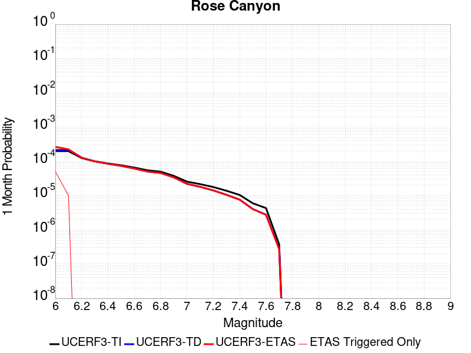 |  |  |

| Magnitude | 1 wk TI Prob | 1 wk TD Prob | 1 wk ETAS Prob | 1 wk ETAS/TD Gain | 1 wk ETAS Triggered Only | 1 mo TI Prob | 1 mo TD Prob | 1 mo ETAS Prob | 1 mo ETAS/TD Gain | 1 mo ETAS Triggered Only | 1 yr TI Prob | 1 yr TD Prob | 1 yr ETAS Prob | 1 yr ETAS/TD Gain | 1 yr ETAS Triggered Only | 10 yr TI Prob | 10 yr TD Prob | 10 yr ETAS Prob | 10 yr ETAS/TD Gain | 10 yr ETAS Triggered Only |
|-----|-----|-----|-----|-----|-----|-----|-----|-----|-----|-----|-----|-----|-----|-----|-----|-----|-----|-----|-----|-----|
| 6.0 | 4.5923203E-5 | 4.9714225E-5 | 1.3068186E-4 | 2.6286614 | 8.097166E-5 | 1.9679888E-4 | 2.1304491E-4 | 3.3447653E-4 | 1.5699813 | 1.2145749E-4 | 0.0023933933 | 0.0025909345 | 0.00283322 | 1.0935128 | 2.4291498E-4 | 0.023677798 | 0.02563999 | 0.025916126 | 1.0107697 | 2.8340082E-4 |
| 6.1 | 4.5923203E-5 | 4.9714225E-5 | 4.9714225E-5 | 1.0 | 0.0 | 1.9679888E-4 | 2.1304491E-4 | 2.5352213E-4 | 1.1899937 | 4.048583E-5 | 0.0023933933 | 0.0025909345 | 0.0027524582 | 1.0623419 | 1.6194332E-4 | 0.023677798 | 0.02563999 | 0.02583723 | 1.0076926 | 2.0242915E-4 |
| 6.2 | 2.8844734E-5 | 2.9668723E-5 | 2.9668723E-5 | 1.0 | 0.0 | 1.2361443E-4 | 1.2714567E-4 | 1.2714567E-4 | 1.0 | 0.0 | 0.0015039665 | 0.0015468939 | 0.0015873171 | 1.0261319 | 4.048583E-5 | 0.0149382865 | 0.015374276 | 0.015454003 | 1.0051857 | 8.097166E-5 |
| 6.3 | 2.3171577E-5 | 2.3161238E-5 | 2.3161238E-5 | 1.0 | 0.0 | 9.9302975E-5 | 9.9258745E-5 | 9.9258745E-5 | 1.0 | 0.0 | 0.0012083431 | 0.0012078186 | 0.0012482556 | 1.0334793 | 4.048583E-5 | 0.012017938 | 0.012022437 | 0.012102434 | 1.006654 | 8.097166E-5 |
| 6.4 | 2.0066604E-5 | 1.9667024E-5 | 1.9667024E-5 | 1.0 | 0.0 | 8.599689E-5 | 8.4284584E-5 | 8.4284584E-5 | 1.0 | 0.0 | 0.0010465092 | 0.0010256917 | 0.001066136 | 1.0394312 | 4.048583E-5 | 0.010415946 | 0.010217559 | 0.010297703 | 1.0078437 | 8.097166E-5 |
| 6.5 | 1.776989E-5 | 1.7113807E-5 | 1.7113807E-5 | 1.0 | 0.0 | 7.615444E-5 | 7.334287E-5 | 7.334287E-5 | 1.0 | 0.0 | 9.267859E-4 | 8.925905E-4 | 9.330402E-4 | 1.0453172 | 4.048583E-5 | 0.009229303 | 0.008896211 | 0.008976462 | 1.0090208 | 8.097166E-5 |
| 6.6 | 1.5227364E-5 | 1.433926E-5 | 1.433926E-5 | 1.0 | 0.0 | 6.52585E-5 | 6.1452556E-5 | 6.1452556E-5 | 1.0 | 0.0 | 7.942326E-4 | 7.479332E-4 | 7.883888E-4 | 1.0540898 | 4.048583E-5 | 0.007914 | 0.007458359 | 0.007538727 | 1.0107756 | 8.097166E-5 |
| 6.7 | 1.2703898E-5 | 1.1673274E-5 | 1.1673274E-5 | 1.0 | 0.0 | 5.4444143E-5 | 5.0027378E-5 | 5.0027378E-5 | 1.0 | 0.0 | 6.626558E-4 | 6.089174E-4 | 6.493786E-4 | 1.0664477 | 4.048583E-5 | 0.006606833 | 0.0060750856 | 0.0061555654 | 1.0132475 | 8.097166E-5 |
| 6.8 | 1.1554917E-5 | 1.0609337E-5 | 1.0609337E-5 | 1.0 | 0.0 | 4.9520135E-5 | 4.546782E-5 | 4.546782E-5 | 1.0 | 0.0 | 6.0274085E-4 | 5.5343413E-4 | 5.9389754E-4 | 1.0731133 | 4.048583E-5 | 0.0060110865 | 0.0055225673 | 0.005603092 | 1.014581 | 8.097166E-5 |
| 6.9 | 8.732078E-6 | 7.881357E-6 | 7.881357E-6 | 1.0 | 0.0 | 3.7422655E-5 | 3.3776825E-5 | 3.3776825E-5 | 1.0 | 0.0 | 4.5552556E-4 | 4.111582E-4 | 4.111582E-4 | 1.0 | 0.0 | 0.0045459294 | 0.0041048084 | 0.0041048084 | 1.0 | 0.0 |
| 7.0 | 5.9337494E-6 | 5.1074853E-6 | 5.1074853E-6 | 1.0 | 0.0 | 2.5430107E-5 | 2.188904E-5 | 2.188904E-5 | 1.0 | 0.0 | 3.0956755E-4 | 2.664666E-4 | 2.664666E-4 | 1.0 | 0.0 | 0.0030913667 | 0.0026614866 | 0.0026614866 | 1.0 | 0.0 |
| 7.1 | 5.013409E-6 | 4.1773833E-6 | 4.1773833E-6 | 1.0 | 0.0 | 2.1485863E-5 | 1.7902948E-5 | 1.7902948E-5 | 1.0 | 0.0 | 2.6155898E-4 | 2.179467E-4 | 2.179467E-4 | 1.0 | 0.0 | 0.0026125133 | 0.0021773411 | 0.0021773411 | 1.0 | 0.0 |
| 7.2 | 4.120763E-6 | 3.2821383E-6 | 3.2821383E-6 | 1.0 | 0.0 | 1.7660293E-5 | 1.4066231E-5 | 1.4066231E-5 | 1.0 | 0.0 | 2.1499286E-4 | 1.7124301E-4 | 1.7124301E-4 | 1.0 | 0.0 | 0.0021478499 | 0.00171112 | 0.00171112 | 1.0 | 0.0 |
| 7.3 | 3.2081239E-6 | 2.4405372E-6 | 2.4405372E-6 | 1.0 | 0.0 | 1.374903E-5 | 1.0459404E-5 | 1.0459404E-5 | 1.0 | 0.0 | 1.6738157E-4 | 1.2733586E-4 | 1.2733586E-4 | 1.0 | 0.0 | 0.0016725556 | 0.001272636 | 0.001272636 | 1.0 | 0.0 |
| 7.4 | 2.4194755E-6 | 1.7680634E-6 | 1.7680634E-6 | 1.0 | 0.0 | 1.0369139E-5 | 7.577393E-6 | 7.577393E-6 | 1.0 | 0.0 | 1.2623696E-4 | 9.2250906E-5 | 9.2250906E-5 | 1.0 | 0.0 | 0.0012616527 | 9.2213147E-4 | 9.2213147E-4 | 1.0 | 0.0 |
| 7.5 | 1.3842889E-6 | 9.3786275E-7 | 9.3786275E-7 | 1.0 | 0.0 | 5.9326535E-6 | 4.019406E-6 | 4.019406E-6 | 1.0 | 0.0 | 7.222766E-5 | 4.8935202E-5 | 4.8935202E-5 | 1.0 | 0.0 | 7.220419E-4 | 4.892478E-4 | 4.892478E-4 | 1.0 | 0.0 |
| 7.6 | 1.0021575E-6 | 6.411463E-7 | 6.411463E-7 | 1.0 | 0.0 | 4.2949537E-6 | 2.7477672E-6 | 2.7477672E-6 | 1.0 | 0.0 | 5.2289808E-5 | 3.3453573E-5 | 3.3453573E-5 | 1.0 | 0.0 | 5.2277505E-4 | 3.344875E-4 | 3.344875E-4 | 1.0 | 0.0 |
| 7.7 | 8.7620116E-8 | 6.4492404E-8 | 6.4492404E-8 | 1.0 | 0.0 | 3.7551473E-7 | 2.76396E-7 | 2.76396E-7 | 1.0 | 0.0 | 4.5718825E-6 | 3.3651165E-6 | 3.3651165E-6 | 1.0 | 0.0 | 4.5717883E-5 | 3.3650686E-5 | 3.3650686E-5 | 1.0 | 0.0 |

## Cleghorn Lake
*[(top)](#table-of-contents)*

| 1 Week | 1 Month | 1 Year | 10 Year |
|-----|-----|-----|-----|
|  |  |  |  |

| Magnitude | 1 wk TI Prob | 1 wk TD Prob | 1 wk ETAS Prob | 1 wk ETAS/TD Gain | 1 wk ETAS Triggered Only | 1 mo TI Prob | 1 mo TD Prob | 1 mo ETAS Prob | 1 mo ETAS/TD Gain | 1 mo ETAS Triggered Only | 1 yr TI Prob | 1 yr TD Prob | 1 yr ETAS Prob | 1 yr ETAS/TD Gain | 1 yr ETAS Triggered Only | 10 yr TI Prob | 10 yr TD Prob | 10 yr ETAS Prob | 10 yr ETAS/TD Gain | 10 yr ETAS Triggered Only |
|-----|-----|-----|-----|-----|-----|-----|-----|-----|-----|-----|-----|-----|-----|-----|-----|-----|-----|-----|-----|-----|
| 6.0 | 1.5467183E-5 | 1.6794203E-5 | 1.6794203E-5 | 1.0 | 0.0 | 6.6286244E-5 | 7.197348E-5 | 1.124564E-4 | 1.5624698 | 4.048583E-5 | 8.067362E-4 | 8.759797E-4 | 0.0010782316 | 1.2308865 | 2.0242915E-4 | 0.008038137 | 0.008730696 | 0.009011622 | 1.0321769 | 2.8340082E-4 |
| 6.1 | 1.5467183E-5 | 1.6794203E-5 | 1.6794203E-5 | 1.0 | 0.0 | 6.6286244E-5 | 7.197348E-5 | 1.124564E-4 | 1.5624698 | 4.048583E-5 | 8.067362E-4 | 8.759797E-4 | 0.0010782316 | 1.2308865 | 2.0242915E-4 | 0.008038137 | 0.008730696 | 0.009011622 | 1.0321769 | 2.8340082E-4 |
| 6.2 | 1.2624631E-5 | 1.3681544E-5 | 1.3681544E-5 | 1.0 | 0.0 | 5.410444E-5 | 5.863415E-5 | 9.9117606E-5 | 1.6904416 | 4.048583E-5 | 6.585225E-4 | 7.1368564E-4 | 9.159703E-4 | 1.2834367 | 2.0242915E-4 | 0.0065657445 | 0.0071187317 | 0.007400115 | 1.0395272 | 2.8340082E-4 |
| 6.3 | 1.2624631E-5 | 1.3681544E-5 | 1.3681544E-5 | 1.0 | 0.0 | 5.410444E-5 | 5.863415E-5 | 9.9117606E-5 | 1.6904416 | 4.048583E-5 | 6.585225E-4 | 7.1368564E-4 | 9.159703E-4 | 1.2834367 | 2.0242915E-4 | 0.0065657445 | 0.0071187317 | 0.007400115 | 1.0395272 | 2.8340082E-4 |
| 6.4 | 9.417684E-6 | 1.0170118E-5 | 1.0170118E-5 | 1.0 | 0.0 | 4.036088E-5 | 4.3585722E-5 | 8.406979E-5 | 1.9288378 | 4.048583E-5 | 4.912829E-4 | 5.3056807E-4 | 7.328898E-4 | 1.3813305 | 2.0242915E-4 | 0.004901982 | 0.005297049 | 0.0055386773 | 1.0456157 | 2.4291498E-4 |
| 6.5 | 9.368219E-6 | 1.0117545E-5 | 1.0117545E-5 | 1.0 | 0.0 | 4.014889E-5 | 4.3360415E-5 | 8.384449E-5 | 1.9336643 | 4.048583E-5 | 4.8870314E-4 | 5.2782625E-4 | 7.301486E-4 | 1.3833123 | 2.0242915E-4 | 0.004876298 | 0.0052697617 | 0.0055113966 | 1.0458531 | 2.4291498E-4 |
| 6.6 | 7.803798E-6 | 8.441831E-6 | 8.441831E-6 | 1.0 | 0.0 | 3.3444423E-5 | 3.6179E-5 | 7.666337E-5 | 2.1190019 | 4.048583E-5 | 4.0710976E-4 | 4.4043022E-4 | 5.618342E-4 | 1.2756487 | 1.2145749E-4 | 0.0040636472 | 0.0043994905 | 0.004560721 | 1.0366477 | 1.6194332E-4 |
| 6.7 | 2.3108669E-6 | 2.4438336E-6 | 2.4438336E-6 | 1.0 | 0.0 | 9.903678E-6 | 1.0473532E-5 | 1.0473532E-5 | 1.0 | 0.0 | 1.205706E-4 | 1.2750797E-4 | 1.6798865E-4 | 1.3174756 | 4.048583E-5 | 0.001205052 | 0.0012743667 | 0.001314801 | 1.0317289 | 4.048583E-5 |
| 6.8 | 2.0882828E-6 | 2.2062823E-6 | 2.2062823E-6 | 1.0 | 0.0 | 8.949753E-6 | 9.455462E-6 | 9.455462E-6 | 1.0 | 0.0 | 1.08957785E-4 | 1.1511434E-4 | 1.5559551E-4 | 1.3516605 | 4.048583E-5 | 0.0010890438 | 0.0011505639 | 0.0011910031 | 1.0351473 | 4.048583E-5 |
| 6.9 | 1.876935E-6 | 1.981051E-6 | 1.981051E-6 | 1.0 | 0.0 | 8.043982E-6 | 8.490192E-6 | 8.490192E-6 | 1.0 | 0.0 | 9.7931086E-5 | 1.03363345E-4 | 1.4384498E-4 | 1.3916441 | 4.048583E-5 | 9.788794E-4 | 0.0010331686 | 0.0010736127 | 1.0391456 | 4.048583E-5 |
| 7.0 | 1.5357559E-6 | 1.6202807E-6 | 1.6202807E-6 | 1.0 | 0.0 | 6.5817944E-6 | 6.9440425E-6 | 6.9440425E-6 | 1.0 | 0.0 | 8.01304E-5 | 8.454057E-5 | 1.2502297E-4 | 1.4788519 | 4.048583E-5 | 8.010151E-4 | 8.450965E-4 | 8.8554807E-4 | 1.0478662 | 4.048583E-5 |
| 7.1 | 1.0905424E-6 | 1.1497619E-6 | 1.1497619E-6 | 1.0 | 0.0 | 4.6737446E-6 | 4.9275427E-6 | 4.9275427E-6 | 1.0 | 0.0 | 5.6901354E-5 | 5.999128E-5 | 1.0047468E-4 | 1.6748215 | 4.048583E-5 | 5.6886784E-4 | 5.997606E-4 | 6.4022216E-4 | 1.0674628 | 4.048583E-5 |
| 7.2 | 6.06668E-7 | 6.387277E-7 | 6.387277E-7 | 1.0 | 0.0 | 2.600003E-6 | 2.7374022E-6 | 2.7374022E-6 | 1.0 | 0.0 | 3.1654577E-5 | 3.3327433E-5 | 7.381191E-5 | 2.2147496 | 4.048583E-5 | 3.1650066E-4 | 3.3323118E-4 | 3.7370351E-4 | 1.1214542 | 4.048583E-5 |

## San Jacinto (Anza) rev
*[(top)](#table-of-contents)*

| 1 Week | 1 Month | 1 Year | 10 Year |
|-----|-----|-----|-----|
|  | 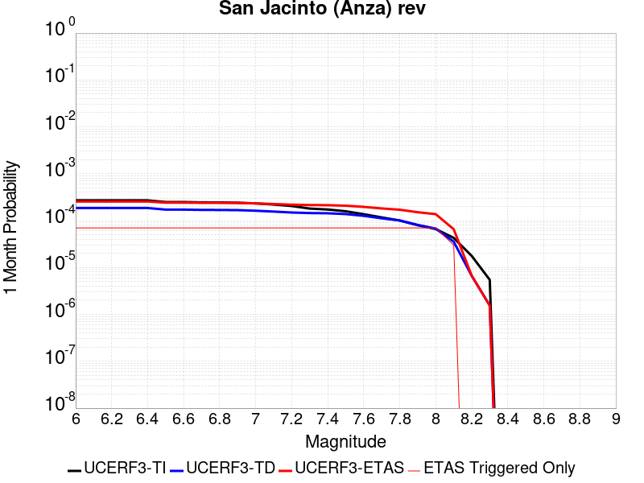 |  |  |

| Magnitude | 1 wk TI Prob | 1 wk TD Prob | 1 wk ETAS Prob | 1 wk ETAS/TD Gain | 1 wk ETAS Triggered Only | 1 mo TI Prob | 1 mo TD Prob | 1 mo ETAS Prob | 1 mo ETAS/TD Gain | 1 mo ETAS Triggered Only | 1 yr TI Prob | 1 yr TD Prob | 1 yr ETAS Prob | 1 yr ETAS/TD Gain | 1 yr ETAS Triggered Only | 10 yr TI Prob | 10 yr TD Prob | 10 yr ETAS Prob | 10 yr ETAS/TD Gain | 10 yr ETAS Triggered Only |
|-----|-----|-----|-----|-----|-----|-----|-----|-----|-----|-----|-----|-----|-----|-----|-----|-----|-----|-----|-----|-----|
| 6.0 | 6.3015636E-5 | 4.3302647E-5 | 1.242708E-4 | 2.8698199 | 8.097166E-5 | 2.7003905E-4 | 1.8556965E-4 | 3.0700458E-4 | 1.6543902 | 1.2145749E-4 | 0.0032827691 | 0.0022569813 | 0.0024589535 | 1.0894878 | 2.0242915E-4 | 0.032346968 | 0.023296192 | 0.02357299 | 1.0118817 | 2.8340082E-4 |
| 6.1 | 6.3015636E-5 | 4.3302647E-5 | 1.242708E-4 | 2.8698199 | 8.097166E-5 | 2.7003905E-4 | 1.8556965E-4 | 3.0700458E-4 | 1.6543902 | 1.2145749E-4 | 0.0032827691 | 0.0022569813 | 0.0024589535 | 1.0894878 | 2.0242915E-4 | 0.032346968 | 0.023296192 | 0.02357299 | 1.0118817 | 2.8340082E-4 |
| 6.2 | 6.3015636E-5 | 4.3302647E-5 | 1.242708E-4 | 2.8698199 | 8.097166E-5 | 2.7003905E-4 | 1.8556965E-4 | 3.0700458E-4 | 1.6543902 | 1.2145749E-4 | 0.0032827691 | 0.0022569813 | 0.0024589535 | 1.0894878 | 2.0242915E-4 | 0.032346968 | 0.023296192 | 0.02357299 | 1.0118817 | 2.8340082E-4 |
| 6.3 | 6.3015636E-5 | 4.3302647E-5 | 1.242708E-4 | 2.8698199 | 8.097166E-5 | 2.7003905E-4 | 1.8556965E-4 | 3.0700458E-4 | 1.6543902 | 1.2145749E-4 | 0.0032827691 | 0.0022569813 | 0.0024589535 | 1.0894878 | 2.0242915E-4 | 0.032346968 | 0.023296192 | 0.02357299 | 1.0118817 | 2.8340082E-4 |
| 6.4 | 6.3015636E-5 | 4.3302647E-5 | 1.242708E-4 | 2.8698199 | 8.097166E-5 | 2.7003905E-4 | 1.8556965E-4 | 3.0700458E-4 | 1.6543902 | 1.2145749E-4 | 0.0032827691 | 0.0022569813 | 0.0024589535 | 1.0894878 | 2.0242915E-4 | 0.032346968 | 0.023296192 | 0.02357299 | 1.0118817 | 2.8340082E-4 |
| 6.5 | 5.811017E-5 | 4.0082516E-5 | 1.2105093E-4 | 3.0200434 | 8.097166E-5 | 2.4901982E-4 | 1.7177092E-4 | 2.9320756E-4 | 1.7069684 | 1.2145749E-4 | 0.0030276014 | 0.002089311 | 0.002291317 | 1.0966855 | 2.0242915E-4 | 0.02986684 | 0.021593736 | 0.02187102 | 1.0128409 | 2.8340082E-4 |
| 6.6 | 5.811017E-5 | 4.0082516E-5 | 1.2105093E-4 | 3.0200434 | 8.097166E-5 | 2.4901982E-4 | 1.7177092E-4 | 2.9320756E-4 | 1.7069684 | 1.2145749E-4 | 0.0030276014 | 0.002089311 | 0.002291317 | 1.0966855 | 2.0242915E-4 | 0.02986684 | 0.021593736 | 0.02187102 | 1.0128409 | 2.8340082E-4 |
| 6.7 | 5.712442E-5 | 3.9505223E-5 | 1.2047368E-4 | 3.0495634 | 8.097166E-5 | 2.4479596E-4 | 1.6929714E-4 | 2.9073408E-4 | 1.7173005 | 1.2145749E-4 | 0.0029763177 | 0.0020592497 | 0.002261262 | 1.0981 | 2.0242915E-4 | 0.029367693 | 0.021285562 | 0.02156293 | 1.0130308 | 2.8340082E-4 |
| 6.8 | 5.6967532E-5 | 3.9361643E-5 | 1.20330114E-4 | 3.05704 | 8.097166E-5 | 2.4412372E-4 | 1.6868189E-4 | 2.901189E-4 | 1.7199173 | 1.2145749E-4 | 0.0029681553 | 0.002051773 | 0.002253787 | 1.0984582 | 2.0242915E-4 | 0.029288229 | 0.021210281 | 0.021487672 | 1.0130781 | 2.8340082E-4 |
| 6.9 | 5.6211324E-5 | 3.9066435E-5 | 1.20034936E-4 | 3.0725846 | 8.097166E-5 | 2.4088343E-4 | 1.6741687E-4 | 2.8885403E-4 | 1.7253579 | 1.2145749E-4 | 0.0029288116 | 0.0020364004 | 0.0022384173 | 1.099203 | 2.0242915E-4 | 0.028905109 | 0.021049714 | 0.02132715 | 1.01318 | 2.8340082E-4 |
| 7.0 | 5.4383527E-5 | 3.792697E-5 | 1.1889556E-4 | 3.1348553 | 8.097166E-5 | 2.3305144E-4 | 1.6253405E-4 | 2.839718E-4 | 1.7471527 | 1.2145749E-4 | 0.0028337094 | 0.001977061 | 0.00217909 | 1.1021864 | 2.0242915E-4 | 0.027978465 | 0.020440677 | 0.020718284 | 1.0135812 | 2.8340082E-4 |
| 7.1 | 5.1393665E-5 | 3.6389913E-5 | 1.1735863E-4 | 3.2250319 | 8.097166E-5 | 2.2023996E-4 | 1.5594746E-4 | 2.7738602E-4 | 1.7787144 | 1.2145749E-4 | 0.0026781242 | 0.0018970112 | 0.0020990563 | 1.1065071 | 2.0242915E-4 | 0.026460782 | 0.019614287 | 0.019892128 | 1.0141653 | 2.8340082E-4 |
| 7.2 | 4.785222E-5 | 3.4741795E-5 | 1.15710645E-4 | 3.330589 | 8.097166E-5 | 2.0506482E-4 | 1.4888494E-4 | 2.7032435E-4 | 1.8156595 | 1.2145749E-4 | 0.0024938055 | 0.0018111705 | 0.002013233 | 1.1115646 | 2.0242915E-4 | 0.024660049 | 0.018728992 | 0.019007085 | 1.0148482 | 2.8340082E-4 |
| 7.3 | 4.2143256E-5 | 3.383628E-5 | 1.14805196E-4 | 3.3929617 | 8.097166E-5 | 1.8060145E-4 | 1.4500458E-4 | 2.6644446E-4 | 1.83749 | 1.2145749E-4 | 0.002196605 | 0.0017640047 | 0.0019660767 | 1.114553 | 2.0242915E-4 | 0.02175019 | 0.01823724 | 0.018515473 | 1.0152563 | 2.8340082E-4 |
| 7.4 | 4.0264713E-5 | 3.347446E-5 | 1.1444341E-4 | 3.4188275 | 8.097166E-5 | 1.7255165E-4 | 1.4345412E-4 | 2.648942E-4 | 1.846543 | 1.2145749E-4 | 0.002098792 | 0.0017451581 | 0.0019472339 | 1.1157923 | 2.0242915E-4 | 0.020790804 | 0.018041821 | 0.018320108 | 1.0154246 | 2.8340082E-4 |
| 7.5 | 3.694492E-5 | 3.218847E-5 | 1.1315752E-4 | 3.515468 | 8.097166E-5 | 1.5832575E-4 | 1.379433E-4 | 2.5938405E-4 | 1.880367 | 1.2145749E-4 | 0.0019259118 | 0.001678169 | 0.0018802584 | 1.1204226 | 2.0242915E-4 | 0.01909306 | 0.01735827 | 0.017636752 | 1.0160432 | 2.8340082E-4 |
| 7.6 | 3.200565E-5 | 2.9504106E-5 | 1.10473375E-4 | 3.744339 | 8.097166E-5 | 1.3715986E-4 | 1.2644005E-4 | 2.4788218E-4 | 1.960472 | 1.2145749E-4 | 0.001668642 | 0.0015383229 | 0.0017404406 | 1.1313884 | 2.0242915E-4 | 0.01656168 | 0.0159463 | 0.016225182 | 1.0174888 | 2.8340082E-4 |
| 7.7 | 2.731642E-5 | 2.6092788E-5 | 1.0706233E-4 | 4.103139 | 8.097166E-5 | 1.1706512E-4 | 1.1182144E-4 | 2.3326535E-4 | 2.086052 | 1.2145749E-4 | 0.001424336 | 0.0013605768 | 0.0015627306 | 1.1485795 | 2.0242915E-4 | 0.014152412 | 0.014167004 | 0.014446391 | 1.0197209 | 2.8340082E-4 |
| 7.8 | 2.3466424E-5 | 2.3504817E-5 | 1.0447457E-4 | 4.444815 | 8.097166E-5 | 1.0056651E-4 | 1.0073105E-4 | 2.221763E-4 | 2.2056386 | 1.2145749E-4 | 0.0012237094 | 0.0012257113 | 0.0014278924 | 1.1649499 | 2.0242915E-4 | 0.012169928 | 0.012808893 | 0.013088664 | 1.0218419 | 2.8340082E-4 |
| 7.9 | 1.8611925E-5 | 1.8908117E-5 | 9.987825E-5 | 5.2822948 | 8.097166E-5 | 7.9762955E-5 | 8.1032274E-5 | 2.0247992E-4 | 2.4987564 | 1.2145749E-4 | 9.7068126E-4 | 9.861222E-4 | 0.0011883517 | 1.2050755 | 2.0242915E-4 | 0.0096645225 | 0.010393824 | 0.010674279 | 1.0269829 | 2.8340082E-4 |
| 8.0 | 1.5460775E-5 | 1.5740965E-5 | 9.671135E-5 | 6.1439276 | 8.097166E-5 | 6.6258784E-5 | 6.7459536E-5 | 1.8890883E-4 | 2.800328 | 1.2145749E-4 | 8.0640207E-4 | 8.21011E-4 | 9.828215E-4 | 1.1970867 | 1.6194332E-4 | 0.008034821 | 0.0087028835 | 0.008943684 | 1.0276691 | 2.4291498E-4 |
| 8.1 | 9.983884E-6 | 8.269952E-6 | 8.9240944E-5 | 10.790987 | 8.097166E-5 | 4.2787375E-5 | 3.544217E-5 | 1.1641096E-4 | 3.2845323 | 8.097166E-5 | 5.2081177E-4 | 4.314235E-4 | 5.1236025E-4 | 1.1876038 | 8.097166E-5 | 0.0051959283 | 0.004640022 | 0.004760916 | 1.0260546 | 1.2145749E-4 |
| 8.2 | 4.1226E-6 | 1.5529788E-6 | 1.5529788E-6 | 1.0 | 0.0 | 1.7668166E-5 | 6.6556063E-6 | 6.6556063E-6 | 1.0 | 0.0 | 2.1508869E-4 | 8.102902E-5 | 8.102902E-5 | 1.0 | 0.0 | 0.0021488064 | 9.4050163E-4 | 9.4050163E-4 | 1.0 | 0.0 |
| 8.3 | 1.2750878E-6 | 3.612133E-7 | 3.612133E-7 | 1.0 | 0.0 | 5.4646503E-6 | 1.548056E-6 | 1.548056E-6 | 1.0 | 0.0 | 6.653009E-5 | 1.8847424E-5 | 1.8847424E-5 | 1.0 | 0.0 | 6.6510175E-4 | 2.2734253E-4 | 2.2734253E-4 | 1.0 | 0.0 |

## San Jacinto (Stepovers Combined)
*[(top)](#table-of-contents)*

| 1 Week | 1 Month | 1 Year | 10 Year |
|-----|-----|-----|-----|
|  |  |  |  |

| Magnitude | 1 wk TI Prob | 1 wk TD Prob | 1 wk ETAS Prob | 1 wk ETAS/TD Gain | 1 wk ETAS Triggered Only | 1 mo TI Prob | 1 mo TD Prob | 1 mo ETAS Prob | 1 mo ETAS/TD Gain | 1 mo ETAS Triggered Only | 1 yr TI Prob | 1 yr TD Prob | 1 yr ETAS Prob | 1 yr ETAS/TD Gain | 1 yr ETAS Triggered Only | 10 yr TI Prob | 10 yr TD Prob | 10 yr ETAS Prob | 10 yr ETAS/TD Gain | 10 yr ETAS Triggered Only |
|-----|-----|-----|-----|-----|-----|-----|-----|-----|-----|-----|-----|-----|-----|-----|-----|-----|-----|-----|-----|-----|
| 6.0 | 4.0667746E-5 | 3.5272755E-5 | 1.1624156E-4 | 3.2955055 | 8.097166E-5 | 1.742787E-4 | 1.5116022E-4 | 2.7259934E-4 | 1.8033803 | 1.2145749E-4 | 0.0021197782 | 0.0018388226 | 0.0020408796 | 1.1098839 | 2.0242915E-4 | 0.020996714 | 0.018986892 | 0.019264912 | 1.0146427 | 2.8340082E-4 |
| 6.1 | 4.0667746E-5 | 3.5272755E-5 | 1.1624156E-4 | 3.2955055 | 8.097166E-5 | 1.742787E-4 | 1.5116022E-4 | 2.7259934E-4 | 1.8033803 | 1.2145749E-4 | 0.0021197782 | 0.0018388226 | 0.0020408796 | 1.1098839 | 2.0242915E-4 | 0.020996714 | 0.018986892 | 0.019264912 | 1.0146427 | 2.8340082E-4 |
| 6.2 | 4.0667746E-5 | 3.5272755E-5 | 1.1624156E-4 | 3.2955055 | 8.097166E-5 | 1.742787E-4 | 1.5116022E-4 | 2.7259934E-4 | 1.8033803 | 1.2145749E-4 | 0.0021197782 | 0.0018388226 | 0.0020408796 | 1.1098839 | 2.0242915E-4 | 0.020996714 | 0.018986892 | 0.019264912 | 1.0146427 | 2.8340082E-4 |
| 6.3 | 4.0667746E-5 | 3.5272755E-5 | 1.1624156E-4 | 3.2955055 | 8.097166E-5 | 1.742787E-4 | 1.5116022E-4 | 2.7259934E-4 | 1.8033803 | 1.2145749E-4 | 0.0021197782 | 0.0018388226 | 0.0020408796 | 1.1098839 | 2.0242915E-4 | 0.020996714 | 0.018986892 | 0.019264912 | 1.0146427 | 2.8340082E-4 |
| 6.4 | 4.0577226E-5 | 3.5144654E-5 | 1.1611347E-4 | 3.3038728 | 8.097166E-5 | 1.738908E-4 | 1.5061127E-4 | 2.7205047E-4 | 1.8063089 | 1.2145749E-4 | 0.0021150648 | 0.0018321523 | 0.0020342106 | 1.1102847 | 2.0242915E-4 | 0.020950472 | 0.018921461 | 0.019199498 | 1.0146943 | 2.8340082E-4 |
| 6.5 | 4.0577226E-5 | 3.5144654E-5 | 1.1611347E-4 | 3.3038728 | 8.097166E-5 | 1.738908E-4 | 1.5061127E-4 | 2.7205047E-4 | 1.8063089 | 1.2145749E-4 | 0.0021150648 | 0.0018321523 | 0.0020342106 | 1.1102847 | 2.0242915E-4 | 0.020950472 | 0.018921461 | 0.019199498 | 1.0146943 | 2.8340082E-4 |
| 6.6 | 4.053861E-5 | 3.509E-5 | 1.1605882E-4 | 3.3074613 | 8.097166E-5 | 1.7372532E-4 | 1.5037706E-4 | 2.718163E-4 | 1.8075647 | 1.2145749E-4 | 0.0021130538 | 0.0018293057 | 0.0020313645 | 1.1104566 | 2.0242915E-4 | 0.020930743 | 0.018893538 | 0.019171584 | 1.0147165 | 2.8340082E-4 |
| 6.7 | 4.0516545E-5 | 3.5059067E-5 | 1.1602789E-4 | 3.309497 | 8.097166E-5 | 1.7363077E-4 | 1.5024451E-4 | 2.7168376E-4 | 1.8082774 | 1.2145749E-4 | 0.002111905 | 0.001827695 | 0.0020297542 | 1.1105541 | 2.0242915E-4 | 0.020919468 | 0.018877735 | 0.019155785 | 1.014729 | 2.8340082E-4 |
| 6.8 | 4.049434E-5 | 3.5030633E-5 | 1.1599946E-4 | 3.311372 | 8.097166E-5 | 1.7353562E-4 | 1.5012265E-4 | 2.715619E-4 | 1.8089336 | 1.2145749E-4 | 0.0021107488 | 0.0018262138 | 0.0020282732 | 1.110644 | 2.0242915E-4 | 0.020908125 | 0.018863149 | 0.019141203 | 1.0147406 | 2.8340082E-4 |
| 6.9 | 4.046386E-5 | 3.499319E-5 | 1.15962015E-4 | 3.3138452 | 8.097166E-5 | 1.73405E-4 | 1.4996222E-4 | 2.7140148E-4 | 1.8097992 | 1.2145749E-4 | 0.0021091616 | 0.0018242638 | 0.0020263237 | 1.1107624 | 2.0242915E-4 | 0.020892553 | 0.01884392 | 0.019121982 | 1.014756 | 2.8340082E-4 |
| 7.0 | 4.036382E-5 | 3.487376E-5 | 1.15842595E-4 | 3.3217697 | 8.097166E-5 | 1.7297632E-4 | 1.4945042E-4 | 2.7088975E-4 | 1.8125727 | 1.2145749E-4 | 0.0021039525 | 0.0018180435 | 0.0020201048 | 1.111142 | 2.0242915E-4 | 0.02084144 | 0.018782536 | 0.019060614 | 1.0148051 | 2.8340082E-4 |
| 7.1 | 4.0343282E-5 | 3.4852223E-5 | 1.1582106E-4 | 3.3232045 | 8.097166E-5 | 1.7288832E-4 | 1.4935812E-4 | 2.7079746E-4 | 1.813075 | 1.2145749E-4 | 0.002102883 | 0.0018169218 | 0.0020189832 | 1.1112108 | 2.0242915E-4 | 0.020830948 | 0.018771412 | 0.019049494 | 1.014814 | 2.8340082E-4 |
| 7.2 | 4.0257353E-5 | 3.4756722E-5 | 1.1572557E-4 | 3.3295882 | 8.097166E-5 | 1.725201E-4 | 1.489489E-4 | 2.703883E-4 | 1.8153092 | 1.2145749E-4 | 0.0020984085 | 0.0018119477 | 0.00201401 | 1.1115167 | 2.0242915E-4 | 0.020787042 | 0.018722152 | 0.019000247 | 1.0148538 | 2.8340082E-4 |
| 7.3 | 3.9940667E-5 | 3.4584376E-5 | 1.1555324E-4 | 3.3411975 | 8.097166E-5 | 1.7116306E-4 | 1.4821035E-4 | 2.6964984E-4 | 1.8193725 | 1.2145749E-4 | 0.0020819185 | 0.0018029709 | 0.002005035 | 1.112073 | 2.0242915E-4 | 0.020625217 | 0.018630784 | 0.018908905 | 1.014928 | 2.8340082E-4 |
| 7.4 | 3.9721202E-5 | 3.4469766E-5 | 1.15438634E-4 | 3.3489823 | 8.097166E-5 | 1.7022261E-4 | 1.4771923E-4 | 2.6915877E-4 | 1.8220971 | 1.2145749E-4 | 0.0020704903 | 0.0017970012 | 0.0019990667 | 1.1124458 | 2.0242915E-4 | 0.020513052 | 0.018569905 | 0.018848045 | 1.0149779 | 2.8340082E-4 |
| 7.5 | 3.7036873E-5 | 3.3537188E-5 | 1.1450613E-4 | 3.4143035 | 8.097166E-5 | 1.5871979E-4 | 1.437229E-4 | 2.6516293E-4 | 1.8449595 | 1.2145749E-4 | 0.0019307006 | 0.0017484248 | 0.0019505001 | 1.1155756 | 2.0242915E-4 | 0.019140124 | 0.018071463 | 0.018349743 | 1.0153989 | 2.8340082E-4 |
| 7.6 | 3.2940967E-5 | 3.1317984E-5 | 1.1228711E-4 | 3.5853872 | 8.097166E-5 | 1.4116794E-4 | 1.3421304E-4 | 2.5565425E-4 | 1.9048389 | 1.2145749E-4 | 0.0017173645 | 0.0016328214 | 0.0018349199 | 1.1237726 | 2.0242915E-4 | 0.01704153 | 0.016904354 | 0.017182963 | 1.0164815 | 2.8340082E-4 |
| 7.7 | 2.8236149E-5 | 2.7883889E-5 | 1.0885329E-4 | 3.903806 | 8.097166E-5 | 1.2100645E-4 | 1.19496915E-4 | 2.4093989E-4 | 2.0162854 | 1.2145749E-4 | 0.0014722579 | 0.001453905 | 0.0016560399 | 1.1390289 | 2.0242915E-4 | 0.014625421 | 0.015115095 | 0.015394213 | 1.0184661 | 2.8340082E-4 |
| 7.8 | 2.4329287E-5 | 2.5207537E-5 | 1.06177155E-4 | 4.2121196 | 8.097166E-5 | 1.042642E-4 | 1.0802783E-4 | 2.294722E-4 | 2.124195 | 1.2145749E-4 | 0.0012686774 | 0.0013144462 | 0.0015166092 | 1.153801 | 2.0242915E-4 | 0.012614589 | 0.013712396 | 0.013991911 | 1.0203841 | 2.8340082E-4 |
| 7.9 | 1.9370926E-5 | 2.0421452E-5 | 1.0139146E-4 | 4.9649487 | 8.097166E-5 | 8.301561E-5 | 8.7517576E-5 | 2.0896444E-4 | 2.3876853 | 1.2145749E-4 | 0.0010102465 | 0.0010650064 | 0.00126722 | 1.1898707 | 2.0242915E-4 | 0.0100566605 | 0.011199483 | 0.011479709 | 1.0250214 | 2.8340082E-4 |
| 8.0 | 1.5583017E-5 | 1.588647E-5 | 9.685684E-5 | 6.0968137 | 8.097166E-5 | 6.6782646E-5 | 6.808309E-5 | 1.8953231E-4 | 2.7838383 | 1.2145749E-4 | 8.127754E-4 | 8.285971E-4 | 9.904063E-4 | 1.1952808 | 1.6194332E-4 | 0.008098091 | 0.008781809 | 0.009022592 | 1.0274183 | 2.4291498E-4 |
| 8.1 | 1.0024873E-5 | 8.292404E-6 | 8.926339E-5 | 10.764477 | 8.097166E-5 | 4.2963035E-5 | 3.5538393E-5 | 1.1650717E-4 | 3.2783468 | 8.097166E-5 | 5.229494E-4 | 4.3259456E-4 | 5.135312E-4 | 1.1870958 | 8.097166E-5 | 0.0052172043 | 0.0046534105 | 0.0047743027 | 1.0259793 | 1.2145749E-4 |
| 8.2 | 4.142796E-6 | 1.5610041E-6 | 1.5610041E-6 | 1.0 | 0.0 | 1.775472E-5 | 6.69E-6 | 6.69E-6 | 1.0 | 0.0 | 2.1614227E-4 | 8.144774E-5 | 8.144774E-5 | 1.0 | 0.0 | 0.0021593217 | 9.454649E-4 | 9.454649E-4 | 1.0 | 0.0 |
| 8.3 | 1.2750878E-6 | 3.612133E-7 | 3.612133E-7 | 1.0 | 0.0 | 5.4646503E-6 | 1.548056E-6 | 1.548056E-6 | 1.0 | 0.0 | 6.653009E-5 | 1.8847424E-5 | 1.8847424E-5 | 1.0 | 0.0 | 6.6510175E-4 | 2.2734253E-4 | 2.2734253E-4 | 1.0 | 0.0 |

## San Jacinto (San Jacinto Valley) rev
*[(top)](#table-of-contents)*

| 1 Week | 1 Month | 1 Year | 10 Year |
|-----|-----|-----|-----|
|  |  |  |  |

| Magnitude | 1 wk TI Prob | 1 wk TD Prob | 1 wk ETAS Prob | 1 wk ETAS/TD Gain | 1 wk ETAS Triggered Only | 1 mo TI Prob | 1 mo TD Prob | 1 mo ETAS Prob | 1 mo ETAS/TD Gain | 1 mo ETAS Triggered Only | 1 yr TI Prob | 1 yr TD Prob | 1 yr ETAS Prob | 1 yr ETAS/TD Gain | 1 yr ETAS Triggered Only | 10 yr TI Prob | 10 yr TD Prob | 10 yr ETAS Prob | 10 yr ETAS/TD Gain | 10 yr ETAS Triggered Only |
|-----|-----|-----|-----|-----|-----|-----|-----|-----|-----|-----|-----|-----|-----|-----|-----|-----|-----|-----|-----|-----|
| 6.0 | 3.652694E-5 | 3.4402394E-5 | 1.15371266E-4 | 3.3535826 | 8.097166E-5 | 1.5653463E-4 | 1.474305E-4 | 2.688701E-4 | 1.8237073 | 1.2145749E-4 | 0.0019041431 | 0.00179349 | 0.001995556 | 1.1126664 | 2.0242915E-4 | 0.018879099 | 0.018526595 | 0.018804746 | 1.0150136 | 2.8340082E-4 |
| 6.1 | 3.652694E-5 | 3.4402394E-5 | 1.15371266E-4 | 3.3535826 | 8.097166E-5 | 1.5653463E-4 | 1.474305E-4 | 2.688701E-4 | 1.8237073 | 1.2145749E-4 | 0.0019041431 | 0.00179349 | 0.001995556 | 1.1126664 | 2.0242915E-4 | 0.018879099 | 0.018526595 | 0.018804746 | 1.0150136 | 2.8340082E-4 |
| 6.2 | 3.652694E-5 | 3.4402394E-5 | 1.15371266E-4 | 3.3535826 | 8.097166E-5 | 1.5653463E-4 | 1.474305E-4 | 2.688701E-4 | 1.8237073 | 1.2145749E-4 | 0.0019041431 | 0.00179349 | 0.001995556 | 1.1126664 | 2.0242915E-4 | 0.018879099 | 0.018526595 | 0.018804746 | 1.0150136 | 2.8340082E-4 |
| 6.3 | 3.652694E-5 | 3.4402394E-5 | 1.15371266E-4 | 3.3535826 | 8.097166E-5 | 1.5653463E-4 | 1.474305E-4 | 2.688701E-4 | 1.8237073 | 1.2145749E-4 | 0.0019041431 | 0.00179349 | 0.001995556 | 1.1126664 | 2.0242915E-4 | 0.018879099 | 0.018526595 | 0.018804746 | 1.0150136 | 2.8340082E-4 |
| 6.4 | 3.646941E-5 | 3.432397E-5 | 1.1529285E-4 | 3.3589604 | 8.097166E-5 | 1.5628811E-4 | 1.4709444E-4 | 2.6853406E-4 | 1.8255894 | 1.2145749E-4 | 0.0019011468 | 0.0017894056 | 0.0019914724 | 1.1129241 | 2.0242915E-4 | 0.018849645 | 0.018486476 | 0.018764637 | 1.0150467 | 2.8340082E-4 |
| 6.5 | 3.646941E-5 | 3.432397E-5 | 1.1529285E-4 | 3.3589604 | 8.097166E-5 | 1.5628811E-4 | 1.4709444E-4 | 2.6853406E-4 | 1.8255894 | 1.2145749E-4 | 0.0019011468 | 0.0017894056 | 0.0019914724 | 1.1129241 | 2.0242915E-4 | 0.018849645 | 0.018486476 | 0.018764637 | 1.0150467 | 2.8340082E-4 |
| 6.6 | 3.6442503E-5 | 3.4287354E-5 | 1.1525624E-4 | 3.3614795 | 8.097166E-5 | 1.561728E-4 | 1.4693754E-4 | 2.683772E-4 | 1.8264712 | 1.2145749E-4 | 0.0018997455 | 0.0017874985 | 0.0019895658 | 1.1130447 | 2.0242915E-4 | 0.018835869 | 0.018467745 | 0.018745912 | 1.0150623 | 2.8340082E-4 |
| 6.7 | 3.6432113E-5 | 3.4272925E-5 | 1.1524181E-4 | 3.3624737 | 8.097166E-5 | 1.5612828E-4 | 1.4687571E-4 | 2.6831537E-4 | 1.8268192 | 1.2145749E-4 | 0.0018992044 | 0.0017867472 | 0.0019888147 | 1.1130923 | 2.0242915E-4 | 0.018830549 | 0.018460369 | 0.018738538 | 1.0150684 | 2.8340082E-4 |
| 6.8 | 3.6409598E-5 | 3.424198E-5 | 1.1521087E-4 | 3.3646088 | 8.097166E-5 | 1.560318E-4 | 1.4674311E-4 | 2.6818278E-4 | 1.8275664 | 1.2145749E-4 | 0.0018980318 | 0.0017851355 | 0.0019872033 | 1.1131947 | 2.0242915E-4 | 0.018819023 | 0.018444523 | 0.018722696 | 1.0150816 | 2.8340082E-4 |
| 6.9 | 3.638078E-5 | 3.4202407E-5 | 1.1517129E-4 | 3.3673449 | 8.097166E-5 | 1.5590832E-4 | 1.4657351E-4 | 2.6801322E-4 | 1.8285241 | 1.2145749E-4 | 0.0018965311 | 0.001783074 | 0.0019851422 | 1.1133257 | 2.0242915E-4 | 0.018804269 | 0.018424258 | 0.018702436 | 1.0150986 | 2.8340082E-4 |
| 7.0 | 3.6294874E-5 | 3.408442E-5 | 1.1505332E-4 | 3.37554 | 8.097166E-5 | 1.5554018E-4 | 1.4606792E-4 | 2.6750768E-4 | 1.8313923 | 1.2145749E-4 | 0.0018920569 | 0.001776929 | 0.0019789983 | 1.1137184 | 2.0242915E-4 | 0.018760284 | 0.018363839 | 0.018642036 | 1.0151491 | 2.8340082E-4 |
| 7.1 | 3.6260717E-5 | 3.4040702E-5 | 1.1500961E-4 | 3.3785908 | 8.097166E-5 | 1.5539382E-4 | 1.4588058E-4 | 2.6732034E-4 | 1.8324602 | 1.2145749E-4 | 0.001890278 | 0.0017746518 | 0.0019767217 | 1.1138645 | 2.0242915E-4 | 0.018742796 | 0.018341439 | 0.018619642 | 1.015168 | 2.8340082E-4 |
| 7.2 | 3.6210204E-5 | 3.397492E-5 | 1.1494383E-4 | 3.3831964 | 8.097166E-5 | 1.5517735E-4 | 1.455987E-4 | 2.670385E-4 | 1.8340721 | 1.2145749E-4 | 0.001887647 | 0.0017712255 | 0.001973296 | 1.1140852 | 2.0242915E-4 | 0.01871693 | 0.01830772 | 0.018585932 | 1.0151964 | 2.8340082E-4 |
| 7.3 | 3.6119454E-5 | 3.386321E-5 | 1.14832124E-4 | 3.3910587 | 8.097166E-5 | 1.5478847E-4 | 1.4511998E-4 | 2.6655983E-4 | 1.8368239 | 1.2145749E-4 | 0.0018829206 | 0.0017654065 | 0.0019674783 | 1.1144619 | 2.0242915E-4 | 0.018670462 | 0.018250274 | 0.0185285 | 1.0152452 | 2.8340082E-4 |
| 7.4 | 3.607848E-5 | 3.381071E-5 | 1.1477963E-4 | 3.3947716 | 8.097166E-5 | 1.5461289E-4 | 1.44895E-4 | 2.663349E-4 | 1.8381234 | 1.2145749E-4 | 0.0018807866 | 0.0017626719 | 0.0019647442 | 1.1146398 | 2.0242915E-4 | 0.018649481 | 0.018223269 | 0.018501505 | 1.0152682 | 2.8340082E-4 |
| 7.5 | 3.5856774E-5 | 3.3620483E-5 | 1.1458942E-4 | 3.4083219 | 8.097166E-5 | 1.5366284E-4 | 1.4407984E-4 | 2.6551983E-4 | 1.842866 | 1.2145749E-4 | 0.0018692396 | 0.0017527633 | 0.0019548375 | 1.115289 | 2.0242915E-4 | 0.018535944 | 0.018124366 | 0.01840263 | 1.0153531 | 2.8340082E-4 |
| 7.6 | 3.286655E-5 | 3.2143445E-5 | 1.131125E-4 | 3.5189912 | 8.097166E-5 | 1.4084904E-4 | 1.3775036E-4 | 2.5919112E-4 | 1.8816003 | 1.2145749E-4 | 0.001713488 | 0.0016758227 | 0.0018779126 | 1.1205915 | 2.0242915E-4 | 0.017003361 | 0.017344031 | 0.017622517 | 1.0160565 | 2.8340082E-4 |
| 7.7 | 2.8882527E-5 | 2.9236293E-5 | 1.1020558E-4 | 3.7694788 | 8.097166E-5 | 1.237764E-4 | 1.2529238E-4 | 2.4673465E-4 | 1.969271 | 1.2145749E-4 | 0.0015059357 | 0.0015243685 | 0.001726489 | 1.132593 | 2.0242915E-4 | 0.014957713 | 0.015830461 | 0.016109375 | 1.0176189 | 2.8340082E-4 |
| 7.8 | 2.4950225E-5 | 2.6527203E-5 | 1.07496715E-4 | 4.05232 | 8.097166E-5 | 1.0692515E-4 | 1.1368306E-4 | 2.3512675E-4 | 2.0682654 | 1.2145749E-4 | 0.0013010362 | 0.0013832134 | 0.0015853626 | 1.1461446 | 2.0242915E-4 | 0.012934455 | 0.014411755 | 0.014691072 | 1.0193812 | 2.8340082E-4 |
| 7.9 | 1.9881603E-5 | 2.1507445E-5 | 1.0247737E-4 | 4.764739 | 8.097166E-5 | 8.520408E-5 | 9.217151E-5 | 2.1361781E-4 | 2.317612 | 1.2145749E-4 | 0.001036866 | 0.0011216112 | 0.0013238133 | 1.1802782 | 2.0242915E-4 | 0.010320415 | 0.011777027 | 0.01205709 | 1.0237805 | 2.8340082E-4 |
| 8.0 | 1.563292E-5 | 1.5937347E-5 | 9.6907715E-5 | 6.080543 | 8.097166E-5 | 6.6996516E-5 | 6.8301124E-5 | 1.8975032E-4 | 2.7781434 | 1.2145749E-4 | 8.153773E-4 | 8.3124964E-4 | 9.930583E-4 | 1.1946572 | 1.6194332E-4 | 0.00812392 | 0.008810506 | 0.009051281 | 1.0273281 | 2.4291498E-4 |
| 8.1 | 1.0045313E-5 | 8.301802E-6 | 8.927279E-5 | 10.753423 | 8.097166E-5 | 4.305063E-5 | 3.5578672E-5 | 1.1654745E-4 | 3.2757673 | 8.097166E-5 | 5.2401534E-4 | 4.3308473E-4 | 5.140213E-4 | 1.1868839 | 8.097166E-5 | 0.0052278144 | 0.0046591135 | 0.004780005 | 1.0259473 | 1.2145749E-4 |
| 8.2 | 4.1554413E-6 | 1.5655598E-6 | 1.5655598E-6 | 1.0 | 0.0 | 1.7808914E-5 | 6.709525E-6 | 6.709525E-6 | 1.0 | 0.0 | 2.1680194E-4 | 8.168544E-5 | 8.168544E-5 | 1.0 | 0.0 | 0.0021659054 | 9.482903E-4 | 9.482903E-4 | 1.0 | 0.0 |
| 8.3 | 1.2758221E-6 | 3.6149942E-7 | 3.6149942E-7 | 1.0 | 0.0 | 5.4677976E-6 | 1.5492824E-6 | 1.5492824E-6 | 1.0 | 0.0 | 6.65684E-5 | 1.8862354E-5 | 1.8862354E-5 | 1.0 | 0.0 | 6.6548464E-4 | 2.2751294E-4 | 2.2751294E-4 | 1.0 | 0.0 |

## Red Mountain
*[(top)](#table-of-contents)*

| 1 Week | 1 Month | 1 Year | 10 Year |
|-----|-----|-----|-----|
|  | 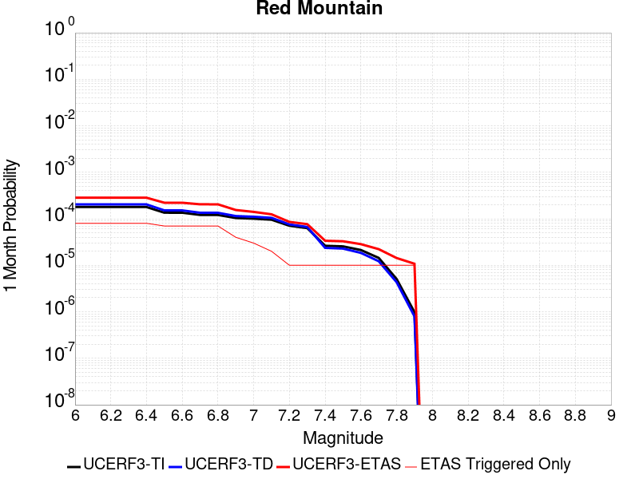 | 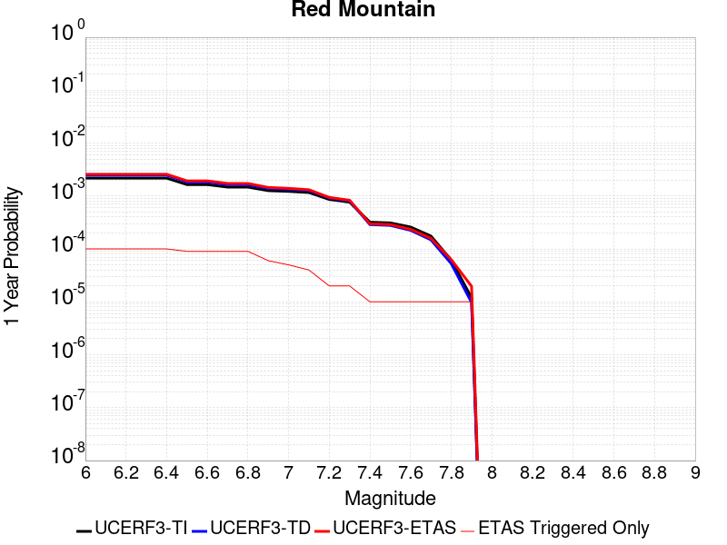 |  |

| Magnitude | 1 wk TI Prob | 1 wk TD Prob | 1 wk ETAS Prob | 1 wk ETAS/TD Gain | 1 wk ETAS Triggered Only | 1 mo TI Prob | 1 mo TD Prob | 1 mo ETAS Prob | 1 mo ETAS/TD Gain | 1 mo ETAS Triggered Only | 1 yr TI Prob | 1 yr TD Prob | 1 yr ETAS Prob | 1 yr ETAS/TD Gain | 1 yr ETAS Triggered Only | 10 yr TI Prob | 10 yr TD Prob | 10 yr ETAS Prob | 10 yr ETAS/TD Gain | 10 yr ETAS Triggered Only |
|-----|-----|-----|-----|-----|-----|-----|-----|-----|-----|-----|-----|-----|-----|-----|-----|-----|-----|-----|-----|-----|
| 6.0 | 4.1810763E-5 | 4.7589947E-5 | 1.2855775E-4 | 2.7013638 | 8.097166E-5 | 1.7917668E-4 | 2.039419E-4 | 2.8489705E-4 | 1.396952 | 8.097166E-5 | 0.0021792934 | 0.0024803306 | 0.0025611015 | 1.0325645 | 8.097166E-5 | 0.021580452 | 0.024544092 | 0.024741553 | 1.0080452 | 2.0242915E-4 |
| 6.1 | 4.1810763E-5 | 4.7589947E-5 | 1.2855775E-4 | 2.7013638 | 8.097166E-5 | 1.7917668E-4 | 2.039419E-4 | 2.8489705E-4 | 1.396952 | 8.097166E-5 | 0.0021792934 | 0.0024803306 | 0.0025611015 | 1.0325645 | 8.097166E-5 | 0.021580452 | 0.024544092 | 0.024741553 | 1.0080452 | 2.0242915E-4 |
| 6.2 | 4.1810763E-5 | 4.7589947E-5 | 1.2855775E-4 | 2.7013638 | 8.097166E-5 | 1.7917668E-4 | 2.039419E-4 | 2.8489705E-4 | 1.396952 | 8.097166E-5 | 0.0021792934 | 0.0024803306 | 0.0025611015 | 1.0325645 | 8.097166E-5 | 0.021580452 | 0.024544092 | 0.024741553 | 1.0080452 | 2.0242915E-4 |
| 6.3 | 4.1810763E-5 | 4.7589947E-5 | 1.2855775E-4 | 2.7013638 | 8.097166E-5 | 1.7917668E-4 | 2.039419E-4 | 2.8489705E-4 | 1.396952 | 8.097166E-5 | 0.0021792934 | 0.0024803306 | 0.0025611015 | 1.0325645 | 8.097166E-5 | 0.021580452 | 0.024544092 | 0.024741553 | 1.0080452 | 2.0242915E-4 |
| 6.4 | 4.1810763E-5 | 4.7589947E-5 | 1.2855775E-4 | 2.7013638 | 8.097166E-5 | 1.7917668E-4 | 2.039419E-4 | 2.8489705E-4 | 1.396952 | 8.097166E-5 | 0.0021792934 | 0.0024803306 | 0.0025611015 | 1.0325645 | 8.097166E-5 | 0.021580452 | 0.024544092 | 0.024741553 | 1.0080452 | 2.0242915E-4 |
| 6.5 | 3.154503E-5 | 3.5359728E-5 | 1.1632853E-4 | 3.289859 | 8.097166E-5 | 1.3518598E-4 | 1.5153342E-4 | 2.324928E-4 | 1.5342675 | 8.097166E-5 | 0.0016446467 | 0.0018434501 | 0.0019242725 | 1.043843 | 8.097166E-5 | 0.01632528 | 0.018291233 | 0.01841047 | 1.0065187 | 1.2145749E-4 |
| 6.6 | 3.1535834E-5 | 3.534911E-5 | 1.16317904E-4 | 3.290547 | 8.097166E-5 | 1.3514658E-4 | 1.5148791E-4 | 2.324473E-4 | 1.5344281 | 8.097166E-5 | 0.0016441676 | 0.001842897 | 0.0019237195 | 1.0438561 | 8.097166E-5 | 0.01632056 | 0.018285794 | 0.018405031 | 1.0065207 | 1.2145749E-4 |
| 6.7 | 2.8267326E-5 | 3.146934E-5 | 1.1243845E-4 | 3.5729523 | 8.097166E-5 | 1.2114006E-4 | 1.348621E-4 | 2.1582285E-4 | 1.6003224 | 8.097166E-5 | 0.0014738824 | 0.0016407946 | 0.0017216334 | 1.0492681 | 8.097166E-5 | 0.014641452 | 0.016295563 | 0.016415041 | 1.007332 | 1.2145749E-4 |
| 6.8 | 2.8212884E-5 | 3.1407224E-5 | 1.1237634E-4 | 3.578041 | 8.097166E-5 | 1.20906756E-4 | 1.3459593E-4 | 2.1555669E-4 | 1.6015097 | 8.097166E-5 | 0.0014710457 | 0.0016375587 | 0.0017183978 | 1.0493656 | 8.097166E-5 | 0.014613459 | 0.01626368 | 0.016383162 | 1.0073465 | 1.2145749E-4 |
| 6.9 | 2.4227871E-5 | 2.6706979E-5 | 1.07676475E-4 | 4.031773 | 8.097166E-5 | 1.03829596E-4 | 1.14453884E-4 | 1.9541627E-4 | 1.70738 | 8.097166E-5 | 0.0012633923 | 0.0013926612 | 0.0014735201 | 1.0580608 | 8.097166E-5 | 0.012562336 | 0.013847026 | 0.013966802 | 1.00865 | 1.2145749E-4 |
| 7.0 | 2.348524E-5 | 2.5835763E-5 | 1.0680533E-4 | 4.1340113 | 8.097166E-5 | 1.0064714E-4 | 1.1072042E-4 | 1.9168312E-4 | 1.7312354 | 8.097166E-5 | 0.0012246901 | 0.0013472632 | 0.0014281258 | 1.0600199 | 8.097166E-5 | 0.012179627 | 0.01339859 | 0.01351842 | 1.0089434 | 1.2145749E-4 |
| 7.1 | 2.2311642E-5 | 2.4462828E-5 | 6.494767E-5 | 2.6549532 | 4.048583E-5 | 9.561782E-5 | 1.048369E-4 | 1.453185E-4 | 1.3861387 | 4.048583E-5 | 0.0011635252 | 0.0012757168 | 0.001316151 | 1.0316952 | 4.048583E-5 | 0.01157452 | 0.012691451 | 0.012771395 | 1.006299 | 8.097166E-5 |
| 7.2 | 1.6533986E-5 | 1.7670347E-5 | 5.8155463E-5 | 3.291133 | 4.048583E-5 | 7.085802E-5 | 7.572822E-5 | 1.16210984E-4 | 1.5345796 | 4.048583E-5 | 8.623549E-4 | 9.216645E-4 | 9.6211303E-4 | 1.0438864 | 4.048583E-5 | 0.008590161 | 0.009184699 | 0.009264926 | 1.008735 | 8.097166E-5 |
| 7.3 | 1.4703092E-5 | 1.555952E-5 | 5.6044722E-5 | 3.6019566 | 4.048583E-5 | 6.301173E-5 | 6.66823E-5 | 1.0716543E-4 | 1.6071045 | 4.048583E-5 | 7.668978E-4 | 8.1161625E-4 | 8.5206924E-4 | 1.0498425 | 4.048583E-5 | 0.0076425658 | 0.008092596 | 0.0081729125 | 1.0099247 | 8.097166E-5 |
| 7.4 | 6.1331984E-6 | 5.528872E-6 | 4.6014477E-5 | 8.32258 | 4.048583E-5 | 2.6284872E-5 | 2.3694953E-5 | 6.4179825E-5 | 2.7085862 | 4.048583E-5 | 3.199713E-4 | 2.8844838E-4 | 3.2892253E-4 | 1.1403168 | 4.048583E-5 | 0.0031951098 | 0.0028807942 | 0.0029615327 | 1.0280265 | 8.097166E-5 |
| 7.5 | 5.954766E-6 | 5.3385015E-6 | 4.5824116E-5 | 8.583704 | 4.048583E-5 | 2.5520176E-5 | 2.2879094E-5 | 6.3364E-5 | 2.769515 | 4.048583E-5 | 3.1066386E-4 | 2.785179E-4 | 3.1899245E-4 | 1.1453212 | 4.048583E-5 | 0.003102299 | 0.0027817423 | 0.0028624886 | 1.0290272 | 8.097166E-5 |
| 7.6 | 4.9726646E-6 | 4.315295E-6 | 4.480095E-5 | 10.381898 | 4.048583E-5 | 2.1311245E-5 | 1.8493993E-5 | 5.8979072E-5 | 3.1890936 | 4.048583E-5 | 2.5943352E-4 | 2.2514143E-4 | 2.6561815E-4 | 1.1797835 | 4.048583E-5 | 0.0025913084 | 0.002249168 | 0.0022895627 | 1.0179598 | 4.048583E-5 |
| 7.7 | 3.3613894E-6 | 2.8526642E-6 | 4.333838E-5 | 15.192246 | 4.048583E-5 | 1.4405875E-5 | 1.2225649E-5 | 5.2710984E-5 | 4.311508 | 4.048583E-5 | 1.7537741E-4 | 1.4883737E-4 | 1.8931717E-4 | 1.2719734 | 4.048583E-5 | 0.0017523908 | 0.0014874031 | 0.0015278287 | 1.0271786 | 4.048583E-5 |
| 7.8 | 1.1828961E-6 | 1.0122756E-6 | 4.1498064E-5 | 40.994827 | 4.048583E-5 | 5.069545E-6 | 4.338317E-6 | 4.482397E-5 | 10.33211 | 4.048583E-5 | 6.171996E-5 | 5.281776E-5 | 9.330145E-5 | 1.7664788 | 4.048583E-5 | 6.170282E-4 | 5.2805495E-4 | 5.685194E-4 | 1.0766293 | 4.048583E-5 |
| 7.9 | 2.2967266E-7 | 1.8618952E-7 | 4.0672014E-5 | 218.44415 | 4.048583E-5 | 9.843111E-7 | 7.9795484E-7 | 4.128375E-5 | 51.73695 | 4.048583E-5 | 1.19839215E-5 | 9.7150605E-6 | 5.0200495E-5 | 5.1672864 | 4.048583E-5 | 1.1983275E-4 | 9.714664E-5 | 1.3762854E-4 | 1.4167092 | 4.048583E-5 |

## Santa Rosa Island
*[(top)](#table-of-contents)*

| 1 Week | 1 Month | 1 Year | 10 Year |
|-----|-----|-----|-----|
|  |  |  | 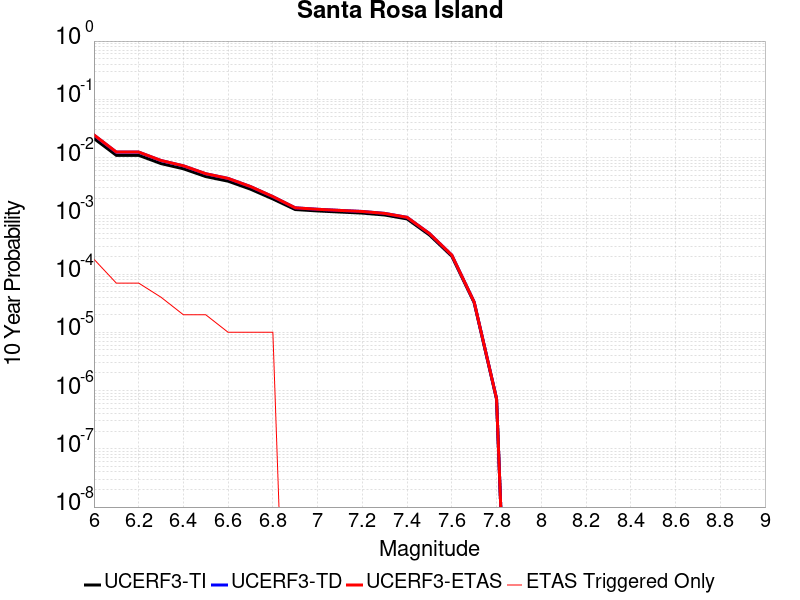 |

| Magnitude | 1 wk TI Prob | 1 wk TD Prob | 1 wk ETAS Prob | 1 wk ETAS/TD Gain | 1 wk ETAS Triggered Only | 1 mo TI Prob | 1 mo TD Prob | 1 mo ETAS Prob | 1 mo ETAS/TD Gain | 1 mo ETAS Triggered Only | 1 yr TI Prob | 1 yr TD Prob | 1 yr ETAS Prob | 1 yr ETAS/TD Gain | 1 yr ETAS Triggered Only | 10 yr TI Prob | 10 yr TD Prob | 10 yr ETAS Prob | 10 yr ETAS/TD Gain | 10 yr ETAS Triggered Only |
|-----|-----|-----|-----|-----|-----|-----|-----|-----|-----|-----|-----|-----|-----|-----|-----|-----|-----|-----|-----|-----|
| 6.0 | 4.1143165E-5 | 4.7091133E-5 | 8.7575056E-5 | 1.8596932 | 4.048583E-5 | 1.7631594E-4 | 2.0180465E-4 | 2.422823E-4 | 1.2005785 | 4.048583E-5 | 0.002144533 | 0.0024544 | 0.0026563322 | 1.0822736 | 2.0242915E-4 | 0.021239553 | 0.024293551 | 0.024530565 | 1.0097562 | 2.4291498E-4 |
| 6.1 | 2.1061249E-5 | 2.3864959E-5 | 2.3864959E-5 | 1.0 | 0.0 | 9.0259375E-5 | 1.0227455E-4 | 1.0227455E-4 | 1.0 | 0.0 | 0.0010983539 | 0.0012445104 | 0.0012849458 | 1.0324911 | 4.048583E-5 | 0.01092941 | 0.012378449 | 0.012418433 | 1.0032302 | 4.048583E-5 |
| 6.2 | 2.1061249E-5 | 2.3864959E-5 | 2.3864959E-5 | 1.0 | 0.0 | 9.0259375E-5 | 1.0227455E-4 | 1.0227455E-4 | 1.0 | 0.0 | 0.0010983539 | 0.0012445104 | 0.0012849458 | 1.0324911 | 4.048583E-5 | 0.01092941 | 0.012378449 | 0.012418433 | 1.0032302 | 4.048583E-5 |
| 6.3 | 1.5158236E-5 | 1.7074419E-5 | 1.7074419E-5 | 1.0 | 0.0 | 6.496225E-5 | 7.3174095E-5 | 7.3174095E-5 | 1.0 | 0.0 | 7.906284E-4 | 8.905424E-4 | 8.905424E-4 | 1.0 | 0.0 | 0.007878214 | 0.008870989 | 0.008870989 | 1.0 | 0.0 |
| 6.4 | 1.2341918E-5 | 1.3852917E-5 | 1.3852917E-5 | 1.0 | 0.0 | 5.2892858E-5 | 5.9368336E-5 | 5.9368336E-5 | 1.0 | 0.0 | 6.437803E-4 | 7.225779E-4 | 7.225779E-4 | 1.0 | 0.0 | 0.006419184 | 0.007203121 | 0.007203121 | 1.0 | 0.0 |
| 6.5 | 9.061158E-6 | 1.0117031E-5 | 1.0117031E-5 | 1.0 | 0.0 | 3.883296E-5 | 4.3358013E-5 | 4.3358013E-5 | 1.0 | 0.0 | 4.726887E-4 | 5.277613E-4 | 5.277613E-4 | 1.0 | 0.0 | 0.004716845 | 0.0052656173 | 0.0052656173 | 1.0 | 0.0 |
| 6.6 | 7.5461685E-6 | 8.400733E-6 | 8.400733E-6 | 1.0 | 0.0 | 3.2340322E-5 | 3.600267E-5 | 3.600267E-5 | 1.0 | 0.0 | 3.936723E-4 | 4.3824865E-4 | 4.3824865E-4 | 1.0 | 0.0 | 0.003929756 | 0.0043742736 | 0.0043742736 | 1.0 | 0.0 |
| 6.7 | 5.5023775E-6 | 6.087381E-6 | 6.087381E-6 | 1.0 | 0.0 | 2.3581404E-5 | 2.6088532E-5 | 2.6088532E-5 | 1.0 | 0.0 | 2.8706578E-4 | 3.1758484E-4 | 3.1758484E-4 | 1.0 | 0.0 | 0.0028669522 | 0.0031716314 | 0.0031716314 | 1.0 | 0.0 |
| 6.8 | 3.7351679E-6 | 4.0831405E-6 | 4.0831405E-6 | 1.0 | 0.0 | 1.6007763E-5 | 1.749907E-5 | 1.749907E-5 | 1.0 | 0.0 | 1.948771E-4 | 2.1303284E-4 | 2.1303284E-4 | 1.0 | 0.0 | 0.0019470629 | 0.0021285315 | 0.0021285315 | 1.0 | 0.0 |
| 6.9 | 2.456366E-6 | 2.6292705E-6 | 2.6292705E-6 | 1.0 | 0.0 | 1.0527241E-5 | 1.1268254E-5 | 1.1268254E-5 | 1.0 | 0.0 | 1.2816161E-4 | 1.3718237E-4 | 1.3718237E-4 | 1.0 | 0.0 | 0.0012808773 | 0.0013709799 | 0.0013709799 | 1.0 | 0.0 |
| 7.0 | 2.3245157E-6 | 2.4827782E-6 | 2.4827782E-6 | 1.0 | 0.0 | 9.962172E-6 | 1.0640435E-5 | 1.0640435E-5 | 1.0 | 0.0 | 1.2128269E-4 | 1.2953962E-4 | 1.2953962E-4 | 1.0 | 0.0 | 0.0012121652 | 0.0012946434 | 0.0012946434 | 1.0 | 0.0 |
| 7.1 | 2.2248344E-6 | 2.37325E-6 | 2.37325E-6 | 1.0 | 0.0 | 9.53497E-6 | 1.0171032E-5 | 1.0171032E-5 | 1.0 | 0.0 | 1.1608207E-4 | 1.2382529E-4 | 1.2382529E-4 | 1.0 | 0.0 | 0.0011602144 | 0.001237565 | 0.001237565 | 1.0 | 0.0 |
| 7.2 | 2.1350402E-6 | 2.276154E-6 | 2.276154E-6 | 1.0 | 0.0 | 9.150141E-6 | 9.754909E-6 | 9.754909E-6 | 1.0 | 0.0 | 1.1139726E-4 | 1.1875956E-4 | 1.1875956E-4 | 1.0 | 0.0 | 0.0011134144 | 0.0011869629 | 0.0011869629 | 1.0 | 0.0 |
| 7.3 | 1.9793572E-6 | 2.108719E-6 | 2.108719E-6 | 1.0 | 0.0 | 8.482932E-6 | 9.037336E-6 | 9.037336E-6 | 1.0 | 0.0 | 1.032748E-4 | 1.10024026E-4 | 1.10024026E-4 | 1.0 | 0.0 | 0.0010322682 | 0.0010996973 | 0.0010996973 | 1.0 | 0.0 |
| 7.4 | 1.6951194E-6 | 1.8045733E-6 | 1.8045733E-6 | 1.0 | 0.0 | 7.264777E-6 | 7.733863E-6 | 7.733863E-6 | 1.0 | 0.0 | 8.844508E-5 | 9.415573E-5 | 9.415573E-5 | 1.0 | 0.0 | 8.840988E-4 | 9.4116E-4 | 9.4116E-4 | 1.0 | 0.0 |
| 7.5 | 8.987207E-7 | 9.5122147E-7 | 9.5122147E-7 | 1.0 | 0.0 | 3.8516546E-6 | 4.076657E-6 | 4.076657E-6 | 1.0 | 0.0 | 4.6892885E-5 | 4.963218E-5 | 4.963218E-5 | 1.0 | 0.0 | 4.688299E-4 | 4.9621216E-4 | 4.9621216E-4 | 1.0 | 0.0 |
| 7.6 | 3.8783037E-7 | 4.052932E-7 | 4.052932E-7 | 1.0 | 0.0 | 1.6621291E-6 | 1.7369698E-6 | 1.7369698E-6 | 1.0 | 0.0 | 2.0236233E-5 | 2.1147409E-5 | 2.1147409E-5 | 1.0 | 0.0 | 2.023439E-4 | 2.1145462E-4 | 2.1145462E-4 | 1.0 | 0.0 |
| 7.7 | 6.181804E-8 | 6.339035E-8 | 6.339035E-8 | 1.0 | 0.0 | 2.6493444E-7 | 2.7167292E-7 | 2.7167292E-7 | 1.0 | 0.0 | 3.225572E-6 | 3.3076128E-6 | 3.3076128E-6 | 1.0 | 0.0 | 3.225525E-5 | 3.307564E-5 | 3.307564E-5 | 1.0 | 0.0 |
| 7.8 | 1.3704449E-9 | 1.3964153E-9 | 1.3964153E-9 | 1.0 | 0.0 | 5.873335E-9 | 5.984637E-9 | 5.984637E-9 | 1.0 | 0.0 | 7.1507856E-8 | 7.286295E-8 | 7.286295E-8 | 1.0 | 0.0 | 7.1507833E-7 | 7.286294E-7 | 7.286294E-7 | 1.0 | 0.0 |

## Ventura-Pitas Point
*[(top)](#table-of-contents)*

| 1 Week | 1 Month | 1 Year | 10 Year |
|-----|-----|-----|-----|
|  |  | 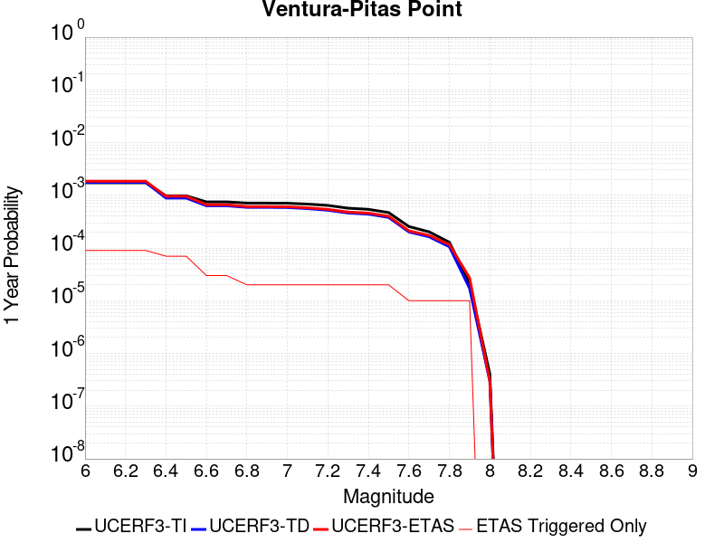 |  |

| Magnitude | 1 wk TI Prob | 1 wk TD Prob | 1 wk ETAS Prob | 1 wk ETAS/TD Gain | 1 wk ETAS Triggered Only | 1 mo TI Prob | 1 mo TD Prob | 1 mo ETAS Prob | 1 mo ETAS/TD Gain | 1 mo ETAS Triggered Only | 1 yr TI Prob | 1 yr TD Prob | 1 yr ETAS Prob | 1 yr ETAS/TD Gain | 1 yr ETAS Triggered Only | 10 yr TI Prob | 10 yr TD Prob | 10 yr ETAS Prob | 10 yr ETAS/TD Gain | 10 yr ETAS Triggered Only |
|-----|-----|-----|-----|-----|-----|-----|-----|-----|-----|-----|-----|-----|-----|-----|-----|-----|-----|-----|-----|-----|
| 6.0 | 3.3179622E-5 | 3.3735185E-5 | 1.5518858E-4 | 4.6001997 | 1.2145749E-4 | 1.4219063E-4 | 1.445728E-4 | 3.064927E-4 | 2.1199887 | 1.6194332E-4 | 0.0017297962 | 0.0017590096 | 0.0019206681 | 1.0919031 | 1.6194332E-4 | 0.017163932 | 0.0174764 | 0.017675292 | 1.0113806 | 2.0242915E-4 |
| 6.1 | 3.3179622E-5 | 3.3735185E-5 | 1.5518858E-4 | 4.6001997 | 1.2145749E-4 | 1.4219063E-4 | 1.445728E-4 | 3.064927E-4 | 2.1199887 | 1.6194332E-4 | 0.0017297962 | 0.0017590096 | 0.0019206681 | 1.0919031 | 1.6194332E-4 | 0.017163932 | 0.0174764 | 0.017675292 | 1.0113806 | 2.0242915E-4 |
| 6.2 | 3.3179622E-5 | 3.3735185E-5 | 1.5518858E-4 | 4.6001997 | 1.2145749E-4 | 1.4219063E-4 | 1.445728E-4 | 3.064927E-4 | 2.1199887 | 1.6194332E-4 | 0.0017297962 | 0.0017590096 | 0.0019206681 | 1.0919031 | 1.6194332E-4 | 0.017163932 | 0.0174764 | 0.017675292 | 1.0113806 | 2.0242915E-4 |
| 6.3 | 3.3179622E-5 | 3.3735185E-5 | 1.5518858E-4 | 4.6001997 | 1.2145749E-4 | 1.4219063E-4 | 1.445728E-4 | 3.064927E-4 | 2.1199887 | 1.6194332E-4 | 0.0017297962 | 0.0017590096 | 0.0019206681 | 1.0919031 | 1.6194332E-4 | 0.017163932 | 0.0174764 | 0.017675292 | 1.0113806 | 2.0242915E-4 |
| 6.4 | 1.8754668E-5 | 1.701961E-5 | 1.3847504E-4 | 8.136205 | 1.2145749E-4 | 8.037467E-5 | 7.293928E-5 | 2.348708E-4 | 3.2200866 | 1.6194332E-4 | 9.781223E-4 | 8.8769704E-4 | 0.0010494966 | 1.1822689 | 1.6194332E-4 | 0.009738282 | 0.008843848 | 0.009004359 | 1.0181495 | 1.6194332E-4 |
| 6.5 | 1.8754668E-5 | 1.701961E-5 | 1.3847504E-4 | 8.136205 | 1.2145749E-4 | 8.037467E-5 | 7.293928E-5 | 2.348708E-4 | 3.2200866 | 1.6194332E-4 | 9.781223E-4 | 8.8769704E-4 | 0.0010494966 | 1.1822689 | 1.6194332E-4 | 0.009738282 | 0.008843848 | 0.009004359 | 1.0181495 | 1.6194332E-4 |
| 6.6 | 1.4361558E-5 | 1.2122275E-5 | 5.2607615E-5 | 4.339748 | 4.048583E-5 | 6.154808E-5 | 5.1951585E-5 | 9.243531E-5 | 1.7792587 | 4.048583E-5 | 7.490902E-4 | 6.3232926E-4 | 6.727895E-4 | 1.0639861 | 4.048583E-5 | 0.0074657016 | 0.0063055577 | 0.006345788 | 1.0063802 | 4.048583E-5 |
| 6.7 | 1.4361558E-5 | 1.2122275E-5 | 5.2607615E-5 | 4.339748 | 4.048583E-5 | 6.154808E-5 | 5.1951585E-5 | 9.243531E-5 | 1.7792587 | 4.048583E-5 | 7.490902E-4 | 6.3232926E-4 | 6.727895E-4 | 1.0639861 | 4.048583E-5 | 0.0074657016 | 0.0063055577 | 0.006345788 | 1.0063802 | 4.048583E-5 |
| 6.8 | 1.3663846E-5 | 1.13444175E-5 | 5.182979E-5 | 4.568748 | 4.048583E-5 | 5.8558027E-5 | 4.861804E-5 | 8.91019E-5 | 1.8326921 | 4.048583E-5 | 7.127108E-4 | 5.917658E-4 | 6.322277E-4 | 1.0683748 | 4.048583E-5 | 0.007104293 | 0.005902116 | 0.005942363 | 1.006819 | 4.048583E-5 |
| 6.9 | 1.3644157E-5 | 1.1322519E-5 | 5.180789E-5 | 4.5756507 | 4.048583E-5 | 5.8473648E-5 | 4.8524187E-5 | 8.9008056E-5 | 1.8343028 | 4.048583E-5 | 7.116841E-4 | 5.9062376E-4 | 6.310857E-4 | 1.0685071 | 4.048583E-5 | 0.007094092 | 0.0058907564 | 0.005931004 | 1.0068322 | 4.048583E-5 |
| 7.0 | 1.3568845E-5 | 1.1242086E-5 | 5.172746E-5 | 4.6012335 | 4.048583E-5 | 5.8150898E-5 | 4.817949E-5 | 8.8663364E-5 | 1.8402721 | 4.048583E-5 | 7.077572E-4 | 5.864293E-4 | 6.268914E-4 | 1.0689974 | 4.048583E-5 | 0.007055073 | 0.0058490336 | 0.0058892826 | 1.0068814 | 4.048583E-5 |
| 7.1 | 1.306572E-5 | 1.072054E-5 | 5.1205934E-5 | 4.7764325 | 4.048583E-5 | 5.599474E-5 | 4.5944373E-5 | 8.642834E-5 | 1.8811519 | 4.048583E-5 | 6.815227E-4 | 5.5923103E-4 | 5.996942E-4 | 1.072355 | 4.048583E-5 | 0.0067943637 | 0.0055784425 | 0.005618702 | 1.007217 | 4.048583E-5 |
| 7.2 | 1.232604E-5 | 9.995143E-6 | 5.048057E-5 | 5.05051 | 4.048583E-5 | 5.2824813E-5 | 4.2835632E-5 | 8.331973E-5 | 1.9451032 | 4.048583E-5 | 6.429523E-4 | 5.214008E-4 | 5.618655E-4 | 1.0776078 | 4.048583E-5 | 0.0064109527 | 0.005201967 | 0.005242242 | 1.0077423 | 4.048583E-5 |
| 7.3 | 1.0917261E-5 | 8.84384E-6 | 4.9329312E-5 | 5.5778155 | 4.048583E-5 | 4.678742E-5 | 3.790163E-5 | 7.838593E-5 | 2.0681412 | 4.048583E-5 | 5.69488E-4 | 4.6135622E-4 | 5.018234E-4 | 1.0877135 | 4.048583E-5 | 0.0056803077 | 0.00460415 | 0.0046444493 | 1.0087528 | 4.048583E-5 |
| 7.4 | 1.039959E-5 | 8.423562E-6 | 4.8909053E-5 | 5.8062196 | 4.048583E-5 | 4.456891E-5 | 3.610049E-5 | 7.658486E-5 | 2.1214354 | 4.048583E-5 | 5.424914E-4 | 4.3943635E-4 | 4.7990438E-4 | 1.0920908 | 4.048583E-5 | 0.0054116896 | 0.004385836 | 0.004426144 | 1.0091906 | 4.048583E-5 |
| 7.5 | 9.015877E-6 | 7.2975445E-6 | 4.778308E-5 | 6.5478296 | 4.048583E-5 | 3.86389E-5 | 3.1274823E-5 | 7.175939E-5 | 2.2944777 | 4.048583E-5 | 4.7032707E-4 | 3.8070587E-4 | 4.211763E-4 | 1.1063037 | 4.048583E-5 | 0.004693329 | 0.0038006818 | 0.0038410136 | 1.0106118 | 4.048583E-5 |
| 7.6 | 4.900162E-6 | 3.8741155E-6 | 4.435979E-5 | 11.450301 | 4.048583E-5 | 2.1000526E-5 | 1.6603248E-5 | 5.7088404E-5 | 3.4383879 | 4.048583E-5 | 2.556514E-4 | 2.0212591E-4 | 2.4260356E-4 | 1.2002596 | 4.048583E-5 | 0.0025535747 | 0.0020194345 | 0.0020598385 | 1.0200076 | 4.048583E-5 |
| 7.7 | 3.8850626E-6 | 3.1267302E-6 | 4.3612432E-5 | 13.948256 | 4.048583E-5 | 1.6650163E-5 | 1.3400205E-5 | 5.388549E-5 | 4.021244 | 4.048583E-5 | 2.0269687E-4 | 1.6313537E-4 | 2.0361459E-4 | 1.2481327 | 4.048583E-5 | 0.002025121 | 0.0016301654 | 0.0016705852 | 1.0247949 | 4.048583E-5 |
| 7.8 | 2.4654719E-6 | 2.029875E-6 | 4.251562E-5 | 20.944946 | 4.048583E-5 | 1.0566265E-5 | 8.699436E-6 | 4.9184913E-5 | 5.6538053 | 4.048583E-5 | 1.2863669E-4 | 1.0591053E-4 | 1.4639206E-4 | 1.382224 | 4.048583E-5 | 0.0012856225 | 0.0010586053 | 0.0010990482 | 1.0382041 | 4.048583E-5 |
| 7.9 | 4.095894E-7 | 3.2764765E-7 | 4.0813466E-5 | 124.56511 | 4.048583E-5 | 1.7553821E-6 | 1.4042034E-6 | 4.1889976E-5 | 29.831842 | 4.048583E-5 | 2.1371567E-5 | 1.7096047E-5 | 5.7581183E-5 | 3.3680995 | 4.048583E-5 | 2.1369511E-4 | 1.7094762E-4 | 2.1142652E-4 | 1.2367913 | 4.048583E-5 |
| 8.0 | 7.791402E-9 | 5.683497E-9 | 5.683497E-9 | 1.0 | 0.0 | 3.3391725E-8 | 2.4357844E-8 | 2.4357844E-8 | 1.0 | 0.0 | 4.0654416E-7 | 2.9655675E-7 | 2.9655675E-7 | 1.0 | 0.0 | 4.065434E-6 | 2.9655655E-6 | 2.9655655E-6 | 1.0 | 0.0 |

## Coronado Bank alt1
*[(top)](#table-of-contents)*

| 1 Week | 1 Month | 1 Year | 10 Year |
|-----|-----|-----|-----|
|  |  |  |  |

| Magnitude | 1 wk TI Prob | 1 wk TD Prob | 1 wk ETAS Prob | 1 wk ETAS/TD Gain | 1 wk ETAS Triggered Only | 1 mo TI Prob | 1 mo TD Prob | 1 mo ETAS Prob | 1 mo ETAS/TD Gain | 1 mo ETAS Triggered Only | 1 yr TI Prob | 1 yr TD Prob | 1 yr ETAS Prob | 1 yr ETAS/TD Gain | 1 yr ETAS Triggered Only | 10 yr TI Prob | 10 yr TD Prob | 10 yr ETAS Prob | 10 yr ETAS/TD Gain | 10 yr ETAS Triggered Only |
|-----|-----|-----|-----|-----|-----|-----|-----|-----|-----|-----|-----|-----|-----|-----|-----|-----|-----|-----|-----|-----|
| 6.0 | 7.533492E-5 | 9.394913E-5 | 9.394913E-5 | 1.0 | 0.0 | 3.22824E-4 | 4.0258127E-4 | 4.8352033E-4 | 1.2010503 | 8.097166E-5 | 0.0039233007 | 0.0048909658 | 0.005011829 | 1.0247116 | 1.2145749E-4 | 0.03854755 | 0.04790356 | 0.04813484 | 1.004828 | 2.4291498E-4 |
| 6.1 | 4.1807285E-5 | 5.049283E-5 | 5.049283E-5 | 1.0 | 0.0 | 1.7916178E-4 | 2.1638049E-4 | 2.5685754E-4 | 1.1870643 | 4.048583E-5 | 0.0021791123 | 0.0026313474 | 0.002712106 | 1.0306909 | 8.097166E-5 | 0.021578677 | 0.026011046 | 0.026089912 | 1.003032 | 8.097166E-5 |
| 6.2 | 4.1807285E-5 | 5.049283E-5 | 5.049283E-5 | 1.0 | 0.0 | 1.7916178E-4 | 2.1638049E-4 | 2.5685754E-4 | 1.1870643 | 4.048583E-5 | 0.0021791123 | 0.0026313474 | 0.002712106 | 1.0306909 | 8.097166E-5 | 0.021578677 | 0.026011046 | 0.026089912 | 1.003032 | 8.097166E-5 |
| 6.3 | 3.1793104E-5 | 3.7711117E-5 | 3.7711117E-5 | 1.0 | 0.0 | 1.3624904E-4 | 1.6160926E-4 | 1.6160926E-4 | 1.0 | 0.0 | 0.0016575698 | 0.001965848 | 0.0020062542 | 1.0205541 | 4.048583E-5 | 0.016452603 | 0.019488465 | 0.019528162 | 1.0020369 | 4.048583E-5 |
| 6.4 | 2.9878007E-5 | 3.5335794E-5 | 3.5335794E-5 | 1.0 | 0.0 | 1.2804232E-4 | 1.5143053E-4 | 1.5143053E-4 | 1.0 | 0.0 | 0.0015578003 | 0.0018421387 | 0.00188255 | 1.0219371 | 4.048583E-5 | 0.015469253 | 0.01827244 | 0.018312188 | 1.0021752 | 4.048583E-5 |
| 6.5 | 2.4512565E-5 | 2.8764043E-5 | 2.8764043E-5 | 1.0 | 0.0 | 1.0504962E-4 | 1.2326881E-4 | 1.2326881E-4 | 1.0 | 0.0 | 0.0012782287 | 0.0014997921 | 0.0015402172 | 1.0269538 | 4.048583E-5 | 0.012709012 | 0.014899683 | 0.014939566 | 1.0026767 | 4.048583E-5 |
| 6.6 | 2.1317413E-5 | 2.490667E-5 | 2.490667E-5 | 1.0 | 0.0 | 9.135714E-5 | 1.0673863E-4 | 1.0673863E-4 | 1.0 | 0.0 | 0.0011117056 | 0.0012987906 | 0.0013392238 | 1.0311315 | 4.048583E-5 | 0.011061605 | 0.012914404 | 0.012954367 | 1.0030944 | 4.048583E-5 |
| 6.7 | 1.8585655E-5 | 2.163488E-5 | 2.163488E-5 | 1.0 | 0.0 | 7.9650374E-5 | 9.271773E-5 | 9.271773E-5 | 1.0 | 0.0 | 9.6931186E-4 | 0.0011282742 | 0.0011687145 | 1.0358425 | 4.048583E-5 | 0.0096509475 | 0.011227623 | 0.011267654 | 1.0035654 | 4.048583E-5 |
| 6.8 | 1.5862879E-5 | 1.8419474E-5 | 1.8419474E-5 | 1.0 | 0.0 | 6.798199E-5 | 7.893833E-5 | 7.893833E-5 | 1.0 | 0.0 | 8.273665E-4 | 9.6066965E-4 | 0.0010011166 | 1.0421028 | 4.048583E-5 | 0.008242928 | 0.00956715 | 0.009607249 | 1.0041913 | 4.048583E-5 |
| 6.9 | 1.3021509E-5 | 1.5095265E-5 | 1.5095265E-5 | 1.0 | 0.0 | 5.5805274E-5 | 6.469249E-5 | 6.469249E-5 | 1.0 | 0.0 | 6.792174E-4 | 7.8736455E-4 | 8.2781847E-4 | 1.051379 | 4.048583E-5 | 0.006771452 | 0.007847573 | 0.007887741 | 1.0051185 | 4.048583E-5 |
| 7.0 | 1.0974371E-5 | 1.2720104E-5 | 1.2720104E-5 | 1.0 | 0.0 | 4.7032172E-5 | 5.451369E-5 | 5.451369E-5 | 1.0 | 0.0 | 5.7246623E-4 | 6.6351966E-4 | 7.039786E-4 | 1.0609763 | 4.048583E-5 | 0.0057099373 | 0.006617135 | 0.0066573527 | 1.0060779 | 4.048583E-5 |
| 7.1 | 8.766221E-6 | 1.01638325E-5 | 1.01638325E-5 | 1.0 | 0.0 | 3.7568978E-5 | 4.355865E-5 | 4.355865E-5 | 1.0 | 0.0 | 4.573063E-4 | 5.3021475E-4 | 5.3021475E-4 | 1.0 | 0.0 | 0.0045636636 | 0.0052911965 | 0.0052911965 | 1.0 | 0.0 |
| 7.2 | 8.026024E-7 | 8.331765E-7 | 8.331765E-7 | 1.0 | 0.0 | 3.43972E-6 | 3.5707515E-6 | 3.5707515E-6 | 1.0 | 0.0 | 4.1877785E-5 | 4.3473043E-5 | 4.3473043E-5 | 1.0 | 0.0 | 4.1869894E-4 | 4.3464647E-4 | 4.3464647E-4 | 1.0 | 0.0 |
| 7.3 | 3.7293114E-7 | 3.7000953E-7 | 3.7000953E-7 | 1.0 | 0.0 | 1.5982754E-6 | 1.5857541E-6 | 1.5857541E-6 | 1.0 | 0.0 | 1.9458828E-5 | 1.9306386E-5 | 1.9306386E-5 | 1.0 | 0.0 | 1.9457124E-4 | 1.9304715E-4 | 1.9304715E-4 | 1.0 | 0.0 |
| 7.4 | 2.0557036E-7 | 1.9674363E-7 | 1.9674363E-7 | 1.0 | 0.0 | 8.810155E-7 | 8.431867E-7 | 8.431867E-7 | 1.0 | 0.0 | 1.0726311E-5 | 1.026575E-5 | 1.026575E-5 | 1.0 | 0.0 | 1.0725793E-4 | 1.0265279E-4 | 1.0265279E-4 | 1.0 | 0.0 |
| 7.5 | 6.845446E-8 | 6.279369E-8 | 6.279369E-8 | 1.0 | 0.0 | 2.9337625E-7 | 2.691158E-7 | 2.691158E-7 | 1.0 | 0.0 | 3.5718497E-6 | 3.2764797E-6 | 3.2764797E-6 | 1.0 | 0.0 | 3.5717923E-5 | 3.2764325E-5 | 3.2764325E-5 | 1.0 | 0.0 |
| 7.6 | 6.0975145E-9 | 5.53185E-9 | 5.53185E-9 | 1.0 | 0.0 | 2.6132206E-8 | 2.370793E-8 | 2.370793E-8 | 1.0 | 0.0 | 3.1815955E-7 | 2.88644E-7 | 2.88644E-7 | 1.0 | 0.0 | 3.181591E-6 | 2.8864374E-6 | 2.8864374E-6 | 1.0 | 0.0 |

## Lost Hills
*[(top)](#table-of-contents)*

| 1 Week | 1 Month | 1 Year | 10 Year |
|-----|-----|-----|-----|
|  | 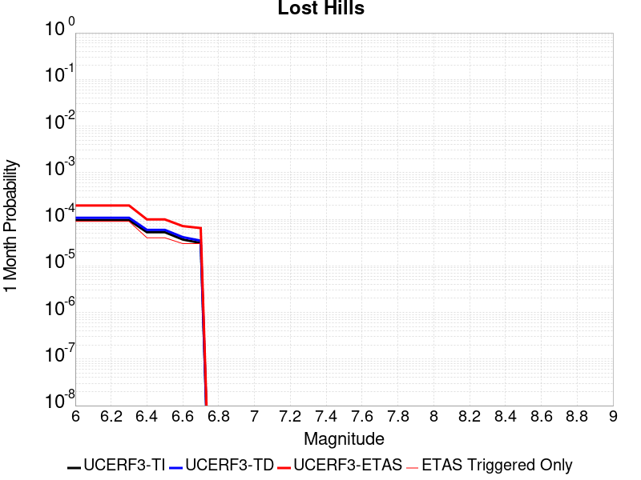 |  |  |

| Magnitude | 1 wk TI Prob | 1 wk TD Prob | 1 wk ETAS Prob | 1 wk ETAS/TD Gain | 1 wk ETAS Triggered Only | 1 mo TI Prob | 1 mo TD Prob | 1 mo ETAS Prob | 1 mo ETAS/TD Gain | 1 mo ETAS Triggered Only | 1 yr TI Prob | 1 yr TD Prob | 1 yr ETAS Prob | 1 yr ETAS/TD Gain | 1 yr ETAS Triggered Only | 10 yr TI Prob | 10 yr TD Prob | 10 yr ETAS Prob | 10 yr ETAS/TD Gain | 10 yr ETAS Triggered Only |
|-----|-----|-----|-----|-----|-----|-----|-----|-----|-----|-----|-----|-----|-----|-----|-----|-----|-----|-----|-----|-----|
| 6.0 | 2.233523E-5 | 2.5106583E-5 | 1.4656103E-4 | 5.8375535 | 1.2145749E-4 | 9.571891E-5 | 1.0759615E-4 | 2.2904057E-4 | 2.128706 | 1.2145749E-4 | 0.0011647546 | 0.001309364 | 0.0015115282 | 1.1543987 | 2.0242915E-4 | 0.011586686 | 0.013033091 | 0.01327284 | 1.0183954 | 2.4291498E-4 |
| 6.1 | 2.233523E-5 | 2.5106583E-5 | 1.4656103E-4 | 5.8375535 | 1.2145749E-4 | 9.571891E-5 | 1.0759615E-4 | 2.2904057E-4 | 2.128706 | 1.2145749E-4 | 0.0011647546 | 0.001309364 | 0.0015115282 | 1.1543987 | 2.0242915E-4 | 0.011586686 | 0.013033091 | 0.01327284 | 1.0183954 | 2.4291498E-4 |
| 6.2 | 2.233523E-5 | 2.5106583E-5 | 1.4656103E-4 | 5.8375535 | 1.2145749E-4 | 9.571891E-5 | 1.0759615E-4 | 2.2904057E-4 | 2.128706 | 1.2145749E-4 | 0.0011647546 | 0.001309364 | 0.0015115282 | 1.1543987 | 2.0242915E-4 | 0.011586686 | 0.013033091 | 0.01327284 | 1.0183954 | 2.4291498E-4 |
| 6.3 | 2.233523E-5 | 2.5106583E-5 | 1.4656103E-4 | 5.8375535 | 1.2145749E-4 | 9.571891E-5 | 1.0759615E-4 | 2.2904057E-4 | 2.128706 | 1.2145749E-4 | 0.0011647546 | 0.001309364 | 0.0015115282 | 1.1543987 | 2.0242915E-4 | 0.011586686 | 0.013033091 | 0.01327284 | 1.0183954 | 2.4291498E-4 |
| 6.4 | 1.2288092E-5 | 1.3781108E-5 | 5.426638E-5 | 3.9377372 | 4.048583E-5 | 5.2662188E-5 | 5.906108E-5 | 9.954452E-5 | 1.6854503 | 4.048583E-5 | 6.409735E-4 | 7.189252E-4 | 8.402954E-4 | 1.1688217 | 1.2145749E-4 | 0.006391279 | 0.0071752006 | 0.0073359823 | 1.0224079 | 1.6194332E-4 |
| 6.5 | 1.2288092E-5 | 1.3781108E-5 | 5.426638E-5 | 3.9377372 | 4.048583E-5 | 5.2662188E-5 | 5.906108E-5 | 9.954452E-5 | 1.6854503 | 4.048583E-5 | 6.409735E-4 | 7.189252E-4 | 8.402954E-4 | 1.1688217 | 1.2145749E-4 | 0.006391279 | 0.0071752006 | 0.0073359823 | 1.0224079 | 1.6194332E-4 |
| 6.6 | 8.58281E-6 | 9.63377E-6 | 5.011921E-5 | 5.2024503 | 4.048583E-5 | 3.6782953E-5 | 4.12874E-5 | 8.177156E-5 | 1.980545 | 4.048583E-5 | 4.4774043E-4 | 5.026414E-4 | 5.835723E-4 | 1.1610113 | 8.097166E-5 | 0.0044683935 | 0.005023205 | 0.0051440527 | 1.0240579 | 1.2145749E-4 |
| 6.7 | 7.205685E-6 | 8.088302E-6 | 4.8573806E-5 | 6.0054393 | 4.048583E-5 | 3.088114E-5 | 3.466415E-5 | 7.514858E-5 | 2.1679049 | 4.048583E-5 | 3.7591302E-4 | 4.2203604E-4 | 5.029735E-4 | 1.1917787 | 8.097166E-5 | 0.0037527776 | 0.0042203604 | 0.0043413052 | 1.0286574 | 1.2145749E-4 |

## Pinto Mtn
*[(top)](#table-of-contents)*

| 1 Week | 1 Month | 1 Year | 10 Year |
|-----|-----|-----|-----|
|  |  |  |  |

| Magnitude | 1 wk TI Prob | 1 wk TD Prob | 1 wk ETAS Prob | 1 wk ETAS/TD Gain | 1 wk ETAS Triggered Only | 1 mo TI Prob | 1 mo TD Prob | 1 mo ETAS Prob | 1 mo ETAS/TD Gain | 1 mo ETAS Triggered Only | 1 yr TI Prob | 1 yr TD Prob | 1 yr ETAS Prob | 1 yr ETAS/TD Gain | 1 yr ETAS Triggered Only | 10 yr TI Prob | 10 yr TD Prob | 10 yr ETAS Prob | 10 yr ETAS/TD Gain | 10 yr ETAS Triggered Only |
|-----|-----|-----|-----|-----|-----|-----|-----|-----|-----|-----|-----|-----|-----|-----|-----|-----|-----|-----|-----|-----|
| 6.0 | 4.4194956E-5 | 4.785362E-5 | 2.0978918E-4 | 4.3839774 | 1.6194332E-4 | 1.893932E-4 | 2.0507174E-4 | 3.6698187E-4 | 1.7895291 | 1.6194332E-4 | 0.0023034236 | 0.0024940541 | 0.0026959784 | 1.0809623 | 2.0242915E-4 | 0.022796938 | 0.024678145 | 0.024875578 | 1.0080004 | 2.0242915E-4 |
| 6.1 | 4.4194956E-5 | 4.785362E-5 | 2.0978918E-4 | 4.3839774 | 1.6194332E-4 | 1.893932E-4 | 2.0507174E-4 | 3.6698187E-4 | 1.7895291 | 1.6194332E-4 | 0.0023034236 | 0.0024940541 | 0.0026959784 | 1.0809623 | 2.0242915E-4 | 0.022796938 | 0.024678145 | 0.024875578 | 1.0080004 | 2.0242915E-4 |
| 6.2 | 4.4194956E-5 | 4.785362E-5 | 2.0978918E-4 | 4.3839774 | 1.6194332E-4 | 1.893932E-4 | 2.0507174E-4 | 3.6698187E-4 | 1.7895291 | 1.6194332E-4 | 0.0023034236 | 0.0024940541 | 0.0026959784 | 1.0809623 | 2.0242915E-4 | 0.022796938 | 0.024678145 | 0.024875578 | 1.0080004 | 2.0242915E-4 |
| 6.3 | 4.4194956E-5 | 4.785362E-5 | 2.0978918E-4 | 4.3839774 | 1.6194332E-4 | 1.893932E-4 | 2.0507174E-4 | 3.6698187E-4 | 1.7895291 | 1.6194332E-4 | 0.0023034236 | 0.0024940541 | 0.0026959784 | 1.0809623 | 2.0242915E-4 | 0.022796938 | 0.024678145 | 0.024875578 | 1.0080004 | 2.0242915E-4 |
| 6.4 | 3.729929E-5 | 3.9603186E-5 | 1.2057164E-4 | 3.0444934 | 8.097166E-5 | 1.5984432E-4 | 1.6971743E-4 | 2.5067534E-4 | 1.477016 | 8.097166E-5 | 0.0019443673 | 0.002064445 | 0.0021856518 | 1.0587115 | 1.2145749E-4 | 0.019274427 | 0.02046269 | 0.020581663 | 1.0058141 | 1.2145749E-4 |
| 6.5 | 3.729929E-5 | 3.9603186E-5 | 1.2057164E-4 | 3.0444934 | 8.097166E-5 | 1.5984432E-4 | 1.6971743E-4 | 2.5067534E-4 | 1.477016 | 8.097166E-5 | 0.0019443673 | 0.002064445 | 0.0021856518 | 1.0587115 | 1.2145749E-4 | 0.019274427 | 0.02046269 | 0.020581663 | 1.0058141 | 1.2145749E-4 |
| 6.6 | 3.0204548E-5 | 3.1205298E-5 | 1.1217443E-4 | 3.594724 | 8.097166E-5 | 1.2944164E-4 | 1.3373033E-4 | 2.1469116E-4 | 1.6054037 | 8.097166E-5 | 0.0015748127 | 0.0016269855 | 0.0017078253 | 1.0496869 | 8.097166E-5 | 0.015636992 | 0.01615461 | 0.016234273 | 1.0049313 | 8.097166E-5 |
| 6.7 | 2.9857754E-5 | 3.081468E-5 | 1.1178385E-4 | 3.6276164 | 8.097166E-5 | 1.2795553E-4 | 1.3205643E-4 | 2.130174E-4 | 1.6130786 | 8.097166E-5 | 0.0015567453 | 0.001606636 | 0.0016874775 | 1.0503173 | 8.097166E-5 | 0.015458848 | 0.01595405 | 0.016033728 | 1.0049944 | 8.097166E-5 |
| 6.8 | 2.4819734E-5 | 2.5009364E-5 | 1.05979E-4 | 4.2375727 | 8.097166E-5 | 1.0636595E-4 | 1.07178705E-4 | 1.8814168E-4 | 1.7554017 | 8.097166E-5 | 0.0012942362 | 0.0013041412 | 0.0013850073 | 1.0620072 | 8.097166E-5 | 0.012867244 | 0.0129672475 | 0.013047169 | 1.0061634 | 8.097166E-5 |
| 6.9 | 2.331124E-5 | 2.3337643E-5 | 1.04307415E-4 | 4.4694924 | 8.097166E-5 | 9.990149E-5 | 1.00014746E-4 | 1.8097831E-4 | 1.8095162 | 8.097166E-5 | 0.001215622 | 0.0012170197 | 0.0012978928 | 1.0664518 | 8.097166E-5 | 0.012089936 | 0.012105742 | 0.012185733 | 1.0066078 | 8.097166E-5 |
| 7.0 | 2.1818534E-5 | 2.1760772E-5 | 1.0273067E-4 | 4.720911 | 8.097166E-5 | 9.3504656E-5 | 9.325723E-5 | 1.7422134E-4 | 1.8681805 | 8.097166E-5 | 0.0011378246 | 0.0011348352 | 0.001215715 | 1.0712701 | 8.097166E-5 | 0.011320163 | 0.011292503 | 0.011372561 | 1.0070894 | 8.097166E-5 |
| 7.1 | 2.066081E-5 | 2.0540418E-5 | 1.0151041E-4 | 4.941984 | 8.097166E-5 | 8.854332E-5 | 8.8027504E-5 | 1.6899203E-4 | 1.919764 | 8.097166E-5 | 0.0010774818 | 0.0010712275 | 0.0011521124 | 1.0755068 | 8.097166E-5 | 0.010722724 | 0.010662688 | 0.010742797 | 1.0075129 | 8.097166E-5 |
| 7.2 | 1.8990233E-5 | 1.9053701E-5 | 1.0002382E-4 | 5.249574 | 8.097166E-5 | 8.138417E-5 | 8.1656275E-5 | 1.6262132E-4 | 1.991535 | 8.097166E-5 | 9.904018E-4 | 9.937311E-4 | 0.0010746223 | 1.0814015 | 8.097166E-5 | 0.009859995 | 0.009894874 | 0.009975044 | 1.0081022 | 8.097166E-5 |
| 7.3 | 1.3335872E-5 | 1.4906372E-5 | 9.587682E-5 | 6.431936 | 8.097166E-5 | 5.7152483E-5 | 6.388296E-5 | 1.4484944E-4 | 2.267419 | 8.097166E-5 | 6.956093E-4 | 7.775102E-4 | 8.5841893E-4 | 1.1040612 | 8.097166E-5 | 0.006934359 | 0.0077491994 | 0.007829543 | 1.0103681 | 8.097166E-5 |
| 7.4 | 9.414066E-6 | 1.186061E-5 | 9.283131E-5 | 7.826858 | 8.097166E-5 | 4.0345374E-5 | 5.0830247E-5 | 1.3179779E-4 | 2.5929008 | 8.097166E-5 | 4.910942E-4 | 6.1869196E-4 | 6.9961353E-4 | 1.1307946 | 8.097166E-5 | 0.0049001034 | 0.006170644 | 0.006251116 | 1.0130411 | 8.097166E-5 |
| 7.5 | 7.2101157E-6 | 9.157893E-6 | 9.0128815E-5 | 9.841653 | 8.097166E-5 | 3.090013E-5 | 3.924757E-5 | 1.2021605E-4 | 3.063019 | 8.097166E-5 | 3.7614413E-4 | 4.7774217E-4 | 5.5867515E-4 | 1.1694072 | 8.097166E-5 | 0.0037550807 | 0.004767927 | 0.0048485124 | 1.0169016 | 8.097166E-5 |
| 7.6 | 3.296375E-6 | 4.5453176E-6 | 8.551661E-5 | 18.81422 | 8.097166E-5 | 1.4127245E-5 | 1.9479796E-5 | 1.0044988E-4 | 5.1566186 | 8.097166E-5 | 1.7198564E-4 | 2.3714209E-4 | 3.1809454E-4 | 1.3413669 | 8.097166E-5 | 0.0017185259 | 0.0023690276 | 0.0024498075 | 1.0340983 | 8.097166E-5 |
| 7.7 | 2.5741092E-6 | 3.584251E-6 | 3.584251E-6 | 1.0 | 0.0 | 1.103185E-5 | 1.5360993E-5 | 1.5360993E-5 | 1.0 | 0.0 | 1.3430449E-4 | 1.8700535E-4 | 1.8700535E-4 | 1.0 | 0.0 | 0.0013422335 | 0.0018686098 | 0.0018686098 | 1.0 | 0.0 |

## Lake Isabella (Seismicity)
*[(top)](#table-of-contents)*

| 1 Week | 1 Month | 1 Year | 10 Year |
|-----|-----|-----|-----|
|  |  |  |  |

| Magnitude | 1 wk TI Prob | 1 wk TD Prob | 1 wk ETAS Prob | 1 wk ETAS/TD Gain | 1 wk ETAS Triggered Only | 1 mo TI Prob | 1 mo TD Prob | 1 mo ETAS Prob | 1 mo ETAS/TD Gain | 1 mo ETAS Triggered Only | 1 yr TI Prob | 1 yr TD Prob | 1 yr ETAS Prob | 1 yr ETAS/TD Gain | 1 yr ETAS Triggered Only | 10 yr TI Prob | 10 yr TD Prob | 10 yr ETAS Prob | 10 yr ETAS/TD Gain | 10 yr ETAS Triggered Only |
|-----|-----|-----|-----|-----|-----|-----|-----|-----|-----|-----|-----|-----|-----|-----|-----|-----|-----|-----|-----|-----|
| 6.0 | 9.431637E-6 | 9.741651E-6 | 5.022709E-5 | 5.155911 | 4.048583E-5 | 4.0420677E-5 | 4.1749343E-5 | 1.2271763E-4 | 2.9393907 | 8.097166E-5 | 4.920106E-4 | 5.0819275E-4 | 6.295885E-4 | 1.2388774 | 1.2145749E-4 | 0.004909227 | 0.005071599 | 0.0052730013 | 1.0397118 | 2.0242915E-4 |
| 6.1 | 9.431637E-6 | 9.741651E-6 | 5.022709E-5 | 5.155911 | 4.048583E-5 | 4.0420677E-5 | 4.1749343E-5 | 1.2271763E-4 | 2.9393907 | 8.097166E-5 | 4.920106E-4 | 5.0819275E-4 | 6.295885E-4 | 1.2388774 | 1.2145749E-4 | 0.004909227 | 0.005071599 | 0.0052730013 | 1.0397118 | 2.0242915E-4 |
| 6.2 | 9.431637E-6 | 9.741651E-6 | 5.022709E-5 | 5.155911 | 4.048583E-5 | 4.0420677E-5 | 4.1749343E-5 | 1.2271763E-4 | 2.9393907 | 8.097166E-5 | 4.920106E-4 | 5.0819275E-4 | 6.295885E-4 | 1.2388774 | 1.2145749E-4 | 0.004909227 | 0.005071599 | 0.0052730013 | 1.0397118 | 2.0242915E-4 |
| 6.3 | 9.431637E-6 | 9.741651E-6 | 5.022709E-5 | 5.155911 | 4.048583E-5 | 4.0420677E-5 | 4.1749343E-5 | 1.2271763E-4 | 2.9393907 | 8.097166E-5 | 4.920106E-4 | 5.0819275E-4 | 6.295885E-4 | 1.2388774 | 1.2145749E-4 | 0.004909227 | 0.005071599 | 0.0052730013 | 1.0397118 | 2.0242915E-4 |
| 6.4 | 5.144063E-6 | 5.3000763E-6 | 4.578569E-5 | 8.638685 | 4.048583E-5 | 2.2045799E-5 | 2.2714434E-5 | 1.0368425E-4 | 4.564686 | 8.097166E-5 | 2.6837454E-4 | 2.765166E-4 | 3.5746585E-4 | 1.2927465 | 8.097166E-5 | 0.0026805066 | 0.0027620657 | 0.0028831877 | 1.043852 | 1.2145749E-4 |
| 6.5 | 5.144063E-6 | 5.3000763E-6 | 4.578569E-5 | 8.638685 | 4.048583E-5 | 2.2045799E-5 | 2.2714434E-5 | 1.0368425E-4 | 4.564686 | 8.097166E-5 | 2.6837454E-4 | 2.765166E-4 | 3.5746585E-4 | 1.2927465 | 8.097166E-5 | 0.0026805066 | 0.0027620657 | 0.0028831877 | 1.043852 | 1.2145749E-4 |
| 6.6 | 3.4009804E-6 | 3.498786E-6 | 4.3984473E-5 | 12.571353 | 4.048583E-5 | 1.4575549E-5 | 1.4994721E-5 | 5.5479944E-5 | 3.6999652 | 4.048583E-5 | 1.7744285E-4 | 1.8254704E-4 | 2.2302548E-4 | 1.2217425 | 4.048583E-5 | 0.0017730123 | 0.0018241286 | 0.0019049526 | 1.0443083 | 8.097166E-5 |
| 6.7 | 3.3880428E-6 | 3.4856528E-6 | 4.397134E-5 | 12.614952 | 4.048583E-5 | 1.4520103E-5 | 1.4938435E-5 | 5.542366E-5 | 3.7101383 | 4.048583E-5 | 1.767679E-4 | 1.8186188E-4 | 2.2234034E-4 | 1.222578 | 4.048583E-5 | 0.0017662736 | 0.0018172882 | 0.0018981127 | 1.0444753 | 8.097166E-5 |
| 6.8 | 2.6582E-6 | 2.7337003E-6 | 4.321942E-5 | 15.809861 | 4.048583E-5 | 1.1392236E-5 | 1.1715813E-5 | 5.220117E-5 | 4.4556165 | 4.048583E-5 | 1.3869164E-4 | 1.4263204E-4 | 1.8311209E-4 | 1.2838076 | 4.048583E-5 | 0.0013860512 | 0.0014255369 | 0.0014659651 | 1.0283599 | 4.048583E-5 |
| 6.9 | 2.406011E-6 | 2.4743288E-6 | 2.4743288E-6 | 1.0 | 0.0 | 1.0311434E-5 | 1.0604231E-5 | 1.0604231E-5 | 1.0 | 0.0 | 1.2553448E-4 | 1.2910018E-4 | 1.2910018E-4 | 1.0 | 0.0 | 0.0012546359 | 0.0012903814 | 0.0012903814 | 1.0 | 0.0 |
| 7.0 | 1.6953097E-6 | 1.7429371E-6 | 1.7429371E-6 | 1.0 | 0.0 | 7.265593E-6 | 7.469715E-6 | 7.469715E-6 | 1.0 | 0.0 | 8.8455E-5 | 9.094104E-5 | 9.094104E-5 | 1.0 | 0.0 | 8.84198E-4 | 9.09141E-4 | 9.09141E-4 | 1.0 | 0.0 |
| 7.1 | 3.5013824E-7 | 3.5714822E-7 | 3.5714822E-7 | 1.0 | 0.0 | 1.5005916E-6 | 1.5306344E-6 | 1.5306344E-6 | 1.0 | 0.0 | 1.826955E-5 | 1.8635317E-5 | 1.8635317E-5 | 1.0 | 0.0 | 1.8268047E-4 | 1.863378E-4 | 1.863378E-4 | 1.0 | 0.0 |
| 7.2 | 2.2321095E-7 | 2.2750574E-7 | 2.2750574E-7 | 1.0 | 0.0 | 9.56618E-7 | 9.750242E-7 | 9.750242E-7 | 1.0 | 0.0 | 1.1646762E-5 | 1.1870856E-5 | 1.1870856E-5 | 1.0 | 0.0 | 1.1646151E-4 | 1.1870232E-4 | 1.1870232E-4 | 1.0 | 0.0 |
| 7.3 | 1.5760406E-7 | 1.6060922E-7 | 1.6060922E-7 | 1.0 | 0.0 | 6.7544585E-7 | 6.8832503E-7 | 6.8832503E-7 | 1.0 | 0.0 | 8.223522E-6 | 8.380326E-6 | 8.380326E-6 | 1.0 | 0.0 | 8.2232174E-5 | 8.3800165E-5 | 8.3800165E-5 | 1.0 | 0.0 |
| 7.4 | 1.1216497E-7 | 1.1431706E-7 | 1.1431706E-7 | 1.0 | 0.0 | 4.8070694E-7 | 4.899302E-7 | 4.899302E-7 | 1.0 | 0.0 | 5.852591E-6 | 5.964884E-6 | 5.964884E-6 | 1.0 | 0.0 | 5.8524372E-5 | 5.9647282E-5 | 5.9647282E-5 | 1.0 | 0.0 |
| 7.5 | 4.885185E-8 | 4.9787737E-8 | 4.9787737E-8 | 1.0 | 0.0 | 2.0936506E-7 | 2.13376E-7 | 2.13376E-7 | 1.0 | 0.0 | 2.5490165E-6 | 2.59785E-6 | 2.59785E-6 | 1.0 | 0.0 | 2.5489873E-5 | 2.5978214E-5 | 2.5978214E-5 | 1.0 | 0.0 |
| 7.6 | 1.504641E-9 | 1.5317903E-9 | 1.5317903E-9 | 1.0 | 0.0 | 6.4484613E-9 | 6.5648154E-9 | 6.5648154E-9 | 1.0 | 0.0 | 7.851001E-8 | 7.992663E-8 | 7.992663E-8 | 1.0 | 0.0 | 7.8509987E-7 | 7.992663E-7 | 7.992663E-7 | 1.0 | 0.0 |

## Santa Ynez (West)
*[(top)](#table-of-contents)*

| 1 Week | 1 Month | 1 Year | 10 Year |
|-----|-----|-----|-----|
|  |  |  |  |

| Magnitude | 1 wk TI Prob | 1 wk TD Prob | 1 wk ETAS Prob | 1 wk ETAS/TD Gain | 1 wk ETAS Triggered Only | 1 mo TI Prob | 1 mo TD Prob | 1 mo ETAS Prob | 1 mo ETAS/TD Gain | 1 mo ETAS Triggered Only | 1 yr TI Prob | 1 yr TD Prob | 1 yr ETAS Prob | 1 yr ETAS/TD Gain | 1 yr ETAS Triggered Only | 10 yr TI Prob | 10 yr TD Prob | 10 yr ETAS Prob | 10 yr ETAS/TD Gain | 10 yr ETAS Triggered Only |
|-----|-----|-----|-----|-----|-----|-----|-----|-----|-----|-----|-----|-----|-----|-----|-----|-----|-----|-----|-----|-----|
| 6.0 | 4.7352758E-5 | 5.4972126E-5 | 5.4972126E-5 | 1.0 | 0.0 | 2.0292461E-4 | 2.3557522E-4 | 2.3557522E-4 | 1.0 | 0.0 | 0.0024678076 | 0.0028645284 | 0.0028645284 | 1.0 | 0.0 | 0.024405818 | 0.028304417 | 0.028422438 | 1.0041697 | 1.2145749E-4 |
| 6.1 | 4.7352758E-5 | 5.4972126E-5 | 5.4972126E-5 | 1.0 | 0.0 | 2.0292461E-4 | 2.3557522E-4 | 2.3557522E-4 | 1.0 | 0.0 | 0.0024678076 | 0.0028645284 | 0.0028645284 | 1.0 | 0.0 | 0.024405818 | 0.028304417 | 0.028383097 | 1.0027797 | 8.097166E-5 |
| 6.2 | 3.0415853E-5 | 3.392511E-5 | 3.392511E-5 | 1.0 | 0.0 | 1.3034715E-4 | 1.4538545E-4 | 1.4538545E-4 | 1.0 | 0.0 | 0.0015858212 | 0.0017686661 | 0.0017686661 | 1.0 | 0.0 | 0.015745522 | 0.017549807 | 0.017629357 | 1.0045328 | 8.097166E-5 |
| 6.3 | 3.0415853E-5 | 3.392511E-5 | 3.392511E-5 | 1.0 | 0.0 | 1.3034715E-4 | 1.4538545E-4 | 1.4538545E-4 | 1.0 | 0.0 | 0.0015858212 | 0.0017686661 | 0.0017686661 | 1.0 | 0.0 | 0.015745522 | 0.017549807 | 0.017629357 | 1.0045328 | 8.097166E-5 |
| 6.4 | 2.5452082E-5 | 2.7912422E-5 | 2.7912422E-5 | 1.0 | 0.0 | 1.09075794E-4 | 1.196193E-4 | 1.196193E-4 | 1.0 | 0.0 | 0.0013271887 | 0.0014554089 | 0.0014554089 | 1.0 | 0.0 | 0.013192902 | 0.014460951 | 0.014540752 | 1.0055183 | 8.097166E-5 |
| 6.5 | 2.3143784E-5 | 2.5128256E-5 | 2.5128256E-5 | 1.0 | 0.0 | 9.9183875E-5 | 1.0768817E-4 | 1.0768817E-4 | 1.0 | 0.0 | 0.0012068948 | 0.0013103267 | 0.0013103267 | 1.0 | 0.0 | 0.012003611 | 0.01302768 | 0.013107597 | 1.0061344 | 8.097166E-5 |
| 6.6 | 1.9118515E-5 | 2.035434E-5 | 2.035434E-5 | 1.0 | 0.0 | 8.193392E-5 | 8.7230015E-5 | 8.7230015E-5 | 1.0 | 0.0 | 9.97089E-4 | 0.001061516 | 0.001061516 | 1.0 | 0.0 | 0.00992627 | 0.010565365 | 0.010645481 | 1.0075829 | 8.097166E-5 |
| 6.7 | 1.722807E-5 | 1.8146347E-5 | 1.8146347E-5 | 1.0 | 0.0 | 7.3832496E-5 | 7.776777E-5 | 7.776777E-5 | 1.0 | 0.0 | 8.985399E-4 | 9.464169E-4 | 9.464169E-4 | 1.0 | 0.0 | 0.008949154 | 0.0094245095 | 0.009504719 | 1.0085106 | 8.097166E-5 |
| 6.8 | 1.5317364E-5 | 1.5926486E-5 | 1.5926486E-5 | 1.0 | 0.0 | 6.56442E-5 | 6.82546E-5 | 6.82546E-5 | 1.0 | 0.0 | 7.98925E-4 | 8.306873E-4 | 8.306873E-4 | 1.0 | 0.0 | 0.007960589 | 0.00827631 | 0.008356611 | 1.0097026 | 8.097166E-5 |
| 6.9 | 1.3071226E-5 | 1.3329624E-5 | 1.3329624E-5 | 1.0 | 0.0 | 5.6018336E-5 | 5.7125722E-5 | 5.7125722E-5 | 1.0 | 0.0 | 6.8180985E-4 | 6.9528597E-4 | 6.9528597E-4 | 1.0 | 0.0 | 0.0067972173 | 0.006931367 | 0.0070117777 | 1.011601 | 8.097166E-5 |
| 7.0 | 1.1836986E-5 | 1.19327815E-5 | 1.19327815E-5 | 1.0 | 0.0 | 5.0728955E-5 | 5.11395E-5 | 5.11395E-5 | 1.0 | 0.0 | 6.1745E-4 | 6.2244723E-4 | 6.2244723E-4 | 1.0 | 0.0 | 0.006157372 | 0.006207231 | 0.0062877 | 1.0129638 | 8.097166E-5 |
| 7.1 | 1.0597169E-5 | 1.0542201E-5 | 1.0542201E-5 | 1.0 | 0.0 | 4.541565E-5 | 4.5180084E-5 | 4.5180084E-5 | 1.0 | 0.0 | 5.5279525E-4 | 5.4992986E-4 | 5.4992986E-4 | 1.0 | 0.0 | 0.0055142213 | 0.005485821 | 0.0055260845 | 1.0073396 | 4.048583E-5 |
| 7.2 | 9.59113E-6 | 9.459144E-6 | 9.459144E-6 | 1.0 | 0.0 | 4.11042E-5 | 4.0538565E-5 | 4.0538565E-5 | 1.0 | 0.0 | 5.0032866E-4 | 4.934463E-4 | 4.934463E-4 | 1.0 | 0.0 | 0.004992037 | 0.0049236254 | 0.0049639116 | 1.0081823 | 4.048583E-5 |
| 7.3 | 8.586084E-6 | 8.379583E-6 | 8.379583E-6 | 1.0 | 0.0 | 3.679698E-5 | 3.5912013E-5 | 3.5912013E-5 | 1.0 | 0.0 | 4.4791115E-4 | 4.3714207E-4 | 4.3714207E-4 | 1.0 | 0.0 | 0.004470094 | 0.004362933 | 0.004403242 | 1.009239 | 4.048583E-5 |
| 7.4 | 7.2622997E-6 | 6.9515427E-6 | 6.9515427E-6 | 1.0 | 0.0 | 3.112377E-5 | 2.979199E-5 | 2.979199E-5 | 1.0 | 0.0 | 3.78866E-4 | 3.626581E-4 | 3.626581E-4 | 1.0 | 0.0 | 0.0037822074 | 0.0036207628 | 0.0036207628 | 1.0 | 0.0 |
| 7.5 | 5.627296E-6 | 5.251588E-6 | 5.251588E-6 | 1.0 | 0.0 | 2.411676E-5 | 2.2506614E-5 | 2.2506614E-5 | 1.0 | 0.0 | 2.9358198E-4 | 2.739843E-4 | 2.739843E-4 | 1.0 | 0.0 | 0.0029319443 | 0.002736537 | 0.002736537 | 1.0 | 0.0 |
| 7.6 | 2.265244E-6 | 2.0608625E-6 | 2.0608625E-6 | 1.0 | 0.0 | 9.708152E-6 | 8.832238E-6 | 8.832238E-6 | 1.0 | 0.0 | 1.18190335E-4 | 1.0752728E-4 | 1.0752728E-4 | 1.0 | 0.0 | 0.001181275 | 0.0010747612 | 0.0010747612 | 1.0 | 0.0 |
| 7.7 | 1.3099874E-6 | 1.1016252E-6 | 1.1016252E-6 | 1.0 | 0.0 | 5.61422E-6 | 4.7212425E-6 | 4.7212425E-6 | 1.0 | 0.0 | 6.8350986E-5 | 5.7479636E-5 | 5.7479636E-5 | 1.0 | 0.0 | 6.832996E-4 | 5.7465007E-4 | 5.7465007E-4 | 1.0 | 0.0 |
| 7.8 | 7.903951E-7 | 6.0711415E-7 | 6.0711415E-7 | 1.0 | 0.0 | 3.3874032E-6 | 2.6019152E-6 | 2.6019152E-6 | 1.0 | 0.0 | 4.1240855E-5 | 3.167787E-5 | 3.167787E-5 | 1.0 | 0.0 | 4.12332E-4 | 3.167349E-4 | 3.167349E-4 | 1.0 | 0.0 |
| 7.9 | 7.0753297E-9 | 5.0899476E-9 | 5.0899476E-9 | 1.0 | 0.0 | 3.032284E-8 | 2.181406E-8 | 2.181406E-8 | 1.0 | 0.0 | 3.6918053E-7 | 2.6558615E-7 | 2.6558615E-7 | 1.0 | 0.0 | 3.691799E-6 | 2.6558594E-6 | 2.6558594E-6 | 1.0 | 0.0 |

## Cleghorn Pass
*[(top)](#table-of-contents)*

| 1 Week | 1 Month | 1 Year | 10 Year |
|-----|-----|-----|-----|
|  |  |  | 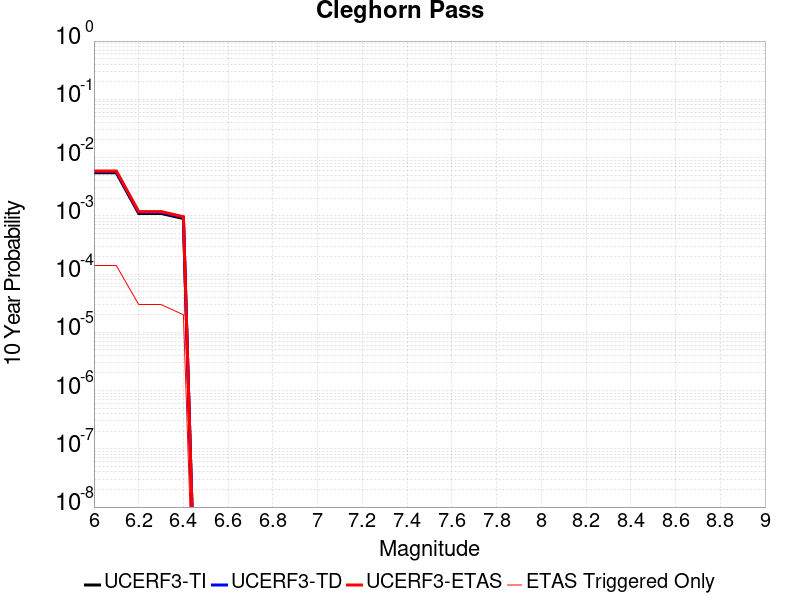 |

| Magnitude | 1 wk TI Prob | 1 wk TD Prob | 1 wk ETAS Prob | 1 wk ETAS/TD Gain | 1 wk ETAS Triggered Only | 1 mo TI Prob | 1 mo TD Prob | 1 mo ETAS Prob | 1 mo ETAS/TD Gain | 1 mo ETAS Triggered Only | 1 yr TI Prob | 1 yr TD Prob | 1 yr ETAS Prob | 1 yr ETAS/TD Gain | 1 yr ETAS Triggered Only | 10 yr TI Prob | 10 yr TD Prob | 10 yr ETAS Prob | 10 yr ETAS/TD Gain | 10 yr ETAS Triggered Only |
|-----|-----|-----|-----|-----|-----|-----|-----|-----|-----|-----|-----|-----|-----|-----|-----|-----|-----|-----|-----|-----|
| 6.0 | 1.0522846E-5 | 1.1040642E-5 | 9.201141E-5 | 8.333882 | 8.097166E-5 | 4.509713E-5 | 4.7316473E-5 | 1.6876822E-4 | 3.566796 | 1.2145749E-4 | 5.4891926E-4 | 5.759784E-4 | 7.78291E-4 | 1.3512502 | 2.0242915E-4 | 0.0054756533 | 0.005750022 | 0.005951287 | 1.0350025 | 2.0242915E-4 |
| 6.1 | 1.0522846E-5 | 1.1040642E-5 | 9.201141E-5 | 8.333882 | 8.097166E-5 | 4.509713E-5 | 4.7316473E-5 | 1.6876822E-4 | 3.566796 | 1.2145749E-4 | 5.4891926E-4 | 5.759784E-4 | 7.78291E-4 | 1.3512502 | 2.0242915E-4 | 0.0054756533 | 0.005750022 | 0.005951287 | 1.0350025 | 2.0242915E-4 |
| 6.2 | 2.1045846E-6 | 2.2082024E-6 | 2.2082024E-6 | 1.0 | 0.0 | 9.019617E-6 | 9.463714E-6 | 9.463714E-6 | 1.0 | 0.0 | 1.098083E-4 | 1.1521882E-4 | 1.1521882E-4 | 1.0 | 0.0 | 0.0010975406 | 0.0011520023 | 0.0011520023 | 1.0 | 0.0 |
| 6.3 | 2.1045846E-6 | 2.2082024E-6 | 2.2082024E-6 | 1.0 | 0.0 | 9.019617E-6 | 9.463714E-6 | 9.463714E-6 | 1.0 | 0.0 | 1.098083E-4 | 1.1521882E-4 | 1.1521882E-4 | 1.0 | 0.0 | 0.0010975406 | 0.0011520023 | 0.0011520023 | 1.0 | 0.0 |
| 6.4 | 1.7259927E-6 | 1.810877E-6 | 1.810877E-6 | 1.0 | 0.0 | 7.3970905E-6 | 7.760902E-6 | 7.760902E-6 | 1.0 | 0.0 | 9.005586E-5 | 9.4488976E-5 | 9.4488976E-5 | 1.0 | 0.0 | 9.001937E-4 | 9.448898E-4 | 9.448898E-4 | 1.0 | 0.0 |

## White Wolf (Extension)
*[(top)](#table-of-contents)*

| 1 Week | 1 Month | 1 Year | 10 Year |
|-----|-----|-----|-----|
|  |  |  | 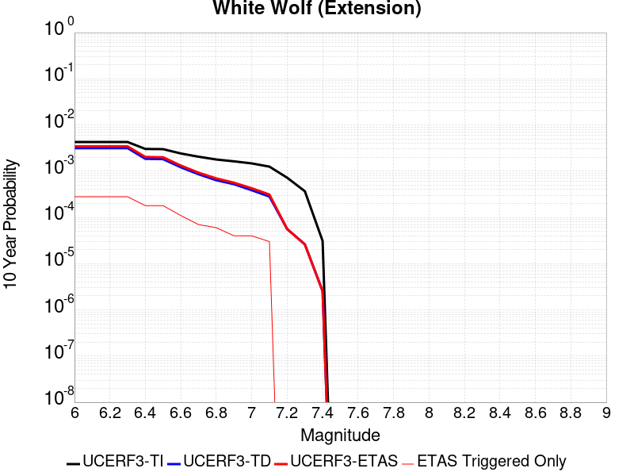 |

| Magnitude | 1 wk TI Prob | 1 wk TD Prob | 1 wk ETAS Prob | 1 wk ETAS/TD Gain | 1 wk ETAS Triggered Only | 1 mo TI Prob | 1 mo TD Prob | 1 mo ETAS Prob | 1 mo ETAS/TD Gain | 1 mo ETAS Triggered Only | 1 yr TI Prob | 1 yr TD Prob | 1 yr ETAS Prob | 1 yr ETAS/TD Gain | 1 yr ETAS Triggered Only | 10 yr TI Prob | 10 yr TD Prob | 10 yr ETAS Prob | 10 yr ETAS/TD Gain | 10 yr ETAS Triggered Only |
|-----|-----|-----|-----|-----|-----|-----|-----|-----|-----|-----|-----|-----|-----|-----|-----|-----|-----|-----|-----|-----|
| 6.0 | 8.222555E-6 | 6.0666657E-6 | 4.655225E-5 | 7.673449 | 4.048583E-5 | 3.5239045E-5 | 2.5999774E-5 | 6.648455E-5 | 2.5571203 | 4.048583E-5 | 4.289509E-4 | 3.1650788E-4 | 4.7839995E-4 | 1.5114945 | 1.6194332E-4 | 0.0042812387 | 0.003161223 | 0.0033630123 | 1.0638326 | 2.0242915E-4 |
| 6.1 | 8.222555E-6 | 6.0666657E-6 | 4.655225E-5 | 7.673449 | 4.048583E-5 | 3.5239045E-5 | 2.5999774E-5 | 6.648455E-5 | 2.5571203 | 4.048583E-5 | 4.289509E-4 | 3.1650788E-4 | 4.7839995E-4 | 1.5114945 | 1.6194332E-4 | 0.0042812387 | 0.003161223 | 0.0033630123 | 1.0638326 | 2.0242915E-4 |
| 6.2 | 8.222555E-6 | 6.0666657E-6 | 4.655225E-5 | 7.673449 | 4.048583E-5 | 3.5239045E-5 | 2.5999774E-5 | 6.648455E-5 | 2.5571203 | 4.048583E-5 | 4.289509E-4 | 3.1650788E-4 | 4.7839995E-4 | 1.5114945 | 1.6194332E-4 | 0.0042812387 | 0.003161223 | 0.0033630123 | 1.0638326 | 2.0242915E-4 |
| 6.3 | 8.222555E-6 | 6.0666657E-6 | 4.655225E-5 | 7.673449 | 4.048583E-5 | 3.5239045E-5 | 2.5999774E-5 | 6.648455E-5 | 2.5571203 | 4.048583E-5 | 4.289509E-4 | 3.1650788E-4 | 4.7839995E-4 | 1.5114945 | 1.6194332E-4 | 0.0042812387 | 0.003161223 | 0.0033630123 | 1.0638326 | 2.0242915E-4 |
| 6.4 | 5.821773E-6 | 3.5571766E-6 | 3.5571766E-6 | 1.0 | 0.0 | 2.4950215E-5 | 1.5244959E-5 | 1.5244959E-5 | 1.0 | 0.0 | 3.0372653E-4 | 1.8559267E-4 | 3.0702763E-4 | 1.6543089 | 1.2145749E-4 | 0.0030331176 | 0.001854485 | 0.002016128 | 1.0871633 | 1.6194332E-4 |
| 6.5 | 5.766023E-6 | 3.4991106E-6 | 3.4991106E-6 | 1.0 | 0.0 | 2.4711293E-5 | 1.4996108E-5 | 1.4996108E-5 | 1.0 | 0.0 | 3.0081844E-4 | 1.8256342E-4 | 3.0399874E-4 | 1.6651678 | 1.2145749E-4 | 0.0030041158 | 0.0018242426 | 0.0019858906 | 1.088611 | 1.6194332E-4 |
| 6.6 | 4.643576E-6 | 2.332624E-6 | 2.332624E-6 | 1.0 | 0.0 | 1.9900888E-5 | 9.996925E-6 | 9.996925E-6 | 1.0 | 0.0 | 2.4226638E-4 | 1.2170619E-4 | 2.0266799E-4 | 1.6652234 | 8.097166E-5 | 0.0024200242 | 0.0012164378 | 0.0013377476 | 1.0997254 | 1.2145749E-4 |
| 6.7 | 3.9529173E-6 | 1.6483477E-6 | 1.6483477E-6 | 1.0 | 0.0 | 1.6940963E-5 | 7.0643296E-6 | 7.0643296E-6 | 1.0 | 0.0 | 2.0623671E-4 | 8.6005006E-5 | 1.2648736E-4 | 1.4706975 | 4.048583E-5 | 0.002060454 | 8.597357E-4 | 9.001868E-4 | 1.0470505 | 4.048583E-5 |
| 6.8 | 3.4377522E-6 | 1.2245237E-6 | 1.2245237E-6 | 1.0 | 0.0 | 1.473314E-5 | 5.2479486E-6 | 5.2479486E-6 | 1.0 | 0.0 | 1.7936122E-4 | 6.3891996E-5 | 1.04375235E-4 | 1.63362 | 4.048583E-5 | 0.0017921652 | 6.387454E-4 | 6.7920535E-4 | 1.0633429 | 4.048583E-5 |
| 6.9 | 3.1367306E-6 | 1.0033783E-6 | 1.0033783E-6 | 1.0 | 0.0 | 1.3443062E-5 | 4.3001864E-6 | 4.3001864E-6 | 1.0 | 0.0 | 1.63657E-4 | 5.235359E-5 | 5.235359E-5 | 1.0 | 0.0 | 0.0016353652 | 5.2342017E-4 | 5.2342017E-4 | 1.0 | 0.0 |
| 7.0 | 2.8298145E-6 | 7.4286646E-7 | 7.4286646E-7 | 1.0 | 0.0 | 1.2127721E-5 | 3.1837099E-6 | 3.1837099E-6 | 1.0 | 0.0 | 1.47645E-4 | 3.8761027E-5 | 3.8761027E-5 | 1.0 | 0.0 | 0.0014754693 | 3.8754768E-4 | 3.8754768E-4 | 1.0 | 0.0 |
| 7.1 | 2.4091064E-6 | 5.4227525E-7 | 5.4227525E-7 | 1.0 | 0.0 | 1.03247E-5 | 2.3240348E-6 | 2.3240348E-6 | 1.0 | 0.0 | 1.2569598E-4 | 2.8294799E-5 | 2.8294799E-5 | 1.0 | 0.0 | 0.001256249 | 2.8291598E-4 | 2.8291598E-4 | 1.0 | 0.0 |
| 7.2 | 1.3875518E-6 | 1.0743063E-7 | 1.0743063E-7 | 1.0 | 0.0 | 5.9466374E-6 | 4.6041689E-7 | 4.6041689E-7 | 1.0 | 0.0 | 7.23979E-5 | 5.6055624E-6 | 5.6055624E-6 | 1.0 | 0.0 | 7.2374323E-4 | 5.6054323E-5 | 5.6054323E-5 | 1.0 | 0.0 |
| 7.3 | 7.056077E-7 | 5.002034E-8 | 5.002034E-8 | 1.0 | 0.0 | 3.0240296E-6 | 2.1437286E-7 | 2.1437286E-7 | 1.0 | 0.0 | 3.681694E-5 | 2.609987E-6 | 2.609987E-6 | 1.0 | 0.0 | 3.681084E-4 | 2.609961E-5 | 2.609961E-5 | 1.0 | 0.0 |
| 7.4 | 5.9334678E-8 | 4.8683537E-9 | 4.8683537E-9 | 1.0 | 0.0 | 2.5429145E-7 | 2.0864372E-8 | 2.0864372E-8 | 1.0 | 0.0 | 3.095994E-6 | 2.5402372E-7 | 2.5402372E-7 | 1.0 | 0.0 | 3.095951E-5 | 2.5402353E-6 | 2.5402353E-6 | 1.0 | 0.0 |

## Blue Cut
*[(top)](#table-of-contents)*

| 1 Week | 1 Month | 1 Year | 10 Year |
|-----|-----|-----|-----|
|  |  |  |  |

| Magnitude | 1 wk TI Prob | 1 wk TD Prob | 1 wk ETAS Prob | 1 wk ETAS/TD Gain | 1 wk ETAS Triggered Only | 1 mo TI Prob | 1 mo TD Prob | 1 mo ETAS Prob | 1 mo ETAS/TD Gain | 1 mo ETAS Triggered Only | 1 yr TI Prob | 1 yr TD Prob | 1 yr ETAS Prob | 1 yr ETAS/TD Gain | 1 yr ETAS Triggered Only | 10 yr TI Prob | 10 yr TD Prob | 10 yr ETAS Prob | 10 yr ETAS/TD Gain | 10 yr ETAS Triggered Only |
|-----|-----|-----|-----|-----|-----|-----|-----|-----|-----|-----|-----|-----|-----|-----|-----|-----|-----|-----|-----|-----|
| 6.0 | 2.1227985E-5 | 2.2719574E-5 | 6.320448E-5 | 2.7819395 | 4.048583E-5 | 9.097391E-5 | 9.73663E-5 | 1.7833007E-4 | 1.831538 | 8.097166E-5 | 0.0011070445 | 0.0011848481 | 0.0013061616 | 1.1023874 | 1.2145749E-4 | 0.011015458 | 0.011791152 | 0.011951186 | 1.0135723 | 1.6194332E-4 |
| 6.1 | 2.1227985E-5 | 2.2719574E-5 | 6.320448E-5 | 2.7819395 | 4.048583E-5 | 9.097391E-5 | 9.73663E-5 | 1.7833007E-4 | 1.831538 | 8.097166E-5 | 0.0011070445 | 0.0011848481 | 0.0013061616 | 1.1023874 | 1.2145749E-4 | 0.011015458 | 0.011791152 | 0.011951186 | 1.0135723 | 1.6194332E-4 |
| 6.2 | 2.1227985E-5 | 2.2719574E-5 | 6.320448E-5 | 2.7819395 | 4.048583E-5 | 9.097391E-5 | 9.73663E-5 | 1.7833007E-4 | 1.831538 | 8.097166E-5 | 0.0011070445 | 0.0011848481 | 0.0013061616 | 1.1023874 | 1.2145749E-4 | 0.011015458 | 0.011791152 | 0.011951186 | 1.0135723 | 1.6194332E-4 |
| 6.3 | 1.1613981E-5 | 1.2353542E-5 | 1.2353542E-5 | 1.0 | 0.0 | 4.9773254E-5 | 5.2942745E-5 | 5.2942745E-5 | 1.0 | 0.0 | 6.0582085E-4 | 6.443998E-4 | 6.848595E-4 | 1.0627867 | 4.048583E-5 | 0.0060417196 | 0.0064265593 | 0.006466785 | 1.0062593 | 4.048583E-5 |
| 6.4 | 1.1613981E-5 | 1.2353542E-5 | 1.2353542E-5 | 1.0 | 0.0 | 4.9773254E-5 | 5.2942745E-5 | 5.2942745E-5 | 1.0 | 0.0 | 6.0582085E-4 | 6.443998E-4 | 6.848595E-4 | 1.0627867 | 4.048583E-5 | 0.0060417196 | 0.0064265593 | 0.006466785 | 1.0062593 | 4.048583E-5 |
| 6.5 | 8.931326E-6 | 9.4816E-6 | 9.4816E-6 | 1.0 | 0.0 | 3.8276554E-5 | 4.0634844E-5 | 4.0634844E-5 | 1.0 | 0.0 | 4.6591737E-4 | 4.946261E-4 | 5.350919E-4 | 1.081811 | 4.048583E-5 | 0.0046494175 | 0.004936161 | 0.004976447 | 1.0081614 | 4.048583E-5 |
| 6.6 | 7.345353E-6 | 7.79028E-6 | 7.79028E-6 | 1.0 | 0.0 | 3.1479703E-5 | 3.338653E-5 | 3.338653E-5 | 1.0 | 0.0 | 3.83198E-4 | 4.064132E-4 | 4.064132E-4 | 1.0 | 0.0 | 0.0038253788 | 0.0040574907 | 0.0040574907 | 1.0 | 0.0 |
| 6.7 | 6.2775666E-6 | 6.655149E-6 | 6.655149E-6 | 1.0 | 0.0 | 2.690358E-5 | 2.8521798E-5 | 2.8521798E-5 | 1.0 | 0.0 | 3.2750185E-4 | 3.472051E-4 | 3.472051E-4 | 1.0 | 0.0 | 0.0032701963 | 0.003467367 | 0.003467367 | 1.0 | 0.0 |
| 6.8 | 5.5234095E-6 | 5.8551113E-6 | 5.8551113E-6 | 1.0 | 0.0 | 2.367154E-5 | 2.5093133E-5 | 2.5093133E-5 | 1.0 | 0.0 | 2.8816288E-4 | 3.0547334E-4 | 3.0547334E-4 | 1.0 | 0.0 | 0.002877895 | 0.0030512505 | 0.0030512505 | 1.0 | 0.0 |
| 6.9 | 4.7780054E-6 | 5.0654203E-6 | 5.0654203E-6 | 1.0 | 0.0 | 2.0477004E-5 | 2.1708804E-5 | 2.1708804E-5 | 1.0 | 0.0 | 2.4927902E-4 | 2.642797E-4 | 2.642797E-4 | 1.0 | 0.0 | 0.0024899957 | 0.002640346 | 0.002640346 | 1.0 | 0.0 |
| 7.0 | 3.883171E-6 | 4.118487E-6 | 4.118487E-6 | 1.0 | 0.0 | 1.6642054E-5 | 1.7650578E-5 | 1.7650578E-5 | 1.0 | 0.0 | 2.0259817E-4 | 2.1488148E-4 | 2.1488148E-4 | 1.0 | 0.0 | 0.0020241356 | 0.0021474129 | 0.0021474129 | 1.0 | 0.0 |
| 7.1 | 2.8358215E-6 | 3.0097158E-6 | 3.0097158E-6 | 1.0 | 0.0 | 1.2153464E-5 | 1.2898756E-5 | 1.2898756E-5 | 1.0 | 0.0 | 1.4795837E-4 | 1.5703762E-4 | 1.5703762E-4 | 1.0 | 0.0 | 0.001478599 | 0.0015699116 | 0.0015699116 | 1.0 | 0.0 |

## San Diego Trough north alt1
*[(top)](#table-of-contents)*

| 1 Week | 1 Month | 1 Year | 10 Year |
|-----|-----|-----|-----|
|  |  | 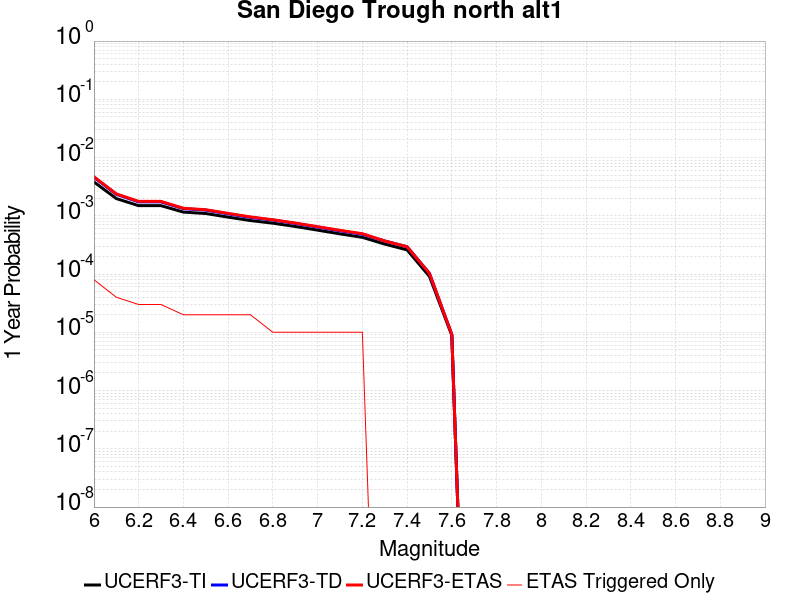 |  |

| Magnitude | 1 wk TI Prob | 1 wk TD Prob | 1 wk ETAS Prob | 1 wk ETAS/TD Gain | 1 wk ETAS Triggered Only | 1 mo TI Prob | 1 mo TD Prob | 1 mo ETAS Prob | 1 mo ETAS/TD Gain | 1 mo ETAS Triggered Only | 1 yr TI Prob | 1 yr TD Prob | 1 yr ETAS Prob | 1 yr ETAS/TD Gain | 1 yr ETAS Triggered Only | 10 yr TI Prob | 10 yr TD Prob | 10 yr ETAS Prob | 10 yr ETAS/TD Gain | 10 yr ETAS Triggered Only |
|-----|-----|-----|-----|-----|-----|-----|-----|-----|-----|-----|-----|-----|-----|-----|-----|-----|-----|-----|-----|-----|
| 6.0 | 7.329252E-5 | 8.821093E-5 | 8.821093E-5 | 1.0 | 0.0 | 3.14073E-4 | 3.7799572E-4 | 4.5893676E-4 | 1.2141322 | 8.097166E-5 | 0.0038171355 | 0.004593027 | 0.0047139265 | 1.0263225 | 1.2145749E-4 | 0.03752231 | 0.045044992 | 0.04519964 | 1.0034332 | 1.6194332E-4 |
| 6.1 | 3.7940346E-5 | 4.4885E-5 | 4.4885E-5 | 1.0 | 0.0 | 1.6259136E-4 | 1.9235066E-4 | 1.9235066E-4 | 1.0 | 0.0 | 0.0019777524 | 0.0023394432 | 0.0023798344 | 1.0172653 | 4.048583E-5 | 0.019602431 | 0.023156688 | 0.023196235 | 1.0017079 | 4.048583E-5 |
| 6.2 | 2.8645263E-5 | 3.329678E-5 | 3.329678E-5 | 1.0 | 0.0 | 1.2275964E-4 | 1.4269284E-4 | 1.4269284E-4 | 1.0 | 0.0 | 0.0014935739 | 0.0017359189 | 0.0017359189 | 1.0 | 0.0 | 0.0148357535 | 0.017226247 | 0.017226247 | 1.0 | 0.0 |
| 6.3 | 2.8645263E-5 | 3.329678E-5 | 3.329678E-5 | 1.0 | 0.0 | 1.2275964E-4 | 1.4269284E-4 | 1.4269284E-4 | 1.0 | 0.0 | 0.0014935739 | 0.0017359189 | 0.0017359189 | 1.0 | 0.0 | 0.0148357535 | 0.017226247 | 0.017226247 | 1.0 | 0.0 |
| 6.4 | 2.2204576E-5 | 2.5448318E-5 | 2.5448318E-5 | 1.0 | 0.0 | 9.5159E-5 | 1.0905972E-4 | 1.0905972E-4 | 1.0 | 0.0 | 0.001157945 | 0.0013270034 | 0.0013270034 | 1.0 | 0.0 | 0.011519298 | 0.013191955 | 0.013191955 | 1.0 | 0.0 |
| 6.5 | 2.1004838E-5 | 2.4024694E-5 | 2.4024694E-5 | 1.0 | 0.0 | 9.0017624E-5 | 1.0295896E-4 | 1.0295896E-4 | 1.0 | 0.0 | 0.0010954136 | 0.0012528138 | 0.0012528138 | 1.0 | 0.0 | 0.010900296 | 0.012458589 | 0.012458589 | 1.0 | 0.0 |
| 6.6 | 1.820557E-5 | 2.0704787E-5 | 2.0704787E-5 | 1.0 | 0.0 | 7.802154E-5 | 8.873181E-5 | 8.873181E-5 | 1.0 | 0.0 | 9.4949827E-4 | 0.0010797799 | 0.0010797799 | 1.0 | 0.0 | 0.009454516 | 0.010746004 | 0.010746004 | 1.0 | 0.0 |
| 6.7 | 1.5884485E-5 | 1.7983646E-5 | 1.7983646E-5 | 1.0 | 0.0 | 6.807459E-5 | 7.707051E-5 | 7.707051E-5 | 1.0 | 0.0 | 8.284929E-4 | 9.3793223E-4 | 9.3793223E-4 | 1.0 | 0.0 | 0.008254109 | 0.009340104 | 0.009340104 | 1.0 | 0.0 |
| 6.8 | 1.4331171E-5 | 1.6201066E-5 | 1.6201066E-5 | 1.0 | 0.0 | 6.141786E-5 | 6.94313E-5 | 6.94313E-5 | 1.0 | 0.0 | 7.4750587E-4 | 8.450002E-4 | 8.450002E-4 | 1.0 | 0.0 | 0.0074499645 | 0.008418139 | 0.008418139 | 1.0 | 0.0 |
| 6.9 | 1.2574203E-5 | 1.4205835E-5 | 1.4205835E-5 | 1.0 | 0.0 | 5.3888325E-5 | 6.0880735E-5 | 6.0880735E-5 | 1.0 | 0.0 | 6.558929E-4 | 7.409723E-4 | 7.409723E-4 | 1.0 | 0.0 | 0.0065396037 | 0.007385203 | 0.007385203 | 1.0 | 0.0 |
| 7.0 | 1.0883844E-5 | 1.2289262E-5 | 1.2289262E-5 | 1.0 | 0.0 | 4.664421E-5 | 5.2667205E-5 | 5.2667205E-5 | 1.0 | 0.0 | 5.677453E-4 | 6.4103556E-4 | 6.4103556E-4 | 1.0 | 0.0 | 0.00566297 | 0.006391993 | 0.006391993 | 1.0 | 0.0 |
| 7.1 | 9.393088E-6 | 1.060702E-5 | 1.060702E-5 | 1.0 | 0.0 | 4.025547E-5 | 4.545787E-5 | 4.545787E-5 | 1.0 | 0.0 | 4.900001E-4 | 5.533098E-4 | 5.533098E-4 | 1.0 | 0.0 | 0.0048892107 | 0.005519418 | 0.005519418 | 1.0 | 0.0 |
| 7.2 | 8.190791E-6 | 9.258625E-6 | 9.258625E-6 | 1.0 | 0.0 | 3.510292E-5 | 3.9679224E-5 | 3.9679224E-5 | 1.0 | 0.0 | 4.2729423E-4 | 4.8298817E-4 | 4.8298817E-4 | 1.0 | 0.0 | 0.0042647356 | 0.004819465 | 0.004819465 | 1.0 | 0.0 |
| 7.3 | 6.268162E-6 | 7.089716E-6 | 7.089716E-6 | 1.0 | 0.0 | 2.6863276E-5 | 3.0384144E-5 | 3.0384144E-5 | 1.0 | 0.0 | 3.2701128E-4 | 3.6986457E-4 | 3.6986457E-4 | 1.0 | 0.0 | 0.003265305 | 0.003692536 | 0.003692536 | 1.0 | 0.0 |
| 7.4 | 4.985186E-6 | 5.6426816E-6 | 5.6426816E-6 | 1.0 | 0.0 | 2.1364907E-5 | 2.4182698E-5 | 2.4182698E-5 | 1.0 | 0.0 | 2.600867E-4 | 2.9438498E-4 | 2.9438498E-4 | 1.0 | 0.0 | 0.002597825 | 0.0029399914 | 0.0029399914 | 1.0 | 0.0 |
| 7.5 | 1.7489613E-6 | 1.969678E-6 | 1.969678E-6 | 1.0 | 0.0 | 7.495527E-6 | 8.4414505E-6 | 8.4414505E-6 | 1.0 | 0.0 | 9.125422E-5 | 1.02770035E-4 | 1.02770035E-4 | 1.0 | 0.0 | 9.1216754E-4 | 0.0010272472 | 0.0010272472 | 1.0 | 0.0 |
| 7.6 | 1.6988751E-7 | 1.7533823E-7 | 1.7533823E-7 | 1.0 | 0.0 | 7.2808916E-7 | 7.5144936E-7 | 7.5144936E-7 | 1.0 | 0.0 | 8.864449E-6 | 9.14886E-6 | 9.14886E-6 | 1.0 | 0.0 | 8.8640954E-5 | 9.1485024E-5 | 9.1485024E-5 | 1.0 | 0.0 |

## San Andreas (North Branch Mill Creek)
*[(top)](#table-of-contents)*

| 1 Week | 1 Month | 1 Year | 10 Year |
|-----|-----|-----|-----|
|  |  |  |  |

| Magnitude | 1 wk TI Prob | 1 wk TD Prob | 1 wk ETAS Prob | 1 wk ETAS/TD Gain | 1 wk ETAS Triggered Only | 1 mo TI Prob | 1 mo TD Prob | 1 mo ETAS Prob | 1 mo ETAS/TD Gain | 1 mo ETAS Triggered Only | 1 yr TI Prob | 1 yr TD Prob | 1 yr ETAS Prob | 1 yr ETAS/TD Gain | 1 yr ETAS Triggered Only | 10 yr TI Prob | 10 yr TD Prob | 10 yr ETAS Prob | 10 yr ETAS/TD Gain | 10 yr ETAS Triggered Only |
|-----|-----|-----|-----|-----|-----|-----|-----|-----|-----|-----|-----|-----|-----|-----|-----|-----|-----|-----|-----|-----|
| 6.0 | 1.3461156E-5 | 2.3499893E-5 | 1.0446965E-4 | 4.445537 | 8.097166E-5 | 5.7689394E-5 | 1.00709956E-4 | 2.2215521E-4 | 2.2058914 | 1.2145749E-4 | 7.02142E-4 | 0.0012254574 | 0.0013872022 | 1.1319873 | 1.6194332E-4 | 0.0069992766 | 0.01222957 | 0.012389532 | 1.01308 | 1.6194332E-4 |
| 6.1 | 1.3461156E-5 | 2.3499893E-5 | 1.0446965E-4 | 4.445537 | 8.097166E-5 | 5.7689394E-5 | 1.00709956E-4 | 2.2215521E-4 | 2.2058914 | 1.2145749E-4 | 7.02142E-4 | 0.0012254574 | 0.0013872022 | 1.1319873 | 1.6194332E-4 | 0.0069992766 | 0.01222957 | 0.012389532 | 1.01308 | 1.6194332E-4 |
| 6.2 | 1.3461156E-5 | 2.3499893E-5 | 1.0446965E-4 | 4.445537 | 8.097166E-5 | 5.7689394E-5 | 1.00709956E-4 | 2.2215521E-4 | 2.2058914 | 1.2145749E-4 | 7.02142E-4 | 0.0012254574 | 0.0013872022 | 1.1319873 | 1.6194332E-4 | 0.0069992766 | 0.01222957 | 0.012389532 | 1.01308 | 1.6194332E-4 |
| 6.3 | 1.3461156E-5 | 2.3499893E-5 | 1.0446965E-4 | 4.445537 | 8.097166E-5 | 5.7689394E-5 | 1.00709956E-4 | 2.2215521E-4 | 2.2058914 | 1.2145749E-4 | 7.02142E-4 | 0.0012254574 | 0.0013872022 | 1.1319873 | 1.6194332E-4 | 0.0069992766 | 0.01222957 | 0.012389532 | 1.01308 | 1.6194332E-4 |
| 6.4 | 1.3461156E-5 | 2.3499893E-5 | 1.0446965E-4 | 4.445537 | 8.097166E-5 | 5.7689394E-5 | 1.00709956E-4 | 2.2215521E-4 | 2.2058914 | 1.2145749E-4 | 7.02142E-4 | 0.0012254574 | 0.0013872022 | 1.1319873 | 1.6194332E-4 | 0.0069992766 | 0.01222957 | 0.012389532 | 1.01308 | 1.6194332E-4 |
| 6.5 | 1.3450706E-5 | 2.3488852E-5 | 1.0445861E-4 | 4.447157 | 8.097166E-5 | 5.764461E-5 | 1.0066265E-4 | 2.221079E-4 | 2.206458 | 1.2145749E-4 | 7.0159714E-4 | 0.001224882 | 0.001386627 | 1.1320494 | 1.6194332E-4 | 0.006993862 | 0.01222388 | 0.012383843 | 1.0130862 | 1.6194332E-4 |
| 6.6 | 1.3074523E-5 | 2.3103135E-5 | 1.04072926E-4 | 4.5047097 | 8.097166E-5 | 5.6032466E-5 | 9.9009696E-5 | 2.2045516E-4 | 2.2266016 | 1.2145749E-4 | 6.8198174E-4 | 0.0012047797 | 0.001366528 | 1.1342554 | 1.6194332E-4 | 0.006798926 | 0.012025044 | 0.012185041 | 1.0133052 | 1.6194332E-4 |
| 6.7 | 1.3050216E-5 | 2.3078432E-5 | 1.04048224E-4 | 4.5084615 | 8.097166E-5 | 5.59283E-5 | 9.890384E-5 | 2.203493E-4 | 2.2279148 | 1.2145749E-4 | 6.8071426E-4 | 0.0012034923 | 0.0013652407 | 1.1343992 | 1.6194332E-4 | 0.0067863287 | 0.012012309 | 0.012172307 | 1.0133195 | 1.6194332E-4 |
| 6.8 | 1.29049395E-5 | 2.292684E-5 | 1.03896644E-4 | 4.5316596 | 8.097166E-5 | 5.530571E-5 | 9.825421E-5 | 2.1969977E-4 | 2.2360342 | 1.2145749E-4 | 6.73139E-4 | 0.0011955918 | 0.0013573414 | 1.1352884 | 1.6194332E-4 | 0.0067110364 | 0.011934154 | 0.012094165 | 1.0134078 | 1.6194332E-4 |
| 6.9 | 1.2867369E-5 | 2.2886245E-5 | 1.0385605E-4 | 4.537925 | 8.097166E-5 | 5.51447E-5 | 9.8080236E-5 | 2.1952581E-4 | 2.238227 | 1.2145749E-4 | 6.711799E-4 | 0.0011934759 | 0.001355226 | 1.1355286 | 1.6194332E-4 | 0.006691564 | 0.011913223 | 0.012073237 | 1.0134317 | 1.6194332E-4 |
| 7.0 | 1.2495996E-5 | 2.2286325E-5 | 1.0325618E-4 | 4.633163 | 8.097166E-5 | 5.3553173E-5 | 9.550934E-5 | 2.1695523E-4 | 2.2715604 | 1.2145749E-4 | 6.518148E-4 | 0.0011622087 | 0.0013239639 | 1.139179 | 1.6194332E-4 | 0.0064990623 | 0.0116038285 | 0.011763893 | 1.0137941 | 1.6194332E-4 |
| 7.1 | 1.2452067E-5 | 2.2231397E-5 | 1.0320126E-4 | 4.64214 | 8.097166E-5 | 5.3364907E-5 | 9.527396E-5 | 2.1671987E-4 | 2.274702 | 1.2145749E-4 | 6.4952404E-4 | 0.0011593461 | 0.0013211016 | 1.1395231 | 1.6194332E-4 | 0.0064762887 | 0.0115755 | 0.011735569 | 1.0138283 | 1.6194332E-4 |
| 7.2 | 1.2002777E-5 | 2.1609963E-5 | 1.0257987E-4 | 4.7468786 | 8.097166E-5 | 5.143946E-5 | 9.2610855E-5 | 2.140571E-4 | 2.3113608 | 1.2145749E-4 | 6.2609545E-4 | 0.0011269567 | 0.0012887174 | 1.1435378 | 1.6194332E-4 | 0.006243344 | 0.011254923 | 0.011415044 | 1.0142267 | 1.6194332E-4 |
| 7.3 | 1.1923425E-5 | 2.1479793E-5 | 1.0244971E-4 | 4.7695856 | 8.097166E-5 | 5.109939E-5 | 9.205302E-5 | 2.1349933E-4 | 2.3193083 | 1.2145749E-4 | 6.219575E-4 | 0.001120172 | 0.0012819339 | 1.1444081 | 1.6194332E-4 | 0.0062021962 | 0.011187789 | 0.011347921 | 1.0143131 | 1.6194332E-4 |
| 7.4 | 1.16105175E-5 | 2.0853771E-5 | 1.01823745E-4 | 4.8827496 | 8.097166E-5 | 4.975841E-5 | 8.937026E-5 | 2.108169E-4 | 2.3589156 | 1.2145749E-4 | 6.0564023E-4 | 0.0010875424 | 0.0012493096 | 1.1487457 | 1.6194332E-4 | 0.006039923 | 0.010865397 | 0.011025581 | 1.0147426 | 1.6194332E-4 |
| 7.5 | 1.1037265E-5 | 1.9553907E-5 | 1.0052398E-4 | 5.1408644 | 8.097166E-5 | 4.7301706E-5 | 8.379978E-5 | 2.052471E-4 | 2.4492557 | 1.2145749E-4 | 5.757461E-4 | 0.0010197869 | 0.0011815651 | 1.1586392 | 1.6194332E-4 | 0.005742567 | 0.010194898 | 0.010355189 | 1.0157228 | 1.6194332E-4 |
| 7.6 | 1.0720915E-5 | 1.899582E-5 | 9.996594E-5 | 5.262523 | 8.097166E-5 | 4.5945973E-5 | 8.140812E-5 | 2.0285572E-4 | 2.4918363 | 1.2145749E-4 | 5.592486E-4 | 9.906954E-4 | 0.0011524783 | 1.1633023 | 1.6194332E-4 | 0.005578433 | 0.009906623 | 0.010066961 | 1.016185 | 1.6194332E-4 |
| 7.7 | 9.276279E-6 | 1.6441649E-5 | 9.7411976E-5 | 5.9247084 | 8.097166E-5 | 3.9754876E-5 | 7.0462316E-5 | 1.9191124E-4 | 2.7236013 | 1.2145749E-4 | 4.839081E-4 | 8.575427E-4 | 0.0010193471 | 1.1886839 | 1.6194332E-4 | 0.0048285574 | 0.008586041 | 0.008746594 | 1.0186993 | 1.6194332E-4 |
| 7.8 | 5.8346777E-6 | 1.1155013E-5 | 9.212577E-5 | 8.258688 | 8.097166E-5 | 2.5005522E-5 | 4.7806327E-5 | 1.6925801E-4 | 3.540494 | 1.2145749E-4 | 3.043997E-4 | 5.818867E-4 | 7.4373576E-4 | 1.2781453 | 1.6194332E-4 | 0.0030398308 | 0.0058469265 | 0.006007923 | 1.0275352 | 1.6194332E-4 |
| 7.9 | 4.690204E-6 | 8.509093E-6 | 8.948006E-5 | 10.515817 | 8.097166E-5 | 2.0100719E-5 | 3.6467034E-5 | 1.1743574E-4 | 3.2203262 | 8.097166E-5 | 2.4469878E-4 | 4.4389578E-4 | 5.6529936E-4 | 1.2734957 | 1.2145749E-4 | 0.002444295 | 0.0044707474 | 0.0045916615 | 1.0270457 | 1.2145749E-4 |
| 8.0 | 2.9570454E-6 | 4.846947E-6 | 4.846947E-6 | 1.0 | 0.0 | 1.267299E-5 | 2.0772464E-5 | 2.0772464E-5 | 1.0 | 0.0 | 1.5428272E-4 | 2.5287544E-4 | 2.5287544E-4 | 1.0 | 0.0 | 0.0015417566 | 0.002549644 | 0.002549644 | 1.0 | 0.0 |
| 8.1 | 1.6376824E-6 | 2.1968929E-6 | 2.1968929E-6 | 1.0 | 0.0 | 7.01862E-6 | 9.41522E-6 | 9.41522E-6 | 1.0 | 0.0 | 8.544835E-5 | 1.14624294E-4 | 1.14624294E-4 | 1.0 | 0.0 | 8.54155E-4 | 0.0011606582 | 0.0011606582 | 1.0 | 0.0 |
| 8.2 | 6.9631557E-7 | 4.5360213E-7 | 4.5360213E-7 | 1.0 | 0.0 | 2.984206E-6 | 1.9440076E-6 | 1.9440076E-6 | 1.0 | 0.0 | 3.63321E-5 | 2.3668037E-5 | 2.3668037E-5 | 1.0 | 0.0 | 3.6326164E-4 | 2.451564E-4 | 2.451564E-4 | 1.0 | 0.0 |
| 8.3 | 1.7876137E-7 | 8.360375E-8 | 8.360375E-8 | 1.0 | 0.0 | 7.661199E-7 | 3.5830175E-7 | 3.5830175E-7 | 1.0 | 0.0 | 9.32747E-6 | 4.3623154E-6 | 4.3623154E-6 | 1.0 | 0.0 | 9.3270784E-5 | 4.5817014E-5 | 4.5817014E-5 | 1.0 | 0.0 |

## Chino alt 1
*[(top)](#table-of-contents)*

| 1 Week | 1 Month | 1 Year | 10 Year |
|-----|-----|-----|-----|
|  |  | 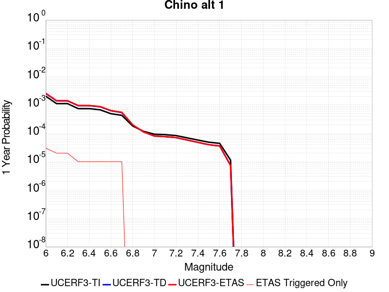 | 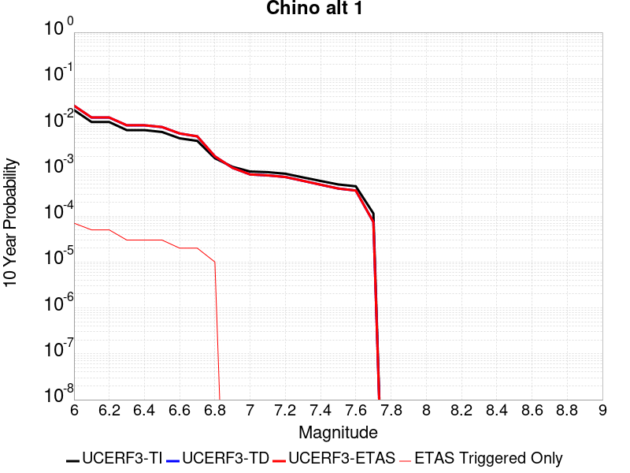 |

| Magnitude | 1 wk TI Prob | 1 wk TD Prob | 1 wk ETAS Prob | 1 wk ETAS/TD Gain | 1 wk ETAS Triggered Only | 1 mo TI Prob | 1 mo TD Prob | 1 mo ETAS Prob | 1 mo ETAS/TD Gain | 1 mo ETAS Triggered Only | 1 yr TI Prob | 1 yr TD Prob | 1 yr ETAS Prob | 1 yr ETAS/TD Gain | 1 yr ETAS Triggered Only | 10 yr TI Prob | 10 yr TD Prob | 10 yr ETAS Prob | 10 yr ETAS/TD Gain | 10 yr ETAS Triggered Only |
|-----|-----|-----|-----|-----|-----|-----|-----|-----|-----|-----|-----|-----|-----|-----|-----|-----|-----|-----|-----|-----|
| 6.0 | 3.939946E-5 | 4.8948554E-5 | 4.8948554E-5 | 1.0 | 0.0 | 1.6884391E-4 | 2.097656E-4 | 2.097656E-4 | 1.0 | 0.0 | 0.0020537362 | 0.0025513945 | 0.0025917771 | 1.0158277 | 4.048583E-5 | 0.020348595 | 0.025277847 | 0.025396233 | 1.0046835 | 1.2145749E-4 |
| 6.1 | 2.1505624E-5 | 2.6879026E-5 | 2.6879026E-5 | 1.0 | 0.0 | 9.2163704E-5 | 1.1519137E-4 | 1.1519137E-4 | 1.0 | 0.0 | 0.0011215154 | 0.001401664 | 0.001401664 | 1.0 | 0.0 | 0.011158722 | 0.013945141 | 0.013985062 | 1.0028627 | 4.048583E-5 |
| 6.2 | 2.1505624E-5 | 2.6879026E-5 | 2.6879026E-5 | 1.0 | 0.0 | 9.2163704E-5 | 1.1519137E-4 | 1.1519137E-4 | 1.0 | 0.0 | 0.0011215154 | 0.001401664 | 0.001401664 | 1.0 | 0.0 | 0.011158722 | 0.013945141 | 0.013985062 | 1.0028627 | 4.048583E-5 |
| 6.3 | 1.4290785E-5 | 1.8165128E-5 | 1.8165128E-5 | 1.0 | 0.0 | 6.1244784E-5 | 7.784848E-5 | 7.784848E-5 | 1.0 | 0.0 | 7.454001E-4 | 9.4743853E-4 | 9.4743853E-4 | 1.0 | 0.0 | 0.007429048 | 0.0094444575 | 0.009484561 | 1.0042462 | 4.048583E-5 |
| 6.4 | 1.4290785E-5 | 1.8165128E-5 | 1.8165128E-5 | 1.0 | 0.0 | 6.1244784E-5 | 7.784848E-5 | 7.784848E-5 | 1.0 | 0.0 | 7.454001E-4 | 9.4743853E-4 | 9.4743853E-4 | 1.0 | 0.0 | 0.007429048 | 0.0094444575 | 0.009484561 | 1.0042462 | 4.048583E-5 |
| 6.5 | 1.3017944E-5 | 1.6652088E-5 | 1.6652088E-5 | 1.0 | 0.0 | 5.5789995E-5 | 7.136439E-5 | 7.136439E-5 | 1.0 | 0.0 | 6.790315E-4 | 8.685589E-4 | 8.685589E-4 | 1.0 | 0.0 | 0.0067696036 | 0.008661949 | 0.008702084 | 1.0046335 | 4.048583E-5 |
| 6.6 | 9.470016E-6 | 1.2039424E-5 | 1.2039424E-5 | 1.0 | 0.0 | 4.058515E-5 | 5.1596704E-5 | 5.1596704E-5 | 1.0 | 0.0 | 4.940122E-4 | 6.280428E-4 | 6.280428E-4 | 1.0 | 0.0 | 0.004929154 | 0.0062718987 | 0.0062718987 | 1.0 | 0.0 |
| 6.7 | 8.314155E-6 | 1.0407736E-5 | 1.0407736E-5 | 1.0 | 0.0 | 3.5631605E-5 | 4.4604003E-5 | 4.4604003E-5 | 1.0 | 0.0 | 4.3372845E-4 | 5.429507E-4 | 5.429507E-4 | 1.0 | 0.0 | 0.004328829 | 0.005425775 | 0.005425775 | 1.0 | 0.0 |
| 6.8 | 3.4856364E-6 | 3.8133708E-6 | 3.8133708E-6 | 1.0 | 0.0 | 1.4938357E-5 | 1.6342927E-5 | 1.6342927E-5 | 1.0 | 0.0 | 1.8185932E-4 | 1.9895904E-4 | 1.9895904E-4 | 1.0 | 0.0 | 0.0018171056 | 0.0019894864 | 0.0019894864 | 1.0 | 0.0 |
| 6.9 | 2.2645952E-6 | 2.1529022E-6 | 2.1529022E-6 | 1.0 | 0.0 | 9.705372E-6 | 9.226692E-6 | 9.226692E-6 | 1.0 | 0.0 | 1.18156495E-4 | 1.123294E-4 | 1.123294E-4 | 1.0 | 0.0 | 0.0011809369 | 0.0011233423 | 0.0011233423 | 1.0 | 0.0 |
| 7.0 | 1.7864003E-6 | 1.5430785E-6 | 1.5430785E-6 | 1.0 | 0.0 | 7.655979E-6 | 6.613177E-6 | 6.613177E-6 | 1.0 | 0.0 | 9.3207556E-5 | 8.051251E-5 | 8.051251E-5 | 1.0 | 0.0 | 9.316847E-4 | 8.0528046E-4 | 8.0528046E-4 | 1.0 | 0.0 |
| 7.1 | 1.7315456E-6 | 1.4733511E-6 | 1.4733511E-6 | 1.0 | 0.0 | 7.420889E-6 | 6.3143466E-6 | 6.3143466E-6 | 1.0 | 0.0 | 9.034557E-5 | 7.6874516E-5 | 7.6874516E-5 | 1.0 | 0.0 | 9.0308854E-4 | 7.6891703E-4 | 7.6891703E-4 | 1.0 | 0.0 |
| 7.2 | 1.6008337E-6 | 1.3574215E-6 | 1.3574215E-6 | 1.0 | 0.0 | 6.860698E-6 | 5.817508E-6 | 5.817508E-6 | 1.0 | 0.0 | 8.352579E-5 | 7.082591E-5 | 7.082591E-5 | 1.0 | 0.0 | 8.34944E-4 | 7.0845755E-4 | 7.0845755E-4 | 1.0 | 0.0 |
| 7.3 | 1.3320939E-6 | 1.121782E-6 | 1.121782E-6 | 1.0 | 0.0 | 5.7089615E-6 | 4.807629E-6 | 4.807629E-6 | 1.0 | 0.0 | 6.9504385E-5 | 5.8531357E-5 | 5.8531357E-5 | 1.0 | 0.0 | 6.9482654E-4 | 5.8530393E-4 | 5.8530393E-4 | 1.0 | 0.0 |
| 7.4 | 1.114294E-6 | 9.237111E-7 | 9.237111E-7 | 1.0 | 0.0 | 4.775537E-6 | 3.958756E-6 | 3.958756E-6 | 1.0 | 0.0 | 5.8140613E-5 | 4.8196827E-5 | 4.8196827E-5 | 1.0 | 0.0 | 5.81254E-4 | 4.8188053E-4 | 4.8188053E-4 | 1.0 | 0.0 |
| 7.5 | 9.354081E-7 | 7.6234323E-7 | 7.6234323E-7 | 1.0 | 0.0 | 4.0088858E-6 | 3.2671815E-6 | 3.2671815E-6 | 1.0 | 0.0 | 4.8807087E-5 | 3.9777242E-5 | 3.9777242E-5 | 1.0 | 0.0 | 4.879637E-4 | 3.977046E-4 | 3.977046E-4 | 1.0 | 0.0 |
| 7.6 | 8.521771E-7 | 6.88071E-7 | 6.88071E-7 | 1.0 | 0.0 | 3.6521824E-6 | 2.9488726E-6 | 2.9488726E-6 | 1.0 | 0.0 | 4.4464414E-5 | 3.5901965E-5 | 3.5901965E-5 | 1.0 | 0.0 | 4.4455516E-4 | 3.589648E-4 | 3.589648E-4 | 1.0 | 0.0 |
| 7.7 | 2.1803626E-7 | 1.418649E-7 | 1.418649E-7 | 1.0 | 0.0 | 9.344408E-7 | 6.079923E-7 | 6.079923E-7 | 1.0 | 0.0 | 1.1376757E-5 | 7.4022914E-6 | 7.4022914E-6 | 1.0 | 0.0 | 1.13761744E-4 | 7.402141E-5 | 7.402141E-5 | 1.0 | 0.0 |

## San Jacinto (Coyote Creek)
*[(top)](#table-of-contents)*

| 1 Week | 1 Month | 1 Year | 10 Year |
|-----|-----|-----|-----|
| 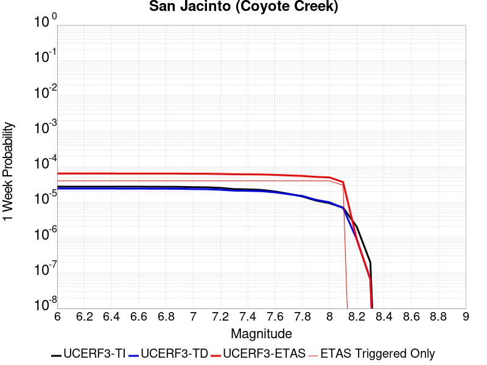 |  |  |  |

| Magnitude | 1 wk TI Prob | 1 wk TD Prob | 1 wk ETAS Prob | 1 wk ETAS/TD Gain | 1 wk ETAS Triggered Only | 1 mo TI Prob | 1 mo TD Prob | 1 mo ETAS Prob | 1 mo ETAS/TD Gain | 1 mo ETAS Triggered Only | 1 yr TI Prob | 1 yr TD Prob | 1 yr ETAS Prob | 1 yr ETAS/TD Gain | 1 yr ETAS Triggered Only | 10 yr TI Prob | 10 yr TD Prob | 10 yr ETAS Prob | 10 yr ETAS/TD Gain | 10 yr ETAS Triggered Only |
|-----|-----|-----|-----|-----|-----|-----|-----|-----|-----|-----|-----|-----|-----|-----|-----|-----|-----|-----|-----|-----|
| 6.0 | 2.7374346E-5 | 2.4145214E-5 | 1.05114916E-4 | 4.3534474 | 8.097166E-5 | 1.1731335E-4 | 1.034754E-4 | 1.8443869E-4 | 1.78244 | 8.097166E-5 | 0.0014273542 | 0.0012590875 | 0.001380392 | 1.0963433 | 1.2145749E-4 | 0.01418221 | 0.012928318 | 0.013088168 | 1.0123643 | 1.6194332E-4 |
| 6.1 | 2.7374346E-5 | 2.4145214E-5 | 1.05114916E-4 | 4.3534474 | 8.097166E-5 | 1.1731335E-4 | 1.034754E-4 | 1.8443869E-4 | 1.78244 | 8.097166E-5 | 0.0014273542 | 0.0012590875 | 0.001380392 | 1.0963433 | 1.2145749E-4 | 0.01418221 | 0.012928318 | 0.013088168 | 1.0123643 | 1.6194332E-4 |
| 6.2 | 2.7374346E-5 | 2.4145214E-5 | 1.05114916E-4 | 4.3534474 | 8.097166E-5 | 1.1731335E-4 | 1.034754E-4 | 1.8443869E-4 | 1.78244 | 8.097166E-5 | 0.0014273542 | 0.0012590875 | 0.001380392 | 1.0963433 | 1.2145749E-4 | 0.01418221 | 0.012928318 | 0.013088168 | 1.0123643 | 1.6194332E-4 |
| 6.3 | 2.7374346E-5 | 2.4145214E-5 | 1.05114916E-4 | 4.3534474 | 8.097166E-5 | 1.1731335E-4 | 1.034754E-4 | 1.8443869E-4 | 1.78244 | 8.097166E-5 | 0.0014273542 | 0.0012590875 | 0.001380392 | 1.0963433 | 1.2145749E-4 | 0.01418221 | 0.012928318 | 0.013088168 | 1.0123643 | 1.6194332E-4 |
| 6.4 | 2.7374346E-5 | 2.4145214E-5 | 1.05114916E-4 | 4.3534474 | 8.097166E-5 | 1.1731335E-4 | 1.034754E-4 | 1.8443869E-4 | 1.78244 | 8.097166E-5 | 0.0014273542 | 0.0012590875 | 0.001380392 | 1.0963433 | 1.2145749E-4 | 0.01418221 | 0.012928318 | 0.013088168 | 1.0123643 | 1.6194332E-4 |
| 6.5 | 2.7282445E-5 | 2.4031293E-5 | 1.05001E-4 | 4.369345 | 8.097166E-5 | 1.16919524E-4 | 1.029872E-4 | 1.8395053E-4 | 1.7861494 | 8.097166E-5 | 0.0014225657 | 0.0012531505 | 0.0013744559 | 1.0968002 | 1.2145749E-4 | 0.014134934 | 0.012869646 | 0.013029505 | 1.0124214 | 1.6194332E-4 |
| 6.6 | 2.7282445E-5 | 2.4031293E-5 | 1.05001E-4 | 4.369345 | 8.097166E-5 | 1.16919524E-4 | 1.029872E-4 | 1.8395053E-4 | 1.7861494 | 8.097166E-5 | 0.0014225657 | 0.0012531505 | 0.0013744559 | 1.0968002 | 1.2145749E-4 | 0.014134934 | 0.012869646 | 0.013029505 | 1.0124214 | 1.6194332E-4 |
| 6.7 | 2.7216198E-5 | 2.3956412E-5 | 1.04926134E-4 | 4.3798766 | 8.097166E-5 | 1.1663563E-4 | 1.02666316E-4 | 1.8362966E-4 | 1.7886068 | 8.097166E-5 | 0.0014191137 | 0.0012492483 | 0.0013705541 | 1.097103 | 1.2145749E-4 | 0.014100855 | 0.0128310565 | 0.012990923 | 1.0124593 | 1.6194332E-4 |
| 6.8 | 2.7078617E-5 | 2.387363E-5 | 1.04843355E-4 | 4.391597 | 8.097166E-5 | 1.1604605E-4 | 1.0231156E-4 | 1.8327494E-4 | 1.7913414 | 8.097166E-5 | 0.001411945 | 0.0012449342 | 0.0013662404 | 1.0974399 | 1.2145749E-4 | 0.014030075 | 0.012788199 | 0.012948072 | 1.0125016 | 1.6194332E-4 |
| 6.9 | 2.6982952E-5 | 2.3793142E-5 | 1.04762876E-4 | 4.4030704 | 8.097166E-5 | 1.15636096E-4 | 1.0196664E-4 | 1.8293005E-4 | 1.7940186 | 8.097166E-5 | 0.0014069602 | 0.0012407395 | 0.0013620462 | 1.0977697 | 1.2145749E-4 | 0.013980856 | 0.012746515 | 0.012906394 | 1.012543 | 1.6194332E-4 |
| 7.0 | 2.6449972E-5 | 2.3370165E-5 | 1.0433993E-4 | 4.464664 | 8.097166E-5 | 1.1335209E-4 | 1.00154015E-4 | 1.8111756E-4 | 1.8083905 | 8.097166E-5 | 0.001379188 | 0.0012186957 | 0.0013400051 | 1.0995405 | 1.2145749E-4 | 0.0137065975 | 0.0125278765 | 0.012687791 | 1.0127647 | 1.6194332E-4 |
| 7.1 | 2.6257849E-5 | 2.3196202E-5 | 1.04165985E-4 | 4.4906483 | 8.097166E-5 | 1.1252879E-4 | 9.940852E-5 | 1.8037212E-4 | 1.8144535 | 8.097166E-5 | 0.0013691769 | 0.0012096294 | 0.0013309399 | 1.1002874 | 1.2145749E-4 | 0.013607717 | 0.012437741 | 0.012597671 | 1.0128584 | 1.6194332E-4 |
| 7.2 | 2.5270041E-5 | 2.2390966E-5 | 1.0336081E-4 | 4.6161838 | 8.097166E-5 | 1.0829568E-4 | 9.595777E-5 | 1.7692166E-4 | 1.843745 | 8.097166E-5 | 0.0013177024 | 0.0011676621 | 0.0012889777 | 1.1038963 | 1.2145749E-4 | 0.013099162 | 0.012018777 | 0.012178774 | 1.0133122 | 1.6194332E-4 |
| 7.3 | 2.339701E-5 | 2.1122814E-5 | 1.0209277E-4 | 4.8332934 | 8.097166E-5 | 1.0026905E-4 | 9.0523215E-5 | 1.7148755E-4 | 1.894404 | 8.097166E-5 | 0.001220092 | 0.0011015651 | 0.0012228887 | 1.1101376 | 1.2145749E-4 | 0.012134149 | 0.011357696 | 0.011517799 | 1.0140965 | 1.6194332E-4 |
| 7.4 | 2.296333E-5 | 2.0853171E-5 | 1.0182314E-4 | 4.8828616 | 8.097166E-5 | 9.841056E-5 | 8.936768E-5 | 1.703321E-4 | 1.9059699 | 8.097166E-5 | 0.0011974899 | 0.0010875105 | 0.0012088359 | 1.1115625 | 1.2145749E-4 | 0.011910575 | 0.01121681 | 0.011376936 | 1.0142757 | 1.6194332E-4 |
| 7.5 | 2.2188895E-5 | 2.0376096E-5 | 1.0134611E-4 | 4.9737744 | 8.097166E-5 | 9.50918E-5 | 8.732321E-5 | 1.682878E-4 | 1.9271829 | 8.097166E-5 | 0.0011571277 | 0.0010626436 | 0.001183972 | 1.114176 | 1.2145749E-4 | 0.011511209 | 0.010966429 | 0.011126596 | 1.0146053 | 1.6194332E-4 |
| 7.6 | 2.0013189E-5 | 1.8962366E-5 | 9.993249E-5 | 5.2700434 | 8.097166E-5 | 8.5767984E-5 | 8.1264756E-5 | 1.6222984E-4 | 1.9963123 | 8.097166E-5 | 0.001043725 | 9.889511E-4 | 0.0011102885 | 1.122693 | 1.2145749E-4 | 0.010388365 | 0.010224434 | 0.010384721 | 1.0156769 | 1.6194332E-4 |
| 7.7 | 1.7230794E-5 | 1.674371E-5 | 9.7714015E-5 | 5.835864 | 8.097166E-5 | 7.384417E-5 | 7.175679E-5 | 1.5272264E-4 | 2.1283371 | 8.097166E-5 | 8.986819E-4 | 8.7328954E-4 | 9.94641E-4 | 1.1389589 | 1.2145749E-4 | 0.008950562 | 0.009062956 | 0.009223432 | 1.0177068 | 1.6194332E-4 |
| 7.8 | 1.4478809E-5 | 1.4990978E-5 | 9.5961426E-5 | 6.4012785 | 8.097166E-5 | 6.205057E-5 | 6.424547E-5 | 1.4521193E-4 | 2.2602673 | 8.097166E-5 | 7.552038E-4 | 7.819085E-4 | 9.032711E-4 | 1.1552132 | 1.2145749E-4 | 0.0075264242 | 0.008141387 | 0.008302012 | 1.0197294 | 1.6194332E-4 |
| 7.9 | 1.1114467E-5 | 1.1645102E-5 | 9.261582E-5 | 7.9531994 | 8.097166E-5 | 4.7632562E-5 | 4.990663E-5 | 1.3087425E-4 | 2.6223822 | 8.097166E-5 | 5.797721E-4 | 6.074444E-4 | 7.288281E-4 | 1.1998268 | 1.2145749E-4 | 0.0057826187 | 0.0063803247 | 0.006541235 | 1.0252197 | 1.6194332E-4 |
| 8.0 | 9.327402E-6 | 9.899186E-6 | 9.0870046E-5 | 9.179547 | 8.097166E-5 | 3.9973966E-5 | 4.2424395E-5 | 1.2339262E-4 | 2.9085298 | 8.097166E-5 | 4.8657437E-4 | 5.1639514E-4 | 5.97325E-4 | 1.1567208 | 8.097166E-5 | 0.0048551033 | 0.0054499684 | 0.005570764 | 1.0221645 | 1.2145749E-4 |
| 8.1 | 7.0235833E-6 | 6.827495E-6 | 8.77986E-5 | 12.859563 | 8.097166E-5 | 3.0100724E-5 | 2.9260367E-5 | 1.1022966E-4 | 3.7672 | 8.097166E-5 | 3.664147E-4 | 3.5618723E-4 | 4.3713007E-4 | 1.227248 | 8.097166E-5 | 0.003658111 | 0.0037876023 | 0.0039085997 | 1.0319457 | 1.2145749E-4 |
| 8.2 | 2.0358202E-6 | 8.994527E-7 | 8.994527E-7 | 1.0 | 0.0 | 8.724915E-6 | 3.854792E-6 | 3.854792E-6 | 1.0 | 0.0 | 1.06220665E-4 | 4.69311E-5 | 4.69311E-5 | 1.0 | 0.0 | 0.001061699 | 5.3254166E-4 | 5.3254166E-4 | 1.0 | 0.0 |
| 8.3 | 2.0051264E-7 | 6.617272E-8 | 6.617272E-8 | 1.0 | 0.0 | 8.5933965E-7 | 2.8359733E-7 | 2.8359733E-7 | 1.0 | 0.0 | 1.046241E-5 | 3.4527925E-6 | 3.4527925E-6 | 1.0 | 0.0 | 1.0461917E-4 | 4.01389E-5 | 4.01389E-5 | 1.0 | 0.0 |

## Sheephole
*[(top)](#table-of-contents)*

| 1 Week | 1 Month | 1 Year | 10 Year |
|-----|-----|-----|-----|
|  |  | 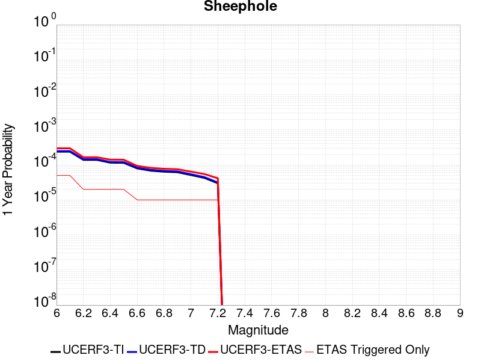 | 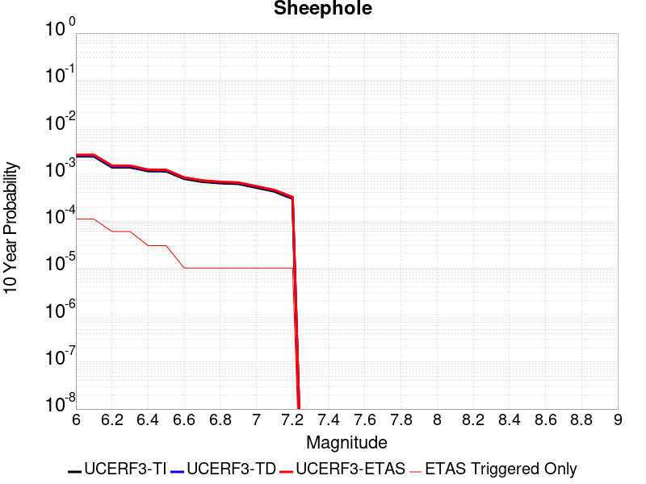 |

| Magnitude | 1 wk TI Prob | 1 wk TD Prob | 1 wk ETAS Prob | 1 wk ETAS/TD Gain | 1 wk ETAS Triggered Only | 1 mo TI Prob | 1 mo TD Prob | 1 mo ETAS Prob | 1 mo ETAS/TD Gain | 1 mo ETAS Triggered Only | 1 yr TI Prob | 1 yr TD Prob | 1 yr ETAS Prob | 1 yr ETAS/TD Gain | 1 yr ETAS Triggered Only | 10 yr TI Prob | 10 yr TD Prob | 10 yr ETAS Prob | 10 yr ETAS/TD Gain | 10 yr ETAS Triggered Only |
|-----|-----|-----|-----|-----|-----|-----|-----|-----|-----|-----|-----|-----|-----|-----|-----|-----|-----|-----|-----|-----|
| 6.0 | 4.5579695E-6 | 4.7412627E-6 | 4.7412627E-6 | 1.0 | 0.0 | 1.9534009E-5 | 2.031957E-5 | 2.031957E-5 | 1.0 | 0.0 | 2.3780059E-4 | 2.473682E-4 | 3.2831985E-4 | 1.3272516 | 8.097166E-5 | 0.0023754628 | 0.002471473 | 0.0025926305 | 1.0490223 | 1.2145749E-4 |
| 6.1 | 4.5579695E-6 | 4.7412627E-6 | 4.7412627E-6 | 1.0 | 0.0 | 1.9534009E-5 | 2.031957E-5 | 2.031957E-5 | 1.0 | 0.0 | 2.3780059E-4 | 2.473682E-4 | 3.2831985E-4 | 1.3272516 | 8.097166E-5 | 0.0023754628 | 0.002471473 | 0.0025926305 | 1.0490223 | 1.2145749E-4 |
| 6.2 | 2.6677674E-6 | 2.7873941E-6 | 2.7873941E-6 | 1.0 | 0.0 | 1.1433239E-5 | 1.1945926E-5 | 1.1945926E-5 | 1.0 | 0.0 | 1.3919079E-4 | 1.4543302E-4 | 2.263929E-4 | 1.5566815 | 8.097166E-5 | 0.0013910364 | 0.0014534844 | 0.0015747653 | 1.0834415 | 1.2145749E-4 |
| 6.3 | 2.6677674E-6 | 2.7873941E-6 | 2.7873941E-6 | 1.0 | 0.0 | 1.1433239E-5 | 1.1945926E-5 | 1.1945926E-5 | 1.0 | 0.0 | 1.3919079E-4 | 1.4543302E-4 | 2.263929E-4 | 1.5566815 | 8.097166E-5 | 0.0013910364 | 0.0014534844 | 0.0015747653 | 1.0834415 | 1.2145749E-4 |
| 6.4 | 2.2159759E-6 | 2.3228788E-6 | 2.3228788E-6 | 1.0 | 0.0 | 9.497005E-6 | 9.955161E-6 | 9.955161E-6 | 1.0 | 0.0 | 1.156199E-4 | 1.2119815E-4 | 2.0216E-4 | 1.6680123 | 8.097166E-5 | 0.0011555976 | 0.0012113999 | 0.0012922735 | 1.0667604 | 8.097166E-5 |
| 6.5 | 2.1986082E-6 | 2.304759E-6 | 2.304759E-6 | 1.0 | 0.0 | 9.4225725E-6 | 9.877506E-6 | 9.877506E-6 | 1.0 | 0.0 | 1.1471378E-4 | 1.2025281E-4 | 2.0121473E-4 | 1.6732643 | 8.097166E-5 | 0.0011465458 | 0.0012019566 | 0.001282831 | 1.0672855 | 8.097166E-5 |
| 6.6 | 1.5232331E-6 | 1.6018919E-6 | 1.6018919E-6 | 1.0 | 0.0 | 6.5281256E-6 | 6.865234E-6 | 6.865234E-6 | 1.0 | 0.0 | 7.947703E-5 | 8.35812E-5 | 1.2406365E-4 | 1.4843487 | 4.048583E-5 | 7.9448614E-4 | 8.3551643E-4 | 8.759684E-4 | 1.0484155 | 4.048583E-5 |
| 6.7 | 1.3137362E-6 | 1.382819E-6 | 1.382819E-6 | 1.0 | 0.0 | 5.6302856E-6 | 5.926355E-6 | 5.926355E-6 | 1.0 | 0.0 | 6.854657E-5 | 7.215112E-5 | 1.1263403E-4 | 1.561085 | 4.048583E-5 | 6.8525434E-4 | 7.212908E-4 | 7.617475E-4 | 1.0560892 | 4.048583E-5 |
| 6.8 | 1.2275751E-6 | 1.2922847E-6 | 1.2922847E-6 | 1.0 | 0.0 | 5.2610258E-6 | 5.5383516E-6 | 5.5383516E-6 | 1.0 | 0.0 | 6.4051106E-5 | 6.7427485E-5 | 1.0791058E-4 | 1.6003946 | 4.048583E-5 | 6.4032647E-4 | 6.740836E-4 | 7.145421E-4 | 1.0600201 | 4.048583E-5 |
| 6.9 | 1.1837088E-6 | 1.246102E-6 | 1.246102E-6 | 1.0 | 0.0 | 5.0730278E-6 | 5.340427E-6 | 5.340427E-6 | 1.0 | 0.0 | 6.176237E-5 | 6.501789E-5 | 1.0550109E-4 | 1.622647 | 4.048583E-5 | 6.17452E-4 | 6.5000186E-4 | 6.9046137E-4 | 1.0622452 | 4.048583E-5 |
| 7.0 | 9.849371E-7 | 1.0366288E-6 | 1.0366288E-6 | 1.0 | 0.0 | 4.2211523E-6 | 4.442688E-6 | 4.442688E-6 | 1.0 | 0.0 | 5.1391315E-5 | 5.4088487E-5 | 9.4572126E-5 | 1.7484705 | 4.048583E-5 | 5.137943E-4 | 5.407633E-4 | 5.8122724E-4 | 1.0748274 | 4.048583E-5 |
| 7.1 | 8.1643645E-7 | 8.591669E-7 | 8.591669E-7 | 1.0 | 0.0 | 3.4990085E-6 | 3.682139E-6 | 3.682139E-6 | 1.0 | 0.0 | 4.2599597E-5 | 4.482921E-5 | 8.531322E-5 | 1.9030722 | 4.048583E-5 | 4.259143E-4 | 4.4821028E-4 | 4.88678E-4 | 1.0902873 | 4.048583E-5 |
| 7.2 | 5.7295756E-7 | 6.029502E-7 | 6.029502E-7 | 1.0 | 0.0 | 2.45553E-6 | 2.58407E-6 | 2.58407E-6 | 1.0 | 0.0 | 2.9895667E-5 | 3.1460666E-5 | 7.194522E-5 | 2.286831 | 4.048583E-5 | 2.9891645E-4 | 3.145688E-4 | 3.550419E-4 | 1.1286621 | 4.048583E-5 |

## Owens Valley
*[(top)](#table-of-contents)*

| 1 Week | 1 Month | 1 Year | 10 Year |
|-----|-----|-----|-----|
|  |  |  |  |

| Magnitude | 1 wk TI Prob | 1 wk TD Prob | 1 wk ETAS Prob | 1 wk ETAS/TD Gain | 1 wk ETAS Triggered Only | 1 mo TI Prob | 1 mo TD Prob | 1 mo ETAS Prob | 1 mo ETAS/TD Gain | 1 mo ETAS Triggered Only | 1 yr TI Prob | 1 yr TD Prob | 1 yr ETAS Prob | 1 yr ETAS/TD Gain | 1 yr ETAS Triggered Only | 10 yr TI Prob | 10 yr TD Prob | 10 yr ETAS Prob | 10 yr ETAS/TD Gain | 10 yr ETAS Triggered Only |
|-----|-----|-----|-----|-----|-----|-----|-----|-----|-----|-----|-----|-----|-----|-----|-----|-----|-----|-----|-----|-----|
| 6.0 | 4.83821E-5 | 3.626567E-6 | 1.655693E-4 | 45.654556 | 1.6194332E-4 | 2.0733538E-4 | 1.5542342E-5 | 1.7748315E-4 | 11.419331 | 1.6194332E-4 | 0.002521386 | 1.8921259E-4 | 3.5112526E-4 | 1.8557184 | 1.6194332E-4 | 0.024929691 | 0.001925011 | 0.0020866427 | 1.083964 | 1.6194332E-4 |
| 6.1 | 4.83821E-5 | 3.626567E-6 | 1.655693E-4 | 45.654556 | 1.6194332E-4 | 2.0733538E-4 | 1.5542342E-5 | 1.7748315E-4 | 11.419331 | 1.6194332E-4 | 0.002521386 | 1.8921259E-4 | 3.5112526E-4 | 1.8557184 | 1.6194332E-4 | 0.024929691 | 0.001925011 | 0.0020866427 | 1.083964 | 1.6194332E-4 |
| 6.2 | 4.83821E-5 | 3.626567E-6 | 1.655693E-4 | 45.654556 | 1.6194332E-4 | 2.0733538E-4 | 1.5542342E-5 | 1.7748315E-4 | 11.419331 | 1.6194332E-4 | 0.002521386 | 1.8921259E-4 | 3.5112526E-4 | 1.8557184 | 1.6194332E-4 | 0.024929691 | 0.001925011 | 0.0020866427 | 1.083964 | 1.6194332E-4 |
| 6.3 | 3.953008E-5 | 3.1553948E-6 | 1.246125E-4 | 39.49189 | 1.2145749E-4 | 1.6940363E-4 | 1.3523055E-5 | 1.3497891E-4 | 9.981391 | 1.2145749E-4 | 0.002060538 | 1.6463149E-4 | 2.8606897E-4 | 1.7376323 | 1.2145749E-4 | 0.020415364 | 0.0016592 | 0.0017804559 | 1.073081 | 1.2145749E-4 |
| 6.4 | 3.953008E-5 | 3.1553948E-6 | 1.246125E-4 | 39.49189 | 1.2145749E-4 | 1.6940363E-4 | 1.3523055E-5 | 1.3497891E-4 | 9.981391 | 1.2145749E-4 | 0.002060538 | 1.6463149E-4 | 2.8606897E-4 | 1.7376323 | 1.2145749E-4 | 0.020415364 | 0.0016592 | 0.0017804559 | 1.073081 | 1.2145749E-4 |
| 6.5 | 3.457342E-5 | 2.9715961E-6 | 1.2442873E-4 | 41.87269 | 1.2145749E-4 | 1.4816338E-4 | 1.2735354E-5 | 1.341913E-4 | 10.536911 | 1.2145749E-4 | 0.0018023965 | 1.550426E-4 | 2.7648127E-4 | 1.78326 | 1.2145749E-4 | 0.017878477 | 0.001555719 | 0.0016769875 | 1.0779501 | 1.2145749E-4 |
| 6.6 | 3.1127765E-5 | 2.8744932E-6 | 1.2433164E-4 | 43.25341 | 1.2145749E-4 | 1.3339789E-4 | 1.2319203E-5 | 1.3377519E-4 | 10.859079 | 1.2145749E-4 | 0.0016229092 | 1.4997667E-4 | 2.7141592E-4 | 1.8097211 | 1.2145749E-4 | 0.016111081 | 0.0015012559 | 0.001622531 | 1.0807824 | 1.2145749E-4 |
| 6.7 | 2.806885E-5 | 2.8104134E-6 | 1.2426756E-4 | 44.216827 | 1.2145749E-4 | 1.2028952E-4 | 1.20445775E-5 | 1.3350061E-4 | 11.083877 | 1.2145749E-4 | 0.001463541 | 1.4663354E-4 | 2.6807323E-4 | 1.8281848 | 1.2145749E-4 | 0.014539397 | 0.0014657511 | 0.0015870305 | 1.0827422 | 1.2145749E-4 |
| 6.8 | 2.524524E-5 | 2.2353688E-6 | 1.2369259E-4 | 55.33431 | 1.2145749E-4 | 1.0818939E-4 | 9.580118E-6 | 1.3103645E-4 | 13.677957 | 1.2145749E-4 | 0.0013164099 | 1.16632E-4 | 2.3807533E-4 | 2.0412521 | 1.2145749E-4 | 0.01308639 | 0.0011659812 | 0.001287297 | 1.1040462 | 1.2145749E-4 |
| 6.9 | 2.2704568E-5 | 1.6081682E-6 | 1.2306546E-4 | 76.52524 | 1.2145749E-4 | 9.730166E-5 | 6.8921313E-6 | 1.2834878E-4 | 18.622509 | 1.2145749E-4 | 0.0011840039 | 8.390849E-5 | 2.0535578E-4 | 2.447378 | 1.2145749E-4 | 0.011777153 | 8.3897985E-4 | 9.603354E-4 | 1.1446466 | 1.2145749E-4 |
| 7.0 | 2.0871712E-5 | 1.5395453E-6 | 1.2299685E-4 | 79.89167 | 1.2145749E-4 | 8.944713E-5 | 6.598035E-6 | 1.2805473E-4 | 19.40801 | 1.2145749E-4 | 0.0010884746 | 8.032813E-5 | 2.0177587E-4 | 2.5118954 | 1.2145749E-4 | 0.010831586 | 8.0316263E-4 | 9.245226E-4 | 1.1511025 | 1.2145749E-4 |
| 7.1 | 1.944928E-5 | 1.3864178E-6 | 1.2284373E-4 | 88.60514 | 1.2145749E-4 | 8.335139E-5 | 5.941777E-6 | 1.2739854E-4 | 21.441153 | 1.2145749E-4 | 0.0010143308 | 7.233874E-5 | 1.9378745E-4 | 2.6788888 | 1.2145749E-4 | 0.010097133 | 7.2330976E-4 | 8.4467937E-4 | 1.1677976 | 1.2145749E-4 |
| 7.2 | 1.7876306E-5 | 1.2489141E-6 | 1.2270625E-4 | 98.25035 | 1.2145749E-4 | 7.6610486E-5 | 5.352478E-6 | 1.2680932E-4 | 23.691702 | 1.2145749E-4 | 9.3233347E-4 | 6.516448E-5 | 1.8661405E-4 | 2.8637388 | 1.2145749E-4 | 0.009284316 | 6.5159105E-4 | 7.729694E-4 | 1.18628 | 1.2145749E-4 |
| 7.3 | 1.2618672E-5 | 1.1115209E-6 | 1.2256888E-4 | 110.271324 | 1.2145749E-4 | 5.40789E-5 | 4.763652E-6 | 1.2622056E-4 | 26.496595 | 1.2145749E-4 | 6.582117E-4 | 5.799593E-5 | 1.7944638E-4 | 3.0941203 | 1.2145749E-4 | 0.0065626553 | 5.7994033E-4 | 7.013274E-4 | 1.2093096 | 1.2145749E-4 |
| 7.4 | 7.4874442E-6 | 8.5486437E-7 | 8.182645E-5 | 95.718636 | 8.097166E-5 | 3.208865E-5 | 3.6636993E-6 | 8.463506E-5 | 23.100985 | 8.097166E-5 | 3.906093E-4 | 4.4604632E-5 | 1.2557268E-4 | 2.8152385 | 8.097166E-5 | 0.003899234 | 4.4604883E-4 | 5.269844E-4 | 1.18145 | 8.097166E-5 |
| 7.5 | 2.4734156E-6 | 6.068616E-7 | 8.157847E-5 | 134.42682 | 8.097166E-5 | 1.060031E-5 | 2.6008327E-6 | 8.357228E-5 | 32.132893 | 8.097166E-5 | 1.2905113E-4 | 3.166468E-5 | 1.1263378E-4 | 3.557079 | 8.097166E-5 | 0.0012897621 | 3.1660203E-4 | 3.9754805E-4 | 1.2556713 | 8.097166E-5 |
| 7.6 | 1.1328841E-6 | 3.196531E-7 | 3.196531E-7 | 1.0 | 0.0 | 4.8552088E-6 | 1.3699412E-6 | 1.3699412E-6 | 1.0 | 0.0 | 5.9110564E-5 | 1.6678909E-5 | 1.6678909E-5 | 1.0 | 0.0 | 5.9094845E-4 | 1.6677675E-4 | 1.6677675E-4 | 1.0 | 0.0 |
| 7.7 | 4.8613185E-7 | 8.964689E-8 | 8.964689E-8 | 1.0 | 0.0 | 2.0834207E-6 | 3.8420092E-7 | 3.8420092E-7 | 1.0 | 0.0 | 2.536535E-5 | 4.6776368E-6 | 4.6776368E-6 | 1.0 | 0.0 | 2.5362454E-4 | 4.677545E-5 | 4.677545E-5 | 1.0 | 0.0 |

## San Jacinto (Borrego)
*[(top)](#table-of-contents)*

| 1 Week | 1 Month | 1 Year | 10 Year |
|-----|-----|-----|-----|
|  |  |  |  |

| Magnitude | 1 wk TI Prob | 1 wk TD Prob | 1 wk ETAS Prob | 1 wk ETAS/TD Gain | 1 wk ETAS Triggered Only | 1 mo TI Prob | 1 mo TD Prob | 1 mo ETAS Prob | 1 mo ETAS/TD Gain | 1 mo ETAS Triggered Only | 1 yr TI Prob | 1 yr TD Prob | 1 yr ETAS Prob | 1 yr ETAS/TD Gain | 1 yr ETAS Triggered Only | 10 yr TI Prob | 10 yr TD Prob | 10 yr ETAS Prob | 10 yr ETAS/TD Gain | 10 yr ETAS Triggered Only |
|-----|-----|-----|-----|-----|-----|-----|-----|-----|-----|-----|-----|-----|-----|-----|-----|-----|-----|-----|-----|-----|
| 6.0 | 3.543992E-5 | 2.7926513E-5 | 1.0889591E-4 | 3.8993738 | 8.097166E-5 | 1.5187653E-4 | 1.1967963E-4 | 2.006416E-4 | 1.6764891 | 8.097166E-5 | 0.0018475284 | 0.0014561379 | 0.0015774184 | 1.0832893 | 1.2145749E-4 | 0.018322436 | 0.014869647 | 0.015029183 | 1.010729 | 1.6194332E-4 |
| 6.1 | 3.542281E-5 | 2.7926513E-5 | 1.0889591E-4 | 3.8993738 | 8.097166E-5 | 1.5180321E-4 | 1.1967963E-4 | 2.006416E-4 | 1.6764891 | 8.097166E-5 | 0.0018466372 | 0.0014561379 | 0.0015774184 | 1.0832893 | 1.2145749E-4 | 0.018313672 | 0.014869647 | 0.015029183 | 1.010729 | 1.6194332E-4 |
| 6.2 | 3.4688688E-5 | 2.7926511E-5 | 1.0889591E-4 | 3.8993738 | 8.097166E-5 | 1.4865733E-4 | 1.1967963E-4 | 2.006416E-4 | 1.6764891 | 8.097166E-5 | 0.0018084005 | 0.0014561379 | 0.0015774184 | 1.0832893 | 1.2145749E-4 | 0.017937548 | 0.014869647 | 0.015029183 | 1.010729 | 1.6194332E-4 |
| 6.3 | 3.2087122E-5 | 2.7771865E-5 | 1.08741275E-4 | 3.9155195 | 8.097166E-5 | 1.3750899E-4 | 1.1901691E-4 | 1.9997894E-4 | 1.6802565 | 8.097166E-5 | 0.0016728862 | 0.00144808 | 0.0015693615 | 1.0837533 | 1.2145749E-4 | 0.016603488 | 0.014790683 | 0.014950231 | 1.010787 | 1.6194332E-4 |
| 6.4 | 3.1828724E-5 | 2.7738852E-5 | 1.08708264E-4 | 3.9189894 | 8.097166E-5 | 1.364017E-4 | 1.1887544E-4 | 1.9983748E-4 | 1.6810662 | 8.097166E-5 | 0.0016594254 | 0.0014463598 | 0.0015676416 | 1.0838531 | 1.2145749E-4 | 0.016470885 | 0.014773762 | 0.014933312 | 1.0107996 | 1.6194332E-4 |
| 6.5 | 3.1563577E-5 | 2.747857E-5 | 1.08448E-4 | 3.9466393 | 8.097166E-5 | 1.3526545E-4 | 1.1776006E-4 | 1.9872218E-4 | 1.6875178 | 8.097166E-5 | 0.0016456128 | 0.0014327979 | 0.0015540813 | 1.084648 | 1.2145749E-4 | 0.0163348 | 0.014640348 | 0.01479992 | 1.0108995 | 1.6194332E-4 |
| 6.6 | 3.1467625E-5 | 2.7322796E-5 | 1.08292246E-4 | 3.9634395 | 8.097166E-5 | 1.3485427E-4 | 1.1709251E-4 | 1.9805468E-4 | 1.6914377 | 8.097166E-5 | 0.0016406142 | 0.0014246812 | 0.0015459657 | 1.0851309 | 1.2145749E-4 | 0.016285548 | 0.014560594 | 0.01472018 | 1.0109601 | 1.6194332E-4 |
| 6.7 | 3.1223695E-5 | 2.6940816E-5 | 1.07910295E-4 | 4.005458 | 8.097166E-5 | 1.3380898E-4 | 1.15455594E-4 | 1.9641791E-4 | 1.701242 | 8.097166E-5 | 0.0016279068 | 0.0014047775 | 0.0015260645 | 1.0863389 | 1.2145749E-4 | 0.01616033 | 0.014364966 | 0.014524583 | 1.0111115 | 1.6194332E-4 |
| 6.8 | 3.1015585E-5 | 2.6761822E-5 | 1.0773131E-4 | 4.02556 | 8.097166E-5 | 1.3291716E-4 | 1.1468855E-4 | 1.9565092E-4 | 1.7059325 | 8.097166E-5 | 0.001617065 | 0.0013954508 | 0.0015167388 | 1.0869167 | 1.2145749E-4 | 0.016053487 | 0.014272246 | 0.014431878 | 1.0111848 | 1.6194332E-4 |
| 6.9 | 2.6641965E-5 | 2.2184247E-5 | 1.0315411E-4 | 4.6498814 | 8.097166E-5 | 1.1417485E-4 | 9.50719E-5 | 1.7603586E-4 | 1.8516077 | 8.097166E-5 | 0.0013891924 | 0.0011568897 | 0.0012782066 | 1.1048648 | 1.2145749E-4 | 0.0138054015 | 0.011882438 | 0.012042457 | 1.0134668 | 1.6194332E-4 |
| 7.0 | 2.3854353E-5 | 2.0479023E-5 | 1.01449026E-4 | 4.953802 | 8.097166E-5 | 1.02228936E-4 | 8.77643E-5 | 1.6872886E-4 | 1.9225225 | 8.097166E-5 | 0.0012439266 | 0.0010680092 | 0.001189337 | 1.1136018 | 1.2145749E-4 | 0.012369866 | 0.0109828 | 0.011142965 | 1.0145832 | 1.6194332E-4 |
| 7.1 | 2.3672901E-5 | 2.031551E-5 | 1.0128553E-4 | 4.9856253 | 8.097166E-5 | 1.0145135E-4 | 8.7063585E-5 | 1.680282E-4 | 1.9299481 | 8.097166E-5 | 0.0012344702 | 0.0010594862 | 0.001180815 | 1.1145166 | 1.2145749E-4 | 0.0122763505 | 0.010897976 | 0.0110581545 | 1.014698 | 1.6194332E-4 |
| 7.2 | 2.2717244E-5 | 1.9542893E-5 | 1.0051297E-4 | 5.143198 | 8.097166E-5 | 9.735599E-5 | 8.375258E-5 | 1.6471745E-4 | 1.9667151 | 8.097166E-5 | 0.0011846646 | 0.001019213 | 0.0011405466 | 1.1190464 | 1.2145749E-4 | 0.01178369 | 0.010495341 | 0.010655585 | 1.0152681 | 1.6194332E-4 |
| 7.3 | 2.1016205E-5 | 1.8384526E-5 | 9.93547E-5 | 5.404257 | 8.097166E-5 | 9.006634E-5 | 7.878846E-5 | 1.5975373E-4 | 2.0276287 | 8.097166E-5 | 0.001096006 | 9.5882936E-4 | 0.0010801704 | 1.1265513 | 1.2145749E-4 | 0.010906163 | 0.009890967 | 0.010051308 | 1.0162109 | 1.6194332E-4 |
| 7.4 | 2.0683625E-5 | 1.8187047E-5 | 9.915724E-5 | 5.45208 | 8.097166E-5 | 8.86411E-5 | 7.794217E-5 | 1.5890753E-4 | 2.0387874 | 8.097166E-5 | 0.001078671 | 9.485349E-4 | 0.0010698772 | 1.127926 | 1.2145749E-4 | 0.010734501 | 0.009787692 | 0.009948051 | 1.0163836 | 1.6194332E-4 |
| 7.5 | 1.9993966E-5 | 1.7782075E-5 | 9.8752294E-5 | 5.5534744 | 8.097166E-5 | 8.568561E-5 | 7.620667E-5 | 1.5717217E-4 | 2.062446 | 8.097166E-5 | 0.001042723 | 9.2742336E-4 | 0.0010487682 | 1.1308409 | 1.2145749E-4 | 0.010378438 | 0.009574614 | 0.009735007 | 1.0167519 | 1.6194332E-4 |
| 7.6 | 1.788966E-5 | 1.6435291E-5 | 9.740562E-5 | 5.926614 | 8.097166E-5 | 7.666772E-5 | 7.043507E-5 | 1.5140102E-4 | 2.149512 | 8.097166E-5 | 9.3302975E-4 | 8.572113E-4 | 9.785647E-4 | 1.1415676 | 1.2145749E-4 | 0.00929122 | 0.008866487 | 0.009026994 | 1.0181028 | 1.6194332E-4 |
| 7.7 | 1.5125781E-5 | 1.4237377E-5 | 9.5207884E-5 | 6.6871786 | 8.097166E-5 | 6.4823165E-5 | 6.1015908E-5 | 1.4198263E-4 | 2.3269773 | 8.097166E-5 | 7.889362E-4 | 7.426163E-4 | 8.639836E-4 | 1.163432 | 1.2145749E-4 | 0.007861412 | 0.0077142045 | 0.007874899 | 1.020831 | 1.6194332E-4 |
| 7.8 | 1.250089E-5 | 1.26304985E-5 | 9.3601135E-5 | 7.4107237 | 8.097166E-5 | 5.3574146E-5 | 5.412959E-5 | 1.3509687E-4 | 2.4958043 | 8.097166E-5 | 6.5207E-4 | 6.588291E-4 | 7.802066E-4 | 1.1842321 | 1.2145749E-4 | 0.006501599 | 0.0068677636 | 0.0070285946 | 1.0234183 | 1.6194332E-4 |
| 7.9 | 9.561E-6 | 9.754616E-6 | 9.072549E-5 | 9.300775 | 8.097166E-5 | 4.0975072E-5 | 4.1804833E-5 | 1.2277311E-4 | 2.9368162 | 8.097166E-5 | 4.987573E-4 | 5.088555E-4 | 6.302512E-4 | 1.2385662 | 1.2145749E-4 | 0.0049763937 | 0.0053523467 | 0.005513423 | 1.0300946 | 1.6194332E-4 |
| 8.0 | 8.01699E-6 | 8.293488E-6 | 8.9264475E-5 | 10.763202 | 8.097166E-5 | 3.4358076E-5 | 3.554304E-5 | 1.16511816E-4 | 3.278049 | 8.097166E-5 | 4.1822926E-4 | 4.3265108E-4 | 5.135877E-4 | 1.1870713 | 8.097166E-5 | 0.0041744304 | 0.004573375 | 0.004694277 | 1.0264361 | 1.2145749E-4 |
| 8.1 | 6.541947E-6 | 6.4622354E-6 | 8.743337E-5 | 13.529896 | 8.097166E-5 | 2.8036617E-5 | 2.7695003E-5 | 1.0866442E-4 | 3.923611 | 8.097166E-5 | 3.4129233E-4 | 3.37135E-4 | 4.1807935E-4 | 1.2400948 | 8.097166E-5 | 0.0034076865 | 0.0035806994 | 0.003701722 | 1.0337986 | 1.2145749E-4 |
| 8.2 | 1.7968189E-6 | 7.9713476E-7 | 7.9713476E-7 | 1.0 | 0.0 | 7.70063E-6 | 3.4162877E-6 | 3.4162877E-6 | 1.0 | 0.0 | 9.3751136E-5 | 4.159253E-5 | 4.159253E-5 | 1.0 | 0.0 | 9.371159E-4 | 4.712058E-4 | 4.712058E-4 | 1.0 | 0.0 |
| 8.3 | 1.5167889E-7 | 4.897714E-8 | 4.897714E-8 | 1.0 | 0.0 | 6.500522E-7 | 2.09902E-7 | 2.09902E-7 | 1.0 | 0.0 | 7.9143565E-6 | 2.5555544E-6 | 2.5555544E-6 | 1.0 | 0.0 | 7.914075E-5 | 2.969505E-5 | 2.969505E-5 | 1.0 | 0.0 |

## San Cayetano
*[(top)](#table-of-contents)*

| 1 Week | 1 Month | 1 Year | 10 Year |
|-----|-----|-----|-----|
| 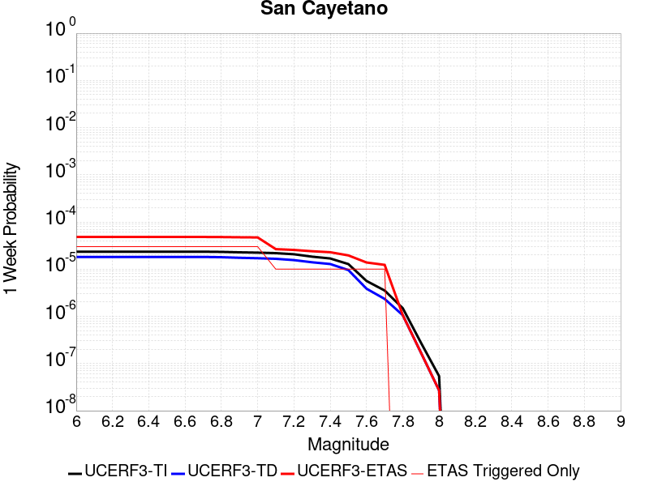 |  | 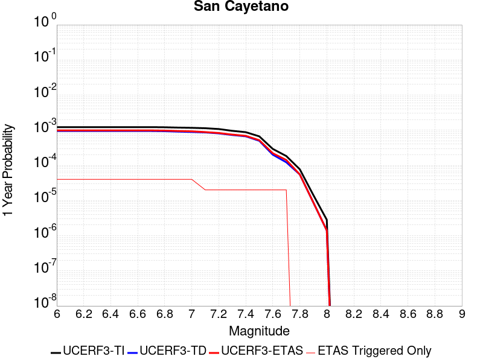 |  |

| Magnitude | 1 wk TI Prob | 1 wk TD Prob | 1 wk ETAS Prob | 1 wk ETAS/TD Gain | 1 wk ETAS Triggered Only | 1 mo TI Prob | 1 mo TD Prob | 1 mo ETAS Prob | 1 mo ETAS/TD Gain | 1 mo ETAS Triggered Only | 1 yr TI Prob | 1 yr TD Prob | 1 yr ETAS Prob | 1 yr ETAS/TD Gain | 1 yr ETAS Triggered Only | 10 yr TI Prob | 10 yr TD Prob | 10 yr ETAS Prob | 10 yr ETAS/TD Gain | 10 yr ETAS Triggered Only |
|-----|-----|-----|-----|-----|-----|-----|-----|-----|-----|-----|-----|-----|-----|-----|-----|-----|-----|-----|-----|-----|
| 6.0 | 2.3476267E-5 | 1.816928E-5 | 9.913947E-5 | 5.456434 | 8.097166E-5 | 1.0060869E-4 | 7.786603E-5 | 1.5883139E-4 | 2.0398033 | 8.097166E-5 | 0.0012242225 | 9.476103E-4 | 0.0010285053 | 1.0853673 | 8.097166E-5 | 0.012175002 | 0.009436584 | 0.009597 | 1.0169992 | 1.6194332E-4 |
| 6.1 | 2.3476267E-5 | 1.816928E-5 | 9.913947E-5 | 5.456434 | 8.097166E-5 | 1.0060869E-4 | 7.786603E-5 | 1.5883139E-4 | 2.0398033 | 8.097166E-5 | 0.0012242225 | 9.476103E-4 | 0.0010285053 | 1.0853673 | 8.097166E-5 | 0.012175002 | 0.009436584 | 0.009597 | 1.0169992 | 1.6194332E-4 |
| 6.2 | 2.3476267E-5 | 1.816928E-5 | 9.913947E-5 | 5.456434 | 8.097166E-5 | 1.0060869E-4 | 7.786603E-5 | 1.5883139E-4 | 2.0398033 | 8.097166E-5 | 0.0012242225 | 9.476103E-4 | 0.0010285053 | 1.0853673 | 8.097166E-5 | 0.012175002 | 0.009436584 | 0.009597 | 1.0169992 | 1.6194332E-4 |
| 6.3 | 2.3476267E-5 | 1.816928E-5 | 9.913947E-5 | 5.456434 | 8.097166E-5 | 1.0060869E-4 | 7.786603E-5 | 1.5883139E-4 | 2.0398033 | 8.097166E-5 | 0.0012242225 | 9.476103E-4 | 0.0010285053 | 1.0853673 | 8.097166E-5 | 0.012175002 | 0.009436584 | 0.009597 | 1.0169992 | 1.6194332E-4 |
| 6.4 | 2.3476267E-5 | 1.816928E-5 | 9.913947E-5 | 5.456434 | 8.097166E-5 | 1.0060869E-4 | 7.786603E-5 | 1.5883139E-4 | 2.0398033 | 8.097166E-5 | 0.0012242225 | 9.476103E-4 | 0.0010285053 | 1.0853673 | 8.097166E-5 | 0.012175002 | 0.009436584 | 0.009597 | 1.0169992 | 1.6194332E-4 |
| 6.5 | 2.3476267E-5 | 1.816928E-5 | 9.913947E-5 | 5.456434 | 8.097166E-5 | 1.0060869E-4 | 7.786603E-5 | 1.5883139E-4 | 2.0398033 | 8.097166E-5 | 0.0012242225 | 9.476103E-4 | 0.0010285053 | 1.0853673 | 8.097166E-5 | 0.012175002 | 0.009436584 | 0.009597 | 1.0169992 | 1.6194332E-4 |
| 6.6 | 2.3476267E-5 | 1.816928E-5 | 9.913947E-5 | 5.456434 | 8.097166E-5 | 1.0060869E-4 | 7.786603E-5 | 1.5883139E-4 | 2.0398033 | 8.097166E-5 | 0.0012242225 | 9.476103E-4 | 0.0010285053 | 1.0853673 | 8.097166E-5 | 0.012175002 | 0.009436584 | 0.009597 | 1.0169992 | 1.6194332E-4 |
| 6.7 | 2.3476267E-5 | 1.816928E-5 | 9.913947E-5 | 5.456434 | 8.097166E-5 | 1.0060869E-4 | 7.786603E-5 | 1.5883139E-4 | 2.0398033 | 8.097166E-5 | 0.0012242225 | 9.476103E-4 | 0.0010285053 | 1.0853673 | 8.097166E-5 | 0.012175002 | 0.009436584 | 0.009597 | 1.0169992 | 1.6194332E-4 |
| 6.8 | 2.3241924E-5 | 1.7936987E-5 | 9.890719E-5 | 5.5141478 | 8.097166E-5 | 9.960445E-5 | 7.687056E-5 | 1.57836E-4 | 2.0532699 | 8.097166E-5 | 0.0012120095 | 9.3550084E-4 | 0.0010163967 | 1.0864733 | 8.097166E-5 | 0.012054204 | 0.009316482 | 0.009476917 | 1.0172205 | 1.6194332E-4 |
| 6.9 | 2.2761007E-5 | 1.7432423E-5 | 9.840267E-5 | 5.6448073 | 8.097166E-5 | 9.7543525E-5 | 7.470827E-5 | 1.5567387E-4 | 2.0837572 | 8.097166E-5 | 0.0011869454 | 9.09197E-4 | 9.900951E-4 | 1.0889775 | 8.097166E-5 | 0.011806256 | 0.009055603 | 0.0092160795 | 1.0177213 | 1.6194332E-4 |
| 7.0 | 2.240283E-5 | 1.7066168E-5 | 9.803645E-5 | 5.7444906 | 8.097166E-5 | 9.600859E-5 | 7.313869E-5 | 1.5410443E-4 | 2.1070166 | 8.097166E-5 | 0.0011682777 | 8.9010317E-4 | 9.710028E-4 | 1.0908879 | 8.097166E-5 | 0.011621549 | 0.008866196 | 0.0090267025 | 1.0181034 | 1.6194332E-4 |
| 7.1 | 2.1871154E-5 | 1.6586018E-5 | 1.6586018E-5 | 1.0 | 0.0 | 9.373015E-5 | 7.108101E-5 | 7.108101E-5 | 1.0 | 0.0 | 0.0011405671 | 8.6507114E-4 | 8.6507114E-4 | 1.0 | 0.0 | 0.011347309 | 0.008617838 | 0.008698112 | 1.0093149 | 8.097166E-5 |
| 7.2 | 2.0714133E-5 | 1.5564561E-5 | 1.5564561E-5 | 1.0 | 0.0 | 8.8771834E-5 | 6.670357E-5 | 6.670357E-5 | 1.0 | 0.0 | 0.0010802611 | 8.1181666E-4 | 8.1181666E-4 | 1.0 | 0.0 | 0.010750249 | 0.008089285 | 0.008169602 | 1.0099288 | 8.097166E-5 |
| 7.3 | 1.8408395E-5 | 1.3996864E-5 | 1.3996864E-5 | 1.0 | 0.0 | 7.8890735E-5 | 5.99852E-5 | 5.99852E-5 | 1.0 | 0.0 | 9.600714E-4 | 7.300781E-4 | 7.300781E-4 | 1.0 | 0.0 | 0.009559342 | 0.0072775153 | 0.0073578977 | 1.0110453 | 8.097166E-5 |
| 7.4 | 1.6856795E-5 | 1.28500815E-5 | 1.28500815E-5 | 1.0 | 0.0 | 7.2241404E-5 | 5.5070628E-5 | 5.5070628E-5 | 1.0 | 0.0 | 8.7918417E-4 | 6.7028153E-4 | 6.7028153E-4 | 1.0 | 0.0 | 0.00875714 | 0.0066832784 | 0.006763709 | 1.0120345 | 8.097166E-5 |
| 7.5 | 1.2822778E-5 | 9.577542E-6 | 9.577542E-6 | 1.0 | 0.0 | 5.495361E-5 | 4.1045972E-5 | 4.1045972E-5 | 1.0 | 0.0 | 6.688548E-4 | 4.996217E-4 | 4.996217E-4 | 1.0 | 0.0 | 0.006668452 | 0.0049851555 | 0.0050657233 | 1.0161616 | 8.097166E-5 |
| 7.6 | 5.6272684E-6 | 3.854903E-6 | 3.854903E-6 | 1.0 | 0.0 | 2.4116642E-5 | 1.652091E-5 | 1.652091E-5 | 1.0 | 0.0 | 2.9358055E-4 | 2.0112359E-4 | 2.0112359E-4 | 1.0 | 0.0 | 0.0029319301 | 0.0020094267 | 0.0020498312 | 1.0201075 | 4.048583E-5 |
| 7.7 | 3.5261346E-6 | 2.3407013E-6 | 2.3407013E-6 | 1.0 | 0.0 | 1.5111918E-5 | 1.0031539E-5 | 1.0031539E-5 | 1.0 | 0.0 | 1.8397206E-4 | 1.2212721E-4 | 1.2212721E-4 | 1.0 | 0.0 | 0.0018381984 | 0.0012206084 | 0.0012206084 | 1.0 | 0.0 |
| 7.8 | 1.4826929E-6 | 1.056428E-6 | 1.056428E-6 | 1.0 | 0.0 | 6.354383E-6 | 4.5275406E-6 | 4.5275406E-6 | 1.0 | 0.0 | 7.736187E-5 | 5.5121433E-5 | 5.5121433E-5 | 1.0 | 0.0 | 7.733494E-4 | 5.5107963E-4 | 5.5107963E-4 | 1.0 | 0.0 |
| 7.9 | 2.7568166E-7 | 1.6978244E-7 | 1.6978244E-7 | 1.0 | 0.0 | 1.1814923E-6 | 7.2763885E-7 | 7.2763885E-7 | 1.0 | 0.0 | 1.4384574E-5 | 8.858967E-6 | 8.858967E-6 | 1.0 | 0.0 | 1.4383643E-4 | 8.8586174E-5 | 8.8586174E-5 | 1.0 | 0.0 |
| 8.0 | 5.407832E-8 | 2.6887697E-8 | 2.6887697E-8 | 1.0 | 0.0 | 2.3176422E-7 | 1.15232986E-7 | 1.15232986E-7 | 1.0 | 0.0 | 2.8217257E-6 | 1.4029607E-6 | 1.4029607E-6 | 1.0 | 0.0 | 2.8216898E-5 | 1.4029522E-5 | 1.4029522E-5 | 1.0 | 0.0 |

## Pleito
*[(top)](#table-of-contents)*

| 1 Week | 1 Month | 1 Year | 10 Year |
|-----|-----|-----|-----|
|  | 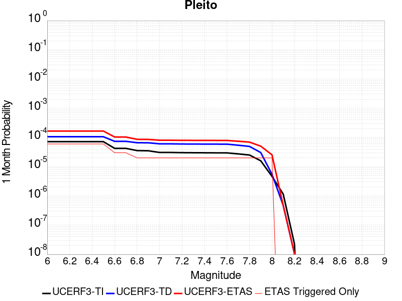 |  |  |

| Magnitude | 1 wk TI Prob | 1 wk TD Prob | 1 wk ETAS Prob | 1 wk ETAS/TD Gain | 1 wk ETAS Triggered Only | 1 mo TI Prob | 1 mo TD Prob | 1 mo ETAS Prob | 1 mo ETAS/TD Gain | 1 mo ETAS Triggered Only | 1 yr TI Prob | 1 yr TD Prob | 1 yr ETAS Prob | 1 yr ETAS/TD Gain | 1 yr ETAS Triggered Only | 10 yr TI Prob | 10 yr TD Prob | 10 yr ETAS Prob | 10 yr ETAS/TD Gain | 10 yr ETAS Triggered Only |
|-----|-----|-----|-----|-----|-----|-----|-----|-----|-----|-----|-----|-----|-----|-----|-----|-----|-----|-----|-----|-----|
| 6.0 | 1.6763008E-5 | 2.4763838E-5 | 2.4763838E-5 | 1.0 | 0.0 | 7.183948E-5 | 1.0612683E-4 | 1.0612683E-4 | 1.0 | 0.0 | 8.742947E-4 | 0.0012914003 | 0.001412701 | 1.0939295 | 1.2145749E-4 | 0.00870863 | 0.0129538905 | 0.013113736 | 1.0123396 | 1.6194332E-4 |
| 6.1 | 1.6763008E-5 | 2.4763838E-5 | 2.4763838E-5 | 1.0 | 0.0 | 7.183948E-5 | 1.0612683E-4 | 1.0612683E-4 | 1.0 | 0.0 | 8.742947E-4 | 0.0012914003 | 0.001412701 | 1.0939295 | 1.2145749E-4 | 0.00870863 | 0.0129538905 | 0.013113736 | 1.0123396 | 1.6194332E-4 |
| 6.2 | 1.6763008E-5 | 2.4763838E-5 | 2.4763838E-5 | 1.0 | 0.0 | 7.183948E-5 | 1.0612683E-4 | 1.0612683E-4 | 1.0 | 0.0 | 8.742947E-4 | 0.0012914003 | 0.001412701 | 1.0939295 | 1.2145749E-4 | 0.00870863 | 0.0129538905 | 0.013113736 | 1.0123396 | 1.6194332E-4 |
| 6.3 | 1.6763008E-5 | 2.4763838E-5 | 2.4763838E-5 | 1.0 | 0.0 | 7.183948E-5 | 1.0612683E-4 | 1.0612683E-4 | 1.0 | 0.0 | 8.742947E-4 | 0.0012914003 | 0.001412701 | 1.0939295 | 1.2145749E-4 | 0.00870863 | 0.0129538905 | 0.013113736 | 1.0123396 | 1.6194332E-4 |
| 6.4 | 1.6763008E-5 | 2.4763838E-5 | 2.4763838E-5 | 1.0 | 0.0 | 7.183948E-5 | 1.0612683E-4 | 1.0612683E-4 | 1.0 | 0.0 | 8.742947E-4 | 0.0012914003 | 0.001412701 | 1.0939295 | 1.2145749E-4 | 0.00870863 | 0.0129538905 | 0.013113736 | 1.0123396 | 1.6194332E-4 |
| 6.5 | 1.6763008E-5 | 2.4763838E-5 | 2.4763838E-5 | 1.0 | 0.0 | 7.183948E-5 | 1.0612683E-4 | 1.0612683E-4 | 1.0 | 0.0 | 8.742947E-4 | 0.0012914003 | 0.001412701 | 1.0939295 | 1.2145749E-4 | 0.00870863 | 0.0129538905 | 0.013113736 | 1.0123396 | 1.6194332E-4 |
| 6.6 | 9.910213E-6 | 1.7214623E-5 | 1.7214623E-5 | 1.0 | 0.0 | 4.247165E-5 | 7.377489E-5 | 7.377489E-5 | 1.0 | 0.0 | 5.169696E-4 | 8.978429E-4 | 0.0010191913 | 1.1351556 | 1.2145749E-4 | 0.0051576863 | 0.009050702 | 0.00917106 | 1.0132983 | 1.2145749E-4 |
| 6.7 | 9.910213E-6 | 1.7214623E-5 | 1.7214623E-5 | 1.0 | 0.0 | 4.247165E-5 | 7.377489E-5 | 7.377489E-5 | 1.0 | 0.0 | 5.169696E-4 | 8.978429E-4 | 0.0010191913 | 1.1351556 | 1.2145749E-4 | 0.0051576863 | 0.009050702 | 0.00917106 | 1.0132983 | 1.2145749E-4 |
| 6.8 | 8.300162E-6 | 1.5474232E-5 | 1.5474232E-5 | 1.0 | 0.0 | 3.557164E-5 | 6.631646E-5 | 6.631646E-5 | 1.0 | 0.0 | 4.3299864E-4 | 8.071053E-4 | 9.284647E-4 | 1.1503638 | 1.2145749E-4 | 0.004321559 | 0.008150139 | 0.008270606 | 1.014781 | 1.2145749E-4 |
| 6.9 | 8.183114E-6 | 1.5345448E-5 | 1.5345448E-5 | 1.0 | 0.0 | 3.5070017E-5 | 6.576455E-5 | 6.576455E-5 | 1.0 | 0.0 | 4.2689382E-4 | 8.003907E-4 | 9.21751E-4 | 1.1516263 | 1.2145749E-4 | 0.0042607468 | 0.008083483 | 0.008203959 | 1.0149039 | 1.2145749E-4 |
| 7.0 | 7.1748823E-6 | 1.413244E-5 | 1.413244E-5 | 1.0 | 0.0 | 3.0749135E-5 | 6.0566195E-5 | 6.0566195E-5 | 1.0 | 0.0 | 3.743064E-4 | 7.371445E-4 | 8.1805646E-4 | 1.1097641 | 8.097166E-5 | 0.0037367654 | 0.007454939 | 0.007535307 | 1.0107805 | 8.097166E-5 |
| 7.1 | 7.1671807E-6 | 1.412281E-5 | 1.412281E-5 | 1.0 | 0.0 | 3.0716128E-5 | 6.052493E-5 | 6.052493E-5 | 1.0 | 0.0 | 3.7390468E-4 | 7.366424E-4 | 8.175544E-4 | 1.109839 | 8.097166E-5 | 0.0037327618 | 0.0074499524 | 0.0075303204 | 1.0107877 | 8.097166E-5 |
| 7.2 | 7.0649667E-6 | 1.39701015E-5 | 1.39701015E-5 | 1.0 | 0.0 | 3.0278077E-5 | 5.9870494E-5 | 5.9870494E-5 | 1.0 | 0.0 | 3.6857324E-4 | 7.2868E-4 | 8.0959266E-4 | 1.11104 | 8.097166E-5 | 0.0036796255 | 0.0073707094 | 0.0074510844 | 1.0109047 | 8.097166E-5 |
| 7.3 | 7.02082E-6 | 1.3913556E-5 | 1.3913556E-5 | 1.0 | 0.0 | 3.008888E-5 | 5.9628168E-5 | 5.9628168E-5 | 1.0 | 0.0 | 3.6627054E-4 | 7.2573166E-4 | 8.0664456E-4 | 1.1114914 | 8.097166E-5 | 0.0036566744 | 0.007341209 | 0.007421586 | 1.0109488 | 8.097166E-5 |
| 7.4 | 6.987146E-6 | 1.3873118E-5 | 1.3873118E-5 | 1.0 | 0.0 | 2.9944567E-5 | 5.945487E-5 | 5.945487E-5 | 1.0 | 0.0 | 3.6451413E-4 | 7.2362315E-4 | 8.045362E-4 | 1.1118165 | 8.097166E-5 | 0.0036391679 | 0.007320144 | 0.0074005234 | 1.0109805 | 8.097166E-5 |
| 7.5 | 6.9494554E-6 | 1.3830024E-5 | 1.3830024E-5 | 1.0 | 0.0 | 2.9783041E-5 | 5.9270187E-5 | 5.9270187E-5 | 1.0 | 0.0 | 3.625482E-4 | 7.2137616E-4 | 8.022894E-4 | 1.1121651 | 8.097166E-5 | 0.0036195726 | 0.0072977724 | 0.0073781535 | 1.0110145 | 8.097166E-5 |
| 7.6 | 6.92694E-6 | 1.3789138E-5 | 1.3789138E-5 | 1.0 | 0.0 | 2.9686547E-5 | 5.909497E-5 | 5.909497E-5 | 1.0 | 0.0 | 3.6137376E-4 | 7.1924424E-4 | 8.0015766E-4 | 1.1124978 | 8.097166E-5 | 0.0036078666 | 0.0072765257 | 0.007356908 | 1.0110468 | 8.097166E-5 |
| 7.7 | 6.395867E-6 | 1.2668219E-5 | 1.2668219E-5 | 1.0 | 0.0 | 2.741057E-5 | 5.429124E-5 | 5.429124E-5 | 1.0 | 0.0 | 3.336726E-4 | 6.6079566E-4 | 7.4171385E-4 | 1.1224556 | 8.097166E-5 | 0.0033317201 | 0.0066951844 | 0.006775614 | 1.0120131 | 8.097166E-5 |
| 7.8 | 5.8664327E-6 | 1.153586E-5 | 1.153586E-5 | 1.0 | 0.0 | 2.5141611E-5 | 4.9438466E-5 | 4.9438466E-5 | 1.0 | 0.0 | 3.060561E-4 | 6.017473E-4 | 6.422088E-4 | 1.06724 | 4.048583E-5 | 0.0030563495 | 0.0061006667 | 0.0061409054 | 1.0065958 | 4.048583E-5 |
| 7.9 | 3.7167474E-6 | 7.1140853E-6 | 7.1140853E-6 | 1.0 | 0.0 | 1.592882E-5 | 3.0488582E-5 | 3.0488582E-5 | 1.0 | 0.0 | 1.9391612E-4 | 3.7113542E-4 | 3.7113542E-4 | 1.0 | 0.0 | 0.0019374699 | 0.0037674906 | 0.0037674906 | 1.0 | 0.0 |
| 8.0 | 1.0903841E-6 | 1.2879392E-6 | 1.2879392E-6 | 1.0 | 0.0 | 4.6730665E-6 | 5.5197274E-6 | 5.5197274E-6 | 1.0 | 0.0 | 5.68931E-5 | 6.720063E-5 | 6.720063E-5 | 1.0 | 0.0 | 5.6878536E-4 | 6.941948E-4 | 6.941948E-4 | 1.0 | 0.0 |
| 8.1 | 2.6894583E-7 | 1.1060341E-7 | 1.1060341E-7 | 1.0 | 0.0 | 1.1526245E-6 | 4.740145E-7 | 4.740145E-7 | 1.0 | 0.0 | 1.4033113E-5 | 5.7711113E-6 | 5.7711113E-6 | 1.0 | 0.0 | 1.4032227E-4 | 6.456908E-5 | 6.456908E-5 | 1.0 | 0.0 |
| 8.2 | 5.2967013E-9 | 2.4578228E-9 | 2.4578228E-9 | 1.0 | 0.0 | 2.2700148E-8 | 1.0533527E-8 | 1.0533527E-8 | 1.0 | 0.0 | 2.7637427E-7 | 1.2824569E-7 | 1.2824569E-7 | 1.0 | 0.0 | 2.7637393E-6 | 1.4592787E-6 | 1.4592787E-6 | 1.0 | 0.0 |

## Camp Rock 2011
*[(top)](#table-of-contents)*

| 1 Week | 1 Month | 1 Year | 10 Year |
|-----|-----|-----|-----|
|  |  |  |  |

| Magnitude | 1 wk TI Prob | 1 wk TD Prob | 1 wk ETAS Prob | 1 wk ETAS/TD Gain | 1 wk ETAS Triggered Only | 1 mo TI Prob | 1 mo TD Prob | 1 mo ETAS Prob | 1 mo ETAS/TD Gain | 1 mo ETAS Triggered Only | 1 yr TI Prob | 1 yr TD Prob | 1 yr ETAS Prob | 1 yr ETAS/TD Gain | 1 yr ETAS Triggered Only | 10 yr TI Prob | 10 yr TD Prob | 10 yr ETAS Prob | 10 yr ETAS/TD Gain | 10 yr ETAS Triggered Only |
|-----|-----|-----|-----|-----|-----|-----|-----|-----|-----|-----|-----|-----|-----|-----|-----|-----|-----|-----|-----|-----|
| 6.0 | 1.6710783E-5 | 4.25026E-6 | 8.5221574E-5 | 20.050907 | 8.097166E-5 | 7.161568E-5 | 1.8215276E-5 | 9.918546E-5 | 5.44518 | 8.097166E-5 | 8.7157206E-4 | 2.2174895E-4 | 3.0270265E-4 | 1.3650692 | 8.097166E-5 | 0.008681616 | 0.0022153298 | 0.0023365181 | 1.0547044 | 1.2145749E-4 |
| 6.1 | 1.6710783E-5 | 4.25026E-6 | 8.5221574E-5 | 20.050907 | 8.097166E-5 | 7.161568E-5 | 1.8215276E-5 | 9.918546E-5 | 5.44518 | 8.097166E-5 | 8.7157206E-4 | 2.2174895E-4 | 3.0270265E-4 | 1.3650692 | 8.097166E-5 | 0.008681616 | 0.0022153298 | 0.0023365181 | 1.0547044 | 1.2145749E-4 |
| 6.2 | 1.6710783E-5 | 4.25026E-6 | 8.5221574E-5 | 20.050907 | 8.097166E-5 | 7.161568E-5 | 1.8215276E-5 | 9.918546E-5 | 5.44518 | 8.097166E-5 | 8.7157206E-4 | 2.2174895E-4 | 3.0270265E-4 | 1.3650692 | 8.097166E-5 | 0.008681616 | 0.0022153298 | 0.0023365181 | 1.0547044 | 1.2145749E-4 |
| 6.3 | 1.6710783E-5 | 4.25026E-6 | 8.5221574E-5 | 20.050907 | 8.097166E-5 | 7.161568E-5 | 1.8215276E-5 | 9.918546E-5 | 5.44518 | 8.097166E-5 | 8.7157206E-4 | 2.2174895E-4 | 3.0270265E-4 | 1.3650692 | 8.097166E-5 | 0.008681616 | 0.0022153298 | 0.0023365181 | 1.0547044 | 1.2145749E-4 |
| 6.4 | 7.982846E-6 | 3.6820884E-6 | 8.465345E-5 | 22.990606 | 8.097166E-5 | 3.421175E-5 | 1.5780286E-5 | 9.675067E-5 | 6.13111 | 8.097166E-5 | 4.1644843E-4 | 1.9210839E-4 | 2.730645E-4 | 1.4214085 | 8.097166E-5 | 0.0041566887 | 0.001919458 | 0.0020002744 | 1.0421036 | 8.097166E-5 |
| 6.5 | 7.982846E-6 | 3.6820884E-6 | 8.465345E-5 | 22.990606 | 8.097166E-5 | 3.421175E-5 | 1.5780286E-5 | 9.675067E-5 | 6.13111 | 8.097166E-5 | 4.1644843E-4 | 1.9210839E-4 | 2.730645E-4 | 1.4214085 | 8.097166E-5 | 0.0041566887 | 0.001919458 | 0.0020002744 | 1.0421036 | 8.097166E-5 |
| 6.6 | 7.048869E-6 | 3.4243571E-6 | 8.439574E-5 | 24.645718 | 8.097166E-5 | 3.0209088E-5 | 1.4675736E-5 | 9.564621E-5 | 6.5173025 | 8.097166E-5 | 3.677336E-4 | 1.7866275E-4 | 2.5961993E-4 | 1.4531286 | 8.097166E-5 | 0.0036712566 | 0.0017852228 | 0.0018660498 | 1.0452757 | 8.097166E-5 |
| 6.7 | 6.987307E-6 | 3.3623348E-6 | 8.4333726E-5 | 25.081894 | 8.097166E-5 | 2.9945259E-5 | 1.4409929E-5 | 9.538042E-5 | 6.6190767 | 8.097166E-5 | 3.6452254E-4 | 1.7542706E-4 | 2.5638452E-4 | 1.4614879 | 8.097166E-5 | 0.0036392517 | 0.001752917 | 0.0018337467 | 1.0461116 | 8.097166E-5 |
| 6.8 | 6.3737602E-6 | 3.1179077E-6 | 8.408931E-5 | 26.96979 | 8.097166E-5 | 2.731583E-5 | 1.3362394E-5 | 9.433297E-5 | 7.059586 | 8.097166E-5 | 3.3251947E-4 | 1.626753E-4 | 2.4363378E-4 | 1.4976692 | 8.097166E-5 | 0.0033202237 | 0.0016255907 | 0.0017064308 | 1.0497296 | 8.097166E-5 |
| 6.9 | 6.112211E-6 | 2.9331156E-6 | 8.390454E-5 | 28.605944 | 8.097166E-5 | 2.6194928E-5 | 1.2570436E-5 | 9.354108E-5 | 7.4413548 | 8.097166E-5 | 3.1887658E-4 | 1.5303459E-4 | 2.3399387E-4 | 1.5290259 | 8.097166E-5 | 0.003184194 | 0.0015293199 | 0.0016101677 | 1.0528653 | 8.097166E-5 |
| 7.0 | 5.5140117E-6 | 2.641923E-6 | 4.3127646E-5 | 16.324339 | 4.048583E-5 | 2.3631264E-5 | 1.132248E-5 | 5.1807852E-5 | 4.575663 | 4.048583E-5 | 2.8767265E-4 | 1.3784273E-4 | 1.7832297E-4 | 1.2936698 | 4.048583E-5 | 0.0028730053 | 0.0013775975 | 0.0014180276 | 1.0293483 | 4.048583E-5 |
| 7.1 | 4.8151105E-6 | 2.1342705E-6 | 4.2620013E-5 | 19.96936 | 4.048583E-5 | 2.0636026E-5 | 9.146843E-6 | 4.96323E-5 | 5.426168 | 4.048583E-5 | 2.5121463E-4 | 1.1135734E-4 | 1.5183866E-4 | 1.3635263 | 4.048583E-5 | 0.0025093083 | 0.0011130372 | 0.001153478 | 1.0363337 | 4.048583E-5 |
| 7.2 | 3.818335E-6 | 1.2937425E-6 | 4.177952E-5 | 32.293537 | 4.048583E-5 | 1.6364189E-5 | 5.5445994E-6 | 4.6030204E-5 | 8.301809 | 4.048583E-5 | 1.9921579E-4 | 6.750349E-5 | 1.0798658E-4 | 1.5997186 | 4.048583E-5 | 0.0019903728 | 6.748381E-4 | 7.152966E-4 | 1.0599529 | 4.048583E-5 |
| 7.3 | 2.7166698E-6 | 7.3835776E-7 | 4.1224157E-5 | 55.832226 | 4.048583E-5 | 1.1642818E-5 | 3.1643867E-6 | 4.365009E-5 | 13.79417 | 4.048583E-5 | 1.4174209E-4 | 3.8525748E-5 | 7.901002E-5 | 2.0508368 | 4.048583E-5 | 0.0014165172 | 3.851927E-4 | 4.2566293E-4 | 1.1050649 | 4.048583E-5 |
| 7.4 | 2.0893426E-6 | 5.4618386E-7 | 4.103199E-5 | 75.12487 | 4.048583E-5 | 8.954295E-6 | 2.3407858E-6 | 4.282652E-5 | 18.295788 | 4.048583E-5 | 1.0901308E-4 | 2.84987E-5 | 6.8983376E-5 | 2.4205797 | 4.048583E-5 | 0.0010895962 | 2.84951E-4 | 3.254253E-4 | 1.1420395 | 4.048583E-5 |
| 7.5 | 1.1681728E-6 | 3.6030585E-7 | 4.084612E-5 | 113.365135 | 4.048583E-5 | 5.0064455E-6 | 1.544167E-6 | 4.2029933E-5 | 27.218515 | 4.048583E-5 | 6.0951766E-5 | 1.8800076E-5 | 5.9285147E-5 | 3.1534524 | 4.048583E-5 | 6.093505E-4 | 1.8798532E-4 | 2.2846354E-4 | 1.2153264 | 4.048583E-5 |
| 7.6 | 1.3154387E-7 | 7.1197384E-8 | 4.0557024E-5 | 569.6421 | 4.048583E-5 | 5.6375933E-7 | 3.051316E-7 | 4.079095E-5 | 133.68314 | 4.048583E-5 | 6.863748E-6 | 3.7149728E-6 | 4.4200653E-5 | 11.897975 | 4.048583E-5 | 6.863536E-5 | 3.7149264E-5 | 7.763359E-5 | 2.0897746 | 4.048583E-5 |

## Mission Creek
*[(top)](#table-of-contents)*

| 1 Week | 1 Month | 1 Year | 10 Year |
|-----|-----|-----|-----|
|  |  | 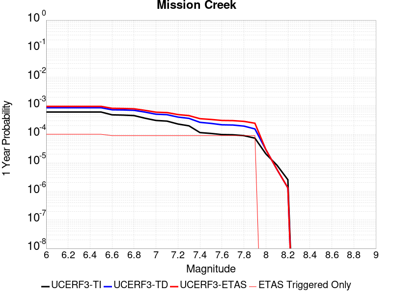 |  |

| Magnitude | 1 wk TI Prob | 1 wk TD Prob | 1 wk ETAS Prob | 1 wk ETAS/TD Gain | 1 wk ETAS Triggered Only | 1 mo TI Prob | 1 mo TD Prob | 1 mo ETAS Prob | 1 mo ETAS/TD Gain | 1 mo ETAS Triggered Only | 1 yr TI Prob | 1 yr TD Prob | 1 yr ETAS Prob | 1 yr ETAS/TD Gain | 1 yr ETAS Triggered Only | 10 yr TI Prob | 10 yr TD Prob | 10 yr ETAS Prob | 10 yr ETAS/TD Gain | 10 yr ETAS Triggered Only |
|-----|-----|-----|-----|-----|-----|-----|-----|-----|-----|-----|-----|-----|-----|-----|-----|-----|-----|-----|-----|-----|
| 6.0 | 1.1549387E-5 | 1.632237E-5 | 1.632237E-5 | 1.0 | 0.0 | 4.9496433E-5 | 6.9951224E-5 | 1.5091721E-4 | 2.1574636 | 8.097166E-5 | 6.0245243E-4 | 8.513384E-4 | 9.7269245E-4 | 1.1425451 | 1.2145749E-4 | 0.006008218 | 0.008509998 | 0.008630422 | 1.0141509 | 1.2145749E-4 |
| 6.1 | 1.1549387E-5 | 1.632237E-5 | 1.632237E-5 | 1.0 | 0.0 | 4.9496433E-5 | 6.9951224E-5 | 1.5091721E-4 | 2.1574636 | 8.097166E-5 | 6.0245243E-4 | 8.513384E-4 | 9.7269245E-4 | 1.1425451 | 1.2145749E-4 | 0.006008218 | 0.008509998 | 0.008630422 | 1.0141509 | 1.2145749E-4 |
| 6.2 | 1.1549387E-5 | 1.632237E-5 | 1.632237E-5 | 1.0 | 0.0 | 4.9496433E-5 | 6.9951224E-5 | 1.5091721E-4 | 2.1574636 | 8.097166E-5 | 6.0245243E-4 | 8.513384E-4 | 9.7269245E-4 | 1.1425451 | 1.2145749E-4 | 0.006008218 | 0.008509998 | 0.008630422 | 1.0141509 | 1.2145749E-4 |
| 6.3 | 1.1549387E-5 | 1.632237E-5 | 1.632237E-5 | 1.0 | 0.0 | 4.9496433E-5 | 6.9951224E-5 | 1.5091721E-4 | 2.1574636 | 8.097166E-5 | 6.0245243E-4 | 8.513384E-4 | 9.7269245E-4 | 1.1425451 | 1.2145749E-4 | 0.006008218 | 0.008509998 | 0.008630422 | 1.0141509 | 1.2145749E-4 |
| 6.4 | 1.1549387E-5 | 1.632237E-5 | 1.632237E-5 | 1.0 | 0.0 | 4.9496433E-5 | 6.9951224E-5 | 1.5091721E-4 | 2.1574636 | 8.097166E-5 | 6.0245243E-4 | 8.513384E-4 | 9.7269245E-4 | 1.1425451 | 1.2145749E-4 | 0.006008218 | 0.008509998 | 0.008630422 | 1.0141509 | 1.2145749E-4 |
| 6.5 | 1.1549387E-5 | 1.632237E-5 | 1.632237E-5 | 1.0 | 0.0 | 4.9496433E-5 | 6.9951224E-5 | 1.5091721E-4 | 2.1574636 | 8.097166E-5 | 6.0245243E-4 | 8.513384E-4 | 9.7269245E-4 | 1.1425451 | 1.2145749E-4 | 0.006008218 | 0.008509998 | 0.008630422 | 1.0141509 | 1.2145749E-4 |
| 6.6 | 9.202681E-6 | 1.3845646E-5 | 1.3845646E-5 | 1.0 | 0.0 | 3.9439463E-5 | 5.9337188E-5 | 1.4030404E-4 | 2.3645213 | 8.097166E-5 | 4.800697E-4 | 7.221998E-4 | 8.435696E-4 | 1.1680557 | 1.2145749E-4 | 0.004790339 | 0.0072271815 | 0.007347761 | 1.0166842 | 1.2145749E-4 |
| 6.7 | 9.019164E-6 | 1.3651316E-5 | 1.3651316E-5 | 1.0 | 0.0 | 3.8652986E-5 | 5.8504378E-5 | 1.394713E-4 | 2.3839464 | 8.097166E-5 | 4.7049852E-4 | 7.12067E-4 | 8.33438E-4 | 1.1704489 | 1.2145749E-4 | 0.004695036 | 0.007126506 | 0.007247098 | 1.0169216 | 1.2145749E-4 |
| 6.8 | 8.673558E-6 | 1.3273427E-5 | 1.3273427E-5 | 1.0 | 0.0 | 3.717186E-5 | 5.6884925E-5 | 1.3785198E-4 | 2.4233482 | 8.097166E-5 | 4.524734E-4 | 6.923627E-4 | 8.137361E-4 | 1.1753032 | 1.2145749E-4 | 0.0045155324 | 0.006930694 | 0.00705131 | 1.0174031 | 1.2145749E-4 |
| 6.9 | 7.002255E-6 | 1.1477657E-5 | 1.1477657E-5 | 1.0 | 0.0 | 3.000932E-5 | 4.9189068E-5 | 1.3015674E-4 | 2.6460502 | 8.097166E-5 | 3.653022E-4 | 5.9871917E-4 | 7.2010397E-4 | 1.2027408 | 1.2145749E-4 | 0.0036470229 | 0.005999517 | 0.006120246 | 1.0201231 | 1.2145749E-4 |
| 7.0 | 5.84644E-6 | 9.67498E-6 | 9.67498E-6 | 1.0 | 0.0 | 2.5055931E-5 | 4.1463565E-5 | 1.2243187E-4 | 2.9527578 | 8.097166E-5 | 3.0501327E-4 | 5.047066E-4 | 6.2610273E-4 | 1.2405282 | 1.2145749E-4 | 0.0030459496 | 0.0050638523 | 0.0051846947 | 1.0238638 | 1.2145749E-4 |
| 7.1 | 5.54703E-6 | 9.329456E-6 | 9.329456E-6 | 1.0 | 0.0 | 2.377277E-5 | 3.9982795E-5 | 1.2095122E-4 | 3.0250816 | 8.097166E-5 | 2.8939504E-4 | 4.8668624E-4 | 6.0808467E-4 | 1.2494386 | 1.2145749E-4 | 0.0028901845 | 0.004884446 | 0.0050053103 | 1.0247447 | 1.2145749E-4 |
| 7.2 | 4.384709E-6 | 7.68157E-6 | 7.68157E-6 | 1.0 | 0.0 | 1.8791474E-5 | 3.2920623E-5 | 1.1388962E-4 | 3.459522 | 8.097166E-5 | 2.2876218E-4 | 4.0073853E-4 | 5.2214734E-4 | 1.3029627 | 1.2145749E-4 | 0.0022852682 | 0.004028366 | 0.004149334 | 1.030029 | 1.2145749E-4 |
| 7.3 | 3.7888456E-6 | 6.915452E-6 | 6.915452E-6 | 1.0 | 0.0 | 1.623781E-5 | 2.9637333E-5 | 1.1060659E-4 | 3.7320023 | 8.097166E-5 | 1.9767738E-4 | 3.6077813E-4 | 4.821918E-4 | 1.3365328 | 1.2145749E-4 | 0.0019750162 | 0.0036301152 | 0.0037511317 | 1.0333369 | 1.2145749E-4 |
| 7.4 | 2.1982462E-6 | 5.0237763E-6 | 5.0237763E-6 | 1.0 | 0.0 | 9.421021E-6 | 2.1530293E-5 | 1.0250021E-4 | 4.7607436 | 8.097166E-5 | 1.1469489E-4 | 2.621E-4 | 3.8352565E-4 | 1.4632798 | 1.2145749E-4 | 0.0011463572 | 0.0026458844 | 0.0027670206 | 1.0457828 | 1.2145749E-4 |
| 7.5 | 2.051923E-6 | 4.615016E-6 | 4.615016E-6 | 1.0 | 0.0 | 8.793926E-6 | 1.9778492E-5 | 1.0074855E-4 | 5.093844 | 8.097166E-5 | 1.0706078E-4 | 2.4077666E-4 | 3.622049E-4 | 1.504319 | 1.2145749E-4 | 0.0010700922 | 0.0024335422 | 0.002554704 | 1.0497884 | 1.2145749E-4 |
| 7.6 | 1.8733427E-6 | 4.1233748E-6 | 4.1233748E-6 | 1.0 | 0.0 | 8.028587E-6 | 1.7671488E-5 | 9.8641714E-5 | 5.58197 | 8.097166E-5 | 9.774366E-5 | 2.151292E-4 | 3.3656057E-4 | 1.5644578 | 1.2145749E-4 | 9.770069E-4 | 0.0021780801 | 0.0022992732 | 1.0556421 | 1.2145749E-4 |
| 7.7 | 1.8411953E-6 | 4.0430496E-6 | 4.0430496E-6 | 1.0 | 0.0 | 7.890813E-6 | 1.732724E-5 | 9.8297496E-5 | 5.6730037 | 8.097166E-5 | 9.606641E-5 | 2.1093882E-4 | 3.323707E-4 | 1.5756735 | 1.2145749E-4 | 9.6024893E-4 | 0.0021363653 | 0.0022575634 | 1.056731 | 1.2145749E-4 |
| 7.8 | 1.7194251E-6 | 3.7104276E-6 | 3.7104276E-6 | 1.0 | 0.0 | 7.368944E-6 | 1.5901736E-5 | 9.687211E-5 | 6.0919204 | 8.097166E-5 | 8.97132E-5 | 1.9358651E-4 | 3.150205E-4 | 1.6272854 | 1.2145749E-4 | 8.967699E-4 | 0.0019623525 | 0.0020835716 | 1.0617723 | 1.2145749E-4 |
| 7.9 | 1.4035052E-6 | 2.9500632E-6 | 2.9500632E-6 | 1.0 | 0.0 | 6.0150082E-6 | 1.2643067E-5 | 9.36137E-5 | 7.4043508 | 8.097166E-5 | 7.3230265E-5 | 1.5391852E-4 | 2.753573E-4 | 1.7889811 | 1.2145749E-4 | 7.3206134E-4 | 0.0015631086 | 0.0016843763 | 1.077581 | 1.2145749E-4 |
| 8.0 | 3.9318823E-7 | 5.528522E-7 | 5.528522E-7 | 1.0 | 0.0 | 1.6850913E-6 | 2.3693647E-6 | 2.3693647E-6 | 1.0 | 0.0 | 2.0515794E-5 | 2.8846638E-5 | 2.8846638E-5 | 1.0 | 0.0 | 2.0513899E-4 | 2.9899E-4 | 2.9899E-4 | 1.0 | 0.0 |
| 8.1 | 1.596793E-7 | 1.1380002E-7 | 1.1380002E-7 | 1.0 | 0.0 | 6.8433974E-7 | 4.877143E-7 | 4.877143E-7 | 1.0 | 0.0 | 8.331805E-6 | 5.937906E-6 | 5.937906E-6 | 1.0 | 0.0 | 8.331492E-5 | 6.549966E-5 | 6.549966E-5 | 1.0 | 0.0 |
| 8.2 | 4.9003038E-8 | 2.5444924E-8 | 2.5444924E-8 | 1.0 | 0.0 | 2.10013E-7 | 1.0904967E-7 | 1.0904967E-7 | 1.0 | 0.0 | 2.5569052E-6 | 1.327679E-6 | 1.327679E-6 | 1.0 | 0.0 | 2.556876E-5 | 1.495635E-5 | 1.495635E-5 | 1.0 | 0.0 |

## San Juan
*[(top)](#table-of-contents)*

| 1 Week | 1 Month | 1 Year | 10 Year |
|-----|-----|-----|-----|
|  |  |  |  |

| Magnitude | 1 wk TI Prob | 1 wk TD Prob | 1 wk ETAS Prob | 1 wk ETAS/TD Gain | 1 wk ETAS Triggered Only | 1 mo TI Prob | 1 mo TD Prob | 1 mo ETAS Prob | 1 mo ETAS/TD Gain | 1 mo ETAS Triggered Only | 1 yr TI Prob | 1 yr TD Prob | 1 yr ETAS Prob | 1 yr ETAS/TD Gain | 1 yr ETAS Triggered Only | 10 yr TI Prob | 10 yr TD Prob | 10 yr ETAS Prob | 10 yr ETAS/TD Gain | 10 yr ETAS Triggered Only |
|-----|-----|-----|-----|-----|-----|-----|-----|-----|-----|-----|-----|-----|-----|-----|-----|-----|-----|-----|-----|-----|
| 6.0 | 8.682808E-6 | 8.7491635E-6 | 8.7491635E-6 | 1.0 | 0.0 | 3.72115E-5 | 3.74959E-5 | 3.74959E-5 | 1.0 | 0.0 | 4.5295584E-4 | 4.564218E-4 | 4.564218E-4 | 1.0 | 0.0 | 0.004520337 | 0.004555385 | 0.004635988 | 1.017694 | 8.097166E-5 |
| 6.1 | 8.682808E-6 | 8.7491635E-6 | 8.7491635E-6 | 1.0 | 0.0 | 3.72115E-5 | 3.74959E-5 | 3.74959E-5 | 1.0 | 0.0 | 4.5295584E-4 | 4.564218E-4 | 4.564218E-4 | 1.0 | 0.0 | 0.004520337 | 0.004555385 | 0.004635988 | 1.017694 | 8.097166E-5 |
| 6.2 | 8.682808E-6 | 8.7491635E-6 | 8.7491635E-6 | 1.0 | 0.0 | 3.72115E-5 | 3.74959E-5 | 3.74959E-5 | 1.0 | 0.0 | 4.5295584E-4 | 4.564218E-4 | 4.564218E-4 | 1.0 | 0.0 | 0.004520337 | 0.004555385 | 0.004635988 | 1.017694 | 8.097166E-5 |
| 6.3 | 6.3054235E-6 | 6.2825848E-6 | 6.2825848E-6 | 1.0 | 0.0 | 2.7022963E-5 | 2.6925094E-5 | 2.6925094E-5 | 1.0 | 0.0 | 3.2895492E-4 | 3.2776513E-4 | 3.2776513E-4 | 1.0 | 0.0 | 0.003284684 | 0.003273017 | 0.003273017 | 1.0 | 0.0 |
| 6.4 | 6.1490473E-6 | 6.1144656E-6 | 6.1144656E-6 | 1.0 | 0.0 | 2.6352795E-5 | 2.6204598E-5 | 2.6204598E-5 | 1.0 | 0.0 | 3.2079802E-4 | 3.1899565E-4 | 3.1899565E-4 | 1.0 | 0.0 | 0.0032033534 | 0.0031855737 | 0.0031855737 | 1.0 | 0.0 |
| 6.5 | 5.204848E-6 | 5.137233E-6 | 5.137233E-6 | 1.0 | 0.0 | 2.23063E-5 | 2.2016533E-5 | 2.2016533E-5 | 1.0 | 0.0 | 2.7154534E-4 | 2.6801927E-4 | 2.6801927E-4 | 1.0 | 0.0 | 0.0027121378 | 0.0026771144 | 0.0026771144 | 1.0 | 0.0 |
| 6.6 | 4.5179986E-6 | 4.4150297E-6 | 4.4150297E-6 | 1.0 | 0.0 | 1.9362706E-5 | 1.8921424E-5 | 1.8921424E-5 | 1.0 | 0.0 | 2.3571544E-4 | 2.3034477E-4 | 2.3034477E-4 | 1.0 | 0.0 | 0.0023546559 | 0.0023011973 | 0.0023011973 | 1.0 | 0.0 |
| 6.7 | 3.9442616E-6 | 3.819828E-6 | 3.819828E-6 | 1.0 | 0.0 | 1.6903869E-5 | 1.6370592E-5 | 1.6370592E-5 | 1.0 | 0.0 | 2.0578515E-4 | 1.992944E-4 | 1.992944E-4 | 1.0 | 0.0 | 0.002055947 | 0.0019912818 | 0.0019912818 | 1.0 | 0.0 |
| 6.8 | 3.4536245E-6 | 3.3163353E-6 | 3.3163353E-6 | 1.0 | 0.0 | 1.4801163E-5 | 1.4212792E-5 | 1.4212792E-5 | 1.0 | 0.0 | 1.8018926E-4 | 1.7302761E-4 | 1.7302761E-4 | 1.0 | 0.0 | 0.0018004322 | 0.0017290477 | 0.0017290477 | 1.0 | 0.0 |
| 6.9 | 3.059865E-6 | 2.9120315E-6 | 2.9120315E-6 | 1.0 | 0.0 | 1.3113641E-5 | 1.2480078E-5 | 1.2480078E-5 | 1.0 | 0.0 | 1.596469E-4 | 1.5193493E-4 | 1.5193493E-4 | 1.0 | 0.0 | 0.0015953224 | 0.0015184252 | 0.0015184252 | 1.0 | 0.0 |
| 7.0 | 2.6504351E-6 | 2.4920002E-6 | 2.4920002E-6 | 1.0 | 0.0 | 1.1358958E-5 | 1.0679961E-5 | 1.0679961E-5 | 1.0 | 0.0 | 1.3828653E-4 | 1.300213E-4 | 1.300213E-4 | 1.0 | 0.0 | 0.0013820052 | 0.0012995641 | 0.0012995641 | 1.0 | 0.0 |
| 7.1 | 2.2039317E-6 | 2.0338296E-6 | 2.0338296E-6 | 1.0 | 0.0 | 9.445387E-6 | 8.716386E-6 | 8.716386E-6 | 1.0 | 0.0 | 1.1499152E-4 | 1.0611736E-4 | 1.0611736E-4 | 1.0 | 0.0 | 0.0011493203 | 0.0010607769 | 0.0010607769 | 1.0 | 0.0 |
| 7.2 | 1.0786707E-6 | 8.7701903E-7 | 8.7701903E-7 | 1.0 | 0.0 | 4.622866E-6 | 3.7586476E-6 | 3.7586476E-6 | 1.0 | 0.0 | 5.628194E-5 | 4.5760586E-5 | 4.5760586E-5 | 1.0 | 0.0 | 5.6267687E-4 | 4.5757066E-4 | 4.5757066E-4 | 1.0 | 0.0 |
| 7.3 | 6.846433E-7 | 4.868805E-7 | 4.868805E-7 | 1.0 | 0.0 | 2.9341822E-6 | 2.086629E-6 | 2.086629E-6 | 1.0 | 0.0 | 3.5723086E-5 | 2.5404412E-5 | 2.5404412E-5 | 1.0 | 0.0 | 3.571734E-4 | 2.540486E-4 | 2.540486E-4 | 1.0 | 0.0 |
| 7.4 | 5.23043E-7 | 3.2628162E-7 | 3.2628162E-7 | 1.0 | 0.0 | 2.2416111E-6 | 1.398349E-6 | 1.398349E-6 | 1.0 | 0.0 | 2.7291273E-5 | 1.7024766E-5 | 1.7024766E-5 | 1.0 | 0.0 | 2.7287923E-4 | 1.7026656E-4 | 1.7026656E-4 | 1.0 | 0.0 |
| 7.5 | 4.648444E-7 | 2.7234944E-7 | 2.7234944E-7 | 1.0 | 0.0 | 1.9921886E-6 | 1.1672114E-6 | 1.1672114E-6 | 1.0 | 0.0 | 2.4254627E-5 | 1.42107065E-5 | 1.42107065E-5 | 1.0 | 0.0 | 2.425198E-4 | 1.421276E-4 | 1.421276E-4 | 1.0 | 0.0 |
| 7.6 | 3.9906567E-7 | 2.2083314E-7 | 2.2083314E-7 | 1.0 | 0.0 | 1.7102802E-6 | 9.464274E-7 | 9.464274E-7 | 1.0 | 0.0 | 2.0822463E-5 | 1.1522693E-5 | 1.1522693E-5 | 1.0 | 0.0 | 2.0820512E-4 | 1.15245566E-4 | 1.15245566E-4 | 1.0 | 0.0 |
| 7.7 | 1.8784601E-7 | 5.3666906E-8 | 5.3666906E-8 | 1.0 | 0.0 | 8.0505407E-7 | 2.30001E-7 | 2.30001E-7 | 1.0 | 0.0 | 9.80149E-6 | 2.8002585E-6 | 2.8002585E-6 | 1.0 | 0.0 | 9.801057E-5 | 2.8011282E-5 | 2.8011282E-5 | 1.0 | 0.0 |
| 7.8 | 1.00154914E-7 | 1.2415832E-8 | 1.2415832E-8 | 1.0 | 0.0 | 4.2923529E-7 | 5.3210716E-8 | 5.3210716E-8 | 1.0 | 0.0 | 5.225927E-6 | 6.4784024E-7 | 6.4784024E-7 | 1.0 | 0.0 | 5.225804E-5 | 6.484273E-6 | 6.484273E-6 | 1.0 | 0.0 |
| 7.9 | 6.171429E-8 | 4.2966155E-9 | 4.2966155E-9 | 1.0 | 0.0 | 2.6448978E-7 | 1.8414067E-8 | 1.8414067E-8 | 1.0 | 0.0 | 3.2201583E-6 | 2.2419121E-7 | 2.2419121E-7 | 1.0 | 0.0 | 3.2201115E-5 | 2.2472002E-6 | 2.2472002E-6 | 1.0 | 0.0 |
| 8.0 | 1.3974572E-8 | 3.3788217E-10 | 3.3788217E-10 | 1.0 | 0.0 | 5.989102E-8 | 1.448067E-9 | 1.448067E-9 | 1.0 | 0.0 | 7.2917294E-7 | 1.763022E-8 | 1.763022E-8 | 1.0 | 0.0 | 7.2917055E-6 | 1.8060365E-7 | 1.8060365E-7 | 1.0 | 0.0 |
| 8.1 | 1.8403477E-9 | 1.1302803E-10 | 1.1302803E-10 | 1.0 | 0.0 | 7.887204E-9 | 4.844063E-10 | 4.844063E-10 | 1.0 | 0.0 | 9.602671E-8 | 5.8976446E-9 | 5.8976446E-9 | 1.0 | 0.0 | 9.602667E-7 | 6.021993E-8 | 6.021993E-8 | 1.0 | 0.0 |

## Independence rev 2011
*[(top)](#table-of-contents)*

| 1 Week | 1 Month | 1 Year | 10 Year |
|-----|-----|-----|-----|
|  |  |  |  |

| Magnitude | 1 wk TI Prob | 1 wk TD Prob | 1 wk ETAS Prob | 1 wk ETAS/TD Gain | 1 wk ETAS Triggered Only | 1 mo TI Prob | 1 mo TD Prob | 1 mo ETAS Prob | 1 mo ETAS/TD Gain | 1 mo ETAS Triggered Only | 1 yr TI Prob | 1 yr TD Prob | 1 yr ETAS Prob | 1 yr ETAS/TD Gain | 1 yr ETAS Triggered Only | 10 yr TI Prob | 10 yr TD Prob | 10 yr ETAS Prob | 10 yr ETAS/TD Gain | 10 yr ETAS Triggered Only |
|-----|-----|-----|-----|-----|-----|-----|-----|-----|-----|-----|-----|-----|-----|-----|-----|-----|-----|-----|-----|-----|
| 6.0 | 4.422171E-6 | 4.326227E-6 | 4.326227E-6 | 1.0 | 0.0 | 1.8952025E-5 | 1.8540857E-5 | 5.9025937E-5 | 3.1835601 | 4.048583E-5 | 2.3071647E-4 | 2.2571455E-4 | 3.0666793E-4 | 1.3586538 | 8.097166E-5 | 0.0023047708 | 0.0022551466 | 0.00237633 | 1.0537364 | 1.2145749E-4 |
| 6.1 | 4.422171E-6 | 4.326227E-6 | 4.326227E-6 | 1.0 | 0.0 | 1.8952025E-5 | 1.8540857E-5 | 5.9025937E-5 | 3.1835601 | 4.048583E-5 | 2.3071647E-4 | 2.2571455E-4 | 3.0666793E-4 | 1.3586538 | 8.097166E-5 | 0.0023047708 | 0.0022551466 | 0.00237633 | 1.0537364 | 1.2145749E-4 |
| 6.2 | 4.422171E-6 | 4.326227E-6 | 4.326227E-6 | 1.0 | 0.0 | 1.8952025E-5 | 1.8540857E-5 | 5.9025937E-5 | 3.1835601 | 4.048583E-5 | 2.3071647E-4 | 2.2571455E-4 | 3.0666793E-4 | 1.3586538 | 8.097166E-5 | 0.0023047708 | 0.0022551466 | 0.00237633 | 1.0537364 | 1.2145749E-4 |
| 6.3 | 4.422171E-6 | 4.326227E-6 | 4.326227E-6 | 1.0 | 0.0 | 1.8952025E-5 | 1.8540857E-5 | 5.9025937E-5 | 3.1835601 | 4.048583E-5 | 2.3071647E-4 | 2.2571455E-4 | 3.0666793E-4 | 1.3586538 | 8.097166E-5 | 0.0023047708 | 0.0022551466 | 0.00237633 | 1.0537364 | 1.2145749E-4 |
| 6.4 | 4.422171E-6 | 4.326227E-6 | 4.326227E-6 | 1.0 | 0.0 | 1.8952025E-5 | 1.8540857E-5 | 5.9025937E-5 | 3.1835601 | 4.048583E-5 | 2.3071647E-4 | 2.2571455E-4 | 3.0666793E-4 | 1.3586538 | 8.097166E-5 | 0.0023047708 | 0.0022551466 | 0.00237633 | 1.0537364 | 1.2145749E-4 |
| 6.5 | 4.422171E-6 | 4.326227E-6 | 4.326227E-6 | 1.0 | 0.0 | 1.8952025E-5 | 1.8540857E-5 | 5.9025937E-5 | 3.1835601 | 4.048583E-5 | 2.3071647E-4 | 2.2571455E-4 | 3.0666793E-4 | 1.3586538 | 8.097166E-5 | 0.0023047708 | 0.0022551466 | 0.00237633 | 1.0537364 | 1.2145749E-4 |
| 6.6 | 2.663744E-6 | 2.5319862E-6 | 2.5319862E-6 | 1.0 | 0.0 | 1.1415996E-5 | 1.0851327E-5 | 1.0851327E-5 | 1.0 | 0.0 | 1.3898089E-4 | 1.3210738E-4 | 1.7258787E-4 | 1.306421 | 4.048583E-5 | 0.0013889399 | 0.0013203367 | 0.0014012015 | 1.0612456 | 8.097166E-5 |
| 6.7 | 2.663744E-6 | 2.5319862E-6 | 2.5319862E-6 | 1.0 | 0.0 | 1.1415996E-5 | 1.0851327E-5 | 1.0851327E-5 | 1.0 | 0.0 | 1.3898089E-4 | 1.3210738E-4 | 1.7258787E-4 | 1.306421 | 4.048583E-5 | 0.0013889399 | 0.0013203367 | 0.0014012015 | 1.0612456 | 8.097166E-5 |
| 6.8 | 1.9716529E-6 | 1.8322585E-6 | 1.8322585E-6 | 1.0 | 0.0 | 8.449913E-6 | 7.852514E-6 | 7.852514E-6 | 1.0 | 0.0 | 1.0287284E-4 | 9.5600284E-5 | 1.3608225E-4 | 1.4234502 | 4.048583E-5 | 0.0010282523 | 9.556045E-4 | 0.0010364988 | 1.0846524 | 8.097166E-5 |
| 6.9 | 1.8788617E-6 | 1.7429993E-6 | 1.7429993E-6 | 1.0 | 0.0 | 8.0522395E-6 | 7.4699765E-6 | 7.4699765E-6 | 1.0 | 0.0 | 9.80316E-5 | 9.0943286E-5 | 1.3142543E-4 | 1.4451362 | 4.048583E-5 | 9.798837E-4 | 9.0907275E-4 | 9.899708E-4 | 1.0889896 | 8.097166E-5 |
| 7.0 | 1.5045488E-6 | 1.3849503E-6 | 1.3849503E-6 | 1.0 | 0.0 | 6.44805E-6 | 5.9354884E-6 | 5.9354884E-6 | 1.0 | 0.0 | 7.8502184E-5 | 7.226223E-5 | 1.1274513E-4 | 1.5602221 | 4.048583E-5 | 7.8474457E-4 | 7.2239246E-4 | 8.033056E-4 | 1.1120073 | 8.097166E-5 |
| 7.1 | 1.272341E-6 | 1.1625096E-6 | 1.1625096E-6 | 1.0 | 0.0 | 5.4528787E-6 | 4.982175E-6 | 4.982175E-6 | 1.0 | 0.0 | 6.6386776E-5 | 6.0656326E-5 | 1.01139696E-4 | 1.6674222 | 4.048583E-5 | 6.636695E-4 | 6.064009E-4 | 6.8732345E-4 | 1.1334473 | 8.097166E-5 |
| 7.2 | 1.0416892E-6 | 9.4098806E-7 | 9.4098806E-7 | 1.0 | 0.0 | 4.464375E-6 | 4.0328E-6 | 4.0328E-6 | 1.0 | 0.0 | 5.4352407E-5 | 4.909825E-5 | 8.958209E-5 | 1.8245475 | 4.048583E-5 | 5.4339116E-4 | 4.9087586E-4 | 5.718078E-4 | 1.1648724 | 8.097166E-5 |
| 7.3 | 7.9450155E-7 | 7.235002E-7 | 7.235002E-7 | 1.0 | 0.0 | 3.4050022E-6 | 3.1007114E-6 | 3.1007114E-6 | 1.0 | 0.0 | 4.1455114E-5 | 3.775052E-5 | 7.823482E-5 | 2.072417 | 4.048583E-5 | 4.144738E-4 | 3.7744216E-4 | 4.5838326E-4 | 1.2144463 | 8.097166E-5 |
| 7.4 | 5.3893444E-7 | 5.019512E-7 | 5.019512E-7 | 1.0 | 0.0 | 2.309717E-6 | 2.1512178E-6 | 2.1512178E-6 | 1.0 | 0.0 | 2.8120441E-5 | 2.6190766E-5 | 6.667554E-5 | 2.545765 | 4.048583E-5 | 2.8116882E-4 | 2.6187726E-4 | 3.428277E-4 | 1.309116 | 8.097166E-5 |
| 7.5 | 3.8852085E-7 | 3.682554E-7 | 3.682554E-7 | 1.0 | 0.0 | 1.6650882E-6 | 1.5782365E-6 | 1.5782365E-6 | 1.0 | 0.0 | 2.027226E-5 | 1.9214862E-5 | 5.9699913E-5 | 3.1069655 | 4.048583E-5 | 2.0270412E-4 | 1.9213221E-4 | 2.730883E-4 | 1.4213562 | 8.097166E-5 |
| 7.6 | 2.414929E-7 | 2.345755E-7 | 2.345755E-7 | 1.0 | 0.0 | 1.0349692E-6 | 1.0053232E-6 | 1.0053232E-6 | 1.0 | 0.0 | 1.2600677E-5 | 1.2239742E-5 | 5.2725078E-5 | 4.307695 | 4.048583E-5 | 1.2599962E-4 | 1.223908E-4 | 2.0335255E-4 | 1.6615019 | 8.097166E-5 |
| 7.7 | 6.8298014E-8 | 6.85897E-8 | 6.85897E-8 | 1.0 | 0.0 | 2.9270575E-7 | 2.9395582E-7 | 2.9395582E-7 | 1.0 | 0.0 | 3.5636867E-6 | 3.5789067E-6 | 4.4064593E-5 | 12.312305 | 4.048583E-5 | 3.5636294E-5 | 3.5788536E-5 | 7.627292E-5 | 2.1312108 | 4.048583E-5 |

## Ortigalita (North)
*[(top)](#table-of-contents)*

| 1 Week | 1 Month | 1 Year | 10 Year |
|-----|-----|-----|-----|
|  | 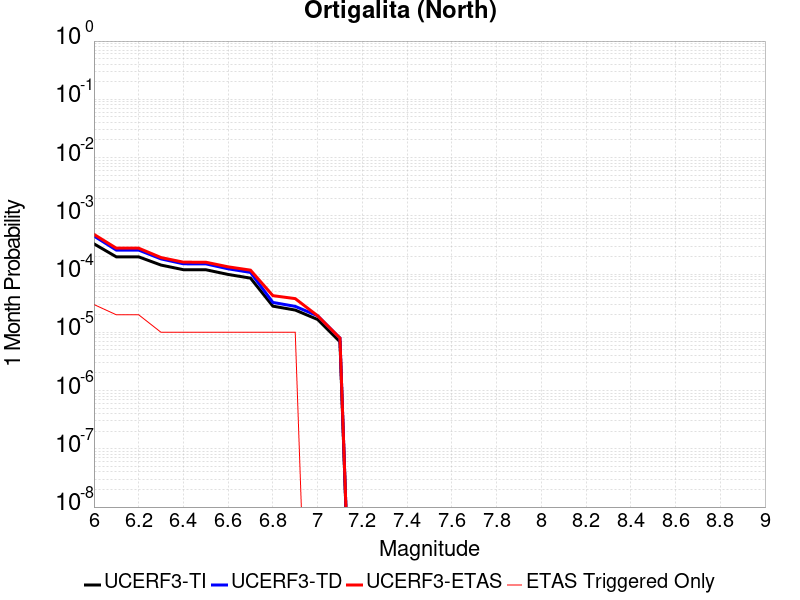 |  |  |

| Magnitude | 1 wk TI Prob | 1 wk TD Prob | 1 wk ETAS Prob | 1 wk ETAS/TD Gain | 1 wk ETAS Triggered Only | 1 mo TI Prob | 1 mo TD Prob | 1 mo ETAS Prob | 1 mo ETAS/TD Gain | 1 mo ETAS Triggered Only | 1 yr TI Prob | 1 yr TD Prob | 1 yr ETAS Prob | 1 yr ETAS/TD Gain | 1 yr ETAS Triggered Only | 10 yr TI Prob | 10 yr TD Prob | 10 yr ETAS Prob | 10 yr ETAS/TD Gain | 10 yr ETAS Triggered Only |
|-----|-----|-----|-----|-----|-----|-----|-----|-----|-----|-----|-----|-----|-----|-----|-----|-----|-----|-----|-----|-----|
| 6.0 | 7.711876E-5 | 1.05064966E-4 | 1.4554654E-4 | 1.3853004 | 4.048583E-5 | 3.3046713E-4 | 4.502116E-4 | 4.906792E-4 | 1.0898857 | 4.048583E-5 | 0.004016016 | 0.0054681194 | 0.0055486485 | 1.014727 | 8.097166E-5 | 0.039442103 | 0.053454787 | 0.053569753 | 1.0021507 | 1.2145749E-4 |
| 6.1 | 4.607858E-5 | 6.0239203E-5 | 1.00722595E-4 | 1.6720439 | 4.048583E-5 | 1.9746469E-4 | 2.5814527E-4 | 2.9862064E-4 | 1.156793 | 4.048583E-5 | 0.0024014818 | 0.0031387596 | 0.0031791183 | 1.0128582 | 4.048583E-5 | 0.023756953 | 0.030975068 | 0.031053532 | 1.0025331 | 8.097166E-5 |
| 6.2 | 4.607858E-5 | 6.0239203E-5 | 1.00722595E-4 | 1.6720439 | 4.048583E-5 | 1.9746469E-4 | 2.5814527E-4 | 2.9862064E-4 | 1.156793 | 4.048583E-5 | 0.0024014818 | 0.0031387596 | 0.0031791183 | 1.0128582 | 4.048583E-5 | 0.023756953 | 0.030975068 | 0.031053532 | 1.0025331 | 8.097166E-5 |
| 6.3 | 3.327423E-5 | 4.2475127E-5 | 8.295924E-5 | 1.9531251 | 4.048583E-5 | 1.4259605E-4 | 1.8202531E-4 | 2.2250378E-4 | 1.2223783 | 4.048583E-5 | 0.0017347244 | 0.002214197 | 0.0022545932 | 1.0182441 | 4.048583E-5 | 0.017212452 | 0.021945644 | 0.02202484 | 1.0036087 | 8.097166E-5 |
| 6.4 | 2.7732503E-5 | 3.4998593E-5 | 7.5483E-5 | 2.156744 | 4.048583E-5 | 1.1884817E-4 | 1.4998685E-4 | 1.9046661E-4 | 1.2698886 | 4.048583E-5 | 0.001446016 | 0.0018248095 | 0.0018652214 | 1.0221459 | 4.048583E-5 | 0.014366428 | 0.018121224 | 0.018200727 | 1.0043874 | 8.097166E-5 |
| 6.5 | 2.7689714E-5 | 3.4948407E-5 | 7.543282E-5 | 2.158405 | 4.048583E-5 | 1.186648E-4 | 1.497718E-4 | 1.9025157E-4 | 1.2702763 | 4.048583E-5 | 0.0014437864 | 0.0018221956 | 0.0018626077 | 1.0221777 | 4.048583E-5 | 0.014344421 | 0.01809551 | 0.018175017 | 1.0043937 | 8.097166E-5 |
| 6.6 | 2.2976905E-5 | 2.8718265E-5 | 6.9202935E-5 | 2.4097185 | 4.048583E-5 | 9.846873E-5 | 1.230739E-4 | 1.6355475E-4 | 1.328915 | 4.048583E-5 | 0.0011981975 | 0.0014976363 | 0.0015380615 | 1.0269927 | 4.048583E-5 | 0.011917574 | 0.014898697 | 0.01493858 | 1.002677 | 4.048583E-5 |
| 6.7 | 1.9871539E-5 | 2.4904411E-5 | 6.5389235E-5 | 2.6256084 | 4.048583E-5 | 8.516096E-5 | 1.0673023E-4 | 1.4721174E-4 | 1.3792881 | 4.048583E-5 | 0.0010363415 | 0.0012989145 | 0.0013393478 | 1.0311285 | 4.048583E-5 | 0.010315218 | 0.012936919 | 0.012976881 | 1.003089 | 4.048583E-5 |
| 6.8 | 6.5640475E-6 | 7.6054926E-6 | 4.8091013E-5 | 6.3231955 | 4.048583E-5 | 2.813133E-5 | 3.2594577E-5 | 7.3079085E-5 | 2.2420628 | 4.048583E-5 | 3.424451E-4 | 3.9676955E-4 | 4.3723933E-4 | 1.1019982 | 4.048583E-5 | 0.0034191788 | 0.003960899 | 0.0040012244 | 1.0101808 | 4.048583E-5 |
| 6.9 | 5.6219683E-6 | 6.5018376E-6 | 4.6987403E-5 | 7.226788 | 4.048583E-5 | 2.4093928E-5 | 2.7864735E-5 | 6.8349436E-5 | 2.452901 | 4.048583E-5 | 2.933041E-4 | 3.3920293E-4 | 3.79675E-4 | 1.1193153 | 4.048583E-5 | 0.0029291727 | 0.003387109 | 0.0034274575 | 1.0119125 | 4.048583E-5 |
| 7.0 | 3.875591E-6 | 4.4847548E-6 | 4.4847548E-6 | 1.0 | 0.0 | 1.6609569E-5 | 1.9220248E-5 | 1.9220248E-5 | 1.0 | 0.0 | 2.0220275E-4 | 2.339835E-4 | 2.339835E-4 | 1.0 | 0.0 | 0.0020201886 | 0.0023375798 | 0.0023375798 | 1.0 | 0.0 |
| 7.1 | 1.6017933E-6 | 1.8570418E-6 | 1.8570418E-6 | 1.0 | 0.0 | 6.8648105E-6 | 7.958732E-6 | 7.958732E-6 | 1.0 | 0.0 | 8.357586E-5 | 9.689432E-5 | 9.689432E-5 | 1.0 | 0.0 | 8.3544437E-4 | 9.686254E-4 | 9.686254E-4 | 1.0 | 0.0 |

## Pine Mtn
*[(top)](#table-of-contents)*

| 1 Week | 1 Month | 1 Year | 10 Year |
|-----|-----|-----|-----|
|  |  |  |  |

| Magnitude | 1 wk TI Prob | 1 wk TD Prob | 1 wk ETAS Prob | 1 wk ETAS/TD Gain | 1 wk ETAS Triggered Only | 1 mo TI Prob | 1 mo TD Prob | 1 mo ETAS Prob | 1 mo ETAS/TD Gain | 1 mo ETAS Triggered Only | 1 yr TI Prob | 1 yr TD Prob | 1 yr ETAS Prob | 1 yr ETAS/TD Gain | 1 yr ETAS Triggered Only | 10 yr TI Prob | 10 yr TD Prob | 10 yr ETAS Prob | 10 yr ETAS/TD Gain | 10 yr ETAS Triggered Only |
|-----|-----|-----|-----|-----|-----|-----|-----|-----|-----|-----|-----|-----|-----|-----|-----|-----|-----|-----|-----|-----|
| 6.0 | 6.894797E-6 | 7.225461E-6 | 7.225461E-6 | 1.0 | 0.0 | 2.9548795E-5 | 3.096591E-5 | 3.096591E-5 | 1.0 | 0.0 | 3.596972E-4 | 3.7694772E-4 | 4.174183E-4 | 1.1073638 | 4.048583E-5 | 0.0035911554 | 0.003763381 | 0.0038843814 | 1.032152 | 1.2145749E-4 |
| 6.1 | 6.894797E-6 | 7.225461E-6 | 7.225461E-6 | 1.0 | 0.0 | 2.9548795E-5 | 3.096591E-5 | 3.096591E-5 | 1.0 | 0.0 | 3.596972E-4 | 3.7694772E-4 | 4.174183E-4 | 1.1073638 | 4.048583E-5 | 0.0035911554 | 0.003763381 | 0.0038843814 | 1.032152 | 1.2145749E-4 |
| 6.2 | 6.894797E-6 | 7.225461E-6 | 7.225461E-6 | 1.0 | 0.0 | 2.9548795E-5 | 3.096591E-5 | 3.096591E-5 | 1.0 | 0.0 | 3.596972E-4 | 3.7694772E-4 | 4.174183E-4 | 1.1073638 | 4.048583E-5 | 0.0035911554 | 0.003763381 | 0.0038843814 | 1.032152 | 1.2145749E-4 |
| 6.3 | 6.894797E-6 | 7.225461E-6 | 7.225461E-6 | 1.0 | 0.0 | 2.9548795E-5 | 3.096591E-5 | 3.096591E-5 | 1.0 | 0.0 | 3.596972E-4 | 3.7694772E-4 | 4.174183E-4 | 1.1073638 | 4.048583E-5 | 0.0035911554 | 0.003763381 | 0.0038843814 | 1.032152 | 1.2145749E-4 |
| 6.4 | 6.894797E-6 | 7.225461E-6 | 7.225461E-6 | 1.0 | 0.0 | 2.9548795E-5 | 3.096591E-5 | 3.096591E-5 | 1.0 | 0.0 | 3.596972E-4 | 3.7694772E-4 | 4.174183E-4 | 1.1073638 | 4.048583E-5 | 0.0035911554 | 0.003763381 | 0.0038843814 | 1.032152 | 1.2145749E-4 |
| 6.5 | 6.894797E-6 | 7.225461E-6 | 7.225461E-6 | 1.0 | 0.0 | 2.9548795E-5 | 3.096591E-5 | 3.096591E-5 | 1.0 | 0.0 | 3.596972E-4 | 3.7694772E-4 | 4.174183E-4 | 1.1073638 | 4.048583E-5 | 0.0035911554 | 0.003763381 | 0.0038843814 | 1.032152 | 1.2145749E-4 |
| 6.6 | 6.894797E-6 | 7.225461E-6 | 7.225461E-6 | 1.0 | 0.0 | 2.9548795E-5 | 3.096591E-5 | 3.096591E-5 | 1.0 | 0.0 | 3.596972E-4 | 3.7694772E-4 | 4.174183E-4 | 1.1073638 | 4.048583E-5 | 0.0035911554 | 0.003763381 | 0.0038843814 | 1.032152 | 1.2145749E-4 |
| 6.7 | 6.0867933E-6 | 6.3971133E-6 | 6.3971133E-6 | 1.0 | 0.0 | 2.6085996E-5 | 2.7415923E-5 | 2.7415923E-5 | 1.0 | 0.0 | 3.1755073E-4 | 3.3373994E-4 | 3.7421225E-4 | 1.121269 | 4.048583E-5 | 0.0031709734 | 0.0033326065 | 0.0034536591 | 1.0363238 | 1.2145749E-4 |
| 6.8 | 5.6530425E-6 | 5.9505956E-6 | 5.9505956E-6 | 1.0 | 0.0 | 2.42271E-5 | 2.5502315E-5 | 2.5502315E-5 | 1.0 | 0.0 | 2.94925E-4 | 3.104485E-4 | 3.5092176E-4 | 1.1303703 | 4.048583E-5 | 0.002945339 | 0.0031003528 | 0.0032214338 | 1.0390539 | 1.2145749E-4 |
| 6.9 | 4.6015225E-6 | 4.863834E-6 | 4.863834E-6 | 1.0 | 0.0 | 1.9720663E-5 | 2.0844845E-5 | 2.0844845E-5 | 1.0 | 0.0 | 2.4007261E-4 | 2.5375787E-4 | 2.9423344E-4 | 1.1595047 | 4.048583E-5 | 0.0023981342 | 0.0025348254 | 0.002655975 | 1.0477941 | 1.2145749E-4 |
| 7.0 | 4.4875965E-6 | 4.747473E-6 | 4.747473E-6 | 1.0 | 0.0 | 1.9232413E-5 | 2.0346162E-5 | 2.0346162E-5 | 1.0 | 0.0 | 2.3412947E-4 | 2.4768783E-4 | 2.8816363E-4 | 1.1634146 | 4.048583E-5 | 0.0023388295 | 0.0024742614 | 0.0025954184 | 1.0489669 | 1.2145749E-4 |
| 7.1 | 3.203907E-6 | 3.4294096E-6 | 3.4294096E-6 | 1.0 | 0.0 | 1.3730958E-5 | 1.4697391E-5 | 1.4697391E-5 | 1.0 | 0.0 | 1.6716159E-4 | 1.789267E-4 | 2.194053E-4 | 1.22623 | 4.048583E-5 | 0.0016703589 | 0.0017878925 | 0.0018687195 | 1.0452079 | 8.097166E-5 |
| 7.2 | 2.2060601E-6 | 2.3784817E-6 | 2.3784817E-6 | 1.0 | 0.0 | 9.4545085E-6 | 1.0193455E-5 | 1.0193455E-5 | 1.0 | 0.0 | 1.15102564E-4 | 1.240987E-4 | 1.6457951E-4 | 1.3261985 | 4.048583E-5 | 0.0011504296 | 0.0012403389 | 0.0013212101 | 1.0652009 | 8.097166E-5 |
| 7.3 | 1.3765207E-6 | 1.5216481E-6 | 1.5216481E-6 | 1.0 | 0.0 | 5.899361E-6 | 6.521333E-6 | 6.521333E-6 | 1.0 | 0.0 | 7.182235E-5 | 7.939443E-5 | 7.939443E-5 | 1.0 | 0.0 | 7.1799144E-4 | 7.936697E-4 | 8.3412346E-4 | 1.0509704 | 4.048583E-5 |
| 7.4 | 1.1245983E-6 | 1.2587075E-6 | 1.2587075E-6 | 1.0 | 0.0 | 4.819698E-6 | 5.39445E-6 | 5.39445E-6 | 1.0 | 0.0 | 5.8678244E-5 | 6.567554E-5 | 6.567554E-5 | 1.0 | 0.0 | 5.866275E-4 | 6.5656955E-4 | 6.970288E-4 | 1.0616221 | 4.048583E-5 |
| 7.5 | 8.031682E-7 | 9.276951E-7 | 9.276951E-7 | 1.0 | 0.0 | 3.4421448E-6 | 3.9758306E-6 | 3.9758306E-6 | 1.0 | 0.0 | 4.1907308E-5 | 4.840473E-5 | 4.840473E-5 | 1.0 | 0.0 | 4.1899405E-4 | 4.8394862E-4 | 5.244149E-4 | 1.0836169 | 4.048583E-5 |
| 7.6 | 4.8953444E-7 | 6.003009E-7 | 6.003009E-7 | 1.0 | 0.0 | 2.098003E-6 | 2.5727159E-6 | 2.5727159E-6 | 1.0 | 0.0 | 2.5542888E-5 | 3.1322415E-5 | 3.1322415E-5 | 1.0 | 0.0 | 2.5539953E-4 | 3.1318486E-4 | 3.1318486E-4 | 1.0 | 0.0 |
| 7.7 | 6.634529E-8 | 6.788826E-8 | 6.788826E-8 | 1.0 | 0.0 | 2.843369E-7 | 2.9094966E-7 | 2.9094966E-7 | 1.0 | 0.0 | 3.4617963E-6 | 3.5423066E-6 | 3.5423066E-6 | 1.0 | 0.0 | 3.4617424E-5 | 3.542255E-5 | 3.542255E-5 | 1.0 | 0.0 |
| 7.8 | 9.235578E-9 | 9.488566E-9 | 9.488566E-9 | 1.0 | 0.0 | 3.9581046E-8 | 4.0665284E-8 | 4.0665284E-8 | 1.0 | 0.0 | 4.818991E-7 | 4.950997E-7 | 4.950997E-7 | 1.0 | 0.0 | 4.8189804E-6 | 4.950988E-6 | 4.950988E-6 | 1.0 | 0.0 |

## Palos Verdes
*[(top)](#table-of-contents)*

| 1 Week | 1 Month | 1 Year | 10 Year |
|-----|-----|-----|-----|
|  |  |  |  |

| Magnitude | 1 wk TI Prob | 1 wk TD Prob | 1 wk ETAS Prob | 1 wk ETAS/TD Gain | 1 wk ETAS Triggered Only | 1 mo TI Prob | 1 mo TD Prob | 1 mo ETAS Prob | 1 mo ETAS/TD Gain | 1 mo ETAS Triggered Only | 1 yr TI Prob | 1 yr TD Prob | 1 yr ETAS Prob | 1 yr ETAS/TD Gain | 1 yr ETAS Triggered Only | 10 yr TI Prob | 10 yr TD Prob | 10 yr ETAS Prob | 10 yr ETAS/TD Gain | 10 yr ETAS Triggered Only |
|-----|-----|-----|-----|-----|-----|-----|-----|-----|-----|-----|-----|-----|-----|-----|-----|-----|-----|-----|-----|-----|
| 6.0 | 6.126063E-5 | 7.622612E-5 | 1.1670886E-4 | 1.5310875 | 4.048583E-5 | 2.6251914E-4 | 3.2664582E-4 | 3.6711842E-4 | 1.1239036 | 4.048583E-5 | 0.0031914865 | 0.003970174 | 0.0040104995 | 1.010157 | 4.048583E-5 | 0.031460393 | 0.039048895 | 0.039165612 | 1.0029889 | 1.2145749E-4 |
| 6.1 | 6.126063E-5 | 7.622612E-5 | 1.1670886E-4 | 1.5310875 | 4.048583E-5 | 2.6251914E-4 | 3.2664582E-4 | 3.6711842E-4 | 1.1239036 | 4.048583E-5 | 0.0031914865 | 0.003970174 | 0.0040104995 | 1.010157 | 4.048583E-5 | 0.031460393 | 0.039048895 | 0.039165612 | 1.0029889 | 1.2145749E-4 |
| 6.2 | 6.126063E-5 | 7.622612E-5 | 1.1670886E-4 | 1.5310875 | 4.048583E-5 | 2.6251914E-4 | 3.2664582E-4 | 3.6711842E-4 | 1.1239036 | 4.048583E-5 | 0.0031914865 | 0.003970174 | 0.0040104995 | 1.010157 | 4.048583E-5 | 0.031460393 | 0.039048895 | 0.039165612 | 1.0029889 | 1.2145749E-4 |
| 6.3 | 4.0838047E-5 | 4.9749437E-5 | 9.0233254E-5 | 1.8137543 | 4.048583E-5 | 1.7500846E-4 | 2.1319572E-4 | 2.5367292E-4 | 1.1898594 | 4.048583E-5 | 0.0021286458 | 0.0025927818 | 0.0026331628 | 1.0155743 | 4.048583E-5 | 0.021083709 | 0.025646681 | 0.025765024 | 1.0046144 | 1.2145749E-4 |
| 6.4 | 4.0838047E-5 | 4.9749437E-5 | 9.0233254E-5 | 1.8137543 | 4.048583E-5 | 1.7500846E-4 | 2.1319572E-4 | 2.5367292E-4 | 1.1898594 | 4.048583E-5 | 0.0021286458 | 0.0025927818 | 0.0026331628 | 1.0155743 | 4.048583E-5 | 0.021083709 | 0.025646681 | 0.025765024 | 1.0046144 | 1.2145749E-4 |
| 6.5 | 3.0512005E-5 | 3.656162E-5 | 3.656162E-5 | 1.0 | 0.0 | 1.3075917E-4 | 1.5668393E-4 | 1.5668393E-4 | 1.0 | 0.0 | 0.0015908304 | 0.0019060767 | 0.0019060767 | 1.0 | 0.0 | 0.015794903 | 0.018909154 | 0.018988594 | 1.0042012 | 8.097166E-5 |
| 6.6 | 2.9255087E-5 | 3.515442E-5 | 3.515442E-5 | 1.0 | 0.0 | 1.2537291E-4 | 1.5065377E-4 | 1.5065377E-4 | 1.0 | 0.0 | 0.0015253464 | 0.0018327828 | 0.0018327828 | 1.0 | 0.0 | 0.015149189 | 0.018188225 | 0.018267725 | 1.0043709 | 8.097166E-5 |
| 6.7 | 2.287198E-5 | 2.7248278E-5 | 2.7248278E-5 | 1.0 | 0.0 | 9.801909E-5 | 1.16773626E-4 | 1.16773626E-4 | 1.0 | 0.0 | 0.001192729 | 0.0014208833 | 0.0014208833 | 1.0 | 0.0 | 0.011863477 | 0.014127217 | 0.014207045 | 1.0056506 | 8.097166E-5 |
| 6.8 | 2.1325764E-5 | 2.5431877E-5 | 2.5431877E-5 | 1.0 | 0.0 | 9.139293E-5 | 1.0898971E-4 | 1.0898971E-4 | 1.0 | 0.0 | 0.001112141 | 0.0013262323 | 0.0013262323 | 1.0 | 0.0 | 0.011065915 | 0.013192211 | 0.013272115 | 1.0060569 | 8.097166E-5 |
| 6.9 | 1.9009392E-5 | 2.2613547E-5 | 2.2613547E-5 | 1.0 | 0.0 | 8.1466285E-5 | 9.6912096E-5 | 9.6912096E-5 | 1.0 | 0.0 | 9.914007E-4 | 0.0011793535 | 0.0011793535 | 1.0 | 0.0 | 0.009869894 | 0.011739632 | 0.011779643 | 1.0034082 | 4.048583E-5 |
| 7.0 | 1.7098473E-5 | 2.0319356E-5 | 2.0319356E-5 | 1.0 | 0.0 | 7.3277115E-5 | 8.708052E-5 | 8.708052E-5 | 1.0 | 0.0 | 8.917837E-4 | 0.001059775 | 0.001059775 | 1.0 | 0.0 | 0.008882134 | 0.010555646 | 0.010595705 | 1.003795 | 4.048583E-5 |
| 7.1 | 1.5982785E-5 | 1.899476E-5 | 1.899476E-5 | 1.0 | 0.0 | 6.849585E-5 | 8.1404054E-5 | 8.1404054E-5 | 1.0 | 0.0 | 8.336179E-4 | 9.907284E-4 | 9.907284E-4 | 1.0 | 0.0 | 0.008304977 | 0.009871479 | 0.009911566 | 1.0040609 | 4.048583E-5 |
| 7.2 | 1.4468002E-5 | 1.7197237E-5 | 1.7197237E-5 | 1.0 | 0.0 | 6.200425E-5 | 7.370083E-5 | 7.370083E-5 | 1.0 | 0.0 | 7.546402E-4 | 8.970222E-4 | 8.970222E-4 | 1.0 | 0.0 | 0.007520827 | 0.008942284 | 0.008982408 | 1.0044869 | 4.048583E-5 |
| 7.3 | 5.288233E-6 | 6.2036747E-6 | 6.2036747E-6 | 1.0 | 0.0 | 2.2663658E-5 | 2.6587102E-5 | 2.6587102E-5 | 1.0 | 0.0 | 2.7589512E-4 | 3.236848E-4 | 3.236848E-4 | 1.0 | 0.0 | 0.0027555283 | 0.0032355562 | 0.0032355562 | 1.0 | 0.0 |
| 7.4 | 8.279556E-7 | 8.408347E-7 | 8.408347E-7 | 1.0 | 0.0 | 3.5483763E-6 | 3.6035726E-6 | 3.6035726E-6 | 1.0 | 0.0 | 4.3200624E-5 | 4.3872686E-5 | 4.3872686E-5 | 1.0 | 0.0 | 4.3192226E-4 | 4.3864746E-4 | 4.3864746E-4 | 1.0 | 0.0 |
| 7.5 | 6.559831E-7 | 6.667229E-7 | 6.667229E-7 | 1.0 | 0.0 | 2.8113532E-6 | 2.857381E-6 | 2.857381E-6 | 1.0 | 0.0 | 3.4227687E-5 | 3.4788125E-5 | 3.4788125E-5 | 1.0 | 0.0 | 3.4222414E-4 | 3.4783344E-4 | 3.4783344E-4 | 1.0 | 0.0 |
| 7.6 | 3.5018968E-7 | 3.5620027E-7 | 3.5620027E-7 | 1.0 | 0.0 | 1.500812E-6 | 1.526572E-6 | 1.526572E-6 | 1.0 | 0.0 | 1.8272232E-5 | 1.8585903E-5 | 1.8585903E-5 | 1.0 | 0.0 | 1.8270731E-4 | 1.8584808E-4 | 1.8584808E-4 | 1.0 | 0.0 |
| 7.7 | 1.1986104E-7 | 1.2198376E-7 | 1.2198376E-7 | 1.0 | 0.0 | 5.1369005E-7 | 5.2278745E-7 | 5.2278745E-7 | 1.0 | 0.0 | 6.2541585E-6 | 6.364919E-6 | 6.364919E-6 | 1.0 | 0.0 | 6.2539824E-5 | 6.364741E-5 | 6.364741E-5 | 1.0 | 0.0 |
| 7.8 | 3.0445005E-8 | 3.1027582E-8 | 3.1027582E-8 | 1.0 | 0.0 | 1.3047858E-7 | 1.3297536E-7 | 1.3297536E-7 | 1.0 | 0.0 | 1.5885756E-6 | 1.6189739E-6 | 1.6189739E-6 | 1.0 | 0.0 | 1.5885644E-5 | 1.6189642E-5 | 1.6189642E-5 | 1.0 | 0.0 |

## Whittier alt 1
*[(top)](#table-of-contents)*

| 1 Week | 1 Month | 1 Year | 10 Year |
|-----|-----|-----|-----|
|  |  |  |  |

| Magnitude | 1 wk TI Prob | 1 wk TD Prob | 1 wk ETAS Prob | 1 wk ETAS/TD Gain | 1 wk ETAS Triggered Only | 1 mo TI Prob | 1 mo TD Prob | 1 mo ETAS Prob | 1 mo ETAS/TD Gain | 1 mo ETAS Triggered Only | 1 yr TI Prob | 1 yr TD Prob | 1 yr ETAS Prob | 1 yr ETAS/TD Gain | 1 yr ETAS Triggered Only | 10 yr TI Prob | 10 yr TD Prob | 10 yr ETAS Prob | 10 yr ETAS/TD Gain | 10 yr ETAS Triggered Only |
|-----|-----|-----|-----|-----|-----|-----|-----|-----|-----|-----|-----|-----|-----|-----|-----|-----|-----|-----|-----|-----|
| 6.0 | 4.2554693E-5 | 4.725218E-5 | 8.7736094E-5 | 1.856763 | 4.048583E-5 | 1.8236451E-4 | 2.0249544E-4 | 2.4297307E-4 | 1.1998941 | 4.048583E-5 | 0.002218027 | 0.0024629154 | 0.0025436876 | 1.0327954 | 8.097166E-5 | 0.02196019 | 0.024390234 | 0.02450873 | 1.0048583 | 1.2145749E-4 |
| 6.1 | 4.2554693E-5 | 4.725218E-5 | 8.7736094E-5 | 1.856763 | 4.048583E-5 | 1.8236451E-4 | 2.0249544E-4 | 2.4297307E-4 | 1.1998941 | 4.048583E-5 | 0.002218027 | 0.0024629154 | 0.0025436876 | 1.0327954 | 8.097166E-5 | 0.02196019 | 0.024390234 | 0.02450873 | 1.0048583 | 1.2145749E-4 |
| 6.2 | 4.2554693E-5 | 4.725218E-5 | 8.7736094E-5 | 1.856763 | 4.048583E-5 | 1.8236451E-4 | 2.0249544E-4 | 2.4297307E-4 | 1.1998941 | 4.048583E-5 | 0.002218027 | 0.0024629154 | 0.0025436876 | 1.0327954 | 8.097166E-5 | 0.02196019 | 0.024390234 | 0.02450873 | 1.0048583 | 1.2145749E-4 |
| 6.3 | 1.9617712E-5 | 1.8268593E-5 | 1.8268593E-5 | 1.0 | 0.0 | 8.40732E-5 | 7.829172E-5 | 7.829172E-5 | 1.0 | 0.0 | 0.0010231105 | 9.52804E-4 | 9.52804E-4 | 1.0 | 0.0 | 0.01018413 | 0.009490474 | 0.009530576 | 1.0042255 | 4.048583E-5 |
| 6.4 | 1.5611336E-5 | 1.3604271E-5 | 1.3604271E-5 | 1.0 | 0.0 | 6.690401E-5 | 5.8302747E-5 | 5.8302747E-5 | 1.0 | 0.0 | 8.142519E-4 | 7.0961076E-4 | 7.0961076E-4 | 1.0 | 0.0 | 0.008112748 | 0.0070754145 | 0.007115614 | 1.0056815 | 4.048583E-5 |
| 6.5 | 1.5150166E-5 | 1.3100925E-5 | 1.3100925E-5 | 1.0 | 0.0 | 6.492767E-5 | 5.6145647E-5 | 5.6145647E-5 | 1.0 | 0.0 | 7.9020765E-4 | 6.8336475E-4 | 6.8336475E-4 | 1.0 | 0.0 | 0.007874036 | 0.0068145846 | 0.0068547945 | 1.0059006 | 4.048583E-5 |
| 6.6 | 1.295588E-5 | 1.0380725E-5 | 1.0380725E-5 | 1.0 | 0.0 | 5.552402E-5 | 4.4488075E-5 | 4.4488075E-5 | 1.0 | 0.0 | 6.7579525E-4 | 5.4150965E-4 | 5.4150965E-4 | 1.0 | 0.0 | 0.006737438 | 0.0054033357 | 0.005443603 | 1.0074522 | 4.048583E-5 |
| 6.7 | 1.2542085E-5 | 9.899369E-6 | 9.899369E-6 | 1.0 | 0.0 | 5.3750682E-5 | 4.242519E-5 | 4.242519E-5 | 1.0 | 0.0 | 6.542181E-4 | 5.164061E-4 | 5.164061E-4 | 1.0 | 0.0 | 0.006522954 | 0.0051534795 | 0.0051937564 | 1.0078155 | 4.048583E-5 |
| 6.8 | 1.2195878E-5 | 9.495415E-6 | 9.495415E-6 | 1.0 | 0.0 | 5.2267E-5 | 4.069401E-5 | 4.069401E-5 | 1.0 | 0.0 | 6.36165E-4 | 4.9533875E-4 | 4.9533875E-4 | 1.0 | 0.0 | 0.0063434686 | 0.004943688 | 0.0049839737 | 1.0081489 | 4.048583E-5 |
| 6.9 | 1.1580298E-5 | 8.772933E-6 | 8.772933E-6 | 1.0 | 0.0 | 4.9628903E-5 | 3.7597754E-5 | 3.7597754E-5 | 1.0 | 0.0 | 6.040644E-4 | 4.5765814E-4 | 4.5765814E-4 | 1.0 | 0.0 | 0.00602425 | 0.0045684157 | 0.004608717 | 1.0088216 | 4.048583E-5 |
| 7.0 | 1.0964795E-5 | 8.083994E-6 | 8.083994E-6 | 1.0 | 0.0 | 4.6991136E-5 | 3.4645236E-5 | 3.4645236E-5 | 1.0 | 0.0 | 5.7196687E-4 | 4.2172565E-4 | 4.2172565E-4 | 1.0 | 0.0 | 0.0057049696 | 0.004210462 | 0.004250777 | 1.009575 | 4.048583E-5 |
| 7.1 | 1.0230601E-5 | 7.3266697E-6 | 7.3266697E-6 | 1.0 | 0.0 | 4.3844695E-5 | 3.1399642E-5 | 3.1399642E-5 | 1.0 | 0.0 | 5.336784E-4 | 3.8222488E-4 | 3.8222488E-4 | 1.0 | 0.0 | 0.005323986 | 0.0038168381 | 0.0038571695 | 1.0105667 | 4.048583E-5 |
| 7.2 | 9.40865E-6 | 6.543289E-6 | 6.543289E-6 | 1.0 | 0.0 | 4.032216E-5 | 2.8042374E-5 | 2.8042374E-5 | 1.0 | 0.0 | 4.908117E-4 | 3.4136363E-4 | 3.4136363E-4 | 1.0 | 0.0 | 0.0048972913 | 0.003409485 | 0.003449833 | 1.011834 | 4.048583E-5 |
| 7.3 | 8.237384E-6 | 5.5977525E-6 | 5.5977525E-6 | 1.0 | 0.0 | 3.5302593E-5 | 2.3990153E-5 | 2.3990153E-5 | 1.0 | 0.0 | 4.2972428E-4 | 2.92042E-4 | 2.92042E-4 | 1.0 | 0.0 | 0.0042889426 | 0.002916903 | 0.002957271 | 1.0138392 | 4.048583E-5 |
| 7.4 | 7.5316966E-6 | 5.027819E-6 | 5.027819E-6 | 1.0 | 0.0 | 3.2278298E-5 | 2.1547625E-5 | 2.1547625E-5 | 1.0 | 0.0 | 3.9291743E-4 | 2.6231175E-4 | 2.6231175E-4 | 1.0 | 0.0 | 0.0039222343 | 0.0026201333 | 0.0026201333 | 1.0 | 0.0 |
| 7.5 | 6.149649E-6 | 3.933841E-6 | 3.933841E-6 | 1.0 | 0.0 | 2.6355372E-5 | 1.6859214E-5 | 1.6859214E-5 | 1.0 | 0.0 | 3.208294E-4 | 2.052425E-4 | 2.052425E-4 | 1.0 | 0.0 | 0.003203666 | 0.0020506186 | 0.0020506186 | 1.0 | 0.0 |
| 7.6 | 5.457711E-6 | 3.3953788E-6 | 3.3953788E-6 | 1.0 | 0.0 | 2.338998E-5 | 1.4551547E-5 | 1.4551547E-5 | 1.0 | 0.0 | 2.8473578E-4 | 1.771515E-4 | 1.771515E-4 | 1.0 | 0.0 | 0.0028437122 | 0.0017701836 | 0.0017701836 | 1.0 | 0.0 |
| 7.7 | 4.1676276E-6 | 2.3331952E-6 | 2.3331952E-6 | 1.0 | 0.0 | 1.7861139E-5 | 9.999374E-6 | 9.999374E-6 | 1.0 | 0.0 | 2.1743766E-4 | 1.2173632E-4 | 1.2173632E-4 | 1.0 | 0.0 | 0.0021722503 | 0.0012167693 | 0.0012167693 | 1.0 | 0.0 |
| 7.8 | 2.2692414E-7 | 9.3854695E-8 | 9.3854695E-8 | 1.0 | 0.0 | 9.725317E-7 | 4.0223435E-7 | 4.0223435E-7 | 1.0 | 0.0 | 1.1840509E-5 | 4.8971956E-6 | 4.8971956E-6 | 1.0 | 0.0 | 1.1839878E-4 | 4.8971204E-5 | 4.8971204E-5 | 1.0 | 0.0 |
| 7.9 | 6.676829E-9 | 3.439853E-9 | 3.439853E-9 | 1.0 | 0.0 | 2.861498E-8 | 1.4742227E-8 | 1.4742227E-8 | 1.0 | 0.0 | 3.4838732E-7 | 1.7948659E-7 | 1.7948659E-7 | 1.0 | 0.0 | 3.4838679E-6 | 1.7948646E-6 | 1.7948646E-6 | 1.0 | 0.0 |

## Pitas Point (Lower)-Montalvo
*[(top)](#table-of-contents)*

| 1 Week | 1 Month | 1 Year | 10 Year |
|-----|-----|-----|-----|
|  |  | 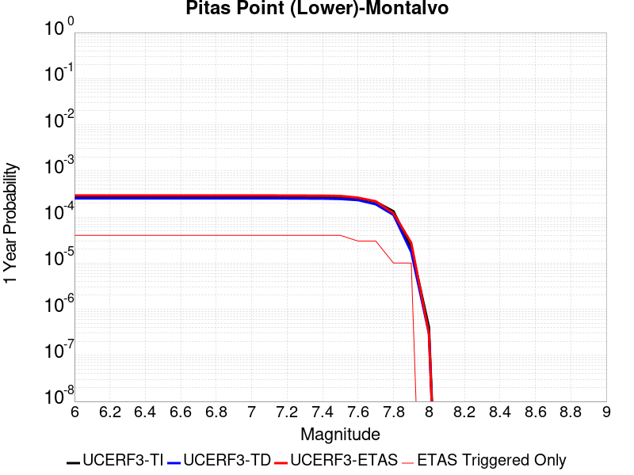 |  |

| Magnitude | 1 wk TI Prob | 1 wk TD Prob | 1 wk ETAS Prob | 1 wk ETAS/TD Gain | 1 wk ETAS Triggered Only | 1 mo TI Prob | 1 mo TD Prob | 1 mo ETAS Prob | 1 mo ETAS/TD Gain | 1 mo ETAS Triggered Only | 1 yr TI Prob | 1 yr TD Prob | 1 yr ETAS Prob | 1 yr ETAS/TD Gain | 1 yr ETAS Triggered Only | 10 yr TI Prob | 10 yr TD Prob | 10 yr ETAS Prob | 10 yr ETAS/TD Gain | 10 yr ETAS Triggered Only |
|-----|-----|-----|-----|-----|-----|-----|-----|-----|-----|-----|-----|-----|-----|-----|-----|-----|-----|-----|-----|-----|
| 6.0 | 5.2543637E-6 | 4.8378706E-6 | 4.5323504E-5 | 9.368483 | 4.048583E-5 | 2.2518509E-5 | 2.0733567E-5 | 6.121856E-5 | 2.9526303 | 4.048583E-5 | 2.7412834E-4 | 2.5240227E-4 | 2.9287787E-4 | 1.1603615 | 4.048583E-5 | 0.0027379042 | 0.0025211885 | 0.002601956 | 1.0320355 | 8.097166E-5 |
| 6.1 | 5.2543637E-6 | 4.8378706E-6 | 4.5323504E-5 | 9.368483 | 4.048583E-5 | 2.2518509E-5 | 2.0733567E-5 | 6.121856E-5 | 2.9526303 | 4.048583E-5 | 2.7412834E-4 | 2.5240227E-4 | 2.9287787E-4 | 1.1603615 | 4.048583E-5 | 0.0027379042 | 0.0025211885 | 0.002601956 | 1.0320355 | 8.097166E-5 |
| 6.2 | 5.2543637E-6 | 4.8378706E-6 | 4.5323504E-5 | 9.368483 | 4.048583E-5 | 2.2518509E-5 | 2.0733567E-5 | 6.121856E-5 | 2.9526303 | 4.048583E-5 | 2.7412834E-4 | 2.5240227E-4 | 2.9287787E-4 | 1.1603615 | 4.048583E-5 | 0.0027379042 | 0.0025211885 | 0.002601956 | 1.0320355 | 8.097166E-5 |
| 6.3 | 5.2543637E-6 | 4.8378706E-6 | 4.5323504E-5 | 9.368483 | 4.048583E-5 | 2.2518509E-5 | 2.0733567E-5 | 6.121856E-5 | 2.9526303 | 4.048583E-5 | 2.7412834E-4 | 2.5240227E-4 | 2.9287787E-4 | 1.1603615 | 4.048583E-5 | 0.0027379042 | 0.0025211885 | 0.002601956 | 1.0320355 | 8.097166E-5 |
| 6.4 | 5.2543637E-6 | 4.8378706E-6 | 4.5323504E-5 | 9.368483 | 4.048583E-5 | 2.2518509E-5 | 2.0733567E-5 | 6.121856E-5 | 2.9526303 | 4.048583E-5 | 2.7412834E-4 | 2.5240227E-4 | 2.9287787E-4 | 1.1603615 | 4.048583E-5 | 0.0027379042 | 0.0025211885 | 0.002601956 | 1.0320355 | 8.097166E-5 |
| 6.5 | 5.2543637E-6 | 4.8378706E-6 | 4.5323504E-5 | 9.368483 | 4.048583E-5 | 2.2518509E-5 | 2.0733567E-5 | 6.121856E-5 | 2.9526303 | 4.048583E-5 | 2.7412834E-4 | 2.5240227E-4 | 2.9287787E-4 | 1.1603615 | 4.048583E-5 | 0.0027379042 | 0.0025211885 | 0.002601956 | 1.0320355 | 8.097166E-5 |
| 6.6 | 5.2543637E-6 | 4.8378706E-6 | 4.5323504E-5 | 9.368483 | 4.048583E-5 | 2.2518509E-5 | 2.0733567E-5 | 6.121856E-5 | 2.9526303 | 4.048583E-5 | 2.7412834E-4 | 2.5240227E-4 | 2.9287787E-4 | 1.1603615 | 4.048583E-5 | 0.0027379042 | 0.0025211885 | 0.002601956 | 1.0320355 | 8.097166E-5 |
| 6.7 | 5.2543637E-6 | 4.8378706E-6 | 4.5323504E-5 | 9.368483 | 4.048583E-5 | 2.2518509E-5 | 2.0733567E-5 | 6.121856E-5 | 2.9526303 | 4.048583E-5 | 2.7412834E-4 | 2.5240227E-4 | 2.9287787E-4 | 1.1603615 | 4.048583E-5 | 0.0027379042 | 0.0025211885 | 0.002601956 | 1.0320355 | 8.097166E-5 |
| 6.8 | 5.2543637E-6 | 4.8378706E-6 | 4.5323504E-5 | 9.368483 | 4.048583E-5 | 2.2518509E-5 | 2.0733567E-5 | 6.121856E-5 | 2.9526303 | 4.048583E-5 | 2.7412834E-4 | 2.5240227E-4 | 2.9287787E-4 | 1.1603615 | 4.048583E-5 | 0.0027379042 | 0.0025211885 | 0.002601956 | 1.0320355 | 8.097166E-5 |
| 6.9 | 5.2543637E-6 | 4.8378706E-6 | 4.5323504E-5 | 9.368483 | 4.048583E-5 | 2.2518509E-5 | 2.0733567E-5 | 6.121856E-5 | 2.9526303 | 4.048583E-5 | 2.7412834E-4 | 2.5240227E-4 | 2.9287787E-4 | 1.1603615 | 4.048583E-5 | 0.0027379042 | 0.0025211885 | 0.002601956 | 1.0320355 | 8.097166E-5 |
| 7.0 | 5.2543637E-6 | 4.8378706E-6 | 4.5323504E-5 | 9.368483 | 4.048583E-5 | 2.2518509E-5 | 2.0733567E-5 | 6.121856E-5 | 2.9526303 | 4.048583E-5 | 2.7412834E-4 | 2.5240227E-4 | 2.9287787E-4 | 1.1603615 | 4.048583E-5 | 0.0027379042 | 0.0025211885 | 0.002601956 | 1.0320355 | 8.097166E-5 |
| 7.1 | 5.2543637E-6 | 4.8378706E-6 | 4.5323504E-5 | 9.368483 | 4.048583E-5 | 2.2518509E-5 | 2.0733567E-5 | 6.121856E-5 | 2.9526303 | 4.048583E-5 | 2.7412834E-4 | 2.5240227E-4 | 2.9287787E-4 | 1.1603615 | 4.048583E-5 | 0.0027379042 | 0.0025211885 | 0.002601956 | 1.0320355 | 8.097166E-5 |
| 7.2 | 5.2458695E-6 | 4.8290244E-6 | 4.531466E-5 | 9.383813 | 4.048583E-5 | 2.2482105E-5 | 2.0695656E-5 | 6.1180646E-5 | 2.9562073 | 4.048583E-5 | 2.7368523E-4 | 2.519408E-4 | 2.9241643E-4 | 1.1606554 | 4.048583E-5 | 0.0027334841 | 0.0025165842 | 0.002597352 | 1.0320942 | 8.097166E-5 |
| 7.3 | 5.22665E-6 | 4.8089414E-6 | 4.5294575E-5 | 9.418824 | 4.048583E-5 | 2.2399736E-5 | 2.0609588E-5 | 6.1094586E-5 | 2.9643767 | 4.048583E-5 | 2.7268266E-4 | 2.5089315E-4 | 2.9136884E-4 | 1.1613263 | 4.048583E-5 | 0.002723483 | 0.0025061315 | 0.0025869003 | 1.0322285 | 8.097166E-5 |
| 7.4 | 5.210642E-6 | 4.792154E-6 | 4.527779E-5 | 9.448318 | 4.048583E-5 | 2.233113E-5 | 2.0537642E-5 | 6.102264E-5 | 2.9712584 | 4.048583E-5 | 2.718476E-4 | 2.5001742E-4 | 2.9049313E-4 | 1.1618916 | 4.048583E-5 | 0.002715153 | 0.0024973939 | 0.0025781633 | 1.0323415 | 8.097166E-5 |
| 7.5 | 5.1226016E-6 | 4.7000403E-6 | 4.518568E-5 | 9.613892 | 4.048583E-5 | 2.1953823E-5 | 2.0142877E-5 | 6.062789E-5 | 3.0098922 | 4.048583E-5 | 2.67255E-4 | 2.4521223E-4 | 2.8568815E-4 | 1.1650648 | 4.048583E-5 | 0.0026693381 | 0.0024494485 | 0.0025302216 | 1.0329762 | 8.097166E-5 |
| 7.6 | 4.8796987E-6 | 4.4449403E-6 | 4.493059E-5 | 10.108254 | 4.048583E-5 | 2.0912828E-5 | 1.9049607E-5 | 5.9534665E-5 | 3.1252437 | 4.048583E-5 | 2.5458392E-4 | 2.3190459E-4 | 2.7238103E-4 | 1.1745392 | 4.048583E-5 | 0.0025429246 | 0.0023166565 | 0.0023974406 | 1.034871 | 8.097166E-5 |
| 7.7 | 4.0834398E-6 | 3.6091124E-6 | 4.4094795E-5 | 12.217629 | 4.048583E-5 | 1.7500339E-5 | 1.5467534E-5 | 5.5952736E-5 | 3.6174312 | 4.048583E-5 | 2.1304579E-4 | 1.8830119E-4 | 2.2877939E-4 | 1.2149652 | 4.048583E-5 | 0.0021284167 | 0.00188144 | 0.0019218498 | 1.021478 | 4.048583E-5 |
| 7.8 | 2.5445438E-6 | 2.121228E-6 | 4.260697E-5 | 20.085995 | 4.048583E-5 | 1.0905142E-5 | 9.090945E-6 | 4.9576407E-5 | 5.453383 | 4.048583E-5 | 1.3276201E-4 | 1.1067669E-4 | 1.5115803E-4 | 1.3657622 | 4.048583E-5 | 0.0013268272 | 0.0011062203 | 0.0011466614 | 1.0365579 | 4.048583E-5 |
| 7.9 | 4.1677114E-7 | 3.3293693E-7 | 4.0818755E-5 | 122.60206 | 4.048583E-5 | 1.7861609E-6 | 1.4268718E-6 | 4.1912645E-5 | 29.373796 | 4.048583E-5 | 2.1746291E-5 | 1.737203E-5 | 5.7857156E-5 | 3.3304777 | 4.048583E-5 | 2.1744163E-4 | 1.7370703E-4 | 2.1418583E-4 | 1.2330291 | 4.048583E-5 |
| 8.0 | 7.791402E-9 | 5.683497E-9 | 5.683497E-9 | 1.0 | 0.0 | 3.3391725E-8 | 2.4357844E-8 | 2.4357844E-8 | 1.0 | 0.0 | 4.0654416E-7 | 2.9655675E-7 | 2.9655675E-7 | 1.0 | 0.0 | 4.065434E-6 | 2.9655655E-6 | 2.9655655E-6 | 1.0 | 0.0 |

## Greenville (No) 2011 CFM
*[(top)](#table-of-contents)*

| 1 Week | 1 Month | 1 Year | 10 Year |
|-----|-----|-----|-----|
|  |  | 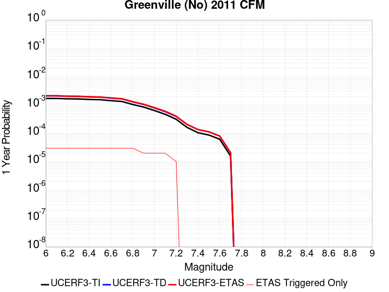 |  |

| Magnitude | 1 wk TI Prob | 1 wk TD Prob | 1 wk ETAS Prob | 1 wk ETAS/TD Gain | 1 wk ETAS Triggered Only | 1 mo TI Prob | 1 mo TD Prob | 1 mo ETAS Prob | 1 mo ETAS/TD Gain | 1 mo ETAS Triggered Only | 1 yr TI Prob | 1 yr TD Prob | 1 yr ETAS Prob | 1 yr ETAS/TD Gain | 1 yr ETAS Triggered Only | 10 yr TI Prob | 10 yr TD Prob | 10 yr ETAS Prob | 10 yr ETAS/TD Gain | 10 yr ETAS Triggered Only |
|-----|-----|-----|-----|-----|-----|-----|-----|-----|-----|-----|-----|-----|-----|-----|-----|-----|-----|-----|-----|-----|
| 6.0 | 3.286654E-5 | 4.036648E-5 | 4.036648E-5 | 1.0 | 0.0 | 1.4084899E-4 | 1.7298796E-4 | 1.7298796E-4 | 1.0 | 0.0 | 0.0017134876 | 0.002104132 | 0.0021849333 | 1.0384012 | 8.097166E-5 | 0.017003356 | 0.020846982 | 0.020926265 | 1.0038031 | 8.097166E-5 |
| 6.1 | 3.286654E-5 | 4.036648E-5 | 4.036648E-5 | 1.0 | 0.0 | 1.4084899E-4 | 1.7298796E-4 | 1.7298796E-4 | 1.0 | 0.0 | 0.0017134876 | 0.002104132 | 0.0021849333 | 1.0384012 | 8.097166E-5 | 0.017003356 | 0.020846982 | 0.020926265 | 1.0038031 | 8.097166E-5 |
| 6.2 | 3.1697953E-5 | 3.8929385E-5 | 3.8929385E-5 | 1.0 | 0.0 | 1.358413E-4 | 1.6682976E-4 | 1.6682976E-4 | 1.0 | 0.0 | 0.0016526132 | 0.002029298 | 0.0021101055 | 1.0398203 | 8.097166E-5 | 0.01640377 | 0.020112377 | 0.02019172 | 1.003945 | 8.097166E-5 |
| 6.3 | 3.1363317E-5 | 3.851826E-5 | 3.851826E-5 | 1.0 | 0.0 | 1.344073E-4 | 1.6506804E-4 | 1.6506804E-4 | 1.0 | 0.0 | 0.0016351803 | 0.0020078886 | 0.0020886979 | 1.0402458 | 8.097166E-5 | 0.016232004 | 0.019902144 | 0.019981503 | 1.0039876 | 8.097166E-5 |
| 6.4 | 3.0228604E-5 | 3.7125395E-5 | 3.7125395E-5 | 1.0 | 0.0 | 1.2954473E-4 | 1.5909935E-4 | 1.5909935E-4 | 1.0 | 0.0 | 0.0015760659 | 0.0019353506 | 0.0020161655 | 1.0417572 | 8.097166E-5 | 0.015649348 | 0.019189484 | 0.019268902 | 1.0041386 | 8.097166E-5 |
| 6.5 | 2.9537814E-5 | 3.6280853E-5 | 3.6280853E-5 | 1.0 | 0.0 | 1.2658449E-4 | 1.554803E-4 | 1.554803E-4 | 1.0 | 0.0 | 0.0015400766 | 0.0018913659 | 0.0019721843 | 1.0427302 | 8.097166E-5 | 0.01529447 | 0.018757146 | 0.018836599 | 1.0042359 | 8.097166E-5 |
| 6.6 | 2.7345395E-5 | 3.3590182E-5 | 3.3590182E-5 | 1.0 | 0.0 | 1.1718928E-4 | 1.4395016E-4 | 1.4395016E-4 | 1.0 | 0.0 | 0.0014258457 | 0.0017512152 | 0.0018320451 | 1.0461564 | 8.097166E-5 | 0.014167317 | 0.01737797 | 0.017457534 | 1.0045785 | 8.097166E-5 |
| 6.7 | 2.5615784E-5 | 3.1567088E-5 | 3.1567088E-5 | 1.0 | 0.0 | 1.09777306E-4 | 1.3528067E-4 | 1.3528067E-4 | 1.0 | 0.0 | 0.0013357193 | 0.0016458282 | 0.0017266667 | 1.0491172 | 8.097166E-5 | 0.013277191 | 0.016340064 | 0.016419712 | 1.0048745 | 8.097166E-5 |
| 6.8 | 2.0059057E-5 | 2.4712073E-5 | 2.4712073E-5 | 1.0 | 0.0 | 8.596455E-5 | 1.0590468E-4 | 1.0590468E-4 | 1.0 | 0.0 | 0.0010461159 | 0.001288643 | 0.0013695103 | 1.0627538 | 8.097166E-5 | 0.0104120495 | 0.012813724 | 0.012893657 | 1.0062382 | 8.097166E-5 |
| 6.9 | 1.6321746E-5 | 2.018467E-5 | 2.018467E-5 | 1.0 | 0.0 | 6.9948466E-5 | 8.650293E-5 | 8.650293E-5 | 1.0 | 0.0 | 8.5128983E-4 | 0.0010526767 | 0.0010931198 | 1.0384194 | 4.048583E-5 | 0.008480361 | 0.010478431 | 0.010518493 | 1.0038233 | 4.048583E-5 |
| 7.0 | 1.22527645E-5 | 1.5135633E-5 | 1.5135633E-5 | 1.0 | 0.0 | 5.2510793E-5 | 6.486541E-5 | 6.486541E-5 | 1.0 | 0.0 | 6.3913135E-4 | 7.894544E-4 | 8.2990824E-4 | 1.0512428 | 4.048583E-5 | 0.0063729626 | 0.007867137 | 0.007907304 | 1.0051057 | 4.048583E-5 |
| 7.1 | 8.996482E-6 | 1.1164954E-5 | 1.1164954E-5 | 1.0 | 0.0 | 3.8555783E-5 | 4.7848935E-5 | 4.7848935E-5 | 1.0 | 0.0 | 4.6931554E-4 | 5.824063E-4 | 6.2286854E-4 | 1.0694742 | 4.048583E-5 | 0.004683256 | 0.0058090906 | 0.0058493414 | 1.0069289 | 4.048583E-5 |
| 7.2 | 6.0273087E-6 | 7.569474E-6 | 7.569474E-6 | 1.0 | 0.0 | 2.5831067E-5 | 3.2440203E-5 | 3.2440203E-5 | 1.0 | 0.0 | 3.1444785E-4 | 3.9488857E-4 | 3.9488857E-4 | 1.0 | 0.0 | 0.0031400328 | 0.003942066 | 0.003942066 | 1.0 | 0.0 |
| 7.3 | 3.1209995E-6 | 3.9663746E-6 | 3.9663746E-6 | 1.0 | 0.0 | 1.3375643E-5 | 1.699864E-5 | 1.699864E-5 | 1.0 | 0.0 | 1.6283628E-4 | 2.0693893E-4 | 2.0693893E-4 | 1.0 | 0.0 | 0.0016271701 | 0.0020675526 | 0.0020675526 | 1.0 | 0.0 |
| 7.4 | 2.0254208E-6 | 2.6096043E-6 | 2.6096043E-6 | 1.0 | 0.0 | 8.680347E-6 | 1.1183971E-5 | 1.1183971E-5 | 1.0 | 0.0 | 1.0567809E-4 | 1.361564E-4 | 1.361564E-4 | 1.0 | 0.0 | 0.0010562785 | 0.0013607866 | 0.0013607866 | 1.0 | 0.0 |
| 7.5 | 1.6763418E-6 | 2.173353E-6 | 2.173353E-6 | 1.0 | 0.0 | 7.184302E-6 | 9.314337E-6 | 9.314337E-6 | 1.0 | 0.0 | 8.746537E-5 | 1.1339621E-4 | 1.1339621E-4 | 1.0 | 0.0 | 8.743095E-4 | 0.0011334305 | 0.0011334305 | 1.0 | 0.0 |
| 7.6 | 1.1935462E-6 | 1.5458467E-6 | 1.5458467E-6 | 1.0 | 0.0 | 5.115188E-6 | 6.6250404E-6 | 6.6250404E-6 | 1.0 | 0.0 | 6.2275634E-5 | 8.065693E-5 | 8.065693E-5 | 1.0 | 0.0 | 6.2258187E-4 | 8.0630725E-4 | 8.0630725E-4 | 1.0 | 0.0 |
| 7.7 | 3.0464201E-7 | 3.9846822E-7 | 3.9846822E-7 | 1.0 | 0.0 | 1.3056081E-6 | 1.7077199E-6 | 1.7077199E-6 | 1.0 | 0.0 | 1.589566E-5 | 2.0791296E-5 | 2.0791296E-5 | 1.0 | 0.0 | 1.5894524E-4 | 2.0789822E-4 | 2.0789822E-4 | 1.0 | 0.0 |

## Hosgri (Extension)
*[(top)](#table-of-contents)*

| 1 Week | 1 Month | 1 Year | 10 Year |
|-----|-----|-----|-----|
| 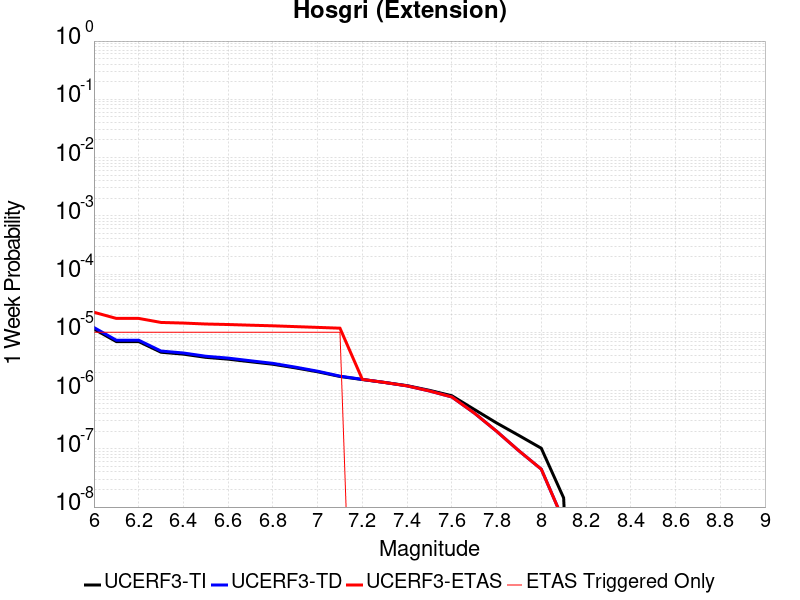 |  | 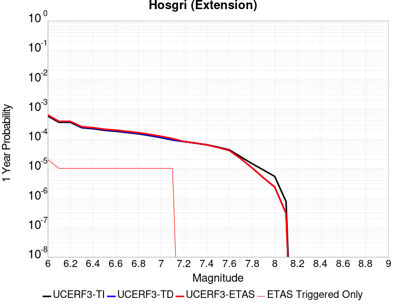 |  |

| Magnitude | 1 wk TI Prob | 1 wk TD Prob | 1 wk ETAS Prob | 1 wk ETAS/TD Gain | 1 wk ETAS Triggered Only | 1 mo TI Prob | 1 mo TD Prob | 1 mo ETAS Prob | 1 mo ETAS/TD Gain | 1 mo ETAS Triggered Only | 1 yr TI Prob | 1 yr TD Prob | 1 yr ETAS Prob | 1 yr ETAS/TD Gain | 1 yr ETAS Triggered Only | 10 yr TI Prob | 10 yr TD Prob | 10 yr ETAS Prob | 10 yr ETAS/TD Gain | 10 yr ETAS Triggered Only |
|-----|-----|-----|-----|-----|-----|-----|-----|-----|-----|-----|-----|-----|-----|-----|-----|-----|-----|-----|-----|-----|
| 6.0 | 1.1369135E-5 | 1.2083072E-5 | 5.256841E-5 | 4.3505836 | 4.048583E-5 | 4.8723956E-5 | 5.1783692E-5 | 1.3275116E-4 | 2.5635707 | 8.097166E-5 | 5.9305265E-4 | 6.3030684E-4 | 7.112275E-4 | 1.1283829 | 8.097166E-5 | 0.005914725 | 0.0062874397 | 0.0063679023 | 1.0127974 | 8.097166E-5 |
| 6.1 | 6.934979E-6 | 7.324555E-6 | 4.781009E-5 | 6.527371 | 4.048583E-5 | 2.9721E-5 | 3.1390595E-5 | 7.1875154E-5 | 2.2897034 | 4.048583E-5 | 3.617931E-4 | 3.8211764E-4 | 4.22588E-4 | 1.1059108 | 4.048583E-5 | 0.0036120464 | 0.0038150186 | 0.00385535 | 1.0105717 | 4.048583E-5 |
| 6.2 | 6.934979E-6 | 7.324555E-6 | 4.781009E-5 | 6.527371 | 4.048583E-5 | 2.9721E-5 | 3.1390595E-5 | 7.1875154E-5 | 2.2897034 | 4.048583E-5 | 3.617931E-4 | 3.8211764E-4 | 4.22588E-4 | 1.1059108 | 4.048583E-5 | 0.0036120464 | 0.0038150186 | 0.00385535 | 1.0105717 | 4.048583E-5 |
| 6.3 | 4.5484676E-6 | 4.76933E-6 | 4.525497E-5 | 9.488747 | 4.048583E-5 | 1.9493287E-5 | 2.043983E-5 | 6.092483E-5 | 2.980692 | 4.048583E-5 | 2.3730492E-4 | 2.4882692E-4 | 2.8930267E-4 | 1.1626663 | 4.048583E-5 | 0.0023705168 | 0.0024855258 | 0.002525911 | 1.0162481 | 4.048583E-5 |
| 6.4 | 4.218095E-6 | 4.4168614E-6 | 4.4902514E-5 | 10.166158 | 4.048583E-5 | 1.8077424E-5 | 1.8929271E-5 | 5.9414335E-5 | 3.1387546 | 4.048583E-5 | 2.2007042E-4 | 2.3043984E-4 | 2.7091632E-4 | 1.1756489 | 4.048583E-5 | 0.002198526 | 0.0023020422 | 0.0023424348 | 1.0175464 | 4.048583E-5 |
| 6.5 | 3.717374E-6 | 3.8838775E-6 | 4.436955E-5 | 11.424034 | 4.048583E-5 | 1.5931506E-5 | 1.6645085E-5 | 5.713024E-5 | 3.4322588 | 4.048583E-5 | 1.9394881E-4 | 2.0263524E-4 | 2.4311287E-4 | 1.1997561 | 4.048583E-5 | 0.0019377962 | 0.0020245234 | 0.0020649275 | 1.0199572 | 4.048583E-5 |
| 6.6 | 3.4605036E-6 | 3.608306E-6 | 4.409399E-5 | 12.220136 | 4.048583E-5 | 1.4830645E-5 | 1.5464078E-5 | 5.594928E-5 | 3.618016 | 4.048583E-5 | 1.8054814E-4 | 1.8825903E-4 | 2.2873723E-4 | 1.2150134 | 4.048583E-5 | 0.0018040152 | 0.0018810101 | 0.0019214198 | 1.021483 | 4.048583E-5 |
| 6.7 | 3.123439E-6 | 3.2465687E-6 | 4.3732267E-5 | 13.470304 | 4.048583E-5 | 1.33860985E-5 | 1.3913792E-5 | 5.4399057E-5 | 3.9097219 | 4.048583E-5 | 1.6296357E-4 | 1.6938736E-4 | 2.0986632E-4 | 1.2389728 | 4.048583E-5 | 0.001628441 | 0.0016925934 | 0.0017330108 | 1.0238789 | 4.048583E-5 |
| 6.8 | 2.8290783E-6 | 2.9305404E-6 | 4.341625E-5 | 14.815101 | 4.048583E-5 | 1.2124565E-5 | 1.2559399E-5 | 5.304472E-5 | 4.223508 | 4.048583E-5 | 1.4760658E-4 | 1.5290003E-4 | 1.9337967E-4 | 1.2647458 | 4.048583E-5 | 0.0014750857 | 0.001527957 | 0.001568381 | 1.0264562 | 4.048583E-5 |
| 6.9 | 2.454112E-6 | 2.5283196E-6 | 4.3014046E-5 | 17.0129 | 4.048583E-5 | 1.0517581E-5 | 1.0835611E-5 | 5.1321003E-5 | 4.7363276 | 4.048583E-5 | 1.2804402E-4 | 1.3191563E-4 | 1.7239612E-4 | 1.3068665 | 4.048583E-5 | 0.0012797028 | 0.0013183793 | 0.0013588119 | 1.0306683 | 4.048583E-5 |
| 7.0 | 2.1008145E-6 | 2.1498704E-6 | 4.2635613E-5 | 19.831715 | 4.048583E-5 | 9.003459E-6 | 9.213698E-6 | 4.9699156E-5 | 5.394051 | 4.048583E-5 | 1.096116E-4 | 1.1217103E-4 | 1.5265233E-4 | 1.360889 | 4.048583E-5 | 0.0010955755 | 0.0011211479 | 0.0011615884 | 1.0360706 | 4.048583E-5 |
| 7.1 | 1.744384E-6 | 1.7686352E-6 | 4.2254393E-5 | 23.89096 | 4.048583E-5 | 7.47591E-6 | 7.5798434E-6 | 4.8065365E-5 | 6.3412085 | 4.048583E-5 | 9.1015405E-5 | 9.22807E-5 | 1.327628E-4 | 1.4386843 | 4.048583E-5 | 9.097813E-4 | 9.2242553E-4 | 9.6287404E-4 | 1.0438502 | 4.048583E-5 |
| 7.2 | 1.5456587E-6 | 1.5562882E-6 | 1.5562882E-6 | 1.0 | 0.0 | 6.6242346E-6 | 6.66979E-6 | 6.66979E-6 | 1.0 | 0.0 | 8.064707E-5 | 8.120168E-5 | 8.120168E-5 | 1.0 | 0.0 | 8.0617814E-4 | 8.117213E-4 | 8.117213E-4 | 1.0 | 0.0 |
| 7.3 | 1.3775123E-6 | 1.3766082E-6 | 1.3766082E-6 | 1.0 | 0.0 | 5.9036106E-6 | 5.899736E-6 | 5.899736E-6 | 1.0 | 0.0 | 7.187409E-5 | 7.182693E-5 | 7.182693E-5 | 1.0 | 0.0 | 7.185085E-4 | 7.180382E-4 | 7.180382E-4 | 1.0 | 0.0 |
| 7.4 | 1.214491E-6 | 1.2023461E-6 | 1.2023461E-6 | 1.0 | 0.0 | 5.2049513E-6 | 5.1529014E-6 | 5.1529014E-6 | 1.0 | 0.0 | 6.336844E-5 | 6.2734776E-5 | 6.2734776E-5 | 1.0 | 0.0 | 6.335037E-4 | 6.271715E-4 | 6.271715E-4 | 1.0 | 0.0 |
| 7.5 | 1.0101123E-6 | 9.842246E-7 | 9.842246E-7 | 1.0 | 0.0 | 4.3290456E-6 | 4.2180986E-6 | 4.2180986E-6 | 1.0 | 0.0 | 5.2704854E-5 | 5.1354145E-5 | 5.1354145E-5 | 1.0 | 0.0 | 5.2692357E-4 | 5.1342335E-4 | 5.1342335E-4 | 1.0 | 0.0 |
| 7.6 | 8.1558215E-7 | 7.765966E-7 | 7.765966E-7 | 1.0 | 0.0 | 3.4953473E-6 | 3.328267E-6 | 3.328267E-6 | 1.0 | 0.0 | 4.255502E-5 | 4.0520903E-5 | 4.0520903E-5 | 1.0 | 0.0 | 4.2546875E-4 | 4.0513556E-4 | 4.0513556E-4 | 1.0 | 0.0 |
| 7.7 | 4.757816E-7 | 4.1308888E-7 | 4.1308888E-7 | 1.0 | 0.0 | 2.0390623E-6 | 1.7703798E-6 | 1.7703798E-6 | 1.0 | 0.0 | 2.4825302E-5 | 2.155416E-5 | 2.155416E-5 | 1.0 | 0.0 | 2.482253E-4 | 2.1552083E-4 | 2.1552083E-4 | 1.0 | 0.0 |
| 7.8 | 2.782787E-7 | 2.0047722E-7 | 2.0047722E-7 | 1.0 | 0.0 | 1.1926223E-6 | 8.5918776E-7 | 8.5918776E-7 | 1.0 | 0.0 | 1.452008E-5 | 1.04605615E-5 | 1.04605615E-5 | 1.0 | 0.0 | 1.4519131E-4 | 1.04600724E-4 | 1.04600724E-4 | 1.0 | 0.0 |
| 7.9 | 1.6948086E-7 | 9.244227E-8 | 9.244227E-8 | 1.0 | 0.0 | 7.2634634E-7 | 3.961811E-7 | 3.961811E-7 | 1.0 | 0.0 | 8.843231E-6 | 4.8234942E-6 | 4.8234942E-6 | 1.0 | 0.0 | 8.842879E-5 | 4.8233902E-5 | 4.8233902E-5 | 1.0 | 0.0 |
| 8.0 | 1.0225492E-7 | 4.4738776E-8 | 4.4738776E-8 | 1.0 | 0.0 | 4.382353E-7 | 1.917376E-7 | 1.917376E-7 | 1.0 | 0.0 | 5.335502E-6 | 2.3344028E-6 | 2.3344028E-6 | 1.0 | 0.0 | 5.335374E-5 | 2.3343786E-5 | 2.3343786E-5 | 1.0 | 0.0 |
| 8.1 | 1.43711345E-8 | 5.787707E-9 | 5.787707E-9 | 1.0 | 0.0 | 6.1590576E-8 | 2.480446E-8 | 2.480446E-8 | 1.0 | 0.0 | 7.4986497E-7 | 3.0199428E-7 | 3.0199428E-7 | 1.0 | 0.0 | 7.4986247E-6 | 3.0199392E-6 | 3.0199392E-6 | 1.0 | 0.0 |

## Pitas Point (Lower West)
*[(top)](#table-of-contents)*

| 1 Week | 1 Month | 1 Year | 10 Year |
|-----|-----|-----|-----|
| 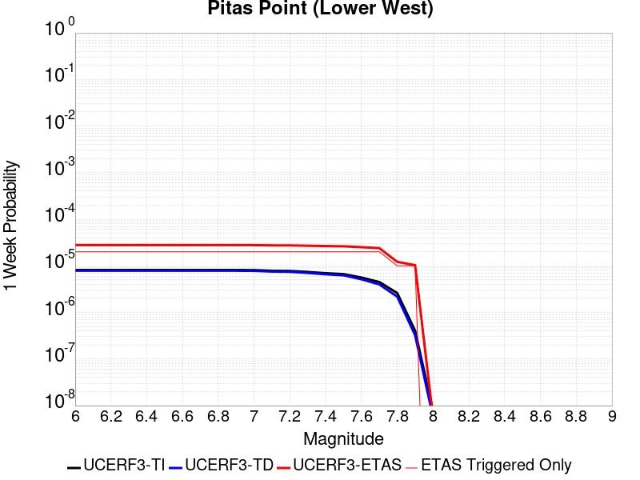 |  |  |  |

| Magnitude | 1 wk TI Prob | 1 wk TD Prob | 1 wk ETAS Prob | 1 wk ETAS/TD Gain | 1 wk ETAS Triggered Only | 1 mo TI Prob | 1 mo TD Prob | 1 mo ETAS Prob | 1 mo ETAS/TD Gain | 1 mo ETAS Triggered Only | 1 yr TI Prob | 1 yr TD Prob | 1 yr ETAS Prob | 1 yr ETAS/TD Gain | 1 yr ETAS Triggered Only | 10 yr TI Prob | 10 yr TD Prob | 10 yr ETAS Prob | 10 yr ETAS/TD Gain | 10 yr ETAS Triggered Only |
|-----|-----|-----|-----|-----|-----|-----|-----|-----|-----|-----|-----|-----|-----|-----|-----|-----|-----|-----|-----|-----|
| 6.0 | 8.151497E-6 | 7.855762E-6 | 4.8341273E-5 | 6.153607 | 4.048583E-5 | 3.493452E-5 | 3.3667122E-5 | 7.415159E-5 | 2.2024927 | 4.048583E-5 | 4.252448E-4 | 4.0982084E-4 | 4.502901E-4 | 1.0987486 | 4.048583E-5 | 0.0042443196 | 0.0040907315 | 0.004171372 | 1.0197129 | 8.097166E-5 |
| 6.1 | 8.151497E-6 | 7.855762E-6 | 4.8341273E-5 | 6.153607 | 4.048583E-5 | 3.493452E-5 | 3.3667122E-5 | 7.415159E-5 | 2.2024927 | 4.048583E-5 | 4.252448E-4 | 4.0982084E-4 | 4.502901E-4 | 1.0987486 | 4.048583E-5 | 0.0042443196 | 0.0040907315 | 0.004171372 | 1.0197129 | 8.097166E-5 |
| 6.2 | 8.151497E-6 | 7.855762E-6 | 4.8341273E-5 | 6.153607 | 4.048583E-5 | 3.493452E-5 | 3.3667122E-5 | 7.415159E-5 | 2.2024927 | 4.048583E-5 | 4.252448E-4 | 4.0982084E-4 | 4.502901E-4 | 1.0987486 | 4.048583E-5 | 0.0042443196 | 0.0040907315 | 0.004171372 | 1.0197129 | 8.097166E-5 |
| 6.3 | 8.151497E-6 | 7.855762E-6 | 4.8341273E-5 | 6.153607 | 4.048583E-5 | 3.493452E-5 | 3.3667122E-5 | 7.415159E-5 | 2.2024927 | 4.048583E-5 | 4.252448E-4 | 4.0982084E-4 | 4.502901E-4 | 1.0987486 | 4.048583E-5 | 0.0042443196 | 0.0040907315 | 0.004171372 | 1.0197129 | 8.097166E-5 |
| 6.4 | 8.151497E-6 | 7.855762E-6 | 4.8341273E-5 | 6.153607 | 4.048583E-5 | 3.493452E-5 | 3.3667122E-5 | 7.415159E-5 | 2.2024927 | 4.048583E-5 | 4.252448E-4 | 4.0982084E-4 | 4.502901E-4 | 1.0987486 | 4.048583E-5 | 0.0042443196 | 0.0040907315 | 0.004171372 | 1.0197129 | 8.097166E-5 |
| 6.5 | 8.151497E-6 | 7.855762E-6 | 4.8341273E-5 | 6.153607 | 4.048583E-5 | 3.493452E-5 | 3.3667122E-5 | 7.415159E-5 | 2.2024927 | 4.048583E-5 | 4.252448E-4 | 4.0982084E-4 | 4.502901E-4 | 1.0987486 | 4.048583E-5 | 0.0042443196 | 0.0040907315 | 0.004171372 | 1.0197129 | 8.097166E-5 |
| 6.6 | 8.151497E-6 | 7.855762E-6 | 4.8341273E-5 | 6.153607 | 4.048583E-5 | 3.493452E-5 | 3.3667122E-5 | 7.415159E-5 | 2.2024927 | 4.048583E-5 | 4.252448E-4 | 4.0982084E-4 | 4.502901E-4 | 1.0987486 | 4.048583E-5 | 0.0042443196 | 0.0040907315 | 0.004171372 | 1.0197129 | 8.097166E-5 |
| 6.7 | 8.151497E-6 | 7.855762E-6 | 4.8341273E-5 | 6.153607 | 4.048583E-5 | 3.493452E-5 | 3.3667122E-5 | 7.415159E-5 | 2.2024927 | 4.048583E-5 | 4.252448E-4 | 4.0982084E-4 | 4.502901E-4 | 1.0987486 | 4.048583E-5 | 0.0042443196 | 0.0040907315 | 0.004171372 | 1.0197129 | 8.097166E-5 |
| 6.8 | 8.151497E-6 | 7.855762E-6 | 4.8341273E-5 | 6.153607 | 4.048583E-5 | 3.493452E-5 | 3.3667122E-5 | 7.415159E-5 | 2.2024927 | 4.048583E-5 | 4.252448E-4 | 4.0982084E-4 | 4.502901E-4 | 1.0987486 | 4.048583E-5 | 0.0042443196 | 0.0040907315 | 0.004171372 | 1.0197129 | 8.097166E-5 |
| 6.9 | 8.151497E-6 | 7.855762E-6 | 4.8341273E-5 | 6.153607 | 4.048583E-5 | 3.493452E-5 | 3.3667122E-5 | 7.415159E-5 | 2.2024927 | 4.048583E-5 | 4.252448E-4 | 4.0982084E-4 | 4.502901E-4 | 1.0987486 | 4.048583E-5 | 0.0042443196 | 0.0040907315 | 0.004171372 | 1.0197129 | 8.097166E-5 |
| 7.0 | 8.103535E-6 | 7.805192E-6 | 4.8290705E-5 | 6.186998 | 4.048583E-5 | 3.4728975E-5 | 3.3450397E-5 | 7.3934876E-5 | 2.2102838 | 4.048583E-5 | 4.2274324E-4 | 4.0718322E-4 | 4.4765256E-4 | 1.0993885 | 4.048583E-5 | 0.0042193993 | 0.004064452 | 0.0041450947 | 1.019841 | 8.097166E-5 |
| 7.1 | 7.853298E-6 | 7.540883E-6 | 4.8026406E-5 | 6.368804 | 4.048583E-5 | 3.3656554E-5 | 3.2317676E-5 | 7.28022E-5 | 2.2527053 | 4.048583E-5 | 4.096915E-4 | 3.9339735E-4 | 4.3386724E-4 | 1.1028728 | 4.048583E-5 | 0.00408937 | 0.0039270855 | 0.004007739 | 1.0205379 | 8.097166E-5 |
| 7.2 | 7.771102E-6 | 7.453165E-6 | 4.7938694E-5 | 6.4319916 | 4.048583E-5 | 3.33043E-5 | 3.194175E-5 | 7.2426286E-5 | 2.267449 | 4.048583E-5 | 4.0540437E-4 | 3.8882208E-4 | 4.2929218E-4 | 1.1040838 | 4.048583E-5 | 0.0040466557 | 0.0038814936 | 0.003962151 | 1.02078 | 8.097166E-5 |
| 7.3 | 7.3945344E-6 | 7.0492697E-6 | 4.7534813E-5 | 6.7432256 | 4.048583E-5 | 3.1690477E-5 | 3.021081E-5 | 7.0695416E-5 | 2.3400702 | 4.048583E-5 | 3.8576324E-4 | 3.6775516E-4 | 4.082261E-4 | 1.1100487 | 4.048583E-5 | 0.0038509427 | 0.0036715334 | 0.0037522076 | 1.0219729 | 8.097166E-5 |
| 7.4 | 6.964645E-6 | 6.5901186E-6 | 4.7075682E-5 | 7.143374 | 4.048583E-5 | 2.9848137E-5 | 2.8243063E-5 | 6.872775E-5 | 2.4334383 | 4.048583E-5 | 3.6334046E-4 | 3.4380553E-4 | 3.8427743E-4 | 1.1177175 | 4.048583E-5 | 0.0036274698 | 0.0034327896 | 0.0034731363 | 1.0117533 | 4.048583E-5 |
| 7.5 | 6.6525035E-6 | 6.259157E-6 | 4.6744735E-5 | 7.4682155 | 4.048583E-5 | 2.851042E-5 | 2.6824686E-5 | 6.730943E-5 | 2.5092347 | 4.048583E-5 | 3.4705905E-4 | 3.265421E-4 | 3.670147E-4 | 1.123943 | 4.048583E-5 | 0.0034651754 | 0.0032606742 | 0.0033010282 | 1.012376 | 4.048583E-5 |
| 7.6 | 5.613338E-6 | 5.151386E-6 | 4.5637007E-5 | 8.85917 | 4.048583E-5 | 2.405694E-5 | 2.2077185E-5 | 6.256212E-5 | 2.8337908 | 4.048583E-5 | 2.928539E-4 | 2.6875688E-4 | 3.092318E-4 | 1.1506007 | 4.048583E-5 | 0.0029246826 | 0.0026843501 | 0.0027247272 | 1.0150417 | 4.048583E-5 |
| 7.7 | 4.494704E-6 | 3.996911E-6 | 4.448258E-5 | 11.129239 | 4.048583E-5 | 1.9262876E-5 | 1.7129507E-5 | 5.7614645E-5 | 3.3634734 | 4.048583E-5 | 2.3450027E-4 | 2.0853203E-4 | 2.490094E-4 | 1.1941063 | 4.048583E-5 | 0.0023425296 | 0.0020833875 | 0.0021237892 | 1.0193923 | 4.048583E-5 |
| 7.8 | 2.6075882E-6 | 2.1836374E-6 | 4.266938E-5 | 19.540504 | 4.048583E-5 | 1.117533E-5 | 9.358413E-6 | 4.9843864E-5 | 5.3261023 | 4.048583E-5 | 1.3605114E-4 | 1.1393277E-4 | 1.5441398E-4 | 1.3553079 | 4.048583E-5 | 0.0013596788 | 0.0011387484 | 0.001179188 | 1.0355124 | 4.048583E-5 |
| 7.9 | 4.045984E-7 | 3.242375E-7 | 4.0810053E-5 | 125.8647 | 4.048583E-5 | 1.733992E-6 | 1.3895885E-6 | 4.1875363E-5 | 30.13508 | 4.048583E-5 | 2.1111147E-5 | 1.6918111E-5 | 5.7403257E-5 | 3.393006 | 4.048583E-5 | 2.1109142E-4 | 1.6916855E-4 | 2.0964754E-4 | 1.239282 | 4.048583E-5 |
| 8.0 | 7.791402E-9 | 5.683497E-9 | 5.683497E-9 | 1.0 | 0.0 | 3.3391725E-8 | 2.4357844E-8 | 2.4357844E-8 | 1.0 | 0.0 | 4.0654416E-7 | 2.9655675E-7 | 2.9655675E-7 | 1.0 | 0.0 | 4.065434E-6 | 2.9655655E-6 | 2.9655655E-6 | 1.0 | 0.0 |

## Malibu Coast alt 1
*[(top)](#table-of-contents)*

| 1 Week | 1 Month | 1 Year | 10 Year |
|-----|-----|-----|-----|
|  |  | 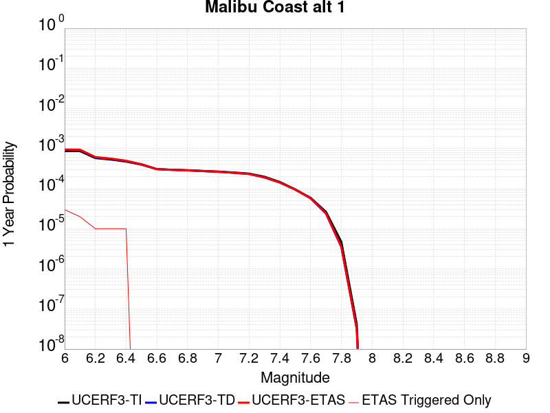 |  |

| Magnitude | 1 wk TI Prob | 1 wk TD Prob | 1 wk ETAS Prob | 1 wk ETAS/TD Gain | 1 wk ETAS Triggered Only | 1 mo TI Prob | 1 mo TD Prob | 1 mo ETAS Prob | 1 mo ETAS/TD Gain | 1 mo ETAS Triggered Only | 1 yr TI Prob | 1 yr TD Prob | 1 yr ETAS Prob | 1 yr ETAS/TD Gain | 1 yr ETAS Triggered Only | 10 yr TI Prob | 10 yr TD Prob | 10 yr ETAS Prob | 10 yr ETAS/TD Gain | 10 yr ETAS Triggered Only |
|-----|-----|-----|-----|-----|-----|-----|-----|-----|-----|-----|-----|-----|-----|-----|-----|-----|-----|-----|-----|-----|
| 6.0 | 1.6572556E-5 | 1.7598066E-5 | 1.7598066E-5 | 1.0 | 0.0 | 7.102331E-5 | 7.541821E-5 | 1.15900984E-4 | 1.5367773 | 4.048583E-5 | 8.6436566E-4 | 9.178488E-4 | 9.5829746E-4 | 1.0440689 | 4.048583E-5 | 0.0086101135 | 0.009142512 | 0.009222744 | 1.0087756 | 8.097166E-5 |
| 6.1 | 1.6572556E-5 | 1.7598066E-5 | 1.7598066E-5 | 1.0 | 0.0 | 7.102331E-5 | 7.541821E-5 | 1.15900984E-4 | 1.5367773 | 4.048583E-5 | 8.6436566E-4 | 9.178488E-4 | 9.5829746E-4 | 1.0440689 | 4.048583E-5 | 0.0086101135 | 0.009142512 | 0.009222744 | 1.0087756 | 8.097166E-5 |
| 6.2 | 1.1085717E-5 | 1.1557147E-5 | 1.1557147E-5 | 1.0 | 0.0 | 4.750935E-5 | 4.952971E-5 | 4.952971E-5 | 1.0 | 0.0 | 5.782728E-4 | 6.028609E-4 | 6.028609E-4 | 1.0 | 0.0 | 0.0057677035 | 0.0060126255 | 0.006052868 | 1.006693 | 4.048583E-5 |
| 6.3 | 1.0208568E-5 | 1.0592237E-5 | 1.0592237E-5 | 1.0 | 0.0 | 4.375027E-5 | 4.539453E-5 | 4.539453E-5 | 1.0 | 0.0 | 5.325294E-4 | 5.5254117E-4 | 5.5254117E-4 | 1.0 | 0.0 | 0.0053125503 | 0.0055119814 | 0.0055522444 | 1.0073045 | 4.048583E-5 |
| 6.4 | 9.0682315E-6 | 9.342637E-6 | 9.342637E-6 | 1.0 | 0.0 | 3.8863272E-5 | 4.003927E-5 | 4.003927E-5 | 1.0 | 0.0 | 4.730576E-4 | 4.8737114E-4 | 4.8737114E-4 | 1.0 | 0.0 | 0.0047205184 | 0.004863236 | 0.004903525 | 1.0082843 | 4.048583E-5 |
| 6.5 | 7.605796E-6 | 7.748587E-6 | 7.748587E-6 | 1.0 | 0.0 | 3.259586E-5 | 3.3207816E-5 | 3.3207816E-5 | 1.0 | 0.0 | 3.9678233E-4 | 4.0423148E-4 | 4.0423148E-4 | 1.0 | 0.0 | 0.0039607463 | 0.0040351 | 0.0040754224 | 1.009993 | 4.048583E-5 |
| 6.6 | 5.889873E-6 | 5.8795385E-6 | 5.8795385E-6 | 1.0 | 0.0 | 2.5242069E-5 | 2.519778E-5 | 2.519778E-5 | 1.0 | 0.0 | 3.0727885E-4 | 3.0673988E-4 | 3.0673988E-4 | 1.0 | 0.0 | 0.003068543 | 0.0030631777 | 0.0031035396 | 1.0131764 | 4.048583E-5 |
| 6.7 | 5.66586E-6 | 5.641641E-6 | 5.641641E-6 | 1.0 | 0.0 | 2.428203E-5 | 2.417824E-5 | 2.417824E-5 | 1.0 | 0.0 | 2.955936E-4 | 2.9433038E-4 | 2.9433038E-4 | 1.0 | 0.0 | 0.0029520073 | 0.0029394177 | 0.0029797845 | 1.0137329 | 4.048583E-5 |
| 6.8 | 5.521556E-6 | 5.489427E-6 | 5.489427E-6 | 1.0 | 0.0 | 2.3663597E-5 | 2.3525903E-5 | 2.3525903E-5 | 1.0 | 0.0 | 2.880662E-4 | 2.8639034E-4 | 2.8639034E-4 | 1.0 | 0.0 | 0.0028769306 | 0.002860224 | 0.0029005941 | 1.0141143 | 4.048583E-5 |
| 6.9 | 5.29752E-6 | 5.2499317E-6 | 5.2499317E-6 | 1.0 | 0.0 | 2.270346E-5 | 2.2499513E-5 | 2.2499513E-5 | 1.0 | 0.0 | 2.7637955E-4 | 2.7389723E-4 | 2.7389723E-4 | 1.0 | 0.0 | 0.0027603607 | 0.0027356069 | 0.0027759818 | 1.0147591 | 4.048583E-5 |
| 7.0 | 5.106743E-6 | 5.0476788E-6 | 5.0476788E-6 | 1.0 | 0.0 | 2.1885859E-5 | 2.163273E-5 | 2.163273E-5 | 1.0 | 0.0 | 2.6642776E-4 | 2.6334674E-4 | 2.6334674E-4 | 1.0 | 0.0 | 0.0026610855 | 0.0026303562 | 0.0026707356 | 1.0153513 | 4.048583E-5 |
| 7.1 | 4.8469647E-6 | 4.770373E-6 | 4.770373E-6 | 1.0 | 0.0 | 2.0772539E-5 | 2.0444295E-5 | 2.0444295E-5 | 1.0 | 0.0 | 2.528763E-4 | 2.4888094E-4 | 2.4888094E-4 | 1.0 | 0.0 | 0.0025258875 | 0.00248603 | 0.0025264153 | 1.0162449 | 4.048583E-5 |
| 7.2 | 4.545514E-6 | 4.4481935E-6 | 4.4481935E-6 | 1.0 | 0.0 | 1.9480629E-5 | 1.9063547E-5 | 1.9063547E-5 | 1.0 | 0.0 | 2.3715083E-4 | 2.3207403E-4 | 2.3207403E-4 | 1.0 | 0.0 | 0.0023689792 | 0.0023183243 | 0.0023587162 | 1.0174229 | 4.048583E-5 |
| 7.3 | 3.794097E-6 | 3.6519348E-6 | 3.6519348E-6 | 1.0 | 0.0 | 1.6260314E-5 | 1.5651056E-5 | 1.5651056E-5 | 1.0 | 0.0 | 1.9795135E-4 | 1.9053498E-4 | 1.9053498E-4 | 1.0 | 0.0 | 0.001977751 | 0.0019037209 | 0.0019441296 | 1.0212262 | 4.048583E-5 |
| 7.4 | 2.808217E-6 | 2.719077E-6 | 2.719077E-6 | 1.0 | 0.0 | 1.203516E-5 | 1.1653135E-5 | 1.1653135E-5 | 1.0 | 0.0 | 1.4651821E-4 | 1.418677E-4 | 1.418677E-4 | 1.0 | 0.0 | 0.0014642165 | 0.001417774 | 0.0014582025 | 1.0285155 | 4.048583E-5 |
| 7.5 | 1.83809E-6 | 1.8190691E-6 | 1.8190691E-6 | 1.0 | 0.0 | 7.877505E-6 | 7.795988E-6 | 7.795988E-6 | 1.0 | 0.0 | 9.59044E-5 | 9.491203E-5 | 9.491203E-5 | 1.0 | 0.0 | 9.5863023E-4 | 9.48717E-4 | 9.891643E-4 | 1.0426338 | 4.048583E-5 |
| 7.6 | 1.1292672E-6 | 1.1001447E-6 | 1.1001447E-6 | 1.0 | 0.0 | 4.839708E-6 | 4.714897E-6 | 4.714897E-6 | 1.0 | 0.0 | 5.8921847E-5 | 5.7402376E-5 | 5.7402376E-5 | 1.0 | 0.0 | 5.890623E-4 | 5.738771E-4 | 6.143397E-4 | 1.0705074 | 4.048583E-5 |
| 7.7 | 5.065272E-7 | 4.609151E-7 | 4.609151E-7 | 1.0 | 0.0 | 2.170829E-6 | 1.975349E-6 | 1.975349E-6 | 1.0 | 0.0 | 2.6429525E-5 | 2.404962E-5 | 2.404962E-5 | 1.0 | 0.0 | 2.642638E-4 | 2.4047129E-4 | 2.809474E-4 | 1.1683198 | 4.048583E-5 |
| 7.8 | 8.952991E-8 | 6.707874E-8 | 6.707874E-8 | 1.0 | 0.0 | 3.8369956E-7 | 2.8748025E-7 | 2.8748025E-7 | 1.0 | 0.0 | 4.671532E-6 | 3.5000667E-6 | 3.5000667E-6 | 1.0 | 0.0 | 4.671434E-5 | 3.5000136E-5 | 3.5000136E-5 | 1.0 | 0.0 |
| 7.9 | 8.007447E-10 | 6.1608785E-10 | 6.1608785E-10 | 1.0 | 0.0 | 3.4317629E-9 | 2.6403764E-9 | 2.6403764E-9 | 1.0 | 0.0 | 4.1781714E-8 | 3.2146584E-8 | 3.2146584E-8 | 1.0 | 0.0 | 4.1781706E-7 | 3.214658E-7 | 3.214658E-7 | 1.0 | 0.0 |

## Mono Lake 2011 CFM
*[(top)](#table-of-contents)*

| 1 Week | 1 Month | 1 Year | 10 Year |
|-----|-----|-----|-----|
|  |  |  |  |

| Magnitude | 1 wk TI Prob | 1 wk TD Prob | 1 wk ETAS Prob | 1 wk ETAS/TD Gain | 1 wk ETAS Triggered Only | 1 mo TI Prob | 1 mo TD Prob | 1 mo ETAS Prob | 1 mo ETAS/TD Gain | 1 mo ETAS Triggered Only | 1 yr TI Prob | 1 yr TD Prob | 1 yr ETAS Prob | 1 yr ETAS/TD Gain | 1 yr ETAS Triggered Only | 10 yr TI Prob | 10 yr TD Prob | 10 yr ETAS Prob | 10 yr ETAS/TD Gain | 10 yr ETAS Triggered Only |
|-----|-----|-----|-----|-----|-----|-----|-----|-----|-----|-----|-----|-----|-----|-----|-----|-----|-----|-----|-----|-----|
| 6.0 | 2.0341662E-5 | 2.3828166E-5 | 6.431303E-5 | 2.699034 | 4.048583E-5 | 8.717564E-5 | 1.0211971E-4 | 1.426014E-4 | 1.3964142 | 4.048583E-5 | 0.0010608466 | 0.0012431298 | 0.0013240009 | 1.0650543 | 8.097166E-5 | 0.010557966 | 0.012413835 | 0.012493801 | 1.0064417 | 8.097166E-5 |
| 6.1 | 2.0341662E-5 | 2.3828166E-5 | 6.431303E-5 | 2.699034 | 4.048583E-5 | 8.717564E-5 | 1.0211971E-4 | 1.426014E-4 | 1.3964142 | 4.048583E-5 | 0.0010608466 | 0.0012431298 | 0.0013240009 | 1.0650543 | 8.097166E-5 | 0.010557966 | 0.012413835 | 0.012493801 | 1.0064417 | 8.097166E-5 |
| 6.2 | 2.0341662E-5 | 2.3828166E-5 | 6.431303E-5 | 2.699034 | 4.048583E-5 | 8.717564E-5 | 1.0211971E-4 | 1.426014E-4 | 1.3964142 | 4.048583E-5 | 0.0010608466 | 0.0012431298 | 0.0013240009 | 1.0650543 | 8.097166E-5 | 0.010557966 | 0.012413835 | 0.012493801 | 1.0064417 | 8.097166E-5 |
| 6.3 | 2.0341662E-5 | 2.3828166E-5 | 6.431303E-5 | 2.699034 | 4.048583E-5 | 8.717564E-5 | 1.0211971E-4 | 1.426014E-4 | 1.3964142 | 4.048583E-5 | 0.0010608466 | 0.0012431298 | 0.0013240009 | 1.0650543 | 8.097166E-5 | 0.010557966 | 0.012413835 | 0.012493801 | 1.0064417 | 8.097166E-5 |
| 6.4 | 1.749821E-5 | 2.0490985E-5 | 6.0975985E-5 | 2.9757469 | 4.048583E-5 | 7.499018E-5 | 8.781851E-5 | 1.2830079E-4 | 1.4609766 | 4.048583E-5 | 9.1262296E-4 | 0.0010691903 | 0.0011500755 | 1.0756508 | 8.097166E-5 | 0.009088841 | 0.010691865 | 0.010771971 | 1.0074922 | 8.097166E-5 |
| 6.5 | 1.749821E-5 | 2.0490985E-5 | 6.0975985E-5 | 2.9757469 | 4.048583E-5 | 7.499018E-5 | 8.781851E-5 | 1.2830079E-4 | 1.4609766 | 4.048583E-5 | 9.1262296E-4 | 0.0010691903 | 0.0011500755 | 1.0756508 | 8.097166E-5 | 0.009088841 | 0.010691865 | 0.010771971 | 1.0074922 | 8.097166E-5 |

## Bullion Mountains
*[(top)](#table-of-contents)*

| 1 Week | 1 Month | 1 Year | 10 Year |
|-----|-----|-----|-----|
|  |  |  |  |

| Magnitude | 1 wk TI Prob | 1 wk TD Prob | 1 wk ETAS Prob | 1 wk ETAS/TD Gain | 1 wk ETAS Triggered Only | 1 mo TI Prob | 1 mo TD Prob | 1 mo ETAS Prob | 1 mo ETAS/TD Gain | 1 mo ETAS Triggered Only | 1 yr TI Prob | 1 yr TD Prob | 1 yr ETAS Prob | 1 yr ETAS/TD Gain | 1 yr ETAS Triggered Only | 10 yr TI Prob | 10 yr TD Prob | 10 yr ETAS Prob | 10 yr ETAS/TD Gain | 10 yr ETAS Triggered Only |
|-----|-----|-----|-----|-----|-----|-----|-----|-----|-----|-----|-----|-----|-----|-----|-----|-----|-----|-----|-----|-----|
| 6.0 | 1.6420427E-5 | 1.4692089E-5 | 5.5177323E-5 | 3.7555804 | 4.048583E-5 | 7.037136E-5 | 6.296479E-5 | 1.03448074E-4 | 1.642951 | 4.048583E-5 | 8.5643446E-4 | 7.663651E-4 | 8.068199E-4 | 1.0527879 | 4.048583E-5 | 0.008531413 | 0.007641016 | 0.007721369 | 1.010516 | 8.097166E-5 |
| 6.1 | 1.6420427E-5 | 1.4692089E-5 | 5.5177323E-5 | 3.7555804 | 4.048583E-5 | 7.037136E-5 | 6.296479E-5 | 1.03448074E-4 | 1.642951 | 4.048583E-5 | 8.5643446E-4 | 7.663651E-4 | 8.068199E-4 | 1.0527879 | 4.048583E-5 | 0.008531413 | 0.007641016 | 0.007721369 | 1.010516 | 8.097166E-5 |
| 6.2 | 1.6420427E-5 | 1.4692089E-5 | 5.5177323E-5 | 3.7555804 | 4.048583E-5 | 7.037136E-5 | 6.296479E-5 | 1.03448074E-4 | 1.642951 | 4.048583E-5 | 8.5643446E-4 | 7.663651E-4 | 8.068199E-4 | 1.0527879 | 4.048583E-5 | 0.008531413 | 0.007641016 | 0.007721369 | 1.010516 | 8.097166E-5 |
| 6.3 | 1.2046778E-5 | 9.862335E-6 | 9.862335E-6 | 1.0 | 0.0 | 5.1628023E-5 | 4.2266598E-5 | 4.2266598E-5 | 1.0 | 0.0 | 6.283899E-4 | 5.144975E-4 | 5.144975E-4 | 1.0 | 0.0 | 0.0062661595 | 0.005135345 | 0.005135345 | 1.0 | 0.0 |
| 6.4 | 1.2046778E-5 | 9.862335E-6 | 9.862335E-6 | 1.0 | 0.0 | 5.1628023E-5 | 4.2266598E-5 | 4.2266598E-5 | 1.0 | 0.0 | 6.283899E-4 | 5.144975E-4 | 5.144975E-4 | 1.0 | 0.0 | 0.0062661595 | 0.005135345 | 0.005135345 | 1.0 | 0.0 |
| 6.5 | 1.0244343E-5 | 7.879458E-6 | 7.879458E-6 | 1.0 | 0.0 | 4.390359E-5 | 3.3768785E-5 | 3.3768785E-5 | 1.0 | 0.0 | 5.343951E-4 | 4.110781E-4 | 4.110781E-4 | 1.0 | 0.0 | 0.005331118 | 0.004105208 | 0.004105208 | 1.0 | 0.0 |
| 6.6 | 9.605408E-6 | 7.1774966E-6 | 7.1774966E-6 | 1.0 | 0.0 | 4.1165385E-5 | 3.076045E-5 | 3.076045E-5 | 1.0 | 0.0 | 5.010733E-4 | 3.744645E-4 | 3.744645E-4 | 1.0 | 0.0 | 0.00499945 | 0.003740332 | 0.003740332 | 1.0 | 0.0 |
| 6.7 | 8.60418E-6 | 6.1240044E-6 | 6.1240044E-6 | 1.0 | 0.0 | 3.687454E-5 | 2.624558E-5 | 2.624558E-5 | 1.0 | 0.0 | 4.48855E-4 | 3.1951256E-4 | 3.1951256E-4 | 1.0 | 0.0 | 0.004479495 | 0.0031924439 | 0.0031924439 | 1.0 | 0.0 |
| 6.8 | 5.187994E-6 | 2.5631666E-6 | 2.5631666E-6 | 1.0 | 0.0 | 2.223407E-5 | 1.0984976E-5 | 1.0984976E-5 | 1.0 | 0.0 | 2.7066618E-4 | 1.3373788E-4 | 1.3373788E-4 | 1.0 | 0.0 | 0.0027033675 | 0.0013369655 | 0.0013369655 | 1.0 | 0.0 |
| 6.9 | 4.5302368E-6 | 2.3443165E-6 | 2.3443165E-6 | 1.0 | 0.0 | 1.9415156E-5 | 1.0047055E-5 | 1.0047055E-5 | 1.0 | 0.0 | 2.3635388E-4 | 1.2232E-4 | 1.2232E-4 | 1.0 | 0.0 | 0.0023610266 | 0.0012229157 | 0.0012229157 | 1.0 | 0.0 |
| 7.0 | 3.431668E-6 | 1.6882402E-6 | 1.6882402E-6 | 1.0 | 0.0 | 1.4707065E-5 | 7.235315E-6 | 7.235315E-6 | 1.0 | 0.0 | 1.7904381E-4 | 8.808996E-5 | 8.808996E-5 | 1.0 | 0.0 | 0.0017889962 | 8.808996E-4 | 8.808996E-4 | 1.0 | 0.0 |

## Calaveras (So) - Paicines extension 2011 CFM
*[(top)](#table-of-contents)*

| 1 Week | 1 Month | 1 Year | 10 Year |
|-----|-----|-----|-----|
|  |  |  |  |

| Magnitude | 1 wk TI Prob | 1 wk TD Prob | 1 wk ETAS Prob | 1 wk ETAS/TD Gain | 1 wk ETAS Triggered Only | 1 mo TI Prob | 1 mo TD Prob | 1 mo ETAS Prob | 1 mo ETAS/TD Gain | 1 mo ETAS Triggered Only | 1 yr TI Prob | 1 yr TD Prob | 1 yr ETAS Prob | 1 yr ETAS/TD Gain | 1 yr ETAS Triggered Only | 10 yr TI Prob | 10 yr TD Prob | 10 yr ETAS Prob | 10 yr ETAS/TD Gain | 10 yr ETAS Triggered Only |
|-----|-----|-----|-----|-----|-----|-----|-----|-----|-----|-----|-----|-----|-----|-----|-----|-----|-----|-----|-----|-----|
| 6.0 | 1.5183659E-4 | 3.0533716E-4 | 3.0533716E-4 | 1.0 | 0.0 | 6.5056595E-4 | 0.0013069661 | 0.0013473991 | 1.0309365 | 4.048583E-5 | 0.007891912 | 0.01569571 | 0.015735561 | 1.0025389 | 4.048583E-5 | 0.076174594 | 0.13848671 | 0.13855648 | 1.0005037 | 8.097166E-5 |
| 6.1 | 1.5024997E-4 | 3.0227835E-4 | 3.0227835E-4 | 1.0 | 0.0 | 6.437695E-4 | 0.00129387 | 0.0013343035 | 1.03125 | 4.048583E-5 | 0.0078097614 | 0.015539104 | 0.015578961 | 1.0025649 | 4.048583E-5 | 0.075409345 | 0.13715632 | 0.1372262 | 1.0005094 | 8.097166E-5 |
| 6.2 | 1.2743923E-4 | 2.5306802E-4 | 2.5306802E-4 | 1.0 | 0.0 | 5.460538E-4 | 0.0010841049 | 0.0011245469 | 1.0373044 | 4.048583E-5 | 0.0066279583 | 0.013046704 | 0.013086662 | 1.0030626 | 4.048583E-5 | 0.064337276 | 0.11725405 | 0.11732552 | 1.0006096 | 8.097166E-5 |
| 6.3 | 1.1525114E-4 | 2.2595265E-4 | 2.2595265E-4 | 1.0 | 0.0 | 4.9383997E-4 | 9.6799526E-4 | 0.0010084419 | 1.0417839 | 4.048583E-5 | 0.0059959386 | 0.011667927 | 0.01170794 | 1.0034294 | 4.048583E-5 | 0.058367174 | 0.10637007 | 0.10644243 | 1.0006802 | 8.097166E-5 |
| 6.4 | 1.07200925E-4 | 2.0836305E-4 | 2.0836305E-4 | 1.0 | 0.0 | 4.5935164E-4 | 8.926636E-4 | 9.331133E-4 | 1.0453135 | 4.048583E-5 | 0.0055782744 | 0.010772766 | 0.010812815 | 1.0037177 | 4.048583E-5 | 0.0544031 | 0.09919256 | 0.0992655 | 1.0007353 | 8.097166E-5 |
| 6.5 | 9.69631E-5 | 1.8729115E-4 | 1.8729115E-4 | 1.0 | 0.0 | 4.1548995E-4 | 8.024135E-4 | 8.4286684E-4 | 1.0504146 | 4.048583E-5 | 0.0050468626 | 0.009694662 | 0.009734755 | 1.0041356 | 4.048583E-5 | 0.04933773 | 0.090084255 | 0.09015793 | 1.0008179 | 8.097166E-5 |
| 6.6 | 8.0552316E-5 | 1.5070537E-4 | 1.5070537E-4 | 1.0 | 0.0 | 3.4517853E-4 | 6.456994E-4 | 6.8615907E-4 | 1.0626602 | 4.048583E-5 | 0.0041944524 | 0.007826256 | 0.0078664245 | 1.0051326 | 4.048583E-5 | 0.04116161 | 0.074854024 | 0.07492893 | 1.0010008 | 8.097166E-5 |
| 6.7 | 7.815757E-5 | 1.4610609E-4 | 1.4610609E-4 | 1.0 | 0.0 | 3.34918E-4 | 6.260017E-4 | 6.664622E-4 | 1.0646331 | 4.048583E-5 | 0.004070005 | 0.0075890915 | 0.00762927 | 1.0052942 | 4.048583E-5 | 0.039962657 | 0.072703585 | 0.07277867 | 1.0010327 | 8.097166E-5 |
| 6.8 | 6.965264E-5 | 1.2721405E-4 | 1.2721405E-4 | 1.0 | 0.0 | 2.9847719E-4 | 5.450839E-4 | 5.450839E-4 | 1.0 | 0.0 | 0.0036279052 | 0.00661342 | 0.00661342 | 1.0 | 0.0 | 0.03569247 | 0.06379891 | 0.06383681 | 1.0005941 | 4.048583E-5 |
| 6.9 | 5.8000453E-5 | 1.01435086E-4 | 1.01435086E-4 | 1.0 | 0.0 | 2.4854968E-4 | 4.3464993E-4 | 4.3464993E-4 | 1.0 | 0.0 | 0.0030218933 | 0.0052791284 | 0.0052791284 | 1.0 | 0.0 | 0.029811295 | 0.051501602 | 0.051501602 | 1.0 | 0.0 |
| 7.0 | 4.9865852E-5 | 8.567692E-5 | 8.567692E-5 | 1.0 | 0.0 | 2.1369329E-4 | 3.671356E-4 | 3.671356E-4 | 1.0 | 0.0 | 0.0025986114 | 0.0044608037 | 0.0044608037 | 1.0 | 0.0 | 0.025684336 | 0.043781694 | 0.043781694 | 1.0 | 0.0 |
| 7.1 | 4.283875E-5 | 7.112159E-5 | 7.112159E-5 | 1.0 | 0.0 | 1.8358172E-4 | 3.047715E-4 | 3.047715E-4 | 1.0 | 0.0 | 0.0022328163 | 0.003704336 | 0.003704336 | 1.0 | 0.0 | 0.022105146 | 0.03673583 | 0.03673583 | 1.0 | 0.0 |
| 7.2 | 3.450115E-5 | 5.5776054E-5 | 5.5776054E-5 | 1.0 | 0.0 | 1.478537E-4 | 2.390185E-4 | 2.390185E-4 | 1.0 | 0.0 | 0.0017986323 | 0.0029061958 | 0.0029061958 | 1.0 | 0.0 | 0.017841442 | 0.029079199 | 0.029079199 | 1.0 | 0.0 |
| 7.3 | 2.5709045E-5 | 4.0588155E-5 | 4.0588155E-5 | 1.0 | 0.0 | 1.1017697E-4 | 1.7393773E-4 | 1.7393773E-4 | 1.0 | 0.0 | 0.0013405791 | 0.002115652 | 0.002115652 | 1.0 | 0.0 | 0.013325208 | 0.021297242 | 0.021297242 | 1.0 | 0.0 |
| 7.4 | 1.8003093E-5 | 2.8509934E-5 | 2.8509934E-5 | 1.0 | 0.0 | 7.715383E-5 | 1.2217973E-4 | 1.2217973E-4 | 1.0 | 0.0 | 9.3894306E-4 | 0.0014865254 | 0.0014865254 | 1.0 | 0.0 | 0.009349857 | 0.015052196 | 0.015052196 | 1.0 | 0.0 |
| 7.5 | 1.5595824E-5 | 2.5822499E-5 | 2.5822499E-5 | 1.0 | 0.0 | 6.683753E-5 | 1.1066317E-4 | 1.1066317E-4 | 1.0 | 0.0 | 8.134431E-4 | 0.0013464936 | 0.0013464936 | 1.0 | 0.0 | 0.008104719 | 0.01365213 | 0.01365213 | 1.0 | 0.0 |
| 7.6 | 1.1110309E-5 | 1.9222098E-5 | 1.9222098E-5 | 1.0 | 0.0 | 4.761474E-5 | 8.2377825E-5 | 8.2377825E-5 | 1.0 | 0.0 | 5.795553E-4 | 0.0010024898 | 0.0010024898 | 1.0 | 0.0 | 0.0057804612 | 0.010203943 | 0.010203943 | 1.0 | 0.0 |
| 7.7 | 6.2140443E-6 | 1.0437076E-5 | 1.0437076E-5 | 1.0 | 0.0 | 2.6631347E-5 | 4.4729557E-5 | 4.4729557E-5 | 1.0 | 0.0 | 3.241884E-4 | 5.444464E-4 | 5.444464E-4 | 1.0 | 0.0 | 0.0032371588 | 0.005619835 | 0.005619835 | 1.0 | 0.0 |
| 7.8 | 5.305533E-6 | 9.433038E-6 | 9.433038E-6 | 1.0 | 0.0 | 2.27378E-5 | 4.042668E-5 | 4.042668E-5 | 1.0 | 0.0 | 2.7679754E-4 | 4.920837E-4 | 4.920837E-4 | 1.0 | 0.0 | 0.0027645302 | 0.005074324 | 0.005074324 | 1.0 | 0.0 |
| 7.9 | 3.363505E-6 | 7.3848937E-6 | 7.3848937E-6 | 1.0 | 0.0 | 1.4414942E-5 | 3.164916E-5 | 3.164916E-5 | 1.0 | 0.0 | 1.7548777E-4 | 3.8526047E-4 | 3.8526047E-4 | 1.0 | 0.0 | 0.0017534926 | 0.003948527 | 0.003948527 | 1.0 | 0.0 |
| 8.0 | 2.0271132E-6 | 4.413104E-6 | 4.413104E-6 | 1.0 | 0.0 | 8.687599E-6 | 1.8913164E-5 | 1.8913164E-5 | 1.0 | 0.0 | 1.05766376E-4 | 2.302435E-4 | 2.302435E-4 | 1.0 | 0.0 | 0.0010571606 | 0.002351099 | 0.002351099 | 1.0 | 0.0 |
| 8.1 | 1.2206116E-6 | 2.3751331E-6 | 2.3751331E-6 | 1.0 | 0.0 | 5.2311816E-6 | 1.0179103E-5 | 1.0179103E-5 | 1.0 | 0.0 | 6.3687774E-5 | 1.2392356E-4 | 1.2392356E-4 | 1.0 | 0.0 | 6.366953E-4 | 0.0012705477 | 0.0012705477 | 1.0 | 0.0 |

## Hosgri
*[(top)](#table-of-contents)*

| 1 Week | 1 Month | 1 Year | 10 Year |
|-----|-----|-----|-----|
|  |  | 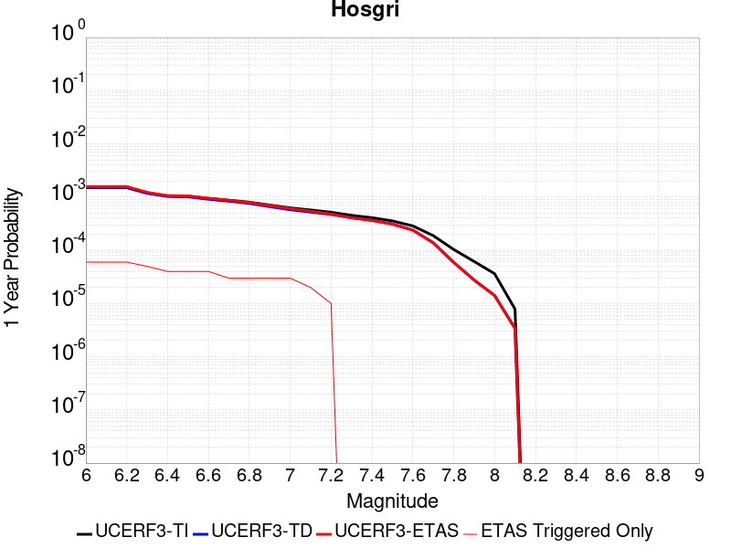 |  |

| Magnitude | 1 wk TI Prob | 1 wk TD Prob | 1 wk ETAS Prob | 1 wk ETAS/TD Gain | 1 wk ETAS Triggered Only | 1 mo TI Prob | 1 mo TD Prob | 1 mo ETAS Prob | 1 mo ETAS/TD Gain | 1 mo ETAS Triggered Only | 1 yr TI Prob | 1 yr TD Prob | 1 yr ETAS Prob | 1 yr ETAS/TD Gain | 1 yr ETAS Triggered Only | 10 yr TI Prob | 10 yr TD Prob | 10 yr ETAS Prob | 10 yr ETAS/TD Gain | 10 yr ETAS Triggered Only |
|-----|-----|-----|-----|-----|-----|-----|-----|-----|-----|-----|-----|-----|-----|-----|-----|-----|-----|-----|-----|-----|
| 6.0 | 2.883978E-5 | 2.9128416E-5 | 6.961307E-5 | 2.389868 | 4.048583E-5 | 1.235932E-4 | 1.2483024E-4 | 1.6531102E-4 | 1.3242866 | 4.048583E-5 | 0.0015037085 | 0.001518776 | 0.0015996246 | 1.0532328 | 8.097166E-5 | 0.01493574 | 0.01508774 | 0.01516749 | 1.0052857 | 8.097166E-5 |
| 6.1 | 2.883978E-5 | 2.9128416E-5 | 6.961307E-5 | 2.389868 | 4.048583E-5 | 1.235932E-4 | 1.2483024E-4 | 1.6531102E-4 | 1.3242866 | 4.048583E-5 | 0.0015037085 | 0.001518776 | 0.0015996246 | 1.0532328 | 8.097166E-5 | 0.01493574 | 0.01508774 | 0.01516749 | 1.0052857 | 8.097166E-5 |
| 6.2 | 2.883978E-5 | 2.9128416E-5 | 6.961307E-5 | 2.389868 | 4.048583E-5 | 1.235932E-4 | 1.2483024E-4 | 1.6531102E-4 | 1.3242866 | 4.048583E-5 | 0.0015037085 | 0.001518776 | 0.0015996246 | 1.0532328 | 8.097166E-5 | 0.01493574 | 0.01508774 | 0.01516749 | 1.0052857 | 8.097166E-5 |
| 6.3 | 2.2914428E-5 | 2.2641969E-5 | 6.3126885E-5 | 2.7880473 | 4.048583E-5 | 9.8200995E-5 | 9.703343E-5 | 1.3751534E-4 | 1.4171954 | 4.048583E-5 | 0.0011949413 | 0.0011807467 | 0.0012616228 | 1.0684956 | 8.097166E-5 | 0.011885363 | 0.011746133 | 0.011826154 | 1.0068125 | 8.097166E-5 |
| 6.4 | 2.0195741E-5 | 1.969656E-5 | 6.0181592E-5 | 3.0554366 | 4.048583E-5 | 8.65503E-5 | 8.4411105E-5 | 1.2489352E-4 | 1.4795864 | 4.048583E-5 | 0.0010532405 | 0.0010272227 | 0.0011081111 | 1.0787449 | 8.097166E-5 | 0.010482626 | 0.010225792 | 0.010305936 | 1.0078374 | 8.097166E-5 |
| 6.5 | 1.9924333E-5 | 1.940898E-5 | 5.9894024E-5 | 3.0858922 | 4.048583E-5 | 8.53872E-5 | 8.3178704E-5 | 1.2366117E-4 | 1.4866927 | 4.048583E-5 | 0.0010390934 | 0.0010122322 | 0.0010931218 | 1.0799122 | 8.097166E-5 | 0.010342481 | 0.010077253 | 0.010157409 | 1.0079541 | 8.097166E-5 |
| 6.6 | 1.809694E-5 | 1.74583E-5 | 5.7943424E-5 | 3.3189614 | 4.048583E-5 | 7.7556004E-5 | 7.4819145E-5 | 1.1530195E-4 | 1.5410753 | 4.048583E-5 | 9.438353E-4 | 9.105437E-4 | 9.914417E-4 | 1.0888457 | 8.097166E-5 | 0.009398366 | 0.009069073 | 0.00914931 | 1.0088474 | 8.097166E-5 |
| 6.7 | 1.675989E-5 | 1.6042764E-5 | 5.6527944E-5 | 3.5235786 | 4.048583E-5 | 7.182612E-5 | 6.87529E-5 | 1.09235945E-4 | 1.5888195 | 4.048583E-5 | 8.7413215E-4 | 8.3674624E-4 | 9.176501E-4 | 1.0966887 | 8.097166E-5 | 0.008707017 | 0.0083368635 | 0.008417159 | 1.0096315 | 8.097166E-5 |
| 6.8 | 1.5401129E-5 | 1.4614083E-5 | 5.509932E-5 | 3.7702894 | 4.048583E-5 | 6.6003166E-5 | 6.2630286E-5 | 1.03113576E-4 | 1.6463853 | 4.048583E-5 | 8.032922E-4 | 7.622578E-4 | 8.431677E-4 | 1.1061451 | 8.097166E-5 | 0.008003947 | 0.007597296 | 0.007677653 | 1.010577 | 8.097166E-5 |
| 6.9 | 1.356559E-5 | 1.2689968E-5 | 5.3175285E-5 | 4.1903405 | 4.048583E-5 | 5.8136946E-5 | 5.4384444E-5 | 9.486807E-5 | 1.7443972 | 4.048583E-5 | 7.0758746E-4 | 6.619299E-4 | 7.42848E-4 | 1.1222457 | 8.097166E-5 | 0.007053386 | 0.006600388 | 0.0066808253 | 1.0121868 | 8.097166E-5 |
| 7.0 | 1.2030819E-5 | 1.1095962E-5 | 5.158134E-5 | 4.648659 | 4.048583E-5 | 5.155963E-5 | 4.7553254E-5 | 8.803716E-5 | 1.8513383 | 4.048583E-5 | 6.275577E-4 | 5.7880714E-4 | 6.59732E-4 | 1.1398131 | 8.097166E-5 | 0.006257884 | 0.005773757 | 0.005854261 | 1.0139431 | 8.097166E-5 |
| 7.1 | 1.0972698E-5 | 1.0022179E-5 | 5.0507602E-5 | 5.039583 | 4.048583E-5 | 4.7025E-5 | 4.2951488E-5 | 8.343558E-5 | 1.9425539 | 4.048583E-5 | 5.72379E-4 | 5.22809E-4 | 6.037383E-4 | 1.1547971 | 8.097166E-5 | 0.0057090693 | 0.005216542 | 0.0052970913 | 1.0154412 | 8.097166E-5 |
| 7.2 | 9.961926E-6 | 9.034746E-6 | 9.034746E-6 | 1.0 | 0.0 | 4.2693267E-5 | 3.8719765E-5 | 3.8719765E-5 | 1.0 | 0.0 | 5.1966653E-4 | 4.713112E-4 | 5.1177794E-4 | 1.0858599 | 4.048583E-5 | 0.00518453 | 0.0047038626 | 0.004744158 | 1.0085665 | 4.048583E-5 |
| 7.3 | 8.700929E-6 | 7.8281E-6 | 7.8281E-6 | 1.0 | 0.0 | 3.7289166E-5 | 3.354857E-5 | 3.354857E-5 | 1.0 | 0.0 | 4.53901E-4 | 4.0837732E-4 | 4.0837732E-4 | 1.0 | 0.0 | 0.00452975 | 0.004077008 | 0.004077008 | 1.0 | 0.0 |
| 7.4 | 7.866285E-6 | 6.998739E-6 | 6.998739E-6 | 1.0 | 0.0 | 3.3712215E-5 | 2.9994251E-5 | 2.9994251E-5 | 1.0 | 0.0 | 4.103689E-4 | 3.6511885E-4 | 3.6511885E-4 | 1.0 | 0.0 | 0.004096119 | 0.0036459267 | 0.0036459267 | 1.0 | 0.0 |
| 7.5 | 6.8381305E-6 | 5.9596955E-6 | 5.9596955E-6 | 1.0 | 0.0 | 2.9305946E-5 | 2.5541302E-5 | 2.5541302E-5 | 1.0 | 0.0 | 3.5674145E-4 | 3.10921E-4 | 3.10921E-4 | 1.0 | 0.0 | 0.0035616932 | 0.0031055948 | 0.0031055948 | 1.0 | 0.0 |
| 7.6 | 5.503376E-6 | 4.5952443E-6 | 4.5952443E-6 | 1.0 | 0.0 | 2.3585684E-5 | 1.9693754E-5 | 1.9693754E-5 | 1.0 | 0.0 | 2.8711787E-4 | 2.397451E-4 | 2.397451E-4 | 1.0 | 0.0 | 0.002867472 | 0.0023955975 | 0.0023955975 | 1.0 | 0.0 |
| 7.7 | 3.6144982E-6 | 2.6522112E-6 | 2.6522112E-6 | 1.0 | 0.0 | 1.5490614E-5 | 1.1366569E-5 | 1.1366569E-5 | 1.0 | 0.0 | 1.8858191E-4 | 1.383792E-4 | 1.383792E-4 | 1.0 | 0.0 | 0.0018842196 | 0.0013836613 | 0.0013836613 | 1.0 | 0.0 |
| 7.8 | 1.9853494E-6 | 1.1361129E-6 | 1.1361129E-6 | 1.0 | 0.0 | 8.508612E-6 | 4.8690463E-6 | 4.8690463E-6 | 1.0 | 0.0 | 1.0358743E-4 | 5.9279027E-5 | 5.9279027E-5 | 1.0 | 0.0 | 0.0010353916 | 5.9336185E-4 | 5.9336185E-4 | 1.0 | 0.0 |
| 7.9 | 1.1818757E-6 | 5.2951856E-7 | 5.2951856E-7 | 1.0 | 0.0 | 5.0651715E-6 | 2.2693632E-6 | 2.2693632E-6 | 1.0 | 0.0 | 6.1666724E-5 | 2.7629147E-5 | 2.7629147E-5 | 1.0 | 0.0 | 6.1649614E-4 | 2.7694515E-4 | 2.7694515E-4 | 1.0 | 0.0 |
| 8.0 | 6.962958E-7 | 2.7139782E-7 | 2.7139782E-7 | 1.0 | 0.0 | 2.9841215E-6 | 1.163133E-6 | 1.163133E-6 | 1.0 | 0.0 | 3.6331072E-5 | 1.4161053E-5 | 1.4161053E-5 | 1.0 | 0.0 | 3.6325134E-4 | 1.4217179E-4 | 1.4217179E-4 | 1.0 | 0.0 |
| 8.1 | 1.5033264E-7 | 6.527624E-8 | 6.527624E-8 | 1.0 | 0.0 | 6.442826E-7 | 2.7975528E-7 | 2.7975528E-7 | 1.0 | 0.0 | 7.844113E-6 | 3.4060151E-6 | 3.4060151E-6 | 1.0 | 0.0 | 7.843835E-5 | 3.407693E-5 | 3.407693E-5 | 1.0 | 0.0 |

## Raymond
*[(top)](#table-of-contents)*

| 1 Week | 1 Month | 1 Year | 10 Year |
|-----|-----|-----|-----|
|  |  |  |  |

| Magnitude | 1 wk TI Prob | 1 wk TD Prob | 1 wk ETAS Prob | 1 wk ETAS/TD Gain | 1 wk ETAS Triggered Only | 1 mo TI Prob | 1 mo TD Prob | 1 mo ETAS Prob | 1 mo ETAS/TD Gain | 1 mo ETAS Triggered Only | 1 yr TI Prob | 1 yr TD Prob | 1 yr ETAS Prob | 1 yr ETAS/TD Gain | 1 yr ETAS Triggered Only | 10 yr TI Prob | 10 yr TD Prob | 10 yr ETAS Prob | 10 yr ETAS/TD Gain | 10 yr ETAS Triggered Only |
|-----|-----|-----|-----|-----|-----|-----|-----|-----|-----|-----|-----|-----|-----|-----|-----|-----|-----|-----|-----|-----|
| 6.0 | 1.5157413E-5 | 1.5810128E-5 | 5.6295317E-5 | 3.5607123 | 4.048583E-5 | 6.4958724E-5 | 6.7756075E-5 | 1.0823916E-4 | 1.5974828 | 4.048583E-5 | 7.905855E-4 | 8.2464307E-4 | 8.6509547E-4 | 1.0490545 | 4.048583E-5 | 0.007877788 | 0.008218348 | 0.008298654 | 1.0097716 | 8.097166E-5 |
| 6.1 | 1.5157413E-5 | 1.5810128E-5 | 5.6295317E-5 | 3.5607123 | 4.048583E-5 | 6.4958724E-5 | 6.7756075E-5 | 1.0823916E-4 | 1.5974828 | 4.048583E-5 | 7.905855E-4 | 8.2464307E-4 | 8.6509547E-4 | 1.0490545 | 4.048583E-5 | 0.007877788 | 0.008218348 | 0.008298654 | 1.0097716 | 8.097166E-5 |
| 6.2 | 1.5157413E-5 | 1.5810128E-5 | 5.6295317E-5 | 3.5607123 | 4.048583E-5 | 6.4958724E-5 | 6.7756075E-5 | 1.0823916E-4 | 1.5974828 | 4.048583E-5 | 7.905855E-4 | 8.2464307E-4 | 8.6509547E-4 | 1.0490545 | 4.048583E-5 | 0.007877788 | 0.008218348 | 0.008298654 | 1.0097716 | 8.097166E-5 |
| 6.3 | 1.5157413E-5 | 1.5810128E-5 | 5.6295317E-5 | 3.5607123 | 4.048583E-5 | 6.4958724E-5 | 6.7756075E-5 | 1.0823916E-4 | 1.5974828 | 4.048583E-5 | 7.905855E-4 | 8.2464307E-4 | 8.6509547E-4 | 1.0490545 | 4.048583E-5 | 0.007877788 | 0.008218348 | 0.008298654 | 1.0097716 | 8.097166E-5 |
| 6.4 | 1.3941944E-5 | 1.445469E-5 | 5.4939934E-5 | 3.8008378 | 4.048583E-5 | 5.9749822E-5 | 6.1947336E-5 | 1.02430655E-4 | 1.6535119 | 4.048583E-5 | 7.2721124E-4 | 7.5397117E-4 | 7.944264E-4 | 1.0536563 | 4.048583E-5 | 0.007248361 | 0.0075164647 | 0.007596828 | 1.0106916 | 8.097166E-5 |
| 6.5 | 1.3941944E-5 | 1.445469E-5 | 5.4939934E-5 | 3.8008378 | 4.048583E-5 | 5.9749822E-5 | 6.1947336E-5 | 1.02430655E-4 | 1.6535119 | 4.048583E-5 | 7.2721124E-4 | 7.5397117E-4 | 7.944264E-4 | 1.0536563 | 4.048583E-5 | 0.007248361 | 0.0075164647 | 0.007596828 | 1.0106916 | 8.097166E-5 |
| 6.6 | 1.0542609E-5 | 1.0671113E-5 | 1.0671113E-5 | 1.0 | 0.0 | 4.5181827E-5 | 4.573257E-5 | 4.573257E-5 | 1.0 | 0.0 | 5.499499E-4 | 5.5665727E-4 | 5.5665727E-4 | 1.0 | 0.0 | 0.005485909 | 0.00555319 | 0.00555319 | 1.0 | 0.0 |
| 6.7 | 1.0542609E-5 | 1.0671113E-5 | 1.0671113E-5 | 1.0 | 0.0 | 4.5181827E-5 | 4.573257E-5 | 4.573257E-5 | 1.0 | 0.0 | 5.499499E-4 | 5.5665727E-4 | 5.5665727E-4 | 1.0 | 0.0 | 0.005485909 | 0.00555319 | 0.00555319 | 1.0 | 0.0 |
| 6.8 | 1.0079132E-5 | 1.0176646E-5 | 1.0176646E-5 | 1.0 | 0.0 | 4.3195567E-5 | 4.3613498E-5 | 4.3613498E-5 | 1.0 | 0.0 | 5.257791E-4 | 5.3087034E-4 | 5.3087034E-4 | 1.0 | 0.0 | 0.0052453685 | 0.005296571 | 0.005296571 | 1.0 | 0.0 |
| 6.9 | 7.721598E-6 | 7.5489047E-6 | 7.5489047E-6 | 1.0 | 0.0 | 3.3092143E-5 | 3.2352054E-5 | 3.2352054E-5 | 1.0 | 0.0 | 4.0282236E-4 | 3.9381627E-4 | 3.9381627E-4 | 1.0 | 0.0 | 0.0040209293 | 0.0039313175 | 0.0039313175 | 1.0 | 0.0 |
| 7.0 | 7.137566E-6 | 6.9113057E-6 | 6.9113057E-6 | 1.0 | 0.0 | 3.058921E-5 | 2.961955E-5 | 2.961955E-5 | 1.0 | 0.0 | 3.7236E-4 | 3.6055944E-4 | 3.6055944E-4 | 1.0 | 0.0 | 0.0037173668 | 0.0035998628 | 0.0035998628 | 1.0 | 0.0 |
| 7.1 | 5.654976E-6 | 5.29954E-6 | 5.29954E-6 | 1.0 | 0.0 | 2.4235387E-5 | 2.2712118E-5 | 2.2712118E-5 | 1.0 | 0.0 | 2.9502588E-4 | 2.7648517E-4 | 2.7648517E-4 | 1.0 | 0.0 | 0.0029463451 | 0.002761443 | 0.002761443 | 1.0 | 0.0 |
| 7.2 | 4.9358455E-6 | 4.5266574E-6 | 4.5266574E-6 | 1.0 | 0.0 | 2.1153453E-5 | 1.9399817E-5 | 1.9399817E-5 | 1.0 | 0.0 | 2.5751285E-4 | 2.3616731E-4 | 2.3616731E-4 | 1.0 | 0.0 | 0.0025721465 | 0.0023591854 | 0.0023591854 | 1.0 | 0.0 |
| 7.3 | 4.2368597E-6 | 3.8056164E-6 | 3.8056164E-6 | 1.0 | 0.0 | 1.8157843E-5 | 1.6309683E-5 | 1.6309683E-5 | 1.0 | 0.0 | 2.2104931E-4 | 1.9855241E-4 | 1.9855241E-4 | 1.0 | 0.0 | 0.0022082955 | 0.0019837688 | 0.0019837688 | 1.0 | 0.0 |
| 7.4 | 3.4999923E-6 | 3.043744E-6 | 3.043744E-6 | 1.0 | 0.0 | 1.49998805E-5 | 1.3044552E-5 | 1.3044552E-5 | 1.0 | 0.0 | 1.8260824E-4 | 1.5880594E-4 | 1.5880594E-4 | 1.0 | 0.0 | 0.0018245826 | 0.0015869403 | 0.0015869403 | 1.0 | 0.0 |
| 7.5 | 2.738017E-6 | 2.3020468E-6 | 2.3020468E-6 | 1.0 | 0.0 | 1.1734306E-5 | 9.865878E-6 | 9.865878E-6 | 1.0 | 0.0 | 1.428558E-4 | 1.2011051E-4 | 1.2011051E-4 | 1.0 | 0.0 | 0.0014276401 | 0.0012004703 | 0.0012004703 | 1.0 | 0.0 |
| 7.6 | 1.8186392E-6 | 1.442312E-6 | 1.442312E-6 | 1.0 | 0.0 | 7.794145E-6 | 6.181323E-6 | 6.181323E-6 | 1.0 | 0.0 | 9.488958E-5 | 7.5255055E-5 | 7.5255055E-5 | 1.0 | 0.0 | 9.4849075E-4 | 7.523072E-4 | 7.523072E-4 | 1.0 | 0.0 |
| 7.7 | 1.0660348E-6 | 7.6438056E-7 | 7.6438056E-7 | 1.0 | 0.0 | 4.5687125E-6 | 3.2759126E-6 | 3.2759126E-6 | 1.0 | 0.0 | 5.5622655E-5 | 3.9883522E-5 | 3.9883522E-5 | 1.0 | 0.0 | 5.5608735E-4 | 3.9877277E-4 | 3.9877277E-4 | 1.0 | 0.0 |
| 7.8 | 6.913602E-7 | 4.3204133E-7 | 4.3204133E-7 | 1.0 | 0.0 | 2.962969E-6 | 1.8516045E-6 | 1.8516045E-6 | 1.0 | 0.0 | 3.607355E-5 | 2.2543056E-5 | 2.2543056E-5 | 1.0 | 0.0 | 3.6067693E-4 | 2.2541556E-4 | 2.2541556E-4 | 1.0 | 0.0 |
| 7.9 | 7.425201E-8 | 5.3222113E-8 | 5.3222113E-8 | 1.0 | 0.0 | 3.1822285E-7 | 2.2809476E-7 | 2.2809476E-7 | 1.0 | 0.0 | 3.874356E-6 | 2.7770516E-6 | 2.7770516E-6 | 1.0 | 0.0 | 3.8742884E-5 | 2.7770298E-5 | 2.7770298E-5 | 1.0 | 0.0 |

## Monterey Bay-Tularcitos
*[(top)](#table-of-contents)*

| 1 Week | 1 Month | 1 Year | 10 Year |
|-----|-----|-----|-----|
| 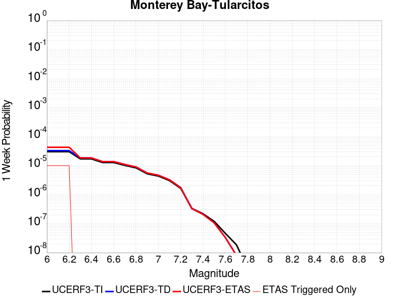 |  |  |  |

| Magnitude | 1 wk TI Prob | 1 wk TD Prob | 1 wk ETAS Prob | 1 wk ETAS/TD Gain | 1 wk ETAS Triggered Only | 1 mo TI Prob | 1 mo TD Prob | 1 mo ETAS Prob | 1 mo ETAS/TD Gain | 1 mo ETAS Triggered Only | 1 yr TI Prob | 1 yr TD Prob | 1 yr ETAS Prob | 1 yr ETAS/TD Gain | 1 yr ETAS Triggered Only | 10 yr TI Prob | 10 yr TD Prob | 10 yr ETAS Prob | 10 yr ETAS/TD Gain | 10 yr ETAS Triggered Only |
|-----|-----|-----|-----|-----|-----|-----|-----|-----|-----|-----|-----|-----|-----|-----|-----|-----|-----|-----|-----|-----|
| 6.0 | 3.0131365E-5 | 3.279877E-5 | 7.328327E-5 | 2.23433 | 4.048583E-5 | 1.2912804E-4 | 1.4055918E-4 | 1.8103932E-4 | 1.2879936 | 4.048583E-5 | 0.001571 | 0.0017100703 | 0.0017504868 | 1.0236344 | 4.048583E-5 | 0.015599402 | 0.016979916 | 0.017059514 | 1.0046877 | 8.097166E-5 |
| 6.1 | 3.0131365E-5 | 3.279877E-5 | 7.328327E-5 | 2.23433 | 4.048583E-5 | 1.2912804E-4 | 1.4055918E-4 | 1.8103932E-4 | 1.2879936 | 4.048583E-5 | 0.001571 | 0.0017100703 | 0.0017504868 | 1.0236344 | 4.048583E-5 | 0.015599402 | 0.016979916 | 0.017059514 | 1.0046877 | 8.097166E-5 |
| 6.2 | 3.0131365E-5 | 3.279877E-5 | 7.328327E-5 | 2.23433 | 4.048583E-5 | 1.2912804E-4 | 1.4055918E-4 | 1.8103932E-4 | 1.2879936 | 4.048583E-5 | 0.001571 | 0.0017100703 | 0.0017504868 | 1.0236344 | 4.048583E-5 | 0.015599402 | 0.016979916 | 0.017059514 | 1.0046877 | 8.097166E-5 |
| 6.3 | 1.6998249E-5 | 1.8330798E-5 | 1.8330798E-5 | 1.0 | 0.0 | 7.28476E-5 | 7.85583E-5 | 7.85583E-5 | 1.0 | 0.0 | 8.865586E-4 | 9.5604634E-4 | 9.5604634E-4 | 1.0 | 0.0 | 0.0088303005 | 0.009521258 | 0.009521258 | 1.0 | 0.0 |
| 6.4 | 1.6998249E-5 | 1.8330798E-5 | 1.8330798E-5 | 1.0 | 0.0 | 7.28476E-5 | 7.85583E-5 | 7.85583E-5 | 1.0 | 0.0 | 8.865586E-4 | 9.5604634E-4 | 9.5604634E-4 | 1.0 | 0.0 | 0.0088303005 | 0.009521258 | 0.009521258 | 1.0 | 0.0 |
| 6.5 | 1.27470785E-5 | 1.3693312E-5 | 1.3693312E-5 | 1.0 | 0.0 | 5.4629192E-5 | 5.8684363E-5 | 5.8684363E-5 | 1.0 | 0.0 | 6.649074E-4 | 7.1425823E-4 | 7.1425823E-4 | 1.0 | 0.0 | 0.0066292146 | 0.007120678 | 0.007120678 | 1.0 | 0.0 |
| 6.6 | 1.2739422E-5 | 1.36854E-5 | 1.36854E-5 | 1.0 | 0.0 | 5.4596385E-5 | 5.8650454E-5 | 5.8650454E-5 | 1.0 | 0.0 | 6.645082E-4 | 7.1384566E-4 | 7.1384566E-4 | 1.0 | 0.0 | 0.0066252467 | 0.007116579 | 0.007116579 | 1.0 | 0.0 |
| 6.7 | 1.0160109E-5 | 1.0885755E-5 | 1.0885755E-5 | 1.0 | 0.0 | 4.35426E-5 | 4.665244E-5 | 4.665244E-5 | 1.0 | 0.0 | 5.300022E-4 | 5.6785246E-4 | 5.6785246E-4 | 1.0 | 0.0 | 0.005287399 | 0.0056647263 | 0.0056647263 | 1.0 | 0.0 |
| 6.8 | 8.349859E-6 | 8.932587E-6 | 8.932587E-6 | 1.0 | 0.0 | 3.578462E-5 | 3.8281985E-5 | 3.8281985E-5 | 1.0 | 0.0 | 4.3559066E-4 | 4.6598914E-4 | 4.6598914E-4 | 1.0 | 0.0 | 0.004347378 | 0.004650685 | 0.004650685 | 1.0 | 0.0 |
| 6.9 | 5.193639E-6 | 5.53643E-6 | 5.53643E-6 | 1.0 | 0.0 | 2.2258262E-5 | 2.372736E-5 | 2.372736E-5 | 1.0 | 0.0 | 2.7096065E-4 | 2.8884556E-4 | 2.8884556E-4 | 1.0 | 0.0 | 0.0027063051 | 0.0028850222 | 0.0028850222 | 1.0 | 0.0 |
| 7.0 | 4.359381E-6 | 4.643366E-6 | 4.643366E-6 | 1.0 | 0.0 | 1.8682927E-5 | 1.9900004E-5 | 1.9900004E-5 | 1.0 | 0.0 | 2.274409E-4 | 2.422586E-4 | 2.422586E-4 | 1.0 | 0.0 | 0.0022720827 | 0.002420238 | 0.002420238 | 1.0 | 0.0 |
| 7.1 | 3.0398533E-6 | 3.2310427E-6 | 3.2310427E-6 | 1.0 | 0.0 | 1.3027877E-5 | 1.3847267E-5 | 1.3847267E-5 | 1.0 | 0.0 | 1.5860285E-4 | 1.6858005E-4 | 1.6858005E-4 | 1.0 | 0.0 | 0.001584897 | 0.0016847793 | 0.0016847793 | 1.0 | 0.0 |
| 7.2 | 1.642335E-6 | 1.7333153E-6 | 1.7333153E-6 | 1.0 | 0.0 | 7.0385595E-6 | 7.428485E-6 | 7.428485E-6 | 1.0 | 0.0 | 8.569109E-5 | 9.044012E-5 | 9.044012E-5 | 1.0 | 0.0 | 8.5658056E-4 | 9.042358E-4 | 9.042358E-4 | 1.0 | 0.0 |
| 7.3 | 3.356842E-7 | 3.2952389E-7 | 3.2952389E-7 | 1.0 | 0.0 | 1.4386458E-6 | 1.4122444E-6 | 1.4122444E-6 | 1.0 | 0.0 | 1.7515373E-5 | 1.7193941E-5 | 1.7193941E-5 | 1.0 | 0.0 | 1.7513991E-4 | 1.719262E-4 | 1.719262E-4 | 1.0 | 0.0 |
| 7.4 | 2.1973483E-7 | 2.1006413E-7 | 2.1006413E-7 | 1.0 | 0.0 | 9.417204E-7 | 9.0027453E-7 | 9.0027453E-7 | 1.0 | 0.0 | 1.1465385E-5 | 1.0960787E-5 | 1.0960787E-5 | 1.0 | 0.0 | 1.1464794E-4 | 1.096025E-4 | 1.096025E-4 | 1.0 | 0.0 |
| 7.5 | 1.1944135E-7 | 1.0696043E-7 | 1.0696043E-7 | 1.0 | 0.0 | 5.118914E-7 | 4.5840173E-7 | 4.5840173E-7 | 1.0 | 0.0 | 6.23226E-6 | 5.581027E-6 | 5.581027E-6 | 1.0 | 0.0 | 6.2320854E-5 | 5.5808883E-5 | 5.5808883E-5 | 1.0 | 0.0 |
| 7.6 | 4.636058E-8 | 3.336489E-8 | 3.336489E-8 | 1.0 | 0.0 | 1.9868818E-7 | 1.4299238E-7 | 1.4299238E-7 | 1.0 | 0.0 | 2.419026E-6 | 1.7409308E-6 | 1.7409308E-6 | 1.0 | 0.0 | 2.4189996E-5 | 1.7409173E-5 | 1.7409173E-5 | 1.0 | 0.0 |
| 7.7 | 1.8588572E-8 | 8.003744E-9 | 8.003744E-9 | 1.0 | 0.0 | 7.9665305E-8 | 3.430176E-8 | 3.430176E-8 | 1.0 | 0.0 | 9.699246E-7 | 4.1762385E-7 | 4.1762385E-7 | 1.0 | 0.0 | 9.699204E-6 | 4.176231E-6 | 4.176231E-6 | 1.0 | 0.0 |
| 7.8 | 2.7960154E-9 | 7.6099427E-10 | 7.6099427E-10 | 1.0 | 0.0 | 1.1982923E-8 | 3.2614043E-9 | 3.2614043E-9 | 1.0 | 0.0 | 1.4589209E-7 | 3.9707597E-8 | 3.9707597E-8 | 1.0 | 0.0 | 1.4589199E-6 | 3.9707595E-7 | 3.9707595E-7 | 1.0 | 0.0 |

## Elysian Park (Upper)
*[(top)](#table-of-contents)*

| 1 Week | 1 Month | 1 Year | 10 Year |
|-----|-----|-----|-----|
|  |  |  |  |

| Magnitude | 1 wk TI Prob | 1 wk TD Prob | 1 wk ETAS Prob | 1 wk ETAS/TD Gain | 1 wk ETAS Triggered Only | 1 mo TI Prob | 1 mo TD Prob | 1 mo ETAS Prob | 1 mo ETAS/TD Gain | 1 mo ETAS Triggered Only | 1 yr TI Prob | 1 yr TD Prob | 1 yr ETAS Prob | 1 yr ETAS/TD Gain | 1 yr ETAS Triggered Only | 10 yr TI Prob | 10 yr TD Prob | 10 yr ETAS Prob | 10 yr ETAS/TD Gain | 10 yr ETAS Triggered Only |
|-----|-----|-----|-----|-----|-----|-----|-----|-----|-----|-----|-----|-----|-----|-----|-----|-----|-----|-----|-----|-----|
| 6.0 | 3.1876025E-5 | 3.7035516E-5 | 3.7035516E-5 | 1.0 | 0.0 | 1.3660437E-4 | 1.587167E-4 | 1.587167E-4 | 1.0 | 0.0 | 0.0016618895 | 0.0019311075 | 0.0019715151 | 1.0209246 | 4.048583E-5 | 0.016495159 | 0.019189782 | 0.019269202 | 1.0041386 | 8.097166E-5 |
| 6.1 | 3.1876025E-5 | 3.7035516E-5 | 3.7035516E-5 | 1.0 | 0.0 | 1.3660437E-4 | 1.587167E-4 | 1.587167E-4 | 1.0 | 0.0 | 0.0016618895 | 0.0019311075 | 0.0019715151 | 1.0209246 | 4.048583E-5 | 0.016495159 | 0.019189782 | 0.019269202 | 1.0041386 | 8.097166E-5 |
| 6.2 | 3.1876025E-5 | 3.7035516E-5 | 3.7035516E-5 | 1.0 | 0.0 | 1.3660437E-4 | 1.587167E-4 | 1.587167E-4 | 1.0 | 0.0 | 0.0016618895 | 0.0019311075 | 0.0019715151 | 1.0209246 | 4.048583E-5 | 0.016495159 | 0.019189782 | 0.019269202 | 1.0041386 | 8.097166E-5 |
| 6.3 | 3.1876025E-5 | 3.7035516E-5 | 3.7035516E-5 | 1.0 | 0.0 | 1.3660437E-4 | 1.587167E-4 | 1.587167E-4 | 1.0 | 0.0 | 0.0016618895 | 0.0019311075 | 0.0019715151 | 1.0209246 | 4.048583E-5 | 0.016495159 | 0.019189782 | 0.019269202 | 1.0041386 | 8.097166E-5 |
| 6.4 | 1.9273462E-5 | 2.1202266E-5 | 2.1202266E-5 | 1.0 | 0.0 | 8.259794E-5 | 9.086466E-5 | 9.086466E-5 | 1.0 | 0.0 | 0.001005166 | 0.0011058892 | 0.0011058892 | 1.0 | 0.0 | 0.010006315 | 0.011020724 | 0.011020724 | 1.0 | 0.0 |
| 6.5 | 1.9273462E-5 | 2.1202266E-5 | 2.1202266E-5 | 1.0 | 0.0 | 8.259794E-5 | 9.086466E-5 | 9.086466E-5 | 1.0 | 0.0 | 0.001005166 | 0.0011058892 | 0.0011058892 | 1.0 | 0.0 | 0.010006315 | 0.011020724 | 0.011020724 | 1.0 | 0.0 |
| 6.6 | 9.813258E-6 | 9.665599E-6 | 9.665599E-6 | 1.0 | 0.0 | 4.205614E-5 | 4.1423376E-5 | 4.1423376E-5 | 1.0 | 0.0 | 5.119132E-4 | 5.0422014E-4 | 5.0422014E-4 | 1.0 | 0.0 | 0.005107356 | 0.0050314846 | 0.0050314846 | 1.0 | 0.0 |
| 6.7 | 9.801478E-6 | 9.653168E-6 | 9.653168E-6 | 1.0 | 0.0 | 4.2005657E-5 | 4.1370105E-5 | 4.1370105E-5 | 1.0 | 0.0 | 5.112989E-4 | 5.035719E-4 | 5.035719E-4 | 1.0 | 0.0 | 0.0051012407 | 0.0050250315 | 0.0050250315 | 1.0 | 0.0 |
| 6.8 | 8.102489E-6 | 7.773004E-6 | 7.773004E-6 | 1.0 | 0.0 | 3.4724493E-5 | 3.3312477E-5 | 3.3312477E-5 | 1.0 | 0.0 | 4.2268867E-4 | 4.055089E-4 | 4.055089E-4 | 1.0 | 0.0 | 0.004218856 | 0.0040481836 | 0.0040481836 | 1.0 | 0.0 |
| 6.9 | 6.08275E-6 | 5.4814514E-6 | 5.4814514E-6 | 1.0 | 0.0 | 2.6068668E-5 | 2.3491726E-5 | 2.3491726E-5 | 1.0 | 0.0 | 3.173398E-4 | 2.85975E-4 | 2.85975E-4 | 1.0 | 0.0 | 0.0031688702 | 0.0028561477 | 0.0028561477 | 1.0 | 0.0 |
| 7.0 | 5.5995934E-6 | 4.98278E-6 | 4.98278E-6 | 1.0 | 0.0 | 2.3998036E-5 | 2.13546E-5 | 2.13546E-5 | 1.0 | 0.0 | 2.9213692E-4 | 2.599619E-4 | 2.599619E-4 | 1.0 | 0.0 | 0.0029175316 | 0.0025966454 | 0.0025966454 | 1.0 | 0.0 |
| 7.1 | 4.709881E-6 | 4.0874015E-6 | 4.0874015E-6 | 1.0 | 0.0 | 2.0185047E-5 | 1.7517319E-5 | 1.7517319E-5 | 1.0 | 0.0 | 2.4572524E-4 | 2.132529E-4 | 2.132529E-4 | 1.0 | 0.0 | 0.002454537 | 0.002130524 | 0.002130524 | 1.0 | 0.0 |
| 7.2 | 3.6063436E-6 | 2.9779544E-6 | 2.9779544E-6 | 1.0 | 0.0 | 1.5455667E-5 | 1.27626E-5 | 1.27626E-5 | 1.0 | 0.0 | 1.881565E-4 | 1.5537368E-4 | 1.5537368E-4 | 1.0 | 0.0 | 0.0018799726 | 0.0015526618 | 0.0015526618 | 1.0 | 0.0 |
| 7.3 | 2.471135E-6 | 2.0954615E-6 | 2.0954615E-6 | 1.0 | 0.0 | 1.0590536E-5 | 8.980519E-6 | 8.980519E-6 | 1.0 | 0.0 | 1.2893214E-4 | 1.093324E-4 | 1.093324E-4 | 1.0 | 0.0 | 0.0012885736 | 0.0010927934 | 0.0010927934 | 1.0 | 0.0 |
| 7.4 | 1.163943E-6 | 1.0275091E-6 | 1.0275091E-6 | 1.0 | 0.0 | 4.988318E-6 | 4.4036033E-6 | 4.4036033E-6 | 1.0 | 0.0 | 6.0731076E-5 | 5.3612584E-5 | 5.3612584E-5 | 1.0 | 0.0 | 6.071448E-4 | 5.359995E-4 | 5.359995E-4 | 1.0 | 0.0 |
| 7.5 | 4.99459E-7 | 4.917604E-7 | 4.917604E-7 | 1.0 | 0.0 | 2.140537E-6 | 2.1075427E-6 | 2.1075427E-6 | 1.0 | 0.0 | 2.6060725E-5 | 2.5659048E-5 | 2.5659048E-5 | 1.0 | 0.0 | 2.605767E-4 | 2.5656243E-4 | 2.5656243E-4 | 1.0 | 0.0 |
| 7.6 | 2.4667852E-7 | 2.4778336E-7 | 2.4778336E-7 | 1.0 | 0.0 | 1.0571932E-6 | 1.0619283E-6 | 1.0619283E-6 | 1.0 | 0.0 | 1.2871251E-5 | 1.2928905E-5 | 1.2928905E-5 | 1.0 | 0.0 | 1.2870505E-4 | 1.2928189E-4 | 1.2928189E-4 | 1.0 | 0.0 |
| 7.7 | 8.2312795E-8 | 7.3864456E-8 | 7.3864456E-8 | 1.0 | 0.0 | 3.527691E-7 | 3.165619E-7 | 3.165619E-7 | 1.0 | 0.0 | 4.294955E-6 | 3.8541357E-6 | 3.8541357E-6 | 1.0 | 0.0 | 4.2948723E-5 | 3.8540802E-5 | 3.8540802E-5 | 1.0 | 0.0 |
| 7.8 | 2.7819295E-8 | 1.7566023E-8 | 1.7566023E-8 | 1.0 | 0.0 | 1.1922555E-7 | 7.5282955E-8 | 7.5282955E-8 | 1.0 | 0.0 | 1.45157E-6 | 9.165697E-7 | 9.165697E-7 | 1.0 | 0.0 | 1.45156055E-5 | 9.165675E-6 | 9.165675E-6 | 1.0 | 0.0 |

## Elsinore (Temecula) rev
*[(top)](#table-of-contents)*

| 1 Week | 1 Month | 1 Year | 10 Year |
|-----|-----|-----|-----|
|  |  |  |  |

| Magnitude | 1 wk TI Prob | 1 wk TD Prob | 1 wk ETAS Prob | 1 wk ETAS/TD Gain | 1 wk ETAS Triggered Only | 1 mo TI Prob | 1 mo TD Prob | 1 mo ETAS Prob | 1 mo ETAS/TD Gain | 1 mo ETAS Triggered Only | 1 yr TI Prob | 1 yr TD Prob | 1 yr ETAS Prob | 1 yr ETAS/TD Gain | 1 yr ETAS Triggered Only | 10 yr TI Prob | 10 yr TD Prob | 10 yr ETAS Prob | 10 yr ETAS/TD Gain | 10 yr ETAS Triggered Only |
|-----|-----|-----|-----|-----|-----|-----|-----|-----|-----|-----|-----|-----|-----|-----|-----|-----|-----|-----|-----|-----|
| 6.0 | 2.9514995E-5 | 2.2517117E-5 | 6.300204E-5 | 2.797962 | 4.048583E-5 | 1.264867E-4 | 9.649849E-5 | 1.3698041E-4 | 1.4195083 | 4.048583E-5 | 0.0015388876 | 0.0011742581 | 0.0012146963 | 1.0344373 | 4.048583E-5 | 0.015282745 | 0.011696897 | 0.011776922 | 1.0068415 | 8.097166E-5 |
| 6.1 | 2.9514995E-5 | 2.2517117E-5 | 6.300204E-5 | 2.797962 | 4.048583E-5 | 1.264867E-4 | 9.649849E-5 | 1.3698041E-4 | 1.4195083 | 4.048583E-5 | 0.0015388876 | 0.0011742581 | 0.0012146963 | 1.0344373 | 4.048583E-5 | 0.015282745 | 0.011696897 | 0.011776922 | 1.0068415 | 8.097166E-5 |
| 6.2 | 2.9514995E-5 | 2.2517117E-5 | 6.300204E-5 | 2.797962 | 4.048583E-5 | 1.264867E-4 | 9.649849E-5 | 1.3698041E-4 | 1.4195083 | 4.048583E-5 | 0.0015388876 | 0.0011742581 | 0.0012146963 | 1.0344373 | 4.048583E-5 | 0.015282745 | 0.011696897 | 0.011776922 | 1.0068415 | 8.097166E-5 |
| 6.3 | 2.3223649E-5 | 1.8406454E-5 | 5.889154E-5 | 3.1995049 | 4.048583E-5 | 9.952613E-5 | 7.888251E-5 | 1.19365155E-4 | 1.5132016 | 4.048583E-5 | 0.001211057 | 9.599888E-4 | 0.0010004358 | 1.0421327 | 4.048583E-5 | 0.012044783 | 0.009569948 | 0.009650145 | 1.00838 | 8.097166E-5 |
| 6.4 | 2.3223649E-5 | 1.8406454E-5 | 5.889154E-5 | 3.1995049 | 4.048583E-5 | 9.952613E-5 | 7.888251E-5 | 1.19365155E-4 | 1.5132016 | 4.048583E-5 | 0.001211057 | 9.599888E-4 | 0.0010004358 | 1.0421327 | 4.048583E-5 | 0.012044783 | 0.009569948 | 0.009650145 | 1.00838 | 8.097166E-5 |
| 6.5 | 1.8338875E-5 | 1.4750118E-5 | 5.523535E-5 | 3.7447398 | 4.048583E-5 | 7.8592806E-5 | 6.321331E-5 | 1.0369658E-4 | 1.6404232 | 4.048583E-5 | 9.5644733E-4 | 7.69359E-4 | 8.098137E-4 | 1.0525823 | 4.048583E-5 | 0.009523412 | 0.0076739118 | 0.007754262 | 1.0104706 | 8.097166E-5 |
| 6.6 | 1.8223333E-5 | 1.4612673E-5 | 5.5097913E-5 | 3.7705567 | 4.048583E-5 | 7.809766E-5 | 6.262429E-5 | 1.0310758E-4 | 1.6464472 | 4.048583E-5 | 9.504242E-4 | 7.6219277E-4 | 8.0264773E-4 | 1.0530771 | 4.048583E-5 | 0.009463696 | 0.0076027405 | 0.0076830965 | 1.0105693 | 8.097166E-5 |
| 6.7 | 1.7512752E-5 | 1.402721E-5 | 5.451247E-5 | 3.886195 | 4.048583E-5 | 7.505249E-5 | 6.011528E-5 | 1.0059868E-4 | 1.6734294 | 4.048583E-5 | 9.13381E-4 | 7.3166634E-4 | 7.721225E-4 | 1.0552932 | 4.048583E-5 | 0.00909636 | 0.00729892 | 0.0073793004 | 1.0110127 | 8.097166E-5 |
| 6.8 | 1.7417142E-5 | 1.3951195E-5 | 5.443646E-5 | 3.901921 | 4.048583E-5 | 7.4642754E-5 | 5.9789512E-5 | 1.00272926E-4 | 1.6770989 | 4.048583E-5 | 9.083966E-4 | 7.277028E-4 | 7.6815917E-4 | 1.0555947 | 4.048583E-5 | 0.009046922 | 0.0072594886 | 0.0073398724 | 1.011073 | 8.097166E-5 |
| 6.9 | 1.6402591E-5 | 1.2988613E-5 | 5.347392E-5 | 4.1169844 | 4.048583E-5 | 7.0294926E-5 | 5.5664343E-5 | 9.6147916E-5 | 1.7272803 | 4.048583E-5 | 8.5550465E-4 | 6.775103E-4 | 7.179687E-4 | 1.0597163 | 4.048583E-5 | 0.008522186 | 0.006760169 | 0.006840593 | 1.0118967 | 8.097166E-5 |
| 7.0 | 1.3912486E-5 | 1.0878233E-5 | 5.1363622E-5 | 4.721688 | 4.048583E-5 | 5.9623577E-5 | 4.6620182E-5 | 8.710413E-5 | 1.868378 | 4.048583E-5 | 7.2567526E-4 | 5.674556E-4 | 6.079185E-4 | 1.0713058 | 4.048583E-5 | 0.0072331014 | 0.005663986 | 0.0057444987 | 1.0142149 | 8.097166E-5 |
| 7.1 | 1.3405147E-5 | 1.03274215E-5 | 5.0812832E-5 | 4.920186 | 4.048583E-5 | 5.7449364E-5 | 4.425964E-5 | 8.4743675E-5 | 1.9146943 | 4.048583E-5 | 6.9922156E-4 | 5.3873047E-4 | 5.7919446E-4 | 1.07511 | 4.048583E-5 | 0.0069702556 | 0.005377577 | 0.0054581133 | 1.0149763 | 8.097166E-5 |
| 7.2 | 1.21402E-5 | 8.996737E-6 | 8.996737E-6 | 1.0 | 0.0 | 5.202839E-5 | 3.8556886E-5 | 3.8556886E-5 | 1.0 | 0.0 | 6.332616E-4 | 4.6933076E-4 | 4.6933076E-4 | 1.0 | 0.0 | 0.0063146 | 0.004684821 | 0.004725117 | 1.0086014 | 4.048583E-5 |
| 7.3 | 1.05047775E-5 | 7.571771E-6 | 7.571771E-6 | 1.0 | 0.0 | 4.5019697E-5 | 3.245005E-5 | 3.245005E-5 | 1.0 | 0.0 | 5.4797693E-4 | 3.950092E-4 | 3.950092E-4 | 1.0 | 0.0 | 0.005466277 | 0.00394346 | 0.0039837863 | 1.0102261 | 4.048583E-5 |
| 7.4 | 9.624483E-6 | 6.7868696E-6 | 6.7868696E-6 | 1.0 | 0.0 | 4.124713E-5 | 2.9086266E-5 | 2.9086266E-5 | 1.0 | 0.0 | 5.0206814E-4 | 3.5406914E-4 | 3.5406914E-4 | 1.0 | 0.0 | 0.005009353 | 0.003535204 | 0.003535204 | 1.0 | 0.0 |
| 7.5 | 8.215151E-6 | 5.635538E-6 | 5.635538E-6 | 1.0 | 0.0 | 3.5207315E-5 | 2.4152088E-5 | 2.4152088E-5 | 1.0 | 0.0 | 4.2856473E-4 | 2.9401327E-4 | 2.9401327E-4 | 1.0 | 0.0 | 0.004277392 | 0.002936371 | 0.002936371 | 1.0 | 0.0 |
| 7.6 | 6.975058E-6 | 4.676045E-6 | 4.676045E-6 | 1.0 | 0.0 | 2.9892764E-5 | 2.0040046E-5 | 2.0040046E-5 | 1.0 | 0.0 | 3.6388362E-4 | 2.439614E-4 | 2.439614E-4 | 1.0 | 0.0 | 0.0036328835 | 0.002437052 | 0.002437052 | 1.0 | 0.0 |
| 7.7 | 4.159604E-6 | 2.3269924E-6 | 2.3269924E-6 | 1.0 | 0.0 | 1.7826753E-5 | 9.97279E-6 | 9.97279E-6 | 1.0 | 0.0 | 2.1701909E-4 | 1.21412704E-4 | 1.21412704E-4 | 1.0 | 0.0 | 0.0021680726 | 0.0012135367 | 0.0012135367 | 1.0 | 0.0 |
| 7.8 | 2.2692414E-7 | 9.3854695E-8 | 9.3854695E-8 | 1.0 | 0.0 | 9.725317E-7 | 4.0223435E-7 | 4.0223435E-7 | 1.0 | 0.0 | 1.1840509E-5 | 4.8971956E-6 | 4.8971956E-6 | 1.0 | 0.0 | 1.1839878E-4 | 4.8971204E-5 | 4.8971204E-5 | 1.0 | 0.0 |
| 7.9 | 6.676829E-9 | 3.439853E-9 | 3.439853E-9 | 1.0 | 0.0 | 2.861498E-8 | 1.4742227E-8 | 1.4742227E-8 | 1.0 | 0.0 | 3.4838732E-7 | 1.7948659E-7 | 1.7948659E-7 | 1.0 | 0.0 | 3.4838679E-6 | 1.7948646E-6 | 1.7948646E-6 | 1.0 | 0.0 |

## San Jacinto (Clark) rev
*[(top)](#table-of-contents)*

| 1 Week | 1 Month | 1 Year | 10 Year |
|-----|-----|-----|-----|
|  |  |  |  |

| Magnitude | 1 wk TI Prob | 1 wk TD Prob | 1 wk ETAS Prob | 1 wk ETAS/TD Gain | 1 wk ETAS Triggered Only | 1 mo TI Prob | 1 mo TD Prob | 1 mo ETAS Prob | 1 mo ETAS/TD Gain | 1 mo ETAS Triggered Only | 1 yr TI Prob | 1 yr TD Prob | 1 yr ETAS Prob | 1 yr ETAS/TD Gain | 1 yr ETAS Triggered Only | 10 yr TI Prob | 10 yr TD Prob | 10 yr ETAS Prob | 10 yr ETAS/TD Gain | 10 yr ETAS Triggered Only |
|-----|-----|-----|-----|-----|-----|-----|-----|-----|-----|-----|-----|-----|-----|-----|-----|-----|-----|-----|-----|-----|
| 6.0 | 4.482615E-5 | 2.1154196E-5 | 2.1154196E-5 | 1.0 | 0.0 | 1.9209793E-4 | 9.065773E-5 | 1.311399E-4 | 1.4465384 | 4.048583E-5 | 0.0023362834 | 0.0011032083 | 0.0011840906 | 1.0733155 | 8.097166E-5 | 0.02311874 | 0.011503847 | 0.011583887 | 1.0069577 | 8.097166E-5 |
| 6.1 | 4.482615E-5 | 2.1154196E-5 | 2.1154196E-5 | 1.0 | 0.0 | 1.9209793E-4 | 9.065773E-5 | 1.311399E-4 | 1.4465384 | 4.048583E-5 | 0.0023362834 | 0.0011032083 | 0.0011840906 | 1.0733155 | 8.097166E-5 | 0.02311874 | 0.011503847 | 0.011583887 | 1.0069577 | 8.097166E-5 |
| 6.2 | 4.482615E-5 | 2.1154196E-5 | 2.1154196E-5 | 1.0 | 0.0 | 1.9209793E-4 | 9.065773E-5 | 1.311399E-4 | 1.4465384 | 4.048583E-5 | 0.0023362834 | 0.0011032083 | 0.0011840906 | 1.0733155 | 8.097166E-5 | 0.02311874 | 0.011503847 | 0.011583887 | 1.0069577 | 8.097166E-5 |
| 6.3 | 4.482615E-5 | 2.1154196E-5 | 2.1154196E-5 | 1.0 | 0.0 | 1.9209793E-4 | 9.065773E-5 | 1.311399E-4 | 1.4465384 | 4.048583E-5 | 0.0023362834 | 0.0011032083 | 0.0011840906 | 1.0733155 | 8.097166E-5 | 0.02311874 | 0.011503847 | 0.011583887 | 1.0069577 | 8.097166E-5 |
| 6.4 | 4.482615E-5 | 2.1154196E-5 | 2.1154196E-5 | 1.0 | 0.0 | 1.9209793E-4 | 9.065773E-5 | 1.311399E-4 | 1.4465384 | 4.048583E-5 | 0.0023362834 | 0.0011032083 | 0.0011840906 | 1.0733155 | 8.097166E-5 | 0.02311874 | 0.011503847 | 0.011583887 | 1.0069577 | 8.097166E-5 |
| 6.5 | 3.7294863E-5 | 1.7356087E-5 | 1.7356087E-5 | 1.0 | 0.0 | 1.5982533E-4 | 7.438113E-5 | 1.1486396E-4 | 1.5442619 | 4.048583E-5 | 0.0019441366 | 9.052186E-4 | 9.861169E-4 | 1.0893688 | 8.097166E-5 | 0.01927216 | 0.0094941035 | 0.009574306 | 1.0084476 | 8.097166E-5 |
| 6.6 | 3.7294863E-5 | 1.7356087E-5 | 1.7356087E-5 | 1.0 | 0.0 | 1.5982533E-4 | 7.438113E-5 | 1.1486396E-4 | 1.5442619 | 4.048583E-5 | 0.0019441366 | 9.052186E-4 | 9.861169E-4 | 1.0893688 | 8.097166E-5 | 0.01927216 | 0.0094941035 | 0.009574306 | 1.0084476 | 8.097166E-5 |
| 6.7 | 3.6039248E-5 | 1.6604314E-5 | 1.6604314E-5 | 1.0 | 0.0 | 1.5444479E-4 | 7.1159426E-5 | 1.11642374E-4 | 1.568905 | 4.048583E-5 | 0.0018787434 | 8.6602574E-4 | 9.469273E-4 | 1.093417 | 8.097166E-5 | 0.01862939 | 0.009096047 | 0.009176282 | 1.0088209 | 8.097166E-5 |
| 6.8 | 3.5031844E-5 | 1.6232942E-5 | 1.6232942E-5 | 1.0 | 0.0 | 1.5012783E-4 | 6.956792E-5 | 1.1005093E-4 | 1.5819207 | 4.048583E-5 | 0.0018262739 | 8.4666436E-4 | 9.275674E-4 | 1.0955551 | 8.097166E-5 | 0.01811338 | 0.008895969 | 0.00897622 | 1.009021 | 8.097166E-5 |
| 6.9 | 3.435112E-5 | 1.6063195E-5 | 1.6063195E-5 | 1.0 | 0.0 | 1.4721078E-4 | 6.884047E-5 | 1.0932351E-4 | 1.5880704 | 4.048583E-5 | 0.0017908178 | 8.3781447E-4 | 9.187183E-4 | 1.0965654 | 8.097166E-5 | 0.017764548 | 0.008804181 | 0.008884439 | 1.0091159 | 8.097166E-5 |
| 7.0 | 2.8959772E-5 | 1.4336745E-5 | 1.4336745E-5 | 1.0 | 0.0 | 1.241074E-4 | 6.144176E-5 | 1.0192511E-4 | 1.6588897 | 4.048583E-5 | 0.0015099603 | 7.477995E-4 | 8.287106E-4 | 1.1081989 | 8.097166E-5 | 0.014997416 | 0.007868037 | 0.007948371 | 1.0102103 | 8.097166E-5 |
| 7.1 | 2.6002877E-5 | 1.2829002E-5 | 1.2829002E-5 | 1.0 | 0.0 | 1.11436144E-4 | 5.498029E-5 | 9.5463896E-5 | 1.7363294 | 4.048583E-5 | 0.0013558907 | 6.691816E-4 | 7.50099E-4 | 1.1209201 | 8.097166E-5 | 0.013476475 | 0.0070465137 | 0.007126915 | 1.01141 | 8.097166E-5 |
| 7.2 | 2.2544838E-5 | 1.1262543E-5 | 1.1262543E-5 | 1.0 | 0.0 | 9.661716E-5 | 4.8267157E-5 | 8.875103E-5 | 1.8387458 | 4.048583E-5 | 0.001175679 | 5.874956E-4 | 6.6841976E-4 | 1.1377442 | 8.097166E-5 | 0.011694785 | 0.0061927503 | 0.0062732203 | 1.0129943 | 8.097166E-5 |
| 7.3 | 1.75334E-5 | 1.0811715E-5 | 1.0811715E-5 | 1.0 | 0.0 | 7.514098E-5 | 4.6335106E-5 | 8.681906E-5 | 1.873721 | 4.048583E-5 | 9.144575E-4 | 5.6398526E-4 | 6.4491126E-4 | 1.1434896 | 8.097166E-5 | 0.009107036 | 0.0059337732 | 0.0060142647 | 1.013565 | 8.097166E-5 |
| 7.4 | 1.5924552E-5 | 1.0611516E-5 | 1.0611516E-5 | 1.0 | 0.0 | 6.82463E-5 | 4.547714E-5 | 8.596113E-5 | 1.8902053 | 4.048583E-5 | 8.305819E-4 | 5.535449E-4 | 6.3447177E-4 | 1.1461974 | 8.097166E-5 | 0.008274844 | 0.0058210334 | 0.0059015336 | 1.0138292 | 8.097166E-5 |
| 7.5 | 1.3428931E-5 | 9.8519E-6 | 9.8519E-6 | 1.0 | 0.0 | 5.7551293E-5 | 4.2221753E-5 | 8.270587E-5 | 1.9588451 | 4.048583E-5 | 7.004617E-4 | 5.1392964E-4 | 5.948597E-4 | 1.157473 | 8.097166E-5 | 0.006982579 | 0.0054066023 | 0.0054871365 | 1.0148954 | 8.097166E-5 |
| 7.6 | 1.0688787E-5 | 8.614839E-6 | 8.614839E-6 | 1.0 | 0.0 | 4.5808283E-5 | 3.692022E-5 | 7.7404555E-5 | 2.0965354 | 4.048583E-5 | 5.5757316E-4 | 4.4941145E-4 | 5.303467E-4 | 1.1800917 | 8.097166E-5 | 0.005561762 | 0.0047416524 | 0.0048222397 | 1.0169957 | 8.097166E-5 |
| 7.7 | 8.81236E-6 | 7.4680274E-6 | 7.4680274E-6 | 1.0 | 0.0 | 3.776671E-5 | 3.2005442E-5 | 7.248997E-5 | 2.2649267 | 4.048583E-5 | 4.597127E-4 | 3.8959677E-4 | 4.7053688E-4 | 1.2077535 | 8.097166E-5 | 0.0045876284 | 0.0041346536 | 0.0042152903 | 1.0195026 | 8.097166E-5 |
| 7.8 | 7.780431E-6 | 6.696579E-6 | 6.696579E-6 | 1.0 | 0.0 | 3.3344273E-5 | 2.8699309E-5 | 6.9183974E-5 | 2.4106495 | 4.048583E-5 | 4.0589093E-4 | 3.4935825E-4 | 4.3030162E-4 | 1.2316916 | 8.097166E-5 | 0.0040515037 | 0.0037227906 | 0.0038034609 | 1.0216693 | 8.097166E-5 |
| 7.9 | 6.5437994E-6 | 5.780382E-6 | 5.780382E-6 | 1.0 | 0.0 | 2.8044553E-5 | 2.477283E-5 | 6.525766E-5 | 2.634243 | 4.048583E-5 | 3.4138895E-4 | 3.0156763E-4 | 3.8251487E-4 | 1.2684215 | 8.097166E-5 | 0.0034086495 | 0.0032344845 | 0.0033151943 | 1.0249529 | 8.097166E-5 |
| 8.0 | 5.4488164E-6 | 4.8133406E-6 | 4.8133406E-6 | 1.0 | 0.0 | 2.3351862E-5 | 2.062844E-5 | 6.111344E-5 | 2.9625814 | 4.048583E-5 | 2.8427184E-4 | 2.5112246E-4 | 3.320738E-4 | 1.322358 | 8.097166E-5 | 0.0028390845 | 0.002710839 | 0.0027915912 | 1.0297886 | 8.097166E-5 |
| 8.1 | 2.8397242E-6 | 1.3670389E-6 | 1.3670389E-6 | 1.0 | 0.0 | 1.217019E-5 | 5.858725E-6 | 5.858725E-6 | 1.0 | 0.0 | 1.4816198E-4 | 7.132765E-5 | 7.132765E-5 | 1.0 | 0.0 | 0.0014806325 | 8.115382E-4 | 8.115382E-4 | 1.0 | 0.0 |
| 8.2 | 2.030244E-6 | 6.318974E-7 | 6.318974E-7 | 1.0 | 0.0 | 8.701017E-6 | 2.708129E-6 | 2.708129E-6 | 1.0 | 0.0 | 1.05929736E-4 | 3.2970976E-5 | 3.2970976E-5 | 1.0 | 0.0 | 0.0010587925 | 3.9486602E-4 | 3.9486602E-4 | 1.0 | 0.0 |
| 8.3 | 1.0659804E-6 | 2.9250086E-7 | 2.9250086E-7 | 1.0 | 0.0 | 4.568479E-6 | 1.2535745E-6 | 1.2535745E-6 | 1.0 | 0.0 | 5.5619817E-5 | 1.5262167E-5 | 1.5262167E-5 | 1.0 | 0.0 | 5.5605895E-4 | 1.8566217E-4 | 1.8566217E-4 | 1.0 | 0.0 |

## San Diego Trough south
*[(top)](#table-of-contents)*

| 1 Week | 1 Month | 1 Year | 10 Year |
|-----|-----|-----|-----|
|  | 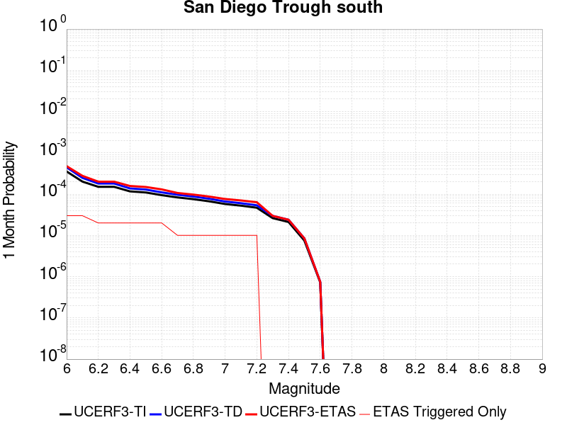 |  |  |

| Magnitude | 1 wk TI Prob | 1 wk TD Prob | 1 wk ETAS Prob | 1 wk ETAS/TD Gain | 1 wk ETAS Triggered Only | 1 mo TI Prob | 1 mo TD Prob | 1 mo ETAS Prob | 1 mo ETAS/TD Gain | 1 mo ETAS Triggered Only | 1 yr TI Prob | 1 yr TD Prob | 1 yr ETAS Prob | 1 yr ETAS/TD Gain | 1 yr ETAS Triggered Only | 10 yr TI Prob | 10 yr TD Prob | 10 yr ETAS Prob | 10 yr ETAS/TD Gain | 10 yr ETAS Triggered Only |
|-----|-----|-----|-----|-----|-----|-----|-----|-----|-----|-----|-----|-----|-----|-----|-----|-----|-----|-----|-----|-----|
| 6.0 | 8.279495E-5 | 1.04241306E-4 | 1.04241306E-4 | 1.0 | 0.0 | 3.5478722E-4 | 4.4667677E-4 | 4.4667677E-4 | 1.0 | 0.0 | 0.004310982 | 0.0054256152 | 0.0054256152 | 1.0 | 0.0 | 0.042283054 | 0.05299221 | 0.05306889 | 1.001447 | 8.097166E-5 |
| 6.1 | 4.6961468E-5 | 5.772944E-5 | 5.772944E-5 | 1.0 | 0.0 | 2.0124791E-4 | 2.473894E-4 | 2.473894E-4 | 1.0 | 0.0 | 0.00244744 | 0.0030079768 | 0.0030079768 | 1.0 | 0.0 | 0.024206603 | 0.029679462 | 0.029718745 | 1.0013236 | 4.048583E-5 |
| 6.2 | 3.5079658E-5 | 4.214154E-5 | 4.214154E-5 | 1.0 | 0.0 | 1.5033272E-4 | 1.8059435E-4 | 1.8059435E-4 | 1.0 | 0.0 | 0.0018287642 | 0.0021965632 | 0.0021965632 | 1.0 | 0.0 | 0.018137876 | 0.021751117 | 0.021790722 | 1.0018208 | 4.048583E-5 |
| 6.3 | 3.5079658E-5 | 4.214154E-5 | 4.214154E-5 | 1.0 | 0.0 | 1.5033272E-4 | 1.8059435E-4 | 1.8059435E-4 | 1.0 | 0.0 | 0.0018287642 | 0.0021965632 | 0.0021965632 | 1.0 | 0.0 | 0.018137876 | 0.021751117 | 0.021790722 | 1.0018208 | 4.048583E-5 |
| 6.4 | 2.7196904E-5 | 3.2087162E-5 | 3.2087162E-5 | 1.0 | 0.0 | 1.16552954E-4 | 1.3750927E-4 | 1.3750927E-4 | 1.0 | 0.0 | 0.0014181085 | 0.0016729041 | 0.0016729041 | 1.0 | 0.0 | 0.014090929 | 0.016604643 | 0.016604643 | 1.0 | 0.0 |
| 6.5 | 2.5584688E-5 | 3.010164E-5 | 3.010164E-5 | 1.0 | 0.0 | 1.0964406E-4 | 1.2900073E-4 | 1.2900073E-4 | 1.0 | 0.0 | 0.0013340989 | 0.0015694655 | 0.0015694655 | 1.0 | 0.0 | 0.013261181 | 0.015585314 | 0.015585314 | 1.0 | 0.0 |
| 6.6 | 2.2034688E-5 | 2.5742738E-5 | 2.5742738E-5 | 1.0 | 0.0 | 9.443096E-5 | 1.1032141E-4 | 1.1032141E-4 | 1.0 | 0.0 | 0.0011490905 | 0.0013423424 | 0.0013423424 | 1.0 | 0.0 | 0.011431668 | 0.013343317 | 0.013343317 | 1.0 | 0.0 |
| 6.7 | 1.9394853E-5 | 2.254176E-5 | 2.254176E-5 | 1.0 | 0.0 | 8.311815E-5 | 9.6603995E-5 | 9.6603995E-5 | 1.0 | 0.0 | 0.0010114936 | 0.0011755243 | 0.0011755243 | 1.0 | 0.0 | 0.01006902 | 0.011693766 | 0.011693766 | 1.0 | 0.0 |
| 6.8 | 1.7615313E-5 | 2.0403182E-5 | 2.0403182E-5 | 1.0 | 0.0 | 7.549201E-5 | 8.74393E-5 | 8.74393E-5 | 1.0 | 0.0 | 9.1872766E-4 | 0.0010640579 | 0.0010640579 | 1.0 | 0.0 | 0.009149387 | 0.010590198 | 0.010590198 | 1.0 | 0.0 |
| 6.9 | 1.5621423E-5 | 1.8026114E-5 | 1.8026114E-5 | 1.0 | 0.0 | 6.6947236E-5 | 7.725251E-5 | 7.725251E-5 | 1.0 | 0.0 | 8.147778E-4 | 9.40147E-4 | 9.40147E-4 | 1.0 | 0.0 | 0.008117969 | 0.009362142 | 0.009362142 | 1.0 | 0.0 |
| 7.0 | 1.3444376E-5 | 1.544809E-5 | 1.544809E-5 | 1.0 | 0.0 | 5.7617483E-5 | 6.620443E-5 | 6.620443E-5 | 1.0 | 0.0 | 7.0126704E-4 | 8.057436E-4 | 8.057436E-4 | 1.0 | 0.0 | 0.006990582 | 0.008028555 | 0.008028555 | 1.0 | 0.0 |
| 7.1 | 1.2268361E-5 | 1.407303E-5 | 1.407303E-5 | 1.0 | 0.0 | 5.2577634E-5 | 6.0311606E-5 | 6.0311606E-5 | 1.0 | 0.0 | 6.399447E-4 | 7.3404907E-4 | 7.3404907E-4 | 1.0 | 0.0 | 0.0063810493 | 0.0073165493 | 0.0073165493 | 1.0 | 0.0 |
| 7.2 | 1.0922655E-5 | 1.2513563E-5 | 1.2513563E-5 | 1.0 | 0.0 | 4.681054E-5 | 5.3628468E-5 | 5.3628468E-5 | 1.0 | 0.0 | 5.697693E-4 | 6.5273355E-4 | 6.5273355E-4 | 1.0 | 0.0 | 0.0056831064 | 0.0065084435 | 0.0065084435 | 1.0 | 0.0 |
| 7.3 | 6.1106753E-6 | 6.928925E-6 | 6.928925E-6 | 1.0 | 0.0 | 2.6188345E-5 | 2.9695057E-5 | 2.9695057E-5 | 1.0 | 0.0 | 3.1879646E-4 | 3.6147775E-4 | 3.6147775E-4 | 1.0 | 0.0 | 0.0031833951 | 0.003608943 | 0.003608943 | 1.0 | 0.0 |
| 7.4 | 4.933187E-6 | 5.5895525E-6 | 5.5895525E-6 | 1.0 | 0.0 | 2.114206E-5 | 2.3955008E-5 | 2.3955008E-5 | 1.0 | 0.0 | 2.5737417E-4 | 2.9161357E-4 | 2.9161357E-4 | 1.0 | 0.0 | 0.002570763 | 0.0029123505 | 0.0029123505 | 1.0 | 0.0 |
| 7.5 | 1.7489613E-6 | 1.969678E-6 | 1.969678E-6 | 1.0 | 0.0 | 7.495527E-6 | 8.4414505E-6 | 8.4414505E-6 | 1.0 | 0.0 | 9.125422E-5 | 1.02770035E-4 | 1.02770035E-4 | 1.0 | 0.0 | 9.1216754E-4 | 0.0010272472 | 0.0010272472 | 1.0 | 0.0 |
| 7.6 | 1.6988751E-7 | 1.7533823E-7 | 1.7533823E-7 | 1.0 | 0.0 | 7.2808916E-7 | 7.5144936E-7 | 7.5144936E-7 | 1.0 | 0.0 | 8.864449E-6 | 9.14886E-6 | 9.14886E-6 | 1.0 | 0.0 | 8.8640954E-5 | 9.1485024E-5 | 9.1485024E-5 | 1.0 | 0.0 |

## San Jacinto (Superstition Mtn)
*[(top)](#table-of-contents)*

| 1 Week | 1 Month | 1 Year | 10 Year |
|-----|-----|-----|-----|
|  |  |  |  |

| Magnitude | 1 wk TI Prob | 1 wk TD Prob | 1 wk ETAS Prob | 1 wk ETAS/TD Gain | 1 wk ETAS Triggered Only | 1 mo TI Prob | 1 mo TD Prob | 1 mo ETAS Prob | 1 mo ETAS/TD Gain | 1 mo ETAS Triggered Only | 1 yr TI Prob | 1 yr TD Prob | 1 yr ETAS Prob | 1 yr ETAS/TD Gain | 1 yr ETAS Triggered Only | 10 yr TI Prob | 10 yr TD Prob | 10 yr ETAS Prob | 10 yr ETAS/TD Gain | 10 yr ETAS Triggered Only |
|-----|-----|-----|-----|-----|-----|-----|-----|-----|-----|-----|-----|-----|-----|-----|-----|-----|-----|-----|-----|-----|
| 6.0 | 6.4193904E-5 | 9.599367E-5 | 1.3647562E-4 | 1.4217147 | 4.048583E-5 | 2.7508775E-4 | 4.1134638E-4 | 4.5181555E-4 | 1.0983822 | 4.048583E-5 | 0.0033440501 | 0.0049980893 | 0.0050786566 | 1.0161196 | 8.097166E-5 | 0.03294174 | 0.048823986 | 0.048901003 | 1.0015775 | 8.097166E-5 |
| 6.1 | 6.4193904E-5 | 9.599367E-5 | 1.3647562E-4 | 1.4217147 | 4.048583E-5 | 2.7508775E-4 | 4.1134638E-4 | 4.5181555E-4 | 1.0983822 | 4.048583E-5 | 0.0033440501 | 0.0049980893 | 0.0050786566 | 1.0161196 | 8.097166E-5 | 0.03294174 | 0.048823986 | 0.048901003 | 1.0015775 | 8.097166E-5 |
| 6.2 | 5.7023593E-5 | 8.3144434E-5 | 1.236269E-4 | 1.4868933 | 4.048583E-5 | 2.4436394E-4 | 3.5629404E-4 | 3.9676542E-4 | 1.1135899 | 4.048583E-5 | 0.002971072 | 0.0043308944 | 0.0044115153 | 1.0186154 | 8.097166E-5 | 0.029316625 | 0.04250403 | 0.04258156 | 1.001824 | 8.097166E-5 |
| 6.3 | 5.6940098E-5 | 8.298979E-5 | 1.2347226E-4 | 1.4878006 | 4.048583E-5 | 2.4400617E-4 | 3.5563146E-4 | 3.961029E-4 | 1.1138016 | 4.048583E-5 | 0.002966728 | 0.00432286 | 0.0044034813 | 1.01865 | 8.097166E-5 | 0.029274331 | 0.042427283 | 0.042504817 | 1.0018275 | 8.097166E-5 |
| 6.4 | 5.4171585E-5 | 7.7483564E-5 | 1.1796625E-4 | 1.5224682 | 4.048583E-5 | 2.3214328E-4 | 3.3203943E-4 | 3.7251183E-4 | 1.1218903 | 4.048583E-5 | 0.0028226813 | 0.0040367353 | 0.00411738 | 1.0199777 | 8.097166E-5 | 0.02787096 | 0.03971653 | 0.039794285 | 1.0019578 | 8.097166E-5 |
| 6.5 | 4.375144E-5 | 5.642133E-5 | 9.690488E-5 | 1.717522 | 4.048583E-5 | 1.874927E-4 | 2.4178992E-4 | 2.8226594E-4 | 1.1674017 | 4.048583E-5 | 0.0022803338 | 0.002940994 | 0.0030217275 | 1.0274512 | 8.097166E-5 | 0.022570757 | 0.029236801 | 0.029315406 | 1.0026885 | 8.097166E-5 |
| 6.6 | 2.772192E-5 | 2.5488358E-5 | 6.597315E-5 | 2.5883644 | 4.048583E-5 | 1.1880282E-4 | 1.09231354E-4 | 1.4971277E-4 | 1.3706025 | 4.048583E-5 | 0.0014454646 | 0.0013290998 | 0.0014099638 | 1.0608412 | 8.097166E-5 | 0.014360986 | 0.01354049 | 0.013620365 | 1.005899 | 8.097166E-5 |
| 6.7 | 2.7124124E-5 | 2.4699386E-5 | 6.518422E-5 | 2.6391027 | 4.048583E-5 | 1.1624106E-4 | 1.05850326E-4 | 1.4633188E-4 | 1.3824414 | 4.048583E-5 | 0.0014143161 | 0.001287985 | 0.0013688524 | 1.062786 | 8.097166E-5 | 0.014053487 | 0.013133943 | 0.0132138515 | 1.0060841 | 8.097166E-5 |
| 6.8 | 2.5475807E-5 | 2.216446E-5 | 6.264939E-5 | 2.8265698 | 4.048583E-5 | 1.0917746E-4 | 9.4987154E-5 | 1.3546913E-4 | 1.4261838 | 4.048583E-5 | 0.001328425 | 0.001155867 | 0.001236745 | 1.0699718 | 8.097166E-5 | 0.0132051185 | 0.011822182 | 0.011902196 | 1.0067681 | 8.097166E-5 |
| 6.9 | 2.1162023E-5 | 1.7626244E-5 | 5.811136E-5 | 3.296866 | 4.048583E-5 | 9.069123E-5 | 7.5538876E-5 | 1.1602165E-4 | 1.5359197 | 4.048583E-5 | 0.0011036064 | 9.193016E-4 | 0.0010001988 | 1.0879985 | 8.097166E-5 | 0.010981417 | 0.00944688 | 0.009527086 | 1.0084903 | 8.097166E-5 |
| 7.0 | 1.8754288E-5 | 1.6161559E-5 | 5.6646735E-5 | 3.5050292 | 4.048583E-5 | 8.037304E-5 | 6.9261994E-5 | 1.0974502E-4 | 1.5844911 | 4.048583E-5 | 9.781026E-4 | 8.4294105E-4 | 9.2384446E-4 | 1.0959775 | 8.097166E-5 | 0.009738087 | 0.008670042 | 0.008750312 | 1.0092583 | 8.097166E-5 |
| 7.1 | 1.8678527E-5 | 1.6086702E-5 | 5.657188E-5 | 3.5166862 | 4.048583E-5 | 8.0048376E-5 | 6.89412E-5 | 1.0942424E-4 | 1.5872111 | 4.048583E-5 | 9.7415317E-4 | 8.3903834E-4 | 9.1994205E-4 | 1.0964243 | 8.097166E-5 | 0.009698939 | 0.008630998 | 0.008711271 | 1.0093005 | 8.097166E-5 |
| 7.2 | 1.7804578E-5 | 1.5381282E-5 | 5.5866487E-5 | 3.632109 | 4.048583E-5 | 7.6303106E-5 | 6.5918124E-5 | 1.0640128E-4 | 1.6141431 | 4.048583E-5 | 9.285943E-4 | 8.022599E-4 | 8.8316656E-4 | 1.1008484 | 8.097166E-5 | 0.009247236 | 0.008262311 | 0.008342614 | 1.0097191 | 8.097166E-5 |
| 7.3 | 1.6583685E-5 | 1.4530388E-5 | 5.501563E-5 | 3.7862463 | 4.048583E-5 | 7.1070994E-5 | 6.227162E-5 | 1.0275492E-4 | 1.6501086 | 4.048583E-5 | 8.649459E-4 | 7.5789524E-4 | 8.388055E-4 | 1.1067566 | 8.097166E-5 | 0.00861587 | 0.007817623 | 0.007897962 | 1.0102766 | 8.097166E-5 |
| 7.4 | 1.6387552E-5 | 1.4395274E-5 | 5.4880522E-5 | 3.8123984 | 4.048583E-5 | 7.023047E-5 | 6.169258E-5 | 1.02175916E-4 | 1.6562107 | 4.048583E-5 | 8.5472054E-4 | 7.5085036E-4 | 8.317612E-4 | 1.107759 | 8.097166E-5 | 0.008514405 | 0.0077470057 | 0.00782735 | 1.010371 | 8.097166E-5 |
| 7.5 | 1.5790754E-5 | 1.4035962E-5 | 5.4521224E-5 | 3.8843954 | 4.048583E-5 | 6.767291E-5 | 6.0152746E-5 | 1.0063614E-4 | 1.6730099 | 4.048583E-5 | 8.236062E-4 | 7.321156E-4 | 8.1302796E-4 | 1.1105186 | 8.097166E-5 | 0.008205604 | 0.007557569 | 0.0076379287 | 1.010633 | 8.097166E-5 |
| 7.6 | 1.4248672E-5 | 1.3054932E-5 | 5.3540232E-5 | 4.10115 | 4.048583E-5 | 6.106431E-5 | 5.594852E-5 | 9.6432086E-5 | 1.723586 | 4.048583E-5 | 7.432043E-4 | 6.8096205E-4 | 7.618786E-4 | 1.1188267 | 8.097166E-5 | 0.007407237 | 0.0070401574 | 0.007120559 | 1.0114204 | 8.097166E-5 |
| 7.7 | 1.15449975E-5 | 1.090368E-5 | 5.138907E-5 | 4.713002 | 4.048583E-5 | 4.947762E-5 | 4.6729223E-5 | 8.7213164E-5 | 1.8663516 | 4.048583E-5 | 6.022235E-4 | 5.687805E-4 | 6.4970617E-4 | 1.1422791 | 8.097166E-5 | 0.006005941 | 0.0059101824 | 0.005990675 | 1.0136194 | 8.097166E-5 |
| 7.8 | 9.1391985E-6 | 9.514299E-6 | 4.9999744E-5 | 5.255221 | 4.048583E-5 | 3.9167408E-5 | 4.0774932E-5 | 8.125911E-5 | 1.9928694 | 4.048583E-5 | 4.767588E-4 | 4.963223E-4 | 5.7725376E-4 | 1.1630623 | 8.097166E-5 | 0.0047573727 | 0.0051766867 | 0.005257239 | 1.0155606 | 8.097166E-5 |
| 7.9 | 6.973017E-6 | 7.3821784E-6 | 4.786771E-5 | 6.4842253 | 4.048583E-5 | 2.9884017E-5 | 3.1637526E-5 | 7.212208E-5 | 2.2796369 | 4.048583E-5 | 3.6377716E-4 | 3.8511935E-4 | 4.660598E-4 | 1.2101699 | 8.097166E-5 | 0.0036318225 | 0.0040517948 | 0.004132438 | 1.0199032 | 8.097166E-5 |
| 8.0 | 5.7638235E-6 | 6.259972E-6 | 4.674555E-5 | 7.4673734 | 4.048583E-5 | 2.4701867E-5 | 2.6828178E-5 | 6.7312925E-5 | 2.5090382 | 4.048583E-5 | 3.0070372E-4 | 3.2658462E-4 | 3.6705722E-4 | 1.1239269 | 4.048583E-5 | 0.0030029714 | 0.0034534496 | 0.0034937954 | 1.0116829 | 4.048583E-5 |
| 8.1 | 5.1124434E-6 | 5.4956718E-6 | 4.598128E-5 | 8.3668165 | 4.048583E-5 | 2.1910288E-5 | 2.355267E-5 | 6.4037544E-5 | 2.7189083 | 4.048583E-5 | 2.6672508E-4 | 2.867165E-4 | 3.2719073E-4 | 1.1411647 | 4.048583E-5 | 0.0026640517 | 0.003040336 | 0.003080699 | 1.0132757 | 4.048583E-5 |
| 8.2 | 1.1075938E-6 | 5.336568E-7 | 5.336568E-7 | 1.0 | 0.0 | 4.7468216E-6 | 2.2870988E-6 | 2.2870988E-6 | 1.0 | 0.0 | 5.779102E-5 | 2.7845093E-5 | 2.7845093E-5 | 1.0 | 0.0 | 5.777599E-4 | 3.1346595E-4 | 3.1346595E-4 | 1.0 | 0.0 |
| 8.3 | 1.3584393E-8 | 4.473836E-9 | 4.473836E-9 | 1.0 | 0.0 | 5.8218827E-8 | 1.9173582E-8 | 1.9173582E-8 | 1.0 | 0.0 | 7.0881396E-7 | 2.3343837E-7 | 2.3343837E-7 | 1.0 | 0.0 | 7.0881174E-6 | 2.6163038E-6 | 2.6163038E-6 | 1.0 | 0.0 |

## Greenville (So) 2011 CFM
*[(top)](#table-of-contents)*

| 1 Week | 1 Month | 1 Year | 10 Year |
|-----|-----|-----|-----|
|  |  | 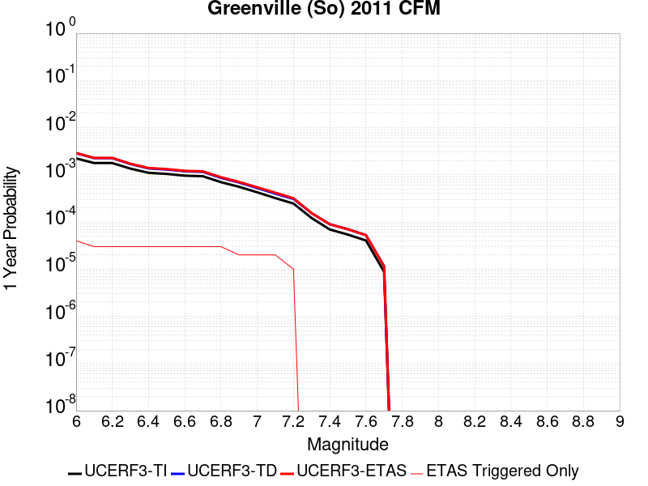 |  |

| Magnitude | 1 wk TI Prob | 1 wk TD Prob | 1 wk ETAS Prob | 1 wk ETAS/TD Gain | 1 wk ETAS Triggered Only | 1 mo TI Prob | 1 mo TD Prob | 1 mo ETAS Prob | 1 mo ETAS/TD Gain | 1 mo ETAS Triggered Only | 1 yr TI Prob | 1 yr TD Prob | 1 yr ETAS Prob | 1 yr ETAS/TD Gain | 1 yr ETAS Triggered Only | 10 yr TI Prob | 10 yr TD Prob | 10 yr ETAS Prob | 10 yr ETAS/TD Gain | 10 yr ETAS Triggered Only |
|-----|-----|-----|-----|-----|-----|-----|-----|-----|-----|-----|-----|-----|-----|-----|-----|-----|-----|-----|-----|-----|
| 6.0 | 4.279693E-5 | 5.5040087E-5 | 5.5040087E-5 | 1.0 | 0.0 | 1.8340252E-4 | 2.3586681E-4 | 2.3586681E-4 | 1.0 | 0.0 | 0.0022306389 | 0.0028682416 | 0.002948981 | 1.0281495 | 8.097166E-5 | 0.022083808 | 0.028338138 | 0.028416814 | 1.0027764 | 8.097166E-5 |
| 6.1 | 3.4037297E-5 | 4.3192387E-5 | 4.3192387E-5 | 1.0 | 0.0 | 1.4586597E-4 | 1.8509831E-4 | 1.8509831E-4 | 1.0 | 0.0 | 0.0017744715 | 0.0022514379 | 0.0023322273 | 1.0358834 | 8.097166E-5 | 0.01760369 | 0.022302566 | 0.022381732 | 1.0035496 | 8.097166E-5 |
| 6.2 | 3.4037297E-5 | 4.3192387E-5 | 4.3192387E-5 | 1.0 | 0.0 | 1.4586597E-4 | 1.8509831E-4 | 1.8509831E-4 | 1.0 | 0.0 | 0.0017744715 | 0.0022514379 | 0.0023322273 | 1.0358834 | 8.097166E-5 | 0.01760369 | 0.022302566 | 0.022381732 | 1.0035496 | 8.097166E-5 |
| 6.3 | 2.5956324E-5 | 3.2428903E-5 | 3.2428903E-5 | 1.0 | 0.0 | 1.11236644E-4 | 1.3897405E-4 | 1.3897405E-4 | 1.0 | 0.0 | 0.0013534647 | 0.0016907708 | 0.0017716056 | 1.0478094 | 8.097166E-5 | 0.013452509 | 0.016785882 | 0.016865496 | 1.0047429 | 8.097166E-5 |
| 6.4 | 2.1145053E-5 | 2.6197677E-5 | 2.6197677E-5 | 1.0 | 0.0 | 9.061851E-5 | 1.1227112E-4 | 1.1227112E-4 | 1.0 | 0.0 | 0.0011027219 | 0.0013660751 | 0.0014469362 | 1.0591922 | 8.097166E-5 | 0.01097266 | 0.01358018 | 0.013660052 | 1.0058815 | 8.097166E-5 |
| 6.5 | 2.0030959E-5 | 2.479578E-5 | 2.479578E-5 | 1.0 | 0.0 | 8.584414E-5 | 1.06263484E-4 | 1.06263484E-4 | 1.0 | 0.0 | 0.0010446513 | 0.0012930221 | 0.001373889 | 1.062541 | 8.097166E-5 | 0.010397541 | 0.012858339 | 0.0129382685 | 1.0062163 | 8.097166E-5 |
| 6.6 | 1.8395405E-5 | 2.2754466E-5 | 2.2754466E-5 | 1.0 | 0.0 | 7.8835066E-5 | 9.751565E-5 | 9.751565E-5 | 1.0 | 0.0 | 9.5939427E-4 | 0.0011866348 | 0.0012675103 | 1.0681554 | 8.097166E-5 | 0.009552629 | 0.011806041 | 0.0118860565 | 1.0067775 | 8.097166E-5 |
| 6.7 | 1.7883482E-5 | 2.212551E-5 | 2.212551E-5 | 1.0 | 0.0 | 7.664124E-5 | 9.482033E-5 | 9.482033E-5 | 1.0 | 0.0 | 9.3270757E-4 | 0.0011538545 | 0.0012347327 | 1.070094 | 8.097166E-5 | 0.009288026 | 0.011481688 | 0.01156173 | 1.0069712 | 8.097166E-5 |
| 6.8 | 1.3373564E-5 | 1.6505966E-5 | 1.6505966E-5 | 1.0 | 0.0 | 5.7314013E-5 | 7.073802E-5 | 7.073802E-5 | 1.0 | 0.0 | 6.975747E-4 | 8.609098E-4 | 9.4181177E-4 | 1.0939726 | 8.097166E-5 | 0.0069538904 | 0.008577357 | 0.008657634 | 1.0093592 | 8.097166E-5 |
| 6.9 | 1.06692905E-5 | 1.3152582E-5 | 1.3152582E-5 | 1.0 | 0.0 | 4.5724726E-5 | 5.6367055E-5 | 5.6367055E-5 | 1.0 | 0.0 | 5.5655633E-4 | 6.86064E-4 | 7.2652206E-4 | 1.0589713 | 4.048583E-5 | 0.005551645 | 0.006840693 | 0.0068809018 | 1.0058779 | 4.048583E-5 |
| 7.0 | 8.157512E-6 | 1.0062639E-5 | 1.0062639E-5 | 1.0 | 0.0 | 3.4960296E-5 | 4.3124903E-5 | 4.3124903E-5 | 1.0 | 0.0 | 4.2555845E-4 | 5.2492286E-4 | 5.653874E-4 | 1.0770867 | 4.048583E-5 | 0.004247444 | 0.0052373074 | 0.005277581 | 1.0076898 | 4.048583E-5 |
| 7.1 | 6.1467113E-6 | 7.6274314E-6 | 7.6274314E-6 | 1.0 | 0.0 | 2.6342783E-5 | 3.268859E-5 | 3.268859E-5 | 1.0 | 0.0 | 3.206762E-4 | 3.9791173E-4 | 4.3838145E-4 | 1.1017053 | 4.048583E-5 | 0.0032021382 | 0.0039721807 | 0.0040125055 | 1.0101519 | 4.048583E-5 |
| 7.2 | 4.713467E-6 | 5.9141557E-6 | 5.9141557E-6 | 1.0 | 0.0 | 2.0200418E-5 | 2.5346139E-5 | 2.5346139E-5 | 1.0 | 0.0 | 2.4591232E-4 | 3.0854615E-4 | 3.0854615E-4 | 1.0 | 0.0 | 0.0024564038 | 0.0030813308 | 0.0030813308 | 1.0 | 0.0 |
| 7.3 | 2.3266216E-6 | 2.954009E-6 | 2.954009E-6 | 1.0 | 0.0 | 9.971197E-6 | 1.2659978E-5 | 1.2659978E-5 | 1.0 | 0.0 | 1.2139256E-4 | 1.5412449E-4 | 1.5412449E-4 | 1.0 | 0.0 | 0.0012132627 | 0.0015402455 | 0.0015402455 | 1.0 | 0.0 |
| 7.4 | 1.3314E-6 | 1.7179472E-6 | 1.7179472E-6 | 1.0 | 0.0 | 5.7059874E-6 | 7.36261E-6 | 7.36261E-6 | 1.0 | 0.0 | 6.946818E-5 | 8.963614E-5 | 8.963614E-5 | 1.0 | 0.0 | 6.9446466E-4 | 8.9603866E-4 | 8.9603866E-4 | 1.0 | 0.0 |
| 7.5 | 1.0362941E-6 | 1.3468821E-6 | 1.3468821E-6 | 1.0 | 0.0 | 4.4412527E-6 | 5.772339E-6 | 5.772339E-6 | 1.0 | 0.0 | 5.407091E-5 | 7.027601E-5 | 7.027601E-5 | 1.0 | 0.0 | 5.405776E-4 | 7.025681E-4 | 7.025681E-4 | 1.0 | 0.0 |
| 7.6 | 7.764784E-7 | 1.0088593E-6 | 1.0088593E-6 | 1.0 | 0.0 | 3.3277602E-6 | 4.323676E-6 | 4.323676E-6 | 1.0 | 0.0 | 4.0514726E-5 | 5.263952E-5 | 5.263952E-5 | 1.0 | 0.0 | 4.050734E-4 | 5.262919E-4 | 5.262919E-4 | 1.0 | 0.0 |
| 7.7 | 1.6927763E-7 | 2.2139248E-7 | 2.2139248E-7 | 1.0 | 0.0 | 7.2547533E-7 | 9.4882455E-7 | 9.4882455E-7 | 1.0 | 0.0 | 8.832627E-6 | 1.15518815E-5 | 1.15518815E-5 | 1.0 | 0.0 | 8.8322755E-5 | 1.15515526E-4 | 1.15515526E-4 | 1.0 | 0.0 |

## Calaveras (So) 2011 CFM
*[(top)](#table-of-contents)*

| 1 Week | 1 Month | 1 Year | 10 Year |
|-----|-----|-----|-----|
|  |  | 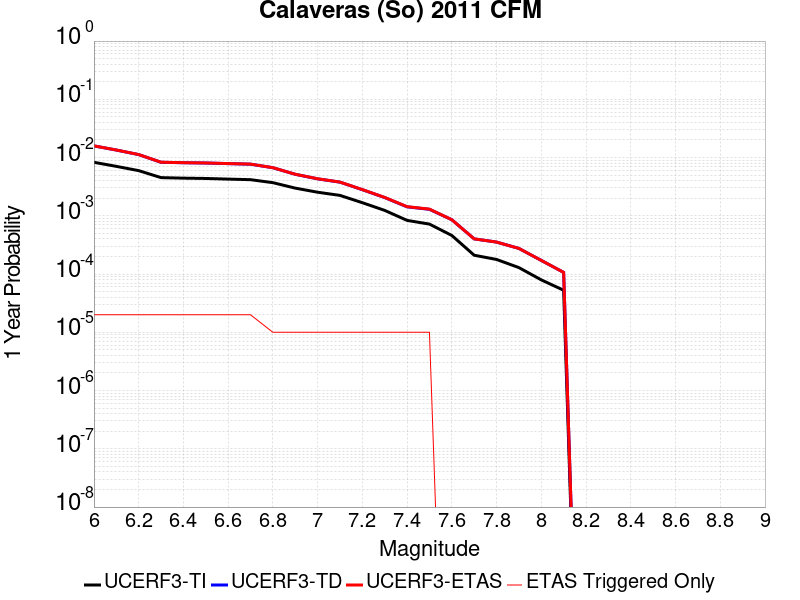 |  |

| Magnitude | 1 wk TI Prob | 1 wk TD Prob | 1 wk ETAS Prob | 1 wk ETAS/TD Gain | 1 wk ETAS Triggered Only | 1 mo TI Prob | 1 mo TD Prob | 1 mo ETAS Prob | 1 mo ETAS/TD Gain | 1 mo ETAS Triggered Only | 1 yr TI Prob | 1 yr TD Prob | 1 yr ETAS Prob | 1 yr ETAS/TD Gain | 1 yr ETAS Triggered Only | 10 yr TI Prob | 10 yr TD Prob | 10 yr ETAS Prob | 10 yr ETAS/TD Gain | 10 yr ETAS Triggered Only |
|-----|-----|-----|-----|-----|-----|-----|-----|-----|-----|-----|-----|-----|-----|-----|-----|-----|-----|-----|-----|-----|
| 6.0 | 1.5950744E-4 | 3.071188E-4 | 3.071188E-4 | 1.0 | 0.0 | 6.834242E-4 | 0.0013155643 | 0.0013559968 | 1.0307341 | 4.048583E-5 | 0.00828899 | 0.01585904 | 0.015898883 | 1.0025123 | 4.048583E-5 | 0.079865426 | 0.14440064 | 0.14446992 | 1.0004798 | 8.097166E-5 |
| 6.1 | 1.3584697E-4 | 2.6036944E-4 | 2.6036944E-4 | 1.0 | 0.0 | 5.8207137E-4 | 0.0011153965 | 0.0011558371 | 1.0362568 | 4.048583E-5 | 0.007063716 | 0.013462106 | 0.0135020465 | 1.0029669 | 4.048583E-5 | 0.06843361 | 0.12402854 | 0.12409947 | 1.0005718 | 8.097166E-5 |
| 6.2 | 1.14676266E-4 | 2.1726108E-4 | 2.1726108E-4 | 1.0 | 0.0 | 4.9137714E-4 | 9.307893E-4 | 9.7123743E-4 | 1.0434557 | 4.048583E-5 | 0.0059661185 | 0.011245592 | 0.011285622 | 1.0035597 | 4.048583E-5 | 0.058084648 | 0.105019294 | 0.10509176 | 1.0006901 | 8.097166E-5 |
| 6.3 | 8.691518E-5 | 1.5987165E-4 | 1.5987165E-4 | 1.0 | 0.0 | 3.7244044E-4 | 6.8496726E-4 | 7.254254E-4 | 1.0590657 | 4.048583E-5 | 0.004525038 | 0.008300893 | 0.008341043 | 1.0048368 | 4.048583E-5 | 0.044339992 | 0.0793347 | 0.07940925 | 1.0009396 | 8.097166E-5 |
| 6.4 | 8.50982E-5 | 1.5693568E-4 | 1.5693568E-4 | 1.0 | 0.0 | 3.646556E-4 | 6.7239115E-4 | 7.128497E-4 | 1.0601712 | 4.048583E-5 | 0.0044306475 | 0.008148931 | 0.008189087 | 1.0049278 | 4.048583E-5 | 0.04343345 | 0.077940844 | 0.078015506 | 1.000958 | 8.097166E-5 |
| 6.5 | 8.4062965E-5 | 1.5518135E-4 | 1.5518135E-4 | 1.0 | 0.0 | 3.602201E-4 | 6.648764E-4 | 7.053353E-4 | 1.0608518 | 4.048583E-5 | 0.004376863 | 0.008058134 | 0.008098293 | 1.0049838 | 4.048583E-5 | 0.042916555 | 0.077112116 | 0.077186845 | 1.000969 | 8.097166E-5 |
| 6.6 | 8.194716E-5 | 1.5154095E-4 | 1.5154095E-4 | 1.0 | 0.0 | 3.5115483E-4 | 6.492825E-4 | 6.8974204E-4 | 1.0623143 | 4.048583E-5 | 0.0042669317 | 0.007869979 | 0.007910146 | 1.0051038 | 4.048583E-5 | 0.04185927 | 0.07539739 | 0.07547225 | 1.000993 | 8.097166E-5 |
| 6.7 | 8.012326E-5 | 1.4821833E-4 | 1.4821833E-4 | 1.0 | 0.0 | 3.433402E-4 | 6.350497E-4 | 6.755098E-4 | 1.0637118 | 4.048583E-5 | 0.004172157 | 0.007698474 | 0.0077386484 | 1.0052185 | 4.048583E-5 | 0.040946912 | 0.073839515 | 0.07391451 | 1.0010157 | 8.097166E-5 |
| 6.8 | 7.119773E-5 | 1.2880519E-4 | 1.2880519E-4 | 1.0 | 0.0 | 3.0509746E-4 | 5.519001E-4 | 5.519001E-4 | 1.0 | 0.0 | 0.0037082357 | 0.0066958875 | 0.0066958875 | 1.0 | 0.0 | 0.036469642 | 0.06468402 | 0.06472188 | 1.0005854 | 4.048583E-5 |
| 6.9 | 5.7343088E-5 | 9.9189E-5 | 9.9189E-5 | 1.0 | 0.0 | 2.4573295E-4 | 4.2502693E-4 | 4.2502693E-4 | 1.0 | 0.0 | 0.0029876942 | 0.0051625078 | 0.0051625078 | 1.0 | 0.0 | 0.02947844 | 0.050509132 | 0.050509132 | 1.0 | 0.0 |
| 7.0 | 4.8746577E-5 | 8.284751E-5 | 8.284751E-5 | 1.0 | 0.0 | 2.0889717E-4 | 3.550128E-4 | 3.550128E-4 | 1.0 | 0.0 | 0.0025403565 | 0.004313781 | 0.004313781 | 1.0 | 0.0 | 0.025115121 | 0.04248505 | 0.04248505 | 1.0 | 0.0 |
| 7.1 | 4.2998014E-5 | 7.264914E-5 | 7.264914E-5 | 1.0 | 0.0 | 1.8426418E-4 | 3.1131663E-4 | 3.1131663E-4 | 1.0 | 0.0 | 0.002241108 | 0.0037837527 | 0.0037837527 | 1.0 | 0.0 | 0.022186412 | 0.037423246 | 0.037423246 | 1.0 | 0.0 |
| 7.2 | 3.221292E-5 | 5.390566E-5 | 5.390566E-5 | 1.0 | 0.0 | 1.3804805E-4 | 2.3100396E-4 | 2.3100396E-4 | 1.0 | 0.0 | 0.0016794393 | 0.0028088738 | 0.0028088738 | 1.0 | 0.0 | 0.016668037 | 0.028035998 | 0.028035998 | 1.0 | 0.0 |
| 7.3 | 2.3756531E-5 | 3.9471706E-5 | 3.9471706E-5 | 1.0 | 0.0 | 1.0180973E-4 | 1.6915359E-4 | 1.6915359E-4 | 1.0 | 0.0 | 0.0012388286 | 0.0020575167 | 0.0020575167 | 1.0 | 0.0 | 0.012319452 | 0.02064345 | 0.02064345 | 1.0 | 0.0 |
| 7.4 | 1.5997684E-5 | 2.734085E-5 | 2.734085E-5 | 1.0 | 0.0 | 6.8559704E-5 | 1.1716982E-4 | 1.1716982E-4 | 1.0 | 0.0 | 8.343947E-4 | 0.0014256114 | 0.0014256114 | 1.0 | 0.0 | 0.008312687 | 0.014376549 | 0.014376549 | 1.0 | 0.0 |
| 7.5 | 1.3814293E-5 | 2.4782603E-5 | 2.4782603E-5 | 1.0 | 0.0 | 5.9202768E-5 | 1.0620684E-4 | 1.0620684E-4 | 1.0 | 0.0 | 7.205553E-4 | 0.0012923037 | 0.0012923037 | 1.0 | 0.0 | 0.007182234 | 0.013055766 | 0.013055766 | 1.0 | 0.0 |
| 7.6 | 8.817309E-6 | 1.6429829E-5 | 1.6429829E-5 | 1.0 | 0.0 | 3.7787922E-5 | 7.041166E-5 | 7.041166E-5 | 1.0 | 0.0 | 4.5997082E-4 | 8.5692614E-4 | 8.5692614E-4 | 1.0 | 0.0 | 0.004590199 | 0.008719863 | 0.008719863 | 1.0 | 0.0 |
| 7.7 | 4.0352206E-6 | 7.706877E-6 | 7.706877E-6 | 1.0 | 0.0 | 1.7293689E-5 | 3.3029053E-5 | 3.3029053E-5 | 1.0 | 0.0 | 2.1053031E-4 | 4.020546E-4 | 4.020546E-4 | 1.0 | 0.0 | 0.0021033096 | 0.0041649863 | 0.0041649863 | 1.0 | 0.0 |
| 7.8 | 3.413169E-6 | 6.7868646E-6 | 6.7868646E-6 | 1.0 | 0.0 | 1.4627784E-5 | 2.9086239E-5 | 2.9086239E-5 | 1.0 | 0.0 | 1.7807873E-4 | 3.5406748E-4 | 3.5406748E-4 | 1.0 | 0.0 | 0.0017793609 | 0.0036663096 | 0.0036663096 | 1.0 | 0.0 |
| 7.9 | 2.4740732E-6 | 5.278809E-6 | 5.278809E-6 | 1.0 | 0.0 | 1.06031275E-5 | 2.2623271E-5 | 2.2623271E-5 | 1.0 | 0.0 | 1.2908543E-4 | 2.7540355E-4 | 2.7540355E-4 | 1.0 | 0.0 | 0.0012901047 | 0.002834638 | 0.002834638 | 1.0 | 0.0 |
| 8.0 | 1.5231818E-6 | 3.2887135E-6 | 3.2887135E-6 | 1.0 | 0.0 | 6.527906E-6 | 1.409441E-5 | 1.409441E-5 | 1.0 | 0.0 | 7.9474354E-5 | 1.7158597E-4 | 1.7158597E-4 | 1.0 | 0.0 | 7.944594E-4 | 0.001756374 | 0.001756374 | 1.0 | 0.0 |
| 8.1 | 1.0104524E-6 | 2.0456548E-6 | 2.0456548E-6 | 1.0 | 0.0 | 4.330503E-6 | 8.767062E-6 | 8.767062E-6 | 1.0 | 0.0 | 5.2722597E-5 | 1.06733794E-4 | 1.06733794E-4 | 1.0 | 0.0 | 5.271009E-4 | 0.0010929212 | 0.0010929212 | 1.0 | 0.0 |

## Superstition Hills
*[(top)](#table-of-contents)*

| 1 Week | 1 Month | 1 Year | 10 Year |
|-----|-----|-----|-----|
|  |  |  |  |

| Magnitude | 1 wk TI Prob | 1 wk TD Prob | 1 wk ETAS Prob | 1 wk ETAS/TD Gain | 1 wk ETAS Triggered Only | 1 mo TI Prob | 1 mo TD Prob | 1 mo ETAS Prob | 1 mo ETAS/TD Gain | 1 mo ETAS Triggered Only | 1 yr TI Prob | 1 yr TD Prob | 1 yr ETAS Prob | 1 yr ETAS/TD Gain | 1 yr ETAS Triggered Only | 10 yr TI Prob | 10 yr TD Prob | 10 yr ETAS Prob | 10 yr ETAS/TD Gain | 10 yr ETAS Triggered Only |
|-----|-----|-----|-----|-----|-----|-----|-----|-----|-----|-----|-----|-----|-----|-----|-----|-----|-----|-----|-----|-----|
| 6.0 | 6.6865185E-5 | 1.41376995E-5 | 5.4622957E-5 | 3.8636384 | 4.048583E-5 | 2.8653358E-4 | 6.0588824E-5 | 1.01072204E-4 | 1.6681657 | 4.048583E-5 | 0.0034829667 | 7.374355E-4 | 8.1834744E-4 | 1.1097207 | 8.097166E-5 | 0.03428881 | 0.0075204074 | 0.0076007703 | 1.0106859 | 8.097166E-5 |
| 6.1 | 6.544851E-5 | 1.41376995E-5 | 5.4622957E-5 | 3.8636384 | 4.048583E-5 | 2.8046346E-4 | 6.0588824E-5 | 1.01072204E-4 | 1.6681658 | 4.048583E-5 | 0.0034092965 | 7.374355E-4 | 8.1834744E-4 | 1.1097207 | 8.097166E-5 | 0.033574644 | 0.007520407 | 0.0076007694 | 1.0106859 | 8.097166E-5 |
| 6.2 | 6.544851E-5 | 1.41376995E-5 | 5.4622957E-5 | 3.8636384 | 4.048583E-5 | 2.8046346E-4 | 6.0588824E-5 | 1.01072204E-4 | 1.6681658 | 4.048583E-5 | 0.0034092965 | 7.374355E-4 | 8.1834744E-4 | 1.1097207 | 8.097166E-5 | 0.033574644 | 0.007520407 | 0.0076007694 | 1.0106859 | 8.097166E-5 |
| 6.3 | 5.2402065E-5 | 1.4137698E-5 | 5.4622957E-5 | 3.8636386 | 4.048583E-5 | 2.2456095E-4 | 6.058882E-5 | 1.010722E-4 | 1.6681658 | 4.048583E-5 | 0.0027306017 | 7.374354E-4 | 8.183473E-4 | 1.1097207 | 8.097166E-5 | 0.02697292 | 0.007520402 | 0.0076007643 | 1.0106859 | 8.097166E-5 |
| 6.4 | 4.542238E-5 | 1.4137698E-5 | 5.4622957E-5 | 3.8636386 | 4.048583E-5 | 1.9465282E-4 | 6.0588816E-5 | 1.0107219E-4 | 1.6681658 | 4.048583E-5 | 0.0023673223 | 7.3743536E-4 | 8.183473E-4 | 1.1097207 | 8.097166E-5 | 0.023422617 | 0.0075203986 | 0.0076007615 | 1.0106859 | 8.097166E-5 |
| 6.5 | 2.9672969E-5 | 1.4137696E-5 | 5.4622953E-5 | 3.8636389 | 4.048583E-5 | 1.2716366E-4 | 6.058881E-5 | 1.0107219E-4 | 1.6681659 | 4.048583E-5 | 0.0015471181 | 7.374353E-4 | 8.1834727E-4 | 1.1097207 | 8.097166E-5 | 0.015363912 | 0.007520392 | 0.007600755 | 1.0106859 | 8.097166E-5 |
| 6.6 | 2.6056105E-5 | 1.3803458E-5 | 5.428873E-5 | 3.9329803 | 4.048583E-5 | 1.1166424E-4 | 5.9156428E-5 | 9.963987E-5 | 1.6843455 | 4.048583E-5 | 0.0013586642 | 7.200076E-4 | 8.0092094E-4 | 1.1123785 | 8.097166E-5 | 0.013503874 | 0.0073448285 | 0.007425206 | 1.0109433 | 8.097166E-5 |
| 6.7 | 1.4611248E-5 | 1.3383359E-5 | 5.3868647E-5 | 4.025047 | 4.048583E-5 | 6.261813E-5 | 5.7356083E-5 | 9.783959E-5 | 1.7058276 | 4.048583E-5 | 7.6210906E-4 | 6.981025E-4 | 7.7901763E-4 | 1.1159072 | 8.097166E-5 | 0.0075950073 | 0.00712602 | 0.0072064144 | 1.0112818 | 8.097166E-5 |
| 6.8 | 1.30607E-5 | 1.09787925E-5 | 5.146418E-5 | 4.687599 | 4.048583E-5 | 5.597323E-5 | 4.705117E-5 | 8.7535096E-5 | 1.8604233 | 4.048583E-5 | 6.8126095E-4 | 5.7270617E-4 | 6.536314E-4 | 1.1413033 | 8.097166E-5 | 0.006791762 | 0.00587438 | 0.005954876 | 1.0137029 | 8.097166E-5 |
| 6.9 | 1.0443096E-5 | 8.195349E-6 | 4.868085E-5 | 5.9400573 | 4.048583E-5 | 4.4755358E-5 | 3.5122466E-5 | 7.560688E-5 | 2.1526642 | 4.048583E-5 | 5.447602E-4 | 4.2753448E-4 | 5.084715E-4 | 1.1893111 | 8.097166E-5 | 0.005434267 | 0.0044094524 | 0.0044900673 | 1.0182822 | 8.097166E-5 |
| 7.0 | 8.045912E-6 | 6.739692E-6 | 4.722525E-5 | 7.007034 | 4.048583E-5 | 3.4482026E-5 | 2.888408E-5 | 6.936874E-5 | 2.4016254 | 4.048583E-5 | 4.197378E-4 | 3.5160795E-4 | 4.3255114E-4 | 1.2302086 | 8.097166E-5 | 0.0041894587 | 0.0036334093 | 0.0037140867 | 1.0222044 | 8.097166E-5 |
| 7.1 | 8.045912E-6 | 6.739692E-6 | 4.722525E-5 | 7.007034 | 4.048583E-5 | 3.4482026E-5 | 2.888408E-5 | 6.936874E-5 | 2.4016254 | 4.048583E-5 | 4.197378E-4 | 3.5160795E-4 | 4.3255114E-4 | 1.2302086 | 8.097166E-5 | 0.0041894587 | 0.0036334093 | 0.0037140867 | 1.0222044 | 8.097166E-5 |
| 7.2 | 7.375506E-6 | 6.2466297E-6 | 4.6732206E-5 | 7.4811873 | 4.048583E-5 | 3.1608928E-5 | 2.6771E-5 | 6.725574E-5 | 2.5122612 | 4.048583E-5 | 3.8477074E-4 | 3.2588904E-4 | 4.068343E-4 | 1.2483829 | 8.097166E-5 | 0.003841052 | 0.003373887 | 0.0034545853 | 1.0239185 | 8.097166E-5 |
| 7.3 | 6.6063913E-6 | 5.7990574E-6 | 4.628465E-5 | 7.9814095 | 4.048583E-5 | 2.8312797E-5 | 2.485287E-5 | 6.533769E-5 | 2.6289797 | 4.048583E-5 | 3.446538E-4 | 3.025424E-4 | 3.8348956E-4 | 1.2675564 | 8.097166E-5 | 0.0034411973 | 0.003138153 | 0.0032188708 | 1.0257213 | 8.097166E-5 |
| 7.4 | 6.4313126E-6 | 5.680481E-6 | 4.6166082E-5 | 8.127143 | 4.048583E-5 | 2.7562477E-5 | 2.4344696E-5 | 6.482954E-5 | 2.6629841 | 4.048583E-5 | 3.355215E-4 | 2.9635706E-4 | 3.7730474E-4 | 1.2731423 | 8.097166E-5 | 0.0033501536 | 0.0030759154 | 0.003156638 | 1.0262434 | 8.097166E-5 |
| 7.5 | 6.0742927E-6 | 5.4763104E-6 | 4.596192E-5 | 8.392862 | 4.048583E-5 | 2.6032423E-5 | 2.3469694E-5 | 6.3954576E-5 | 2.7249854 | 4.048583E-5 | 3.1689866E-4 | 2.8570674E-4 | 3.6665527E-4 | 1.2833273 | 8.097166E-5 | 0.0031644711 | 0.002967756 | 0.0030484875 | 1.0272028 | 8.097166E-5 |
| 7.6 | 5.6987187E-6 | 5.294521E-6 | 4.5780136E-5 | 8.6467 | 4.048583E-5 | 2.4422852E-5 | 2.269061E-5 | 6.3175525E-5 | 2.7842143 | 4.048583E-5 | 2.9730765E-4 | 2.7622381E-4 | 3.5717312E-4 | 1.2930568 | 8.097166E-5 | 0.002969102 | 0.0028710118 | 0.002951751 | 1.0281222 | 8.097166E-5 |
| 7.7 | 5.1658035E-6 | 4.925535E-6 | 4.5411165E-5 | 9.21954 | 4.048583E-5 | 2.2138971E-5 | 2.1109268E-5 | 6.159425E-5 | 2.9178767 | 4.048583E-5 | 2.6950863E-4 | 2.5697565E-4 | 3.379265E-4 | 1.3150138 | 8.097166E-5 | 0.00269182 | 0.0026760625 | 0.0027568175 | 1.0301768 | 8.097166E-5 |
| 7.8 | 3.6864697E-6 | 4.1964995E-6 | 4.4682158E-5 | 10.647484 | 4.048583E-5 | 1.579906E-5 | 1.7984876E-5 | 5.8469977E-5 | 3.2510638 | 4.048583E-5 | 1.9233658E-4 | 2.1894433E-4 | 2.9989827E-4 | 1.3697467 | 8.097166E-5 | 0.0019217018 | 0.0022892624 | 0.0023700488 | 1.0352892 | 8.097166E-5 |
| 7.9 | 3.0265903E-6 | 3.5637288E-6 | 4.4049415E-5 | 12.360484 | 4.048583E-5 | 1.2971037E-5 | 1.5273037E-5 | 5.575825E-5 | 3.6507638 | 4.048583E-5 | 1.5791094E-4 | 1.859338E-4 | 2.668904E-4 | 1.4354055 | 8.097166E-5 | 0.0015779877 | 0.0019534735 | 0.0020342872 | 1.0413691 | 8.097166E-5 |
| 8.0 | 2.5271493E-6 | 3.0867361E-6 | 4.357244E-5 | 14.116024 | 4.048583E-5 | 1.0830595E-5 | 1.3228804E-5 | 5.37141E-5 | 4.0603895 | 4.048583E-5 | 1.3185451E-4 | 1.610492E-4 | 2.0152851E-4 | 1.2513474 | 4.048583E-5 | 0.0013177631 | 0.0016973554 | 0.0017377725 | 1.0238118 | 4.048583E-5 |
| 8.1 | 2.3749135E-6 | 2.917377E-6 | 4.3403088E-5 | 14.877436 | 4.048583E-5 | 1.0178161E-5 | 1.25029865E-5 | 5.298831E-5 | 4.2380524 | 4.048583E-5 | 1.2391206E-4 | 1.5221364E-4 | 1.9269332E-4 | 1.2659398 | 4.048583E-5 | 0.0012384299 | 0.001604949 | 0.0016453699 | 1.0251851 | 4.048583E-5 |
| 8.2 | 1.7186406E-9 | 1.1440594E-9 | 1.1440594E-9 | 1.0 | 0.0 | 7.3656024E-9 | 4.9031117E-9 | 4.9031117E-9 | 1.0 | 0.0 | 8.9676206E-8 | 5.969538E-8 | 5.969538E-8 | 1.0 | 0.0 | 8.9676166E-7 | 6.389059E-7 | 6.389059E-7 | 1.0 | 0.0 |

## Oceanside alt1
*[(top)](#table-of-contents)*

| 1 Week | 1 Month | 1 Year | 10 Year |
|-----|-----|-----|-----|
| 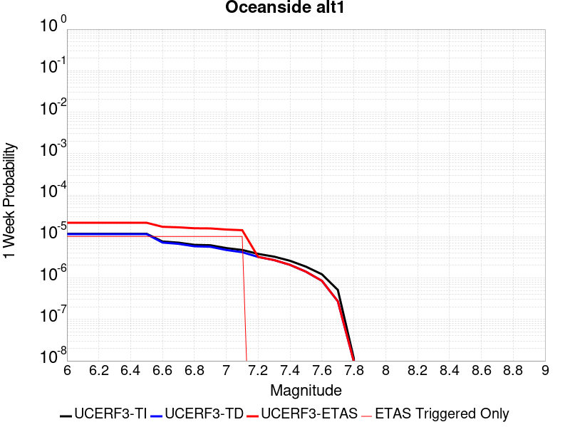 |  |  |  |

| Magnitude | 1 wk TI Prob | 1 wk TD Prob | 1 wk ETAS Prob | 1 wk ETAS/TD Gain | 1 wk ETAS Triggered Only | 1 mo TI Prob | 1 mo TD Prob | 1 mo ETAS Prob | 1 mo ETAS/TD Gain | 1 mo ETAS Triggered Only | 1 yr TI Prob | 1 yr TD Prob | 1 yr ETAS Prob | 1 yr ETAS/TD Gain | 1 yr ETAS Triggered Only | 10 yr TI Prob | 10 yr TD Prob | 10 yr ETAS Prob | 10 yr ETAS/TD Gain | 10 yr ETAS Triggered Only |
|-----|-----|-----|-----|-----|-----|-----|-----|-----|-----|-----|-----|-----|-----|-----|-----|-----|-----|-----|-----|-----|
| 6.0 | 1.1617542E-5 | 1.1423493E-5 | 1.1423493E-5 | 1.0 | 0.0 | 4.9788516E-5 | 4.8956997E-5 | 4.8956997E-5 | 1.0 | 0.0 | 6.060066E-4 | 5.9590454E-4 | 5.9590454E-4 | 1.0 | 0.0 | 0.0060435664 | 0.005944664 | 0.0059849094 | 1.00677 | 4.048583E-5 |
| 6.1 | 1.1617542E-5 | 1.1423493E-5 | 1.1423493E-5 | 1.0 | 0.0 | 4.9788516E-5 | 4.8956997E-5 | 4.8956997E-5 | 1.0 | 0.0 | 6.060066E-4 | 5.9590454E-4 | 5.9590454E-4 | 1.0 | 0.0 | 0.0060435664 | 0.005944664 | 0.0059849094 | 1.00677 | 4.048583E-5 |
| 6.2 | 1.1617542E-5 | 1.1423493E-5 | 1.1423493E-5 | 1.0 | 0.0 | 4.9788516E-5 | 4.8956997E-5 | 4.8956997E-5 | 1.0 | 0.0 | 6.060066E-4 | 5.9590454E-4 | 5.9590454E-4 | 1.0 | 0.0 | 0.0060435664 | 0.005944664 | 0.0059849094 | 1.00677 | 4.048583E-5 |
| 6.3 | 1.1617542E-5 | 1.1423493E-5 | 1.1423493E-5 | 1.0 | 0.0 | 4.9788516E-5 | 4.8956997E-5 | 4.8956997E-5 | 1.0 | 0.0 | 6.060066E-4 | 5.9590454E-4 | 5.9590454E-4 | 1.0 | 0.0 | 0.0060435664 | 0.005944664 | 0.0059849094 | 1.00677 | 4.048583E-5 |
| 6.4 | 1.1617542E-5 | 1.1423493E-5 | 1.1423493E-5 | 1.0 | 0.0 | 4.9788516E-5 | 4.8956997E-5 | 4.8956997E-5 | 1.0 | 0.0 | 6.060066E-4 | 5.9590454E-4 | 5.9590454E-4 | 1.0 | 0.0 | 0.0060435664 | 0.005944664 | 0.0059849094 | 1.00677 | 4.048583E-5 |
| 6.5 | 1.1617542E-5 | 1.1423493E-5 | 1.1423493E-5 | 1.0 | 0.0 | 4.9788516E-5 | 4.8956997E-5 | 4.8956997E-5 | 1.0 | 0.0 | 6.060066E-4 | 5.9590454E-4 | 5.9590454E-4 | 1.0 | 0.0 | 0.0060435664 | 0.005944664 | 0.0059849094 | 1.00677 | 4.048583E-5 |
| 6.6 | 7.561768E-6 | 7.1336153E-6 | 7.1336153E-6 | 1.0 | 0.0 | 3.2407173E-5 | 3.0572286E-5 | 3.0572286E-5 | 1.0 | 0.0 | 3.9448592E-4 | 3.7215507E-4 | 3.7215507E-4 | 1.0 | 0.0 | 0.0039378637 | 0.00371543 | 0.0037557655 | 1.0108562 | 4.048583E-5 |
| 6.7 | 7.1042605E-6 | 6.6556854E-6 | 6.6556854E-6 | 1.0 | 0.0 | 3.0446476E-5 | 2.8524059E-5 | 2.8524059E-5 | 1.0 | 0.0 | 3.706228E-4 | 3.472259E-4 | 3.472259E-4 | 1.0 | 0.0 | 0.0037000529 | 0.003466917 | 0.0035072623 | 1.0116373 | 4.048583E-5 |
| 6.8 | 6.285554E-6 | 5.799706E-6 | 5.799706E-6 | 1.0 | 0.0 | 2.693781E-5 | 2.4855648E-5 | 2.4855648E-5 | 1.0 | 0.0 | 3.2791847E-4 | 3.0257605E-4 | 3.0257605E-4 | 1.0 | 0.0 | 0.0032743502 | 0.0030216982 | 0.0030620617 | 1.0133579 | 4.048583E-5 |
| 6.9 | 6.148883E-6 | 5.6565445E-6 | 5.6565445E-6 | 1.0 | 0.0 | 2.635209E-5 | 2.424211E-5 | 2.424211E-5 | 1.0 | 0.0 | 3.2078946E-4 | 2.9510827E-4 | 2.9510827E-4 | 1.0 | 0.0 | 0.003203268 | 0.0029472208 | 0.0029472208 | 1.0 | 0.0 |
| 7.0 | 5.253857E-6 | 4.722404E-6 | 4.722404E-6 | 1.0 | 0.0 | 2.2516335E-5 | 2.0238718E-5 | 2.0238718E-5 | 1.0 | 0.0 | 2.7410188E-4 | 2.4637886E-4 | 2.4637886E-4 | 1.0 | 0.0 | 0.0027376404 | 0.0024610884 | 0.0024610884 | 1.0 | 0.0 |
| 7.1 | 4.730754E-6 | 4.17851E-6 | 4.17851E-6 | 1.0 | 0.0 | 2.0274503E-5 | 1.7907778E-5 | 1.7907778E-5 | 1.0 | 0.0 | 2.468141E-4 | 2.1800565E-4 | 2.1800565E-4 | 1.0 | 0.0 | 0.0024654015 | 0.0021779444 | 0.0021779444 | 1.0 | 0.0 |
| 7.2 | 3.7998386E-6 | 3.214026E-6 | 3.214026E-6 | 1.0 | 0.0 | 1.6284921E-5 | 1.37743245E-5 | 1.37743245E-5 | 1.0 | 0.0 | 1.9825088E-4 | 1.6768962E-4 | 1.6768962E-4 | 1.0 | 0.0 | 0.001980741 | 0.001675643 | 0.001675643 | 1.0 | 0.0 |
| 7.3 | 3.2656465E-6 | 2.698376E-6 | 2.698376E-6 | 1.0 | 0.0 | 1.3995553E-5 | 1.1564418E-5 | 1.1564418E-5 | 1.0 | 0.0 | 1.7038253E-4 | 1.407878E-4 | 1.407878E-4 | 1.0 | 0.0 | 0.0017025196 | 0.0014069972 | 0.0014069972 | 1.0 | 0.0 |
| 7.4 | 2.593703E-6 | 2.0680277E-6 | 2.0680277E-6 | 1.0 | 0.0 | 1.1115822E-5 | 8.862946E-6 | 8.862946E-6 | 1.0 | 0.0 | 1.3532673E-4 | 1.0790111E-4 | 1.0790111E-4 | 1.0 | 0.0 | 0.0013524436 | 0.0010784961 | 0.0010784961 | 1.0 | 0.0 |
| 7.5 | 1.8715585E-6 | 1.4137177E-6 | 1.4137177E-6 | 1.0 | 0.0 | 8.020941E-6 | 6.0587763E-6 | 6.0587763E-6 | 1.0 | 0.0 | 9.7650576E-5 | 7.376316E-5 | 7.376316E-5 | 1.0 | 0.0 | 9.7607676E-4 | 7.3739287E-4 | 7.3739287E-4 | 1.0 | 0.0 |
| 7.6 | 1.2246786E-6 | 8.5268175E-7 | 8.5268175E-7 | 1.0 | 0.0 | 5.248612E-6 | 3.6543456E-6 | 3.6543456E-6 | 1.0 | 0.0 | 6.389998E-5 | 4.4490793E-5 | 4.4490793E-5 | 1.0 | 0.0 | 6.3881604E-4 | 4.4482335E-4 | 4.4482335E-4 | 1.0 | 0.0 |
| 7.7 | 5.140719E-7 | 2.734703E-7 | 2.734703E-7 | 1.0 | 0.0 | 2.2031636E-6 | 1.1720151E-6 | 1.1720151E-6 | 1.0 | 0.0 | 2.6823185E-5 | 1.4269205E-5 | 1.4269205E-5 | 1.0 | 0.0 | 2.6819948E-4 | 1.4268424E-4 | 1.4268424E-4 | 1.0 | 0.0 |
| 7.8 | 1.16056995E-8 | 9.782373E-9 | 9.782373E-9 | 1.0 | 0.0 | 4.9738713E-8 | 4.1924455E-8 | 4.1924455E-8 | 1.0 | 0.0 | 6.0556863E-7 | 5.1043025E-7 | 5.1043025E-7 | 1.0 | 0.0 | 6.05567E-6 | 5.1043025E-6 | 5.1043025E-6 | 1.0 | 0.0 |

## Ortigalita (South)
*[(top)](#table-of-contents)*

| 1 Week | 1 Month | 1 Year | 10 Year |
|-----|-----|-----|-----|
|  |  |  |  |

| Magnitude | 1 wk TI Prob | 1 wk TD Prob | 1 wk ETAS Prob | 1 wk ETAS/TD Gain | 1 wk ETAS Triggered Only | 1 mo TI Prob | 1 mo TD Prob | 1 mo ETAS Prob | 1 mo ETAS/TD Gain | 1 mo ETAS Triggered Only | 1 yr TI Prob | 1 yr TD Prob | 1 yr ETAS Prob | 1 yr ETAS/TD Gain | 1 yr ETAS Triggered Only | 10 yr TI Prob | 10 yr TD Prob | 10 yr ETAS Prob | 10 yr ETAS/TD Gain | 10 yr ETAS Triggered Only |
|-----|-----|-----|-----|-----|-----|-----|-----|-----|-----|-----|-----|-----|-----|-----|-----|-----|-----|-----|-----|-----|
| 6.0 | 3.72394E-5 | 4.325562E-5 | 8.3739695E-5 | 1.9359266 | 4.048583E-5 | 1.5958765E-4 | 1.8536893E-4 | 2.6632557E-4 | 1.4367325 | 8.097166E-5 | 0.0019412481 | 0.0022546875 | 0.0023354765 | 1.0358316 | 8.097166E-5 | 0.019243775 | 0.022334497 | 0.02241366 | 1.0035444 | 8.097166E-5 |
| 6.1 | 2.7299884E-5 | 3.149204E-5 | 7.1976596E-5 | 2.2855487 | 4.048583E-5 | 1.16994255E-4 | 1.3495922E-4 | 1.7543959E-4 | 1.2999451 | 4.048583E-5 | 0.0014234743 | 0.0016419457 | 0.0016823651 | 1.0246167 | 4.048583E-5 | 0.014143906 | 0.01630407 | 0.016343895 | 1.0024427 | 4.048583E-5 |
| 6.2 | 2.7299884E-5 | 3.149204E-5 | 7.1976596E-5 | 2.2855487 | 4.048583E-5 | 1.16994255E-4 | 1.3495922E-4 | 1.7543959E-4 | 1.2999451 | 4.048583E-5 | 0.0014234743 | 0.0016419457 | 0.0016823651 | 1.0246167 | 4.048583E-5 | 0.014143906 | 0.01630407 | 0.016343895 | 1.0024427 | 4.048583E-5 |
| 6.3 | 2.0546433E-5 | 2.363145E-5 | 6.411632E-5 | 2.7131777 | 4.048583E-5 | 8.805317E-5 | 1.0127382E-4 | 1.4175555E-4 | 1.3997256 | 4.048583E-5 | 0.00107152 | 0.0012323303 | 0.0012727663 | 1.0328126 | 4.048583E-5 | 0.010663681 | 0.01225703 | 0.01229702 | 1.0032626 | 4.048583E-5 |
| 6.4 | 2.0546433E-5 | 2.363145E-5 | 6.411632E-5 | 2.7131777 | 4.048583E-5 | 8.805317E-5 | 1.0127382E-4 | 1.4175555E-4 | 1.3997256 | 4.048583E-5 | 0.00107152 | 0.0012323303 | 0.0012727663 | 1.0328126 | 4.048583E-5 | 0.010663681 | 0.01225703 | 0.01229702 | 1.0032626 | 4.048583E-5 |
| 6.5 | 1.7779594E-5 | 2.0446974E-5 | 6.0931976E-5 | 2.9799998 | 4.048583E-5 | 7.619603E-5 | 8.762702E-5 | 1.281093E-4 | 1.461984 | 4.048583E-5 | 9.272918E-4 | 0.0010663504 | 0.0011067931 | 1.0379262 | 4.048583E-5 | 0.009234319 | 0.010613803 | 0.010653859 | 1.0037739 | 4.048583E-5 |
| 6.6 | 1.6272212E-5 | 1.8714967E-5 | 5.920004E-5 | 3.1632457 | 4.048583E-5 | 6.973618E-5 | 8.0204605E-5 | 1.2068719E-4 | 1.5047414 | 4.048583E-5 | 8.487073E-4 | 9.760658E-4 | 0.0010165122 | 1.0414381 | 4.048583E-5 | 0.008454733 | 0.009719091 | 0.009759182 | 1.0041251 | 4.048583E-5 |
| 6.7 | 1.3051484E-5 | 1.5038758E-5 | 5.552398E-5 | 3.6920588 | 4.048583E-5 | 5.593373E-5 | 6.445028E-5 | 1.04933504E-4 | 1.628131 | 4.048583E-5 | 6.807804E-4 | 7.844092E-4 | 8.2486327E-4 | 1.0515727 | 4.048583E-5 | 0.006786986 | 0.007817388 | 0.007857557 | 1.0051385 | 4.048583E-5 |
| 6.8 | 1.04277415E-5 | 1.1987235E-5 | 5.247258E-5 | 4.3773713 | 4.048583E-5 | 4.4689557E-5 | 5.1372896E-5 | 9.1856644E-5 | 1.7880372 | 4.048583E-5 | 5.439595E-4 | 6.2529295E-4 | 6.6575344E-4 | 1.0647064 | 4.048583E-5 | 0.0054262993 | 0.00623609 | 0.006276323 | 1.0064517 | 4.048583E-5 |
| 6.9 | 7.639968E-6 | 8.791503E-6 | 4.9276976E-5 | 5.6050687 | 4.048583E-5 | 3.274231E-5 | 3.767736E-5 | 7.816166E-5 | 2.0744996 | 4.048583E-5 | 3.9856473E-4 | 4.586312E-4 | 4.9909845E-4 | 1.0882349 | 4.048583E-5 | 0.003978506 | 0.004577433 | 0.0046177334 | 1.0088042 | 4.048583E-5 |
| 7.0 | 3.919831E-6 | 4.5334014E-6 | 4.5334014E-6 | 1.0 | 0.0 | 1.679917E-5 | 1.942873E-5 | 1.942873E-5 | 1.0 | 0.0 | 2.045107E-4 | 2.3652123E-4 | 2.3652123E-4 | 1.0 | 0.0 | 0.0020432258 | 0.0023629034 | 0.0023629034 | 1.0 | 0.0 |
| 7.1 | 1.6017933E-6 | 1.8570418E-6 | 1.8570418E-6 | 1.0 | 0.0 | 6.8648105E-6 | 7.958732E-6 | 7.958732E-6 | 1.0 | 0.0 | 8.357586E-5 | 9.689432E-5 | 9.689432E-5 | 1.0 | 0.0 | 8.3544437E-4 | 9.686254E-4 | 9.686254E-4 | 1.0 | 0.0 |

## San Jacinto (Lytle Creek connector)
*[(top)](#table-of-contents)*

| 1 Week | 1 Month | 1 Year | 10 Year |
|-----|-----|-----|-----|
|  |  |  |  |

| Magnitude | 1 wk TI Prob | 1 wk TD Prob | 1 wk ETAS Prob | 1 wk ETAS/TD Gain | 1 wk ETAS Triggered Only | 1 mo TI Prob | 1 mo TD Prob | 1 mo ETAS Prob | 1 mo ETAS/TD Gain | 1 mo ETAS Triggered Only | 1 yr TI Prob | 1 yr TD Prob | 1 yr ETAS Prob | 1 yr ETAS/TD Gain | 1 yr ETAS Triggered Only | 10 yr TI Prob | 10 yr TD Prob | 10 yr ETAS Prob | 10 yr ETAS/TD Gain | 10 yr ETAS Triggered Only |
|-----|-----|-----|-----|-----|-----|-----|-----|-----|-----|-----|-----|-----|-----|-----|-----|-----|-----|-----|-----|-----|
| 6.0 | 6.693995E-6 | 6.660216E-6 | 6.660216E-6 | 1.0 | 0.0 | 2.8688235E-5 | 2.854347E-5 | 6.9028145E-5 | 2.4183514 | 4.048583E-5 | 3.492233E-4 | 3.4746144E-4 | 3.879332E-4 | 1.1164784 | 4.048583E-5 | 0.00348675 | 0.0035493854 | 0.0036300696 | 1.0227319 | 8.097166E-5 |
| 6.1 | 6.693995E-6 | 6.660216E-6 | 6.660216E-6 | 1.0 | 0.0 | 2.8688235E-5 | 2.854347E-5 | 6.9028145E-5 | 2.4183514 | 4.048583E-5 | 3.492233E-4 | 3.4746144E-4 | 3.879332E-4 | 1.1164784 | 4.048583E-5 | 0.00348675 | 0.0035493854 | 0.0036300696 | 1.0227319 | 8.097166E-5 |
| 6.2 | 6.693995E-6 | 6.660216E-6 | 6.660216E-6 | 1.0 | 0.0 | 2.8688235E-5 | 2.854347E-5 | 6.9028145E-5 | 2.4183514 | 4.048583E-5 | 3.492233E-4 | 3.4746144E-4 | 3.879332E-4 | 1.1164784 | 4.048583E-5 | 0.00348675 | 0.0035493854 | 0.0036300696 | 1.0227319 | 8.097166E-5 |
| 6.3 | 6.693995E-6 | 6.660216E-6 | 6.660216E-6 | 1.0 | 0.0 | 2.8688235E-5 | 2.854347E-5 | 6.9028145E-5 | 2.4183514 | 4.048583E-5 | 3.492233E-4 | 3.4746144E-4 | 3.879332E-4 | 1.1164784 | 4.048583E-5 | 0.00348675 | 0.0035493854 | 0.0036300696 | 1.0227319 | 8.097166E-5 |
| 6.4 | 6.693995E-6 | 6.660216E-6 | 6.660216E-6 | 1.0 | 0.0 | 2.8688235E-5 | 2.854347E-5 | 6.9028145E-5 | 2.4183514 | 4.048583E-5 | 3.492233E-4 | 3.4746144E-4 | 3.879332E-4 | 1.1164784 | 4.048583E-5 | 0.00348675 | 0.0035493854 | 0.0036300696 | 1.0227319 | 8.097166E-5 |
| 6.5 | 6.6561875E-6 | 6.6204343E-6 | 6.6204343E-6 | 1.0 | 0.0 | 2.8526205E-5 | 2.837298E-5 | 6.885766E-5 | 2.4268744 | 4.048583E-5 | 3.472512E-4 | 3.4538636E-4 | 3.858582E-4 | 1.1171784 | 4.048583E-5 | 0.0034670907 | 0.003528701 | 0.0036093867 | 1.0228657 | 8.097166E-5 |
| 6.6 | 6.6561875E-6 | 6.6204343E-6 | 6.6204343E-6 | 1.0 | 0.0 | 2.8526205E-5 | 2.837298E-5 | 6.885766E-5 | 2.4268744 | 4.048583E-5 | 3.472512E-4 | 3.4538636E-4 | 3.858582E-4 | 1.1171784 | 4.048583E-5 | 0.0034670907 | 0.003528701 | 0.0036093867 | 1.0228657 | 8.097166E-5 |
| 6.7 | 6.5802237E-6 | 6.539611E-6 | 6.539611E-6 | 1.0 | 0.0 | 2.8200653E-5 | 2.8026603E-5 | 6.85113E-5 | 2.4445095 | 4.048583E-5 | 3.4328885E-4 | 3.4117055E-4 | 3.8164257E-4 | 1.118627 | 4.048583E-5 | 0.0034275902 | 0.0034866752 | 0.0035673645 | 1.0231422 | 8.097166E-5 |
| 6.8 | 6.575632E-6 | 6.5341005E-6 | 6.5341005E-6 | 1.0 | 0.0 | 2.8180975E-5 | 2.8002989E-5 | 6.848769E-5 | 2.4457278 | 4.048583E-5 | 3.4304935E-4 | 3.4088313E-4 | 3.8135514E-4 | 1.118727 | 4.048583E-5 | 0.0034252026 | 0.00348381 | 0.0035644996 | 1.0231613 | 8.097166E-5 |
| 6.9 | 6.570433E-6 | 6.525495E-6 | 6.525495E-6 | 1.0 | 0.0 | 2.8158694E-5 | 2.7966107E-5 | 6.8450805E-5 | 2.4476345 | 4.048583E-5 | 3.4277816E-4 | 3.4043423E-4 | 3.8090628E-4 | 1.1188836 | 4.048583E-5 | 0.0034224992 | 0.0034793352 | 0.0035600252 | 1.0231912 | 8.097166E-5 |
| 7.0 | 6.5643826E-6 | 6.515616E-6 | 6.515616E-6 | 1.0 | 0.0 | 2.8132765E-5 | 2.792377E-5 | 6.8408466E-5 | 2.4498293 | 4.048583E-5 | 3.424626E-4 | 3.3991894E-4 | 3.80391E-4 | 1.1190639 | 4.048583E-5 | 0.0034193532 | 0.0034741985 | 0.0035548888 | 1.0232255 | 8.097166E-5 |
| 7.1 | 6.557402E-6 | 6.5043278E-6 | 6.5043278E-6 | 1.0 | 0.0 | 2.8102848E-5 | 2.7875392E-5 | 6.8360096E-5 | 2.4523456 | 4.048583E-5 | 3.4209844E-4 | 3.3933012E-4 | 3.7980222E-4 | 1.1192706 | 4.048583E-5 | 0.0034157229 | 0.0034683298 | 0.0035490207 | 1.023265 | 8.097166E-5 |
| 7.2 | 6.546394E-6 | 6.4862943E-6 | 6.4862943E-6 | 1.0 | 0.0 | 2.8055672E-5 | 2.7798109E-5 | 6.828281E-5 | 2.4563835 | 4.048583E-5 | 3.4152428E-4 | 3.3838948E-4 | 3.7886162E-4 | 1.1196022 | 4.048583E-5 | 0.0034099987 | 0.0034589572 | 0.0035396486 | 1.0233283 | 8.097166E-5 |
| 7.3 | 6.5364216E-6 | 6.4670803E-6 | 6.4670803E-6 | 1.0 | 0.0 | 2.8012933E-5 | 2.7715765E-5 | 6.8200476E-5 | 2.4607105 | 4.048583E-5 | 3.4100408E-4 | 3.3738726E-4 | 3.7785943E-4 | 1.1199576 | 4.048583E-5 | 0.003404813 | 0.0034489788 | 0.003529671 | 1.023396 | 8.097166E-5 |
| 7.4 | 6.5269523E-6 | 6.4481674E-6 | 6.4481674E-6 | 1.0 | 0.0 | 2.7972354E-5 | 2.7634711E-5 | 6.811942E-5 | 2.464995 | 4.048583E-5 | 3.4051016E-4 | 3.3640073E-4 | 3.7687295E-4 | 1.1203095 | 4.048583E-5 | 0.0033998888 | 0.003439161 | 0.003519854 | 1.023463 | 8.097166E-5 |
| 7.5 | 6.5111835E-6 | 6.424442E-6 | 6.424442E-6 | 1.0 | 0.0 | 2.7904773E-5 | 2.7533031E-5 | 6.801775E-5 | 2.4704053 | 4.048583E-5 | 3.3968766E-4 | 3.3516317E-4 | 3.7563543E-4 | 1.1207539 | 4.048583E-5 | 0.0033916887 | 0.003426834 | 0.0035075282 | 1.0235478 | 8.097166E-5 |
| 7.6 | 6.4768806E-6 | 6.383551E-6 | 6.383551E-6 | 1.0 | 0.0 | 2.7757764E-5 | 2.735779E-5 | 6.784251E-5 | 2.4798243 | 4.048583E-5 | 3.3789838E-4 | 3.3303024E-4 | 3.735026E-4 | 1.1215276 | 4.048583E-5 | 0.0033738504 | 0.0034055663 | 0.0034862622 | 1.0236953 | 8.097166E-5 |
| 7.7 | 6.1655364E-6 | 6.1760365E-6 | 6.1760365E-6 | 1.0 | 0.0 | 2.642346E-5 | 2.646846E-5 | 6.695322E-5 | 2.5295472 | 4.048583E-5 | 3.2165812E-4 | 3.2220592E-4 | 3.626787E-4 | 1.1256115 | 4.048583E-5 | 0.0032119295 | 0.0032971818 | 0.0033778865 | 1.0244769 | 8.097166E-5 |
| 7.8 | 5.5043524E-6 | 5.737097E-6 | 5.737097E-6 | 1.0 | 0.0 | 2.3589868E-5 | 2.4587327E-5 | 6.507216E-5 | 2.6465733 | 4.048583E-5 | 2.871688E-4 | 2.9930964E-4 | 3.3978335E-4 | 1.1352235 | 4.048583E-5 | 0.0028679797 | 0.0030672832 | 0.0031480065 | 1.0263175 | 8.097166E-5 |
| 7.9 | 3.889249E-6 | 4.076761E-6 | 4.076761E-6 | 1.0 | 0.0 | 1.6668104E-5 | 1.7471715E-5 | 1.7471715E-5 | 1.0 | 0.0 | 2.0291525E-4 | 2.1269741E-4 | 2.1269741E-4 | 1.0 | 0.0 | 0.0020273007 | 0.0021943315 | 0.0022347285 | 1.0184097 | 4.048583E-5 |
| 8.0 | 2.668535E-6 | 2.5315155E-6 | 2.5315155E-6 | 1.0 | 0.0 | 1.1436528E-5 | 1.0849307E-5 | 1.0849307E-5 | 1.0 | 0.0 | 1.3923083E-4 | 1.3208234E-4 | 1.3208234E-4 | 1.0 | 0.0 | 0.0013914363 | 0.0013757964 | 0.0014162265 | 1.0293868 | 4.048583E-5 |
| 8.1 | 1.5911459E-6 | 1.218661E-6 | 1.218661E-6 | 1.0 | 0.0 | 6.8191785E-6 | 5.2228224E-6 | 5.2228224E-6 | 1.0 | 0.0 | 8.3020335E-5 | 6.3586034E-5 | 6.3586034E-5 | 1.0 | 0.0 | 8.298933E-4 | 6.6932244E-4 | 6.6932244E-4 | 1.0 | 0.0 |
| 8.2 | 6.1294963E-7 | 2.1812275E-7 | 2.1812275E-7 | 1.0 | 0.0 | 2.6269242E-6 | 9.3481145E-7 | 9.3481145E-7 | 1.0 | 0.0 | 3.1982334E-5 | 1.138127E-5 | 1.138127E-5 | 1.0 | 0.0 | 3.1977732E-4 | 1.2784546E-4 | 1.2784546E-4 | 1.0 | 0.0 |
| 8.3 | 1.762871E-7 | 4.7546838E-8 | 4.7546838E-8 | 1.0 | 0.0 | 7.5551594E-7 | 2.0377215E-7 | 2.0377215E-7 | 1.0 | 0.0 | 9.1983675E-6 | 2.480923E-6 | 2.480923E-6 | 1.0 | 0.0 | 9.197987E-5 | 2.868753E-5 | 2.868753E-5 | 1.0 | 0.0 |

## Deep Springs
*[(top)](#table-of-contents)*

| 1 Week | 1 Month | 1 Year | 10 Year |
|-----|-----|-----|-----|
|  |  |  | 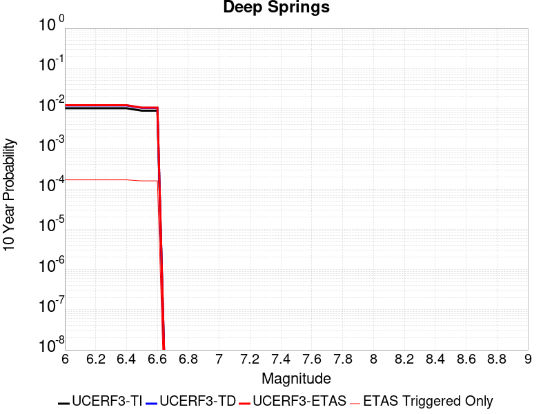 |

| Magnitude | 1 wk TI Prob | 1 wk TD Prob | 1 wk ETAS Prob | 1 wk ETAS/TD Gain | 1 wk ETAS Triggered Only | 1 mo TI Prob | 1 mo TD Prob | 1 mo ETAS Prob | 1 mo ETAS/TD Gain | 1 mo ETAS Triggered Only | 1 yr TI Prob | 1 yr TD Prob | 1 yr ETAS Prob | 1 yr ETAS/TD Gain | 1 yr ETAS Triggered Only | 10 yr TI Prob | 10 yr TD Prob | 10 yr ETAS Prob | 10 yr ETAS/TD Gain | 10 yr ETAS Triggered Only |
|-----|-----|-----|-----|-----|-----|-----|-----|-----|-----|-----|-----|-----|-----|-----|-----|-----|-----|-----|-----|-----|
| 6.0 | 1.9810619E-5 | 2.311252E-5 | 2.311252E-5 | 1.0 | 0.0 | 8.489989E-5 | 9.905276E-5 | 9.905276E-5 | 1.0 | 0.0 | 0.001033166 | 0.0012058079 | 0.001246245 | 1.0335352 | 4.048583E-5 | 0.010283757 | 0.012042425 | 0.0121224215 | 1.0066429 | 8.097166E-5 |
| 6.1 | 1.9810619E-5 | 2.311252E-5 | 2.311252E-5 | 1.0 | 0.0 | 8.489989E-5 | 9.905276E-5 | 9.905276E-5 | 1.0 | 0.0 | 0.001033166 | 0.0012058079 | 0.001246245 | 1.0335352 | 4.048583E-5 | 0.010283757 | 0.012042425 | 0.0121224215 | 1.0066429 | 8.097166E-5 |
| 6.2 | 1.9810619E-5 | 2.311252E-5 | 2.311252E-5 | 1.0 | 0.0 | 8.489989E-5 | 9.905276E-5 | 9.905276E-5 | 1.0 | 0.0 | 0.001033166 | 0.0012058079 | 0.001246245 | 1.0335352 | 4.048583E-5 | 0.010283757 | 0.012042425 | 0.0121224215 | 1.0066429 | 8.097166E-5 |
| 6.3 | 1.9810619E-5 | 2.311252E-5 | 2.311252E-5 | 1.0 | 0.0 | 8.489989E-5 | 9.905276E-5 | 9.905276E-5 | 1.0 | 0.0 | 0.001033166 | 0.0012058079 | 0.001246245 | 1.0335352 | 4.048583E-5 | 0.010283757 | 0.012042425 | 0.0121224215 | 1.0066429 | 8.097166E-5 |
| 6.4 | 1.9810619E-5 | 2.311252E-5 | 2.311252E-5 | 1.0 | 0.0 | 8.489989E-5 | 9.905276E-5 | 9.905276E-5 | 1.0 | 0.0 | 0.001033166 | 0.0012058079 | 0.001246245 | 1.0335352 | 4.048583E-5 | 0.010283757 | 0.012042425 | 0.0121224215 | 1.0066429 | 8.097166E-5 |
| 6.5 | 1.7190405E-5 | 2.0050555E-5 | 2.0050555E-5 | 1.0 | 0.0 | 7.367108E-5 | 8.593095E-5 | 8.593095E-5 | 1.0 | 0.0 | 8.9657627E-4 | 0.0010462094 | 0.0010866529 | 1.0386572 | 4.048583E-5 | 0.008929676 | 0.010462056 | 0.01054218 | 1.0076586 | 8.097166E-5 |
| 6.6 | 1.7190405E-5 | 2.0050555E-5 | 2.0050555E-5 | 1.0 | 0.0 | 7.367108E-5 | 8.593095E-5 | 8.593095E-5 | 1.0 | 0.0 | 8.9657627E-4 | 0.0010462094 | 0.0010866529 | 1.0386572 | 4.048583E-5 | 0.008929676 | 0.010462056 | 0.01054218 | 1.0076586 | 8.097166E-5 |

## Fontana (Seismicity)
*[(top)](#table-of-contents)*

| 1 Week | 1 Month | 1 Year | 10 Year |
|-----|-----|-----|-----|
|  |  |  |  |

| Magnitude | 1 wk TI Prob | 1 wk TD Prob | 1 wk ETAS Prob | 1 wk ETAS/TD Gain | 1 wk ETAS Triggered Only | 1 mo TI Prob | 1 mo TD Prob | 1 mo ETAS Prob | 1 mo ETAS/TD Gain | 1 mo ETAS Triggered Only | 1 yr TI Prob | 1 yr TD Prob | 1 yr ETAS Prob | 1 yr ETAS/TD Gain | 1 yr ETAS Triggered Only | 10 yr TI Prob | 10 yr TD Prob | 10 yr ETAS Prob | 10 yr ETAS/TD Gain | 10 yr ETAS Triggered Only |
|-----|-----|-----|-----|-----|-----|-----|-----|-----|-----|-----|-----|-----|-----|-----|-----|-----|-----|-----|-----|-----|
| 6.0 | 7.1789214E-6 | 7.5520006E-6 | 4.8037524E-5 | 6.3609004 | 4.048583E-5 | 3.076644E-5 | 3.2365548E-5 | 7.285007E-5 | 2.2508523 | 4.048583E-5 | 3.7451705E-4 | 3.9402005E-4 | 4.3448992E-4 | 1.1027102 | 4.048583E-5 | 0.003738865 | 0.003937214 | 0.004017867 | 1.0204848 | 8.097166E-5 |
| 6.1 | 7.1789214E-6 | 7.5520006E-6 | 4.8037524E-5 | 6.3609004 | 4.048583E-5 | 3.076644E-5 | 3.2365548E-5 | 7.285007E-5 | 2.2508523 | 4.048583E-5 | 3.7451705E-4 | 3.9402005E-4 | 4.3448992E-4 | 1.1027102 | 4.048583E-5 | 0.003738865 | 0.003937214 | 0.004017867 | 1.0204848 | 8.097166E-5 |
| 6.2 | 7.1789214E-6 | 7.5520006E-6 | 4.8037524E-5 | 6.3609004 | 4.048583E-5 | 3.076644E-5 | 3.2365548E-5 | 7.285007E-5 | 2.2508523 | 4.048583E-5 | 3.7451705E-4 | 3.9402005E-4 | 4.3448992E-4 | 1.1027102 | 4.048583E-5 | 0.003738865 | 0.003937214 | 0.004017867 | 1.0204848 | 8.097166E-5 |
| 6.3 | 7.1789214E-6 | 7.5520006E-6 | 4.8037524E-5 | 6.3609004 | 4.048583E-5 | 3.076644E-5 | 3.2365548E-5 | 7.285007E-5 | 2.2508523 | 4.048583E-5 | 3.7451705E-4 | 3.9402005E-4 | 4.3448992E-4 | 1.1027102 | 4.048583E-5 | 0.003738865 | 0.003937214 | 0.004017867 | 1.0204848 | 8.097166E-5 |
| 6.4 | 7.1789214E-6 | 7.5520006E-6 | 4.8037524E-5 | 6.3609004 | 4.048583E-5 | 3.076644E-5 | 3.2365548E-5 | 7.285007E-5 | 2.2508523 | 4.048583E-5 | 3.7451705E-4 | 3.9402005E-4 | 4.3448992E-4 | 1.1027102 | 4.048583E-5 | 0.003738865 | 0.003937214 | 0.004017867 | 1.0204848 | 8.097166E-5 |
| 6.5 | 5.2611317E-6 | 5.532726E-6 | 4.6018333E-5 | 8.317479 | 4.048583E-5 | 2.2547512E-5 | 2.3711682E-5 | 6.419655E-5 | 2.7073808 | 4.048583E-5 | 2.744814E-4 | 2.8868974E-4 | 3.2916386E-4 | 1.1401994 | 4.048583E-5 | 0.002741426 | 0.0028868972 | 0.0029676352 | 1.027967 | 8.097166E-5 |
| 6.6 | 5.2611317E-6 | 5.532726E-6 | 4.6018333E-5 | 8.317479 | 4.048583E-5 | 2.2547512E-5 | 2.3711682E-5 | 6.419655E-5 | 2.7073808 | 4.048583E-5 | 2.744814E-4 | 2.8868974E-4 | 3.2916386E-4 | 1.1401994 | 4.048583E-5 | 0.002741426 | 0.0028868972 | 0.0029676352 | 1.027967 | 8.097166E-5 |

## Channel Islands Thrust
*[(top)](#table-of-contents)*

| 1 Week | 1 Month | 1 Year | 10 Year |
|-----|-----|-----|-----|
|  |  | 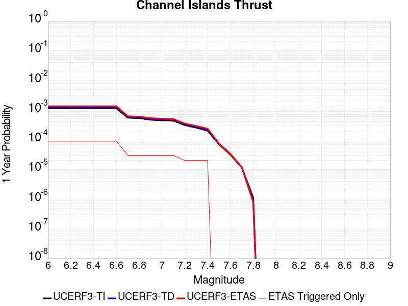 |  |

| Magnitude | 1 wk TI Prob | 1 wk TD Prob | 1 wk ETAS Prob | 1 wk ETAS/TD Gain | 1 wk ETAS Triggered Only | 1 mo TI Prob | 1 mo TD Prob | 1 mo ETAS Prob | 1 mo ETAS/TD Gain | 1 mo ETAS Triggered Only | 1 yr TI Prob | 1 yr TD Prob | 1 yr ETAS Prob | 1 yr ETAS/TD Gain | 1 yr ETAS Triggered Only | 10 yr TI Prob | 10 yr TD Prob | 10 yr ETAS Prob | 10 yr ETAS/TD Gain | 10 yr ETAS Triggered Only |
|-----|-----|-----|-----|-----|-----|-----|-----|-----|-----|-----|-----|-----|-----|-----|-----|-----|-----|-----|-----|-----|
| 6.0 | 2.2156251E-5 | 2.4092022E-5 | 2.4092022E-5 | 1.0 | 0.0 | 9.495191E-5 | 1.03248036E-4 | 1.4372969E-4 | 1.3920815 | 4.048583E-5 | 0.0011554264 | 0.0012564264 | 0.0013372964 | 1.064365 | 8.097166E-5 | 0.011494373 | 0.0125038205 | 0.01258378 | 1.0063947 | 8.097166E-5 |
| 6.1 | 2.2156251E-5 | 2.4092022E-5 | 2.4092022E-5 | 1.0 | 0.0 | 9.495191E-5 | 1.03248036E-4 | 1.4372969E-4 | 1.3920815 | 4.048583E-5 | 0.0011554264 | 0.0012564264 | 0.0013372964 | 1.064365 | 8.097166E-5 | 0.011494373 | 0.0125038205 | 0.01258378 | 1.0063947 | 8.097166E-5 |
| 6.2 | 2.2156251E-5 | 2.4092022E-5 | 2.4092022E-5 | 1.0 | 0.0 | 9.495191E-5 | 1.03248036E-4 | 1.4372969E-4 | 1.3920815 | 4.048583E-5 | 0.0011554264 | 0.0012564264 | 0.0013372964 | 1.064365 | 8.097166E-5 | 0.011494373 | 0.0125038205 | 0.01258378 | 1.0063947 | 8.097166E-5 |
| 6.3 | 2.2156251E-5 | 2.4092022E-5 | 2.4092022E-5 | 1.0 | 0.0 | 9.495191E-5 | 1.03248036E-4 | 1.4372969E-4 | 1.3920815 | 4.048583E-5 | 0.0011554264 | 0.0012564264 | 0.0013372964 | 1.064365 | 8.097166E-5 | 0.011494373 | 0.0125038205 | 0.01258378 | 1.0063947 | 8.097166E-5 |
| 6.4 | 2.2156251E-5 | 2.4092022E-5 | 2.4092022E-5 | 1.0 | 0.0 | 9.495191E-5 | 1.03248036E-4 | 1.4372969E-4 | 1.3920815 | 4.048583E-5 | 0.0011554264 | 0.0012564264 | 0.0013372964 | 1.064365 | 8.097166E-5 | 0.011494373 | 0.0125038205 | 0.01258378 | 1.0063947 | 8.097166E-5 |
| 6.5 | 2.2156251E-5 | 2.4092022E-5 | 2.4092022E-5 | 1.0 | 0.0 | 9.495191E-5 | 1.03248036E-4 | 1.4372969E-4 | 1.3920815 | 4.048583E-5 | 0.0011554264 | 0.0012564264 | 0.0013372964 | 1.064365 | 8.097166E-5 | 0.011494373 | 0.0125038205 | 0.01258378 | 1.0063947 | 8.097166E-5 |
| 6.6 | 2.2156251E-5 | 2.4092022E-5 | 2.4092022E-5 | 1.0 | 0.0 | 9.495191E-5 | 1.03248036E-4 | 1.4372969E-4 | 1.3920815 | 4.048583E-5 | 0.0011554264 | 0.0012564264 | 0.0013372964 | 1.064365 | 8.097166E-5 | 0.011494373 | 0.0125038205 | 0.01258378 | 1.0063947 | 8.097166E-5 |
| 6.7 | 1.0601296E-5 | 1.1379544E-5 | 1.1379544E-5 | 1.0 | 0.0 | 4.5433335E-5 | 4.876859E-5 | 4.876859E-5 | 1.0 | 0.0 | 5.5301044E-4 | 5.936007E-4 | 5.936007E-4 | 1.0 | 0.0 | 0.005516363 | 0.005920653 | 0.005920653 | 1.0 | 0.0 |
| 6.8 | 1.0246747E-5 | 1.0996669E-5 | 1.0996669E-5 | 1.0 | 0.0 | 4.391389E-5 | 4.7127756E-5 | 4.7127756E-5 | 1.0 | 0.0 | 5.345204E-4 | 5.7363417E-4 | 5.7363417E-4 | 1.0 | 0.0 | 0.0053323656 | 0.005722025 | 0.005722025 | 1.0 | 0.0 |
| 6.9 | 9.049551E-6 | 9.699645E-6 | 9.699645E-6 | 1.0 | 0.0 | 3.878322E-5 | 4.1569267E-5 | 4.1569267E-5 | 1.0 | 0.0 | 4.7208337E-4 | 5.059924E-4 | 5.059924E-4 | 1.0 | 0.0 | 0.0047108172 | 0.0050488203 | 0.0050488203 | 1.0 | 0.0 |
| 7.0 | 8.6542195E-6 | 9.274603E-6 | 9.274603E-6 | 1.0 | 0.0 | 3.7088983E-5 | 3.9747716E-5 | 3.9747716E-5 | 1.0 | 0.0 | 4.5146482E-4 | 4.8382508E-4 | 4.8382508E-4 | 1.0 | 0.0 | 0.004505487 | 0.004828129 | 0.004828129 | 1.0 | 0.0 |
| 7.1 | 8.391028E-6 | 8.992924E-6 | 8.992924E-6 | 1.0 | 0.0 | 3.5961057E-5 | 3.854056E-5 | 3.854056E-5 | 1.0 | 0.0 | 4.3773788E-4 | 4.6913436E-4 | 4.6913436E-4 | 1.0 | 0.0 | 0.004368766 | 0.0046818503 | 0.0046818503 | 1.0 | 0.0 |
| 7.2 | 5.965188E-6 | 6.3716952E-6 | 6.3716952E-6 | 1.0 | 0.0 | 2.556484E-5 | 2.7306982E-5 | 2.7306982E-5 | 1.0 | 0.0 | 3.1120746E-4 | 3.3241234E-4 | 3.3241234E-4 | 1.0 | 0.0 | 0.00310772 | 0.0033192092 | 0.0033192092 | 1.0 | 0.0 |
| 7.3 | 4.877518E-6 | 5.2060063E-6 | 5.2060063E-6 | 1.0 | 0.0 | 2.0903482E-5 | 2.2311267E-5 | 2.2311267E-5 | 1.0 | 0.0 | 2.5447016E-4 | 2.716063E-4 | 2.716063E-4 | 1.0 | 0.0 | 0.0025417898 | 0.0027127895 | 0.0027127895 | 1.0 | 0.0 |
| 7.4 | 3.8829853E-6 | 4.141863E-6 | 4.141863E-6 | 1.0 | 0.0 | 1.664126E-5 | 1.7750723E-5 | 1.7750723E-5 | 1.0 | 0.0 | 2.0258849E-4 | 2.1609402E-4 | 2.1609402E-4 | 1.0 | 0.0 | 0.002024039 | 0.0021588807 | 0.0021588807 | 1.0 | 0.0 |
| 7.5 | 1.3489616E-6 | 1.4277903E-6 | 1.4277903E-6 | 1.0 | 0.0 | 5.7812517E-6 | 6.119087E-6 | 6.119087E-6 | 1.0 | 0.0 | 7.038446E-5 | 7.449738E-5 | 7.449738E-5 | 1.0 | 0.0 | 7.036218E-4 | 7.44728E-4 | 7.44728E-4 | 1.0 | 0.0 |
| 7.6 | 6.058192E-7 | 6.353778E-7 | 6.353778E-7 | 1.0 | 0.0 | 2.5963652E-6 | 2.7230449E-6 | 2.7230449E-6 | 1.0 | 0.0 | 3.161029E-5 | 3.3152584E-5 | 3.3152584E-5 | 1.0 | 0.0 | 3.1605794E-4 | 3.31478E-4 | 3.31478E-4 | 1.0 | 0.0 |
| 7.7 | 2.2170494E-7 | 2.2607902E-7 | 2.2607902E-7 | 1.0 | 0.0 | 9.5016367E-7 | 9.689098E-7 | 9.689098E-7 | 1.0 | 0.0 | 1.1568181E-5 | 1.1796425E-5 | 1.1796425E-5 | 1.0 | 0.0 | 1.1567579E-4 | 1.1795909E-4 | 1.1795909E-4 | 1.0 | 0.0 |
| 7.8 | 2.1613102E-8 | 1.5466682E-8 | 1.5466682E-8 | 1.0 | 0.0 | 9.262757E-8 | 6.628578E-8 | 6.628578E-8 | 1.0 | 0.0 | 1.1277401E-6 | 8.070291E-7 | 8.070291E-7 | 1.0 | 0.0 | 1.1277344E-5 | 8.070269E-6 | 8.070269E-6 | 1.0 | 0.0 |

## Oak Ridge (Onshore)
*[(top)](#table-of-contents)*

| 1 Week | 1 Month | 1 Year | 10 Year |
|-----|-----|-----|-----|
|  |  |  |  |

| Magnitude | 1 wk TI Prob | 1 wk TD Prob | 1 wk ETAS Prob | 1 wk ETAS/TD Gain | 1 wk ETAS Triggered Only | 1 mo TI Prob | 1 mo TD Prob | 1 mo ETAS Prob | 1 mo ETAS/TD Gain | 1 mo ETAS Triggered Only | 1 yr TI Prob | 1 yr TD Prob | 1 yr ETAS Prob | 1 yr ETAS/TD Gain | 1 yr ETAS Triggered Only | 10 yr TI Prob | 10 yr TD Prob | 10 yr ETAS Prob | 10 yr ETAS/TD Gain | 10 yr ETAS Triggered Only |
|-----|-----|-----|-----|-----|-----|-----|-----|-----|-----|-----|-----|-----|-----|-----|-----|-----|-----|-----|-----|-----|
| 6.0 | 3.155064E-5 | 2.9525974E-5 | 1.10495246E-4 | 3.7423065 | 8.097166E-5 | 1.3521002E-4 | 1.2653397E-4 | 2.0749538E-4 | 1.6398394 | 8.097166E-5 | 0.001644939 | 0.0015395004 | 0.0016203474 | 1.0525151 | 8.097166E-5 | 0.01632816 | 0.015292859 | 0.015372592 | 1.0052137 | 8.097166E-5 |
| 6.1 | 3.155064E-5 | 2.9525974E-5 | 1.10495246E-4 | 3.7423065 | 8.097166E-5 | 1.3521002E-4 | 1.2653397E-4 | 2.0749538E-4 | 1.6398394 | 8.097166E-5 | 0.001644939 | 0.0015395004 | 0.0016203474 | 1.0525151 | 8.097166E-5 | 0.01632816 | 0.015292859 | 0.015372592 | 1.0052137 | 8.097166E-5 |
| 6.2 | 3.155064E-5 | 2.9525974E-5 | 1.10495246E-4 | 3.7423065 | 8.097166E-5 | 1.3521002E-4 | 1.2653397E-4 | 2.0749538E-4 | 1.6398394 | 8.097166E-5 | 0.001644939 | 0.0015395004 | 0.0016203474 | 1.0525151 | 8.097166E-5 | 0.01632816 | 0.015292859 | 0.015372592 | 1.0052137 | 8.097166E-5 |
| 6.3 | 3.155064E-5 | 2.9525974E-5 | 1.10495246E-4 | 3.7423065 | 8.097166E-5 | 1.3521002E-4 | 1.2653397E-4 | 2.0749538E-4 | 1.6398394 | 8.097166E-5 | 0.001644939 | 0.0015395004 | 0.0016203474 | 1.0525151 | 8.097166E-5 | 0.01632816 | 0.015292859 | 0.015372592 | 1.0052137 | 8.097166E-5 |
| 6.4 | 3.155064E-5 | 2.9525974E-5 | 1.10495246E-4 | 3.7423065 | 8.097166E-5 | 1.3521002E-4 | 1.2653397E-4 | 2.0749538E-4 | 1.6398394 | 8.097166E-5 | 0.001644939 | 0.0015395004 | 0.0016203474 | 1.0525151 | 8.097166E-5 | 0.01632816 | 0.015292859 | 0.015372592 | 1.0052137 | 8.097166E-5 |
| 6.5 | 3.155064E-5 | 2.9525974E-5 | 1.10495246E-4 | 3.7423065 | 8.097166E-5 | 1.3521002E-4 | 1.2653397E-4 | 2.0749538E-4 | 1.6398394 | 8.097166E-5 | 0.001644939 | 0.0015395004 | 0.0016203474 | 1.0525151 | 8.097166E-5 | 0.01632816 | 0.015292859 | 0.015372592 | 1.0052137 | 8.097166E-5 |
| 6.6 | 3.155064E-5 | 2.9525974E-5 | 1.10495246E-4 | 3.7423065 | 8.097166E-5 | 1.3521002E-4 | 1.2653397E-4 | 2.0749538E-4 | 1.6398394 | 8.097166E-5 | 0.001644939 | 0.0015395004 | 0.0016203474 | 1.0525151 | 8.097166E-5 | 0.01632816 | 0.015292859 | 0.015372592 | 1.0052137 | 8.097166E-5 |
| 6.7 | 3.098897E-5 | 2.8864175E-5 | 1.098335E-4 | 3.8051841 | 8.097166E-5 | 1.328031E-4 | 1.2369796E-4 | 2.0465959E-4 | 1.6545107 | 8.097166E-5 | 0.0016156785 | 0.0015050198 | 0.0015858696 | 1.0537201 | 8.097166E-5 | 0.016039822 | 0.014952714 | 0.015032475 | 1.0053343 | 8.097166E-5 |
| 6.8 | 3.0449872E-5 | 2.8239372E-5 | 1.0920875E-4 | 3.8672512 | 8.097166E-5 | 1.3049292E-4 | 1.2102048E-4 | 2.0198234E-4 | 1.6689931 | 8.097166E-5 | 0.0015875935 | 0.0014724657 | 0.0015533181 | 1.0549096 | 8.097166E-5 | 0.015762992 | 0.014631462 | 0.014711249 | 1.0054531 | 8.097166E-5 |
| 6.9 | 2.697928E-5 | 2.4219773E-5 | 1.0518947E-4 | 4.343124 | 8.097166E-5 | 1.15620365E-4 | 1.0379502E-4 | 1.8475828E-4 | 1.7800303 | 8.097166E-5 | 0.0014067689 | 0.0012629933 | 0.0013438627 | 1.0640299 | 8.097166E-5 | 0.0139789665 | 0.01256087 | 0.012640825 | 1.0063654 | 8.097166E-5 |
| 7.0 | 2.4893961E-5 | 2.1862043E-5 | 1.0283193E-4 | 4.703675 | 8.097166E-5 | 1.0668404E-4 | 9.3691204E-5 | 1.7465527E-4 | 1.8641587 | 8.097166E-5 | 0.0012981043 | 0.0011401111 | 0.0012209906 | 1.0709399 | 8.097166E-5 | 0.012905477 | 0.011344905 | 0.011424959 | 1.0070564 | 8.097166E-5 |
| 7.1 | 2.0945363E-5 | 1.7354487E-5 | 5.7839614E-5 | 3.3328333 | 4.048583E-5 | 8.976275E-5 | 7.437428E-5 | 1.14857095E-4 | 1.5443121 | 4.048583E-5 | 0.0010923136 | 9.051354E-4 | 9.455846E-4 | 1.0446886 | 4.048583E-5 | 0.0108696 | 0.009015423 | 0.009055544 | 1.0044502 | 4.048583E-5 |
| 7.2 | 2.0439404E-5 | 1.6809423E-5 | 5.7294572E-5 | 3.4084795 | 4.048583E-5 | 8.7594504E-5 | 7.203843E-5 | 1.1252134E-4 | 1.5619628 | 4.048583E-5 | 0.0010659413 | 8.767196E-4 | 9.171699E-4 | 1.0461383 | 4.048583E-5 | 0.010608427 | 0.008733526 | 0.008773658 | 1.0045952 | 4.048583E-5 |
| 7.3 | 1.8463334E-5 | 1.5381811E-5 | 5.5867018E-5 | 3.6320183 | 4.048583E-5 | 7.912617E-5 | 6.59204E-5 | 1.0640357E-4 | 1.6141219 | 4.048583E-5 | 9.6293533E-4 | 8.0228975E-4 | 8.427431E-4 | 1.0504223 | 4.048583E-5 | 0.009587734 | 0.007994797 | 0.008034959 | 1.0050235 | 4.048583E-5 |
| 7.4 | 1.763139E-5 | 1.451684E-5 | 5.500208E-5 | 3.7888467 | 4.048583E-5 | 7.556091E-5 | 6.221356E-5 | 1.02696875E-4 | 1.6507151 | 4.048583E-5 | 9.1956573E-4 | 7.571909E-4 | 7.9764606E-4 | 1.0534279 | 4.048583E-5 | 0.009157699 | 0.007546914 | 0.007587094 | 1.0053241 | 4.048583E-5 |
| 7.5 | 1.3594944E-5 | 1.1163356E-5 | 5.1648734E-5 | 4.6266313 | 4.048583E-5 | 5.8262744E-5 | 4.784209E-5 | 8.8325985E-5 | 1.8461982 | 4.048583E-5 | 7.0911803E-4 | 5.8232434E-4 | 6.227866E-4 | 1.069484 | 4.048583E-5 | 0.007068595 | 0.0058082556 | 0.0058485065 | 1.0069299 | 4.048583E-5 |
| 7.6 | 6.9889534E-6 | 5.6367144E-6 | 4.6122317E-5 | 8.182483 | 4.048583E-5 | 2.9952313E-5 | 2.4157125E-5 | 6.464198E-5 | 2.675897 | 4.048583E-5 | 3.646084E-4 | 2.9407372E-4 | 3.3454766E-4 | 1.1376319 | 4.048583E-5 | 0.0036401073 | 0.0029368899 | 0.0029772567 | 1.0137448 | 4.048583E-5 |
| 7.7 | 4.0824193E-6 | 3.2832586E-6 | 4.3768956E-5 | 13.33095 | 4.048583E-5 | 1.7495966E-5 | 1.4071033E-5 | 5.4556294E-5 | 3.877206 | 4.048583E-5 | 2.1299256E-4 | 1.713015E-4 | 2.1178038E-4 | 1.236302 | 4.048583E-5 | 0.0021278851 | 0.0017117079 | 0.0017521244 | 1.0236118 | 4.048583E-5 |
| 7.8 | 1.7023609E-6 | 1.4370495E-6 | 4.192282E-5 | 29.172844 | 4.048583E-5 | 7.295812E-6 | 6.1587693E-6 | 4.664435E-5 | 7.573648 | 4.048583E-5 | 8.882289E-5 | 7.498047E-5 | 1.1546326E-4 | 1.5399113 | 4.048583E-5 | 8.8787393E-4 | 7.495545E-4 | 7.9001E-4 | 1.0539727 | 4.048583E-5 |
| 7.9 | 2.721225E-7 | 2.2616497E-7 | 4.0711984E-5 | 180.01013 | 4.048583E-5 | 1.1662388E-6 | 9.692781E-7 | 4.145507E-5 | 42.769016 | 4.048583E-5 | 1.4198865E-5 | 1.1800899E-5 | 5.228625E-5 | 4.430701 | 4.048583E-5 | 1.4197957E-4 | 1.1800301E-4 | 1.5848406E-4 | 1.3430511 | 4.048583E-5 |
| 8.0 | 9.364255E-9 | 5.1206666E-9 | 5.1206666E-9 | 1.0 | 0.0 | 4.0132523E-8 | 2.1945715E-8 | 2.1945715E-8 | 1.0 | 0.0 | 4.8861335E-7 | 2.6718905E-7 | 2.6718905E-7 | 1.0 | 0.0 | 4.8861225E-6 | 2.6718876E-6 | 2.6718876E-6 | 1.0 | 0.0 |

## Mount Diablo Thrust North CFM
*[(top)](#table-of-contents)*

| 1 Week | 1 Month | 1 Year | 10 Year |
|-----|-----|-----|-----|
|  |  |  |  |

| Magnitude | 1 wk TI Prob | 1 wk TD Prob | 1 wk ETAS Prob | 1 wk ETAS/TD Gain | 1 wk ETAS Triggered Only | 1 mo TI Prob | 1 mo TD Prob | 1 mo ETAS Prob | 1 mo ETAS/TD Gain | 1 mo ETAS Triggered Only | 1 yr TI Prob | 1 yr TD Prob | 1 yr ETAS Prob | 1 yr ETAS/TD Gain | 1 yr ETAS Triggered Only | 10 yr TI Prob | 10 yr TD Prob | 10 yr ETAS Prob | 10 yr ETAS/TD Gain | 10 yr ETAS Triggered Only |
|-----|-----|-----|-----|-----|-----|-----|-----|-----|-----|-----|-----|-----|-----|-----|-----|-----|-----|-----|-----|-----|
| 6.0 | 1.479628E-5 | 1.876973E-5 | 1.876973E-5 | 1.0 | 0.0 | 6.341109E-5 | 8.043928E-5 | 8.043928E-5 | 1.0 | 0.0 | 7.717565E-4 | 9.789177E-4 | 9.789177E-4 | 1.0 | 0.0 | 0.007690818 | 0.009747355 | 0.009787447 | 1.0041131 | 4.048583E-5 |
| 6.1 | 1.479628E-5 | 1.876973E-5 | 1.876973E-5 | 1.0 | 0.0 | 6.341109E-5 | 8.043928E-5 | 8.043928E-5 | 1.0 | 0.0 | 7.717565E-4 | 9.789177E-4 | 9.789177E-4 | 1.0 | 0.0 | 0.007690818 | 0.009747355 | 0.009787447 | 1.0041131 | 4.048583E-5 |
| 6.2 | 1.479628E-5 | 1.876973E-5 | 1.876973E-5 | 1.0 | 0.0 | 6.341109E-5 | 8.043928E-5 | 8.043928E-5 | 1.0 | 0.0 | 7.717565E-4 | 9.789177E-4 | 9.789177E-4 | 1.0 | 0.0 | 0.007690818 | 0.009747355 | 0.009787447 | 1.0041131 | 4.048583E-5 |
| 6.3 | 1.479628E-5 | 1.876973E-5 | 1.876973E-5 | 1.0 | 0.0 | 6.341109E-5 | 8.043928E-5 | 8.043928E-5 | 1.0 | 0.0 | 7.717565E-4 | 9.789177E-4 | 9.789177E-4 | 1.0 | 0.0 | 0.007690818 | 0.009747355 | 0.009787447 | 1.0041131 | 4.048583E-5 |
| 6.4 | 1.479628E-5 | 1.876973E-5 | 1.876973E-5 | 1.0 | 0.0 | 6.341109E-5 | 8.043928E-5 | 8.043928E-5 | 1.0 | 0.0 | 7.717565E-4 | 9.789177E-4 | 9.789177E-4 | 1.0 | 0.0 | 0.007690818 | 0.009747355 | 0.009787447 | 1.0041131 | 4.048583E-5 |
| 6.5 | 1.479628E-5 | 1.876973E-5 | 1.876973E-5 | 1.0 | 0.0 | 6.341109E-5 | 8.043928E-5 | 8.043928E-5 | 1.0 | 0.0 | 7.717565E-4 | 9.789177E-4 | 9.789177E-4 | 1.0 | 0.0 | 0.007690818 | 0.009747355 | 0.009787447 | 1.0041131 | 4.048583E-5 |
| 6.6 | 1.479016E-5 | 1.8762841E-5 | 1.8762841E-5 | 1.0 | 0.0 | 6.338486E-5 | 8.040976E-5 | 8.040976E-5 | 1.0 | 0.0 | 7.714374E-4 | 9.785586E-4 | 9.785586E-4 | 1.0 | 0.0 | 0.007687649 | 0.009743797 | 0.009783887 | 1.0041145 | 4.048583E-5 |
| 6.7 | 1.479016E-5 | 1.8762841E-5 | 1.8762841E-5 | 1.0 | 0.0 | 6.338486E-5 | 8.040976E-5 | 8.040976E-5 | 1.0 | 0.0 | 7.714374E-4 | 9.785586E-4 | 9.785586E-4 | 1.0 | 0.0 | 0.007687649 | 0.009743797 | 0.009783887 | 1.0041145 | 4.048583E-5 |
| 6.8 | 1.4771667E-5 | 1.8741612E-5 | 1.8741612E-5 | 1.0 | 0.0 | 6.330561E-5 | 8.031878E-5 | 8.031878E-5 | 1.0 | 0.0 | 7.704732E-4 | 9.774519E-4 | 9.774519E-4 | 1.0 | 0.0 | 0.007678074 | 0.009732827 | 0.009772918 | 1.0041193 | 4.048583E-5 |
| 6.9 | 1.2548234E-5 | 1.5822025E-5 | 1.5822025E-5 | 1.0 | 0.0 | 5.3777036E-5 | 6.780694E-5 | 6.780694E-5 | 1.0 | 0.0 | 6.545387E-4 | 8.2524033E-4 | 8.2524033E-4 | 1.0 | 0.0 | 0.006526142 | 0.008222396 | 0.008222396 | 1.0 | 0.0 |
| 7.0 | 1.01754185E-5 | 1.2808985E-5 | 1.2808985E-5 | 1.0 | 0.0 | 4.360821E-5 | 5.4894506E-5 | 5.4894506E-5 | 1.0 | 0.0 | 5.308006E-4 | 6.6813733E-4 | 6.6813733E-4 | 1.0 | 0.0 | 0.005295345 | 0.006661672 | 0.006661672 | 1.0 | 0.0 |
| 7.1 | 8.398341E-6 | 1.0554712E-5 | 1.0554712E-5 | 1.0 | 0.0 | 3.5992394E-5 | 4.5233704E-5 | 4.5233704E-5 | 1.0 | 0.0 | 4.3811928E-4 | 5.5058225E-4 | 5.5058225E-4 | 1.0 | 0.0 | 0.0043725655 | 0.0054924674 | 0.0054924674 | 1.0 | 0.0 |
| 7.2 | 6.024759E-6 | 7.648385E-6 | 7.648385E-6 | 1.0 | 0.0 | 2.582014E-5 | 3.2778386E-5 | 3.2778386E-5 | 1.0 | 0.0 | 3.1431485E-4 | 3.9900444E-4 | 3.9900444E-4 | 1.0 | 0.0 | 0.0031387066 | 0.0039830892 | 0.0039830892 | 1.0 | 0.0 |
| 7.3 | 3.2099704E-6 | 4.1355897E-6 | 4.1355897E-6 | 1.0 | 0.0 | 1.3756943E-5 | 1.7723836E-5 | 1.7723836E-5 | 1.0 | 0.0 | 1.674779E-4 | 2.1576651E-4 | 2.1576651E-4 | 1.0 | 0.0 | 0.0016735174 | 0.0021556707 | 0.0021556707 | 1.0 | 0.0 |
| 7.4 | 2.2041513E-6 | 2.8734273E-6 | 2.8734273E-6 | 1.0 | 0.0 | 9.4463285E-6 | 1.2314631E-5 | 1.2314631E-5 | 1.0 | 0.0 | 1.1500298E-4 | 1.499204E-4 | 1.499204E-4 | 1.0 | 0.0 | 0.0011494348 | 0.0014982593 | 0.0014982593 | 1.0 | 0.0 |
| 7.5 | 1.8869501E-6 | 2.4696565E-6 | 2.4696565E-6 | 1.0 | 0.0 | 8.086904E-6 | 1.0584199E-5 | 1.0584199E-5 | 1.0 | 0.0 | 9.845361E-5 | 1.2885507E-4 | 1.2885507E-4 | 1.0 | 0.0 | 9.841E-4 | 0.0012878602 | 0.0012878602 | 1.0 | 0.0 |
| 7.6 | 1.3012458E-6 | 1.7005032E-6 | 1.7005032E-6 | 1.0 | 0.0 | 5.576756E-6 | 7.287851E-6 | 7.287851E-6 | 1.0 | 0.0 | 6.7894885E-5 | 8.8726025E-5 | 8.8726025E-5 | 1.0 | 0.0 | 6.787415E-4 | 8.869415E-4 | 8.869415E-4 | 1.0 | 0.0 |
| 7.7 | 3.603383E-7 | 4.716468E-7 | 4.716468E-7 | 1.0 | 0.0 | 1.5443061E-6 | 2.021342E-6 | 2.021342E-6 | 1.0 | 0.0 | 1.8801764E-5 | 2.4609568E-5 | 2.4609568E-5 | 1.0 | 0.0 | 1.8800174E-4 | 2.46074E-4 | 2.46074E-4 | 1.0 | 0.0 |

## San Gorgonio Pass
*[(top)](#table-of-contents)*

| 1 Week | 1 Month | 1 Year | 10 Year |
|-----|-----|-----|-----|
|  |  |  | 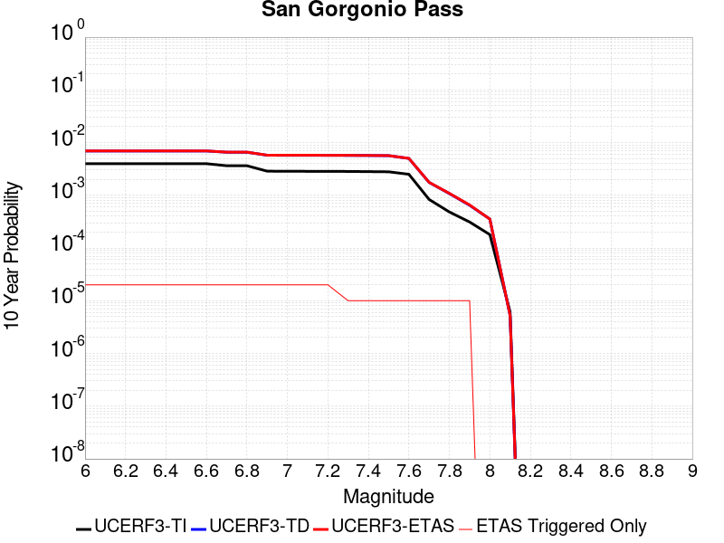 |

| Magnitude | 1 wk TI Prob | 1 wk TD Prob | 1 wk ETAS Prob | 1 wk ETAS/TD Gain | 1 wk ETAS Triggered Only | 1 mo TI Prob | 1 mo TD Prob | 1 mo ETAS Prob | 1 mo ETAS/TD Gain | 1 mo ETAS Triggered Only | 1 yr TI Prob | 1 yr TD Prob | 1 yr ETAS Prob | 1 yr ETAS/TD Gain | 1 yr ETAS Triggered Only | 10 yr TI Prob | 10 yr TD Prob | 10 yr ETAS Prob | 10 yr ETAS/TD Gain | 10 yr ETAS Triggered Only |
|-----|-----|-----|-----|-----|-----|-----|-----|-----|-----|-----|-----|-----|-----|-----|-----|-----|-----|-----|-----|-----|
| 6.0 | 7.644328E-6 | 1.3314231E-5 | 1.3314231E-5 | 1.0 | 0.0 | 3.2760996E-5 | 5.705979E-5 | 5.705979E-5 | 1.0 | 0.0 | 3.987921E-4 | 6.944901E-4 | 7.349478E-4 | 1.0582553 | 4.048583E-5 | 0.003980772 | 0.0069299806 | 0.006970186 | 1.0058017 | 4.048583E-5 |
| 6.1 | 7.644328E-6 | 1.3314231E-5 | 1.3314231E-5 | 1.0 | 0.0 | 3.2760996E-5 | 5.705979E-5 | 5.705979E-5 | 1.0 | 0.0 | 3.987921E-4 | 6.944901E-4 | 7.349478E-4 | 1.0582553 | 4.048583E-5 | 0.003980772 | 0.0069299806 | 0.006970186 | 1.0058017 | 4.048583E-5 |
| 6.2 | 7.644328E-6 | 1.3314231E-5 | 1.3314231E-5 | 1.0 | 0.0 | 3.2760996E-5 | 5.705979E-5 | 5.705979E-5 | 1.0 | 0.0 | 3.987921E-4 | 6.944901E-4 | 7.349478E-4 | 1.0582553 | 4.048583E-5 | 0.003980772 | 0.0069299806 | 0.006970186 | 1.0058017 | 4.048583E-5 |
| 6.3 | 7.644328E-6 | 1.3314231E-5 | 1.3314231E-5 | 1.0 | 0.0 | 3.2760996E-5 | 5.705979E-5 | 5.705979E-5 | 1.0 | 0.0 | 3.987921E-4 | 6.944901E-4 | 7.349478E-4 | 1.0582553 | 4.048583E-5 | 0.003980772 | 0.0069299806 | 0.006970186 | 1.0058017 | 4.048583E-5 |
| 6.4 | 7.644328E-6 | 1.3314231E-5 | 1.3314231E-5 | 1.0 | 0.0 | 3.2760996E-5 | 5.705979E-5 | 5.705979E-5 | 1.0 | 0.0 | 3.987921E-4 | 6.944901E-4 | 7.349478E-4 | 1.0582553 | 4.048583E-5 | 0.003980772 | 0.0069299806 | 0.006970186 | 1.0058017 | 4.048583E-5 |
| 6.5 | 7.644328E-6 | 1.3314231E-5 | 1.3314231E-5 | 1.0 | 0.0 | 3.2760996E-5 | 5.705979E-5 | 5.705979E-5 | 1.0 | 0.0 | 3.987921E-4 | 6.944901E-4 | 7.349478E-4 | 1.0582553 | 4.048583E-5 | 0.003980772 | 0.0069299806 | 0.006970186 | 1.0058017 | 4.048583E-5 |
| 6.6 | 7.644328E-6 | 1.3314231E-5 | 1.3314231E-5 | 1.0 | 0.0 | 3.2760996E-5 | 5.705979E-5 | 5.705979E-5 | 1.0 | 0.0 | 3.987921E-4 | 6.944901E-4 | 7.349478E-4 | 1.0582553 | 4.048583E-5 | 0.003980772 | 0.0069299806 | 0.006970186 | 1.0058017 | 4.048583E-5 |
| 6.7 | 6.987586E-6 | 1.2618505E-5 | 1.2618505E-5 | 1.0 | 0.0 | 2.9946454E-5 | 5.4078235E-5 | 5.4078235E-5 | 1.0 | 0.0 | 3.645371E-4 | 6.582117E-4 | 6.986709E-4 | 1.0614684 | 4.048583E-5 | 0.0036393967 | 0.0065693567 | 0.0066095768 | 1.0061224 | 4.048583E-5 |
| 6.8 | 6.987586E-6 | 1.2618505E-5 | 1.2618505E-5 | 1.0 | 0.0 | 2.9946454E-5 | 5.4078235E-5 | 5.4078235E-5 | 1.0 | 0.0 | 3.645371E-4 | 6.582117E-4 | 6.986709E-4 | 1.0614684 | 4.048583E-5 | 0.0036393967 | 0.0065693567 | 0.0066095768 | 1.0061224 | 4.048583E-5 |
| 6.9 | 5.504702E-6 | 1.1049368E-5 | 1.1049368E-5 | 1.0 | 0.0 | 2.3591367E-5 | 4.7353606E-5 | 4.7353606E-5 | 1.0 | 0.0 | 2.8718702E-4 | 5.7638274E-4 | 6.168452E-4 | 1.0702008 | 4.048583E-5 | 0.0028681618 | 0.005755309 | 0.005795562 | 1.006994 | 4.048583E-5 |
| 7.0 | 5.4825764E-6 | 1.102571E-5 | 1.102571E-5 | 1.0 | 0.0 | 2.3496545E-5 | 4.7252215E-5 | 4.7252215E-5 | 1.0 | 0.0 | 2.8603288E-4 | 5.751489E-4 | 6.1561144E-4 | 1.0703515 | 4.048583E-5 | 0.00285665 | 0.005743035 | 0.0057832883 | 1.007009 | 4.048583E-5 |
| 7.1 | 5.4692787E-6 | 1.101142E-5 | 1.101142E-5 | 1.0 | 0.0 | 2.3439556E-5 | 4.7190973E-5 | 4.7190973E-5 | 1.0 | 0.0 | 2.8533922E-4 | 5.744037E-4 | 6.1486627E-4 | 1.0704428 | 4.048583E-5 | 0.0028497311 | 0.0057356213 | 0.005775875 | 1.0070182 | 4.048583E-5 |
| 7.2 | 5.453661E-6 | 1.0994446E-5 | 1.0994446E-5 | 1.0 | 0.0 | 2.3372622E-5 | 4.7118232E-5 | 4.7118232E-5 | 1.0 | 0.0 | 2.8452452E-4 | 5.7351857E-4 | 6.1398116E-4 | 1.0705515 | 4.048583E-5 | 0.002841605 | 0.0057268157 | 0.0057670693 | 1.007029 | 4.048583E-5 |
| 7.3 | 5.4422303E-6 | 1.0981369E-5 | 1.0981369E-5 | 1.0 | 0.0 | 2.3323635E-5 | 4.706219E-5 | 4.706219E-5 | 1.0 | 0.0 | 2.8392827E-4 | 5.728366E-4 | 6.1329926E-4 | 1.0706356 | 4.048583E-5 | 0.0028356577 | 0.005720031 | 0.0057602855 | 1.0070374 | 4.048583E-5 |
| 7.4 | 5.398595E-6 | 1.0928734E-5 | 1.0928734E-5 | 1.0 | 0.0 | 2.313663E-5 | 4.683662E-5 | 4.683662E-5 | 1.0 | 0.0 | 2.8165206E-4 | 5.700917E-4 | 6.105545E-4 | 1.0709759 | 4.048583E-5 | 0.0028129534 | 0.005692723 | 0.0057329787 | 1.0070714 | 4.048583E-5 |
| 7.5 | 5.3578788E-6 | 1.0855281E-5 | 1.0855281E-5 | 1.0 | 0.0 | 2.2962136E-5 | 4.6521833E-5 | 4.6521833E-5 | 1.0 | 0.0 | 2.7952815E-4 | 5.662612E-4 | 6.0672406E-4 | 1.0714563 | 4.048583E-5 | 0.002791768 | 0.0056546377 | 0.0056948946 | 1.0071193 | 4.048583E-5 |
| 7.6 | 4.8091474E-6 | 9.60368E-6 | 9.60368E-6 | 1.0 | 0.0 | 2.0610469E-5 | 4.1158008E-5 | 4.1158008E-5 | 1.0 | 0.0 | 2.5090357E-4 | 5.0098833E-4 | 5.414539E-4 | 1.0807714 | 4.048583E-5 | 0.0025062046 | 0.0050053033 | 0.0050455863 | 1.008048 | 4.048583E-5 |
| 7.7 | 1.5991155E-6 | 3.352866E-6 | 3.352866E-6 | 1.0 | 0.0 | 6.853334E-6 | 1.4369349E-5 | 1.4369349E-5 | 1.0 | 0.0 | 8.343615E-5 | 1.7493303E-4 | 2.1541178E-4 | 1.2313957 | 4.048583E-5 | 8.340483E-4 | 0.0017534072 | 0.001793822 | 1.0230494 | 4.048583E-5 |
| 7.8 | 9.258398E-7 | 2.0579948E-6 | 2.0579948E-6 | 1.0 | 0.0 | 3.967879E-6 | 8.819949E-6 | 8.819949E-6 | 1.0 | 0.0 | 4.8307855E-5 | 1.073776E-4 | 1.4785909E-4 | 1.3770012 | 4.048583E-5 | 4.8297356E-4 | 0.001078687 | 0.0011191291 | 1.037492 | 4.048583E-5 |
| 7.9 | 5.975575E-7 | 1.2291794E-6 | 1.2291794E-6 | 1.0 | 0.0 | 2.5609581E-6 | 5.2679006E-6 | 5.2679006E-6 | 1.0 | 0.0 | 3.117922E-5 | 6.4134816E-5 | 1.0461805E-4 | 1.6312208 | 4.048583E-5 | 3.1174847E-4 | 6.463092E-4 | 6.8676885E-4 | 1.0626011 | 4.048583E-5 |
| 8.0 | 3.4413725E-7 | 6.7148494E-7 | 6.7148494E-7 | 1.0 | 0.0 | 1.4748731E-6 | 2.8777895E-6 | 2.8777895E-6 | 1.0 | 0.0 | 1.7956432E-5 | 3.503653E-5 | 3.503653E-5 | 1.0 | 0.0 | 1.7954981E-4 | 3.5373896E-4 | 3.5373896E-4 | 1.0 | 0.0 |
| 8.1 | 1.1787731E-8 | 9.634385E-9 | 9.634385E-9 | 1.0 | 0.0 | 5.0518846E-8 | 4.129022E-8 | 4.129022E-8 | 1.0 | 0.0 | 6.1506677E-7 | 5.027083E-7 | 5.027083E-7 | 1.0 | 0.0 | 6.1506507E-6 | 5.2424944E-6 | 5.2424944E-6 | 1.0 | 0.0 |

## Los Alamos 2011 CFM
*[(top)](#table-of-contents)*

| 1 Week | 1 Month | 1 Year | 10 Year |
|-----|-----|-----|-----|
|  |  |  |  |

| Magnitude | 1 wk TI Prob | 1 wk TD Prob | 1 wk ETAS Prob | 1 wk ETAS/TD Gain | 1 wk ETAS Triggered Only | 1 mo TI Prob | 1 mo TD Prob | 1 mo ETAS Prob | 1 mo ETAS/TD Gain | 1 mo ETAS Triggered Only | 1 yr TI Prob | 1 yr TD Prob | 1 yr ETAS Prob | 1 yr ETAS/TD Gain | 1 yr ETAS Triggered Only | 10 yr TI Prob | 10 yr TD Prob | 10 yr ETAS Prob | 10 yr ETAS/TD Gain | 10 yr ETAS Triggered Only |
|-----|-----|-----|-----|-----|-----|-----|-----|-----|-----|-----|-----|-----|-----|-----|-----|-----|-----|-----|-----|-----|
| 6.0 | 4.6284417E-6 | 4.751731E-6 | 4.751731E-6 | 1.0 | 0.0 | 1.9836029E-5 | 2.0364414E-5 | 2.0364414E-5 | 1.0 | 0.0 | 2.4147688E-4 | 2.4791027E-4 | 2.8838607E-4 | 1.1632679 | 4.048583E-5 | 0.0024121467 | 0.0024765113 | 0.002516897 | 1.0163075 | 4.048583E-5 |
| 6.1 | 4.6284417E-6 | 4.751731E-6 | 4.751731E-6 | 1.0 | 0.0 | 1.9836029E-5 | 2.0364414E-5 | 2.0364414E-5 | 1.0 | 0.0 | 2.4147688E-4 | 2.4791027E-4 | 2.8838607E-4 | 1.1632679 | 4.048583E-5 | 0.0024121467 | 0.0024765113 | 0.002516897 | 1.0163075 | 4.048583E-5 |
| 6.2 | 4.6284417E-6 | 4.751731E-6 | 4.751731E-6 | 1.0 | 0.0 | 1.9836029E-5 | 2.0364414E-5 | 2.0364414E-5 | 1.0 | 0.0 | 2.4147688E-4 | 2.4791027E-4 | 2.8838607E-4 | 1.1632679 | 4.048583E-5 | 0.0024121467 | 0.0024765113 | 0.002516897 | 1.0163075 | 4.048583E-5 |
| 6.3 | 4.6284417E-6 | 4.751731E-6 | 4.751731E-6 | 1.0 | 0.0 | 1.9836029E-5 | 2.0364414E-5 | 2.0364414E-5 | 1.0 | 0.0 | 2.4147688E-4 | 2.4791027E-4 | 2.8838607E-4 | 1.1632679 | 4.048583E-5 | 0.0024121467 | 0.0024765113 | 0.002516897 | 1.0163075 | 4.048583E-5 |
| 6.4 | 4.6284417E-6 | 4.751731E-6 | 4.751731E-6 | 1.0 | 0.0 | 1.9836029E-5 | 2.0364414E-5 | 2.0364414E-5 | 1.0 | 0.0 | 2.4147688E-4 | 2.4791027E-4 | 2.8838607E-4 | 1.1632679 | 4.048583E-5 | 0.0024121467 | 0.0024765113 | 0.002516897 | 1.0163075 | 4.048583E-5 |
| 6.5 | 4.6284417E-6 | 4.751731E-6 | 4.751731E-6 | 1.0 | 0.0 | 1.9836029E-5 | 2.0364414E-5 | 2.0364414E-5 | 1.0 | 0.0 | 2.4147688E-4 | 2.4791027E-4 | 2.8838607E-4 | 1.1632679 | 4.048583E-5 | 0.0024121467 | 0.0024765113 | 0.002516897 | 1.0163075 | 4.048583E-5 |
| 6.6 | 4.6284417E-6 | 4.751731E-6 | 4.751731E-6 | 1.0 | 0.0 | 1.9836029E-5 | 2.0364414E-5 | 2.0364414E-5 | 1.0 | 0.0 | 2.4147688E-4 | 2.4791027E-4 | 2.8838607E-4 | 1.1632679 | 4.048583E-5 | 0.0024121467 | 0.0024765113 | 0.002516897 | 1.0163075 | 4.048583E-5 |
| 6.7 | 4.062321E-6 | 4.166349E-6 | 4.166349E-6 | 1.0 | 0.0 | 1.7409831E-5 | 1.7855667E-5 | 1.7855667E-5 | 1.0 | 0.0 | 2.1194408E-4 | 2.1737257E-4 | 2.578496E-4 | 1.1862104 | 4.048583E-5 | 0.0021174205 | 0.0021717492 | 0.002212147 | 1.0186015 | 4.048583E-5 |
| 6.8 | 4.062321E-6 | 4.166349E-6 | 4.166349E-6 | 1.0 | 0.0 | 1.7409831E-5 | 1.7855667E-5 | 1.7855667E-5 | 1.0 | 0.0 | 2.1194408E-4 | 2.1737257E-4 | 2.578496E-4 | 1.1862104 | 4.048583E-5 | 0.0021174205 | 0.0021717492 | 0.002212147 | 1.0186015 | 4.048583E-5 |
| 6.9 | 3.2936077E-6 | 3.372958E-6 | 3.372958E-6 | 1.0 | 0.0 | 1.4115385E-5 | 1.4455459E-5 | 1.4455459E-5 | 1.0 | 0.0 | 1.7184127E-4 | 1.7598194E-4 | 2.1646064E-4 | 1.2300162 | 4.048583E-5 | 0.0017170844 | 0.0017585184 | 0.001798933 | 1.0229822 | 4.048583E-5 |
| 7.0 | 3.1687898E-6 | 3.2448156E-6 | 3.2448156E-6 | 1.0 | 0.0 | 1.3580457E-5 | 1.3906283E-5 | 1.3906283E-5 | 1.0 | 0.0 | 1.6532952E-4 | 1.6929678E-4 | 2.0977575E-4 | 1.2391007 | 4.048583E-5 | 0.0016520657 | 0.0016917696 | 0.001732187 | 1.0238906 | 4.048583E-5 |
| 7.1 | 2.9379228E-6 | 3.0073259E-6 | 3.0073259E-6 | 1.0 | 0.0 | 1.25910365E-5 | 1.288848E-5 | 1.288848E-5 | 1.0 | 0.0 | 1.5328509E-4 | 1.5690686E-4 | 1.9738634E-4 | 1.2579842 | 4.048583E-5 | 0.001531794 | 0.0015680499 | 0.0016084722 | 1.0257788 | 4.048583E-5 |
| 7.2 | 2.0020686E-6 | 2.0416298E-6 | 2.0416298E-6 | 1.0 | 0.0 | 8.580266E-6 | 8.749813E-6 | 8.749813E-6 | 1.0 | 0.0 | 1.0445973E-4 | 1.0652381E-4 | 1.4700532E-4 | 1.3800232 | 4.048583E-5 | 0.0010441064 | 0.001064732 | 0.0011051747 | 1.0379839 | 4.048583E-5 |
| 7.3 | 1.7364243E-6 | 1.7678802E-6 | 1.7678802E-6 | 1.0 | 0.0 | 7.441797E-6 | 7.576608E-6 | 7.576608E-6 | 1.0 | 0.0 | 9.0600115E-5 | 9.2241324E-5 | 9.2241324E-5 | 1.0 | 0.0 | 9.0563187E-4 | 9.2203356E-4 | 9.2203356E-4 | 1.0 | 0.0 |
| 7.4 | 1.5718434E-6 | 1.5983177E-6 | 1.5983177E-6 | 1.0 | 0.0 | 6.7364545E-6 | 6.849915E-6 | 6.849915E-6 | 1.0 | 0.0 | 8.201325E-5 | 8.339455E-5 | 8.339455E-5 | 1.0 | 0.0 | 8.198299E-4 | 8.3363557E-4 | 8.3363557E-4 | 1.0 | 0.0 |
| 7.5 | 1.3841119E-6 | 1.4042793E-6 | 1.4042793E-6 | 1.0 | 0.0 | 5.9318945E-6 | 6.0183256E-6 | 6.0183256E-6 | 1.0 | 0.0 | 7.221842E-5 | 7.327068E-5 | 7.327068E-5 | 1.0 | 0.0 | 7.2194956E-4 | 7.324681E-4 | 7.324681E-4 | 1.0 | 0.0 |
| 7.6 | 1.0843726E-6 | 1.093442E-6 | 1.093442E-6 | 1.0 | 0.0 | 4.647303E-6 | 4.6861724E-6 | 4.6861724E-6 | 1.0 | 0.0 | 5.6579443E-5 | 5.705268E-5 | 5.705268E-5 | 1.0 | 0.0 | 5.656504E-4 | 5.703829E-4 | 5.703829E-4 | 1.0 | 0.0 |
| 7.7 | 5.544814E-7 | 5.5018705E-7 | 5.5018705E-7 | 1.0 | 0.0 | 2.3763469E-6 | 2.3579425E-6 | 2.3579425E-6 | 1.0 | 0.0 | 2.8931638E-5 | 2.8707573E-5 | 2.8707573E-5 | 1.0 | 0.0 | 2.8927872E-4 | 2.870388E-4 | 2.870388E-4 | 1.0 | 0.0 |
| 7.8 | 2.0707465E-7 | 1.977846E-7 | 1.977846E-7 | 1.0 | 0.0 | 8.874625E-7 | 8.4764804E-7 | 8.4764804E-7 | 1.0 | 0.0 | 1.08048025E-5 | 1.0320066E-5 | 1.0320066E-5 | 1.0 | 0.0 | 1.0804277E-4 | 1.0319592E-4 | 1.0319592E-4 | 1.0 | 0.0 |
| 7.9 | 3.9821284E-8 | 3.433109E-8 | 3.433109E-8 | 1.0 | 0.0 | 1.7066264E-7 | 1.4713324E-7 | 1.4713324E-7 | 1.0 | 0.0 | 2.0778157E-6 | 1.7913457E-6 | 1.7913457E-6 | 1.0 | 0.0 | 2.0777963E-5 | 1.7913319E-5 | 1.7913319E-5 | 1.0 | 0.0 |
| 8.0 | 7.880441E-11 | 8.2353124E-11 | 8.2353124E-11 | 1.0 | 0.0 | 3.3773329E-10 | 3.52942E-10 | 3.52942E-10 | 1.0 | 0.0 | 4.1119033E-9 | 4.2970694E-9 | 4.2970694E-9 | 1.0 | 0.0 | 4.1119034E-8 | 4.2970694E-8 | 4.2970694E-8 | 1.0 | 0.0 |

## Rinconada 2011 CFM
*[(top)](#table-of-contents)*

| 1 Week | 1 Month | 1 Year | 10 Year |
|-----|-----|-----|-----|
|  |  |  |  |

| Magnitude | 1 wk TI Prob | 1 wk TD Prob | 1 wk ETAS Prob | 1 wk ETAS/TD Gain | 1 wk ETAS Triggered Only | 1 mo TI Prob | 1 mo TD Prob | 1 mo ETAS Prob | 1 mo ETAS/TD Gain | 1 mo ETAS Triggered Only | 1 yr TI Prob | 1 yr TD Prob | 1 yr ETAS Prob | 1 yr ETAS/TD Gain | 1 yr ETAS Triggered Only | 10 yr TI Prob | 10 yr TD Prob | 10 yr ETAS Prob | 10 yr ETAS/TD Gain | 10 yr ETAS Triggered Only |
|-----|-----|-----|-----|-----|-----|-----|-----|-----|-----|-----|-----|-----|-----|-----|-----|-----|-----|-----|-----|-----|
| 6.0 | 1.5752368E-5 | 1.6274716E-5 | 5.6759887E-5 | 3.4876115 | 4.048583E-5 | 6.75084E-5 | 6.974694E-5 | 1.1022994E-4 | 1.580427 | 4.048583E-5 | 8.2160486E-4 | 8.488412E-4 | 8.892927E-4 | 1.0476549 | 4.048583E-5 | 0.008185739 | 0.00845637 | 0.008496514 | 1.0047472 | 4.048583E-5 |
| 6.1 | 1.0966133E-5 | 1.1323029E-5 | 1.1323029E-5 | 1.0 | 0.0 | 4.6996865E-5 | 4.852637E-5 | 4.852637E-5 | 1.0 | 0.0 | 5.720366E-4 | 5.906491E-4 | 5.906491E-4 | 1.0 | 0.0 | 0.0057056635 | 0.0058908886 | 0.0058908886 | 1.0 | 0.0 |
| 6.2 | 1.0966133E-5 | 1.1323029E-5 | 1.1323029E-5 | 1.0 | 0.0 | 4.6996865E-5 | 4.852637E-5 | 4.852637E-5 | 1.0 | 0.0 | 5.720366E-4 | 5.906491E-4 | 5.906491E-4 | 1.0 | 0.0 | 0.0057056635 | 0.0058908886 | 0.0058908886 | 1.0 | 0.0 |
| 6.3 | 8.926149E-6 | 9.212771E-6 | 9.212771E-6 | 1.0 | 0.0 | 3.8254362E-5 | 3.948271E-5 | 3.948271E-5 | 1.0 | 0.0 | 4.6564735E-4 | 4.805963E-4 | 4.805963E-4 | 1.0 | 0.0 | 0.0046467283 | 0.0047956146 | 0.0047956146 | 1.0 | 0.0 |
| 6.4 | 7.676955E-6 | 7.920191E-6 | 7.920191E-6 | 1.0 | 0.0 | 3.290082E-5 | 3.3943234E-5 | 3.3943234E-5 | 1.0 | 0.0 | 4.0049385E-4 | 4.1318068E-4 | 4.1318068E-4 | 1.0 | 0.0 | 0.0039977287 | 0.004124151 | 0.004124151 | 1.0 | 0.0 |
| 6.5 | 6.1671026E-6 | 6.3589546E-6 | 6.3589546E-6 | 1.0 | 0.0 | 2.6430173E-5 | 2.725238E-5 | 2.725238E-5 | 1.0 | 0.0 | 3.2173982E-4 | 3.317473E-4 | 3.317473E-4 | 1.0 | 0.0 | 0.003212744 | 0.0033125326 | 0.0033125326 | 1.0 | 0.0 |
| 6.6 | 5.553456E-6 | 5.7248126E-6 | 5.7248126E-6 | 1.0 | 0.0 | 2.3800309E-5 | 2.453468E-5 | 2.453468E-5 | 1.0 | 0.0 | 2.897302E-4 | 2.9866883E-4 | 2.9866883E-4 | 1.0 | 0.0 | 0.0028935277 | 0.002982683 | 0.002982683 | 1.0 | 0.0 |
| 6.7 | 4.787857E-6 | 4.9333094E-6 | 4.9333094E-6 | 1.0 | 0.0 | 2.0519226E-5 | 2.1142583E-5 | 2.1142583E-5 | 1.0 | 0.0 | 2.4979294E-4 | 2.573806E-4 | 2.573806E-4 | 1.0 | 0.0 | 0.0024951235 | 0.0025708308 | 0.0025708308 | 1.0 | 0.0 |
| 6.8 | 3.9955166E-6 | 4.1134763E-6 | 4.1134763E-6 | 1.0 | 0.0 | 1.7123532E-5 | 1.7629065E-5 | 1.7629065E-5 | 1.0 | 0.0 | 2.0845905E-4 | 2.1461274E-4 | 2.1461274E-4 | 1.0 | 0.0 | 0.002082636 | 0.0021440585 | 0.0021440585 | 1.0 | 0.0 |
| 6.9 | 3.4250072E-6 | 3.5224464E-6 | 3.5224464E-6 | 1.0 | 0.0 | 1.46785205E-5 | 1.5096111E-5 | 1.5096111E-5 | 1.0 | 0.0 | 1.7869633E-4 | 1.8377967E-4 | 1.8377967E-4 | 1.0 | 0.0 | 0.001785527 | 0.0018362794 | 0.0018362794 | 1.0 | 0.0 |
| 7.0 | 2.7712713E-6 | 2.8467E-6 | 2.8467E-6 | 1.0 | 0.0 | 1.1876823E-5 | 1.2200086E-5 | 1.2200086E-5 | 1.0 | 0.0 | 1.4459073E-4 | 1.4852593E-4 | 1.4852593E-4 | 1.0 | 0.0 | 0.0014449668 | 0.0014842682 | 0.0014842682 | 1.0 | 0.0 |
| 7.1 | 2.227358E-6 | 2.2856984E-6 | 2.2856984E-6 | 1.0 | 0.0 | 9.545785E-6 | 9.795814E-6 | 9.795814E-6 | 1.0 | 0.0 | 1.16213734E-4 | 1.19257515E-4 | 1.19257515E-4 | 1.0 | 0.0 | 0.0011615298 | 0.0011919362 | 0.0011919362 | 1.0 | 0.0 |
| 7.2 | 1.581796E-6 | 1.6209011E-6 | 1.6209011E-6 | 1.0 | 0.0 | 6.779108E-6 | 6.9467005E-6 | 6.9467005E-6 | 1.0 | 0.0 | 8.253252E-5 | 8.457281E-5 | 8.457281E-5 | 1.0 | 0.0 | 8.250187E-4 | 8.454067E-4 | 8.454067E-4 | 1.0 | 0.0 |
| 7.3 | 1.0306567E-6 | 1.0546477E-6 | 1.0546477E-6 | 1.0 | 0.0 | 4.4170924E-6 | 4.519911E-6 | 4.519911E-6 | 1.0 | 0.0 | 5.3776774E-5 | 5.5028526E-5 | 5.5028526E-5 | 1.0 | 0.0 | 5.376376E-4 | 5.5014924E-4 | 5.5014924E-4 | 1.0 | 0.0 |
| 7.4 | 6.535541E-7 | 6.682742E-7 | 6.682742E-7 | 1.0 | 0.0 | 2.800943E-6 | 2.864029E-6 | 2.864029E-6 | 1.0 | 0.0 | 3.4100947E-5 | 3.4868997E-5 | 3.4868997E-5 | 1.0 | 0.0 | 3.4095717E-4 | 3.4863537E-4 | 3.4863537E-4 | 1.0 | 0.0 |
| 7.5 | 3.2656962E-7 | 3.3316687E-7 | 3.3316687E-7 | 1.0 | 0.0 | 1.3995833E-6 | 1.4278572E-6 | 1.4278572E-6 | 1.0 | 0.0 | 1.7039794E-5 | 1.7384024E-5 | 1.7384024E-5 | 1.0 | 0.0 | 1.7038487E-4 | 1.7382667E-4 | 1.7382667E-4 | 1.0 | 0.0 |
| 7.6 | 9.754343E-8 | 9.82099E-8 | 9.82099E-8 | 1.0 | 0.0 | 4.180432E-7 | 4.208995E-7 | 4.208995E-7 | 1.0 | 0.0 | 5.089664E-6 | 5.1244397E-6 | 5.1244397E-6 | 1.0 | 0.0 | 5.0895473E-5 | 5.1243223E-5 | 5.1243223E-5 | 1.0 | 0.0 |
| 7.7 | 6.0001453E-9 | 5.8490435E-9 | 5.8490435E-9 | 1.0 | 0.0 | 2.5714908E-8 | 2.506733E-8 | 2.506733E-8 | 1.0 | 0.0 | 3.1307894E-7 | 3.051947E-7 | 3.051947E-7 | 1.0 | 0.0 | 3.1307852E-6 | 3.051943E-6 | 3.051943E-6 | 1.0 | 0.0 |
| 7.8 | 7.400003E-11 | 7.4654505E-11 | 7.4654505E-11 | 1.0 | 0.0 | 3.171432E-10 | 3.1994773E-10 | 3.1994773E-10 | 1.0 | 0.0 | 3.861218E-9 | 3.895363E-9 | 3.895363E-9 | 1.0 | 0.0 | 3.861218E-8 | 3.895363E-8 | 3.895363E-8 | 1.0 | 0.0 |

## Santa Monica alt 1
*[(top)](#table-of-contents)*

| 1 Week | 1 Month | 1 Year | 10 Year |
|-----|-----|-----|-----|
|  |  | 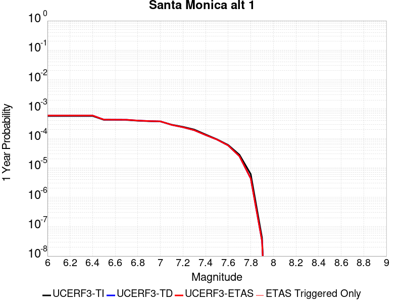 | 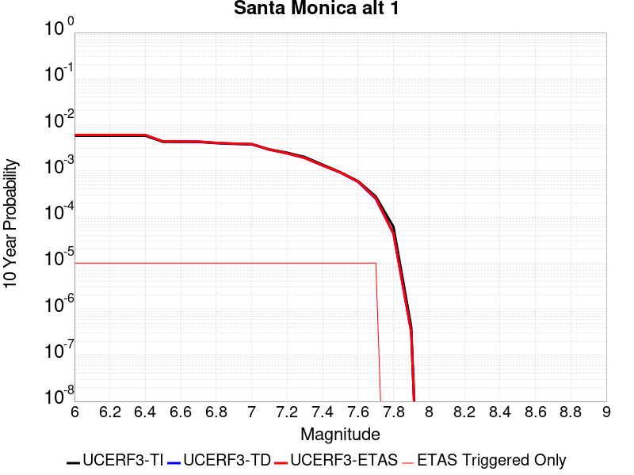 |

| Magnitude | 1 wk TI Prob | 1 wk TD Prob | 1 wk ETAS Prob | 1 wk ETAS/TD Gain | 1 wk ETAS Triggered Only | 1 mo TI Prob | 1 mo TD Prob | 1 mo ETAS Prob | 1 mo ETAS/TD Gain | 1 mo ETAS Triggered Only | 1 yr TI Prob | 1 yr TD Prob | 1 yr ETAS Prob | 1 yr ETAS/TD Gain | 1 yr ETAS Triggered Only | 10 yr TI Prob | 10 yr TD Prob | 10 yr ETAS Prob | 10 yr ETAS/TD Gain | 10 yr ETAS Triggered Only |
|-----|-----|-----|-----|-----|-----|-----|-----|-----|-----|-----|-----|-----|-----|-----|-----|-----|-----|-----|-----|-----|
| 6.0 | 1.1066008E-5 | 1.148031E-5 | 1.148031E-5 | 1.0 | 0.0 | 4.742488E-5 | 4.920048E-5 | 4.920048E-5 | 1.0 | 0.0 | 5.7724497E-4 | 5.9886515E-4 | 5.9886515E-4 | 1.0 | 0.0 | 0.005757478 | 0.0059739 | 0.006014144 | 1.0067366 | 4.048583E-5 |
| 6.1 | 1.1066008E-5 | 1.148031E-5 | 1.148031E-5 | 1.0 | 0.0 | 4.742488E-5 | 4.920048E-5 | 4.920048E-5 | 1.0 | 0.0 | 5.7724497E-4 | 5.9886515E-4 | 5.9886515E-4 | 1.0 | 0.0 | 0.005757478 | 0.0059739 | 0.006014144 | 1.0067366 | 4.048583E-5 |
| 6.2 | 1.1066008E-5 | 1.148031E-5 | 1.148031E-5 | 1.0 | 0.0 | 4.742488E-5 | 4.920048E-5 | 4.920048E-5 | 1.0 | 0.0 | 5.7724497E-4 | 5.9886515E-4 | 5.9886515E-4 | 1.0 | 0.0 | 0.005757478 | 0.0059739 | 0.006014144 | 1.0067366 | 4.048583E-5 |
| 6.3 | 1.1066008E-5 | 1.148031E-5 | 1.148031E-5 | 1.0 | 0.0 | 4.742488E-5 | 4.920048E-5 | 4.920048E-5 | 1.0 | 0.0 | 5.7724497E-4 | 5.9886515E-4 | 5.9886515E-4 | 1.0 | 0.0 | 0.005757478 | 0.0059739 | 0.006014144 | 1.0067366 | 4.048583E-5 |
| 6.4 | 1.1066008E-5 | 1.148031E-5 | 1.148031E-5 | 1.0 | 0.0 | 4.742488E-5 | 4.920048E-5 | 4.920048E-5 | 1.0 | 0.0 | 5.7724497E-4 | 5.9886515E-4 | 5.9886515E-4 | 1.0 | 0.0 | 0.005757478 | 0.0059739 | 0.006014144 | 1.0067366 | 4.048583E-5 |
| 6.5 | 8.183544E-6 | 8.335432E-6 | 8.335432E-6 | 1.0 | 0.0 | 3.5071862E-5 | 3.57228E-5 | 3.57228E-5 | 1.0 | 0.0 | 4.2691626E-4 | 4.3483984E-4 | 4.3483984E-4 | 1.0 | 0.0 | 0.0042609703 | 0.0043400554 | 0.004380366 | 1.009288 | 4.048583E-5 |
| 6.6 | 8.1543285E-6 | 8.303646E-6 | 8.303646E-6 | 1.0 | 0.0 | 3.4946657E-5 | 3.5586578E-5 | 3.5586578E-5 | 1.0 | 0.0 | 4.2539247E-4 | 4.3318202E-4 | 4.3318202E-4 | 1.0 | 0.0 | 0.0042457907 | 0.004323542 | 0.0043638526 | 1.0093236 | 4.048583E-5 |
| 6.7 | 8.110878E-6 | 8.257042E-6 | 8.257042E-6 | 1.0 | 0.0 | 3.4760444E-5 | 3.5386853E-5 | 3.5386853E-5 | 1.0 | 0.0 | 4.231262E-4 | 4.3075136E-4 | 4.3075136E-4 | 1.0 | 0.0 | 0.0042232145 | 0.0042993296 | 0.0043396414 | 1.0093763 | 4.048583E-5 |
| 6.8 | 7.644036E-6 | 7.75106E-6 | 7.75106E-6 | 1.0 | 0.0 | 3.275974E-5 | 3.3218414E-5 | 3.3218414E-5 | 1.0 | 0.0 | 3.9877684E-4 | 4.0436056E-4 | 4.0436056E-4 | 1.0 | 0.0 | 0.00398062 | 0.0040363944 | 0.004076717 | 1.0099897 | 4.048583E-5 |
| 6.9 | 7.3698293E-6 | 7.455719E-6 | 7.455719E-6 | 1.0 | 0.0 | 3.15846E-5 | 3.19527E-5 | 3.19527E-5 | 1.0 | 0.0 | 3.8447464E-4 | 3.8895605E-4 | 3.8895605E-4 | 1.0 | 0.0 | 0.0038381014 | 0.0038828964 | 0.003923225 | 1.0103862 | 4.048583E-5 |
| 7.0 | 7.209872E-6 | 7.2856255E-6 | 7.2856255E-6 | 1.0 | 0.0 | 3.0899086E-5 | 3.1223743E-5 | 3.1223743E-5 | 1.0 | 0.0 | 3.7613141E-4 | 3.8008415E-4 | 3.8008415E-4 | 1.0 | 0.0 | 0.0037549543 | 0.0037944836 | 0.003834816 | 1.0106292 | 4.048583E-5 |
| 7.1 | 5.603456E-6 | 5.5238925E-6 | 5.5238925E-6 | 1.0 | 0.0 | 2.4014591E-5 | 2.3673612E-5 | 2.3673612E-5 | 1.0 | 0.0 | 2.923384E-4 | 2.881885E-4 | 2.881885E-4 | 1.0 | 0.0 | 0.0029195412 | 0.0028781896 | 0.002918559 | 1.0140259 | 4.048583E-5 |
| 7.2 | 4.7483613E-6 | 4.5911324E-6 | 4.5911324E-6 | 1.0 | 0.0 | 2.0349962E-5 | 1.9676136E-5 | 1.9676136E-5 | 1.0 | 0.0 | 2.4773262E-4 | 2.3953074E-4 | 2.3953074E-4 | 1.0 | 0.0 | 0.0024745662 | 0.0023927398 | 0.0024331287 | 1.0168798 | 4.048583E-5 |
| 7.3 | 3.829015E-6 | 3.6342253E-6 | 3.6342253E-6 | 1.0 | 0.0 | 1.6409962E-5 | 1.5575159E-5 | 1.5575159E-5 | 1.0 | 0.0 | 1.9977297E-4 | 1.8961114E-4 | 1.8961114E-4 | 1.0 | 0.0 | 0.0019959346 | 0.0018945024 | 0.0019349116 | 1.0213296 | 4.048583E-5 |
| 7.4 | 2.610755E-6 | 2.4995716E-6 | 2.4995716E-6 | 1.0 | 0.0 | 1.1188902E-5 | 1.0712406E-5 | 1.0712406E-5 | 1.0 | 0.0 | 1.3621636E-4 | 1.3041578E-4 | 1.3041578E-4 | 1.0 | 0.0 | 0.001361329 | 0.0013033969 | 0.0013438299 | 1.0310212 | 4.048583E-5 |
| 7.5 | 1.792146E-6 | 1.7584184E-6 | 1.7584184E-6 | 1.0 | 0.0 | 7.680603E-6 | 7.536057E-6 | 7.536057E-6 | 1.0 | 0.0 | 9.3507326E-5 | 9.1747665E-5 | 9.1747665E-5 | 1.0 | 0.0 | 9.3467993E-4 | 9.1710105E-4 | 9.575497E-4 | 1.0441049 | 4.048583E-5 |
| 7.6 | 1.1473018E-6 | 1.1029152E-6 | 1.1029152E-6 | 1.0 | 0.0 | 4.9169985E-6 | 4.726771E-6 | 4.726771E-6 | 1.0 | 0.0 | 5.986281E-5 | 5.7546935E-5 | 5.7546935E-5 | 1.0 | 0.0 | 5.984669E-4 | 5.7532196E-4 | 6.157845E-4 | 1.0703303 | 4.048583E-5 |
| 7.7 | 5.330919E-7 | 4.7452556E-7 | 4.7452556E-7 | 1.0 | 0.0 | 2.2846775E-6 | 2.0336795E-6 | 2.0336795E-6 | 1.0 | 0.0 | 2.7815593E-5 | 2.4759778E-5 | 2.4759778E-5 | 1.0 | 0.0 | 2.7812112E-4 | 2.4757133E-4 | 2.8804713E-4 | 1.1634915 | 4.048583E-5 |
| 7.8 | 1.1668574E-7 | 8.2966224E-8 | 8.2966224E-8 | 1.0 | 0.0 | 5.000816E-7 | 3.5556948E-7 | 3.5556948E-7 | 1.0 | 0.0 | 6.0884768E-6 | 4.32905E-6 | 4.32905E-6 | 1.0 | 0.0 | 6.08831E-5 | 4.3289692E-5 | 4.3289692E-5 | 1.0 | 0.0 |
| 7.9 | 8.007447E-10 | 6.1608785E-10 | 6.1608785E-10 | 1.0 | 0.0 | 3.4317629E-9 | 2.6403764E-9 | 2.6403764E-9 | 1.0 | 0.0 | 4.1781714E-8 | 3.2146584E-8 | 3.2146584E-8 | 1.0 | 0.0 | 4.1781706E-7 | 3.214658E-7 | 3.214658E-7 | 1.0 | 0.0 |

## Malibu Coast (Extension) alt 1
*[(top)](#table-of-contents)*

| 1 Week | 1 Month | 1 Year | 10 Year |
|-----|-----|-----|-----|
|  | 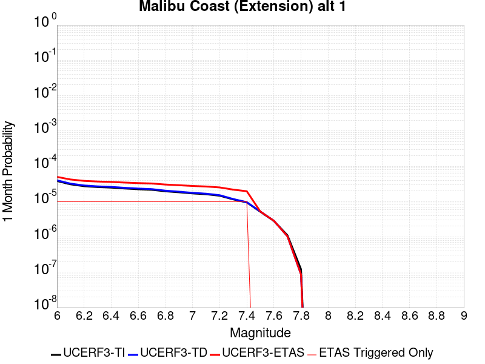 |  |  |

| Magnitude | 1 wk TI Prob | 1 wk TD Prob | 1 wk ETAS Prob | 1 wk ETAS/TD Gain | 1 wk ETAS Triggered Only | 1 mo TI Prob | 1 mo TD Prob | 1 mo ETAS Prob | 1 mo ETAS/TD Gain | 1 mo ETAS Triggered Only | 1 yr TI Prob | 1 yr TD Prob | 1 yr ETAS Prob | 1 yr ETAS/TD Gain | 1 yr ETAS Triggered Only | 10 yr TI Prob | 10 yr TD Prob | 10 yr ETAS Prob | 10 yr ETAS/TD Gain | 10 yr ETAS Triggered Only |
|-----|-----|-----|-----|-----|-----|-----|-----|-----|-----|-----|-----|-----|-----|-----|-----|-----|-----|-----|-----|-----|
| 6.0 | 8.930738E-6 | 9.329276E-6 | 9.329276E-6 | 1.0 | 0.0 | 3.827403E-5 | 3.998201E-5 | 3.998201E-5 | 1.0 | 0.0 | 4.6588664E-4 | 4.8667393E-4 | 4.8667393E-4 | 1.0 | 0.0 | 0.0046491115 | 0.004856264 | 0.0048965532 | 1.0082964 | 4.048583E-5 |
| 6.1 | 7.199952E-6 | 7.5302964E-6 | 7.5302964E-6 | 1.0 | 0.0 | 3.0856572E-5 | 3.2272303E-5 | 3.2272303E-5 | 1.0 | 0.0 | 3.75614E-4 | 3.9284505E-4 | 3.9284505E-4 | 1.0 | 0.0 | 0.0037497976 | 0.003921572 | 0.0039618993 | 1.0102834 | 4.048583E-5 |
| 6.2 | 6.3721413E-6 | 6.6667917E-6 | 6.6667917E-6 | 1.0 | 0.0 | 2.7308892E-5 | 2.8571652E-5 | 2.8571652E-5 | 1.0 | 0.0 | 3.3243504E-4 | 3.4780471E-4 | 3.4780471E-4 | 1.0 | 0.0 | 0.0033193815 | 0.0034726437 | 0.003512989 | 1.011618 | 4.048583E-5 |
| 6.3 | 6.016345E-6 | 6.295158E-6 | 6.295158E-6 | 1.0 | 0.0 | 2.578408E-5 | 2.6978973E-5 | 2.6978973E-5 | 1.0 | 0.0 | 3.1387596E-4 | 3.2841982E-4 | 3.2841982E-4 | 1.0 | 0.0 | 0.00313433 | 0.0032793807 | 0.0033197338 | 1.0123051 | 4.048583E-5 |
| 6.4 | 5.8104883E-6 | 6.0795446E-6 | 6.0795446E-6 | 1.0 | 0.0 | 2.4901856E-5 | 2.6054933E-5 | 2.6054933E-5 | 1.0 | 0.0 | 3.031379E-4 | 3.1717293E-4 | 3.1717293E-4 | 1.0 | 0.0 | 0.0030272473 | 0.0031672374 | 0.0032075949 | 1.0127422 | 4.048583E-5 |
| 6.5 | 5.476925E-6 | 5.7275133E-6 | 5.7275133E-6 | 1.0 | 0.0 | 2.3472323E-5 | 2.4546256E-5 | 2.4546256E-5 | 1.0 | 0.0 | 2.8573806E-4 | 2.9880996E-4 | 2.9880996E-4 | 1.0 | 0.0 | 0.0028537093 | 0.002984114 | 0.003024479 | 1.0135267 | 4.048583E-5 |
| 6.6 | 5.222387E-6 | 5.45858E-6 | 5.45858E-6 | 1.0 | 0.0 | 2.2381464E-5 | 2.3393704E-5 | 2.3393704E-5 | 1.0 | 0.0 | 2.7246025E-4 | 2.8478142E-4 | 2.8478142E-4 | 1.0 | 0.0 | 0.0027212645 | 0.0028441956 | 0.002884566 | 1.014194 | 4.048583E-5 |
| 6.7 | 5.0337076E-6 | 5.259103E-6 | 5.259103E-6 | 1.0 | 0.0 | 2.1572854E-5 | 2.253882E-5 | 2.253882E-5 | 1.0 | 0.0 | 2.6261783E-4 | 2.7437587E-4 | 2.7437587E-4 | 1.0 | 0.0 | 0.002623077 | 0.002740401 | 0.002780776 | 1.0147332 | 4.048583E-5 |
| 6.8 | 4.5675624E-6 | 4.7587164E-6 | 4.7587164E-6 | 1.0 | 0.0 | 1.9575122E-5 | 2.039434E-5 | 2.039434E-5 | 1.0 | 0.0 | 2.3830103E-4 | 2.48273E-4 | 2.48273E-4 | 1.0 | 0.0 | 0.0023804565 | 0.002479976 | 0.0025203614 | 1.0162846 | 4.048583E-5 |
| 6.9 | 4.2802412E-6 | 4.4520207E-6 | 4.4520207E-6 | 1.0 | 0.0 | 1.8343762E-5 | 1.907995E-5 | 1.907995E-5 | 1.0 | 0.0 | 2.2331243E-4 | 2.3227377E-4 | 2.3227377E-4 | 1.0 | 0.0 | 0.0022308815 | 0.0023203269 | 0.0023607188 | 1.0174079 | 4.048583E-5 |
| 7.0 | 3.9794063E-6 | 4.130099E-6 | 4.130099E-6 | 1.0 | 0.0 | 1.7054486E-5 | 1.7700306E-5 | 1.7700306E-5 | 1.0 | 0.0 | 2.0761859E-4 | 2.1548003E-4 | 2.1548003E-4 | 1.0 | 0.0 | 0.0020742472 | 0.0021527244 | 0.002193123 | 1.0187663 | 4.048583E-5 |
| 7.1 | 3.7730424E-6 | 3.911217E-6 | 3.911217E-6 | 1.0 | 0.0 | 1.6170083E-5 | 1.6762251E-5 | 1.6762251E-5 | 1.0 | 0.0 | 1.9685295E-4 | 2.0406142E-4 | 2.0406142E-4 | 1.0 | 0.0 | 0.0019667868 | 0.0020387534 | 0.0020791567 | 1.0198176 | 4.048583E-5 |
| 7.2 | 3.424985E-6 | 3.541337E-6 | 3.541337E-6 | 1.0 | 0.0 | 1.4678424E-5 | 1.5177071E-5 | 1.5177071E-5 | 1.0 | 0.0 | 1.7869516E-4 | 1.8476529E-4 | 1.8476529E-4 | 1.0 | 0.0 | 0.0017855153 | 0.0018461287 | 0.0018865399 | 1.0218897 | 4.048583E-5 |
| 7.3 | 2.6966375E-6 | 2.7596534E-6 | 2.7596534E-6 | 1.0 | 0.0 | 1.15569665E-5 | 1.1827032E-5 | 1.1827032E-5 | 1.0 | 0.0 | 1.4069698E-4 | 1.4398464E-4 | 1.4398464E-4 | 1.0 | 0.0 | 0.0014060794 | 0.0014389176 | 0.0014793453 | 1.0280958 | 4.048583E-5 |
| 7.4 | 2.215957E-6 | 2.249378E-6 | 2.249378E-6 | 1.0 | 0.0 | 9.496924E-6 | 9.640156E-6 | 9.640156E-6 | 1.0 | 0.0 | 1.1561892E-4 | 1.17362615E-4 | 1.17362615E-4 | 1.0 | 0.0 | 0.0011555878 | 0.0011730101 | 0.0012134484 | 1.034474 | 4.048583E-5 |
| 7.5 | 1.2040218E-6 | 1.2219067E-6 | 1.2219067E-6 | 1.0 | 0.0 | 5.160083E-6 | 5.2367322E-6 | 5.2367322E-6 | 1.0 | 0.0 | 6.2822204E-5 | 6.375537E-5 | 6.375537E-5 | 1.0 | 0.0 | 6.280445E-4 | 6.3737266E-4 | 6.778327E-4 | 1.0634794 | 4.048583E-5 |
| 7.6 | 6.6157446E-7 | 6.678975E-7 | 6.678975E-7 | 1.0 | 0.0 | 2.835316E-6 | 2.8624147E-6 | 2.8624147E-6 | 1.0 | 0.0 | 3.4519428E-5 | 3.484936E-5 | 3.484936E-5 | 1.0 | 0.0 | 3.4514067E-4 | 3.4844046E-4 | 3.889122E-4 | 1.1161511 | 4.048583E-5 |
| 7.7 | 2.6012302E-7 | 2.4357593E-7 | 2.4357593E-7 | 1.0 | 0.0 | 1.1148124E-6 | 1.0438964E-6 | 1.0438964E-6 | 1.0 | 0.0 | 1.3572758E-5 | 1.2709375E-5 | 1.2709375E-5 | 1.0 | 0.0 | 1.3571928E-4 | 1.2708755E-4 | 1.6756824E-4 | 1.3185259 | 4.048583E-5 |
| 7.8 | 2.8323132E-8 | 2.0266649E-8 | 2.0266649E-8 | 1.0 | 0.0 | 1.2138484E-7 | 8.685707E-8 | 8.685707E-8 | 1.0 | 0.0 | 1.4778595E-6 | 1.0574844E-6 | 1.0574844E-6 | 1.0 | 0.0 | 1.4778497E-5 | 1.0574801E-5 | 1.0574801E-5 | 1.0 | 0.0 |

## Kern Canyon (Lake Isabella) 2011
*[(top)](#table-of-contents)*

| 1 Week | 1 Month | 1 Year | 10 Year |
|-----|-----|-----|-----|
|  |  |  |  |

| Magnitude | 1 wk TI Prob | 1 wk TD Prob | 1 wk ETAS Prob | 1 wk ETAS/TD Gain | 1 wk ETAS Triggered Only | 1 mo TI Prob | 1 mo TD Prob | 1 mo ETAS Prob | 1 mo ETAS/TD Gain | 1 mo ETAS Triggered Only | 1 yr TI Prob | 1 yr TD Prob | 1 yr ETAS Prob | 1 yr ETAS/TD Gain | 1 yr ETAS Triggered Only | 10 yr TI Prob | 10 yr TD Prob | 10 yr ETAS Prob | 10 yr ETAS/TD Gain | 10 yr ETAS Triggered Only |
|-----|-----|-----|-----|-----|-----|-----|-----|-----|-----|-----|-----|-----|-----|-----|-----|-----|-----|-----|-----|-----|
| 6.0 | 4.2387383E-6 | 4.001639E-6 | 4.001639E-6 | 1.0 | 0.0 | 1.8165894E-5 | 1.7149778E-5 | 1.7149778E-5 | 1.0 | 0.0 | 2.2114732E-4 | 2.087804E-4 | 2.087804E-4 | 1.0 | 0.0 | 0.0022092736 | 0.0020860266 | 0.0021264278 | 1.0193676 | 4.048583E-5 |
| 6.1 | 4.2387383E-6 | 4.001639E-6 | 4.001639E-6 | 1.0 | 0.0 | 1.8165894E-5 | 1.7149778E-5 | 1.7149778E-5 | 1.0 | 0.0 | 2.2114732E-4 | 2.087804E-4 | 2.087804E-4 | 1.0 | 0.0 | 0.0022092736 | 0.0020860266 | 0.0021264278 | 1.0193676 | 4.048583E-5 |
| 6.2 | 4.2387383E-6 | 4.001639E-6 | 4.001639E-6 | 1.0 | 0.0 | 1.8165894E-5 | 1.7149778E-5 | 1.7149778E-5 | 1.0 | 0.0 | 2.2114732E-4 | 2.087804E-4 | 2.087804E-4 | 1.0 | 0.0 | 0.0022092736 | 0.0020860266 | 0.0021264278 | 1.0193676 | 4.048583E-5 |
| 6.3 | 4.2387383E-6 | 4.001639E-6 | 4.001639E-6 | 1.0 | 0.0 | 1.8165894E-5 | 1.7149778E-5 | 1.7149778E-5 | 1.0 | 0.0 | 2.2114732E-4 | 2.087804E-4 | 2.087804E-4 | 1.0 | 0.0 | 0.0022092736 | 0.0020860266 | 0.0021264278 | 1.0193676 | 4.048583E-5 |
| 6.4 | 4.2387383E-6 | 4.001639E-6 | 4.001639E-6 | 1.0 | 0.0 | 1.8165894E-5 | 1.7149778E-5 | 1.7149778E-5 | 1.0 | 0.0 | 2.2114732E-4 | 2.087804E-4 | 2.087804E-4 | 1.0 | 0.0 | 0.0022092736 | 0.0020860266 | 0.0021264278 | 1.0193676 | 4.048583E-5 |
| 6.5 | 2.7857532E-6 | 2.517867E-6 | 2.517867E-6 | 1.0 | 0.0 | 1.1938888E-5 | 1.0790815E-5 | 1.0790815E-5 | 1.0 | 0.0 | 1.4534626E-4 | 1.3137059E-4 | 1.3137059E-4 | 1.0 | 0.0 | 0.0014525123 | 0.001312962 | 0.0013533947 | 1.030795 | 4.048583E-5 |
| 6.6 | 2.2233348E-6 | 1.9441236E-6 | 1.9441236E-6 | 1.0 | 0.0 | 9.528543E-6 | 8.331932E-6 | 8.331932E-6 | 1.0 | 0.0 | 1.1600384E-4 | 1.01436635E-4 | 1.01436635E-4 | 1.0 | 0.0 | 0.001159433 | 0.001013912 | 0.001013912 | 1.0 | 0.0 |
| 6.7 | 2.1635126E-6 | 1.8835036E-6 | 1.8835036E-6 | 1.0 | 0.0 | 9.272164E-6 | 8.072134E-6 | 8.072134E-6 | 1.0 | 0.0 | 1.1288274E-4 | 9.827388E-5 | 9.827388E-5 | 1.0 | 0.0 | 0.0011282542 | 9.823124E-4 | 9.823124E-4 | 1.0 | 0.0 |
| 6.8 | 1.8685711E-6 | 1.5831425E-6 | 1.5831425E-6 | 1.0 | 0.0 | 8.008137E-6 | 6.784879E-6 | 6.784879E-6 | 1.0 | 0.0 | 9.74947E-5 | 8.260282E-5 | 8.260282E-5 | 1.0 | 0.0 | 9.745194E-4 | 8.2572614E-4 | 8.2572614E-4 | 1.0 | 0.0 |
| 6.9 | 1.5815071E-6 | 1.3064928E-6 | 1.3064928E-6 | 1.0 | 0.0 | 6.77787E-6 | 5.599243E-6 | 5.599243E-6 | 1.0 | 0.0 | 8.251744E-5 | 6.816868E-5 | 6.816868E-5 | 1.0 | 0.0 | 8.248681E-4 | 6.8148033E-4 | 6.8148033E-4 | 1.0 | 0.0 |
| 7.0 | 1.3772564E-6 | 1.1210718E-6 | 1.1210718E-6 | 1.0 | 0.0 | 5.9025137E-6 | 4.8045845E-6 | 4.8045845E-6 | 1.0 | 0.0 | 7.186073E-5 | 5.8494268E-5 | 5.8494268E-5 | 1.0 | 0.0 | 7.18375E-4 | 5.847908E-4 | 5.847908E-4 | 1.0 | 0.0 |
| 7.1 | 1.0916998E-6 | 8.763777E-7 | 8.763777E-7 | 1.0 | 0.0 | 4.678705E-6 | 3.7558991E-6 | 3.7558991E-6 | 1.0 | 0.0 | 5.6961744E-5 | 4.5727127E-5 | 4.5727127E-5 | 1.0 | 0.0 | 5.6947145E-4 | 4.571785E-4 | 4.571785E-4 | 1.0 | 0.0 |
| 7.2 | 7.6277024E-7 | 5.901454E-7 | 5.901454E-7 | 1.0 | 0.0 | 3.2690114E-6 | 2.5291922E-6 | 2.5291922E-6 | 1.0 | 0.0 | 3.9799485E-5 | 3.0792486E-5 | 3.0792486E-5 | 1.0 | 0.0 | 3.9792358E-4 | 3.0788282E-4 | 3.0788282E-4 | 1.0 | 0.0 |
| 7.3 | 5.3265916E-7 | 4.3824414E-7 | 4.3824414E-7 | 1.0 | 0.0 | 2.282823E-6 | 1.878188E-6 | 1.878188E-6 | 1.0 | 0.0 | 2.7793016E-5 | 2.2866701E-5 | 2.2866701E-5 | 1.0 | 0.0 | 2.778954E-4 | 2.2864387E-4 | 2.2864387E-4 | 1.0 | 0.0 |
| 7.4 | 3.4946007E-7 | 3.006571E-7 | 3.006571E-7 | 1.0 | 0.0 | 1.497685E-6 | 1.2885298E-6 | 1.2885298E-6 | 1.0 | 0.0 | 1.8234163E-5 | 1.568774E-5 | 1.568774E-5 | 1.0 | 0.0 | 1.8232666E-4 | 1.5686655E-4 | 1.5686655E-4 | 1.0 | 0.0 |
| 7.5 | 1.8317026E-7 | 1.4244812E-7 | 1.4244812E-7 | 1.0 | 0.0 | 7.850152E-7 | 6.104918E-7 | 6.104918E-7 | 1.0 | 0.0 | 9.557518E-6 | 7.432713E-6 | 7.432713E-6 | 1.0 | 0.0 | 9.5571064E-5 | 7.432472E-5 | 7.432472E-5 | 1.0 | 0.0 |
| 7.6 | 2.572245E-8 | 1.7352555E-8 | 1.7352555E-8 | 1.0 | 0.0 | 1.10239064E-7 | 7.436809E-8 | 7.436809E-8 | 1.0 | 0.0 | 1.3421597E-6 | 9.054312E-7 | 9.054312E-7 | 1.0 | 0.0 | 1.3421517E-5 | 9.05428E-6 | 9.05428E-6 | 1.0 | 0.0 |

## Clayton
*[(top)](#table-of-contents)*

| 1 Week | 1 Month | 1 Year | 10 Year |
|-----|-----|-----|-----|
|  |  |  |  |

| Magnitude | 1 wk TI Prob | 1 wk TD Prob | 1 wk ETAS Prob | 1 wk ETAS/TD Gain | 1 wk ETAS Triggered Only | 1 mo TI Prob | 1 mo TD Prob | 1 mo ETAS Prob | 1 mo ETAS/TD Gain | 1 mo ETAS Triggered Only | 1 yr TI Prob | 1 yr TD Prob | 1 yr ETAS Prob | 1 yr ETAS/TD Gain | 1 yr ETAS Triggered Only | 10 yr TI Prob | 10 yr TD Prob | 10 yr ETAS Prob | 10 yr ETAS/TD Gain | 10 yr ETAS Triggered Only |
|-----|-----|-----|-----|-----|-----|-----|-----|-----|-----|-----|-----|-----|-----|-----|-----|-----|-----|-----|-----|-----|
| 6.0 | 1.1413061E-5 | 1.2667059E-5 | 1.2667059E-5 | 1.0 | 0.0 | 4.89122E-5 | 5.4286393E-5 | 5.4286393E-5 | 1.0 | 0.0 | 5.953433E-4 | 6.607586E-4 | 7.012177E-4 | 1.0612313 | 4.048583E-5 | 0.005937509 | 0.0065901424 | 0.0066303615 | 1.0061029 | 4.048583E-5 |
| 6.1 | 1.1413061E-5 | 1.2667059E-5 | 1.2667059E-5 | 1.0 | 0.0 | 4.89122E-5 | 5.4286393E-5 | 5.4286393E-5 | 1.0 | 0.0 | 5.953433E-4 | 6.607586E-4 | 7.012177E-4 | 1.0612313 | 4.048583E-5 | 0.005937509 | 0.0065901424 | 0.0066303615 | 1.0061029 | 4.048583E-5 |
| 6.2 | 1.1413061E-5 | 1.2667059E-5 | 1.2667059E-5 | 1.0 | 0.0 | 4.89122E-5 | 5.4286393E-5 | 5.4286393E-5 | 1.0 | 0.0 | 5.953433E-4 | 6.607586E-4 | 7.012177E-4 | 1.0612313 | 4.048583E-5 | 0.005937509 | 0.0065901424 | 0.0066303615 | 1.0061029 | 4.048583E-5 |
| 6.3 | 8.538689E-6 | 9.532753E-6 | 9.532753E-6 | 1.0 | 0.0 | 3.659387E-5 | 4.0854076E-5 | 4.0854076E-5 | 1.0 | 0.0 | 4.4543925E-4 | 4.9729564E-4 | 5.377613E-4 | 1.0813715 | 4.048583E-5 | 0.0044454746 | 0.0049628937 | 0.0050031785 | 1.0081172 | 4.048583E-5 |
| 6.4 | 8.538689E-6 | 9.532753E-6 | 9.532753E-6 | 1.0 | 0.0 | 3.659387E-5 | 4.0854076E-5 | 4.0854076E-5 | 1.0 | 0.0 | 4.4543925E-4 | 4.9729564E-4 | 5.377613E-4 | 1.0813715 | 4.048583E-5 | 0.0044454746 | 0.0049628937 | 0.0050031785 | 1.0081172 | 4.048583E-5 |
| 6.5 | 7.197462E-6 | 8.080952E-6 | 8.080952E-6 | 1.0 | 0.0 | 3.08459E-5 | 3.4632238E-5 | 3.4632238E-5 | 1.0 | 0.0 | 3.7548412E-4 | 4.2157414E-4 | 4.620429E-4 | 1.0959945 | 4.048583E-5 | 0.003748503 | 0.004208556 | 0.0042488715 | 1.0095794 | 4.048583E-5 |
| 6.6 | 7.1760483E-6 | 8.056968E-6 | 8.056968E-6 | 1.0 | 0.0 | 3.075413E-5 | 3.4529454E-5 | 3.4529454E-5 | 1.0 | 0.0 | 3.743672E-4 | 4.203232E-4 | 4.60792E-4 | 1.0962802 | 4.048583E-5 | 0.0037373714 | 0.004196094 | 0.00423641 | 1.009608 | 4.048583E-5 |
| 6.7 | 6.202582E-6 | 6.9766934E-6 | 6.9766934E-6 | 1.0 | 0.0 | 2.6582224E-5 | 2.9899817E-5 | 2.9899817E-5 | 1.0 | 0.0 | 3.235905E-4 | 3.6397713E-4 | 4.0444822E-4 | 1.1111913 | 4.048583E-5 | 0.0032311971 | 0.0036345655 | 0.0036749044 | 1.0110986 | 4.048583E-5 |
| 6.8 | 3.6417277E-6 | 4.1212957E-6 | 4.1212957E-6 | 1.0 | 0.0 | 1.5607311E-5 | 1.766258E-5 | 1.766258E-5 | 1.0 | 0.0 | 1.9000245E-4 | 2.1502146E-4 | 2.554986E-4 | 1.1882468 | 4.048583E-5 | 0.0018984007 | 0.0021482105 | 0.0021886094 | 1.0188059 | 4.048583E-5 |
| 6.9 | 2.6498485E-6 | 2.9995201E-6 | 2.9995201E-6 | 1.0 | 0.0 | 1.1356444E-5 | 1.2855025E-5 | 1.2855025E-5 | 1.0 | 0.0 | 1.3825593E-4 | 1.5649908E-4 | 1.9697858E-4 | 1.2586564 | 4.048583E-5 | 0.0013816995 | 0.0015639283 | 0.0016043509 | 1.0258468 | 4.048583E-5 |
| 7.0 | 2.070442E-6 | 2.3407233E-6 | 2.3407233E-6 | 1.0 | 0.0 | 8.873292E-6 | 1.0031635E-5 | 1.0031635E-5 | 1.0 | 0.0 | 1.0802698E-4 | 1.2212861E-4 | 1.6260949E-4 | 1.3314611 | 4.048583E-5 | 0.0010797448 | 0.0012206447 | 0.0012610811 | 1.0331271 | 4.048583E-5 |
| 7.1 | 1.2111691E-6 | 1.3588725E-6 | 1.3588725E-6 | 1.0 | 0.0 | 5.190714E-6 | 5.8237274E-6 | 5.8237274E-6 | 1.0 | 0.0 | 6.319511E-5 | 7.090174E-5 | 1.11384696E-4 | 1.5709727 | 4.048583E-5 | 6.3177146E-4 | 7.0880755E-4 | 7.4926467E-4 | 1.0570778 | 4.048583E-5 |
| 7.2 | 3.9541607E-7 | 4.2227694E-7 | 4.2227694E-7 | 1.0 | 0.0 | 1.6946392E-6 | 1.8097571E-6 | 1.8097571E-6 | 1.0 | 0.0 | 2.0632036E-5 | 2.2033571E-5 | 2.2033571E-5 | 1.0 | 0.0 | 2.063012E-4 | 2.2031402E-4 | 2.2031402E-4 | 1.0 | 0.0 |
| 7.3 | 2.5685637E-7 | 2.745679E-7 | 2.745679E-7 | 1.0 | 0.0 | 1.1008126E-6 | 1.176719E-6 | 1.176719E-6 | 1.0 | 0.0 | 1.3402311E-5 | 1.4326461E-5 | 1.4326461E-5 | 1.0 | 0.0 | 1.3401502E-4 | 1.4325544E-4 | 1.4325544E-4 | 1.0 | 0.0 |
| 7.4 | 1.482299E-7 | 1.5807963E-7 | 1.5807963E-7 | 1.0 | 0.0 | 6.3527085E-7 | 6.7748397E-7 | 6.7748397E-7 | 1.0 | 0.0 | 7.734395E-6 | 8.248337E-6 | 8.248337E-6 | 1.0 | 0.0 | 7.734126E-5 | 8.248033E-5 | 8.248033E-5 | 1.0 | 0.0 |
| 7.5 | 9.7969505E-8 | 1.04382096E-7 | 1.04382096E-7 | 1.0 | 0.0 | 4.1986925E-7 | 4.4735177E-7 | 4.4735177E-7 | 1.0 | 0.0 | 5.111896E-6 | 5.446494E-6 | 5.446494E-6 | 1.0 | 0.0 | 5.1117782E-5 | 5.4463624E-5 | 5.4463624E-5 | 1.0 | 0.0 |
| 7.6 | 6.125415E-8 | 6.5231326E-8 | 6.5231326E-8 | 1.0 | 0.0 | 2.6251774E-7 | 2.7956278E-7 | 2.7956278E-7 | 1.0 | 0.0 | 3.196149E-6 | 3.4036718E-6 | 3.4036718E-6 | 1.0 | 0.0 | 3.196103E-5 | 3.403621E-5 | 3.403621E-5 | 1.0 | 0.0 |

## Great Valley 09 (Laguna Seca)
*[(top)](#table-of-contents)*

| 1 Week | 1 Month | 1 Year | 10 Year |
|-----|-----|-----|-----|
|  |  |  |  |

| Magnitude | 1 wk TI Prob | 1 wk TD Prob | 1 wk ETAS Prob | 1 wk ETAS/TD Gain | 1 wk ETAS Triggered Only | 1 mo TI Prob | 1 mo TD Prob | 1 mo ETAS Prob | 1 mo ETAS/TD Gain | 1 mo ETAS Triggered Only | 1 yr TI Prob | 1 yr TD Prob | 1 yr ETAS Prob | 1 yr ETAS/TD Gain | 1 yr ETAS Triggered Only | 10 yr TI Prob | 10 yr TD Prob | 10 yr ETAS Prob | 10 yr ETAS/TD Gain | 10 yr ETAS Triggered Only |
|-----|-----|-----|-----|-----|-----|-----|-----|-----|-----|-----|-----|-----|-----|-----|-----|-----|-----|-----|-----|-----|
| 6.0 | 5.4353277E-5 | 7.05022E-5 | 7.05022E-5 | 1.0 | 0.0 | 2.3292181E-4 | 3.0211566E-4 | 3.0211566E-4 | 1.0 | 0.0 | 0.0028321352 | 0.0036721937 | 0.0036721937 | 1.0 | 0.0 | 0.02796312 | 0.03611547 | 0.036154494 | 1.0010805 | 4.048583E-5 |
| 6.1 | 4.5578287E-5 | 5.822118E-5 | 5.822118E-5 | 1.0 | 0.0 | 1.953209E-4 | 2.4949326E-4 | 2.4949326E-4 | 1.0 | 0.0 | 0.0023754383 | 0.003033432 | 0.003033432 | 1.0 | 0.0 | 0.023502063 | 0.029919548 | 0.029919548 | 1.0 | 0.0 |
| 6.2 | 2.8536782E-5 | 3.4737273E-5 | 3.4737273E-5 | 1.0 | 0.0 | 1.2229476E-4 | 1.4886224E-4 | 1.4886224E-4 | 1.0 | 0.0 | 0.0014879217 | 0.001810813 | 0.001810813 | 1.0 | 0.0 | 0.014779986 | 0.017958116 | 0.017958116 | 1.0 | 0.0 |
| 6.3 | 2.3698774E-5 | 2.8213295E-5 | 2.8213295E-5 | 1.0 | 0.0 | 1.01562226E-4 | 1.20905075E-4 | 1.20905075E-4 | 1.0 | 0.0 | 0.0012358186 | 0.0014710218 | 0.0014710218 | 1.0 | 0.0 | 0.012289686 | 0.014611342 | 0.014611342 | 1.0 | 0.0 |
| 6.4 | 1.9191197E-5 | 2.2123184E-5 | 2.2123184E-5 | 1.0 | 0.0 | 8.2245395E-5 | 9.4806666E-5 | 9.4806666E-5 | 1.0 | 0.0 | 0.0010008777 | 0.0011536429 | 0.0011536429 | 1.0 | 0.0 | 0.009963818 | 0.011476948 | 0.011476948 | 1.0 | 0.0 |
| 6.5 | 1.5203241E-5 | 1.6802203E-5 | 1.6802203E-5 | 1.0 | 0.0 | 6.5155116E-5 | 7.200386E-5 | 7.200386E-5 | 1.0 | 0.0 | 7.9297484E-4 | 8.7626575E-4 | 8.7626575E-4 | 1.0 | 0.0 | 0.007901512 | 0.0087295165 | 0.0087295165 | 1.0 | 0.0 |
| 6.6 | 1.0984925E-5 | 1.1242595E-5 | 1.1242595E-5 | 1.0 | 0.0 | 4.70774E-5 | 4.8181686E-5 | 4.8181686E-5 | 1.0 | 0.0 | 5.730166E-4 | 5.8645656E-4 | 5.8645656E-4 | 1.0 | 0.0 | 0.005715413 | 0.0058494853 | 0.0058494853 | 1.0 | 0.0 |
| 6.7 | 9.134616E-6 | 9.019894E-6 | 9.019894E-6 | 1.0 | 0.0 | 3.9147766E-5 | 3.865613E-5 | 3.865613E-5 | 1.0 | 0.0 | 4.7651984E-4 | 4.7053912E-4 | 4.7053912E-4 | 1.0 | 0.0 | 0.004754993 | 0.0046956735 | 0.0046956735 | 1.0 | 0.0 |
| 6.8 | 7.785589E-6 | 7.4519444E-6 | 7.4519444E-6 | 1.0 | 0.0 | 3.3366385E-5 | 3.1936524E-5 | 3.1936524E-5 | 1.0 | 0.0 | 4.0616E-4 | 3.8875983E-4 | 3.8875983E-4 | 1.0 | 0.0 | 0.0040541845 | 0.0038810016 | 0.0038810016 | 1.0 | 0.0 |
| 6.9 | 5.579095E-6 | 4.898492E-6 | 4.898492E-6 | 1.0 | 0.0 | 2.3910188E-5 | 2.0993377E-5 | 2.0993377E-5 | 1.0 | 0.0 | 2.9106764E-4 | 2.5556577E-4 | 2.5556577E-4 | 1.0 | 0.0 | 0.002906867 | 0.002552856 | 0.002552856 | 1.0 | 0.0 |
| 7.0 | 2.6816688E-6 | 1.5216126E-6 | 1.5216126E-6 | 1.0 | 0.0 | 1.1492816E-5 | 6.521181E-6 | 6.521181E-6 | 1.0 | 0.0 | 1.3991605E-4 | 7.939258E-5 | 7.939258E-5 | 1.0 | 0.0 | 0.0013982799 | 7.9365086E-4 | 7.9365086E-4 | 1.0 | 0.0 |
| 7.1 | 1.9951021E-6 | 7.453827E-7 | 7.453827E-7 | 1.0 | 0.0 | 8.55041E-6 | 3.1944935E-6 | 3.1944935E-6 | 1.0 | 0.0 | 1.0409627E-4 | 3.8892307E-5 | 3.8892307E-5 | 1.0 | 0.0 | 0.0010404752 | 3.8885913E-4 | 3.8885913E-4 | 1.0 | 0.0 |
| 7.2 | 1.9951021E-6 | 7.453827E-7 | 7.453827E-7 | 1.0 | 0.0 | 8.55041E-6 | 3.1944935E-6 | 3.1944935E-6 | 1.0 | 0.0 | 1.0409627E-4 | 3.8892307E-5 | 3.8892307E-5 | 1.0 | 0.0 | 0.0010404752 | 3.8885913E-4 | 3.8885913E-4 | 1.0 | 0.0 |
| 7.3 | 1.7087556E-6 | 6.578881E-7 | 6.578881E-7 | 1.0 | 0.0 | 7.3232177E-6 | 2.8195177E-6 | 2.8195177E-6 | 1.0 | 0.0 | 8.915652E-5 | 3.4327128E-5 | 3.4327128E-5 | 1.0 | 0.0 | 8.9120766E-4 | 3.432223E-4 | 3.432223E-4 | 1.0 | 0.0 |
| 7.4 | 1.3804846E-6 | 6.073852E-7 | 6.073852E-7 | 1.0 | 0.0 | 5.916349E-6 | 2.6030768E-6 | 2.6030768E-6 | 1.0 | 0.0 | 7.2029165E-5 | 3.169204E-5 | 3.169204E-5 | 1.0 | 0.0 | 7.200583E-4 | 3.1687922E-4 | 3.1687922E-4 | 1.0 | 0.0 |
| 7.5 | 1.3804846E-6 | 6.073852E-7 | 6.073852E-7 | 1.0 | 0.0 | 5.916349E-6 | 2.6030768E-6 | 2.6030768E-6 | 1.0 | 0.0 | 7.2029165E-5 | 3.169204E-5 | 3.169204E-5 | 1.0 | 0.0 | 7.200583E-4 | 3.1687922E-4 | 3.1687922E-4 | 1.0 | 0.0 |

## Newport-Inglewood (Offshore)
*[(top)](#table-of-contents)*

| 1 Week | 1 Month | 1 Year | 10 Year |
|-----|-----|-----|-----|
|  |  |  |  |

| Magnitude | 1 wk TI Prob | 1 wk TD Prob | 1 wk ETAS Prob | 1 wk ETAS/TD Gain | 1 wk ETAS Triggered Only | 1 mo TI Prob | 1 mo TD Prob | 1 mo ETAS Prob | 1 mo ETAS/TD Gain | 1 mo ETAS Triggered Only | 1 yr TI Prob | 1 yr TD Prob | 1 yr ETAS Prob | 1 yr ETAS/TD Gain | 1 yr ETAS Triggered Only | 10 yr TI Prob | 10 yr TD Prob | 10 yr ETAS Prob | 10 yr ETAS/TD Gain | 10 yr ETAS Triggered Only |
|-----|-----|-----|-----|-----|-----|-----|-----|-----|-----|-----|-----|-----|-----|-----|-----|-----|-----|-----|-----|-----|
| 6.0 | 1.9626508E-5 | 1.8965357E-5 | 1.8965357E-5 | 1.0 | 0.0 | 8.411089E-5 | 8.1277634E-5 | 8.1277634E-5 | 1.0 | 0.0 | 0.001023569 | 9.891186E-4 | 9.891186E-4 | 1.0 | 0.0 | 0.010188672 | 0.009848503 | 0.00988859 | 1.0040704 | 4.048583E-5 |
| 6.1 | 1.331886E-5 | 1.2218092E-5 | 1.2218092E-5 | 1.0 | 0.0 | 5.707958E-5 | 5.2362207E-5 | 5.2362207E-5 | 1.0 | 0.0 | 6.947222E-4 | 6.3732493E-4 | 6.3732493E-4 | 1.0 | 0.0 | 0.006925544 | 0.006355149 | 0.0063953777 | 1.00633 | 4.048583E-5 |
| 6.2 | 1.2250852E-5 | 1.1076029E-5 | 1.1076029E-5 | 1.0 | 0.0 | 5.2502597E-5 | 4.7467838E-5 | 4.7467838E-5 | 1.0 | 0.0 | 6.3903164E-4 | 5.777687E-4 | 5.777687E-4 | 1.0 | 0.0 | 0.006371971 | 0.0057627866 | 0.0058030393 | 1.006985 | 4.048583E-5 |
| 6.3 | 1.2106258E-5 | 1.0918891E-5 | 1.0918891E-5 | 1.0 | 0.0 | 5.1882926E-5 | 4.6794412E-5 | 4.6794412E-5 | 1.0 | 0.0 | 6.3149154E-4 | 5.69574E-4 | 5.69574E-4 | 1.0 | 0.0 | 0.0062970007 | 0.005681259 | 0.005721515 | 1.0070857 | 4.048583E-5 |
| 6.4 | 1.1348758E-5 | 1.0109362E-5 | 1.0109362E-5 | 1.0 | 0.0 | 4.8636626E-5 | 4.3325123E-5 | 4.3325123E-5 | 1.0 | 0.0 | 5.919901E-4 | 5.273565E-4 | 5.273565E-4 | 1.0 | 0.0 | 0.005904155 | 0.0052611465 | 0.005301419 | 1.0076548 | 4.048583E-5 |
| 6.5 | 1.100837E-5 | 9.7433895E-6 | 9.7433895E-6 | 1.0 | 0.0 | 4.7177873E-5 | 4.1756717E-5 | 4.1756717E-5 | 1.0 | 0.0 | 5.7423924E-4 | 5.082702E-4 | 5.082702E-4 | 1.0 | 0.0 | 0.005727576 | 0.0050711688 | 0.0051114494 | 1.007943 | 4.048583E-5 |
| 6.6 | 1.0634696E-5 | 9.345544E-6 | 9.345544E-6 | 1.0 | 0.0 | 4.557647E-5 | 4.0051716E-5 | 4.0051716E-5 | 1.0 | 0.0 | 5.5475225E-4 | 4.8752132E-4 | 4.8752132E-4 | 1.0 | 0.0 | 0.0055336943 | 0.0048646047 | 0.0049048937 | 1.0082821 | 4.048583E-5 |
| 6.7 | 9.9780855E-6 | 8.667911E-6 | 8.667911E-6 | 1.0 | 0.0 | 4.276252E-5 | 3.7147664E-5 | 3.7147664E-5 | 1.0 | 0.0 | 5.205093E-4 | 4.5217964E-4 | 4.5217964E-4 | 1.0 | 0.0 | 0.0051929182 | 0.004512675 | 0.004552978 | 1.008931 | 4.048583E-5 |
| 6.8 | 9.59546E-6 | 8.27295E-6 | 8.27295E-6 | 1.0 | 0.0 | 4.1122752E-5 | 3.5455025E-5 | 3.5455025E-5 | 1.0 | 0.0 | 5.0055445E-4 | 4.315801E-4 | 4.315801E-4 | 1.0 | 0.0 | 0.004994285 | 0.004307495 | 0.004347807 | 1.0093584 | 4.048583E-5 |
| 6.9 | 9.000614E-6 | 7.70684E-6 | 7.70684E-6 | 1.0 | 0.0 | 3.857349E-5 | 3.30289E-5 | 3.30289E-5 | 1.0 | 0.0 | 4.6953102E-4 | 4.0205332E-4 | 4.0205332E-4 | 1.0 | 0.0 | 0.004685402 | 0.0040133307 | 0.0040133307 | 1.0 | 0.0 |
| 7.0 | 7.4070194E-6 | 6.148904E-6 | 6.148904E-6 | 1.0 | 0.0 | 3.1743984E-5 | 2.635218E-5 | 2.635218E-5 | 1.0 | 0.0 | 3.8641447E-4 | 3.207907E-4 | 3.207907E-4 | 1.0 | 0.0 | 0.0038574322 | 0.0032032963 | 0.0032032963 | 1.0 | 0.0 |
| 7.1 | 6.299615E-6 | 5.0565927E-6 | 5.0565927E-6 | 1.0 | 0.0 | 2.699807E-5 | 2.1670932E-5 | 2.1670932E-5 | 1.0 | 0.0 | 3.2865192E-4 | 2.638118E-4 | 2.638118E-4 | 1.0 | 0.0 | 0.003281663 | 0.002635001 | 0.002635001 | 1.0 | 0.0 |
| 7.2 | 5.096653E-6 | 3.892769E-6 | 3.892769E-6 | 1.0 | 0.0 | 2.1842614E-5 | 1.668319E-5 | 1.668319E-5 | 1.0 | 0.0 | 2.6590136E-4 | 2.0309901E-4 | 2.0309901E-4 | 1.0 | 0.0 | 0.0026558342 | 0.0020291451 | 0.0020291451 | 1.0 | 0.0 |
| 7.3 | 3.9753018E-6 | 2.9099103E-6 | 2.9099103E-6 | 1.0 | 0.0 | 1.7036897E-5 | 1.2470985E-5 | 1.2470985E-5 | 1.0 | 0.0 | 2.0740448E-4 | 1.5182374E-4 | 1.5182374E-4 | 1.0 | 0.0 | 0.00207211 | 0.0015172083 | 0.0015172083 | 1.0 | 0.0 |
| 7.4 | 3.0568392E-6 | 2.1449955E-6 | 2.1449955E-6 | 1.0 | 0.0 | 1.3100675E-5 | 9.192806E-6 | 9.192806E-6 | 1.0 | 0.0 | 1.5948903E-4 | 1.1191672E-4 | 1.1191672E-4 | 1.0 | 0.0 | 0.0015937461 | 0.0011186098 | 0.0011186098 | 1.0 | 0.0 |
| 7.5 | 1.7279019E-6 | 1.1469883E-6 | 1.1469883E-6 | 1.0 | 0.0 | 7.405273E-6 | 4.915655E-6 | 4.915655E-6 | 1.0 | 0.0 | 9.015547E-5 | 5.9846494E-5 | 5.9846494E-5 | 1.0 | 0.0 | 9.01189E-4 | 5.9830764E-4 | 5.9830764E-4 | 1.0 | 0.0 |
| 7.6 | 1.1156416E-6 | 7.223012E-7 | 7.223012E-7 | 1.0 | 0.0 | 4.7813123E-6 | 3.095573E-6 | 3.095573E-6 | 1.0 | 0.0 | 5.821092E-5 | 3.7687976E-5 | 3.7687976E-5 | 1.0 | 0.0 | 5.8195676E-4 | 3.7681818E-4 | 3.7681818E-4 | 1.0 | 0.0 |
| 7.7 | 9.117973E-8 | 6.734145E-8 | 6.734145E-8 | 1.0 | 0.0 | 3.907702E-7 | 2.886062E-7 | 2.886062E-7 | 1.0 | 0.0 | 4.757617E-6 | 3.513775E-6 | 3.513775E-6 | 1.0 | 0.0 | 4.7575148E-5 | 3.5137225E-5 | 3.5137225E-5 | 1.0 | 0.0 |

## Anaheim
*[(top)](#table-of-contents)*

| 1 Week | 1 Month | 1 Year | 10 Year |
|-----|-----|-----|-----|
|  |  |  |  |

| Magnitude | 1 wk TI Prob | 1 wk TD Prob | 1 wk ETAS Prob | 1 wk ETAS/TD Gain | 1 wk ETAS Triggered Only | 1 mo TI Prob | 1 mo TD Prob | 1 mo ETAS Prob | 1 mo ETAS/TD Gain | 1 mo ETAS Triggered Only | 1 yr TI Prob | 1 yr TD Prob | 1 yr ETAS Prob | 1 yr ETAS/TD Gain | 1 yr ETAS Triggered Only | 10 yr TI Prob | 10 yr TD Prob | 10 yr ETAS Prob | 10 yr ETAS/TD Gain | 10 yr ETAS Triggered Only |
|-----|-----|-----|-----|-----|-----|-----|-----|-----|-----|-----|-----|-----|-----|-----|-----|-----|-----|-----|-----|-----|
| 6.0 | 2.9254998E-6 | 2.5122863E-6 | 2.5122863E-6 | 1.0 | 0.0 | 1.25377965E-5 | 1.0766909E-5 | 5.1252304E-5 | 4.7601686 | 4.048583E-5 | 1.5263697E-4 | 1.3108159E-4 | 1.715621E-4 | 1.3088193 | 4.048583E-5 | 0.0015253217 | 0.0013102728 | 0.0013507056 | 1.0308583 | 4.048583E-5 |
| 6.1 | 1.6729715E-6 | 1.2337348E-6 | 1.2337348E-6 | 1.0 | 0.0 | 7.1698582E-6 | 5.287426E-6 | 5.287426E-6 | 1.0 | 0.0 | 8.7289525E-5 | 6.437293E-5 | 6.437293E-5 | 1.0 | 0.0 | 8.7255245E-4 | 6.435838E-4 | 6.435838E-4 | 1.0 | 0.0 |
| 6.2 | 1.6729715E-6 | 1.2337348E-6 | 1.2337348E-6 | 1.0 | 0.0 | 7.1698582E-6 | 5.287426E-6 | 5.287426E-6 | 1.0 | 0.0 | 8.7289525E-5 | 6.437293E-5 | 6.437293E-5 | 1.0 | 0.0 | 8.7255245E-4 | 6.435838E-4 | 6.435838E-4 | 1.0 | 0.0 |
| 6.3 | 1.1444064E-6 | 6.9596666E-7 | 6.9596666E-7 | 1.0 | 0.0 | 4.9045893E-6 | 2.9827113E-6 | 2.9827113E-6 | 1.0 | 0.0 | 5.971174E-5 | 3.631396E-5 | 3.631396E-5 | 1.0 | 0.0 | 5.96957E-4 | 3.6308577E-4 | 3.6308577E-4 | 1.0 | 0.0 |
| 6.4 | 1.1444064E-6 | 6.9596666E-7 | 6.9596666E-7 | 1.0 | 0.0 | 4.9045893E-6 | 2.9827113E-6 | 2.9827113E-6 | 1.0 | 0.0 | 5.971174E-5 | 3.631396E-5 | 3.631396E-5 | 1.0 | 0.0 | 5.96957E-4 | 3.6308577E-4 | 3.6308577E-4 | 1.0 | 0.0 |
| 6.5 | 1.1385318E-6 | 6.9003505E-7 | 6.9003505E-7 | 1.0 | 0.0 | 4.879413E-6 | 2.95729E-6 | 2.95729E-6 | 1.0 | 0.0 | 5.9405233E-5 | 3.6004465E-5 | 3.6004465E-5 | 1.0 | 0.0 | 5.938936E-4 | 3.5999183E-4 | 3.5999183E-4 | 1.0 | 0.0 |
| 6.6 | 1.1165511E-6 | 6.678222E-7 | 6.678222E-7 | 1.0 | 0.0 | 4.78521E-6 | 2.862092E-6 | 2.862092E-6 | 1.0 | 0.0 | 5.8258374E-5 | 3.484547E-5 | 3.484547E-5 | 1.0 | 0.0 | 5.8243104E-4 | 3.484055E-4 | 3.484055E-4 | 1.0 | 0.0 |
| 6.7 | 1.1098243E-6 | 6.610416E-7 | 6.610416E-7 | 1.0 | 0.0 | 4.7563813E-6 | 2.8330326E-6 | 2.8330326E-6 | 1.0 | 0.0 | 5.7907404E-5 | 3.449168E-5 | 3.449168E-5 | 1.0 | 0.0 | 5.7892315E-4 | 3.4486872E-4 | 3.4486872E-4 | 1.0 | 0.0 |
| 6.8 | 1.1077587E-6 | 6.589619E-7 | 6.589619E-7 | 1.0 | 0.0 | 4.7475287E-6 | 2.8241195E-6 | 2.8241195E-6 | 1.0 | 0.0 | 5.779963E-5 | 3.438317E-5 | 3.438317E-5 | 1.0 | 0.0 | 5.77846E-4 | 3.4378393E-4 | 3.4378393E-4 | 1.0 | 0.0 |
| 6.9 | 1.1024468E-6 | 6.5361957E-7 | 6.5361957E-7 | 1.0 | 0.0 | 4.7247636E-6 | 2.8012241E-6 | 2.8012241E-6 | 1.0 | 0.0 | 5.752248E-5 | 3.4104425E-5 | 3.4104425E-5 | 1.0 | 0.0 | 5.750759E-4 | 3.4099736E-4 | 3.4099736E-4 | 1.0 | 0.0 |
| 7.0 | 1.0993066E-6 | 6.510303E-7 | 6.510303E-7 | 1.0 | 0.0 | 4.7113053E-6 | 2.7901272E-6 | 2.7901272E-6 | 1.0 | 0.0 | 5.7358633E-5 | 3.3969325E-5 | 3.3969325E-5 | 1.0 | 0.0 | 5.734383E-4 | 3.3964674E-4 | 3.3964674E-4 | 1.0 | 0.0 |
| 7.1 | 8.334877E-7 | 4.4049145E-7 | 4.4049145E-7 | 1.0 | 0.0 | 3.5720855E-6 | 1.8878193E-6 | 1.8878193E-6 | 1.0 | 0.0 | 4.348927E-5 | 2.298398E-5 | 2.298398E-5 | 1.0 | 0.0 | 4.3480762E-4 | 2.2981827E-4 | 2.2981827E-4 | 1.0 | 0.0 |
| 7.2 | 7.794411E-7 | 3.997645E-7 | 3.997645E-7 | 1.0 | 0.0 | 3.3404576E-6 | 1.7132754E-6 | 1.7132754E-6 | 1.0 | 0.0 | 4.0669314E-5 | 2.0858948E-5 | 2.0858948E-5 | 1.0 | 0.0 | 4.066187E-4 | 2.0857195E-4 | 2.0857195E-4 | 1.0 | 0.0 |
| 7.3 | 5.01704E-7 | 2.5573388E-7 | 2.5573388E-7 | 1.0 | 0.0 | 2.150158E-6 | 1.0960019E-6 | 1.0960019E-6 | 1.0 | 0.0 | 2.617786E-5 | 1.3343754E-5 | 1.3343754E-5 | 1.0 | 0.0 | 2.6174777E-4 | 1.3343077E-4 | 1.3343077E-4 | 1.0 | 0.0 |
| 7.4 | 2.4008182E-7 | 1.2367859E-7 | 1.2367859E-7 | 1.0 | 0.0 | 1.0289217E-6 | 5.30051E-7 | 5.30051E-7 | 1.0 | 0.0 | 1.252705E-5 | 6.4533597E-6 | 6.4533597E-6 | 1.0 | 0.0 | 1.2526344E-4 | 6.453248E-5 | 6.453248E-5 | 1.0 | 0.0 |
| 7.5 | 2.0263876E-8 | 1.6120866E-8 | 1.6120866E-8 | 1.0 | 0.0 | 8.684518E-8 | 6.908943E-8 | 6.908943E-8 | 1.0 | 0.0 | 1.0573395E-6 | 8.4116357E-7 | 8.4116357E-7 | 1.0 | 0.0 | 1.0573345E-5 | 8.411613E-6 | 8.411613E-6 | 1.0 | 0.0 |
| 7.6 | 1.4871431E-9 | 1.508418E-9 | 1.508418E-9 | 1.0 | 0.0 | 6.37347E-9 | 6.4646484E-9 | 6.4646484E-9 | 1.0 | 0.0 | 7.7596994E-8 | 7.870709E-8 | 7.870709E-8 | 1.0 | 0.0 | 7.759697E-7 | 7.8707063E-7 | 7.8707063E-7 | 1.0 | 0.0 |
| 7.7 | 1.5093293E-10 | 1.5333512E-10 | 1.5333512E-10 | 1.0 | 0.0 | 6.4685546E-10 | 6.571509E-10 | 6.571509E-10 | 1.0 | 0.0 | 7.875465E-9 | 8.0008125E-9 | 8.0008125E-9 | 1.0 | 0.0 | 7.8754645E-8 | 8.000812E-8 | 8.000812E-8 | 1.0 | 0.0 |

## Simi-Santa Rosa
*[(top)](#table-of-contents)*

| 1 Week | 1 Month | 1 Year | 10 Year |
|-----|-----|-----|-----|
|  | 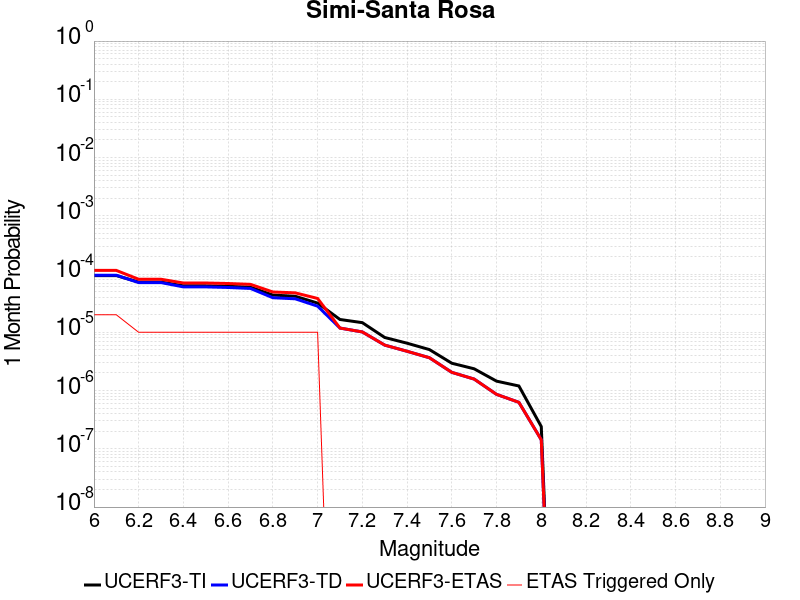 |  | 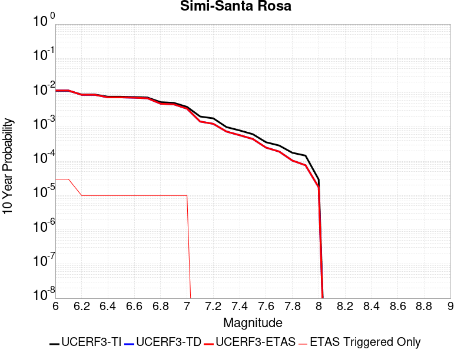 |

| Magnitude | 1 wk TI Prob | 1 wk TD Prob | 1 wk ETAS Prob | 1 wk ETAS/TD Gain | 1 wk ETAS Triggered Only | 1 mo TI Prob | 1 mo TD Prob | 1 mo ETAS Prob | 1 mo ETAS/TD Gain | 1 mo ETAS Triggered Only | 1 yr TI Prob | 1 yr TD Prob | 1 yr ETAS Prob | 1 yr ETAS/TD Gain | 1 yr ETAS Triggered Only | 10 yr TI Prob | 10 yr TD Prob | 10 yr ETAS Prob | 10 yr ETAS/TD Gain | 10 yr ETAS Triggered Only |
|-----|-----|-----|-----|-----|-----|-----|-----|-----|-----|-----|-----|-----|-----|-----|-----|-----|-----|-----|-----|-----|
| 6.0 | 2.198912E-5 | 2.2275442E-5 | 6.276037E-5 | 2.8174691 | 4.048583E-5 | 9.4235686E-5 | 9.5462936E-5 | 1.359449E-4 | 1.4240595 | 4.048583E-5 | 0.0011467156 | 0.0011616853 | 0.0012021242 | 1.0348104 | 4.048583E-5 | 0.011408163 | 0.011560575 | 0.011600593 | 1.0034616 | 4.048583E-5 |
| 6.1 | 2.198912E-5 | 2.2275442E-5 | 6.276037E-5 | 2.8174691 | 4.048583E-5 | 9.4235686E-5 | 9.5462936E-5 | 1.359449E-4 | 1.4240595 | 4.048583E-5 | 0.0011467156 | 0.0011616853 | 0.0012021242 | 1.0348104 | 4.048583E-5 | 0.011408163 | 0.011560575 | 0.011600593 | 1.0034616 | 4.048583E-5 |
| 6.2 | 1.69983E-5 | 1.6668559E-5 | 5.7153713E-5 | 3.4288335 | 4.048583E-5 | 7.284782E-5 | 7.143489E-5 | 1.1191783E-4 | 1.566711 | 4.048583E-5 | 8.865613E-4 | 8.6940196E-4 | 9.0985256E-4 | 1.0465269 | 4.048583E-5 | 0.008830327 | 0.008662928 | 0.008703062 | 1.004633 | 4.048583E-5 |
| 6.3 | 1.69983E-5 | 1.6668559E-5 | 5.7153713E-5 | 3.4288335 | 4.048583E-5 | 7.284782E-5 | 7.143489E-5 | 1.1191783E-4 | 1.566711 | 4.048583E-5 | 8.865613E-4 | 8.6940196E-4 | 9.0985256E-4 | 1.0465269 | 4.048583E-5 | 0.008830327 | 0.008662928 | 0.008703062 | 1.004633 | 4.048583E-5 |
| 6.4 | 1.4666188E-5 | 1.4052543E-5 | 5.4537802E-5 | 3.880992 | 4.048583E-5 | 6.285358E-5 | 6.0223934E-5 | 1.0070732E-4 | 1.6722144 | 4.048583E-5 | 7.6497364E-4 | 7.3300465E-4 | 7.734608E-4 | 1.0551922 | 4.048583E-5 | 0.0076234564 | 0.007308344 | 0.007348534 | 1.0054992 | 4.048583E-5 |
| 6.5 | 1.4666188E-5 | 1.4052543E-5 | 5.4537802E-5 | 3.880992 | 4.048583E-5 | 6.285358E-5 | 6.0223934E-5 | 1.0070732E-4 | 1.6722144 | 4.048583E-5 | 7.6497364E-4 | 7.3300465E-4 | 7.734608E-4 | 1.0551922 | 4.048583E-5 | 0.0076234564 | 0.007308344 | 0.007348534 | 1.0054992 | 4.048583E-5 |
| 6.6 | 1.4377586E-5 | 1.3729583E-5 | 5.4214855E-5 | 3.9487622 | 4.048583E-5 | 6.1616774E-5 | 5.883988E-5 | 9.9323326E-5 | 1.6880274 | 4.048583E-5 | 7.4992597E-4 | 7.1616494E-4 | 7.5662177E-4 | 1.0564909 | 4.048583E-5 | 0.007474003 | 0.0071410383 | 0.007181235 | 1.005629 | 4.048583E-5 |
| 6.7 | 1.3881404E-5 | 1.320755E-5 | 5.3692846E-5 | 4.0653143 | 4.048583E-5 | 5.9490372E-5 | 5.66027E-5 | 9.708624E-5 | 1.7152227 | 4.048583E-5 | 7.240546E-4 | 6.8894465E-4 | 7.2940264E-4 | 1.0587245 | 4.048583E-5 | 0.007217 | 0.006870538 | 0.006910746 | 1.0058522 | 4.048583E-5 |
| 6.8 | 1.0176516E-5 | 9.154151E-6 | 4.963961E-5 | 5.4226346 | 4.048583E-5 | 4.3612912E-5 | 3.9231574E-5 | 7.971582E-5 | 2.03193 | 4.048583E-5 | 5.308578E-4 | 4.7755634E-4 | 5.180228E-4 | 1.0847366 | 4.048583E-5 | 0.0052959146 | 0.004766934 | 0.0048072273 | 1.0084525 | 4.048583E-5 |
| 6.9 | 9.699797E-6 | 8.774719E-6 | 4.9260194E-5 | 5.613877 | 4.048583E-5 | 4.15699E-5 | 3.7605492E-5 | 7.80898E-5 | 2.076553 | 4.048583E-5 | 5.05996E-4 | 4.577671E-4 | 4.982344E-4 | 1.0884014 | 4.048583E-5 | 0.005048454 | 0.0045698597 | 0.0046101604 | 1.0088189 | 4.048583E-5 |
| 7.0 | 7.4049476E-6 | 6.559333E-6 | 4.7044898E-5 | 7.1722074 | 4.048583E-5 | 3.1735104E-5 | 2.8111197E-5 | 6.859589E-5 | 2.4401627 | 4.048583E-5 | 3.8630638E-4 | 3.422127E-4 | 3.826847E-4 | 1.1182655 | 4.048583E-5 | 0.0038563553 | 0.0034180996 | 0.003458447 | 1.0118041 | 4.048583E-5 |
| 7.1 | 3.873439E-6 | 2.7595095E-6 | 2.7595095E-6 | 1.0 | 0.0 | 1.6600346E-5 | 1.1826417E-5 | 1.1826417E-5 | 1.0 | 0.0 | 2.0209046E-4 | 1.4397735E-4 | 1.4397735E-4 | 1.0 | 0.0 | 0.0020190678 | 0.0014388643 | 0.0014388643 | 1.0 | 0.0 |
| 7.2 | 3.417706E-6 | 2.3676484E-6 | 2.3676484E-6 | 1.0 | 0.0 | 1.4647229E-5 | 1.0147027E-5 | 1.0147027E-5 | 1.0 | 0.0 | 1.7831543E-4 | 1.2353327E-4 | 1.2353327E-4 | 1.0 | 0.0 | 0.0017817242 | 0.0012346683 | 0.0012346683 | 1.0 | 0.0 |
| 7.3 | 1.90225E-6 | 1.4073753E-6 | 1.4073753E-6 | 1.0 | 0.0 | 8.152474E-6 | 6.0315947E-6 | 6.0315947E-6 | 1.0 | 0.0 | 9.9251854E-5 | 7.343221E-5 | 7.343221E-5 | 1.0 | 0.0 | 9.920754E-4 | 7.340817E-4 | 7.340817E-4 | 1.0 | 0.0 |
| 7.4 | 1.5170556E-6 | 1.1024773E-6 | 1.1024773E-6 | 1.0 | 0.0 | 6.5016507E-6 | 4.724894E-6 | 4.724894E-6 | 1.0 | 0.0 | 7.915472E-5 | 5.7524077E-5 | 5.7524077E-5 | 1.0 | 0.0 | 7.9126534E-4 | 5.7509297E-4 | 5.7509297E-4 | 1.0 | 0.0 |
| 7.5 | 1.178732E-6 | 8.535102E-7 | 8.535102E-7 | 1.0 | 0.0 | 5.0516987E-6 | 3.6578958E-6 | 3.6578958E-6 | 1.0 | 0.0 | 6.1502695E-5 | 4.453398E-5 | 4.453398E-5 | 1.0 | 0.0 | 6.148568E-4 | 4.452515E-4 | 4.452515E-4 | 1.0 | 0.0 |
| 7.6 | 6.8722386E-7 | 4.793198E-7 | 4.793198E-7 | 1.0 | 0.0 | 2.9452417E-6 | 2.054226E-6 | 2.054226E-6 | 1.0 | 0.0 | 3.5857727E-5 | 2.5009915E-5 | 2.5009915E-5 | 1.0 | 0.0 | 3.5851944E-4 | 2.5007114E-4 | 2.5007114E-4 | 1.0 | 0.0 |
| 7.7 | 5.5126515E-7 | 3.6731157E-7 | 3.6731157E-7 | 1.0 | 0.0 | 2.3625628E-6 | 1.5741915E-6 | 1.5741915E-6 | 1.0 | 0.0 | 2.8763823E-5 | 1.9165615E-5 | 1.9165615E-5 | 1.0 | 0.0 | 2.87601E-4 | 1.9163972E-4 | 1.9163972E-4 | 1.0 | 0.0 |
| 7.8 | 3.3860243E-7 | 2.0075942E-7 | 2.0075942E-7 | 1.0 | 0.0 | 1.4511525E-6 | 8.6039717E-7 | 8.6039717E-7 | 1.0 | 0.0 | 1.7667637E-5 | 1.0475286E-5 | 1.0475286E-5 | 1.0 | 0.0 | 1.7666233E-4 | 1.04747975E-4 | 1.04747975E-4 | 1.0 | 0.0 |
| 7.9 | 2.7955386E-7 | 1.4649108E-7 | 1.4649108E-7 | 1.0 | 0.0 | 1.1980875E-6 | 6.278188E-7 | 6.278188E-7 | 1.0 | 0.0 | 1.4586617E-5 | 7.643667E-6 | 7.643667E-6 | 1.0 | 0.0 | 1.458566E-4 | 7.643409E-5 | 7.643409E-5 | 1.0 | 0.0 |
| 8.0 | 5.6259015E-8 | 3.3355324E-8 | 3.3355324E-8 | 1.0 | 0.0 | 2.4111003E-7 | 1.4295138E-7 | 1.4295138E-7 | 1.0 | 0.0 | 2.9355108E-6 | 1.7404317E-6 | 1.7404317E-6 | 1.0 | 0.0 | 2.935472E-5 | 1.7404194E-5 | 1.7404194E-5 | 1.0 | 0.0 |

## Casmalia 2011 CFM
*[(top)](#table-of-contents)*

| 1 Week | 1 Month | 1 Year | 10 Year |
|-----|-----|-----|-----|
|  |  |  |  |

| Magnitude | 1 wk TI Prob | 1 wk TD Prob | 1 wk ETAS Prob | 1 wk ETAS/TD Gain | 1 wk ETAS Triggered Only | 1 mo TI Prob | 1 mo TD Prob | 1 mo ETAS Prob | 1 mo ETAS/TD Gain | 1 mo ETAS Triggered Only | 1 yr TI Prob | 1 yr TD Prob | 1 yr ETAS Prob | 1 yr ETAS/TD Gain | 1 yr ETAS Triggered Only | 10 yr TI Prob | 10 yr TD Prob | 10 yr ETAS Prob | 10 yr ETAS/TD Gain | 10 yr ETAS Triggered Only |
|-----|-----|-----|-----|-----|-----|-----|-----|-----|-----|-----|-----|-----|-----|-----|-----|-----|-----|-----|-----|-----|
| 6.0 | 4.1704893E-6 | 4.262483E-6 | 4.262483E-6 | 1.0 | 0.0 | 1.7873403E-5 | 1.8267656E-5 | 1.8267656E-5 | 1.0 | 0.0 | 2.1758694E-4 | 2.2238622E-4 | 2.6286306E-4 | 1.1820114 | 4.048583E-5 | 0.0021737402 | 0.0022216577 | 0.0022620535 | 1.0181828 | 4.048583E-5 |
| 6.1 | 4.1704893E-6 | 4.262483E-6 | 4.262483E-6 | 1.0 | 0.0 | 1.7873403E-5 | 1.8267656E-5 | 1.8267656E-5 | 1.0 | 0.0 | 2.1758694E-4 | 2.2238622E-4 | 2.6286306E-4 | 1.1820114 | 4.048583E-5 | 0.0021737402 | 0.0022216577 | 0.0022620535 | 1.0181828 | 4.048583E-5 |
| 6.2 | 3.457312E-6 | 3.5370217E-6 | 3.5370217E-6 | 1.0 | 0.0 | 1.4816967E-5 | 1.5158577E-5 | 1.5158577E-5 | 1.0 | 0.0 | 1.8038164E-4 | 1.8454014E-4 | 2.2501849E-4 | 1.2193472 | 4.048583E-5 | 0.001802353 | 0.0018438784 | 0.0018842896 | 1.0219164 | 4.048583E-5 |
| 6.3 | 3.457312E-6 | 3.5370217E-6 | 3.5370217E-6 | 1.0 | 0.0 | 1.4816967E-5 | 1.5158577E-5 | 1.5158577E-5 | 1.0 | 0.0 | 1.8038164E-4 | 1.8454014E-4 | 2.2501849E-4 | 1.2193472 | 4.048583E-5 | 0.001802353 | 0.0018438784 | 0.0018842896 | 1.0219164 | 4.048583E-5 |
| 6.4 | 3.0957337E-6 | 3.1692257E-6 | 3.1692257E-6 | 1.0 | 0.0 | 1.3267363E-5 | 1.3582326E-5 | 1.3582326E-5 | 1.0 | 0.0 | 1.6151817E-4 | 1.6535232E-4 | 2.0583146E-4 | 1.2448053 | 4.048583E-5 | 0.0016140083 | 0.0016522991 | 0.001692718 | 1.0244622 | 4.048583E-5 |
| 6.5 | 3.0957337E-6 | 3.1692257E-6 | 3.1692257E-6 | 1.0 | 0.0 | 1.3267363E-5 | 1.3582326E-5 | 1.3582326E-5 | 1.0 | 0.0 | 1.6151817E-4 | 1.6535232E-4 | 2.0583146E-4 | 1.2448053 | 4.048583E-5 | 0.0016140083 | 0.0016522991 | 0.001692718 | 1.0244622 | 4.048583E-5 |
| 6.6 | 2.9459152E-6 | 3.0165752E-6 | 3.0165752E-6 | 1.0 | 0.0 | 1.262529E-5 | 1.2928115E-5 | 1.2928115E-5 | 1.0 | 0.0 | 1.5370206E-4 | 1.5738848E-4 | 1.9786795E-4 | 1.2571945 | 4.048583E-5 | 0.0015359579 | 0.0015727758 | 0.001613198 | 1.0257012 | 4.048583E-5 |
| 6.7 | 2.8634809E-6 | 2.9324726E-6 | 2.9324726E-6 | 1.0 | 0.0 | 1.2272003E-5 | 1.256768E-5 | 1.256768E-5 | 1.0 | 0.0 | 1.4940138E-4 | 1.530008E-4 | 1.9348043E-4 | 1.2645714 | 4.048583E-5 | 0.0014930099 | 0.0015289601 | 0.001569384 | 1.0264388 | 4.048583E-5 |
| 6.8 | 2.7999822E-6 | 2.8675968E-6 | 2.8675968E-6 | 1.0 | 0.0 | 1.1999869E-5 | 1.2289643E-5 | 1.2289643E-5 | 1.0 | 0.0 | 1.460886E-4 | 1.4961617E-4 | 1.9009595E-4 | 1.2705575 | 4.048583E-5 | 0.001459926 | 0.0014951597 | 0.001535585 | 1.0270375 | 4.048583E-5 |
| 6.9 | 2.551052E-6 | 2.6119649E-6 | 2.6119649E-6 | 1.0 | 0.0 | 1.0933034E-5 | 1.1194087E-5 | 1.1194087E-5 | 1.0 | 0.0 | 1.3310155E-4 | 1.3627953E-4 | 1.7675983E-4 | 1.2970388 | 4.048583E-5 | 0.0013302186 | 0.0013619636 | 0.0014023943 | 1.0296856 | 4.048583E-5 |
| 7.0 | 2.3081875E-6 | 2.3624088E-6 | 2.3624088E-6 | 1.0 | 0.0 | 9.892195E-6 | 1.01245705E-5 | 1.01245705E-5 | 1.0 | 0.0 | 1.20430814E-4 | 1.232597E-4 | 1.6374054E-4 | 1.3284191 | 4.048583E-5 | 0.0012036557 | 0.0012319161 | 0.0012723521 | 1.0328237 | 4.048583E-5 |
| 7.1 | 2.093245E-6 | 2.1417243E-6 | 2.1417243E-6 | 1.0 | 0.0 | 8.971019E-6 | 9.178786E-6 | 9.178786E-6 | 1.0 | 0.0 | 1.09216686E-4 | 1.1174601E-4 | 1.5222731E-4 | 1.3622618 | 4.048583E-5 | 0.0010916302 | 0.0011169002 | 0.0011573408 | 1.0362079 | 4.048583E-5 |
| 7.2 | 1.9714576E-6 | 2.0165091E-6 | 2.0165091E-6 | 1.0 | 0.0 | 8.449076E-6 | 8.642153E-6 | 8.642153E-6 | 1.0 | 0.0 | 1.0286264E-4 | 1.05213156E-4 | 1.4569472E-4 | 1.3847576 | 4.048583E-5 | 0.0010281504 | 0.0010516352 | 0.0010920785 | 1.0384575 | 4.048583E-5 |
| 7.3 | 1.6689512E-6 | 1.7047131E-6 | 1.7047131E-6 | 1.0 | 0.0 | 7.1526288E-6 | 7.3058927E-6 | 7.3058927E-6 | 1.0 | 0.0 | 8.7079774E-5 | 8.894562E-5 | 8.894562E-5 | 1.0 | 0.0 | 8.7045657E-4 | 8.89101E-4 | 8.89101E-4 | 1.0 | 0.0 |
| 7.4 | 1.4490954E-6 | 1.4778908E-6 | 1.4778908E-6 | 1.0 | 0.0 | 6.210394E-6 | 6.333802E-6 | 6.333802E-6 | 1.0 | 0.0 | 7.560892E-5 | 7.711132E-5 | 7.711132E-5 | 1.0 | 0.0 | 7.55832E-4 | 7.7084627E-4 | 7.7084627E-4 | 1.0 | 0.0 |
| 7.5 | 1.226873E-6 | 1.2481701E-6 | 1.2481701E-6 | 1.0 | 0.0 | 5.2580162E-6 | 5.3492895E-6 | 5.3492895E-6 | 1.0 | 0.0 | 6.401447E-5 | 6.5125656E-5 | 6.5125656E-5 | 1.0 | 0.0 | 6.399603E-4 | 6.5106625E-4 | 6.5106625E-4 | 1.0 | 0.0 |
| 7.6 | 9.2561345E-7 | 9.361923E-7 | 9.361923E-7 | 1.0 | 0.0 | 3.966909E-6 | 4.012247E-6 | 4.012247E-6 | 1.0 | 0.0 | 4.8296046E-5 | 4.884801E-5 | 4.884801E-5 | 1.0 | 0.0 | 4.828555E-4 | 4.8837316E-4 | 4.8837316E-4 | 1.0 | 0.0 |
| 7.7 | 5.4367933E-7 | 5.392888E-7 | 5.392888E-7 | 1.0 | 0.0 | 2.3300522E-6 | 2.3112357E-6 | 2.3112357E-6 | 1.0 | 0.0 | 2.8368017E-5 | 2.8138933E-5 | 2.8138933E-5 | 1.0 | 0.0 | 2.8364395E-4 | 2.8135383E-4 | 2.8135383E-4 | 1.0 | 0.0 |
| 7.8 | 1.8825742E-7 | 1.7342276E-7 | 1.7342276E-7 | 1.0 | 0.0 | 8.068173E-7 | 7.4324015E-7 | 7.4324015E-7 | 1.0 | 0.0 | 9.822956E-6 | 9.048912E-6 | 9.048912E-6 | 1.0 | 0.0 | 9.822522E-5 | 9.048546E-5 | 9.048546E-5 | 1.0 | 0.0 |
| 7.9 | 6.342771E-8 | 4.6790706E-8 | 4.6790706E-8 | 1.0 | 0.0 | 2.7183304E-7 | 2.0053157E-7 | 2.0053157E-7 | 1.0 | 0.0 | 3.3095623E-6 | 2.4414692E-6 | 2.4414692E-6 | 1.0 | 0.0 | 3.309513E-5 | 2.4414428E-5 | 2.4414428E-5 | 1.0 | 0.0 |
| 8.0 | 1.2574819E-8 | 6.4733463E-9 | 6.4733463E-9 | 1.0 | 0.0 | 5.3892084E-8 | 2.7742912E-8 | 2.7742912E-8 | 1.0 | 0.0 | 6.561359E-7 | 3.377699E-7 | 3.377699E-7 | 1.0 | 0.0 | 6.56134E-6 | 3.377694E-6 | 3.377694E-6 | 1.0 | 0.0 |

## Santa Ynez River
*[(top)](#table-of-contents)*

| 1 Week | 1 Month | 1 Year | 10 Year |
|-----|-----|-----|-----|
|  | 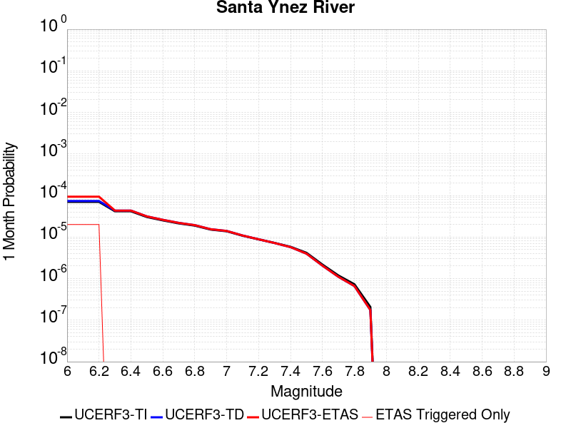 |  |  |

| Magnitude | 1 wk TI Prob | 1 wk TD Prob | 1 wk ETAS Prob | 1 wk ETAS/TD Gain | 1 wk ETAS Triggered Only | 1 mo TI Prob | 1 mo TD Prob | 1 mo ETAS Prob | 1 mo ETAS/TD Gain | 1 mo ETAS Triggered Only | 1 yr TI Prob | 1 yr TD Prob | 1 yr ETAS Prob | 1 yr ETAS/TD Gain | 1 yr ETAS Triggered Only | 10 yr TI Prob | 10 yr TD Prob | 10 yr ETAS Prob | 10 yr ETAS/TD Gain | 10 yr ETAS Triggered Only |
|-----|-----|-----|-----|-----|-----|-----|-----|-----|-----|-----|-----|-----|-----|-----|-----|-----|-----|-----|-----|-----|
| 6.0 | 1.6396456E-5 | 1.7209435E-5 | 1.7209435E-5 | 1.0 | 0.0 | 7.026863E-5 | 7.375284E-5 | 7.375284E-5 | 1.0 | 0.0 | 8.551848E-4 | 8.976064E-4 | 8.976064E-4 | 1.0 | 0.0 | 0.0085190125 | 0.008943358 | 0.008983482 | 1.0044864 | 4.048583E-5 |
| 6.1 | 1.6396456E-5 | 1.7209435E-5 | 1.7209435E-5 | 1.0 | 0.0 | 7.026863E-5 | 7.375284E-5 | 7.375284E-5 | 1.0 | 0.0 | 8.551848E-4 | 8.976064E-4 | 8.976064E-4 | 1.0 | 0.0 | 0.0085190125 | 0.008943358 | 0.008983482 | 1.0044864 | 4.048583E-5 |
| 6.2 | 1.6396456E-5 | 1.7209435E-5 | 1.7209435E-5 | 1.0 | 0.0 | 7.026863E-5 | 7.375284E-5 | 7.375284E-5 | 1.0 | 0.0 | 8.551848E-4 | 8.976064E-4 | 8.976064E-4 | 1.0 | 0.0 | 0.0085190125 | 0.008943358 | 0.008983482 | 1.0044864 | 4.048583E-5 |
| 6.3 | 9.736976E-6 | 1.012233E-5 | 1.012233E-5 | 1.0 | 0.0 | 4.172923E-5 | 4.338072E-5 | 4.338072E-5 | 1.0 | 0.0 | 5.0793495E-4 | 5.280373E-4 | 5.280373E-4 | 1.0 | 0.0 | 0.005067755 | 0.005268332 | 0.0053086043 | 1.0076443 | 4.048583E-5 |
| 6.4 | 9.736976E-6 | 1.012233E-5 | 1.012233E-5 | 1.0 | 0.0 | 4.172923E-5 | 4.338072E-5 | 4.338072E-5 | 1.0 | 0.0 | 5.0793495E-4 | 5.280373E-4 | 5.280373E-4 | 1.0 | 0.0 | 0.005067755 | 0.005268332 | 0.0053086043 | 1.0076443 | 4.048583E-5 |
| 6.5 | 7.081964E-6 | 7.3298966E-6 | 7.3298966E-6 | 1.0 | 0.0 | 3.035092E-5 | 3.1413474E-5 | 3.1413474E-5 | 1.0 | 0.0 | 3.694598E-4 | 3.8239348E-4 | 3.8239348E-4 | 1.0 | 0.0 | 0.0036884616 | 0.0038175168 | 0.003857848 | 1.0105648 | 4.048583E-5 |
| 6.6 | 5.873247E-6 | 6.059743E-6 | 6.059743E-6 | 1.0 | 0.0 | 2.5170815E-5 | 2.5970074E-5 | 2.5970074E-5 | 1.0 | 0.0 | 3.064116E-4 | 3.1614062E-4 | 3.1614062E-4 | 1.0 | 0.0 | 0.0030598943 | 0.0031569963 | 0.0031973543 | 1.0127836 | 4.048583E-5 |
| 6.7 | 4.973277E-6 | 5.115901E-6 | 5.115901E-6 | 1.0 | 0.0 | 2.1313872E-5 | 2.1925109E-5 | 2.1925109E-5 | 1.0 | 0.0 | 2.5946548E-4 | 2.66906E-4 | 2.66906E-4 | 1.0 | 0.0 | 0.0025916274 | 0.0026659032 | 0.0027062811 | 1.015146 | 4.048583E-5 |
| 6.8 | 4.396492E-6 | 4.5109778E-6 | 4.5109778E-6 | 1.0 | 0.0 | 1.884197E-5 | 1.9332621E-5 | 1.9332621E-5 | 1.0 | 0.0 | 2.2937685E-4 | 2.3534958E-4 | 2.3534958E-4 | 1.0 | 0.0 | 0.0022914023 | 0.0023510386 | 0.0023914294 | 1.01718 | 4.048583E-5 |
| 6.9 | 3.5255632E-6 | 3.6013332E-6 | 3.6013332E-6 | 1.0 | 0.0 | 1.5109469E-5 | 1.5434196E-5 | 1.5434196E-5 | 1.0 | 0.0 | 1.8394225E-4 | 1.8789528E-4 | 1.8789528E-4 | 1.0 | 0.0 | 0.0018379007 | 0.0018773803 | 0.0019177902 | 1.0215245 | 4.048583E-5 |
| 7.0 | 3.211603E-6 | 3.273654E-6 | 3.273654E-6 | 1.0 | 0.0 | 1.376394E-5 | 1.4029872E-5 | 1.4029872E-5 | 1.0 | 0.0 | 1.6756308E-4 | 1.7080043E-4 | 1.7080043E-4 | 1.0 | 0.0 | 0.0016743679 | 0.0017067058 | 0.0017471225 | 1.0236812 | 4.048583E-5 |
| 7.1 | 2.5094619E-6 | 2.5409204E-6 | 2.5409204E-6 | 1.0 | 0.0 | 1.0754793E-5 | 1.0889614E-5 | 1.0889614E-5 | 1.0 | 0.0 | 1.3093173E-4 | 1.3257304E-4 | 1.3257304E-4 | 1.0 | 0.0 | 0.0013085462 | 0.0013249456 | 0.0013249456 | 1.0 | 0.0 |
| 7.2 | 2.0515774E-6 | 2.0619375E-6 | 2.0619375E-6 | 1.0 | 0.0 | 8.792445E-6 | 8.836846E-6 | 8.836846E-6 | 1.0 | 0.0 | 1.0704277E-4 | 1.0758333E-4 | 1.0758333E-4 | 1.0 | 0.0 | 0.0010699122 | 0.0010753168 | 0.0010753168 | 1.0 | 0.0 |
| 7.3 | 1.6845745E-6 | 1.6773907E-6 | 1.6773907E-6 | 1.0 | 0.0 | 7.219585E-6 | 7.1887976E-6 | 7.1887976E-6 | 1.0 | 0.0 | 8.78949E-5 | 8.752012E-5 | 8.752012E-5 | 1.0 | 0.0 | 8.7860145E-4 | 8.7485946E-4 | 8.7485946E-4 | 1.0 | 0.0 |
| 7.4 | 1.3600285E-6 | 1.3333357E-6 | 1.3333357E-6 | 1.0 | 0.0 | 5.82868E-6 | 5.714284E-6 | 5.714284E-6 | 1.0 | 0.0 | 7.096187E-5 | 6.956921E-5 | 6.956921E-5 | 1.0 | 0.0 | 7.0939213E-4 | 6.954765E-4 | 6.954765E-4 | 1.0 | 0.0 |
| 7.5 | 9.735342E-7 | 9.290103E-7 | 9.290103E-7 | 1.0 | 0.0 | 4.172283E-6 | 3.9814668E-6 | 3.9814668E-6 | 1.0 | 0.0 | 5.079636E-5 | 4.8473295E-5 | 4.8473295E-5 | 1.0 | 0.0 | 5.0784746E-4 | 4.8462892E-4 | 4.8462892E-4 | 1.0 | 0.0 |
| 7.6 | 5.067187E-7 | 4.77857E-7 | 4.77857E-7 | 1.0 | 0.0 | 2.1716498E-6 | 2.047957E-6 | 2.047957E-6 | 1.0 | 0.0 | 2.6439517E-5 | 2.4933597E-5 | 2.4933597E-5 | 1.0 | 0.0 | 2.643637E-4 | 2.4930874E-4 | 2.4930874E-4 | 1.0 | 0.0 |
| 7.7 | 2.769089E-7 | 2.5759124E-7 | 2.5759124E-7 | 1.0 | 0.0 | 1.1867519E-6 | 1.1039621E-6 | 1.1039621E-6 | 1.0 | 0.0 | 1.4448608E-5 | 1.34406555E-5 | 1.34406555E-5 | 1.0 | 0.0 | 1.444767E-4 | 1.3439846E-4 | 1.3439846E-4 | 1.0 | 0.0 |
| 7.8 | 1.7044663E-7 | 1.5449015E-7 | 1.5449015E-7 | 1.0 | 0.0 | 7.3048534E-7 | 6.621005E-7 | 6.621005E-7 | 1.0 | 0.0 | 8.893623E-6 | 8.061043E-6 | 8.061043E-6 | 1.0 | 0.0 | 8.893267E-5 | 8.060753E-5 | 8.060753E-5 | 1.0 | 0.0 |
| 7.9 | 4.8344287E-8 | 4.0910923E-8 | 4.0910923E-8 | 1.0 | 0.0 | 2.0718979E-7 | 1.7533252E-7 | 1.7533252E-7 | 1.0 | 0.0 | 2.5225327E-6 | 2.1346711E-6 | 2.1346711E-6 | 1.0 | 0.0 | 2.5225041E-5 | 2.1346512E-5 | 2.1346512E-5 | 1.0 | 0.0 |

## Northridge
*[(top)](#table-of-contents)*

| 1 Week | 1 Month | 1 Year | 10 Year |
|-----|-----|-----|-----|
|  |  |  | 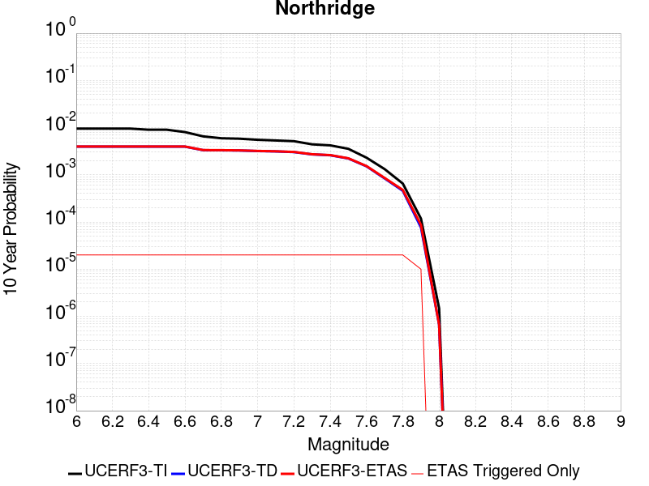 |

| Magnitude | 1 wk TI Prob | 1 wk TD Prob | 1 wk ETAS Prob | 1 wk ETAS/TD Gain | 1 wk ETAS Triggered Only | 1 mo TI Prob | 1 mo TD Prob | 1 mo ETAS Prob | 1 mo ETAS/TD Gain | 1 mo ETAS Triggered Only | 1 yr TI Prob | 1 yr TD Prob | 1 yr ETAS Prob | 1 yr ETAS/TD Gain | 1 yr ETAS Triggered Only | 10 yr TI Prob | 10 yr TD Prob | 10 yr ETAS Prob | 10 yr ETAS/TD Gain | 10 yr ETAS Triggered Only |
|-----|-----|-----|-----|-----|-----|-----|-----|-----|-----|-----|-----|-----|-----|-----|-----|-----|-----|-----|-----|-----|
| 6.0 | 1.8340852E-5 | 7.5880193E-6 | 4.8073543E-5 | 6.335453 | 4.048583E-5 | 7.860128E-5 | 3.251969E-5 | 7.30042E-5 | 2.244923 | 4.048583E-5 | 9.565505E-4 | 3.958575E-4 | 4.363273E-4 | 1.1022333 | 4.048583E-5 | 0.009524435 | 0.003951746 | 0.003992072 | 1.0102046 | 4.048583E-5 |
| 6.1 | 1.8340852E-5 | 7.5880193E-6 | 4.8073543E-5 | 6.335453 | 4.048583E-5 | 7.860128E-5 | 3.251969E-5 | 7.30042E-5 | 2.244923 | 4.048583E-5 | 9.565505E-4 | 3.958575E-4 | 4.363273E-4 | 1.1022333 | 4.048583E-5 | 0.009524435 | 0.003951746 | 0.003992072 | 1.0102046 | 4.048583E-5 |
| 6.2 | 1.8340852E-5 | 7.5880193E-6 | 4.8073543E-5 | 6.335453 | 4.048583E-5 | 7.860128E-5 | 3.251969E-5 | 7.30042E-5 | 2.244923 | 4.048583E-5 | 9.565505E-4 | 3.958575E-4 | 4.363273E-4 | 1.1022333 | 4.048583E-5 | 0.009524435 | 0.003951746 | 0.003992072 | 1.0102046 | 4.048583E-5 |
| 6.3 | 1.8340852E-5 | 7.5880193E-6 | 4.8073543E-5 | 6.335453 | 4.048583E-5 | 7.860128E-5 | 3.251969E-5 | 7.30042E-5 | 2.244923 | 4.048583E-5 | 9.565505E-4 | 3.958575E-4 | 4.363273E-4 | 1.1022333 | 4.048583E-5 | 0.009524435 | 0.003951746 | 0.003992072 | 1.0102046 | 4.048583E-5 |
| 6.4 | 1.7361892E-5 | 7.5880193E-6 | 4.8073543E-5 | 6.335453 | 4.048583E-5 | 7.440598E-5 | 3.251969E-5 | 7.30042E-5 | 2.244923 | 4.048583E-5 | 9.055163E-4 | 3.958575E-4 | 4.363273E-4 | 1.1022333 | 4.048583E-5 | 0.009018354 | 0.003951746 | 0.003992072 | 1.0102046 | 4.048583E-5 |
| 6.5 | 1.7361892E-5 | 7.5880193E-6 | 4.8073543E-5 | 6.335453 | 4.048583E-5 | 7.440598E-5 | 3.251969E-5 | 7.30042E-5 | 2.244923 | 4.048583E-5 | 9.055163E-4 | 3.958575E-4 | 4.363273E-4 | 1.1022333 | 4.048583E-5 | 0.009018354 | 0.003951746 | 0.003992072 | 1.0102046 | 4.048583E-5 |
| 6.6 | 1.5458201E-5 | 7.5880193E-6 | 4.8073543E-5 | 6.335453 | 4.048583E-5 | 6.624775E-5 | 3.251969E-5 | 7.30042E-5 | 2.244923 | 4.048583E-5 | 8.0626784E-4 | 3.958575E-4 | 4.363273E-4 | 1.1022333 | 4.048583E-5 | 0.008033488 | 0.003951746 | 0.003992072 | 1.0102046 | 4.048583E-5 |
| 6.7 | 1.2538368E-5 | 6.381603E-6 | 4.6867175E-5 | 7.3441067 | 4.048583E-5 | 5.3734755E-5 | 2.7349442E-5 | 6.783417E-5 | 2.4802759 | 4.048583E-5 | 6.5402425E-4 | 3.3292902E-4 | 3.734014E-4 | 1.1215645 | 4.048583E-5 | 0.0065210275 | 0.0033243506 | 0.0033647018 | 1.0121381 | 4.048583E-5 |
| 6.8 | 1.1438097E-5 | 6.3502566E-6 | 4.683583E-5 | 7.375423 | 4.048583E-5 | 4.9019498E-5 | 2.7215105E-5 | 6.769983E-5 | 2.487583 | 4.048583E-5 | 5.9664896E-4 | 3.3129397E-4 | 3.7176636E-4 | 1.1221647 | 4.048583E-5 | 0.005950495 | 0.0033080487 | 0.0033484006 | 1.0121981 | 4.048583E-5 |
| 6.9 | 1.1204891E-5 | 6.2867084E-6 | 4.6772286E-5 | 7.4398685 | 4.048583E-5 | 4.8020076E-5 | 2.694276E-5 | 6.74275E-5 | 2.5026202 | 4.048583E-5 | 5.8448757E-4 | 3.2797916E-4 | 3.6845173E-4 | 1.1233997 | 4.048583E-5 | 0.0058295266 | 0.0032749989 | 0.0033153521 | 1.0123216 | 4.048583E-5 |
| 7.0 | 1.061046E-5 | 6.115359E-6 | 4.660094E-5 | 7.6203117 | 4.048583E-5 | 4.5472607E-5 | 2.6208421E-5 | 6.669319E-5 | 2.5447237 | 4.048583E-5 | 5.534883E-4 | 3.1904122E-4 | 3.5951415E-4 | 1.126858 | 4.048583E-5 | 0.0055211177 | 0.0031858785 | 0.0032262355 | 1.0126674 | 4.048583E-5 |
| 7.1 | 1.0266979E-5 | 6.004274E-6 | 4.6489862E-5 | 7.7427945 | 4.048583E-5 | 4.40006E-5 | 2.5732352E-5 | 6.621714E-5 | 2.573303 | 4.048583E-5 | 5.355756E-4 | 3.1324677E-4 | 3.5371992E-4 | 1.1292053 | 4.048583E-5 | 0.0053428668 | 0.003128098 | 0.0031684574 | 1.0129021 | 4.048583E-5 |
| 7.2 | 9.91273E-6 | 5.819984E-6 | 4.6305577E-5 | 7.9563065 | 4.048583E-5 | 4.248244E-5 | 2.4942554E-5 | 6.5427375E-5 | 2.6231225 | 4.048583E-5 | 5.171009E-4 | 3.036337E-4 | 3.4410722E-4 | 1.1332972 | 4.048583E-5 | 0.0051589934 | 0.0030322333 | 0.0030725964 | 1.0133114 | 4.048583E-5 |
| 7.3 | 8.4959265E-6 | 5.193062E-6 | 4.567868E-5 | 8.796098 | 4.048583E-5 | 3.6410605E-5 | 2.225579E-5 | 6.274072E-5 | 2.819074 | 4.048583E-5 | 4.4320893E-4 | 2.709308E-4 | 3.1140566E-4 | 1.1493919 | 4.048583E-5 | 0.00442326 | 0.0027060313 | 0.0027464076 | 1.0149208 | 4.048583E-5 |
| 7.4 | 8.0847185E-6 | 4.9819355E-6 | 4.5467565E-5 | 9.126486 | 4.048583E-5 | 3.4648332E-5 | 2.135098E-5 | 6.183595E-5 | 2.8961644 | 4.048583E-5 | 4.2176177E-4 | 2.599174E-4 | 3.003927E-4 | 1.1557237 | 4.048583E-5 | 0.0042096223 | 0.00259616 | 0.0026365407 | 1.0155541 | 4.048583E-5 |
| 7.5 | 6.8220684E-6 | 4.2533075E-6 | 4.4738965E-5 | 10.518629 | 4.048583E-5 | 2.9237108E-5 | 1.8228335E-5 | 5.8713427E-5 | 3.2209978 | 4.048583E-5 | 3.5590364E-4 | 2.2190758E-4 | 2.6238442E-4 | 1.182404 | 4.048583E-5 | 0.0035533418 | 0.002216881 | 0.002257277 | 1.018222 | 4.048583E-5 |
| 7.6 | 4.4224143E-6 | 2.8999582E-6 | 4.338567E-5 | 14.960792 | 4.048583E-5 | 1.8953066E-5 | 1.2428334E-5 | 5.291366E-5 | 4.2575026 | 4.048583E-5 | 2.3072914E-4 | 1.5130457E-4 | 1.9178427E-4 | 1.2675378 | 4.048583E-5 | 0.0023048974 | 0.0015120271 | 0.0015524518 | 1.0267354 | 4.048583E-5 |
| 7.7 | 2.5297056E-6 | 1.6045905E-6 | 4.2090356E-5 | 26.231213 | 4.048583E-5 | 1.0841551E-5 | 6.8767986E-6 | 4.736235E-5 | 6.887267 | 4.048583E-5 | 1.319879E-4 | 8.3721854E-5 | 1.2420429E-4 | 1.4835349 | 4.048583E-5 | 0.0013190953 | 8.369078E-4 | 8.7735977E-4 | 1.048335 | 4.048583E-5 |
| 7.8 | 1.2508156E-6 | 8.780076E-7 | 4.13638E-5 | 47.110985 | 4.048583E-5 | 5.3606273E-6 | 3.7628845E-6 | 4.424856E-5 | 11.759213 | 4.048583E-5 | 6.526368E-5 | 4.581217E-5 | 8.6296146E-5 | 1.8836948 | 4.048583E-5 | 6.524452E-4 | 4.5802852E-4 | 4.984958E-4 | 1.088351 | 4.048583E-5 |
| 7.9 | 2.262199E-7 | 1.4664671E-7 | 4.0632473E-5 | 277.07727 | 4.048583E-5 | 9.695135E-7 | 6.284858E-7 | 4.111429E-5 | 65.418015 | 4.048583E-5 | 1.1803763E-5 | 7.651788E-6 | 4.813731E-5 | 6.290988 | 4.048583E-5 | 1.1803136E-4 | 7.651533E-5 | 1.1699806E-4 | 1.52908 | 4.048583E-5 |
| 8.0 | 2.865362E-9 | 1.2753101E-9 | 1.2753101E-9 | 1.0 | 0.0 | 1.2280123E-8 | 5.4656146E-9 | 5.4656146E-9 | 1.0 | 0.0 | 1.4951048E-7 | 6.654386E-8 | 6.654386E-8 | 1.0 | 0.0 | 1.4951038E-6 | 6.654386E-7 | 6.654386E-7 | 1.0 | 0.0 |

## Round Valley
*[(top)](#table-of-contents)*

| 1 Week | 1 Month | 1 Year | 10 Year |
|-----|-----|-----|-----|
|  |  |  |  |

| Magnitude | 1 wk TI Prob | 1 wk TD Prob | 1 wk ETAS Prob | 1 wk ETAS/TD Gain | 1 wk ETAS Triggered Only | 1 mo TI Prob | 1 mo TD Prob | 1 mo ETAS Prob | 1 mo ETAS/TD Gain | 1 mo ETAS Triggered Only | 1 yr TI Prob | 1 yr TD Prob | 1 yr ETAS Prob | 1 yr ETAS/TD Gain | 1 yr ETAS Triggered Only | 10 yr TI Prob | 10 yr TD Prob | 10 yr ETAS Prob | 10 yr ETAS/TD Gain | 10 yr ETAS Triggered Only |
|-----|-----|-----|-----|-----|-----|-----|-----|-----|-----|-----|-----|-----|-----|-----|-----|-----|-----|-----|-----|-----|
| 6.0 | 1.588152E-5 | 1.3670716E-5 | 5.4155993E-5 | 3.9614599 | 4.048583E-5 | 6.806188E-5 | 5.8587688E-5 | 9.907114E-5 | 1.6909891 | 4.048583E-5 | 8.283384E-4 | 7.13111E-4 | 7.5356796E-4 | 1.056733 | 4.048583E-5 | 0.008252576 | 0.0071121147 | 0.007152313 | 1.0056521 | 4.048583E-5 |
| 6.1 | 1.588152E-5 | 1.3670716E-5 | 5.4155993E-5 | 3.9614599 | 4.048583E-5 | 6.806188E-5 | 5.8587688E-5 | 9.907114E-5 | 1.6909891 | 4.048583E-5 | 8.283384E-4 | 7.13111E-4 | 7.5356796E-4 | 1.056733 | 4.048583E-5 | 0.008252576 | 0.0071121147 | 0.007152313 | 1.0056521 | 4.048583E-5 |
| 6.2 | 1.588152E-5 | 1.3670716E-5 | 5.4155993E-5 | 3.9614599 | 4.048583E-5 | 6.806188E-5 | 5.8587688E-5 | 9.907114E-5 | 1.6909891 | 4.048583E-5 | 8.283384E-4 | 7.13111E-4 | 7.5356796E-4 | 1.056733 | 4.048583E-5 | 0.008252576 | 0.0071121147 | 0.007152313 | 1.0056521 | 4.048583E-5 |
| 6.3 | 1.588152E-5 | 1.3670716E-5 | 5.4155993E-5 | 3.9614599 | 4.048583E-5 | 6.806188E-5 | 5.8587688E-5 | 9.907114E-5 | 1.6909891 | 4.048583E-5 | 8.283384E-4 | 7.13111E-4 | 7.5356796E-4 | 1.056733 | 4.048583E-5 | 0.008252576 | 0.0071121147 | 0.007152313 | 1.0056521 | 4.048583E-5 |
| 6.4 | 1.588152E-5 | 1.3670716E-5 | 5.4155993E-5 | 3.9614599 | 4.048583E-5 | 6.806188E-5 | 5.8587688E-5 | 9.907114E-5 | 1.6909891 | 4.048583E-5 | 8.283384E-4 | 7.13111E-4 | 7.5356796E-4 | 1.056733 | 4.048583E-5 | 0.008252576 | 0.0071121147 | 0.007152313 | 1.0056521 | 4.048583E-5 |
| 6.5 | 1.0646776E-5 | 7.953037E-6 | 4.8438545E-5 | 6.090572 | 4.048583E-5 | 4.5628243E-5 | 3.408405E-5 | 7.4568496E-5 | 2.187783 | 4.048583E-5 | 5.553823E-4 | 4.1490266E-4 | 4.553717E-4 | 1.0975386 | 4.048583E-5 | 0.005539963 | 0.0041421093 | 0.004182427 | 1.0097337 | 4.048583E-5 |
| 6.6 | 8.632956E-6 | 5.768742E-6 | 5.768742E-6 | 1.0 | 0.0 | 3.6997862E-5 | 2.4722967E-5 | 2.4722967E-5 | 1.0 | 0.0 | 4.5035584E-4 | 3.009644E-4 | 3.009644E-4 | 1.0 | 0.0 | 0.0044944426 | 0.003005946 | 0.003005946 | 1.0 | 0.0 |
| 6.7 | 8.632956E-6 | 5.768742E-6 | 5.768742E-6 | 1.0 | 0.0 | 3.6997862E-5 | 2.4722967E-5 | 2.4722967E-5 | 1.0 | 0.0 | 4.5035584E-4 | 3.009644E-4 | 3.009644E-4 | 1.0 | 0.0 | 0.0044944426 | 0.003005946 | 0.003005946 | 1.0 | 0.0 |
| 6.8 | 7.143895E-6 | 4.2018346E-6 | 4.2018346E-6 | 1.0 | 0.0 | 3.0616335E-5 | 1.8007748E-5 | 1.8007748E-5 | 1.0 | 0.0 | 3.726901E-4 | 2.1922393E-4 | 2.1922393E-4 | 1.0 | 0.0 | 0.0037206567 | 0.0021902416 | 0.0021902416 | 1.0 | 0.0 |
| 6.9 | 6.5120694E-6 | 3.6644687E-6 | 3.6644687E-6 | 1.0 | 0.0 | 2.790857E-5 | 1.570478E-5 | 1.570478E-5 | 1.0 | 0.0 | 3.3973387E-4 | 1.9119044E-4 | 1.9119044E-4 | 1.0 | 0.0 | 0.0033921495 | 0.0019104085 | 0.0019104085 | 1.0 | 0.0 |
| 7.0 | 5.0614435E-6 | 2.6836676E-6 | 2.6836676E-6 | 1.0 | 0.0 | 2.169172E-5 | 1.1501388E-5 | 1.1501388E-5 | 1.0 | 0.0 | 2.6406467E-4 | 1.4002144E-4 | 1.4002144E-4 | 1.0 | 0.0 | 0.0026375111 | 0.0013994334 | 0.0013994334 | 1.0 | 0.0 |
| 7.1 | 4.41728E-6 | 2.3575074E-6 | 2.3575074E-6 | 1.0 | 0.0 | 1.8931061E-5 | 1.0103569E-5 | 1.0103569E-5 | 1.0 | 0.0 | 2.304613E-4 | 1.23005E-4 | 1.23005E-4 | 1.0 | 0.0 | 0.0023022245 | 0.0012294657 | 0.0012294657 | 1.0 | 0.0 |
| 7.2 | 2.535495E-6 | 1.1208391E-6 | 1.1208391E-6 | 1.0 | 0.0 | 1.0866362E-5 | 4.8035904E-6 | 4.8035904E-6 | 1.0 | 0.0 | 1.3228992E-4 | 5.8482667E-5 | 5.8482667E-5 | 1.0 | 0.0 | 0.0013221119 | 5.84724E-4 | 5.84724E-4 | 1.0 | 0.0 |
| 7.3 | 7.900015E-7 | 4.0889498E-7 | 4.0889498E-7 | 1.0 | 0.0 | 3.3857161E-6 | 1.752407E-6 | 1.752407E-6 | 1.0 | 0.0 | 4.1220315E-5 | 2.1335554E-5 | 2.1335554E-5 | 1.0 | 0.0 | 4.121267E-4 | 2.1335555E-4 | 2.1335555E-4 | 1.0 | 0.0 |

## Elsinore (Stepovers Combined)
*[(top)](#table-of-contents)*

| 1 Week | 1 Month | 1 Year | 10 Year |
|-----|-----|-----|-----|
|  |  |  |  |

| Magnitude | 1 wk TI Prob | 1 wk TD Prob | 1 wk ETAS Prob | 1 wk ETAS/TD Gain | 1 wk ETAS Triggered Only | 1 mo TI Prob | 1 mo TD Prob | 1 mo ETAS Prob | 1 mo ETAS/TD Gain | 1 mo ETAS Triggered Only | 1 yr TI Prob | 1 yr TD Prob | 1 yr ETAS Prob | 1 yr ETAS/TD Gain | 1 yr ETAS Triggered Only | 10 yr TI Prob | 10 yr TD Prob | 10 yr ETAS Prob | 10 yr ETAS/TD Gain | 10 yr ETAS Triggered Only |
|-----|-----|-----|-----|-----|-----|-----|-----|-----|-----|-----|-----|-----|-----|-----|-----|-----|-----|-----|-----|-----|
| 6.0 | 2.144392E-5 | 1.9760193E-5 | 1.9760193E-5 | 1.0 | 0.0 | 9.189928E-5 | 8.468392E-5 | 8.468392E-5 | 1.0 | 0.0 | 0.0011182994 | 0.0010305607 | 0.0010305607 | 1.0 | 0.0 | 0.011126885 | 0.010264917 | 0.010304987 | 1.0039036 | 4.048583E-5 |
| 6.1 | 2.144392E-5 | 1.9760193E-5 | 1.9760193E-5 | 1.0 | 0.0 | 9.189928E-5 | 8.468392E-5 | 8.468392E-5 | 1.0 | 0.0 | 0.0011182994 | 0.0010305607 | 0.0010305607 | 1.0 | 0.0 | 0.011126885 | 0.010264917 | 0.010304987 | 1.0039036 | 4.048583E-5 |
| 6.2 | 2.144392E-5 | 1.9760193E-5 | 1.9760193E-5 | 1.0 | 0.0 | 9.189928E-5 | 8.468392E-5 | 8.468392E-5 | 1.0 | 0.0 | 0.0011182994 | 0.0010305607 | 0.0010305607 | 1.0 | 0.0 | 0.011126885 | 0.010264917 | 0.010304987 | 1.0039036 | 4.048583E-5 |
| 6.3 | 1.9751555E-5 | 1.7741453E-5 | 1.7741453E-5 | 1.0 | 0.0 | 8.4646774E-5 | 7.603267E-5 | 7.603267E-5 | 1.0 | 0.0 | 0.0010300872 | 9.253213E-4 | 9.253213E-4 | 1.0 | 0.0 | 0.010253254 | 0.009221276 | 0.009261389 | 1.00435 | 4.048583E-5 |
| 6.4 | 1.9751555E-5 | 1.7741453E-5 | 1.7741453E-5 | 1.0 | 0.0 | 8.4646774E-5 | 7.603267E-5 | 7.603267E-5 | 1.0 | 0.0 | 0.0010300872 | 9.253213E-4 | 9.253213E-4 | 1.0 | 0.0 | 0.010253254 | 0.009221276 | 0.009261389 | 1.00435 | 4.048583E-5 |
| 6.5 | 1.9751555E-5 | 1.7741453E-5 | 1.7741453E-5 | 1.0 | 0.0 | 8.4646774E-5 | 7.603267E-5 | 7.603267E-5 | 1.0 | 0.0 | 0.0010300872 | 9.253213E-4 | 9.253213E-4 | 1.0 | 0.0 | 0.010253254 | 0.009221276 | 0.009261389 | 1.00435 | 4.048583E-5 |
| 6.6 | 1.9188685E-5 | 1.7003393E-5 | 1.7003393E-5 | 1.0 | 0.0 | 8.2234634E-5 | 7.286974E-5 | 7.286974E-5 | 1.0 | 0.0 | 0.0010007467 | 8.868442E-4 | 8.868442E-4 | 1.0 | 0.0 | 0.00996252 | 0.0088398475 | 0.008879975 | 1.0045395 | 4.048583E-5 |
| 6.7 | 1.7608272E-5 | 1.4732616E-5 | 1.4732616E-5 | 1.0 | 0.0 | 7.546184E-5 | 6.3138315E-5 | 6.3138315E-5 | 1.0 | 0.0 | 9.183606E-4 | 7.684476E-4 | 7.684476E-4 | 1.0 | 0.0 | 0.009145746 | 0.00766491 | 0.0077050854 | 1.0052415 | 4.048583E-5 |
| 6.8 | 1.697165E-5 | 1.3783365E-5 | 1.3783365E-5 | 1.0 | 0.0 | 7.273361E-5 | 5.9070277E-5 | 5.9070277E-5 | 1.0 | 0.0 | 8.8517193E-4 | 7.18952E-4 | 7.18952E-4 | 1.0 | 0.0 | 0.008816543 | 0.007172675 | 0.0072128703 | 1.0056039 | 4.048583E-5 |
| 6.9 | 1.600365E-5 | 1.2846671E-5 | 1.2846671E-5 | 1.0 | 0.0 | 6.858527E-5 | 5.5056043E-5 | 5.5056043E-5 | 1.0 | 0.0 | 8.347058E-4 | 6.7010894E-4 | 6.7010894E-4 | 1.0 | 0.0 | 0.008315775 | 0.0066867657 | 0.006726981 | 1.0060141 | 4.048583E-5 |
| 7.0 | 1.3314581E-5 | 1.0447548E-5 | 1.0447548E-5 | 1.0 | 0.0 | 5.7061243E-5 | 4.4774453E-5 | 4.4774453E-5 | 1.0 | 0.0 | 6.944992E-4 | 5.449953E-4 | 5.449953E-4 | 1.0 | 0.0 | 0.006923327 | 0.0054405155 | 0.0054807807 | 1.0074011 | 4.048583E-5 |
| 7.1 | 1.2865345E-5 | 9.937536E-6 | 9.937536E-6 | 1.0 | 0.0 | 5.5136024E-5 | 4.258876E-5 | 4.258876E-5 | 1.0 | 0.0 | 6.710743E-4 | 5.183973E-4 | 5.183973E-4 | 1.0 | 0.0 | 0.0066905143 | 0.0051752133 | 0.00521549 | 1.0077826 | 4.048583E-5 |
| 7.2 | 1.1650051E-5 | 8.633809E-6 | 8.633809E-6 | 1.0 | 0.0 | 4.9927836E-5 | 3.7001522E-5 | 3.7001522E-5 | 1.0 | 0.0 | 6.0770183E-4 | 4.504022E-4 | 4.504022E-4 | 1.0 | 0.0 | 0.0060604266 | 0.0044963174 | 0.004536621 | 1.0089637 | 4.048583E-5 |
| 7.3 | 1.0008533E-5 | 7.2010425E-6 | 7.2010425E-6 | 1.0 | 0.0 | 4.2893007E-5 | 3.0861254E-5 | 3.0861254E-5 | 1.0 | 0.0 | 5.220972E-4 | 3.7567242E-4 | 3.7567242E-4 | 1.0 | 0.0 | 0.005208723 | 0.003750761 | 0.003791095 | 1.0107535 | 4.048583E-5 |
| 7.4 | 9.116759E-6 | 6.410068E-6 | 6.410068E-6 | 1.0 | 0.0 | 3.907124E-5 | 2.747144E-5 | 2.747144E-5 | 1.0 | 0.0 | 4.7558855E-4 | 3.3441483E-4 | 3.3441483E-4 | 1.0 | 0.0 | 0.00474572 | 0.0033392678 | 0.0033392678 | 1.0 | 0.0 |
| 7.5 | 7.870524E-6 | 5.3825365E-6 | 5.3825365E-6 | 1.0 | 0.0 | 3.3730383E-5 | 2.3067816E-5 | 2.3067816E-5 | 1.0 | 0.0 | 4.1059E-4 | 2.8081573E-4 | 2.8081573E-4 | 1.0 | 0.0 | 0.0040983222 | 0.0028047354 | 0.0028047354 | 1.0 | 0.0 |
| 7.6 | 6.9774537E-6 | 4.6776067E-6 | 4.6776067E-6 | 1.0 | 0.0 | 2.990303E-5 | 2.0046738E-5 | 2.0046738E-5 | 1.0 | 0.0 | 3.640086E-4 | 2.4404288E-4 | 2.4404288E-4 | 1.0 | 0.0 | 0.003634129 | 0.0024378651 | 0.0024378651 | 1.0 | 0.0 |
| 7.7 | 4.1616954E-6 | 2.32834E-6 | 2.32834E-6 | 1.0 | 0.0 | 1.7835715E-5 | 9.978567E-6 | 9.978567E-6 | 1.0 | 0.0 | 2.171282E-4 | 1.2148302E-4 | 1.2148302E-4 | 1.0 | 0.0 | 0.0021691616 | 0.0012142392 | 0.0012142392 | 1.0 | 0.0 |
| 7.8 | 2.2692414E-7 | 9.3854695E-8 | 9.3854695E-8 | 1.0 | 0.0 | 9.725317E-7 | 4.0223435E-7 | 4.0223435E-7 | 1.0 | 0.0 | 1.1840509E-5 | 4.8971956E-6 | 4.8971956E-6 | 1.0 | 0.0 | 1.1839878E-4 | 4.8971204E-5 | 4.8971204E-5 | 1.0 | 0.0 |
| 7.9 | 6.676829E-9 | 3.439853E-9 | 3.439853E-9 | 1.0 | 0.0 | 2.861498E-8 | 1.4742227E-8 | 1.4742227E-8 | 1.0 | 0.0 | 3.4838732E-7 | 1.7948659E-7 | 1.7948659E-7 | 1.0 | 0.0 | 3.4838679E-6 | 1.7948646E-6 | 1.7948646E-6 | 1.0 | 0.0 |

## San Pedro Escarpment
*[(top)](#table-of-contents)*

| 1 Week | 1 Month | 1 Year | 10 Year |
|-----|-----|-----|-----|
|  |  |  |  |

| Magnitude | 1 wk TI Prob | 1 wk TD Prob | 1 wk ETAS Prob | 1 wk ETAS/TD Gain | 1 wk ETAS Triggered Only | 1 mo TI Prob | 1 mo TD Prob | 1 mo ETAS Prob | 1 mo ETAS/TD Gain | 1 mo ETAS Triggered Only | 1 yr TI Prob | 1 yr TD Prob | 1 yr ETAS Prob | 1 yr ETAS/TD Gain | 1 yr ETAS Triggered Only | 10 yr TI Prob | 10 yr TD Prob | 10 yr ETAS Prob | 10 yr ETAS/TD Gain | 10 yr ETAS Triggered Only |
|-----|-----|-----|-----|-----|-----|-----|-----|-----|-----|-----|-----|-----|-----|-----|-----|-----|-----|-----|-----|-----|
| 6.0 | 1.1740281E-6 | 1.0380262E-6 | 1.0380262E-6 | 1.0 | 0.0 | 5.031539E-6 | 4.4486765E-6 | 4.4486765E-6 | 1.0 | 0.0 | 6.125726E-5 | 5.416135E-5 | 5.416135E-5 | 1.0 | 0.0 | 6.124038E-4 | 5.4148794E-4 | 5.819518E-4 | 1.0747273 | 4.048583E-5 |
| 6.1 | 1.1740281E-6 | 1.0380262E-6 | 1.0380262E-6 | 1.0 | 0.0 | 5.031539E-6 | 4.4486765E-6 | 4.4486765E-6 | 1.0 | 0.0 | 6.125726E-5 | 5.416135E-5 | 5.416135E-5 | 1.0 | 0.0 | 6.124038E-4 | 5.4148794E-4 | 5.819518E-4 | 1.0747273 | 4.048583E-5 |
| 6.2 | 1.1740281E-6 | 1.0380262E-6 | 1.0380262E-6 | 1.0 | 0.0 | 5.031539E-6 | 4.4486765E-6 | 4.4486765E-6 | 1.0 | 0.0 | 6.125726E-5 | 5.416135E-5 | 5.416135E-5 | 1.0 | 0.0 | 6.124038E-4 | 5.4148794E-4 | 5.819518E-4 | 1.0747273 | 4.048583E-5 |
| 6.3 | 1.1740281E-6 | 1.0380262E-6 | 1.0380262E-6 | 1.0 | 0.0 | 5.031539E-6 | 4.4486765E-6 | 4.4486765E-6 | 1.0 | 0.0 | 6.125726E-5 | 5.416135E-5 | 5.416135E-5 | 1.0 | 0.0 | 6.124038E-4 | 5.4148794E-4 | 5.819518E-4 | 1.0747273 | 4.048583E-5 |
| 6.4 | 1.1740281E-6 | 1.0380262E-6 | 1.0380262E-6 | 1.0 | 0.0 | 5.031539E-6 | 4.4486765E-6 | 4.4486765E-6 | 1.0 | 0.0 | 6.125726E-5 | 5.416135E-5 | 5.416135E-5 | 1.0 | 0.0 | 6.124038E-4 | 5.4148794E-4 | 5.819518E-4 | 1.0747273 | 4.048583E-5 |
| 6.5 | 1.1740281E-6 | 1.0380262E-6 | 1.0380262E-6 | 1.0 | 0.0 | 5.031539E-6 | 4.4486765E-6 | 4.4486765E-6 | 1.0 | 0.0 | 6.125726E-5 | 5.416135E-5 | 5.416135E-5 | 1.0 | 0.0 | 6.124038E-4 | 5.4148794E-4 | 5.819518E-4 | 1.0747273 | 4.048583E-5 |
| 6.6 | 1.1740281E-6 | 1.0380262E-6 | 1.0380262E-6 | 1.0 | 0.0 | 5.031539E-6 | 4.4486765E-6 | 4.4486765E-6 | 1.0 | 0.0 | 6.125726E-5 | 5.416135E-5 | 5.416135E-5 | 1.0 | 0.0 | 6.124038E-4 | 5.4148794E-4 | 5.819518E-4 | 1.0747273 | 4.048583E-5 |
| 6.7 | 1.1740281E-6 | 1.0380262E-6 | 1.0380262E-6 | 1.0 | 0.0 | 5.031539E-6 | 4.4486765E-6 | 4.4486765E-6 | 1.0 | 0.0 | 6.125726E-5 | 5.416135E-5 | 5.416135E-5 | 1.0 | 0.0 | 6.124038E-4 | 5.4148794E-4 | 5.819518E-4 | 1.0747273 | 4.048583E-5 |
| 6.8 | 1.1740281E-6 | 1.0380262E-6 | 1.0380262E-6 | 1.0 | 0.0 | 5.031539E-6 | 4.4486765E-6 | 4.4486765E-6 | 1.0 | 0.0 | 6.125726E-5 | 5.416135E-5 | 5.416135E-5 | 1.0 | 0.0 | 6.124038E-4 | 5.4148794E-4 | 5.819518E-4 | 1.0747273 | 4.048583E-5 |
| 6.9 | 1.1740281E-6 | 1.0380262E-6 | 1.0380262E-6 | 1.0 | 0.0 | 5.031539E-6 | 4.4486765E-6 | 4.4486765E-6 | 1.0 | 0.0 | 6.125726E-5 | 5.416135E-5 | 5.416135E-5 | 1.0 | 0.0 | 6.124038E-4 | 5.4148794E-4 | 5.819518E-4 | 1.0747273 | 4.048583E-5 |
| 7.0 | 1.1740281E-6 | 1.0380262E-6 | 1.0380262E-6 | 1.0 | 0.0 | 5.031539E-6 | 4.4486765E-6 | 4.4486765E-6 | 1.0 | 0.0 | 6.125726E-5 | 5.416135E-5 | 5.416135E-5 | 1.0 | 0.0 | 6.124038E-4 | 5.4148794E-4 | 5.819518E-4 | 1.0747273 | 4.048583E-5 |
| 7.1 | 1.1740281E-6 | 1.0380262E-6 | 1.0380262E-6 | 1.0 | 0.0 | 5.031539E-6 | 4.4486765E-6 | 4.4486765E-6 | 1.0 | 0.0 | 6.125726E-5 | 5.416135E-5 | 5.416135E-5 | 1.0 | 0.0 | 6.124038E-4 | 5.4148794E-4 | 5.819518E-4 | 1.0747273 | 4.048583E-5 |
| 7.2 | 1.1722314E-6 | 1.0362135E-6 | 1.0362135E-6 | 1.0 | 0.0 | 5.023839E-6 | 4.4409076E-6 | 4.4409076E-6 | 1.0 | 0.0 | 6.116352E-5 | 5.406677E-5 | 5.406677E-5 | 1.0 | 0.0 | 6.114669E-4 | 5.405426E-4 | 5.810065E-4 | 1.0748581 | 4.048583E-5 |
| 7.3 | 1.1515234E-6 | 1.0152875E-6 | 1.0152875E-6 | 1.0 | 0.0 | 4.935091E-6 | 4.351225E-6 | 4.351225E-6 | 1.0 | 0.0 | 6.008308E-5 | 5.2974945E-5 | 5.2974945E-5 | 1.0 | 0.0 | 6.0066837E-4 | 5.296295E-4 | 5.700939E-4 | 1.0764014 | 4.048583E-5 |
| 7.4 | 1.1103637E-6 | 9.736466E-7 | 9.736466E-7 | 1.0 | 0.0 | 4.7586927E-6 | 4.172765E-6 | 4.172765E-6 | 1.0 | 0.0 | 5.793554E-5 | 5.0802293E-5 | 5.0802293E-5 | 1.0 | 0.0 | 5.792044E-4 | 5.079131E-4 | 5.483784E-4 | 1.0796697 | 4.048583E-5 |
| 7.5 | 1.0425391E-6 | 9.1189133E-7 | 9.1189133E-7 | 1.0 | 0.0 | 4.4680173E-6 | 3.9081E-6 | 3.9081E-6 | 1.0 | 0.0 | 5.439675E-5 | 4.7580146E-5 | 4.7580146E-5 | 1.0 | 0.0 | 5.438344E-4 | 4.7570592E-4 | 5.161725E-4 | 1.0850663 | 4.048583E-5 |
| 7.6 | 7.0184194E-7 | 5.886514E-7 | 5.886514E-7 | 1.0 | 0.0 | 3.0078907E-6 | 2.5227896E-6 | 2.5227896E-6 | 1.0 | 0.0 | 3.6620455E-5 | 3.071458E-5 | 3.071458E-5 | 1.0 | 0.0 | 3.661442E-4 | 3.071081E-4 | 3.475815E-4 | 1.1317887 | 4.048583E-5 |
| 7.7 | 3.0871365E-7 | 2.2456044E-7 | 2.2456044E-7 | 1.0 | 0.0 | 1.3230577E-6 | 9.624015E-7 | 9.624015E-7 | 1.0 | 0.0 | 1.610811E-5 | 1.1717177E-5 | 1.1717177E-5 | 1.0 | 0.0 | 1.6106942E-4 | 1.171657E-4 | 1.5764678E-4 | 1.3455029 | 4.048583E-5 |
| 7.8 | 5.7512665E-8 | 4.1053042E-8 | 4.1053042E-8 | 1.0 | 0.0 | 2.464828E-7 | 1.759416E-7 | 1.759416E-7 | 1.0 | 0.0 | 3.0009242E-6 | 2.142087E-6 | 2.142087E-6 | 1.0 | 0.0 | 3.0008836E-5 | 2.1420683E-5 | 2.1420683E-5 | 1.0 | 0.0 |
| 7.9 | 6.040053E-9 | 3.4534322E-9 | 3.4534322E-9 | 1.0 | 0.0 | 2.5885942E-8 | 1.4800423E-8 | 1.4800423E-8 | 1.0 | 0.0 | 3.151613E-7 | 1.8019513E-7 | 1.8019513E-7 | 1.0 | 0.0 | 3.1516086E-6 | 1.80195E-6 | 1.80195E-6 | 1.0 | 0.0 |

## Hunting Creek - Berryessa 2011 CFM
*[(top)](#table-of-contents)*

| 1 Week | 1 Month | 1 Year | 10 Year |
|-----|-----|-----|-----|
|  |  |  |  |

| Magnitude | 1 wk TI Prob | 1 wk TD Prob | 1 wk ETAS Prob | 1 wk ETAS/TD Gain | 1 wk ETAS Triggered Only | 1 mo TI Prob | 1 mo TD Prob | 1 mo ETAS Prob | 1 mo ETAS/TD Gain | 1 mo ETAS Triggered Only | 1 yr TI Prob | 1 yr TD Prob | 1 yr ETAS Prob | 1 yr ETAS/TD Gain | 1 yr ETAS Triggered Only | 10 yr TI Prob | 10 yr TD Prob | 10 yr ETAS Prob | 10 yr ETAS/TD Gain | 10 yr ETAS Triggered Only |
|-----|-----|-----|-----|-----|-----|-----|-----|-----|-----|-----|-----|-----|-----|-----|-----|-----|-----|-----|-----|-----|
| 6.0 | 1.1270982E-4 | 2.0012174E-4 | 2.0012174E-4 | 1.0 | 0.0 | 4.8295266E-4 | 8.5739547E-4 | 8.5739547E-4 | 1.0 | 0.0 | 0.0058641075 | 0.010386313 | 0.010426378 | 1.0038575 | 4.048583E-5 | 0.057117578 | 0.09803703 | 0.09807354 | 1.0003725 | 4.048583E-5 |
| 6.1 | 1.1239393E-4 | 1.9960315E-4 | 1.9960315E-4 | 1.0 | 0.0 | 4.8159933E-4 | 8.551744E-4 | 8.551744E-4 | 1.0 | 0.0 | 0.0058477195 | 0.010359551 | 0.010399617 | 1.0038676 | 4.048583E-5 | 0.056962132 | 0.09779551 | 0.09783203 | 1.0003735 | 4.048583E-5 |
| 6.2 | 7.596265E-5 | 1.2940196E-4 | 1.2940196E-4 | 1.0 | 0.0 | 3.2551357E-4 | 5.5444165E-4 | 5.5444165E-4 | 1.0 | 0.0 | 0.0039559277 | 0.0067210156 | 0.0067210156 | 1.0 | 0.0 | 0.038862433 | 0.0645915 | 0.0645915 | 1.0 | 0.0 |
| 6.3 | 6.78794E-5 | 1.145119E-4 | 1.145119E-4 | 1.0 | 0.0 | 2.9087928E-4 | 4.906513E-4 | 4.906513E-4 | 1.0 | 0.0 | 0.003535705 | 0.005952679 | 0.005952679 | 1.0 | 0.0 | 0.034799766 | 0.057465393 | 0.057465393 | 1.0 | 0.0 |
| 6.4 | 6.2165134E-5 | 1.0436625E-4 | 1.0436625E-4 | 1.0 | 0.0 | 2.6639478E-4 | 4.4721062E-4 | 4.4721062E-4 | 1.0 | 0.0 | 0.0032385332 | 0.005427573 | 0.005427573 | 1.0 | 0.0 | 0.03191742 | 0.052550517 | 0.052550517 | 1.0 | 0.0 |
| 6.5 | 5.4368087E-5 | 9.071415E-5 | 9.071415E-5 | 1.0 | 0.0 | 2.3298527E-4 | 3.8872007E-4 | 3.8872007E-4 | 1.0 | 0.0 | 0.0028329059 | 0.0047198683 | 0.0047198683 | 1.0 | 0.0 | 0.027970633 | 0.045880128 | 0.045880128 | 1.0 | 0.0 |
| 6.6 | 4.729947E-5 | 7.847572E-5 | 7.847572E-5 | 1.0 | 0.0 | 2.0269625E-4 | 3.362842E-4 | 3.362842E-4 | 1.0 | 0.0 | 0.002465034 | 0.0040849647 | 0.0040849647 | 1.0 | 0.0 | 0.02437869 | 0.03985155 | 0.03985155 | 1.0 | 0.0 |
| 6.7 | 3.6875328E-5 | 6.0451803E-5 | 6.0451803E-5 | 1.0 | 0.0 | 1.5802756E-4 | 2.59056E-4 | 2.59056E-4 | 1.0 | 0.0 | 0.0019222875 | 0.0031482063 | 0.0031482063 | 1.0 | 0.0 | 0.019057442 | 0.03089237 | 0.03089237 | 1.0 | 0.0 |
| 6.8 | 2.0292036E-5 | 2.8976308E-5 | 2.8976308E-5 | 1.0 | 0.0 | 8.6962966E-5 | 1.2417832E-4 | 1.2417832E-4 | 1.0 | 0.0 | 0.0010582599 | 0.0015108072 | 0.0015108072 | 1.0 | 0.0 | 0.010532344 | 0.014978523 | 0.014978523 | 1.0 | 0.0 |
| 6.9 | 1.7871042E-5 | 2.4472254E-5 | 2.4472254E-5 | 1.0 | 0.0 | 7.658793E-5 | 1.048769E-4 | 1.048769E-4 | 1.0 | 0.0 | 9.320591E-4 | 0.0012761299 | 0.0012761299 | 1.0 | 0.0 | 0.009281595 | 0.012679775 | 0.012679775 | 1.0 | 0.0 |
| 7.0 | 1.6415532E-5 | 2.1906277E-5 | 2.1906277E-5 | 1.0 | 0.0 | 7.035038E-5 | 9.3880684E-5 | 9.3880684E-5 | 1.0 | 0.0 | 8.561793E-4 | 0.0011424015 | 0.0011424015 | 1.0 | 0.0 | 0.008528882 | 0.01136452 | 0.01136452 | 1.0 | 0.0 |
| 7.1 | 1.5409885E-5 | 2.0346342E-5 | 2.0346342E-5 | 1.0 | 0.0 | 6.6040695E-5 | 8.7195716E-5 | 8.7195716E-5 | 1.0 | 0.0 | 8.0374884E-4 | 0.0010610938 | 0.0010610938 | 1.0 | 0.0 | 0.00800848 | 0.010560595 | 0.010560595 | 1.0 | 0.0 |
| 7.2 | 1.4497423E-5 | 1.9054964E-5 | 1.9054964E-5 | 1.0 | 0.0 | 6.213033E-5 | 8.166159E-5 | 8.166159E-5 | 1.0 | 0.0 | 7.5617427E-4 | 9.937795E-4 | 9.937795E-4 | 1.0 | 0.0 | 0.0075360634 | 0.009893929 | 0.009893929 | 1.0 | 0.0 |
| 7.3 | 1.3615175E-5 | 1.7826127E-5 | 1.7826127E-5 | 1.0 | 0.0 | 5.8349444E-5 | 7.639547E-5 | 7.639547E-5 | 1.0 | 0.0 | 7.101729E-4 | 9.297209E-4 | 9.297209E-4 | 1.0 | 0.0 | 0.0070790765 | 0.009258823 | 0.009258823 | 1.0 | 0.0 |
| 7.4 | 1.2252825E-5 | 1.602625E-5 | 1.602625E-5 | 1.0 | 0.0 | 5.251105E-5 | 6.868213E-5 | 6.868213E-5 | 1.0 | 0.0 | 6.391345E-4 | 8.35887E-4 | 8.35887E-4 | 1.0 | 0.0 | 0.0063729943 | 0.008327872 | 0.008327872 | 1.0 | 0.0 |
| 7.5 | 1.0913301E-5 | 1.4241117E-5 | 1.4241117E-5 | 1.0 | 0.0 | 4.6770452E-5 | 6.1031948E-5 | 6.1031948E-5 | 1.0 | 0.0 | 5.6928146E-4 | 7.4281334E-4 | 7.4281334E-4 | 1.0 | 0.0 | 0.0056782532 | 0.0074036797 | 0.0074036797 | 1.0 | 0.0 |
| 7.6 | 8.623192E-6 | 1.12346415E-5 | 1.12346415E-5 | 1.0 | 0.0 | 3.6956015E-5 | 4.814759E-5 | 4.814759E-5 | 1.0 | 0.0 | 4.4984656E-4 | 5.8604183E-4 | 5.8604183E-4 | 1.0 | 0.0 | 0.00448937 | 0.0058452785 | 0.0058452785 | 1.0 | 0.0 |
| 7.7 | 2.0993634E-6 | 2.662584E-6 | 2.662584E-6 | 1.0 | 0.0 | 8.997241E-6 | 1.1411025E-5 | 1.1411025E-5 | 1.0 | 0.0 | 1.09535904E-4 | 1.3892044E-4 | 1.3892044E-4 | 1.0 | 0.0 | 0.0010948193 | 0.0013883426 | 0.0013883426 | 1.0 | 0.0 |
| 7.8 | 1.8428308E-7 | 2.167437E-7 | 2.167437E-7 | 1.0 | 0.0 | 7.897844E-7 | 9.289013E-7 | 9.289013E-7 | 1.0 | 0.0 | 9.615583E-6 | 1.1309318E-5 | 1.1309318E-5 | 1.0 | 0.0 | 9.615166E-5 | 1.13086026E-4 | 1.13086026E-4 | 1.0 | 0.0 |

## Hollywood
*[(top)](#table-of-contents)*

| 1 Week | 1 Month | 1 Year | 10 Year |
|-----|-----|-----|-----|
|  |  |  |  |

| Magnitude | 1 wk TI Prob | 1 wk TD Prob | 1 wk ETAS Prob | 1 wk ETAS/TD Gain | 1 wk ETAS Triggered Only | 1 mo TI Prob | 1 mo TD Prob | 1 mo ETAS Prob | 1 mo ETAS/TD Gain | 1 mo ETAS Triggered Only | 1 yr TI Prob | 1 yr TD Prob | 1 yr ETAS Prob | 1 yr ETAS/TD Gain | 1 yr ETAS Triggered Only | 10 yr TI Prob | 10 yr TD Prob | 10 yr ETAS Prob | 10 yr ETAS/TD Gain | 10 yr ETAS Triggered Only |
|-----|-----|-----|-----|-----|-----|-----|-----|-----|-----|-----|-----|-----|-----|-----|-----|-----|-----|-----|-----|-----|
| 6.0 | 1.24487615E-5 | 1.2593226E-5 | 1.2593226E-5 | 1.0 | 0.0 | 5.3350745E-5 | 5.3969878E-5 | 5.3969878E-5 | 1.0 | 0.0 | 6.4935174E-4 | 6.568898E-4 | 6.568898E-4 | 1.0 | 0.0 | 0.0064745755 | 0.006549969 | 0.0065901894 | 1.0061406 | 4.048583E-5 |
| 6.1 | 1.24487615E-5 | 1.2593226E-5 | 1.2593226E-5 | 1.0 | 0.0 | 5.3350745E-5 | 5.3969878E-5 | 5.3969878E-5 | 1.0 | 0.0 | 6.4935174E-4 | 6.568898E-4 | 6.568898E-4 | 1.0 | 0.0 | 0.0064745755 | 0.006549969 | 0.0065901894 | 1.0061406 | 4.048583E-5 |
| 6.2 | 1.24487615E-5 | 1.2593226E-5 | 1.2593226E-5 | 1.0 | 0.0 | 5.3350745E-5 | 5.3969878E-5 | 5.3969878E-5 | 1.0 | 0.0 | 6.4935174E-4 | 6.568898E-4 | 6.568898E-4 | 1.0 | 0.0 | 0.0064745755 | 0.006549969 | 0.0065901894 | 1.0061406 | 4.048583E-5 |
| 6.3 | 1.24487615E-5 | 1.2593226E-5 | 1.2593226E-5 | 1.0 | 0.0 | 5.3350745E-5 | 5.3969878E-5 | 5.3969878E-5 | 1.0 | 0.0 | 6.4935174E-4 | 6.568898E-4 | 6.568898E-4 | 1.0 | 0.0 | 0.0064745755 | 0.006549969 | 0.0065901894 | 1.0061406 | 4.048583E-5 |
| 6.4 | 1.2431024E-5 | 1.2573839E-5 | 1.2573839E-5 | 1.0 | 0.0 | 5.327473E-5 | 5.3886797E-5 | 5.3886797E-5 | 1.0 | 0.0 | 6.4842677E-4 | 6.558789E-4 | 6.558789E-4 | 1.0 | 0.0 | 0.0064653796 | 0.0065399194 | 0.0065801404 | 1.0061501 | 4.048583E-5 |
| 6.5 | 1.1242222E-5 | 1.13178E-5 | 1.13178E-5 | 1.0 | 0.0 | 4.8180063E-5 | 4.850397E-5 | 4.850397E-5 | 1.0 | 0.0 | 5.864344E-4 | 5.9037853E-4 | 5.9037853E-4 | 1.0 | 0.0 | 0.0058488925 | 0.005888388 | 0.0059286356 | 1.0068351 | 4.048583E-5 |
| 6.6 | 1.1234066E-5 | 1.13089145E-5 | 1.13089145E-5 | 1.0 | 0.0 | 4.8145106E-5 | 4.846589E-5 | 4.846589E-5 | 1.0 | 0.0 | 5.86009E-4 | 5.8991514E-4 | 5.8991514E-4 | 1.0 | 0.0 | 0.005844661 | 0.0058837784 | 0.005924026 | 1.0068405 | 4.048583E-5 |
| 6.7 | 1.12294E-5 | 1.1303658E-5 | 1.1303658E-5 | 1.0 | 0.0 | 4.812511E-5 | 4.8443362E-5 | 4.8443362E-5 | 1.0 | 0.0 | 5.857657E-4 | 5.89641E-4 | 5.89641E-4 | 1.0 | 0.0 | 0.0058422405 | 0.005881052 | 0.0059212996 | 1.0068437 | 4.048583E-5 |
| 6.8 | 1.0252819E-5 | 1.0218445E-5 | 1.0218445E-5 | 1.0 | 0.0 | 4.3939912E-5 | 4.379261E-5 | 4.379261E-5 | 1.0 | 0.0 | 5.3483713E-4 | 5.330467E-4 | 5.330467E-4 | 1.0 | 0.0 | 0.005335517 | 0.005317908 | 0.005358178 | 1.0075727 | 4.048583E-5 |
| 6.9 | 9.252289E-6 | 9.110306E-6 | 9.110306E-6 | 1.0 | 0.0 | 3.9652066E-5 | 3.9043593E-5 | 3.9043593E-5 | 1.0 | 0.0 | 4.8265693E-4 | 4.752537E-4 | 4.752537E-4 | 1.0 | 0.0 | 0.0048161 | 0.004742547 | 0.0047828406 | 1.0084963 | 4.048583E-5 |
| 7.0 | 8.474604E-6 | 8.258257E-6 | 8.258257E-6 | 1.0 | 0.0 | 3.6319227E-5 | 3.539206E-5 | 3.539206E-5 | 1.0 | 0.0 | 4.4209688E-4 | 4.3081454E-4 | 4.3081454E-4 | 1.0 | 0.0 | 0.004412184 | 0.004299944 | 0.0043402556 | 1.009375 | 4.048583E-5 |
| 7.1 | 6.643643E-6 | 6.2683675E-6 | 6.2683675E-6 | 1.0 | 0.0 | 2.8472443E-5 | 2.6864158E-5 | 2.6864158E-5 | 1.0 | 0.0 | 3.4659685E-4 | 3.2702246E-4 | 3.2702246E-4 | 1.0 | 0.0 | 0.0034605677 | 0.0032654584 | 0.003305812 | 1.0123577 | 4.048583E-5 |
| 7.2 | 5.549002E-6 | 5.108709E-6 | 5.108709E-6 | 1.0 | 0.0 | 2.378122E-5 | 2.1894284E-5 | 2.1894284E-5 | 1.0 | 0.0 | 2.8949787E-4 | 2.6653046E-4 | 2.6653046E-4 | 1.0 | 0.0 | 0.0028912104 | 0.0026621243 | 0.0027025025 | 1.0151676 | 4.048583E-5 |
| 7.3 | 4.3059727E-6 | 3.9598885E-6 | 3.9598885E-6 | 1.0 | 0.0 | 1.8454039E-5 | 1.6970842E-5 | 1.6970842E-5 | 1.0 | 0.0 | 2.2465475E-4 | 2.066005E-4 | 2.066005E-4 | 1.0 | 0.0 | 0.0022442779 | 0.0020640944 | 0.0021044966 | 1.0195738 | 4.048583E-5 |
| 7.4 | 2.8550733E-6 | 2.7012966E-6 | 2.7012966E-6 | 1.0 | 0.0 | 1.2235971E-5 | 1.1576934E-5 | 1.1576934E-5 | 1.0 | 0.0 | 1.4896276E-4 | 1.409401E-4 | 1.409401E-4 | 1.0 | 0.0 | 0.0014886294 | 0.0014085122 | 0.0014489411 | 1.0287032 | 4.048583E-5 |
| 7.5 | 1.9927045E-6 | 1.8976367E-6 | 1.8976367E-6 | 1.0 | 0.0 | 8.540134E-6 | 8.132703E-6 | 8.132703E-6 | 1.0 | 0.0 | 1.0397117E-4 | 9.90112E-5 | 9.90112E-5 | 1.0 | 0.0 | 0.0010392254 | 9.896745E-4 | 0.0010301203 | 1.0408677 | 4.048583E-5 |
| 7.6 | 1.345084E-6 | 1.2216007E-6 | 1.2216007E-6 | 1.0 | 0.0 | 5.764633E-6 | 5.235421E-6 | 5.235421E-6 | 1.0 | 0.0 | 7.018215E-5 | 6.3739404E-5 | 6.3739404E-5 | 1.0 | 0.0 | 7.0159987E-4 | 6.3721323E-4 | 6.7767326E-4 | 1.0634953 | 4.048583E-5 |
| 7.7 | 7.6835164E-7 | 6.277697E-7 | 6.277697E-7 | 1.0 | 0.0 | 3.2929315E-6 | 2.6904388E-6 | 2.6904388E-6 | 1.0 | 0.0 | 4.00907E-5 | 3.2755615E-5 | 3.2755615E-5 | 1.0 | 0.0 | 4.0083472E-4 | 3.2750933E-4 | 3.679819E-4 | 1.1235769 | 4.048583E-5 |
| 7.8 | 3.6562128E-7 | 2.453479E-7 | 2.453479E-7 | 1.0 | 0.0 | 1.5669474E-6 | 1.0514907E-6 | 1.0514907E-6 | 1.0 | 0.0 | 1.9077417E-5 | 1.2801827E-5 | 1.2801827E-5 | 1.0 | 0.0 | 1.907578E-4 | 1.2801126E-4 | 1.2801126E-4 | 1.0 | 0.0 |
| 7.9 | 7.5024424E-8 | 5.3816795E-8 | 5.3816795E-8 | 1.0 | 0.0 | 3.215332E-7 | 2.306434E-7 | 2.306434E-7 | 1.0 | 0.0 | 3.91466E-6 | 2.808081E-6 | 2.808081E-6 | 1.0 | 0.0 | 3.9145907E-5 | 2.8080585E-5 | 2.8080585E-5 | 1.0 | 0.0 |

## Pisgah-Bullion Mtn-Mesquite Lk
*[(top)](#table-of-contents)*

| 1 Week | 1 Month | 1 Year | 10 Year |
|-----|-----|-----|-----|
|  |  |  |  |

| Magnitude | 1 wk TI Prob | 1 wk TD Prob | 1 wk ETAS Prob | 1 wk ETAS/TD Gain | 1 wk ETAS Triggered Only | 1 mo TI Prob | 1 mo TD Prob | 1 mo ETAS Prob | 1 mo ETAS/TD Gain | 1 mo ETAS Triggered Only | 1 yr TI Prob | 1 yr TD Prob | 1 yr ETAS Prob | 1 yr ETAS/TD Gain | 1 yr ETAS Triggered Only | 10 yr TI Prob | 10 yr TD Prob | 10 yr ETAS Prob | 10 yr ETAS/TD Gain | 10 yr ETAS Triggered Only |
|-----|-----|-----|-----|-----|-----|-----|-----|-----|-----|-----|-----|-----|-----|-----|-----|-----|-----|-----|-----|-----|
| 6.0 | 3.0240792E-5 | 2.4091114E-5 | 2.4091114E-5 | 1.0 | 0.0 | 1.2959696E-4 | 1.03244114E-4 | 1.03244114E-4 | 1.0 | 0.0 | 0.0015767008 | 0.0012563728 | 0.0012563728 | 1.0 | 0.0 | 0.015655609 | 0.012502721 | 0.0125427 | 1.0031977 | 4.048583E-5 |
| 6.1 | 3.0240792E-5 | 2.4091114E-5 | 2.4091114E-5 | 1.0 | 0.0 | 1.2959696E-4 | 1.03244114E-4 | 1.03244114E-4 | 1.0 | 0.0 | 0.0015767008 | 0.0012563728 | 0.0012563728 | 1.0 | 0.0 | 0.015655609 | 0.012502721 | 0.0125427 | 1.0031977 | 4.048583E-5 |
| 6.2 | 3.0240792E-5 | 2.4091114E-5 | 2.4091114E-5 | 1.0 | 0.0 | 1.2959696E-4 | 1.03244114E-4 | 1.03244114E-4 | 1.0 | 0.0 | 0.0015767008 | 0.0012563728 | 0.0012563728 | 1.0 | 0.0 | 0.015655609 | 0.012502721 | 0.0125427 | 1.0031977 | 4.048583E-5 |
| 6.3 | 2.0498217E-5 | 1.36380695E-5 | 1.36380695E-5 | 1.0 | 0.0 | 8.784654E-5 | 5.844765E-5 | 5.844765E-5 | 1.0 | 0.0 | 0.0010690069 | 7.1138405E-4 | 7.1138405E-4 | 1.0 | 0.0 | 0.01063879 | 0.0070926943 | 0.0070926943 | 1.0 | 0.0 |
| 6.4 | 2.0498217E-5 | 1.36380695E-5 | 1.36380695E-5 | 1.0 | 0.0 | 8.784654E-5 | 5.844765E-5 | 5.844765E-5 | 1.0 | 0.0 | 0.0010690069 | 7.1138405E-4 | 7.1138405E-4 | 1.0 | 0.0 | 0.01063879 | 0.0070926943 | 0.0070926943 | 1.0 | 0.0 |
| 6.5 | 1.7316182E-5 | 1.0477042E-5 | 1.0477042E-5 | 1.0 | 0.0 | 7.42101E-5 | 4.4900895E-5 | 4.4900895E-5 | 1.0 | 0.0 | 9.0313336E-4 | 5.465413E-4 | 5.465413E-4 | 1.0 | 0.0 | 0.008994718 | 0.0054529672 | 0.0054529672 | 1.0 | 0.0 |
| 6.6 | 1.5251077E-5 | 8.414273E-6 | 8.414273E-6 | 1.0 | 0.0 | 6.536012E-5 | 3.6060712E-5 | 3.6060712E-5 | 1.0 | 0.0 | 7.9546886E-4 | 4.3895794E-4 | 4.3895794E-4 | 1.0 | 0.0 | 0.007926274 | 0.0043816264 | 0.0043816264 | 1.0 | 0.0 |
| 6.7 | 1.2997425E-5 | 6.4114965E-6 | 6.4114965E-6 | 1.0 | 0.0 | 5.570206E-5 | 2.7477578E-5 | 2.7477578E-5 | 1.0 | 0.0 | 6.7796157E-4 | 3.3449283E-4 | 3.3449283E-4 | 1.0 | 0.0 | 0.0067589693 | 0.0033403537 | 0.0033403537 | 1.0 | 0.0 |
| 6.8 | 1.035386E-5 | 4.3332193E-6 | 4.3332193E-6 | 1.0 | 0.0 | 4.437293E-5 | 1.8570812E-5 | 1.8570812E-5 | 1.0 | 0.0 | 5.401065E-4 | 2.2607706E-4 | 2.2607706E-4 | 1.0 | 0.0 | 0.0053879567 | 0.0022585576 | 0.0022585576 | 1.0 | 0.0 |
| 6.9 | 8.816252E-6 | 3.580638E-6 | 3.580638E-6 | 1.0 | 0.0 | 3.778339E-5 | 1.5345504E-5 | 1.5345504E-5 | 1.0 | 0.0 | 4.5991567E-4 | 1.8681608E-4 | 1.8681608E-4 | 1.0 | 0.0 | 0.00458965 | 0.0018666488 | 0.0018666488 | 1.0 | 0.0 |
| 7.0 | 6.8232207E-6 | 2.5675843E-6 | 2.5675843E-6 | 1.0 | 0.0 | 2.9242048E-5 | 1.1003888E-5 | 1.1003888E-5 | 1.0 | 0.0 | 3.5596377E-4 | 1.3396442E-4 | 1.3396442E-4 | 1.0 | 0.0 | 0.0035539411 | 0.0013388677 | 0.0013388677 | 1.0 | 0.0 |
| 7.1 | 5.837013E-6 | 2.22738E-6 | 2.22738E-6 | 1.0 | 0.0 | 2.501553E-5 | 9.545881E-6 | 9.545881E-6 | 1.0 | 0.0 | 3.045215E-4 | 1.16215204E-4 | 1.16215204E-4 | 1.0 | 0.0 | 0.0030410455 | 0.0011615733 | 0.0011615733 | 1.0 | 0.0 |
| 7.2 | 4.278052E-6 | 1.6275711E-6 | 1.6275711E-6 | 1.0 | 0.0 | 1.833438E-5 | 6.9752873E-6 | 6.9752873E-6 | 1.0 | 0.0 | 2.231982E-4 | 8.492105E-5 | 8.492105E-5 | 1.0 | 0.0 | 0.0022297418 | 8.489092E-4 | 8.489092E-4 | 1.0 | 0.0 |
| 7.3 | 1.8803692E-6 | 8.344926E-7 | 8.344926E-7 | 1.0 | 0.0 | 8.0587E-6 | 3.5763926E-6 | 3.5763926E-6 | 1.0 | 0.0 | 9.811026E-5 | 4.354186E-5 | 4.354186E-5 | 1.0 | 0.0 | 9.806695E-4 | 4.3534773E-4 | 4.3534773E-4 | 1.0 | 0.0 |

## Yorba Linda
*[(top)](#table-of-contents)*

| 1 Week | 1 Month | 1 Year | 10 Year |
|-----|-----|-----|-----|
|  |  |  |  |

| Magnitude | 1 wk TI Prob | 1 wk TD Prob | 1 wk ETAS Prob | 1 wk ETAS/TD Gain | 1 wk ETAS Triggered Only | 1 mo TI Prob | 1 mo TD Prob | 1 mo ETAS Prob | 1 mo ETAS/TD Gain | 1 mo ETAS Triggered Only | 1 yr TI Prob | 1 yr TD Prob | 1 yr ETAS Prob | 1 yr ETAS/TD Gain | 1 yr ETAS Triggered Only | 10 yr TI Prob | 10 yr TD Prob | 10 yr ETAS Prob | 10 yr ETAS/TD Gain | 10 yr ETAS Triggered Only |
|-----|-----|-----|-----|-----|-----|-----|-----|-----|-----|-----|-----|-----|-----|-----|-----|-----|-----|-----|-----|-----|
| 6.0 | 1.9346849E-6 | 1.6909235E-6 | 1.6909235E-6 | 1.0 | 0.0 | 8.29148E-6 | 7.2468E-6 | 7.2468E-6 | 1.0 | 0.0 | 1.009441E-4 | 8.822717E-5 | 8.822717E-5 | 1.0 | 0.0 | 0.0010089825 | 8.820145E-4 | 9.224646E-4 | 1.045861 | 4.048583E-5 |
| 6.1 | 1.9346849E-6 | 1.6909235E-6 | 1.6909235E-6 | 1.0 | 0.0 | 8.29148E-6 | 7.2468E-6 | 7.2468E-6 | 1.0 | 0.0 | 1.009441E-4 | 8.822717E-5 | 8.822717E-5 | 1.0 | 0.0 | 0.0010089825 | 8.820145E-4 | 9.224646E-4 | 1.045861 | 4.048583E-5 |
| 6.2 | 1.9346849E-6 | 1.6909235E-6 | 1.6909235E-6 | 1.0 | 0.0 | 8.29148E-6 | 7.2468E-6 | 7.2468E-6 | 1.0 | 0.0 | 1.009441E-4 | 8.822717E-5 | 8.822717E-5 | 1.0 | 0.0 | 0.0010089825 | 8.820145E-4 | 9.224646E-4 | 1.045861 | 4.048583E-5 |
| 6.3 | 1.1028608E-6 | 8.481986E-7 | 8.481986E-7 | 1.0 | 0.0 | 4.7265376E-6 | 3.6351323E-6 | 3.6351323E-6 | 1.0 | 0.0 | 5.754407E-5 | 4.4256903E-5 | 4.4256903E-5 | 1.0 | 0.0 | 5.7529175E-4 | 4.4248742E-4 | 4.8295534E-4 | 1.0914555 | 4.048583E-5 |
| 6.4 | 1.1028608E-6 | 8.481986E-7 | 8.481986E-7 | 1.0 | 0.0 | 4.7265376E-6 | 3.6351323E-6 | 3.6351323E-6 | 1.0 | 0.0 | 5.754407E-5 | 4.4256903E-5 | 4.4256903E-5 | 1.0 | 0.0 | 5.7529175E-4 | 4.4248742E-4 | 4.8295534E-4 | 1.0914555 | 4.048583E-5 |
| 6.5 | 8.4451364E-7 | 5.8692325E-7 | 5.8692325E-7 | 1.0 | 0.0 | 3.619339E-6 | 2.5153831E-6 | 2.5153831E-6 | 1.0 | 0.0 | 4.406456E-5 | 3.0624382E-5 | 3.0624382E-5 | 1.0 | 0.0 | 4.4055824E-4 | 3.0620373E-4 | 3.4667717E-4 | 1.1321781 | 4.048583E-5 |
| 6.6 | 8.422957E-7 | 5.8447665E-7 | 5.8447665E-7 | 1.0 | 0.0 | 3.6098338E-6 | 2.5048976E-6 | 2.5048976E-6 | 1.0 | 0.0 | 4.3948843E-5 | 3.0496723E-5 | 3.0496723E-5 | 1.0 | 0.0 | 4.394015E-4 | 3.0492753E-4 | 3.45401E-4 | 1.1327314 | 4.048583E-5 |
| 6.7 | 8.4119705E-7 | 5.832608E-7 | 5.832608E-7 | 1.0 | 0.0 | 3.6051254E-6 | 2.499687E-6 | 2.499687E-6 | 1.0 | 0.0 | 4.3891516E-5 | 3.0433286E-5 | 3.0433286E-5 | 1.0 | 0.0 | 4.388285E-4 | 3.0429332E-4 | 3.4476683E-4 | 1.1330082 | 4.048583E-5 |
| 6.8 | 7.5919155E-7 | 4.995118E-7 | 4.995118E-7 | 1.0 | 0.0 | 3.253674E-6 | 2.1407632E-6 | 2.1407632E-6 | 1.0 | 0.0 | 3.961276E-5 | 2.6063499E-5 | 2.6063499E-5 | 1.0 | 0.0 | 3.9605703E-4 | 2.6060612E-4 | 3.010814E-4 | 1.1553121 | 4.048583E-5 |
| 6.9 | 7.5804564E-7 | 4.981302E-7 | 4.981302E-7 | 1.0 | 0.0 | 3.248763E-6 | 2.134842E-6 | 2.134842E-6 | 1.0 | 0.0 | 3.955297E-5 | 2.5991409E-5 | 2.5991409E-5 | 1.0 | 0.0 | 3.9545933E-4 | 2.598854E-4 | 3.003607E-4 | 1.1557429 | 4.048583E-5 |
| 7.0 | 7.539293E-7 | 4.943436E-7 | 4.943436E-7 | 1.0 | 0.0 | 3.2311218E-6 | 2.118614E-6 | 2.118614E-6 | 1.0 | 0.0 | 3.9338196E-5 | 2.5793837E-5 | 2.5793837E-5 | 1.0 | 0.0 | 3.9331234E-4 | 2.5791014E-4 | 2.9838554E-4 | 1.156936 | 4.048583E-5 |
| 7.1 | 6.0900885E-7 | 3.781838E-7 | 3.781838E-7 | 1.0 | 0.0 | 2.6100352E-6 | 1.6207867E-6 | 1.6207867E-6 | 1.0 | 0.0 | 3.1776715E-5 | 1.9732903E-5 | 1.9732903E-5 | 1.0 | 0.0 | 3.1772171E-4 | 1.9731186E-4 | 2.377897E-4 | 1.2051466 | 4.048583E-5 |
| 7.2 | 5.849925E-7 | 3.5880063E-7 | 3.5880063E-7 | 1.0 | 0.0 | 2.5071083E-6 | 1.5377161E-6 | 1.5377161E-6 | 1.0 | 0.0 | 3.0523614E-5 | 1.8721537E-5 | 1.8721537E-5 | 1.0 | 0.0 | 3.0519423E-4 | 1.8719993E-4 | 2.2767817E-4 | 1.21623 | 4.048583E-5 |
| 7.3 | 4.89808E-7 | 3.038045E-7 | 3.038045E-7 | 1.0 | 0.0 | 2.0991754E-6 | 1.3020187E-6 | 1.3020187E-6 | 1.0 | 0.0 | 2.5557161E-5 | 1.5851965E-5 | 1.5851965E-5 | 1.0 | 0.0 | 2.5554223E-4 | 1.5850857E-4 | 1.9898798E-4 | 1.2553768 | 4.048583E-5 |
| 7.4 | 3.8700415E-7 | 2.4723E-7 | 2.4723E-7 | 1.0 | 0.0 | 1.6585881E-6 | 1.0595568E-6 | 1.0595568E-6 | 1.0 | 0.0 | 2.0193123E-5 | 1.2900028E-5 | 1.2900028E-5 | 1.0 | 0.0 | 2.0191289E-4 | 1.2899292E-4 | 1.6947353E-4 | 1.3138204 | 4.048583E-5 |
| 7.5 | 2.900565E-7 | 1.8637812E-7 | 1.8637812E-7 | 1.0 | 0.0 | 1.2430987E-6 | 7.987631E-7 | 7.987631E-7 | 1.0 | 0.0 | 1.5134622E-5 | 9.7248985E-6 | 9.7248985E-6 | 1.0 | 0.0 | 1.5133592E-4 | 9.724481E-5 | 1.377267E-4 | 1.4162885 | 4.048583E-5 |
| 7.6 | 2.2770318E-7 | 1.4814457E-7 | 1.4814457E-7 | 1.0 | 0.0 | 9.758704E-7 | 6.349051E-7 | 6.349051E-7 | 1.0 | 0.0 | 1.1881158E-5 | 7.729943E-6 | 7.729943E-6 | 1.0 | 0.0 | 1.1880523E-4 | 7.729679E-5 | 1.1777949E-4 | 1.5237306 | 4.048583E-5 |
| 7.7 | 1.5017194E-7 | 8.735719E-8 | 8.735719E-8 | 1.0 | 0.0 | 6.4359386E-7 | 3.743879E-7 | 3.743879E-7 | 1.0 | 0.0 | 7.835727E-6 | 4.5581633E-6 | 4.5581633E-6 | 1.0 | 0.0 | 7.835451E-5 | 4.5580728E-5 | 8.606471E-5 | 1.888182 | 4.048583E-5 |
| 7.8 | 3.895753E-8 | 1.8533399E-8 | 1.8533399E-8 | 1.0 | 0.0 | 1.6696083E-7 | 7.9428844E-8 | 7.9428844E-8 | 1.0 | 0.0 | 2.0327461E-6 | 9.670458E-7 | 9.670458E-7 | 1.0 | 0.0 | 2.0327276E-5 | 9.670418E-6 | 9.670418E-6 | 1.0 | 0.0 |
| 7.9 | 6.648505E-9 | 3.4184469E-9 | 3.4184469E-9 | 1.0 | 0.0 | 2.8493591E-8 | 1.4650486E-8 | 1.4650486E-8 | 1.0 | 0.0 | 3.4690942E-7 | 1.7836966E-7 | 1.7836966E-7 | 1.0 | 0.0 | 3.4690888E-6 | 1.7836953E-6 | 1.7836953E-6 | 1.0 | 0.0 |

## Laguna Salada
*[(top)](#table-of-contents)*

| 1 Week | 1 Month | 1 Year | 10 Year |
|-----|-----|-----|-----|
|  |  |  |  |

| Magnitude | 1 wk TI Prob | 1 wk TD Prob | 1 wk ETAS Prob | 1 wk ETAS/TD Gain | 1 wk ETAS Triggered Only | 1 mo TI Prob | 1 mo TD Prob | 1 mo ETAS Prob | 1 mo ETAS/TD Gain | 1 mo ETAS Triggered Only | 1 yr TI Prob | 1 yr TD Prob | 1 yr ETAS Prob | 1 yr ETAS/TD Gain | 1 yr ETAS Triggered Only | 10 yr TI Prob | 10 yr TD Prob | 10 yr ETAS Prob | 10 yr ETAS/TD Gain | 10 yr ETAS Triggered Only |
|-----|-----|-----|-----|-----|-----|-----|-----|-----|-----|-----|-----|-----|-----|-----|-----|-----|-----|-----|-----|-----|
| 6.0 | 4.6465593E-5 | 4.634639E-5 | 8.683035E-5 | 1.8735082 | 4.048583E-5 | 1.9912305E-4 | 1.9861311E-4 | 2.3909089E-4 | 1.2038022 | 4.048583E-5 | 0.0024216278 | 0.002415429 | 0.002455817 | 1.0167209 | 4.048583E-5 | 0.02395408 | 0.023975259 | 0.024014775 | 1.0016482 | 4.048583E-5 |
| 6.1 | 3.982297E-5 | 3.7246125E-5 | 3.7246125E-5 | 1.0 | 0.0 | 1.706587E-4 | 1.5961716E-4 | 1.5961716E-4 | 1.0 | 0.0 | 0.0020757897 | 0.0019417295 | 0.0019417295 | 1.0 | 0.0 | 0.020565065 | 0.019331863 | 0.019331863 | 1.0 | 0.0 |
| 6.2 | 3.6067784E-5 | 3.2602693E-5 | 3.2602693E-5 | 1.0 | 0.0 | 1.5456705E-4 | 1.3971896E-4 | 1.3971896E-4 | 1.0 | 0.0 | 0.0018802295 | 0.0016998611 | 0.0016998611 | 1.0 | 0.0 | 0.018644003 | 0.016949628 | 0.016949628 | 1.0 | 0.0 |
| 6.3 | 3.2859112E-5 | 2.8849448E-5 | 2.8849448E-5 | 1.0 | 0.0 | 1.4081717E-4 | 1.2363521E-4 | 1.2363521E-4 | 1.0 | 0.0 | 0.0017131006 | 0.0015043203 | 0.0015043203 | 1.0 | 0.0 | 0.016999546 | 0.015018767 | 0.015018767 | 1.0 | 0.0 |
| 6.4 | 2.9132116E-5 | 2.4852965E-5 | 2.4852965E-5 | 1.0 | 0.0 | 1.2484594E-4 | 1.0650887E-4 | 1.0650887E-4 | 1.0 | 0.0 | 0.0015189396 | 0.001296065 | 0.001296065 | 1.0 | 0.0 | 0.015085992 | 0.012956262 | 0.012956262 | 1.0 | 0.0 |
| 6.5 | 2.7075037E-5 | 2.2825836E-5 | 2.2825836E-5 | 1.0 | 0.0 | 1.1603071E-4 | 9.7821845E-5 | 9.7821845E-5 | 1.0 | 0.0 | 0.0014117584 | 0.0011904186 | 0.0011904186 | 1.0 | 0.0 | 0.014028233 | 0.011907749 | 0.011907749 | 1.0 | 0.0 |
| 6.6 | 2.2367465E-5 | 1.8573526E-5 | 1.8573526E-5 | 1.0 | 0.0 | 9.5857045E-5 | 7.959886E-5 | 7.959886E-5 | 1.0 | 0.0 | 0.0011664346 | 9.6876756E-4 | 9.6876756E-4 | 1.0 | 0.0 | 0.011603311 | 0.009702191 | 0.009702191 | 1.0 | 0.0 |
| 6.7 | 1.9458053E-5 | 1.5914242E-5 | 1.5914242E-5 | 1.0 | 0.0 | 8.338899E-5 | 6.8202564E-5 | 6.8202564E-5 | 1.0 | 0.0 | 0.001014788 | 8.3013024E-4 | 8.3013024E-4 | 1.0 | 0.0 | 0.010101665 | 0.0083209425 | 0.0083209425 | 1.0 | 0.0 |
| 6.8 | 1.0767866E-5 | 9.18435E-6 | 9.18435E-6 | 1.0 | 0.0 | 4.614718E-5 | 3.9361294E-5 | 3.9361294E-5 | 1.0 | 0.0 | 5.6169706E-4 | 4.7918706E-4 | 4.7918706E-4 | 1.0 | 0.0 | 0.0056027942 | 0.0048096925 | 0.0048096925 | 1.0 | 0.0 |
| 6.9 | 2.1384765E-6 | 1.7913675E-6 | 1.7913675E-6 | 1.0 | 0.0 | 9.164866E-6 | 7.677269E-6 | 7.677269E-6 | 1.0 | 0.0 | 1.1157654E-4 | 9.346713E-5 | 9.346713E-5 | 1.0 | 0.0 | 0.0011152053 | 9.343165E-4 | 9.343165E-4 | 1.0 | 0.0 |
| 7.0 | 2.0952946E-6 | 1.7493046E-6 | 1.7493046E-6 | 1.0 | 0.0 | 8.979802E-6 | 7.4970003E-6 | 7.4970003E-6 | 1.0 | 0.0 | 1.0932361E-4 | 9.1272545E-5 | 9.1272545E-5 | 1.0 | 0.0 | 0.0010926984 | 9.123888E-4 | 9.123888E-4 | 1.0 | 0.0 |
| 7.1 | 1.7887576E-6 | 1.4500254E-6 | 1.4500254E-6 | 1.0 | 0.0 | 7.666081E-6 | 6.2143813E-6 | 6.2143813E-6 | 1.0 | 0.0 | 9.333054E-5 | 7.565777E-5 | 7.565777E-5 | 1.0 | 0.0 | 9.329135E-4 | 7.563506E-4 | 7.563506E-4 | 1.0 | 0.0 |
| 7.2 | 9.723109E-7 | 7.135619E-7 | 7.135619E-7 | 1.0 | 0.0 | 4.16704E-6 | 3.0581198E-6 | 3.0581198E-6 | 1.0 | 0.0 | 5.073253E-5 | 3.7232137E-5 | 3.7232137E-5 | 1.0 | 0.0 | 5.072095E-4 | 3.7227524E-4 | 3.7227524E-4 | 1.0 | 0.0 |

## Monte Vista - Shannon 2011 CFM
*[(top)](#table-of-contents)*

| 1 Week | 1 Month | 1 Year | 10 Year |
|-----|-----|-----|-----|
|  |  |  | 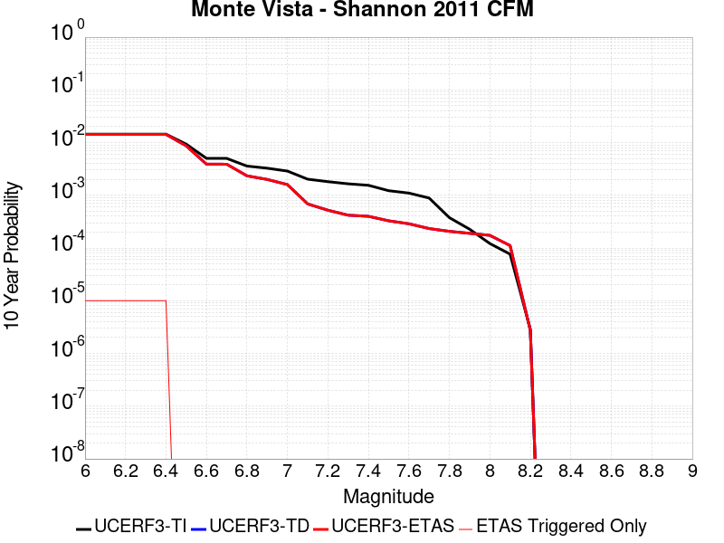 |

| Magnitude | 1 wk TI Prob | 1 wk TD Prob | 1 wk ETAS Prob | 1 wk ETAS/TD Gain | 1 wk ETAS Triggered Only | 1 mo TI Prob | 1 mo TD Prob | 1 mo ETAS Prob | 1 mo ETAS/TD Gain | 1 mo ETAS Triggered Only | 1 yr TI Prob | 1 yr TD Prob | 1 yr ETAS Prob | 1 yr ETAS/TD Gain | 1 yr ETAS Triggered Only | 10 yr TI Prob | 10 yr TD Prob | 10 yr ETAS Prob | 10 yr ETAS/TD Gain | 10 yr ETAS Triggered Only |
|-----|-----|-----|-----|-----|-----|-----|-----|-----|-----|-----|-----|-----|-----|-----|-----|-----|-----|-----|-----|-----|
| 6.0 | 2.7907707E-5 | 2.7584209E-5 | 2.7584209E-5 | 1.0 | 0.0 | 1.19598975E-4 | 1.1821338E-4 | 1.1821338E-4 | 1.0 | 0.0 | 0.0014551448 | 0.0014384214 | 0.0014384214 | 1.0 | 0.0 | 0.014456532 | 0.014320195 | 0.014360101 | 1.0027868 | 4.048583E-5 |
| 6.1 | 2.7907707E-5 | 2.7584209E-5 | 2.7584209E-5 | 1.0 | 0.0 | 1.19598975E-4 | 1.1821338E-4 | 1.1821338E-4 | 1.0 | 0.0 | 0.0014551448 | 0.0014384214 | 0.0014384214 | 1.0 | 0.0 | 0.014456532 | 0.014320195 | 0.014360101 | 1.0027868 | 4.048583E-5 |
| 6.2 | 2.7907707E-5 | 2.7584209E-5 | 2.7584209E-5 | 1.0 | 0.0 | 1.19598975E-4 | 1.1821338E-4 | 1.1821338E-4 | 1.0 | 0.0 | 0.0014551448 | 0.0014384214 | 0.0014384214 | 1.0 | 0.0 | 0.014456532 | 0.014320195 | 0.014360101 | 1.0027868 | 4.048583E-5 |
| 6.3 | 2.7907707E-5 | 2.7584209E-5 | 2.7584209E-5 | 1.0 | 0.0 | 1.19598975E-4 | 1.1821338E-4 | 1.1821338E-4 | 1.0 | 0.0 | 0.0014551448 | 0.0014384214 | 0.0014384214 | 1.0 | 0.0 | 0.014456532 | 0.014320195 | 0.014360101 | 1.0027868 | 4.048583E-5 |
| 6.4 | 2.7907707E-5 | 2.7584209E-5 | 2.7584209E-5 | 1.0 | 0.0 | 1.19598975E-4 | 1.1821338E-4 | 1.1821338E-4 | 1.0 | 0.0 | 0.0014551448 | 0.0014384214 | 0.0014384214 | 1.0 | 0.0 | 0.014456532 | 0.014320195 | 0.014360101 | 1.0027868 | 4.048583E-5 |
| 6.5 | 1.7990213E-5 | 1.6639884E-5 | 1.6639884E-5 | 1.0 | 0.0 | 7.709863E-5 | 7.131221E-5 | 7.131221E-5 | 1.0 | 0.0 | 9.382716E-4 | 8.679467E-4 | 8.679467E-4 | 1.0 | 0.0 | 0.0093431985 | 0.008668941 | 0.008668941 | 1.0 | 0.0 |
| 6.6 | 9.650407E-6 | 7.4571435E-6 | 7.4571435E-6 | 1.0 | 0.0 | 4.135823E-5 | 3.195884E-5 | 3.195884E-5 | 1.0 | 0.0 | 5.0342013E-4 | 3.8903722E-4 | 3.8903722E-4 | 1.0 | 0.0 | 0.005022812 | 0.0039012418 | 0.0039012418 | 1.0 | 0.0 |
| 6.7 | 9.62828E-6 | 7.4350583E-6 | 7.4350583E-6 | 1.0 | 0.0 | 4.1263404E-5 | 3.186419E-5 | 3.186419E-5 | 1.0 | 0.0 | 5.022661E-4 | 3.878853E-4 | 3.878853E-4 | 1.0 | 0.0 | 0.0050113243 | 0.003889763 | 0.003889763 | 1.0 | 0.0 |
| 6.8 | 6.887523E-6 | 4.4615676E-6 | 4.4615676E-6 | 1.0 | 0.0 | 2.9517621E-5 | 1.9120876E-5 | 1.9120876E-5 | 1.0 | 0.0 | 3.5931775E-4 | 2.3277402E-4 | 2.3277402E-4 | 1.0 | 0.0 | 0.0035873733 | 0.0023424553 | 0.0023424553 | 1.0 | 0.0 |
| 6.9 | 6.2722347E-6 | 3.8034377E-6 | 3.8034377E-6 | 1.0 | 0.0 | 2.6880729E-5 | 1.6300357E-5 | 1.6300357E-5 | 1.0 | 0.0 | 3.2722374E-4 | 1.984408E-4 | 1.984408E-4 | 1.0 | 0.0 | 0.003267423 | 0.0019997752 | 0.0019997752 | 1.0 | 0.0 |
| 7.0 | 5.5320347E-6 | 3.0305885E-6 | 3.0305885E-6 | 1.0 | 0.0 | 2.3708504E-5 | 1.2988182E-5 | 1.2988182E-5 | 1.0 | 0.0 | 2.8861282E-4 | 1.5812147E-4 | 1.5812147E-4 | 1.0 | 0.0 | 0.0028823826 | 0.001597215 | 0.001597215 | 1.0 | 0.0 |
| 7.1 | 3.8794055E-6 | 1.2837862E-6 | 1.2837862E-6 | 1.0 | 0.0 | 1.6625918E-5 | 5.5019295E-6 | 5.5019295E-6 | 1.0 | 0.0 | 2.0240174E-4 | 6.698394E-5 | 6.698394E-5 | 1.0 | 0.0 | 0.002022175 | 6.865884E-4 | 6.865884E-4 | 1.0 | 0.0 |
| 7.2 | 3.4813652E-6 | 9.671046E-7 | 9.671046E-7 | 1.0 | 0.0 | 1.49200505E-5 | 4.1447274E-6 | 4.1447274E-6 | 1.0 | 0.0 | 1.8163648E-4 | 5.0460894E-5 | 5.0460894E-5 | 1.0 | 0.0 | 0.0018148809 | 5.214329E-4 | 5.214329E-4 | 1.0 | 0.0 |
| 7.3 | 3.1682148E-6 | 7.719097E-7 | 7.719097E-7 | 1.0 | 0.0 | 1.3577992E-5 | 3.30818E-6 | 3.30818E-6 | 1.0 | 0.0 | 1.6529951E-4 | 4.027635E-5 | 4.027635E-5 | 1.0 | 0.0 | 0.0016517661 | 4.1960424E-4 | 4.1960424E-4 | 1.0 | 0.0 |
| 7.4 | 2.9707667E-6 | 7.3457204E-7 | 7.3457204E-7 | 1.0 | 0.0 | 1.2731795E-5 | 3.148162E-6 | 3.148162E-6 | 1.0 | 0.0 | 1.5499859E-4 | 3.8328202E-5 | 3.8328202E-5 | 1.0 | 0.0 | 0.0015489052 | 3.9992164E-4 | 3.9992164E-4 | 1.0 | 0.0 |
| 7.5 | 2.3462758E-6 | 6.007889E-7 | 6.007889E-7 | 1.0 | 0.0 | 1.0055429E-5 | 2.574807E-6 | 2.574807E-6 | 1.0 | 0.0 | 1.2241797E-4 | 3.1347827E-5 | 3.1347827E-5 | 1.0 | 0.0 | 0.0012235056 | 3.2839534E-4 | 3.2839534E-4 | 1.0 | 0.0 |
| 7.6 | 2.112783E-6 | 5.251582E-7 | 5.251582E-7 | 1.0 | 0.0 | 9.054753E-6 | 2.250676E-6 | 2.250676E-6 | 1.0 | 0.0 | 1.1023604E-4 | 2.7401638E-5 | 2.7401638E-5 | 1.0 | 0.0 | 0.0011018137 | 2.885138E-4 | 2.885138E-4 | 1.0 | 0.0 |
| 7.7 | 1.7022471E-6 | 4.231601E-7 | 4.231601E-7 | 1.0 | 0.0 | 7.2953244E-6 | 1.8135419E-6 | 1.8135419E-6 | 1.0 | 0.0 | 8.881695E-5 | 2.207965E-5 | 2.207965E-5 | 1.0 | 0.0 | 8.878146E-4 | 2.3398738E-4 | 2.3398738E-4 | 1.0 | 0.0 |
| 7.8 | 7.230914E-7 | 3.7285864E-7 | 3.7285864E-7 | 1.0 | 0.0 | 3.0989595E-6 | 1.5979647E-6 | 1.5979647E-6 | 1.0 | 0.0 | 3.772918E-5 | 1.9455047E-5 | 1.9455047E-5 | 1.0 | 0.0 | 3.7722773E-4 | 2.0726922E-4 | 2.0726922E-4 | 1.0 | 0.0 |
| 7.9 | 4.3588446E-7 | 3.4305793E-7 | 3.4305793E-7 | 1.0 | 0.0 | 1.868075E-6 | 1.4702474E-6 | 1.4702474E-6 | 1.0 | 0.0 | 2.2743576E-5 | 1.7900116E-5 | 1.7900116E-5 | 1.0 | 0.0 | 2.2741247E-4 | 1.8995286E-4 | 1.8995286E-4 | 1.0 | 0.0 |
| 8.0 | 2.3317523E-7 | 3.1513588E-7 | 3.1513588E-7 | 1.0 | 0.0 | 9.99322E-7 | 1.3505817E-6 | 1.3505817E-6 | 1.0 | 0.0 | 1.2166677E-5 | 1.644321E-5 | 1.644321E-5 | 1.0 | 0.0 | 1.21660116E-4 | 1.7399415E-4 | 1.7399415E-4 | 1.0 | 0.0 |
| 8.1 | 1.4662456E-7 | 2.030774E-7 | 2.030774E-7 | 1.0 | 0.0 | 6.283908E-7 | 8.703314E-7 | 8.703314E-7 | 1.0 | 0.0 | 7.650631E-6 | 1.05962345E-5 | 1.05962345E-5 | 1.0 | 0.0 | 7.650368E-5 | 1.113227E-4 | 1.113227E-4 | 1.0 | 0.0 |
| 8.2 | 5.4931775E-9 | 5.07573E-9 | 5.07573E-9 | 1.0 | 0.0 | 2.3542189E-8 | 2.1753127E-8 | 2.1753127E-8 | 1.0 | 0.0 | 2.8662612E-7 | 2.6484432E-7 | 2.6484432E-7 | 1.0 | 0.0 | 2.8662573E-6 | 2.7539324E-6 | 2.7539324E-6 | 1.0 | 0.0 |

## Shoreline
*[(top)](#table-of-contents)*

| 1 Week | 1 Month | 1 Year | 10 Year |
|-----|-----|-----|-----|
|  | 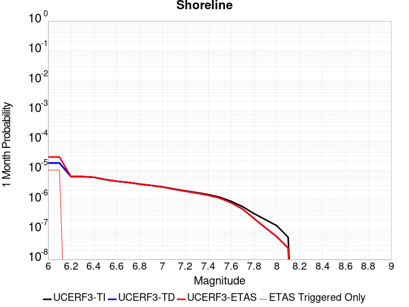 |  |  |

| Magnitude | 1 wk TI Prob | 1 wk TD Prob | 1 wk ETAS Prob | 1 wk ETAS/TD Gain | 1 wk ETAS Triggered Only | 1 mo TI Prob | 1 mo TD Prob | 1 mo ETAS Prob | 1 mo ETAS/TD Gain | 1 mo ETAS Triggered Only | 1 yr TI Prob | 1 yr TD Prob | 1 yr ETAS Prob | 1 yr ETAS/TD Gain | 1 yr ETAS Triggered Only | 10 yr TI Prob | 10 yr TD Prob | 10 yr ETAS Prob | 10 yr ETAS/TD Gain | 10 yr ETAS Triggered Only |
|-----|-----|-----|-----|-----|-----|-----|-----|-----|-----|-----|-----|-----|-----|-----|-----|-----|-----|-----|-----|-----|
| 6.0 | 3.9888673E-6 | 4.047929E-6 | 4.4533594E-5 | 11.001575 | 4.048583E-5 | 1.7095033E-5 | 1.7348184E-5 | 5.783331E-5 | 3.333681 | 4.048583E-5 | 2.0811215E-4 | 2.1119925E-4 | 2.5167654E-4 | 1.1916544 | 4.048583E-5 | 0.0020791737 | 0.002110534 | 0.0021509344 | 1.0191423 | 4.048583E-5 |
| 6.1 | 3.9888673E-6 | 4.047929E-6 | 4.4533594E-5 | 11.001575 | 4.048583E-5 | 1.7095033E-5 | 1.7348184E-5 | 5.783331E-5 | 3.333681 | 4.048583E-5 | 2.0811215E-4 | 2.1119925E-4 | 2.5167654E-4 | 1.1916544 | 4.048583E-5 | 0.0020791737 | 0.002110534 | 0.0021509344 | 1.0191423 | 4.048583E-5 |
| 6.2 | 1.4039653E-6 | 1.4100891E-6 | 1.4100891E-6 | 1.0 | 0.0 | 6.0169805E-6 | 6.0432253E-6 | 6.0432253E-6 | 1.0 | 0.0 | 7.325427E-5 | 7.357384E-5 | 7.357384E-5 | 1.0 | 0.0 | 7.3230127E-4 | 7.355009E-4 | 7.355009E-4 | 1.0 | 0.0 |
| 6.3 | 1.4039653E-6 | 1.4100891E-6 | 1.4100891E-6 | 1.0 | 0.0 | 6.0169805E-6 | 6.0432253E-6 | 6.0432253E-6 | 1.0 | 0.0 | 7.325427E-5 | 7.357384E-5 | 7.357384E-5 | 1.0 | 0.0 | 7.3230127E-4 | 7.355009E-4 | 7.355009E-4 | 1.0 | 0.0 |
| 6.4 | 1.3314152E-6 | 1.3361605E-6 | 1.3361605E-6 | 1.0 | 0.0 | 5.7060524E-6 | 5.7263896E-6 | 5.7263896E-6 | 1.0 | 0.0 | 6.946897E-5 | 6.971662E-5 | 6.971662E-5 | 1.0 | 0.0 | 6.9447263E-4 | 6.9695286E-4 | 6.9695286E-4 | 1.0 | 0.0 |
| 6.5 | 1.1187026E-6 | 1.120364E-6 | 1.120364E-6 | 1.0 | 0.0 | 4.794431E-6 | 4.8015513E-6 | 4.8015513E-6 | 1.0 | 0.0 | 5.8370628E-5 | 5.8457343E-5 | 5.8457343E-5 | 1.0 | 0.0 | 5.83553E-4 | 5.844222E-4 | 5.844222E-4 | 1.0 | 0.0 |
| 6.6 | 9.793089E-7 | 9.784919E-7 | 9.784919E-7 | 1.0 | 0.0 | 4.1970316E-6 | 4.1935305E-6 | 4.1935305E-6 | 1.0 | 0.0 | 5.1097657E-5 | 5.105505E-5 | 5.105505E-5 | 1.0 | 0.0 | 5.108591E-4 | 5.1043445E-4 | 5.1043445E-4 | 1.0 | 0.0 |
| 6.7 | 8.995986E-7 | 8.9728E-7 | 8.9728E-7 | 1.0 | 0.0 | 3.8554167E-6 | 3.84548E-6 | 3.84548E-6 | 1.0 | 0.0 | 4.693869E-5 | 4.6817724E-5 | 4.6817724E-5 | 1.0 | 0.0 | 4.6928777E-4 | 4.6807955E-4 | 4.6807955E-4 | 1.0 | 0.0 |
| 6.8 | 7.931612E-7 | 7.8804027E-7 | 7.8804027E-7 | 1.0 | 0.0 | 3.3992578E-6 | 3.377311E-6 | 3.377311E-6 | 1.0 | 0.0 | 4.1385178E-5 | 4.1117994E-5 | 4.1117994E-5 | 1.0 | 0.0 | 4.1377472E-4 | 4.1110438E-4 | 4.1110438E-4 | 1.0 | 0.0 |
| 6.9 | 7.1465956E-7 | 7.078006E-7 | 7.078006E-7 | 1.0 | 0.0 | 3.062823E-6 | 3.0334277E-6 | 3.0334277E-6 | 1.0 | 0.0 | 3.7289232E-5 | 3.6931357E-5 | 3.6931357E-5 | 1.0 | 0.0 | 3.7282976E-4 | 3.6925258E-4 | 3.6925258E-4 | 1.0 | 0.0 |
| 7.0 | 6.389046E-7 | 6.299458E-7 | 6.299458E-7 | 1.0 | 0.0 | 2.7381598E-6 | 2.699765E-6 | 2.699765E-6 | 1.0 | 0.0 | 3.3336586E-5 | 3.2869146E-5 | 3.2869146E-5 | 1.0 | 0.0 | 3.3331584E-4 | 3.2864307E-4 | 3.2864307E-4 | 1.0 | 0.0 |
| 7.1 | 5.4300875E-7 | 5.3111313E-7 | 5.3111313E-7 | 1.0 | 0.0 | 2.3271782E-6 | 2.276197E-6 | 2.276197E-6 | 1.0 | 0.0 | 2.8333026E-5 | 2.7712347E-5 | 2.7712347E-5 | 1.0 | 0.0 | 2.8329415E-4 | 2.77089E-4 | 2.77089E-4 | 1.0 | 0.0 |
| 7.2 | 4.6768855E-7 | 4.5348952E-7 | 4.5348952E-7 | 1.0 | 0.0 | 2.0043778E-6 | 1.9435251E-6 | 1.9435251E-6 | 1.0 | 0.0 | 2.4403027E-5 | 2.3662162E-5 | 2.3662162E-5 | 1.0 | 0.0 | 2.4400349E-4 | 2.3659648E-4 | 2.3659648E-4 | 1.0 | 0.0 |
| 7.3 | 4.0966103E-7 | 3.9385662E-7 | 3.9385662E-7 | 1.0 | 0.0 | 1.7556889E-6 | 1.6879559E-6 | 1.6879559E-6 | 1.0 | 0.0 | 2.1375303E-5 | 2.055067E-5 | 2.055067E-5 | 1.0 | 0.0 | 2.1373246E-4 | 2.0548773E-4 | 2.0548773E-4 | 1.0 | 0.0 |
| 7.4 | 3.5105785E-7 | 3.3363975E-7 | 3.3363975E-7 | 1.0 | 0.0 | 1.5045327E-6 | 1.4298838E-6 | 1.4298838E-6 | 1.0 | 0.0 | 1.8317533E-5 | 1.7408696E-5 | 1.7408696E-5 | 1.0 | 0.0 | 1.8316023E-4 | 1.7407336E-4 | 1.7407336E-4 | 1.0 | 0.0 |
| 7.5 | 2.8737534E-7 | 2.6820038E-7 | 2.6820038E-7 | 1.0 | 0.0 | 1.2316079E-6 | 1.1494297E-6 | 1.1494297E-6 | 1.0 | 0.0 | 1.4994724E-5 | 1.3994217E-5 | 1.3994217E-5 | 1.0 | 0.0 | 1.4993713E-4 | 1.3993339E-4 | 1.3993339E-4 | 1.0 | 0.0 |
| 7.6 | 2.0924051E-7 | 1.8778988E-7 | 1.8778988E-7 | 1.0 | 0.0 | 8.967448E-7 | 8.048135E-7 | 8.048135E-7 | 1.0 | 0.0 | 1.0917813E-5 | 9.79856E-6 | 9.79856E-6 | 1.0 | 0.0 | 1.0917276E-4 | 9.798129E-5 | 9.798129E-5 | 1.0 | 0.0 |
| 7.7 | 1.392265E-7 | 1.15433906E-7 | 1.15433906E-7 | 1.0 | 0.0 | 5.9668486E-7 | 4.9471663E-7 | 4.9471663E-7 | 1.0 | 0.0 | 7.2646135E-6 | 6.023158E-6 | 6.023158E-6 | 1.0 | 0.0 | 7.2643765E-5 | 6.0229955E-5 | 6.0229955E-5 | 1.0 | 0.0 |
| 7.8 | 8.1080074E-8 | 5.586722E-8 | 5.586722E-8 | 1.0 | 0.0 | 3.4748598E-7 | 2.394309E-7 | 2.394309E-7 | 1.0 | 0.0 | 4.2306337E-6 | 2.9150672E-6 | 2.9150672E-6 | 1.0 | 0.0 | 4.230553E-5 | 2.9150291E-5 | 2.9150291E-5 | 1.0 | 0.0 |
| 7.9 | 5.0859036E-8 | 2.7244445E-8 | 2.7244445E-8 | 1.0 | 0.0 | 2.1796728E-7 | 1.16761896E-7 | 1.16761896E-7 | 1.0 | 0.0 | 2.6537484E-6 | 1.4215751E-6 | 1.4215751E-6 | 1.0 | 0.0 | 2.6537167E-5 | 1.4215661E-5 | 1.4215661E-5 | 1.0 | 0.0 |
| 8.0 | 3.1760536E-8 | 1.3577206E-8 | 1.3577206E-8 | 1.0 | 0.0 | 1.3611657E-7 | 5.8188025E-8 | 5.8188025E-8 | 1.0 | 0.0 | 1.6572179E-6 | 7.0843896E-7 | 7.0843896E-7 | 1.0 | 0.0 | 1.6572056E-5 | 7.084367E-6 | 7.084367E-6 | 1.0 | 0.0 |
| 8.1 | 1.2947896E-8 | 5.6628693E-9 | 5.6628693E-9 | 1.0 | 0.0 | 5.5490982E-8 | 2.426944E-8 | 2.426944E-8 | 1.0 | 0.0 | 6.756025E-7 | 2.954804E-7 | 2.954804E-7 | 1.0 | 0.0 | 6.7560045E-6 | 2.9548003E-6 | 2.9548003E-6 | 1.0 | 0.0 |

## Santa Cruz Island
*[(top)](#table-of-contents)*

| 1 Week | 1 Month | 1 Year | 10 Year |
|-----|-----|-----|-----|
|  |  |  |  |

| Magnitude | 1 wk TI Prob | 1 wk TD Prob | 1 wk ETAS Prob | 1 wk ETAS/TD Gain | 1 wk ETAS Triggered Only | 1 mo TI Prob | 1 mo TD Prob | 1 mo ETAS Prob | 1 mo ETAS/TD Gain | 1 mo ETAS Triggered Only | 1 yr TI Prob | 1 yr TD Prob | 1 yr ETAS Prob | 1 yr ETAS/TD Gain | 1 yr ETAS Triggered Only | 10 yr TI Prob | 10 yr TD Prob | 10 yr ETAS Prob | 10 yr ETAS/TD Gain | 10 yr ETAS Triggered Only |
|-----|-----|-----|-----|-----|-----|-----|-----|-----|-----|-----|-----|-----|-----|-----|-----|-----|-----|-----|-----|-----|
| 6.0 | 2.9164563E-5 | 3.1599742E-5 | 7.2084295E-5 | 2.281167 | 4.048583E-5 | 1.2498499E-4 | 1.3542121E-4 | 1.7590156E-4 | 1.2989218 | 4.048583E-5 | 0.0015206301 | 0.0016476426 | 0.0016880616 | 1.0245315 | 4.048583E-5 | 0.015102667 | 0.016368 | 0.016407823 | 1.002433 | 4.048583E-5 |
| 6.1 | 2.9164563E-5 | 3.1599742E-5 | 7.2084295E-5 | 2.281167 | 4.048583E-5 | 1.2498499E-4 | 1.3542121E-4 | 1.7590156E-4 | 1.2989218 | 4.048583E-5 | 0.0015206301 | 0.0016476426 | 0.0016880616 | 1.0245315 | 4.048583E-5 | 0.015102667 | 0.016368 | 0.016407823 | 1.002433 | 4.048583E-5 |
| 6.2 | 2.9164563E-5 | 3.1599742E-5 | 7.2084295E-5 | 2.281167 | 4.048583E-5 | 1.2498499E-4 | 1.3542121E-4 | 1.7590156E-4 | 1.2989218 | 4.048583E-5 | 0.0015206301 | 0.0016476426 | 0.0016880616 | 1.0245315 | 4.048583E-5 | 0.015102667 | 0.016368 | 0.016407823 | 1.002433 | 4.048583E-5 |
| 6.3 | 1.6635553E-5 | 1.780436E-5 | 1.780436E-5 | 1.0 | 0.0 | 7.1293274E-5 | 7.630226E-5 | 7.630226E-5 | 1.0 | 0.0 | 8.6765E-4 | 9.2860236E-4 | 9.2860236E-4 | 1.0 | 0.0 | 0.008642701 | 0.009249094 | 0.009249094 | 1.0 | 0.0 |
| 6.4 | 1.6635553E-5 | 1.780436E-5 | 1.780436E-5 | 1.0 | 0.0 | 7.1293274E-5 | 7.630226E-5 | 7.630226E-5 | 1.0 | 0.0 | 8.6765E-4 | 9.2860236E-4 | 9.2860236E-4 | 1.0 | 0.0 | 0.008642701 | 0.009249094 | 0.009249094 | 1.0 | 0.0 |
| 6.5 | 1.2238748E-5 | 1.3042995E-5 | 1.3042995E-5 | 1.0 | 0.0 | 5.2450723E-5 | 5.5897377E-5 | 5.5897377E-5 | 1.0 | 0.0 | 6.3840044E-4 | 6.8034173E-4 | 6.8034173E-4 | 1.0 | 0.0 | 0.0063656955 | 0.0067829876 | 0.0067829876 | 1.0 | 0.0 |
| 6.6 | 1.0489767E-5 | 1.1156636E-5 | 1.1156636E-5 | 1.0 | 0.0 | 4.495537E-5 | 4.781329E-5 | 4.781329E-5 | 1.0 | 0.0 | 5.4719415E-4 | 5.819735E-4 | 5.819735E-4 | 1.0 | 0.0 | 0.005458487 | 0.0058047357 | 0.0058047357 | 1.0 | 0.0 |
| 6.7 | 8.699222E-6 | 9.236782E-6 | 9.236782E-6 | 1.0 | 0.0 | 3.7281847E-5 | 3.958561E-5 | 3.958561E-5 | 1.0 | 0.0 | 4.5381195E-4 | 4.8184878E-4 | 4.8184878E-4 | 1.0 | 0.0 | 0.0045288634 | 0.004808108 | 0.004808108 | 1.0 | 0.0 |
| 6.8 | 8.307732E-6 | 8.8169045E-6 | 8.8169045E-6 | 1.0 | 0.0 | 3.560408E-5 | 3.7786187E-5 | 3.7786187E-5 | 1.0 | 0.0 | 4.3339343E-4 | 4.5995016E-4 | 4.5995016E-4 | 1.0 | 0.0 | 0.004325492 | 0.0045900354 | 0.0045900354 | 1.0 | 0.0 |
| 6.9 | 8.073121E-6 | 8.564939E-6 | 8.564939E-6 | 1.0 | 0.0 | 3.459863E-5 | 3.6706366E-5 | 3.6706366E-5 | 1.0 | 0.0 | 4.2115687E-4 | 4.468088E-4 | 4.468088E-4 | 1.0 | 0.0 | 0.004203596 | 0.004459156 | 0.004459156 | 1.0 | 0.0 |
| 7.0 | 7.617019E-6 | 8.074664E-6 | 8.074664E-6 | 1.0 | 0.0 | 3.264396E-5 | 3.4605247E-5 | 3.4605247E-5 | 1.0 | 0.0 | 3.9736772E-4 | 4.212378E-4 | 4.212378E-4 | 1.0 | 0.0 | 0.003966579 | 0.0042044413 | 0.0042044413 | 1.0 | 0.0 |
| 7.1 | 7.1224836E-6 | 7.545788E-6 | 7.545788E-6 | 1.0 | 0.0 | 3.052457E-5 | 3.2338692E-5 | 3.2338692E-5 | 1.0 | 0.0 | 3.715733E-4 | 3.936528E-4 | 3.936528E-4 | 1.0 | 0.0 | 0.003709526 | 0.003929598 | 0.003929598 | 1.0 | 0.0 |
| 7.2 | 6.441115E-6 | 6.8273835E-6 | 6.8273835E-6 | 1.0 | 0.0 | 2.7604487E-5 | 2.9259887E-5 | 2.9259887E-5 | 1.0 | 0.0 | 3.360328E-4 | 3.5618112E-4 | 3.5618112E-4 | 1.0 | 0.0 | 0.0033552512 | 0.003556131 | 0.003556131 | 1.0 | 0.0 |
| 7.3 | 5.494274E-6 | 5.8199944E-6 | 5.8199944E-6 | 1.0 | 0.0 | 2.3546674E-5 | 2.4942596E-5 | 2.4942596E-5 | 1.0 | 0.0 | 2.8664304E-4 | 3.0363398E-4 | 3.0363398E-4 | 1.0 | 0.0 | 0.002862736 | 0.0030322142 | 0.0030322142 | 1.0 | 0.0 |
| 7.4 | 4.0802624E-6 | 4.312256E-6 | 4.312256E-6 | 1.0 | 0.0 | 1.7486722E-5 | 1.8480967E-5 | 1.8480967E-5 | 1.0 | 0.0 | 2.1288003E-4 | 2.2498262E-4 | 2.2498262E-4 | 1.0 | 0.0 | 0.0021267622 | 0.0022475575 | 0.0022475575 | 1.0 | 0.0 |
| 7.5 | 2.3584746E-6 | 2.4753094E-6 | 2.4753094E-6 | 1.0 | 0.0 | 1.0107709E-5 | 1.0608426E-5 | 1.0608426E-5 | 1.0 | 0.0 | 1.2305441E-4 | 1.2915E-4 | 1.2915E-4 | 1.0 | 0.0 | 0.0012298629 | 0.0012907543 | 0.0012907543 | 1.0 | 0.0 |
| 7.6 | 9.4981914E-7 | 9.86093E-7 | 9.86093E-7 | 1.0 | 0.0 | 4.0706473E-6 | 4.2261063E-6 | 4.2261063E-6 | 1.0 | 0.0 | 4.9559E-5 | 5.145164E-5 | 5.145164E-5 | 1.0 | 0.0 | 4.954795E-4 | 5.1439856E-4 | 5.1439856E-4 | 1.0 | 0.0 |
| 7.7 | 2.6013532E-7 | 2.6416603E-7 | 2.6416603E-7 | 1.0 | 0.0 | 1.1148652E-6 | 1.1321397E-6 | 1.1321397E-6 | 1.0 | 0.0 | 1.3573399E-5 | 1.3783714E-5 | 1.3783714E-5 | 1.0 | 0.0 | 1.357257E-4 | 1.3782867E-4 | 1.3782867E-4 | 1.0 | 0.0 |
| 7.8 | 4.1522263E-8 | 3.965679E-8 | 3.965679E-8 | 1.0 | 0.0 | 1.7795254E-7 | 1.6995766E-7 | 1.6995766E-7 | 1.0 | 0.0 | 2.16657E-6 | 2.0692328E-6 | 2.0692328E-6 | 1.0 | 0.0 | 2.1665488E-5 | 2.0692156E-5 | 2.0692156E-5 | 1.0 | 0.0 |
| 7.9 | 7.7242046E-10 | 5.9468175E-10 | 5.9468175E-10 | 1.0 | 0.0 | 3.3103735E-9 | 2.5486364E-9 | 2.5486364E-9 | 1.0 | 0.0 | 4.0303796E-8 | 3.1029646E-8 | 3.1029646E-8 | 1.0 | 0.0 | 4.030379E-7 | 3.1029643E-7 | 3.1029643E-7 | 1.0 | 0.0 |

## Imperial
*[(top)](#table-of-contents)*

| 1 Week | 1 Month | 1 Year | 10 Year |
|-----|-----|-----|-----|
| 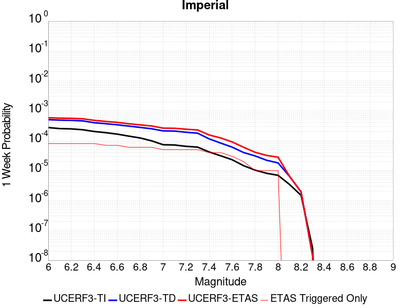 |  |  |  |

| Magnitude | 1 wk TI Prob | 1 wk TD Prob | 1 wk ETAS Prob | 1 wk ETAS/TD Gain | 1 wk ETAS Triggered Only | 1 mo TI Prob | 1 mo TD Prob | 1 mo ETAS Prob | 1 mo ETAS/TD Gain | 1 mo ETAS Triggered Only | 1 yr TI Prob | 1 yr TD Prob | 1 yr ETAS Prob | 1 yr ETAS/TD Gain | 1 yr ETAS Triggered Only | 10 yr TI Prob | 10 yr TD Prob | 10 yr ETAS Prob | 10 yr ETAS/TD Gain | 10 yr ETAS Triggered Only |
|-----|-----|-----|-----|-----|-----|-----|-----|-----|-----|-----|-----|-----|-----|-----|-----|-----|-----|-----|-----|-----|
| 6.0 | 2.7496446E-4 | 5.0552754E-4 | 5.0552754E-4 | 1.0 | 0.0 | 0.0011778869 | 0.002164787 | 0.002164787 | 1.0 | 0.0 | 0.0142467655 | 0.026038699 | 0.02607813 | 1.0015143 | 4.048583E-5 | 0.13367249 | 0.2280438 | 0.22807504 | 1.0001371 | 4.048583E-5 |
| 6.1 | 2.5356023E-4 | 4.8656776E-4 | 4.8656776E-4 | 1.0 | 0.0 | 0.001086234 | 0.0020836622 | 0.0020836622 | 1.0 | 0.0 | 0.013144928 | 0.025071215 | 0.025110686 | 1.0015744 | 4.048583E-5 | 0.123940155 | 0.21947981 | 0.2195114 | 1.000144 | 4.048583E-5 |
| 6.2 | 2.4820742E-4 | 4.7752203E-4 | 4.7752203E-4 | 1.0 | 0.0 | 0.0010633124 | 0.0020449557 | 0.0020449557 | 1.0 | 0.0 | 0.01286919 | 0.024611235 | 0.024650725 | 1.0016046 | 4.048583E-5 | 0.12148927 | 0.21598552 | 0.21601726 | 1.000147 | 4.048583E-5 |
| 6.3 | 2.3205351E-4 | 4.5890483E-4 | 4.5890483E-4 | 1.0 | 0.0 | 9.94136E-4 | 0.0019652895 | 0.0019652895 | 1.0 | 0.0 | 0.012036599 | 0.02366133 | 0.02370086 | 1.0016706 | 4.048583E-5 | 0.11405133 | 0.20793462 | 0.20796669 | 1.0001543 | 4.048583E-5 |
| 6.4 | 2.0304754E-4 | 3.987652E-4 | 3.987652E-4 | 1.0 | 0.0 | 8.6991355E-4 | 0.0017078889 | 0.0017078889 | 1.0 | 0.0 | 0.010539869 | 0.020595672 | 0.020635324 | 1.0019252 | 4.048583E-5 | 0.100537635 | 0.1850669 | 0.18509988 | 1.0001782 | 4.048583E-5 |
| 6.5 | 1.854992E-4 | 3.6988858E-4 | 3.6988858E-4 | 1.0 | 0.0 | 7.9475436E-4 | 0.0015842861 | 0.0015842861 | 1.0 | 0.0 | 0.009633281 | 0.01911948 | 0.019159192 | 1.002077 | 4.048583E-5 | 0.0922623 | 0.173298 | 0.17333147 | 1.0001931 | 4.048583E-5 |
| 6.6 | 1.6586106E-4 | 3.403506E-4 | 3.403506E-4 | 1.0 | 0.0 | 7.106394E-4 | 0.0014578402 | 0.0014578402 | 1.0 | 0.0 | 0.008617763 | 0.01760642 | 0.017646194 | 1.002259 | 4.048583E-5 | 0.08291132 | 0.16077545 | 0.16080943 | 1.0002114 | 4.048583E-5 |
| 6.7 | 1.4224656E-4 | 3.076692E-4 | 3.076692E-4 | 1.0 | 0.0 | 6.094856E-4 | 0.001317924 | 0.001317924 | 1.0 | 0.0 | 0.0073952693 | 0.015929576 | 0.015969418 | 1.002501 | 4.048583E-5 | 0.07153955 | 0.14648417 | 0.14651872 | 1.0002359 | 4.048583E-5 |
| 6.8 | 1.2317259E-4 | 2.779122E-4 | 2.779122E-4 | 1.0 | 0.0 | 5.2777573E-4 | 0.0011905148 | 0.0011905148 | 1.0 | 0.0 | 0.0064067547 | 0.0143995695 | 0.014439473 | 1.0027711 | 4.048583E-5 | 0.06225166 | 0.13293684 | 0.13297193 | 1.000264 | 4.048583E-5 |
| 6.9 | 9.859898E-5 | 2.5014306E-4 | 2.5014306E-4 | 1.0 | 0.0 | 4.2249862E-4 | 0.0010716055 | 0.0010716055 | 1.0 | 0.0 | 0.0051317946 | 0.012969712 | 0.013009672 | 1.0030811 | 4.048583E-5 | 0.05014893 | 0.11940631 | 0.119441964 | 1.0002986 | 4.048583E-5 |
| 7.0 | 7.3191884E-5 | 2.1266776E-4 | 2.1266776E-4 | 1.0 | 0.0 | 3.136418E-4 | 9.1111806E-4 | 9.1111806E-4 | 1.0 | 0.0 | 0.003811904 | 0.011037128 | 0.011037128 | 1.0 | 0.0 | 0.037471764 | 0.10206493 | 0.10206493 | 1.0 | 0.0 |
| 7.1 | 7.1760296E-5 | 2.0968143E-4 | 2.0968143E-4 | 1.0 | 0.0 | 3.0750787E-4 | 8.983284E-4 | 8.983284E-4 | 1.0 | 0.0 | 0.003737482 | 0.010882978 | 0.010882978 | 1.0 | 0.0 | 0.03675245 | 0.10070146 | 0.10070146 | 1.0 | 0.0 |
| 7.2 | 6.46614E-5 | 1.9136685E-4 | 1.9136685E-4 | 1.0 | 0.0 | 2.7709085E-4 | 8.1988896E-4 | 8.1988896E-4 | 1.0 | 0.0 | 0.0033683628 | 0.0099370815 | 0.0099370815 | 1.0 | 0.0 | 0.033177625 | 0.09250898 | 0.09250898 | 1.0 | 0.0 |
| 7.3 | 6.088115E-5 | 1.78084E-4 | 1.78084E-4 | 1.0 | 0.0 | 2.6089314E-4 | 7.6299673E-4 | 7.6299673E-4 | 1.0 | 0.0 | 0.0031717476 | 0.009250494 | 0.009250494 | 1.0 | 0.0 | 0.031268585 | 0.08655989 | 0.08655989 | 1.0 | 0.0 |
| 7.4 | 4.199346E-5 | 1.1510366E-4 | 1.1510366E-4 | 1.0 | 0.0 | 1.7995955E-4 | 4.9320905E-4 | 4.9320905E-4 | 1.0 | 0.0 | 0.0021888057 | 0.0059884563 | 0.0059884563 | 1.0 | 0.0 | 0.02167372 | 0.057439793 | 0.057439793 | 1.0 | 0.0 |
| 7.5 | 3.130448E-5 | 8.33328E-5 | 8.33328E-5 | 1.0 | 0.0 | 1.3415517E-4 | 3.57092E-4 | 3.57092E-4 | 1.0 | 0.0 | 0.0016321153 | 0.004338988 | 0.004338988 | 1.0 | 0.0 | 0.016201803 | 0.04213201 | 0.04213201 | 1.0 | 0.0 |
| 7.6 | 2.3074248E-5 | 6.0844646E-5 | 6.0844646E-5 | 1.0 | 0.0 | 9.888588E-5 | 2.6073685E-4 | 2.6073685E-4 | 1.0 | 0.0 | 0.0012032706 | 0.0031698733 | 0.0031698733 | 1.0 | 0.0 | 0.011967761 | 0.031026395 | 0.031026395 | 1.0 | 0.0 |
| 7.7 | 1.45864815E-5 | 4.0124698E-5 | 4.0124698E-5 | 1.0 | 0.0 | 6.2511994E-5 | 1.7195169E-4 | 1.7195169E-4 | 1.0 | 0.0 | 7.608177E-4 | 0.0020915072 | 0.0020915072 | 1.0 | 0.0 | 0.007582182 | 0.020627763 | 0.020627763 | 1.0 | 0.0 |
| 7.8 | 1.0352979E-5 | 3.0960902E-5 | 3.0960902E-5 | 1.0 | 0.0 | 4.4369157E-5 | 1.3268284E-4 | 1.3268284E-4 | 1.0 | 0.0 | 5.400606E-4 | 0.0016142189 | 0.0016142189 | 1.0 | 0.0 | 0.0053875 | 0.016016833 | 0.016016833 | 1.0 | 0.0 |
| 7.9 | 8.137906E-6 | 2.2149103E-5 | 2.2149103E-5 | 1.0 | 0.0 | 3.4876273E-5 | 9.492128E-5 | 9.492128E-5 | 1.0 | 0.0 | 4.2453592E-4 | 0.0011550548 | 0.0011550548 | 1.0 | 0.0 | 0.004237258 | 0.011617903 | 0.011617903 | 1.0 | 0.0 |
| 8.0 | 6.93792E-6 | 1.8008766E-5 | 1.8008766E-5 | 1.0 | 0.0 | 2.9733603E-5 | 7.717814E-5 | 7.717814E-5 | 1.0 | 0.0 | 3.6194647E-4 | 9.3923963E-4 | 9.3923963E-4 | 1.0 | 0.0 | 0.0036135751 | 0.00950155 | 0.00950155 | 1.0 | 0.0 |
| 8.1 | 3.4286315E-6 | 6.379872E-6 | 6.379872E-6 | 1.0 | 0.0 | 1.4694053E-5 | 2.7342023E-5 | 2.7342023E-5 | 1.0 | 0.0 | 1.7888541E-4 | 3.328384E-4 | 3.328384E-4 | 1.0 | 0.0 | 0.0017874148 | 0.003486031 | 0.003486031 | 1.0 | 0.0 |
| 8.2 | 1.4906886E-6 | 1.9366646E-6 | 1.9366646E-6 | 1.0 | 0.0 | 6.3886496E-6 | 8.299965E-6 | 8.299965E-6 | 1.0 | 0.0 | 7.7779034E-5 | 1.0104742E-4 | 1.0104742E-4 | 1.0 | 0.0 | 7.775182E-4 | 0.0011075331 | 0.0011075331 | 1.0 | 0.0 |
| 8.3 | 2.5758007E-8 | 1.4500102E-8 | 1.4500102E-8 | 1.0 | 0.0 | 1.10391454E-7 | 6.214329E-8 | 6.214329E-8 | 1.0 | 0.0 | 1.3440151E-6 | 7.565946E-7 | 7.565946E-7 | 1.0 | 0.0 | 1.344007E-5 | 7.887763E-6 | 7.887763E-6 | 1.0 | 0.0 |

## Great Valley 06 (Midland) 2011 CFM alt1
*[(top)](#table-of-contents)*

| 1 Week | 1 Month | 1 Year | 10 Year |
|-----|-----|-----|-----|
|  |  |  |  |

| Magnitude | 1 wk TI Prob | 1 wk TD Prob | 1 wk ETAS Prob | 1 wk ETAS/TD Gain | 1 wk ETAS Triggered Only | 1 mo TI Prob | 1 mo TD Prob | 1 mo ETAS Prob | 1 mo ETAS/TD Gain | 1 mo ETAS Triggered Only | 1 yr TI Prob | 1 yr TD Prob | 1 yr ETAS Prob | 1 yr ETAS/TD Gain | 1 yr ETAS Triggered Only | 10 yr TI Prob | 10 yr TD Prob | 10 yr ETAS Prob | 10 yr ETAS/TD Gain | 10 yr ETAS Triggered Only |
|-----|-----|-----|-----|-----|-----|-----|-----|-----|-----|-----|-----|-----|-----|-----|-----|-----|-----|-----|-----|-----|
| 6.0 | 1.2712525E-5 | 1.3210576E-5 | 1.3210576E-5 | 1.0 | 0.0 | 5.4481112E-5 | 5.6615667E-5 | 5.6615667E-5 | 1.0 | 0.0 | 6.6310563E-4 | 6.8910315E-4 | 7.295611E-4 | 1.058711 | 4.048583E-5 | 0.0066113044 | 0.006872179 | 0.0069123865 | 1.0058508 | 4.048583E-5 |
| 6.1 | 1.2712525E-5 | 1.3210576E-5 | 1.3210576E-5 | 1.0 | 0.0 | 5.4481112E-5 | 5.6615667E-5 | 5.6615667E-5 | 1.0 | 0.0 | 6.6310563E-4 | 6.8910315E-4 | 7.295611E-4 | 1.058711 | 4.048583E-5 | 0.0066113044 | 0.006872179 | 0.0069123865 | 1.0058508 | 4.048583E-5 |
| 6.2 | 1.2712525E-5 | 1.3210576E-5 | 1.3210576E-5 | 1.0 | 0.0 | 5.4481112E-5 | 5.6615667E-5 | 5.6615667E-5 | 1.0 | 0.0 | 6.6310563E-4 | 6.8910315E-4 | 7.295611E-4 | 1.058711 | 4.048583E-5 | 0.0066113044 | 0.006872179 | 0.0069123865 | 1.0058508 | 4.048583E-5 |
| 6.3 | 1.2712525E-5 | 1.3210576E-5 | 1.3210576E-5 | 1.0 | 0.0 | 5.4481112E-5 | 5.6615667E-5 | 5.6615667E-5 | 1.0 | 0.0 | 6.6310563E-4 | 6.8910315E-4 | 7.295611E-4 | 1.058711 | 4.048583E-5 | 0.0066113044 | 0.006872179 | 0.0069123865 | 1.0058508 | 4.048583E-5 |
| 6.4 | 1.2712525E-5 | 1.3210576E-5 | 1.3210576E-5 | 1.0 | 0.0 | 5.4481112E-5 | 5.6615667E-5 | 5.6615667E-5 | 1.0 | 0.0 | 6.6310563E-4 | 6.8910315E-4 | 7.295611E-4 | 1.058711 | 4.048583E-5 | 0.0066113044 | 0.006872179 | 0.0069123865 | 1.0058508 | 4.048583E-5 |
| 6.5 | 1.2712525E-5 | 1.3210576E-5 | 1.3210576E-5 | 1.0 | 0.0 | 5.4481112E-5 | 5.6615667E-5 | 5.6615667E-5 | 1.0 | 0.0 | 6.6310563E-4 | 6.8910315E-4 | 7.295611E-4 | 1.058711 | 4.048583E-5 | 0.0066113044 | 0.006872179 | 0.0069123865 | 1.0058508 | 4.048583E-5 |
| 6.6 | 5.7574384E-6 | 5.9706463E-6 | 5.9706463E-6 | 1.0 | 0.0 | 2.4674504E-5 | 2.5588255E-5 | 2.5588255E-5 | 1.0 | 0.0 | 3.0037065E-4 | 3.1149638E-4 | 3.5196962E-4 | 1.1299316 | 4.048583E-5 | 0.0029996498 | 0.0031109843 | 0.0031513441 | 1.0129733 | 4.048583E-5 |
| 6.7 | 5.7574384E-6 | 5.9706463E-6 | 5.9706463E-6 | 1.0 | 0.0 | 2.4674504E-5 | 2.5588255E-5 | 2.5588255E-5 | 1.0 | 0.0 | 3.0037065E-4 | 3.1149638E-4 | 3.5196962E-4 | 1.1299316 | 4.048583E-5 | 0.0029996498 | 0.0031109843 | 0.0031513441 | 1.0129733 | 4.048583E-5 |
| 6.8 | 3.3474828E-6 | 3.4693849E-6 | 3.4693849E-6 | 1.0 | 0.0 | 1.4346277E-5 | 1.4868716E-5 | 1.4868716E-5 | 1.0 | 0.0 | 1.7465191E-4 | 1.8101306E-4 | 1.8101306E-4 | 1.0 | 0.0 | 0.0017451472 | 0.0018088033 | 0.0018088033 | 1.0 | 0.0 |
| 6.9 | 2.035106E-6 | 2.1090357E-6 | 2.1090357E-6 | 1.0 | 0.0 | 8.721853E-6 | 9.038697E-6 | 9.038697E-6 | 1.0 | 0.0 | 1.0618339E-4 | 1.10041314E-4 | 1.10041314E-4 | 1.0 | 0.0 | 0.0010613267 | 0.0010999405 | 0.0010999405 | 1.0 | 0.0 |
| 7.0 | 1.2424716E-6 | 1.2878762E-6 | 1.2878762E-6 | 1.0 | 0.0 | 5.3248673E-6 | 5.51946E-6 | 5.51946E-6 | 1.0 | 0.0 | 6.482833E-5 | 6.7197805E-5 | 6.7197805E-5 | 1.0 | 0.0 | 6.480942E-4 | 6.718192E-4 | 6.718192E-4 | 1.0 | 0.0 |
| 7.1 | 6.6904556E-7 | 6.939035E-7 | 6.939035E-7 | 1.0 | 0.0 | 2.867335E-6 | 2.97387E-6 | 2.97387E-6 | 1.0 | 0.0 | 3.4909244E-5 | 3.6206526E-5 | 3.6206526E-5 | 1.0 | 0.0 | 3.490376E-4 | 3.6203177E-4 | 3.6203177E-4 | 1.0 | 0.0 |
| 7.2 | 3.948168E-7 | 4.095705E-7 | 4.095705E-7 | 1.0 | 0.0 | 1.6920709E-6 | 1.7553022E-6 | 1.7553022E-6 | 1.0 | 0.0 | 2.0600768E-5 | 2.1370803E-5 | 2.1370803E-5 | 1.0 | 0.0 | 2.0598859E-4 | 2.1370803E-4 | 2.1370803E-4 | 1.0 | 0.0 |

## San Gabriel (Extension)
*[(top)](#table-of-contents)*

| 1 Week | 1 Month | 1 Year | 10 Year |
|-----|-----|-----|-----|
|  |  |  |  |

| Magnitude | 1 wk TI Prob | 1 wk TD Prob | 1 wk ETAS Prob | 1 wk ETAS/TD Gain | 1 wk ETAS Triggered Only | 1 mo TI Prob | 1 mo TD Prob | 1 mo ETAS Prob | 1 mo ETAS/TD Gain | 1 mo ETAS Triggered Only | 1 yr TI Prob | 1 yr TD Prob | 1 yr ETAS Prob | 1 yr ETAS/TD Gain | 1 yr ETAS Triggered Only | 10 yr TI Prob | 10 yr TD Prob | 10 yr ETAS Prob | 10 yr ETAS/TD Gain | 10 yr ETAS Triggered Only |
|-----|-----|-----|-----|-----|-----|-----|-----|-----|-----|-----|-----|-----|-----|-----|-----|-----|-----|-----|-----|-----|
| 6.0 | 5.6486106E-6 | 5.7168304E-6 | 4.620243E-5 | 8.081826 | 4.048583E-5 | 2.4208108E-5 | 2.450048E-5 | 6.498532E-5 | 2.65241 | 4.048583E-5 | 2.9469383E-4 | 2.9825376E-4 | 3.3872752E-4 | 1.1357024 | 4.048583E-5 | 0.0029430336 | 0.0029786653 | 0.0030190304 | 1.0135515 | 4.048583E-5 |
| 6.1 | 5.6486106E-6 | 5.7168304E-6 | 4.620243E-5 | 8.081826 | 4.048583E-5 | 2.4208108E-5 | 2.450048E-5 | 6.498532E-5 | 2.65241 | 4.048583E-5 | 2.9469383E-4 | 2.9825376E-4 | 3.3872752E-4 | 1.1357024 | 4.048583E-5 | 0.0029430336 | 0.0029786653 | 0.0030190304 | 1.0135515 | 4.048583E-5 |
| 6.2 | 5.6486106E-6 | 5.7168304E-6 | 4.620243E-5 | 8.081826 | 4.048583E-5 | 2.4208108E-5 | 2.450048E-5 | 6.498532E-5 | 2.65241 | 4.048583E-5 | 2.9469383E-4 | 2.9825376E-4 | 3.3872752E-4 | 1.1357024 | 4.048583E-5 | 0.0029430336 | 0.0029786653 | 0.0030190304 | 1.0135515 | 4.048583E-5 |
| 6.3 | 5.6486106E-6 | 5.7168304E-6 | 4.620243E-5 | 8.081826 | 4.048583E-5 | 2.4208108E-5 | 2.450048E-5 | 6.498532E-5 | 2.65241 | 4.048583E-5 | 2.9469383E-4 | 2.9825376E-4 | 3.3872752E-4 | 1.1357024 | 4.048583E-5 | 0.0029430336 | 0.0029786653 | 0.0030190304 | 1.0135515 | 4.048583E-5 |
| 6.4 | 5.6486106E-6 | 5.7168304E-6 | 4.620243E-5 | 8.081826 | 4.048583E-5 | 2.4208108E-5 | 2.450048E-5 | 6.498532E-5 | 2.65241 | 4.048583E-5 | 2.9469383E-4 | 2.9825376E-4 | 3.3872752E-4 | 1.1357024 | 4.048583E-5 | 0.0029430336 | 0.0029786653 | 0.0030190304 | 1.0135515 | 4.048583E-5 |
| 6.5 | 4.7134554E-6 | 4.7542544E-6 | 4.5239893E-5 | 9.515665 | 4.048583E-5 | 2.0200367E-5 | 2.0375222E-5 | 6.0860228E-5 | 2.9869726 | 4.048583E-5 | 2.459117E-4 | 2.4804095E-4 | 2.8851672E-4 | 1.1631819 | 4.048583E-5 | 0.0024563975 | 0.002477729 | 0.0025181146 | 1.0162994 | 4.048583E-5 |
| 6.6 | 4.7134554E-6 | 4.7542544E-6 | 4.5239893E-5 | 9.515665 | 4.048583E-5 | 2.0200367E-5 | 2.0375222E-5 | 6.0860228E-5 | 2.9869726 | 4.048583E-5 | 2.459117E-4 | 2.4804095E-4 | 2.8851672E-4 | 1.1631819 | 4.048583E-5 | 0.0024563975 | 0.002477729 | 0.0025181146 | 1.0162994 | 4.048583E-5 |
| 6.7 | 4.2468837E-6 | 4.2740717E-6 | 4.475973E-5 | 10.472385 | 4.048583E-5 | 1.8200803E-5 | 1.8317325E-5 | 5.8802416E-5 | 3.2102075 | 4.048583E-5 | 2.2157225E-4 | 2.2299135E-4 | 2.6346816E-4 | 1.1815174 | 4.048583E-5 | 0.0022135144 | 0.0022277518 | 0.0022681474 | 1.0181329 | 4.048583E-5 |
| 6.8 | 4.1180615E-6 | 4.1414614E-6 | 4.4627122E-5 | 10.775695 | 4.048583E-5 | 1.7648716E-5 | 1.7749004E-5 | 5.8234116E-5 | 3.2809794 | 4.048583E-5 | 2.1485193E-4 | 2.160734E-4 | 2.565505E-4 | 1.1873302 | 4.048583E-5 | 0.0021464431 | 0.0021587082 | 0.0021991066 | 1.0187142 | 4.048583E-5 |
| 6.9 | 3.863861E-6 | 3.8797766E-6 | 4.436545E-5 | 11.435053 | 4.048583E-5 | 1.65593E-5 | 1.6627511E-5 | 5.711267E-5 | 3.4348295 | 4.048583E-5 | 2.0159081E-4 | 2.0242184E-4 | 2.4289948E-4 | 1.1999668 | 4.048583E-5 | 0.0020140803 | 0.002022446 | 0.00206285 | 1.0199778 | 4.048583E-5 |
| 7.0 | 3.6947372E-6 | 3.705676E-6 | 4.4191354E-5 | 11.925316 | 4.048583E-5 | 1.5834492E-5 | 1.5881375E-5 | 5.6366564E-5 | 3.5492244 | 4.048583E-5 | 1.9276788E-4 | 1.9333926E-4 | 2.3381726E-4 | 1.2093625 | 4.048583E-5 | 0.0019260074 | 0.0019317807 | 0.0019721885 | 1.0209173 | 4.048583E-5 |
| 7.1 | 3.5686835E-6 | 3.5728963E-6 | 4.4058583E-5 | 12.331335 | 4.048583E-5 | 1.5294268E-5 | 1.5312327E-5 | 5.5797536E-5 | 3.643962 | 4.048583E-5 | 1.861918E-4 | 1.8641229E-4 | 2.2689058E-4 | 1.2171439 | 4.048583E-5 | 0.0018603588 | 0.0018626289 | 0.0019030393 | 1.0216954 | 4.048583E-5 |
| 7.2 | 2.8023446E-6 | 2.7767885E-6 | 2.7767885E-6 | 1.0 | 0.0 | 1.2009994E-5 | 1.1900468E-5 | 1.1900468E-5 | 1.0 | 0.0 | 1.4621185E-4 | 1.4487868E-4 | 1.4487868E-4 | 1.0 | 0.0 | 0.001461157 | 0.0014478569 | 0.0014478569 | 1.0 | 0.0 |
| 7.3 | 2.5843012E-6 | 2.5459642E-6 | 2.5459642E-6 | 1.0 | 0.0 | 1.1075529E-5 | 1.0911231E-5 | 1.0911231E-5 | 1.0 | 0.0 | 1.3483623E-4 | 1.3283623E-4 | 1.3283623E-4 | 1.0 | 0.0 | 0.0013475444 | 0.0013275818 | 0.0013275818 | 1.0 | 0.0 |
| 7.4 | 2.4464468E-6 | 2.396665E-6 | 2.396665E-6 | 1.0 | 0.0 | 1.04847295E-5 | 1.0271382E-5 | 1.0271382E-5 | 1.0 | 0.0 | 1.276441E-4 | 1.25047E-4 | 1.25047E-4 | 1.0 | 0.0 | 0.0012757082 | 0.0012497796 | 0.0012497796 | 1.0 | 0.0 |
| 7.5 | 2.0420266E-6 | 1.8910426E-6 | 1.8910426E-6 | 1.0 | 0.0 | 8.751514E-6 | 8.104444E-6 | 8.104444E-6 | 1.0 | 0.0 | 1.0654447E-4 | 9.8667166E-5 | 9.8667166E-5 | 1.0 | 0.0 | 0.001064934 | 9.862408E-4 | 9.862408E-4 | 1.0 | 0.0 |
| 7.6 | 1.8326596E-6 | 1.6398341E-6 | 1.6398341E-6 | 1.0 | 0.0 | 7.854232E-6 | 7.0278415E-6 | 7.0278415E-6 | 1.0 | 0.0 | 9.562107E-5 | 8.5560634E-5 | 8.5560634E-5 | 1.0 | 0.0 | 9.5579936E-4 | 8.5528276E-4 | 8.5528276E-4 | 1.0 | 0.0 |
| 7.7 | 1.4786998E-6 | 1.2523838E-6 | 1.2523838E-6 | 1.0 | 0.0 | 6.3372695E-6 | 5.367348E-6 | 5.367348E-6 | 1.0 | 0.0 | 7.715353E-5 | 6.534551E-5 | 6.534551E-5 | 1.0 | 0.0 | 7.7126746E-4 | 6.532707E-4 | 6.532707E-4 | 1.0 | 0.0 |
| 7.8 | 7.6975533E-7 | 6.0693884E-7 | 6.0693884E-7 | 1.0 | 0.0 | 3.2989474E-6 | 2.601164E-6 | 2.601164E-6 | 1.0 | 0.0 | 4.0163945E-5 | 3.166871E-5 | 3.166871E-5 | 1.0 | 0.0 | 4.0156685E-4 | 3.1664805E-4 | 3.1664805E-4 | 1.0 | 0.0 |
| 7.9 | 1.7645915E-7 | 9.213256E-8 | 9.213256E-8 | 1.0 | 0.0 | 7.562533E-7 | 3.9485377E-7 | 3.9485377E-7 | 1.0 | 0.0 | 9.207345E-6 | 4.807334E-6 | 4.807334E-6 | 1.0 | 0.0 | 9.206964E-5 | 4.807699E-5 | 4.807699E-5 | 1.0 | 0.0 |
| 8.0 | 1.0463461E-7 | 2.4949307E-8 | 2.4949307E-8 | 1.0 | 0.0 | 4.4843398E-7 | 1.0692559E-7 | 1.0692559E-7 | 1.0 | 0.0 | 5.45967E-6 | 1.3018183E-6 | 1.3018183E-6 | 1.0 | 0.0 | 5.459536E-5 | 1.3022789E-5 | 1.3022789E-5 | 1.0 | 0.0 |
| 8.1 | 7.875717E-8 | 1.3866874E-8 | 1.3866874E-8 | 1.0 | 0.0 | 3.3753068E-7 | 5.942946E-8 | 5.942946E-8 | 1.0 | 0.0 | 4.109428E-6 | 7.235534E-7 | 7.235534E-7 | 1.0 | 0.0 | 4.109352E-5 | 7.2401926E-6 | 7.2401926E-6 | 1.0 | 0.0 |
| 8.2 | 1.33163E-8 | 1.7733891E-9 | 1.7733891E-9 | 1.0 | 0.0 | 5.7069855E-8 | 7.600239E-9 | 7.600239E-9 | 1.0 | 0.0 | 6.9482525E-7 | 9.25329E-8 | 9.25329E-8 | 1.0 | 0.0 | 6.9482307E-6 | 9.272953E-7 | 9.272953E-7 | 1.0 | 0.0 |

## Brawley (Seismic Zone) alt 1
*[(top)](#table-of-contents)*

| 1 Week | 1 Month | 1 Year | 10 Year |
|-----|-----|-----|-----|
|  |  | 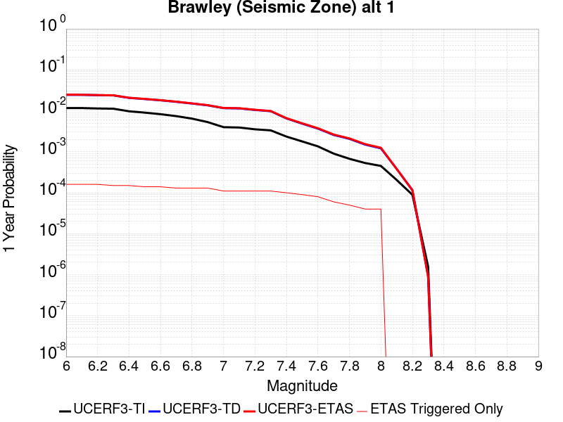 |  |

| Magnitude | 1 wk TI Prob | 1 wk TD Prob | 1 wk ETAS Prob | 1 wk ETAS/TD Gain | 1 wk ETAS Triggered Only | 1 mo TI Prob | 1 mo TD Prob | 1 mo ETAS Prob | 1 mo ETAS/TD Gain | 1 mo ETAS Triggered Only | 1 yr TI Prob | 1 yr TD Prob | 1 yr ETAS Prob | 1 yr ETAS/TD Gain | 1 yr ETAS Triggered Only | 10 yr TI Prob | 10 yr TD Prob | 10 yr ETAS Prob | 10 yr ETAS/TD Gain | 10 yr ETAS Triggered Only |
|-----|-----|-----|-----|-----|-----|-----|-----|-----|-----|-----|-----|-----|-----|-----|-----|-----|-----|-----|-----|-----|
| 6.0 | 2.2521618E-4 | 4.7632487E-4 | 4.7632487E-4 | 1.0 | 0.0 | 9.6485513E-4 | 0.0020398323 | 0.0020398323 | 1.0 | 0.0 | 0.011683988 | 0.024546238 | 0.02458573 | 1.0016088 | 4.048583E-5 | 0.11088423 | 0.21350002 | 0.21353187 | 1.0001491 | 4.048583E-5 |
| 6.1 | 2.2521618E-4 | 4.7632487E-4 | 4.7632487E-4 | 1.0 | 0.0 | 9.6485513E-4 | 0.0020398323 | 0.0020398323 | 1.0 | 0.0 | 0.011683988 | 0.024546238 | 0.02458573 | 1.0016088 | 4.048583E-5 | 0.11088423 | 0.21350002 | 0.21353187 | 1.0001491 | 4.048583E-5 |
| 6.2 | 2.198148E-4 | 4.6717093E-4 | 4.6717093E-4 | 1.0 | 0.0 | 9.417233E-4 | 0.0020006616 | 0.0020006616 | 1.0 | 0.0 | 0.011405343 | 0.024080504 | 0.024120014 | 1.0016408 | 4.048583E-5 | 0.10837428 | 0.20993657 | 0.20996855 | 1.0001523 | 4.048583E-5 |
| 6.3 | 2.1704129E-4 | 4.615278E-4 | 4.615278E-4 | 1.0 | 0.0 | 9.298453E-4 | 0.0019765133 | 0.0019765133 | 1.0 | 0.0 | 0.011262234 | 0.02379366 | 0.023833184 | 1.0016611 | 4.048583E-5 | 0.107082725 | 0.20782755 | 0.20785962 | 1.0001544 | 4.048583E-5 |
| 6.4 | 1.876142E-4 | 4.00449E-4 | 4.00449E-4 | 1.0 | 0.0 | 8.038131E-4 | 0.0017150956 | 0.0017150956 | 1.0 | 0.0 | 0.00974259 | 0.020680401 | 0.02072005 | 1.0019172 | 4.048583E-5 | 0.093263686 | 0.18457815 | 0.18461117 | 1.0001788 | 4.048583E-5 |
| 6.5 | 1.7390939E-4 | 3.7477075E-4 | 3.7477075E-4 | 1.0 | 0.0 | 7.45113E-4 | 0.0016051838 | 0.0016051838 | 1.0 | 0.0 | 0.009034078 | 0.019368723 | 0.019408425 | 1.0020498 | 4.048583E-5 | 0.086755216 | 0.17440031 | 0.17443374 | 1.0001917 | 4.048583E-5 |
| 6.6 | 1.591791E-4 | 3.4891962E-4 | 3.4891962E-4 | 1.0 | 0.0 | 6.8201777E-4 | 0.0014945229 | 0.0014945229 | 1.0 | 0.0 | 0.008271996 | 0.018045569 | 0.018085325 | 1.002203 | 4.048583E-5 | 0.07970774 | 0.16380852 | 0.16384238 | 1.0002067 | 4.048583E-5 |
| 6.7 | 1.4268003E-4 | 3.20582E-4 | 3.20582E-4 | 1.0 | 0.0 | 6.1134255E-4 | 0.0013732077 | 0.0013732077 | 1.0 | 0.0 | 0.007417723 | 0.016592601 | 0.016632415 | 1.0023996 | 4.048583E-5 | 0.07174956 | 0.15193306 | 0.1519674 | 1.000226 | 4.048583E-5 |
| 6.8 | 1.239713E-4 | 2.9053655E-4 | 2.9053655E-4 | 1.0 | 0.0 | 5.3119735E-4 | 0.0012445687 | 0.0012445687 | 1.0 | 0.0 | 0.0064481674 | 0.015048777 | 0.015088654 | 1.0026498 | 4.048583E-5 | 0.06264243 | 0.13837762 | 0.1384125 | 1.0002521 | 4.048583E-5 |
| 6.9 | 1.0180238E-4 | 2.625439E-4 | 2.625439E-4 | 1.0 | 0.0 | 4.3622297E-4 | 0.0011247073 | 0.0011247073 | 1.0 | 0.0 | 0.005298089 | 0.013608336 | 0.013648271 | 1.0029346 | 4.048583E-5 | 0.05173543 | 0.124961674 | 0.1249971 | 1.0002835 | 4.048583E-5 |
| 7.0 | 7.6619996E-5 | 2.23993E-4 | 2.23993E-4 | 1.0 | 0.0 | 3.283301E-4 | 9.5962E-4 | 9.5962E-4 | 1.0 | 0.0 | 0.0039900932 | 0.011621496 | 0.011621496 | 1.0 | 0.0 | 0.039192066 | 0.107266866 | 0.107266866 | 1.0 | 0.0 |
| 7.1 | 7.5127435E-5 | 2.2082464E-4 | 2.2082464E-4 | 1.0 | 0.0 | 3.2193496E-4 | 9.4605127E-4 | 9.4605127E-4 | 1.0 | 0.0 | 0.0039125155 | 0.011458045 | 0.011458045 | 1.0 | 0.0 | 0.038443442 | 0.10583085 | 0.10583085 | 1.0 | 0.0 |
| 7.2 | 6.788582E-5 | 2.0210193E-4 | 2.0210193E-4 | 1.0 | 0.0 | 2.9090676E-4 | 8.6586666E-4 | 8.6586666E-4 | 1.0 | 0.0 | 0.0035360386 | 0.0104916105 | 0.0104916105 | 1.0 | 0.0 | 0.034803 | 0.09750131 | 0.09750131 | 1.0 | 0.0 |
| 7.3 | 6.399602E-5 | 1.8841137E-4 | 1.8841137E-4 | 1.0 | 0.0 | 2.7423984E-4 | 8.072303E-4 | 8.072303E-4 | 1.0 | 0.0 | 0.0033337586 | 0.009784332 | 0.009784332 | 1.0 | 0.0 | 0.03284188 | 0.09139617 | 0.09139617 | 1.0 | 0.0 |
| 7.4 | 4.506759E-5 | 1.2529209E-4 | 1.2529209E-4 | 1.0 | 0.0 | 1.9313251E-4 | 5.368565E-4 | 5.368565E-4 | 1.0 | 0.0 | 0.0023488526 | 0.0065168133 | 0.0065168133 | 1.0 | 0.0 | 0.023241805 | 0.062363707 | 0.062363707 | 1.0 | 0.0 |
| 7.5 | 3.43289E-5 | 9.33541E-5 | 9.33541E-5 | 1.0 | 0.0 | 1.4711556E-4 | 4.00028E-4 | 4.00028E-4 | 1.0 | 0.0 | 0.0017896603 | 0.0048595266 | 0.0048595266 | 1.0 | 0.0 | 0.01775316 | 0.04705519 | 0.04705519 | 1.0 | 0.0 |
| 7.6 | 2.5980507E-5 | 7.053101E-5 | 7.053101E-5 | 1.0 | 0.0 | 1.1134028E-4 | 3.0224086E-4 | 3.0224086E-4 | 1.0 | 0.0 | 0.001354725 | 0.003673598 | 0.003673598 | 1.0 | 0.0 | 0.013464959 | 0.035840835 | 0.035840835 | 1.0 | 0.0 |
| 7.7 | 1.7292105E-5 | 4.9407296E-5 | 4.9407296E-5 | 1.0 | 0.0 | 7.4106916E-5 | 2.117284E-4 | 2.117284E-4 | 1.0 | 0.0 | 9.018782E-4 | 0.0025747516 | 0.0025747516 | 1.0 | 0.0 | 0.008982267 | 0.025290398 | 0.025290398 | 1.0 | 0.0 |
| 7.8 | 1.2927471E-5 | 3.9693266E-5 | 3.9693266E-5 | 1.0 | 0.0 | 5.5402274E-5 | 1.7010293E-4 | 1.7010293E-4 | 1.0 | 0.0 | 6.743139E-4 | 0.0020690386 | 0.0020690386 | 1.0 | 0.0 | 0.0067227143 | 0.020431727 | 0.020431727 | 1.0 | 0.0 |
| 7.9 | 1.0200774E-5 | 2.874569E-5 | 2.874569E-5 | 1.0 | 0.0 | 4.371687E-5 | 1.2319001E-4 | 1.2319001E-4 | 1.0 | 0.0 | 5.321229E-4 | 0.0014988075 | 0.0014988075 | 1.0 | 0.0 | 0.005308505 | 0.014991644 | 0.014991644 | 1.0 | 0.0 |
| 8.0 | 8.650396E-6 | 2.3277367E-5 | 2.3277367E-5 | 1.0 | 0.0 | 3.70726E-5 | 9.975634E-5 | 9.975634E-5 | 1.0 | 0.0 | 4.5126543E-4 | 0.0012138576 | 0.0012138576 | 1.0 | 0.0 | 0.0045035016 | 0.012211097 | 0.012211097 | 1.0 | 0.0 |
| 8.1 | 3.9368224E-6 | 7.3279825E-6 | 7.3279825E-6 | 1.0 | 0.0 | 1.6871985E-5 | 3.140526E-5 | 3.140526E-5 | 1.0 | 0.0 | 2.0539707E-4 | 3.8229208E-4 | 3.8229208E-4 | 1.0 | 0.0 | 0.0020520731 | 0.004001185 | 0.004001185 | 1.0 | 0.0 |
| 8.2 | 1.7101195E-6 | 2.217876E-6 | 2.217876E-6 | 1.0 | 0.0 | 7.329063E-6 | 9.505149E-6 | 9.505149E-6 | 1.0 | 0.0 | 8.922769E-5 | 1.1571907E-4 | 1.1571907E-4 | 1.0 | 0.0 | 8.9191867E-4 | 0.0012666774 | 0.0012666774 | 1.0 | 0.0 |
| 8.3 | 3.0346666E-8 | 1.721586E-8 | 1.721586E-8 | 1.0 | 0.0 | 1.3005713E-7 | 7.378226E-8 | 7.378226E-8 | 1.0 | 0.0 | 1.5834444E-6 | 8.9829894E-7 | 8.9829894E-7 | 1.0 | 0.0 | 1.5834332E-5 | 9.367729E-6 | 9.367729E-6 | 1.0 | 0.0 |

## Elsinore (Julian)
*[(top)](#table-of-contents)*

| 1 Week | 1 Month | 1 Year | 10 Year |
|-----|-----|-----|-----|
|  |  | 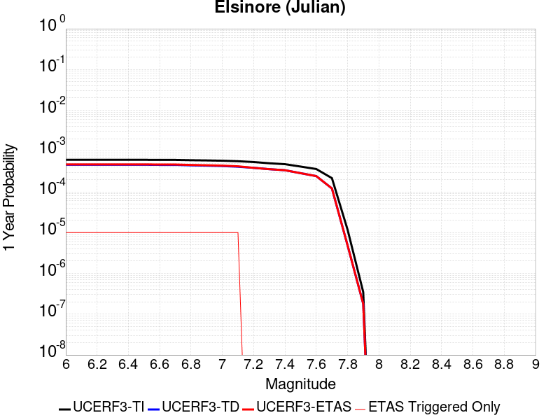 |  |

| Magnitude | 1 wk TI Prob | 1 wk TD Prob | 1 wk ETAS Prob | 1 wk ETAS/TD Gain | 1 wk ETAS Triggered Only | 1 mo TI Prob | 1 mo TD Prob | 1 mo ETAS Prob | 1 mo ETAS/TD Gain | 1 mo ETAS Triggered Only | 1 yr TI Prob | 1 yr TD Prob | 1 yr ETAS Prob | 1 yr ETAS/TD Gain | 1 yr ETAS Triggered Only | 10 yr TI Prob | 10 yr TD Prob | 10 yr ETAS Prob | 10 yr ETAS/TD Gain | 10 yr ETAS Triggered Only |
|-----|-----|-----|-----|-----|-----|-----|-----|-----|-----|-----|-----|-----|-----|-----|-----|-----|-----|-----|-----|-----|
| 6.0 | 1.1710231E-5 | 8.845509E-6 | 4.933098E-5 | 5.5769525 | 4.048583E-5 | 5.0185736E-5 | 3.7908783E-5 | 7.839308E-5 | 2.0679398 | 4.048583E-5 | 6.1084004E-4 | 4.614434E-4 | 5.019105E-4 | 1.0876969 | 4.048583E-5 | 0.006091637 | 0.0046050567 | 0.004645356 | 1.0087512 | 4.048583E-5 |
| 6.1 | 1.1710231E-5 | 8.845509E-6 | 4.933098E-5 | 5.5769525 | 4.048583E-5 | 5.0185736E-5 | 3.7908783E-5 | 7.839308E-5 | 2.0679398 | 4.048583E-5 | 6.1084004E-4 | 4.614434E-4 | 5.019105E-4 | 1.0876969 | 4.048583E-5 | 0.006091637 | 0.0046050567 | 0.004645356 | 1.0087512 | 4.048583E-5 |
| 6.2 | 1.1710231E-5 | 8.845509E-6 | 4.933098E-5 | 5.5769525 | 4.048583E-5 | 5.0185736E-5 | 3.7908783E-5 | 7.839308E-5 | 2.0679398 | 4.048583E-5 | 6.1084004E-4 | 4.614434E-4 | 5.019105E-4 | 1.0876969 | 4.048583E-5 | 0.006091637 | 0.0046050567 | 0.004645356 | 1.0087512 | 4.048583E-5 |
| 6.3 | 1.1710231E-5 | 8.845509E-6 | 4.933098E-5 | 5.5769525 | 4.048583E-5 | 5.0185736E-5 | 3.7908783E-5 | 7.839308E-5 | 2.0679398 | 4.048583E-5 | 6.1084004E-4 | 4.614434E-4 | 5.019105E-4 | 1.0876969 | 4.048583E-5 | 0.006091637 | 0.0046050567 | 0.004645356 | 1.0087512 | 4.048583E-5 |
| 6.4 | 1.1710231E-5 | 8.845509E-6 | 4.933098E-5 | 5.5769525 | 4.048583E-5 | 5.0185736E-5 | 3.7908783E-5 | 7.839308E-5 | 2.0679398 | 4.048583E-5 | 6.1084004E-4 | 4.614434E-4 | 5.019105E-4 | 1.0876969 | 4.048583E-5 | 0.006091637 | 0.0046050567 | 0.004645356 | 1.0087512 | 4.048583E-5 |
| 6.5 | 1.1710231E-5 | 8.845509E-6 | 4.933098E-5 | 5.5769525 | 4.048583E-5 | 5.0185736E-5 | 3.7908783E-5 | 7.839308E-5 | 2.0679398 | 4.048583E-5 | 6.1084004E-4 | 4.614434E-4 | 5.019105E-4 | 1.0876969 | 4.048583E-5 | 0.006091637 | 0.0046050567 | 0.004645356 | 1.0087512 | 4.048583E-5 |
| 6.6 | 1.1650619E-5 | 8.777881E-6 | 4.9263355E-5 | 5.612215 | 4.048583E-5 | 4.993027E-5 | 3.7618956E-5 | 7.8103265E-5 | 2.0761678 | 4.048583E-5 | 6.0773146E-4 | 4.5791623E-4 | 4.9838354E-4 | 1.0883727 | 4.048583E-5 | 0.0060607214 | 0.004569931 | 0.0046102316 | 1.0088187 | 4.048583E-5 |
| 6.7 | 1.1650619E-5 | 8.777881E-6 | 4.9263355E-5 | 5.612215 | 4.048583E-5 | 4.993027E-5 | 3.7618956E-5 | 7.8103265E-5 | 2.0761678 | 4.048583E-5 | 6.0773146E-4 | 4.5791623E-4 | 4.9838354E-4 | 1.0883727 | 4.048583E-5 | 0.0060607214 | 0.004569931 | 0.0046102316 | 1.0088187 | 4.048583E-5 |
| 6.8 | 1.1442698E-5 | 8.561041E-6 | 4.9046525E-5 | 5.729038 | 4.048583E-5 | 4.9039216E-5 | 3.6689667E-5 | 7.7174016E-5 | 2.1034262 | 4.048583E-5 | 5.968889E-4 | 4.4660683E-4 | 4.8707458E-4 | 1.0906116 | 4.048583E-5 | 0.0059528816 | 0.004457295 | 0.0044976003 | 1.0090426 | 4.048583E-5 |
| 6.9 | 1.1300589E-5 | 8.408907E-6 | 4.8894395E-5 | 5.8145957 | 4.048583E-5 | 4.8430196E-5 | 3.6037683E-5 | 7.6522054E-5 | 2.12339 | 4.048583E-5 | 5.894781E-4 | 4.3867214E-4 | 4.791402E-4 | 1.0922513 | 4.048583E-5 | 0.005879169 | 0.0043782624 | 0.004418571 | 1.0092065 | 4.048583E-5 |
| 7.0 | 1.1117729E-5 | 8.226087E-6 | 4.8711583E-5 | 5.9215984 | 4.048583E-5 | 4.764654E-5 | 3.525419E-5 | 7.573859E-5 | 2.1483572 | 4.048583E-5 | 5.799422E-4 | 4.291369E-4 | 4.6960535E-4 | 1.0943019 | 4.048583E-5 | 0.0057843104 | 0.004283281 | 0.0043235933 | 1.0094116 | 4.048583E-5 |
| 7.1 | 1.08053955E-5 | 7.9117535E-6 | 4.8397265E-5 | 6.1171346 | 4.048583E-5 | 4.6308014E-5 | 3.3907087E-5 | 7.4391544E-5 | 2.1939821 | 4.048583E-5 | 5.6365423E-4 | 4.127422E-4 | 4.532113E-4 | 1.0980494 | 4.048583E-5 | 0.005622267 | 0.0041199517 | 0.004160271 | 1.0097862 | 4.048583E-5 |
| 7.2 | 1.032804E-5 | 7.433021E-6 | 7.433021E-6 | 1.0 | 0.0 | 4.4262277E-5 | 3.1855423E-5 | 3.1855423E-5 | 1.0 | 0.0 | 5.387599E-4 | 3.8777234E-4 | 3.8777234E-4 | 1.0 | 0.0 | 0.0053745564 | 0.0038711445 | 0.0038711445 | 1.0 | 0.0 |
| 7.3 | 9.622426E-6 | 6.8978457E-6 | 6.8978457E-6 | 1.0 | 0.0 | 4.1238312E-5 | 2.9561868E-5 | 2.9561868E-5 | 1.0 | 0.0 | 5.019608E-4 | 3.5985775E-4 | 3.5985775E-4 | 1.0 | 0.0 | 0.005008285 | 0.0035929221 | 0.0035929221 | 1.0 | 0.0 |
| 7.4 | 9.144434E-6 | 6.4963933E-6 | 6.4963933E-6 | 1.0 | 0.0 | 3.9189843E-5 | 2.7841395E-5 | 2.7841395E-5 | 1.0 | 0.0 | 4.7703186E-4 | 3.3891766E-4 | 3.3891766E-4 | 1.0 | 0.0 | 0.0047600917 | 0.0033841513 | 0.0033841513 | 1.0 | 0.0 |
| 7.5 | 7.988981E-6 | 5.4983307E-6 | 5.4983307E-6 | 1.0 | 0.0 | 3.4238044E-5 | 2.356407E-5 | 2.356407E-5 | 1.0 | 0.0 | 4.1676845E-4 | 2.8685606E-4 | 2.8685606E-4 | 1.0 | 0.0 | 0.0041598766 | 0.002864985 | 0.002864985 | 1.0 | 0.0 |
| 7.6 | 6.9554876E-6 | 4.6625346E-6 | 4.6625346E-6 | 1.0 | 0.0 | 2.9808893E-5 | 1.9982144E-5 | 1.9982144E-5 | 1.0 | 0.0 | 3.6286283E-4 | 2.4325661E-4 | 2.4325661E-4 | 1.0 | 0.0 | 0.0036227088 | 0.0024300197 | 0.0024300197 | 1.0 | 0.0 |
| 7.7 | 4.1557314E-6 | 2.3246462E-6 | 2.3246462E-6 | 1.0 | 0.0 | 1.7810156E-5 | 9.962735E-6 | 9.962735E-6 | 1.0 | 0.0 | 2.1681708E-4 | 1.2129029E-4 | 1.2129029E-4 | 1.0 | 0.0 | 0.0021660565 | 0.001212314 | 0.001212314 | 1.0 | 0.0 |
| 7.8 | 2.2597293E-7 | 9.332915E-8 | 9.332915E-8 | 1.0 | 0.0 | 9.684551E-7 | 3.99982E-7 | 3.99982E-7 | 1.0 | 0.0 | 1.1790877E-5 | 4.8697734E-6 | 4.8697734E-6 | 1.0 | 0.0 | 1.17902506E-4 | 4.8696995E-5 | 4.8696995E-5 | 1.0 | 0.0 |
| 7.9 | 6.676829E-9 | 3.439853E-9 | 3.439853E-9 | 1.0 | 0.0 | 2.861498E-8 | 1.4742227E-8 | 1.4742227E-8 | 1.0 | 0.0 | 3.4838732E-7 | 1.7948659E-7 | 1.7948659E-7 | 1.0 | 0.0 | 3.4838679E-6 | 1.7948646E-6 | 1.7948646E-6 | 1.0 | 0.0 |

## Owens Valley Keough Hot Springs
*[(top)](#table-of-contents)*

| 1 Week | 1 Month | 1 Year | 10 Year |
|-----|-----|-----|-----|
|  |  |  |  |

| Magnitude | 1 wk TI Prob | 1 wk TD Prob | 1 wk ETAS Prob | 1 wk ETAS/TD Gain | 1 wk ETAS Triggered Only | 1 mo TI Prob | 1 mo TD Prob | 1 mo ETAS Prob | 1 mo ETAS/TD Gain | 1 mo ETAS Triggered Only | 1 yr TI Prob | 1 yr TD Prob | 1 yr ETAS Prob | 1 yr ETAS/TD Gain | 1 yr ETAS Triggered Only | 10 yr TI Prob | 10 yr TD Prob | 10 yr ETAS Prob | 10 yr ETAS/TD Gain | 10 yr ETAS Triggered Only |
|-----|-----|-----|-----|-----|-----|-----|-----|-----|-----|-----|-----|-----|-----|-----|-----|-----|-----|-----|-----|-----|
| 6.0 | 1.5708529E-5 | 4.950656E-6 | 4.950656E-6 | 1.0 | 0.0 | 6.7320536E-5 | 2.1216953E-5 | 6.1701925E-5 | 2.9081426 | 4.048583E-5 | 8.193192E-4 | 2.582909E-4 | 2.9876627E-4 | 1.1567045 | 4.048583E-5 | 0.008163051 | 0.0025805652 | 0.0026209464 | 1.0156482 | 4.048583E-5 |
| 6.1 | 1.5708529E-5 | 4.950656E-6 | 4.950656E-6 | 1.0 | 0.0 | 6.7320536E-5 | 2.1216953E-5 | 6.1701925E-5 | 2.9081426 | 4.048583E-5 | 8.193192E-4 | 2.582909E-4 | 2.9876627E-4 | 1.1567045 | 4.048583E-5 | 0.008163051 | 0.0025805652 | 0.0026209464 | 1.0156482 | 4.048583E-5 |
| 6.2 | 1.5708529E-5 | 4.950656E-6 | 4.950656E-6 | 1.0 | 0.0 | 6.7320536E-5 | 2.1216953E-5 | 6.1701925E-5 | 2.9081426 | 4.048583E-5 | 8.193192E-4 | 2.582909E-4 | 2.9876627E-4 | 1.1567045 | 4.048583E-5 | 0.008163051 | 0.0025805652 | 0.0026209464 | 1.0156482 | 4.048583E-5 |
| 6.3 | 1.5708529E-5 | 4.950656E-6 | 4.950656E-6 | 1.0 | 0.0 | 6.7320536E-5 | 2.1216953E-5 | 6.1701925E-5 | 2.9081426 | 4.048583E-5 | 8.193192E-4 | 2.582909E-4 | 2.9876627E-4 | 1.1567045 | 4.048583E-5 | 0.008163051 | 0.0025805652 | 0.0026209464 | 1.0156482 | 4.048583E-5 |
| 6.4 | 1.4622509E-5 | 3.7265204E-6 | 3.7265204E-6 | 1.0 | 0.0 | 6.266639E-5 | 1.5970723E-5 | 5.6455905E-5 | 3.5349624 | 4.048583E-5 | 7.626962E-4 | 1.944295E-4 | 2.3490746E-4 | 1.2081883 | 4.048583E-5 | 0.007600839 | 0.0019430731 | 0.0019834803 | 1.0207955 | 4.048583E-5 |
| 6.5 | 1.3335527E-5 | 2.2777172E-6 | 2.2777172E-6 | 1.0 | 0.0 | 5.7151006E-5 | 9.761612E-6 | 9.761612E-6 | 1.0 | 0.0 | 6.955913E-4 | 1.18841825E-4 | 1.18841825E-4 | 1.0 | 0.0 | 0.0069341804 | 0.0011880046 | 0.0011880046 | 1.0 | 0.0 |
| 6.6 | 1.3332855E-5 | 2.2748663E-6 | 2.2748663E-6 | 1.0 | 0.0 | 5.7139558E-5 | 9.749395E-6 | 9.749395E-6 | 1.0 | 0.0 | 6.9545204E-4 | 1.186931E-4 | 1.186931E-4 | 1.0 | 0.0 | 0.0069327964 | 0.0011865189 | 0.0011865189 | 1.0 | 0.0 |
| 6.7 | 1.3318214E-5 | 2.2640966E-6 | 2.2640966E-6 | 1.0 | 0.0 | 5.707681E-5 | 9.703239E-6 | 9.703239E-6 | 1.0 | 0.0 | 6.946886E-4 | 1.1813121E-4 | 1.1813121E-4 | 1.0 | 0.0 | 0.0069252094 | 0.001180906 | 0.001180906 | 1.0 | 0.0 |
| 6.8 | 1.2441338E-5 | 1.6777863E-6 | 1.6777863E-6 | 1.0 | 0.0 | 5.331893E-5 | 7.1904947E-6 | 7.1904947E-6 | 1.0 | 0.0 | 6.489646E-4 | 8.7541055E-5 | 8.7541055E-5 | 1.0 | 0.0 | 0.0064707273 | 8.752499E-4 | 8.752499E-4 | 1.0 | 0.0 |
| 6.9 | 1.1130476E-5 | 1.0303868E-6 | 1.0303868E-6 | 1.0 | 0.0 | 4.7701167E-5 | 4.415936E-6 | 4.415936E-6 | 1.0 | 0.0 | 5.806069E-4 | 5.3762706E-5 | 5.3762706E-5 | 1.0 | 0.0 | 0.0057909233 | 5.37651E-4 | 5.37651E-4 | 1.0 | 0.0 |
| 7.0 | 1.0986073E-5 | 9.579413E-7 | 9.579413E-7 | 1.0 | 0.0 | 4.7082318E-5 | 4.1054564E-6 | 4.1054564E-6 | 1.0 | 0.0 | 5.730765E-4 | 4.99828E-5 | 4.99828E-5 | 1.0 | 0.0 | 0.0057160086 | 4.9986853E-4 | 4.9986853E-4 | 1.0 | 0.0 |
| 7.1 | 1.0451338E-5 | 8.0002656E-7 | 8.0002656E-7 | 1.0 | 0.0 | 4.4790682E-5 | 3.4286807E-6 | 3.4286807E-6 | 1.0 | 0.0 | 5.451901E-4 | 4.1743395E-5 | 4.1743395E-5 | 1.0 | 0.0 | 0.005438545 | 4.1750458E-4 | 4.1750458E-4 | 1.0 | 0.0 |
| 7.2 | 9.989061E-6 | 6.544956E-7 | 6.544956E-7 | 1.0 | 0.0 | 4.280956E-5 | 2.804978E-6 | 2.804978E-6 | 1.0 | 0.0 | 5.2108173E-4 | 3.4150078E-5 | 3.4150078E-5 | 1.0 | 0.0 | 0.0051986156 | 3.415851E-4 | 3.415851E-4 | 1.0 | 0.0 |
| 7.3 | 9.465365E-6 | 5.4600474E-7 | 5.4600474E-7 | 1.0 | 0.0 | 4.056522E-5 | 2.3400182E-6 | 2.3400182E-6 | 1.0 | 0.0 | 4.937696E-4 | 2.8489352E-5 | 2.8489352E-5 | 1.0 | 0.0 | 0.0049267393 | 2.8498896E-4 | 2.8498896E-4 | 1.0 | 0.0 |
| 7.4 | 6.3824805E-6 | 4.016335E-7 | 4.016335E-7 | 1.0 | 0.0 | 2.73532E-5 | 1.7212853E-6 | 1.7212853E-6 | 1.0 | 0.0 | 3.3297433E-4 | 2.095645E-5 | 2.095645E-5 | 1.0 | 0.0 | 0.0033247585 | 2.0963654E-4 | 2.0963654E-4 | 1.0 | 0.0 |
| 7.5 | 1.6192645E-6 | 2.516124E-7 | 2.516124E-7 | 1.0 | 0.0 | 6.9396865E-6 | 1.0783383E-6 | 1.0783383E-6 | 1.0 | 0.0 | 8.448741E-5 | 1.31286915E-5 | 1.31286915E-5 | 1.0 | 0.0 | 8.4455294E-4 | 1.3127929E-4 | 1.3127929E-4 | 1.0 | 0.0 |
| 7.6 | 5.7062545E-7 | 1.07924045E-7 | 1.07924045E-7 | 1.0 | 0.0 | 2.4455355E-6 | 4.6253152E-7 | 4.6253152E-7 | 1.0 | 0.0 | 2.9773988E-5 | 5.6313074E-6 | 5.6313074E-6 | 1.0 | 0.0 | 2.977E-4 | 5.6311732E-5 | 5.6311732E-5 | 1.0 | 0.0 |
| 7.7 | 2.5988817E-7 | 4.5457977E-8 | 4.5457977E-8 | 1.0 | 0.0 | 1.113806E-6 | 1.9481989E-7 | 1.9481989E-7 | 1.0 | 0.0 | 1.3560503E-5 | 2.3719301E-6 | 2.3719301E-6 | 1.0 | 0.0 | 1.3559677E-4 | 2.371909E-5 | 2.371909E-5 | 1.0 | 0.0 |

## Dry Mountain
*[(top)](#table-of-contents)*

| 1 Week | 1 Month | 1 Year | 10 Year |
|-----|-----|-----|-----|
|  |  |  |  |

| Magnitude | 1 wk TI Prob | 1 wk TD Prob | 1 wk ETAS Prob | 1 wk ETAS/TD Gain | 1 wk ETAS Triggered Only | 1 mo TI Prob | 1 mo TD Prob | 1 mo ETAS Prob | 1 mo ETAS/TD Gain | 1 mo ETAS Triggered Only | 1 yr TI Prob | 1 yr TD Prob | 1 yr ETAS Prob | 1 yr ETAS/TD Gain | 1 yr ETAS Triggered Only | 10 yr TI Prob | 10 yr TD Prob | 10 yr ETAS Prob | 10 yr ETAS/TD Gain | 10 yr ETAS Triggered Only |
|-----|-----|-----|-----|-----|-----|-----|-----|-----|-----|-----|-----|-----|-----|-----|-----|-----|-----|-----|-----|-----|
| 6.0 | 6.222801E-6 | 6.439381E-6 | 4.692495E-5 | 7.2871833 | 4.048583E-5 | 2.6668875E-5 | 2.7597147E-5 | 6.8081856E-5 | 2.466989 | 4.048583E-5 | 3.2464517E-4 | 3.3595937E-4 | 3.764316E-4 | 1.1204677 | 4.048583E-5 | 0.0032417132 | 0.0033560768 | 0.0033964268 | 1.012023 | 4.048583E-5 |
| 6.1 | 6.222801E-6 | 6.439381E-6 | 4.692495E-5 | 7.2871833 | 4.048583E-5 | 2.6668875E-5 | 2.7597147E-5 | 6.8081856E-5 | 2.466989 | 4.048583E-5 | 3.2464517E-4 | 3.3595937E-4 | 3.764316E-4 | 1.1204677 | 4.048583E-5 | 0.0032417132 | 0.0033560768 | 0.0033964268 | 1.012023 | 4.048583E-5 |
| 6.2 | 6.222801E-6 | 6.439381E-6 | 4.692495E-5 | 7.2871833 | 4.048583E-5 | 2.6668875E-5 | 2.7597147E-5 | 6.8081856E-5 | 2.466989 | 4.048583E-5 | 3.2464517E-4 | 3.3595937E-4 | 3.764316E-4 | 1.1204677 | 4.048583E-5 | 0.0032417132 | 0.0033560768 | 0.0033964268 | 1.012023 | 4.048583E-5 |
| 6.3 | 6.222801E-6 | 6.439381E-6 | 4.692495E-5 | 7.2871833 | 4.048583E-5 | 2.6668875E-5 | 2.7597147E-5 | 6.8081856E-5 | 2.466989 | 4.048583E-5 | 3.2464517E-4 | 3.3595937E-4 | 3.764316E-4 | 1.1204677 | 4.048583E-5 | 0.0032417132 | 0.0033560768 | 0.0033964268 | 1.012023 | 4.048583E-5 |
| 6.4 | 6.222801E-6 | 6.439381E-6 | 4.692495E-5 | 7.2871833 | 4.048583E-5 | 2.6668875E-5 | 2.7597147E-5 | 6.8081856E-5 | 2.466989 | 4.048583E-5 | 3.2464517E-4 | 3.3595937E-4 | 3.764316E-4 | 1.1204677 | 4.048583E-5 | 0.0032417132 | 0.0033560768 | 0.0033964268 | 1.012023 | 4.048583E-5 |
| 6.5 | 2.8528623E-6 | 2.9521684E-6 | 2.9521684E-6 | 1.0 | 0.0 | 1.22264955E-5 | 1.2652138E-5 | 1.2652138E-5 | 1.0 | 0.0 | 1.4884741E-4 | 1.540376E-4 | 1.540376E-4 | 1.0 | 0.0 | 0.0014874774 | 0.0015401616 | 0.0015401616 | 1.0 | 0.0 |
| 6.6 | 2.8528623E-6 | 2.9521684E-6 | 2.9521684E-6 | 1.0 | 0.0 | 1.22264955E-5 | 1.2652138E-5 | 1.2652138E-5 | 1.0 | 0.0 | 1.4884741E-4 | 1.540376E-4 | 1.540376E-4 | 1.0 | 0.0 | 0.0014874774 | 0.0015401616 | 0.0015401616 | 1.0 | 0.0 |
| 6.7 | 2.541E-6 | 2.6293578E-6 | 2.6293578E-6 | 1.0 | 0.0 | 1.0889954E-5 | 1.1268677E-5 | 1.1268677E-5 | 1.0 | 0.0 | 1.3257713E-4 | 1.3719614E-4 | 1.3719614E-4 | 1.0 | 0.0 | 0.0013249806 | 0.0013719613 | 0.0013719613 | 1.0 | 0.0 |

## Reliz 2011 CFM
*[(top)](#table-of-contents)*

| 1 Week | 1 Month | 1 Year | 10 Year |
|-----|-----|-----|-----|
|  |  |  |  |

| Magnitude | 1 wk TI Prob | 1 wk TD Prob | 1 wk ETAS Prob | 1 wk ETAS/TD Gain | 1 wk ETAS Triggered Only | 1 mo TI Prob | 1 mo TD Prob | 1 mo ETAS Prob | 1 mo ETAS/TD Gain | 1 mo ETAS Triggered Only | 1 yr TI Prob | 1 yr TD Prob | 1 yr ETAS Prob | 1 yr ETAS/TD Gain | 1 yr ETAS Triggered Only | 10 yr TI Prob | 10 yr TD Prob | 10 yr ETAS Prob | 10 yr ETAS/TD Gain | 10 yr ETAS Triggered Only |
|-----|-----|-----|-----|-----|-----|-----|-----|-----|-----|-----|-----|-----|-----|-----|-----|-----|-----|-----|-----|-----|
| 6.0 | 1.6002472E-5 | 1.6282804E-5 | 1.6282804E-5 | 1.0 | 0.0 | 6.8580215E-5 | 6.9781694E-5 | 6.9781694E-5 | 1.0 | 0.0 | 8.3464425E-4 | 8.4928074E-4 | 8.4928074E-4 | 1.0 | 0.0 | 0.008315164 | 0.008462547 | 0.008502691 | 1.0047436 | 4.048583E-5 |
| 6.1 | 1.6002472E-5 | 1.6282804E-5 | 1.6282804E-5 | 1.0 | 0.0 | 6.8580215E-5 | 6.9781694E-5 | 6.9781694E-5 | 1.0 | 0.0 | 8.3464425E-4 | 8.4928074E-4 | 8.4928074E-4 | 1.0 | 0.0 | 0.008315164 | 0.008462547 | 0.008502691 | 1.0047436 | 4.048583E-5 |
| 6.2 | 1.6002472E-5 | 1.6282804E-5 | 1.6282804E-5 | 1.0 | 0.0 | 6.8580215E-5 | 6.9781694E-5 | 6.9781694E-5 | 1.0 | 0.0 | 8.3464425E-4 | 8.4928074E-4 | 8.4928074E-4 | 1.0 | 0.0 | 0.008315164 | 0.008462547 | 0.008502691 | 1.0047436 | 4.048583E-5 |
| 6.3 | 7.792404E-6 | 7.803802E-6 | 7.803802E-6 | 1.0 | 0.0 | 3.339559E-5 | 3.344444E-5 | 3.344444E-5 | 1.0 | 0.0 | 4.0651546E-4 | 4.0711078E-4 | 4.0711078E-4 | 1.0 | 0.0 | 0.0040577264 | 0.004063926 | 0.004063926 | 1.0 | 0.0 |
| 6.4 | 7.792404E-6 | 7.803802E-6 | 7.803802E-6 | 1.0 | 0.0 | 3.339559E-5 | 3.344444E-5 | 3.344444E-5 | 1.0 | 0.0 | 4.0651546E-4 | 4.0711078E-4 | 4.0711078E-4 | 1.0 | 0.0 | 0.0040577264 | 0.004063926 | 0.004063926 | 1.0 | 0.0 |
| 6.5 | 5.9659374E-6 | 5.928738E-6 | 5.928738E-6 | 1.0 | 0.0 | 2.5568053E-5 | 2.5408632E-5 | 2.5408632E-5 | 1.0 | 0.0 | 3.1124658E-4 | 3.093064E-4 | 3.093064E-4 | 1.0 | 0.0 | 0.00310811 | 0.0030889767 | 0.0030889767 | 1.0 | 0.0 |
| 6.6 | 5.2350692E-6 | 5.178986E-6 | 5.178986E-6 | 1.0 | 0.0 | 2.2435817E-5 | 2.2195467E-5 | 2.2195467E-5 | 1.0 | 0.0 | 2.7312184E-4 | 2.7019644E-4 | 2.7019644E-4 | 1.0 | 0.0 | 0.002727864 | 0.0026988892 | 0.0026988892 | 1.0 | 0.0 |
| 6.7 | 4.580206E-6 | 4.5061206E-6 | 4.5061206E-6 | 1.0 | 0.0 | 1.9629308E-5 | 1.9311801E-5 | 1.9311801E-5 | 1.0 | 0.0 | 2.389606E-4 | 2.350959E-4 | 2.350959E-4 | 1.0 | 0.0 | 0.002387038 | 0.0023486738 | 0.0023486738 | 1.0 | 0.0 |
| 6.8 | 4.0765017E-6 | 3.9882384E-6 | 3.9882384E-6 | 1.0 | 0.0 | 1.7470604E-5 | 1.7092338E-5 | 1.7092338E-5 | 1.0 | 0.0 | 2.1268385E-4 | 2.0807938E-4 | 2.0807938E-4 | 1.0 | 0.0 | 0.002124804 | 0.0020790435 | 0.0020790435 | 1.0 | 0.0 |
| 6.9 | 3.5752896E-6 | 3.4725176E-6 | 3.4725176E-6 | 1.0 | 0.0 | 1.532258E-5 | 1.4882134E-5 | 1.4882134E-5 | 1.0 | 0.0 | 1.8653645E-4 | 1.8117494E-4 | 1.8117494E-4 | 1.0 | 0.0 | 0.0018637994 | 0.0018104686 | 0.0018104686 | 1.0 | 0.0 |
| 7.0 | 3.0259848E-6 | 2.9079417E-6 | 2.9079417E-6 | 1.0 | 0.0 | 1.2968442E-5 | 1.2462548E-5 | 1.2462548E-5 | 1.0 | 0.0 | 1.5787935E-4 | 1.5172097E-4 | 1.5172097E-4 | 1.0 | 0.0 | 0.0015776722 | 0.001516369 | 0.001516369 | 1.0 | 0.0 |
| 7.1 | 2.5861116E-6 | 2.455167E-6 | 2.455167E-6 | 1.0 | 0.0 | 1.1083288E-5 | 1.05221025E-5 | 1.05221025E-5 | 1.0 | 0.0 | 1.3493067E-4 | 1.2809907E-4 | 1.2809907E-4 | 1.0 | 0.0 | 0.0013484878 | 0.001280447 | 0.001280447 | 1.0 | 0.0 |
| 7.2 | 2.1482588E-6 | 2.003237E-6 | 2.003237E-6 | 1.0 | 0.0 | 9.20679E-6 | 8.585273E-6 | 8.585273E-6 | 1.0 | 0.0 | 1.12086906E-4 | 1.0452068E-4 | 1.0452068E-4 | 1.0 | 0.0 | 0.0011203039 | 0.0010449095 | 0.0010449095 | 1.0 | 0.0 |
| 7.3 | 1.7194744E-6 | 1.5611241E-6 | 1.5611241E-6 | 1.0 | 0.0 | 7.3691554E-6 | 6.690515E-6 | 6.690515E-6 | 1.0 | 0.0 | 8.971577E-5 | 8.1453974E-5 | 8.1453974E-5 | 1.0 | 0.0 | 8.967956E-4 | 8.1443513E-4 | 8.1443513E-4 | 1.0 | 0.0 |
| 7.4 | 1.2755178E-6 | 1.10563E-6 | 1.10563E-6 | 1.0 | 0.0 | 5.4664933E-6 | 4.7384056E-6 | 4.7384056E-6 | 1.0 | 0.0 | 6.655252E-5 | 5.768856E-5 | 5.768856E-5 | 1.0 | 0.0 | 6.6532596E-4 | 5.7692965E-4 | 5.7692965E-4 | 1.0 | 0.0 |
| 7.5 | 8.8463224E-7 | 7.0580273E-7 | 7.0580273E-7 | 1.0 | 0.0 | 3.7912755E-6 | 3.0248652E-6 | 3.0248652E-6 | 1.0 | 0.0 | 4.6157802E-5 | 3.6827114E-5 | 3.6827114E-5 | 1.0 | 0.0 | 4.6148215E-4 | 3.684038E-4 | 3.684038E-4 | 1.0 | 0.0 |
| 7.6 | 5.291355E-7 | 3.500777E-7 | 3.500777E-7 | 1.0 | 0.0 | 2.2677216E-6 | 1.5003321E-6 | 1.5003321E-6 | 1.0 | 0.0 | 2.760916E-5 | 1.8266392E-5 | 1.8266392E-5 | 1.0 | 0.0 | 2.760573E-4 | 1.8284164E-4 | 1.8284164E-4 | 1.0 | 0.0 |
| 7.7 | 2.9663357E-7 | 1.351113E-7 | 1.351113E-7 | 1.0 | 0.0 | 1.2712861E-6 | 5.7904833E-7 | 5.7904833E-7 | 1.0 | 0.0 | 1.5477797E-5 | 7.049891E-6 | 7.049891E-6 | 1.0 | 0.0 | 1.547672E-4 | 7.068132E-5 | 7.068132E-5 | 1.0 | 0.0 |
| 7.8 | 1.2509386E-7 | 2.7157126E-8 | 2.7157126E-8 | 1.0 | 0.0 | 5.3611643E-7 | 1.1638769E-7 | 1.1638769E-7 | 1.0 | 0.0 | 6.527198E-6 | 1.4170191E-6 | 1.4170191E-6 | 1.0 | 0.0 | 6.527006E-5 | 1.4326506E-5 | 1.4326506E-5 | 1.0 | 0.0 |
| 7.9 | 6.213493E-8 | 1.1482114E-8 | 1.1482114E-8 | 1.0 | 0.0 | 2.6629255E-7 | 4.920906E-8 | 4.920906E-8 | 1.0 | 0.0 | 3.242107E-6 | 5.9912014E-7 | 5.9912014E-7 | 1.0 | 0.0 | 3.2420594E-5 | 6.1224223E-6 | 6.1224223E-6 | 1.0 | 0.0 |
| 8.0 | 5.92383E-9 | 1.677887E-9 | 1.677887E-9 | 1.0 | 0.0 | 2.5387841E-8 | 7.190944E-9 | 7.190944E-9 | 1.0 | 0.0 | 3.0909692E-7 | 8.754974E-8 | 8.754974E-8 | 1.0 | 0.0 | 3.090965E-6 | 9.003061E-7 | 9.003061E-7 | 1.0 | 0.0 |

## Big Pine (Central)
*[(top)](#table-of-contents)*

| 1 Week | 1 Month | 1 Year | 10 Year |
|-----|-----|-----|-----|
|  |  |  | 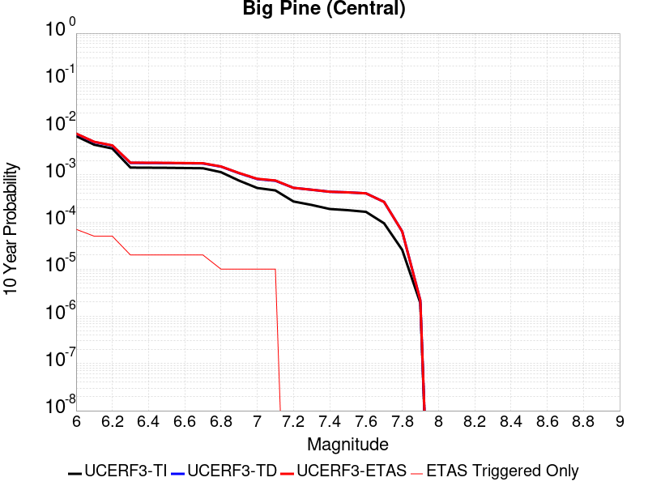 |

| Magnitude | 1 wk TI Prob | 1 wk TD Prob | 1 wk ETAS Prob | 1 wk ETAS/TD Gain | 1 wk ETAS Triggered Only | 1 mo TI Prob | 1 mo TD Prob | 1 mo ETAS Prob | 1 mo ETAS/TD Gain | 1 mo ETAS Triggered Only | 1 yr TI Prob | 1 yr TD Prob | 1 yr ETAS Prob | 1 yr ETAS/TD Gain | 1 yr ETAS Triggered Only | 10 yr TI Prob | 10 yr TD Prob | 10 yr ETAS Prob | 10 yr ETAS/TD Gain | 10 yr ETAS Triggered Only |
|-----|-----|-----|-----|-----|-----|-----|-----|-----|-----|-----|-----|-----|-----|-----|-----|-----|-----|-----|-----|-----|
| 6.0 | 1.2706755E-5 | 1.4250529E-5 | 1.4250529E-5 | 1.0 | 0.0 | 5.4456385E-5 | 6.107247E-5 | 6.107247E-5 | 1.0 | 0.0 | 6.628048E-4 | 7.433402E-4 | 7.433402E-4 | 1.0 | 0.0 | 0.006608314 | 0.0074135666 | 0.0074537527 | 1.0054206 | 4.048583E-5 |
| 6.1 | 8.342579E-6 | 9.510762E-6 | 9.510762E-6 | 1.0 | 0.0 | 3.5753423E-5 | 4.0759893E-5 | 4.0759893E-5 | 1.0 | 0.0 | 4.3521097E-4 | 4.961604E-4 | 4.961604E-4 | 1.0 | 0.0 | 0.0043435963 | 0.0049540824 | 0.0049943677 | 1.0081317 | 4.048583E-5 |
| 6.2 | 6.923899E-6 | 7.967147E-6 | 7.967147E-6 | 1.0 | 0.0 | 2.9673516E-5 | 3.4144578E-5 | 3.4144578E-5 | 1.0 | 0.0 | 3.6121515E-4 | 4.156502E-4 | 4.156502E-4 | 1.0 | 0.0 | 0.003606286 | 0.0041520367 | 0.0041923546 | 1.0097103 | 4.048583E-5 |
| 6.3 | 2.728396E-6 | 3.4242908E-6 | 3.4242908E-6 | 1.0 | 0.0 | 1.1693074E-5 | 1.4675454E-5 | 1.4675454E-5 | 1.0 | 0.0 | 1.4235388E-4 | 1.7865987E-4 | 1.7865987E-4 | 1.0 | 0.0 | 0.0014226272 | 0.0017866704 | 0.0017866704 | 1.0 | 0.0 |
| 6.4 | 2.7136944E-6 | 3.408584E-6 | 3.408584E-6 | 1.0 | 0.0 | 1.1630066E-5 | 1.4608141E-5 | 1.4608141E-5 | 1.0 | 0.0 | 1.4158686E-4 | 1.7784047E-4 | 1.7784047E-4 | 1.0 | 0.0 | 0.0014149669 | 0.0017784894 | 0.0017784894 | 1.0 | 0.0 |
| 6.5 | 2.6971882E-6 | 3.3909291E-6 | 3.3909291E-6 | 1.0 | 0.0 | 1.1559327E-5 | 1.45324775E-5 | 1.45324775E-5 | 1.0 | 0.0 | 1.4072572E-4 | 1.7691942E-4 | 1.7691942E-4 | 1.0 | 0.0 | 0.0014063664 | 0.0017692937 | 0.0017692937 | 1.0 | 0.0 |
| 6.6 | 2.669092E-6 | 3.3609497E-6 | 3.3609497E-6 | 1.0 | 0.0 | 1.1438916E-5 | 1.4403995E-5 | 1.4403995E-5 | 1.0 | 0.0 | 1.3925991E-4 | 1.753554E-4 | 1.753554E-4 | 1.0 | 0.0 | 0.0013917267 | 0.0017536782 | 0.0017536782 | 1.0 | 0.0 |
| 6.7 | 2.6408059E-6 | 3.3309752E-6 | 3.3309752E-6 | 1.0 | 0.0 | 1.1317691E-5 | 1.4275535E-5 | 1.4275535E-5 | 1.0 | 0.0 | 1.3778417E-4 | 1.7379165E-4 | 1.7379165E-4 | 1.0 | 0.0 | 0.0013769877 | 0.0017380653 | 0.0017380653 | 1.0 | 0.0 |
| 6.8 | 2.1786943E-6 | 2.8544325E-6 | 2.8544325E-6 | 1.0 | 0.0 | 9.337228E-6 | 1.2233229E-5 | 1.2233229E-5 | 1.0 | 0.0 | 1.1367482E-4 | 1.4893012E-4 | 1.4893012E-4 | 1.0 | 0.0 | 0.0011361669 | 0.0014897975 | 0.0014897975 | 1.0 | 0.0 |
| 6.9 | 1.4411696E-6 | 2.068499E-6 | 2.068499E-6 | 1.0 | 0.0 | 6.1764263E-6 | 8.864968E-6 | 8.864968E-6 | 1.0 | 0.0 | 7.51954E-5 | 1.079259E-4 | 1.079259E-4 | 1.0 | 0.0 | 7.5169955E-4 | 0.0010801847 | 0.0010801847 | 1.0 | 0.0 |
| 7.0 | 1.0073411E-6 | 1.554261E-6 | 1.554261E-6 | 1.0 | 0.0 | 4.317169E-6 | 6.6611024E-6 | 6.6611024E-6 | 1.0 | 0.0 | 5.2560266E-5 | 8.1096056E-5 | 8.1096056E-5 | 1.0 | 0.0 | 5.2547833E-4 | 8.1210316E-4 | 8.1210316E-4 | 1.0 | 0.0 |
| 7.1 | 8.947104E-7 | 1.4302494E-6 | 1.4302494E-6 | 1.0 | 0.0 | 3.834468E-6 | 6.129627E-6 | 6.129627E-6 | 1.0 | 0.0 | 4.6683643E-5 | 7.46258E-5 | 7.46258E-5 | 1.0 | 0.0 | 4.6673836E-4 | 7.474457E-4 | 7.474457E-4 | 1.0 | 0.0 |
| 7.2 | 5.215166E-7 | 1.0111678E-6 | 1.0111678E-6 | 1.0 | 0.0 | 2.2350691E-6 | 4.3335694E-6 | 4.3335694E-6 | 1.0 | 0.0 | 2.7211627E-5 | 5.2759973E-5 | 5.2759973E-5 | 1.0 | 0.0 | 2.7208295E-4 | 5.2890263E-4 | 5.2890263E-4 | 1.0 | 0.0 |
| 7.3 | 4.4024807E-7 | 9.219589E-7 | 9.219589E-7 | 1.0 | 0.0 | 1.8867761E-6 | 3.9512465E-6 | 3.9512465E-6 | 1.0 | 0.0 | 2.2971257E-5 | 4.810541E-5 | 4.810541E-5 | 1.0 | 0.0 | 2.2968883E-4 | 4.8237795E-4 | 4.8237795E-4 | 1.0 | 0.0 |
| 7.4 | 3.6130905E-7 | 8.358523E-7 | 8.358523E-7 | 1.0 | 0.0 | 1.5484665E-6 | 3.5822195E-6 | 3.5822195E-6 | 1.0 | 0.0 | 1.8852415E-5 | 4.3612687E-5 | 4.3612687E-5 | 1.0 | 0.0 | 1.8850817E-4 | 4.374597E-4 | 4.374597E-4 | 1.0 | 0.0 |
| 7.5 | 3.408184E-7 | 8.108147E-7 | 8.108147E-7 | 1.0 | 0.0 | 1.4606494E-6 | 3.4749157E-6 | 3.4749157E-6 | 1.0 | 0.0 | 1.7783263E-5 | 4.2306317E-5 | 4.2306317E-5 | 1.0 | 0.0 | 1.778184E-4 | 4.2437963E-4 | 4.2437963E-4 | 1.0 | 0.0 |
| 7.6 | 3.1428627E-7 | 7.7316E-7 | 7.7316E-7 | 1.0 | 0.0 | 1.3469405E-6 | 3.3135389E-6 | 3.3135389E-6 | 1.0 | 0.0 | 1.6398877E-5 | 4.0341627E-5 | 4.0341627E-5 | 1.0 | 0.0 | 1.6397667E-4 | 4.0471106E-4 | 4.0471106E-4 | 1.0 | 0.0 |
| 7.7 | 1.7972785E-7 | 5.077752E-7 | 5.077752E-7 | 1.0 | 0.0 | 7.70262E-7 | 2.1761778E-6 | 2.1761778E-6 | 1.0 | 0.0 | 9.377899E-6 | 2.6494654E-5 | 2.6494654E-5 | 1.0 | 0.0 | 9.377503E-5 | 2.662899E-4 | 2.662899E-4 | 1.0 | 0.0 |
| 7.8 | 4.9230927E-8 | 1.198079E-7 | 1.198079E-7 | 1.0 | 0.0 | 2.1098968E-7 | 5.134623E-7 | 5.134623E-7 | 1.0 | 0.0 | 2.5687964E-6 | 6.2513873E-6 | 6.2513873E-6 | 1.0 | 0.0 | 2.5687666E-5 | 6.295415E-5 | 6.295415E-5 | 1.0 | 0.0 |
| 7.9 | 3.6805972E-9 | 4.105293E-9 | 4.105293E-9 | 1.0 | 0.0 | 1.5773987E-8 | 1.7594115E-8 | 1.7594115E-8 | 1.0 | 0.0 | 1.9204828E-7 | 2.1420831E-7 | 2.1420831E-7 | 1.0 | 0.0 | 1.920481E-6 | 2.1900614E-6 | 2.1900614E-6 | 1.0 | 0.0 |

## Concord 2011 CFM
*[(top)](#table-of-contents)*

| 1 Week | 1 Month | 1 Year | 10 Year |
|-----|-----|-----|-----|
|  |  |  |  |

| Magnitude | 1 wk TI Prob | 1 wk TD Prob | 1 wk ETAS Prob | 1 wk ETAS/TD Gain | 1 wk ETAS Triggered Only | 1 mo TI Prob | 1 mo TD Prob | 1 mo ETAS Prob | 1 mo ETAS/TD Gain | 1 mo ETAS Triggered Only | 1 yr TI Prob | 1 yr TD Prob | 1 yr ETAS Prob | 1 yr ETAS/TD Gain | 1 yr ETAS Triggered Only | 10 yr TI Prob | 10 yr TD Prob | 10 yr ETAS Prob | 10 yr ETAS/TD Gain | 10 yr ETAS Triggered Only |
|-----|-----|-----|-----|-----|-----|-----|-----|-----|-----|-----|-----|-----|-----|-----|-----|-----|-----|-----|-----|-----|
| 6.0 | 5.7865112E-5 | 9.759152E-5 | 9.759152E-5 | 1.0 | 0.0 | 2.4796976E-4 | 4.1818706E-4 | 4.1818706E-4 | 1.0 | 0.0 | 0.0030148525 | 0.005079467 | 0.005079467 | 1.0 | 0.0 | 0.029742775 | 0.049248982 | 0.049287472 | 1.0007815 | 4.048583E-5 |
| 6.1 | 5.7865112E-5 | 9.759152E-5 | 9.759152E-5 | 1.0 | 0.0 | 2.4796976E-4 | 4.1818706E-4 | 4.1818706E-4 | 1.0 | 0.0 | 0.0030148525 | 0.005079467 | 0.005079467 | 1.0 | 0.0 | 0.029742775 | 0.049248982 | 0.049287472 | 1.0007815 | 4.048583E-5 |
| 6.2 | 5.6789337E-5 | 9.5795076E-5 | 9.5795076E-5 | 1.0 | 0.0 | 2.4336016E-4 | 4.104905E-4 | 4.104905E-4 | 1.0 | 0.0 | 0.0029588845 | 0.0049861916 | 0.0049861916 | 1.0 | 0.0 | 0.029197963 | 0.04836556 | 0.048404086 | 1.0007966 | 4.048583E-5 |
| 6.3 | 5.203322E-5 | 8.803056E-5 | 8.803056E-5 | 1.0 | 0.0 | 2.2298045E-4 | 3.7722368E-4 | 3.7722368E-4 | 1.0 | 0.0 | 0.0027114071 | 0.0045838105 | 0.0045838105 | 1.0 | 0.0 | 0.026785625 | 0.04453672 | 0.0445754 | 1.0008686 | 4.048583E-5 |
| 6.4 | 4.7120942E-5 | 7.897404E-5 | 7.897404E-5 | 1.0 | 0.0 | 2.0193127E-4 | 3.3842045E-4 | 3.3842045E-4 | 1.0 | 0.0 | 0.0024557412 | 0.00411323 | 0.00411323 | 1.0 | 0.0 | 0.024287801 | 0.040065527 | 0.040104393 | 1.00097 | 4.048583E-5 |
| 6.5 | 2.9598437E-5 | 4.667486E-5 | 4.667486E-5 | 1.0 | 0.0 | 1.2684427E-4 | 2.0002096E-4 | 2.0002096E-4 | 1.0 | 0.0 | 0.001543235 | 0.0024327459 | 0.0024327459 | 1.0 | 0.0 | 0.015325619 | 0.023909973 | 0.02394949 | 1.0016527 | 4.048583E-5 |
| 6.6 | 2.0443718E-5 | 2.998433E-5 | 2.998433E-5 | 1.0 | 0.0 | 8.7613E-5 | 1.2849816E-4 | 1.2849816E-4 | 1.0 | 0.0 | 0.0010661662 | 0.0015633785 | 0.0015633785 | 1.0 | 0.0 | 0.010610655 | 0.015466996 | 0.015506855 | 1.0025771 | 4.048583E-5 |
| 6.7 | 1.798539E-5 | 2.5557381E-5 | 2.5557381E-5 | 1.0 | 0.0 | 7.7077966E-5 | 1.0952716E-4 | 1.0952716E-4 | 1.0 | 0.0 | 9.380202E-4 | 0.001332699 | 0.001332699 | 1.0 | 0.0 | 0.009340706 | 0.013217433 | 0.013257383 | 1.0030226 | 4.048583E-5 |
| 6.8 | 1.613555E-5 | 2.1959211E-5 | 2.1959211E-5 | 1.0 | 0.0 | 6.915052E-5 | 9.4107585E-5 | 9.4107585E-5 | 1.0 | 0.0 | 8.4158237E-4 | 0.0011451716 | 0.0011451716 | 1.0 | 0.0 | 0.008384023 | 0.0113782035 | 0.011418229 | 1.0035177 | 4.048583E-5 |
| 6.9 | 1.2916435E-5 | 1.7081054E-5 | 1.7081054E-5 | 1.0 | 0.0 | 5.5354973E-5 | 7.32025E-5 | 7.32025E-5 | 1.0 | 0.0 | 6.7373837E-4 | 8.908818E-4 | 8.908818E-4 | 1.0 | 0.0 | 0.006716994 | 0.008867139 | 0.008867139 | 1.0 | 0.0 |
| 7.0 | 9.81129E-6 | 1.2630829E-5 | 1.2630829E-5 | 1.0 | 0.0 | 4.2047708E-5 | 5.413101E-5 | 5.413101E-5 | 1.0 | 0.0 | 5.118106E-4 | 6.588474E-4 | 6.588474E-4 | 1.0 | 0.0 | 0.005106334 | 0.006569153 | 0.006569153 | 1.0 | 0.0 |
| 7.1 | 8.0889195E-6 | 1.0418261E-5 | 1.0418261E-5 | 1.0 | 0.0 | 3.4666336E-5 | 4.4648932E-5 | 4.4648932E-5 | 1.0 | 0.0 | 4.219809E-4 | 5.434662E-4 | 5.434662E-4 | 1.0 | 0.0 | 0.004211805 | 0.0054215975 | 0.0054215975 | 1.0 | 0.0 |
| 7.2 | 6.267438E-6 | 8.115699E-6 | 8.115699E-6 | 1.0 | 0.0 | 2.6860173E-5 | 3.4781104E-5 | 3.4781104E-5 | 1.0 | 0.0 | 3.2697353E-4 | 4.233784E-4 | 4.233784E-4 | 1.0 | 0.0 | 0.0032649285 | 0.004225969 | 0.004225969 | 1.0 | 0.0 |
| 7.3 | 3.6761196E-6 | 4.8401653E-6 | 4.8401653E-6 | 1.0 | 0.0 | 1.5754704E-5 | 2.0743402E-5 | 2.0743402E-5 | 1.0 | 0.0 | 1.9179663E-4 | 2.5252186E-4 | 2.5252186E-4 | 1.0 | 0.0 | 0.0019163118 | 0.002522487 | 0.002522487 | 1.0 | 0.0 |
| 7.4 | 2.8044356E-6 | 3.7096036E-6 | 3.7096036E-6 | 1.0 | 0.0 | 1.2018954E-5 | 1.5898204E-5 | 1.5898204E-5 | 1.0 | 0.0 | 1.4632095E-4 | 1.9354356E-4 | 1.9354356E-4 | 1.0 | 0.0 | 0.0014622464 | 0.0019338481 | 0.0019338481 | 1.0 | 0.0 |
| 7.5 | 2.4578699E-6 | 3.2447442E-6 | 3.2447442E-6 | 1.0 | 0.0 | 1.0533685E-5 | 1.3905973E-5 | 1.3905973E-5 | 1.0 | 0.0 | 1.2824008E-4 | 1.6929218E-4 | 1.6929218E-4 | 1.0 | 0.0 | 0.0012816609 | 0.001691713 | 0.001691713 | 1.0 | 0.0 |
| 7.6 | 1.7713267E-6 | 2.3351192E-6 | 2.3351192E-6 | 1.0 | 0.0 | 7.591378E-6 | 1.0007616E-5 | 1.0007616E-5 | 1.0 | 0.0 | 9.2421105E-5 | 1.21836E-4 | 1.21836E-4 | 1.0 | 0.0 | 9.2382677E-4 | 0.0012177454 | 0.0012177454 | 1.0 | 0.0 |
| 7.7 | 5.1912366E-7 | 6.8290143E-7 | 6.8290143E-7 | 1.0 | 0.0 | 2.2248137E-6 | 2.9267171E-6 | 2.9267171E-6 | 1.0 | 0.0 | 2.708677E-5 | 3.5632213E-5 | 3.5632213E-5 | 1.0 | 0.0 | 2.708347E-4 | 3.5627294E-4 | 3.5627294E-4 | 1.0 | 0.0 |

## Honey Lake 2011 CFM
*[(top)](#table-of-contents)*

| 1 Week | 1 Month | 1 Year | 10 Year |
|-----|-----|-----|-----|
|  |  | 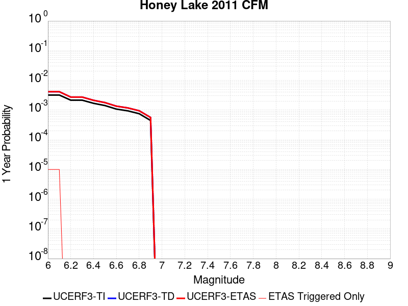 |  |

| Magnitude | 1 wk TI Prob | 1 wk TD Prob | 1 wk ETAS Prob | 1 wk ETAS/TD Gain | 1 wk ETAS Triggered Only | 1 mo TI Prob | 1 mo TD Prob | 1 mo ETAS Prob | 1 mo ETAS/TD Gain | 1 mo ETAS Triggered Only | 1 yr TI Prob | 1 yr TD Prob | 1 yr ETAS Prob | 1 yr ETAS/TD Gain | 1 yr ETAS Triggered Only | 10 yr TI Prob | 10 yr TD Prob | 10 yr ETAS Prob | 10 yr ETAS/TD Gain | 10 yr ETAS Triggered Only |
|-----|-----|-----|-----|-----|-----|-----|-----|-----|-----|-----|-----|-----|-----|-----|-----|-----|-----|-----|-----|-----|
| 6.0 | 6.155506E-5 | 7.954667E-5 | 1.20029275E-4 | 1.5089165 | 4.048583E-5 | 2.6378073E-4 | 3.40873E-4 | 3.8134505E-4 | 1.1187305 | 4.048583E-5 | 0.0032068014 | 0.0041427943 | 0.0041831126 | 1.0097321 | 4.048583E-5 | 0.03160919 | 0.040702924 | 0.04074176 | 1.0009542 | 4.048583E-5 |
| 6.1 | 6.155506E-5 | 7.954667E-5 | 1.20029275E-4 | 1.5089165 | 4.048583E-5 | 2.6378073E-4 | 3.40873E-4 | 3.8134505E-4 | 1.1187305 | 4.048583E-5 | 0.0032068014 | 0.0041427943 | 0.0041831126 | 1.0097321 | 4.048583E-5 | 0.03160919 | 0.040702924 | 0.04074176 | 1.0009542 | 4.048583E-5 |
| 6.2 | 4.1335024E-5 | 5.257629E-5 | 5.257629E-5 | 1.0 | 0.0 | 1.7713808E-4 | 2.253086E-4 | 2.253086E-4 | 1.0 | 0.0 | 0.0021545228 | 0.0027398595 | 0.0027398595 | 1.0 | 0.0 | 0.021337535 | 0.027076708 | 0.027076708 | 1.0 | 0.0 |
| 6.3 | 4.1335024E-5 | 5.257629E-5 | 5.257629E-5 | 1.0 | 0.0 | 1.7713808E-4 | 2.253086E-4 | 2.253086E-4 | 1.0 | 0.0 | 0.0021545228 | 0.0027398595 | 0.0027398595 | 1.0 | 0.0 | 0.021337535 | 0.027076708 | 0.027076708 | 1.0 | 0.0 |
| 6.4 | 3.2393702E-5 | 4.0887444E-5 | 4.0887444E-5 | 1.0 | 0.0 | 1.3882275E-4 | 1.7522085E-4 | 1.7522085E-4 | 1.0 | 0.0 | 0.0016888566 | 0.002131335 | 0.002131335 | 1.0 | 0.0 | 0.016760793 | 0.02111982 | 0.02111982 | 1.0 | 0.0 |
| 6.5 | 2.7205504E-5 | 3.4211684E-5 | 3.4211684E-5 | 1.0 | 0.0 | 1.1658981E-4 | 1.4661385E-4 | 1.4661385E-4 | 1.0 | 0.0 | 0.0014185566 | 0.0017836588 | 0.0017836588 | 1.0 | 0.0 | 0.014095354 | 0.017702932 | 0.017702932 | 1.0 | 0.0 |
| 6.6 | 2.069265E-5 | 2.5955307E-5 | 2.5955307E-5 | 1.0 | 0.0 | 8.867977E-5 | 1.1123277E-4 | 1.1123277E-4 | 1.0 | 0.0 | 0.0010791414 | 0.0013535038 | 0.0013535038 | 1.0 | 0.0 | 0.010739161 | 0.013461002 | 0.013461002 | 1.0 | 0.0 |
| 6.7 | 1.8060919E-5 | 2.2656828E-5 | 2.2656828E-5 | 1.0 | 0.0 | 7.7401644E-5 | 9.709754E-5 | 9.709754E-5 | 1.0 | 0.0 | 9.419576E-4 | 0.0011816026 | 0.0011816026 | 1.0 | 0.0 | 0.009379748 | 0.011761238 | 0.011761238 | 1.0 | 0.0 |
| 6.8 | 1.4474663E-5 | 1.818127E-5 | 1.818127E-5 | 1.0 | 0.0 | 6.203279E-5 | 7.791784E-5 | 7.791784E-5 | 1.0 | 0.0 | 7.5498753E-4 | 9.483136E-4 | 9.483136E-4 | 1.0 | 0.0 | 0.007524277 | 0.009450192 | 0.009450192 | 1.0 | 0.0 |
| 6.9 | 8.564552E-6 | 1.0802308E-5 | 1.0802308E-5 | 1.0 | 0.0 | 3.6704707E-5 | 4.6295158E-5 | 4.6295158E-5 | 1.0 | 0.0 | 4.4678818E-4 | 5.635644E-4 | 5.635644E-4 | 1.0 | 0.0 | 0.0044589094 | 0.0056278477 | 0.0056278477 | 1.0 | 0.0 |

## Los Osos 2011
*[(top)](#table-of-contents)*

| 1 Week | 1 Month | 1 Year | 10 Year |
|-----|-----|-----|-----|
|  |  |  | 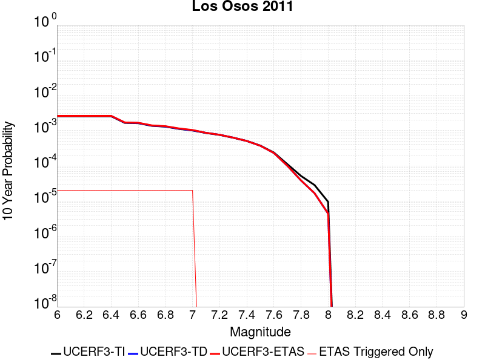 |

| Magnitude | 1 wk TI Prob | 1 wk TD Prob | 1 wk ETAS Prob | 1 wk ETAS/TD Gain | 1 wk ETAS Triggered Only | 1 mo TI Prob | 1 mo TD Prob | 1 mo ETAS Prob | 1 mo ETAS/TD Gain | 1 mo ETAS Triggered Only | 1 yr TI Prob | 1 yr TD Prob | 1 yr ETAS Prob | 1 yr ETAS/TD Gain | 1 yr ETAS Triggered Only | 10 yr TI Prob | 10 yr TD Prob | 10 yr ETAS Prob | 10 yr ETAS/TD Gain | 10 yr ETAS Triggered Only |
|-----|-----|-----|-----|-----|-----|-----|-----|-----|-----|-----|-----|-----|-----|-----|-----|-----|-----|-----|-----|-----|
| 6.0 | 4.8871775E-6 | 4.9814835E-6 | 4.9814835E-6 | 1.0 | 0.0 | 2.0944879E-5 | 2.1349055E-5 | 6.183402E-5 | 2.8963351 | 4.048583E-5 | 2.5497406E-4 | 2.5989654E-4 | 3.0037184E-4 | 1.1557362 | 4.048583E-5 | 0.002546817 | 0.0025962002 | 0.002636581 | 1.0155538 | 4.048583E-5 |
| 6.1 | 4.8871775E-6 | 4.9814835E-6 | 4.9814835E-6 | 1.0 | 0.0 | 2.0944879E-5 | 2.1349055E-5 | 6.183402E-5 | 2.8963351 | 4.048583E-5 | 2.5497406E-4 | 2.5989654E-4 | 3.0037184E-4 | 1.1557362 | 4.048583E-5 | 0.002546817 | 0.0025962002 | 0.002636581 | 1.0155538 | 4.048583E-5 |
| 6.2 | 4.8871775E-6 | 4.9814835E-6 | 4.9814835E-6 | 1.0 | 0.0 | 2.0944879E-5 | 2.1349055E-5 | 6.183402E-5 | 2.8963351 | 4.048583E-5 | 2.5497406E-4 | 2.5989654E-4 | 3.0037184E-4 | 1.1557362 | 4.048583E-5 | 0.002546817 | 0.0025962002 | 0.002636581 | 1.0155538 | 4.048583E-5 |
| 6.3 | 4.8871775E-6 | 4.9814835E-6 | 4.9814835E-6 | 1.0 | 0.0 | 2.0944879E-5 | 2.1349055E-5 | 6.183402E-5 | 2.8963351 | 4.048583E-5 | 2.5497406E-4 | 2.5989654E-4 | 3.0037184E-4 | 1.1557362 | 4.048583E-5 | 0.002546817 | 0.0025962002 | 0.002636581 | 1.0155538 | 4.048583E-5 |
| 6.4 | 4.8871775E-6 | 4.9814835E-6 | 4.9814835E-6 | 1.0 | 0.0 | 2.0944879E-5 | 2.1349055E-5 | 6.183402E-5 | 2.8963351 | 4.048583E-5 | 2.5497406E-4 | 2.5989654E-4 | 3.0037184E-4 | 1.1557362 | 4.048583E-5 | 0.002546817 | 0.0025962002 | 0.002636581 | 1.0155538 | 4.048583E-5 |
| 6.5 | 3.1724062E-6 | 3.223395E-6 | 3.223395E-6 | 1.0 | 0.0 | 1.3595956E-5 | 1.3814477E-5 | 5.4299748E-5 | 3.9306407 | 4.048583E-5 | 1.6551818E-4 | 1.681784E-4 | 2.0865744E-4 | 1.240691 | 4.048583E-5 | 0.0016539496 | 0.0016805249 | 0.0017209427 | 1.0240507 | 4.048583E-5 |
| 6.6 | 3.1022591E-6 | 3.1511045E-6 | 3.1511045E-6 | 1.0 | 0.0 | 1.3295328E-5 | 1.3504664E-5 | 5.398995E-5 | 3.9978743 | 4.048583E-5 | 1.618586E-4 | 1.64407E-4 | 2.0488618E-4 | 1.2462132 | 4.048583E-5 | 0.0016174077 | 0.0016428665 | 0.0016832859 | 1.0246029 | 4.048583E-5 |
| 6.7 | 2.611518E-6 | 2.6491832E-6 | 2.6491832E-6 | 1.0 | 0.0 | 1.1192172E-5 | 1.1353593E-5 | 5.1838964E-5 | 4.565864 | 4.048583E-5 | 1.3625617E-4 | 1.3822126E-4 | 1.787015E-4 | 1.2928654 | 4.048583E-5 | 0.0013617266 | 0.0013813575 | 0.0014217874 | 1.0292683 | 4.048583E-5 |
| 6.8 | 2.4780884E-6 | 2.5121592E-6 | 2.5121592E-6 | 1.0 | 0.0 | 1.0620336E-5 | 1.0766353E-5 | 5.1251747E-5 | 4.760363 | 4.048583E-5 | 1.2929492E-4 | 1.3107249E-4 | 1.7155302E-4 | 1.3088408 | 4.048583E-5 | 0.0012921972 | 0.001309956 | 0.0013503887 | 1.0308658 | 4.048583E-5 |
| 6.9 | 2.1376322E-6 | 2.1635055E-6 | 2.1635055E-6 | 1.0 | 0.0 | 9.161248E-6 | 9.272134E-6 | 4.975759E-5 | 5.366358 | 4.048583E-5 | 1.1153249E-4 | 1.128824E-4 | 1.5336365E-4 | 1.3586144 | 4.048583E-5 | 0.0011147653 | 0.0011282525 | 0.0011686927 | 1.0358431 | 4.048583E-5 |
| 7.0 | 1.9282882E-6 | 1.9494585E-6 | 1.9494585E-6 | 1.0 | 0.0 | 8.264066E-6 | 8.354796E-6 | 4.8840287E-5 | 5.845779 | 4.048583E-5 | 1.0061036E-4 | 1.017149E-4 | 1.4219662E-4 | 1.3979919 | 4.048583E-5 | 0.0010056482 | 0.0010166848 | 0.0010571295 | 1.039781 | 4.048583E-5 |
| 7.1 | 1.6353226E-6 | 1.6501118E-6 | 1.6501118E-6 | 1.0 | 0.0 | 7.0085066E-6 | 7.0718884E-6 | 7.0718884E-6 | 1.0 | 0.0 | 8.532523E-5 | 8.609685E-5 | 8.609685E-5 | 1.0 | 0.0 | 8.529247E-4 | 8.6063566E-4 | 8.6063566E-4 | 1.0 | 0.0 |
| 7.2 | 1.4446276E-6 | 1.4553341E-6 | 1.4553341E-6 | 1.0 | 0.0 | 6.191247E-6 | 6.237131E-6 | 6.237131E-6 | 1.0 | 0.0 | 7.537582E-5 | 7.593443E-5 | 7.593443E-5 | 1.0 | 0.0 | 7.535026E-4 | 7.590854E-4 | 7.590854E-4 | 1.0 | 0.0 |
| 7.3 | 1.2014582E-6 | 1.2069073E-6 | 1.2069073E-6 | 1.0 | 0.0 | 5.149096E-6 | 5.1724496E-6 | 5.1724496E-6 | 1.0 | 0.0 | 6.268844E-5 | 6.297276E-5 | 6.297276E-5 | 1.0 | 0.0 | 6.267076E-4 | 6.295495E-4 | 6.295495E-4 | 1.0 | 0.0 |
| 7.4 | 9.707733E-7 | 9.709773E-7 | 9.709773E-7 | 1.0 | 0.0 | 4.16045E-6 | 4.161325E-6 | 4.161325E-6 | 1.0 | 0.0 | 5.0652303E-5 | 5.066295E-5 | 5.066295E-5 | 1.0 | 0.0 | 5.064076E-4 | 5.065143E-4 | 5.065143E-4 | 1.0 | 0.0 |
| 7.5 | 7.174908E-7 | 7.1149134E-7 | 7.1149134E-7 | 1.0 | 0.0 | 3.074957E-6 | 3.0492452E-6 | 3.0492452E-6 | 1.0 | 0.0 | 3.743696E-5 | 3.712393E-5 | 3.712393E-5 | 1.0 | 0.0 | 3.7430652E-4 | 3.7117745E-4 | 3.7117745E-4 | 1.0 | 0.0 |
| 7.6 | 4.5535776E-7 | 4.420792E-7 | 4.420792E-7 | 1.0 | 0.0 | 1.9515319E-6 | 1.8946238E-6 | 1.8946238E-6 | 1.0 | 0.0 | 2.3759641E-5 | 2.3066801E-5 | 2.3066801E-5 | 1.0 | 0.0 | 2.37571E-4 | 2.3064416E-4 | 2.3064416E-4 | 1.0 | 0.0 |
| 7.7 | 2.1173553E-7 | 1.9060796E-7 | 1.9060796E-7 | 1.0 | 0.0 | 9.0743765E-7 | 8.1689103E-7 | 8.1689103E-7 | 1.0 | 0.0 | 1.1047998E-5 | 9.945603E-6 | 9.945603E-6 | 1.0 | 0.0 | 1.1047449E-4 | 9.945161E-5 | 9.945161E-5 | 1.0 | 0.0 |
| 7.8 | 9.873608E-8 | 7.3675665E-8 | 7.3675665E-8 | 1.0 | 0.0 | 4.2315455E-7 | 3.157528E-7 | 3.157528E-7 | 1.0 | 0.0 | 5.1518946E-6 | 3.8442836E-6 | 3.8442836E-6 | 1.0 | 0.0 | 5.1517753E-5 | 3.8442176E-5 | 3.8442176E-5 | 1.0 | 0.0 |
| 7.9 | 5.4399106E-8 | 3.1880155E-8 | 3.1880155E-8 | 1.0 | 0.0 | 2.33139E-7 | 1.3662923E-7 | 1.3662923E-7 | 1.0 | 0.0 | 2.8384638E-6 | 1.6634596E-6 | 1.6634596E-6 | 1.0 | 0.0 | 2.8384275E-5 | 1.6634473E-5 | 1.6634473E-5 | 1.0 | 0.0 |
| 8.0 | 1.817203E-8 | 8.420727E-9 | 8.420727E-9 | 1.0 | 0.0 | 7.7880124E-8 | 3.608883E-8 | 3.608883E-8 | 1.0 | 0.0 | 9.481901E-7 | 4.393814E-7 | 4.393814E-7 | 1.0 | 0.0 | 9.481861E-6 | 4.3938057E-6 | 4.3938057E-6 | 1.0 | 0.0 |

## South Cuyama
*[(top)](#table-of-contents)*

| 1 Week | 1 Month | 1 Year | 10 Year |
|-----|-----|-----|-----|
|  |  |  |  |

| Magnitude | 1 wk TI Prob | 1 wk TD Prob | 1 wk ETAS Prob | 1 wk ETAS/TD Gain | 1 wk ETAS Triggered Only | 1 mo TI Prob | 1 mo TD Prob | 1 mo ETAS Prob | 1 mo ETAS/TD Gain | 1 mo ETAS Triggered Only | 1 yr TI Prob | 1 yr TD Prob | 1 yr ETAS Prob | 1 yr ETAS/TD Gain | 1 yr ETAS Triggered Only | 10 yr TI Prob | 10 yr TD Prob | 10 yr ETAS Prob | 10 yr ETAS/TD Gain | 10 yr ETAS Triggered Only |
|-----|-----|-----|-----|-----|-----|-----|-----|-----|-----|-----|-----|-----|-----|-----|-----|-----|-----|-----|-----|-----|
| 6.0 | 1.2747308E-6 | 1.2818697E-6 | 1.2818697E-6 | 1.0 | 0.0 | 5.4631205E-6 | 5.4937163E-6 | 5.4937163E-6 | 1.0 | 0.0 | 6.6511464E-5 | 6.6884015E-5 | 1.0736714E-4 | 1.6052735 | 4.048583E-5 | 6.649156E-4 | 6.686458E-4 | 7.091046E-4 | 1.0605085 | 4.048583E-5 |
| 6.1 | 1.2747308E-6 | 1.2818697E-6 | 1.2818697E-6 | 1.0 | 0.0 | 5.4631205E-6 | 5.4937163E-6 | 5.4937163E-6 | 1.0 | 0.0 | 6.6511464E-5 | 6.6884015E-5 | 1.0736714E-4 | 1.6052735 | 4.048583E-5 | 6.649156E-4 | 6.686458E-4 | 7.091046E-4 | 1.0605085 | 4.048583E-5 |
| 6.2 | 1.2747308E-6 | 1.2818697E-6 | 1.2818697E-6 | 1.0 | 0.0 | 5.4631205E-6 | 5.4937163E-6 | 5.4937163E-6 | 1.0 | 0.0 | 6.6511464E-5 | 6.6884015E-5 | 1.0736714E-4 | 1.6052735 | 4.048583E-5 | 6.649156E-4 | 6.686458E-4 | 7.091046E-4 | 1.0605085 | 4.048583E-5 |
| 6.3 | 1.2747308E-6 | 1.2818697E-6 | 1.2818697E-6 | 1.0 | 0.0 | 5.4631205E-6 | 5.4937163E-6 | 5.4937163E-6 | 1.0 | 0.0 | 6.6511464E-5 | 6.6884015E-5 | 1.0736714E-4 | 1.6052735 | 4.048583E-5 | 6.649156E-4 | 6.686458E-4 | 7.091046E-4 | 1.0605085 | 4.048583E-5 |
| 6.4 | 1.2747308E-6 | 1.2818697E-6 | 1.2818697E-6 | 1.0 | 0.0 | 5.4631205E-6 | 5.4937163E-6 | 5.4937163E-6 | 1.0 | 0.0 | 6.6511464E-5 | 6.6884015E-5 | 1.0736714E-4 | 1.6052735 | 4.048583E-5 | 6.649156E-4 | 6.686458E-4 | 7.091046E-4 | 1.0605085 | 4.048583E-5 |
| 6.5 | 1.2747308E-6 | 1.2818697E-6 | 1.2818697E-6 | 1.0 | 0.0 | 5.4631205E-6 | 5.4937163E-6 | 5.4937163E-6 | 1.0 | 0.0 | 6.6511464E-5 | 6.6884015E-5 | 1.0736714E-4 | 1.6052735 | 4.048583E-5 | 6.649156E-4 | 6.686458E-4 | 7.091046E-4 | 1.0605085 | 4.048583E-5 |
| 6.6 | 1.2747308E-6 | 1.2818697E-6 | 1.2818697E-6 | 1.0 | 0.0 | 5.4631205E-6 | 5.4937163E-6 | 5.4937163E-6 | 1.0 | 0.0 | 6.6511464E-5 | 6.6884015E-5 | 1.0736714E-4 | 1.6052735 | 4.048583E-5 | 6.649156E-4 | 6.686458E-4 | 7.091046E-4 | 1.0605085 | 4.048583E-5 |
| 6.7 | 1.2747308E-6 | 1.2818697E-6 | 1.2818697E-6 | 1.0 | 0.0 | 5.4631205E-6 | 5.4937163E-6 | 5.4937163E-6 | 1.0 | 0.0 | 6.6511464E-5 | 6.6884015E-5 | 1.0736714E-4 | 1.6052735 | 4.048583E-5 | 6.649156E-4 | 6.686458E-4 | 7.091046E-4 | 1.0605085 | 4.048583E-5 |
| 6.8 | 1.2747308E-6 | 1.2818697E-6 | 1.2818697E-6 | 1.0 | 0.0 | 5.4631205E-6 | 5.4937163E-6 | 5.4937163E-6 | 1.0 | 0.0 | 6.6511464E-5 | 6.6884015E-5 | 1.0736714E-4 | 1.6052735 | 4.048583E-5 | 6.649156E-4 | 6.686458E-4 | 7.091046E-4 | 1.0605085 | 4.048583E-5 |
| 6.9 | 8.4566324E-7 | 8.507883E-7 | 8.507883E-7 | 1.0 | 0.0 | 3.624266E-6 | 3.6462304E-6 | 3.6462304E-6 | 1.0 | 0.0 | 4.4124543E-5 | 4.439196E-5 | 4.439196E-5 | 1.0 | 0.0 | 4.4115784E-4 | 4.4383196E-4 | 4.4383196E-4 | 1.0 | 0.0 |
| 7.0 | 8.2277904E-7 | 8.27782E-7 | 8.27782E-7 | 1.0 | 0.0 | 3.526191E-6 | 3.5476323E-6 | 3.5476323E-6 | 1.0 | 0.0 | 4.293053E-5 | 4.3191576E-5 | 4.3191576E-5 | 1.0 | 0.0 | 4.292224E-4 | 4.3183283E-4 | 4.3183283E-4 | 1.0 | 0.0 |
| 7.1 | 6.7661887E-7 | 6.80913E-7 | 6.80913E-7 | 1.0 | 0.0 | 2.899792E-6 | 2.9181954E-6 | 2.9181954E-6 | 1.0 | 0.0 | 3.5304394E-5 | 3.5528454E-5 | 3.5528454E-5 | 1.0 | 0.0 | 3.5298787E-4 | 3.552281E-4 | 3.552281E-4 | 1.0 | 0.0 |
| 7.2 | 5.783336E-7 | 5.8211907E-7 | 5.8211907E-7 | 1.0 | 0.0 | 2.4785702E-6 | 2.4947938E-6 | 2.4947938E-6 | 1.0 | 0.0 | 3.0176174E-5 | 3.0373692E-5 | 3.0373692E-5 | 1.0 | 0.0 | 3.0172078E-4 | 3.0369565E-4 | 3.0369565E-4 | 1.0 | 0.0 |
| 7.3 | 5.136759E-7 | 5.170938E-7 | 5.170938E-7 | 1.0 | 0.0 | 2.2014663E-6 | 2.2161144E-6 | 2.2161144E-6 | 1.0 | 0.0 | 2.6802521E-5 | 2.698086E-5 | 2.698086E-5 | 1.0 | 0.0 | 2.679929E-4 | 2.6977606E-4 | 2.6977606E-4 | 1.0 | 0.0 |
| 7.4 | 4.3370295E-7 | 4.3665364E-7 | 4.3665364E-7 | 1.0 | 0.0 | 1.8587256E-6 | 1.8713713E-6 | 1.8713713E-6 | 1.0 | 0.0 | 2.2629749E-5 | 2.278371E-5 | 2.278371E-5 | 1.0 | 0.0 | 2.2627445E-4 | 2.278139E-4 | 2.278139E-4 | 1.0 | 0.0 |
| 7.5 | 3.3242574E-7 | 3.3476465E-7 | 3.3476465E-7 | 1.0 | 0.0 | 1.4246809E-6 | 1.4347048E-6 | 1.4347048E-6 | 1.0 | 0.0 | 1.7345352E-5 | 1.7467393E-5 | 1.7467393E-5 | 1.0 | 0.0 | 1.7343998E-4 | 1.7466032E-4 | 1.7466032E-4 | 1.0 | 0.0 |
| 7.6 | 2.0627535E-7 | 2.07789E-7 | 2.07789E-7 | 1.0 | 0.0 | 8.840369E-7 | 8.90524E-7 | 8.90524E-7 | 1.0 | 0.0 | 1.0763096E-5 | 1.0842076E-5 | 1.0842076E-5 | 1.0 | 0.0 | 1.0762575E-4 | 1.0841556E-4 | 1.0841556E-4 | 1.0 | 0.0 |
| 7.7 | 6.15236E-8 | 6.1983044E-8 | 6.1983044E-8 | 1.0 | 0.0 | 2.6367252E-7 | 2.656416E-7 | 2.656416E-7 | 1.0 | 0.0 | 3.2102084E-6 | 3.2341818E-6 | 3.2341818E-6 | 1.0 | 0.0 | 3.210162E-5 | 3.234136E-5 | 3.234136E-5 | 1.0 | 0.0 |
| 7.8 | 1.1765573E-8 | 1.1873414E-8 | 1.1873414E-8 | 1.0 | 0.0 | 5.0423886E-8 | 5.0886058E-8 | 5.0886058E-8 | 1.0 | 0.0 | 6.1391063E-7 | 6.195376E-7 | 6.195376E-7 | 1.0 | 0.0 | 6.1390897E-6 | 6.19536E-6 | 6.19536E-6 | 1.0 | 0.0 |
| 7.9 | 6.0381755E-10 | 6.10058E-10 | 6.10058E-10 | 1.0 | 0.0 | 2.5877895E-9 | 2.614534E-9 | 2.614534E-9 | 1.0 | 0.0 | 3.1506335E-8 | 3.1831952E-8 | 3.1831952E-8 | 1.0 | 0.0 | 3.1506332E-7 | 3.183195E-7 | 3.183195E-7 | 1.0 | 0.0 |

## Cerro Prieto
*[(top)](#table-of-contents)*

| 1 Week | 1 Month | 1 Year | 10 Year |
|-----|-----|-----|-----|
|  | 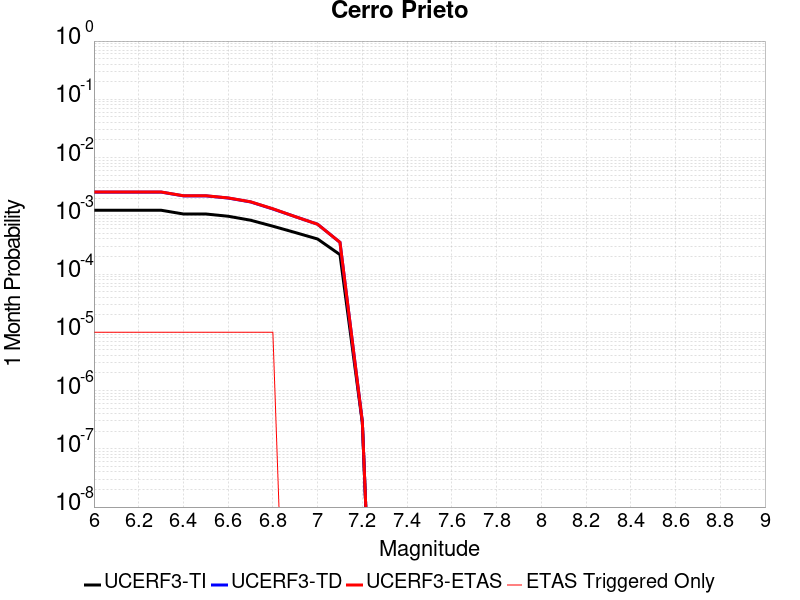 |  |  |

| Magnitude | 1 wk TI Prob | 1 wk TD Prob | 1 wk ETAS Prob | 1 wk ETAS/TD Gain | 1 wk ETAS Triggered Only | 1 mo TI Prob | 1 mo TD Prob | 1 mo ETAS Prob | 1 mo ETAS/TD Gain | 1 mo ETAS Triggered Only | 1 yr TI Prob | 1 yr TD Prob | 1 yr ETAS Prob | 1 yr ETAS/TD Gain | 1 yr ETAS Triggered Only | 10 yr TI Prob | 10 yr TD Prob | 10 yr ETAS Prob | 10 yr ETAS/TD Gain | 10 yr ETAS Triggered Only |
|-----|-----|-----|-----|-----|-----|-----|-----|-----|-----|-----|-----|-----|-----|-----|-----|-----|-----|-----|-----|-----|
| 6.0 | 2.9101528E-4 | 5.964804E-4 | 5.964804E-4 | 1.0 | 0.0 | 0.0012466122 | 0.002554082 | 0.002554082 | 1.0 | 0.0 | 0.015072231 | 0.03064807 | 0.03064807 | 1.0 | 0.0 | 0.14089979 | 0.25397858 | 0.25400877 | 1.000119 | 4.048583E-5 |
| 6.1 | 2.9101528E-4 | 5.964804E-4 | 5.964804E-4 | 1.0 | 0.0 | 0.0012466122 | 0.002554082 | 0.002554082 | 1.0 | 0.0 | 0.015072231 | 0.03064807 | 0.03064807 | 1.0 | 0.0 | 0.14089979 | 0.25397858 | 0.25400877 | 1.000119 | 4.048583E-5 |
| 6.2 | 2.9101528E-4 | 5.964804E-4 | 5.964804E-4 | 1.0 | 0.0 | 0.0012466122 | 0.002554082 | 0.002554082 | 1.0 | 0.0 | 0.015072231 | 0.03064807 | 0.03064807 | 1.0 | 0.0 | 0.14089979 | 0.25397858 | 0.25400877 | 1.000119 | 4.048583E-5 |
| 6.3 | 2.9101528E-4 | 5.964804E-4 | 5.964804E-4 | 1.0 | 0.0 | 0.0012466122 | 0.002554082 | 0.002554082 | 1.0 | 0.0 | 0.015072231 | 0.03064807 | 0.03064807 | 1.0 | 0.0 | 0.14089979 | 0.25397858 | 0.25400877 | 1.000119 | 4.048583E-5 |
| 6.4 | 2.508648E-4 | 5.1397446E-4 | 5.1397446E-4 | 1.0 | 0.0 | 0.0010746918 | 0.0022010866 | 0.0022010866 | 1.0 | 0.0 | 0.013006088 | 0.026471792 | 0.026471792 | 1.0 | 0.0 | 0.12270685 | 0.22440416 | 0.22443555 | 1.00014 | 4.048583E-5 |
| 6.5 | 2.508648E-4 | 5.1397446E-4 | 5.1397446E-4 | 1.0 | 0.0 | 0.0010746918 | 0.0022010866 | 0.0022010866 | 1.0 | 0.0 | 0.013006088 | 0.026471792 | 0.026471792 | 1.0 | 0.0 | 0.12270685 | 0.22440416 | 0.22443555 | 1.00014 | 4.048583E-5 |
| 6.6 | 2.294914E-4 | 4.7116808E-4 | 4.7116808E-4 | 1.0 | 0.0 | 9.831638E-4 | 0.0020179166 | 0.0020179166 | 1.0 | 0.0 | 0.011904482 | 0.02429866 | 0.02429866 | 1.0 | 0.0 | 0.11286586 | 0.20858558 | 0.20861761 | 1.0001537 | 4.048583E-5 |
| 6.7 | 1.9621674E-4 | 4.0419117E-4 | 4.0419117E-4 | 1.0 | 0.0 | 8.4065786E-4 | 0.0017312564 | 0.0017312564 | 1.0 | 0.0 | 0.010187071 | 0.020884845 | 0.020884845 | 1.0 | 0.0 | 0.09732539 | 0.18290249 | 0.18293557 | 1.0001808 | 4.048583E-5 |
| 6.8 | 1.5476145E-4 | 3.056516E-4 | 3.056516E-4 | 1.0 | 0.0 | 6.6309475E-4 | 0.00130938 | 0.00130938 | 1.0 | 0.0 | 0.008043335 | 0.015836509 | 0.015836509 | 1.0 | 0.0 | 0.07758363 | 0.14336355 | 0.14336355 | 1.0 | 0.0 |
| 6.9 | 1.20509176E-4 | 2.2582515E-4 | 2.2582515E-4 | 1.0 | 0.0 | 5.1636563E-4 | 9.6752634E-4 | 9.6752634E-4 | 1.0 | 0.0 | 0.006268645 | 0.011726342 | 0.011726342 | 1.0 | 0.0 | 0.060947374 | 0.109451205 | 0.109451205 | 1.0 | 0.0 |
| 7.0 | 9.3269155E-5 | 1.6716642E-4 | 1.6716642E-4 | 1.0 | 0.0 | 3.9966372E-4 | 7.162739E-4 | 7.162739E-4 | 1.0 | 0.0 | 0.0048550544 | 0.008693418 | 0.008693418 | 1.0 | 0.0 | 0.04750344 | 0.08315912 | 0.08315912 | 1.0 | 0.0 |
| 7.1 | 5.029709E-5 | 8.1718936E-5 | 8.1718936E-5 | 1.0 | 0.0 | 2.1554115E-4 | 3.5019626E-4 | 3.5019626E-4 | 1.0 | 0.0 | 0.0026210553 | 0.0042587193 | 0.0042587193 | 1.0 | 0.0 | 0.025903556 | 0.042365108 | 0.042365108 | 1.0 | 0.0 |
| 7.2 | 6.5445185E-8 | 6.814903E-8 | 6.814903E-8 | 1.0 | 0.0 | 2.8047933E-7 | 2.9206726E-7 | 2.9206726E-7 | 1.0 | 0.0 | 3.4148304E-6 | 3.555919E-6 | 3.555919E-6 | 1.0 | 0.0 | 3.414778E-5 | 3.5559187E-5 | 3.5559187E-5 | 1.0 | 0.0 |

## Kern Canyon (North Kern) 2011
*[(top)](#table-of-contents)*

| 1 Week | 1 Month | 1 Year | 10 Year |
|-----|-----|-----|-----|
|  |  |  |  |

| Magnitude | 1 wk TI Prob | 1 wk TD Prob | 1 wk ETAS Prob | 1 wk ETAS/TD Gain | 1 wk ETAS Triggered Only | 1 mo TI Prob | 1 mo TD Prob | 1 mo ETAS Prob | 1 mo ETAS/TD Gain | 1 mo ETAS Triggered Only | 1 yr TI Prob | 1 yr TD Prob | 1 yr ETAS Prob | 1 yr ETAS/TD Gain | 1 yr ETAS Triggered Only | 10 yr TI Prob | 10 yr TD Prob | 10 yr ETAS Prob | 10 yr ETAS/TD Gain | 10 yr ETAS Triggered Only |
|-----|-----|-----|-----|-----|-----|-----|-----|-----|-----|-----|-----|-----|-----|-----|-----|-----|-----|-----|-----|-----|
| 6.0 | 6.6264497E-6 | 6.75733E-6 | 4.7242887E-5 | 6.991354 | 4.048583E-5 | 2.8398761E-5 | 2.895971E-5 | 6.9444366E-5 | 2.397965 | 4.048583E-5 | 3.4570007E-4 | 3.5253543E-4 | 3.9300698E-4 | 1.1148014 | 4.048583E-5 | 0.0034516277 | 0.0035205502 | 0.0035608935 | 1.0114594 | 4.048583E-5 |
| 6.1 | 6.6264497E-6 | 6.75733E-6 | 4.7242887E-5 | 6.991354 | 4.048583E-5 | 2.8398761E-5 | 2.895971E-5 | 6.9444366E-5 | 2.397965 | 4.048583E-5 | 3.4570007E-4 | 3.5253543E-4 | 3.9300698E-4 | 1.1148014 | 4.048583E-5 | 0.0034516277 | 0.0035205502 | 0.0035608935 | 1.0114594 | 4.048583E-5 |
| 6.2 | 6.6264497E-6 | 6.75733E-6 | 4.7242887E-5 | 6.991354 | 4.048583E-5 | 2.8398761E-5 | 2.895971E-5 | 6.9444366E-5 | 2.397965 | 4.048583E-5 | 3.4570007E-4 | 3.5253543E-4 | 3.9300698E-4 | 1.1148014 | 4.048583E-5 | 0.0034516277 | 0.0035205502 | 0.0035608935 | 1.0114594 | 4.048583E-5 |
| 6.3 | 6.6264497E-6 | 6.75733E-6 | 4.7242887E-5 | 6.991354 | 4.048583E-5 | 2.8398761E-5 | 2.895971E-5 | 6.9444366E-5 | 2.397965 | 4.048583E-5 | 3.4570007E-4 | 3.5253543E-4 | 3.9300698E-4 | 1.1148014 | 4.048583E-5 | 0.0034516277 | 0.0035205502 | 0.0035608935 | 1.0114594 | 4.048583E-5 |
| 6.4 | 6.6264497E-6 | 6.75733E-6 | 4.7242887E-5 | 6.991354 | 4.048583E-5 | 2.8398761E-5 | 2.895971E-5 | 6.9444366E-5 | 2.397965 | 4.048583E-5 | 3.4570007E-4 | 3.5253543E-4 | 3.9300698E-4 | 1.1148014 | 4.048583E-5 | 0.0034516277 | 0.0035205502 | 0.0035608935 | 1.0114594 | 4.048583E-5 |
| 6.5 | 3.2162225E-6 | 3.2570915E-6 | 3.2570915E-6 | 1.0 | 0.0 | 1.3783738E-5 | 1.3958893E-5 | 1.3958893E-5 | 1.0 | 0.0 | 1.6780409E-4 | 1.6993708E-4 | 1.6993708E-4 | 1.0 | 0.0 | 0.0016767744 | 0.001698151 | 0.001698151 | 1.0 | 0.0 |
| 6.6 | 3.2162225E-6 | 3.2570915E-6 | 3.2570915E-6 | 1.0 | 0.0 | 1.3783738E-5 | 1.3958893E-5 | 1.3958893E-5 | 1.0 | 0.0 | 1.6780409E-4 | 1.6993708E-4 | 1.6993708E-4 | 1.0 | 0.0 | 0.0016767744 | 0.001698151 | 0.001698151 | 1.0 | 0.0 |
| 6.7 | 2.1908265E-6 | 2.2071222E-6 | 2.2071222E-6 | 1.0 | 0.0 | 9.389223E-6 | 9.459061E-6 | 9.459061E-6 | 1.0 | 0.0 | 1.1430779E-4 | 1.1515819E-4 | 1.1515819E-4 | 1.0 | 0.0 | 0.0011424901 | 0.0011510046 | 0.0011510046 | 1.0 | 0.0 |
| 6.8 | 1.7303895E-6 | 1.7365529E-6 | 1.7365529E-6 | 1.0 | 0.0 | 7.415934E-6 | 7.4423488E-6 | 7.4423488E-6 | 1.0 | 0.0 | 9.028525E-5 | 9.0606925E-5 | 9.0606925E-5 | 1.0 | 0.0 | 9.024858E-4 | 9.057096E-4 | 9.057096E-4 | 1.0 | 0.0 |
| 6.9 | 1.3700314E-6 | 1.3688622E-6 | 1.3688622E-6 | 1.0 | 0.0 | 5.87155E-6 | 5.8665396E-6 | 5.8665396E-6 | 1.0 | 0.0 | 7.148377E-5 | 7.142282E-5 | 7.142282E-5 | 1.0 | 0.0 | 7.146078E-4 | 7.140032E-4 | 7.140032E-4 | 1.0 | 0.0 |
| 7.0 | 1.1467797E-6 | 1.1413804E-6 | 1.1413804E-6 | 1.0 | 0.0 | 4.9147607E-6 | 4.8916213E-6 | 4.8916213E-6 | 1.0 | 0.0 | 5.983557E-5 | 5.9553895E-5 | 5.9553895E-5 | 1.0 | 0.0 | 5.981946E-4 | 5.953825E-4 | 5.953825E-4 | 1.0 | 0.0 |
| 7.1 | 9.3952065E-7 | 9.3026904E-7 | 9.3026904E-7 | 1.0 | 0.0 | 4.026511E-6 | 3.9868614E-6 | 3.9868614E-6 | 1.0 | 0.0 | 4.9021666E-5 | 4.8538972E-5 | 4.8538972E-5 | 1.0 | 0.0 | 4.901085E-4 | 4.8528548E-4 | 4.8528548E-4 | 1.0 | 0.0 |
| 7.2 | 6.858055E-7 | 6.7193E-7 | 6.7193E-7 | 1.0 | 0.0 | 2.939163E-6 | 2.879697E-6 | 2.879697E-6 | 1.0 | 0.0 | 3.5783723E-5 | 3.5059755E-5 | 3.5059755E-5 | 1.0 | 0.0 | 3.5777962E-4 | 3.5054312E-4 | 3.5054312E-4 | 1.0 | 0.0 |
| 7.3 | 5.1101983E-7 | 4.9393E-7 | 4.9393E-7 | 1.0 | 0.0 | 2.1900833E-6 | 2.116841E-6 | 2.116841E-6 | 1.0 | 0.0 | 2.6663936E-5 | 2.5772239E-5 | 2.5772239E-5 | 1.0 | 0.0 | 2.6660739E-4 | 2.57693E-4 | 2.57693E-4 | 1.0 | 0.0 |
| 7.4 | 3.4999414E-7 | 3.2995905E-7 | 3.2995905E-7 | 1.0 | 0.0 | 1.499974E-6 | 1.4141094E-6 | 1.4141094E-6 | 1.0 | 0.0 | 1.8262032E-5 | 1.721665E-5 | 1.721665E-5 | 1.0 | 0.0 | 1.826053E-4 | 1.7215339E-4 | 1.7215339E-4 | 1.0 | 0.0 |
| 7.5 | 1.7021522E-7 | 1.4750044E-7 | 1.4750044E-7 | 1.0 | 0.0 | 7.2949354E-7 | 6.321446E-7 | 6.321446E-7 | 1.0 | 0.0 | 8.881548E-6 | 7.696334E-6 | 7.696334E-6 | 1.0 | 0.0 | 8.8811925E-5 | 7.696076E-5 | 7.696076E-5 | 1.0 | 0.0 |
| 7.6 | 2.572245E-8 | 1.7352555E-8 | 1.7352555E-8 | 1.0 | 0.0 | 1.10239064E-7 | 7.436809E-8 | 7.436809E-8 | 1.0 | 0.0 | 1.3421597E-6 | 9.054312E-7 | 9.054312E-7 | 1.0 | 0.0 | 1.3421517E-5 | 9.05428E-6 | 9.05428E-6 | 1.0 | 0.0 |

## Santa Cruz Catalina Ridge alt1
*[(top)](#table-of-contents)*

| 1 Week | 1 Month | 1 Year | 10 Year |
|-----|-----|-----|-----|
|  |  |  |  |

| Magnitude | 1 wk TI Prob | 1 wk TD Prob | 1 wk ETAS Prob | 1 wk ETAS/TD Gain | 1 wk ETAS Triggered Only | 1 mo TI Prob | 1 mo TD Prob | 1 mo ETAS Prob | 1 mo ETAS/TD Gain | 1 mo ETAS Triggered Only | 1 yr TI Prob | 1 yr TD Prob | 1 yr ETAS Prob | 1 yr ETAS/TD Gain | 1 yr ETAS Triggered Only | 10 yr TI Prob | 10 yr TD Prob | 10 yr ETAS Prob | 10 yr ETAS/TD Gain | 10 yr ETAS Triggered Only |
|-----|-----|-----|-----|-----|-----|-----|-----|-----|-----|-----|-----|-----|-----|-----|-----|-----|-----|-----|-----|-----|
| 6.0 | 3.2833184E-5 | 3.65584E-5 | 3.65584E-5 | 1.0 | 0.0 | 1.4070606E-4 | 1.5667039E-4 | 1.5667039E-4 | 1.0 | 0.0 | 0.00171175 | 0.0019059596 | 0.0019059596 | 1.0 | 0.0 | 0.016986247 | 0.018913029 | 0.01895275 | 1.0021001 | 4.048583E-5 |
| 6.1 | 1.9835548E-5 | 2.1659505E-5 | 2.1659505E-5 | 1.0 | 0.0 | 8.500672E-5 | 9.282326E-5 | 9.282326E-5 | 1.0 | 0.0 | 0.0010344655 | 0.0011295575 | 0.0011295575 | 1.0 | 0.0 | 0.010296632 | 0.011240295 | 0.011240295 | 1.0 | 0.0 |
| 6.2 | 1.9835548E-5 | 2.1659505E-5 | 2.1659505E-5 | 1.0 | 0.0 | 8.500672E-5 | 9.282326E-5 | 9.282326E-5 | 1.0 | 0.0 | 0.0010344655 | 0.0011295575 | 0.0011295575 | 1.0 | 0.0 | 0.010296632 | 0.011240295 | 0.011240295 | 1.0 | 0.0 |
| 6.3 | 1.5728183E-5 | 1.703395E-5 | 1.703395E-5 | 1.0 | 0.0 | 6.7404755E-5 | 7.300063E-5 | 7.300063E-5 | 1.0 | 0.0 | 8.2034385E-4 | 8.884264E-4 | 8.884264E-4 | 1.0 | 0.0 | 0.008173222 | 0.008849427 | 0.008849427 | 1.0 | 0.0 |
| 6.4 | 1.5728183E-5 | 1.703395E-5 | 1.703395E-5 | 1.0 | 0.0 | 6.7404755E-5 | 7.300063E-5 | 7.300063E-5 | 1.0 | 0.0 | 8.2034385E-4 | 8.884264E-4 | 8.884264E-4 | 1.0 | 0.0 | 0.008173222 | 0.008849427 | 0.008849427 | 1.0 | 0.0 |
| 6.5 | 1.3707734E-5 | 1.4794522E-5 | 1.4794522E-5 | 1.0 | 0.0 | 5.8746107E-5 | 6.3403575E-5 | 6.3403575E-5 | 1.0 | 0.0 | 7.1499916E-4 | 7.716686E-4 | 7.716686E-4 | 1.0 | 0.0 | 0.0071270303 | 0.0076902895 | 0.0076902895 | 1.0 | 0.0 |
| 6.6 | 1.2539813E-5 | 1.3510219E-5 | 1.3510219E-5 | 1.0 | 0.0 | 5.3740947E-5 | 5.789967E-5 | 5.789967E-5 | 1.0 | 0.0 | 6.540996E-4 | 7.0470315E-4 | 7.0470315E-4 | 1.0 | 0.0 | 0.0065217763 | 0.0070249885 | 0.0070249885 | 1.0 | 0.0 |
| 6.7 | 1.1504083E-5 | 1.2377375E-5 | 1.2377375E-5 | 1.0 | 0.0 | 4.930228E-5 | 5.3044827E-5 | 5.3044827E-5 | 1.0 | 0.0 | 6.0008996E-4 | 6.456314E-4 | 6.456314E-4 | 1.0 | 0.0 | 0.005984721 | 0.006437786 | 0.006437786 | 1.0 | 0.0 |
| 6.8 | 1.012739E-5 | 1.0877071E-5 | 1.0877071E-5 | 1.0 | 0.0 | 4.340238E-5 | 4.6615194E-5 | 4.6615194E-5 | 1.0 | 0.0 | 5.282958E-4 | 5.673937E-4 | 5.673937E-4 | 1.0 | 0.0 | 0.0052704164 | 0.0056596193 | 0.0056596193 | 1.0 | 0.0 |
| 6.9 | 8.9607865E-6 | 9.609117E-6 | 9.609117E-6 | 1.0 | 0.0 | 3.8402806E-5 | 4.1181287E-5 | 4.1181287E-5 | 1.0 | 0.0 | 4.6745385E-4 | 5.012679E-4 | 5.012679E-4 | 1.0 | 0.0 | 0.0046647177 | 0.005001492 | 0.005001492 | 1.0 | 0.0 |
| 7.0 | 8.046829E-6 | 8.619746E-6 | 8.619746E-6 | 1.0 | 0.0 | 3.4485955E-5 | 3.694125E-5 | 3.694125E-5 | 1.0 | 0.0 | 4.1978562E-4 | 4.496677E-4 | 4.496677E-4 | 1.0 | 0.0 | 0.004189935 | 0.0044876686 | 0.0044876686 | 1.0 | 0.0 |
| 7.1 | 7.136131E-6 | 7.637656E-6 | 7.637656E-6 | 1.0 | 0.0 | 3.0583058E-5 | 3.2732405E-5 | 3.2732405E-5 | 1.0 | 0.0 | 3.7228514E-4 | 3.9844486E-4 | 3.9844486E-4 | 1.0 | 0.0 | 0.0037166206 | 0.003977381 | 0.003977381 | 1.0 | 0.0 |
| 7.2 | 6.362014E-6 | 6.8049585E-6 | 6.8049585E-6 | 1.0 | 0.0 | 2.726549E-5 | 2.9163786E-5 | 2.9163786E-5 | 1.0 | 0.0 | 3.3190678E-4 | 3.550119E-4 | 3.550119E-4 | 1.0 | 0.0 | 0.0033141149 | 0.003544516 | 0.003544516 | 1.0 | 0.0 |
| 7.3 | 5.004101E-6 | 5.351715E-6 | 5.351715E-6 | 1.0 | 0.0 | 2.1445969E-5 | 2.2935723E-5 | 2.2935723E-5 | 1.0 | 0.0 | 2.6107338E-4 | 2.792072E-4 | 2.792072E-4 | 1.0 | 0.0 | 0.002607669 | 0.0027886187 | 0.0027886187 | 1.0 | 0.0 |
| 7.4 | 3.4901443E-6 | 3.7320526E-6 | 3.7320526E-6 | 1.0 | 0.0 | 1.4957676E-5 | 1.5994416E-5 | 1.5994416E-5 | 1.0 | 0.0 | 1.8209449E-4 | 1.9471499E-4 | 1.9471499E-4 | 1.0 | 0.0 | 0.0018194534 | 0.0019454823 | 0.0019454823 | 1.0 | 0.0 |
| 7.5 | 1.1215045E-6 | 1.189387E-6 | 1.189387E-6 | 1.0 | 0.0 | 4.806439E-6 | 5.097363E-6 | 5.097363E-6 | 1.0 | 0.0 | 5.851682E-5 | 6.205866E-5 | 6.205866E-5 | 1.0 | 0.0 | 5.850142E-4 | 6.2041637E-4 | 6.2041637E-4 | 1.0 | 0.0 |
| 7.6 | 2.8599047E-7 | 2.9951994E-7 | 2.9951994E-7 | 1.0 | 0.0 | 1.2256729E-6 | 1.2836562E-6 | 1.2836562E-6 | 1.0 | 0.0 | 1.4922465E-5 | 1.5628404E-5 | 1.5628404E-5 | 1.0 | 0.0 | 1.4921463E-4 | 1.5627318E-4 | 1.5627318E-4 | 1.0 | 0.0 |
| 7.7 | 2.0781519E-7 | 2.1744323E-7 | 2.1744323E-7 | 1.0 | 0.0 | 8.906362E-7 | 9.3189925E-7 | 9.3189925E-7 | 1.0 | 0.0 | 1.08434415E-5 | 1.13458145E-5 | 1.13458145E-5 | 1.0 | 0.0 | 1.0842913E-4 | 1.1345245E-4 | 1.1345245E-4 | 1.0 | 0.0 |
| 7.8 | 3.614776E-8 | 3.764102E-8 | 3.764102E-8 | 1.0 | 0.0 | 1.5491896E-7 | 1.6131864E-7 | 1.6131864E-7 | 1.0 | 0.0 | 1.8861368E-6 | 1.9640527E-6 | 1.9640527E-6 | 1.0 | 0.0 | 1.8861208E-5 | 1.9640367E-5 | 1.9640367E-5 | 1.0 | 0.0 |

## White Mountains
*[(top)](#table-of-contents)*

| 1 Week | 1 Month | 1 Year | 10 Year |
|-----|-----|-----|-----|
|  |  | 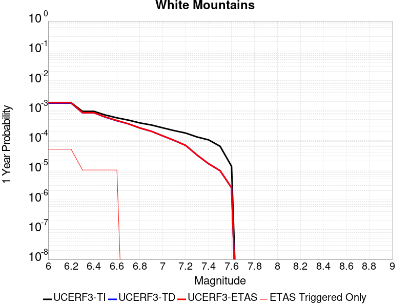 |  |

| Magnitude | 1 wk TI Prob | 1 wk TD Prob | 1 wk ETAS Prob | 1 wk ETAS/TD Gain | 1 wk ETAS Triggered Only | 1 mo TI Prob | 1 mo TD Prob | 1 mo ETAS Prob | 1 mo ETAS/TD Gain | 1 mo ETAS Triggered Only | 1 yr TI Prob | 1 yr TD Prob | 1 yr ETAS Prob | 1 yr ETAS/TD Gain | 1 yr ETAS Triggered Only | 10 yr TI Prob | 10 yr TD Prob | 10 yr ETAS Prob | 10 yr ETAS/TD Gain | 10 yr ETAS Triggered Only |
|-----|-----|-----|-----|-----|-----|-----|-----|-----|-----|-----|-----|-----|-----|-----|-----|-----|-----|-----|-----|-----|
| 6.0 | 3.503579E-5 | 3.378405E-5 | 3.378405E-5 | 1.0 | 0.0 | 1.5014476E-4 | 1.4478143E-4 | 1.4478143E-4 | 1.0 | 0.0 | 0.0018264796 | 0.0017614096 | 0.0018018241 | 1.0229445 | 4.048583E-5 | 0.018115403 | 0.017486818 | 0.017526597 | 1.0022748 | 4.048583E-5 |
| 6.1 | 3.503579E-5 | 3.378405E-5 | 3.378405E-5 | 1.0 | 0.0 | 1.5014476E-4 | 1.4478143E-4 | 1.4478143E-4 | 1.0 | 0.0 | 0.0018264796 | 0.0017614096 | 0.0018018241 | 1.0229445 | 4.048583E-5 | 0.018115403 | 0.017486818 | 0.017526597 | 1.0022748 | 4.048583E-5 |
| 6.2 | 3.503579E-5 | 3.378405E-5 | 3.378405E-5 | 1.0 | 0.0 | 1.5014476E-4 | 1.4478143E-4 | 1.4478143E-4 | 1.0 | 0.0 | 0.0018264796 | 0.0017614096 | 0.0018018241 | 1.0229445 | 4.048583E-5 | 0.018115403 | 0.017486818 | 0.017526597 | 1.0022748 | 4.048583E-5 |
| 6.3 | 1.7818425E-5 | 1.5916074E-5 | 1.5916074E-5 | 1.0 | 0.0 | 7.636245E-5 | 6.821004E-5 | 6.821004E-5 | 1.0 | 0.0 | 9.293162E-4 | 8.301551E-4 | 8.706073E-4 | 1.0487285 | 4.048583E-5 | 0.009254395 | 0.008271999 | 0.00831215 | 1.0048538 | 4.048583E-5 |
| 6.4 | 1.7818425E-5 | 1.5916074E-5 | 1.5916074E-5 | 1.0 | 0.0 | 7.636245E-5 | 6.821004E-5 | 6.821004E-5 | 1.0 | 0.0 | 9.293162E-4 | 8.301551E-4 | 8.706073E-4 | 1.0487285 | 4.048583E-5 | 0.009254395 | 0.008271999 | 0.00831215 | 1.0048538 | 4.048583E-5 |
| 6.5 | 1.3397557E-5 | 1.13362685E-5 | 1.13362685E-5 | 1.0 | 0.0 | 5.741684E-5 | 4.858314E-5 | 4.858314E-5 | 1.0 | 0.0 | 6.988258E-4 | 5.913462E-4 | 6.3180807E-4 | 1.0684234 | 4.048583E-5 | 0.006966323 | 0.005898432 | 0.005938679 | 1.0068233 | 4.048583E-5 |
| 6.6 | 1.0818695E-5 | 8.625366E-6 | 8.625366E-6 | 1.0 | 0.0 | 4.6365014E-5 | 3.6965357E-5 | 3.6965357E-5 | 1.0 | 0.0 | 5.6434784E-4 | 4.4996463E-4 | 4.9043226E-4 | 1.0899351 | 4.048583E-5 | 0.005629168 | 0.004490972 | 0.004531276 | 1.0089744 | 4.048583E-5 |
| 6.7 | 9.067908E-6 | 6.802442E-6 | 6.802442E-6 | 1.0 | 0.0 | 3.8861883E-5 | 2.9153016E-5 | 2.9153016E-5 | 1.0 | 0.0 | 4.7304068E-4 | 3.5488335E-4 | 3.5488335E-4 | 1.0 | 0.0 | 0.00472035 | 0.0035434833 | 0.0035434833 | 1.0 | 0.0 |
| 6.8 | 7.295947E-6 | 4.936391E-6 | 4.936391E-6 | 1.0 | 0.0 | 3.126797E-5 | 2.1155796E-5 | 2.1155796E-5 | 1.0 | 0.0 | 3.8062103E-4 | 2.575425E-4 | 2.575425E-4 | 1.0 | 0.0 | 0.0037996976 | 0.0025725532 | 0.0025725532 | 1.0 | 0.0 |
| 6.9 | 6.2243444E-6 | 3.832213E-6 | 3.832213E-6 | 1.0 | 0.0 | 2.6675489E-5 | 1.642367E-5 | 1.642367E-5 | 1.0 | 0.0 | 3.2472567E-4 | 1.9994036E-4 | 1.9994036E-4 | 1.0 | 0.0 | 0.0032425157 | 0.0019976576 | 0.0019976576 | 1.0 | 0.0 |
| 7.0 | 4.9878413E-6 | 2.6795342E-6 | 2.6795342E-6 | 1.0 | 0.0 | 2.1376287E-5 | 1.14836685E-5 | 1.14836685E-5 | 1.0 | 0.0 | 2.602252E-4 | 1.3980496E-4 | 1.3980496E-4 | 1.0 | 0.0 | 0.002599207 | 0.0013971963 | 0.0013971963 | 1.0 | 0.0 |
| 7.1 | 4.0252844E-6 | 1.8857575E-6 | 1.8857575E-6 | 1.0 | 0.0 | 1.7251105E-5 | 8.081794E-6 | 8.081794E-6 | 1.0 | 0.0 | 2.1001195E-4 | 9.8391516E-5 | 9.8391516E-5 | 1.0 | 0.0 | 0.0020981359 | 9.834924E-4 | 9.834924E-4 | 1.0 | 0.0 |
| 7.2 | 3.3284066E-6 | 1.281964E-6 | 1.281964E-6 | 1.0 | 0.0 | 1.4264522E-5 | 5.494121E-6 | 5.494121E-6 | 1.0 | 0.0 | 1.736567E-4 | 6.688897E-5 | 6.688897E-5 | 1.0 | 0.0 | 0.0017352107 | 6.6869846E-4 | 6.6869846E-4 | 1.0 | 0.0 |
| 7.3 | 2.458226E-6 | 6.05722E-7 | 6.05722E-7 | 1.0 | 0.0 | 1.0535211E-5 | 2.5959491E-6 | 2.5959491E-6 | 1.0 | 0.0 | 1.2825865E-4 | 3.1605257E-5 | 3.1605257E-5 | 1.0 | 0.0 | 0.0012818464 | 3.160114E-4 | 3.160114E-4 | 1.0 | 0.0 |
| 7.4 | 1.965953E-6 | 3.1089303E-7 | 3.1089303E-7 | 1.0 | 0.0 | 8.425486E-6 | 1.332398E-6 | 1.332398E-6 | 1.0 | 0.0 | 1.0257547E-4 | 1.6221828E-5 | 1.6221828E-5 | 1.0 | 0.0 | 0.0010252813 | 1.6220656E-4 | 1.6220656E-4 | 1.0 | 0.0 |
| 7.5 | 1.2014192E-6 | 1.8244253E-7 | 1.8244253E-7 | 1.0 | 0.0 | 5.148929E-6 | 7.8189635E-7 | 7.8189635E-7 | 1.0 | 0.0 | 6.2686406E-5 | 9.519547E-6 | 9.519547E-6 | 1.0 | 0.0 | 6.266873E-4 | 9.519148E-5 | 9.519148E-5 | 1.0 | 0.0 |
| 7.6 | 2.5612175E-7 | 4.8946475E-8 | 4.8946475E-8 | 1.0 | 0.0 | 1.0976642E-6 | 2.0977059E-7 | 2.0977059E-7 | 1.0 | 0.0 | 1.3363979E-5 | 2.5539543E-6 | 2.5539543E-6 | 1.0 | 0.0 | 1.3363175E-4 | 2.5539286E-5 | 2.5539286E-5 | 1.0 | 0.0 |

## Compton
*[(top)](#table-of-contents)*

| 1 Week | 1 Month | 1 Year | 10 Year |
|-----|-----|-----|-----|
|  |  |  |  |

| Magnitude | 1 wk TI Prob | 1 wk TD Prob | 1 wk ETAS Prob | 1 wk ETAS/TD Gain | 1 wk ETAS Triggered Only | 1 mo TI Prob | 1 mo TD Prob | 1 mo ETAS Prob | 1 mo ETAS/TD Gain | 1 mo ETAS Triggered Only | 1 yr TI Prob | 1 yr TD Prob | 1 yr ETAS Prob | 1 yr ETAS/TD Gain | 1 yr ETAS Triggered Only | 10 yr TI Prob | 10 yr TD Prob | 10 yr ETAS Prob | 10 yr ETAS/TD Gain | 10 yr ETAS Triggered Only |
|-----|-----|-----|-----|-----|-----|-----|-----|-----|-----|-----|-----|-----|-----|-----|-----|-----|-----|-----|-----|-----|
| 6.0 | 1.06050875E-5 | 6.358671E-6 | 6.358671E-6 | 1.0 | 0.0 | 4.5449582E-5 | 2.7251177E-5 | 2.7251177E-5 | 1.0 | 0.0 | 5.5320817E-4 | 3.317354E-4 | 3.317354E-4 | 1.0 | 0.0 | 0.0055183303 | 0.0033126862 | 0.0033530379 | 1.0121809 | 4.048583E-5 |
| 6.1 | 1.06050875E-5 | 6.358671E-6 | 6.358671E-6 | 1.0 | 0.0 | 4.5449582E-5 | 2.7251177E-5 | 2.7251177E-5 | 1.0 | 0.0 | 5.5320817E-4 | 3.317354E-4 | 3.317354E-4 | 1.0 | 0.0 | 0.0055183303 | 0.0033126862 | 0.0033530379 | 1.0121809 | 4.048583E-5 |
| 6.2 | 1.06050875E-5 | 6.358671E-6 | 6.358671E-6 | 1.0 | 0.0 | 4.5449582E-5 | 2.7251177E-5 | 2.7251177E-5 | 1.0 | 0.0 | 5.5320817E-4 | 3.317354E-4 | 3.317354E-4 | 1.0 | 0.0 | 0.0055183303 | 0.0033126862 | 0.0033530379 | 1.0121809 | 4.048583E-5 |
| 6.3 | 1.06050875E-5 | 6.358671E-6 | 6.358671E-6 | 1.0 | 0.0 | 4.5449582E-5 | 2.7251177E-5 | 2.7251177E-5 | 1.0 | 0.0 | 5.5320817E-4 | 3.317354E-4 | 3.317354E-4 | 1.0 | 0.0 | 0.0055183303 | 0.0033126862 | 0.0033530379 | 1.0121809 | 4.048583E-5 |
| 6.4 | 1.06050875E-5 | 6.358671E-6 | 6.358671E-6 | 1.0 | 0.0 | 4.5449582E-5 | 2.7251177E-5 | 2.7251177E-5 | 1.0 | 0.0 | 5.5320817E-4 | 3.317354E-4 | 3.317354E-4 | 1.0 | 0.0 | 0.0055183303 | 0.0033126862 | 0.0033530379 | 1.0121809 | 4.048583E-5 |
| 6.5 | 1.06050875E-5 | 6.358671E-6 | 6.358671E-6 | 1.0 | 0.0 | 4.5449582E-5 | 2.7251177E-5 | 2.7251177E-5 | 1.0 | 0.0 | 5.5320817E-4 | 3.317354E-4 | 3.317354E-4 | 1.0 | 0.0 | 0.0055183303 | 0.0033126862 | 0.0033530379 | 1.0121809 | 4.048583E-5 |
| 6.6 | 1.06050875E-5 | 6.358671E-6 | 6.358671E-6 | 1.0 | 0.0 | 4.5449582E-5 | 2.7251177E-5 | 2.7251177E-5 | 1.0 | 0.0 | 5.5320817E-4 | 3.317354E-4 | 3.317354E-4 | 1.0 | 0.0 | 0.0055183303 | 0.0033126862 | 0.0033530379 | 1.0121809 | 4.048583E-5 |
| 6.7 | 1.06050875E-5 | 6.358671E-6 | 6.358671E-6 | 1.0 | 0.0 | 4.5449582E-5 | 2.7251177E-5 | 2.7251177E-5 | 1.0 | 0.0 | 5.5320817E-4 | 3.317354E-4 | 3.317354E-4 | 1.0 | 0.0 | 0.0055183303 | 0.0033126862 | 0.0033530379 | 1.0121809 | 4.048583E-5 |
| 6.8 | 1.06050875E-5 | 6.358671E-6 | 6.358671E-6 | 1.0 | 0.0 | 4.5449582E-5 | 2.7251177E-5 | 2.7251177E-5 | 1.0 | 0.0 | 5.5320817E-4 | 3.317354E-4 | 3.317354E-4 | 1.0 | 0.0 | 0.0055183303 | 0.0033126862 | 0.0033530379 | 1.0121809 | 4.048583E-5 |
| 6.9 | 1.06050875E-5 | 6.358671E-6 | 6.358671E-6 | 1.0 | 0.0 | 4.5449582E-5 | 2.7251177E-5 | 2.7251177E-5 | 1.0 | 0.0 | 5.5320817E-4 | 3.317354E-4 | 3.317354E-4 | 1.0 | 0.0 | 0.0055183303 | 0.0033126862 | 0.0033530379 | 1.0121809 | 4.048583E-5 |
| 7.0 | 7.672486E-6 | 4.2720512E-6 | 4.2720512E-6 | 1.0 | 0.0 | 3.288167E-5 | 1.8308665E-5 | 1.8308665E-5 | 1.0 | 0.0 | 4.0026082E-4 | 2.2288582E-4 | 2.2288582E-4 | 1.0 | 0.0 | 0.0039954064 | 0.002226685 | 0.0022670806 | 1.0181416 | 4.048583E-5 |
| 7.1 | 7.163992E-6 | 3.883762E-6 | 3.883762E-6 | 1.0 | 0.0 | 3.0702464E-5 | 1.6644592E-5 | 1.6644592E-5 | 1.0 | 0.0 | 3.7373835E-4 | 2.0262963E-4 | 2.0262963E-4 | 1.0 | 0.0 | 0.0037311043 | 0.0020245055 | 0.0020649096 | 1.0199574 | 4.048583E-5 |
| 7.2 | 6.3689185E-6 | 3.3102428E-6 | 3.3102428E-6 | 1.0 | 0.0 | 2.729508E-5 | 1.418668E-5 | 1.418668E-5 | 1.0 | 0.0 | 3.322669E-4 | 1.7270957E-4 | 1.7270957E-4 | 1.0 | 0.0 | 0.0033177056 | 0.0017257951 | 0.0017662111 | 1.0234188 | 4.048583E-5 |
| 7.3 | 4.4987873E-6 | 2.4480942E-6 | 2.4480942E-6 | 1.0 | 0.0 | 1.9280375E-5 | 1.0491792E-5 | 1.0491792E-5 | 1.0 | 0.0 | 2.3471327E-4 | 1.2773038E-4 | 1.2773038E-4 | 1.0 | 0.0 | 0.002344655 | 0.0012765999 | 0.001317034 | 1.0316733 | 4.048583E-5 |
| 7.4 | 2.987296E-6 | 1.7394335E-6 | 1.7394335E-6 | 1.0 | 0.0 | 1.2802635E-5 | 7.454694E-6 | 7.454694E-6 | 1.0 | 0.0 | 1.5586092E-4 | 9.0757174E-5 | 9.0757174E-5 | 1.0 | 0.0 | 0.0015575165 | 9.072069E-4 | 9.47656E-4 | 1.0445864 | 4.048583E-5 |
| 7.5 | 2.4111696E-6 | 1.4472155E-6 | 1.4472155E-6 | 1.0 | 0.0 | 1.0333543E-5 | 6.2023378E-6 | 6.2023378E-6 | 1.0 | 0.0 | 1.2580362E-4 | 7.551089E-5 | 7.551089E-5 | 1.0 | 0.0 | 0.0012573242 | 7.54857E-4 | 7.953123E-4 | 1.0535933 | 4.048583E-5 |
| 7.6 | 1.8783096E-6 | 1.1360459E-6 | 1.1360459E-6 | 1.0 | 0.0 | 8.049874E-6 | 4.8687593E-6 | 4.8687593E-6 | 1.0 | 0.0 | 9.8002805E-5 | 5.927557E-5 | 5.927557E-5 | 1.0 | 0.0 | 9.795959E-4 | 5.926016E-4 | 6.3306344E-4 | 1.0682783 | 4.048583E-5 |
| 7.7 | 6.6646817E-7 | 3.560237E-7 | 3.560237E-7 | 1.0 | 0.0 | 2.856289E-6 | 1.525815E-6 | 1.525815E-6 | 1.0 | 0.0 | 3.4774763E-5 | 1.8576653E-5 | 1.8576653E-5 | 1.0 | 0.0 | 3.4769322E-4 | 1.8575235E-4 | 2.2623067E-4 | 1.2179154 | 4.048583E-5 |
| 7.8 | 7.054689E-8 | 4.1342968E-8 | 4.1342968E-8 | 1.0 | 0.0 | 3.0234378E-7 | 1.7718413E-7 | 1.7718413E-7 | 1.0 | 0.0 | 3.6810293E-6 | 2.1572148E-6 | 2.1572148E-6 | 1.0 | 0.0 | 3.6809684E-5 | 2.1571948E-5 | 2.1571948E-5 | 1.0 | 0.0 |
| 7.9 | 7.420925E-9 | 4.0131285E-9 | 4.0131285E-9 | 1.0 | 0.0 | 3.1803964E-8 | 1.7199122E-8 | 1.7199122E-8 | 1.0 | 0.0 | 3.872132E-7 | 2.093993E-7 | 2.093993E-7 | 1.0 | 0.0 | 3.872125E-6 | 2.0939913E-6 | 2.0939913E-6 | 1.0 | 0.0 |

## Peralta Hills
*[(top)](#table-of-contents)*

| 1 Week | 1 Month | 1 Year | 10 Year |
|-----|-----|-----|-----|
|  |  |  |  |

| Magnitude | 1 wk TI Prob | 1 wk TD Prob | 1 wk ETAS Prob | 1 wk ETAS/TD Gain | 1 wk ETAS Triggered Only | 1 mo TI Prob | 1 mo TD Prob | 1 mo ETAS Prob | 1 mo ETAS/TD Gain | 1 mo ETAS Triggered Only | 1 yr TI Prob | 1 yr TD Prob | 1 yr ETAS Prob | 1 yr ETAS/TD Gain | 1 yr ETAS Triggered Only | 10 yr TI Prob | 10 yr TD Prob | 10 yr ETAS Prob | 10 yr ETAS/TD Gain | 10 yr ETAS Triggered Only |
|-----|-----|-----|-----|-----|-----|-----|-----|-----|-----|-----|-----|-----|-----|-----|-----|-----|-----|-----|-----|-----|
| 6.0 | 3.8850067E-6 | 3.839512E-6 | 3.839512E-6 | 1.0 | 0.0 | 1.6649923E-5 | 1.645499E-5 | 1.645499E-5 | 1.0 | 0.0 | 2.0269395E-4 | 2.0032849E-4 | 2.0032849E-4 | 1.0 | 0.0 | 0.0020250916 | 0.0020022066 | 0.0020426114 | 1.0201801 | 4.048583E-5 |
| 6.1 | 3.8850067E-6 | 3.839512E-6 | 3.839512E-6 | 1.0 | 0.0 | 1.6649923E-5 | 1.645499E-5 | 1.645499E-5 | 1.0 | 0.0 | 2.0269395E-4 | 2.0032849E-4 | 2.0032849E-4 | 1.0 | 0.0 | 0.0020250916 | 0.0020022066 | 0.0020426114 | 1.0201801 | 4.048583E-5 |
| 6.2 | 3.8850067E-6 | 3.839512E-6 | 3.839512E-6 | 1.0 | 0.0 | 1.6649923E-5 | 1.645499E-5 | 1.645499E-5 | 1.0 | 0.0 | 2.0269395E-4 | 2.0032849E-4 | 2.0032849E-4 | 1.0 | 0.0 | 0.0020250916 | 0.0020022066 | 0.0020426114 | 1.0201801 | 4.048583E-5 |
| 6.3 | 3.8850067E-6 | 3.839512E-6 | 3.839512E-6 | 1.0 | 0.0 | 1.6649923E-5 | 1.645499E-5 | 1.645499E-5 | 1.0 | 0.0 | 2.0269395E-4 | 2.0032849E-4 | 2.0032849E-4 | 1.0 | 0.0 | 0.0020250916 | 0.0020022066 | 0.0020426114 | 1.0201801 | 4.048583E-5 |
| 6.4 | 3.8850067E-6 | 3.839512E-6 | 3.839512E-6 | 1.0 | 0.0 | 1.6649923E-5 | 1.645499E-5 | 1.645499E-5 | 1.0 | 0.0 | 2.0269395E-4 | 2.0032849E-4 | 2.0032849E-4 | 1.0 | 0.0 | 0.0020250916 | 0.0020022066 | 0.0020426114 | 1.0201801 | 4.048583E-5 |
| 6.5 | 1.5587785E-6 | 1.4430796E-6 | 1.4430796E-6 | 1.0 | 0.0 | 6.6804623E-6 | 6.184613E-6 | 6.184613E-6 | 1.0 | 0.0 | 8.133159E-5 | 7.529531E-5 | 7.529531E-5 | 1.0 | 0.0 | 8.1301836E-4 | 7.52722E-4 | 7.9317734E-4 | 1.0537454 | 4.048583E-5 |
| 6.6 | 1.5587785E-6 | 1.4430796E-6 | 1.4430796E-6 | 1.0 | 0.0 | 6.6804623E-6 | 6.184613E-6 | 6.184613E-6 | 1.0 | 0.0 | 8.133159E-5 | 7.529531E-5 | 7.529531E-5 | 1.0 | 0.0 | 8.1301836E-4 | 7.52722E-4 | 7.9317734E-4 | 1.0537454 | 4.048583E-5 |
| 6.7 | 1.5018579E-6 | 1.3837022E-6 | 1.3837022E-6 | 1.0 | 0.0 | 6.436518E-6 | 5.93014E-6 | 5.93014E-6 | 1.0 | 0.0 | 7.836179E-5 | 7.21973E-5 | 7.21973E-5 | 1.0 | 0.0 | 7.833416E-4 | 7.21762E-4 | 7.622186E-4 | 1.0560526 | 4.048583E-5 |
| 6.8 | 1.4584314E-6 | 1.3381342E-6 | 1.3381342E-6 | 1.0 | 0.0 | 6.250405E-6 | 5.7348498E-6 | 5.7348498E-6 | 1.0 | 0.0 | 7.6096025E-5 | 6.98198E-5 | 6.98198E-5 | 1.0 | 0.0 | 7.6069974E-4 | 6.98002E-4 | 7.384596E-4 | 1.057962 | 4.048583E-5 |
| 6.9 | 1.1382393E-6 | 9.862285E-7 | 9.862285E-7 | 1.0 | 0.0 | 4.8781594E-6 | 4.226687E-6 | 4.226687E-6 | 1.0 | 0.0 | 5.9389975E-5 | 5.1458785E-5 | 5.1458785E-5 | 1.0 | 0.0 | 5.93741E-4 | 5.144769E-4 | 5.5494194E-4 | 1.0786527 | 4.048583E-5 |
| 7.0 | 9.970413E-7 | 8.309642E-7 | 8.309642E-7 | 1.0 | 0.0 | 4.273027E-6 | 3.561271E-6 | 3.561271E-6 | 1.0 | 0.0 | 5.2022864E-5 | 4.335768E-5 | 4.335768E-5 | 1.0 | 0.0 | 5.2010687E-4 | 4.33499E-4 | 4.739673E-4 | 1.0933527 | 4.048583E-5 |
| 7.1 | 9.684443E-7 | 7.99408E-7 | 7.99408E-7 | 1.0 | 0.0 | 4.150469E-6 | 3.4260302E-6 | 3.4260302E-6 | 1.0 | 0.0 | 5.053079E-5 | 4.1711188E-5 | 4.1711188E-5 | 1.0 | 0.0 | 5.05193E-4 | 4.170403E-4 | 4.5750925E-4 | 1.0970385 | 4.048583E-5 |
| 7.2 | 9.240811E-7 | 7.5031426E-7 | 7.5031426E-7 | 1.0 | 0.0 | 3.960342E-6 | 3.215629E-6 | 3.215629E-6 | 1.0 | 0.0 | 4.8216094E-5 | 3.9149647E-5 | 3.9149647E-5 | 1.0 | 0.0 | 4.8205635E-4 | 3.9143403E-4 | 4.3190402E-4 | 1.103389 | 4.048583E-5 |
| 7.3 | 8.158643E-7 | 6.350017E-7 | 6.350017E-7 | 1.0 | 0.0 | 3.4965567E-6 | 2.7214332E-6 | 2.7214332E-6 | 1.0 | 0.0 | 4.2569747E-5 | 3.313301E-5 | 3.313301E-5 | 1.0 | 0.0 | 4.2561593E-4 | 3.3128684E-4 | 3.7175926E-4 | 1.1221673 | 4.048583E-5 |
| 7.4 | 6.3822824E-7 | 4.7957286E-7 | 4.7957286E-7 | 1.0 | 0.0 | 2.7352612E-6 | 2.0553111E-6 | 2.0553111E-6 | 1.0 | 0.0 | 3.3301294E-5 | 2.5023177E-5 | 2.5023177E-5 | 1.0 | 0.0 | 3.3296304E-4 | 2.5020874E-4 | 2.5020874E-4 | 1.0 | 0.0 |
| 7.5 | 4.0292628E-7 | 2.7846056E-7 | 2.7846056E-7 | 1.0 | 0.0 | 1.7268258E-6 | 1.193402E-6 | 1.193402E-6 | 1.0 | 0.0 | 2.1023901E-5 | 1.4529601E-5 | 1.4529601E-5 | 1.0 | 0.0 | 2.1021912E-4 | 1.452893E-4 | 1.452893E-4 | 1.0 | 0.0 |
| 7.6 | 3.672993E-7 | 2.485495E-7 | 2.485495E-7 | 1.0 | 0.0 | 1.5741389E-6 | 1.0652118E-6 | 1.0652118E-6 | 1.0 | 0.0 | 1.9164972E-5 | 1.2968904E-5 | 1.2968904E-5 | 1.0 | 0.0 | 1.916332E-4 | 1.296842E-4 | 1.296842E-4 | 1.0 | 0.0 |
| 7.7 | 2.8466823E-7 | 1.7859877E-7 | 1.7859877E-7 | 1.0 | 0.0 | 1.2200061E-6 | 7.6542324E-7 | 7.6542324E-7 | 1.0 | 0.0 | 1.4853474E-5 | 9.319015E-6 | 9.319015E-6 | 1.0 | 0.0 | 1.485248E-4 | 9.3188835E-5 | 9.3188835E-5 | 1.0 | 0.0 |

## Oceanic - West Huasna
*[(top)](#table-of-contents)*

| 1 Week | 1 Month | 1 Year | 10 Year |
|-----|-----|-----|-----|
|  | 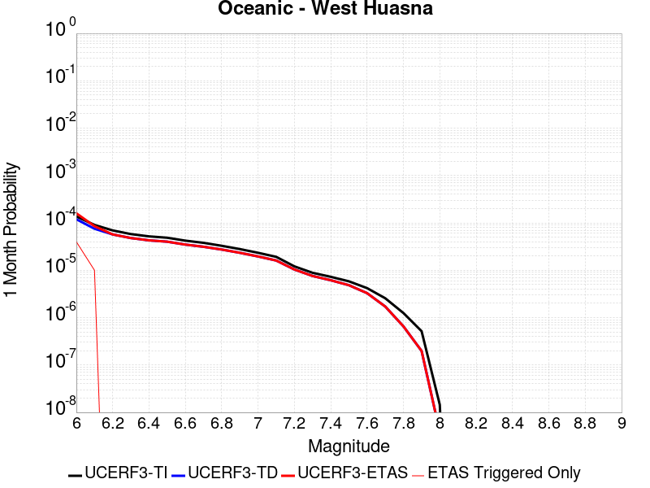 |  | 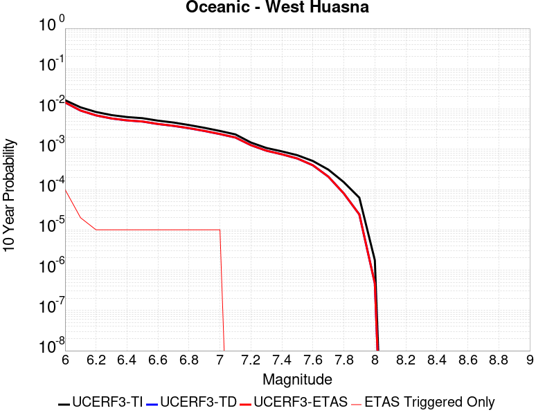 |

| Magnitude | 1 wk TI Prob | 1 wk TD Prob | 1 wk ETAS Prob | 1 wk ETAS/TD Gain | 1 wk ETAS Triggered Only | 1 mo TI Prob | 1 mo TD Prob | 1 mo ETAS Prob | 1 mo ETAS/TD Gain | 1 mo ETAS Triggered Only | 1 yr TI Prob | 1 yr TD Prob | 1 yr ETAS Prob | 1 yr ETAS/TD Gain | 1 yr ETAS Triggered Only | 10 yr TI Prob | 10 yr TD Prob | 10 yr ETAS Prob | 10 yr ETAS/TD Gain | 10 yr ETAS Triggered Only |
|-----|-----|-----|-----|-----|-----|-----|-----|-----|-----|-----|-----|-----|-----|-----|-----|-----|-----|-----|-----|-----|
| 6.0 | 3.195567E-5 | 2.7926868E-5 | 2.7926868E-5 | 1.0 | 0.0 | 1.3694567E-4 | 1.1968133E-4 | 1.1968133E-4 | 1.0 | 0.0 | 0.0016660384 | 0.0014561893 | 0.0014561893 | 1.0 | 0.0 | 0.016536033 | 0.014471028 | 0.014510928 | 1.0027572 | 4.048583E-5 |
| 6.1 | 2.1156782E-5 | 1.7573486E-5 | 1.7573486E-5 | 1.0 | 0.0 | 9.066878E-5 | 7.531282E-5 | 7.531282E-5 | 1.0 | 0.0 | 0.0011033333 | 9.165572E-4 | 9.165572E-4 | 1.0 | 0.0 | 0.010978713 | 0.009128777 | 0.009128777 | 1.0 | 0.0 |
| 6.2 | 1.6195117E-5 | 1.3327152E-5 | 1.3327152E-5 | 1.0 | 0.0 | 6.9405796E-5 | 5.7115132E-5 | 5.7115132E-5 | 1.0 | 0.0 | 8.44688E-4 | 6.9515745E-4 | 6.9515745E-4 | 1.0 | 0.0 | 0.008414844 | 0.006930123 | 0.006930123 | 1.0 | 0.0 |
| 6.3 | 1.3559345E-5 | 1.1179142E-5 | 1.1179142E-5 | 1.0 | 0.0 | 5.811018E-5 | 4.7909736E-5 | 4.7909736E-5 | 1.0 | 0.0 | 7.072618E-4 | 5.831459E-4 | 5.831459E-4 | 1.0 | 0.0 | 0.0070501505 | 0.0058162753 | 0.0058162753 | 1.0 | 0.0 |
| 6.4 | 1.2120619E-5 | 1.0000977E-5 | 1.0000977E-5 | 1.0 | 0.0 | 5.1944477E-5 | 4.2860633E-5 | 4.2860633E-5 | 1.0 | 0.0 | 6.322405E-4 | 5.2170374E-4 | 5.2170374E-4 | 1.0 | 0.0 | 0.006304447 | 0.0052048573 | 0.0052048573 | 1.0 | 0.0 |
| 6.5 | 1.13511915E-5 | 9.3674735E-6 | 9.3674735E-6 | 1.0 | 0.0 | 4.8647056E-5 | 4.01457E-5 | 4.01457E-5 | 1.0 | 0.0 | 5.9211696E-4 | 4.886647E-4 | 4.886647E-4 | 1.0 | 0.0 | 0.0059054173 | 0.0048759608 | 0.0048759608 | 1.0 | 0.0 |
| 6.6 | 9.850605E-6 | 8.135418E-6 | 8.135418E-6 | 1.0 | 0.0 | 4.2216197E-5 | 3.4865614E-5 | 3.4865614E-5 | 1.0 | 0.0 | 5.1386096E-4 | 4.2440637E-4 | 4.2440637E-4 | 1.0 | 0.0 | 0.0051267436 | 0.004235991 | 0.004235991 | 1.0 | 0.0 |
| 6.7 | 8.8558645E-6 | 7.318433E-6 | 7.318433E-6 | 1.0 | 0.0 | 3.7953152E-5 | 3.1364336E-5 | 3.1364336E-5 | 1.0 | 0.0 | 4.6198163E-4 | 3.8179406E-4 | 3.8179406E-4 | 1.0 | 0.0 | 0.004610224 | 0.0038114067 | 0.0038114067 | 1.0 | 0.0 |
| 6.8 | 7.67136E-6 | 6.391756E-6 | 6.391756E-6 | 1.0 | 0.0 | 3.2876844E-5 | 2.7392953E-5 | 2.7392953E-5 | 1.0 | 0.0 | 4.0020206E-4 | 3.3345833E-4 | 3.3345833E-4 | 1.0 | 0.0 | 0.003994821 | 0.0033296007 | 0.0033296007 | 1.0 | 0.0 |
| 6.9 | 6.534529E-6 | 5.4583297E-6 | 5.4583297E-6 | 1.0 | 0.0 | 2.8004823E-5 | 2.3392633E-5 | 2.3392633E-5 | 1.0 | 0.0 | 3.4090536E-4 | 2.847682E-4 | 2.847682E-4 | 1.0 | 0.0 | 0.0034038287 | 0.0028440498 | 0.0028440498 | 1.0 | 0.0 |
| 7.0 | 5.460525E-6 | 4.5699517E-6 | 4.5699517E-6 | 1.0 | 0.0 | 2.3402039E-5 | 1.958536E-5 | 1.958536E-5 | 1.0 | 0.0 | 2.8488258E-4 | 2.3842578E-4 | 2.3842578E-4 | 1.0 | 0.0 | 0.0028451765 | 0.0023817138 | 0.0023817138 | 1.0 | 0.0 |
| 7.1 | 4.4825083E-6 | 3.7524428E-6 | 3.7524428E-6 | 1.0 | 0.0 | 1.9210609E-5 | 1.60818E-5 | 1.60818E-5 | 1.0 | 0.0 | 2.3386406E-4 | 1.9577841E-4 | 1.9577841E-4 | 1.0 | 0.0 | 0.002336181 | 0.0019560715 | 0.0019560715 | 1.0 | 0.0 |
| 7.2 | 2.821708E-6 | 2.4249334E-6 | 2.4249334E-6 | 1.0 | 0.0 | 1.2092979E-5 | 1.039253E-5 | 1.039253E-5 | 1.0 | 0.0 | 1.4722206E-4 | 1.2652173E-4 | 1.2652173E-4 | 1.0 | 0.0 | 0.0014712457 | 0.0012644994 | 0.0012644994 | 1.0 | 0.0 |
| 7.3 | 2.0644757E-6 | 1.7687412E-6 | 1.7687412E-6 | 1.0 | 0.0 | 8.847723E-6 | 7.5802973E-6 | 7.5802973E-6 | 1.0 | 0.0 | 1.0771569E-4 | 9.228622E-5 | 9.228622E-5 | 1.0 | 0.0 | 0.001076635 | 9.2248066E-4 | 9.2248066E-4 | 1.0 | 0.0 |
| 7.4 | 1.6980367E-6 | 1.4379892E-6 | 1.4379892E-6 | 1.0 | 0.0 | 7.27728E-6 | 6.162796E-6 | 6.162796E-6 | 1.0 | 0.0 | 8.8597284E-5 | 7.5029464E-5 | 7.5029464E-5 | 1.0 | 0.0 | 8.8561967E-4 | 7.500429E-4 | 7.500429E-4 | 1.0 | 0.0 |
| 7.5 | 1.3637683E-6 | 1.1302635E-6 | 1.1302635E-6 | 1.0 | 0.0 | 5.844708E-6 | 4.8439774E-6 | 4.8439774E-6 | 1.0 | 0.0 | 7.1156996E-5 | 5.897383E-5 | 5.897383E-5 | 1.0 | 0.0 | 7.1134215E-4 | 5.895833E-4 | 5.895833E-4 | 1.0 | 0.0 |
| 7.6 | 9.802994E-7 | 7.677247E-7 | 7.677247E-7 | 1.0 | 0.0 | 4.2012766E-6 | 3.2902446E-6 | 3.2902446E-6 | 1.0 | 0.0 | 5.1149345E-5 | 4.0057992E-5 | 4.0057992E-5 | 1.0 | 0.0 | 5.113757E-4 | 4.0050913E-4 | 4.0050913E-4 | 1.0 | 0.0 |
| 7.7 | 5.986191E-7 | 4.0050548E-7 | 4.0050548E-7 | 1.0 | 0.0 | 2.5655079E-6 | 1.7164509E-6 | 1.7164509E-6 | 1.0 | 0.0 | 3.1234613E-5 | 2.089759E-5 | 2.089759E-5 | 1.0 | 0.0 | 3.123022E-4 | 2.089576E-4 | 2.089576E-4 | 1.0 | 0.0 |
| 7.8 | 2.9189815E-7 | 1.5285792E-7 | 1.5285792E-7 | 1.0 | 0.0 | 1.2509914E-6 | 6.5510517E-7 | 6.5510517E-7 | 1.0 | 0.0 | 1.5230714E-5 | 7.9758765E-6 | 7.9758765E-6 | 1.0 | 0.0 | 1.522967E-4 | 7.9757214E-5 | 7.9757214E-5 | 1.0 | 0.0 |
| 7.9 | 1.2057845E-7 | 4.621248E-8 | 4.621248E-8 | 1.0 | 0.0 | 5.1676466E-7 | 1.9805347E-7 | 1.9805347E-7 | 1.0 | 0.0 | 6.2915915E-6 | 2.4112983E-6 | 2.4112983E-6 | 1.0 | 0.0 | 6.2914136E-5 | 2.4114026E-5 | 2.4114026E-5 | 1.0 | 0.0 |
| 8.0 | 3.3806387E-9 | 9.011393E-10 | 9.011393E-10 | 1.0 | 0.0 | 1.4488451E-8 | 3.8620254E-9 | 3.8620254E-9 | 1.0 | 0.0 | 1.7639688E-7 | 4.702016E-8 | 4.702016E-8 | 1.0 | 0.0 | 1.7639674E-6 | 4.7129527E-7 | 4.7129527E-7 | 1.0 | 0.0 |

## La Panza 2011
*[(top)](#table-of-contents)*

| 1 Week | 1 Month | 1 Year | 10 Year |
|-----|-----|-----|-----|
| 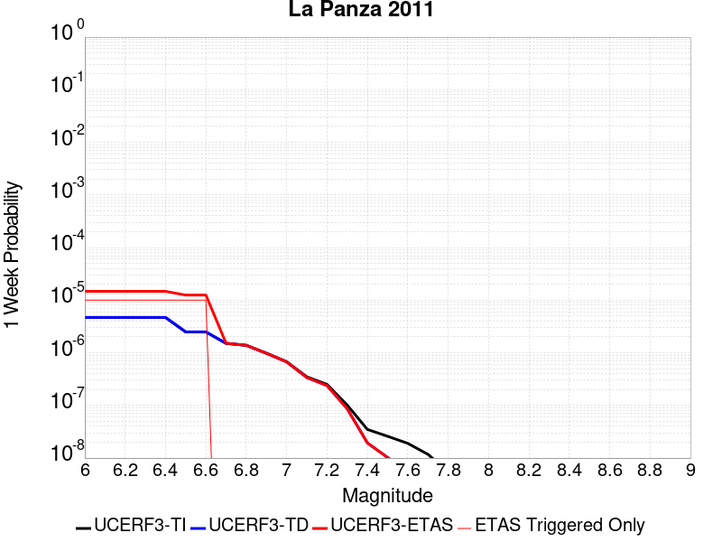 | 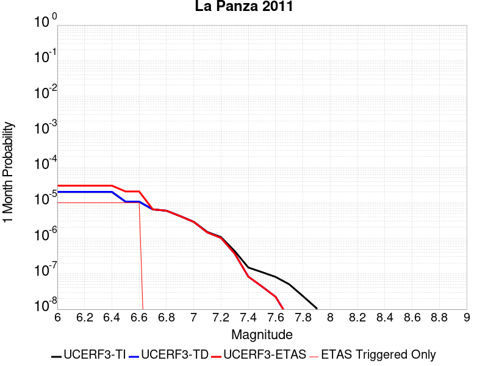 |  |  |

| Magnitude | 1 wk TI Prob | 1 wk TD Prob | 1 wk ETAS Prob | 1 wk ETAS/TD Gain | 1 wk ETAS Triggered Only | 1 mo TI Prob | 1 mo TD Prob | 1 mo ETAS Prob | 1 mo ETAS/TD Gain | 1 mo ETAS Triggered Only | 1 yr TI Prob | 1 yr TD Prob | 1 yr ETAS Prob | 1 yr ETAS/TD Gain | 1 yr ETAS Triggered Only | 10 yr TI Prob | 10 yr TD Prob | 10 yr ETAS Prob | 10 yr ETAS/TD Gain | 10 yr ETAS Triggered Only |
|-----|-----|-----|-----|-----|-----|-----|-----|-----|-----|-----|-----|-----|-----|-----|-----|-----|-----|-----|-----|-----|
| 6.0 | 4.6754544E-6 | 4.717587E-6 | 4.5203225E-5 | 9.581853 | 4.048583E-5 | 2.0037509E-5 | 2.0218084E-5 | 6.0703096E-5 | 3.002416 | 4.048583E-5 | 2.4392935E-4 | 2.4612935E-4 | 2.866052E-4 | 1.1644496 | 4.048583E-5 | 0.0024366176 | 0.002458762 | 0.0024991482 | 1.0164255 | 4.048583E-5 |
| 6.1 | 4.6754544E-6 | 4.717587E-6 | 4.5203225E-5 | 9.581853 | 4.048583E-5 | 2.0037509E-5 | 2.0218084E-5 | 6.0703096E-5 | 3.002416 | 4.048583E-5 | 2.4392935E-4 | 2.4612935E-4 | 2.866052E-4 | 1.1644496 | 4.048583E-5 | 0.0024366176 | 0.002458762 | 0.0024991482 | 1.0164255 | 4.048583E-5 |
| 6.2 | 4.6754544E-6 | 4.717587E-6 | 4.5203225E-5 | 9.581853 | 4.048583E-5 | 2.0037509E-5 | 2.0218084E-5 | 6.0703096E-5 | 3.002416 | 4.048583E-5 | 2.4392935E-4 | 2.4612935E-4 | 2.866052E-4 | 1.1644496 | 4.048583E-5 | 0.0024366176 | 0.002458762 | 0.0024991482 | 1.0164255 | 4.048583E-5 |
| 6.3 | 4.6754544E-6 | 4.717587E-6 | 4.5203225E-5 | 9.581853 | 4.048583E-5 | 2.0037509E-5 | 2.0218084E-5 | 6.0703096E-5 | 3.002416 | 4.048583E-5 | 2.4392935E-4 | 2.4612935E-4 | 2.866052E-4 | 1.1644496 | 4.048583E-5 | 0.0024366176 | 0.002458762 | 0.0024991482 | 1.0164255 | 4.048583E-5 |
| 6.4 | 4.6754544E-6 | 4.717587E-6 | 4.5203225E-5 | 9.581853 | 4.048583E-5 | 2.0037509E-5 | 2.0218084E-5 | 6.0703096E-5 | 3.002416 | 4.048583E-5 | 2.4392935E-4 | 2.4612935E-4 | 2.866052E-4 | 1.1644496 | 4.048583E-5 | 0.0024366176 | 0.002458762 | 0.0024991482 | 1.0164255 | 4.048583E-5 |
| 6.5 | 2.485343E-6 | 2.5005988E-6 | 4.298633E-5 | 17.190413 | 4.048583E-5 | 1.0651426E-5 | 1.0716811E-5 | 5.1202205E-5 | 4.7777467 | 4.048583E-5 | 1.296734E-4 | 1.3046975E-4 | 1.709503E-4 | 1.3102677 | 4.048583E-5 | 0.0012959775 | 0.0013039699 | 0.0013444029 | 1.0310076 | 4.048583E-5 |
| 6.6 | 2.485343E-6 | 2.5005988E-6 | 4.298633E-5 | 17.190413 | 4.048583E-5 | 1.0651426E-5 | 1.0716811E-5 | 5.1202205E-5 | 4.7777467 | 4.048583E-5 | 1.296734E-4 | 1.3046975E-4 | 1.709503E-4 | 1.3102677 | 4.048583E-5 | 0.0012959775 | 0.0013039699 | 0.0013444029 | 1.0310076 | 4.048583E-5 |
| 6.7 | 1.5108508E-6 | 1.5146375E-6 | 1.5146375E-6 | 1.0 | 0.0 | 6.4750584E-6 | 6.491288E-6 | 6.491288E-6 | 1.0 | 0.0 | 7.8830984E-5 | 7.902867E-5 | 7.902867E-5 | 1.0 | 0.0 | 7.880303E-4 | 7.900165E-4 | 7.900165E-4 | 1.0 | 0.0 |
| 6.8 | 1.3865837E-6 | 1.3885102E-6 | 1.3885102E-6 | 1.0 | 0.0 | 5.942488E-6 | 5.9507447E-6 | 5.9507447E-6 | 1.0 | 0.0 | 7.234739E-5 | 7.244801E-5 | 7.244801E-5 | 1.0 | 0.0 | 7.232384E-4 | 7.242537E-4 | 7.242537E-4 | 1.0 | 0.0 |
| 6.9 | 9.826583E-7 | 9.796287E-7 | 9.796287E-7 | 1.0 | 0.0 | 4.2113857E-6 | 4.198402E-6 | 4.198402E-6 | 1.0 | 0.0 | 5.1272415E-5 | 5.11144E-5 | 5.11144E-5 | 1.0 | 0.0 | 5.126059E-4 | 5.110318E-4 | 5.110318E-4 | 1.0 | 0.0 |
| 7.0 | 6.7797646E-7 | 6.7102144E-7 | 6.7102144E-7 | 1.0 | 0.0 | 2.9056102E-6 | 2.8758034E-6 | 2.8758034E-6 | 1.0 | 0.0 | 3.537523E-5 | 3.5012374E-5 | 3.5012374E-5 | 1.0 | 0.0 | 3.5369597E-4 | 3.5007167E-4 | 3.5007167E-4 | 1.0 | 0.0 |
| 7.1 | 3.4979826E-7 | 3.387388E-7 | 3.387388E-7 | 1.0 | 0.0 | 1.4991346E-6 | 1.4517369E-6 | 1.4517369E-6 | 1.0 | 0.0 | 1.825181E-5 | 1.7674765E-5 | 1.7674765E-5 | 1.0 | 0.0 | 1.825031E-4 | 1.7673477E-4 | 1.7673477E-4 | 1.0 | 0.0 |
| 7.2 | 2.5088332E-7 | 2.3831899E-7 | 2.3831899E-7 | 1.0 | 0.0 | 1.0752137E-6 | 1.0213668E-6 | 1.0213668E-6 | 1.0 | 0.0 | 1.3090649E-5 | 1.2435077E-5 | 1.2435077E-5 | 1.0 | 0.0 | 1.3089878E-4 | 1.2434467E-4 | 1.2434467E-4 | 1.0 | 0.0 |
| 7.3 | 1.0159086E-7 | 8.64462E-8 | 8.64462E-8 | 1.0 | 0.0 | 4.3538932E-7 | 3.7048366E-7 | 3.7048366E-7 | 1.0 | 0.0 | 5.300852E-6 | 4.5106294E-6 | 4.5106294E-6 | 1.0 | 0.0 | 5.3007258E-5 | 4.5105422E-5 | 4.5105422E-5 | 1.0 | 0.0 |
| 7.4 | 3.5006252E-8 | 1.9404325E-8 | 1.9404325E-8 | 1.0 | 0.0 | 1.5002678E-7 | 8.3161396E-8 | 8.3161396E-8 | 1.0 | 0.0 | 1.8265745E-6 | 1.0124895E-6 | 1.0124895E-6 | 1.0 | 0.0 | 1.8265595E-5 | 1.01248515E-5 | 1.01248515E-5 | 1.0 | 0.0 |
| 7.5 | 2.592274E-8 | 1.0239094E-8 | 1.0239094E-8 | 1.0 | 0.0 | 1.1109746E-7 | 4.388183E-8 | 4.388183E-8 | 1.0 | 0.0 | 1.3526106E-6 | 5.342612E-7 | 5.342612E-7 | 1.0 | 0.0 | 1.3526024E-5 | 5.3425997E-6 | 5.3425997E-6 | 1.0 | 0.0 |
| 7.6 | 1.9016717E-8 | 5.244801E-9 | 5.244801E-9 | 1.0 | 0.0 | 8.150022E-8 | 2.247772E-8 | 2.247772E-8 | 1.0 | 0.0 | 9.922647E-7 | 2.736662E-7 | 2.736662E-7 | 1.0 | 0.0 | 9.922603E-6 | 2.7366589E-6 | 2.7366589E-6 | 1.0 | 0.0 |
| 7.7 | 1.17738495E-8 | 1.2398075E-9 | 1.2398075E-9 | 1.0 | 0.0 | 5.0459356E-8 | 5.3134603E-9 | 5.3134603E-9 | 1.0 | 0.0 | 6.1434247E-7 | 6.469138E-8 | 6.469138E-8 | 1.0 | 0.0 | 6.143408E-6 | 6.469136E-7 | 6.469136E-7 | 1.0 | 0.0 |
| 7.8 | 5.489079E-9 | 2.0111768E-10 | 2.0111768E-10 | 1.0 | 0.0 | 2.3524624E-8 | 8.6193275E-10 | 8.6193275E-10 | 1.0 | 0.0 | 2.8641225E-7 | 1.04940305E-8 | 1.04940305E-8 | 1.0 | 0.0 | 2.8641189E-6 | 1.04940305E-7 | 1.04940305E-7 | 1.0 | 0.0 |
| 7.9 | 2.5081048E-9 | 6.683887E-11 | 6.683887E-11 | 1.0 | 0.0 | 1.0749021E-8 | 2.8645197E-10 | 2.8645197E-10 | 1.0 | 0.0 | 1.3086932E-7 | 3.487552E-9 | 3.487552E-9 | 1.0 | 0.0 | 1.3086925E-6 | 3.487552E-8 | 3.487552E-8 | 1.0 | 0.0 |

## Del Valle
*[(top)](#table-of-contents)*

| 1 Week | 1 Month | 1 Year | 10 Year |
|-----|-----|-----|-----|
|  |  |  |  |

| Magnitude | 1 wk TI Prob | 1 wk TD Prob | 1 wk ETAS Prob | 1 wk ETAS/TD Gain | 1 wk ETAS Triggered Only | 1 mo TI Prob | 1 mo TD Prob | 1 mo ETAS Prob | 1 mo ETAS/TD Gain | 1 mo ETAS Triggered Only | 1 yr TI Prob | 1 yr TD Prob | 1 yr ETAS Prob | 1 yr ETAS/TD Gain | 1 yr ETAS Triggered Only | 10 yr TI Prob | 10 yr TD Prob | 10 yr ETAS Prob | 10 yr ETAS/TD Gain | 10 yr ETAS Triggered Only |
|-----|-----|-----|-----|-----|-----|-----|-----|-----|-----|-----|-----|-----|-----|-----|-----|-----|-----|-----|-----|-----|
| 6.0 | 1.0716125E-5 | 8.767882E-6 | 8.767882E-6 | 1.0 | 0.0 | 4.592544E-5 | 3.7576207E-5 | 3.7576207E-5 | 1.0 | 0.0 | 5.589988E-4 | 4.5741405E-4 | 4.5741405E-4 | 1.0 | 0.0 | 0.0055759475 | 0.00456668 | 0.0046069813 | 1.008825 | 4.048583E-5 |
| 6.1 | 1.0716125E-5 | 8.767882E-6 | 8.767882E-6 | 1.0 | 0.0 | 4.592544E-5 | 3.7576207E-5 | 3.7576207E-5 | 1.0 | 0.0 | 5.589988E-4 | 4.5741405E-4 | 4.5741405E-4 | 1.0 | 0.0 | 0.0055759475 | 0.00456668 | 0.0046069813 | 1.008825 | 4.048583E-5 |
| 6.2 | 1.0716125E-5 | 8.767882E-6 | 8.767882E-6 | 1.0 | 0.0 | 4.592544E-5 | 3.7576207E-5 | 3.7576207E-5 | 1.0 | 0.0 | 5.589988E-4 | 4.5741405E-4 | 4.5741405E-4 | 1.0 | 0.0 | 0.0055759475 | 0.00456668 | 0.0046069813 | 1.008825 | 4.048583E-5 |
| 6.3 | 7.1293784E-6 | 4.865823E-6 | 4.865823E-6 | 1.0 | 0.0 | 3.055412E-5 | 2.0853364E-5 | 2.0853364E-5 | 1.0 | 0.0 | 3.7193293E-4 | 2.5386087E-4 | 2.5386087E-4 | 1.0 | 0.0 | 0.0037131102 | 0.0025357946 | 0.002576178 | 1.0159253 | 4.048583E-5 |
| 6.4 | 7.1293784E-6 | 4.865823E-6 | 4.865823E-6 | 1.0 | 0.0 | 3.055412E-5 | 2.0853364E-5 | 2.0853364E-5 | 1.0 | 0.0 | 3.7193293E-4 | 2.5386087E-4 | 2.5386087E-4 | 1.0 | 0.0 | 0.0037131102 | 0.0025357946 | 0.002576178 | 1.0159253 | 4.048583E-5 |
| 6.5 | 7.1293784E-6 | 4.865823E-6 | 4.865823E-6 | 1.0 | 0.0 | 3.055412E-5 | 2.0853364E-5 | 2.0853364E-5 | 1.0 | 0.0 | 3.7193293E-4 | 2.5386087E-4 | 2.5386087E-4 | 1.0 | 0.0 | 0.0037131102 | 0.0025357946 | 0.002576178 | 1.0159253 | 4.048583E-5 |
| 6.6 | 7.1293784E-6 | 4.865823E-6 | 4.865823E-6 | 1.0 | 0.0 | 3.055412E-5 | 2.0853364E-5 | 2.0853364E-5 | 1.0 | 0.0 | 3.7193293E-4 | 2.5386087E-4 | 2.5386087E-4 | 1.0 | 0.0 | 0.0037131102 | 0.0025357946 | 0.002576178 | 1.0159253 | 4.048583E-5 |
| 6.7 | 7.12272E-6 | 4.8631987E-6 | 4.8631987E-6 | 1.0 | 0.0 | 3.0525585E-5 | 2.0842117E-5 | 2.0842117E-5 | 1.0 | 0.0 | 3.7158563E-4 | 2.5372396E-4 | 2.5372396E-4 | 1.0 | 0.0 | 0.003709649 | 0.0025344288 | 0.002574812 | 1.0159339 | 4.048583E-5 |
| 6.8 | 6.7558703E-6 | 4.5594015E-6 | 4.5594015E-6 | 1.0 | 0.0 | 2.895341E-5 | 1.9540148E-5 | 1.9540148E-5 | 1.0 | 0.0 | 3.5245073E-4 | 2.3787597E-4 | 2.3787597E-4 | 1.0 | 0.0 | 0.0035189227 | 0.0023762889 | 0.0024166785 | 1.016997 | 4.048583E-5 |
| 6.9 | 6.6700386E-6 | 4.502539E-6 | 4.502539E-6 | 1.0 | 0.0 | 2.8585566E-5 | 1.9296456E-5 | 1.9296456E-5 | 1.0 | 0.0 | 3.479737E-4 | 2.3490966E-4 | 2.3490966E-4 | 1.0 | 0.0 | 0.003474293 | 0.0023466884 | 0.0023870794 | 1.0172118 | 4.048583E-5 |
| 7.0 | 6.3181424E-6 | 4.0987034E-6 | 4.0987034E-6 | 1.0 | 0.0 | 2.7077473E-5 | 1.7565755E-5 | 1.7565755E-5 | 1.0 | 0.0 | 3.2961834E-4 | 2.1384252E-4 | 2.1384252E-4 | 1.0 | 0.0 | 0.0032912986 | 0.002136422 | 0.0021768215 | 1.0189098 | 4.048583E-5 |
| 7.1 | 6.248759E-6 | 4.033895E-6 | 4.033895E-6 | 1.0 | 0.0 | 2.678012E-5 | 1.7288008E-5 | 1.7288008E-5 | 1.0 | 0.0 | 3.2599916E-4 | 2.104616E-4 | 2.104616E-4 | 1.0 | 0.0 | 0.0032552136 | 0.0021026772 | 0.002143078 | 1.0192139 | 4.048583E-5 |
| 7.2 | 6.0411944E-6 | 3.869888E-6 | 3.869888E-6 | 1.0 | 0.0 | 2.5890577E-5 | 1.658513E-5 | 1.658513E-5 | 1.0 | 0.0 | 3.1517216E-4 | 2.0190567E-4 | 2.0190567E-4 | 1.0 | 0.0 | 0.0031472554 | 0.0020172757 | 0.00205768 | 1.0200291 | 4.048583E-5 |
| 7.3 | 4.7691183E-6 | 3.0781202E-6 | 3.0781202E-6 | 1.0 | 0.0 | 2.0438918E-5 | 1.3191879E-5 | 1.3191879E-5 | 1.0 | 0.0 | 2.488154E-4 | 1.605995E-4 | 1.605995E-4 | 1.0 | 0.0 | 0.00248537 | 0.0016048603 | 0.0016452811 | 1.0251865 | 4.048583E-5 |
| 7.4 | 3.5524722E-6 | 2.1893363E-6 | 2.1893363E-6 | 1.0 | 0.0 | 1.5224792E-5 | 9.382837E-6 | 9.382837E-6 | 1.0 | 0.0 | 1.8534607E-4 | 1.1423013E-4 | 1.1423013E-4 | 1.0 | 0.0 | 0.0018519156 | 0.0011417224 | 0.0011821621 | 1.0354198 | 4.048583E-5 |
| 7.5 | 2.7133442E-6 | 1.5916097E-6 | 1.5916097E-6 | 1.0 | 0.0 | 1.1628566E-5 | 6.821167E-6 | 6.821167E-6 | 1.0 | 0.0 | 1.415686E-4 | 8.304456E-5 | 8.304456E-5 | 1.0 | 0.0 | 0.0014147845 | 8.301372E-4 | 8.705894E-4 | 1.0487295 | 4.048583E-5 |
| 7.6 | 1.915338E-6 | 1.173914E-6 | 1.173914E-6 | 1.0 | 0.0 | 8.208566E-6 | 5.0310505E-6 | 5.0310505E-6 | 1.0 | 0.0 | 9.993471E-5 | 6.125133E-5 | 6.125133E-5 | 1.0 | 0.0 | 9.988978E-4 | 6.123454E-4 | 6.528064E-4 | 1.0660756 | 4.048583E-5 |
| 7.7 | 1.2120448E-6 | 7.180313E-7 | 7.180313E-7 | 1.0 | 0.0 | 5.194467E-6 | 3.0772733E-6 | 3.0772733E-6 | 1.0 | 0.0 | 6.3240805E-5 | 3.746516E-5 | 3.746516E-5 | 1.0 | 0.0 | 6.322281E-4 | 3.7458882E-4 | 3.7458882E-4 | 1.0 | 0.0 |
| 7.8 | 6.272381E-7 | 3.932549E-7 | 3.932549E-7 | 1.0 | 0.0 | 2.6881603E-6 | 1.6853771E-6 | 1.6853771E-6 | 1.0 | 0.0 | 3.272786E-5 | 2.0519275E-5 | 2.0519275E-5 | 1.0 | 0.0 | 3.272304E-4 | 2.0517396E-4 | 2.0517396E-4 | 1.0 | 0.0 |
| 7.9 | 2.0292627E-7 | 1.2004622E-7 | 1.2004622E-7 | 1.0 | 0.0 | 8.6968373E-7 | 5.1448376E-7 | 5.1448376E-7 | 1.0 | 0.0 | 1.0588348E-5 | 6.263822E-6 | 6.263822E-6 | 1.0 | 0.0 | 1.0587843E-4 | 6.263647E-5 | 6.263647E-5 | 1.0 | 0.0 |
| 8.0 | 4.374492E-8 | 2.189964E-8 | 2.189964E-8 | 1.0 | 0.0 | 1.8747821E-7 | 9.385559E-8 | 9.385559E-8 | 1.0 | 0.0 | 2.2825448E-6 | 1.1426913E-6 | 1.1426913E-6 | 1.0 | 0.0 | 2.2825214E-5 | 1.1426858E-5 | 1.1426858E-5 | 1.0 | 0.0 |

## Surprise Valley 2011 CFM
*[(top)](#table-of-contents)*

| 1 Week | 1 Month | 1 Year | 10 Year |
|-----|-----|-----|-----|
|  | 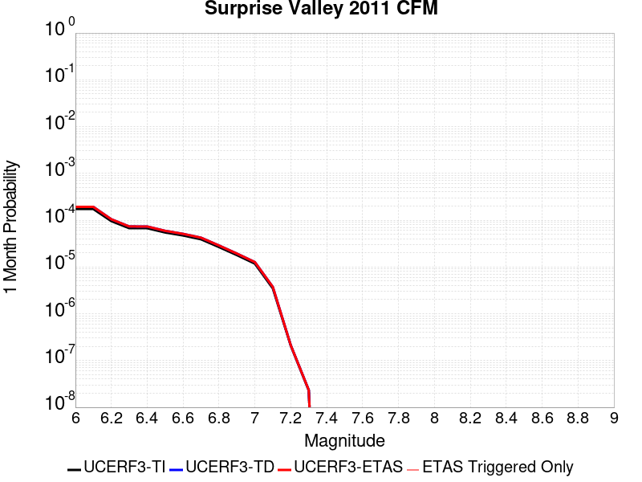 |  |  |

| Magnitude | 1 wk TI Prob | 1 wk TD Prob | 1 wk ETAS Prob | 1 wk ETAS/TD Gain | 1 wk ETAS Triggered Only | 1 mo TI Prob | 1 mo TD Prob | 1 mo ETAS Prob | 1 mo ETAS/TD Gain | 1 mo ETAS Triggered Only | 1 yr TI Prob | 1 yr TD Prob | 1 yr ETAS Prob | 1 yr ETAS/TD Gain | 1 yr ETAS Triggered Only | 10 yr TI Prob | 10 yr TD Prob | 10 yr ETAS Prob | 10 yr ETAS/TD Gain | 10 yr ETAS Triggered Only |
|-----|-----|-----|-----|-----|-----|-----|-----|-----|-----|-----|-----|-----|-----|-----|-----|-----|-----|-----|-----|-----|
| 6.0 | 4.0396248E-5 | 4.485131E-5 | 4.485131E-5 | 1.0 | 0.0 | 1.7311527E-4 | 1.9220692E-4 | 1.9220692E-4 | 1.0 | 0.0 | 0.002105641 | 0.0023378176 | 0.0023378176 | 1.0 | 0.0 | 0.020858008 | 0.023153966 | 0.023193514 | 1.001708 | 4.048583E-5 |
| 6.1 | 4.0396248E-5 | 4.485131E-5 | 4.485131E-5 | 1.0 | 0.0 | 1.7311527E-4 | 1.9220692E-4 | 1.9220692E-4 | 1.0 | 0.0 | 0.002105641 | 0.0023378176 | 0.0023378176 | 1.0 | 0.0 | 0.020858008 | 0.023153966 | 0.023193514 | 1.001708 | 4.048583E-5 |
| 6.2 | 2.2295266E-5 | 2.440125E-5 | 2.440125E-5 | 1.0 | 0.0 | 9.554764E-5 | 1.0457276E-4 | 1.0457276E-4 | 1.0 | 0.0 | 0.0011626717 | 0.0012724606 | 0.0012724606 | 1.0 | 0.0 | 0.011566074 | 0.012654981 | 0.012654981 | 1.0 | 0.0 |
| 6.3 | 1.572643E-5 | 1.7096807E-5 | 1.7096807E-5 | 1.0 | 0.0 | 6.7397246E-5 | 7.327003E-5 | 7.327003E-5 | 1.0 | 0.0 | 8.202525E-4 | 8.91708E-4 | 8.91708E-4 | 1.0 | 0.0 | 0.008172315 | 0.008882407 | 0.008882407 | 1.0 | 0.0 |
| 6.4 | 1.5714395E-5 | 1.7084629E-5 | 1.7084629E-5 | 1.0 | 0.0 | 6.734567E-5 | 7.3217845E-5 | 7.3217845E-5 | 1.0 | 0.0 | 8.1962504E-4 | 8.9107314E-4 | 8.9107314E-4 | 1.0 | 0.0 | 0.008166086 | 0.008876109 | 0.008876109 | 1.0 | 0.0 |
| 6.5 | 1.2733495E-5 | 1.38016E-5 | 1.38016E-5 | 1.0 | 0.0 | 5.457098E-5 | 5.9148413E-5 | 5.9148413E-5 | 1.0 | 0.0 | 6.641992E-4 | 7.1990065E-4 | 7.1990065E-4 | 1.0 | 0.0 | 0.0066221743 | 0.0071763797 | 0.0071763797 | 1.0 | 0.0 |
| 6.6 | 1.0983784E-5 | 1.1886554E-5 | 1.1886554E-5 | 1.0 | 0.0 | 4.7072506E-5 | 5.094141E-5 | 5.094141E-5 | 1.0 | 0.0 | 5.7295704E-4 | 6.200405E-4 | 6.200405E-4 | 1.0 | 0.0 | 0.0057148207 | 0.0061836545 | 0.0061836545 | 1.0 | 0.0 |
| 6.7 | 9.104806E-6 | 9.839491E-6 | 9.839491E-6 | 1.0 | 0.0 | 3.902001E-5 | 4.2168587E-5 | 4.2168587E-5 | 1.0 | 0.0 | 4.7496508E-4 | 5.132855E-4 | 5.132855E-4 | 1.0 | 0.0 | 0.004739512 | 0.005121397 | 0.005121397 | 1.0 | 0.0 |
| 6.8 | 6.2162403E-6 | 6.7041337E-6 | 6.7041337E-6 | 1.0 | 0.0 | 2.6640759E-5 | 2.8731698E-5 | 2.8731698E-5 | 1.0 | 0.0 | 3.2430296E-4 | 3.497545E-4 | 3.497545E-4 | 1.0 | 0.0 | 0.003238301 | 0.0034922638 | 0.0034922638 | 1.0 | 0.0 |
| 6.9 | 4.1792696E-6 | 4.50323E-6 | 4.50323E-6 | 1.0 | 0.0 | 1.7911032E-5 | 1.9299423E-5 | 1.9299423E-5 | 1.0 | 0.0 | 2.1804498E-4 | 2.3494668E-4 | 2.3494668E-4 | 1.0 | 0.0 | 0.0021783116 | 0.0023471361 | 0.0023471361 | 1.0 | 0.0 |
| 7.0 | 2.7478413E-6 | 2.9622424E-6 | 2.9622424E-6 | 1.0 | 0.0 | 1.177641E-5 | 1.269527E-5 | 1.269527E-5 | 1.0 | 0.0 | 1.4336836E-4 | 1.545552E-4 | 1.545552E-4 | 1.0 | 0.0 | 0.001432759 | 0.0015445995 | 0.0015445995 | 1.0 | 0.0 |
| 7.1 | 8.128648E-7 | 8.724922E-7 | 8.724922E-7 | 1.0 | 0.0 | 3.4837017E-6 | 3.7392501E-6 | 3.7392501E-6 | 1.0 | 0.0 | 4.2413245E-5 | 4.552502E-5 | 4.552502E-5 | 1.0 | 0.0 | 4.2405148E-4 | 4.5521575E-4 | 4.5521575E-4 | 1.0 | 0.0 |
| 7.2 | 4.8641045E-8 | 4.9402068E-8 | 4.9402068E-8 | 1.0 | 0.0 | 2.084616E-7 | 2.1172312E-7 | 2.1172312E-7 | 1.0 | 0.0 | 2.538017E-6 | 2.577726E-6 | 2.577726E-6 | 1.0 | 0.0 | 2.537988E-5 | 2.5776973E-5 | 2.5776973E-5 | 1.0 | 0.0 |
| 7.3 | 5.3911844E-9 | 5.4758145E-9 | 5.4758145E-9 | 1.0 | 0.0 | 2.3105075E-8 | 2.3467775E-8 | 2.3467775E-8 | 1.0 | 0.0 | 2.8130427E-7 | 2.8572015E-7 | 2.8572015E-7 | 1.0 | 0.0 | 2.8130391E-6 | 2.8571992E-6 | 2.8571992E-6 | 1.0 | 0.0 |

## San Luis Range 2011 CFM
*[(top)](#table-of-contents)*

| 1 Week | 1 Month | 1 Year | 10 Year |
|-----|-----|-----|-----|
|  |  | 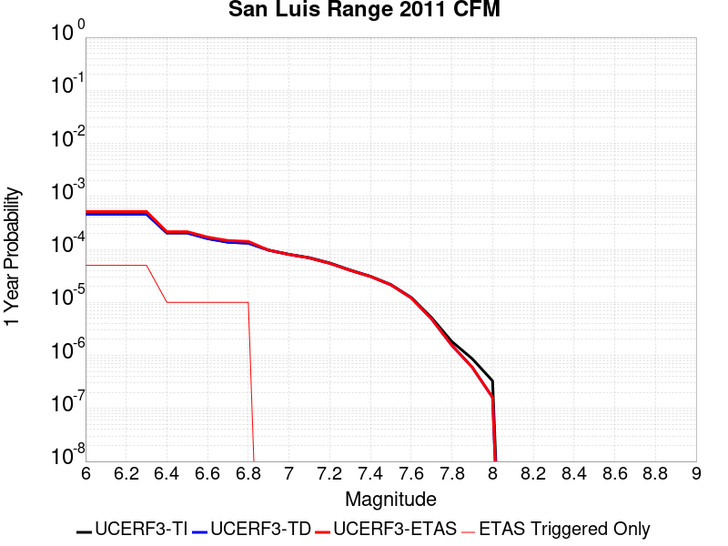 |  |

| Magnitude | 1 wk TI Prob | 1 wk TD Prob | 1 wk ETAS Prob | 1 wk ETAS/TD Gain | 1 wk ETAS Triggered Only | 1 mo TI Prob | 1 mo TD Prob | 1 mo ETAS Prob | 1 mo ETAS/TD Gain | 1 mo ETAS Triggered Only | 1 yr TI Prob | 1 yr TD Prob | 1 yr ETAS Prob | 1 yr ETAS/TD Gain | 1 yr ETAS Triggered Only | 10 yr TI Prob | 10 yr TD Prob | 10 yr ETAS Prob | 10 yr ETAS/TD Gain | 10 yr ETAS Triggered Only |
|-----|-----|-----|-----|-----|-----|-----|-----|-----|-----|-----|-----|-----|-----|-----|-----|-----|-----|-----|-----|-----|
| 6.0 | 8.8368415E-6 | 8.965454E-6 | 8.965454E-6 | 1.0 | 0.0 | 3.787163E-5 | 3.842285E-5 | 3.842285E-5 | 1.0 | 0.0 | 4.609895E-4 | 4.677057E-4 | 5.081726E-4 | 1.0865221 | 4.048583E-5 | 0.0046003438 | 0.0046679964 | 0.004708293 | 1.0086325 | 4.048583E-5 |
| 6.1 | 8.8368415E-6 | 8.965454E-6 | 8.965454E-6 | 1.0 | 0.0 | 3.787163E-5 | 3.842285E-5 | 3.842285E-5 | 1.0 | 0.0 | 4.609895E-4 | 4.677057E-4 | 5.081726E-4 | 1.0865221 | 4.048583E-5 | 0.0046003438 | 0.0046679964 | 0.004708293 | 1.0086325 | 4.048583E-5 |
| 6.2 | 8.8368415E-6 | 8.965454E-6 | 8.965454E-6 | 1.0 | 0.0 | 3.787163E-5 | 3.842285E-5 | 3.842285E-5 | 1.0 | 0.0 | 4.609895E-4 | 4.677057E-4 | 5.081726E-4 | 1.0865221 | 4.048583E-5 | 0.0046003438 | 0.0046679964 | 0.004708293 | 1.0086325 | 4.048583E-5 |
| 6.3 | 8.8368415E-6 | 8.965454E-6 | 8.965454E-6 | 1.0 | 0.0 | 3.787163E-5 | 3.842285E-5 | 3.842285E-5 | 1.0 | 0.0 | 4.609895E-4 | 4.677057E-4 | 5.081726E-4 | 1.0865221 | 4.048583E-5 | 0.0046003438 | 0.0046679964 | 0.004708293 | 1.0086325 | 4.048583E-5 |
| 6.4 | 3.9094193E-6 | 3.9412025E-6 | 3.9412025E-6 | 1.0 | 0.0 | 1.6754546E-5 | 1.689076E-5 | 1.689076E-5 | 1.0 | 0.0 | 2.039675E-4 | 2.056259E-4 | 2.056259E-4 | 1.0 | 0.0 | 0.0020378039 | 0.0020543851 | 0.0020543851 | 1.0 | 0.0 |
| 6.5 | 3.9094193E-6 | 3.9412025E-6 | 3.9412025E-6 | 1.0 | 0.0 | 1.6754546E-5 | 1.689076E-5 | 1.689076E-5 | 1.0 | 0.0 | 2.039675E-4 | 2.056259E-4 | 2.056259E-4 | 1.0 | 0.0 | 0.0020378039 | 0.0020543851 | 0.0020543851 | 1.0 | 0.0 |
| 6.6 | 3.0587726E-6 | 3.0753883E-6 | 3.0753883E-6 | 1.0 | 0.0 | 1.3108959E-5 | 1.318017E-5 | 1.318017E-5 | 1.0 | 0.0 | 1.595899E-4 | 1.6045687E-4 | 1.6045687E-4 | 1.0 | 0.0 | 0.0015947534 | 0.0016034221 | 0.0016034221 | 1.0 | 0.0 |
| 6.7 | 2.6160574E-6 | 2.6251273E-6 | 2.6251273E-6 | 1.0 | 0.0 | 1.1211626E-5 | 1.1250498E-5 | 1.1250498E-5 | 1.0 | 0.0 | 1.3649299E-4 | 1.3696625E-4 | 1.3696625E-4 | 1.0 | 0.0 | 0.0013640919 | 0.0013688246 | 0.0013688246 | 1.0 | 0.0 |
| 6.8 | 2.5110312E-6 | 2.51814E-6 | 2.51814E-6 | 1.0 | 0.0 | 1.0761518E-5 | 1.0791985E-5 | 1.0791985E-5 | 1.0 | 0.0 | 1.310136E-4 | 1.3138456E-4 | 1.3138456E-4 | 1.0 | 0.0 | 0.0013093639 | 0.0013130746 | 0.0013130746 | 1.0 | 0.0 |
| 6.9 | 1.8564405E-6 | 1.852487E-6 | 1.852487E-6 | 1.0 | 0.0 | 7.95615E-6 | 7.939206E-6 | 7.939206E-6 | 1.0 | 0.0 | 9.686181E-5 | 9.665557E-5 | 9.665557E-5 | 1.0 | 0.0 | 9.68196E-4 | 9.661373E-4 | 9.661373E-4 | 1.0 | 0.0 |
| 7.0 | 1.546127E-6 | 1.5369537E-6 | 1.5369537E-6 | 1.0 | 0.0 | 6.626242E-6 | 6.586928E-6 | 6.586928E-6 | 1.0 | 0.0 | 8.06715E-5 | 8.0192905E-5 | 8.0192905E-5 | 1.0 | 0.0 | 8.0642226E-4 | 8.016404E-4 | 8.016404E-4 | 1.0 | 0.0 |
| 7.1 | 1.3368208E-6 | 1.3235326E-6 | 1.3235326E-6 | 1.0 | 0.0 | 5.7292195E-6 | 5.67227E-6 | 5.67227E-6 | 1.0 | 0.0 | 6.975101E-5 | 6.905771E-5 | 6.905771E-5 | 1.0 | 0.0 | 6.972912E-4 | 6.9036294E-4 | 6.9036294E-4 | 1.0 | 0.0 |
| 7.2 | 1.0623363E-6 | 1.0454368E-6 | 1.0454368E-6 | 1.0 | 0.0 | 4.5528623E-6 | 4.4804356E-6 | 4.4804356E-6 | 1.0 | 0.0 | 5.5429686E-5 | 5.4547938E-5 | 5.4547938E-5 | 1.0 | 0.0 | 5.5415864E-4 | 5.4534577E-4 | 5.4534577E-4 | 1.0 | 0.0 |
| 7.3 | 7.831679E-7 | 7.7273904E-7 | 7.7273904E-7 | 1.0 | 0.0 | 3.3564295E-6 | 3.3117344E-6 | 3.3117344E-6 | 1.0 | 0.0 | 4.086376E-5 | 4.0319625E-5 | 4.0319625E-5 | 1.0 | 0.0 | 4.0856248E-4 | 4.031232E-4 | 4.031232E-4 | 1.0 | 0.0 |
| 7.4 | 5.9558846E-7 | 5.910636E-7 | 5.910636E-7 | 1.0 | 0.0 | 2.5525194E-6 | 2.5331274E-6 | 2.5331274E-6 | 1.0 | 0.0 | 3.107648E-5 | 3.084039E-5 | 3.084039E-5 | 1.0 | 0.0 | 3.1072134E-4 | 3.083612E-4 | 3.083612E-4 | 1.0 | 0.0 |
| 7.5 | 4.1616502E-7 | 4.119631E-7 | 4.119631E-7 | 1.0 | 0.0 | 1.7835631E-6 | 1.7655549E-6 | 1.7655549E-6 | 1.0 | 0.0 | 2.1714664E-5 | 2.149542E-5 | 2.149542E-5 | 1.0 | 0.0 | 2.1712543E-4 | 2.1493346E-4 | 2.1493346E-4 | 1.0 | 0.0 |
| 7.6 | 2.3816014E-7 | 2.3376548E-7 | 2.3376548E-7 | 1.0 | 0.0 | 1.0206859E-6 | 1.0018516E-6 | 1.0018516E-6 | 1.0 | 0.0 | 1.242678E-5 | 1.2197475E-5 | 1.2197475E-5 | 1.0 | 0.0 | 1.2426086E-4 | 1.2196808E-4 | 1.2196808E-4 | 1.0 | 0.0 |
| 7.7 | 9.918777E-8 | 9.3867584E-8 | 9.3867584E-8 | 1.0 | 0.0 | 4.2509038E-7 | 4.0228957E-7 | 4.0228957E-7 | 1.0 | 0.0 | 5.1754632E-6 | 4.8978645E-6 | 4.8978645E-6 | 1.0 | 0.0 | 5.1753424E-5 | 4.897757E-5 | 4.897757E-5 | 1.0 | 0.0 |
| 7.8 | 3.4982556E-8 | 2.968655E-8 | 2.968655E-8 | 1.0 | 0.0 | 1.4992524E-7 | 1.2722806E-7 | 1.2722806E-7 | 1.0 | 0.0 | 1.8253382E-6 | 1.5490006E-6 | 1.5490006E-6 | 1.0 | 0.0 | 1.8253233E-5 | 1.5489897E-5 | 1.5489897E-5 | 1.0 | 0.0 |
| 7.9 | 1.6624908E-8 | 1.1477036E-8 | 1.1477036E-8 | 1.0 | 0.0 | 7.12496E-8 | 4.91873E-8 | 4.91873E-8 | 1.0 | 0.0 | 8.6746354E-7 | 5.988552E-7 | 5.988552E-7 | 1.0 | 0.0 | 8.674601E-6 | 5.988536E-6 | 5.988536E-6 | 1.0 | 0.0 |
| 8.0 | 6.3352315E-9 | 3.0888412E-9 | 3.0888412E-9 | 1.0 | 0.0 | 2.715099E-8 | 1.3237893E-8 | 1.3237893E-8 | 1.0 | 0.0 | 3.3056327E-7 | 1.6117131E-7 | 1.6117131E-7 | 1.0 | 0.0 | 3.3056278E-6 | 1.611712E-6 | 1.611712E-6 | 1.0 | 0.0 |

## Robinson Creek
*[(top)](#table-of-contents)*

| 1 Week | 1 Month | 1 Year | 10 Year |
|-----|-----|-----|-----|
|  |  |  |  |

| Magnitude | 1 wk TI Prob | 1 wk TD Prob | 1 wk ETAS Prob | 1 wk ETAS/TD Gain | 1 wk ETAS Triggered Only | 1 mo TI Prob | 1 mo TD Prob | 1 mo ETAS Prob | 1 mo ETAS/TD Gain | 1 mo ETAS Triggered Only | 1 yr TI Prob | 1 yr TD Prob | 1 yr ETAS Prob | 1 yr ETAS/TD Gain | 1 yr ETAS Triggered Only | 10 yr TI Prob | 10 yr TD Prob | 10 yr ETAS Prob | 10 yr ETAS/TD Gain | 10 yr ETAS Triggered Only |
|-----|-----|-----|-----|-----|-----|-----|-----|-----|-----|-----|-----|-----|-----|-----|-----|-----|-----|-----|-----|-----|
| 6.0 | 1.3705327E-5 | 1.5285013E-5 | 1.5285013E-5 | 1.0 | 0.0 | 5.8735794E-5 | 6.55072E-5 | 1.0599038E-4 | 1.6179959 | 4.048583E-5 | 7.1487366E-4 | 7.9755014E-4 | 8.380037E-4 | 1.0507222 | 4.048583E-5 | 0.0071257832 | 0.007975501 | 0.008015664 | 1.0050358 | 4.048583E-5 |
| 6.1 | 1.3705327E-5 | 1.5285013E-5 | 1.5285013E-5 | 1.0 | 0.0 | 5.8735794E-5 | 6.55072E-5 | 1.0599038E-4 | 1.6179959 | 4.048583E-5 | 7.1487366E-4 | 7.9755014E-4 | 8.380037E-4 | 1.0507222 | 4.048583E-5 | 0.0071257832 | 0.007975501 | 0.008015664 | 1.0050358 | 4.048583E-5 |
| 6.2 | 1.3705327E-5 | 1.5285013E-5 | 1.5285013E-5 | 1.0 | 0.0 | 5.8735794E-5 | 6.55072E-5 | 1.0599038E-4 | 1.6179959 | 4.048583E-5 | 7.1487366E-4 | 7.9755014E-4 | 8.380037E-4 | 1.0507222 | 4.048583E-5 | 0.0071257832 | 0.007975501 | 0.008015664 | 1.0050358 | 4.048583E-5 |
| 6.3 | 1.3705327E-5 | 1.5285013E-5 | 1.5285013E-5 | 1.0 | 0.0 | 5.8735794E-5 | 6.55072E-5 | 1.0599038E-4 | 1.6179959 | 4.048583E-5 | 7.1487366E-4 | 7.9755014E-4 | 8.380037E-4 | 1.0507222 | 4.048583E-5 | 0.0071257832 | 0.007975501 | 0.008015664 | 1.0050358 | 4.048583E-5 |
| 6.4 | 1.3705327E-5 | 1.5285013E-5 | 1.5285013E-5 | 1.0 | 0.0 | 5.8735794E-5 | 6.55072E-5 | 1.0599038E-4 | 1.6179959 | 4.048583E-5 | 7.1487366E-4 | 7.9755014E-4 | 8.380037E-4 | 1.0507222 | 4.048583E-5 | 0.0071257832 | 0.007975501 | 0.008015664 | 1.0050358 | 4.048583E-5 |

## Emerson-Copper Mtn 2011
*[(top)](#table-of-contents)*

| 1 Week | 1 Month | 1 Year | 10 Year |
|-----|-----|-----|-----|
|  |  |  |  |

| Magnitude | 1 wk TI Prob | 1 wk TD Prob | 1 wk ETAS Prob | 1 wk ETAS/TD Gain | 1 wk ETAS Triggered Only | 1 mo TI Prob | 1 mo TD Prob | 1 mo ETAS Prob | 1 mo ETAS/TD Gain | 1 mo ETAS Triggered Only | 1 yr TI Prob | 1 yr TD Prob | 1 yr ETAS Prob | 1 yr ETAS/TD Gain | 1 yr ETAS Triggered Only | 10 yr TI Prob | 10 yr TD Prob | 10 yr ETAS Prob | 10 yr ETAS/TD Gain | 10 yr ETAS Triggered Only |
|-----|-----|-----|-----|-----|-----|-----|-----|-----|-----|-----|-----|-----|-----|-----|-----|-----|-----|-----|-----|-----|
| 6.0 | 2.1364202E-5 | 9.968114E-6 | 5.045354E-5 | 5.0614934 | 4.048583E-5 | 9.1557646E-5 | 4.2719836E-5 | 8.320394E-5 | 1.9476652 | 4.048583E-5 | 0.0011141442 | 5.199986E-4 | 5.604634E-4 | 1.0778171 | 4.048583E-5 | 0.011085749 | 0.005188688 | 0.0052289637 | 1.0077622 | 4.048583E-5 |
| 6.1 | 2.1364202E-5 | 9.968114E-6 | 5.045354E-5 | 5.0614934 | 4.048583E-5 | 9.1557646E-5 | 4.2719836E-5 | 8.320394E-5 | 1.9476652 | 4.048583E-5 | 0.0011141442 | 5.199986E-4 | 5.604634E-4 | 1.0778171 | 4.048583E-5 | 0.011085749 | 0.005188688 | 0.0052289637 | 1.0077622 | 4.048583E-5 |
| 6.2 | 2.1364202E-5 | 9.968114E-6 | 5.045354E-5 | 5.0614934 | 4.048583E-5 | 9.1557646E-5 | 4.2719836E-5 | 8.320394E-5 | 1.9476652 | 4.048583E-5 | 0.0011141442 | 5.199986E-4 | 5.604634E-4 | 1.0778171 | 4.048583E-5 | 0.011085749 | 0.005188688 | 0.0052289637 | 1.0077622 | 4.048583E-5 |
| 6.3 | 1.7751237E-5 | 8.089227E-6 | 4.857473E-5 | 6.0048666 | 4.048583E-5 | 7.607452E-5 | 3.466769E-5 | 7.5152115E-5 | 2.1677856 | 4.048583E-5 | 9.258136E-4 | 4.2200365E-4 | 4.6247238E-4 | 1.0958967 | 4.048583E-5 | 0.00921966 | 0.0042126453 | 0.0042529604 | 1.00957 | 4.048583E-5 |
| 6.4 | 1.7751237E-5 | 8.089227E-6 | 4.857473E-5 | 6.0048666 | 4.048583E-5 | 7.607452E-5 | 3.466769E-5 | 7.5152115E-5 | 2.1677856 | 4.048583E-5 | 9.258136E-4 | 4.2200365E-4 | 4.6247238E-4 | 1.0958967 | 4.048583E-5 | 0.00921966 | 0.0042126453 | 0.0042529604 | 1.00957 | 4.048583E-5 |
| 6.5 | 1.5886664E-5 | 6.603819E-6 | 4.7089383E-5 | 7.1306286 | 4.048583E-5 | 6.808392E-5 | 2.8301802E-5 | 6.878649E-5 | 2.430463 | 4.048583E-5 | 8.286065E-4 | 3.4452465E-4 | 3.8499653E-4 | 1.1174717 | 4.048583E-5 | 0.008255237 | 0.0034403696 | 0.0034807161 | 1.0117273 | 4.048583E-5 |
| 6.6 | 1.5886664E-5 | 6.603819E-6 | 4.7089383E-5 | 7.1306286 | 4.048583E-5 | 6.808392E-5 | 2.8301802E-5 | 6.878649E-5 | 2.430463 | 4.048583E-5 | 8.286065E-4 | 3.4452465E-4 | 3.8499653E-4 | 1.1174717 | 4.048583E-5 | 0.008255237 | 0.0034403696 | 0.0034807161 | 1.0117273 | 4.048583E-5 |
| 6.7 | 1.428471E-5 | 5.470403E-6 | 4.595601E-5 | 8.4008465 | 4.048583E-5 | 6.121875E-5 | 2.3444394E-5 | 6.392928E-5 | 2.726847 | 4.048583E-5 | 7.450834E-4 | 2.8540206E-4 | 3.2587632E-4 | 1.141815 | 4.048583E-5 | 0.007425902 | 0.0028507432 | 0.0028911137 | 1.0141613 | 4.048583E-5 |
| 6.8 | 1.3490684E-5 | 5.073699E-6 | 4.555932E-5 | 8.979508 | 4.048583E-5 | 5.7815934E-5 | 2.1744265E-5 | 6.2229214E-5 | 2.861868 | 4.048583E-5 | 7.0368167E-4 | 2.6470813E-4 | 3.0518323E-4 | 1.1529046 | 4.048583E-5 | 0.007014576 | 0.002644309 | 0.0026846877 | 1.0152701 | 4.048583E-5 |
| 6.9 | 1.2235421E-5 | 4.289677E-6 | 4.4775334E-5 | 10.437926 | 4.048583E-5 | 5.2436466E-5 | 1.838422E-5 | 5.8869307E-5 | 3.202165 | 4.048583E-5 | 6.38227E-4 | 2.238085E-4 | 2.6428528E-4 | 1.1808544 | 4.048583E-5 | 0.0063639707 | 0.0022361854 | 0.0022765808 | 1.0180644 | 4.048583E-5 |
| 7.0 | 1.1009851E-5 | 3.7189886E-6 | 4.420467E-5 | 11.886207 | 4.048583E-5 | 4.7184225E-5 | 1.5938444E-5 | 5.642363E-5 | 3.5400963 | 4.048583E-5 | 5.743165E-4 | 1.9403672E-4 | 2.345147E-4 | 1.2086098 | 4.048583E-5 | 0.005728345 | 0.0019390108 | 0.001979418 | 1.0208391 | 4.048583E-5 |
| 7.1 | 9.726373E-6 | 3.2117953E-6 | 4.3697495E-5 | 13.605318 | 4.048583E-5 | 4.168379E-5 | 1.3764783E-5 | 5.4250057E-5 | 3.9412212 | 4.048583E-5 | 5.07382E-4 | 1.6757673E-4 | 2.0805578E-4 | 1.2415553 | 4.048583E-5 | 0.0050622504 | 0.0016748349 | 0.0017152529 | 1.0241325 | 4.048583E-5 |
| 7.2 | 3.9335127E-6 | 1.1524792E-6 | 4.163826E-5 | 36.1293 | 4.048583E-5 | 1.6857803E-5 | 4.9391874E-6 | 4.542482E-5 | 9.19682 | 4.048583E-5 | 2.0522442E-4 | 6.0133007E-5 | 1.006164E-4 | 1.6732309 | 4.048583E-5 | 0.00205035 | 6.011733E-4 | 6.416348E-4 | 1.0673043 | 4.048583E-5 |
| 7.3 | 2.661632E-6 | 6.911505E-7 | 4.1176954E-5 | 59.577404 | 4.048583E-5 | 1.14069435E-5 | 2.9620703E-6 | 4.344778E-5 | 14.668045 | 4.048583E-5 | 1.3887069E-4 | 3.6062618E-5 | 7.654699E-5 | 2.1226132 | 4.048583E-5 | 0.0013878393 | 3.605687E-4 | 4.0103993E-4 | 1.1122428 | 4.048583E-5 |
| 7.4 | 2.0893426E-6 | 5.4618386E-7 | 4.103199E-5 | 75.12487 | 4.048583E-5 | 8.954295E-6 | 2.3407858E-6 | 4.282652E-5 | 18.295788 | 4.048583E-5 | 1.0901308E-4 | 2.84987E-5 | 6.8983376E-5 | 2.4205797 | 4.048583E-5 | 0.0010895962 | 2.84951E-4 | 3.254253E-4 | 1.1420395 | 4.048583E-5 |
| 7.5 | 1.1681728E-6 | 3.6030585E-7 | 4.084612E-5 | 113.365135 | 4.048583E-5 | 5.0064455E-6 | 1.544167E-6 | 4.2029933E-5 | 27.218515 | 4.048583E-5 | 6.0951766E-5 | 1.8800076E-5 | 5.9285147E-5 | 3.1534524 | 4.048583E-5 | 6.093505E-4 | 1.8798532E-4 | 2.2846354E-4 | 1.2153264 | 4.048583E-5 |
| 7.6 | 1.3154387E-7 | 7.1197384E-8 | 4.0557024E-5 | 569.6421 | 4.048583E-5 | 5.6375933E-7 | 3.051316E-7 | 4.079095E-5 | 133.68314 | 4.048583E-5 | 6.863748E-6 | 3.7149728E-6 | 4.4200653E-5 | 11.897975 | 4.048583E-5 | 6.863536E-5 | 3.7149264E-5 | 7.763359E-5 | 2.0897746 | 4.048583E-5 |

## Morales (East)
*[(top)](#table-of-contents)*

| 1 Week | 1 Month | 1 Year | 10 Year |
|-----|-----|-----|-----|
|  |  |  |  |

| Magnitude | 1 wk TI Prob | 1 wk TD Prob | 1 wk ETAS Prob | 1 wk ETAS/TD Gain | 1 wk ETAS Triggered Only | 1 mo TI Prob | 1 mo TD Prob | 1 mo ETAS Prob | 1 mo ETAS/TD Gain | 1 mo ETAS Triggered Only | 1 yr TI Prob | 1 yr TD Prob | 1 yr ETAS Prob | 1 yr ETAS/TD Gain | 1 yr ETAS Triggered Only | 10 yr TI Prob | 10 yr TD Prob | 10 yr ETAS Prob | 10 yr ETAS/TD Gain | 10 yr ETAS Triggered Only |
|-----|-----|-----|-----|-----|-----|-----|-----|-----|-----|-----|-----|-----|-----|-----|-----|-----|-----|-----|-----|-----|
| 6.0 | 1.4942771E-6 | 2.123479E-6 | 2.123479E-6 | 1.0 | 0.0 | 6.404029E-6 | 9.100596E-6 | 9.100596E-6 | 1.0 | 0.0 | 7.7966266E-5 | 1.107947E-4 | 1.107947E-4 | 1.0 | 0.0 | 7.793892E-4 | 0.0011074544 | 0.0011478954 | 1.036517 | 4.048583E-5 |
| 6.1 | 1.4942771E-6 | 2.123479E-6 | 2.123479E-6 | 1.0 | 0.0 | 6.404029E-6 | 9.100596E-6 | 9.100596E-6 | 1.0 | 0.0 | 7.7966266E-5 | 1.107947E-4 | 1.107947E-4 | 1.0 | 0.0 | 7.793892E-4 | 0.0011074544 | 0.0011478954 | 1.036517 | 4.048583E-5 |
| 6.2 | 1.4942771E-6 | 2.123479E-6 | 2.123479E-6 | 1.0 | 0.0 | 6.404029E-6 | 9.100596E-6 | 9.100596E-6 | 1.0 | 0.0 | 7.7966266E-5 | 1.107947E-4 | 1.107947E-4 | 1.0 | 0.0 | 7.793892E-4 | 0.0011074544 | 0.0011478954 | 1.036517 | 4.048583E-5 |
| 6.3 | 1.4942771E-6 | 2.123479E-6 | 2.123479E-6 | 1.0 | 0.0 | 6.404029E-6 | 9.100596E-6 | 9.100596E-6 | 1.0 | 0.0 | 7.7966266E-5 | 1.107947E-4 | 1.107947E-4 | 1.0 | 0.0 | 7.793892E-4 | 0.0011074544 | 0.0011478954 | 1.036517 | 4.048583E-5 |
| 6.4 | 8.798845E-7 | 1.5022731E-6 | 1.5022731E-6 | 1.0 | 0.0 | 3.7709283E-6 | 6.438298E-6 | 6.438298E-6 | 1.0 | 0.0 | 4.5910085E-5 | 7.8383564E-5 | 7.8383564E-5 | 1.0 | 0.0 | 4.59006E-4 | 7.835727E-4 | 7.835727E-4 | 1.0 | 0.0 |
| 6.5 | 7.1751725E-7 | 1.3384229E-6 | 1.3384229E-6 | 1.0 | 0.0 | 3.0750705E-6 | 5.7360858E-6 | 5.7360858E-6 | 1.0 | 0.0 | 3.7438338E-5 | 6.9834685E-5 | 6.9834685E-5 | 1.0 | 0.0 | 3.743203E-4 | 6.9813756E-4 | 6.9813756E-4 | 1.0 | 0.0 |
| 6.6 | 7.1751725E-7 | 1.3384229E-6 | 1.3384229E-6 | 1.0 | 0.0 | 3.0750705E-6 | 5.7360858E-6 | 5.7360858E-6 | 1.0 | 0.0 | 3.7438338E-5 | 6.9834685E-5 | 6.9834685E-5 | 1.0 | 0.0 | 3.743203E-4 | 6.9813756E-4 | 6.9813756E-4 | 1.0 | 0.0 |
| 6.7 | 7.159057E-7 | 1.3358889E-6 | 1.3358889E-6 | 1.0 | 0.0 | 3.0681638E-6 | 5.725226E-6 | 5.725226E-6 | 1.0 | 0.0 | 3.7354253E-5 | 6.970247E-5 | 6.970247E-5 | 1.0 | 0.0 | 3.7347974E-4 | 6.968163E-4 | 6.968163E-4 | 1.0 | 0.0 |
| 6.8 | 7.032203E-7 | 1.3174443E-6 | 1.3174443E-6 | 1.0 | 0.0 | 3.0137978E-6 | 5.646178E-6 | 5.646178E-6 | 1.0 | 0.0 | 3.669237E-5 | 6.8740126E-5 | 6.8740126E-5 | 1.0 | 0.0 | 3.6686313E-4 | 6.871988E-4 | 6.871988E-4 | 1.0 | 0.0 |
| 6.9 | 6.941549E-7 | 1.3025061E-6 | 1.3025061E-6 | 1.0 | 0.0 | 2.974946E-6 | 5.582158E-6 | 5.582158E-6 | 1.0 | 0.0 | 3.6219368E-5 | 6.7960726E-5 | 6.7960726E-5 | 1.0 | 0.0 | 3.6213463E-4 | 6.7940954E-4 | 6.7940954E-4 | 1.0 | 0.0 |
| 7.0 | 6.2932247E-7 | 1.18774E-6 | 1.18774E-6 | 1.0 | 0.0 | 2.6970936E-6 | 5.090305E-6 | 5.090305E-6 | 1.0 | 0.0 | 3.283662E-5 | 6.1972765E-5 | 6.1972765E-5 | 1.0 | 0.0 | 3.283177E-4 | 6.1956374E-4 | 6.1956374E-4 | 1.0 | 0.0 |
| 7.1 | 5.6200963E-7 | 1.0640374E-6 | 1.0640374E-6 | 1.0 | 0.0 | 2.4086105E-6 | 4.5601523E-6 | 4.5601523E-6 | 1.0 | 0.0 | 2.9324437E-5 | 5.551849E-5 | 5.551849E-5 | 1.0 | 0.0 | 2.9320567E-4 | 5.550534E-4 | 5.550534E-4 | 1.0 | 0.0 |
| 7.2 | 4.91044E-7 | 9.285713E-7 | 9.285713E-7 | 1.0 | 0.0 | 2.1044725E-6 | 3.9795855E-6 | 3.9795855E-6 | 1.0 | 0.0 | 2.5621652E-5 | 4.8450413E-5 | 4.8450413E-5 | 1.0 | 0.0 | 2.56187E-4 | 4.8440482E-4 | 4.8440482E-4 | 1.0 | 0.0 |
| 7.3 | 4.2978448E-7 | 7.9739846E-7 | 7.9739846E-7 | 1.0 | 0.0 | 1.8419321E-6 | 3.4174175E-6 | 3.4174175E-6 | 1.0 | 0.0 | 2.2425293E-5 | 4.1606294E-5 | 4.1606294E-5 | 1.0 | 0.0 | 2.242303E-4 | 4.1599068E-4 | 4.1599068E-4 | 1.0 | 0.0 |
| 7.4 | 3.774317E-7 | 6.806746E-7 | 6.806746E-7 | 1.0 | 0.0 | 1.6175634E-6 | 2.9171736E-6 | 2.9171736E-6 | 1.0 | 0.0 | 1.9693656E-5 | 3.5516037E-5 | 3.5516037E-5 | 1.0 | 0.0 | 1.969191E-4 | 3.551089E-4 | 3.551089E-4 | 1.0 | 0.0 |
| 7.5 | 1.0603232E-7 | 9.840901E-8 | 9.840901E-8 | 1.0 | 0.0 | 4.5442414E-7 | 4.2175284E-7 | 4.2175284E-7 | 1.0 | 0.0 | 5.5326E-6 | 5.134829E-6 | 5.134829E-6 | 1.0 | 0.0 | 5.532462E-5 | 5.134967E-5 | 5.134967E-5 | 1.0 | 0.0 |
| 7.6 | 9.960384E-8 | 8.755334E-8 | 8.755334E-8 | 1.0 | 0.0 | 4.2687353E-7 | 3.7522852E-7 | 3.7522852E-7 | 1.0 | 0.0 | 5.197173E-6 | 4.568398E-6 | 4.568398E-6 | 1.0 | 0.0 | 5.1970514E-5 | 4.5685607E-5 | 4.5685607E-5 | 1.0 | 0.0 |
| 7.7 | 6.499468E-8 | 4.1038682E-8 | 4.1038682E-8 | 1.0 | 0.0 | 2.785486E-7 | 1.7588006E-7 | 1.7588006E-7 | 1.0 | 0.0 | 3.3913238E-6 | 2.1413375E-6 | 2.1413375E-6 | 1.0 | 0.0 | 3.3912722E-5 | 2.1415728E-5 | 2.1415728E-5 | 1.0 | 0.0 |
| 7.8 | 2.2517119E-8 | 7.1312614E-9 | 7.1312614E-9 | 1.0 | 0.0 | 9.6501935E-8 | 3.0562546E-8 | 3.0562546E-8 | 1.0 | 0.0 | 1.1749105E-6 | 3.7209892E-7 | 3.7209892E-7 | 1.0 | 0.0 | 1.1749043E-5 | 3.7235213E-6 | 3.7235213E-6 | 1.0 | 0.0 |
| 7.9 | 8.493023E-9 | 9.970124E-10 | 9.970124E-10 | 1.0 | 0.0 | 3.639867E-8 | 4.2729082E-9 | 4.2729082E-9 | 1.0 | 0.0 | 4.4315374E-7 | 5.202266E-8 | 5.202266E-8 | 1.0 | 0.0 | 4.4315284E-6 | 5.2233156E-7 | 5.2233156E-7 | 1.0 | 0.0 |
| 8.0 | 1.4971842E-9 | 5.5458416E-11 | 5.5458416E-11 | 1.0 | 0.0 | 6.4165038E-9 | 2.376762E-10 | 2.376762E-10 | 1.0 | 0.0 | 7.812093E-8 | 2.8937068E-9 | 2.8937068E-9 | 1.0 | 0.0 | 7.81209E-7 | 3.019288E-8 | 3.019288E-8 | 1.0 | 0.0 |

## Likely 2011 CFM
*[(top)](#table-of-contents)*

| 1 Week | 1 Month | 1 Year | 10 Year |
|-----|-----|-----|-----|
|  |  |  |  |

| Magnitude | 1 wk TI Prob | 1 wk TD Prob | 1 wk ETAS Prob | 1 wk ETAS/TD Gain | 1 wk ETAS Triggered Only | 1 mo TI Prob | 1 mo TD Prob | 1 mo ETAS Prob | 1 mo ETAS/TD Gain | 1 mo ETAS Triggered Only | 1 yr TI Prob | 1 yr TD Prob | 1 yr ETAS Prob | 1 yr ETAS/TD Gain | 1 yr ETAS Triggered Only | 10 yr TI Prob | 10 yr TD Prob | 10 yr ETAS Prob | 10 yr ETAS/TD Gain | 10 yr ETAS Triggered Only |
|-----|-----|-----|-----|-----|-----|-----|-----|-----|-----|-----|-----|-----|-----|-----|-----|-----|-----|-----|-----|-----|
| 6.0 | 2.5315949E-5 | 2.7104748E-5 | 6.7589484E-5 | 2.49364 | 4.048583E-5 | 1.0849241E-4 | 1.16158284E-4 | 1.566394E-4 | 1.3484997 | 4.048583E-5 | 0.0013200947 | 0.0014133542 | 0.0014537828 | 1.0286047 | 4.048583E-5 | 0.013122803 | 0.01404831 | 0.014088227 | 1.0028415 | 4.048583E-5 |
| 6.1 | 2.5315949E-5 | 2.7104748E-5 | 6.7589484E-5 | 2.49364 | 4.048583E-5 | 1.0849241E-4 | 1.16158284E-4 | 1.566394E-4 | 1.3484997 | 4.048583E-5 | 0.0013200947 | 0.0014133542 | 0.0014537828 | 1.0286047 | 4.048583E-5 | 0.013122803 | 0.01404831 | 0.014088227 | 1.0028415 | 4.048583E-5 |
| 6.2 | 1.6375941E-5 | 1.7465842E-5 | 5.7950965E-5 | 3.31796 | 4.048583E-5 | 7.0180715E-5 | 7.485153E-5 | 1.1533433E-4 | 1.5408413 | 4.048583E-5 | 8.5411523E-4 | 9.109487E-4 | 9.513976E-4 | 1.0444031 | 4.048583E-5 | 0.008508399 | 0.009073433 | 0.009113551 | 1.0044216 | 4.048583E-5 |
| 6.3 | 1.1945543E-5 | 1.2712587E-5 | 5.3197902E-5 | 4.184664 | 4.048583E-5 | 5.119418E-5 | 5.4481407E-5 | 9.4965035E-5 | 1.7430723 | 4.048583E-5 | 6.2311086E-4 | 6.631146E-4 | 7.035736E-4 | 1.0610136 | 4.048583E-5 | 0.0062136655 | 0.0066119144 | 0.0066521326 | 1.0060827 | 4.048583E-5 |
| 6.4 | 9.192729E-6 | 9.768488E-6 | 5.0253922E-5 | 5.1444936 | 4.048583E-5 | 3.939681E-5 | 4.1864292E-5 | 8.234843E-5 | 1.9670327 | 4.048583E-5 | 4.7955062E-4 | 5.0958124E-4 | 5.5004645E-4 | 1.0794088 | 4.048583E-5 | 0.004785171 | 0.0050844094 | 0.005124689 | 1.0079223 | 4.048583E-5 |
| 6.5 | 7.67906E-6 | 8.152622E-6 | 4.863812E-5 | 5.965948 | 4.048583E-5 | 3.2909844E-5 | 3.4939352E-5 | 7.542377E-5 | 2.1587055 | 4.048583E-5 | 4.006037E-4 | 4.2530545E-4 | 4.6577406E-4 | 1.0951519 | 4.048583E-5 | 0.0039988225 | 0.004245108 | 0.004285422 | 1.0094966 | 4.048583E-5 |
| 6.6 | 6.4884057E-6 | 6.8847507E-6 | 4.73703E-5 | 6.8804674 | 4.048583E-5 | 2.7807157E-5 | 2.9505749E-5 | 6.999038E-5 | 2.3720932 | 4.048583E-5 | 3.3849955E-4 | 3.591747E-4 | 3.9964597E-4 | 1.1126785 | 4.048583E-5 | 0.003379844 | 0.0035860867 | 0.0036264274 | 1.0112492 | 4.048583E-5 |
| 6.7 | 4.6060636E-6 | 4.884041E-6 | 4.884041E-6 | 1.0 | 0.0 | 1.9740122E-5 | 2.0931442E-5 | 2.0931442E-5 | 1.0 | 0.0 | 2.403095E-4 | 2.5481134E-4 | 2.5481134E-4 | 1.0 | 0.0 | 0.002400498 | 0.0025452746 | 0.0025452746 | 1.0 | 0.0 |
| 6.8 | 3.2795615E-6 | 3.4773732E-6 | 3.4773732E-6 | 1.0 | 0.0 | 1.4055187E-5 | 1.4902946E-5 | 1.4902946E-5 | 1.0 | 0.0 | 1.7110848E-4 | 1.8142881E-4 | 1.8142881E-4 | 1.0 | 0.0 | 0.0017097679 | 0.0018128622 | 0.0018128622 | 1.0 | 0.0 |
| 6.9 | 2.3289967E-6 | 2.4705569E-6 | 2.4705569E-6 | 1.0 | 0.0 | 9.981376E-6 | 1.058806E-5 | 1.058806E-5 | 1.0 | 0.0 | 1.2151648E-4 | 1.2890245E-4 | 1.2890245E-4 | 1.0 | 0.0 | 0.0012145005 | 0.0012883197 | 0.0012883197 | 1.0 | 0.0 |
| 7.0 | 1.211292E-6 | 1.2863958E-6 | 1.2863958E-6 | 1.0 | 0.0 | 5.1912407E-6 | 5.5131145E-6 | 5.5131145E-6 | 1.0 | 0.0 | 6.320152E-5 | 6.712041E-5 | 6.712041E-5 | 1.0 | 0.0 | 6.3183554E-4 | 6.710312E-4 | 6.710312E-4 | 1.0 | 0.0 |

## Great Valley 03a Dunnigan Hills
*[(top)](#table-of-contents)*

| 1 Week | 1 Month | 1 Year | 10 Year |
|-----|-----|-----|-----|
|  |  | 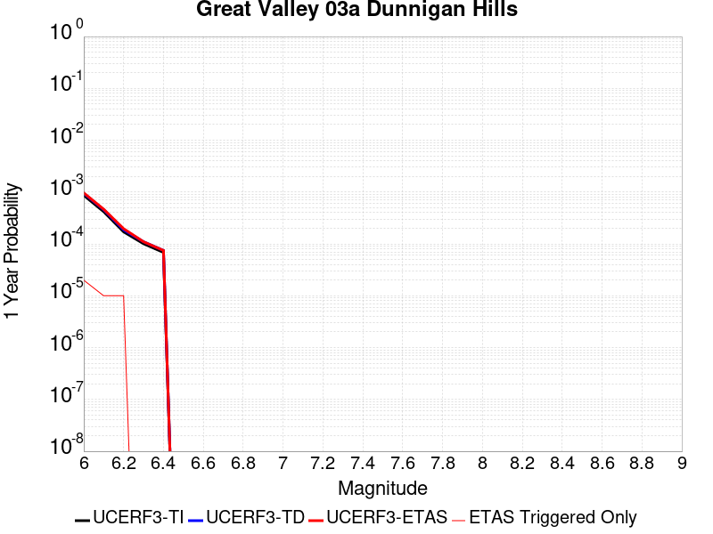 |  |

| Magnitude | 1 wk TI Prob | 1 wk TD Prob | 1 wk ETAS Prob | 1 wk ETAS/TD Gain | 1 wk ETAS Triggered Only | 1 mo TI Prob | 1 mo TD Prob | 1 mo ETAS Prob | 1 mo ETAS/TD Gain | 1 mo ETAS Triggered Only | 1 yr TI Prob | 1 yr TD Prob | 1 yr ETAS Prob | 1 yr ETAS/TD Gain | 1 yr ETAS Triggered Only | 10 yr TI Prob | 10 yr TD Prob | 10 yr ETAS Prob | 10 yr ETAS/TD Gain | 10 yr ETAS Triggered Only |
|-----|-----|-----|-----|-----|-----|-----|-----|-----|-----|-----|-----|-----|-----|-----|-----|-----|-----|-----|-----|-----|
| 6.0 | 1.6591328E-5 | 1.8107954E-5 | 5.859305E-5 | 3.235763 | 4.048583E-5 | 7.110376E-5 | 7.7603596E-5 | 1.1808629E-4 | 1.52166 | 4.048583E-5 | 8.6534437E-4 | 9.444834E-4 | 9.84931E-4 | 1.0428251 | 4.048583E-5 | 0.008619824 | 0.009411525 | 0.00945163 | 1.0042613 | 4.048583E-5 |
| 6.1 | 8.041125E-6 | 8.769726E-6 | 4.9255203E-5 | 5.6165037 | 4.048583E-5 | 3.4461507E-5 | 3.7584115E-5 | 7.806843E-5 | 2.0771654 | 4.048583E-5 | 4.194881E-4 | 4.5751085E-4 | 4.979782E-4 | 1.088451 | 4.048583E-5 | 0.004186971 | 0.004567687 | 0.004607988 | 1.008823 | 4.048583E-5 |
| 6.2 | 3.2807004E-6 | 3.5795688E-6 | 4.4065255E-5 | 12.310213 | 4.048583E-5 | 1.4060069E-5 | 1.5340942E-5 | 5.5826153E-5 | 3.6390302 | 4.048583E-5 | 1.7116789E-4 | 1.8676413E-4 | 2.2724239E-4 | 1.2167348 | 4.048583E-5 | 0.0017103611 | 0.0018664796 | 0.00190689 | 1.0216506 | 4.048583E-5 |
| 6.3 | 1.9339366E-6 | 2.1103806E-6 | 2.1103806E-6 | 1.0 | 0.0 | 8.288273E-6 | 9.044474E-6 | 9.044474E-6 | 1.0 | 0.0 | 1.00905054E-4 | 1.1011375E-4 | 1.1011375E-4 | 1.0 | 0.0 | 0.0010085925 | 0.0011008718 | 0.0011008718 | 1.0 | 0.0 |
| 6.4 | 1.3142635E-6 | 1.4339867E-6 | 1.4339867E-6 | 1.0 | 0.0 | 5.6325457E-6 | 6.145657E-6 | 6.145657E-6 | 1.0 | 0.0 | 6.857408E-5 | 7.482337E-5 | 7.482337E-5 | 1.0 | 0.0 | 6.8552926E-4 | 7.4823375E-4 | 7.4823375E-4 | 1.0 | 0.0 |

## Sisar
*[(top)](#table-of-contents)*

| 1 Week | 1 Month | 1 Year | 10 Year |
|-----|-----|-----|-----|
|  |  |  |  |

| Magnitude | 1 wk TI Prob | 1 wk TD Prob | 1 wk ETAS Prob | 1 wk ETAS/TD Gain | 1 wk ETAS Triggered Only | 1 mo TI Prob | 1 mo TD Prob | 1 mo ETAS Prob | 1 mo ETAS/TD Gain | 1 mo ETAS Triggered Only | 1 yr TI Prob | 1 yr TD Prob | 1 yr ETAS Prob | 1 yr ETAS/TD Gain | 1 yr ETAS Triggered Only | 10 yr TI Prob | 10 yr TD Prob | 10 yr ETAS Prob | 10 yr ETAS/TD Gain | 10 yr ETAS Triggered Only |
|-----|-----|-----|-----|-----|-----|-----|-----|-----|-----|-----|-----|-----|-----|-----|-----|-----|-----|-----|-----|-----|
| 6.0 | 4.544193E-6 | 3.839576E-6 | 4.432525E-5 | 11.544308 | 4.048583E-5 | 1.9474966E-5 | 1.6455224E-5 | 5.694039E-5 | 3.4603229 | 4.048583E-5 | 2.3708193E-4 | 2.0032428E-4 | 2.40802E-4 | 1.2020609 | 4.048583E-5 | 0.0023682916 | 0.002001471 | 0.0020418756 | 1.0201875 | 4.048583E-5 |
| 6.1 | 4.544193E-6 | 3.839576E-6 | 4.432525E-5 | 11.544308 | 4.048583E-5 | 1.9474966E-5 | 1.6455224E-5 | 5.694039E-5 | 3.4603229 | 4.048583E-5 | 2.3708193E-4 | 2.0032428E-4 | 2.40802E-4 | 1.2020609 | 4.048583E-5 | 0.0023682916 | 0.002001471 | 0.0020418756 | 1.0201875 | 4.048583E-5 |
| 6.2 | 4.544193E-6 | 3.839576E-6 | 4.432525E-5 | 11.544308 | 4.048583E-5 | 1.9474966E-5 | 1.6455224E-5 | 5.694039E-5 | 3.4603229 | 4.048583E-5 | 2.3708193E-4 | 2.0032428E-4 | 2.40802E-4 | 1.2020609 | 4.048583E-5 | 0.0023682916 | 0.002001471 | 0.0020418756 | 1.0201875 | 4.048583E-5 |
| 6.3 | 4.544193E-6 | 3.839576E-6 | 4.432525E-5 | 11.544308 | 4.048583E-5 | 1.9474966E-5 | 1.6455224E-5 | 5.694039E-5 | 3.4603229 | 4.048583E-5 | 2.3708193E-4 | 2.0032428E-4 | 2.40802E-4 | 1.2020609 | 4.048583E-5 | 0.0023682916 | 0.002001471 | 0.0020418756 | 1.0201875 | 4.048583E-5 |
| 6.4 | 4.544193E-6 | 3.839576E-6 | 4.432525E-5 | 11.544308 | 4.048583E-5 | 1.9474966E-5 | 1.6455224E-5 | 5.694039E-5 | 3.4603229 | 4.048583E-5 | 2.3708193E-4 | 2.0032428E-4 | 2.40802E-4 | 1.2020609 | 4.048583E-5 | 0.0023682916 | 0.002001471 | 0.0020418756 | 1.0201875 | 4.048583E-5 |
| 6.5 | 4.544193E-6 | 3.839576E-6 | 4.432525E-5 | 11.544308 | 4.048583E-5 | 1.9474966E-5 | 1.6455224E-5 | 5.694039E-5 | 3.4603229 | 4.048583E-5 | 2.3708193E-4 | 2.0032428E-4 | 2.40802E-4 | 1.2020609 | 4.048583E-5 | 0.0023682916 | 0.002001471 | 0.0020418756 | 1.0201875 | 4.048583E-5 |
| 6.6 | 4.544193E-6 | 3.839576E-6 | 4.432525E-5 | 11.544308 | 4.048583E-5 | 1.9474966E-5 | 1.6455224E-5 | 5.694039E-5 | 3.4603229 | 4.048583E-5 | 2.3708193E-4 | 2.0032428E-4 | 2.40802E-4 | 1.2020609 | 4.048583E-5 | 0.0023682916 | 0.002001471 | 0.0020418756 | 1.0201875 | 4.048583E-5 |
| 6.7 | 4.544193E-6 | 3.839576E-6 | 4.432525E-5 | 11.544308 | 4.048583E-5 | 1.9474966E-5 | 1.6455224E-5 | 5.694039E-5 | 3.4603229 | 4.048583E-5 | 2.3708193E-4 | 2.0032428E-4 | 2.40802E-4 | 1.2020609 | 4.048583E-5 | 0.0023682916 | 0.002001471 | 0.0020418756 | 1.0201875 | 4.048583E-5 |
| 6.8 | 4.544193E-6 | 3.839576E-6 | 4.432525E-5 | 11.544308 | 4.048583E-5 | 1.9474966E-5 | 1.6455224E-5 | 5.694039E-5 | 3.4603229 | 4.048583E-5 | 2.3708193E-4 | 2.0032428E-4 | 2.40802E-4 | 1.2020609 | 4.048583E-5 | 0.0023682916 | 0.002001471 | 0.0020418756 | 1.0201875 | 4.048583E-5 |
| 6.9 | 4.542225E-6 | 3.8375383E-6 | 4.4323213E-5 | 11.549908 | 4.048583E-5 | 1.9466532E-5 | 1.6446491E-5 | 5.6931654E-5 | 3.4616294 | 4.048583E-5 | 2.3697925E-4 | 2.0021795E-4 | 2.4069568E-4 | 1.2021683 | 4.048583E-5 | 0.002367267 | 0.0020004094 | 0.0020408144 | 1.0201983 | 4.048583E-5 |
| 7.0 | 4.5278484E-6 | 3.822602E-6 | 4.430828E-5 | 11.591129 | 4.048583E-5 | 1.940492E-5 | 1.638248E-5 | 5.6867648E-5 | 3.4712477 | 4.048583E-5 | 2.3622929E-4 | 1.9943877E-4 | 2.3991652E-4 | 1.2029583 | 4.048583E-5 | 0.0023597833 | 0.0019926317 | 0.002033037 | 1.0202773 | 4.048583E-5 |
| 7.1 | 4.5132488E-6 | 3.8073897E-6 | 4.4293065E-5 | 11.633447 | 4.048583E-5 | 1.9342351E-5 | 1.6317284E-5 | 5.680245E-5 | 3.4811218 | 4.048583E-5 | 2.3546767E-4 | 1.9864515E-4 | 2.3912295E-4 | 1.2037693 | 4.048583E-5 | 0.0023521832 | 0.0019847096 | 0.002025115 | 1.0203583 | 4.048583E-5 |
| 7.2 | 4.448859E-6 | 3.7398502E-6 | 4.422553E-5 | 11.825481 | 4.048583E-5 | 1.9066398E-5 | 1.6027832E-5 | 5.6513014E-5 | 3.52593 | 4.048583E-5 | 2.3210866E-4 | 1.9512173E-4 | 2.3559965E-4 | 1.2074497 | 4.048583E-5 | 0.0023186638 | 0.0019495375 | 0.0019899446 | 1.0207264 | 4.048583E-5 |
| 7.3 | 4.3424366E-6 | 3.6336846E-6 | 4.4119366E-5 | 12.141771 | 4.048583E-5 | 1.861031E-5 | 1.5572843E-5 | 5.605804E-5 | 3.5997307 | 4.048583E-5 | 2.2655698E-4 | 1.895832E-4 | 2.3006136E-4 | 1.2135113 | 4.048583E-5 | 0.0022632615 | 0.0018942481 | 0.0019346572 | 1.0213325 | 4.048583E-5 |
| 7.4 | 4.218641E-6 | 3.5330384E-6 | 4.4018725E-5 | 12.459169 | 4.048583E-5 | 1.8079765E-5 | 1.5141507E-5 | 5.5626726E-5 | 3.6737905 | 4.048583E-5 | 2.2009891E-4 | 1.8433259E-4 | 2.2481095E-4 | 1.2195942 | 4.048583E-5 | 0.0021988105 | 0.0018418302 | 0.0018822415 | 1.0219408 | 4.048583E-5 |
| 7.5 | 3.983779E-6 | 3.3478068E-6 | 4.38335E-5 | 13.093199 | 4.048583E-5 | 1.7073227E-5 | 1.4347666E-5 | 5.4832915E-5 | 3.8217306 | 4.048583E-5 | 2.0784672E-4 | 1.7466917E-4 | 2.1514793E-4 | 1.2317452 | 4.048583E-5 | 0.0020765243 | 0.0017453518 | 0.001785767 | 1.0231559 | 4.048583E-5 |
| 7.6 | 2.777393E-6 | 2.35225E-6 | 4.2837986E-5 | 18.211493 | 4.048583E-5 | 1.1903058E-5 | 1.0081033E-5 | 5.0566454E-5 | 5.0159993 | 4.048583E-5 | 1.449101E-4 | 1.2272975E-4 | 1.632106E-4 | 1.3298374 | 4.048583E-5 | 0.0014481564 | 0.0012266274 | 0.0012670635 | 1.0329653 | 4.048583E-5 |
| 7.7 | 1.9028433E-6 | 1.593867E-6 | 4.207963E-5 | 26.40097 | 4.048583E-5 | 8.155017E-6 | 6.8308404E-6 | 4.7316393E-5 | 6.9268775 | 4.048583E-5 | 9.928281E-5 | 8.3162355E-5 | 1.2364482E-4 | 1.4867883 | 4.048583E-5 | 9.923846E-4 | 8.313171E-4 | 8.7176927E-4 | 1.0486604 | 4.048583E-5 |
| 7.8 | 4.9095956E-7 | 4.3583708E-7 | 4.0921648E-5 | 93.89208 | 4.048583E-5 | 2.1041105E-6 | 1.8678718E-6 | 4.2353626E-5 | 22.674803 | 4.048583E-5 | 2.5617246E-5 | 2.2741104E-5 | 6.322601E-5 | 2.7802527 | 4.048583E-5 | 2.5614293E-4 | 2.2738794E-4 | 2.6786455E-4 | 1.1780069 | 4.048583E-5 |
| 7.9 | 1.16657894E-7 | 1.0335569E-7 | 4.058918E-5 | 392.71356 | 4.048583E-5 | 4.999623E-7 | 4.4295288E-7 | 4.0928764E-5 | 92.39982 | 4.048583E-5 | 6.087024E-6 | 5.3929384E-6 | 4.587855E-5 | 8.507153 | 4.048583E-5 | 6.0868573E-5 | 5.3928103E-5 | 9.441175E-5 | 1.7506967 | 4.048583E-5 |
| 8.0 | 2.5100346E-9 | 1.7067566E-9 | 1.7067566E-9 | 1.0 | 0.0 | 1.0757291E-8 | 7.3146724E-9 | 7.3146724E-9 | 1.0 | 0.0 | 1.3097001E-7 | 8.905613E-8 | 8.905613E-8 | 1.0 | 0.0 | 1.3096993E-6 | 8.9056095E-7 | 8.9056095E-7 | 1.0 | 0.0 |

## Green Valley 2011 CFM
*[(top)](#table-of-contents)*

| 1 Week | 1 Month | 1 Year | 10 Year |
|-----|-----|-----|-----|
|  |  |  |  |

| Magnitude | 1 wk TI Prob | 1 wk TD Prob | 1 wk ETAS Prob | 1 wk ETAS/TD Gain | 1 wk ETAS Triggered Only | 1 mo TI Prob | 1 mo TD Prob | 1 mo ETAS Prob | 1 mo ETAS/TD Gain | 1 mo ETAS Triggered Only | 1 yr TI Prob | 1 yr TD Prob | 1 yr ETAS Prob | 1 yr ETAS/TD Gain | 1 yr ETAS Triggered Only | 10 yr TI Prob | 10 yr TD Prob | 10 yr ETAS Prob | 10 yr ETAS/TD Gain | 10 yr ETAS Triggered Only |
|-----|-----|-----|-----|-----|-----|-----|-----|-----|-----|-----|-----|-----|-----|-----|-----|-----|-----|-----|-----|-----|
| 6.0 | 9.9629346E-5 | 1.7305532E-4 | 1.7305532E-4 | 1.0 | 0.0 | 4.2691303E-4 | 7.4143766E-4 | 7.4143766E-4 | 1.0 | 0.0 | 0.0051852856 | 0.008986705 | 0.008986705 | 1.0 | 0.0 | 0.050659515 | 0.085522056 | 0.085559085 | 1.000433 | 4.048583E-5 |
| 6.1 | 9.88615E-5 | 1.7152846E-4 | 1.7152846E-4 | 1.0 | 0.0 | 4.2362334E-4 | 7.348976E-4 | 7.348976E-4 | 1.0 | 0.0 | 0.0051454236 | 0.0089077335 | 0.0089077335 | 1.0 | 0.0 | 0.050279044 | 0.084809676 | 0.08484673 | 1.0004369 | 4.048583E-5 |
| 6.2 | 9.696895E-5 | 1.6791887E-4 | 1.6791887E-4 | 1.0 | 0.0 | 4.15515E-4 | 7.194366E-4 | 7.194366E-4 | 1.0 | 0.0 | 0.0050471667 | 0.008721114 | 0.008721114 | 1.0 | 0.0 | 0.04934063 | 0.0831186 | 0.08315573 | 1.0004466 | 4.048583E-5 |
| 6.3 | 9.275224E-5 | 1.5971228E-4 | 1.5971228E-4 | 1.0 | 0.0 | 3.9744904E-4 | 6.842841E-4 | 6.842841E-4 | 1.0 | 0.0 | 0.0048282105 | 0.008296439 | 0.008296439 | 1.0 | 0.0 | 0.047246475 | 0.07925707 | 0.079294346 | 1.0004703 | 4.048583E-5 |
| 6.4 | 8.391499E-5 | 1.4367796E-4 | 1.4367796E-4 | 1.0 | 0.0 | 3.595861E-4 | 6.156248E-4 | 6.156248E-4 | 1.0 | 0.0 | 0.004369175 | 0.0074670846 | 0.0074670846 | 1.0 | 0.0 | 0.04284265 | 0.071630865 | 0.071668446 | 1.0005248 | 4.048583E-5 |
| 6.5 | 5.9519385E-5 | 9.9340905E-5 | 9.9340905E-5 | 1.0 | 0.0 | 2.5505814E-4 | 4.2568138E-4 | 4.2568138E-4 | 1.0 | 0.0 | 0.0031009112 | 0.005168295 | 0.005168295 | 1.0 | 0.0 | 0.030579966 | 0.050145864 | 0.05018432 | 1.0007669 | 4.048583E-5 |
| 6.6 | 4.5361558E-5 | 7.402609E-5 | 7.402609E-5 | 1.0 | 0.0 | 1.9439218E-4 | 3.1721895E-4 | 3.1721895E-4 | 1.0 | 0.0 | 0.0023641558 | 0.0038539418 | 0.0038539418 | 1.0 | 0.0 | 0.023391623 | 0.037665963 | 0.037704922 | 1.0010344 | 4.048583E-5 |
| 6.7 | 3.8808106E-5 | 6.2651976E-5 | 6.2651976E-5 | 1.0 | 0.0 | 1.6630985E-4 | 2.6848342E-4 | 2.6848342E-4 | 1.0 | 0.0 | 0.0020229418 | 0.0032626586 | 0.0032626586 | 1.0 | 0.0 | 0.020046256 | 0.032005914 | 0.032045104 | 1.0012245 | 4.048583E-5 |
| 6.8 | 2.2284667E-5 | 3.1285235E-5 | 3.1285235E-5 | 1.0 | 0.0 | 9.550222E-5 | 1.3407279E-4 | 1.3407279E-4 | 1.0 | 0.0 | 0.0011621192 | 0.0016311078 | 0.0016311078 | 1.0 | 0.0 | 0.011560607 | 0.016165998 | 0.016205829 | 1.0024639 | 4.048583E-5 |
| 6.9 | 1.8050168E-5 | 2.4448054E-5 | 2.4448054E-5 | 1.0 | 0.0 | 7.735557E-5 | 1.047732E-4 | 1.047732E-4 | 1.0 | 0.0 | 9.4139716E-4 | 0.0012748708 | 0.0012748708 | 1.0 | 0.0 | 0.009374191 | 0.012667833 | 0.012667833 | 1.0 | 0.0 |
| 7.0 | 1.4763166E-5 | 1.9582854E-5 | 1.9582854E-5 | 1.0 | 0.0 | 6.326917E-5 | 8.3923835E-5 | 8.3923835E-5 | 1.0 | 0.0 | 7.7002996E-4 | 0.0010212966 | 0.0010212966 | 1.0 | 0.0 | 0.007673672 | 0.010165343 | 0.010165343 | 1.0 | 0.0 |
| 7.1 | 1.2399713E-5 | 1.6303715E-5 | 1.6303715E-5 | 1.0 | 0.0 | 5.3140546E-5 | 6.98712E-5 | 6.98712E-5 | 1.0 | 0.0 | 6.467941E-4 | 8.503518E-4 | 8.503518E-4 | 1.0 | 0.0 | 0.006449148 | 0.008471259 | 0.008471259 | 1.0 | 0.0 |
| 7.2 | 1.0584195E-5 | 1.3921742E-5 | 1.3921742E-5 | 1.0 | 0.0 | 4.5360044E-5 | 5.9663253E-5 | 5.9663253E-5 | 1.0 | 0.0 | 5.521186E-4 | 7.261596E-4 | 7.261596E-4 | 1.0 | 0.0 | 0.0055074887 | 0.007238285 | 0.007238285 | 1.0 | 0.0 |
| 7.3 | 7.998173E-6 | 1.054402E-5 | 1.054402E-5 | 1.0 | 0.0 | 3.4277433E-5 | 4.518788E-5 | 4.518788E-5 | 1.0 | 0.0 | 4.1724785E-4 | 5.500247E-4 | 5.500247E-4 | 1.0 | 0.0 | 0.004164653 | 0.0054868995 | 0.0054868995 | 1.0 | 0.0 |
| 7.4 | 6.7571127E-6 | 8.932697E-6 | 8.932697E-6 | 1.0 | 0.0 | 2.8958733E-5 | 3.828243E-5 | 3.828243E-5 | 1.0 | 0.0 | 3.5251552E-4 | 4.6598984E-4 | 4.6598984E-4 | 1.0 | 0.0 | 0.0035195686 | 0.0046503306 | 0.0046503306 | 1.0 | 0.0 |
| 7.5 | 5.69878E-6 | 7.516314E-6 | 7.516314E-6 | 1.0 | 0.0 | 2.4423114E-5 | 3.221238E-5 | 3.221238E-5 | 1.0 | 0.0 | 2.9731085E-4 | 3.9211605E-4 | 3.9211605E-4 | 1.0 | 0.0 | 0.002969134 | 0.0039143935 | 0.0039143935 | 1.0 | 0.0 |
| 7.6 | 4.503664E-6 | 5.9356807E-6 | 5.9356807E-6 | 1.0 | 0.0 | 1.9301275E-5 | 2.5438389E-5 | 2.5438389E-5 | 1.0 | 0.0 | 2.3496768E-4 | 3.096692E-4 | 3.096692E-4 | 1.0 | 0.0 | 0.002347194 | 0.003092502 | 0.003092502 | 1.0 | 0.0 |
| 7.7 | 1.0873546E-6 | 1.4106979E-6 | 1.4106979E-6 | 1.0 | 0.0 | 4.6600826E-6 | 6.045834E-6 | 6.045834E-6 | 1.0 | 0.0 | 5.6735033E-5 | 7.360557E-5 | 7.360557E-5 | 1.0 | 0.0 | 5.672055E-4 | 7.35814E-4 | 7.35814E-4 | 1.0 | 0.0 |
| 7.8 | 4.9373917E-8 | 6.1777136E-8 | 6.1777136E-8 | 1.0 | 0.0 | 2.1160248E-7 | 2.6475914E-7 | 2.6475914E-7 | 1.0 | 0.0 | 2.5762572E-6 | 3.223439E-6 | 3.223439E-6 | 1.0 | 0.0 | 2.5762274E-5 | 3.2232296E-5 | 3.2232296E-5 | 1.0 | 0.0 |

