# ComCat M7.1 (ci38457511), 28 Days After, KML Surface, ShakeMap Surface Results

|   | ComCat M7.1 (ci38457511), 28 Days After, KML Surface, ShakeMap Surface |
|-----|-----|
| Num Simulations | 100000 |
| Start Time | 2019/08/03 03:19:54 UTC |
| Start Time Epoch Milliseconds | 1564802394040 |
| Duration | 10 Years |
| Includes Spontaneous? | false |
| Trigger Ruptures | 1989 Trigger Ruptures |
|   | First: M3.98 at 2019/07/04 17:02:55 UTC |
|   | Last: M2.67 at 2019/08/03 01:01:23 UTC |
|   | Largest: M7.1 at 2019/07/06 03:19:53 UTC |
| Trigger Ruptures | *(none)* |
| Config Generated With | u3etas_comcat_event_config_builder.sh --event-id ci38457511 --num-simulations 100000 --days-before 7 --days-after 28 --mag-complete 3.5 --finite-surf-shakemap --finite-surf-shakemap-min-mag 5 --kml-surf /home/kevin/OpenSHA/UCERF3/etas/ridgecrest_plots/ridgecrest.kmz --kml-surf-lower-depth 12 --hpc-site USC_HPC --nodes 36 --hours 24 --queue scec |

## Table Of Contents

* [Probabilities Summary Table](#probabilities-summary-table)
* [Magnitude Number Distribution](#magnitude-number-distribution)
  * [10 Year Magnitude Number Distribution](#10-year-magnitude-number-distribution)
  * [1 Year Magnitude Number Distribution](#1-year-magnitude-number-distribution)
  * [1 Month Magnitude Number Distribution](#1-month-magnitude-number-distribution)
  * [1 Week Magnitude Number Distribution](#1-week-magnitude-number-distribution)
  * [1 Day Magnitude Number Distribution](#1-day-magnitude-number-distribution)
  * [1 Hour Magnitude Number Distribution](#1-hour-magnitude-number-distribution)
* [Hazard Change Over Time](#hazard-change-over-time)
  * [M&ge;5.0 Hazard Change Over Time](#m50-hazard-change-over-time)
  * [M&ge;6.0 Hazard Change Over Time](#m60-hazard-change-over-time)
  * [M&ge;7.0 Hazard Change Over Time](#m70-hazard-change-over-time)
  * [M&ge;8.0 Hazard Change Over Time](#m80-hazard-change-over-time)
* [Trigger Rupture Fault Map](#trigger-rupture-fault-map)
* [Trigger Rupture Depth Map](#trigger-rupture-depth-map)
* [Fault Distances To Triggers](#fault-distances-to-triggers)
* [Individual Simulated Catalog Maps](#individual-simulated-catalog-maps)
* [ComCat Data Comparisons](#comcat-data-comparisons)
  * [ComCat Magnitude-Number Distributions](#comcat-magnitude-number-distributions)
  * [ComCat Time-Dependent Mc](#comcat-time-dependent-mc)
  * [ComCat Cumulative Number Vs Time](#comcat-cumulative-number-vs-time)
  * [ComCat Cumulative Number Simulation Percentiles](#comcat-cumulative-number-simulation-percentiles)
  * [ComCat Probability Spatial Distribution](#comcat-probability-spatial-distribution)
  * [ComCat Mean Expectation Spatial Distribution](#comcat-mean-expectation-spatial-distribution)
  * [ComCat Depth Distribution](#comcat-depth-distribution)
* [Section Participation](#section-participation)
  * [Section Participation Plots](#section-participation-plots)
  * [Supra-Seismogenic Parent Sections Table](#supra-seismogenic-parent-sections-table)
  * [M≥6.5 Parent Sections Table](#m65-parent-sections-table)
  * [M≥7 Parent Sections Table](#m7-parent-sections-table)
  * [M≥7.5 Parent Sections Table](#m75-parent-sections-table)
  * [M≥8 Parent Sections Table](#m8-parent-sections-table)
  * [Fault Magnitude-Probability Distributions](#fault-magnitude-probability-distributions)
* [Gridded Nucleation](#gridded-nucleation)
* [JSON Input File](#json-input-file)

## Probabilities Summary Table
*[(top)](#table-of-contents)*

| Magnitude | 1 Hour Prob | 1 Day Prob | 1 Week Prob | 1 Month Prob | 1 Year Prob | 10 Year Prob |
|-----|-----|-----|-----|-----|-----|-----|
| **M&ge;4** | 0.012 (1.21%) | 0.253 (25.25%) | 0.842 (84.17%) | 0.998 (99.75%) | 1.000 (100.00%) | 1.000 (100.00%) |
| **M&ge;4.5** | 3.80E-3 (0.38%) | 0.089 (8.91%) | 0.453 (45.30%) | 0.861 (86.13%) | 0.999 (99.91%) | 1.000 (100.00%) |
| **M&ge;5** | 1.23E-3 (0.12%) | 0.029 (2.91%) | 0.177 (17.69%) | 0.474 (47.38%) | 0.904 (90.38%) | 0.984 (98.44%) |
| **M&ge;5.5** | 3.20E-4 (0.03%) | 8.95E-3 (0.90%) | 0.059 (5.85%) | 0.184 (18.40%) | 0.528 (52.83%) | 0.747 (74.70%) |
| **M&ge;6** | 1.00E-4 (0.01%) | 2.34E-3 (0.23%) | 0.017 (1.72%) | 0.057 (5.70%) | 0.198 (19.80%) | 0.338 (33.81%) |
| **M&ge;6.5** | 2.00E-5 (0.00%) | 4.70E-4 (0.05%) | 3.69E-3 (0.37%) | 0.013 (1.32%) | 0.050 (4.98%) | 0.094 (9.40%) |
| **M&ge;7** | 0.000 (0.00%) | 1.20E-4 (0.01%) | 1.11E-3 (0.11%) | 3.98E-3 (0.40%) | 0.015 (1.50%) | 0.030 (2.98%) |
| **M&ge;7.1** | 0.000 (0.00%) | 7.00E-5 (0.01%) | 8.70E-4 (0.09%) | 3.10E-3 (0.31%) | 0.012 (1.24%) | 0.025 (2.48%) |
| **M&ge;7.5** | 0.000 (0.00%) | 2.00E-5 (0.00%) | 2.90E-4 (0.03%) | 1.06E-3 (0.11%) | 4.35E-3 (0.43%) | 8.71E-3 (0.87%) |
| **M&ge;8** | 0.000 (0.00%) | 0.000 (0.00%) | 1.00E-5 (0.00%) | 6.00E-5 (0.01%) | 1.20E-4 (0.01%) | 2.50E-4 (0.03%) |

## Magnitude Number Distribution
*[(top)](#table-of-contents)*

### 10 Year Magnitude Number Distribution
*[(top)](#table-of-contents)*

**Legend**
* **Mean** (thick black line): mean expected number across all 100000 catalogs
* **2.5%,97.5%** (thin black lines): expected number percentiles across all 100000 catalogs
* **Median** (thin blue line): median expected number across all 100000 catalogs
* **Mode** (thin cyan line): modal expected number across all 100000 catalogs
* **10 yr Probability** (thin red line): 10 year probability calculated as the fraction of catalogs with at least 1 occurrence
* **10 yr Supraseismogenic Probability** (thin dashed red line): same as above, but only for supraseismogenic ruptures on explicitly modeled UCERF3 faults
* **95% Conf** (light red shaded region): binomial 95% confidence bounds on probability
* **Primary** (thin green line): mean expected number from primary triggered aftershocks only (no secondary, tertiary, etc...) across all 100000 catalogs


| Mag | Mean | 2.5 %ile | 97.5 %ile | Median | Mode | 10 yr Probability | 10 yr Supra-Seis Prob | Primary Aftershocks Mean |
|-----|-----|-----|-----|-----|-----|-----|-----|-----|
| **M&ge;2.5** | 2162.873 | 1337.000 | 6093.000 | 1725.000 | 1487.000 | 1.000 (100.00%) | 0.121 (12.06%) | 951.791 |
| **M&ge;2.6** | 1718.051 | 1058.000 | 4839.000 | 1370.000 | 1186.000 | 1.000 (100.00%) | 0.121 (12.06%) | 756.062 |
| **M&ge;2.7** | 1364.632 | 836.000 | 3849.000 | 1089.000 | 962.000 | 1.000 (100.00%) | 0.121 (12.06%) | 600.553 |
| **M&ge;2.8** | 1083.950 | 661.000 | 3054.000 | 865.000 | 770.000 | 1.000 (100.00%) | 0.121 (12.06%) | 477.010 |
| **M&ge;2.9** | 860.965 | 521.000 | 2423.000 | 688.000 | 631.000 | 1.000 (100.00%) | 0.121 (12.06%) | 378.892 |
| **M&ge;3** | 683.861 | 410.000 | 1926.000 | 547.000 | 492.000 | 1.000 (100.00%) | 0.121 (12.06%) | 300.959 |
| **M&ge;3.1** | 543.178 | 323.000 | 1528.000 | 435.000 | 385.000 | 1.000 (100.00%) | 0.121 (12.06%) | 239.053 |
| **M&ge;3.2** | 431.393 | 254.000 | 1217.000 | 346.000 | 313.000 | 1.000 (100.00%) | 0.121 (12.06%) | 189.876 |
| **M&ge;3.3** | 342.652 | 199.000 | 967.000 | 275.000 | 243.000 | 1.000 (100.00%) | 0.121 (12.06%) | 150.817 |
| **M&ge;3.4** | 272.165 | 155.000 | 767.000 | 219.000 | 192.000 | 1.000 (100.00%) | 0.121 (12.06%) | 119.790 |
| **M&ge;3.5** | 216.192 | 121.000 | 611.000 | 174.000 | 165.000 | 1.000 (100.00%) | 0.121 (12.06%) | 95.146 |
| **M&ge;3.6** | 171.741 | 94.000 | 487.000 | 139.000 | 125.000 | 1.000 (100.00%) | 0.121 (12.06%) | 75.571 |
| **M&ge;3.7** | 136.389 | 73.000 | 389.000 | 110.000 | 98.000 | 1.000 (100.00%) | 0.121 (12.06%) | 60.027 |
| **M&ge;3.8** | 108.281 | 56.000 | 308.000 | 88.000 | 76.000 | 1.000 (100.00%) | 0.121 (12.06%) | 47.656 |
| **M&ge;3.9** | 85.966 | 43.000 | 245.000 | 70.000 | 61.000 | 1.000 (100.00%) | 0.121 (12.06%) | 37.838 |
| **M&ge;4** | 68.266 | 33.000 | 195.000 | 55.000 | 49.000 | 1.000 (100.00%) | 0.121 (12.06%) | 30.051 |
| **M&ge;4.1** | 54.191 | 25.000 | 155.000 | 44.000 | 40.000 | 1.000 (100.00%) | 0.121 (12.06%) | 23.858 |
| **M&ge;4.2** | 42.995 | 19.000 | 124.000 | 35.000 | 31.000 | 1.000 (100.00%) | 0.121 (12.06%) | 18.926 |
| **M&ge;4.3** | 34.112 | 14.000 | 99.000 | 28.000 | 23.000 | 1.000 (100.00%) | 0.121 (12.06%) | 15.010 |
| **M&ge;4.4** | 27.059 | 10.000 | 79.000 | 22.000 | 19.000 | 1.000 (100.00%) | 0.121 (12.06%) | 11.910 |
| **M&ge;4.5** | 21.466 | 7.000 | 63.000 | 17.000 | 15.000 | 1.000 (100.00%) | 0.121 (12.06%) | 9.454 |
| **M&ge;4.6** | 17.014 | 5.000 | 51.000 | 14.000 | 11.000 | 1.000 (100.00%) | 0.121 (12.06%) | 7.498 |
| **M&ge;4.7** | 13.493 | 3.000 | 41.000 | 11.000 | 9.000 | 1.000 (99.96%) | 0.121 (12.06%) | 5.950 |
| **M&ge;4.8** | 10.682 | 2.000 | 33.000 | 9.000 | 7.000 | 0.998 (99.85%) | 0.121 (12.06%) | 4.711 |
| **M&ge;4.9** | 8.449 | 1.000 | 26.000 | 7.000 | 5.000 | 0.994 (99.44%) | 0.121 (12.06%) | 3.730 |
| **M&ge;5** | 6.674 | 1.000 | 21.000 | 5.000 | 4.000 | 0.984 (98.44%) | 0.121 (12.06%) | 2.947 |
| **M&ge;5.1** | 5.261 | 0.000 | 17.000 | 4.000 | 3.000 | 0.965 (96.52%) | 0.121 (12.06%) | 2.322 |
| **M&ge;5.2** | 4.145 | 0.000 | 14.000 | 3.000 | 2.000 | 0.932 (93.18%) | 0.121 (12.06%) | 1.828 |
| **M&ge;5.3** | 3.254 | 0.000 | 12.000 | 2.000 | 2.000 | 0.884 (88.41%) | 0.121 (12.06%) | 1.436 |
| **M&ge;5.4** | 2.548 | 0.000 | 10.000 | 2.000 | 1.000 | 0.823 (82.30%) | 0.121 (12.06%) | 1.126 |
| **M&ge;5.5** | 1.984 | 0.000 | 8.000 | 1.000 | 1.000 | 0.747 (74.70%) | 0.121 (12.06%) | 0.878 |
| **M&ge;5.6** | 1.536 | 0.000 | 7.000 | 1.000 | 0.000 | 0.662 (66.20%) | 0.121 (12.06%) | 0.681 |
| **M&ge;5.7** | 1.184 | 0.000 | 5.000 | 1.000 | 0.000 | 0.576 (57.60%) | 0.121 (12.06%) | 0.525 |
| **M&ge;5.8** | 0.905 | 0.000 | 4.000 | 0.000 | 0.000 | 0.489 (48.88%) | 0.121 (12.06%) | 0.403 |
| **M&ge;5.9** | 0.686 | 0.000 | 4.000 | 0.000 | 0.000 | 0.406 (40.64%) | 0.121 (12.05%) | 0.306 |
| **M&ge;6** | 0.534 | 0.000 | 3.000 | 0.000 | 0.000 | 0.338 (33.81%) | 0.121 (12.05%) | 0.236 |
| **M&ge;6.1** | 0.395 | 0.000 | 3.000 | 0.000 | 0.000 | 0.269 (26.88%) | 0.101 (10.11%) | 0.176 |
| **M&ge;6.2** | 0.273 | 0.000 | 2.000 | 0.000 | 0.000 | 0.202 (20.16%) | 0.081 (8.12%) | 0.125 |
| **M&ge;6.3** | 0.201 | 0.000 | 2.000 | 0.000 | 0.000 | 0.156 (15.56%) | 0.066 (6.58%) | 0.092 |
| **M&ge;6.4** | 0.154 | 0.000 | 1.000 | 0.000 | 0.000 | 0.121 (12.15%) | 0.057 (5.70%) | 0.069 |
| **M&ge;6.5** | 0.116 | 0.000 | 1.000 | 0.000 | 0.000 | 0.094 (9.40%) | 0.049 (4.88%) | 0.052 |
| **M&ge;6.6** | 0.090 | 0.000 | 1.000 | 0.000 | 0.000 | 0.077 (7.69%) | 0.044 (4.45%) | 0.041 |
| **M&ge;6.7** | 0.071 | 0.000 | 1.000 | 0.000 | 0.000 | 0.061 (6.14%) | 0.039 (3.89%) | 0.032 |
| **M&ge;6.8** | 0.056 | 0.000 | 1.000 | 0.000 | 0.000 | 0.050 (4.97%) | 0.034 (3.42%) | 0.025 |
| **M&ge;6.9** | 0.041 | 0.000 | 1.000 | 0.000 | 0.000 | 0.039 (3.85%) | 0.028 (2.81%) | 0.019 |
| **M&ge;7** | 0.032 | 0.000 | 1.000 | 0.000 | 0.000 | 0.030 (2.98%) | 0.023 (2.33%) | 0.014 |
| **M&ge;7.1** | 0.026 | 0.000 | 0.000 | 0.000 | 0.000 | 0.025 (2.48%) | 0.021 (2.09%) | 0.011 |
| **M&ge;7.2** | 0.020 | 0.000 | 0.000 | 0.000 | 0.000 | 0.019 (1.90%) | 0.017 (1.69%) | 8.41E-3 |
| **M&ge;7.3** | 0.014 | 0.000 | 0.000 | 0.000 | 0.000 | 0.013 (1.35%) | 0.012 (1.24%) | 5.80E-3 |
| **M&ge;7.4** | 0.012 | 0.000 | 0.000 | 0.000 | 0.000 | 0.012 (1.16%) | 0.011 (1.12%) | 4.89E-3 |
| **M&ge;7.5** | 8.80E-3 | 0.000 | 0.000 | 0.000 | 0.000 | 8.71E-3 (0.87%) | 8.61E-3 (0.86%) | 3.65E-3 |
| **M&ge;7.6** | 4.77E-3 | 0.000 | 0.000 | 0.000 | 0.000 | 4.73E-3 (0.47%) | 4.71E-3 (0.47%) | 1.88E-3 |
| **M&ge;7.7** | 1.51E-3 | 0.000 | 0.000 | 0.000 | 0.000 | 1.51E-3 (0.15%) | 1.50E-3 (0.15%) | 6.60E-4 |
| **M&ge;7.8** | 9.10E-4 | 0.000 | 0.000 | 0.000 | 0.000 | 9.10E-4 (0.09%) | 9.00E-4 (0.09%) | 3.90E-4 |
| **M&ge;7.9** | 4.90E-4 | 0.000 | 0.000 | 0.000 | 0.000 | 4.90E-4 (0.05%) | 4.90E-4 (0.05%) | 2.10E-4 |
| **M&ge;8** | 2.50E-4 | 0.000 | 0.000 | 0.000 | 0.000 | 2.50E-4 (0.03%) | 2.50E-4 (0.03%) | 1.10E-4 |
| **M&ge;8.1** | 4.00E-5 | 0.000 | 0.000 | 0.000 | 0.000 | 4.00E-5 (0.00%) | 4.00E-5 (0.00%) | 2.00E-5 |
| **M&ge;8.2** | 0.000 | 0.000 | 0.000 | 0.000 | 0.000 | 0.000 (0.00%) | 0.000 (0.00%) | 0.000 |
| **M&ge;8.3** | 0.000 | 0.000 | 0.000 | 0.000 | 0.000 | 0.000 (0.00%) | 0.000 (0.00%) | 0.000 |
| **M&ge;8.4** | 0.000 | 0.000 | 0.000 | 0.000 | 0.000 | 0.000 (0.00%) | 0.000 (0.00%) | 0.000 |
| **M&ge;8.5** | 0.000 | 0.000 | 0.000 | 0.000 | 0.000 | 0.000 (0.00%) | 0.000 (0.00%) | 0.000 |
| **M&ge;8.6** | 0.000 | 0.000 | 0.000 | 0.000 | 0.000 | 0.000 (0.00%) | 0.000 (0.00%) | 0.000 |
| **M&ge;8.7** | 0.000 | 0.000 | 0.000 | 0.000 | 0.000 | 0.000 (0.00%) | 0.000 (0.00%) | 0.000 |
| **M&ge;8.8** | 0.000 | 0.000 | 0.000 | 0.000 | 0.000 | 0.000 (0.00%) | 0.000 (0.00%) | 0.000 |
| **M&ge;8.9** | 0.000 | 0.000 | 0.000 | 0.000 | 0.000 | 0.000 (0.00%) | 0.000 (0.00%) | 0.000 |
| **M&ge;9** | 0.000 | 0.000 | 0.000 | 0.000 | 0.000 | 0.000 (0.00%) | 0.000 (0.00%) | 0.000 |

### 1 Year Magnitude Number Distribution
*[(top)](#table-of-contents)*

**Legend**
* **Mean** (thick black line): mean expected number across all 100000 catalogs
* **2.5%,97.5%** (thin black lines): expected number percentiles across all 100000 catalogs
* **Median** (thin blue line): median expected number across all 100000 catalogs
* **Mode** (thin cyan line): modal expected number across all 100000 catalogs
* **1 yr Probability** (thin red line): 1 year probability calculated as the fraction of catalogs with at least 1 occurrence
* **1 yr Supraseismogenic Probability** (thin dashed red line): same as above, but only for supraseismogenic ruptures on explicitly modeled UCERF3 faults
* **95% Conf** (light red shaded region): binomial 95% confidence bounds on probability
* **Primary** (thin green line): mean expected number from primary triggered aftershocks only (no secondary, tertiary, etc...) across all 100000 catalogs


| Mag | Mean | 2.5 %ile | 97.5 %ile | Median | Mode | 1 yr Probability | 1 yr Supra-Seis Prob | Primary Aftershocks Mean |
|-----|-----|-----|-----|-----|-----|-----|-----|-----|
| **M&ge;2.5** | 1085.506 | 704.000 | 2656.000 | 885.000 | 800.000 | 1.000 (100.00%) | 0.063 (6.33%) | 557.385 |
| **M&ge;2.6** | 862.265 | 556.000 | 2108.000 | 703.000 | 644.000 | 1.000 (100.00%) | 0.063 (6.33%) | 442.753 |
| **M&ge;2.7** | 684.929 | 438.000 | 1674.000 | 559.000 | 515.000 | 1.000 (100.00%) | 0.063 (6.33%) | 351.713 |
| **M&ge;2.8** | 544.055 | 345.000 | 1334.000 | 444.000 | 404.000 | 1.000 (100.00%) | 0.063 (6.33%) | 279.377 |
| **M&ge;2.9** | 432.104 | 271.000 | 1059.000 | 354.000 | 338.000 | 1.000 (100.00%) | 0.063 (6.33%) | 221.899 |
| **M&ge;3** | 343.200 | 212.000 | 841.000 | 281.000 | 254.000 | 1.000 (100.00%) | 0.063 (6.33%) | 176.247 |
| **M&ge;3.1** | 272.598 | 166.000 | 669.000 | 224.000 | 208.000 | 1.000 (100.00%) | 0.063 (6.33%) | 139.981 |
| **M&ge;3.2** | 216.506 | 130.000 | 532.000 | 178.000 | 163.000 | 1.000 (100.00%) | 0.063 (6.33%) | 111.185 |
| **M&ge;3.3** | 171.974 | 101.000 | 423.000 | 142.000 | 129.000 | 1.000 (100.00%) | 0.063 (6.33%) | 88.311 |
| **M&ge;3.4** | 136.623 | 78.000 | 337.000 | 113.000 | 107.000 | 1.000 (100.00%) | 0.063 (6.33%) | 70.159 |
| **M&ge;3.5** | 108.532 | 60.000 | 268.000 | 90.000 | 81.000 | 1.000 (100.00%) | 0.063 (6.33%) | 55.730 |
| **M&ge;3.6** | 86.212 | 46.000 | 214.000 | 71.000 | 65.000 | 1.000 (100.00%) | 0.063 (6.33%) | 44.262 |
| **M&ge;3.7** | 68.460 | 35.000 | 170.000 | 57.000 | 50.000 | 1.000 (100.00%) | 0.063 (6.33%) | 35.154 |
| **M&ge;3.8** | 54.353 | 27.000 | 137.000 | 45.000 | 41.000 | 1.000 (100.00%) | 0.063 (6.33%) | 27.910 |
| **M&ge;3.9** | 43.158 | 20.000 | 109.000 | 36.000 | 32.000 | 1.000 (100.00%) | 0.063 (6.33%) | 22.160 |
| **M&ge;4** | 34.264 | 15.000 | 87.000 | 28.000 | 24.000 | 1.000 (100.00%) | 0.063 (6.33%) | 17.597 |
| **M&ge;4.1** | 27.203 | 11.000 | 70.000 | 23.000 | 20.000 | 1.000 (100.00%) | 0.063 (6.33%) | 13.973 |
| **M&ge;4.2** | 21.582 | 8.000 | 56.000 | 18.000 | 16.000 | 1.000 (100.00%) | 0.063 (6.33%) | 11.084 |
| **M&ge;4.3** | 17.121 | 6.000 | 45.000 | 14.000 | 12.000 | 1.000 (100.00%) | 0.063 (6.33%) | 8.791 |
| **M&ge;4.4** | 13.583 | 4.000 | 36.000 | 11.000 | 10.000 | 1.000 (99.98%) | 0.063 (6.33%) | 6.977 |
| **M&ge;4.5** | 10.771 | 3.000 | 30.000 | 9.000 | 8.000 | 0.999 (99.91%) | 0.063 (6.33%) | 5.535 |
| **M&ge;4.6** | 8.539 | 2.000 | 24.000 | 7.000 | 6.000 | 0.997 (99.67%) | 0.063 (6.33%) | 4.390 |
| **M&ge;4.7** | 6.772 | 1.000 | 20.000 | 5.000 | 4.000 | 0.989 (98.89%) | 0.063 (6.33%) | 3.481 |
| **M&ge;4.8** | 5.361 | 0.000 | 16.000 | 4.000 | 3.000 | 0.974 (97.36%) | 0.063 (6.33%) | 2.757 |
| **M&ge;4.9** | 4.240 | 0.000 | 13.000 | 3.000 | 2.000 | 0.946 (94.55%) | 0.063 (6.33%) | 2.181 |
| **M&ge;5** | 3.348 | 0.000 | 11.000 | 3.000 | 2.000 | 0.904 (90.38%) | 0.063 (6.33%) | 1.723 |
| **M&ge;5.1** | 2.639 | 0.000 | 9.000 | 2.000 | 1.000 | 0.846 (84.59%) | 0.063 (6.33%) | 1.357 |
| **M&ge;5.2** | 2.082 | 0.000 | 8.000 | 1.000 | 1.000 | 0.775 (77.50%) | 0.063 (6.33%) | 1.070 |
| **M&ge;5.3** | 1.633 | 0.000 | 6.000 | 1.000 | 0.000 | 0.695 (69.52%) | 0.063 (6.33%) | 0.839 |
| **M&ge;5.4** | 1.278 | 0.000 | 5.000 | 1.000 | 0.000 | 0.612 (61.24%) | 0.063 (6.33%) | 0.658 |
| **M&ge;5.5** | 0.998 | 0.000 | 5.000 | 1.000 | 0.000 | 0.528 (52.83%) | 0.063 (6.33%) | 0.514 |
| **M&ge;5.6** | 0.772 | 0.000 | 4.000 | 0.000 | 0.000 | 0.446 (44.57%) | 0.063 (6.33%) | 0.399 |
| **M&ge;5.7** | 0.595 | 0.000 | 3.000 | 0.000 | 0.000 | 0.371 (37.05%) | 0.063 (6.33%) | 0.308 |
| **M&ge;5.8** | 0.456 | 0.000 | 3.000 | 0.000 | 0.000 | 0.303 (30.32%) | 0.063 (6.33%) | 0.236 |
| **M&ge;5.9** | 0.346 | 0.000 | 2.000 | 0.000 | 0.000 | 0.244 (24.39%) | 0.063 (6.33%) | 0.179 |
| **M&ge;6** | 0.270 | 0.000 | 2.000 | 0.000 | 0.000 | 0.198 (19.80%) | 0.063 (6.33%) | 0.139 |
| **M&ge;6.1** | 0.200 | 0.000 | 2.000 | 0.000 | 0.000 | 0.154 (15.37%) | 0.053 (5.29%) | 0.104 |
| **M&ge;6.2** | 0.139 | 0.000 | 1.000 | 0.000 | 0.000 | 0.112 (11.21%) | 0.042 (4.23%) | 0.073 |
| **M&ge;6.3** | 0.103 | 0.000 | 1.000 | 0.000 | 0.000 | 0.085 (8.54%) | 0.034 (3.38%) | 0.054 |
| **M&ge;6.4** | 0.078 | 0.000 | 1.000 | 0.000 | 0.000 | 0.065 (6.54%) | 0.029 (2.92%) | 0.040 |
| **M&ge;6.5** | 0.058 | 0.000 | 1.000 | 0.000 | 0.000 | 0.050 (4.98%) | 0.025 (2.47%) | 0.030 |
| **M&ge;6.6** | 0.046 | 0.000 | 1.000 | 0.000 | 0.000 | 0.040 (4.05%) | 0.023 (2.26%) | 0.024 |
| **M&ge;6.7** | 0.036 | 0.000 | 1.000 | 0.000 | 0.000 | 0.032 (3.21%) | 0.020 (1.96%) | 0.019 |
| **M&ge;6.8** | 0.028 | 0.000 | 1.000 | 0.000 | 0.000 | 0.026 (2.57%) | 0.017 (1.71%) | 0.014 |
| **M&ge;6.9** | 0.021 | 0.000 | 0.000 | 0.000 | 0.000 | 0.020 (1.98%) | 0.014 (1.40%) | 0.011 |
| **M&ge;7** | 0.016 | 0.000 | 0.000 | 0.000 | 0.000 | 0.015 (1.50%) | 0.011 (1.15%) | 8.09E-3 |
| **M&ge;7.1** | 0.013 | 0.000 | 0.000 | 0.000 | 0.000 | 0.012 (1.24%) | 0.010 (1.03%) | 6.45E-3 |
| **M&ge;7.2** | 9.77E-3 | 0.000 | 0.000 | 0.000 | 0.000 | 9.51E-3 (0.95%) | 8.36E-3 (0.84%) | 4.84E-3 |
| **M&ge;7.3** | 6.73E-3 | 0.000 | 0.000 | 0.000 | 0.000 | 6.60E-3 (0.66%) | 6.05E-3 (0.60%) | 3.28E-3 |
| **M&ge;7.4** | 5.74E-3 | 0.000 | 0.000 | 0.000 | 0.000 | 5.68E-3 (0.57%) | 5.45E-3 (0.55%) | 2.74E-3 |
| **M&ge;7.5** | 4.36E-3 | 0.000 | 0.000 | 0.000 | 0.000 | 4.35E-3 (0.43%) | 4.30E-3 (0.43%) | 2.10E-3 |
| **M&ge;7.6** | 2.28E-3 | 0.000 | 0.000 | 0.000 | 0.000 | 2.27E-3 (0.23%) | 2.27E-3 (0.23%) | 1.03E-3 |
| **M&ge;7.7** | 7.00E-4 | 0.000 | 0.000 | 0.000 | 0.000 | 7.00E-4 (0.07%) | 7.00E-4 (0.07%) | 3.50E-4 |
| **M&ge;7.8** | 4.20E-4 | 0.000 | 0.000 | 0.000 | 0.000 | 4.20E-4 (0.04%) | 4.20E-4 (0.04%) | 1.90E-4 |
| **M&ge;7.9** | 2.00E-4 | 0.000 | 0.000 | 0.000 | 0.000 | 2.00E-4 (0.02%) | 2.00E-4 (0.02%) | 9.00E-5 |
| **M&ge;8** | 1.20E-4 | 0.000 | 0.000 | 0.000 | 0.000 | 1.20E-4 (0.01%) | 1.20E-4 (0.01%) | 5.00E-5 |
| **M&ge;8.1** | 2.00E-5 | 0.000 | 0.000 | 0.000 | 0.000 | 2.00E-5 (0.00%) | 2.00E-5 (0.00%) | 2.00E-5 |
| **M&ge;8.2** | 0.000 | 0.000 | 0.000 | 0.000 | 0.000 | 0.000 (0.00%) | 0.000 (0.00%) | 0.000 |
| **M&ge;8.3** | 0.000 | 0.000 | 0.000 | 0.000 | 0.000 | 0.000 (0.00%) | 0.000 (0.00%) | 0.000 |
| **M&ge;8.4** | 0.000 | 0.000 | 0.000 | 0.000 | 0.000 | 0.000 (0.00%) | 0.000 (0.00%) | 0.000 |
| **M&ge;8.5** | 0.000 | 0.000 | 0.000 | 0.000 | 0.000 | 0.000 (0.00%) | 0.000 (0.00%) | 0.000 |
| **M&ge;8.6** | 0.000 | 0.000 | 0.000 | 0.000 | 0.000 | 0.000 (0.00%) | 0.000 (0.00%) | 0.000 |
| **M&ge;8.7** | 0.000 | 0.000 | 0.000 | 0.000 | 0.000 | 0.000 (0.00%) | 0.000 (0.00%) | 0.000 |
| **M&ge;8.8** | 0.000 | 0.000 | 0.000 | 0.000 | 0.000 | 0.000 (0.00%) | 0.000 (0.00%) | 0.000 |
| **M&ge;8.9** | 0.000 | 0.000 | 0.000 | 0.000 | 0.000 | 0.000 (0.00%) | 0.000 (0.00%) | 0.000 |
| **M&ge;9** | 0.000 | 0.000 | 0.000 | 0.000 | 0.000 | 0.000 (0.00%) | 0.000 (0.00%) | 0.000 |

### 1 Month Magnitude Number Distribution
*[(top)](#table-of-contents)*

**Legend**
* **Mean** (thick black line): mean expected number across all 100000 catalogs
* **2.5%,97.5%** (thin black lines): expected number percentiles across all 100000 catalogs
* **Median** (thin blue line): median expected number across all 100000 catalogs
* **Mode** (thin cyan line): modal expected number across all 100000 catalogs
* **1 mo Probability** (thin red line): 1 month probability calculated as the fraction of catalogs with at least 1 occurrence
* **1 mo Supraseismogenic Probability** (thin dashed red line): same as above, but only for supraseismogenic ruptures on explicitly modeled UCERF3 faults
* **95% Conf** (light red shaded region): binomial 95% confidence bounds on probability
* **Primary** (thin green line): mean expected number from primary triggered aftershocks only (no secondary, tertiary, etc...) across all 100000 catalogs


| Mag | Mean | 2.5 %ile | 97.5 %ile | Median | Mode | 1 mo Probability | 1 mo Supra-Seis Prob | Primary Aftershocks Mean |
|-----|-----|-----|-----|-----|-----|-----|-----|-----|
| **M&ge;2.5** | 271.174 | 174.000 | 578.000 | 224.000 | 209.000 | 1.000 (100.00%) | 0.016 (1.64%) | 166.089 |
| **M&ge;2.6** | 215.416 | 136.000 | 461.000 | 178.000 | 166.000 | 1.000 (100.00%) | 0.016 (1.64%) | 131.951 |
| **M&ge;2.7** | 171.117 | 106.000 | 367.000 | 142.000 | 133.000 | 1.000 (100.00%) | 0.016 (1.64%) | 104.822 |
| **M&ge;2.8** | 135.909 | 82.000 | 293.000 | 113.000 | 105.000 | 1.000 (100.00%) | 0.016 (1.64%) | 83.253 |
| **M&ge;2.9** | 107.938 | 63.000 | 232.000 | 90.000 | 84.000 | 1.000 (100.00%) | 0.016 (1.64%) | 66.112 |
| **M&ge;3** | 85.745 | 49.000 | 186.000 | 72.000 | 67.000 | 1.000 (100.00%) | 0.016 (1.64%) | 52.511 |
| **M&ge;3.1** | 68.116 | 37.000 | 148.000 | 57.000 | 53.000 | 1.000 (100.00%) | 0.016 (1.64%) | 41.711 |
| **M&ge;3.2** | 54.097 | 28.000 | 118.000 | 45.000 | 43.000 | 1.000 (100.00%) | 0.016 (1.64%) | 33.133 |
| **M&ge;3.3** | 42.977 | 21.000 | 95.000 | 36.000 | 33.000 | 1.000 (100.00%) | 0.016 (1.64%) | 26.332 |
| **M&ge;3.4** | 34.146 | 16.000 | 76.000 | 29.000 | 26.000 | 1.000 (100.00%) | 0.016 (1.64%) | 20.916 |
| **M&ge;3.5** | 27.124 | 12.000 | 61.000 | 23.000 | 21.000 | 1.000 (100.00%) | 0.016 (1.64%) | 16.617 |
| **M&ge;3.6** | 21.550 | 9.000 | 49.000 | 18.000 | 16.000 | 1.000 (100.00%) | 0.016 (1.64%) | 13.196 |
| **M&ge;3.7** | 17.115 | 6.000 | 40.000 | 14.000 | 12.000 | 1.000 (100.00%) | 0.016 (1.64%) | 10.482 |
| **M&ge;3.8** | 13.585 | 4.000 | 32.000 | 11.000 | 10.000 | 1.000 (99.99%) | 0.016 (1.64%) | 8.320 |
| **M&ge;3.9** | 10.784 | 3.000 | 26.000 | 9.000 | 7.000 | 0.999 (99.94%) | 0.016 (1.64%) | 6.605 |
| **M&ge;4** | 8.560 | 2.000 | 21.000 | 7.000 | 6.000 | 0.998 (99.75%) | 0.016 (1.64%) | 5.245 |
| **M&ge;4.1** | 6.795 | 1.000 | 18.000 | 6.000 | 5.000 | 0.992 (99.17%) | 0.016 (1.64%) | 4.163 |
| **M&ge;4.2** | 5.395 | 1.000 | 15.000 | 4.000 | 3.000 | 0.979 (97.85%) | 0.016 (1.64%) | 3.302 |
| **M&ge;4.3** | 4.279 | 0.000 | 12.000 | 3.000 | 3.000 | 0.953 (95.30%) | 0.016 (1.64%) | 2.617 |
| **M&ge;4.4** | 3.396 | 0.000 | 10.000 | 3.000 | 2.000 | 0.915 (91.46%) | 0.016 (1.64%) | 2.076 |
| **M&ge;4.5** | 2.691 | 0.000 | 9.000 | 2.000 | 1.000 | 0.861 (86.13%) | 0.016 (1.64%) | 1.647 |
| **M&ge;4.6** | 2.134 | 0.000 | 7.000 | 2.000 | 1.000 | 0.794 (79.44%) | 0.016 (1.64%) | 1.305 |
| **M&ge;4.7** | 1.693 | 0.000 | 6.000 | 1.000 | 1.000 | 0.717 (71.68%) | 0.016 (1.64%) | 1.036 |
| **M&ge;4.8** | 1.337 | 0.000 | 5.000 | 1.000 | 0.000 | 0.634 (63.44%) | 0.016 (1.64%) | 0.818 |
| **M&ge;4.9** | 1.054 | 0.000 | 4.000 | 1.000 | 0.000 | 0.552 (55.18%) | 0.016 (1.64%) | 0.645 |
| **M&ge;5** | 0.834 | 0.000 | 4.000 | 0.000 | 0.000 | 0.474 (47.38%) | 0.016 (1.64%) | 0.510 |
| **M&ge;5.1** | 0.655 | 0.000 | 3.000 | 0.000 | 0.000 | 0.400 (39.99%) | 0.016 (1.64%) | 0.400 |
| **M&ge;5.2** | 0.520 | 0.000 | 3.000 | 0.000 | 0.000 | 0.335 (33.52%) | 0.016 (1.64%) | 0.316 |
| **M&ge;5.3** | 0.407 | 0.000 | 2.000 | 0.000 | 0.000 | 0.277 (27.72%) | 0.016 (1.64%) | 0.248 |
| **M&ge;5.4** | 0.319 | 0.000 | 2.000 | 0.000 | 0.000 | 0.227 (22.68%) | 0.016 (1.64%) | 0.195 |
| **M&ge;5.5** | 0.249 | 0.000 | 2.000 | 0.000 | 0.000 | 0.184 (18.40%) | 0.016 (1.64%) | 0.152 |
| **M&ge;5.6** | 0.193 | 0.000 | 2.000 | 0.000 | 0.000 | 0.147 (14.73%) | 0.016 (1.64%) | 0.118 |
| **M&ge;5.7** | 0.149 | 0.000 | 1.000 | 0.000 | 0.000 | 0.117 (11.71%) | 0.016 (1.64%) | 0.091 |
| **M&ge;5.8** | 0.114 | 0.000 | 1.000 | 0.000 | 0.000 | 0.092 (9.22%) | 0.016 (1.64%) | 0.070 |
| **M&ge;5.9** | 0.087 | 0.000 | 1.000 | 0.000 | 0.000 | 0.072 (7.18%) | 0.016 (1.64%) | 0.054 |
| **M&ge;6** | 0.068 | 0.000 | 1.000 | 0.000 | 0.000 | 0.057 (5.70%) | 0.016 (1.64%) | 0.042 |
| **M&ge;6.1** | 0.051 | 0.000 | 1.000 | 0.000 | 0.000 | 0.044 (4.37%) | 0.014 (1.39%) | 0.031 |
| **M&ge;6.2** | 0.035 | 0.000 | 1.000 | 0.000 | 0.000 | 0.031 (3.11%) | 0.011 (1.10%) | 0.022 |
| **M&ge;6.3** | 0.026 | 0.000 | 0.000 | 0.000 | 0.000 | 0.023 (2.34%) | 8.59E-3 (0.86%) | 0.017 |
| **M&ge;6.4** | 0.020 | 0.000 | 0.000 | 0.000 | 0.000 | 0.018 (1.78%) | 7.33E-3 (0.73%) | 0.013 |
| **M&ge;6.5** | 0.015 | 0.000 | 0.000 | 0.000 | 0.000 | 0.013 (1.32%) | 6.10E-3 (0.61%) | 9.27E-3 |
| **M&ge;6.6** | 0.012 | 0.000 | 0.000 | 0.000 | 0.000 | 0.011 (1.06%) | 5.54E-3 (0.55%) | 7.21E-3 |
| **M&ge;6.7** | 9.17E-3 | 0.000 | 0.000 | 0.000 | 0.000 | 8.55E-3 (0.85%) | 4.89E-3 (0.49%) | 5.82E-3 |
| **M&ge;6.8** | 7.20E-3 | 0.000 | 0.000 | 0.000 | 0.000 | 6.83E-3 (0.68%) | 4.38E-3 (0.44%) | 4.61E-3 |
| **M&ge;6.9** | 5.46E-3 | 0.000 | 0.000 | 0.000 | 0.000 | 5.26E-3 (0.53%) | 3.65E-3 (0.36%) | 3.58E-3 |
| **M&ge;7** | 4.13E-3 | 0.000 | 0.000 | 0.000 | 0.000 | 3.98E-3 (0.40%) | 2.91E-3 (0.29%) | 2.77E-3 |
| **M&ge;7.1** | 3.17E-3 | 0.000 | 0.000 | 0.000 | 0.000 | 3.10E-3 (0.31%) | 2.52E-3 (0.25%) | 2.10E-3 |
| **M&ge;7.2** | 2.36E-3 | 0.000 | 0.000 | 0.000 | 0.000 | 2.30E-3 (0.23%) | 2.02E-3 (0.20%) | 1.57E-3 |
| **M&ge;7.3** | 1.68E-3 | 0.000 | 0.000 | 0.000 | 0.000 | 1.64E-3 (0.16%) | 1.49E-3 (0.15%) | 1.08E-3 |
| **M&ge;7.4** | 1.40E-3 | 0.000 | 0.000 | 0.000 | 0.000 | 1.38E-3 (0.14%) | 1.33E-3 (0.13%) | 8.60E-4 |
| **M&ge;7.5** | 1.06E-3 | 0.000 | 0.000 | 0.000 | 0.000 | 1.06E-3 (0.11%) | 1.05E-3 (0.10%) | 6.50E-4 |
| **M&ge;7.6** | 5.40E-4 | 0.000 | 0.000 | 0.000 | 0.000 | 5.40E-4 (0.05%) | 5.40E-4 (0.05%) | 3.50E-4 |
| **M&ge;7.7** | 2.10E-4 | 0.000 | 0.000 | 0.000 | 0.000 | 2.10E-4 (0.02%) | 2.10E-4 (0.02%) | 1.40E-4 |
| **M&ge;7.8** | 1.30E-4 | 0.000 | 0.000 | 0.000 | 0.000 | 1.30E-4 (0.01%) | 1.30E-4 (0.01%) | 7.00E-5 |
| **M&ge;7.9** | 7.00E-5 | 0.000 | 0.000 | 0.000 | 0.000 | 7.00E-5 (0.01%) | 7.00E-5 (0.01%) | 3.00E-5 |
| **M&ge;8** | 6.00E-5 | 0.000 | 0.000 | 0.000 | 0.000 | 6.00E-5 (0.01%) | 6.00E-5 (0.01%) | 2.00E-5 |
| **M&ge;8.1** | 0.000 | 0.000 | 0.000 | 0.000 | 0.000 | 0.000 (0.00%) | 0.000 (0.00%) | 0.000 |
| **M&ge;8.2** | 0.000 | 0.000 | 0.000 | 0.000 | 0.000 | 0.000 (0.00%) | 0.000 (0.00%) | 0.000 |
| **M&ge;8.3** | 0.000 | 0.000 | 0.000 | 0.000 | 0.000 | 0.000 (0.00%) | 0.000 (0.00%) | 0.000 |
| **M&ge;8.4** | 0.000 | 0.000 | 0.000 | 0.000 | 0.000 | 0.000 (0.00%) | 0.000 (0.00%) | 0.000 |
| **M&ge;8.5** | 0.000 | 0.000 | 0.000 | 0.000 | 0.000 | 0.000 (0.00%) | 0.000 (0.00%) | 0.000 |
| **M&ge;8.6** | 0.000 | 0.000 | 0.000 | 0.000 | 0.000 | 0.000 (0.00%) | 0.000 (0.00%) | 0.000 |
| **M&ge;8.7** | 0.000 | 0.000 | 0.000 | 0.000 | 0.000 | 0.000 (0.00%) | 0.000 (0.00%) | 0.000 |
| **M&ge;8.8** | 0.000 | 0.000 | 0.000 | 0.000 | 0.000 | 0.000 (0.00%) | 0.000 (0.00%) | 0.000 |
| **M&ge;8.9** | 0.000 | 0.000 | 0.000 | 0.000 | 0.000 | 0.000 (0.00%) | 0.000 (0.00%) | 0.000 |
| **M&ge;9** | 0.000 | 0.000 | 0.000 | 0.000 | 0.000 | 0.000 (0.00%) | 0.000 (0.00%) | 0.000 |

### 1 Week Magnitude Number Distribution
*[(top)](#table-of-contents)*

**Legend**
* **Mean** (thick black line): mean expected number across all 100000 catalogs
* **2.5%,97.5%** (thin black lines): expected number percentiles across all 100000 catalogs
* **Median** (thin blue line): median expected number across all 100000 catalogs
* **Mode** (thin cyan line): modal expected number across all 100000 catalogs
* **1 wk Probability** (thin red line): 1 week probability calculated as the fraction of catalogs with at least 1 occurrence
* **1 wk Supraseismogenic Probability** (thin dashed red line): same as above, but only for supraseismogenic ruptures on explicitly modeled UCERF3 faults
* **95% Conf** (light red shaded region): binomial 95% confidence bounds on probability
* **Primary** (thin green line): mean expected number from primary triggered aftershocks only (no secondary, tertiary, etc...) across all 100000 catalogs

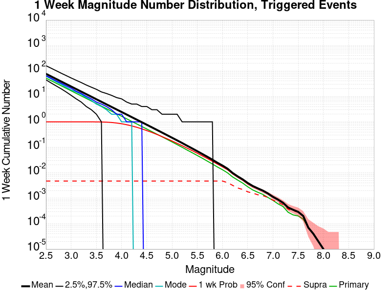

| Mag | Mean | 2.5 %ile | 97.5 %ile | Median | Mode | 1 wk Probability | 1 wk Supra-Seis Prob | Primary Aftershocks Mean |
|-----|-----|-----|-----|-----|-----|-----|-----|-----|
| **M&ge;2.5** | 77.270 | 45.000 | 161.000 | 65.000 | 63.000 | 1.000 (100.00%) | 4.71E-3 (0.47%) | 52.539 |
| **M&ge;2.6** | 61.381 | 34.000 | 129.000 | 52.000 | 49.000 | 1.000 (100.00%) | 4.71E-3 (0.47%) | 41.732 |
| **M&ge;2.7** | 48.767 | 26.000 | 103.000 | 41.000 | 38.000 | 1.000 (100.00%) | 4.71E-3 (0.47%) | 33.157 |
| **M&ge;2.8** | 38.725 | 20.000 | 82.000 | 33.000 | 30.000 | 1.000 (100.00%) | 4.71E-3 (0.47%) | 26.321 |
| **M&ge;2.9** | 30.760 | 15.000 | 66.000 | 26.000 | 23.000 | 1.000 (100.00%) | 4.71E-3 (0.47%) | 20.900 |
| **M&ge;3** | 24.436 | 11.000 | 53.000 | 21.000 | 18.000 | 1.000 (100.00%) | 4.71E-3 (0.47%) | 16.601 |
| **M&ge;3.1** | 19.419 | 8.000 | 43.000 | 16.000 | 15.000 | 1.000 (100.00%) | 4.71E-3 (0.47%) | 13.194 |
| **M&ge;3.2** | 15.420 | 6.000 | 35.000 | 13.000 | 12.000 | 1.000 (100.00%) | 4.71E-3 (0.47%) | 10.479 |
| **M&ge;3.3** | 12.247 | 4.000 | 28.000 | 10.000 | 9.000 | 1.000 (99.99%) | 4.71E-3 (0.47%) | 8.323 |
| **M&ge;3.4** | 9.732 | 3.000 | 23.000 | 8.000 | 7.000 | 0.999 (99.92%) | 4.71E-3 (0.47%) | 6.613 |
| **M&ge;3.5** | 7.725 | 2.000 | 19.000 | 6.000 | 5.000 | 0.997 (99.65%) | 4.71E-3 (0.47%) | 5.251 |
| **M&ge;3.6** | 6.135 | 1.000 | 15.000 | 5.000 | 4.000 | 0.989 (98.93%) | 4.71E-3 (0.47%) | 4.167 |
| **M&ge;3.7** | 4.870 | 0.000 | 13.000 | 4.000 | 3.000 | 0.973 (97.26%) | 4.71E-3 (0.47%) | 3.310 |
| **M&ge;3.8** | 3.866 | 0.000 | 11.000 | 3.000 | 2.000 | 0.944 (94.38%) | 4.71E-3 (0.47%) | 2.627 |
| **M&ge;3.9** | 3.070 | 0.000 | 9.000 | 2.000 | 2.000 | 0.900 (90.02%) | 4.71E-3 (0.47%) | 2.087 |
| **M&ge;4** | 2.438 | 0.000 | 8.000 | 2.000 | 1.000 | 0.842 (84.17%) | 4.71E-3 (0.47%) | 1.660 |
| **M&ge;4.1** | 1.938 | 0.000 | 6.000 | 1.000 | 1.000 | 0.771 (77.14%) | 4.71E-3 (0.47%) | 1.318 |
| **M&ge;4.2** | 1.536 | 0.000 | 5.000 | 1.000 | 1.000 | 0.693 (69.32%) | 4.71E-3 (0.47%) | 1.044 |
| **M&ge;4.3** | 1.219 | 0.000 | 5.000 | 1.000 | 0.000 | 0.612 (61.16%) | 4.71E-3 (0.47%) | 0.828 |
| **M&ge;4.4** | 0.968 | 0.000 | 4.000 | 1.000 | 0.000 | 0.530 (52.98%) | 4.71E-3 (0.47%) | 0.657 |
| **M&ge;4.5** | 0.767 | 0.000 | 4.000 | 0.000 | 0.000 | 0.453 (45.30%) | 4.71E-3 (0.47%) | 0.522 |
| **M&ge;4.6** | 0.608 | 0.000 | 3.000 | 0.000 | 0.000 | 0.383 (38.26%) | 4.71E-3 (0.47%) | 0.414 |
| **M&ge;4.7** | 0.482 | 0.000 | 3.000 | 0.000 | 0.000 | 0.320 (31.97%) | 4.71E-3 (0.47%) | 0.328 |
| **M&ge;4.8** | 0.381 | 0.000 | 2.000 | 0.000 | 0.000 | 0.264 (26.41%) | 4.71E-3 (0.47%) | 0.259 |
| **M&ge;4.9** | 0.301 | 0.000 | 2.000 | 0.000 | 0.000 | 0.217 (21.70%) | 4.71E-3 (0.47%) | 0.205 |
| **M&ge;5** | 0.237 | 0.000 | 2.000 | 0.000 | 0.000 | 0.177 (17.69%) | 4.71E-3 (0.47%) | 0.162 |
| **M&ge;5.1** | 0.187 | 0.000 | 2.000 | 0.000 | 0.000 | 0.143 (14.34%) | 4.71E-3 (0.47%) | 0.127 |
| **M&ge;5.2** | 0.147 | 0.000 | 1.000 | 0.000 | 0.000 | 0.116 (11.58%) | 4.71E-3 (0.47%) | 0.100 |
| **M&ge;5.3** | 0.115 | 0.000 | 1.000 | 0.000 | 0.000 | 0.092 (9.22%) | 4.71E-3 (0.47%) | 0.078 |
| **M&ge;5.4** | 0.090 | 0.000 | 1.000 | 0.000 | 0.000 | 0.074 (7.39%) | 4.71E-3 (0.47%) | 0.061 |
| **M&ge;5.5** | 0.070 | 0.000 | 1.000 | 0.000 | 0.000 | 0.059 (5.85%) | 4.71E-3 (0.47%) | 0.048 |
| **M&ge;5.6** | 0.055 | 0.000 | 1.000 | 0.000 | 0.000 | 0.046 (4.61%) | 4.71E-3 (0.47%) | 0.037 |
| **M&ge;5.7** | 0.042 | 0.000 | 1.000 | 0.000 | 0.000 | 0.036 (3.63%) | 4.71E-3 (0.47%) | 0.029 |
| **M&ge;5.8** | 0.032 | 0.000 | 1.000 | 0.000 | 0.000 | 0.028 (2.82%) | 4.71E-3 (0.47%) | 0.022 |
| **M&ge;5.9** | 0.025 | 0.000 | 0.000 | 0.000 | 0.000 | 0.022 (2.18%) | 4.71E-3 (0.47%) | 0.017 |
| **M&ge;6** | 0.019 | 0.000 | 0.000 | 0.000 | 0.000 | 0.017 (1.72%) | 4.71E-3 (0.47%) | 0.013 |
| **M&ge;6.1** | 0.014 | 0.000 | 0.000 | 0.000 | 0.000 | 0.013 (1.31%) | 4.09E-3 (0.41%) | 9.90E-3 |
| **M&ge;6.2** | 9.80E-3 | 0.000 | 0.000 | 0.000 | 0.000 | 9.03E-3 (0.90%) | 3.20E-3 (0.32%) | 6.84E-3 |
| **M&ge;6.3** | 7.20E-3 | 0.000 | 0.000 | 0.000 | 0.000 | 6.70E-3 (0.67%) | 2.52E-3 (0.25%) | 5.17E-3 |
| **M&ge;6.4** | 5.48E-3 | 0.000 | 0.000 | 0.000 | 0.000 | 5.10E-3 (0.51%) | 2.20E-3 (0.22%) | 3.93E-3 |
| **M&ge;6.5** | 3.95E-3 | 0.000 | 0.000 | 0.000 | 0.000 | 3.69E-3 (0.37%) | 1.78E-3 (0.18%) | 2.81E-3 |
| **M&ge;6.6** | 3.01E-3 | 0.000 | 0.000 | 0.000 | 0.000 | 2.83E-3 (0.28%) | 1.58E-3 (0.16%) | 2.11E-3 |
| **M&ge;6.7** | 2.43E-3 | 0.000 | 0.000 | 0.000 | 0.000 | 2.31E-3 (0.23%) | 1.36E-3 (0.14%) | 1.71E-3 |
| **M&ge;6.8** | 1.98E-3 | 0.000 | 0.000 | 0.000 | 0.000 | 1.90E-3 (0.19%) | 1.26E-3 (0.13%) | 1.41E-3 |
| **M&ge;6.9** | 1.53E-3 | 0.000 | 0.000 | 0.000 | 0.000 | 1.50E-3 (0.15%) | 1.07E-3 (0.11%) | 1.07E-3 |
| **M&ge;7** | 1.13E-3 | 0.000 | 0.000 | 0.000 | 0.000 | 1.11E-3 (0.11%) | 8.40E-4 (0.08%) | 8.20E-4 |
| **M&ge;7.1** | 8.80E-4 | 0.000 | 0.000 | 0.000 | 0.000 | 8.70E-4 (0.09%) | 6.90E-4 (0.07%) | 6.00E-4 |
| **M&ge;7.2** | 6.60E-4 | 0.000 | 0.000 | 0.000 | 0.000 | 6.50E-4 (0.07%) | 5.50E-4 (0.06%) | 4.70E-4 |
| **M&ge;7.3** | 4.30E-4 | 0.000 | 0.000 | 0.000 | 0.000 | 4.30E-4 (0.04%) | 3.70E-4 (0.04%) | 2.80E-4 |
| **M&ge;7.4** | 3.50E-4 | 0.000 | 0.000 | 0.000 | 0.000 | 3.50E-4 (0.03%) | 3.20E-4 (0.03%) | 2.20E-4 |
| **M&ge;7.5** | 2.90E-4 | 0.000 | 0.000 | 0.000 | 0.000 | 2.90E-4 (0.03%) | 2.80E-4 (0.03%) | 2.00E-4 |
| **M&ge;7.6** | 2.00E-4 | 0.000 | 0.000 | 0.000 | 0.000 | 2.00E-4 (0.02%) | 2.00E-4 (0.02%) | 1.50E-4 |
| **M&ge;7.7** | 7.00E-5 | 0.000 | 0.000 | 0.000 | 0.000 | 7.00E-5 (0.01%) | 7.00E-5 (0.01%) | 7.00E-5 |
| **M&ge;7.8** | 4.00E-5 | 0.000 | 0.000 | 0.000 | 0.000 | 4.00E-5 (0.00%) | 4.00E-5 (0.00%) | 4.00E-5 |
| **M&ge;7.9** | 2.00E-5 | 0.000 | 0.000 | 0.000 | 0.000 | 2.00E-5 (0.00%) | 2.00E-5 (0.00%) | 2.00E-5 |
| **M&ge;8** | 1.00E-5 | 0.000 | 0.000 | 0.000 | 0.000 | 1.00E-5 (0.00%) | 1.00E-5 (0.00%) | 1.00E-5 |
| **M&ge;8.1** | 0.000 | 0.000 | 0.000 | 0.000 | 0.000 | 0.000 (0.00%) | 0.000 (0.00%) | 0.000 |
| **M&ge;8.2** | 0.000 | 0.000 | 0.000 | 0.000 | 0.000 | 0.000 (0.00%) | 0.000 (0.00%) | 0.000 |
| **M&ge;8.3** | 0.000 | 0.000 | 0.000 | 0.000 | 0.000 | 0.000 (0.00%) | 0.000 (0.00%) | 0.000 |
| **M&ge;8.4** | 0.000 | 0.000 | 0.000 | 0.000 | 0.000 | 0.000 (0.00%) | 0.000 (0.00%) | 0.000 |
| **M&ge;8.5** | 0.000 | 0.000 | 0.000 | 0.000 | 0.000 | 0.000 (0.00%) | 0.000 (0.00%) | 0.000 |
| **M&ge;8.6** | 0.000 | 0.000 | 0.000 | 0.000 | 0.000 | 0.000 (0.00%) | 0.000 (0.00%) | 0.000 |
| **M&ge;8.7** | 0.000 | 0.000 | 0.000 | 0.000 | 0.000 | 0.000 (0.00%) | 0.000 (0.00%) | 0.000 |
| **M&ge;8.8** | 0.000 | 0.000 | 0.000 | 0.000 | 0.000 | 0.000 (0.00%) | 0.000 (0.00%) | 0.000 |
| **M&ge;8.9** | 0.000 | 0.000 | 0.000 | 0.000 | 0.000 | 0.000 (0.00%) | 0.000 (0.00%) | 0.000 |
| **M&ge;9** | 0.000 | 0.000 | 0.000 | 0.000 | 0.000 | 0.000 (0.00%) | 0.000 (0.00%) | 0.000 |

### 1 Day Magnitude Number Distribution
*[(top)](#table-of-contents)*

**Legend**
* **Mean** (thick black line): mean expected number across all 100000 catalogs
* **2.5%,97.5%** (thin black lines): expected number percentiles across all 100000 catalogs
* **Median** (thin blue line): median expected number across all 100000 catalogs
* **Mode** (thin cyan line): modal expected number across all 100000 catalogs
* **1 d Probability** (thin red line): 1 day probability calculated as the fraction of catalogs with at least 1 occurrence
* **1 d Supraseismogenic Probability** (thin dashed red line): same as above, but only for supraseismogenic ruptures on explicitly modeled UCERF3 faults
* **95% Conf** (light red shaded region): binomial 95% confidence bounds on probability
* **Primary** (thin green line): mean expected number from primary triggered aftershocks only (no secondary, tertiary, etc...) across all 100000 catalogs

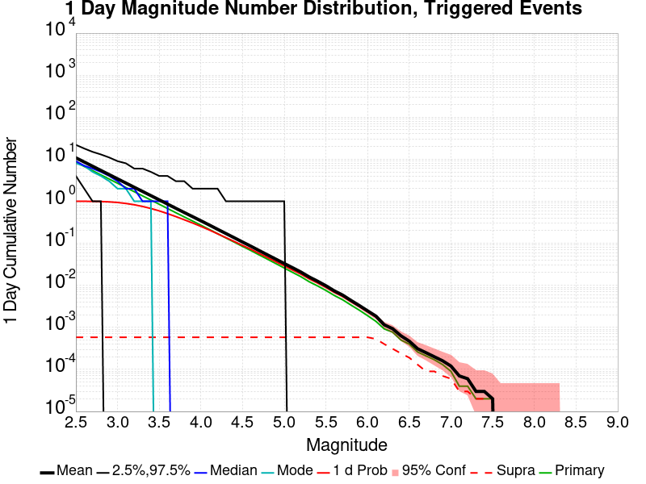

| Mag | Mean | 2.5 %ile | 97.5 %ile | Median | Mode | 1 d Probability | 1 d Supra-Seis Prob | Primary Aftershocks Mean |
|-----|-----|-----|-----|-----|-----|-----|-----|-----|
| **M&ge;2.5** | 10.810 | 4.000 | 22.000 | 9.000 | 8.000 | 1.000 (99.98%) | 5.80E-4 (0.06%) | 8.478 |
| **M&ge;2.6** | 8.587 | 2.000 | 18.000 | 7.000 | 7.000 | 0.999 (99.88%) | 5.80E-4 (0.06%) | 6.736 |
| **M&ge;2.7** | 6.825 | 1.000 | 15.000 | 6.000 | 5.000 | 0.995 (99.52%) | 5.80E-4 (0.06%) | 5.356 |
| **M&ge;2.8** | 5.416 | 1.000 | 13.000 | 5.000 | 4.000 | 0.986 (98.63%) | 5.80E-4 (0.06%) | 4.250 |
| **M&ge;2.9** | 4.303 | 0.000 | 11.000 | 4.000 | 3.000 | 0.968 (96.77%) | 5.80E-4 (0.06%) | 3.377 |
| **M&ge;3** | 3.416 | 0.000 | 9.000 | 3.000 | 2.000 | 0.936 (93.61%) | 5.80E-4 (0.06%) | 2.682 |
| **M&ge;3.1** | 2.712 | 0.000 | 8.000 | 2.000 | 2.000 | 0.887 (88.73%) | 5.80E-4 (0.06%) | 2.129 |
| **M&ge;3.2** | 2.155 | 0.000 | 6.000 | 2.000 | 1.000 | 0.826 (82.63%) | 5.80E-4 (0.06%) | 1.692 |
| **M&ge;3.3** | 1.712 | 0.000 | 6.000 | 1.000 | 1.000 | 0.753 (75.33%) | 5.80E-4 (0.06%) | 1.344 |
| **M&ge;3.4** | 1.362 | 0.000 | 5.000 | 1.000 | 1.000 | 0.674 (67.37%) | 5.80E-4 (0.06%) | 1.070 |
| **M&ge;3.5** | 1.081 | 0.000 | 4.000 | 1.000 | 0.000 | 0.591 (59.11%) | 5.80E-4 (0.06%) | 0.850 |
| **M&ge;3.6** | 0.857 | 0.000 | 4.000 | 1.000 | 0.000 | 0.508 (50.81%) | 5.80E-4 (0.06%) | 0.673 |
| **M&ge;3.7** | 0.680 | 0.000 | 3.000 | 0.000 | 0.000 | 0.432 (43.18%) | 5.80E-4 (0.06%) | 0.534 |
| **M&ge;3.8** | 0.541 | 0.000 | 3.000 | 0.000 | 0.000 | 0.363 (36.32%) | 5.80E-4 (0.06%) | 0.425 |
| **M&ge;3.9** | 0.431 | 0.000 | 2.000 | 0.000 | 0.000 | 0.305 (30.46%) | 5.80E-4 (0.06%) | 0.339 |
| **M&ge;4** | 0.343 | 0.000 | 2.000 | 0.000 | 0.000 | 0.253 (25.25%) | 5.80E-4 (0.06%) | 0.270 |
| **M&ge;4.1** | 0.273 | 0.000 | 2.000 | 0.000 | 0.000 | 0.208 (20.75%) | 5.80E-4 (0.06%) | 0.215 |
| **M&ge;4.2** | 0.215 | 0.000 | 2.000 | 0.000 | 0.000 | 0.168 (16.85%) | 5.80E-4 (0.06%) | 0.169 |
| **M&ge;4.3** | 0.171 | 0.000 | 1.000 | 0.000 | 0.000 | 0.137 (13.66%) | 5.80E-4 (0.06%) | 0.134 |
| **M&ge;4.4** | 0.136 | 0.000 | 1.000 | 0.000 | 0.000 | 0.111 (11.07%) | 5.80E-4 (0.06%) | 0.107 |
| **M&ge;4.5** | 0.107 | 0.000 | 1.000 | 0.000 | 0.000 | 0.089 (8.91%) | 5.80E-4 (0.06%) | 0.084 |
| **M&ge;4.6** | 0.085 | 0.000 | 1.000 | 0.000 | 0.000 | 0.072 (7.21%) | 5.80E-4 (0.06%) | 0.067 |
| **M&ge;4.7** | 0.067 | 0.000 | 1.000 | 0.000 | 0.000 | 0.057 (5.74%) | 5.80E-4 (0.06%) | 0.053 |
| **M&ge;4.8** | 0.053 | 0.000 | 1.000 | 0.000 | 0.000 | 0.046 (4.58%) | 5.80E-4 (0.06%) | 0.042 |
| **M&ge;4.9** | 0.042 | 0.000 | 1.000 | 0.000 | 0.000 | 0.036 (3.64%) | 5.80E-4 (0.06%) | 0.033 |
| **M&ge;5** | 0.033 | 0.000 | 1.000 | 0.000 | 0.000 | 0.029 (2.91%) | 5.80E-4 (0.06%) | 0.026 |
| **M&ge;5.1** | 0.026 | 0.000 | 0.000 | 0.000 | 0.000 | 0.023 (2.32%) | 5.80E-4 (0.06%) | 0.020 |
| **M&ge;5.2** | 0.021 | 0.000 | 0.000 | 0.000 | 0.000 | 0.018 (1.85%) | 5.80E-4 (0.06%) | 0.016 |
| **M&ge;5.3** | 0.016 | 0.000 | 0.000 | 0.000 | 0.000 | 0.014 (1.43%) | 5.80E-4 (0.06%) | 0.012 |
| **M&ge;5.4** | 0.013 | 0.000 | 0.000 | 0.000 | 0.000 | 0.011 (1.14%) | 5.80E-4 (0.06%) | 9.69E-3 |
| **M&ge;5.5** | 9.77E-3 | 0.000 | 0.000 | 0.000 | 0.000 | 8.95E-3 (0.90%) | 5.80E-4 (0.06%) | 7.56E-3 |
| **M&ge;5.6** | 7.39E-3 | 0.000 | 0.000 | 0.000 | 0.000 | 6.84E-3 (0.68%) | 5.80E-4 (0.06%) | 5.75E-3 |
| **M&ge;5.7** | 5.87E-3 | 0.000 | 0.000 | 0.000 | 0.000 | 5.46E-3 (0.55%) | 5.80E-4 (0.06%) | 4.54E-3 |
| **M&ge;5.8** | 4.38E-3 | 0.000 | 0.000 | 0.000 | 0.000 | 4.10E-3 (0.41%) | 5.80E-4 (0.06%) | 3.40E-3 |
| **M&ge;5.9** | 3.31E-3 | 0.000 | 0.000 | 0.000 | 0.000 | 3.13E-3 (0.31%) | 5.80E-4 (0.06%) | 2.57E-3 |
| **M&ge;6** | 2.47E-3 | 0.000 | 0.000 | 0.000 | 0.000 | 2.34E-3 (0.23%) | 5.80E-4 (0.06%) | 1.90E-3 |
| **M&ge;6.1** | 1.85E-3 | 0.000 | 0.000 | 0.000 | 0.000 | 1.76E-3 (0.18%) | 5.30E-4 (0.05%) | 1.39E-3 |
| **M&ge;6.2** | 1.15E-3 | 0.000 | 0.000 | 0.000 | 0.000 | 1.13E-3 (0.11%) | 4.00E-4 (0.04%) | 9.20E-4 |
| **M&ge;6.3** | 9.30E-4 | 0.000 | 0.000 | 0.000 | 0.000 | 9.10E-4 (0.09%) | 3.10E-4 (0.03%) | 7.70E-4 |
| **M&ge;6.4** | 6.30E-4 | 0.000 | 0.000 | 0.000 | 0.000 | 6.10E-4 (0.06%) | 2.40E-4 (0.02%) | 5.00E-4 |
| **M&ge;6.5** | 4.70E-4 | 0.000 | 0.000 | 0.000 | 0.000 | 4.70E-4 (0.05%) | 1.90E-4 (0.02%) | 4.00E-4 |
| **M&ge;6.6** | 3.10E-4 | 0.000 | 0.000 | 0.000 | 0.000 | 3.10E-4 (0.03%) | 1.30E-4 (0.01%) | 2.60E-4 |
| **M&ge;6.7** | 2.50E-4 | 0.000 | 0.000 | 0.000 | 0.000 | 2.50E-4 (0.03%) | 9.00E-5 (0.01%) | 2.10E-4 |
| **M&ge;6.8** | 2.00E-4 | 0.000 | 0.000 | 0.000 | 0.000 | 2.00E-4 (0.02%) | 9.00E-5 (0.01%) | 1.70E-4 |
| **M&ge;6.9** | 1.60E-4 | 0.000 | 0.000 | 0.000 | 0.000 | 1.60E-4 (0.02%) | 7.00E-5 (0.01%) | 1.30E-4 |
| **M&ge;7** | 1.20E-4 | 0.000 | 0.000 | 0.000 | 0.000 | 1.20E-4 (0.01%) | 6.00E-5 (0.01%) | 9.00E-5 |
| **M&ge;7.1** | 7.00E-5 | 0.000 | 0.000 | 0.000 | 0.000 | 7.00E-5 (0.01%) | 3.00E-5 (0.00%) | 4.00E-5 |
| **M&ge;7.2** | 6.00E-5 | 0.000 | 0.000 | 0.000 | 0.000 | 6.00E-5 (0.01%) | 3.00E-5 (0.00%) | 4.00E-5 |
| **M&ge;7.3** | 3.00E-5 | 0.000 | 0.000 | 0.000 | 0.000 | 3.00E-5 (0.00%) | 2.00E-5 (0.00%) | 2.00E-5 |
| **M&ge;7.4** | 3.00E-5 | 0.000 | 0.000 | 0.000 | 0.000 | 3.00E-5 (0.00%) | 2.00E-5 (0.00%) | 2.00E-5 |
| **M&ge;7.5** | 2.00E-5 | 0.000 | 0.000 | 0.000 | 0.000 | 2.00E-5 (0.00%) | 2.00E-5 (0.00%) | 2.00E-5 |
| **M&ge;7.6** | 0.000 | 0.000 | 0.000 | 0.000 | 0.000 | 0.000 (0.00%) | 0.000 (0.00%) | 0.000 |
| **M&ge;7.7** | 0.000 | 0.000 | 0.000 | 0.000 | 0.000 | 0.000 (0.00%) | 0.000 (0.00%) | 0.000 |
| **M&ge;7.8** | 0.000 | 0.000 | 0.000 | 0.000 | 0.000 | 0.000 (0.00%) | 0.000 (0.00%) | 0.000 |
| **M&ge;7.9** | 0.000 | 0.000 | 0.000 | 0.000 | 0.000 | 0.000 (0.00%) | 0.000 (0.00%) | 0.000 |
| **M&ge;8** | 0.000 | 0.000 | 0.000 | 0.000 | 0.000 | 0.000 (0.00%) | 0.000 (0.00%) | 0.000 |
| **M&ge;8.1** | 0.000 | 0.000 | 0.000 | 0.000 | 0.000 | 0.000 (0.00%) | 0.000 (0.00%) | 0.000 |
| **M&ge;8.2** | 0.000 | 0.000 | 0.000 | 0.000 | 0.000 | 0.000 (0.00%) | 0.000 (0.00%) | 0.000 |
| **M&ge;8.3** | 0.000 | 0.000 | 0.000 | 0.000 | 0.000 | 0.000 (0.00%) | 0.000 (0.00%) | 0.000 |
| **M&ge;8.4** | 0.000 | 0.000 | 0.000 | 0.000 | 0.000 | 0.000 (0.00%) | 0.000 (0.00%) | 0.000 |
| **M&ge;8.5** | 0.000 | 0.000 | 0.000 | 0.000 | 0.000 | 0.000 (0.00%) | 0.000 (0.00%) | 0.000 |
| **M&ge;8.6** | 0.000 | 0.000 | 0.000 | 0.000 | 0.000 | 0.000 (0.00%) | 0.000 (0.00%) | 0.000 |
| **M&ge;8.7** | 0.000 | 0.000 | 0.000 | 0.000 | 0.000 | 0.000 (0.00%) | 0.000 (0.00%) | 0.000 |
| **M&ge;8.8** | 0.000 | 0.000 | 0.000 | 0.000 | 0.000 | 0.000 (0.00%) | 0.000 (0.00%) | 0.000 |
| **M&ge;8.9** | 0.000 | 0.000 | 0.000 | 0.000 | 0.000 | 0.000 (0.00%) | 0.000 (0.00%) | 0.000 |
| **M&ge;9** | 0.000 | 0.000 | 0.000 | 0.000 | 0.000 | 0.000 (0.00%) | 0.000 (0.00%) | 0.000 |

### 1 Hour Magnitude Number Distribution
*[(top)](#table-of-contents)*

**Legend**
* **Mean** (thick black line): mean expected number across all 100000 catalogs
* **2.5%,97.5%** (thin black lines): expected number percentiles across all 100000 catalogs
* **Median** (thin blue line): median expected number across all 100000 catalogs
* **Mode** (thin cyan line): modal expected number across all 100000 catalogs
* **1 hr Probability** (thin red line): 1 hour probability calculated as the fraction of catalogs with at least 1 occurrence
* **1 hr Supraseismogenic Probability** (thin dashed red line): same as above, but only for supraseismogenic ruptures on explicitly modeled UCERF3 faults
* **95% Conf** (light red shaded region): binomial 95% confidence bounds on probability
* **Primary** (thin green line): mean expected number from primary triggered aftershocks only (no secondary, tertiary, etc...) across all 100000 catalogs


| Mag | Mean | 2.5 %ile | 97.5 %ile | Median | Mode | 1 hr Probability | 1 hr Supra-Seis Prob | Primary Aftershocks Mean |
|-----|-----|-----|-----|-----|-----|-----|-----|-----|
| **M&ge;2.5** | 0.396 | 0.000 | 2.000 | 0.000 | 0.000 | 0.307 (30.66%) | 1.00E-5 (0.00%) | 0.367 |
| **M&ge;2.6** | 0.315 | 0.000 | 2.000 | 0.000 | 0.000 | 0.253 (25.30%) | 1.00E-5 (0.00%) | 0.292 |
| **M&ge;2.7** | 0.250 | 0.000 | 2.000 | 0.000 | 0.000 | 0.207 (20.72%) | 1.00E-5 (0.00%) | 0.232 |
| **M&ge;2.8** | 0.198 | 0.000 | 1.000 | 0.000 | 0.000 | 0.168 (16.83%) | 1.00E-5 (0.00%) | 0.184 |
| **M&ge;2.9** | 0.157 | 0.000 | 1.000 | 0.000 | 0.000 | 0.136 (13.63%) | 1.00E-5 (0.00%) | 0.146 |
| **M&ge;3** | 0.125 | 0.000 | 1.000 | 0.000 | 0.000 | 0.110 (10.97%) | 1.00E-5 (0.00%) | 0.116 |
| **M&ge;3.1** | 0.100 | 0.000 | 1.000 | 0.000 | 0.000 | 0.089 (8.88%) | 1.00E-5 (0.00%) | 0.092 |
| **M&ge;3.2** | 0.079 | 0.000 | 1.000 | 0.000 | 0.000 | 0.071 (7.08%) | 1.00E-5 (0.00%) | 0.073 |
| **M&ge;3.3** | 0.062 | 0.000 | 1.000 | 0.000 | 0.000 | 0.056 (5.65%) | 1.00E-5 (0.00%) | 0.058 |
| **M&ge;3.4** | 0.049 | 0.000 | 1.000 | 0.000 | 0.000 | 0.045 (4.52%) | 1.00E-5 (0.00%) | 0.046 |
| **M&ge;3.5** | 0.039 | 0.000 | 1.000 | 0.000 | 0.000 | 0.036 (3.64%) | 1.00E-5 (0.00%) | 0.036 |
| **M&ge;3.6** | 0.031 | 0.000 | 1.000 | 0.000 | 0.000 | 0.029 (2.88%) | 1.00E-5 (0.00%) | 0.029 |
| **M&ge;3.7** | 0.025 | 0.000 | 0.000 | 0.000 | 0.000 | 0.023 (2.30%) | 1.00E-5 (0.00%) | 0.023 |
| **M&ge;3.8** | 0.020 | 0.000 | 0.000 | 0.000 | 0.000 | 0.019 (1.85%) | 1.00E-5 (0.00%) | 0.018 |
| **M&ge;3.9** | 0.016 | 0.000 | 0.000 | 0.000 | 0.000 | 0.015 (1.48%) | 1.00E-5 (0.00%) | 0.015 |
| **M&ge;4** | 0.013 | 0.000 | 0.000 | 0.000 | 0.000 | 0.012 (1.21%) | 1.00E-5 (0.00%) | 0.012 |
| **M&ge;4.1** | 0.010 | 0.000 | 0.000 | 0.000 | 0.000 | 9.53E-3 (0.95%) | 1.00E-5 (0.00%) | 9.30E-3 |
| **M&ge;4.2** | 7.97E-3 | 0.000 | 0.000 | 0.000 | 0.000 | 7.57E-3 (0.76%) | 1.00E-5 (0.00%) | 7.37E-3 |
| **M&ge;4.3** | 6.21E-3 | 0.000 | 0.000 | 0.000 | 0.000 | 5.92E-3 (0.59%) | 1.00E-5 (0.00%) | 5.71E-3 |
| **M&ge;4.4** | 5.15E-3 | 0.000 | 0.000 | 0.000 | 0.000 | 4.90E-3 (0.49%) | 1.00E-5 (0.00%) | 4.71E-3 |
| **M&ge;4.5** | 3.98E-3 | 0.000 | 0.000 | 0.000 | 0.000 | 3.80E-3 (0.38%) | 1.00E-5 (0.00%) | 3.62E-3 |
| **M&ge;4.6** | 3.19E-3 | 0.000 | 0.000 | 0.000 | 0.000 | 3.04E-3 (0.30%) | 1.00E-5 (0.00%) | 2.87E-3 |
| **M&ge;4.7** | 2.56E-3 | 0.000 | 0.000 | 0.000 | 0.000 | 2.44E-3 (0.24%) | 1.00E-5 (0.00%) | 2.31E-3 |
| **M&ge;4.8** | 2.08E-3 | 0.000 | 0.000 | 0.000 | 0.000 | 1.99E-3 (0.20%) | 1.00E-5 (0.00%) | 1.89E-3 |
| **M&ge;4.9** | 1.69E-3 | 0.000 | 0.000 | 0.000 | 0.000 | 1.61E-3 (0.16%) | 1.00E-5 (0.00%) | 1.52E-3 |
| **M&ge;5** | 1.27E-3 | 0.000 | 0.000 | 0.000 | 0.000 | 1.23E-3 (0.12%) | 1.00E-5 (0.00%) | 1.14E-3 |
| **M&ge;5.1** | 9.60E-4 | 0.000 | 0.000 | 0.000 | 0.000 | 9.30E-4 (0.09%) | 1.00E-5 (0.00%) | 8.50E-4 |
| **M&ge;5.2** | 7.30E-4 | 0.000 | 0.000 | 0.000 | 0.000 | 7.10E-4 (0.07%) | 1.00E-5 (0.00%) | 6.50E-4 |
| **M&ge;5.3** | 5.00E-4 | 0.000 | 0.000 | 0.000 | 0.000 | 4.90E-4 (0.05%) | 1.00E-5 (0.00%) | 4.40E-4 |
| **M&ge;5.4** | 4.10E-4 | 0.000 | 0.000 | 0.000 | 0.000 | 4.00E-4 (0.04%) | 1.00E-5 (0.00%) | 3.60E-4 |
| **M&ge;5.5** | 3.30E-4 | 0.000 | 0.000 | 0.000 | 0.000 | 3.20E-4 (0.03%) | 1.00E-5 (0.00%) | 2.90E-4 |
| **M&ge;5.6** | 2.70E-4 | 0.000 | 0.000 | 0.000 | 0.000 | 2.70E-4 (0.03%) | 1.00E-5 (0.00%) | 2.40E-4 |
| **M&ge;5.7** | 2.00E-4 | 0.000 | 0.000 | 0.000 | 0.000 | 2.00E-4 (0.02%) | 1.00E-5 (0.00%) | 1.70E-4 |
| **M&ge;5.8** | 1.60E-4 | 0.000 | 0.000 | 0.000 | 0.000 | 1.60E-4 (0.02%) | 1.00E-5 (0.00%) | 1.40E-4 |
| **M&ge;5.9** | 1.30E-4 | 0.000 | 0.000 | 0.000 | 0.000 | 1.30E-4 (0.01%) | 1.00E-5 (0.00%) | 1.20E-4 |
| **M&ge;6** | 1.00E-4 | 0.000 | 0.000 | 0.000 | 0.000 | 1.00E-4 (0.01%) | 1.00E-5 (0.00%) | 9.00E-5 |
| **M&ge;6.1** | 8.00E-5 | 0.000 | 0.000 | 0.000 | 0.000 | 8.00E-5 (0.01%) | 1.00E-5 (0.00%) | 7.00E-5 |
| **M&ge;6.2** | 6.00E-5 | 0.000 | 0.000 | 0.000 | 0.000 | 6.00E-5 (0.01%) | 1.00E-5 (0.00%) | 5.00E-5 |
| **M&ge;6.3** | 5.00E-5 | 0.000 | 0.000 | 0.000 | 0.000 | 5.00E-5 (0.01%) | 1.00E-5 (0.00%) | 4.00E-5 |
| **M&ge;6.4** | 4.00E-5 | 0.000 | 0.000 | 0.000 | 0.000 | 4.00E-5 (0.00%) | 1.00E-5 (0.00%) | 3.00E-5 |
| **M&ge;6.5** | 2.00E-5 | 0.000 | 0.000 | 0.000 | 0.000 | 2.00E-5 (0.00%) | 0.000 (0.00%) | 2.00E-5 |
| **M&ge;6.6** | 1.00E-5 | 0.000 | 0.000 | 0.000 | 0.000 | 1.00E-5 (0.00%) | 0.000 (0.00%) | 1.00E-5 |
| **M&ge;6.7** | 1.00E-5 | 0.000 | 0.000 | 0.000 | 0.000 | 1.00E-5 (0.00%) | 0.000 (0.00%) | 1.00E-5 |
| **M&ge;6.8** | 0.000 | 0.000 | 0.000 | 0.000 | 0.000 | 0.000 (0.00%) | 0.000 (0.00%) | 0.000 |
| **M&ge;6.9** | 0.000 | 0.000 | 0.000 | 0.000 | 0.000 | 0.000 (0.00%) | 0.000 (0.00%) | 0.000 |
| **M&ge;7** | 0.000 | 0.000 | 0.000 | 0.000 | 0.000 | 0.000 (0.00%) | 0.000 (0.00%) | 0.000 |
| **M&ge;7.1** | 0.000 | 0.000 | 0.000 | 0.000 | 0.000 | 0.000 (0.00%) | 0.000 (0.00%) | 0.000 |
| **M&ge;7.2** | 0.000 | 0.000 | 0.000 | 0.000 | 0.000 | 0.000 (0.00%) | 0.000 (0.00%) | 0.000 |
| **M&ge;7.3** | 0.000 | 0.000 | 0.000 | 0.000 | 0.000 | 0.000 (0.00%) | 0.000 (0.00%) | 0.000 |
| **M&ge;7.4** | 0.000 | 0.000 | 0.000 | 0.000 | 0.000 | 0.000 (0.00%) | 0.000 (0.00%) | 0.000 |
| **M&ge;7.5** | 0.000 | 0.000 | 0.000 | 0.000 | 0.000 | 0.000 (0.00%) | 0.000 (0.00%) | 0.000 |
| **M&ge;7.6** | 0.000 | 0.000 | 0.000 | 0.000 | 0.000 | 0.000 (0.00%) | 0.000 (0.00%) | 0.000 |
| **M&ge;7.7** | 0.000 | 0.000 | 0.000 | 0.000 | 0.000 | 0.000 (0.00%) | 0.000 (0.00%) | 0.000 |
| **M&ge;7.8** | 0.000 | 0.000 | 0.000 | 0.000 | 0.000 | 0.000 (0.00%) | 0.000 (0.00%) | 0.000 |
| **M&ge;7.9** | 0.000 | 0.000 | 0.000 | 0.000 | 0.000 | 0.000 (0.00%) | 0.000 (0.00%) | 0.000 |
| **M&ge;8** | 0.000 | 0.000 | 0.000 | 0.000 | 0.000 | 0.000 (0.00%) | 0.000 (0.00%) | 0.000 |
| **M&ge;8.1** | 0.000 | 0.000 | 0.000 | 0.000 | 0.000 | 0.000 (0.00%) | 0.000 (0.00%) | 0.000 |
| **M&ge;8.2** | 0.000 | 0.000 | 0.000 | 0.000 | 0.000 | 0.000 (0.00%) | 0.000 (0.00%) | 0.000 |
| **M&ge;8.3** | 0.000 | 0.000 | 0.000 | 0.000 | 0.000 | 0.000 (0.00%) | 0.000 (0.00%) | 0.000 |
| **M&ge;8.4** | 0.000 | 0.000 | 0.000 | 0.000 | 0.000 | 0.000 (0.00%) | 0.000 (0.00%) | 0.000 |
| **M&ge;8.5** | 0.000 | 0.000 | 0.000 | 0.000 | 0.000 | 0.000 (0.00%) | 0.000 (0.00%) | 0.000 |
| **M&ge;8.6** | 0.000 | 0.000 | 0.000 | 0.000 | 0.000 | 0.000 (0.00%) | 0.000 (0.00%) | 0.000 |
| **M&ge;8.7** | 0.000 | 0.000 | 0.000 | 0.000 | 0.000 | 0.000 (0.00%) | 0.000 (0.00%) | 0.000 |
| **M&ge;8.8** | 0.000 | 0.000 | 0.000 | 0.000 | 0.000 | 0.000 (0.00%) | 0.000 (0.00%) | 0.000 |
| **M&ge;8.9** | 0.000 | 0.000 | 0.000 | 0.000 | 0.000 | 0.000 (0.00%) | 0.000 (0.00%) | 0.000 |
| **M&ge;9** | 0.000 | 0.000 | 0.000 | 0.000 | 0.000 | 0.000 (0.00%) | 0.000 (0.00%) | 0.000 |


## Hazard Change Over Time
*[(top)](#table-of-contents)*

These plots show how the probability of ruptures of various magnitudes within 100km of any scenario rupture changes over time

### M&ge;5.0 Hazard Change Over Time
*[(top)](#table-of-contents)*


| Forecast Duration | UCERF3-ETAS [95% Conf] | UCERF3-ETAS Triggered Only | UCERF3-TD | UCERF3-ETAS/TD Gain | UCERF3-TI |
|-----|-----|-----|-----|-----|-----|
| 1 Hour | 1.32E-3 [1.12E-3 - 1.57E-3] | 1.23E-3 | 9.34E-5 | 14.17 | 9.27E-5 |
| 1 Day | 0.031 [0.030 - 0.032] | 0.029 | 2.24E-3 | 13.91 | 2.22E-3 |
| 1 Week | 0.189 [0.187 - 0.191] | 0.176 | 0.016 | 12.14 | 0.015 |
| 1 Month | 0.506 [0.504 - 0.509] | 0.472 | 0.065 | 7.79 | 0.065 |
| 1 Year | 0.957 [0.956 - 0.958] | 0.902 | 0.559 | 1.71 | 0.556 |
| 10 Years | 1.000 [1.000 - 1.000] | 0.984 | 1.000 | 1 | 1.000 |
| 30 Years | 1.000 [1.000 - 1.000] \* | \* | 1.000 | 1 \* | 1.000 |
| 100 Years | 1.000 [1.000 - 1.000] \* | \* | 1.000 | 1 \* | 1.000 |

\* *forecast duration is longer than simulation length, only ETAS ruptures from the first 10 years are included*
### M&ge;6.0 Hazard Change Over Time
*[(top)](#table-of-contents)*


| Forecast Duration | UCERF3-ETAS [95% Conf] | UCERF3-ETAS Triggered Only | UCERF3-TD | UCERF3-ETAS/TD Gain | UCERF3-TI |
|-----|-----|-----|-----|-----|-----|
| 1 Hour | 1.11E-4 [6.18E-5 - 2.02E-4] | 1.00E-4 | 1.10E-5 | 10.11 | 1.03E-5 |
| 1 Day | 2.59E-3 [2.31E-3 - 2.92E-3] | 2.33E-3 | 2.64E-4 | 9.84 | 2.48E-4 |
| 1 Week | 0.019 [0.018 - 0.020] | 0.017 | 1.84E-3 | 10.22 | 1.74E-3 |
| 1 Month | 0.064 [0.062 - 0.065] | 0.056 | 7.88E-3 | 8.11 | 7.42E-3 |
| 1 Year | 0.270 [0.268 - 0.272] | 0.196 | 0.092 | 2.94 | 0.087 |
| 10 Years | 0.746 [0.745 - 0.748] | 0.336 | 0.618 | 1.21 | 0.596 |
| 30 Years | 0.963 [0.963 - 0.963] \* | \* | 0.944 | 1.02 \* | 0.934 |
| 100 Years | 1.000 [1.000 - 1.000] \* | \* | 1.000 | 1 \* | 1.000 |

\* *forecast duration is longer than simulation length, only ETAS ruptures from the first 10 years are included*
### M&ge;7.0 Hazard Change Over Time
*[(top)](#table-of-contents)*

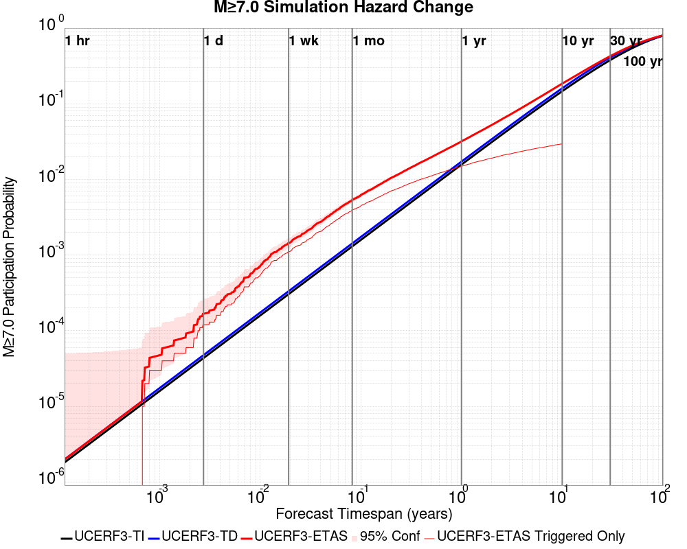

| Forecast Duration | UCERF3-ETAS [95% Conf] | UCERF3-ETAS Triggered Only | UCERF3-TD | UCERF3-ETAS/TD Gain | UCERF3-TI |
|-----|-----|-----|-----|-----|-----|
| 1 Hour | 1.98E-6 [1.98E-6 - 4.99E-5] | 0.000 | 1.98E-6 | 1 | 1.81E-6 |
| 1 Day | 1.68E-4 [1.13E-4 - 2.64E-4] | 1.20E-4 | 4.75E-5 | 3.52 | 4.35E-5 |
| 1 Week | 1.44E-3 [1.25E-3 - 1.67E-3] | 1.11E-3 | 3.33E-4 | 4.34 | 3.04E-4 |
| 1 Month | 5.35E-3 [4.98E-3 - 5.76E-3] | 3.93E-3 | 1.42E-3 | 3.75 | 1.30E-3 |
| 1 Year | 0.032 [0.031 - 0.033] | 0.015 | 0.017 | 1.85 | 0.016 |
| 10 Years | 0.185 [0.184 - 0.186] | 0.030 | 0.160 | 1.15 | 0.147 |
| 30 Years | 0.427 [0.427 - 0.428] \* | \* | 0.410 | 1.04 \* | 0.379 |
| 100 Years | 0.803 [0.803 - 0.803] \* | \* | 0.797 | 1.01 \* | 0.795 |

\* *forecast duration is longer than simulation length, only ETAS ruptures from the first 10 years are included*
### M&ge;8.0 Hazard Change Over Time
*[(top)](#table-of-contents)*


| Forecast Duration | UCERF3-ETAS [95% Conf] | UCERF3-ETAS Triggered Only | UCERF3-TD | UCERF3-ETAS/TD Gain | UCERF3-TI |
|-----|-----|-----|-----|-----|-----|
| 1 Hour | 3.23E-7 [3.23E-7 - 4.82E-5] | 0.000 | 3.23E-7 | 1 | 2.73E-7 |
| 1 Day | 7.75E-6 [7.75E-6 - 5.56E-5] | 0.000 | 7.75E-6 | 1 | 6.55E-6 |
| 1 Week | 6.43E-5 [5.48E-5 - 1.19E-4] | 1.00E-5 | 5.43E-5 | 1.18 | 4.59E-5 |
| 1 Month | 2.92E-4 [2.57E-4 - 3.70E-4] | 6.00E-5 | 2.32E-4 | 1.26 | 1.97E-4 |
| 1 Year | 2.95E-3 [2.89E-3 - 3.04E-3] | 1.20E-4 | 2.83E-3 | 1.04 | 2.39E-3 |
| 10 Years | 0.029 [0.029 - 0.029] | 2.50E-4 | 0.029 | 1.01 | 0.024 |
| 30 Years | 0.091 [0.091 - 0.091] \* | \* | 0.091 | 1 \* | 0.069 |
| 100 Years | 0.277 [0.277 - 0.277] \* | \* | 0.277 | 1 \* | 0.213 |

\* *forecast duration is longer than simulation length, only ETAS ruptures from the first 10 years are included*

## Trigger Rupture Fault Map
*[(top)](#table-of-contents)*


## Trigger Rupture Depth Map
*[(top)](#table-of-contents)*


## Fault Distances To Triggers
*[(top)](#table-of-contents)*

| Section Name | Strike, Dip, Rake | # Hypos In Poly | Max Mag w/ Hypo In Poly | # Surfs In Poly | Max Mag w/ Surf In Poly | Min Dist To Any (km) | Min Poly Dist To Any (km) | Min Dist To Largest (km) | Min Poly Dist To Largest (km) | Min Hypo Dist To Largest (km) | Min Hypo Poly Dist To Largest (km) |
|-----|-----|-----|-----|-----|-----|-----|-----|-----|-----|-----|-----|
| Airport Lake | 359, 50, -90 | 1076 | 7.1 | 1076 | 7.1 | 0.108 | 0.000 | 0.108 | 0.000 | 5.612 | 0.000 |
| Little Lake | 327, 90, 180 | 348 | 5.5 | 349 | 7.1 | 0.187 | 0.000 | 0.187 | 0.000 | 13.471 | 1.469 |
| Garlock (Central) | 71, 90, 0 | 147 | 4.73 | 148 | 7.1 | 0.225 | 0.000 | 4.496 | 0.000 | 22.766 | 10.797 |
| So Sierra Nevada | 2, 50, -90 | 110 | 4.62 | 110 | 4.62 | 1.097 | 0.000 | 2.006 | 1.025 | 16.191 | 15.188 |
| Ash Hill | 162, 90, 180 | 24 | 3.57 | 24 | 3.57 | 0.088 | 0.000 | 33.561 | 21.600 | 35.690 | 25.242 |
| Panamint Valley | 334, 90, -150 | 17 | 3.57 | 17 | 3.57 | 6.249 | 0.000 | 28.960 | 17.026 | 34.350 | 22.425 |
| Blackwater | 323, 90, 180 | 2 | 3.54 | 2 | 3.54 | 5.396 | 0.000 | 12.517 | 7.767 | 29.622 | 27.613 |
| Tank Canyon | 189, 50, -90 | 1 | 3.0 | 1 | 3.0 | 1.252 | 0.000 | 8.074 | 8.068 | 17.039 | 16.895 |
| Sierra Nevada  (No Extension) | 344, 50, -90 | 0 |  | 0 |  | 5.696 | 1.331 | 39.260 | 39.217 | 58.680 | 58.391 |
| Owens Valley | 346, 90, 180 | 0 |  | 0 |  | 13.143 | 7.068 | 49.023 | 47.970 | 68.299 | 66.819 |
| Lenwood-Lockhart-Old Woman Springs | 301, 90, 180 | 0 |  | 0 |  | 18.221 | 16.222 | 42.034 | 30.819 | 59.786 | 48.595 |
| Towne Pass | 186, 50, -90 | 0 |  | 0 |  | 18.237 | 18.158 | 48.483 | 48.471 | 59.662 | 59.451 |
| Garlock (West) | 55, 90, 0 | 0 |  | 0 |  | 18.439 | 18.373 | 49.038 | 46.326 | 66.575 | 62.627 |

## Individual Simulated Catalog Maps
*[(top)](#table-of-contents)*

These are map plots of individual catalogs from the simulations, selected as the closest catalog to each of the given percentiles in terms of total number of events.

| Duration | p0.0 %-ile | p25.0 %-ile | p50.0 %-ile | p75.0 %-ile | p90.0 %-ile | p95.0 %-ile | p97.5 %-ile | p98.0 %-ile | p99.0 %-ile | p99.5 %-ile | p99.9 %-ile | p100.0 %-ile |
|-----|-----|-----|-----|-----|-----|-----|-----|-----|-----|-----|-----|-----|
| **1 Week** |  |  | 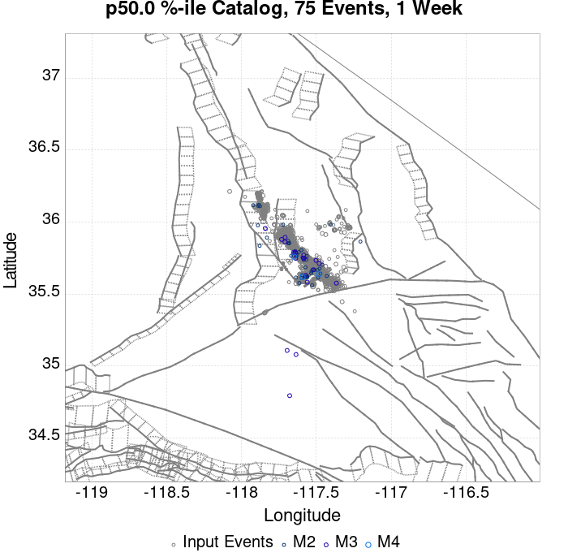 |  |  |  | 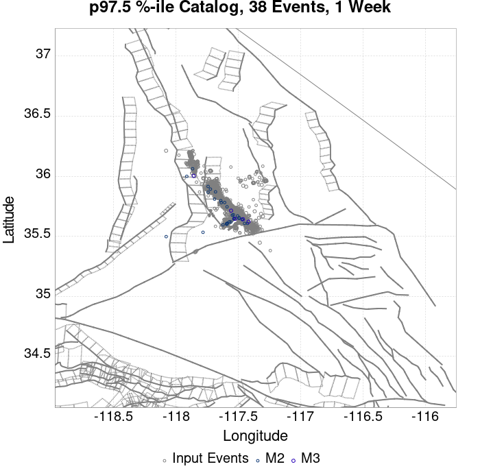 |  |  |  |  |  |
| **1 Month** |  |  |  |  |  |  |  |  |  |  |  | 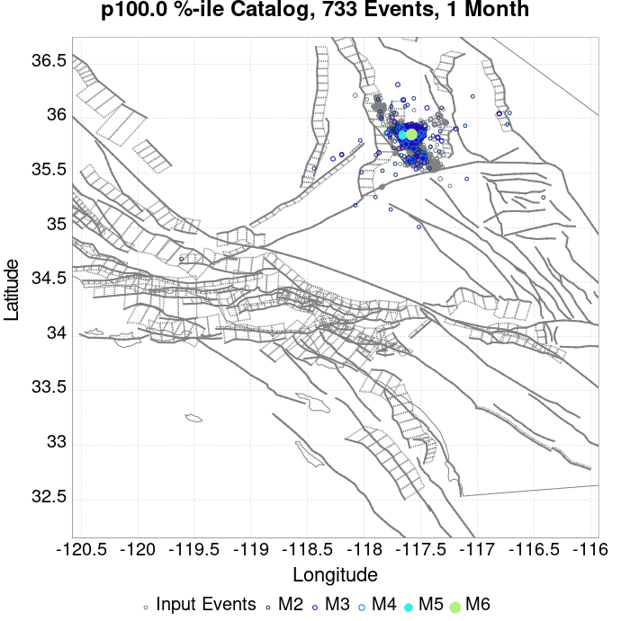 |
| **1 Year** |  | 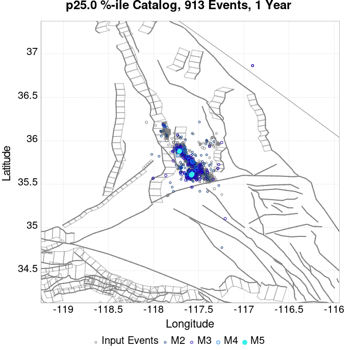 |  |  |  |  |  |  |  |  |  |  |
| **10 Year** |  |  |  |  |  | 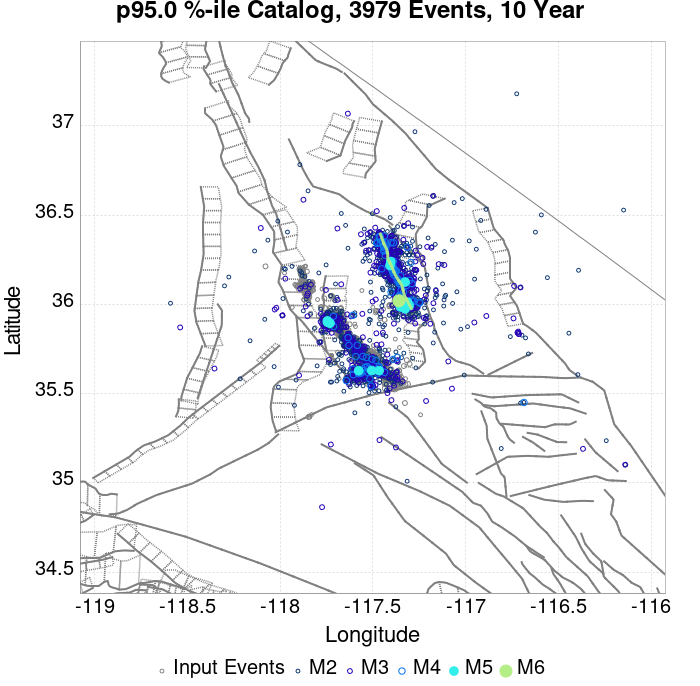 |  |  |  |  |  |  |

## ComCat Data Comparisons
*[(top)](#table-of-contents)*

These plots compare simulated sequences with data from ComCat. All plots only consider events with hypocenters inside the ComCat region defined in the JSON input file.

Last updated at 2020/01/26 19:33:23 UTC, 176.7 days after the simulation start time.

Total matching ComCat events found: 310

### ComCat Magnitude-Number Distributions
*[(top)](#table-of-contents)*

| Incremental MND | Cumulative MND |
|-----|-----|
|  |  |

### ComCat Time-Dependent Mc
*[(top)](#table-of-contents)*

The following plots compare simulation results with ComCat data above a magnitude threshold. Plots labeled as *M&ge;Mc(t)* use the time-dependent magnitude of completeness (Mc) defined in Helmstetter et al. (2006), which is plotted below. In the case of multiple M&ge;5 ruptures, either as input to the simulation or in the comparison data, the maximum calculated time-dependent Mc is used. This time-dependent Mc function is plotted below.

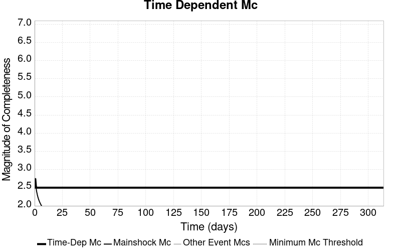

### ComCat Cumulative Number Vs Time
*[(top)](#table-of-contents)*

| M&ge;Mc(t) | M&ge;3.5 | M&ge;4 | M&ge;5 | M&ge;6 | M&ge;7 |
|-----|-----|-----|-----|-----|-----|
| 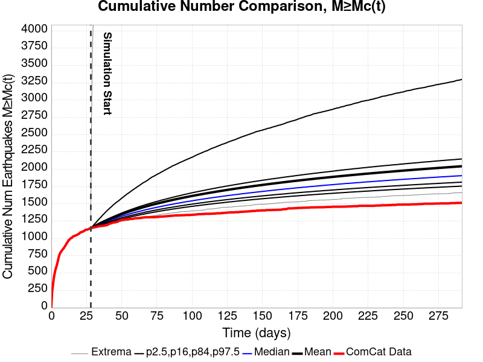 |  |  |  |  |  |

### ComCat Cumulative Number Simulation Percentiles
*[(top)](#table-of-contents)*


### ComCat Probability Spatial Distribution
*[(top)](#table-of-contents)*

*Note: maps labeled 'Forecast' are for a duration that extends into the future, only forecasted values are plotted (ComCat data omitted)*

|  | 1 Day | 1 Week | 1 Month | Current (176.7 Day) | Forecast: 1 Year |
|-----|-----|-----|-----|-----|-----|
| **M&ge;Mc(t)** |  |  |  |  |  |
|  | Prob: 99.98%, Actual: 3 | Prob: 100.00%, Actual: 32 | Prob: 100.00%, Actual: 135 | Prob: 100.00%, Actual: 310 | Prob: 100.00% |
| **M&ge;3.5** |  |  |  |  |  |
|  | Prob: 58.58%, Actual: 0 | Prob: 99.62%, Actual: 0 | Prob: 100.00%, Actual: 8 | Prob: 100.00%, Actual: 27 | Prob: 100.00% |
| **M&ge;4** |  |  |  |  |  |
|  | Prob: 24.92%, Actual: 0 | Prob: 83.68%, Actual: 0 | Prob: 99.72%, Actual: 2 | Prob: 100.00%, Actual: 2 | Prob: 100.00% |
| **M&ge;5** |  |  |  |  |  |
|  | Prob: 2.86%, Actual: 0 | Prob: 17.39%, Actual: 0 | Prob: 46.75%, Actual: 1 | Prob: 82.32%, Actual: 1 | Prob: 89.91% |
| **M&ge;6** |  |  |  |  |  |
|  | Prob: 0.23%, Actual: 0 | Prob: 1.66%, Actual: 0 | Prob: 5.51%, Actual: 0 | Prob: 14.83%, Actual: 0 | Prob: 19.20% |
| **M&ge;7** |  |  |  |  |  |
|  | Prob: 0.01%, Actual: 0 | Prob: 0.11%, Actual: 0 | Prob: 0.38%, Actual: 0 | Prob: 1.06%, Actual: 0 | Prob: 1.44% |
| **M&ge;8** |  |  |  |  |  |
|  | Prob: 0.00%, Actual: 0 | Prob: 0.00%, Actual: 0 | Prob: 0.01%, Actual: 0 | Prob: 0.01%, Actual: 0 | Prob: 0.01% |

### ComCat Mean Expectation Spatial Distribution
*[(top)](#table-of-contents)*

*Note: maps labeled 'Forecast' are for a duration that extends into the future, only forecasted values are plotted (ComCat data omitted)*

|  | 1 Day | 1 Week | 1 Month | Current (176.7 Day) | Forecast: 1 Year |
|-----|-----|-----|-----|-----|-----|
| **M&ge;Mc(t)** |  |  |  |  |  |
|  | Mean: 10.570, Actual: 3 | Mean: 74.308, Actual: 32 | Mean: 258.414, Actual: 135 | Mean: 751.228, Actual: 310 | Mean: 1018.512 |
| **M&ge;3.5** |  |  | 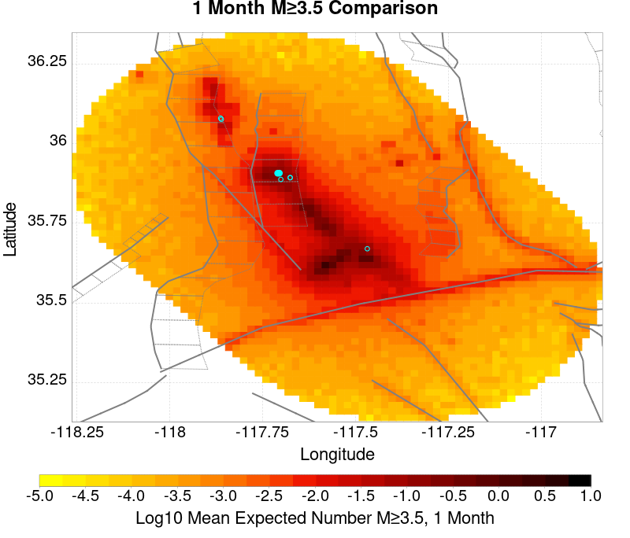 |  |  |
|  | Mean: 1.058, Actual: 0 | Mean: 7.431, Actual: 0 | Mean: 25.848, Actual: 8 | Mean: 75.154, Actual: 27 | Mean: 101.844 |
| **M&ge;4** |  |  |  |  |  |
|  | Mean: 0.335, Actual: 0 | Mean: 2.344, Actual: 0 | Mean: 8.156, Actual: 2 | Mean: 23.717, Actual: 2 | Mean: 32.145 |
| **M&ge;5** |  |  |  | 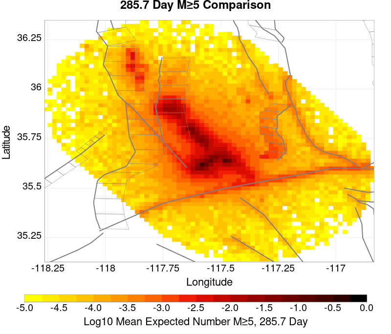 |  |
|  | Mean: 0.032, Actual: 0 | Mean: 0.227, Actual: 0 | Mean: 0.793, Actual: 1 | Mean: 2.312, Actual: 1 | Mean: 3.137 |
| **M&ge;6** |  | 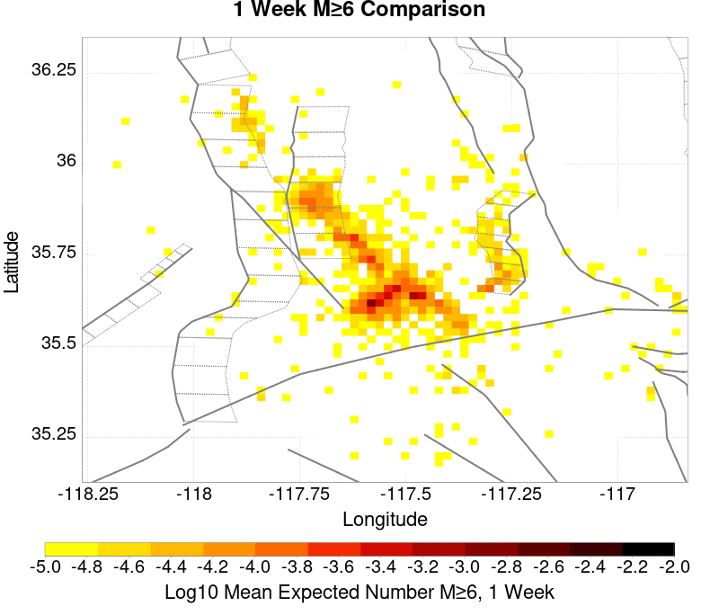 |  |  |  |
|  | Mean: 2.38E-3, Actual: 0 | Mean: 0.018, Actual: 0 | Mean: 0.063, Actual: 0 | Mean: 0.184, Actual: 0 | Mean: 0.248 |
| **M&ge;7** | 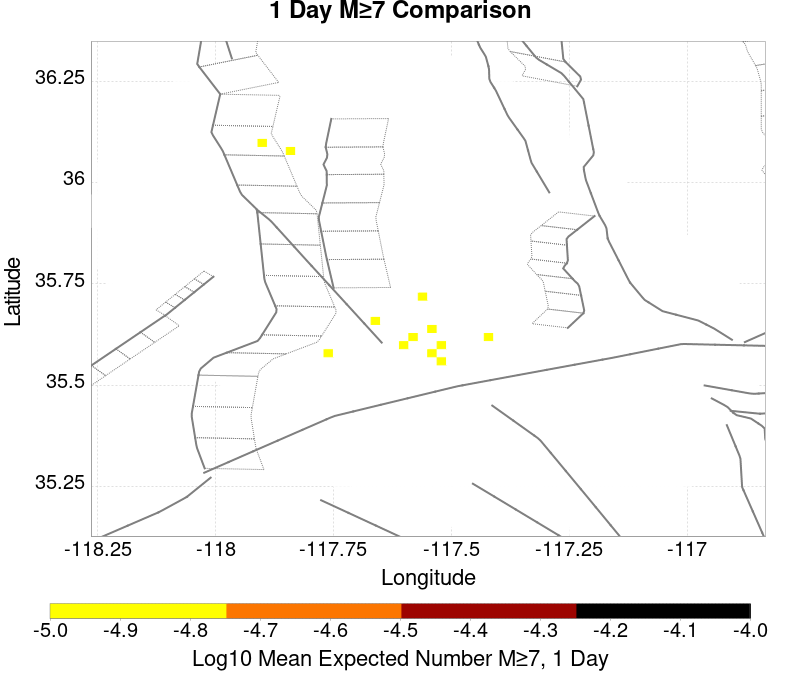 | 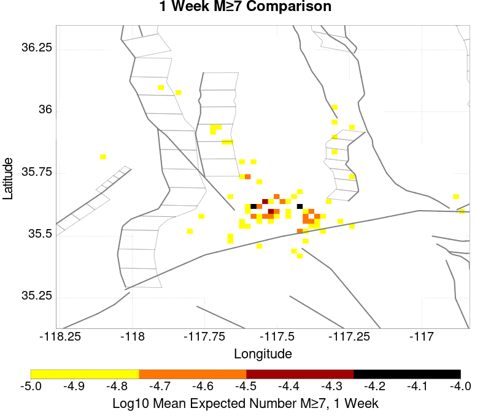 |  |  |  |
|  | Mean: 1.20E-4, Actual: 0 | Mean: 1.07E-3, Actual: 0 | Mean: 3.86E-3, Actual: 0 | Mean: 0.011, Actual: 0 | Mean: 0.015 |
| **M&ge;8** | 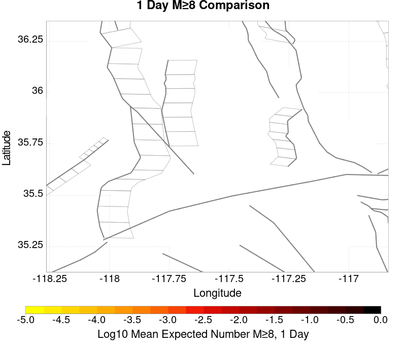 |  |  |  |  |
|  | Mean: 0.000, Actual: 0 | Mean: 1.00E-5, Actual: 0 | Mean: 6.00E-5, Actual: 0 | Mean: 8.00E-5, Actual: 0 | Mean: 1.20E-4 |

### ComCat Depth Distribution
*[(top)](#table-of-contents)*

| M&ge;Mc(t) | M&ge;3.5 | M&ge;4 | M&ge;5 | M&ge;6 | M&ge;7 | M&ge;8 |
|-----|-----|-----|-----|-----|-----|-----|
|  | 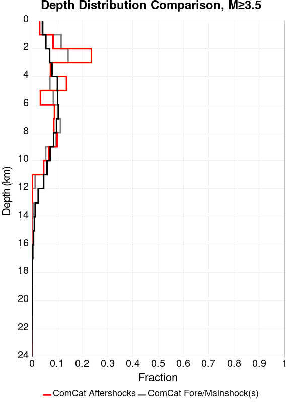 |  |  | 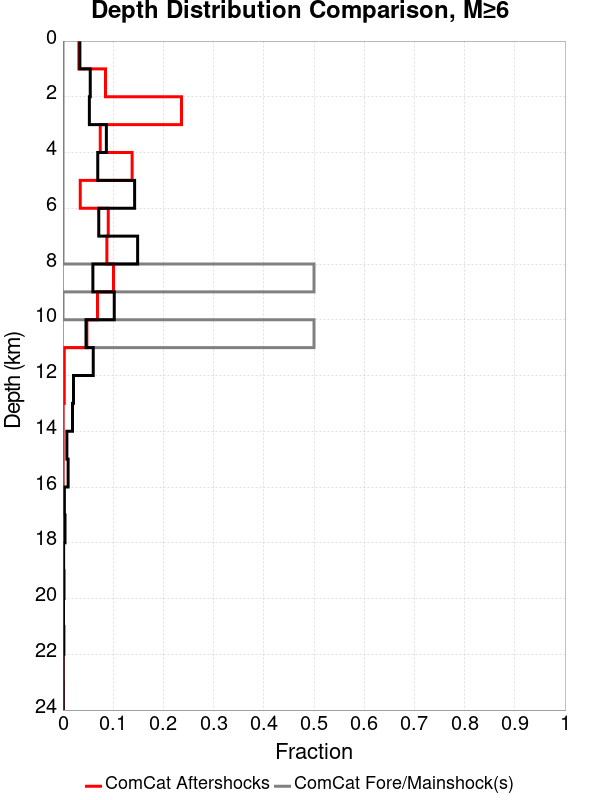 |  |  |

## Section Participation
*[(top)](#table-of-contents)*

### Section Participation Plots
*[(top)](#table-of-contents)*

| Min Mag | 1 yr Triggered Ruptures (no spontaneous) | 10 yr Triggered Ruptures (no spontaneous) | 10 yr Triggered Ruptures (primary aftershocks only) |
|-----|-----|-----|-----|
| **All Supra. Seis.** |  |  |  |
| **M&ge;6.5** |  |  |  |
| **M&ge;7** |  |  |  |
| **M&ge;7.5** |  |  |  |
| **M&ge;8** |  |  |  |

### Supra-Seismogenic Parent Sections Table
*[(top)](#table-of-contents)*

*First 10 of 158 with matching ruptures shown*

| Parent Name | Triggered 10 Year Mean Count | Triggered 1 Day Prob | Triggered 1 Week Prob | Triggered 1 Month Prob | Triggered 1 Year Prob | Triggered 10 Year Prob | Triggered 10 Year Primary Mean Count |
|-----|-----|-----|-----|-----|-----|-----|-----|
| Garlock (Central) | 0.04571 | 2.2E-4 | 0.0017 | 0.00578 | 0.02247 | 0.04401 | 0.02018 |
| Tank Canyon | 0.04549 | 1.3E-4 | 0.00106 | 0.00441 | 0.01895 | 0.03898 | 0.01225 |
| Little Lake | 0.02159 | 1.0E-4 | 9.0E-4 | 0.00295 | 0.01096 | 0.02117 | 0.01154 |
| Owl Lake | 0.01685 | 3.0E-5 | 3.6E-4 | 0.0016 | 0.00702 | 0.01495 | 0.00353 |
| Airport Lake | 0.01395 | 8.0E-5 | 6.7E-4 | 0.00209 | 0.00779 | 0.01394 | 0.00866 |
| Panamint Valley | 0.01236 | 0.0 | 3.9E-4 | 0.00137 | 0.00563 | 0.01202 | 0.00385 |
| Garlock (East) | 0.01135 | 1.0E-5 | 2.3E-4 | 9.1E-4 | 0.00462 | 0.01034 | 0.00249 |
| Ash Hill | 0.00652 | 0.0 | 2.2E-4 | 7.6E-4 | 0.0031 | 0.00612 | 0.0017 |
| Blackwater | 0.00552 | 1.0E-5 | 1.6E-4 | 6.1E-4 | 0.00238 | 0.00539 | 0.00131 |
| Hunter Mountain-Saline Valley | 0.00538 | 0.0 | 1.4E-4 | 6.4E-4 | 0.00275 | 0.0053 | 0.00212 |

### M≥6.5 Parent Sections Table
*[(top)](#table-of-contents)*

*First 10 of 144 with matching ruptures shown*

| Parent Name | Triggered 10 Year Mean Count | Triggered 1 Day Prob | Triggered 1 Week Prob | Triggered 1 Month Prob | Triggered 1 Year Prob | Triggered 10 Year Prob | Triggered 10 Year Primary Mean Count |
|-----|-----|-----|-----|-----|-----|-----|-----|
| Garlock (Central) | 0.02148 | 4.0E-5 | 7.0E-4 | 0.00255 | 0.01052 | 0.02098 | 0.00929 |
| Little Lake | 0.0114 | 5.0E-5 | 4.8E-4 | 0.00154 | 0.00586 | 0.01129 | 0.00657 |
| Panamint Valley | 0.01134 | 0.0 | 3.7E-4 | 0.00127 | 0.00521 | 0.01107 | 0.00369 |
| Airport Lake | 0.01054 | 5.0E-5 | 4.5E-4 | 0.0015 | 0.00581 | 0.01053 | 0.00642 |
| Owl Lake | 0.00902 | 2.0E-5 | 2.5E-4 | 0.001 | 0.0045 | 0.009 | 0.00296 |
| Garlock (East) | 0.00748 | 1.0E-5 | 1.7E-4 | 6.6E-4 | 0.0033 | 0.00709 | 0.00233 |
| Hunter Mountain-Saline Valley | 0.00531 | 0.0 | 1.4E-4 | 6.4E-4 | 0.00273 | 0.00524 | 0.00208 |
| Tank Canyon | 0.00518 | 3.0E-5 | 1.5E-4 | 5.1E-4 | 0.00235 | 0.00517 | 0.00131 |
| Garlock (West) | 0.00387 | 2.0E-5 | 1.5E-4 | 4.7E-4 | 0.00181 | 0.00387 | 0.00167 |
| So Sierra Nevada | 0.00201 | 2.0E-5 | 6.0E-5 | 2.1E-4 | 8.7E-4 | 0.002 | 4.5E-4 |

### M≥7 Parent Sections Table
*[(top)](#table-of-contents)*

*First 10 of 102 with matching ruptures shown*

| Parent Name | Triggered 10 Year Mean Count | Triggered 1 Day Prob | Triggered 1 Week Prob | Triggered 1 Month Prob | Triggered 1 Year Prob | Triggered 10 Year Prob | Triggered 10 Year Primary Mean Count |
|-----|-----|-----|-----|-----|-----|-----|-----|
| Garlock (Central) | 0.01918 | 3.0E-5 | 6.1E-4 | 0.00233 | 0.00937 | 0.0188 | 0.00828 |
| Panamint Valley | 0.00758 | 0.0 | 2.7E-4 | 9.3E-4 | 0.00374 | 0.00755 | 0.00299 |
| Owl Lake | 0.00654 | 2.0E-5 | 2.2E-4 | 8.7E-4 | 0.00339 | 0.00654 | 0.00288 |
| Garlock (East) | 0.00547 | 1.0E-5 | 1.4E-4 | 5.5E-4 | 0.00252 | 0.00544 | 0.00224 |
| Hunter Mountain-Saline Valley | 0.00514 | 0.0 | 1.4E-4 | 6.3E-4 | 0.00268 | 0.00512 | 0.00204 |
| Garlock (West) | 0.00381 | 2.0E-5 | 1.5E-4 | 4.6E-4 | 0.00179 | 0.00381 | 0.00166 |
| Little Lake | 0.00222 | 3.0E-5 | 1.3E-4 | 3.3E-4 | 0.00114 | 0.00222 | 0.00138 |
| Airport Lake | 0.00207 | 2.0E-5 | 1.2E-4 | 3.2E-4 | 0.00106 | 0.00207 | 0.00129 |
| San Andreas (Mojave N) | 0.00147 | 0.0 | 8.0E-5 | 2.3E-4 | 7.6E-4 | 0.00147 | 6.1E-4 |
| San Andreas (Mojave S) | 0.00117 | 0.0 | 6.0E-5 | 1.7E-4 | 5.4E-4 | 0.00117 | 4.7E-4 |

### M≥7.5 Parent Sections Table
*[(top)](#table-of-contents)*

*First 10 of 64 with matching ruptures shown*

| Parent Name | Triggered 10 Year Mean Count | Triggered 1 Day Prob | Triggered 1 Week Prob | Triggered 1 Month Prob | Triggered 1 Year Prob | Triggered 10 Year Prob | Triggered 10 Year Primary Mean Count |
|-----|-----|-----|-----|-----|-----|-----|-----|
| Garlock (Central) | 0.00778 | 2.0E-5 | 2.7E-4 | 9.9E-4 | 0.00396 | 0.00775 | 0.00332 |
| Panamint Valley | 0.00497 | 0.0 | 1.4E-4 | 6.0E-4 | 0.00259 | 0.00497 | 0.00203 |
| Hunter Mountain-Saline Valley | 0.00494 | 0.0 | 1.4E-4 | 6.0E-4 | 0.00259 | 0.00494 | 0.00202 |
| Garlock (West) | 0.00332 | 2.0E-5 | 1.3E-4 | 4.2E-4 | 0.0016 | 0.00332 | 0.00145 |
| Garlock (East) | 0.00218 | 1.0E-5 | 7.0E-5 | 2.7E-4 | 0.00108 | 0.00218 | 0.00103 |
| San Andreas (Mojave N) | 0.00147 | 0.0 | 8.0E-5 | 2.3E-4 | 7.6E-4 | 0.00147 | 6.1E-4 |
| San Andreas (Mojave S) | 0.00112 | 0.0 | 5.0E-5 | 1.6E-4 | 5.2E-4 | 0.00112 | 4.6E-4 |
| Owl Lake | 6.7E-4 | 1.0E-5 | 5.0E-5 | 9.0E-5 | 2.9E-4 | 6.7E-4 | 2.6E-4 |
| San Andreas (San Bernardino N) | 6.7E-4 | 0.0 | 3.0E-5 | 1.0E-4 | 3.1E-4 | 6.7E-4 | 2.7E-4 |
| San Andreas (San Bernardino S) | 2.5E-4 | 0.0 | 2.0E-5 | 4.0E-5 | 1.3E-4 | 2.5E-4 | 1.0E-4 |

### M≥8 Parent Sections Table
*[(top)](#table-of-contents)*

*First 10 of 25 with matching ruptures shown*

| Parent Name | Triggered 10 Year Mean Count | Triggered 1 Day Prob | Triggered 1 Week Prob | Triggered 1 Month Prob | Triggered 1 Year Prob | Triggered 10 Year Prob | Triggered 10 Year Primary Mean Count |
|-----|-----|-----|-----|-----|-----|-----|-----|
| San Andreas (Mojave N) | 2.5E-4 | 0.0 | 1.0E-5 | 6.0E-5 | 1.2E-4 | 2.5E-4 | 1.1E-4 |
| San Andreas (Mojave S) | 2.5E-4 | 0.0 | 1.0E-5 | 6.0E-5 | 1.2E-4 | 2.5E-4 | 1.1E-4 |
| San Andreas (San Bernardino N) | 2.5E-4 | 0.0 | 1.0E-5 | 6.0E-5 | 1.2E-4 | 2.5E-4 | 1.1E-4 |
| Garlock (Central) | 2.4E-4 | 0.0 | 1.0E-5 | 6.0E-5 | 1.2E-4 | 2.4E-4 | 1.1E-4 |
| Garlock (West) | 2.4E-4 | 0.0 | 1.0E-5 | 6.0E-5 | 1.2E-4 | 2.4E-4 | 1.1E-4 |
| Garlock (East) | 2.2E-4 | 0.0 | 1.0E-5 | 6.0E-5 | 1.2E-4 | 2.2E-4 | 9.0E-5 |
| San Andreas (San Bernardino S) | 1.0E-4 | 0.0 | 1.0E-5 | 3.0E-5 | 4.0E-5 | 1.0E-4 | 6.0E-5 |
| San Jacinto (San Bernardino) | 1.0E-4 | 0.0 | 0.0 | 2.0E-5 | 5.0E-5 | 1.0E-4 | 3.0E-5 |
| San Jacinto (San Jacinto Valley) rev | 1.0E-4 | 0.0 | 0.0 | 2.0E-5 | 5.0E-5 | 1.0E-4 | 3.0E-5 |
| San Jacinto (Stepovers Combined) | 1.0E-4 | 0.0 | 0.0 | 2.0E-5 | 5.0E-5 | 1.0E-4 | 3.0E-5 |

### Fault Magnitude-Probability Distributions
*[(top)](#table-of-contents)*

The first 5 sections (sorted by trigger rate) are plotted below. All fault MPDs are available [here](plots/parent_sect_mpds/README.md)

| 1 Week | 1 Month | 1 Year | 10 Year |
|-----|-----|-----|-----|
|  |  |  |  |
|  |  |  |  |
|  |  |  |  |
|  |  |  |  |
|  |  |  |  |

## Gridded Nucleation
*[(top)](#table-of-contents)*

| Min Mag | Triggered Ruptures (no spontaneous) | Triggered Ruptures (primary aftershocks only) |
|-----|-----|-----|
| **M&ge;2.5** |  |  |
| **M&ge;5** |  |  |
| **M&ge;6** |  |  |
| **M&ge;7** |  |  |


## JSON Input File
*[(top)](#table-of-contents)*

```
{
  "numSimulations": 100000,
  "duration": 10.0,
  "startTimeMillis": 1564802394040,
  "includeSpontaneous": false,
  "randomSeed": 1568835402671,
  "binaryOutput": true,
  "binaryOutputFilters": [
    {
      "prefix": "results_complete",
      "descendantsOnly": false
    },
    {
      "prefix": "results_m5_preserve_chain",
      "minMag": 5.0,
      "preserveChainBelowMag": true,
      "descendantsOnly": false
    }
  ],
  "forceRecalc": false,
  "simulationName": "ComCat M7.1 (ci38457511), 28 Days After, KML Surface, ShakeMap Surface",
  "numRetries": 3,
  "outputDir": "/home/scec-02/kmilner/ucerf3/etas_sim/2019_09_18-ComCatM7p1_ci38457511_28DaysAfter_KMLSurface_ShakeMapSurface",
  "triggerRuptures": [
    "omitted due to length, see original input file"
  ],
  "cacheDir": "/home/scec-02/kmilner/ucerf3/ucerf3-etas-launcher/inputs/cache_fm3p1_ba",
  "fssFile": "/home/scec-02/kmilner/ucerf3/ucerf3-etas-launcher/inputs/2013_05_10-ucerf3p3-production-10runs_COMPOUND_SOL_FM3_1_SpatSeisU3_MEAN_BRANCH_AVG_SOL.zip",
  "probModel": "FULL_TD",
  "applySubSeisForSupraNucl": true,
  "totRateScaleFactor": 1.14,
  "gridSeisCorr": true,
  "timeIndependentERF": false,
  "griddedOnly": false,
  "imposeGR": false,
  "includeIndirectTriggering": true,
  "gridSeisDiscr": 0.1,
  "catalogCompletenessModel": "RELAXED",
  "configCommand": "u3etas_comcat_event_config_builder.sh --event-id ci38457511 --num-simulations 100000 --days-before 7 --days-after 28 --mag-complete 3.5 --finite-surf-shakemap --finite-surf-shakemap-min-mag 5 --kml-surf /home/kevin/OpenSHA/UCERF3/etas/ridgecrest_plots/ridgecrest.kmz --kml-surf-lower-depth 12 --hpc-site USC_HPC --nodes 36 --hours 24 --queue scec",
  "configTime": 1568835402671,
  "comcatMetadata": {
    "region": {
      "border": [
        {
          "latitude": 35.13342762012634,
          "longitude": -117.45367750070501
        },
        {
          "latitude": 35.15270332909477,
          "longitude": -117.54213523429682
        },
        {
          "latitude": 35.184187907213456,
          "longitude": -117.62521508013079
        },
        {
          "latitude": 35.22693822000033,
          "longitude": -117.70042094108739
        },
        {
          "latitude": 35.27967195814059,
          "longitude": -117.76548311116092
        },
        {
          "latitude": 35.28292136541374,
          "longitude": -117.768297169107
        },
        {
          "latitude": 35.282714022786564,
          "longitude": -117.76860667734388
        },
        {
          "latitude": 35.64616476778597,
          "longitude": -118.14060116871636
        },
        {
          "latitude": 35.646290565151034,
          "longitude": -118.14041397296377
        },
        {
          "latitude": 35.646290565151034,
          "longitude": -118.14041397296374
        },
        {
          "latitude": 35.70550198289052,
          "longitude": -118.1919320615959
        },
        {
          "latitude": 35.77319089074291,
          "longitude": -118.23131566123934
        },
        {
          "latitude": 35.84539594526493,
          "longitude": -118.25567060785616
        },
        {
          "latitude": 35.919932588574866,
          "longitude": -118.26421849104048
        },
        {
          "latitude": 35.99453954092851,
          "longitude": -118.25665541220314
        },
        {
          "latitude": 36.066947044143845,
          "longitude": -118.23316650649775
        },
        {
          "latitude": 36.13494612677531,
          "longitude": -118.19442573686128
        },
        {
          "latitude": 36.19645676261368,
          "longitude": -118.14158030503249
        },
        {
          "latitude": 36.24959273547327,
          "longitude": -118.07621953817277
        },
        {
          "latitude": 36.29272104246196,
          "longitude": -118.00032870851776
        },
        {
          "latitude": 36.32451377564722,
          "longitude": -117.91622889704182
        },
        {
          "latitude": 36.343990623811074,
          "longitude": -117.826504677543
        },
        {
          "latitude": 36.35055043060519,
          "longitude": -117.733922023183
        },
        {
          "latitude": 36.343990623811074,
          "longitude": -117.64133936882301
        },
        {
          "latitude": 36.32451377564722,
          "longitude": -117.55161514932418
        },
        {
          "latitude": 36.29272104246196,
          "longitude": -117.46751533784825
        },
        {
          "latitude": 36.24959273547327,
          "longitude": -117.39162450819323
        },
        {
          "latitude": 36.19645676261368,
          "longitude": -117.32626374133352
        },
        {
          "latitude": 36.19452355462307,
          "longitude": -117.32460287066154
        },
        {
          "latitude": 36.194651318425976,
          "longitude": -117.32441274870448
        },
        {
          "latitude": 35.828694033707926,
          "longitude": -116.95360151966321
        },
        {
          "latitude": 35.82848350243037,
          "longitude": -116.95391578771998
        },
        {
          "latitude": 35.770248906600905,
          "longitude": -116.9041092646137
        },
        {
          "latitude": 35.702251879941855,
          "longitude": -116.86554120692988
        },
        {
          "latitude": 35.62984570420452,
          "longitude": -116.84215384823932
        },
        {
          "latitude": 35.55523919240562,
          "longitude": -116.83461877811952
        },
        {
          "latitude": 35.480702052044876,
          "longitude": -116.84312107874324
        },
        {
          "latitude": 35.408495625225484,
          "longitude": -116.86735902359025
        },
        {
          "latitude": 35.34080463691217,
          "longitude": -116.90655843937878
        },
        {
          "latitude": 35.27967195814059,
          "longitude": -116.95950067960908
        },
        {
          "latitude": 35.22693822000033,
          "longitude": -117.02456284968261
        },
        {
          "latitude": 35.184187907213456,
          "longitude": -117.09976871063921
        },
        {
          "latitude": 35.15270332909477,
          "longitude": -117.18284855647319
        },
        {
          "latitude": 35.13342762012634,
          "longitude": -117.27130629006498
        },
        {
          "latitude": 35.12693766919082,
          "longitude": -117.362491895385
        }
      ]
    },
    "eventID": "ci38457511",
    "minDepth": -10.0,
    "maxDepth": 24.0,
    "minMag": 2.5,
    "startTime": 1561778393040,
    "endTime": 1564802393040,
    "magComplete": 3.5
  }
}
```

