# Parent Section Magnitude-Probability Distributions

Only fault sections with at least one triggered aftershock are plotted. Sections are sorted by total supraseismogenic trigger rate (decreasing)

## Table Of Contents

* [Garlock (Central)](#garlock-central)
* [Tank Canyon](#tank-canyon)
* [Little Lake](#little-lake)
* [Owl Lake](#owl-lake)
* [Airport Lake](#airport-lake)
* [Panamint Valley](#panamint-valley)
* [Garlock (East)](#garlock-east)
* [Ash Hill](#ash-hill)
* [Blackwater](#blackwater)
* [Hunter Mountain-Saline Valley](#hunter-mountain-saline-valley)
* [Garlock (West)](#garlock-west)
* [Gravel Hills-Harper Lk](#gravel-hills-harper-lk)
* [McLean Lake](#mclean-lake)
* [Goldstone Lake](#goldstone-lake)
* [So Sierra Nevada](#so-sierra-nevada)
* [Coyote Canyon](#coyote-canyon)
* [San Andreas (Mojave S)](#san-andreas-mojave-s)
* [Lenwood-Lockhart-Old Woman Springs](#lenwood-lockhart-old-woman-springs)
* [Nelson Lake](#nelson-lake)
* [Death Valley (So)](#death-valley-so)
* [San Andreas (Mojave N)](#san-andreas-mojave-n)
* [Towne Pass](#towne-pass)
* [Bicycle Lake](#bicycle-lake)
* [Paradise](#paradise)
* [San Andreas (San Bernardino N)](#san-andreas-san-bernardino-n)
* [Garlic Springs](#garlic-springs)
* [Coyote Lake](#coyote-lake)
* [Death Valley (Black Mtns Frontal)](#death-valley-black-mtns-frontal)
* [Helendale-So Lockhart](#helendale-so-lockhart)
* [San Andreas (San Bernardino S)](#san-andreas-san-bernardino-s)
* [San Andreas (Big Bend)](#san-andreas-big-bend)
* [Sierra Nevada  (No Extension)](#sierra-nevada--no-extension)
* [Lake Isabella (Seismicity)](#lake-isabella-seismicity)
* [Scodie Lineament](#scodie-lineament)
* [Ludlow](#ludlow)
* [Red Pass](#red-pass)
* [San Andreas (San Gorgonio Pass-Garnet HIll)](#san-andreas-san-gorgonio-pass-garnet-hill)
* [Death Valley (No)](#death-valley-no)
* [Mission Ridge-Arroyo Parida-Santa Ana](#mission-ridge-arroyo-parida-santa-ana)
* [Santa Ynez (East)](#santa-ynez-east)
* [Death Valley (Fish Lake Valley)](#death-valley-fish-lake-valley)
* [Calico-Hidalgo](#calico-hidalgo)
* [San Jacinto (San Bernardino)](#san-jacinto-san-bernardino)
* [Baker](#baker)
* [San Andreas (Parkfield)](#san-andreas-parkfield)
* [White Wolf (Extension)](#white-wolf-extension)
* [Big Pine (Central)](#big-pine-central)
* [Elsinore (Glen Ivy) rev](#elsinore-glen-ivy-rev)
* [San Jacinto (San Jacinto Valley) rev](#san-jacinto-san-jacinto-valley-rev)
* [San Andreas (Carrizo) rev](#san-andreas-carrizo-rev)
* [San Jacinto (Stepovers Combined)](#san-jacinto-stepovers-combined)
* [Cady](#cady)
* [Owens Valley](#owens-valley)
* [Independence rev 2011](#independence-rev-2011)
* [San Jacinto (Anza) rev](#san-jacinto-anza-rev)
* [White Mountains](#white-mountains)
* [Santa Ynez (West)](#santa-ynez-west)
* [San Andreas (Coachella) rev](#san-andreas-coachella-rev)
* [Santa Rosa Island](#santa-rosa-island)
* [San Andreas (North Branch Mill Creek)](#san-andreas-north-branch-mill-creek)
* [Lost Hills](#lost-hills)
* [San Andreas (Cholame) rev](#san-andreas-cholame-rev)
* [Santa Cruz Island](#santa-cruz-island)
* [Deep Springs](#deep-springs)
* [Pinto Mtn](#pinto-mtn)
* [Pine Mtn](#pine-mtn)
* [San Diego Trough north alt1](#san-diego-trough-north-alt1)
* [Red Mountain](#red-mountain)
* [Mission Creek](#mission-creek)
* [Channel Islands Thrust](#channel-islands-thrust)
* [San Cayetano](#san-cayetano)
* [Tin Mountain](#tin-mountain)
* [San Clemente](#san-clemente)
* [Manix-Afton Hills](#manix-afton-hills)
* [Bullion Mountains](#bullion-mountains)
* [San Jacinto (Lytle Creek connector)](#san-jacinto-lytle-creek-connector)
* [Pisgah-Bullion Mtn-Mesquite Lk](#pisgah-bullion-mtn-mesquite-lk)
* [Oceanic - West Huasna](#oceanic---west-huasna)
* [San Andreas (Creeping Section) 2011 CFM](#san-andreas-creeping-section-2011-cfm)
* [Imperial](#imperial)
* [San Jacinto (Coyote Creek)](#san-jacinto-coyote-creek)
* [Ortigalita (North)](#ortigalita-north)
* [Blue Cut](#blue-cut)
* [Kern Canyon (Lake Isabella) 2011](#kern-canyon-lake-isabella-2011)
* [Brawley (Seismic Zone) alt 1](#brawley-seismic-zone-alt-1)
* [Big Pine (East)](#big-pine-east)
* [Cleghorn Lake](#cleghorn-lake)
* [Ventura-Pitas Point](#ventura-pitas-point)
* [Cleghorn](#cleghorn)
* [Ortigalita (South)](#ortigalita-south)
* [Kern Canyon (North Kern) 2011](#kern-canyon-north-kern-2011)
* [Great Valley 09 (Laguna Seca)](#great-valley-09-laguna-seca)
* [Coronado Bank alt1](#coronado-bank-alt1)
* [San Diego Trough south](#san-diego-trough-south)
* [San Jacinto (Clark) rev](#san-jacinto-clark-rev)
* [Oak Ridge (Onshore)](#oak-ridge-onshore)
* [Palos Verdes](#palos-verdes)
* [San Jacinto (Borrego)](#san-jacinto-borrego)
* [Rose Canyon](#rose-canyon)
* [Cleghorn Pass](#cleghorn-pass)
* [Del Valle](#del-valle)
* [Camp Rock 2011](#camp-rock-2011)
* [Kern Canyon (South Kern) 2011](#kern-canyon-south-kern-2011)
* [Cucamonga](#cucamonga)
* [Owens Valley Keough Hot Springs](#owens-valley-keough-hot-springs)
* [Pitas Point (Lower West)](#pitas-point-lower-west)
* [Channel Islands Western Deep Ramp](#channel-islands-western-deep-ramp)
* [Elysian Park (Upper)](#elysian-park-upper)
* [Earthquake Valley (No  Extension)](#earthquake-valley-no--extension)
* [Simi-Santa Rosa](#simi-santa-rosa)
* [Sierra Madre](#sierra-madre)
* [Los Alamos 2011 CFM](#los-alamos-2011-cfm)
* [Santa Susana East (connector)](#santa-susana-east-connector)
* [Dog Valley](#dog-valley)
* [San Luis Range 2011 CFM](#san-luis-range-2011-cfm)
* [San Gabriel (Extension)](#san-gabriel-extension)
* [Burnt Mtn](#burnt-mtn)
* [San Pedro Basin](#san-pedro-basin)
* [La Panza 2011](#la-panza-2011)
* [Los Osos 2011](#los-osos-2011)
* [Sierra Madre (San Fernando)](#sierra-madre-san-fernando)
* [Santa Susana alt 1](#santa-susana-alt-1)
* [South Klamath Lake East](#south-klamath-lake-east)
* [Santa Cruz Catalina Ridge alt1](#santa-cruz-catalina-ridge-alt1)
* [Green Valley 2011 CFM](#green-valley-2011-cfm)
* [South Klamath Lake West](#south-klamath-lake-west)
* [Los Alamos extension](#los-alamos-extension)
* [Pitas Point (Lower)-Montalvo](#pitas-point-lower-montalvo)
* [Calaveras (So) 2011 CFM](#calaveras-so-2011-cfm)
* [San Luis Range - Oceano 2011 CFM](#san-luis-range---oceano-2011-cfm)
* [Johnson Valley (No) 2011 rev](#johnson-valley-no-2011-rev)
* [Earthquake Valley (So Extension)](#earthquake-valley-so-extension)
* [Pleito](#pleito)
* [Earthquake Valley](#earthquake-valley)
* [White Wolf](#white-wolf)
* [Raymond](#raymond)
* [Mission Hills 2011](#mission-hills-2011)
* [Santa Ynez River](#santa-ynez-river)
* [Northridge Hills](#northridge-hills)
* [Last Chance](#last-chance)
* [Malibu Coast (Extension) alt 1](#malibu-coast-extension-alt-1)
* [Mono Lake 2011 CFM](#mono-lake-2011-cfm)
* [San Jacinto (Superstition Mtn)](#san-jacinto-superstition-mtn)
* [Ozena](#ozena)
* [South Cuyama](#south-cuyama)
* [Newport-Inglewood (Offshore)](#newport-inglewood-offshore)
* [Hunting Creek - Berryessa 2011 CFM](#hunting-creek---berryessa-2011-cfm)
* [North Frontal  (East)](#north-frontal--east)
* [Elmore Ranch](#elmore-ranch)
* [Oceanside alt1](#oceanside-alt1)
* [Hayward (So) 2011 CFM](#hayward-so-2011-cfm)
* [Great Valley 06 (Midland) 2011 CFM alt1](#great-valley-06-midland-2011-cfm-alt1)
* [Whittier alt 1](#whittier-alt-1)
* [West Napa 2011 CFM](#west-napa-2011-cfm)
* [Newport-Inglewood alt 1](#newport-inglewood-alt-1)
* [Hollywood](#hollywood)
* [Calaveras (Central) 2011 CFM](#calaveras-central-2011-cfm)
* [Eureka Peak](#eureka-peak)

## Garlock (Central)
*[(top)](#table-of-contents)*

| 1 Week | 1 Month | 1 Year | 10 Year |
|-----|-----|-----|-----|
|  |  |  |  |

| Magnitude | 1 wk TI Prob | 1 wk TD Prob | 1 wk ETAS Prob | 1 wk ETAS/TD Gain | 1 wk ETAS Triggered Only | 1 mo TI Prob | 1 mo TD Prob | 1 mo ETAS Prob | 1 mo ETAS/TD Gain | 1 mo ETAS Triggered Only | 1 yr TI Prob | 1 yr TD Prob | 1 yr ETAS Prob | 1 yr ETAS/TD Gain | 1 yr ETAS Triggered Only | 10 yr TI Prob | 10 yr TD Prob | 10 yr ETAS Prob | 10 yr ETAS/TD Gain | 10 yr ETAS Triggered Only |
|-----|-----|-----|-----|-----|-----|-----|-----|-----|-----|-----|-----|-----|-----|-----|-----|-----|-----|-----|-----|-----|
| 6.0 | 5.5131142E-5 | 7.027124E-5 | 0.0017701518 | 25.190273 | 0.0017 | 2.3625491E-4 | 3.0112805E-4 | 0.0060793874 | 20.188711 | 0.00578 | 0.0028726095 | 0.0036601364 | 0.026047893 | 7.1166453 | 0.02247 | 0.028357591 | 0.036092084 | 0.078513674 | 2.175371 | 0.04401 |
| 6.1 | 5.5131142E-5 | 7.027124E-5 | 0.0017701518 | 25.190273 | 0.0017 | 2.3625491E-4 | 3.0112805E-4 | 0.0060793874 | 20.188711 | 0.00578 | 0.0028726095 | 0.0036601364 | 0.026047893 | 7.1166453 | 0.02247 | 0.028357591 | 0.036092084 | 0.078513674 | 2.175371 | 0.04401 |
| 6.2 | 4.216245E-5 | 5.1683597E-5 | 0.0011116288 | 21.508348 | 0.00106 | 1.806837E-4 | 2.214825E-4 | 0.0039506564 | 17.83733 | 0.00373 | 0.0021976046 | 0.0026932466 | 0.017353656 | 6.4433966 | 0.0147 | 0.021759989 | 0.026701005 | 0.054819614 | 2.0530918 | 0.02889 |
| 6.3 | 4.216245E-5 | 5.1683597E-5 | 0.0011116288 | 21.508348 | 0.00106 | 1.806837E-4 | 2.214825E-4 | 0.0039506564 | 17.83733 | 0.00373 | 0.0021976046 | 0.0026932466 | 0.017353656 | 6.4433966 | 0.0147 | 0.021759989 | 0.026701005 | 0.054819614 | 2.0530918 | 0.02889 |
| 6.4 | 3.6858168E-5 | 4.4131746E-5 | 8.7409513E-4 | 19.806494 | 8.3E-4 | 1.5795401E-4 | 1.8912248E-4 | 0.0031185683 | 16.489676 | 0.00293 | 0.0019213937 | 0.00230016 | 0.014092972 | 6.126953 | 0.01182 | 0.019048655 | 0.022859743 | 0.045675967 | 1.9980963 | 0.02335 |
| 6.5 | 3.39199E-5 | 4.0038896E-5 | 7.400109E-4 | 18.4823 | 7.0E-4 | 1.453629E-4 | 1.715841E-4 | 0.0027211467 | 15.858966 | 0.00255 | 0.0017683565 | 0.0020870569 | 0.012585101 | 6.0300713 | 0.01052 | 0.017543508 | 0.020770492 | 0.04131473 | 1.9891068 | 0.02098 |
| 6.6 | 3.3571985E-5 | 3.9493032E-5 | 7.394654E-4 | 18.723946 | 7.0E-4 | 1.4387199E-4 | 1.6924499E-4 | 0.0027188135 | 16.064365 | 0.00255 | 0.0017502342 | 0.0020586322 | 0.0125370165 | 6.089974 | 0.0105 | 0.017365133 | 0.020491783 | 0.0409733 | 1.9994991 | 0.02091 |
| 6.7 | 3.2580007E-5 | 3.8109323E-5 | 6.980842E-4 | 18.317936 | 6.6E-4 | 1.3962112E-4 | 1.6331558E-4 | 0.0026429105 | 16.182844 | 0.00248 | 0.0016985617 | 0.0019865753 | 0.01201661 | 6.0489078 | 0.01005 | 0.016856372 | 0.019784356 | 0.039447483 | 1.9938725 | 0.02006 |
| 6.8 | 3.2185937E-5 | 3.7536465E-5 | 6.8751205E-4 | 18.315844 | 6.5E-4 | 1.3793244E-4 | 1.6086077E-4 | 0.0026304633 | 16.352423 | 0.00247 | 0.0016780337 | 0.001956742 | 0.011787469 | 6.0240273 | 0.00985 | 0.016654192 | 0.01949112 | 0.038777728 | 1.9895076 | 0.01967 |
| 6.9 | 3.165394E-5 | 3.6740938E-5 | 6.8671705E-4 | 18.690786 | 6.5E-4 | 1.3565269E-4 | 1.5745178E-4 | 0.002587069 | 16.430866 | 0.00243 | 0.0016503202 | 0.0019153113 | 0.011576771 | 6.0443287 | 0.00968 | 0.01638118 | 0.0190837 | 0.03806443 | 1.9946043 | 0.01935 |
| 7.0 | 3.0903822E-5 | 3.564605E-5 | 6.456243E-4 | 18.112085 | 6.1E-4 | 1.3243823E-4 | 1.5275997E-4 | 0.002482404 | 16.250359 | 0.00233 | 0.0016112428 | 0.0018582871 | 0.011210875 | 6.0329075 | 0.00937 | 0.015996104 | 0.018522795 | 0.036974568 | 1.9961655 | 0.0188 |
| 7.1 | 3.0069863E-5 | 3.441218E-5 | 6.243919E-4 | 18.1445 | 5.9E-4 | 1.2886449E-4 | 1.4747256E-4 | 0.0023871423 | 16.187027 | 0.00224 | 0.0015677959 | 0.0017940209 | 0.010877695 | 6.063305 | 0.0091 | 0.01556781 | 0.017890377 | 0.03574513 | 1.9980088 | 0.01818 |
| 7.2 | 2.7957109E-5 | 3.1301115E-5 | 5.4128515E-4 | 17.29284 | 5.1E-4 | 1.1981068E-4 | 1.3414085E-4 | 0.00200389 | 14.938702 | 0.00187 | 0.0014577188 | 0.0016319609 | 0.009309411 | 5.704433 | 0.00769 | 0.014481937 | 0.016293783 | 0.03136416 | 1.9249159 | 0.01532 |
| 7.3 | 2.4519275E-5 | 2.6733265E-5 | 3.6672418E-4 | 13.717896 | 3.4E-4 | 1.0507837E-4 | 1.1456619E-4 | 0.0014744104 | 12.869507 | 0.00136 | 0.0012785783 | 0.0013939656 | 0.0068763127 | 4.9329143 | 0.00549 | 0.012712469 | 0.013937555 | 0.024833545 | 1.781772 | 0.01105 |
| 7.4 | 2.3225532E-5 | 2.5217494E-5 | 3.2520993E-4 | 12.896204 | 3.0E-4 | 9.95342E-5 | 1.0807058E-4 | 0.0013179398 | 12.195177 | 0.00121 | 0.0012111551 | 0.0013149795 | 0.0063084047 | 4.7973404 | 0.005 | 0.012045753 | 0.01315504 | 0.023102438 | 1.7561662 | 0.01008 |
| 7.5 | 2.097765E-5 | 2.250088E-5 | 2.924948E-4 | 12.99926 | 2.7E-4 | 8.9901114E-5 | 9.6428856E-5 | 0.0010863334 | 11.265647 | 9.9E-4 | 0.0010939965 | 0.0011734008 | 0.0051287543 | 4.370846 | 0.00396 | 0.010886264 | 0.01174923 | 0.019408174 | 1.6518676 | 0.00775 |
| 7.6 | 1.511254E-5 | 1.6007341E-5 | 2.060043E-4 | 12.869364 | 1.9E-4 | 6.476642E-5 | 6.860113E-5 | 5.885655E-4 | 8.57953 | 5.2E-4 | 7.882459E-4 | 8.3490653E-4 | 0.0030230782 | 3.6208582 | 0.00219 | 0.007854558 | 0.00839184 | 0.012754917 | 1.5199188 | 0.0044 |
| 7.7 | 9.934069E-6 | 1.0693656E-5 | 7.0693015E-5 | 6.6107435 | 6.0E-5 | 4.2573887E-5 | 4.582915E-5 | 2.3582044E-4 | 5.145643 | 1.9E-4 | 5.182138E-4 | 5.578274E-4 | 0.001187476 | 2.1287515 | 6.3E-4 | 0.00517007 | 0.005635394 | 0.006898237 | 1.2240914 | 0.00127 |
| 7.8 | 6.7562896E-6 | 8.440562E-6 | 3.844031E-5 | 4.5542355 | 3.0E-5 | 2.8955206E-5 | 3.6173336E-5 | 1.56169E-4 | 4.31724 | 1.2E-4 | 3.5247262E-4 | 4.4032154E-4 | 8.301498E-4 | 1.8853264 | 3.9E-4 | 0.0035191406 | 0.0044529405 | 0.0052991556 | 1.1900351 | 8.5E-4 |
| 7.9 | 3.975453E-6 | 5.3784297E-6 | 2.5378322E-5 | 4.7185373 | 2.0E-5 | 1.7037546E-5 | 2.305021E-5 | 9.30486E-5 | 4.036779 | 7.0E-5 | 2.0741238E-4 | 2.8060027E-4 | 4.8054414E-4 | 1.7125577 | 2.0E-4 | 0.002072189 | 0.0028374717 | 0.0033161098 | 1.1686847 | 4.8E-4 |
| 8.0 | 1.6729537E-6 | 2.0800776E-6 | 1.2080057E-5 | 5.8075027 | 1.0E-5 | 7.169782E-6 | 8.914588E-6 | 6.891405E-5 | 7.730481 | 6.0E-5 | 8.7288594E-5 | 1.0852974E-4 | 2.2851671E-4 | 2.1055677 | 1.2E-4 | 8.7254314E-4 | 0.0010982669 | 0.0013380034 | 1.2182862 | 2.4E-4 |
| 8.1 | 3.6733252E-7 | 3.1526864E-7 | 3.1526864E-7 | 1.0 | 0.0 | 1.5742813E-6 | 1.3511507E-6 | 1.3511507E-6 | 1.0 | 0.0 | 1.9166706E-5 | 1.645015E-5 | 3.6449823E-5 | 2.2157743 | 2.0E-5 | 1.9165053E-4 | 1.6658098E-4 | 1.9657599E-4 | 1.1800625 | 3.0E-5 |

## Tank Canyon
*[(top)](#table-of-contents)*

| 1 Week | 1 Month | 1 Year | 10 Year |
|-----|-----|-----|-----|
|  |  |  |  |

| Magnitude | 1 wk TI Prob | 1 wk TD Prob | 1 wk ETAS Prob | 1 wk ETAS/TD Gain | 1 wk ETAS Triggered Only | 1 mo TI Prob | 1 mo TD Prob | 1 mo ETAS Prob | 1 mo ETAS/TD Gain | 1 mo ETAS Triggered Only | 1 yr TI Prob | 1 yr TD Prob | 1 yr ETAS Prob | 1 yr ETAS/TD Gain | 1 yr ETAS Triggered Only | 10 yr TI Prob | 10 yr TD Prob | 10 yr ETAS Prob | 10 yr ETAS/TD Gain | 10 yr ETAS Triggered Only |
|-----|-----|-----|-----|-----|-----|-----|-----|-----|-----|-----|-----|-----|-----|-----|-----|-----|-----|-----|-----|-----|
| 6.0 | 4.8284557E-5 | 5.7970923E-5 | 0.0011179094 | 19.283968 | 0.00106 | 2.0691741E-4 | 2.48427E-4 | 0.0046573314 | 18.747284 | 0.00441 | 0.0025163088 | 0.0030210684 | 0.021913819 | 7.2536654 | 0.01895 | 0.02488006 | 0.029866708 | 0.067682505 | 2.2661521 | 0.03898 |
| 6.1 | 1.7796336E-5 | 2.0875108E-5 | 4.3086655E-4 | 20.640205 | 4.1E-4 | 7.626778E-5 | 8.946191E-5 | 0.0017593125 | 19.665493 | 0.00167 | 9.281647E-4 | 0.0010886913 | 0.0080910595 | 7.4319134 | 0.00701 | 0.009242975 | 0.010837668 | 0.025378354 | 2.3416803 | 0.0147 |
| 6.2 | 1.7796336E-5 | 2.0875108E-5 | 4.3086655E-4 | 20.640205 | 4.1E-4 | 7.626778E-5 | 8.946191E-5 | 0.0017593125 | 19.665493 | 0.00167 | 9.281647E-4 | 0.0010886913 | 0.0080910595 | 7.4319134 | 0.00701 | 0.009242975 | 0.010837668 | 0.025378354 | 2.3416803 | 0.0147 |
| 6.3 | 1.3515912E-5 | 1.5760828E-5 | 2.7575673E-4 | 17.496334 | 2.6E-4 | 5.792405E-5 | 6.7544795E-5 | 0.0011974685 | 17.728508 | 0.00113 | 7.049971E-4 | 8.220716E-4 | 0.0057979776 | 7.052886 | 0.00498 | 0.007027647 | 0.008192917 | 0.018785417 | 2.2928848 | 0.01068 |
| 6.4 | 1.0870146E-5 | 1.2618972E-5 | 2.2261632E-4 | 17.6414 | 2.1E-4 | 4.658551E-5 | 5.4080287E-5 | 8.7403593E-4 | 16.161821 | 8.2E-4 | 5.67031E-4 | 6.582465E-4 | 0.004335824 | 6.5869308 | 0.00368 | 0.005655863 | 0.006564983 | 0.014403186 | 2.1939409 | 0.00789 |
| 6.5 | 7.964826E-6 | 9.196723E-6 | 1.5919535E-4 | 17.310007 | 1.5E-4 | 3.4134522E-5 | 3.9413993E-5 | 5.493939E-4 | 13.939056 | 5.1E-4 | 4.1550855E-4 | 4.797704E-4 | 0.002828643 | 5.8958263 | 0.00235 | 0.0041473247 | 0.0047886474 | 0.009933891 | 2.0744667 | 0.00517 |
| 6.6 | 6.6317E-6 | 7.612777E-6 | 1.2761186E-4 | 16.762854 | 1.2E-4 | 2.8421264E-5 | 3.262583E-5 | 4.3261278E-4 | 13.259824 | 4.0E-4 | 3.4597394E-4 | 3.9715623E-4 | 0.0021464613 | 5.4045763 | 0.00175 | 0.0034543579 | 0.003965616 | 0.007899952 | 1.992112 | 0.00395 |
| 6.7 | 4.793663E-6 | 5.4310603E-6 | 7.543068E-5 | 13.888758 | 7.0E-5 | 2.0544108E-5 | 2.327579E-5 | 2.332709E-4 | 10.02204 | 2.1E-4 | 2.500958E-4 | 2.8335027E-4 | 0.0011331094 | 3.9989707 | 8.5E-4 | 0.0024981452 | 0.0028305824 | 0.0049146665 | 1.7362739 | 0.00209 |
| 6.8 | 4.382823E-6 | 4.9694927E-6 | 7.4969146E-5 | 15.0858755 | 7.0E-5 | 1.8783392E-5 | 2.1297676E-5 | 2.2129342E-4 | 10.390496 | 2.0E-4 | 2.286638E-4 | 2.592726E-4 | 0.0010090781 | 3.891958 | 7.5E-4 | 0.0022842865 | 0.0025903755 | 0.0044455575 | 1.7161826 | 0.00186 |
| 6.9 | 2.729601E-6 | 3.0736521E-6 | 4.307353E-5 | 14.013795 | 4.0E-5 | 1.1698237E-5 | 1.3172735E-5 | 1.4317103E-4 | 10.868739 | 1.3E-4 | 1.4241673E-4 | 1.6036748E-4 | 5.4030656E-4 | 3.3691778 | 3.8E-4 | 0.001423255 | 0.0016026833 | 0.002511225 | 1.5668877 | 9.1E-4 |
| 7.0 | 1.8987357E-6 | 2.1269989E-6 | 3.2126936E-5 | 15.104349 | 3.0E-5 | 8.137413E-6 | 9.115682E-6 | 6.9115136E-5 | 7.582004 | 6.0E-5 | 9.90685E-5 | 1.1097847E-4 | 2.6096182E-4 | 2.3514636 | 1.5E-4 | 9.902435E-4 | 0.0011092991 | 0.0014888777 | 1.3421786 | 3.8E-4 |
| 7.1 | 1.4928986E-6 | 1.6641684E-6 | 2.1664135E-5 | 13.017995 | 2.0E-5 | 6.398121E-6 | 7.1321338E-6 | 3.713192E-5 | 5.2062845 | 3.0E-5 | 7.789434E-5 | 8.683086E-5 | 1.6682391E-4 | 1.9212514 | 8.0E-5 | 7.786704E-4 | 8.680272E-4 | 0.0010778449 | 1.2417179 | 2.1E-4 |
| 7.2 | 1.069082E-6 | 1.1828834E-6 | 1.1828834E-6 | 1.0 | 0.0 | 4.581772E-6 | 5.0694935E-6 | 1.5069442E-5 | 2.9725738 | 1.0E-5 | 5.5781646E-5 | 6.171987E-5 | 9.1718015E-5 | 1.4860371 | 3.0E-5 | 5.576765E-4 | 6.170795E-4 | 7.0702395E-4 | 1.1457583 | 9.0E-5 |
| 7.3 | 8.776551E-7 | 9.770195E-7 | 9.770195E-7 | 1.0 | 0.0 | 3.7613736E-6 | 4.1872227E-6 | 1.4187181E-5 | 3.388208 | 1.0E-5 | 4.579376E-5 | 5.0978764E-5 | 7.0977745E-5 | 1.3923002 | 2.0E-5 | 4.5784327E-4 | 5.097217E-4 | 5.696911E-4 | 1.1176513 | 6.0E-5 |
| 7.4 | 7.55721E-7 | 8.510402E-7 | 8.510402E-7 | 1.0 | 0.0 | 3.2388E-6 | 3.647313E-6 | 1.3647276E-5 | 3.7417345 | 1.0E-5 | 3.9431678E-5 | 4.440565E-5 | 6.440476E-5 | 1.4503732 | 2.0E-5 | 3.942468E-4 | 4.440186E-4 | 4.939964E-4 | 1.1125579 | 5.0E-5 |
| 7.5 | 5.587665E-7 | 6.305733E-7 | 6.305733E-7 | 1.0 | 0.0 | 2.3947114E-6 | 2.702457E-6 | 2.702457E-6 | 1.0 | 0.0 | 2.915522E-5 | 3.2902415E-5 | 3.2902415E-5 | 1.0 | 0.0 | 2.9151395E-4 | 3.2902416E-4 | 3.590143E-4 | 1.0911487 | 3.0E-5 |

## Little Lake
*[(top)](#table-of-contents)*

| 1 Week | 1 Month | 1 Year | 10 Year |
|-----|-----|-----|-----|
|  |  |  |  |

| Magnitude | 1 wk TI Prob | 1 wk TD Prob | 1 wk ETAS Prob | 1 wk ETAS/TD Gain | 1 wk ETAS Triggered Only | 1 mo TI Prob | 1 mo TD Prob | 1 mo ETAS Prob | 1 mo ETAS/TD Gain | 1 mo ETAS Triggered Only | 1 yr TI Prob | 1 yr TD Prob | 1 yr ETAS Prob | 1 yr ETAS/TD Gain | 1 yr ETAS Triggered Only | 10 yr TI Prob | 10 yr TD Prob | 10 yr ETAS Prob | 10 yr ETAS/TD Gain | 10 yr ETAS Triggered Only |
|-----|-----|-----|-----|-----|-----|-----|-----|-----|-----|-----|-----|-----|-----|-----|-----|-----|-----|-----|-----|-----|
| 6.0 | 2.8424427E-5 | 3.1207477E-5 | 9.311794E-4 | 29.838343 | 9.0E-4 | 1.2181328E-4 | 1.3374022E-4 | 0.0030833457 | 23.054737 | 0.00295 | 0.0014820677 | 0.0016272042 | 0.01256937 | 7.7245193 | 0.01096 | 0.014722223 | 0.016166303 | 0.036994062 | 2.288344 | 0.02117 |
| 6.1 | 2.8424427E-5 | 3.1207477E-5 | 9.311794E-4 | 29.838343 | 9.0E-4 | 1.2181328E-4 | 1.3374022E-4 | 0.0030833457 | 23.054737 | 0.00295 | 0.0014820677 | 0.0016272042 | 0.01256937 | 7.7245193 | 0.01096 | 0.014722223 | 0.016166303 | 0.036994062 | 2.288344 | 0.02117 |
| 6.2 | 2.8424427E-5 | 3.1207477E-5 | 9.311794E-4 | 29.838343 | 9.0E-4 | 1.2181328E-4 | 1.3374022E-4 | 0.0030833457 | 23.054737 | 0.00295 | 0.0014820677 | 0.0016272042 | 0.01256937 | 7.7245193 | 0.01096 | 0.014722223 | 0.016166303 | 0.036994062 | 2.288344 | 0.02117 |
| 6.3 | 1.48860645E-5 | 1.6082206E-5 | 5.6607334E-4 | 35.19874 | 5.5E-4 | 6.379586E-5 | 6.8922076E-5 | 0.0017988029 | 26.099081 | 0.00173 | 7.7643775E-4 | 8.388314E-4 | 0.007283421 | 8.682818 | 0.00645 | 0.007737305 | 0.00835947 | 0.020685563 | 2.4745064 | 0.01243 |
| 6.4 | 1.48860645E-5 | 1.6082206E-5 | 5.6607334E-4 | 35.19874 | 5.5E-4 | 6.379586E-5 | 6.8922076E-5 | 0.0017988029 | 26.099081 | 0.00173 | 7.7643775E-4 | 8.388314E-4 | 0.007283421 | 8.682818 | 0.00645 | 0.007737305 | 0.00835947 | 0.020685563 | 2.4745064 | 0.01243 |
| 6.5 | 1.2797581E-5 | 1.3766247E-5 | 4.9375964E-4 | 35.867413 | 4.8E-4 | 5.4845623E-5 | 5.899701E-5 | 0.0015989061 | 27.101477 | 0.00154 | 6.675408E-4 | 7.180776E-4 | 0.00657387 | 9.154818 | 0.00586 | 0.006655392 | 0.007160124 | 0.018369285 | 2.5654984 | 0.01129 |
| 6.6 | 9.661896E-6 | 1.0289519E-5 | 4.102854E-4 | 39.874107 | 4.0E-4 | 4.1407468E-5 | 4.4097287E-5 | 0.0013240408 | 30.02545 | 0.00128 | 5.040193E-4 | 5.3676846E-4 | 0.005554074 | 10.347243 | 0.00502 | 0.005028777 | 0.0053563244 | 0.014974529 | 2.7956724 | 0.00967 |
| 6.7 | 7.767871E-6 | 8.200053E-6 | 3.3819734E-4 | 41.24331 | 3.3E-4 | 3.329045E-5 | 3.514269E-5 | 0.0011251044 | 32.015316 | 0.00109 | 4.0523586E-4 | 4.27792E-4 | 0.004815914 | 11.2576065 | 0.00439 | 0.004044977 | 0.004271037 | 0.012674989 | 2.967661 | 0.00844 |
| 6.8 | 6.4235196E-6 | 6.736042E-6 | 3.0673403E-4 | 45.53624 | 3.0E-4 | 2.752908E-5 | 2.8868506E-5 | 9.48842E-4 | 32.86772 | 9.2E-4 | 3.35115E-4 | 3.514302E-4 | 0.003890186 | 11.069584 | 0.00354 | 0.003346101 | 0.0035100048 | 0.0103459265 | 2.9475532 | 0.00686 |
| 6.9 | 3.1283696E-6 | 3.1122859E-6 | 2.1311163E-4 | 68.47431 | 2.1E-4 | 1.3407229E-5 | 1.3338308E-5 | 5.833307E-4 | 43.733486 | 5.7E-4 | 1.6322079E-4 | 1.6238331E-4 | 0.0021320635 | 13.129819 | 0.00197 | 0.0016310095 | 0.0016227949 | 0.0053267744 | 3.2824693 | 0.00371 |
| 7.0 | 2.290603E-6 | 2.2287613E-6 | 1.3222847E-4 | 59.328236 | 1.3E-4 | 9.816834E-6 | 9.551805E-6 | 3.3954866E-4 | 35.548115 | 3.3E-4 | 1.19513395E-4 | 1.1628806E-4 | 0.0012561555 | 10.802102 | 0.00114 | 0.0011944914 | 0.0011623743 | 0.0033797938 | 2.907664 | 0.00222 |
| 7.1 | 1.293693E-6 | 1.1777322E-6 | 3.1177697E-5 | 26.472654 | 3.0E-5 | 5.5443866E-6 | 5.0474177E-6 | 1.05046915E-4 | 20.81201 | 1.0E-4 | 6.750081E-5 | 6.1451276E-5 | 5.114236E-4 | 8.322425 | 4.5E-4 | 6.7480316E-4 | 6.144114E-4 | 0.0015638276 | 2.5452454 | 9.5E-4 |
| 7.2 | 4.715842E-7 | 3.09202E-7 | 3.09202E-7 | 1.0 | 0.0 | 2.0210737E-6 | 1.3251507E-6 | 1.3251507E-6 | 1.0 | 0.0 | 2.4606294E-5 | 1.6133596E-5 | 3.6133275E-5 | 2.2396293 | 2.0E-5 | 2.460357E-4 | 1.6132479E-4 | 2.2131512E-4 | 1.3718605 | 6.0E-5 |
| 7.3 | 3.9430947E-7 | 2.3099639E-7 | 2.3099639E-7 | 1.0 | 0.0 | 1.6898966E-6 | 9.899842E-7 | 9.899842E-7 | 1.0 | 0.0 | 2.0574296E-5 | 1.2052991E-5 | 2.2052871E-5 | 1.8296596 | 1.0E-5 | 2.0572392E-4 | 1.20523444E-4 | 1.6051863E-4 | 1.3318456 | 4.0E-5 |
| 7.4 | 3.547123E-7 | 1.9681133E-7 | 1.9681133E-7 | 1.0 | 0.0 | 1.5201948E-6 | 8.4347687E-7 | 8.4347687E-7 | 1.0 | 0.0 | 1.8508214E-5 | 1.0269283E-5 | 2.026918E-5 | 1.9737679 | 1.0E-5 | 1.8506673E-4 | 1.02688144E-4 | 1.4268405E-4 | 1.3894889 | 4.0E-5 |
| 7.5 | 2.6354266E-7 | 1.4424535E-7 | 1.4424535E-7 | 1.0 | 0.0 | 1.129468E-6 | 6.1819424E-7 | 6.1819424E-7 | 1.0 | 0.0 | 1.3751187E-5 | 7.5264893E-6 | 1.7526414E-5 | 2.3286307 | 1.0E-5 | 1.3750336E-4 | 7.52624E-5 | 1.0526014E-4 | 1.3985754 | 3.0E-5 |
| 7.6 | 1.269913E-7 | 7.573149E-8 | 7.573149E-8 | 1.0 | 0.0 | 5.4424834E-7 | 3.245635E-7 | 3.245635E-7 | 1.0 | 0.0 | 6.6262032E-6 | 3.951554E-6 | 3.951554E-6 | 1.0 | 0.0 | 6.626006E-5 | 3.951487E-5 | 5.951408E-5 | 1.5061185 | 2.0E-5 |

## Owl Lake
*[(top)](#table-of-contents)*

| 1 Week | 1 Month | 1 Year | 10 Year |
|-----|-----|-----|-----|
|  | 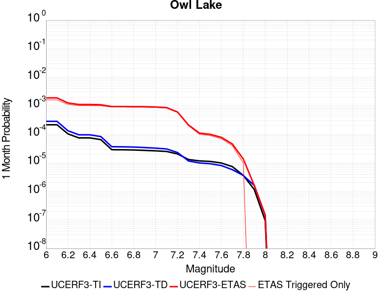 |  |  |

| Magnitude | 1 wk TI Prob | 1 wk TD Prob | 1 wk ETAS Prob | 1 wk ETAS/TD Gain | 1 wk ETAS Triggered Only | 1 mo TI Prob | 1 mo TD Prob | 1 mo ETAS Prob | 1 mo ETAS/TD Gain | 1 mo ETAS Triggered Only | 1 yr TI Prob | 1 yr TD Prob | 1 yr ETAS Prob | 1 yr ETAS/TD Gain | 1 yr ETAS Triggered Only | 10 yr TI Prob | 10 yr TD Prob | 10 yr ETAS Prob | 10 yr ETAS/TD Gain | 10 yr ETAS Triggered Only |
|-----|-----|-----|-----|-----|-----|-----|-----|-----|-----|-----|-----|-----|-----|-----|-----|-----|-----|-----|-----|-----|
| 6.0 | 5.0320643E-5 | 6.637151E-5 | 4.2634763E-4 | 6.423654 | 3.6E-4 | 2.1564208E-4 | 2.844246E-4 | 0.0018839695 | 6.623792 | 0.0016 | 0.0026222812 | 0.0034584238 | 0.010454145 | 3.0228064 | 0.00702 | 0.02591553 | 0.034147043 | 0.048586547 | 1.4228624 | 0.01495 |
| 6.1 | 5.0320643E-5 | 6.637151E-5 | 4.2634763E-4 | 6.423654 | 3.6E-4 | 2.1564208E-4 | 2.844246E-4 | 0.0018839695 | 6.623792 | 0.0016 | 0.0026222812 | 0.0034584238 | 0.010454145 | 3.0228064 | 0.00702 | 0.02591553 | 0.034147043 | 0.048586547 | 1.4228624 | 0.01495 |
| 6.2 | 2.4125871E-5 | 3.098766E-5 | 3.2097867E-4 | 10.358274 | 2.9E-4 | 1.0339249E-4 | 1.3279865E-4 | 0.0012526499 | 9.4327 | 0.00112 | 0.0012580766 | 0.0016157742 | 0.0068473076 | 4.2377872 | 0.00524 | 0.012509781 | 0.016073797 | 0.026857628 | 1.6708951 | 0.01096 |
| 6.3 | 1.7433485E-5 | 2.2360802E-5 | 2.82355E-4 | 12.62723 | 2.6E-4 | 7.471279E-5 | 9.582938E-5 | 0.0011057326 | 11.538555 | 0.00101 | 9.0924866E-4 | 0.0011662478 | 0.00584079 | 5.008189 | 0.00468 | 0.009055373 | 0.01163159 | 0.020981556 | 1.8038424 | 0.00946 |
| 6.4 | 1.7433485E-5 | 2.2360802E-5 | 2.82355E-4 | 12.62723 | 2.6E-4 | 7.471279E-5 | 9.582938E-5 | 0.0011057326 | 11.538555 | 0.00101 | 9.0924866E-4 | 0.0011662478 | 0.00584079 | 5.008189 | 0.00468 | 0.009055373 | 0.01163159 | 0.020981556 | 1.8038424 | 0.00946 |
| 6.5 | 1.5182742E-5 | 1.9433977E-5 | 2.6942912E-4 | 13.863818 | 2.5E-4 | 6.506727E-5 | 8.3286664E-5 | 0.0010832034 | 13.005724 | 0.001 | 7.919061E-4 | 0.0010136948 | 0.005509133 | 5.434706 | 0.0045 | 0.0078909 | 0.0101209 | 0.019029813 | 1.8802489 | 0.009 |
| 6.6 | 6.7271576E-6 | 8.550545E-6 | 2.3854859E-4 | 27.89864 | 2.3E-4 | 2.8830356E-5 | 3.6644713E-5 | 9.3661173E-4 | 25.559261 | 9.0E-4 | 3.5095305E-4 | 4.460637E-4 | 0.003934507 | 8.820505 | 0.00349 | 0.0035039932 | 0.0044694655 | 0.011129565 | 2.4901333 | 0.00669 |
| 6.7 | 6.682835E-6 | 8.482986E-6 | 2.3848104E-4 | 28.112864 | 2.3E-4 | 2.8640408E-5 | 3.635518E-5 | 9.3632244E-4 | 25.754856 | 9.0E-4 | 3.4864116E-4 | 4.4254007E-4 | 0.0039309957 | 8.882801 | 0.00349 | 0.003480947 | 0.004434389 | 0.011094723 | 2.5019732 | 0.00669 |
| 6.8 | 6.5774975E-6 | 8.329444E-6 | 2.3832753E-4 | 28.612656 | 2.3E-4 | 2.8188972E-5 | 3.569716E-5 | 9.256654E-4 | 25.931063 | 8.9E-4 | 3.4314668E-4 | 4.3453192E-4 | 0.00391302 | 9.005137 | 0.00348 | 0.0034261728 | 0.004354527 | 0.010985526 | 2.5227826 | 0.00666 |
| 6.9 | 6.363419E-6 | 8.002579E-6 | 2.3800074E-4 | 29.740503 | 2.3E-4 | 2.727151E-5 | 3.429635E-5 | 9.242658E-4 | 26.949394 | 8.9E-4 | 3.3198006E-4 | 4.1748365E-4 | 0.003876039 | 9.28429 | 0.00346 | 0.0033148455 | 0.0041844994 | 0.010786756 | 2.577789 | 0.00663 |
| 7.0 | 6.1342453E-6 | 7.63473E-6 | 2.2763305E-4 | 29.81547 | 2.2E-4 | 2.6289357E-5 | 3.271989E-5 | 9.0269145E-4 | 27.58846 | 8.7E-4 | 3.2002592E-4 | 3.9829736E-4 | 0.003786947 | 9.507839 | 0.00339 | 0.0031956544 | 0.0039931675 | 0.010507052 | 2.6312575 | 0.00654 |
| 7.1 | 5.842926E-6 | 7.14521E-6 | 2.1714371E-4 | 30.390108 | 2.1E-4 | 2.504087E-5 | 3.0622E-5 | 8.605966E-4 | 28.103867 | 8.3E-4 | 3.0482994E-4 | 3.7276448E-4 | 0.0036315492 | 9.7422085 | 0.00326 | 0.0030441214 | 0.0037385917 | 0.010005076 | 2.6761618 | 0.00629 |
| 7.2 | 4.77173E-6 | 5.361204E-6 | 1.753603E-4 | 32.709126 | 1.7E-4 | 2.045011E-5 | 2.297641E-5 | 6.029631E-4 | 26.242702 | 5.8E-4 | 2.4895166E-4 | 2.7970594E-4 | 0.002599057 | 9.292106 | 0.00232 | 0.0024867293 | 0.0028100624 | 0.007197698 | 2.5614016 | 0.0044 |
| 7.3 | 3.0494948E-6 | 2.7124704E-6 | 7.271228E-5 | 26.806664 | 7.0E-5 | 1.3069198E-5 | 1.1624823E-5 | 2.116225E-4 | 18.204363 | 2.0E-4 | 1.5910587E-4 | 1.4152318E-4 | 7.314397E-4 | 5.1683383 | 5.9E-4 | 0.0015899199 | 0.0014242887 | 0.0026625225 | 1.86937 | 0.00124 |
| 7.4 | 2.7263884E-6 | 2.3075613E-6 | 5.2307445E-5 | 22.667847 | 5.0E-5 | 1.1684469E-5 | 9.889511E-6 | 1.0988852E-4 | 11.111623 | 1.0E-4 | 1.4224913E-4 | 1.2039825E-4 | 4.5035852E-4 | 3.7405736 | 3.3E-4 | 0.0014215811 | 0.0012122075 | 0.00200125 | 1.6509136 | 7.9E-4 |
| 7.5 | 2.6090431E-6 | 2.1674637E-6 | 5.2167354E-5 | 24.068388 | 5.0E-5 | 1.1181565E-5 | 9.289097E-6 | 9.928826E-5 | 10.688688 | 9.0E-5 | 1.3612706E-4 | 1.1308899E-4 | 4.0305618E-4 | 3.5640624 | 2.9E-4 | 0.001360437 | 0.0011389464 | 0.0018081833 | 1.587593 | 6.7E-4 |
| 7.6 | 2.3008756E-6 | 1.8745708E-6 | 4.1874497E-5 | 22.338179 | 4.0E-5 | 9.860858E-6 | 8.0338505E-6 | 7.8033285E-5 | 9.713062 | 7.0E-5 | 1.20049335E-4 | 9.7807824E-5 | 3.2778532E-4 | 3.3513203 | 2.3E-4 | 0.001199845 | 9.85921E-4 | 0.0015253886 | 1.5471712 | 5.4E-4 |
| 7.7 | 1.7184348E-6 | 1.343562E-6 | 2.1343536E-5 | 15.885783 | 2.0E-5 | 7.3646997E-6 | 5.7581105E-6 | 4.575788E-5 | 7.9466834 | 4.0E-5 | 8.966153E-5 | 7.010278E-5 | 1.8009507E-4 | 2.5690145 | 1.1E-4 | 8.962536E-4 | 7.086945E-4 | 0.0010284678 | 1.4512144 | 3.2E-4 |
| 7.8 | 8.4612907E-7 | 8.4176E-7 | 8.4176E-7 | 1.0 | 0.0 | 3.6262625E-6 | 3.607538E-6 | 1.3607502E-5 | 3.7719636 | 1.0E-5 | 4.4148852E-5 | 4.392091E-5 | 8.3919156E-5 | 1.9106879 | 4.0E-5 | 4.414008E-4 | 4.4459777E-4 | 6.045266E-4 | 1.3597158 | 1.6E-4 |
| 7.9 | 2.716738E-7 | 3.7732943E-7 | 3.7732943E-7 | 1.0 | 0.0 | 1.1643157E-6 | 1.6171252E-6 | 1.6171252E-6 | 1.0 | 0.0 | 1.4175452E-5 | 1.9688332E-5 | 2.9688135E-5 | 1.507905 | 1.0E-5 | 1.4174548E-4 | 1.9863734E-4 | 2.6862344E-4 | 1.352331 | 7.0E-5 |
| 8.0 | 2.1995428E-8 | 3.389418E-8 | 3.389418E-8 | 1.0 | 0.0 | 9.426611E-8 | 1.4526077E-7 | 1.4526077E-7 | 1.0 | 0.0 | 1.1476893E-6 | 1.768549E-6 | 1.768549E-6 | 1.0 | 0.0 | 1.14768345E-5 | 1.798665E-5 | 3.798629E-5 | 2.1119158 | 2.0E-5 |

## Airport Lake
*[(top)](#table-of-contents)*

| 1 Week | 1 Month | 1 Year | 10 Year |
|-----|-----|-----|-----|
|  |  |  |  |

| Magnitude | 1 wk TI Prob | 1 wk TD Prob | 1 wk ETAS Prob | 1 wk ETAS/TD Gain | 1 wk ETAS Triggered Only | 1 mo TI Prob | 1 mo TD Prob | 1 mo ETAS Prob | 1 mo ETAS/TD Gain | 1 mo ETAS Triggered Only | 1 yr TI Prob | 1 yr TD Prob | 1 yr ETAS Prob | 1 yr ETAS/TD Gain | 1 yr ETAS Triggered Only | 10 yr TI Prob | 10 yr TD Prob | 10 yr ETAS Prob | 10 yr ETAS/TD Gain | 10 yr ETAS Triggered Only |
|-----|-----|-----|-----|-----|-----|-----|-----|-----|-----|-----|-----|-----|-----|-----|-----|-----|-----|-----|-----|-----|
| 6.0 | 1.2387061E-5 | 1.3103559E-5 | 6.830948E-4 | 52.130478 | 6.7E-4 | 5.3086325E-5 | 5.615706E-5 | 0.0021460396 | 38.21496 | 0.00209 | 6.461343E-4 | 6.8352616E-4 | 0.008468201 | 12.388994 | 0.00779 | 0.0064425888 | 0.006817048 | 0.020662019 | 3.0309334 | 0.01394 |
| 6.1 | 1.2387061E-5 | 1.3103559E-5 | 6.830948E-4 | 52.130478 | 6.7E-4 | 5.3086325E-5 | 5.615706E-5 | 0.0021460396 | 38.21496 | 0.00209 | 6.461343E-4 | 6.8352616E-4 | 0.008468201 | 12.388994 | 0.00779 | 0.0064425888 | 0.006817048 | 0.020662019 | 3.0309334 | 0.01394 |
| 6.2 | 1.2387061E-5 | 1.3103559E-5 | 6.830948E-4 | 52.130478 | 6.7E-4 | 5.3086325E-5 | 5.615706E-5 | 0.0021460396 | 38.21496 | 0.00209 | 6.461343E-4 | 6.8352616E-4 | 0.008468201 | 12.388994 | 0.00779 | 0.0064425888 | 0.006817048 | 0.020662019 | 3.0309334 | 0.01394 |
| 6.3 | 1.2387061E-5 | 1.3103559E-5 | 6.830948E-4 | 52.130478 | 6.7E-4 | 5.3086325E-5 | 5.615706E-5 | 0.0021460396 | 38.21496 | 0.00209 | 6.461343E-4 | 6.8352616E-4 | 0.008468201 | 12.388994 | 0.00779 | 0.0064425888 | 0.006817048 | 0.020662019 | 3.0309334 | 0.01394 |
| 6.4 | 1.2387061E-5 | 1.3103559E-5 | 6.830948E-4 | 52.130478 | 6.7E-4 | 5.3086325E-5 | 5.615706E-5 | 0.0021460396 | 38.21496 | 0.00209 | 6.461343E-4 | 6.8352616E-4 | 0.008468201 | 12.388994 | 0.00779 | 0.0064425888 | 0.006817048 | 0.020662019 | 3.0309334 | 0.01394 |
| 6.5 | 6.9922594E-6 | 7.385145E-6 | 4.5738183E-4 | 61.93268 | 4.5E-4 | 2.996648E-5 | 3.165027E-5 | 0.0015316028 | 48.39146 | 0.0015 | 3.6478083E-4 | 3.8527933E-4 | 0.006193041 | 16.074158 | 0.00581 | 0.003641826 | 0.003846651 | 0.0143361455 | 3.726916 | 0.01053 |
| 6.6 | 6.9922594E-6 | 7.385145E-6 | 4.5738183E-4 | 61.93268 | 4.5E-4 | 2.996648E-5 | 3.165027E-5 | 0.0015316028 | 48.39146 | 0.0015 | 3.6478083E-4 | 3.8527933E-4 | 0.006193041 | 16.074158 | 0.00581 | 0.003641826 | 0.003846651 | 0.0143361455 | 3.726916 | 0.01053 |
| 6.7 | 5.477277E-6 | 5.7862417E-6 | 3.9578398E-4 | 68.40088 | 3.9E-4 | 2.3473833E-5 | 2.4797964E-5 | 0.0013447652 | 54.228855 | 0.00132 | 2.8575645E-4 | 3.0187727E-4 | 0.005270377 | 17.458673 | 0.00497 | 0.0028538927 | 0.003015056 | 0.01204774 | 3.9958594 | 0.00906 |
| 6.8 | 3.9950432E-6 | 4.2192128E-6 | 3.4421778E-4 | 81.58341 | 3.4E-4 | 1.7121502E-5 | 1.808223E-5 | 0.0010680632 | 59.06701 | 0.00105 | 2.0843433E-4 | 2.2013167E-4 | 0.004029293 | 18.304014 | 0.00381 | 0.0020823893 | 0.0021994072 | 0.009203968 | 4.184749 | 0.00702 |
| 6.9 | 2.95695E-6 | 3.1231173E-6 | 2.5312233E-4 | 81.04797 | 2.5E-4 | 1.2672582E-5 | 1.33847325E-5 | 7.533748E-4 | 56.286133 | 7.4E-4 | 1.5427776E-4 | 1.629492E-4 | 0.0027625256 | 16.953293 | 0.0026 | 0.001541707 | 0.0016285196 | 0.00652054 | 4.003968 | 0.0049 |
| 7.0 | 1.456072E-6 | 1.5408596E-6 | 1.21540674E-4 | 78.87849 | 1.2E-4 | 6.2402937E-6 | 6.603673E-6 | 3.2660156E-4 | 49.45756 | 3.2E-4 | 7.597293E-5 | 8.039776E-5 | 0.0011403125 | 14.183387 | 0.00106 | 7.594696E-4 | 8.0378563E-4 | 0.0028721218 | 3.5732436 | 0.00207 |
| 7.1 | 6.995192E-7 | 7.409207E-7 | 3.07409E-5 | 41.490135 | 3.0E-5 | 2.997936E-6 | 3.1753743E-6 | 1.0317506E-4 | 32.49225 | 1.0E-4 | 3.649926E-5 | 3.8660182E-5 | 4.5864395E-4 | 11.863471 | 4.2E-4 | 3.6493264E-4 | 3.8660184E-4 | 0.0012562654 | 3.2495074 | 8.7E-4 |

## Panamint Valley
*[(top)](#table-of-contents)*

| 1 Week | 1 Month | 1 Year | 10 Year |
|-----|-----|-----|-----|
| 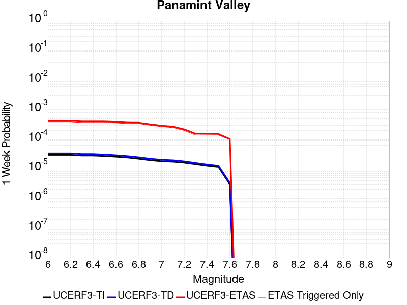 |  | 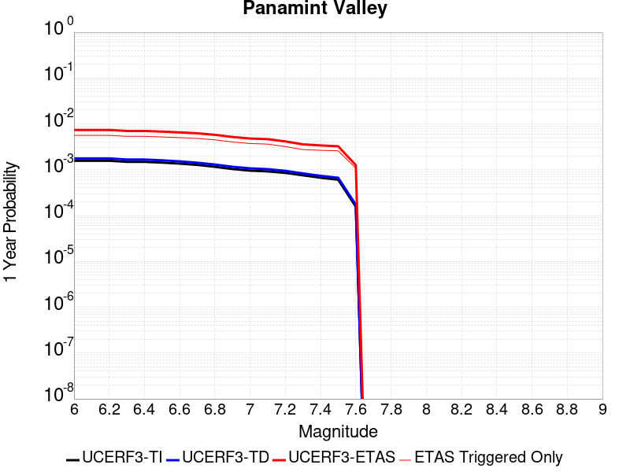 |  |

| Magnitude | 1 wk TI Prob | 1 wk TD Prob | 1 wk ETAS Prob | 1 wk ETAS/TD Gain | 1 wk ETAS Triggered Only | 1 mo TI Prob | 1 mo TD Prob | 1 mo ETAS Prob | 1 mo ETAS/TD Gain | 1 mo ETAS Triggered Only | 1 yr TI Prob | 1 yr TD Prob | 1 yr ETAS Prob | 1 yr ETAS/TD Gain | 1 yr ETAS Triggered Only | 10 yr TI Prob | 10 yr TD Prob | 10 yr ETAS Prob | 10 yr ETAS/TD Gain | 10 yr ETAS Triggered Only |
|-----|-----|-----|-----|-----|-----|-----|-----|-----|-----|-----|-----|-----|-----|-----|-----|-----|-----|-----|-----|-----|
| 6.0 | 3.0211835E-5 | 3.39879E-5 | 4.2397465E-4 | 12.474281 | 3.9E-4 | 1.2947287E-4 | 1.4565447E-4 | 0.001515455 | 10.404452 | 0.00137 | 0.0015751923 | 0.0017719301 | 0.0073919543 | 4.171696 | 0.00563 | 0.015640736 | 0.017584875 | 0.029393503 | 1.671522 | 0.01202 |
| 6.1 | 3.0211835E-5 | 3.39879E-5 | 4.2397465E-4 | 12.474281 | 3.9E-4 | 1.2947287E-4 | 1.4565447E-4 | 0.001515455 | 10.404452 | 0.00137 | 0.0015751923 | 0.0017719301 | 0.0073919543 | 4.171696 | 0.00563 | 0.015640736 | 0.017584875 | 0.029393503 | 1.671522 | 0.01202 |
| 6.2 | 3.0211835E-5 | 3.39879E-5 | 4.2397465E-4 | 12.474281 | 3.9E-4 | 1.2947287E-4 | 1.4565447E-4 | 0.001515455 | 10.404452 | 0.00137 | 0.0015751923 | 0.0017719301 | 0.0073919543 | 4.171696 | 0.00563 | 0.015640736 | 0.017584875 | 0.029393503 | 1.671522 | 0.01202 |
| 6.3 | 2.8573924E-5 | 3.210589E-5 | 4.02094E-4 | 12.523994 | 3.7E-4 | 1.2245393E-4 | 1.3758958E-4 | 0.0014474094 | 10.51976 | 0.00131 | 0.001489857 | 0.0016738938 | 0.007034905 | 4.2027187 | 0.00537 | 0.01479908 | 0.01661945 | 0.027770985 | 1.6709931 | 0.01134 |
| 6.4 | 2.8573924E-5 | 3.210589E-5 | 4.02094E-4 | 12.523994 | 3.7E-4 | 1.2245393E-4 | 1.3758958E-4 | 0.0014474094 | 10.51976 | 0.00131 | 0.001489857 | 0.0016738938 | 0.007034905 | 4.2027187 | 0.00537 | 0.01479908 | 0.01661945 | 0.027770985 | 1.6709931 | 0.01134 |
| 6.5 | 2.7468774E-5 | 3.0831525E-5 | 4.008201E-4 | 13.000334 | 3.7E-4 | 1.1771801E-4 | 1.3212857E-4 | 0.0014019607 | 10.61058 | 0.00127 | 0.0014322745 | 0.0016075056 | 0.0068091303 | 4.235836 | 0.00521 | 0.014230782 | 0.015965264 | 0.026858527 | 1.6823103 | 0.01107 |
| 6.6 | 2.6135967E-5 | 2.9255436E-5 | 3.892449E-4 | 13.305045 | 3.6E-4 | 1.1200648E-4 | 1.2537456E-4 | 0.0013552203 | 10.809373 | 0.00123 | 0.0013628257 | 0.001525393 | 0.0065377355 | 4.2859354 | 0.00502 | 0.013544982 | 0.015155562 | 0.0256737 | 1.6940118 | 0.01068 |
| 6.7 | 2.4498746E-5 | 2.7344193E-5 | 3.673349E-4 | 13.433744 | 3.4E-4 | 1.04990395E-4 | 1.17184274E-4 | 0.0012770484 | 10.897779 | 0.00116 | 0.0012775084 | 0.0014258098 | 0.006248923 | 4.3827186 | 0.00483 | 0.012701893 | 0.014172745 | 0.024257759 | 1.711578 | 0.01023 |
| 6.8 | 2.2244329E-5 | 2.4938103E-5 | 3.649296E-4 | 14.633416 | 3.4E-4 | 9.532935E-5 | 1.06873325E-4 | 0.0012367526 | 11.572135 | 0.00113 | 0.0011600169 | 0.0013004278 | 0.005794576 | 4.4558997 | 0.0045 | 0.011539802 | 0.012933899 | 0.022271544 | 1.7219514 | 0.00946 |
| 6.9 | 1.9902658E-5 | 2.2292743E-5 | 3.2228607E-4 | 14.456994 | 3.0E-4 | 8.529431E-5 | 9.553693E-5 | 0.0011254385 | 11.780141 | 0.00103 | 0.0010379635 | 0.00116256 | 0.005197863 | 4.4710493 | 0.00404 | 0.010331288 | 0.011569886 | 0.019773856 | 1.7090796 | 0.0083 |
| 7.0 | 1.8353881E-5 | 2.0568525E-5 | 2.9056298E-4 | 14.126583 | 2.7E-4 | 7.865712E-5 | 8.814794E-5 | 0.001018066 | 11.549515 | 9.3E-4 | 9.5722964E-4 | 0.0010726905 | 0.0048086788 | 4.48282 | 0.00374 | 0.009531168 | 0.010680057 | 0.018149422 | 1.699375 | 0.00755 |
| 7.1 | 1.7667631E-5 | 1.9774876E-5 | 2.6976992E-4 | 13.642055 | 2.5E-4 | 7.571623E-5 | 8.474681E-5 | 9.546731E-4 | 11.265003 | 8.7E-4 | 9.2145515E-4 | 0.0010313216 | 0.0046575777 | 4.5161257 | 0.00363 | 0.009176437 | 0.010270242 | 0.017505167 | 1.7044551 | 0.00731 |
| 7.2 | 1.6381597E-5 | 1.8160366E-5 | 2.1815674E-4 | 12.012794 | 2.0E-4 | 7.020495E-5 | 7.782792E-5 | 8.277696E-4 | 10.635895 | 7.5E-4 | 8.544101E-4 | 9.471603E-4 | 0.00415412 | 4.385868 | 0.00321 | 0.008511325 | 0.0094358865 | 0.01579531 | 1.6739612 | 0.00642 |
| 7.3 | 1.4520491E-5 | 1.5968182E-5 | 1.5596594E-4 | 9.767295 | 1.4E-4 | 6.222919E-5 | 6.8433365E-5 | 6.9839024E-4 | 10.205406 | 6.3E-4 | 7.57377E-4 | 8.328739E-4 | 0.0035905752 | 4.311067 | 0.00276 | 0.0075480095 | 0.008300635 | 0.013606227 | 1.639179 | 0.00535 |
| 7.4 | 1.2852287E-5 | 1.4146948E-5 | 1.5414497E-4 | 10.8959875 | 1.4E-4 | 5.5080065E-5 | 6.0628456E-5 | 6.9059024E-4 | 11.39053 | 6.3E-4 | 6.7039346E-4 | 7.379173E-4 | 0.0033959544 | 4.60208 | 0.00266 | 0.0066837464 | 0.0073575918 | 0.0124101415 | 1.6867124 | 0.00509 |
| 7.5 | 1.1637851E-5 | 1.2838205E-5 | 1.5283641E-4 | 11.904811 | 1.4E-4 | 4.987555E-5 | 5.5019806E-5 | 6.5498677E-4 | 11.904564 | 6.0E-4 | 6.070656E-4 | 6.6967594E-4 | 0.0032579415 | 4.864952 | 0.00259 | 0.006054099 | 0.006679477 | 0.01161628 | 1.7391002 | 0.00497 |
| 7.6 | 3.0068115E-6 | 3.3335807E-6 | 1.03333245E-4 | 30.997675 | 1.0E-4 | 1.2886271E-5 | 1.4286737E-5 | 2.6428315E-4 | 18.498497 | 2.5E-4 | 1.5687906E-4 | 1.7393442E-4 | 0.0012637448 | 7.26564 | 0.00109 | 0.0015676835 | 0.0017394236 | 0.003955562 | 2.2740648 | 0.00222 |

## Garlock (East)
*[(top)](#table-of-contents)*

| 1 Week | 1 Month | 1 Year | 10 Year |
|-----|-----|-----|-----|
|  |  | 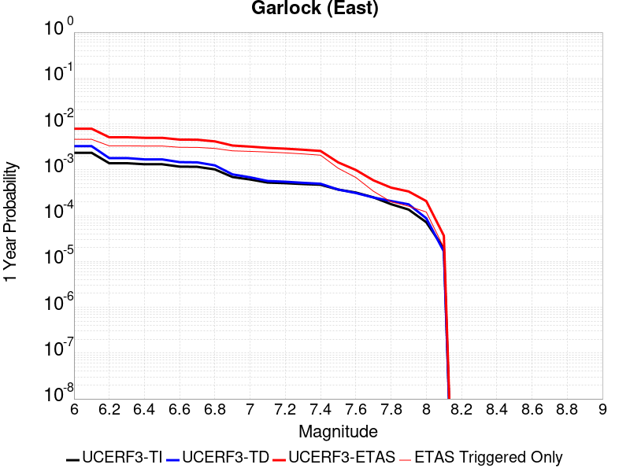 | 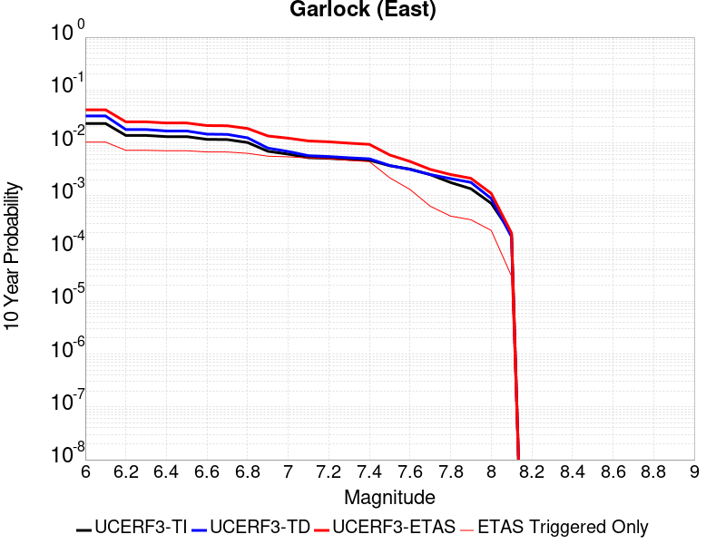 |

| Magnitude | 1 wk TI Prob | 1 wk TD Prob | 1 wk ETAS Prob | 1 wk ETAS/TD Gain | 1 wk ETAS Triggered Only | 1 mo TI Prob | 1 mo TD Prob | 1 mo ETAS Prob | 1 mo ETAS/TD Gain | 1 mo ETAS Triggered Only | 1 yr TI Prob | 1 yr TD Prob | 1 yr ETAS Prob | 1 yr ETAS/TD Gain | 1 yr ETAS Triggered Only | 10 yr TI Prob | 10 yr TD Prob | 10 yr ETAS Prob | 10 yr ETAS/TD Gain | 10 yr ETAS Triggered Only |
|-----|-----|-----|-----|-----|-----|-----|-----|-----|-----|-----|-----|-----|-----|-----|-----|-----|-----|-----|-----|-----|
| 6.0 | 4.5092507E-5 | 6.2917425E-5 | 2.9290296E-4 | 4.655355 | 2.3E-4 | 1.9323928E-4 | 2.6962077E-4 | 0.0011793755 | 4.3742013 | 9.1E-4 | 0.0023501497 | 0.0032781374 | 0.007882993 | 2.404717 | 0.00462 | 0.023254504 | 0.03235903 | 0.042364437 | 1.3091998 | 0.01034 |
| 6.1 | 4.5092507E-5 | 6.2917425E-5 | 2.9290296E-4 | 4.655355 | 2.3E-4 | 1.9323928E-4 | 2.6962077E-4 | 0.0011793755 | 4.3742013 | 9.1E-4 | 0.0023501497 | 0.0032781374 | 0.007882993 | 2.404717 | 0.00462 | 0.023254504 | 0.03235903 | 0.042364437 | 1.3091998 | 0.01034 |
| 6.2 | 2.6674514E-5 | 3.452091E-5 | 2.0451503E-4 | 5.9243817 | 1.7E-4 | 1.1431433E-4 | 1.4793854E-4 | 8.078409E-4 | 5.460652 | 6.6E-4 | 0.0013908884 | 0.0017996968 | 0.0051237037 | 2.8469818 | 0.00333 | 0.01382215 | 0.017896036 | 0.024996648 | 1.3967701 | 0.00723 |
| 6.3 | 2.6674514E-5 | 3.452091E-5 | 2.0451503E-4 | 5.9243817 | 1.7E-4 | 1.1431433E-4 | 1.4793854E-4 | 8.078409E-4 | 5.460652 | 6.6E-4 | 0.0013908884 | 0.0017996968 | 0.0051237037 | 2.8469818 | 0.00333 | 0.01382215 | 0.017896036 | 0.024996648 | 1.3967701 | 0.00723 |
| 6.4 | 2.5312667E-5 | 3.234991E-5 | 2.0234441E-4 | 6.2548676 | 1.7E-4 | 1.0847834E-4 | 1.3863528E-4 | 7.985438E-4 | 5.760033 | 6.6E-4 | 0.0013199237 | 0.0016866071 | 0.0049810414 | 2.953291 | 0.0033 | 0.013121112 | 0.016783953 | 0.023754954 | 1.4153373 | 0.00709 |
| 6.5 | 2.5312667E-5 | 3.234991E-5 | 2.0234441E-4 | 6.2548676 | 1.7E-4 | 1.0847834E-4 | 1.3863528E-4 | 7.985438E-4 | 5.760033 | 6.6E-4 | 0.0013199237 | 0.0016866071 | 0.0049810414 | 2.953291 | 0.0033 | 0.013121112 | 0.016783953 | 0.023754954 | 1.4153373 | 0.00709 |
| 6.6 | 2.246556E-5 | 2.8144346E-5 | 1.9813956E-4 | 7.040119 | 1.7E-4 | 9.627742E-5 | 1.20613186E-4 | 7.705348E-4 | 6.3884788 | 6.5E-4 | 0.0011715472 | 0.0014674999 | 0.0045529655 | 3.102532 | 0.00309 | 0.011653901 | 0.0146240825 | 0.02124581 | 1.452796 | 0.00672 |
| 6.7 | 2.2241198E-5 | 2.781406E-5 | 1.9780934E-4 | 7.111847 | 1.7E-4 | 9.531594E-5 | 1.1919779E-4 | 7.691203E-4 | 6.452471 | 6.5E-4 | 0.0011598538 | 0.0014502906 | 0.0045258235 | 3.1206324 | 0.00308 | 0.011538187 | 0.014454261 | 0.021057418 | 1.4568311 | 0.0067 |
| 6.8 | 1.9528685E-5 | 2.3908038E-5 | 1.8390421E-4 | 7.6921496 | 1.6E-4 | 8.369167E-5 | 1.0245911E-4 | 7.1239664E-4 | 6.952985 | 6.1E-4 | 0.0010184698 | 0.0012467455 | 0.004163105 | 3.3391778 | 0.00292 | 0.010138147 | 0.012441495 | 0.018702617 | 1.503245 | 0.00634 |
| 6.9 | 1.3318621E-5 | 1.5207374E-5 | 1.652051E-4 | 10.863485 | 1.5E-4 | 5.7078556E-5 | 6.517287E-5 | 6.2513637E-4 | 9.591972 | 5.6E-4 | 6.9470983E-4 | 7.931965E-4 | 0.0033811422 | 4.262679 | 0.00259 | 0.0069254204 | 0.007944281 | 0.013489872 | 1.6980609 | 0.00559 |
| 7.0 | 1.1760853E-5 | 1.3115987E-5 | 1.5311415E-4 | 11.673857 | 1.4E-4 | 5.0402683E-5 | 5.621019E-5 | 6.061793E-4 | 10.784153 | 5.5E-4 | 6.134799E-4 | 6.841492E-4 | 0.003202425 | 4.680887 | 0.00252 | 0.0061178906 | 0.006860767 | 0.012263444 | 1.7874743 | 0.00544 |
| 7.1 | 1.0064758E-5 | 1.0910848E-5 | 1.4090943E-4 | 12.914618 | 1.3E-4 | 4.3133965E-5 | 4.675996E-5 | 5.767352E-4 | 12.333954 | 5.3E-4 | 5.2502943E-4 | 5.691573E-4 | 0.0030077687 | 5.2846 | 0.00244 | 0.005237907 | 0.005717105 | 0.01086749 | 1.900873 | 0.00518 |
| 7.2 | 9.768808E-6 | 1.0506669E-5 | 1.20505516E-4 | 11.46943 | 1.1E-4 | 4.186565E-5 | 4.5027828E-5 | 5.5500487E-4 | 12.32582 | 5.1E-4 | 5.095951E-4 | 5.480794E-4 | 0.0028867968 | 5.2671146 | 0.00234 | 0.0050842804 | 0.0055073434 | 0.010459917 | 1.8992672 | 0.00498 |
| 7.3 | 9.344516E-6 | 9.95218E-6 | 1.0995119E-4 | 11.047949 | 1.0E-4 | 4.004731E-5 | 4.2651525E-5 | 5.426302E-4 | 12.72241 | 5.0E-4 | 4.8746695E-4 | 5.1916204E-4 | 0.0027380094 | 5.2739015 | 0.00222 | 0.0048639905 | 0.0052189473 | 0.009864575 | 1.8901465 | 0.00467 |
| 7.4 | 9.023491E-6 | 9.498219E-6 | 9.949737E-5 | 10.47537 | 9.0E-5 | 3.867153E-5 | 4.0706036E-5 | 5.106869E-4 | 12.54573 | 4.7E-4 | 4.7072413E-4 | 4.9548666E-4 | 0.002574456 | 5.195813 | 0.00208 | 0.004697283 | 0.004982321 | 0.009360399 | 1.8787225 | 0.0044 |
| 7.5 | 7.081253E-6 | 7.0943947E-6 | 7.70939E-5 | 10.866875 | 7.0E-5 | 3.0347876E-5 | 3.0404199E-5 | 3.00396E-4 | 9.880082 | 2.7E-4 | 3.6942272E-4 | 3.70109E-4 | 0.0014497093 | 3.9169793 | 0.00108 | 0.003688092 | 0.00372781 | 0.005899683 | 1.5826137 | 0.00218 |
| 7.6 | 6.116396E-6 | 5.9656345E-6 | 4.5965397E-5 | 7.7050304 | 4.0E-5 | 2.6212863E-5 | 2.5566756E-5 | 1.7556292E-4 | 6.8668437 | 1.5E-4 | 3.1909486E-4 | 3.1123104E-4 | 9.910194E-4 | 3.184192 | 6.8E-4 | 0.0031863707 | 0.0031390795 | 0.0044449675 | 1.4160098 | 0.00131 |
| 7.7 | 4.797145E-6 | 4.763327E-6 | 3.4763183E-5 | 7.298089 | 3.0E-5 | 2.055903E-5 | 2.04141E-5 | 1.3041185E-4 | 6.388323 | 1.1E-4 | 2.5027743E-4 | 2.4851345E-4 | 5.884289E-4 | 2.3677952 | 3.4E-4 | 0.0024999576 | 0.0025124948 | 0.003140912 | 1.2501168 | 6.3E-4 |
| 7.8 | 3.4028885E-6 | 3.9838537E-6 | 2.3983774E-5 | 6.0202446 | 2.0E-5 | 1.4583726E-5 | 1.7073547E-5 | 9.707218E-5 | 5.685531 | 8.0E-5 | 1.775424E-4 | 2.0785068E-4 | 4.0780913E-4 | 1.9620292 | 2.0E-4 | 0.0017740062 | 0.0021040295 | 0.0025131667 | 1.1944542 | 4.1E-4 |
| 7.9 | 2.5928412E-6 | 3.3770064E-6 | 2.3376939E-5 | 6.922385 | 2.0E-5 | 1.1112129E-5 | 1.4472805E-5 | 8.4471794E-5 | 5.8365874 | 7.0E-5 | 1.3528178E-4 | 1.7619222E-4 | 3.3616403E-4 | 1.9079392 | 1.6E-4 | 0.0013519945 | 0.0017836117 | 0.0021329874 | 1.195881 | 3.5E-4 |
| 8.0 | 1.3743648E-6 | 1.6755408E-6 | 1.1675524E-5 | 6.968212 | 1.0E-5 | 5.8901214E-6 | 7.1808695E-6 | 6.718044E-5 | 9.355474 | 6.0E-5 | 7.1709874E-5 | 8.742361E-5 | 2.0741312E-4 | 2.3725069 | 1.2E-4 | 7.1686733E-4 | 8.847989E-4 | 0.0011046042 | 1.248424 | 2.2E-4 |
| 8.1 | 3.6733252E-7 | 3.1526864E-7 | 3.1526864E-7 | 1.0 | 0.0 | 1.5742813E-6 | 1.3511507E-6 | 1.3511507E-6 | 1.0 | 0.0 | 1.9166706E-5 | 1.645015E-5 | 3.6449823E-5 | 2.2157743 | 2.0E-5 | 1.9165053E-4 | 1.6658098E-4 | 1.9657599E-4 | 1.1800625 | 3.0E-5 |

## Ash Hill
*[(top)](#table-of-contents)*

| 1 Week | 1 Month | 1 Year | 10 Year |
|-----|-----|-----|-----|
|  |  | 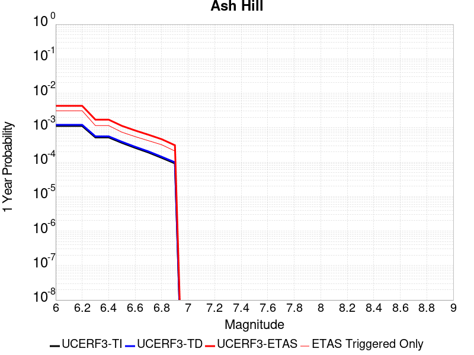 |  |

| Magnitude | 1 wk TI Prob | 1 wk TD Prob | 1 wk ETAS Prob | 1 wk ETAS/TD Gain | 1 wk ETAS Triggered Only | 1 mo TI Prob | 1 mo TD Prob | 1 mo ETAS Prob | 1 mo ETAS/TD Gain | 1 mo ETAS Triggered Only | 1 yr TI Prob | 1 yr TD Prob | 1 yr ETAS Prob | 1 yr ETAS/TD Gain | 1 yr ETAS Triggered Only | 10 yr TI Prob | 10 yr TD Prob | 10 yr ETAS Prob | 10 yr ETAS/TD Gain | 10 yr ETAS Triggered Only |
|-----|-----|-----|-----|-----|-----|-----|-----|-----|-----|-----|-----|-----|-----|-----|-----|-----|-----|-----|-----|-----|
| 6.0 | 2.1545662E-5 | 2.3195389E-5 | 2.4319028E-4 | 10.484424 | 2.2E-4 | 9.2335285E-5 | 9.940547E-5 | 8.5932994E-4 | 8.644694 | 7.6E-4 | 0.0011236023 | 0.0012096697 | 0.0043059196 | 3.559583 | 0.0031 | 0.011179381 | 0.012038835 | 0.018085157 | 1.5022348 | 0.00612 |
| 6.1 | 2.1545662E-5 | 2.3195389E-5 | 2.4319028E-4 | 10.484424 | 2.2E-4 | 9.2335285E-5 | 9.940547E-5 | 8.5932994E-4 | 8.644694 | 7.6E-4 | 0.0011236023 | 0.0012096697 | 0.0043059196 | 3.559583 | 0.0031 | 0.011179381 | 0.012038835 | 0.018085157 | 1.5022348 | 0.00612 |
| 6.2 | 2.1545662E-5 | 2.3195389E-5 | 2.4319028E-4 | 10.484424 | 2.2E-4 | 9.2335285E-5 | 9.940547E-5 | 8.5932994E-4 | 8.644694 | 7.6E-4 | 0.0011236023 | 0.0012096697 | 0.0043059196 | 3.559583 | 0.0031 | 0.011179381 | 0.012038835 | 0.018085157 | 1.5022348 | 0.00612 |
| 6.3 | 1.0025529E-5 | 1.0747344E-5 | 8.074659E-5 | 7.513167 | 7.0E-5 | 4.2965847E-5 | 4.605931E-5 | 2.8604825E-4 | 6.210433 | 2.4E-4 | 5.229836E-4 | 5.6064106E-4 | 0.0017099963 | 3.0500734 | 0.00115 | 0.005217545 | 0.0055935793 | 0.007960266 | 1.4231079 | 0.00238 |
| 6.4 | 1.0025529E-5 | 1.0747344E-5 | 8.074659E-5 | 7.513167 | 7.0E-5 | 4.2965847E-5 | 4.605931E-5 | 2.8604825E-4 | 6.210433 | 2.4E-4 | 5.229836E-4 | 5.6064106E-4 | 0.0017099963 | 3.0500734 | 0.00115 | 0.005217545 | 0.0055935793 | 0.007960266 | 1.4231079 | 0.00238 |
| 6.5 | 6.9617327E-6 | 7.4569152E-6 | 5.7456542E-5 | 7.7051353 | 5.0E-5 | 2.9835655E-5 | 3.1957865E-5 | 2.1195211E-4 | 6.632236 | 1.8E-4 | 3.6318856E-4 | 3.8902622E-4 | 0.0011287384 | 2.9014454 | 7.4E-4 | 0.0036259557 | 0.0038843066 | 0.005488053 | 1.4128784 | 0.00161 |
| 6.6 | 4.9919777E-6 | 5.34689E-6 | 2.5346782E-5 | 4.7404723 | 2.0E-5 | 2.1394015E-5 | 2.291508E-5 | 1.529121E-4 | 6.6729903 | 1.3E-4 | 2.60441E-4 | 2.7896208E-4 | 8.2880864E-4 | 2.9710443 | 5.5E-4 | 0.0026013597 | 0.0027867774 | 0.0039335727 | 1.411513 | 0.00115 |
| 6.7 | 3.6630722E-6 | 3.9247725E-6 | 1.3924733E-5 | 3.5479085 | 1.0E-5 | 1.5698786E-5 | 1.6820377E-5 | 1.2681853E-4 | 7.539577 | 1.1E-4 | 1.9111596E-4 | 2.0477458E-4 | 6.246886E-4 | 3.0506158 | 4.2E-4 | 0.0019095168 | 0.002046422 | 0.0029046622 | 1.4193857 | 8.6E-4 |
| 6.8 | 2.5599613E-6 | 2.7450303E-6 | 1.2745003E-5 | 4.642937 | 1.0E-5 | 1.0971216E-5 | 1.176439E-5 | 8.176357E-5 | 6.9500895 | 7.0E-5 | 1.3356637E-4 | 1.4322698E-4 | 4.6318115E-4 | 3.2338958 | 3.2E-4 | 0.0013348613 | 0.0014318317 | 0.002080901 | 1.453314 | 6.5E-4 |
| 6.9 | 1.7684905E-6 | 1.8969438E-6 | 1.1896925E-5 | 6.2716274 | 1.0E-5 | 7.579223E-6 | 8.129759E-6 | 5.8129353E-5 | 7.1501937 | 5.0E-5 | 9.2273134E-5 | 9.897981E-5 | 3.0895902E-4 | 3.1214347 | 2.1E-4 | 9.223483E-4 | 9.897981E-4 | 0.0014093824 | 1.423909 | 4.2E-4 |

## Blackwater
*[(top)](#table-of-contents)*

| 1 Week | 1 Month | 1 Year | 10 Year |
|-----|-----|-----|-----|
|  |  |  |  |

| Magnitude | 1 wk TI Prob | 1 wk TD Prob | 1 wk ETAS Prob | 1 wk ETAS/TD Gain | 1 wk ETAS Triggered Only | 1 mo TI Prob | 1 mo TD Prob | 1 mo ETAS Prob | 1 mo ETAS/TD Gain | 1 mo ETAS Triggered Only | 1 yr TI Prob | 1 yr TD Prob | 1 yr ETAS Prob | 1 yr ETAS/TD Gain | 1 yr ETAS Triggered Only | 10 yr TI Prob | 10 yr TD Prob | 10 yr ETAS Prob | 10 yr ETAS/TD Gain | 10 yr ETAS Triggered Only |
|-----|-----|-----|-----|-----|-----|-----|-----|-----|-----|-----|-----|-----|-----|-----|-----|-----|-----|-----|-----|-----|
| 6.0 | 3.0708583E-5 | 3.3097214E-5 | 1.9309192E-4 | 5.8340836 | 1.6E-4 | 1.3160157E-4 | 1.4183826E-4 | 7.5175177E-4 | 5.300063 | 6.1E-4 | 0.0016010714 | 0.0017256497 | 0.0041015428 | 2.3768108 | 0.00238 | 0.015895851 | 0.017136335 | 0.02243397 | 1.3091463 | 0.00539 |
| 6.1 | 3.0708583E-5 | 3.3097214E-5 | 1.9309192E-4 | 5.8340836 | 1.6E-4 | 1.3160157E-4 | 1.4183826E-4 | 7.5175177E-4 | 5.300063 | 6.1E-4 | 0.0016010714 | 0.0017256497 | 0.0041015428 | 2.3768108 | 0.00238 | 0.015895851 | 0.017136335 | 0.02243397 | 1.3091463 | 0.00539 |
| 6.2 | 1.1707779E-5 | 1.2545598E-5 | 5.2545096E-5 | 4.188329 | 4.0E-5 | 5.017523E-5 | 5.3765798E-5 | 2.637545E-4 | 4.9056187 | 2.1E-4 | 6.107122E-4 | 6.5441156E-4 | 0.0014339011 | 2.1911304 | 7.8E-4 | 0.006090366 | 0.0065258164 | 0.008234592 | 1.2618486 | 0.00172 |
| 6.3 | 1.1707779E-5 | 1.2545598E-5 | 5.2545096E-5 | 4.188329 | 4.0E-5 | 5.017523E-5 | 5.3765798E-5 | 2.637545E-4 | 4.9056187 | 2.1E-4 | 6.107122E-4 | 6.5441156E-4 | 0.0014339011 | 2.1911304 | 7.8E-4 | 0.006090366 | 0.0065258164 | 0.008234592 | 1.2618486 | 0.00172 |
| 6.4 | 7.929244E-6 | 8.4804105E-6 | 3.8480157E-5 | 4.5375347 | 3.0E-5 | 3.3982033E-5 | 3.6344132E-5 | 1.7633905E-4 | 4.851926 | 1.4E-4 | 4.136527E-4 | 4.4240404E-4 | 9.2219166E-4 | 2.084501 | 4.8E-4 | 0.0041288356 | 0.0044156383 | 0.005470958 | 1.2389959 | 0.00106 |
| 6.5 | 5.8832115E-6 | 6.286219E-6 | 2.6286094E-5 | 4.1815424 | 2.0E-5 | 2.521352E-5 | 2.6940676E-5 | 1.2693799E-4 | 4.7117596 | 1.0E-4 | 3.0693135E-4 | 3.279559E-4 | 6.7784113E-4 | 2.0668666 | 3.5E-4 | 0.0030650778 | 0.0032749726 | 0.004042451 | 1.2343465 | 7.7E-4 |
| 6.6 | 5.8832115E-6 | 6.286219E-6 | 2.6286094E-5 | 4.1815424 | 2.0E-5 | 2.521352E-5 | 2.6940676E-5 | 1.2693799E-4 | 4.7117596 | 1.0E-4 | 3.0693135E-4 | 3.279559E-4 | 6.7784113E-4 | 2.0668666 | 3.5E-4 | 0.0030650778 | 0.0032749726 | 0.004042451 | 1.2343465 | 7.7E-4 |
| 6.7 | 3.0715053E-6 | 3.2815851E-6 | 1.3281552E-5 | 4.047298 | 1.0E-5 | 1.3163528E-5 | 1.4063868E-5 | 7.406302E-5 | 5.266192 | 6.0E-5 | 1.6025416E-4 | 1.7121529E-4 | 3.8117933E-4 | 2.226316 | 2.1E-4 | 0.0016013865 | 0.0017109484 | 0.0021202469 | 1.2392231 | 4.1E-4 |
| 6.8 | 2.2722281E-6 | 2.4288424E-6 | 1.2428818E-5 | 5.1171775 | 1.0E-5 | 9.738084E-6 | 1.0409289E-5 | 6.040877E-5 | 5.8033524 | 5.0E-5 | 1.1855473E-4 | 1.2672663E-4 | 2.9670508E-4 | 2.3413002 | 1.7E-4 | 0.001184915 | 0.0012666339 | 0.0015762412 | 1.2444332 | 3.1E-4 |
| 6.9 | 9.952399E-7 | 1.0653887E-6 | 1.0653887E-6 | 1.0 | 0.0 | 4.265307E-6 | 4.5659463E-6 | 1.45659005E-5 | 3.1901164 | 1.0E-5 | 5.1928873E-5 | 5.5589495E-5 | 1.0558672E-4 | 1.8994005 | 5.0E-5 | 5.191674E-4 | 5.558065E-4 | 6.557509E-4 | 1.1798187 | 1.0E-4 |
| 7.0 | 4.7385504E-7 | 5.075751E-7 | 5.075751E-7 | 1.0 | 0.0 | 2.0308057E-6 | 2.175322E-6 | 2.175322E-6 | 1.0 | 0.0 | 2.4724779E-5 | 2.6484544E-5 | 3.6484278E-5 | 1.3775687 | 1.0E-5 | 2.4722028E-4 | 2.6484544E-4 | 3.148322E-4 | 1.1887394 | 5.0E-5 |

## Hunter Mountain-Saline Valley
*[(top)](#table-of-contents)*

| 1 Week | 1 Month | 1 Year | 10 Year |
|-----|-----|-----|-----|
| 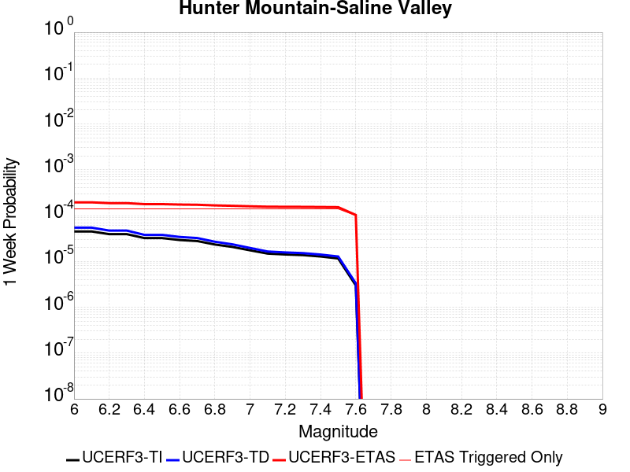 |  |  |  |

| Magnitude | 1 wk TI Prob | 1 wk TD Prob | 1 wk ETAS Prob | 1 wk ETAS/TD Gain | 1 wk ETAS Triggered Only | 1 mo TI Prob | 1 mo TD Prob | 1 mo ETAS Prob | 1 mo ETAS/TD Gain | 1 mo ETAS Triggered Only | 1 yr TI Prob | 1 yr TD Prob | 1 yr ETAS Prob | 1 yr ETAS/TD Gain | 1 yr ETAS Triggered Only | 10 yr TI Prob | 10 yr TD Prob | 10 yr ETAS Prob | 10 yr ETAS/TD Gain | 10 yr ETAS Triggered Only |
|-----|-----|-----|-----|-----|-----|-----|-----|-----|-----|-----|-----|-----|-----|-----|-----|-----|-----|-----|-----|-----|
| 6.0 | 4.5103672E-5 | 5.4576634E-5 | 1.9456899E-4 | 3.5650604 | 1.4E-4 | 1.9328714E-4 | 2.3387549E-4 | 8.737258E-4 | 3.735859 | 6.4E-4 | 0.002350731 | 0.002843864 | 0.0055860435 | 1.9642442 | 0.00275 | 0.023260195 | 0.028095365 | 0.03324646 | 1.1833432 | 0.0053 |
| 6.1 | 4.5103672E-5 | 5.4576634E-5 | 1.9456899E-4 | 3.5650604 | 1.4E-4 | 1.9328714E-4 | 2.3387549E-4 | 8.737258E-4 | 3.735859 | 6.4E-4 | 0.002350731 | 0.002843864 | 0.0055860435 | 1.9642442 | 0.00275 | 0.023260195 | 0.028095365 | 0.03324646 | 1.1833432 | 0.0053 |
| 6.2 | 3.9363465E-5 | 4.706859E-5 | 1.87062E-4 | 3.9742427 | 1.4E-4 | 1.6868966E-4 | 2.017032E-4 | 8.415741E-4 | 4.172339 | 6.4E-4 | 0.002051862 | 0.0024531104 | 0.0051963646 | 2.1182756 | 0.00275 | 0.020330196 | 0.024276383 | 0.029428203 | 1.2122153 | 0.00528 |
| 6.3 | 3.9363465E-5 | 4.706859E-5 | 1.87062E-4 | 3.9742427 | 1.4E-4 | 1.6868966E-4 | 2.017032E-4 | 8.415741E-4 | 4.172339 | 6.4E-4 | 0.002051862 | 0.0024531104 | 0.0051963646 | 2.1182756 | 0.00275 | 0.020330196 | 0.024276383 | 0.029428203 | 1.2122153 | 0.00528 |
| 6.4 | 3.2311684E-5 | 3.7955346E-5 | 1.7795003E-4 | 4.688405 | 1.4E-4 | 1.384713E-4 | 1.6265604E-4 | 8.025519E-4 | 4.9340434 | 6.4E-4 | 0.0016845843 | 0.0019786113 | 0.0047032097 | 2.3770256 | 0.00273 | 0.016718714 | 0.019618697 | 0.024755895 | 1.2618521 | 0.00524 |
| 6.5 | 3.2311684E-5 | 3.7955346E-5 | 1.7795003E-4 | 4.688405 | 1.4E-4 | 1.384713E-4 | 1.6265604E-4 | 8.025519E-4 | 4.9340434 | 6.4E-4 | 0.0016845843 | 0.0019786113 | 0.0047032097 | 2.3770256 | 0.00273 | 0.016718714 | 0.019618697 | 0.024755895 | 1.2618521 | 0.00524 |
| 6.6 | 2.9305844E-5 | 3.4185676E-5 | 1.741809E-4 | 5.0951424 | 1.4E-4 | 1.2559042E-4 | 1.4650216E-4 | 7.8640843E-4 | 5.367896 | 6.4E-4 | 0.0015279909 | 0.0017822674 | 0.0045074015 | 2.5290267 | 0.00273 | 0.015175272 | 0.017687662 | 0.022815332 | 1.289901 | 0.00522 |
| 6.7 | 2.7826512E-5 | 3.234788E-5 | 1.7234335E-4 | 5.3278093 | 1.4E-4 | 1.19251024E-4 | 1.3862675E-4 | 7.7853806E-4 | 5.616073 | 6.4E-4 | 0.0014509142 | 0.0016865344 | 0.00441193 | 2.615974 | 0.00273 | 0.014414776 | 0.01674504 | 0.02187763 | 1.3065141 | 0.00522 |
| 6.8 | 2.3389874E-5 | 2.686964E-5 | 1.6686588E-4 | 6.2102017 | 1.4E-4 | 1.0023846E-4 | 1.1515078E-4 | 7.550771E-4 | 6.55729 | 6.4E-4 | 0.00121972 | 0.0014011064 | 0.0041073095 | 2.9314756 | 0.00271 | 0.01213047 | 0.013928941 | 0.019036788 | 1.3667076 | 0.00518 |
| 6.9 | 2.069209E-5 | 2.3572567E-5 | 1.6356928E-4 | 6.9389668 | 1.4E-4 | 8.867737E-5 | 1.01021586E-4 | 7.409569E-4 | 7.3346395 | 6.4E-4 | 0.0010791123 | 0.00122928 | 0.0039359485 | 3.2018325 | 0.00271 | 0.010738871 | 0.012229833 | 0.017336605 | 1.4175668 | 0.00517 |
| 7.0 | 1.7462342E-5 | 1.9635625E-5 | 1.5963288E-4 | 8.129758 | 1.4E-4 | 7.483646E-5 | 8.4150095E-5 | 7.1409706E-4 | 8.485992 | 6.3E-4 | 9.1075303E-4 | 0.0010240684 | 0.0037013239 | 3.6143324 | 0.00268 | 0.009070295 | 0.010197128 | 0.015264919 | 1.4969822 | 0.00512 |
| 7.1 | 1.4807709E-5 | 1.6443486E-5 | 1.5644118E-4 | 9.513869 | 1.4E-4 | 6.3460066E-5 | 7.0470276E-5 | 7.004259E-4 | 9.93931 | 6.3E-4 | 7.723524E-4 | 8.576544E-4 | 0.0035253644 | 4.110472 | 0.00267 | 0.007696735 | 0.008546432 | 0.013612759 | 1.5928004 | 0.00511 |
| 7.2 | 1.4180048E-5 | 1.5700001E-5 | 1.5569781E-4 | 9.917057 | 1.4E-4 | 6.077022E-5 | 6.7284076E-5 | 6.972417E-4 | 10.362656 | 6.3E-4 | 7.396263E-4 | 8.188919E-4 | 0.0034867055 | 4.2578335 | 0.00267 | 0.0073716943 | 0.008161696 | 0.013210153 | 1.618555 | 0.00509 |
| 7.3 | 1.3730402E-5 | 1.5173691E-5 | 1.5517157E-4 | 10.226356 | 1.4E-4 | 5.8843252E-5 | 6.502858E-5 | 6.949876E-4 | 10.687418 | 6.3E-4 | 7.161811E-4 | 7.914514E-4 | 0.0034593383 | 4.3708787 | 0.00267 | 0.007138774 | 0.007889261 | 0.012939105 | 1.6400908 | 0.00509 |
| 7.4 | 1.2810095E-5 | 1.4110805E-5 | 1.5410883E-4 | 10.921335 | 1.4E-4 | 5.489925E-5 | 6.0473565E-5 | 6.9043547E-4 | 11.417146 | 6.3E-4 | 6.681934E-4 | 7.360327E-4 | 0.003394075 | 4.6113095 | 0.00266 | 0.006661878 | 0.0073388456 | 0.012361711 | 1.6844218 | 0.00506 |
| 7.5 | 1.1595659E-5 | 1.2802062E-5 | 1.5280028E-4 | 11.935598 | 1.4E-4 | 4.9694736E-5 | 5.486491E-5 | 6.54832E-4 | 11.935351 | 6.0E-4 | 6.0486543E-4 | 6.677913E-4 | 0.0032560616 | 4.8758674 | 0.00259 | 0.006032217 | 0.006660718 | 0.011567814 | 1.7367218 | 0.00494 |
| 7.6 | 2.997694E-6 | 3.325705E-6 | 1.0332537E-4 | 31.068712 | 1.0E-4 | 1.28471975E-5 | 1.4252984E-5 | 2.6424942E-4 | 18.539936 | 2.5E-4 | 1.564034E-4 | 1.7352356E-4 | 0.0012633344 | 7.280478 | 0.00109 | 0.0015629337 | 0.0017353174 | 0.0039414824 | 2.2713323 | 0.00221 |

## Garlock (West)
*[(top)](#table-of-contents)*

| 1 Week | 1 Month | 1 Year | 10 Year |
|-----|-----|-----|-----|
|  | 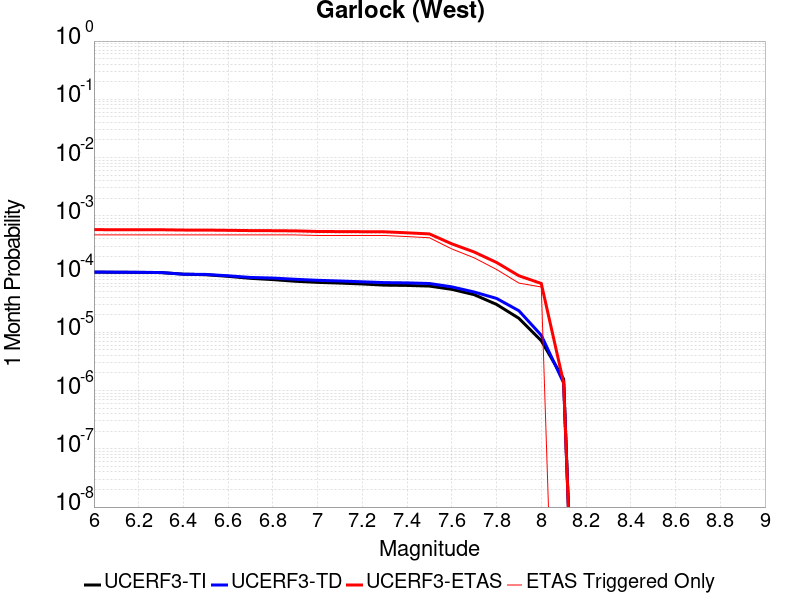 |  |  |

| Magnitude | 1 wk TI Prob | 1 wk TD Prob | 1 wk ETAS Prob | 1 wk ETAS/TD Gain | 1 wk ETAS Triggered Only | 1 mo TI Prob | 1 mo TD Prob | 1 mo ETAS Prob | 1 mo ETAS/TD Gain | 1 mo ETAS Triggered Only | 1 yr TI Prob | 1 yr TD Prob | 1 yr ETAS Prob | 1 yr ETAS/TD Gain | 1 yr ETAS Triggered Only | 10 yr TI Prob | 10 yr TD Prob | 10 yr ETAS Prob | 10 yr ETAS/TD Gain | 10 yr ETAS Triggered Only |
|-----|-----|-----|-----|-----|-----|-----|-----|-----|-----|-----|-----|-----|-----|-----|-----|-----|-----|-----|-----|-----|
| 6.0 | 2.5181727E-5 | 2.5216661E-5 | 1.7521287E-4 | 6.9482985 | 1.5E-4 | 1.0791722E-4 | 1.08066946E-4 | 5.7801616E-4 | 5.3486857 | 4.7E-4 | 0.0013131002 | 0.0013149243 | 0.0031225444 | 2.374695 | 0.00181 | 0.013053683 | 0.013151911 | 0.01698088 | 1.2911341 | 0.00388 |
| 6.1 | 2.5077732E-5 | 2.5117724E-5 | 1.7511395E-4 | 6.971729 | 1.5E-4 | 1.0747157E-4 | 1.0764297E-4 | 5.7759235E-4 | 5.365816 | 4.7E-4 | 0.001307681 | 0.0013097686 | 0.003117398 | 2.3801134 | 0.00181 | 0.013000126 | 0.013100963 | 0.016930131 | 1.2922814 | 0.00388 |
| 6.2 | 2.494612E-5 | 2.4999388E-5 | 1.7499564E-4 | 6.9999967 | 1.5E-4 | 1.0690756E-4 | 1.0713586E-4 | 5.770855E-4 | 5.386483 | 4.7E-4 | 0.0013008224 | 0.001303602 | 0.0031112425 | 2.3866506 | 0.00181 | 0.012932341 | 0.013040021 | 0.016869426 | 1.2936655 | 0.00388 |
| 6.3 | 2.4733758E-5 | 2.4818735E-5 | 1.7481501E-4 | 7.043671 | 1.5E-4 | 1.0599751E-4 | 1.0636169E-4 | 5.763117E-4 | 5.418414 | 4.7E-4 | 0.0012897556 | 0.0012941877 | 0.0031018453 | 2.3967507 | 0.00181 | 0.012822957 | 0.01294698 | 0.016776746 | 1.2958038 | 0.00388 |
| 6.4 | 2.3237335E-5 | 2.3197908E-5 | 1.7319442E-4 | 7.4659505 | 1.5E-4 | 9.958477E-5 | 9.941583E-5 | 5.693691E-4 | 5.727147 | 4.7E-4 | 0.0012117702 | 0.0012097185 | 0.003017529 | 2.494406 | 0.00181 | 0.012051838 | 0.012111766 | 0.015934894 | 1.315654 | 0.00387 |
| 6.5 | 2.2732203E-5 | 2.3012379E-5 | 1.7300893E-4 | 7.518081 | 1.5E-4 | 9.742009E-5 | 9.862077E-5 | 5.685744E-4 | 5.7652607 | 4.7E-4 | 0.0011854442 | 0.0012000492 | 0.0030078772 | 2.5064614 | 0.00181 | 0.011791403 | 0.012016123 | 0.015839621 | 1.3181973 | 0.00387 |
| 6.6 | 2.1319436E-5 | 2.1792415E-5 | 1.7178914E-4 | 7.882979 | 1.5E-4 | 9.136581E-5 | 9.339274E-5 | 5.633488E-4 | 6.0320415 | 4.7E-4 | 0.001111811 | 0.0011364657 | 0.00293442 | 2.5820577 | 0.0018 | 0.011062649 | 0.011386949 | 0.015193109 | 1.3342564 | 0.00385 |
| 6.7 | 1.970802E-5 | 2.0412112E-5 | 1.7040905E-4 | 8.348429 | 1.5E-4 | 8.446021E-5 | 8.747755E-5 | 5.5743643E-4 | 6.372337 | 4.7E-4 | 0.001027818 | 0.0010645206 | 0.0028626043 | 2.6891022 | 0.0018 | 0.010230771 | 0.01067459 | 0.014483494 | 1.3568196 | 0.00385 |
| 6.8 | 1.8744462E-5 | 1.9919653E-5 | 1.6991666E-4 | 8.530102 | 1.5E-4 | 8.033094E-5 | 8.536715E-5 | 5.5532705E-4 | 6.5051603 | 4.7E-4 | 9.775903E-4 | 0.0010388512 | 0.0028369813 | 2.7308831 | 0.0018 | 0.009733009 | 0.010420324 | 0.014230206 | 1.3656203 | 0.00385 |
| 6.9 | 1.7559682E-5 | 1.8971898E-5 | 1.6896905E-4 | 8.906281 | 1.5E-4 | 7.5253614E-5 | 8.13056E-5 | 5.512674E-4 | 6.7801895 | 4.7E-4 | 9.158276E-4 | 9.894476E-4 | 0.0027876666 | 2.8173969 | 0.0018 | 0.0091206245 | 0.009930745 | 0.013742511 | 1.383835 | 0.00385 |
| 7.0 | 1.6794445E-5 | 1.8234585E-5 | 1.6823185E-4 | 9.225977 | 1.5E-4 | 7.197421E-5 | 7.814589E-5 | 5.381099E-4 | 6.8859663 | 4.6E-4 | 8.759337E-4 | 9.5101225E-4 | 0.00273931 | 2.880415 | 0.00179 | 0.008724891 | 0.009549588 | 0.013323204 | 1.3951601 | 0.00381 |
| 7.1 | 1.6337795E-5 | 1.7735292E-5 | 1.6773264E-4 | 9.457562 | 1.5E-4 | 7.0017246E-5 | 7.600619E-5 | 5.3597125E-4 | 7.0516787 | 4.6E-4 | 8.521265E-4 | 9.249838E-4 | 0.0027033372 | 2.922578 | 0.00178 | 0.008488664 | 0.009291395 | 0.01304618 | 1.4041144 | 0.00379 |
| 7.2 | 1.5780008E-5 | 1.7183862E-5 | 1.6718128E-4 | 9.728971 | 1.5E-4 | 6.762685E-5 | 7.364305E-5 | 5.336092E-4 | 7.2458863 | 4.6E-4 | 8.2304585E-4 | 8.962366E-4 | 0.0026646503 | 2.9731548 | 0.00177 | 0.008200042 | 0.009006202 | 0.012712519 | 1.4115294 | 0.00374 |
| 7.3 | 1.5058865E-5 | 1.6636799E-5 | 1.666343E-4 | 10.016007 | 1.5E-4 | 6.45364E-5 | 7.129862E-5 | 5.312658E-4 | 7.4512773 | 4.6E-4 | 7.854473E-4 | 8.6771627E-4 | 0.0026062063 | 3.0035238 | 0.00174 | 0.00782677 | 0.008722834 | 0.012380647 | 1.4193376 | 0.00369 |
| 7.4 | 1.4887923E-5 | 1.647271E-5 | 1.564704E-4 | 9.498765 | 1.4E-4 | 6.380382E-5 | 7.059543E-5 | 5.1056436E-4 | 7.2322583 | 4.4E-4 | 7.7653467E-4 | 8.591616E-4 | 0.0025477097 | 2.965344 | 0.00169 | 0.0077382675 | 0.008637666 | 0.012166915 | 1.4085884 | 0.00356 |
| 7.5 | 1.4509299E-5 | 1.6064607E-5 | 1.4606252E-4 | 9.092194 | 1.3E-4 | 6.218123E-5 | 6.884651E-5 | 4.888176E-4 | 7.1001077 | 4.2E-4 | 7.567935E-4 | 8.37885E-4 | 0.0024365445 | 2.90797 | 0.0016 | 0.0075422134 | 0.008425911 | 0.011717937 | 1.3907027 | 0.00332 |
| 7.6 | 1.2756717E-5 | 1.4067994E-5 | 1.0406673E-4 | 7.397411 | 9.0E-5 | 5.4670498E-5 | 6.029001E-5 | 3.3027373E-4 | 5.4780836 | 2.7E-4 | 6.6541E-4 | 7.3378434E-4 | 0.0018429698 | 2.511596 | 0.00111 | 0.006634211 | 0.0073905406 | 0.009584208 | 1.2968209 | 0.00221 |
| 7.7 | 1.0328985E-5 | 1.147664E-5 | 7.147595E-5 | 6.227951 | 6.0E-5 | 4.4266326E-5 | 4.9184677E-5 | 2.3917534E-4 | 4.862802 | 1.9E-4 | 5.388092E-4 | 5.986593E-4 | 0.0012282821 | 2.0517216 | 6.3E-4 | 0.0053750467 | 0.006046838 | 0.007309159 | 1.2087572 | 0.00127 |
| 7.8 | 7.0306583E-6 | 8.912468E-6 | 3.89122E-5 | 4.366041 | 3.0E-5 | 3.0131043E-5 | 3.8195732E-5 | 1.5819115E-4 | 4.1415925 | 1.2E-4 | 3.667837E-4 | 4.6493395E-4 | 8.547526E-4 | 1.8384389 | 3.9E-4 | 0.003661789 | 0.0047019436 | 0.005547947 | 1.1799263 | 8.5E-4 |
| 7.9 | 4.060633E-6 | 5.4729326E-6 | 2.5472824E-5 | 4.654328 | 2.0E-5 | 1.7402595E-5 | 2.3455215E-5 | 9.345357E-5 | 3.984341 | 7.0E-5 | 2.11856E-4 | 2.8552994E-4 | 4.8547282E-4 | 1.7002519 | 2.0E-4 | 0.0021165414 | 0.0028881172 | 0.0033667309 | 1.1657182 | 4.8E-4 |
| 8.0 | 1.6729537E-6 | 2.0800776E-6 | 1.2080057E-5 | 5.8075027 | 1.0E-5 | 7.169782E-6 | 8.914588E-6 | 6.891405E-5 | 7.730481 | 6.0E-5 | 8.7288594E-5 | 1.0852974E-4 | 2.2851671E-4 | 2.1055677 | 1.2E-4 | 8.7254314E-4 | 0.0010982669 | 0.0013380034 | 1.2182862 | 2.4E-4 |
| 8.1 | 3.6733252E-7 | 3.1526864E-7 | 3.1526864E-7 | 1.0 | 0.0 | 1.5742813E-6 | 1.3511507E-6 | 1.3511507E-6 | 1.0 | 0.0 | 1.9166706E-5 | 1.645015E-5 | 3.6449823E-5 | 2.2157743 | 2.0E-5 | 1.9165053E-4 | 1.6658098E-4 | 1.9657599E-4 | 1.1800625 | 3.0E-5 |

## Gravel Hills-Harper Lk
*[(top)](#table-of-contents)*

| 1 Week | 1 Month | 1 Year | 10 Year |
|-----|-----|-----|-----|
|  |  | 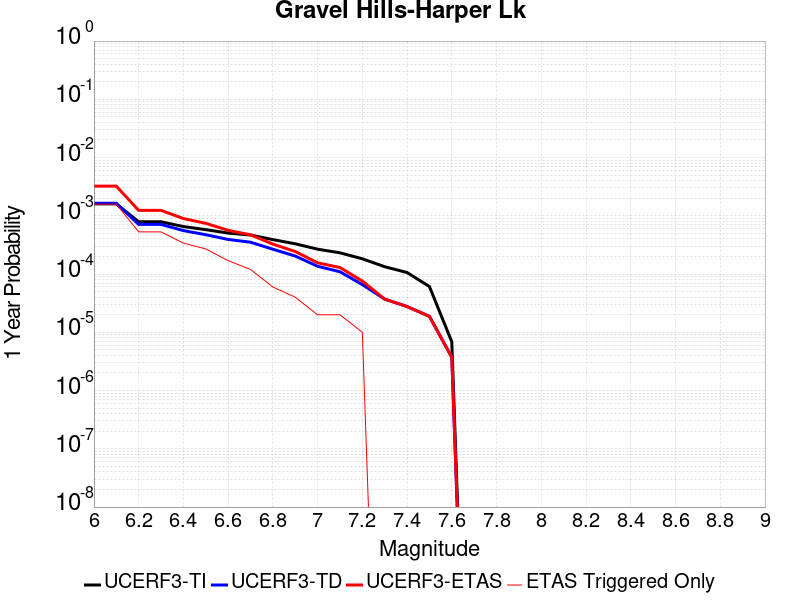 |  |

| Magnitude | 1 wk TI Prob | 1 wk TD Prob | 1 wk ETAS Prob | 1 wk ETAS/TD Gain | 1 wk ETAS Triggered Only | 1 mo TI Prob | 1 mo TD Prob | 1 mo ETAS Prob | 1 mo ETAS/TD Gain | 1 mo ETAS Triggered Only | 1 yr TI Prob | 1 yr TD Prob | 1 yr ETAS Prob | 1 yr ETAS/TD Gain | 1 yr ETAS Triggered Only | 10 yr TI Prob | 10 yr TD Prob | 10 yr ETAS Prob | 10 yr ETAS/TD Gain | 10 yr ETAS Triggered Only |
|-----|-----|-----|-----|-----|-----|-----|-----|-----|-----|-----|-----|-----|-----|-----|-----|-----|-----|-----|-----|-----|
| 6.0 | 3.0679566E-5 | 3.1466803E-5 | 1.3146366E-4 | 4.1778526 | 1.0E-4 | 1.3147724E-4 | 1.3485197E-4 | 5.247994E-4 | 3.89167 | 3.9E-4 | 0.0015995599 | 0.0016408027 | 0.0032281938 | 1.9674479 | 0.00159 | 0.015880952 | 0.01630845 | 0.019416913 | 1.1906046 | 0.00316 |
| 6.1 | 3.0679566E-5 | 3.1466803E-5 | 1.3146366E-4 | 4.1778526 | 1.0E-4 | 1.3147724E-4 | 1.3485197E-4 | 5.247994E-4 | 3.89167 | 3.9E-4 | 0.0015995599 | 0.0016408027 | 0.0032281938 | 1.9674479 | 0.00159 | 0.015880952 | 0.01630845 | 0.019416913 | 1.1906046 | 0.00316 |
| 6.2 | 1.514536E-5 | 1.363595E-5 | 5.3635405E-5 | 3.9333823 | 4.0E-5 | 6.490707E-5 | 5.8438545E-5 | 2.0842977E-4 | 3.566649 | 1.5E-4 | 7.8995706E-4 | 7.112689E-4 | 0.001240892 | 1.7446171 | 5.3E-4 | 0.007871548 | 0.007091126 | 0.008143609 | 1.1484226 | 0.00106 |
| 6.3 | 1.514536E-5 | 1.363595E-5 | 5.3635405E-5 | 3.9333823 | 4.0E-5 | 6.490707E-5 | 5.8438545E-5 | 2.0842977E-4 | 3.566649 | 1.5E-4 | 7.8995706E-4 | 7.112689E-4 | 0.001240892 | 1.7446171 | 5.3E-4 | 0.007871548 | 0.007091126 | 0.008143609 | 1.1484226 | 0.00106 |
| 6.4 | 1.2532521E-5 | 1.0690234E-5 | 4.0689913E-5 | 3.8062696 | 3.0E-5 | 5.37097E-5 | 4.5814515E-5 | 1.4580993E-4 | 3.1826143 | 1.0E-4 | 6.537194E-4 | 5.576548E-4 | 8.974652E-4 | 1.6093562 | 3.4E-4 | 0.0065179965 | 0.0055631446 | 0.0062294174 | 1.1197655 | 6.7E-4 |
| 6.5 | 1.1094058E-5 | 9.084107E-6 | 3.9083836E-5 | 4.302441 | 3.0E-5 | 4.7545094E-5 | 3.8931328E-5 | 1.2892783E-4 | 3.311673 | 9.0E-5 | 5.787078E-4 | 4.7388987E-4 | 7.4376195E-4 | 1.5694826 | 2.7E-4 | 0.0057720304 | 0.004729201 | 0.0052168835 | 1.1031216 | 4.9E-4 |
| 6.6 | 9.688328E-6 | 7.5320527E-6 | 2.7531902E-5 | 3.6552987 | 2.0E-5 | 4.1520743E-5 | 3.227984E-5 | 9.227791E-5 | 2.8586853 | 6.0E-5 | 5.053978E-4 | 3.9293873E-4 | 5.628719E-4 | 1.4324675 | 1.7E-4 | 0.0050424994 | 0.003922696 | 0.0042314804 | 1.0787172 | 3.1E-4 |
| 6.7 | 8.974824E-6 | 6.7497303E-6 | 1.6749664E-5 | 2.4815307 | 1.0E-5 | 3.8462964E-5 | 2.8927108E-5 | 6.8925954E-5 | 2.382746 | 4.0E-5 | 4.6818596E-4 | 3.5213283E-4 | 4.7209059E-4 | 1.3406605 | 1.2E-4 | 0.004672008 | 0.0035159695 | 0.0037551257 | 1.06802 | 2.4E-4 |
| 6.8 | 7.4780046E-6 | 5.1164316E-6 | 1.511638E-5 | 2.9544773 | 1.0E-5 | 3.20482E-5 | 2.1927388E-5 | 4.192695E-5 | 1.9120814 | 2.0E-5 | 3.9011694E-4 | 2.6693463E-4 | 3.269186E-4 | 1.2247142 | 6.0E-5 | 0.0038943281 | 0.0026662783 | 0.0027759848 | 1.041146 | 1.1E-4 |
| 6.9 | 6.3409307E-6 | 3.907683E-6 | 1.3907644E-5 | 3.5590513 | 1.0E-5 | 2.7175134E-5 | 1.674711E-5 | 2.6746942E-5 | 1.5971079 | 1.0E-5 | 3.3080703E-4 | 2.0387798E-4 | 2.4386983E-4 | 1.1961558 | 4.0E-5 | 0.0033031502 | 0.0020370076 | 0.0020869058 | 1.0244958 | 5.0E-5 |
| 7.0 | 5.1239335E-6 | 2.6059872E-6 | 1.2605961E-5 | 4.8373075 | 1.0E-5 | 2.195953E-5 | 1.116847E-5 | 2.1168358E-5 | 1.8953677 | 1.0E-5 | 2.6732447E-4 | 1.3596789E-4 | 1.5596517E-4 | 1.1470735 | 2.0E-5 | 0.0026700313 | 0.0013588723 | 0.0013788451 | 1.014698 | 2.0E-5 |
| 7.1 | 4.438899E-6 | 2.0985822E-6 | 1.20985615E-5 | 5.765112 | 1.0E-5 | 1.9023713E-5 | 8.993894E-6 | 1.8993804E-5 | 2.1118555 | 1.0E-5 | 2.315891E-4 | 1.0949538E-4 | 1.2949319E-4 | 1.1826361 | 2.0E-5 | 0.002313479 | 0.0010944362 | 0.0011144143 | 1.0182543 | 2.0E-5 |
| 7.2 | 3.50367E-6 | 1.2616524E-6 | 1.126164E-5 | 8.926104 | 1.0E-5 | 1.5015643E-5 | 5.407071E-6 | 1.5407017E-5 | 2.84942 | 1.0E-5 | 1.8280011E-4 | 6.582918E-5 | 7.5828524E-5 | 1.1518983 | 1.0E-5 | 0.0018264982 | 6.5810507E-4 | 6.680985E-4 | 1.0151851 | 1.0E-5 |
| 7.3 | 2.561638E-6 | 7.11978E-7 | 7.11978E-7 | 1.0 | 0.0 | 1.0978401E-5 | 3.0513306E-6 | 3.0513306E-6 | 1.0 | 0.0 | 1.3365384E-4 | 3.7149337E-5 | 3.7149337E-5 | 1.0 | 0.0 | 0.0013357349 | 3.7143327E-4 | 3.7143327E-4 | 1.0 | 0.0 |
| 7.4 | 2.0368864E-6 | 5.3053367E-7 | 5.3053367E-7 | 1.0 | 0.0 | 8.729483E-6 | 2.2737138E-6 | 2.2737138E-6 | 1.0 | 0.0 | 1.06276275E-4 | 2.768212E-5 | 2.768212E-5 | 1.0 | 0.0 | 0.0010622547 | 2.7678726E-4 | 2.7678726E-4 | 1.0 | 0.0 |
| 7.5 | 1.1681728E-6 | 3.6033393E-7 | 3.6033393E-7 | 1.0 | 0.0 | 5.0064455E-6 | 1.5442874E-6 | 1.5442874E-6 | 1.0 | 0.0 | 6.0951766E-5 | 1.8801542E-5 | 1.8801542E-5 | 1.0 | 0.0 | 6.093505E-4 | 1.8799998E-4 | 1.8799998E-4 | 1.0 | 0.0 |
| 7.6 | 1.3154387E-7 | 7.12009E-8 | 7.12009E-8 | 1.0 | 0.0 | 5.6375933E-7 | 3.051467E-7 | 3.051467E-7 | 1.0 | 0.0 | 6.863748E-6 | 3.7151563E-6 | 3.7151563E-6 | 1.0 | 0.0 | 6.863536E-5 | 3.7151098E-5 | 3.7151098E-5 | 1.0 | 0.0 |

## McLean Lake
*[(top)](#table-of-contents)*

| 1 Week | 1 Month | 1 Year | 10 Year |
|-----|-----|-----|-----|
|  |  |  |  |

| Magnitude | 1 wk TI Prob | 1 wk TD Prob | 1 wk ETAS Prob | 1 wk ETAS/TD Gain | 1 wk ETAS Triggered Only | 1 mo TI Prob | 1 mo TD Prob | 1 mo ETAS Prob | 1 mo ETAS/TD Gain | 1 mo ETAS Triggered Only | 1 yr TI Prob | 1 yr TD Prob | 1 yr ETAS Prob | 1 yr ETAS/TD Gain | 1 yr ETAS Triggered Only | 10 yr TI Prob | 10 yr TD Prob | 10 yr ETAS Prob | 10 yr ETAS/TD Gain | 10 yr ETAS Triggered Only |
|-----|-----|-----|-----|-----|-----|-----|-----|-----|-----|-----|-----|-----|-----|-----|-----|-----|-----|-----|-----|-----|
| 6.0 | 1.7360222E-5 | 1.8502275E-5 | 5.8501533E-5 | 3.1618564 | 4.0E-5 | 7.439883E-5 | 7.929332E-5 | 3.192743E-4 | 4.0264964 | 2.4E-4 | 9.0542925E-4 | 9.6501724E-4 | 0.0022337916 | 2.3147686 | 0.00127 | 0.009017491 | 0.009613109 | 0.012495135 | 1.2998016 | 0.00291 |
| 6.1 | 9.062689E-6 | 9.592492E-6 | 1.9592395E-5 | 2.0424721 | 1.0E-5 | 3.8839516E-5 | 4.1110077E-5 | 1.8110432E-4 | 4.405351 | 1.4E-4 | 4.727685E-4 | 5.0040917E-4 | 0.0012400389 | 2.47805 | 7.4E-4 | 0.0047176396 | 0.0049937065 | 0.006555866 | 1.3128258 | 0.00157 |
| 6.2 | 9.062689E-6 | 9.592492E-6 | 1.9592395E-5 | 2.0424721 | 1.0E-5 | 3.8839516E-5 | 4.1110077E-5 | 1.8110432E-4 | 4.405351 | 1.4E-4 | 4.727685E-4 | 5.0040917E-4 | 0.0012400389 | 2.47805 | 7.4E-4 | 0.0047176396 | 0.0049937065 | 0.006555866 | 1.3128258 | 0.00157 |
| 6.3 | 7.2575485E-6 | 7.66794E-6 | 1.7667862E-5 | 2.3041213 | 1.0E-5 | 3.110341E-5 | 3.2862223E-5 | 1.3285894E-4 | 4.0429077 | 1.0E-4 | 3.786182E-4 | 4.0003125E-4 | 9.3981525E-4 | 2.3493545 | 5.4E-4 | 0.0037797375 | 0.003993816 | 0.005228864 | 1.30924 | 0.00124 |
| 6.4 | 7.2575485E-6 | 7.66794E-6 | 1.7667862E-5 | 2.3041213 | 1.0E-5 | 3.110341E-5 | 3.2862223E-5 | 1.3285894E-4 | 4.0429077 | 1.0E-4 | 3.786182E-4 | 4.0003125E-4 | 9.3981525E-4 | 2.3493545 | 5.4E-4 | 0.0037797375 | 0.003993816 | 0.005228864 | 1.30924 | 0.00124 |
| 6.5 | 6.06582E-6 | 6.4040664E-6 | 1.6404003E-5 | 2.5614977 | 1.0E-5 | 2.5996113E-5 | 2.7445747E-5 | 1.1744328E-4 | 4.2791066 | 9.0E-5 | 3.164567E-4 | 3.3410723E-4 | 7.839569E-4 | 2.346423 | 4.5E-4 | 0.0031600643 | 0.0033366878 | 0.004413084 | 1.3225943 | 0.00108 |
| 6.6 | 5.598744E-6 | 5.910437E-6 | 1.5910378E-5 | 2.6919124 | 1.0E-5 | 2.3994397E-5 | 2.5330233E-5 | 1.1532795E-4 | 4.552976 | 9.0E-5 | 2.9209262E-4 | 3.0835834E-4 | 7.182319E-4 | 2.329212 | 4.1E-4 | 0.0029170897 | 0.003079934 | 0.004076854 | 1.3236823 | 0.001 |
| 6.7 | 5.246996E-6 | 5.5393257E-6 | 1.553927E-5 | 2.8052638 | 1.0E-5 | 2.2486933E-5 | 2.3739787E-5 | 8.373836E-5 | 3.5273426 | 6.0E-5 | 2.73744E-4 | 2.8899993E-4 | 6.5889297E-4 | 2.2799072 | 3.7E-4 | 0.0027340704 | 0.0028868648 | 0.0037842668 | 1.3108569 | 9.0E-4 |
| 6.8 | 4.02324E-6 | 4.2470297E-6 | 1.4246987E-5 | 3.3545768 | 1.0E-5 | 1.7242342E-5 | 1.8201463E-5 | 5.8200734E-5 | 3.1975856 | 4.0E-5 | 2.099053E-4 | 2.2158623E-4 | 5.2151975E-4 | 2.3535748 | 3.0E-4 | 0.0020970714 | 0.0022142373 | 0.0028827537 | 1.3019173 | 6.7E-4 |
| 6.9 | 6.835972E-7 | 7.140097E-7 | 7.140097E-7 | 1.0 | 0.0 | 2.9296991E-6 | 3.0600397E-6 | 3.0600397E-6 | 1.0 | 0.0 | 3.56685E-5 | 3.7255664E-5 | 4.7255293E-5 | 1.2684056 | 1.0E-5 | 3.5662777E-4 | 3.7252545E-4 | 4.5249565E-4 | 1.2146704 | 8.0E-5 |

## Goldstone Lake
*[(top)](#table-of-contents)*

| 1 Week | 1 Month | 1 Year | 10 Year |
|-----|-----|-----|-----|
| 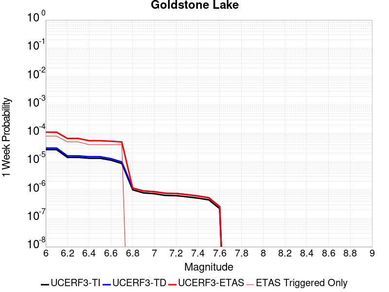 |  |  |  |

| Magnitude | 1 wk TI Prob | 1 wk TD Prob | 1 wk ETAS Prob | 1 wk ETAS/TD Gain | 1 wk ETAS Triggered Only | 1 mo TI Prob | 1 mo TD Prob | 1 mo ETAS Prob | 1 mo ETAS/TD Gain | 1 mo ETAS Triggered Only | 1 yr TI Prob | 1 yr TD Prob | 1 yr ETAS Prob | 1 yr ETAS/TD Gain | 1 yr ETAS Triggered Only | 10 yr TI Prob | 10 yr TD Prob | 10 yr ETAS Prob | 10 yr ETAS/TD Gain | 10 yr ETAS Triggered Only |
|-----|-----|-----|-----|-----|-----|-----|-----|-----|-----|-----|-----|-----|-----|-----|-----|-----|-----|-----|-----|-----|
| 6.0 | 2.671352E-5 | 3.0378242E-5 | 1.1037581E-4 | 3.6333838 | 8.0E-5 | 1.1448149E-4 | 1.3018708E-4 | 3.9015323E-4 | 2.996866 | 2.6E-4 | 0.001392921 | 0.0015840717 | 0.0027122817 | 1.7122216 | 0.00113 | 0.013842222 | 0.015747305 | 0.018316204 | 1.1631327 | 0.00261 |
| 6.1 | 2.671352E-5 | 3.0378242E-5 | 1.1037581E-4 | 3.6333838 | 8.0E-5 | 1.1448149E-4 | 1.3018708E-4 | 3.9015323E-4 | 2.996866 | 2.6E-4 | 0.001392921 | 0.0015840717 | 0.0027122817 | 1.7122216 | 0.00113 | 0.013842222 | 0.015747305 | 0.018316204 | 1.1631327 | 0.00261 |
| 6.2 | 1.4197047E-5 | 1.6097329E-5 | 6.609652E-5 | 4.1060553 | 5.0E-5 | 6.0843064E-5 | 6.898728E-5 | 2.2897625E-4 | 3.319108 | 1.6E-4 | 7.4051257E-4 | 8.396952E-4 | 0.0013792417 | 1.6425505 | 5.4E-4 | 0.007380498 | 0.008374922 | 0.009495458 | 1.1337967 | 0.00113 |
| 6.3 | 1.4197047E-5 | 1.6097329E-5 | 6.609652E-5 | 4.1060553 | 5.0E-5 | 6.0843064E-5 | 6.898728E-5 | 2.2897625E-4 | 3.319108 | 1.6E-4 | 7.4051257E-4 | 8.396952E-4 | 0.0013792417 | 1.6425505 | 5.4E-4 | 0.007380498 | 0.008374922 | 0.009495458 | 1.1337967 | 0.00113 |
| 6.4 | 1.3238931E-5 | 1.5009467E-5 | 5.5008866E-5 | 3.664945 | 4.0E-5 | 5.6737044E-5 | 6.432525E-5 | 2.143156E-4 | 3.3317492 | 1.5E-4 | 6.9055456E-4 | 7.829765E-4 | 0.0012925772 | 1.6508505 | 5.1E-4 | 0.006884126 | 0.007811806 | 0.008883369 | 1.1371722 | 0.00108 |
| 6.5 | 1.3238931E-5 | 1.5009467E-5 | 5.5008866E-5 | 3.664945 | 4.0E-5 | 5.6737044E-5 | 6.432525E-5 | 2.143156E-4 | 3.3317492 | 1.5E-4 | 6.9055456E-4 | 7.829765E-4 | 0.0012925772 | 1.6508505 | 5.1E-4 | 0.006884126 | 0.007811806 | 0.008883369 | 1.1371722 | 0.00108 |
| 6.6 | 1.1328278E-5 | 1.2856027E-5 | 5.2855514E-5 | 4.111341 | 4.0E-5 | 4.8548856E-5 | 5.5096636E-5 | 2.0508836E-4 | 3.7223394 | 1.5E-4 | 5.90922E-4 | 6.706908E-4 | 0.0011303823 | 1.6854 | 4.6E-4 | 0.0058935313 | 0.0066960566 | 0.0076396954 | 1.1409246 | 9.5E-4 |
| 6.7 | 8.651175E-6 | 9.825214E-6 | 4.982482E-5 | 5.0711184 | 4.0E-5 | 3.707594E-5 | 4.2107888E-5 | 1.5210325E-4 | 3.612227 | 1.1E-4 | 4.5130608E-4 | 5.1263353E-4 | 8.8244386E-4 | 1.7213932 | 3.7E-4 | 0.0045039062 | 0.0051233894 | 0.0058894446 | 1.1495211 | 7.7E-4 |
| 6.8 | 1.0215377E-6 | 1.1755062E-6 | 1.1755062E-6 | 1.0 | 0.0 | 4.378012E-6 | 5.037875E-6 | 2.5037774E-5 | 4.969908 | 2.0E-5 | 5.3300988E-5 | 6.133451E-5 | 1.0133206E-4 | 1.6521214 | 4.0E-5 | 5.3288206E-4 | 6.131871E-4 | 6.731503E-4 | 1.0977894 | 6.0E-5 |
| 6.9 | 7.9360774E-7 | 9.2836456E-7 | 9.2836456E-7 | 1.0 | 0.0 | 3.4011714E-6 | 3.9786996E-6 | 1.397866E-5 | 3.5133739 | 1.0E-5 | 4.1408475E-5 | 4.8439662E-5 | 5.843918E-5 | 1.2064323 | 1.0E-5 | 4.140076E-4 | 4.8429804E-4 | 5.0428836E-4 | 1.0412769 | 2.0E-5 |
| 7.0 | 7.4382757E-7 | 8.747556E-7 | 8.747556E-7 | 1.0 | 0.0 | 3.1878285E-6 | 3.7489476E-6 | 3.7489476E-6 | 1.0 | 0.0 | 3.8811122E-5 | 4.5642548E-5 | 4.5642548E-5 | 1.0 | 0.0 | 3.8804344E-4 | 4.5633837E-4 | 4.5633837E-4 | 1.0 | 0.0 |
| 7.1 | 6.4709513E-7 | 7.7114885E-7 | 7.7114885E-7 | 1.0 | 0.0 | 2.773262E-6 | 3.3049198E-6 | 3.3049198E-6 | 1.0 | 0.0 | 3.376394E-5 | 4.0236715E-5 | 4.0236715E-5 | 1.0 | 0.0 | 3.375881E-4 | 4.0230027E-4 | 4.0230027E-4 | 1.0 | 0.0 |
| 7.2 | 6.356704E-7 | 7.588543E-7 | 7.588543E-7 | 1.0 | 0.0 | 2.7242988E-6 | 3.2522291E-6 | 3.2522291E-6 | 1.0 | 0.0 | 3.3167835E-5 | 3.959523E-5 | 3.959523E-5 | 1.0 | 0.0 | 3.3162883E-4 | 3.9588768E-4 | 3.9588768E-4 | 1.0 | 0.0 |
| 7.3 | 5.7695723E-7 | 6.8967347E-7 | 6.8967347E-7 | 1.0 | 0.0 | 2.4726714E-6 | 2.9557402E-6 | 2.9557402E-6 | 1.0 | 0.0 | 3.0104358E-5 | 3.5985602E-5 | 3.5985602E-5 | 1.0 | 0.0 | 3.0100282E-4 | 3.5980347E-4 | 3.5980347E-4 | 1.0 | 0.0 |
| 7.4 | 5.209647E-7 | 6.1936566E-7 | 6.1936566E-7 | 1.0 | 0.0 | 2.232704E-6 | 2.654422E-6 | 2.654422E-6 | 1.0 | 0.0 | 2.718283E-5 | 3.2317163E-5 | 3.2317163E-5 | 1.0 | 0.0 | 2.7179506E-4 | 3.231302E-4 | 3.231302E-4 | 1.0 | 0.0 |
| 7.5 | 4.512955E-7 | 5.3490027E-7 | 5.3490027E-7 | 1.0 | 0.0 | 1.934122E-6 | 2.292428E-6 | 2.292428E-6 | 1.0 | 0.0 | 2.3547682E-5 | 2.7910008E-5 | 2.7910008E-5 | 1.0 | 0.0 | 2.3545188E-4 | 2.7907031E-4 | 2.7907031E-4 | 1.0 | 0.0 |
| 7.6 | 2.21172E-7 | 2.6040124E-7 | 2.6040124E-7 | 1.0 | 0.0 | 9.478797E-7 | 1.116005E-6 | 1.116005E-6 | 1.0 | 0.0 | 1.1540374E-5 | 1.3587305E-5 | 1.3587305E-5 | 1.0 | 0.0 | 1.1539775E-4 | 1.3586757E-4 | 1.3586757E-4 | 1.0 | 0.0 |

## So Sierra Nevada
*[(top)](#table-of-contents)*

| 1 Week | 1 Month | 1 Year | 10 Year |
|-----|-----|-----|-----|
|  |  |  |  |

| Magnitude | 1 wk TI Prob | 1 wk TD Prob | 1 wk ETAS Prob | 1 wk ETAS/TD Gain | 1 wk ETAS Triggered Only | 1 mo TI Prob | 1 mo TD Prob | 1 mo ETAS Prob | 1 mo ETAS/TD Gain | 1 mo ETAS Triggered Only | 1 yr TI Prob | 1 yr TD Prob | 1 yr ETAS Prob | 1 yr ETAS/TD Gain | 1 yr ETAS Triggered Only | 10 yr TI Prob | 10 yr TD Prob | 10 yr ETAS Prob | 10 yr ETAS/TD Gain | 10 yr ETAS Triggered Only |
|-----|-----|-----|-----|-----|-----|-----|-----|-----|-----|-----|-----|-----|-----|-----|-----|-----|-----|-----|-----|-----|
| 6.0 | 1.15488665E-5 | 1.1079958E-5 | 7.1079296E-5 | 6.4151225 | 6.0E-5 | 4.9494203E-5 | 4.7484744E-5 | 2.5747478E-4 | 5.422263 | 2.1E-4 | 6.024253E-4 | 5.779862E-4 | 0.0014474833 | 2.5043564 | 8.7E-4 | 0.006007948 | 0.0057660984 | 0.007754566 | 1.344855 | 0.002 |
| 6.1 | 1.15488665E-5 | 1.1079958E-5 | 7.1079296E-5 | 6.4151225 | 6.0E-5 | 4.9494203E-5 | 4.7484744E-5 | 2.5747478E-4 | 5.422263 | 2.1E-4 | 6.024253E-4 | 5.779862E-4 | 0.0014474833 | 2.5043564 | 8.7E-4 | 0.006007948 | 0.0057660984 | 0.007754566 | 1.344855 | 0.002 |
| 6.2 | 1.15488665E-5 | 1.1079958E-5 | 7.1079296E-5 | 6.4151225 | 6.0E-5 | 4.9494203E-5 | 4.7484744E-5 | 2.5747478E-4 | 5.422263 | 2.1E-4 | 6.024253E-4 | 5.779862E-4 | 0.0014474833 | 2.5043564 | 8.7E-4 | 0.006007948 | 0.0057660984 | 0.007754566 | 1.344855 | 0.002 |
| 6.3 | 1.15488665E-5 | 1.1079958E-5 | 7.1079296E-5 | 6.4151225 | 6.0E-5 | 4.9494203E-5 | 4.7484744E-5 | 2.5747478E-4 | 5.422263 | 2.1E-4 | 6.024253E-4 | 5.779862E-4 | 0.0014474833 | 2.5043564 | 8.7E-4 | 0.006007948 | 0.0057660984 | 0.007754566 | 1.344855 | 0.002 |
| 6.4 | 1.15488665E-5 | 1.1079958E-5 | 7.1079296E-5 | 6.4151225 | 6.0E-5 | 4.9494203E-5 | 4.7484744E-5 | 2.5747478E-4 | 5.422263 | 2.1E-4 | 6.024253E-4 | 5.779862E-4 | 0.0014474833 | 2.5043564 | 8.7E-4 | 0.006007948 | 0.0057660984 | 0.007754566 | 1.344855 | 0.002 |
| 6.5 | 1.15488665E-5 | 1.1079958E-5 | 7.1079296E-5 | 6.4151225 | 6.0E-5 | 4.9494203E-5 | 4.7484744E-5 | 2.5747478E-4 | 5.422263 | 2.1E-4 | 6.024253E-4 | 5.779862E-4 | 0.0014474833 | 2.5043564 | 8.7E-4 | 0.006007948 | 0.0057660984 | 0.007754566 | 1.344855 | 0.002 |
| 6.6 | 7.587044E-6 | 6.9358503E-6 | 2.6935712E-5 | 3.8835487 | 2.0E-5 | 3.2515498E-5 | 2.972475E-5 | 1.1972208E-4 | 4.02769 | 9.0E-5 | 3.9580427E-4 | 3.6184167E-4 | 7.9168606E-4 | 2.187935 | 4.3E-4 | 0.003951 | 0.0036128166 | 0.00459924 | 1.2730345 | 9.9E-4 |
| 6.7 | 7.587044E-6 | 6.9358503E-6 | 2.6935712E-5 | 3.8835487 | 2.0E-5 | 3.2515498E-5 | 2.972475E-5 | 1.1972208E-4 | 4.02769 | 9.0E-5 | 3.9580427E-4 | 3.6184167E-4 | 7.9168606E-4 | 2.187935 | 4.3E-4 | 0.003951 | 0.0036128166 | 0.00459924 | 1.2730345 | 9.9E-4 |
| 6.8 | 5.9026956E-6 | 5.179568E-6 | 2.5179465E-5 | 4.8613057 | 2.0E-5 | 2.5297022E-5 | 2.2197966E-5 | 9.219641E-5 | 4.1533723 | 7.0E-5 | 3.0794772E-4 | 2.7022787E-4 | 6.10136E-4 | 2.2578573 | 3.4E-4 | 0.0030752132 | 0.0026991093 | 0.0034570578 | 1.2808144 | 7.6E-4 |
| 6.9 | 5.0118915E-6 | 4.2525808E-6 | 1.4252538E-5 | 3.3515034 | 1.0E-5 | 2.1479358E-5 | 1.8225222E-5 | 6.822431E-5 | 3.7434008 | 5.0E-5 | 2.614798E-4 | 2.2187021E-4 | 4.8181252E-4 | 2.1715963 | 2.6E-4 | 0.0026117235 | 0.0022165596 | 0.002795274 | 1.2610868 | 5.8E-4 |
| 7.0 | 4.4924795E-6 | 3.7140621E-6 | 1.3714025E-5 | 3.6924596 | 1.0E-5 | 1.925334E-5 | 1.5917316E-5 | 4.5916837E-5 | 2.8847098 | 3.0E-5 | 2.3438422E-4 | 1.9377672E-4 | 4.137341E-4 | 2.1351073 | 2.2E-4 | 0.0023413717 | 0.0019361405 | 0.0024551337 | 1.2680556 | 5.2E-4 |
| 7.1 | 3.9118436E-6 | 3.1121094E-6 | 3.1121094E-6 | 1.0 | 0.0 | 1.6764936E-5 | 1.3337547E-5 | 3.333728E-5 | 2.499506 | 2.0E-5 | 2.0409399E-4 | 1.6237311E-4 | 3.1234874E-4 | 1.9236484 | 1.5E-4 | 0.0020390663 | 0.0016226007 | 0.0020219516 | 1.2461178 | 4.0E-4 |
| 7.2 | 3.4200818E-6 | 2.605576E-6 | 2.605576E-6 | 1.0 | 0.0 | 1.4657411E-5 | 1.116671E-5 | 3.1166484E-5 | 2.791018 | 2.0E-5 | 1.7843937E-4 | 1.3594671E-4 | 2.6592903E-4 | 1.956127 | 1.3E-4 | 0.0017829615 | 0.0013586852 | 0.0017082096 | 1.257252 | 3.5E-4 |
| 7.3 | 2.6593618E-6 | 1.8285265E-6 | 1.8285265E-6 | 1.0 | 0.0 | 1.13972155E-5 | 7.83652E-6 | 1.7836443E-5 | 2.2760665 | 1.0E-5 | 1.3875226E-4 | 9.5405754E-5 | 1.6539908E-4 | 1.7336384 | 7.0E-5 | 0.0013866565 | 9.536769E-4 | 0.0011834576 | 1.2409419 | 2.3E-4 |
| 7.4 | 2.2577992E-6 | 1.436535E-6 | 1.436535E-6 | 1.0 | 0.0 | 9.676246E-6 | 6.156565E-6 | 1.6156504E-5 | 2.6242723 | 1.0E-5 | 1.1780193E-4 | 7.495386E-5 | 1.2495011E-4 | 1.6670271 | 5.0E-5 | 0.001177395 | 7.493108E-4 | 9.3916844E-4 | 1.2533764 | 1.9E-4 |
| 7.5 | 1.489319E-6 | 7.354697E-7 | 7.354697E-7 | 1.0 | 0.0 | 6.3827797E-6 | 3.1520092E-6 | 3.1520092E-6 | 1.0 | 0.0 | 7.770758E-5 | 3.837504E-5 | 6.837389E-5 | 1.7817281 | 3.0E-5 | 7.7680405E-4 | 3.836846E-4 | 4.9364235E-4 | 1.2865838 | 1.1E-4 |
| 7.6 | 1.0680322E-6 | 4.6602182E-7 | 4.6602182E-7 | 1.0 | 0.0 | 4.577273E-6 | 1.997235E-6 | 1.997235E-6 | 1.0 | 0.0 | 5.5726876E-5 | 2.4316065E-5 | 4.4315577E-5 | 1.8224815 | 2.0E-5 | 5.5712904E-4 | 2.431343E-4 | 3.1311729E-4 | 1.2878367 | 7.0E-5 |
| 7.7 | 5.509146E-7 | 1.558334E-7 | 1.558334E-7 | 1.0 | 0.0 | 2.3610605E-6 | 6.678573E-7 | 6.678573E-7 | 1.0 | 0.0 | 2.8745531E-5 | 8.131134E-6 | 2.8130971E-5 | 3.4596617 | 2.0E-5 | 2.8741814E-4 | 8.130848E-5 | 1.21305224E-4 | 1.4919137 | 4.0E-5 |

## Coyote Canyon
*[(top)](#table-of-contents)*

| 1 Week | 1 Month | 1 Year | 10 Year |
|-----|-----|-----|-----|
|  |  |  |  |

| Magnitude | 1 wk TI Prob | 1 wk TD Prob | 1 wk ETAS Prob | 1 wk ETAS/TD Gain | 1 wk ETAS Triggered Only | 1 mo TI Prob | 1 mo TD Prob | 1 mo ETAS Prob | 1 mo ETAS/TD Gain | 1 mo ETAS Triggered Only | 1 yr TI Prob | 1 yr TD Prob | 1 yr ETAS Prob | 1 yr ETAS/TD Gain | 1 yr ETAS Triggered Only | 10 yr TI Prob | 10 yr TD Prob | 10 yr ETAS Prob | 10 yr ETAS/TD Gain | 10 yr ETAS Triggered Only |
|-----|-----|-----|-----|-----|-----|-----|-----|-----|-----|-----|-----|-----|-----|-----|-----|-----|-----|-----|-----|-----|
| 6.0 | 3.5090034E-5 | 4.0367544E-5 | 6.036674E-5 | 1.4954275 | 2.0E-5 | 1.503772E-4 | 1.7299375E-4 | 2.7297644E-4 | 1.5779556 | 1.0E-4 | 0.0018293047 | 0.0021044204 | 0.002663242 | 1.2655466 | 5.6E-4 | 0.018143194 | 0.020870851 | 0.022466833 | 1.0764693 | 0.00163 |
| 6.1 | 3.5090034E-5 | 4.0367544E-5 | 6.036674E-5 | 1.4954275 | 2.0E-5 | 1.503772E-4 | 1.7299375E-4 | 2.7297644E-4 | 1.5779556 | 1.0E-4 | 0.0018293047 | 0.0021044204 | 0.002663242 | 1.2655466 | 5.6E-4 | 0.018143194 | 0.020870851 | 0.022466833 | 1.0764693 | 0.00163 |
| 6.2 | 1.841879E-5 | 2.1061396E-5 | 3.1061187E-5 | 1.4747924 | 1.0E-5 | 7.8935285E-5 | 9.026058E-5 | 1.3025697E-4 | 1.4431213 | 4.0E-5 | 9.606133E-4 | 0.0010984705 | 0.001418119 | 1.2909942 | 3.2E-4 | 0.0095647145 | 0.010940496 | 0.011889993 | 1.0867873 | 9.6E-4 |
| 6.3 | 1.841879E-5 | 2.1061396E-5 | 3.1061187E-5 | 1.4747924 | 1.0E-5 | 7.8935285E-5 | 9.026058E-5 | 1.3025697E-4 | 1.4431213 | 4.0E-5 | 9.606133E-4 | 0.0010984705 | 0.001418119 | 1.2909942 | 3.2E-4 | 0.0095647145 | 0.010940496 | 0.011889993 | 1.0867873 | 9.6E-4 |
| 6.4 | 1.712201E-5 | 1.9566693E-5 | 2.9566498E-5 | 1.5110625 | 1.0E-5 | 7.337798E-5 | 8.385513E-5 | 1.2385177E-4 | 1.4769732 | 4.0E-5 | 8.930107E-4 | 0.0010205585 | 0.0013302421 | 1.3034452 | 3.1E-4 | 0.008894307 | 0.010168637 | 0.011089181 | 1.0905277 | 9.3E-4 |
| 6.5 | 1.4744935E-5 | 1.683824E-5 | 2.6838072E-5 | 1.5938764 | 1.0E-5 | 6.3191044E-5 | 7.216242E-5 | 1.1215953E-4 | 1.5542651 | 4.0E-5 | 7.6907943E-4 | 8.7831676E-4 | 0.0011580709 | 1.3185116 | 2.8E-4 | 0.007664232 | 0.008757652 | 0.00957047 | 1.0928124 | 8.2E-4 |
| 6.6 | 1.2017839E-5 | 1.3725124E-5 | 2.3724986E-5 | 1.728581 | 1.0E-5 | 5.150401E-5 | 5.882113E-5 | 9.8818775E-5 | 1.6799878 | 4.0E-5 | 6.268809E-4 | 7.1600056E-4 | 9.558287E-4 | 1.3349553 | 2.4E-4 | 0.0062511545 | 0.007145631 | 0.007820772 | 1.094483 | 6.8E-4 |
| 6.7 | 1.00956095E-5 | 1.1534388E-5 | 2.1534273E-5 | 1.8669627 | 1.0E-5 | 4.326618E-5 | 4.943265E-5 | 8.943067E-5 | 1.8091419 | 4.0E-5 | 5.266384E-4 | 6.0176325E-4 | 8.016429E-4 | 1.3321567 | 2.0E-4 | 0.005253921 | 0.006009866 | 0.0065366807 | 1.0876583 | 5.3E-4 |

## San Andreas (Mojave S)
*[(top)](#table-of-contents)*

| 1 Week | 1 Month | 1 Year | 10 Year |
|-----|-----|-----|-----|
|  |  |  |  |

| Magnitude | 1 wk TI Prob | 1 wk TD Prob | 1 wk ETAS Prob | 1 wk ETAS/TD Gain | 1 wk ETAS Triggered Only | 1 mo TI Prob | 1 mo TD Prob | 1 mo ETAS Prob | 1 mo ETAS/TD Gain | 1 mo ETAS Triggered Only | 1 yr TI Prob | 1 yr TD Prob | 1 yr ETAS Prob | 1 yr ETAS/TD Gain | 1 yr ETAS Triggered Only | 10 yr TI Prob | 10 yr TD Prob | 10 yr ETAS Prob | 10 yr ETAS/TD Gain | 10 yr ETAS Triggered Only |
|-----|-----|-----|-----|-----|-----|-----|-----|-----|-----|-----|-----|-----|-----|-----|-----|-----|-----|-----|-----|-----|
| 6.0 | 3.1064058E-4 | 6.7499664E-4 | 7.449494E-4 | 1.1036342 | 7.0E-5 | 0.0013306376 | 0.0028897638 | 0.003109128 | 1.0759108 | 2.2E-4 | 0.016080605 | 0.034641396 | 0.035336457 | 1.0200644 | 7.2E-4 | 0.1496549 | 0.2867374 | 0.28785723 | 1.0039054 | 0.00157 |
| 6.1 | 3.1064058E-4 | 6.7499664E-4 | 7.449494E-4 | 1.1036342 | 7.0E-5 | 0.0013306376 | 0.0028897638 | 0.003109128 | 1.0759108 | 2.2E-4 | 0.016080605 | 0.034641396 | 0.035336457 | 1.0200644 | 7.2E-4 | 0.1496549 | 0.2867374 | 0.28785723 | 1.0039054 | 0.00157 |
| 6.2 | 3.1064058E-4 | 6.7499664E-4 | 7.449494E-4 | 1.1036342 | 7.0E-5 | 0.0013306376 | 0.0028897638 | 0.003109128 | 1.0759108 | 2.2E-4 | 0.016080605 | 0.034641396 | 0.035336457 | 1.0200644 | 7.2E-4 | 0.1496549 | 0.2867374 | 0.28785723 | 1.0039054 | 0.00157 |
| 6.3 | 3.1064058E-4 | 6.7499664E-4 | 7.449494E-4 | 1.1036342 | 7.0E-5 | 0.0013306376 | 0.0028897638 | 0.003109128 | 1.0759108 | 2.2E-4 | 0.016080605 | 0.034641396 | 0.035336457 | 1.0200644 | 7.2E-4 | 0.1496549 | 0.2867374 | 0.28785723 | 1.0039054 | 0.00157 |
| 6.4 | 1.9872203E-4 | 4.3216298E-4 | 4.9213704E-4 | 1.1387765 | 6.0E-5 | 8.5138786E-4 | 0.0018508406 | 0.002020526 | 1.0916802 | 1.7E-4 | 0.010316478 | 0.022307295 | 0.022884134 | 1.0258588 | 5.9E-4 | 0.098504856 | 0.19713911 | 0.19822298 | 1.0054979 | 0.00135 |
| 6.5 | 1.291105E-4 | 2.8787713E-4 | 3.4785987E-4 | 1.2083622 | 6.0E-5 | 5.5321335E-4 | 0.0012331787 | 0.001402969 | 1.1376852 | 1.7E-4 | 0.006714592 | 0.014911419 | 0.015463068 | 1.036995 | 5.6E-4 | 0.065152965 | 0.13817947 | 0.13923089 | 1.0076091 | 0.00122 |
| 6.6 | 1.291105E-4 | 2.8787713E-4 | 3.4785987E-4 | 1.2083622 | 6.0E-5 | 5.5321335E-4 | 0.0012331787 | 0.001402969 | 1.1376852 | 1.7E-4 | 0.006714592 | 0.014911419 | 0.015463068 | 1.036995 | 5.6E-4 | 0.065152965 | 0.13817947 | 0.13923089 | 1.0076091 | 0.00122 |
| 6.7 | 1.08001186E-4 | 2.4368397E-4 | 3.0366934E-4 | 1.2461605 | 6.0E-5 | 4.6278012E-4 | 0.0010439424 | 0.001213765 | 1.1626742 | 1.7E-4 | 0.0056198016 | 0.012636229 | 0.013169405 | 1.0421942 | 5.4E-4 | 0.054797906 | 0.119323194 | 0.12035359 | 1.0086353 | 0.00117 |
| 6.8 | 1.0624356E-4 | 2.3885963E-4 | 2.988453E-4 | 1.2511336 | 6.0E-5 | 4.5525006E-4 | 0.001023283 | 0.0011931091 | 1.165962 | 1.7E-4 | 0.0055285925 | 0.012387579 | 0.01292089 | 1.0430521 | 5.4E-4 | 0.053930566 | 0.11727233 | 0.118305124 | 1.0088068 | 0.00117 |
| 6.9 | 1.0393785E-4 | 2.3256175E-4 | 2.925478E-4 | 1.257936 | 6.0E-5 | 4.4537184E-4 | 9.963129E-4 | 0.0011661436 | 1.1704592 | 1.7E-4 | 0.0054089287 | 0.012062895 | 0.012596381 | 1.0442253 | 5.4E-4 | 0.05279156 | 0.114569746 | 0.115605704 | 1.0090421 | 0.00117 |
| 7.0 | 1.0155622E-4 | 2.262555E-4 | 2.8624194E-4 | 1.265127 | 6.0E-5 | 4.3516833E-4 | 9.693065E-4 | 0.0011391417 | 1.1752131 | 1.7E-4 | 0.005285311 | 0.011737675 | 0.012271336 | 1.0454657 | 5.4E-4 | 0.05161361 | 0.11182977 | 0.112868935 | 1.0092924 | 0.00117 |
| 7.1 | 9.885595E-5 | 2.191377E-4 | 2.7912456E-4 | 1.2737404 | 6.0E-5 | 4.2359953E-4 | 9.388239E-4 | 0.0011086643 | 1.1809076 | 1.7E-4 | 0.0051451353 | 0.011370476 | 0.0119043365 | 1.0469514 | 5.4E-4 | 0.05027629 | 0.10871404 | 0.10975684 | 1.0095922 | 0.00117 |
| 7.2 | 9.6411415E-5 | 2.1276584E-4 | 2.7275307E-4 | 1.2819401 | 6.0E-5 | 4.1312634E-4 | 9.115353E-4 | 0.0010813803 | 1.1863285 | 1.7E-4 | 0.005018219 | 0.0110416515 | 0.01157569 | 1.0483657 | 5.4E-4 | 0.049064007 | 0.10590357 | 0.106949665 | 1.0098778 | 0.00117 |
| 7.3 | 9.1180635E-5 | 1.950402E-4 | 2.5502848E-4 | 1.3075689 | 6.0E-5 | 3.907156E-4 | 8.356189E-4 | 0.0010054768 | 1.203272 | 1.7E-4 | 0.004746591 | 0.010126315 | 0.010660847 | 1.0527864 | 5.4E-4 | 0.046464786 | 0.09809433 | 0.09914054 | 1.0106653 | 0.00116 |
| 7.4 | 8.887388E-5 | 1.8752231E-4 | 2.3751293E-4 | 1.266585 | 5.0E-5 | 3.8083247E-4 | 8.0341956E-4 | 9.6329104E-4 | 1.1989888 | 1.6E-4 | 0.0046267817 | 0.00973786 | 0.010252796 | 1.0528798 | 5.2E-4 | 0.045316286 | 0.09472819 | 0.095751144 | 1.0107988 | 0.00113 |
| 7.5 | 8.6750515E-5 | 1.8083451E-4 | 2.3082548E-4 | 1.2764459 | 5.0E-5 | 3.7173493E-4 | 7.7477493E-4 | 9.34651E-4 | 1.2063516 | 1.6E-4 | 0.004516484 | 0.009392173 | 0.0099072885 | 1.0548452 | 5.2E-4 | 0.04425787 | 0.09169095 | 0.09270826 | 1.0110949 | 0.00112 |
| 7.6 | 8.453092E-5 | 1.747065E-4 | 2.2469775E-4 | 1.2861443 | 5.0E-5 | 3.6222505E-4 | 7.485273E-4 | 9.0840756E-4 | 1.213593 | 1.6E-4 | 0.0044011753 | 0.009075315 | 0.009580686 | 1.0556864 | 5.1E-4 | 0.04315024 | 0.08884873 | 0.08986011 | 1.0113832 | 0.00111 |
| 7.7 | 8.259102E-5 | 1.6992437E-4 | 2.1991588E-4 | 1.2941985 | 5.0E-5 | 3.539135E-4 | 7.280441E-4 | 8.879276E-4 | 1.2196069 | 1.6E-4 | 0.004300386 | 0.008827981 | 0.009333478 | 1.0572609 | 5.1E-4 | 0.042181134 | 0.08659836 | 0.0876031 | 1.0116023 | 0.0011 |
| 7.8 | 7.444844E-5 | 1.531194E-4 | 1.9311327E-4 | 1.261194 | 4.0E-5 | 3.1902574E-4 | 6.56061E-4 | 7.859757E-4 | 1.1980222 | 1.3E-4 | 0.0038772223 | 0.007958339 | 0.008365076 | 1.0511082 | 4.1E-4 | 0.03810269 | 0.07841811 | 0.0792291 | 1.0103419 | 8.8E-4 |
| 7.9 | 5.2586525E-5 | 1.0025827E-4 | 1.2025626E-4 | 1.1994648 | 2.0E-5 | 2.2535135E-4 | 4.2960755E-4 | 4.995775E-4 | 1.1628695 | 7.0E-5 | 0.0027402006 | 0.005217939 | 0.0054168957 | 1.0381293 | 2.0E-4 | 0.027066574 | 0.052290585 | 0.05275496 | 1.0088807 | 4.9E-4 |
| 8.0 | 3.379877E-5 | 5.418614E-5 | 6.41856E-5 | 1.1845391 | 1.0E-5 | 1.4484383E-4 | 2.3220567E-4 | 2.9219172E-4 | 1.2583317 | 6.0E-5 | 0.0017620471 | 0.0028234406 | 0.0029431018 | 1.0423813 | 1.2E-4 | 0.017481409 | 0.028889727 | 0.029132504 | 1.0084035 | 2.5E-4 |
| 8.1 | 1.8668277E-5 | 1.936222E-5 | 1.936222E-5 | 1.0 | 0.0 | 8.000444E-5 | 8.29783E-5 | 8.29783E-5 | 1.0 | 0.0 | 9.736188E-4 | 0.0010097933 | 0.0010297731 | 1.019786 | 2.0E-5 | 0.009693642 | 0.010826511 | 0.010866078 | 1.0036546 | 4.0E-5 |
| 8.2 | 8.541571E-6 | 5.4811067E-6 | 5.4811067E-6 | 1.0 | 0.0 | 3.660622E-5 | 2.3490245E-5 | 2.3490245E-5 | 1.0 | 0.0 | 4.455896E-4 | 2.8595628E-4 | 2.8595628E-4 | 1.0 | 0.0 | 0.0044469717 | 0.0032518986 | 0.0032518986 | 1.0 | 0.0 |
| 8.3 | 1.983087E-6 | 7.693574E-7 | 7.693574E-7 | 1.0 | 0.0 | 8.498917E-6 | 3.297242E-6 | 3.297242E-6 | 1.0 | 0.0 | 1.034694E-4 | 4.01432E-5 | 4.01432E-5 | 1.0 | 0.0 | 0.0010342124 | 4.7390026E-4 | 4.7390026E-4 | 1.0 | 0.0 |

## Lenwood-Lockhart-Old Woman Springs
*[(top)](#table-of-contents)*

| 1 Week | 1 Month | 1 Year | 10 Year |
|-----|-----|-----|-----|
|  |  |  |  |

| Magnitude | 1 wk TI Prob | 1 wk TD Prob | 1 wk ETAS Prob | 1 wk ETAS/TD Gain | 1 wk ETAS Triggered Only | 1 mo TI Prob | 1 mo TD Prob | 1 mo ETAS Prob | 1 mo ETAS/TD Gain | 1 mo ETAS Triggered Only | 1 yr TI Prob | 1 yr TD Prob | 1 yr ETAS Prob | 1 yr ETAS/TD Gain | 1 yr ETAS Triggered Only | 10 yr TI Prob | 10 yr TD Prob | 10 yr ETAS Prob | 10 yr ETAS/TD Gain | 10 yr ETAS Triggered Only |
|-----|-----|-----|-----|-----|-----|-----|-----|-----|-----|-----|-----|-----|-----|-----|-----|-----|-----|-----|-----|-----|
| 6.0 | 3.744542E-5 | 4.3964304E-5 | 1.0396167E-4 | 2.3646834 | 6.0E-5 | 1.604705E-4 | 1.8840581E-4 | 3.7837002E-4 | 2.0082715 | 1.9E-4 | 0.0019519776 | 0.0022915998 | 0.003029904 | 1.3221785 | 7.4E-4 | 0.019349206 | 0.0226977 | 0.024212519 | 1.0667388 | 0.00155 |
| 6.1 | 3.744542E-5 | 4.3964304E-5 | 1.0396167E-4 | 2.3646834 | 6.0E-5 | 1.604705E-4 | 1.8840581E-4 | 3.7837002E-4 | 2.0082715 | 1.9E-4 | 0.0019519776 | 0.0022915998 | 0.003029904 | 1.3221785 | 7.4E-4 | 0.019349206 | 0.0226977 | 0.024212519 | 1.0667388 | 0.00155 |
| 6.2 | 3.744542E-5 | 4.3964304E-5 | 1.0396167E-4 | 2.3646834 | 6.0E-5 | 1.604705E-4 | 1.8840581E-4 | 3.7837002E-4 | 2.0082715 | 1.9E-4 | 0.0019519776 | 0.0022915998 | 0.003029904 | 1.3221785 | 7.4E-4 | 0.019349206 | 0.0226977 | 0.024212519 | 1.0667388 | 0.00155 |
| 6.3 | 2.1079984E-5 | 2.5354084E-5 | 6.535307E-5 | 2.577615 | 4.0E-5 | 9.0339665E-5 | 1.0865595E-4 | 1.6864944E-4 | 1.5521417 | 6.0E-5 | 0.0010993304 | 0.0013221033 | 0.0015318258 | 1.1586279 | 2.1E-4 | 0.010939079 | 0.013144593 | 0.013716969 | 1.0435447 | 5.8E-4 |
| 6.4 | 2.1079984E-5 | 2.5354084E-5 | 6.535307E-5 | 2.577615 | 4.0E-5 | 9.0339665E-5 | 1.0865595E-4 | 1.6864944E-4 | 1.5521417 | 6.0E-5 | 0.0010993304 | 0.0013221033 | 0.0015318258 | 1.1586279 | 2.1E-4 | 0.010939079 | 0.013144593 | 0.013716969 | 1.0435447 | 5.8E-4 |
| 6.5 | 1.7397282E-5 | 2.0662914E-5 | 5.0662293E-5 | 2.4518466 | 3.0E-5 | 7.455765E-5 | 8.8552406E-5 | 1.2854885E-4 | 1.4516699 | 4.0E-5 | 9.073613E-4 | 0.001077604 | 0.0012174532 | 1.1297779 | 1.4E-4 | 0.009036654 | 0.010725081 | 0.011170254 | 1.0415077 | 4.5E-4 |
| 6.6 | 1.52050325E-5 | 1.7680117E-5 | 2.767994E-5 | 1.5655972 | 1.0E-5 | 6.51628E-5 | 7.576977E-5 | 9.576826E-5 | 1.2639375 | 2.0E-5 | 7.9306826E-4 | 9.221144E-4 | 0.0010420037 | 1.1300157 | 1.2E-4 | 0.007902439 | 0.009183745 | 0.009560254 | 1.0409975 | 3.8E-4 |
| 6.7 | 1.332523E-5 | 1.5264359E-5 | 2.5264206E-5 | 1.655111 | 1.0E-5 | 5.7106878E-5 | 6.541707E-5 | 7.5416414E-5 | 1.1528553 | 1.0E-5 | 6.950544E-4 | 7.9616765E-4 | 8.7610394E-4 | 1.1004014 | 8.0E-5 | 0.006928845 | 0.007933783 | 0.008221482 | 1.0362625 | 2.9E-4 |
| 6.8 | 1.1525329E-5 | 1.3031262E-5 | 2.303113E-5 | 1.7673753 | 1.0E-5 | 4.9393333E-5 | 5.5847093E-5 | 6.5846536E-5 | 1.1790503 | 1.0E-5 | 6.011979E-4 | 6.797305E-4 | 7.496829E-4 | 1.102912 | 7.0E-5 | 0.00599574 | 0.0067769657 | 0.006995475 | 1.0322429 | 2.2E-4 |
| 6.9 | 1.0253909E-5 | 1.1514676E-5 | 2.1514561E-5 | 1.868447 | 1.0E-5 | 4.3944583E-5 | 4.93477E-5 | 5.9347203E-5 | 1.2026337 | 1.0E-5 | 5.3489394E-4 | 6.006462E-4 | 6.706042E-4 | 1.1164712 | 7.0E-5 | 0.0053360825 | 0.005990607 | 0.006189409 | 1.0331856 | 2.0E-4 |
| 7.0 | 8.104563E-6 | 8.991446E-6 | 1.8991355E-5 | 2.112158 | 1.0E-5 | 3.4733377E-5 | 3.8534214E-5 | 4.8533828E-5 | 1.2594997 | 1.0E-5 | 4.2279682E-4 | 4.6905546E-4 | 5.19032E-4 | 1.1065472 | 5.0E-5 | 0.0042199334 | 0.004680902 | 0.0048401533 | 1.0340215 | 1.6E-4 |
| 7.1 | 6.7986157E-6 | 7.515946E-6 | 1.7515871E-5 | 2.3304944 | 1.0E-5 | 2.91366E-5 | 3.221081E-5 | 4.221049E-5 | 1.3104447 | 1.0E-5 | 3.5468035E-4 | 3.9209818E-4 | 4.320825E-4 | 1.1019752 | 4.0E-5 | 0.003541148 | 0.0039142803 | 0.0040437714 | 1.0330818 | 1.3E-4 |
| 7.2 | 5.6893327E-6 | 6.280115E-6 | 1.6280052E-5 | 2.5923176 | 1.0E-5 | 2.4382627E-5 | 2.6914513E-5 | 3.6914244E-5 | 1.3715367 | 1.0E-5 | 2.9681803E-4 | 3.2763692E-4 | 3.3763362E-4 | 1.0305116 | 1.0E-5 | 0.002964219 | 0.0032717374 | 0.003331541 | 1.0182788 | 6.0E-5 |
| 7.3 | 4.253348E-6 | 4.7069766E-6 | 1.47069295E-5 | 3.124496 | 1.0E-5 | 1.8228506E-5 | 2.0172612E-5 | 3.017241E-5 | 1.4957117 | 1.0E-5 | 2.2190946E-4 | 2.455757E-4 | 2.5557325E-4 | 1.0407107 | 1.0E-5 | 0.00221688 | 0.0024532243 | 0.0025031015 | 1.0203314 | 5.0E-5 |
| 7.4 | 2.5448119E-6 | 2.8520785E-6 | 1.28520505E-5 | 4.5062046 | 1.0E-5 | 1.0906291E-5 | 1.2223146E-5 | 2.2223025E-5 | 1.81811 | 1.0E-5 | 1.3277601E-4 | 1.4880829E-4 | 1.588068E-4 | 1.0671905 | 1.0E-5 | 0.001326967 | 0.0014872487 | 0.0015072189 | 1.0134276 | 2.0E-5 |
| 7.5 | 4.3706837E-8 | 4.5630156E-8 | 4.5630156E-8 | 1.0 | 0.0 | 1.8731501E-7 | 1.955578E-7 | 1.955578E-7 | 1.0 | 0.0 | 2.2805577E-6 | 2.380914E-6 | 2.380914E-6 | 1.0 | 0.0 | 2.2805343E-5 | 2.3808941E-5 | 2.3808941E-5 | 1.0 | 0.0 |

## Nelson Lake
*[(top)](#table-of-contents)*

| 1 Week | 1 Month | 1 Year | 10 Year |
|-----|-----|-----|-----|
|  | 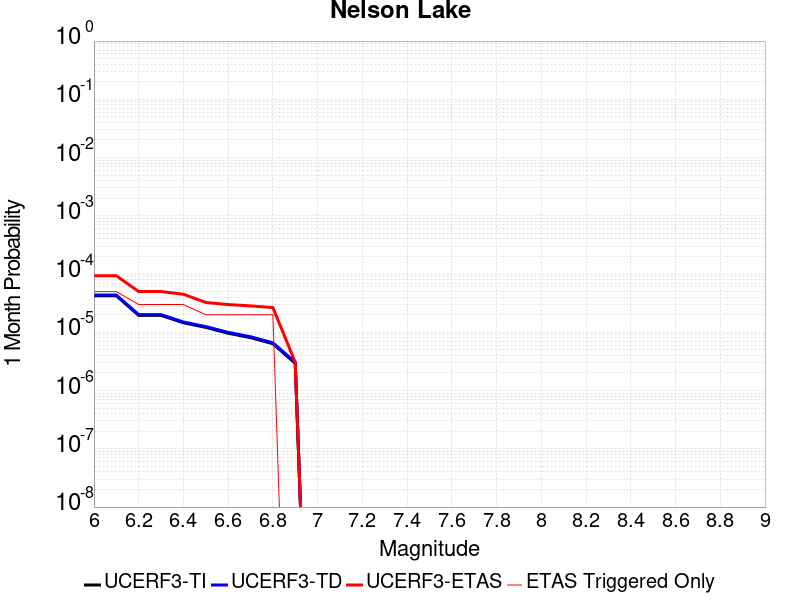 |  |  |

| Magnitude | 1 wk TI Prob | 1 wk TD Prob | 1 wk ETAS Prob | 1 wk ETAS/TD Gain | 1 wk ETAS Triggered Only | 1 mo TI Prob | 1 mo TD Prob | 1 mo ETAS Prob | 1 mo ETAS/TD Gain | 1 mo ETAS Triggered Only | 1 yr TI Prob | 1 yr TD Prob | 1 yr ETAS Prob | 1 yr ETAS/TD Gain | 1 yr ETAS Triggered Only | 10 yr TI Prob | 10 yr TD Prob | 10 yr ETAS Prob | 10 yr ETAS/TD Gain | 10 yr ETAS Triggered Only |
|-----|-----|-----|-----|-----|-----|-----|-----|-----|-----|-----|-----|-----|-----|-----|-----|-----|-----|-----|-----|-----|
| 6.0 | 9.913453E-6 | 1.0192408E-5 | 2.0192305E-5 | 1.9811125 | 1.0E-5 | 4.2485535E-5 | 4.3681073E-5 | 9.367889E-5 | 2.1446104 | 5.0E-5 | 5.1713863E-4 | 5.3169765E-4 | 0.0010214371 | 1.9210864 | 4.9E-4 | 0.0051593683 | 0.0053052832 | 0.0067475904 | 1.2718625 | 0.00145 |
| 6.1 | 9.913453E-6 | 1.0192408E-5 | 2.0192305E-5 | 1.9811125 | 1.0E-5 | 4.2485535E-5 | 4.3681073E-5 | 9.367889E-5 | 2.1446104 | 5.0E-5 | 5.1713863E-4 | 5.3169765E-4 | 0.0010214371 | 1.9210864 | 4.9E-4 | 0.0051593683 | 0.0053052832 | 0.0067475904 | 1.2718625 | 0.00145 |
| 6.2 | 4.5596407E-6 | 4.696388E-6 | 4.696388E-6 | 1.0 | 0.0 | 1.954117E-5 | 2.0127229E-5 | 5.0126626E-5 | 2.4904883 | 3.0E-5 | 2.3788778E-4 | 2.4502273E-4 | 4.6496882E-4 | 1.897656 | 2.2E-4 | 0.0023763329 | 0.0024476517 | 0.0031160119 | 1.2730618 | 6.7E-4 |
| 6.3 | 4.5596407E-6 | 4.696388E-6 | 4.696388E-6 | 1.0 | 0.0 | 1.954117E-5 | 2.0127229E-5 | 5.0126626E-5 | 2.4904883 | 3.0E-5 | 2.3788778E-4 | 2.4502273E-4 | 4.6496882E-4 | 1.897656 | 2.2E-4 | 0.0023763329 | 0.0024476517 | 0.0031160119 | 1.2730618 | 6.7E-4 |
| 6.4 | 3.4025713E-6 | 3.509956E-6 | 3.509956E-6 | 1.0 | 0.0 | 1.4582367E-5 | 1.5042587E-5 | 4.5042136E-5 | 2.9943078 | 3.0E-5 | 1.7752586E-4 | 1.8312894E-4 | 3.4309964E-4 | 1.8735414 | 1.6E-4 | 0.001773841 | 0.0018298633 | 0.0023289484 | 1.2727444 | 5.0E-4 |
| 6.5 | 2.8352947E-6 | 2.927907E-6 | 2.927907E-6 | 1.0 | 0.0 | 1.2151207E-5 | 1.25481165E-5 | 3.2547865E-5 | 2.5938447 | 2.0E-5 | 1.479309E-4 | 1.5276336E-4 | 2.827435E-4 | 1.8508594 | 1.3E-4 | 0.0014783246 | 0.0015266574 | 0.0019360314 | 1.2681506 | 4.1E-4 |
| 6.6 | 2.251518E-6 | 2.3291102E-6 | 2.3291102E-6 | 1.0 | 0.0 | 9.649328E-6 | 9.981866E-6 | 2.9981667E-5 | 3.0036132 | 2.0E-5 | 1.1747423E-4 | 1.2152307E-4 | 2.1151213E-4 | 1.7405101 | 9.0E-5 | 0.0011741214 | 0.001214628 | 0.0014942879 | 1.2302433 | 2.8E-4 |
| 6.7 | 1.8911853E-6 | 1.959177E-6 | 1.959177E-6 | 1.0 | 0.0 | 8.105055E-6 | 8.39645E-6 | 2.8396282E-5 | 3.3819392 | 2.0E-5 | 9.867457E-5 | 1.0222256E-4 | 1.8221438E-4 | 1.7825261 | 8.0E-5 | 9.863076E-4 | 0.0010218129 | 0.0012515779 | 1.2248601 | 2.3E-4 |
| 6.8 | 1.4874814E-6 | 1.5438616E-6 | 1.5438616E-6 | 1.0 | 0.0 | 6.374905E-6 | 6.6165358E-6 | 2.6616404E-5 | 4.02271 | 2.0E-5 | 7.76117E-5 | 8.0553866E-5 | 1.5054822E-4 | 1.8689138 | 7.0E-5 | 7.75846E-4 | 8.0529775E-4 | 9.851528E-4 | 1.2233398 | 1.8E-4 |
| 6.9 | 6.835972E-7 | 7.140097E-7 | 7.140097E-7 | 1.0 | 0.0 | 2.9296991E-6 | 3.0600397E-6 | 3.0600397E-6 | 1.0 | 0.0 | 3.56685E-5 | 3.7255664E-5 | 4.7255293E-5 | 1.2684056 | 1.0E-5 | 3.5662777E-4 | 3.7252545E-4 | 4.5249565E-4 | 1.2146704 | 8.0E-5 |

## Death Valley (So)
*[(top)](#table-of-contents)*

| 1 Week | 1 Month | 1 Year | 10 Year |
|-----|-----|-----|-----|
|  | 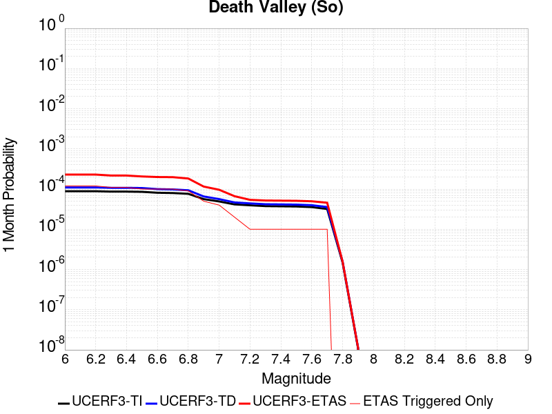 |  | 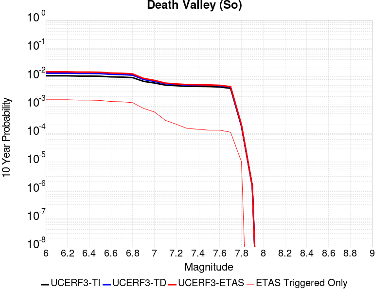 |

| Magnitude | 1 wk TI Prob | 1 wk TD Prob | 1 wk ETAS Prob | 1 wk ETAS/TD Gain | 1 wk ETAS Triggered Only | 1 mo TI Prob | 1 mo TD Prob | 1 mo ETAS Prob | 1 mo ETAS/TD Gain | 1 mo ETAS Triggered Only | 1 yr TI Prob | 1 yr TD Prob | 1 yr ETAS Prob | 1 yr ETAS/TD Gain | 1 yr ETAS Triggered Only | 10 yr TI Prob | 10 yr TD Prob | 10 yr ETAS Prob | 10 yr ETAS/TD Gain | 10 yr ETAS Triggered Only |
|-----|-----|-----|-----|-----|-----|-----|-----|-----|-----|-----|-----|-----|-----|-----|-----|-----|-----|-----|-----|-----|
| 6.0 | 2.0684236E-5 | 2.562036E-5 | 4.5619847E-5 | 1.7806091 | 2.0E-5 | 8.864371E-5 | 1.0979702E-4 | 2.2978385E-4 | 2.0928059 | 1.2E-4 | 0.0010787029 | 0.0013359758 | 0.0019751207 | 1.4784106 | 6.4E-4 | 0.010734817 | 0.013282726 | 0.01480227 | 1.1144 | 0.00154 |
| 6.1 | 2.0684236E-5 | 2.562036E-5 | 4.5619847E-5 | 1.7806091 | 2.0E-5 | 8.864371E-5 | 1.0979702E-4 | 2.2978385E-4 | 2.0928059 | 1.2E-4 | 0.0010787029 | 0.0013359758 | 0.0019751207 | 1.4784106 | 6.4E-4 | 0.010734817 | 0.013282726 | 0.01480227 | 1.1144 | 0.00154 |
| 6.2 | 2.0684236E-5 | 2.562036E-5 | 4.5619847E-5 | 1.7806091 | 2.0E-5 | 8.864371E-5 | 1.0979702E-4 | 2.2978385E-4 | 2.0928059 | 1.2E-4 | 0.0010787029 | 0.0013359758 | 0.0019751207 | 1.4784106 | 6.4E-4 | 0.010734817 | 0.013282726 | 0.01480227 | 1.1144 | 0.00154 |
| 6.3 | 2.0240292E-5 | 2.5120411E-5 | 4.511991E-5 | 1.7961453 | 2.0E-5 | 8.6741224E-5 | 1.0765456E-4 | 2.1764272E-4 | 2.0216768 | 1.1E-4 | 0.0010555626 | 0.0013099229 | 0.0019191239 | 1.4650662 | 6.1E-4 | 0.010505628 | 0.013025268 | 0.01449586 | 1.112903 | 0.00149 |
| 6.4 | 2.0240292E-5 | 2.5120411E-5 | 4.511991E-5 | 1.7961453 | 2.0E-5 | 8.6741224E-5 | 1.0765456E-4 | 2.1764272E-4 | 2.0216768 | 1.1E-4 | 0.0010555626 | 0.0013099229 | 0.0019191239 | 1.4650662 | 6.1E-4 | 0.010505628 | 0.013025268 | 0.01449586 | 1.112903 | 0.00149 |
| 6.5 | 1.9962767E-5 | 2.4809646E-5 | 4.480915E-5 | 1.8061181 | 2.0E-5 | 8.55519E-5 | 1.0632281E-4 | 2.0631218E-4 | 1.940432 | 1.0E-4 | 0.0010410968 | 0.0012937282 | 0.0018729778 | 1.4477367 | 5.8E-4 | 0.010362327 | 0.012865204 | 0.01429655 | 1.1112571 | 0.00145 |
| 6.6 | 1.8937297E-5 | 2.331338E-5 | 4.3312913E-5 | 1.8578565 | 2.0E-5 | 8.115732E-5 | 9.991074E-5 | 1.9990075E-4 | 2.0007935 | 1.0E-4 | 9.876423E-4 | 0.0012157491 | 0.0017550925 | 1.4436306 | 5.4E-4 | 0.009832645 | 0.012094032 | 0.0134079475 | 1.1086416 | 0.00133 |
| 6.7 | 1.8621096E-5 | 2.2913995E-5 | 4.2913536E-5 | 1.872809 | 2.0E-5 | 7.980225E-5 | 9.819922E-5 | 1.981894E-4 | 2.018238 | 1.0E-4 | 9.711593E-4 | 0.0011949344 | 0.001724301 | 1.443009 | 5.3E-4 | 0.009669261 | 0.011888134 | 0.01317268 | 1.1080527 | 0.0013 |
| 6.8 | 1.7830353E-5 | 2.1807928E-5 | 4.1807492E-5 | 1.9170777 | 2.0E-5 | 7.641356E-5 | 9.3459275E-5 | 1.8345086E-4 | 1.9628962 | 9.0E-5 | 9.29938E-4 | 0.0011372868 | 0.0016167408 | 1.4215771 | 4.8E-4 | 0.009260561 | 0.011317508 | 0.012513814 | 1.105704 | 0.00121 |
| 6.9 | 1.3135183E-5 | 1.530519E-5 | 3.5304885E-5 | 2.3067262 | 2.0E-5 | 5.6292425E-5 | 6.559206E-5 | 1.1558878E-4 | 1.7622374 | 5.0E-5 | 6.8514474E-4 | 7.9829723E-4 | 0.0010281136 | 1.2878833 | 2.3E-4 | 0.006830362 | 0.007955303 | 0.0087092575 | 1.0947738 | 7.6E-4 |
| 7.0 | 1.1507512E-5 | 1.3155178E-5 | 2.3155046E-5 | 1.760147 | 1.0E-5 | 4.9316975E-5 | 5.6378147E-5 | 9.6375894E-5 | 1.7094548 | 4.0E-5 | 6.002687E-4 | 6.861935E-4 | 8.360906E-4 | 1.2184472 | 1.5E-4 | 0.0059864987 | 0.0068414486 | 0.007407549 | 1.0827457 | 5.7E-4 |
| 7.1 | 9.715903E-6 | 1.08659815E-5 | 1.08659815E-5 | 1.0 | 0.0 | 4.1638916E-5 | 4.6567682E-5 | 6.6566754E-5 | 1.4294624 | 2.0E-5 | 5.068359E-4 | 5.6681834E-4 | 6.267843E-4 | 1.1057941 | 6.0E-5 | 0.0050568148 | 0.0056541795 | 0.00594254 | 1.0509995 | 2.9E-4 |
| 7.2 | 9.233269E-6 | 1.0286961E-5 | 1.0286961E-5 | 1.0 | 0.0 | 3.9570554E-5 | 4.4086253E-5 | 5.4085813E-5 | 1.2268181 | 1.0E-5 | 4.81665E-4 | 5.366222E-4 | 5.6660606E-4 | 1.0558753 | 3.0E-5 | 0.0048062233 | 0.0053536952 | 0.0055625713 | 1.0390153 | 2.1E-4 |
| 7.3 | 8.8041315E-6 | 9.80876E-6 | 9.80876E-6 | 1.0 | 0.0 | 3.7731446E-5 | 4.203689E-5 | 5.203647E-5 | 1.2378763 | 1.0E-5 | 4.592835E-4 | 5.116832E-4 | 5.21678E-4 | 1.0195334 | 1.0E-5 | 0.0045833546 | 0.005105477 | 0.005254711 | 1.0292302 | 1.5E-4 |
| 7.4 | 8.708749E-6 | 9.707768E-6 | 9.707768E-6 | 1.0 | 0.0 | 3.7322676E-5 | 4.1604082E-5 | 5.1603663E-5 | 1.2403511 | 1.0E-5 | 4.5430884E-4 | 5.0641614E-4 | 5.164111E-4 | 1.0197366 | 1.0E-5 | 0.004533812 | 0.0050530476 | 0.0051923404 | 1.0275661 | 1.4E-4 |
| 7.5 | 8.612678E-6 | 9.605406E-6 | 9.605406E-6 | 1.0 | 0.0 | 3.6910955E-5 | 4.1165404E-5 | 5.1164992E-5 | 1.2429124 | 1.0E-5 | 4.492982E-4 | 5.0107774E-4 | 5.110727E-4 | 1.0199469 | 1.0E-5 | 0.004483909 | 0.004999905 | 0.005129255 | 1.0258704 | 1.3E-4 |
| 7.6 | 8.319024E-6 | 9.28449E-6 | 9.28449E-6 | 1.0 | 0.0 | 3.5652476E-5 | 3.9790088E-5 | 4.978969E-5 | 1.2513089 | 1.0E-5 | 4.3398244E-4 | 4.8434082E-4 | 4.94336E-4 | 1.0206366 | 1.0E-5 | 0.0043313587 | 0.0048332764 | 0.004962648 | 1.0267669 | 1.3E-4 |
| 7.7 | 7.4718328E-6 | 8.345689E-6 | 8.345689E-6 | 1.0 | 0.0 | 3.2021748E-5 | 3.576677E-5 | 4.5766414E-5 | 1.2795792 | 1.0E-5 | 3.8979502E-4 | 4.3537747E-4 | 4.4537312E-4 | 1.0229585 | 1.0E-5 | 0.00389112 | 0.0043456503 | 0.0044551725 | 1.0252026 | 1.1E-4 |
| 7.8 | 3.4586725E-7 | 3.648368E-7 | 3.648368E-7 | 1.0 | 0.0 | 1.4822873E-6 | 1.5635853E-6 | 1.5635853E-6 | 1.0 | 0.0 | 1.80467E-5 | 1.903649E-5 | 1.903649E-5 | 1.0 | 0.0 | 1.8045233E-4 | 1.9034903E-4 | 2.0034713E-4 | 1.052525 | 1.0E-5 |
| 7.9 | 2.5591178E-9 | 2.6697329E-9 | 2.6697329E-9 | 1.0 | 0.0 | 1.0967647E-8 | 1.14417125E-8 | 1.14417125E-8 | 1.0 | 0.0 | 1.335311E-7 | 1.3930286E-7 | 1.3930286E-7 | 1.0 | 0.0 | 1.3353102E-6 | 1.3930285E-6 | 1.3930285E-6 | 1.0 | 0.0 |

## San Andreas (Mojave N)
*[(top)](#table-of-contents)*

| 1 Week | 1 Month | 1 Year | 10 Year |
|-----|-----|-----|-----|
| 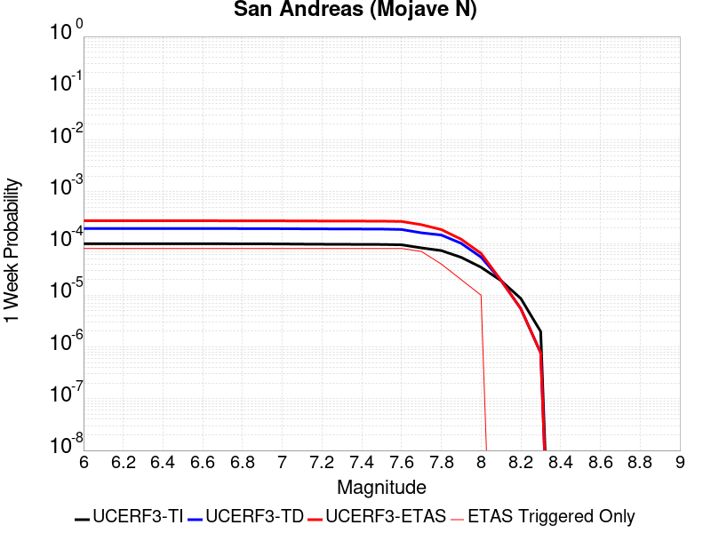 |  |  |  |

| Magnitude | 1 wk TI Prob | 1 wk TD Prob | 1 wk ETAS Prob | 1 wk ETAS/TD Gain | 1 wk ETAS Triggered Only | 1 mo TI Prob | 1 mo TD Prob | 1 mo ETAS Prob | 1 mo ETAS/TD Gain | 1 mo ETAS Triggered Only | 1 yr TI Prob | 1 yr TD Prob | 1 yr ETAS Prob | 1 yr ETAS/TD Gain | 1 yr ETAS Triggered Only | 10 yr TI Prob | 10 yr TD Prob | 10 yr ETAS Prob | 10 yr ETAS/TD Gain | 10 yr ETAS Triggered Only |
|-----|-----|-----|-----|-----|-----|-----|-----|-----|-----|-----|-----|-----|-----|-----|-----|-----|-----|-----|-----|-----|
| 6.0 | 9.877682E-5 | 1.9435467E-4 | 2.743391E-4 | 1.4115386 | 8.0E-5 | 4.2326056E-4 | 8.326828E-4 | 0.0010624913 | 1.2759856 | 2.3E-4 | 0.0051410277 | 0.010090916 | 0.010843247 | 1.0745553 | 7.6E-4 | 0.05023708 | 0.09846656 | 0.09979182 | 1.013459 | 0.00147 |
| 6.1 | 9.877682E-5 | 1.9435467E-4 | 2.743391E-4 | 1.4115386 | 8.0E-5 | 4.2326056E-4 | 8.326828E-4 | 0.0010624913 | 1.2759856 | 2.3E-4 | 0.0051410277 | 0.010090916 | 0.010843247 | 1.0745553 | 7.6E-4 | 0.05023708 | 0.09846656 | 0.09979182 | 1.013459 | 0.00147 |
| 6.2 | 9.877682E-5 | 1.9435467E-4 | 2.743391E-4 | 1.4115386 | 8.0E-5 | 4.2326056E-4 | 8.326828E-4 | 0.0010624913 | 1.2759856 | 2.3E-4 | 0.0051410277 | 0.010090916 | 0.010843247 | 1.0745553 | 7.6E-4 | 0.05023708 | 0.09846656 | 0.09979182 | 1.013459 | 0.00147 |
| 6.3 | 9.877682E-5 | 1.9435467E-4 | 2.743391E-4 | 1.4115386 | 8.0E-5 | 4.2326056E-4 | 8.326828E-4 | 0.0010624913 | 1.2759856 | 2.3E-4 | 0.0051410277 | 0.010090916 | 0.010843247 | 1.0745553 | 7.6E-4 | 0.05023708 | 0.09846656 | 0.09979182 | 1.013459 | 0.00147 |
| 6.4 | 9.877682E-5 | 1.9435467E-4 | 2.743391E-4 | 1.4115386 | 8.0E-5 | 4.2326056E-4 | 8.326828E-4 | 0.0010624913 | 1.2759856 | 2.3E-4 | 0.0051410277 | 0.010090916 | 0.010843247 | 1.0745553 | 7.6E-4 | 0.05023708 | 0.09846656 | 0.09979182 | 1.013459 | 0.00147 |
| 6.5 | 9.861474E-5 | 1.9409222E-4 | 2.7407668E-4 | 1.4120952 | 8.0E-5 | 4.2256617E-4 | 8.3155883E-4 | 0.0010613676 | 1.276359 | 2.3E-4 | 0.0051326132 | 0.010077358 | 0.010829699 | 1.0746566 | 7.6E-4 | 0.050156746 | 0.09834433 | 0.09966976 | 1.0134774 | 0.00147 |
| 6.6 | 9.861474E-5 | 1.9409222E-4 | 2.7407668E-4 | 1.4120952 | 8.0E-5 | 4.2256617E-4 | 8.3155883E-4 | 0.0010613676 | 1.276359 | 2.3E-4 | 0.0051326132 | 0.010077358 | 0.010829699 | 1.0746566 | 7.6E-4 | 0.050156746 | 0.09834433 | 0.09966976 | 1.0134774 | 0.00147 |
| 6.7 | 9.8552715E-5 | 1.9399171E-4 | 2.7397618E-4 | 1.4123088 | 8.0E-5 | 4.223004E-4 | 8.3112833E-4 | 0.0010609372 | 1.2765023 | 2.3E-4 | 0.0051293927 | 0.010072165 | 0.01082451 | 1.0746955 | 7.6E-4 | 0.050125998 | 0.09829751 | 0.09962301 | 1.0134846 | 0.00147 |
| 6.8 | 9.8464974E-5 | 1.9384324E-4 | 2.7382773E-4 | 1.4126246 | 8.0E-5 | 4.219245E-4 | 8.304924E-4 | 0.0010603014 | 1.2767141 | 2.3E-4 | 0.0051248376 | 0.010064495 | 0.010816845 | 1.0747529 | 7.6E-4 | 0.05008251 | 0.0982275 | 0.09955311 | 1.0134952 | 0.00147 |
| 6.9 | 9.825824E-5 | 1.9352314E-4 | 2.7350767E-4 | 1.4133072 | 8.0E-5 | 4.2103877E-4 | 8.2912145E-4 | 0.0010589308 | 1.2771721 | 2.3E-4 | 0.0051141046 | 0.010047957 | 0.010800321 | 1.0748773 | 7.6E-4 | 0.049980022 | 0.098076545 | 0.09940237 | 1.0135183 | 0.00147 |
| 7.0 | 9.781462E-5 | 1.928364E-4 | 2.7282097E-4 | 1.4147794 | 8.0E-5 | 4.1913814E-4 | 8.2618016E-4 | 0.0010559901 | 1.2781596 | 2.3E-4 | 0.005091073 | 0.010012477 | 0.010764867 | 1.0751452 | 7.6E-4 | 0.04976007 | 0.0977528 | 0.09907911 | 1.0135679 | 0.00147 |
| 7.1 | 9.7121134E-5 | 1.9185297E-4 | 2.7183763E-4 | 1.416906 | 8.0E-5 | 4.1616702E-4 | 8.2196813E-4 | 0.0010517791 | 1.2795862 | 2.3E-4 | 0.005055068 | 0.009961666 | 0.010714094 | 1.0755324 | 7.6E-4 | 0.04941613 | 0.09728914 | 0.09861612 | 1.0136396 | 0.00147 |
| 7.2 | 9.663819E-5 | 1.9116043E-4 | 2.7114514E-4 | 1.4184166 | 8.0E-5 | 4.1409794E-4 | 8.19002E-4 | 0.0010488136 | 1.2805996 | 2.3E-4 | 0.0050299936 | 0.009925882 | 0.010678338 | 1.0758075 | 7.6E-4 | 0.049176537 | 0.09696228 | 0.09828974 | 1.0136906 | 0.00147 |
| 7.3 | 9.6277574E-5 | 1.9068507E-4 | 2.706698E-4 | 1.4194599 | 8.0E-5 | 4.125529E-4 | 8.16966E-4 | 0.001046778 | 1.2812995 | 2.3E-4 | 0.0050112694 | 0.00990132 | 0.010653795 | 1.0759975 | 7.6E-4 | 0.04899759 | 0.09673555 | 0.09806335 | 1.0137261 | 0.00147 |
| 7.4 | 9.593308E-5 | 1.9008234E-4 | 2.7006713E-4 | 1.4207902 | 8.0E-5 | 4.1107697E-4 | 8.1438443E-4 | 0.0010441971 | 1.2821919 | 2.3E-4 | 0.0049933824 | 0.009870174 | 0.010622674 | 1.0762397 | 7.6E-4 | 0.04882661 | 0.09645354 | 0.097781755 | 1.0137705 | 0.00147 |
| 7.5 | 9.561707E-5 | 1.8954265E-4 | 2.695275E-4 | 1.4219886 | 8.0E-5 | 4.0972308E-4 | 8.12073E-4 | 0.0010418862 | 1.2829958 | 2.3E-4 | 0.0049769743 | 0.009842287 | 0.010594807 | 1.0764579 | 7.6E-4 | 0.048669744 | 0.09619955 | 0.09752814 | 1.0138108 | 0.00147 |
| 7.6 | 9.418194E-5 | 1.8606246E-4 | 2.6604757E-4 | 1.4298831 | 8.0E-5 | 4.0357444E-4 | 7.97167E-4 | 0.0010269837 | 1.2882917 | 2.3E-4 | 0.004902454 | 0.00966243 | 0.010405184 | 1.0768702 | 7.5E-4 | 0.047957025 | 0.09458092 | 0.09590283 | 1.0139766 | 0.00146 |
| 7.7 | 8.202141E-5 | 1.6052493E-4 | 2.3051369E-4 | 1.4359994 | 7.0E-5 | 3.51473E-4 | 6.877826E-4 | 8.8764506E-4 | 1.2905896 | 2.0E-4 | 0.00427079 | 0.00834166 | 0.008996154 | 1.0784609 | 6.6E-4 | 0.04189639 | 0.082371704 | 0.083582975 | 1.014705 | 0.00132 |
| 7.8 | 7.2859846E-5 | 1.4544492E-4 | 1.8543912E-4 | 1.2749782 | 4.0E-5 | 3.1221908E-4 | 6.231865E-4 | 7.531055E-4 | 1.2084752 | 1.3E-4 | 0.003794643 | 0.0075609423 | 0.007967843 | 1.0538161 | 4.1E-4 | 0.037304975 | 0.07485102 | 0.07566515 | 1.0108767 | 8.8E-4 |
| 7.9 | 5.3874453E-5 | 1.0065284E-4 | 1.20650824E-4 | 1.1986828 | 2.0E-5 | 2.3087008E-4 | 4.3129802E-4 | 5.0126784E-4 | 1.1622307 | 7.0E-5 | 0.0028072202 | 0.0052384217 | 0.005437374 | 1.0379795 | 2.0E-4 | 0.02772022 | 0.05251603 | 0.052980296 | 1.0088404 | 4.9E-4 |
| 8.0 | 3.468538E-5 | 5.4373286E-5 | 6.437274E-5 | 1.1839038 | 1.0E-5 | 1.4864317E-4 | 2.3300757E-4 | 2.929936E-4 | 1.2574424 | 6.0E-5 | 0.0018082283 | 0.0028331785 | 0.0029528385 | 1.0422353 | 1.2E-4 | 0.017935853 | 0.02900292 | 0.029245669 | 1.0083698 | 2.5E-4 |
| 8.1 | 1.9152367E-5 | 1.9455974E-5 | 1.9455974E-5 | 1.0 | 0.0 | 8.207899E-5 | 8.338009E-5 | 8.338009E-5 | 1.0 | 0.0 | 9.988535E-4 | 0.0010146805 | 0.0010346601 | 1.0196906 | 2.0E-5 | 0.009943757 | 0.010884172 | 0.010923737 | 1.003635 | 4.0E-5 |
| 8.2 | 8.643924E-6 | 5.49522E-6 | 5.49522E-6 | 1.0 | 0.0 | 3.704486E-5 | 2.355073E-5 | 2.355073E-5 | 1.0 | 0.0 | 4.5092785E-4 | 2.866925E-4 | 2.866925E-4 | 1.0 | 0.0 | 0.0045001395 | 0.0032598388 | 0.0032598388 | 1.0 | 0.0 |
| 8.3 | 1.983087E-6 | 7.693574E-7 | 7.693574E-7 | 1.0 | 0.0 | 8.498917E-6 | 3.297242E-6 | 3.297242E-6 | 1.0 | 0.0 | 1.034694E-4 | 4.01432E-5 | 4.01432E-5 | 1.0 | 0.0 | 0.0010342124 | 4.7390026E-4 | 4.7390026E-4 | 1.0 | 0.0 |

## Towne Pass
*[(top)](#table-of-contents)*

| 1 Week | 1 Month | 1 Year | 10 Year |
|-----|-----|-----|-----|
| 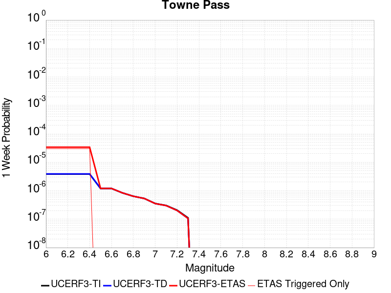 | 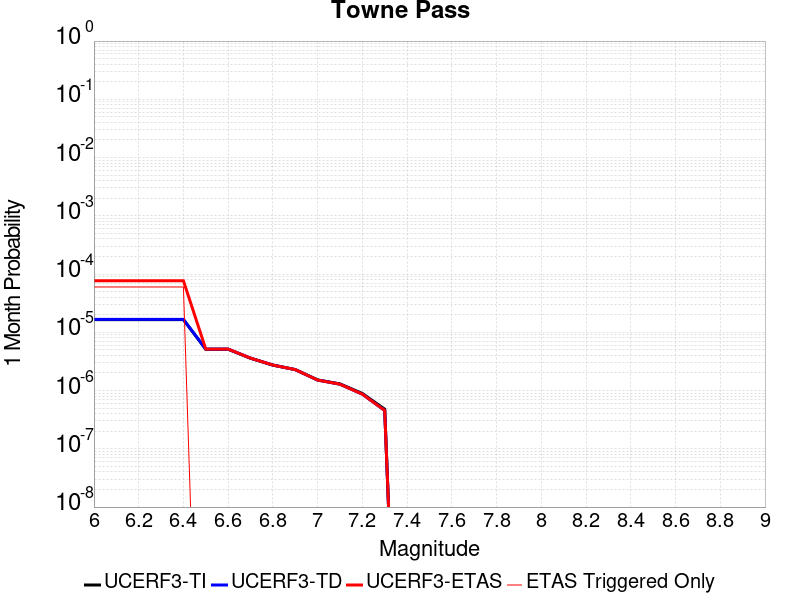 | 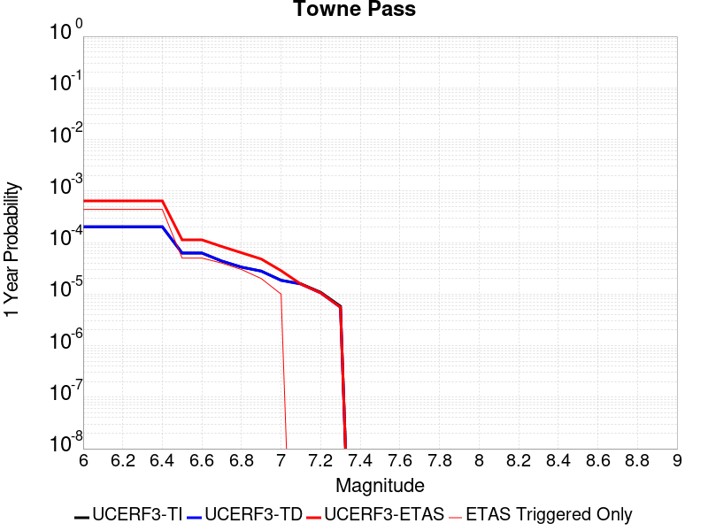 |  |

| Magnitude | 1 wk TI Prob | 1 wk TD Prob | 1 wk ETAS Prob | 1 wk ETAS/TD Gain | 1 wk ETAS Triggered Only | 1 mo TI Prob | 1 mo TD Prob | 1 mo ETAS Prob | 1 mo ETAS/TD Gain | 1 mo ETAS Triggered Only | 1 yr TI Prob | 1 yr TD Prob | 1 yr ETAS Prob | 1 yr ETAS/TD Gain | 1 yr ETAS Triggered Only | 10 yr TI Prob | 10 yr TD Prob | 10 yr ETAS Prob | 10 yr ETAS/TD Gain | 10 yr ETAS Triggered Only |
|-----|-----|-----|-----|-----|-----|-----|-----|-----|-----|-----|-----|-----|-----|-----|-----|-----|-----|-----|-----|-----|
| 6.0 | 3.849728E-6 | 3.8945745E-6 | 3.389446E-5 | 8.702994 | 3.0E-5 | 1.649873E-5 | 1.669095E-5 | 7.668995E-5 | 4.5947022 | 6.0E-5 | 2.0085352E-4 | 2.0319775E-4 | 6.4310833E-4 | 3.1649384 | 4.4E-4 | 0.0020067208 | 0.0020305486 | 0.003158254 | 1.5553699 | 0.00113 |
| 6.1 | 3.849728E-6 | 3.8945745E-6 | 3.389446E-5 | 8.702994 | 3.0E-5 | 1.649873E-5 | 1.669095E-5 | 7.668995E-5 | 4.5947022 | 6.0E-5 | 2.0085352E-4 | 2.0319775E-4 | 6.4310833E-4 | 3.1649384 | 4.4E-4 | 0.0020067208 | 0.0020305486 | 0.003158254 | 1.5553699 | 0.00113 |
| 6.2 | 3.849728E-6 | 3.8945745E-6 | 3.389446E-5 | 8.702994 | 3.0E-5 | 1.649873E-5 | 1.669095E-5 | 7.668995E-5 | 4.5947022 | 6.0E-5 | 2.0085352E-4 | 2.0319775E-4 | 6.4310833E-4 | 3.1649384 | 4.4E-4 | 0.0020067208 | 0.0020305486 | 0.003158254 | 1.5553699 | 0.00113 |
| 6.3 | 3.849728E-6 | 3.8945745E-6 | 3.389446E-5 | 8.702994 | 3.0E-5 | 1.649873E-5 | 1.669095E-5 | 7.668995E-5 | 4.5947022 | 6.0E-5 | 2.0085352E-4 | 2.0319775E-4 | 6.4310833E-4 | 3.1649384 | 4.4E-4 | 0.0020067208 | 0.0020305486 | 0.003158254 | 1.5553699 | 0.00113 |
| 6.4 | 3.849728E-6 | 3.8945745E-6 | 3.389446E-5 | 8.702994 | 3.0E-5 | 1.649873E-5 | 1.669095E-5 | 7.668995E-5 | 4.5947022 | 6.0E-5 | 2.0085352E-4 | 2.0319775E-4 | 6.4310833E-4 | 3.1649384 | 4.4E-4 | 0.0020067208 | 0.0020305486 | 0.003158254 | 1.5553699 | 0.00113 |
| 6.5 | 1.1953545E-6 | 1.203065E-6 | 1.203065E-6 | 1.0 | 0.0 | 5.1229376E-6 | 5.1559837E-6 | 5.1559837E-6 | 1.0 | 0.0 | 6.236998E-5 | 6.277241E-5 | 1.12769274E-4 | 1.7964783 | 5.0E-5 | 6.235248E-4 | 6.275585E-4 | 7.974518E-4 | 1.2707211 | 1.7E-4 |
| 6.6 | 1.1953545E-6 | 1.203065E-6 | 1.203065E-6 | 1.0 | 0.0 | 5.1229376E-6 | 5.1559837E-6 | 5.1559837E-6 | 1.0 | 0.0 | 6.236998E-5 | 6.277241E-5 | 1.12769274E-4 | 1.7964783 | 5.0E-5 | 6.235248E-4 | 6.275585E-4 | 7.974518E-4 | 1.2707211 | 1.7E-4 |
| 6.7 | 8.375951E-7 | 8.410778E-7 | 8.410778E-7 | 1.0 | 0.0 | 3.5896885E-6 | 3.6046144E-6 | 3.6046144E-6 | 1.0 | 0.0 | 4.370358E-5 | 4.3885353E-5 | 8.38836E-5 | 1.9114258 | 4.0E-5 | 4.3694986E-4 | 4.387726E-4 | 5.6871556E-4 | 1.296151 | 1.3E-4 |
| 6.8 | 6.38041E-7 | 6.3922516E-7 | 6.3922516E-7 | 1.0 | 0.0 | 2.7344586E-6 | 2.7395338E-6 | 2.7395338E-6 | 1.0 | 0.0 | 3.3291526E-5 | 3.335335E-5 | 6.335235E-5 | 1.8994298 | 3.0E-5 | 3.3286537E-4 | 3.3348726E-4 | 4.4345058E-4 | 1.3297377 | 1.1E-4 |
| 6.9 | 5.3460053E-7 | 5.3454215E-7 | 5.3454215E-7 | 1.0 | 0.0 | 2.2911431E-6 | 2.290893E-6 | 2.290893E-6 | 1.0 | 0.0 | 2.789431E-5 | 2.78913E-5 | 4.7890742E-5 | 1.7170495 | 2.0E-5 | 2.789081E-4 | 2.788813E-4 | 3.688562E-4 | 1.3226279 | 9.0E-5 |
| 7.0 | 3.557783E-7 | 3.5324976E-7 | 3.5324976E-7 | 1.0 | 0.0 | 1.5247632E-6 | 1.5139268E-6 | 1.5139268E-6 | 1.0 | 0.0 | 1.8563835E-5 | 1.843191E-5 | 2.8431727E-5 | 1.5425273 | 1.0E-5 | 1.8562283E-4 | 1.8430466E-4 | 2.3429545E-4 | 1.2712399 | 5.0E-5 |
| 7.1 | 3.037942E-7 | 3.0002903E-7 | 3.0002903E-7 | 1.0 | 0.0 | 1.3019744E-6 | 1.285838E-6 | 1.285838E-6 | 1.0 | 0.0 | 1.5851423E-5 | 1.5654974E-5 | 1.5654974E-5 | 1.0 | 0.0 | 1.5850292E-4 | 1.5653945E-4 | 1.9653319E-4 | 1.2554866 | 4.0E-5 |
| 7.2 | 2.0808248E-7 | 2.0218252E-7 | 2.0218252E-7 | 1.0 | 0.0 | 8.917818E-7 | 8.6649624E-7 | 8.6649624E-7 | 1.0 | 0.0 | 1.0857389E-5 | 1.0549546E-5 | 1.0549546E-5 | 1.0 | 0.0 | 1.0856859E-4 | 1.0549091E-4 | 1.3548775E-4 | 1.2843547 | 3.0E-5 |
| 7.3 | 1.1162073E-7 | 1.0637251E-7 | 1.0637251E-7 | 1.0 | 0.0 | 4.7837443E-7 | 4.5588212E-7 | 4.5588212E-7 | 1.0 | 0.0 | 5.8241935E-6 | 5.5503524E-6 | 5.5503524E-6 | 1.0 | 0.0 | 5.8240406E-5 | 5.550234E-5 | 7.550123E-5 | 1.3603252 | 2.0E-5 |

## Bicycle Lake
*[(top)](#table-of-contents)*

| 1 Week | 1 Month | 1 Year | 10 Year |
|-----|-----|-----|-----|
|  |  |  |  |

| Magnitude | 1 wk TI Prob | 1 wk TD Prob | 1 wk ETAS Prob | 1 wk ETAS/TD Gain | 1 wk ETAS Triggered Only | 1 mo TI Prob | 1 mo TD Prob | 1 mo ETAS Prob | 1 mo ETAS/TD Gain | 1 mo ETAS Triggered Only | 1 yr TI Prob | 1 yr TD Prob | 1 yr ETAS Prob | 1 yr ETAS/TD Gain | 1 yr ETAS Triggered Only | 10 yr TI Prob | 10 yr TD Prob | 10 yr ETAS Prob | 10 yr ETAS/TD Gain | 10 yr ETAS Triggered Only |
|-----|-----|-----|-----|-----|-----|-----|-----|-----|-----|-----|-----|-----|-----|-----|-----|-----|-----|-----|-----|-----|
| 6.0 | 1.9621975E-5 | 2.2098558E-5 | 3.2098338E-5 | 1.4525082 | 1.0E-5 | 8.4091465E-5 | 9.470543E-5 | 1.5469975E-4 | 1.6334834 | 6.0E-5 | 0.0010233327 | 0.0011525637 | 0.0015221372 | 1.3206534 | 3.7E-4 | 0.01018633 | 0.011479173 | 0.012378727 | 1.078364 | 9.1E-4 |
| 6.1 | 1.9621975E-5 | 2.2098558E-5 | 3.2098338E-5 | 1.4525082 | 1.0E-5 | 8.4091465E-5 | 9.470543E-5 | 1.5469975E-4 | 1.6334834 | 6.0E-5 | 0.0010233327 | 0.0011525637 | 0.0015221372 | 1.3206534 | 3.7E-4 | 0.01018633 | 0.011479173 | 0.012378727 | 1.078364 | 9.1E-4 |
| 6.2 | 9.9971285E-6 | 1.1256391E-5 | 1.1256391E-5 | 1.0 | 0.0 | 4.2844134E-5 | 4.824108E-5 | 6.8240115E-5 | 1.4145644 | 2.0E-5 | 5.2150246E-4 | 5.8722886E-4 | 8.170938E-4 | 1.3914402 | 2.3E-4 | 0.0052028033 | 0.0058618775 | 0.0064185946 | 1.0949725 | 5.6E-4 |
| 6.3 | 9.589428E-6 | 1.0799068E-5 | 1.0799068E-5 | 1.0 | 0.0 | 4.10969E-5 | 4.628119E-5 | 6.628027E-5 | 1.4321209 | 2.0E-5 | 5.002399E-4 | 5.633797E-4 | 7.832558E-4 | 1.3902804 | 2.2E-4 | 0.0049911533 | 0.0056246053 | 0.006151624 | 1.0936989 | 5.3E-4 |
| 6.4 | 9.589428E-6 | 1.0799068E-5 | 1.0799068E-5 | 1.0 | 0.0 | 4.10969E-5 | 4.628119E-5 | 6.628027E-5 | 1.4321209 | 2.0E-5 | 5.002399E-4 | 5.633797E-4 | 7.832558E-4 | 1.3902804 | 2.2E-4 | 0.0049911533 | 0.0056246053 | 0.006151624 | 1.0936989 | 5.3E-4 |
| 6.5 | 5.557707E-6 | 6.286038E-6 | 6.286038E-6 | 1.0 | 0.0 | 2.3818526E-5 | 2.6940037E-5 | 3.6939768E-5 | 1.3711847 | 1.0E-5 | 2.8995197E-4 | 3.2797246E-4 | 4.7792328E-4 | 1.4572054 | 1.5E-4 | 0.0028957394 | 0.0032775209 | 0.003636341 | 1.1094791 | 3.6E-4 |
| 6.6 | 4.8742945E-6 | 5.5136734E-6 | 5.5136734E-6 | 1.0 | 0.0 | 2.0889667E-5 | 2.3629962E-5 | 3.3629723E-5 | 1.4231815 | 1.0E-5 | 2.54302E-4 | 2.87683E-4 | 3.9765137E-4 | 1.3822553 | 1.1E-4 | 0.002540112 | 0.0028756752 | 0.0031847837 | 1.1074908 | 3.1E-4 |
| 6.7 | 3.991108E-6 | 4.5162255E-6 | 4.5162255E-6 | 1.0 | 0.0 | 1.7104636E-5 | 1.9355251E-5 | 2.9355058E-5 | 1.5166457 | 1.0E-5 | 2.0822904E-4 | 2.3565018E-4 | 3.1563133E-4 | 1.3394063 | 8.0E-5 | 0.0020803404 | 0.0023565018 | 0.0025759835 | 1.0931387 | 2.2E-4 |

## Paradise
*[(top)](#table-of-contents)*

| 1 Week | 1 Month | 1 Year | 10 Year |
|-----|-----|-----|-----|
|  |  |  |  |

| Magnitude | 1 wk TI Prob | 1 wk TD Prob | 1 wk ETAS Prob | 1 wk ETAS/TD Gain | 1 wk ETAS Triggered Only | 1 mo TI Prob | 1 mo TD Prob | 1 mo ETAS Prob | 1 mo ETAS/TD Gain | 1 mo ETAS Triggered Only | 1 yr TI Prob | 1 yr TD Prob | 1 yr ETAS Prob | 1 yr ETAS/TD Gain | 1 yr ETAS Triggered Only | 10 yr TI Prob | 10 yr TD Prob | 10 yr ETAS Prob | 10 yr ETAS/TD Gain | 10 yr ETAS Triggered Only |
|-----|-----|-----|-----|-----|-----|-----|-----|-----|-----|-----|-----|-----|-----|-----|-----|-----|-----|-----|-----|-----|
| 6.0 | 1.4851273E-5 | 1.6695341E-5 | 4.669484E-5 | 2.7968786 | 3.0E-5 | 6.364676E-5 | 7.154963E-5 | 1.7154247E-4 | 2.3975313 | 1.0E-4 | 7.7462377E-4 | 8.707922E-4 | 0.0013004178 | 1.4933733 | 4.3E-4 | 0.0077192914 | 0.008676181 | 0.009588199 | 1.1051174 | 9.2E-4 |
| 6.1 | 1.4851273E-5 | 1.6695341E-5 | 4.669484E-5 | 2.7968786 | 3.0E-5 | 6.364676E-5 | 7.154963E-5 | 1.7154247E-4 | 2.3975313 | 1.0E-4 | 7.7462377E-4 | 8.707922E-4 | 0.0013004178 | 1.4933733 | 4.3E-4 | 0.0077192914 | 0.008676181 | 0.009588199 | 1.1051174 | 9.2E-4 |
| 6.2 | 1.4851273E-5 | 1.6695341E-5 | 4.669484E-5 | 2.7968786 | 3.0E-5 | 6.364676E-5 | 7.154963E-5 | 1.7154247E-4 | 2.3975313 | 1.0E-4 | 7.7462377E-4 | 8.707922E-4 | 0.0013004178 | 1.4933733 | 4.3E-4 | 0.0077192914 | 0.008676181 | 0.009588199 | 1.1051174 | 9.2E-4 |
| 6.3 | 1.0426831E-5 | 1.1889049E-5 | 2.188893E-5 | 1.8411001 | 1.0E-5 | 4.4685654E-5 | 5.095211E-5 | 1.2094854E-4 | 2.373769 | 7.0E-5 | 5.43912E-4 | 6.2017125E-4 | 8.3004107E-4 | 1.3384061 | 2.1E-4 | 0.0054258266 | 0.0061850143 | 0.0065626637 | 1.0610589 | 3.8E-4 |
| 6.4 | 1.0426831E-5 | 1.1889049E-5 | 2.188893E-5 | 1.8411001 | 1.0E-5 | 4.4685654E-5 | 5.095211E-5 | 1.2094854E-4 | 2.373769 | 7.0E-5 | 5.43912E-4 | 6.2017125E-4 | 8.3004107E-4 | 1.3384061 | 2.1E-4 | 0.0054258266 | 0.0061850143 | 0.0065626637 | 1.0610589 | 3.8E-4 |
| 6.5 | 9.25027E-6 | 1.0620336E-5 | 1.0620336E-5 | 1.0 | 0.0 | 3.964341E-5 | 4.551496E-5 | 9.551268E-5 | 2.09849 | 5.0E-5 | 4.8255164E-4 | 5.5400864E-4 | 7.1392E-4 | 1.2886442 | 1.6E-4 | 0.0048150513 | 0.0055267746 | 0.005805227 | 1.0503825 | 2.8E-4 |
| 6.6 | 7.904275E-6 | 9.159836E-6 | 9.159836E-6 | 1.0 | 0.0 | 3.3875025E-5 | 3.925587E-5 | 7.92543E-5 | 2.018916 | 4.0E-5 | 4.1235037E-4 | 4.7783932E-4 | 5.877868E-4 | 1.2300929 | 1.1E-4 | 0.0041158604 | 0.0047685155 | 0.004947657 | 1.0375676 | 1.8E-4 |
| 6.7 | 7.2061953E-6 | 8.407527E-6 | 8.407527E-6 | 1.0 | 0.0 | 3.088333E-5 | 3.6031786E-5 | 5.6031065E-5 | 1.5550455 | 2.0E-5 | 3.7593965E-4 | 4.3860235E-4 | 5.285629E-4 | 1.2051072 | 9.0E-5 | 0.003753043 | 0.0043777362 | 0.0045270794 | 1.0341142 | 1.5E-4 |
| 6.8 | 6.6948724E-6 | 7.842423E-6 | 7.842423E-6 | 1.0 | 0.0 | 2.8691995E-5 | 3.3609973E-5 | 5.36093E-5 | 1.5950415 | 2.0E-5 | 3.4926904E-4 | 4.0912814E-4 | 4.890954E-4 | 1.1954577 | 8.0E-5 | 0.003487206 | 0.004084107 | 0.0042235353 | 1.0341393 | 1.4E-4 |
| 6.9 | 6.0421025E-6 | 7.1308505E-6 | 7.1308505E-6 | 1.0 | 0.0 | 2.5894467E-5 | 3.0560448E-5 | 4.0560142E-5 | 1.3272103 | 1.0E-5 | 3.1521954E-4 | 3.7201334E-4 | 4.2199474E-4 | 1.1343538 | 5.0E-5 | 0.0031477278 | 0.003714244 | 0.0038138726 | 1.0268234 | 1.0E-4 |
| 7.0 | 4.134091E-6 | 5.080469E-6 | 5.080469E-6 | 1.0 | 0.0 | 1.7717413E-5 | 2.1773263E-5 | 2.1773263E-5 | 1.0 | 0.0 | 2.1568815E-4 | 2.6505877E-4 | 2.8505348E-4 | 1.0754349 | 2.0E-5 | 0.0021547892 | 0.0026475794 | 0.0026775 | 1.0113012 | 3.0E-5 |
| 7.1 | 3.7674888E-6 | 4.6320133E-6 | 4.6320133E-6 | 1.0 | 0.0 | 1.6146281E-5 | 1.9851343E-5 | 1.9851343E-5 | 1.0 | 0.0 | 1.9656324E-4 | 2.4166482E-4 | 2.6166E-4 | 1.0827392 | 2.0E-5 | 0.0019638946 | 0.002414171 | 0.0024440982 | 1.0123966 | 3.0E-5 |
| 7.2 | 3.4065345E-6 | 4.1568514E-6 | 4.1568514E-6 | 1.0 | 0.0 | 1.4599351E-5 | 1.7814966E-5 | 1.7814966E-5 | 1.0 | 0.0 | 1.777326E-4 | 2.1687712E-4 | 2.3687277E-4 | 1.0921981 | 2.0E-5 | 0.0017759053 | 0.0021668028 | 0.0021967378 | 1.0138153 | 3.0E-5 |
| 7.3 | 2.9934936E-6 | 3.629423E-6 | 3.629423E-6 | 1.0 | 0.0 | 1.2829195E-5 | 1.5554586E-5 | 1.5554586E-5 | 1.0 | 0.0 | 1.5618425E-4 | 1.893621E-4 | 2.093583E-4 | 1.1055977 | 2.0E-5 | 0.0015607453 | 0.0018921527 | 0.001922096 | 1.0158249 | 3.0E-5 |
| 7.4 | 2.4049796E-6 | 2.889062E-6 | 2.889062E-6 | 1.0 | 0.0 | 1.0307015E-5 | 1.23816435E-5 | 1.23816435E-5 | 1.0 | 0.0 | 1.2548068E-4 | 1.5073753E-4 | 1.6073602E-4 | 1.0663304 | 1.0E-5 | 0.0012540985 | 0.0015064942 | 0.0015264641 | 1.0132558 | 2.0E-5 |
| 7.5 | 1.2710091E-6 | 1.5135054E-6 | 1.5135054E-6 | 1.0 | 0.0 | 5.44717E-6 | 6.4864425E-6 | 6.4864425E-6 | 1.0 | 0.0 | 6.631728E-5 | 7.897083E-5 | 8.897004E-5 | 1.126619 | 1.0E-5 | 6.6297496E-4 | 7.8955025E-4 | 8.095345E-4 | 1.0253109 | 2.0E-5 |
| 7.6 | 2.21172E-7 | 2.6040124E-7 | 2.6040124E-7 | 1.0 | 0.0 | 9.478797E-7 | 1.116005E-6 | 1.116005E-6 | 1.0 | 0.0 | 1.1540374E-5 | 1.3587305E-5 | 1.3587305E-5 | 1.0 | 0.0 | 1.1539775E-4 | 1.3586757E-4 | 1.3586757E-4 | 1.0 | 0.0 |

## San Andreas (San Bernardino N)
*[(top)](#table-of-contents)*

| 1 Week | 1 Month | 1 Year | 10 Year |
|-----|-----|-----|-----|
|  |  |  |  |

| Magnitude | 1 wk TI Prob | 1 wk TD Prob | 1 wk ETAS Prob | 1 wk ETAS/TD Gain | 1 wk ETAS Triggered Only | 1 mo TI Prob | 1 mo TD Prob | 1 mo ETAS Prob | 1 mo ETAS/TD Gain | 1 mo ETAS Triggered Only | 1 yr TI Prob | 1 yr TD Prob | 1 yr ETAS Prob | 1 yr ETAS/TD Gain | 1 yr ETAS Triggered Only | 10 yr TI Prob | 10 yr TD Prob | 10 yr ETAS Prob | 10 yr ETAS/TD Gain | 10 yr ETAS Triggered Only |
|-----|-----|-----|-----|-----|-----|-----|-----|-----|-----|-----|-----|-----|-----|-----|-----|-----|-----|-----|-----|-----|
| 6.0 | 1.4273766E-4 | 3.1635934E-4 | 3.5634666E-4 | 1.1263986 | 4.0E-5 | 6.115894E-4 | 0.0013551271 | 0.0014749645 | 1.0884326 | 1.2E-4 | 0.0074207084 | 0.016375363 | 0.016709795 | 1.0204229 | 3.4E-4 | 0.07177748 | 0.15038711 | 0.1510328 | 1.0042937 | 7.6E-4 |
| 6.1 | 1.4273766E-4 | 3.1635934E-4 | 3.5634666E-4 | 1.1263986 | 4.0E-5 | 6.115894E-4 | 0.0013551271 | 0.0014749645 | 1.0884326 | 1.2E-4 | 0.0074207084 | 0.016375363 | 0.016709795 | 1.0204229 | 3.4E-4 | 0.07177748 | 0.15038711 | 0.1510328 | 1.0042937 | 7.6E-4 |
| 6.2 | 1.4273766E-4 | 3.1635934E-4 | 3.5634666E-4 | 1.1263986 | 4.0E-5 | 6.115894E-4 | 0.0013551271 | 0.0014749645 | 1.0884326 | 1.2E-4 | 0.0074207084 | 0.016375363 | 0.016709795 | 1.0204229 | 3.4E-4 | 0.07177748 | 0.15038711 | 0.1510328 | 1.0042937 | 7.6E-4 |
| 6.3 | 1.3730655E-4 | 3.0540637E-4 | 3.4539416E-4 | 1.130933 | 4.0E-5 | 5.883239E-4 | 0.0013082335 | 0.0014180896 | 1.0839728 | 1.1E-4 | 0.0071393442 | 0.015812824 | 0.016137606 | 1.0205392 | 3.3E-4 | 0.06914291 | 0.14568701 | 0.14632775 | 1.004398 | 7.5E-4 |
| 6.4 | 1.3730655E-4 | 3.0540637E-4 | 3.4539416E-4 | 1.130933 | 4.0E-5 | 5.883239E-4 | 0.0013082335 | 0.0014180896 | 1.0839728 | 1.1E-4 | 0.0071393442 | 0.015812824 | 0.016137606 | 1.0205392 | 3.3E-4 | 0.06914291 | 0.14568701 | 0.14632775 | 1.004398 | 7.5E-4 |
| 6.5 | 1.2942807E-4 | 2.8954886E-4 | 3.2953726E-4 | 1.138106 | 4.0E-5 | 5.545738E-4 | 0.0012403387 | 0.0013502022 | 1.0885755 | 1.1E-4 | 0.0067310524 | 0.014997809 | 0.01532286 | 1.0216732 | 3.3E-4 | 0.06530788 | 0.13882978 | 0.13946705 | 1.0045903 | 7.4E-4 |
| 6.6 | 1.1125901E-4 | 2.5393223E-4 | 2.939221E-4 | 1.1574824 | 4.0E-5 | 4.767372E-4 | 0.0010878295 | 0.0011977098 | 1.1010088 | 1.1E-4 | 0.005788839 | 0.013164529 | 0.013490184 | 1.0247374 | 3.3E-4 | 0.056403454 | 0.12311955 | 0.123759665 | 1.0051992 | 7.3E-4 |
| 6.7 | 1.02209575E-4 | 2.3527986E-4 | 2.7527046E-4 | 1.1699703 | 4.0E-5 | 4.3796748E-4 | 0.001007954 | 0.0011178432 | 1.1090219 | 1.1E-4 | 0.0053192247 | 0.012203212 | 0.012529185 | 1.0267121 | 3.3E-4 | 0.051936906 | 0.11491149 | 0.11554875 | 1.0055457 | 7.2E-4 |
| 6.8 | 9.610582E-5 | 2.2053412E-4 | 2.605253E-4 | 1.1813378 | 4.0E-5 | 4.1181705E-4 | 9.448046E-4 | 0.0010547006 | 1.1163162 | 1.1E-4 | 0.0050023515 | 0.011442591 | 0.011768815 | 1.0285096 | 3.3E-4 | 0.048912346 | 0.10831282 | 0.10895484 | 1.0059274 | 7.2E-4 |
| 6.9 | 9.3877505E-5 | 2.150883E-4 | 2.5507968E-4 | 1.1859301 | 4.0E-5 | 4.0227012E-4 | 9.2148193E-4 | 0.0010313806 | 1.1192629 | 1.1E-4 | 0.0048866454 | 0.011161577 | 0.011487894 | 1.0292357 | 3.3E-4 | 0.04780577 | 0.1059029 | 0.106546655 | 1.0060787 | 7.2E-4 |
| 7.0 | 9.1019785E-5 | 2.0835544E-4 | 2.4834712E-4 | 1.1919396 | 4.0E-5 | 3.900265E-4 | 8.926469E-4 | 0.0010025487 | 1.123119 | 1.1E-4 | 0.0047382377 | 0.010814046 | 0.011140477 | 1.0301858 | 3.3E-4 | 0.046384744 | 0.10287278 | 0.10351872 | 1.006279 | 7.2E-4 |
| 7.1 | 8.771155E-5 | 2.0009889E-4 | 2.4009089E-4 | 1.1998612 | 4.0E-5 | 3.758525E-4 | 8.5728534E-4 | 9.6719107E-4 | 1.128202 | 1.1E-4 | 0.0045664064 | 0.010387696 | 0.010714268 | 1.0314384 | 3.3E-4 | 0.044737056 | 0.09918398 | 0.099832565 | 1.0065392 | 7.2E-4 |
| 7.2 | 8.0830236E-5 | 1.8415037E-4 | 2.24143E-4 | 1.2171738 | 4.0E-5 | 3.4636928E-4 | 7.8897737E-4 | 8.9889055E-4 | 1.139311 | 1.1E-4 | 0.0042088944 | 0.009563598 | 0.009890442 | 1.0341759 | 3.3E-4 | 0.041300658 | 0.09191379 | 0.09256761 | 1.0071135 | 7.2E-4 |
| 7.3 | 7.7668235E-5 | 1.7358093E-4 | 2.1357399E-4 | 1.2304001 | 4.0E-5 | 3.328214E-4 | 7.437063E-4 | 8.536245E-4 | 1.1477978 | 1.1E-4 | 0.0040445733 | 0.009017113 | 0.009344136 | 1.036267 | 3.3E-4 | 0.03971748 | 0.08717959 | 0.08782769 | 1.0074341 | 7.1E-4 |
| 7.4 | 7.520177E-5 | 1.657783E-4 | 1.9577332E-4 | 1.1809345 | 3.0E-5 | 3.2225347E-4 | 7.1028504E-4 | 8.10214E-4 | 1.1406885 | 1.0E-4 | 0.0039163795 | 0.008613498 | 0.008920828 | 1.03568 | 3.1E-4 | 0.038480744 | 0.08363466 | 0.08425779 | 1.0074506 | 6.8E-4 |
| 7.5 | 7.274697E-5 | 1.5865144E-4 | 1.8864668E-4 | 1.1890638 | 3.0E-5 | 3.1173544E-4 | 6.797576E-4 | 7.7968964E-4 | 1.1470113 | 1.0E-4 | 0.003788775 | 0.008244702 | 0.008552146 | 1.0372899 | 3.1E-4 | 0.03724827 | 0.08035038 | 0.08096654 | 1.0076685 | 6.7E-4 |
| 7.6 | 7.1185845E-5 | 1.5434787E-4 | 1.8434324E-4 | 1.1943362 | 3.0E-5 | 3.0504653E-4 | 6.6132325E-4 | 7.6125714E-4 | 1.151112 | 1.0E-4 | 0.0037076178 | 0.008021939 | 0.008329451 | 1.038334 | 3.1E-4 | 0.036463667 | 0.078339346 | 0.07895686 | 1.0078825 | 6.7E-4 |
| 7.7 | 6.709961E-5 | 1.4343053E-4 | 1.7342623E-4 | 1.2091305 | 3.0E-5 | 2.8753807E-4 | 6.1455753E-4 | 7.1449607E-4 | 1.1626188 | 1.0E-4 | 0.003495157 | 0.007456607 | 0.0077642957 | 1.0412638 | 3.1E-4 | 0.034406938 | 0.07316601 | 0.07377772 | 1.0083606 | 6.6E-4 |
| 7.8 | 6.300812E-5 | 1.3225875E-4 | 1.6225477E-4 | 1.226798 | 3.0E-5 | 2.7000686E-4 | 5.6670007E-4 | 6.666434E-4 | 1.1763601 | 1.0E-4 | 0.0032823787 | 0.0068777753 | 0.007185643 | 1.0447627 | 3.1E-4 | 0.032343175 | 0.06781986 | 0.0684351 | 1.0090717 | 6.6E-4 |
| 7.9 | 4.983037E-5 | 9.7419856E-5 | 1.17417905E-4 | 1.205277 | 2.0E-5 | 2.1354125E-4 | 4.1744686E-4 | 4.8741765E-4 | 1.167616 | 7.0E-5 | 0.0025967648 | 0.005070582 | 0.005269568 | 1.0392432 | 2.0E-4 | 0.025666296 | 0.050735 | 0.05120014 | 1.009168 | 4.9E-4 |
| 8.0 | 3.2211527E-5 | 5.341288E-5 | 6.341235E-5 | 1.1872108 | 1.0E-5 | 1.380421E-4 | 2.2889227E-4 | 2.8887854E-4 | 1.2620721 | 6.0E-5 | 0.0016793669 | 0.002783204 | 0.0029028698 | 1.0429958 | 1.2E-4 | 0.016667323 | 0.028414162 | 0.028657058 | 1.0085484 | 2.5E-4 |
| 8.1 | 1.743376E-5 | 1.8874636E-5 | 1.8874636E-5 | 1.0 | 0.0 | 7.471398E-5 | 8.088879E-5 | 8.088879E-5 | 1.0 | 0.0 | 9.0926304E-4 | 9.843768E-4 | 0.001004357 | 1.0202974 | 2.0E-5 | 0.009055517 | 0.010510205 | 0.010549785 | 1.0037658 | 4.0E-5 |
| 8.2 | 7.831616E-6 | 5.1737816E-6 | 5.1737816E-6 | 1.0 | 0.0 | 3.3563636E-5 | 2.217316E-5 | 2.217316E-5 | 1.0 | 0.0 | 4.0856065E-4 | 2.6992487E-4 | 2.6992487E-4 | 1.0 | 0.0 | 0.004078103 | 0.0030519657 | 0.0030519657 | 1.0 | 0.0 |
| 8.3 | 1.983087E-6 | 7.693574E-7 | 7.693574E-7 | 1.0 | 0.0 | 8.498917E-6 | 3.297242E-6 | 3.297242E-6 | 1.0 | 0.0 | 1.034694E-4 | 4.01432E-5 | 4.01432E-5 | 1.0 | 0.0 | 0.0010342124 | 4.7390026E-4 | 4.7390026E-4 | 1.0 | 0.0 |

## Garlic Springs
*[(top)](#table-of-contents)*

| 1 Week | 1 Month | 1 Year | 10 Year |
|-----|-----|-----|-----|
|  |  |  |  |

| Magnitude | 1 wk TI Prob | 1 wk TD Prob | 1 wk ETAS Prob | 1 wk ETAS/TD Gain | 1 wk ETAS Triggered Only | 1 mo TI Prob | 1 mo TD Prob | 1 mo ETAS Prob | 1 mo ETAS/TD Gain | 1 mo ETAS Triggered Only | 1 yr TI Prob | 1 yr TD Prob | 1 yr ETAS Prob | 1 yr ETAS/TD Gain | 1 yr ETAS Triggered Only | 10 yr TI Prob | 10 yr TD Prob | 10 yr ETAS Prob | 10 yr ETAS/TD Gain | 10 yr ETAS Triggered Only |
|-----|-----|-----|-----|-----|-----|-----|-----|-----|-----|-----|-----|-----|-----|-----|-----|-----|-----|-----|-----|-----|
| 6.0 | 1.6760017E-5 | 1.8778032E-5 | 1.8778032E-5 | 1.0 | 0.0 | 7.182667E-5 | 8.047546E-5 | 1.5046983E-4 | 1.8697604 | 7.0E-5 | 8.7413884E-4 | 9.794658E-4 | 0.0012991523 | 1.3263887 | 3.2E-4 | 0.008707083 | 0.009763034 | 0.01049581 | 1.0750561 | 7.4E-4 |
| 6.1 | 9.852767E-6 | 1.097425E-5 | 1.097425E-5 | 1.0 | 0.0 | 4.222546E-5 | 4.703205E-5 | 9.70297E-5 | 2.0630548 | 5.0E-5 | 5.139737E-4 | 5.7253573E-4 | 7.824155E-4 | 1.3665793 | 2.1E-4 | 0.005127866 | 0.005717566 | 0.0061948216 | 1.0834718 | 4.8E-4 |
| 6.2 | 9.852767E-6 | 1.097425E-5 | 1.097425E-5 | 1.0 | 0.0 | 4.222546E-5 | 4.703205E-5 | 9.70297E-5 | 2.0630548 | 5.0E-5 | 5.139737E-4 | 5.7253573E-4 | 7.824155E-4 | 1.3665793 | 2.1E-4 | 0.005127866 | 0.005717566 | 0.0061948216 | 1.0834718 | 4.8E-4 |
| 6.3 | 4.3167724E-6 | 4.7782996E-6 | 4.7782996E-6 | 1.0 | 0.0 | 1.8500323E-5 | 2.0478396E-5 | 5.047778E-5 | 2.4649286 | 3.0E-5 | 2.2521814E-4 | 2.4931898E-4 | 3.3929653E-4 | 1.3608934 | 9.0E-5 | 0.0022499003 | 0.002492651 | 0.0026722024 | 1.0720322 | 1.8E-4 |
| 6.4 | 4.3167724E-6 | 4.7782996E-6 | 4.7782996E-6 | 1.0 | 0.0 | 1.8500323E-5 | 2.0478396E-5 | 5.047778E-5 | 2.4649286 | 3.0E-5 | 2.2521814E-4 | 2.4931898E-4 | 3.3929653E-4 | 1.3608934 | 9.0E-5 | 0.0022499003 | 0.002492651 | 0.0026722024 | 1.0720322 | 1.8E-4 |
| 6.5 | 4.3167724E-6 | 4.7782996E-6 | 4.7782996E-6 | 1.0 | 0.0 | 1.8500323E-5 | 2.0478396E-5 | 5.047778E-5 | 2.4649286 | 3.0E-5 | 2.2521814E-4 | 2.4931898E-4 | 3.3929653E-4 | 1.3608934 | 9.0E-5 | 0.0022499003 | 0.002492651 | 0.0026722024 | 1.0720322 | 1.8E-4 |
| 6.6 | 4.301311E-6 | 4.761167E-6 | 4.761167E-6 | 1.0 | 0.0 | 1.8434059E-5 | 2.0404972E-5 | 5.040436E-5 | 2.4702 | 3.0E-5 | 2.2441156E-4 | 2.4842523E-4 | 3.3840287E-4 | 1.362192 | 9.0E-5 | 0.0022418506 | 0.002483734 | 0.0026632869 | 1.0722915 | 1.8E-4 |
| 6.7 | 3.8599724E-6 | 4.2713013E-6 | 4.2713013E-6 | 1.0 | 0.0 | 1.6542634E-5 | 1.8305576E-5 | 4.8305028E-5 | 2.638815 | 3.0E-5 | 2.0138794E-4 | 2.228704E-4 | 3.0285257E-4 | 1.358873 | 8.0E-5 | 0.0020120554 | 0.0022287038 | 0.0023883474 | 1.0716306 | 1.6E-4 |

## Coyote Lake
*[(top)](#table-of-contents)*

| 1 Week | 1 Month | 1 Year | 10 Year |
|-----|-----|-----|-----|
|  |  | 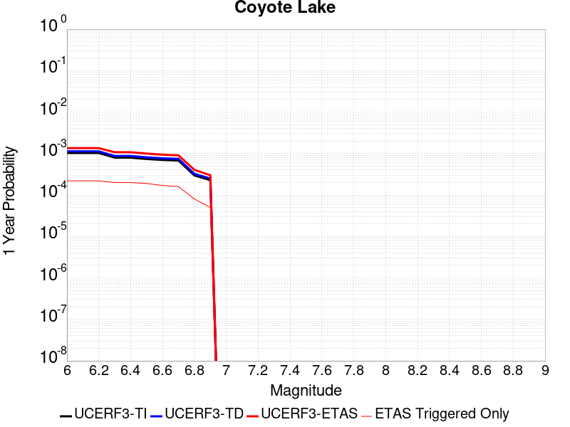 |  |

| Magnitude | 1 wk TI Prob | 1 wk TD Prob | 1 wk ETAS Prob | 1 wk ETAS/TD Gain | 1 wk ETAS Triggered Only | 1 mo TI Prob | 1 mo TD Prob | 1 mo ETAS Prob | 1 mo ETAS/TD Gain | 1 mo ETAS Triggered Only | 1 yr TI Prob | 1 yr TD Prob | 1 yr ETAS Prob | 1 yr ETAS/TD Gain | 1 yr ETAS Triggered Only | 10 yr TI Prob | 10 yr TD Prob | 10 yr ETAS Prob | 10 yr ETAS/TD Gain | 10 yr ETAS Triggered Only |
|-----|-----|-----|-----|-----|-----|-----|-----|-----|-----|-----|-----|-----|-----|-----|-----|-----|-----|-----|-----|-----|
| 6.0 | 1.980352E-5 | 2.1707852E-5 | 4.170742E-5 | 1.9213057 | 2.0E-5 | 8.486947E-5 | 9.303074E-5 | 1.5302516E-4 | 1.6448882 | 6.0E-5 | 0.0010327959 | 0.0011321327 | 0.0013518838 | 1.1941035 | 2.2E-4 | 0.010280091 | 0.01127083 | 0.011695984 | 1.0377216 | 4.3E-4 |
| 6.1 | 1.980352E-5 | 2.1707852E-5 | 4.170742E-5 | 1.9213057 | 2.0E-5 | 8.486947E-5 | 9.303074E-5 | 1.5302516E-4 | 1.6448882 | 6.0E-5 | 0.0010327959 | 0.0011321327 | 0.0013518838 | 1.1941035 | 2.2E-4 | 0.010280091 | 0.01127083 | 0.011695984 | 1.0377216 | 4.3E-4 |
| 6.2 | 1.980352E-5 | 2.1707852E-5 | 4.170742E-5 | 1.9213057 | 2.0E-5 | 8.486947E-5 | 9.303074E-5 | 1.5302516E-4 | 1.6448882 | 6.0E-5 | 0.0010327959 | 0.0011321327 | 0.0013518838 | 1.1941035 | 2.2E-4 | 0.010280091 | 0.01127083 | 0.011695984 | 1.0377216 | 4.3E-4 |
| 6.3 | 1.5344787E-5 | 1.6821528E-5 | 3.682119E-5 | 2.1889327 | 2.0E-5 | 6.576172E-5 | 7.209062E-5 | 1.22087E-4 | 1.6935215 | 5.0E-5 | 8.003548E-4 | 8.7741105E-4 | 0.0010772356 | 1.2277434 | 2.0E-4 | 0.007974784 | 0.008745514 | 0.009082541 | 1.038537 | 3.4E-4 |
| 6.4 | 1.5344787E-5 | 1.6821528E-5 | 3.682119E-5 | 2.1889327 | 2.0E-5 | 6.576172E-5 | 7.209062E-5 | 1.22087E-4 | 1.6935215 | 5.0E-5 | 8.003548E-4 | 8.7741105E-4 | 0.0010772356 | 1.2277434 | 2.0E-4 | 0.007974784 | 0.008745514 | 0.009082541 | 1.038537 | 3.4E-4 |
| 6.5 | 1.4189697E-5 | 1.5558782E-5 | 3.555847E-5 | 2.2854276 | 2.0E-5 | 6.081157E-5 | 6.667913E-5 | 1.166758E-4 | 1.7498097 | 5.0E-5 | 7.401293E-4 | 8.115764E-4 | 0.0010014222 | 1.2339222 | 1.9E-4 | 0.0073766913 | 0.008092069 | 0.008419398 | 1.0404507 | 3.3E-4 |
| 6.6 | 1.3469301E-5 | 1.4772335E-5 | 3.477204E-5 | 2.353862 | 2.0E-5 | 5.7724297E-5 | 6.330881E-5 | 1.1330564E-4 | 1.7897295 | 5.0E-5 | 7.025667E-4 | 7.7057217E-4 | 9.4044115E-4 | 1.2204453 | 1.7E-4 | 0.0070034964 | 0.0076849074 | 0.007982602 | 1.0387375 | 3.0E-4 |
| 6.7 | 1.3027966E-5 | 1.4282475E-5 | 3.4282188E-5 | 2.4002976 | 2.0E-5 | 5.5832945E-5 | 6.12095E-5 | 1.1120644E-4 | 1.8168166 | 5.0E-5 | 6.7955407E-4 | 7.450307E-4 | 9.049115E-4 | 1.2145963 | 1.6E-4 | 0.006774798 | 0.007431207 | 0.0077091265 | 1.0373989 | 2.8E-4 |
| 6.8 | 5.695434E-6 | 6.2247245E-6 | 2.62246E-5 | 4.2129736 | 2.0E-5 | 2.4408775E-5 | 2.6677288E-5 | 4.6676752E-5 | 1.7496815 | 2.0E-5 | 2.971363E-4 | 3.2477756E-4 | 4.0475157E-4 | 1.2462424 | 8.0E-5 | 0.0029673933 | 0.0032459702 | 0.0033456457 | 1.0307075 | 1.0E-4 |
| 6.9 | 4.385688E-6 | 4.7932917E-6 | 1.4793243E-5 | 3.086239 | 1.0E-5 | 1.879567E-5 | 2.0542679E-5 | 3.0542473E-5 | 1.4867815 | 1.0E-5 | 2.2881327E-4 | 2.501071E-4 | 3.000946E-4 | 1.1998644 | 5.0E-5 | 0.002285778 | 0.002501071 | 0.002570896 | 1.027918 | 7.0E-5 |

## Death Valley (Black Mtns Frontal)
*[(top)](#table-of-contents)*

| 1 Week | 1 Month | 1 Year | 10 Year |
|-----|-----|-----|-----|
|  |  | 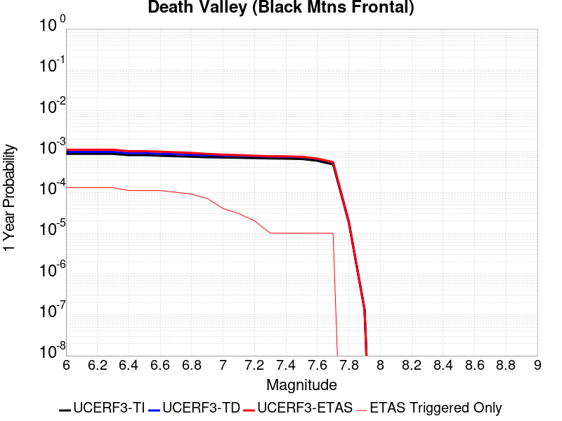 |  |

| Magnitude | 1 wk TI Prob | 1 wk TD Prob | 1 wk ETAS Prob | 1 wk ETAS/TD Gain | 1 wk ETAS Triggered Only | 1 mo TI Prob | 1 mo TD Prob | 1 mo ETAS Prob | 1 mo ETAS/TD Gain | 1 mo ETAS Triggered Only | 1 yr TI Prob | 1 yr TD Prob | 1 yr ETAS Prob | 1 yr ETAS/TD Gain | 1 yr ETAS Triggered Only | 10 yr TI Prob | 10 yr TD Prob | 10 yr ETAS Prob | 10 yr ETAS/TD Gain | 10 yr ETAS Triggered Only |
|-----|-----|-----|-----|-----|-----|-----|-----|-----|-----|-----|-----|-----|-----|-----|-----|-----|-----|-----|-----|-----|
| 6.0 | 1.6707214E-5 | 1.8671435E-5 | 2.867125E-5 | 1.5355674 | 1.0E-5 | 7.160038E-5 | 8.001803E-5 | 1.1001563E-4 | 1.3748856 | 3.0E-5 | 8.71386E-4 | 9.737917E-4 | 0.0011036651 | 1.1333687 | 1.3E-4 | 0.00867977 | 0.0096961 | 0.010102125 | 1.041875 | 4.1E-4 |
| 6.1 | 1.6707214E-5 | 1.8671435E-5 | 2.867125E-5 | 1.5355674 | 1.0E-5 | 7.160038E-5 | 8.001803E-5 | 1.1001563E-4 | 1.3748856 | 3.0E-5 | 8.71386E-4 | 9.737917E-4 | 0.0011036651 | 1.1333687 | 1.3E-4 | 0.00867977 | 0.0096961 | 0.010102125 | 1.041875 | 4.1E-4 |
| 6.2 | 1.6707214E-5 | 1.8671435E-5 | 2.867125E-5 | 1.5355674 | 1.0E-5 | 7.160038E-5 | 8.001803E-5 | 1.1001563E-4 | 1.3748856 | 3.0E-5 | 8.71386E-4 | 9.737917E-4 | 0.0011036651 | 1.1333687 | 1.3E-4 | 0.00867977 | 0.0096961 | 0.010102125 | 1.041875 | 4.1E-4 |
| 6.3 | 1.6707214E-5 | 1.8671435E-5 | 2.867125E-5 | 1.5355674 | 1.0E-5 | 7.160038E-5 | 8.001803E-5 | 1.1001563E-4 | 1.3748856 | 3.0E-5 | 8.71386E-4 | 9.737917E-4 | 0.0011036651 | 1.1333687 | 1.3E-4 | 0.00867977 | 0.0096961 | 0.010102125 | 1.041875 | 4.1E-4 |
| 6.4 | 1.5515609E-5 | 1.7339296E-5 | 1.7339296E-5 | 1.0 | 0.0 | 6.649377E-5 | 7.430919E-5 | 9.43077E-5 | 1.2691257 | 2.0E-5 | 8.0926094E-4 | 9.04345E-4 | 0.0010142456 | 1.121525 | 1.1E-4 | 0.008063202 | 0.009007333 | 0.009334361 | 1.0363069 | 3.3E-4 |
| 6.5 | 1.5515609E-5 | 1.7339296E-5 | 1.7339296E-5 | 1.0 | 0.0 | 6.649377E-5 | 7.430919E-5 | 9.43077E-5 | 1.2691257 | 2.0E-5 | 8.0926094E-4 | 9.04345E-4 | 0.0010142456 | 1.121525 | 1.1E-4 | 0.008063202 | 0.009007333 | 0.009334361 | 1.0363069 | 3.3E-4 |
| 6.6 | 1.5041828E-5 | 1.6810196E-5 | 1.6810196E-5 | 1.0 | 0.0 | 6.4463384E-5 | 7.204174E-5 | 9.2040296E-5 | 1.2775968 | 2.0E-5 | 7.8455906E-4 | 8.767611E-4 | 9.866647E-4 | 1.1253518 | 1.1E-4 | 0.00781795 | 0.008733676 | 0.0090508815 | 1.0363197 | 3.2E-4 |
| 6.7 | 1.4634985E-5 | 1.635704E-5 | 1.635704E-5 | 1.0 | 0.0 | 6.271985E-5 | 7.009975E-5 | 9.009834E-5 | 1.2852877 | 2.0E-5 | 7.6334673E-4 | 8.53136E-4 | 9.530507E-4 | 1.1171145 | 1.0E-4 | 0.007607299 | 0.008499245 | 0.0088066105 | 1.0361638 | 3.1E-4 |
| 6.8 | 1.4209158E-5 | 1.5883043E-5 | 1.5883043E-5 | 1.0 | 0.0 | 6.089497E-5 | 6.806844E-5 | 8.806708E-5 | 1.2938019 | 2.0E-5 | 7.4114406E-4 | 8.2842377E-4 | 9.183492E-4 | 1.1085501 | 9.0E-5 | 0.007386771 | 0.008253971 | 0.008521743 | 1.0324415 | 2.7E-4 |
| 6.9 | 1.3780098E-5 | 1.540556E-5 | 1.540556E-5 | 1.0 | 0.0 | 5.9056227E-5 | 6.6022185E-5 | 8.602087E-5 | 1.3029084 | 2.0E-5 | 7.1877235E-4 | 8.0352917E-4 | 8.734729E-4 | 1.0870457 | 7.0E-5 | 0.0071645193 | 0.0080068335 | 0.008244911 | 1.0297344 | 2.4E-4 |
| 7.0 | 1.3585064E-5 | 1.5189109E-5 | 1.5189109E-5 | 1.0 | 0.0 | 5.8220405E-5 | 6.509459E-5 | 8.5093285E-5 | 1.3072252 | 2.0E-5 | 7.086029E-4 | 7.922439E-4 | 8.322122E-4 | 1.0504495 | 4.0E-5 | 0.007063476 | 0.007894788 | 0.008103129 | 1.0263898 | 2.1E-4 |
| 7.1 | 1.3398601E-5 | 1.4982282E-5 | 1.4982282E-5 | 1.0 | 0.0 | 5.742131E-5 | 6.420823E-5 | 8.420694E-5 | 1.3114666 | 2.0E-5 | 6.9888023E-4 | 7.8146026E-4 | 8.114368E-4 | 1.0383596 | 3.0E-5 | 0.0069668638 | 0.007787712 | 0.007976232 | 1.0242074 | 1.9E-4 |
| 7.2 | 1.3126312E-5 | 1.4680485E-5 | 1.4680485E-5 | 1.0 | 0.0 | 5.6254412E-5 | 6.291488E-5 | 7.291425E-5 | 1.158935 | 1.0E-5 | 6.846822E-4 | 7.6572486E-4 | 7.857096E-4 | 1.0260991 | 2.0E-5 | 0.006825765 | 0.007631449 | 0.0078100753 | 1.0234066 | 1.8E-4 |
| 7.3 | 1.2922429E-5 | 1.4454699E-5 | 1.4454699E-5 | 1.0 | 0.0 | 5.5380664E-5 | 6.194727E-5 | 7.1946655E-5 | 1.1614176 | 1.0E-5 | 6.74051E-4 | 7.539525E-4 | 7.6394493E-4 | 1.0132535 | 1.0E-5 | 0.006720101 | 0.007514527 | 0.0076634 | 1.0198114 | 1.5E-4 |
| 7.4 | 1.2768878E-5 | 1.4284673E-5 | 1.4284673E-5 | 1.0 | 0.0 | 5.4722615E-5 | 6.121862E-5 | 7.121801E-5 | 1.163339 | 1.0E-5 | 6.660441E-4 | 7.450873E-4 | 7.5507985E-4 | 1.0134113 | 1.0E-5 | 0.0066405144 | 0.007426471 | 0.007565431 | 1.0187114 | 1.4E-4 |
| 7.5 | 1.2521929E-5 | 1.4012902E-5 | 1.4012902E-5 | 1.0 | 0.0 | 5.366431E-5 | 6.0053942E-5 | 7.005334E-5 | 1.166507 | 1.0E-5 | 6.531671E-4 | 7.309169E-4 | 7.409096E-4 | 1.0136714 | 1.0E-5 | 0.006512506 | 0.0072857053 | 0.007414758 | 1.0177132 | 1.3E-4 |
| 7.6 | 1.1301089E-5 | 1.2648951E-5 | 1.2648951E-5 | 1.0 | 0.0 | 4.8432343E-5 | 5.4208693E-5 | 6.420815E-5 | 1.1844623 | 1.0E-5 | 5.895042E-4 | 6.597963E-4 | 6.697897E-4 | 1.0151461 | 1.0E-5 | 0.0058794282 | 0.006578926 | 0.006708071 | 1.0196301 | 1.3E-4 |
| 7.7 | 9.189108E-6 | 1.02840095E-5 | 1.02840095E-5 | 1.0 | 0.0 | 3.93813E-5 | 4.407361E-5 | 5.407317E-5 | 1.2268832 | 1.0E-5 | 4.7936183E-4 | 5.3646916E-4 | 5.4646377E-4 | 1.0186304 | 1.0E-5 | 0.004783291 | 0.005352252 | 0.0054616635 | 1.0204421 | 1.1E-4 |
| 7.8 | 3.4586725E-7 | 3.648368E-7 | 3.648368E-7 | 1.0 | 0.0 | 1.4822873E-6 | 1.5635853E-6 | 1.5635853E-6 | 1.0 | 0.0 | 1.80467E-5 | 1.903649E-5 | 1.903649E-5 | 1.0 | 0.0 | 1.8045233E-4 | 1.9034903E-4 | 2.0034713E-4 | 1.052525 | 1.0E-5 |
| 7.9 | 2.5591178E-9 | 2.6697329E-9 | 2.6697329E-9 | 1.0 | 0.0 | 1.0967647E-8 | 1.14417125E-8 | 1.14417125E-8 | 1.0 | 0.0 | 1.335311E-7 | 1.3930286E-7 | 1.3930286E-7 | 1.0 | 0.0 | 1.3353102E-6 | 1.3930285E-6 | 1.3930285E-6 | 1.0 | 0.0 |

## Helendale-So Lockhart
*[(top)](#table-of-contents)*

| 1 Week | 1 Month | 1 Year | 10 Year |
|-----|-----|-----|-----|
|  |  |  |  |

| Magnitude | 1 wk TI Prob | 1 wk TD Prob | 1 wk ETAS Prob | 1 wk ETAS/TD Gain | 1 wk ETAS Triggered Only | 1 mo TI Prob | 1 mo TD Prob | 1 mo ETAS Prob | 1 mo ETAS/TD Gain | 1 mo ETAS Triggered Only | 1 yr TI Prob | 1 yr TD Prob | 1 yr ETAS Prob | 1 yr ETAS/TD Gain | 1 yr ETAS Triggered Only | 10 yr TI Prob | 10 yr TD Prob | 10 yr ETAS Prob | 10 yr ETAS/TD Gain | 10 yr ETAS Triggered Only |
|-----|-----|-----|-----|-----|-----|-----|-----|-----|-----|-----|-----|-----|-----|-----|-----|-----|-----|-----|-----|-----|
| 6.0 | 1.7296055E-5 | 1.810418E-5 | 3.8103815E-5 | 2.1046972 | 2.0E-5 | 7.412385E-5 | 7.7587145E-5 | 1.0758482E-4 | 1.386632 | 3.0E-5 | 9.0208417E-4 | 9.442349E-4 | 0.0011040838 | 1.1692894 | 1.6E-4 | 0.008984311 | 0.009404349 | 0.009751057 | 1.0368668 | 3.5E-4 |
| 6.1 | 1.7296055E-5 | 1.810418E-5 | 3.8103815E-5 | 2.1046972 | 2.0E-5 | 7.412385E-5 | 7.7587145E-5 | 1.0758482E-4 | 1.386632 | 3.0E-5 | 9.0208417E-4 | 9.442349E-4 | 0.0011040838 | 1.1692894 | 1.6E-4 | 0.008984311 | 0.009404349 | 0.009751057 | 1.0368668 | 3.5E-4 |
| 6.2 | 1.7296055E-5 | 1.810418E-5 | 3.8103815E-5 | 2.1046972 | 2.0E-5 | 7.412385E-5 | 7.7587145E-5 | 1.0758482E-4 | 1.386632 | 3.0E-5 | 9.0208417E-4 | 9.442349E-4 | 0.0011040838 | 1.1692894 | 1.6E-4 | 0.008984311 | 0.009404349 | 0.009751057 | 1.0368668 | 3.5E-4 |
| 6.3 | 1.0669118E-5 | 1.1135683E-5 | 3.113546E-5 | 2.796008 | 2.0E-5 | 4.5723988E-5 | 4.7723497E-5 | 7.772207E-5 | 1.6285912 | 3.0E-5 | 5.5654737E-4 | 5.808815E-4 | 6.708292E-4 | 1.1548469 | 9.0E-5 | 0.0055515557 | 0.0057939277 | 0.0060225953 | 1.0394667 | 2.3E-4 |
| 6.4 | 1.0669118E-5 | 1.1135683E-5 | 3.113546E-5 | 2.796008 | 2.0E-5 | 4.5723988E-5 | 4.7723497E-5 | 7.772207E-5 | 1.6285912 | 3.0E-5 | 5.5654737E-4 | 5.808815E-4 | 6.708292E-4 | 1.1548469 | 9.0E-5 | 0.0055515557 | 0.0057939277 | 0.0060225953 | 1.0394667 | 2.3E-4 |
| 6.5 | 8.790038E-6 | 9.170408E-6 | 2.9170224E-5 | 3.1809082 | 2.0E-5 | 3.767105E-5 | 3.930116E-5 | 6.929998E-5 | 1.7633061 | 3.0E-5 | 4.585485E-4 | 4.7838816E-4 | 5.683451E-4 | 1.1880418 | 9.0E-5 | 0.0045760344 | 0.0047737476 | 0.00500265 | 1.0479501 | 2.3E-4 |
| 6.6 | 7.396949E-6 | 7.715714E-6 | 7.715714E-6 | 1.0 | 0.0 | 3.1700827E-5 | 3.306693E-5 | 3.306693E-5 | 1.0 | 0.0 | 3.858892E-4 | 4.025165E-4 | 4.6249237E-4 | 1.1490022 | 6.0E-5 | 0.003852198 | 0.0040179817 | 0.004207218 | 1.0470974 | 1.9E-4 |
| 6.7 | 6.4600285E-6 | 6.738185E-6 | 6.738185E-6 | 1.0 | 0.0 | 2.7685543E-5 | 2.8877621E-5 | 2.8877621E-5 | 1.0 | 0.0 | 3.3701936E-4 | 3.515291E-4 | 4.11508E-4 | 1.1706228 | 6.0E-5 | 0.0033650869 | 0.003509812 | 0.0036991453 | 1.053944 | 1.9E-4 |
| 6.8 | 5.600104E-6 | 5.8361397E-6 | 5.8361397E-6 | 1.0 | 0.0 | 2.4000226E-5 | 2.5011792E-5 | 2.5011792E-5 | 1.0 | 0.0 | 2.9216358E-4 | 3.0447662E-4 | 3.5446137E-4 | 1.1641662 | 5.0E-5 | 0.0029177975 | 0.003040656 | 0.0032001694 | 1.0524602 | 1.6E-4 |
| 6.9 | 4.839122E-6 | 5.03962E-6 | 5.03962E-6 | 1.0 | 0.0 | 2.0738931E-5 | 2.1598196E-5 | 2.1598196E-5 | 1.0 | 0.0 | 2.5246723E-4 | 2.6292677E-4 | 2.829215E-4 | 1.0760468 | 2.0E-5 | 0.002521806 | 0.0026262044 | 0.0027458894 | 1.0455734 | 1.2E-4 |
| 7.0 | 3.6937633E-6 | 3.8452918E-6 | 3.8452918E-6 | 1.0 | 0.0 | 1.5830317E-5 | 1.6479718E-5 | 1.6479718E-5 | 1.0 | 0.0 | 1.9271708E-4 | 2.0062242E-4 | 2.1062042E-4 | 1.0498348 | 1.0E-5 | 0.0019255003 | 0.0020044446 | 0.002114224 | 1.0547681 | 1.1E-4 |
| 7.1 | 2.7858857E-6 | 2.8979157E-6 | 2.8979157E-6 | 1.0 | 0.0 | 1.1939455E-5 | 1.241958E-5 | 1.241958E-5 | 1.0 | 0.0 | 1.4535317E-4 | 1.5119811E-4 | 1.5119811E-4 | 1.0 | 0.0 | 0.0014525814 | 0.0015109739 | 0.0015708833 | 1.0396495 | 6.0E-5 |
| 7.2 | 2.1672065E-6 | 2.2540607E-6 | 2.2540607E-6 | 1.0 | 0.0 | 9.2879945E-6 | 9.660225E-6 | 9.660225E-6 | 1.0 | 0.0 | 1.1307546E-4 | 1.1760708E-4 | 1.1760708E-4 | 1.0 | 0.0 | 0.0011301794 | 0.0011754666 | 0.0011954431 | 1.0169945 | 2.0E-5 |
| 7.3 | 1.4823496E-6 | 1.5422432E-6 | 1.5422432E-6 | 1.0 | 0.0 | 6.3529114E-6 | 6.609598E-6 | 6.609598E-6 | 1.0 | 0.0 | 7.734395E-5 | 8.0469035E-5 | 8.0469035E-5 | 1.0 | 0.0 | 7.731704E-4 | 8.044141E-4 | 8.044141E-4 | 1.0 | 0.0 |
| 7.4 | 4.2321457E-7 | 4.4109754E-7 | 4.4109754E-7 | 1.0 | 0.0 | 1.8137755E-6 | 1.8904169E-6 | 1.8904169E-6 | 1.0 | 0.0 | 2.2082493E-5 | 2.301563E-5 | 2.301563E-5 | 1.0 | 0.0 | 2.2080299E-4 | 2.3013698E-4 | 2.3013698E-4 | 1.0 | 0.0 |
| 7.5 | 5.6942316E-8 | 5.9417015E-8 | 5.9417015E-8 | 1.0 | 0.0 | 2.440385E-7 | 2.5464433E-7 | 2.5464433E-7 | 1.0 | 0.0 | 2.9711643E-6 | 3.100291E-6 | 3.100291E-6 | 1.0 | 0.0 | 2.9711247E-5 | 3.1002557E-5 | 3.1002557E-5 | 1.0 | 0.0 |

## San Andreas (San Bernardino S)
*[(top)](#table-of-contents)*

| 1 Week | 1 Month | 1 Year | 10 Year |
|-----|-----|-----|-----|
|  |  |  |  |

| Magnitude | 1 wk TI Prob | 1 wk TD Prob | 1 wk ETAS Prob | 1 wk ETAS/TD Gain | 1 wk ETAS Triggered Only | 1 mo TI Prob | 1 mo TD Prob | 1 mo ETAS Prob | 1 mo ETAS/TD Gain | 1 mo ETAS Triggered Only | 1 yr TI Prob | 1 yr TD Prob | 1 yr ETAS Prob | 1 yr ETAS/TD Gain | 1 yr ETAS Triggered Only | 10 yr TI Prob | 10 yr TD Prob | 10 yr ETAS Prob | 10 yr ETAS/TD Gain | 10 yr ETAS Triggered Only |
|-----|-----|-----|-----|-----|-----|-----|-----|-----|-----|-----|-----|-----|-----|-----|-----|-----|-----|-----|-----|-----|
| 6.0 | 1.2336002E-4 | 3.0023555E-4 | 3.3022655E-4 | 1.0998915 | 3.0E-5 | 5.2857865E-4 | 0.0012861154 | 0.0013460382 | 1.0465921 | 6.0E-5 | 0.006416472 | 0.015550992 | 0.015728192 | 1.0113949 | 1.8E-4 | 0.06234337 | 0.14291383 | 0.14319667 | 1.0019791 | 3.3E-4 |
| 6.1 | 1.2336002E-4 | 3.0023555E-4 | 3.3022655E-4 | 1.0998915 | 3.0E-5 | 5.2857865E-4 | 0.0012861154 | 0.0013460382 | 1.0465921 | 6.0E-5 | 0.006416472 | 0.015550992 | 0.015728192 | 1.0113949 | 1.8E-4 | 0.06234337 | 0.14291383 | 0.14319667 | 1.0019791 | 3.3E-4 |
| 6.2 | 1.2336002E-4 | 3.0023555E-4 | 3.3022655E-4 | 1.0998915 | 3.0E-5 | 5.2857865E-4 | 0.0012861154 | 0.0013460382 | 1.0465921 | 6.0E-5 | 0.006416472 | 0.015550992 | 0.015728192 | 1.0113949 | 1.8E-4 | 0.06234337 | 0.14291383 | 0.14319667 | 1.0019791 | 3.3E-4 |
| 6.3 | 1.1712257E-4 | 2.8811657E-4 | 3.1810792E-4 | 1.1040945 | 3.0E-5 | 5.018573E-4 | 0.0012342266 | 0.0012941526 | 1.0485535 | 6.0E-5 | 0.006093008 | 0.0149280215 | 0.0150954835 | 1.011218 | 1.7E-4 | 0.059286322 | 0.13762207 | 0.13789803 | 1.0020052 | 3.2E-4 |
| 6.4 | 1.1712257E-4 | 2.8811657E-4 | 3.1810792E-4 | 1.1040945 | 3.0E-5 | 5.018573E-4 | 0.0012342266 | 0.0012941526 | 1.0485535 | 6.0E-5 | 0.006093008 | 0.0149280215 | 0.0150954835 | 1.011218 | 1.7E-4 | 0.059286322 | 0.13762207 | 0.13789803 | 1.0020052 | 3.2E-4 |
| 6.5 | 1.0689076E-4 | 2.682418E-4 | 2.9823376E-4 | 1.1118094 | 3.0E-5 | 4.5802278E-4 | 0.001149126 | 0.001209057 | 1.0521536 | 6.0E-5 | 0.0055621783 | 0.013905481 | 0.014073117 | 1.0120554 | 1.7E-4 | 0.05425003 | 0.12886871 | 0.12914747 | 1.0021632 | 3.2E-4 |
| 6.6 | 9.7648895E-5 | 2.506867E-4 | 2.8067917E-4 | 1.1196413 | 3.0E-5 | 4.1842813E-4 | 0.0010739529 | 0.0011338884 | 1.0558084 | 6.0E-5 | 0.005082469 | 0.0130013535 | 0.013169143 | 1.0129056 | 1.7E-4 | 0.049677886 | 0.12102797 | 0.12130045 | 1.0022514 | 3.1E-4 |
| 6.7 | 8.757013E-5 | 2.3139146E-4 | 2.6138453E-4 | 1.1296204 | 3.0E-5 | 3.7524657E-4 | 9.913231E-4 | 0.0010512637 | 1.0604652 | 6.0E-5 | 0.00455906 | 0.012006655 | 0.012174614 | 1.0139889 | 1.7E-4 | 0.04466656 | 0.112335846 | 0.11261102 | 1.0024496 | 3.1E-4 |
| 6.8 | 8.562978E-5 | 2.2698891E-4 | 2.569821E-4 | 1.132135 | 3.0E-5 | 3.6693315E-4 | 9.7246916E-4 | 0.0010324108 | 1.0616386 | 6.0E-5 | 0.004458263 | 0.011779605 | 0.011947603 | 1.0142617 | 1.7E-4 | 0.043698758 | 0.11034572 | 0.11062151 | 1.0024993 | 3.1E-4 |
| 6.9 | 6.124075E-5 | 1.7082063E-4 | 2.008155E-4 | 1.1755928 | 3.0E-5 | 2.6243398E-4 | 7.318838E-4 | 7.918399E-4 | 1.0819203 | 6.0E-5 | 0.0031904527 | 0.008874487 | 0.009033067 | 1.0178692 | 1.6E-4 | 0.031450346 | 0.08425208 | 0.08452681 | 1.0032607 | 3.0E-4 |
| 7.0 | 5.8598747E-5 | 1.6510907E-4 | 1.9510412E-4 | 1.181668 | 3.0E-5 | 2.5111332E-4 | 7.0741924E-4 | 7.673768E-4 | 1.0847553 | 6.0E-5 | 0.0030530186 | 0.008579012 | 0.0087376395 | 1.0184902 | 1.6E-4 | 0.03011414 | 0.08156926 | 0.08184479 | 1.0033779 | 3.0E-4 |
| 7.1 | 5.613814E-5 | 1.5929298E-4 | 1.892882E-4 | 1.1883023 | 3.0E-5 | 2.4056983E-4 | 6.825063E-4 | 7.3247217E-4 | 1.0732094 | 5.0E-5 | 0.0029250039 | 0.0082780365 | 0.008426795 | 1.0179702 | 1.5E-4 | 0.028868021 | 0.078867756 | 0.07913488 | 1.0033871 | 2.9E-4 |
| 7.2 | 4.991222E-5 | 1.4535384E-4 | 1.7534949E-4 | 1.2063628 | 3.0E-5 | 2.1389198E-4 | 6.227967E-4 | 6.727656E-4 | 1.080233 | 5.0E-5 | 0.002601025 | 0.0075562913 | 0.0077051576 | 1.019701 | 1.5E-4 | 0.025707912 | 0.072320335 | 0.07258936 | 1.0037199 | 2.9E-4 |
| 7.3 | 4.7410045E-5 | 1.3729246E-4 | 1.6728835E-4 | 1.2184817 | 3.0E-5 | 2.0317009E-4 | 5.882639E-4 | 6.3823455E-4 | 1.0849459 | 5.0E-5 | 0.0024707897 | 0.0071386793 | 0.0072876085 | 1.0208623 | 1.5E-4 | 0.024434982 | 0.06860168 | 0.068862475 | 1.0038016 | 2.8E-4 |
| 7.4 | 4.5556746E-5 | 1.313689E-4 | 1.5136627E-4 | 1.152223 | 2.0E-5 | 1.952286E-4 | 5.628884E-4 | 6.028659E-4 | 1.071022 | 4.0E-5 | 0.002374317 | 0.006831711 | 0.0069608227 | 1.018899 | 1.3E-4 | 0.023491086 | 0.06585319 | 0.06608673 | 1.0035464 | 2.5E-4 |
| 7.5 | 4.3084514E-5 | 1.2371907E-4 | 1.437166E-4 | 1.1616366 | 2.0E-5 | 1.8463485E-4 | 5.3011713E-4 | 5.7009596E-4 | 1.075415 | 4.0E-5 | 0.0022456115 | 0.0064351484 | 0.0065643117 | 1.0200715 | 1.3E-4 | 0.022230545 | 0.062252887 | 0.062487327 | 1.0037658 | 2.5E-4 |
| 7.6 | 3.408608E-5 | 9.8489814E-5 | 1.1848785E-4 | 1.2030467 | 2.0E-5 | 1.4607502E-4 | 4.2203104E-4 | 4.6201414E-4 | 1.0947398 | 4.0E-5 | 0.0017770125 | 0.005126148 | 0.0052554817 | 1.0252302 | 1.3E-4 | 0.017628696 | 0.050079897 | 0.050317377 | 1.004742 | 2.5E-4 |
| 7.7 | 2.8315713E-5 | 8.261325E-5 | 1.026116E-4 | 1.2420719 | 2.0E-5 | 1.2134742E-4 | 3.5400878E-4 | 3.9399462E-4 | 1.1129515 | 4.0E-5 | 0.0014764034 | 0.004301548 | 0.004430989 | 1.0300916 | 1.3E-4 | 0.01466633 | 0.042327844 | 0.04256726 | 1.0056562 | 2.5E-4 |
| 7.8 | 2.6222975E-5 | 7.4749165E-5 | 9.4747666E-5 | 1.2675415 | 2.0E-5 | 1.1237934E-4 | 3.2031426E-4 | 3.6030143E-4 | 1.1248374 | 4.0E-5 | 0.0013673597 | 0.0038928585 | 0.0040223524 | 1.0332645 | 1.3E-4 | 0.013589768 | 0.038489804 | 0.03873018 | 1.0062453 | 2.5E-4 |
| 7.9 | 2.1469694E-5 | 5.7977377E-5 | 6.79768E-5 | 1.172471 | 1.0E-5 | 9.200973E-5 | 2.4845081E-4 | 2.7844336E-4 | 1.1207182 | 3.0E-5 | 0.0011196428 | 0.003020696 | 0.0031004543 | 1.0264039 | 8.0E-5 | 0.011140184 | 0.030197 | 0.030381262 | 1.006102 | 1.9E-4 |
| 8.0 | 1.2420249E-5 | 3.1373827E-5 | 4.1373514E-5 | 1.318727 | 1.0E-5 | 5.322855E-5 | 1.3445233E-4 | 1.644483E-4 | 1.2230974 | 3.0E-5 | 6.478649E-4 | 0.001635729 | 0.0016756636 | 1.024414 | 4.0E-5 | 0.0064597935 | 0.016548108 | 0.016646454 | 1.005943 | 1.0E-4 |
| 8.1 | 4.9197724E-6 | 7.842378E-6 | 7.842378E-6 | 1.0 | 0.0 | 2.1084568E-5 | 3.360976E-5 | 3.360976E-5 | 1.0 | 0.0 | 2.566744E-4 | 4.0912212E-4 | 4.0912212E-4 | 1.0 | 0.0 | 0.002563781 | 0.004394436 | 0.004394436 | 1.0 | 0.0 |
| 8.2 | 2.5634774E-6 | 2.9160003E-6 | 2.9160003E-6 | 1.0 | 0.0 | 1.0986286E-5 | 1.2497085E-5 | 1.2497085E-5 | 1.0 | 0.0 | 1.3374983E-4 | 1.5214144E-4 | 1.5214144E-4 | 1.0 | 0.0 | 0.0013366934 | 0.0017098442 | 0.0017098442 | 1.0 | 0.0 |
| 8.3 | 5.2850464E-7 | 3.2211614E-7 | 3.2211614E-7 | 1.0 | 0.0 | 2.2650179E-6 | 1.380497E-6 | 1.380497E-6 | 1.0 | 0.0 | 2.7576245E-5 | 1.6807435E-5 | 1.6807435E-5 | 1.0 | 0.0 | 2.7572823E-4 | 1.9939634E-4 | 1.9939634E-4 | 1.0 | 0.0 |

## San Andreas (Big Bend)
*[(top)](#table-of-contents)*

| 1 Week | 1 Month | 1 Year | 10 Year |
|-----|-----|-----|-----|
|  | 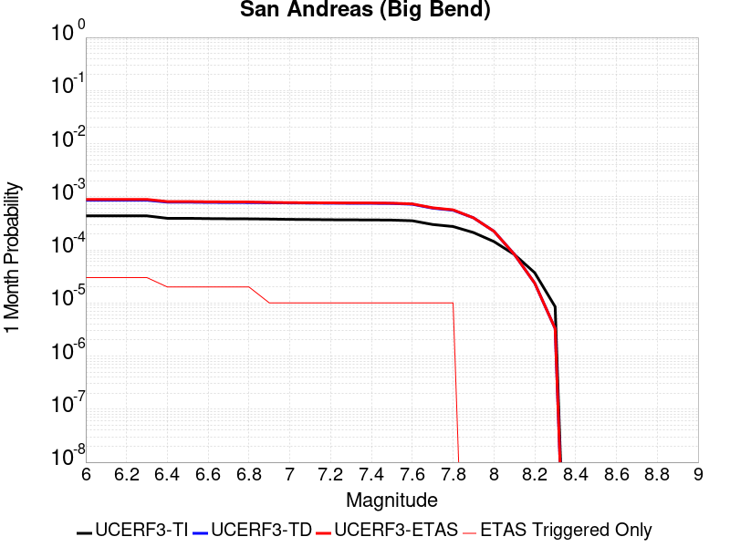 |  | 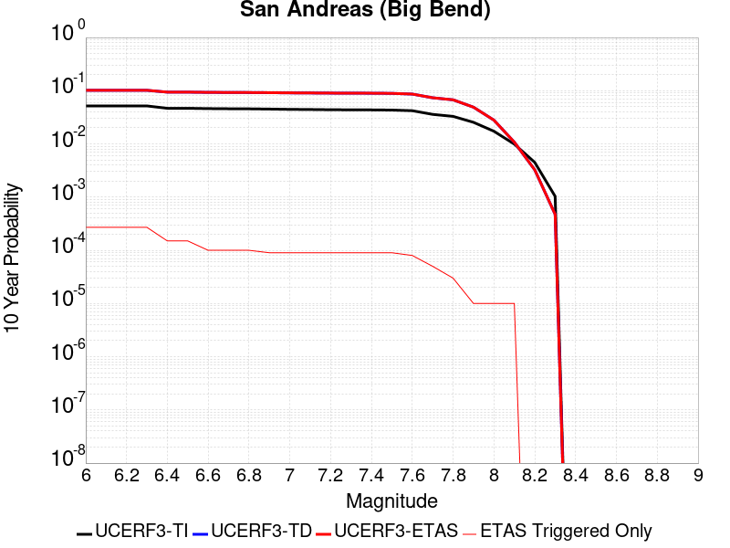 |

| Magnitude | 1 wk TI Prob | 1 wk TD Prob | 1 wk ETAS Prob | 1 wk ETAS/TD Gain | 1 wk ETAS Triggered Only | 1 mo TI Prob | 1 mo TD Prob | 1 mo ETAS Prob | 1 mo ETAS/TD Gain | 1 mo ETAS Triggered Only | 1 yr TI Prob | 1 yr TD Prob | 1 yr ETAS Prob | 1 yr ETAS/TD Gain | 1 yr ETAS Triggered Only | 10 yr TI Prob | 10 yr TD Prob | 10 yr ETAS Prob | 10 yr ETAS/TD Gain | 10 yr ETAS Triggered Only |
|-----|-----|-----|-----|-----|-----|-----|-----|-----|-----|-----|-----|-----|-----|-----|-----|-----|-----|-----|-----|-----|
| 6.0 | 1.0179969E-4 | 2.0106303E-4 | 2.21059E-4 | 1.0994513 | 2.0E-5 | 4.362114E-4 | 8.614151E-4 | 8.913893E-4 | 1.0347964 | 3.0E-5 | 0.0052979486 | 0.010437581 | 0.010566224 | 1.012325 | 1.3E-4 | 0.051734097 | 0.10159716 | 0.10183973 | 1.0023875 | 2.7E-4 |
| 6.1 | 1.0179969E-4 | 2.0106303E-4 | 2.21059E-4 | 1.0994513 | 2.0E-5 | 4.362114E-4 | 8.614151E-4 | 8.913893E-4 | 1.0347964 | 3.0E-5 | 0.0052979486 | 0.010437581 | 0.010566224 | 1.012325 | 1.3E-4 | 0.051734097 | 0.10159716 | 0.10183973 | 1.0023875 | 2.7E-4 |
| 6.2 | 1.0179969E-4 | 2.0106303E-4 | 2.21059E-4 | 1.0994513 | 2.0E-5 | 4.362114E-4 | 8.614151E-4 | 8.913893E-4 | 1.0347964 | 3.0E-5 | 0.0052979486 | 0.010437581 | 0.010566224 | 1.012325 | 1.3E-4 | 0.051734097 | 0.10159716 | 0.10183973 | 1.0023875 | 2.7E-4 |
| 6.3 | 1.0179969E-4 | 2.0106303E-4 | 2.21059E-4 | 1.0994513 | 2.0E-5 | 4.362114E-4 | 8.614151E-4 | 8.913893E-4 | 1.0347964 | 3.0E-5 | 0.0052979486 | 0.010437581 | 0.010566224 | 1.012325 | 1.3E-4 | 0.051734097 | 0.10159716 | 0.10183973 | 1.0023875 | 2.7E-4 |
| 6.4 | 9.1639464E-5 | 1.8462905E-4 | 2.0462535E-4 | 1.1083053 | 2.0E-5 | 3.9268145E-4 | 7.910276E-4 | 8.110118E-4 | 1.0252635 | 2.0E-5 | 0.0047704205 | 0.009588352 | 0.009677489 | 1.0092964 | 9.0E-5 | 0.046693064 | 0.093921766 | 0.09405767 | 1.0014471 | 1.5E-4 |
| 6.5 | 9.1639464E-5 | 1.8462905E-4 | 2.0462535E-4 | 1.1083053 | 2.0E-5 | 3.9268145E-4 | 7.910276E-4 | 8.110118E-4 | 1.0252635 | 2.0E-5 | 0.0047704205 | 0.009588352 | 0.009677489 | 1.0092964 | 9.0E-5 | 0.046693064 | 0.093921766 | 0.09405767 | 1.0014471 | 1.5E-4 |
| 6.6 | 9.042622E-5 | 1.826988E-4 | 2.0269516E-4 | 1.1094497 | 2.0E-5 | 3.8748336E-4 | 7.827601E-4 | 8.027445E-4 | 1.0255306 | 2.0E-5 | 0.0047074095 | 0.009488574 | 0.009548005 | 1.0062634 | 6.0E-5 | 0.046089325 | 0.093015574 | 0.09310627 | 1.0009751 | 1.0E-4 |
| 6.7 | 8.9836685E-5 | 1.8184188E-4 | 2.0183824E-4 | 1.1099657 | 2.0E-5 | 3.8495753E-4 | 7.790898E-4 | 7.990742E-4 | 1.025651 | 2.0E-5 | 0.00467679 | 0.009444275 | 0.009503708 | 1.006293 | 6.0E-5 | 0.045795817 | 0.09260978 | 0.09270052 | 1.0009798 | 1.0E-4 |
| 6.8 | 8.9471854E-5 | 1.8130938E-4 | 2.0130577E-4 | 1.1102887 | 2.0E-5 | 3.8339442E-4 | 7.7680906E-4 | 7.967935E-4 | 1.0257263 | 2.0E-5 | 0.004657841 | 0.009416748 | 0.009476182 | 1.0063117 | 6.0E-5 | 0.04561414 | 0.09235688 | 0.092447646 | 1.0009828 | 1.0E-4 |
| 6.9 | 8.858234E-5 | 1.8012857E-4 | 1.9012677E-4 | 1.0555059 | 1.0E-5 | 3.7958333E-4 | 7.717514E-4 | 7.8174367E-4 | 1.0129476 | 1.0E-5 | 0.004611638 | 0.009355701 | 0.009405233 | 1.0052943 | 5.0E-5 | 0.04517103 | 0.09179684 | 0.09187858 | 1.0008904 | 9.0E-5 |
| 7.0 | 8.7433385E-5 | 1.7851574E-4 | 1.8851395E-4 | 1.0560075 | 1.0E-5 | 3.746607E-4 | 7.648433E-4 | 7.7483564E-4 | 1.0130646 | 1.0E-5 | 0.004551957 | 0.009272313 | 0.00932185 | 1.0053424 | 5.0E-5 | 0.044598386 | 0.091031015 | 0.09111282 | 1.0008987 | 9.0E-5 |
| 7.1 | 8.684964E-5 | 1.7763473E-4 | 1.8763296E-4 | 1.0562853 | 1.0E-5 | 3.7215967E-4 | 7.610698E-4 | 7.710622E-4 | 1.0131294 | 1.0E-5 | 0.0045216335 | 0.009226761 | 0.0092763 | 1.0053691 | 5.0E-5 | 0.04430731 | 0.09061238 | 0.09069423 | 1.0009032 | 9.0E-5 |
| 7.2 | 8.606521E-5 | 1.7654036E-4 | 1.865386E-4 | 1.0566343 | 1.0E-5 | 3.6879873E-4 | 7.5638236E-4 | 7.663748E-4 | 1.0132108 | 1.0E-5 | 0.0044808835 | 0.009170174 | 0.009219714 | 1.0054024 | 5.0E-5 | 0.043916024 | 0.09009273 | 0.09017462 | 1.000909 | 9.0E-5 |
| 7.3 | 8.568266E-5 | 1.7595981E-4 | 1.8595804E-4 | 1.0568211 | 1.0E-5 | 3.6715972E-4 | 7.5389567E-4 | 7.638882E-4 | 1.0132544 | 1.0E-5 | 0.0044610105 | 0.0091401525 | 0.009189695 | 1.0054203 | 5.0E-5 | 0.043725148 | 0.08981366 | 0.08989557 | 1.0009121 | 9.0E-5 |
| 7.4 | 8.5432206E-5 | 1.7558529E-4 | 1.8558353E-4 | 1.0569423 | 1.0E-5 | 3.6608664E-4 | 7.522915E-4 | 7.62284E-4 | 1.0132828 | 1.0E-5 | 0.004447999 | 0.009120786 | 0.009170329 | 1.005432 | 5.0E-5 | 0.043600157 | 0.08963369 | 0.089715615 | 1.0009141 | 9.0E-5 |
| 7.5 | 8.4791965E-5 | 1.742772E-4 | 1.8427546E-4 | 1.0573698 | 1.0E-5 | 3.633435E-4 | 7.466887E-4 | 7.566812E-4 | 1.0133824 | 1.0E-5 | 0.0044147377 | 0.00905314 | 0.009102687 | 1.0054729 | 5.0E-5 | 0.043280575 | 0.08901084 | 0.089092836 | 1.0009211 | 9.0E-5 |
| 7.6 | 8.241105E-5 | 1.6872598E-4 | 1.7872428E-4 | 1.0592577 | 1.0E-5 | 3.531424E-4 | 7.229111E-4 | 7.329039E-4 | 1.0138229 | 1.0E-5 | 0.0042910352 | 0.008766012 | 0.008805662 | 1.004523 | 4.0E-5 | 0.042091176 | 0.086385906 | 0.086458996 | 1.000846 | 8.0E-5 |
| 7.7 | 7.00432E-5 | 1.4233537E-4 | 1.5233395E-4 | 1.0702466 | 1.0E-5 | 3.001506E-4 | 6.0986617E-4 | 6.1986E-4 | 1.016387 | 1.0E-5 | 0.0036482112 | 0.0073998813 | 0.007429659 | 1.0040241 | 3.0E-5 | 0.035888977 | 0.07364825 | 0.07369457 | 1.000629 | 5.0E-5 |
| 7.8 | 6.415362E-5 | 1.2995097E-4 | 1.3994967E-4 | 1.0769421 | 1.0E-5 | 2.749151E-4 | 5.568139E-4 | 5.6680833E-4 | 1.0179493 | 1.0E-5 | 0.0033419547 | 0.006758167 | 0.006778032 | 1.0029393 | 2.0E-5 | 0.03292141 | 0.06737108 | 0.067399055 | 1.0004153 | 3.0E-5 |
| 7.9 | 4.939911E-5 | 9.359872E-5 | 9.359872E-5 | 1.0 | 0.0 | 2.116933E-4 | 4.0107573E-4 | 4.0107573E-4 | 1.0 | 0.0 | 0.0025743195 | 0.0048721726 | 0.0048721726 | 1.0 | 0.0 | 0.025447013 | 0.04900208 | 0.04901159 | 1.0001941 | 1.0E-5 |
| 8.0 | 3.344983E-5 | 5.2337946E-5 | 5.2337946E-5 | 1.0 | 0.0 | 1.4334853E-4 | 2.2428621E-4 | 2.2428621E-4 | 1.0 | 0.0 | 0.0017438711 | 0.0027272669 | 0.0027272669 | 1.0 | 0.0 | 0.017302496 | 0.027976755 | 0.027986474 | 1.0003475 | 1.0E-5 |
| 8.1 | 1.9104898E-5 | 1.9226556E-5 | 1.9226556E-5 | 1.0 | 0.0 | 8.1875565E-5 | 8.2396924E-5 | 8.2396924E-5 | 1.0 | 0.0 | 9.963791E-4 | 0.0010027215 | 0.0010027215 | 1.0 | 0.0 | 0.009919235 | 0.01077785 | 0.010787742 | 1.0009178 | 1.0E-5 |
| 8.2 | 8.643924E-6 | 5.49522E-6 | 5.49522E-6 | 1.0 | 0.0 | 3.704486E-5 | 2.355073E-5 | 2.355073E-5 | 1.0 | 0.0 | 4.5092785E-4 | 2.866925E-4 | 2.866925E-4 | 1.0 | 0.0 | 0.0045001395 | 0.0032598388 | 0.0032598388 | 1.0 | 0.0 |
| 8.3 | 1.983087E-6 | 7.693574E-7 | 7.693574E-7 | 1.0 | 0.0 | 8.498917E-6 | 3.297242E-6 | 3.297242E-6 | 1.0 | 0.0 | 1.034694E-4 | 4.01432E-5 | 4.01432E-5 | 1.0 | 0.0 | 0.0010342124 | 4.7390026E-4 | 4.7390026E-4 | 1.0 | 0.0 |

## Sierra Nevada  (No Extension)
*[(top)](#table-of-contents)*

| 1 Week | 1 Month | 1 Year | 10 Year |
|-----|-----|-----|-----|
|  | 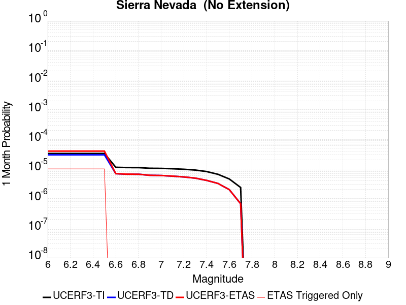 |  |  |

| Magnitude | 1 wk TI Prob | 1 wk TD Prob | 1 wk ETAS Prob | 1 wk ETAS/TD Gain | 1 wk ETAS Triggered Only | 1 mo TI Prob | 1 mo TD Prob | 1 mo ETAS Prob | 1 mo ETAS/TD Gain | 1 mo ETAS Triggered Only | 1 yr TI Prob | 1 yr TD Prob | 1 yr ETAS Prob | 1 yr ETAS/TD Gain | 1 yr ETAS Triggered Only | 10 yr TI Prob | 10 yr TD Prob | 10 yr ETAS Prob | 10 yr ETAS/TD Gain | 10 yr ETAS Triggered Only |
|-----|-----|-----|-----|-----|-----|-----|-----|-----|-----|-----|-----|-----|-----|-----|-----|-----|-----|-----|-----|-----|
| 6.0 | 7.7690465E-6 | 6.976568E-6 | 6.976568E-6 | 1.0 | 0.0 | 3.329549E-5 | 2.9899435E-5 | 3.9899136E-5 | 1.3344445 | 1.0E-5 | 4.0529718E-4 | 3.6400068E-4 | 4.2397884E-4 | 1.1647749 | 6.0E-5 | 0.004045588 | 0.0036375606 | 0.003846797 | 1.057521 | 2.1E-4 |
| 6.1 | 7.7690465E-6 | 6.976568E-6 | 6.976568E-6 | 1.0 | 0.0 | 3.329549E-5 | 2.9899435E-5 | 3.9899136E-5 | 1.3344445 | 1.0E-5 | 4.0529718E-4 | 3.6400068E-4 | 4.2397884E-4 | 1.1647749 | 6.0E-5 | 0.004045588 | 0.0036375606 | 0.003846797 | 1.057521 | 2.1E-4 |
| 6.2 | 7.7690465E-6 | 6.976568E-6 | 6.976568E-6 | 1.0 | 0.0 | 3.329549E-5 | 2.9899435E-5 | 3.9899136E-5 | 1.3344445 | 1.0E-5 | 4.0529718E-4 | 3.6400068E-4 | 4.2397884E-4 | 1.1647749 | 6.0E-5 | 0.004045588 | 0.0036375606 | 0.003846797 | 1.057521 | 2.1E-4 |
| 6.3 | 7.7690465E-6 | 6.976568E-6 | 6.976568E-6 | 1.0 | 0.0 | 3.329549E-5 | 2.9899435E-5 | 3.9899136E-5 | 1.3344445 | 1.0E-5 | 4.0529718E-4 | 3.6400068E-4 | 4.2397884E-4 | 1.1647749 | 6.0E-5 | 0.004045588 | 0.0036375606 | 0.003846797 | 1.057521 | 2.1E-4 |
| 6.4 | 7.7690465E-6 | 6.976568E-6 | 6.976568E-6 | 1.0 | 0.0 | 3.329549E-5 | 2.9899435E-5 | 3.9899136E-5 | 1.3344445 | 1.0E-5 | 4.0529718E-4 | 3.6400068E-4 | 4.2397884E-4 | 1.1647749 | 6.0E-5 | 0.004045588 | 0.0036375606 | 0.003846797 | 1.057521 | 2.1E-4 |
| 6.5 | 7.7690465E-6 | 6.976568E-6 | 6.976568E-6 | 1.0 | 0.0 | 3.329549E-5 | 2.9899435E-5 | 3.9899136E-5 | 1.3344445 | 1.0E-5 | 4.0529718E-4 | 3.6400068E-4 | 4.2397884E-4 | 1.1647749 | 6.0E-5 | 0.004045588 | 0.0036375606 | 0.003846797 | 1.057521 | 2.1E-4 |
| 6.6 | 2.653E-6 | 1.6149635E-6 | 1.6149635E-6 | 1.0 | 0.0 | 1.136995E-5 | 6.9212538E-6 | 6.9212538E-6 | 1.0 | 0.0 | 1.3842035E-4 | 8.426304E-5 | 1.3425882E-4 | 1.5933299 | 5.0E-5 | 0.0013833415 | 8.4231433E-4 | 0.0010121712 | 1.2016549 | 1.7E-4 |
| 6.7 | 2.5902466E-6 | 1.5502959E-6 | 1.5502959E-6 | 1.0 | 0.0 | 1.11010095E-5 | 6.644109E-6 | 6.644109E-6 | 1.0 | 0.0 | 1.351464E-4 | 8.0889055E-5 | 1.30885E-4 | 1.6180806 | 5.0E-5 | 0.0013506424 | 8.0859906E-4 | 9.684697E-4 | 1.1977131 | 1.6E-4 |
| 6.8 | 2.5853892E-6 | 1.5470957E-6 | 1.5470957E-6 | 1.0 | 0.0 | 1.1080193E-5 | 6.6303933E-6 | 6.6303933E-6 | 1.0 | 0.0 | 1.34893E-4 | 8.072208E-5 | 1.3071805E-4 | 1.6193593 | 5.0E-5 | 0.0013481114 | 8.069306E-4 | 9.668014E-4 | 1.1981223 | 1.6E-4 |
| 6.9 | 2.458257E-6 | 1.4221675E-6 | 1.4221675E-6 | 1.0 | 0.0 | 1.0535345E-5 | 6.0949897E-6 | 6.0949897E-6 | 1.0 | 0.0 | 1.2826028E-4 | 7.420399E-5 | 1.2420028E-4 | 1.6737682 | 5.0E-5 | 0.0012818627 | 7.4179407E-4 | 8.916828E-4 | 1.2020625 | 1.5E-4 |
| 7.0 | 2.4341468E-6 | 1.3991308E-6 | 1.3991308E-6 | 1.0 | 0.0 | 1.0432016E-5 | 5.9962613E-6 | 5.9962613E-6 | 1.0 | 0.0 | 1.270024E-4 | 7.3002055E-5 | 1.229984E-4 | 1.6848623 | 5.0E-5 | 0.0012692984 | 7.297827E-4 | 8.7967317E-4 | 1.2053907 | 1.5E-4 |
| 7.1 | 2.3652476E-6 | 1.334079E-6 | 1.334079E-6 | 1.0 | 0.0 | 1.0136736E-5 | 5.717469E-6 | 5.717469E-6 | 1.0 | 0.0 | 1.2340778E-4 | 6.960797E-5 | 1.0960519E-4 | 1.5746068 | 4.0E-5 | 0.0012333926 | 6.9586345E-4 | 8.35766E-4 | 1.2010489 | 1.4E-4 |
| 7.2 | 2.272158E-6 | 1.2503832E-6 | 1.2503832E-6 | 1.0 | 0.0 | 9.737784E-6 | 5.358774E-6 | 5.358774E-6 | 1.0 | 0.0 | 1.1855107E-4 | 6.524114E-5 | 1.0523853E-4 | 1.6130701 | 4.0E-5 | 0.0011848784 | 6.522214E-4 | 7.921301E-4 | 1.214511 | 1.4E-4 |
| 7.3 | 2.1382127E-6 | 1.1420682E-6 | 1.1420682E-6 | 1.0 | 0.0 | 9.163737E-6 | 4.894569E-6 | 4.894569E-6 | 1.0 | 0.0 | 1.1156279E-4 | 5.9589758E-5 | 9.958737E-5 | 1.6712162 | 4.0E-5 | 0.001115068 | 5.95739E-4 | 7.256615E-4 | 1.2180864 | 1.3E-4 |
| 7.4 | 1.9048055E-6 | 9.57617E-7 | 9.57617E-7 | 1.0 | 0.0 | 8.163426E-6 | 4.104066E-6 | 4.104066E-6 | 1.0 | 0.0 | 9.9385186E-5 | 4.9965867E-5 | 7.996437E-5 | 1.6003798 | 3.0E-5 | 9.934074E-4 | 4.99547E-4 | 6.194871E-4 | 1.2400976 | 1.2E-4 |
| 7.5 | 1.5373403E-6 | 7.560832E-7 | 7.560832E-7 | 1.0 | 0.0 | 6.5885843E-6 | 3.2403525E-6 | 3.2403525E-6 | 1.0 | 0.0 | 8.021306E-5 | 3.9450584E-5 | 6.94494E-5 | 1.7604151 | 3.0E-5 | 8.0184115E-4 | 3.9443627E-4 | 5.043929E-4 | 1.278769 | 1.1E-4 |
| 7.6 | 1.0680322E-6 | 4.6602182E-7 | 4.6602182E-7 | 1.0 | 0.0 | 4.577273E-6 | 1.997235E-6 | 1.997235E-6 | 1.0 | 0.0 | 5.5726876E-5 | 2.4316065E-5 | 4.4315577E-5 | 1.8224815 | 2.0E-5 | 5.5712904E-4 | 2.431343E-4 | 3.1311729E-4 | 1.2878367 | 7.0E-5 |
| 7.7 | 5.509146E-7 | 1.558334E-7 | 1.558334E-7 | 1.0 | 0.0 | 2.3610605E-6 | 6.678573E-7 | 6.678573E-7 | 1.0 | 0.0 | 2.8745531E-5 | 8.131134E-6 | 2.8130971E-5 | 3.4596617 | 2.0E-5 | 2.8741814E-4 | 8.130848E-5 | 1.21305224E-4 | 1.4919137 | 4.0E-5 |

## Lake Isabella (Seismicity)
*[(top)](#table-of-contents)*

| 1 Week | 1 Month | 1 Year | 10 Year |
|-----|-----|-----|-----|
|  |  |  |  |

| Magnitude | 1 wk TI Prob | 1 wk TD Prob | 1 wk ETAS Prob | 1 wk ETAS/TD Gain | 1 wk ETAS Triggered Only | 1 mo TI Prob | 1 mo TD Prob | 1 mo ETAS Prob | 1 mo ETAS/TD Gain | 1 mo ETAS Triggered Only | 1 yr TI Prob | 1 yr TD Prob | 1 yr ETAS Prob | 1 yr ETAS/TD Gain | 1 yr ETAS Triggered Only | 10 yr TI Prob | 10 yr TD Prob | 10 yr ETAS Prob | 10 yr ETAS/TD Gain | 10 yr ETAS Triggered Only |
|-----|-----|-----|-----|-----|-----|-----|-----|-----|-----|-----|-----|-----|-----|-----|-----|-----|-----|-----|-----|-----|
| 6.0 | 9.431637E-6 | 9.7418215E-6 | 9.7418215E-6 | 1.0 | 0.0 | 4.0420677E-5 | 4.175007E-5 | 1.01747566E-4 | 2.4370635 | 6.0E-5 | 4.920106E-4 | 5.082016E-4 | 6.481305E-4 | 1.2753413 | 1.4E-4 | 0.004909227 | 0.005071687 | 0.005270673 | 1.0392346 | 2.0E-4 |
| 6.1 | 9.431637E-6 | 9.7418215E-6 | 9.7418215E-6 | 1.0 | 0.0 | 4.0420677E-5 | 4.175007E-5 | 1.01747566E-4 | 2.4370635 | 6.0E-5 | 4.920106E-4 | 5.082016E-4 | 6.481305E-4 | 1.2753413 | 1.4E-4 | 0.004909227 | 0.005071687 | 0.005270673 | 1.0392346 | 2.0E-4 |
| 6.2 | 9.431637E-6 | 9.7418215E-6 | 9.7418215E-6 | 1.0 | 0.0 | 4.0420677E-5 | 4.175007E-5 | 1.01747566E-4 | 2.4370635 | 6.0E-5 | 4.920106E-4 | 5.082016E-4 | 6.481305E-4 | 1.2753413 | 1.4E-4 | 0.004909227 | 0.005071687 | 0.005270673 | 1.0392346 | 2.0E-4 |
| 6.3 | 9.431637E-6 | 9.7418215E-6 | 9.7418215E-6 | 1.0 | 0.0 | 4.0420677E-5 | 4.175007E-5 | 1.01747566E-4 | 2.4370635 | 6.0E-5 | 4.920106E-4 | 5.082016E-4 | 6.481305E-4 | 1.2753413 | 1.4E-4 | 0.004909227 | 0.005071687 | 0.005270673 | 1.0392346 | 2.0E-4 |
| 6.4 | 5.144063E-6 | 5.3001613E-6 | 5.3001613E-6 | 1.0 | 0.0 | 2.2045799E-5 | 2.27148E-5 | 7.2713665E-5 | 3.201158 | 5.0E-5 | 2.6837454E-4 | 2.7652105E-4 | 3.6649616E-4 | 1.3253825 | 9.0E-5 | 0.0026805066 | 0.0027621102 | 0.0029017234 | 1.0505459 | 1.4E-4 |
| 6.5 | 5.144063E-6 | 5.3001613E-6 | 5.3001613E-6 | 1.0 | 0.0 | 2.2045799E-5 | 2.27148E-5 | 7.2713665E-5 | 3.201158 | 5.0E-5 | 2.6837454E-4 | 2.7652105E-4 | 3.6649616E-4 | 1.3253825 | 9.0E-5 | 0.0026805066 | 0.0027621102 | 0.0029017234 | 1.0505459 | 1.4E-4 |
| 6.6 | 3.4009804E-6 | 3.4988395E-6 | 3.4988395E-6 | 1.0 | 0.0 | 1.4575549E-5 | 1.4994949E-5 | 4.49945E-5 | 3.0006437 | 3.0E-5 | 1.7744285E-4 | 1.8254982E-4 | 2.5253705E-4 | 1.383387 | 7.0E-5 | 0.0017730123 | 0.0018241564 | 0.0019339557 | 1.0601919 | 1.1E-4 |
| 6.7 | 3.3880428E-6 | 3.485706E-6 | 3.485706E-6 | 1.0 | 0.0 | 1.4520103E-5 | 1.4938664E-5 | 4.4938217E-5 | 3.0081818 | 3.0E-5 | 1.767679E-4 | 1.8186466E-4 | 2.5185192E-4 | 1.3848317 | 7.0E-5 | 0.0017662736 | 0.0018173159 | 0.0019271161 | 1.0604188 | 1.1E-4 |
| 6.8 | 2.6582E-6 | 2.7337414E-6 | 2.7337414E-6 | 1.0 | 0.0 | 1.1392236E-5 | 1.171599E-5 | 4.1715637E-5 | 3.560573 | 3.0E-5 | 1.3869164E-4 | 1.4263418E-4 | 2.126242E-4 | 1.490696 | 7.0E-5 | 0.0013860512 | 0.0014255584 | 0.0015254158 | 1.070048 | 1.0E-4 |
| 6.9 | 2.406011E-6 | 2.474366E-6 | 2.474366E-6 | 1.0 | 0.0 | 1.0311434E-5 | 1.0604391E-5 | 4.060407E-5 | 3.828987 | 3.0E-5 | 1.2553448E-4 | 1.2910213E-4 | 1.9909309E-4 | 1.5421364 | 7.0E-5 | 0.0012546359 | 0.0012904009 | 0.0013902718 | 1.0773953 | 1.0E-4 |
| 7.0 | 1.6953097E-6 | 1.7429631E-6 | 1.7429631E-6 | 1.0 | 0.0 | 7.265593E-6 | 7.469827E-6 | 2.7469678E-5 | 3.6774182 | 2.0E-5 | 8.8455E-5 | 9.094239E-5 | 1.4093785E-4 | 1.5497487 | 5.0E-5 | 8.84198E-4 | 9.0915454E-4 | 9.790909E-4 | 1.0769246 | 7.0E-5 |
| 7.1 | 3.5013824E-7 | 3.5715203E-7 | 3.5715203E-7 | 1.0 | 0.0 | 1.5005916E-6 | 1.5306507E-6 | 1.5306507E-6 | 1.0 | 0.0 | 1.826955E-5 | 1.8635516E-5 | 3.8635142E-5 | 2.0731995 | 2.0E-5 | 1.8268047E-4 | 1.8633978E-4 | 2.0633604E-4 | 1.1073108 | 2.0E-5 |
| 7.2 | 2.2321095E-7 | 2.2750805E-7 | 2.2750805E-7 | 1.0 | 0.0 | 9.56618E-7 | 9.750341E-7 | 9.750341E-7 | 1.0 | 0.0 | 1.1646762E-5 | 1.1870978E-5 | 1.1870978E-5 | 1.0 | 0.0 | 1.1646151E-4 | 1.1870354E-4 | 1.1870354E-4 | 1.0 | 0.0 |
| 7.3 | 1.5760406E-7 | 1.6061085E-7 | 1.6061085E-7 | 1.0 | 0.0 | 6.7544585E-7 | 6.88332E-7 | 6.88332E-7 | 1.0 | 0.0 | 8.223522E-6 | 8.380411E-6 | 8.380411E-6 | 1.0 | 0.0 | 8.2232174E-5 | 8.380101E-5 | 8.380101E-5 | 1.0 | 0.0 |
| 7.4 | 1.1216497E-7 | 1.14318226E-7 | 1.14318226E-7 | 1.0 | 0.0 | 4.8070694E-7 | 4.899352E-7 | 4.899352E-7 | 1.0 | 0.0 | 5.852591E-6 | 5.9649446E-6 | 5.9649446E-6 | 1.0 | 0.0 | 5.8524372E-5 | 5.964789E-5 | 5.964789E-5 | 1.0 | 0.0 |
| 7.5 | 4.885185E-8 | 4.9788245E-8 | 4.9788245E-8 | 1.0 | 0.0 | 2.0936506E-7 | 2.1337817E-7 | 2.1337817E-7 | 1.0 | 0.0 | 2.5490165E-6 | 2.5978763E-6 | 2.5978763E-6 | 1.0 | 0.0 | 2.5489873E-5 | 2.5978477E-5 | 2.5978477E-5 | 1.0 | 0.0 |
| 7.6 | 1.504641E-9 | 1.5318049E-9 | 1.5318049E-9 | 1.0 | 0.0 | 6.4484613E-9 | 6.5648784E-9 | 6.5648784E-9 | 1.0 | 0.0 | 7.851001E-8 | 7.9927396E-8 | 7.9927396E-8 | 1.0 | 0.0 | 7.8509987E-7 | 7.9927395E-7 | 7.9927395E-7 | 1.0 | 0.0 |

## Scodie Lineament
*[(top)](#table-of-contents)*

| 1 Week | 1 Month | 1 Year | 10 Year |
|-----|-----|-----|-----|
| 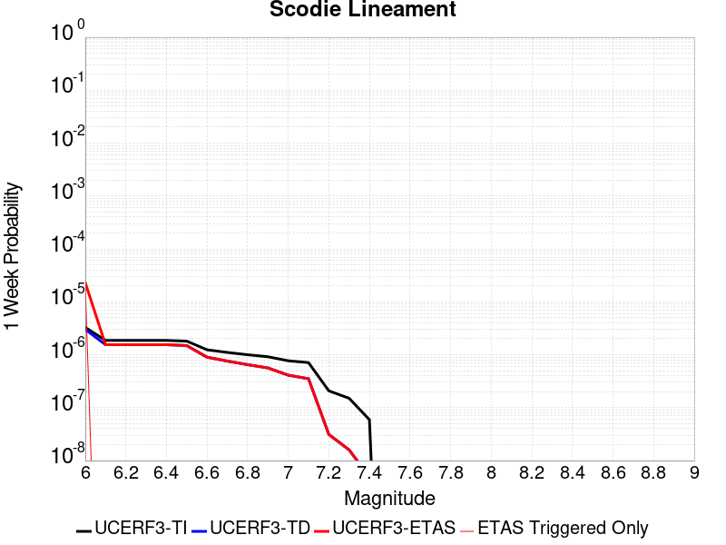 |  |  |  |

| Magnitude | 1 wk TI Prob | 1 wk TD Prob | 1 wk ETAS Prob | 1 wk ETAS/TD Gain | 1 wk ETAS Triggered Only | 1 mo TI Prob | 1 mo TD Prob | 1 mo ETAS Prob | 1 mo ETAS/TD Gain | 1 mo ETAS Triggered Only | 1 yr TI Prob | 1 yr TD Prob | 1 yr ETAS Prob | 1 yr ETAS/TD Gain | 1 yr ETAS Triggered Only | 10 yr TI Prob | 10 yr TD Prob | 10 yr ETAS Prob | 10 yr ETAS/TD Gain | 10 yr ETAS Triggered Only |
|-----|-----|-----|-----|-----|-----|-----|-----|-----|-----|-----|-----|-----|-----|-----|-----|-----|-----|-----|-----|-----|
| 6.0 | 3.2919327E-6 | 3.0133992E-6 | 2.301334E-5 | 7.637003 | 2.0E-5 | 1.4108206E-5 | 1.2914522E-5 | 4.2914136E-5 | 3.3229363 | 3.0E-5 | 1.7175387E-4 | 1.5722614E-4 | 2.3721356E-4 | 1.5087413 | 8.0E-5 | 0.0017162118 | 0.0015714606 | 0.0017611621 | 1.1207166 | 1.9E-4 |
| 6.1 | 1.8663811E-6 | 1.5490858E-6 | 1.5490858E-6 | 1.0 | 0.0 | 7.998751E-6 | 6.6389252E-6 | 6.6389252E-6 | 1.0 | 0.0 | 9.738045E-5 | 8.082641E-5 | 9.0825604E-5 | 1.123712 | 1.0E-5 | 9.7337784E-4 | 8.0801896E-4 | 8.5797854E-4 | 1.0618297 | 5.0E-5 |
| 6.2 | 1.8663811E-6 | 1.5490858E-6 | 1.5490858E-6 | 1.0 | 0.0 | 7.998751E-6 | 6.6389252E-6 | 6.6389252E-6 | 1.0 | 0.0 | 9.738045E-5 | 8.082641E-5 | 9.0825604E-5 | 1.123712 | 1.0E-5 | 9.7337784E-4 | 8.0801896E-4 | 8.5797854E-4 | 1.0618297 | 5.0E-5 |
| 6.3 | 1.8663811E-6 | 1.5490858E-6 | 1.5490858E-6 | 1.0 | 0.0 | 7.998751E-6 | 6.6389252E-6 | 6.6389252E-6 | 1.0 | 0.0 | 9.738045E-5 | 8.082641E-5 | 9.0825604E-5 | 1.123712 | 1.0E-5 | 9.7337784E-4 | 8.0801896E-4 | 8.5797854E-4 | 1.0618297 | 5.0E-5 |
| 6.4 | 1.8663811E-6 | 1.5490858E-6 | 1.5490858E-6 | 1.0 | 0.0 | 7.998751E-6 | 6.6389252E-6 | 6.6389252E-6 | 1.0 | 0.0 | 9.738045E-5 | 8.082641E-5 | 9.0825604E-5 | 1.123712 | 1.0E-5 | 9.7337784E-4 | 8.0801896E-4 | 8.5797854E-4 | 1.0618297 | 5.0E-5 |
| 6.5 | 1.8106311E-6 | 1.4910186E-6 | 1.4910186E-6 | 1.0 | 0.0 | 7.759824E-6 | 6.3900666E-6 | 6.3900666E-6 | 1.0 | 0.0 | 9.447177E-5 | 7.779678E-5 | 8.7796005E-5 | 1.12853 | 1.0E-5 | 9.4431615E-4 | 7.777441E-4 | 8.277052E-4 | 1.0642385 | 5.0E-5 |
| 6.6 | 1.2414679E-6 | 8.997782E-7 | 8.997782E-7 | 1.0 | 0.0 | 5.320566E-6 | 3.856187E-6 | 3.856187E-6 | 1.0 | 0.0 | 6.477596E-5 | 4.6948153E-5 | 5.6947683E-5 | 1.2129909 | 1.0E-5 | 6.475708E-4 | 4.69391E-4 | 5.093722E-4 | 1.0851768 | 4.0E-5 |
| 6.7 | 1.1062215E-6 | 7.5945076E-7 | 7.5945076E-7 | 1.0 | 0.0 | 4.7409408E-6 | 3.2547853E-6 | 3.2547853E-6 | 1.0 | 0.0 | 5.7719422E-5 | 3.962636E-5 | 4.9625964E-5 | 1.2523472 | 1.0E-5 | 5.770443E-4 | 3.9619993E-4 | 4.2618805E-4 | 1.0756893 | 3.0E-5 |
| 6.8 | 1.0006736E-6 | 6.500572E-7 | 6.500572E-7 | 1.0 | 0.0 | 4.288594E-6 | 2.7859567E-6 | 2.7859567E-6 | 1.0 | 0.0 | 5.221238E-5 | 3.3918557E-5 | 4.391822E-5 | 1.2948139 | 1.0E-5 | 5.220012E-4 | 3.391399E-4 | 3.691297E-4 | 1.0884291 | 3.0E-5 |
| 6.9 | 9.167364E-7 | 5.631784E-7 | 5.631784E-7 | 1.0 | 0.0 | 3.9288643E-6 | 2.4136198E-6 | 2.4136198E-6 | 1.0 | 0.0 | 4.7832873E-5 | 2.9385481E-5 | 2.9385481E-5 | 1.0 | 0.0 | 4.782258E-4 | 2.9382162E-4 | 3.1381575E-4 | 1.0680485 | 2.0E-5 |
| 7.0 | 7.6987664E-7 | 4.113515E-7 | 4.113515E-7 | 1.0 | 0.0 | 3.2994672E-6 | 1.762934E-6 | 1.762934E-6 | 1.0 | 0.0 | 4.0170275E-5 | 2.146355E-5 | 2.146355E-5 | 1.0 | 0.0 | 4.0163012E-4 | 2.1461862E-4 | 2.3461432E-4 | 1.0931686 | 2.0E-5 |
| 7.1 | 7.1038727E-7 | 3.5212707E-7 | 3.5212707E-7 | 1.0 | 0.0 | 3.0445133E-6 | 1.5091154E-6 | 1.5091154E-6 | 1.0 | 0.0 | 3.706632E-5 | 1.837336E-5 | 1.837336E-5 | 1.0 | 0.0 | 3.7060137E-4 | 1.837219E-4 | 1.9372006E-4 | 1.0544201 | 1.0E-5 |
| 7.2 | 2.0799602E-7 | 3.1190186E-8 | 3.1190186E-8 | 1.0 | 0.0 | 8.914113E-7 | 1.3367222E-7 | 1.3367222E-7 | 1.0 | 0.0 | 1.0852878E-5 | 1.6274581E-6 | 1.6274581E-6 | 1.0 | 0.0 | 1.08523476E-4 | 1.6274469E-5 | 1.6274469E-5 | 1.0 | 0.0 |
| 7.3 | 1.5048182E-7 | 1.5947961E-8 | 1.5947961E-8 | 1.0 | 0.0 | 6.449219E-7 | 6.8348406E-8 | 6.8348406E-8 | 1.0 | 0.0 | 7.851896E-6 | 8.3214155E-7 | 8.3214155E-7 | 1.0 | 0.0 | 7.851618E-5 | 8.321387E-6 | 8.321387E-6 | 1.0 | 0.0 |
| 7.4 | 5.9334678E-8 | 4.86919E-9 | 4.86919E-9 | 1.0 | 0.0 | 2.5429145E-7 | 2.0867958E-8 | 2.0867958E-8 | 1.0 | 0.0 | 3.095994E-6 | 2.5406737E-7 | 2.5406737E-7 | 1.0 | 0.0 | 3.095951E-5 | 2.5406719E-6 | 2.5406719E-6 | 1.0 | 0.0 |

## Ludlow
*[(top)](#table-of-contents)*

| 1 Week | 1 Month | 1 Year | 10 Year |
|-----|-----|-----|-----|
|  |  |  |  |

| Magnitude | 1 wk TI Prob | 1 wk TD Prob | 1 wk ETAS Prob | 1 wk ETAS/TD Gain | 1 wk ETAS Triggered Only | 1 mo TI Prob | 1 mo TD Prob | 1 mo ETAS Prob | 1 mo ETAS/TD Gain | 1 mo ETAS Triggered Only | 1 yr TI Prob | 1 yr TD Prob | 1 yr ETAS Prob | 1 yr ETAS/TD Gain | 1 yr ETAS Triggered Only | 10 yr TI Prob | 10 yr TD Prob | 10 yr ETAS Prob | 10 yr ETAS/TD Gain | 10 yr ETAS Triggered Only |
|-----|-----|-----|-----|-----|-----|-----|-----|-----|-----|-----|-----|-----|-----|-----|-----|-----|-----|-----|-----|-----|
| 6.0 | 2.2407607E-5 | 2.3657954E-5 | 2.3657954E-5 | 1.0 | 0.0 | 9.602906E-5 | 1.0138754E-4 | 1.313845E-4 | 1.2958643 | 3.0E-5 | 0.0011685267 | 0.0012337384 | 0.0012936644 | 1.0485727 | 6.0E-5 | 0.011624013 | 0.012273403 | 0.012441317 | 1.013681 | 1.7E-4 |
| 6.1 | 2.2407607E-5 | 2.3657954E-5 | 2.3657954E-5 | 1.0 | 0.0 | 9.602906E-5 | 1.0138754E-4 | 1.313845E-4 | 1.2958643 | 3.0E-5 | 0.0011685267 | 0.0012337384 | 0.0012936644 | 1.0485727 | 6.0E-5 | 0.011624013 | 0.012273403 | 0.012441317 | 1.013681 | 1.7E-4 |
| 6.2 | 1.0781252E-5 | 1.1365991E-5 | 1.1365991E-5 | 1.0 | 0.0 | 4.620455E-5 | 4.8710503E-5 | 4.8710503E-5 | 1.0 | 0.0 | 5.623952E-4 | 5.92893E-4 | 6.2287523E-4 | 1.0505693 | 3.0E-5 | 0.00560974 | 0.005913531 | 0.005973176 | 1.0100862 | 6.0E-5 |
| 6.3 | 1.0781252E-5 | 1.1365991E-5 | 1.1365991E-5 | 1.0 | 0.0 | 4.620455E-5 | 4.8710503E-5 | 4.8710503E-5 | 1.0 | 0.0 | 5.623952E-4 | 5.92893E-4 | 6.2287523E-4 | 1.0505693 | 3.0E-5 | 0.00560974 | 0.005913531 | 0.005973176 | 1.0100862 | 6.0E-5 |
| 6.4 | 7.814439E-6 | 8.237966E-6 | 8.237966E-6 | 1.0 | 0.0 | 3.3490025E-5 | 3.5305096E-5 | 3.5305096E-5 | 1.0 | 0.0 | 4.0766477E-4 | 4.2975618E-4 | 4.5974329E-4 | 1.069777 | 3.0E-5 | 0.0040691774 | 0.0042893975 | 0.0043491405 | 1.0139279 | 6.0E-5 |
| 6.5 | 6.4986366E-6 | 6.8511167E-6 | 6.8511167E-6 | 1.0 | 0.0 | 2.7851002E-5 | 2.9361603E-5 | 2.9361603E-5 | 1.0 | 0.0 | 3.390332E-4 | 3.574198E-4 | 3.7741265E-4 | 1.0559366 | 2.0E-5 | 0.003385164 | 0.003568546 | 0.0035984388 | 1.0083768 | 3.0E-5 |
| 6.6 | 5.582177E-6 | 5.8861756E-6 | 5.8861756E-6 | 1.0 | 0.0 | 2.3923398E-5 | 2.5226227E-5 | 2.5226227E-5 | 1.0 | 0.0 | 2.9122844E-4 | 3.0708674E-4 | 3.1708367E-4 | 1.032554 | 1.0E-5 | 0.0029084706 | 0.0030666974 | 0.0030766667 | 1.0032508 | 1.0E-5 |
| 6.7 | 4.6858763E-6 | 4.94057E-6 | 4.94057E-6 | 1.0 | 0.0 | 2.0082172E-5 | 2.1173702E-5 | 2.1173702E-5 | 1.0 | 0.0 | 2.4447302E-4 | 2.5775988E-4 | 2.677573E-4 | 1.0387858 | 1.0E-5 | 0.0024420423 | 0.0025746655 | 0.0025846397 | 1.003874 | 1.0E-5 |
| 6.8 | 3.5584908E-6 | 3.7521265E-6 | 3.7521265E-6 | 1.0 | 0.0 | 1.5250586E-5 | 1.6080447E-5 | 1.6080447E-5 | 1.0 | 0.0 | 1.8566006E-4 | 1.9576224E-4 | 2.057603E-4 | 1.0510724 | 1.0E-5 | 0.0018550502 | 0.0019559392 | 0.0019659195 | 1.0051026 | 1.0E-5 |
| 6.9 | 2.532834E-6 | 2.6710807E-6 | 2.6710807E-6 | 1.0 | 0.0 | 1.0854958E-5 | 1.1447441E-5 | 1.1447441E-5 | 1.0 | 0.0 | 1.3215111E-4 | 1.3936395E-4 | 1.4936256E-4 | 1.0717446 | 1.0E-5 | 0.0013207254 | 0.0013927931 | 0.0014027792 | 1.0071698 | 1.0E-5 |
| 7.0 | 1.7083285E-6 | 1.8019963E-6 | 1.8019963E-6 | 1.0 | 0.0 | 7.3213873E-6 | 7.722819E-6 | 7.722819E-6 | 1.0 | 0.0 | 8.913424E-5 | 9.402143E-5 | 1.04020495E-4 | 1.1063488 | 1.0E-5 | 8.9098496E-4 | 9.3983306E-4 | 9.4982365E-4 | 1.0106301 | 1.0E-5 |
| 7.1 | 1.0905424E-6 | 1.1497951E-6 | 1.1497951E-6 | 1.0 | 0.0 | 4.6737446E-6 | 4.9276846E-6 | 4.9276846E-6 | 1.0 | 0.0 | 5.6901354E-5 | 5.9993006E-5 | 5.9993006E-5 | 1.0 | 0.0 | 5.6886784E-4 | 5.997779E-4 | 5.997779E-4 | 1.0 | 0.0 |
| 7.2 | 6.06668E-7 | 6.387457E-7 | 6.387457E-7 | 1.0 | 0.0 | 2.600003E-6 | 2.737479E-6 | 2.737479E-6 | 1.0 | 0.0 | 3.1654577E-5 | 3.3328364E-5 | 3.3328364E-5 | 1.0 | 0.0 | 3.1650066E-4 | 3.3324052E-4 | 3.3324052E-4 | 1.0 | 0.0 |

## Red Pass
*[(top)](#table-of-contents)*

| 1 Week | 1 Month | 1 Year | 10 Year |
|-----|-----|-----|-----|
|  | 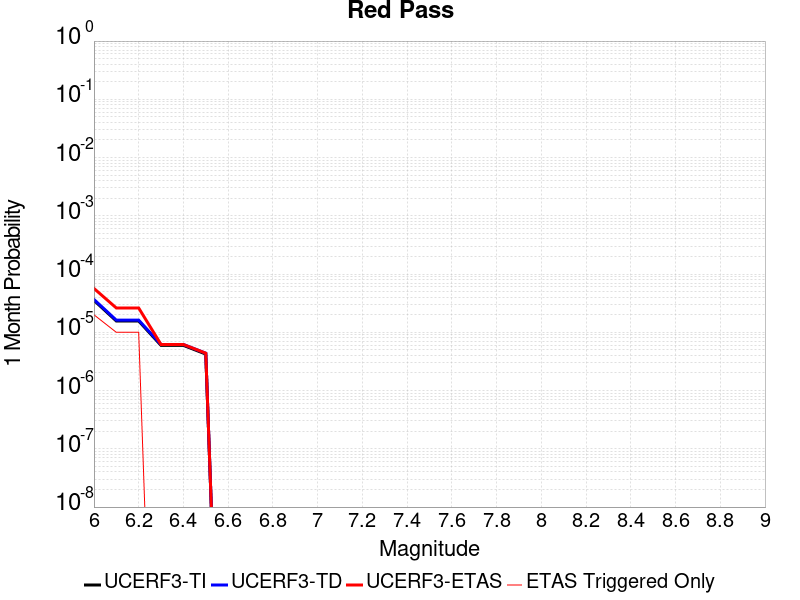 |  |  |

| Magnitude | 1 wk TI Prob | 1 wk TD Prob | 1 wk ETAS Prob | 1 wk ETAS/TD Gain | 1 wk ETAS Triggered Only | 1 mo TI Prob | 1 mo TD Prob | 1 mo ETAS Prob | 1 mo ETAS/TD Gain | 1 mo ETAS Triggered Only | 1 yr TI Prob | 1 yr TD Prob | 1 yr ETAS Prob | 1 yr ETAS/TD Gain | 1 yr ETAS Triggered Only | 10 yr TI Prob | 10 yr TD Prob | 10 yr ETAS Prob | 10 yr ETAS/TD Gain | 10 yr ETAS Triggered Only |
|-----|-----|-----|-----|-----|-----|-----|-----|-----|-----|-----|-----|-----|-----|-----|-----|-----|-----|-----|-----|-----|
| 6.0 | 8.258278E-6 | 8.551426E-6 | 1.855134E-5 | 2.1693857 | 1.0E-5 | 3.539214E-5 | 3.6648555E-5 | 5.664782E-5 | 1.5457041 | 2.0E-5 | 4.308141E-4 | 4.4612266E-4 | 5.2608695E-4 | 1.1792428 | 8.0E-5 | 0.0042997985 | 0.0044540283 | 0.0046232715 | 1.0379977 | 1.7E-4 |
| 6.1 | 3.649988E-6 | 3.7753848E-6 | 1.3775347E-5 | 3.6487267 | 1.0E-5 | 1.5642712E-5 | 1.6180147E-5 | 2.6179985E-5 | 1.6180314 | 1.0E-5 | 1.9043336E-4 | 1.9698025E-4 | 2.2697434E-4 | 1.1522695 | 3.0E-5 | 0.0019027026 | 0.0019685237 | 0.0020583468 | 1.0456295 | 9.0E-5 |
| 6.2 | 3.649988E-6 | 3.7753848E-6 | 1.3775347E-5 | 3.6487267 | 1.0E-5 | 1.5642712E-5 | 1.6180147E-5 | 2.6179985E-5 | 1.6180314 | 1.0E-5 | 1.9043336E-4 | 1.9698025E-4 | 2.2697434E-4 | 1.1522695 | 3.0E-5 | 0.0019027026 | 0.0019685237 | 0.0020583468 | 1.0456295 | 9.0E-5 |
| 6.3 | 1.3924937E-6 | 1.4411434E-6 | 1.4411434E-6 | 1.0 | 0.0 | 5.9678164E-6 | 6.1763217E-6 | 6.1763217E-6 | 1.0 | 0.0 | 7.265574E-5 | 7.519554E-5 | 7.519554E-5 | 1.0 | 0.0 | 7.263199E-4 | 7.518397E-4 | 7.818172E-4 | 1.0398722 | 3.0E-5 |
| 6.4 | 1.3924937E-6 | 1.4411434E-6 | 1.4411434E-6 | 1.0 | 0.0 | 5.9678164E-6 | 6.1763217E-6 | 6.1763217E-6 | 1.0 | 0.0 | 7.265574E-5 | 7.519554E-5 | 7.519554E-5 | 1.0 | 0.0 | 7.263199E-4 | 7.518397E-4 | 7.818172E-4 | 1.0398722 | 3.0E-5 |
| 6.5 | 9.876812E-7 | 1.0222102E-6 | 1.0222102E-6 | 1.0 | 0.0 | 4.2329125E-6 | 4.3809005E-6 | 4.3809005E-6 | 1.0 | 0.0 | 5.153449E-5 | 5.3337466E-5 | 5.3337466E-5 | 1.0 | 0.0 | 5.1522546E-4 | 5.3337467E-4 | 5.53364E-4 | 1.0374771 | 2.0E-5 |

## San Andreas (San Gorgonio Pass-Garnet HIll)
*[(top)](#table-of-contents)*

| 1 Week | 1 Month | 1 Year | 10 Year |
|-----|-----|-----|-----|
|  |  |  |  |

| Magnitude | 1 wk TI Prob | 1 wk TD Prob | 1 wk ETAS Prob | 1 wk ETAS/TD Gain | 1 wk ETAS Triggered Only | 1 mo TI Prob | 1 mo TD Prob | 1 mo ETAS Prob | 1 mo ETAS/TD Gain | 1 mo ETAS Triggered Only | 1 yr TI Prob | 1 yr TD Prob | 1 yr ETAS Prob | 1 yr ETAS/TD Gain | 1 yr ETAS Triggered Only | 10 yr TI Prob | 10 yr TD Prob | 10 yr ETAS Prob | 10 yr ETAS/TD Gain | 10 yr ETAS Triggered Only |
|-----|-----|-----|-----|-----|-----|-----|-----|-----|-----|-----|-----|-----|-----|-----|-----|-----|-----|-----|-----|-----|
| 6.0 | 8.31567E-5 | 2.3398406E-4 | 2.4398172E-4 | 1.042728 | 1.0E-5 | 3.5633717E-4 | 0.001002406 | 0.0010423659 | 1.039864 | 4.0E-5 | 0.004329778 | 0.012136027 | 0.012224935 | 1.0073259 | 9.0E-5 | 0.042463828 | 0.11264349 | 0.112785466 | 1.0012604 | 1.6E-4 |
| 6.1 | 8.31567E-5 | 2.3398406E-4 | 2.4398172E-4 | 1.042728 | 1.0E-5 | 3.5633717E-4 | 0.001002406 | 0.0010423659 | 1.039864 | 4.0E-5 | 0.004329778 | 0.012136027 | 0.012224935 | 1.0073259 | 9.0E-5 | 0.042463828 | 0.11264349 | 0.112785466 | 1.0012604 | 1.6E-4 |
| 6.2 | 8.31567E-5 | 2.3398406E-4 | 2.4398172E-4 | 1.042728 | 1.0E-5 | 3.5633717E-4 | 0.001002406 | 0.0010423659 | 1.039864 | 4.0E-5 | 0.004329778 | 0.012136027 | 0.012224935 | 1.0073259 | 9.0E-5 | 0.042463828 | 0.11264349 | 0.112785466 | 1.0012604 | 1.6E-4 |
| 6.3 | 8.31567E-5 | 2.3398406E-4 | 2.4398172E-4 | 1.042728 | 1.0E-5 | 3.5633717E-4 | 0.001002406 | 0.0010423659 | 1.039864 | 4.0E-5 | 0.004329778 | 0.012136027 | 0.012224935 | 1.0073259 | 9.0E-5 | 0.042463828 | 0.11264349 | 0.112785466 | 1.0012604 | 1.6E-4 |
| 6.4 | 8.059055E-5 | 2.2956554E-4 | 2.3956325E-4 | 1.0435505 | 1.0E-5 | 3.4534236E-4 | 9.834839E-4 | 0.0010234445 | 1.0406318 | 4.0E-5 | 0.0041964394 | 0.011908189 | 0.011997118 | 1.0074679 | 9.0E-5 | 0.041180745 | 0.11062444 | 0.110766746 | 1.0012864 | 1.6E-4 |
| 6.5 | 8.059055E-5 | 2.2956554E-4 | 2.3956325E-4 | 1.0435505 | 1.0E-5 | 3.4534236E-4 | 9.834839E-4 | 0.0010234445 | 1.0406318 | 4.0E-5 | 0.0041964394 | 0.011908189 | 0.011997118 | 1.0074679 | 9.0E-5 | 0.041180745 | 0.11062444 | 0.110766746 | 1.0012864 | 1.6E-4 |
| 6.6 | 7.619237E-5 | 2.2200657E-4 | 2.3200434E-4 | 1.0450337 | 1.0E-5 | 3.2649786E-4 | 9.511121E-4 | 9.91074E-4 | 1.042016 | 4.0E-5 | 0.0039678677 | 0.011518859 | 0.011607823 | 1.0077233 | 9.0E-5 | 0.03897764 | 0.107160784 | 0.10730364 | 1.0013331 | 1.6E-4 |
| 6.7 | 7.440636E-5 | 2.1876446E-4 | 2.2876228E-4 | 1.0457013 | 1.0E-5 | 3.188454E-4 | 9.372274E-4 | 9.771899E-4 | 1.0426391 | 4.0E-5 | 0.0038750346 | 0.01135158 | 0.011440558 | 1.0078384 | 9.0E-5 | 0.038081564 | 0.105669186 | 0.10581228 | 1.0013542 | 1.6E-4 |
| 6.8 | 7.3735864E-5 | 2.1723597E-4 | 2.272338E-4 | 1.0460229 | 1.0E-5 | 3.1597257E-4 | 9.306814E-4 | 9.706442E-4 | 1.0429393 | 4.0E-5 | 0.0038401815 | 0.011272711 | 0.011361696 | 1.0078939 | 9.0E-5 | 0.03774495 | 0.1049707 | 0.10511391 | 1.0013642 | 1.6E-4 |
| 6.9 | 7.27575E-5 | 2.1492546E-4 | 2.2492331E-4 | 1.0465177 | 1.0E-5 | 3.117806E-4 | 9.207862E-4 | 9.6074934E-4 | 1.0434011 | 4.0E-5 | 0.003789323 | 0.011153476 | 0.011242473 | 1.0079793 | 9.0E-5 | 0.037253562 | 0.10391858 | 0.10406195 | 1.0013796 | 1.6E-4 |
| 7.0 | 7.102591E-5 | 2.1076521E-4 | 2.207631E-4 | 1.0474361 | 1.0E-5 | 3.0436125E-4 | 9.02969E-4 | 9.429329E-4 | 1.0442584 | 4.0E-5 | 0.003699303 | 0.010938748 | 0.011027764 | 1.0081376 | 9.0E-5 | 0.03638325 | 0.102020636 | 0.10216431 | 1.0014083 | 1.6E-4 |
| 7.1 | 7.028513E-5 | 2.0912137E-4 | 2.1911928E-4 | 1.0478091 | 1.0E-5 | 3.0118722E-4 | 8.959288E-4 | 9.259019E-4 | 1.0334548 | 3.0E-5 | 0.0036607897 | 0.01085389 | 0.010933022 | 1.0072906 | 8.0E-5 | 0.036010686 | 0.10126359 | 0.1013984 | 1.0013313 | 1.5E-4 |
| 7.2 | 6.8498244E-5 | 2.0519937E-4 | 2.151973E-4 | 1.0487231 | 1.0E-5 | 2.9353087E-4 | 8.7913166E-4 | 9.091053E-4 | 1.0340946 | 3.0E-5 | 0.003567883 | 0.0106514 | 0.010730548 | 1.0074308 | 8.0E-5 | 0.035111405 | 0.09945543 | 0.09959051 | 1.0013583 | 1.5E-4 |
| 7.3 | 6.622592E-5 | 1.9747039E-4 | 2.0746842E-4 | 1.0506305 | 1.0E-5 | 2.8379448E-4 | 8.460293E-4 | 8.7600393E-4 | 1.0354297 | 3.0E-5 | 0.0034497243 | 0.010252241 | 0.01033142 | 1.0077232 | 8.0E-5 | 0.033966612 | 0.09595134 | 0.09608695 | 1.0014133 | 1.5E-4 |
| 7.4 | 5.1050705E-5 | 1.4701985E-4 | 1.5701838E-4 | 1.0680081 | 1.0E-5 | 2.1877038E-4 | 6.299338E-4 | 6.599149E-4 | 1.0475941 | 3.0E-5 | 0.002660276 | 0.0076426673 | 0.0077022086 | 1.0077907 | 6.0E-5 | 0.02628654 | 0.07291896 | 0.07301167 | 1.0012714 | 1.0E-4 |
| 7.5 | 3.9302922E-5 | 1.1141107E-4 | 1.2140996E-4 | 1.0897477 | 1.0E-5 | 1.6843023E-4 | 4.7738897E-4 | 5.0737464E-4 | 1.0628119 | 3.0E-5 | 0.0020487092 | 0.005796791 | 0.005856443 | 1.0102905 | 6.0E-5 | 0.020299247 | 0.056059215 | 0.056153607 | 1.0016838 | 1.0E-4 |
| 7.6 | 2.9851626E-5 | 8.504997E-5 | 9.5049116E-5 | 1.1175679 | 1.0E-5 | 1.2792926E-4 | 3.6444908E-4 | 3.9443813E-4 | 1.082286 | 3.0E-5 | 0.0015564259 | 0.0044281655 | 0.0044878996 | 1.0134896 | 6.0E-5 | 0.0154556995 | 0.043238558 | 0.043334235 | 1.0022128 | 1.0E-4 |
| 7.7 | 2.1135214E-5 | 6.361802E-5 | 7.361738E-5 | 1.1571782 | 1.0E-5 | 9.0576345E-5 | 2.726202E-4 | 3.0261202E-4 | 1.1100132 | 3.0E-5 | 0.0011022091 | 0.0033141046 | 0.0033739058 | 1.0180445 | 6.0E-5 | 0.010967582 | 0.032622673 | 0.032719407 | 1.0029653 | 1.0E-4 |
| 7.8 | 1.883379E-5 | 5.572194E-5 | 6.572138E-5 | 1.1794525 | 1.0E-5 | 8.0713755E-5 | 2.3878647E-4 | 2.687793E-4 | 1.1256052 | 3.0E-5 | 9.822468E-4 | 0.0029033525 | 0.0029631783 | 1.0206058 | 6.0E-5 | 0.0097791655 | 0.028732158 | 0.028829286 | 1.0033804 | 1.0E-4 |
| 7.9 | 1.5156185E-5 | 4.1725576E-5 | 5.172516E-5 | 1.2396512 | 1.0E-5 | 6.495346E-5 | 1.7881165E-4 | 2.0880629E-4 | 1.1677443 | 3.0E-5 | 7.9052144E-4 | 0.0021748596 | 0.0022247508 | 1.02294 | 5.0E-5 | 0.007877152 | 0.021790246 | 0.021878285 | 1.0040402 | 9.0E-5 |
| 8.0 | 1.1405907E-5 | 3.0024876E-5 | 4.0024574E-5 | 1.3330472 | 1.0E-5 | 4.8881542E-5 | 1.286717E-4 | 1.5866784E-4 | 1.2331215 | 3.0E-5 | 5.9497025E-4 | 0.0015654531 | 0.0016053906 | 1.0255117 | 4.0E-5 | 0.005933798 | 0.015796356 | 0.015875094 | 1.0049845 | 8.0E-5 |
| 8.1 | 4.3511436E-6 | 7.3873994E-6 | 7.3873994E-6 | 1.0 | 0.0 | 1.8647626E-5 | 3.16599E-5 | 3.16599E-5 | 1.0 | 0.0 | 2.2701119E-4 | 3.8539123E-4 | 3.8539123E-4 | 1.0 | 0.0 | 0.0022677942 | 0.0041254 | 0.0041254 | 1.0 | 0.0 |
| 8.2 | 2.3042528E-6 | 2.74142E-6 | 2.74142E-6 | 1.0 | 0.0 | 9.875332E-6 | 1.174889E-5 | 1.174889E-5 | 1.0 | 0.0 | 1.2022553E-4 | 1.430334E-4 | 1.430334E-4 | 1.0 | 0.0 | 0.0012016051 | 0.0016024038 | 0.0016024038 | 1.0 | 0.0 |
| 8.3 | 5.202968E-7 | 3.171921E-7 | 3.171921E-7 | 1.0 | 0.0 | 2.2298414E-6 | 1.3593941E-6 | 1.3593941E-6 | 1.0 | 0.0 | 2.714798E-5 | 1.655051E-5 | 1.655051E-5 | 1.0 | 0.0 | 2.7144665E-4 | 1.9631305E-4 | 1.9631305E-4 | 1.0 | 0.0 |

## Death Valley (No)
*[(top)](#table-of-contents)*

| 1 Week | 1 Month | 1 Year | 10 Year |
|-----|-----|-----|-----|
|  | 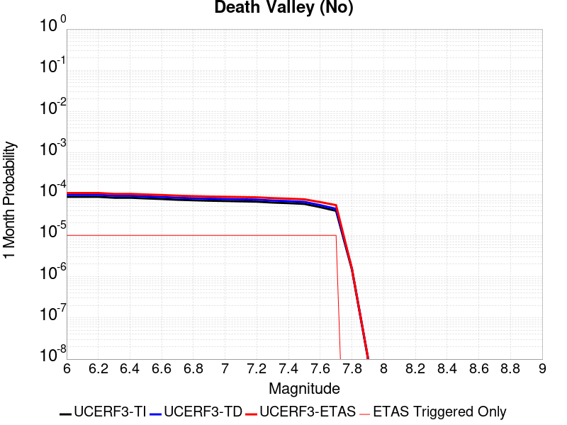 |  |  |

| Magnitude | 1 wk TI Prob | 1 wk TD Prob | 1 wk ETAS Prob | 1 wk ETAS/TD Gain | 1 wk ETAS Triggered Only | 1 mo TI Prob | 1 mo TD Prob | 1 mo ETAS Prob | 1 mo ETAS/TD Gain | 1 mo ETAS Triggered Only | 1 yr TI Prob | 1 yr TD Prob | 1 yr ETAS Prob | 1 yr ETAS/TD Gain | 1 yr ETAS Triggered Only | 10 yr TI Prob | 10 yr TD Prob | 10 yr ETAS Prob | 10 yr ETAS/TD Gain | 10 yr ETAS Triggered Only |
|-----|-----|-----|-----|-----|-----|-----|-----|-----|-----|-----|-----|-----|-----|-----|-----|-----|-----|-----|-----|-----|
| 6.0 | 2.0074807E-5 | 2.2501532E-5 | 2.2501532E-5 | 1.0 | 0.0 | 8.603206E-5 | 9.643161E-5 | 1.0643065E-4 | 1.1036904 | 1.0E-5 | 0.001046937 | 0.00117343 | 0.0011834182 | 1.008512 | 1.0E-5 | 0.010420183 | 0.011673254 | 0.011831386 | 1.0135466 | 1.6E-4 |
| 6.1 | 2.0074807E-5 | 2.2501532E-5 | 2.2501532E-5 | 1.0 | 0.0 | 8.603206E-5 | 9.643161E-5 | 1.0643065E-4 | 1.1036904 | 1.0E-5 | 0.001046937 | 0.00117343 | 0.0011834182 | 1.008512 | 1.0E-5 | 0.010420183 | 0.011673254 | 0.011831386 | 1.0135466 | 1.6E-4 |
| 6.2 | 2.0074807E-5 | 2.2501532E-5 | 2.2501532E-5 | 1.0 | 0.0 | 8.603206E-5 | 9.643161E-5 | 1.0643065E-4 | 1.1036904 | 1.0E-5 | 0.001046937 | 0.00117343 | 0.0011834182 | 1.008512 | 1.0E-5 | 0.010420183 | 0.011673254 | 0.011831386 | 1.0135466 | 1.6E-4 |
| 6.3 | 1.9050609E-5 | 2.1338312E-5 | 2.1338312E-5 | 1.0 | 0.0 | 8.164292E-5 | 9.1446746E-5 | 1.0144583E-4 | 1.1093433 | 1.0E-5 | 9.935491E-4 | 0.0011128022 | 0.0011227911 | 1.0089763 | 1.0E-5 | 0.009891188 | 0.011073124 | 0.011231352 | 1.0142894 | 1.6E-4 |
| 6.4 | 1.9050609E-5 | 2.1338312E-5 | 2.1338312E-5 | 1.0 | 0.0 | 8.164292E-5 | 9.1446746E-5 | 1.0144583E-4 | 1.1093433 | 1.0E-5 | 9.935491E-4 | 0.0011128022 | 0.0011227911 | 1.0089763 | 1.0E-5 | 0.009891188 | 0.011073124 | 0.011231352 | 1.0142894 | 1.6E-4 |
| 6.5 | 1.8367004E-5 | 2.0562318E-5 | 2.0562318E-5 | 1.0 | 0.0 | 7.8713354E-5 | 8.8121276E-5 | 9.81204E-5 | 1.11347 | 1.0E-5 | 9.5791375E-4 | 0.0010723551 | 0.0010823443 | 1.0093153 | 1.0E-5 | 0.009537951 | 0.010672592 | 0.01082099 | 1.0139047 | 1.5E-4 |
| 6.6 | 1.779439E-5 | 1.9912191E-5 | 1.9912191E-5 | 1.0 | 0.0 | 7.625944E-5 | 8.53352E-5 | 9.5334355E-5 | 1.117175 | 1.0E-5 | 9.280632E-4 | 0.0010384673 | 0.001048457 | 1.0096196 | 1.0E-5 | 0.009241969 | 0.010336905 | 0.010475458 | 1.0134037 | 1.4E-4 |
| 6.7 | 1.7025437E-5 | 1.904463E-5 | 1.904463E-5 | 1.0 | 0.0 | 7.296412E-5 | 8.161732E-5 | 9.16165E-5 | 1.122513 | 1.0E-5 | 8.87976E-4 | 9.93244E-4 | 0.0010032341 | 1.010058 | 1.0E-5 | 0.008844362 | 0.009888767 | 0.0100273825 | 1.0140175 | 1.4E-4 |
| 6.8 | 1.6545107E-5 | 1.851372E-5 | 1.851372E-5 | 1.0 | 0.0 | 7.090568E-5 | 7.934213E-5 | 8.934134E-5 | 1.1260264 | 1.0E-5 | 8.629347E-4 | 9.6556847E-4 | 9.755588E-4 | 1.0103467 | 1.0E-5 | 0.008595915 | 0.009614435 | 0.009753089 | 1.0144215 | 1.4E-4 |
| 6.9 | 1.615478E-5 | 1.8088747E-5 | 1.8088747E-5 | 1.0 | 0.0 | 6.9232934E-5 | 7.7520934E-5 | 8.752016E-5 | 1.1289874 | 1.0E-5 | 8.4258494E-4 | 9.4341475E-4 | 9.5340534E-4 | 1.0105898 | 1.0E-5 | 0.008393973 | 0.009394792 | 0.009533476 | 1.0147619 | 1.4E-4 |
| 7.0 | 1.5894311E-5 | 1.780669E-5 | 1.780669E-5 | 1.0 | 0.0 | 6.81167E-5 | 7.6312186E-5 | 8.6311426E-5 | 1.1310307 | 1.0E-5 | 8.2900526E-4 | 9.287109E-4 | 9.387016E-4 | 1.0107576 | 1.0E-5 | 0.008259195 | 0.009248987 | 0.009377785 | 1.0139256 | 1.3E-4 |
| 7.1 | 1.5602263E-5 | 1.7484625E-5 | 1.7484625E-5 | 1.0 | 0.0 | 6.6865134E-5 | 7.493199E-5 | 8.493124E-5 | 1.1334443 | 1.0E-5 | 8.137789E-4 | 9.119212E-4 | 9.219121E-4 | 1.0109558 | 1.0E-5 | 0.008108052 | 0.009082474 | 0.009211293 | 1.0141833 | 1.3E-4 |
| 7.2 | 1.5323829E-5 | 1.7171731E-5 | 1.7171731E-5 | 1.0 | 0.0 | 6.56719E-5 | 7.3591094E-5 | 8.3590356E-5 | 1.135876 | 1.0E-5 | 7.99262E-4 | 8.956093E-4 | 9.056004E-4 | 1.0111556 | 1.0E-5 | 0.007963934 | 0.008920676 | 0.009049517 | 1.0144429 | 1.3E-4 |
| 7.3 | 1.4556212E-5 | 1.6303497E-5 | 1.6303497E-5 | 1.0 | 0.0 | 6.238227E-5 | 6.9870286E-5 | 7.986959E-5 | 1.1431123 | 1.0E-5 | 7.592395E-4 | 8.503446E-4 | 8.603361E-4 | 1.01175 | 1.0E-5 | 0.0075665074 | 0.008471553 | 0.008600452 | 1.0152155 | 1.3E-4 |
| 7.4 | 1.411725E-5 | 1.5808968E-5 | 1.5808968E-5 | 1.0 | 0.0 | 6.0501097E-5 | 6.775099E-5 | 7.7750316E-5 | 1.1475893 | 1.0E-5 | 7.363519E-4 | 8.24562E-4 | 8.3455374E-4 | 1.0121176 | 1.0E-5 | 0.0073391674 | 0.00821566 | 0.008344592 | 1.0156934 | 1.3E-4 |
| 7.5 | 1.3503312E-5 | 1.5127256E-5 | 1.5127256E-5 | 1.0 | 0.0 | 5.7870053E-5 | 6.4829524E-5 | 7.482887E-5 | 1.1542407 | 1.0E-5 | 7.043401E-4 | 7.890194E-4 | 7.990115E-4 | 1.012664 | 1.0E-5 | 0.007021119 | 0.007862805 | 0.007991783 | 1.0164036 | 1.3E-4 |
| 7.6 | 1.1279839E-5 | 1.2627129E-5 | 1.2627129E-5 | 1.0 | 0.0 | 4.834127E-5 | 5.4115175E-5 | 6.411463E-5 | 1.1847811 | 1.0E-5 | 5.88396E-4 | 6.586584E-4 | 6.686518E-4 | 1.0151724 | 1.0E-5 | 0.005868405 | 0.006567614 | 0.0066868262 | 1.0181515 | 1.2E-4 |
| 7.7 | 9.189108E-6 | 1.02840095E-5 | 1.02840095E-5 | 1.0 | 0.0 | 3.93813E-5 | 4.407361E-5 | 5.407317E-5 | 1.2268832 | 1.0E-5 | 4.7936183E-4 | 5.3646916E-4 | 5.4646377E-4 | 1.0186304 | 1.0E-5 | 0.004783291 | 0.005352252 | 0.0054616635 | 1.0204421 | 1.1E-4 |
| 7.8 | 3.4586725E-7 | 3.648368E-7 | 3.648368E-7 | 1.0 | 0.0 | 1.4822873E-6 | 1.5635853E-6 | 1.5635853E-6 | 1.0 | 0.0 | 1.80467E-5 | 1.903649E-5 | 1.903649E-5 | 1.0 | 0.0 | 1.8045233E-4 | 1.9034903E-4 | 2.0034713E-4 | 1.052525 | 1.0E-5 |
| 7.9 | 2.5591178E-9 | 2.6697329E-9 | 2.6697329E-9 | 1.0 | 0.0 | 1.0967647E-8 | 1.14417125E-8 | 1.14417125E-8 | 1.0 | 0.0 | 1.335311E-7 | 1.3930286E-7 | 1.3930286E-7 | 1.0 | 0.0 | 1.3353102E-6 | 1.3930285E-6 | 1.3930285E-6 | 1.0 | 0.0 |

## Mission Ridge-Arroyo Parida-Santa Ana
*[(top)](#table-of-contents)*

| 1 Week | 1 Month | 1 Year | 10 Year |
|-----|-----|-----|-----|
|  |  |  |  |

| Magnitude | 1 wk TI Prob | 1 wk TD Prob | 1 wk ETAS Prob | 1 wk ETAS/TD Gain | 1 wk ETAS Triggered Only | 1 mo TI Prob | 1 mo TD Prob | 1 mo ETAS Prob | 1 mo ETAS/TD Gain | 1 mo ETAS Triggered Only | 1 yr TI Prob | 1 yr TD Prob | 1 yr ETAS Prob | 1 yr ETAS/TD Gain | 1 yr ETAS Triggered Only | 10 yr TI Prob | 10 yr TD Prob | 10 yr ETAS Prob | 10 yr ETAS/TD Gain | 10 yr ETAS Triggered Only |
|-----|-----|-----|-----|-----|-----|-----|-----|-----|-----|-----|-----|-----|-----|-----|-----|-----|-----|-----|-----|-----|
| 6.0 | 4.169034E-5 | 4.71435E-5 | 4.71435E-5 | 1.0 | 0.0 | 1.7866064E-4 | 2.0203278E-4 | 2.1203076E-4 | 1.0494869 | 1.0E-5 | 0.0021730233 | 0.0024577067 | 0.0024976085 | 1.0162354 | 4.0E-5 | 0.021518968 | 0.024387252 | 0.024475057 | 1.0036005 | 9.0E-5 |
| 6.1 | 1.73813E-5 | 1.6855427E-5 | 1.6855427E-5 | 1.0 | 0.0 | 7.4489166E-5 | 7.2235605E-5 | 8.223488E-5 | 1.138426 | 1.0E-5 | 9.065282E-4 | 8.791244E-4 | 9.1908925E-4 | 1.0454599 | 4.0E-5 | 0.009028391 | 0.008757609 | 0.008836908 | 1.0090549 | 8.0E-5 |
| 6.2 | 1.4622182E-5 | 1.3674228E-5 | 1.3674228E-5 | 1.0 | 0.0 | 6.2664985E-5 | 5.8602538E-5 | 6.8601956E-5 | 1.170631 | 1.0E-5 | 7.6267915E-4 | 7.1325625E-4 | 7.532277E-4 | 1.0560409 | 4.0E-5 | 0.007600669 | 0.0071101133 | 0.0071696867 | 1.0083786 | 6.0E-5 |
| 6.3 | 1.3552434E-5 | 1.2483067E-5 | 1.2483067E-5 | 1.0 | 0.0 | 5.8080568E-5 | 5.3497777E-5 | 6.3497246E-5 | 1.1869136 | 1.0E-5 | 7.069015E-4 | 6.5114396E-4 | 6.811244E-4 | 1.0460428 | 3.0E-5 | 0.00704657 | 0.0064927237 | 0.006532464 | 1.0061208 | 4.0E-5 |
| 6.4 | 1.30977305E-5 | 1.1979993E-5 | 1.1979993E-5 | 1.0 | 0.0 | 5.613192E-5 | 5.1341834E-5 | 6.134132E-5 | 1.194763 | 1.0E-5 | 6.831918E-4 | 6.249106E-4 | 6.5489183E-4 | 1.0479769 | 3.0E-5 | 0.006810953 | 0.0062318784 | 0.006271629 | 1.0063787 | 4.0E-5 |
| 6.5 | 1.225205E-5 | 1.104959E-5 | 1.104959E-5 | 1.0 | 0.0 | 5.2507727E-5 | 4.7354544E-5 | 5.735407E-5 | 1.2111629 | 1.0E-5 | 6.3909404E-4 | 5.7639176E-4 | 6.0637447E-4 | 1.0520179 | 3.0E-5 | 0.006372592 | 0.005749278 | 0.0057890476 | 1.0069174 | 4.0E-5 |
| 6.6 | 1.1352241E-5 | 1.0064273E-5 | 1.0064273E-5 | 1.0 | 0.0 | 4.8651553E-5 | 4.3131895E-5 | 4.3131895E-5 | 1.0 | 0.0 | 5.921717E-4 | 5.2500644E-4 | 5.4499594E-4 | 1.0380747 | 2.0E-5 | 0.0059059616 | 0.005237907 | 0.0052677505 | 1.0056975 | 3.0E-5 |
| 6.7 | 1.0864116E-5 | 9.517729E-6 | 9.517729E-6 | 1.0 | 0.0 | 4.6559664E-5 | 4.0789644E-5 | 4.0789644E-5 | 1.0 | 0.0 | 5.667165E-4 | 4.9650273E-4 | 5.164928E-4 | 1.0402617 | 2.0E-5 | 0.005652734 | 0.0049541686 | 0.0049840203 | 1.0060256 | 3.0E-5 |
| 6.8 | 1.0666365E-5 | 9.30047E-6 | 9.30047E-6 | 1.0 | 0.0 | 4.571219E-5 | 3.9858558E-5 | 3.9858558E-5 | 1.0 | 0.0 | 5.564038E-4 | 4.851719E-4 | 5.0516217E-4 | 1.0412025 | 2.0E-5 | 0.005550127 | 0.004841359 | 0.004871214 | 1.0061666 | 3.0E-5 |
| 6.9 | 1.0038665E-5 | 8.592689E-6 | 8.592689E-6 | 1.0 | 0.0 | 4.302214E-5 | 3.68253E-5 | 3.68253E-5 | 1.0 | 0.0 | 5.236687E-4 | 4.4825758E-4 | 4.582531E-4 | 1.0222986 | 1.0E-5 | 0.005224364 | 0.004473745 | 0.0044936556 | 1.0044506 | 2.0E-5 |
| 7.0 | 9.5379955E-6 | 8.025674E-6 | 8.025674E-6 | 1.0 | 0.0 | 4.0876483E-5 | 3.4395303E-5 | 3.4395303E-5 | 1.0 | 0.0 | 4.975576E-4 | 4.1868407E-4 | 4.286799E-4 | 1.0238744 | 1.0E-5 | 0.00496445 | 0.004179152 | 0.0041990685 | 1.0047656 | 2.0E-5 |
| 7.1 | 9.207389E-6 | 7.652948E-6 | 7.652948E-6 | 1.0 | 0.0 | 3.945964E-5 | 3.2797943E-5 | 3.2797943E-5 | 1.0 | 0.0 | 4.803152E-4 | 3.992435E-4 | 4.0923952E-4 | 1.0250374 | 1.0E-5 | 0.004792784 | 0.003985459 | 0.004005379 | 1.0049982 | 2.0E-5 |
| 7.2 | 7.638091E-6 | 5.9315435E-6 | 5.9315435E-6 | 1.0 | 0.0 | 3.2734264E-5 | 2.5420655E-5 | 2.5420655E-5 | 1.0 | 0.0 | 3.984668E-4 | 3.0945282E-4 | 3.1944973E-4 | 1.0323051 | 1.0E-5 | 0.0039775306 | 0.0030902762 | 0.0031102144 | 1.006452 | 2.0E-5 |
| 7.3 | 7.2500147E-6 | 5.5965506E-6 | 5.5965506E-6 | 1.0 | 0.0 | 3.1071122E-5 | 2.3985E-5 | 2.3985E-5 | 1.0 | 0.0 | 3.7822526E-4 | 2.9197853E-4 | 3.019756E-4 | 1.034239 | 1.0E-5 | 0.0037758215 | 0.0029160045 | 0.0029359462 | 1.0068387 | 2.0E-5 |
| 7.4 | 6.3899715E-6 | 4.918836E-6 | 4.918836E-6 | 1.0 | 0.0 | 2.7385306E-5 | 2.1080557E-5 | 2.1080557E-5 | 1.0 | 0.0 | 3.3336508E-4 | 2.5662576E-4 | 2.666232E-4 | 1.0389572 | 1.0E-5 | 0.0033286542 | 0.0025633385 | 0.0025832874 | 1.0077823 | 2.0E-5 |
| 7.5 | 5.379025E-6 | 4.0841346E-6 | 4.0841346E-6 | 1.0 | 0.0 | 2.305276E-5 | 1.7503316E-5 | 1.7503316E-5 | 1.0 | 0.0 | 2.806312E-4 | 2.1308215E-4 | 2.2308002E-4 | 1.0469203 | 1.0E-5 | 0.0028027708 | 0.0021287897 | 0.0021487472 | 1.009375 | 2.0E-5 |
| 7.6 | 4.1270696E-6 | 3.0885622E-6 | 3.0885622E-6 | 1.0 | 0.0 | 1.768732E-5 | 1.3236629E-5 | 1.3236629E-5 | 1.0 | 0.0 | 2.1532185E-4 | 1.6114411E-4 | 1.711425E-4 | 1.0620463 | 1.0E-5 | 0.0021511333 | 0.0016102807 | 0.0016302485 | 1.0124002 | 2.0E-5 |
| 7.7 | 2.5406805E-6 | 1.8283382E-6 | 1.8283382E-6 | 1.0 | 0.0 | 1.0888585E-5 | 7.8357125E-6 | 7.8357125E-6 | 1.0 | 0.0 | 1.3256045E-4 | 9.539568E-5 | 1.0539473E-4 | 1.1048166 | 1.0E-5 | 0.0013248142 | 9.535535E-4 | 9.735344E-4 | 1.0209541 | 2.0E-5 |
| 7.8 | 4.8608285E-7 | 3.5100658E-7 | 3.5100658E-7 | 1.0 | 0.0 | 2.0832106E-6 | 1.504313E-6 | 1.504313E-6 | 1.0 | 0.0 | 2.5362791E-5 | 1.8314859E-5 | 2.8314675E-5 | 1.5459948 | 1.0E-5 | 2.5359896E-4 | 1.8313361E-4 | 1.9313178E-4 | 1.054595 | 1.0E-5 |
| 7.9 | 2.0472514E-8 | 1.2690024E-8 | 1.2690024E-8 | 1.0 | 0.0 | 8.7739345E-8 | 5.438582E-8 | 5.438582E-8 | 1.0 | 0.0 | 1.068226E-6 | 6.621471E-7 | 6.621471E-7 | 1.0 | 0.0 | 1.0682209E-5 | 6.6214525E-6 | 6.6214525E-6 | 1.0 | 0.0 |
| 8.0 | 4.443582E-9 | 2.0326807E-9 | 2.0326807E-9 | 1.0 | 0.0 | 1.9043922E-8 | 8.711488E-9 | 8.711488E-9 | 1.0 | 0.0 | 2.3185973E-7 | 1.06062366E-7 | 1.06062366E-7 | 1.0 | 0.0 | 2.3185949E-6 | 1.0606232E-6 | 1.0606232E-6 | 1.0 | 0.0 |

## Santa Ynez (East)
*[(top)](#table-of-contents)*

| 1 Week | 1 Month | 1 Year | 10 Year |
|-----|-----|-----|-----|
|  |  |  |  |

| Magnitude | 1 wk TI Prob | 1 wk TD Prob | 1 wk ETAS Prob | 1 wk ETAS/TD Gain | 1 wk ETAS Triggered Only | 1 mo TI Prob | 1 mo TD Prob | 1 mo ETAS Prob | 1 mo ETAS/TD Gain | 1 mo ETAS Triggered Only | 1 yr TI Prob | 1 yr TD Prob | 1 yr ETAS Prob | 1 yr ETAS/TD Gain | 1 yr ETAS Triggered Only | 10 yr TI Prob | 10 yr TD Prob | 10 yr ETAS Prob | 10 yr ETAS/TD Gain | 10 yr ETAS Triggered Only |
|-----|-----|-----|-----|-----|-----|-----|-----|-----|-----|-----|-----|-----|-----|-----|-----|-----|-----|-----|-----|-----|
| 6.0 | 3.2269712E-5 | 3.675388E-5 | 3.675388E-5 | 1.0 | 0.0 | 1.3829143E-4 | 1.5751045E-4 | 1.775073E-4 | 1.1269557 | 2.0E-5 | 0.0016823979 | 0.0019165927 | 0.001966497 | 1.0260379 | 5.0E-5 | 0.016697178 | 0.019058175 | 0.019175889 | 1.0061765 | 1.2E-4 |
| 6.1 | 3.2269712E-5 | 3.675388E-5 | 3.675388E-5 | 1.0 | 0.0 | 1.3829143E-4 | 1.5751045E-4 | 1.775073E-4 | 1.1269557 | 2.0E-5 | 0.0016823979 | 0.0019165927 | 0.001966497 | 1.0260379 | 5.0E-5 | 0.016697178 | 0.019058175 | 0.019175889 | 1.0061765 | 1.2E-4 |
| 6.2 | 3.2269712E-5 | 3.675388E-5 | 3.675388E-5 | 1.0 | 0.0 | 1.3829143E-4 | 1.5751045E-4 | 1.775073E-4 | 1.1269557 | 2.0E-5 | 0.0016823979 | 0.0019165927 | 0.001966497 | 1.0260379 | 5.0E-5 | 0.016697178 | 0.019058175 | 0.019175889 | 1.0061765 | 1.2E-4 |
| 6.3 | 3.2269712E-5 | 3.675388E-5 | 3.675388E-5 | 1.0 | 0.0 | 1.3829143E-4 | 1.5751045E-4 | 1.775073E-4 | 1.1269557 | 2.0E-5 | 0.0016823979 | 0.0019165927 | 0.001966497 | 1.0260379 | 5.0E-5 | 0.016697178 | 0.019058175 | 0.019175889 | 1.0061765 | 1.2E-4 |
| 6.4 | 1.4404779E-5 | 1.485013E-5 | 1.485013E-5 | 1.0 | 0.0 | 6.1733306E-5 | 6.364189E-5 | 7.3641255E-5 | 1.1571192 | 1.0E-5 | 7.513438E-4 | 7.745696E-4 | 7.9455413E-4 | 1.0258008 | 2.0E-5 | 0.0074880854 | 0.0077192495 | 0.0077589406 | 1.0051419 | 4.0E-5 |
| 6.5 | 1.4404779E-5 | 1.485013E-5 | 1.485013E-5 | 1.0 | 0.0 | 6.1733306E-5 | 6.364189E-5 | 7.3641255E-5 | 1.1571192 | 1.0E-5 | 7.513438E-4 | 7.745696E-4 | 7.9455413E-4 | 1.0258008 | 2.0E-5 | 0.0074880854 | 0.0077192495 | 0.0077589406 | 1.0051419 | 4.0E-5 |
| 6.6 | 1.280208E-5 | 1.3012552E-5 | 1.3012552E-5 | 1.0 | 0.0 | 5.4864904E-5 | 5.5766897E-5 | 6.576634E-5 | 1.1793078 | 1.0E-5 | 6.6777546E-4 | 6.7875226E-4 | 6.987387E-4 | 1.0294459 | 2.0E-5 | 0.006657724 | 0.006767002 | 0.006796799 | 1.0044032 | 3.0E-5 |
| 6.7 | 1.2457027E-5 | 1.262905E-5 | 1.262905E-5 | 1.0 | 0.0 | 5.3386164E-5 | 5.4123386E-5 | 6.412285E-5 | 1.1847531 | 1.0E-5 | 6.497827E-4 | 6.5875467E-4 | 6.787415E-4 | 1.0303403 | 2.0E-5 | 0.00647886 | 0.0065682167 | 0.0065980195 | 1.0045375 | 3.0E-5 |
| 6.8 | 1.2095134E-5 | 1.2231476E-5 | 1.2231476E-5 | 1.0 | 0.0 | 5.1835254E-5 | 5.2419568E-5 | 6.241904E-5 | 1.1907585 | 1.0E-5 | 6.309115E-4 | 6.3802296E-4 | 6.580102E-4 | 1.0313269 | 2.0E-5 | 0.0062912325 | 0.0063621 | 0.0063919094 | 1.0046854 | 3.0E-5 |
| 6.9 | 1.1104036E-5 | 1.115786E-5 | 1.115786E-5 | 1.0 | 0.0 | 4.758786E-5 | 4.7818532E-5 | 5.7818055E-5 | 1.209114 | 1.0E-5 | 5.7922816E-4 | 5.820364E-4 | 6.020247E-4 | 1.0343422 | 2.0E-5 | 0.005777207 | 0.005805265 | 0.005835091 | 1.0051377 | 3.0E-5 |
| 7.0 | 1.0577444E-5 | 1.0582165E-5 | 1.0582165E-5 | 1.0 | 0.0 | 4.5331115E-5 | 4.5351353E-5 | 5.53509E-5 | 1.2204906 | 1.0E-5 | 5.5176654E-4 | 5.5201404E-4 | 5.72003E-4 | 1.036211 | 2.0E-5 | 0.0055039856 | 0.005506567 | 0.0055364016 | 1.0054181 | 3.0E-5 |
| 7.1 | 1.0021775E-5 | 9.981446E-6 | 9.981446E-6 | 1.0 | 0.0 | 4.294976E-5 | 4.277693E-5 | 5.2776504E-5 | 1.2337608 | 1.0E-5 | 5.2278786E-4 | 5.2068586E-4 | 5.406754E-4 | 1.0383909 | 2.0E-5 | 0.0052155964 | 0.0051947916 | 0.005224636 | 1.005745 | 3.0E-5 |
| 7.2 | 8.874109E-6 | 8.749197E-6 | 8.749197E-6 | 1.0 | 0.0 | 3.8031343E-5 | 3.7496025E-5 | 4.749565E-5 | 1.2666849 | 1.0E-5 | 4.629332E-4 | 4.564196E-4 | 4.7641047E-4 | 1.0437993 | 2.0E-5 | 0.0046197 | 0.00455494 | 0.0045848032 | 1.0065563 | 3.0E-5 |
| 7.3 | 7.5504267E-6 | 7.505443E-6 | 7.505443E-6 | 1.0 | 0.0 | 3.235857E-5 | 3.2165794E-5 | 4.2165473E-5 | 1.3108792 | 1.0E-5 | 3.9389438E-4 | 3.915492E-4 | 4.1154135E-4 | 1.0510591 | 2.0E-5 | 0.0039319694 | 0.0039087003 | 0.0039385827 | 1.0076451 | 3.0E-5 |
| 7.4 | 6.309394E-6 | 6.183419E-6 | 6.183419E-6 | 1.0 | 0.0 | 2.703998E-5 | 2.6500104E-5 | 3.6499838E-5 | 1.377347 | 1.0E-5 | 3.2916202E-4 | 3.2259195E-4 | 3.325887E-4 | 1.0309889 | 1.0E-5 | 0.003286749 | 0.003221334 | 0.0032412696 | 1.0061886 | 2.0E-5 |
| 7.5 | 4.6103073E-6 | 4.4410685E-6 | 4.4410685E-6 | 1.0 | 0.0 | 1.975831E-5 | 1.9033017E-5 | 2.9032826E-5 | 1.5253928 | 1.0E-5 | 2.4053088E-4 | 2.3170303E-4 | 2.4170072E-4 | 1.0431486 | 1.0E-5 | 0.002402707 | 0.002314684 | 0.0023346378 | 1.0086205 | 2.0E-5 |
| 7.6 | 1.2858658E-6 | 1.3008554E-6 | 1.3008554E-6 | 1.0 | 0.0 | 5.5108417E-6 | 5.575083E-6 | 5.575083E-6 | 1.0 | 0.0 | 6.7092435E-5 | 6.7874586E-5 | 6.7874586E-5 | 1.0 | 0.0 | 6.707218E-4 | 6.7854545E-4 | 6.8853865E-4 | 1.0147274 | 1.0E-5 |
| 7.7 | 5.3302307E-7 | 5.612297E-7 | 5.612297E-7 | 1.0 | 0.0 | 2.2843826E-6 | 2.4052679E-6 | 2.4052679E-6 | 1.0 | 0.0 | 2.7812002E-5 | 2.9283781E-5 | 2.9283781E-5 | 1.0 | 0.0 | 2.7808524E-4 | 2.9280278E-4 | 2.9280278E-4 | 1.0 | 0.0 |
| 7.8 | 4.613933E-8 | 4.8031144E-8 | 4.8031144E-8 | 1.0 | 0.0 | 1.9773998E-7 | 2.0584774E-7 | 2.0584774E-7 | 1.0 | 0.0 | 2.4074816E-6 | 2.5061934E-6 | 2.5061934E-6 | 1.0 | 0.0 | 2.4074554E-5 | 2.5061661E-5 | 2.5061661E-5 | 1.0 | 0.0 |

## Death Valley (Fish Lake Valley)
*[(top)](#table-of-contents)*

| 1 Week | 1 Month | 1 Year | 10 Year |
|-----|-----|-----|-----|
|  |  |  |  |

| Magnitude | 1 wk TI Prob | 1 wk TD Prob | 1 wk ETAS Prob | 1 wk ETAS/TD Gain | 1 wk ETAS Triggered Only | 1 mo TI Prob | 1 mo TD Prob | 1 mo ETAS Prob | 1 mo ETAS/TD Gain | 1 mo ETAS Triggered Only | 1 yr TI Prob | 1 yr TD Prob | 1 yr ETAS Prob | 1 yr ETAS/TD Gain | 1 yr ETAS Triggered Only | 10 yr TI Prob | 10 yr TD Prob | 10 yr ETAS Prob | 10 yr ETAS/TD Gain | 10 yr ETAS Triggered Only |
|-----|-----|-----|-----|-----|-----|-----|-----|-----|-----|-----|-----|-----|-----|-----|-----|-----|-----|-----|-----|-----|
| 6.0 | 3.872328E-5 | 4.727316E-5 | 4.727316E-5 | 1.0 | 0.0 | 1.6594635E-4 | 2.0258522E-4 | 2.2258116E-4 | 1.0987039 | 2.0E-5 | 0.0020185246 | 0.0024638134 | 0.002483764 | 1.0080975 | 2.0E-5 | 0.02000288 | 0.024390986 | 0.02452757 | 1.0055999 | 1.4E-4 |
| 6.1 | 3.872328E-5 | 4.727316E-5 | 4.727316E-5 | 1.0 | 0.0 | 1.6594635E-4 | 2.0258522E-4 | 2.2258116E-4 | 1.0987039 | 2.0E-5 | 0.0020185246 | 0.0024638134 | 0.002483764 | 1.0080975 | 2.0E-5 | 0.02000288 | 0.024390986 | 0.02452757 | 1.0055999 | 1.4E-4 |
| 6.2 | 3.872328E-5 | 4.727316E-5 | 4.727316E-5 | 1.0 | 0.0 | 1.6594635E-4 | 2.0258522E-4 | 2.2258116E-4 | 1.0987039 | 2.0E-5 | 0.0020185246 | 0.0024638134 | 0.002483764 | 1.0080975 | 2.0E-5 | 0.02000288 | 0.024390986 | 0.02452757 | 1.0055999 | 1.4E-4 |
| 6.3 | 2.8356371E-5 | 3.361322E-5 | 3.361322E-5 | 1.0 | 0.0 | 1.2152165E-4 | 1.4404916E-4 | 1.6404627E-4 | 1.1388215 | 2.0E-5 | 0.0014785219 | 0.0017524667 | 0.0017724317 | 1.0113925 | 2.0E-5 | 0.014687235 | 0.017393492 | 0.017531058 | 1.0079089 | 1.4E-4 |
| 6.4 | 2.8356371E-5 | 3.361322E-5 | 3.361322E-5 | 1.0 | 0.0 | 1.2152165E-4 | 1.4404916E-4 | 1.6404627E-4 | 1.1388215 | 2.0E-5 | 0.0014785219 | 0.0017524667 | 0.0017724317 | 1.0113925 | 2.0E-5 | 0.014687235 | 0.017393492 | 0.017531058 | 1.0079089 | 1.4E-4 |
| 6.5 | 2.4448687E-5 | 2.8610175E-5 | 2.8610175E-5 | 1.0 | 0.0 | 1.0477588E-4 | 1.2260956E-4 | 1.3260833E-4 | 1.0815498 | 1.0E-5 | 0.0012748998 | 0.0014917998 | 0.0015017849 | 1.0066934 | 1.0E-5 | 0.012676105 | 0.014822718 | 0.01494094 | 1.0079757 | 1.2E-4 |
| 6.6 | 2.1298161E-5 | 2.4662175E-5 | 2.4662175E-5 | 1.0 | 0.0 | 9.127464E-5 | 1.05690946E-4 | 1.1568989E-4 | 1.0946054 | 1.0E-5 | 0.0011107022 | 0.0012860615 | 0.0012960486 | 1.0077657 | 1.0E-5 | 0.011051672 | 0.012789601 | 0.012908067 | 1.0092627 | 1.2E-4 |
| 6.7 | 1.8959729E-5 | 2.1782762E-5 | 2.1782762E-5 | 1.0 | 0.0 | 8.125345E-5 | 9.3351504E-5 | 1.0335057E-4 | 1.107112 | 1.0E-5 | 9.888117E-4 | 0.0011359875 | 0.0011459761 | 1.0087929 | 1.0E-5 | 0.009844234 | 0.011304467 | 0.01142311 | 1.0104953 | 1.2E-4 |
| 6.8 | 1.6691629E-5 | 1.901977E-5 | 1.901977E-5 | 1.0 | 0.0 | 7.153359E-5 | 8.151084E-5 | 9.151003E-5 | 1.122673 | 1.0E-5 | 8.7057345E-4 | 9.919596E-4 | 0.0010019497 | 1.010071 | 1.0E-5 | 0.008671708 | 0.009877076 | 0.009995891 | 1.0120293 | 1.2E-4 |
| 6.9 | 1.450505E-5 | 1.6390675E-5 | 1.6390675E-5 | 1.0 | 0.0 | 6.216302E-5 | 7.024391E-5 | 8.0243204E-5 | 1.1423512 | 1.0E-5 | 7.5657194E-4 | 8.5489283E-4 | 8.6488423E-4 | 1.0116874 | 1.0E-5 | 0.007540013 | 0.008516973 | 0.008635951 | 1.0139695 | 1.2E-4 |
| 7.0 | 1.2940855E-5 | 1.4538927E-5 | 1.4538927E-5 | 1.0 | 0.0 | 5.545963E-5 | 6.230823E-5 | 7.230761E-5 | 1.1604824 | 1.0E-5 | 6.750118E-4 | 7.583444E-4 | 7.683369E-4 | 1.0131766 | 1.0E-5 | 0.006729651 | 0.007558184 | 0.007677277 | 1.0157568 | 1.2E-4 |
| 7.1 | 1.2544658E-5 | 1.4079123E-5 | 1.4079123E-5 | 1.0 | 0.0 | 5.3761712E-5 | 6.0337734E-5 | 7.033713E-5 | 1.1657238 | 1.0E-5 | 6.5435225E-4 | 7.343699E-4 | 7.443626E-4 | 1.0136071 | 1.0E-5 | 0.006524288 | 0.007320025 | 0.0074391467 | 1.0162734 | 1.2E-4 |
| 7.2 | 1.2489416E-5 | 1.4016585E-5 | 1.4016585E-5 | 1.0 | 0.0 | 5.3524967E-5 | 6.0069728E-5 | 7.006913E-5 | 1.1664633 | 1.0E-5 | 6.514716E-4 | 7.311091E-4 | 7.411018E-4 | 1.0136678 | 1.0E-5 | 0.006495651 | 0.0072876317 | 0.007406757 | 1.0163462 | 1.2E-4 |
| 7.3 | 1.2368307E-5 | 1.38807145E-5 | 1.38807145E-5 | 1.0 | 0.0 | 5.3005948E-5 | 5.948745E-5 | 6.948686E-5 | 1.1680927 | 1.0E-5 | 6.451563E-4 | 7.2402466E-4 | 7.340174E-4 | 1.0138017 | 1.0E-5 | 0.0064328653 | 0.0072172494 | 0.007336383 | 1.0165068 | 1.2E-4 |
| 7.4 | 1.2161707E-5 | 1.3648755E-5 | 1.3648755E-5 | 1.0 | 0.0 | 5.212056E-5 | 5.8493384E-5 | 6.84928E-5 | 1.1709495 | 1.0E-5 | 6.3438306E-4 | 7.1192987E-4 | 7.219227E-4 | 1.0140363 | 1.0E-5 | 0.006325751 | 0.0070970803 | 0.0072162286 | 1.0167884 | 1.2E-4 |
| 7.5 | 1.1707948E-5 | 1.3146373E-5 | 1.3146373E-5 | 1.0 | 0.0 | 5.0175953E-5 | 5.6340414E-5 | 6.633985E-5 | 1.1774825 | 1.0E-5 | 6.10721E-4 | 6.857342E-4 | 6.9572736E-4 | 1.0145729 | 1.0E-5 | 0.0060904534 | 0.006836766 | 0.0069559454 | 1.0174322 | 1.2E-4 |
| 7.6 | 1.0319538E-5 | 1.1580373E-5 | 1.1580373E-5 | 1.0 | 0.0 | 4.4225842E-5 | 4.9629256E-5 | 5.962876E-5 | 1.2014841 | 1.0E-5 | 5.383166E-4 | 6.0407387E-4 | 6.1406783E-4 | 1.0165442 | 1.0E-5 | 0.0053701443 | 0.00602485 | 0.0061341873 | 1.0181477 | 1.1E-4 |
| 7.7 | 8.937764E-6 | 1.0023426E-5 | 1.0023426E-5 | 1.0 | 0.0 | 3.830414E-5 | 4.295686E-5 | 5.295643E-5 | 1.2327816 | 1.0E-5 | 4.6625308E-4 | 5.228793E-4 | 5.328741E-4 | 1.0191149 | 1.0E-5 | 0.0046527605 | 0.005217 | 0.005326426 | 1.0209749 | 1.1E-4 |
| 7.8 | 3.108007E-7 | 3.2847535E-7 | 3.2847535E-7 | 1.0 | 0.0 | 1.3320023E-6 | 1.4077508E-6 | 1.4077508E-6 | 1.0 | 0.0 | 1.6217007E-5 | 1.7139235E-5 | 1.7139235E-5 | 1.0 | 0.0 | 1.6215823E-4 | 1.713795E-4 | 1.8137779E-4 | 1.0583401 | 1.0E-5 |
| 7.9 | 2.5591178E-9 | 2.6697329E-9 | 2.6697329E-9 | 1.0 | 0.0 | 1.0967647E-8 | 1.14417125E-8 | 1.14417125E-8 | 1.0 | 0.0 | 1.335311E-7 | 1.3930286E-7 | 1.3930286E-7 | 1.0 | 0.0 | 1.3353102E-6 | 1.3930285E-6 | 1.3930285E-6 | 1.0 | 0.0 |

## Calico-Hidalgo
*[(top)](#table-of-contents)*

| 1 Week | 1 Month | 1 Year | 10 Year |
|-----|-----|-----|-----|
|  |  |  |  |

| Magnitude | 1 wk TI Prob | 1 wk TD Prob | 1 wk ETAS Prob | 1 wk ETAS/TD Gain | 1 wk ETAS Triggered Only | 1 mo TI Prob | 1 mo TD Prob | 1 mo ETAS Prob | 1 mo ETAS/TD Gain | 1 mo ETAS Triggered Only | 1 yr TI Prob | 1 yr TD Prob | 1 yr ETAS Prob | 1 yr ETAS/TD Gain | 1 yr ETAS Triggered Only | 10 yr TI Prob | 10 yr TD Prob | 10 yr ETAS Prob | 10 yr ETAS/TD Gain | 10 yr ETAS Triggered Only |
|-----|-----|-----|-----|-----|-----|-----|-----|-----|-----|-----|-----|-----|-----|-----|-----|-----|-----|-----|-----|-----|
| 6.0 | 4.0906612E-5 | 5.0707546E-5 | 6.070704E-5 | 1.1971993 | 1.0E-5 | 1.7530227E-4 | 2.1730224E-4 | 2.2730007E-4 | 1.0460088 | 1.0E-5 | 0.0021322158 | 0.0026428488 | 0.002682743 | 1.0150952 | 4.0E-5 | 0.02111873 | 0.026154567 | 0.026271427 | 1.0044681 | 1.2E-4 |
| 6.1 | 4.0906612E-5 | 5.0707546E-5 | 6.070704E-5 | 1.1971993 | 1.0E-5 | 1.7530227E-4 | 2.1730224E-4 | 2.2730007E-4 | 1.0460088 | 1.0E-5 | 0.0021322158 | 0.0026428488 | 0.002682743 | 1.0150952 | 4.0E-5 | 0.02111873 | 0.026154567 | 0.026271427 | 1.0044681 | 1.2E-4 |
| 6.2 | 4.0906612E-5 | 5.0707546E-5 | 6.070704E-5 | 1.1971993 | 1.0E-5 | 1.7530227E-4 | 2.1730224E-4 | 2.2730007E-4 | 1.0460088 | 1.0E-5 | 0.0021322158 | 0.0026428488 | 0.002682743 | 1.0150952 | 4.0E-5 | 0.02111873 | 0.026154567 | 0.026271427 | 1.0044681 | 1.2E-4 |
| 6.3 | 2.4242801E-5 | 3.0092122E-5 | 4.009182E-5 | 1.3323029 | 1.0E-5 | 1.0389358E-4 | 1.2896005E-4 | 1.3895876E-4 | 1.0775334 | 1.0E-5 | 0.0012641704 | 0.0015689905 | 0.0016089277 | 1.025454 | 4.0E-5 | 0.01257003 | 0.015582806 | 0.01566156 | 1.0050539 | 8.0E-5 |
| 6.4 | 2.4242801E-5 | 3.0092122E-5 | 4.009182E-5 | 1.3323029 | 1.0E-5 | 1.0389358E-4 | 1.2896005E-4 | 1.3895876E-4 | 1.0775334 | 1.0E-5 | 0.0012641704 | 0.0015689905 | 0.0016089277 | 1.025454 | 4.0E-5 | 0.01257003 | 0.015582806 | 0.01566156 | 1.0050539 | 8.0E-5 |
| 6.5 | 2.0286952E-5 | 2.5316727E-5 | 2.5316727E-5 | 1.0 | 0.0 | 8.694118E-5 | 1.0849584E-4 | 1.0849584E-4 | 1.0 | 0.0 | 0.0010579949 | 0.0013201536 | 0.001350114 | 1.0226946 | 3.0E-5 | 0.010529719 | 0.013125047 | 0.01317439 | 1.0037595 | 5.0E-5 |
| 6.6 | 2.0269223E-5 | 2.5297675E-5 | 2.5297675E-5 | 1.0 | 0.0 | 8.6865206E-5 | 1.084142E-4 | 1.084142E-4 | 1.0 | 0.0 | 0.0010570707 | 0.0013191608 | 0.0013491212 | 1.0227118 | 3.0E-5 | 0.010520565 | 0.013115237 | 0.013164581 | 1.0037624 | 5.0E-5 |
| 6.7 | 1.799852E-5 | 2.25414E-5 | 2.25414E-5 | 1.0 | 0.0 | 7.713423E-5 | 9.660251E-5 | 9.660251E-5 | 1.0 | 0.0 | 9.3870464E-4 | 0.0011755156 | 0.0012054803 | 1.0254908 | 3.0E-5 | 0.009347493 | 0.011694587 | 0.011744002 | 1.0042255 | 5.0E-5 |
| 6.8 | 1.7458793E-5 | 2.1842892E-5 | 2.1842892E-5 | 1.0 | 0.0 | 7.4821255E-5 | 9.360912E-5 | 9.360912E-5 | 1.0 | 0.0 | 9.10568E-4 | 0.0011391096 | 0.0011690755 | 1.0263064 | 3.0E-5 | 0.009068459 | 0.011334292 | 0.011383725 | 1.0043614 | 5.0E-5 |
| 6.9 | 1.542884E-5 | 1.9026567E-5 | 1.9026567E-5 | 1.0 | 0.0 | 6.612192E-5 | 8.1539954E-5 | 8.1539954E-5 | 1.0 | 0.0 | 8.04737E-4 | 9.923099E-4 | 0.0010222802 | 1.0302025 | 3.0E-5 | 0.008018291 | 0.009880188 | 0.009929694 | 1.0050106 | 5.0E-5 |
| 7.0 | 1.468253E-5 | 1.803119E-5 | 1.803119E-5 | 1.0 | 0.0 | 6.292361E-5 | 7.7274315E-5 | 7.7274315E-5 | 1.0 | 0.0 | 7.658257E-4 | 9.404217E-4 | 9.7039354E-4 | 1.0318706 | 3.0E-5 | 0.0076319184 | 0.009365788 | 0.009415319 | 1.0052886 | 5.0E-5 |
| 7.1 | 1.3139281E-5 | 1.620145E-5 | 1.620145E-5 | 1.0 | 0.0 | 5.6309986E-5 | 6.943301E-5 | 6.943301E-5 | 1.0 | 0.0 | 6.853584E-4 | 8.450316E-4 | 8.7500626E-4 | 1.0354717 | 3.0E-5 | 0.0068324856 | 0.008419481 | 0.00846906 | 1.0058886 | 5.0E-5 |
| 7.2 | 1.1127404E-5 | 1.3867019E-5 | 1.3867019E-5 | 1.0 | 0.0 | 4.7688E-5 | 5.942879E-5 | 5.942879E-5 | 1.0 | 0.0 | 5.8044674E-4 | 7.233162E-4 | 7.4330176E-4 | 1.0276304 | 2.0E-5 | 0.0057893298 | 0.0072107273 | 0.007250439 | 1.0055073 | 4.0E-5 |
| 7.3 | 9.808154E-6 | 1.217656E-5 | 1.217656E-5 | 1.0 | 0.0 | 4.2034266E-5 | 5.218427E-5 | 5.218427E-5 | 1.0 | 0.0 | 5.11647E-4 | 6.3516904E-4 | 6.551563E-4 | 1.0314677 | 2.0E-5 | 0.0051047057 | 0.0063346117 | 0.006374358 | 1.0062745 | 4.0E-5 |
| 7.4 | 7.942452E-6 | 9.7924E-6 | 9.7924E-6 | 1.0 | 0.0 | 3.4038632E-5 | 4.196681E-5 | 4.196681E-5 | 1.0 | 0.0 | 4.1434157E-4 | 5.108356E-4 | 5.2083045E-4 | 1.0195658 | 1.0E-5 | 0.0041356985 | 0.0050975545 | 0.0051274016 | 1.0058552 | 3.0E-5 |
| 7.5 | 4.7121216E-6 | 5.772976E-6 | 5.772976E-6 | 1.0 | 0.0 | 2.019465E-5 | 2.4741134E-5 | 2.4741134E-5 | 1.0 | 0.0 | 2.4584212E-4 | 3.011893E-4 | 3.111863E-4 | 1.0331917 | 1.0E-5 | 0.0024557032 | 0.0030085635 | 0.0030384734 | 1.0099416 | 3.0E-5 |
| 7.6 | 2.21172E-7 | 2.6040124E-7 | 2.6040124E-7 | 1.0 | 0.0 | 9.478797E-7 | 1.116005E-6 | 1.116005E-6 | 1.0 | 0.0 | 1.1540374E-5 | 1.3587305E-5 | 1.3587305E-5 | 1.0 | 0.0 | 1.1539775E-4 | 1.3586757E-4 | 1.3586757E-4 | 1.0 | 0.0 |

## San Jacinto (San Bernardino)
*[(top)](#table-of-contents)*

| 1 Week | 1 Month | 1 Year | 10 Year |
|-----|-----|-----|-----|
|  |  |  | 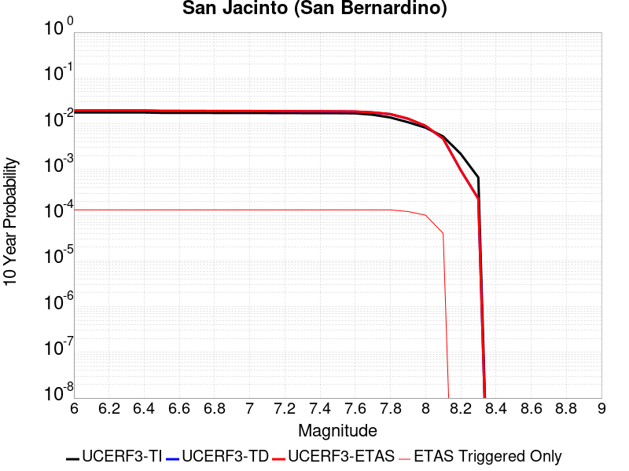 |

| Magnitude | 1 wk TI Prob | 1 wk TD Prob | 1 wk ETAS Prob | 1 wk ETAS/TD Gain | 1 wk ETAS Triggered Only | 1 mo TI Prob | 1 mo TD Prob | 1 mo ETAS Prob | 1 mo ETAS/TD Gain | 1 mo ETAS Triggered Only | 1 yr TI Prob | 1 yr TD Prob | 1 yr ETAS Prob | 1 yr ETAS/TD Gain | 1 yr ETAS Triggered Only | 10 yr TI Prob | 10 yr TD Prob | 10 yr ETAS Prob | 10 yr ETAS/TD Gain | 10 yr ETAS Triggered Only |
|-----|-----|-----|-----|-----|-----|-----|-----|-----|-----|-----|-----|-----|-----|-----|-----|-----|-----|-----|-----|-----|
| 6.0 | 3.409352E-5 | 3.6049758E-5 | 3.6049758E-5 | 1.0 | 0.0 | 1.461069E-4 | 1.5448983E-4 | 1.7448673E-4 | 1.1294384 | 2.0E-5 | 0.0017774 | 0.0018792928 | 0.0019291987 | 1.0265558 | 5.0E-5 | 0.01763251 | 0.019382251 | 0.01950973 | 1.0065771 | 1.3E-4 |
| 6.1 | 3.409352E-5 | 3.6049758E-5 | 3.6049758E-5 | 1.0 | 0.0 | 1.461069E-4 | 1.5448983E-4 | 1.7448673E-4 | 1.1294384 | 2.0E-5 | 0.0017774 | 0.0018792928 | 0.0019291987 | 1.0265558 | 5.0E-5 | 0.01763251 | 0.019382251 | 0.01950973 | 1.0065771 | 1.3E-4 |
| 6.2 | 3.409352E-5 | 3.6049758E-5 | 3.6049758E-5 | 1.0 | 0.0 | 1.461069E-4 | 1.5448983E-4 | 1.7448673E-4 | 1.1294384 | 2.0E-5 | 0.0017774 | 0.0018792928 | 0.0019291987 | 1.0265558 | 5.0E-5 | 0.01763251 | 0.019382251 | 0.01950973 | 1.0065771 | 1.3E-4 |
| 6.3 | 3.409352E-5 | 3.6049758E-5 | 3.6049758E-5 | 1.0 | 0.0 | 1.461069E-4 | 1.5448983E-4 | 1.7448673E-4 | 1.1294384 | 2.0E-5 | 0.0017774 | 0.0018792928 | 0.0019291987 | 1.0265558 | 5.0E-5 | 0.01763251 | 0.019382251 | 0.01950973 | 1.0065771 | 1.3E-4 |
| 6.4 | 3.400795E-5 | 3.5942405E-5 | 3.5942405E-5 | 1.0 | 0.0 | 1.4574021E-4 | 1.540298E-4 | 1.7402672E-4 | 1.129825 | 2.0E-5 | 0.0017729428 | 0.0018737017 | 0.001923608 | 1.0266352 | 5.0E-5 | 0.017588645 | 0.019327328 | 0.019454814 | 1.0065962 | 1.3E-4 |
| 6.5 | 3.341482E-5 | 3.5202946E-5 | 3.5202946E-5 | 1.0 | 0.0 | 1.4319851E-4 | 1.5086106E-4 | 1.7085804E-4 | 1.1325523 | 2.0E-5 | 0.0017420477 | 0.0018351874 | 0.0018850956 | 1.0271952 | 5.0E-5 | 0.017284546 | 0.018948833 | 0.01907637 | 1.0067306 | 1.3E-4 |
| 6.6 | 3.3364955E-5 | 3.5140158E-5 | 3.5140158E-5 | 1.0 | 0.0 | 1.4298483E-4 | 1.50592E-4 | 1.7058897E-4 | 1.1327891 | 2.0E-5 | 0.0017394501 | 0.0018319171 | 0.0018818254 | 1.0272439 | 5.0E-5 | 0.017258976 | 0.018916694 | 0.019044235 | 1.0067422 | 1.3E-4 |
| 6.7 | 3.335922E-5 | 3.512993E-5 | 3.512993E-5 | 1.0 | 0.0 | 1.4296026E-4 | 1.5054816E-4 | 1.7054516E-4 | 1.1328279 | 2.0E-5 | 0.0017391514 | 0.0018313844 | 0.0018812928 | 1.0272517 | 5.0E-5 | 0.017256035 | 0.018911485 | 0.019039027 | 1.0067441 | 1.3E-4 |
| 6.8 | 3.327683E-5 | 3.5023982E-5 | 3.5023982E-5 | 1.0 | 0.0 | 1.4260718E-4 | 1.5009414E-4 | 1.7009114E-4 | 1.1332297 | 2.0E-5 | 0.0017348597 | 0.0018258659 | 0.0018757747 | 1.0273342 | 5.0E-5 | 0.017213784 | 0.018857252 | 0.0189848 | 1.0067639 | 1.3E-4 |
| 6.9 | 3.3235785E-5 | 3.4964927E-5 | 3.4964927E-5 | 1.0 | 0.0 | 1.4243131E-4 | 1.4984109E-4 | 1.6983808E-4 | 1.1334548 | 2.0E-5 | 0.0017327217 | 0.0018227901 | 0.0018726989 | 1.0273805 | 5.0E-5 | 0.017192734 | 0.018827116 | 0.018954668 | 1.0067749 | 1.3E-4 |
| 7.0 | 3.3197095E-5 | 3.4904846E-5 | 3.4904846E-5 | 1.0 | 0.0 | 1.422655E-4 | 1.4958362E-4 | 1.6958063E-4 | 1.1336845 | 2.0E-5 | 0.0017307063 | 0.0018196608 | 0.0018695698 | 1.0274277 | 5.0E-5 | 0.017172894 | 0.018796489 | 0.018924044 | 1.0067862 | 1.3E-4 |
| 7.1 | 3.3129716E-5 | 3.478503E-5 | 3.478503E-5 | 1.0 | 0.0 | 1.4197677E-4 | 1.4907018E-4 | 1.690672E-4 | 1.134145 | 2.0E-5 | 0.0017271966 | 0.0018134202 | 0.0018633294 | 1.0275222 | 5.0E-5 | 0.017138338 | 0.018735558 | 0.018863123 | 1.0068086 | 1.3E-4 |
| 7.2 | 3.3034008E-5 | 3.4652458E-5 | 3.4652458E-5 | 1.0 | 0.0 | 1.4156665E-4 | 1.4850209E-4 | 1.6849911E-4 | 1.1346582 | 2.0E-5 | 0.0017222111 | 0.001806515 | 0.0018564246 | 1.0276276 | 5.0E-5 | 0.017089253 | 0.018667944 | 0.018795516 | 1.0068338 | 1.3E-4 |
| 7.3 | 3.2956614E-5 | 3.4520177E-5 | 3.4520177E-5 | 1.0 | 0.0 | 1.4123498E-4 | 1.4793524E-4 | 1.6793227E-4 | 1.1351743 | 2.0E-5 | 0.0017181796 | 0.001799625 | 0.001849535 | 1.0277336 | 5.0E-5 | 0.017049557 | 0.018600674 | 0.018728256 | 1.006859 | 1.3E-4 |
| 7.4 | 3.2915937E-5 | 3.4441844E-5 | 3.4441844E-5 | 1.0 | 0.0 | 1.4106068E-4 | 1.4759957E-4 | 1.675966E-4 | 1.1354817 | 2.0E-5 | 0.0017160608 | 0.0017955449 | 0.0018454551 | 1.0277967 | 5.0E-5 | 0.017028693 | 0.018560927 | 0.018688515 | 1.006874 | 1.3E-4 |
| 7.5 | 3.281791E-5 | 3.430671E-5 | 3.430671E-5 | 1.0 | 0.0 | 1.406406E-4 | 1.4702049E-4 | 1.6701756E-4 | 1.1360154 | 2.0E-5 | 0.0017109542 | 0.0017885063 | 0.0018384169 | 1.0279063 | 5.0E-5 | 0.016978411 | 0.018491795 | 0.01861939 | 1.0069002 | 1.3E-4 |
| 7.6 | 3.2521442E-5 | 3.4031546E-5 | 3.4031546E-5 | 1.0 | 0.0 | 1.3937015E-4 | 1.4584133E-4 | 1.6583841E-4 | 1.1371154 | 2.0E-5 | 0.0016955109 | 0.0017741736 | 0.0018240848 | 1.0281321 | 5.0E-5 | 0.016826328 | 0.018349366 | 0.018476982 | 1.0069547 | 1.3E-4 |
| 7.7 | 3.0287873E-5 | 3.2514843E-5 | 3.2514843E-5 | 1.0 | 0.0 | 1.297987E-4 | 1.393419E-4 | 1.593391E-4 | 1.1435119 | 2.0E-5 | 0.0015791537 | 0.0016951686 | 0.0017450838 | 1.0294456 | 5.0E-5 | 0.01567979 | 0.017559871 | 0.017687589 | 1.0072732 | 1.3E-4 |
| 7.8 | 2.6316151E-5 | 2.9723395E-5 | 2.9723395E-5 | 1.0 | 0.0 | 1.1277862E-4 | 1.2737977E-4 | 1.4737721E-4 | 1.1569908 | 2.0E-5 | 0.0013722149 | 0.0015497464 | 0.0015996689 | 1.0322133 | 5.0E-5 | 0.013637724 | 0.016100293 | 0.0162282 | 1.0079443 | 1.3E-4 |
| 7.9 | 2.0761147E-5 | 2.3470231E-5 | 2.3470231E-5 | 1.0 | 0.0 | 8.897331E-5 | 1.0058283E-4 | 1.2058082E-4 | 1.1988211 | 2.0E-5 | 0.0010827117 | 0.0012239089 | 0.0012738477 | 1.0408027 | 5.0E-5 | 0.010774517 | 0.012820105 | 0.0129385665 | 1.0092403 | 1.2E-4 |
| 8.0 | 1.5738568E-5 | 1.607273E-5 | 1.607273E-5 | 1.0 | 0.0 | 6.744926E-5 | 6.8881316E-5 | 8.887994E-5 | 1.2903345 | 2.0E-5 | 8.2088535E-4 | 8.38308E-4 | 8.8826614E-4 | 1.0595939 | 5.0E-5 | 0.008178596 | 0.008886527 | 0.008985639 | 1.011153 | 1.0E-4 |
| 8.1 | 1.0105832E-5 | 8.353191E-6 | 8.353191E-6 | 1.0 | 0.0 | 4.3309992E-5 | 3.5798905E-5 | 3.5798905E-5 | 1.0 | 0.0 | 5.2717153E-4 | 4.35765E-4 | 4.557563E-4 | 1.0458763 | 2.0E-5 | 0.005259227 | 0.004689436 | 0.004729248 | 1.0084898 | 4.0E-5 |
| 8.2 | 4.189207E-6 | 1.5851253E-6 | 1.5851253E-6 | 1.0 | 0.0 | 1.7953622E-5 | 6.7933765E-6 | 6.7933765E-6 | 1.0 | 0.0 | 2.1856341E-4 | 8.270625E-5 | 8.270625E-5 | 1.0 | 0.0 | 0.0021834858 | 9.604094E-4 | 9.604094E-4 | 1.0 | 0.0 |
| 8.3 | 1.2758221E-6 | 3.6330252E-7 | 3.6330252E-7 | 1.0 | 0.0 | 5.4677976E-6 | 1.5570099E-6 | 1.5570099E-6 | 1.0 | 0.0 | 6.65684E-5 | 1.8956434E-5 | 1.8956434E-5 | 1.0 | 0.0 | 6.6548464E-4 | 2.2857229E-4 | 2.2857229E-4 | 1.0 | 0.0 |

## Baker
*[(top)](#table-of-contents)*

| 1 Week | 1 Month | 1 Year | 10 Year |
|-----|-----|-----|-----|
|  |  |  |  |

| Magnitude | 1 wk TI Prob | 1 wk TD Prob | 1 wk ETAS Prob | 1 wk ETAS/TD Gain | 1 wk ETAS Triggered Only | 1 mo TI Prob | 1 mo TD Prob | 1 mo ETAS Prob | 1 mo ETAS/TD Gain | 1 mo ETAS Triggered Only | 1 yr TI Prob | 1 yr TD Prob | 1 yr ETAS Prob | 1 yr ETAS/TD Gain | 1 yr ETAS Triggered Only | 10 yr TI Prob | 10 yr TD Prob | 10 yr ETAS Prob | 10 yr ETAS/TD Gain | 10 yr ETAS Triggered Only |
|-----|-----|-----|-----|-----|-----|-----|-----|-----|-----|-----|-----|-----|-----|-----|-----|-----|-----|-----|-----|-----|
| 6.0 | 5.695525E-6 | 5.8349133E-6 | 5.8349133E-6 | 1.0 | 0.0 | 2.4409164E-5 | 2.5006555E-5 | 3.5006306E-5 | 1.3998852 | 1.0E-5 | 2.9714106E-4 | 3.0441626E-4 | 3.3440714E-4 | 1.0985192 | 3.0E-5 | 0.0029674405 | 0.0030403885 | 0.0031600236 | 1.0393486 | 1.2E-4 |
| 6.1 | 5.695525E-6 | 5.8349133E-6 | 5.8349133E-6 | 1.0 | 0.0 | 2.4409164E-5 | 2.5006555E-5 | 3.5006306E-5 | 1.3998852 | 1.0E-5 | 2.9714106E-4 | 3.0441626E-4 | 3.3440714E-4 | 1.0985192 | 3.0E-5 | 0.0029674405 | 0.0030403885 | 0.0031600236 | 1.0393486 | 1.2E-4 |
| 6.2 | 5.695525E-6 | 5.8349133E-6 | 5.8349133E-6 | 1.0 | 0.0 | 2.4409164E-5 | 2.5006555E-5 | 3.5006306E-5 | 1.3998852 | 1.0E-5 | 2.9714106E-4 | 3.0441626E-4 | 3.3440714E-4 | 1.0985192 | 3.0E-5 | 0.0029674405 | 0.0030403885 | 0.0031600236 | 1.0393486 | 1.2E-4 |
| 6.3 | 3.2995713E-6 | 3.3837132E-6 | 3.3837132E-6 | 1.0 | 0.0 | 1.4140943E-5 | 1.450155E-5 | 2.4501405E-5 | 1.6895715 | 1.0E-5 | 1.7215237E-4 | 1.7654254E-4 | 2.0653725E-4 | 1.1699007 | 3.0E-5 | 0.0017201907 | 0.00176407 | 0.001873876 | 1.0622458 | 1.1E-4 |
| 6.4 | 3.2995713E-6 | 3.3837132E-6 | 3.3837132E-6 | 1.0 | 0.0 | 1.4140943E-5 | 1.450155E-5 | 2.4501405E-5 | 1.6895715 | 1.0E-5 | 1.7215237E-4 | 1.7654254E-4 | 2.0653725E-4 | 1.1699007 | 3.0E-5 | 0.0017201907 | 0.00176407 | 0.001873876 | 1.0622458 | 1.1E-4 |
| 6.5 | 2.782202E-6 | 2.855881E-6 | 2.855881E-6 | 1.0 | 0.0 | 1.1923668E-5 | 1.2239434E-5 | 2.2239312E-5 | 1.8170213 | 1.0E-5 | 1.4516099E-4 | 1.4900525E-4 | 1.7900078E-4 | 1.2013052 | 3.0E-5 | 0.001450662 | 0.0014890862 | 0.0015989224 | 1.0737609 | 1.1E-4 |
| 6.6 | 2.3163404E-6 | 2.3809555E-6 | 2.3809555E-6 | 1.0 | 0.0 | 9.927136E-6 | 1.0204057E-5 | 2.0203954E-5 | 1.9799924 | 1.0E-5 | 1.20856166E-4 | 1.242275E-4 | 1.3422627E-4 | 1.0804875 | 1.0E-5 | 0.0012079047 | 0.0012416008 | 0.0013314892 | 1.0723971 | 9.0E-5 |
| 6.7 | 2.037056E-6 | 2.0965333E-6 | 2.0965333E-6 | 1.0 | 0.0 | 8.7302105E-6 | 8.985113E-6 | 1.8985023E-5 | 2.1129422 | 1.0E-5 | 1.0628513E-4 | 1.0938842E-4 | 1.19387325E-4 | 1.0914073 | 1.0E-5 | 0.0010623431 | 0.0010933619 | 0.0011632853 | 1.0639527 | 7.0E-5 |
| 6.8 | 1.8356744E-6 | 1.8915596E-6 | 1.8915596E-6 | 1.0 | 0.0 | 7.867153E-6 | 8.106659E-6 | 1.8106579E-5 | 2.2335436 | 1.0E-5 | 9.577837E-5 | 9.869425E-5 | 1.0869326E-4 | 1.101313 | 1.0E-5 | 9.57371E-4 | 9.865181E-4 | 0.001046459 | 1.06076 | 6.0E-5 |
| 6.9 | 1.6310546E-6 | 1.6832361E-6 | 1.6832361E-6 | 1.0 | 0.0 | 6.9902153E-6 | 7.2138496E-6 | 7.2138496E-6 | 1.0 | 0.0 | 8.510255E-5 | 8.7825196E-5 | 8.7825196E-5 | 1.0 | 0.0 | 8.5069967E-4 | 8.779161E-4 | 9.278722E-4 | 1.056903 | 5.0E-5 |
| 7.0 | 1.2058036E-6 | 1.2508916E-6 | 1.2508916E-6 | 1.0 | 0.0 | 5.1677193E-6 | 5.3609533E-6 | 5.3609533E-6 | 1.0 | 0.0 | 6.291517E-5 | 6.5267675E-5 | 6.5267675E-5 | 1.0 | 0.0 | 6.289736E-4 | 6.5248733E-4 | 7.024547E-4 | 1.0765798 | 5.0E-5 |
| 7.1 | 1.052382E-6 | 1.0951846E-6 | 1.0951846E-6 | 1.0 | 0.0 | 4.5102006E-6 | 4.69364E-6 | 4.69364E-6 | 1.0 | 0.0 | 5.491031E-5 | 5.714358E-5 | 5.714358E-5 | 1.0 | 0.0 | 5.4896745E-4 | 5.7128974E-4 | 6.212612E-4 | 1.0874712 | 5.0E-5 |
| 7.2 | 1.0067454E-6 | 1.0487945E-6 | 1.0487945E-6 | 1.0 | 0.0 | 4.3146156E-6 | 4.4948256E-6 | 4.4948256E-6 | 1.0 | 0.0 | 5.252918E-5 | 5.472314E-5 | 5.472314E-5 | 1.0 | 0.0 | 5.251676E-4 | 5.470975E-4 | 5.9707015E-4 | 1.0913414 | 5.0E-5 |
| 7.3 | 9.3596316E-7 | 9.76795E-7 | 9.76795E-7 | 1.0 | 0.0 | 4.0112645E-6 | 4.186258E-6 | 4.186258E-6 | 1.0 | 0.0 | 4.8836053E-5 | 5.0966508E-5 | 5.0966508E-5 | 1.0 | 0.0 | 4.8825322E-4 | 5.09549E-4 | 5.5952347E-4 | 1.098076 | 5.0E-5 |
| 7.4 | 8.8117395E-7 | 9.207884E-7 | 9.207884E-7 | 1.0 | 0.0 | 3.7764542E-6 | 3.94623E-6 | 3.94623E-6 | 1.0 | 0.0 | 4.5977362E-5 | 4.80443E-5 | 4.80443E-5 | 1.0 | 0.0 | 4.596785E-4 | 4.803399E-4 | 5.303159E-4 | 1.104043 | 5.0E-5 |
| 7.5 | 8.292386E-7 | 8.6748094E-7 | 8.6748094E-7 | 1.0 | 0.0 | 3.5538749E-6 | 3.7177701E-6 | 3.7177701E-6 | 1.0 | 0.0 | 4.326757E-5 | 4.5262917E-5 | 4.5262917E-5 | 1.0 | 0.0 | 4.3259145E-4 | 4.5253773E-4 | 4.9251964E-4 | 1.0883504 | 4.0E-5 |
| 7.6 | 7.553842E-7 | 7.9146724E-7 | 7.9146724E-7 | 1.0 | 0.0 | 3.2373566E-6 | 3.391998E-6 | 3.391998E-6 | 1.0 | 0.0 | 3.9414106E-5 | 4.12968E-5 | 4.12968E-5 | 1.0 | 0.0 | 3.9407116E-4 | 4.1289197E-4 | 4.5287545E-4 | 1.0968376 | 4.0E-5 |
| 7.7 | 6.5285366E-7 | 6.8529783E-7 | 6.8529783E-7 | 1.0 | 0.0 | 2.797941E-6 | 2.9369874E-6 | 2.9369874E-6 | 1.0 | 0.0 | 3.40644E-5 | 3.5757243E-5 | 3.5757243E-5 | 1.0 | 0.0 | 3.405918E-4 | 3.5751556E-4 | 3.775084E-4 | 1.0559217 | 2.0E-5 |
| 7.8 | 3.4586725E-7 | 3.648368E-7 | 3.648368E-7 | 1.0 | 0.0 | 1.4822873E-6 | 1.5635853E-6 | 1.5635853E-6 | 1.0 | 0.0 | 1.80467E-5 | 1.903649E-5 | 1.903649E-5 | 1.0 | 0.0 | 1.8045233E-4 | 1.9034903E-4 | 2.0034713E-4 | 1.052525 | 1.0E-5 |
| 7.9 | 2.5591178E-9 | 2.6697329E-9 | 2.6697329E-9 | 1.0 | 0.0 | 1.0967647E-8 | 1.14417125E-8 | 1.14417125E-8 | 1.0 | 0.0 | 1.335311E-7 | 1.3930286E-7 | 1.3930286E-7 | 1.0 | 0.0 | 1.3353102E-6 | 1.3930285E-6 | 1.3930285E-6 | 1.0 | 0.0 |

## San Andreas (Parkfield)
*[(top)](#table-of-contents)*

| 1 Week | 1 Month | 1 Year | 10 Year |
|-----|-----|-----|-----|
|  | 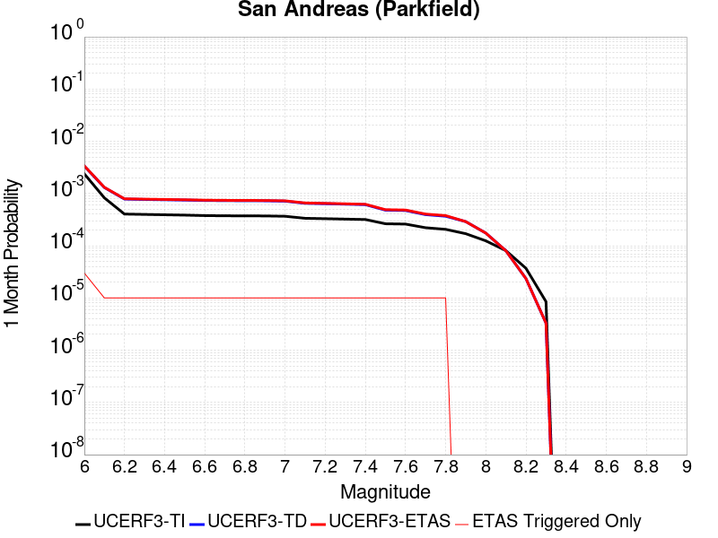 |  |  |

| Magnitude | 1 wk TI Prob | 1 wk TD Prob | 1 wk ETAS Prob | 1 wk ETAS/TD Gain | 1 wk ETAS Triggered Only | 1 mo TI Prob | 1 mo TD Prob | 1 mo ETAS Prob | 1 mo ETAS/TD Gain | 1 mo ETAS Triggered Only | 1 yr TI Prob | 1 yr TD Prob | 1 yr ETAS Prob | 1 yr ETAS/TD Gain | 1 yr ETAS Triggered Only | 10 yr TI Prob | 10 yr TD Prob | 10 yr ETAS Prob | 10 yr ETAS/TD Gain | 10 yr ETAS Triggered Only |
|-----|-----|-----|-----|-----|-----|-----|-----|-----|-----|-----|-----|-----|-----|-----|-----|-----|-----|-----|-----|-----|
| 6.0 | 5.556969E-4 | 7.819087E-4 | 7.9190085E-4 | 1.0127792 | 1.0E-5 | 0.0023793848 | 0.0033472886 | 0.0033771882 | 1.0089325 | 3.0E-5 | 0.028586963 | 0.040385824 | 0.040443398 | 1.0014256 | 6.0E-5 | 0.25176284 | 0.33777508 | 0.33785456 | 1.0002353 | 1.2E-4 |
| 6.1 | 1.925858E-4 | 3.0390357E-4 | 3.1390053E-4 | 1.0328952 | 1.0E-5 | 8.2510663E-4 | 0.0013018888 | 0.0013118759 | 1.0076711 | 1.0E-5 | 0.0099994885 | 0.015834767 | 0.015854452 | 1.001243 | 2.0E-5 | 0.095613256 | 0.14999957 | 0.15004207 | 1.0002834 | 5.0E-5 |
| 6.2 | 9.4306815E-5 | 1.8273306E-4 | 1.9273123E-4 | 1.0547147 | 1.0E-5 | 4.0410945E-4 | 7.829079E-4 | 7.9290004E-4 | 1.0127629 | 1.0E-5 | 0.0049089384 | 0.009490452 | 0.009510262 | 1.0020874 | 2.0E-5 | 0.048019063 | 0.09198628 | 0.09203169 | 1.0004935 | 5.0E-5 |
| 6.3 | 9.283051E-5 | 1.7969737E-4 | 1.8969557E-4 | 1.0556391 | 1.0E-5 | 3.9778434E-4 | 7.6990545E-4 | 7.798978E-4 | 1.0129786 | 1.0E-5 | 0.0048322747 | 0.009333515 | 0.009353328 | 1.0021228 | 2.0E-5 | 0.047285385 | 0.09063911 | 0.09068458 | 1.0005016 | 5.0E-5 |
| 6.4 | 9.138826E-5 | 1.7731739E-4 | 1.8731561E-4 | 1.056386 | 1.0E-5 | 3.916052E-4 | 7.5971155E-4 | 7.6970394E-4 | 1.0131528 | 1.0E-5 | 0.0047573745 | 0.00921046 | 0.009230276 | 1.0021515 | 2.0E-5 | 0.046568092 | 0.0895407 | 0.08958622 | 1.0005084 | 5.0E-5 |
| 6.5 | 9.000255E-5 | 1.7489606E-4 | 1.848943E-4 | 1.0571668 | 1.0E-5 | 3.8566816E-4 | 7.493404E-4 | 7.593329E-4 | 1.0133351 | 1.0E-5 | 0.0046854047 | 0.009085262 | 0.00910508 | 1.0021814 | 2.0E-5 | 0.045878403 | 0.08842592 | 0.088471495 | 1.0005155 | 5.0E-5 |
| 6.6 | 8.8109264E-5 | 1.7170387E-4 | 1.8170215E-4 | 1.0582298 | 1.0E-5 | 3.7755648E-4 | 7.3566736E-4 | 7.4566E-4 | 1.0135831 | 1.0E-5 | 0.0045870654 | 0.0089201825 | 0.008940004 | 1.0022221 | 2.0E-5 | 0.04493529 | 0.08695624 | 0.08700189 | 1.000525 | 5.0E-5 |
| 6.7 | 8.738073E-5 | 1.7037381E-4 | 1.8037211E-4 | 1.0586845 | 1.0E-5 | 3.7443507E-4 | 7.2997034E-4 | 7.39963E-4 | 1.0136892 | 1.0E-5 | 0.0045492216 | 0.0088514285 | 0.008871251 | 1.0022395 | 2.0E-5 | 0.04457213 | 0.08635636 | 0.086402036 | 1.000529 | 5.0E-5 |
| 6.8 | 8.710195E-5 | 1.6982816E-4 | 1.7982646E-4 | 1.058873 | 1.0E-5 | 3.7324068E-4 | 7.2763313E-4 | 7.376258E-4 | 1.0137331 | 1.0E-5 | 0.0045347405 | 0.008823211 | 0.008843035 | 1.0022467 | 2.0E-5 | 0.04443313 | 0.08610373 | 0.086149424 | 1.0005307 | 5.0E-5 |
| 6.9 | 8.6801556E-5 | 1.6923707E-4 | 1.7923537E-4 | 1.0590787 | 1.0E-5 | 3.7195362E-4 | 7.251013E-4 | 7.35094E-4 | 1.0137812 | 1.0E-5 | 0.0045191357 | 0.008792636 | 0.00881246 | 1.0022546 | 2.0E-5 | 0.044283327 | 0.08582957 | 0.08587528 | 1.0005325 | 5.0E-5 |
| 7.0 | 8.5571606E-5 | 1.6676294E-4 | 1.7676127E-4 | 1.0599554 | 1.0E-5 | 3.6668387E-4 | 7.145037E-4 | 7.2449655E-4 | 1.0139858 | 1.0E-5 | 0.004455241 | 0.008664643 | 0.00868447 | 1.0022882 | 2.0E-5 | 0.043669727 | 0.08467713 | 0.0847229 | 1.0005405 | 5.0E-5 |
| 7.1 | 7.82589E-5 | 1.5156237E-4 | 1.6156085E-4 | 1.0659695 | 1.0E-5 | 3.3535215E-4 | 6.493921E-4 | 6.593856E-4 | 1.015389 | 1.0E-5 | 0.0040752706 | 0.007877857 | 0.007897699 | 1.0025188 | 2.0E-5 | 0.040013418 | 0.077585794 | 0.07763192 | 1.0005945 | 5.0E-5 |
| 7.2 | 7.690929E-5 | 1.489332E-4 | 1.5893173E-4 | 1.0671341 | 1.0E-5 | 3.2956956E-4 | 6.381298E-4 | 6.481234E-4 | 1.0156608 | 1.0E-5 | 0.004005129 | 0.007741721 | 0.007761566 | 1.0025634 | 2.0E-5 | 0.0393371 | 0.076358445 | 0.07640462 | 1.0006047 | 5.0E-5 |
| 7.3 | 7.5543794E-5 | 1.4589565E-4 | 1.5589419E-4 | 1.0685321 | 1.0E-5 | 3.2371894E-4 | 6.25118E-4 | 6.351117E-4 | 1.015987 | 1.0E-5 | 0.003934157 | 0.0075844154 | 0.0076042637 | 1.002617 | 2.0E-5 | 0.038652334 | 0.07492032 | 0.07496657 | 1.0006174 | 5.0E-5 |
| 7.4 | 7.4214564E-5 | 1.4290171E-4 | 1.5290029E-4 | 1.0699682 | 1.0E-5 | 3.1802364E-4 | 6.122929E-4 | 6.222868E-4 | 1.016322 | 1.0E-5 | 0.003865065 | 0.007429345 | 0.007449196 | 1.0026721 | 2.0E-5 | 0.03798529 | 0.07349284 | 0.07353917 | 1.0006304 | 5.0E-5 |
| 7.5 | 6.149578E-5 | 1.1214155E-4 | 1.2214042E-4 | 1.0891631 | 1.0E-5 | 2.6352672E-4 | 4.8051824E-4 | 4.905134E-4 | 1.0208008 | 1.0E-5 | 0.0032037178 | 0.005834648 | 0.0058545317 | 1.0034078 | 2.0E-5 | 0.03157923 | 0.058665328 | 0.058712393 | 1.0008023 | 5.0E-5 |
| 7.6 | 6.0643448E-5 | 1.10425855E-4 | 1.20424746E-4 | 1.0905485 | 1.0E-5 | 2.598746E-4 | 4.7316792E-4 | 4.831632E-4 | 1.0211241 | 1.0E-5 | 0.0031593828 | 0.0057456335 | 0.0057655186 | 1.0034609 | 2.0E-5 | 0.031148417 | 0.05782546 | 0.05787257 | 1.0008147 | 5.0E-5 |
| 7.7 | 5.1652263E-5 | 9.1955124E-5 | 1.019542E-4 | 1.1087387 | 1.0E-5 | 2.2134806E-4 | 3.9403388E-4 | 4.0402994E-4 | 1.0253686 | 1.0E-5 | 0.002691582 | 0.00478682 | 0.0047967723 | 1.002079 | 1.0E-5 | 0.026592141 | 0.048633553 | 0.048662093 | 1.0005869 | 3.0E-5 |
| 7.8 | 4.8090482E-5 | 8.578783E-5 | 9.578697E-5 | 1.1165566 | 1.0E-5 | 2.060858E-4 | 3.6761034E-4 | 3.7760666E-4 | 1.0271927 | 1.0E-5 | 0.0025062072 | 0.004466479 | 0.0044764346 | 1.0022289 | 1.0E-5 | 0.024781305 | 0.045392275 | 0.045411367 | 1.0004206 | 2.0E-5 |
| 7.9 | 3.970278E-5 | 6.7652974E-5 | 6.7652974E-5 | 1.0 | 0.0 | 1.7014367E-4 | 2.899091E-4 | 2.899091E-4 | 1.0 | 0.0 | 0.002069531 | 0.0035239344 | 0.0035239344 | 1.0 | 0.0 | 0.020503636 | 0.035952512 | 0.035962153 | 1.0002681 | 1.0E-5 |
| 8.0 | 2.8982335E-5 | 4.079188E-5 | 4.079188E-5 | 1.0 | 0.0 | 1.2420409E-4 | 1.7481064E-4 | 1.7481064E-4 | 1.0 | 0.0 | 0.0015111357 | 0.0021262432 | 0.0021262432 | 1.0 | 0.0 | 0.015009012 | 0.022057572 | 0.022067351 | 1.0004433 | 1.0E-5 |
| 8.1 | 1.8836186E-5 | 1.8733741E-5 | 1.8733741E-5 | 1.0 | 0.0 | 8.0724014E-5 | 8.028499E-5 | 8.028499E-5 | 1.0 | 0.0 | 9.823717E-4 | 9.77032E-4 | 9.77032E-4 | 1.0 | 0.0 | 0.009780403 | 0.010515724 | 0.010525619 | 1.0009409 | 1.0E-5 |
| 8.2 | 8.643924E-6 | 5.49522E-6 | 5.49522E-6 | 1.0 | 0.0 | 3.704486E-5 | 2.355073E-5 | 2.355073E-5 | 1.0 | 0.0 | 4.5092785E-4 | 2.866925E-4 | 2.866925E-4 | 1.0 | 0.0 | 0.0045001395 | 0.0032598388 | 0.0032598388 | 1.0 | 0.0 |
| 8.3 | 1.983087E-6 | 7.693574E-7 | 7.693574E-7 | 1.0 | 0.0 | 8.498917E-6 | 3.297242E-6 | 3.297242E-6 | 1.0 | 0.0 | 1.034694E-4 | 4.01432E-5 | 4.01432E-5 | 1.0 | 0.0 | 0.0010342124 | 4.7390026E-4 | 4.7390026E-4 | 1.0 | 0.0 |

## White Wolf (Extension)
*[(top)](#table-of-contents)*

| 1 Week | 1 Month | 1 Year | 10 Year |
|-----|-----|-----|-----|
|  |  | 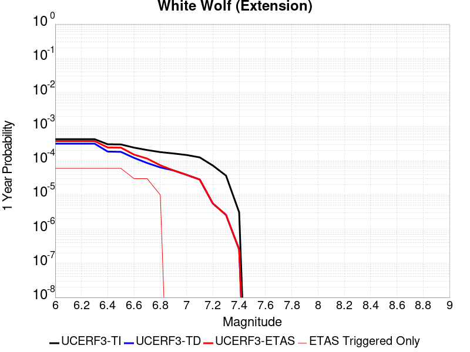 |  |

| Magnitude | 1 wk TI Prob | 1 wk TD Prob | 1 wk ETAS Prob | 1 wk ETAS/TD Gain | 1 wk ETAS Triggered Only | 1 mo TI Prob | 1 mo TD Prob | 1 mo ETAS Prob | 1 mo ETAS/TD Gain | 1 mo ETAS Triggered Only | 1 yr TI Prob | 1 yr TD Prob | 1 yr ETAS Prob | 1 yr ETAS/TD Gain | 1 yr ETAS Triggered Only | 10 yr TI Prob | 10 yr TD Prob | 10 yr ETAS Prob | 10 yr ETAS/TD Gain | 10 yr ETAS Triggered Only |
|-----|-----|-----|-----|-----|-----|-----|-----|-----|-----|-----|-----|-----|-----|-----|-----|-----|-----|-----|-----|-----|
| 6.0 | 8.222555E-6 | 6.0668267E-6 | 6.0668267E-6 | 1.0 | 0.0 | 3.5239045E-5 | 2.6000464E-5 | 4.5999943E-5 | 1.7691971 | 2.0E-5 | 4.289509E-4 | 3.165163E-4 | 3.7649728E-4 | 1.1895037 | 6.0E-5 | 0.0042812387 | 0.0031613067 | 0.003270959 | 1.0346857 | 1.1E-4 |
| 6.1 | 8.222555E-6 | 6.0668267E-6 | 6.0668267E-6 | 1.0 | 0.0 | 3.5239045E-5 | 2.6000464E-5 | 4.5999943E-5 | 1.7691971 | 2.0E-5 | 4.289509E-4 | 3.165163E-4 | 3.7649728E-4 | 1.1895037 | 6.0E-5 | 0.0042812387 | 0.0031613067 | 0.003270959 | 1.0346857 | 1.1E-4 |
| 6.2 | 8.222555E-6 | 6.0668267E-6 | 6.0668267E-6 | 1.0 | 0.0 | 3.5239045E-5 | 2.6000464E-5 | 4.5999943E-5 | 1.7691971 | 2.0E-5 | 4.289509E-4 | 3.165163E-4 | 3.7649728E-4 | 1.1895037 | 6.0E-5 | 0.0042812387 | 0.0031613067 | 0.003270959 | 1.0346857 | 1.1E-4 |
| 6.3 | 8.222555E-6 | 6.0668267E-6 | 6.0668267E-6 | 1.0 | 0.0 | 3.5239045E-5 | 2.6000464E-5 | 4.5999943E-5 | 1.7691971 | 2.0E-5 | 4.289509E-4 | 3.165163E-4 | 3.7649728E-4 | 1.1895037 | 6.0E-5 | 0.0042812387 | 0.0031613067 | 0.003270959 | 1.0346857 | 1.1E-4 |
| 6.4 | 5.821773E-6 | 3.557277E-6 | 3.557277E-6 | 1.0 | 0.0 | 2.4950215E-5 | 1.52453895E-5 | 3.5245084E-5 | 2.311852 | 2.0E-5 | 3.0372653E-4 | 1.855979E-4 | 2.4558677E-4 | 1.3232195 | 6.0E-5 | 0.0030331176 | 0.0018545374 | 0.001954352 | 1.0538218 | 1.0E-4 |
| 6.5 | 5.766023E-6 | 3.49921E-6 | 3.49921E-6 | 1.0 | 0.0 | 2.4711293E-5 | 1.49965335E-5 | 3.4996232E-5 | 2.3336215 | 2.0E-5 | 3.0081844E-4 | 1.8256859E-4 | 2.4255764E-4 | 1.3285836 | 6.0E-5 | 0.0030041158 | 0.0018242942 | 0.0019241119 | 1.0547158 | 1.0E-4 |
| 6.6 | 4.643576E-6 | 2.332699E-6 | 2.332699E-6 | 1.0 | 0.0 | 1.9900888E-5 | 9.997246E-6 | 1.9997146E-5 | 2.0002656 | 1.0E-5 | 2.4226638E-4 | 1.21710094E-4 | 1.5170645E-4 | 1.2464573 | 3.0E-5 | 0.0024200242 | 0.0012164768 | 0.0012764038 | 1.0492628 | 6.0E-5 |
| 6.7 | 3.9529173E-6 | 1.648408E-6 | 1.648408E-6 | 1.0 | 0.0 | 1.6940963E-5 | 7.0645874E-6 | 1.7064516E-5 | 2.4155009 | 1.0E-5 | 2.0623671E-4 | 8.600815E-5 | 1.1600557E-4 | 1.3487742 | 3.0E-5 | 0.002060454 | 8.597671E-4 | 9.097241E-4 | 1.0581052 | 5.0E-5 |
| 6.8 | 3.4377522E-6 | 1.2245736E-6 | 1.2245736E-6 | 1.0 | 0.0 | 1.473314E-5 | 5.2481623E-6 | 5.2481623E-6 | 1.0 | 0.0 | 1.7936122E-4 | 6.389459E-5 | 7.3893956E-5 | 1.1564977 | 1.0E-5 | 0.0017921652 | 6.3877134E-4 | 6.687522E-4 | 1.0469352 | 3.0E-5 |
| 6.9 | 3.1367306E-6 | 1.0034221E-6 | 1.0034221E-6 | 1.0 | 0.0 | 1.3443062E-5 | 4.300374E-6 | 4.300374E-6 | 1.0 | 0.0 | 1.63657E-4 | 5.2355874E-5 | 5.2355874E-5 | 1.0 | 0.0 | 0.0016353652 | 5.2344304E-4 | 5.4343254E-4 | 1.0381886 | 2.0E-5 |
| 7.0 | 2.8298145E-6 | 7.429045E-7 | 7.429045E-7 | 1.0 | 0.0 | 1.2127721E-5 | 3.1838729E-6 | 3.1838729E-6 | 1.0 | 0.0 | 1.47645E-4 | 3.8763013E-5 | 3.8763013E-5 | 1.0 | 0.0 | 0.0014754693 | 3.875675E-4 | 4.0755977E-4 | 1.0515839 | 2.0E-5 |
| 7.1 | 2.4091064E-6 | 5.4230577E-7 | 5.4230577E-7 | 1.0 | 0.0 | 1.03247E-5 | 2.3241657E-6 | 2.3241657E-6 | 1.0 | 0.0 | 1.2569598E-4 | 2.8296392E-5 | 2.8296392E-5 | 1.0 | 0.0 | 0.001256249 | 2.8293193E-4 | 2.929291E-4 | 1.0353342 | 1.0E-5 |
| 7.2 | 1.3875518E-6 | 1.0744563E-7 | 1.0744563E-7 | 1.0 | 0.0 | 5.9466374E-6 | 4.604812E-7 | 4.604812E-7 | 1.0 | 0.0 | 7.23979E-5 | 5.6063454E-6 | 5.6063454E-6 | 1.0 | 0.0 | 7.2374323E-4 | 5.6062152E-5 | 5.6062152E-5 | 1.0 | 0.0 |
| 7.3 | 7.056077E-7 | 5.002896E-8 | 5.002896E-8 | 1.0 | 0.0 | 3.0240296E-6 | 2.1440981E-7 | 2.1440981E-7 | 1.0 | 0.0 | 3.681694E-5 | 2.6104367E-6 | 2.6104367E-6 | 1.0 | 0.0 | 3.681084E-4 | 2.6104108E-5 | 2.6104108E-5 | 1.0 | 0.0 |
| 7.4 | 5.9334678E-8 | 4.86919E-9 | 4.86919E-9 | 1.0 | 0.0 | 2.5429145E-7 | 2.0867958E-8 | 2.0867958E-8 | 1.0 | 0.0 | 3.095994E-6 | 2.5406737E-7 | 2.5406737E-7 | 1.0 | 0.0 | 3.095951E-5 | 2.5406719E-6 | 2.5406719E-6 | 1.0 | 0.0 |

## Big Pine (Central)
*[(top)](#table-of-contents)*

| 1 Week | 1 Month | 1 Year | 10 Year |
|-----|-----|-----|-----|
|  |  |  |  |

| Magnitude | 1 wk TI Prob | 1 wk TD Prob | 1 wk ETAS Prob | 1 wk ETAS/TD Gain | 1 wk ETAS Triggered Only | 1 mo TI Prob | 1 mo TD Prob | 1 mo ETAS Prob | 1 mo ETAS/TD Gain | 1 mo ETAS Triggered Only | 1 yr TI Prob | 1 yr TD Prob | 1 yr ETAS Prob | 1 yr ETAS/TD Gain | 1 yr ETAS Triggered Only | 10 yr TI Prob | 10 yr TD Prob | 10 yr ETAS Prob | 10 yr ETAS/TD Gain | 10 yr ETAS Triggered Only |
|-----|-----|-----|-----|-----|-----|-----|-----|-----|-----|-----|-----|-----|-----|-----|-----|-----|-----|-----|-----|-----|
| 6.0 | 1.2706755E-5 | 1.4252463E-5 | 2.425232E-5 | 1.7016231 | 1.0E-5 | 5.4456385E-5 | 6.108076E-5 | 7.1080154E-5 | 1.1637076 | 1.0E-5 | 6.628048E-4 | 7.434411E-4 | 8.033965E-4 | 1.0806458 | 6.0E-5 | 0.006608314 | 0.007414557 | 0.0075138155 | 1.013387 | 1.0E-4 |
| 6.1 | 8.342579E-6 | 9.512481E-6 | 9.512481E-6 | 1.0 | 0.0 | 3.5753423E-5 | 4.076726E-5 | 4.076726E-5 | 1.0 | 0.0 | 4.3521097E-4 | 4.9625005E-4 | 5.1624014E-4 | 1.0402822 | 2.0E-5 | 0.0043435963 | 0.0049549625 | 0.0050146654 | 1.0120491 | 6.0E-5 |
| 6.2 | 6.923899E-6 | 7.968794E-6 | 7.968794E-6 | 1.0 | 0.0 | 2.9673516E-5 | 3.4151635E-5 | 3.4151635E-5 | 1.0 | 0.0 | 3.6121515E-4 | 4.1573608E-4 | 4.3572776E-4 | 1.0480875 | 2.0E-5 | 0.003606286 | 0.00415288 | 0.0042026727 | 1.0119898 | 5.0E-5 |
| 6.3 | 2.728396E-6 | 3.4257378E-6 | 3.4257378E-6 | 1.0 | 0.0 | 1.1693074E-5 | 1.4681656E-5 | 1.4681656E-5 | 1.0 | 0.0 | 1.4235388E-4 | 1.7873537E-4 | 1.8873358E-4 | 1.0559386 | 1.0E-5 | 0.0014226272 | 0.0017874117 | 0.001807376 | 1.0111693 | 2.0E-5 |
| 6.4 | 2.7136944E-6 | 3.4100306E-6 | 3.4100306E-6 | 1.0 | 0.0 | 1.1630066E-5 | 1.461434E-5 | 1.461434E-5 | 1.0 | 0.0 | 1.4158686E-4 | 1.7791594E-4 | 1.8791415E-4 | 1.0561963 | 1.0E-5 | 0.0014149669 | 0.0017792305 | 0.001799195 | 1.0112208 | 2.0E-5 |
| 6.5 | 2.6971882E-6 | 3.392375E-6 | 3.392375E-6 | 1.0 | 0.0 | 1.1559327E-5 | 1.4538674E-5 | 1.4538674E-5 | 1.0 | 0.0 | 1.4072572E-4 | 1.7699486E-4 | 1.8699309E-4 | 1.0564889 | 1.0E-5 | 0.0014063664 | 0.0017700344 | 0.001789999 | 1.0112792 | 2.0E-5 |
| 6.6 | 2.669092E-6 | 3.3623944E-6 | 3.3623944E-6 | 1.0 | 0.0 | 1.1438916E-5 | 1.4410188E-5 | 1.4410188E-5 | 1.0 | 0.0 | 1.3925991E-4 | 1.7543077E-4 | 1.8542902E-4 | 1.0569925 | 1.0E-5 | 0.0013917267 | 0.0017544184 | 0.0017743834 | 1.0113798 | 2.0E-5 |
| 6.7 | 2.6408059E-6 | 3.332419E-6 | 3.332419E-6 | 1.0 | 0.0 | 1.1317691E-5 | 1.4281723E-5 | 1.4281723E-5 | 1.0 | 0.0 | 1.3778417E-4 | 1.7386697E-4 | 1.8386524E-4 | 1.0575052 | 1.0E-5 | 0.0013769877 | 0.001738805 | 0.0017587702 | 1.0114821 | 2.0E-5 |
| 6.8 | 2.1786943E-6 | 2.8558686E-6 | 2.8558686E-6 | 1.0 | 0.0 | 9.337228E-6 | 1.2239383E-5 | 1.2239383E-5 | 1.0 | 0.0 | 1.1367482E-4 | 1.4900503E-4 | 1.5900354E-4 | 1.0671018 | 1.0E-5 | 0.0011361669 | 0.0014905332 | 0.0015005184 | 1.006699 | 1.0E-5 |
| 6.9 | 1.4411696E-6 | 2.0698712E-6 | 2.0698712E-6 | 1.0 | 0.0 | 6.1764263E-6 | 8.870848E-6 | 8.870848E-6 | 1.0 | 0.0 | 7.51954E-5 | 1.079975E-4 | 1.079975E-4 | 1.0 | 0.0 | 7.5169955E-4 | 0.0010808875 | 0.0010808875 | 1.0 | 0.0 |
| 7.0 | 1.0073411E-6 | 1.5554864E-6 | 1.5554864E-6 | 1.0 | 0.0 | 4.317169E-6 | 6.666354E-6 | 6.666354E-6 | 1.0 | 0.0 | 5.2560266E-5 | 8.115999E-5 | 8.115999E-5 | 1.0 | 0.0 | 5.2547833E-4 | 8.1272965E-4 | 8.1272965E-4 | 1.0 | 0.0 |
| 7.1 | 8.947104E-7 | 1.4314573E-6 | 1.4314573E-6 | 1.0 | 0.0 | 3.834468E-6 | 6.1348037E-6 | 6.1348037E-6 | 1.0 | 0.0 | 4.6683643E-5 | 7.4688825E-5 | 7.4688825E-5 | 1.0 | 0.0 | 4.6673836E-4 | 7.4806315E-4 | 7.4806315E-4 | 1.0 | 0.0 |
| 7.2 | 5.215166E-7 | 1.0122951E-6 | 1.0122951E-6 | 1.0 | 0.0 | 2.2350691E-6 | 4.3384007E-6 | 4.3384007E-6 | 1.0 | 0.0 | 2.7211627E-5 | 5.2818792E-5 | 5.2818792E-5 | 1.0 | 0.0 | 2.7208295E-4 | 5.2947813E-4 | 5.2947813E-4 | 1.0 | 0.0 |
| 7.3 | 4.4024807E-7 | 9.230527E-7 | 9.230527E-7 | 1.0 | 0.0 | 1.8867761E-6 | 3.9559345E-6 | 3.9559345E-6 | 1.0 | 0.0 | 2.2971257E-5 | 4.8162477E-5 | 4.8162477E-5 | 1.0 | 0.0 | 2.2968883E-4 | 4.82936E-4 | 4.82936E-4 | 1.0 | 0.0 |
| 7.4 | 3.6130905E-7 | 8.3691214E-7 | 8.3691214E-7 | 1.0 | 0.0 | 1.5484665E-6 | 3.5867617E-6 | 3.5867617E-6 | 1.0 | 0.0 | 1.8852415E-5 | 4.3667987E-5 | 4.3667987E-5 | 1.0 | 0.0 | 1.8850817E-4 | 4.380001E-4 | 4.380001E-4 | 1.0 | 0.0 |
| 7.5 | 3.408184E-7 | 8.118514E-7 | 8.118514E-7 | 1.0 | 0.0 | 1.4606494E-6 | 3.4793588E-6 | 3.4793588E-6 | 1.0 | 0.0 | 1.7783263E-5 | 4.2360407E-5 | 4.2360407E-5 | 1.0 | 0.0 | 1.778184E-4 | 4.2490795E-4 | 4.2490795E-4 | 1.0 | 0.0 |
| 7.6 | 3.1428627E-7 | 7.7415996E-7 | 7.7415996E-7 | 1.0 | 0.0 | 1.3469405E-6 | 3.3178244E-6 | 3.3178244E-6 | 1.0 | 0.0 | 1.6398877E-5 | 4.03938E-5 | 4.03938E-5 | 1.0 | 0.0 | 1.6397667E-4 | 4.0522031E-4 | 4.0522031E-4 | 1.0 | 0.0 |
| 7.7 | 1.7972785E-7 | 5.085394E-7 | 5.085394E-7 | 1.0 | 0.0 | 7.70262E-7 | 2.1794528E-6 | 2.1794528E-6 | 1.0 | 0.0 | 9.377899E-6 | 2.6534526E-5 | 2.6534526E-5 | 1.0 | 0.0 | 9.377503E-5 | 2.666768E-4 | 2.666768E-4 | 1.0 | 0.0 |
| 7.8 | 4.9230927E-8 | 1.1998821E-7 | 1.1998821E-7 | 1.0 | 0.0 | 2.1098968E-7 | 5.142351E-7 | 5.142351E-7 | 1.0 | 0.0 | 2.5687964E-6 | 6.2607965E-6 | 6.2607965E-6 | 1.0 | 0.0 | 2.5687666E-5 | 6.304645E-5 | 6.304645E-5 | 1.0 | 0.0 |
| 7.9 | 3.6805972E-9 | 4.112396E-9 | 4.112396E-9 | 1.0 | 0.0 | 1.5773987E-8 | 1.7624556E-8 | 1.7624556E-8 | 1.0 | 0.0 | 1.9204828E-7 | 2.1457895E-7 | 2.1457895E-7 | 1.0 | 0.0 | 1.920481E-6 | 2.1937853E-6 | 2.1937853E-6 | 1.0 | 0.0 |

## Elsinore (Glen Ivy) rev
*[(top)](#table-of-contents)*

| 1 Week | 1 Month | 1 Year | 10 Year |
|-----|-----|-----|-----|
|  |  |  | 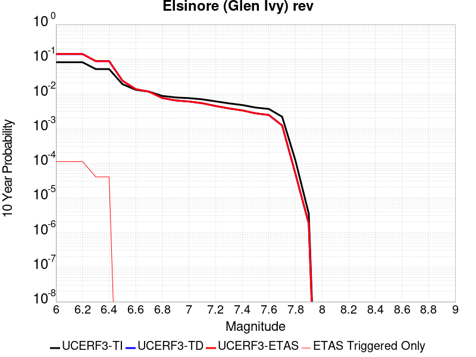 |

| Magnitude | 1 wk TI Prob | 1 wk TD Prob | 1 wk ETAS Prob | 1 wk ETAS/TD Gain | 1 wk ETAS Triggered Only | 1 mo TI Prob | 1 mo TD Prob | 1 mo ETAS Prob | 1 mo ETAS/TD Gain | 1 mo ETAS Triggered Only | 1 yr TI Prob | 1 yr TD Prob | 1 yr ETAS Prob | 1 yr ETAS/TD Gain | 1 yr ETAS Triggered Only | 10 yr TI Prob | 10 yr TD Prob | 10 yr ETAS Prob | 10 yr ETAS/TD Gain | 10 yr ETAS Triggered Only |
|-----|-----|-----|-----|-----|-----|-----|-----|-----|-----|-----|-----|-----|-----|-----|-----|-----|-----|-----|-----|-----|
| 6.0 | 1.6204086E-4 | 2.936593E-4 | 2.936593E-4 | 1.0 | 0.0 | 6.94276E-4 | 0.0012580877 | 0.0012680751 | 1.0079386 | 1.0E-5 | 0.008420097 | 0.015237179 | 0.015306111 | 1.004524 | 7.0E-5 | 0.081081145 | 0.13970533 | 0.13979995 | 1.0006773 | 1.1E-4 |
| 6.1 | 1.6204086E-4 | 2.936593E-4 | 2.936593E-4 | 1.0 | 0.0 | 6.94276E-4 | 0.0012580877 | 0.0012680751 | 1.0079386 | 1.0E-5 | 0.008420097 | 0.015237179 | 0.015306111 | 1.004524 | 7.0E-5 | 0.081081145 | 0.13970533 | 0.13979995 | 1.0006773 | 1.1E-4 |
| 6.2 | 1.6204086E-4 | 2.936593E-4 | 2.936593E-4 | 1.0 | 0.0 | 6.94276E-4 | 0.0012580877 | 0.0012680751 | 1.0079386 | 1.0E-5 | 0.008420097 | 0.015237179 | 0.015306111 | 1.004524 | 7.0E-5 | 0.081081145 | 0.13970533 | 0.13979995 | 1.0006773 | 1.1E-4 |
| 6.3 | 1.0111737E-4 | 1.7704896E-4 | 1.7704896E-4 | 1.0 | 0.0 | 4.332882E-4 | 7.5867726E-4 | 7.5867726E-4 | 1.0 | 0.0 | 0.005262531 | 0.009218467 | 0.009238283 | 1.0021496 | 2.0E-5 | 0.0513964 | 0.087025836 | 0.08706236 | 1.0004196 | 4.0E-5 |
| 6.4 | 1.0111737E-4 | 1.7704896E-4 | 1.7704896E-4 | 1.0 | 0.0 | 4.332882E-4 | 7.5867726E-4 | 7.5867726E-4 | 1.0 | 0.0 | 0.005262531 | 0.009218467 | 0.009238283 | 1.0021496 | 2.0E-5 | 0.0513964 | 0.087025836 | 0.08706236 | 1.0004196 | 4.0E-5 |
| 6.5 | 3.6624708E-5 | 4.6398443E-5 | 4.6398443E-5 | 1.0 | 0.0 | 1.569536E-4 | 1.9883736E-4 | 1.9883736E-4 | 1.0 | 0.0 | 0.001909235 | 0.0024185202 | 0.0024185202 | 1.0 | 0.0 | 0.01892915 | 0.02374361 | 0.02374361 | 1.0 | 0.0 |
| 6.6 | 2.5051324E-5 | 2.615282E-5 | 2.615282E-5 | 1.0 | 0.0 | 1.073584E-4 | 1.12078946E-4 | 1.12078946E-4 | 1.0 | 0.0 | 0.0013063047 | 0.0013637516 | 0.0013637516 | 1.0 | 0.0 | 0.012986525 | 0.013567226 | 0.013567226 | 1.0 | 0.0 |
| 6.7 | 2.2189772E-5 | 2.2077227E-5 | 2.2077227E-5 | 1.0 | 0.0 | 9.509556E-5 | 9.461347E-5 | 9.461347E-5 | 1.0 | 0.0 | 0.0011571734 | 0.0011513466 | 0.0011513466 | 1.0 | 0.0 | 0.011511663 | 0.0114676645 | 0.0114676645 | 1.0 | 0.0 |
| 6.8 | 1.6654378E-5 | 1.4440319E-5 | 1.4440319E-5 | 1.0 | 0.0 | 7.137396E-5 | 6.188564E-5 | 6.188564E-5 | 1.0 | 0.0 | 8.686314E-4 | 7.532024E-4 | 7.532024E-4 | 1.0 | 0.0 | 0.008652439 | 0.0075118328 | 0.0075118328 | 1.0 | 0.0 |
| 6.9 | 1.5042909E-5 | 1.2334286E-5 | 1.2334286E-5 | 1.0 | 0.0 | 6.446802E-5 | 5.286017E-5 | 5.286017E-5 | 1.0 | 0.0 | 7.8461546E-4 | 6.433857E-4 | 6.433857E-4 | 1.0 | 0.0 | 0.007818509 | 0.006419453 | 0.006419453 | 1.0 | 0.0 |
| 7.0 | 1.4361385E-5 | 1.1453455E-5 | 1.1453455E-5 | 1.0 | 0.0 | 6.154734E-5 | 4.908533E-5 | 4.908533E-5 | 1.0 | 0.0 | 7.490812E-4 | 5.974529E-4 | 5.974529E-4 | 1.0 | 0.0 | 0.007465612 | 0.005962458 | 0.005962458 | 1.0 | 0.0 |
| 7.1 | 1.3265571E-5 | 1.0246749E-5 | 1.0246749E-5 | 1.0 | 0.0 | 5.6851208E-5 | 4.3913915E-5 | 4.3913915E-5 | 1.0 | 0.0 | 6.919436E-4 | 5.345233E-4 | 5.345233E-4 | 1.0 | 0.0 | 0.006897931 | 0.0053357324 | 0.0053357324 | 1.0 | 0.0 |
| 7.2 | 1.1596403E-5 | 8.506553E-6 | 8.506553E-6 | 1.0 | 0.0 | 4.9697923E-5 | 3.6456157E-5 | 3.6456157E-5 | 1.0 | 0.0 | 6.049042E-4 | 4.4376502E-4 | 4.4376502E-4 | 1.0 | 0.0 | 0.006032603 | 0.004430204 | 0.004430204 | 1.0 | 0.0 |
| 7.3 | 1.0150827E-5 | 7.2399926E-6 | 7.2399926E-6 | 1.0 | 0.0 | 4.3502816E-5 | 3.102818E-5 | 3.102818E-5 | 1.0 | 0.0 | 5.2951806E-4 | 3.77704E-4 | 3.77704E-4 | 1.0 | 0.0 | 0.005282581 | 0.0037710073 | 0.0037710073 | 1.0 | 0.0 |
| 7.4 | 9.080705E-6 | 6.3535763E-6 | 6.3535763E-6 | 1.0 | 0.0 | 3.8916725E-5 | 2.7229335E-5 | 2.7229335E-5 | 1.0 | 0.0 | 4.7370812E-4 | 3.314681E-4 | 3.314681E-4 | 1.0 | 0.0 | 0.004726996 | 0.0033098878 | 0.0033098878 | 1.0 | 0.0 |
| 7.5 | 7.671649E-6 | 5.2264927E-6 | 5.2264927E-6 | 1.0 | 0.0 | 3.287808E-5 | 2.2399068E-5 | 2.2399068E-5 | 1.0 | 0.0 | 4.0021708E-4 | 2.726758E-4 | 2.726758E-4 | 1.0 | 0.0 | 0.0039949706 | 0.0027235372 | 0.0027235372 | 1.0 | 0.0 |
| 7.6 | 6.990086E-6 | 4.6883147E-6 | 4.6883147E-6 | 1.0 | 0.0 | 2.9957167E-5 | 2.009263E-5 | 2.009263E-5 | 1.0 | 0.0 | 3.6466747E-4 | 2.4460148E-4 | 2.4460148E-4 | 1.0 | 0.0 | 0.0036406964 | 0.0024434389 | 0.0024434389 | 1.0 | 0.0 |
| 7.7 | 4.163505E-6 | 2.3299876E-6 | 2.3299876E-6 | 1.0 | 0.0 | 1.7843471E-5 | 9.985628E-6 | 9.985628E-6 | 1.0 | 0.0 | 2.172226E-4 | 1.2156898E-4 | 1.2156898E-4 | 1.0 | 0.0 | 0.0021701038 | 0.0012150978 | 0.0012150978 | 1.0 | 0.0 |
| 7.8 | 2.2692414E-7 | 9.3873886E-8 | 9.3873886E-8 | 1.0 | 0.0 | 9.725317E-7 | 4.023166E-7 | 4.023166E-7 | 1.0 | 0.0 | 1.1840509E-5 | 4.898197E-6 | 4.898197E-6 | 1.0 | 0.0 | 1.1839878E-4 | 4.898122E-5 | 4.898122E-5 | 1.0 | 0.0 |
| 7.9 | 6.676829E-9 | 3.4403498E-9 | 3.4403498E-9 | 1.0 | 0.0 | 2.861498E-8 | 1.4744357E-8 | 1.4744357E-8 | 1.0 | 0.0 | 3.4838732E-7 | 1.7951253E-7 | 1.7951253E-7 | 1.0 | 0.0 | 3.4838679E-6 | 1.7951239E-6 | 1.7951239E-6 | 1.0 | 0.0 |

## San Jacinto (San Jacinto Valley) rev
*[(top)](#table-of-contents)*

| 1 Week | 1 Month | 1 Year | 10 Year |
|-----|-----|-----|-----|
|  |  |  |  |

| Magnitude | 1 wk TI Prob | 1 wk TD Prob | 1 wk ETAS Prob | 1 wk ETAS/TD Gain | 1 wk ETAS Triggered Only | 1 mo TI Prob | 1 mo TD Prob | 1 mo ETAS Prob | 1 mo ETAS/TD Gain | 1 mo ETAS Triggered Only | 1 yr TI Prob | 1 yr TD Prob | 1 yr ETAS Prob | 1 yr ETAS/TD Gain | 1 yr ETAS Triggered Only | 10 yr TI Prob | 10 yr TD Prob | 10 yr ETAS Prob | 10 yr ETAS/TD Gain | 10 yr ETAS Triggered Only |
|-----|-----|-----|-----|-----|-----|-----|-----|-----|-----|-----|-----|-----|-----|-----|-----|-----|-----|-----|-----|-----|
| 6.0 | 3.652694E-5 | 3.4467394E-5 | 3.4467394E-5 | 1.0 | 0.0 | 1.5653463E-4 | 1.4770904E-4 | 1.677061E-4 | 1.1353813 | 2.0E-5 | 0.0019041431 | 0.001796876 | 0.0018467861 | 1.0277761 | 5.0E-5 | 0.018879099 | 0.018560216 | 0.018668173 | 1.0058167 | 1.1E-4 |
| 6.1 | 3.652694E-5 | 3.4467394E-5 | 3.4467394E-5 | 1.0 | 0.0 | 1.5653463E-4 | 1.4770904E-4 | 1.677061E-4 | 1.1353813 | 2.0E-5 | 0.0019041431 | 0.001796876 | 0.0018467861 | 1.0277761 | 5.0E-5 | 0.018879099 | 0.018560216 | 0.018668173 | 1.0058167 | 1.1E-4 |
| 6.2 | 3.652694E-5 | 3.4467394E-5 | 3.4467394E-5 | 1.0 | 0.0 | 1.5653463E-4 | 1.4770904E-4 | 1.677061E-4 | 1.1353813 | 2.0E-5 | 0.0019041431 | 0.001796876 | 0.0018467861 | 1.0277761 | 5.0E-5 | 0.018879099 | 0.018560216 | 0.018668173 | 1.0058167 | 1.1E-4 |
| 6.3 | 3.652694E-5 | 3.4467394E-5 | 3.4467394E-5 | 1.0 | 0.0 | 1.5653463E-4 | 1.4770904E-4 | 1.677061E-4 | 1.1353813 | 2.0E-5 | 0.0019041431 | 0.001796876 | 0.0018467861 | 1.0277761 | 5.0E-5 | 0.018879099 | 0.018560216 | 0.018668173 | 1.0058167 | 1.1E-4 |
| 6.4 | 3.646941E-5 | 3.4388955E-5 | 3.4388955E-5 | 1.0 | 0.0 | 1.5628811E-4 | 1.4737292E-4 | 1.6736997E-4 | 1.1356901 | 2.0E-5 | 0.0019011468 | 0.0017927908 | 0.0018427012 | 1.0278394 | 5.0E-5 | 0.018849645 | 0.01852009 | 0.018628053 | 1.0058295 | 1.1E-4 |
| 6.5 | 3.646941E-5 | 3.4388955E-5 | 3.4388955E-5 | 1.0 | 0.0 | 1.5628811E-4 | 1.4737292E-4 | 1.6736997E-4 | 1.1356901 | 2.0E-5 | 0.0019011468 | 0.0017927908 | 0.0018427012 | 1.0278394 | 5.0E-5 | 0.018849645 | 0.01852009 | 0.018628053 | 1.0058295 | 1.1E-4 |
| 6.6 | 3.6442503E-5 | 3.4352335E-5 | 3.4352335E-5 | 1.0 | 0.0 | 1.561728E-4 | 1.4721598E-4 | 1.6721303E-4 | 1.1358348 | 2.0E-5 | 0.0018997455 | 0.0017908834 | 0.0018407938 | 1.0278692 | 5.0E-5 | 0.018835869 | 0.018501356 | 0.018609323 | 1.0058355 | 1.1E-4 |
| 6.7 | 3.6432113E-5 | 3.4337903E-5 | 3.4337903E-5 | 1.0 | 0.0 | 1.5612828E-4 | 1.4715415E-4 | 1.671512E-4 | 1.1358919 | 2.0E-5 | 0.0018992044 | 0.001790132 | 0.0018400425 | 1.0278809 | 5.0E-5 | 0.018830549 | 0.01849398 | 0.018601945 | 1.0058379 | 1.1E-4 |
| 6.8 | 3.6409598E-5 | 3.430695E-5 | 3.430695E-5 | 1.0 | 0.0 | 1.560318E-4 | 1.470215E-4 | 1.6701857E-4 | 1.1360145 | 2.0E-5 | 0.0018980318 | 0.0017885199 | 0.0018384304 | 1.0279061 | 5.0E-5 | 0.018819023 | 0.01847813 | 0.0185861 | 1.0058429 | 1.1E-4 |
| 6.9 | 3.638078E-5 | 3.4267367E-5 | 3.4267367E-5 | 1.0 | 0.0 | 1.5590832E-4 | 1.4685189E-4 | 1.6684894E-4 | 1.1361717 | 2.0E-5 | 0.0018965311 | 0.0017864581 | 0.0018363688 | 1.0279384 | 5.0E-5 | 0.018804269 | 0.018457862 | 0.018565832 | 1.0058495 | 1.1E-4 |
| 7.0 | 3.6294874E-5 | 3.4149365E-5 | 3.4149365E-5 | 1.0 | 0.0 | 1.5554018E-4 | 1.4634622E-4 | 1.663433E-4 | 1.1366422 | 2.0E-5 | 0.0018920569 | 0.0017803118 | 0.0018302228 | 1.0280349 | 5.0E-5 | 0.018760284 | 0.018397434 | 0.018505411 | 1.0058692 | 1.1E-4 |
| 7.1 | 3.6260717E-5 | 3.410564E-5 | 3.410564E-5 | 1.0 | 0.0 | 1.5539382E-4 | 1.4615887E-4 | 1.6615594E-4 | 1.1368175 | 2.0E-5 | 0.001890278 | 0.0017780344 | 0.0018279455 | 1.0280709 | 5.0E-5 | 0.018742796 | 0.018375032 | 0.018483011 | 1.0058764 | 1.1E-4 |
| 7.2 | 3.6210204E-5 | 3.403977E-5 | 3.403977E-5 | 1.0 | 0.0 | 1.5517735E-4 | 1.4587659E-4 | 1.6587367E-4 | 1.1370822 | 2.0E-5 | 0.001887647 | 0.0017746033 | 0.0018245146 | 1.0281253 | 5.0E-5 | 0.01871693 | 0.018341267 | 0.018449249 | 1.0058874 | 1.1E-4 |
| 7.3 | 3.6119454E-5 | 3.3927867E-5 | 3.3927867E-5 | 1.0 | 0.0 | 1.5478847E-4 | 1.4539705E-4 | 1.6539414E-4 | 1.1375344 | 2.0E-5 | 0.0018829206 | 0.0017687745 | 0.001818686 | 1.0282182 | 5.0E-5 | 0.018670462 | 0.018283723 | 0.018391712 | 1.0059062 | 1.1E-4 |
| 7.4 | 3.607848E-5 | 3.387532E-5 | 3.387532E-5 | 1.0 | 0.0 | 1.5461289E-4 | 1.4517189E-4 | 1.6516898E-4 | 1.1377478 | 2.0E-5 | 0.0018807866 | 0.0017660374 | 0.0018159492 | 1.028262 | 5.0E-5 | 0.018649481 | 0.018256696 | 0.018364688 | 1.0059152 | 1.1E-4 |
| 7.5 | 3.5856774E-5 | 3.3684162E-5 | 3.3684162E-5 | 1.0 | 0.0 | 1.5366284E-4 | 1.4435273E-4 | 1.6434984E-4 | 1.1385295 | 2.0E-5 | 0.0018692396 | 0.0017560803 | 0.0018059926 | 1.0284225 | 5.0E-5 | 0.018535944 | 0.01815731 | 0.018265313 | 1.0059482 | 1.1E-4 |
| 7.6 | 3.286655E-5 | 3.220034E-5 | 3.220034E-5 | 1.0 | 0.0 | 1.4084904E-4 | 1.3799417E-4 | 1.5799141E-4 | 1.1449137 | 2.0E-5 | 0.001713488 | 0.0016787864 | 0.0017287025 | 1.0297334 | 5.0E-5 | 0.017003361 | 0.017373424 | 0.017481511 | 1.0062215 | 1.1E-4 |
| 7.7 | 2.8882527E-5 | 2.9291981E-5 | 2.9291981E-5 | 1.0 | 0.0 | 1.237764E-4 | 1.2553102E-4 | 1.4552851E-4 | 1.1593032 | 2.0E-5 | 0.0015059357 | 0.0015272698 | 0.0015771935 | 1.0326881 | 5.0E-5 | 0.014957713 | 0.015859274 | 0.01596753 | 1.006826 | 1.1E-4 |
| 7.8 | 2.4950225E-5 | 2.6580747E-5 | 2.6580747E-5 | 1.0 | 0.0 | 1.0692515E-4 | 1.13912516E-4 | 1.3391023E-4 | 1.1755533 | 2.0E-5 | 0.0013010362 | 0.0013860033 | 0.0014359341 | 1.0360249 | 5.0E-5 | 0.012934455 | 0.014439502 | 0.014547914 | 1.007508 | 1.1E-4 |
| 7.9 | 1.9881603E-5 | 2.155556E-5 | 2.155556E-5 | 1.0 | 0.0 | 8.520408E-5 | 9.2377704E-5 | 1.12375856E-4 | 1.2164825 | 2.0E-5 | 0.001036866 | 0.001124119 | 0.0011740628 | 1.0444293 | 5.0E-5 | 0.010320415 | 0.011802064 | 0.011910766 | 1.0092103 | 1.1E-4 |
| 8.0 | 1.563292E-5 | 1.5976173E-5 | 1.5976173E-5 | 1.0 | 0.0 | 6.6996516E-5 | 6.846752E-5 | 8.846615E-5 | 1.2920893 | 2.0E-5 | 8.153773E-4 | 8.332739E-4 | 8.832322E-4 | 1.0599543 | 5.0E-5 | 0.00812392 | 0.008830938 | 0.0089300545 | 1.0112238 | 1.0E-4 |
| 8.1 | 1.0045313E-5 | 8.324356E-6 | 8.324356E-6 | 1.0 | 0.0 | 4.305063E-5 | 3.5675326E-5 | 3.5675326E-5 | 1.0 | 0.0 | 5.2401534E-4 | 4.3426102E-4 | 4.5425235E-4 | 1.0460353 | 2.0E-5 | 0.0052278144 | 0.0046712374 | 0.0047110505 | 1.008523 | 4.0E-5 |
| 8.2 | 4.1554413E-6 | 1.5721832E-6 | 1.5721832E-6 | 1.0 | 0.0 | 1.7808914E-5 | 6.737911E-6 | 6.737911E-6 | 1.0 | 0.0 | 2.1680194E-4 | 8.203101E-5 | 8.203101E-5 | 1.0 | 0.0 | 0.0021659054 | 9.520741E-4 | 9.520741E-4 | 1.0 | 0.0 |
| 8.3 | 1.2758221E-6 | 3.6330252E-7 | 3.6330252E-7 | 1.0 | 0.0 | 5.4677976E-6 | 1.5570099E-6 | 1.5570099E-6 | 1.0 | 0.0 | 6.65684E-5 | 1.8956434E-5 | 1.8956434E-5 | 1.0 | 0.0 | 6.6548464E-4 | 2.2857229E-4 | 2.2857229E-4 | 1.0 | 0.0 |

## San Andreas (Carrizo) rev
*[(top)](#table-of-contents)*

| 1 Week | 1 Month | 1 Year | 10 Year |
|-----|-----|-----|-----|
|  |  |  |  |

| Magnitude | 1 wk TI Prob | 1 wk TD Prob | 1 wk ETAS Prob | 1 wk ETAS/TD Gain | 1 wk ETAS Triggered Only | 1 mo TI Prob | 1 mo TD Prob | 1 mo ETAS Prob | 1 mo ETAS/TD Gain | 1 mo ETAS Triggered Only | 1 yr TI Prob | 1 yr TD Prob | 1 yr ETAS Prob | 1 yr ETAS/TD Gain | 1 yr ETAS Triggered Only | 10 yr TI Prob | 10 yr TD Prob | 10 yr ETAS Prob | 10 yr ETAS/TD Gain | 10 yr ETAS Triggered Only |
|-----|-----|-----|-----|-----|-----|-----|-----|-----|-----|-----|-----|-----|-----|-----|-----|-----|-----|-----|-----|-----|
| 6.0 | 1.1674632E-4 | 2.4361293E-4 | 2.6360806E-4 | 1.0820775 | 2.0E-5 | 5.002454E-4 | 0.0010436393 | 0.0010636183 | 1.0191437 | 2.0E-5 | 0.006073493 | 0.012632766 | 0.012682134 | 1.0039079 | 5.0E-5 | 0.0591016 | 0.12077509 | 0.120871805 | 1.0008007 | 1.1E-4 |
| 6.1 | 1.1674632E-4 | 2.4361293E-4 | 2.6360806E-4 | 1.0820775 | 2.0E-5 | 5.002454E-4 | 0.0010436393 | 0.0010636183 | 1.0191437 | 2.0E-5 | 0.006073493 | 0.012632766 | 0.012682134 | 1.0039079 | 5.0E-5 | 0.0591016 | 0.12077509 | 0.120871805 | 1.0008007 | 1.1E-4 |
| 6.2 | 1.1674632E-4 | 2.4361293E-4 | 2.6360806E-4 | 1.0820775 | 2.0E-5 | 5.002454E-4 | 0.0010436393 | 0.0010636183 | 1.0191437 | 2.0E-5 | 0.006073493 | 0.012632766 | 0.012682134 | 1.0039079 | 5.0E-5 | 0.0591016 | 0.12077509 | 0.120871805 | 1.0008007 | 1.1E-4 |
| 6.3 | 1.1674632E-4 | 2.4361293E-4 | 2.6360806E-4 | 1.0820775 | 2.0E-5 | 5.002454E-4 | 0.0010436393 | 0.0010636183 | 1.0191437 | 2.0E-5 | 0.006073493 | 0.012632766 | 0.012682134 | 1.0039079 | 5.0E-5 | 0.0591016 | 0.12077509 | 0.120871805 | 1.0008007 | 1.1E-4 |
| 6.4 | 1.1674632E-4 | 2.4361293E-4 | 2.6360806E-4 | 1.0820775 | 2.0E-5 | 5.002454E-4 | 0.0010436393 | 0.0010636183 | 1.0191437 | 2.0E-5 | 0.006073493 | 0.012632766 | 0.012682134 | 1.0039079 | 5.0E-5 | 0.0591016 | 0.12077509 | 0.120871805 | 1.0008007 | 1.1E-4 |
| 6.5 | 1.13136164E-4 | 2.3681132E-4 | 2.4680895E-4 | 1.0422177 | 1.0E-5 | 4.847792E-4 | 0.0010145125 | 0.0010245023 | 1.0098469 | 1.0E-5 | 0.0058862255 | 0.012282185 | 0.012321694 | 1.0032167 | 4.0E-5 | 0.057327334 | 0.1177463 | 0.11783452 | 1.0007492 | 1.0E-4 |
| 6.6 | 1.13136164E-4 | 2.3681132E-4 | 2.4680895E-4 | 1.0422177 | 1.0E-5 | 4.847792E-4 | 0.0010145125 | 0.0010245023 | 1.0098469 | 1.0E-5 | 0.0058862255 | 0.012282185 | 0.012321694 | 1.0032167 | 4.0E-5 | 0.057327334 | 0.1177463 | 0.11783452 | 1.0007492 | 1.0E-4 |
| 6.7 | 1.1149675E-4 | 2.3372276E-4 | 2.4372042E-4 | 1.0427758 | 1.0E-5 | 4.777557E-4 | 0.001001286 | 0.0010112759 | 1.0099771 | 1.0E-5 | 0.0058011734 | 0.012122953 | 0.012162468 | 1.0032595 | 4.0E-5 | 0.05652051 | 0.116367765 | 0.11645613 | 1.0007594 | 1.0E-4 |
| 6.8 | 1.1103589E-4 | 2.3274389E-4 | 2.4274156E-4 | 1.0429556 | 1.0E-5 | 4.7578133E-4 | 9.97094E-4 | 0.001007084 | 1.0100192 | 1.0E-5 | 0.005777263 | 0.012072483 | 0.012112 | 1.0032734 | 4.0E-5 | 0.056293584 | 0.115927964 | 0.11601637 | 1.0007626 | 1.0E-4 |
| 6.9 | 1.1053259E-4 | 2.316672E-4 | 2.416649E-4 | 1.0431553 | 1.0E-5 | 4.7362508E-4 | 9.924831E-4 | 0.0010024733 | 1.0100658 | 1.0E-5 | 0.0057511497 | 0.012016967 | 0.012056486 | 1.0032886 | 4.0E-5 | 0.05604569 | 0.11544405 | 0.1155325 | 1.0007663 | 1.0E-4 |
| 7.0 | 1.1005377E-4 | 2.3067516E-4 | 2.4067285E-4 | 1.043341 | 1.0E-5 | 4.7157376E-4 | 9.882348E-4 | 9.982248E-4 | 1.0101091 | 1.0E-5 | 0.0057263062 | 0.011965811 | 0.012005333 | 1.0033028 | 4.0E-5 | 0.055809796 | 0.11499625 | 0.115084745 | 1.0007696 | 1.0E-4 |
| 7.1 | 1.0308142E-4 | 2.1576507E-4 | 2.2576292E-4 | 1.0463367 | 1.0E-5 | 4.417027E-4 | 9.2438085E-4 | 9.3437155E-4 | 1.0108081 | 1.0E-5 | 0.0053644776 | 0.011196577 | 0.0112262415 | 1.0026494 | 3.0E-5 | 0.052368138 | 0.10825095 | 0.10832229 | 1.000659 | 8.0E-5 |
| 7.2 | 1.0027479E-4 | 2.098411E-4 | 2.19839E-4 | 1.0476451 | 1.0E-5 | 4.296783E-4 | 8.9901005E-4 | 9.090011E-4 | 1.0111134 | 1.0E-5 | 0.0052187922 | 0.010890815 | 0.010920488 | 1.0027246 | 3.0E-5 | 0.050979212 | 0.105554216 | 0.10562577 | 1.000678 | 8.0E-5 |
| 7.3 | 9.816942E-5 | 2.0458816E-4 | 2.145861E-4 | 1.0488687 | 1.0E-5 | 4.2065824E-4 | 8.765127E-4 | 8.8650396E-4 | 1.0113988 | 1.0E-5 | 0.005109493 | 0.010619612 | 0.010649294 | 1.002795 | 3.0E-5 | 0.049935985 | 0.10313633 | 0.10320808 | 1.0006957 | 8.0E-5 |
| 7.4 | 9.5634205E-5 | 1.9827684E-4 | 2.0827485E-4 | 1.0504246 | 1.0E-5 | 4.0979648E-4 | 8.494821E-4 | 8.594736E-4 | 1.0117619 | 1.0E-5 | 0.0049778637 | 0.010293663 | 0.010323354 | 1.0028844 | 3.0E-5 | 0.048678253 | 0.100220494 | 0.100283474 | 1.0006285 | 7.0E-5 |
| 7.5 | 8.052417E-5 | 1.6143978E-4 | 1.7143815E-4 | 1.0619326 | 1.0E-5 | 3.4505792E-4 | 6.917014E-4 | 7.016945E-4 | 1.0144471 | 1.0E-5 | 0.0041929903 | 0.008389029 | 0.008418777 | 1.0035461 | 3.0E-5 | 0.04114753 | 0.08295002 | 0.08300504 | 1.0006633 | 6.0E-5 |
| 7.6 | 7.897024E-5 | 1.579682E-4 | 1.6796662E-4 | 1.0632939 | 1.0E-5 | 3.384E-4 | 6.768311E-4 | 6.868243E-4 | 1.0147648 | 1.0E-5 | 0.0041122385 | 0.00820936 | 0.008239114 | 1.0036243 | 3.0E-5 | 0.040369697 | 0.081289805 | 0.08134493 | 1.0006781 | 6.0E-5 |
| 7.7 | 6.707427E-5 | 1.3303987E-4 | 1.4303853E-4 | 1.0751555 | 1.0E-5 | 2.8742946E-4 | 5.700463E-4 | 5.8004056E-4 | 1.0175325 | 1.0E-5 | 0.003493839 | 0.0069182604 | 0.006938122 | 1.0028709 | 2.0E-5 | 0.034394164 | 0.06917457 | 0.0692118 | 1.0005382 | 4.0E-5 |
| 7.8 | 6.147705E-5 | 1.2222702E-4 | 1.322258E-4 | 1.081805 | 1.0E-5 | 2.6344648E-4 | 5.23725E-4 | 5.337198E-4 | 1.019084 | 1.0E-5 | 0.0032027436 | 0.0063577346 | 0.0063676713 | 1.0015628 | 1.0E-5 | 0.031569764 | 0.06362964 | 0.06364837 | 1.0002943 | 2.0E-5 |
| 7.9 | 4.7636717E-5 | 8.8979046E-5 | 8.8979046E-5 | 1.0 | 0.0 | 2.0414138E-4 | 3.8128305E-4 | 3.8128305E-4 | 1.0 | 0.0 | 0.0024825884 | 0.004632248 | 0.004632248 | 1.0 | 0.0 | 0.024550365 | 0.046713326 | 0.04672286 | 1.0002041 | 1.0E-5 |
| 8.0 | 3.3554235E-5 | 5.224805E-5 | 5.224805E-5 | 1.0 | 0.0 | 1.4379594E-4 | 2.23901E-4 | 2.23901E-4 | 1.0 | 0.0 | 0.0017493097 | 0.0027225888 | 0.0027225888 | 1.0 | 0.0 | 0.017356034 | 0.027935574 | 0.027945295 | 1.000348 | 1.0E-5 |
| 8.1 | 1.9175432E-5 | 1.9238541E-5 | 1.9238541E-5 | 1.0 | 0.0 | 8.217783E-5 | 8.244829E-5 | 8.244829E-5 | 1.0 | 0.0 | 0.0010000558 | 0.0010033463 | 0.0010033463 | 1.0 | 0.0 | 0.009955673 | 0.010786123 | 0.010796015 | 1.0009171 | 1.0E-5 |
| 8.2 | 8.643924E-6 | 5.49522E-6 | 5.49522E-6 | 1.0 | 0.0 | 3.704486E-5 | 2.355073E-5 | 2.355073E-5 | 1.0 | 0.0 | 4.5092785E-4 | 2.866925E-4 | 2.866925E-4 | 1.0 | 0.0 | 0.0045001395 | 0.0032598388 | 0.0032598388 | 1.0 | 0.0 |
| 8.3 | 1.983087E-6 | 7.693574E-7 | 7.693574E-7 | 1.0 | 0.0 | 8.498917E-6 | 3.297242E-6 | 3.297242E-6 | 1.0 | 0.0 | 1.034694E-4 | 4.01432E-5 | 4.01432E-5 | 1.0 | 0.0 | 0.0010342124 | 4.7390026E-4 | 4.7390026E-4 | 1.0 | 0.0 |

## San Jacinto (Stepovers Combined)
*[(top)](#table-of-contents)*

| 1 Week | 1 Month | 1 Year | 10 Year |
|-----|-----|-----|-----|
|  |  |  |  |

| Magnitude | 1 wk TI Prob | 1 wk TD Prob | 1 wk ETAS Prob | 1 wk ETAS/TD Gain | 1 wk ETAS Triggered Only | 1 mo TI Prob | 1 mo TD Prob | 1 mo ETAS Prob | 1 mo ETAS/TD Gain | 1 mo ETAS Triggered Only | 1 yr TI Prob | 1 yr TD Prob | 1 yr ETAS Prob | 1 yr ETAS/TD Gain | 1 yr ETAS Triggered Only | 10 yr TI Prob | 10 yr TD Prob | 10 yr ETAS Prob | 10 yr ETAS/TD Gain | 10 yr ETAS Triggered Only |
|-----|-----|-----|-----|-----|-----|-----|-----|-----|-----|-----|-----|-----|-----|-----|-----|-----|-----|-----|-----|-----|
| 6.0 | 4.0667746E-5 | 3.5336896E-5 | 3.5336896E-5 | 1.0 | 0.0 | 1.742787E-4 | 1.5143506E-4 | 1.7143202E-4 | 1.1320498 | 2.0E-5 | 0.0021197782 | 0.0018421634 | 0.0018920713 | 1.027092 | 5.0E-5 | 0.020996714 | 0.019020144 | 0.019118242 | 1.0051576 | 1.0E-4 |
| 6.1 | 4.0667746E-5 | 3.5336896E-5 | 3.5336896E-5 | 1.0 | 0.0 | 1.742787E-4 | 1.5143506E-4 | 1.7143202E-4 | 1.1320498 | 2.0E-5 | 0.0021197782 | 0.0018421634 | 0.0018920713 | 1.027092 | 5.0E-5 | 0.020996714 | 0.019020144 | 0.019118242 | 1.0051576 | 1.0E-4 |
| 6.2 | 4.0667746E-5 | 3.5336896E-5 | 3.5336896E-5 | 1.0 | 0.0 | 1.742787E-4 | 1.5143506E-4 | 1.7143202E-4 | 1.1320498 | 2.0E-5 | 0.0021197782 | 0.0018421634 | 0.0018920713 | 1.027092 | 5.0E-5 | 0.020996714 | 0.019020144 | 0.019118242 | 1.0051576 | 1.0E-4 |
| 6.3 | 4.0667746E-5 | 3.5336896E-5 | 3.5336896E-5 | 1.0 | 0.0 | 1.742787E-4 | 1.5143506E-4 | 1.7143202E-4 | 1.1320498 | 2.0E-5 | 0.0021197782 | 0.0018421634 | 0.0018920713 | 1.027092 | 5.0E-5 | 0.020996714 | 0.019020144 | 0.019118242 | 1.0051576 | 1.0E-4 |
| 6.4 | 4.0577226E-5 | 3.5208766E-5 | 3.5208766E-5 | 1.0 | 0.0 | 1.738908E-4 | 1.50886E-4 | 1.7088298E-4 | 1.1325305 | 2.0E-5 | 0.0021150648 | 0.0018354917 | 0.0018853999 | 1.0271907 | 5.0E-5 | 0.020950472 | 0.018954702 | 0.019052807 | 1.0051757 | 1.0E-4 |
| 6.5 | 4.0577226E-5 | 3.5208766E-5 | 3.5208766E-5 | 1.0 | 0.0 | 1.738908E-4 | 1.50886E-4 | 1.7088298E-4 | 1.1325305 | 2.0E-5 | 0.0021150648 | 0.0018354917 | 0.0018853999 | 1.0271907 | 5.0E-5 | 0.020950472 | 0.018954702 | 0.019052807 | 1.0051757 | 1.0E-4 |
| 6.6 | 4.053861E-5 | 3.5154102E-5 | 3.5154102E-5 | 1.0 | 0.0 | 1.7372532E-4 | 1.5065174E-4 | 1.7064872E-4 | 1.1327366 | 2.0E-5 | 0.0021130538 | 0.0018326445 | 0.0018825529 | 1.027233 | 5.0E-5 | 0.020930743 | 0.018926777 | 0.019024882 | 1.0051836 | 1.0E-4 |
| 6.7 | 4.0516545E-5 | 3.512316E-5 | 3.512316E-5 | 1.0 | 0.0 | 1.7363077E-4 | 1.5051916E-4 | 1.7051614E-4 | 1.1328535 | 2.0E-5 | 0.002111905 | 0.0018310336 | 0.001880942 | 1.027257 | 5.0E-5 | 0.020919468 | 0.01891097 | 0.01900908 | 1.005188 | 1.0E-4 |
| 6.8 | 4.049434E-5 | 3.509472E-5 | 3.509472E-5 | 1.0 | 0.0 | 1.7353562E-4 | 1.5039727E-4 | 1.7039425E-4 | 1.1329612 | 2.0E-5 | 0.0021107488 | 0.0018295521 | 0.0018794606 | 1.0272791 | 5.0E-5 | 0.020908125 | 0.01889638 | 0.018994492 | 1.005192 | 1.0E-4 |
| 6.9 | 4.046386E-5 | 3.505727E-5 | 3.505727E-5 | 1.0 | 0.0 | 1.73405E-4 | 1.502368E-4 | 1.7023379E-4 | 1.1331031 | 2.0E-5 | 0.0021091616 | 0.0018276017 | 0.0018775103 | 1.0273082 | 5.0E-5 | 0.020892553 | 0.01887715 | 0.018975263 | 1.0051974 | 1.0E-4 |
| 7.0 | 4.036382E-5 | 3.4937813E-5 | 3.4937813E-5 | 1.0 | 0.0 | 1.7297632E-4 | 1.4972492E-4 | 1.6972191E-4 | 1.1335583 | 2.0E-5 | 0.0021039525 | 0.00182138 | 0.0018712889 | 1.0274017 | 5.0E-5 | 0.02084144 | 0.018815752 | 0.01891387 | 1.0052147 | 1.0E-4 |
| 7.1 | 4.0343282E-5 | 3.4916273E-5 | 3.4916273E-5 | 1.0 | 0.0 | 1.7288832E-4 | 1.496326E-4 | 1.6962961E-4 | 1.1336408 | 2.0E-5 | 0.002102883 | 0.0018202579 | 0.0018701669 | 1.0274186 | 5.0E-5 | 0.020830948 | 0.018804627 | 0.018902745 | 1.0052178 | 1.0E-4 |
| 7.2 | 4.0257353E-5 | 3.4820667E-5 | 3.4820667E-5 | 1.0 | 0.0 | 1.725201E-4 | 1.492229E-4 | 1.6921993E-4 | 1.1340077 | 2.0E-5 | 0.0020984085 | 0.0018152783 | 0.0018651875 | 1.027494 | 5.0E-5 | 0.020787042 | 0.018755313 | 0.018853437 | 1.0052319 | 1.0E-4 |
| 7.3 | 3.9940667E-5 | 3.4648023E-5 | 3.4648023E-5 | 1.0 | 0.0 | 1.7116306E-4 | 1.4848309E-4 | 1.6848012E-4 | 1.1346755 | 2.0E-5 | 0.0020819185 | 0.0018062859 | 0.0018561956 | 1.0276312 | 5.0E-5 | 0.020625217 | 0.018663792 | 0.018761925 | 1.005258 | 1.0E-4 |
| 7.4 | 3.9721202E-5 | 3.453329E-5 | 3.453329E-5 | 1.0 | 0.0 | 1.7022261E-4 | 1.4799142E-4 | 1.6798846E-4 | 1.135123 | 2.0E-5 | 0.0020704903 | 0.0018003098 | 0.0018502198 | 1.027723 | 5.0E-5 | 0.020513052 | 0.01860285 | 0.01870099 | 1.0052755 | 1.0E-4 |
| 7.5 | 3.7036873E-5 | 3.3598866E-5 | 3.3598866E-5 | 1.0 | 0.0 | 1.5871979E-4 | 1.439872E-4 | 1.6398432E-4 | 1.1388812 | 2.0E-5 | 0.0019307006 | 0.0017516377 | 0.00180155 | 1.0284947 | 5.0E-5 | 0.019140124 | 0.018103454 | 0.018201645 | 1.0054238 | 1.0E-4 |
| 7.6 | 3.2940967E-5 | 3.1372547E-5 | 3.1372547E-5 | 1.0 | 0.0 | 1.4116794E-4 | 1.3444685E-4 | 1.5444416E-4 | 1.1487377 | 2.0E-5 | 0.0017173645 | 0.0016356637 | 0.0016855819 | 1.0305187 | 5.0E-5 | 0.01704153 | 0.01693263 | 0.01703094 | 1.0058057 | 1.0E-4 |
| 7.7 | 2.8236149E-5 | 2.7937022E-5 | 2.7937022E-5 | 1.0 | 0.0 | 1.2100645E-4 | 1.197246E-4 | 1.3972221E-4 | 1.1670301 | 2.0E-5 | 0.0014722579 | 0.0014566735 | 0.0015066006 | 1.0342748 | 5.0E-5 | 0.014625421 | 0.015142685 | 0.015241171 | 1.0065038 | 1.0E-4 |
| 7.8 | 2.4329287E-5 | 2.5258554E-5 | 2.5258554E-5 | 1.0 | 0.0 | 1.042642E-4 | 1.0824646E-4 | 1.282443E-4 | 1.1847435 | 2.0E-5 | 0.0012686774 | 0.0013171048 | 0.0013670389 | 1.037912 | 5.0E-5 | 0.012614589 | 0.013738932 | 0.013837558 | 1.0071785 | 1.0E-4 |
| 7.9 | 1.9370926E-5 | 2.0467445E-5 | 2.0467445E-5 | 1.0 | 0.0 | 8.301561E-5 | 8.7714674E-5 | 1.0771292E-4 | 1.227992 | 2.0E-5 | 0.0010102465 | 0.0010674037 | 0.0011173503 | 1.0467926 | 5.0E-5 | 0.0100566605 | 0.011223499 | 0.011322376 | 1.0088099 | 1.0E-4 |
| 8.0 | 1.5583017E-5 | 1.5925136E-5 | 1.5925136E-5 | 1.0 | 0.0 | 6.6782646E-5 | 6.82488E-5 | 8.8247434E-5 | 1.2930255 | 2.0E-5 | 8.127754E-4 | 8.306131E-4 | 8.8057155E-4 | 1.0601465 | 5.0E-5 | 0.008098091 | 0.008802158 | 0.008901278 | 1.0112609 | 1.0E-4 |
| 8.1 | 1.0024873E-5 | 8.314913E-6 | 8.314913E-6 | 1.0 | 0.0 | 4.2963035E-5 | 3.563486E-5 | 3.563486E-5 | 1.0 | 0.0 | 5.229494E-4 | 4.3376858E-4 | 4.5375992E-4 | 1.0460875 | 2.0E-5 | 0.0052172043 | 0.00466551 | 0.0047053234 | 1.0085336 | 4.0E-5 |
| 8.2 | 4.142796E-6 | 1.5676045E-6 | 1.5676045E-6 | 1.0 | 0.0 | 1.775472E-5 | 6.7182878E-6 | 6.7182878E-6 | 1.0 | 0.0 | 2.1614227E-4 | 8.179211E-5 | 8.179211E-5 | 1.0 | 0.0 | 0.0021593217 | 9.4923546E-4 | 9.4923546E-4 | 1.0 | 0.0 |
| 8.3 | 1.2750878E-6 | 3.6301523E-7 | 3.6301523E-7 | 1.0 | 0.0 | 5.4646503E-6 | 1.5557786E-6 | 1.5557786E-6 | 1.0 | 0.0 | 6.653009E-5 | 1.8941444E-5 | 1.8941444E-5 | 1.0 | 0.0 | 6.6510175E-4 | 2.2840123E-4 | 2.2840123E-4 | 1.0 | 0.0 |

## Cady
*[(top)](#table-of-contents)*

| 1 Week | 1 Month | 1 Year | 10 Year |
|-----|-----|-----|-----|
|  |  |  |  |

| Magnitude | 1 wk TI Prob | 1 wk TD Prob | 1 wk ETAS Prob | 1 wk ETAS/TD Gain | 1 wk ETAS Triggered Only | 1 mo TI Prob | 1 mo TD Prob | 1 mo ETAS Prob | 1 mo ETAS/TD Gain | 1 mo ETAS Triggered Only | 1 yr TI Prob | 1 yr TD Prob | 1 yr ETAS Prob | 1 yr ETAS/TD Gain | 1 yr ETAS Triggered Only | 10 yr TI Prob | 10 yr TD Prob | 10 yr ETAS Prob | 10 yr ETAS/TD Gain | 10 yr ETAS Triggered Only |
|-----|-----|-----|-----|-----|-----|-----|-----|-----|-----|-----|-----|-----|-----|-----|-----|-----|-----|-----|-----|-----|
| 6.0 | 1.9892565E-5 | 2.1859876E-5 | 3.1859658E-5 | 1.4574491 | 1.0E-5 | 8.525106E-5 | 9.3682334E-5 | 1.1368046E-4 | 1.2134675 | 2.0E-5 | 0.0010374374 | 0.0011400766 | 0.0011900195 | 1.0438067 | 5.0E-5 | 0.010326075 | 0.011351293 | 0.0114402715 | 1.0078386 | 9.0E-5 |
| 6.1 | 1.9892565E-5 | 2.1859876E-5 | 3.1859658E-5 | 1.4574491 | 1.0E-5 | 8.525106E-5 | 9.3682334E-5 | 1.1368046E-4 | 1.2134675 | 2.0E-5 | 0.0010374374 | 0.0011400766 | 0.0011900195 | 1.0438067 | 5.0E-5 | 0.010326075 | 0.011351293 | 0.0114402715 | 1.0078386 | 9.0E-5 |
| 6.2 | 1.9892565E-5 | 2.1859876E-5 | 3.1859658E-5 | 1.4574491 | 1.0E-5 | 8.525106E-5 | 9.3682334E-5 | 1.1368046E-4 | 1.2134675 | 2.0E-5 | 0.0010374374 | 0.0011400766 | 0.0011900195 | 1.0438067 | 5.0E-5 | 0.010326075 | 0.011351293 | 0.0114402715 | 1.0078386 | 9.0E-5 |
| 6.3 | 1.1117327E-5 | 1.2177199E-5 | 1.2177199E-5 | 1.0 | 0.0 | 4.764482E-5 | 5.218713E-5 | 6.218661E-5 | 1.1916081 | 1.0E-5 | 5.7992124E-4 | 6.352246E-4 | 6.6520553E-4 | 1.0471973 | 3.0E-5 | 0.0057841022 | 0.006337195 | 0.0063868784 | 1.0078399 | 5.0E-5 |
| 6.4 | 1.1117327E-5 | 1.2177199E-5 | 1.2177199E-5 | 1.0 | 0.0 | 4.764482E-5 | 5.218713E-5 | 6.218661E-5 | 1.1916081 | 1.0E-5 | 5.7992124E-4 | 6.352246E-4 | 6.6520553E-4 | 1.0471973 | 3.0E-5 | 0.0057841022 | 0.006337195 | 0.0063868784 | 1.0078399 | 5.0E-5 |
| 6.5 | 6.103093E-6 | 6.672351E-6 | 6.672351E-6 | 1.0 | 0.0 | 2.615585E-5 | 2.8595547E-5 | 2.8595547E-5 | 1.0 | 0.0 | 3.1840094E-4 | 3.4810771E-4 | 3.5810424E-4 | 1.0287167 | 1.0E-5 | 0.0031794512 | 0.0034768586 | 0.003496789 | 1.0057323 | 2.0E-5 |
| 6.6 | 5.817237E-6 | 6.3659772E-6 | 6.3659772E-6 | 1.0 | 0.0 | 2.4930776E-5 | 2.7282544E-5 | 2.7282544E-5 | 1.0 | 0.0 | 3.034899E-4 | 3.321268E-4 | 3.4212347E-4 | 1.030099 | 1.0E-5 | 0.0030307577 | 0.0033175263 | 0.00333746 | 1.0060086 | 2.0E-5 |
| 6.7 | 4.8846314E-6 | 5.340833E-6 | 5.340833E-6 | 1.0 | 0.0 | 2.0933967E-5 | 2.288915E-5 | 2.288915E-5 | 1.0 | 0.0 | 2.5484123E-4 | 2.7865154E-4 | 2.8864873E-4 | 1.0358771 | 1.0E-5 | 0.0025454918 | 0.002784177 | 0.0028041212 | 1.0071634 | 2.0E-5 |
| 6.8 | 1.7788773E-6 | 1.940001E-6 | 1.940001E-6 | 1.0 | 0.0 | 7.6237375E-6 | 8.314273E-6 | 8.314273E-6 | 1.0 | 0.0 | 9.281505E-5 | 1.0122315E-4 | 1.0122315E-4 | 1.0 | 0.0 | 9.2776294E-4 | 0.001011925 | 0.001011925 | 1.0 | 0.0 |
| 6.9 | 7.5455404E-7 | 8.2975305E-7 | 8.2975305E-7 | 1.0 | 0.0 | 3.233799E-6 | 3.5560815E-6 | 3.5560815E-6 | 1.0 | 0.0 | 3.937079E-5 | 4.329477E-5 | 4.329477E-5 | 1.0 | 0.0 | 3.9363815E-4 | 4.3289628E-4 | 4.3289628E-4 | 1.0 | 0.0 |
| 7.0 | 6.8578805E-7 | 7.542215E-7 | 7.542215E-7 | 1.0 | 0.0 | 2.9390883E-6 | 3.2323758E-6 | 3.2323758E-6 | 1.0 | 0.0 | 3.578281E-5 | 3.9353796E-5 | 3.9353796E-5 | 1.0 | 0.0 | 3.577705E-4 | 3.9350073E-4 | 3.9350073E-4 | 1.0 | 0.0 |

## Owens Valley
*[(top)](#table-of-contents)*

| 1 Week | 1 Month | 1 Year | 10 Year |
|-----|-----|-----|-----|
|  |  | 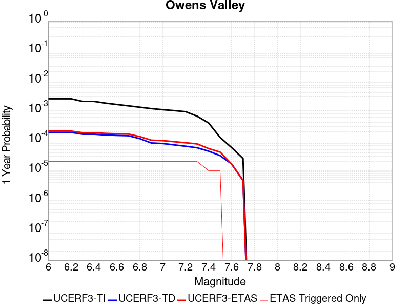 |  |

| Magnitude | 1 wk TI Prob | 1 wk TD Prob | 1 wk ETAS Prob | 1 wk ETAS/TD Gain | 1 wk ETAS Triggered Only | 1 mo TI Prob | 1 mo TD Prob | 1 mo ETAS Prob | 1 mo ETAS/TD Gain | 1 mo ETAS Triggered Only | 1 yr TI Prob | 1 yr TD Prob | 1 yr ETAS Prob | 1 yr ETAS/TD Gain | 1 yr ETAS Triggered Only | 10 yr TI Prob | 10 yr TD Prob | 10 yr ETAS Prob | 10 yr ETAS/TD Gain | 10 yr ETAS Triggered Only |
|-----|-----|-----|-----|-----|-----|-----|-----|-----|-----|-----|-----|-----|-----|-----|-----|-----|-----|-----|-----|-----|
| 6.0 | 4.83821E-5 | 3.6298834E-6 | 3.6298834E-6 | 1.0 | 0.0 | 2.0733538E-4 | 1.5556556E-5 | 1.5556556E-5 | 1.0 | 0.0 | 0.002521386 | 1.893856E-4 | 2.0938182E-4 | 1.1055846 | 2.0E-5 | 0.024929691 | 0.0019267192 | 0.0020265265 | 1.0518017 | 1.0E-4 |
| 6.1 | 4.83821E-5 | 3.6298834E-6 | 3.6298834E-6 | 1.0 | 0.0 | 2.0733538E-4 | 1.5556556E-5 | 1.5556556E-5 | 1.0 | 0.0 | 0.002521386 | 1.893856E-4 | 2.0938182E-4 | 1.1055846 | 2.0E-5 | 0.024929691 | 0.0019267192 | 0.0020265265 | 1.0518017 | 1.0E-4 |
| 6.2 | 4.83821E-5 | 3.6298834E-6 | 3.6298834E-6 | 1.0 | 0.0 | 2.0733538E-4 | 1.5556556E-5 | 1.5556556E-5 | 1.0 | 0.0 | 0.002521386 | 1.893856E-4 | 2.0938182E-4 | 1.1055846 | 2.0E-5 | 0.024929691 | 0.0019267192 | 0.0020265265 | 1.0518017 | 1.0E-4 |
| 6.3 | 3.953008E-5 | 3.1571942E-6 | 3.1571942E-6 | 1.0 | 0.0 | 1.6940363E-4 | 1.3530766E-5 | 1.3530766E-5 | 1.0 | 0.0 | 0.002060538 | 1.6472537E-4 | 1.8472207E-4 | 1.1213942 | 2.0E-5 | 0.020415364 | 0.0016601578 | 0.0017599917 | 1.0601352 | 1.0E-4 |
| 6.4 | 3.953008E-5 | 3.1571942E-6 | 3.1571942E-6 | 1.0 | 0.0 | 1.6940363E-4 | 1.3530766E-5 | 1.3530766E-5 | 1.0 | 0.0 | 0.002060538 | 1.6472537E-4 | 1.8472207E-4 | 1.1213942 | 2.0E-5 | 0.020415364 | 0.0016601578 | 0.0017599917 | 1.0601352 | 1.0E-4 |
| 6.5 | 3.457342E-5 | 2.9727623E-6 | 2.9727623E-6 | 1.0 | 0.0 | 1.4816338E-4 | 1.2740352E-5 | 1.2740352E-5 | 1.0 | 0.0 | 0.0018023965 | 1.5510344E-4 | 1.7510033E-4 | 1.1289262 | 2.0E-5 | 0.017878477 | 0.0015563503 | 0.0016561946 | 1.0641528 | 1.0E-4 |
| 6.6 | 3.1127765E-5 | 2.8753116E-6 | 2.8753116E-6 | 1.0 | 0.0 | 1.3339789E-4 | 1.232271E-5 | 1.232271E-5 | 1.0 | 0.0 | 0.0016229092 | 1.5001935E-4 | 1.7001636E-4 | 1.1332961 | 2.0E-5 | 0.016111081 | 0.0015016922 | 0.001601542 | 1.0664915 | 1.0E-4 |
| 6.7 | 2.806885E-5 | 2.8110242E-6 | 2.8110242E-6 | 1.0 | 0.0 | 1.2028952E-4 | 1.2047194E-5 | 1.2047194E-5 | 1.0 | 0.0 | 0.001463541 | 1.466654E-4 | 1.6666247E-4 | 1.1363448 | 2.0E-5 | 0.014539397 | 0.0014660707 | 0.001565924 | 1.0681095 | 1.0E-4 |
| 6.8 | 2.524524E-5 | 2.2358972E-6 | 2.2358972E-6 | 1.0 | 0.0 | 1.0818939E-4 | 9.582383E-6 | 9.582383E-6 | 1.0 | 0.0 | 0.0013164099 | 1.16659576E-4 | 1.3665724E-4 | 1.171419 | 2.0E-5 | 0.01308639 | 0.001166257 | 0.0012661404 | 1.0856444 | 1.0E-4 |
| 6.9 | 2.2704568E-5 | 1.6085578E-6 | 1.6085578E-6 | 1.0 | 0.0 | 9.730166E-5 | 6.893801E-6 | 6.893801E-6 | 1.0 | 0.0 | 0.0011840039 | 8.392881E-5 | 1.0392713E-4 | 1.2382772 | 2.0E-5 | 0.011777153 | 8.391837E-4 | 9.3909976E-4 | 1.1190634 | 1.0E-4 |
| 7.0 | 2.0871712E-5 | 1.5399135E-6 | 1.5399135E-6 | 1.0 | 0.0 | 8.944713E-5 | 6.5996123E-6 | 6.5996123E-6 | 1.0 | 0.0 | 0.0010884746 | 8.034734E-5 | 1.0034573E-4 | 1.2488992 | 2.0E-5 | 0.010831586 | 8.0335594E-4 | 9.0327556E-4 | 1.1243778 | 1.0E-4 |
| 7.1 | 1.944928E-5 | 1.3867325E-6 | 1.3867325E-6 | 1.0 | 0.0 | 8.335139E-5 | 5.943126E-6 | 5.943126E-6 | 1.0 | 0.0 | 0.0010143308 | 7.2355164E-5 | 9.2353715E-5 | 1.2763942 | 2.0E-5 | 0.010097133 | 7.23475E-4 | 8.2340266E-4 | 1.1381217 | 1.0E-4 |
| 7.2 | 1.7876306E-5 | 1.249191E-6 | 1.249191E-6 | 1.0 | 0.0 | 7.6610486E-5 | 5.3536646E-6 | 5.3536646E-6 | 1.0 | 0.0 | 9.3233347E-4 | 6.517892E-5 | 8.517762E-5 | 1.3068277 | 2.0E-5 | 0.009284316 | 6.517364E-4 | 7.5167126E-4 | 1.1533363 | 1.0E-4 |
| 7.3 | 1.2618672E-5 | 1.1117779E-6 | 1.1117779E-6 | 1.0 | 0.0 | 5.40789E-5 | 4.764754E-6 | 4.764754E-6 | 1.0 | 0.0 | 6.582117E-4 | 5.8009344E-5 | 7.800818E-5 | 1.3447521 | 2.0E-5 | 0.0065626553 | 5.800754E-4 | 6.700232E-4 | 1.1550622 | 9.0E-5 |
| 7.4 | 7.4874442E-6 | 8.550806E-7 | 8.550806E-7 | 1.0 | 0.0 | 3.208865E-5 | 3.6646259E-6 | 3.6646259E-6 | 1.0 | 0.0 | 3.906093E-4 | 4.461591E-5 | 5.4615466E-5 | 1.2241253 | 1.0E-5 | 0.003899234 | 4.461625E-4 | 5.261268E-4 | 1.1792269 | 8.0E-5 |
| 7.5 | 2.4734156E-6 | 6.0700546E-7 | 6.0700546E-7 | 1.0 | 0.0 | 1.060031E-5 | 2.6014495E-6 | 2.6014495E-6 | 1.0 | 0.0 | 1.2905113E-4 | 3.167219E-5 | 4.1671872E-5 | 1.3157244 | 1.0E-5 | 0.0012897621 | 3.166771E-4 | 3.9665174E-4 | 1.2525432 | 8.0E-5 |
| 7.6 | 1.1328841E-6 | 3.1972448E-7 | 3.1972448E-7 | 1.0 | 0.0 | 4.8552088E-6 | 1.3702471E-6 | 1.3702471E-6 | 1.0 | 0.0 | 5.9110564E-5 | 1.6682632E-5 | 1.6682632E-5 | 1.0 | 0.0 | 5.9094845E-4 | 1.6681399E-4 | 2.0680732E-4 | 1.239748 | 4.0E-5 |
| 7.7 | 4.8613185E-7 | 8.967469E-8 | 8.967469E-8 | 1.0 | 0.0 | 2.0834207E-6 | 3.8432006E-7 | 3.8432006E-7 | 1.0 | 0.0 | 2.536535E-5 | 4.6790874E-6 | 4.6790874E-6 | 1.0 | 0.0 | 2.5362454E-4 | 4.678996E-5 | 6.678902E-5 | 1.4274222 | 2.0E-5 |

## Independence rev 2011
*[(top)](#table-of-contents)*

| 1 Week | 1 Month | 1 Year | 10 Year |
|-----|-----|-----|-----|
|  | 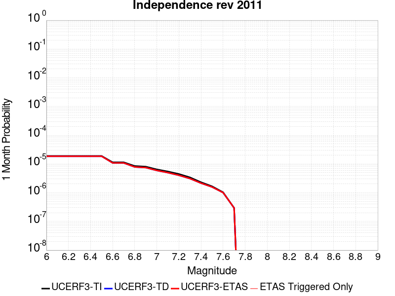 |  |  |

| Magnitude | 1 wk TI Prob | 1 wk TD Prob | 1 wk ETAS Prob | 1 wk ETAS/TD Gain | 1 wk ETAS Triggered Only | 1 mo TI Prob | 1 mo TD Prob | 1 mo ETAS Prob | 1 mo ETAS/TD Gain | 1 mo ETAS Triggered Only | 1 yr TI Prob | 1 yr TD Prob | 1 yr ETAS Prob | 1 yr ETAS/TD Gain | 1 yr ETAS Triggered Only | 10 yr TI Prob | 10 yr TD Prob | 10 yr ETAS Prob | 10 yr ETAS/TD Gain | 10 yr ETAS Triggered Only |
|-----|-----|-----|-----|-----|-----|-----|-----|-----|-----|-----|-----|-----|-----|-----|-----|-----|-----|-----|-----|-----|
| 6.0 | 4.422171E-6 | 4.3263003E-6 | 4.3263003E-6 | 1.0 | 0.0 | 1.8952025E-5 | 1.8541172E-5 | 1.8541172E-5 | 1.0 | 0.0 | 2.3071647E-4 | 2.2571837E-4 | 2.7570708E-4 | 1.221465 | 5.0E-5 | 0.0023047708 | 0.0022551846 | 0.0023449818 | 1.039818 | 9.0E-5 |
| 6.1 | 4.422171E-6 | 4.3263003E-6 | 4.3263003E-6 | 1.0 | 0.0 | 1.8952025E-5 | 1.8541172E-5 | 1.8541172E-5 | 1.0 | 0.0 | 2.3071647E-4 | 2.2571837E-4 | 2.7570708E-4 | 1.221465 | 5.0E-5 | 0.0023047708 | 0.0022551846 | 0.0023449818 | 1.039818 | 9.0E-5 |
| 6.2 | 4.422171E-6 | 4.3263003E-6 | 4.3263003E-6 | 1.0 | 0.0 | 1.8952025E-5 | 1.8541172E-5 | 1.8541172E-5 | 1.0 | 0.0 | 2.3071647E-4 | 2.2571837E-4 | 2.7570708E-4 | 1.221465 | 5.0E-5 | 0.0023047708 | 0.0022551846 | 0.0023449818 | 1.039818 | 9.0E-5 |
| 6.3 | 4.422171E-6 | 4.3263003E-6 | 4.3263003E-6 | 1.0 | 0.0 | 1.8952025E-5 | 1.8541172E-5 | 1.8541172E-5 | 1.0 | 0.0 | 2.3071647E-4 | 2.2571837E-4 | 2.7570708E-4 | 1.221465 | 5.0E-5 | 0.0023047708 | 0.0022551846 | 0.0023449818 | 1.039818 | 9.0E-5 |
| 6.4 | 4.422171E-6 | 4.3263003E-6 | 4.3263003E-6 | 1.0 | 0.0 | 1.8952025E-5 | 1.8541172E-5 | 1.8541172E-5 | 1.0 | 0.0 | 2.3071647E-4 | 2.2571837E-4 | 2.7570708E-4 | 1.221465 | 5.0E-5 | 0.0023047708 | 0.0022551846 | 0.0023449818 | 1.039818 | 9.0E-5 |
| 6.5 | 4.422171E-6 | 4.3263003E-6 | 4.3263003E-6 | 1.0 | 0.0 | 1.8952025E-5 | 1.8541172E-5 | 1.8541172E-5 | 1.0 | 0.0 | 2.3071647E-4 | 2.2571837E-4 | 2.7570708E-4 | 1.221465 | 5.0E-5 | 0.0023047708 | 0.0022551846 | 0.0023449818 | 1.039818 | 9.0E-5 |
| 6.6 | 2.663744E-6 | 2.53204E-6 | 2.53204E-6 | 1.0 | 0.0 | 1.1415996E-5 | 1.0851558E-5 | 1.0851558E-5 | 1.0 | 0.0 | 1.3898089E-4 | 1.3211019E-4 | 1.8210358E-4 | 1.3784219 | 5.0E-5 | 0.0013889399 | 0.0013203648 | 0.001410246 | 1.068073 | 9.0E-5 |
| 6.7 | 2.663744E-6 | 2.53204E-6 | 2.53204E-6 | 1.0 | 0.0 | 1.1415996E-5 | 1.0851558E-5 | 1.0851558E-5 | 1.0 | 0.0 | 1.3898089E-4 | 1.3211019E-4 | 1.8210358E-4 | 1.3784219 | 5.0E-5 | 0.0013889399 | 0.0013203648 | 0.001410246 | 1.068073 | 9.0E-5 |
| 6.8 | 1.9716529E-6 | 1.8323044E-6 | 1.8323044E-6 | 1.0 | 0.0 | 8.449913E-6 | 7.85271E-6 | 7.85271E-6 | 1.0 | 0.0 | 1.0287284E-4 | 9.5602685E-5 | 1.3559886E-4 | 1.4183583 | 4.0E-5 | 0.0010282523 | 9.5562846E-4 | 0.001035552 | 1.0836345 | 8.0E-5 |
| 6.9 | 1.8788617E-6 | 1.7430435E-6 | 1.7430435E-6 | 1.0 | 0.0 | 8.0522395E-6 | 7.470166E-6 | 7.470166E-6 | 1.0 | 0.0 | 9.80316E-5 | 9.09456E-5 | 1.3094196E-4 | 1.4397833 | 4.0E-5 | 9.798837E-4 | 9.090958E-4 | 9.890231E-4 | 1.0879195 | 8.0E-5 |
| 7.0 | 1.5045488E-6 | 1.384987E-6 | 1.384987E-6 | 1.0 | 0.0 | 6.44805E-6 | 5.9356453E-6 | 5.9356453E-6 | 1.0 | 0.0 | 7.8502184E-5 | 7.2264134E-5 | 1.12261245E-4 | 1.5534849 | 4.0E-5 | 7.8474457E-4 | 7.224115E-4 | 8.023537E-4 | 1.1106602 | 8.0E-5 |
| 7.1 | 1.272341E-6 | 1.1625416E-6 | 1.1625416E-6 | 1.0 | 0.0 | 5.4528787E-6 | 4.9823116E-6 | 4.9823116E-6 | 1.0 | 0.0 | 6.6386776E-5 | 6.065799E-5 | 9.065617E-5 | 1.4945462 | 3.0E-5 | 6.636695E-4 | 6.0641754E-4 | 6.6638115E-4 | 1.0988817 | 6.0E-5 |
| 7.2 | 1.0416892E-6 | 9.410155E-7 | 9.410155E-7 | 1.0 | 0.0 | 4.464375E-6 | 4.032918E-6 | 4.032918E-6 | 1.0 | 0.0 | 5.4352407E-5 | 4.9099683E-5 | 7.909821E-5 | 1.6109719 | 3.0E-5 | 5.4339116E-4 | 4.9089023E-4 | 5.408657E-4 | 1.1018058 | 5.0E-5 |
| 7.3 | 7.9450155E-7 | 7.2352077E-7 | 7.2352077E-7 | 1.0 | 0.0 | 3.4050022E-6 | 3.1007996E-6 | 3.1007996E-6 | 1.0 | 0.0 | 4.1455114E-5 | 3.7751593E-5 | 6.775046E-5 | 1.7946385 | 3.0E-5 | 4.144738E-4 | 3.774529E-4 | 4.2743405E-4 | 1.1324168 | 5.0E-5 |
| 7.4 | 5.3893444E-7 | 5.01964E-7 | 5.01964E-7 | 1.0 | 0.0 | 2.309717E-6 | 2.1512726E-6 | 2.1512726E-6 | 1.0 | 0.0 | 2.8120441E-5 | 2.6191434E-5 | 4.619091E-5 | 1.7635884 | 2.0E-5 | 2.8116882E-4 | 2.6188392E-4 | 3.0187346E-4 | 1.1526995 | 4.0E-5 |
| 7.5 | 3.8852085E-7 | 3.6826376E-7 | 3.6826376E-7 | 1.0 | 0.0 | 1.6650882E-6 | 1.5782723E-6 | 1.5782723E-6 | 1.0 | 0.0 | 2.027226E-5 | 1.9215298E-5 | 3.9214912E-5 | 2.0408173 | 2.0E-5 | 2.0270412E-4 | 1.9213658E-4 | 2.3212889E-4 | 1.2081453 | 4.0E-5 |
| 7.6 | 2.414929E-7 | 2.3457987E-7 | 2.3457987E-7 | 1.0 | 0.0 | 1.0349692E-6 | 1.0053419E-6 | 1.0053419E-6 | 1.0 | 0.0 | 1.2600677E-5 | 1.2239971E-5 | 3.2239725E-5 | 2.633971 | 2.0E-5 | 1.2599962E-4 | 1.2239309E-4 | 1.5238942E-4 | 1.2450819 | 3.0E-5 |
| 7.7 | 6.8298014E-8 | 6.8590616E-8 | 6.8590616E-8 | 1.0 | 0.0 | 2.9270575E-7 | 2.9395974E-7 | 2.9395974E-7 | 1.0 | 0.0 | 3.5636867E-6 | 3.5789546E-6 | 2.3578883E-5 | 6.588204 | 2.0E-5 | 3.5636294E-5 | 3.5789017E-5 | 5.5788303E-5 | 1.5588107 | 2.0E-5 |

## San Jacinto (Anza) rev
*[(top)](#table-of-contents)*

| 1 Week | 1 Month | 1 Year | 10 Year |
|-----|-----|-----|-----|
|  |  |  | 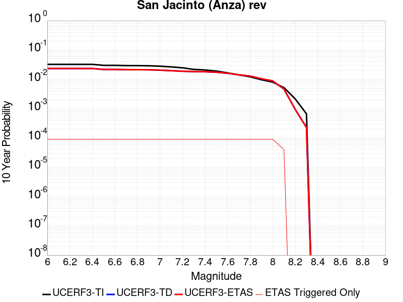 |

| Magnitude | 1 wk TI Prob | 1 wk TD Prob | 1 wk ETAS Prob | 1 wk ETAS/TD Gain | 1 wk ETAS Triggered Only | 1 mo TI Prob | 1 mo TD Prob | 1 mo ETAS Prob | 1 mo ETAS/TD Gain | 1 mo ETAS Triggered Only | 1 yr TI Prob | 1 yr TD Prob | 1 yr ETAS Prob | 1 yr ETAS/TD Gain | 1 yr ETAS Triggered Only | 10 yr TI Prob | 10 yr TD Prob | 10 yr ETAS Prob | 10 yr ETAS/TD Gain | 10 yr ETAS Triggered Only |
|-----|-----|-----|-----|-----|-----|-----|-----|-----|-----|-----|-----|-----|-----|-----|-----|-----|-----|-----|-----|-----|
| 6.0 | 6.3015636E-5 | 4.337693E-5 | 4.337693E-5 | 1.0 | 0.0 | 2.7003905E-4 | 1.8588796E-4 | 1.958861E-4 | 1.0537858 | 1.0E-5 | 0.0032827691 | 0.0022608489 | 0.0023007584 | 1.0176525 | 4.0E-5 | 0.032346968 | 0.023334619 | 0.023422519 | 1.0037669 | 9.0E-5 |
| 6.1 | 6.3015636E-5 | 4.337693E-5 | 4.337693E-5 | 1.0 | 0.0 | 2.7003905E-4 | 1.8588796E-4 | 1.958861E-4 | 1.0537858 | 1.0E-5 | 0.0032827691 | 0.0022608489 | 0.0023007584 | 1.0176525 | 4.0E-5 | 0.032346968 | 0.023334619 | 0.023422519 | 1.0037669 | 9.0E-5 |
| 6.2 | 6.3015636E-5 | 4.337693E-5 | 4.337693E-5 | 1.0 | 0.0 | 2.7003905E-4 | 1.8588796E-4 | 1.958861E-4 | 1.0537858 | 1.0E-5 | 0.0032827691 | 0.0022608489 | 0.0023007584 | 1.0176525 | 4.0E-5 | 0.032346968 | 0.023334619 | 0.023422519 | 1.0037669 | 9.0E-5 |
| 6.3 | 6.3015636E-5 | 4.337693E-5 | 4.337693E-5 | 1.0 | 0.0 | 2.7003905E-4 | 1.8588796E-4 | 1.958861E-4 | 1.0537858 | 1.0E-5 | 0.0032827691 | 0.0022608489 | 0.0023007584 | 1.0176525 | 4.0E-5 | 0.032346968 | 0.023334619 | 0.023422519 | 1.0037669 | 9.0E-5 |
| 6.4 | 6.3015636E-5 | 4.337693E-5 | 4.337693E-5 | 1.0 | 0.0 | 2.7003905E-4 | 1.8588796E-4 | 1.958861E-4 | 1.0537858 | 1.0E-5 | 0.0032827691 | 0.0022608489 | 0.0023007584 | 1.0176525 | 4.0E-5 | 0.032346968 | 0.023334619 | 0.023422519 | 1.0037669 | 9.0E-5 |
| 6.5 | 5.811017E-5 | 4.015336E-5 | 4.015336E-5 | 1.0 | 0.0 | 2.4901982E-4 | 1.7207452E-4 | 1.8207279E-4 | 1.0581044 | 1.0E-5 | 0.0030276014 | 0.0020929999 | 0.0021329161 | 1.0190713 | 4.0E-5 | 0.02986684 | 0.021630494 | 0.021718549 | 1.0040708 | 9.0E-5 |
| 6.6 | 5.811017E-5 | 4.015336E-5 | 4.015336E-5 | 1.0 | 0.0 | 2.4901982E-4 | 1.7207452E-4 | 1.8207279E-4 | 1.0581044 | 1.0E-5 | 0.0030276014 | 0.0020929999 | 0.0021329161 | 1.0190713 | 4.0E-5 | 0.02986684 | 0.021630494 | 0.021718549 | 1.0040708 | 9.0E-5 |
| 6.7 | 5.712442E-5 | 3.957534E-5 | 3.957534E-5 | 1.0 | 0.0 | 2.4479596E-4 | 1.6959761E-4 | 1.7959591E-4 | 1.058953 | 1.0E-5 | 0.0029763177 | 0.002062901 | 0.0021028183 | 1.0193502 | 4.0E-5 | 0.029367693 | 0.021321962 | 0.021410044 | 1.004131 | 9.0E-5 |
| 6.8 | 5.6967532E-5 | 3.9431634E-5 | 3.9431634E-5 | 1.0 | 0.0 | 2.4412372E-4 | 1.689818E-4 | 1.789801E-4 | 1.059168 | 1.0E-5 | 0.0029681553 | 0.0020554175 | 0.0020953354 | 1.0194207 | 4.0E-5 | 0.029288229 | 0.021246629 | 0.021334717 | 1.004146 | 9.0E-5 |
| 6.9 | 5.6211324E-5 | 3.9135975E-5 | 3.9135975E-5 | 1.0 | 0.0 | 2.4088343E-4 | 1.6771485E-4 | 1.7771318E-4 | 1.059615 | 1.0E-5 | 0.0029288116 | 0.0020400216 | 0.00207994 | 1.0195676 | 4.0E-5 | 0.028905109 | 0.021085827 | 0.02117393 | 1.0041783 | 9.0E-5 |
| 7.0 | 5.4383527E-5 | 3.7995007E-5 | 3.7995007E-5 | 1.0 | 0.0 | 2.3305144E-4 | 1.6282561E-4 | 1.7282399E-4 | 1.0614054 | 1.0E-5 | 0.0028337094 | 0.0019806041 | 0.002020525 | 1.0201559 | 4.0E-5 | 0.027978465 | 0.020476038 | 0.020564195 | 1.0043054 | 9.0E-5 |
| 7.1 | 5.1393665E-5 | 3.6455618E-5 | 3.6455618E-5 | 1.0 | 0.0 | 2.2023996E-4 | 1.5622903E-4 | 1.6622747E-4 | 1.0639986 | 1.0E-5 | 0.0026781242 | 0.0019004333 | 0.0019403573 | 1.0210078 | 4.0E-5 | 0.026460782 | 0.019648531 | 0.019736763 | 1.0044905 | 9.0E-5 |
| 7.2 | 4.785222E-5 | 3.480494E-5 | 3.480494E-5 | 1.0 | 0.0 | 2.0506482E-4 | 1.4915552E-4 | 1.5915402E-4 | 1.0670341 | 1.0E-5 | 0.0024938055 | 0.0018144595 | 0.0018543869 | 1.0220051 | 4.0E-5 | 0.024660049 | 0.018761909 | 0.01885022 | 1.004707 | 9.0E-5 |
| 7.3 | 4.2143256E-5 | 3.389763E-5 | 3.389763E-5 | 1.0 | 0.0 | 1.8060145E-4 | 1.4526749E-4 | 1.5526604E-4 | 1.0688286 | 1.0E-5 | 0.002196605 | 0.0017672004 | 0.0018071297 | 1.0225947 | 4.0E-5 | 0.02175019 | 0.018269178 | 0.018357532 | 1.0048363 | 9.0E-5 |
| 7.4 | 4.0264713E-5 | 3.3535252E-5 | 3.3535252E-5 | 1.0 | 0.0 | 1.7255165E-4 | 1.4371461E-4 | 1.5371318E-4 | 1.0695723 | 1.0E-5 | 0.002098792 | 0.0017483246 | 0.0017882546 | 1.0228391 | 4.0E-5 | 0.020790804 | 0.018073453 | 0.018161828 | 1.0048897 | 9.0E-5 |
| 7.5 | 3.694492E-5 | 3.2247204E-5 | 3.2247204E-5 | 1.0 | 0.0 | 1.5832575E-4 | 1.38195E-4 | 1.481936E-4 | 1.0723516 | 1.0E-5 | 0.0019259118 | 0.0016812286 | 0.0017211614 | 1.0237521 | 4.0E-5 | 0.01909306 | 0.017388845 | 0.01747728 | 1.0050857 | 9.0E-5 |
| 7.6 | 3.200565E-5 | 2.9555436E-5 | 2.9555436E-5 | 1.0 | 0.0 | 1.3715986E-4 | 1.2666002E-4 | 1.3665875E-4 | 1.0789415 | 1.0E-5 | 0.001668642 | 0.0015409971 | 0.0015809354 | 1.0259172 | 4.0E-5 | 0.01656168 | 0.015973015 | 0.016061576 | 1.0055445 | 9.0E-5 |
| 7.7 | 2.731642E-5 | 2.6142696E-5 | 2.6142696E-5 | 1.0 | 0.0 | 1.1706512E-4 | 1.1203532E-4 | 1.220342E-4 | 1.0892476 | 1.0E-5 | 0.001424336 | 0.0013631776 | 0.001403123 | 1.0293032 | 4.0E-5 | 0.014152412 | 0.01419303 | 0.0142817525 | 1.0062511 | 9.0E-5 |
| 7.8 | 2.3466424E-5 | 2.3552704E-5 | 2.3552704E-5 | 1.0 | 0.0 | 1.0056651E-4 | 1.0093625E-4 | 1.10935245E-4 | 1.0990624 | 1.0E-5 | 0.0012237094 | 0.0012282069 | 0.0012681579 | 1.0325278 | 4.0E-5 | 0.012169928 | 0.012833906 | 0.012922752 | 1.0069227 | 9.0E-5 |
| 7.9 | 1.8611925E-5 | 1.8951272E-5 | 1.8951272E-5 | 1.0 | 0.0 | 7.9762955E-5 | 8.1217215E-5 | 9.1216396E-5 | 1.1231166 | 1.0E-5 | 9.7068126E-4 | 9.883717E-4 | 0.0010283322 | 1.0404305 | 4.0E-5 | 0.0096645225 | 0.010416457 | 0.01050552 | 1.0085502 | 9.0E-5 |
| 8.0 | 1.5460775E-5 | 1.5779307E-5 | 1.5779307E-5 | 1.0 | 0.0 | 6.6258784E-5 | 6.762385E-5 | 7.7623175E-5 | 1.1478668 | 1.0E-5 | 8.0640207E-4 | 8.2301005E-4 | 8.629772E-4 | 1.048562 | 4.0E-5 | 0.008034821 | 0.008723064 | 0.0088122785 | 1.0102274 | 9.0E-5 |
| 8.1 | 9.983884E-6 | 8.292369E-6 | 8.292369E-6 | 1.0 | 0.0 | 4.2787375E-5 | 3.5538244E-5 | 3.5538244E-5 | 1.0 | 0.0 | 5.2081177E-4 | 4.3259273E-4 | 4.525841E-4 | 1.0462129 | 2.0E-5 | 0.0051959283 | 0.00465207 | 0.004691884 | 1.0085583 | 4.0E-5 |
| 8.2 | 4.1226E-6 | 1.5595413E-6 | 1.5595413E-6 | 1.0 | 0.0 | 1.7668166E-5 | 6.683731E-6 | 6.683731E-6 | 1.0 | 0.0 | 2.1508869E-4 | 8.137142E-5 | 8.137142E-5 | 1.0 | 0.0 | 0.0021488064 | 9.4425044E-4 | 9.4425044E-4 | 1.0 | 0.0 |
| 8.3 | 1.2750878E-6 | 3.6301523E-7 | 3.6301523E-7 | 1.0 | 0.0 | 5.4646503E-6 | 1.5557786E-6 | 1.5557786E-6 | 1.0 | 0.0 | 6.653009E-5 | 1.8941444E-5 | 1.8941444E-5 | 1.0 | 0.0 | 6.6510175E-4 | 2.2840123E-4 | 2.2840123E-4 | 1.0 | 0.0 |

## White Mountains
*[(top)](#table-of-contents)*

| 1 Week | 1 Month | 1 Year | 10 Year |
|-----|-----|-----|-----|
|  |  |  |  |

| Magnitude | 1 wk TI Prob | 1 wk TD Prob | 1 wk ETAS Prob | 1 wk ETAS/TD Gain | 1 wk ETAS Triggered Only | 1 mo TI Prob | 1 mo TD Prob | 1 mo ETAS Prob | 1 mo ETAS/TD Gain | 1 mo ETAS Triggered Only | 1 yr TI Prob | 1 yr TD Prob | 1 yr ETAS Prob | 1 yr ETAS/TD Gain | 1 yr ETAS Triggered Only | 10 yr TI Prob | 10 yr TD Prob | 10 yr ETAS Prob | 10 yr ETAS/TD Gain | 10 yr ETAS Triggered Only |
|-----|-----|-----|-----|-----|-----|-----|-----|-----|-----|-----|-----|-----|-----|-----|-----|-----|-----|-----|-----|-----|
| 6.0 | 3.503579E-5 | 3.378569E-5 | 3.378569E-5 | 1.0 | 0.0 | 1.5014476E-4 | 1.4478847E-4 | 1.4478847E-4 | 1.0 | 0.0 | 0.0018264796 | 0.001761495 | 0.0017814598 | 1.011334 | 2.0E-5 | 0.018115403 | 0.017487662 | 0.017566262 | 1.0044947 | 8.0E-5 |
| 6.1 | 3.503579E-5 | 3.378569E-5 | 3.378569E-5 | 1.0 | 0.0 | 1.5014476E-4 | 1.4478847E-4 | 1.4478847E-4 | 1.0 | 0.0 | 0.0018264796 | 0.001761495 | 0.0017814598 | 1.011334 | 2.0E-5 | 0.018115403 | 0.017487662 | 0.017566262 | 1.0044947 | 8.0E-5 |
| 6.2 | 3.503579E-5 | 3.378569E-5 | 3.378569E-5 | 1.0 | 0.0 | 1.5014476E-4 | 1.4478847E-4 | 1.4478847E-4 | 1.0 | 0.0 | 0.0018264796 | 0.001761495 | 0.0017814598 | 1.011334 | 2.0E-5 | 0.018115403 | 0.017487662 | 0.017566262 | 1.0044947 | 8.0E-5 |
| 6.3 | 1.7818425E-5 | 1.5916867E-5 | 1.5916867E-5 | 1.0 | 0.0 | 7.636245E-5 | 6.821344E-5 | 6.821344E-5 | 1.0 | 0.0 | 9.293162E-4 | 8.301964E-4 | 8.301964E-4 | 1.0 | 0.0 | 0.009254395 | 0.0082724085 | 0.008321995 | 1.0059942 | 5.0E-5 |
| 6.4 | 1.7818425E-5 | 1.5916867E-5 | 1.5916867E-5 | 1.0 | 0.0 | 7.636245E-5 | 6.821344E-5 | 6.821344E-5 | 1.0 | 0.0 | 9.293162E-4 | 8.301964E-4 | 8.301964E-4 | 1.0 | 0.0 | 0.009254395 | 0.0082724085 | 0.008321995 | 1.0059942 | 5.0E-5 |
| 6.5 | 1.3397557E-5 | 1.1336862E-5 | 1.1336862E-5 | 1.0 | 0.0 | 5.741684E-5 | 4.8585687E-5 | 4.8585687E-5 | 1.0 | 0.0 | 6.988258E-4 | 5.9137715E-4 | 5.9137715E-4 | 1.0 | 0.0 | 0.006966323 | 0.00589874 | 0.005948445 | 1.0084264 | 5.0E-5 |
| 6.6 | 1.0818695E-5 | 8.625775E-6 | 8.625775E-6 | 1.0 | 0.0 | 4.6365014E-5 | 3.696711E-5 | 3.696711E-5 | 1.0 | 0.0 | 5.6434784E-4 | 4.4998596E-4 | 4.4998596E-4 | 1.0 | 0.0 | 0.005629168 | 0.004491185 | 0.00452105 | 1.0066497 | 3.0E-5 |
| 6.7 | 9.067908E-6 | 6.8027375E-6 | 6.8027375E-6 | 1.0 | 0.0 | 3.8861883E-5 | 2.9154282E-5 | 2.9154282E-5 | 1.0 | 0.0 | 4.7304068E-4 | 3.5489874E-4 | 3.5489874E-4 | 1.0 | 0.0 | 0.00472035 | 0.003543637 | 0.0035635661 | 1.0056239 | 2.0E-5 |
| 6.8 | 7.295947E-6 | 4.9365945E-6 | 4.9365945E-6 | 1.0 | 0.0 | 3.126797E-5 | 2.1156668E-5 | 2.1156668E-5 | 1.0 | 0.0 | 3.8062103E-4 | 2.5755313E-4 | 2.5755313E-4 | 1.0 | 0.0 | 0.0037996976 | 0.0025726592 | 0.0025726592 | 1.0 | 0.0 |
| 6.9 | 6.2243444E-6 | 3.83238E-6 | 3.83238E-6 | 1.0 | 0.0 | 2.6675489E-5 | 1.6424385E-5 | 1.6424385E-5 | 1.0 | 0.0 | 3.2472567E-4 | 1.9994906E-4 | 1.9994906E-4 | 1.0 | 0.0 | 0.0032425157 | 0.0019977444 | 0.0019977444 | 1.0 | 0.0 |
| 7.0 | 4.9878413E-6 | 2.6796765E-6 | 2.6796765E-6 | 1.0 | 0.0 | 2.1376287E-5 | 1.1484279E-5 | 1.1484279E-5 | 1.0 | 0.0 | 2.602252E-4 | 1.3981239E-4 | 1.3981239E-4 | 1.0 | 0.0 | 0.002599207 | 0.0013972705 | 0.0013972705 | 1.0 | 0.0 |
| 7.1 | 4.0252844E-6 | 1.8858877E-6 | 1.8858877E-6 | 1.0 | 0.0 | 1.7251105E-5 | 8.082352E-6 | 8.082352E-6 | 1.0 | 0.0 | 2.1001195E-4 | 9.839832E-5 | 9.839832E-5 | 1.0 | 0.0 | 0.0020981359 | 9.835603E-4 | 9.835603E-4 | 1.0 | 0.0 |
| 7.2 | 3.3284066E-6 | 1.2820851E-6 | 1.2820851E-6 | 1.0 | 0.0 | 1.4264522E-5 | 5.49464E-6 | 5.49464E-6 | 1.0 | 0.0 | 1.736567E-4 | 6.6895285E-5 | 6.6895285E-5 | 1.0 | 0.0 | 0.0017352107 | 6.6876155E-4 | 6.6876155E-4 | 1.0 | 0.0 |
| 7.3 | 2.458226E-6 | 6.058311E-7 | 6.058311E-7 | 1.0 | 0.0 | 1.0535211E-5 | 2.5964166E-6 | 2.5964166E-6 | 1.0 | 0.0 | 1.2825865E-4 | 3.161095E-5 | 3.161095E-5 | 1.0 | 0.0 | 0.0012818464 | 3.160683E-4 | 3.160683E-4 | 1.0 | 0.0 |
| 7.4 | 1.965953E-6 | 3.1098764E-7 | 3.1098764E-7 | 1.0 | 0.0 | 8.425486E-6 | 1.3328034E-6 | 1.3328034E-6 | 1.0 | 0.0 | 1.0257547E-4 | 1.6226762E-5 | 1.6226762E-5 | 1.0 | 0.0 | 0.0010252813 | 1.622559E-4 | 1.622559E-4 | 1.0 | 0.0 |
| 7.5 | 1.2014192E-6 | 1.8250802E-7 | 1.8250802E-7 | 1.0 | 0.0 | 5.148929E-6 | 7.82177E-7 | 7.82177E-7 | 1.0 | 0.0 | 6.2686406E-5 | 9.522963E-6 | 9.522963E-6 | 1.0 | 0.0 | 6.266873E-4 | 9.522564E-5 | 9.522564E-5 | 1.0 | 0.0 |
| 7.6 | 2.5612175E-7 | 4.8963752E-8 | 4.8963752E-8 | 1.0 | 0.0 | 1.0976642E-6 | 2.0984464E-7 | 2.0984464E-7 | 1.0 | 0.0 | 1.3363979E-5 | 2.5548559E-6 | 2.5548559E-6 | 1.0 | 0.0 | 1.3363175E-4 | 2.5548301E-5 | 2.5548301E-5 | 1.0 | 0.0 |

## Santa Ynez (West)
*[(top)](#table-of-contents)*

| 1 Week | 1 Month | 1 Year | 10 Year |
|-----|-----|-----|-----|
|  |  | 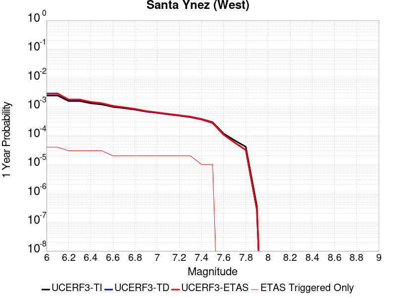 |  |

| Magnitude | 1 wk TI Prob | 1 wk TD Prob | 1 wk ETAS Prob | 1 wk ETAS/TD Gain | 1 wk ETAS Triggered Only | 1 mo TI Prob | 1 mo TD Prob | 1 mo ETAS Prob | 1 mo ETAS/TD Gain | 1 mo ETAS Triggered Only | 1 yr TI Prob | 1 yr TD Prob | 1 yr ETAS Prob | 1 yr ETAS/TD Gain | 1 yr ETAS Triggered Only | 10 yr TI Prob | 10 yr TD Prob | 10 yr ETAS Prob | 10 yr ETAS/TD Gain | 10 yr ETAS Triggered Only |
|-----|-----|-----|-----|-----|-----|-----|-----|-----|-----|-----|-----|-----|-----|-----|-----|-----|-----|-----|-----|-----|
| 6.0 | 4.7352758E-5 | 5.4977594E-5 | 5.4977594E-5 | 1.0 | 0.0 | 2.0292461E-4 | 2.3559865E-4 | 2.4559628E-4 | 1.042435 | 1.0E-5 | 0.0024678076 | 0.0028648009 | 0.0029046861 | 1.0139226 | 4.0E-5 | 0.024405818 | 0.028307132 | 0.02837515 | 1.0024029 | 7.0E-5 |
| 6.1 | 4.7352758E-5 | 5.4977594E-5 | 5.4977594E-5 | 1.0 | 0.0 | 2.0292461E-4 | 2.3559865E-4 | 2.4559628E-4 | 1.042435 | 1.0E-5 | 0.0024678076 | 0.0028648009 | 0.0029046861 | 1.0139226 | 4.0E-5 | 0.024405818 | 0.028307132 | 0.02837515 | 1.0024029 | 7.0E-5 |
| 6.2 | 3.0415853E-5 | 3.3927812E-5 | 3.3927812E-5 | 1.0 | 0.0 | 1.3034715E-4 | 1.4539702E-4 | 1.5539557E-4 | 1.0687672 | 1.0E-5 | 0.0015858212 | 0.0017688064 | 0.0017987534 | 1.0169306 | 3.0E-5 | 0.015745522 | 0.017551184 | 0.01761013 | 1.0033586 | 6.0E-5 |
| 6.3 | 3.0415853E-5 | 3.3927812E-5 | 3.3927812E-5 | 1.0 | 0.0 | 1.3034715E-4 | 1.4539702E-4 | 1.5539557E-4 | 1.0687672 | 1.0E-5 | 0.0015858212 | 0.0017688064 | 0.0017987534 | 1.0169306 | 3.0E-5 | 0.015745522 | 0.017551184 | 0.01761013 | 1.0033586 | 6.0E-5 |
| 6.4 | 2.5452082E-5 | 2.7914437E-5 | 2.7914437E-5 | 1.0 | 0.0 | 1.09075794E-4 | 1.1962793E-4 | 1.2962673E-4 | 1.0835825 | 1.0E-5 | 0.0013271887 | 0.0014555135 | 0.0014854699 | 1.0205812 | 3.0E-5 | 0.013192902 | 0.014461986 | 0.014521117 | 1.0040888 | 6.0E-5 |
| 6.5 | 2.3143784E-5 | 2.5129964E-5 | 2.5129964E-5 | 1.0 | 0.0 | 9.9183875E-5 | 1.0769549E-4 | 1.17694406E-4 | 1.0928444 | 1.0E-5 | 0.0012068948 | 0.0013104154 | 0.0013403761 | 1.0228635 | 3.0E-5 | 0.012003611 | 0.013028558 | 0.0130877765 | 1.0045452 | 6.0E-5 |
| 6.6 | 1.9118515E-5 | 2.0355572E-5 | 2.0355572E-5 | 1.0 | 0.0 | 8.193392E-5 | 8.72353E-5 | 9.723442E-5 | 1.1146225 | 1.0E-5 | 9.97089E-4 | 0.0010615803 | 0.001081559 | 1.0188198 | 2.0E-5 | 0.00992627 | 0.010566001 | 0.010605578 | 1.0037457 | 4.0E-5 |
| 6.7 | 1.722807E-5 | 1.814738E-5 | 1.814738E-5 | 1.0 | 0.0 | 7.3832496E-5 | 7.77722E-5 | 8.777143E-5 | 1.1285707 | 1.0E-5 | 8.985399E-4 | 9.464708E-4 | 9.664519E-4 | 1.0211111 | 2.0E-5 | 0.008949154 | 0.009425044 | 0.009464667 | 1.004204 | 4.0E-5 |
| 6.8 | 1.5317364E-5 | 1.5927328E-5 | 1.5927328E-5 | 1.0 | 0.0 | 6.56442E-5 | 6.825821E-5 | 7.825753E-5 | 1.1464925 | 1.0E-5 | 7.98925E-4 | 8.307311E-4 | 8.507145E-4 | 1.0240551 | 2.0E-5 | 0.007960589 | 0.008276746 | 0.008316414 | 1.0047928 | 4.0E-5 |
| 6.9 | 1.3071226E-5 | 1.3330249E-5 | 1.3330249E-5 | 1.0 | 0.0 | 5.6018336E-5 | 5.71284E-5 | 6.712783E-5 | 1.1750343 | 1.0E-5 | 6.8180985E-4 | 6.9531857E-4 | 7.153047E-4 | 1.0287437 | 2.0E-5 | 0.0067972173 | 0.006931691 | 0.0069714137 | 1.0057306 | 4.0E-5 |
| 7.0 | 1.1836986E-5 | 1.1933308E-5 | 1.1933308E-5 | 1.0 | 0.0 | 5.0728955E-5 | 5.1141757E-5 | 6.114125E-5 | 1.1955249 | 1.0E-5 | 6.1745E-4 | 6.224747E-4 | 6.424622E-4 | 1.0321099 | 2.0E-5 | 0.006157372 | 0.0062075043 | 0.006247256 | 1.0064038 | 4.0E-5 |
| 7.1 | 1.0597169E-5 | 1.0542637E-5 | 1.0542637E-5 | 1.0 | 0.0 | 4.541565E-5 | 4.5181954E-5 | 5.5181503E-5 | 1.2213173 | 1.0E-5 | 5.5279525E-4 | 5.499526E-4 | 5.699416E-4 | 1.0363468 | 2.0E-5 | 0.0055142213 | 0.0054860474 | 0.0055158827 | 1.0054384 | 3.0E-5 |
| 7.2 | 9.59113E-6 | 9.459535E-6 | 9.459535E-6 | 1.0 | 0.0 | 4.11042E-5 | 4.0540242E-5 | 5.053984E-5 | 1.2466584 | 1.0E-5 | 5.0032866E-4 | 4.9346674E-4 | 5.134569E-4 | 1.0405096 | 2.0E-5 | 0.004992037 | 0.0049238284 | 0.004953681 | 1.0060629 | 3.0E-5 |
| 7.3 | 8.586084E-6 | 8.379932E-6 | 8.379932E-6 | 1.0 | 0.0 | 3.679698E-5 | 3.5913505E-5 | 4.5913148E-5 | 1.2784368 | 1.0E-5 | 4.4791115E-4 | 4.3716026E-4 | 4.571515E-4 | 1.0457298 | 2.0E-5 | 0.004470094 | 0.004363114 | 0.0043929834 | 1.0068458 | 3.0E-5 |
| 7.4 | 7.2622997E-6 | 6.95183E-6 | 6.95183E-6 | 1.0 | 0.0 | 3.112377E-5 | 2.9793222E-5 | 3.9792925E-5 | 1.3356369 | 1.0E-5 | 3.78866E-4 | 3.6267308E-4 | 3.7266946E-4 | 1.0275631 | 1.0E-5 | 0.0037822074 | 0.0036209123 | 0.0036408398 | 1.0055034 | 2.0E-5 |
| 7.5 | 5.627296E-6 | 5.251797E-6 | 5.251797E-6 | 1.0 | 0.0 | 2.411676E-5 | 2.2507513E-5 | 3.2507287E-5 | 1.4442861 | 1.0E-5 | 2.9358198E-4 | 2.7399522E-4 | 2.8399247E-4 | 1.036487 | 1.0E-5 | 0.0029319443 | 0.002736646 | 0.0027565912 | 1.0072882 | 2.0E-5 |
| 7.6 | 2.265244E-6 | 2.0609314E-6 | 2.0609314E-6 | 1.0 | 0.0 | 9.708152E-6 | 8.832533E-6 | 8.832533E-6 | 1.0 | 0.0 | 1.18190335E-4 | 1.07530876E-4 | 1.07530876E-4 | 1.0 | 0.0 | 0.001181275 | 0.001074797 | 0.0010847863 | 1.009294 | 1.0E-5 |
| 7.7 | 1.3099874E-6 | 1.1016656E-6 | 1.1016656E-6 | 1.0 | 0.0 | 5.61422E-6 | 4.7214157E-6 | 4.7214157E-6 | 1.0 | 0.0 | 6.8350986E-5 | 5.7481746E-5 | 5.7481746E-5 | 1.0 | 0.0 | 6.832996E-4 | 5.7467114E-4 | 5.7467114E-4 | 1.0 | 0.0 |
| 7.8 | 7.903951E-7 | 6.071338E-7 | 6.071338E-7 | 1.0 | 0.0 | 3.3874032E-6 | 2.6019995E-6 | 2.6019995E-6 | 1.0 | 0.0 | 4.1240855E-5 | 3.1678897E-5 | 3.1678897E-5 | 1.0 | 0.0 | 4.12332E-4 | 3.1674514E-4 | 3.1674514E-4 | 1.0 | 0.0 |
| 7.9 | 7.0753297E-9 | 5.0900715E-9 | 5.0900715E-9 | 1.0 | 0.0 | 3.032284E-8 | 2.1814591E-8 | 2.1814591E-8 | 1.0 | 0.0 | 3.6918053E-7 | 2.6559263E-7 | 2.6559263E-7 | 1.0 | 0.0 | 3.691799E-6 | 2.655924E-6 | 2.655924E-6 | 1.0 | 0.0 |

## San Andreas (Coachella) rev
*[(top)](#table-of-contents)*

| 1 Week | 1 Month | 1 Year | 10 Year |
|-----|-----|-----|-----|
|  |  |  |  |

| Magnitude | 1 wk TI Prob | 1 wk TD Prob | 1 wk ETAS Prob | 1 wk ETAS/TD Gain | 1 wk ETAS Triggered Only | 1 mo TI Prob | 1 mo TD Prob | 1 mo ETAS Prob | 1 mo ETAS/TD Gain | 1 mo ETAS Triggered Only | 1 yr TI Prob | 1 yr TD Prob | 1 yr ETAS Prob | 1 yr ETAS/TD Gain | 1 yr ETAS Triggered Only | 10 yr TI Prob | 10 yr TD Prob | 10 yr ETAS Prob | 10 yr ETAS/TD Gain | 10 yr ETAS Triggered Only |
|-----|-----|-----|-----|-----|-----|-----|-----|-----|-----|-----|-----|-----|-----|-----|-----|-----|-----|-----|-----|-----|
| 6.0 | 1.1925945E-4 | 3.2747045E-4 | 3.2747045E-4 | 1.0 | 0.0 | 5.110118E-4 | 0.0014026947 | 0.0014026947 | 1.0 | 0.0 | 0.0062038354 | 0.016945418 | 0.016994571 | 1.0029006 | 5.0E-5 | 0.060334753 | 0.15272202 | 0.1527898 | 1.0004438 | 8.0E-5 |
| 6.1 | 1.1925945E-4 | 3.2747045E-4 | 3.2747045E-4 | 1.0 | 0.0 | 5.110118E-4 | 0.0014026947 | 0.0014026947 | 1.0 | 0.0 | 0.0062038354 | 0.016945418 | 0.016994571 | 1.0029006 | 5.0E-5 | 0.060334753 | 0.15272202 | 0.1527898 | 1.0004438 | 8.0E-5 |
| 6.2 | 1.07432395E-4 | 3.0247675E-4 | 3.0247675E-4 | 1.0 | 0.0 | 4.603433E-4 | 0.0012956889 | 0.0012956889 | 1.0 | 0.0 | 0.005590286 | 0.015662009 | 0.015701383 | 1.002514 | 4.0E-5 | 0.05451731 | 0.14189328 | 0.14195335 | 1.0004233 | 7.0E-5 |
| 6.3 | 1.0718766E-4 | 3.019298E-4 | 3.019298E-4 | 1.0 | 0.0 | 4.592948E-4 | 0.0012933471 | 0.0012933471 | 1.0 | 0.0 | 0.005577586 | 0.015633909 | 0.015673283 | 1.0025185 | 4.0E-5 | 0.054396555 | 0.14166155 | 0.14172164 | 1.0004241 | 7.0E-5 |
| 6.4 | 1.0355944E-4 | 2.9401045E-4 | 2.9401045E-4 | 1.0 | 0.0 | 4.4375064E-4 | 0.0012594402 | 0.0012594402 | 1.0 | 0.0 | 0.0053892885 | 0.015226932 | 0.015266323 | 1.002587 | 4.0E-5 | 0.052604496 | 0.13822177 | 0.13828209 | 1.0004364 | 7.0E-5 |
| 6.5 | 1.0227914E-4 | 2.912047E-4 | 2.912047E-4 | 1.0 | 0.0 | 4.382655E-4 | 0.0012474272 | 0.0012474272 | 1.0 | 0.0 | 0.0053228354 | 0.015082708 | 0.015122104 | 1.002612 | 4.0E-5 | 0.051971316 | 0.13700101 | 0.13706142 | 1.000441 | 7.0E-5 |
| 6.6 | 1.0116757E-4 | 2.8886212E-4 | 2.8886212E-4 | 1.0 | 0.0 | 4.3350324E-4 | 0.0012373971 | 0.0012373971 | 1.0 | 0.0 | 0.0052651367 | 0.0149622755 | 0.015001677 | 1.0026333 | 4.0E-5 | 0.051421247 | 0.13597922 | 0.1360397 | 1.0004448 | 7.0E-5 |
| 6.7 | 1.0050676E-4 | 2.874477E-4 | 2.874477E-4 | 1.0 | 0.0 | 4.3067214E-4 | 0.001231341 | 0.001231341 | 1.0 | 0.0 | 0.005230834 | 0.014889553 | 0.014928957 | 1.0026464 | 4.0E-5 | 0.051094085 | 0.13536398 | 0.1354245 | 1.0004472 | 7.0E-5 |
| 6.8 | 9.976819E-5 | 2.8548407E-4 | 2.8548407E-4 | 1.0 | 0.0 | 4.2750788E-4 | 0.0012229334 | 0.0012229334 | 1.0 | 0.0 | 0.0051924936 | 0.014788584 | 0.014827993 | 1.0026648 | 4.0E-5 | 0.050728295 | 0.13451566 | 0.13457625 | 1.0004504 | 7.0E-5 |
| 6.9 | 9.77719E-5 | 2.80452E-4 | 2.80452E-4 | 1.0 | 0.0 | 4.1895514E-4 | 0.0012013874 | 0.0012013874 | 1.0 | 0.0 | 0.0050888555 | 0.01452979 | 0.014569208 | 1.002713 | 4.0E-5 | 0.049738888 | 0.13234389 | 0.13240463 | 1.000459 | 7.0E-5 |
| 7.0 | 8.500761E-5 | 2.4778847E-4 | 2.4778847E-4 | 1.0 | 0.0 | 3.6426744E-4 | 0.0010615216 | 0.0010615216 | 1.0 | 0.0 | 0.0044259406 | 0.012848215 | 0.01287783 | 1.0023049 | 3.0E-5 | 0.04338823 | 0.11819933 | 0.11825224 | 1.0004476 | 6.0E-5 |
| 7.1 | 8.319876E-5 | 2.4381404E-4 | 2.4381404E-4 | 1.0 | 0.0 | 3.5651738E-4 | 0.0010445021 | 0.0010445021 | 1.0 | 0.0 | 0.004331963 | 0.012643427 | 0.012673047 | 1.0023428 | 3.0E-5 | 0.042484846 | 0.11641899 | 0.116472006 | 1.0004554 | 6.0E-5 |
| 7.2 | 7.563917E-5 | 2.2429357E-4 | 2.2429357E-4 | 1.0 | 0.0 | 3.2412758E-4 | 9.609071E-4 | 9.609071E-4 | 1.0 | 0.0 | 0.0039391145 | 0.011636979 | 0.011666629 | 1.002548 | 3.0E-5 | 0.03870018 | 0.107823946 | 0.10787748 | 1.0004965 | 6.0E-5 |
| 7.3 | 7.082985E-5 | 2.074492E-4 | 2.074492E-4 | 1.0 | 0.0 | 3.0352117E-4 | 8.8876794E-4 | 8.8876794E-4 | 1.0 | 0.0 | 0.0036891096 | 0.010767689 | 0.010797366 | 1.0027561 | 3.0E-5 | 0.03628465 | 0.10034482 | 0.1003988 | 1.000538 | 6.0E-5 |
| 7.4 | 5.146215E-5 | 1.428607E-4 | 1.428607E-4 | 1.0 | 0.0 | 2.2053342E-4 | 6.121174E-4 | 6.121174E-4 | 1.0 | 0.0 | 0.0026816884 | 0.0074272524 | 0.0074371784 | 1.0013363 | 1.0E-5 | 0.02649557 | 0.07090313 | 0.07091242 | 1.000131 | 1.0E-5 |
| 7.5 | 4.0285166E-5 | 1.0952253E-4 | 1.0952253E-4 | 1.0 | 0.0 | 1.7263928E-4 | 4.6929816E-4 | 4.6929816E-4 | 1.0 | 0.0 | 0.002099857 | 0.0056988057 | 0.0057087485 | 1.0017447 | 1.0E-5 | 0.020801254 | 0.05505857 | 0.05506802 | 1.0001717 | 1.0E-5 |
| 7.6 | 3.1168736E-5 | 8.4483814E-5 | 8.4483814E-5 | 1.0 | 0.0 | 1.3357346E-4 | 3.6202336E-4 | 3.6202336E-4 | 1.0 | 0.0 | 0.0016250437 | 0.0043987534 | 0.0044087092 | 1.0022634 | 1.0E-5 | 0.016132116 | 0.04285275 | 0.04286232 | 1.0002234 | 1.0E-5 |
| 7.7 | 2.2100989E-5 | 6.2470855E-5 | 6.2470855E-5 | 1.0 | 0.0 | 9.4715084E-5 | 2.677048E-4 | 2.677048E-4 | 1.0 | 0.0 | 0.001152546 | 0.0032544413 | 0.0032644088 | 1.0030627 | 1.0E-5 | 0.011465867 | 0.031938035 | 0.031947713 | 1.0003031 | 1.0E-5 |
| 7.8 | 1.7484861E-5 | 5.187001E-5 | 5.187001E-5 | 1.0 | 0.0 | 7.493296E-5 | 2.2228112E-4 | 2.2228112E-4 | 1.0 | 0.0 | 9.1192697E-4 | 0.002702917 | 0.0027128898 | 1.0036898 | 1.0E-5 | 0.009081938 | 0.026673956 | 0.02668369 | 1.0003649 | 1.0E-5 |
| 7.9 | 1.3967285E-5 | 3.8283448E-5 | 3.8283448E-5 | 1.0 | 0.0 | 5.985842E-5 | 1.6406161E-4 | 1.6406161E-4 | 1.0 | 0.0 | 7.2853256E-4 | 0.0019956212 | 0.0019956212 | 1.0 | 0.0 | 0.0072614877 | 0.019937595 | 0.019937595 | 1.0 | 0.0 |
| 8.0 | 1.1887396E-5 | 3.1117535E-5 | 3.1117535E-5 | 1.0 | 0.0 | 5.094499E-5 | 1.3335406E-4 | 1.3335406E-4 | 1.0 | 0.0 | 6.200787E-4 | 0.0016223775 | 0.0016223775 | 1.0 | 0.0 | 0.006183513 | 0.016303658 | 0.016303658 | 1.0 | 0.0 |
| 8.1 | 5.100864E-6 | 8.994677E-6 | 8.994677E-6 | 1.0 | 0.0 | 2.1860664E-5 | 3.854805E-5 | 3.854805E-5 | 1.0 | 0.0 | 2.6612106E-4 | 4.6922156E-4 | 4.6922156E-4 | 1.0 | 0.0 | 0.002658026 | 0.00492833 | 0.00492833 | 1.0 | 0.0 |
| 8.2 | 2.3004484E-6 | 2.795008E-6 | 2.795008E-6 | 1.0 | 0.0 | 9.859027E-6 | 1.1978551E-5 | 1.1978551E-5 | 1.0 | 0.0 | 1.2002704E-4 | 1.4582912E-4 | 1.4582912E-4 | 1.0 | 0.0 | 0.0011996223 | 0.0016018103 | 0.0016018103 | 1.0 | 0.0 |
| 8.3 | 1.0424446E-7 | 5.8393972E-8 | 5.8393972E-8 | 1.0 | 0.0 | 4.4676187E-7 | 2.5025986E-7 | 2.5025986E-7 | 1.0 | 0.0 | 5.439312E-6 | 3.0469098E-6 | 3.0469098E-6 | 1.0 | 0.0 | 5.4391792E-5 | 3.203139E-5 | 3.203139E-5 | 1.0 | 0.0 |

## Santa Rosa Island
*[(top)](#table-of-contents)*

| 1 Week | 1 Month | 1 Year | 10 Year |
|-----|-----|-----|-----|
|  |  |  |  |

| Magnitude | 1 wk TI Prob | 1 wk TD Prob | 1 wk ETAS Prob | 1 wk ETAS/TD Gain | 1 wk ETAS Triggered Only | 1 mo TI Prob | 1 mo TD Prob | 1 mo ETAS Prob | 1 mo ETAS/TD Gain | 1 mo ETAS Triggered Only | 1 yr TI Prob | 1 yr TD Prob | 1 yr ETAS Prob | 1 yr ETAS/TD Gain | 1 yr ETAS Triggered Only | 10 yr TI Prob | 10 yr TD Prob | 10 yr ETAS Prob | 10 yr ETAS/TD Gain | 10 yr ETAS Triggered Only |
|-----|-----|-----|-----|-----|-----|-----|-----|-----|-----|-----|-----|-----|-----|-----|-----|-----|-----|-----|-----|-----|
| 6.0 | 4.1143165E-5 | 4.7094767E-5 | 4.7094767E-5 | 1.0 | 0.0 | 1.7631594E-4 | 2.018202E-4 | 2.018202E-4 | 1.0 | 0.0 | 0.002144533 | 0.0024545891 | 0.0024845155 | 1.012192 | 3.0E-5 | 0.021239553 | 0.024295403 | 0.024353946 | 1.0024096 | 6.0E-5 |
| 6.1 | 2.1061249E-5 | 2.3866654E-5 | 2.3866654E-5 | 1.0 | 0.0 | 9.0259375E-5 | 1.0228182E-4 | 1.0228182E-4 | 1.0 | 0.0 | 0.0010983539 | 0.0012445987 | 0.0012545863 | 1.0080247 | 1.0E-5 | 0.01092941 | 0.012379322 | 0.012399075 | 1.0015956 | 2.0E-5 |
| 6.2 | 2.1061249E-5 | 2.3866654E-5 | 2.3866654E-5 | 1.0 | 0.0 | 9.0259375E-5 | 1.0228182E-4 | 1.0228182E-4 | 1.0 | 0.0 | 0.0010983539 | 0.0012445987 | 0.0012545863 | 1.0080247 | 1.0E-5 | 0.01092941 | 0.012379322 | 0.012399075 | 1.0015956 | 2.0E-5 |
| 6.3 | 1.5158236E-5 | 1.7075572E-5 | 1.7075572E-5 | 1.0 | 0.0 | 6.496225E-5 | 7.3179035E-5 | 7.3179035E-5 | 1.0 | 0.0 | 7.906284E-4 | 8.906025E-4 | 9.005936E-4 | 1.0112183 | 1.0E-5 | 0.007878214 | 0.008871585 | 0.008891408 | 1.0022343 | 2.0E-5 |
| 6.4 | 1.2341918E-5 | 1.3853823E-5 | 1.3853823E-5 | 1.0 | 0.0 | 5.2892858E-5 | 5.9372218E-5 | 5.9372218E-5 | 1.0 | 0.0 | 6.437803E-4 | 7.226252E-4 | 7.326179E-4 | 1.0138284 | 1.0E-5 | 0.006419184 | 0.0072035906 | 0.0072234464 | 1.0027564 | 2.0E-5 |
| 6.5 | 9.061158E-6 | 1.0117661E-5 | 1.0117661E-5 | 1.0 | 0.0 | 3.883296E-5 | 4.3360717E-5 | 4.3360717E-5 | 1.0 | 0.0 | 4.726887E-4 | 5.277942E-4 | 5.377889E-4 | 1.0189368 | 1.0E-5 | 0.004716845 | 0.0052659446 | 0.0052858396 | 1.003778 | 2.0E-5 |
| 6.6 | 7.5461685E-6 | 8.401243E-6 | 8.401243E-6 | 1.0 | 0.0 | 3.2340322E-5 | 3.6004854E-5 | 3.6004854E-5 | 1.0 | 0.0 | 3.936723E-4 | 4.3827522E-4 | 4.4827085E-4 | 1.0228068 | 1.0E-5 | 0.003929756 | 0.0043745385 | 0.004394451 | 1.0045519 | 2.0E-5 |
| 6.7 | 5.5023775E-6 | 6.0877283E-6 | 6.0877283E-6 | 1.0 | 0.0 | 2.3581404E-5 | 2.6090021E-5 | 2.6090021E-5 | 1.0 | 0.0 | 2.8706578E-4 | 3.1760297E-4 | 3.1760297E-4 | 1.0 | 0.0 | 0.0028669522 | 0.0031718123 | 0.0031718123 | 1.0 | 0.0 |
| 6.8 | 3.7351679E-6 | 4.083345E-6 | 4.083345E-6 | 1.0 | 0.0 | 1.6007763E-5 | 1.7499948E-5 | 1.7499948E-5 | 1.0 | 0.0 | 1.948771E-4 | 2.1304353E-4 | 2.1304353E-4 | 1.0 | 0.0 | 0.0019470629 | 0.002128638 | 0.002128638 | 1.0 | 0.0 |
| 6.9 | 2.456366E-6 | 2.6293699E-6 | 2.6293699E-6 | 1.0 | 0.0 | 1.0527241E-5 | 1.1268679E-5 | 1.1268679E-5 | 1.0 | 0.0 | 1.2816161E-4 | 1.3718756E-4 | 1.3718756E-4 | 1.0 | 0.0 | 0.0012808773 | 0.0013710316 | 0.0013710316 | 1.0 | 0.0 |
| 7.0 | 2.3245157E-6 | 2.482869E-6 | 2.482869E-6 | 1.0 | 0.0 | 9.962172E-6 | 1.0640823E-5 | 1.0640823E-5 | 1.0 | 0.0 | 1.2128269E-4 | 1.2954435E-4 | 1.2954435E-4 | 1.0 | 0.0 | 0.0012121652 | 0.0012946905 | 0.0012946905 | 1.0 | 0.0 |
| 7.1 | 2.2248344E-6 | 2.3733348E-6 | 2.3733348E-6 | 1.0 | 0.0 | 9.53497E-6 | 1.0171396E-5 | 1.0171396E-5 | 1.0 | 0.0 | 1.1608207E-4 | 1.2382973E-4 | 1.2382973E-4 | 1.0 | 0.0 | 0.0011602144 | 0.0012376092 | 0.0012376092 | 1.0 | 0.0 |
| 7.2 | 2.1350402E-6 | 2.2762347E-6 | 2.2762347E-6 | 1.0 | 0.0 | 9.150141E-6 | 9.755255E-6 | 9.755255E-6 | 1.0 | 0.0 | 1.1139726E-4 | 1.18763775E-4 | 1.18763775E-4 | 1.0 | 0.0 | 0.0011134144 | 0.001187005 | 0.001187005 | 1.0 | 0.0 |
| 7.3 | 1.9793572E-6 | 2.108793E-6 | 2.108793E-6 | 1.0 | 0.0 | 8.482932E-6 | 9.037653E-6 | 9.037653E-6 | 1.0 | 0.0 | 1.032748E-4 | 1.1002789E-4 | 1.1002789E-4 | 1.0 | 0.0 | 0.0010322682 | 0.001099736 | 0.001099736 | 1.0 | 0.0 |
| 7.4 | 1.6951194E-6 | 1.804636E-6 | 1.804636E-6 | 1.0 | 0.0 | 7.264777E-6 | 7.734132E-6 | 7.734132E-6 | 1.0 | 0.0 | 8.844508E-5 | 9.4159E-5 | 9.4159E-5 | 1.0 | 0.0 | 8.840988E-4 | 9.4119273E-4 | 9.4119273E-4 | 1.0 | 0.0 |
| 7.5 | 8.987207E-7 | 9.512517E-7 | 9.512517E-7 | 1.0 | 0.0 | 3.8516546E-6 | 4.076787E-6 | 4.076787E-6 | 1.0 | 0.0 | 4.6892885E-5 | 4.963376E-5 | 4.963376E-5 | 1.0 | 0.0 | 4.688299E-4 | 4.9622793E-4 | 4.9622793E-4 | 1.0 | 0.0 |
| 7.6 | 3.8783037E-7 | 4.0530355E-7 | 4.0530355E-7 | 1.0 | 0.0 | 1.6621291E-6 | 1.737014E-6 | 1.737014E-6 | 1.0 | 0.0 | 2.0236233E-5 | 2.1147947E-5 | 2.1147947E-5 | 1.0 | 0.0 | 2.023439E-4 | 2.1146E-4 | 2.1146E-4 | 1.0 | 0.0 |
| 7.7 | 6.181804E-8 | 6.33916E-8 | 6.33916E-8 | 1.0 | 0.0 | 2.6493444E-7 | 2.7167826E-7 | 2.7167826E-7 | 1.0 | 0.0 | 3.225572E-6 | 3.3076778E-6 | 3.3076778E-6 | 1.0 | 0.0 | 3.225525E-5 | 3.3076292E-5 | 3.3076292E-5 | 1.0 | 0.0 |
| 7.8 | 1.3704449E-9 | 1.3964294E-9 | 1.3964294E-9 | 1.0 | 0.0 | 5.873335E-9 | 5.984697E-9 | 5.984697E-9 | 1.0 | 0.0 | 7.1507856E-8 | 7.2863685E-8 | 7.2863685E-8 | 1.0 | 0.0 | 7.1507833E-7 | 7.2863673E-7 | 7.2863673E-7 | 1.0 | 0.0 |

## San Andreas (North Branch Mill Creek)
*[(top)](#table-of-contents)*

| 1 Week | 1 Month | 1 Year | 10 Year |
|-----|-----|-----|-----|
|  |  | 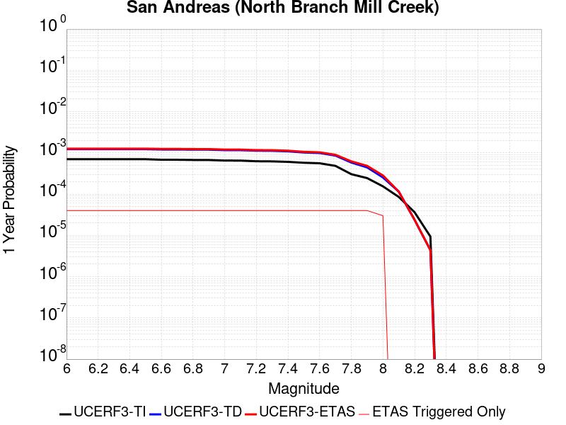 |  |

| Magnitude | 1 wk TI Prob | 1 wk TD Prob | 1 wk ETAS Prob | 1 wk ETAS/TD Gain | 1 wk ETAS Triggered Only | 1 mo TI Prob | 1 mo TD Prob | 1 mo ETAS Prob | 1 mo ETAS/TD Gain | 1 mo ETAS Triggered Only | 1 yr TI Prob | 1 yr TD Prob | 1 yr ETAS Prob | 1 yr ETAS/TD Gain | 1 yr ETAS Triggered Only | 10 yr TI Prob | 10 yr TD Prob | 10 yr ETAS Prob | 10 yr ETAS/TD Gain | 10 yr ETAS Triggered Only |
|-----|-----|-----|-----|-----|-----|-----|-----|-----|-----|-----|-----|-----|-----|-----|-----|-----|-----|-----|-----|-----|
| 6.0 | 1.3461156E-5 | 2.3527407E-5 | 2.3527407E-5 | 1.0 | 0.0 | 5.7689394E-5 | 1.0082787E-4 | 1.1082686E-4 | 1.0991689 | 1.0E-5 | 7.02142E-4 | 0.0012268913 | 0.0012668422 | 1.0325627 | 4.0E-5 | 0.0069992766 | 0.012243656 | 0.012322677 | 1.006454 | 8.0E-5 |
| 6.1 | 1.3461156E-5 | 2.3527407E-5 | 2.3527407E-5 | 1.0 | 0.0 | 5.7689394E-5 | 1.0082787E-4 | 1.1082686E-4 | 1.0991689 | 1.0E-5 | 7.02142E-4 | 0.0012268913 | 0.0012668422 | 1.0325627 | 4.0E-5 | 0.0069992766 | 0.012243656 | 0.012322677 | 1.006454 | 8.0E-5 |
| 6.2 | 1.3461156E-5 | 2.3527407E-5 | 2.3527407E-5 | 1.0 | 0.0 | 5.7689394E-5 | 1.0082787E-4 | 1.1082686E-4 | 1.0991689 | 1.0E-5 | 7.02142E-4 | 0.0012268913 | 0.0012668422 | 1.0325627 | 4.0E-5 | 0.0069992766 | 0.012243656 | 0.012322677 | 1.006454 | 8.0E-5 |
| 6.3 | 1.3461156E-5 | 2.3527407E-5 | 2.3527407E-5 | 1.0 | 0.0 | 5.7689394E-5 | 1.0082787E-4 | 1.1082686E-4 | 1.0991689 | 1.0E-5 | 7.02142E-4 | 0.0012268913 | 0.0012668422 | 1.0325627 | 4.0E-5 | 0.0069992766 | 0.012243656 | 0.012322677 | 1.006454 | 8.0E-5 |
| 6.4 | 1.3461156E-5 | 2.3527407E-5 | 2.3527407E-5 | 1.0 | 0.0 | 5.7689394E-5 | 1.0082787E-4 | 1.1082686E-4 | 1.0991689 | 1.0E-5 | 7.02142E-4 | 0.0012268913 | 0.0012668422 | 1.0325627 | 4.0E-5 | 0.0069992766 | 0.012243656 | 0.012322677 | 1.006454 | 8.0E-5 |
| 6.5 | 1.3450706E-5 | 2.3516368E-5 | 2.3516368E-5 | 1.0 | 0.0 | 5.764461E-5 | 1.00780555E-4 | 1.1077955E-4 | 1.0992155 | 1.0E-5 | 7.0159714E-4 | 0.001226316 | 0.0012662669 | 1.032578 | 4.0E-5 | 0.006993862 | 0.012237966 | 0.012316988 | 1.0064571 | 8.0E-5 |
| 6.6 | 1.3074523E-5 | 2.313064E-5 | 2.313064E-5 | 1.0 | 0.0 | 5.6032466E-5 | 9.912757E-5 | 1.0912657E-4 | 1.1008701 | 1.0E-5 | 6.8198174E-4 | 0.0012062131 | 0.0012461649 | 1.0331216 | 4.0E-5 | 0.006798926 | 0.012039129 | 0.012118166 | 1.006565 | 8.0E-5 |
| 6.7 | 1.3050216E-5 | 2.3105935E-5 | 2.3105935E-5 | 1.0 | 0.0 | 5.59283E-5 | 9.9021694E-5 | 1.0902071E-4 | 1.100978 | 1.0E-5 | 6.8071426E-4 | 0.0012049256 | 0.0012448775 | 1.0331571 | 4.0E-5 | 0.0067863287 | 0.012026393 | 0.0121054305 | 1.006572 | 8.0E-5 |
| 6.8 | 1.29049395E-5 | 2.2954338E-5 | 2.2954338E-5 | 1.0 | 0.0 | 5.530571E-5 | 9.8372046E-5 | 1.0837106E-4 | 1.1016449 | 1.0E-5 | 6.73139E-4 | 0.0011970248 | 0.0012369769 | 1.0333762 | 4.0E-5 | 0.0067110364 | 0.011948236 | 0.01202728 | 1.0066155 | 8.0E-5 |
| 6.9 | 1.2867369E-5 | 2.2913739E-5 | 2.2913739E-5 | 1.0 | 0.0 | 5.51447E-5 | 9.8198056E-5 | 1.0819707E-4 | 1.101825 | 1.0E-5 | 6.711799E-4 | 0.0011949089 | 0.001234861 | 1.0334353 | 4.0E-5 | 0.006691564 | 0.011927304 | 0.01200635 | 1.0066273 | 8.0E-5 |
| 7.0 | 1.2495996E-5 | 2.2313627E-5 | 2.2313627E-5 | 1.0 | 0.0 | 5.3553173E-5 | 9.562634E-5 | 1.0562539E-4 | 1.1045637 | 1.0E-5 | 6.518148E-4 | 0.0011636318 | 0.0012035852 | 1.0343351 | 4.0E-5 | 0.0064990623 | 0.011617814 | 0.011696885 | 1.006806 | 8.0E-5 |
| 7.1 | 1.2452067E-5 | 2.2258691E-5 | 2.2258691E-5 | 1.0 | 0.0 | 5.3364907E-5 | 9.539092E-5 | 1.0538997E-4 | 1.1048218 | 1.0E-5 | 6.4952404E-4 | 0.0011607686 | 0.0012007222 | 1.0344199 | 4.0E-5 | 0.0064762887 | 0.011589482 | 0.0116685545 | 1.0068228 | 8.0E-5 |
| 7.2 | 1.2002777E-5 | 2.163711E-5 | 2.163711E-5 | 1.0 | 0.0 | 5.143946E-5 | 9.272719E-5 | 1.0272626E-4 | 1.1078333 | 1.0E-5 | 6.2609545E-4 | 0.0011283715 | 0.0011683264 | 1.0354093 | 4.0E-5 | 0.006243344 | 0.011268834 | 0.011347932 | 1.0070193 | 8.0E-5 |
| 7.3 | 1.1923425E-5 | 2.150691E-5 | 2.150691E-5 | 1.0 | 0.0 | 5.109939E-5 | 9.216923E-5 | 1.02168306E-4 | 1.108486 | 1.0E-5 | 6.219575E-4 | 0.0011215854 | 0.0011615405 | 1.0356238 | 4.0E-5 | 0.0062021962 | 0.011201685 | 0.011280789 | 1.0070618 | 8.0E-5 |
| 7.4 | 1.16105175E-5 | 2.0880623E-5 | 2.0880623E-5 | 1.0 | 0.0 | 4.975841E-5 | 8.948533E-5 | 9.948444E-5 | 1.1117401 | 1.0E-5 | 6.0564023E-4 | 0.0010889419 | 0.0011288984 | 1.0366929 | 4.0E-5 | 0.006039923 | 0.010879163 | 0.0109582925 | 1.0072736 | 8.0E-5 |
| 7.5 | 1.1037265E-5 | 1.9579818E-5 | 1.9579818E-5 | 1.0 | 0.0 | 4.7301706E-5 | 8.3910825E-5 | 9.3909985E-5 | 1.1191641 | 1.0E-5 | 5.757461E-4 | 0.0010211377 | 0.0010610968 | 1.039132 | 4.0E-5 | 0.005742567 | 0.010208193 | 0.010287377 | 1.0077568 | 8.0E-5 |
| 7.6 | 1.0720915E-5 | 1.9021407E-5 | 1.9021407E-5 | 1.0 | 0.0 | 4.5945973E-5 | 8.151778E-5 | 9.1516966E-5 | 1.1226627 | 1.0E-5 | 5.592486E-4 | 9.920292E-4 | 0.0010319896 | 1.0402814 | 4.0E-5 | 0.005578433 | 0.009919754 | 0.00999896 | 1.0079848 | 8.0E-5 |
| 7.7 | 9.276279E-6 | 1.6466016E-5 | 1.6466016E-5 | 1.0 | 0.0 | 3.9754876E-5 | 7.056674E-5 | 8.056603E-5 | 1.1416998 | 1.0E-5 | 4.839081E-4 | 8.5881306E-4 | 8.987787E-4 | 1.046536 | 4.0E-5 | 0.0048285574 | 0.008598559 | 0.008677871 | 1.0092239 | 8.0E-5 |
| 7.8 | 5.8346777E-6 | 1.11748E-5 | 1.11748E-5 | 1.0 | 0.0 | 2.5005522E-5 | 4.7891124E-5 | 5.7890644E-5 | 1.208797 | 1.0E-5 | 3.043997E-4 | 5.829186E-4 | 6.2289526E-4 | 1.0685803 | 4.0E-5 | 0.0030398308 | 0.005857104 | 0.0059366357 | 1.0135787 | 8.0E-5 |
| 7.9 | 4.690204E-6 | 8.525594E-6 | 8.525594E-6 | 1.0 | 0.0 | 2.0100719E-5 | 3.653775E-5 | 4.653738E-5 | 1.2736796 | 1.0E-5 | 2.4469878E-4 | 4.4475638E-4 | 4.847386E-4 | 1.0898969 | 4.0E-5 | 0.002444295 | 0.004479242 | 0.0045588836 | 1.0177802 | 8.0E-5 |
| 8.0 | 2.9570454E-6 | 4.857035E-6 | 4.857035E-6 | 1.0 | 0.0 | 1.267299E-5 | 2.0815698E-5 | 3.081549E-5 | 1.4803966 | 1.0E-5 | 1.5428272E-4 | 2.534017E-4 | 2.833941E-4 | 1.1183591 | 3.0E-5 | 0.0015417566 | 0.002554891 | 0.0026047633 | 1.0195203 | 5.0E-5 |
| 8.1 | 1.6376824E-6 | 2.2021889E-6 | 2.2021889E-6 | 1.0 | 0.0 | 7.01862E-6 | 9.437918E-6 | 9.437918E-6 | 1.0 | 0.0 | 8.544835E-5 | 1.14900606E-4 | 1.14900606E-4 | 1.0 | 0.0 | 8.54155E-4 | 0.0011634289 | 0.0011634289 | 1.0 | 0.0 |
| 8.2 | 6.9631557E-7 | 4.5525482E-7 | 4.5525482E-7 | 1.0 | 0.0 | 2.984206E-6 | 1.9510906E-6 | 1.9510906E-6 | 1.0 | 0.0 | 3.63321E-5 | 2.3754272E-5 | 2.3754272E-5 | 1.0 | 0.0 | 3.6326164E-4 | 2.4603383E-4 | 2.4603383E-4 | 1.0 | 0.0 |
| 8.3 | 1.7876137E-7 | 8.3938964E-8 | 8.3938964E-8 | 1.0 | 0.0 | 7.661199E-7 | 3.5973835E-7 | 3.5973835E-7 | 1.0 | 0.0 | 9.32747E-6 | 4.3798063E-6 | 4.3798063E-6 | 1.0 | 0.0 | 9.3270784E-5 | 4.599691E-5 | 4.599691E-5 | 1.0 | 0.0 |

## Lost Hills
*[(top)](#table-of-contents)*

| 1 Week | 1 Month | 1 Year | 10 Year |
|-----|-----|-----|-----|
|  |  | 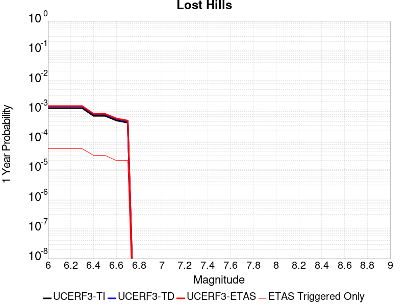 |  |

| Magnitude | 1 wk TI Prob | 1 wk TD Prob | 1 wk ETAS Prob | 1 wk ETAS/TD Gain | 1 wk ETAS Triggered Only | 1 mo TI Prob | 1 mo TD Prob | 1 mo ETAS Prob | 1 mo ETAS/TD Gain | 1 mo ETAS Triggered Only | 1 yr TI Prob | 1 yr TD Prob | 1 yr ETAS Prob | 1 yr ETAS/TD Gain | 1 yr ETAS Triggered Only | 10 yr TI Prob | 10 yr TD Prob | 10 yr ETAS Prob | 10 yr ETAS/TD Gain | 10 yr ETAS Triggered Only |
|-----|-----|-----|-----|-----|-----|-----|-----|-----|-----|-----|-----|-----|-----|-----|-----|-----|-----|-----|-----|-----|
| 6.0 | 2.233523E-5 | 2.5108235E-5 | 2.5108235E-5 | 1.0 | 0.0 | 9.571891E-5 | 1.07603235E-4 | 1.2760107E-4 | 1.185848 | 2.0E-5 | 0.0011647546 | 0.0013094501 | 0.0013593847 | 1.038134 | 5.0E-5 | 0.011586686 | 0.013033944 | 0.013103032 | 1.0053006 | 7.0E-5 |
| 6.1 | 2.233523E-5 | 2.5108235E-5 | 2.5108235E-5 | 1.0 | 0.0 | 9.571891E-5 | 1.07603235E-4 | 1.2760107E-4 | 1.185848 | 2.0E-5 | 0.0011647546 | 0.0013094501 | 0.0013593847 | 1.038134 | 5.0E-5 | 0.011586686 | 0.013033944 | 0.013103032 | 1.0053006 | 7.0E-5 |
| 6.2 | 2.233523E-5 | 2.5108235E-5 | 2.5108235E-5 | 1.0 | 0.0 | 9.571891E-5 | 1.07603235E-4 | 1.2760107E-4 | 1.185848 | 2.0E-5 | 0.0011647546 | 0.0013094501 | 0.0013593847 | 1.038134 | 5.0E-5 | 0.011586686 | 0.013033944 | 0.013103032 | 1.0053006 | 7.0E-5 |
| 6.3 | 2.233523E-5 | 2.5108235E-5 | 2.5108235E-5 | 1.0 | 0.0 | 9.571891E-5 | 1.07603235E-4 | 1.2760107E-4 | 1.185848 | 2.0E-5 | 0.0011647546 | 0.0013094501 | 0.0013593847 | 1.038134 | 5.0E-5 | 0.011586686 | 0.013033944 | 0.013103032 | 1.0053006 | 7.0E-5 |
| 6.4 | 1.2288092E-5 | 1.3781996E-5 | 1.3781996E-5 | 1.0 | 0.0 | 5.2662188E-5 | 5.906489E-5 | 6.90643E-5 | 1.1692953 | 1.0E-5 | 6.409735E-4 | 7.1897154E-4 | 7.4895E-4 | 1.0416963 | 3.0E-5 | 0.006391279 | 0.007175662 | 0.007205447 | 1.0041507 | 3.0E-5 |
| 6.5 | 1.2288092E-5 | 1.3781996E-5 | 1.3781996E-5 | 1.0 | 0.0 | 5.2662188E-5 | 5.906489E-5 | 6.90643E-5 | 1.1692953 | 1.0E-5 | 6.409735E-4 | 7.1897154E-4 | 7.4895E-4 | 1.0416963 | 3.0E-5 | 0.006391279 | 0.007175662 | 0.007205447 | 1.0041507 | 3.0E-5 |
| 6.6 | 8.58281E-6 | 9.634396E-6 | 9.634396E-6 | 1.0 | 0.0 | 3.6782953E-5 | 4.1290084E-5 | 5.128967E-5 | 1.2421789 | 1.0E-5 | 4.4774043E-4 | 5.02674E-4 | 5.22664E-4 | 1.0397673 | 2.0E-5 | 0.0044683935 | 0.005023531 | 0.0050434307 | 1.0039612 | 2.0E-5 |
| 6.7 | 7.205685E-6 | 8.088828E-6 | 8.088828E-6 | 1.0 | 0.0 | 3.088114E-5 | 3.4666402E-5 | 4.4666056E-5 | 1.2884537 | 1.0E-5 | 3.7591302E-4 | 4.2206346E-4 | 4.4205502E-4 | 1.0473663 | 2.0E-5 | 0.0037527776 | 0.0042206347 | 0.00424055 | 1.0047187 | 2.0E-5 |

## San Andreas (Cholame) rev
*[(top)](#table-of-contents)*

| 1 Week | 1 Month | 1 Year | 10 Year |
|-----|-----|-----|-----|
| 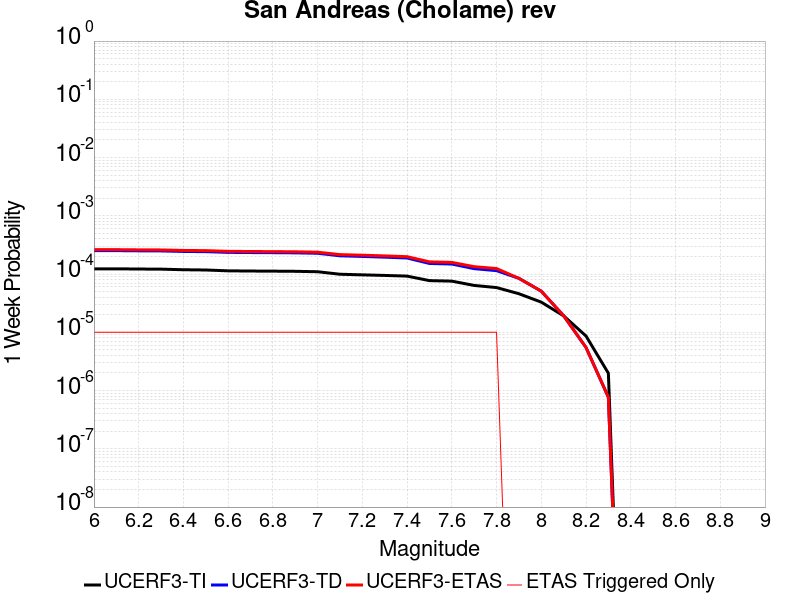 |  |  |  |

| Magnitude | 1 wk TI Prob | 1 wk TD Prob | 1 wk ETAS Prob | 1 wk ETAS/TD Gain | 1 wk ETAS Triggered Only | 1 mo TI Prob | 1 mo TD Prob | 1 mo ETAS Prob | 1 mo ETAS/TD Gain | 1 mo ETAS Triggered Only | 1 yr TI Prob | 1 yr TD Prob | 1 yr ETAS Prob | 1 yr ETAS/TD Gain | 1 yr ETAS Triggered Only | 10 yr TI Prob | 10 yr TD Prob | 10 yr ETAS Prob | 10 yr ETAS/TD Gain | 10 yr ETAS Triggered Only |
|-----|-----|-----|-----|-----|-----|-----|-----|-----|-----|-----|-----|-----|-----|-----|-----|-----|-----|-----|-----|-----|
| 6.0 | 1.2302514E-4 | 2.5242948E-4 | 2.6242694E-4 | 1.039605 | 1.0E-5 | 5.27144E-4 | 0.0010813937 | 0.0010913829 | 1.0092373 | 1.0E-5 | 0.0063991086 | 0.013086997 | 0.013116605 | 1.0022624 | 3.0E-5 | 0.06217949 | 0.1245517 | 0.124621734 | 1.0005623 | 8.0E-5 |
| 6.1 | 1.2302514E-4 | 2.5242948E-4 | 2.6242694E-4 | 1.039605 | 1.0E-5 | 5.27144E-4 | 0.0010813937 | 0.0010913829 | 1.0092373 | 1.0E-5 | 0.0063991086 | 0.013086997 | 0.013116605 | 1.0022624 | 3.0E-5 | 0.06217949 | 0.1245517 | 0.124621734 | 1.0005623 | 8.0E-5 |
| 6.2 | 1.2203569E-4 | 2.5059693E-4 | 2.6059445E-4 | 1.0398947 | 1.0E-5 | 5.2290526E-4 | 0.0010735465 | 0.0010835357 | 1.0093049 | 1.0E-5 | 0.006347804 | 0.0129926 | 0.01302221 | 1.002279 | 3.0E-5 | 0.061695136 | 0.12373783 | 0.12380793 | 1.0005665 | 8.0E-5 |
| 6.3 | 1.2142645E-4 | 2.4945638E-4 | 2.5945387E-4 | 1.0400772 | 1.0E-5 | 5.202953E-4 | 0.0010686623 | 0.0010786516 | 1.0093474 | 1.0E-5 | 0.006316212 | 0.012933843 | 0.012963455 | 1.0022895 | 3.0E-5 | 0.06139677 | 0.123231925 | 0.12330207 | 1.0005692 | 8.0E-5 |
| 6.4 | 1.1865206E-4 | 2.4450937E-4 | 2.5450694E-4 | 1.0408882 | 1.0E-5 | 5.0840975E-4 | 0.001047478 | 0.0010574677 | 1.0095367 | 1.0E-5 | 0.006172335 | 0.012678952 | 0.012708572 | 1.0023361 | 3.0E-5 | 0.060036868 | 0.121024184 | 0.1210945 | 1.000581 | 8.0E-5 |
| 6.5 | 1.17443946E-4 | 2.4244092E-4 | 2.524385E-4 | 1.0412371 | 1.0E-5 | 5.032341E-4 | 0.0010386204 | 0.00104861 | 1.0096182 | 1.0E-5 | 0.006109677 | 0.012572356 | 0.012601978 | 1.0023562 | 3.0E-5 | 0.059444077 | 0.12009794 | 0.120168336 | 1.0005862 | 8.0E-5 |
| 6.6 | 1.13579066E-4 | 2.3552658E-4 | 2.4552422E-4 | 1.042448 | 1.0E-5 | 4.866766E-4 | 0.0010090107 | 0.0010190005 | 1.0099007 | 1.0E-5 | 0.0059092017 | 0.012215953 | 0.012245586 | 1.0024258 | 3.0E-5 | 0.057545185 | 0.11701085 | 0.117081486 | 1.0006037 | 8.0E-5 |
| 6.7 | 1.1271412E-4 | 2.339688E-4 | 2.4396647E-4 | 1.0427307 | 1.0E-5 | 4.829711E-4 | 0.0010023396 | 0.0010123296 | 1.0099666 | 1.0E-5 | 0.005864331 | 0.012135641 | 0.012165277 | 1.002442 | 3.0E-5 | 0.057119697 | 0.116314195 | 0.116384886 | 1.0006078 | 8.0E-5 |
| 6.8 | 1.1217975E-4 | 2.3285215E-4 | 2.4284983E-4 | 1.0429357 | 1.0E-5 | 4.8068175E-4 | 9.975577E-4 | 0.0010075477 | 1.0100145 | 1.0E-5 | 0.005836608 | 0.012078067 | 0.012107705 | 1.0024538 | 3.0E-5 | 0.056856725 | 0.11581219 | 0.115882926 | 1.0006108 | 8.0E-5 |
| 6.9 | 1.1146753E-4 | 2.3133864E-4 | 2.4133633E-4 | 1.0432167 | 1.0E-5 | 4.7763053E-4 | 9.910761E-4 | 0.0010010662 | 1.0100801 | 1.0E-5 | 0.0057996577 | 0.012000027 | 0.012029666 | 1.00247 | 3.0E-5 | 0.056506127 | 0.11513234 | 0.11520313 | 1.0006149 | 8.0E-5 |
| 7.0 | 1.0965793E-4 | 2.2756905E-4 | 2.3756677E-4 | 1.0439327 | 1.0E-5 | 4.698779E-4 | 9.7493286E-4 | 9.849231E-4 | 1.0102471 | 1.0E-5 | 0.005705768 | 0.01180563 | 0.011835276 | 1.0025111 | 3.0E-5 | 0.055614736 | 0.11343304 | 0.11350396 | 1.0006253 | 8.0E-5 |
| 7.1 | 9.927982E-5 | 2.0574623E-4 | 2.1574418E-4 | 1.0485935 | 1.0E-5 | 4.2541555E-4 | 8.814726E-4 | 8.914638E-4 | 1.0113347 | 1.0E-5 | 0.0051671406 | 0.0106794145 | 0.010709094 | 1.0027791 | 3.0E-5 | 0.05048634 | 0.10352388 | 0.1035956 | 1.0006927 | 8.0E-5 |
| 7.2 | 9.696786E-5 | 2.0078626E-4 | 2.1078424E-4 | 1.0497942 | 1.0E-5 | 4.1551032E-4 | 8.602298E-4 | 8.702212E-4 | 1.0116148 | 1.0E-5 | 0.00504711 | 0.010423285 | 0.010452973 | 1.0028481 | 3.0E-5 | 0.04934009 | 0.10126121 | 0.10133311 | 1.00071 | 8.0E-5 |
| 7.3 | 9.4727984E-5 | 1.9507346E-4 | 2.050715E-4 | 1.0512527 | 1.0E-5 | 4.0591392E-4 | 8.357622E-4 | 8.457538E-4 | 1.0119551 | 1.0E-5 | 0.0049308087 | 0.010128201 | 0.010157897 | 1.0029321 | 3.0E-5 | 0.048228268 | 0.09863034 | 0.098702446 | 1.0007311 | 8.0E-5 |
| 7.4 | 9.220358E-5 | 1.8877286E-4 | 1.9877097E-4 | 1.0529637 | 1.0E-5 | 3.9509835E-4 | 8.0877665E-4 | 8.187685E-4 | 1.0123544 | 1.0E-5 | 0.004799717 | 0.009802646 | 0.0098323515 | 1.0030304 | 3.0E-5 | 0.046973653 | 0.09570612 | 0.09576942 | 1.0006614 | 7.0E-5 |
| 7.5 | 7.71631E-5 | 1.520787E-4 | 1.6207718E-4 | 1.0657455 | 1.0E-5 | 3.306571E-4 | 6.516032E-4 | 6.615967E-4 | 1.0153368 | 1.0E-5 | 0.0040183207 | 0.007904484 | 0.007934247 | 1.0037653 | 3.0E-5 | 0.03946433 | 0.078419134 | 0.07847443 | 1.0007051 | 6.0E-5 |
| 7.6 | 7.5634416E-5 | 1.4866945E-4 | 1.5866797E-4 | 1.0672534 | 1.0E-5 | 3.241072E-4 | 6.369994E-4 | 6.46993E-4 | 1.0156887 | 1.0E-5 | 0.0039388672 | 0.007727957 | 0.0077577247 | 1.003852 | 3.0E-5 | 0.038697794 | 0.07678112 | 0.076836504 | 1.0007215 | 6.0E-5 |
| 7.7 | 6.3783E-5 | 1.2385153E-4 | 1.3385029E-4 | 1.0807319 | 1.0E-5 | 2.7332708E-4 | 5.3068437E-4 | 5.4067903E-4 | 1.0188336 | 1.0E-5 | 0.0033226798 | 0.0064419676 | 0.0064618387 | 1.0030847 | 2.0E-5 | 0.032734364 | 0.064660996 | 0.06469841 | 1.0005786 | 4.0E-5 |
| 7.8 | 5.863422E-5 | 1.1440121E-4 | 1.2440007E-4 | 1.0874016 | 1.0E-5 | 2.512653E-4 | 4.9019884E-4 | 5.001939E-4 | 1.0203899 | 1.0E-5 | 0.003054864 | 0.00595186 | 0.0059618005 | 1.0016701 | 1.0E-5 | 0.030132094 | 0.059769355 | 0.05978816 | 1.0003146 | 2.0E-5 |
| 7.9 | 4.595283E-5 | 8.443828E-5 | 8.443828E-5 | 1.0 | 0.0 | 1.9692584E-4 | 3.6182816E-4 | 3.6182816E-4 | 1.0 | 0.0 | 0.0023949358 | 0.0043963664 | 0.0043963664 | 1.0 | 0.0 | 0.023692891 | 0.04444455 | 0.044454105 | 1.000215 | 1.0E-5 |
| 8.0 | 3.2950178E-5 | 5.0881976E-5 | 5.0881976E-5 | 1.0 | 0.0 | 1.412074E-4 | 2.180474E-4 | 2.180474E-4 | 1.0 | 0.0 | 0.0017178444 | 0.0026514968 | 0.0026514968 | 1.0 | 0.0 | 0.017046256 | 0.027233804 | 0.02724353 | 1.0003572 | 1.0E-5 |
| 8.1 | 1.9177472E-5 | 1.9238712E-5 | 1.9238712E-5 | 1.0 | 0.0 | 8.218658E-5 | 8.244903E-5 | 8.244903E-5 | 1.0 | 0.0 | 0.0010001622 | 0.0010033553 | 0.0010033553 | 1.0 | 0.0 | 0.009956728 | 0.010786239 | 0.010796132 | 1.0009171 | 1.0E-5 |
| 8.2 | 8.643924E-6 | 5.49522E-6 | 5.49522E-6 | 1.0 | 0.0 | 3.704486E-5 | 2.355073E-5 | 2.355073E-5 | 1.0 | 0.0 | 4.5092785E-4 | 2.866925E-4 | 2.866925E-4 | 1.0 | 0.0 | 0.0045001395 | 0.0032598388 | 0.0032598388 | 1.0 | 0.0 |
| 8.3 | 1.983087E-6 | 7.693574E-7 | 7.693574E-7 | 1.0 | 0.0 | 8.498917E-6 | 3.297242E-6 | 3.297242E-6 | 1.0 | 0.0 | 1.034694E-4 | 4.01432E-5 | 4.01432E-5 | 1.0 | 0.0 | 0.0010342124 | 4.7390026E-4 | 4.7390026E-4 | 1.0 | 0.0 |

## Santa Cruz Island
*[(top)](#table-of-contents)*

| 1 Week | 1 Month | 1 Year | 10 Year |
|-----|-----|-----|-----|
|  |  |  |  |

| Magnitude | 1 wk TI Prob | 1 wk TD Prob | 1 wk ETAS Prob | 1 wk ETAS/TD Gain | 1 wk ETAS Triggered Only | 1 mo TI Prob | 1 mo TD Prob | 1 mo ETAS Prob | 1 mo ETAS/TD Gain | 1 mo ETAS Triggered Only | 1 yr TI Prob | 1 yr TD Prob | 1 yr ETAS Prob | 1 yr ETAS/TD Gain | 1 yr ETAS Triggered Only | 10 yr TI Prob | 10 yr TD Prob | 10 yr ETAS Prob | 10 yr ETAS/TD Gain | 10 yr ETAS Triggered Only |
|-----|-----|-----|-----|-----|-----|-----|-----|-----|-----|-----|-----|-----|-----|-----|-----|-----|-----|-----|-----|-----|
| 6.0 | 2.9164563E-5 | 3.1601154E-5 | 3.1601154E-5 | 1.0 | 0.0 | 1.2498499E-4 | 1.3542725E-4 | 1.3542725E-4 | 1.0 | 0.0 | 0.0015206301 | 0.001647716 | 0.0016676831 | 1.012118 | 2.0E-5 | 0.015102667 | 0.016368724 | 0.016427742 | 1.0036055 | 6.0E-5 |
| 6.1 | 2.9164563E-5 | 3.1601154E-5 | 3.1601154E-5 | 1.0 | 0.0 | 1.2498499E-4 | 1.3542725E-4 | 1.3542725E-4 | 1.0 | 0.0 | 0.0015206301 | 0.001647716 | 0.0016676831 | 1.012118 | 2.0E-5 | 0.015102667 | 0.016368724 | 0.016427742 | 1.0036055 | 6.0E-5 |
| 6.2 | 2.9164563E-5 | 3.1601154E-5 | 3.1601154E-5 | 1.0 | 0.0 | 1.2498499E-4 | 1.3542725E-4 | 1.3542725E-4 | 1.0 | 0.0 | 0.0015206301 | 0.001647716 | 0.0016676831 | 1.012118 | 2.0E-5 | 0.015102667 | 0.016368724 | 0.016427742 | 1.0036055 | 6.0E-5 |
| 6.3 | 1.6635553E-5 | 1.7805029E-5 | 1.7805029E-5 | 1.0 | 0.0 | 7.1293274E-5 | 7.6305136E-5 | 7.6305136E-5 | 1.0 | 0.0 | 8.6765E-4 | 9.286373E-4 | 9.38628E-4 | 1.0107585 | 1.0E-5 | 0.008642701 | 0.009249439 | 0.009269255 | 1.0021423 | 2.0E-5 |
| 6.4 | 1.6635553E-5 | 1.7805029E-5 | 1.7805029E-5 | 1.0 | 0.0 | 7.1293274E-5 | 7.6305136E-5 | 7.6305136E-5 | 1.0 | 0.0 | 8.6765E-4 | 9.286373E-4 | 9.38628E-4 | 1.0107585 | 1.0E-5 | 0.008642701 | 0.009249439 | 0.009269255 | 1.0021423 | 2.0E-5 |
| 6.5 | 1.2238748E-5 | 1.30434555E-5 | 1.30434555E-5 | 1.0 | 0.0 | 5.2450723E-5 | 5.5899345E-5 | 5.5899345E-5 | 1.0 | 0.0 | 6.3840044E-4 | 6.803657E-4 | 6.803657E-4 | 1.0 | 0.0 | 0.0063656955 | 0.006783226 | 0.0067931586 | 1.0014642 | 1.0E-5 |
| 6.6 | 1.0489767E-5 | 1.1157017E-5 | 1.1157017E-5 | 1.0 | 0.0 | 4.495537E-5 | 4.7814923E-5 | 4.7814923E-5 | 1.0 | 0.0 | 5.4719415E-4 | 5.8199343E-4 | 5.8199343E-4 | 1.0 | 0.0 | 0.005458487 | 0.0058049336 | 0.0058148755 | 1.0017127 | 1.0E-5 |
| 6.7 | 8.699222E-6 | 9.23709E-6 | 9.23709E-6 | 1.0 | 0.0 | 3.7281847E-5 | 3.958693E-5 | 3.958693E-5 | 1.0 | 0.0 | 4.5381195E-4 | 4.8186484E-4 | 4.8186484E-4 | 1.0 | 0.0 | 0.0045288634 | 0.0048082676 | 0.0048182197 | 1.0020697 | 1.0E-5 |
| 6.8 | 8.307732E-6 | 8.8171955E-6 | 8.8171955E-6 | 1.0 | 0.0 | 3.560408E-5 | 3.7787435E-5 | 3.7787435E-5 | 1.0 | 0.0 | 4.3339343E-4 | 4.5996535E-4 | 4.5996535E-4 | 1.0 | 0.0 | 0.004325492 | 0.0045901868 | 0.0046001407 | 1.0021685 | 1.0E-5 |
| 6.9 | 8.073121E-6 | 8.565221E-6 | 8.565221E-6 | 1.0 | 0.0 | 3.459863E-5 | 3.6707574E-5 | 3.6707574E-5 | 1.0 | 0.0 | 4.2115687E-4 | 4.4682348E-4 | 4.4682348E-4 | 1.0 | 0.0 | 0.004203596 | 0.0044593024 | 0.004469258 | 1.0022326 | 1.0E-5 |
| 7.0 | 7.617019E-6 | 8.074926E-6 | 8.074926E-6 | 1.0 | 0.0 | 3.264396E-5 | 3.4606368E-5 | 3.4606368E-5 | 1.0 | 0.0 | 3.9736772E-4 | 4.212515E-4 | 4.212515E-4 | 1.0 | 0.0 | 0.003966579 | 0.0042045773 | 0.0042145355 | 1.0023683 | 1.0E-5 |
| 7.1 | 7.1224836E-6 | 7.5460302E-6 | 7.5460302E-6 | 1.0 | 0.0 | 3.052457E-5 | 3.233973E-5 | 3.233973E-5 | 1.0 | 0.0 | 3.715733E-4 | 3.9366545E-4 | 3.9366545E-4 | 1.0 | 0.0 | 0.003709526 | 0.003929724 | 0.0039396845 | 1.0025347 | 1.0E-5 |
| 7.2 | 6.441115E-6 | 6.827605E-6 | 6.827605E-6 | 1.0 | 0.0 | 2.7604487E-5 | 2.9260837E-5 | 2.9260837E-5 | 1.0 | 0.0 | 3.360328E-4 | 3.5619267E-4 | 3.5619267E-4 | 1.0 | 0.0 | 0.0033552512 | 0.0035562462 | 0.0035662106 | 1.0028019 | 1.0E-5 |
| 7.3 | 5.494274E-6 | 5.8201813E-6 | 5.8201813E-6 | 1.0 | 0.0 | 2.3546674E-5 | 2.4943398E-5 | 2.4943398E-5 | 1.0 | 0.0 | 2.8664304E-4 | 3.0364376E-4 | 3.0364376E-4 | 1.0 | 0.0 | 0.002862736 | 0.0030323118 | 0.0030422814 | 1.0032878 | 1.0E-5 |
| 7.4 | 4.0802624E-6 | 4.31239E-6 | 4.31239E-6 | 1.0 | 0.0 | 1.7486722E-5 | 1.8481542E-5 | 1.8481542E-5 | 1.0 | 0.0 | 2.1288003E-4 | 2.249896E-4 | 2.249896E-4 | 1.0 | 0.0 | 0.0021267622 | 0.0022476274 | 0.0022476274 | 1.0 | 0.0 |
| 7.5 | 2.3584746E-6 | 2.4753783E-6 | 2.4753783E-6 | 1.0 | 0.0 | 1.0107709E-5 | 1.0608721E-5 | 1.0608721E-5 | 1.0 | 0.0 | 1.2305441E-4 | 1.2915357E-4 | 1.2915357E-4 | 1.0 | 0.0 | 0.0012298629 | 0.0012907902 | 0.0012907902 | 1.0 | 0.0 |
| 7.6 | 9.4981914E-7 | 9.861161E-7 | 9.861161E-7 | 1.0 | 0.0 | 4.0706473E-6 | 4.226205E-6 | 4.226205E-6 | 1.0 | 0.0 | 4.9559E-5 | 5.1452847E-5 | 5.1452847E-5 | 1.0 | 0.0 | 4.954795E-4 | 5.144106E-4 | 5.144106E-4 | 1.0 | 0.0 |
| 7.7 | 2.6013532E-7 | 2.6417067E-7 | 2.6417067E-7 | 1.0 | 0.0 | 1.1148652E-6 | 1.1321595E-6 | 1.1321595E-6 | 1.0 | 0.0 | 1.3573399E-5 | 1.3783956E-5 | 1.3783956E-5 | 1.0 | 0.0 | 1.357257E-4 | 1.3783107E-4 | 1.3783107E-4 | 1.0 | 0.0 |
| 7.8 | 4.1522263E-8 | 3.9657305E-8 | 3.9657305E-8 | 1.0 | 0.0 | 1.7795254E-7 | 1.6995986E-7 | 1.6995986E-7 | 1.0 | 0.0 | 2.16657E-6 | 2.0692596E-6 | 2.0692596E-6 | 1.0 | 0.0 | 2.1665488E-5 | 2.0692425E-5 | 2.0692425E-5 | 1.0 | 0.0 |
| 7.9 | 7.7242046E-10 | 5.946944E-10 | 5.946944E-10 | 1.0 | 0.0 | 3.3103735E-9 | 2.5486908E-9 | 2.5486908E-9 | 1.0 | 0.0 | 4.0303796E-8 | 3.103031E-8 | 3.103031E-8 | 1.0 | 0.0 | 4.030379E-7 | 3.1030308E-7 | 3.1030308E-7 | 1.0 | 0.0 |

## Deep Springs
*[(top)](#table-of-contents)*

| 1 Week | 1 Month | 1 Year | 10 Year |
|-----|-----|-----|-----|
|  |  |  |  |

| Magnitude | 1 wk TI Prob | 1 wk TD Prob | 1 wk ETAS Prob | 1 wk ETAS/TD Gain | 1 wk ETAS Triggered Only | 1 mo TI Prob | 1 mo TD Prob | 1 mo ETAS Prob | 1 mo ETAS/TD Gain | 1 mo ETAS Triggered Only | 1 yr TI Prob | 1 yr TD Prob | 1 yr ETAS Prob | 1 yr ETAS/TD Gain | 1 yr ETAS Triggered Only | 10 yr TI Prob | 10 yr TD Prob | 10 yr ETAS Prob | 10 yr ETAS/TD Gain | 10 yr ETAS Triggered Only |
|-----|-----|-----|-----|-----|-----|-----|-----|-----|-----|-----|-----|-----|-----|-----|-----|-----|-----|-----|-----|-----|
| 6.0 | 1.9810619E-5 | 2.3114564E-5 | 2.3114564E-5 | 1.0 | 0.0 | 8.489989E-5 | 9.9061515E-5 | 9.9061515E-5 | 1.0 | 0.0 | 0.001033166 | 0.0012059145 | 0.0012258904 | 1.016565 | 2.0E-5 | 0.010283757 | 0.012043487 | 0.0121126445 | 1.0057423 | 7.0E-5 |
| 6.1 | 1.9810619E-5 | 2.3114564E-5 | 2.3114564E-5 | 1.0 | 0.0 | 8.489989E-5 | 9.9061515E-5 | 9.9061515E-5 | 1.0 | 0.0 | 0.001033166 | 0.0012059145 | 0.0012258904 | 1.016565 | 2.0E-5 | 0.010283757 | 0.012043487 | 0.0121126445 | 1.0057423 | 7.0E-5 |
| 6.2 | 1.9810619E-5 | 2.3114564E-5 | 2.3114564E-5 | 1.0 | 0.0 | 8.489989E-5 | 9.9061515E-5 | 9.9061515E-5 | 1.0 | 0.0 | 0.001033166 | 0.0012059145 | 0.0012258904 | 1.016565 | 2.0E-5 | 0.010283757 | 0.012043487 | 0.0121126445 | 1.0057423 | 7.0E-5 |
| 6.3 | 1.9810619E-5 | 2.3114564E-5 | 2.3114564E-5 | 1.0 | 0.0 | 8.489989E-5 | 9.9061515E-5 | 9.9061515E-5 | 1.0 | 0.0 | 0.001033166 | 0.0012059145 | 0.0012258904 | 1.016565 | 2.0E-5 | 0.010283757 | 0.012043487 | 0.0121126445 | 1.0057423 | 7.0E-5 |
| 6.4 | 1.9810619E-5 | 2.3114564E-5 | 2.3114564E-5 | 1.0 | 0.0 | 8.489989E-5 | 9.9061515E-5 | 9.9061515E-5 | 1.0 | 0.0 | 0.001033166 | 0.0012059145 | 0.0012258904 | 1.016565 | 2.0E-5 | 0.010283757 | 0.012043487 | 0.0121126445 | 1.0057423 | 7.0E-5 |
| 6.5 | 1.7190405E-5 | 2.0052325E-5 | 2.0052325E-5 | 1.0 | 0.0 | 7.367108E-5 | 8.593854E-5 | 8.593854E-5 | 1.0 | 0.0 | 8.9657627E-4 | 0.0010463017 | 0.0010562913 | 1.0095475 | 1.0E-5 | 0.008929676 | 0.010462979 | 0.010502561 | 1.003783 | 4.0E-5 |
| 6.6 | 1.7190405E-5 | 2.0052325E-5 | 2.0052325E-5 | 1.0 | 0.0 | 7.367108E-5 | 8.593854E-5 | 8.593854E-5 | 1.0 | 0.0 | 8.9657627E-4 | 0.0010463017 | 0.0010562913 | 1.0095475 | 1.0E-5 | 0.008929676 | 0.010462979 | 0.010502561 | 1.003783 | 4.0E-5 |

## Pinto Mtn
*[(top)](#table-of-contents)*

| 1 Week | 1 Month | 1 Year | 10 Year |
|-----|-----|-----|-----|
|  |  |  |  |

| Magnitude | 1 wk TI Prob | 1 wk TD Prob | 1 wk ETAS Prob | 1 wk ETAS/TD Gain | 1 wk ETAS Triggered Only | 1 mo TI Prob | 1 mo TD Prob | 1 mo ETAS Prob | 1 mo ETAS/TD Gain | 1 mo ETAS Triggered Only | 1 yr TI Prob | 1 yr TD Prob | 1 yr ETAS Prob | 1 yr ETAS/TD Gain | 1 yr ETAS Triggered Only | 10 yr TI Prob | 10 yr TD Prob | 10 yr ETAS Prob | 10 yr ETAS/TD Gain | 10 yr ETAS Triggered Only |
|-----|-----|-----|-----|-----|-----|-----|-----|-----|-----|-----|-----|-----|-----|-----|-----|-----|-----|-----|-----|-----|
| 6.0 | 4.4194956E-5 | 4.786006E-5 | 4.786006E-5 | 1.0 | 0.0 | 1.893932E-4 | 2.0509934E-4 | 2.1509729E-4 | 1.0487468 | 1.0E-5 | 0.0023034236 | 0.0024943894 | 0.0025143395 | 1.007998 | 2.0E-5 | 0.022796938 | 0.024681423 | 0.024749696 | 1.0027661 | 7.0E-5 |
| 6.1 | 4.4194956E-5 | 4.786006E-5 | 4.786006E-5 | 1.0 | 0.0 | 1.893932E-4 | 2.0509934E-4 | 2.1509729E-4 | 1.0487468 | 1.0E-5 | 0.0023034236 | 0.0024943894 | 0.0025143395 | 1.007998 | 2.0E-5 | 0.022796938 | 0.024681423 | 0.024749696 | 1.0027661 | 7.0E-5 |
| 6.2 | 4.4194956E-5 | 4.786006E-5 | 4.786006E-5 | 1.0 | 0.0 | 1.893932E-4 | 2.0509934E-4 | 2.1509729E-4 | 1.0487468 | 1.0E-5 | 0.0023034236 | 0.0024943894 | 0.0025143395 | 1.007998 | 2.0E-5 | 0.022796938 | 0.024681423 | 0.024749696 | 1.0027661 | 7.0E-5 |
| 6.3 | 4.4194956E-5 | 4.786006E-5 | 4.786006E-5 | 1.0 | 0.0 | 1.893932E-4 | 2.0509934E-4 | 2.1509729E-4 | 1.0487468 | 1.0E-5 | 0.0023034236 | 0.0024943894 | 0.0025143395 | 1.007998 | 2.0E-5 | 0.022796938 | 0.024681423 | 0.024749696 | 1.0027661 | 7.0E-5 |
| 6.4 | 3.729929E-5 | 3.9608763E-5 | 3.9608763E-5 | 1.0 | 0.0 | 1.5984432E-4 | 1.6974132E-4 | 1.7973963E-4 | 1.0589032 | 1.0E-5 | 0.0019443673 | 0.0020647354 | 0.0020747148 | 1.0048332 | 1.0E-5 | 0.019274427 | 0.020465542 | 0.020504724 | 1.0019145 | 4.0E-5 |
| 6.5 | 3.729929E-5 | 3.9608763E-5 | 3.9608763E-5 | 1.0 | 0.0 | 1.5984432E-4 | 1.6974132E-4 | 1.7973963E-4 | 1.0589032 | 1.0E-5 | 0.0019443673 | 0.0020647354 | 0.0020747148 | 1.0048332 | 1.0E-5 | 0.019274427 | 0.020465542 | 0.020504724 | 1.0019145 | 4.0E-5 |
| 6.6 | 3.0204548E-5 | 3.1210056E-5 | 3.1210056E-5 | 1.0 | 0.0 | 1.2944164E-4 | 1.3375071E-4 | 1.3375071E-4 | 1.0 | 0.0 | 0.0015748127 | 0.0016272333 | 0.0016272333 | 1.0 | 0.0 | 0.015636992 | 0.016157052 | 0.016176729 | 1.0012178 | 2.0E-5 |
| 6.7 | 2.9857754E-5 | 3.0819414E-5 | 3.0819414E-5 | 1.0 | 0.0 | 1.2795553E-4 | 1.320767E-4 | 1.320767E-4 | 1.0 | 0.0 | 0.0015567453 | 0.0016068824 | 0.0016068824 | 1.0 | 0.0 | 0.015458848 | 0.015956478 | 0.01597616 | 1.0012335 | 2.0E-5 |
| 6.8 | 2.4819734E-5 | 2.5013624E-5 | 2.5013624E-5 | 1.0 | 0.0 | 1.0636595E-4 | 1.0719696E-4 | 1.0719696E-4 | 1.0 | 0.0 | 0.0012942362 | 0.0013043632 | 0.0013043632 | 1.0 | 0.0 | 0.012867244 | 0.012969442 | 0.012979312 | 1.000761 | 1.0E-5 |
| 6.9 | 2.331124E-5 | 2.3341807E-5 | 2.3341807E-5 | 1.0 | 0.0 | 9.990149E-5 | 1.00032594E-4 | 1.00032594E-4 | 1.0 | 0.0 | 0.001215622 | 0.0012172367 | 0.0012172367 | 1.0 | 0.0 | 0.012089936 | 0.012107888 | 0.012117767 | 1.0008159 | 1.0E-5 |
| 7.0 | 2.1818534E-5 | 2.1764856E-5 | 2.1764856E-5 | 1.0 | 0.0 | 9.3504656E-5 | 9.327473E-5 | 9.327473E-5 | 1.0 | 0.0 | 0.0011378246 | 0.0011350481 | 0.0011350481 | 1.0 | 0.0 | 0.011320163 | 0.011294611 | 0.011304498 | 1.0008754 | 1.0E-5 |
| 7.1 | 2.066081E-5 | 2.0544425E-5 | 2.0544425E-5 | 1.0 | 0.0 | 8.854332E-5 | 8.8044675E-5 | 8.8044675E-5 | 1.0 | 0.0 | 0.0010774818 | 0.0010714363 | 0.0010714363 | 1.0 | 0.0 | 0.010722724 | 0.010664757 | 0.010674651 | 1.0009277 | 1.0E-5 |
| 7.2 | 1.8990233E-5 | 1.9057632E-5 | 1.9057632E-5 | 1.0 | 0.0 | 8.138417E-5 | 8.167311E-5 | 8.167311E-5 | 1.0 | 0.0 | 9.904018E-4 | 9.939359E-4 | 9.939359E-4 | 1.0 | 0.0 | 0.009859995 | 0.009896904 | 0.009906805 | 1.0010004 | 1.0E-5 |
| 7.3 | 1.3335872E-5 | 1.4909989E-5 | 1.4909989E-5 | 1.0 | 0.0 | 5.7152483E-5 | 6.389846E-5 | 6.389846E-5 | 1.0 | 0.0 | 6.956093E-4 | 7.776988E-4 | 7.776988E-4 | 1.0 | 0.0 | 0.006934359 | 0.0077510723 | 0.0077609946 | 1.0012802 | 1.0E-5 |
| 7.4 | 9.414066E-6 | 1.1864049E-5 | 1.1864049E-5 | 1.0 | 0.0 | 4.0345374E-5 | 5.0844985E-5 | 5.0844985E-5 | 1.0 | 0.0 | 4.910942E-4 | 6.188713E-4 | 6.188713E-4 | 1.0 | 0.0 | 0.0049001034 | 0.0061724274 | 0.0061823656 | 1.0016102 | 1.0E-5 |
| 7.5 | 7.2101157E-6 | 9.16125E-6 | 9.16125E-6 | 1.0 | 0.0 | 3.090013E-5 | 3.926195E-5 | 3.926195E-5 | 1.0 | 0.0 | 3.7614413E-4 | 4.7791723E-4 | 4.7791723E-4 | 1.0 | 0.0 | 0.0037550807 | 0.0047696703 | 0.0047796224 | 1.0020866 | 1.0E-5 |
| 7.6 | 3.296375E-6 | 4.5485344E-6 | 4.5485344E-6 | 1.0 | 0.0 | 1.4127245E-5 | 1.9493582E-5 | 1.9493582E-5 | 1.0 | 0.0 | 1.7198564E-4 | 2.373099E-4 | 2.373099E-4 | 1.0 | 0.0 | 0.0017185259 | 0.0023707023 | 0.0023707023 | 1.0 | 0.0 |
| 7.7 | 2.5741092E-6 | 3.5872815E-6 | 3.5872815E-6 | 1.0 | 0.0 | 1.103185E-5 | 1.537398E-5 | 1.537398E-5 | 1.0 | 0.0 | 1.3430449E-4 | 1.8716346E-4 | 1.8716346E-4 | 1.0 | 0.0 | 0.0013422335 | 0.0018701884 | 0.0018701884 | 1.0 | 0.0 |

## Pine Mtn
*[(top)](#table-of-contents)*

| 1 Week | 1 Month | 1 Year | 10 Year |
|-----|-----|-----|-----|
|  |  |  |  |

| Magnitude | 1 wk TI Prob | 1 wk TD Prob | 1 wk ETAS Prob | 1 wk ETAS/TD Gain | 1 wk ETAS Triggered Only | 1 mo TI Prob | 1 mo TD Prob | 1 mo ETAS Prob | 1 mo ETAS/TD Gain | 1 mo ETAS Triggered Only | 1 yr TI Prob | 1 yr TD Prob | 1 yr ETAS Prob | 1 yr ETAS/TD Gain | 1 yr ETAS Triggered Only | 10 yr TI Prob | 10 yr TD Prob | 10 yr ETAS Prob | 10 yr ETAS/TD Gain | 10 yr ETAS Triggered Only |
|-----|-----|-----|-----|-----|-----|-----|-----|-----|-----|-----|-----|-----|-----|-----|-----|-----|-----|-----|-----|-----|
| 6.0 | 6.894797E-6 | 7.2258704E-6 | 7.2258704E-6 | 1.0 | 0.0 | 2.9548795E-5 | 3.0967665E-5 | 3.0967665E-5 | 1.0 | 0.0 | 3.596972E-4 | 3.7696908E-4 | 4.0695776E-4 | 1.0795522 | 3.0E-5 | 0.0035911554 | 0.0037635937 | 0.0038333302 | 1.0185293 | 7.0E-5 |
| 6.1 | 6.894797E-6 | 7.2258704E-6 | 7.2258704E-6 | 1.0 | 0.0 | 2.9548795E-5 | 3.0967665E-5 | 3.0967665E-5 | 1.0 | 0.0 | 3.596972E-4 | 3.7696908E-4 | 4.0695776E-4 | 1.0795522 | 3.0E-5 | 0.0035911554 | 0.0037635937 | 0.0038333302 | 1.0185293 | 7.0E-5 |
| 6.2 | 6.894797E-6 | 7.2258704E-6 | 7.2258704E-6 | 1.0 | 0.0 | 2.9548795E-5 | 3.0967665E-5 | 3.0967665E-5 | 1.0 | 0.0 | 3.596972E-4 | 3.7696908E-4 | 4.0695776E-4 | 1.0795522 | 3.0E-5 | 0.0035911554 | 0.0037635937 | 0.0038333302 | 1.0185293 | 7.0E-5 |
| 6.3 | 6.894797E-6 | 7.2258704E-6 | 7.2258704E-6 | 1.0 | 0.0 | 2.9548795E-5 | 3.0967665E-5 | 3.0967665E-5 | 1.0 | 0.0 | 3.596972E-4 | 3.7696908E-4 | 4.0695776E-4 | 1.0795522 | 3.0E-5 | 0.0035911554 | 0.0037635937 | 0.0038333302 | 1.0185293 | 7.0E-5 |
| 6.4 | 6.894797E-6 | 7.2258704E-6 | 7.2258704E-6 | 1.0 | 0.0 | 2.9548795E-5 | 3.0967665E-5 | 3.0967665E-5 | 1.0 | 0.0 | 3.596972E-4 | 3.7696908E-4 | 4.0695776E-4 | 1.0795522 | 3.0E-5 | 0.0035911554 | 0.0037635937 | 0.0038333302 | 1.0185293 | 7.0E-5 |
| 6.5 | 6.894797E-6 | 7.2258704E-6 | 7.2258704E-6 | 1.0 | 0.0 | 2.9548795E-5 | 3.0967665E-5 | 3.0967665E-5 | 1.0 | 0.0 | 3.596972E-4 | 3.7696908E-4 | 4.0695776E-4 | 1.0795522 | 3.0E-5 | 0.0035911554 | 0.0037635937 | 0.0038333302 | 1.0185293 | 7.0E-5 |
| 6.6 | 6.894797E-6 | 7.2258704E-6 | 7.2258704E-6 | 1.0 | 0.0 | 2.9548795E-5 | 3.0967665E-5 | 3.0967665E-5 | 1.0 | 0.0 | 3.596972E-4 | 3.7696908E-4 | 4.0695776E-4 | 1.0795522 | 3.0E-5 | 0.0035911554 | 0.0037635937 | 0.0038333302 | 1.0185293 | 7.0E-5 |
| 6.7 | 6.0867933E-6 | 6.3975112E-6 | 6.3975112E-6 | 1.0 | 0.0 | 2.6085996E-5 | 2.741763E-5 | 2.741763E-5 | 1.0 | 0.0 | 3.1755073E-4 | 3.337607E-4 | 3.6375067E-4 | 1.0898547 | 3.0E-5 | 0.0031709734 | 0.0033328135 | 0.00340258 | 1.0209333 | 7.0E-5 |
| 6.8 | 5.6530425E-6 | 5.9509866E-6 | 5.9509866E-6 | 1.0 | 0.0 | 2.42271E-5 | 2.550399E-5 | 2.550399E-5 | 1.0 | 0.0 | 2.94925E-4 | 3.104689E-4 | 3.4045958E-4 | 1.096598 | 3.0E-5 | 0.002945339 | 0.0031005563 | 0.0031603703 | 1.0192914 | 6.0E-5 |
| 6.9 | 4.6015225E-6 | 4.8642055E-6 | 4.8642055E-6 | 1.0 | 0.0 | 1.9720663E-5 | 2.0846437E-5 | 2.0846437E-5 | 1.0 | 0.0 | 2.4007261E-4 | 2.5377728E-4 | 2.737722E-4 | 1.0787892 | 2.0E-5 | 0.0023981342 | 0.0025350188 | 0.002584892 | 1.0196737 | 5.0E-5 |
| 7.0 | 4.4875965E-6 | 4.7478434E-6 | 4.7478434E-6 | 1.0 | 0.0 | 1.9232413E-5 | 2.034775E-5 | 2.034775E-5 | 1.0 | 0.0 | 2.3412947E-4 | 2.4770715E-4 | 2.6770218E-4 | 1.0807205 | 2.0E-5 | 0.0023388295 | 0.0024744542 | 0.0025243305 | 1.0201565 | 5.0E-5 |
| 7.1 | 3.203907E-6 | 3.4297611E-6 | 3.4297611E-6 | 1.0 | 0.0 | 1.3730958E-5 | 1.4698897E-5 | 1.4698897E-5 | 1.0 | 0.0 | 1.6716159E-4 | 1.7894505E-4 | 1.9894146E-4 | 1.1117462 | 2.0E-5 | 0.0016703589 | 0.0017880757 | 0.0018280041 | 1.0223304 | 4.0E-5 |
| 7.2 | 2.2060601E-6 | 2.378769E-6 | 2.378769E-6 | 1.0 | 0.0 | 9.4545085E-6 | 1.0194687E-5 | 1.0194687E-5 | 1.0 | 0.0 | 1.15102564E-4 | 1.241137E-4 | 1.3411246E-4 | 1.0805613 | 1.0E-5 | 0.0011504296 | 0.0012404887 | 0.001260464 | 1.0161027 | 2.0E-5 |
| 7.3 | 1.3765207E-6 | 1.5219067E-6 | 1.5219067E-6 | 1.0 | 0.0 | 5.899361E-6 | 6.5224413E-6 | 6.5224413E-6 | 1.0 | 0.0 | 7.182235E-5 | 7.9407924E-5 | 8.940713E-5 | 1.125922 | 1.0E-5 | 7.1799144E-4 | 7.938046E-4 | 8.1378873E-4 | 1.0251751 | 2.0E-5 |
| 7.4 | 1.1245983E-6 | 1.2589404E-6 | 1.2589404E-6 | 1.0 | 0.0 | 4.819698E-6 | 5.395448E-6 | 5.395448E-6 | 1.0 | 0.0 | 5.8678244E-5 | 6.568768E-5 | 6.568768E-5 | 1.0 | 0.0 | 5.866275E-4 | 6.56691E-4 | 6.666844E-4 | 1.0152179 | 1.0E-5 |
| 7.5 | 8.031682E-7 | 9.279126E-7 | 9.279126E-7 | 1.0 | 0.0 | 3.4421448E-6 | 3.9767624E-6 | 3.9767624E-6 | 1.0 | 0.0 | 4.1907308E-5 | 4.8416077E-5 | 4.8416077E-5 | 1.0 | 0.0 | 4.1899405E-4 | 4.8406204E-4 | 4.940572E-4 | 1.0206485 | 1.0E-5 |
| 7.6 | 4.8953444E-7 | 6.004939E-7 | 6.004939E-7 | 1.0 | 0.0 | 2.098003E-6 | 2.5735428E-6 | 2.5735428E-6 | 1.0 | 0.0 | 2.5542888E-5 | 3.133248E-5 | 3.133248E-5 | 1.0 | 0.0 | 2.5539953E-4 | 3.1328553E-4 | 3.2328238E-4 | 1.0319098 | 1.0E-5 |
| 7.7 | 6.634529E-8 | 6.7889104E-8 | 6.7889104E-8 | 1.0 | 0.0 | 2.843369E-7 | 2.9095327E-7 | 2.9095327E-7 | 1.0 | 0.0 | 3.4617963E-6 | 3.542351E-6 | 3.542351E-6 | 1.0 | 0.0 | 3.4617424E-5 | 3.5422992E-5 | 3.5422992E-5 | 1.0 | 0.0 |
| 7.8 | 9.235578E-9 | 9.488707E-9 | 9.488707E-9 | 1.0 | 0.0 | 3.9581046E-8 | 4.0665885E-8 | 4.0665885E-8 | 1.0 | 0.0 | 4.818991E-7 | 4.9510703E-7 | 4.9510703E-7 | 1.0 | 0.0 | 4.8189804E-6 | 4.951061E-6 | 4.951061E-6 | 1.0 | 0.0 |

## San Diego Trough north alt1
*[(top)](#table-of-contents)*

| 1 Week | 1 Month | 1 Year | 10 Year |
|-----|-----|-----|-----|
|  | 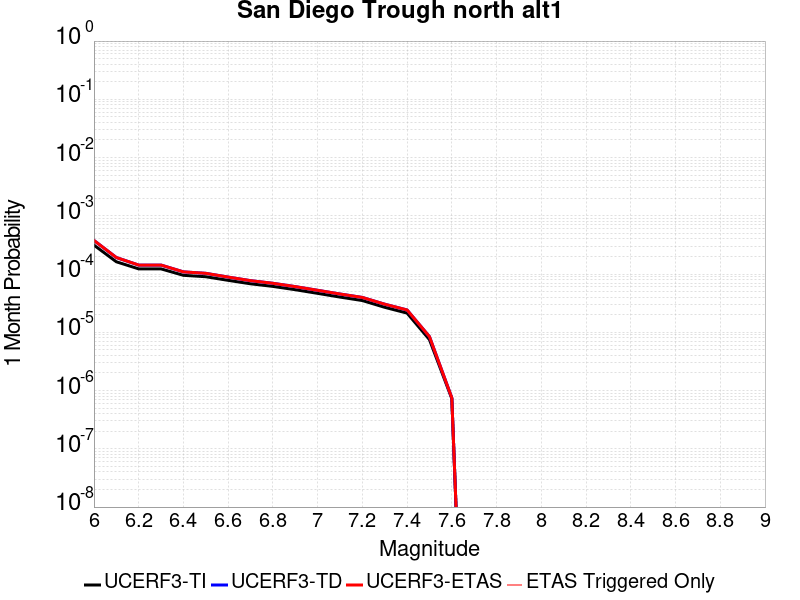 |  |  |

| Magnitude | 1 wk TI Prob | 1 wk TD Prob | 1 wk ETAS Prob | 1 wk ETAS/TD Gain | 1 wk ETAS Triggered Only | 1 mo TI Prob | 1 mo TD Prob | 1 mo ETAS Prob | 1 mo ETAS/TD Gain | 1 mo ETAS Triggered Only | 1 yr TI Prob | 1 yr TD Prob | 1 yr ETAS Prob | 1 yr ETAS/TD Gain | 1 yr ETAS Triggered Only | 10 yr TI Prob | 10 yr TD Prob | 10 yr ETAS Prob | 10 yr ETAS/TD Gain | 10 yr ETAS Triggered Only |
|-----|-----|-----|-----|-----|-----|-----|-----|-----|-----|-----|-----|-----|-----|-----|-----|-----|-----|-----|-----|-----|
| 6.0 | 7.329252E-5 | 8.822077E-5 | 8.822077E-5 | 1.0 | 0.0 | 3.14073E-4 | 3.7803786E-4 | 3.7803786E-4 | 1.0 | 0.0 | 0.0038171355 | 0.0045935363 | 0.0045935363 | 1.0 | 0.0 | 0.03752231 | 0.04504978 | 0.045107074 | 1.0012718 | 6.0E-5 |
| 6.1 | 3.7940346E-5 | 4.488948E-5 | 4.488948E-5 | 1.0 | 0.0 | 1.6259136E-4 | 1.9236986E-4 | 1.9236986E-4 | 1.0 | 0.0 | 0.0019777524 | 0.0023396744 | 0.0023396744 | 1.0 | 0.0 | 0.019602431 | 0.023158934 | 0.023188239 | 1.0012654 | 3.0E-5 |
| 6.2 | 2.8645263E-5 | 3.3299704E-5 | 3.3299704E-5 | 1.0 | 0.0 | 1.2275964E-4 | 1.4270536E-4 | 1.4270536E-4 | 1.0 | 0.0 | 0.0014935739 | 0.0017360692 | 0.0017360692 | 1.0 | 0.0 | 0.0148357535 | 0.017227737 | 0.017247392 | 1.001141 | 2.0E-5 |
| 6.3 | 2.8645263E-5 | 3.3299704E-5 | 3.3299704E-5 | 1.0 | 0.0 | 1.2275964E-4 | 1.4270536E-4 | 1.4270536E-4 | 1.0 | 0.0 | 0.0014935739 | 0.0017360692 | 0.0017360692 | 1.0 | 0.0 | 0.0148357535 | 0.017227737 | 0.017247392 | 1.001141 | 2.0E-5 |
| 6.4 | 2.2204576E-5 | 2.5450314E-5 | 2.5450314E-5 | 1.0 | 0.0 | 9.5159E-5 | 1.0906827E-4 | 1.0906827E-4 | 1.0 | 0.0 | 0.001157945 | 0.0013271073 | 0.0013271073 | 1.0 | 0.0 | 0.011519298 | 0.013192981 | 0.013202849 | 1.000748 | 1.0E-5 |
| 6.5 | 2.1004838E-5 | 2.4026547E-5 | 2.4026547E-5 | 1.0 | 0.0 | 9.0017624E-5 | 1.0296691E-4 | 1.0296691E-4 | 1.0 | 0.0 | 0.0010954136 | 0.0012529104 | 0.0012529104 | 1.0 | 0.0 | 0.010900296 | 0.012459543 | 0.012469418 | 1.0007926 | 1.0E-5 |
| 6.6 | 1.820557E-5 | 2.0706308E-5 | 2.0706308E-5 | 1.0 | 0.0 | 7.802154E-5 | 8.8738336E-5 | 8.8738336E-5 | 1.0 | 0.0 | 9.4949827E-4 | 0.0010798592 | 0.0010798592 | 1.0 | 0.0 | 0.009454516 | 0.01074679 | 0.010756683 | 1.0009205 | 1.0E-5 |
| 6.7 | 1.5884485E-5 | 1.7984918E-5 | 1.7984918E-5 | 1.0 | 0.0 | 6.807459E-5 | 7.707596E-5 | 7.707596E-5 | 1.0 | 0.0 | 8.284929E-4 | 9.379985E-4 | 9.379985E-4 | 1.0 | 0.0 | 0.008254109 | 0.009340761 | 0.009350668 | 1.0010606 | 1.0E-5 |
| 6.8 | 1.4331171E-5 | 1.6202195E-5 | 1.6202195E-5 | 1.0 | 0.0 | 6.141786E-5 | 6.9436144E-5 | 6.9436144E-5 | 1.0 | 0.0 | 7.4750587E-4 | 8.450591E-4 | 8.450591E-4 | 1.0 | 0.0 | 0.0074499645 | 0.008418724 | 0.00842864 | 1.0011778 | 1.0E-5 |
| 6.9 | 1.2574203E-5 | 1.4206819E-5 | 1.4206819E-5 | 1.0 | 0.0 | 5.3888325E-5 | 6.0884955E-5 | 6.0884955E-5 | 1.0 | 0.0 | 6.558929E-4 | 7.410236E-4 | 7.410236E-4 | 1.0 | 0.0 | 0.0065396037 | 0.0073857135 | 0.0073956395 | 1.001344 | 1.0E-5 |
| 7.0 | 1.0883844E-5 | 1.2290109E-5 | 1.2290109E-5 | 1.0 | 0.0 | 4.664421E-5 | 5.267084E-5 | 5.267084E-5 | 1.0 | 0.0 | 5.677453E-4 | 6.4107974E-4 | 6.4107974E-4 | 1.0 | 0.0 | 0.00566297 | 0.0063924324 | 0.006402368 | 1.0015544 | 1.0E-5 |
| 7.1 | 9.393088E-6 | 1.0607752E-5 | 1.0607752E-5 | 1.0 | 0.0 | 4.025547E-5 | 4.546101E-5 | 4.546101E-5 | 1.0 | 0.0 | 4.900001E-4 | 5.53348E-4 | 5.53348E-4 | 1.0 | 0.0 | 0.0048892107 | 0.005519798 | 0.0055297427 | 1.0018016 | 1.0E-5 |
| 7.2 | 8.190791E-6 | 9.259271E-6 | 9.259271E-6 | 1.0 | 0.0 | 3.510292E-5 | 3.968199E-5 | 3.968199E-5 | 1.0 | 0.0 | 4.2729423E-4 | 4.830218E-4 | 4.830218E-4 | 1.0 | 0.0 | 0.0042647356 | 0.0048197997 | 0.004829752 | 1.0020648 | 1.0E-5 |
| 7.3 | 6.268162E-6 | 7.090212E-6 | 7.090212E-6 | 1.0 | 0.0 | 2.6863276E-5 | 3.0386273E-5 | 3.0386273E-5 | 1.0 | 0.0 | 3.2701128E-4 | 3.6989048E-4 | 3.6989048E-4 | 1.0 | 0.0 | 0.003265305 | 0.0036927941 | 0.0037027572 | 1.002698 | 1.0E-5 |
| 7.4 | 4.985186E-6 | 5.643079E-6 | 5.643079E-6 | 1.0 | 0.0 | 2.1364907E-5 | 2.4184403E-5 | 2.4184403E-5 | 1.0 | 0.0 | 2.600867E-4 | 2.944057E-4 | 2.944057E-4 | 1.0 | 0.0 | 0.002597825 | 0.0029401982 | 0.0029401982 | 1.0 | 0.0 |
| 7.5 | 1.7489613E-6 | 1.9698116E-6 | 1.9698116E-6 | 1.0 | 0.0 | 7.495527E-6 | 8.4420235E-6 | 8.4420235E-6 | 1.0 | 0.0 | 9.125422E-5 | 1.0277701E-4 | 1.0277701E-4 | 1.0 | 0.0 | 9.1216754E-4 | 0.0010273168 | 0.0010273168 | 1.0 | 0.0 |
| 7.6 | 1.6988751E-7 | 1.7534121E-7 | 1.7534121E-7 | 1.0 | 0.0 | 7.2808916E-7 | 7.5146215E-7 | 7.5146215E-7 | 1.0 | 0.0 | 8.864449E-6 | 9.149016E-6 | 9.149016E-6 | 1.0 | 0.0 | 8.8640954E-5 | 9.148658E-5 | 9.148658E-5 | 1.0 | 0.0 |

## Red Mountain
*[(top)](#table-of-contents)*

| 1 Week | 1 Month | 1 Year | 10 Year |
|-----|-----|-----|-----|
|  |  | 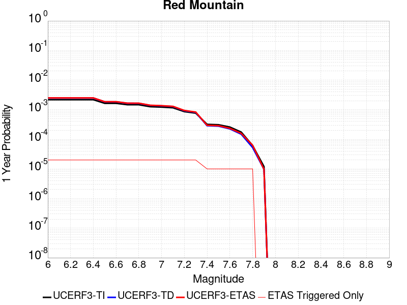 |  |

| Magnitude | 1 wk TI Prob | 1 wk TD Prob | 1 wk ETAS Prob | 1 wk ETAS/TD Gain | 1 wk ETAS Triggered Only | 1 mo TI Prob | 1 mo TD Prob | 1 mo ETAS Prob | 1 mo ETAS/TD Gain | 1 mo ETAS Triggered Only | 1 yr TI Prob | 1 yr TD Prob | 1 yr ETAS Prob | 1 yr ETAS/TD Gain | 1 yr ETAS Triggered Only | 10 yr TI Prob | 10 yr TD Prob | 10 yr ETAS Prob | 10 yr ETAS/TD Gain | 10 yr ETAS Triggered Only |
|-----|-----|-----|-----|-----|-----|-----|-----|-----|-----|-----|-----|-----|-----|-----|-----|-----|-----|-----|-----|-----|
| 6.0 | 4.1810763E-5 | 4.759418E-5 | 4.759418E-5 | 1.0 | 0.0 | 1.7917668E-4 | 2.0396004E-4 | 2.13958E-4 | 1.0490192 | 1.0E-5 | 0.0021792934 | 0.0024805511 | 0.0025005015 | 1.0080427 | 2.0E-5 | 0.021580452 | 0.024546249 | 0.024604777 | 1.0023844 | 6.0E-5 |
| 6.1 | 4.1810763E-5 | 4.759418E-5 | 4.759418E-5 | 1.0 | 0.0 | 1.7917668E-4 | 2.0396004E-4 | 2.13958E-4 | 1.0490192 | 1.0E-5 | 0.0021792934 | 0.0024805511 | 0.0025005015 | 1.0080427 | 2.0E-5 | 0.021580452 | 0.024546249 | 0.024604777 | 1.0023844 | 6.0E-5 |
| 6.2 | 4.1810763E-5 | 4.759418E-5 | 4.759418E-5 | 1.0 | 0.0 | 1.7917668E-4 | 2.0396004E-4 | 2.13958E-4 | 1.0490192 | 1.0E-5 | 0.0021792934 | 0.0024805511 | 0.0025005015 | 1.0080427 | 2.0E-5 | 0.021580452 | 0.024546249 | 0.024604777 | 1.0023844 | 6.0E-5 |
| 6.3 | 4.1810763E-5 | 4.759418E-5 | 4.759418E-5 | 1.0 | 0.0 | 1.7917668E-4 | 2.0396004E-4 | 2.13958E-4 | 1.0490192 | 1.0E-5 | 0.0021792934 | 0.0024805511 | 0.0025005015 | 1.0080427 | 2.0E-5 | 0.021580452 | 0.024546249 | 0.024604777 | 1.0023844 | 6.0E-5 |
| 6.4 | 4.1810763E-5 | 4.759418E-5 | 4.759418E-5 | 1.0 | 0.0 | 1.7917668E-4 | 2.0396004E-4 | 2.13958E-4 | 1.0490192 | 1.0E-5 | 0.0021792934 | 0.0024805511 | 0.0025005015 | 1.0080427 | 2.0E-5 | 0.021580452 | 0.024546249 | 0.024604777 | 1.0023844 | 6.0E-5 |
| 6.5 | 3.154503E-5 | 3.5362722E-5 | 3.5362722E-5 | 1.0 | 0.0 | 1.3518598E-4 | 1.5154622E-4 | 1.615447E-4 | 1.0659765 | 1.0E-5 | 0.0016446467 | 0.001843606 | 0.0018635691 | 1.0108283 | 2.0E-5 | 0.01632528 | 0.018292768 | 0.018341854 | 1.0026833 | 5.0E-5 |
| 6.6 | 3.1535834E-5 | 3.5352103E-5 | 3.5352103E-5 | 1.0 | 0.0 | 1.3514658E-4 | 1.5150072E-4 | 1.6149919E-4 | 1.0659963 | 1.0E-5 | 0.0016441676 | 0.0018430529 | 0.001863016 | 1.0108316 | 2.0E-5 | 0.01632056 | 0.018287329 | 0.018336415 | 1.0026841 | 5.0E-5 |
| 6.7 | 2.8267326E-5 | 3.1471947E-5 | 3.1471947E-5 | 1.0 | 0.0 | 1.2114006E-4 | 1.3487328E-4 | 1.4487193E-4 | 1.0741336 | 1.0E-5 | 0.0014738824 | 0.0016409304 | 0.0016608975 | 1.0121682 | 2.0E-5 | 0.014641452 | 0.016296903 | 0.016346088 | 1.003018 | 5.0E-5 |
| 6.8 | 2.8212884E-5 | 3.140983E-5 | 3.140983E-5 | 1.0 | 0.0 | 1.20906756E-4 | 1.3460708E-4 | 1.4460573E-4 | 1.0742803 | 1.0E-5 | 0.0014710457 | 0.0016376943 | 0.0016576615 | 1.0121922 | 2.0E-5 | 0.014613459 | 0.016265018 | 0.016314205 | 1.0030241 | 5.0E-5 |
| 6.9 | 2.4227871E-5 | 2.6709133E-5 | 2.6709133E-5 | 1.0 | 0.0 | 1.03829596E-4 | 1.1446312E-4 | 1.2446198E-4 | 1.0873544 | 1.0E-5 | 0.0012633923 | 0.0013927735 | 0.0014127457 | 1.0143398 | 2.0E-5 | 0.012562336 | 0.013848136 | 0.013897443 | 1.0035605 | 5.0E-5 |
| 7.0 | 2.348524E-5 | 2.5837837E-5 | 2.5837837E-5 | 1.0 | 0.0 | 1.0064714E-4 | 1.10729314E-4 | 1.20728204E-4 | 1.0903003 | 1.0E-5 | 0.0012246901 | 0.0013473714 | 0.0013673444 | 1.0148237 | 2.0E-5 | 0.012179627 | 0.013399659 | 0.013448989 | 1.0036814 | 5.0E-5 |
| 7.1 | 2.2311642E-5 | 2.4464778E-5 | 2.4464778E-5 | 1.0 | 0.0 | 9.561782E-5 | 1.0484526E-4 | 1.1484421E-4 | 1.0953686 | 1.0E-5 | 0.0011635252 | 0.0012758184 | 0.0012957929 | 1.0156562 | 2.0E-5 | 0.01157452 | 0.012692457 | 0.012741823 | 1.0038893 | 5.0E-5 |
| 7.2 | 1.6533986E-5 | 1.7671664E-5 | 1.7671664E-5 | 1.0 | 0.0 | 7.085802E-5 | 7.573386E-5 | 8.57331E-5 | 1.1320313 | 1.0E-5 | 8.623549E-4 | 9.2173315E-4 | 9.4171474E-4 | 1.0216782 | 2.0E-5 | 0.008590161 | 0.00918538 | 0.009225014 | 1.0043148 | 4.0E-5 |
| 7.3 | 1.4703092E-5 | 1.5560665E-5 | 1.5560665E-5 | 1.0 | 0.0 | 6.301173E-5 | 6.668721E-5 | 7.668654E-5 | 1.1499438 | 1.0E-5 | 7.668978E-4 | 8.116759E-4 | 8.3165965E-4 | 1.0246204 | 2.0E-5 | 0.0076425658 | 0.008093189 | 0.008132866 | 1.0049025 | 4.0E-5 |
| 7.4 | 6.1331984E-6 | 5.5291057E-6 | 5.5291057E-6 | 1.0 | 0.0 | 2.6284872E-5 | 2.3695955E-5 | 2.3695955E-5 | 1.0 | 0.0 | 3.199713E-4 | 2.8846058E-4 | 2.9845771E-4 | 1.0346568 | 1.0E-5 | 0.0031951098 | 0.002880916 | 0.0029108296 | 1.0103834 | 3.0E-5 |
| 7.5 | 5.954766E-6 | 5.338727E-6 | 5.338727E-6 | 1.0 | 0.0 | 2.5520176E-5 | 2.288006E-5 | 2.288006E-5 | 1.0 | 0.0 | 3.1066386E-4 | 2.7852965E-4 | 2.8852688E-4 | 1.0358928 | 1.0E-5 | 0.003102299 | 0.0027818596 | 0.0028117762 | 1.0107541 | 3.0E-5 |
| 7.6 | 4.9726646E-6 | 4.315478E-6 | 4.315478E-6 | 1.0 | 0.0 | 2.1311245E-5 | 1.8494777E-5 | 1.8494777E-5 | 1.0 | 0.0 | 2.5943352E-4 | 2.2515097E-4 | 2.3514872E-4 | 1.0444046 | 1.0E-5 | 0.0025913084 | 0.0022492632 | 0.002279196 | 1.0133077 | 3.0E-5 |
| 7.7 | 3.3613894E-6 | 2.8527843E-6 | 2.8527843E-6 | 1.0 | 0.0 | 1.4405875E-5 | 1.2226163E-5 | 1.2226163E-5 | 1.0 | 0.0 | 1.7537741E-4 | 1.4884362E-4 | 1.5884214E-4 | 1.0671746 | 1.0E-5 | 0.0017523908 | 0.0014874657 | 0.001517421 | 1.0201385 | 3.0E-5 |
| 7.8 | 1.1828961E-6 | 1.0123111E-6 | 1.0123111E-6 | 1.0 | 0.0 | 5.069545E-6 | 4.3384694E-6 | 4.3384694E-6 | 1.0 | 0.0 | 6.171996E-5 | 5.281961E-5 | 6.281908E-5 | 1.1893137 | 1.0E-5 | 6.170282E-4 | 5.280735E-4 | 5.3806824E-4 | 1.0189267 | 1.0E-5 |
| 7.9 | 2.2967266E-7 | 1.8619616E-7 | 1.8619616E-7 | 1.0 | 0.0 | 9.843111E-7 | 7.9798326E-7 | 7.9798326E-7 | 1.0 | 0.0 | 1.19839215E-5 | 9.715406E-6 | 9.715406E-6 | 1.0 | 0.0 | 1.1983275E-4 | 9.71501E-5 | 9.71501E-5 | 1.0 | 0.0 |

## Mission Creek
*[(top)](#table-of-contents)*

| 1 Week | 1 Month | 1 Year | 10 Year |
|-----|-----|-----|-----|
|  |  |  |  |

| Magnitude | 1 wk TI Prob | 1 wk TD Prob | 1 wk ETAS Prob | 1 wk ETAS/TD Gain | 1 wk ETAS Triggered Only | 1 mo TI Prob | 1 mo TD Prob | 1 mo ETAS Prob | 1 mo ETAS/TD Gain | 1 mo ETAS Triggered Only | 1 yr TI Prob | 1 yr TD Prob | 1 yr ETAS Prob | 1 yr ETAS/TD Gain | 1 yr ETAS Triggered Only | 10 yr TI Prob | 10 yr TD Prob | 10 yr ETAS Prob | 10 yr ETAS/TD Gain | 10 yr ETAS Triggered Only |
|-----|-----|-----|-----|-----|-----|-----|-----|-----|-----|-----|-----|-----|-----|-----|-----|-----|-----|-----|-----|-----|
| 6.0 | 1.1549387E-5 | 1.6331744E-5 | 1.6331744E-5 | 1.0 | 0.0 | 4.9496433E-5 | 6.9991394E-5 | 6.9991394E-5 | 1.0 | 0.0 | 6.0245243E-4 | 8.5182703E-4 | 8.7181E-4 | 1.023459 | 2.0E-5 | 0.006008218 | 0.008514742 | 0.008584146 | 1.008151 | 7.0E-5 |
| 6.1 | 1.1549387E-5 | 1.6331744E-5 | 1.6331744E-5 | 1.0 | 0.0 | 4.9496433E-5 | 6.9991394E-5 | 6.9991394E-5 | 1.0 | 0.0 | 6.0245243E-4 | 8.5182703E-4 | 8.7181E-4 | 1.023459 | 2.0E-5 | 0.006008218 | 0.008514742 | 0.008584146 | 1.008151 | 7.0E-5 |
| 6.2 | 1.1549387E-5 | 1.6331744E-5 | 1.6331744E-5 | 1.0 | 0.0 | 4.9496433E-5 | 6.9991394E-5 | 6.9991394E-5 | 1.0 | 0.0 | 6.0245243E-4 | 8.5182703E-4 | 8.7181E-4 | 1.023459 | 2.0E-5 | 0.006008218 | 0.008514742 | 0.008584146 | 1.008151 | 7.0E-5 |
| 6.3 | 1.1549387E-5 | 1.6331744E-5 | 1.6331744E-5 | 1.0 | 0.0 | 4.9496433E-5 | 6.9991394E-5 | 6.9991394E-5 | 1.0 | 0.0 | 6.0245243E-4 | 8.5182703E-4 | 8.7181E-4 | 1.023459 | 2.0E-5 | 0.006008218 | 0.008514742 | 0.008584146 | 1.008151 | 7.0E-5 |
| 6.4 | 1.1549387E-5 | 1.6331744E-5 | 1.6331744E-5 | 1.0 | 0.0 | 4.9496433E-5 | 6.9991394E-5 | 6.9991394E-5 | 1.0 | 0.0 | 6.0245243E-4 | 8.5182703E-4 | 8.7181E-4 | 1.023459 | 2.0E-5 | 0.006008218 | 0.008514742 | 0.008584146 | 1.008151 | 7.0E-5 |
| 6.5 | 1.1549387E-5 | 1.6331744E-5 | 1.6331744E-5 | 1.0 | 0.0 | 4.9496433E-5 | 6.9991394E-5 | 6.9991394E-5 | 1.0 | 0.0 | 6.0245243E-4 | 8.5182703E-4 | 8.7181E-4 | 1.023459 | 2.0E-5 | 0.006008218 | 0.008514742 | 0.008584146 | 1.008151 | 7.0E-5 |
| 6.6 | 9.202681E-6 | 1.3854947E-5 | 1.3854947E-5 | 1.0 | 0.0 | 3.9439463E-5 | 5.9377046E-5 | 5.9377046E-5 | 1.0 | 0.0 | 4.800697E-4 | 7.226848E-4 | 7.426703E-4 | 1.0276545 | 2.0E-5 | 0.004790339 | 0.007231895 | 0.0073013883 | 1.0096093 | 7.0E-5 |
| 6.7 | 9.019164E-6 | 1.366061E-5 | 1.366061E-5 | 1.0 | 0.0 | 3.8652986E-5 | 5.854421E-5 | 5.854421E-5 | 1.0 | 0.0 | 4.7049852E-4 | 7.1255164E-4 | 7.325374E-4 | 1.0280482 | 2.0E-5 | 0.004695036 | 0.007131216 | 0.007200717 | 1.009746 | 7.0E-5 |
| 6.8 | 8.673558E-6 | 1.3282702E-5 | 1.3282702E-5 | 1.0 | 0.0 | 3.717186E-5 | 5.6924673E-5 | 5.6924673E-5 | 1.0 | 0.0 | 4.524734E-4 | 6.928463E-4 | 7.128325E-4 | 1.0288464 | 2.0E-5 | 0.0045155324 | 0.0069353953 | 0.0070049097 | 1.0100231 | 7.0E-5 |
| 6.9 | 7.002255E-6 | 1.1486859E-5 | 1.1486859E-5 | 1.0 | 0.0 | 3.000932E-5 | 4.9228507E-5 | 4.9228507E-5 | 1.0 | 0.0 | 3.653022E-4 | 5.991991E-4 | 6.1918714E-4 | 1.0333579 | 2.0E-5 | 0.0036470229 | 0.0060041854 | 0.0060737655 | 1.0115886 | 7.0E-5 |
| 7.0 | 5.84644E-6 | 9.683714E-6 | 9.683714E-6 | 1.0 | 0.0 | 2.5055931E-5 | 4.1500996E-5 | 4.1500996E-5 | 1.0 | 0.0 | 3.0501327E-4 | 5.0516205E-4 | 5.251519E-4 | 1.0395713 | 2.0E-5 | 0.0030459496 | 0.005068281 | 0.0051379264 | 1.0137414 | 7.0E-5 |
| 7.1 | 5.54703E-6 | 9.338158E-6 | 9.338158E-6 | 1.0 | 0.0 | 2.377277E-5 | 4.0020088E-5 | 4.0020088E-5 | 1.0 | 0.0 | 2.8939504E-4 | 4.871401E-4 | 5.0713035E-4 | 1.041036 | 2.0E-5 | 0.0028901845 | 0.0048888596 | 0.0049585174 | 1.0142483 | 7.0E-5 |
| 7.2 | 4.384709E-6 | 7.689885E-6 | 7.689885E-6 | 1.0 | 0.0 | 1.8791474E-5 | 3.2956254E-5 | 3.2956254E-5 | 1.0 | 0.0 | 2.2876218E-4 | 4.0117218E-4 | 4.2116415E-4 | 1.0498339 | 2.0E-5 | 0.0022852682 | 0.0040325816 | 0.004102299 | 1.0172886 | 7.0E-5 |
| 7.3 | 3.7888456E-6 | 6.923602E-6 | 6.923602E-6 | 1.0 | 0.0 | 1.623781E-5 | 2.9672263E-5 | 2.9672263E-5 | 1.0 | 0.0 | 1.9767738E-4 | 3.6120327E-4 | 3.8119603E-4 | 1.0553505 | 2.0E-5 | 0.0019750162 | 0.0036342472 | 0.003703993 | 1.0191913 | 7.0E-5 |
| 7.4 | 2.1982462E-6 | 5.0316853E-6 | 5.0316853E-6 | 1.0 | 0.0 | 9.421021E-6 | 2.1564189E-5 | 2.1564189E-5 | 1.0 | 0.0 | 1.1469489E-4 | 2.6251256E-4 | 2.825073E-4 | 1.0761669 | 2.0E-5 | 0.0011463572 | 0.0026498951 | 0.0027197096 | 1.0263461 | 7.0E-5 |
| 7.5 | 2.051923E-6 | 4.6227096E-6 | 4.6227096E-6 | 1.0 | 0.0 | 8.793926E-6 | 1.9811463E-5 | 1.9811463E-5 | 1.0 | 0.0 | 1.0706078E-4 | 2.4117802E-4 | 2.611732E-4 | 1.0829062 | 2.0E-5 | 0.0010700922 | 0.0024374423 | 0.0025072717 | 1.0286486 | 7.0E-5 |
| 7.6 | 1.8733427E-6 | 4.1308053E-6 | 4.1308053E-6 | 1.0 | 0.0 | 8.028587E-6 | 1.7703333E-5 | 1.7703333E-5 | 1.0 | 0.0 | 9.774366E-5 | 2.1551683E-4 | 2.3551252E-4 | 1.0927802 | 2.0E-5 | 9.770069E-4 | 0.002181846 | 0.0022516933 | 1.0320129 | 7.0E-5 |
| 7.7 | 1.8411953E-6 | 4.0504306E-6 | 4.0504306E-6 | 1.0 | 0.0 | 7.890813E-6 | 1.7358872E-5 | 1.7358872E-5 | 1.0 | 0.0 | 9.606641E-5 | 2.1132386E-4 | 2.3131965E-4 | 1.0946214 | 2.0E-5 | 9.6024893E-4 | 0.0021401057 | 0.002209956 | 1.0326387 | 7.0E-5 |
| 7.8 | 1.7194251E-6 | 3.7173024E-6 | 3.7173024E-6 | 1.0 | 0.0 | 7.368944E-6 | 1.59312E-5 | 1.59312E-5 | 1.0 | 0.0 | 8.97132E-5 | 1.9394518E-4 | 2.139413E-4 | 1.103102 | 2.0E-5 | 8.967699E-4 | 0.0019658357 | 0.002035698 | 1.0355383 | 7.0E-5 |
| 7.9 | 1.4035052E-6 | 2.9557E-6 | 2.9557E-6 | 1.0 | 0.0 | 6.0150082E-6 | 1.2667225E-5 | 1.2667225E-5 | 1.0 | 0.0 | 7.3230265E-5 | 1.5421261E-4 | 1.7420952E-4 | 1.1296711 | 2.0E-5 | 7.3206134E-4 | 0.0015659636 | 0.001635854 | 1.0446309 | 7.0E-5 |
| 8.0 | 3.9318823E-7 | 5.542283E-7 | 5.542283E-7 | 1.0 | 0.0 | 1.6850913E-6 | 2.3752618E-6 | 2.3752618E-6 | 1.0 | 0.0 | 2.0515794E-5 | 2.8918435E-5 | 2.8918435E-5 | 1.0 | 0.0 | 2.0513899E-4 | 2.997098E-4 | 3.197038E-4 | 1.0667112 | 2.0E-5 |
| 8.1 | 1.596793E-7 | 1.1427638E-7 | 1.1427638E-7 | 1.0 | 0.0 | 6.8433974E-7 | 4.8975585E-7 | 4.8975585E-7 | 1.0 | 0.0 | 8.331805E-6 | 5.962761E-6 | 5.962761E-6 | 1.0 | 0.0 | 8.331492E-5 | 6.57585E-5 | 6.57585E-5 | 1.0 | 0.0 |
| 8.2 | 4.9003038E-8 | 2.5565779E-8 | 2.5565779E-8 | 1.0 | 0.0 | 2.10013E-7 | 1.09567615E-7 | 1.09567615E-7 | 1.0 | 0.0 | 2.5569052E-6 | 1.3339849E-6 | 1.3339849E-6 | 1.0 | 0.0 | 2.556876E-5 | 1.5023335E-5 | 1.5023335E-5 | 1.0 | 0.0 |

## Channel Islands Thrust
*[(top)](#table-of-contents)*

| 1 Week | 1 Month | 1 Year | 10 Year |
|-----|-----|-----|-----|
|  |  |  |  |

| Magnitude | 1 wk TI Prob | 1 wk TD Prob | 1 wk ETAS Prob | 1 wk ETAS/TD Gain | 1 wk ETAS Triggered Only | 1 mo TI Prob | 1 mo TD Prob | 1 mo ETAS Prob | 1 mo ETAS/TD Gain | 1 mo ETAS Triggered Only | 1 yr TI Prob | 1 yr TD Prob | 1 yr ETAS Prob | 1 yr ETAS/TD Gain | 1 yr ETAS Triggered Only | 10 yr TI Prob | 10 yr TD Prob | 10 yr ETAS Prob | 10 yr ETAS/TD Gain | 10 yr ETAS Triggered Only |
|-----|-----|-----|-----|-----|-----|-----|-----|-----|-----|-----|-----|-----|-----|-----|-----|-----|-----|-----|-----|-----|
| 6.0 | 2.2156251E-5 | 2.4093148E-5 | 2.4093148E-5 | 1.0 | 0.0 | 9.495191E-5 | 1.0325286E-4 | 1.0325286E-4 | 1.0 | 0.0 | 0.0011554264 | 0.0012564851 | 0.0012864474 | 1.0238461 | 3.0E-5 | 0.011494373 | 0.012504402 | 0.012563651 | 1.0047383 | 6.0E-5 |
| 6.1 | 2.2156251E-5 | 2.4093148E-5 | 2.4093148E-5 | 1.0 | 0.0 | 9.495191E-5 | 1.0325286E-4 | 1.0325286E-4 | 1.0 | 0.0 | 0.0011554264 | 0.0012564851 | 0.0012864474 | 1.0238461 | 3.0E-5 | 0.011494373 | 0.012504402 | 0.012563651 | 1.0047383 | 6.0E-5 |
| 6.2 | 2.2156251E-5 | 2.4093148E-5 | 2.4093148E-5 | 1.0 | 0.0 | 9.495191E-5 | 1.0325286E-4 | 1.0325286E-4 | 1.0 | 0.0 | 0.0011554264 | 0.0012564851 | 0.0012864474 | 1.0238461 | 3.0E-5 | 0.011494373 | 0.012504402 | 0.012563651 | 1.0047383 | 6.0E-5 |
| 6.3 | 2.2156251E-5 | 2.4093148E-5 | 2.4093148E-5 | 1.0 | 0.0 | 9.495191E-5 | 1.0325286E-4 | 1.0325286E-4 | 1.0 | 0.0 | 0.0011554264 | 0.0012564851 | 0.0012864474 | 1.0238461 | 3.0E-5 | 0.011494373 | 0.012504402 | 0.012563651 | 1.0047383 | 6.0E-5 |
| 6.4 | 2.2156251E-5 | 2.4093148E-5 | 2.4093148E-5 | 1.0 | 0.0 | 9.495191E-5 | 1.0325286E-4 | 1.0325286E-4 | 1.0 | 0.0 | 0.0011554264 | 0.0012564851 | 0.0012864474 | 1.0238461 | 3.0E-5 | 0.011494373 | 0.012504402 | 0.012563651 | 1.0047383 | 6.0E-5 |
| 6.5 | 2.2156251E-5 | 2.4093148E-5 | 2.4093148E-5 | 1.0 | 0.0 | 9.495191E-5 | 1.0325286E-4 | 1.0325286E-4 | 1.0 | 0.0 | 0.0011554264 | 0.0012564851 | 0.0012864474 | 1.0238461 | 3.0E-5 | 0.011494373 | 0.012504402 | 0.012563651 | 1.0047383 | 6.0E-5 |
| 6.6 | 2.2156251E-5 | 2.4093148E-5 | 2.4093148E-5 | 1.0 | 0.0 | 9.495191E-5 | 1.0325286E-4 | 1.0325286E-4 | 1.0 | 0.0 | 0.0011554264 | 0.0012564851 | 0.0012864474 | 1.0238461 | 3.0E-5 | 0.011494373 | 0.012504402 | 0.012563651 | 1.0047383 | 6.0E-5 |
| 6.7 | 1.0601296E-5 | 1.1379993E-5 | 1.1379993E-5 | 1.0 | 0.0 | 4.5433335E-5 | 4.8770515E-5 | 4.8770515E-5 | 1.0 | 0.0 | 5.5301044E-4 | 5.9362414E-4 | 5.9362414E-4 | 1.0 | 0.0 | 0.005516363 | 0.0059208865 | 0.005940768 | 1.0033579 | 2.0E-5 |
| 6.8 | 1.0246747E-5 | 1.09971015E-5 | 1.09971015E-5 | 1.0 | 0.0 | 4.391389E-5 | 4.712961E-5 | 4.712961E-5 | 1.0 | 0.0 | 5.345204E-4 | 5.7365675E-4 | 5.7365675E-4 | 1.0 | 0.0 | 0.0053323656 | 0.0057222494 | 0.005742135 | 1.0034751 | 2.0E-5 |
| 6.9 | 9.049551E-6 | 9.70002E-6 | 9.70002E-6 | 1.0 | 0.0 | 3.878322E-5 | 4.1570875E-5 | 4.1570875E-5 | 1.0 | 0.0 | 4.7208337E-4 | 5.0601194E-4 | 5.0601194E-4 | 1.0 | 0.0 | 0.0047108172 | 0.0050490154 | 0.0050589647 | 1.0019705 | 1.0E-5 |
| 7.0 | 8.6542195E-6 | 9.2749615E-6 | 9.2749615E-6 | 1.0 | 0.0 | 3.7088983E-5 | 3.9749255E-5 | 3.9749255E-5 | 1.0 | 0.0 | 4.5146482E-4 | 4.8384376E-4 | 4.8384376E-4 | 1.0 | 0.0 | 0.004505487 | 0.004828315 | 0.0048382673 | 1.0020611 | 1.0E-5 |
| 7.1 | 8.391028E-6 | 8.993273E-6 | 8.993273E-6 | 1.0 | 0.0 | 3.5961057E-5 | 3.8542054E-5 | 3.8542054E-5 | 1.0 | 0.0 | 4.3773788E-4 | 4.6915252E-4 | 4.6915252E-4 | 1.0 | 0.0 | 0.004368766 | 0.004682031 | 0.0046919845 | 1.0021259 | 1.0E-5 |
| 7.2 | 5.965188E-6 | 6.3719312E-6 | 6.3719312E-6 | 1.0 | 0.0 | 2.556484E-5 | 2.7307993E-5 | 2.7307993E-5 | 1.0 | 0.0 | 3.1120746E-4 | 3.3242465E-4 | 3.3242465E-4 | 1.0 | 0.0 | 0.00310772 | 0.003319332 | 0.0033292987 | 1.0030026 | 1.0E-5 |
| 7.3 | 4.877518E-6 | 5.2061982E-6 | 5.2061982E-6 | 1.0 | 0.0 | 2.0903482E-5 | 2.231209E-5 | 2.231209E-5 | 1.0 | 0.0 | 2.5447016E-4 | 2.7161627E-4 | 2.7161627E-4 | 1.0 | 0.0 | 0.0025417898 | 0.002712889 | 0.0027228622 | 1.003676 | 1.0E-5 |
| 7.4 | 3.8829853E-6 | 4.142015E-6 | 4.142015E-6 | 1.0 | 0.0 | 1.664126E-5 | 1.7751374E-5 | 1.7751374E-5 | 1.0 | 0.0 | 2.0258849E-4 | 2.1610195E-4 | 2.1610195E-4 | 1.0 | 0.0 | 0.002024039 | 0.0021589599 | 0.0021589599 | 1.0 | 0.0 |
| 7.5 | 1.3489616E-6 | 1.4278398E-6 | 1.4278398E-6 | 1.0 | 0.0 | 5.7812517E-6 | 6.1192995E-6 | 6.1192995E-6 | 1.0 | 0.0 | 7.038446E-5 | 7.449996E-5 | 7.449996E-5 | 1.0 | 0.0 | 7.036218E-4 | 7.4475387E-4 | 7.4475387E-4 | 1.0 | 0.0 |
| 7.6 | 6.058192E-7 | 6.353994E-7 | 6.353994E-7 | 1.0 | 0.0 | 2.5963652E-6 | 2.7231374E-6 | 2.7231374E-6 | 1.0 | 0.0 | 3.161029E-5 | 3.315371E-5 | 3.315371E-5 | 1.0 | 0.0 | 3.1605794E-4 | 3.3148925E-4 | 3.3148925E-4 | 1.0 | 0.0 |
| 7.7 | 2.2170494E-7 | 2.260861E-7 | 2.260861E-7 | 1.0 | 0.0 | 9.5016367E-7 | 9.689402E-7 | 9.689402E-7 | 1.0 | 0.0 | 1.1568181E-5 | 1.1796794E-5 | 1.1796794E-5 | 1.0 | 0.0 | 1.1567579E-4 | 1.1796278E-4 | 1.1796278E-4 | 1.0 | 0.0 |
| 7.8 | 2.1613102E-8 | 1.5467108E-8 | 1.5467108E-8 | 1.0 | 0.0 | 9.262757E-8 | 6.6287605E-8 | 6.6287605E-8 | 1.0 | 0.0 | 1.1277401E-6 | 8.070513E-7 | 8.070513E-7 | 1.0 | 0.0 | 1.1277344E-5 | 8.070492E-6 | 8.070492E-6 | 1.0 | 0.0 |

## San Cayetano
*[(top)](#table-of-contents)*

| 1 Week | 1 Month | 1 Year | 10 Year |
|-----|-----|-----|-----|
|  |  |  |  |

| Magnitude | 1 wk TI Prob | 1 wk TD Prob | 1 wk ETAS Prob | 1 wk ETAS/TD Gain | 1 wk ETAS Triggered Only | 1 mo TI Prob | 1 mo TD Prob | 1 mo ETAS Prob | 1 mo ETAS/TD Gain | 1 mo ETAS Triggered Only | 1 yr TI Prob | 1 yr TD Prob | 1 yr ETAS Prob | 1 yr ETAS/TD Gain | 1 yr ETAS Triggered Only | 10 yr TI Prob | 10 yr TD Prob | 10 yr ETAS Prob | 10 yr ETAS/TD Gain | 10 yr ETAS Triggered Only |
|-----|-----|-----|-----|-----|-----|-----|-----|-----|-----|-----|-----|-----|-----|-----|-----|-----|-----|-----|-----|-----|
| 6.0 | 2.3476267E-5 | 1.8172246E-5 | 1.8172246E-5 | 1.0 | 0.0 | 1.0060869E-4 | 7.787875E-5 | 1.0787641E-4 | 1.3851842 | 3.0E-5 | 0.0012242225 | 9.4776496E-4 | 9.977176E-4 | 1.0527056 | 5.0E-5 | 0.012175002 | 0.009438118 | 0.009497551 | 1.0062972 | 6.0E-5 |
| 6.1 | 2.3476267E-5 | 1.8172246E-5 | 1.8172246E-5 | 1.0 | 0.0 | 1.0060869E-4 | 7.787875E-5 | 1.0787641E-4 | 1.3851842 | 3.0E-5 | 0.0012242225 | 9.4776496E-4 | 9.977176E-4 | 1.0527056 | 5.0E-5 | 0.012175002 | 0.009438118 | 0.009497551 | 1.0062972 | 6.0E-5 |
| 6.2 | 2.3476267E-5 | 1.8172246E-5 | 1.8172246E-5 | 1.0 | 0.0 | 1.0060869E-4 | 7.787875E-5 | 1.0787641E-4 | 1.3851842 | 3.0E-5 | 0.0012242225 | 9.4776496E-4 | 9.977176E-4 | 1.0527056 | 5.0E-5 | 0.012175002 | 0.009438118 | 0.009497551 | 1.0062972 | 6.0E-5 |
| 6.3 | 2.3476267E-5 | 1.8172246E-5 | 1.8172246E-5 | 1.0 | 0.0 | 1.0060869E-4 | 7.787875E-5 | 1.0787641E-4 | 1.3851842 | 3.0E-5 | 0.0012242225 | 9.4776496E-4 | 9.977176E-4 | 1.0527056 | 5.0E-5 | 0.012175002 | 0.009438118 | 0.009497551 | 1.0062972 | 6.0E-5 |
| 6.4 | 2.3476267E-5 | 1.8172246E-5 | 1.8172246E-5 | 1.0 | 0.0 | 1.0060869E-4 | 7.787875E-5 | 1.0787641E-4 | 1.3851842 | 3.0E-5 | 0.0012242225 | 9.4776496E-4 | 9.977176E-4 | 1.0527056 | 5.0E-5 | 0.012175002 | 0.009438118 | 0.009497551 | 1.0062972 | 6.0E-5 |
| 6.5 | 2.3476267E-5 | 1.8172246E-5 | 1.8172246E-5 | 1.0 | 0.0 | 1.0060869E-4 | 7.787875E-5 | 1.0787641E-4 | 1.3851842 | 3.0E-5 | 0.0012242225 | 9.4776496E-4 | 9.977176E-4 | 1.0527056 | 5.0E-5 | 0.012175002 | 0.009438118 | 0.009497551 | 1.0062972 | 6.0E-5 |
| 6.6 | 2.3476267E-5 | 1.8172246E-5 | 1.8172246E-5 | 1.0 | 0.0 | 1.0060869E-4 | 7.787875E-5 | 1.0787641E-4 | 1.3851842 | 3.0E-5 | 0.0012242225 | 9.4776496E-4 | 9.977176E-4 | 1.0527056 | 5.0E-5 | 0.012175002 | 0.009438118 | 0.009497551 | 1.0062972 | 6.0E-5 |
| 6.7 | 2.3476267E-5 | 1.8172246E-5 | 1.8172246E-5 | 1.0 | 0.0 | 1.0060869E-4 | 7.787875E-5 | 1.0787641E-4 | 1.3851842 | 3.0E-5 | 0.0012242225 | 9.4776496E-4 | 9.977176E-4 | 1.0527056 | 5.0E-5 | 0.012175002 | 0.009438118 | 0.009497551 | 1.0062972 | 6.0E-5 |
| 6.8 | 2.3241924E-5 | 1.7939927E-5 | 1.7939927E-5 | 1.0 | 0.0 | 9.960445E-5 | 7.688316E-5 | 1.0688085E-4 | 1.3901725 | 3.0E-5 | 0.0012120095 | 9.356541E-4 | 9.856073E-4 | 1.0533886 | 5.0E-5 | 0.012054204 | 0.009318002 | 0.009377443 | 1.0063791 | 6.0E-5 |
| 6.9 | 2.2761007E-5 | 1.7435323E-5 | 1.7435323E-5 | 1.0 | 0.0 | 9.7543525E-5 | 7.4720694E-5 | 1.0471845E-4 | 1.4014652 | 3.0E-5 | 0.0011869454 | 9.093482E-4 | 9.493118E-4 | 1.0439476 | 4.0E-5 | 0.011806256 | 0.009057103 | 0.009106649 | 1.0054705 | 5.0E-5 |
| 7.0 | 2.240283E-5 | 1.7069042E-5 | 1.7069042E-5 | 1.0 | 0.0 | 9.600859E-5 | 7.3151E-5 | 1.0314881E-4 | 1.4100806 | 3.0E-5 | 0.0011682777 | 8.9025294E-4 | 9.302173E-4 | 1.044891 | 4.0E-5 | 0.011621549 | 0.008867681 | 0.008917238 | 1.0055884 | 5.0E-5 |
| 7.1 | 2.1871154E-5 | 1.6588847E-5 | 1.6588847E-5 | 1.0 | 0.0 | 9.373015E-5 | 7.1093134E-5 | 1.01091005E-4 | 1.4219517 | 3.0E-5 | 0.0011405671 | 8.652186E-4 | 9.0518396E-4 | 1.0461911 | 4.0E-5 | 0.011347309 | 0.008619301 | 0.008668871 | 1.0057509 | 5.0E-5 |
| 7.2 | 2.0714133E-5 | 1.5567295E-5 | 1.5567295E-5 | 1.0 | 0.0 | 8.8771834E-5 | 6.671529E-5 | 9.6713295E-5 | 1.4496421 | 3.0E-5 | 0.0010802611 | 8.1195927E-4 | 8.519268E-4 | 1.0492235 | 4.0E-5 | 0.010750249 | 0.008090701 | 0.008140297 | 1.00613 | 5.0E-5 |
| 7.3 | 1.8408395E-5 | 1.3998046E-5 | 1.3998046E-5 | 1.0 | 0.0 | 7.8890735E-5 | 5.999026E-5 | 8.998846E-5 | 1.5000511 | 3.0E-5 | 9.600714E-4 | 7.3013967E-4 | 7.7011046E-4 | 1.054744 | 4.0E-5 | 0.009559342 | 0.007278127 | 0.0073277634 | 1.0068198 | 5.0E-5 |
| 7.4 | 1.6856795E-5 | 1.2851064E-5 | 1.2851064E-5 | 1.0 | 0.0 | 7.2241404E-5 | 5.507484E-5 | 8.507319E-5 | 1.5446833 | 3.0E-5 | 8.7918417E-4 | 6.7033275E-4 | 7.1030593E-4 | 1.0596318 | 4.0E-5 | 0.00875714 | 0.006683788 | 0.006733454 | 1.0074308 | 5.0E-5 |
| 7.5 | 1.2822778E-5 | 9.578205E-6 | 9.578205E-6 | 1.0 | 0.0 | 5.495361E-5 | 4.1048817E-5 | 5.1048406E-5 | 1.2436024 | 1.0E-5 | 6.688548E-4 | 4.996563E-4 | 5.1964633E-4 | 1.0400075 | 2.0E-5 | 0.006668452 | 0.0049855 | 0.0050153504 | 1.0059874 | 3.0E-5 |
| 7.6 | 5.6272684E-6 | 3.855203E-6 | 3.855203E-6 | 1.0 | 0.0 | 2.4116642E-5 | 1.6522194E-5 | 1.6522194E-5 | 1.0 | 0.0 | 2.9358055E-4 | 2.0113925E-4 | 2.1113725E-4 | 1.0497068 | 1.0E-5 | 0.0029319301 | 0.002009583 | 0.0020295426 | 1.0099323 | 2.0E-5 |
| 7.7 | 3.5261346E-6 | 2.3408893E-6 | 2.3408893E-6 | 1.0 | 0.0 | 1.5111918E-5 | 1.0032345E-5 | 1.0032345E-5 | 1.0 | 0.0 | 1.8397206E-4 | 1.2213703E-4 | 1.321358E-4 | 1.0818653 | 1.0E-5 | 0.0018381984 | 0.0012207064 | 0.001240682 | 1.016364 | 2.0E-5 |
| 7.8 | 1.4826929E-6 | 1.0564999E-6 | 1.0564999E-6 | 1.0 | 0.0 | 6.354383E-6 | 4.527849E-6 | 4.527849E-6 | 1.0 | 0.0 | 7.736187E-5 | 5.5125187E-5 | 6.512464E-5 | 1.1813953 | 1.0E-5 | 7.733494E-4 | 5.511172E-4 | 5.6111166E-4 | 1.018135 | 1.0E-5 |
| 7.9 | 2.7568166E-7 | 1.6979952E-7 | 1.6979952E-7 | 1.0 | 0.0 | 1.1814923E-6 | 7.27712E-7 | 7.27712E-7 | 1.0 | 0.0 | 1.4384574E-5 | 8.859858E-6 | 8.859858E-6 | 1.0 | 0.0 | 1.4383643E-4 | 8.859509E-5 | 8.859509E-5 | 1.0 | 0.0 |
| 8.0 | 5.407832E-8 | 2.6893451E-8 | 2.6893451E-8 | 1.0 | 0.0 | 2.3176422E-7 | 1.1525764E-7 | 1.1525764E-7 | 1.0 | 0.0 | 2.8217257E-6 | 1.403261E-6 | 1.403261E-6 | 1.0 | 0.0 | 2.8216898E-5 | 1.4032525E-5 | 1.4032525E-5 | 1.0 | 0.0 |

## Tin Mountain
*[(top)](#table-of-contents)*

| 1 Week | 1 Month | 1 Year | 10 Year |
|-----|-----|-----|-----|
|  |  |  |  |

| Magnitude | 1 wk TI Prob | 1 wk TD Prob | 1 wk ETAS Prob | 1 wk ETAS/TD Gain | 1 wk ETAS Triggered Only | 1 mo TI Prob | 1 mo TD Prob | 1 mo ETAS Prob | 1 mo ETAS/TD Gain | 1 mo ETAS Triggered Only | 1 yr TI Prob | 1 yr TD Prob | 1 yr ETAS Prob | 1 yr ETAS/TD Gain | 1 yr ETAS Triggered Only | 10 yr TI Prob | 10 yr TD Prob | 10 yr ETAS Prob | 10 yr ETAS/TD Gain | 10 yr ETAS Triggered Only |
|-----|-----|-----|-----|-----|-----|-----|-----|-----|-----|-----|-----|-----|-----|-----|-----|-----|-----|-----|-----|-----|
| 6.0 | 4.083776E-6 | 4.18159E-6 | 1.4181548E-5 | 3.391425 | 1.0E-5 | 1.750178E-5 | 1.7920998E-5 | 2.7920818E-5 | 1.5579946 | 1.0E-5 | 2.1306332E-4 | 2.1817003E-4 | 2.581613E-4 | 1.1833032 | 4.0E-5 | 0.0021285915 | 0.0021799242 | 0.0022397933 | 1.0274639 | 6.0E-5 |
| 6.1 | 4.083776E-6 | 4.18159E-6 | 1.4181548E-5 | 3.391425 | 1.0E-5 | 1.750178E-5 | 1.7920998E-5 | 2.7920818E-5 | 1.5579946 | 1.0E-5 | 2.1306332E-4 | 2.1817003E-4 | 2.581613E-4 | 1.1833032 | 4.0E-5 | 0.0021285915 | 0.0021799242 | 0.0022397933 | 1.0274639 | 6.0E-5 |
| 6.2 | 4.083776E-6 | 4.18159E-6 | 1.4181548E-5 | 3.391425 | 1.0E-5 | 1.750178E-5 | 1.7920998E-5 | 2.7920818E-5 | 1.5579946 | 1.0E-5 | 2.1306332E-4 | 2.1817003E-4 | 2.581613E-4 | 1.1833032 | 4.0E-5 | 0.0021285915 | 0.0021799242 | 0.0022397933 | 1.0274639 | 6.0E-5 |
| 6.3 | 4.083776E-6 | 4.18159E-6 | 1.4181548E-5 | 3.391425 | 1.0E-5 | 1.750178E-5 | 1.7920998E-5 | 2.7920818E-5 | 1.5579946 | 1.0E-5 | 2.1306332E-4 | 2.1817003E-4 | 2.581613E-4 | 1.1833032 | 4.0E-5 | 0.0021285915 | 0.0021799242 | 0.0022397933 | 1.0274639 | 6.0E-5 |
| 6.4 | 4.083776E-6 | 4.18159E-6 | 1.4181548E-5 | 3.391425 | 1.0E-5 | 1.750178E-5 | 1.7920998E-5 | 2.7920818E-5 | 1.5579946 | 1.0E-5 | 2.1306332E-4 | 2.1817003E-4 | 2.581613E-4 | 1.1833032 | 4.0E-5 | 0.0021285915 | 0.0021799242 | 0.0022397933 | 1.0274639 | 6.0E-5 |
| 6.5 | 2.3143427E-6 | 2.3731893E-6 | 1.2373165E-5 | 5.213729 | 1.0E-5 | 9.9185745E-6 | 1.01707765E-5 | 2.0170673E-5 | 1.9831991 | 1.0E-5 | 1.2075195E-4 | 1.2382293E-4 | 1.5381922E-4 | 1.2422514 | 3.0E-5 | 0.0012068636 | 0.0012376154 | 0.0012775658 | 1.0322802 | 4.0E-5 |
| 6.6 | 2.3143427E-6 | 2.3731893E-6 | 1.2373165E-5 | 5.213729 | 1.0E-5 | 9.9185745E-6 | 1.01707765E-5 | 2.0170673E-5 | 1.9831991 | 1.0E-5 | 1.2075195E-4 | 1.2382293E-4 | 1.5381922E-4 | 1.2422514 | 3.0E-5 | 0.0012068636 | 0.0012376154 | 0.0012775658 | 1.0322802 | 4.0E-5 |
| 6.7 | 1.7029532E-6 | 1.7498172E-6 | 1.1749799E-5 | 6.714873 | 1.0E-5 | 7.2983503E-6 | 7.499198E-6 | 1.7499124E-5 | 2.333466 | 1.0E-5 | 8.885379E-5 | 9.1299444E-5 | 1.0129853E-4 | 1.1095197 | 1.0E-5 | 8.881827E-4 | 9.12672E-4 | 9.326537E-4 | 1.0218936 | 2.0E-5 |
| 6.8 | 1.2914646E-6 | 1.329959E-6 | 1.1329946E-5 | 8.519019 | 1.0E-5 | 5.534837E-6 | 5.699814E-6 | 1.5699758E-5 | 2.7544332 | 1.0E-5 | 6.738455E-5 | 6.939347E-5 | 7.9392776E-5 | 1.1440958 | 1.0E-5 | 6.736412E-4 | 6.937614E-4 | 7.137475E-4 | 1.0288084 | 2.0E-5 |
| 6.9 | 5.8708974E-7 | 6.11713E-7 | 6.11713E-7 | 1.0 | 0.0 | 2.5160964E-6 | 2.6216248E-6 | 2.6216248E-6 | 1.0 | 0.0 | 3.0633044E-5 | 3.1917854E-5 | 3.1917854E-5 | 1.0 | 0.0 | 3.0628822E-4 | 3.1913683E-4 | 3.2913365E-4 | 1.0313245 | 1.0E-5 |
| 7.0 | 4.6248786E-7 | 4.8321306E-7 | 4.8321306E-7 | 1.0 | 0.0 | 1.9820893E-6 | 2.0709115E-6 | 2.0709115E-6 | 1.0 | 0.0 | 2.413167E-5 | 2.5213094E-5 | 2.5213094E-5 | 1.0 | 0.0 | 2.412905E-4 | 2.5210602E-4 | 2.5210602E-4 | 1.0 | 0.0 |
| 7.1 | 3.804606E-7 | 3.9872486E-7 | 3.9872486E-7 | 1.0 | 0.0 | 1.6305444E-6 | 1.7088199E-6 | 1.7088199E-6 | 1.0 | 0.0 | 1.9851697E-5 | 2.0804719E-5 | 2.0804719E-5 | 1.0 | 0.0 | 1.9849923E-4 | 2.0803107E-4 | 2.0803107E-4 | 1.0 | 0.0 |
| 7.2 | 3.5864858E-7 | 3.7617838E-7 | 3.7617838E-7 | 1.0 | 0.0 | 1.5370645E-6 | 1.6121922E-6 | 1.6121922E-6 | 1.0 | 0.0 | 1.87136E-5 | 1.9628298E-5 | 1.9628298E-5 | 1.0 | 0.0 | 1.8712023E-4 | 1.9626896E-4 | 1.9626896E-4 | 1.0 | 0.0 |
| 7.3 | 3.342063E-7 | 3.5064386E-7 | 3.5064386E-7 | 1.0 | 0.0 | 1.4323119E-6 | 1.5027588E-6 | 1.5027588E-6 | 1.0 | 0.0 | 1.7438259E-5 | 1.8295968E-5 | 1.8295968E-5 | 1.0 | 0.0 | 1.743689E-4 | 1.8294792E-4 | 1.8294792E-4 | 1.0 | 0.0 |
| 7.4 | 2.971242E-7 | 3.1166627E-7 | 3.1166627E-7 | 1.0 | 0.0 | 1.2733886E-6 | 1.3357121E-6 | 1.3357121E-6 | 1.0 | 0.0 | 1.5503398E-5 | 1.6262207E-5 | 1.6262207E-5 | 1.0 | 0.0 | 1.5502315E-4 | 1.6261345E-4 | 1.6261345E-4 | 1.0 | 0.0 |
| 7.5 | 1.4326713E-7 | 1.5012905E-7 | 1.5012905E-7 | 1.0 | 0.0 | 6.140018E-7 | 6.434102E-7 | 6.434102E-7 | 1.0 | 0.0 | 7.4754466E-6 | 7.83352E-6 | 7.83352E-6 | 1.0 | 0.0 | 7.475195E-5 | 7.833519E-5 | 7.833519E-5 | 1.0 | 0.0 |

## San Clemente
*[(top)](#table-of-contents)*

| 1 Week | 1 Month | 1 Year | 10 Year |
|-----|-----|-----|-----|
|  |  |  | 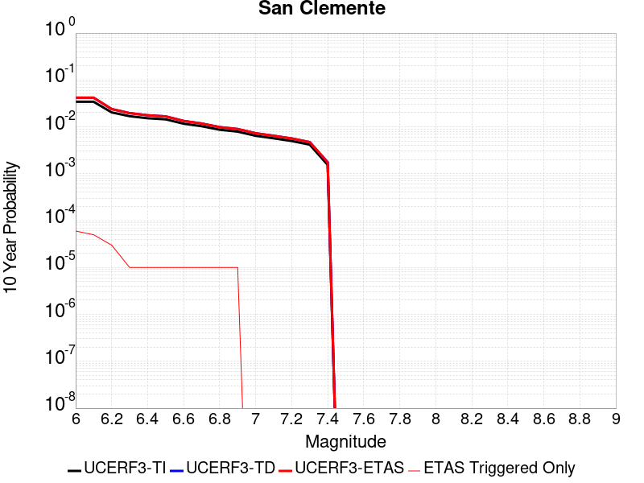 |

| Magnitude | 1 wk TI Prob | 1 wk TD Prob | 1 wk ETAS Prob | 1 wk ETAS/TD Gain | 1 wk ETAS Triggered Only | 1 mo TI Prob | 1 mo TD Prob | 1 mo ETAS Prob | 1 mo ETAS/TD Gain | 1 mo ETAS Triggered Only | 1 yr TI Prob | 1 yr TD Prob | 1 yr ETAS Prob | 1 yr ETAS/TD Gain | 1 yr ETAS Triggered Only | 10 yr TI Prob | 10 yr TD Prob | 10 yr ETAS Prob | 10 yr ETAS/TD Gain | 10 yr ETAS Triggered Only |
|-----|-----|-----|-----|-----|-----|-----|-----|-----|-----|-----|-----|-----|-----|-----|-----|-----|-----|-----|-----|-----|
| 6.0 | 6.681379E-5 | 8.164408E-5 | 9.164327E-5 | 1.1224729 | 1.0E-5 | 2.8631336E-4 | 3.4985956E-4 | 3.5985606E-4 | 1.0285729 | 1.0E-5 | 0.003480294 | 0.0042518 | 0.0042816726 | 1.0070258 | 3.0E-5 | 0.03426291 | 0.04176052 | 0.041818015 | 1.0013767 | 6.0E-5 |
| 6.1 | 6.681379E-5 | 8.164408E-5 | 9.164327E-5 | 1.1224729 | 1.0E-5 | 2.8631336E-4 | 3.4985956E-4 | 3.5985606E-4 | 1.0285729 | 1.0E-5 | 0.003480294 | 0.0042518 | 0.0042816726 | 1.0070258 | 3.0E-5 | 0.03426291 | 0.04176052 | 0.04180843 | 1.0011473 | 5.0E-5 |
| 6.2 | 3.9400576E-5 | 4.645645E-5 | 5.645599E-5 | 1.2152454 | 1.0E-5 | 1.6884868E-4 | 1.9908424E-4 | 2.0908225E-4 | 1.05022 | 1.0E-5 | 0.0020537945 | 0.0024212173 | 0.002441169 | 1.0082403 | 2.0E-5 | 0.020349167 | 0.02395512 | 0.0239844 | 1.0012224 | 3.0E-5 |
| 6.3 | 3.2590255E-5 | 3.79324E-5 | 4.7932022E-5 | 1.2636168 | 1.0E-5 | 1.3966505E-4 | 1.625575E-4 | 1.7255587E-4 | 1.0615067 | 1.0E-5 | 0.0016990956 | 0.001977371 | 0.0019873513 | 1.0050472 | 1.0E-5 | 0.01686163 | 0.019601561 | 0.019611366 | 1.0005002 | 1.0E-5 |
| 6.4 | 2.9454652E-5 | 3.4100634E-5 | 4.4100296E-5 | 1.2932397 | 1.0E-5 | 1.2622811E-4 | 1.4613755E-4 | 1.5613608E-4 | 1.0684187 | 1.0E-5 | 0.0015357438 | 0.0017777971 | 0.0017877794 | 1.005615 | 1.0E-5 | 0.015251739 | 0.017638927 | 0.01764875 | 1.000557 | 1.0E-5 |
| 6.5 | 2.790836E-5 | 3.2250126E-5 | 4.2249805E-5 | 1.3100663 | 1.0E-5 | 1.1960178E-4 | 1.3820764E-4 | 1.4820627E-4 | 1.0723449 | 1.0E-5 | 0.001455179 | 0.0016814041 | 0.0016913873 | 1.0059375 | 1.0E-5 | 0.014456868 | 0.016689846 | 0.01669968 | 1.0005891 | 1.0E-5 |
| 6.6 | 2.2492153E-5 | 2.5764699E-5 | 3.5764442E-5 | 1.3881179 | 1.0E-5 | 9.639138E-5 | 1.10415545E-4 | 1.2041444E-4 | 1.090557 | 1.0E-5 | 0.0011729331 | 0.0013434946 | 0.0013534812 | 1.0074333 | 1.0E-5 | 0.011667615 | 0.013355441 | 0.013365308 | 1.0007387 | 1.0E-5 |
| 6.7 | 1.9862755E-5 | 2.2668124E-5 | 3.2667896E-5 | 1.4411381 | 1.0E-5 | 8.512331E-5 | 9.7145545E-5 | 1.0714457E-4 | 1.1029283 | 1.0E-5 | 0.0010358836 | 0.0011821166 | 0.0011921048 | 1.0084494 | 1.0E-5 | 0.010310682 | 0.011759577 | 0.0117694605 | 1.0008404 | 1.0E-5 |
| 6.8 | 1.6697575E-5 | 1.8979084E-5 | 2.8978895E-5 | 1.5268857 | 1.0E-5 | 7.155907E-5 | 8.133645E-5 | 9.133564E-5 | 1.1229361 | 1.0E-5 | 8.7088346E-4 | 9.898308E-4 | 9.998209E-4 | 1.0100927 | 1.0E-5 | 0.008674784 | 0.009855248 | 0.009865149 | 1.0010047 | 1.0E-5 |
| 6.9 | 1.5218415E-5 | 1.7270635E-5 | 2.7270464E-5 | 1.5790075 | 1.0E-5 | 6.522015E-5 | 7.401496E-5 | 8.4014224E-5 | 1.1350979 | 1.0E-5 | 7.93766E-4 | 9.007684E-4 | 9.107594E-4 | 1.0110916 | 1.0E-5 | 0.007909367 | 0.00897212 | 0.00898203 | 1.0011046 | 1.0E-5 |
| 7.0 | 1.2392958E-5 | 1.4034001E-5 | 1.4034001E-5 | 1.0 | 0.0 | 5.3111595E-5 | 6.0144375E-5 | 6.0144375E-5 | 1.0 | 0.0 | 6.4644177E-4 | 7.320193E-4 | 7.320193E-4 | 1.0 | 0.0 | 0.0064456454 | 0.007296867 | 0.007296867 | 1.0 | 0.0 |
| 7.1 | 1.0934128E-5 | 1.2376004E-5 | 1.2376004E-5 | 1.0 | 0.0 | 4.6859706E-5 | 5.3038977E-5 | 5.3038977E-5 | 1.0 | 0.0 | 5.7036756E-4 | 6.4556557E-4 | 6.4556557E-4 | 1.0 | 0.0 | 0.0056890585 | 0.0064376486 | 0.0064376486 | 1.0 | 0.0 |
| 7.2 | 9.5798805E-6 | 1.0845695E-5 | 1.0845695E-5 | 1.0 | 0.0 | 4.1055984E-5 | 4.6480764E-5 | 4.6480764E-5 | 1.0 | 0.0 | 4.9974193E-4 | 5.6576356E-4 | 5.6576356E-4 | 1.0 | 0.0 | 0.0049861963 | 0.005643956 | 0.005643956 | 1.0 | 0.0 |
| 7.3 | 8.0167365E-6 | 9.084559E-6 | 9.084559E-6 | 1.0 | 0.0 | 3.4356988E-5 | 3.893328E-5 | 3.893328E-5 | 1.0 | 0.0 | 4.1821605E-4 | 4.7391668E-4 | 4.7391668E-4 | 1.0 | 0.0 | 0.0041742986 | 0.004729763 | 0.004729763 | 1.0 | 0.0 |
| 7.4 | 2.9581017E-6 | 3.362623E-6 | 3.362623E-6 | 1.0 | 0.0 | 1.2677518E-5 | 1.441119E-5 | 1.441119E-5 | 1.0 | 0.0 | 1.5433785E-4 | 1.7544716E-4 | 1.7544716E-4 | 1.0 | 0.0 | 0.001542307 | 0.0017535817 | 0.0017535817 | 1.0 | 0.0 |

## Manix-Afton Hills
*[(top)](#table-of-contents)*

| 1 Week | 1 Month | 1 Year | 10 Year |
|-----|-----|-----|-----|
|  |  |  |  |

| Magnitude | 1 wk TI Prob | 1 wk TD Prob | 1 wk ETAS Prob | 1 wk ETAS/TD Gain | 1 wk ETAS Triggered Only | 1 mo TI Prob | 1 mo TD Prob | 1 mo ETAS Prob | 1 mo ETAS/TD Gain | 1 mo ETAS Triggered Only | 1 yr TI Prob | 1 yr TD Prob | 1 yr ETAS Prob | 1 yr ETAS/TD Gain | 1 yr ETAS Triggered Only | 10 yr TI Prob | 10 yr TD Prob | 10 yr ETAS Prob | 10 yr ETAS/TD Gain | 10 yr ETAS Triggered Only |
|-----|-----|-----|-----|-----|-----|-----|-----|-----|-----|-----|-----|-----|-----|-----|-----|-----|-----|-----|-----|-----|
| 6.0 | 1.3783202E-5 | 1.4711616E-5 | 2.471147E-5 | 1.6797249 | 1.0E-5 | 5.906953E-5 | 6.3048356E-5 | 7.3047726E-5 | 1.1585984 | 1.0E-5 | 7.189342E-4 | 7.673609E-4 | 7.873456E-4 | 1.0260434 | 2.0E-5 | 0.0071661277 | 0.0076488685 | 0.00770841 | 1.0077842 | 6.0E-5 |
| 6.1 | 1.3783202E-5 | 1.4711616E-5 | 2.471147E-5 | 1.6797249 | 1.0E-5 | 5.906953E-5 | 6.3048356E-5 | 7.3047726E-5 | 1.1585984 | 1.0E-5 | 7.189342E-4 | 7.673609E-4 | 7.873456E-4 | 1.0260434 | 2.0E-5 | 0.0071661277 | 0.0076488685 | 0.00770841 | 1.0077842 | 6.0E-5 |
| 6.2 | 1.3783202E-5 | 1.4711616E-5 | 2.471147E-5 | 1.6797249 | 1.0E-5 | 5.906953E-5 | 6.3048356E-5 | 7.3047726E-5 | 1.1585984 | 1.0E-5 | 7.189342E-4 | 7.673609E-4 | 7.873456E-4 | 1.0260434 | 2.0E-5 | 0.0071661277 | 0.0076488685 | 0.00770841 | 1.0077842 | 6.0E-5 |
| 6.3 | 1.10494875E-5 | 1.1793558E-5 | 2.179344E-5 | 1.8479105 | 1.0E-5 | 4.7354086E-5 | 5.0542898E-5 | 6.0542392E-5 | 1.1978418 | 1.0E-5 | 5.763835E-4 | 6.151964E-4 | 6.351841E-4 | 1.0324899 | 2.0E-5 | 0.005748908 | 0.0061359745 | 0.0061657904 | 1.0048592 | 3.0E-5 |
| 6.4 | 1.10494875E-5 | 1.1793558E-5 | 2.179344E-5 | 1.8479105 | 1.0E-5 | 4.7354086E-5 | 5.0542898E-5 | 6.0542392E-5 | 1.1978418 | 1.0E-5 | 5.763835E-4 | 6.151964E-4 | 6.351841E-4 | 1.0324899 | 2.0E-5 | 0.005748908 | 0.0061359745 | 0.0061657904 | 1.0048592 | 3.0E-5 |
| 6.5 | 9.788949E-6 | 1.0454697E-5 | 2.0454592E-5 | 1.9564978 | 1.0E-5 | 4.1951964E-5 | 4.480513E-5 | 5.480468E-5 | 1.2231787 | 1.0E-5 | 5.1064545E-4 | 5.453752E-4 | 5.653643E-4 | 1.036652 | 2.0E-5 | 0.0050947363 | 0.005441295 | 0.0054711318 | 1.0054834 | 3.0E-5 |
| 6.6 | 8.810006E-6 | 9.413971E-6 | 1.9413877E-5 | 2.062241 | 1.0E-5 | 3.775662E-5 | 4.0345018E-5 | 5.0344614E-5 | 1.2478521 | 1.0E-5 | 4.5958988E-4 | 4.9109873E-4 | 5.1108893E-4 | 1.040705 | 2.0E-5 | 0.0045864056 | 0.0049010175 | 0.00493087 | 1.0060912 | 3.0E-5 |
| 6.7 | 8.80128E-6 | 9.404451E-6 | 1.9404357E-5 | 2.0633163 | 1.0E-5 | 3.7719226E-5 | 4.0304214E-5 | 5.0303814E-5 | 1.248103 | 1.0E-5 | 4.591348E-4 | 4.906022E-4 | 5.105924E-4 | 1.0407462 | 2.0E-5 | 0.004581874 | 0.004896074 | 0.004925927 | 1.0060973 | 3.0E-5 |
| 6.8 | 6.8994877E-6 | 7.3803494E-6 | 1.7380276E-5 | 2.3549395 | 1.0E-5 | 2.9568899E-5 | 3.162973E-5 | 4.1629417E-5 | 1.3161483 | 1.0E-5 | 3.5994186E-4 | 3.850321E-4 | 4.050244E-4 | 1.0519238 | 2.0E-5 | 0.003593594 | 0.0038444551 | 0.0038743396 | 1.0077734 | 3.0E-5 |
| 6.9 | 4.9328037E-6 | 5.271154E-6 | 1.5271102E-5 | 2.8971078 | 1.0E-5 | 2.1140417E-5 | 2.2590497E-5 | 3.2590273E-5 | 1.442654 | 1.0E-5 | 2.5735417E-4 | 2.7501077E-4 | 2.9500524E-4 | 1.0727044 | 2.0E-5 | 0.0025705635 | 0.0027473096 | 0.0027772272 | 1.0108898 | 3.0E-5 |
| 7.0 | 3.347973E-6 | 3.590168E-6 | 1.3590132E-5 | 3.7853749 | 1.0E-5 | 1.4348378E-5 | 1.5386368E-5 | 2.5386213E-5 | 1.649916 | 1.0E-5 | 1.746775E-4 | 1.8731703E-4 | 2.0731328E-4 | 1.1067508 | 2.0E-5 | 0.0017454025 | 0.0018719939 | 0.0019019378 | 1.0159957 | 3.0E-5 |
| 7.1 | 1.2073567E-6 | 1.293531E-6 | 1.293531E-6 | 1.0 | 0.0 | 5.1743755E-6 | 5.5437017E-6 | 5.5437017E-6 | 1.0 | 0.0 | 6.29962E-5 | 6.749411E-5 | 7.749344E-5 | 1.148151 | 1.0E-5 | 6.297835E-4 | 6.748963E-4 | 6.8488956E-4 | 1.0148071 | 1.0E-5 |

## Bullion Mountains
*[(top)](#table-of-contents)*

| 1 Week | 1 Month | 1 Year | 10 Year |
|-----|-----|-----|-----|
|  |  |  |  |

| Magnitude | 1 wk TI Prob | 1 wk TD Prob | 1 wk ETAS Prob | 1 wk ETAS/TD Gain | 1 wk ETAS Triggered Only | 1 mo TI Prob | 1 mo TD Prob | 1 mo ETAS Prob | 1 mo ETAS/TD Gain | 1 mo ETAS Triggered Only | 1 yr TI Prob | 1 yr TD Prob | 1 yr ETAS Prob | 1 yr ETAS/TD Gain | 1 yr ETAS Triggered Only | 10 yr TI Prob | 10 yr TD Prob | 10 yr ETAS Prob | 10 yr ETAS/TD Gain | 10 yr ETAS Triggered Only |
|-----|-----|-----|-----|-----|-----|-----|-----|-----|-----|-----|-----|-----|-----|-----|-----|-----|-----|-----|-----|-----|
| 6.0 | 1.6420427E-5 | 1.4692955E-5 | 1.4692955E-5 | 1.0 | 0.0 | 7.037136E-5 | 6.29685E-5 | 7.296787E-5 | 1.1587995 | 1.0E-5 | 8.5643446E-4 | 7.6641026E-4 | 7.9638726E-4 | 1.0391135 | 3.0E-5 | 0.008531413 | 0.007641465 | 0.0076811593 | 1.0051945 | 4.0E-5 |
| 6.1 | 1.6420427E-5 | 1.4692955E-5 | 1.4692955E-5 | 1.0 | 0.0 | 7.037136E-5 | 6.29685E-5 | 7.296787E-5 | 1.1587995 | 1.0E-5 | 8.5643446E-4 | 7.6641026E-4 | 7.9638726E-4 | 1.0391135 | 3.0E-5 | 0.008531413 | 0.007641465 | 0.0076811593 | 1.0051945 | 4.0E-5 |
| 6.2 | 1.6420427E-5 | 1.4692955E-5 | 1.4692955E-5 | 1.0 | 0.0 | 7.037136E-5 | 6.29685E-5 | 7.296787E-5 | 1.1587995 | 1.0E-5 | 8.5643446E-4 | 7.6641026E-4 | 7.9638726E-4 | 1.0391135 | 3.0E-5 | 0.008531413 | 0.007641465 | 0.0076811593 | 1.0051945 | 4.0E-5 |
| 6.3 | 1.2046778E-5 | 9.862933E-6 | 9.862933E-6 | 1.0 | 0.0 | 5.1628023E-5 | 4.2269163E-5 | 4.2269163E-5 | 1.0 | 0.0 | 6.283899E-4 | 5.145287E-4 | 5.345184E-4 | 1.0388505 | 2.0E-5 | 0.0062661595 | 0.005135656 | 0.005165502 | 1.0058116 | 3.0E-5 |
| 6.4 | 1.2046778E-5 | 9.862933E-6 | 9.862933E-6 | 1.0 | 0.0 | 5.1628023E-5 | 4.2269163E-5 | 4.2269163E-5 | 1.0 | 0.0 | 6.283899E-4 | 5.145287E-4 | 5.345184E-4 | 1.0388505 | 2.0E-5 | 0.0062661595 | 0.005135656 | 0.005165502 | 1.0058116 | 3.0E-5 |
| 6.5 | 1.0244343E-5 | 7.879951E-6 | 7.879951E-6 | 1.0 | 0.0 | 4.390359E-5 | 3.37709E-5 | 3.37709E-5 | 1.0 | 0.0 | 5.343951E-4 | 4.1110383E-4 | 4.210997E-4 | 1.0243148 | 1.0E-5 | 0.005331118 | 0.0041054646 | 0.0041253823 | 1.0048516 | 2.0E-5 |
| 6.6 | 9.605408E-6 | 7.1779527E-6 | 7.1779527E-6 | 1.0 | 0.0 | 4.1165385E-5 | 3.0762407E-5 | 3.0762407E-5 | 1.0 | 0.0 | 5.010733E-4 | 3.744883E-4 | 3.8448453E-4 | 1.0266931 | 1.0E-5 | 0.00499945 | 0.0037405696 | 0.0037505322 | 1.0026634 | 1.0E-5 |
| 6.7 | 8.60418E-6 | 6.1244036E-6 | 6.1244036E-6 | 1.0 | 0.0 | 3.687454E-5 | 2.624729E-5 | 2.624729E-5 | 1.0 | 0.0 | 4.48855E-4 | 3.1953337E-4 | 3.295302E-4 | 1.0312856 | 1.0E-5 | 0.004479495 | 0.0031926516 | 0.0032026197 | 1.0031222 | 1.0E-5 |
| 6.8 | 5.187994E-6 | 2.5633778E-6 | 2.5633778E-6 | 1.0 | 0.0 | 2.223407E-5 | 1.0985881E-5 | 1.0985881E-5 | 1.0 | 0.0 | 2.7066618E-4 | 1.3374888E-4 | 1.3374888E-4 | 1.0 | 0.0 | 0.0027033675 | 0.0013370755 | 0.0013370755 | 1.0 | 0.0 |
| 6.9 | 4.5302368E-6 | 2.3444993E-6 | 2.3444993E-6 | 1.0 | 0.0 | 1.9415156E-5 | 1.0047837E-5 | 1.0047837E-5 | 1.0 | 0.0 | 2.3635388E-4 | 1.2232953E-4 | 1.2232953E-4 | 1.0 | 0.0 | 0.0023610266 | 0.0012230111 | 0.0012230111 | 1.0 | 0.0 |
| 7.0 | 3.431668E-6 | 1.688382E-6 | 1.688382E-6 | 1.0 | 0.0 | 1.4707065E-5 | 7.235923E-6 | 7.235923E-6 | 1.0 | 0.0 | 1.7904381E-4 | 8.809736E-5 | 8.809736E-5 | 1.0 | 0.0 | 0.0017889962 | 8.809736E-4 | 8.809736E-4 | 1.0 | 0.0 |

## San Jacinto (Lytle Creek connector)
*[(top)](#table-of-contents)*

| 1 Week | 1 Month | 1 Year | 10 Year |
|-----|-----|-----|-----|
|  |  |  |  |

| Magnitude | 1 wk TI Prob | 1 wk TD Prob | 1 wk ETAS Prob | 1 wk ETAS/TD Gain | 1 wk ETAS Triggered Only | 1 mo TI Prob | 1 mo TD Prob | 1 mo ETAS Prob | 1 mo ETAS/TD Gain | 1 mo ETAS Triggered Only | 1 yr TI Prob | 1 yr TD Prob | 1 yr ETAS Prob | 1 yr ETAS/TD Gain | 1 yr ETAS Triggered Only | 10 yr TI Prob | 10 yr TD Prob | 10 yr ETAS Prob | 10 yr ETAS/TD Gain | 10 yr ETAS Triggered Only |
|-----|-----|-----|-----|-----|-----|-----|-----|-----|-----|-----|-----|-----|-----|-----|-----|-----|-----|-----|-----|-----|
| 6.0 | 6.693995E-6 | 6.6710027E-6 | 6.6710027E-6 | 1.0 | 0.0 | 2.8688235E-5 | 2.8589699E-5 | 3.8589413E-5 | 1.3497664 | 1.0E-5 | 3.492233E-4 | 3.4802407E-4 | 3.7801365E-4 | 1.0861709 | 3.0E-5 | 0.00348675 | 0.0035549873 | 0.0036048095 | 1.0140147 | 5.0E-5 |
| 6.1 | 6.693995E-6 | 6.6710027E-6 | 6.6710027E-6 | 1.0 | 0.0 | 2.8688235E-5 | 2.8589699E-5 | 3.8589413E-5 | 1.3497664 | 1.0E-5 | 3.492233E-4 | 3.4802407E-4 | 3.7801365E-4 | 1.0861709 | 3.0E-5 | 0.00348675 | 0.0035549873 | 0.0036048095 | 1.0140147 | 5.0E-5 |
| 6.2 | 6.693995E-6 | 6.6710027E-6 | 6.6710027E-6 | 1.0 | 0.0 | 2.8688235E-5 | 2.8589699E-5 | 3.8589413E-5 | 1.3497664 | 1.0E-5 | 3.492233E-4 | 3.4802407E-4 | 3.7801365E-4 | 1.0861709 | 3.0E-5 | 0.00348675 | 0.0035549873 | 0.0036048095 | 1.0140147 | 5.0E-5 |
| 6.3 | 6.693995E-6 | 6.6710027E-6 | 6.6710027E-6 | 1.0 | 0.0 | 2.8688235E-5 | 2.8589699E-5 | 3.8589413E-5 | 1.3497664 | 1.0E-5 | 3.492233E-4 | 3.4802407E-4 | 3.7801365E-4 | 1.0861709 | 3.0E-5 | 0.00348675 | 0.0035549873 | 0.0036048095 | 1.0140147 | 5.0E-5 |
| 6.4 | 6.693995E-6 | 6.6710027E-6 | 6.6710027E-6 | 1.0 | 0.0 | 2.8688235E-5 | 2.8589699E-5 | 3.8589413E-5 | 1.3497664 | 1.0E-5 | 3.492233E-4 | 3.4802407E-4 | 3.7801365E-4 | 1.0861709 | 3.0E-5 | 0.00348675 | 0.0035549873 | 0.0036048095 | 1.0140147 | 5.0E-5 |
| 6.5 | 6.6561875E-6 | 6.63122E-6 | 6.63122E-6 | 1.0 | 0.0 | 2.8526205E-5 | 2.8419205E-5 | 3.841892E-5 | 1.3518647 | 1.0E-5 | 3.472512E-4 | 3.4594897E-4 | 3.7593857E-4 | 1.086688 | 3.0E-5 | 0.0034670907 | 0.0035343023 | 0.0035841255 | 1.0140971 | 5.0E-5 |
| 6.6 | 6.6561875E-6 | 6.63122E-6 | 6.63122E-6 | 1.0 | 0.0 | 2.8526205E-5 | 2.8419205E-5 | 3.841892E-5 | 1.3518647 | 1.0E-5 | 3.472512E-4 | 3.4594897E-4 | 3.7593857E-4 | 1.086688 | 3.0E-5 | 0.0034670907 | 0.0035343023 | 0.0035841255 | 1.0140971 | 5.0E-5 |
| 6.7 | 6.5802237E-6 | 6.550394E-6 | 6.550394E-6 | 1.0 | 0.0 | 2.8200653E-5 | 2.8072815E-5 | 3.8072536E-5 | 1.3562065 | 1.0E-5 | 3.4328885E-4 | 3.41733E-4 | 3.7172274E-4 | 1.0877578 | 3.0E-5 | 0.0034275902 | 0.0034922757 | 0.003542101 | 1.0142673 | 5.0E-5 |
| 6.8 | 6.575632E-6 | 6.544883E-6 | 6.544883E-6 | 1.0 | 0.0 | 2.8180975E-5 | 2.8049197E-5 | 3.804892E-5 | 1.3565065 | 1.0E-5 | 3.4304935E-4 | 3.4144553E-4 | 3.714353E-4 | 1.0878317 | 3.0E-5 | 0.0034252026 | 0.00348941 | 0.0035392356 | 1.0142791 | 5.0E-5 |
| 6.9 | 6.570433E-6 | 6.5362756E-6 | 6.5362756E-6 | 1.0 | 0.0 | 2.8158694E-5 | 2.801231E-5 | 3.801203E-5 | 1.3569759 | 1.0E-5 | 3.4277816E-4 | 3.4099657E-4 | 3.7098632E-4 | 1.0879474 | 3.0E-5 | 0.0034224992 | 0.0034849346 | 0.0035347603 | 1.0142975 | 5.0E-5 |
| 7.0 | 6.5643826E-6 | 6.526395E-6 | 6.526395E-6 | 1.0 | 0.0 | 2.8132765E-5 | 2.7969963E-5 | 3.7969683E-5 | 1.3575164 | 1.0E-5 | 3.424626E-4 | 3.4048117E-4 | 3.7047095E-4 | 1.0880806 | 3.0E-5 | 0.0034193532 | 0.0034797967 | 0.0035296227 | 1.0143187 | 5.0E-5 |
| 7.1 | 6.557402E-6 | 6.515105E-6 | 6.515105E-6 | 1.0 | 0.0 | 2.8102848E-5 | 2.792158E-5 | 3.79213E-5 | 1.3581359 | 1.0E-5 | 3.4209844E-4 | 3.3989229E-4 | 3.6988207E-4 | 1.0882332 | 3.0E-5 | 0.0034157229 | 0.0034739273 | 0.0035237535 | 1.0143429 | 5.0E-5 |
| 7.2 | 6.546394E-6 | 6.4970677E-6 | 6.4970677E-6 | 1.0 | 0.0 | 2.8055672E-5 | 2.784428E-5 | 3.7844E-5 | 1.3591301 | 1.0E-5 | 3.4152428E-4 | 3.3895145E-4 | 3.6894128E-4 | 1.0884782 | 3.0E-5 | 0.0034099987 | 0.0034645528 | 0.0035143795 | 1.0143819 | 5.0E-5 |
| 7.3 | 6.5364216E-6 | 6.477847E-6 | 6.477847E-6 | 1.0 | 0.0 | 2.8012933E-5 | 2.7761906E-5 | 3.7761627E-5 | 1.3601959 | 1.0E-5 | 3.4100408E-4 | 3.3794885E-4 | 3.6793872E-4 | 1.0887408 | 3.0E-5 | 0.003404813 | 0.003454571 | 0.003504398 | 1.0144236 | 5.0E-5 |
| 7.4 | 6.5269523E-6 | 6.4589262E-6 | 6.4589262E-6 | 1.0 | 0.0 | 2.7972354E-5 | 2.7680819E-5 | 3.7680544E-5 | 1.361251 | 1.0E-5 | 3.4051016E-4 | 3.3696194E-4 | 3.669518E-4 | 1.0890008 | 3.0E-5 | 0.0033998888 | 0.003444749 | 0.0034945768 | 1.0144649 | 5.0E-5 |
| 7.5 | 6.5111835E-6 | 6.435192E-6 | 6.435192E-6 | 1.0 | 0.0 | 2.7904773E-5 | 2.7579103E-5 | 3.7578826E-5 | 1.3625834 | 1.0E-5 | 3.3968766E-4 | 3.3572392E-4 | 3.6571384E-4 | 1.0893291 | 3.0E-5 | 0.0033916887 | 0.003432418 | 0.0034822463 | 1.014517 | 5.0E-5 |
| 7.6 | 6.4768806E-6 | 6.3942884E-6 | 6.3942884E-6 | 1.0 | 0.0 | 2.7757764E-5 | 2.7403805E-5 | 3.740353E-5 | 1.3649029 | 1.0E-5 | 3.3789838E-4 | 3.3359032E-4 | 3.6358033E-4 | 1.0899006 | 3.0E-5 | 0.0033738504 | 0.0034111436 | 0.003460973 | 1.0146078 | 5.0E-5 |
| 7.7 | 6.1655364E-6 | 6.1866886E-6 | 6.1866886E-6 | 1.0 | 0.0 | 2.642346E-5 | 2.651411E-5 | 3.6513844E-5 | 1.3771477 | 1.0E-5 | 3.2165812E-4 | 3.2276154E-4 | 3.5275184E-4 | 1.0929179 | 3.0E-5 | 0.0032119295 | 0.0033027146 | 0.0033525494 | 1.015089 | 5.0E-5 |
| 7.8 | 5.5043524E-6 | 5.747449E-6 | 5.747449E-6 | 1.0 | 0.0 | 2.3589868E-5 | 2.4631692E-5 | 3.4631445E-5 | 1.405971 | 1.0E-5 | 2.871688E-4 | 2.9984963E-4 | 3.2984064E-4 | 1.1000202 | 3.0E-5 | 0.0028679797 | 0.0030726613 | 0.0031225076 | 1.0162226 | 5.0E-5 |
| 7.9 | 3.889249E-6 | 4.0851965E-6 | 4.0851965E-6 | 1.0 | 0.0 | 1.6668104E-5 | 1.7507866E-5 | 2.750769E-5 | 1.5711619 | 1.0E-5 | 2.0291525E-4 | 2.1313746E-4 | 2.331332E-4 | 1.0938162 | 2.0E-5 | 0.0020273007 | 0.0021987387 | 0.0022386508 | 1.0181522 | 4.0E-5 |
| 8.0 | 2.668535E-6 | 2.537347E-6 | 2.537347E-6 | 1.0 | 0.0 | 1.1436528E-5 | 1.0874299E-5 | 2.087419E-5 | 1.9195895 | 1.0E-5 | 1.3923083E-4 | 1.3238657E-4 | 1.5238392E-4 | 1.1510527 | 2.0E-5 | 0.0013914363 | 0.0013788831 | 0.0014188279 | 1.0289689 | 4.0E-5 |
| 8.1 | 1.5911459E-6 | 1.2217948E-6 | 1.2217948E-6 | 1.0 | 0.0 | 6.8191785E-6 | 5.2362534E-6 | 5.2362534E-6 | 1.0 | 0.0 | 8.3020335E-5 | 6.374954E-5 | 7.37489E-5 | 1.1568539 | 1.0E-5 | 8.298933E-4 | 6.7100645E-4 | 6.809997E-4 | 1.0148929 | 1.0E-5 |
| 8.2 | 6.1294963E-7 | 2.1905348E-7 | 2.1905348E-7 | 1.0 | 0.0 | 2.6269242E-6 | 9.3880027E-7 | 9.3880027E-7 | 1.0 | 0.0 | 3.1982334E-5 | 1.1429834E-5 | 1.1429834E-5 | 1.0 | 0.0 | 3.1977732E-4 | 1.2836853E-4 | 1.2836853E-4 | 1.0 | 0.0 |
| 8.3 | 1.762871E-7 | 4.7785655E-8 | 4.7785655E-8 | 1.0 | 0.0 | 7.5551594E-7 | 2.0479564E-7 | 2.0479564E-7 | 1.0 | 0.0 | 9.1983675E-6 | 2.4933843E-6 | 2.4933843E-6 | 1.0 | 0.0 | 9.197987E-5 | 2.8824745E-5 | 2.8824745E-5 | 1.0 | 0.0 |

## Pisgah-Bullion Mtn-Mesquite Lk
*[(top)](#table-of-contents)*

| 1 Week | 1 Month | 1 Year | 10 Year |
|-----|-----|-----|-----|
|  |  |  |  |

| Magnitude | 1 wk TI Prob | 1 wk TD Prob | 1 wk ETAS Prob | 1 wk ETAS/TD Gain | 1 wk ETAS Triggered Only | 1 mo TI Prob | 1 mo TD Prob | 1 mo ETAS Prob | 1 mo ETAS/TD Gain | 1 mo ETAS Triggered Only | 1 yr TI Prob | 1 yr TD Prob | 1 yr ETAS Prob | 1 yr ETAS/TD Gain | 1 yr ETAS Triggered Only | 10 yr TI Prob | 10 yr TD Prob | 10 yr ETAS Prob | 10 yr ETAS/TD Gain | 10 yr ETAS Triggered Only |
|-----|-----|-----|-----|-----|-----|-----|-----|-----|-----|-----|-----|-----|-----|-----|-----|-----|-----|-----|-----|-----|
| 6.0 | 3.0240792E-5 | 2.409264E-5 | 2.409264E-5 | 1.0 | 0.0 | 1.2959696E-4 | 1.03250655E-4 | 1.03250655E-4 | 1.0 | 0.0 | 0.0015767008 | 0.0012564523 | 0.0012864146 | 1.0238467 | 3.0E-5 | 0.015655609 | 0.012503509 | 0.0125528835 | 1.0039489 | 5.0E-5 |
| 6.1 | 3.0240792E-5 | 2.409264E-5 | 2.409264E-5 | 1.0 | 0.0 | 1.2959696E-4 | 1.03250655E-4 | 1.03250655E-4 | 1.0 | 0.0 | 0.0015767008 | 0.0012564523 | 0.0012864146 | 1.0238467 | 3.0E-5 | 0.015655609 | 0.012503509 | 0.0125528835 | 1.0039489 | 5.0E-5 |
| 6.2 | 3.0240792E-5 | 2.409264E-5 | 2.409264E-5 | 1.0 | 0.0 | 1.2959696E-4 | 1.03250655E-4 | 1.03250655E-4 | 1.0 | 0.0 | 0.0015767008 | 0.0012564523 | 0.0012864146 | 1.0238467 | 3.0E-5 | 0.015655609 | 0.012503509 | 0.0125528835 | 1.0039489 | 5.0E-5 |
| 6.3 | 2.0498217E-5 | 1.3638809E-5 | 1.3638809E-5 | 1.0 | 0.0 | 8.784654E-5 | 5.845082E-5 | 5.845082E-5 | 1.0 | 0.0 | 0.0010690069 | 7.114226E-4 | 7.2141545E-4 | 1.0140463 | 1.0E-5 | 0.01063879 | 0.0070930775 | 0.0071129357 | 1.0027996 | 2.0E-5 |
| 6.4 | 2.0498217E-5 | 1.3638809E-5 | 1.3638809E-5 | 1.0 | 0.0 | 8.784654E-5 | 5.845082E-5 | 5.845082E-5 | 1.0 | 0.0 | 0.0010690069 | 7.114226E-4 | 7.2141545E-4 | 1.0140463 | 1.0E-5 | 0.01063879 | 0.0070930775 | 0.0071129357 | 1.0027996 | 2.0E-5 |
| 6.5 | 1.7316182E-5 | 1.0477582E-5 | 1.0477582E-5 | 1.0 | 0.0 | 7.42101E-5 | 4.490321E-5 | 4.490321E-5 | 1.0 | 0.0 | 9.0313336E-4 | 5.465694E-4 | 5.465694E-4 | 1.0 | 0.0 | 0.008994718 | 0.005453247 | 0.0054631927 | 1.0018238 | 1.0E-5 |
| 6.6 | 1.5251077E-5 | 8.414691E-6 | 8.414691E-6 | 1.0 | 0.0 | 6.536012E-5 | 3.6062505E-5 | 3.6062505E-5 | 1.0 | 0.0 | 7.9546886E-4 | 4.389798E-4 | 4.389798E-4 | 1.0 | 0.0 | 0.007926274 | 0.004381844 | 0.0043918 | 1.0022721 | 1.0E-5 |
| 6.7 | 1.2997425E-5 | 6.4118035E-6 | 6.4118035E-6 | 1.0 | 0.0 | 5.570206E-5 | 2.7478894E-5 | 2.7478894E-5 | 1.0 | 0.0 | 6.7796157E-4 | 3.3450883E-4 | 3.3450883E-4 | 1.0 | 0.0 | 0.0067589693 | 0.0033405134 | 0.00335048 | 1.0029836 | 1.0E-5 |
| 6.8 | 1.035386E-5 | 4.3334735E-6 | 4.3334735E-6 | 1.0 | 0.0 | 4.437293E-5 | 1.8571902E-5 | 1.8571902E-5 | 1.0 | 0.0 | 5.401065E-4 | 2.2609031E-4 | 2.2609031E-4 | 1.0 | 0.0 | 0.0053879567 | 0.0022586898 | 0.0022586898 | 1.0 | 0.0 |
| 6.9 | 8.816252E-6 | 3.580855E-6 | 3.580855E-6 | 1.0 | 0.0 | 3.778339E-5 | 1.5346433E-5 | 1.5346433E-5 | 1.0 | 0.0 | 4.5991567E-4 | 1.8682741E-4 | 1.8682741E-4 | 1.0 | 0.0 | 0.00458965 | 0.0018667618 | 0.0018667618 | 1.0 | 0.0 |
| 7.0 | 6.8232207E-6 | 2.5677498E-6 | 2.5677498E-6 | 1.0 | 0.0 | 2.9242048E-5 | 1.1004598E-5 | 1.1004598E-5 | 1.0 | 0.0 | 3.5596377E-4 | 1.3397305E-4 | 1.3397305E-4 | 1.0 | 0.0 | 0.0035539411 | 0.0013389539 | 0.0013389539 | 1.0 | 0.0 |
| 7.1 | 5.837013E-6 | 2.2275226E-6 | 2.2275226E-6 | 1.0 | 0.0 | 2.501553E-5 | 9.546492E-6 | 9.546492E-6 | 1.0 | 0.0 | 3.045215E-4 | 1.1622263E-4 | 1.1622263E-4 | 1.0 | 0.0 | 0.0030410455 | 0.0011616475 | 0.0011616475 | 1.0 | 0.0 |
| 7.2 | 4.278052E-6 | 1.6276728E-6 | 1.6276728E-6 | 1.0 | 0.0 | 1.833438E-5 | 6.975723E-6 | 6.975723E-6 | 1.0 | 0.0 | 2.231982E-4 | 8.492635E-5 | 8.492635E-5 | 1.0 | 0.0 | 0.0022297418 | 8.489622E-4 | 8.489622E-4 | 1.0 | 0.0 |
| 7.3 | 1.8803692E-6 | 8.345377E-7 | 8.345377E-7 | 1.0 | 0.0 | 8.0587E-6 | 3.576586E-6 | 3.576586E-6 | 1.0 | 0.0 | 9.811026E-5 | 4.3544213E-5 | 4.3544213E-5 | 1.0 | 0.0 | 9.806695E-4 | 4.3537127E-4 | 4.3537127E-4 | 1.0 | 0.0 |

## Oceanic - West Huasna
*[(top)](#table-of-contents)*

| 1 Week | 1 Month | 1 Year | 10 Year |
|-----|-----|-----|-----|
|  |  | 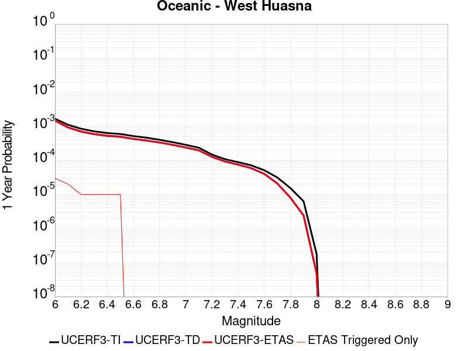 |  |

| Magnitude | 1 wk TI Prob | 1 wk TD Prob | 1 wk ETAS Prob | 1 wk ETAS/TD Gain | 1 wk ETAS Triggered Only | 1 mo TI Prob | 1 mo TD Prob | 1 mo ETAS Prob | 1 mo ETAS/TD Gain | 1 mo ETAS Triggered Only | 1 yr TI Prob | 1 yr TD Prob | 1 yr ETAS Prob | 1 yr ETAS/TD Gain | 1 yr ETAS Triggered Only | 10 yr TI Prob | 10 yr TD Prob | 10 yr ETAS Prob | 10 yr ETAS/TD Gain | 10 yr ETAS Triggered Only |
|-----|-----|-----|-----|-----|-----|-----|-----|-----|-----|-----|-----|-----|-----|-----|-----|-----|-----|-----|-----|-----|
| 6.0 | 3.195567E-5 | 2.792801E-5 | 2.792801E-5 | 1.0 | 0.0 | 1.3694567E-4 | 1.1968623E-4 | 1.2968502E-4 | 1.0835418 | 1.0E-5 | 0.0016660384 | 0.0014562489 | 0.0014862053 | 1.0205709 | 3.0E-5 | 0.016536033 | 0.014471616 | 0.014520892 | 1.0034051 | 5.0E-5 |
| 6.1 | 2.1156782E-5 | 1.7574157E-5 | 1.7574157E-5 | 1.0 | 0.0 | 9.066878E-5 | 7.53157E-5 | 8.531495E-5 | 1.1327645 | 1.0E-5 | 0.0011033333 | 9.1659225E-4 | 9.365739E-4 | 1.0217999 | 2.0E-5 | 0.010978713 | 0.009129126 | 0.009158852 | 1.0032562 | 3.0E-5 |
| 6.2 | 1.6195117E-5 | 1.332762E-5 | 1.332762E-5 | 1.0 | 0.0 | 6.9405796E-5 | 5.7117133E-5 | 6.711656E-5 | 1.1750689 | 1.0E-5 | 8.44688E-4 | 6.9518184E-4 | 7.0517487E-4 | 1.0143747 | 1.0E-5 | 0.008414844 | 0.006930365 | 0.006940296 | 1.0014329 | 1.0E-5 |
| 6.3 | 1.3559345E-5 | 1.1179509E-5 | 1.1179509E-5 | 1.0 | 0.0 | 5.811018E-5 | 4.7911308E-5 | 5.7910827E-5 | 1.208709 | 1.0E-5 | 7.072618E-4 | 5.83165E-4 | 5.931592E-4 | 1.0171378 | 1.0E-5 | 0.0070501505 | 0.0058164652 | 0.005826407 | 1.0017092 | 1.0E-5 |
| 6.4 | 1.2120619E-5 | 1.0001292E-5 | 1.0001292E-5 | 1.0 | 0.0 | 5.1944477E-5 | 4.286198E-5 | 5.2861553E-5 | 1.233297 | 1.0E-5 | 6.322405E-4 | 5.2172015E-4 | 5.3171493E-4 | 1.0191574 | 1.0E-5 | 0.006304447 | 0.005205021 | 0.0052149687 | 1.0019112 | 1.0E-5 |
| 6.5 | 1.13511915E-5 | 9.3677645E-6 | 9.3677645E-6 | 1.0 | 0.0 | 4.8647056E-5 | 4.0146948E-5 | 5.0146547E-5 | 1.2490749 | 1.0E-5 | 5.9211696E-4 | 4.886799E-4 | 4.9867504E-4 | 1.0204533 | 1.0E-5 | 0.0059054173 | 0.004876112 | 0.0048860633 | 1.0020409 | 1.0E-5 |
| 6.6 | 9.850605E-6 | 8.135666E-6 | 8.135666E-6 | 1.0 | 0.0 | 4.2216197E-5 | 3.4866673E-5 | 3.4866673E-5 | 1.0 | 0.0 | 5.1386096E-4 | 4.2441927E-4 | 4.2441927E-4 | 1.0 | 0.0 | 0.0051267436 | 0.0042361193 | 0.0042361193 | 1.0 | 0.0 |
| 6.7 | 8.8558645E-6 | 7.3186534E-6 | 7.3186534E-6 | 1.0 | 0.0 | 3.7953152E-5 | 3.136528E-5 | 3.136528E-5 | 1.0 | 0.0 | 4.6198163E-4 | 3.8180556E-4 | 3.8180556E-4 | 1.0 | 0.0 | 0.004610224 | 0.0038115215 | 0.0038115215 | 1.0 | 0.0 |
| 6.8 | 7.67136E-6 | 6.3919483E-6 | 6.3919483E-6 | 1.0 | 0.0 | 3.2876844E-5 | 2.7393779E-5 | 2.7393779E-5 | 1.0 | 0.0 | 4.0020206E-4 | 3.3346837E-4 | 3.3346837E-4 | 1.0 | 0.0 | 0.003994821 | 0.0033297008 | 0.0033297008 | 1.0 | 0.0 |
| 6.9 | 6.534529E-6 | 5.4584953E-6 | 5.4584953E-6 | 1.0 | 0.0 | 2.8004823E-5 | 2.3393342E-5 | 2.3393342E-5 | 1.0 | 0.0 | 3.4090536E-4 | 2.8477685E-4 | 2.8477685E-4 | 1.0 | 0.0 | 0.0034038287 | 0.002844136 | 0.002844136 | 1.0 | 0.0 |
| 7.0 | 5.460525E-6 | 4.570095E-6 | 4.570095E-6 | 1.0 | 0.0 | 2.3402039E-5 | 1.9585976E-5 | 1.9585976E-5 | 1.0 | 0.0 | 2.8488258E-4 | 2.3843326E-4 | 2.3843326E-4 | 1.0 | 0.0 | 0.0028451765 | 0.0023817883 | 0.0023817883 | 1.0 | 0.0 |
| 7.1 | 4.4825083E-6 | 3.7525715E-6 | 3.7525715E-6 | 1.0 | 0.0 | 1.9210609E-5 | 1.6082351E-5 | 1.6082351E-5 | 1.0 | 0.0 | 2.3386406E-4 | 1.9578513E-4 | 1.9578513E-4 | 1.0 | 0.0 | 0.002336181 | 0.0019561385 | 0.0019561385 | 1.0 | 0.0 |
| 7.2 | 2.821708E-6 | 2.4250364E-6 | 2.4250364E-6 | 1.0 | 0.0 | 1.2092979E-5 | 1.03929715E-5 | 1.03929715E-5 | 1.0 | 0.0 | 1.4722206E-4 | 1.265271E-4 | 1.265271E-4 | 1.0 | 0.0 | 0.0014712457 | 0.001264553 | 0.001264553 | 1.0 | 0.0 |
| 7.3 | 2.0644757E-6 | 1.7688327E-6 | 1.7688327E-6 | 1.0 | 0.0 | 8.847723E-6 | 7.5806893E-6 | 7.5806893E-6 | 1.0 | 0.0 | 1.0771569E-4 | 9.229099E-5 | 9.229099E-5 | 1.0 | 0.0 | 0.001076635 | 9.225283E-4 | 9.225283E-4 | 1.0 | 0.0 |
| 7.4 | 1.6980367E-6 | 1.4380759E-6 | 1.4380759E-6 | 1.0 | 0.0 | 7.27728E-6 | 6.1631677E-6 | 6.1631677E-6 | 1.0 | 0.0 | 8.8597284E-5 | 7.503398E-5 | 7.503398E-5 | 1.0 | 0.0 | 8.8561967E-4 | 7.500881E-4 | 7.500881E-4 | 1.0 | 0.0 |
| 7.5 | 1.3637683E-6 | 1.130346E-6 | 1.130346E-6 | 1.0 | 0.0 | 5.844708E-6 | 4.844331E-6 | 4.844331E-6 | 1.0 | 0.0 | 7.1156996E-5 | 5.897814E-5 | 5.897814E-5 | 1.0 | 0.0 | 7.1134215E-4 | 5.896264E-4 | 5.896264E-4 | 1.0 | 0.0 |
| 7.6 | 9.802994E-7 | 7.6780117E-7 | 7.6780117E-7 | 1.0 | 0.0 | 4.2012766E-6 | 3.290572E-6 | 3.290572E-6 | 1.0 | 0.0 | 5.1149345E-5 | 4.006198E-5 | 4.006198E-5 | 1.0 | 0.0 | 5.113757E-4 | 4.00549E-4 | 4.00549E-4 | 1.0 | 0.0 |
| 7.7 | 5.986191E-7 | 4.005761E-7 | 4.005761E-7 | 1.0 | 0.0 | 2.5655079E-6 | 1.7167536E-6 | 1.7167536E-6 | 1.0 | 0.0 | 3.1234613E-5 | 2.0901274E-5 | 2.0901274E-5 | 1.0 | 0.0 | 3.123022E-4 | 2.0899443E-4 | 2.0899443E-4 | 1.0 | 0.0 |
| 7.8 | 2.9189815E-7 | 1.529205E-7 | 1.529205E-7 | 1.0 | 0.0 | 1.2509914E-6 | 6.553734E-7 | 6.553734E-7 | 1.0 | 0.0 | 1.5230714E-5 | 7.9791425E-6 | 7.9791425E-6 | 1.0 | 0.0 | 1.522967E-4 | 7.978987E-5 | 7.978987E-5 | 1.0 | 0.0 |
| 7.9 | 1.2057845E-7 | 4.6247223E-8 | 4.6247223E-8 | 1.0 | 0.0 | 5.1676466E-7 | 1.9820237E-7 | 1.9820237E-7 | 1.0 | 0.0 | 6.2915915E-6 | 2.4131111E-6 | 2.4131111E-6 | 1.0 | 0.0 | 6.2914136E-5 | 2.4132154E-5 | 2.4132154E-5 | 1.0 | 0.0 |
| 8.0 | 3.3806387E-9 | 9.024813E-10 | 9.024813E-10 | 1.0 | 0.0 | 1.4488451E-8 | 3.8677777E-9 | 3.8677777E-9 | 1.0 | 0.0 | 1.7639688E-7 | 4.7090193E-8 | 4.7090193E-8 | 1.0 | 0.0 | 1.7639674E-6 | 4.7199646E-7 | 4.7199646E-7 | 1.0 | 0.0 |

## San Andreas (Creeping Section) 2011 CFM
*[(top)](#table-of-contents)*

| 1 Week | 1 Month | 1 Year | 10 Year |
|-----|-----|-----|-----|
|  |  |  |  |

| Magnitude | 1 wk TI Prob | 1 wk TD Prob | 1 wk ETAS Prob | 1 wk ETAS/TD Gain | 1 wk ETAS Triggered Only | 1 mo TI Prob | 1 mo TD Prob | 1 mo ETAS Prob | 1 mo ETAS/TD Gain | 1 mo ETAS Triggered Only | 1 yr TI Prob | 1 yr TD Prob | 1 yr ETAS Prob | 1 yr ETAS/TD Gain | 1 yr ETAS Triggered Only | 10 yr TI Prob | 10 yr TD Prob | 10 yr ETAS Prob | 10 yr ETAS/TD Gain | 10 yr ETAS Triggered Only |
|-----|-----|-----|-----|-----|-----|-----|-----|-----|-----|-----|-----|-----|-----|-----|-----|-----|-----|-----|-----|-----|
| 6.0 | 5.986481E-4 | 0.0012277901 | 0.0012377779 | 1.0081347 | 1.0E-5 | 0.0025631124 | 0.0052455855 | 0.005255533 | 1.0018964 | 1.0E-5 | 0.030762846 | 0.061229862 | 0.061258025 | 1.0004599 | 3.0E-5 | 0.26835477 | 0.42607152 | 0.4261002 | 1.0000674 | 5.0E-5 |
| 6.1 | 5.015945E-4 | 0.0010218644 | 0.0010318541 | 1.009776 | 1.0E-5 | 0.00214792 | 0.0043676887 | 0.004377645 | 1.0022795 | 1.0E-5 | 0.025839351 | 0.051269703 | 0.051298164 | 1.0005552 | 3.0E-5 | 0.23032776 | 0.37298882 | 0.37302017 | 1.000084 | 5.0E-5 |
| 6.2 | 4.073338E-4 | 8.109829E-4 | 8.2097476E-4 | 1.0123208 | 1.0E-5 | 0.0017445484 | 0.0034675654 | 0.0034775306 | 1.0028739 | 1.0E-5 | 0.021034058 | 0.040954083 | 0.040973265 | 1.0004684 | 2.0E-5 | 0.19150782 | 0.31317768 | 0.31320515 | 1.0000877 | 4.0E-5 |
| 6.3 | 3.464099E-4 | 6.7405414E-4 | 6.840474E-4 | 1.0148256 | 1.0E-5 | 0.0014837692 | 0.0028840431 | 0.0028940141 | 1.0034573 | 1.0E-5 | 0.017915873 | 0.034210727 | 0.034230042 | 1.0005646 | 2.0E-5 | 0.16538359 | 0.27146977 | 0.2714989 | 1.0001073 | 4.0E-5 |
| 6.4 | 2.935057E-4 | 5.543318E-4 | 5.6432624E-4 | 1.0180297 | 1.0E-5 | 0.0012572751 | 0.0023728115 | 0.0023827879 | 1.0042044 | 1.0E-5 | 0.015200248 | 0.028285956 | 0.028305389 | 1.0006871 | 2.0E-5 | 0.14201577 | 0.23314685 | 0.23317751 | 1.0001316 | 4.0E-5 |
| 6.5 | 2.3409708E-4 | 4.2106997E-4 | 4.3106574E-4 | 1.023739 | 1.0E-5 | 0.0010028875 | 0.001803265 | 0.0018132469 | 1.0055355 | 1.0E-5 | 0.012141965 | 0.02160988 | 0.021629449 | 1.0009055 | 2.0E-5 | 0.11499573 | 0.18699536 | 0.18702787 | 1.0001739 | 4.0E-5 |
| 6.6 | 1.5842178E-4 | 2.5115322E-4 | 2.611507E-4 | 1.0398064 | 1.0E-5 | 6.7877385E-4 | 0.0010759257 | 0.0010859149 | 1.0092844 | 1.0E-5 | 0.0082328 | 0.013019121 | 0.013038862 | 1.0015162 | 2.0E-5 | 0.07934396 | 0.12333139 | 0.12336646 | 1.0002843 | 4.0E-5 |
| 6.7 | 1.5616413E-4 | 2.4651614E-4 | 2.5651368E-4 | 1.0405552 | 1.0E-5 | 6.691031E-4 | 0.0010560687 | 0.0010660582 | 1.0094591 | 1.0E-5 | 0.0081159435 | 0.012780937 | 0.012800681 | 1.0015448 | 2.0E-5 | 0.0782586 | 0.12135857 | 0.12139372 | 1.0002896 | 4.0E-5 |
| 6.8 | 1.5538467E-4 | 2.4475376E-4 | 2.547513E-4 | 1.0408474 | 1.0E-5 | 6.6576427E-4 | 0.0010485224 | 0.001058512 | 1.0095272 | 1.0E-5 | 0.008075596 | 0.0126902815 | 0.012710027 | 1.001556 | 2.0E-5 | 0.07788358 | 0.12058931 | 0.12062448 | 1.0002917 | 4.0E-5 |
| 6.9 | 1.5153569E-4 | 2.3584193E-4 | 2.4583956E-4 | 1.0423913 | 1.0E-5 | 6.49277E-4 | 0.0010103616 | 0.0010203515 | 1.0098875 | 1.0E-5 | 0.007876333 | 0.0122323 | 0.012252056 | 1.001615 | 2.0E-5 | 0.07602952 | 0.11665895 | 0.11669429 | 1.0003029 | 4.0E-5 |
| 7.0 | 1.4588932E-4 | 2.2441045E-4 | 2.3440822E-4 | 1.0445513 | 1.0E-5 | 6.250901E-4 | 9.6140656E-4 | 9.71397E-4 | 1.0103915 | 1.0E-5 | 0.0075839474 | 0.011642803 | 0.01166257 | 1.0016978 | 2.0E-5 | 0.073302895 | 0.11150479 | 0.11154033 | 1.0003188 | 4.0E-5 |
| 7.1 | 1.1565079E-4 | 1.6318668E-4 | 1.7318505E-4 | 1.0612695 | 1.0E-5 | 4.955521E-4 | 6.991849E-4 | 7.0917787E-4 | 1.0142924 | 1.0E-5 | 0.006016669 | 0.008479553 | 0.008499383 | 1.0023386 | 2.0E-5 | 0.058563538 | 0.08383247 | 0.083869115 | 1.0004371 | 4.0E-5 |
| 7.2 | 1.0393792E-4 | 1.4650424E-4 | 1.5650278E-4 | 1.0682474 | 1.0E-5 | 4.4537216E-4 | 6.2772504E-4 | 6.377187E-4 | 1.0159205 | 1.0E-5 | 0.005408933 | 0.007615941 | 0.007635789 | 1.002606 | 2.0E-5 | 0.052791595 | 0.075774014 | 0.075810984 | 1.0004879 | 4.0E-5 |
| 7.3 | 9.332884E-5 | 1.2811116E-4 | 1.3810988E-4 | 1.0780472 | 1.0E-5 | 3.999194E-4 | 5.4893293E-4 | 5.589275E-4 | 1.0182072 | 1.0E-5 | 0.0048581534 | 0.006662914 | 0.0066827806 | 1.0029817 | 2.0E-5 | 0.047533102 | 0.06662133 | 0.06665867 | 1.0005604 | 4.0E-5 |
| 7.4 | 8.670252E-5 | 1.17293064E-4 | 1.2729189E-4 | 1.0852466 | 1.0E-5 | 3.715293E-4 | 5.0258834E-4 | 5.125833E-4 | 1.019887 | 1.0E-5 | 0.004513991 | 0.006101966 | 0.006121844 | 1.0032576 | 2.0E-5 | 0.044233937 | 0.06127167 | 0.061309222 | 1.0006129 | 4.0E-5 |
| 7.5 | 7.3036405E-5 | 9.027501E-5 | 1.00274105E-4 | 1.1107626 | 1.0E-5 | 3.129756E-4 | 3.8683563E-4 | 3.9683175E-4 | 1.0258408 | 1.0E-5 | 0.0038038217 | 0.0046995743 | 0.0047194804 | 1.0042357 | 2.0E-5 | 0.03739367 | 0.047980286 | 0.04801837 | 1.0007937 | 4.0E-5 |
| 7.6 | 6.3935775E-5 | 8.298733E-5 | 9.29865E-5 | 1.1204903 | 1.0E-5 | 2.7398168E-4 | 3.5561158E-4 | 3.6560802E-4 | 1.0281106 | 1.0E-5 | 0.0033306254 | 0.0043209945 | 0.004340908 | 1.0046085 | 2.0E-5 | 0.032811474 | 0.04407886 | 0.044117097 | 1.0008675 | 4.0E-5 |
| 7.7 | 5.5050095E-5 | 6.6780485E-5 | 7.677981E-5 | 1.1497344 | 1.0E-5 | 2.3590765E-4 | 2.861707E-4 | 2.9616783E-4 | 1.0349342 | 1.0E-5 | 0.0028683927 | 0.003478566 | 0.0034885313 | 1.0028647 | 1.0E-5 | 0.0283165 | 0.035874426 | 0.03589371 | 1.0005375 | 2.0E-5 |
| 7.8 | 5.027131E-5 | 6.177649E-5 | 7.177587E-5 | 1.1618639 | 1.0E-5 | 2.1543067E-4 | 2.6472952E-4 | 2.747269E-4 | 1.0377644 | 1.0E-5 | 0.0026197135 | 0.0032183218 | 0.0032282895 | 1.0030972 | 1.0E-5 | 0.025890453 | 0.033198178 | 0.033217516 | 1.0005825 | 2.0E-5 |
| 7.9 | 3.7271806E-5 | 5.034326E-5 | 5.034326E-5 | 1.0 | 0.0 | 1.5972654E-4 | 2.15739E-4 | 2.15739E-4 | 1.0 | 0.0 | 0.0019429359 | 0.0026234603 | 0.0026234603 | 1.0 | 0.0 | 0.019260362 | 0.027125074 | 0.027134802 | 1.0003587 | 1.0E-5 |
| 8.0 | 2.7310243E-5 | 3.1506686E-5 | 3.1506686E-5 | 1.0 | 0.0 | 1.17038646E-4 | 1.3502168E-4 | 1.3502168E-4 | 1.0 | 0.0 | 0.0014240141 | 0.0016426502 | 0.0016426502 | 1.0 | 0.0 | 0.014149235 | 0.017253635 | 0.017263463 | 1.0005696 | 1.0E-5 |
| 8.1 | 1.7940547E-5 | 1.7450684E-5 | 1.7450684E-5 | 1.0 | 0.0 | 7.688579E-5 | 7.4786505E-5 | 7.4786505E-5 | 1.0 | 0.0 | 9.3568244E-4 | 9.1014587E-4 | 9.1014587E-4 | 1.0 | 0.0 | 0.009317525 | 0.009825298 | 0.009835199 | 1.0010078 | 1.0E-5 |
| 8.2 | 8.643924E-6 | 5.49522E-6 | 5.49522E-6 | 1.0 | 0.0 | 3.704486E-5 | 2.355073E-5 | 2.355073E-5 | 1.0 | 0.0 | 4.5092785E-4 | 2.866925E-4 | 2.866925E-4 | 1.0 | 0.0 | 0.0045001395 | 0.0032598388 | 0.0032598388 | 1.0 | 0.0 |
| 8.3 | 1.983087E-6 | 7.693574E-7 | 7.693574E-7 | 1.0 | 0.0 | 8.498917E-6 | 3.297242E-6 | 3.297242E-6 | 1.0 | 0.0 | 1.034694E-4 | 4.01432E-5 | 4.01432E-5 | 1.0 | 0.0 | 0.0010342124 | 4.7390026E-4 | 4.7390026E-4 | 1.0 | 0.0 |

## Imperial
*[(top)](#table-of-contents)*

| 1 Week | 1 Month | 1 Year | 10 Year |
|-----|-----|-----|-----|
|  |  | 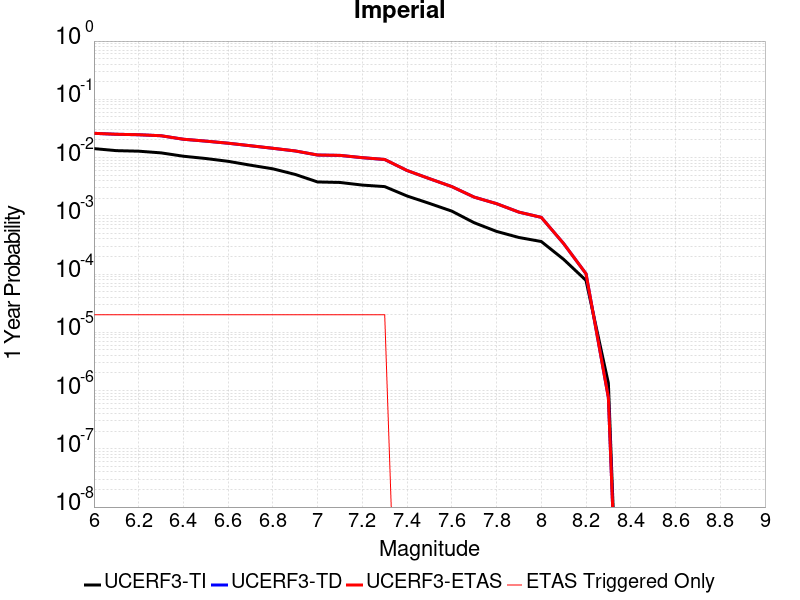 |  |

| Magnitude | 1 wk TI Prob | 1 wk TD Prob | 1 wk ETAS Prob | 1 wk ETAS/TD Gain | 1 wk ETAS Triggered Only | 1 mo TI Prob | 1 mo TD Prob | 1 mo ETAS Prob | 1 mo ETAS/TD Gain | 1 mo ETAS Triggered Only | 1 yr TI Prob | 1 yr TD Prob | 1 yr ETAS Prob | 1 yr ETAS/TD Gain | 1 yr ETAS Triggered Only | 10 yr TI Prob | 10 yr TD Prob | 10 yr ETAS Prob | 10 yr ETAS/TD Gain | 10 yr ETAS Triggered Only |
|-----|-----|-----|-----|-----|-----|-----|-----|-----|-----|-----|-----|-----|-----|-----|-----|-----|-----|-----|-----|-----|
| 6.0 | 2.7496446E-4 | 5.060379E-4 | 5.060379E-4 | 1.0 | 0.0 | 0.0011778869 | 0.0021669706 | 0.0021669706 | 1.0 | 0.0 | 0.0142467655 | 0.026064837 | 0.026084317 | 1.0007473 | 2.0E-5 | 0.13367249 | 0.22821419 | 0.22824506 | 1.0001353 | 4.0E-5 |
| 6.1 | 2.5356023E-4 | 4.8701192E-4 | 4.8701192E-4 | 1.0 | 0.0 | 0.001086234 | 0.0020855628 | 0.0020855628 | 1.0 | 0.0 | 0.013144928 | 0.02509391 | 0.025113408 | 1.000777 | 2.0E-5 | 0.123940155 | 0.21963087 | 0.21966207 | 1.0001421 | 4.0E-5 |
| 6.2 | 2.4820742E-4 | 4.7795815E-4 | 4.7795815E-4 | 1.0 | 0.0 | 0.0010633124 | 0.0020468219 | 0.0020468219 | 1.0 | 0.0 | 0.01286919 | 0.024633536 | 0.024653044 | 1.0007919 | 2.0E-5 | 0.12148927 | 0.21613504 | 0.2161664 | 1.0001451 | 4.0E-5 |
| 6.3 | 2.3205351E-4 | 4.5929378E-4 | 4.5929378E-4 | 1.0 | 0.0 | 9.94136E-4 | 0.001966954 | 0.001966954 | 1.0 | 0.0 | 0.012036599 | 0.02368102 | 0.023700546 | 1.0008246 | 2.0E-5 | 0.11405133 | 0.20807077 | 0.20810243 | 1.0001522 | 4.0E-5 |
| 6.4 | 2.0304754E-4 | 3.991441E-4 | 3.991441E-4 | 1.0 | 0.0 | 8.6991355E-4 | 0.0017095108 | 0.0017095108 | 1.0 | 0.0 | 0.010539869 | 0.020614926 | 0.020634513 | 1.0009502 | 2.0E-5 | 0.100537635 | 0.18520407 | 0.18523666 | 1.000176 | 4.0E-5 |
| 6.5 | 1.854992E-4 | 3.702423E-4 | 3.702423E-4 | 1.0 | 0.0 | 7.9475436E-4 | 0.0015858002 | 0.0015858002 | 1.0 | 0.0 | 0.009633281 | 0.01913749 | 0.019157108 | 1.0010251 | 2.0E-5 | 0.0922623 | 0.17342903 | 0.1734621 | 1.0001906 | 4.0E-5 |
| 6.6 | 1.6586106E-4 | 3.406714E-4 | 3.406714E-4 | 1.0 | 0.0 | 7.106394E-4 | 0.0014592134 | 0.0014592134 | 1.0 | 0.0 | 0.008617763 | 0.017622843 | 0.01764249 | 1.0011148 | 2.0E-5 | 0.08291132 | 0.16089731 | 0.16093089 | 1.0002086 | 4.0E-5 |
| 6.7 | 1.4224656E-4 | 3.0794923E-4 | 3.0794923E-4 | 1.0 | 0.0 | 6.094856E-4 | 0.0013191231 | 0.0013191231 | 1.0 | 0.0 | 0.0073952693 | 0.015943963 | 0.015963644 | 1.0012344 | 2.0E-5 | 0.07153955 | 0.14659329 | 0.14662743 | 1.0002328 | 4.0E-5 |
| 6.8 | 1.2317259E-4 | 2.781478E-4 | 2.781478E-4 | 1.0 | 0.0 | 5.2777573E-4 | 0.0011915236 | 0.0011915236 | 1.0 | 0.0 | 0.0064067547 | 0.0144116925 | 0.014431404 | 1.0013678 | 2.0E-5 | 0.06225166 | 0.13303171 | 0.13306639 | 1.0002607 | 4.0E-5 |
| 6.9 | 9.859898E-5 | 2.503195E-4 | 2.503195E-4 | 1.0 | 0.0 | 4.2249862E-4 | 0.0010723611 | 0.0010723611 | 1.0 | 0.0 | 0.0051317946 | 0.012978803 | 0.012998545 | 1.001521 | 2.0E-5 | 0.05014893 | 0.11947842 | 0.11951364 | 1.0002948 | 4.0E-5 |
| 7.0 | 7.3191884E-5 | 2.127993E-4 | 2.127993E-4 | 1.0 | 0.0 | 3.136418E-4 | 9.116815E-4 | 9.116815E-4 | 1.0 | 0.0 | 0.003811904 | 0.011043918 | 0.011063697 | 1.001791 | 2.0E-5 | 0.037471764 | 0.10211917 | 0.10215509 | 1.0003517 | 4.0E-5 |
| 7.1 | 7.1760296E-5 | 2.0981116E-4 | 2.0981116E-4 | 1.0 | 0.0 | 3.0750787E-4 | 8.9888397E-4 | 8.9888397E-4 | 1.0 | 0.0 | 0.003737482 | 0.010889676 | 0.010909459 | 1.0018166 | 2.0E-5 | 0.03675245 | 0.10075505 | 0.10079102 | 1.000357 | 4.0E-5 |
| 7.2 | 6.46614E-5 | 1.9149172E-4 | 1.9149172E-4 | 1.0 | 0.0 | 2.7709085E-4 | 8.204237E-4 | 8.204237E-4 | 1.0 | 0.0 | 0.0033683628 | 0.009943534 | 0.0099633355 | 1.0019914 | 2.0E-5 | 0.033177625 | 0.09256114 | 0.09259744 | 1.0003922 | 4.0E-5 |
| 7.3 | 6.088115E-5 | 1.7820326E-4 | 1.7820326E-4 | 1.0 | 0.0 | 2.6089314E-4 | 7.635076E-4 | 7.635076E-4 | 1.0 | 0.0 | 0.0031717476 | 0.009256661 | 0.009276476 | 1.0021406 | 2.0E-5 | 0.031268585 | 0.08661022 | 0.08664675 | 1.0004219 | 4.0E-5 |
| 7.4 | 4.199346E-5 | 1.1519547E-4 | 1.1519547E-4 | 1.0 | 0.0 | 1.7995955E-4 | 4.9360236E-4 | 4.9360236E-4 | 1.0 | 0.0 | 0.0021888057 | 0.0059932186 | 0.0059932186 | 1.0 | 0.0 | 0.02167372 | 0.05748037 | 0.05748037 | 1.0 | 0.0 |
| 7.5 | 3.130448E-5 | 8.340871E-5 | 8.340871E-5 | 1.0 | 0.0 | 1.3415517E-4 | 3.5741724E-4 | 3.5741724E-4 | 1.0 | 0.0 | 0.0016321153 | 0.0043429323 | 0.0043429323 | 1.0 | 0.0 | 0.016201803 | 0.04216626 | 0.04216626 | 1.0 | 0.0 |
| 7.6 | 2.3074248E-5 | 6.0909417E-5 | 6.0909417E-5 | 1.0 | 0.0 | 9.888588E-5 | 2.610144E-4 | 2.610144E-4 | 1.0 | 0.0 | 0.0012032706 | 0.0031732426 | 0.0031732426 | 1.0 | 0.0 | 0.011967761 | 0.031055957 | 0.031055957 | 1.0 | 0.0 |
| 7.7 | 1.45864815E-5 | 4.0178427E-5 | 4.0178427E-5 | 1.0 | 0.0 | 6.2511994E-5 | 1.7218193E-4 | 1.7218193E-4 | 1.0 | 0.0 | 7.608177E-4 | 0.002094305 | 0.002094305 | 1.0 | 0.0 | 0.007582182 | 0.020652408 | 0.020652408 | 1.0 | 0.0 |
| 7.8 | 1.0352979E-5 | 3.1006606E-5 | 3.1006606E-5 | 1.0 | 0.0 | 4.4369157E-5 | 1.328787E-4 | 1.328787E-4 | 1.0 | 0.0 | 5.400606E-4 | 0.0016166 | 0.0016166 | 1.0 | 0.0 | 0.0053875 | 0.016037801 | 0.016037801 | 1.0 | 0.0 |
| 7.9 | 8.137906E-6 | 2.2185837E-5 | 2.2185837E-5 | 1.0 | 0.0 | 3.4876273E-5 | 9.50787E-5 | 9.50787E-5 | 1.0 | 0.0 | 4.2453592E-4 | 0.0011569695 | 0.0011569695 | 1.0 | 0.0 | 0.004237258 | 0.011635021 | 0.011635021 | 1.0 | 0.0 |
| 8.0 | 6.93792E-6 | 1.8040371E-5 | 1.8040371E-5 | 1.0 | 0.0 | 2.9733603E-5 | 7.731359E-5 | 7.731359E-5 | 1.0 | 0.0 | 3.6194647E-4 | 9.408872E-4 | 9.408872E-4 | 1.0 | 0.0 | 0.0036135751 | 0.00951638 | 0.00951638 | 1.0 | 0.0 |
| 8.1 | 3.4286315E-6 | 6.39459E-6 | 6.39459E-6 | 1.0 | 0.0 | 1.4694053E-5 | 2.7405098E-5 | 2.7405098E-5 | 1.0 | 0.0 | 1.7888541E-4 | 3.336061E-4 | 3.336061E-4 | 1.0 | 0.0 | 0.0017874148 | 0.003493339 | 0.003493339 | 1.0 | 0.0 |
| 8.2 | 1.4906886E-6 | 1.9424117E-6 | 1.9424117E-6 | 1.0 | 0.0 | 6.3886496E-6 | 8.324595E-6 | 8.324595E-6 | 1.0 | 0.0 | 7.7779034E-5 | 1.0134726E-4 | 1.0134726E-4 | 1.0 | 0.0 | 7.775182E-4 | 0.0011104804 | 0.0011104804 | 1.0 | 0.0 |
| 8.3 | 2.5758007E-8 | 1.45585295E-8 | 1.45585295E-8 | 1.0 | 0.0 | 1.10391454E-7 | 6.23937E-8 | 6.23937E-8 | 1.0 | 0.0 | 1.3440151E-6 | 7.596433E-7 | 7.596433E-7 | 1.0 | 0.0 | 1.344007E-5 | 7.918924E-6 | 7.918924E-6 | 1.0 | 0.0 |

## San Jacinto (Coyote Creek)
*[(top)](#table-of-contents)*

| 1 Week | 1 Month | 1 Year | 10 Year |
|-----|-----|-----|-----|
|  |  | 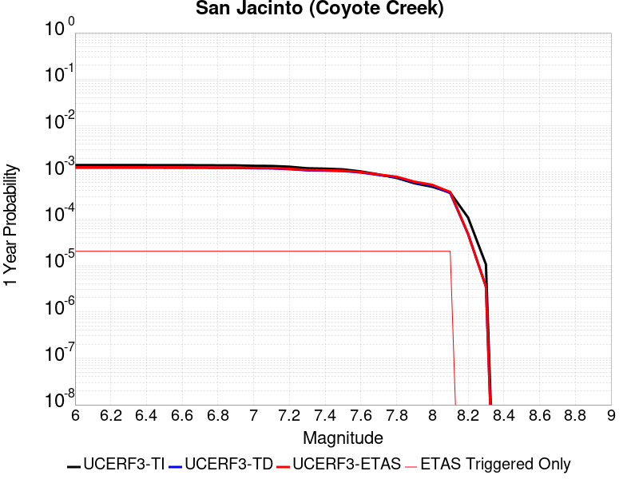 | 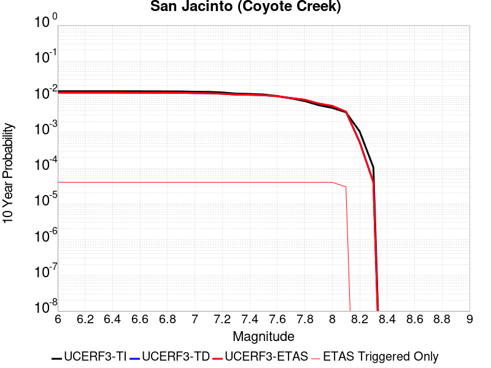 |

| Magnitude | 1 wk TI Prob | 1 wk TD Prob | 1 wk ETAS Prob | 1 wk ETAS/TD Gain | 1 wk ETAS Triggered Only | 1 mo TI Prob | 1 mo TD Prob | 1 mo ETAS Prob | 1 mo ETAS/TD Gain | 1 mo ETAS Triggered Only | 1 yr TI Prob | 1 yr TD Prob | 1 yr ETAS Prob | 1 yr ETAS/TD Gain | 1 yr ETAS Triggered Only | 10 yr TI Prob | 10 yr TD Prob | 10 yr ETAS Prob | 10 yr ETAS/TD Gain | 10 yr ETAS Triggered Only |
|-----|-----|-----|-----|-----|-----|-----|-----|-----|-----|-----|-----|-----|-----|-----|-----|-----|-----|-----|-----|-----|
| 6.0 | 2.7374346E-5 | 2.4177032E-5 | 2.4177032E-5 | 1.0 | 0.0 | 1.1731335E-4 | 1.0361175E-4 | 1.0361175E-4 | 1.0 | 0.0 | 0.0014273542 | 0.0012607456 | 0.0012807203 | 1.0158436 | 2.0E-5 | 0.01418221 | 0.012944878 | 0.01298436 | 1.00305 | 4.0E-5 |
| 6.1 | 2.7374346E-5 | 2.4177032E-5 | 2.4177032E-5 | 1.0 | 0.0 | 1.1731335E-4 | 1.0361175E-4 | 1.0361175E-4 | 1.0 | 0.0 | 0.0014273542 | 0.0012607456 | 0.0012807203 | 1.0158436 | 2.0E-5 | 0.01418221 | 0.012944878 | 0.01298436 | 1.00305 | 4.0E-5 |
| 6.2 | 2.7374346E-5 | 2.4177032E-5 | 2.4177032E-5 | 1.0 | 0.0 | 1.1731335E-4 | 1.0361175E-4 | 1.0361175E-4 | 1.0 | 0.0 | 0.0014273542 | 0.0012607456 | 0.0012807203 | 1.0158436 | 2.0E-5 | 0.01418221 | 0.012944878 | 0.01298436 | 1.00305 | 4.0E-5 |
| 6.3 | 2.7374346E-5 | 2.4177032E-5 | 2.4177032E-5 | 1.0 | 0.0 | 1.1731335E-4 | 1.0361175E-4 | 1.0361175E-4 | 1.0 | 0.0 | 0.0014273542 | 0.0012607456 | 0.0012807203 | 1.0158436 | 2.0E-5 | 0.01418221 | 0.012944878 | 0.01298436 | 1.00305 | 4.0E-5 |
| 6.4 | 2.7374346E-5 | 2.4177032E-5 | 2.4177032E-5 | 1.0 | 0.0 | 1.1731335E-4 | 1.0361175E-4 | 1.0361175E-4 | 1.0 | 0.0 | 0.0014273542 | 0.0012607456 | 0.0012807203 | 1.0158436 | 2.0E-5 | 0.01418221 | 0.012944878 | 0.01298436 | 1.00305 | 4.0E-5 |
| 6.5 | 2.7282445E-5 | 2.4063094E-5 | 2.4063094E-5 | 1.0 | 0.0 | 1.16919524E-4 | 1.03123486E-4 | 1.03123486E-4 | 1.0 | 0.0 | 0.0014225657 | 0.0012548079 | 0.0012747828 | 1.0159187 | 2.0E-5 | 0.014134934 | 0.012886199 | 0.0129256835 | 1.0030642 | 4.0E-5 |
| 6.6 | 2.7282445E-5 | 2.4063094E-5 | 2.4063094E-5 | 1.0 | 0.0 | 1.16919524E-4 | 1.03123486E-4 | 1.03123486E-4 | 1.0 | 0.0 | 0.0014225657 | 0.0012548079 | 0.0012747828 | 1.0159187 | 2.0E-5 | 0.014134934 | 0.012886199 | 0.0129256835 | 1.0030642 | 4.0E-5 |
| 6.7 | 2.7216198E-5 | 2.3988207E-5 | 2.3988207E-5 | 1.0 | 0.0 | 1.1663563E-4 | 1.02802565E-4 | 1.02802565E-4 | 1.0 | 0.0 | 0.0014191137 | 0.0012509052 | 0.0012708802 | 1.0159684 | 2.0E-5 | 0.014100855 | 0.012847606 | 0.012887092 | 1.0030735 | 4.0E-5 |
| 6.8 | 2.7078617E-5 | 2.3905404E-5 | 2.3905404E-5 | 1.0 | 0.0 | 1.1604605E-4 | 1.02447724E-4 | 1.02447724E-4 | 1.0 | 0.0 | 0.001411945 | 0.00124659 | 0.001266565 | 1.0160238 | 2.0E-5 | 0.014030075 | 0.012804739 | 0.012844226 | 1.0030838 | 4.0E-5 |
| 6.9 | 2.6982952E-5 | 2.3824896E-5 | 2.3824896E-5 | 1.0 | 0.0 | 1.15636096E-4 | 1.0210271E-4 | 1.0210271E-4 | 1.0 | 0.0 | 0.0014069602 | 0.0012423943 | 0.0012623694 | 1.016078 | 2.0E-5 | 0.013980856 | 0.012763045 | 0.012802535 | 1.0030941 | 4.0E-5 |
| 7.0 | 2.6449972E-5 | 2.3401846E-5 | 2.3401846E-5 | 1.0 | 0.0 | 1.1335209E-4 | 1.00289784E-4 | 1.00289784E-4 | 1.0 | 0.0 | 0.001379188 | 0.0012203468 | 0.0012403224 | 1.0163687 | 2.0E-5 | 0.0137065975 | 0.012544374 | 0.012583872 | 1.0031487 | 4.0E-5 |
| 7.1 | 2.6257849E-5 | 2.322785E-5 | 2.322785E-5 | 1.0 | 0.0 | 1.1252879E-4 | 9.9544144E-5 | 9.9544144E-5 | 1.0 | 0.0 | 0.0013691769 | 0.0012112787 | 0.0012312545 | 1.0164915 | 2.0E-5 | 0.013607717 | 0.012454224 | 0.012493725 | 1.0031718 | 4.0E-5 |
| 7.2 | 2.5270041E-5 | 2.2422375E-5 | 2.2422375E-5 | 1.0 | 0.0 | 1.0829568E-4 | 9.6092364E-5 | 9.6092364E-5 | 1.0 | 0.0 | 0.0013177024 | 0.001169299 | 0.0011892756 | 1.0170842 | 2.0E-5 | 0.013099162 | 0.012035143 | 0.0120746605 | 1.0032836 | 4.0E-5 |
| 7.3 | 2.339701E-5 | 2.1153774E-5 | 2.1153774E-5 | 1.0 | 0.0 | 1.0026905E-4 | 9.065589E-5 | 9.065589E-5 | 1.0 | 0.0 | 0.001220092 | 0.0011031787 | 0.0011231566 | 1.0181094 | 2.0E-5 | 0.012134149 | 0.011373838 | 0.011413383 | 1.0034769 | 4.0E-5 |
| 7.4 | 2.296333E-5 | 2.0884016E-5 | 2.0884016E-5 | 1.0 | 0.0 | 9.841056E-5 | 8.949987E-5 | 8.949987E-5 | 1.0 | 0.0 | 0.0011974899 | 0.0010891182 | 0.0011090965 | 1.0183434 | 2.0E-5 | 0.011910575 | 0.011232895 | 0.011272445 | 1.003521 | 4.0E-5 |
| 7.5 | 2.2188895E-5 | 2.0406682E-5 | 2.0406682E-5 | 1.0 | 0.0 | 9.50918E-5 | 8.745429E-5 | 8.745429E-5 | 1.0 | 0.0 | 0.0011571277 | 0.0010642379 | 0.0010842166 | 1.0187728 | 2.0E-5 | 0.011511209 | 0.010982383 | 0.011021944 | 1.0036021 | 4.0E-5 |
| 7.6 | 2.0013189E-5 | 1.8992265E-5 | 1.8992265E-5 | 1.0 | 0.0 | 8.5767984E-5 | 8.139289E-5 | 8.139289E-5 | 1.0 | 0.0 | 0.001043725 | 9.905098E-4 | 0.0010104899 | 1.0201716 | 2.0E-5 | 0.010388365 | 0.010240043 | 0.010279633 | 1.0038662 | 4.0E-5 |
| 7.7 | 1.7230794E-5 | 1.677281E-5 | 1.677281E-5 | 1.0 | 0.0 | 7.384417E-5 | 7.18815E-5 | 7.18815E-5 | 1.0 | 0.0 | 8.986819E-4 | 8.7480666E-4 | 8.947892E-4 | 1.0228422 | 2.0E-5 | 0.008950562 | 0.009078168 | 0.0091178045 | 1.0043662 | 4.0E-5 |
| 7.8 | 1.4478809E-5 | 1.50190535E-5 | 1.50190535E-5 | 1.0 | 0.0 | 6.205057E-5 | 6.4365784E-5 | 6.4365784E-5 | 1.0 | 0.0 | 7.552038E-4 | 7.833723E-4 | 8.033567E-4 | 1.0255107 | 2.0E-5 | 0.0075264242 | 0.00815608 | 0.008195754 | 1.0048643 | 4.0E-5 |
| 7.9 | 1.1114467E-5 | 1.1670009E-5 | 1.1670009E-5 | 1.0 | 0.0 | 4.7632562E-5 | 5.001337E-5 | 5.001337E-5 | 1.0 | 0.0 | 5.797721E-4 | 6.087432E-4 | 6.2873104E-4 | 1.0328345 | 2.0E-5 | 0.0057826187 | 0.006393403 | 0.0064331475 | 1.0062164 | 4.0E-5 |
| 8.0 | 9.327402E-6 | 9.9217805E-6 | 9.9217805E-6 | 1.0 | 0.0 | 3.9973966E-5 | 4.2521227E-5 | 4.2521227E-5 | 1.0 | 0.0 | 4.8657437E-4 | 5.175735E-4 | 5.375632E-4 | 1.0386219 | 2.0E-5 | 0.0048551033 | 0.005461854 | 0.0055016354 | 1.0072836 | 4.0E-5 |
| 8.1 | 7.0235833E-6 | 6.844232E-6 | 6.844232E-6 | 1.0 | 0.0 | 3.0100724E-5 | 2.9332095E-5 | 2.9332095E-5 | 1.0 | 0.0 | 3.664147E-4 | 3.5706026E-4 | 3.770531E-4 | 1.055993 | 2.0E-5 | 0.003658111 | 0.0037964787 | 0.0038263649 | 1.0078721 | 3.0E-5 |
| 8.2 | 2.0358202E-6 | 9.0285533E-7 | 9.0285533E-7 | 1.0 | 0.0 | 8.724915E-6 | 3.8693743E-6 | 3.8693743E-6 | 1.0 | 0.0 | 1.06220665E-4 | 4.710864E-5 | 4.710864E-5 | 1.0 | 0.0 | 0.001061699 | 5.3444994E-4 | 5.3444994E-4 | 1.0 | 0.0 |
| 8.3 | 2.0051264E-7 | 6.646147E-8 | 6.646147E-8 | 1.0 | 0.0 | 8.5933965E-7 | 2.8483484E-7 | 2.8483484E-7 | 1.0 | 0.0 | 1.046241E-5 | 3.467859E-6 | 3.467859E-6 | 1.0 | 0.0 | 1.0461917E-4 | 4.0304385E-5 | 4.0304385E-5 | 1.0 | 0.0 |

## Ortigalita (North)
*[(top)](#table-of-contents)*

| 1 Week | 1 Month | 1 Year | 10 Year |
|-----|-----|-----|-----|
|  |  |  | 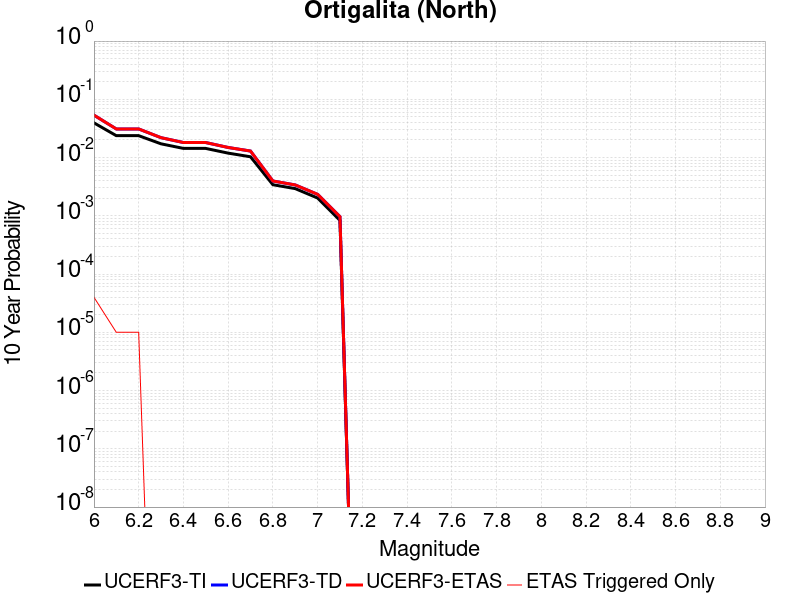 |

| Magnitude | 1 wk TI Prob | 1 wk TD Prob | 1 wk ETAS Prob | 1 wk ETAS/TD Gain | 1 wk ETAS Triggered Only | 1 mo TI Prob | 1 mo TD Prob | 1 mo ETAS Prob | 1 mo ETAS/TD Gain | 1 mo ETAS Triggered Only | 1 yr TI Prob | 1 yr TD Prob | 1 yr ETAS Prob | 1 yr ETAS/TD Gain | 1 yr ETAS Triggered Only | 10 yr TI Prob | 10 yr TD Prob | 10 yr ETAS Prob | 10 yr ETAS/TD Gain | 10 yr ETAS Triggered Only |
|-----|-----|-----|-----|-----|-----|-----|-----|-----|-----|-----|-----|-----|-----|-----|-----|-----|-----|-----|-----|-----|
| 6.0 | 7.711876E-5 | 1.05086016E-4 | 1.05086016E-4 | 1.0 | 0.0 | 3.3046713E-4 | 4.5030177E-4 | 4.5030177E-4 | 1.0 | 0.0 | 0.004016016 | 0.005468958 | 0.005478903 | 1.0018185 | 1.0E-5 | 0.039442103 | 0.053463764 | 0.05350163 | 1.0007082 | 4.0E-5 |
| 6.1 | 4.607858E-5 | 6.024935E-5 | 6.024935E-5 | 1.0 | 0.0 | 1.9746469E-4 | 2.5818875E-4 | 2.5818875E-4 | 1.0 | 0.0 | 0.0024014818 | 0.003139252 | 0.003139252 | 1.0 | 0.0 | 0.023756953 | 0.030979859 | 0.03098955 | 1.0003128 | 1.0E-5 |
| 6.2 | 4.607858E-5 | 6.024935E-5 | 6.024935E-5 | 1.0 | 0.0 | 1.9746469E-4 | 2.5818875E-4 | 2.5818875E-4 | 1.0 | 0.0 | 0.0024014818 | 0.003139252 | 0.003139252 | 1.0 | 0.0 | 0.023756953 | 0.030979859 | 0.03098955 | 1.0003128 | 1.0E-5 |
| 6.3 | 3.327423E-5 | 4.2481566E-5 | 4.2481566E-5 | 1.0 | 0.0 | 1.4259605E-4 | 1.8205289E-4 | 1.8205289E-4 | 1.0 | 0.0 | 0.0017347244 | 0.0022145277 | 0.0022145277 | 1.0 | 0.0 | 0.017212452 | 0.021948816 | 0.021948816 | 1.0 | 0.0 |
| 6.4 | 2.7732503E-5 | 3.5003635E-5 | 3.5003635E-5 | 1.0 | 0.0 | 1.1884817E-4 | 1.5000845E-4 | 1.5000845E-4 | 1.0 | 0.0 | 0.001446016 | 0.0018250674 | 0.0018250674 | 1.0 | 0.0 | 0.014366428 | 0.018123753 | 0.018123753 | 1.0 | 0.0 |
| 6.5 | 2.7689714E-5 | 3.4953442E-5 | 3.4953442E-5 | 1.0 | 0.0 | 1.186648E-4 | 1.4979337E-4 | 1.4979337E-4 | 1.0 | 0.0 | 0.0014437864 | 0.0018224533 | 0.0018224533 | 1.0 | 0.0 | 0.014344421 | 0.018098038 | 0.018098038 | 1.0 | 0.0 |
| 6.6 | 2.2976905E-5 | 2.8722226E-5 | 2.8722226E-5 | 1.0 | 0.0 | 9.846873E-5 | 1.2309088E-4 | 1.2309088E-4 | 1.0 | 0.0 | 0.0011981975 | 0.001497839 | 0.001497839 | 1.0 | 0.0 | 0.011917574 | 0.014900712 | 0.014900712 | 1.0 | 0.0 |
| 6.7 | 1.9871539E-5 | 2.4907882E-5 | 2.4907882E-5 | 1.0 | 0.0 | 8.516096E-5 | 1.067451E-4 | 1.067451E-4 | 1.0 | 0.0 | 0.0010363415 | 0.0012990955 | 0.0012990955 | 1.0 | 0.0 | 0.010315218 | 0.012938703 | 0.012938703 | 1.0 | 0.0 |
| 6.8 | 6.5640475E-6 | 7.6061337E-6 | 7.6061337E-6 | 1.0 | 0.0 | 2.813133E-5 | 3.2597323E-5 | 3.2597323E-5 | 1.0 | 0.0 | 3.424451E-4 | 3.9680302E-4 | 3.9680302E-4 | 1.0 | 0.0 | 0.0034191788 | 0.0039612325 | 0.0039612325 | 1.0 | 0.0 |
| 6.9 | 5.6219683E-6 | 6.5023783E-6 | 6.5023783E-6 | 1.0 | 0.0 | 2.4093928E-5 | 2.7867052E-5 | 2.7867052E-5 | 1.0 | 0.0 | 2.933041E-4 | 3.3923113E-4 | 3.3923113E-4 | 1.0 | 0.0 | 0.0029291727 | 0.00338739 | 0.00338739 | 1.0 | 0.0 |
| 7.0 | 3.875591E-6 | 4.4851295E-6 | 4.4851295E-6 | 1.0 | 0.0 | 1.6609569E-5 | 1.9221854E-5 | 1.9221854E-5 | 1.0 | 0.0 | 2.0220275E-4 | 2.3400305E-4 | 2.3400305E-4 | 1.0 | 0.0 | 0.0020201886 | 0.0023377747 | 0.0023377747 | 1.0 | 0.0 |
| 7.1 | 1.6017933E-6 | 1.857199E-6 | 1.857199E-6 | 1.0 | 0.0 | 6.8648105E-6 | 7.959406E-6 | 7.959406E-6 | 1.0 | 0.0 | 8.357586E-5 | 9.690253E-5 | 9.690253E-5 | 1.0 | 0.0 | 8.3544437E-4 | 9.6870743E-4 | 9.6870743E-4 | 1.0 | 0.0 |

## Blue Cut
*[(top)](#table-of-contents)*

| 1 Week | 1 Month | 1 Year | 10 Year |
|-----|-----|-----|-----|
|  | 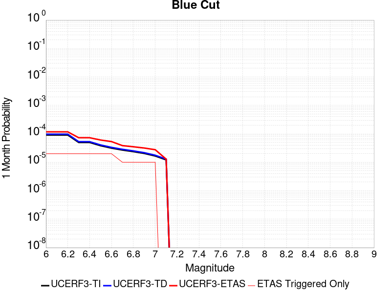 |  |  |

| Magnitude | 1 wk TI Prob | 1 wk TD Prob | 1 wk ETAS Prob | 1 wk ETAS/TD Gain | 1 wk ETAS Triggered Only | 1 mo TI Prob | 1 mo TD Prob | 1 mo ETAS Prob | 1 mo ETAS/TD Gain | 1 mo ETAS Triggered Only | 1 yr TI Prob | 1 yr TD Prob | 1 yr ETAS Prob | 1 yr ETAS/TD Gain | 1 yr ETAS Triggered Only | 10 yr TI Prob | 10 yr TD Prob | 10 yr ETAS Prob | 10 yr ETAS/TD Gain | 10 yr ETAS Triggered Only |
|-----|-----|-----|-----|-----|-----|-----|-----|-----|-----|-----|-----|-----|-----|-----|-----|-----|-----|-----|-----|-----|
| 6.0 | 2.1227985E-5 | 2.2720424E-5 | 3.2720196E-5 | 1.4401226 | 1.0E-5 | 9.097391E-5 | 9.7369935E-5 | 1.17367985E-4 | 1.2053822 | 2.0E-5 | 0.0011070445 | 0.0011848924 | 0.0012148567 | 1.0252887 | 3.0E-5 | 0.011015458 | 0.01179159 | 0.011831118 | 1.0033523 | 4.0E-5 |
| 6.1 | 2.1227985E-5 | 2.2720424E-5 | 3.2720196E-5 | 1.4401226 | 1.0E-5 | 9.097391E-5 | 9.7369935E-5 | 1.17367985E-4 | 1.2053822 | 2.0E-5 | 0.0011070445 | 0.0011848924 | 0.0012148567 | 1.0252887 | 3.0E-5 | 0.011015458 | 0.01179159 | 0.011831118 | 1.0033523 | 4.0E-5 |
| 6.2 | 2.1227985E-5 | 2.2720424E-5 | 3.2720196E-5 | 1.4401226 | 1.0E-5 | 9.097391E-5 | 9.7369935E-5 | 1.17367985E-4 | 1.2053822 | 2.0E-5 | 0.0011070445 | 0.0011848924 | 0.0012148567 | 1.0252887 | 3.0E-5 | 0.011015458 | 0.01179159 | 0.011831118 | 1.0033523 | 4.0E-5 |
| 6.3 | 1.1613981E-5 | 1.2353959E-5 | 2.2353835E-5 | 1.809447 | 1.0E-5 | 4.9773254E-5 | 5.2944535E-5 | 7.2943476E-5 | 1.3777338 | 2.0E-5 | 6.0582085E-4 | 6.4442155E-4 | 6.744022E-4 | 1.0465233 | 3.0E-5 | 0.0060417196 | 0.006426776 | 0.0064665186 | 1.006184 | 4.0E-5 |
| 6.4 | 1.1613981E-5 | 1.2353959E-5 | 2.2353835E-5 | 1.809447 | 1.0E-5 | 4.9773254E-5 | 5.2944535E-5 | 7.2943476E-5 | 1.3777338 | 2.0E-5 | 6.0582085E-4 | 6.4442155E-4 | 6.744022E-4 | 1.0465233 | 3.0E-5 | 0.0060417196 | 0.006426776 | 0.0064665186 | 1.006184 | 4.0E-5 |
| 6.5 | 8.931326E-6 | 9.48191E-6 | 1.9481815E-5 | 2.0546298 | 1.0E-5 | 3.8276554E-5 | 4.0636176E-5 | 6.063536E-5 | 1.4921523 | 2.0E-5 | 4.6591737E-4 | 4.9464224E-4 | 5.146324E-4 | 1.0404133 | 2.0E-5 | 0.0046494175 | 0.004936322 | 0.0049661743 | 1.0060474 | 3.0E-5 |
| 6.6 | 7.345353E-6 | 7.79053E-6 | 1.7790451E-5 | 2.2835999 | 1.0E-5 | 3.1479703E-5 | 3.33876E-5 | 5.3386935E-5 | 1.5990047 | 2.0E-5 | 3.83198E-4 | 4.0642623E-4 | 4.2641812E-4 | 1.0491894 | 2.0E-5 | 0.0038253788 | 0.004057621 | 0.0040874993 | 1.0073634 | 3.0E-5 |
| 6.7 | 6.2775666E-6 | 6.655361E-6 | 6.655361E-6 | 1.0 | 0.0 | 2.690358E-5 | 2.8522707E-5 | 3.8522423E-5 | 1.3505878 | 1.0E-5 | 3.2750185E-4 | 3.4721615E-4 | 3.5721267E-4 | 1.0287905 | 1.0E-5 | 0.0032701963 | 0.0034674776 | 0.0034874082 | 1.0057479 | 2.0E-5 |
| 6.8 | 5.5234095E-6 | 5.855298E-6 | 5.855298E-6 | 1.0 | 0.0 | 2.367154E-5 | 2.5093934E-5 | 3.5093683E-5 | 1.3984927 | 1.0E-5 | 2.8816288E-4 | 3.054831E-4 | 3.1548002E-4 | 1.0327251 | 1.0E-5 | 0.002877895 | 0.0030513476 | 0.0030712867 | 1.0065345 | 2.0E-5 |
| 6.9 | 4.7780054E-6 | 5.065582E-6 | 5.065582E-6 | 1.0 | 0.0 | 2.0477004E-5 | 2.1709497E-5 | 3.1709278E-5 | 1.4606179 | 1.0E-5 | 2.4927902E-4 | 2.642881E-4 | 2.7428547E-4 | 1.0378275 | 1.0E-5 | 0.0024899957 | 0.0026404303 | 0.0026504039 | 1.0037773 | 1.0E-5 |
| 7.0 | 3.883171E-6 | 4.1186195E-6 | 4.1186195E-6 | 1.0 | 0.0 | 1.6642054E-5 | 1.7651146E-5 | 2.7650969E-5 | 1.5665255 | 1.0E-5 | 2.0259817E-4 | 2.148884E-4 | 2.2488624E-4 | 1.0465258 | 1.0E-5 | 0.0020241356 | 0.0021474818 | 0.0021574604 | 1.0046467 | 1.0E-5 |
| 7.1 | 2.8358215E-6 | 3.0098138E-6 | 3.0098138E-6 | 1.0 | 0.0 | 1.2153464E-5 | 1.2899175E-5 | 1.2899175E-5 | 1.0 | 0.0 | 1.4795837E-4 | 1.5704273E-4 | 1.5704273E-4 | 1.0 | 0.0 | 0.001478599 | 0.0015699627 | 0.0015699627 | 1.0 | 0.0 |

## Kern Canyon (Lake Isabella) 2011
*[(top)](#table-of-contents)*

| 1 Week | 1 Month | 1 Year | 10 Year |
|-----|-----|-----|-----|
|  |  |  |  |

| Magnitude | 1 wk TI Prob | 1 wk TD Prob | 1 wk ETAS Prob | 1 wk ETAS/TD Gain | 1 wk ETAS Triggered Only | 1 mo TI Prob | 1 mo TD Prob | 1 mo ETAS Prob | 1 mo ETAS/TD Gain | 1 mo ETAS Triggered Only | 1 yr TI Prob | 1 yr TD Prob | 1 yr ETAS Prob | 1 yr ETAS/TD Gain | 1 yr ETAS Triggered Only | 10 yr TI Prob | 10 yr TD Prob | 10 yr ETAS Prob | 10 yr ETAS/TD Gain | 10 yr ETAS Triggered Only |
|-----|-----|-----|-----|-----|-----|-----|-----|-----|-----|-----|-----|-----|-----|-----|-----|-----|-----|-----|-----|-----|
| 6.0 | 4.2387383E-6 | 4.0016866E-6 | 4.0016866E-6 | 1.0 | 0.0 | 1.8165894E-5 | 1.7149983E-5 | 1.7149983E-5 | 1.0 | 0.0 | 2.2114732E-4 | 2.0878292E-4 | 2.3877664E-4 | 1.14366 | 3.0E-5 | 0.0022092736 | 0.0020860515 | 0.002125968 | 1.019135 | 4.0E-5 |
| 6.1 | 4.2387383E-6 | 4.0016866E-6 | 4.0016866E-6 | 1.0 | 0.0 | 1.8165894E-5 | 1.7149983E-5 | 1.7149983E-5 | 1.0 | 0.0 | 2.2114732E-4 | 2.0878292E-4 | 2.3877664E-4 | 1.14366 | 3.0E-5 | 0.0022092736 | 0.0020860515 | 0.002125968 | 1.019135 | 4.0E-5 |
| 6.2 | 4.2387383E-6 | 4.0016866E-6 | 4.0016866E-6 | 1.0 | 0.0 | 1.8165894E-5 | 1.7149983E-5 | 1.7149983E-5 | 1.0 | 0.0 | 2.2114732E-4 | 2.0878292E-4 | 2.3877664E-4 | 1.14366 | 3.0E-5 | 0.0022092736 | 0.0020860515 | 0.002125968 | 1.019135 | 4.0E-5 |
| 6.3 | 4.2387383E-6 | 4.0016866E-6 | 4.0016866E-6 | 1.0 | 0.0 | 1.8165894E-5 | 1.7149983E-5 | 1.7149983E-5 | 1.0 | 0.0 | 2.2114732E-4 | 2.0878292E-4 | 2.3877664E-4 | 1.14366 | 3.0E-5 | 0.0022092736 | 0.0020860515 | 0.002125968 | 1.019135 | 4.0E-5 |
| 6.4 | 4.2387383E-6 | 4.0016866E-6 | 4.0016866E-6 | 1.0 | 0.0 | 1.8165894E-5 | 1.7149983E-5 | 1.7149983E-5 | 1.0 | 0.0 | 2.2114732E-4 | 2.0878292E-4 | 2.3877664E-4 | 1.14366 | 3.0E-5 | 0.0022092736 | 0.0020860515 | 0.002125968 | 1.019135 | 4.0E-5 |
| 6.5 | 2.7857532E-6 | 2.5178983E-6 | 2.5178983E-6 | 1.0 | 0.0 | 1.1938888E-5 | 1.079095E-5 | 1.079095E-5 | 1.0 | 0.0 | 1.4534626E-4 | 1.3137223E-4 | 1.513696E-4 | 1.1522192 | 2.0E-5 | 0.0014525123 | 0.0013129783 | 0.001342939 | 1.0228188 | 3.0E-5 |
| 6.6 | 2.2233348E-6 | 1.9441488E-6 | 1.9441488E-6 | 1.0 | 0.0 | 9.528543E-6 | 8.33204E-6 | 8.33204E-6 | 1.0 | 0.0 | 1.1600384E-4 | 1.0143795E-4 | 1.2143593E-4 | 1.1971449 | 2.0E-5 | 0.001159433 | 0.0010139252 | 0.0010438948 | 1.029558 | 3.0E-5 |
| 6.7 | 2.1635126E-6 | 1.8835284E-6 | 1.8835284E-6 | 1.0 | 0.0 | 9.272164E-6 | 8.07224E-6 | 8.07224E-6 | 1.0 | 0.0 | 1.1288274E-4 | 9.827517E-5 | 1.1827321E-4 | 1.2034903 | 2.0E-5 | 0.0011282542 | 9.823253E-4 | 0.0010122958 | 1.0305098 | 3.0E-5 |
| 6.8 | 1.8685711E-6 | 1.5831645E-6 | 1.5831645E-6 | 1.0 | 0.0 | 8.008137E-6 | 6.7849733E-6 | 6.7849733E-6 | 1.0 | 0.0 | 9.74947E-5 | 8.260396E-5 | 1.0260231E-4 | 1.2420992 | 2.0E-5 | 9.745194E-4 | 8.2573754E-4 | 8.5571274E-4 | 1.0363011 | 3.0E-5 |
| 6.9 | 1.5815071E-6 | 1.3065115E-6 | 1.3065115E-6 | 1.0 | 0.0 | 6.77787E-6 | 5.5993232E-6 | 5.5993232E-6 | 1.0 | 0.0 | 8.251744E-5 | 6.8169655E-5 | 8.816829E-5 | 1.2933657 | 2.0E-5 | 8.248681E-4 | 6.814901E-4 | 7.114697E-4 | 1.0439912 | 3.0E-5 |
| 7.0 | 1.3772564E-6 | 1.1210881E-6 | 1.1210881E-6 | 1.0 | 0.0 | 5.9025137E-6 | 4.804654E-6 | 4.804654E-6 | 1.0 | 0.0 | 7.186073E-5 | 5.8495116E-5 | 7.849395E-5 | 1.3418889 | 2.0E-5 | 7.18375E-4 | 5.847992E-4 | 6.147817E-4 | 1.0512697 | 3.0E-5 |
| 7.1 | 1.0916998E-6 | 8.763901E-7 | 8.763901E-7 | 1.0 | 0.0 | 4.678705E-6 | 3.7559523E-6 | 3.7559523E-6 | 1.0 | 0.0 | 5.6961744E-5 | 4.572777E-5 | 6.572686E-5 | 1.437351 | 2.0E-5 | 5.6947145E-4 | 4.5718497E-4 | 4.7717584E-4 | 1.043726 | 2.0E-5 |
| 7.2 | 7.6277024E-7 | 5.901538E-7 | 5.901538E-7 | 1.0 | 0.0 | 3.2690114E-6 | 2.5292281E-6 | 2.5292281E-6 | 1.0 | 0.0 | 3.9799485E-5 | 3.0792922E-5 | 3.0792922E-5 | 1.0 | 0.0 | 3.9792358E-4 | 3.0788718E-4 | 3.0788718E-4 | 1.0 | 0.0 |
| 7.3 | 5.3265916E-7 | 4.3825008E-7 | 4.3825008E-7 | 1.0 | 0.0 | 2.282823E-6 | 1.8782133E-6 | 1.8782133E-6 | 1.0 | 0.0 | 2.7793016E-5 | 2.286701E-5 | 2.286701E-5 | 1.0 | 0.0 | 2.778954E-4 | 2.2864695E-4 | 2.2864695E-4 | 1.0 | 0.0 |
| 7.4 | 3.4946007E-7 | 3.0066107E-7 | 3.0066107E-7 | 1.0 | 0.0 | 1.497685E-6 | 1.2885469E-6 | 1.2885469E-6 | 1.0 | 0.0 | 1.8234163E-5 | 1.5687947E-5 | 1.5687947E-5 | 1.0 | 0.0 | 1.8232666E-4 | 1.5686861E-4 | 1.5686861E-4 | 1.0 | 0.0 |
| 7.5 | 1.8317026E-7 | 1.4245036E-7 | 1.4245036E-7 | 1.0 | 0.0 | 7.850152E-7 | 6.1050144E-7 | 6.1050144E-7 | 1.0 | 0.0 | 9.557518E-6 | 7.4328304E-6 | 7.4328304E-6 | 1.0 | 0.0 | 9.5571064E-5 | 7.432589E-5 | 7.432589E-5 | 1.0 | 0.0 |
| 7.6 | 2.572245E-8 | 1.7352884E-8 | 1.7352884E-8 | 1.0 | 0.0 | 1.10239064E-7 | 7.43695E-8 | 7.43695E-8 | 1.0 | 0.0 | 1.3421597E-6 | 9.0544836E-7 | 9.0544836E-7 | 1.0 | 0.0 | 1.3421517E-5 | 9.054452E-6 | 9.054452E-6 | 1.0 | 0.0 |

## Brawley (Seismic Zone) alt 1
*[(top)](#table-of-contents)*

| 1 Week | 1 Month | 1 Year | 10 Year |
|-----|-----|-----|-----|
|  |  |  |  |

| Magnitude | 1 wk TI Prob | 1 wk TD Prob | 1 wk ETAS Prob | 1 wk ETAS/TD Gain | 1 wk ETAS Triggered Only | 1 mo TI Prob | 1 mo TD Prob | 1 mo ETAS Prob | 1 mo ETAS/TD Gain | 1 mo ETAS Triggered Only | 1 yr TI Prob | 1 yr TD Prob | 1 yr ETAS Prob | 1 yr ETAS/TD Gain | 1 yr ETAS Triggered Only | 10 yr TI Prob | 10 yr TD Prob | 10 yr ETAS Prob | 10 yr ETAS/TD Gain | 10 yr ETAS Triggered Only |
|-----|-----|-----|-----|-----|-----|-----|-----|-----|-----|-----|-----|-----|-----|-----|-----|-----|-----|-----|-----|-----|
| 6.0 | 2.2521618E-4 | 4.7667572E-4 | 4.7667572E-4 | 1.0 | 0.0 | 9.6485513E-4 | 0.0020413336 | 0.0020413336 | 1.0 | 0.0 | 0.011683988 | 0.024564065 | 0.024583574 | 1.0007942 | 2.0E-5 | 0.11088423 | 0.21362062 | 0.21365207 | 1.0001472 | 4.0E-5 |
| 6.1 | 2.2521618E-4 | 4.7667572E-4 | 4.7667572E-4 | 1.0 | 0.0 | 9.6485513E-4 | 0.0020413336 | 0.0020413336 | 1.0 | 0.0 | 0.011683988 | 0.024564065 | 0.024583574 | 1.0007942 | 2.0E-5 | 0.11088423 | 0.21362062 | 0.21365207 | 1.0001472 | 4.0E-5 |
| 6.2 | 2.198148E-4 | 4.6751375E-4 | 4.6751375E-4 | 1.0 | 0.0 | 9.417233E-4 | 0.0020021286 | 0.0020021286 | 1.0 | 0.0 | 0.011405343 | 0.024097936 | 0.024117453 | 1.0008099 | 2.0E-5 | 0.10837428 | 0.2100555 | 0.21008709 | 1.0001504 | 4.0E-5 |
| 6.3 | 2.1704129E-4 | 4.6186932E-4 | 4.6186932E-4 | 1.0 | 0.0 | 9.298453E-4 | 0.001977975 | 0.001977975 | 1.0 | 0.0 | 0.011262234 | 0.023811033 | 0.023830557 | 1.0008199 | 2.0E-5 | 0.107082725 | 0.20794643 | 0.20797811 | 1.0001523 | 4.0E-5 |
| 6.4 | 1.876142E-4 | 4.007805E-4 | 4.007805E-4 | 1.0 | 0.0 | 8.038131E-4 | 0.0017165145 | 0.0017165145 | 1.0 | 0.0 | 0.00974259 | 0.020697333 | 0.020716919 | 1.0009463 | 2.0E-5 | 0.093263686 | 0.18469763 | 0.18473025 | 1.0001765 | 4.0E-5 |
| 6.5 | 1.7390939E-4 | 3.750906E-4 | 3.750906E-4 | 1.0 | 0.0 | 7.45113E-4 | 0.001606553 | 0.001606553 | 1.0 | 0.0 | 0.009034078 | 0.019385088 | 0.019404702 | 1.0010117 | 2.0E-5 | 0.086755216 | 0.17451778 | 0.1745508 | 1.0001892 | 4.0E-5 |
| 6.6 | 1.591791E-4 | 3.4922338E-4 | 3.4922338E-4 | 1.0 | 0.0 | 6.8201777E-4 | 0.0014958231 | 0.0014958231 | 1.0 | 0.0 | 0.008271996 | 0.018061135 | 0.018080773 | 1.0010873 | 2.0E-5 | 0.07970774 | 0.16392244 | 0.1639559 | 1.000204 | 4.0E-5 |
| 6.7 | 1.4268003E-4 | 3.208674E-4 | 3.208674E-4 | 1.0 | 0.0 | 6.1134255E-4 | 0.0013744296 | 0.0013744296 | 1.0 | 0.0 | 0.007417723 | 0.016607253 | 0.01662692 | 1.0011843 | 2.0E-5 | 0.07174956 | 0.1520427 | 0.15207662 | 1.000223 | 4.0E-5 |
| 6.8 | 1.239713E-4 | 2.9077847E-4 | 2.9077847E-4 | 1.0 | 0.0 | 5.3119735E-4 | 0.0012456045 | 0.0012456045 | 1.0 | 0.0 | 0.0064481674 | 0.0150612155 | 0.015080915 | 1.001308 | 2.0E-5 | 0.06264243 | 0.13847366 | 0.13850811 | 1.0002489 | 4.0E-5 |
| 6.9 | 1.0180238E-4 | 2.6273142E-4 | 2.6273142E-4 | 1.0 | 0.0 | 4.3622297E-4 | 0.0011255102 | 0.0011255102 | 1.0 | 0.0 | 0.005298089 | 0.013617991 | 0.013637719 | 1.0014486 | 2.0E-5 | 0.05173543 | 0.1250377 | 0.1250727 | 1.0002799 | 4.0E-5 |
| 7.0 | 7.6619996E-5 | 2.2413618E-4 | 2.2413618E-4 | 1.0 | 0.0 | 3.283301E-4 | 9.602332E-4 | 9.602332E-4 | 1.0 | 0.0 | 0.0039900932 | 0.011628882 | 0.011648649 | 1.0016998 | 2.0E-5 | 0.039192066 | 0.10732558 | 0.107361294 | 1.0003327 | 4.0E-5 |
| 7.1 | 7.5127435E-5 | 2.20966E-4 | 2.20966E-4 | 1.0 | 0.0 | 3.2193496E-4 | 9.466566E-4 | 9.466566E-4 | 1.0 | 0.0 | 0.0039125155 | 0.011465338 | 0.011485109 | 1.0017244 | 2.0E-5 | 0.038443442 | 0.105888925 | 0.105924696 | 1.0003377 | 4.0E-5 |
| 7.2 | 6.788582E-5 | 2.022384E-4 | 2.022384E-4 | 1.0 | 0.0 | 2.9090676E-4 | 8.664511E-4 | 8.664511E-4 | 1.0 | 0.0 | 0.0035360386 | 0.010498658 | 0.010518448 | 1.001885 | 2.0E-5 | 0.034803 | 0.09755801 | 0.097594105 | 1.00037 | 4.0E-5 |
| 7.3 | 6.399602E-5 | 1.8854217E-4 | 1.8854217E-4 | 1.0 | 0.0 | 2.7423984E-4 | 8.0779055E-4 | 8.0779055E-4 | 1.0 | 0.0 | 0.0033337586 | 0.009791091 | 0.009810896 | 1.0020226 | 2.0E-5 | 0.03284188 | 0.09145105 | 0.091487385 | 1.0003974 | 4.0E-5 |
| 7.4 | 4.506759E-5 | 1.253954E-4 | 1.253954E-4 | 1.0 | 0.0 | 1.9313251E-4 | 5.37299E-4 | 5.37299E-4 | 1.0 | 0.0 | 0.0023488526 | 0.0065221693 | 0.0065221693 | 1.0 | 0.0 | 0.023241805 | 0.062409032 | 0.062409032 | 1.0 | 0.0 |
| 7.5 | 3.43289E-5 | 9.344148E-5 | 9.344148E-5 | 1.0 | 0.0 | 1.4711556E-4 | 4.0040232E-4 | 4.0040232E-4 | 1.0 | 0.0 | 0.0017896603 | 0.004864064 | 0.004864064 | 1.0 | 0.0 | 0.01775316 | 0.047094297 | 0.047094297 | 1.0 | 0.0 |
| 7.6 | 2.5980507E-5 | 7.0607166E-5 | 7.0607166E-5 | 1.0 | 0.0 | 1.1134028E-4 | 3.0256718E-4 | 3.0256718E-4 | 1.0 | 0.0 | 0.001354725 | 0.0036775572 | 0.0036775572 | 1.0 | 0.0 | 0.013464959 | 0.0358753 | 0.0358753 | 1.0 | 0.0 |
| 7.7 | 1.7292105E-5 | 4.9472306E-5 | 4.9472306E-5 | 1.0 | 0.0 | 7.4106916E-5 | 2.1200697E-4 | 2.1200697E-4 | 1.0 | 0.0 | 9.018782E-4 | 0.002578135 | 0.002578135 | 1.0 | 0.0 | 0.008982267 | 0.02531998 | 0.02531998 | 1.0 | 0.0 |
| 7.8 | 1.2927471E-5 | 3.974989E-5 | 3.974989E-5 | 1.0 | 0.0 | 5.5402274E-5 | 1.7034556E-4 | 1.7034556E-4 | 1.0 | 0.0 | 6.743139E-4 | 0.0020719871 | 0.0020719871 | 1.0 | 0.0 | 0.0067227143 | 0.020457525 | 0.020457525 | 1.0 | 0.0 |
| 7.9 | 1.0200774E-5 | 2.8791523E-5 | 2.8791523E-5 | 1.0 | 0.0 | 4.371687E-5 | 1.233864E-4 | 1.233864E-4 | 1.0 | 0.0 | 5.321229E-4 | 0.0015011955 | 0.0015011955 | 1.0 | 0.0 | 0.005308505 | 0.015012851 | 0.015012851 | 1.0 | 0.0 |
| 8.0 | 8.650396E-6 | 2.3316703E-5 | 2.3316703E-5 | 1.0 | 0.0 | 3.70726E-5 | 9.992491E-5 | 9.992491E-5 | 1.0 | 0.0 | 4.5126543E-4 | 0.0012159076 | 0.0012159076 | 1.0 | 0.0 | 0.0045035016 | 0.0122294305 | 0.0122294305 | 1.0 | 0.0 |
| 8.1 | 3.9368224E-6 | 7.3449833E-6 | 7.3449833E-6 | 1.0 | 0.0 | 1.6871985E-5 | 3.147812E-5 | 3.147812E-5 | 1.0 | 0.0 | 2.0539707E-4 | 3.8317885E-4 | 3.8317885E-4 | 1.0 | 0.0 | 0.0020520731 | 0.0040096184 | 0.0040096184 | 1.0 | 0.0 |
| 8.2 | 1.7101195E-6 | 2.2245397E-6 | 2.2245397E-6 | 1.0 | 0.0 | 7.329063E-6 | 9.533706E-6 | 9.533706E-6 | 1.0 | 0.0 | 8.922769E-5 | 1.1606672E-4 | 1.1606672E-4 | 1.0 | 0.0 | 8.9191867E-4 | 0.0012700944 | 0.0012700944 | 1.0 | 0.0 |
| 8.3 | 3.0346666E-8 | 1.7284824E-8 | 1.7284824E-8 | 1.0 | 0.0 | 1.3005713E-7 | 7.407782E-8 | 7.407782E-8 | 1.0 | 0.0 | 1.5834444E-6 | 9.018973E-7 | 9.018973E-7 | 1.0 | 0.0 | 1.5834332E-5 | 9.40451E-6 | 9.40451E-6 | 1.0 | 0.0 |

## Big Pine (East)
*[(top)](#table-of-contents)*

| 1 Week | 1 Month | 1 Year | 10 Year |
|-----|-----|-----|-----|
|  |  | 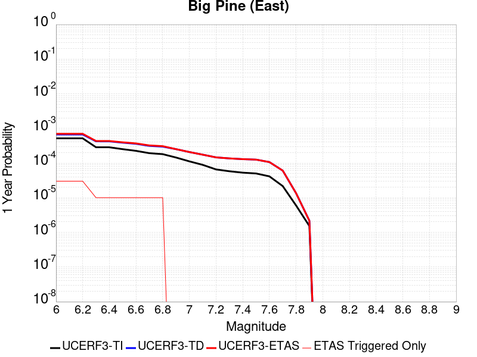 |  |

| Magnitude | 1 wk TI Prob | 1 wk TD Prob | 1 wk ETAS Prob | 1 wk ETAS/TD Gain | 1 wk ETAS Triggered Only | 1 mo TI Prob | 1 mo TD Prob | 1 mo ETAS Prob | 1 mo ETAS/TD Gain | 1 mo ETAS Triggered Only | 1 yr TI Prob | 1 yr TD Prob | 1 yr ETAS Prob | 1 yr ETAS/TD Gain | 1 yr ETAS Triggered Only | 10 yr TI Prob | 10 yr TD Prob | 10 yr ETAS Prob | 10 yr ETAS/TD Gain | 10 yr ETAS Triggered Only |
|-----|-----|-----|-----|-----|-----|-----|-----|-----|-----|-----|-----|-----|-----|-----|-----|-----|-----|-----|-----|-----|
| 6.0 | 9.916913E-6 | 1.282197E-5 | 2.2821841E-5 | 1.7799014 | 1.0E-5 | 4.250036E-5 | 5.495027E-5 | 7.494917E-5 | 1.3639455 | 2.0E-5 | 5.173191E-4 | 6.6883623E-4 | 6.988162E-4 | 1.044824 | 3.0E-5 | 0.0051611643 | 0.0066729826 | 0.0067127156 | 1.0059543 | 4.0E-5 |
| 6.1 | 9.916913E-6 | 1.282197E-5 | 2.2821841E-5 | 1.7799014 | 1.0E-5 | 4.250036E-5 | 5.495027E-5 | 7.494917E-5 | 1.3639455 | 2.0E-5 | 5.173191E-4 | 6.6883623E-4 | 6.988162E-4 | 1.044824 | 3.0E-5 | 0.0051611643 | 0.0066729826 | 0.0067127156 | 1.0059543 | 4.0E-5 |
| 6.2 | 9.916913E-6 | 1.282197E-5 | 2.2821841E-5 | 1.7799014 | 1.0E-5 | 4.250036E-5 | 5.495027E-5 | 7.494917E-5 | 1.3639455 | 2.0E-5 | 5.173191E-4 | 6.6883623E-4 | 6.988162E-4 | 1.044824 | 3.0E-5 | 0.0051611643 | 0.0066729826 | 0.0067127156 | 1.0059543 | 4.0E-5 |
| 6.3 | 5.479711E-6 | 8.117787E-6 | 1.8117706E-5 | 2.2318528 | 1.0E-5 | 2.3484265E-5 | 3.4790068E-5 | 4.4789722E-5 | 1.2874284 | 1.0E-5 | 2.858834E-4 | 4.2348995E-4 | 4.3348572E-4 | 1.0236033 | 1.0E-5 | 0.0028551589 | 0.004229713 | 0.0042496286 | 1.0047084 | 2.0E-5 |
| 6.4 | 5.465009E-6 | 8.10208E-6 | 1.8101999E-5 | 2.234241 | 1.0E-5 | 2.3421257E-5 | 3.4722754E-5 | 4.472241E-5 | 1.2879856 | 1.0E-5 | 2.851165E-4 | 4.2267074E-4 | 4.326665E-4 | 1.0236491 | 1.0E-5 | 0.0028475097 | 0.004221552 | 0.0042414675 | 1.0047176 | 2.0E-5 |
| 6.5 | 4.826767E-6 | 7.4271156E-6 | 1.742704E-5 | 2.3464077 | 1.0E-5 | 2.068598E-5 | 3.183012E-5 | 4.1829804E-5 | 1.3141578 | 1.0E-5 | 2.518227E-4 | 3.874656E-4 | 3.9746173E-4 | 1.0257988 | 1.0E-5 | 0.0025153751 | 0.0038707424 | 0.003890665 | 1.005147 | 2.0E-5 |
| 6.6 | 4.3146847E-6 | 6.887036E-6 | 1.6886966E-5 | 2.4519935 | 1.0E-5 | 1.8491375E-5 | 2.9515548E-5 | 3.9515253E-5 | 1.3387945 | 1.0E-5 | 2.2510924E-4 | 3.59295E-4 | 3.692914E-4 | 1.0278223 | 1.0E-5 | 0.0022488134 | 0.0035899505 | 0.0036098787 | 1.0055511 | 2.0E-5 |
| 6.7 | 3.6968106E-6 | 5.9999884E-6 | 1.5999929E-5 | 2.6666598 | 1.0E-5 | 1.5843378E-5 | 2.571399E-5 | 3.5713732E-5 | 1.3888834 | 1.0E-5 | 1.9287605E-4 | 3.130244E-4 | 3.2302126E-4 | 1.0319364 | 1.0E-5 | 0.0019270873 | 0.0031285542 | 0.0031484915 | 1.0063727 | 2.0E-5 |
| 6.8 | 3.4671132E-6 | 5.7065704E-6 | 1.5706513E-5 | 2.752356 | 1.0E-5 | 1.4858972E-5 | 2.4456509E-5 | 3.4456265E-5 | 1.4088792 | 1.0E-5 | 1.8089297E-4 | 2.9771877E-4 | 3.077158E-4 | 1.0335788 | 1.0E-5 | 0.0018074579 | 0.0029759097 | 0.0029958503 | 1.0067006 | 2.0E-5 |
| 6.9 | 2.7686972E-6 | 4.829279E-6 | 4.829279E-6 | 1.0 | 0.0 | 1.1865792E-5 | 2.069675E-5 | 2.069675E-5 | 1.0 | 0.0 | 1.4445644E-4 | 2.5195457E-4 | 2.5195457E-4 | 1.0 | 0.0 | 0.0014436257 | 0.0025193316 | 0.0025293066 | 1.0039593 | 1.0E-5 |
| 7.0 | 2.1472624E-6 | 3.988725E-6 | 3.988725E-6 | 1.0 | 0.0 | 9.20252E-6 | 1.7094428E-5 | 1.7094428E-5 | 1.0 | 0.0 | 1.12034926E-4 | 2.0810531E-4 | 2.0810531E-4 | 1.0 | 0.0 | 0.0011197845 | 0.002081715 | 0.0020916942 | 1.0047938 | 1.0E-5 |
| 7.1 | 1.7018335E-6 | 3.348229E-6 | 3.348229E-6 | 1.0 | 0.0 | 7.293552E-6 | 1.4349476E-5 | 1.4349476E-5 | 1.0 | 0.0 | 8.879537E-5 | 1.7469123E-4 | 1.7469123E-4 | 1.0 | 0.0 | 8.87599E-4 | 0.0017481181 | 0.0017581006 | 1.0057105 | 1.0E-5 |
| 7.2 | 1.25603E-6 | 2.7976516E-6 | 2.7976516E-6 | 1.0 | 0.0 | 5.3829745E-6 | 1.1989882E-5 | 1.1989882E-5 | 1.0 | 0.0 | 6.553574E-5 | 1.4596726E-4 | 1.4596726E-4 | 1.0 | 0.0 | 6.551642E-4 | 0.0014612685 | 0.0014712539 | 1.0068333 | 1.0E-5 |
| 7.3 | 1.112297E-6 | 2.613323E-6 | 2.613323E-6 | 1.0 | 0.0 | 4.7669787E-6 | 1.1199909E-5 | 1.1199909E-5 | 1.0 | 0.0 | 5.803642E-5 | 1.3635057E-4 | 1.3635057E-4 | 1.0 | 0.0 | 5.802127E-4 | 0.0013650558 | 0.0013750421 | 1.0073158 | 1.0E-5 |
| 7.4 | 1.0137181E-6 | 2.4863546E-6 | 2.4863546E-6 | 1.0 | 0.0 | 4.3444993E-6 | 1.0655763E-5 | 1.0655763E-5 | 1.0 | 0.0 | 5.2892992E-5 | 1.297264E-4 | 1.297264E-4 | 1.0 | 0.0 | 5.288041E-4 | 0.0012986774 | 0.0013086644 | 1.0076902 | 1.0E-5 |
| 7.5 | 9.598608E-7 | 2.4099256E-6 | 2.4099256E-6 | 1.0 | 0.0 | 4.1136827E-6 | 1.0328214E-5 | 1.0328214E-5 | 1.0 | 0.0 | 5.0082934E-5 | 1.2573895E-4 | 1.2573895E-4 | 1.0 | 0.0 | 5.007165E-4 | 0.0012586572 | 0.0012686446 | 1.0079349 | 1.0E-5 |
| 7.6 | 7.929459E-7 | 2.047312E-6 | 2.047312E-6 | 1.0 | 0.0 | 3.3983351E-6 | 8.7741655E-6 | 8.7741655E-6 | 1.0 | 0.0 | 4.1373947E-5 | 1.0682041E-4 | 1.0682041E-4 | 1.0 | 0.0 | 4.1366243E-4 | 0.0010697625 | 0.0010797518 | 1.0093379 | 1.0E-5 |
| 7.7 | 4.155788E-7 | 1.162298E-6 | 1.162298E-6 | 1.0 | 0.0 | 1.7810507E-6 | 4.981268E-6 | 4.981268E-6 | 1.0 | 0.0 | 2.1684076E-5 | 6.064529E-5 | 6.064529E-5 | 1.0 | 0.0 | 2.1681961E-4 | 6.09451E-4 | 6.09451E-4 | 1.0 | 0.0 |
| 7.8 | 1.14666925E-7 | 2.5959213E-7 | 2.5959213E-7 | 1.0 | 0.0 | 4.914296E-7 | 1.1125372E-6 | 1.1125372E-6 | 1.0 | 0.0 | 5.9831386E-6 | 1.354506E-5 | 1.354506E-5 | 1.0 | 0.0 | 5.9829777E-5 | 1.3654139E-4 | 1.3654139E-4 | 1.0 | 0.0 |
| 7.9 | 2.9231824E-8 | 4.15291E-8 | 4.15291E-8 | 1.0 | 0.0 | 1.2527924E-7 | 1.7798183E-7 | 1.7798183E-7 | 1.0 | 0.0 | 1.5252737E-6 | 2.1669268E-6 | 2.1669268E-6 | 1.0 | 0.0 | 1.5252632E-5 | 2.2001832E-5 | 2.2001832E-5 | 1.0 | 0.0 |

## Cleghorn Lake
*[(top)](#table-of-contents)*

| 1 Week | 1 Month | 1 Year | 10 Year |
|-----|-----|-----|-----|
|  |  |  | 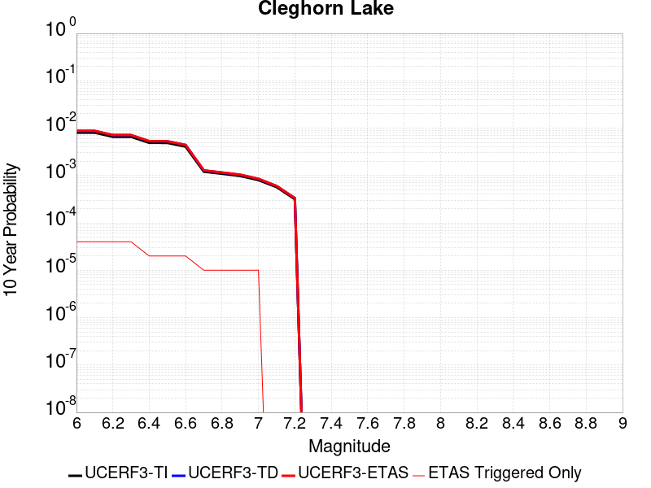 |

| Magnitude | 1 wk TI Prob | 1 wk TD Prob | 1 wk ETAS Prob | 1 wk ETAS/TD Gain | 1 wk ETAS Triggered Only | 1 mo TI Prob | 1 mo TD Prob | 1 mo ETAS Prob | 1 mo ETAS/TD Gain | 1 mo ETAS Triggered Only | 1 yr TI Prob | 1 yr TD Prob | 1 yr ETAS Prob | 1 yr ETAS/TD Gain | 1 yr ETAS Triggered Only | 10 yr TI Prob | 10 yr TD Prob | 10 yr ETAS Prob | 10 yr ETAS/TD Gain | 10 yr ETAS Triggered Only |
|-----|-----|-----|-----|-----|-----|-----|-----|-----|-----|-----|-----|-----|-----|-----|-----|-----|-----|-----|-----|-----|
| 6.0 | 1.5467183E-5 | 1.6794971E-5 | 1.6794971E-5 | 1.0 | 0.0 | 6.6286244E-5 | 7.197677E-5 | 7.197677E-5 | 1.0 | 0.0 | 8.067362E-4 | 8.760197E-4 | 9.0599345E-4 | 1.0342158 | 3.0E-5 | 0.008038137 | 0.008731093 | 0.008770743 | 1.0045413 | 4.0E-5 |
| 6.1 | 1.5467183E-5 | 1.6794971E-5 | 1.6794971E-5 | 1.0 | 0.0 | 6.6286244E-5 | 7.197677E-5 | 7.197677E-5 | 1.0 | 0.0 | 8.067362E-4 | 8.760197E-4 | 9.0599345E-4 | 1.0342158 | 3.0E-5 | 0.008038137 | 0.008731093 | 0.008770743 | 1.0045413 | 4.0E-5 |
| 6.2 | 1.2624631E-5 | 1.36821545E-5 | 1.36821545E-5 | 1.0 | 0.0 | 5.410444E-5 | 5.863676E-5 | 5.863676E-5 | 1.0 | 0.0 | 6.585225E-4 | 7.137174E-4 | 7.43696E-4 | 1.0420034 | 3.0E-5 | 0.0065657445 | 0.0071190484 | 0.0071587637 | 1.0055788 | 4.0E-5 |
| 6.3 | 1.2624631E-5 | 1.36821545E-5 | 1.36821545E-5 | 1.0 | 0.0 | 5.410444E-5 | 5.863676E-5 | 5.863676E-5 | 1.0 | 0.0 | 6.585225E-4 | 7.137174E-4 | 7.43696E-4 | 1.0420034 | 3.0E-5 | 0.0065657445 | 0.0071190484 | 0.0071587637 | 1.0055788 | 4.0E-5 |
| 6.4 | 9.417684E-6 | 1.0170551E-5 | 1.0170551E-5 | 1.0 | 0.0 | 4.036088E-5 | 4.3587577E-5 | 4.3587577E-5 | 1.0 | 0.0 | 4.912829E-4 | 5.3059065E-4 | 5.405853E-4 | 1.018837 | 1.0E-5 | 0.004901982 | 0.0052972743 | 0.0053171683 | 1.0037556 | 2.0E-5 |
| 6.5 | 9.368219E-6 | 1.0117976E-5 | 1.0117976E-5 | 1.0 | 0.0 | 4.014889E-5 | 4.3362263E-5 | 4.3362263E-5 | 1.0 | 0.0 | 4.8870314E-4 | 5.278488E-4 | 5.378435E-4 | 1.0189348 | 1.0E-5 | 0.004876298 | 0.0052699856 | 0.0052898806 | 1.0037751 | 2.0E-5 |
| 6.6 | 7.803798E-6 | 8.442198E-6 | 8.442198E-6 | 1.0 | 0.0 | 3.3444423E-5 | 3.6180576E-5 | 3.6180576E-5 | 1.0 | 0.0 | 4.0710976E-4 | 4.404494E-4 | 4.50445E-4 | 1.0226941 | 1.0E-5 | 0.0040636472 | 0.004399682 | 0.0044195936 | 1.0045258 | 2.0E-5 |
| 6.7 | 2.3108669E-6 | 2.4439082E-6 | 2.4439082E-6 | 1.0 | 0.0 | 9.903678E-6 | 1.0473852E-5 | 1.0473852E-5 | 1.0 | 0.0 | 1.205706E-4 | 1.2751187E-4 | 1.375106E-4 | 1.0784141 | 1.0E-5 | 0.001205052 | 0.0012744057 | 0.001284393 | 1.0078368 | 1.0E-5 |
| 6.8 | 2.0882828E-6 | 2.2063484E-6 | 2.2063484E-6 | 1.0 | 0.0 | 8.949753E-6 | 9.455745E-6 | 9.455745E-6 | 1.0 | 0.0 | 1.08957785E-4 | 1.15117786E-4 | 1.2511664E-4 | 1.0868576 | 1.0E-5 | 0.0010890438 | 0.0011505984 | 0.001160587 | 1.0086812 | 1.0E-5 |
| 6.9 | 1.876935E-6 | 1.9811093E-6 | 1.9811093E-6 | 1.0 | 0.0 | 8.043982E-6 | 8.490441E-6 | 8.490441E-6 | 1.0 | 0.0 | 9.7931086E-5 | 1.0336639E-4 | 1.1336535E-4 | 1.0967332 | 1.0E-5 | 9.788794E-4 | 0.001033199 | 0.0010431887 | 1.0096687 | 1.0E-5 |
| 7.0 | 1.5357559E-6 | 1.620328E-6 | 1.620328E-6 | 1.0 | 0.0 | 6.5817944E-6 | 6.9442453E-6 | 6.9442453E-6 | 1.0 | 0.0 | 8.01304E-5 | 8.454303E-5 | 9.4542185E-5 | 1.1182729 | 1.0E-5 | 8.010151E-4 | 8.4512116E-4 | 8.551127E-4 | 1.0118226 | 1.0E-5 |
| 7.1 | 1.0905424E-6 | 1.1497951E-6 | 1.1497951E-6 | 1.0 | 0.0 | 4.6737446E-6 | 4.9276846E-6 | 4.9276846E-6 | 1.0 | 0.0 | 5.6901354E-5 | 5.9993006E-5 | 5.9993006E-5 | 1.0 | 0.0 | 5.6886784E-4 | 5.997779E-4 | 5.997779E-4 | 1.0 | 0.0 |
| 7.2 | 6.06668E-7 | 6.387457E-7 | 6.387457E-7 | 1.0 | 0.0 | 2.600003E-6 | 2.737479E-6 | 2.737479E-6 | 1.0 | 0.0 | 3.1654577E-5 | 3.3328364E-5 | 3.3328364E-5 | 1.0 | 0.0 | 3.1650066E-4 | 3.3324052E-4 | 3.3324052E-4 | 1.0 | 0.0 |

## Ventura-Pitas Point
*[(top)](#table-of-contents)*

| 1 Week | 1 Month | 1 Year | 10 Year |
|-----|-----|-----|-----|
|  | 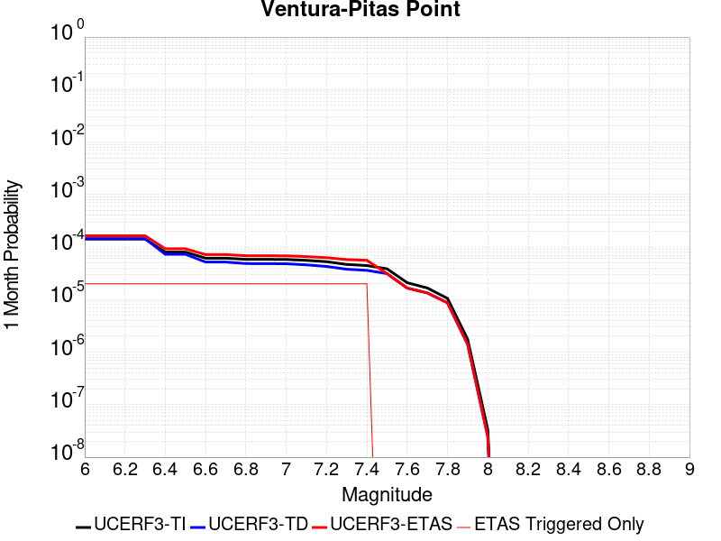 |  |  |

| Magnitude | 1 wk TI Prob | 1 wk TD Prob | 1 wk ETAS Prob | 1 wk ETAS/TD Gain | 1 wk ETAS Triggered Only | 1 mo TI Prob | 1 mo TD Prob | 1 mo ETAS Prob | 1 mo ETAS/TD Gain | 1 mo ETAS Triggered Only | 1 yr TI Prob | 1 yr TD Prob | 1 yr ETAS Prob | 1 yr ETAS/TD Gain | 1 yr ETAS Triggered Only | 10 yr TI Prob | 10 yr TD Prob | 10 yr ETAS Prob | 10 yr ETAS/TD Gain | 10 yr ETAS Triggered Only |
|-----|-----|-----|-----|-----|-----|-----|-----|-----|-----|-----|-----|-----|-----|-----|-----|-----|-----|-----|-----|-----|
| 6.0 | 3.3179622E-5 | 3.373905E-5 | 3.373905E-5 | 1.0 | 0.0 | 1.4219063E-4 | 1.4458936E-4 | 1.6458645E-4 | 1.1383028 | 2.0E-5 | 0.0017297962 | 0.001759211 | 0.0017791757 | 1.0113487 | 2.0E-5 | 0.017163932 | 0.017478386 | 0.017517686 | 1.0022485 | 4.0E-5 |
| 6.1 | 3.3179622E-5 | 3.373905E-5 | 3.373905E-5 | 1.0 | 0.0 | 1.4219063E-4 | 1.4458936E-4 | 1.6458645E-4 | 1.1383028 | 2.0E-5 | 0.0017297962 | 0.001759211 | 0.0017791757 | 1.0113487 | 2.0E-5 | 0.017163932 | 0.017478386 | 0.017517686 | 1.0022485 | 4.0E-5 |
| 6.2 | 3.3179622E-5 | 3.373905E-5 | 3.373905E-5 | 1.0 | 0.0 | 1.4219063E-4 | 1.4458936E-4 | 1.6458645E-4 | 1.1383028 | 2.0E-5 | 0.0017297962 | 0.001759211 | 0.0017791757 | 1.0113487 | 2.0E-5 | 0.017163932 | 0.017478386 | 0.017517686 | 1.0022485 | 4.0E-5 |
| 6.3 | 3.3179622E-5 | 3.373905E-5 | 3.373905E-5 | 1.0 | 0.0 | 1.4219063E-4 | 1.4458936E-4 | 1.6458645E-4 | 1.1383028 | 2.0E-5 | 0.0017297962 | 0.001759211 | 0.0017791757 | 1.0113487 | 2.0E-5 | 0.017163932 | 0.017478386 | 0.017517686 | 1.0022485 | 4.0E-5 |
| 6.4 | 1.8754668E-5 | 1.7022061E-5 | 1.7022061E-5 | 1.0 | 0.0 | 8.037467E-5 | 7.2949784E-5 | 9.294833E-5 | 1.2741412 | 2.0E-5 | 9.781223E-4 | 8.878248E-4 | 9.078071E-4 | 1.022507 | 2.0E-5 | 0.009738282 | 0.008845116 | 0.008864939 | 1.0022411 | 2.0E-5 |
| 6.5 | 1.8754668E-5 | 1.7022061E-5 | 1.7022061E-5 | 1.0 | 0.0 | 8.037467E-5 | 7.2949784E-5 | 9.294833E-5 | 1.2741412 | 2.0E-5 | 9.781223E-4 | 8.878248E-4 | 9.078071E-4 | 1.022507 | 2.0E-5 | 0.009738282 | 0.008845116 | 0.008864939 | 1.0022411 | 2.0E-5 |
| 6.6 | 1.4361558E-5 | 1.21244275E-5 | 1.21244275E-5 | 1.0 | 0.0 | 6.154808E-5 | 5.196081E-5 | 7.1959774E-5 | 1.3848854 | 2.0E-5 | 7.490902E-4 | 6.3244154E-4 | 6.524289E-4 | 1.0316035 | 2.0E-5 | 0.0074657016 | 0.006306674 | 0.006326548 | 1.0031513 | 2.0E-5 |
| 6.7 | 1.4361558E-5 | 1.21244275E-5 | 1.21244275E-5 | 1.0 | 0.0 | 6.154808E-5 | 5.196081E-5 | 7.1959774E-5 | 1.3848854 | 2.0E-5 | 7.490902E-4 | 6.3244154E-4 | 6.524289E-4 | 1.0316035 | 2.0E-5 | 0.0074657016 | 0.006306674 | 0.006326548 | 1.0031513 | 2.0E-5 |
| 6.8 | 1.3663846E-5 | 1.1346523E-5 | 1.1346523E-5 | 1.0 | 0.0 | 5.8558027E-5 | 4.8627062E-5 | 6.862609E-5 | 1.4112736 | 2.0E-5 | 7.127108E-4 | 5.918756E-4 | 6.1186374E-4 | 1.0337709 | 2.0E-5 | 0.007104293 | 0.005903208 | 0.00592309 | 1.003368 | 2.0E-5 |
| 6.9 | 1.3644157E-5 | 1.1324622E-5 | 1.1324622E-5 | 1.0 | 0.0 | 5.8473648E-5 | 4.8533206E-5 | 6.853224E-5 | 1.412069 | 2.0E-5 | 7.116841E-4 | 5.907335E-4 | 6.107217E-4 | 1.0338362 | 2.0E-5 | 0.007094092 | 0.005891848 | 0.00591173 | 1.0033746 | 2.0E-5 |
| 7.0 | 1.3568845E-5 | 1.1244184E-5 | 1.1244184E-5 | 1.0 | 0.0 | 5.8150898E-5 | 4.8188478E-5 | 6.818752E-5 | 1.415017 | 2.0E-5 | 7.077572E-4 | 5.8653875E-4 | 6.06527E-4 | 1.0340784 | 2.0E-5 | 0.007055073 | 0.005850122 | 0.005870005 | 1.0033988 | 2.0E-5 |
| 7.1 | 1.306572E-5 | 1.07226015E-5 | 1.07226015E-5 | 1.0 | 0.0 | 5.599474E-5 | 4.5953206E-5 | 6.5952285E-5 | 1.4352053 | 2.0E-5 | 6.815227E-4 | 5.5933854E-4 | 5.7932734E-4 | 1.0357366 | 2.0E-5 | 0.0067943637 | 0.005579512 | 0.0055994005 | 1.0035646 | 2.0E-5 |
| 7.2 | 1.232604E-5 | 9.9971385E-6 | 9.9971385E-6 | 1.0 | 0.0 | 5.2824813E-5 | 4.2844185E-5 | 6.2843326E-5 | 1.4667878 | 2.0E-5 | 6.429523E-4 | 5.2150484E-4 | 5.4149446E-4 | 1.0383306 | 2.0E-5 | 0.0064109527 | 0.0052030026 | 0.0052228984 | 1.0038239 | 2.0E-5 |
| 7.3 | 1.0917261E-5 | 8.844411E-6 | 8.844411E-6 | 1.0 | 0.0 | 4.678742E-5 | 3.7904076E-5 | 5.790332E-5 | 1.5276277 | 2.0E-5 | 5.69488E-4 | 4.6138596E-4 | 4.8137674E-4 | 1.0433277 | 2.0E-5 | 0.0056803077 | 0.0046044462 | 0.004624354 | 1.0043236 | 2.0E-5 |
| 7.4 | 1.039959E-5 | 8.4240955E-6 | 8.4240955E-6 | 1.0 | 0.0 | 4.456891E-5 | 3.6102774E-5 | 5.6102053E-5 | 1.553954 | 2.0E-5 | 5.424914E-4 | 4.3946414E-4 | 4.5945536E-4 | 1.04549 | 2.0E-5 | 0.0054116896 | 0.0043861126 | 0.004406025 | 1.0045398 | 2.0E-5 |
| 7.5 | 9.015877E-6 | 7.2979265E-6 | 7.2979265E-6 | 1.0 | 0.0 | 3.86389E-5 | 3.127646E-5 | 3.127646E-5 | 1.0 | 0.0 | 4.7032707E-4 | 3.8072577E-4 | 3.8072577E-4 | 1.0 | 0.0 | 0.004693329 | 0.0038008802 | 0.0038008802 | 1.0 | 0.0 |
| 7.6 | 4.900162E-6 | 3.874264E-6 | 3.874264E-6 | 1.0 | 0.0 | 2.1000526E-5 | 1.6603883E-5 | 1.6603883E-5 | 1.0 | 0.0 | 2.556514E-4 | 2.0213365E-4 | 2.0213365E-4 | 1.0 | 0.0 | 0.0025535747 | 0.0020195118 | 0.0020195118 | 1.0 | 0.0 |
| 7.7 | 3.8850626E-6 | 3.1268457E-6 | 3.1268457E-6 | 1.0 | 0.0 | 1.6650163E-5 | 1.34007E-5 | 1.34007E-5 | 1.0 | 0.0 | 2.0269687E-4 | 1.6314139E-4 | 1.6314139E-4 | 1.0 | 0.0 | 0.002025121 | 0.0016302256 | 0.0016302256 | 1.0 | 0.0 |
| 7.8 | 2.4654719E-6 | 2.0299424E-6 | 2.0299424E-6 | 1.0 | 0.0 | 1.0566265E-5 | 8.699724E-6 | 8.699724E-6 | 1.0 | 0.0 | 1.2863669E-4 | 1.0591404E-4 | 1.0591404E-4 | 1.0 | 0.0 | 0.0012856225 | 0.0010586403 | 0.0010586403 | 1.0 | 0.0 |
| 7.9 | 4.095894E-7 | 3.27659E-7 | 3.27659E-7 | 1.0 | 0.0 | 1.7553821E-6 | 1.404252E-6 | 1.404252E-6 | 1.0 | 0.0 | 2.1371567E-5 | 1.7096638E-5 | 1.7096638E-5 | 1.0 | 0.0 | 2.1369511E-4 | 1.7095353E-4 | 1.7095353E-4 | 1.0 | 0.0 |
| 8.0 | 7.791402E-9 | 5.683722E-9 | 5.683722E-9 | 1.0 | 0.0 | 3.3391725E-8 | 2.4358807E-8 | 2.4358807E-8 | 1.0 | 0.0 | 4.0654416E-7 | 2.9656846E-7 | 2.9656846E-7 | 1.0 | 0.0 | 4.065434E-6 | 2.9656826E-6 | 2.9656826E-6 | 1.0 | 0.0 |

## Cleghorn
*[(top)](#table-of-contents)*

| 1 Week | 1 Month | 1 Year | 10 Year |
|-----|-----|-----|-----|
|  |  | 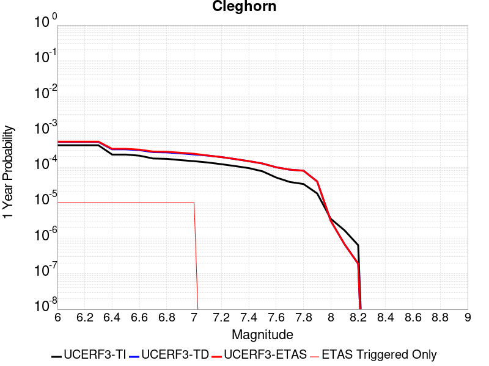 |  |

| Magnitude | 1 wk TI Prob | 1 wk TD Prob | 1 wk ETAS Prob | 1 wk ETAS/TD Gain | 1 wk ETAS Triggered Only | 1 mo TI Prob | 1 mo TD Prob | 1 mo ETAS Prob | 1 mo ETAS/TD Gain | 1 mo ETAS Triggered Only | 1 yr TI Prob | 1 yr TD Prob | 1 yr ETAS Prob | 1 yr ETAS/TD Gain | 1 yr ETAS Triggered Only | 10 yr TI Prob | 10 yr TD Prob | 10 yr ETAS Prob | 10 yr ETAS/TD Gain | 10 yr ETAS Triggered Only |
|-----|-----|-----|-----|-----|-----|-----|-----|-----|-----|-----|-----|-----|-----|-----|-----|-----|-----|-----|-----|-----|
| 6.0 | 7.9267165E-6 | 9.838367E-6 | 9.838367E-6 | 1.0 | 0.0 | 3.39712E-5 | 4.216381E-5 | 4.216381E-5 | 1.0 | 0.0 | 4.1352084E-4 | 5.1323406E-4 | 5.2322895E-4 | 1.0194743 | 1.0E-5 | 0.004127522 | 0.005135526 | 0.0051753204 | 1.0077488 | 4.0E-5 |
| 6.1 | 7.9267165E-6 | 9.838367E-6 | 9.838367E-6 | 1.0 | 0.0 | 3.39712E-5 | 4.216381E-5 | 4.216381E-5 | 1.0 | 0.0 | 4.1352084E-4 | 5.1323406E-4 | 5.2322895E-4 | 1.0194743 | 1.0E-5 | 0.004127522 | 0.005135526 | 0.0051753204 | 1.0077488 | 4.0E-5 |
| 6.2 | 7.9267165E-6 | 9.838367E-6 | 9.838367E-6 | 1.0 | 0.0 | 3.39712E-5 | 4.216381E-5 | 4.216381E-5 | 1.0 | 0.0 | 4.1352084E-4 | 5.1323406E-4 | 5.2322895E-4 | 1.0194743 | 1.0E-5 | 0.004127522 | 0.005135526 | 0.0051753204 | 1.0077488 | 4.0E-5 |
| 6.3 | 7.9267165E-6 | 9.838367E-6 | 9.838367E-6 | 1.0 | 0.0 | 3.39712E-5 | 4.216381E-5 | 4.216381E-5 | 1.0 | 0.0 | 4.1352084E-4 | 5.1323406E-4 | 5.2322895E-4 | 1.0194743 | 1.0E-5 | 0.004127522 | 0.005135526 | 0.0051753204 | 1.0077488 | 4.0E-5 |
| 6.4 | 4.3445207E-6 | 6.0981406E-6 | 6.0981406E-6 | 1.0 | 0.0 | 1.8619241E-5 | 2.6134632E-5 | 2.6134632E-5 | 1.0 | 0.0 | 2.2666567E-4 | 3.181437E-4 | 3.281405E-4 | 1.0314224 | 1.0E-5 | 0.0022643462 | 0.003190997 | 0.0032009652 | 1.0031238 | 1.0E-5 |
| 6.5 | 4.3445207E-6 | 6.0981406E-6 | 6.0981406E-6 | 1.0 | 0.0 | 1.8619241E-5 | 2.6134632E-5 | 2.6134632E-5 | 1.0 | 0.0 | 2.2666567E-4 | 3.181437E-4 | 3.281405E-4 | 1.0314224 | 1.0E-5 | 0.0022643462 | 0.003190997 | 0.0032009652 | 1.0031238 | 1.0E-5 |
| 6.6 | 4.040109E-6 | 5.780541E-6 | 5.780541E-6 | 1.0 | 0.0 | 1.7314638E-5 | 2.4773517E-5 | 2.4773517E-5 | 1.0 | 0.0 | 2.1078532E-4 | 3.0157674E-4 | 3.1157373E-4 | 1.033149 | 1.0E-5 | 0.002105855 | 0.0030257835 | 0.0030357533 | 1.003295 | 1.0E-5 |
| 6.7 | 3.3632055E-6 | 5.074022E-6 | 5.074022E-6 | 1.0 | 0.0 | 1.4413658E-5 | 2.1745627E-5 | 2.1745627E-5 | 1.0 | 0.0 | 1.7547216E-4 | 2.6472117E-4 | 2.7471854E-4 | 1.0377656 | 1.0E-5 | 0.0017533366 | 0.0026581106 | 0.0026680839 | 1.0037521 | 1.0E-5 |
| 6.8 | 3.2902772E-6 | 4.9959262E-6 | 4.9959262E-6 | 1.0 | 0.0 | 1.4101111E-5 | 2.1410939E-5 | 2.1410939E-5 | 1.0 | 0.0 | 1.716675E-4 | 2.606473E-4 | 2.706447E-4 | 1.0383561 | 1.0E-5 | 0.0017153495 | 0.0026174681 | 0.002627442 | 1.0038105 | 1.0E-5 |
| 6.9 | 3.031547E-6 | 4.6974637E-6 | 4.6974637E-6 | 1.0 | 0.0 | 1.299228E-5 | 2.0131833E-5 | 2.0131833E-5 | 1.0 | 0.0 | 1.5816953E-4 | 2.4507777E-4 | 2.550753E-4 | 1.0407934 | 1.0E-5 | 0.00158057 | 0.002462125 | 0.0024721003 | 1.0040516 | 1.0E-5 |
| 7.0 | 2.8259715E-6 | 4.3764653E-6 | 4.3764653E-6 | 1.0 | 0.0 | 1.211125E-5 | 1.8756145E-5 | 1.8756145E-5 | 1.0 | 0.0 | 1.4744449E-4 | 2.2833238E-4 | 2.383301E-4 | 1.0437858 | 1.0E-5 | 0.001473467 | 0.0022950263 | 0.0023050033 | 1.0043472 | 1.0E-5 |
| 7.1 | 2.5962665E-6 | 4.071453E-6 | 4.071453E-6 | 1.0 | 0.0 | 1.1126809E-5 | 1.7448969E-5 | 1.7448969E-5 | 1.0 | 0.0 | 1.3546048E-4 | 2.124207E-4 | 2.124207E-4 | 1.0 | 0.0 | 0.0013537793 | 0.0021362302 | 0.0021362302 | 1.0 | 0.0 |
| 7.2 | 2.3247253E-6 | 3.6817423E-6 | 3.6817423E-6 | 1.0 | 0.0 | 9.96307E-6 | 1.5778802E-5 | 1.5778802E-5 | 1.0 | 0.0 | 1.21293626E-4 | 1.9209016E-4 | 1.9209016E-4 | 1.0 | 0.0 | 0.0012122744 | 0.0019333162 | 0.0019333162 | 1.0 | 0.0 |
| 7.3 | 2.056928E-6 | 3.2399425E-6 | 3.2399425E-6 | 1.0 | 0.0 | 8.815376E-6 | 1.3885395E-5 | 1.3885395E-5 | 1.0 | 0.0 | 1.0732192E-4 | 1.6904173E-4 | 1.6904173E-4 | 1.0 | 0.0 | 0.001072701 | 0.0017032728 | 0.0017032728 | 1.0 | 0.0 |
| 7.4 | 1.8055999E-6 | 2.8298966E-6 | 2.8298966E-6 | 1.0 | 0.0 | 7.738263E-6 | 1.2128073E-5 | 1.2128073E-5 | 1.0 | 0.0 | 9.4209274E-5 | 1.4764942E-4 | 1.4764942E-4 | 1.0 | 0.0 | 9.4169343E-4 | 0.0014897923 | 0.0014897923 | 1.0 | 0.0 |
| 7.5 | 1.4683443E-6 | 2.4289393E-6 | 2.4289393E-6 | 1.0 | 0.0 | 6.292889E-6 | 1.0409699E-5 | 1.0409699E-5 | 1.0 | 0.0 | 7.661323E-5 | 1.2673081E-4 | 1.2673081E-4 | 1.0 | 0.0 | 7.658682E-4 | 0.0012809072 | 0.0012809072 | 1.0 | 0.0 |
| 7.6 | 9.804088E-7 | 1.9043657E-6 | 1.9043657E-6 | 1.0 | 0.0 | 4.201745E-6 | 8.161543E-6 | 8.161543E-6 | 1.0 | 0.0 | 5.1155046E-5 | 9.9362296E-5 | 9.9362296E-5 | 1.0 | 0.0 | 5.114327E-4 | 0.0010075356 | 0.0010075356 | 1.0 | 0.0 |
| 7.7 | 7.3434086E-7 | 1.6324341E-6 | 1.6324341E-6 | 1.0 | 0.0 | 3.1471714E-6 | 6.9961275E-6 | 6.9961275E-6 | 1.0 | 0.0 | 3.831614E-5 | 8.517455E-5 | 8.517455E-5 | 1.0 | 0.0 | 3.8309532E-4 | 8.6581067E-4 | 8.6581067E-4 | 1.0 | 0.0 |
| 7.8 | 6.434184E-7 | 1.5257981E-6 | 1.5257981E-6 | 1.0 | 0.0 | 2.7575045E-6 | 6.5391187E-6 | 6.5391187E-6 | 1.0 | 0.0 | 3.35721E-5 | 7.961089E-5 | 7.961089E-5 | 1.0 | 0.0 | 3.3567028E-4 | 8.098763E-4 | 8.098763E-4 | 1.0 | 0.0 |
| 7.9 | 3.4943926E-7 | 7.594313E-7 | 7.594313E-7 | 1.0 | 0.0 | 1.497596E-6 | 3.2547016E-6 | 3.2547016E-6 | 1.0 | 0.0 | 1.8233079E-5 | 3.962528E-5 | 3.962528E-5 | 1.0 | 0.0 | 1.8231584E-4 | 4.050159E-4 | 4.050159E-4 | 1.0 | 0.0 |
| 8.0 | 6.717524E-8 | 5.8598772E-8 | 5.8598772E-8 | 1.0 | 0.0 | 2.8789387E-7 | 2.5113755E-7 | 2.5113755E-7 | 1.0 | 0.0 | 3.505102E-6 | 3.0575957E-6 | 3.0575957E-6 | 1.0 | 0.0 | 3.5050467E-5 | 3.28481E-5 | 3.28481E-5 | 1.0 | 0.0 |
| 8.1 | 3.1984914E-8 | 1.3024658E-8 | 1.3024658E-8 | 1.0 | 0.0 | 1.370782E-7 | 5.5819964E-8 | 5.5819964E-8 | 1.0 | 0.0 | 1.6689258E-6 | 6.7960787E-7 | 6.7960787E-7 | 1.0 | 0.0 | 1.6689133E-5 | 7.7832365E-6 | 7.7832365E-6 | 1.0 | 0.0 |
| 8.2 | 1.21887656E-8 | 3.6706735E-9 | 3.6706735E-9 | 1.0 | 0.0 | 5.2237567E-8 | 1.5731459E-8 | 1.5731459E-8 | 1.0 | 0.0 | 6.359922E-7 | 1.9153049E-7 | 1.9153049E-7 | 1.0 | 0.0 | 6.3599036E-6 | 2.2593056E-6 | 2.2593056E-6 | 1.0 | 0.0 |

## Ortigalita (South)
*[(top)](#table-of-contents)*

| 1 Week | 1 Month | 1 Year | 10 Year |
|-----|-----|-----|-----|
|  |  | 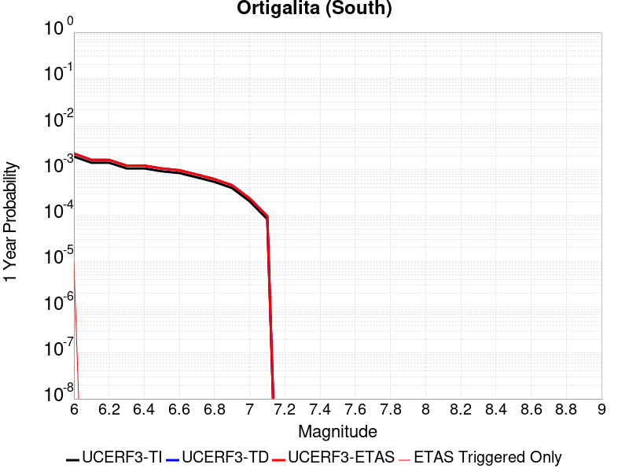 |  |

| Magnitude | 1 wk TI Prob | 1 wk TD Prob | 1 wk ETAS Prob | 1 wk ETAS/TD Gain | 1 wk ETAS Triggered Only | 1 mo TI Prob | 1 mo TD Prob | 1 mo ETAS Prob | 1 mo ETAS/TD Gain | 1 mo ETAS Triggered Only | 1 yr TI Prob | 1 yr TD Prob | 1 yr ETAS Prob | 1 yr ETAS/TD Gain | 1 yr ETAS Triggered Only | 10 yr TI Prob | 10 yr TD Prob | 10 yr ETAS Prob | 10 yr ETAS/TD Gain | 10 yr ETAS Triggered Only |
|-----|-----|-----|-----|-----|-----|-----|-----|-----|-----|-----|-----|-----|-----|-----|-----|-----|-----|-----|-----|-----|
| 6.0 | 3.72394E-5 | 4.3259344E-5 | 4.3259344E-5 | 1.0 | 0.0 | 1.5958765E-4 | 1.853849E-4 | 1.9538304E-4 | 1.0539318 | 1.0E-5 | 0.0019412481 | 0.0022548812 | 0.0022648587 | 1.0044248 | 1.0E-5 | 0.019243775 | 0.0223364 | 0.022365728 | 1.0013131 | 3.0E-5 |
| 6.1 | 2.7299884E-5 | 3.1494616E-5 | 3.1494616E-5 | 1.0 | 0.0 | 1.16994255E-4 | 1.3497027E-4 | 1.3497027E-4 | 1.0 | 0.0 | 0.0014234743 | 0.0016420797 | 0.0016420797 | 1.0 | 0.0 | 0.014143906 | 0.016305393 | 0.01631523 | 1.0006033 | 1.0E-5 |
| 6.2 | 2.7299884E-5 | 3.1494616E-5 | 3.1494616E-5 | 1.0 | 0.0 | 1.16994255E-4 | 1.3497027E-4 | 1.3497027E-4 | 1.0 | 0.0 | 0.0014234743 | 0.0016420797 | 0.0016420797 | 1.0 | 0.0 | 0.014143906 | 0.016305393 | 0.01631523 | 1.0006033 | 1.0E-5 |
| 6.3 | 2.0546433E-5 | 2.3633338E-5 | 2.3633338E-5 | 1.0 | 0.0 | 8.805317E-5 | 1.0128191E-4 | 1.0128191E-4 | 1.0 | 0.0 | 0.00107152 | 0.0012324287 | 0.0012324287 | 1.0 | 0.0 | 0.010663681 | 0.0122580035 | 0.012267881 | 1.0008057 | 1.0E-5 |
| 6.4 | 2.0546433E-5 | 2.3633338E-5 | 2.3633338E-5 | 1.0 | 0.0 | 8.805317E-5 | 1.0128191E-4 | 1.0128191E-4 | 1.0 | 0.0 | 0.00107152 | 0.0012324287 | 0.0012324287 | 1.0 | 0.0 | 0.010663681 | 0.0122580035 | 0.012267881 | 1.0008057 | 1.0E-5 |
| 6.5 | 1.7779594E-5 | 2.0448608E-5 | 2.0448608E-5 | 1.0 | 0.0 | 7.619603E-5 | 8.763402E-5 | 8.763402E-5 | 1.0 | 0.0 | 9.272918E-4 | 0.0010664355 | 0.0010664355 | 1.0 | 0.0 | 0.009234319 | 0.010614647 | 0.01062454 | 1.0009321 | 1.0E-5 |
| 6.6 | 1.6272212E-5 | 1.8716462E-5 | 1.8716462E-5 | 1.0 | 0.0 | 6.973618E-5 | 8.0211015E-5 | 8.0211015E-5 | 1.0 | 0.0 | 8.487073E-4 | 9.761438E-4 | 9.761438E-4 | 1.0 | 0.0 | 0.008454733 | 0.0097198635 | 0.009729766 | 1.0010188 | 1.0E-5 |
| 6.7 | 1.3051484E-5 | 1.5039977E-5 | 1.5039977E-5 | 1.0 | 0.0 | 5.593373E-5 | 6.4455504E-5 | 6.4455504E-5 | 1.0 | 0.0 | 6.807804E-4 | 7.8447274E-4 | 7.8447274E-4 | 1.0 | 0.0 | 0.006786986 | 0.007818019 | 0.007827941 | 1.0012691 | 1.0E-5 |
| 6.8 | 1.04277415E-5 | 1.1988188E-5 | 1.1988188E-5 | 1.0 | 0.0 | 4.4689557E-5 | 5.137698E-5 | 5.137698E-5 | 1.0 | 0.0 | 5.439595E-4 | 6.2534265E-4 | 6.2534265E-4 | 1.0 | 0.0 | 0.0054262993 | 0.0062365844 | 0.006246522 | 1.0015935 | 1.0E-5 |
| 6.9 | 7.639968E-6 | 8.792207E-6 | 8.792207E-6 | 1.0 | 0.0 | 3.274231E-5 | 3.7680376E-5 | 3.7680376E-5 | 1.0 | 0.0 | 3.9856473E-4 | 4.586679E-4 | 4.586679E-4 | 1.0 | 0.0 | 0.003978506 | 0.004577799 | 0.004587753 | 1.0021745 | 1.0E-5 |
| 7.0 | 3.919831E-6 | 4.5337783E-6 | 4.5337783E-6 | 1.0 | 0.0 | 1.679917E-5 | 1.9430345E-5 | 1.9430345E-5 | 1.0 | 0.0 | 2.045107E-4 | 2.3654089E-4 | 2.3654089E-4 | 1.0 | 0.0 | 0.0020432258 | 0.0023630997 | 0.0023630997 | 1.0 | 0.0 |
| 7.1 | 1.6017933E-6 | 1.857199E-6 | 1.857199E-6 | 1.0 | 0.0 | 6.8648105E-6 | 7.959406E-6 | 7.959406E-6 | 1.0 | 0.0 | 8.357586E-5 | 9.690253E-5 | 9.690253E-5 | 1.0 | 0.0 | 8.3544437E-4 | 9.6870743E-4 | 9.6870743E-4 | 1.0 | 0.0 |

## Kern Canyon (North Kern) 2011
*[(top)](#table-of-contents)*

| 1 Week | 1 Month | 1 Year | 10 Year |
|-----|-----|-----|-----|
|  |  |  | 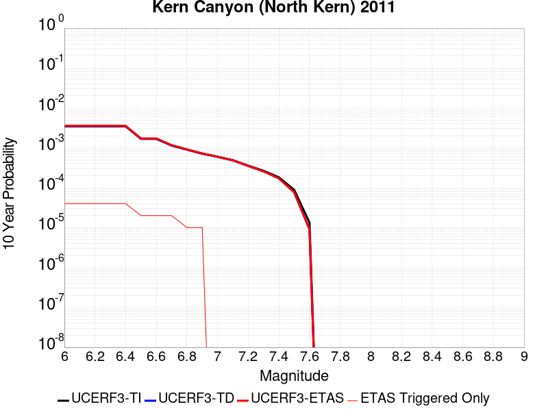 |

| Magnitude | 1 wk TI Prob | 1 wk TD Prob | 1 wk ETAS Prob | 1 wk ETAS/TD Gain | 1 wk ETAS Triggered Only | 1 mo TI Prob | 1 mo TD Prob | 1 mo ETAS Prob | 1 mo ETAS/TD Gain | 1 mo ETAS Triggered Only | 1 yr TI Prob | 1 yr TD Prob | 1 yr ETAS Prob | 1 yr ETAS/TD Gain | 1 yr ETAS Triggered Only | 10 yr TI Prob | 10 yr TD Prob | 10 yr ETAS Prob | 10 yr ETAS/TD Gain | 10 yr ETAS Triggered Only |
|-----|-----|-----|-----|-----|-----|-----|-----|-----|-----|-----|-----|-----|-----|-----|-----|-----|-----|-----|-----|-----|
| 6.0 | 6.6264497E-6 | 6.7574156E-6 | 6.7574156E-6 | 1.0 | 0.0 | 2.8398761E-5 | 2.8960078E-5 | 2.8960078E-5 | 1.0 | 0.0 | 3.4570007E-4 | 3.525399E-4 | 3.7253284E-4 | 1.0567112 | 2.0E-5 | 0.0034516277 | 0.003520595 | 0.003560454 | 1.0113217 | 4.0E-5 |
| 6.1 | 6.6264497E-6 | 6.7574156E-6 | 6.7574156E-6 | 1.0 | 0.0 | 2.8398761E-5 | 2.8960078E-5 | 2.8960078E-5 | 1.0 | 0.0 | 3.4570007E-4 | 3.525399E-4 | 3.7253284E-4 | 1.0567112 | 2.0E-5 | 0.0034516277 | 0.003520595 | 0.003560454 | 1.0113217 | 4.0E-5 |
| 6.2 | 6.6264497E-6 | 6.7574156E-6 | 6.7574156E-6 | 1.0 | 0.0 | 2.8398761E-5 | 2.8960078E-5 | 2.8960078E-5 | 1.0 | 0.0 | 3.4570007E-4 | 3.525399E-4 | 3.7253284E-4 | 1.0567112 | 2.0E-5 | 0.0034516277 | 0.003520595 | 0.003560454 | 1.0113217 | 4.0E-5 |
| 6.3 | 6.6264497E-6 | 6.7574156E-6 | 6.7574156E-6 | 1.0 | 0.0 | 2.8398761E-5 | 2.8960078E-5 | 2.8960078E-5 | 1.0 | 0.0 | 3.4570007E-4 | 3.525399E-4 | 3.7253284E-4 | 1.0567112 | 2.0E-5 | 0.0034516277 | 0.003520595 | 0.003560454 | 1.0113217 | 4.0E-5 |
| 6.4 | 6.6264497E-6 | 6.7574156E-6 | 6.7574156E-6 | 1.0 | 0.0 | 2.8398761E-5 | 2.8960078E-5 | 2.8960078E-5 | 1.0 | 0.0 | 3.4570007E-4 | 3.525399E-4 | 3.7253284E-4 | 1.0567112 | 2.0E-5 | 0.0034516277 | 0.003520595 | 0.003560454 | 1.0113217 | 4.0E-5 |
| 6.5 | 3.2162225E-6 | 3.2571281E-6 | 3.2571281E-6 | 1.0 | 0.0 | 1.3783738E-5 | 1.395905E-5 | 1.395905E-5 | 1.0 | 0.0 | 1.6780409E-4 | 1.69939E-4 | 1.7993728E-4 | 1.0588347 | 1.0E-5 | 0.0016767744 | 0.0016981701 | 0.0017181361 | 1.0117574 | 2.0E-5 |
| 6.6 | 3.2162225E-6 | 3.2571281E-6 | 3.2571281E-6 | 1.0 | 0.0 | 1.3783738E-5 | 1.395905E-5 | 1.395905E-5 | 1.0 | 0.0 | 1.6780409E-4 | 1.69939E-4 | 1.7993728E-4 | 1.0588347 | 1.0E-5 | 0.0016767744 | 0.0016981701 | 0.0017181361 | 1.0117574 | 2.0E-5 |
| 6.7 | 2.1908265E-6 | 2.2071454E-6 | 2.2071454E-6 | 1.0 | 0.0 | 9.389223E-6 | 9.459161E-6 | 9.459161E-6 | 1.0 | 0.0 | 1.1430779E-4 | 1.15159404E-4 | 1.2515826E-4 | 1.0868262 | 1.0E-5 | 0.0011424901 | 0.0011510167 | 0.0011709937 | 1.0173559 | 2.0E-5 |
| 6.8 | 1.7303895E-6 | 1.7365707E-6 | 1.7365707E-6 | 1.0 | 0.0 | 7.415934E-6 | 7.442425E-6 | 7.442425E-6 | 1.0 | 0.0 | 9.028525E-5 | 9.060786E-5 | 1.0060695E-4 | 1.1103557 | 1.0E-5 | 9.024858E-4 | 9.057189E-4 | 9.157098E-4 | 1.0110309 | 1.0E-5 |
| 6.9 | 1.3700314E-6 | 1.368876E-6 | 1.368876E-6 | 1.0 | 0.0 | 5.87155E-6 | 5.8665987E-6 | 5.8665987E-6 | 1.0 | 0.0 | 7.148377E-5 | 7.142354E-5 | 8.142283E-5 | 1.1399999 | 1.0E-5 | 7.146078E-4 | 7.1401044E-4 | 7.240033E-4 | 1.0139954 | 1.0E-5 |
| 7.0 | 1.1467797E-6 | 1.141392E-6 | 1.141392E-6 | 1.0 | 0.0 | 4.9147607E-6 | 4.891671E-6 | 4.891671E-6 | 1.0 | 0.0 | 5.983557E-5 | 5.95545E-5 | 5.95545E-5 | 1.0 | 0.0 | 5.981946E-4 | 5.953885E-4 | 5.953885E-4 | 1.0 | 0.0 |
| 7.1 | 9.3952065E-7 | 9.3027853E-7 | 9.3027853E-7 | 1.0 | 0.0 | 4.026511E-6 | 3.986902E-6 | 3.986902E-6 | 1.0 | 0.0 | 4.9021666E-5 | 4.8539467E-5 | 4.8539467E-5 | 1.0 | 0.0 | 4.901085E-4 | 4.8529042E-4 | 4.8529042E-4 | 1.0 | 0.0 |
| 7.2 | 6.858055E-7 | 6.71937E-7 | 6.71937E-7 | 1.0 | 0.0 | 2.939163E-6 | 2.879727E-6 | 2.879727E-6 | 1.0 | 0.0 | 3.5783723E-5 | 3.506012E-5 | 3.506012E-5 | 1.0 | 0.0 | 3.5777962E-4 | 3.5054676E-4 | 3.5054676E-4 | 1.0 | 0.0 |
| 7.3 | 5.1101983E-7 | 4.939352E-7 | 4.939352E-7 | 1.0 | 0.0 | 2.1900833E-6 | 2.1168635E-6 | 2.1168635E-6 | 1.0 | 0.0 | 2.6663936E-5 | 2.5772513E-5 | 2.5772513E-5 | 1.0 | 0.0 | 2.6660739E-4 | 2.5769573E-4 | 2.5769573E-4 | 1.0 | 0.0 |
| 7.4 | 3.4999414E-7 | 3.299627E-7 | 3.299627E-7 | 1.0 | 0.0 | 1.499974E-6 | 1.4141251E-6 | 1.4141251E-6 | 1.0 | 0.0 | 1.8262032E-5 | 1.721684E-5 | 1.721684E-5 | 1.0 | 0.0 | 1.826053E-4 | 1.721553E-4 | 1.721553E-4 | 1.0 | 0.0 |
| 7.5 | 1.7021522E-7 | 1.475023E-7 | 1.475023E-7 | 1.0 | 0.0 | 7.2949354E-7 | 6.321526E-7 | 6.321526E-7 | 1.0 | 0.0 | 8.881548E-6 | 7.696432E-6 | 7.696432E-6 | 1.0 | 0.0 | 8.8811925E-5 | 7.6961725E-5 | 7.6961725E-5 | 1.0 | 0.0 |
| 7.6 | 2.572245E-8 | 1.7352884E-8 | 1.7352884E-8 | 1.0 | 0.0 | 1.10239064E-7 | 7.43695E-8 | 7.43695E-8 | 1.0 | 0.0 | 1.3421597E-6 | 9.0544836E-7 | 9.0544836E-7 | 1.0 | 0.0 | 1.3421517E-5 | 9.054452E-6 | 9.054452E-6 | 1.0 | 0.0 |

## Great Valley 09 (Laguna Seca)
*[(top)](#table-of-contents)*

| 1 Week | 1 Month | 1 Year | 10 Year |
|-----|-----|-----|-----|
|  |  |  |  |

| Magnitude | 1 wk TI Prob | 1 wk TD Prob | 1 wk ETAS Prob | 1 wk ETAS/TD Gain | 1 wk ETAS Triggered Only | 1 mo TI Prob | 1 mo TD Prob | 1 mo ETAS Prob | 1 mo ETAS/TD Gain | 1 mo ETAS Triggered Only | 1 yr TI Prob | 1 yr TD Prob | 1 yr ETAS Prob | 1 yr ETAS/TD Gain | 1 yr ETAS Triggered Only | 10 yr TI Prob | 10 yr TD Prob | 10 yr ETAS Prob | 10 yr ETAS/TD Gain | 10 yr ETAS Triggered Only |
|-----|-----|-----|-----|-----|-----|-----|-----|-----|-----|-----|-----|-----|-----|-----|-----|-----|-----|-----|-----|-----|
| 6.0 | 5.4353277E-5 | 7.051288E-5 | 7.051288E-5 | 1.0 | 0.0 | 2.3292181E-4 | 3.021651E-4 | 3.021651E-4 | 1.0 | 0.0 | 0.0028321352 | 0.0036727623 | 0.0036827256 | 1.0027127 | 1.0E-5 | 0.02796312 | 0.036121234 | 0.03615015 | 1.0008005 | 3.0E-5 |
| 6.1 | 4.5578287E-5 | 5.8229198E-5 | 5.8229198E-5 | 1.0 | 0.0 | 1.953209E-4 | 2.4953127E-4 | 2.4953127E-4 | 1.0 | 0.0 | 0.0023754383 | 0.0030339046 | 0.0030438742 | 1.0032861 | 1.0E-5 | 0.023502063 | 0.029924182 | 0.029953284 | 1.0009725 | 3.0E-5 |
| 6.2 | 2.8536782E-5 | 3.4740468E-5 | 3.4740468E-5 | 1.0 | 0.0 | 1.2229476E-4 | 1.4887958E-4 | 1.4887958E-4 | 1.0 | 0.0 | 0.0014879217 | 0.0018110707 | 0.0018210526 | 1.0055116 | 1.0E-5 | 0.014779986 | 0.017960638 | 0.017980278 | 1.0010935 | 2.0E-5 |
| 6.3 | 2.3698774E-5 | 2.8215252E-5 | 2.8215252E-5 | 1.0 | 0.0 | 1.01562226E-4 | 1.2091713E-4 | 1.2091713E-4 | 1.0 | 0.0 | 0.0012358186 | 0.0014712278 | 0.0014812131 | 1.0067871 | 1.0E-5 | 0.012289686 | 0.014613301 | 0.014633008 | 1.0013486 | 2.0E-5 |
| 6.4 | 1.9191197E-5 | 2.2123982E-5 | 2.2123982E-5 | 1.0 | 0.0 | 8.2245395E-5 | 9.481376E-5 | 9.481376E-5 | 1.0 | 0.0 | 0.0010008777 | 0.001153789 | 0.0011637774 | 1.0086571 | 1.0E-5 | 0.009963818 | 0.011478378 | 0.011498149 | 1.0017225 | 2.0E-5 |
| 6.5 | 1.5203241E-5 | 1.6802042E-5 | 1.6802042E-5 | 1.0 | 0.0 | 6.5155116E-5 | 7.200683E-5 | 7.200683E-5 | 1.0 | 0.0 | 7.9297484E-4 | 8.76362E-4 | 8.8635326E-4 | 1.0114008 | 1.0E-5 | 0.007901512 | 0.008730489 | 0.008750315 | 1.0022708 | 2.0E-5 |
| 6.6 | 1.0984925E-5 | 1.1243591E-5 | 1.1243591E-5 | 1.0 | 0.0 | 4.70774E-5 | 4.8185837E-5 | 4.8185837E-5 | 1.0 | 0.0 | 5.730166E-4 | 5.865083E-4 | 5.865083E-4 | 1.0 | 0.0 | 0.005715413 | 0.0058500012 | 0.0058500012 | 1.0 | 0.0 |
| 6.7 | 9.134616E-6 | 9.020651E-6 | 9.020651E-6 | 1.0 | 0.0 | 3.9147766E-5 | 3.8659375E-5 | 3.8659375E-5 | 1.0 | 0.0 | 4.7651984E-4 | 4.705786E-4 | 4.705786E-4 | 1.0 | 0.0 | 0.004754993 | 0.0046960665 | 0.0046960665 | 1.0 | 0.0 |
| 6.8 | 7.785589E-6 | 7.4525665E-6 | 7.4525665E-6 | 1.0 | 0.0 | 3.3366385E-5 | 3.193919E-5 | 3.193919E-5 | 1.0 | 0.0 | 4.0616E-4 | 3.8879228E-4 | 3.8879228E-4 | 1.0 | 0.0 | 0.0040541845 | 0.003881325 | 0.003881325 | 1.0 | 0.0 |
| 6.9 | 5.579095E-6 | 4.8989014E-6 | 4.8989014E-6 | 1.0 | 0.0 | 2.3910188E-5 | 2.099513E-5 | 2.099513E-5 | 1.0 | 0.0 | 2.9106764E-4 | 2.555871E-4 | 2.555871E-4 | 1.0 | 0.0 | 0.002906867 | 0.002553069 | 0.002553069 | 1.0 | 0.0 |
| 7.0 | 2.6816688E-6 | 1.5217248E-6 | 1.5217248E-6 | 1.0 | 0.0 | 1.1492816E-5 | 6.5216623E-6 | 6.5216623E-6 | 1.0 | 0.0 | 1.3991605E-4 | 7.939843E-5 | 7.939843E-5 | 1.0 | 0.0 | 0.0013982799 | 7.9370936E-4 | 7.9370936E-4 | 1.0 | 0.0 |
| 7.1 | 1.9951021E-6 | 7.4544107E-7 | 7.4544107E-7 | 1.0 | 0.0 | 8.55041E-6 | 3.1947436E-6 | 3.1947436E-6 | 1.0 | 0.0 | 1.0409627E-4 | 3.8895352E-5 | 3.8895352E-5 | 1.0 | 0.0 | 0.0010404752 | 3.888896E-4 | 3.888896E-4 | 1.0 | 0.0 |
| 7.2 | 1.9951021E-6 | 7.4544107E-7 | 7.4544107E-7 | 1.0 | 0.0 | 8.55041E-6 | 3.1947436E-6 | 3.1947436E-6 | 1.0 | 0.0 | 1.0409627E-4 | 3.8895352E-5 | 3.8895352E-5 | 1.0 | 0.0 | 0.0010404752 | 3.888896E-4 | 3.888896E-4 | 1.0 | 0.0 |
| 7.3 | 1.7087556E-6 | 6.579369E-7 | 6.579369E-7 | 1.0 | 0.0 | 7.3232177E-6 | 2.8197267E-6 | 2.8197267E-6 | 1.0 | 0.0 | 8.915652E-5 | 3.4329674E-5 | 3.4329674E-5 | 1.0 | 0.0 | 8.9120766E-4 | 3.4324775E-4 | 3.4324775E-4 | 1.0 | 0.0 |
| 7.4 | 1.3804846E-6 | 6.074255E-7 | 6.074255E-7 | 1.0 | 0.0 | 5.916349E-6 | 2.6032496E-6 | 2.6032496E-6 | 1.0 | 0.0 | 7.2029165E-5 | 3.1694144E-5 | 3.1694144E-5 | 1.0 | 0.0 | 7.200583E-4 | 3.1690026E-4 | 3.1690026E-4 | 1.0 | 0.0 |
| 7.5 | 1.3804846E-6 | 6.074255E-7 | 6.074255E-7 | 1.0 | 0.0 | 5.916349E-6 | 2.6032496E-6 | 2.6032496E-6 | 1.0 | 0.0 | 7.2029165E-5 | 3.1694144E-5 | 3.1694144E-5 | 1.0 | 0.0 | 7.200583E-4 | 3.1690026E-4 | 3.1690026E-4 | 1.0 | 0.0 |

## Coronado Bank alt1
*[(top)](#table-of-contents)*

| 1 Week | 1 Month | 1 Year | 10 Year |
|-----|-----|-----|-----|
|  |  |  | 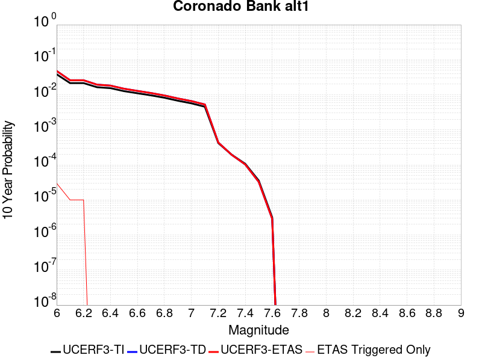 |

| Magnitude | 1 wk TI Prob | 1 wk TD Prob | 1 wk ETAS Prob | 1 wk ETAS/TD Gain | 1 wk ETAS Triggered Only | 1 mo TI Prob | 1 mo TD Prob | 1 mo ETAS Prob | 1 mo ETAS/TD Gain | 1 mo ETAS Triggered Only | 1 yr TI Prob | 1 yr TD Prob | 1 yr ETAS Prob | 1 yr ETAS/TD Gain | 1 yr ETAS Triggered Only | 10 yr TI Prob | 10 yr TD Prob | 10 yr ETAS Prob | 10 yr ETAS/TD Gain | 10 yr ETAS Triggered Only |
|-----|-----|-----|-----|-----|-----|-----|-----|-----|-----|-----|-----|-----|-----|-----|-----|-----|-----|-----|-----|-----|
| 6.0 | 7.533492E-5 | 9.39618E-5 | 9.39618E-5 | 1.0 | 0.0 | 3.22824E-4 | 4.0263552E-4 | 4.0263552E-4 | 1.0 | 0.0 | 0.0039233007 | 0.0048915995 | 0.0049015507 | 1.0020343 | 1.0E-5 | 0.03854755 | 0.04790961 | 0.047938175 | 1.0005962 | 3.0E-5 |
| 6.1 | 4.1807285E-5 | 5.049851E-5 | 5.049851E-5 | 1.0 | 0.0 | 1.7916178E-4 | 2.1640482E-4 | 2.1640482E-4 | 1.0 | 0.0 | 0.0021791123 | 0.0026316417 | 0.0026316417 | 1.0 | 0.0 | 0.021578677 | 0.026013888 | 0.026023628 | 1.0003744 | 1.0E-5 |
| 6.2 | 4.1807285E-5 | 5.049851E-5 | 5.049851E-5 | 1.0 | 0.0 | 1.7916178E-4 | 2.1640482E-4 | 2.1640482E-4 | 1.0 | 0.0 | 0.0021791123 | 0.0026316417 | 0.0026316417 | 1.0 | 0.0 | 0.021578677 | 0.026013888 | 0.026023628 | 1.0003744 | 1.0E-5 |
| 6.3 | 3.1793104E-5 | 3.7714894E-5 | 3.7714894E-5 | 1.0 | 0.0 | 1.3624904E-4 | 1.6162546E-4 | 1.6162546E-4 | 1.0 | 0.0 | 0.0016575698 | 0.0019660434 | 0.0019660434 | 1.0 | 0.0 | 0.016452603 | 0.019490387 | 0.019490387 | 1.0 | 0.0 |
| 6.4 | 2.9878007E-5 | 3.5339268E-5 | 3.5339268E-5 | 1.0 | 0.0 | 1.2804232E-4 | 1.514454E-4 | 1.514454E-4 | 1.0 | 0.0 | 0.0015578003 | 0.0018423185 | 0.0018423185 | 1.0 | 0.0 | 0.015469253 | 0.018274212 | 0.018274212 | 1.0 | 0.0 |
| 6.5 | 2.4512565E-5 | 2.8766724E-5 | 2.8766724E-5 | 1.0 | 0.0 | 1.0504962E-4 | 1.2328029E-4 | 1.2328029E-4 | 1.0 | 0.0 | 0.0012782287 | 0.0014999318 | 0.0014999318 | 1.0 | 0.0 | 0.012709012 | 0.01490106 | 0.01490106 | 1.0 | 0.0 |
| 6.6 | 2.1317413E-5 | 2.4908924E-5 | 2.4908924E-5 | 1.0 | 0.0 | 9.135714E-5 | 1.06748295E-4 | 1.06748295E-4 | 1.0 | 0.0 | 0.0011117056 | 0.0012989079 | 0.0012989079 | 1.0 | 0.0 | 0.011061605 | 0.012915566 | 0.012915566 | 1.0 | 0.0 |
| 6.7 | 1.8585655E-5 | 2.163679E-5 | 2.163679E-5 | 1.0 | 0.0 | 7.9650374E-5 | 9.272592E-5 | 9.272592E-5 | 1.0 | 0.0 | 9.6931186E-4 | 0.0011283738 | 0.0011283738 | 1.0 | 0.0 | 0.0096509475 | 0.011228608 | 0.011228608 | 1.0 | 0.0 |
| 6.8 | 1.5862879E-5 | 1.8421075E-5 | 1.8421075E-5 | 1.0 | 0.0 | 6.798199E-5 | 7.894518E-5 | 7.894518E-5 | 1.0 | 0.0 | 8.273665E-4 | 9.60753E-4 | 9.60753E-4 | 1.0 | 0.0 | 0.008242928 | 0.009567977 | 0.009567977 | 1.0 | 0.0 |
| 6.9 | 1.3021509E-5 | 1.50965625E-5 | 1.50965625E-5 | 1.0 | 0.0 | 5.5805274E-5 | 6.4698055E-5 | 6.4698055E-5 | 1.0 | 0.0 | 6.792174E-4 | 7.8743225E-4 | 7.8743225E-4 | 1.0 | 0.0 | 0.006771452 | 0.007848245 | 0.007848245 | 1.0 | 0.0 |
| 7.0 | 1.0974371E-5 | 1.27212E-5 | 1.27212E-5 | 1.0 | 0.0 | 4.7032172E-5 | 5.4518387E-5 | 5.4518387E-5 | 1.0 | 0.0 | 5.7246623E-4 | 6.6357676E-4 | 6.6357676E-4 | 1.0 | 0.0 | 0.0057099373 | 0.006617703 | 0.006617703 | 1.0 | 0.0 |
| 7.1 | 8.766221E-6 | 1.0164713E-5 | 1.0164713E-5 | 1.0 | 0.0 | 3.7568978E-5 | 4.3562424E-5 | 4.3562424E-5 | 1.0 | 0.0 | 4.573063E-4 | 5.302607E-4 | 5.302607E-4 | 1.0 | 0.0 | 0.0045636636 | 0.0052916543 | 0.0052916543 | 1.0 | 0.0 |
| 7.2 | 8.026024E-7 | 8.332054E-7 | 8.332054E-7 | 1.0 | 0.0 | 3.43972E-6 | 3.5708754E-6 | 3.5708754E-6 | 1.0 | 0.0 | 4.1877785E-5 | 4.3474553E-5 | 4.3474553E-5 | 1.0 | 0.0 | 4.1869894E-4 | 4.3466155E-4 | 4.3466155E-4 | 1.0 | 0.0 |
| 7.3 | 3.7293114E-7 | 3.7001894E-7 | 3.7001894E-7 | 1.0 | 0.0 | 1.5982754E-6 | 1.5857945E-6 | 1.5857945E-6 | 1.0 | 0.0 | 1.9458828E-5 | 1.9306877E-5 | 1.9306877E-5 | 1.0 | 0.0 | 1.9457124E-4 | 1.9305207E-4 | 1.9305207E-4 | 1.0 | 0.0 |
| 7.4 | 2.0557036E-7 | 1.9674766E-7 | 1.9674766E-7 | 1.0 | 0.0 | 8.810155E-7 | 8.4320396E-7 | 8.4320396E-7 | 1.0 | 0.0 | 1.0726311E-5 | 1.0265961E-5 | 1.0265961E-5 | 1.0 | 0.0 | 1.0725793E-4 | 1.0265489E-4 | 1.0265489E-4 | 1.0 | 0.0 |
| 7.5 | 6.845446E-8 | 6.2794456E-8 | 6.2794456E-8 | 1.0 | 0.0 | 2.9337625E-7 | 2.6911906E-7 | 2.6911906E-7 | 1.0 | 0.0 | 3.5718497E-6 | 3.2765197E-6 | 3.2765197E-6 | 1.0 | 0.0 | 3.5717923E-5 | 3.2764725E-5 | 3.2764725E-5 | 1.0 | 0.0 |
| 7.6 | 6.0975145E-9 | 5.5318936E-9 | 5.5318936E-9 | 1.0 | 0.0 | 2.6132206E-8 | 2.3708115E-8 | 2.3708115E-8 | 1.0 | 0.0 | 3.1815955E-7 | 2.8864628E-7 | 2.8864628E-7 | 1.0 | 0.0 | 3.181591E-6 | 2.88646E-6 | 2.88646E-6 | 1.0 | 0.0 |

## San Diego Trough south
*[(top)](#table-of-contents)*

| 1 Week | 1 Month | 1 Year | 10 Year |
|-----|-----|-----|-----|
|  |  |  |  |

| Magnitude | 1 wk TI Prob | 1 wk TD Prob | 1 wk ETAS Prob | 1 wk ETAS/TD Gain | 1 wk ETAS Triggered Only | 1 mo TI Prob | 1 mo TD Prob | 1 mo ETAS Prob | 1 mo ETAS/TD Gain | 1 mo ETAS Triggered Only | 1 yr TI Prob | 1 yr TD Prob | 1 yr ETAS Prob | 1 yr ETAS/TD Gain | 1 yr ETAS Triggered Only | 10 yr TI Prob | 10 yr TD Prob | 10 yr ETAS Prob | 10 yr ETAS/TD Gain | 10 yr ETAS Triggered Only |
|-----|-----|-----|-----|-----|-----|-----|-----|-----|-----|-----|-----|-----|-----|-----|-----|-----|-----|-----|-----|-----|
| 6.0 | 8.279495E-5 | 1.0425644E-4 | 1.0425644E-4 | 1.0 | 0.0 | 3.5478722E-4 | 4.467418E-4 | 4.467418E-4 | 1.0 | 0.0 | 0.004310982 | 0.0054263812 | 0.0054263812 | 1.0 | 0.0 | 0.042283054 | 0.052999042 | 0.05302745 | 1.0005361 | 3.0E-5 |
| 6.1 | 4.6961468E-5 | 5.7736743E-5 | 5.7736743E-5 | 1.0 | 0.0 | 2.0124791E-4 | 2.4742068E-4 | 2.4742068E-4 | 1.0 | 0.0 | 0.00244744 | 0.0030083342 | 0.0030083342 | 1.0 | 0.0 | 0.024206603 | 0.029682966 | 0.02969267 | 1.0003269 | 1.0E-5 |
| 6.2 | 3.5079658E-5 | 4.2146152E-5 | 4.2146152E-5 | 1.0 | 0.0 | 1.5033272E-4 | 1.8061412E-4 | 1.8061412E-4 | 1.0 | 0.0 | 0.0018287642 | 0.0021968025 | 0.0021968025 | 1.0 | 0.0 | 0.018137876 | 0.021753421 | 0.021763204 | 1.0004497 | 1.0E-5 |
| 6.3 | 3.5079658E-5 | 4.2146152E-5 | 4.2146152E-5 | 1.0 | 0.0 | 1.5033272E-4 | 1.8061412E-4 | 1.8061412E-4 | 1.0 | 0.0 | 0.0018287642 | 0.0021968025 | 0.0021968025 | 1.0 | 0.0 | 0.018137876 | 0.021753421 | 0.021763204 | 1.0004497 | 1.0E-5 |
| 6.4 | 2.7196904E-5 | 3.2090265E-5 | 3.2090265E-5 | 1.0 | 0.0 | 1.16552954E-4 | 1.3752255E-4 | 1.3752255E-4 | 1.0 | 0.0 | 0.0014181085 | 0.0016730648 | 0.0016730648 | 1.0 | 0.0 | 0.014090929 | 0.016606223 | 0.016616058 | 1.0005922 | 1.0E-5 |
| 6.5 | 2.5584688E-5 | 3.0104491E-5 | 3.0104491E-5 | 1.0 | 0.0 | 1.0964406E-4 | 1.2901296E-4 | 1.2901296E-4 | 1.0 | 0.0 | 0.0013340989 | 0.0015696133 | 0.0015696133 | 1.0 | 0.0 | 0.013261181 | 0.015586771 | 0.015596615 | 1.0006316 | 1.0E-5 |
| 6.6 | 2.2034688E-5 | 2.5745056E-5 | 2.5745056E-5 | 1.0 | 0.0 | 9.443096E-5 | 1.1033134E-4 | 1.1033134E-4 | 1.0 | 0.0 | 0.0011490905 | 0.0013424625 | 0.0013424625 | 1.0 | 0.0 | 0.011431668 | 0.013344509 | 0.013354375 | 1.0007393 | 1.0E-5 |
| 6.7 | 1.9394853E-5 | 2.2543714E-5 | 2.2543714E-5 | 1.0 | 0.0 | 8.311815E-5 | 9.661237E-5 | 9.661237E-5 | 1.0 | 0.0 | 0.0010114936 | 0.0011756261 | 0.0011756261 | 1.0 | 0.0 | 0.01006902 | 0.011694773 | 0.011704656 | 1.0008451 | 1.0E-5 |
| 6.8 | 1.7615313E-5 | 2.0404905E-5 | 2.0404905E-5 | 1.0 | 0.0 | 7.549201E-5 | 8.7446686E-5 | 8.7446686E-5 | 1.0 | 0.0 | 9.1872766E-4 | 0.0010641477 | 0.0010641477 | 1.0 | 0.0 | 0.009149387 | 0.010591088 | 0.010600981 | 1.0009342 | 1.0E-5 |
| 6.9 | 1.5621423E-5 | 1.8027593E-5 | 1.8027593E-5 | 1.0 | 0.0 | 6.6947236E-5 | 7.725885E-5 | 7.725885E-5 | 1.0 | 0.0 | 8.147778E-4 | 9.402241E-4 | 9.402241E-4 | 1.0 | 0.0 | 0.008117969 | 0.009362906 | 0.009372813 | 1.0010581 | 1.0E-5 |
| 7.0 | 1.3444376E-5 | 1.5449315E-5 | 1.5449315E-5 | 1.0 | 0.0 | 5.7617483E-5 | 6.6209686E-5 | 6.6209686E-5 | 1.0 | 0.0 | 7.0126704E-4 | 8.0580753E-4 | 8.0580753E-4 | 1.0 | 0.0 | 0.006990582 | 0.00802919 | 0.008039109 | 1.0012355 | 1.0E-5 |
| 7.1 | 1.2268361E-5 | 1.4074132E-5 | 1.4074132E-5 | 1.0 | 0.0 | 5.2577634E-5 | 6.031633E-5 | 6.031633E-5 | 1.0 | 0.0 | 6.399447E-4 | 7.341065E-4 | 7.341065E-4 | 1.0 | 0.0 | 0.0063810493 | 0.00731712 | 0.007327047 | 1.0013566 | 1.0E-5 |
| 7.2 | 1.0922655E-5 | 1.2514534E-5 | 1.2514534E-5 | 1.0 | 0.0 | 4.681054E-5 | 5.363263E-5 | 5.363263E-5 | 1.0 | 0.0 | 5.697693E-4 | 6.5278413E-4 | 6.5278413E-4 | 1.0 | 0.0 | 0.0056831064 | 0.006508947 | 0.006518882 | 1.0015264 | 1.0E-5 |
| 7.3 | 6.1106753E-6 | 6.9294197E-6 | 6.9294197E-6 | 1.0 | 0.0 | 2.6188345E-5 | 2.9697178E-5 | 2.9697178E-5 | 1.0 | 0.0 | 3.1879646E-4 | 3.6150354E-4 | 3.6150354E-4 | 1.0 | 0.0 | 0.0031833951 | 0.0036092002 | 0.003619164 | 1.0027606 | 1.0E-5 |
| 7.4 | 4.933187E-6 | 5.5899495E-6 | 5.5899495E-6 | 1.0 | 0.0 | 2.114206E-5 | 2.3956709E-5 | 2.3956709E-5 | 1.0 | 0.0 | 2.5737417E-4 | 2.9163426E-4 | 2.9163426E-4 | 1.0 | 0.0 | 0.002570763 | 0.0029125568 | 0.0029125568 | 1.0 | 0.0 |
| 7.5 | 1.7489613E-6 | 1.9698116E-6 | 1.9698116E-6 | 1.0 | 0.0 | 7.495527E-6 | 8.4420235E-6 | 8.4420235E-6 | 1.0 | 0.0 | 9.125422E-5 | 1.0277701E-4 | 1.0277701E-4 | 1.0 | 0.0 | 9.1216754E-4 | 0.0010273168 | 0.0010273168 | 1.0 | 0.0 |
| 7.6 | 1.6988751E-7 | 1.7534121E-7 | 1.7534121E-7 | 1.0 | 0.0 | 7.2808916E-7 | 7.5146215E-7 | 7.5146215E-7 | 1.0 | 0.0 | 8.864449E-6 | 9.149016E-6 | 9.149016E-6 | 1.0 | 0.0 | 8.8640954E-5 | 9.148658E-5 | 9.148658E-5 | 1.0 | 0.0 |

## San Jacinto (Clark) rev
*[(top)](#table-of-contents)*

| 1 Week | 1 Month | 1 Year | 10 Year |
|-----|-----|-----|-----|
|  |  |  |  |

| Magnitude | 1 wk TI Prob | 1 wk TD Prob | 1 wk ETAS Prob | 1 wk ETAS/TD Gain | 1 wk ETAS Triggered Only | 1 mo TI Prob | 1 mo TD Prob | 1 mo ETAS Prob | 1 mo ETAS/TD Gain | 1 mo ETAS Triggered Only | 1 yr TI Prob | 1 yr TD Prob | 1 yr ETAS Prob | 1 yr ETAS/TD Gain | 1 yr ETAS Triggered Only | 10 yr TI Prob | 10 yr TD Prob | 10 yr ETAS Prob | 10 yr ETAS/TD Gain | 10 yr ETAS Triggered Only |
|-----|-----|-----|-----|-----|-----|-----|-----|-----|-----|-----|-----|-----|-----|-----|-----|-----|-----|-----|-----|-----|
| 6.0 | 4.482615E-5 | 2.1195152E-5 | 2.1195152E-5 | 1.0 | 0.0 | 1.9209793E-4 | 9.083325E-5 | 1.00832345E-4 | 1.1100818 | 1.0E-5 | 0.0023362834 | 0.001105343 | 0.001115332 | 1.009037 | 1.0E-5 | 0.02311874 | 0.011525473 | 0.011555127 | 1.0025729 | 3.0E-5 |
| 6.1 | 4.482615E-5 | 2.1195152E-5 | 2.1195152E-5 | 1.0 | 0.0 | 1.9209793E-4 | 9.083325E-5 | 1.00832345E-4 | 1.1100818 | 1.0E-5 | 0.0023362834 | 0.001105343 | 0.001115332 | 1.009037 | 1.0E-5 | 0.02311874 | 0.011525473 | 0.011555127 | 1.0025729 | 3.0E-5 |
| 6.2 | 4.482615E-5 | 2.1195152E-5 | 2.1195152E-5 | 1.0 | 0.0 | 1.9209793E-4 | 9.083325E-5 | 1.00832345E-4 | 1.1100818 | 1.0E-5 | 0.0023362834 | 0.001105343 | 0.001115332 | 1.009037 | 1.0E-5 | 0.02311874 | 0.011525473 | 0.011555127 | 1.0025729 | 3.0E-5 |
| 6.3 | 4.482615E-5 | 2.1195152E-5 | 2.1195152E-5 | 1.0 | 0.0 | 1.9209793E-4 | 9.083325E-5 | 1.00832345E-4 | 1.1100818 | 1.0E-5 | 0.0023362834 | 0.001105343 | 0.001115332 | 1.009037 | 1.0E-5 | 0.02311874 | 0.011525473 | 0.011555127 | 1.0025729 | 3.0E-5 |
| 6.4 | 4.482615E-5 | 2.1195152E-5 | 2.1195152E-5 | 1.0 | 0.0 | 1.9209793E-4 | 9.083325E-5 | 1.00832345E-4 | 1.1100818 | 1.0E-5 | 0.0023362834 | 0.001105343 | 0.001115332 | 1.009037 | 1.0E-5 | 0.02311874 | 0.011525473 | 0.011555127 | 1.0025729 | 3.0E-5 |
| 6.5 | 3.7294863E-5 | 1.7393328E-5 | 1.7393328E-5 | 1.0 | 0.0 | 1.5982533E-4 | 7.454073E-5 | 8.4539985E-5 | 1.1341449 | 1.0E-5 | 0.0019441366 | 9.0716005E-4 | 9.17151E-4 | 1.0110134 | 1.0E-5 | 0.01927216 | 0.009513795 | 0.00954351 | 1.0031233 | 3.0E-5 |
| 6.6 | 3.7294863E-5 | 1.7393328E-5 | 1.7393328E-5 | 1.0 | 0.0 | 1.5982533E-4 | 7.454073E-5 | 8.4539985E-5 | 1.1341449 | 1.0E-5 | 0.0019441366 | 9.0716005E-4 | 9.17151E-4 | 1.0110134 | 1.0E-5 | 0.01927216 | 0.009513795 | 0.00954351 | 1.0031233 | 3.0E-5 |
| 6.7 | 3.6039248E-5 | 1.6640866E-5 | 1.6640866E-5 | 1.0 | 0.0 | 1.5444479E-4 | 7.131607E-5 | 8.131536E-5 | 1.1402109 | 1.0E-5 | 0.0018787434 | 8.6793146E-4 | 8.779228E-4 | 1.0115117 | 1.0E-5 | 0.01862939 | 0.009115386 | 0.009145113 | 1.0032611 | 3.0E-5 |
| 6.8 | 3.5031844E-5 | 1.6268963E-5 | 1.6268963E-5 | 1.0 | 0.0 | 1.5012783E-4 | 6.9722286E-5 | 7.972159E-5 | 1.1434162 | 1.0E-5 | 0.0018262739 | 8.485423E-4 | 8.5853384E-4 | 1.0117749 | 1.0E-5 | 0.01811338 | 0.008915053 | 0.008944785 | 1.0033351 | 3.0E-5 |
| 6.9 | 3.435112E-5 | 1.6098935E-5 | 1.6098935E-5 | 1.0 | 0.0 | 1.4721078E-4 | 6.8993635E-5 | 7.899295E-5 | 1.144931 | 1.0E-5 | 0.0017908178 | 8.396779E-4 | 8.4966945E-4 | 1.0118994 | 1.0E-5 | 0.017764548 | 0.008823094 | 0.008852829 | 1.0033702 | 3.0E-5 |
| 7.0 | 2.8959772E-5 | 1.4369728E-5 | 1.4369728E-5 | 1.0 | 0.0 | 1.241074E-4 | 6.158311E-5 | 7.158249E-5 | 1.1623722 | 1.0E-5 | 0.0015099603 | 7.4951927E-4 | 7.595118E-4 | 1.0133319 | 1.0E-5 | 0.014997416 | 0.00788556 | 0.0079153245 | 1.0037744 | 3.0E-5 |
| 7.1 | 2.6002877E-5 | 1.2859668E-5 | 1.2859668E-5 | 1.0 | 0.0 | 1.11436144E-4 | 5.511171E-5 | 6.5111155E-5 | 1.1814396 | 1.0E-5 | 0.0013558907 | 6.707806E-4 | 6.8077387E-4 | 1.0148981 | 1.0E-5 | 0.013476475 | 0.007062899 | 0.0070926873 | 1.0042175 | 3.0E-5 |
| 7.2 | 2.2544838E-5 | 1.1290756E-5 | 1.1290756E-5 | 1.0 | 0.0 | 9.661716E-5 | 4.8388065E-5 | 5.838758E-5 | 1.2066525 | 1.0E-5 | 0.001175679 | 5.889669E-4 | 5.98961E-4 | 1.0169688 | 1.0E-5 | 0.011694785 | 0.0062078307 | 0.0062376447 | 1.0048026 | 3.0E-5 |
| 7.3 | 1.75334E-5 | 1.0838515E-5 | 1.0838515E-5 | 1.0 | 0.0 | 7.514098E-5 | 4.644996E-5 | 5.6449495E-5 | 1.2152754 | 1.0E-5 | 9.144575E-4 | 5.653829E-4 | 5.7537726E-4 | 1.0176771 | 1.0E-5 | 0.009107036 | 0.005948046 | 0.0059778676 | 1.0050137 | 3.0E-5 |
| 7.4 | 1.5924552E-5 | 1.0637865E-5 | 1.0637865E-5 | 1.0 | 0.0 | 6.82463E-5 | 4.5590063E-5 | 5.5589608E-5 | 1.219336 | 1.0E-5 | 8.305819E-4 | 5.54919E-4 | 5.649135E-4 | 1.0180106 | 1.0E-5 | 0.008274844 | 0.005835053 | 0.005864878 | 1.0051113 | 3.0E-5 |
| 7.5 | 1.3428931E-5 | 9.876464E-6 | 9.876464E-6 | 1.0 | 0.0 | 5.7551293E-5 | 4.232702E-5 | 5.23266E-5 | 1.2362458 | 1.0E-5 | 7.004617E-4 | 5.1521073E-4 | 5.2520557E-4 | 1.0193995 | 1.0E-5 | 0.006982579 | 0.005419675 | 0.005449512 | 1.0055054 | 3.0E-5 |
| 7.6 | 1.0688787E-5 | 8.632698E-6 | 8.632698E-6 | 1.0 | 0.0 | 4.5808283E-5 | 3.6996757E-5 | 4.699639E-5 | 1.2702839 | 1.0E-5 | 5.5757316E-4 | 4.503429E-4 | 4.603384E-4 | 1.0221953 | 1.0E-5 | 0.005561762 | 0.004751152 | 0.004781009 | 1.0062842 | 3.0E-5 |
| 7.7 | 8.81236E-6 | 7.4852865E-6 | 7.4852865E-6 | 1.0 | 0.0 | 3.776671E-5 | 3.2079406E-5 | 4.2079086E-5 | 1.3117164 | 1.0E-5 | 4.597127E-4 | 3.9049698E-4 | 4.0049307E-4 | 1.0255984 | 1.0E-5 | 0.0045876284 | 0.004143844 | 0.0041737193 | 1.0072097 | 3.0E-5 |
| 7.8 | 7.780431E-6 | 6.712883E-6 | 6.712883E-6 | 1.0 | 0.0 | 3.3344273E-5 | 2.8769182E-5 | 3.8768896E-5 | 1.3475841 | 1.0E-5 | 4.0589093E-4 | 3.502087E-4 | 3.602052E-4 | 1.0285444 | 1.0E-5 | 0.0040515037 | 0.0037314843 | 0.0037613725 | 1.0080097 | 3.0E-5 |
| 7.9 | 6.5437994E-6 | 5.795602E-6 | 5.795602E-6 | 1.0 | 0.0 | 2.8044553E-5 | 2.4838058E-5 | 3.4837813E-5 | 1.4025979 | 1.0E-5 | 3.4138895E-4 | 3.023616E-4 | 3.1235855E-4 | 1.0330629 | 1.0E-5 | 0.0034086495 | 0.0032426151 | 0.0032725178 | 1.0092218 | 3.0E-5 |
| 8.0 | 5.4488164E-6 | 4.8268685E-6 | 4.8268685E-6 | 1.0 | 0.0 | 2.3351862E-5 | 2.0686417E-5 | 3.068621E-5 | 1.483399 | 1.0E-5 | 2.8427184E-4 | 2.5182817E-4 | 2.6182565E-4 | 1.0396997 | 1.0E-5 | 0.0028390845 | 0.0027180852 | 0.0027480037 | 1.0110072 | 3.0E-5 |
| 8.1 | 2.8397242E-6 | 1.372448E-6 | 1.372448E-6 | 1.0 | 0.0 | 1.217019E-5 | 5.8819064E-6 | 5.8819064E-6 | 1.0 | 0.0 | 1.4816198E-4 | 7.160987E-5 | 7.160987E-5 | 1.0 | 0.0 | 0.0014806325 | 8.145797E-4 | 8.245716E-4 | 1.0122663 | 1.0E-5 |
| 8.2 | 2.030244E-6 | 6.3495634E-7 | 6.3495634E-7 | 1.0 | 0.0 | 8.701017E-6 | 2.7212386E-6 | 2.7212386E-6 | 1.0 | 0.0 | 1.05929736E-4 | 3.3130582E-5 | 3.3130582E-5 | 1.0 | 0.0 | 0.0010587925 | 3.966504E-4 | 3.966504E-4 | 1.0 | 0.0 |
| 8.3 | 1.0659804E-6 | 2.9400067E-7 | 2.9400067E-7 | 1.0 | 0.0 | 4.568479E-6 | 1.2600023E-6 | 1.2600023E-6 | 1.0 | 0.0 | 5.5619817E-5 | 1.5340423E-5 | 1.5340423E-5 | 1.0 | 0.0 | 5.5605895E-4 | 1.8654772E-4 | 1.8654772E-4 | 1.0 | 0.0 |

## Oak Ridge (Onshore)
*[(top)](#table-of-contents)*

| 1 Week | 1 Month | 1 Year | 10 Year |
|-----|-----|-----|-----|
|  |  | 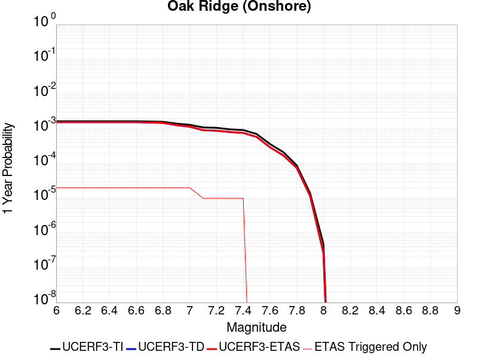 |  |

| Magnitude | 1 wk TI Prob | 1 wk TD Prob | 1 wk ETAS Prob | 1 wk ETAS/TD Gain | 1 wk ETAS Triggered Only | 1 mo TI Prob | 1 mo TD Prob | 1 mo ETAS Prob | 1 mo ETAS/TD Gain | 1 mo ETAS Triggered Only | 1 yr TI Prob | 1 yr TD Prob | 1 yr ETAS Prob | 1 yr ETAS/TD Gain | 1 yr ETAS Triggered Only | 10 yr TI Prob | 10 yr TD Prob | 10 yr ETAS Prob | 10 yr ETAS/TD Gain | 10 yr ETAS Triggered Only |
|-----|-----|-----|-----|-----|-----|-----|-----|-----|-----|-----|-----|-----|-----|-----|-----|-----|-----|-----|-----|-----|
| 6.0 | 3.155064E-5 | 2.9529447E-5 | 2.9529447E-5 | 1.0 | 0.0 | 1.3521002E-4 | 1.2654884E-4 | 1.4654631E-4 | 1.1580217 | 2.0E-5 | 0.001644939 | 0.0015396813 | 0.0015596505 | 1.0129697 | 2.0E-5 | 0.01632816 | 0.015294643 | 0.015314338 | 1.0012877 | 2.0E-5 |
| 6.1 | 3.155064E-5 | 2.9529447E-5 | 2.9529447E-5 | 1.0 | 0.0 | 1.3521002E-4 | 1.2654884E-4 | 1.4654631E-4 | 1.1580217 | 2.0E-5 | 0.001644939 | 0.0015396813 | 0.0015596505 | 1.0129697 | 2.0E-5 | 0.01632816 | 0.015294643 | 0.015314338 | 1.0012877 | 2.0E-5 |
| 6.2 | 3.155064E-5 | 2.9529447E-5 | 2.9529447E-5 | 1.0 | 0.0 | 1.3521002E-4 | 1.2654884E-4 | 1.4654631E-4 | 1.1580217 | 2.0E-5 | 0.001644939 | 0.0015396813 | 0.0015596505 | 1.0129697 | 2.0E-5 | 0.01632816 | 0.015294643 | 0.015314338 | 1.0012877 | 2.0E-5 |
| 6.3 | 3.155064E-5 | 2.9529447E-5 | 2.9529447E-5 | 1.0 | 0.0 | 1.3521002E-4 | 1.2654884E-4 | 1.4654631E-4 | 1.1580217 | 2.0E-5 | 0.001644939 | 0.0015396813 | 0.0015596505 | 1.0129697 | 2.0E-5 | 0.01632816 | 0.015294643 | 0.015314338 | 1.0012877 | 2.0E-5 |
| 6.4 | 3.155064E-5 | 2.9529447E-5 | 2.9529447E-5 | 1.0 | 0.0 | 1.3521002E-4 | 1.2654884E-4 | 1.4654631E-4 | 1.1580217 | 2.0E-5 | 0.001644939 | 0.0015396813 | 0.0015596505 | 1.0129697 | 2.0E-5 | 0.01632816 | 0.015294643 | 0.015314338 | 1.0012877 | 2.0E-5 |
| 6.5 | 3.155064E-5 | 2.9529447E-5 | 2.9529447E-5 | 1.0 | 0.0 | 1.3521002E-4 | 1.2654884E-4 | 1.4654631E-4 | 1.1580217 | 2.0E-5 | 0.001644939 | 0.0015396813 | 0.0015596505 | 1.0129697 | 2.0E-5 | 0.01632816 | 0.015294643 | 0.015314338 | 1.0012877 | 2.0E-5 |
| 6.6 | 3.155064E-5 | 2.9529447E-5 | 2.9529447E-5 | 1.0 | 0.0 | 1.3521002E-4 | 1.2654884E-4 | 1.4654631E-4 | 1.1580217 | 2.0E-5 | 0.001644939 | 0.0015396813 | 0.0015596505 | 1.0129697 | 2.0E-5 | 0.01632816 | 0.015294643 | 0.015314338 | 1.0012877 | 2.0E-5 |
| 6.7 | 3.098897E-5 | 2.8867584E-5 | 2.8867584E-5 | 1.0 | 0.0 | 1.328031E-4 | 1.2371257E-4 | 1.4371009E-4 | 1.161645 | 2.0E-5 | 0.0016156785 | 0.0015051975 | 0.0015251674 | 1.0132673 | 2.0E-5 | 0.016039822 | 0.014954466 | 0.014974168 | 1.0013174 | 2.0E-5 |
| 6.8 | 3.0449872E-5 | 2.824273E-5 | 2.824273E-5 | 1.0 | 0.0 | 1.3049292E-4 | 1.21034864E-4 | 1.4103245E-4 | 1.1652217 | 2.0E-5 | 0.0015875935 | 0.0014726405 | 0.0014926111 | 1.013561 | 2.0E-5 | 0.015762992 | 0.014633188 | 0.014652896 | 1.0013467 | 2.0E-5 |
| 6.9 | 2.697928E-5 | 2.4222792E-5 | 2.4222792E-5 | 1.0 | 0.0 | 1.15620365E-4 | 1.0380796E-4 | 1.2380588E-4 | 1.1926434 | 2.0E-5 | 0.0014067689 | 0.0012631506 | 0.0012831254 | 1.0158135 | 2.0E-5 | 0.0139789665 | 0.012562426 | 0.0125821745 | 1.001572 | 2.0E-5 |
| 7.0 | 2.4893961E-5 | 2.1864875E-5 | 2.1864875E-5 | 1.0 | 0.0 | 1.0668404E-4 | 9.370334E-5 | 1.1370147E-4 | 1.2134196 | 2.0E-5 | 0.0012981043 | 0.0011402589 | 0.0011602361 | 1.0175198 | 2.0E-5 | 0.012905477 | 0.011346367 | 0.01136614 | 1.0017427 | 2.0E-5 |
| 7.1 | 2.0945363E-5 | 1.7356973E-5 | 1.7356973E-5 | 1.0 | 0.0 | 8.976275E-5 | 7.438494E-5 | 8.438419E-5 | 1.1344259 | 1.0E-5 | 0.0010923136 | 9.0526504E-4 | 9.1525604E-4 | 1.0110365 | 1.0E-5 | 0.0108696 | 0.009016709 | 0.009026619 | 1.0010991 | 1.0E-5 |
| 7.2 | 2.0439404E-5 | 1.6811871E-5 | 1.6811871E-5 | 1.0 | 0.0 | 8.7594504E-5 | 7.204891E-5 | 8.2048195E-5 | 1.1387846 | 1.0E-5 | 0.0010659413 | 8.768472E-4 | 8.868384E-4 | 1.0113945 | 1.0E-5 | 0.010608427 | 0.0087347925 | 0.0087447055 | 1.0011349 | 1.0E-5 |
| 7.3 | 1.8463334E-5 | 1.538278E-5 | 1.538278E-5 | 1.0 | 0.0 | 7.912617E-5 | 6.5924556E-5 | 7.59239E-5 | 1.1516786 | 1.0E-5 | 9.6293533E-4 | 8.023403E-4 | 8.1233226E-4 | 1.0124536 | 1.0E-5 | 0.009587734 | 0.007995299 | 0.008005219 | 1.0012407 | 1.0E-5 |
| 7.4 | 1.763139E-5 | 1.4517647E-5 | 1.4517647E-5 | 1.0 | 0.0 | 7.556091E-5 | 6.221703E-5 | 7.2216404E-5 | 1.1607177 | 1.0E-5 | 9.1956573E-4 | 7.57233E-4 | 7.6722546E-4 | 1.013196 | 1.0E-5 | 0.009157699 | 0.007547332 | 0.0075572566 | 1.001315 | 1.0E-5 |
| 7.5 | 1.3594944E-5 | 1.116386E-5 | 1.116386E-5 | 1.0 | 0.0 | 5.8262744E-5 | 4.784425E-5 | 4.784425E-5 | 1.0 | 0.0 | 7.0911803E-4 | 5.823506E-4 | 5.823506E-4 | 1.0 | 0.0 | 0.007068595 | 0.005808517 | 0.005808517 | 1.0 | 0.0 |
| 7.6 | 6.9889534E-6 | 5.6369217E-6 | 5.6369217E-6 | 1.0 | 0.0 | 2.9952313E-5 | 2.4158015E-5 | 2.4158015E-5 | 1.0 | 0.0 | 3.646084E-4 | 2.9408454E-4 | 2.9408454E-4 | 1.0 | 0.0 | 0.0036401073 | 0.0029369977 | 0.0029369977 | 1.0 | 0.0 |
| 7.7 | 4.0824193E-6 | 3.2833782E-6 | 3.2833782E-6 | 1.0 | 0.0 | 1.7495966E-5 | 1.40715465E-5 | 1.40715465E-5 | 1.0 | 0.0 | 2.1299256E-4 | 1.7130774E-4 | 1.7130774E-4 | 1.0 | 0.0 | 0.0021278851 | 0.0017117702 | 0.0017117702 | 1.0 | 0.0 |
| 7.8 | 1.7023609E-6 | 1.4370928E-6 | 1.4370928E-6 | 1.0 | 0.0 | 7.295812E-6 | 6.158955E-6 | 6.158955E-6 | 1.0 | 0.0 | 8.882289E-5 | 7.498272E-5 | 7.498272E-5 | 1.0 | 0.0 | 8.8787393E-4 | 7.49577E-4 | 7.49577E-4 | 1.0 | 0.0 |
| 7.9 | 2.721225E-7 | 2.2617367E-7 | 2.2617367E-7 | 1.0 | 0.0 | 1.1662388E-6 | 9.693154E-7 | 9.693154E-7 | 1.0 | 0.0 | 1.4198865E-5 | 1.1801353E-5 | 1.1801353E-5 | 1.0 | 0.0 | 1.4197957E-4 | 1.1800755E-4 | 1.1800755E-4 | 1.0 | 0.0 |
| 8.0 | 9.364255E-9 | 5.1216933E-9 | 5.1216933E-9 | 1.0 | 0.0 | 4.0132523E-8 | 2.1950115E-8 | 2.1950115E-8 | 1.0 | 0.0 | 4.8861335E-7 | 2.6724263E-7 | 2.6724263E-7 | 1.0 | 0.0 | 4.8861225E-6 | 2.6724233E-6 | 2.6724233E-6 | 1.0 | 0.0 |

## Palos Verdes
*[(top)](#table-of-contents)*

| 1 Week | 1 Month | 1 Year | 10 Year |
|-----|-----|-----|-----|
|  |  | 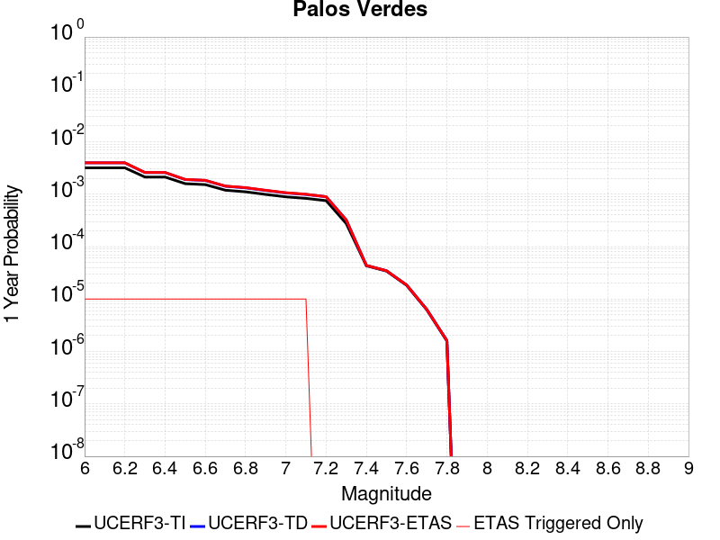 |  |

| Magnitude | 1 wk TI Prob | 1 wk TD Prob | 1 wk ETAS Prob | 1 wk ETAS/TD Gain | 1 wk ETAS Triggered Only | 1 mo TI Prob | 1 mo TD Prob | 1 mo ETAS Prob | 1 mo ETAS/TD Gain | 1 mo ETAS Triggered Only | 1 yr TI Prob | 1 yr TD Prob | 1 yr ETAS Prob | 1 yr ETAS/TD Gain | 1 yr ETAS Triggered Only | 10 yr TI Prob | 10 yr TD Prob | 10 yr ETAS Prob | 10 yr ETAS/TD Gain | 10 yr ETAS Triggered Only |
|-----|-----|-----|-----|-----|-----|-----|-----|-----|-----|-----|-----|-----|-----|-----|-----|-----|-----|-----|-----|-----|
| 6.0 | 6.126063E-5 | 7.623614E-5 | 7.623614E-5 | 1.0 | 0.0 | 2.6251914E-4 | 3.2668875E-4 | 3.2668875E-4 | 1.0 | 0.0 | 0.0031914865 | 0.0039706747 | 0.003980635 | 1.0025085 | 1.0E-5 | 0.031460393 | 0.0390538 | 0.03908263 | 1.0007381 | 3.0E-5 |
| 6.1 | 6.126063E-5 | 7.623614E-5 | 7.623614E-5 | 1.0 | 0.0 | 2.6251914E-4 | 3.2668875E-4 | 3.2668875E-4 | 1.0 | 0.0 | 0.0031914865 | 0.0039706747 | 0.003980635 | 1.0025085 | 1.0E-5 | 0.031460393 | 0.0390538 | 0.03908263 | 1.0007381 | 3.0E-5 |
| 6.2 | 6.126063E-5 | 7.623614E-5 | 7.623614E-5 | 1.0 | 0.0 | 2.6251914E-4 | 3.2668875E-4 | 3.2668875E-4 | 1.0 | 0.0 | 0.0031914865 | 0.0039706747 | 0.003980635 | 1.0025085 | 1.0E-5 | 0.031460393 | 0.0390538 | 0.03908263 | 1.0007381 | 3.0E-5 |
| 6.3 | 4.0838047E-5 | 4.9755265E-5 | 4.9755265E-5 | 1.0 | 0.0 | 1.7500846E-4 | 2.1322069E-4 | 2.1322069E-4 | 1.0 | 0.0 | 0.0021286458 | 0.002593076 | 0.0026030503 | 1.0038464 | 1.0E-5 | 0.021083709 | 0.025649615 | 0.025678845 | 1.0011396 | 3.0E-5 |
| 6.4 | 4.0838047E-5 | 4.9755265E-5 | 4.9755265E-5 | 1.0 | 0.0 | 1.7500846E-4 | 2.1322069E-4 | 2.1322069E-4 | 1.0 | 0.0 | 0.0021286458 | 0.002593076 | 0.0026030503 | 1.0038464 | 1.0E-5 | 0.021083709 | 0.025649615 | 0.025678845 | 1.0011396 | 3.0E-5 |
| 6.5 | 3.0512005E-5 | 3.6565507E-5 | 3.6565507E-5 | 1.0 | 0.0 | 1.3075917E-4 | 1.5670057E-4 | 1.5670057E-4 | 1.0 | 0.0 | 0.0015908304 | 0.0019062778 | 0.0019162587 | 1.0052358 | 1.0E-5 | 0.015794903 | 0.018911136 | 0.018940568 | 1.0015564 | 3.0E-5 |
| 6.6 | 2.9255087E-5 | 3.5158213E-5 | 3.5158213E-5 | 1.0 | 0.0 | 1.2537291E-4 | 1.5067002E-4 | 1.5067002E-4 | 1.0 | 0.0 | 0.0015253464 | 0.0018329794 | 0.0018429611 | 1.0054456 | 1.0E-5 | 0.015149189 | 0.018190164 | 0.018219618 | 1.0016192 | 3.0E-5 |
| 6.7 | 2.287198E-5 | 2.7251068E-5 | 2.7251068E-5 | 1.0 | 0.0 | 9.801909E-5 | 1.1678558E-4 | 1.1678558E-4 | 1.0 | 0.0 | 0.001192729 | 0.0014210287 | 0.0014310145 | 1.0070271 | 1.0E-5 | 0.011863477 | 0.014128654 | 0.014148371 | 1.0013956 | 2.0E-5 |
| 6.8 | 2.1325764E-5 | 2.5434496E-5 | 2.5434496E-5 | 1.0 | 0.0 | 9.139293E-5 | 1.0900094E-4 | 1.0900094E-4 | 1.0 | 0.0 | 0.001112141 | 0.0013263688 | 0.0013363555 | 1.0075294 | 1.0E-5 | 0.011065915 | 0.013193562 | 0.013213297 | 1.0014958 | 2.0E-5 |
| 6.9 | 1.9009392E-5 | 2.2615843E-5 | 2.2615843E-5 | 1.0 | 0.0 | 8.1466285E-5 | 9.692193E-5 | 9.692193E-5 | 1.0 | 0.0 | 9.914007E-4 | 0.001179473 | 0.0011894612 | 1.0084684 | 1.0E-5 | 0.009869894 | 0.011740818 | 0.011760583 | 1.0016835 | 2.0E-5 |
| 7.0 | 1.7098473E-5 | 2.0321406E-5 | 2.0321406E-5 | 1.0 | 0.0 | 7.3277115E-5 | 8.708931E-5 | 8.708931E-5 | 1.0 | 0.0 | 8.917837E-4 | 0.0010598819 | 0.0010698712 | 1.009425 | 1.0E-5 | 0.008882134 | 0.010556707 | 0.010576496 | 1.0018746 | 2.0E-5 |
| 7.1 | 1.5982785E-5 | 1.8996678E-5 | 1.8996678E-5 | 1.0 | 0.0 | 6.849585E-5 | 8.141227E-5 | 8.141227E-5 | 1.0 | 0.0 | 8.336179E-4 | 9.908284E-4 | 0.0010008184 | 1.0100826 | 1.0E-5 | 0.008304977 | 0.009872472 | 0.009892275 | 1.0020058 | 2.0E-5 |
| 7.2 | 1.4468002E-5 | 1.7198974E-5 | 1.7198974E-5 | 1.0 | 0.0 | 6.200425E-5 | 7.370828E-5 | 7.370828E-5 | 1.0 | 0.0 | 7.546402E-4 | 8.971129E-4 | 8.971129E-4 | 1.0 | 0.0 | 0.007520827 | 0.008943185 | 0.008953095 | 1.0011082 | 1.0E-5 |
| 7.3 | 5.288233E-6 | 6.204259E-6 | 6.204259E-6 | 1.0 | 0.0 | 2.2663658E-5 | 2.6589607E-5 | 2.6589607E-5 | 1.0 | 0.0 | 2.7589512E-4 | 3.237153E-4 | 3.237153E-4 | 1.0 | 0.0 | 0.0027555283 | 0.003235861 | 0.003235861 | 1.0 | 0.0 |
| 7.4 | 8.279556E-7 | 8.408416E-7 | 8.408416E-7 | 1.0 | 0.0 | 3.5483763E-6 | 3.6036022E-6 | 3.6036022E-6 | 1.0 | 0.0 | 4.3200624E-5 | 4.387305E-5 | 4.387305E-5 | 1.0 | 0.0 | 4.3192226E-4 | 4.386511E-4 | 4.386511E-4 | 1.0 | 0.0 |
| 7.5 | 6.559831E-7 | 6.667287E-7 | 6.667287E-7 | 1.0 | 0.0 | 2.8113532E-6 | 2.857406E-6 | 2.857406E-6 | 1.0 | 0.0 | 3.4227687E-5 | 3.4788427E-5 | 3.4788427E-5 | 1.0 | 0.0 | 3.4222414E-4 | 3.4783647E-4 | 3.4783647E-4 | 1.0 | 0.0 |
| 7.6 | 3.5018968E-7 | 3.5620351E-7 | 3.5620351E-7 | 1.0 | 0.0 | 1.500812E-6 | 1.526586E-6 | 1.526586E-6 | 1.0 | 0.0 | 1.8272232E-5 | 1.8586072E-5 | 1.8586072E-5 | 1.0 | 0.0 | 1.8270731E-4 | 1.8584977E-4 | 1.8584977E-4 | 1.0 | 0.0 |
| 7.7 | 1.1986104E-7 | 1.2198491E-7 | 1.2198491E-7 | 1.0 | 0.0 | 5.1369005E-7 | 5.227924E-7 | 5.227924E-7 | 1.0 | 0.0 | 6.2541585E-6 | 6.364979E-6 | 6.364979E-6 | 1.0 | 0.0 | 6.2539824E-5 | 6.364801E-5 | 6.364801E-5 | 1.0 | 0.0 |
| 7.8 | 3.0445005E-8 | 3.10279E-8 | 3.10279E-8 | 1.0 | 0.0 | 1.3047858E-7 | 1.3297671E-7 | 1.3297671E-7 | 1.0 | 0.0 | 1.5885756E-6 | 1.6189904E-6 | 1.6189904E-6 | 1.0 | 0.0 | 1.5885644E-5 | 1.6189806E-5 | 1.6189806E-5 | 1.0 | 0.0 |

## San Jacinto (Borrego)
*[(top)](#table-of-contents)*

| 1 Week | 1 Month | 1 Year | 10 Year |
|-----|-----|-----|-----|
|  |  |  | 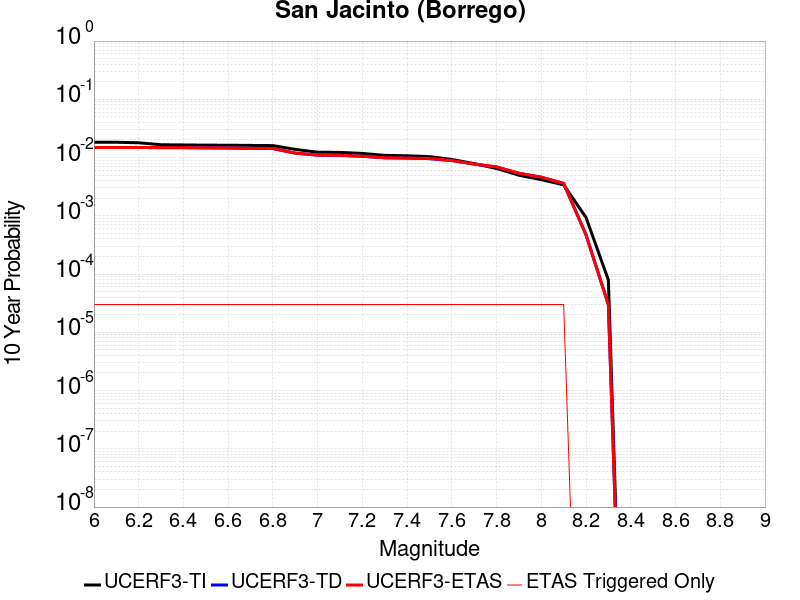 |

| Magnitude | 1 wk TI Prob | 1 wk TD Prob | 1 wk ETAS Prob | 1 wk ETAS/TD Gain | 1 wk ETAS Triggered Only | 1 mo TI Prob | 1 mo TD Prob | 1 mo ETAS Prob | 1 mo ETAS/TD Gain | 1 mo ETAS Triggered Only | 1 yr TI Prob | 1 yr TD Prob | 1 yr ETAS Prob | 1 yr ETAS/TD Gain | 1 yr ETAS Triggered Only | 10 yr TI Prob | 10 yr TD Prob | 10 yr ETAS Prob | 10 yr ETAS/TD Gain | 10 yr ETAS Triggered Only |
|-----|-----|-----|-----|-----|-----|-----|-----|-----|-----|-----|-----|-----|-----|-----|-----|-----|-----|-----|-----|-----|
| 6.0 | 3.543992E-5 | 2.7956603E-5 | 2.7956603E-5 | 1.0 | 0.0 | 1.5187653E-4 | 1.1980858E-4 | 1.1980858E-4 | 1.0 | 0.0 | 0.0018475284 | 0.0014577056 | 0.0014776766 | 1.0137002 | 2.0E-5 | 0.018322436 | 0.014885285 | 0.014914838 | 1.0019854 | 3.0E-5 |
| 6.1 | 3.542281E-5 | 2.7956603E-5 | 2.7956603E-5 | 1.0 | 0.0 | 1.5180321E-4 | 1.1980858E-4 | 1.1980858E-4 | 1.0 | 0.0 | 0.0018466372 | 0.0014577056 | 0.0014776766 | 1.0137002 | 2.0E-5 | 0.018313672 | 0.014885285 | 0.014914838 | 1.0019854 | 3.0E-5 |
| 6.2 | 3.4688688E-5 | 2.7956603E-5 | 2.7956603E-5 | 1.0 | 0.0 | 1.4865733E-4 | 1.19808574E-4 | 1.19808574E-4 | 1.0 | 0.0 | 0.0018084005 | 0.0014577056 | 0.0014776764 | 1.0137002 | 2.0E-5 | 0.017937548 | 0.014885284 | 0.014914838 | 1.0019854 | 3.0E-5 |
| 6.3 | 3.2087122E-5 | 2.7801936E-5 | 2.7801936E-5 | 1.0 | 0.0 | 1.3750899E-4 | 1.19145785E-4 | 1.19145785E-4 | 1.0 | 0.0 | 0.0016728862 | 0.0014496469 | 0.0014696178 | 1.0137764 | 2.0E-5 | 0.016603488 | 0.014806312 | 0.014835867 | 1.0019962 | 3.0E-5 |
| 6.4 | 3.1828724E-5 | 2.7768916E-5 | 2.7768916E-5 | 1.0 | 0.0 | 1.364017E-4 | 1.1900428E-4 | 1.1900428E-4 | 1.0 | 0.0 | 0.0016594254 | 0.0014479264 | 0.0014678974 | 1.0137929 | 2.0E-5 | 0.016470885 | 0.014789388 | 0.014818944 | 1.0019984 | 3.0E-5 |
| 6.5 | 3.1563577E-5 | 2.7508588E-5 | 2.7508588E-5 | 1.0 | 0.0 | 1.3526545E-4 | 1.1788869E-4 | 1.1788869E-4 | 1.0 | 0.0 | 0.0016456128 | 0.0014343619 | 0.0014543333 | 1.0139235 | 2.0E-5 | 0.0163348 | 0.014655951 | 0.014685512 | 1.0020169 | 3.0E-5 |
| 6.6 | 3.1467625E-5 | 2.735279E-5 | 2.735279E-5 | 1.0 | 0.0 | 1.3485427E-4 | 1.1722104E-4 | 1.1722104E-4 | 1.0 | 0.0 | 0.0016406142 | 0.001426244 | 0.0014462156 | 1.0140028 | 2.0E-5 | 0.016285548 | 0.014576187 | 0.01460575 | 1.0020281 | 3.0E-5 |
| 6.7 | 3.1223695E-5 | 2.6970763E-5 | 2.6970763E-5 | 1.0 | 0.0 | 1.3380898E-4 | 1.15583935E-4 | 1.15583935E-4 | 1.0 | 0.0 | 0.0016279068 | 0.0014063381 | 0.0014263099 | 1.0142013 | 2.0E-5 | 0.01616033 | 0.01438054 | 0.014410108 | 1.0020561 | 3.0E-5 |
| 6.8 | 3.1015585E-5 | 2.6791718E-5 | 2.6791718E-5 | 1.0 | 0.0 | 1.3291716E-4 | 1.1481666E-4 | 1.1481666E-4 | 1.0 | 0.0 | 0.001617065 | 0.0013970085 | 0.0014169806 | 1.0142963 | 2.0E-5 | 0.016053487 | 0.014287795 | 0.014317366 | 1.0020697 | 3.0E-5 |
| 6.9 | 2.6641965E-5 | 2.2212334E-5 | 2.2212334E-5 | 1.0 | 0.0 | 1.1417485E-4 | 9.519226E-5 | 9.519226E-5 | 1.0 | 0.0 | 0.0013891924 | 0.0011583535 | 0.0011783304 | 1.0172459 | 2.0E-5 | 0.0138054015 | 0.011897102 | 0.011926745 | 1.0024916 | 3.0E-5 |
| 7.0 | 2.3854353E-5 | 2.0506088E-5 | 2.0506088E-5 | 1.0 | 0.0 | 1.02228936E-4 | 8.788029E-5 | 8.788029E-5 | 1.0 | 0.0 | 0.0012439266 | 0.0010694199 | 0.0010893985 | 1.0186818 | 2.0E-5 | 0.012369866 | 0.010996936 | 0.011026606 | 1.0026981 | 3.0E-5 |
| 7.1 | 2.3672901E-5 | 2.0342548E-5 | 2.0342548E-5 | 1.0 | 0.0 | 1.0145135E-4 | 8.717945E-5 | 8.717945E-5 | 1.0 | 0.0 | 0.0012344702 | 0.0010608955 | 0.0010808742 | 1.018832 | 2.0E-5 | 0.0122763505 | 0.010912099 | 0.010941772 | 1.0027193 | 3.0E-5 |
| 7.2 | 2.2717244E-5 | 1.9569701E-5 | 1.9569701E-5 | 1.0 | 0.0 | 9.735599E-5 | 8.386746E-5 | 8.386746E-5 | 1.0 | 0.0 | 0.0011846646 | 0.0010206103 | 0.00104059 | 1.0195761 | 2.0E-5 | 0.01178369 | 0.010509352 | 0.010539036 | 1.0028245 | 3.0E-5 |
| 7.3 | 2.1016205E-5 | 1.8410952E-5 | 1.8410952E-5 | 1.0 | 0.0 | 9.006634E-5 | 7.890171E-5 | 7.890171E-5 | 1.0 | 0.0 | 0.001096006 | 9.6020696E-4 | 9.801878E-4 | 1.0208088 | 2.0E-5 | 0.010906163 | 0.009904788 | 0.009934491 | 1.0029988 | 3.0E-5 |
| 7.4 | 2.0683625E-5 | 1.8213394E-5 | 1.8213394E-5 | 1.0 | 0.0 | 8.86411E-5 | 7.805508E-5 | 7.805508E-5 | 1.0 | 0.0 | 0.001078671 | 9.4990834E-4 | 9.6988934E-4 | 1.0210347 | 2.0E-5 | 0.010734501 | 0.009801473 | 0.009831179 | 1.0030308 | 3.0E-5 |
| 7.5 | 1.9993966E-5 | 1.7808186E-5 | 1.7808186E-5 | 1.0 | 0.0 | 8.568561E-5 | 7.631858E-5 | 7.631858E-5 | 1.0 | 0.0 | 0.001042723 | 9.287846E-4 | 9.487661E-4 | 1.0215135 | 2.0E-5 | 0.010378438 | 0.009588276 | 0.009617988 | 1.0030988 | 3.0E-5 |
| 7.6 | 1.788966E-5 | 1.6460734E-5 | 1.6460734E-5 | 1.0 | 0.0 | 7.666772E-5 | 7.0544105E-5 | 7.0544105E-5 | 1.0 | 0.0 | 9.3302975E-4 | 8.585378E-4 | 8.785206E-4 | 1.0232754 | 2.0E-5 | 0.00929122 | 0.008879809 | 0.008909542 | 1.0033485 | 3.0E-5 |
| 7.7 | 1.5125781E-5 | 1.4262029E-5 | 1.4262029E-5 | 1.0 | 0.0 | 6.4823165E-5 | 6.112155E-5 | 6.112155E-5 | 1.0 | 0.0 | 7.889362E-4 | 7.4390165E-4 | 7.638868E-4 | 1.0268652 | 2.0E-5 | 0.007861412 | 0.007727129 | 0.0077568972 | 1.0038524 | 3.0E-5 |
| 7.8 | 1.250089E-5 | 1.2654241E-5 | 1.2654241E-5 | 1.0 | 0.0 | 5.3574146E-5 | 5.423134E-5 | 5.423134E-5 | 1.0 | 0.0 | 6.5207E-4 | 6.6006713E-4 | 6.8005396E-4 | 1.03028 | 2.0E-5 | 0.006501599 | 0.0068802256 | 0.006910019 | 1.0043303 | 3.0E-5 |
| 7.9 | 9.561E-6 | 9.775645E-6 | 9.775645E-6 | 1.0 | 0.0 | 4.0975072E-5 | 4.189495E-5 | 4.189495E-5 | 1.0 | 0.0 | 4.987573E-4 | 5.099522E-4 | 5.29942E-4 | 1.0391994 | 2.0E-5 | 0.0049763937 | 0.0053634187 | 0.005393258 | 1.0055635 | 3.0E-5 |
| 8.0 | 8.01699E-6 | 8.312629E-6 | 8.312629E-6 | 1.0 | 0.0 | 3.4358076E-5 | 3.5625068E-5 | 3.5625068E-5 | 1.0 | 0.0 | 4.1822926E-4 | 4.336494E-4 | 4.536407E-4 | 1.0461003 | 2.0E-5 | 0.0041744304 | 0.00458347 | 0.004613333 | 1.0065153 | 3.0E-5 |
| 8.1 | 6.541947E-6 | 6.477901E-6 | 6.477901E-6 | 1.0 | 0.0 | 2.8036617E-5 | 2.7762142E-5 | 2.7762142E-5 | 1.0 | 0.0 | 3.4129233E-4 | 3.3795217E-4 | 3.579454E-4 | 1.05916 | 2.0E-5 | 0.0034076865 | 0.003588998 | 0.0036188902 | 1.0083289 | 3.0E-5 |
| 8.2 | 1.7968189E-6 | 8.0012404E-7 | 8.0012404E-7 | 1.0 | 0.0 | 7.70063E-6 | 3.4290986E-6 | 3.4290986E-6 | 1.0 | 0.0 | 9.3751136E-5 | 4.17485E-5 | 4.17485E-5 | 1.0 | 0.0 | 9.371159E-4 | 4.7288055E-4 | 4.7288055E-4 | 1.0 | 0.0 |
| 8.3 | 1.5167889E-7 | 4.9190945E-8 | 4.9190945E-8 | 1.0 | 0.0 | 6.500522E-7 | 2.1081833E-7 | 2.1081833E-7 | 1.0 | 0.0 | 7.9143565E-6 | 2.5667105E-6 | 2.5667105E-6 | 1.0 | 0.0 | 7.914075E-5 | 2.9817646E-5 | 2.9817646E-5 | 1.0 | 0.0 |

## Rose Canyon
*[(top)](#table-of-contents)*

| 1 Week | 1 Month | 1 Year | 10 Year |
|-----|-----|-----|-----|
|  |  |  | 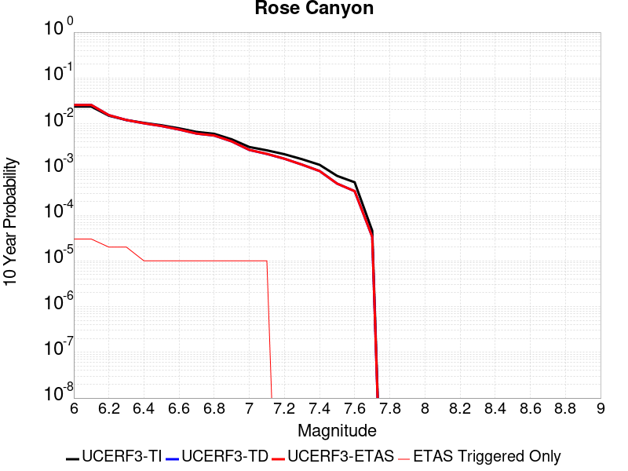 |

| Magnitude | 1 wk TI Prob | 1 wk TD Prob | 1 wk ETAS Prob | 1 wk ETAS/TD Gain | 1 wk ETAS Triggered Only | 1 mo TI Prob | 1 mo TD Prob | 1 mo ETAS Prob | 1 mo ETAS/TD Gain | 1 mo ETAS Triggered Only | 1 yr TI Prob | 1 yr TD Prob | 1 yr ETAS Prob | 1 yr ETAS/TD Gain | 1 yr ETAS Triggered Only | 10 yr TI Prob | 10 yr TD Prob | 10 yr ETAS Prob | 10 yr ETAS/TD Gain | 10 yr ETAS Triggered Only |
|-----|-----|-----|-----|-----|-----|-----|-----|-----|-----|-----|-----|-----|-----|-----|-----|-----|-----|-----|-----|-----|
| 6.0 | 4.5923203E-5 | 4.9720562E-5 | 4.9720562E-5 | 1.0 | 0.0 | 1.9679888E-4 | 2.1307007E-4 | 2.1307007E-4 | 1.0 | 0.0 | 0.0023933933 | 0.0025912558 | 0.002611204 | 1.0076983 | 2.0E-5 | 0.023677798 | 0.025643215 | 0.025672445 | 1.0011399 | 3.0E-5 |
| 6.1 | 4.5923203E-5 | 4.9720562E-5 | 4.9720562E-5 | 1.0 | 0.0 | 1.9679888E-4 | 2.1307007E-4 | 2.1307007E-4 | 1.0 | 0.0 | 0.0023933933 | 0.0025912558 | 0.002611204 | 1.0076983 | 2.0E-5 | 0.023677798 | 0.025643215 | 0.025672445 | 1.0011399 | 3.0E-5 |
| 6.2 | 2.8844734E-5 | 2.9671555E-5 | 2.9671555E-5 | 1.0 | 0.0 | 1.2361443E-4 | 1.2715581E-4 | 1.2715581E-4 | 1.0 | 0.0 | 0.0015039665 | 0.0015470508 | 0.0015570353 | 1.0064539 | 1.0E-5 | 0.0149382865 | 0.015375828 | 0.01539552 | 1.0012808 | 2.0E-5 |
| 6.3 | 2.3171577E-5 | 2.3163228E-5 | 2.3163228E-5 | 1.0 | 0.0 | 9.9302975E-5 | 9.926727E-5 | 9.926727E-5 | 1.0 | 0.0 | 0.0012083431 | 0.0012079224 | 0.0012179102 | 1.0082687 | 1.0E-5 | 0.012017938 | 0.012023459 | 0.012043218 | 1.0016434 | 2.0E-5 |
| 6.4 | 2.0066604E-5 | 1.9668718E-5 | 1.9668718E-5 | 1.0 | 0.0 | 8.599689E-5 | 8.429184E-5 | 8.429184E-5 | 1.0 | 0.0 | 0.0010465092 | 0.00102578 | 0.00102578 | 1.0 | 0.0 | 0.010415946 | 0.010218433 | 0.010228331 | 1.0009686 | 1.0E-5 |
| 6.5 | 1.776989E-5 | 1.7115255E-5 | 1.7115255E-5 | 1.0 | 0.0 | 7.615444E-5 | 7.3349074E-5 | 7.3349074E-5 | 1.0 | 0.0 | 9.267859E-4 | 8.9266605E-4 | 8.9266605E-4 | 1.0 | 0.0 | 0.009229303 | 0.008896962 | 0.008906872 | 1.001114 | 1.0E-5 |
| 6.6 | 1.5227364E-5 | 1.4340241E-5 | 1.4340241E-5 | 1.0 | 0.0 | 6.52585E-5 | 6.1456754E-5 | 6.1456754E-5 | 1.0 | 0.0 | 7.942326E-4 | 7.4798433E-4 | 7.4798433E-4 | 1.0 | 0.0 | 0.007914 | 0.007458868 | 0.0074687935 | 1.0013307 | 1.0E-5 |
| 6.7 | 1.2703898E-5 | 1.167398E-5 | 1.167398E-5 | 1.0 | 0.0 | 5.4444143E-5 | 5.003041E-5 | 5.003041E-5 | 1.0 | 0.0 | 6.626558E-4 | 6.0895423E-4 | 6.0895423E-4 | 1.0 | 0.0 | 0.006606833 | 0.0060754507 | 0.0060853898 | 1.0016359 | 1.0E-5 |
| 6.8 | 1.1554917E-5 | 1.060993E-5 | 1.060993E-5 | 1.0 | 0.0 | 4.9520135E-5 | 4.547036E-5 | 4.547036E-5 | 1.0 | 0.0 | 6.0274085E-4 | 5.5346504E-4 | 5.5346504E-4 | 1.0 | 0.0 | 0.0060110865 | 0.005522874 | 0.005532819 | 1.0018007 | 1.0E-5 |
| 6.9 | 8.732078E-6 | 7.88172E-6 | 7.88172E-6 | 1.0 | 0.0 | 3.7422655E-5 | 3.377838E-5 | 3.377838E-5 | 1.0 | 0.0 | 4.5552556E-4 | 4.111771E-4 | 4.111771E-4 | 1.0 | 0.0 | 0.0045459294 | 0.0041049966 | 0.004114955 | 1.002426 | 1.0E-5 |
| 7.0 | 5.9337494E-6 | 5.1076677E-6 | 5.1076677E-6 | 1.0 | 0.0 | 2.5430107E-5 | 2.188982E-5 | 2.188982E-5 | 1.0 | 0.0 | 3.0956755E-4 | 2.6647613E-4 | 2.6647613E-4 | 1.0 | 0.0 | 0.0030913667 | 0.0026615816 | 0.002671555 | 1.0037471 | 1.0E-5 |
| 7.1 | 5.013409E-6 | 4.177528E-6 | 4.177528E-6 | 1.0 | 0.0 | 2.1485863E-5 | 1.7903569E-5 | 1.7903569E-5 | 1.0 | 0.0 | 2.6155898E-4 | 2.1795425E-4 | 2.1795425E-4 | 1.0 | 0.0 | 0.0026125133 | 0.0021774166 | 0.0021873948 | 1.0045826 | 1.0E-5 |
| 7.2 | 4.120763E-6 | 3.2822556E-6 | 3.2822556E-6 | 1.0 | 0.0 | 1.7660293E-5 | 1.4066734E-5 | 1.4066734E-5 | 1.0 | 0.0 | 2.1499286E-4 | 1.7124912E-4 | 1.7124912E-4 | 1.0 | 0.0 | 0.0021478499 | 0.0017111811 | 0.0017111811 | 1.0 | 0.0 |
| 7.3 | 3.2081239E-6 | 2.4406268E-6 | 2.4406268E-6 | 1.0 | 0.0 | 1.374903E-5 | 1.0459787E-5 | 1.0459787E-5 | 1.0 | 0.0 | 1.6738157E-4 | 1.2734054E-4 | 1.2734054E-4 | 1.0 | 0.0 | 0.0016725556 | 0.0012726827 | 0.0012726827 | 1.0 | 0.0 |
| 7.4 | 2.4194755E-6 | 1.7681314E-6 | 1.7681314E-6 | 1.0 | 0.0 | 1.0369139E-5 | 7.577684E-6 | 7.577684E-6 | 1.0 | 0.0 | 1.2623696E-4 | 9.225445E-5 | 9.225445E-5 | 1.0 | 0.0 | 0.0012616527 | 9.2216686E-4 | 9.2216686E-4 | 1.0 | 0.0 |
| 7.5 | 1.3842889E-6 | 9.3790675E-7 | 9.3790675E-7 | 1.0 | 0.0 | 5.9326535E-6 | 4.019594E-6 | 4.019594E-6 | 1.0 | 0.0 | 7.222766E-5 | 4.8937498E-5 | 4.8937498E-5 | 1.0 | 0.0 | 7.220419E-4 | 4.892707E-4 | 4.892707E-4 | 1.0 | 0.0 |
| 7.6 | 1.0021575E-6 | 6.4118046E-7 | 6.4118046E-7 | 1.0 | 0.0 | 4.2949537E-6 | 2.7479136E-6 | 2.7479136E-6 | 1.0 | 0.0 | 5.2289808E-5 | 3.3455355E-5 | 3.3455355E-5 | 1.0 | 0.0 | 5.2277505E-4 | 3.3450534E-4 | 3.3450534E-4 | 1.0 | 0.0 |
| 7.7 | 8.7620116E-8 | 6.4494145E-8 | 6.4494145E-8 | 1.0 | 0.0 | 3.7551473E-7 | 2.7640345E-7 | 2.7640345E-7 | 1.0 | 0.0 | 4.5718825E-6 | 3.365207E-6 | 3.365207E-6 | 1.0 | 0.0 | 4.5717883E-5 | 3.365159E-5 | 3.365159E-5 | 1.0 | 0.0 |

## Cleghorn Pass
*[(top)](#table-of-contents)*

| 1 Week | 1 Month | 1 Year | 10 Year |
|-----|-----|-----|-----|
|  |  | 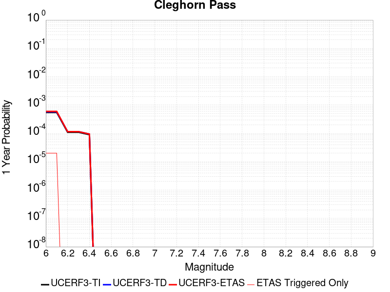 |  |

| Magnitude | 1 wk TI Prob | 1 wk TD Prob | 1 wk ETAS Prob | 1 wk ETAS/TD Gain | 1 wk ETAS Triggered Only | 1 mo TI Prob | 1 mo TD Prob | 1 mo ETAS Prob | 1 mo ETAS/TD Gain | 1 mo ETAS Triggered Only | 1 yr TI Prob | 1 yr TD Prob | 1 yr ETAS Prob | 1 yr ETAS/TD Gain | 1 yr ETAS Triggered Only | 10 yr TI Prob | 10 yr TD Prob | 10 yr ETAS Prob | 10 yr ETAS/TD Gain | 10 yr ETAS Triggered Only |
|-----|-----|-----|-----|-----|-----|-----|-----|-----|-----|-----|-----|-----|-----|-----|-----|-----|-----|-----|-----|-----|
| 6.0 | 1.0522846E-5 | 1.104093E-5 | 1.104093E-5 | 1.0 | 0.0 | 4.509713E-5 | 4.731771E-5 | 4.731771E-5 | 1.0 | 0.0 | 5.4891926E-4 | 5.759935E-4 | 5.9598195E-4 | 1.0347027 | 2.0E-5 | 0.0054756533 | 0.005750172 | 0.0057700565 | 1.0034581 | 2.0E-5 |
| 6.1 | 1.0522846E-5 | 1.104093E-5 | 1.104093E-5 | 1.0 | 0.0 | 4.509713E-5 | 4.731771E-5 | 4.731771E-5 | 1.0 | 0.0 | 5.4891926E-4 | 5.759935E-4 | 5.9598195E-4 | 1.0347027 | 2.0E-5 | 0.0054756533 | 0.005750172 | 0.0057700565 | 1.0034581 | 2.0E-5 |
| 6.2 | 2.1045846E-6 | 2.2082602E-6 | 2.2082602E-6 | 1.0 | 0.0 | 9.019617E-6 | 9.463961E-6 | 9.463961E-6 | 1.0 | 0.0 | 1.098083E-4 | 1.1522183E-4 | 1.1522183E-4 | 1.0 | 0.0 | 0.0010975406 | 0.0011520323 | 0.0011520323 | 1.0 | 0.0 |
| 6.3 | 2.1045846E-6 | 2.2082602E-6 | 2.2082602E-6 | 1.0 | 0.0 | 9.019617E-6 | 9.463961E-6 | 9.463961E-6 | 1.0 | 0.0 | 1.098083E-4 | 1.1522183E-4 | 1.1522183E-4 | 1.0 | 0.0 | 0.0010975406 | 0.0011520323 | 0.0011520323 | 1.0 | 0.0 |
| 6.4 | 1.7259927E-6 | 1.8109243E-6 | 1.8109243E-6 | 1.0 | 0.0 | 7.3970905E-6 | 7.761104E-6 | 7.761104E-6 | 1.0 | 0.0 | 9.005586E-5 | 9.449144E-5 | 9.449144E-5 | 1.0 | 0.0 | 9.001937E-4 | 9.4491447E-4 | 9.4491447E-4 | 1.0 | 0.0 |

## Del Valle
*[(top)](#table-of-contents)*

| 1 Week | 1 Month | 1 Year | 10 Year |
|-----|-----|-----|-----|
|  |  | 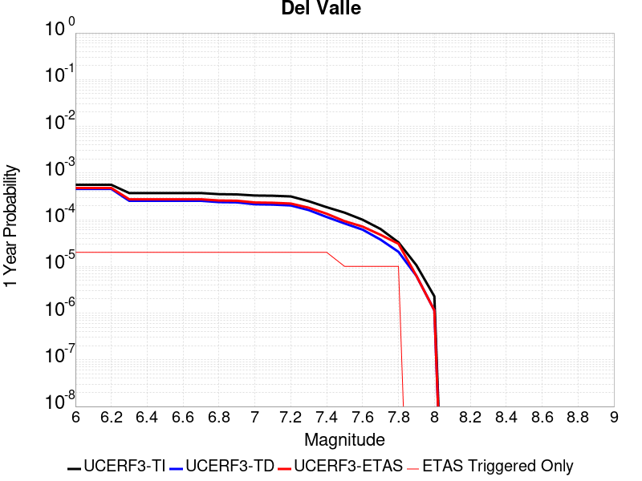 |  |

| Magnitude | 1 wk TI Prob | 1 wk TD Prob | 1 wk ETAS Prob | 1 wk ETAS/TD Gain | 1 wk ETAS Triggered Only | 1 mo TI Prob | 1 mo TD Prob | 1 mo ETAS Prob | 1 mo ETAS/TD Gain | 1 mo ETAS Triggered Only | 1 yr TI Prob | 1 yr TD Prob | 1 yr ETAS Prob | 1 yr ETAS/TD Gain | 1 yr ETAS Triggered Only | 10 yr TI Prob | 10 yr TD Prob | 10 yr ETAS Prob | 10 yr ETAS/TD Gain | 10 yr ETAS Triggered Only |
|-----|-----|-----|-----|-----|-----|-----|-----|-----|-----|-----|-----|-----|-----|-----|-----|-----|-----|-----|-----|-----|
| 6.0 | 1.0716125E-5 | 8.768574E-6 | 8.768574E-6 | 1.0 | 0.0 | 4.592544E-5 | 3.7579175E-5 | 4.7578797E-5 | 1.2660948 | 1.0E-5 | 5.589988E-4 | 4.5745014E-4 | 4.7744098E-4 | 1.0437006 | 2.0E-5 | 0.0055759475 | 0.00456704 | 0.0045869485 | 1.0043592 | 2.0E-5 |
| 6.1 | 1.0716125E-5 | 8.768574E-6 | 8.768574E-6 | 1.0 | 0.0 | 4.592544E-5 | 3.7579175E-5 | 4.7578797E-5 | 1.2660948 | 1.0E-5 | 5.589988E-4 | 4.5745014E-4 | 4.7744098E-4 | 1.0437006 | 2.0E-5 | 0.0055759475 | 0.00456704 | 0.0045869485 | 1.0043592 | 2.0E-5 |
| 6.2 | 1.0716125E-5 | 8.768574E-6 | 8.768574E-6 | 1.0 | 0.0 | 4.592544E-5 | 3.7579175E-5 | 4.7578797E-5 | 1.2660948 | 1.0E-5 | 5.589988E-4 | 4.5745014E-4 | 4.7744098E-4 | 1.0437006 | 2.0E-5 | 0.0055759475 | 0.00456704 | 0.0045869485 | 1.0043592 | 2.0E-5 |
| 6.3 | 7.1293784E-6 | 4.8663333E-6 | 4.8663333E-6 | 1.0 | 0.0 | 3.055412E-5 | 2.085555E-5 | 3.0855343E-5 | 1.4794787 | 1.0E-5 | 3.7193293E-4 | 2.5388747E-4 | 2.738824E-4 | 1.078755 | 2.0E-5 | 0.0037131102 | 0.0025360603 | 0.0025560095 | 1.0078663 | 2.0E-5 |
| 6.4 | 7.1293784E-6 | 4.8663333E-6 | 4.8663333E-6 | 1.0 | 0.0 | 3.055412E-5 | 2.085555E-5 | 3.0855343E-5 | 1.4794787 | 1.0E-5 | 3.7193293E-4 | 2.5388747E-4 | 2.738824E-4 | 1.078755 | 2.0E-5 | 0.0037131102 | 0.0025360603 | 0.0025560095 | 1.0078663 | 2.0E-5 |
| 6.5 | 7.1293784E-6 | 4.8663333E-6 | 4.8663333E-6 | 1.0 | 0.0 | 3.055412E-5 | 2.085555E-5 | 3.0855343E-5 | 1.4794787 | 1.0E-5 | 3.7193293E-4 | 2.5388747E-4 | 2.738824E-4 | 1.078755 | 2.0E-5 | 0.0037131102 | 0.0025360603 | 0.0025560095 | 1.0078663 | 2.0E-5 |
| 6.6 | 7.1293784E-6 | 4.8663333E-6 | 4.8663333E-6 | 1.0 | 0.0 | 3.055412E-5 | 2.085555E-5 | 3.0855343E-5 | 1.4794787 | 1.0E-5 | 3.7193293E-4 | 2.5388747E-4 | 2.738824E-4 | 1.078755 | 2.0E-5 | 0.0037131102 | 0.0025360603 | 0.0025560095 | 1.0078663 | 2.0E-5 |
| 6.7 | 7.12272E-6 | 4.8637085E-6 | 4.8637085E-6 | 1.0 | 0.0 | 3.0525585E-5 | 2.0844302E-5 | 3.0844094E-5 | 1.4797374 | 1.0E-5 | 3.7158563E-4 | 2.5375056E-4 | 2.7374548E-4 | 1.0787976 | 2.0E-5 | 0.003709649 | 0.0025346943 | 0.0025546434 | 1.0078706 | 2.0E-5 |
| 6.8 | 6.7558703E-6 | 4.5598863E-6 | 4.5598863E-6 | 1.0 | 0.0 | 2.895341E-5 | 1.9542227E-5 | 2.9542032E-5 | 1.5117024 | 1.0E-5 | 3.5245073E-4 | 2.3790127E-4 | 2.5789652E-4 | 1.0840485 | 2.0E-5 | 0.0035189227 | 0.0023765413 | 0.0023964937 | 1.0083956 | 2.0E-5 |
| 6.9 | 6.6700386E-6 | 4.503013E-6 | 4.503013E-6 | 1.0 | 0.0 | 2.8585566E-5 | 1.9298488E-5 | 2.9298295E-5 | 1.5181653 | 1.0E-5 | 3.479737E-4 | 2.3493438E-4 | 2.549297E-4 | 1.0851102 | 2.0E-5 | 0.003474293 | 0.0023469352 | 0.0023668883 | 1.0085018 | 2.0E-5 |
| 7.0 | 6.3181424E-6 | 4.099144E-6 | 4.099144E-6 | 1.0 | 0.0 | 2.7077473E-5 | 1.7567643E-5 | 2.7567468E-5 | 1.5692183 | 1.0E-5 | 3.2961834E-4 | 2.138655E-4 | 2.3386121E-4 | 1.0934967 | 2.0E-5 | 0.0032912986 | 0.0021366514 | 0.0021566087 | 1.0093404 | 2.0E-5 |
| 7.1 | 6.248759E-6 | 4.034328E-6 | 4.034328E-6 | 1.0 | 0.0 | 2.678012E-5 | 1.7289865E-5 | 2.7289692E-5 | 1.5783635 | 1.0E-5 | 3.2599916E-4 | 2.104842E-4 | 2.3048E-4 | 1.094999 | 2.0E-5 | 0.0032552136 | 0.0021029029 | 0.0021228609 | 1.0094906 | 2.0E-5 |
| 7.2 | 6.0411944E-6 | 3.870302E-6 | 3.870302E-6 | 1.0 | 0.0 | 2.5890577E-5 | 1.6586906E-5 | 2.658674E-5 | 1.6028752 | 1.0E-5 | 3.1517216E-4 | 2.0192728E-4 | 2.2192324E-4 | 1.0990256 | 2.0E-5 | 0.0031472554 | 0.0020174913 | 0.0020374511 | 1.0098933 | 2.0E-5 |
| 7.3 | 4.7691183E-6 | 3.0784236E-6 | 3.0784236E-6 | 1.0 | 0.0 | 2.0438918E-5 | 1.3193178E-5 | 2.3193046E-5 | 1.7579575 | 1.0E-5 | 2.488154E-4 | 1.6061532E-4 | 1.8061211E-4 | 1.1245011 | 2.0E-5 | 0.00248537 | 0.0016050183 | 0.0016249862 | 1.0124409 | 2.0E-5 |
| 7.4 | 3.5524722E-6 | 2.189551E-6 | 2.189551E-6 | 1.0 | 0.0 | 1.5224792E-5 | 9.383756E-6 | 1.9383662E-5 | 2.0656612 | 1.0E-5 | 1.8534607E-4 | 1.1424133E-4 | 1.3423905E-4 | 1.175048 | 2.0E-5 | 0.0018519156 | 0.0011418343 | 0.0011618114 | 1.0174956 | 2.0E-5 |
| 7.5 | 2.7133442E-6 | 1.5917716E-6 | 1.5917716E-6 | 1.0 | 0.0 | 1.1628566E-5 | 6.8218606E-6 | 6.8218606E-6 | 1.0 | 0.0 | 1.415686E-4 | 8.3053004E-5 | 9.305218E-5 | 1.1203951 | 1.0E-5 | 0.0014147845 | 8.3022163E-4 | 8.402133E-4 | 1.012035 | 1.0E-5 |
| 7.6 | 1.915338E-6 | 1.1740314E-6 | 1.1740314E-6 | 1.0 | 0.0 | 8.208566E-6 | 5.0315534E-6 | 5.0315534E-6 | 1.0 | 0.0 | 9.993471E-5 | 6.125745E-5 | 7.1256836E-5 | 1.1632354 | 1.0E-5 | 9.988978E-4 | 6.124066E-4 | 6.2240043E-4 | 1.016319 | 1.0E-5 |
| 7.7 | 1.2120448E-6 | 7.181144E-7 | 7.181144E-7 | 1.0 | 0.0 | 5.194467E-6 | 3.0776296E-6 | 3.0776296E-6 | 1.0 | 0.0 | 6.3240805E-5 | 3.7469497E-5 | 4.7469126E-5 | 1.2668737 | 1.0E-5 | 6.322281E-4 | 3.746322E-4 | 3.8462845E-4 | 1.0266829 | 1.0E-5 |
| 7.8 | 6.272381E-7 | 3.9329873E-7 | 3.9329873E-7 | 1.0 | 0.0 | 2.6881603E-6 | 1.6855649E-6 | 1.6855649E-6 | 1.0 | 0.0 | 3.272786E-5 | 2.0521562E-5 | 3.0521354E-5 | 1.4872824 | 1.0E-5 | 3.272304E-4 | 2.0519682E-4 | 2.1519477E-4 | 1.0487237 | 1.0E-5 |
| 7.9 | 2.0292627E-7 | 1.200618E-7 | 1.200618E-7 | 1.0 | 0.0 | 8.6968373E-7 | 5.1455044E-7 | 5.1455044E-7 | 1.0 | 0.0 | 1.0588348E-5 | 6.264634E-6 | 6.264634E-6 | 1.0 | 0.0 | 1.0587843E-4 | 6.26446E-5 | 6.26446E-5 | 1.0 | 0.0 |
| 8.0 | 4.374492E-8 | 2.1904274E-8 | 2.1904274E-8 | 1.0 | 0.0 | 1.8747821E-7 | 9.387546E-8 | 9.387546E-8 | 1.0 | 0.0 | 2.2825448E-6 | 1.1429331E-6 | 1.1429331E-6 | 1.0 | 0.0 | 2.2825214E-5 | 1.1429277E-5 | 1.1429277E-5 | 1.0 | 0.0 |

## Camp Rock 2011
*[(top)](#table-of-contents)*

| 1 Week | 1 Month | 1 Year | 10 Year |
|-----|-----|-----|-----|
| 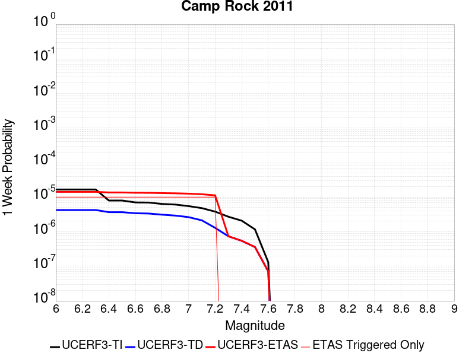 |  |  |  |

| Magnitude | 1 wk TI Prob | 1 wk TD Prob | 1 wk ETAS Prob | 1 wk ETAS/TD Gain | 1 wk ETAS Triggered Only | 1 mo TI Prob | 1 mo TD Prob | 1 mo ETAS Prob | 1 mo ETAS/TD Gain | 1 mo ETAS Triggered Only | 1 yr TI Prob | 1 yr TD Prob | 1 yr ETAS Prob | 1 yr ETAS/TD Gain | 1 yr ETAS Triggered Only | 10 yr TI Prob | 10 yr TD Prob | 10 yr ETAS Prob | 10 yr ETAS/TD Gain | 10 yr ETAS Triggered Only |
|-----|-----|-----|-----|-----|-----|-----|-----|-----|-----|-----|-----|-----|-----|-----|-----|-----|-----|-----|-----|-----|
| 6.0 | 1.6710783E-5 | 4.2504644E-6 | 1.4250422E-5 | 3.352674 | 1.0E-5 | 7.161568E-5 | 1.8216151E-5 | 2.8215969E-5 | 1.5489534 | 1.0E-5 | 8.7157206E-4 | 2.217596E-4 | 2.4175517E-4 | 1.0901678 | 2.0E-5 | 0.008681616 | 0.002215436 | 0.0022353916 | 1.0090076 | 2.0E-5 |
| 6.1 | 1.6710783E-5 | 4.2504644E-6 | 1.4250422E-5 | 3.352674 | 1.0E-5 | 7.161568E-5 | 1.8216151E-5 | 2.8215969E-5 | 1.5489534 | 1.0E-5 | 8.7157206E-4 | 2.217596E-4 | 2.4175517E-4 | 1.0901678 | 2.0E-5 | 0.008681616 | 0.002215436 | 0.0022353916 | 1.0090076 | 2.0E-5 |
| 6.2 | 1.6710783E-5 | 4.2504644E-6 | 1.4250422E-5 | 3.352674 | 1.0E-5 | 7.161568E-5 | 1.8216151E-5 | 2.8215969E-5 | 1.5489534 | 1.0E-5 | 8.7157206E-4 | 2.217596E-4 | 2.4175517E-4 | 1.0901678 | 2.0E-5 | 0.008681616 | 0.002215436 | 0.0022353916 | 1.0090076 | 2.0E-5 |
| 6.3 | 1.6710783E-5 | 4.2504644E-6 | 1.4250422E-5 | 3.352674 | 1.0E-5 | 7.161568E-5 | 1.8216151E-5 | 2.8215969E-5 | 1.5489534 | 1.0E-5 | 8.7157206E-4 | 2.217596E-4 | 2.4175517E-4 | 1.0901678 | 2.0E-5 | 0.008681616 | 0.002215436 | 0.0022353916 | 1.0090076 | 2.0E-5 |
| 6.4 | 7.982846E-6 | 3.6822685E-6 | 1.3682232E-5 | 3.7157073 | 1.0E-5 | 3.421175E-5 | 1.5781057E-5 | 2.5780899E-5 | 1.6336612 | 1.0E-5 | 4.1644843E-4 | 1.9211778E-4 | 2.1211394E-4 | 1.1040828 | 2.0E-5 | 0.0041566887 | 0.0019195518 | 0.0019395134 | 1.0103991 | 2.0E-5 |
| 6.5 | 7.982846E-6 | 3.6822685E-6 | 1.3682232E-5 | 3.7157073 | 1.0E-5 | 3.421175E-5 | 1.5781057E-5 | 2.5780899E-5 | 1.6336612 | 1.0E-5 | 4.1644843E-4 | 1.9211778E-4 | 2.1211394E-4 | 1.1040828 | 2.0E-5 | 0.0041566887 | 0.0019195518 | 0.0019395134 | 1.0103991 | 2.0E-5 |
| 6.6 | 7.048869E-6 | 3.4245295E-6 | 1.3424496E-5 | 3.9200993 | 1.0E-5 | 3.0209088E-5 | 1.4676474E-5 | 2.4676327E-5 | 1.6813526 | 1.0E-5 | 3.677336E-4 | 1.7867173E-4 | 1.9866816E-4 | 1.1119171 | 2.0E-5 | 0.0036712566 | 0.0017853125 | 0.0018052768 | 1.0111825 | 2.0E-5 |
| 6.7 | 6.987307E-6 | 3.3625051E-6 | 1.3362472E-5 | 3.9739633 | 1.0E-5 | 2.9945259E-5 | 1.4410658E-5 | 2.4410514E-5 | 1.6939209 | 1.0E-5 | 3.6452254E-4 | 1.7543595E-4 | 1.9543244E-4 | 1.1139817 | 2.0E-5 | 0.0036392517 | 0.0017530057 | 0.0017729707 | 1.011389 | 2.0E-5 |
| 6.8 | 6.3737602E-6 | 3.1180682E-6 | 1.3118037E-5 | 4.2071037 | 1.0E-5 | 2.731583E-5 | 1.3363083E-5 | 2.3362949E-5 | 1.7483203 | 1.0E-5 | 3.3251947E-4 | 1.6268367E-4 | 1.8268042E-4 | 1.122918 | 2.0E-5 | 0.0033202237 | 0.0016256744 | 0.0016456419 | 1.0122826 | 2.0E-5 |
| 6.9 | 6.112211E-6 | 2.9332696E-6 | 1.293324E-5 | 4.409155 | 1.0E-5 | 2.6194928E-5 | 1.2571097E-5 | 2.2570972E-5 | 1.7954656 | 1.0E-5 | 3.1887658E-4 | 1.5304264E-4 | 1.7303957E-4 | 1.1306626 | 2.0E-5 | 0.003184194 | 0.0015294001 | 0.0015493695 | 1.013057 | 2.0E-5 |
| 7.0 | 5.5140117E-6 | 2.642059E-6 | 1.2642033E-5 | 4.784917 | 1.0E-5 | 2.3631264E-5 | 1.1323062E-5 | 2.1322949E-5 | 1.8831433 | 1.0E-5 | 2.8767265E-4 | 1.3784981E-4 | 1.5784705E-4 | 1.1450654 | 2.0E-5 | 0.0028730053 | 0.0013776683 | 0.0013976408 | 1.0144973 | 2.0E-5 |
| 7.1 | 4.8151105E-6 | 2.134385E-6 | 1.2134364E-5 | 5.68518 | 1.0E-5 | 2.0636026E-5 | 9.147334E-6 | 1.9147243E-5 | 2.0932047 | 1.0E-5 | 2.5121463E-4 | 1.1136332E-4 | 1.3136108E-4 | 1.1795723 | 2.0E-5 | 0.0025093083 | 0.0011130971 | 0.0011330748 | 1.0179479 | 2.0E-5 |
| 7.2 | 3.818335E-6 | 1.2938276E-6 | 1.1293815E-5 | 8.728995 | 1.0E-5 | 1.6364189E-5 | 5.544964E-6 | 1.5544909E-5 | 2.8034282 | 1.0E-5 | 1.9921579E-4 | 6.750793E-5 | 7.7507255E-5 | 1.1481208 | 1.0E-5 | 0.0019903728 | 6.748825E-4 | 6.848757E-4 | 1.0148073 | 1.0E-5 |
| 7.3 | 2.7166698E-6 | 7.38423E-7 | 7.38423E-7 | 1.0 | 0.0 | 1.1642818E-5 | 3.1646662E-6 | 3.1646662E-6 | 1.0 | 0.0 | 1.4174209E-4 | 3.852915E-5 | 3.852915E-5 | 1.0 | 0.0 | 0.0014165172 | 3.852267E-4 | 3.852267E-4 | 1.0 | 0.0 |
| 7.4 | 2.0893426E-6 | 5.462354E-7 | 5.462354E-7 | 1.0 | 0.0 | 8.954295E-6 | 2.3410068E-6 | 2.3410068E-6 | 1.0 | 0.0 | 1.0901308E-4 | 2.850139E-5 | 2.850139E-5 | 1.0 | 0.0 | 0.0010895962 | 2.849779E-4 | 2.849779E-4 | 1.0 | 0.0 |
| 7.5 | 1.1681728E-6 | 3.6033393E-7 | 3.6033393E-7 | 1.0 | 0.0 | 5.0064455E-6 | 1.5442874E-6 | 1.5442874E-6 | 1.0 | 0.0 | 6.0951766E-5 | 1.8801542E-5 | 1.8801542E-5 | 1.0 | 0.0 | 6.093505E-4 | 1.8799998E-4 | 1.8799998E-4 | 1.0 | 0.0 |
| 7.6 | 1.3154387E-7 | 7.12009E-8 | 7.12009E-8 | 1.0 | 0.0 | 5.6375933E-7 | 3.051467E-7 | 3.051467E-7 | 1.0 | 0.0 | 6.863748E-6 | 3.7151563E-6 | 3.7151563E-6 | 1.0 | 0.0 | 6.863536E-5 | 3.7151098E-5 | 3.7151098E-5 | 1.0 | 0.0 |

## Kern Canyon (South Kern) 2011
*[(top)](#table-of-contents)*

| 1 Week | 1 Month | 1 Year | 10 Year |
|-----|-----|-----|-----|
|  |  | 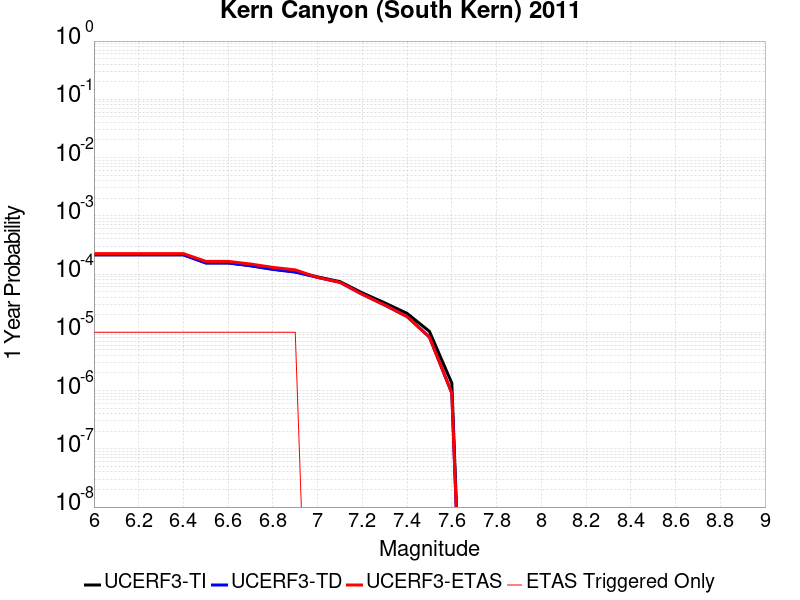 |  |

| Magnitude | 1 wk TI Prob | 1 wk TD Prob | 1 wk ETAS Prob | 1 wk ETAS/TD Gain | 1 wk ETAS Triggered Only | 1 mo TI Prob | 1 mo TD Prob | 1 mo ETAS Prob | 1 mo ETAS/TD Gain | 1 mo ETAS Triggered Only | 1 yr TI Prob | 1 yr TD Prob | 1 yr ETAS Prob | 1 yr ETAS/TD Gain | 1 yr ETAS Triggered Only | 10 yr TI Prob | 10 yr TD Prob | 10 yr ETAS Prob | 10 yr ETAS/TD Gain | 10 yr ETAS Triggered Only |
|-----|-----|-----|-----|-----|-----|-----|-----|-----|-----|-----|-----|-----|-----|-----|-----|-----|-----|-----|-----|-----|
| 6.0 | 4.105075E-6 | 4.1137673E-6 | 4.1137673E-6 | 1.0 | 0.0 | 1.7593058E-5 | 1.7630317E-5 | 1.7630317E-5 | 1.0 | 0.0 | 2.1417443E-4 | 2.146286E-4 | 2.2462646E-4 | 1.0465821 | 1.0E-5 | 0.0021396813 | 0.002144277 | 0.0021642342 | 1.0093071 | 2.0E-5 |
| 6.1 | 4.105075E-6 | 4.1137673E-6 | 4.1137673E-6 | 1.0 | 0.0 | 1.7593058E-5 | 1.7630317E-5 | 1.7630317E-5 | 1.0 | 0.0 | 2.1417443E-4 | 2.146286E-4 | 2.2462646E-4 | 1.0465821 | 1.0E-5 | 0.0021396813 | 0.002144277 | 0.0021642342 | 1.0093071 | 2.0E-5 |
| 6.2 | 4.105075E-6 | 4.1137673E-6 | 4.1137673E-6 | 1.0 | 0.0 | 1.7593058E-5 | 1.7630317E-5 | 1.7630317E-5 | 1.0 | 0.0 | 2.1417443E-4 | 2.146286E-4 | 2.2462646E-4 | 1.0465821 | 1.0E-5 | 0.0021396813 | 0.002144277 | 0.0021642342 | 1.0093071 | 2.0E-5 |
| 6.3 | 4.105075E-6 | 4.1137673E-6 | 4.1137673E-6 | 1.0 | 0.0 | 1.7593058E-5 | 1.7630317E-5 | 1.7630317E-5 | 1.0 | 0.0 | 2.1417443E-4 | 2.146286E-4 | 2.2462646E-4 | 1.0465821 | 1.0E-5 | 0.0021396813 | 0.002144277 | 0.0021642342 | 1.0093071 | 2.0E-5 |
| 6.4 | 4.105075E-6 | 4.1137673E-6 | 4.1137673E-6 | 1.0 | 0.0 | 1.7593058E-5 | 1.7630317E-5 | 1.7630317E-5 | 1.0 | 0.0 | 2.1417443E-4 | 2.146286E-4 | 2.2462646E-4 | 1.0465821 | 1.0E-5 | 0.0021396813 | 0.002144277 | 0.0021642342 | 1.0093071 | 2.0E-5 |
| 6.5 | 2.9849807E-6 | 2.9731848E-6 | 2.9731848E-6 | 1.0 | 0.0 | 1.2792712E-5 | 1.2742159E-5 | 1.2742159E-5 | 1.0 | 0.0 | 1.5574014E-4 | 1.5512489E-4 | 1.6512333E-4 | 1.0644542 | 1.0E-5 | 0.0015563103 | 0.0015501813 | 0.0015701503 | 1.0128818 | 2.0E-5 |
| 6.6 | 2.9849807E-6 | 2.9731848E-6 | 2.9731848E-6 | 1.0 | 0.0 | 1.2792712E-5 | 1.2742159E-5 | 1.2742159E-5 | 1.0 | 0.0 | 1.5574014E-4 | 1.5512489E-4 | 1.6512333E-4 | 1.0644542 | 1.0E-5 | 0.0015563103 | 0.0015501813 | 0.0015701503 | 1.0128818 | 2.0E-5 |
| 6.7 | 2.6756725E-6 | 2.6582477E-6 | 2.6582477E-6 | 1.0 | 0.0 | 1.1467117E-5 | 1.1392441E-5 | 1.1392441E-5 | 1.0 | 0.0 | 1.396032E-4 | 1.3869425E-4 | 1.4869287E-4 | 1.072091 | 1.0E-5 | 0.0013951553 | 0.0013860879 | 0.0014060601 | 1.0144091 | 2.0E-5 |
| 6.8 | 2.3283721E-6 | 2.3048024E-6 | 2.3048024E-6 | 1.0 | 0.0 | 9.9787E-6 | 9.877688E-6 | 9.877688E-6 | 1.0 | 0.0 | 1.214839E-4 | 1.20254284E-4 | 1.3025309E-4 | 1.0831472 | 1.0E-5 | 0.001214175 | 0.0012018996 | 0.0012118876 | 1.0083102 | 1.0E-5 |
| 6.9 | 2.0972677E-6 | 2.0696625E-6 | 2.0696625E-6 | 1.0 | 0.0 | 8.988259E-6 | 8.869953E-6 | 8.869953E-6 | 1.0 | 0.0 | 1.0942656E-4 | 1.0798638E-4 | 1.179853E-4 | 1.0925943 | 1.0E-5 | 0.0010937268 | 0.0010793449 | 0.0010893341 | 1.0092549 | 1.0E-5 |
| 7.0 | 1.7132242E-6 | 1.6787213E-6 | 1.6787213E-6 | 1.0 | 0.0 | 7.3423685E-6 | 7.1945E-6 | 7.1945E-6 | 1.0 | 0.0 | 8.938967E-5 | 8.758956E-5 | 8.758956E-5 | 1.0 | 0.0 | 8.935372E-4 | 8.755542E-4 | 8.755542E-4 | 1.0 | 0.0 |
| 7.1 | 1.4215541E-6 | 1.38159E-6 | 1.38159E-6 | 1.0 | 0.0 | 6.0923603E-6 | 5.9210865E-6 | 5.9210865E-6 | 1.0 | 0.0 | 7.417196E-5 | 7.208687E-5 | 7.208687E-5 | 1.0 | 0.0 | 7.414721E-4 | 7.206376E-4 | 7.206376E-4 | 1.0 | 0.0 |
| 7.2 | 9.097853E-7 | 8.603873E-7 | 8.603873E-7 | 1.0 | 0.0 | 3.899074E-6 | 3.687369E-6 | 3.687369E-6 | 1.0 | 0.0 | 4.7470192E-5 | 4.48928E-5 | 4.48928E-5 | 1.0 | 0.0 | 4.7460053E-4 | 4.488384E-4 | 4.488384E-4 | 1.0 | 0.0 |
| 7.3 | 6.144169E-7 | 5.628273E-7 | 5.628273E-7 | 1.0 | 0.0 | 2.6332125E-6 | 2.412115E-6 | 2.412115E-6 | 1.0 | 0.0 | 3.205889E-5 | 2.936711E-5 | 2.936711E-5 | 1.0 | 0.0 | 3.2054266E-4 | 2.936328E-4 | 2.936328E-4 | 1.0 | 0.0 |
| 7.4 | 4.049844E-7 | 3.5728772E-7 | 3.5728772E-7 | 1.0 | 0.0 | 1.7356463E-6 | 1.5312322E-6 | 1.5312322E-6 | 1.0 | 0.0 | 2.1131287E-5 | 1.8642595E-5 | 1.8642595E-5 | 1.0 | 0.0 | 2.1129279E-4 | 1.8641056E-4 | 1.8641056E-4 | 1.0 | 0.0 |
| 7.5 | 1.9871162E-7 | 1.5830682E-7 | 1.5830682E-7 | 1.0 | 0.0 | 8.5162094E-7 | 6.7845764E-7 | 6.7845764E-7 | 1.0 | 0.0 | 1.0368436E-5 | 8.260191E-6 | 8.260191E-6 | 1.0 | 0.0 | 1.0367952E-4 | 8.259893E-5 | 8.259893E-5 | 1.0 | 0.0 |
| 7.6 | 2.572245E-8 | 1.7352884E-8 | 1.7352884E-8 | 1.0 | 0.0 | 1.10239064E-7 | 7.43695E-8 | 7.43695E-8 | 1.0 | 0.0 | 1.3421597E-6 | 9.0544836E-7 | 9.0544836E-7 | 1.0 | 0.0 | 1.3421517E-5 | 9.054452E-6 | 9.054452E-6 | 1.0 | 0.0 |

## Cucamonga
*[(top)](#table-of-contents)*

| 1 Week | 1 Month | 1 Year | 10 Year |
|-----|-----|-----|-----|
|  |  | 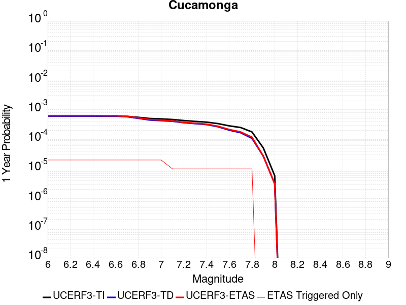 | 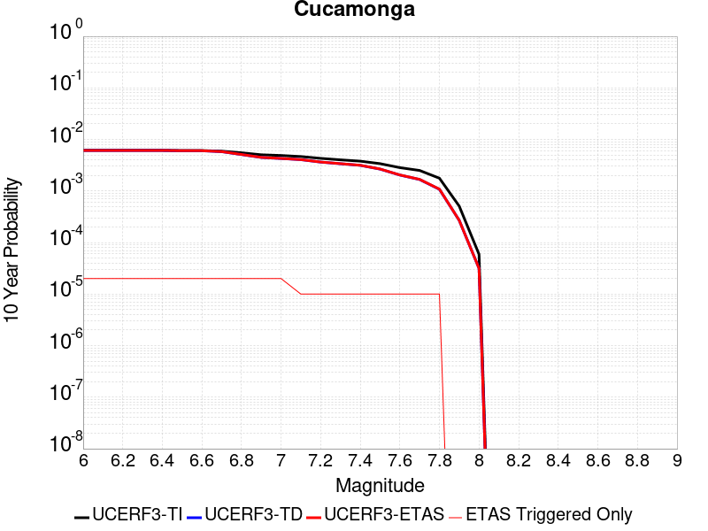 |

| Magnitude | 1 wk TI Prob | 1 wk TD Prob | 1 wk ETAS Prob | 1 wk ETAS/TD Gain | 1 wk ETAS Triggered Only | 1 mo TI Prob | 1 mo TD Prob | 1 mo ETAS Prob | 1 mo ETAS/TD Gain | 1 mo ETAS Triggered Only | 1 yr TI Prob | 1 yr TD Prob | 1 yr ETAS Prob | 1 yr ETAS/TD Gain | 1 yr ETAS Triggered Only | 10 yr TI Prob | 10 yr TD Prob | 10 yr ETAS Prob | 10 yr ETAS/TD Gain | 10 yr ETAS Triggered Only |
|-----|-----|-----|-----|-----|-----|-----|-----|-----|-----|-----|-----|-----|-----|-----|-----|-----|-----|-----|-----|-----|
| 6.0 | 1.1848348E-5 | 1.1739686E-5 | 1.1739686E-5 | 1.0 | 0.0 | 5.0777642E-5 | 5.0311985E-5 | 5.0311985E-5 | 1.0 | 0.0 | 6.180424E-4 | 6.1237894E-4 | 6.323667E-4 | 1.0326395 | 2.0E-5 | 0.0061632637 | 0.0061080856 | 0.006127964 | 1.0032543 | 2.0E-5 |
| 6.1 | 1.1848348E-5 | 1.1739686E-5 | 1.1739686E-5 | 1.0 | 0.0 | 5.0777642E-5 | 5.0311985E-5 | 5.0311985E-5 | 1.0 | 0.0 | 6.180424E-4 | 6.1237894E-4 | 6.323667E-4 | 1.0326395 | 2.0E-5 | 0.0061632637 | 0.0061080856 | 0.006127964 | 1.0032543 | 2.0E-5 |
| 6.2 | 1.1848348E-5 | 1.1739686E-5 | 1.1739686E-5 | 1.0 | 0.0 | 5.0777642E-5 | 5.0311985E-5 | 5.0311985E-5 | 1.0 | 0.0 | 6.180424E-4 | 6.1237894E-4 | 6.323667E-4 | 1.0326395 | 2.0E-5 | 0.0061632637 | 0.0061080856 | 0.006127964 | 1.0032543 | 2.0E-5 |
| 6.3 | 1.1848348E-5 | 1.1739686E-5 | 1.1739686E-5 | 1.0 | 0.0 | 5.0777642E-5 | 5.0311985E-5 | 5.0311985E-5 | 1.0 | 0.0 | 6.180424E-4 | 6.1237894E-4 | 6.323667E-4 | 1.0326395 | 2.0E-5 | 0.0061632637 | 0.0061080856 | 0.006127964 | 1.0032543 | 2.0E-5 |
| 6.4 | 1.1848348E-5 | 1.1739686E-5 | 1.1739686E-5 | 1.0 | 0.0 | 5.0777642E-5 | 5.0311985E-5 | 5.0311985E-5 | 1.0 | 0.0 | 6.180424E-4 | 6.1237894E-4 | 6.323667E-4 | 1.0326395 | 2.0E-5 | 0.0061632637 | 0.0061080856 | 0.006127964 | 1.0032543 | 2.0E-5 |
| 6.5 | 1.16988695E-5 | 1.157871E-5 | 1.157871E-5 | 1.0 | 0.0 | 5.013705E-5 | 4.9622115E-5 | 4.9622115E-5 | 1.0 | 0.0 | 6.102476E-4 | 6.0398446E-4 | 6.239724E-4 | 1.0330935 | 2.0E-5 | 0.006085745 | 0.0060245967 | 0.0060444763 | 1.0032997 | 2.0E-5 |
| 6.6 | 1.16988695E-5 | 1.157871E-5 | 1.157871E-5 | 1.0 | 0.0 | 5.013705E-5 | 4.9622115E-5 | 4.9622115E-5 | 1.0 | 0.0 | 6.102476E-4 | 6.0398446E-4 | 6.239724E-4 | 1.0330935 | 2.0E-5 | 0.006085745 | 0.0060245967 | 0.0060444763 | 1.0032997 | 2.0E-5 |
| 6.7 | 1.1397107E-5 | 1.111755E-5 | 1.111755E-5 | 1.0 | 0.0 | 4.884383E-5 | 4.7645786E-5 | 4.7645786E-5 | 1.0 | 0.0 | 5.9451134E-4 | 5.7993556E-4 | 5.9992395E-4 | 1.0344666 | 2.0E-5 | 0.005929234 | 0.005785368 | 0.005805252 | 1.003437 | 2.0E-5 |
| 6.8 | 1.058387E-5 | 9.787276E-6 | 9.787276E-6 | 1.0 | 0.0 | 4.5358654E-5 | 4.19448E-5 | 4.19448E-5 | 1.0 | 0.0 | 5.521017E-4 | 5.105594E-4 | 5.305492E-4 | 1.0391527 | 2.0E-5 | 0.00550732 | 0.005094869 | 0.0051147672 | 1.0039055 | 2.0E-5 |
| 6.9 | 9.690046E-6 | 8.581557E-6 | 8.581557E-6 | 1.0 | 0.0 | 4.1528107E-5 | 3.6777587E-5 | 3.6777587E-5 | 1.0 | 0.0 | 5.054874E-4 | 4.4767553E-4 | 4.6766657E-4 | 1.0446552 | 2.0E-5 | 0.005043391 | 0.0044686683 | 0.004488579 | 1.0044556 | 2.0E-5 |
| 7.0 | 9.381461E-6 | 8.189123E-6 | 8.189123E-6 | 1.0 | 0.0 | 4.020564E-5 | 3.509577E-5 | 3.509577E-5 | 1.0 | 0.0 | 4.893937E-4 | 4.272076E-4 | 4.4719904E-4 | 1.0467956 | 2.0E-5 | 0.0048831734 | 0.004264793 | 0.004284708 | 1.0046695 | 2.0E-5 |
| 7.1 | 8.946492E-6 | 7.783867E-6 | 7.783867E-6 | 1.0 | 0.0 | 3.8341543E-5 | 3.3359003E-5 | 3.3359003E-5 | 1.0 | 0.0 | 4.667083E-4 | 4.060705E-4 | 4.1606644E-4 | 1.0246162 | 1.0E-5 | 0.0046572937 | 0.0040542167 | 0.004064176 | 1.0024565 | 1.0E-5 |
| 7.2 | 8.251016E-6 | 6.977125E-6 | 6.977125E-6 | 1.0 | 0.0 | 3.5361016E-5 | 2.9901623E-5 | 2.9901623E-5 | 1.0 | 0.0 | 4.3043532E-4 | 3.6399168E-4 | 3.7398803E-4 | 1.0274632 | 1.0E-5 | 0.0042960253 | 0.0036348838 | 0.0036448473 | 1.0027411 | 1.0E-5 |
| 7.3 | 7.717881E-6 | 6.4881356E-6 | 6.4881356E-6 | 1.0 | 0.0 | 3.3076216E-5 | 2.7806E-5 | 2.7806E-5 | 1.0 | 0.0 | 4.026285E-4 | 3.3848567E-4 | 3.4848228E-4 | 1.0295334 | 1.0E-5 | 0.004018998 | 0.0033806337 | 0.0033905997 | 1.002948 | 1.0E-5 |
| 7.4 | 7.275623E-6 | 6.0337097E-6 | 6.0337097E-6 | 1.0 | 0.0 | 3.118087E-5 | 2.58585E-5 | 2.58585E-5 | 1.0 | 0.0 | 3.7956095E-4 | 3.14782E-4 | 3.2477884E-4 | 1.0317581 | 1.0E-5 | 0.0037891332 | 0.0031442924 | 0.003154261 | 1.0031704 | 1.0E-5 |
| 7.5 | 6.5109502E-6 | 5.102118E-6 | 5.102118E-6 | 1.0 | 0.0 | 2.7903774E-5 | 2.1866037E-5 | 2.1866037E-5 | 1.0 | 0.0 | 3.3967546E-4 | 2.6618663E-4 | 2.7618397E-4 | 1.0375576 | 1.0E-5 | 0.0033915674 | 0.002659598 | 0.0026695712 | 1.00375 | 1.0E-5 |
| 7.6 | 5.4495326E-6 | 3.909914E-6 | 3.909914E-6 | 1.0 | 0.0 | 2.335493E-5 | 1.6756667E-5 | 1.6756667E-5 | 1.0 | 0.0 | 2.8430918E-4 | 2.0399339E-4 | 2.1399134E-4 | 1.0490112 | 1.0E-5 | 0.0028394572 | 0.0020389776 | 0.0020489572 | 1.0048944 | 1.0E-5 |
| 7.7 | 4.7997164E-6 | 3.201463E-6 | 3.201463E-6 | 1.0 | 0.0 | 2.057005E-5 | 1.3720483E-5 | 1.3720483E-5 | 1.0 | 0.0 | 2.504116E-4 | 1.6703412E-4 | 1.7703245E-4 | 1.059858 | 1.0E-5 | 0.002501296 | 0.0016700128 | 0.0016799961 | 1.005978 | 1.0E-5 |
| 7.8 | 3.3941733E-6 | 2.0648838E-6 | 2.0648838E-6 | 1.0 | 0.0 | 1.4546376E-5 | 8.849473E-6 | 8.849473E-6 | 1.0 | 0.0 | 1.7708774E-4 | 1.0773702E-4 | 1.1773594E-4 | 1.0928086 | 1.0E-5 | 0.0017694668 | 0.0010770849 | 0.0010870742 | 1.0092744 | 1.0E-5 |
| 7.9 | 9.750552E-7 | 5.1576814E-7 | 5.1576814E-7 | 1.0 | 0.0 | 4.178801E-6 | 2.210433E-6 | 2.210433E-6 | 1.0 | 0.0 | 5.0875715E-5 | 2.6911694E-5 | 2.6911694E-5 | 1.0 | 0.0 | 5.086407E-4 | 2.6908476E-4 | 2.6908476E-4 | 1.0 | 0.0 |
| 8.0 | 1.133857E-7 | 6.055087E-8 | 6.055087E-8 | 1.0 | 0.0 | 4.8593864E-7 | 2.595037E-7 | 2.595037E-7 | 1.0 | 0.0 | 5.9162867E-6 | 3.1594532E-6 | 3.1594532E-6 | 1.0 | 0.0 | 5.916129E-5 | 3.15941E-5 | 3.15941E-5 | 1.0 | 0.0 |

## Owens Valley Keough Hot Springs
*[(top)](#table-of-contents)*

| 1 Week | 1 Month | 1 Year | 10 Year |
|-----|-----|-----|-----|
|  |  |  |  |

| Magnitude | 1 wk TI Prob | 1 wk TD Prob | 1 wk ETAS Prob | 1 wk ETAS/TD Gain | 1 wk ETAS Triggered Only | 1 mo TI Prob | 1 mo TD Prob | 1 mo ETAS Prob | 1 mo ETAS/TD Gain | 1 mo ETAS Triggered Only | 1 yr TI Prob | 1 yr TD Prob | 1 yr ETAS Prob | 1 yr ETAS/TD Gain | 1 yr ETAS Triggered Only | 10 yr TI Prob | 10 yr TD Prob | 10 yr ETAS Prob | 10 yr ETAS/TD Gain | 10 yr ETAS Triggered Only |
|-----|-----|-----|-----|-----|-----|-----|-----|-----|-----|-----|-----|-----|-----|-----|-----|-----|-----|-----|-----|-----|
| 6.0 | 1.5708529E-5 | 4.95133E-6 | 4.95133E-6 | 1.0 | 0.0 | 6.7320536E-5 | 2.1219843E-5 | 2.1219843E-5 | 1.0 | 0.0 | 8.193192E-4 | 2.5832606E-4 | 2.5832606E-4 | 1.0 | 0.0 | 0.008163051 | 0.002580917 | 0.0026008654 | 1.0077292 | 2.0E-5 |
| 6.1 | 1.5708529E-5 | 4.95133E-6 | 4.95133E-6 | 1.0 | 0.0 | 6.7320536E-5 | 2.1219843E-5 | 2.1219843E-5 | 1.0 | 0.0 | 8.193192E-4 | 2.5832606E-4 | 2.5832606E-4 | 1.0 | 0.0 | 0.008163051 | 0.002580917 | 0.0026008654 | 1.0077292 | 2.0E-5 |
| 6.2 | 1.5708529E-5 | 4.95133E-6 | 4.95133E-6 | 1.0 | 0.0 | 6.7320536E-5 | 2.1219843E-5 | 2.1219843E-5 | 1.0 | 0.0 | 8.193192E-4 | 2.5832606E-4 | 2.5832606E-4 | 1.0 | 0.0 | 0.008163051 | 0.002580917 | 0.0026008654 | 1.0077292 | 2.0E-5 |
| 6.3 | 1.5708529E-5 | 4.95133E-6 | 4.95133E-6 | 1.0 | 0.0 | 6.7320536E-5 | 2.1219843E-5 | 2.1219843E-5 | 1.0 | 0.0 | 8.193192E-4 | 2.5832606E-4 | 2.5832606E-4 | 1.0 | 0.0 | 0.008163051 | 0.002580917 | 0.0026008654 | 1.0077292 | 2.0E-5 |
| 6.4 | 1.4622509E-5 | 3.727112E-6 | 3.727112E-6 | 1.0 | 0.0 | 6.266639E-5 | 1.5973259E-5 | 1.5973259E-5 | 1.0 | 0.0 | 7.626962E-4 | 1.9446037E-4 | 1.9446037E-4 | 1.0 | 0.0 | 0.007600839 | 0.0019433822 | 0.0019633432 | 1.0102713 | 2.0E-5 |
| 6.5 | 1.3335527E-5 | 2.2782122E-6 | 2.2782122E-6 | 1.0 | 0.0 | 5.7151006E-5 | 9.763733E-6 | 9.763733E-6 | 1.0 | 0.0 | 6.955913E-4 | 1.18867654E-4 | 1.18867654E-4 | 1.0 | 0.0 | 0.0069341804 | 0.0011882635 | 0.0012082398 | 1.0168113 | 2.0E-5 |
| 6.6 | 1.3332855E-5 | 2.275361E-6 | 2.275361E-6 | 1.0 | 0.0 | 5.7139558E-5 | 9.751515E-6 | 9.751515E-6 | 1.0 | 0.0 | 6.9545204E-4 | 1.1871891E-4 | 1.1871891E-4 | 1.0 | 0.0 | 0.0069327964 | 0.0011867777 | 0.001206754 | 1.0168324 | 2.0E-5 |
| 6.7 | 1.3318214E-5 | 2.2645902E-6 | 2.2645902E-6 | 1.0 | 0.0 | 5.707681E-5 | 9.7053535E-6 | 9.7053535E-6 | 1.0 | 0.0 | 6.946886E-4 | 1.1815696E-4 | 1.1815696E-4 | 1.0 | 0.0 | 0.0069252094 | 0.0011811642 | 0.0012011406 | 1.0169125 | 2.0E-5 |
| 6.8 | 1.2441338E-5 | 1.6782068E-6 | 1.6782068E-6 | 1.0 | 0.0 | 5.331893E-5 | 7.192297E-6 | 7.192297E-6 | 1.0 | 0.0 | 6.489646E-4 | 8.756299E-5 | 8.756299E-5 | 1.0 | 0.0 | 0.0064707273 | 8.754701E-4 | 8.954526E-4 | 1.0228249 | 2.0E-5 |
| 6.9 | 1.1130476E-5 | 1.0306736E-6 | 1.0306736E-6 | 1.0 | 0.0 | 4.7701167E-5 | 4.417165E-6 | 4.417165E-6 | 1.0 | 0.0 | 5.806069E-4 | 5.3777672E-5 | 5.3777672E-5 | 1.0 | 0.0 | 0.0057909233 | 5.3780153E-4 | 5.577908E-4 | 1.0371684 | 2.0E-5 |
| 7.0 | 1.0986073E-5 | 9.582163E-7 | 9.582163E-7 | 1.0 | 0.0 | 4.7082318E-5 | 4.106635E-6 | 4.106635E-6 | 1.0 | 0.0 | 5.730765E-4 | 4.999715E-5 | 4.999715E-5 | 1.0 | 0.0 | 0.0057160086 | 5.0001295E-4 | 5.200029E-4 | 1.039979 | 2.0E-5 |
| 7.1 | 1.0451338E-5 | 8.002528E-7 | 8.002528E-7 | 1.0 | 0.0 | 4.4790682E-5 | 3.4296504E-6 | 3.4296504E-6 | 1.0 | 0.0 | 5.451901E-4 | 4.1755196E-5 | 4.1755196E-5 | 1.0 | 0.0 | 0.005438545 | 4.1762355E-4 | 4.376152E-4 | 1.04787 | 2.0E-5 |
| 7.2 | 9.989061E-6 | 6.546888E-7 | 6.546888E-7 | 1.0 | 0.0 | 4.280956E-5 | 2.805806E-6 | 2.805806E-6 | 1.0 | 0.0 | 5.2108173E-4 | 3.4160155E-5 | 3.4160155E-5 | 1.0 | 0.0 | 0.0051986156 | 3.416869E-4 | 3.6168005E-4 | 1.0585132 | 2.0E-5 |
| 7.3 | 9.465365E-6 | 5.4618476E-7 | 5.4618476E-7 | 1.0 | 0.0 | 4.056522E-5 | 2.3407897E-6 | 2.3407897E-6 | 1.0 | 0.0 | 4.937696E-4 | 2.8498745E-5 | 2.8498745E-5 | 1.0 | 0.0 | 0.0049267393 | 2.8508386E-4 | 3.0507817E-4 | 1.0701348 | 2.0E-5 |
| 7.4 | 6.3824805E-6 | 4.0178227E-7 | 4.0178227E-7 | 1.0 | 0.0 | 2.73532E-5 | 1.7219229E-6 | 1.7219229E-6 | 1.0 | 0.0 | 3.3297433E-4 | 2.0964211E-5 | 2.0964211E-5 | 1.0 | 0.0 | 0.0033247585 | 2.0971506E-4 | 2.2971086E-4 | 1.0953475 | 2.0E-5 |
| 7.5 | 1.6192645E-6 | 2.5170255E-7 | 2.5170255E-7 | 1.0 | 0.0 | 6.9396865E-6 | 1.0787247E-6 | 1.0787247E-6 | 1.0 | 0.0 | 8.448741E-5 | 1.3133395E-5 | 1.3133395E-5 | 1.0 | 0.0 | 8.4455294E-4 | 1.3132632E-4 | 1.513237E-4 | 1.1522723 | 2.0E-5 |
| 7.6 | 5.7062545E-7 | 1.07960254E-7 | 1.07960254E-7 | 1.0 | 0.0 | 2.4455355E-6 | 4.6268673E-7 | 4.6268673E-7 | 1.0 | 0.0 | 2.9773988E-5 | 5.6331974E-6 | 5.6331974E-6 | 1.0 | 0.0 | 2.977E-4 | 5.6330628E-5 | 7.63295E-5 | 1.3550266 | 2.0E-5 |
| 7.7 | 2.5988817E-7 | 4.547274E-8 | 4.547274E-8 | 1.0 | 0.0 | 1.113806E-6 | 1.9488314E-7 | 1.9488314E-7 | 1.0 | 0.0 | 1.3560503E-5 | 2.3727002E-6 | 2.3727002E-6 | 1.0 | 0.0 | 1.3559677E-4 | 2.3726792E-5 | 4.372632E-5 | 1.842909 | 2.0E-5 |

## Pitas Point (Lower West)
*[(top)](#table-of-contents)*

| 1 Week | 1 Month | 1 Year | 10 Year |
|-----|-----|-----|-----|
|  |  |  |  |

| Magnitude | 1 wk TI Prob | 1 wk TD Prob | 1 wk ETAS Prob | 1 wk ETAS/TD Gain | 1 wk ETAS Triggered Only | 1 mo TI Prob | 1 mo TD Prob | 1 mo ETAS Prob | 1 mo ETAS/TD Gain | 1 mo ETAS Triggered Only | 1 yr TI Prob | 1 yr TD Prob | 1 yr ETAS Prob | 1 yr ETAS/TD Gain | 1 yr ETAS Triggered Only | 10 yr TI Prob | 10 yr TD Prob | 10 yr ETAS Prob | 10 yr ETAS/TD Gain | 10 yr ETAS Triggered Only |
|-----|-----|-----|-----|-----|-----|-----|-----|-----|-----|-----|-----|-----|-----|-----|-----|-----|-----|-----|-----|-----|
| 6.0 | 8.151497E-6 | 7.8560315E-6 | 7.8560315E-6 | 1.0 | 0.0 | 3.493452E-5 | 3.3668275E-5 | 3.3668275E-5 | 1.0 | 0.0 | 4.252448E-4 | 4.098349E-4 | 4.098349E-4 | 1.0 | 0.0 | 0.0042443196 | 0.0040908717 | 0.00411079 | 1.004869 | 2.0E-5 |
| 6.1 | 8.151497E-6 | 7.8560315E-6 | 7.8560315E-6 | 1.0 | 0.0 | 3.493452E-5 | 3.3668275E-5 | 3.3668275E-5 | 1.0 | 0.0 | 4.252448E-4 | 4.098349E-4 | 4.098349E-4 | 1.0 | 0.0 | 0.0042443196 | 0.0040908717 | 0.00411079 | 1.004869 | 2.0E-5 |
| 6.2 | 8.151497E-6 | 7.8560315E-6 | 7.8560315E-6 | 1.0 | 0.0 | 3.493452E-5 | 3.3668275E-5 | 3.3668275E-5 | 1.0 | 0.0 | 4.252448E-4 | 4.098349E-4 | 4.098349E-4 | 1.0 | 0.0 | 0.0042443196 | 0.0040908717 | 0.00411079 | 1.004869 | 2.0E-5 |
| 6.3 | 8.151497E-6 | 7.8560315E-6 | 7.8560315E-6 | 1.0 | 0.0 | 3.493452E-5 | 3.3668275E-5 | 3.3668275E-5 | 1.0 | 0.0 | 4.252448E-4 | 4.098349E-4 | 4.098349E-4 | 1.0 | 0.0 | 0.0042443196 | 0.0040908717 | 0.00411079 | 1.004869 | 2.0E-5 |
| 6.4 | 8.151497E-6 | 7.8560315E-6 | 7.8560315E-6 | 1.0 | 0.0 | 3.493452E-5 | 3.3668275E-5 | 3.3668275E-5 | 1.0 | 0.0 | 4.252448E-4 | 4.098349E-4 | 4.098349E-4 | 1.0 | 0.0 | 0.0042443196 | 0.0040908717 | 0.00411079 | 1.004869 | 2.0E-5 |
| 6.5 | 8.151497E-6 | 7.8560315E-6 | 7.8560315E-6 | 1.0 | 0.0 | 3.493452E-5 | 3.3668275E-5 | 3.3668275E-5 | 1.0 | 0.0 | 4.252448E-4 | 4.098349E-4 | 4.098349E-4 | 1.0 | 0.0 | 0.0042443196 | 0.0040908717 | 0.00411079 | 1.004869 | 2.0E-5 |
| 6.6 | 8.151497E-6 | 7.8560315E-6 | 7.8560315E-6 | 1.0 | 0.0 | 3.493452E-5 | 3.3668275E-5 | 3.3668275E-5 | 1.0 | 0.0 | 4.252448E-4 | 4.098349E-4 | 4.098349E-4 | 1.0 | 0.0 | 0.0042443196 | 0.0040908717 | 0.00411079 | 1.004869 | 2.0E-5 |
| 6.7 | 8.151497E-6 | 7.8560315E-6 | 7.8560315E-6 | 1.0 | 0.0 | 3.493452E-5 | 3.3668275E-5 | 3.3668275E-5 | 1.0 | 0.0 | 4.252448E-4 | 4.098349E-4 | 4.098349E-4 | 1.0 | 0.0 | 0.0042443196 | 0.0040908717 | 0.00411079 | 1.004869 | 2.0E-5 |
| 6.8 | 8.151497E-6 | 7.8560315E-6 | 7.8560315E-6 | 1.0 | 0.0 | 3.493452E-5 | 3.3668275E-5 | 3.3668275E-5 | 1.0 | 0.0 | 4.252448E-4 | 4.098349E-4 | 4.098349E-4 | 1.0 | 0.0 | 0.0042443196 | 0.0040908717 | 0.00411079 | 1.004869 | 2.0E-5 |
| 6.9 | 8.151497E-6 | 7.8560315E-6 | 7.8560315E-6 | 1.0 | 0.0 | 3.493452E-5 | 3.3668275E-5 | 3.3668275E-5 | 1.0 | 0.0 | 4.252448E-4 | 4.098349E-4 | 4.098349E-4 | 1.0 | 0.0 | 0.0042443196 | 0.0040908717 | 0.00411079 | 1.004869 | 2.0E-5 |
| 7.0 | 8.103535E-6 | 7.80546E-6 | 7.80546E-6 | 1.0 | 0.0 | 3.4728975E-5 | 3.3451546E-5 | 3.3451546E-5 | 1.0 | 0.0 | 4.2274324E-4 | 4.071972E-4 | 4.071972E-4 | 1.0 | 0.0 | 0.0042193993 | 0.004064591 | 0.00408451 | 1.0049006 | 2.0E-5 |
| 7.1 | 7.853298E-6 | 7.541143E-6 | 7.541143E-6 | 1.0 | 0.0 | 3.3656554E-5 | 3.231879E-5 | 3.231879E-5 | 1.0 | 0.0 | 4.096915E-4 | 3.934109E-4 | 3.934109E-4 | 1.0 | 0.0 | 0.00408937 | 0.0039272206 | 0.003947142 | 1.0050727 | 2.0E-5 |
| 7.2 | 7.771102E-6 | 7.453422E-6 | 7.453422E-6 | 1.0 | 0.0 | 3.33043E-5 | 3.194285E-5 | 3.194285E-5 | 1.0 | 0.0 | 4.0540437E-4 | 3.888355E-4 | 3.888355E-4 | 1.0 | 0.0 | 0.0040466557 | 0.003881627 | 0.0039015494 | 1.0051324 | 2.0E-5 |
| 7.3 | 7.3945344E-6 | 7.0495107E-6 | 7.0495107E-6 | 1.0 | 0.0 | 3.1690477E-5 | 3.0211842E-5 | 3.0211842E-5 | 1.0 | 0.0 | 3.8576324E-4 | 3.6776773E-4 | 3.6776773E-4 | 1.0 | 0.0 | 0.0038509427 | 0.003671659 | 0.0036915855 | 1.0054271 | 2.0E-5 |
| 7.4 | 6.964645E-6 | 6.590343E-6 | 6.590343E-6 | 1.0 | 0.0 | 2.9848137E-5 | 2.8244025E-5 | 2.8244025E-5 | 1.0 | 0.0 | 3.6334046E-4 | 3.4381726E-4 | 3.4381726E-4 | 1.0 | 0.0 | 0.0036274698 | 0.0034329065 | 0.0034528377 | 1.005806 | 2.0E-5 |
| 7.5 | 6.6525035E-6 | 6.2593713E-6 | 6.2593713E-6 | 1.0 | 0.0 | 2.851042E-5 | 2.6825604E-5 | 2.6825604E-5 | 1.0 | 0.0 | 3.4705905E-4 | 3.2655327E-4 | 3.2655327E-4 | 1.0 | 0.0 | 0.0034651754 | 0.0032607857 | 0.0032807204 | 1.0061135 | 2.0E-5 |
| 7.6 | 5.613338E-6 | 5.151559E-6 | 5.151559E-6 | 1.0 | 0.0 | 2.405694E-5 | 2.2077926E-5 | 2.2077926E-5 | 1.0 | 0.0 | 2.928539E-4 | 2.6876587E-4 | 2.6876587E-4 | 1.0 | 0.0 | 0.0029246826 | 0.00268444 | 0.0027043864 | 1.0074303 | 2.0E-5 |
| 7.7 | 4.494704E-6 | 3.9970487E-6 | 3.9970487E-6 | 1.0 | 0.0 | 1.9262876E-5 | 1.7130098E-5 | 1.7130098E-5 | 1.0 | 0.0 | 2.3450027E-4 | 2.085392E-4 | 2.085392E-4 | 1.0 | 0.0 | 0.0023425296 | 0.0020834592 | 0.0021034176 | 1.0095794 | 2.0E-5 |
| 7.8 | 2.6075882E-6 | 2.1837093E-6 | 2.1837093E-6 | 1.0 | 0.0 | 1.117533E-5 | 9.358721E-6 | 9.358721E-6 | 1.0 | 0.0 | 1.3605114E-4 | 1.1393652E-4 | 1.1393652E-4 | 1.0 | 0.0 | 0.0013596788 | 0.0011387857 | 0.0011387857 | 1.0 | 0.0 |
| 7.9 | 4.045984E-7 | 3.2424867E-7 | 3.2424867E-7 | 1.0 | 0.0 | 1.733992E-6 | 1.3896364E-6 | 1.3896364E-6 | 1.0 | 0.0 | 2.1111147E-5 | 1.6918695E-5 | 1.6918695E-5 | 1.0 | 0.0 | 2.1109142E-4 | 1.6917438E-4 | 1.6917438E-4 | 1.0 | 0.0 |
| 8.0 | 7.791402E-9 | 5.683722E-9 | 5.683722E-9 | 1.0 | 0.0 | 3.3391725E-8 | 2.4358807E-8 | 2.4358807E-8 | 1.0 | 0.0 | 4.0654416E-7 | 2.9656846E-7 | 2.9656846E-7 | 1.0 | 0.0 | 4.065434E-6 | 2.9656826E-6 | 2.9656826E-6 | 1.0 | 0.0 |

## Channel Islands Western Deep Ramp
*[(top)](#table-of-contents)*

| 1 Week | 1 Month | 1 Year | 10 Year |
|-----|-----|-----|-----|
|  |  |  | 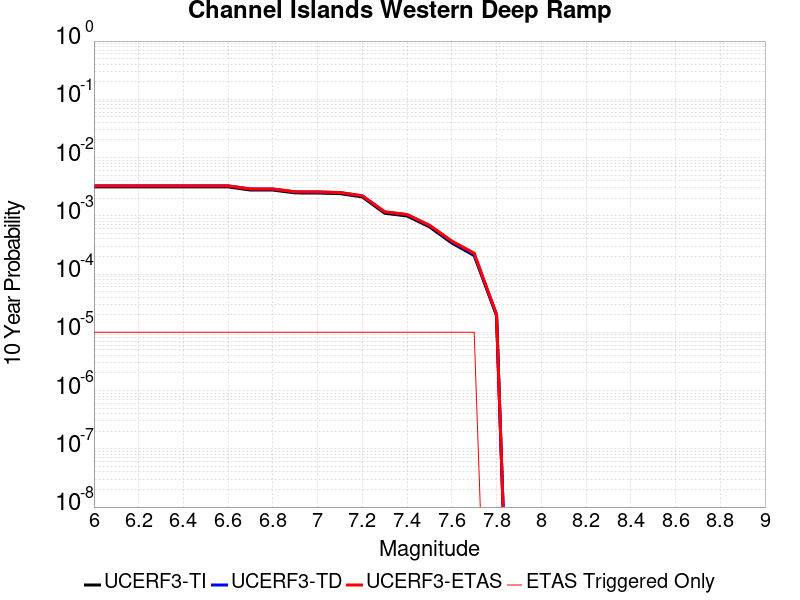 |

| Magnitude | 1 wk TI Prob | 1 wk TD Prob | 1 wk ETAS Prob | 1 wk ETAS/TD Gain | 1 wk ETAS Triggered Only | 1 mo TI Prob | 1 mo TD Prob | 1 mo ETAS Prob | 1 mo ETAS/TD Gain | 1 mo ETAS Triggered Only | 1 yr TI Prob | 1 yr TD Prob | 1 yr ETAS Prob | 1 yr ETAS/TD Gain | 1 yr ETAS Triggered Only | 10 yr TI Prob | 10 yr TD Prob | 10 yr ETAS Prob | 10 yr ETAS/TD Gain | 10 yr ETAS Triggered Only |
|-----|-----|-----|-----|-----|-----|-----|-----|-----|-----|-----|-----|-----|-----|-----|-----|-----|-----|-----|-----|-----|
| 6.0 | 6.0213506E-6 | 6.2549975E-6 | 6.2549975E-6 | 1.0 | 0.0 | 2.5805533E-5 | 2.6806882E-5 | 2.6806882E-5 | 1.0 | 0.0 | 3.1413708E-4 | 3.2632938E-4 | 3.2632938E-4 | 1.0 | 0.0 | 0.0031369338 | 0.0032589433 | 0.0032689108 | 1.0030584 | 1.0E-5 |
| 6.1 | 6.0213506E-6 | 6.2549975E-6 | 6.2549975E-6 | 1.0 | 0.0 | 2.5805533E-5 | 2.6806882E-5 | 2.6806882E-5 | 1.0 | 0.0 | 3.1413708E-4 | 3.2632938E-4 | 3.2632938E-4 | 1.0 | 0.0 | 0.0031369338 | 0.0032589433 | 0.0032689108 | 1.0030584 | 1.0E-5 |
| 6.2 | 6.0213506E-6 | 6.2549975E-6 | 6.2549975E-6 | 1.0 | 0.0 | 2.5805533E-5 | 2.6806882E-5 | 2.6806882E-5 | 1.0 | 0.0 | 3.1413708E-4 | 3.2632938E-4 | 3.2632938E-4 | 1.0 | 0.0 | 0.0031369338 | 0.0032589433 | 0.0032689108 | 1.0030584 | 1.0E-5 |
| 6.3 | 6.0213506E-6 | 6.2549975E-6 | 6.2549975E-6 | 1.0 | 0.0 | 2.5805533E-5 | 2.6806882E-5 | 2.6806882E-5 | 1.0 | 0.0 | 3.1413708E-4 | 3.2632938E-4 | 3.2632938E-4 | 1.0 | 0.0 | 0.0031369338 | 0.0032589433 | 0.0032689108 | 1.0030584 | 1.0E-5 |
| 6.4 | 6.0213506E-6 | 6.2549975E-6 | 6.2549975E-6 | 1.0 | 0.0 | 2.5805533E-5 | 2.6806882E-5 | 2.6806882E-5 | 1.0 | 0.0 | 3.1413708E-4 | 3.2632938E-4 | 3.2632938E-4 | 1.0 | 0.0 | 0.0031369338 | 0.0032589433 | 0.0032689108 | 1.0030584 | 1.0E-5 |
| 6.5 | 6.0213506E-6 | 6.2549975E-6 | 6.2549975E-6 | 1.0 | 0.0 | 2.5805533E-5 | 2.6806882E-5 | 2.6806882E-5 | 1.0 | 0.0 | 3.1413708E-4 | 3.2632938E-4 | 3.2632938E-4 | 1.0 | 0.0 | 0.0031369338 | 0.0032589433 | 0.0032689108 | 1.0030584 | 1.0E-5 |
| 6.6 | 6.0213506E-6 | 6.2549975E-6 | 6.2549975E-6 | 1.0 | 0.0 | 2.5805533E-5 | 2.6806882E-5 | 2.6806882E-5 | 1.0 | 0.0 | 3.1413708E-4 | 3.2632938E-4 | 3.2632938E-4 | 1.0 | 0.0 | 0.0031369338 | 0.0032589433 | 0.0032689108 | 1.0030584 | 1.0E-5 |
| 6.7 | 5.313309E-6 | 5.5253577E-6 | 5.5253577E-6 | 1.0 | 0.0 | 2.2771126E-5 | 2.3679913E-5 | 2.3679913E-5 | 1.0 | 0.0 | 2.772032E-4 | 2.8826887E-4 | 2.8826887E-4 | 1.0 | 0.0 | 0.0027685766 | 0.0028793528 | 0.002889324 | 1.003463 | 1.0E-5 |
| 6.8 | 5.313309E-6 | 5.5253577E-6 | 5.5253577E-6 | 1.0 | 0.0 | 2.2771126E-5 | 2.3679913E-5 | 2.3679913E-5 | 1.0 | 0.0 | 2.772032E-4 | 2.8826887E-4 | 2.8826887E-4 | 1.0 | 0.0 | 0.0027685766 | 0.0028793528 | 0.002889324 | 1.003463 | 1.0E-5 |
| 6.9 | 4.744377E-6 | 4.9395385E-6 | 4.9395385E-6 | 1.0 | 0.0 | 2.0332885E-5 | 2.11693E-5 | 2.11693E-5 | 1.0 | 0.0 | 2.4752476E-4 | 2.5770947E-4 | 2.5770947E-4 | 1.0 | 0.0 | 0.0024724922 | 0.0025744736 | 0.0025844479 | 1.0038743 | 1.0E-5 |
| 7.0 | 4.722209E-6 | 4.9165806E-6 | 4.9165806E-6 | 1.0 | 0.0 | 2.0237881E-5 | 2.1070911E-5 | 2.1070911E-5 | 1.0 | 0.0 | 2.4636835E-4 | 2.5651188E-4 | 2.5651188E-4 | 1.0 | 0.0 | 0.002460954 | 0.0025625252 | 0.0025724997 | 1.0038924 | 1.0E-5 |
| 7.1 | 4.611174E-6 | 4.8015145E-6 | 4.8015145E-6 | 1.0 | 0.0 | 1.9762025E-5 | 2.0577778E-5 | 2.0577778E-5 | 1.0 | 0.0 | 2.4057609E-4 | 2.5050936E-4 | 2.5050936E-4 | 1.0 | 0.0 | 0.002403158 | 0.0025026368 | 0.0025126117 | 1.0039858 | 1.0E-5 |
| 7.2 | 4.043994E-6 | 4.2121196E-6 | 4.2121196E-6 | 1.0 | 0.0 | 1.7331287E-5 | 1.8051836E-5 | 1.8051836E-5 | 1.0 | 0.0 | 2.10988E-4 | 2.1976251E-4 | 2.1976251E-4 | 1.0 | 0.0 | 0.002107878 | 0.0021958028 | 0.0022057807 | 1.0045441 | 1.0E-5 |
| 7.3 | 2.1233036E-6 | 2.2298468E-6 | 2.2298468E-6 | 1.0 | 0.0 | 9.099841E-6 | 9.556452E-6 | 9.556452E-6 | 1.0 | 0.0 | 1.1078493E-4 | 1.1634364E-4 | 1.1634364E-4 | 1.0 | 0.0 | 0.0011072971 | 0.0011628328 | 0.0011728213 | 1.0085897 | 1.0E-5 |
| 7.4 | 1.9051884E-6 | 2.001551E-6 | 2.001551E-6 | 1.0 | 0.0 | 8.165067E-6 | 8.5780475E-6 | 8.5780475E-6 | 1.0 | 0.0 | 9.940516E-5 | 1.0443278E-4 | 1.0443278E-4 | 1.0 | 0.0 | 9.93607E-4 | 0.0010438423 | 0.0010538319 | 1.00957 | 1.0E-5 |
| 7.5 | 1.2408497E-6 | 1.3039191E-6 | 1.3039191E-6 | 1.0 | 0.0 | 5.317916E-6 | 5.588213E-6 | 5.588213E-6 | 1.0 | 0.0 | 6.4743705E-5 | 6.803439E-5 | 6.803439E-5 | 1.0 | 0.0 | 6.4724847E-4 | 6.801378E-4 | 6.90131E-4 | 1.0146929 | 1.0E-5 |
| 7.6 | 6.5440025E-7 | 6.88691E-7 | 6.88691E-7 | 1.0 | 0.0 | 2.8045695E-6 | 2.9515295E-6 | 2.9515295E-6 | 1.0 | 0.0 | 3.4145098E-5 | 3.5934292E-5 | 3.5934292E-5 | 1.0 | 0.0 | 3.4139853E-4 | 3.5928623E-4 | 3.6928264E-4 | 1.027823 | 1.0E-5 |
| 7.7 | 3.985963E-7 | 4.1931946E-7 | 4.1931946E-7 | 1.0 | 0.0 | 1.7082689E-6 | 1.7970822E-6 | 1.7970822E-6 | 1.0 | 0.0 | 2.0797976E-5 | 2.1879268E-5 | 2.1879268E-5 | 1.0 | 0.0 | 2.0796029E-4 | 2.187723E-4 | 2.2877012E-4 | 1.0456996 | 1.0E-5 |
| 7.8 | 3.706329E-8 | 3.859264E-8 | 3.859264E-8 | 1.0 | 0.0 | 1.5884267E-7 | 1.6539701E-7 | 1.6539701E-7 | 1.0 | 0.0 | 1.9339077E-6 | 2.013707E-6 | 2.013707E-6 | 1.0 | 0.0 | 1.933891E-5 | 2.0136898E-5 | 2.0136898E-5 | 1.0 | 0.0 |

## Elysian Park (Upper)
*[(top)](#table-of-contents)*

| 1 Week | 1 Month | 1 Year | 10 Year |
|-----|-----|-----|-----|
|  |  |  |  |

| Magnitude | 1 wk TI Prob | 1 wk TD Prob | 1 wk ETAS Prob | 1 wk ETAS/TD Gain | 1 wk ETAS Triggered Only | 1 mo TI Prob | 1 mo TD Prob | 1 mo ETAS Prob | 1 mo ETAS/TD Gain | 1 mo ETAS Triggered Only | 1 yr TI Prob | 1 yr TD Prob | 1 yr ETAS Prob | 1 yr ETAS/TD Gain | 1 yr ETAS Triggered Only | 10 yr TI Prob | 10 yr TD Prob | 10 yr ETAS Prob | 10 yr ETAS/TD Gain | 10 yr ETAS Triggered Only |
|-----|-----|-----|-----|-----|-----|-----|-----|-----|-----|-----|-----|-----|-----|-----|-----|-----|-----|-----|-----|-----|
| 6.0 | 3.1876025E-5 | 3.7039532E-5 | 3.7039532E-5 | 1.0 | 0.0 | 1.3660437E-4 | 1.5873392E-4 | 1.5873392E-4 | 1.0 | 0.0 | 0.0016618895 | 0.0019313111 | 0.0019412917 | 1.0051678 | 1.0E-5 | 0.016495159 | 0.019191828 | 0.019211445 | 1.0010221 | 2.0E-5 |
| 6.1 | 3.1876025E-5 | 3.7039532E-5 | 3.7039532E-5 | 1.0 | 0.0 | 1.3660437E-4 | 1.5873392E-4 | 1.5873392E-4 | 1.0 | 0.0 | 0.0016618895 | 0.0019313111 | 0.0019412917 | 1.0051678 | 1.0E-5 | 0.016495159 | 0.019191828 | 0.019211445 | 1.0010221 | 2.0E-5 |
| 6.2 | 3.1876025E-5 | 3.7039532E-5 | 3.7039532E-5 | 1.0 | 0.0 | 1.3660437E-4 | 1.5873392E-4 | 1.5873392E-4 | 1.0 | 0.0 | 0.0016618895 | 0.0019313111 | 0.0019412917 | 1.0051678 | 1.0E-5 | 0.016495159 | 0.019191828 | 0.019211445 | 1.0010221 | 2.0E-5 |
| 6.3 | 3.1876025E-5 | 3.7039532E-5 | 3.7039532E-5 | 1.0 | 0.0 | 1.3660437E-4 | 1.5873392E-4 | 1.5873392E-4 | 1.0 | 0.0 | 0.0016618895 | 0.0019313111 | 0.0019412917 | 1.0051678 | 1.0E-5 | 0.016495159 | 0.019191828 | 0.019211445 | 1.0010221 | 2.0E-5 |
| 6.4 | 1.9273462E-5 | 2.1204127E-5 | 2.1204127E-5 | 1.0 | 0.0 | 8.259794E-5 | 9.087264E-5 | 9.087264E-5 | 1.0 | 0.0 | 0.001005166 | 0.0011059863 | 0.0011059863 | 1.0 | 0.0 | 0.010006315 | 0.011021685 | 0.011031575 | 1.0008973 | 1.0E-5 |
| 6.5 | 1.9273462E-5 | 2.1204127E-5 | 2.1204127E-5 | 1.0 | 0.0 | 8.259794E-5 | 9.087264E-5 | 9.087264E-5 | 1.0 | 0.0 | 0.001005166 | 0.0011059863 | 0.0011059863 | 1.0 | 0.0 | 0.010006315 | 0.011021685 | 0.011031575 | 1.0008973 | 1.0E-5 |
| 6.6 | 9.813258E-6 | 9.666116E-6 | 9.666116E-6 | 1.0 | 0.0 | 4.205614E-5 | 4.1425592E-5 | 4.1425592E-5 | 1.0 | 0.0 | 5.119132E-4 | 5.0424715E-4 | 5.0424715E-4 | 1.0 | 0.0 | 0.005107356 | 0.0050317533 | 0.0050317533 | 1.0 | 0.0 |
| 6.7 | 9.801478E-6 | 9.653685E-6 | 9.653685E-6 | 1.0 | 0.0 | 4.2005657E-5 | 4.1372317E-5 | 4.1372317E-5 | 1.0 | 0.0 | 5.112989E-4 | 5.035988E-4 | 5.035988E-4 | 1.0 | 0.0 | 0.0051012407 | 0.0050252997 | 0.0050252997 | 1.0 | 0.0 |
| 6.8 | 8.102489E-6 | 7.773414E-6 | 7.773414E-6 | 1.0 | 0.0 | 3.4724493E-5 | 3.3314234E-5 | 3.3314234E-5 | 1.0 | 0.0 | 4.2268867E-4 | 4.0553027E-4 | 4.0553027E-4 | 1.0 | 0.0 | 0.004218856 | 0.004048397 | 0.004048397 | 1.0 | 0.0 |
| 6.9 | 6.08275E-6 | 5.4816974E-6 | 5.4816974E-6 | 1.0 | 0.0 | 2.6068668E-5 | 2.3492783E-5 | 2.3492783E-5 | 1.0 | 0.0 | 3.173398E-4 | 2.8598786E-4 | 2.8598786E-4 | 1.0 | 0.0 | 0.0031688702 | 0.0028562758 | 0.0028562758 | 1.0 | 0.0 |
| 7.0 | 5.5995934E-6 | 4.983003E-6 | 4.983003E-6 | 1.0 | 0.0 | 2.3998036E-5 | 2.1355554E-5 | 2.1355554E-5 | 1.0 | 0.0 | 2.9213692E-4 | 2.5997352E-4 | 2.5997352E-4 | 1.0 | 0.0 | 0.0029175316 | 0.0025967613 | 0.0025967613 | 1.0 | 0.0 |
| 7.1 | 4.709881E-6 | 4.0875825E-6 | 4.0875825E-6 | 1.0 | 0.0 | 2.0185047E-5 | 1.7518096E-5 | 1.7518096E-5 | 1.0 | 0.0 | 2.4572524E-4 | 2.1326235E-4 | 2.1326235E-4 | 1.0 | 0.0 | 0.002454537 | 0.0021306183 | 0.0021306183 | 1.0 | 0.0 |
| 7.2 | 3.6063436E-6 | 2.9780829E-6 | 2.9780829E-6 | 1.0 | 0.0 | 1.5455667E-5 | 1.2763151E-5 | 1.2763151E-5 | 1.0 | 0.0 | 1.881565E-4 | 1.5538039E-4 | 1.5538039E-4 | 1.0 | 0.0 | 0.0018799726 | 0.0015527287 | 0.0015527287 | 1.0 | 0.0 |
| 7.3 | 2.471135E-6 | 2.095552E-6 | 2.095552E-6 | 1.0 | 0.0 | 1.0590536E-5 | 8.980906E-6 | 8.980906E-6 | 1.0 | 0.0 | 1.2893214E-4 | 1.09337125E-4 | 1.09337125E-4 | 1.0 | 0.0 | 0.0012885736 | 0.0010928405 | 0.0010928405 | 1.0 | 0.0 |
| 7.4 | 1.163943E-6 | 1.0275575E-6 | 1.0275575E-6 | 1.0 | 0.0 | 4.988318E-6 | 4.40381E-6 | 4.40381E-6 | 1.0 | 0.0 | 6.0731076E-5 | 5.3615102E-5 | 5.3615102E-5 | 1.0 | 0.0 | 6.071448E-4 | 5.360246E-4 | 5.360246E-4 | 1.0 | 0.0 |
| 7.5 | 4.99459E-7 | 4.9178306E-7 | 4.9178306E-7 | 1.0 | 0.0 | 2.140537E-6 | 2.10764E-6 | 2.10764E-6 | 1.0 | 0.0 | 2.6060725E-5 | 2.5660232E-5 | 2.5660232E-5 | 1.0 | 0.0 | 2.605767E-4 | 2.5657425E-4 | 2.5657425E-4 | 1.0 | 0.0 |
| 7.6 | 2.4667852E-7 | 2.4779692E-7 | 2.4779692E-7 | 1.0 | 0.0 | 1.0571932E-6 | 1.0619864E-6 | 1.0619864E-6 | 1.0 | 0.0 | 1.2871251E-5 | 1.2929611E-5 | 1.2929611E-5 | 1.0 | 0.0 | 1.2870505E-4 | 1.2928895E-4 | 1.2928895E-4 | 1.0 | 0.0 |
| 7.7 | 8.2312795E-8 | 7.38718E-8 | 7.38718E-8 | 1.0 | 0.0 | 3.527691E-7 | 3.165934E-7 | 3.165934E-7 | 1.0 | 0.0 | 4.294955E-6 | 3.854519E-6 | 3.854519E-6 | 1.0 | 0.0 | 4.2948723E-5 | 3.854464E-5 | 3.854464E-5 | 1.0 | 0.0 |
| 7.8 | 2.7819295E-8 | 1.7571217E-8 | 1.7571217E-8 | 1.0 | 0.0 | 1.1922555E-7 | 7.5305216E-8 | 7.5305216E-8 | 1.0 | 0.0 | 1.45157E-6 | 9.168408E-7 | 9.168408E-7 | 1.0 | 0.0 | 1.45156055E-5 | 9.168385E-6 | 9.168385E-6 | 1.0 | 0.0 |

## Earthquake Valley (No  Extension)
*[(top)](#table-of-contents)*

| 1 Week | 1 Month | 1 Year | 10 Year |
|-----|-----|-----|-----|
|  |  |  | 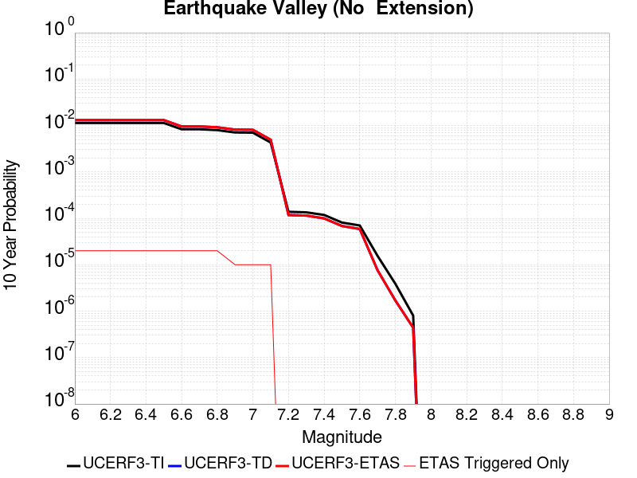 |

| Magnitude | 1 wk TI Prob | 1 wk TD Prob | 1 wk ETAS Prob | 1 wk ETAS/TD Gain | 1 wk ETAS Triggered Only | 1 mo TI Prob | 1 mo TD Prob | 1 mo ETAS Prob | 1 mo ETAS/TD Gain | 1 mo ETAS Triggered Only | 1 yr TI Prob | 1 yr TD Prob | 1 yr ETAS Prob | 1 yr ETAS/TD Gain | 1 yr ETAS Triggered Only | 10 yr TI Prob | 10 yr TD Prob | 10 yr ETAS Prob | 10 yr ETAS/TD Gain | 10 yr ETAS Triggered Only |
|-----|-----|-----|-----|-----|-----|-----|-----|-----|-----|-----|-----|-----|-----|-----|-----|-----|-----|-----|-----|-----|
| 6.0 | 2.1859703E-5 | 2.520046E-5 | 2.520046E-5 | 1.0 | 0.0 | 9.3681076E-5 | 1.0799832E-4 | 1.0799832E-4 | 1.0 | 0.0 | 0.0011399703 | 0.0013142314 | 0.0013242182 | 1.007599 | 1.0E-5 | 0.011341401 | 0.013078954 | 0.0130986925 | 1.0015092 | 2.0E-5 |
| 6.1 | 2.1859703E-5 | 2.520046E-5 | 2.520046E-5 | 1.0 | 0.0 | 9.3681076E-5 | 1.0799832E-4 | 1.0799832E-4 | 1.0 | 0.0 | 0.0011399703 | 0.0013142314 | 0.0013242182 | 1.007599 | 1.0E-5 | 0.011341401 | 0.013078954 | 0.0130986925 | 1.0015092 | 2.0E-5 |
| 6.2 | 2.1859703E-5 | 2.520046E-5 | 2.520046E-5 | 1.0 | 0.0 | 9.3681076E-5 | 1.0799832E-4 | 1.0799832E-4 | 1.0 | 0.0 | 0.0011399703 | 0.0013142314 | 0.0013242182 | 1.007599 | 1.0E-5 | 0.011341401 | 0.013078954 | 0.0130986925 | 1.0015092 | 2.0E-5 |
| 6.3 | 2.1859703E-5 | 2.520046E-5 | 2.520046E-5 | 1.0 | 0.0 | 9.3681076E-5 | 1.0799832E-4 | 1.0799832E-4 | 1.0 | 0.0 | 0.0011399703 | 0.0013142314 | 0.0013242182 | 1.007599 | 1.0E-5 | 0.011341401 | 0.013078954 | 0.0130986925 | 1.0015092 | 2.0E-5 |
| 6.4 | 2.1859703E-5 | 2.520046E-5 | 2.520046E-5 | 1.0 | 0.0 | 9.3681076E-5 | 1.0799832E-4 | 1.0799832E-4 | 1.0 | 0.0 | 0.0011399703 | 0.0013142314 | 0.0013242182 | 1.007599 | 1.0E-5 | 0.011341401 | 0.013078954 | 0.0130986925 | 1.0015092 | 2.0E-5 |
| 6.5 | 2.1859703E-5 | 2.520046E-5 | 2.520046E-5 | 1.0 | 0.0 | 9.3681076E-5 | 1.0799832E-4 | 1.0799832E-4 | 1.0 | 0.0 | 0.0011399703 | 0.0013142314 | 0.0013242182 | 1.007599 | 1.0E-5 | 0.011341401 | 0.013078954 | 0.0130986925 | 1.0015092 | 2.0E-5 |
| 6.6 | 1.597E-5 | 1.8357787E-5 | 1.8357787E-5 | 1.0 | 0.0 | 6.8441055E-5 | 7.8674355E-5 | 7.8674355E-5 | 1.0 | 0.0 | 8.329513E-4 | 9.575266E-4 | 9.6751703E-4 | 1.0104336 | 1.0E-5 | 0.008298361 | 0.009542619 | 0.009562428 | 1.0020759 | 2.0E-5 |
| 6.7 | 1.597E-5 | 1.8357787E-5 | 1.8357787E-5 | 1.0 | 0.0 | 6.8441055E-5 | 7.8674355E-5 | 7.8674355E-5 | 1.0 | 0.0 | 8.329513E-4 | 9.575266E-4 | 9.6751703E-4 | 1.0104336 | 1.0E-5 | 0.008298361 | 0.009542619 | 0.009562428 | 1.0020759 | 2.0E-5 |
| 6.8 | 1.5315149E-5 | 1.7603543E-5 | 1.7603543E-5 | 1.0 | 0.0 | 6.5634704E-5 | 7.544206E-5 | 7.544206E-5 | 1.0 | 0.0 | 7.988095E-4 | 9.1820676E-4 | 9.281976E-4 | 1.0108808 | 1.0E-5 | 0.007959441 | 0.00915267 | 0.009172488 | 1.0021652 | 2.0E-5 |
| 6.9 | 1.3634728E-5 | 1.5677122E-5 | 1.5677122E-5 | 1.0 | 0.0 | 5.8433237E-5 | 6.71864E-5 | 6.71864E-5 | 1.0 | 0.0 | 7.1119244E-4 | 8.1776956E-4 | 8.1776956E-4 | 1.0 | 0.0 | 0.007089207 | 0.008155676 | 0.008165594 | 1.0012162 | 1.0E-5 |
| 7.0 | 1.3496271E-5 | 1.5519143E-5 | 1.5519143E-5 | 1.0 | 0.0 | 5.783988E-5 | 6.650938E-5 | 6.650938E-5 | 1.0 | 0.0 | 7.03973E-4 | 8.0953294E-4 | 8.0953294E-4 | 1.0 | 0.0 | 0.007017471 | 0.00807391 | 0.008083829 | 1.0012286 | 1.0E-5 |
| 7.1 | 8.242798E-6 | 9.473406E-6 | 9.473406E-6 | 1.0 | 0.0 | 3.53258E-5 | 4.0600058E-5 | 4.0600058E-5 | 1.0 | 0.0 | 4.300067E-4 | 4.942607E-4 | 4.942607E-4 | 1.0 | 0.0 | 0.004291756 | 0.0049381913 | 0.004948142 | 1.002015 | 1.0E-5 |
| 7.2 | 2.6506527E-7 | 2.2562841E-7 | 2.2562841E-7 | 1.0 | 0.0 | 1.1359936E-6 | 9.669785E-7 | 9.669785E-7 | 1.0 | 0.0 | 1.3830633E-5 | 1.1772905E-5 | 1.1772905E-5 | 1.0 | 0.0 | 1.3829772E-4 | 1.17723226E-4 | 1.17723226E-4 | 1.0 | 0.0 |
| 7.3 | 2.5810488E-7 | 2.195794E-7 | 2.195794E-7 | 1.0 | 0.0 | 1.1061633E-6 | 9.410543E-7 | 9.410543E-7 | 1.0 | 0.0 | 1.3467455E-5 | 1.14572795E-5 | 1.14572795E-5 | 1.0 | 0.0 | 1.3466639E-4 | 1.145673E-4 | 1.145673E-4 | 1.0 | 0.0 |
| 7.4 | 2.2676066E-7 | 1.9112998E-7 | 1.9112998E-7 | 1.0 | 0.0 | 9.71831E-7 | 8.191283E-7 | 8.191283E-7 | 1.0 | 0.0 | 1.1831979E-5 | 9.972845E-6 | 9.972845E-6 | 1.0 | 0.0 | 1.1831349E-4 | 9.972437E-5 | 9.972437E-5 | 1.0 | 0.0 |
| 7.5 | 1.5553917E-7 | 1.3114038E-7 | 1.3114038E-7 | 1.0 | 0.0 | 6.6659624E-7 | 5.6203015E-7 | 5.6203015E-7 | 1.0 | 0.0 | 8.115779E-6 | 6.8426975E-6 | 6.8426975E-6 | 1.0 | 0.0 | 8.115482E-5 | 6.8425084E-5 | 6.8425084E-5 | 1.0 | 0.0 |
| 7.6 | 1.3448629E-7 | 1.1290136E-7 | 1.1290136E-7 | 1.0 | 0.0 | 5.7636964E-7 | 4.838629E-7 | 4.838629E-7 | 1.0 | 0.0 | 7.017278E-6 | 5.8910173E-6 | 5.8910173E-6 | 1.0 | 0.0 | 7.0170565E-5 | 5.8908823E-5 | 5.8908823E-5 | 1.0 | 0.0 |
| 7.7 | 2.9719402E-8 | 1.4584987E-8 | 1.4584987E-8 | 1.0 | 0.0 | 1.2736886E-7 | 6.2507084E-8 | 6.2507084E-8 | 1.0 | 0.0 | 1.5507147E-6 | 7.6102356E-7 | 7.6102356E-7 | 1.0 | 0.0 | 1.550704E-5 | 7.6102147E-6 | 7.6102147E-6 | 1.0 | 0.0 |
| 7.8 | 7.4390196E-9 | 3.2508414E-9 | 3.2508414E-9 | 1.0 | 0.0 | 3.1881513E-8 | 1.3932177E-8 | 1.3932177E-8 | 1.0 | 0.0 | 3.8815733E-7 | 1.6962424E-7 | 1.6962424E-7 | 1.0 | 0.0 | 3.8815665E-6 | 1.6962414E-6 | 1.6962414E-6 | 1.0 | 0.0 |
| 7.9 | 1.5373532E-9 | 8.4413176E-10 | 8.4413176E-10 | 1.0 | 0.0 | 6.5886567E-9 | 3.6177075E-9 | 3.6177075E-9 | 1.0 | 0.0 | 8.021689E-8 | 4.404559E-8 | 4.404559E-8 | 1.0 | 0.0 | 8.0216864E-7 | 4.4045586E-7 | 4.4045586E-7 | 1.0 | 0.0 |

## Simi-Santa Rosa
*[(top)](#table-of-contents)*

| 1 Week | 1 Month | 1 Year | 10 Year |
|-----|-----|-----|-----|
|  |  |  |  |

| Magnitude | 1 wk TI Prob | 1 wk TD Prob | 1 wk ETAS Prob | 1 wk ETAS/TD Gain | 1 wk ETAS Triggered Only | 1 mo TI Prob | 1 mo TD Prob | 1 mo ETAS Prob | 1 mo ETAS/TD Gain | 1 mo ETAS Triggered Only | 1 yr TI Prob | 1 yr TD Prob | 1 yr ETAS Prob | 1 yr ETAS/TD Gain | 1 yr ETAS Triggered Only | 10 yr TI Prob | 10 yr TD Prob | 10 yr ETAS Prob | 10 yr ETAS/TD Gain | 10 yr ETAS Triggered Only |
|-----|-----|-----|-----|-----|-----|-----|-----|-----|-----|-----|-----|-----|-----|-----|-----|-----|-----|-----|-----|-----|
| 6.0 | 2.198912E-5 | 2.2277061E-5 | 2.2277061E-5 | 1.0 | 0.0 | 9.4235686E-5 | 9.546988E-5 | 1.0546892E-4 | 1.1047351 | 1.0E-5 | 0.0011467156 | 0.0011617698 | 0.0011717582 | 1.0085976 | 1.0E-5 | 0.011408163 | 0.011561411 | 0.01158118 | 1.0017099 | 2.0E-5 |
| 6.1 | 2.198912E-5 | 2.2277061E-5 | 2.2277061E-5 | 1.0 | 0.0 | 9.4235686E-5 | 9.546988E-5 | 1.0546892E-4 | 1.1047351 | 1.0E-5 | 0.0011467156 | 0.0011617698 | 0.0011717582 | 1.0085976 | 1.0E-5 | 0.011408163 | 0.011561411 | 0.01158118 | 1.0017099 | 2.0E-5 |
| 6.2 | 1.69983E-5 | 1.6669812E-5 | 1.6669812E-5 | 1.0 | 0.0 | 7.284782E-5 | 7.1440256E-5 | 8.1439546E-5 | 1.1399671 | 1.0E-5 | 8.865613E-4 | 8.694672E-4 | 8.7945856E-4 | 1.0114913 | 1.0E-5 | 0.008830327 | 0.008663576 | 0.008683402 | 1.0022885 | 2.0E-5 |
| 6.3 | 1.69983E-5 | 1.6669812E-5 | 1.6669812E-5 | 1.0 | 0.0 | 7.284782E-5 | 7.1440256E-5 | 8.1439546E-5 | 1.1399671 | 1.0E-5 | 8.865613E-4 | 8.694672E-4 | 8.7945856E-4 | 1.0114913 | 1.0E-5 | 0.008830327 | 0.008663576 | 0.008683402 | 1.0022885 | 2.0E-5 |
| 6.4 | 1.4666188E-5 | 1.4053627E-5 | 1.4053627E-5 | 1.0 | 0.0 | 6.285358E-5 | 6.0228576E-5 | 7.022797E-5 | 1.1660241 | 1.0E-5 | 7.6497364E-4 | 7.330611E-4 | 7.430538E-4 | 1.0136315 | 1.0E-5 | 0.0076234564 | 0.0073089055 | 0.0073287594 | 1.0027164 | 2.0E-5 |
| 6.5 | 1.4666188E-5 | 1.4053627E-5 | 1.4053627E-5 | 1.0 | 0.0 | 6.285358E-5 | 6.0228576E-5 | 7.022797E-5 | 1.1660241 | 1.0E-5 | 7.6497364E-4 | 7.330611E-4 | 7.430538E-4 | 1.0136315 | 1.0E-5 | 0.0076234564 | 0.0073089055 | 0.0073287594 | 1.0027164 | 2.0E-5 |
| 6.6 | 1.4377586E-5 | 1.3730646E-5 | 1.3730646E-5 | 1.0 | 0.0 | 6.1616774E-5 | 5.8844438E-5 | 6.8843845E-5 | 1.1699296 | 1.0E-5 | 7.4992597E-4 | 7.162204E-4 | 7.262132E-4 | 1.0139521 | 1.0E-5 | 0.007474003 | 0.0071415897 | 0.007161447 | 1.0027804 | 2.0E-5 |
| 6.7 | 1.3881404E-5 | 1.320858E-5 | 1.320858E-5 | 1.0 | 0.0 | 5.9490372E-5 | 5.660711E-5 | 6.6606546E-5 | 1.1766462 | 1.0E-5 | 7.240546E-4 | 6.889984E-4 | 6.9899147E-4 | 1.0145038 | 1.0E-5 | 0.007217 | 0.006871072 | 0.0068909344 | 1.0028907 | 2.0E-5 |
| 6.8 | 1.0176516E-5 | 9.154907E-6 | 9.154907E-6 | 1.0 | 0.0 | 4.3612912E-5 | 3.923482E-5 | 4.923443E-5 | 1.2548656 | 1.0E-5 | 5.308578E-4 | 4.7759584E-4 | 4.8759105E-4 | 1.0209283 | 1.0E-5 | 0.0052959146 | 0.0047673276 | 0.00477728 | 1.0020876 | 1.0E-5 |
| 6.9 | 9.699797E-6 | 8.775444E-6 | 8.775444E-6 | 1.0 | 0.0 | 4.15699E-5 | 3.7608595E-5 | 4.760822E-5 | 1.2658867 | 1.0E-5 | 5.05996E-4 | 4.578049E-4 | 4.6780033E-4 | 1.0218334 | 1.0E-5 | 0.005048454 | 0.004570236 | 0.0045801904 | 1.0021781 | 1.0E-5 |
| 7.0 | 7.4049476E-6 | 6.559884E-6 | 6.559884E-6 | 1.0 | 0.0 | 3.1735104E-5 | 2.8113554E-5 | 3.8113274E-5 | 1.3556902 | 1.0E-5 | 3.8630638E-4 | 3.4224143E-4 | 3.52238E-4 | 1.0292091 | 1.0E-5 | 0.0038563553 | 0.0034183862 | 0.0034283518 | 1.0029154 | 1.0E-5 |
| 7.1 | 3.873439E-6 | 2.7597737E-6 | 2.7597737E-6 | 1.0 | 0.0 | 1.6600346E-5 | 1.1827549E-5 | 1.1827549E-5 | 1.0 | 0.0 | 2.0209046E-4 | 1.4399113E-4 | 1.4399113E-4 | 1.0 | 0.0 | 0.0020190678 | 0.0014390019 | 0.0014390019 | 1.0 | 0.0 |
| 7.2 | 3.417706E-6 | 2.3678895E-6 | 2.3678895E-6 | 1.0 | 0.0 | 1.4647229E-5 | 1.0148059E-5 | 1.0148059E-5 | 1.0 | 0.0 | 1.7831543E-4 | 1.2354583E-4 | 1.2354583E-4 | 1.0 | 0.0 | 0.0017817242 | 0.0012347938 | 0.0012347938 | 1.0 | 0.0 |
| 7.3 | 1.90225E-6 | 1.4075586E-6 | 1.4075586E-6 | 1.0 | 0.0 | 8.152474E-6 | 6.03238E-6 | 6.03238E-6 | 1.0 | 0.0 | 9.9251854E-5 | 7.344177E-5 | 7.344177E-5 | 1.0 | 0.0 | 9.920754E-4 | 7.3417724E-4 | 7.3417724E-4 | 1.0 | 0.0 |
| 7.4 | 1.5170556E-6 | 1.1026477E-6 | 1.1026477E-6 | 1.0 | 0.0 | 6.5016507E-6 | 4.7256244E-6 | 4.7256244E-6 | 1.0 | 0.0 | 7.915472E-5 | 5.753297E-5 | 5.753297E-5 | 1.0 | 0.0 | 7.9126534E-4 | 5.7518185E-4 | 5.7518185E-4 | 1.0 | 0.0 |
| 7.5 | 1.178732E-6 | 8.536725E-7 | 8.536725E-7 | 1.0 | 0.0 | 5.0516987E-6 | 3.6585911E-6 | 3.6585911E-6 | 1.0 | 0.0 | 6.1502695E-5 | 4.4542445E-5 | 4.4542445E-5 | 1.0 | 0.0 | 6.148568E-4 | 4.4533613E-4 | 4.4533613E-4 | 1.0 | 0.0 |
| 7.6 | 6.8722386E-7 | 4.794698E-7 | 4.794698E-7 | 1.0 | 0.0 | 2.9452417E-6 | 2.0548691E-6 | 2.0548691E-6 | 1.0 | 0.0 | 3.5857727E-5 | 2.5017745E-5 | 2.5017745E-5 | 1.0 | 0.0 | 3.5851944E-4 | 2.501494E-4 | 2.501494E-4 | 1.0 | 0.0 |
| 7.7 | 5.5126515E-7 | 3.674588E-7 | 3.674588E-7 | 1.0 | 0.0 | 2.3625628E-6 | 1.5748224E-6 | 1.5748224E-6 | 1.0 | 0.0 | 2.8763823E-5 | 1.9173296E-5 | 1.9173296E-5 | 1.0 | 0.0 | 2.87601E-4 | 1.9171652E-4 | 1.9171652E-4 | 1.0 | 0.0 |
| 7.8 | 3.3860243E-7 | 2.008463E-7 | 2.008463E-7 | 1.0 | 0.0 | 1.4511525E-6 | 8.607696E-7 | 8.607696E-7 | 1.0 | 0.0 | 1.7667637E-5 | 1.047982E-5 | 1.047982E-5 | 1.0 | 0.0 | 1.7666233E-4 | 1.0479331E-4 | 1.0479331E-4 | 1.0 | 0.0 |
| 7.9 | 2.7955386E-7 | 1.4657186E-7 | 1.4657186E-7 | 1.0 | 0.0 | 1.1980875E-6 | 6.2816497E-7 | 6.2816497E-7 | 1.0 | 0.0 | 1.4586617E-5 | 7.647883E-6 | 7.647883E-6 | 1.0 | 0.0 | 1.458566E-4 | 7.647623E-5 | 7.647623E-5 | 1.0 | 0.0 |
| 8.0 | 5.6259015E-8 | 3.3362383E-8 | 3.3362383E-8 | 1.0 | 0.0 | 2.4111003E-7 | 1.4298163E-7 | 1.4298163E-7 | 1.0 | 0.0 | 2.9355108E-6 | 1.7408001E-6 | 1.7408001E-6 | 1.0 | 0.0 | 2.935472E-5 | 1.740788E-5 | 1.740788E-5 | 1.0 | 0.0 |

## Sierra Madre
*[(top)](#table-of-contents)*

| 1 Week | 1 Month | 1 Year | 10 Year |
|-----|-----|-----|-----|
|  |  |  | 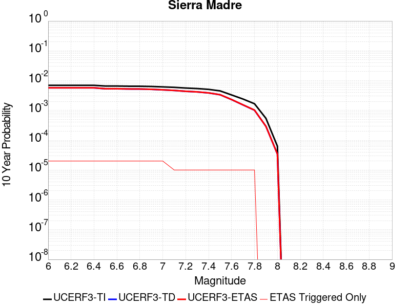 |

| Magnitude | 1 wk TI Prob | 1 wk TD Prob | 1 wk ETAS Prob | 1 wk ETAS/TD Gain | 1 wk ETAS Triggered Only | 1 mo TI Prob | 1 mo TD Prob | 1 mo ETAS Prob | 1 mo ETAS/TD Gain | 1 mo ETAS Triggered Only | 1 yr TI Prob | 1 yr TD Prob | 1 yr ETAS Prob | 1 yr ETAS/TD Gain | 1 yr ETAS Triggered Only | 10 yr TI Prob | 10 yr TD Prob | 10 yr ETAS Prob | 10 yr ETAS/TD Gain | 10 yr ETAS Triggered Only |
|-----|-----|-----|-----|-----|-----|-----|-----|-----|-----|-----|-----|-----|-----|-----|-----|-----|-----|-----|-----|-----|
| 6.0 | 1.3379373E-5 | 1.1002111E-5 | 1.1002111E-5 | 1.0 | 0.0 | 5.7338908E-5 | 4.715106E-5 | 4.715106E-5 | 1.0 | 0.0 | 6.978776E-4 | 5.7391444E-4 | 5.839087E-4 | 1.0174142 | 1.0E-5 | 0.0069569005 | 0.005724687 | 0.0057445727 | 1.0034736 | 2.0E-5 |
| 6.1 | 1.3379373E-5 | 1.1002111E-5 | 1.1002111E-5 | 1.0 | 0.0 | 5.7338908E-5 | 4.715106E-5 | 4.715106E-5 | 1.0 | 0.0 | 6.978776E-4 | 5.7391444E-4 | 5.839087E-4 | 1.0174142 | 1.0E-5 | 0.0069569005 | 0.005724687 | 0.0057445727 | 1.0034736 | 2.0E-5 |
| 6.2 | 1.3379373E-5 | 1.1002111E-5 | 1.1002111E-5 | 1.0 | 0.0 | 5.7338908E-5 | 4.715106E-5 | 4.715106E-5 | 1.0 | 0.0 | 6.978776E-4 | 5.7391444E-4 | 5.839087E-4 | 1.0174142 | 1.0E-5 | 0.0069569005 | 0.005724687 | 0.0057445727 | 1.0034736 | 2.0E-5 |
| 6.3 | 1.3379373E-5 | 1.1002111E-5 | 1.1002111E-5 | 1.0 | 0.0 | 5.7338908E-5 | 4.715106E-5 | 4.715106E-5 | 1.0 | 0.0 | 6.978776E-4 | 5.7391444E-4 | 5.839087E-4 | 1.0174142 | 1.0E-5 | 0.0069569005 | 0.005724687 | 0.0057445727 | 1.0034736 | 2.0E-5 |
| 6.4 | 1.3379373E-5 | 1.1002111E-5 | 1.1002111E-5 | 1.0 | 0.0 | 5.7338908E-5 | 4.715106E-5 | 4.715106E-5 | 1.0 | 0.0 | 6.978776E-4 | 5.7391444E-4 | 5.839087E-4 | 1.0174142 | 1.0E-5 | 0.0069569005 | 0.005724687 | 0.0057445727 | 1.0034736 | 2.0E-5 |
| 6.5 | 1.26563245E-5 | 1.023154E-5 | 1.023154E-5 | 1.0 | 0.0 | 5.4240263E-5 | 4.3848726E-5 | 4.3848726E-5 | 1.0 | 0.0 | 6.601751E-4 | 5.3372857E-4 | 5.4372323E-4 | 1.0187261 | 1.0E-5 | 0.006582173 | 0.005324789 | 0.0053446824 | 1.003736 | 2.0E-5 |
| 6.6 | 1.26563245E-5 | 1.023154E-5 | 1.023154E-5 | 1.0 | 0.0 | 5.4240263E-5 | 4.3848726E-5 | 4.3848726E-5 | 1.0 | 0.0 | 6.601751E-4 | 5.3372857E-4 | 5.4372323E-4 | 1.0187261 | 1.0E-5 | 0.006582173 | 0.005324789 | 0.0053446824 | 1.003736 | 2.0E-5 |
| 6.7 | 1.2502474E-5 | 1.0067679E-5 | 1.0067679E-5 | 1.0 | 0.0 | 5.3580934E-5 | 4.3146487E-5 | 4.3146487E-5 | 1.0 | 0.0 | 6.521526E-4 | 5.251829E-4 | 5.3517765E-4 | 1.0190309 | 1.0E-5 | 0.0065024206 | 0.005239737 | 0.005259632 | 1.0037969 | 2.0E-5 |
| 6.8 | 1.2454966E-5 | 1.0019962E-5 | 1.0019962E-5 | 1.0 | 0.0 | 5.3377335E-5 | 4.2941996E-5 | 4.2941996E-5 | 1.0 | 0.0 | 6.4967526E-4 | 5.2269443E-4 | 5.326892E-4 | 1.0191216 | 1.0E-5 | 0.006477792 | 0.005214969 | 0.005234865 | 1.003815 | 2.0E-5 |
| 6.9 | 1.2225574E-5 | 9.793931E-6 | 9.793931E-6 | 1.0 | 0.0 | 5.2394265E-5 | 4.1973322E-5 | 4.1973322E-5 | 1.0 | 0.0 | 6.3771347E-4 | 5.109064E-4 | 5.209013E-4 | 1.0195631 | 1.0E-5 | 0.006358865 | 0.0050976346 | 0.005117533 | 1.0039034 | 2.0E-5 |
| 7.0 | 1.182946E-5 | 9.400459E-6 | 9.400459E-6 | 1.0 | 0.0 | 5.06967E-5 | 4.0287065E-5 | 4.0287065E-5 | 1.0 | 0.0 | 6.1705755E-4 | 4.9038563E-4 | 5.0038076E-4 | 1.0203822 | 1.0E-5 | 0.006153469 | 0.004893347 | 0.004913249 | 1.0040672 | 2.0E-5 |
| 7.1 | 1.14369095E-5 | 8.987441E-6 | 8.987441E-6 | 1.0 | 0.0 | 4.9014405E-5 | 3.8517042E-5 | 3.8517042E-5 | 1.0 | 0.0 | 5.9658696E-4 | 4.6884507E-4 | 4.7884037E-4 | 1.021319 | 1.0E-5 | 0.005949879 | 0.004678865 | 0.0046888185 | 1.0021273 | 1.0E-5 |
| 7.2 | 1.0836419E-5 | 8.400803E-6 | 8.400803E-6 | 1.0 | 0.0 | 4.644097E-5 | 3.6002948E-5 | 3.6002948E-5 | 1.0 | 0.0 | 5.652721E-4 | 4.3824865E-4 | 4.4824427E-4 | 1.0228081 | 1.0E-5 | 0.0056383642 | 0.0043741413 | 0.0043840976 | 1.0022762 | 1.0E-5 |
| 7.3 | 1.0403439E-5 | 8.022045E-6 | 8.022045E-6 | 1.0 | 0.0 | 4.4585406E-5 | 3.4379744E-5 | 3.4379744E-5 | 1.0 | 0.0 | 5.426921E-4 | 4.184939E-4 | 4.2848973E-4 | 1.0238853 | 1.0E-5 | 0.005413687 | 0.0041773533 | 0.004187312 | 1.0023838 | 1.0E-5 |
| 7.4 | 9.768864E-6 | 7.415638E-6 | 7.415638E-6 | 1.0 | 0.0 | 4.186589E-5 | 3.178092E-5 | 3.178092E-5 | 1.0 | 0.0 | 5.09598E-4 | 3.868649E-4 | 3.9686105E-4 | 1.0258389 | 1.0E-5 | 0.0050843097 | 0.0038622064 | 0.0038721678 | 1.0025792 | 1.0E-5 |
| 7.5 | 8.687089E-6 | 6.4511987E-6 | 6.4511987E-6 | 1.0 | 0.0 | 3.722985E-5 | 2.7647708E-5 | 2.7647708E-5 | 1.0 | 0.0 | 4.5317915E-4 | 3.365597E-4 | 3.4655633E-4 | 1.0297024 | 1.0E-5 | 0.004522561 | 0.0033607872 | 0.0033707535 | 1.0029655 | 1.0E-5 |
| 7.6 | 6.3506063E-6 | 4.431258E-6 | 4.431258E-6 | 1.0 | 0.0 | 2.72166E-5 | 1.8990968E-5 | 1.8990968E-5 | 1.0 | 0.0 | 3.3131172E-4 | 2.3119076E-4 | 2.4118845E-4 | 1.0432444 | 1.0E-5 | 0.003308182 | 0.0023097275 | 0.0023197043 | 1.0043195 | 1.0E-5 |
| 7.7 | 4.62223E-6 | 2.9338423E-6 | 2.9338423E-6 | 1.0 | 0.0 | 1.9809406E-5 | 1.257355E-5 | 1.257355E-5 | 1.0 | 0.0 | 2.4115283E-4 | 1.5307224E-4 | 1.630707E-4 | 1.0653186 | 1.0E-5 | 0.0024089129 | 0.001529869 | 0.0015398536 | 1.0065265 | 1.0E-5 |
| 7.8 | 3.2145008E-6 | 1.950051E-6 | 1.950051E-6 | 1.0 | 0.0 | 1.3776359E-5 | 8.357335E-6 | 8.357335E-6 | 1.0 | 0.0 | 1.6771426E-4 | 1.0174581E-4 | 1.117448E-4 | 1.0982741 | 1.0E-5 | 0.0016758774 | 0.0010171367 | 0.0010271266 | 1.0098215 | 1.0E-5 |
| 7.9 | 1.0391769E-6 | 5.604388E-7 | 5.604388E-7 | 1.0 | 0.0 | 4.4536077E-6 | 2.4018784E-6 | 2.4018784E-6 | 1.0 | 0.0 | 5.4221324E-5 | 2.9242481E-5 | 2.9242481E-5 | 1.0 | 0.0 | 5.4208096E-4 | 2.9238674E-4 | 2.9238674E-4 | 1.0 | 0.0 |
| 8.0 | 1.210983E-7 | 6.615224E-8 | 6.615224E-8 | 1.0 | 0.0 | 5.1899264E-7 | 2.8350954E-7 | 2.8350954E-7 | 1.0 | 0.0 | 6.3187167E-6 | 3.4517234E-6 | 3.4517234E-6 | 1.0 | 0.0 | 6.318537E-5 | 3.4516717E-5 | 3.4516717E-5 | 1.0 | 0.0 |

## Los Alamos 2011 CFM
*[(top)](#table-of-contents)*

| 1 Week | 1 Month | 1 Year | 10 Year |
|-----|-----|-----|-----|
|  |  |  |  |

| Magnitude | 1 wk TI Prob | 1 wk TD Prob | 1 wk ETAS Prob | 1 wk ETAS/TD Gain | 1 wk ETAS Triggered Only | 1 mo TI Prob | 1 mo TD Prob | 1 mo ETAS Prob | 1 mo ETAS/TD Gain | 1 mo ETAS Triggered Only | 1 yr TI Prob | 1 yr TD Prob | 1 yr ETAS Prob | 1 yr ETAS/TD Gain | 1 yr ETAS Triggered Only | 10 yr TI Prob | 10 yr TD Prob | 10 yr ETAS Prob | 10 yr ETAS/TD Gain | 10 yr ETAS Triggered Only |
|-----|-----|-----|-----|-----|-----|-----|-----|-----|-----|-----|-----|-----|-----|-----|-----|-----|-----|-----|-----|-----|
| 6.0 | 4.6284417E-6 | 4.7518183E-6 | 4.7518183E-6 | 1.0 | 0.0 | 1.9836029E-5 | 2.0364787E-5 | 2.0364787E-5 | 1.0 | 0.0 | 2.4147688E-4 | 2.4791484E-4 | 2.4791484E-4 | 1.0 | 0.0 | 0.0024121467 | 0.002476557 | 0.002486532 | 1.0040278 | 1.0E-5 |
| 6.1 | 4.6284417E-6 | 4.7518183E-6 | 4.7518183E-6 | 1.0 | 0.0 | 1.9836029E-5 | 2.0364787E-5 | 2.0364787E-5 | 1.0 | 0.0 | 2.4147688E-4 | 2.4791484E-4 | 2.4791484E-4 | 1.0 | 0.0 | 0.0024121467 | 0.002476557 | 0.002486532 | 1.0040278 | 1.0E-5 |
| 6.2 | 4.6284417E-6 | 4.7518183E-6 | 4.7518183E-6 | 1.0 | 0.0 | 1.9836029E-5 | 2.0364787E-5 | 2.0364787E-5 | 1.0 | 0.0 | 2.4147688E-4 | 2.4791484E-4 | 2.4791484E-4 | 1.0 | 0.0 | 0.0024121467 | 0.002476557 | 0.002486532 | 1.0040278 | 1.0E-5 |
| 6.3 | 4.6284417E-6 | 4.7518183E-6 | 4.7518183E-6 | 1.0 | 0.0 | 1.9836029E-5 | 2.0364787E-5 | 2.0364787E-5 | 1.0 | 0.0 | 2.4147688E-4 | 2.4791484E-4 | 2.4791484E-4 | 1.0 | 0.0 | 0.0024121467 | 0.002476557 | 0.002486532 | 1.0040278 | 1.0E-5 |
| 6.4 | 4.6284417E-6 | 4.7518183E-6 | 4.7518183E-6 | 1.0 | 0.0 | 1.9836029E-5 | 2.0364787E-5 | 2.0364787E-5 | 1.0 | 0.0 | 2.4147688E-4 | 2.4791484E-4 | 2.4791484E-4 | 1.0 | 0.0 | 0.0024121467 | 0.002476557 | 0.002486532 | 1.0040278 | 1.0E-5 |
| 6.5 | 4.6284417E-6 | 4.7518183E-6 | 4.7518183E-6 | 1.0 | 0.0 | 1.9836029E-5 | 2.0364787E-5 | 2.0364787E-5 | 1.0 | 0.0 | 2.4147688E-4 | 2.4791484E-4 | 2.4791484E-4 | 1.0 | 0.0 | 0.0024121467 | 0.002476557 | 0.002486532 | 1.0040278 | 1.0E-5 |
| 6.6 | 4.6284417E-6 | 4.7518183E-6 | 4.7518183E-6 | 1.0 | 0.0 | 1.9836029E-5 | 2.0364787E-5 | 2.0364787E-5 | 1.0 | 0.0 | 2.4147688E-4 | 2.4791484E-4 | 2.4791484E-4 | 1.0 | 0.0 | 0.0024121467 | 0.002476557 | 0.002486532 | 1.0040278 | 1.0E-5 |
| 6.7 | 4.062321E-6 | 4.1664257E-6 | 4.1664257E-6 | 1.0 | 0.0 | 1.7409831E-5 | 1.7855995E-5 | 1.7855995E-5 | 1.0 | 0.0 | 2.1194408E-4 | 2.1737657E-4 | 2.1737657E-4 | 1.0 | 0.0 | 0.0021174205 | 0.002171789 | 0.0021817675 | 1.0045944 | 1.0E-5 |
| 6.8 | 4.062321E-6 | 4.1664257E-6 | 4.1664257E-6 | 1.0 | 0.0 | 1.7409831E-5 | 1.7855995E-5 | 1.7855995E-5 | 1.0 | 0.0 | 2.1194408E-4 | 2.1737657E-4 | 2.1737657E-4 | 1.0 | 0.0 | 0.0021174205 | 0.002171789 | 0.0021817675 | 1.0045944 | 1.0E-5 |
| 6.9 | 3.2936077E-6 | 3.3730212E-6 | 3.3730212E-6 | 1.0 | 0.0 | 1.4115385E-5 | 1.445573E-5 | 1.445573E-5 | 1.0 | 0.0 | 1.7184127E-4 | 1.7598523E-4 | 1.7598523E-4 | 1.0 | 0.0 | 0.0017170844 | 0.0017585513 | 0.0017685337 | 1.0056765 | 1.0E-5 |
| 7.0 | 3.1687898E-6 | 3.244877E-6 | 3.244877E-6 | 1.0 | 0.0 | 1.3580457E-5 | 1.3906547E-5 | 1.3906547E-5 | 1.0 | 0.0 | 1.6532952E-4 | 1.6929998E-4 | 1.6929998E-4 | 1.0 | 0.0 | 0.0016520657 | 0.0016918016 | 0.0017017847 | 1.0059009 | 1.0E-5 |
| 7.1 | 2.9379228E-6 | 3.0073836E-6 | 3.0073836E-6 | 1.0 | 0.0 | 1.25910365E-5 | 1.2888729E-5 | 1.2888729E-5 | 1.0 | 0.0 | 1.5328509E-4 | 1.5690987E-4 | 1.5690987E-4 | 1.0 | 0.0 | 0.001531794 | 0.00156808 | 0.0015780643 | 1.0063672 | 1.0E-5 |
| 7.2 | 2.0020686E-6 | 2.0416712E-6 | 2.0416712E-6 | 1.0 | 0.0 | 8.580266E-6 | 8.74999E-6 | 8.74999E-6 | 1.0 | 0.0 | 1.0445973E-4 | 1.0652597E-4 | 1.0652597E-4 | 1.0 | 0.0 | 0.0010441064 | 0.0010647535 | 0.0010747429 | 1.0093819 | 1.0E-5 |
| 7.3 | 1.7364243E-6 | 1.7679173E-6 | 1.7679173E-6 | 1.0 | 0.0 | 7.441797E-6 | 7.576766E-6 | 7.576766E-6 | 1.0 | 0.0 | 9.0600115E-5 | 9.224326E-5 | 9.224326E-5 | 1.0 | 0.0 | 9.0563187E-4 | 9.2205283E-4 | 9.320436E-4 | 1.0108354 | 1.0E-5 |
| 7.4 | 1.5718434E-6 | 1.5983519E-6 | 1.5983519E-6 | 1.0 | 0.0 | 6.7364545E-6 | 6.8500617E-6 | 6.8500617E-6 | 1.0 | 0.0 | 8.201325E-5 | 8.339634E-5 | 8.339634E-5 | 1.0 | 0.0 | 8.198299E-4 | 8.3365344E-4 | 8.4364513E-4 | 1.0119854 | 1.0E-5 |
| 7.5 | 1.3841119E-6 | 1.4043101E-6 | 1.4043101E-6 | 1.0 | 0.0 | 5.9318945E-6 | 6.018458E-6 | 6.018458E-6 | 1.0 | 0.0 | 7.221842E-5 | 7.327229E-5 | 7.327229E-5 | 1.0 | 0.0 | 7.2194956E-4 | 7.324842E-4 | 7.4247684E-4 | 1.0136422 | 1.0E-5 |
| 7.6 | 1.0843726E-6 | 1.0934668E-6 | 1.0934668E-6 | 1.0 | 0.0 | 4.647303E-6 | 4.686278E-6 | 4.686278E-6 | 1.0 | 0.0 | 5.6579443E-5 | 5.7053967E-5 | 5.7053967E-5 | 1.0 | 0.0 | 5.656504E-4 | 5.703958E-4 | 5.803901E-4 | 1.0175217 | 1.0E-5 |
| 7.7 | 5.544814E-7 | 5.502E-7 | 5.502E-7 | 1.0 | 0.0 | 2.3763469E-6 | 2.3579978E-6 | 2.3579978E-6 | 1.0 | 0.0 | 2.8931638E-5 | 2.8708248E-5 | 2.8708248E-5 | 1.0 | 0.0 | 2.8927872E-4 | 2.8704555E-4 | 2.8704555E-4 | 1.0 | 0.0 |
| 7.8 | 2.0707465E-7 | 1.9778966E-7 | 1.9778966E-7 | 1.0 | 0.0 | 8.874625E-7 | 8.476697E-7 | 8.476697E-7 | 1.0 | 0.0 | 1.08048025E-5 | 1.032033E-5 | 1.032033E-5 | 1.0 | 0.0 | 1.0804277E-4 | 1.0319855E-4 | 1.0319855E-4 | 1.0 | 0.0 |
| 7.9 | 3.9821284E-8 | 3.4332025E-8 | 3.4332025E-8 | 1.0 | 0.0 | 1.7066264E-7 | 1.4713724E-7 | 1.4713724E-7 | 1.0 | 0.0 | 2.0778157E-6 | 1.7913944E-6 | 1.7913944E-6 | 1.0 | 0.0 | 2.0777963E-5 | 1.7913806E-5 | 1.7913806E-5 | 1.0 | 0.0 |
| 8.0 | 7.880441E-11 | 8.235512E-11 | 8.235512E-11 | 1.0 | 0.0 | 3.3773329E-10 | 3.5295045E-10 | 3.5295045E-10 | 1.0 | 0.0 | 4.1119033E-9 | 4.2971724E-9 | 4.2971724E-9 | 1.0 | 0.0 | 4.1119034E-8 | 4.297172E-8 | 4.297172E-8 | 1.0 | 0.0 |

## Santa Susana East (connector)
*[(top)](#table-of-contents)*

| 1 Week | 1 Month | 1 Year | 10 Year |
|-----|-----|-----|-----|
| 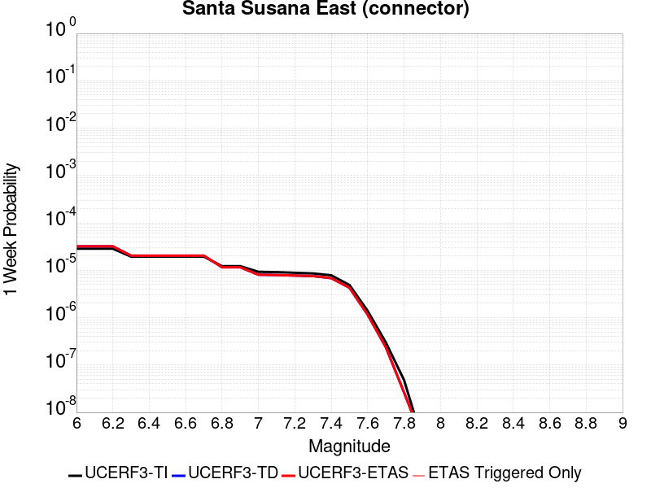 |  |  | 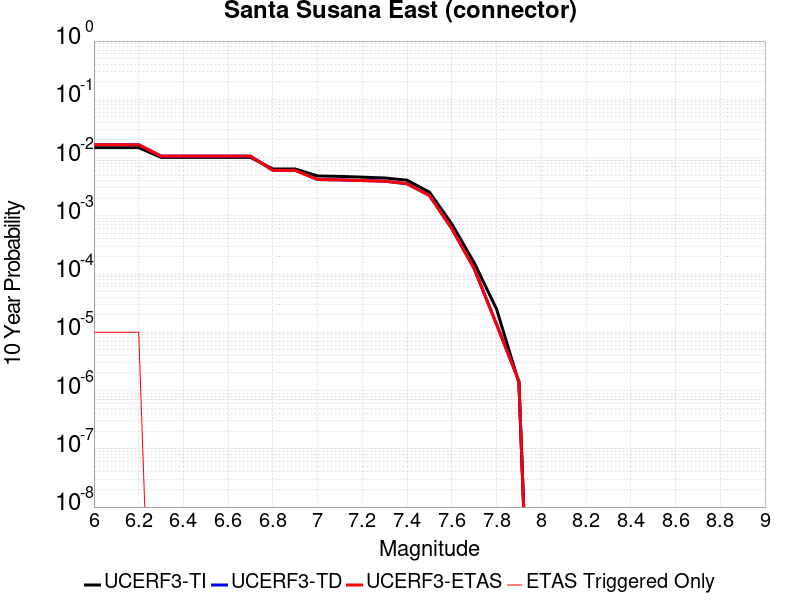 |

| Magnitude | 1 wk TI Prob | 1 wk TD Prob | 1 wk ETAS Prob | 1 wk ETAS/TD Gain | 1 wk ETAS Triggered Only | 1 mo TI Prob | 1 mo TD Prob | 1 mo ETAS Prob | 1 mo ETAS/TD Gain | 1 mo ETAS Triggered Only | 1 yr TI Prob | 1 yr TD Prob | 1 yr ETAS Prob | 1 yr ETAS/TD Gain | 1 yr ETAS Triggered Only | 10 yr TI Prob | 10 yr TD Prob | 10 yr ETAS Prob | 10 yr ETAS/TD Gain | 10 yr ETAS Triggered Only |
|-----|-----|-----|-----|-----|-----|-----|-----|-----|-----|-----|-----|-----|-----|-----|-----|-----|-----|-----|-----|-----|
| 6.0 | 2.858397E-5 | 3.202459E-5 | 3.202459E-5 | 1.0 | 0.0 | 1.2249697E-4 | 1.372426E-4 | 1.372426E-4 | 1.0 | 0.0 | 0.0014903803 | 0.0016699297 | 0.0016699297 | 1.0 | 0.0 | 0.014804244 | 0.016600922 | 0.016610755 | 1.0005924 | 1.0E-5 |
| 6.1 | 2.858397E-5 | 3.202459E-5 | 3.202459E-5 | 1.0 | 0.0 | 1.2249697E-4 | 1.372426E-4 | 1.372426E-4 | 1.0 | 0.0 | 0.0014903803 | 0.0016699297 | 0.0016699297 | 1.0 | 0.0 | 0.014804244 | 0.016600922 | 0.016610755 | 1.0005924 | 1.0E-5 |
| 6.2 | 2.858397E-5 | 3.202459E-5 | 3.202459E-5 | 1.0 | 0.0 | 1.2249697E-4 | 1.372426E-4 | 1.372426E-4 | 1.0 | 0.0 | 0.0014903803 | 0.0016699297 | 0.0016699297 | 1.0 | 0.0 | 0.014804244 | 0.016600922 | 0.016610755 | 1.0005924 | 1.0E-5 |
| 6.3 | 1.943582E-5 | 2.0369158E-5 | 2.0369158E-5 | 1.0 | 0.0 | 8.329371E-5 | 8.729411E-5 | 8.729411E-5 | 1.0 | 0.0 | 0.001013629 | 0.0010623998 | 0.0010623998 | 1.0 | 0.0 | 0.010090181 | 0.010584643 | 0.010584643 | 1.0 | 0.0 |
| 6.4 | 1.943582E-5 | 2.0369158E-5 | 2.0369158E-5 | 1.0 | 0.0 | 8.329371E-5 | 8.729411E-5 | 8.729411E-5 | 1.0 | 0.0 | 0.001013629 | 0.0010623998 | 0.0010623998 | 1.0 | 0.0 | 0.010090181 | 0.010584643 | 0.010584643 | 1.0 | 0.0 |
| 6.5 | 1.943582E-5 | 2.0369158E-5 | 2.0369158E-5 | 1.0 | 0.0 | 8.329371E-5 | 8.729411E-5 | 8.729411E-5 | 1.0 | 0.0 | 0.001013629 | 0.0010623998 | 0.0010623998 | 1.0 | 0.0 | 0.010090181 | 0.010584643 | 0.010584643 | 1.0 | 0.0 |
| 6.6 | 1.943582E-5 | 2.0369158E-5 | 2.0369158E-5 | 1.0 | 0.0 | 8.329371E-5 | 8.729411E-5 | 8.729411E-5 | 1.0 | 0.0 | 0.001013629 | 0.0010623998 | 0.0010623998 | 1.0 | 0.0 | 0.010090181 | 0.010584643 | 0.010584643 | 1.0 | 0.0 |
| 6.7 | 1.9404439E-5 | 2.0356578E-5 | 2.0356578E-5 | 1.0 | 0.0 | 8.3159226E-5 | 8.7240194E-5 | 8.7240194E-5 | 1.0 | 0.0 | 0.0010119933 | 0.001061744 | 0.001061744 | 1.0 | 0.0 | 0.010073971 | 0.010578148 | 0.010578148 | 1.0 | 0.0 |
| 6.8 | 1.2217526E-5 | 1.1593805E-5 | 1.1593805E-5 | 1.0 | 0.0 | 5.2359774E-5 | 4.9686885E-5 | 4.9686885E-5 | 1.0 | 0.0 | 6.372938E-4 | 6.0478674E-4 | 6.0478674E-4 | 1.0 | 0.0 | 0.0063546924 | 0.006033456 | 0.006033456 | 1.0 | 0.0 |
| 6.9 | 1.2217526E-5 | 1.1593805E-5 | 1.1593805E-5 | 1.0 | 0.0 | 5.2359774E-5 | 4.9686885E-5 | 4.9686885E-5 | 1.0 | 0.0 | 6.372938E-4 | 6.0478674E-4 | 6.0478674E-4 | 1.0 | 0.0 | 0.0063546924 | 0.006033456 | 0.006033456 | 1.0 | 0.0 |
| 7.0 | 9.276017E-6 | 8.059524E-6 | 8.059524E-6 | 1.0 | 0.0 | 3.9753755E-5 | 3.4540375E-5 | 3.4540375E-5 | 1.0 | 0.0 | 4.8389446E-4 | 4.204514E-4 | 4.204514E-4 | 1.0 | 0.0 | 0.0048284214 | 0.0041972855 | 0.0041972855 | 1.0 | 0.0 |
| 7.1 | 9.130355E-6 | 7.942689E-6 | 7.942689E-6 | 1.0 | 0.0 | 3.9129503E-5 | 3.4039673E-5 | 3.4039673E-5 | 1.0 | 0.0 | 4.7629757E-4 | 4.1435764E-4 | 4.1435764E-4 | 1.0 | 0.0 | 0.00475278 | 0.0041365763 | 0.0041365763 | 1.0 | 0.0 |
| 7.2 | 8.851015E-6 | 7.74184E-6 | 7.74184E-6 | 1.0 | 0.0 | 3.7932372E-5 | 3.317891E-5 | 3.317891E-5 | 1.0 | 0.0 | 4.6172875E-4 | 4.0388177E-4 | 4.0388177E-4 | 1.0 | 0.0 | 0.0046077054 | 0.0040322007 | 0.0040322007 | 1.0 | 0.0 |
| 7.3 | 8.573006E-6 | 7.55055E-6 | 7.55055E-6 | 1.0 | 0.0 | 3.6740938E-5 | 3.235912E-5 | 3.235912E-5 | 1.0 | 0.0 | 4.472291E-4 | 3.9390445E-4 | 3.9390445E-4 | 1.0 | 0.0 | 0.004463301 | 0.00393278 | 0.00393278 | 1.0 | 0.0 |
| 7.4 | 7.852282E-6 | 6.8180075E-6 | 6.8180075E-6 | 1.0 | 0.0 | 3.36522E-5 | 2.9219722E-5 | 2.9219722E-5 | 1.0 | 0.0 | 4.096385E-4 | 3.5569505E-4 | 3.5569505E-4 | 1.0 | 0.0 | 0.0040888423 | 0.003551922 | 0.003551922 | 1.0 | 0.0 |
| 7.5 | 4.8869324E-6 | 4.2792326E-6 | 4.2792326E-6 | 1.0 | 0.0 | 2.0943828E-5 | 1.833945E-5 | 1.833945E-5 | 1.0 | 0.0 | 2.5496128E-4 | 2.2326158E-4 | 2.2326158E-4 | 1.0 | 0.0 | 0.0025466895 | 0.0022305371 | 0.0022305371 | 1.0 | 0.0 |
| 7.6 | 1.3894544E-6 | 1.1568486E-6 | 1.1568486E-6 | 1.0 | 0.0 | 5.954791E-6 | 4.9579144E-6 | 4.9579144E-6 | 1.0 | 0.0 | 7.249717E-5 | 6.0361155E-5 | 6.0361155E-5 | 1.0 | 0.0 | 7.247352E-4 | 6.0346944E-4 | 6.0346944E-4 | 1.0 | 0.0 |
| 7.7 | 2.9924632E-7 | 2.3720673E-7 | 2.3720673E-7 | 1.0 | 0.0 | 1.2824837E-6 | 1.0166E-6 | 1.0166E-6 | 1.0 | 0.0 | 1.5614127E-5 | 1.23770415E-5 | 1.23770415E-5 | 1.0 | 0.0 | 1.5613029E-4 | 1.2376424E-4 | 1.2376424E-4 | 1.0 | 0.0 |
| 7.8 | 4.8188564E-8 | 2.6328815E-8 | 2.6328815E-8 | 1.0 | 0.0 | 2.065224E-7 | 1.12837775E-7 | 1.12837775E-7 | 1.0 | 0.0 | 2.5144072E-6 | 1.3737991E-6 | 1.3737991E-6 | 1.0 | 0.0 | 2.5143789E-5 | 1.3737915E-5 | 1.3737915E-5 | 1.0 | 0.0 |
| 7.9 | 2.6127251E-9 | 2.7681977E-9 | 2.7681977E-9 | 1.0 | 0.0 | 1.1197393E-8 | 1.1863704E-8 | 1.1863704E-8 | 1.0 | 0.0 | 1.3632825E-7 | 1.4444059E-7 | 1.4444059E-7 | 1.0 | 0.0 | 1.3632817E-6 | 1.4444059E-6 | 1.4444059E-6 | 1.0 | 0.0 |

## Dog Valley
*[(top)](#table-of-contents)*

| 1 Week | 1 Month | 1 Year | 10 Year |
|-----|-----|-----|-----|
| 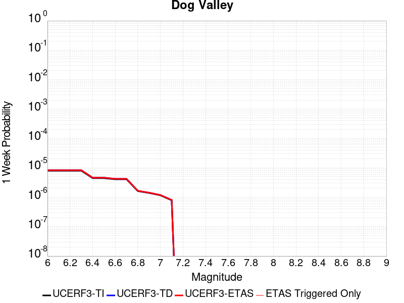 |  |  | 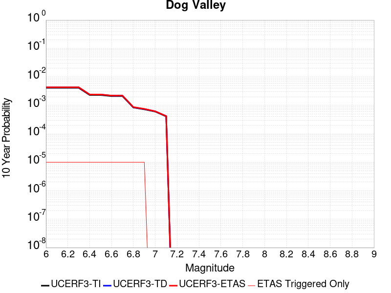 |

| Magnitude | 1 wk TI Prob | 1 wk TD Prob | 1 wk ETAS Prob | 1 wk ETAS/TD Gain | 1 wk ETAS Triggered Only | 1 mo TI Prob | 1 mo TD Prob | 1 mo ETAS Prob | 1 mo ETAS/TD Gain | 1 mo ETAS Triggered Only | 1 yr TI Prob | 1 yr TD Prob | 1 yr ETAS Prob | 1 yr ETAS/TD Gain | 1 yr ETAS Triggered Only | 10 yr TI Prob | 10 yr TD Prob | 10 yr ETAS Prob | 10 yr ETAS/TD Gain | 10 yr ETAS Triggered Only |
|-----|-----|-----|-----|-----|-----|-----|-----|-----|-----|-----|-----|-----|-----|-----|-----|-----|-----|-----|-----|-----|
| 6.0 | 7.949598E-6 | 8.275906E-6 | 8.275906E-6 | 1.0 | 0.0 | 3.4069257E-5 | 3.5467798E-5 | 4.5467445E-5 | 1.2819359 | 1.0E-5 | 4.1471425E-4 | 4.3175454E-4 | 4.4175022E-4 | 1.0231513 | 1.0E-5 | 0.0041394117 | 0.0043110875 | 0.0043210443 | 1.0023096 | 1.0E-5 |
| 6.1 | 7.949598E-6 | 8.275906E-6 | 8.275906E-6 | 1.0 | 0.0 | 3.4069257E-5 | 3.5467798E-5 | 4.5467445E-5 | 1.2819359 | 1.0E-5 | 4.1471425E-4 | 4.3175454E-4 | 4.4175022E-4 | 1.0231513 | 1.0E-5 | 0.0041394117 | 0.0043110875 | 0.0043210443 | 1.0023096 | 1.0E-5 |
| 6.2 | 7.949598E-6 | 8.275906E-6 | 8.275906E-6 | 1.0 | 0.0 | 3.4069257E-5 | 3.5467798E-5 | 4.5467445E-5 | 1.2819359 | 1.0E-5 | 4.1471425E-4 | 4.3175454E-4 | 4.4175022E-4 | 1.0231513 | 1.0E-5 | 0.0041394117 | 0.0043110875 | 0.0043210443 | 1.0023096 | 1.0E-5 |
| 6.3 | 7.949598E-6 | 8.275906E-6 | 8.275906E-6 | 1.0 | 0.0 | 3.4069257E-5 | 3.5467798E-5 | 4.5467445E-5 | 1.2819359 | 1.0E-5 | 4.1471425E-4 | 4.3175454E-4 | 4.4175022E-4 | 1.0231513 | 1.0E-5 | 0.0041394117 | 0.0043110875 | 0.0043210443 | 1.0023096 | 1.0E-5 |
| 6.4 | 4.462132E-6 | 4.6232517E-6 | 4.6232517E-6 | 1.0 | 0.0 | 1.9123283E-5 | 1.9813835E-5 | 2.9813637E-5 | 1.5046879 | 1.0E-5 | 2.328011E-4 | 2.4121568E-4 | 2.5121326E-4 | 1.0414467 | 1.0E-5 | 0.0023255737 | 0.0024104158 | 0.0024203917 | 1.0041387 | 1.0E-5 |
| 6.5 | 4.462132E-6 | 4.6232517E-6 | 4.6232517E-6 | 1.0 | 0.0 | 1.9123283E-5 | 1.9813835E-5 | 2.9813637E-5 | 1.5046879 | 1.0E-5 | 2.328011E-4 | 2.4121568E-4 | 2.5121326E-4 | 1.0414467 | 1.0E-5 | 0.0023255737 | 0.0024104158 | 0.0024203917 | 1.0041387 | 1.0E-5 |
| 6.6 | 4.074213E-6 | 4.2174543E-6 | 4.2174543E-6 | 1.0 | 0.0 | 1.7460794E-5 | 1.8074728E-5 | 2.8074548E-5 | 1.5532486 | 1.0E-5 | 2.1256444E-4 | 2.200464E-4 | 2.3004418E-4 | 1.045435 | 1.0E-5 | 0.0021236122 | 0.0021991467 | 0.0022091246 | 1.0045372 | 1.0E-5 |
| 6.7 | 4.074213E-6 | 4.2174543E-6 | 4.2174543E-6 | 1.0 | 0.0 | 1.7460794E-5 | 1.8074728E-5 | 2.8074548E-5 | 1.5532486 | 1.0E-5 | 2.1256444E-4 | 2.200464E-4 | 2.3004418E-4 | 1.045435 | 1.0E-5 | 0.0021236122 | 0.0021991467 | 0.0022091246 | 1.0045372 | 1.0E-5 |
| 6.8 | 1.6159543E-6 | 1.6503592E-6 | 1.6503592E-6 | 1.0 | 0.0 | 6.9255E-6 | 7.072952E-6 | 1.7072882E-5 | 2.413827 | 1.0E-5 | 8.43147E-5 | 8.611034E-5 | 9.610948E-5 | 1.1161201 | 1.0E-5 | 8.4282714E-4 | 8.6082396E-4 | 8.7081536E-4 | 1.0116068 | 1.0E-5 |
| 6.9 | 1.3952654E-6 | 1.4253038E-6 | 1.4253038E-6 | 1.0 | 0.0 | 5.9796953E-6 | 6.1084334E-6 | 1.6108372E-5 | 2.637071 | 1.0E-5 | 7.280036E-5 | 7.436813E-5 | 8.4367384E-5 | 1.1344562 | 1.0E-5 | 7.2776515E-4 | 7.434804E-4 | 7.5347297E-4 | 1.0134403 | 1.0E-5 |
| 7.0 | 1.1619308E-6 | 1.1869662E-6 | 1.1869662E-6 | 1.0 | 0.0 | 4.979694E-6 | 5.0869908E-6 | 5.0869908E-6 | 1.0 | 0.0 | 6.0626087E-5 | 6.19328E-5 | 6.19328E-5 | 1.0 | 0.0 | 6.060955E-4 | 6.1919907E-4 | 6.1919907E-4 | 1.0 | 0.0 |
| 7.1 | 7.8723247E-7 | 8.0470915E-7 | 8.0470915E-7 | 1.0 | 0.0 | 3.373849E-6 | 3.4487507E-6 | 3.4487507E-6 | 1.0 | 0.0 | 4.107584E-5 | 4.1988034E-5 | 4.1988034E-5 | 1.0 | 0.0 | 4.1068246E-4 | 4.198309E-4 | 4.198309E-4 | 1.0 | 0.0 |

## San Luis Range 2011 CFM
*[(top)](#table-of-contents)*

| 1 Week | 1 Month | 1 Year | 10 Year |
|-----|-----|-----|-----|
|  |  |  |  |

| Magnitude | 1 wk TI Prob | 1 wk TD Prob | 1 wk ETAS Prob | 1 wk ETAS/TD Gain | 1 wk ETAS Triggered Only | 1 mo TI Prob | 1 mo TD Prob | 1 mo ETAS Prob | 1 mo ETAS/TD Gain | 1 mo ETAS Triggered Only | 1 yr TI Prob | 1 yr TD Prob | 1 yr ETAS Prob | 1 yr ETAS/TD Gain | 1 yr ETAS Triggered Only | 10 yr TI Prob | 10 yr TD Prob | 10 yr ETAS Prob | 10 yr ETAS/TD Gain | 10 yr ETAS Triggered Only |
|-----|-----|-----|-----|-----|-----|-----|-----|-----|-----|-----|-----|-----|-----|-----|-----|-----|-----|-----|-----|-----|
| 6.0 | 8.8368415E-6 | 8.965548E-6 | 8.965548E-6 | 1.0 | 0.0 | 3.787163E-5 | 3.8423255E-5 | 3.8423255E-5 | 1.0 | 0.0 | 4.609895E-4 | 4.677106E-4 | 4.677106E-4 | 1.0 | 0.0 | 0.0046003438 | 0.0046680453 | 0.0046779984 | 1.0021322 | 1.0E-5 |
| 6.1 | 8.8368415E-6 | 8.965548E-6 | 8.965548E-6 | 1.0 | 0.0 | 3.787163E-5 | 3.8423255E-5 | 3.8423255E-5 | 1.0 | 0.0 | 4.609895E-4 | 4.677106E-4 | 4.677106E-4 | 1.0 | 0.0 | 0.0046003438 | 0.0046680453 | 0.0046779984 | 1.0021322 | 1.0E-5 |
| 6.2 | 8.8368415E-6 | 8.965548E-6 | 8.965548E-6 | 1.0 | 0.0 | 3.787163E-5 | 3.8423255E-5 | 3.8423255E-5 | 1.0 | 0.0 | 4.609895E-4 | 4.677106E-4 | 4.677106E-4 | 1.0 | 0.0 | 0.0046003438 | 0.0046680453 | 0.0046779984 | 1.0021322 | 1.0E-5 |
| 6.3 | 8.8368415E-6 | 8.965548E-6 | 8.965548E-6 | 1.0 | 0.0 | 3.787163E-5 | 3.8423255E-5 | 3.8423255E-5 | 1.0 | 0.0 | 4.609895E-4 | 4.677106E-4 | 4.677106E-4 | 1.0 | 0.0 | 0.0046003438 | 0.0046680453 | 0.0046779984 | 1.0021322 | 1.0E-5 |
| 6.4 | 3.9094193E-6 | 3.941245E-6 | 3.941245E-6 | 1.0 | 0.0 | 1.6754546E-5 | 1.6890941E-5 | 1.6890941E-5 | 1.0 | 0.0 | 2.039675E-4 | 2.0562808E-4 | 2.0562808E-4 | 1.0 | 0.0 | 0.0020378039 | 0.002054407 | 0.002054407 | 1.0 | 0.0 |
| 6.5 | 3.9094193E-6 | 3.941245E-6 | 3.941245E-6 | 1.0 | 0.0 | 1.6754546E-5 | 1.6890941E-5 | 1.6890941E-5 | 1.0 | 0.0 | 2.039675E-4 | 2.0562808E-4 | 2.0562808E-4 | 1.0 | 0.0 | 0.0020378039 | 0.002054407 | 0.002054407 | 1.0 | 0.0 |
| 6.6 | 3.0587726E-6 | 3.075422E-6 | 3.075422E-6 | 1.0 | 0.0 | 1.3108959E-5 | 1.3180314E-5 | 1.3180314E-5 | 1.0 | 0.0 | 1.595899E-4 | 1.6045863E-4 | 1.6045863E-4 | 1.0 | 0.0 | 0.0015947534 | 0.0016034397 | 0.0016034397 | 1.0 | 0.0 |
| 6.7 | 2.6160574E-6 | 2.625157E-6 | 2.625157E-6 | 1.0 | 0.0 | 1.1211626E-5 | 1.1250625E-5 | 1.1250625E-5 | 1.0 | 0.0 | 1.3649299E-4 | 1.369678E-4 | 1.369678E-4 | 1.0 | 0.0 | 0.0013640919 | 0.0013688401 | 0.0013688401 | 1.0 | 0.0 |
| 6.8 | 2.5110312E-6 | 2.518169E-6 | 2.518169E-6 | 1.0 | 0.0 | 1.0761518E-5 | 1.0792108E-5 | 1.0792108E-5 | 1.0 | 0.0 | 1.310136E-4 | 1.3138604E-4 | 1.3138604E-4 | 1.0 | 0.0 | 0.0013093639 | 0.0013130896 | 0.0013130896 | 1.0 | 0.0 |
| 6.9 | 1.8564405E-6 | 1.8525097E-6 | 1.8525097E-6 | 1.0 | 0.0 | 7.95615E-6 | 7.939303E-6 | 7.939303E-6 | 1.0 | 0.0 | 9.686181E-5 | 9.6656746E-5 | 9.6656746E-5 | 1.0 | 0.0 | 9.68196E-4 | 9.6614915E-4 | 9.6614915E-4 | 1.0 | 0.0 |
| 7.0 | 1.546127E-6 | 1.5369736E-6 | 1.5369736E-6 | 1.0 | 0.0 | 6.626242E-6 | 6.5870136E-6 | 6.5870136E-6 | 1.0 | 0.0 | 8.06715E-5 | 8.0193946E-5 | 8.0193946E-5 | 1.0 | 0.0 | 8.0642226E-4 | 8.0165075E-4 | 8.0165075E-4 | 1.0 | 0.0 |
| 7.1 | 1.3368208E-6 | 1.3235502E-6 | 1.3235502E-6 | 1.0 | 0.0 | 5.7292195E-6 | 5.672346E-6 | 5.672346E-6 | 1.0 | 0.0 | 6.975101E-5 | 6.905863E-5 | 6.905863E-5 | 1.0 | 0.0 | 6.972912E-4 | 6.9037214E-4 | 6.9037214E-4 | 1.0 | 0.0 |
| 7.2 | 1.0623363E-6 | 1.0454515E-6 | 1.0454515E-6 | 1.0 | 0.0 | 4.5528623E-6 | 4.480499E-6 | 4.480499E-6 | 1.0 | 0.0 | 5.5429686E-5 | 5.454871E-5 | 5.454871E-5 | 1.0 | 0.0 | 5.5415864E-4 | 5.453535E-4 | 5.453535E-4 | 1.0 | 0.0 |
| 7.3 | 7.831679E-7 | 7.72751E-7 | 7.72751E-7 | 1.0 | 0.0 | 3.3564295E-6 | 3.3117856E-6 | 3.3117856E-6 | 1.0 | 0.0 | 4.086376E-5 | 4.0320243E-5 | 4.0320243E-5 | 1.0 | 0.0 | 4.0856248E-4 | 4.0312944E-4 | 4.0312944E-4 | 1.0 | 0.0 |
| 7.4 | 5.9558846E-7 | 5.910736E-7 | 5.910736E-7 | 1.0 | 0.0 | 2.5525194E-6 | 2.5331701E-6 | 2.5331701E-6 | 1.0 | 0.0 | 3.107648E-5 | 3.084091E-5 | 3.084091E-5 | 1.0 | 0.0 | 3.1072134E-4 | 3.0836638E-4 | 3.0836638E-4 | 1.0 | 0.0 |
| 7.5 | 4.1616502E-7 | 4.1197126E-7 | 4.1197126E-7 | 1.0 | 0.0 | 1.7835631E-6 | 1.7655899E-6 | 1.7655899E-6 | 1.0 | 0.0 | 2.1714664E-5 | 2.1495845E-5 | 2.1495845E-5 | 1.0 | 0.0 | 2.1712543E-4 | 2.1493771E-4 | 2.1493771E-4 | 1.0 | 0.0 |
| 7.6 | 2.3816014E-7 | 2.337718E-7 | 2.337718E-7 | 1.0 | 0.0 | 1.0206859E-6 | 1.0018788E-6 | 1.0018788E-6 | 1.0 | 0.0 | 1.242678E-5 | 1.21978055E-5 | 1.21978055E-5 | 1.0 | 0.0 | 1.2426086E-4 | 1.2197138E-4 | 1.2197138E-4 | 1.0 | 0.0 |
| 7.7 | 9.918777E-8 | 9.3872394E-8 | 9.3872394E-8 | 1.0 | 0.0 | 4.2509038E-7 | 4.023102E-7 | 4.023102E-7 | 1.0 | 0.0 | 5.1754632E-6 | 4.8981155E-6 | 4.8981155E-6 | 1.0 | 0.0 | 5.1753424E-5 | 4.898008E-5 | 4.898008E-5 | 1.0 | 0.0 |
| 7.8 | 3.4982556E-8 | 2.9690542E-8 | 2.9690542E-8 | 1.0 | 0.0 | 1.4992524E-7 | 1.2724517E-7 | 1.2724517E-7 | 1.0 | 0.0 | 1.8253382E-6 | 1.549209E-6 | 1.549209E-6 | 1.0 | 0.0 | 1.8253233E-5 | 1.5491982E-5 | 1.5491982E-5 | 1.0 | 0.0 |
| 7.9 | 1.6624908E-8 | 1.1480696E-8 | 1.1480696E-8 | 1.0 | 0.0 | 7.12496E-8 | 4.920299E-8 | 4.920299E-8 | 1.0 | 0.0 | 8.6746354E-7 | 5.990462E-7 | 5.990462E-7 | 1.0 | 0.0 | 8.674601E-6 | 5.9904464E-6 | 5.9904464E-6 | 1.0 | 0.0 |
| 8.0 | 6.3352315E-9 | 3.0908693E-9 | 3.0908693E-9 | 1.0 | 0.0 | 2.715099E-8 | 1.3246585E-8 | 1.3246585E-8 | 1.0 | 0.0 | 3.3056327E-7 | 1.6127716E-7 | 1.6127716E-7 | 1.0 | 0.0 | 3.3056278E-6 | 1.6127703E-6 | 1.6127703E-6 | 1.0 | 0.0 |

## San Gabriel (Extension)
*[(top)](#table-of-contents)*

| 1 Week | 1 Month | 1 Year | 10 Year |
|-----|-----|-----|-----|
|  |  |  |  |

| Magnitude | 1 wk TI Prob | 1 wk TD Prob | 1 wk ETAS Prob | 1 wk ETAS/TD Gain | 1 wk ETAS Triggered Only | 1 mo TI Prob | 1 mo TD Prob | 1 mo ETAS Prob | 1 mo ETAS/TD Gain | 1 mo ETAS Triggered Only | 1 yr TI Prob | 1 yr TD Prob | 1 yr ETAS Prob | 1 yr ETAS/TD Gain | 1 yr ETAS Triggered Only | 10 yr TI Prob | 10 yr TD Prob | 10 yr ETAS Prob | 10 yr ETAS/TD Gain | 10 yr ETAS Triggered Only |
|-----|-----|-----|-----|-----|-----|-----|-----|-----|-----|-----|-----|-----|-----|-----|-----|-----|-----|-----|-----|-----|
| 6.0 | 5.6486106E-6 | 5.7180964E-6 | 5.7180964E-6 | 1.0 | 0.0 | 2.4208108E-5 | 2.4505905E-5 | 2.4505905E-5 | 1.0 | 0.0 | 2.9469383E-4 | 2.9831982E-4 | 3.083168E-4 | 1.033511 | 1.0E-5 | 0.0029430336 | 0.002979324 | 0.002989294 | 1.0033464 | 1.0E-5 |
| 6.1 | 5.6486106E-6 | 5.7180964E-6 | 5.7180964E-6 | 1.0 | 0.0 | 2.4208108E-5 | 2.4505905E-5 | 2.4505905E-5 | 1.0 | 0.0 | 2.9469383E-4 | 2.9831982E-4 | 3.083168E-4 | 1.033511 | 1.0E-5 | 0.0029430336 | 0.002979324 | 0.002989294 | 1.0033464 | 1.0E-5 |
| 6.2 | 5.6486106E-6 | 5.7180964E-6 | 5.7180964E-6 | 1.0 | 0.0 | 2.4208108E-5 | 2.4505905E-5 | 2.4505905E-5 | 1.0 | 0.0 | 2.9469383E-4 | 2.9831982E-4 | 3.083168E-4 | 1.033511 | 1.0E-5 | 0.0029430336 | 0.002979324 | 0.002989294 | 1.0033464 | 1.0E-5 |
| 6.3 | 5.6486106E-6 | 5.7180964E-6 | 5.7180964E-6 | 1.0 | 0.0 | 2.4208108E-5 | 2.4505905E-5 | 2.4505905E-5 | 1.0 | 0.0 | 2.9469383E-4 | 2.9831982E-4 | 3.083168E-4 | 1.033511 | 1.0E-5 | 0.0029430336 | 0.002979324 | 0.002989294 | 1.0033464 | 1.0E-5 |
| 6.4 | 5.6486106E-6 | 5.7180964E-6 | 5.7180964E-6 | 1.0 | 0.0 | 2.4208108E-5 | 2.4505905E-5 | 2.4505905E-5 | 1.0 | 0.0 | 2.9469383E-4 | 2.9831982E-4 | 3.083168E-4 | 1.033511 | 1.0E-5 | 0.0029430336 | 0.002979324 | 0.002989294 | 1.0033464 | 1.0E-5 |
| 6.5 | 4.7134554E-6 | 4.7555054E-6 | 4.7555054E-6 | 1.0 | 0.0 | 2.0200367E-5 | 2.0380583E-5 | 2.0380583E-5 | 1.0 | 0.0 | 2.459117E-4 | 2.481062E-4 | 2.581037E-4 | 1.0402954 | 1.0E-5 | 0.0024563975 | 0.0024783802 | 0.0024883556 | 1.0040249 | 1.0E-5 |
| 6.6 | 4.7134554E-6 | 4.7555054E-6 | 4.7555054E-6 | 1.0 | 0.0 | 2.0200367E-5 | 2.0380583E-5 | 2.0380583E-5 | 1.0 | 0.0 | 2.459117E-4 | 2.481062E-4 | 2.581037E-4 | 1.0402954 | 1.0E-5 | 0.0024563975 | 0.0024783802 | 0.0024883556 | 1.0040249 | 1.0E-5 |
| 6.7 | 4.2468837E-6 | 4.2753154E-6 | 4.2753154E-6 | 1.0 | 0.0 | 1.8200803E-5 | 1.8322657E-5 | 1.8322657E-5 | 1.0 | 0.0 | 2.2157225E-4 | 2.2305622E-4 | 2.33054E-4 | 1.0448217 | 1.0E-5 | 0.0022135144 | 0.0022283993 | 0.002238377 | 1.0044775 | 1.0E-5 |
| 6.8 | 4.1180615E-6 | 4.142703E-6 | 4.142703E-6 | 1.0 | 0.0 | 1.7648716E-5 | 1.7754324E-5 | 1.7754324E-5 | 1.0 | 0.0 | 2.1485193E-4 | 2.1613819E-4 | 2.2613602E-4 | 1.0462567 | 1.0E-5 | 0.0021464431 | 0.0021593547 | 0.0021693332 | 1.004621 | 1.0E-5 |
| 6.9 | 3.863861E-6 | 3.8810144E-6 | 3.8810144E-6 | 1.0 | 0.0 | 1.65593E-5 | 1.6632815E-5 | 1.6632815E-5 | 1.0 | 0.0 | 2.0159081E-4 | 2.024864E-4 | 2.1248437E-4 | 1.049376 | 1.0E-5 | 0.0020140803 | 0.0020230904 | 0.0020330702 | 1.0049329 | 1.0E-5 |
| 7.0 | 3.6947372E-6 | 3.7069108E-6 | 3.7069108E-6 | 1.0 | 0.0 | 1.5834492E-5 | 1.5886668E-5 | 1.5886668E-5 | 1.0 | 0.0 | 1.9276788E-4 | 1.9340368E-4 | 2.0340175E-4 | 1.0516953 | 1.0E-5 | 0.0019260074 | 0.0019324239 | 0.0019424045 | 1.0051649 | 1.0E-5 |
| 7.1 | 3.5686835E-6 | 3.574127E-6 | 3.574127E-6 | 1.0 | 0.0 | 1.5294268E-5 | 1.53176E-5 | 1.53176E-5 | 1.0 | 0.0 | 1.861918E-4 | 1.8647649E-4 | 1.8647649E-4 | 1.0 | 0.0 | 0.0018603588 | 0.0018632698 | 0.0018632698 | 1.0 | 0.0 |
| 7.2 | 2.8023446E-6 | 2.778001E-6 | 2.778001E-6 | 1.0 | 0.0 | 1.2009994E-5 | 1.1905665E-5 | 1.1905665E-5 | 1.0 | 0.0 | 1.4621185E-4 | 1.4494194E-4 | 1.4494194E-4 | 1.0 | 0.0 | 0.001461157 | 0.0014484887 | 0.0014484887 | 1.0 | 0.0 |
| 7.3 | 2.5843012E-6 | 2.5471647E-6 | 2.5471647E-6 | 1.0 | 0.0 | 1.1075529E-5 | 1.0916376E-5 | 1.0916376E-5 | 1.0 | 0.0 | 1.3483623E-4 | 1.3289887E-4 | 1.3289887E-4 | 1.0 | 0.0 | 0.0013475444 | 0.0013282074 | 0.0013282074 | 1.0 | 0.0 |
| 7.4 | 2.4464468E-6 | 2.3978484E-6 | 2.3978484E-6 | 1.0 | 0.0 | 1.04847295E-5 | 1.0276453E-5 | 1.0276453E-5 | 1.0 | 0.0 | 1.276441E-4 | 1.2510874E-4 | 1.2510874E-4 | 1.0 | 0.0 | 0.0012757082 | 0.0012503964 | 0.0012503964 | 1.0 | 0.0 |
| 7.5 | 2.0420266E-6 | 1.8920883E-6 | 1.8920883E-6 | 1.0 | 0.0 | 8.751514E-6 | 8.108925E-6 | 8.108925E-6 | 1.0 | 0.0 | 1.0654447E-4 | 9.872172E-5 | 9.872172E-5 | 1.0 | 0.0 | 0.001064934 | 9.867859E-4 | 9.867859E-4 | 1.0 | 0.0 |
| 7.6 | 1.8326596E-6 | 1.6408112E-6 | 1.6408112E-6 | 1.0 | 0.0 | 7.854232E-6 | 7.0320293E-6 | 7.0320293E-6 | 1.0 | 0.0 | 9.562107E-5 | 8.561162E-5 | 8.561162E-5 | 1.0 | 0.0 | 9.5579936E-4 | 8.5579226E-4 | 8.5579226E-4 | 1.0 | 0.0 |
| 7.7 | 1.4786998E-6 | 1.253282E-6 | 1.253282E-6 | 1.0 | 0.0 | 6.3372695E-6 | 5.3711974E-6 | 5.3711974E-6 | 1.0 | 0.0 | 7.715353E-5 | 6.539238E-5 | 6.539238E-5 | 1.0 | 0.0 | 7.7126746E-4 | 6.537391E-4 | 6.537391E-4 | 1.0 | 0.0 |
| 7.8 | 7.6975533E-7 | 6.076896E-7 | 6.076896E-7 | 1.0 | 0.0 | 3.2989474E-6 | 2.6043815E-6 | 2.6043815E-6 | 1.0 | 0.0 | 4.0163945E-5 | 3.1707885E-5 | 3.1707885E-5 | 1.0 | 0.0 | 4.0156685E-4 | 3.170397E-4 | 3.170397E-4 | 1.0 | 0.0 |
| 7.9 | 1.7645915E-7 | 9.23446E-8 | 9.23446E-8 | 1.0 | 0.0 | 7.562533E-7 | 3.957625E-7 | 3.957625E-7 | 1.0 | 0.0 | 9.207345E-6 | 4.818398E-6 | 4.818398E-6 | 1.0 | 0.0 | 9.206964E-5 | 4.818764E-5 | 4.818764E-5 | 1.0 | 0.0 |
| 8.0 | 1.0463461E-7 | 2.5039434E-8 | 2.5039434E-8 | 1.0 | 0.0 | 4.4843398E-7 | 1.07311855E-7 | 1.07311855E-7 | 1.0 | 0.0 | 5.45967E-6 | 1.306521E-6 | 1.306521E-6 | 1.0 | 0.0 | 5.459536E-5 | 1.3069835E-5 | 1.3069835E-5 | 1.0 | 0.0 |
| 8.1 | 7.875717E-8 | 1.3925853E-8 | 1.3925853E-8 | 1.0 | 0.0 | 3.3753068E-7 | 5.968223E-8 | 5.968223E-8 | 1.0 | 0.0 | 4.109428E-6 | 7.2663084E-7 | 7.2663084E-7 | 1.0 | 0.0 | 4.109352E-5 | 7.2709863E-6 | 7.2709863E-6 | 1.0 | 0.0 |
| 8.2 | 1.33163E-8 | 1.7819906E-9 | 1.7819906E-9 | 1.0 | 0.0 | 5.7069855E-8 | 7.637102E-9 | 7.637102E-9 | 1.0 | 0.0 | 6.9482525E-7 | 9.298171E-8 | 9.298171E-8 | 1.0 | 0.0 | 6.9482307E-6 | 9.3179125E-7 | 9.3179125E-7 | 1.0 | 0.0 |

## Burnt Mtn
*[(top)](#table-of-contents)*

| 1 Week | 1 Month | 1 Year | 10 Year |
|-----|-----|-----|-----|
|  |  |  |  |

| Magnitude | 1 wk TI Prob | 1 wk TD Prob | 1 wk ETAS Prob | 1 wk ETAS/TD Gain | 1 wk ETAS Triggered Only | 1 mo TI Prob | 1 mo TD Prob | 1 mo ETAS Prob | 1 mo ETAS/TD Gain | 1 mo ETAS Triggered Only | 1 yr TI Prob | 1 yr TD Prob | 1 yr ETAS Prob | 1 yr ETAS/TD Gain | 1 yr ETAS Triggered Only | 10 yr TI Prob | 10 yr TD Prob | 10 yr ETAS Prob | 10 yr ETAS/TD Gain | 10 yr ETAS Triggered Only |
|-----|-----|-----|-----|-----|-----|-----|-----|-----|-----|-----|-----|-----|-----|-----|-----|-----|-----|-----|-----|-----|
| 6.0 | 1.5673151E-5 | 1.1750095E-5 | 1.1750095E-5 | 1.0 | 0.0 | 6.716892E-5 | 5.0357306E-5 | 5.0357306E-5 | 1.0 | 0.0 | 8.1747473E-4 | 6.1305665E-4 | 6.1305665E-4 | 1.0 | 0.0 | 0.008144741 | 0.0061262962 | 0.006136235 | 1.0016223 | 1.0E-5 |
| 6.1 | 1.5673151E-5 | 1.1750095E-5 | 1.1750095E-5 | 1.0 | 0.0 | 6.716892E-5 | 5.0357306E-5 | 5.0357306E-5 | 1.0 | 0.0 | 8.1747473E-4 | 6.1305665E-4 | 6.1305665E-4 | 1.0 | 0.0 | 0.008144741 | 0.0061262962 | 0.006136235 | 1.0016223 | 1.0E-5 |
| 6.2 | 1.5673151E-5 | 1.1750095E-5 | 1.1750095E-5 | 1.0 | 0.0 | 6.716892E-5 | 5.0357306E-5 | 5.0357306E-5 | 1.0 | 0.0 | 8.1747473E-4 | 6.1305665E-4 | 6.1305665E-4 | 1.0 | 0.0 | 0.008144741 | 0.0061262962 | 0.006136235 | 1.0016223 | 1.0E-5 |
| 6.3 | 1.5673151E-5 | 1.1750095E-5 | 1.1750095E-5 | 1.0 | 0.0 | 6.716892E-5 | 5.0357306E-5 | 5.0357306E-5 | 1.0 | 0.0 | 8.1747473E-4 | 6.1305665E-4 | 6.1305665E-4 | 1.0 | 0.0 | 0.008144741 | 0.0061262962 | 0.006136235 | 1.0016223 | 1.0E-5 |
| 6.4 | 1.5673151E-5 | 1.1750095E-5 | 1.1750095E-5 | 1.0 | 0.0 | 6.716892E-5 | 5.0357306E-5 | 5.0357306E-5 | 1.0 | 0.0 | 8.1747473E-4 | 6.1305665E-4 | 6.1305665E-4 | 1.0 | 0.0 | 0.008144741 | 0.0061262962 | 0.006136235 | 1.0016223 | 1.0E-5 |
| 6.5 | 1.36191375E-5 | 1.0078848E-5 | 1.0078848E-5 | 1.0 | 0.0 | 5.8366426E-5 | 4.3195065E-5 | 4.3195065E-5 | 1.0 | 0.0 | 7.103795E-4 | 5.2589993E-4 | 5.2589993E-4 | 1.0 | 0.0 | 0.0070811296 | 0.005258999 | 0.0052689463 | 1.0018915 | 1.0E-5 |

## San Pedro Basin
*[(top)](#table-of-contents)*

| 1 Week | 1 Month | 1 Year | 10 Year |
|-----|-----|-----|-----|
|  |  |  |  |

| Magnitude | 1 wk TI Prob | 1 wk TD Prob | 1 wk ETAS Prob | 1 wk ETAS/TD Gain | 1 wk ETAS Triggered Only | 1 mo TI Prob | 1 mo TD Prob | 1 mo ETAS Prob | 1 mo ETAS/TD Gain | 1 mo ETAS Triggered Only | 1 yr TI Prob | 1 yr TD Prob | 1 yr ETAS Prob | 1 yr ETAS/TD Gain | 1 yr ETAS Triggered Only | 10 yr TI Prob | 10 yr TD Prob | 10 yr ETAS Prob | 10 yr ETAS/TD Gain | 10 yr ETAS Triggered Only |
|-----|-----|-----|-----|-----|-----|-----|-----|-----|-----|-----|-----|-----|-----|-----|-----|-----|-----|-----|-----|-----|
| 6.0 | 5.3449043E-5 | 6.337589E-5 | 6.337589E-5 | 1.0 | 0.0 | 2.2904722E-4 | 2.7158615E-4 | 2.7158615E-4 | 1.0 | 0.0 | 0.0027850836 | 0.0033021553 | 0.0033021553 | 1.0 | 0.0 | 0.027504366 | 0.032592643 | 0.032602318 | 1.0002968 | 1.0E-5 |
| 6.1 | 5.3449043E-5 | 6.337589E-5 | 6.337589E-5 | 1.0 | 0.0 | 2.2904722E-4 | 2.7158615E-4 | 2.7158615E-4 | 1.0 | 0.0 | 0.0027850836 | 0.0033021553 | 0.0033021553 | 1.0 | 0.0 | 0.027504366 | 0.032592643 | 0.032602318 | 1.0002968 | 1.0E-5 |
| 6.2 | 2.3189454E-5 | 2.6644948E-5 | 2.6644948E-5 | 1.0 | 0.0 | 9.9379584E-5 | 1.14187904E-4 | 1.14187904E-4 | 1.0 | 0.0 | 0.0012092749 | 0.0013893985 | 0.0013893985 | 1.0 | 0.0 | 0.012027155 | 0.013811991 | 0.013821852 | 1.0007141 | 1.0E-5 |
| 6.3 | 2.3189454E-5 | 2.6644948E-5 | 2.6644948E-5 | 1.0 | 0.0 | 9.9379584E-5 | 1.14187904E-4 | 1.14187904E-4 | 1.0 | 0.0 | 0.0012092749 | 0.0013893985 | 0.0013893985 | 1.0 | 0.0 | 0.012027155 | 0.013811991 | 0.013821852 | 1.0007141 | 1.0E-5 |
| 6.4 | 1.966056E-5 | 2.2465154E-5 | 2.2465154E-5 | 1.0 | 0.0 | 8.425682E-5 | 9.62759E-5 | 9.62759E-5 | 1.0 | 0.0 | 0.001025344 | 0.001171569 | 0.001171569 | 1.0 | 0.0 | 0.010206259 | 0.011658015 | 0.011667898 | 1.0008478 | 1.0E-5 |
| 6.5 | 1.7342953E-5 | 1.974664E-5 | 1.974664E-5 | 1.0 | 0.0 | 7.4324824E-5 | 8.462592E-5 | 8.462592E-5 | 1.0 | 0.0 | 9.04529E-4 | 0.0010298705 | 0.0010298705 | 1.0 | 0.0 | 0.009008561 | 0.010254702 | 0.010264599 | 1.0009651 | 1.0E-5 |
| 6.6 | 1.439804E-5 | 1.6323911E-5 | 1.6323911E-5 | 1.0 | 0.0 | 6.170443E-5 | 6.9957925E-5 | 6.9957925E-5 | 1.0 | 0.0 | 7.509924E-4 | 8.5143704E-4 | 8.5143704E-4 | 1.0 | 0.0 | 0.0074845953 | 0.008484951 | 0.008494867 | 1.0011686 | 1.0E-5 |
| 6.7 | 1.2634884E-5 | 1.4286325E-5 | 1.4286325E-5 | 1.0 | 0.0 | 5.414838E-5 | 6.1225845E-5 | 6.1225845E-5 | 1.0 | 0.0 | 6.590571E-4 | 7.4520014E-4 | 7.4520014E-4 | 1.0 | 0.0 | 0.006571059 | 0.007430034 | 0.00743996 | 1.0013359 | 1.0E-5 |
| 6.8 | 1.146091E-5 | 1.2934111E-5 | 1.2934111E-5 | 1.0 | 0.0 | 4.911726E-5 | 5.5430894E-5 | 5.5430894E-5 | 1.0 | 0.0 | 5.9783855E-4 | 6.746919E-4 | 6.746919E-4 | 1.0 | 0.0 | 0.0059623276 | 0.006729376 | 0.0067393086 | 1.001476 | 1.0E-5 |
| 6.9 | 9.109035E-6 | 1.023572E-5 | 1.023572E-5 | 1.0 | 0.0 | 3.9038136E-5 | 4.386679E-5 | 4.386679E-5 | 1.0 | 0.0 | 4.7518566E-4 | 5.3397525E-4 | 5.3397525E-4 | 1.0 | 0.0 | 0.0047417083 | 0.005329677 | 0.0053396234 | 1.0018663 | 1.0E-5 |
| 7.0 | 5.9351028E-6 | 6.5843806E-6 | 6.5843806E-6 | 1.0 | 0.0 | 2.5435906E-5 | 2.8218601E-5 | 2.8218601E-5 | 1.0 | 0.0 | 3.0963816E-4 | 3.4353093E-4 | 3.4353093E-4 | 1.0 | 0.0 | 0.0030920706 | 0.003432316 | 0.0034422819 | 1.0029035 | 1.0E-5 |
| 7.1 | 2.1557585E-6 | 2.2096988E-6 | 2.2096988E-6 | 1.0 | 0.0 | 9.238933E-6 | 9.4701045E-6 | 9.4701045E-6 | 1.0 | 0.0 | 1.1247819E-4 | 1.15292576E-4 | 1.15292576E-4 | 1.0 | 0.0 | 0.0011242128 | 0.001152343 | 0.001152343 | 1.0 | 0.0 |
| 7.2 | 2.1251979E-6 | 2.1780445E-6 | 2.1780445E-6 | 1.0 | 0.0 | 9.107958E-6 | 9.334444E-6 | 9.334444E-6 | 1.0 | 0.0 | 1.1088375E-4 | 1.1364108E-4 | 1.1364108E-4 | 1.0 | 0.0 | 0.0011082845 | 0.001135845 | 0.001135845 | 1.0 | 0.0 |
| 7.3 | 1.7145798E-6 | 1.7443245E-6 | 1.7443245E-6 | 1.0 | 0.0 | 7.3481783E-6 | 7.475656E-6 | 7.475656E-6 | 1.0 | 0.0 | 8.94604E-5 | 9.10124E-5 | 9.10124E-5 | 1.0 | 0.0 | 8.9424395E-4 | 9.097604E-4 | 9.097604E-4 | 1.0 | 0.0 |
| 7.4 | 1.4467993E-6 | 1.464217E-6 | 1.464217E-6 | 1.0 | 0.0 | 6.200554E-6 | 6.275201E-6 | 6.275201E-6 | 1.0 | 0.0 | 7.548913E-5 | 7.639797E-5 | 7.639797E-5 | 1.0 | 0.0 | 7.546349E-4 | 7.637243E-4 | 7.637243E-4 | 1.0 | 0.0 |
| 7.5 | 1.2803735E-6 | 1.2931764E-6 | 1.2931764E-6 | 1.0 | 0.0 | 5.487303E-6 | 5.5421733E-6 | 5.5421733E-6 | 1.0 | 0.0 | 6.680587E-5 | 6.747394E-5 | 6.747394E-5 | 1.0 | 0.0 | 6.678579E-4 | 6.7454163E-4 | 6.7454163E-4 | 1.0 | 0.0 |
| 7.6 | 6.755009E-7 | 6.7696067E-7 | 6.7696067E-7 | 1.0 | 0.0 | 2.8950008E-6 | 2.9012572E-6 | 2.9012572E-6 | 1.0 | 0.0 | 3.5246063E-5 | 3.5322293E-5 | 3.5322293E-5 | 1.0 | 0.0 | 3.5240475E-4 | 3.531725E-4 | 3.531725E-4 | 1.0 | 0.0 |
| 7.7 | 6.211885E-8 | 4.5700858E-8 | 4.5700858E-8 | 1.0 | 0.0 | 2.6622362E-7 | 1.958608E-7 | 1.958608E-7 | 1.0 | 0.0 | 3.2412677E-6 | 2.3846028E-6 | 2.3846028E-6 | 1.0 | 0.0 | 3.2412205E-5 | 2.3845794E-5 | 2.3845794E-5 | 1.0 | 0.0 |
| 7.8 | 2.6580573E-9 | 1.5140237E-9 | 1.5140237E-9 | 1.0 | 0.0 | 1.1391674E-8 | 6.4886727E-9 | 6.4886727E-9 | 1.0 | 0.0 | 1.3869362E-7 | 7.899959E-8 | 7.899959E-8 | 1.0 | 0.0 | 1.3869354E-6 | 7.899959E-7 | 7.899959E-7 | 1.0 | 0.0 |

## La Panza 2011
*[(top)](#table-of-contents)*

| 1 Week | 1 Month | 1 Year | 10 Year |
|-----|-----|-----|-----|
|  |  | 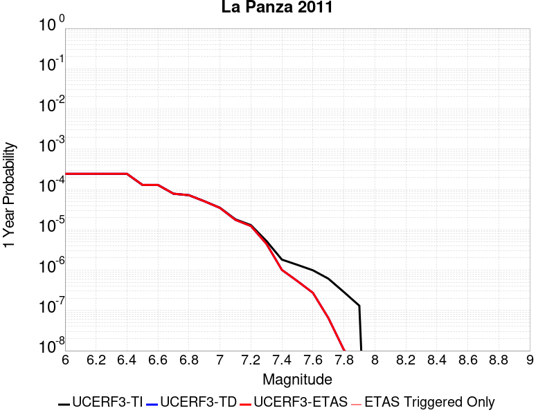 |  |

| Magnitude | 1 wk TI Prob | 1 wk TD Prob | 1 wk ETAS Prob | 1 wk ETAS/TD Gain | 1 wk ETAS Triggered Only | 1 mo TI Prob | 1 mo TD Prob | 1 mo ETAS Prob | 1 mo ETAS/TD Gain | 1 mo ETAS Triggered Only | 1 yr TI Prob | 1 yr TD Prob | 1 yr ETAS Prob | 1 yr ETAS/TD Gain | 1 yr ETAS Triggered Only | 10 yr TI Prob | 10 yr TD Prob | 10 yr ETAS Prob | 10 yr ETAS/TD Gain | 10 yr ETAS Triggered Only |
|-----|-----|-----|-----|-----|-----|-----|-----|-----|-----|-----|-----|-----|-----|-----|-----|-----|-----|-----|-----|-----|
| 6.0 | 4.6754544E-6 | 4.7176713E-6 | 4.7176713E-6 | 1.0 | 0.0 | 2.0037509E-5 | 2.0218446E-5 | 2.0218446E-5 | 1.0 | 0.0 | 2.4392935E-4 | 2.4613374E-4 | 2.4613374E-4 | 1.0 | 0.0 | 0.0024366176 | 0.002458806 | 0.0024687813 | 1.004057 | 1.0E-5 |
| 6.1 | 4.6754544E-6 | 4.7176713E-6 | 4.7176713E-6 | 1.0 | 0.0 | 2.0037509E-5 | 2.0218446E-5 | 2.0218446E-5 | 1.0 | 0.0 | 2.4392935E-4 | 2.4613374E-4 | 2.4613374E-4 | 1.0 | 0.0 | 0.0024366176 | 0.002458806 | 0.0024687813 | 1.004057 | 1.0E-5 |
| 6.2 | 4.6754544E-6 | 4.7176713E-6 | 4.7176713E-6 | 1.0 | 0.0 | 2.0037509E-5 | 2.0218446E-5 | 2.0218446E-5 | 1.0 | 0.0 | 2.4392935E-4 | 2.4613374E-4 | 2.4613374E-4 | 1.0 | 0.0 | 0.0024366176 | 0.002458806 | 0.0024687813 | 1.004057 | 1.0E-5 |
| 6.3 | 4.6754544E-6 | 4.7176713E-6 | 4.7176713E-6 | 1.0 | 0.0 | 2.0037509E-5 | 2.0218446E-5 | 2.0218446E-5 | 1.0 | 0.0 | 2.4392935E-4 | 2.4613374E-4 | 2.4613374E-4 | 1.0 | 0.0 | 0.0024366176 | 0.002458806 | 0.0024687813 | 1.004057 | 1.0E-5 |
| 6.4 | 4.6754544E-6 | 4.7176713E-6 | 4.7176713E-6 | 1.0 | 0.0 | 2.0037509E-5 | 2.0218446E-5 | 2.0218446E-5 | 1.0 | 0.0 | 2.4392935E-4 | 2.4613374E-4 | 2.4613374E-4 | 1.0 | 0.0 | 0.0024366176 | 0.002458806 | 0.0024687813 | 1.004057 | 1.0E-5 |
| 6.5 | 2.485343E-6 | 2.5006689E-6 | 2.5006689E-6 | 1.0 | 0.0 | 1.0651426E-5 | 1.0717111E-5 | 1.0717111E-5 | 1.0 | 0.0 | 1.296734E-4 | 1.304734E-4 | 1.304734E-4 | 1.0 | 0.0 | 0.0012959775 | 0.0013040063 | 0.0013040063 | 1.0 | 0.0 |
| 6.6 | 2.485343E-6 | 2.5006689E-6 | 2.5006689E-6 | 1.0 | 0.0 | 1.0651426E-5 | 1.0717111E-5 | 1.0717111E-5 | 1.0 | 0.0 | 1.296734E-4 | 1.304734E-4 | 1.304734E-4 | 1.0 | 0.0 | 0.0012959775 | 0.0013040063 | 0.0013040063 | 1.0 | 0.0 |
| 6.7 | 1.5108508E-6 | 1.5147012E-6 | 1.5147012E-6 | 1.0 | 0.0 | 6.4750584E-6 | 6.491561E-6 | 6.491561E-6 | 1.0 | 0.0 | 7.8830984E-5 | 7.9032005E-5 | 7.9032005E-5 | 1.0 | 0.0 | 7.880303E-4 | 7.900498E-4 | 7.900498E-4 | 1.0 | 0.0 |
| 6.8 | 1.3865837E-6 | 1.388573E-6 | 1.388573E-6 | 1.0 | 0.0 | 5.942488E-6 | 5.951014E-6 | 5.951014E-6 | 1.0 | 0.0 | 7.234739E-5 | 7.245129E-5 | 7.245129E-5 | 1.0 | 0.0 | 7.232384E-4 | 7.242865E-4 | 7.242865E-4 | 1.0 | 0.0 |
| 6.9 | 9.826583E-7 | 9.796888E-7 | 9.796888E-7 | 1.0 | 0.0 | 4.2113857E-6 | 4.19866E-6 | 4.19866E-6 | 1.0 | 0.0 | 5.1272415E-5 | 5.111754E-5 | 5.111754E-5 | 1.0 | 0.0 | 5.126059E-4 | 5.1106315E-4 | 5.1106315E-4 | 1.0 | 0.0 |
| 7.0 | 6.7797646E-7 | 6.7107953E-7 | 6.7107953E-7 | 1.0 | 0.0 | 2.9056102E-6 | 2.8760521E-6 | 2.8760521E-6 | 1.0 | 0.0 | 3.537523E-5 | 3.5015404E-5 | 3.5015404E-5 | 1.0 | 0.0 | 3.5369597E-4 | 3.5010197E-4 | 3.5010197E-4 | 1.0 | 0.0 |
| 7.1 | 3.4979826E-7 | 3.3879465E-7 | 3.3879465E-7 | 1.0 | 0.0 | 1.4991346E-6 | 1.4519763E-6 | 1.4519763E-6 | 1.0 | 0.0 | 1.825181E-5 | 1.7677681E-5 | 1.7677681E-5 | 1.0 | 0.0 | 1.825031E-4 | 1.767639E-4 | 1.767639E-4 | 1.0 | 0.0 |
| 7.2 | 2.5088332E-7 | 2.3837403E-7 | 2.3837403E-7 | 1.0 | 0.0 | 1.0752137E-6 | 1.0216027E-6 | 1.0216027E-6 | 1.0 | 0.0 | 1.3090649E-5 | 1.2437949E-5 | 1.2437949E-5 | 1.0 | 0.0 | 1.3089878E-4 | 1.2437339E-4 | 1.2437339E-4 | 1.0 | 0.0 |
| 7.3 | 1.0159086E-7 | 8.6499846E-8 | 8.6499846E-8 | 1.0 | 0.0 | 4.3538932E-7 | 3.707136E-7 | 3.707136E-7 | 1.0 | 0.0 | 5.300852E-6 | 4.513429E-6 | 4.513429E-6 | 1.0 | 0.0 | 5.3007258E-5 | 4.5133413E-5 | 4.5133413E-5 | 1.0 | 0.0 |
| 7.4 | 3.5006252E-8 | 1.9421545E-8 | 1.9421545E-8 | 1.0 | 0.0 | 1.5002678E-7 | 8.323519E-8 | 8.323519E-8 | 1.0 | 0.0 | 1.8265745E-6 | 1.013388E-6 | 1.013388E-6 | 1.0 | 0.0 | 1.8265595E-5 | 1.0133836E-5 | 1.0133836E-5 | 1.0 | 0.0 |
| 7.5 | 2.592274E-8 | 1.0251951E-8 | 1.0251951E-8 | 1.0 | 0.0 | 1.1109746E-7 | 4.3936932E-8 | 4.3936932E-8 | 1.0 | 0.0 | 1.3526106E-6 | 5.3493204E-7 | 5.3493204E-7 | 1.0 | 0.0 | 1.3526024E-5 | 5.349308E-6 | 5.349308E-6 | 1.0 | 0.0 |
| 7.6 | 1.9016717E-8 | 5.2530598E-9 | 5.2530598E-9 | 1.0 | 0.0 | 8.150022E-8 | 2.2513113E-8 | 2.2513113E-8 | 1.0 | 0.0 | 9.922647E-7 | 2.7409712E-7 | 2.7409712E-7 | 1.0 | 0.0 | 9.922603E-6 | 2.740968E-6 | 2.740968E-6 | 1.0 | 0.0 |
| 7.7 | 1.17738495E-8 | 1.2433922E-9 | 1.2433922E-9 | 1.0 | 0.0 | 5.0459356E-8 | 5.3288227E-9 | 5.3288227E-9 | 1.0 | 0.0 | 6.1434247E-7 | 6.4878414E-8 | 6.4878414E-8 | 1.0 | 0.0 | 6.143408E-6 | 6.4878395E-7 | 6.4878395E-7 | 1.0 | 0.0 |
| 7.8 | 5.489079E-9 | 2.0205604E-10 | 2.0205604E-10 | 1.0 | 0.0 | 2.3524624E-8 | 8.659543E-10 | 8.659543E-10 | 1.0 | 0.0 | 2.8641225E-7 | 1.0542993E-8 | 1.0542993E-8 | 1.0 | 0.0 | 2.8641189E-6 | 1.0542992E-7 | 1.0542992E-7 | 1.0 | 0.0 |
| 7.9 | 2.5081048E-9 | 6.7194916E-11 | 6.7194916E-11 | 1.0 | 0.0 | 1.0749021E-8 | 2.879772E-10 | 2.879772E-10 | 1.0 | 0.0 | 1.3086932E-7 | 3.5061234E-9 | 3.5061234E-9 | 1.0 | 0.0 | 1.3086925E-6 | 3.5061234E-8 | 3.5061234E-8 | 1.0 | 0.0 |

## Los Osos 2011
*[(top)](#table-of-contents)*

| 1 Week | 1 Month | 1 Year | 10 Year |
|-----|-----|-----|-----|
|  |  |  |  |

| Magnitude | 1 wk TI Prob | 1 wk TD Prob | 1 wk ETAS Prob | 1 wk ETAS/TD Gain | 1 wk ETAS Triggered Only | 1 mo TI Prob | 1 mo TD Prob | 1 mo ETAS Prob | 1 mo ETAS/TD Gain | 1 mo ETAS Triggered Only | 1 yr TI Prob | 1 yr TD Prob | 1 yr ETAS Prob | 1 yr ETAS/TD Gain | 1 yr ETAS Triggered Only | 10 yr TI Prob | 10 yr TD Prob | 10 yr ETAS Prob | 10 yr ETAS/TD Gain | 10 yr ETAS Triggered Only |
|-----|-----|-----|-----|-----|-----|-----|-----|-----|-----|-----|-----|-----|-----|-----|-----|-----|-----|-----|-----|-----|
| 6.0 | 4.8871775E-6 | 4.981565E-6 | 4.981565E-6 | 1.0 | 0.0 | 2.0944879E-5 | 2.1349404E-5 | 2.1349404E-5 | 1.0 | 0.0 | 2.5497406E-4 | 2.599008E-4 | 2.599008E-4 | 1.0 | 0.0 | 0.002546817 | 0.0025962426 | 0.0026062166 | 1.0038418 | 1.0E-5 |
| 6.1 | 4.8871775E-6 | 4.981565E-6 | 4.981565E-6 | 1.0 | 0.0 | 2.0944879E-5 | 2.1349404E-5 | 2.1349404E-5 | 1.0 | 0.0 | 2.5497406E-4 | 2.599008E-4 | 2.599008E-4 | 1.0 | 0.0 | 0.002546817 | 0.0025962426 | 0.0026062166 | 1.0038418 | 1.0E-5 |
| 6.2 | 4.8871775E-6 | 4.981565E-6 | 4.981565E-6 | 1.0 | 0.0 | 2.0944879E-5 | 2.1349404E-5 | 2.1349404E-5 | 1.0 | 0.0 | 2.5497406E-4 | 2.599008E-4 | 2.599008E-4 | 1.0 | 0.0 | 0.002546817 | 0.0025962426 | 0.0026062166 | 1.0038418 | 1.0E-5 |
| 6.3 | 4.8871775E-6 | 4.981565E-6 | 4.981565E-6 | 1.0 | 0.0 | 2.0944879E-5 | 2.1349404E-5 | 2.1349404E-5 | 1.0 | 0.0 | 2.5497406E-4 | 2.599008E-4 | 2.599008E-4 | 1.0 | 0.0 | 0.002546817 | 0.0025962426 | 0.0026062166 | 1.0038418 | 1.0E-5 |
| 6.4 | 4.8871775E-6 | 4.981565E-6 | 4.981565E-6 | 1.0 | 0.0 | 2.0944879E-5 | 2.1349404E-5 | 2.1349404E-5 | 1.0 | 0.0 | 2.5497406E-4 | 2.599008E-4 | 2.599008E-4 | 1.0 | 0.0 | 0.002546817 | 0.0025962426 | 0.0026062166 | 1.0038418 | 1.0E-5 |
| 6.5 | 3.1724062E-6 | 3.2234527E-6 | 3.2234527E-6 | 1.0 | 0.0 | 1.3595956E-5 | 1.3814725E-5 | 1.3814725E-5 | 1.0 | 0.0 | 1.6551818E-4 | 1.6818143E-4 | 1.6818143E-4 | 1.0 | 0.0 | 0.0016539496 | 0.0016805549 | 0.0016905381 | 1.0059404 | 1.0E-5 |
| 6.6 | 3.1022591E-6 | 3.151161E-6 | 3.151161E-6 | 1.0 | 0.0 | 1.3295328E-5 | 1.3504907E-5 | 1.3504907E-5 | 1.0 | 0.0 | 1.618586E-4 | 1.6440995E-4 | 1.6440995E-4 | 1.0 | 0.0 | 0.0016174077 | 0.0016428961 | 0.0016528796 | 1.0060768 | 1.0E-5 |
| 6.7 | 2.611518E-6 | 2.6492337E-6 | 2.6492337E-6 | 1.0 | 0.0 | 1.1192172E-5 | 1.135381E-5 | 1.135381E-5 | 1.0 | 0.0 | 1.3625617E-4 | 1.3822391E-4 | 1.3822391E-4 | 1.0 | 0.0 | 0.0013617266 | 0.0013813839 | 0.0013913701 | 1.0072291 | 1.0E-5 |
| 6.8 | 2.4780884E-6 | 2.5122079E-6 | 2.5122079E-6 | 1.0 | 0.0 | 1.0620336E-5 | 1.0766561E-5 | 1.0766561E-5 | 1.0 | 0.0 | 1.2929492E-4 | 1.3107504E-4 | 1.3107504E-4 | 1.0 | 0.0 | 0.0012921972 | 0.0013099813 | 0.0013199681 | 1.0076237 | 1.0E-5 |
| 6.9 | 2.1376322E-6 | 2.1635497E-6 | 2.1635497E-6 | 1.0 | 0.0 | 9.161248E-6 | 9.272323E-6 | 9.272323E-6 | 1.0 | 0.0 | 1.1153249E-4 | 1.128847E-4 | 1.128847E-4 | 1.0 | 0.0 | 0.0011147653 | 0.0011282755 | 0.0011382642 | 1.0088531 | 1.0E-5 |
| 7.0 | 1.9282882E-6 | 1.9495E-6 | 1.9495E-6 | 1.0 | 0.0 | 8.264066E-6 | 8.354974E-6 | 8.354974E-6 | 1.0 | 0.0 | 1.0061036E-4 | 1.01717065E-4 | 1.01717065E-4 | 1.0 | 0.0 | 0.0010056482 | 0.0010167065 | 0.0010266963 | 1.0098257 | 1.0E-5 |
| 7.1 | 1.6353226E-6 | 1.6501499E-6 | 1.6501499E-6 | 1.0 | 0.0 | 7.0085066E-6 | 7.0720516E-6 | 7.0720516E-6 | 1.0 | 0.0 | 8.532523E-5 | 8.609884E-5 | 8.609884E-5 | 1.0 | 0.0 | 8.529247E-4 | 8.606555E-4 | 8.706469E-4 | 1.0116091 | 1.0E-5 |
| 7.2 | 1.4446276E-6 | 1.45537E-6 | 1.45537E-6 | 1.0 | 0.0 | 6.191247E-6 | 6.237285E-6 | 6.237285E-6 | 1.0 | 0.0 | 7.537582E-5 | 7.59363E-5 | 7.59363E-5 | 1.0 | 0.0 | 7.535026E-4 | 7.5910415E-4 | 7.6909654E-4 | 1.0131634 | 1.0E-5 |
| 7.3 | 1.2014582E-6 | 1.2069403E-6 | 1.2069403E-6 | 1.0 | 0.0 | 5.149096E-6 | 5.172591E-6 | 5.172591E-6 | 1.0 | 0.0 | 6.268844E-5 | 6.2974475E-5 | 6.2974475E-5 | 1.0 | 0.0 | 6.267076E-4 | 6.295667E-4 | 6.3956046E-4 | 1.0158739 | 1.0E-5 |
| 7.4 | 9.707733E-7 | 9.710075E-7 | 9.710075E-7 | 1.0 | 0.0 | 4.16045E-6 | 4.161454E-6 | 4.161454E-6 | 1.0 | 0.0 | 5.0652303E-5 | 5.0664526E-5 | 5.0664526E-5 | 1.0 | 0.0 | 5.064076E-4 | 5.0653E-4 | 5.1652495E-4 | 1.0197321 | 1.0E-5 |
| 7.5 | 7.174908E-7 | 7.1151817E-7 | 7.1151817E-7 | 1.0 | 0.0 | 3.074957E-6 | 3.04936E-6 | 3.04936E-6 | 1.0 | 0.0 | 3.743696E-5 | 3.7125326E-5 | 3.7125326E-5 | 1.0 | 0.0 | 3.7430652E-4 | 3.7119142E-4 | 3.811877E-4 | 1.0269303 | 1.0E-5 |
| 7.6 | 4.5535776E-7 | 4.4210202E-7 | 4.4210202E-7 | 1.0 | 0.0 | 1.9515319E-6 | 1.8947215E-6 | 1.8947215E-6 | 1.0 | 0.0 | 2.3759641E-5 | 2.306799E-5 | 2.306799E-5 | 1.0 | 0.0 | 2.37571E-4 | 2.3065606E-4 | 2.4065375E-4 | 1.0433446 | 1.0E-5 |
| 7.7 | 2.1173553E-7 | 1.9062645E-7 | 1.9062645E-7 | 1.0 | 0.0 | 9.0743765E-7 | 8.1697027E-7 | 8.1697027E-7 | 1.0 | 0.0 | 1.1047998E-5 | 9.946568E-6 | 9.946568E-6 | 1.0 | 0.0 | 1.1047449E-4 | 9.946126E-5 | 9.946126E-5 | 1.0 | 0.0 |
| 7.8 | 9.873608E-8 | 7.369176E-8 | 7.369176E-8 | 1.0 | 0.0 | 4.2315455E-7 | 3.1582178E-7 | 3.1582178E-7 | 1.0 | 0.0 | 5.1518946E-6 | 3.845123E-6 | 3.845123E-6 | 1.0 | 0.0 | 5.1517753E-5 | 3.8450573E-5 | 3.8450573E-5 | 1.0 | 0.0 |
| 7.9 | 5.4399106E-8 | 3.189444E-8 | 3.189444E-8 | 1.0 | 0.0 | 2.33139E-7 | 1.3669045E-7 | 1.3669045E-7 | 1.0 | 0.0 | 2.8384638E-6 | 1.664205E-6 | 1.664205E-6 | 1.0 | 0.0 | 2.8384275E-5 | 1.6641927E-5 | 1.6641927E-5 | 1.0 | 0.0 |
| 8.0 | 1.817203E-8 | 8.426773E-9 | 8.426773E-9 | 1.0 | 0.0 | 7.7880124E-8 | 3.6114738E-8 | 3.6114738E-8 | 1.0 | 0.0 | 9.481901E-7 | 4.3969686E-7 | 4.3969686E-7 | 1.0 | 0.0 | 9.481861E-6 | 4.3969603E-6 | 4.3969603E-6 | 1.0 | 0.0 |

## Sierra Madre (San Fernando)
*[(top)](#table-of-contents)*

| 1 Week | 1 Month | 1 Year | 10 Year |
|-----|-----|-----|-----|
|  |  |  | 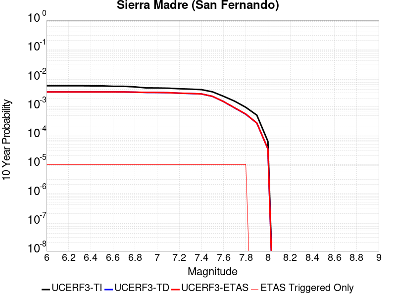 |

| Magnitude | 1 wk TI Prob | 1 wk TD Prob | 1 wk ETAS Prob | 1 wk ETAS/TD Gain | 1 wk ETAS Triggered Only | 1 mo TI Prob | 1 mo TD Prob | 1 mo ETAS Prob | 1 mo ETAS/TD Gain | 1 mo ETAS Triggered Only | 1 yr TI Prob | 1 yr TD Prob | 1 yr ETAS Prob | 1 yr ETAS/TD Gain | 1 yr ETAS Triggered Only | 10 yr TI Prob | 10 yr TD Prob | 10 yr ETAS Prob | 10 yr ETAS/TD Gain | 10 yr ETAS Triggered Only |
|-----|-----|-----|-----|-----|-----|-----|-----|-----|-----|-----|-----|-----|-----|-----|-----|-----|-----|-----|-----|-----|
| 6.0 | 1.0346413E-5 | 6.287824E-6 | 6.287824E-6 | 1.0 | 0.0 | 4.4341014E-5 | 2.6947544E-5 | 2.6947544E-5 | 1.0 | 0.0 | 5.3971814E-4 | 3.2803806E-4 | 3.380348E-4 | 1.0304743 | 1.0E-5 | 0.0053840918 | 0.003275651 | 0.0032856183 | 1.0030428 | 1.0E-5 |
| 6.1 | 1.0346413E-5 | 6.287824E-6 | 6.287824E-6 | 1.0 | 0.0 | 4.4341014E-5 | 2.6947544E-5 | 2.6947544E-5 | 1.0 | 0.0 | 5.3971814E-4 | 3.2803806E-4 | 3.380348E-4 | 1.0304743 | 1.0E-5 | 0.0053840918 | 0.003275651 | 0.0032856183 | 1.0030428 | 1.0E-5 |
| 6.2 | 1.0346413E-5 | 6.287824E-6 | 6.287824E-6 | 1.0 | 0.0 | 4.4341014E-5 | 2.6947544E-5 | 2.6947544E-5 | 1.0 | 0.0 | 5.3971814E-4 | 3.2803806E-4 | 3.380348E-4 | 1.0304743 | 1.0E-5 | 0.0053840918 | 0.003275651 | 0.0032856183 | 1.0030428 | 1.0E-5 |
| 6.3 | 1.0346413E-5 | 6.287824E-6 | 6.287824E-6 | 1.0 | 0.0 | 4.4341014E-5 | 2.6947544E-5 | 2.6947544E-5 | 1.0 | 0.0 | 5.3971814E-4 | 3.2803806E-4 | 3.380348E-4 | 1.0304743 | 1.0E-5 | 0.0053840918 | 0.003275651 | 0.0032856183 | 1.0030428 | 1.0E-5 |
| 6.4 | 1.0249558E-5 | 6.287824E-6 | 6.287824E-6 | 1.0 | 0.0 | 4.392594E-5 | 2.6947544E-5 | 2.6947544E-5 | 1.0 | 0.0 | 5.3466705E-4 | 3.2803806E-4 | 3.380348E-4 | 1.0304743 | 1.0E-5 | 0.0053338245 | 0.003275651 | 0.0032856183 | 1.0030428 | 1.0E-5 |
| 6.5 | 1.0249558E-5 | 6.287824E-6 | 6.287824E-6 | 1.0 | 0.0 | 4.392594E-5 | 2.6947544E-5 | 2.6947544E-5 | 1.0 | 0.0 | 5.3466705E-4 | 3.2803806E-4 | 3.380348E-4 | 1.0304743 | 1.0E-5 | 0.0053338245 | 0.003275651 | 0.0032856183 | 1.0030428 | 1.0E-5 |
| 6.6 | 9.9035515E-6 | 6.287824E-6 | 6.287824E-6 | 1.0 | 0.0 | 4.2443102E-5 | 2.6947544E-5 | 2.6947544E-5 | 1.0 | 0.0 | 5.166222E-4 | 3.2803806E-4 | 3.380348E-4 | 1.0304743 | 1.0E-5 | 0.0051542283 | 0.003275651 | 0.0032856183 | 1.0030428 | 1.0E-5 |
| 6.7 | 9.87217E-6 | 6.2752433E-6 | 6.2752433E-6 | 1.0 | 0.0 | 4.2308613E-5 | 2.689363E-5 | 2.689363E-5 | 1.0 | 0.0 | 5.149856E-4 | 3.2738183E-4 | 3.3737856E-4 | 1.0305353 | 1.0E-5 | 0.005137938 | 0.003269108 | 0.0032790755 | 1.0030489 | 1.0E-5 |
| 6.8 | 9.4359175E-6 | 6.1792075E-6 | 6.1792075E-6 | 1.0 | 0.0 | 4.043902E-5 | 2.6482056E-5 | 2.6482056E-5 | 1.0 | 0.0 | 4.9223384E-4 | 3.2237242E-4 | 3.323692E-4 | 1.03101 | 1.0E-5 | 0.0049114493 | 0.0032191596 | 0.0032291273 | 1.0030963 | 1.0E-5 |
| 6.9 | 8.700447E-6 | 6.0404495E-6 | 6.0404495E-6 | 1.0 | 0.0 | 3.72871E-5 | 2.588739E-5 | 2.588739E-5 | 1.0 | 0.0 | 4.5387587E-4 | 3.1513447E-4 | 3.2513132E-4 | 1.0317225 | 1.0E-5 | 0.0045295 | 0.0031469853 | 0.003156954 | 1.0031676 | 1.0E-5 |
| 7.0 | 8.648878E-6 | 6.015363E-6 | 6.015363E-6 | 1.0 | 0.0 | 3.7066096E-5 | 2.5779878E-5 | 2.5779878E-5 | 1.0 | 0.0 | 4.5118626E-4 | 3.138259E-4 | 3.2382275E-4 | 1.0318547 | 1.0E-5 | 0.004502713 | 0.0031339366 | 0.0031439052 | 1.0031809 | 1.0E-5 |
| 7.1 | 8.505786E-6 | 5.9249896E-6 | 5.9249896E-6 | 1.0 | 0.0 | 3.645286E-5 | 2.5392572E-5 | 2.5392572E-5 | 1.0 | 0.0 | 4.437232E-4 | 3.0911178E-4 | 3.191087E-4 | 1.0323408 | 1.0E-5 | 0.0044283825 | 0.003086927 | 0.0030968962 | 1.0032295 | 1.0E-5 |
| 7.2 | 8.139752E-6 | 5.699274E-6 | 5.699274E-6 | 1.0 | 0.0 | 3.4884186E-5 | 2.4425237E-5 | 2.4425237E-5 | 1.0 | 0.0 | 4.246322E-4 | 2.9733774E-4 | 3.0733476E-4 | 1.0336218 | 1.0E-5 | 0.004238217 | 0.002969505 | 0.0029794753 | 1.0033575 | 1.0E-5 |
| 7.3 | 7.8816E-6 | 5.5525825E-6 | 5.5525825E-6 | 1.0 | 0.0 | 3.3777847E-5 | 2.379657E-5 | 2.379657E-5 | 1.0 | 0.0 | 4.111677E-4 | 2.8968576E-4 | 2.9968287E-4 | 1.0345101 | 1.0E-5 | 0.004104078 | 0.002893187 | 0.002903158 | 1.0034463 | 1.0E-5 |
| 7.4 | 7.5810603E-6 | 5.3568115E-6 | 5.3568115E-6 | 1.0 | 0.0 | 3.2489854E-5 | 2.2957569E-5 | 2.2957569E-5 | 1.0 | 0.0 | 3.9549218E-4 | 2.7947358E-4 | 2.894708E-4 | 1.0357716 | 1.0E-5 | 0.0039478904 | 0.0027913265 | 0.0028012984 | 1.0035726 | 1.0E-5 |
| 7.5 | 6.349153E-6 | 4.4080516E-6 | 4.4080516E-6 | 1.0 | 0.0 | 2.7210372E-5 | 1.8891518E-5 | 1.8891518E-5 | 1.0 | 0.0 | 3.312359E-4 | 2.2998078E-4 | 2.3997847E-4 | 1.0434719 | 1.0E-5 | 0.0033074263 | 0.0022975097 | 0.0023074867 | 1.0043426 | 1.0E-5 |
| 7.6 | 4.430576E-6 | 2.8910279E-6 | 2.8910279E-6 | 1.0 | 0.0 | 1.8988047E-5 | 1.2390062E-5 | 1.2390062E-5 | 1.0 | 0.0 | 2.3115493E-4 | 1.5083878E-4 | 1.6083727E-4 | 1.066286 | 1.0E-5 | 0.0023091463 | 0.0015073866 | 0.0015173715 | 1.006624 | 1.0E-5 |
| 7.7 | 3.005066E-6 | 1.7514163E-6 | 1.7514163E-6 | 1.0 | 0.0 | 1.2878791E-5 | 7.5060484E-6 | 7.5060484E-6 | 1.0 | 0.0 | 1.56788E-4 | 9.138232E-5 | 1.013814E-4 | 1.1094204 | 1.0E-5 | 0.0015667742 | 9.134486E-4 | 9.2343945E-4 | 1.0109376 | 1.0E-5 |
| 7.8 | 1.8459098E-6 | 1.0584814E-6 | 1.0584814E-6 | 1.0 | 0.0 | 7.911018E-6 | 4.536341E-6 | 4.536341E-6 | 1.0 | 0.0 | 9.631238E-5 | 5.5228553E-5 | 6.5228E-5 | 1.1810558 | 1.0E-5 | 9.627065E-4 | 5.5214873E-4 | 5.621432E-4 | 1.0181011 | 1.0E-5 |
| 7.9 | 9.839262E-7 | 5.235812E-7 | 5.235812E-7 | 1.0 | 0.0 | 4.2168194E-6 | 2.2439176E-6 | 2.2439176E-6 | 1.0 | 0.0 | 5.1338568E-5 | 2.7319356E-5 | 2.7319356E-5 | 1.0 | 0.0 | 5.132671E-4 | 2.7316026E-4 | 2.7316026E-4 | 1.0 | 0.0 |
| 8.0 | 1.210983E-7 | 6.615224E-8 | 6.615224E-8 | 1.0 | 0.0 | 5.1899264E-7 | 2.8350954E-7 | 2.8350954E-7 | 1.0 | 0.0 | 6.3187167E-6 | 3.4517234E-6 | 3.4517234E-6 | 1.0 | 0.0 | 6.318537E-5 | 3.4516717E-5 | 3.4516717E-5 | 1.0 | 0.0 |

## Santa Susana alt 1
*[(top)](#table-of-contents)*

| 1 Week | 1 Month | 1 Year | 10 Year |
|-----|-----|-----|-----|
| 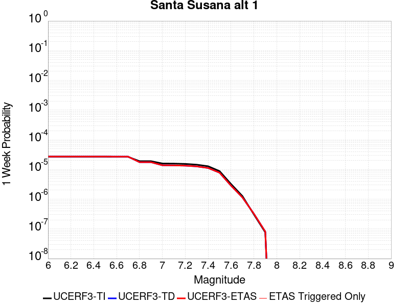 | 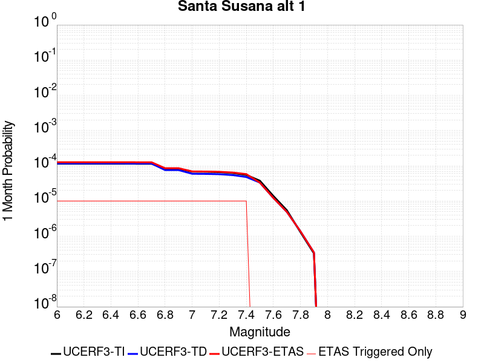 | 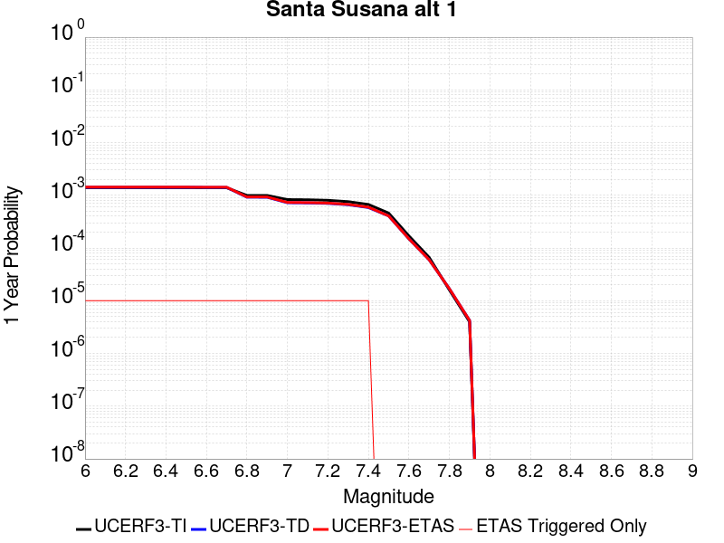 |  |

| Magnitude | 1 wk TI Prob | 1 wk TD Prob | 1 wk ETAS Prob | 1 wk ETAS/TD Gain | 1 wk ETAS Triggered Only | 1 mo TI Prob | 1 mo TD Prob | 1 mo ETAS Prob | 1 mo ETAS/TD Gain | 1 mo ETAS Triggered Only | 1 yr TI Prob | 1 yr TD Prob | 1 yr ETAS Prob | 1 yr ETAS/TD Gain | 1 yr ETAS Triggered Only | 10 yr TI Prob | 10 yr TD Prob | 10 yr ETAS Prob | 10 yr ETAS/TD Gain | 10 yr ETAS Triggered Only |
|-----|-----|-----|-----|-----|-----|-----|-----|-----|-----|-----|-----|-----|-----|-----|-----|-----|-----|-----|-----|-----|
| 6.0 | 2.674877E-5 | 2.7200571E-5 | 2.7200571E-5 | 1.0 | 0.0 | 1.1463255E-4 | 1.165693E-4 | 1.2656813E-4 | 1.0857759 | 1.0E-5 | 0.0013947578 | 0.001418421 | 0.0014284068 | 1.0070401 | 1.0E-5 | 0.013860362 | 0.014105441 | 0.0141153 | 1.0006989 | 1.0E-5 |
| 6.1 | 2.674877E-5 | 2.7200571E-5 | 2.7200571E-5 | 1.0 | 0.0 | 1.1463255E-4 | 1.165693E-4 | 1.2656813E-4 | 1.0857759 | 1.0E-5 | 0.0013947578 | 0.001418421 | 0.0014284068 | 1.0070401 | 1.0E-5 | 0.013860362 | 0.014105441 | 0.0141153 | 1.0006989 | 1.0E-5 |
| 6.2 | 2.674877E-5 | 2.7200571E-5 | 2.7200571E-5 | 1.0 | 0.0 | 1.1463255E-4 | 1.165693E-4 | 1.2656813E-4 | 1.0857759 | 1.0E-5 | 0.0013947578 | 0.001418421 | 0.0014284068 | 1.0070401 | 1.0E-5 | 0.013860362 | 0.014105441 | 0.0141153 | 1.0006989 | 1.0E-5 |
| 6.3 | 2.674877E-5 | 2.7200571E-5 | 2.7200571E-5 | 1.0 | 0.0 | 1.1463255E-4 | 1.165693E-4 | 1.2656813E-4 | 1.0857759 | 1.0E-5 | 0.0013947578 | 0.001418421 | 0.0014284068 | 1.0070401 | 1.0E-5 | 0.013860362 | 0.014105441 | 0.0141153 | 1.0006989 | 1.0E-5 |
| 6.4 | 2.674877E-5 | 2.7200571E-5 | 2.7200571E-5 | 1.0 | 0.0 | 1.1463255E-4 | 1.165693E-4 | 1.2656813E-4 | 1.0857759 | 1.0E-5 | 0.0013947578 | 0.001418421 | 0.0014284068 | 1.0070401 | 1.0E-5 | 0.013860362 | 0.014105441 | 0.0141153 | 1.0006989 | 1.0E-5 |
| 6.5 | 2.674877E-5 | 2.7200571E-5 | 2.7200571E-5 | 1.0 | 0.0 | 1.1463255E-4 | 1.165693E-4 | 1.2656813E-4 | 1.0857759 | 1.0E-5 | 0.0013947578 | 0.001418421 | 0.0014284068 | 1.0070401 | 1.0E-5 | 0.013860362 | 0.014105441 | 0.0141153 | 1.0006989 | 1.0E-5 |
| 6.6 | 2.6647976E-5 | 2.7076892E-5 | 2.7076892E-5 | 1.0 | 0.0 | 1.14200615E-4 | 1.1603931E-4 | 1.2603814E-4 | 1.0861677 | 1.0E-5 | 0.0013895056 | 0.0014119769 | 0.0014219627 | 1.0070722 | 1.0E-5 | 0.013808494 | 0.01404182 | 0.014051679 | 1.0007021 | 1.0E-5 |
| 6.7 | 2.6647976E-5 | 2.7076892E-5 | 2.7076892E-5 | 1.0 | 0.0 | 1.14200615E-4 | 1.1603931E-4 | 1.2603814E-4 | 1.0861677 | 1.0E-5 | 0.0013895056 | 0.0014119769 | 0.0014219627 | 1.0070722 | 1.0E-5 | 0.013808494 | 0.01404182 | 0.014051679 | 1.0007021 | 1.0E-5 |
| 6.8 | 1.9073179E-5 | 1.7638586E-5 | 1.7638586E-5 | 1.0 | 0.0 | 8.1739636E-5 | 7.5591845E-5 | 8.559109E-5 | 1.1322794 | 1.0E-5 | 9.947256E-4 | 9.199603E-4 | 9.299511E-4 | 1.0108601 | 1.0E-5 | 0.009902848 | 0.009163775 | 0.009173683 | 1.0010812 | 1.0E-5 |
| 6.9 | 1.9041876E-5 | 1.7620714E-5 | 1.7620714E-5 | 1.0 | 0.0 | 8.160549E-5 | 7.5515265E-5 | 8.551451E-5 | 1.1324135 | 1.0E-5 | 9.930939E-4 | 9.190287E-4 | 9.2901953E-4 | 1.010871 | 1.0E-5 | 0.0098866755 | 0.009154535 | 0.009164443 | 1.0010823 | 1.0E-5 |
| 7.0 | 1.5917482E-5 | 1.3864736E-5 | 1.3864736E-5 | 1.0 | 0.0 | 6.8215995E-5 | 5.941897E-5 | 6.941838E-5 | 1.1682864 | 1.0E-5 | 8.302132E-4 | 7.231905E-4 | 7.3318323E-4 | 1.0138177 | 1.0E-5 | 0.008271185 | 0.0072092656 | 0.0072191935 | 1.0013771 | 1.0E-5 |
| 7.1 | 1.577788E-5 | 1.3744735E-5 | 1.3744735E-5 | 1.0 | 0.0 | 6.761774E-5 | 5.89047E-5 | 6.890411E-5 | 1.1697557 | 1.0E-5 | 8.2293496E-4 | 7.169334E-4 | 7.2692626E-4 | 1.0139383 | 1.0E-5 | 0.008198941 | 0.007147099 | 0.0071570277 | 1.0013891 | 1.0E-5 |
| 7.2 | 1.5416446E-5 | 1.3470787E-5 | 1.3470787E-5 | 1.0 | 0.0 | 6.606882E-5 | 5.7730693E-5 | 6.7730114E-5 | 1.1732081 | 1.0E-5 | 8.0409093E-4 | 7.026491E-4 | 7.126421E-4 | 1.0142219 | 1.0E-5 | 0.008011877 | 0.00700516 | 0.00701509 | 1.0014175 | 1.0E-5 |
| 7.3 | 1.4534083E-5 | 1.27186495E-5 | 1.27186495E-5 | 1.0 | 0.0 | 6.228744E-5 | 5.4507385E-5 | 6.4506836E-5 | 1.1834514 | 1.0E-5 | 7.580857E-4 | 6.634298E-4 | 6.734232E-4 | 1.0150632 | 1.0E-5 | 0.007555048 | 0.006615344 | 0.006625278 | 1.0015017 | 1.0E-5 |
| 7.4 | 1.2858995E-5 | 1.1230286E-5 | 1.1230286E-5 | 1.0 | 0.0 | 5.5108816E-5 | 4.812893E-5 | 5.812845E-5 | 1.2077652 | 1.0E-5 | 6.7074323E-4 | 5.858161E-4 | 5.9581024E-4 | 1.0170602 | 1.0E-5 | 0.0066872234 | 0.0058434936 | 0.005853435 | 1.0017014 | 1.0E-5 |
| 7.5 | 8.827668E-6 | 7.805781E-6 | 7.805781E-6 | 1.0 | 0.0 | 3.7832317E-5 | 3.3452932E-5 | 3.3452932E-5 | 1.0 | 0.0 | 4.605111E-4 | 4.072158E-4 | 4.072158E-4 | 1.0 | 0.0 | 0.0045955796 | 0.004064945 | 0.004064945 | 1.0 | 0.0 |
| 7.6 | 3.2533426E-6 | 2.872068E-6 | 2.872068E-6 | 1.0 | 0.0 | 1.3942822E-5 | 1.23088075E-5 | 1.23088075E-5 | 1.0 | 0.0 | 1.6974064E-4 | 1.498498E-4 | 1.498498E-4 | 1.0 | 0.0 | 0.0016961104 | 0.0014975243 | 0.0014975243 | 1.0 | 0.0 |
| 7.7 | 1.2751709E-6 | 1.1491525E-6 | 1.1491525E-6 | 1.0 | 0.0 | 5.4650063E-6 | 4.92493E-6 | 4.92493E-6 | 1.0 | 0.0 | 6.653442E-5 | 5.9959468E-5 | 5.9959468E-5 | 1.0 | 0.0 | 6.6514505E-4 | 5.994418E-4 | 5.994418E-4 | 1.0 | 0.0 |
| 7.8 | 3.067544E-7 | 3.2401567E-7 | 3.2401567E-7 | 1.0 | 0.0 | 1.3146611E-6 | 1.388638E-6 | 1.388638E-6 | 1.0 | 0.0 | 1.600588E-5 | 1.6906546E-5 | 1.6906546E-5 | 1.0 | 0.0 | 1.6004729E-4 | 1.6905363E-4 | 1.6905363E-4 | 1.0 | 0.0 |
| 7.9 | 7.622999E-8 | 8.088237E-8 | 8.088237E-8 | 1.0 | 0.0 | 3.2669993E-7 | 3.466387E-7 | 3.466387E-7 | 1.0 | 0.0 | 3.977564E-6 | 4.22032E-6 | 4.22032E-6 | 1.0 | 0.0 | 3.977493E-5 | 4.220261E-5 | 4.220261E-5 | 1.0 | 0.0 |

## South Klamath Lake East
*[(top)](#table-of-contents)*

| 1 Week | 1 Month | 1 Year | 10 Year |
|-----|-----|-----|-----|
|  |  |  |  |

| Magnitude | 1 wk TI Prob | 1 wk TD Prob | 1 wk ETAS Prob | 1 wk ETAS/TD Gain | 1 wk ETAS Triggered Only | 1 mo TI Prob | 1 mo TD Prob | 1 mo ETAS Prob | 1 mo ETAS/TD Gain | 1 mo ETAS Triggered Only | 1 yr TI Prob | 1 yr TD Prob | 1 yr ETAS Prob | 1 yr ETAS/TD Gain | 1 yr ETAS Triggered Only | 10 yr TI Prob | 10 yr TD Prob | 10 yr ETAS Prob | 10 yr ETAS/TD Gain | 10 yr ETAS Triggered Only |
|-----|-----|-----|-----|-----|-----|-----|-----|-----|-----|-----|-----|-----|-----|-----|-----|-----|-----|-----|-----|-----|
| 6.0 | 2.3539369E-5 | 2.5048159E-5 | 2.5048159E-5 | 1.0 | 0.0 | 1.0087911E-4 | 1.073453E-4 | 1.073453E-4 | 1.0 | 0.0 | 0.0012275111 | 0.0013062288 | 0.0013162157 | 1.0076456 | 1.0E-5 | 0.012207527 | 0.012993856 | 0.0130037265 | 1.0007596 | 1.0E-5 |
| 6.1 | 2.3539369E-5 | 2.5048159E-5 | 2.5048159E-5 | 1.0 | 0.0 | 1.0087911E-4 | 1.073453E-4 | 1.073453E-4 | 1.0 | 0.0 | 0.0012275111 | 0.0013062288 | 0.0013162157 | 1.0076456 | 1.0E-5 | 0.012207527 | 0.012993856 | 0.0130037265 | 1.0007596 | 1.0E-5 |
| 6.2 | 2.3539369E-5 | 2.5048159E-5 | 2.5048159E-5 | 1.0 | 0.0 | 1.0087911E-4 | 1.073453E-4 | 1.073453E-4 | 1.0 | 0.0 | 0.0012275111 | 0.0013062288 | 0.0013162157 | 1.0076456 | 1.0E-5 | 0.012207527 | 0.012993856 | 0.0130037265 | 1.0007596 | 1.0E-5 |
| 6.3 | 9.807823E-6 | 1.0396374E-5 | 1.0396374E-5 | 1.0 | 0.0 | 4.2032847E-5 | 4.4555178E-5 | 4.4555178E-5 | 1.0 | 0.0 | 5.1162974E-4 | 5.4233265E-4 | 5.4233265E-4 | 1.0 | 0.0 | 0.005104534 | 0.005410928 | 0.005410928 | 1.0 | 0.0 |
| 6.4 | 9.807823E-6 | 1.0396374E-5 | 1.0396374E-5 | 1.0 | 0.0 | 4.2032847E-5 | 4.4555178E-5 | 4.4555178E-5 | 1.0 | 0.0 | 5.1162974E-4 | 5.4233265E-4 | 5.4233265E-4 | 1.0 | 0.0 | 0.005104534 | 0.005410928 | 0.005410928 | 1.0 | 0.0 |
| 6.5 | 6.191981E-6 | 6.551041E-6 | 6.551041E-6 | 1.0 | 0.0 | 2.653679E-5 | 2.8075605E-5 | 2.8075605E-5 | 1.0 | 0.0 | 3.2303753E-4 | 3.417697E-4 | 3.417697E-4 | 1.0 | 0.0 | 0.0032256835 | 0.003412719 | 0.003412719 | 1.0 | 0.0 |
| 6.6 | 4.3693776E-6 | 4.616696E-6 | 4.616696E-6 | 1.0 | 0.0 | 1.8725768E-5 | 1.9785697E-5 | 1.9785697E-5 | 1.0 | 0.0 | 2.2796239E-4 | 2.4086535E-4 | 2.4086535E-4 | 1.0 | 0.0 | 0.0022772867 | 0.0024061555 | 0.0024061555 | 1.0 | 0.0 |
| 6.7 | 3.360834E-6 | 3.551347E-6 | 3.551347E-6 | 1.0 | 0.0 | 1.4403494E-5 | 1.5219975E-5 | 1.5219975E-5 | 1.0 | 0.0 | 1.7534842E-4 | 1.8528824E-4 | 1.8528824E-4 | 1.0 | 0.0 | 0.0017521014 | 0.0018514175 | 0.0018514175 | 1.0 | 0.0 |
| 6.8 | 2.57873E-6 | 2.725253E-6 | 2.725253E-6 | 1.0 | 0.0 | 1.1051653E-5 | 1.1679606E-5 | 1.1679606E-5 | 1.0 | 0.0 | 1.3454557E-4 | 1.4219055E-4 | 1.4219055E-4 | 1.0 | 0.0 | 0.0013446413 | 0.0014210563 | 0.0014210563 | 1.0 | 0.0 |
| 6.9 | 9.987825E-7 | 1.0566537E-6 | 1.0566537E-6 | 1.0 | 0.0 | 4.2804895E-6 | 4.52851E-6 | 4.52851E-6 | 1.0 | 0.0 | 5.211371E-5 | 5.5133543E-5 | 5.5133543E-5 | 1.0 | 0.0 | 5.210149E-4 | 5.512308E-4 | 5.512308E-4 | 1.0 | 0.0 |

## Santa Cruz Catalina Ridge alt1
*[(top)](#table-of-contents)*

| 1 Week | 1 Month | 1 Year | 10 Year |
|-----|-----|-----|-----|
|  |  |  |  |

| Magnitude | 1 wk TI Prob | 1 wk TD Prob | 1 wk ETAS Prob | 1 wk ETAS/TD Gain | 1 wk ETAS Triggered Only | 1 mo TI Prob | 1 mo TD Prob | 1 mo ETAS Prob | 1 mo ETAS/TD Gain | 1 mo ETAS Triggered Only | 1 yr TI Prob | 1 yr TD Prob | 1 yr ETAS Prob | 1 yr ETAS/TD Gain | 1 yr ETAS Triggered Only | 10 yr TI Prob | 10 yr TD Prob | 10 yr ETAS Prob | 10 yr ETAS/TD Gain | 10 yr ETAS Triggered Only |
|-----|-----|-----|-----|-----|-----|-----|-----|-----|-----|-----|-----|-----|-----|-----|-----|-----|-----|-----|-----|-----|
| 6.0 | 3.2833184E-5 | 3.6560632E-5 | 3.6560632E-5 | 1.0 | 0.0 | 1.4070606E-4 | 1.5667995E-4 | 1.5667995E-4 | 1.0 | 0.0 | 0.00171175 | 0.001906076 | 0.001906076 | 1.0 | 0.0 | 0.016986247 | 0.018914176 | 0.018923987 | 1.0005187 | 1.0E-5 |
| 6.1 | 1.9835548E-5 | 2.1660571E-5 | 2.1660571E-5 | 1.0 | 0.0 | 8.500672E-5 | 9.2827824E-5 | 9.2827824E-5 | 1.0 | 0.0 | 0.0010344655 | 0.001129613 | 0.001129613 | 1.0 | 0.0 | 0.010296632 | 0.011240846 | 0.011250733 | 1.0008796 | 1.0E-5 |
| 6.2 | 1.9835548E-5 | 2.1660571E-5 | 2.1660571E-5 | 1.0 | 0.0 | 8.500672E-5 | 9.2827824E-5 | 9.2827824E-5 | 1.0 | 0.0 | 0.0010344655 | 0.001129613 | 0.001129613 | 1.0 | 0.0 | 0.010296632 | 0.011240846 | 0.011250733 | 1.0008796 | 1.0E-5 |
| 6.3 | 1.5728183E-5 | 1.7034703E-5 | 1.7034703E-5 | 1.0 | 0.0 | 6.7404755E-5 | 7.300386E-5 | 7.300386E-5 | 1.0 | 0.0 | 8.2034385E-4 | 8.8846567E-4 | 8.8846567E-4 | 1.0 | 0.0 | 0.008173222 | 0.008849816 | 0.008859728 | 1.00112 | 1.0E-5 |
| 6.4 | 1.5728183E-5 | 1.7034703E-5 | 1.7034703E-5 | 1.0 | 0.0 | 6.7404755E-5 | 7.300386E-5 | 7.300386E-5 | 1.0 | 0.0 | 8.2034385E-4 | 8.8846567E-4 | 8.8846567E-4 | 1.0 | 0.0 | 0.008173222 | 0.008849816 | 0.008859728 | 1.00112 | 1.0E-5 |
| 6.5 | 1.3707734E-5 | 1.4795146E-5 | 1.4795146E-5 | 1.0 | 0.0 | 5.8746107E-5 | 6.3406245E-5 | 6.3406245E-5 | 1.0 | 0.0 | 7.1499916E-4 | 7.7170116E-4 | 7.7170116E-4 | 1.0 | 0.0 | 0.0071270303 | 0.0076906127 | 0.007700536 | 1.0012903 | 1.0E-5 |
| 6.6 | 1.2539813E-5 | 1.3510776E-5 | 1.3510776E-5 | 1.0 | 0.0 | 5.3740947E-5 | 5.7902053E-5 | 5.7902053E-5 | 1.0 | 0.0 | 6.540996E-4 | 7.0473214E-4 | 7.0473214E-4 | 1.0 | 0.0 | 0.0065217763 | 0.007025277 | 0.0070352065 | 1.0014135 | 1.0E-5 |
| 6.7 | 1.1504083E-5 | 1.2377875E-5 | 1.2377875E-5 | 1.0 | 0.0 | 4.930228E-5 | 5.3046966E-5 | 5.3046966E-5 | 1.0 | 0.0 | 6.0008996E-4 | 6.456574E-4 | 6.456574E-4 | 1.0 | 0.0 | 0.005984721 | 0.006438045 | 0.0064479806 | 1.0015433 | 1.0E-5 |
| 6.8 | 1.012739E-5 | 1.0877499E-5 | 1.0877499E-5 | 1.0 | 0.0 | 4.340238E-5 | 4.661703E-5 | 4.661703E-5 | 1.0 | 0.0 | 5.282958E-4 | 5.67416E-4 | 5.67416E-4 | 1.0 | 0.0 | 0.0052704164 | 0.0056598415 | 0.005669785 | 1.0017568 | 1.0E-5 |
| 6.9 | 8.9607865E-6 | 9.609487E-6 | 9.609487E-6 | 1.0 | 0.0 | 3.8402806E-5 | 4.118287E-5 | 4.118287E-5 | 1.0 | 0.0 | 4.6745385E-4 | 5.0128717E-4 | 5.0128717E-4 | 1.0 | 0.0 | 0.0046647177 | 0.0050016837 | 0.0050116335 | 1.0019894 | 1.0E-5 |
| 7.0 | 8.046829E-6 | 8.620072E-6 | 8.620072E-6 | 1.0 | 0.0 | 3.4485955E-5 | 3.694265E-5 | 3.694265E-5 | 1.0 | 0.0 | 4.1978562E-4 | 4.496847E-4 | 4.496847E-4 | 1.0 | 0.0 | 0.004189935 | 0.004487838 | 0.0044977935 | 1.0022182 | 1.0E-5 |
| 7.1 | 7.136131E-6 | 7.637941E-6 | 7.637941E-6 | 1.0 | 0.0 | 3.0583058E-5 | 3.2733627E-5 | 3.2733627E-5 | 1.0 | 0.0 | 3.7228514E-4 | 3.9845973E-4 | 3.9845973E-4 | 1.0 | 0.0 | 0.0037166206 | 0.0039775297 | 0.0039874897 | 1.0025041 | 1.0E-5 |
| 7.2 | 6.362014E-6 | 6.8052104E-6 | 6.8052104E-6 | 1.0 | 0.0 | 2.726549E-5 | 2.9164865E-5 | 2.9164865E-5 | 1.0 | 0.0 | 3.3190678E-4 | 3.5502503E-4 | 3.5502503E-4 | 1.0 | 0.0 | 0.0033141149 | 0.003544647 | 0.0035546115 | 1.0028112 | 1.0E-5 |
| 7.3 | 5.004101E-6 | 5.3519125E-6 | 5.3519125E-6 | 1.0 | 0.0 | 2.1445969E-5 | 2.2936569E-5 | 2.2936569E-5 | 1.0 | 0.0 | 2.6107338E-4 | 2.792175E-4 | 2.792175E-4 | 1.0 | 0.0 | 0.002607669 | 0.0027887214 | 0.0027986935 | 1.0035759 | 1.0E-5 |
| 7.4 | 3.4901443E-6 | 3.73219E-6 | 3.73219E-6 | 1.0 | 0.0 | 1.4957676E-5 | 1.5995005E-5 | 1.5995005E-5 | 1.0 | 0.0 | 1.8209449E-4 | 1.9472216E-4 | 1.9472216E-4 | 1.0 | 0.0 | 0.0018194534 | 0.001945554 | 0.0019555346 | 1.0051299 | 1.0E-5 |
| 7.5 | 1.1215045E-6 | 1.1894253E-6 | 1.1894253E-6 | 1.0 | 0.0 | 4.806439E-6 | 5.0975277E-6 | 5.0975277E-6 | 1.0 | 0.0 | 5.851682E-5 | 6.206066E-5 | 6.206066E-5 | 1.0 | 0.0 | 5.850142E-4 | 6.204364E-4 | 6.304302E-4 | 1.0161077 | 1.0E-5 |
| 7.6 | 2.8599047E-7 | 2.9952744E-7 | 2.9952744E-7 | 1.0 | 0.0 | 1.2256729E-6 | 1.2836884E-6 | 1.2836884E-6 | 1.0 | 0.0 | 1.4922465E-5 | 1.5628797E-5 | 1.5628797E-5 | 1.0 | 0.0 | 1.4921463E-4 | 1.562771E-4 | 1.6627555E-4 | 1.0639789 | 1.0E-5 |
| 7.7 | 2.0781519E-7 | 2.1744857E-7 | 2.1744857E-7 | 1.0 | 0.0 | 8.906362E-7 | 9.3192216E-7 | 9.3192216E-7 | 1.0 | 0.0 | 1.08434415E-5 | 1.1346094E-5 | 1.1346094E-5 | 1.0 | 0.0 | 1.0842913E-4 | 1.1345524E-4 | 1.2345411E-4 | 1.0881305 | 1.0E-5 |
| 7.8 | 3.614776E-8 | 3.7641843E-8 | 3.7641843E-8 | 1.0 | 0.0 | 1.5491896E-7 | 1.6132218E-7 | 1.6132218E-7 | 1.0 | 0.0 | 1.8861368E-6 | 1.9640959E-6 | 1.9640959E-6 | 1.0 | 0.0 | 1.8861208E-5 | 1.9640796E-5 | 1.9640796E-5 | 1.0 | 0.0 |

## Green Valley 2011 CFM
*[(top)](#table-of-contents)*

| 1 Week | 1 Month | 1 Year | 10 Year |
|-----|-----|-----|-----|
|  |  |  |  |

| Magnitude | 1 wk TI Prob | 1 wk TD Prob | 1 wk ETAS Prob | 1 wk ETAS/TD Gain | 1 wk ETAS Triggered Only | 1 mo TI Prob | 1 mo TD Prob | 1 mo ETAS Prob | 1 mo ETAS/TD Gain | 1 mo ETAS Triggered Only | 1 yr TI Prob | 1 yr TD Prob | 1 yr ETAS Prob | 1 yr ETAS/TD Gain | 1 yr ETAS Triggered Only | 10 yr TI Prob | 10 yr TD Prob | 10 yr ETAS Prob | 10 yr ETAS/TD Gain | 10 yr ETAS Triggered Only |
|-----|-----|-----|-----|-----|-----|-----|-----|-----|-----|-----|-----|-----|-----|-----|-----|-----|-----|-----|-----|-----|
| 6.0 | 9.9629346E-5 | 1.7306388E-4 | 1.7306388E-4 | 1.0 | 0.0 | 4.2691303E-4 | 7.4149936E-4 | 7.4149936E-4 | 1.0 | 0.0 | 0.0051852856 | 0.008987381 | 0.008997291 | 1.0011027 | 1.0E-5 | 0.050659515 | 0.08552948 | 0.08553862 | 1.0001069 | 1.0E-5 |
| 6.1 | 9.88615E-5 | 1.7153693E-4 | 1.7153693E-4 | 1.0 | 0.0 | 4.2362334E-4 | 7.3495903E-4 | 7.3495903E-4 | 1.0 | 0.0 | 0.0051454236 | 0.008908406 | 0.008918317 | 1.0011126 | 1.0E-5 | 0.050279044 | 0.084817074 | 0.08482623 | 1.0001079 | 1.0E-5 |
| 6.2 | 9.696895E-5 | 1.679268E-4 | 1.679268E-4 | 1.0 | 0.0 | 4.15515E-4 | 7.194957E-4 | 7.194957E-4 | 1.0 | 0.0 | 0.0050471667 | 0.008721775 | 0.008731688 | 1.0011365 | 1.0E-5 | 0.04934063 | 0.08312591 | 0.083135076 | 1.0001103 | 1.0E-5 |
| 6.3 | 9.275224E-5 | 1.597199E-4 | 1.597199E-4 | 1.0 | 0.0 | 3.9744904E-4 | 6.843419E-4 | 6.843419E-4 | 1.0 | 0.0 | 0.0048282105 | 0.008297088 | 0.008307005 | 1.0011952 | 1.0E-5 | 0.047246475 | 0.07926428 | 0.07927349 | 1.0001161 | 1.0E-5 |
| 6.4 | 8.391499E-5 | 1.4370102E-4 | 1.4370102E-4 | 1.0 | 0.0 | 3.595861E-4 | 6.1572343E-4 | 6.1572343E-4 | 1.0 | 0.0 | 0.004369175 | 0.0074676727 | 0.0074775983 | 1.0013291 | 1.0E-5 | 0.04284265 | 0.07163763 | 0.071646914 | 1.0001296 | 1.0E-5 |
| 6.5 | 5.9519385E-5 | 9.935902E-5 | 9.935902E-5 | 1.0 | 0.0 | 2.5505814E-4 | 4.257589E-4 | 4.257589E-4 | 1.0 | 0.0 | 0.0031009112 | 0.0051687798 | 0.0051787277 | 1.0019246 | 1.0E-5 | 0.030579966 | 0.050151456 | 0.050160952 | 1.0001894 | 1.0E-5 |
| 6.6 | 4.5361558E-5 | 7.404101E-5 | 7.404101E-5 | 1.0 | 0.0 | 1.9439218E-4 | 3.1728283E-4 | 3.1728283E-4 | 1.0 | 0.0 | 0.0023641558 | 0.0038543646 | 0.003864326 | 1.0025845 | 1.0E-5 | 0.023391623 | 0.037670802 | 0.037680425 | 1.0002555 | 1.0E-5 |
| 6.7 | 3.8808106E-5 | 6.2664265E-5 | 6.2664265E-5 | 1.0 | 0.0 | 1.6630985E-4 | 2.6853604E-4 | 2.6853604E-4 | 1.0 | 0.0 | 0.0020229418 | 0.0032630423 | 0.0032730098 | 1.0030546 | 1.0E-5 | 0.020046256 | 0.03201008 | 0.032019757 | 1.0003024 | 1.0E-5 |
| 6.8 | 2.2284667E-5 | 3.128693E-5 | 3.128693E-5 | 1.0 | 0.0 | 9.550222E-5 | 1.3407998E-4 | 1.3407998E-4 | 1.0 | 0.0 | 0.0011621192 | 0.0016311917 | 0.0016311917 | 1.0 | 0.0 | 0.011560607 | 0.016166827 | 0.016166827 | 1.0 | 0.0 |
| 6.9 | 1.8050168E-5 | 2.4449284E-5 | 2.4449284E-5 | 1.0 | 0.0 | 7.735557E-5 | 1.04778395E-4 | 1.04778395E-4 | 1.0 | 0.0 | 9.4139716E-4 | 0.0012749347 | 0.0012749347 | 1.0 | 0.0 | 0.009374191 | 0.012668457 | 0.012668457 | 1.0 | 0.0 |
| 7.0 | 1.4763166E-5 | 1.9583895E-5 | 1.9583895E-5 | 1.0 | 0.0 | 6.326917E-5 | 8.3928295E-5 | 8.3928295E-5 | 1.0 | 0.0 | 7.7002996E-4 | 0.001021351 | 0.001021351 | 1.0 | 0.0 | 0.007673672 | 0.010165877 | 0.010165877 | 1.0 | 0.0 |
| 7.1 | 1.2399713E-5 | 1.6304628E-5 | 1.6304628E-5 | 1.0 | 0.0 | 5.3140546E-5 | 6.987512E-5 | 6.987512E-5 | 1.0 | 0.0 | 6.467941E-4 | 8.5039943E-4 | 8.5039943E-4 | 1.0 | 0.0 | 0.006449148 | 0.008471731 | 0.008471731 | 1.0 | 0.0 |
| 7.2 | 1.0584195E-5 | 1.3922591E-5 | 1.3922591E-5 | 1.0 | 0.0 | 4.5360044E-5 | 5.966689E-5 | 5.966689E-5 | 1.0 | 0.0 | 5.521186E-4 | 7.262039E-4 | 7.262039E-4 | 1.0 | 0.0 | 0.0055074887 | 0.0072387247 | 0.0072387247 | 1.0 | 0.0 |
| 7.3 | 7.998173E-6 | 1.0544779E-5 | 1.0544779E-5 | 1.0 | 0.0 | 3.4277433E-5 | 4.5191133E-5 | 4.5191133E-5 | 1.0 | 0.0 | 4.1724785E-4 | 5.500642E-4 | 5.500642E-4 | 1.0 | 0.0 | 0.004164653 | 0.005487293 | 0.005487293 | 1.0 | 0.0 |
| 7.4 | 6.7571127E-6 | 8.933404E-6 | 8.933404E-6 | 1.0 | 0.0 | 2.8958733E-5 | 3.828546E-5 | 3.828546E-5 | 1.0 | 0.0 | 3.5251552E-4 | 4.6602674E-4 | 4.6602674E-4 | 1.0 | 0.0 | 0.0035195686 | 0.0046506976 | 0.0046506976 | 1.0 | 0.0 |
| 7.5 | 5.69878E-6 | 7.516847E-6 | 7.516847E-6 | 1.0 | 0.0 | 2.4423114E-5 | 3.2214666E-5 | 3.2214666E-5 | 1.0 | 0.0 | 2.9731085E-4 | 3.9214385E-4 | 3.9214385E-4 | 1.0 | 0.0 | 0.002969134 | 0.0039146706 | 0.0039146706 | 1.0 | 0.0 |
| 7.6 | 4.503664E-6 | 5.935998E-6 | 5.935998E-6 | 1.0 | 0.0 | 1.9301275E-5 | 2.543975E-5 | 2.543975E-5 | 1.0 | 0.0 | 2.3496768E-4 | 3.0968577E-4 | 3.0968577E-4 | 1.0 | 0.0 | 0.002347194 | 0.003092667 | 0.003092667 | 1.0 | 0.0 |
| 7.7 | 1.0873546E-6 | 1.4107495E-6 | 1.4107495E-6 | 1.0 | 0.0 | 4.6600826E-6 | 6.0460557E-6 | 6.0460557E-6 | 1.0 | 0.0 | 5.6735033E-5 | 7.360827E-5 | 7.360827E-5 | 1.0 | 0.0 | 5.672055E-4 | 7.3584093E-4 | 7.3584093E-4 | 1.0 | 0.0 |
| 7.8 | 4.9373917E-8 | 6.178006E-8 | 6.178006E-8 | 1.0 | 0.0 | 2.1160248E-7 | 2.6477167E-7 | 2.6477167E-7 | 1.0 | 0.0 | 2.5762572E-6 | 3.2235916E-6 | 3.2235916E-6 | 1.0 | 0.0 | 2.5762274E-5 | 3.223383E-5 | 3.223383E-5 | 1.0 | 0.0 |

## South Klamath Lake West
*[(top)](#table-of-contents)*

| 1 Week | 1 Month | 1 Year | 10 Year |
|-----|-----|-----|-----|
| 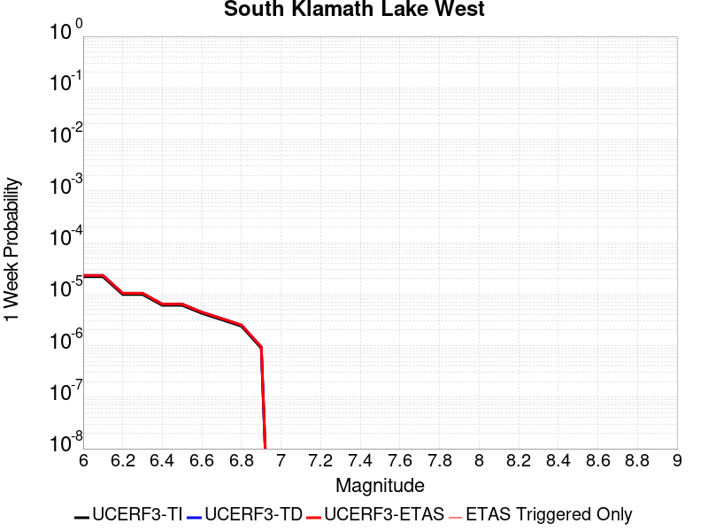 |  |  |  |

| Magnitude | 1 wk TI Prob | 1 wk TD Prob | 1 wk ETAS Prob | 1 wk ETAS/TD Gain | 1 wk ETAS Triggered Only | 1 mo TI Prob | 1 mo TD Prob | 1 mo ETAS Prob | 1 mo ETAS/TD Gain | 1 mo ETAS Triggered Only | 1 yr TI Prob | 1 yr TD Prob | 1 yr ETAS Prob | 1 yr ETAS/TD Gain | 1 yr ETAS Triggered Only | 10 yr TI Prob | 10 yr TD Prob | 10 yr ETAS Prob | 10 yr ETAS/TD Gain | 10 yr ETAS Triggered Only |
|-----|-----|-----|-----|-----|-----|-----|-----|-----|-----|-----|-----|-----|-----|-----|-----|-----|-----|-----|-----|-----|
| 6.0 | 2.174025E-5 | 2.3042758E-5 | 2.3042758E-5 | 1.0 | 0.0 | 9.3169176E-5 | 9.875131E-5 | 9.875131E-5 | 1.0 | 0.0 | 0.0011337444 | 0.0012016998 | 0.0012116878 | 1.0083115 | 1.0E-5 | 0.011279777 | 0.011958619 | 0.011968499 | 1.0008262 | 1.0E-5 |
| 6.1 | 2.174025E-5 | 2.3042758E-5 | 2.3042758E-5 | 1.0 | 0.0 | 9.3169176E-5 | 9.875131E-5 | 9.875131E-5 | 1.0 | 0.0 | 0.0011337444 | 0.0012016998 | 0.0012116878 | 1.0083115 | 1.0E-5 | 0.011279777 | 0.011958619 | 0.011968499 | 1.0008262 | 1.0E-5 |
| 6.2 | 9.834929E-6 | 1.0394155E-5 | 1.0394155E-5 | 1.0 | 0.0 | 4.2149015E-5 | 4.4545668E-5 | 4.4545668E-5 | 1.0 | 0.0 | 5.1304343E-4 | 5.422176E-4 | 5.522122E-4 | 1.0184327 | 1.0E-5 | 0.0051186057 | 0.0054098484 | 0.005419794 | 1.0018384 | 1.0E-5 |
| 6.3 | 9.834929E-6 | 1.0394155E-5 | 1.0394155E-5 | 1.0 | 0.0 | 4.2149015E-5 | 4.4545668E-5 | 4.4545668E-5 | 1.0 | 0.0 | 5.1304343E-4 | 5.422176E-4 | 5.522122E-4 | 1.0184327 | 1.0E-5 | 0.0051186057 | 0.0054098484 | 0.005419794 | 1.0018384 | 1.0E-5 |
| 6.4 | 6.066321E-6 | 6.4006167E-6 | 6.4006167E-6 | 1.0 | 0.0 | 2.5998259E-5 | 2.7430942E-5 | 2.7430942E-5 | 1.0 | 0.0 | 3.1648282E-4 | 3.3392326E-4 | 3.439199E-4 | 1.029937 | 1.0E-5 | 0.0031603249 | 0.0033344855 | 0.003344452 | 1.0029889 | 1.0E-5 |
| 6.5 | 6.066321E-6 | 6.4006167E-6 | 6.4006167E-6 | 1.0 | 0.0 | 2.5998259E-5 | 2.7430942E-5 | 2.7430942E-5 | 1.0 | 0.0 | 3.1648282E-4 | 3.3392326E-4 | 3.439199E-4 | 1.029937 | 1.0E-5 | 0.0031603249 | 0.0033344855 | 0.003344452 | 1.0029889 | 1.0E-5 |
| 6.6 | 4.2321803E-6 | 4.4614194E-6 | 4.4614194E-6 | 1.0 | 0.0 | 1.8137789E-5 | 1.9120234E-5 | 1.9120234E-5 | 1.0 | 0.0 | 2.208052E-4 | 2.3276501E-4 | 2.3276501E-4 | 1.0 | 0.0 | 0.0022058594 | 0.002325314 | 0.002325314 | 1.0 | 0.0 |
| 6.7 | 3.186646E-6 | 3.3604024E-6 | 3.3604024E-6 | 1.0 | 0.0 | 1.3656982E-5 | 1.44016485E-5 | 1.44016485E-5 | 1.0 | 0.0 | 1.6626107E-4 | 1.7532664E-4 | 1.7532664E-4 | 1.0 | 0.0 | 0.0016613674 | 0.0017519504 | 0.0017519504 | 1.0 | 0.0 |
| 6.8 | 2.380121E-6 | 2.5109803E-6 | 2.5109803E-6 | 1.0 | 0.0 | 1.0200479E-5 | 1.0761302E-5 | 1.0761302E-5 | 1.0 | 0.0 | 1.2418375E-4 | 1.3101145E-4 | 1.3101145E-4 | 1.0 | 0.0 | 0.0012411437 | 0.0013093879 | 0.0013093879 | 1.0 | 0.0 |
| 6.9 | 8.928287E-7 | 9.430532E-7 | 9.430532E-7 | 1.0 | 0.0 | 3.826403E-6 | 4.041651E-6 | 4.041651E-6 | 1.0 | 0.0 | 4.658546E-5 | 4.9206214E-5 | 4.9206214E-5 | 1.0 | 0.0 | 4.6575698E-4 | 4.919748E-4 | 4.919748E-4 | 1.0 | 0.0 |

## Los Alamos extension
*[(top)](#table-of-contents)*

| 1 Week | 1 Month | 1 Year | 10 Year |
|-----|-----|-----|-----|
|  |  |  | 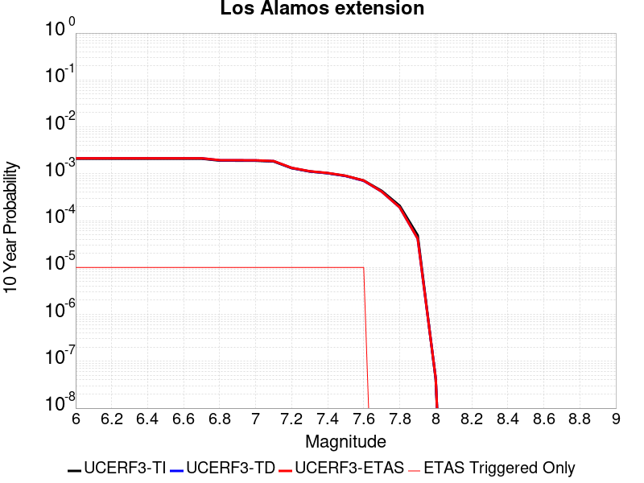 |

| Magnitude | 1 wk TI Prob | 1 wk TD Prob | 1 wk ETAS Prob | 1 wk ETAS/TD Gain | 1 wk ETAS Triggered Only | 1 mo TI Prob | 1 mo TD Prob | 1 mo ETAS Prob | 1 mo ETAS/TD Gain | 1 mo ETAS Triggered Only | 1 yr TI Prob | 1 yr TD Prob | 1 yr ETAS Prob | 1 yr ETAS/TD Gain | 1 yr ETAS Triggered Only | 10 yr TI Prob | 10 yr TD Prob | 10 yr ETAS Prob | 10 yr ETAS/TD Gain | 10 yr ETAS Triggered Only |
|-----|-----|-----|-----|-----|-----|-----|-----|-----|-----|-----|-----|-----|-----|-----|-----|-----|-----|-----|-----|-----|
| 6.0 | 4.0146506E-6 | 4.0862424E-6 | 4.0862424E-6 | 1.0 | 0.0 | 1.7205533E-5 | 1.7512357E-5 | 1.7512357E-5 | 1.0 | 0.0 | 2.0945723E-4 | 2.1319318E-4 | 2.1319318E-4 | 1.0 | 0.0 | 0.0020925992 | 0.0021299957 | 0.0021399744 | 1.0046848 | 1.0E-5 |
| 6.1 | 4.0146506E-6 | 4.0862424E-6 | 4.0862424E-6 | 1.0 | 0.0 | 1.7205533E-5 | 1.7512357E-5 | 1.7512357E-5 | 1.0 | 0.0 | 2.0945723E-4 | 2.1319318E-4 | 2.1319318E-4 | 1.0 | 0.0 | 0.0020925992 | 0.0021299957 | 0.0021399744 | 1.0046848 | 1.0E-5 |
| 6.2 | 4.0146506E-6 | 4.0862424E-6 | 4.0862424E-6 | 1.0 | 0.0 | 1.7205533E-5 | 1.7512357E-5 | 1.7512357E-5 | 1.0 | 0.0 | 2.0945723E-4 | 2.1319318E-4 | 2.1319318E-4 | 1.0 | 0.0 | 0.0020925992 | 0.0021299957 | 0.0021399744 | 1.0046848 | 1.0E-5 |
| 6.3 | 4.0146506E-6 | 4.0862424E-6 | 4.0862424E-6 | 1.0 | 0.0 | 1.7205533E-5 | 1.7512357E-5 | 1.7512357E-5 | 1.0 | 0.0 | 2.0945723E-4 | 2.1319318E-4 | 2.1319318E-4 | 1.0 | 0.0 | 0.0020925992 | 0.0021299957 | 0.0021399744 | 1.0046848 | 1.0E-5 |
| 6.4 | 4.0146506E-6 | 4.0862424E-6 | 4.0862424E-6 | 1.0 | 0.0 | 1.7205533E-5 | 1.7512357E-5 | 1.7512357E-5 | 1.0 | 0.0 | 2.0945723E-4 | 2.1319318E-4 | 2.1319318E-4 | 1.0 | 0.0 | 0.0020925992 | 0.0021299957 | 0.0021399744 | 1.0046848 | 1.0E-5 |
| 6.5 | 4.0146506E-6 | 4.0862424E-6 | 4.0862424E-6 | 1.0 | 0.0 | 1.7205533E-5 | 1.7512357E-5 | 1.7512357E-5 | 1.0 | 0.0 | 2.0945723E-4 | 2.1319318E-4 | 2.1319318E-4 | 1.0 | 0.0 | 0.0020925992 | 0.0021299957 | 0.0021399744 | 1.0046848 | 1.0E-5 |
| 6.6 | 4.0146506E-6 | 4.0862424E-6 | 4.0862424E-6 | 1.0 | 0.0 | 1.7205533E-5 | 1.7512357E-5 | 1.7512357E-5 | 1.0 | 0.0 | 2.0945723E-4 | 2.1319318E-4 | 2.1319318E-4 | 1.0 | 0.0 | 0.0020925992 | 0.0021299957 | 0.0021399744 | 1.0046848 | 1.0E-5 |
| 6.7 | 4.0146506E-6 | 4.0862424E-6 | 4.0862424E-6 | 1.0 | 0.0 | 1.7205533E-5 | 1.7512357E-5 | 1.7512357E-5 | 1.0 | 0.0 | 2.0945723E-4 | 2.1319318E-4 | 2.1319318E-4 | 1.0 | 0.0 | 0.0020925992 | 0.0021299957 | 0.0021399744 | 1.0046848 | 1.0E-5 |
| 6.8 | 3.6584688E-6 | 3.7189357E-6 | 3.7189357E-6 | 1.0 | 0.0 | 1.5679057E-5 | 1.5938203E-5 | 1.5938203E-5 | 1.0 | 0.0 | 1.9087581E-4 | 1.9403128E-4 | 1.9403128E-4 | 1.0 | 0.0 | 0.0019071194 | 0.0019387112 | 0.0019486918 | 1.005148 | 1.0E-5 |
| 6.9 | 3.644631E-6 | 3.7046455E-6 | 3.7046455E-6 | 1.0 | 0.0 | 1.5619753E-5 | 1.587696E-5 | 1.587696E-5 | 1.0 | 0.0 | 1.901539E-4 | 1.9328577E-4 | 1.9328577E-4 | 1.0 | 0.0 | 0.0018999127 | 0.0019312691 | 0.0019412497 | 1.005168 | 1.0E-5 |
| 7.0 | 3.6318522E-6 | 3.6914057E-6 | 3.6914057E-6 | 1.0 | 0.0 | 1.5564989E-5 | 1.582022E-5 | 1.582022E-5 | 1.0 | 0.0 | 1.8948725E-4 | 1.9259508E-4 | 1.9259508E-4 | 1.0 | 0.0 | 0.0018932576 | 0.001924374 | 0.0019343548 | 1.0051864 | 1.0E-5 |
| 7.1 | 3.5001724E-6 | 3.555474E-6 | 3.555474E-6 | 1.0 | 0.0 | 1.5000653E-5 | 1.52376615E-5 | 1.52376615E-5 | 1.0 | 0.0 | 1.8261763E-4 | 1.8550365E-4 | 1.8550365E-4 | 1.0 | 0.0 | 0.0018246764 | 0.0018535787 | 0.0018635602 | 1.0053849 | 1.0E-5 |
| 7.2 | 2.5204702E-6 | 2.5437507E-6 | 2.5437507E-6 | 1.0 | 0.0 | 1.080197E-5 | 1.0901743E-5 | 1.0901743E-5 | 1.0 | 0.0 | 1.3150605E-4 | 1.327207E-4 | 1.327207E-4 | 1.0 | 0.0 | 0.0013142825 | 0.0013264199 | 0.0013364067 | 1.0075291 | 1.0E-5 |
| 7.3 | 2.1399692E-6 | 2.1501808E-6 | 2.1501808E-6 | 1.0 | 0.0 | 9.1712645E-6 | 9.2150285E-6 | 9.2150285E-6 | 1.0 | 0.0 | 1.1165442E-4 | 1.1218722E-4 | 1.1218722E-4 | 1.0 | 0.0 | 0.0011159834 | 0.0011213091 | 0.0011312979 | 1.0089082 | 1.0E-5 |
| 7.4 | 1.9660122E-6 | 1.9702823E-6 | 1.9702823E-6 | 1.0 | 0.0 | 8.42574E-6 | 8.44404E-6 | 8.44404E-6 | 1.0 | 0.0 | 1.0257855E-4 | 1.02801365E-4 | 1.02801365E-4 | 1.0 | 0.0 | 0.0010253121 | 0.0010275412 | 0.001037531 | 1.009722 | 1.0E-5 |
| 7.5 | 1.7204633E-6 | 1.715139E-6 | 1.715139E-6 | 1.0 | 0.0 | 7.373393E-6 | 7.350575E-6 | 7.350575E-6 | 1.0 | 0.0 | 8.976737E-5 | 8.94896E-5 | 8.94896E-5 | 1.0 | 0.0 | 8.9731114E-4 | 8.9453865E-4 | 9.045297E-4 | 1.011169 | 1.0E-5 |
| 7.6 | 1.3717638E-6 | 1.3536154E-6 | 1.3536154E-6 | 1.0 | 0.0 | 5.878974E-6 | 5.801196E-6 | 5.801196E-6 | 1.0 | 0.0 | 7.157416E-5 | 7.06273E-5 | 7.06273E-5 | 1.0 | 0.0 | 7.1551115E-4 | 7.060511E-4 | 7.160441E-4 | 1.0141532 | 1.0E-5 |
| 7.7 | 8.272564E-7 | 7.9578405E-7 | 7.9578405E-7 | 1.0 | 0.0 | 3.5453797E-6 | 3.4104987E-6 | 3.4104987E-6 | 1.0 | 0.0 | 4.3164142E-5 | 4.152203E-5 | 4.152203E-5 | 1.0 | 0.0 | 4.315576E-4 | 4.1514292E-4 | 4.1514292E-4 | 1.0 | 0.0 |
| 7.8 | 3.9708277E-7 | 3.6720036E-7 | 3.6720036E-7 | 1.0 | 0.0 | 1.7017821E-6 | 1.5737149E-6 | 1.5737149E-6 | 1.0 | 0.0 | 2.0719E-5 | 1.915981E-5 | 1.915981E-5 | 1.0 | 0.0 | 2.071707E-4 | 1.9158165E-4 | 1.9158165E-4 | 1.0 | 0.0 |
| 7.9 | 9.292528E-8 | 7.889317E-8 | 7.889317E-8 | 1.0 | 0.0 | 3.9825116E-7 | 3.3811355E-7 | 3.3811355E-7 | 1.0 | 0.0 | 4.848697E-6 | 4.116525E-6 | 4.116525E-6 | 1.0 | 0.0 | 4.8485912E-5 | 4.1164494E-5 | 4.1164494E-5 | 1.0 | 0.0 |
| 8.0 | 7.880441E-11 | 8.235512E-11 | 8.235512E-11 | 1.0 | 0.0 | 3.3773329E-10 | 3.5295045E-10 | 3.5295045E-10 | 1.0 | 0.0 | 4.1119033E-9 | 4.2971724E-9 | 4.2971724E-9 | 1.0 | 0.0 | 4.1119034E-8 | 4.297172E-8 | 4.297172E-8 | 1.0 | 0.0 |

## Pitas Point (Lower)-Montalvo
*[(top)](#table-of-contents)*

| 1 Week | 1 Month | 1 Year | 10 Year |
|-----|-----|-----|-----|
|  |  |  |  |

| Magnitude | 1 wk TI Prob | 1 wk TD Prob | 1 wk ETAS Prob | 1 wk ETAS/TD Gain | 1 wk ETAS Triggered Only | 1 mo TI Prob | 1 mo TD Prob | 1 mo ETAS Prob | 1 mo ETAS/TD Gain | 1 mo ETAS Triggered Only | 1 yr TI Prob | 1 yr TD Prob | 1 yr ETAS Prob | 1 yr ETAS/TD Gain | 1 yr ETAS Triggered Only | 10 yr TI Prob | 10 yr TD Prob | 10 yr ETAS Prob | 10 yr ETAS/TD Gain | 10 yr ETAS Triggered Only |
|-----|-----|-----|-----|-----|-----|-----|-----|-----|-----|-----|-----|-----|-----|-----|-----|-----|-----|-----|-----|-----|
| 6.0 | 5.2543637E-6 | 4.8380302E-6 | 4.8380302E-6 | 1.0 | 0.0 | 2.2518509E-5 | 2.0734253E-5 | 2.0734253E-5 | 1.0 | 0.0 | 2.7412834E-4 | 2.524106E-4 | 2.524106E-4 | 1.0 | 0.0 | 0.0027379042 | 0.0025212716 | 0.0025312465 | 1.0039562 | 1.0E-5 |
| 6.1 | 5.2543637E-6 | 4.8380302E-6 | 4.8380302E-6 | 1.0 | 0.0 | 2.2518509E-5 | 2.0734253E-5 | 2.0734253E-5 | 1.0 | 0.0 | 2.7412834E-4 | 2.524106E-4 | 2.524106E-4 | 1.0 | 0.0 | 0.0027379042 | 0.0025212716 | 0.0025312465 | 1.0039562 | 1.0E-5 |
| 6.2 | 5.2543637E-6 | 4.8380302E-6 | 4.8380302E-6 | 1.0 | 0.0 | 2.2518509E-5 | 2.0734253E-5 | 2.0734253E-5 | 1.0 | 0.0 | 2.7412834E-4 | 2.524106E-4 | 2.524106E-4 | 1.0 | 0.0 | 0.0027379042 | 0.0025212716 | 0.0025312465 | 1.0039562 | 1.0E-5 |
| 6.3 | 5.2543637E-6 | 4.8380302E-6 | 4.8380302E-6 | 1.0 | 0.0 | 2.2518509E-5 | 2.0734253E-5 | 2.0734253E-5 | 1.0 | 0.0 | 2.7412834E-4 | 2.524106E-4 | 2.524106E-4 | 1.0 | 0.0 | 0.0027379042 | 0.0025212716 | 0.0025312465 | 1.0039562 | 1.0E-5 |
| 6.4 | 5.2543637E-6 | 4.8380302E-6 | 4.8380302E-6 | 1.0 | 0.0 | 2.2518509E-5 | 2.0734253E-5 | 2.0734253E-5 | 1.0 | 0.0 | 2.7412834E-4 | 2.524106E-4 | 2.524106E-4 | 1.0 | 0.0 | 0.0027379042 | 0.0025212716 | 0.0025312465 | 1.0039562 | 1.0E-5 |
| 6.5 | 5.2543637E-6 | 4.8380302E-6 | 4.8380302E-6 | 1.0 | 0.0 | 2.2518509E-5 | 2.0734253E-5 | 2.0734253E-5 | 1.0 | 0.0 | 2.7412834E-4 | 2.524106E-4 | 2.524106E-4 | 1.0 | 0.0 | 0.0027379042 | 0.0025212716 | 0.0025312465 | 1.0039562 | 1.0E-5 |
| 6.6 | 5.2543637E-6 | 4.8380302E-6 | 4.8380302E-6 | 1.0 | 0.0 | 2.2518509E-5 | 2.0734253E-5 | 2.0734253E-5 | 1.0 | 0.0 | 2.7412834E-4 | 2.524106E-4 | 2.524106E-4 | 1.0 | 0.0 | 0.0027379042 | 0.0025212716 | 0.0025312465 | 1.0039562 | 1.0E-5 |
| 6.7 | 5.2543637E-6 | 4.8380302E-6 | 4.8380302E-6 | 1.0 | 0.0 | 2.2518509E-5 | 2.0734253E-5 | 2.0734253E-5 | 1.0 | 0.0 | 2.7412834E-4 | 2.524106E-4 | 2.524106E-4 | 1.0 | 0.0 | 0.0027379042 | 0.0025212716 | 0.0025312465 | 1.0039562 | 1.0E-5 |
| 6.8 | 5.2543637E-6 | 4.8380302E-6 | 4.8380302E-6 | 1.0 | 0.0 | 2.2518509E-5 | 2.0734253E-5 | 2.0734253E-5 | 1.0 | 0.0 | 2.7412834E-4 | 2.524106E-4 | 2.524106E-4 | 1.0 | 0.0 | 0.0027379042 | 0.0025212716 | 0.0025312465 | 1.0039562 | 1.0E-5 |
| 6.9 | 5.2543637E-6 | 4.8380302E-6 | 4.8380302E-6 | 1.0 | 0.0 | 2.2518509E-5 | 2.0734253E-5 | 2.0734253E-5 | 1.0 | 0.0 | 2.7412834E-4 | 2.524106E-4 | 2.524106E-4 | 1.0 | 0.0 | 0.0027379042 | 0.0025212716 | 0.0025312465 | 1.0039562 | 1.0E-5 |
| 7.0 | 5.2543637E-6 | 4.8380302E-6 | 4.8380302E-6 | 1.0 | 0.0 | 2.2518509E-5 | 2.0734253E-5 | 2.0734253E-5 | 1.0 | 0.0 | 2.7412834E-4 | 2.524106E-4 | 2.524106E-4 | 1.0 | 0.0 | 0.0027379042 | 0.0025212716 | 0.0025312465 | 1.0039562 | 1.0E-5 |
| 7.1 | 5.2543637E-6 | 4.8380302E-6 | 4.8380302E-6 | 1.0 | 0.0 | 2.2518509E-5 | 2.0734253E-5 | 2.0734253E-5 | 1.0 | 0.0 | 2.7412834E-4 | 2.524106E-4 | 2.524106E-4 | 1.0 | 0.0 | 0.0027379042 | 0.0025212716 | 0.0025312465 | 1.0039562 | 1.0E-5 |
| 7.2 | 5.2458695E-6 | 4.829184E-6 | 4.829184E-6 | 1.0 | 0.0 | 2.2482105E-5 | 2.0696341E-5 | 2.0696341E-5 | 1.0 | 0.0 | 2.7368523E-4 | 2.5194912E-4 | 2.5194912E-4 | 1.0 | 0.0 | 0.0027334841 | 0.0025166674 | 0.002526642 | 1.0039635 | 1.0E-5 |
| 7.3 | 5.22665E-6 | 4.809101E-6 | 4.809101E-6 | 1.0 | 0.0 | 2.2399736E-5 | 2.061027E-5 | 2.061027E-5 | 1.0 | 0.0 | 2.7268266E-4 | 2.5090147E-4 | 2.5090147E-4 | 1.0 | 0.0 | 0.002723483 | 0.0025062144 | 0.0025161894 | 1.00398 | 1.0E-5 |
| 7.4 | 5.210642E-6 | 4.7923127E-6 | 4.7923127E-6 | 1.0 | 0.0 | 2.233113E-5 | 2.0538324E-5 | 2.0538324E-5 | 1.0 | 0.0 | 2.718476E-4 | 2.500257E-4 | 2.500257E-4 | 1.0 | 0.0 | 0.002715153 | 0.0024974765 | 0.0025074515 | 1.003994 | 1.0E-5 |
| 7.5 | 5.1226016E-6 | 4.700197E-6 | 4.700197E-6 | 1.0 | 0.0 | 2.1953823E-5 | 2.0143549E-5 | 2.0143549E-5 | 1.0 | 0.0 | 2.67255E-4 | 2.452204E-4 | 2.452204E-4 | 1.0 | 0.0 | 0.0026693381 | 0.00244953 | 0.0024595053 | 1.0040724 | 1.0E-5 |
| 7.6 | 4.8796987E-6 | 4.44509E-6 | 4.44509E-6 | 1.0 | 0.0 | 2.0912828E-5 | 1.9050249E-5 | 1.9050249E-5 | 1.0 | 0.0 | 2.5458392E-4 | 2.3191239E-4 | 2.3191239E-4 | 1.0 | 0.0 | 0.0025429246 | 0.0023167343 | 0.002326711 | 1.0043064 | 1.0E-5 |
| 7.7 | 4.0834398E-6 | 3.609237E-6 | 3.609237E-6 | 1.0 | 0.0 | 1.7500339E-5 | 1.5468067E-5 | 1.5468067E-5 | 1.0 | 0.0 | 2.1304579E-4 | 1.8830769E-4 | 1.8830769E-4 | 1.0 | 0.0 | 0.0021284167 | 0.001881505 | 0.0018914862 | 1.0053049 | 1.0E-5 |
| 7.8 | 2.5445438E-6 | 2.1212973E-6 | 2.1212973E-6 | 1.0 | 0.0 | 1.0905142E-5 | 9.091243E-6 | 9.091243E-6 | 1.0 | 0.0 | 1.3276201E-4 | 1.106803E-4 | 1.106803E-4 | 1.0 | 0.0 | 0.0013268272 | 0.0011062565 | 0.0011062565 | 1.0 | 0.0 |
| 7.9 | 4.1677114E-7 | 3.3294845E-7 | 3.3294845E-7 | 1.0 | 0.0 | 1.7861609E-6 | 1.4269211E-6 | 1.4269211E-6 | 1.0 | 0.0 | 2.1746291E-5 | 1.737263E-5 | 1.737263E-5 | 1.0 | 0.0 | 2.1744163E-4 | 1.7371304E-4 | 1.7371304E-4 | 1.0 | 0.0 |
| 8.0 | 7.791402E-9 | 5.683722E-9 | 5.683722E-9 | 1.0 | 0.0 | 3.3391725E-8 | 2.4358807E-8 | 2.4358807E-8 | 1.0 | 0.0 | 4.0654416E-7 | 2.9656846E-7 | 2.9656846E-7 | 1.0 | 0.0 | 4.065434E-6 | 2.9656826E-6 | 2.9656826E-6 | 1.0 | 0.0 |

## Calaveras (So) 2011 CFM
*[(top)](#table-of-contents)*

| 1 Week | 1 Month | 1 Year | 10 Year |
|-----|-----|-----|-----|
| 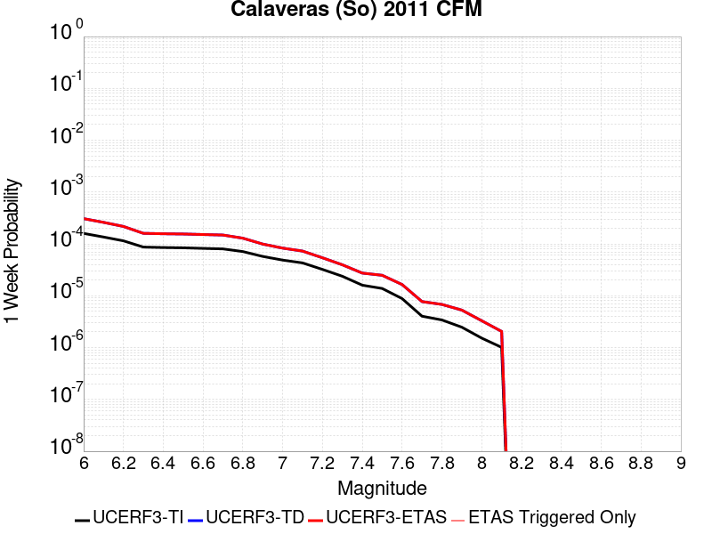 |  |  | 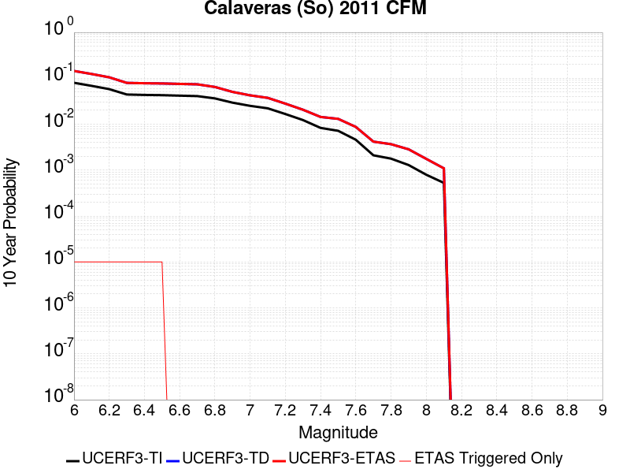 |

| Magnitude | 1 wk TI Prob | 1 wk TD Prob | 1 wk ETAS Prob | 1 wk ETAS/TD Gain | 1 wk ETAS Triggered Only | 1 mo TI Prob | 1 mo TD Prob | 1 mo ETAS Prob | 1 mo ETAS/TD Gain | 1 mo ETAS Triggered Only | 1 yr TI Prob | 1 yr TD Prob | 1 yr ETAS Prob | 1 yr ETAS/TD Gain | 1 yr ETAS Triggered Only | 10 yr TI Prob | 10 yr TD Prob | 10 yr ETAS Prob | 10 yr ETAS/TD Gain | 10 yr ETAS Triggered Only |
|-----|-----|-----|-----|-----|-----|-----|-----|-----|-----|-----|-----|-----|-----|-----|-----|-----|-----|-----|-----|-----|
| 6.0 | 1.5950744E-4 | 3.0739905E-4 | 3.0739905E-4 | 1.0 | 0.0 | 6.834242E-4 | 0.0013167706 | 0.0013167706 | 1.0 | 0.0 | 0.00828899 | 0.015865553 | 0.015875394 | 1.0006202 | 1.0E-5 | 0.079865426 | 0.14445968 | 0.14446825 | 1.0000592 | 1.0E-5 |
| 6.1 | 1.3584697E-4 | 2.6061598E-4 | 2.6061598E-4 | 1.0 | 0.0 | 5.8207137E-4 | 0.0011164517 | 0.0011164517 | 1.0 | 0.0 | 0.007063716 | 0.013468163 | 0.013478029 | 1.0007325 | 1.0E-5 | 0.06843361 | 0.124085724 | 0.12409448 | 1.0000706 | 1.0E-5 |
| 6.2 | 1.14676266E-4 | 2.1746816E-4 | 2.1746816E-4 | 1.0 | 0.0 | 4.9137714E-4 | 9.316741E-4 | 9.316741E-4 | 1.0 | 0.0 | 0.0059661185 | 0.011251126 | 0.011261014 | 1.0008788 | 1.0E-5 | 0.058084648 | 0.10507494 | 0.10508389 | 1.0000851 | 1.0E-5 |
| 6.3 | 8.691518E-5 | 1.6001116E-4 | 1.6001116E-4 | 1.0 | 0.0 | 3.7244044E-4 | 6.855628E-4 | 6.855628E-4 | 1.0 | 0.0 | 0.004525038 | 0.008307241 | 0.008317159 | 1.0011938 | 1.0E-5 | 0.044339992 | 0.079390146 | 0.07939935 | 1.000116 | 1.0E-5 |
| 6.4 | 8.50982E-5 | 1.5707467E-4 | 1.5707467E-4 | 1.0 | 0.0 | 3.646556E-4 | 6.7298434E-4 | 6.7298434E-4 | 1.0 | 0.0 | 0.0044306475 | 0.008155251 | 0.0081651695 | 1.0012162 | 1.0E-5 | 0.04343345 | 0.077996135 | 0.07800536 | 1.0001183 | 1.0E-5 |
| 6.5 | 8.4062965E-5 | 1.5531975E-4 | 1.5531975E-4 | 1.0 | 0.0 | 3.602201E-4 | 6.654671E-4 | 6.654671E-4 | 1.0 | 0.0 | 0.004376863 | 0.008064441 | 0.008074361 | 1.00123 | 1.0E-5 | 0.042916555 | 0.07716733 | 0.07717656 | 1.0001196 | 1.0E-5 |
| 6.6 | 8.194716E-5 | 1.516774E-4 | 1.516774E-4 | 1.0 | 0.0 | 3.5115483E-4 | 6.498649E-4 | 6.498649E-4 | 1.0 | 0.0 | 0.0042669317 | 0.007876252 | 0.007876252 | 1.0 | 0.0 | 0.04185927 | 0.0754524 | 0.0754524 | 1.0 | 0.0 |
| 6.7 | 8.012326E-5 | 1.483531E-4 | 1.483531E-4 | 1.0 | 0.0 | 3.433402E-4 | 6.3563243E-4 | 6.3563243E-4 | 1.0 | 0.0 | 0.004172157 | 0.0077047227 | 0.0077047227 | 1.0 | 0.0 | 0.040946912 | 0.0738944 | 0.0738944 | 1.0 | 0.0 |
| 6.8 | 7.119773E-5 | 1.289278E-4 | 1.289278E-4 | 1.0 | 0.0 | 3.0509746E-4 | 5.524251E-4 | 5.524251E-4 | 1.0 | 0.0 | 0.0037082357 | 0.0067017726 | 0.0067017726 | 1.0 | 0.0 | 0.036469642 | 0.06473622 | 0.06473622 | 1.0 | 0.0 |
| 6.9 | 5.7343088E-5 | 9.928818E-5 | 9.928818E-5 | 1.0 | 0.0 | 2.4573295E-4 | 4.254518E-4 | 4.254518E-4 | 1.0 | 0.0 | 0.0029876942 | 0.0051676547 | 0.0051676547 | 1.0 | 0.0 | 0.02947844 | 0.05055552 | 0.05055552 | 1.0 | 0.0 |
| 7.0 | 4.8746577E-5 | 8.294431E-5 | 8.294431E-5 | 1.0 | 0.0 | 2.0889717E-4 | 3.5542753E-4 | 3.5542753E-4 | 1.0 | 0.0 | 0.0025403565 | 0.0043188105 | 0.0043188105 | 1.0 | 0.0 | 0.025115121 | 0.04253077 | 0.04253077 | 1.0 | 0.0 |
| 7.1 | 4.2998014E-5 | 7.27236E-5 | 7.27236E-5 | 1.0 | 0.0 | 1.8426418E-4 | 3.1163564E-4 | 3.1163564E-4 | 1.0 | 0.0 | 0.002241108 | 0.0037876235 | 0.0037876235 | 1.0 | 0.0 | 0.022186412 | 0.037458975 | 0.037458975 | 1.0 | 0.0 |
| 7.2 | 3.221292E-5 | 5.3976983E-5 | 5.3976983E-5 | 1.0 | 0.0 | 1.3804805E-4 | 2.3130958E-4 | 2.3130958E-4 | 1.0 | 0.0 | 0.0016794393 | 0.002812585 | 0.002812585 | 1.0 | 0.0 | 0.016668037 | 0.02807059 | 0.02807059 | 1.0 | 0.0 |
| 7.3 | 2.3756531E-5 | 3.9534E-5 | 3.9534E-5 | 1.0 | 0.0 | 1.0180973E-4 | 1.6942051E-4 | 1.6942051E-4 | 1.0 | 0.0 | 0.0012388286 | 0.0020607605 | 0.0020607605 | 1.0 | 0.0 | 0.012319452 | 0.020674022 | 0.020674022 | 1.0 | 0.0 |
| 7.4 | 1.5997684E-5 | 2.737303E-5 | 2.737303E-5 | 1.0 | 0.0 | 6.8559704E-5 | 1.1730772E-4 | 1.1730772E-4 | 1.0 | 0.0 | 8.343947E-4 | 0.0014272883 | 0.0014272883 | 1.0 | 0.0 | 0.008312687 | 0.0143921655 | 0.0143921655 | 1.0 | 0.0 |
| 7.5 | 1.3814293E-5 | 2.481389E-5 | 2.481389E-5 | 1.0 | 0.0 | 5.9202768E-5 | 1.0634092E-4 | 1.0634092E-4 | 1.0 | 0.0 | 7.205553E-4 | 0.0012939342 | 0.0012939342 | 1.0 | 0.0 | 0.007182234 | 0.013070965 | 0.013070965 | 1.0 | 0.0 |
| 7.6 | 8.817309E-6 | 1.6456672E-5 | 1.6456672E-5 | 1.0 | 0.0 | 3.7787922E-5 | 7.0526694E-5 | 7.0526694E-5 | 1.0 | 0.0 | 4.5997082E-4 | 8.5832557E-4 | 8.5832557E-4 | 1.0 | 0.0 | 0.004590199 | 0.008732965 | 0.008732965 | 1.0 | 0.0 |
| 7.7 | 4.0352206E-6 | 7.724012E-6 | 7.724012E-6 | 1.0 | 0.0 | 1.7293689E-5 | 3.310249E-5 | 3.310249E-5 | 1.0 | 0.0 | 2.1053031E-4 | 4.0294835E-4 | 4.0294835E-4 | 1.0 | 0.0 | 0.0021033096 | 0.0041733775 | 0.0041733775 | 1.0 | 0.0 |
| 7.8 | 3.413169E-6 | 6.8018153E-6 | 6.8018153E-6 | 1.0 | 0.0 | 1.4627784E-5 | 2.9150313E-5 | 2.9150313E-5 | 1.0 | 0.0 | 1.7807873E-4 | 3.5484732E-4 | 3.5484732E-4 | 1.0 | 0.0 | 0.0017793609 | 0.0036736047 | 0.0036736047 | 1.0 | 0.0 |
| 7.9 | 2.4740732E-6 | 5.2897763E-6 | 5.2897763E-6 | 1.0 | 0.0 | 1.06031275E-5 | 2.2670272E-5 | 2.2670272E-5 | 1.0 | 0.0 | 1.2908543E-4 | 2.7597568E-4 | 2.7597568E-4 | 1.0 | 0.0 | 0.0012901047 | 0.002839954 | 0.002839954 | 1.0 | 0.0 |
| 8.0 | 1.5231818E-6 | 3.2950636E-6 | 3.2950636E-6 | 1.0 | 0.0 | 6.527906E-6 | 1.4121625E-5 | 1.4121625E-5 | 1.0 | 0.0 | 7.9474354E-5 | 1.7191726E-4 | 1.7191726E-4 | 1.0 | 0.0 | 7.944594E-4 | 0.0017594753 | 0.0017594753 | 1.0 | 0.0 |
| 8.1 | 1.0104524E-6 | 2.049573E-6 | 2.049573E-6 | 1.0 | 0.0 | 4.330503E-6 | 8.783854E-6 | 8.783854E-6 | 1.0 | 0.0 | 5.2722597E-5 | 1.0693821E-4 | 1.0693821E-4 | 1.0 | 0.0 | 5.271009E-4 | 0.0010948586 | 0.0010948586 | 1.0 | 0.0 |

## San Luis Range - Oceano 2011 CFM
*[(top)](#table-of-contents)*

| 1 Week | 1 Month | 1 Year | 10 Year |
|-----|-----|-----|-----|
| 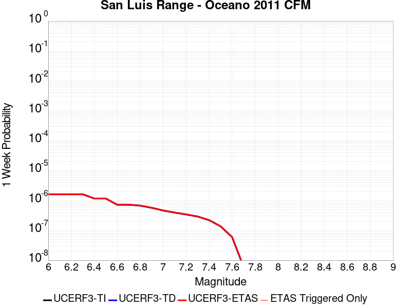 |  |  | 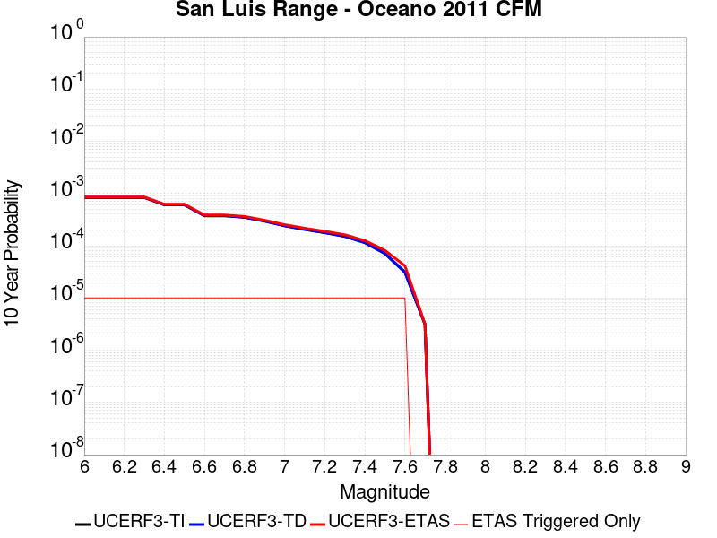 |

| Magnitude | 1 wk TI Prob | 1 wk TD Prob | 1 wk ETAS Prob | 1 wk ETAS/TD Gain | 1 wk ETAS Triggered Only | 1 mo TI Prob | 1 mo TD Prob | 1 mo ETAS Prob | 1 mo ETAS/TD Gain | 1 mo ETAS Triggered Only | 1 yr TI Prob | 1 yr TD Prob | 1 yr ETAS Prob | 1 yr ETAS/TD Gain | 1 yr ETAS Triggered Only | 10 yr TI Prob | 10 yr TD Prob | 10 yr ETAS Prob | 10 yr ETAS/TD Gain | 10 yr ETAS Triggered Only |
|-----|-----|-----|-----|-----|-----|-----|-----|-----|-----|-----|-----|-----|-----|-----|-----|-----|-----|-----|-----|-----|
| 6.0 | 1.6025788E-6 | 1.6201284E-6 | 1.6201284E-6 | 1.0 | 0.0 | 6.8681766E-6 | 6.9433913E-6 | 6.9433913E-6 | 1.0 | 0.0 | 8.361684E-5 | 8.453293E-5 | 8.453293E-5 | 1.0 | 0.0 | 8.3585386E-4 | 8.450485E-4 | 8.5504004E-4 | 1.0118237 | 1.0E-5 |
| 6.1 | 1.6025788E-6 | 1.6201284E-6 | 1.6201284E-6 | 1.0 | 0.0 | 6.8681766E-6 | 6.9433913E-6 | 6.9433913E-6 | 1.0 | 0.0 | 8.361684E-5 | 8.453293E-5 | 8.453293E-5 | 1.0 | 0.0 | 8.3585386E-4 | 8.450485E-4 | 8.5504004E-4 | 1.0118237 | 1.0E-5 |
| 6.2 | 1.6025788E-6 | 1.6201284E-6 | 1.6201284E-6 | 1.0 | 0.0 | 6.8681766E-6 | 6.9433913E-6 | 6.9433913E-6 | 1.0 | 0.0 | 8.361684E-5 | 8.453293E-5 | 8.453293E-5 | 1.0 | 0.0 | 8.3585386E-4 | 8.450485E-4 | 8.5504004E-4 | 1.0118237 | 1.0E-5 |
| 6.3 | 1.6025788E-6 | 1.6201284E-6 | 1.6201284E-6 | 1.0 | 0.0 | 6.8681766E-6 | 6.9433913E-6 | 6.9433913E-6 | 1.0 | 0.0 | 8.361684E-5 | 8.453293E-5 | 8.453293E-5 | 1.0 | 0.0 | 8.3585386E-4 | 8.450485E-4 | 8.5504004E-4 | 1.0118237 | 1.0E-5 |
| 6.4 | 1.1621186E-6 | 1.1749963E-6 | 1.1749963E-6 | 1.0 | 0.0 | 4.980499E-6 | 5.0356903E-6 | 5.0356903E-6 | 1.0 | 0.0 | 6.0635884E-5 | 6.130808E-5 | 6.130808E-5 | 1.0 | 0.0 | 6.0619344E-4 | 6.1293825E-4 | 6.229321E-4 | 1.0163049 | 1.0E-5 |
| 6.5 | 1.1621186E-6 | 1.1749963E-6 | 1.1749963E-6 | 1.0 | 0.0 | 4.980499E-6 | 5.0356903E-6 | 5.0356903E-6 | 1.0 | 0.0 | 6.0635884E-5 | 6.130808E-5 | 6.130808E-5 | 1.0 | 0.0 | 6.0619344E-4 | 6.1293825E-4 | 6.229321E-4 | 1.0163049 | 1.0E-5 |
| 6.6 | 7.164729E-7 | 7.2486233E-7 | 7.2486233E-7 | 1.0 | 0.0 | 3.0705946E-6 | 3.1065492E-6 | 3.1065492E-6 | 1.0 | 0.0 | 3.738385E-5 | 3.78216E-5 | 3.78216E-5 | 1.0 | 0.0 | 3.737756E-4 | 3.7815337E-4 | 3.881496E-4 | 1.0264343 | 1.0E-5 |
| 6.7 | 7.164729E-7 | 7.2486233E-7 | 7.2486233E-7 | 1.0 | 0.0 | 3.0705946E-6 | 3.1065492E-6 | 3.1065492E-6 | 1.0 | 0.0 | 3.738385E-5 | 3.78216E-5 | 3.78216E-5 | 1.0 | 0.0 | 3.737756E-4 | 3.7815337E-4 | 3.881496E-4 | 1.0264343 | 1.0E-5 |
| 6.8 | 6.700177E-7 | 6.777481E-7 | 6.777481E-7 | 1.0 | 0.0 | 2.8715012E-6 | 2.9046316E-6 | 2.9046316E-6 | 1.0 | 0.0 | 3.495997E-5 | 3.5363333E-5 | 3.5363333E-5 | 1.0 | 0.0 | 3.495447E-4 | 3.535787E-4 | 3.6357515E-4 | 1.0282723 | 1.0E-5 |
| 6.9 | 5.657865E-7 | 5.721821E-7 | 5.721821E-7 | 1.0 | 0.0 | 2.424797E-6 | 2.4522067E-6 | 2.4522067E-6 | 1.0 | 0.0 | 2.9521503E-5 | 2.9855219E-5 | 2.9855219E-5 | 1.0 | 0.0 | 2.9517582E-4 | 2.9851313E-4 | 3.0851015E-4 | 1.0334893 | 1.0E-5 |
| 7.0 | 4.608413E-7 | 4.6601969E-7 | 4.6601969E-7 | 1.0 | 0.0 | 1.9750328E-6 | 1.9972258E-6 | 1.9972258E-6 | 1.0 | 0.0 | 2.4045758E-5 | 2.4315956E-5 | 2.4315956E-5 | 1.0 | 0.0 | 2.4043156E-4 | 2.4313324E-4 | 2.531308E-4 | 1.0411197 | 1.0E-5 |
| 7.1 | 3.9177846E-7 | 3.962184E-7 | 3.962184E-7 | 1.0 | 0.0 | 1.6790494E-6 | 1.6980779E-6 | 1.6980779E-6 | 1.0 | 0.0 | 2.0442236E-5 | 2.0673902E-5 | 2.0673902E-5 | 1.0 | 0.0 | 2.0440355E-4 | 2.0671995E-4 | 2.1671788E-4 | 1.0483646 | 1.0E-5 |
| 7.2 | 3.3974752E-7 | 3.436674E-7 | 3.436674E-7 | 1.0 | 0.0 | 1.45606E-6 | 1.4728595E-6 | 1.4728595E-6 | 1.0 | 0.0 | 1.7727387E-5 | 1.7931918E-5 | 1.7931918E-5 | 1.0 | 0.0 | 1.7725973E-4 | 1.7930481E-4 | 1.8930303E-4 | 1.055761 | 1.0E-5 |
| 7.3 | 2.8900928E-7 | 2.9234198E-7 | 2.9234198E-7 | 1.0 | 0.0 | 1.2386106E-6 | 1.2528936E-6 | 1.2528936E-6 | 1.0 | 0.0 | 1.5079979E-5 | 1.5253873E-5 | 1.5253873E-5 | 1.0 | 0.0 | 1.5078956E-4 | 1.5252834E-4 | 1.6252682E-4 | 1.0655516 | 1.0E-5 |
| 7.4 | 2.1881527E-7 | 2.2139733E-7 | 2.2139733E-7 | 1.0 | 0.0 | 9.3777936E-7 | 9.4884535E-7 | 9.4884535E-7 | 1.0 | 0.0 | 1.14174045E-5 | 1.1552132E-5 | 1.1552132E-5 | 1.0 | 0.0 | 1.1416818E-4 | 1.15515366E-4 | 1.2551421E-4 | 1.0865586 | 1.0E-5 |
| 7.5 | 1.356398E-7 | 1.3718723E-7 | 1.3718723E-7 | 1.0 | 0.0 | 5.813133E-7 | 5.879451E-7 | 5.879451E-7 | 1.0 | 0.0 | 7.0774663E-6 | 7.1582085E-6 | 7.1582085E-6 | 1.0 | 0.0 | 7.077241E-5 | 7.157981E-5 | 8.15791E-5 | 1.1396942 | 1.0E-5 |
| 7.6 | 5.9269272E-8 | 6.0014045E-8 | 6.0014045E-8 | 1.0 | 0.0 | 2.5401116E-7 | 2.5720303E-7 | 2.5720303E-7 | 1.0 | 0.0 | 3.0925814E-6 | 3.1314426E-6 | 3.1314426E-6 | 1.0 | 0.0 | 3.0925385E-5 | 3.1313997E-5 | 4.1313684E-5 | 1.319336 | 1.0E-5 |
| 7.7 | 5.946232E-9 | 6.0369776E-9 | 6.0369776E-9 | 1.0 | 0.0 | 2.5483851E-8 | 2.587276E-8 | 2.587276E-8 | 1.0 | 0.0 | 3.1026585E-7 | 3.1500082E-7 | 3.1500082E-7 | 1.0 | 0.0 | 3.102654E-6 | 3.1500044E-6 | 3.1500044E-6 | 1.0 | 0.0 |

## Johnson Valley (No) 2011 rev
*[(top)](#table-of-contents)*

| 1 Week | 1 Month | 1 Year | 10 Year |
|-----|-----|-----|-----|
|  |  |  | 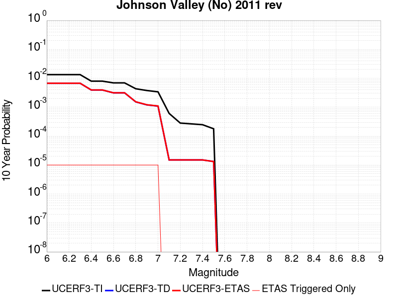 |

| Magnitude | 1 wk TI Prob | 1 wk TD Prob | 1 wk ETAS Prob | 1 wk ETAS/TD Gain | 1 wk ETAS Triggered Only | 1 mo TI Prob | 1 mo TD Prob | 1 mo ETAS Prob | 1 mo ETAS/TD Gain | 1 mo ETAS Triggered Only | 1 yr TI Prob | 1 yr TD Prob | 1 yr ETAS Prob | 1 yr ETAS/TD Gain | 1 yr ETAS Triggered Only | 10 yr TI Prob | 10 yr TD Prob | 10 yr ETAS Prob | 10 yr ETAS/TD Gain | 10 yr ETAS Triggered Only |
|-----|-----|-----|-----|-----|-----|-----|-----|-----|-----|-----|-----|-----|-----|-----|-----|-----|-----|-----|-----|-----|
| 6.0 | 2.577707E-5 | 1.2901787E-5 | 1.2901787E-5 | 1.0 | 0.0 | 1.1046848E-4 | 5.529243E-5 | 5.529243E-5 | 1.0 | 0.0 | 0.0013441239 | 6.7301706E-4 | 6.7301706E-4 | 1.0 | 0.0 | 0.013360229 | 0.006713698 | 0.0067236307 | 1.0014795 | 1.0E-5 |
| 6.1 | 2.577707E-5 | 1.2901787E-5 | 1.2901787E-5 | 1.0 | 0.0 | 1.1046848E-4 | 5.529243E-5 | 5.529243E-5 | 1.0 | 0.0 | 0.0013441239 | 6.7301706E-4 | 6.7301706E-4 | 1.0 | 0.0 | 0.013360229 | 0.006713698 | 0.0067236307 | 1.0014795 | 1.0E-5 |
| 6.2 | 2.577707E-5 | 1.2901787E-5 | 1.2901787E-5 | 1.0 | 0.0 | 1.1046848E-4 | 5.529243E-5 | 5.529243E-5 | 1.0 | 0.0 | 0.0013441239 | 6.7301706E-4 | 6.7301706E-4 | 1.0 | 0.0 | 0.013360229 | 0.006713698 | 0.0067236307 | 1.0014795 | 1.0E-5 |
| 6.3 | 2.577707E-5 | 1.2901787E-5 | 1.2901787E-5 | 1.0 | 0.0 | 1.1046848E-4 | 5.529243E-5 | 5.529243E-5 | 1.0 | 0.0 | 0.0013441239 | 6.7301706E-4 | 6.7301706E-4 | 1.0 | 0.0 | 0.013360229 | 0.006713698 | 0.0067236307 | 1.0014795 | 1.0E-5 |
| 6.4 | 1.5296591E-5 | 7.5372795E-6 | 7.5372795E-6 | 1.0 | 0.0 | 6.555518E-5 | 3.230233E-5 | 3.230233E-5 | 1.0 | 0.0 | 7.97842E-4 | 3.932287E-4 | 3.932287E-4 | 1.0 | 0.0 | 0.007949836 | 0.0039271703 | 0.0039371313 | 1.0025364 | 1.0E-5 |
| 6.5 | 1.5296591E-5 | 7.5372795E-6 | 7.5372795E-6 | 1.0 | 0.0 | 6.555518E-5 | 3.230233E-5 | 3.230233E-5 | 1.0 | 0.0 | 7.97842E-4 | 3.932287E-4 | 3.932287E-4 | 1.0 | 0.0 | 0.007949836 | 0.0039271703 | 0.0039371313 | 1.0025364 | 1.0E-5 |
| 6.6 | 1.3289383E-5 | 5.9921827E-6 | 5.9921827E-6 | 1.0 | 0.0 | 5.6953253E-5 | 2.5680625E-5 | 2.5680625E-5 | 1.0 | 0.0 | 6.9318525E-4 | 3.1263373E-4 | 3.1263373E-4 | 1.0 | 0.0 | 0.0069102696 | 0.0031236038 | 0.0031335726 | 1.0031915 | 1.0E-5 |
| 6.7 | 1.3289383E-5 | 5.9921827E-6 | 5.9921827E-6 | 1.0 | 0.0 | 5.6953253E-5 | 2.5680625E-5 | 2.5680625E-5 | 1.0 | 0.0 | 6.9318525E-4 | 3.1263373E-4 | 3.1263373E-4 | 1.0 | 0.0 | 0.0069102696 | 0.0031236038 | 0.0031335726 | 1.0031915 | 1.0E-5 |
| 6.8 | 8.330789E-6 | 2.921463E-6 | 2.921463E-6 | 1.0 | 0.0 | 3.570289E-5 | 1.2520528E-5 | 1.2520528E-5 | 1.0 | 0.0 | 4.34596E-4 | 1.5243248E-4 | 1.5243248E-4 | 1.0 | 0.0 | 0.0043374705 | 0.0015238392 | 0.0015338239 | 1.0065523 | 1.0E-5 |
| 6.9 | 7.2359003E-6 | 2.301569E-6 | 2.301569E-6 | 1.0 | 0.0 | 3.1010633E-5 | 9.86386E-6 | 9.86386E-6 | 1.0 | 0.0 | 3.7748902E-4 | 1.20091216E-4 | 1.20091216E-4 | 1.0 | 0.0 | 0.0037684843 | 0.0012007862 | 0.0012107742 | 1.0083178 | 1.0E-5 |
| 7.0 | 6.5149957E-6 | 2.0887069E-6 | 2.0887069E-6 | 1.0 | 0.0 | 2.792111E-5 | 8.951601E-6 | 8.951601E-6 | 1.0 | 0.0 | 3.398865E-4 | 1.0898559E-4 | 1.0898559E-4 | 1.0 | 0.0 | 0.003393671 | 0.0010898412 | 0.0010998304 | 1.0091656 | 1.0E-5 |
| 7.1 | 1.1662233E-6 | 2.8809353E-8 | 2.8809353E-8 | 1.0 | 0.0 | 4.9980904E-6 | 1.2346865E-7 | 1.2346865E-7 | 1.0 | 0.0 | 6.0850052E-5 | 1.50323E-6 | 1.50323E-6 | 1.0 | 0.0 | 6.083339E-4 | 1.5032215E-5 | 1.5032215E-5 | 1.0 | 0.0 |
| 7.2 | 5.413881E-7 | 2.8809353E-8 | 2.8809353E-8 | 1.0 | 0.0 | 2.3202326E-6 | 1.2346865E-7 | 1.2346865E-7 | 1.0 | 0.0 | 2.8248465E-5 | 1.50323E-6 | 1.50323E-6 | 1.0 | 0.0 | 2.8244875E-4 | 1.5032215E-5 | 1.5032215E-5 | 1.0 | 0.0 |
| 7.3 | 5.076821E-7 | 2.8809353E-8 | 2.8809353E-8 | 1.0 | 0.0 | 2.1757785E-6 | 1.2346865E-7 | 1.2346865E-7 | 1.0 | 0.0 | 2.648978E-5 | 1.50323E-6 | 1.50323E-6 | 1.0 | 0.0 | 2.6486625E-4 | 1.5032215E-5 | 1.5032215E-5 | 1.0 | 0.0 |
| 7.4 | 4.7568687E-7 | 2.8791266E-8 | 2.8791266E-8 | 1.0 | 0.0 | 2.0386565E-6 | 1.2339113E-7 | 1.2339113E-7 | 1.0 | 0.0 | 2.482036E-5 | 1.5022862E-6 | 1.5022862E-6 | 1.0 | 0.0 | 2.4817587E-4 | 1.5022777E-5 | 1.5022777E-5 | 1.0 | 0.0 |
| 7.5 | 3.435626E-7 | 2.5363844E-8 | 2.5363844E-8 | 1.0 | 0.0 | 1.4724103E-6 | 1.0870219E-7 | 1.0870219E-7 | 1.0 | 0.0 | 1.7926448E-5 | 1.3234485E-6 | 1.3234485E-6 | 1.0 | 0.0 | 1.7925001E-4 | 1.3234422E-5 | 1.3234422E-5 | 1.0 | 0.0 |

## Earthquake Valley (So Extension)
*[(top)](#table-of-contents)*

| 1 Week | 1 Month | 1 Year | 10 Year |
|-----|-----|-----|-----|
|  |  |  |  |

| Magnitude | 1 wk TI Prob | 1 wk TD Prob | 1 wk ETAS Prob | 1 wk ETAS/TD Gain | 1 wk ETAS Triggered Only | 1 mo TI Prob | 1 mo TD Prob | 1 mo ETAS Prob | 1 mo ETAS/TD Gain | 1 mo ETAS Triggered Only | 1 yr TI Prob | 1 yr TD Prob | 1 yr ETAS Prob | 1 yr ETAS/TD Gain | 1 yr ETAS Triggered Only | 10 yr TI Prob | 10 yr TD Prob | 10 yr ETAS Prob | 10 yr ETAS/TD Gain | 10 yr ETAS Triggered Only |
|-----|-----|-----|-----|-----|-----|-----|-----|-----|-----|-----|-----|-----|-----|-----|-----|-----|-----|-----|-----|-----|
| 6.0 | 3.0194888E-5 | 3.7076705E-5 | 3.7076705E-5 | 1.0 | 0.0 | 1.2940024E-4 | 1.5889356E-4 | 1.5889356E-4 | 1.0 | 0.0 | 0.0015743093 | 0.0019333567 | 0.0019333567 | 1.0 | 0.0 | 0.01563203 | 0.01921533 | 0.019225137 | 1.0005105 | 1.0E-5 |
| 6.1 | 3.0194888E-5 | 3.7076705E-5 | 3.7076705E-5 | 1.0 | 0.0 | 1.2940024E-4 | 1.5889356E-4 | 1.5889356E-4 | 1.0 | 0.0 | 0.0015743093 | 0.0019333567 | 0.0019333567 | 1.0 | 0.0 | 0.01563203 | 0.01921533 | 0.019225137 | 1.0005105 | 1.0E-5 |
| 6.2 | 3.0194888E-5 | 3.7076705E-5 | 3.7076705E-5 | 1.0 | 0.0 | 1.2940024E-4 | 1.5889356E-4 | 1.5889356E-4 | 1.0 | 0.0 | 0.0015743093 | 0.0019333567 | 0.0019333567 | 1.0 | 0.0 | 0.01563203 | 0.01921533 | 0.019225137 | 1.0005105 | 1.0E-5 |
| 6.3 | 1.5795305E-5 | 1.8448263E-5 | 1.8448263E-5 | 1.0 | 0.0 | 6.769241E-5 | 7.9062214E-5 | 7.9062214E-5 | 1.0 | 0.0 | 8.238434E-4 | 9.622687E-4 | 9.622687E-4 | 1.0 | 0.0 | 0.008207959 | 0.0095919315 | 0.009601836 | 1.0010326 | 1.0E-5 |
| 6.4 | 1.5795305E-5 | 1.8448263E-5 | 1.8448263E-5 | 1.0 | 0.0 | 6.769241E-5 | 7.9062214E-5 | 7.9062214E-5 | 1.0 | 0.0 | 8.238434E-4 | 9.622687E-4 | 9.622687E-4 | 1.0 | 0.0 | 0.008207959 | 0.0095919315 | 0.009601836 | 1.0010326 | 1.0E-5 |
| 6.5 | 1.5795305E-5 | 1.8448263E-5 | 1.8448263E-5 | 1.0 | 0.0 | 6.769241E-5 | 7.9062214E-5 | 7.9062214E-5 | 1.0 | 0.0 | 8.238434E-4 | 9.622687E-4 | 9.622687E-4 | 1.0 | 0.0 | 0.008207959 | 0.0095919315 | 0.009601836 | 1.0010326 | 1.0E-5 |
| 6.6 | 1.5795305E-5 | 1.8448263E-5 | 1.8448263E-5 | 1.0 | 0.0 | 6.769241E-5 | 7.9062214E-5 | 7.9062214E-5 | 1.0 | 0.0 | 8.238434E-4 | 9.622687E-4 | 9.622687E-4 | 1.0 | 0.0 | 0.008207959 | 0.0095919315 | 0.009601836 | 1.0010326 | 1.0E-5 |
| 6.7 | 1.1363076E-5 | 1.313942E-5 | 1.313942E-5 | 1.0 | 0.0 | 4.8697988E-5 | 5.631101E-5 | 5.631101E-5 | 1.0 | 0.0 | 5.927367E-4 | 6.8544707E-4 | 6.8544707E-4 | 1.0 | 0.0 | 0.0059115817 | 0.006840803 | 0.0068507344 | 1.0014518 | 1.0E-5 |
| 6.8 | 1.0049611E-5 | 1.1595315E-5 | 1.1595315E-5 | 1.0 | 0.0 | 4.306905E-5 | 4.9693677E-5 | 4.9693677E-5 | 1.0 | 0.0 | 5.242395E-4 | 6.0492574E-4 | 6.0492574E-4 | 1.0 | 0.0 | 0.0052300454 | 0.0060399687 | 0.006049908 | 1.0016457 | 1.0E-5 |
| 6.9 | 1.0049611E-5 | 1.1595315E-5 | 1.1595315E-5 | 1.0 | 0.0 | 4.306905E-5 | 4.9693677E-5 | 4.9693677E-5 | 1.0 | 0.0 | 5.242395E-4 | 6.0492574E-4 | 6.0492574E-4 | 1.0 | 0.0 | 0.0052300454 | 0.0060399687 | 0.006049908 | 1.0016457 | 1.0E-5 |
| 7.0 | 1.0049611E-5 | 1.1595315E-5 | 1.1595315E-5 | 1.0 | 0.0 | 4.306905E-5 | 4.9693677E-5 | 4.9693677E-5 | 1.0 | 0.0 | 5.242395E-4 | 6.0492574E-4 | 6.0492574E-4 | 1.0 | 0.0 | 0.0052300454 | 0.0060399687 | 0.006049908 | 1.0016457 | 1.0E-5 |
| 7.1 | 8.140254E-6 | 9.384255E-6 | 9.384255E-6 | 1.0 | 0.0 | 3.4886336E-5 | 4.021799E-5 | 4.021799E-5 | 1.0 | 0.0 | 4.2465836E-4 | 4.896111E-4 | 4.896111E-4 | 1.0 | 0.0 | 0.0042384774 | 0.0048919013 | 0.0049018525 | 1.0020342 | 1.0E-5 |
| 7.2 | 1.673835E-7 | 1.4155755E-7 | 1.4155755E-7 | 1.0 | 0.0 | 7.173577E-7 | 6.066751E-7 | 6.066751E-7 | 1.0 | 0.0 | 8.733795E-6 | 7.386248E-6 | 7.386248E-6 | 1.0 | 0.0 | 8.733451E-5 | 7.386038E-5 | 7.386038E-5 | 1.0 | 0.0 |
| 7.3 | 1.6632116E-7 | 1.4053978E-7 | 1.4053978E-7 | 1.0 | 0.0 | 7.1280476E-7 | 6.023132E-7 | 6.023132E-7 | 1.0 | 0.0 | 8.678364E-6 | 7.3331425E-6 | 7.3331425E-6 | 1.0 | 0.0 | 8.6780245E-5 | 7.3329364E-5 | 7.3329364E-5 | 1.0 | 0.0 |
| 7.4 | 1.6569169E-7 | 1.3998603E-7 | 1.3998603E-7 | 1.0 | 0.0 | 7.1010703E-7 | 5.9994E-7 | 5.9994E-7 | 1.0 | 0.0 | 8.645519E-6 | 7.3042484E-6 | 7.3042484E-6 | 1.0 | 0.0 | 8.645182E-5 | 7.304044E-5 | 7.304044E-5 | 1.0 | 0.0 |
| 7.5 | 1.1764555E-7 | 1.00971754E-7 | 1.00971754E-7 | 1.0 | 0.0 | 5.041951E-7 | 4.3273604E-7 | 4.3273604E-7 | 1.0 | 0.0 | 6.138558E-6 | 5.268551E-6 | 5.268551E-6 | 1.0 | 0.0 | 6.1383886E-5 | 5.2684474E-5 | 5.2684474E-5 | 1.0 | 0.0 |
| 7.6 | 1.07927605E-7 | 9.2619196E-8 | 9.2619196E-8 | 1.0 | 0.0 | 4.6254678E-7 | 3.9693938E-7 | 3.9693938E-7 | 1.0 | 0.0 | 5.6314925E-6 | 4.8327283E-6 | 4.8327283E-6 | 1.0 | 0.0 | 5.63135E-5 | 4.832644E-5 | 4.832644E-5 | 1.0 | 0.0 |
| 7.7 | 2.1826905E-8 | 1.1182753E-8 | 1.1182753E-8 | 1.0 | 0.0 | 9.3543875E-8 | 4.7926086E-8 | 4.7926086E-8 | 1.0 | 0.0 | 1.1388961E-6 | 5.835E-7 | 5.835E-7 | 1.0 | 0.0 | 1.1388902E-5 | 5.83499E-6 | 5.83499E-6 | 1.0 | 0.0 |
| 7.8 | 2.6169649E-9 | 1.1971816E-9 | 1.1971816E-9 | 1.0 | 0.0 | 1.1215564E-8 | 5.1307785E-9 | 5.1307785E-9 | 1.0 | 0.0 | 1.3654947E-7 | 6.246722E-8 | 6.246722E-8 | 1.0 | 0.0 | 1.365494E-6 | 6.246722E-7 | 6.246722E-7 | 1.0 | 0.0 |

## Pleito
*[(top)](#table-of-contents)*

| 1 Week | 1 Month | 1 Year | 10 Year |
|-----|-----|-----|-----|
|  |  |  | 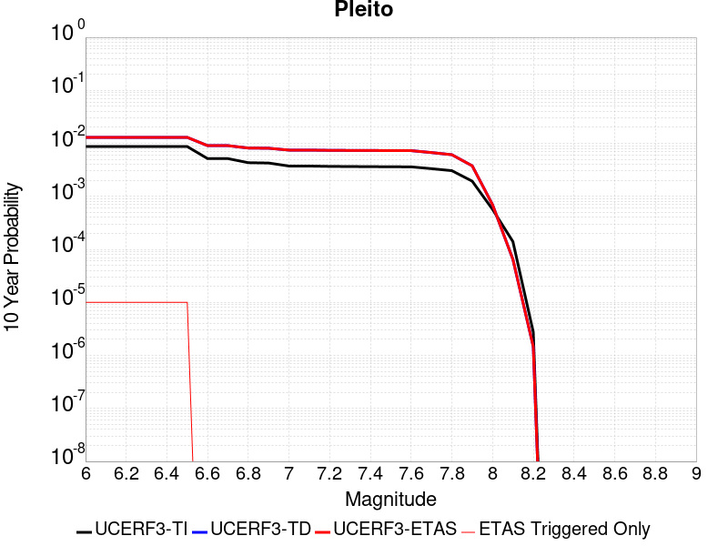 |

| Magnitude | 1 wk TI Prob | 1 wk TD Prob | 1 wk ETAS Prob | 1 wk ETAS/TD Gain | 1 wk ETAS Triggered Only | 1 mo TI Prob | 1 mo TD Prob | 1 mo ETAS Prob | 1 mo ETAS/TD Gain | 1 mo ETAS Triggered Only | 1 yr TI Prob | 1 yr TD Prob | 1 yr ETAS Prob | 1 yr ETAS/TD Gain | 1 yr ETAS Triggered Only | 10 yr TI Prob | 10 yr TD Prob | 10 yr ETAS Prob | 10 yr ETAS/TD Gain | 10 yr ETAS Triggered Only |
|-----|-----|-----|-----|-----|-----|-----|-----|-----|-----|-----|-----|-----|-----|-----|-----|-----|-----|-----|-----|-----|
| 6.0 | 1.6763008E-5 | 2.479053E-5 | 2.479053E-5 | 1.0 | 0.0 | 7.183948E-5 | 1.0624121E-4 | 1.0624121E-4 | 1.0 | 0.0 | 8.742947E-4 | 0.0012927912 | 0.0013027784 | 1.0077252 | 1.0E-5 | 0.00870863 | 0.012967364 | 0.012977234 | 1.0007612 | 1.0E-5 |
| 6.1 | 1.6763008E-5 | 2.479053E-5 | 2.479053E-5 | 1.0 | 0.0 | 7.183948E-5 | 1.0624121E-4 | 1.0624121E-4 | 1.0 | 0.0 | 8.742947E-4 | 0.0012927912 | 0.0013027784 | 1.0077252 | 1.0E-5 | 0.00870863 | 0.012967364 | 0.012977234 | 1.0007612 | 1.0E-5 |
| 6.2 | 1.6763008E-5 | 2.479053E-5 | 2.479053E-5 | 1.0 | 0.0 | 7.183948E-5 | 1.0624121E-4 | 1.0624121E-4 | 1.0 | 0.0 | 8.742947E-4 | 0.0012927912 | 0.0013027784 | 1.0077252 | 1.0E-5 | 0.00870863 | 0.012967364 | 0.012977234 | 1.0007612 | 1.0E-5 |
| 6.3 | 1.6763008E-5 | 2.479053E-5 | 2.479053E-5 | 1.0 | 0.0 | 7.183948E-5 | 1.0624121E-4 | 1.0624121E-4 | 1.0 | 0.0 | 8.742947E-4 | 0.0012927912 | 0.0013027784 | 1.0077252 | 1.0E-5 | 0.00870863 | 0.012967364 | 0.012977234 | 1.0007612 | 1.0E-5 |
| 6.4 | 1.6763008E-5 | 2.479053E-5 | 2.479053E-5 | 1.0 | 0.0 | 7.183948E-5 | 1.0624121E-4 | 1.0624121E-4 | 1.0 | 0.0 | 8.742947E-4 | 0.0012927912 | 0.0013027784 | 1.0077252 | 1.0E-5 | 0.00870863 | 0.012967364 | 0.012977234 | 1.0007612 | 1.0E-5 |
| 6.5 | 1.6763008E-5 | 2.479053E-5 | 2.479053E-5 | 1.0 | 0.0 | 7.183948E-5 | 1.0624121E-4 | 1.0624121E-4 | 1.0 | 0.0 | 8.742947E-4 | 0.0012927912 | 0.0013027784 | 1.0077252 | 1.0E-5 | 0.00870863 | 0.012967364 | 0.012977234 | 1.0007612 | 1.0E-5 |
| 6.6 | 9.910213E-6 | 1.7240907E-5 | 1.7240907E-5 | 1.0 | 0.0 | 4.247165E-5 | 7.388753E-5 | 7.388753E-5 | 1.0 | 0.0 | 5.169696E-4 | 8.992132E-4 | 8.992132E-4 | 1.0 | 0.0 | 0.0051576863 | 0.009064018 | 0.009064018 | 1.0 | 0.0 |
| 6.7 | 9.910213E-6 | 1.7240907E-5 | 1.7240907E-5 | 1.0 | 0.0 | 4.247165E-5 | 7.388753E-5 | 7.388753E-5 | 1.0 | 0.0 | 5.169696E-4 | 8.992132E-4 | 8.992132E-4 | 1.0 | 0.0 | 0.0051576863 | 0.009064018 | 0.009064018 | 1.0 | 0.0 |
| 6.8 | 8.300162E-6 | 1.5500442E-5 | 1.5500442E-5 | 1.0 | 0.0 | 3.557164E-5 | 6.642878E-5 | 6.642878E-5 | 1.0 | 0.0 | 4.3299864E-4 | 8.0847176E-4 | 8.0847176E-4 | 1.0 | 0.0 | 0.004321559 | 0.008163428 | 0.008163428 | 1.0 | 0.0 |
| 6.9 | 8.183114E-6 | 1.5371645E-5 | 1.5371645E-5 | 1.0 | 0.0 | 3.5070017E-5 | 6.5876826E-5 | 6.5876826E-5 | 1.0 | 0.0 | 4.2689382E-4 | 8.017566E-4 | 8.017566E-4 | 1.0 | 0.0 | 0.0042607468 | 0.008096768 | 0.008096768 | 1.0 | 0.0 |
| 7.0 | 7.1748823E-6 | 1.4158308E-5 | 1.4158308E-5 | 1.0 | 0.0 | 3.0749135E-5 | 6.067705E-5 | 6.067705E-5 | 1.0 | 0.0 | 3.743064E-4 | 7.384933E-4 | 7.384933E-4 | 1.0 | 0.0 | 0.0037367654 | 0.0074680606 | 0.0074680606 | 1.0 | 0.0 |
| 7.1 | 7.1671807E-6 | 1.4148675E-5 | 1.4148675E-5 | 1.0 | 0.0 | 3.0716128E-5 | 6.063577E-5 | 6.063577E-5 | 1.0 | 0.0 | 3.7390468E-4 | 7.37991E-4 | 7.37991E-4 | 1.0 | 0.0 | 0.0037327618 | 0.007463072 | 0.007463072 | 1.0 | 0.0 |
| 7.2 | 7.0649667E-6 | 1.399588E-5 | 1.399588E-5 | 1.0 | 0.0 | 3.0278077E-5 | 5.998097E-5 | 5.998097E-5 | 1.0 | 0.0 | 3.6857324E-4 | 7.300241E-4 | 7.300241E-4 | 1.0 | 0.0 | 0.0036796255 | 0.007383786 | 0.007383786 | 1.0 | 0.0 |
| 7.3 | 7.02082E-6 | 1.3939285E-5 | 1.3939285E-5 | 1.0 | 0.0 | 3.008888E-5 | 5.9738428E-5 | 5.9738428E-5 | 1.0 | 0.0 | 3.6627054E-4 | 7.270732E-4 | 7.270732E-4 | 1.0 | 0.0 | 0.0036566744 | 0.0073542604 | 0.0073542604 | 1.0 | 0.0 |
| 7.4 | 6.987146E-6 | 1.3898819E-5 | 1.3898819E-5 | 1.0 | 0.0 | 2.9944567E-5 | 5.956501E-5 | 5.956501E-5 | 1.0 | 0.0 | 3.6451413E-4 | 7.249632E-4 | 7.249632E-4 | 1.0 | 0.0 | 0.0036391679 | 0.007333182 | 0.007333182 | 1.0 | 0.0 |
| 7.5 | 6.9494554E-6 | 1.3855703E-5 | 1.3855703E-5 | 1.0 | 0.0 | 2.9783041E-5 | 5.9380236E-5 | 5.9380236E-5 | 1.0 | 0.0 | 3.625482E-4 | 7.2271505E-4 | 7.2271505E-4 | 1.0 | 0.0 | 0.0036195726 | 0.0073107993 | 0.0073107993 | 1.0 | 0.0 |
| 7.6 | 6.92694E-6 | 1.3814777E-5 | 1.3814777E-5 | 1.0 | 0.0 | 2.9686547E-5 | 5.9204845E-5 | 5.9204845E-5 | 1.0 | 0.0 | 3.6137376E-4 | 7.205811E-4 | 7.205811E-4 | 1.0 | 0.0 | 0.0036078666 | 0.007289532 | 0.007289532 | 1.0 | 0.0 |
| 7.7 | 6.395867E-6 | 1.2692768E-5 | 1.2692768E-5 | 1.0 | 0.0 | 2.741057E-5 | 5.439644E-5 | 5.439644E-5 | 1.0 | 0.0 | 3.336726E-4 | 6.6207576E-4 | 6.6207576E-4 | 1.0 | 0.0 | 0.0033317201 | 0.0067076497 | 0.0067076497 | 1.0 | 0.0 |
| 7.8 | 5.8664327E-6 | 1.155828E-5 | 1.155828E-5 | 1.0 | 0.0 | 2.5141611E-5 | 4.953455E-5 | 4.953455E-5 | 1.0 | 0.0 | 3.060561E-4 | 6.0291647E-4 | 6.0291647E-4 | 1.0 | 0.0 | 0.0030563495 | 0.00611206 | 0.00611206 | 1.0 | 0.0 |
| 7.9 | 3.7167474E-6 | 7.1276354E-6 | 7.1276354E-6 | 1.0 | 0.0 | 1.592882E-5 | 3.0546653E-5 | 3.0546653E-5 | 1.0 | 0.0 | 1.9391612E-4 | 3.7184218E-4 | 3.7184218E-4 | 1.0 | 0.0 | 0.0019374699 | 0.003774384 | 0.003774384 | 1.0 | 0.0 |
| 8.0 | 1.0903841E-6 | 1.2909164E-6 | 1.2909164E-6 | 1.0 | 0.0 | 4.6730665E-6 | 5.532487E-6 | 5.532487E-6 | 1.0 | 0.0 | 5.68931E-5 | 6.735596E-5 | 6.735596E-5 | 1.0 | 0.0 | 5.6878536E-4 | 6.957586E-4 | 6.957586E-4 | 1.0 | 0.0 |
| 8.1 | 2.6894583E-7 | 1.1110662E-7 | 1.1110662E-7 | 1.0 | 0.0 | 1.1526245E-6 | 4.7617115E-7 | 4.7617115E-7 | 1.0 | 0.0 | 1.4033113E-5 | 5.7973684E-6 | 5.7973684E-6 | 1.0 | 0.0 | 1.4032227E-4 | 6.485011E-5 | 6.485011E-5 | 1.0 | 0.0 |
| 8.2 | 5.2967013E-9 | 2.4698603E-9 | 2.4698603E-9 | 1.0 | 0.0 | 2.2700148E-8 | 1.0585116E-8 | 1.0585116E-8 | 1.0 | 0.0 | 2.7637427E-7 | 1.2887378E-7 | 1.2887378E-7 | 1.0 | 0.0 | 2.7637393E-6 | 1.466009E-6 | 1.466009E-6 | 1.0 | 0.0 |

## Earthquake Valley
*[(top)](#table-of-contents)*

| 1 Week | 1 Month | 1 Year | 10 Year |
|-----|-----|-----|-----|
|  |  |  | 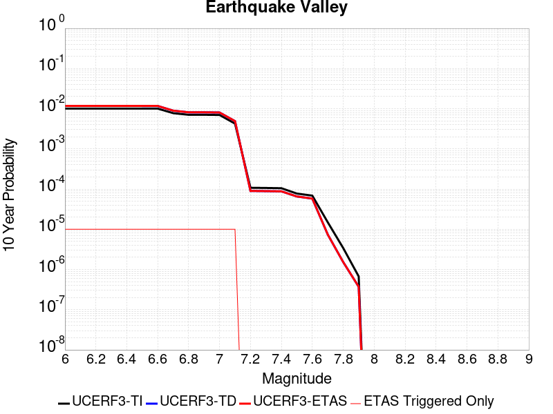 |

| Magnitude | 1 wk TI Prob | 1 wk TD Prob | 1 wk ETAS Prob | 1 wk ETAS/TD Gain | 1 wk ETAS Triggered Only | 1 mo TI Prob | 1 mo TD Prob | 1 mo ETAS Prob | 1 mo ETAS/TD Gain | 1 mo ETAS Triggered Only | 1 yr TI Prob | 1 yr TD Prob | 1 yr ETAS Prob | 1 yr ETAS/TD Gain | 1 yr ETAS Triggered Only | 10 yr TI Prob | 10 yr TD Prob | 10 yr ETAS Prob | 10 yr ETAS/TD Gain | 10 yr ETAS Triggered Only |
|-----|-----|-----|-----|-----|-----|-----|-----|-----|-----|-----|-----|-----|-----|-----|-----|-----|-----|-----|-----|-----|
| 6.0 | 1.9416384E-5 | 2.2586088E-5 | 2.2586088E-5 | 1.0 | 0.0 | 8.321042E-5 | 9.67946E-5 | 9.67946E-5 | 1.0 | 0.0 | 0.001012616 | 0.0011779574 | 0.0011779574 | 1.0 | 0.0 | 0.010080142 | 0.01172898 | 0.011738863 | 1.0008426 | 1.0E-5 |
| 6.1 | 1.9416384E-5 | 2.2586088E-5 | 2.2586088E-5 | 1.0 | 0.0 | 8.321042E-5 | 9.67946E-5 | 9.67946E-5 | 1.0 | 0.0 | 0.001012616 | 0.0011779574 | 0.0011779574 | 1.0 | 0.0 | 0.010080142 | 0.01172898 | 0.011738863 | 1.0008426 | 1.0E-5 |
| 6.2 | 1.9416384E-5 | 2.2586088E-5 | 2.2586088E-5 | 1.0 | 0.0 | 8.321042E-5 | 9.67946E-5 | 9.67946E-5 | 1.0 | 0.0 | 0.001012616 | 0.0011779574 | 0.0011779574 | 1.0 | 0.0 | 0.010080142 | 0.01172898 | 0.011738863 | 1.0008426 | 1.0E-5 |
| 6.3 | 1.9416384E-5 | 2.2586088E-5 | 2.2586088E-5 | 1.0 | 0.0 | 8.321042E-5 | 9.67946E-5 | 9.67946E-5 | 1.0 | 0.0 | 0.001012616 | 0.0011779574 | 0.0011779574 | 1.0 | 0.0 | 0.010080142 | 0.01172898 | 0.011738863 | 1.0008426 | 1.0E-5 |
| 6.4 | 1.9416384E-5 | 2.2586088E-5 | 2.2586088E-5 | 1.0 | 0.0 | 8.321042E-5 | 9.67946E-5 | 9.67946E-5 | 1.0 | 0.0 | 0.001012616 | 0.0011779574 | 0.0011779574 | 1.0 | 0.0 | 0.010080142 | 0.01172898 | 0.011738863 | 1.0008426 | 1.0E-5 |
| 6.5 | 1.9389157E-5 | 2.2554674E-5 | 2.2554674E-5 | 1.0 | 0.0 | 8.309374E-5 | 9.6659984E-5 | 9.6659984E-5 | 1.0 | 0.0 | 0.0010111968 | 0.0011763201 | 0.0011763201 | 1.0 | 0.0 | 0.010066078 | 0.01171278 | 0.011722663 | 1.0008438 | 1.0E-5 |
| 6.6 | 1.9389157E-5 | 2.2554674E-5 | 2.2554674E-5 | 1.0 | 0.0 | 8.309374E-5 | 9.6659984E-5 | 9.6659984E-5 | 1.0 | 0.0 | 0.0010111968 | 0.0011763201 | 0.0011763201 | 1.0 | 0.0 | 0.010066078 | 0.01171278 | 0.011722663 | 1.0008438 | 1.0E-5 |
| 6.7 | 1.4925434E-5 | 1.7209673E-5 | 1.7209673E-5 | 1.0 | 0.0 | 6.396457E-5 | 7.3754134E-5 | 7.3754134E-5 | 1.0 | 0.0 | 7.7849044E-4 | 8.9767174E-4 | 8.9767174E-4 | 1.0 | 0.0 | 0.007757689 | 0.008948834 | 0.008958745 | 1.0011075 | 1.0E-5 |
| 6.8 | 1.3570335E-5 | 1.5618141E-5 | 1.5618141E-5 | 1.0 | 0.0 | 5.8157282E-5 | 6.693364E-5 | 6.693364E-5 | 1.0 | 0.0 | 7.0783484E-4 | 8.1469445E-4 | 8.1469445E-4 | 1.0 | 0.0 | 0.0070558446 | 0.00812515 | 0.008135069 | 1.0012207 | 1.0E-5 |
| 6.9 | 1.3570335E-5 | 1.5618141E-5 | 1.5618141E-5 | 1.0 | 0.0 | 5.8157282E-5 | 6.693364E-5 | 6.693364E-5 | 1.0 | 0.0 | 7.0783484E-4 | 8.1469445E-4 | 8.1469445E-4 | 1.0 | 0.0 | 0.0070558446 | 0.00812515 | 0.008135069 | 1.0012207 | 1.0E-5 |
| 7.0 | 1.3433392E-5 | 1.5461674E-5 | 1.5461674E-5 | 1.0 | 0.0 | 5.757041E-5 | 6.626309E-5 | 6.626309E-5 | 1.0 | 0.0 | 7.0069433E-4 | 8.0653664E-4 | 8.0653664E-4 | 1.0 | 0.0 | 0.006984891 | 0.008044164 | 0.008054083 | 1.0012331 | 1.0E-5 |
| 7.1 | 8.181609E-6 | 9.417654E-6 | 9.417654E-6 | 1.0 | 0.0 | 3.5063567E-5 | 4.036113E-5 | 4.036113E-5 | 1.0 | 0.0 | 4.268153E-4 | 4.9135304E-4 | 4.9135304E-4 | 1.0 | 0.0 | 0.0042599645 | 0.004909244 | 0.0049191946 | 1.0020269 | 1.0E-5 |
| 7.2 | 2.0663983E-7 | 1.7265235E-7 | 1.7265235E-7 | 1.0 | 0.0 | 8.855989E-7 | 7.3993846E-7 | 7.3993846E-7 | 1.0 | 0.0 | 1.0782113E-5 | 9.008717E-6 | 9.008717E-6 | 1.0 | 0.0 | 1.07815904E-4 | 9.008388E-5 | 9.008388E-5 | 1.0 | 0.0 |
| 7.3 | 2.0462376E-7 | 1.7080716E-7 | 1.7080716E-7 | 1.0 | 0.0 | 8.7695867E-7 | 7.320305E-7 | 7.320305E-7 | 1.0 | 0.0 | 1.0676919E-5 | 8.912439E-6 | 8.912439E-6 | 1.0 | 0.0 | 1.0676406E-4 | 8.912117E-5 | 8.912117E-5 | 1.0 | 0.0 |
| 7.4 | 2.0171088E-7 | 1.686317E-7 | 1.686317E-7 | 1.0 | 0.0 | 8.644749E-7 | 7.227071E-7 | 7.227071E-7 | 1.0 | 0.0 | 1.0524931E-5 | 8.798927E-6 | 8.798927E-6 | 1.0 | 0.0 | 1.05244326E-4 | 8.798615E-5 | 8.798615E-5 | 1.0 | 0.0 |
| 7.5 | 1.4847944E-7 | 1.2561128E-7 | 1.2561128E-7 | 1.0 | 0.0 | 6.363403E-7 | 5.3833395E-7 | 5.3833395E-7 | 1.0 | 0.0 | 7.747416E-6 | 6.554198E-6 | 6.554198E-6 | 1.0 | 0.0 | 7.747146E-5 | 6.554026E-5 | 6.554026E-5 | 1.0 | 0.0 |
| 7.6 | 1.3185847E-7 | 1.1124904E-7 | 1.1124904E-7 | 1.0 | 0.0 | 5.6510765E-7 | 4.767815E-7 | 4.767815E-7 | 1.0 | 0.0 | 6.8801637E-6 | 5.8048013E-6 | 5.8048013E-6 | 1.0 | 0.0 | 6.8799505E-5 | 5.804671E-5 | 5.804671E-5 | 1.0 | 0.0 |
| 7.7 | 2.8609954E-8 | 1.4173791E-8 | 1.4173791E-8 | 1.0 | 0.0 | 1.2261408E-7 | 6.074482E-8 | 6.074482E-8 | 1.0 | 0.0 | 1.4928254E-6 | 7.3956795E-7 | 7.3956795E-7 | 1.0 | 0.0 | 1.4928154E-5 | 7.3956603E-6 | 7.3956603E-6 | 1.0 | 0.0 |
| 7.8 | 6.527266E-9 | 2.92397E-9 | 2.92397E-9 | 1.0 | 0.0 | 2.7973995E-8 | 1.25312996E-8 | 1.25312996E-8 | 1.0 | 0.0 | 3.4058334E-7 | 1.5256856E-7 | 1.5256856E-7 | 1.0 | 0.0 | 3.4058282E-6 | 1.5256848E-6 | 1.5256848E-6 | 1.0 | 0.0 |
| 7.9 | 1.2898267E-9 | 7.128649E-10 | 7.128649E-10 | 1.0 | 0.0 | 5.527829E-9 | 3.0551353E-9 | 3.0551353E-9 | 1.0 | 0.0 | 6.7301315E-8 | 3.7196273E-8 | 3.7196273E-8 | 1.0 | 0.0 | 6.7301295E-7 | 3.7196273E-7 | 3.7196273E-7 | 1.0 | 0.0 |

## White Wolf
*[(top)](#table-of-contents)*

| 1 Week | 1 Month | 1 Year | 10 Year |
|-----|-----|-----|-----|
|  |  |  | 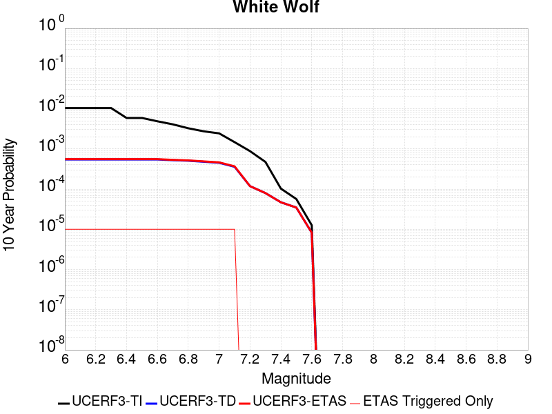 |

| Magnitude | 1 wk TI Prob | 1 wk TD Prob | 1 wk ETAS Prob | 1 wk ETAS/TD Gain | 1 wk ETAS Triggered Only | 1 mo TI Prob | 1 mo TD Prob | 1 mo ETAS Prob | 1 mo ETAS/TD Gain | 1 mo ETAS Triggered Only | 1 yr TI Prob | 1 yr TD Prob | 1 yr ETAS Prob | 1 yr ETAS/TD Gain | 1 yr ETAS Triggered Only | 10 yr TI Prob | 10 yr TD Prob | 10 yr ETAS Prob | 10 yr ETAS/TD Gain | 10 yr ETAS Triggered Only |
|-----|-----|-----|-----|-----|-----|-----|-----|-----|-----|-----|-----|-----|-----|-----|-----|-----|-----|-----|-----|-----|
| 6.0 | 2.0037822E-5 | 1.0469729E-6 | 1.0469729E-6 | 1.0 | 0.0 | 8.587355E-5 | 4.4870194E-6 | 4.4870194E-6 | 1.0 | 0.0 | 0.001045009 | 5.462814E-5 | 5.462814E-5 | 1.0 | 0.0 | 0.010401085 | 5.461522E-4 | 5.561467E-4 | 1.0182999 | 1.0E-5 |
| 6.1 | 2.0037822E-5 | 1.0469729E-6 | 1.0469729E-6 | 1.0 | 0.0 | 8.587355E-5 | 4.4870194E-6 | 4.4870194E-6 | 1.0 | 0.0 | 0.001045009 | 5.462814E-5 | 5.462814E-5 | 1.0 | 0.0 | 0.010401085 | 5.461522E-4 | 5.561467E-4 | 1.0182999 | 1.0E-5 |
| 6.2 | 2.0037822E-5 | 1.0469729E-6 | 1.0469729E-6 | 1.0 | 0.0 | 8.587355E-5 | 4.4870194E-6 | 4.4870194E-6 | 1.0 | 0.0 | 0.001045009 | 5.462814E-5 | 5.462814E-5 | 1.0 | 0.0 | 0.010401085 | 5.461522E-4 | 5.561467E-4 | 1.0182999 | 1.0E-5 |
| 6.3 | 2.0037822E-5 | 1.0469729E-6 | 1.0469729E-6 | 1.0 | 0.0 | 8.587355E-5 | 4.4870194E-6 | 4.4870194E-6 | 1.0 | 0.0 | 0.001045009 | 5.462814E-5 | 5.462814E-5 | 1.0 | 0.0 | 0.010401085 | 5.461522E-4 | 5.561467E-4 | 1.0182999 | 1.0E-5 |
| 6.4 | 1.132487E-5 | 1.0469729E-6 | 1.0469729E-6 | 1.0 | 0.0 | 4.8534253E-5 | 4.4870194E-6 | 4.4870194E-6 | 1.0 | 0.0 | 5.907443E-4 | 5.462814E-5 | 5.462814E-5 | 1.0 | 0.0 | 0.005891764 | 5.461522E-4 | 5.561467E-4 | 1.0182999 | 1.0E-5 |
| 6.5 | 1.132487E-5 | 1.0469729E-6 | 1.0469729E-6 | 1.0 | 0.0 | 4.8534253E-5 | 4.4870194E-6 | 4.4870194E-6 | 1.0 | 0.0 | 5.907443E-4 | 5.462814E-5 | 5.462814E-5 | 1.0 | 0.0 | 0.005891764 | 5.461522E-4 | 5.561467E-4 | 1.0182999 | 1.0E-5 |
| 6.6 | 9.347473E-6 | 1.0469729E-6 | 1.0469729E-6 | 1.0 | 0.0 | 4.0059982E-5 | 4.4870194E-6 | 4.4870194E-6 | 1.0 | 0.0 | 4.8762115E-4 | 5.462814E-5 | 5.462814E-5 | 1.0 | 0.0 | 0.0048655253 | 5.461522E-4 | 5.561467E-4 | 1.0182999 | 1.0E-5 |
| 6.7 | 7.842647E-6 | 1.004888E-6 | 1.004888E-6 | 1.0 | 0.0 | 3.361091E-5 | 4.3066557E-6 | 4.3066557E-6 | 1.0 | 0.0 | 4.0913603E-4 | 5.2432322E-5 | 5.2432322E-5 | 1.0 | 0.0 | 0.004083836 | 5.2420446E-4 | 5.3419924E-4 | 1.0190666 | 1.0E-5 |
| 6.8 | 6.26597E-6 | 9.735327E-7 | 9.735327E-7 | 1.0 | 0.0 | 2.685388E-5 | 4.1722765E-6 | 4.1722765E-6 | 1.0 | 0.0 | 3.2689696E-4 | 5.0796334E-5 | 5.0796334E-5 | 1.0 | 0.0 | 0.003264165 | 5.078521E-4 | 5.178471E-4 | 1.0196807 | 1.0E-5 |
| 6.9 | 5.258436E-6 | 9.1837234E-7 | 9.1837234E-7 | 1.0 | 0.0 | 2.2535958E-5 | 3.9358756E-6 | 3.9358756E-6 | 1.0 | 0.0 | 2.7434074E-4 | 4.791828E-5 | 4.791828E-5 | 1.0 | 0.0 | 0.0027400232 | 4.790843E-4 | 4.890795E-4 | 1.0208632 | 1.0E-5 |
| 7.0 | 4.675028E-6 | 8.661622E-7 | 8.661622E-7 | 1.0 | 0.0 | 2.003568E-5 | 3.7121188E-6 | 3.7121188E-6 | 1.0 | 0.0 | 2.4390711E-4 | 4.5194156E-5 | 4.5194156E-5 | 1.0 | 0.0 | 0.0024363957 | 4.5185437E-4 | 4.6184985E-4 | 1.0221211 | 1.0E-5 |
| 7.1 | 2.8270078E-6 | 6.8745294E-7 | 6.8745294E-7 | 1.0 | 0.0 | 1.2115692E-5 | 2.9462237E-6 | 2.9462237E-6 | 1.0 | 0.0 | 1.4749856E-4 | 3.5869725E-5 | 3.5869725E-5 | 1.0 | 0.0 | 0.001474007 | 3.5864345E-4 | 3.6863986E-4 | 1.0278728 | 1.0E-5 |
| 7.2 | 1.6881406E-6 | 2.270827E-7 | 2.270827E-7 | 1.0 | 0.0 | 7.2348685E-6 | 9.732112E-7 | 9.732112E-7 | 1.0 | 0.0 | 8.808096E-5 | 1.1848783E-5 | 1.1848783E-5 | 1.0 | 0.0 | 8.8046055E-4 | 1.1848167E-4 | 1.1848167E-4 | 1.0 | 0.0 |
| 7.3 | 9.086107E-7 | 1.5267518E-7 | 1.5267518E-7 | 1.0 | 0.0 | 3.8940398E-6 | 6.543221E-7 | 6.543221E-7 | 1.0 | 0.0 | 4.7408903E-5 | 7.966343E-6 | 7.966343E-6 | 1.0 | 0.0 | 4.739879E-4 | 7.9660655E-5 | 7.9660655E-5 | 1.0 | 0.0 |
| 7.4 | 1.9717383E-7 | 9.004186E-8 | 9.004186E-8 | 1.0 | 0.0 | 8.450304E-7 | 3.8589363E-7 | 3.8589363E-7 | 1.0 | 0.0 | 1.0288197E-5 | 4.698245E-6 | 4.698245E-6 | 1.0 | 0.0 | 1.028772E-4 | 4.6981488E-5 | 4.6981488E-5 | 1.0 | 0.0 |
| 7.5 | 1.086975E-7 | 6.65987E-8 | 6.65987E-8 | 1.0 | 0.0 | 4.6584634E-7 | 2.8542297E-7 | 2.8542297E-7 | 1.0 | 0.0 | 5.6716644E-6 | 3.4750192E-6 | 3.4750192E-6 | 1.0 | 0.0 | 5.6715195E-5 | 3.474967E-5 | 3.474967E-5 | 1.0 | 0.0 |
| 7.6 | 2.4217808E-8 | 1.582108E-8 | 1.582108E-8 | 1.0 | 0.0 | 1.03790605E-7 | 6.780462E-8 | 6.780462E-8 | 1.0 | 0.0 | 1.2636499E-6 | 8.25521E-7 | 8.25521E-7 | 1.0 | 0.0 | 1.2636427E-5 | 8.255184E-6 | 8.255184E-6 | 1.0 | 0.0 |

## Raymond
*[(top)](#table-of-contents)*

| 1 Week | 1 Month | 1 Year | 10 Year |
|-----|-----|-----|-----|
|  |  |  |  |

| Magnitude | 1 wk TI Prob | 1 wk TD Prob | 1 wk ETAS Prob | 1 wk ETAS/TD Gain | 1 wk ETAS Triggered Only | 1 mo TI Prob | 1 mo TD Prob | 1 mo ETAS Prob | 1 mo ETAS/TD Gain | 1 mo ETAS Triggered Only | 1 yr TI Prob | 1 yr TD Prob | 1 yr ETAS Prob | 1 yr ETAS/TD Gain | 1 yr ETAS Triggered Only | 10 yr TI Prob | 10 yr TD Prob | 10 yr ETAS Prob | 10 yr ETAS/TD Gain | 10 yr ETAS Triggered Only |
|-----|-----|-----|-----|-----|-----|-----|-----|-----|-----|-----|-----|-----|-----|-----|-----|-----|-----|-----|-----|-----|
| 6.0 | 1.5157413E-5 | 1.5811214E-5 | 1.5811214E-5 | 1.0 | 0.0 | 6.4958724E-5 | 6.776073E-5 | 6.776073E-5 | 1.0 | 0.0 | 7.905855E-4 | 8.246997E-4 | 8.246997E-4 | 1.0 | 0.0 | 0.007877788 | 0.008218911 | 0.008228828 | 1.0012068 | 1.0E-5 |
| 6.1 | 1.5157413E-5 | 1.5811214E-5 | 1.5811214E-5 | 1.0 | 0.0 | 6.4958724E-5 | 6.776073E-5 | 6.776073E-5 | 1.0 | 0.0 | 7.905855E-4 | 8.246997E-4 | 8.246997E-4 | 1.0 | 0.0 | 0.007877788 | 0.008218911 | 0.008228828 | 1.0012068 | 1.0E-5 |
| 6.2 | 1.5157413E-5 | 1.5811214E-5 | 1.5811214E-5 | 1.0 | 0.0 | 6.4958724E-5 | 6.776073E-5 | 6.776073E-5 | 1.0 | 0.0 | 7.905855E-4 | 8.246997E-4 | 8.246997E-4 | 1.0 | 0.0 | 0.007877788 | 0.008218911 | 0.008228828 | 1.0012068 | 1.0E-5 |
| 6.3 | 1.5157413E-5 | 1.5811214E-5 | 1.5811214E-5 | 1.0 | 0.0 | 6.4958724E-5 | 6.776073E-5 | 6.776073E-5 | 1.0 | 0.0 | 7.905855E-4 | 8.246997E-4 | 8.246997E-4 | 1.0 | 0.0 | 0.007877788 | 0.008218911 | 0.008228828 | 1.0012068 | 1.0E-5 |
| 6.4 | 1.3941944E-5 | 1.4455694E-5 | 1.4455694E-5 | 1.0 | 0.0 | 5.9749822E-5 | 6.1951636E-5 | 6.1951636E-5 | 1.0 | 0.0 | 7.2721124E-4 | 7.5402344E-4 | 7.5402344E-4 | 1.0 | 0.0 | 0.007248361 | 0.007516985 | 0.0075269095 | 1.0013204 | 1.0E-5 |
| 6.5 | 1.3941944E-5 | 1.4455694E-5 | 1.4455694E-5 | 1.0 | 0.0 | 5.9749822E-5 | 6.1951636E-5 | 6.1951636E-5 | 1.0 | 0.0 | 7.2721124E-4 | 7.5402344E-4 | 7.5402344E-4 | 1.0 | 0.0 | 0.007248361 | 0.007516985 | 0.0075269095 | 1.0013204 | 1.0E-5 |
| 6.6 | 1.0542609E-5 | 1.0671889E-5 | 1.0671889E-5 | 1.0 | 0.0 | 4.5181827E-5 | 4.57359E-5 | 4.57359E-5 | 1.0 | 0.0 | 5.499499E-4 | 5.566977E-4 | 5.566977E-4 | 1.0 | 0.0 | 0.005485909 | 0.0055535934 | 0.0055635376 | 1.0017906 | 1.0E-5 |
| 6.7 | 1.0542609E-5 | 1.0671889E-5 | 1.0671889E-5 | 1.0 | 0.0 | 4.5181827E-5 | 4.57359E-5 | 4.57359E-5 | 1.0 | 0.0 | 5.499499E-4 | 5.566977E-4 | 5.566977E-4 | 1.0 | 0.0 | 0.005485909 | 0.0055535934 | 0.0055635376 | 1.0017906 | 1.0E-5 |
| 6.8 | 1.0079132E-5 | 1.0177405E-5 | 1.0177405E-5 | 1.0 | 0.0 | 4.3195567E-5 | 4.361675E-5 | 4.361675E-5 | 1.0 | 0.0 | 5.257791E-4 | 5.309099E-4 | 5.309099E-4 | 1.0 | 0.0 | 0.0052453685 | 0.005296965 | 0.005306912 | 1.0018779 | 1.0E-5 |
| 6.9 | 7.721598E-6 | 7.549502E-6 | 7.549502E-6 | 1.0 | 0.0 | 3.3092143E-5 | 3.2354612E-5 | 3.2354612E-5 | 1.0 | 0.0 | 4.0282236E-4 | 3.9384744E-4 | 3.9384744E-4 | 1.0 | 0.0 | 0.0040209293 | 0.003931628 | 0.0039415886 | 1.0025334 | 1.0E-5 |
| 7.0 | 7.137566E-6 | 6.9118714E-6 | 6.9118714E-6 | 1.0 | 0.0 | 3.058921E-5 | 2.9621975E-5 | 2.9621975E-5 | 1.0 | 0.0 | 3.7236E-4 | 3.6058895E-4 | 3.6058895E-4 | 1.0 | 0.0 | 0.0037173668 | 0.0036001569 | 0.0036101209 | 1.0027677 | 1.0E-5 |
| 7.1 | 5.654976E-6 | 5.3000313E-6 | 5.3000313E-6 | 1.0 | 0.0 | 2.4235387E-5 | 2.2714223E-5 | 2.2714223E-5 | 1.0 | 0.0 | 2.9502588E-4 | 2.7651078E-4 | 2.7651078E-4 | 1.0 | 0.0 | 0.0029463451 | 0.0027616983 | 0.0027616983 | 1.0 | 0.0 |
| 7.2 | 4.9358455E-6 | 4.5271145E-6 | 4.5271145E-6 | 1.0 | 0.0 | 2.1153453E-5 | 1.9401774E-5 | 1.9401774E-5 | 1.0 | 0.0 | 2.5751285E-4 | 2.3619113E-4 | 2.3619113E-4 | 1.0 | 0.0 | 0.0025721465 | 0.0023594233 | 0.0023594233 | 1.0 | 0.0 |
| 7.3 | 4.2368597E-6 | 3.8060439E-6 | 3.8060439E-6 | 1.0 | 0.0 | 1.8157843E-5 | 1.6311516E-5 | 1.6311516E-5 | 1.0 | 0.0 | 2.2104931E-4 | 1.9857471E-4 | 1.9857471E-4 | 1.0 | 0.0 | 0.0022082955 | 0.0019839914 | 0.0019839914 | 1.0 | 0.0 |
| 7.4 | 3.4999923E-6 | 3.0441354E-6 | 3.0441354E-6 | 1.0 | 0.0 | 1.49998805E-5 | 1.30462295E-5 | 1.30462295E-5 | 1.0 | 0.0 | 1.8260824E-4 | 1.5882634E-4 | 1.5882634E-4 | 1.0 | 0.0 | 0.0018245826 | 0.001587144 | 0.001587144 | 1.0 | 0.0 |
| 7.5 | 2.738017E-6 | 2.3023013E-6 | 2.3023013E-6 | 1.0 | 0.0 | 1.1734306E-5 | 9.866968E-6 | 9.866968E-6 | 1.0 | 0.0 | 1.428558E-4 | 1.2012378E-4 | 1.2012378E-4 | 1.0 | 0.0 | 0.0014276401 | 0.0012006029 | 0.0012006029 | 1.0 | 0.0 |
| 7.6 | 1.8186392E-6 | 1.4424903E-6 | 1.4424903E-6 | 1.0 | 0.0 | 7.794145E-6 | 6.1820865E-6 | 6.1820865E-6 | 1.0 | 0.0 | 9.488958E-5 | 7.526435E-5 | 7.526435E-5 | 1.0 | 0.0 | 9.4849075E-4 | 7.524001E-4 | 7.524001E-4 | 1.0 | 0.0 |
| 7.7 | 1.0660348E-6 | 7.6452443E-7 | 7.6452443E-7 | 1.0 | 0.0 | 4.5687125E-6 | 3.2765292E-6 | 3.2765292E-6 | 1.0 | 0.0 | 5.5622655E-5 | 3.989103E-5 | 3.989103E-5 | 1.0 | 0.0 | 5.5608735E-4 | 3.9884783E-4 | 3.9884783E-4 | 1.0 | 0.0 |
| 7.8 | 6.913602E-7 | 4.3216164E-7 | 4.3216164E-7 | 1.0 | 0.0 | 2.962969E-6 | 1.85212E-6 | 1.85212E-6 | 1.0 | 0.0 | 3.607355E-5 | 2.2549335E-5 | 2.2549335E-5 | 1.0 | 0.0 | 3.6067693E-4 | 2.2547832E-4 | 2.2547832E-4 | 1.0 | 0.0 |
| 7.9 | 7.425201E-8 | 5.3234306E-8 | 5.3234306E-8 | 1.0 | 0.0 | 3.1822285E-7 | 2.28147E-7 | 2.28147E-7 | 1.0 | 0.0 | 3.874356E-6 | 2.7776875E-6 | 2.7776875E-6 | 1.0 | 0.0 | 3.8742884E-5 | 2.777666E-5 | 2.777666E-5 | 1.0 | 0.0 |

## Mission Hills 2011
*[(top)](#table-of-contents)*

| 1 Week | 1 Month | 1 Year | 10 Year |
|-----|-----|-----|-----|
|  |  |  | 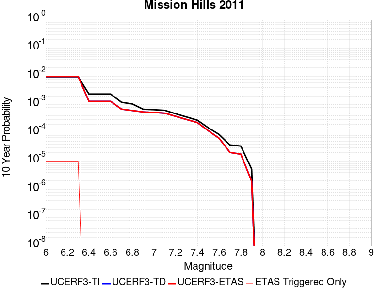 |

| Magnitude | 1 wk TI Prob | 1 wk TD Prob | 1 wk ETAS Prob | 1 wk ETAS/TD Gain | 1 wk ETAS Triggered Only | 1 mo TI Prob | 1 mo TD Prob | 1 mo ETAS Prob | 1 mo ETAS/TD Gain | 1 mo ETAS Triggered Only | 1 yr TI Prob | 1 yr TD Prob | 1 yr ETAS Prob | 1 yr ETAS/TD Gain | 1 yr ETAS Triggered Only | 10 yr TI Prob | 10 yr TD Prob | 10 yr ETAS Prob | 10 yr ETAS/TD Gain | 10 yr ETAS Triggered Only |
|-----|-----|-----|-----|-----|-----|-----|-----|-----|-----|-----|-----|-----|-----|-----|-----|-----|-----|-----|-----|-----|
| 6.0 | 1.8765717E-5 | 1.9056284E-5 | 1.9056284E-5 | 1.0 | 0.0 | 8.0422025E-5 | 8.166917E-5 | 8.166917E-5 | 1.0 | 0.0 | 9.786983E-4 | 9.942121E-4 | 0.0010042022 | 1.0100483 | 1.0E-5 | 0.009743992 | 0.009931313 | 0.009941214 | 1.000997 | 1.0E-5 |
| 6.1 | 1.8765717E-5 | 1.9056284E-5 | 1.9056284E-5 | 1.0 | 0.0 | 8.0422025E-5 | 8.166917E-5 | 8.166917E-5 | 1.0 | 0.0 | 9.786983E-4 | 9.942121E-4 | 0.0010042022 | 1.0100483 | 1.0E-5 | 0.009743992 | 0.009931313 | 0.009941214 | 1.000997 | 1.0E-5 |
| 6.2 | 1.8765717E-5 | 1.9056284E-5 | 1.9056284E-5 | 1.0 | 0.0 | 8.0422025E-5 | 8.166917E-5 | 8.166917E-5 | 1.0 | 0.0 | 9.786983E-4 | 9.942121E-4 | 0.0010042022 | 1.0100483 | 1.0E-5 | 0.009743992 | 0.009931313 | 0.009941214 | 1.000997 | 1.0E-5 |
| 6.3 | 1.8765717E-5 | 1.9056284E-5 | 1.9056284E-5 | 1.0 | 0.0 | 8.0422025E-5 | 8.166917E-5 | 8.166917E-5 | 1.0 | 0.0 | 9.786983E-4 | 9.942121E-4 | 0.0010042022 | 1.0100483 | 1.0E-5 | 0.009743992 | 0.009931313 | 0.009941214 | 1.000997 | 1.0E-5 |
| 6.4 | 4.566357E-6 | 2.5150405E-6 | 2.5150405E-6 | 1.0 | 0.0 | 1.9569954E-5 | 1.077871E-5 | 1.077871E-5 | 1.0 | 0.0 | 2.3823815E-4 | 1.3122472E-4 | 1.3122472E-4 | 1.0 | 0.0 | 0.002379829 | 0.0013116505 | 0.0013116505 | 1.0 | 0.0 |
| 6.5 | 4.566357E-6 | 2.5150405E-6 | 2.5150405E-6 | 1.0 | 0.0 | 1.9569954E-5 | 1.077871E-5 | 1.077871E-5 | 1.0 | 0.0 | 2.3823815E-4 | 1.3122472E-4 | 1.3122472E-4 | 1.0 | 0.0 | 0.002379829 | 0.0013116505 | 0.0013116505 | 1.0 | 0.0 |
| 6.6 | 4.566357E-6 | 2.5150405E-6 | 2.5150405E-6 | 1.0 | 0.0 | 1.9569954E-5 | 1.077871E-5 | 1.077871E-5 | 1.0 | 0.0 | 2.3823815E-4 | 1.3122472E-4 | 1.3122472E-4 | 1.0 | 0.0 | 0.002379829 | 0.0013116505 | 0.0013116505 | 1.0 | 0.0 |
| 6.7 | 2.3266773E-6 | 1.3296922E-6 | 1.3296922E-6 | 1.0 | 0.0 | 9.971435E-6 | 5.6986687E-6 | 5.6986687E-6 | 1.0 | 0.0 | 1.2139547E-4 | 6.9379144E-5 | 6.9379144E-5 | 1.0 | 0.0 | 0.0012132917 | 6.935809E-4 | 6.935809E-4 | 1.0 | 0.0 |
| 6.8 | 2.032735E-6 | 1.1894751E-6 | 1.1894751E-6 | 1.0 | 0.0 | 8.711692E-6 | 5.097741E-6 | 5.097741E-6 | 1.0 | 0.0 | 1.06059684E-4 | 6.206328E-5 | 6.206328E-5 | 1.0 | 0.0 | 0.0010600908 | 6.204643E-4 | 6.204643E-4 | 1.0 | 0.0 |
| 6.9 | 1.3186259E-6 | 1.0562205E-6 | 1.0562205E-6 | 1.0 | 0.0 | 5.6512413E-6 | 4.526652E-6 | 4.526652E-6 | 1.0 | 0.0 | 6.8801695E-5 | 5.5110624E-5 | 5.5110624E-5 | 1.0 | 0.0 | 6.8780396E-4 | 5.5097253E-4 | 5.5097253E-4 | 1.0 | 0.0 |
| 7.0 | 1.2726016E-6 | 1.0159503E-6 | 1.0159503E-6 | 1.0 | 0.0 | 5.4539955E-6 | 4.3540654E-6 | 4.3540654E-6 | 1.0 | 0.0 | 6.6400375E-5 | 5.3009484E-5 | 5.3009484E-5 | 1.0 | 0.0 | 6.6380535E-4 | 5.2997126E-4 | 5.2997126E-4 | 1.0 | 0.0 |
| 7.1 | 1.2063913E-6 | 9.570468E-7 | 9.570468E-7 | 1.0 | 0.0 | 5.170238E-6 | 4.101623E-6 | 4.101623E-6 | 1.0 | 0.0 | 6.294583E-5 | 4.993614E-5 | 4.993614E-5 | 1.0 | 0.0 | 6.2928005E-4 | 4.9925176E-4 | 4.9925176E-4 | 1.0 | 0.0 |
| 7.2 | 9.105806E-7 | 7.3768757E-7 | 7.3768757E-7 | 1.0 | 0.0 | 3.9024826E-6 | 3.1615143E-6 | 3.1615143E-6 | 1.0 | 0.0 | 4.7511687E-5 | 3.8490773E-5 | 3.8490773E-5 | 1.0 | 0.0 | 4.7501532E-4 | 3.848426E-4 | 3.848426E-4 | 1.0 | 0.0 |
| 7.3 | 7.020432E-7 | 5.7103586E-7 | 5.7103586E-7 | 1.0 | 0.0 | 3.0087533E-6 | 2.4472943E-6 | 2.4472943E-6 | 1.0 | 0.0 | 3.6630954E-5 | 2.9795414E-5 | 2.9795414E-5 | 1.0 | 0.0 | 3.6624918E-4 | 2.979155E-4 | 2.979155E-4 | 1.0 | 0.0 |
| 7.4 | 5.3900635E-7 | 4.4483176E-7 | 4.4483176E-7 | 1.0 | 0.0 | 2.3100251E-6 | 1.9064205E-6 | 1.9064205E-6 | 1.0 | 0.0 | 2.8124194E-5 | 2.3210434E-5 | 2.3210434E-5 | 1.0 | 0.0 | 2.8120633E-4 | 2.3208131E-4 | 2.3208131E-4 | 1.0 | 0.0 |
| 7.5 | 2.907075E-7 | 2.2877173E-7 | 2.2877173E-7 | 1.0 | 0.0 | 1.2458887E-6 | 9.8045E-7 | 9.8045E-7 | 1.0 | 0.0 | 1.5168589E-5 | 1.1936914E-5 | 1.1936914E-5 | 1.0 | 0.0 | 1.5167553E-4 | 1.1936291E-4 | 1.1936291E-4 | 1.0 | 0.0 |
| 7.6 | 1.6903675E-7 | 1.2354714E-7 | 1.2354714E-7 | 1.0 | 0.0 | 7.2444305E-7 | 5.2948764E-7 | 5.2948764E-7 | 1.0 | 0.0 | 8.820059E-6 | 6.4464944E-6 | 6.4464944E-6 | 1.0 | 0.0 | 8.8197085E-5 | 6.44632E-5 | 6.44632E-5 | 1.0 | 0.0 |
| 7.7 | 7.168073E-8 | 3.9144158E-8 | 3.9144158E-8 | 1.0 | 0.0 | 3.072031E-7 | 1.6776067E-7 | 1.6776067E-7 | 1.0 | 0.0 | 3.7401915E-6 | 2.0424843E-6 | 2.0424843E-6 | 1.0 | 0.0 | 3.7401285E-5 | 2.0424666E-5 | 2.0424666E-5 | 1.0 | 0.0 |
| 7.8 | 6.564101E-8 | 3.3844138E-8 | 3.3844138E-8 | 1.0 | 0.0 | 2.813186E-7 | 1.450463E-7 | 1.450463E-7 | 1.0 | 0.0 | 3.4250486E-6 | 1.7659373E-6 | 1.7659373E-6 | 1.0 | 0.0 | 3.424996E-5 | 1.7659244E-5 | 1.7659244E-5 | 1.0 | 0.0 |
| 7.9 | 1.0029074E-8 | 3.7306216E-9 | 3.7306216E-9 | 1.0 | 0.0 | 4.2981743E-8 | 1.5988379E-8 | 1.5988379E-8 | 1.0 | 0.0 | 5.2330256E-7 | 1.9465851E-7 | 1.9465851E-7 | 1.0 | 0.0 | 5.2330133E-6 | 1.9465845E-6 | 1.9465845E-6 | 1.0 | 0.0 |

## Santa Ynez River
*[(top)](#table-of-contents)*

| 1 Week | 1 Month | 1 Year | 10 Year |
|-----|-----|-----|-----|
|  |  |  |  |

| Magnitude | 1 wk TI Prob | 1 wk TD Prob | 1 wk ETAS Prob | 1 wk ETAS/TD Gain | 1 wk ETAS Triggered Only | 1 mo TI Prob | 1 mo TD Prob | 1 mo ETAS Prob | 1 mo ETAS/TD Gain | 1 mo ETAS Triggered Only | 1 yr TI Prob | 1 yr TD Prob | 1 yr ETAS Prob | 1 yr ETAS/TD Gain | 1 yr ETAS Triggered Only | 10 yr TI Prob | 10 yr TD Prob | 10 yr ETAS Prob | 10 yr ETAS/TD Gain | 10 yr ETAS Triggered Only |
|-----|-----|-----|-----|-----|-----|-----|-----|-----|-----|-----|-----|-----|-----|-----|-----|-----|-----|-----|-----|-----|
| 6.0 | 1.6396456E-5 | 1.7209952E-5 | 1.7209952E-5 | 1.0 | 0.0 | 7.026863E-5 | 7.375505E-5 | 7.375505E-5 | 1.0 | 0.0 | 8.551848E-4 | 8.976334E-4 | 8.976334E-4 | 1.0 | 0.0 | 0.0085190125 | 0.008943626 | 0.008953536 | 1.0011082 | 1.0E-5 |
| 6.1 | 1.6396456E-5 | 1.7209952E-5 | 1.7209952E-5 | 1.0 | 0.0 | 7.026863E-5 | 7.375505E-5 | 7.375505E-5 | 1.0 | 0.0 | 8.551848E-4 | 8.976334E-4 | 8.976334E-4 | 1.0 | 0.0 | 0.0085190125 | 0.008943626 | 0.008953536 | 1.0011082 | 1.0E-5 |
| 6.2 | 1.6396456E-5 | 1.7209952E-5 | 1.7209952E-5 | 1.0 | 0.0 | 7.026863E-5 | 7.375505E-5 | 7.375505E-5 | 1.0 | 0.0 | 8.551848E-4 | 8.976334E-4 | 8.976334E-4 | 1.0 | 0.0 | 0.0085190125 | 0.008943626 | 0.008953536 | 1.0011082 | 1.0E-5 |
| 6.3 | 9.736976E-6 | 1.0122604E-5 | 1.0122604E-5 | 1.0 | 0.0 | 4.172923E-5 | 4.3381897E-5 | 4.3381897E-5 | 1.0 | 0.0 | 5.0793495E-4 | 5.280516E-4 | 5.280516E-4 | 1.0 | 0.0 | 0.005067755 | 0.005268474 | 0.0052784216 | 1.001888 | 1.0E-5 |
| 6.4 | 9.736976E-6 | 1.0122604E-5 | 1.0122604E-5 | 1.0 | 0.0 | 4.172923E-5 | 4.3381897E-5 | 4.3381897E-5 | 1.0 | 0.0 | 5.0793495E-4 | 5.280516E-4 | 5.280516E-4 | 1.0 | 0.0 | 0.005067755 | 0.005268474 | 0.0052784216 | 1.001888 | 1.0E-5 |
| 6.5 | 7.081964E-6 | 7.3300935E-6 | 7.3300935E-6 | 1.0 | 0.0 | 3.035092E-5 | 3.1414318E-5 | 3.1414318E-5 | 1.0 | 0.0 | 3.694598E-4 | 3.8240378E-4 | 3.8240378E-4 | 1.0 | 0.0 | 0.0036884616 | 0.0038176193 | 0.0038275812 | 1.0026095 | 1.0E-5 |
| 6.6 | 5.873247E-6 | 6.059906E-6 | 6.059906E-6 | 1.0 | 0.0 | 2.5170815E-5 | 2.5970772E-5 | 2.5970772E-5 | 1.0 | 0.0 | 3.064116E-4 | 3.1614912E-4 | 3.1614912E-4 | 1.0 | 0.0 | 0.0030598943 | 0.003157081 | 0.003157081 | 1.0 | 0.0 |
| 6.7 | 4.973277E-6 | 5.1160396E-6 | 5.1160396E-6 | 1.0 | 0.0 | 2.1313872E-5 | 2.1925702E-5 | 2.1925702E-5 | 1.0 | 0.0 | 2.5946548E-4 | 2.669132E-4 | 2.669132E-4 | 1.0 | 0.0 | 0.0025916274 | 0.0026659751 | 0.0026659751 | 1.0 | 0.0 |
| 6.8 | 4.396492E-6 | 4.5111005E-6 | 4.5111005E-6 | 1.0 | 0.0 | 1.884197E-5 | 1.9333147E-5 | 1.9333147E-5 | 1.0 | 0.0 | 2.2937685E-4 | 2.3535598E-4 | 2.3535598E-4 | 1.0 | 0.0 | 0.0022914023 | 0.0023511027 | 0.0023511027 | 1.0 | 0.0 |
| 6.9 | 3.5255632E-6 | 3.6014346E-6 | 3.6014346E-6 | 1.0 | 0.0 | 1.5109469E-5 | 1.5434629E-5 | 1.5434629E-5 | 1.0 | 0.0 | 1.8394225E-4 | 1.8790057E-4 | 1.8790057E-4 | 1.0 | 0.0 | 0.0018379007 | 0.0018774332 | 0.0018774332 | 1.0 | 0.0 |
| 7.0 | 3.211603E-6 | 3.2737478E-6 | 3.2737478E-6 | 1.0 | 0.0 | 1.376394E-5 | 1.4030273E-5 | 1.4030273E-5 | 1.0 | 0.0 | 1.6756308E-4 | 1.7080532E-4 | 1.7080532E-4 | 1.0 | 0.0 | 0.0016743679 | 0.0017067546 | 0.0017067546 | 1.0 | 0.0 |
| 7.1 | 2.5094619E-6 | 2.5409972E-6 | 2.5409972E-6 | 1.0 | 0.0 | 1.0754793E-5 | 1.0889943E-5 | 1.0889943E-5 | 1.0 | 0.0 | 1.3093173E-4 | 1.3257704E-4 | 1.3257704E-4 | 1.0 | 0.0 | 0.0013085462 | 0.0013249855 | 0.0013249855 | 1.0 | 0.0 |
| 7.2 | 2.0515774E-6 | 2.0620025E-6 | 2.0620025E-6 | 1.0 | 0.0 | 8.792445E-6 | 8.837124E-6 | 8.837124E-6 | 1.0 | 0.0 | 1.0704277E-4 | 1.0758672E-4 | 1.0758672E-4 | 1.0 | 0.0 | 0.0010699122 | 0.0010753507 | 0.0010753507 | 1.0 | 0.0 |
| 7.3 | 1.6845745E-6 | 1.677446E-6 | 1.677446E-6 | 1.0 | 0.0 | 7.219585E-6 | 7.1890345E-6 | 7.1890345E-6 | 1.0 | 0.0 | 8.78949E-5 | 8.752301E-5 | 8.752301E-5 | 1.0 | 0.0 | 8.7860145E-4 | 8.7488827E-4 | 8.7488827E-4 | 1.0 | 0.0 |
| 7.4 | 1.3600285E-6 | 1.33338E-6 | 1.33338E-6 | 1.0 | 0.0 | 5.82868E-6 | 5.7144734E-6 | 5.7144734E-6 | 1.0 | 0.0 | 7.096187E-5 | 6.957151E-5 | 6.957151E-5 | 1.0 | 0.0 | 7.0939213E-4 | 6.954996E-4 | 6.954996E-4 | 1.0 | 0.0 |
| 7.5 | 9.735342E-7 | 9.290423E-7 | 9.290423E-7 | 1.0 | 0.0 | 4.172283E-6 | 3.981604E-6 | 3.981604E-6 | 1.0 | 0.0 | 5.079636E-5 | 4.8474965E-5 | 4.8474965E-5 | 1.0 | 0.0 | 5.0784746E-4 | 4.8464563E-4 | 4.8464563E-4 | 1.0 | 0.0 |
| 7.6 | 5.067187E-7 | 4.778717E-7 | 4.778717E-7 | 1.0 | 0.0 | 2.1716498E-6 | 2.04802E-6 | 2.04802E-6 | 1.0 | 0.0 | 2.6439517E-5 | 2.4934365E-5 | 2.4934365E-5 | 1.0 | 0.0 | 2.643637E-4 | 2.4931642E-4 | 2.4931642E-4 | 1.0 | 0.0 |
| 7.7 | 2.769089E-7 | 2.5759866E-7 | 2.5759866E-7 | 1.0 | 0.0 | 1.1867519E-6 | 1.1039938E-6 | 1.1039938E-6 | 1.0 | 0.0 | 1.4448608E-5 | 1.3441041E-5 | 1.3441041E-5 | 1.0 | 0.0 | 1.444767E-4 | 1.3440232E-4 | 1.3440232E-4 | 1.0 | 0.0 |
| 7.8 | 1.7044663E-7 | 1.5449461E-7 | 1.5449461E-7 | 1.0 | 0.0 | 7.3048534E-7 | 6.621196E-7 | 6.621196E-7 | 1.0 | 0.0 | 8.893623E-6 | 8.061276E-6 | 8.061276E-6 | 1.0 | 0.0 | 8.893267E-5 | 8.060986E-5 | 8.060986E-5 | 1.0 | 0.0 |
| 7.9 | 4.8344287E-8 | 4.0912177E-8 | 4.0912177E-8 | 1.0 | 0.0 | 2.0718979E-7 | 1.7533789E-7 | 1.7533789E-7 | 1.0 | 0.0 | 2.5225327E-6 | 2.1347369E-6 | 2.1347369E-6 | 1.0 | 0.0 | 2.5225041E-5 | 2.1347167E-5 | 2.1347167E-5 | 1.0 | 0.0 |

## Northridge Hills
*[(top)](#table-of-contents)*

| 1 Week | 1 Month | 1 Year | 10 Year |
|-----|-----|-----|-----|
|  |  |  | 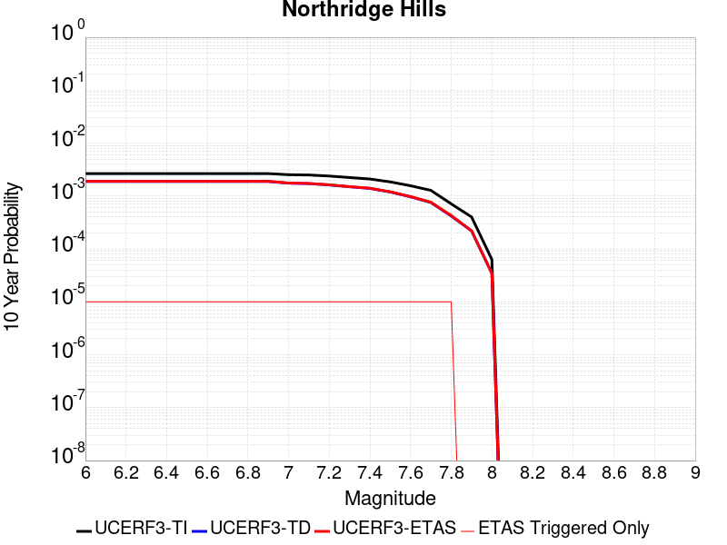 |

| Magnitude | 1 wk TI Prob | 1 wk TD Prob | 1 wk ETAS Prob | 1 wk ETAS/TD Gain | 1 wk ETAS Triggered Only | 1 mo TI Prob | 1 mo TD Prob | 1 mo ETAS Prob | 1 mo ETAS/TD Gain | 1 mo ETAS Triggered Only | 1 yr TI Prob | 1 yr TD Prob | 1 yr ETAS Prob | 1 yr ETAS/TD Gain | 1 yr ETAS Triggered Only | 10 yr TI Prob | 10 yr TD Prob | 10 yr ETAS Prob | 10 yr ETAS/TD Gain | 10 yr ETAS Triggered Only |
|-----|-----|-----|-----|-----|-----|-----|-----|-----|-----|-----|-----|-----|-----|-----|-----|-----|-----|-----|-----|-----|
| 6.0 | 5.095982E-6 | 3.6155764E-6 | 3.6155764E-6 | 1.0 | 0.0 | 2.183974E-5 | 1.5495236E-5 | 1.5495236E-5 | 1.0 | 0.0 | 2.658664E-4 | 1.8863828E-4 | 1.986364E-4 | 1.0530015 | 1.0E-5 | 0.0026554854 | 0.001884794 | 0.0018947751 | 1.0052956 | 1.0E-5 |
| 6.1 | 5.095982E-6 | 3.6155764E-6 | 3.6155764E-6 | 1.0 | 0.0 | 2.183974E-5 | 1.5495236E-5 | 1.5495236E-5 | 1.0 | 0.0 | 2.658664E-4 | 1.8863828E-4 | 1.986364E-4 | 1.0530015 | 1.0E-5 | 0.0026554854 | 0.001884794 | 0.0018947751 | 1.0052956 | 1.0E-5 |
| 6.2 | 5.095982E-6 | 3.6155764E-6 | 3.6155764E-6 | 1.0 | 0.0 | 2.183974E-5 | 1.5495236E-5 | 1.5495236E-5 | 1.0 | 0.0 | 2.658664E-4 | 1.8863828E-4 | 1.986364E-4 | 1.0530015 | 1.0E-5 | 0.0026554854 | 0.001884794 | 0.0018947751 | 1.0052956 | 1.0E-5 |
| 6.3 | 5.095982E-6 | 3.6155764E-6 | 3.6155764E-6 | 1.0 | 0.0 | 2.183974E-5 | 1.5495236E-5 | 1.5495236E-5 | 1.0 | 0.0 | 2.658664E-4 | 1.8863828E-4 | 1.986364E-4 | 1.0530015 | 1.0E-5 | 0.0026554854 | 0.001884794 | 0.0018947751 | 1.0052956 | 1.0E-5 |
| 6.4 | 5.095982E-6 | 3.6155764E-6 | 3.6155764E-6 | 1.0 | 0.0 | 2.183974E-5 | 1.5495236E-5 | 1.5495236E-5 | 1.0 | 0.0 | 2.658664E-4 | 1.8863828E-4 | 1.986364E-4 | 1.0530015 | 1.0E-5 | 0.0026554854 | 0.001884794 | 0.0018947751 | 1.0052956 | 1.0E-5 |
| 6.5 | 5.095982E-6 | 3.6155764E-6 | 3.6155764E-6 | 1.0 | 0.0 | 2.183974E-5 | 1.5495236E-5 | 1.5495236E-5 | 1.0 | 0.0 | 2.658664E-4 | 1.8863828E-4 | 1.986364E-4 | 1.0530015 | 1.0E-5 | 0.0026554854 | 0.001884794 | 0.0018947751 | 1.0052956 | 1.0E-5 |
| 6.6 | 5.095982E-6 | 3.6155764E-6 | 3.6155764E-6 | 1.0 | 0.0 | 2.183974E-5 | 1.5495236E-5 | 1.5495236E-5 | 1.0 | 0.0 | 2.658664E-4 | 1.8863828E-4 | 1.986364E-4 | 1.0530015 | 1.0E-5 | 0.0026554854 | 0.001884794 | 0.0018947751 | 1.0052956 | 1.0E-5 |
| 6.7 | 5.095982E-6 | 3.6155764E-6 | 3.6155764E-6 | 1.0 | 0.0 | 2.183974E-5 | 1.5495236E-5 | 1.5495236E-5 | 1.0 | 0.0 | 2.658664E-4 | 1.8863828E-4 | 1.986364E-4 | 1.0530015 | 1.0E-5 | 0.0026554854 | 0.001884794 | 0.0018947751 | 1.0052956 | 1.0E-5 |
| 6.8 | 5.095982E-6 | 3.6155764E-6 | 3.6155764E-6 | 1.0 | 0.0 | 2.183974E-5 | 1.5495236E-5 | 1.5495236E-5 | 1.0 | 0.0 | 2.658664E-4 | 1.8863828E-4 | 1.986364E-4 | 1.0530015 | 1.0E-5 | 0.0026554854 | 0.001884794 | 0.0018947751 | 1.0052956 | 1.0E-5 |
| 6.9 | 5.0942654E-6 | 3.6137913E-6 | 3.6137913E-6 | 1.0 | 0.0 | 2.1832384E-5 | 1.5487585E-5 | 1.5487585E-5 | 1.0 | 0.0 | 2.6577685E-4 | 1.8854515E-4 | 1.9854326E-4 | 1.0530277 | 1.0E-5 | 0.002654592 | 0.0018838643 | 0.0018938454 | 1.0052983 | 1.0E-5 |
| 7.0 | 4.851143E-6 | 3.3590998E-6 | 3.3590998E-6 | 1.0 | 0.0 | 2.0790447E-5 | 1.4396062E-5 | 1.4396062E-5 | 1.0 | 0.0 | 2.5309427E-4 | 1.75258E-4 | 1.8525624E-4 | 1.0570487 | 1.0E-5 | 0.0025280623 | 0.0017512023 | 0.0017611848 | 1.0057003 | 1.0E-5 |
| 7.1 | 4.7910607E-6 | 3.2973794E-6 | 3.2973794E-6 | 1.0 | 0.0 | 2.0532956E-5 | 1.41315495E-5 | 1.41315495E-5 | 1.0 | 0.0 | 2.4996005E-4 | 1.7203807E-4 | 1.8203634E-4 | 1.0581167 | 1.0E-5 | 0.0024967908 | 0.0017190529 | 0.0017290358 | 1.0058072 | 1.0E-5 |
| 7.2 | 4.580079E-6 | 3.107152E-6 | 3.107152E-6 | 1.0 | 0.0 | 1.9628762E-5 | 1.3316298E-5 | 1.3316298E-5 | 1.0 | 0.0 | 2.3895396E-4 | 1.621139E-4 | 1.7211227E-4 | 1.0616751 | 1.0E-5 | 0.0023869718 | 0.0016199598 | 0.0016299436 | 1.006163 | 1.0E-5 |
| 7.3 | 4.290062E-6 | 2.8685736E-6 | 2.8685736E-6 | 1.0 | 0.0 | 1.838585E-5 | 1.2293829E-5 | 1.2293829E-5 | 1.0 | 0.0 | 2.2382473E-4 | 1.4966712E-4 | 1.5966562E-4 | 1.0668049 | 1.0E-5 | 0.0022359942 | 0.0014956662 | 0.0015056513 | 1.006676 | 1.0E-5 |
| 7.4 | 4.0259683E-6 | 2.6742446E-6 | 2.6742446E-6 | 1.0 | 0.0 | 1.7254037E-5 | 1.14609975E-5 | 1.14609975E-5 | 1.0 | 0.0 | 2.1004764E-4 | 1.3952874E-4 | 1.4952733E-4 | 1.0716598 | 1.0E-5 | 0.002098492 | 0.0013944141 | 0.0014044002 | 1.0071615 | 1.0E-5 |
| 7.5 | 3.5477108E-6 | 2.2855447E-6 | 2.2855447E-6 | 1.0 | 0.0 | 1.5204386E-5 | 9.795155E-6 | 9.795155E-6 | 1.0 | 0.0 | 1.8509767E-4 | 1.19249504E-4 | 1.292483E-4 | 1.0838478 | 1.0E-5 | 0.0018494357 | 0.0011918567 | 0.0012018448 | 1.0083803 | 1.0E-5 |
| 7.6 | 2.9990608E-6 | 1.853143E-6 | 1.853143E-6 | 1.0 | 0.0 | 1.2853055E-5 | 7.942017E-6 | 7.942017E-6 | 1.0 | 0.0 | 1.564747E-4 | 9.668978E-5 | 1.0668881E-4 | 1.1034136 | 1.0E-5 | 0.0015636457 | 9.664779E-4 | 9.764682E-4 | 1.0103369 | 1.0E-5 |
| 7.7 | 2.4542855E-6 | 1.4464206E-6 | 1.4464206E-6 | 1.0 | 0.0 | 1.05183235E-5 | 6.1989304E-6 | 6.1989304E-6 | 1.0 | 0.0 | 1.2805307E-4 | 7.546937E-5 | 8.5468615E-5 | 1.1324941 | 1.0E-5 | 0.001279793 | 7.54438E-4 | 7.6443044E-4 | 1.0132449 | 1.0E-5 |
| 7.8 | 1.3623128E-6 | 8.017852E-7 | 8.017852E-7 | 1.0 | 0.0 | 5.8384703E-6 | 3.4362176E-6 | 3.4362176E-6 | 1.0 | 0.0 | 7.108106E-5 | 4.183515E-5 | 5.183473E-5 | 1.2390234 | 1.0E-5 | 7.1058323E-4 | 4.1827295E-4 | 4.2826877E-4 | 1.0238979 | 1.0E-5 |
| 7.9 | 7.716622E-7 | 4.220034E-7 | 4.220034E-7 | 1.0 | 0.0 | 3.3071194E-6 | 1.8085848E-6 | 1.8085848E-6 | 1.0 | 0.0 | 4.0263436E-5 | 2.2019298E-5 | 2.2019298E-5 | 1.0 | 0.0 | 4.0256142E-4 | 2.2017128E-4 | 2.2017128E-4 | 1.0 | 0.0 |
| 8.0 | 1.2117711E-7 | 6.623459E-8 | 6.623459E-8 | 1.0 | 0.0 | 5.1933034E-7 | 2.838625E-7 | 2.838625E-7 | 1.0 | 0.0 | 6.3228285E-6 | 3.4560205E-6 | 3.4560205E-6 | 1.0 | 0.0 | 6.3226486E-5 | 3.4559685E-5 | 3.4559685E-5 | 1.0 | 0.0 |

## Last Chance
*[(top)](#table-of-contents)*

| 1 Week | 1 Month | 1 Year | 10 Year |
|-----|-----|-----|-----|
|  |  |  |  |

| Magnitude | 1 wk TI Prob | 1 wk TD Prob | 1 wk ETAS Prob | 1 wk ETAS/TD Gain | 1 wk ETAS Triggered Only | 1 mo TI Prob | 1 mo TD Prob | 1 mo ETAS Prob | 1 mo ETAS/TD Gain | 1 mo ETAS Triggered Only | 1 yr TI Prob | 1 yr TD Prob | 1 yr ETAS Prob | 1 yr ETAS/TD Gain | 1 yr ETAS Triggered Only | 10 yr TI Prob | 10 yr TD Prob | 10 yr ETAS Prob | 10 yr ETAS/TD Gain | 10 yr ETAS Triggered Only |
|-----|-----|-----|-----|-----|-----|-----|-----|-----|-----|-----|-----|-----|-----|-----|-----|-----|-----|-----|-----|-----|
| 6.0 | 3.23929E-6 | 3.3051665E-6 | 3.3051665E-6 | 1.0 | 0.0 | 1.3882597E-5 | 1.4164937E-5 | 2.4164796E-5 | 1.7059586 | 1.0E-5 | 1.6900752E-4 | 1.7244693E-4 | 1.8244522E-4 | 1.0579789 | 1.0E-5 | 0.0016887904 | 0.0017233749 | 0.0017333578 | 1.0057926 | 1.0E-5 |
| 6.1 | 3.23929E-6 | 3.3051665E-6 | 3.3051665E-6 | 1.0 | 0.0 | 1.3882597E-5 | 1.4164937E-5 | 2.4164796E-5 | 1.7059586 | 1.0E-5 | 1.6900752E-4 | 1.7244693E-4 | 1.8244522E-4 | 1.0579789 | 1.0E-5 | 0.0016887904 | 0.0017233749 | 0.0017333578 | 1.0057926 | 1.0E-5 |
| 6.2 | 3.23929E-6 | 3.3051665E-6 | 3.3051665E-6 | 1.0 | 0.0 | 1.3882597E-5 | 1.4164937E-5 | 2.4164796E-5 | 1.7059586 | 1.0E-5 | 1.6900752E-4 | 1.7244693E-4 | 1.8244522E-4 | 1.0579789 | 1.0E-5 | 0.0016887904 | 0.0017233749 | 0.0017333578 | 1.0057926 | 1.0E-5 |
| 6.3 | 3.23929E-6 | 3.3051665E-6 | 3.3051665E-6 | 1.0 | 0.0 | 1.3882597E-5 | 1.4164937E-5 | 2.4164796E-5 | 1.7059586 | 1.0E-5 | 1.6900752E-4 | 1.7244693E-4 | 1.8244522E-4 | 1.0579789 | 1.0E-5 | 0.0016887904 | 0.0017233749 | 0.0017333578 | 1.0057926 | 1.0E-5 |
| 6.4 | 3.23929E-6 | 3.3051665E-6 | 3.3051665E-6 | 1.0 | 0.0 | 1.3882597E-5 | 1.4164937E-5 | 2.4164796E-5 | 1.7059586 | 1.0E-5 | 1.6900752E-4 | 1.7244693E-4 | 1.8244522E-4 | 1.0579789 | 1.0E-5 | 0.0016887904 | 0.0017233749 | 0.0017333578 | 1.0057926 | 1.0E-5 |
| 6.5 | 3.23929E-6 | 3.3051665E-6 | 3.3051665E-6 | 1.0 | 0.0 | 1.3882597E-5 | 1.4164937E-5 | 2.4164796E-5 | 1.7059586 | 1.0E-5 | 1.6900752E-4 | 1.7244693E-4 | 1.8244522E-4 | 1.0579789 | 1.0E-5 | 0.0016887904 | 0.0017233749 | 0.0017333578 | 1.0057926 | 1.0E-5 |
| 6.6 | 3.23929E-6 | 3.3051665E-6 | 3.3051665E-6 | 1.0 | 0.0 | 1.3882597E-5 | 1.4164937E-5 | 2.4164796E-5 | 1.7059586 | 1.0E-5 | 1.6900752E-4 | 1.7244693E-4 | 1.8244522E-4 | 1.0579789 | 1.0E-5 | 0.0016887904 | 0.0017233749 | 0.0017333578 | 1.0057926 | 1.0E-5 |
| 6.7 | 1.9639244E-6 | 2.0044758E-6 | 2.0044758E-6 | 1.0 | 0.0 | 8.416792E-6 | 8.590587E-6 | 1.8590501E-5 | 2.1640549 | 1.0E-5 | 1.02469625E-4 | 1.04586004E-4 | 1.1458496E-4 | 1.0956051 | 1.0E-5 | 0.0010242239 | 0.0010454304 | 0.0010554199 | 1.0095555 | 1.0E-5 |
| 6.8 | 1.8490592E-6 | 1.8875124E-6 | 1.8875124E-6 | 1.0 | 0.0 | 7.924516E-6 | 8.089317E-6 | 1.8089237E-5 | 2.2361882 | 1.0E-5 | 9.64767E-5 | 9.848361E-5 | 1.0848262E-4 | 1.1015297 | 1.0E-5 | 9.643483E-4 | 9.844608E-4 | 9.944509E-4 | 1.0101478 | 1.0E-5 |
| 6.9 | 1.6283703E-6 | 1.6624571E-6 | 1.6624571E-6 | 1.0 | 0.0 | 6.9787116E-6 | 7.1247996E-6 | 1.7124728E-5 | 2.4035382 | 1.0E-5 | 8.49625E-5 | 8.6741544E-5 | 9.6740674E-5 | 1.115275 | 1.0E-5 | 8.4930024E-4 | 8.6713175E-4 | 8.771231E-4 | 1.0115223 | 1.0E-5 |
| 7.0 | 1.1619308E-6 | 1.1869662E-6 | 1.1869662E-6 | 1.0 | 0.0 | 4.979694E-6 | 5.0869908E-6 | 5.0869908E-6 | 1.0 | 0.0 | 6.0626087E-5 | 6.19328E-5 | 6.19328E-5 | 1.0 | 0.0 | 6.060955E-4 | 6.1919907E-4 | 6.1919907E-4 | 1.0 | 0.0 |
| 7.1 | 7.8723247E-7 | 8.0470915E-7 | 8.0470915E-7 | 1.0 | 0.0 | 3.373849E-6 | 3.4487507E-6 | 3.4487507E-6 | 1.0 | 0.0 | 4.107584E-5 | 4.1988034E-5 | 4.1988034E-5 | 1.0 | 0.0 | 4.1068246E-4 | 4.198309E-4 | 4.198309E-4 | 1.0 | 0.0 |

## Malibu Coast (Extension) alt 1
*[(top)](#table-of-contents)*

| 1 Week | 1 Month | 1 Year | 10 Year |
|-----|-----|-----|-----|
|  |  |  |  |

| Magnitude | 1 wk TI Prob | 1 wk TD Prob | 1 wk ETAS Prob | 1 wk ETAS/TD Gain | 1 wk ETAS Triggered Only | 1 mo TI Prob | 1 mo TD Prob | 1 mo ETAS Prob | 1 mo ETAS/TD Gain | 1 mo ETAS Triggered Only | 1 yr TI Prob | 1 yr TD Prob | 1 yr ETAS Prob | 1 yr ETAS/TD Gain | 1 yr ETAS Triggered Only | 10 yr TI Prob | 10 yr TD Prob | 10 yr ETAS Prob | 10 yr ETAS/TD Gain | 10 yr ETAS Triggered Only |
|-----|-----|-----|-----|-----|-----|-----|-----|-----|-----|-----|-----|-----|-----|-----|-----|-----|-----|-----|-----|-----|
| 6.0 | 8.930738E-6 | 9.329555E-6 | 9.329555E-6 | 1.0 | 0.0 | 3.827403E-5 | 3.9983202E-5 | 3.9983202E-5 | 1.0 | 0.0 | 4.6588664E-4 | 4.8668848E-4 | 4.9668364E-4 | 1.020537 | 1.0E-5 | 0.0046491115 | 0.0048564086 | 0.00486636 | 1.0020491 | 1.0E-5 |
| 6.1 | 7.199952E-6 | 7.530538E-6 | 7.530538E-6 | 1.0 | 0.0 | 3.0856572E-5 | 3.2273336E-5 | 3.2273336E-5 | 1.0 | 0.0 | 3.75614E-4 | 3.9285765E-4 | 4.028537E-4 | 1.0254445 | 1.0E-5 | 0.0037497976 | 0.003921698 | 0.0039316583 | 1.0025399 | 1.0E-5 |
| 6.2 | 6.3721413E-6 | 6.667013E-6 | 6.667013E-6 | 1.0 | 0.0 | 2.7308892E-5 | 2.8572602E-5 | 2.8572602E-5 | 1.0 | 0.0 | 3.3243504E-4 | 3.4781627E-4 | 3.5781277E-4 | 1.0287408 | 1.0E-5 | 0.0033193815 | 0.003472759 | 0.003482724 | 1.0028696 | 1.0E-5 |
| 6.3 | 6.016345E-6 | 6.295371E-6 | 6.295371E-6 | 1.0 | 0.0 | 2.578408E-5 | 2.6979884E-5 | 2.6979884E-5 | 1.0 | 0.0 | 3.1387596E-4 | 3.284309E-4 | 3.384276E-4 | 1.0304378 | 1.0E-5 | 0.00313433 | 0.0032794913 | 0.0032894586 | 1.0030392 | 1.0E-5 |
| 6.4 | 5.8104883E-6 | 6.079752E-6 | 6.079752E-6 | 1.0 | 0.0 | 2.4901856E-5 | 2.605582E-5 | 2.605582E-5 | 1.0 | 0.0 | 3.031379E-4 | 3.1718376E-4 | 3.1718376E-4 | 1.0 | 0.0 | 0.0030272473 | 0.0031673452 | 0.0031673452 | 1.0 | 0.0 |
| 6.5 | 5.476925E-6 | 5.72771E-6 | 5.72771E-6 | 1.0 | 0.0 | 2.3472323E-5 | 2.45471E-5 | 2.45471E-5 | 1.0 | 0.0 | 2.8573806E-4 | 2.9882023E-4 | 2.9882023E-4 | 1.0 | 0.0 | 0.0028537093 | 0.0029842162 | 0.0029842162 | 1.0 | 0.0 |
| 6.6 | 5.222387E-6 | 5.4587686E-6 | 5.4587686E-6 | 1.0 | 0.0 | 2.2381464E-5 | 2.3394514E-5 | 2.3394514E-5 | 1.0 | 0.0 | 2.7246025E-4 | 2.8479125E-4 | 2.8479125E-4 | 1.0 | 0.0 | 0.0027212645 | 0.0028442936 | 0.0028442936 | 1.0 | 0.0 |
| 6.7 | 5.0337076E-6 | 5.259286E-6 | 5.259286E-6 | 1.0 | 0.0 | 2.1572854E-5 | 2.2539603E-5 | 2.2539603E-5 | 1.0 | 0.0 | 2.6261783E-4 | 2.7438538E-4 | 2.7438538E-4 | 1.0 | 0.0 | 0.002623077 | 0.0027404963 | 0.0027404963 | 1.0 | 0.0 |
| 6.8 | 4.5675624E-6 | 4.7588796E-6 | 4.7588796E-6 | 1.0 | 0.0 | 1.9575122E-5 | 2.039504E-5 | 2.039504E-5 | 1.0 | 0.0 | 2.3830103E-4 | 2.482815E-4 | 2.482815E-4 | 1.0 | 0.0 | 0.0023804565 | 0.0024800608 | 0.0024800608 | 1.0 | 0.0 |
| 6.9 | 4.2802412E-6 | 4.4521726E-6 | 4.4521726E-6 | 1.0 | 0.0 | 1.8343762E-5 | 1.9080602E-5 | 1.9080602E-5 | 1.0 | 0.0 | 2.2331243E-4 | 2.3228172E-4 | 2.3228172E-4 | 1.0 | 0.0 | 0.0022308815 | 0.002320406 | 0.002320406 | 1.0 | 0.0 |
| 7.0 | 3.9794063E-6 | 4.130239E-6 | 4.130239E-6 | 1.0 | 0.0 | 1.7054486E-5 | 1.7700906E-5 | 1.7700906E-5 | 1.0 | 0.0 | 2.0761859E-4 | 2.1548735E-4 | 2.1548735E-4 | 1.0 | 0.0 | 0.0020742472 | 0.0021527975 | 0.0021527975 | 1.0 | 0.0 |
| 7.1 | 3.7730424E-6 | 3.91135E-6 | 3.91135E-6 | 1.0 | 0.0 | 1.6170083E-5 | 1.6762822E-5 | 1.6762822E-5 | 1.0 | 0.0 | 1.9685295E-4 | 2.0406838E-4 | 2.0406838E-4 | 1.0 | 0.0 | 0.0019667868 | 0.0020388227 | 0.0020388227 | 1.0 | 0.0 |
| 7.2 | 3.424985E-6 | 3.5414578E-6 | 3.5414578E-6 | 1.0 | 0.0 | 1.4678424E-5 | 1.51775885E-5 | 1.51775885E-5 | 1.0 | 0.0 | 1.7869516E-4 | 1.8477159E-4 | 1.8477159E-4 | 1.0 | 0.0 | 0.0017855153 | 0.0018461917 | 0.0018461917 | 1.0 | 0.0 |
| 7.3 | 2.6966375E-6 | 2.7597437E-6 | 2.7597437E-6 | 1.0 | 0.0 | 1.15569665E-5 | 1.1827419E-5 | 1.1827419E-5 | 1.0 | 0.0 | 1.4069698E-4 | 1.4398935E-4 | 1.4398935E-4 | 1.0 | 0.0 | 0.0014060794 | 0.0014389647 | 0.0014389647 | 1.0 | 0.0 |
| 7.4 | 2.215957E-6 | 2.2494507E-6 | 2.2494507E-6 | 1.0 | 0.0 | 9.496924E-6 | 9.640467E-6 | 9.640467E-6 | 1.0 | 0.0 | 1.1561892E-4 | 1.17366406E-4 | 1.17366406E-4 | 1.0 | 0.0 | 0.0011555878 | 0.0011730479 | 0.0011730479 | 1.0 | 0.0 |
| 7.5 | 1.2040218E-6 | 1.221948E-6 | 1.221948E-6 | 1.0 | 0.0 | 5.160083E-6 | 5.2369096E-6 | 5.2369096E-6 | 1.0 | 0.0 | 6.2822204E-5 | 6.375753E-5 | 6.375753E-5 | 1.0 | 0.0 | 6.280445E-4 | 6.373942E-4 | 6.373942E-4 | 1.0 | 0.0 |
| 7.6 | 6.6157446E-7 | 6.679209E-7 | 6.679209E-7 | 1.0 | 0.0 | 2.835316E-6 | 2.862515E-6 | 2.862515E-6 | 1.0 | 0.0 | 3.4519428E-5 | 3.485058E-5 | 3.485058E-5 | 1.0 | 0.0 | 3.4514067E-4 | 3.4845265E-4 | 3.4845265E-4 | 1.0 | 0.0 |
| 7.7 | 2.6012302E-7 | 2.43584E-7 | 2.43584E-7 | 1.0 | 0.0 | 1.1148124E-6 | 1.0439311E-6 | 1.0439311E-6 | 1.0 | 0.0 | 1.3572758E-5 | 1.2709797E-5 | 1.2709797E-5 | 1.0 | 0.0 | 1.3571928E-4 | 1.2709177E-4 | 1.2709177E-4 | 1.0 | 0.0 |
| 7.8 | 2.8323132E-8 | 2.0267372E-8 | 2.0267372E-8 | 1.0 | 0.0 | 1.2138484E-7 | 8.686016E-8 | 8.686016E-8 | 1.0 | 0.0 | 1.4778595E-6 | 1.057522E-6 | 1.057522E-6 | 1.0 | 0.0 | 1.4778497E-5 | 1.0575178E-5 | 1.0575178E-5 | 1.0 | 0.0 |

## Mono Lake 2011 CFM
*[(top)](#table-of-contents)*

| 1 Week | 1 Month | 1 Year | 10 Year |
|-----|-----|-----|-----|
|  |  |  |  |

| Magnitude | 1 wk TI Prob | 1 wk TD Prob | 1 wk ETAS Prob | 1 wk ETAS/TD Gain | 1 wk ETAS Triggered Only | 1 mo TI Prob | 1 mo TD Prob | 1 mo ETAS Prob | 1 mo ETAS/TD Gain | 1 mo ETAS Triggered Only | 1 yr TI Prob | 1 yr TD Prob | 1 yr ETAS Prob | 1 yr ETAS/TD Gain | 1 yr ETAS Triggered Only | 10 yr TI Prob | 10 yr TD Prob | 10 yr ETAS Prob | 10 yr ETAS/TD Gain | 10 yr ETAS Triggered Only |
|-----|-----|-----|-----|-----|-----|-----|-----|-----|-----|-----|-----|-----|-----|-----|-----|-----|-----|-----|-----|-----|
| 6.0 | 2.0341662E-5 | 2.3830333E-5 | 2.3830333E-5 | 1.0 | 0.0 | 8.717564E-5 | 1.02129E-4 | 1.1212798E-4 | 1.0979054 | 1.0E-5 | 0.0010608466 | 0.0012432429 | 0.0012532304 | 1.0080335 | 1.0E-5 | 0.010557966 | 0.012414961 | 0.012424837 | 1.0007955 | 1.0E-5 |
| 6.1 | 2.0341662E-5 | 2.3830333E-5 | 2.3830333E-5 | 1.0 | 0.0 | 8.717564E-5 | 1.02129E-4 | 1.1212798E-4 | 1.0979054 | 1.0E-5 | 0.0010608466 | 0.0012432429 | 0.0012532304 | 1.0080335 | 1.0E-5 | 0.010557966 | 0.012414961 | 0.012424837 | 1.0007955 | 1.0E-5 |
| 6.2 | 2.0341662E-5 | 2.3830333E-5 | 2.3830333E-5 | 1.0 | 0.0 | 8.717564E-5 | 1.02129E-4 | 1.1212798E-4 | 1.0979054 | 1.0E-5 | 0.0010608466 | 0.0012432429 | 0.0012532304 | 1.0080335 | 1.0E-5 | 0.010557966 | 0.012414961 | 0.012424837 | 1.0007955 | 1.0E-5 |
| 6.3 | 2.0341662E-5 | 2.3830333E-5 | 2.3830333E-5 | 1.0 | 0.0 | 8.717564E-5 | 1.02129E-4 | 1.1212798E-4 | 1.0979054 | 1.0E-5 | 0.0010608466 | 0.0012432429 | 0.0012532304 | 1.0080335 | 1.0E-5 | 0.010557966 | 0.012414961 | 0.012424837 | 1.0007955 | 1.0E-5 |
| 6.4 | 1.749821E-5 | 2.0492844E-5 | 2.0492844E-5 | 1.0 | 0.0 | 7.499018E-5 | 8.782648E-5 | 8.782648E-5 | 1.0 | 0.0 | 9.1262296E-4 | 0.0010692873 | 0.0010692873 | 1.0 | 0.0 | 0.009088841 | 0.010692834 | 0.010692834 | 1.0 | 0.0 |
| 6.5 | 1.749821E-5 | 2.0492844E-5 | 2.0492844E-5 | 1.0 | 0.0 | 7.499018E-5 | 8.782648E-5 | 8.782648E-5 | 1.0 | 0.0 | 9.1262296E-4 | 0.0010692873 | 0.0010692873 | 1.0 | 0.0 | 0.009088841 | 0.010692834 | 0.010692834 | 1.0 | 0.0 |

## San Jacinto (Superstition Mtn)
*[(top)](#table-of-contents)*

| 1 Week | 1 Month | 1 Year | 10 Year |
|-----|-----|-----|-----|
|  |  |  |  |

| Magnitude | 1 wk TI Prob | 1 wk TD Prob | 1 wk ETAS Prob | 1 wk ETAS/TD Gain | 1 wk ETAS Triggered Only | 1 mo TI Prob | 1 mo TD Prob | 1 mo ETAS Prob | 1 mo ETAS/TD Gain | 1 mo ETAS Triggered Only | 1 yr TI Prob | 1 yr TD Prob | 1 yr ETAS Prob | 1 yr ETAS/TD Gain | 1 yr ETAS Triggered Only | 10 yr TI Prob | 10 yr TD Prob | 10 yr ETAS Prob | 10 yr ETAS/TD Gain | 10 yr ETAS Triggered Only |
|-----|-----|-----|-----|-----|-----|-----|-----|-----|-----|-----|-----|-----|-----|-----|-----|-----|-----|-----|-----|-----|
| 6.0 | 6.4193904E-5 | 9.602289E-5 | 9.602289E-5 | 1.0 | 0.0 | 2.7508775E-4 | 4.1147156E-4 | 4.1147156E-4 | 1.0 | 0.0 | 0.0033440501 | 0.004999541 | 0.004999541 | 1.0 | 0.0 | 0.03294174 | 0.04883795 | 0.04884746 | 1.0001948 | 1.0E-5 |
| 6.1 | 6.4193904E-5 | 9.602289E-5 | 9.602289E-5 | 1.0 | 0.0 | 2.7508775E-4 | 4.1147156E-4 | 4.1147156E-4 | 1.0 | 0.0 | 0.0033440501 | 0.004999541 | 0.004999541 | 1.0 | 0.0 | 0.03294174 | 0.04883795 | 0.04884746 | 1.0001948 | 1.0E-5 |
| 6.2 | 5.7023593E-5 | 8.317087E-5 | 8.317087E-5 | 1.0 | 0.0 | 2.4436394E-4 | 3.5640728E-4 | 3.5640728E-4 | 1.0 | 0.0 | 0.002971072 | 0.00433226 | 0.00433226 | 1.0 | 0.0 | 0.029316625 | 0.04251723 | 0.042526804 | 1.0002252 | 1.0E-5 |
| 6.3 | 5.6940098E-5 | 8.301621E-5 | 8.301621E-5 | 1.0 | 0.0 | 2.4400617E-4 | 3.5574468E-4 | 3.5574468E-4 | 1.0 | 0.0 | 0.002966728 | 0.004324225 | 0.004324225 | 1.0 | 0.0 | 0.029274331 | 0.042440474 | 0.042450048 | 1.0002257 | 1.0E-5 |
| 6.4 | 5.4171585E-5 | 7.750957E-5 | 7.750957E-5 | 1.0 | 0.0 | 2.3214328E-4 | 3.321509E-4 | 3.321509E-4 | 1.0 | 0.0 | 0.0028226813 | 0.004038087 | 0.004038087 | 1.0 | 0.0 | 0.02787096 | 0.03972961 | 0.039739214 | 1.0002418 | 1.0E-5 |
| 6.5 | 4.375144E-5 | 5.6446577E-5 | 5.6446577E-5 | 1.0 | 0.0 | 1.874927E-4 | 2.418981E-4 | 2.418981E-4 | 1.0 | 0.0 | 0.0022803338 | 0.0029423076 | 0.0029423076 | 1.0 | 0.0 | 0.022570757 | 0.02924966 | 0.029259369 | 1.0003319 | 1.0E-5 |
| 6.6 | 2.772192E-5 | 2.5512374E-5 | 2.5512374E-5 | 1.0 | 0.0 | 1.1880282E-4 | 1.0933427E-4 | 1.0933427E-4 | 1.0 | 0.0 | 0.0014454646 | 0.0013303513 | 0.0013303513 | 1.0 | 0.0 | 0.014360986 | 0.013552955 | 0.01356282 | 1.0007279 | 1.0E-5 |
| 6.7 | 2.7124124E-5 | 2.4723291E-5 | 2.4723291E-5 | 1.0 | 0.0 | 1.1624106E-4 | 1.05952764E-4 | 1.05952764E-4 | 1.0 | 0.0 | 0.0014143161 | 0.0012892308 | 0.0012892308 | 1.0 | 0.0 | 0.014053487 | 0.013146358 | 0.013156226 | 1.0007507 | 1.0E-5 |
| 6.8 | 2.5475807E-5 | 2.218778E-5 | 2.218778E-5 | 1.0 | 0.0 | 1.0917746E-4 | 9.508708E-5 | 9.508708E-5 | 1.0 | 0.0 | 0.001328425 | 0.0011570824 | 0.0011570824 | 1.0 | 0.0 | 0.0132051185 | 0.011834319 | 0.0118442 | 1.000835 | 1.0E-5 |
| 6.9 | 2.1162023E-5 | 1.764776E-5 | 1.764776E-5 | 1.0 | 0.0 | 9.069123E-5 | 7.5631084E-5 | 7.5631084E-5 | 1.0 | 0.0 | 0.0011036064 | 9.204233E-4 | 9.204233E-4 | 1.0 | 0.0 | 0.010981417 | 0.009458124 | 0.009468029 | 1.0010473 | 1.0E-5 |
| 7.0 | 1.8754288E-5 | 1.6182094E-5 | 1.6182094E-5 | 1.0 | 0.0 | 8.037304E-5 | 6.935E-5 | 6.935E-5 | 1.0 | 0.0 | 9.781026E-4 | 8.4401167E-4 | 8.4401167E-4 | 1.0 | 0.0 | 0.009738087 | 0.008680774 | 0.008690687 | 1.001142 | 1.0E-5 |
| 7.1 | 1.8678527E-5 | 1.6107217E-5 | 1.6107217E-5 | 1.0 | 0.0 | 8.0048376E-5 | 6.902911E-5 | 6.902911E-5 | 1.0 | 0.0 | 9.7415317E-4 | 8.4010785E-4 | 8.4010785E-4 | 1.0 | 0.0 | 0.009698939 | 0.00864172 | 0.008651634 | 1.0011472 | 1.0E-5 |
| 7.2 | 1.7804578E-5 | 1.5401574E-5 | 1.5401574E-5 | 1.0 | 0.0 | 7.6303106E-5 | 6.600509E-5 | 6.600509E-5 | 1.0 | 0.0 | 9.285943E-4 | 8.0331793E-4 | 8.0331793E-4 | 1.0 | 0.0 | 0.009247236 | 0.008272923 | 0.008282839 | 1.0011988 | 1.0E-5 |
| 7.3 | 1.6583685E-5 | 1.4550439E-5 | 1.4550439E-5 | 1.0 | 0.0 | 7.1070994E-5 | 6.235755E-5 | 6.235755E-5 | 1.0 | 0.0 | 8.649459E-4 | 7.589407E-4 | 7.589407E-4 | 1.0 | 0.0 | 0.00861587 | 0.007828114 | 0.007838036 | 1.0012674 | 1.0E-5 |
| 7.4 | 1.6387552E-5 | 1.44152855E-5 | 1.44152855E-5 | 1.0 | 0.0 | 7.023047E-5 | 6.1778344E-5 | 6.1778344E-5 | 1.0 | 0.0 | 8.5472054E-4 | 7.518938E-4 | 7.518938E-4 | 1.0 | 0.0 | 0.008514405 | 0.007757476 | 0.0077673984 | 1.0012791 | 1.0E-5 |
| 7.5 | 1.5790754E-5 | 1.4055765E-5 | 1.4055765E-5 | 1.0 | 0.0 | 6.767291E-5 | 6.0237613E-5 | 6.0237613E-5 | 1.0 | 0.0 | 8.236062E-4 | 7.3314813E-4 | 7.3314813E-4 | 1.0 | 0.0 | 0.008205604 | 0.007567932 | 0.0075778565 | 1.0013114 | 1.0E-5 |
| 7.6 | 1.4248672E-5 | 1.3074211E-5 | 1.3074211E-5 | 1.0 | 0.0 | 6.106431E-5 | 5.603114E-5 | 5.603114E-5 | 1.0 | 0.0 | 7.432043E-4 | 6.819673E-4 | 6.819673E-4 | 1.0 | 0.0 | 0.007407237 | 0.0070502516 | 0.007060181 | 1.0014083 | 1.0E-5 |
| 7.7 | 1.15449975E-5 | 1.0922179E-5 | 1.0922179E-5 | 1.0 | 0.0 | 4.947762E-5 | 4.68085E-5 | 4.68085E-5 | 1.0 | 0.0 | 6.022235E-4 | 5.6974526E-4 | 5.6974526E-4 | 1.0 | 0.0 | 0.006005941 | 0.005919881 | 0.005929822 | 1.0016792 | 1.0E-5 |
| 7.8 | 9.1391985E-6 | 9.532076E-6 | 9.532076E-6 | 1.0 | 0.0 | 3.9167408E-5 | 4.0851115E-5 | 4.0851115E-5 | 1.0 | 0.0 | 4.767588E-4 | 4.972494E-4 | 4.972494E-4 | 1.0 | 0.0 | 0.0047573727 | 0.0051860143 | 0.0051959627 | 1.0019183 | 1.0E-5 |
| 7.9 | 6.973017E-6 | 7.397966E-6 | 7.397966E-6 | 1.0 | 0.0 | 2.9884017E-5 | 3.1705185E-5 | 3.1705185E-5 | 1.0 | 0.0 | 3.6377716E-4 | 3.8594278E-4 | 3.8594278E-4 | 1.0 | 0.0 | 0.0036318225 | 0.0040600975 | 0.0040700566 | 1.002453 | 1.0E-5 |
| 8.0 | 5.7638235E-6 | 6.2743825E-6 | 6.2743825E-6 | 1.0 | 0.0 | 2.4701867E-5 | 2.6889935E-5 | 2.6889935E-5 | 1.0 | 0.0 | 3.0070372E-4 | 3.2733628E-4 | 3.2733628E-4 | 1.0 | 0.0 | 0.0030029714 | 0.0034610373 | 0.0034710027 | 1.0028793 | 1.0E-5 |
| 8.1 | 5.1124434E-6 | 5.508789E-6 | 5.508789E-6 | 1.0 | 0.0 | 2.1910288E-5 | 2.3608885E-5 | 2.3608885E-5 | 1.0 | 0.0 | 2.6672508E-4 | 2.8740076E-4 | 2.8740076E-4 | 1.0 | 0.0 | 0.0026640517 | 0.003047253 | 0.0030572226 | 1.0032717 | 1.0E-5 |
| 8.2 | 1.1075938E-6 | 5.3557983E-7 | 5.3557983E-7 | 1.0 | 0.0 | 4.7468216E-6 | 2.2953402E-6 | 2.2953402E-6 | 1.0 | 0.0 | 5.779102E-5 | 2.7945433E-5 | 2.7945433E-5 | 1.0 | 0.0 | 5.777599E-4 | 3.1453613E-4 | 3.1453613E-4 | 1.0 | 0.0 |
| 8.3 | 1.3584393E-8 | 4.4922075E-9 | 4.4922075E-9 | 1.0 | 0.0 | 5.8218827E-8 | 1.9252319E-8 | 1.9252319E-8 | 1.0 | 0.0 | 7.0881396E-7 | 2.3439698E-7 | 2.3439698E-7 | 1.0 | 0.0 | 7.0881174E-6 | 2.6266084E-6 | 2.6266084E-6 | 1.0 | 0.0 |

## Ozena
*[(top)](#table-of-contents)*

| 1 Week | 1 Month | 1 Year | 10 Year |
|-----|-----|-----|-----|
|  |  |  |  |

| Magnitude | 1 wk TI Prob | 1 wk TD Prob | 1 wk ETAS Prob | 1 wk ETAS/TD Gain | 1 wk ETAS Triggered Only | 1 mo TI Prob | 1 mo TD Prob | 1 mo ETAS Prob | 1 mo ETAS/TD Gain | 1 mo ETAS Triggered Only | 1 yr TI Prob | 1 yr TD Prob | 1 yr ETAS Prob | 1 yr ETAS/TD Gain | 1 yr ETAS Triggered Only | 10 yr TI Prob | 10 yr TD Prob | 10 yr ETAS Prob | 10 yr ETAS/TD Gain | 10 yr ETAS Triggered Only |
|-----|-----|-----|-----|-----|-----|-----|-----|-----|-----|-----|-----|-----|-----|-----|-----|-----|-----|-----|-----|-----|
| 6.0 | 1.4377547E-6 | 1.4513856E-6 | 1.4513856E-6 | 1.0 | 0.0 | 6.161791E-6 | 6.2202107E-6 | 6.2202107E-6 | 1.0 | 0.0 | 7.5017226E-5 | 7.5728705E-5 | 7.5728705E-5 | 1.0 | 0.0 | 7.4991904E-4 | 7.570556E-4 | 7.6704804E-4 | 1.0131991 | 1.0E-5 |
| 6.1 | 1.4377547E-6 | 1.4513856E-6 | 1.4513856E-6 | 1.0 | 0.0 | 6.161791E-6 | 6.2202107E-6 | 6.2202107E-6 | 1.0 | 0.0 | 7.5017226E-5 | 7.5728705E-5 | 7.5728705E-5 | 1.0 | 0.0 | 7.4991904E-4 | 7.570556E-4 | 7.6704804E-4 | 1.0131991 | 1.0E-5 |
| 6.2 | 1.4377547E-6 | 1.4513856E-6 | 1.4513856E-6 | 1.0 | 0.0 | 6.161791E-6 | 6.2202107E-6 | 6.2202107E-6 | 1.0 | 0.0 | 7.5017226E-5 | 7.5728705E-5 | 7.5728705E-5 | 1.0 | 0.0 | 7.4991904E-4 | 7.570556E-4 | 7.6704804E-4 | 1.0131991 | 1.0E-5 |
| 6.3 | 1.4377547E-6 | 1.4513856E-6 | 1.4513856E-6 | 1.0 | 0.0 | 6.161791E-6 | 6.2202107E-6 | 6.2202107E-6 | 1.0 | 0.0 | 7.5017226E-5 | 7.5728705E-5 | 7.5728705E-5 | 1.0 | 0.0 | 7.4991904E-4 | 7.570556E-4 | 7.6704804E-4 | 1.0131991 | 1.0E-5 |
| 6.4 | 1.4377547E-6 | 1.4513856E-6 | 1.4513856E-6 | 1.0 | 0.0 | 6.161791E-6 | 6.2202107E-6 | 6.2202107E-6 | 1.0 | 0.0 | 7.5017226E-5 | 7.5728705E-5 | 7.5728705E-5 | 1.0 | 0.0 | 7.4991904E-4 | 7.570556E-4 | 7.6704804E-4 | 1.0131991 | 1.0E-5 |
| 6.5 | 1.4377547E-6 | 1.4513856E-6 | 1.4513856E-6 | 1.0 | 0.0 | 6.161791E-6 | 6.2202107E-6 | 6.2202107E-6 | 1.0 | 0.0 | 7.5017226E-5 | 7.5728705E-5 | 7.5728705E-5 | 1.0 | 0.0 | 7.4991904E-4 | 7.570556E-4 | 7.6704804E-4 | 1.0131991 | 1.0E-5 |
| 6.6 | 1.4377547E-6 | 1.4513856E-6 | 1.4513856E-6 | 1.0 | 0.0 | 6.161791E-6 | 6.2202107E-6 | 6.2202107E-6 | 1.0 | 0.0 | 7.5017226E-5 | 7.5728705E-5 | 7.5728705E-5 | 1.0 | 0.0 | 7.4991904E-4 | 7.570556E-4 | 7.6704804E-4 | 1.0131991 | 1.0E-5 |
| 6.7 | 1.4377547E-6 | 1.4513856E-6 | 1.4513856E-6 | 1.0 | 0.0 | 6.161791E-6 | 6.2202107E-6 | 6.2202107E-6 | 1.0 | 0.0 | 7.5017226E-5 | 7.5728705E-5 | 7.5728705E-5 | 1.0 | 0.0 | 7.4991904E-4 | 7.570556E-4 | 7.6704804E-4 | 1.0131991 | 1.0E-5 |
| 6.8 | 9.223257E-7 | 9.3176743E-7 | 9.3176743E-7 | 1.0 | 0.0 | 3.9528186E-6 | 3.993283E-6 | 3.993283E-6 | 1.0 | 0.0 | 4.81245E-5 | 4.8617178E-5 | 4.8617178E-5 | 1.0 | 0.0 | 4.811408E-4 | 4.8606945E-4 | 4.960646E-4 | 1.0205632 | 1.0E-5 |
| 6.9 | 9.141515E-7 | 9.2354213E-7 | 9.2354213E-7 | 1.0 | 0.0 | 3.917786E-6 | 3.958032E-6 | 3.958032E-6 | 1.0 | 0.0 | 4.7698002E-5 | 4.8188012E-5 | 4.8188012E-5 | 1.0 | 0.0 | 4.7687767E-4 | 4.8177966E-4 | 4.917749E-4 | 1.0207464 | 1.0E-5 |
| 7.0 | 8.767648E-7 | 8.8586256E-7 | 8.8586256E-7 | 1.0 | 0.0 | 3.757558E-6 | 3.7965485E-6 | 3.7965485E-6 | 1.0 | 0.0 | 4.5747307E-5 | 4.6222038E-5 | 4.6222038E-5 | 1.0 | 0.0 | 4.5737892E-4 | 4.6212817E-4 | 4.6212817E-4 | 1.0 | 0.0 |
| 7.1 | 8.199402E-7 | 8.2854444E-7 | 8.2854444E-7 | 1.0 | 0.0 | 3.5140247E-6 | 3.5509001E-6 | 3.5509001E-6 | 1.0 | 0.0 | 4.2782412E-5 | 4.323139E-5 | 4.323139E-5 | 1.0 | 0.0 | 4.2774176E-4 | 4.3223353E-4 | 4.3223353E-4 | 1.0 | 0.0 |
| 7.2 | 7.38705E-7 | 7.464304E-7 | 7.464304E-7 | 1.0 | 0.0 | 3.1658747E-6 | 3.1989837E-6 | 3.1989837E-6 | 1.0 | 0.0 | 3.8543843E-5 | 3.8946964E-5 | 3.8946964E-5 | 1.0 | 0.0 | 3.853716E-4 | 3.8940492E-4 | 3.8940492E-4 | 1.0 | 0.0 |
| 7.3 | 6.490017E-7 | 6.557838E-7 | 6.557838E-7 | 1.0 | 0.0 | 2.7814328E-6 | 2.8104992E-6 | 2.8104992E-6 | 1.0 | 0.0 | 3.386342E-5 | 3.4217326E-5 | 3.4217326E-5 | 1.0 | 0.0 | 3.3858258E-4 | 3.4212394E-4 | 3.4212394E-4 | 1.0 | 0.0 |
| 7.4 | 5.346736E-7 | 5.4022905E-7 | 5.4022905E-7 | 1.0 | 0.0 | 2.291456E-6 | 2.3152654E-6 | 2.3152654E-6 | 1.0 | 0.0 | 2.789812E-5 | 2.8188024E-5 | 2.8188024E-5 | 1.0 | 0.0 | 2.789462E-4 | 2.8184752E-4 | 2.8184752E-4 | 1.0 | 0.0 |
| 7.5 | 2.939325E-7 | 2.9666205E-7 | 2.9666205E-7 | 1.0 | 0.0 | 1.25971E-6 | 1.2714082E-6 | 1.2714082E-6 | 1.0 | 0.0 | 1.5336862E-5 | 1.5479302E-5 | 1.5479302E-5 | 1.0 | 0.0 | 1.5335804E-4 | 1.5478385E-4 | 1.5478385E-4 | 1.0 | 0.0 |
| 7.6 | 1.4151905E-7 | 1.425332E-7 | 1.425332E-7 | 1.0 | 0.0 | 6.065101E-7 | 6.108564E-7 | 6.108564E-7 | 1.0 | 0.0 | 7.3842357E-6 | 7.437152E-6 | 7.437152E-6 | 1.0 | 0.0 | 7.38399E-5 | 7.4369105E-5 | 7.4369105E-5 | 1.0 | 0.0 |
| 7.7 | 4.4957577E-8 | 4.52524E-8 | 4.52524E-8 | 1.0 | 0.0 | 1.9267533E-7 | 1.9393885E-7 | 1.9393885E-7 | 1.0 | 0.0 | 2.3458194E-6 | 2.361203E-6 | 2.361203E-6 | 1.0 | 0.0 | 2.3457947E-5 | 2.3611788E-5 | 2.3611788E-5 | 1.0 | 0.0 |
| 7.8 | 5.9993255E-9 | 6.04132E-9 | 6.04132E-9 | 1.0 | 0.0 | 2.5711394E-8 | 2.589137E-8 | 2.589137E-8 | 1.0 | 0.0 | 3.1303617E-7 | 3.152274E-7 | 3.152274E-7 | 1.0 | 0.0 | 3.1303573E-6 | 3.1522707E-6 | 3.1522707E-6 | 1.0 | 0.0 |

## South Cuyama
*[(top)](#table-of-contents)*

| 1 Week | 1 Month | 1 Year | 10 Year |
|-----|-----|-----|-----|
|  |  | 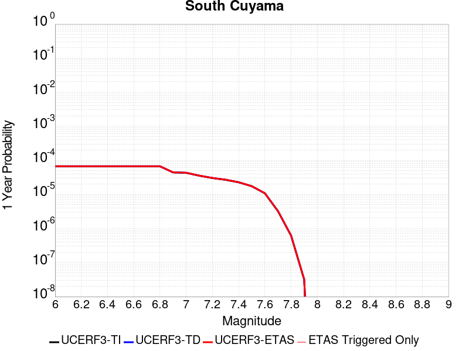 |  |

| Magnitude | 1 wk TI Prob | 1 wk TD Prob | 1 wk ETAS Prob | 1 wk ETAS/TD Gain | 1 wk ETAS Triggered Only | 1 mo TI Prob | 1 mo TD Prob | 1 mo ETAS Prob | 1 mo ETAS/TD Gain | 1 mo ETAS Triggered Only | 1 yr TI Prob | 1 yr TD Prob | 1 yr ETAS Prob | 1 yr ETAS/TD Gain | 1 yr ETAS Triggered Only | 10 yr TI Prob | 10 yr TD Prob | 10 yr ETAS Prob | 10 yr ETAS/TD Gain | 10 yr ETAS Triggered Only |
|-----|-----|-----|-----|-----|-----|-----|-----|-----|-----|-----|-----|-----|-----|-----|-----|-----|-----|-----|-----|-----|
| 6.0 | 1.2747308E-6 | 1.2818736E-6 | 1.2818736E-6 | 1.0 | 0.0 | 5.4631205E-6 | 5.4937327E-6 | 5.4937327E-6 | 1.0 | 0.0 | 6.6511464E-5 | 6.688421E-5 | 6.688421E-5 | 1.0 | 0.0 | 6.649156E-4 | 6.686478E-4 | 6.786411E-4 | 1.0149455 | 1.0E-5 |
| 6.1 | 1.2747308E-6 | 1.2818736E-6 | 1.2818736E-6 | 1.0 | 0.0 | 5.4631205E-6 | 5.4937327E-6 | 5.4937327E-6 | 1.0 | 0.0 | 6.6511464E-5 | 6.688421E-5 | 6.688421E-5 | 1.0 | 0.0 | 6.649156E-4 | 6.686478E-4 | 6.786411E-4 | 1.0149455 | 1.0E-5 |
| 6.2 | 1.2747308E-6 | 1.2818736E-6 | 1.2818736E-6 | 1.0 | 0.0 | 5.4631205E-6 | 5.4937327E-6 | 5.4937327E-6 | 1.0 | 0.0 | 6.6511464E-5 | 6.688421E-5 | 6.688421E-5 | 1.0 | 0.0 | 6.649156E-4 | 6.686478E-4 | 6.786411E-4 | 1.0149455 | 1.0E-5 |
| 6.3 | 1.2747308E-6 | 1.2818736E-6 | 1.2818736E-6 | 1.0 | 0.0 | 5.4631205E-6 | 5.4937327E-6 | 5.4937327E-6 | 1.0 | 0.0 | 6.6511464E-5 | 6.688421E-5 | 6.688421E-5 | 1.0 | 0.0 | 6.649156E-4 | 6.686478E-4 | 6.786411E-4 | 1.0149455 | 1.0E-5 |
| 6.4 | 1.2747308E-6 | 1.2818736E-6 | 1.2818736E-6 | 1.0 | 0.0 | 5.4631205E-6 | 5.4937327E-6 | 5.4937327E-6 | 1.0 | 0.0 | 6.6511464E-5 | 6.688421E-5 | 6.688421E-5 | 1.0 | 0.0 | 6.649156E-4 | 6.686478E-4 | 6.786411E-4 | 1.0149455 | 1.0E-5 |
| 6.5 | 1.2747308E-6 | 1.2818736E-6 | 1.2818736E-6 | 1.0 | 0.0 | 5.4631205E-6 | 5.4937327E-6 | 5.4937327E-6 | 1.0 | 0.0 | 6.6511464E-5 | 6.688421E-5 | 6.688421E-5 | 1.0 | 0.0 | 6.649156E-4 | 6.686478E-4 | 6.786411E-4 | 1.0149455 | 1.0E-5 |
| 6.6 | 1.2747308E-6 | 1.2818736E-6 | 1.2818736E-6 | 1.0 | 0.0 | 5.4631205E-6 | 5.4937327E-6 | 5.4937327E-6 | 1.0 | 0.0 | 6.6511464E-5 | 6.688421E-5 | 6.688421E-5 | 1.0 | 0.0 | 6.649156E-4 | 6.686478E-4 | 6.786411E-4 | 1.0149455 | 1.0E-5 |
| 6.7 | 1.2747308E-6 | 1.2818736E-6 | 1.2818736E-6 | 1.0 | 0.0 | 5.4631205E-6 | 5.4937327E-6 | 5.4937327E-6 | 1.0 | 0.0 | 6.6511464E-5 | 6.688421E-5 | 6.688421E-5 | 1.0 | 0.0 | 6.649156E-4 | 6.686478E-4 | 6.786411E-4 | 1.0149455 | 1.0E-5 |
| 6.8 | 1.2747308E-6 | 1.2818736E-6 | 1.2818736E-6 | 1.0 | 0.0 | 5.4631205E-6 | 5.4937327E-6 | 5.4937327E-6 | 1.0 | 0.0 | 6.6511464E-5 | 6.688421E-5 | 6.688421E-5 | 1.0 | 0.0 | 6.649156E-4 | 6.686478E-4 | 6.786411E-4 | 1.0149455 | 1.0E-5 |
| 6.9 | 8.4566324E-7 | 8.50791E-7 | 8.50791E-7 | 1.0 | 0.0 | 3.624266E-6 | 3.646242E-6 | 3.646242E-6 | 1.0 | 0.0 | 4.4124543E-5 | 4.4392105E-5 | 4.4392105E-5 | 1.0 | 0.0 | 4.4115784E-4 | 4.4383339E-4 | 4.5382895E-4 | 1.022521 | 1.0E-5 |
| 7.0 | 8.2277904E-7 | 8.277847E-7 | 8.277847E-7 | 1.0 | 0.0 | 3.526191E-6 | 3.5476437E-6 | 3.5476437E-6 | 1.0 | 0.0 | 4.293053E-5 | 4.3191718E-5 | 4.3191718E-5 | 1.0 | 0.0 | 4.292224E-4 | 4.3183423E-4 | 4.418299E-4 | 1.023147 | 1.0E-5 |
| 7.1 | 6.7661887E-7 | 6.809153E-7 | 6.809153E-7 | 1.0 | 0.0 | 2.899792E-6 | 2.9182052E-6 | 2.9182052E-6 | 1.0 | 0.0 | 3.5304394E-5 | 3.5528574E-5 | 3.5528574E-5 | 1.0 | 0.0 | 3.5298787E-4 | 3.552293E-4 | 3.6522577E-4 | 1.0281408 | 1.0E-5 |
| 7.2 | 5.783336E-7 | 5.821211E-7 | 5.821211E-7 | 1.0 | 0.0 | 2.4785702E-6 | 2.4948024E-6 | 2.4948024E-6 | 1.0 | 0.0 | 3.0176174E-5 | 3.0373798E-5 | 3.0373798E-5 | 1.0 | 0.0 | 3.0172078E-4 | 3.036967E-4 | 3.1369366E-4 | 1.0329176 | 1.0E-5 |
| 7.3 | 5.136759E-7 | 5.170956E-7 | 5.170956E-7 | 1.0 | 0.0 | 2.2014663E-6 | 2.2161223E-6 | 2.2161223E-6 | 1.0 | 0.0 | 2.6802521E-5 | 2.6980955E-5 | 2.6980955E-5 | 1.0 | 0.0 | 2.679929E-4 | 2.69777E-4 | 2.797743E-4 | 1.0370576 | 1.0E-5 |
| 7.4 | 4.3370295E-7 | 4.366552E-7 | 4.366552E-7 | 1.0 | 0.0 | 1.8587256E-6 | 1.8713781E-6 | 1.8713781E-6 | 1.0 | 0.0 | 2.2629749E-5 | 2.2783792E-5 | 2.2783792E-5 | 1.0 | 0.0 | 2.2627445E-4 | 2.2781473E-4 | 2.3781245E-4 | 1.0438854 | 1.0E-5 |
| 7.5 | 3.3242574E-7 | 3.347659E-7 | 3.347659E-7 | 1.0 | 0.0 | 1.4246809E-6 | 1.4347102E-6 | 1.4347102E-6 | 1.0 | 0.0 | 1.7345352E-5 | 1.7467459E-5 | 1.7467459E-5 | 1.0 | 0.0 | 1.7343998E-4 | 1.7466098E-4 | 1.8465923E-4 | 1.0572438 | 1.0E-5 |
| 7.6 | 2.0627535E-7 | 2.0778981E-7 | 2.0778981E-7 | 1.0 | 0.0 | 8.840369E-7 | 8.905275E-7 | 8.905275E-7 | 1.0 | 0.0 | 1.0763096E-5 | 1.0842119E-5 | 1.0842119E-5 | 1.0 | 0.0 | 1.0762575E-4 | 1.0841598E-4 | 1.184149E-4 | 1.0922273 | 1.0E-5 |
| 7.7 | 6.15236E-8 | 6.198329E-8 | 6.198329E-8 | 1.0 | 0.0 | 2.6367252E-7 | 2.6564265E-7 | 2.6564265E-7 | 1.0 | 0.0 | 3.2102084E-6 | 3.2341945E-6 | 3.2341945E-6 | 1.0 | 0.0 | 3.210162E-5 | 3.2341486E-5 | 3.2341486E-5 | 1.0 | 0.0 |
| 7.8 | 1.1765573E-8 | 1.1873472E-8 | 1.1873472E-8 | 1.0 | 0.0 | 5.0423886E-8 | 5.0886307E-8 | 5.0886307E-8 | 1.0 | 0.0 | 6.1391063E-7 | 6.1954063E-7 | 6.1954063E-7 | 1.0 | 0.0 | 6.1390897E-6 | 6.19539E-6 | 6.19539E-6 | 1.0 | 0.0 |
| 7.9 | 6.0381755E-10 | 6.1006133E-10 | 6.1006133E-10 | 1.0 | 0.0 | 2.5877895E-9 | 2.6145484E-9 | 2.6145484E-9 | 1.0 | 0.0 | 3.1506335E-8 | 3.1832126E-8 | 3.1832126E-8 | 1.0 | 0.0 | 3.1506332E-7 | 3.1832124E-7 | 3.1832124E-7 | 1.0 | 0.0 |

## Newport-Inglewood (Offshore)
*[(top)](#table-of-contents)*

| 1 Week | 1 Month | 1 Year | 10 Year |
|-----|-----|-----|-----|
|  | 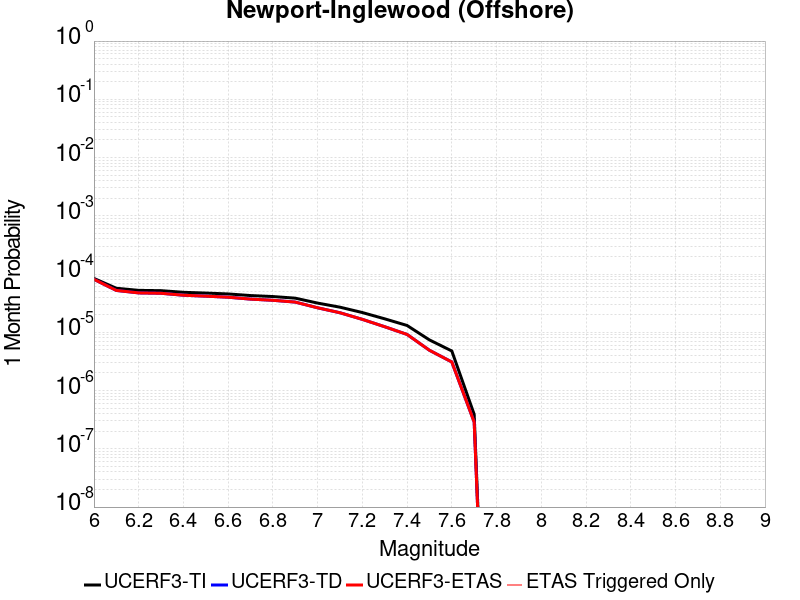 |  |  |

| Magnitude | 1 wk TI Prob | 1 wk TD Prob | 1 wk ETAS Prob | 1 wk ETAS/TD Gain | 1 wk ETAS Triggered Only | 1 mo TI Prob | 1 mo TD Prob | 1 mo ETAS Prob | 1 mo ETAS/TD Gain | 1 mo ETAS Triggered Only | 1 yr TI Prob | 1 yr TD Prob | 1 yr ETAS Prob | 1 yr ETAS/TD Gain | 1 yr ETAS Triggered Only | 10 yr TI Prob | 10 yr TD Prob | 10 yr ETAS Prob | 10 yr ETAS/TD Gain | 10 yr ETAS Triggered Only |
|-----|-----|-----|-----|-----|-----|-----|-----|-----|-----|-----|-----|-----|-----|-----|-----|-----|-----|-----|-----|-----|
| 6.0 | 1.9626508E-5 | 1.896613E-5 | 1.896613E-5 | 1.0 | 0.0 | 8.411089E-5 | 8.1280945E-5 | 8.1280945E-5 | 1.0 | 0.0 | 0.001023569 | 9.891589E-4 | 9.891589E-4 | 1.0 | 0.0 | 0.010188672 | 0.009848903 | 0.009858805 | 1.0010053 | 1.0E-5 |
| 6.1 | 1.331886E-5 | 1.2218616E-5 | 1.2218616E-5 | 1.0 | 0.0 | 5.707958E-5 | 5.2364452E-5 | 5.2364452E-5 | 1.0 | 0.0 | 6.947222E-4 | 6.3735223E-4 | 6.3735223E-4 | 1.0 | 0.0 | 0.006925544 | 0.00635542 | 0.006365357 | 1.0015634 | 1.0E-5 |
| 6.2 | 1.2250852E-5 | 1.107651E-5 | 1.107651E-5 | 1.0 | 0.0 | 5.2502597E-5 | 4.74699E-5 | 4.74699E-5 | 1.0 | 0.0 | 6.3903164E-4 | 5.777938E-4 | 5.777938E-4 | 1.0 | 0.0 | 0.006371971 | 0.005763036 | 0.005772979 | 1.0017252 | 1.0E-5 |
| 6.3 | 1.2106258E-5 | 1.0919365E-5 | 1.0919365E-5 | 1.0 | 0.0 | 5.1882926E-5 | 4.6796446E-5 | 4.6796446E-5 | 1.0 | 0.0 | 6.3149154E-4 | 5.6959875E-4 | 5.6959875E-4 | 1.0 | 0.0 | 0.0062970007 | 0.005681505 | 0.005691448 | 1.0017501 | 1.0E-5 |
| 6.4 | 1.1348758E-5 | 1.0109807E-5 | 1.0109807E-5 | 1.0 | 0.0 | 4.8636626E-5 | 4.3327025E-5 | 4.3327025E-5 | 1.0 | 0.0 | 5.919901E-4 | 5.273797E-4 | 5.273797E-4 | 1.0 | 0.0 | 0.005904155 | 0.005261377 | 0.0052713244 | 1.0018907 | 1.0E-5 |
| 6.5 | 1.100837E-5 | 9.743819E-6 | 9.743819E-6 | 1.0 | 0.0 | 4.7177873E-5 | 4.175856E-5 | 4.175856E-5 | 1.0 | 0.0 | 5.7423924E-4 | 5.0829264E-4 | 5.0829264E-4 | 1.0 | 0.0 | 0.005727576 | 0.005071392 | 0.005081341 | 1.0019618 | 1.0E-5 |
| 6.6 | 1.0634696E-5 | 9.345958E-6 | 9.345958E-6 | 1.0 | 0.0 | 4.557647E-5 | 4.0053492E-5 | 4.0053492E-5 | 1.0 | 0.0 | 5.5475225E-4 | 4.875429E-4 | 4.875429E-4 | 1.0 | 0.0 | 0.0055336943 | 0.0048648193 | 0.004874771 | 1.0020456 | 1.0E-5 |
| 6.7 | 9.9780855E-6 | 8.6682985E-6 | 8.6682985E-6 | 1.0 | 0.0 | 4.276252E-5 | 3.7149326E-5 | 3.7149326E-5 | 1.0 | 0.0 | 5.205093E-4 | 4.521999E-4 | 4.521999E-4 | 1.0 | 0.0 | 0.0051929182 | 0.0045128767 | 0.004522831 | 1.0022058 | 1.0E-5 |
| 6.8 | 9.59546E-6 | 8.273325E-6 | 8.273325E-6 | 1.0 | 0.0 | 4.1122752E-5 | 3.545663E-5 | 3.545663E-5 | 1.0 | 0.0 | 5.0055445E-4 | 4.3159962E-4 | 4.3159962E-4 | 1.0 | 0.0 | 0.004994285 | 0.0043076896 | 0.004317647 | 1.0023115 | 1.0E-5 |
| 6.9 | 9.000614E-6 | 7.707188E-6 | 7.707188E-6 | 1.0 | 0.0 | 3.857349E-5 | 3.3030392E-5 | 3.3030392E-5 | 1.0 | 0.0 | 4.6953102E-4 | 4.0207148E-4 | 4.0207148E-4 | 1.0 | 0.0 | 0.004685402 | 0.004013512 | 0.004023472 | 1.0024816 | 1.0E-5 |
| 7.0 | 7.4070194E-6 | 6.14917E-6 | 6.14917E-6 | 1.0 | 0.0 | 3.1743984E-5 | 2.635332E-5 | 2.635332E-5 | 1.0 | 0.0 | 3.8641447E-4 | 3.208046E-4 | 3.208046E-4 | 1.0 | 0.0 | 0.0038574322 | 0.0032034346 | 0.0032134026 | 1.0031116 | 1.0E-5 |
| 7.1 | 6.299615E-6 | 5.056818E-6 | 5.056818E-6 | 1.0 | 0.0 | 2.699807E-5 | 2.1671896E-5 | 2.1671896E-5 | 1.0 | 0.0 | 3.2865192E-4 | 2.6382352E-4 | 2.6382352E-4 | 1.0 | 0.0 | 0.003281663 | 0.002635118 | 0.0026450916 | 1.0037849 | 1.0E-5 |
| 7.2 | 5.096653E-6 | 3.892961E-6 | 3.892961E-6 | 1.0 | 0.0 | 2.1842614E-5 | 1.6684013E-5 | 1.6684013E-5 | 1.0 | 0.0 | 2.6590136E-4 | 2.0310901E-4 | 2.0310901E-4 | 1.0 | 0.0 | 0.0026558342 | 0.002029245 | 0.002029245 | 1.0 | 0.0 |
| 7.3 | 3.9753018E-6 | 2.9100247E-6 | 2.9100247E-6 | 1.0 | 0.0 | 1.7036897E-5 | 1.2471476E-5 | 1.2471476E-5 | 1.0 | 0.0 | 2.0740448E-4 | 1.5182972E-4 | 1.5182972E-4 | 1.0 | 0.0 | 0.00207211 | 0.0015172679 | 0.0015172679 | 1.0 | 0.0 |
| 7.4 | 3.0568392E-6 | 2.145087E-6 | 2.145087E-6 | 1.0 | 0.0 | 1.3100675E-5 | 9.193198E-6 | 9.193198E-6 | 1.0 | 0.0 | 1.5948903E-4 | 1.11921494E-4 | 1.11921494E-4 | 1.0 | 0.0 | 0.0015937461 | 0.0011186575 | 0.0011186575 | 1.0 | 0.0 |
| 7.5 | 1.7279019E-6 | 1.1470418E-6 | 1.1470418E-6 | 1.0 | 0.0 | 7.405273E-6 | 4.9158843E-6 | 4.9158843E-6 | 1.0 | 0.0 | 9.015547E-5 | 5.9849288E-5 | 5.9849288E-5 | 1.0 | 0.0 | 9.01189E-4 | 5.983356E-4 | 5.983356E-4 | 1.0 | 0.0 |
| 7.6 | 1.1156416E-6 | 7.2233786E-7 | 7.2233786E-7 | 1.0 | 0.0 | 4.7813123E-6 | 3.09573E-6 | 3.09573E-6 | 1.0 | 0.0 | 5.821092E-5 | 3.7689886E-5 | 3.7689886E-5 | 1.0 | 0.0 | 5.8195676E-4 | 3.7683727E-4 | 3.7683727E-4 | 1.0 | 0.0 |
| 7.7 | 9.117973E-8 | 6.7343215E-8 | 6.7343215E-8 | 1.0 | 0.0 | 3.907702E-7 | 2.8861376E-7 | 2.8861376E-7 | 1.0 | 0.0 | 4.757617E-6 | 3.5138671E-6 | 3.5138671E-6 | 1.0 | 0.0 | 4.7575148E-5 | 3.5138146E-5 | 3.5138146E-5 | 1.0 | 0.0 |

## Hunting Creek - Berryessa 2011 CFM
*[(top)](#table-of-contents)*

| 1 Week | 1 Month | 1 Year | 10 Year |
|-----|-----|-----|-----|
|  |  |  | 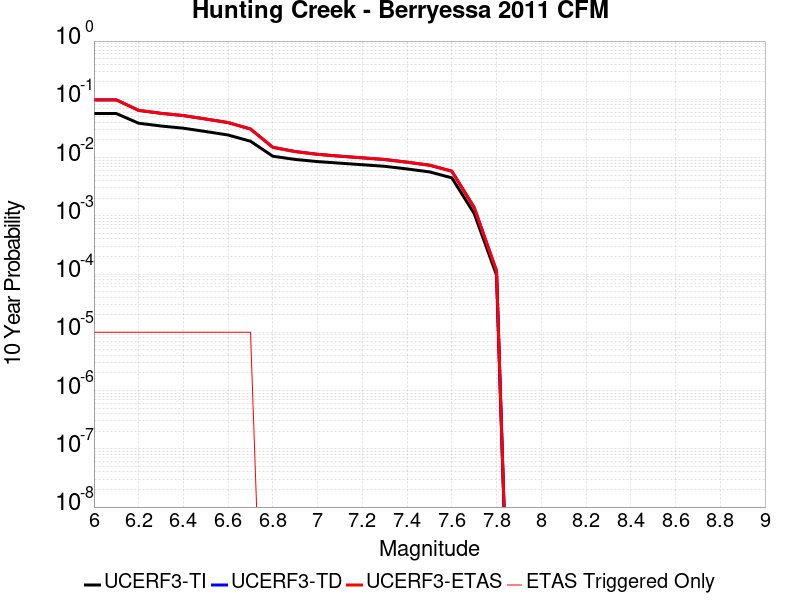 |

| Magnitude | 1 wk TI Prob | 1 wk TD Prob | 1 wk ETAS Prob | 1 wk ETAS/TD Gain | 1 wk ETAS Triggered Only | 1 mo TI Prob | 1 mo TD Prob | 1 mo ETAS Prob | 1 mo ETAS/TD Gain | 1 mo ETAS Triggered Only | 1 yr TI Prob | 1 yr TD Prob | 1 yr ETAS Prob | 1 yr ETAS/TD Gain | 1 yr ETAS Triggered Only | 10 yr TI Prob | 10 yr TD Prob | 10 yr ETAS Prob | 10 yr ETAS/TD Gain | 10 yr ETAS Triggered Only |
|-----|-----|-----|-----|-----|-----|-----|-----|-----|-----|-----|-----|-----|-----|-----|-----|-----|-----|-----|-----|-----|
| 6.0 | 1.1270982E-4 | 2.0017775E-4 | 2.0017775E-4 | 1.0 | 0.0 | 4.8295266E-4 | 8.5742475E-4 | 8.5742475E-4 | 1.0 | 0.0 | 0.0058641075 | 0.010388056 | 0.010397951 | 1.0009526 | 1.0E-5 | 0.057117578 | 0.09805172 | 0.09806074 | 1.000092 | 1.0E-5 |
| 6.1 | 1.1239393E-4 | 1.9965896E-4 | 1.9965896E-4 | 1.0 | 0.0 | 4.8159933E-4 | 8.552031E-4 | 8.552031E-4 | 1.0 | 0.0 | 0.0058477195 | 0.010361288 | 0.010371184 | 1.0009551 | 1.0E-5 | 0.056962132 | 0.09781016 | 0.09781918 | 1.0000923 | 1.0E-5 |
| 6.2 | 7.596265E-5 | 1.2940993E-4 | 1.2940993E-4 | 1.0 | 0.0 | 3.2551357E-4 | 5.5426615E-4 | 5.5426615E-4 | 1.0 | 0.0 | 0.0039559277 | 0.006721831 | 0.006731764 | 1.0014777 | 1.0E-5 | 0.038862433 | 0.064600885 | 0.06461024 | 1.0001448 | 1.0E-5 |
| 6.3 | 6.78794E-5 | 1.1452538E-4 | 1.1452538E-4 | 1.0 | 0.0 | 2.9087928E-4 | 4.9073447E-4 | 4.9073447E-4 | 1.0 | 0.0 | 0.003535705 | 0.0059534037 | 0.005963344 | 1.0016698 | 1.0E-5 | 0.034799766 | 0.05747386 | 0.057483286 | 1.000164 | 1.0E-5 |
| 6.4 | 6.2165134E-5 | 1.04393934E-4 | 1.04393934E-4 | 1.0 | 0.0 | 2.6639478E-4 | 4.4732942E-4 | 4.4732942E-4 | 1.0 | 0.0 | 0.0032385332 | 0.0054282364 | 0.0054381825 | 1.0018322 | 1.0E-5 | 0.03191742 | 0.052558403 | 0.052567877 | 1.0001802 | 1.0E-5 |
| 6.5 | 5.4368087E-5 | 9.073724E-5 | 9.073724E-5 | 1.0 | 0.0 | 2.3298527E-4 | 3.8881917E-4 | 3.8881917E-4 | 1.0 | 0.0 | 0.0028329059 | 0.004720476 | 0.0047304286 | 1.0021085 | 1.0E-5 | 0.027970633 | 0.04588709 | 0.04589663 | 1.0002079 | 1.0E-5 |
| 6.6 | 4.729947E-5 | 7.849487E-5 | 7.849487E-5 | 1.0 | 0.0 | 2.0269625E-4 | 3.3636627E-4 | 3.3636627E-4 | 1.0 | 0.0 | 0.002465034 | 0.0040854933 | 0.0040954524 | 1.0024377 | 1.0E-5 | 0.02437869 | 0.039857663 | 0.039867267 | 1.0002409 | 1.0E-5 |
| 6.7 | 3.6875328E-5 | 6.0465416E-5 | 6.0465416E-5 | 1.0 | 0.0 | 1.5802756E-4 | 2.5911423E-4 | 2.5911423E-4 | 1.0 | 0.0 | 0.0019222875 | 0.0031486591 | 0.0031586275 | 1.003166 | 1.0E-5 | 0.019057442 | 0.030897204 | 0.030906895 | 1.0003136 | 1.0E-5 |
| 6.8 | 2.0292036E-5 | 2.897928E-5 | 2.897928E-5 | 1.0 | 0.0 | 8.6962966E-5 | 1.2419096E-4 | 1.2419096E-4 | 1.0 | 0.0 | 0.0010582599 | 0.0015109582 | 0.0015109582 | 1.0 | 0.0 | 0.010532344 | 0.014980009 | 0.014980009 | 1.0 | 0.0 |
| 6.9 | 1.7871042E-5 | 2.4474773E-5 | 2.4474773E-5 | 1.0 | 0.0 | 7.658793E-5 | 1.0488762E-4 | 1.0488762E-4 | 1.0 | 0.0 | 9.320591E-4 | 0.0012762607 | 0.0012762607 | 1.0 | 0.0 | 0.009281595 | 0.01268106 | 0.01268106 | 1.0 | 0.0 |
| 7.0 | 1.6415532E-5 | 2.1908601E-5 | 2.1908601E-5 | 1.0 | 0.0 | 7.035038E-5 | 9.3890645E-5 | 9.3890645E-5 | 1.0 | 0.0 | 8.561793E-4 | 0.0011425226 | 0.0011425226 | 1.0 | 0.0 | 0.008528882 | 0.011365713 | 0.011365713 | 1.0 | 0.0 |
| 7.1 | 1.5409885E-5 | 2.034855E-5 | 2.034855E-5 | 1.0 | 0.0 | 6.6040695E-5 | 8.720518E-5 | 8.720518E-5 | 1.0 | 0.0 | 8.0374884E-4 | 0.0010612089 | 0.0010612089 | 1.0 | 0.0 | 0.00800848 | 0.010561734 | 0.010561734 | 1.0 | 0.0 |
| 7.2 | 1.4497423E-5 | 1.905703E-5 | 1.905703E-5 | 1.0 | 0.0 | 6.213033E-5 | 8.167045E-5 | 8.167045E-5 | 1.0 | 0.0 | 7.5617427E-4 | 9.938872E-4 | 9.938872E-4 | 1.0 | 0.0 | 0.0075360634 | 0.009894996 | 0.009894996 | 1.0 | 0.0 |
| 7.3 | 1.3615175E-5 | 1.7828126E-5 | 1.7828126E-5 | 1.0 | 0.0 | 5.8349444E-5 | 7.640403E-5 | 7.640403E-5 | 1.0 | 0.0 | 7.101729E-4 | 9.2982507E-4 | 9.2982507E-4 | 1.0 | 0.0 | 0.0070790765 | 0.009259855 | 0.009259855 | 1.0 | 0.0 |
| 7.4 | 1.2252825E-5 | 1.6028054E-5 | 1.6028054E-5 | 1.0 | 0.0 | 5.251105E-5 | 6.8689864E-5 | 6.8689864E-5 | 1.0 | 0.0 | 6.391345E-4 | 8.3598105E-4 | 8.3598105E-4 | 1.0 | 0.0 | 0.0063729943 | 0.008328805 | 0.008328805 | 1.0 | 0.0 |
| 7.5 | 1.0913301E-5 | 1.4242686E-5 | 1.4242686E-5 | 1.0 | 0.0 | 4.6770452E-5 | 6.103867E-5 | 6.103867E-5 | 1.0 | 0.0 | 5.6928146E-4 | 7.428952E-4 | 7.428952E-4 | 1.0 | 0.0 | 0.0056782532 | 0.0074044922 | 0.0074044922 | 1.0 | 0.0 |
| 7.6 | 8.623192E-6 | 1.1235767E-5 | 1.1235767E-5 | 1.0 | 0.0 | 3.6956015E-5 | 4.815241E-5 | 4.815241E-5 | 1.0 | 0.0 | 4.4984656E-4 | 5.861005E-4 | 5.861005E-4 | 1.0 | 0.0 | 0.00448937 | 0.005845862 | 0.005845862 | 1.0 | 0.0 |
| 7.7 | 2.0993634E-6 | 2.6627938E-6 | 2.6627938E-6 | 1.0 | 0.0 | 8.997241E-6 | 1.1411924E-5 | 1.1411924E-5 | 1.0 | 0.0 | 1.09535904E-4 | 1.3893138E-4 | 1.3893138E-4 | 1.0 | 0.0 | 0.0010948193 | 0.0013884519 | 0.0013884519 | 1.0 | 0.0 |
| 7.8 | 1.8428308E-7 | 2.1675888E-7 | 2.1675888E-7 | 1.0 | 0.0 | 7.897844E-7 | 9.289663E-7 | 9.289663E-7 | 1.0 | 0.0 | 9.615583E-6 | 1.131011E-5 | 1.131011E-5 | 1.0 | 0.0 | 9.615166E-5 | 1.1309395E-4 | 1.1309395E-4 | 1.0 | 0.0 |

## North Frontal  (East)
*[(top)](#table-of-contents)*

| 1 Week | 1 Month | 1 Year | 10 Year |
|-----|-----|-----|-----|
|  |  |  |  |

| Magnitude | 1 wk TI Prob | 1 wk TD Prob | 1 wk ETAS Prob | 1 wk ETAS/TD Gain | 1 wk ETAS Triggered Only | 1 mo TI Prob | 1 mo TD Prob | 1 mo ETAS Prob | 1 mo ETAS/TD Gain | 1 mo ETAS Triggered Only | 1 yr TI Prob | 1 yr TD Prob | 1 yr ETAS Prob | 1 yr ETAS/TD Gain | 1 yr ETAS Triggered Only | 10 yr TI Prob | 10 yr TD Prob | 10 yr ETAS Prob | 10 yr ETAS/TD Gain | 10 yr ETAS Triggered Only |
|-----|-----|-----|-----|-----|-----|-----|-----|-----|-----|-----|-----|-----|-----|-----|-----|-----|-----|-----|-----|-----|
| 6.0 | 7.135738E-6 | 7.4773666E-6 | 7.4773666E-6 | 1.0 | 0.0 | 3.0581377E-5 | 3.2045577E-5 | 3.2045577E-5 | 1.0 | 0.0 | 3.7226462E-4 | 3.9010498E-4 | 4.0010107E-4 | 1.0256242 | 1.0E-5 | 0.0037164164 | 0.0038961596 | 0.0039061208 | 1.0025567 | 1.0E-5 |
| 6.1 | 7.135738E-6 | 7.4773666E-6 | 7.4773666E-6 | 1.0 | 0.0 | 3.0581377E-5 | 3.2045577E-5 | 3.2045577E-5 | 1.0 | 0.0 | 3.7226462E-4 | 3.9010498E-4 | 4.0010107E-4 | 1.0256242 | 1.0E-5 | 0.0037164164 | 0.0038961596 | 0.0039061208 | 1.0025567 | 1.0E-5 |
| 6.2 | 7.135738E-6 | 7.4773666E-6 | 7.4773666E-6 | 1.0 | 0.0 | 3.0581377E-5 | 3.2045577E-5 | 3.2045577E-5 | 1.0 | 0.0 | 3.7226462E-4 | 3.9010498E-4 | 4.0010107E-4 | 1.0256242 | 1.0E-5 | 0.0037164164 | 0.0038961596 | 0.0039061208 | 1.0025567 | 1.0E-5 |
| 6.3 | 7.135738E-6 | 7.4773666E-6 | 7.4773666E-6 | 1.0 | 0.0 | 3.0581377E-5 | 3.2045577E-5 | 3.2045577E-5 | 1.0 | 0.0 | 3.7226462E-4 | 3.9010498E-4 | 4.0010107E-4 | 1.0256242 | 1.0E-5 | 0.0037164164 | 0.0038961596 | 0.0039061208 | 1.0025567 | 1.0E-5 |
| 6.4 | 7.135738E-6 | 7.4773666E-6 | 7.4773666E-6 | 1.0 | 0.0 | 3.0581377E-5 | 3.2045577E-5 | 3.2045577E-5 | 1.0 | 0.0 | 3.7226462E-4 | 3.9010498E-4 | 4.0010107E-4 | 1.0256242 | 1.0E-5 | 0.0037164164 | 0.0038961596 | 0.0039061208 | 1.0025567 | 1.0E-5 |
| 6.5 | 7.135738E-6 | 7.4773666E-6 | 7.4773666E-6 | 1.0 | 0.0 | 3.0581377E-5 | 3.2045577E-5 | 3.2045577E-5 | 1.0 | 0.0 | 3.7226462E-4 | 3.9010498E-4 | 4.0010107E-4 | 1.0256242 | 1.0E-5 | 0.0037164164 | 0.0038961596 | 0.0039061208 | 1.0025567 | 1.0E-5 |
| 6.6 | 7.135738E-6 | 7.4773666E-6 | 7.4773666E-6 | 1.0 | 0.0 | 3.0581377E-5 | 3.2045577E-5 | 3.2045577E-5 | 1.0 | 0.0 | 3.7226462E-4 | 3.9010498E-4 | 4.0010107E-4 | 1.0256242 | 1.0E-5 | 0.0037164164 | 0.0038961596 | 0.0039061208 | 1.0025567 | 1.0E-5 |
| 6.7 | 7.135738E-6 | 7.4773666E-6 | 7.4773666E-6 | 1.0 | 0.0 | 3.0581377E-5 | 3.2045577E-5 | 3.2045577E-5 | 1.0 | 0.0 | 3.7226462E-4 | 3.9010498E-4 | 4.0010107E-4 | 1.0256242 | 1.0E-5 | 0.0037164164 | 0.0038961596 | 0.0039061208 | 1.0025567 | 1.0E-5 |
| 6.8 | 5.959142E-6 | 6.236837E-6 | 6.236837E-6 | 1.0 | 0.0 | 2.553893E-5 | 2.672913E-5 | 2.672913E-5 | 1.0 | 0.0 | 3.108921E-4 | 3.2539663E-4 | 3.353934E-4 | 1.0307218 | 1.0E-5 | 0.0031045752 | 0.0032509752 | 0.0032609426 | 1.003066 | 1.0E-5 |
| 6.9 | 2.2946929E-6 | 2.382509E-6 | 2.382509E-6 | 1.0 | 0.0 | 9.834361E-6 | 1.0210715E-5 | 1.0210715E-5 | 1.0 | 0.0 | 1.1972676E-4 | 1.2430883E-4 | 1.2430883E-4 | 1.0 | 0.0 | 0.0011966228 | 0.0012424395 | 0.0012424395 | 1.0 | 0.0 |
| 7.0 | 2.2468673E-6 | 2.3322007E-6 | 2.3322007E-6 | 1.0 | 0.0 | 9.629396E-6 | 9.99511E-6 | 9.99511E-6 | 1.0 | 0.0 | 1.1723159E-4 | 1.2168415E-4 | 1.2168415E-4 | 1.0 | 0.0 | 0.0011716976 | 0.0012162215 | 0.0012162215 | 1.0 | 0.0 |
| 7.1 | 1.9921076E-6 | 2.064643E-6 | 2.064643E-6 | 1.0 | 0.0 | 8.537577E-6 | 8.848443E-6 | 8.848443E-6 | 1.0 | 0.0 | 1.0394004E-4 | 1.077249E-4 | 1.077249E-4 | 1.0 | 0.0 | 0.0010389143 | 0.0010767695 | 0.0010767695 | 1.0 | 0.0 |
| 7.2 | 1.4524545E-6 | 1.5045434E-6 | 1.5045434E-6 | 1.0 | 0.0 | 6.2247905E-6 | 6.4480287E-6 | 6.4480287E-6 | 1.0 | 0.0 | 7.5784184E-5 | 7.850217E-5 | 7.850217E-5 | 1.0 | 0.0 | 7.575835E-4 | 7.8476884E-4 | 7.8476884E-4 | 1.0 | 0.0 |
| 7.3 | 8.9802575E-7 | 9.3089085E-7 | 9.3089085E-7 | 1.0 | 0.0 | 3.848676E-6 | 3.9895267E-6 | 3.9895267E-6 | 1.0 | 0.0 | 4.685662E-5 | 4.857152E-5 | 4.857152E-5 | 1.0 | 0.0 | 4.6846745E-4 | 4.8562037E-4 | 4.8562037E-4 | 1.0 | 0.0 |
| 7.4 | 7.776139E-7 | 8.060631E-7 | 8.060631E-7 | 1.0 | 0.0 | 3.3326266E-6 | 3.4545521E-6 | 3.4545521E-6 | 1.0 | 0.0 | 4.0573974E-5 | 4.2058473E-5 | 4.2058473E-5 | 1.0 | 0.0 | 4.0566566E-4 | 4.205159E-4 | 4.205159E-4 | 1.0 | 0.0 |
| 7.5 | 5.244417E-7 | 5.441328E-7 | 5.441328E-7 | 1.0 | 0.0 | 2.2476054E-6 | 2.3319958E-6 | 2.3319958E-6 | 1.0 | 0.0 | 2.7364253E-5 | 2.8391745E-5 | 2.8391745E-5 | 1.0 | 0.0 | 2.7360884E-4 | 2.838877E-4 | 2.838877E-4 | 1.0 | 0.0 |
| 7.6 | 1.5489647E-7 | 1.6089835E-7 | 1.6089835E-7 | 1.0 | 0.0 | 6.6384183E-7 | 6.895643E-7 | 6.895643E-7 | 1.0 | 0.0 | 8.082245E-6 | 8.395433E-6 | 8.395433E-6 | 1.0 | 0.0 | 8.08195E-5 | 8.395316E-5 | 8.395316E-5 | 1.0 | 0.0 |

## Elmore Ranch
*[(top)](#table-of-contents)*

| 1 Week | 1 Month | 1 Year | 10 Year |
|-----|-----|-----|-----|
|  |  | 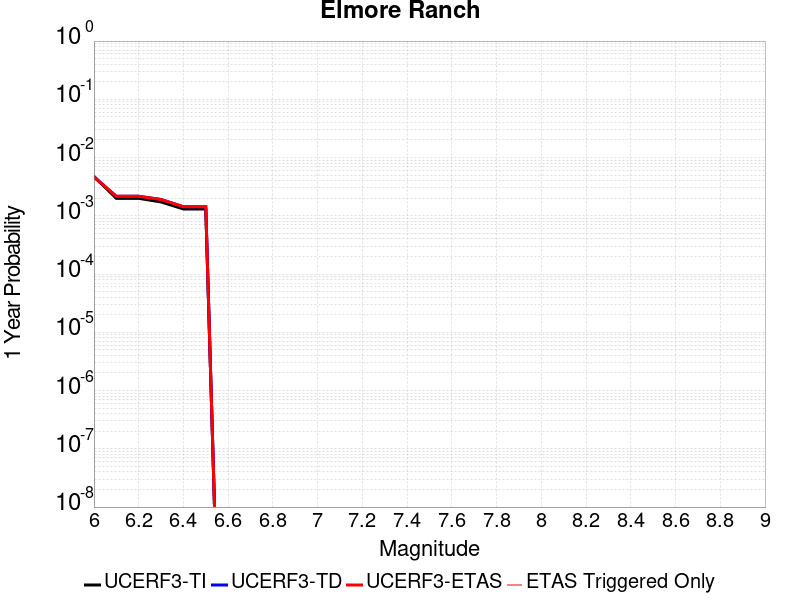 |  |

| Magnitude | 1 wk TI Prob | 1 wk TD Prob | 1 wk ETAS Prob | 1 wk ETAS/TD Gain | 1 wk ETAS Triggered Only | 1 mo TI Prob | 1 mo TD Prob | 1 mo ETAS Prob | 1 mo ETAS/TD Gain | 1 mo ETAS Triggered Only | 1 yr TI Prob | 1 yr TD Prob | 1 yr ETAS Prob | 1 yr ETAS/TD Gain | 1 yr ETAS Triggered Only | 10 yr TI Prob | 10 yr TD Prob | 10 yr ETAS Prob | 10 yr ETAS/TD Gain | 10 yr ETAS Triggered Only |
|-----|-----|-----|-----|-----|-----|-----|-----|-----|-----|-----|-----|-----|-----|-----|-----|-----|-----|-----|-----|-----|
| 6.0 | 9.102099E-5 | 8.954503E-5 | 8.954503E-5 | 1.0 | 0.0 | 3.9003167E-4 | 3.837211E-4 | 3.837211E-4 | 1.0 | 0.0 | 0.0047383 | 0.0046632043 | 0.0046632043 | 1.0 | 0.0 | 0.046385348 | 0.045880616 | 0.045890156 | 1.0002079 | 1.0E-5 |
| 6.1 | 3.8306698E-5 | 4.1508196E-5 | 4.1508196E-5 | 1.0 | 0.0 | 1.6416123E-4 | 1.7788421E-4 | 1.7788421E-4 | 1.0 | 0.0 | 0.0019968306 | 0.002163561 | 0.002163561 | 1.0 | 0.0 | 0.019789828 | 0.021632731 | 0.021632731 | 1.0 | 0.0 |
| 6.2 | 3.8306698E-5 | 4.1508196E-5 | 4.1508196E-5 | 1.0 | 0.0 | 1.6416123E-4 | 1.7788421E-4 | 1.7788421E-4 | 1.0 | 0.0 | 0.0019968306 | 0.002163561 | 0.002163561 | 1.0 | 0.0 | 0.019789828 | 0.021632731 | 0.021632731 | 1.0 | 0.0 |
| 6.3 | 3.3197924E-5 | 3.656194E-5 | 3.656194E-5 | 1.0 | 0.0 | 1.4226905E-4 | 1.5668859E-4 | 1.5668859E-4 | 1.0 | 0.0 | 0.0017307495 | 0.001906266 | 0.001906266 | 1.0 | 0.0 | 0.017173318 | 0.019093616 | 0.019093616 | 1.0 | 0.0 |
| 6.4 | 2.5148964E-5 | 2.7425167E-5 | 2.7425167E-5 | 1.0 | 0.0 | 1.0777682E-4 | 1.1753479E-4 | 1.1753479E-4 | 1.0 | 0.0 | 0.0013113929 | 0.001430695 | 0.001430695 | 1.0 | 0.0 | 0.01303681 | 0.014389615 | 0.014389615 | 1.0 | 0.0 |
| 6.5 | 2.5148964E-5 | 2.7425167E-5 | 2.7425167E-5 | 1.0 | 0.0 | 1.0777682E-4 | 1.1753479E-4 | 1.1753479E-4 | 1.0 | 0.0 | 0.0013113929 | 0.001430695 | 0.001430695 | 1.0 | 0.0 | 0.01303681 | 0.014389615 | 0.014389615 | 1.0 | 0.0 |

## Oceanside alt1
*[(top)](#table-of-contents)*

| 1 Week | 1 Month | 1 Year | 10 Year |
|-----|-----|-----|-----|
|  |  |  | 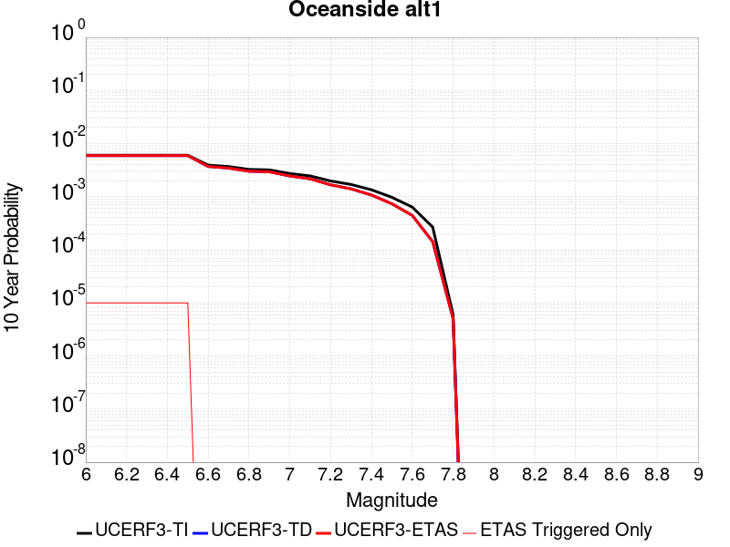 |

| Magnitude | 1 wk TI Prob | 1 wk TD Prob | 1 wk ETAS Prob | 1 wk ETAS/TD Gain | 1 wk ETAS Triggered Only | 1 mo TI Prob | 1 mo TD Prob | 1 mo ETAS Prob | 1 mo ETAS/TD Gain | 1 mo ETAS Triggered Only | 1 yr TI Prob | 1 yr TD Prob | 1 yr ETAS Prob | 1 yr ETAS/TD Gain | 1 yr ETAS Triggered Only | 10 yr TI Prob | 10 yr TD Prob | 10 yr ETAS Prob | 10 yr ETAS/TD Gain | 10 yr ETAS Triggered Only |
|-----|-----|-----|-----|-----|-----|-----|-----|-----|-----|-----|-----|-----|-----|-----|-----|-----|-----|-----|-----|-----|
| 6.0 | 1.1617542E-5 | 1.1423785E-5 | 1.1423785E-5 | 1.0 | 0.0 | 4.9788516E-5 | 4.895825E-5 | 4.895825E-5 | 1.0 | 0.0 | 6.060066E-4 | 5.959198E-4 | 6.059138E-4 | 1.0167708 | 1.0E-5 | 0.0060435664 | 0.0059448164 | 0.005954757 | 1.0016721 | 1.0E-5 |
| 6.1 | 1.1617542E-5 | 1.1423785E-5 | 1.1423785E-5 | 1.0 | 0.0 | 4.9788516E-5 | 4.895825E-5 | 4.895825E-5 | 1.0 | 0.0 | 6.060066E-4 | 5.959198E-4 | 6.059138E-4 | 1.0167708 | 1.0E-5 | 0.0060435664 | 0.0059448164 | 0.005954757 | 1.0016721 | 1.0E-5 |
| 6.2 | 1.1617542E-5 | 1.1423785E-5 | 1.1423785E-5 | 1.0 | 0.0 | 4.9788516E-5 | 4.895825E-5 | 4.895825E-5 | 1.0 | 0.0 | 6.060066E-4 | 5.959198E-4 | 6.059138E-4 | 1.0167708 | 1.0E-5 | 0.0060435664 | 0.0059448164 | 0.005954757 | 1.0016721 | 1.0E-5 |
| 6.3 | 1.1617542E-5 | 1.1423785E-5 | 1.1423785E-5 | 1.0 | 0.0 | 4.9788516E-5 | 4.895825E-5 | 4.895825E-5 | 1.0 | 0.0 | 6.060066E-4 | 5.959198E-4 | 6.059138E-4 | 1.0167708 | 1.0E-5 | 0.0060435664 | 0.0059448164 | 0.005954757 | 1.0016721 | 1.0E-5 |
| 6.4 | 1.1617542E-5 | 1.1423785E-5 | 1.1423785E-5 | 1.0 | 0.0 | 4.9788516E-5 | 4.895825E-5 | 4.895825E-5 | 1.0 | 0.0 | 6.060066E-4 | 5.959198E-4 | 6.059138E-4 | 1.0167708 | 1.0E-5 | 0.0060435664 | 0.0059448164 | 0.005954757 | 1.0016721 | 1.0E-5 |
| 6.5 | 1.1617542E-5 | 1.1423785E-5 | 1.1423785E-5 | 1.0 | 0.0 | 4.9788516E-5 | 4.895825E-5 | 4.895825E-5 | 1.0 | 0.0 | 6.060066E-4 | 5.959198E-4 | 6.059138E-4 | 1.0167708 | 1.0E-5 | 0.0060435664 | 0.0059448164 | 0.005954757 | 1.0016721 | 1.0E-5 |
| 6.6 | 7.561768E-6 | 7.1337768E-6 | 7.1337768E-6 | 1.0 | 0.0 | 3.2407173E-5 | 3.0572977E-5 | 3.0572977E-5 | 1.0 | 0.0 | 3.9448592E-4 | 3.721635E-4 | 3.721635E-4 | 1.0 | 0.0 | 0.0039378637 | 0.0037155137 | 0.0037155137 | 1.0 | 0.0 |
| 6.7 | 7.1042605E-6 | 6.6558355E-6 | 6.6558355E-6 | 1.0 | 0.0 | 3.0446476E-5 | 2.8524702E-5 | 2.8524702E-5 | 1.0 | 0.0 | 3.706228E-4 | 3.472337E-4 | 3.472337E-4 | 1.0 | 0.0 | 0.0037000529 | 0.003466995 | 0.003466995 | 1.0 | 0.0 |
| 6.8 | 6.285554E-6 | 5.799835E-6 | 5.799835E-6 | 1.0 | 0.0 | 2.693781E-5 | 2.4856203E-5 | 2.4856203E-5 | 1.0 | 0.0 | 3.2791847E-4 | 3.0258278E-4 | 3.0258278E-4 | 1.0 | 0.0 | 0.0032743502 | 0.0030217655 | 0.0030217655 | 1.0 | 0.0 |
| 6.9 | 6.148883E-6 | 5.65667E-6 | 5.65667E-6 | 1.0 | 0.0 | 2.635209E-5 | 2.4242649E-5 | 2.4242649E-5 | 1.0 | 0.0 | 3.2078946E-4 | 2.9511482E-4 | 2.9511482E-4 | 1.0 | 0.0 | 0.003203268 | 0.0029472862 | 0.0029472862 | 1.0 | 0.0 |
| 7.0 | 5.253857E-6 | 4.7225076E-6 | 4.7225076E-6 | 1.0 | 0.0 | 2.2516335E-5 | 2.0239164E-5 | 2.0239164E-5 | 1.0 | 0.0 | 2.7410188E-4 | 2.4638424E-4 | 2.4638424E-4 | 1.0 | 0.0 | 0.0027376404 | 0.0024611424 | 0.0024611424 | 1.0 | 0.0 |
| 7.1 | 4.730754E-6 | 4.1786006E-6 | 4.1786006E-6 | 1.0 | 0.0 | 2.0274503E-5 | 1.7908167E-5 | 1.7908167E-5 | 1.0 | 0.0 | 2.468141E-4 | 2.1801038E-4 | 2.1801038E-4 | 1.0 | 0.0 | 0.0024654015 | 0.0021779914 | 0.0021779914 | 1.0 | 0.0 |
| 7.2 | 3.7998386E-6 | 3.214093E-6 | 3.214093E-6 | 1.0 | 0.0 | 1.6284921E-5 | 1.3774613E-5 | 1.3774613E-5 | 1.0 | 0.0 | 1.9825088E-4 | 1.6769313E-4 | 1.6769313E-4 | 1.0 | 0.0 | 0.001980741 | 0.0016756781 | 0.0016756781 | 1.0 | 0.0 |
| 7.3 | 3.2656465E-6 | 2.698432E-6 | 2.698432E-6 | 1.0 | 0.0 | 1.3995553E-5 | 1.1564657E-5 | 1.1564657E-5 | 1.0 | 0.0 | 1.7038253E-4 | 1.4079071E-4 | 1.4079071E-4 | 1.0 | 0.0 | 0.0017025196 | 0.0014070263 | 0.0014070263 | 1.0 | 0.0 |
| 7.4 | 2.593703E-6 | 2.0680698E-6 | 2.0680698E-6 | 1.0 | 0.0 | 1.1115822E-5 | 8.863127E-6 | 8.863127E-6 | 1.0 | 0.0 | 1.3532673E-4 | 1.0790332E-4 | 1.0790332E-4 | 1.0 | 0.0 | 0.0013524436 | 0.0010785181 | 0.0010785181 | 1.0 | 0.0 |
| 7.5 | 1.8715585E-6 | 1.4137448E-6 | 1.4137448E-6 | 1.0 | 0.0 | 8.020941E-6 | 6.0588927E-6 | 6.0588927E-6 | 1.0 | 0.0 | 9.7650576E-5 | 7.376458E-5 | 7.376458E-5 | 1.0 | 0.0 | 9.7607676E-4 | 7.37407E-4 | 7.37407E-4 | 1.0 | 0.0 |
| 7.6 | 1.2246786E-6 | 8.5270324E-7 | 8.5270324E-7 | 1.0 | 0.0 | 5.248612E-6 | 3.6544377E-6 | 3.6544377E-6 | 1.0 | 0.0 | 6.389998E-5 | 4.4491917E-5 | 4.4491917E-5 | 1.0 | 0.0 | 6.3881604E-4 | 4.4483456E-4 | 4.4483456E-4 | 1.0 | 0.0 |
| 7.7 | 5.140719E-7 | 2.7348258E-7 | 2.7348258E-7 | 1.0 | 0.0 | 2.2031636E-6 | 1.1720678E-6 | 1.1720678E-6 | 1.0 | 0.0 | 2.6823185E-5 | 1.4269845E-5 | 1.4269845E-5 | 1.0 | 0.0 | 2.6819948E-4 | 1.4269064E-4 | 1.4269064E-4 | 1.0 | 0.0 |
| 7.8 | 1.16056995E-8 | 9.782449E-9 | 9.782449E-9 | 1.0 | 0.0 | 4.9738713E-8 | 4.1924782E-8 | 4.1924782E-8 | 1.0 | 0.0 | 6.0556863E-7 | 5.1043423E-7 | 5.1043423E-7 | 1.0 | 0.0 | 6.05567E-6 | 5.104342E-6 | 5.104342E-6 | 1.0 | 0.0 |

## Hayward (So) 2011 CFM
*[(top)](#table-of-contents)*

| 1 Week | 1 Month | 1 Year | 10 Year |
|-----|-----|-----|-----|
| 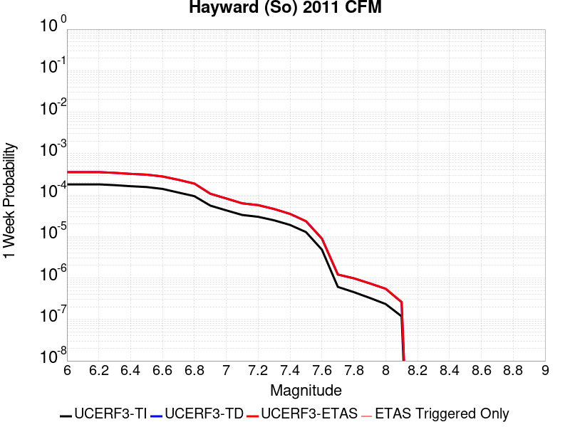 |  | 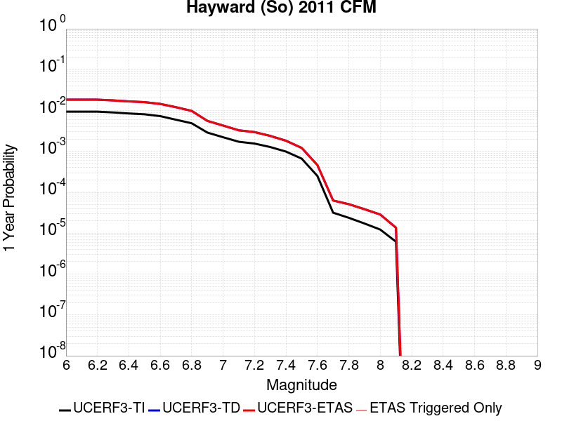 |  |

| Magnitude | 1 wk TI Prob | 1 wk TD Prob | 1 wk ETAS Prob | 1 wk ETAS/TD Gain | 1 wk ETAS Triggered Only | 1 mo TI Prob | 1 mo TD Prob | 1 mo ETAS Prob | 1 mo ETAS/TD Gain | 1 mo ETAS Triggered Only | 1 yr TI Prob | 1 yr TD Prob | 1 yr ETAS Prob | 1 yr ETAS/TD Gain | 1 yr ETAS Triggered Only | 10 yr TI Prob | 10 yr TD Prob | 10 yr ETAS Prob | 10 yr ETAS/TD Gain | 10 yr ETAS Triggered Only |
|-----|-----|-----|-----|-----|-----|-----|-----|-----|-----|-----|-----|-----|-----|-----|-----|-----|-----|-----|-----|-----|
| 6.0 | 1.8091932E-4 | 3.5726093E-4 | 3.5726093E-4 | 1.0 | 0.0 | 7.751381E-4 | 0.0015302298 | 0.0015302298 | 1.0 | 0.0 | 0.00939654 | 0.018473808 | 0.018473808 | 1.0 | 0.0 | 0.090090066 | 0.16681154 | 0.16681987 | 1.00005 | 1.0E-5 |
| 6.1 | 1.8091932E-4 | 3.5726093E-4 | 3.5726093E-4 | 1.0 | 0.0 | 7.751381E-4 | 0.0015302298 | 0.0015302298 | 1.0 | 0.0 | 0.00939654 | 0.018473808 | 0.018473808 | 1.0 | 0.0 | 0.090090066 | 0.16681154 | 0.16681987 | 1.00005 | 1.0E-5 |
| 6.2 | 1.8091932E-4 | 3.5726093E-4 | 3.5726093E-4 | 1.0 | 0.0 | 7.751381E-4 | 0.0015302298 | 0.0015302298 | 1.0 | 0.0 | 0.00939654 | 0.018473808 | 0.018473808 | 1.0 | 0.0 | 0.090090066 | 0.16681154 | 0.16681987 | 1.00005 | 1.0E-5 |
| 6.3 | 1.7322872E-4 | 3.4282645E-4 | 3.4282645E-4 | 1.0 | 0.0 | 7.4219756E-4 | 0.0014684385 | 0.0014684385 | 1.0 | 0.0 | 0.0089988755 | 0.017733958 | 0.017733958 | 1.0 | 0.0 | 0.08643075 | 0.16074646 | 0.16075486 | 1.0000522 | 1.0E-5 |
| 6.4 | 1.6334097E-4 | 3.2363975E-4 | 3.2363975E-4 | 1.0 | 0.0 | 6.998449E-4 | 0.0013862988 | 0.0013862988 | 1.0 | 0.0 | 0.008487372 | 0.016749581 | 0.016749581 | 1.0 | 0.0 | 0.081704415 | 0.15263419 | 0.15264265 | 1.0000556 | 1.0E-5 |
| 6.5 | 1.5600289E-4 | 3.103831E-4 | 3.103831E-4 | 1.0 | 0.0 | 6.684125E-4 | 0.0013295435 | 0.0013295435 | 1.0 | 0.0 | 0.008107598 | 0.016068943 | 0.016068943 | 1.0 | 0.0 | 0.078181036 | 0.14691001 | 0.14691855 | 1.000058 | 1.0E-5 |
| 6.6 | 1.4046066E-4 | 2.805153E-4 | 2.805153E-4 | 1.0 | 0.0 | 6.018354E-4 | 0.0012016613 | 0.0012016613 | 1.0 | 0.0 | 0.0073027555 | 0.014533587 | 0.014533587 | 1.0 | 0.0 | 0.07067384 | 0.13399512 | 0.13399512 | 1.0 | 0.0 |
| 6.7 | 1.14696966E-4 | 2.3288323E-4 | 2.3288323E-4 | 1.0 | 0.0 | 4.914658E-4 | 9.976943E-4 | 9.976943E-4 | 1.0 | 0.0 | 0.0059671924 | 0.01208034 | 0.01208034 | 1.0 | 0.0 | 0.058094822 | 0.11281668 | 0.11281668 | 1.0 | 0.0 |
| 6.8 | 9.3874296E-5 | 1.8875435E-4 | 1.8875435E-4 | 1.0 | 0.0 | 4.0225635E-4 | 8.0870016E-4 | 8.0870016E-4 | 1.0 | 0.0 | 0.0048864787 | 0.00980221 | 0.00980221 | 1.0 | 0.0 | 0.047804173 | 0.09265828 | 0.09265828 | 1.0 | 0.0 |
| 6.9 | 5.551852E-5 | 1.0737576E-4 | 1.0737576E-4 | 1.0 | 0.0 | 2.3791482E-4 | 4.601013E-4 | 4.601013E-4 | 1.0 | 0.0 | 0.0028927654 | 0.005587464 | 0.005587464 | 1.0 | 0.0 | 0.028553981 | 0.054282483 | 0.054282483 | 1.0 | 0.0 |
| 7.0 | 4.2662363E-5 | 8.252773E-5 | 8.252773E-5 | 1.0 | 0.0 | 1.8282588E-4 | 3.5364274E-4 | 3.5364274E-4 | 1.0 | 0.0 | 0.0022236328 | 0.0042971736 | 0.0042971736 | 1.0 | 0.0 | 0.022015138 | 0.042094123 | 0.042094123 | 1.0 | 0.0 |
| 7.1 | 3.305886E-5 | 6.307206E-5 | 6.307206E-5 | 1.0 | 0.0 | 1.4167312E-4 | 2.7028093E-4 | 2.7028093E-4 | 1.0 | 0.0 | 0.0017235056 | 0.0032857237 | 0.0032857237 | 1.0 | 0.0 | 0.017101998 | 0.032478187 | 0.032478187 | 1.0 | 0.0 |
| 7.2 | 2.9856887E-5 | 5.7064462E-5 | 5.7064462E-5 | 1.0 | 0.0 | 1.2795182E-4 | 2.4453914E-4 | 2.4453914E-4 | 1.0 | 0.0 | 0.0015567001 | 0.0029732161 | 0.0029732161 | 1.0 | 0.0 | 0.015458403 | 0.029477973 | 0.029477973 | 1.0 | 0.0 |
| 7.3 | 2.4559737E-5 | 4.603359E-5 | 4.603359E-5 | 1.0 | 0.0 | 1.0525176E-4 | 1.9727198E-4 | 1.9727198E-4 | 1.0 | 0.0 | 0.0012806869 | 0.0023991538 | 0.0023991538 | 1.0 | 0.0 | 0.012733313 | 0.023878254 | 0.023878254 | 1.0 | 0.0 |
| 7.4 | 1.9002231E-5 | 3.5085814E-5 | 3.5085814E-5 | 1.0 | 0.0 | 8.143559E-5 | 1.5035916E-4 | 1.5035916E-4 | 1.0 | 0.0 | 9.910273E-4 | 0.0018290955 | 0.0018290955 | 1.0 | 0.0 | 0.009866194 | 0.01827623 | 0.01827623 | 1.0 | 0.0 |
| 7.5 | 1.2783333E-5 | 2.3358793E-5 | 2.3358793E-5 | 1.0 | 0.0 | 5.4784563E-5 | 1.001053E-4 | 1.001053E-4 | 1.0 | 0.0 | 6.667979E-4 | 0.0012181065 | 0.0012181065 | 1.0 | 0.0 | 0.006648007 | 0.012223811 | 0.012223811 | 1.0 | 0.0 |
| 7.6 | 4.8149627E-6 | 8.8984125E-6 | 8.8984125E-6 | 1.0 | 0.0 | 2.063539E-5 | 3.8135506E-5 | 3.8135506E-5 | 1.0 | 0.0 | 2.5120692E-4 | 4.6420208E-4 | 4.6420208E-4 | 1.0 | 0.0 | 0.0025092314 | 0.0046865833 | 0.0046865833 | 1.0 | 0.0 |
| 7.7 | 6.0838227E-7 | 1.2079701E-6 | 1.2079701E-6 | 1.0 | 0.0 | 2.6073499E-6 | 5.177004E-6 | 5.177004E-6 | 1.0 | 0.0 | 3.174402E-5 | 6.30282E-5 | 6.30282E-5 | 1.0 | 0.0 | 3.1739488E-4 | 6.5405015E-4 | 6.5405015E-4 | 1.0 | 0.0 |
| 7.8 | 4.5542808E-7 | 9.812286E-7 | 9.812286E-7 | 1.0 | 0.0 | 1.9518332E-6 | 4.2052584E-6 | 4.2052584E-6 | 1.0 | 0.0 | 2.376331E-5 | 5.119782E-5 | 5.119782E-5 | 1.0 | 0.0 | 2.3760769E-4 | 5.331101E-4 | 5.331101E-4 | 1.0 | 0.0 |
| 7.9 | 3.3016747E-7 | 7.401128E-7 | 7.401128E-7 | 1.0 | 0.0 | 1.4150027E-6 | 3.171908E-6 | 3.171908E-6 | 1.0 | 0.0 | 1.7227521E-5 | 3.8617298E-5 | 3.8617298E-5 | 1.0 | 0.0 | 1.7226185E-4 | 4.0002094E-4 | 4.0002094E-4 | 1.0 | 0.0 |
| 8.0 | 2.347038E-7 | 5.4817883E-7 | 5.4817883E-7 | 1.0 | 0.0 | 1.0058731E-6 | 2.3493355E-6 | 2.3493355E-6 | 1.0 | 0.0 | 1.2246436E-5 | 2.8602788E-5 | 2.8602788E-5 | 1.0 | 0.0 | 1.2245761E-4 | 2.940476E-4 | 2.940476E-4 | 1.0 | 0.0 |
| 8.1 | 1.18822804E-7 | 2.6104607E-7 | 2.6104607E-7 | 1.0 | 0.0 | 5.092405E-7 | 1.1187684E-6 | 1.1187684E-6 | 1.0 | 0.0 | 6.1999854E-6 | 1.3620921E-5 | 1.3620921E-5 | 1.0 | 0.0 | 6.199812E-5 | 1.394018E-4 | 1.394018E-4 | 1.0 | 0.0 |

## Great Valley 06 (Midland) 2011 CFM alt1
*[(top)](#table-of-contents)*

| 1 Week | 1 Month | 1 Year | 10 Year |
|-----|-----|-----|-----|
|  |  |  |  |

| Magnitude | 1 wk TI Prob | 1 wk TD Prob | 1 wk ETAS Prob | 1 wk ETAS/TD Gain | 1 wk ETAS Triggered Only | 1 mo TI Prob | 1 mo TD Prob | 1 mo ETAS Prob | 1 mo ETAS/TD Gain | 1 mo ETAS Triggered Only | 1 yr TI Prob | 1 yr TD Prob | 1 yr ETAS Prob | 1 yr ETAS/TD Gain | 1 yr ETAS Triggered Only | 10 yr TI Prob | 10 yr TD Prob | 10 yr ETAS Prob | 10 yr ETAS/TD Gain | 10 yr ETAS Triggered Only |
|-----|-----|-----|-----|-----|-----|-----|-----|-----|-----|-----|-----|-----|-----|-----|-----|-----|-----|-----|-----|-----|
| 6.0 | 1.2712525E-5 | 1.3210851E-5 | 1.3210851E-5 | 1.0 | 0.0 | 5.4481112E-5 | 5.6616846E-5 | 5.6616846E-5 | 1.0 | 0.0 | 6.6310563E-4 | 6.8911747E-4 | 6.8911747E-4 | 1.0 | 0.0 | 0.0066113044 | 0.0068723215 | 0.0068822526 | 1.001445 | 1.0E-5 |
| 6.1 | 1.2712525E-5 | 1.3210851E-5 | 1.3210851E-5 | 1.0 | 0.0 | 5.4481112E-5 | 5.6616846E-5 | 5.6616846E-5 | 1.0 | 0.0 | 6.6310563E-4 | 6.8911747E-4 | 6.8911747E-4 | 1.0 | 0.0 | 0.0066113044 | 0.0068723215 | 0.0068822526 | 1.001445 | 1.0E-5 |
| 6.2 | 1.2712525E-5 | 1.3210851E-5 | 1.3210851E-5 | 1.0 | 0.0 | 5.4481112E-5 | 5.6616846E-5 | 5.6616846E-5 | 1.0 | 0.0 | 6.6310563E-4 | 6.8911747E-4 | 6.8911747E-4 | 1.0 | 0.0 | 0.0066113044 | 0.0068723215 | 0.0068822526 | 1.001445 | 1.0E-5 |
| 6.3 | 1.2712525E-5 | 1.3210851E-5 | 1.3210851E-5 | 1.0 | 0.0 | 5.4481112E-5 | 5.6616846E-5 | 5.6616846E-5 | 1.0 | 0.0 | 6.6310563E-4 | 6.8911747E-4 | 6.8911747E-4 | 1.0 | 0.0 | 0.0066113044 | 0.0068723215 | 0.0068822526 | 1.001445 | 1.0E-5 |
| 6.4 | 1.2712525E-5 | 1.3210851E-5 | 1.3210851E-5 | 1.0 | 0.0 | 5.4481112E-5 | 5.6616846E-5 | 5.6616846E-5 | 1.0 | 0.0 | 6.6310563E-4 | 6.8911747E-4 | 6.8911747E-4 | 1.0 | 0.0 | 0.0066113044 | 0.0068723215 | 0.0068822526 | 1.001445 | 1.0E-5 |
| 6.5 | 1.2712525E-5 | 1.3210851E-5 | 1.3210851E-5 | 1.0 | 0.0 | 5.4481112E-5 | 5.6616846E-5 | 5.6616846E-5 | 1.0 | 0.0 | 6.6310563E-4 | 6.8911747E-4 | 6.8911747E-4 | 1.0 | 0.0 | 0.0066113044 | 0.0068723215 | 0.0068822526 | 1.001445 | 1.0E-5 |
| 6.6 | 5.7574384E-6 | 5.9707636E-6 | 5.9707636E-6 | 1.0 | 0.0 | 2.4674504E-5 | 2.5588757E-5 | 2.5588757E-5 | 1.0 | 0.0 | 3.0037065E-4 | 3.1150252E-4 | 3.1150252E-4 | 1.0 | 0.0 | 0.0029996498 | 0.0031110453 | 0.0031110453 | 1.0 | 0.0 |
| 6.7 | 5.7574384E-6 | 5.9707636E-6 | 5.9707636E-6 | 1.0 | 0.0 | 2.4674504E-5 | 2.5588757E-5 | 2.5588757E-5 | 1.0 | 0.0 | 3.0037065E-4 | 3.1150252E-4 | 3.1150252E-4 | 1.0 | 0.0 | 0.0029996498 | 0.0031110453 | 0.0031110453 | 1.0 | 0.0 |
| 6.8 | 3.3474828E-6 | 3.4694517E-6 | 3.4694517E-6 | 1.0 | 0.0 | 1.4346277E-5 | 1.4869002E-5 | 1.4869002E-5 | 1.0 | 0.0 | 1.7465191E-4 | 1.8101657E-4 | 1.8101657E-4 | 1.0 | 0.0 | 0.0017451472 | 0.0018088382 | 0.0018088382 | 1.0 | 0.0 |
| 6.9 | 2.035106E-6 | 2.1090761E-6 | 2.1090761E-6 | 1.0 | 0.0 | 8.721853E-6 | 9.038871E-6 | 9.038871E-6 | 1.0 | 0.0 | 1.0618339E-4 | 1.1004343E-4 | 1.1004343E-4 | 1.0 | 0.0 | 0.0010613267 | 0.0010999617 | 0.0010999617 | 1.0 | 0.0 |
| 7.0 | 1.2424716E-6 | 1.2879011E-6 | 1.2879011E-6 | 1.0 | 0.0 | 5.3248673E-6 | 5.5195674E-6 | 5.5195674E-6 | 1.0 | 0.0 | 6.482833E-5 | 6.719911E-5 | 6.719911E-5 | 1.0 | 0.0 | 6.480942E-4 | 6.7183224E-4 | 6.7183224E-4 | 1.0 | 0.0 |
| 7.1 | 6.6904556E-7 | 6.939171E-7 | 6.939171E-7 | 1.0 | 0.0 | 2.867335E-6 | 2.9739288E-6 | 2.9739288E-6 | 1.0 | 0.0 | 3.4909244E-5 | 3.620724E-5 | 3.620724E-5 | 1.0 | 0.0 | 3.490376E-4 | 3.620389E-4 | 3.620389E-4 | 1.0 | 0.0 |
| 7.2 | 3.948168E-7 | 4.095786E-7 | 4.095786E-7 | 1.0 | 0.0 | 1.6920709E-6 | 1.7553369E-6 | 1.7553369E-6 | 1.0 | 0.0 | 2.0600768E-5 | 2.1371226E-5 | 2.1371226E-5 | 1.0 | 0.0 | 2.0598859E-4 | 2.1371226E-4 | 2.1371226E-4 | 1.0 | 0.0 |

## Whittier alt 1
*[(top)](#table-of-contents)*

| 1 Week | 1 Month | 1 Year | 10 Year |
|-----|-----|-----|-----|
|  |  |  | 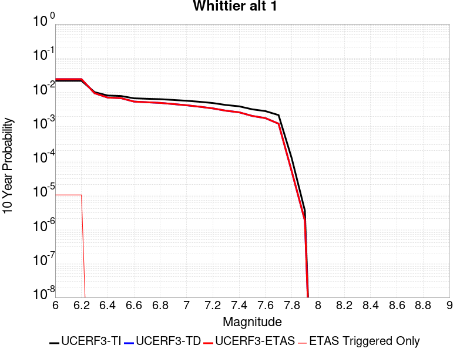 |

| Magnitude | 1 wk TI Prob | 1 wk TD Prob | 1 wk ETAS Prob | 1 wk ETAS/TD Gain | 1 wk ETAS Triggered Only | 1 mo TI Prob | 1 mo TD Prob | 1 mo ETAS Prob | 1 mo ETAS/TD Gain | 1 mo ETAS Triggered Only | 1 yr TI Prob | 1 yr TD Prob | 1 yr ETAS Prob | 1 yr ETAS/TD Gain | 1 yr ETAS Triggered Only | 10 yr TI Prob | 10 yr TD Prob | 10 yr ETAS Prob | 10 yr ETAS/TD Gain | 10 yr ETAS Triggered Only |
|-----|-----|-----|-----|-----|-----|-----|-----|-----|-----|-----|-----|-----|-----|-----|-----|-----|-----|-----|-----|-----|
| 6.0 | 4.2554693E-5 | 4.7257003E-5 | 4.7257003E-5 | 1.0 | 0.0 | 1.8236451E-4 | 2.0251611E-4 | 2.0251611E-4 | 1.0 | 0.0 | 0.002218027 | 0.0024631664 | 0.0024631664 | 1.0 | 0.0 | 0.02196019 | 0.024392692 | 0.024402449 | 1.0004 | 1.0E-5 |
| 6.1 | 4.2554693E-5 | 4.7257003E-5 | 4.7257003E-5 | 1.0 | 0.0 | 1.8236451E-4 | 2.0251611E-4 | 2.0251611E-4 | 1.0 | 0.0 | 0.002218027 | 0.0024631664 | 0.0024631664 | 1.0 | 0.0 | 0.02196019 | 0.024392692 | 0.024402449 | 1.0004 | 1.0E-5 |
| 6.2 | 4.2554693E-5 | 4.7257003E-5 | 4.7257003E-5 | 1.0 | 0.0 | 1.8236451E-4 | 2.0251611E-4 | 2.0251611E-4 | 1.0 | 0.0 | 0.002218027 | 0.0024631664 | 0.0024631664 | 1.0 | 0.0 | 0.02196019 | 0.024392692 | 0.024402449 | 1.0004 | 1.0E-5 |
| 6.3 | 1.9617712E-5 | 1.827117E-5 | 1.827117E-5 | 1.0 | 0.0 | 8.40732E-5 | 7.830277E-5 | 7.830277E-5 | 1.0 | 0.0 | 0.0010231105 | 9.5293834E-4 | 9.5293834E-4 | 1.0 | 0.0 | 0.01018413 | 0.009491804 | 0.009491804 | 1.0 | 0.0 |
| 6.4 | 1.5611336E-5 | 1.3606451E-5 | 1.3606451E-5 | 1.0 | 0.0 | 6.690401E-5 | 5.8312093E-5 | 5.8312093E-5 | 1.0 | 0.0 | 8.142519E-4 | 7.0972444E-4 | 7.0972444E-4 | 1.0 | 0.0 | 0.008112748 | 0.007076542 | 0.007076542 | 1.0 | 0.0 |
| 6.5 | 1.5150166E-5 | 1.310308E-5 | 1.310308E-5 | 1.0 | 0.0 | 6.492767E-5 | 5.615488E-5 | 5.615488E-5 | 1.0 | 0.0 | 7.9020765E-4 | 6.834771E-4 | 6.834771E-4 | 1.0 | 0.0 | 0.007874036 | 0.006815699 | 0.006815699 | 1.0 | 0.0 |
| 6.6 | 1.295588E-5 | 1.03825105E-5 | 1.03825105E-5 | 1.0 | 0.0 | 5.552402E-5 | 4.4495726E-5 | 4.4495726E-5 | 1.0 | 0.0 | 6.7579525E-4 | 5.416028E-4 | 5.416028E-4 | 1.0 | 0.0 | 0.006737438 | 0.005404262 | 0.005404262 | 1.0 | 0.0 |
| 6.7 | 1.2542085E-5 | 9.90111E-6 | 9.90111E-6 | 1.0 | 0.0 | 5.3750682E-5 | 4.243265E-5 | 4.243265E-5 | 1.0 | 0.0 | 6.542181E-4 | 5.1649695E-4 | 5.1649695E-4 | 1.0 | 0.0 | 0.006522954 | 0.005154383 | 0.005154383 | 1.0 | 0.0 |
| 6.8 | 1.2195878E-5 | 9.4970965E-6 | 9.4970965E-6 | 1.0 | 0.0 | 5.2267E-5 | 4.070122E-5 | 4.070122E-5 | 1.0 | 0.0 | 6.36165E-4 | 4.9542653E-4 | 4.9542653E-4 | 1.0 | 0.0 | 0.0063434686 | 0.0049445615 | 0.0049445615 | 1.0 | 0.0 |
| 6.9 | 1.1580298E-5 | 8.774486E-6 | 8.774486E-6 | 1.0 | 0.0 | 4.9628903E-5 | 3.7604408E-5 | 3.7604408E-5 | 1.0 | 0.0 | 6.040644E-4 | 4.577391E-4 | 4.577391E-4 | 1.0 | 0.0 | 0.00602425 | 0.004569222 | 0.004569222 | 1.0 | 0.0 |
| 7.0 | 1.0964795E-5 | 8.085466E-6 | 8.085466E-6 | 1.0 | 0.0 | 4.6991136E-5 | 3.4651544E-5 | 3.4651544E-5 | 1.0 | 0.0 | 5.7196687E-4 | 4.2180243E-4 | 4.2180243E-4 | 1.0 | 0.0 | 0.0057049696 | 0.004211227 | 0.004211227 | 1.0 | 0.0 |
| 7.1 | 1.0230601E-5 | 7.327922E-6 | 7.327922E-6 | 1.0 | 0.0 | 4.3844695E-5 | 3.140501E-5 | 3.140501E-5 | 1.0 | 0.0 | 5.336784E-4 | 3.8229022E-4 | 3.8229022E-4 | 1.0 | 0.0 | 0.005323986 | 0.0038174891 | 0.0038174891 | 1.0 | 0.0 |
| 7.2 | 9.40865E-6 | 6.5444156E-6 | 6.5444156E-6 | 1.0 | 0.0 | 4.032216E-5 | 2.8047201E-5 | 2.8047201E-5 | 1.0 | 0.0 | 4.908117E-4 | 3.414224E-4 | 3.414224E-4 | 1.0 | 0.0 | 0.0048972913 | 0.0034100711 | 0.0034100711 | 1.0 | 0.0 |
| 7.3 | 8.237384E-6 | 5.5987134E-6 | 5.5987134E-6 | 1.0 | 0.0 | 3.5302593E-5 | 2.3994271E-5 | 2.3994271E-5 | 1.0 | 0.0 | 4.2972428E-4 | 2.9209215E-4 | 2.9209215E-4 | 1.0 | 0.0 | 0.0042889426 | 0.0029174031 | 0.0029174031 | 1.0 | 0.0 |
| 7.4 | 7.5316966E-6 | 5.0286876E-6 | 5.0286876E-6 | 1.0 | 0.0 | 3.2278298E-5 | 2.1551346E-5 | 2.1551346E-5 | 1.0 | 0.0 | 3.9291743E-4 | 2.6235706E-4 | 2.6235706E-4 | 1.0 | 0.0 | 0.0039222343 | 0.0026205853 | 0.0026205853 | 1.0 | 0.0 |
| 7.5 | 6.149649E-6 | 3.934522E-6 | 3.934522E-6 | 1.0 | 0.0 | 2.6355372E-5 | 1.6862132E-5 | 1.6862132E-5 | 1.0 | 0.0 | 3.208294E-4 | 2.0527802E-4 | 2.0527802E-4 | 1.0 | 0.0 | 0.003203666 | 0.0020509732 | 0.0020509732 | 1.0 | 0.0 |
| 7.6 | 5.457711E-6 | 3.3959725E-6 | 3.3959725E-6 | 1.0 | 0.0 | 2.338998E-5 | 1.4554091E-5 | 1.4554091E-5 | 1.0 | 0.0 | 2.8473578E-4 | 1.7718246E-4 | 1.7718246E-4 | 1.0 | 0.0 | 0.0028437122 | 0.0017704928 | 0.0017704928 | 1.0 | 0.0 |
| 7.7 | 4.1676276E-6 | 2.3336488E-6 | 2.3336488E-6 | 1.0 | 0.0 | 1.7861139E-5 | 1.0001318E-5 | 1.0001318E-5 | 1.0 | 0.0 | 2.1743766E-4 | 1.2175998E-4 | 1.2175998E-4 | 1.0 | 0.0 | 0.0021722503 | 0.0012170058 | 0.0012170058 | 1.0 | 0.0 |
| 7.8 | 2.2692414E-7 | 9.3873886E-8 | 9.3873886E-8 | 1.0 | 0.0 | 9.725317E-7 | 4.023166E-7 | 4.023166E-7 | 1.0 | 0.0 | 1.1840509E-5 | 4.898197E-6 | 4.898197E-6 | 1.0 | 0.0 | 1.1839878E-4 | 4.898122E-5 | 4.898122E-5 | 1.0 | 0.0 |
| 7.9 | 6.676829E-9 | 3.4403498E-9 | 3.4403498E-9 | 1.0 | 0.0 | 2.861498E-8 | 1.4744357E-8 | 1.4744357E-8 | 1.0 | 0.0 | 3.4838732E-7 | 1.7951253E-7 | 1.7951253E-7 | 1.0 | 0.0 | 3.4838679E-6 | 1.7951239E-6 | 1.7951239E-6 | 1.0 | 0.0 |

## West Napa 2011 CFM
*[(top)](#table-of-contents)*

| 1 Week | 1 Month | 1 Year | 10 Year |
|-----|-----|-----|-----|
|  | 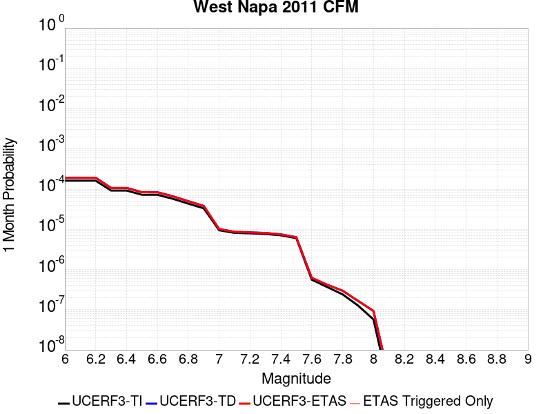 |  |  |

| Magnitude | 1 wk TI Prob | 1 wk TD Prob | 1 wk ETAS Prob | 1 wk ETAS/TD Gain | 1 wk ETAS Triggered Only | 1 mo TI Prob | 1 mo TD Prob | 1 mo ETAS Prob | 1 mo ETAS/TD Gain | 1 mo ETAS Triggered Only | 1 yr TI Prob | 1 yr TD Prob | 1 yr ETAS Prob | 1 yr ETAS/TD Gain | 1 yr ETAS Triggered Only | 10 yr TI Prob | 10 yr TD Prob | 10 yr ETAS Prob | 10 yr ETAS/TD Gain | 10 yr ETAS Triggered Only |
|-----|-----|-----|-----|-----|-----|-----|-----|-----|-----|-----|-----|-----|-----|-----|-----|-----|-----|-----|-----|-----|
| 6.0 | 3.773104E-5 | 4.453331E-5 | 4.453331E-5 | 1.0 | 0.0 | 1.6169442E-4 | 1.9084488E-4 | 1.9084488E-4 | 1.0 | 0.0 | 0.001966852 | 0.0023213772 | 0.0023213772 | 1.0 | 0.0 | 0.019495348 | 0.023004726 | 0.023014495 | 1.0004247 | 1.0E-5 |
| 6.1 | 3.773104E-5 | 4.453331E-5 | 4.453331E-5 | 1.0 | 0.0 | 1.6169442E-4 | 1.9084488E-4 | 1.9084488E-4 | 1.0 | 0.0 | 0.001966852 | 0.0023213772 | 0.0023213772 | 1.0 | 0.0 | 0.019495348 | 0.023004726 | 0.023014495 | 1.0004247 | 1.0E-5 |
| 6.2 | 3.773104E-5 | 4.453331E-5 | 4.453331E-5 | 1.0 | 0.0 | 1.6169442E-4 | 1.9084488E-4 | 1.9084488E-4 | 1.0 | 0.0 | 0.001966852 | 0.0023213772 | 0.0023213772 | 1.0 | 0.0 | 0.019495348 | 0.023004726 | 0.023014495 | 1.0004247 | 1.0E-5 |
| 6.3 | 2.147964E-5 | 2.4989802E-5 | 2.4989802E-5 | 1.0 | 0.0 | 9.2052345E-5 | 1.0709527E-4 | 1.0709527E-4 | 1.0 | 0.0 | 0.001120161 | 0.0013031967 | 0.0013031967 | 1.0 | 0.0 | 0.011145315 | 0.0129661625 | 0.012976033 | 1.0007613 | 1.0E-5 |
| 6.4 | 2.147964E-5 | 2.4989802E-5 | 2.4989802E-5 | 1.0 | 0.0 | 9.2052345E-5 | 1.0709527E-4 | 1.0709527E-4 | 1.0 | 0.0 | 0.001120161 | 0.0013031967 | 0.0013031967 | 1.0 | 0.0 | 0.011145315 | 0.0129661625 | 0.012976033 | 1.0007613 | 1.0E-5 |
| 6.5 | 1.688201E-5 | 1.954958E-5 | 1.954958E-5 | 1.0 | 0.0 | 7.234947E-5 | 8.378163E-5 | 8.378163E-5 | 1.0 | 0.0 | 8.804988E-4 | 0.0010196365 | 0.0010196365 | 1.0 | 0.0 | 0.008770182 | 0.010158253 | 0.010168151 | 1.0009744 | 1.0E-5 |
| 6.6 | 1.6846381E-5 | 1.9509269E-5 | 1.9509269E-5 | 1.0 | 0.0 | 7.219678E-5 | 8.360889E-5 | 8.360889E-5 | 1.0 | 0.0 | 8.7864127E-4 | 0.0010175353 | 0.0010175353 | 1.0 | 0.0 | 0.008751754 | 0.010137432 | 0.010147331 | 1.0009764 | 1.0E-5 |
| 6.7 | 1.3396501E-5 | 1.5469519E-5 | 1.5469519E-5 | 1.0 | 0.0 | 5.7412315E-5 | 6.629661E-5 | 6.629661E-5 | 1.0 | 0.0 | 6.9877075E-4 | 8.069259E-4 | 8.069259E-4 | 1.0 | 0.0 | 0.0069657755 | 0.008047685 | 0.008047685 | 1.0 | 0.0 |
| 6.8 | 1.0139058E-5 | 1.1673681E-5 | 1.1673681E-5 | 1.0 | 0.0 | 4.3452383E-5 | 5.0029415E-5 | 5.0029415E-5 | 1.0 | 0.0 | 5.289043E-4 | 6.089934E-4 | 6.089934E-4 | 1.0 | 0.0 | 0.005276473 | 0.0060801683 | 0.0060801683 | 1.0 | 0.0 |
| 6.9 | 7.761281E-6 | 8.891974E-6 | 8.891974E-6 | 1.0 | 0.0 | 3.326221E-5 | 3.8108195E-5 | 3.8108195E-5 | 1.0 | 0.0 | 4.0489217E-4 | 4.639199E-4 | 4.639199E-4 | 1.0 | 0.0 | 0.0040415525 | 0.0046360292 | 0.0046360292 | 1.0 | 0.0 |
| 7.0 | 2.2109202E-6 | 2.3672765E-6 | 2.3672765E-6 | 1.0 | 0.0 | 9.475338E-6 | 1.0145431E-5 | 1.0145431E-5 | 1.0 | 0.0 | 1.1535613E-4 | 1.235137E-4 | 1.235137E-4 | 1.0 | 0.0 | 0.0011529627 | 0.0012359362 | 0.0012359362 | 1.0 | 0.0 |
| 7.1 | 1.9008926E-6 | 2.013939E-6 | 2.013939E-6 | 1.0 | 0.0 | 8.146657E-6 | 8.631138E-6 | 8.631138E-6 | 1.0 | 0.0 | 9.918104E-5 | 1.05079074E-4 | 1.05079074E-4 | 1.0 | 0.0 | 9.913679E-4 | 0.0010517744 | 0.0010517744 | 1.0 | 0.0 |
| 7.2 | 1.8495944E-6 | 1.9567422E-6 | 1.9567422E-6 | 1.0 | 0.0 | 7.926808E-6 | 8.386011E-6 | 8.386011E-6 | 1.0 | 0.0 | 9.650462E-5 | 1.0209493E-4 | 1.0209493E-4 | 1.0 | 0.0 | 9.6462725E-4 | 0.0010219608 | 0.0010219608 | 1.0 | 0.0 |
| 7.3 | 1.7883189E-6 | 1.8887007E-6 | 1.8887007E-6 | 1.0 | 0.0 | 7.664201E-6 | 8.094406E-6 | 8.094406E-6 | 1.0 | 0.0 | 9.330765E-5 | 9.854497E-5 | 9.854497E-5 | 1.0 | 0.0 | 9.3268487E-4 | 9.864931E-4 | 9.864931E-4 | 1.0 | 0.0 |
| 7.4 | 1.6520572E-6 | 1.7421038E-6 | 1.7421038E-6 | 1.0 | 0.0 | 7.0802257E-6 | 7.466138E-6 | 7.466138E-6 | 1.0 | 0.0 | 8.6198335E-5 | 9.0896465E-5 | 9.0896465E-5 | 1.0 | 0.0 | 8.616491E-4 | 9.1006904E-4 | 9.1006904E-4 | 1.0 | 0.0 |
| 7.5 | 1.4040345E-6 | 1.4805248E-6 | 1.4805248E-6 | 1.0 | 0.0 | 6.0172765E-6 | 6.345091E-6 | 6.345091E-6 | 1.0 | 0.0 | 7.325788E-5 | 7.724877E-5 | 7.724877E-5 | 1.0 | 0.0 | 7.3233736E-4 | 7.736636E-4 | 7.736636E-4 | 1.0 | 0.0 |
| 7.6 | 1.3013842E-7 | 1.4432896E-7 | 1.4432896E-7 | 1.0 | 0.0 | 5.57736E-7 | 6.185526E-7 | 6.185526E-7 | 1.0 | 0.0 | 6.790414E-6 | 7.5308512E-6 | 7.5308512E-6 | 1.0 | 0.0 | 6.790207E-5 | 7.6237025E-5 | 7.6237025E-5 | 1.0 | 0.0 |
| 7.7 | 8.541512E-8 | 9.731841E-8 | 9.731841E-8 | 1.0 | 0.0 | 3.6606474E-7 | 4.1707887E-7 | 4.1707887E-7 | 1.0 | 0.0 | 4.456829E-6 | 5.077923E-6 | 5.077923E-6 | 1.0 | 0.0 | 4.4567398E-5 | 5.168383E-5 | 5.168383E-5 | 1.0 | 0.0 |
| 7.8 | 5.6074793E-8 | 6.908223E-8 | 6.908223E-8 | 1.0 | 0.0 | 2.403205E-7 | 2.9606667E-7 | 2.9606667E-7 | 1.0 | 0.0 | 2.9258983E-6 | 3.6046058E-6 | 3.6046058E-6 | 1.0 | 0.0 | 2.9258597E-5 | 3.6881407E-5 | 3.6881407E-5 | 1.0 | 0.0 |
| 7.9 | 2.9475839E-8 | 3.8642522E-8 | 3.8642522E-8 | 1.0 | 0.0 | 1.2632502E-7 | 1.656108E-7 | 1.656108E-7 | 1.0 | 0.0 | 1.538006E-6 | 2.0163097E-6 | 2.0163097E-6 | 1.0 | 0.0 | 1.5379954E-5 | 2.0705578E-5 | 2.0705578E-5 | 1.0 | 0.0 |
| 8.0 | 1.3337122E-8 | 2.1675831E-8 | 2.1675831E-8 | 1.0 | 0.0 | 5.7159088E-8 | 9.2896414E-8 | 9.2896414E-8 | 1.0 | 0.0 | 6.959117E-7 | 1.1310133E-6 | 1.1310133E-6 | 1.0 | 0.0 | 6.959095E-6 | 1.1668609E-5 | 1.1668609E-5 | 1.0 | 0.0 |
| 8.1 | 2.6589986E-10 | 4.870925E-10 | 4.870925E-10 | 1.0 | 0.0 | 1.1395708E-9 | 2.0875381E-9 | 2.0875381E-9 | 1.0 | 0.0 | 1.3874274E-8 | 2.541578E-8 | 2.541578E-8 | 1.0 | 0.0 | 1.3874273E-7 | 2.608409E-7 | 2.608409E-7 | 1.0 | 0.0 |

## Newport-Inglewood alt 1
*[(top)](#table-of-contents)*

| 1 Week | 1 Month | 1 Year | 10 Year |
|-----|-----|-----|-----|
|  |  |  |  |

| Magnitude | 1 wk TI Prob | 1 wk TD Prob | 1 wk ETAS Prob | 1 wk ETAS/TD Gain | 1 wk ETAS Triggered Only | 1 mo TI Prob | 1 mo TD Prob | 1 mo ETAS Prob | 1 mo ETAS/TD Gain | 1 mo ETAS Triggered Only | 1 yr TI Prob | 1 yr TD Prob | 1 yr ETAS Prob | 1 yr ETAS/TD Gain | 1 yr ETAS Triggered Only | 10 yr TI Prob | 10 yr TD Prob | 10 yr ETAS Prob | 10 yr ETAS/TD Gain | 10 yr ETAS Triggered Only |
|-----|-----|-----|-----|-----|-----|-----|-----|-----|-----|-----|-----|-----|-----|-----|-----|-----|-----|-----|-----|-----|
| 6.0 | 2.9668912E-5 | 3.040745E-5 | 3.040745E-5 | 1.0 | 0.0 | 1.2714628E-4 | 1.3031387E-4 | 1.3031387E-4 | 1.0 | 0.0 | 0.0015469068 | 0.0015858983 | 0.0015958825 | 1.0062956 | 1.0E-5 | 0.015361829 | 0.0157934 | 0.015803242 | 1.0006232 | 1.0E-5 |
| 6.1 | 2.9668912E-5 | 3.040745E-5 | 3.040745E-5 | 1.0 | 0.0 | 1.2714628E-4 | 1.3031387E-4 | 1.3031387E-4 | 1.0 | 0.0 | 0.0015469068 | 0.0015858983 | 0.0015958825 | 1.0062956 | 1.0E-5 | 0.015361829 | 0.0157934 | 0.015803242 | 1.0006232 | 1.0E-5 |
| 6.2 | 2.9668912E-5 | 3.040745E-5 | 3.040745E-5 | 1.0 | 0.0 | 1.2714628E-4 | 1.3031387E-4 | 1.3031387E-4 | 1.0 | 0.0 | 0.0015469068 | 0.0015858983 | 0.0015958825 | 1.0062956 | 1.0E-5 | 0.015361829 | 0.0157934 | 0.015803242 | 1.0006232 | 1.0E-5 |
| 6.3 | 2.9668912E-5 | 3.040745E-5 | 3.040745E-5 | 1.0 | 0.0 | 1.2714628E-4 | 1.3031387E-4 | 1.3031387E-4 | 1.0 | 0.0 | 0.0015469068 | 0.0015858983 | 0.0015958825 | 1.0062956 | 1.0E-5 | 0.015361829 | 0.0157934 | 0.015803242 | 1.0006232 | 1.0E-5 |
| 6.4 | 1.275942E-5 | 1.027299E-5 | 1.027299E-5 | 1.0 | 0.0 | 5.4682085E-5 | 4.4026383E-5 | 4.4026383E-5 | 1.0 | 0.0 | 6.65551E-4 | 5.3589355E-4 | 5.4588815E-4 | 1.0186504 | 1.0E-5 | 0.0066356123 | 0.0053464375 | 0.005356384 | 1.0018604 | 1.0E-5 |
| 6.5 | 1.275942E-5 | 1.027299E-5 | 1.027299E-5 | 1.0 | 0.0 | 5.4682085E-5 | 4.4026383E-5 | 4.4026383E-5 | 1.0 | 0.0 | 6.65551E-4 | 5.3589355E-4 | 5.4588815E-4 | 1.0186504 | 1.0E-5 | 0.0066356123 | 0.0053464375 | 0.005356384 | 1.0018604 | 1.0E-5 |
| 6.6 | 1.1255358E-5 | 8.66226E-6 | 8.66226E-6 | 1.0 | 0.0 | 4.8236358E-5 | 3.7123453E-5 | 3.7123453E-5 | 1.0 | 0.0 | 5.871194E-4 | 4.51886E-4 | 4.618815E-4 | 1.0221195 | 1.0E-5 | 0.005855706 | 0.0045098485 | 0.0045198034 | 1.0022074 | 1.0E-5 |
| 6.7 | 1.0504745E-5 | 7.90013E-6 | 7.90013E-6 | 1.0 | 0.0 | 4.5019555E-5 | 3.385727E-5 | 3.385727E-5 | 1.0 | 0.0 | 5.4797524E-4 | 4.1213553E-4 | 4.2213142E-4 | 1.0242538 | 1.0E-5 | 0.0054662596 | 0.0041138423 | 0.004123801 | 1.0024208 | 1.0E-5 |
| 6.8 | 1.0476007E-5 | 7.881511E-6 | 7.881511E-6 | 1.0 | 0.0 | 4.4896402E-5 | 3.3777476E-5 | 3.3777476E-5 | 1.0 | 0.0 | 5.464766E-4 | 4.111644E-4 | 4.2116028E-4 | 1.0243112 | 1.0E-5 | 0.005451347 | 0.0041041668 | 0.0041141254 | 1.0024265 | 1.0E-5 |
| 6.9 | 9.076797E-6 | 6.4898977E-6 | 6.4898977E-6 | 1.0 | 0.0 | 3.889998E-5 | 2.7813552E-5 | 2.7813552E-5 | 1.0 | 0.0 | 4.7350433E-4 | 3.3857772E-4 | 3.4857434E-4 | 1.0295253 | 1.0E-5 | 0.004724967 | 0.0033806562 | 0.0033906226 | 1.002948 | 1.0E-5 |
| 7.0 | 8.73795E-6 | 6.2122745E-6 | 6.2122745E-6 | 1.0 | 0.0 | 3.7447822E-5 | 2.6623764E-5 | 2.6623764E-5 | 1.0 | 0.0 | 4.5583185E-4 | 3.2409639E-4 | 3.2409639E-4 | 1.0 | 0.0 | 0.0045489795 | 0.003236269 | 0.003236269 | 1.0 | 0.0 |
| 7.1 | 8.391299E-6 | 5.9560443E-6 | 5.9560443E-6 | 1.0 | 0.0 | 3.5962214E-5 | 2.5525655E-5 | 2.5525655E-5 | 1.0 | 0.0 | 4.37752E-4 | 3.107308E-4 | 3.107308E-4 | 1.0 | 0.0 | 0.004368907 | 0.003102993 | 0.003102993 | 1.0 | 0.0 |
| 7.2 | 7.796882E-6 | 5.4967763E-6 | 5.4967763E-6 | 1.0 | 0.0 | 3.341478E-5 | 2.3557403E-5 | 2.3557403E-5 | 1.0 | 0.0 | 4.06749E-4 | 2.8677384E-4 | 2.8677384E-4 | 1.0 | 0.0 | 0.0040600533 | 0.0028640619 | 0.0028640619 | 1.0 | 0.0 |
| 7.3 | 6.4738833E-6 | 4.647969E-6 | 4.647969E-6 | 1.0 | 0.0 | 2.774492E-5 | 1.9919717E-5 | 1.9919717E-5 | 1.0 | 0.0 | 3.3774204E-4 | 2.424957E-4 | 2.424957E-4 | 1.0 | 0.0 | 0.0033722918 | 0.0024223276 | 0.0024223276 | 1.0 | 0.0 |
| 7.4 | 5.382145E-6 | 3.8858843E-6 | 3.8858843E-6 | 1.0 | 0.0 | 2.3066134E-5 | 1.6653685E-5 | 1.6653685E-5 | 1.0 | 0.0 | 2.8079396E-4 | 2.0273989E-4 | 2.0273989E-4 | 1.0 | 0.0 | 0.0028043943 | 0.0020255637 | 0.0020255637 | 1.0 | 0.0 |
| 7.5 | 3.648244E-6 | 2.5738668E-6 | 2.5738668E-6 | 1.0 | 0.0 | 1.5635238E-5 | 1.1030811E-5 | 1.1030811E-5 | 1.0 | 0.0 | 1.9034238E-4 | 1.3429196E-4 | 1.3429196E-4 | 1.0 | 0.0 | 0.0019017943 | 0.0013421185 | 0.0013421185 | 1.0 | 0.0 |
| 7.6 | 2.2906888E-6 | 1.5480406E-6 | 1.5480406E-6 | 1.0 | 0.0 | 9.817201E-6 | 6.6344433E-6 | 6.6344433E-6 | 1.0 | 0.0 | 1.1951787E-4 | 8.0771424E-5 | 8.0771424E-5 | 1.0 | 0.0 | 0.0011945361 | 8.074274E-4 | 8.074274E-4 | 1.0 | 0.0 |
| 7.7 | 6.0479874E-7 | 3.3976542E-7 | 3.3976542E-7 | 1.0 | 0.0 | 2.5919921E-6 | 1.4561367E-6 | 1.4561367E-6 | 1.0 | 0.0 | 3.1557047E-5 | 1.7728335E-5 | 1.7728335E-5 | 1.0 | 0.0 | 3.1552566E-4 | 1.7727059E-4 | 1.7727059E-4 | 1.0 | 0.0 |
| 7.8 | 1.16056995E-8 | 9.782449E-9 | 9.782449E-9 | 1.0 | 0.0 | 4.9738713E-8 | 4.1924782E-8 | 4.1924782E-8 | 1.0 | 0.0 | 6.0556863E-7 | 5.1043423E-7 | 5.1043423E-7 | 1.0 | 0.0 | 6.05567E-6 | 5.104342E-6 | 5.104342E-6 | 1.0 | 0.0 |

## Hollywood
*[(top)](#table-of-contents)*

| 1 Week | 1 Month | 1 Year | 10 Year |
|-----|-----|-----|-----|
|  |  |  |  |

| Magnitude | 1 wk TI Prob | 1 wk TD Prob | 1 wk ETAS Prob | 1 wk ETAS/TD Gain | 1 wk ETAS Triggered Only | 1 mo TI Prob | 1 mo TD Prob | 1 mo ETAS Prob | 1 mo ETAS/TD Gain | 1 mo ETAS Triggered Only | 1 yr TI Prob | 1 yr TD Prob | 1 yr ETAS Prob | 1 yr ETAS/TD Gain | 1 yr ETAS Triggered Only | 10 yr TI Prob | 10 yr TD Prob | 10 yr ETAS Prob | 10 yr ETAS/TD Gain | 10 yr ETAS Triggered Only |
|-----|-----|-----|-----|-----|-----|-----|-----|-----|-----|-----|-----|-----|-----|-----|-----|-----|-----|-----|-----|-----|
| 6.0 | 1.24487615E-5 | 1.2593849E-5 | 1.2593849E-5 | 1.0 | 0.0 | 5.3350745E-5 | 5.3972544E-5 | 5.3972544E-5 | 1.0 | 0.0 | 6.4935174E-4 | 6.569223E-4 | 6.569223E-4 | 1.0 | 0.0 | 0.0064745755 | 0.0065502916 | 0.006560226 | 1.0015167 | 1.0E-5 |
| 6.1 | 1.24487615E-5 | 1.2593849E-5 | 1.2593849E-5 | 1.0 | 0.0 | 5.3350745E-5 | 5.3972544E-5 | 5.3972544E-5 | 1.0 | 0.0 | 6.4935174E-4 | 6.569223E-4 | 6.569223E-4 | 1.0 | 0.0 | 0.0064745755 | 0.0065502916 | 0.006560226 | 1.0015167 | 1.0E-5 |
| 6.2 | 1.24487615E-5 | 1.2593849E-5 | 1.2593849E-5 | 1.0 | 0.0 | 5.3350745E-5 | 5.3972544E-5 | 5.3972544E-5 | 1.0 | 0.0 | 6.4935174E-4 | 6.569223E-4 | 6.569223E-4 | 1.0 | 0.0 | 0.0064745755 | 0.0065502916 | 0.006560226 | 1.0015167 | 1.0E-5 |
| 6.3 | 1.24487615E-5 | 1.2593849E-5 | 1.2593849E-5 | 1.0 | 0.0 | 5.3350745E-5 | 5.3972544E-5 | 5.3972544E-5 | 1.0 | 0.0 | 6.4935174E-4 | 6.569223E-4 | 6.569223E-4 | 1.0 | 0.0 | 0.0064745755 | 0.0065502916 | 0.006560226 | 1.0015167 | 1.0E-5 |
| 6.4 | 1.2431024E-5 | 1.2574461E-5 | 1.2574461E-5 | 1.0 | 0.0 | 5.327473E-5 | 5.388946E-5 | 5.388946E-5 | 1.0 | 0.0 | 6.4842677E-4 | 6.559113E-4 | 6.559113E-4 | 1.0 | 0.0 | 0.0064653796 | 0.0065402417 | 0.006550176 | 1.001519 | 1.0E-5 |
| 6.5 | 1.1242222E-5 | 1.1318384E-5 | 1.1318384E-5 | 1.0 | 0.0 | 4.8180063E-5 | 4.8506474E-5 | 4.8506474E-5 | 1.0 | 0.0 | 5.864344E-4 | 5.90409E-4 | 5.90409E-4 | 1.0 | 0.0 | 0.0058488925 | 0.0058886907 | 0.005898632 | 1.0016881 | 1.0E-5 |
| 6.6 | 1.1234066E-5 | 1.13094975E-5 | 1.13094975E-5 | 1.0 | 0.0 | 4.8145106E-5 | 4.846839E-5 | 4.846839E-5 | 1.0 | 0.0 | 5.86009E-4 | 5.899455E-4 | 5.899455E-4 | 1.0 | 0.0 | 0.005844661 | 0.005884081 | 0.0058940225 | 1.0016896 | 1.0E-5 |
| 6.7 | 1.12294E-5 | 1.1304241E-5 | 1.1304241E-5 | 1.0 | 0.0 | 4.812511E-5 | 4.844586E-5 | 4.844586E-5 | 1.0 | 0.0 | 5.857657E-4 | 5.896714E-4 | 5.896714E-4 | 1.0 | 0.0 | 0.0058422405 | 0.005881354 | 0.0058912956 | 1.0016903 | 1.0E-5 |
| 6.8 | 1.0252819E-5 | 1.0218963E-5 | 1.0218963E-5 | 1.0 | 0.0 | 4.3939912E-5 | 4.3794833E-5 | 4.3794833E-5 | 1.0 | 0.0 | 5.3483713E-4 | 5.330738E-4 | 5.330738E-4 | 1.0 | 0.0 | 0.005335517 | 0.005318177 | 0.0053281235 | 1.0018704 | 1.0E-5 |
| 6.9 | 9.252289E-6 | 9.110761E-6 | 9.110761E-6 | 1.0 | 0.0 | 3.9652066E-5 | 3.9045543E-5 | 3.9045543E-5 | 1.0 | 0.0 | 4.8265693E-4 | 4.7527745E-4 | 4.7527745E-4 | 1.0 | 0.0 | 0.0048161 | 0.004742783 | 0.0047527356 | 1.0020984 | 1.0E-5 |
| 7.0 | 8.474604E-6 | 8.2586685E-6 | 8.2586685E-6 | 1.0 | 0.0 | 3.6319227E-5 | 3.5393823E-5 | 3.5393823E-5 | 1.0 | 0.0 | 4.4209688E-4 | 4.3083602E-4 | 4.3083602E-4 | 1.0 | 0.0 | 0.004412184 | 0.004300158 | 0.004310115 | 1.0023155 | 1.0E-5 |
| 7.1 | 6.643643E-6 | 6.26868E-6 | 6.26868E-6 | 1.0 | 0.0 | 2.8472443E-5 | 2.6865497E-5 | 2.6865497E-5 | 1.0 | 0.0 | 3.4659685E-4 | 3.2703875E-4 | 3.2703875E-4 | 1.0 | 0.0 | 0.0034605677 | 0.003265621 | 0.003265621 | 1.0 | 0.0 |
| 7.2 | 5.549002E-6 | 5.1089696E-6 | 5.1089696E-6 | 1.0 | 0.0 | 2.378122E-5 | 2.1895401E-5 | 2.1895401E-5 | 1.0 | 0.0 | 2.8949787E-4 | 2.6654406E-4 | 2.6654406E-4 | 1.0 | 0.0 | 0.0028912104 | 0.00266226 | 0.00266226 | 1.0 | 0.0 |
| 7.3 | 4.3059727E-6 | 3.960103E-6 | 3.960103E-6 | 1.0 | 0.0 | 1.8454039E-5 | 1.6971762E-5 | 1.6971762E-5 | 1.0 | 0.0 | 2.2465475E-4 | 2.066117E-4 | 2.066117E-4 | 1.0 | 0.0 | 0.0022442779 | 0.0020642062 | 0.0020642062 | 1.0 | 0.0 |
| 7.4 | 2.8550733E-6 | 2.701466E-6 | 2.701466E-6 | 1.0 | 0.0 | 1.2235971E-5 | 1.1577661E-5 | 1.1577661E-5 | 1.0 | 0.0 | 1.4896276E-4 | 1.4094895E-4 | 1.4094895E-4 | 1.0 | 0.0 | 0.0014886294 | 0.0014086006 | 0.0014086006 | 1.0 | 0.0 |
| 7.5 | 1.9927045E-6 | 1.897771E-6 | 1.897771E-6 | 1.0 | 0.0 | 8.540134E-6 | 8.133279E-6 | 8.133279E-6 | 1.0 | 0.0 | 1.0397117E-4 | 9.901821E-5 | 9.901821E-5 | 1.0 | 0.0 | 0.0010392254 | 9.897444E-4 | 9.897444E-4 | 1.0 | 0.0 |
| 7.6 | 1.345084E-6 | 1.221694E-6 | 1.221694E-6 | 1.0 | 0.0 | 5.764633E-6 | 5.235821E-6 | 5.235821E-6 | 1.0 | 0.0 | 7.018215E-5 | 6.374427E-5 | 6.374427E-5 | 1.0 | 0.0 | 7.0159987E-4 | 6.372619E-4 | 6.372619E-4 | 1.0 | 0.0 |
| 7.7 | 7.6835164E-7 | 6.2783954E-7 | 6.2783954E-7 | 1.0 | 0.0 | 3.2929315E-6 | 2.6907383E-6 | 2.6907383E-6 | 1.0 | 0.0 | 4.00907E-5 | 3.275926E-5 | 3.275926E-5 | 1.0 | 0.0 | 4.0083472E-4 | 3.275458E-4 | 3.275458E-4 | 1.0 | 0.0 |
| 7.8 | 3.6562128E-7 | 2.4540546E-7 | 2.4540546E-7 | 1.0 | 0.0 | 1.5669474E-6 | 1.0517372E-6 | 1.0517372E-6 | 1.0 | 0.0 | 1.9077417E-5 | 1.280483E-5 | 1.280483E-5 | 1.0 | 0.0 | 1.907578E-4 | 1.2804128E-4 | 1.2804128E-4 | 1.0 | 0.0 |
| 7.9 | 7.5024424E-8 | 5.3828998E-8 | 5.3828998E-8 | 1.0 | 0.0 | 3.215332E-7 | 2.3069569E-7 | 2.3069569E-7 | 1.0 | 0.0 | 3.91466E-6 | 2.808718E-6 | 2.808718E-6 | 1.0 | 0.0 | 3.9145907E-5 | 2.8086954E-5 | 2.8086954E-5 | 1.0 | 0.0 |

## Calaveras (Central) 2011 CFM
*[(top)](#table-of-contents)*

| 1 Week | 1 Month | 1 Year | 10 Year |
|-----|-----|-----|-----|
|  |  |  |  |

| Magnitude | 1 wk TI Prob | 1 wk TD Prob | 1 wk ETAS Prob | 1 wk ETAS/TD Gain | 1 wk ETAS Triggered Only | 1 mo TI Prob | 1 mo TD Prob | 1 mo ETAS Prob | 1 mo ETAS/TD Gain | 1 mo ETAS Triggered Only | 1 yr TI Prob | 1 yr TD Prob | 1 yr ETAS Prob | 1 yr ETAS/TD Gain | 1 yr ETAS Triggered Only | 10 yr TI Prob | 10 yr TD Prob | 10 yr ETAS Prob | 10 yr ETAS/TD Gain | 10 yr ETAS Triggered Only |
|-----|-----|-----|-----|-----|-----|-----|-----|-----|-----|-----|-----|-----|-----|-----|-----|-----|-----|-----|-----|-----|
| 6.0 | 1.5010907E-4 | 2.4802002E-4 | 2.4802002E-4 | 1.0 | 0.0 | 6.4316596E-4 | 0.0010625197 | 0.0010625197 | 1.0 | 0.0 | 0.0078024664 | 0.012858193 | 0.012868064 | 1.0007677 | 1.0E-5 | 0.07534136 | 0.120471895 | 0.12048069 | 1.000073 | 1.0E-5 |
| 6.1 | 1.4521465E-4 | 2.3965587E-4 | 2.3965587E-4 | 1.0 | 0.0 | 6.222001E-4 | 0.0010267016 | 0.0010267016 | 1.0 | 0.0 | 0.0075490056 | 0.012427398 | 0.012437274 | 1.0007946 | 1.0E-5 | 0.07297657 | 0.11674325 | 0.11675208 | 1.0000757 | 1.0E-5 |
| 6.2 | 1.429998E-4 | 2.3896704E-4 | 2.3896704E-4 | 1.0 | 0.0 | 6.127123E-4 | 0.0010237518 | 0.0010237518 | 1.0 | 0.0 | 0.007434286 | 0.01239193 | 0.012401806 | 1.000797 | 1.0E-5 | 0.07190444 | 0.11639657 | 0.116405405 | 1.0000759 | 1.0E-5 |
| 6.3 | 1.3536277E-4 | 2.3227514E-4 | 2.3227514E-4 | 1.0 | 0.0 | 5.799972E-4 | 9.950944E-4 | 9.950944E-4 | 1.0 | 0.0 | 0.0070386264 | 0.012047916 | 0.012057795 | 1.00082 | 1.0E-5 | 0.0681982 | 0.113307424 | 0.11331629 | 1.0000782 | 1.0E-5 |
| 6.4 | 1.2993296E-4 | 2.265069E-4 | 2.265069E-4 | 1.0 | 0.0 | 5.5673666E-4 | 9.7039196E-4 | 9.7039196E-4 | 1.0 | 0.0 | 0.006757223 | 0.011750543 | 0.011760426 | 1.000841 | 1.0E-5 | 0.06555412 | 0.110584 | 0.110592894 | 1.0000805 | 1.0E-5 |
| 6.5 | 1.0498927E-4 | 1.7996327E-4 | 1.7996327E-4 | 1.0 | 0.0 | 4.498764E-4 | 7.710408E-4 | 7.710408E-4 | 1.0 | 0.0 | 0.005463498 | 0.009346773 | 0.009356679 | 1.0010599 | 1.0E-5 | 0.053311124 | 0.08926322 | 0.08927233 | 1.000102 | 1.0E-5 |
| 6.6 | 1.0157505E-4 | 1.748358E-4 | 1.748358E-4 | 1.0 | 0.0 | 4.35249E-4 | 7.490787E-4 | 7.490787E-4 | 1.0 | 0.0 | 0.0052862884 | 0.0090817055 | 0.0090817055 | 1.0 | 0.0 | 0.05162293 | 0.086839855 | 0.086839855 | 1.0 | 0.0 |
| 6.7 | 9.660386E-5 | 1.6742673E-4 | 1.6742673E-4 | 1.0 | 0.0 | 4.1395082E-4 | 7.173433E-4 | 7.173433E-4 | 1.0 | 0.0 | 0.0050282106 | 0.008698509 | 0.008698509 | 1.0 | 0.0 | 0.049159497 | 0.08332852 | 0.08332852 | 1.0 | 0.0 |
| 6.8 | 9.089927E-5 | 1.5656375E-4 | 1.5656375E-4 | 1.0 | 0.0 | 3.8951015E-4 | 6.7081227E-4 | 6.7081227E-4 | 1.0 | 0.0 | 0.0047319788 | 0.008136343 | 0.008136343 | 1.0 | 0.0 | 0.046324775 | 0.07821867 | 0.07821867 | 1.0 | 0.0 |
| 6.9 | 7.353187E-5 | 1.230578E-4 | 1.230578E-4 | 1.0 | 0.0 | 3.150985E-4 | 5.272846E-4 | 5.272846E-4 | 1.0 | 0.0 | 0.0038295772 | 0.006400914 | 0.006400914 | 1.0 | 0.0 | 0.037642512 | 0.062235985 | 0.062235985 | 1.0 | 0.0 |
| 7.0 | 5.746064E-5 | 9.398498E-5 | 9.398498E-5 | 1.0 | 0.0 | 2.4623662E-4 | 4.0273095E-4 | 4.0273095E-4 | 1.0 | 0.0 | 0.0029938098 | 0.0048922966 | 0.0048922966 | 1.0 | 0.0 | 0.02953797 | 0.048032705 | 0.048032705 | 1.0 | 0.0 |
| 7.1 | 4.9557195E-5 | 8.0598395E-5 | 8.0598395E-5 | 1.0 | 0.0 | 2.123707E-4 | 3.453763E-4 | 3.453763E-4 | 1.0 | 0.0 | 0.0025825473 | 0.0041969116 | 0.0041969116 | 1.0 | 0.0 | 0.0255274 | 0.04140843 | 0.04140843 | 1.0 | 0.0 |
| 7.2 | 3.687595E-5 | 5.9594917E-5 | 5.9594917E-5 | 1.0 | 0.0 | 1.5803022E-4 | 2.5538195E-4 | 2.5538195E-4 | 1.0 | 0.0 | 0.0019223199 | 0.0031048711 | 0.0031048711 | 1.0 | 0.0 | 0.01905776 | 0.030917842 | 0.030917842 | 1.0 | 0.0 |
| 7.3 | 2.5846984E-5 | 4.2533073E-5 | 4.2533073E-5 | 1.0 | 0.0 | 1.1076809E-4 | 1.8227196E-4 | 1.8227196E-4 | 1.0 | 0.0 | 0.0013477671 | 0.00221692 | 0.00221692 | 1.0 | 0.0 | 0.013396223 | 0.022205485 | 0.022205485 | 1.0 | 0.0 |
| 7.4 | 1.7747854E-5 | 2.9966892E-5 | 2.9966892E-5 | 1.0 | 0.0 | 7.6060016E-5 | 1.2842323E-4 | 1.2842323E-4 | 1.0 | 0.0 | 9.2563726E-4 | 0.0015624344 | 0.0015624344 | 1.0 | 0.0 | 0.009217911 | 0.01572418 | 0.01572418 | 1.0 | 0.0 |
| 7.5 | 1.4883479E-5 | 2.6272635E-5 | 2.6272635E-5 | 1.0 | 0.0 | 6.378478E-5 | 1.1259216E-4 | 1.1259216E-4 | 1.0 | 0.0 | 7.76303E-4 | 0.0013699504 | 0.0013699504 | 1.0 | 0.0 | 0.0077359667 | 0.013816696 | 0.013816696 | 1.0 | 0.0 |
| 7.6 | 8.166975E-6 | 1.4986957E-5 | 1.4986957E-5 | 1.0 | 0.0 | 3.5000852E-5 | 6.422824E-5 | 6.422824E-5 | 1.0 | 0.0 | 4.2605202E-4 | 7.816996E-4 | 7.816996E-4 | 1.0 | 0.0 | 0.004252361 | 0.007951348 | 0.007951348 | 1.0 | 0.0 |
| 7.7 | 3.3858064E-6 | 6.267723E-6 | 6.267723E-6 | 1.0 | 0.0 | 1.4510518E-5 | 2.6861395E-5 | 2.6861395E-5 | 1.0 | 0.0 | 1.7665124E-4 | 3.2698846E-4 | 3.2698846E-4 | 1.0 | 0.0 | 0.0017651088 | 0.0033950333 | 0.0033950333 | 1.0 | 0.0 |
| 7.8 | 2.7721615E-6 | 5.378199E-6 | 5.378199E-6 | 1.0 | 0.0 | 1.1880637E-5 | 2.3049222E-5 | 2.3049222E-5 | 1.0 | 0.0 | 1.4463716E-4 | 2.805882E-4 | 2.805882E-4 | 1.0 | 0.0 | 0.0014454306 | 0.002913262 | 0.002913262 | 1.0 | 0.0 |
| 7.9 | 1.9736292E-6 | 4.137029E-6 | 4.137029E-6 | 1.0 | 0.0 | 8.4583835E-6 | 1.7730004E-5 | 1.7730004E-5 | 1.0 | 0.0 | 1.0297595E-4 | 2.1584146E-4 | 2.1584146E-4 | 1.0 | 0.0 | 0.0010292825 | 0.0022278049 | 0.0022278049 | 1.0 | 0.0 |
| 8.0 | 1.1767289E-6 | 2.5595207E-6 | 2.5595207E-6 | 1.0 | 0.0 | 5.0431145E-6 | 1.0969328E-5 | 1.0969328E-5 | 1.0 | 0.0 | 6.139818E-5 | 1.3354342E-4 | 1.3354342E-4 | 1.0 | 0.0 | 6.1381224E-4 | 0.0013685481 | 0.0013685481 | 1.0 | 0.0 |
| 8.1 | 7.5112825E-7 | 1.5439808E-6 | 1.5439808E-6 | 1.0 | 0.0 | 3.2191172E-6 | 6.617044E-6 | 6.617044E-6 | 1.0 | 0.0 | 3.9192048E-5 | 8.0559555E-5 | 8.0559555E-5 | 1.0 | 0.0 | 3.9185135E-4 | 8.2503865E-4 | 8.2503865E-4 | 1.0 | 0.0 |

## Eureka Peak
*[(top)](#table-of-contents)*

| 1 Week | 1 Month | 1 Year | 10 Year |
|-----|-----|-----|-----|
|  |  |  |  |

| Magnitude | 1 wk TI Prob | 1 wk TD Prob | 1 wk ETAS Prob | 1 wk ETAS/TD Gain | 1 wk ETAS Triggered Only | 1 mo TI Prob | 1 mo TD Prob | 1 mo ETAS Prob | 1 mo ETAS/TD Gain | 1 mo ETAS Triggered Only | 1 yr TI Prob | 1 yr TD Prob | 1 yr ETAS Prob | 1 yr ETAS/TD Gain | 1 yr ETAS Triggered Only | 10 yr TI Prob | 10 yr TD Prob | 10 yr ETAS Prob | 10 yr ETAS/TD Gain | 10 yr ETAS Triggered Only |
|-----|-----|-----|-----|-----|-----|-----|-----|-----|-----|-----|-----|-----|-----|-----|-----|-----|-----|-----|-----|-----|
| 6.0 | 3.1949054E-5 | 9.314984E-6 | 9.314984E-6 | 1.0 | 0.0 | 1.3691733E-4 | 3.992119E-5 | 3.992119E-5 | 1.0 | 0.0 | 0.0016656938 | 4.8601025E-4 | 4.8601025E-4 | 1.0 | 0.0 | 0.016532637 | 0.0049273144 | 0.004937265 | 1.0020195 | 1.0E-5 |
| 6.1 | 3.1949054E-5 | 9.314984E-6 | 9.314984E-6 | 1.0 | 0.0 | 1.3691733E-4 | 3.992119E-5 | 3.992119E-5 | 1.0 | 0.0 | 0.0016656938 | 4.8601025E-4 | 4.8601025E-4 | 1.0 | 0.0 | 0.016532637 | 0.0049273144 | 0.004937265 | 1.0020195 | 1.0E-5 |
| 6.2 | 3.1949054E-5 | 9.314984E-6 | 9.314984E-6 | 1.0 | 0.0 | 1.3691733E-4 | 3.992119E-5 | 3.992119E-5 | 1.0 | 0.0 | 0.0016656938 | 4.8601025E-4 | 4.8601025E-4 | 1.0 | 0.0 | 0.016532637 | 0.0049273144 | 0.004937265 | 1.0020195 | 1.0E-5 |
| 6.3 | 2.7339745E-5 | 7.984798E-6 | 7.984798E-6 | 1.0 | 0.0 | 1.1716507E-4 | 3.4220542E-5 | 3.4220542E-5 | 1.0 | 0.0 | 0.0014255513 | 4.166314E-4 | 4.166314E-4 | 1.0 | 0.0 | 0.0141644105 | 0.0042306287 | 0.0042405864 | 1.0023537 | 1.0E-5 |
| 6.4 | 2.7339745E-5 | 7.984798E-6 | 7.984798E-6 | 1.0 | 0.0 | 1.1716507E-4 | 3.4220542E-5 | 3.4220542E-5 | 1.0 | 0.0 | 0.0014255513 | 4.166314E-4 | 4.166314E-4 | 1.0 | 0.0 | 0.0141644105 | 0.0042306287 | 0.0042405864 | 1.0023537 | 1.0E-5 |
| 6.5 | 9.738388E-8 | 1.8627426E-7 | 1.8627426E-7 | 1.0 | 0.0 | 4.1735944E-7 | 7.98318E-7 | 7.98318E-7 | 1.0 | 0.0 | 5.081339E-6 | 9.719479E-6 | 9.719479E-6 | 1.0 | 0.0 | 5.0812232E-5 | 9.719063E-5 | 9.719063E-5 | 1.0 | 0.0 |
| 6.6 | 9.3495956E-8 | 1.8336233E-7 | 1.8336233E-7 | 1.0 | 0.0 | 4.0069688E-7 | 7.858383E-7 | 7.858383E-7 | 1.0 | 0.0 | 4.8784736E-6 | 9.5675405E-6 | 9.5675405E-6 | 1.0 | 0.0 | 4.8783666E-5 | 9.567137E-5 | 9.567137E-5 | 1.0 | 0.0 |
| 6.7 | 9.3495956E-8 | 1.8336233E-7 | 1.8336233E-7 | 1.0 | 0.0 | 4.0069688E-7 | 7.858383E-7 | 7.858383E-7 | 1.0 | 0.0 | 4.8784736E-6 | 9.5675405E-6 | 9.5675405E-6 | 1.0 | 0.0 | 4.8783666E-5 | 9.567137E-5 | 9.567137E-5 | 1.0 | 0.0 |
| 6.8 | 8.591428E-8 | 1.802913E-7 | 1.802913E-7 | 1.0 | 0.0 | 3.68204E-7 | 7.726768E-7 | 7.726768E-7 | 1.0 | 0.0 | 4.4828744E-6 | 9.4073E-6 | 9.4073E-6 | 1.0 | 0.0 | 4.482784E-5 | 9.4069095E-5 | 9.4069095E-5 | 1.0 | 0.0 |
| 6.9 | 7.749723E-8 | 1.7447086E-7 | 1.7447086E-7 | 1.0 | 0.0 | 3.3213098E-7 | 7.4773203E-7 | 7.4773203E-7 | 1.0 | 0.0 | 4.043687E-6 | 9.1036E-6 | 9.1036E-6 | 1.0 | 0.0 | 4.0436134E-5 | 9.103235E-5 | 9.103235E-5 | 1.0 | 0.0 |
| 7.0 | 6.897872E-8 | 1.642309E-7 | 1.642309E-7 | 1.0 | 0.0 | 2.9562307E-7 | 7.038465E-7 | 7.038465E-7 | 1.0 | 0.0 | 3.5992048E-6 | 8.569298E-6 | 8.569298E-6 | 1.0 | 0.0 | 3.5991467E-5 | 8.568975E-5 | 8.568975E-5 | 1.0 | 0.0 |
| 7.1 | 5.859318E-8 | 1.47946E-7 | 1.47946E-7 | 1.0 | 0.0 | 2.5111362E-7 | 6.340541E-7 | 6.340541E-7 | 1.0 | 0.0 | 3.057304E-6 | 7.719582E-6 | 7.719582E-6 | 1.0 | 0.0 | 3.0572617E-5 | 7.719321E-5 | 7.719321E-5 | 1.0 | 0.0 |
| 7.2 | 5.1375338E-8 | 1.3428175E-7 | 1.3428175E-7 | 1.0 | 0.0 | 2.2018E-7 | 5.7549306E-7 | 5.7549306E-7 | 1.0 | 0.0 | 2.680688E-6 | 7.006606E-6 | 7.006606E-6 | 1.0 | 0.0 | 2.6806558E-5 | 7.0063914E-5 | 7.0063914E-5 | 1.0 | 0.0 |
| 7.3 | 4.5441396E-8 | 1.16429405E-7 | 1.16429405E-7 | 1.0 | 0.0 | 1.9474882E-7 | 4.9898307E-7 | 4.9898307E-7 | 1.0 | 0.0 | 2.3710643E-6 | 6.0751026E-6 | 6.0751026E-6 | 1.0 | 0.0 | 2.371039E-5 | 6.0749422E-5 | 6.0749422E-5 | 1.0 | 0.0 |
| 7.4 | 2.981918E-8 | 6.916467E-8 | 6.916467E-8 | 1.0 | 0.0 | 1.2779647E-7 | 2.9641998E-7 | 2.9641998E-7 | 1.0 | 0.0 | 1.5559209E-6 | 3.6089077E-6 | 3.6089077E-6 | 1.0 | 0.0 | 1.55591E-5 | 3.6088535E-5 | 3.6088535E-5 | 1.0 | 0.0 |
| 7.5 | 4.24214E-9 | 8.350076E-9 | 8.350076E-9 | 1.0 | 0.0 | 1.81806E-8 | 3.5786044E-8 | 3.5786044E-8 | 1.0 | 0.0 | 2.213488E-7 | 4.3569506E-7 | 4.3569506E-7 | 1.0 | 0.0 | 2.2134857E-6 | 4.3569485E-6 | 4.3569485E-6 | 1.0 | 0.0 |

