# Parent Section Magnitude-Probability Distributions

Only fault sections with at least one triggered aftershock are plotted. Sections are sorted by total supraseismogenic trigger rate (decreasing)

## Table Of Contents

* [Garlock (Central)](#garlock-central)
* [Tank Canyon](#tank-canyon)
* [Little Lake](#little-lake)
* [Owl Lake](#owl-lake)
* [Airport Lake](#airport-lake)
* [Panamint Valley](#panamint-valley)
* [Garlock (East)](#garlock-east)
* [Ash Hill](#ash-hill)
* [Blackwater](#blackwater)
* [Hunter Mountain-Saline Valley](#hunter-mountain-saline-valley)
* [Garlock (West)](#garlock-west)
* [Gravel Hills-Harper Lk](#gravel-hills-harper-lk)
* [McLean Lake](#mclean-lake)
* [Goldstone Lake](#goldstone-lake)
* [So Sierra Nevada](#so-sierra-nevada)
* [Coyote Canyon](#coyote-canyon)
* [San Andreas (Mojave S)](#san-andreas-mojave-s)
* [Lenwood-Lockhart-Old Woman Springs](#lenwood-lockhart-old-woman-springs)
* [Nelson Lake](#nelson-lake)
* [Death Valley (So)](#death-valley-so)
* [San Andreas (Mojave N)](#san-andreas-mojave-n)
* [Towne Pass](#towne-pass)
* [Bicycle Lake](#bicycle-lake)
* [Paradise](#paradise)
* [San Andreas (San Bernardino N)](#san-andreas-san-bernardino-n)
* [Garlic Springs](#garlic-springs)
* [Coyote Lake](#coyote-lake)
* [Death Valley (Black Mtns Frontal)](#death-valley-black-mtns-frontal)
* [Helendale-So Lockhart](#helendale-so-lockhart)
* [San Andreas (San Bernardino S)](#san-andreas-san-bernardino-s)
* [San Andreas (Big Bend)](#san-andreas-big-bend)
* [Sierra Nevada  (No Extension)](#sierra-nevada--no-extension)
* [Lake Isabella (Seismicity)](#lake-isabella-seismicity)
* [Ludlow](#ludlow)
* [Scodie Lineament](#scodie-lineament)
* [Red Pass](#red-pass)
* [San Andreas (San Gorgonio Pass-Garnet HIll)](#san-andreas-san-gorgonio-pass-garnet-hill)
* [Death Valley (No)](#death-valley-no)
* [Santa Ynez (East)](#santa-ynez-east)
* [Death Valley (Fish Lake Valley)](#death-valley-fish-lake-valley)
* [Mission Ridge-Arroyo Parida-Santa Ana](#mission-ridge-arroyo-parida-santa-ana)
* [San Jacinto (San Bernardino)](#san-jacinto-san-bernardino)
* [Calico-Hidalgo](#calico-hidalgo)
* [San Andreas (Parkfield)](#san-andreas-parkfield)
* [Baker](#baker)
* [White Wolf (Extension)](#white-wolf-extension)
* [Big Pine (Central)](#big-pine-central)
* [Elsinore (Glen Ivy) rev](#elsinore-glen-ivy-rev)
* [San Jacinto (San Jacinto Valley) rev](#san-jacinto-san-jacinto-valley-rev)
* [San Andreas (Carrizo) rev](#san-andreas-carrizo-rev)
* [Cady](#cady)
* [Owens Valley](#owens-valley)
* [San Jacinto (Stepovers Combined)](#san-jacinto-stepovers-combined)
* [Santa Ynez (West)](#santa-ynez-west)
* [Independence rev 2011](#independence-rev-2011)
* [White Mountains](#white-mountains)
* [San Jacinto (Anza) rev](#san-jacinto-anza-rev)
* [Lost Hills](#lost-hills)
* [San Andreas (North Branch Mill Creek)](#san-andreas-north-branch-mill-creek)
* [San Andreas (Cholame) rev](#san-andreas-cholame-rev)
* [Santa Rosa Island](#santa-rosa-island)
* [San Andreas (Coachella) rev](#san-andreas-coachella-rev)
* [Mission Creek](#mission-creek)
* [Red Mountain](#red-mountain)
* [Deep Springs](#deep-springs)
* [Pinto Mtn](#pinto-mtn)
* [Santa Cruz Island](#santa-cruz-island)
* [Pine Mtn](#pine-mtn)
* [San Diego Trough north alt1](#san-diego-trough-north-alt1)
* [Manix-Afton Hills](#manix-afton-hills)
* [Tin Mountain](#tin-mountain)
* [Channel Islands Thrust](#channel-islands-thrust)
* [San Cayetano](#san-cayetano)
* [San Clemente](#san-clemente)
* [San Jacinto (Lytle Creek connector)](#san-jacinto-lytle-creek-connector)
* [Oceanic - West Huasna](#oceanic---west-huasna)
* [Pisgah-Bullion Mtn-Mesquite Lk](#pisgah-bullion-mtn-mesquite-lk)
* [San Andreas (Creeping Section) 2011 CFM](#san-andreas-creeping-section-2011-cfm)
* [Bullion Mountains](#bullion-mountains)
* [Cleghorn](#cleghorn)
* [Brawley (Seismic Zone) alt 1](#brawley-seismic-zone-alt-1)
* [Cleghorn Lake](#cleghorn-lake)
* [Ortigalita (South)](#ortigalita-south)
* [Kern Canyon (Lake Isabella) 2011](#kern-canyon-lake-isabella-2011)
* [Kern Canyon (North Kern) 2011](#kern-canyon-north-kern-2011)
* [San Jacinto (Coyote Creek)](#san-jacinto-coyote-creek)
* [Ventura-Pitas Point](#ventura-pitas-point)
* [Big Pine (East)](#big-pine-east)
* [Ortigalita (North)](#ortigalita-north)
* [Blue Cut](#blue-cut)
* [Imperial](#imperial)
* [Palos Verdes](#palos-verdes)
* [San Jacinto (Borrego)](#san-jacinto-borrego)
* [Great Valley 09 (Laguna Seca)](#great-valley-09-laguna-seca)
* [Oak Ridge (Onshore)](#oak-ridge-onshore)
* [Cleghorn Pass](#cleghorn-pass)
* [Rose Canyon](#rose-canyon)
* [Coronado Bank alt1](#coronado-bank-alt1)
* [San Jacinto (Clark) rev](#san-jacinto-clark-rev)
* [San Diego Trough south](#san-diego-trough-south)
* [Cucamonga](#cucamonga)
* [Earthquake Valley (No  Extension)](#earthquake-valley-no--extension)
* [Channel Islands Western Deep Ramp](#channel-islands-western-deep-ramp)
* [Simi-Santa Rosa](#simi-santa-rosa)
* [Kern Canyon (South Kern) 2011](#kern-canyon-south-kern-2011)
* [Del Valle](#del-valle)
* [Sierra Madre](#sierra-madre)
* [Owens Valley Keough Hot Springs](#owens-valley-keough-hot-springs)
* [Elysian Park (Upper)](#elysian-park-upper)
* [Camp Rock 2011](#camp-rock-2011)
* [Pitas Point (Lower West)](#pitas-point-lower-west)
* [Santa Ynez River](#santa-ynez-river)
* [South Klamath Lake West](#south-klamath-lake-west)
* [Newport-Inglewood (Offshore)](#newport-inglewood-offshore)
* [South Klamath Lake East](#south-klamath-lake-east)
* [San Gabriel (Extension)](#san-gabriel-extension)
* [Los Alamos 2011 CFM](#los-alamos-2011-cfm)
* [Mission Hills 2011](#mission-hills-2011)
* [Santa Susana alt 1](#santa-susana-alt-1)
* [Johnson Valley (No) 2011 rev](#johnson-valley-no-2011-rev)
* [Mono Lake 2011 CFM](#mono-lake-2011-cfm)
* [Oceanside alt1](#oceanside-alt1)
* [La Panza 2011](#la-panza-2011)
* [Earthquake Valley](#earthquake-valley)
* [Green Valley 2011 CFM](#green-valley-2011-cfm)
* [Santa Susana East (connector)](#santa-susana-east-connector)
* [San Luis Range - Oceano 2011 CFM](#san-luis-range---oceano-2011-cfm)
* [Burnt Mtn](#burnt-mtn)
* [Last Chance](#last-chance)
* [Pitas Point (Lower)-Montalvo](#pitas-point-lower-montalvo)
* [South Cuyama](#south-cuyama)
* [Santa Cruz Catalina Ridge alt1](#santa-cruz-catalina-ridge-alt1)
* [Ozena](#ozena)
* [Calaveras (Central) 2011 CFM](#calaveras-central-2011-cfm)
* [Hunting Creek - Berryessa 2011 CFM](#hunting-creek---berryessa-2011-cfm)
* [Eureka Peak](#eureka-peak)
* [Raymond](#raymond)
* [Hayward (So) 2011 CFM](#hayward-so-2011-cfm)
* [Earthquake Valley (So Extension)](#earthquake-valley-so-extension)
* [San Jacinto (Superstition Mtn)](#san-jacinto-superstition-mtn)
* [North Frontal  (East)](#north-frontal--east)
* [Los Alamos extension](#los-alamos-extension)
* [Northridge Hills](#northridge-hills)
* [Dog Valley](#dog-valley)
* [San Luis Range 2011 CFM](#san-luis-range-2011-cfm)
* [Calaveras (So) 2011 CFM](#calaveras-so-2011-cfm)
* [Los Osos 2011](#los-osos-2011)
* [Whittier alt 1](#whittier-alt-1)
* [Hollywood](#hollywood)
* [Malibu Coast (Extension) alt 1](#malibu-coast-extension-alt-1)
* [Great Valley 06 (Midland) 2011 CFM alt1](#great-valley-06-midland-2011-cfm-alt1)
* [Newport-Inglewood alt 1](#newport-inglewood-alt-1)
* [Sierra Madre (San Fernando)](#sierra-madre-san-fernando)
* [San Pedro Basin](#san-pedro-basin)
* [White Wolf](#white-wolf)
* [West Napa 2011 CFM](#west-napa-2011-cfm)
* [Elmore Ranch](#elmore-ranch)
* [Pleito](#pleito)

## Garlock (Central)
*[(top)](#table-of-contents)*

| 1 Week | 1 Month | 1 Year | 10 Year |
|-----|-----|-----|-----|
|  |  |  |  |

| Magnitude | 1 wk TI Prob | 1 wk TD Prob | 1 wk ETAS Prob | 1 wk ETAS/TD Gain | 1 wk ETAS Triggered Only | 1 mo TI Prob | 1 mo TD Prob | 1 mo ETAS Prob | 1 mo ETAS/TD Gain | 1 mo ETAS Triggered Only | 1 yr TI Prob | 1 yr TD Prob | 1 yr ETAS Prob | 1 yr ETAS/TD Gain | 1 yr ETAS Triggered Only | 10 yr TI Prob | 10 yr TD Prob | 10 yr ETAS Prob | 10 yr ETAS/TD Gain | 10 yr ETAS Triggered Only |
|-----|-----|-----|-----|-----|-----|-----|-----|-----|-----|-----|-----|-----|-----|-----|-----|-----|-----|-----|-----|-----|
| 6.0 | 5.5131142E-5 | 7.0271424E-5 | 0.001770152 | 25.19021 | 0.0017 | 2.3625491E-4 | 3.0112884E-4 | 0.0060793883 | 20.188662 | 0.00578 | 0.0028726095 | 0.0036601445 | 0.0260479 | 7.116632 | 0.02247 | 0.028357591 | 0.03610883 | 0.07852968 | 2.1748054 | 0.04401 |
| 6.1 | 5.5131142E-5 | 7.0271424E-5 | 0.001770152 | 25.19021 | 0.0017 | 2.3625491E-4 | 3.0112884E-4 | 0.0060793883 | 20.188662 | 0.00578 | 0.0028726095 | 0.0036601445 | 0.0260479 | 7.116632 | 0.02247 | 0.028357591 | 0.03610883 | 0.07852968 | 2.1748054 | 0.04401 |
| 6.2 | 4.216245E-5 | 5.1684234E-5 | 0.0011116294 | 21.508097 | 0.00106 | 1.806837E-4 | 2.2148523E-4 | 0.003950659 | 17.837122 | 0.00373 | 0.0021976046 | 0.0026932796 | 0.017353687 | 6.44333 | 0.0147 | 0.021759989 | 0.026699346 | 0.054818 | 2.053159 | 0.02889 |
| 6.3 | 4.216245E-5 | 5.1684234E-5 | 0.0011116294 | 21.508097 | 0.00106 | 1.806837E-4 | 2.2148523E-4 | 0.003950659 | 17.837122 | 0.00373 | 0.0021976046 | 0.0026932796 | 0.017353687 | 6.44333 | 0.0147 | 0.021759989 | 0.026699346 | 0.054818 | 2.053159 | 0.02889 |
| 6.4 | 3.6858168E-5 | 4.4131644E-5 | 8.74095E-4 | 19.806536 | 8.3E-4 | 1.5795401E-4 | 1.8912205E-4 | 0.0031185679 | 16.489712 | 0.00293 | 0.0019213937 | 0.0023001547 | 0.014092967 | 6.126965 | 0.01182 | 0.019048655 | 0.022866493 | 0.04568256 | 1.9977949 | 0.02335 |
| 6.5 | 3.39199E-5 | 4.0038954E-5 | 7.4001093E-4 | 18.482273 | 7.0E-4 | 1.453629E-4 | 1.7158437E-4 | 0.002721147 | 15.858944 | 0.00255 | 0.0017683565 | 0.00208706 | 0.012585104 | 6.0300636 | 0.01052 | 0.017543508 | 0.020775849 | 0.04131997 | 1.9888464 | 0.02098 |
| 6.6 | 3.3571985E-5 | 3.9493098E-5 | 7.3946547E-4 | 18.723915 | 7.0E-4 | 1.4387199E-4 | 1.6924528E-4 | 0.0027188137 | 16.06434 | 0.00255 | 0.0017502342 | 0.0020586357 | 0.01253702 | 6.0899653 | 0.0105 | 0.017365133 | 0.02049695 | 0.040978357 | 1.9992418 | 0.02091 |
| 6.7 | 3.2580007E-5 | 3.8109458E-5 | 6.980843E-4 | 18.317877 | 6.6E-4 | 1.3962112E-4 | 1.6331614E-4 | 0.0026429112 | 16.182793 | 0.00248 | 0.0016985617 | 0.001986582 | 0.012016617 | 6.04889 | 0.01005 | 0.016856372 | 0.019786576 | 0.03944966 | 1.9937587 | 0.02006 |
| 6.8 | 3.2185937E-5 | 3.7536578E-5 | 6.8751216E-4 | 18.315792 | 6.5E-4 | 1.3793244E-4 | 1.6086125E-4 | 0.002630464 | 16.352379 | 0.00247 | 0.0016780337 | 0.0019567478 | 0.011787474 | 6.0240126 | 0.00985 | 0.016654192 | 0.019493341 | 0.038779907 | 1.9893925 | 0.01967 |
| 6.9 | 3.165394E-5 | 3.6741036E-5 | 6.8671716E-4 | 18.69074 | 6.5E-4 | 1.3565269E-4 | 1.5745219E-4 | 0.0025870695 | 16.430826 | 0.00243 | 0.0016503202 | 0.0019153163 | 0.011576776 | 6.0443153 | 0.00968 | 0.01638118 | 0.019086242 | 0.038066924 | 1.9944693 | 0.01935 |
| 7.0 | 3.0903822E-5 | 3.5646088E-5 | 6.4562436E-4 | 18.112066 | 6.1E-4 | 1.3243823E-4 | 1.5276013E-4 | 0.0024824042 | 16.250341 | 0.00233 | 0.0016112428 | 0.0018582892 | 0.011210877 | 6.0329022 | 0.00937 | 0.015996104 | 0.01852385 | 0.036975604 | 1.9961078 | 0.0188 |
| 7.1 | 3.0069863E-5 | 3.4412176E-5 | 6.243919E-4 | 18.144505 | 5.9E-4 | 1.2886449E-4 | 1.4747253E-4 | 0.0023871423 | 16.187029 | 0.00224 | 0.0015677959 | 0.0017940205 | 0.010877695 | 6.063306 | 0.0091 | 0.01556781 | 0.017891437 | 0.035746172 | 1.9979485 | 0.01818 |
| 7.2 | 2.7957109E-5 | 3.1300966E-5 | 5.4128503E-4 | 17.292915 | 5.1E-4 | 1.1981068E-4 | 1.3414022E-4 | 0.0020038893 | 14.9387665 | 0.00187 | 0.0014577188 | 0.0016319532 | 0.009309404 | 5.704455 | 0.00769 | 0.014481937 | 0.016294453 | 0.031364825 | 1.9248772 | 0.01532 |
| 7.3 | 2.4519275E-5 | 2.6732969E-5 | 3.667239E-4 | 13.718039 | 3.4E-4 | 1.0507837E-4 | 1.14564915E-4 | 0.0014744091 | 12.869639 | 0.00136 | 0.0012785783 | 0.0013939501 | 0.0068762973 | 4.932958 | 0.00549 | 0.012712469 | 0.013937883 | 0.02483387 | 1.7817533 | 0.01105 |
| 7.4 | 2.3225532E-5 | 2.5217167E-5 | 3.252096E-4 | 12.896358 | 3.0E-4 | 9.95342E-5 | 1.0806918E-4 | 0.0013179384 | 12.195322 | 0.00121 | 0.0012111551 | 0.0013149625 | 0.0063083875 | 4.79739 | 0.005 | 0.012045753 | 0.013155304 | 0.023102699 | 1.7561508 | 0.01008 |
| 7.5 | 2.097765E-5 | 2.2500466E-5 | 2.924944E-4 | 12.999481 | 2.7E-4 | 8.9901114E-5 | 9.642707E-5 | 0.0010863316 | 11.265837 | 9.9E-4 | 0.0010939965 | 0.0011733791 | 0.0051287324 | 4.3709083 | 0.00396 | 0.010886264 | 0.011749807 | 0.019408746 | 1.6518353 | 0.00775 |
| 7.6 | 1.511254E-5 | 1.6006861E-5 | 2.0600382E-4 | 12.8697195 | 1.9E-4 | 6.476642E-5 | 6.8599074E-5 | 5.885634E-4 | 8.579757 | 5.2E-4 | 7.882459E-4 | 8.3488156E-4 | 0.003023053 | 3.6209366 | 0.00219 | 0.007854558 | 0.008392387 | 0.012755461 | 1.5198847 | 0.0044 |
| 7.7 | 9.934069E-6 | 1.0693293E-5 | 7.069265E-5 | 6.610934 | 6.0E-5 | 4.2573887E-5 | 4.5827597E-5 | 2.358189E-4 | 5.1457834 | 1.9E-4 | 5.182138E-4 | 5.5780855E-4 | 0.0011874571 | 2.12879 | 6.3E-4 | 0.00517007 | 0.005635492 | 0.006898335 | 1.2240875 | 0.00127 |
| 7.8 | 6.7562896E-6 | 8.440426E-6 | 3.8440172E-5 | 4.5542927 | 3.0E-5 | 2.8955206E-5 | 3.6172754E-5 | 1.5616842E-4 | 4.3172936 | 1.2E-4 | 3.5247262E-4 | 4.4031447E-4 | 8.3014276E-4 | 1.8853406 | 3.9E-4 | 0.0035191406 | 0.004453119 | 0.005299334 | 1.1900275 | 8.5E-4 |
| 7.9 | 3.975453E-6 | 5.378374E-6 | 2.5378267E-5 | 4.718576 | 2.0E-5 | 1.7037546E-5 | 2.3049972E-5 | 9.304836E-5 | 4.03681 | 7.0E-5 | 2.0741238E-4 | 2.8059736E-4 | 4.8054123E-4 | 1.7125651 | 2.0E-4 | 0.002072189 | 0.0028377224 | 0.0033163603 | 1.1686697 | 4.8E-4 |
| 8.0 | 1.6729537E-6 | 2.080019E-6 | 1.2079999E-5 | 5.807638 | 1.0E-5 | 7.169782E-6 | 8.914337E-6 | 6.89138E-5 | 7.7306705 | 6.0E-5 | 8.7288594E-5 | 1.08526685E-4 | 2.2851366E-4 | 2.105599 | 1.2E-4 | 8.7254314E-4 | 0.0010985459 | 0.0013382823 | 1.2182306 | 2.4E-4 |
| 8.1 | 3.6733252E-7 | 3.1523513E-7 | 3.1523513E-7 | 1.0 | 0.0 | 1.5742813E-6 | 1.3510071E-6 | 1.3510071E-6 | 1.0 | 0.0 | 1.9166706E-5 | 1.6448403E-5 | 3.6448073E-5 | 2.2159035 | 2.0E-5 | 1.9165053E-4 | 1.6662726E-4 | 1.9662226E-4 | 1.1800126 | 3.0E-5 |

## Tank Canyon
*[(top)](#table-of-contents)*

| 1 Week | 1 Month | 1 Year | 10 Year |
|-----|-----|-----|-----|
|  |  |  |  |

| Magnitude | 1 wk TI Prob | 1 wk TD Prob | 1 wk ETAS Prob | 1 wk ETAS/TD Gain | 1 wk ETAS Triggered Only | 1 mo TI Prob | 1 mo TD Prob | 1 mo ETAS Prob | 1 mo ETAS/TD Gain | 1 mo ETAS Triggered Only | 1 yr TI Prob | 1 yr TD Prob | 1 yr ETAS Prob | 1 yr ETAS/TD Gain | 1 yr ETAS Triggered Only | 10 yr TI Prob | 10 yr TD Prob | 10 yr ETAS Prob | 10 yr ETAS/TD Gain | 10 yr ETAS Triggered Only |
|-----|-----|-----|-----|-----|-----|-----|-----|-----|-----|-----|-----|-----|-----|-----|-----|-----|-----|-----|-----|-----|
| 6.0 | 4.8284557E-5 | 5.797054E-5 | 0.0011179091 | 19.28409 | 0.00106 | 2.0691741E-4 | 2.4842535E-4 | 0.00465733 | 18.7474 | 0.00441 | 0.0025163088 | 0.003021048 | 0.021913799 | 7.253708 | 0.01895 | 0.02488006 | 0.02986708 | 0.06768286 | 2.266136 | 0.03898 |
| 6.1 | 1.7796336E-5 | 2.0875163E-5 | 4.308666E-4 | 20.640156 | 4.1E-4 | 7.626778E-5 | 8.946213E-5 | 0.0017593127 | 19.665445 | 0.00167 | 9.281647E-4 | 0.0010886953 | 0.008091063 | 7.43189 | 0.00701 | 0.009242975 | 0.010837966 | 0.025378646 | 2.341643 | 0.0147 |
| 6.2 | 1.7796336E-5 | 2.0875163E-5 | 4.308666E-4 | 20.640156 | 4.1E-4 | 7.626778E-5 | 8.946213E-5 | 0.0017593127 | 19.665445 | 0.00167 | 9.281647E-4 | 0.0010886953 | 0.008091063 | 7.43189 | 0.00701 | 0.009242975 | 0.010837966 | 0.025378646 | 2.341643 | 0.0147 |
| 6.3 | 1.3515912E-5 | 1.5760907E-5 | 2.757568E-4 | 17.496252 | 2.6E-4 | 5.792405E-5 | 6.754513E-5 | 0.0011974688 | 17.728426 | 0.00113 | 7.049971E-4 | 8.220753E-4 | 0.0057979813 | 7.0528593 | 0.00498 | 0.007027647 | 0.00819321 | 0.018785706 | 2.2928383 | 0.01068 |
| 6.4 | 1.0870146E-5 | 1.2619056E-5 | 2.226164E-4 | 17.641289 | 2.1E-4 | 4.658551E-5 | 5.4080647E-5 | 8.740363E-4 | 16.16172 | 8.2E-4 | 5.67031E-4 | 6.582507E-4 | 0.004335828 | 6.586895 | 0.00368 | 0.005655863 | 0.0065652747 | 0.0144034745 | 2.1938877 | 0.00789 |
| 6.5 | 7.964826E-6 | 9.196807E-6 | 1.5919542E-4 | 17.30986 | 1.5E-4 | 3.4134522E-5 | 3.941435E-5 | 5.4939423E-4 | 13.93894 | 5.1E-4 | 4.1550855E-4 | 4.7977458E-4 | 0.0028286471 | 5.895784 | 0.00235 | 0.0041473247 | 0.004788939 | 0.00993418 | 2.0744011 | 0.00517 |
| 6.6 | 6.6317E-6 | 7.6128526E-6 | 1.2761194E-4 | 16.762697 | 1.2E-4 | 2.8421264E-5 | 3.2626154E-5 | 4.326131E-4 | 13.259703 | 4.0E-4 | 3.4597394E-4 | 3.971601E-4 | 0.002146465 | 5.404534 | 0.00175 | 0.0034543579 | 0.003965905 | 0.00790024 | 1.9920396 | 0.00395 |
| 6.7 | 4.793663E-6 | 5.431129E-6 | 7.543075E-5 | 13.888595 | 7.0E-5 | 2.0544108E-5 | 2.3276085E-5 | 2.332712E-4 | 10.021926 | 2.1E-4 | 2.500958E-4 | 2.8335385E-4 | 0.001133113 | 3.9989328 | 8.5E-4 | 0.0024981452 | 0.0028308667 | 0.00491495 | 1.7361997 | 0.00209 |
| 6.8 | 4.382823E-6 | 4.96956E-6 | 7.496921E-5 | 15.085684 | 7.0E-5 | 1.8783392E-5 | 2.1297965E-5 | 2.2129371E-4 | 10.390368 | 2.0E-4 | 2.286638E-4 | 2.5927613E-4 | 0.0010090817 | 3.891919 | 7.5E-4 | 0.0022842865 | 0.0025906577 | 0.004445839 | 1.7161044 | 0.00186 |
| 6.9 | 2.729601E-6 | 3.073687E-6 | 4.3073564E-5 | 14.013648 | 4.0E-5 | 1.1698237E-5 | 1.3172884E-5 | 1.4317117E-4 | 10.868628 | 1.3E-4 | 1.4241673E-4 | 1.6036928E-4 | 5.4030836E-4 | 3.369151 | 3.8E-4 | 0.001423255 | 0.0016027665 | 0.0025113078 | 1.5668583 | 9.1E-4 |
| 7.0 | 1.8987357E-6 | 2.1270264E-6 | 3.212696E-5 | 15.104167 | 3.0E-5 | 8.137413E-6 | 9.1158E-6 | 6.911525E-5 | 7.5819187 | 6.0E-5 | 9.90685E-5 | 1.10979905E-4 | 2.6096325E-4 | 2.351446 | 1.5E-4 | 9.902435E-4 | 0.0011093135 | 0.001488892 | 1.3421742 | 3.8E-4 |
| 7.1 | 1.4928986E-6 | 1.66419E-6 | 2.1664157E-5 | 13.0178385 | 2.0E-5 | 6.398121E-6 | 7.1322265E-6 | 3.7132013E-5 | 5.20623 | 3.0E-5 | 7.789434E-5 | 8.683199E-5 | 1.6682505E-4 | 1.9212395 | 8.0E-5 | 7.786704E-4 | 8.680385E-4 | 0.0010778562 | 1.2417147 | 2.1E-4 |
| 7.2 | 1.069082E-6 | 1.1829021E-6 | 1.1829021E-6 | 1.0 | 0.0 | 4.581772E-6 | 5.069574E-6 | 1.5069523E-5 | 2.9725423 | 1.0E-5 | 5.5781646E-5 | 6.172085E-5 | 9.1719E-5 | 1.4860294 | 3.0E-5 | 5.576765E-4 | 6.1708933E-4 | 7.070338E-4 | 1.145756 | 9.0E-5 |
| 7.3 | 8.776551E-7 | 9.770343E-7 | 9.770343E-7 | 1.0 | 0.0 | 3.7613736E-6 | 4.1872863E-6 | 1.4187244E-5 | 3.3881714 | 1.0E-5 | 4.579376E-5 | 5.097954E-5 | 7.0978516E-5 | 1.3922943 | 2.0E-5 | 4.5784327E-4 | 5.0972943E-4 | 5.6969887E-4 | 1.1176496 | 6.0E-5 |
| 7.4 | 7.55721E-7 | 8.5105546E-7 | 8.5105546E-7 | 1.0 | 0.0 | 3.2388E-6 | 3.6473784E-6 | 1.3647342E-5 | 3.7416852 | 1.0E-5 | 3.9431678E-5 | 4.4406446E-5 | 6.4405554E-5 | 1.4503651 | 2.0E-5 | 3.942468E-4 | 4.4402658E-4 | 4.9400434E-4 | 1.1125559 | 5.0E-5 |
| 7.5 | 5.587665E-7 | 6.3058303E-7 | 6.3058303E-7 | 1.0 | 0.0 | 2.3947114E-6 | 2.7024987E-6 | 2.7024987E-6 | 1.0 | 0.0 | 2.915522E-5 | 3.290292E-5 | 3.290292E-5 | 1.0 | 0.0 | 2.9151395E-4 | 3.2902922E-4 | 3.5901935E-4 | 1.0911473 | 3.0E-5 |

## Little Lake
*[(top)](#table-of-contents)*

| 1 Week | 1 Month | 1 Year | 10 Year |
|-----|-----|-----|-----|
|  |  |  |  |

| Magnitude | 1 wk TI Prob | 1 wk TD Prob | 1 wk ETAS Prob | 1 wk ETAS/TD Gain | 1 wk ETAS Triggered Only | 1 mo TI Prob | 1 mo TD Prob | 1 mo ETAS Prob | 1 mo ETAS/TD Gain | 1 mo ETAS Triggered Only | 1 yr TI Prob | 1 yr TD Prob | 1 yr ETAS Prob | 1 yr ETAS/TD Gain | 1 yr ETAS Triggered Only | 10 yr TI Prob | 10 yr TD Prob | 10 yr ETAS Prob | 10 yr ETAS/TD Gain | 10 yr ETAS Triggered Only |
|-----|-----|-----|-----|-----|-----|-----|-----|-----|-----|-----|-----|-----|-----|-----|-----|-----|-----|-----|-----|-----|
| 6.0 | 2.8424427E-5 | 3.1207474E-5 | 9.311794E-4 | 29.838346 | 9.0E-4 | 1.2181328E-4 | 1.337402E-4 | 0.0030833457 | 23.05474 | 0.00295 | 0.0014820677 | 0.001627204 | 0.01256937 | 7.72452 | 0.01096 | 0.014722223 | 0.016166301 | 0.036994062 | 2.2883441 | 0.02117 |
| 6.1 | 2.8424427E-5 | 3.1207474E-5 | 9.311794E-4 | 29.838346 | 9.0E-4 | 1.2181328E-4 | 1.337402E-4 | 0.0030833457 | 23.05474 | 0.00295 | 0.0014820677 | 0.001627204 | 0.01256937 | 7.72452 | 0.01096 | 0.014722223 | 0.016166301 | 0.036994062 | 2.2883441 | 0.02117 |
| 6.2 | 2.8424427E-5 | 3.1207474E-5 | 9.311794E-4 | 29.838346 | 9.0E-4 | 1.2181328E-4 | 1.337402E-4 | 0.0030833457 | 23.05474 | 0.00295 | 0.0014820677 | 0.001627204 | 0.01256937 | 7.72452 | 0.01096 | 0.014722223 | 0.016166301 | 0.036994062 | 2.2883441 | 0.02117 |
| 6.3 | 1.48860645E-5 | 1.60822E-5 | 5.6607334E-4 | 35.19875 | 5.5E-4 | 6.379586E-5 | 6.8922054E-5 | 0.0017988029 | 26.099089 | 0.00173 | 7.7643775E-4 | 8.388312E-4 | 0.007283421 | 8.68282 | 0.00645 | 0.007737305 | 0.008359468 | 0.02068556 | 2.4745066 | 0.01243 |
| 6.4 | 1.48860645E-5 | 1.60822E-5 | 5.6607334E-4 | 35.19875 | 5.5E-4 | 6.379586E-5 | 6.8922054E-5 | 0.0017988029 | 26.099089 | 0.00173 | 7.7643775E-4 | 8.388312E-4 | 0.007283421 | 8.68282 | 0.00645 | 0.007737305 | 0.008359468 | 0.02068556 | 2.4745066 | 0.01243 |
| 6.5 | 1.2797581E-5 | 1.3766243E-5 | 4.9375964E-4 | 35.867424 | 4.8E-4 | 5.4845623E-5 | 5.8996993E-5 | 0.0015989061 | 27.101486 | 0.00154 | 6.675408E-4 | 7.1807735E-4 | 0.0065738694 | 9.15482 | 0.00586 | 0.006655392 | 0.007160121 | 0.018369284 | 2.5654988 | 0.01129 |
| 6.6 | 9.661896E-6 | 1.0289515E-5 | 4.102854E-4 | 39.874126 | 4.0E-4 | 4.1407468E-5 | 4.4097265E-5 | 0.0013240408 | 30.025463 | 0.00128 | 5.040193E-4 | 5.367682E-4 | 0.0055540735 | 10.347248 | 0.00502 | 0.005028777 | 0.005356322 | 0.014974526 | 2.7956731 | 0.00967 |
| 6.7 | 7.767871E-6 | 8.200049E-6 | 3.3819734E-4 | 41.243332 | 3.3E-4 | 3.329045E-5 | 3.514267E-5 | 0.0011251044 | 32.015335 | 0.00109 | 4.0523586E-4 | 4.2779176E-4 | 0.0048159137 | 11.257612 | 0.00439 | 0.004044977 | 0.0042710346 | 0.012674987 | 2.967662 | 0.00844 |
| 6.8 | 6.4235196E-6 | 6.7360374E-6 | 3.0673403E-4 | 45.536266 | 3.0E-4 | 2.752908E-5 | 2.8868486E-5 | 9.488419E-4 | 32.86774 | 9.2E-4 | 3.35115E-4 | 3.5142995E-4 | 0.0038901858 | 11.069591 | 0.00354 | 0.003346101 | 0.0035100025 | 0.010345924 | 2.9475546 | 0.00686 |
| 6.9 | 3.1283696E-6 | 3.1122813E-6 | 2.1311163E-4 | 68.47441 | 2.1E-4 | 1.3407229E-5 | 1.3338288E-5 | 5.833307E-4 | 43.733547 | 5.7E-4 | 1.6322079E-4 | 1.6238306E-4 | 0.0021320633 | 13.129837 | 0.00197 | 0.0016310095 | 0.0016227924 | 0.005326772 | 3.2824726 | 0.00371 |
| 7.0 | 2.290603E-6 | 2.2287568E-6 | 1.3222847E-4 | 59.328354 | 1.3E-4 | 9.816834E-6 | 9.551785E-6 | 3.3954863E-4 | 35.548183 | 3.3E-4 | 1.19513395E-4 | 1.16287825E-4 | 0.0012561552 | 10.802122 | 0.00114 | 0.0011944914 | 0.0011623718 | 0.0033797915 | 2.9076679 | 0.00222 |
| 7.1 | 1.293693E-6 | 1.1777277E-6 | 3.1177693E-5 | 26.472752 | 3.0E-5 | 5.5443866E-6 | 5.0473986E-6 | 1.0504689E-4 | 20.812086 | 1.0E-4 | 6.750081E-5 | 6.145104E-5 | 5.114234E-4 | 8.322453 | 4.5E-4 | 6.7480316E-4 | 6.14409E-4 | 0.0015638253 | 2.5452514 | 9.5E-4 |
| 7.2 | 4.715842E-7 | 3.0919745E-7 | 3.0919745E-7 | 1.0 | 0.0 | 2.0210737E-6 | 1.3251313E-6 | 1.3251313E-6 | 1.0 | 0.0 | 2.4606294E-5 | 1.613336E-5 | 3.6133035E-5 | 2.2396474 | 2.0E-5 | 2.460357E-4 | 1.6132242E-4 | 2.2131274E-4 | 1.371866 | 6.0E-5 |
| 7.3 | 3.9430947E-7 | 2.3099179E-7 | 2.3099179E-7 | 1.0 | 0.0 | 1.6898966E-6 | 9.899644E-7 | 9.899644E-7 | 1.0 | 0.0 | 2.0574296E-5 | 1.2052751E-5 | 2.205263E-5 | 1.829676 | 1.0E-5 | 2.0572392E-4 | 1.2052105E-4 | 1.6051623E-4 | 1.3318522 | 4.0E-5 |
| 7.4 | 3.547123E-7 | 1.9680678E-7 | 1.9680678E-7 | 1.0 | 0.0 | 1.5201948E-6 | 8.434573E-7 | 8.434573E-7 | 1.0 | 0.0 | 1.8508214E-5 | 1.0269046E-5 | 2.0268943E-5 | 1.9737904 | 1.0E-5 | 1.8506673E-4 | 1.0268577E-4 | 1.4268166E-4 | 1.3894979 | 4.0E-5 |
| 7.5 | 2.6354266E-7 | 1.4424151E-7 | 1.4424151E-7 | 1.0 | 0.0 | 1.129468E-6 | 6.1817775E-7 | 6.1817775E-7 | 1.0 | 0.0 | 1.3751187E-5 | 7.5262888E-6 | 1.7526214E-5 | 2.3286662 | 1.0E-5 | 1.3750336E-4 | 7.526039E-5 | 1.05258136E-4 | 1.398586 | 3.0E-5 |
| 7.6 | 1.269913E-7 | 7.572964E-8 | 7.572964E-8 | 1.0 | 0.0 | 5.4424834E-7 | 3.2455554E-7 | 3.2455554E-7 | 1.0 | 0.0 | 6.6262032E-6 | 3.951457E-6 | 3.951457E-6 | 1.0 | 0.0 | 6.626006E-5 | 3.9513903E-5 | 5.9513113E-5 | 1.5061309 | 2.0E-5 |

## Owl Lake
*[(top)](#table-of-contents)*

| 1 Week | 1 Month | 1 Year | 10 Year |
|-----|-----|-----|-----|
| 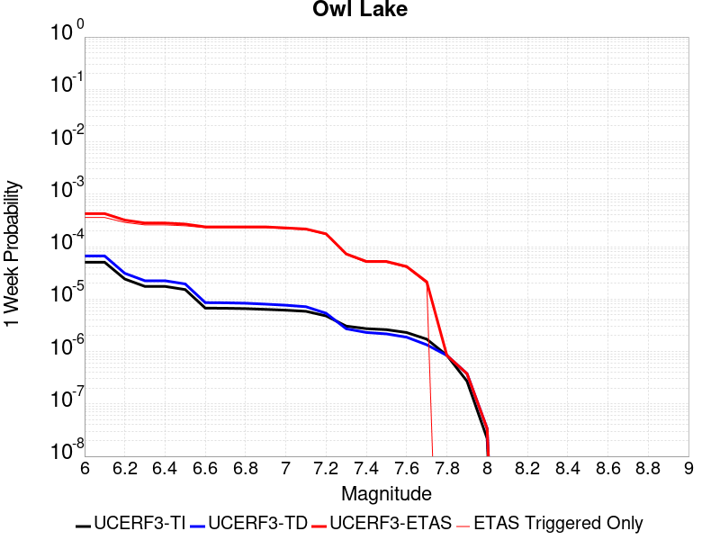 |  |  |  |

| Magnitude | 1 wk TI Prob | 1 wk TD Prob | 1 wk ETAS Prob | 1 wk ETAS/TD Gain | 1 wk ETAS Triggered Only | 1 mo TI Prob | 1 mo TD Prob | 1 mo ETAS Prob | 1 mo ETAS/TD Gain | 1 mo ETAS Triggered Only | 1 yr TI Prob | 1 yr TD Prob | 1 yr ETAS Prob | 1 yr ETAS/TD Gain | 1 yr ETAS Triggered Only | 10 yr TI Prob | 10 yr TD Prob | 10 yr ETAS Prob | 10 yr ETAS/TD Gain | 10 yr ETAS Triggered Only |
|-----|-----|-----|-----|-----|-----|-----|-----|-----|-----|-----|-----|-----|-----|-----|-----|-----|-----|-----|-----|-----|
| 6.0 | 5.0320643E-5 | 6.637038E-5 | 4.263465E-4 | 6.423746 | 3.6E-4 | 2.1564208E-4 | 2.8441957E-4 | 0.0018839645 | 6.623892 | 0.0016 | 0.0026222812 | 0.0034582033 | 0.010453926 | 3.0229359 | 0.00702 | 0.02591553 | 0.034148198 | 0.048587684 | 1.4228476 | 0.01495 |
| 6.1 | 5.0320643E-5 | 6.637038E-5 | 4.263465E-4 | 6.423746 | 3.6E-4 | 2.1564208E-4 | 2.8441957E-4 | 0.0018839645 | 6.623892 | 0.0016 | 0.0026222812 | 0.0034582033 | 0.010453926 | 3.0229359 | 0.00702 | 0.02591553 | 0.034148198 | 0.048587684 | 1.4228476 | 0.01495 |
| 6.2 | 2.4125871E-5 | 3.09871E-5 | 3.209781E-4 | 10.358443 | 2.9E-4 | 1.0339249E-4 | 1.3279608E-4 | 0.0012526474 | 9.432864 | 0.00112 | 0.0012580766 | 0.0016157634 | 0.006847297 | 4.237809 | 0.00524 | 0.012509781 | 0.016074665 | 0.026858486 | 1.6708583 | 0.01096 |
| 6.3 | 1.7433485E-5 | 2.2360797E-5 | 2.8235497E-4 | 12.627233 | 2.6E-4 | 7.471279E-5 | 9.582917E-5 | 0.0011057324 | 11.538578 | 0.00101 | 9.0924866E-4 | 0.0011662331 | 0.005840775 | 5.00824 | 0.00468 | 0.009055373 | 0.011632415 | 0.020982372 | 1.8037847 | 0.00946 |
| 6.4 | 1.7433485E-5 | 2.2360797E-5 | 2.8235497E-4 | 12.627233 | 2.6E-4 | 7.471279E-5 | 9.582917E-5 | 0.0011057324 | 11.538578 | 0.00101 | 9.0924866E-4 | 0.0011662331 | 0.005840775 | 5.00824 | 0.00468 | 0.009055373 | 0.011632415 | 0.020982372 | 1.8037847 | 0.00946 |
| 6.5 | 1.5182742E-5 | 1.9434077E-5 | 2.694292E-4 | 13.863751 | 2.5E-4 | 6.506727E-5 | 8.328693E-5 | 0.0010832036 | 13.005687 | 0.001 | 7.919061E-4 | 0.0010136823 | 0.005509121 | 5.43476 | 0.0045 | 0.0078909 | 0.010121727 | 0.019030632 | 1.8801763 | 0.009 |
| 6.6 | 6.7271576E-6 | 8.550671E-6 | 2.385487E-4 | 27.898243 | 2.3E-4 | 2.8830356E-5 | 3.664525E-5 | 9.3661225E-4 | 25.558899 | 9.0E-4 | 3.5095305E-4 | 4.4607025E-4 | 0.0039345133 | 8.82039 | 0.00349 | 0.0035039932 | 0.0044702506 | 0.011130345 | 2.4898703 | 0.00669 |
| 6.7 | 6.682835E-6 | 8.48311E-6 | 2.3848115E-4 | 28.112469 | 2.3E-4 | 2.8640408E-5 | 3.635571E-5 | 9.3632296E-4 | 25.754496 | 9.0E-4 | 3.4864116E-4 | 4.4254653E-4 | 0.003931002 | 8.882687 | 0.00349 | 0.003480947 | 0.0044352226 | 0.011095551 | 2.5016897 | 0.00669 |
| 6.8 | 6.5774975E-6 | 8.32956E-6 | 2.3832764E-4 | 28.612272 | 2.3E-4 | 2.8188972E-5 | 3.569766E-5 | 9.256659E-4 | 25.930717 | 8.9E-4 | 3.4314668E-4 | 4.3453797E-4 | 0.003913026 | 9.005026 | 0.00348 | 0.0034261728 | 0.0043553766 | 0.01098637 | 2.5224845 | 0.00666 |
| 6.9 | 6.363419E-6 | 8.002683E-6 | 2.3800084E-4 | 29.740133 | 2.3E-4 | 2.727151E-5 | 3.429679E-5 | 9.242663E-4 | 26.949059 | 8.9E-4 | 3.3198006E-4 | 4.1748903E-4 | 0.0038760444 | 9.284183 | 0.00346 | 0.0033148455 | 0.0041853474 | 0.010787599 | 2.577468 | 0.00663 |
| 7.0 | 6.1342453E-6 | 7.634817E-6 | 2.2763314E-4 | 29.815142 | 2.2E-4 | 2.6289357E-5 | 3.272026E-5 | 9.026918E-4 | 27.588158 | 8.7E-4 | 3.2002592E-4 | 3.983019E-4 | 0.0037869515 | 9.507742 | 0.00339 | 0.0031956544 | 0.003994015 | 0.010507894 | 2.63091 | 0.00654 |
| 7.1 | 5.842926E-6 | 7.1452696E-6 | 2.1714377E-4 | 30.389864 | 2.1E-4 | 2.504087E-5 | 3.0622254E-5 | 8.6059683E-4 | 28.103642 | 8.3E-4 | 3.0482994E-4 | 3.727676E-4 | 0.0036315524 | 9.742136 | 0.00326 | 0.0030441214 | 0.0037395519 | 0.01000603 | 2.6757298 | 0.00629 |
| 7.2 | 4.77173E-6 | 5.3611675E-6 | 1.7536026E-4 | 32.709343 | 1.7E-4 | 2.045011E-5 | 2.2976252E-5 | 6.029629E-4 | 26.242876 | 5.8E-4 | 2.4895166E-4 | 2.7970402E-4 | 0.0025990552 | 9.292162 | 0.00232 | 0.0024867293 | 0.0028107075 | 0.0071983403 | 2.561042 | 0.0044 |
| 7.3 | 3.0494948E-6 | 2.712334E-6 | 7.2712144E-5 | 26.80796 | 7.0E-5 | 1.3069198E-5 | 1.1624238E-5 | 2.1162191E-4 | 18.205229 | 2.0E-4 | 1.5910587E-4 | 1.4151607E-4 | 7.314326E-4 | 5.168548 | 5.9E-4 | 0.0015899199 | 0.0014246284 | 0.002662862 | 1.8691624 | 0.00124 |
| 7.4 | 2.7263884E-6 | 2.307415E-6 | 5.23073E-5 | 22.669222 | 5.0E-5 | 1.1684469E-5 | 9.888884E-6 | 1.0988789E-4 | 11.112265 | 1.0E-4 | 1.4224913E-4 | 1.20390614E-4 | 4.503509E-4 | 3.7407475 | 3.3E-4 | 0.0014215811 | 0.0012125135 | 0.0020015556 | 1.6507491 | 7.9E-4 |
| 7.5 | 2.6090431E-6 | 2.1673172E-6 | 5.216721E-5 | 24.069946 | 5.0E-5 | 1.1181565E-5 | 9.288469E-6 | 9.928763E-5 | 10.6893425 | 9.0E-5 | 1.3612706E-4 | 1.1308135E-4 | 4.0304856E-4 | 3.5642357 | 2.9E-4 | 0.001360437 | 0.0011392768 | 0.0018085134 | 1.5874224 | 6.7E-4 |
| 7.6 | 2.3008756E-6 | 1.8744257E-6 | 4.187435E-5 | 22.33983 | 4.0E-5 | 9.860858E-6 | 8.033228E-6 | 7.8032666E-5 | 9.713737 | 7.0E-5 | 1.20049335E-4 | 9.780025E-5 | 3.2777776E-4 | 3.3515022 | 2.3E-4 | 0.001199845 | 9.862278E-4 | 0.0015256952 | 1.5470009 | 5.4E-4 |
| 7.7 | 1.7184348E-6 | 1.3434202E-6 | 2.1343394E-5 | 15.887356 | 2.0E-5 | 7.3646997E-6 | 5.7575025E-6 | 4.575727E-5 | 7.947417 | 4.0E-5 | 8.966153E-5 | 7.0095375E-5 | 1.8008766E-4 | 2.5691803 | 1.1E-4 | 8.962536E-4 | 7.0897903E-4 | 0.0010287522 | 1.4510332 | 3.2E-4 |
| 7.8 | 8.4612907E-7 | 8.416933E-7 | 8.416933E-7 | 1.0 | 0.0 | 3.6262625E-6 | 3.6072522E-6 | 1.3607216E-5 | 3.7721832 | 1.0E-5 | 4.4148852E-5 | 4.391743E-5 | 8.391567E-5 | 1.91076 | 4.0E-5 | 4.414008E-4 | 4.4484966E-4 | 6.0477847E-4 | 1.3595121 | 1.6E-4 |
| 7.9 | 2.716738E-7 | 3.773008E-7 | 3.773008E-7 | 1.0 | 0.0 | 1.1643157E-6 | 1.6170025E-6 | 1.6170025E-6 | 1.0 | 0.0 | 1.4175452E-5 | 1.9686839E-5 | 2.9686642E-5 | 1.5079436 | 1.0E-5 | 1.4174548E-4 | 1.9892666E-4 | 2.6891273E-4 | 1.3518184 | 7.0E-5 |
| 8.0 | 2.1995428E-8 | 3.3868776E-8 | 3.3868776E-8 | 1.0 | 0.0 | 9.426611E-8 | 1.4515189E-7 | 1.4515189E-7 | 1.0 | 0.0 | 1.1476893E-6 | 1.7672235E-6 | 1.7672235E-6 | 1.0 | 0.0 | 1.14768345E-5 | 1.8218208E-5 | 3.8217844E-5 | 2.0977829 | 2.0E-5 |

## Airport Lake
*[(top)](#table-of-contents)*

| 1 Week | 1 Month | 1 Year | 10 Year |
|-----|-----|-----|-----|
|  |  |  |  |

| Magnitude | 1 wk TI Prob | 1 wk TD Prob | 1 wk ETAS Prob | 1 wk ETAS/TD Gain | 1 wk ETAS Triggered Only | 1 mo TI Prob | 1 mo TD Prob | 1 mo ETAS Prob | 1 mo ETAS/TD Gain | 1 mo ETAS Triggered Only | 1 yr TI Prob | 1 yr TD Prob | 1 yr ETAS Prob | 1 yr ETAS/TD Gain | 1 yr ETAS Triggered Only | 10 yr TI Prob | 10 yr TD Prob | 10 yr ETAS Prob | 10 yr ETAS/TD Gain | 10 yr ETAS Triggered Only |
|-----|-----|-----|-----|-----|-----|-----|-----|-----|-----|-----|-----|-----|-----|-----|-----|-----|-----|-----|-----|-----|
| 6.0 | 1.2387061E-5 | 1.3103559E-5 | 6.830948E-4 | 52.130478 | 6.7E-4 | 5.3086325E-5 | 5.615706E-5 | 0.0021460396 | 38.21496 | 0.00209 | 6.461343E-4 | 6.8352616E-4 | 0.008468201 | 12.388994 | 0.00779 | 0.0064425888 | 0.006817048 | 0.020662019 | 3.0309334 | 0.01394 |
| 6.1 | 1.2387061E-5 | 1.3103559E-5 | 6.830948E-4 | 52.130478 | 6.7E-4 | 5.3086325E-5 | 5.615706E-5 | 0.0021460396 | 38.21496 | 0.00209 | 6.461343E-4 | 6.8352616E-4 | 0.008468201 | 12.388994 | 0.00779 | 0.0064425888 | 0.006817048 | 0.020662019 | 3.0309334 | 0.01394 |
| 6.2 | 1.2387061E-5 | 1.3103559E-5 | 6.830948E-4 | 52.130478 | 6.7E-4 | 5.3086325E-5 | 5.615706E-5 | 0.0021460396 | 38.21496 | 0.00209 | 6.461343E-4 | 6.8352616E-4 | 0.008468201 | 12.388994 | 0.00779 | 0.0064425888 | 0.006817048 | 0.020662019 | 3.0309334 | 0.01394 |
| 6.3 | 1.2387061E-5 | 1.3103559E-5 | 6.830948E-4 | 52.130478 | 6.7E-4 | 5.3086325E-5 | 5.615706E-5 | 0.0021460396 | 38.21496 | 0.00209 | 6.461343E-4 | 6.8352616E-4 | 0.008468201 | 12.388994 | 0.00779 | 0.0064425888 | 0.006817048 | 0.020662019 | 3.0309334 | 0.01394 |
| 6.4 | 1.2387061E-5 | 1.3103559E-5 | 6.830948E-4 | 52.130478 | 6.7E-4 | 5.3086325E-5 | 5.615706E-5 | 0.0021460396 | 38.21496 | 0.00209 | 6.461343E-4 | 6.8352616E-4 | 0.008468201 | 12.388994 | 0.00779 | 0.0064425888 | 0.006817048 | 0.020662019 | 3.0309334 | 0.01394 |
| 6.5 | 6.9922594E-6 | 7.385145E-6 | 4.5738183E-4 | 61.93268 | 4.5E-4 | 2.996648E-5 | 3.165027E-5 | 0.0015316028 | 48.39146 | 0.0015 | 3.6478083E-4 | 3.8527933E-4 | 0.006193041 | 16.074158 | 0.00581 | 0.003641826 | 0.003846651 | 0.0143361455 | 3.726916 | 0.01053 |
| 6.6 | 6.9922594E-6 | 7.385145E-6 | 4.5738183E-4 | 61.93268 | 4.5E-4 | 2.996648E-5 | 3.165027E-5 | 0.0015316028 | 48.39146 | 0.0015 | 3.6478083E-4 | 3.8527933E-4 | 0.006193041 | 16.074158 | 0.00581 | 0.003641826 | 0.003846651 | 0.0143361455 | 3.726916 | 0.01053 |
| 6.7 | 5.477277E-6 | 5.7862417E-6 | 3.9578398E-4 | 68.40088 | 3.9E-4 | 2.3473833E-5 | 2.4797964E-5 | 0.0013447652 | 54.228855 | 0.00132 | 2.8575645E-4 | 3.0187727E-4 | 0.005270377 | 17.458673 | 0.00497 | 0.0028538927 | 0.003015056 | 0.01204774 | 3.9958594 | 0.00906 |
| 6.8 | 3.9950432E-6 | 4.2192128E-6 | 3.4421778E-4 | 81.58341 | 3.4E-4 | 1.7121502E-5 | 1.808223E-5 | 0.0010680632 | 59.06701 | 0.00105 | 2.0843433E-4 | 2.2013167E-4 | 0.004029293 | 18.304014 | 0.00381 | 0.0020823893 | 0.0021994072 | 0.009203968 | 4.184749 | 0.00702 |
| 6.9 | 2.95695E-6 | 3.1231173E-6 | 2.5312233E-4 | 81.04797 | 2.5E-4 | 1.2672582E-5 | 1.33847325E-5 | 7.533748E-4 | 56.286133 | 7.4E-4 | 1.5427776E-4 | 1.629492E-4 | 0.0027625256 | 16.953293 | 0.0026 | 0.001541707 | 0.0016285196 | 0.00652054 | 4.003968 | 0.0049 |
| 7.0 | 1.456072E-6 | 1.5408596E-6 | 1.21540674E-4 | 78.87849 | 1.2E-4 | 6.2402937E-6 | 6.603673E-6 | 3.2660156E-4 | 49.45756 | 3.2E-4 | 7.597293E-5 | 8.039776E-5 | 0.0011403125 | 14.183387 | 0.00106 | 7.594696E-4 | 8.0378563E-4 | 0.0028721218 | 3.5732436 | 0.00207 |
| 7.1 | 6.995192E-7 | 7.409207E-7 | 3.07409E-5 | 41.490135 | 3.0E-5 | 2.997936E-6 | 3.1753743E-6 | 1.0317506E-4 | 32.49225 | 1.0E-4 | 3.649926E-5 | 3.8660182E-5 | 4.5864395E-4 | 11.863471 | 4.2E-4 | 3.6493264E-4 | 3.8660184E-4 | 0.0012562654 | 3.2495074 | 8.7E-4 |

## Panamint Valley
*[(top)](#table-of-contents)*

| 1 Week | 1 Month | 1 Year | 10 Year |
|-----|-----|-----|-----|
|  | 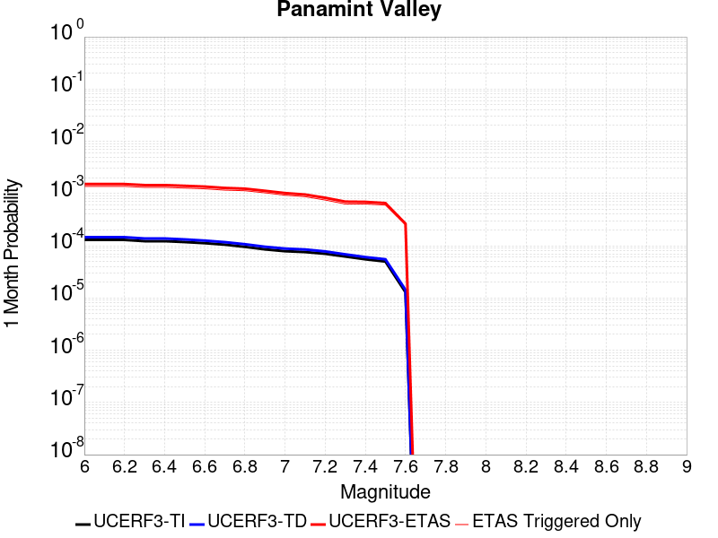 |  |  |

| Magnitude | 1 wk TI Prob | 1 wk TD Prob | 1 wk ETAS Prob | 1 wk ETAS/TD Gain | 1 wk ETAS Triggered Only | 1 mo TI Prob | 1 mo TD Prob | 1 mo ETAS Prob | 1 mo ETAS/TD Gain | 1 mo ETAS Triggered Only | 1 yr TI Prob | 1 yr TD Prob | 1 yr ETAS Prob | 1 yr ETAS/TD Gain | 1 yr ETAS Triggered Only | 10 yr TI Prob | 10 yr TD Prob | 10 yr ETAS Prob | 10 yr ETAS/TD Gain | 10 yr ETAS Triggered Only |
|-----|-----|-----|-----|-----|-----|-----|-----|-----|-----|-----|-----|-----|-----|-----|-----|-----|-----|-----|-----|-----|
| 6.0 | 3.0211835E-5 | 3.3987795E-5 | 4.2397453E-4 | 12.474318 | 3.9E-4 | 1.2947287E-4 | 1.4565402E-4 | 0.0015154545 | 10.404481 | 0.00137 | 0.0015751923 | 0.0017719247 | 0.0073919487 | 4.1717057 | 0.00563 | 0.015640736 | 0.017584749 | 0.02939338 | 1.6715269 | 0.01202 |
| 6.1 | 3.0211835E-5 | 3.3987795E-5 | 4.2397453E-4 | 12.474318 | 3.9E-4 | 1.2947287E-4 | 1.4565402E-4 | 0.0015154545 | 10.404481 | 0.00137 | 0.0015751923 | 0.0017719247 | 0.0073919487 | 4.1717057 | 0.00563 | 0.015640736 | 0.017584749 | 0.02939338 | 1.6715269 | 0.01202 |
| 6.2 | 3.0211835E-5 | 3.3987795E-5 | 4.2397453E-4 | 12.474318 | 3.9E-4 | 1.2947287E-4 | 1.4565402E-4 | 0.0015154545 | 10.404481 | 0.00137 | 0.0015751923 | 0.0017719247 | 0.0073919487 | 4.1717057 | 0.00563 | 0.015640736 | 0.017584749 | 0.02939338 | 1.6715269 | 0.01202 |
| 6.3 | 2.8573924E-5 | 3.2105843E-5 | 4.0209395E-4 | 12.524012 | 3.7E-4 | 1.2245393E-4 | 1.3758938E-4 | 0.0014474092 | 10.519774 | 0.00131 | 0.001489857 | 0.0016738913 | 0.0070349025 | 4.2027235 | 0.00537 | 0.01479908 | 0.016619716 | 0.02777125 | 1.6709821 | 0.01134 |
| 6.4 | 2.8573924E-5 | 3.2105843E-5 | 4.0209395E-4 | 12.524012 | 3.7E-4 | 1.2245393E-4 | 1.3758938E-4 | 0.0014474092 | 10.519774 | 0.00131 | 0.001489857 | 0.0016738913 | 0.0070349025 | 4.2027235 | 0.00537 | 0.01479908 | 0.016619716 | 0.02777125 | 1.6709821 | 0.01134 |
| 6.5 | 2.7468774E-5 | 3.0831467E-5 | 4.0082005E-4 | 13.000358 | 3.7E-4 | 1.1771801E-4 | 1.321283E-4 | 0.0014019605 | 10.610599 | 0.00127 | 0.0014322745 | 0.0016075026 | 0.0068091275 | 4.235842 | 0.00521 | 0.014230782 | 0.015965527 | 0.026858788 | 1.6822989 | 0.01107 |
| 6.6 | 2.6135967E-5 | 2.9255378E-5 | 3.8924484E-4 | 13.30507 | 3.6E-4 | 1.1200648E-4 | 1.2537432E-4 | 0.0013552201 | 10.809392 | 0.00123 | 0.0013628257 | 0.0015253901 | 0.0065377327 | 4.2859416 | 0.00502 | 0.013544982 | 0.015155784 | 0.02567392 | 1.6940014 | 0.01068 |
| 6.7 | 2.4498746E-5 | 2.7344215E-5 | 3.6733493E-4 | 13.433735 | 3.4E-4 | 1.04990395E-4 | 1.1718437E-4 | 0.0012770484 | 10.897772 | 0.00116 | 0.0012775084 | 0.001425811 | 0.0062489244 | 4.3827157 | 0.00483 | 0.012701893 | 0.014173006 | 0.024258016 | 1.7115647 | 0.01023 |
| 6.8 | 2.2244329E-5 | 2.4938487E-5 | 3.6493002E-4 | 14.633205 | 3.4E-4 | 9.532935E-5 | 1.0687498E-4 | 0.0012367542 | 11.571972 | 0.00113 | 0.0011600169 | 0.001300448 | 0.005794596 | 4.4558463 | 0.0045 | 0.011539802 | 0.012934348 | 0.022271989 | 1.721926 | 0.00946 |
| 6.9 | 1.9902658E-5 | 2.229314E-5 | 3.2228645E-4 | 14.456755 | 3.0E-4 | 8.529431E-5 | 9.5538635E-5 | 0.0011254402 | 11.779949 | 0.00103 | 0.0010379635 | 0.0011625807 | 0.005197884 | 4.470988 | 0.00404 | 0.010331288 | 0.01157016 | 0.019774128 | 1.7090626 | 0.0083 |
| 7.0 | 1.8353881E-5 | 2.0568947E-5 | 2.905634E-4 | 14.126313 | 2.7E-4 | 7.865712E-5 | 8.814975E-5 | 0.0010180678 | 11.549298 | 9.3E-4 | 9.5722964E-4 | 0.0010727125 | 0.0048087006 | 4.4827485 | 0.00374 | 0.009531168 | 0.010680287 | 0.018149652 | 1.6993599 | 0.00755 |
| 7.1 | 1.7667631E-5 | 1.9775267E-5 | 2.6977033E-4 | 13.641804 | 2.5E-4 | 7.571623E-5 | 8.474849E-5 | 9.5467473E-4 | 11.264799 | 8.7E-4 | 9.2145515E-4 | 0.0010313421 | 0.004657598 | 4.516056 | 0.00363 | 0.009176437 | 0.010270455 | 0.017505378 | 1.7044404 | 0.00731 |
| 7.2 | 1.6381597E-5 | 1.8160737E-5 | 2.181571E-4 | 12.012568 | 2.0E-4 | 7.020495E-5 | 7.782951E-5 | 8.2777115E-4 | 10.635697 | 7.5E-4 | 8.544101E-4 | 9.471797E-4 | 0.004154139 | 4.3857985 | 0.00321 | 0.008511325 | 0.009436136 | 0.015795557 | 1.6739433 | 0.00642 |
| 7.3 | 1.4520491E-5 | 1.5968153E-5 | 1.5596591E-4 | 9.767311 | 1.4E-4 | 6.222919E-5 | 6.843323E-5 | 6.983901E-4 | 10.205423 | 6.3E-4 | 7.57377E-4 | 8.3287235E-4 | 0.0035905736 | 4.311073 | 0.00276 | 0.0075480095 | 0.0083006555 | 0.0136062475 | 1.6391774 | 0.00535 |
| 7.4 | 1.2852287E-5 | 1.41469245E-5 | 1.5414495E-4 | 10.896004 | 1.4E-4 | 5.5080065E-5 | 6.0628357E-5 | 6.905902E-4 | 11.390547 | 6.3E-4 | 6.7039346E-4 | 7.379161E-4 | 0.0033959532 | 4.602086 | 0.00266 | 0.0066837464 | 0.007357609 | 0.012410158 | 1.6867108 | 0.00509 |
| 7.5 | 1.1637851E-5 | 1.2838173E-5 | 1.5283638E-4 | 11.9048395 | 1.4E-4 | 4.987555E-5 | 5.5019667E-5 | 6.5498665E-4 | 11.904592 | 6.0E-4 | 6.070656E-4 | 6.6967425E-4 | 0.0032579398 | 4.864962 | 0.00259 | 0.006054099 | 0.006679489 | 0.0116162915 | 1.7390989 | 0.00497 |
| 7.6 | 3.0068115E-6 | 3.333561E-6 | 1.0333323E-4 | 30.997852 | 1.0E-4 | 1.2886271E-5 | 1.4286652E-5 | 2.642831E-4 | 18.498602 | 2.5E-4 | 1.5687906E-4 | 1.739334E-4 | 0.0012637438 | 7.265677 | 0.00109 | 0.0015676835 | 0.0017394735 | 0.003955612 | 2.2740283 | 0.00222 |

## Garlock (East)
*[(top)](#table-of-contents)*

| 1 Week | 1 Month | 1 Year | 10 Year |
|-----|-----|-----|-----|
|  |  |  |  |

| Magnitude | 1 wk TI Prob | 1 wk TD Prob | 1 wk ETAS Prob | 1 wk ETAS/TD Gain | 1 wk ETAS Triggered Only | 1 mo TI Prob | 1 mo TD Prob | 1 mo ETAS Prob | 1 mo ETAS/TD Gain | 1 mo ETAS Triggered Only | 1 yr TI Prob | 1 yr TD Prob | 1 yr ETAS Prob | 1 yr ETAS/TD Gain | 1 yr ETAS Triggered Only | 10 yr TI Prob | 10 yr TD Prob | 10 yr ETAS Prob | 10 yr ETAS/TD Gain | 10 yr ETAS Triggered Only |
|-----|-----|-----|-----|-----|-----|-----|-----|-----|-----|-----|-----|-----|-----|-----|-----|-----|-----|-----|-----|-----|
| 6.0 | 4.5092507E-5 | 6.291901E-5 | 2.9290453E-4 | 4.655263 | 2.3E-4 | 1.9323928E-4 | 2.6962755E-4 | 0.0011793822 | 4.3741164 | 9.1E-4 | 0.0023501497 | 0.0032782198 | 0.007883075 | 2.4046814 | 0.00462 | 0.023254504 | 0.032287683 | 0.042293828 | 1.309906 | 0.01034 |
| 6.1 | 4.5092507E-5 | 6.291901E-5 | 2.9290453E-4 | 4.655263 | 2.3E-4 | 1.9323928E-4 | 2.6962755E-4 | 0.0011793822 | 4.3741164 | 9.1E-4 | 0.0023501497 | 0.0032782198 | 0.007883075 | 2.4046814 | 0.00462 | 0.023254504 | 0.032287683 | 0.042293828 | 1.309906 | 0.01034 |
| 6.2 | 2.6674514E-5 | 3.4522156E-5 | 2.0451628E-4 | 5.924204 | 1.7E-4 | 1.1431433E-4 | 1.4794388E-4 | 8.0784626E-4 | 5.4604907 | 6.6E-4 | 0.0013908884 | 0.0017997618 | 0.0051237685 | 2.846915 | 0.00333 | 0.01382215 | 0.01787814 | 0.02497888 | 1.3971745 | 0.00723 |
| 6.3 | 2.6674514E-5 | 3.4522156E-5 | 2.0451628E-4 | 5.924204 | 1.7E-4 | 1.1431433E-4 | 1.4794388E-4 | 8.0784626E-4 | 5.4604907 | 6.6E-4 | 0.0013908884 | 0.0017997618 | 0.0051237685 | 2.846915 | 0.00333 | 0.01382215 | 0.01787814 | 0.02497888 | 1.3971745 | 0.00723 |
| 6.4 | 2.5312667E-5 | 3.2350978E-5 | 2.0234547E-4 | 6.2546945 | 1.7E-4 | 1.0847834E-4 | 1.3863985E-4 | 7.9854834E-4 | 5.7598763 | 6.6E-4 | 0.0013199237 | 0.0016866627 | 0.004981097 | 2.9532263 | 0.0033 | 0.013121112 | 0.016778192 | 0.023749234 | 1.4154824 | 0.00709 |
| 6.5 | 2.5312667E-5 | 3.2350978E-5 | 2.0234547E-4 | 6.2546945 | 1.7E-4 | 1.0847834E-4 | 1.3863985E-4 | 7.9854834E-4 | 5.7598763 | 6.6E-4 | 0.0013199237 | 0.0016866627 | 0.004981097 | 2.9532263 | 0.0033 | 0.013121112 | 0.016778192 | 0.023749234 | 1.4154824 | 0.00709 |
| 6.6 | 2.246556E-5 | 2.8145088E-5 | 1.981403E-4 | 7.0399604 | 1.7E-4 | 9.627742E-5 | 1.20616365E-4 | 7.7053794E-4 | 6.3883367 | 6.5E-4 | 0.0011715472 | 0.0014675385 | 0.0045530037 | 3.1024764 | 0.00309 | 0.011653901 | 0.014618727 | 0.02124049 | 1.4529643 | 0.00672 |
| 6.7 | 2.2241198E-5 | 2.7814802E-5 | 1.9781008E-4 | 7.111684 | 1.7E-4 | 9.531594E-5 | 1.1920098E-4 | 7.691235E-4 | 6.4523253 | 6.5E-4 | 0.0011598538 | 0.0014503293 | 0.004525862 | 3.1205757 | 0.00308 | 0.011538187 | 0.014448618 | 0.021051811 | 1.4570122 | 0.0067 |
| 6.8 | 1.9528685E-5 | 2.3908464E-5 | 1.8390465E-4 | 7.692031 | 1.6E-4 | 8.369167E-5 | 1.0246093E-4 | 7.1239844E-4 | 6.952879 | 6.1E-4 | 0.0010184698 | 0.0012467676 | 0.004163127 | 3.3391364 | 0.00292 | 0.010138147 | 0.012441509 | 0.01870263 | 1.5032445 | 0.00634 |
| 6.9 | 1.3318621E-5 | 1.5207378E-5 | 1.652051E-4 | 10.863483 | 1.5E-4 | 5.7078556E-5 | 6.5172884E-5 | 6.2513637E-4 | 9.59197 | 5.6E-4 | 6.9470983E-4 | 7.9319667E-4 | 0.0033811424 | 4.262678 | 0.00259 | 0.0069254204 | 0.007945063 | 0.01349065 | 1.6979916 | 0.00559 |
| 7.0 | 1.1760853E-5 | 1.3115919E-5 | 1.5311409E-4 | 11.673912 | 1.4E-4 | 5.0402683E-5 | 5.6209898E-5 | 6.06179E-4 | 10.784204 | 5.5E-4 | 6.134799E-4 | 6.8414566E-4 | 0.0032024216 | 4.6809063 | 0.00252 | 0.0061178906 | 0.006861606 | 0.012264279 | 1.7873774 | 0.00544 |
| 7.1 | 1.0064758E-5 | 1.09107295E-5 | 1.4090931E-4 | 12.914747 | 1.3E-4 | 4.3133965E-5 | 4.675945E-5 | 5.7673466E-4 | 12.334077 | 5.3E-4 | 5.2502943E-4 | 5.6915113E-4 | 0.0030077624 | 5.2846465 | 0.00244 | 0.005237907 | 0.005717425 | 0.010867809 | 1.9008223 | 0.00518 |
| 7.2 | 9.768808E-6 | 1.0506538E-5 | 1.20505385E-4 | 11.469562 | 1.1E-4 | 4.186565E-5 | 4.5027264E-5 | 5.550043E-4 | 12.325961 | 5.1E-4 | 5.095951E-4 | 5.480725E-4 | 0.00288679 | 5.267168 | 0.00234 | 0.0050842804 | 0.0055075847 | 0.010460157 | 1.8992276 | 0.00498 |
| 7.3 | 9.344516E-6 | 9.952032E-6 | 1.09951034E-4 | 11.0480995 | 1.0E-4 | 4.004731E-5 | 4.2650885E-5 | 5.4262957E-4 | 12.722586 | 5.0E-4 | 4.8746695E-4 | 5.191543E-4 | 0.0027380018 | 5.2739654 | 0.00222 | 0.0048639905 | 0.0052191834 | 0.00986481 | 1.890106 | 0.00467 |
| 7.4 | 9.023491E-6 | 9.498046E-6 | 9.949719E-5 | 10.475543 | 9.0E-5 | 3.867153E-5 | 4.0705298E-5 | 5.1068614E-4 | 12.545939 | 4.7E-4 | 4.7072413E-4 | 4.9547764E-4 | 0.002574447 | 5.1958895 | 0.00208 | 0.004697283 | 0.0049825576 | 0.009360634 | 1.8786806 | 0.0044 |
| 7.5 | 7.081253E-6 | 7.0941337E-6 | 7.709364E-5 | 10.867238 | 7.0E-5 | 3.0347876E-5 | 3.040308E-5 | 3.0039487E-4 | 9.880409 | 2.7E-4 | 3.6942272E-4 | 3.7009537E-4 | 0.0014496957 | 3.9170868 | 0.00108 | 0.003688092 | 0.0037283404 | 0.0059002126 | 1.5825306 | 0.00218 |
| 7.6 | 6.116396E-6 | 5.9653516E-6 | 4.5965113E-5 | 7.7053485 | 4.0E-5 | 2.6212863E-5 | 2.5565543E-5 | 1.7556171E-4 | 6.867122 | 1.5E-4 | 3.1909486E-4 | 3.112163E-4 | 9.910046E-4 | 3.1842957 | 6.8E-4 | 0.0031863707 | 0.0031395783 | 0.0044454653 | 1.4159435 | 0.00131 |
| 7.7 | 4.797145E-6 | 4.7631393E-6 | 3.4762998E-5 | 7.2983375 | 3.0E-5 | 2.055903E-5 | 2.0413294E-5 | 1.3041105E-4 | 6.388535 | 1.1E-4 | 2.5027743E-4 | 2.4850364E-4 | 5.8841915E-4 | 2.367849 | 3.4E-4 | 0.0024999576 | 0.0025124259 | 0.0031408432 | 1.2501236 | 6.3E-4 |
| 7.8 | 3.4028885E-6 | 3.9837723E-6 | 2.3983694E-5 | 6.020347 | 2.0E-5 | 1.4583726E-5 | 1.70732E-5 | 9.707183E-5 | 5.6856265 | 8.0E-5 | 1.775424E-4 | 2.0784645E-4 | 4.0780488E-4 | 1.9620488 | 2.0E-4 | 0.0017740062 | 0.0021040265 | 0.0025131637 | 1.1944544 | 4.1E-4 |
| 7.9 | 2.5928412E-6 | 3.3769782E-6 | 2.3376911E-5 | 6.9224343 | 2.0E-5 | 1.1112129E-5 | 1.4472684E-5 | 8.447167E-5 | 5.836628 | 7.0E-5 | 1.3528178E-4 | 1.7619075E-4 | 3.3616254E-4 | 1.9079467 | 1.6E-4 | 0.0013519945 | 0.0017837033 | 0.002133079 | 1.195871 | 3.5E-4 |
| 8.0 | 1.3743648E-6 | 1.6755052E-6 | 1.1675488E-5 | 6.968339 | 1.0E-5 | 5.8901214E-6 | 7.180717E-6 | 6.7180285E-5 | 9.355652 | 6.0E-5 | 7.1709874E-5 | 8.742175E-5 | 2.0741126E-4 | 2.3725362 | 1.2E-4 | 7.1686733E-4 | 8.849517E-4 | 0.001104757 | 1.2483811 | 2.2E-4 |
| 8.1 | 3.6733252E-7 | 3.1523513E-7 | 3.1523513E-7 | 1.0 | 0.0 | 1.5742813E-6 | 1.3510071E-6 | 1.3510071E-6 | 1.0 | 0.0 | 1.9166706E-5 | 1.6448403E-5 | 3.6448073E-5 | 2.2159035 | 2.0E-5 | 1.9165053E-4 | 1.6662726E-4 | 1.9662226E-4 | 1.1800126 | 3.0E-5 |

## Ash Hill
*[(top)](#table-of-contents)*

| 1 Week | 1 Month | 1 Year | 10 Year |
|-----|-----|-----|-----|
|  |  |  |  |

| Magnitude | 1 wk TI Prob | 1 wk TD Prob | 1 wk ETAS Prob | 1 wk ETAS/TD Gain | 1 wk ETAS Triggered Only | 1 mo TI Prob | 1 mo TD Prob | 1 mo ETAS Prob | 1 mo ETAS/TD Gain | 1 mo ETAS Triggered Only | 1 yr TI Prob | 1 yr TD Prob | 1 yr ETAS Prob | 1 yr ETAS/TD Gain | 1 yr ETAS Triggered Only | 10 yr TI Prob | 10 yr TD Prob | 10 yr ETAS Prob | 10 yr ETAS/TD Gain | 10 yr ETAS Triggered Only |
|-----|-----|-----|-----|-----|-----|-----|-----|-----|-----|-----|-----|-----|-----|-----|-----|-----|-----|-----|-----|-----|
| 6.0 | 2.1545662E-5 | 2.3195389E-5 | 2.4319028E-4 | 10.484424 | 2.2E-4 | 9.2335285E-5 | 9.940547E-5 | 8.5932994E-4 | 8.644694 | 7.6E-4 | 0.0011236023 | 0.0012096697 | 0.0043059196 | 3.559583 | 0.0031 | 0.011179381 | 0.012038835 | 0.018085157 | 1.5022348 | 0.00612 |
| 6.1 | 2.1545662E-5 | 2.3195389E-5 | 2.4319028E-4 | 10.484424 | 2.2E-4 | 9.2335285E-5 | 9.940547E-5 | 8.5932994E-4 | 8.644694 | 7.6E-4 | 0.0011236023 | 0.0012096697 | 0.0043059196 | 3.559583 | 0.0031 | 0.011179381 | 0.012038835 | 0.018085157 | 1.5022348 | 0.00612 |
| 6.2 | 2.1545662E-5 | 2.3195389E-5 | 2.4319028E-4 | 10.484424 | 2.2E-4 | 9.2335285E-5 | 9.940547E-5 | 8.5932994E-4 | 8.644694 | 7.6E-4 | 0.0011236023 | 0.0012096697 | 0.0043059196 | 3.559583 | 0.0031 | 0.011179381 | 0.012038835 | 0.018085157 | 1.5022348 | 0.00612 |
| 6.3 | 1.0025529E-5 | 1.0747344E-5 | 8.074659E-5 | 7.513167 | 7.0E-5 | 4.2965847E-5 | 4.605931E-5 | 2.8604825E-4 | 6.210433 | 2.4E-4 | 5.229836E-4 | 5.6064106E-4 | 0.0017099963 | 3.0500734 | 0.00115 | 0.005217545 | 0.0055935793 | 0.007960266 | 1.4231079 | 0.00238 |
| 6.4 | 1.0025529E-5 | 1.0747344E-5 | 8.074659E-5 | 7.513167 | 7.0E-5 | 4.2965847E-5 | 4.605931E-5 | 2.8604825E-4 | 6.210433 | 2.4E-4 | 5.229836E-4 | 5.6064106E-4 | 0.0017099963 | 3.0500734 | 0.00115 | 0.005217545 | 0.0055935793 | 0.007960266 | 1.4231079 | 0.00238 |
| 6.5 | 6.9617327E-6 | 7.4569152E-6 | 5.7456542E-5 | 7.7051353 | 5.0E-5 | 2.9835655E-5 | 3.1957865E-5 | 2.1195211E-4 | 6.632236 | 1.8E-4 | 3.6318856E-4 | 3.8902622E-4 | 0.0011287384 | 2.9014454 | 7.4E-4 | 0.0036259557 | 0.0038843066 | 0.005488053 | 1.4128784 | 0.00161 |
| 6.6 | 4.9919777E-6 | 5.34689E-6 | 2.5346782E-5 | 4.7404723 | 2.0E-5 | 2.1394015E-5 | 2.291508E-5 | 1.529121E-4 | 6.6729903 | 1.3E-4 | 2.60441E-4 | 2.7896208E-4 | 8.2880864E-4 | 2.9710443 | 5.5E-4 | 0.0026013597 | 0.0027867774 | 0.0039335727 | 1.411513 | 0.00115 |
| 6.7 | 3.6630722E-6 | 3.9247725E-6 | 1.3924733E-5 | 3.5479085 | 1.0E-5 | 1.5698786E-5 | 1.6820377E-5 | 1.2681853E-4 | 7.539577 | 1.1E-4 | 1.9111596E-4 | 2.0477458E-4 | 6.246886E-4 | 3.0506158 | 4.2E-4 | 0.0019095168 | 0.002046422 | 0.0029046622 | 1.4193857 | 8.6E-4 |
| 6.8 | 2.5599613E-6 | 2.7450303E-6 | 1.2745003E-5 | 4.642937 | 1.0E-5 | 1.0971216E-5 | 1.176439E-5 | 8.176357E-5 | 6.9500895 | 7.0E-5 | 1.3356637E-4 | 1.4322698E-4 | 4.6318115E-4 | 3.2338958 | 3.2E-4 | 0.0013348613 | 0.0014318317 | 0.002080901 | 1.453314 | 6.5E-4 |
| 6.9 | 1.7684905E-6 | 1.8969438E-6 | 1.1896925E-5 | 6.2716274 | 1.0E-5 | 7.579223E-6 | 8.129759E-6 | 5.8129353E-5 | 7.1501937 | 5.0E-5 | 9.2273134E-5 | 9.897981E-5 | 3.0895902E-4 | 3.1214347 | 2.1E-4 | 9.223483E-4 | 9.897981E-4 | 0.0014093824 | 1.423909 | 4.2E-4 |

## Blackwater
*[(top)](#table-of-contents)*

| 1 Week | 1 Month | 1 Year | 10 Year |
|-----|-----|-----|-----|
| 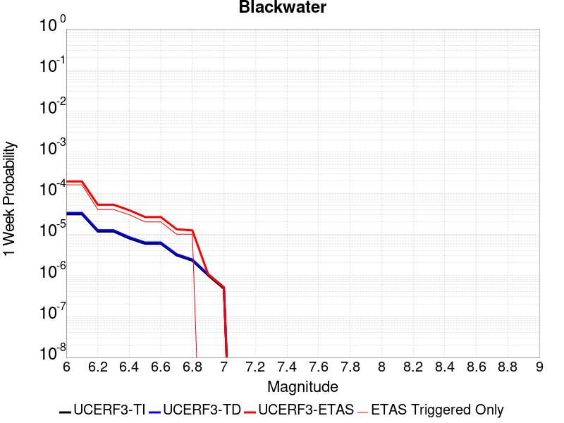 | 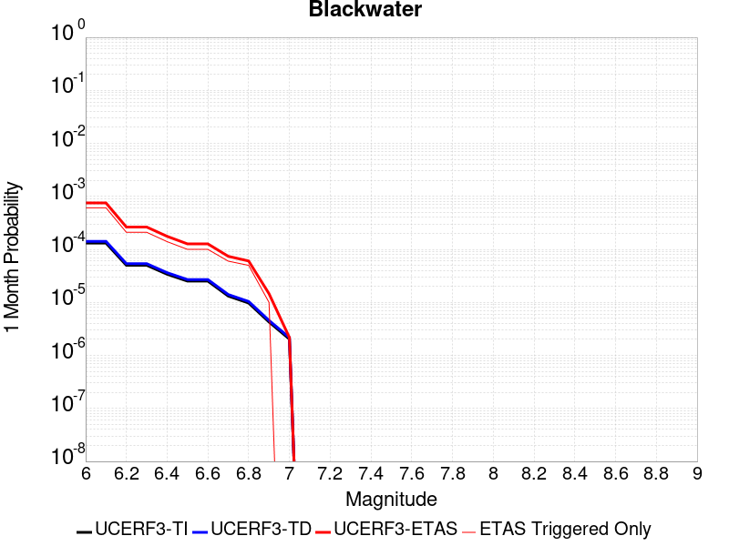 |  |  |

| Magnitude | 1 wk TI Prob | 1 wk TD Prob | 1 wk ETAS Prob | 1 wk ETAS/TD Gain | 1 wk ETAS Triggered Only | 1 mo TI Prob | 1 mo TD Prob | 1 mo ETAS Prob | 1 mo ETAS/TD Gain | 1 mo ETAS Triggered Only | 1 yr TI Prob | 1 yr TD Prob | 1 yr ETAS Prob | 1 yr ETAS/TD Gain | 1 yr ETAS Triggered Only | 10 yr TI Prob | 10 yr TD Prob | 10 yr ETAS Prob | 10 yr ETAS/TD Gain | 10 yr ETAS Triggered Only |
|-----|-----|-----|-----|-----|-----|-----|-----|-----|-----|-----|-----|-----|-----|-----|-----|-----|-----|-----|-----|-----|
| 6.0 | 3.0708583E-5 | 3.3097214E-5 | 1.9309192E-4 | 5.8340836 | 1.6E-4 | 1.3160157E-4 | 1.4183826E-4 | 7.5175177E-4 | 5.300063 | 6.1E-4 | 0.0016010714 | 0.0017256497 | 0.0041015428 | 2.3768108 | 0.00238 | 0.015895851 | 0.017136335 | 0.02243397 | 1.3091463 | 0.00539 |
| 6.1 | 3.0708583E-5 | 3.3097214E-5 | 1.9309192E-4 | 5.8340836 | 1.6E-4 | 1.3160157E-4 | 1.4183826E-4 | 7.5175177E-4 | 5.300063 | 6.1E-4 | 0.0016010714 | 0.0017256497 | 0.0041015428 | 2.3768108 | 0.00238 | 0.015895851 | 0.017136335 | 0.02243397 | 1.3091463 | 0.00539 |
| 6.2 | 1.1707779E-5 | 1.2545598E-5 | 5.2545096E-5 | 4.188329 | 4.0E-5 | 5.017523E-5 | 5.3765798E-5 | 2.637545E-4 | 4.9056187 | 2.1E-4 | 6.107122E-4 | 6.5441156E-4 | 0.0014339011 | 2.1911304 | 7.8E-4 | 0.006090366 | 0.0065258164 | 0.008234592 | 1.2618486 | 0.00172 |
| 6.3 | 1.1707779E-5 | 1.2545598E-5 | 5.2545096E-5 | 4.188329 | 4.0E-5 | 5.017523E-5 | 5.3765798E-5 | 2.637545E-4 | 4.9056187 | 2.1E-4 | 6.107122E-4 | 6.5441156E-4 | 0.0014339011 | 2.1911304 | 7.8E-4 | 0.006090366 | 0.0065258164 | 0.008234592 | 1.2618486 | 0.00172 |
| 6.4 | 7.929244E-6 | 8.4804105E-6 | 3.8480157E-5 | 4.5375347 | 3.0E-5 | 3.3982033E-5 | 3.6344132E-5 | 1.7633905E-4 | 4.851926 | 1.4E-4 | 4.136527E-4 | 4.4240404E-4 | 9.2219166E-4 | 2.084501 | 4.8E-4 | 0.0041288356 | 0.0044156383 | 0.005470958 | 1.2389959 | 0.00106 |
| 6.5 | 5.8832115E-6 | 6.286219E-6 | 2.6286094E-5 | 4.1815424 | 2.0E-5 | 2.521352E-5 | 2.6940676E-5 | 1.2693799E-4 | 4.7117596 | 1.0E-4 | 3.0693135E-4 | 3.279559E-4 | 6.7784113E-4 | 2.0668666 | 3.5E-4 | 0.0030650778 | 0.0032749726 | 0.004042451 | 1.2343465 | 7.7E-4 |
| 6.6 | 5.8832115E-6 | 6.286219E-6 | 2.6286094E-5 | 4.1815424 | 2.0E-5 | 2.521352E-5 | 2.6940676E-5 | 1.2693799E-4 | 4.7117596 | 1.0E-4 | 3.0693135E-4 | 3.279559E-4 | 6.7784113E-4 | 2.0668666 | 3.5E-4 | 0.0030650778 | 0.0032749726 | 0.004042451 | 1.2343465 | 7.7E-4 |
| 6.7 | 3.0715053E-6 | 3.2815851E-6 | 1.3281552E-5 | 4.047298 | 1.0E-5 | 1.3163528E-5 | 1.4063868E-5 | 7.406302E-5 | 5.266192 | 6.0E-5 | 1.6025416E-4 | 1.7121529E-4 | 3.8117933E-4 | 2.226316 | 2.1E-4 | 0.0016013865 | 0.0017109484 | 0.0021202469 | 1.2392231 | 4.1E-4 |
| 6.8 | 2.2722281E-6 | 2.4288424E-6 | 1.2428818E-5 | 5.1171775 | 1.0E-5 | 9.738084E-6 | 1.0409289E-5 | 6.040877E-5 | 5.8033524 | 5.0E-5 | 1.1855473E-4 | 1.2672663E-4 | 2.9670508E-4 | 2.3413002 | 1.7E-4 | 0.001184915 | 0.0012666339 | 0.0015762412 | 1.2444332 | 3.1E-4 |
| 6.9 | 9.952399E-7 | 1.0653887E-6 | 1.0653887E-6 | 1.0 | 0.0 | 4.265307E-6 | 4.5659463E-6 | 1.45659005E-5 | 3.1901164 | 1.0E-5 | 5.1928873E-5 | 5.5589495E-5 | 1.0558672E-4 | 1.8994005 | 5.0E-5 | 5.191674E-4 | 5.558065E-4 | 6.557509E-4 | 1.1798187 | 1.0E-4 |
| 7.0 | 4.7385504E-7 | 5.075751E-7 | 5.075751E-7 | 1.0 | 0.0 | 2.0308057E-6 | 2.175322E-6 | 2.175322E-6 | 1.0 | 0.0 | 2.4724779E-5 | 2.6484544E-5 | 3.6484278E-5 | 1.3775687 | 1.0E-5 | 2.4722028E-4 | 2.6484544E-4 | 3.148322E-4 | 1.1887394 | 5.0E-5 |

## Hunter Mountain-Saline Valley
*[(top)](#table-of-contents)*

| 1 Week | 1 Month | 1 Year | 10 Year |
|-----|-----|-----|-----|
|  |  |  |  |

| Magnitude | 1 wk TI Prob | 1 wk TD Prob | 1 wk ETAS Prob | 1 wk ETAS/TD Gain | 1 wk ETAS Triggered Only | 1 mo TI Prob | 1 mo TD Prob | 1 mo ETAS Prob | 1 mo ETAS/TD Gain | 1 mo ETAS Triggered Only | 1 yr TI Prob | 1 yr TD Prob | 1 yr ETAS Prob | 1 yr ETAS/TD Gain | 1 yr ETAS Triggered Only | 10 yr TI Prob | 10 yr TD Prob | 10 yr ETAS Prob | 10 yr ETAS/TD Gain | 10 yr ETAS Triggered Only |
|-----|-----|-----|-----|-----|-----|-----|-----|-----|-----|-----|-----|-----|-----|-----|-----|-----|-----|-----|-----|-----|
| 6.0 | 4.5103672E-5 | 5.4575703E-5 | 1.9456806E-4 | 3.5651042 | 1.4E-4 | 1.9328714E-4 | 2.3387565E-4 | 8.73726E-4 | 3.735857 | 6.4E-4 | 0.002350731 | 0.0028438994 | 0.005586079 | 1.9642321 | 0.00275 | 0.023260195 | 0.028095502 | 0.033246595 | 1.1833423 | 0.0053 |
| 6.1 | 4.5103672E-5 | 5.4575703E-5 | 1.9456806E-4 | 3.5651042 | 1.4E-4 | 1.9328714E-4 | 2.3387565E-4 | 8.73726E-4 | 3.735857 | 6.4E-4 | 0.002350731 | 0.0028438994 | 0.005586079 | 1.9642321 | 0.00275 | 0.023260195 | 0.028095502 | 0.033246595 | 1.1833423 | 0.0053 |
| 6.2 | 3.9363465E-5 | 4.7068323E-5 | 1.8706173E-4 | 3.9742596 | 1.4E-4 | 1.6868966E-4 | 2.017062E-4 | 8.4157713E-4 | 4.1722918 | 6.4E-4 | 0.002051862 | 0.0024531453 | 0.005196399 | 2.11826 | 0.00275 | 0.020330196 | 0.02427648 | 0.0294283 | 1.2122145 | 0.00528 |
| 6.3 | 3.9363465E-5 | 4.7068323E-5 | 1.8706173E-4 | 3.9742596 | 1.4E-4 | 1.6868966E-4 | 2.017062E-4 | 8.4157713E-4 | 4.1722918 | 6.4E-4 | 0.002051862 | 0.0024531453 | 0.005196399 | 2.11826 | 0.00275 | 0.020330196 | 0.02427648 | 0.0294283 | 1.2122145 | 0.00528 |
| 6.4 | 3.2311684E-5 | 3.7955364E-5 | 1.7795005E-4 | 4.688403 | 1.4E-4 | 1.384713E-4 | 1.6265611E-4 | 8.0255204E-4 | 4.9340415 | 6.4E-4 | 0.0016845843 | 0.001978608 | 0.0047032065 | 2.3770278 | 0.00273 | 0.016718714 | 0.019618724 | 0.024755921 | 1.2618518 | 0.00524 |
| 6.5 | 3.2311684E-5 | 3.7955364E-5 | 1.7795005E-4 | 4.688403 | 1.4E-4 | 1.384713E-4 | 1.6265611E-4 | 8.0255204E-4 | 4.9340415 | 6.4E-4 | 0.0016845843 | 0.001978608 | 0.0047032065 | 2.3770278 | 0.00273 | 0.016718714 | 0.019618724 | 0.024755921 | 1.2618518 | 0.00524 |
| 6.6 | 2.9305844E-5 | 3.4185698E-5 | 1.7418091E-4 | 5.09514 | 1.4E-4 | 1.2559042E-4 | 1.4650227E-4 | 7.864085E-4 | 5.367893 | 6.4E-4 | 0.0015279909 | 0.0017822677 | 0.004507402 | 2.5290265 | 0.00273 | 0.015175272 | 0.017687676 | 0.022815347 | 1.2899008 | 0.00522 |
| 6.7 | 2.7826512E-5 | 3.2347863E-5 | 1.7234334E-4 | 5.3278117 | 1.4E-4 | 1.19251024E-4 | 1.3862668E-4 | 7.7853794E-4 | 5.616076 | 6.4E-4 | 0.0014509142 | 0.0016865334 | 0.0044119293 | 2.615975 | 0.00273 | 0.014414776 | 0.016745051 | 0.021877643 | 1.3065139 | 0.00522 |
| 6.8 | 2.3389874E-5 | 2.686962E-5 | 1.6686585E-4 | 6.2102056 | 1.4E-4 | 1.0023846E-4 | 1.15150695E-4 | 7.55077E-4 | 6.5572944 | 6.4E-4 | 0.00121972 | 0.0014011054 | 0.0041073086 | 2.931477 | 0.00271 | 0.01213047 | 0.013928953 | 0.0190368 | 1.3667073 | 0.00518 |
| 6.9 | 2.069209E-5 | 2.357255E-5 | 1.6356925E-4 | 6.9389715 | 1.4E-4 | 8.867737E-5 | 1.01021506E-4 | 7.4095686E-4 | 7.334645 | 6.4E-4 | 0.0010791123 | 0.001229279 | 0.0039359475 | 3.2018344 | 0.00271 | 0.010738871 | 0.012229844 | 0.017336616 | 1.4175664 | 0.00517 |
| 7.0 | 1.7462342E-5 | 1.9635605E-5 | 1.5963285E-4 | 8.129765 | 1.4E-4 | 7.483646E-5 | 8.415001E-5 | 7.14097E-4 | 8.486 | 6.3E-4 | 9.1075303E-4 | 0.0010240674 | 0.003701323 | 3.614335 | 0.00268 | 0.009070295 | 0.010197138 | 0.015264929 | 1.4969816 | 0.00512 |
| 7.1 | 1.4807709E-5 | 1.6443466E-5 | 1.5644117E-4 | 9.51388 | 1.4E-4 | 6.3460066E-5 | 7.047019E-5 | 7.0042576E-4 | 9.939321 | 6.3E-4 | 7.723524E-4 | 8.5765333E-4 | 0.0035253633 | 4.110476 | 0.00267 | 0.007696735 | 0.008546443 | 0.0136127705 | 1.5927997 | 0.00511 |
| 7.2 | 1.4180048E-5 | 1.5699981E-5 | 1.5569778E-4 | 9.9170685 | 1.4E-4 | 6.077022E-5 | 6.728399E-5 | 6.972416E-4 | 10.362668 | 6.3E-4 | 7.396263E-4 | 8.1889087E-4 | 0.0034867045 | 4.257838 | 0.00267 | 0.0073716943 | 0.008161707 | 0.013210163 | 1.6185541 | 0.00509 |
| 7.3 | 1.3730402E-5 | 1.517367E-5 | 1.5517154E-4 | 10.226369 | 1.4E-4 | 5.8843252E-5 | 6.5028486E-5 | 6.9498754E-4 | 10.687432 | 6.3E-4 | 7.161811E-4 | 7.914503E-4 | 0.0034593372 | 4.3708835 | 0.00267 | 0.007138774 | 0.007889271 | 0.012939114 | 1.64009 | 0.00509 |
| 7.4 | 1.2810095E-5 | 1.4110783E-5 | 1.5410881E-4 | 10.9213505 | 1.4E-4 | 5.489925E-5 | 6.047347E-5 | 6.9043535E-4 | 11.417161 | 6.3E-4 | 6.681934E-4 | 7.360316E-4 | 0.0033940738 | 4.6113153 | 0.00266 | 0.006661878 | 0.0073388554 | 0.012361721 | 1.6844208 | 0.00506 |
| 7.5 | 1.1595659E-5 | 1.280203E-5 | 1.5280023E-4 | 11.935625 | 1.4E-4 | 4.9694736E-5 | 5.486478E-5 | 6.548319E-4 | 11.935378 | 6.0E-4 | 6.0486543E-4 | 6.6778966E-4 | 0.00325606 | 4.875877 | 0.00259 | 0.006032217 | 0.0066607227 | 0.011567819 | 1.7367213 | 0.00494 |
| 7.6 | 2.997694E-6 | 3.325686E-6 | 1.0332535E-4 | 31.068884 | 1.0E-4 | 1.28471975E-5 | 1.4252903E-5 | 2.6424933E-4 | 18.540035 | 2.5E-4 | 1.564034E-4 | 1.7352257E-4 | 0.0012633334 | 7.280514 | 0.00109 | 0.0015629337 | 0.0017353615 | 0.0039415266 | 2.2712998 | 0.00221 |

## Garlock (West)
*[(top)](#table-of-contents)*

| 1 Week | 1 Month | 1 Year | 10 Year |
|-----|-----|-----|-----|
| 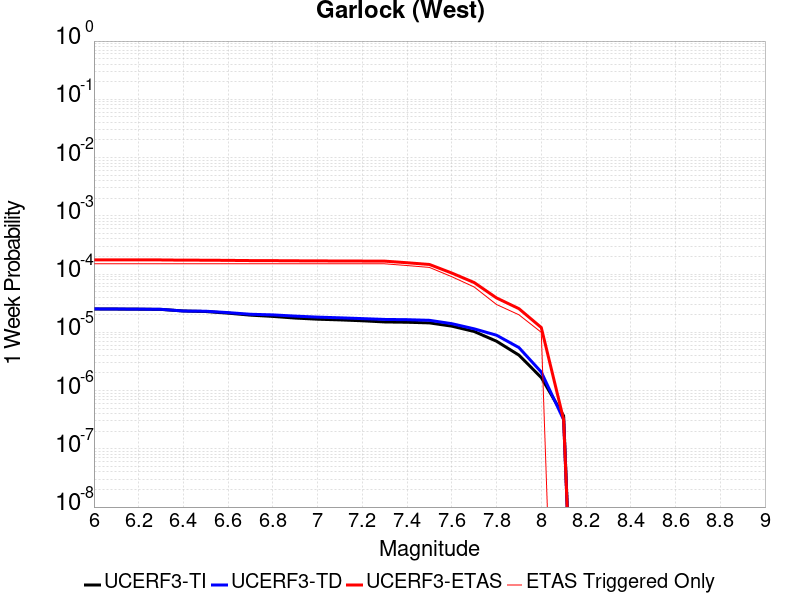 |  | 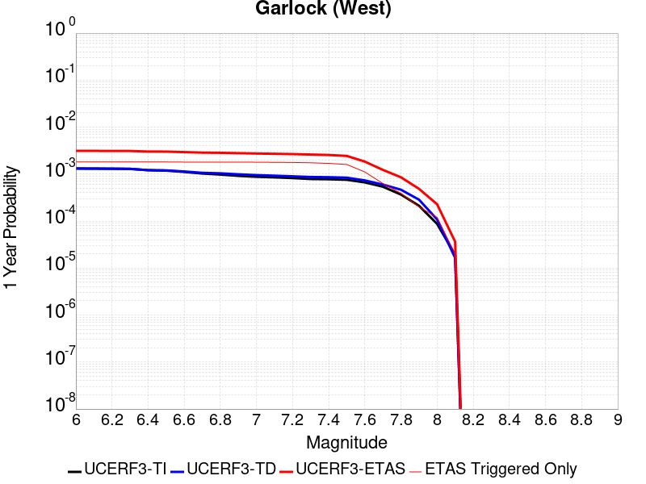 |  |

| Magnitude | 1 wk TI Prob | 1 wk TD Prob | 1 wk ETAS Prob | 1 wk ETAS/TD Gain | 1 wk ETAS Triggered Only | 1 mo TI Prob | 1 mo TD Prob | 1 mo ETAS Prob | 1 mo ETAS/TD Gain | 1 mo ETAS Triggered Only | 1 yr TI Prob | 1 yr TD Prob | 1 yr ETAS Prob | 1 yr ETAS/TD Gain | 1 yr ETAS Triggered Only | 10 yr TI Prob | 10 yr TD Prob | 10 yr ETAS Prob | 10 yr ETAS/TD Gain | 10 yr ETAS Triggered Only |
|-----|-----|-----|-----|-----|-----|-----|-----|-----|-----|-----|-----|-----|-----|-----|-----|-----|-----|-----|-----|-----|
| 6.0 | 2.5181727E-5 | 2.5216248E-5 | 1.7521247E-4 | 6.9483953 | 1.5E-4 | 1.0791722E-4 | 1.0806518E-4 | 5.780144E-4 | 5.348757 | 4.7E-4 | 0.0013131002 | 0.0013149029 | 0.003122523 | 2.3747175 | 0.00181 | 0.013053683 | 0.013152735 | 0.016981702 | 1.2911156 | 0.00388 |
| 6.1 | 2.5077732E-5 | 2.5117288E-5 | 1.7511351E-4 | 6.9718323 | 1.5E-4 | 1.0747157E-4 | 1.0764109E-4 | 5.775905E-4 | 5.365892 | 4.7E-4 | 0.001307681 | 0.001309746 | 0.0031173753 | 2.3801374 | 0.00181 | 0.013000126 | 0.013101775 | 0.01693094 | 1.292263 | 0.00388 |
| 6.2 | 2.494612E-5 | 2.4998972E-5 | 1.7499522E-4 | 7.000097 | 1.5E-4 | 1.0690756E-4 | 1.0713407E-4 | 5.7708373E-4 | 5.3865566 | 4.7E-4 | 0.0013008224 | 0.0013035802 | 0.0031112207 | 2.3866737 | 0.00181 | 0.012932341 | 0.0130408425 | 0.016870243 | 1.2936468 | 0.00388 |
| 6.3 | 2.4733758E-5 | 2.4818324E-5 | 1.748146E-4 | 7.0437713 | 1.5E-4 | 1.0599751E-4 | 1.0635993E-4 | 5.763099E-4 | 5.4184875 | 4.7E-4 | 0.0012897556 | 0.0012941663 | 0.0031018239 | 2.3967738 | 0.00181 | 0.012822957 | 0.012947805 | 0.016777568 | 1.2957847 | 0.00388 |
| 6.4 | 2.3237335E-5 | 2.3197525E-5 | 1.7319404E-4 | 7.466057 | 1.5E-4 | 9.958477E-5 | 9.9414196E-5 | 5.693675E-4 | 5.7272253 | 4.7E-4 | 0.0012117702 | 0.0012096985 | 0.003017509 | 2.4944305 | 0.00181 | 0.012051838 | 0.012112607 | 0.015935732 | 1.3156319 | 0.00387 |
| 6.5 | 2.2732203E-5 | 2.3011888E-5 | 1.7300843E-4 | 7.51822 | 1.5E-4 | 9.742009E-5 | 9.8618664E-5 | 5.685723E-4 | 5.7653623 | 4.7E-4 | 0.0011854442 | 0.0012000237 | 0.0030078515 | 2.5064936 | 0.00181 | 0.011791403 | 0.012016909 | 0.015840404 | 1.3181763 | 0.00387 |
| 6.6 | 2.1319436E-5 | 2.179202E-5 | 1.7178875E-4 | 7.8831034 | 1.5E-4 | 9.136581E-5 | 9.339105E-5 | 5.6334713E-4 | 6.032132 | 4.7E-4 | 0.001111811 | 0.0011364452 | 0.0029343995 | 2.5820863 | 0.0018 | 0.011062649 | 0.011387785 | 0.015193942 | 1.3342316 | 0.00385 |
| 6.7 | 1.970802E-5 | 2.0411735E-5 | 1.7040868E-4 | 8.348564 | 1.5E-4 | 8.446021E-5 | 8.747594E-5 | 5.574348E-4 | 6.372436 | 4.7E-4 | 0.001027818 | 0.0010645009 | 0.0028625848 | 2.6891332 | 0.0018 | 0.010230771 | 0.010675436 | 0.014484335 | 1.356791 | 0.00385 |
| 6.8 | 1.8744462E-5 | 1.9919305E-5 | 1.6991631E-4 | 8.530233 | 1.5E-4 | 8.033094E-5 | 8.536567E-5 | 5.5532553E-4 | 6.505256 | 4.7E-4 | 9.775903E-4 | 0.0010388332 | 0.0028369632 | 2.7309134 | 0.0018 | 0.009733009 | 0.0104211895 | 0.014231068 | 1.3655896 | 0.00385 |
| 6.9 | 1.7559682E-5 | 1.8971561E-5 | 1.6896872E-4 | 8.906422 | 1.5E-4 | 7.5253614E-5 | 8.130416E-5 | 5.5126596E-4 | 6.780292 | 4.7E-4 | 9.158276E-4 | 9.894301E-4 | 0.0027876492 | 2.817429 | 0.0018 | 0.0091206245 | 0.009931459 | 0.013743223 | 1.3838071 | 0.00385 |
| 7.0 | 1.6794445E-5 | 1.823424E-5 | 1.682315E-4 | 9.226132 | 1.5E-4 | 7.197421E-5 | 7.81444E-5 | 5.3810846E-4 | 6.886078 | 4.6E-4 | 8.759337E-4 | 9.509942E-4 | 0.0027392919 | 2.8804507 | 0.00179 | 0.008724891 | 0.009550322 | 0.013323936 | 1.3951294 | 0.00381 |
| 7.1 | 1.6337795E-5 | 1.7734945E-5 | 1.6773229E-4 | 9.457728 | 1.5E-4 | 7.0017246E-5 | 7.60047E-5 | 5.3596974E-4 | 7.0517974 | 4.6E-4 | 8.521265E-4 | 9.249657E-4 | 0.0027033193 | 2.9226158 | 0.00178 | 0.008488664 | 0.00929198 | 0.013046764 | 1.4040886 | 0.00379 |
| 7.2 | 1.5780008E-5 | 1.7183505E-5 | 1.6718093E-4 | 9.729152 | 1.5E-4 | 6.762685E-5 | 7.3641524E-5 | 5.336077E-4 | 7.246016 | 4.6E-4 | 8.2304585E-4 | 8.9621806E-4 | 0.0026646317 | 2.9731958 | 0.00177 | 0.008200042 | 0.009006796 | 0.012713111 | 1.411502 | 0.00374 |
| 7.3 | 1.5058865E-5 | 1.6636446E-5 | 1.6663395E-4 | 10.016199 | 1.5E-4 | 6.45364E-5 | 7.129711E-5 | 5.312643E-4 | 7.4514146 | 4.6E-4 | 7.854473E-4 | 8.676978E-4 | 0.002606188 | 3.0035665 | 0.00174 | 0.00782677 | 0.00872343 | 0.012381241 | 1.4193087 | 0.00369 |
| 7.4 | 1.4887923E-5 | 1.6472359E-5 | 1.5647005E-4 | 9.498946 | 1.4E-4 | 6.380382E-5 | 7.0593924E-5 | 5.1056285E-4 | 7.232391 | 4.4E-4 | 7.7653467E-4 | 8.591433E-4 | 0.0025476913 | 2.9653857 | 0.00169 | 0.0077382675 | 0.008638229 | 0.012167477 | 1.4085615 | 0.00356 |
| 7.5 | 1.4509299E-5 | 1.6064254E-5 | 1.4606217E-4 | 9.092372 | 1.3E-4 | 6.218123E-5 | 6.8844995E-5 | 4.8881606E-4 | 7.1002417 | 4.2E-4 | 7.567935E-4 | 8.378666E-4 | 0.0024365261 | 2.908012 | 0.0016 | 0.0075422134 | 0.008426482 | 0.011718506 | 1.390676 | 0.00332 |
| 7.6 | 1.2756717E-5 | 1.4067613E-5 | 1.0406635E-4 | 7.397584 | 9.0E-5 | 5.4670498E-5 | 6.028838E-5 | 3.302721E-4 | 5.4782047 | 2.7E-4 | 6.6541E-4 | 7.337645E-4 | 0.00184295 | 2.511637 | 0.00111 | 0.006634211 | 0.0073910584 | 0.009584724 | 1.2967999 | 0.00221 |
| 7.7 | 1.0328985E-5 | 1.1476324E-5 | 7.147564E-5 | 6.228095 | 6.0E-5 | 4.4266326E-5 | 4.9183323E-5 | 2.3917398E-4 | 4.8629084 | 1.9E-4 | 5.388092E-4 | 5.986428E-4 | 0.0012282657 | 2.0517504 | 6.3E-4 | 0.0053750467 | 0.006046964 | 0.0073092845 | 1.2087528 | 0.00127 |
| 7.8 | 7.0306583E-6 | 8.912348E-6 | 3.891208E-5 | 4.3660865 | 3.0E-5 | 3.0131043E-5 | 3.819522E-5 | 1.5819064E-4 | 4.1416345 | 1.2E-4 | 3.667837E-4 | 4.6492773E-4 | 8.547464E-4 | 1.8384501 | 3.9E-4 | 0.003661789 | 0.004702143 | 0.005548146 | 1.1799186 | 8.5E-4 |
| 7.9 | 4.060633E-6 | 5.472873E-6 | 2.5472764E-5 | 4.654368 | 2.0E-5 | 1.7402595E-5 | 2.3454959E-5 | 9.345332E-5 | 3.9843733 | 7.0E-5 | 2.11856E-4 | 2.8552682E-4 | 4.854697E-4 | 1.7002596 | 2.0E-4 | 0.0021165414 | 0.0028883645 | 0.003366978 | 1.165704 | 4.8E-4 |
| 8.0 | 1.6729537E-6 | 2.080019E-6 | 1.2079999E-5 | 5.807638 | 1.0E-5 | 7.169782E-6 | 8.914337E-6 | 6.89138E-5 | 7.7306705 | 6.0E-5 | 8.7288594E-5 | 1.08526685E-4 | 2.2851366E-4 | 2.105599 | 1.2E-4 | 8.7254314E-4 | 0.0010985459 | 0.0013382823 | 1.2182306 | 2.4E-4 |
| 8.1 | 3.6733252E-7 | 3.1523513E-7 | 3.1523513E-7 | 1.0 | 0.0 | 1.5742813E-6 | 1.3510071E-6 | 1.3510071E-6 | 1.0 | 0.0 | 1.9166706E-5 | 1.6448403E-5 | 3.6448073E-5 | 2.2159035 | 2.0E-5 | 1.9165053E-4 | 1.6662726E-4 | 1.9662226E-4 | 1.1800126 | 3.0E-5 |

## Gravel Hills-Harper Lk
*[(top)](#table-of-contents)*

| 1 Week | 1 Month | 1 Year | 10 Year |
|-----|-----|-----|-----|
|  |  |  |  |

| Magnitude | 1 wk TI Prob | 1 wk TD Prob | 1 wk ETAS Prob | 1 wk ETAS/TD Gain | 1 wk ETAS Triggered Only | 1 mo TI Prob | 1 mo TD Prob | 1 mo ETAS Prob | 1 mo ETAS/TD Gain | 1 mo ETAS Triggered Only | 1 yr TI Prob | 1 yr TD Prob | 1 yr ETAS Prob | 1 yr ETAS/TD Gain | 1 yr ETAS Triggered Only | 10 yr TI Prob | 10 yr TD Prob | 10 yr ETAS Prob | 10 yr ETAS/TD Gain | 10 yr ETAS Triggered Only |
|-----|-----|-----|-----|-----|-----|-----|-----|-----|-----|-----|-----|-----|-----|-----|-----|-----|-----|-----|-----|-----|
| 6.0 | 3.0679566E-5 | 3.146678E-5 | 1.3146363E-4 | 4.1778545 | 1.0E-4 | 1.3147724E-4 | 1.3485189E-4 | 5.247993E-4 | 3.891672 | 3.9E-4 | 0.0015995599 | 0.0016408021 | 0.0032281934 | 1.9674482 | 0.00159 | 0.015880952 | 0.016308447 | 0.019416912 | 1.1906046 | 0.00316 |
| 6.1 | 3.0679566E-5 | 3.146678E-5 | 1.3146363E-4 | 4.1778545 | 1.0E-4 | 1.3147724E-4 | 1.3485189E-4 | 5.247993E-4 | 3.891672 | 3.9E-4 | 0.0015995599 | 0.0016408021 | 0.0032281934 | 1.9674482 | 0.00159 | 0.015880952 | 0.016308447 | 0.019416912 | 1.1906046 | 0.00316 |
| 6.2 | 1.514536E-5 | 1.3635941E-5 | 5.3635395E-5 | 3.9333842 | 4.0E-5 | 6.490707E-5 | 5.843851E-5 | 2.0842974E-4 | 3.5666506 | 1.5E-4 | 7.8995706E-4 | 7.1126845E-4 | 0.0012408915 | 1.7446176 | 5.3E-4 | 0.007871548 | 0.0070911213 | 0.008143605 | 1.1484227 | 0.00106 |
| 6.3 | 1.514536E-5 | 1.3635941E-5 | 5.3635395E-5 | 3.9333842 | 4.0E-5 | 6.490707E-5 | 5.843851E-5 | 2.0842974E-4 | 3.5666506 | 1.5E-4 | 7.8995706E-4 | 7.1126845E-4 | 0.0012408915 | 1.7446176 | 5.3E-4 | 0.007871548 | 0.0070911213 | 0.008143605 | 1.1484227 | 0.00106 |
| 6.4 | 1.2532521E-5 | 1.0690225E-5 | 4.0689905E-5 | 3.806272 | 3.0E-5 | 5.37097E-5 | 4.581448E-5 | 1.458099E-4 | 3.182616 | 1.0E-4 | 6.537194E-4 | 5.5765436E-4 | 8.9746475E-4 | 1.6093566 | 3.4E-4 | 0.0065179965 | 0.00556314 | 0.0062294127 | 1.1197656 | 6.7E-4 |
| 6.5 | 1.1094058E-5 | 9.084098E-6 | 3.9083825E-5 | 4.3024445 | 3.0E-5 | 4.7545094E-5 | 3.8931288E-5 | 1.2892779E-4 | 3.311675 | 9.0E-5 | 5.787078E-4 | 4.738894E-4 | 7.437615E-4 | 1.5694832 | 2.7E-4 | 0.0057720304 | 0.004729196 | 0.005216879 | 1.1031216 | 4.9E-4 |
| 6.6 | 9.688328E-6 | 7.5320436E-6 | 2.7531893E-5 | 3.6553018 | 2.0E-5 | 4.1520743E-5 | 3.22798E-5 | 9.227786E-5 | 2.8586874 | 6.0E-5 | 5.053978E-4 | 3.9293827E-4 | 5.6287146E-4 | 1.4324679 | 1.7E-4 | 0.0050424994 | 0.0039226916 | 0.0042314758 | 1.0787174 | 3.1E-4 |
| 6.7 | 8.974824E-6 | 6.7497213E-6 | 1.6749655E-5 | 2.4815326 | 1.0E-5 | 3.8462964E-5 | 2.8927068E-5 | 6.892591E-5 | 2.382748 | 4.0E-5 | 4.6818596E-4 | 3.5213237E-4 | 4.720901E-4 | 1.3406609 | 1.2E-4 | 0.004672008 | 0.0035159648 | 0.003755121 | 1.0680201 | 2.4E-4 |
| 6.8 | 7.4780046E-6 | 5.1164225E-6 | 1.5116371E-5 | 2.9544806 | 1.0E-5 | 3.20482E-5 | 2.1927348E-5 | 4.192691E-5 | 1.912083 | 2.0E-5 | 3.9011694E-4 | 2.6693416E-4 | 3.2691815E-4 | 1.2247145 | 6.0E-5 | 0.0038943281 | 0.0026662734 | 0.0027759802 | 1.041146 | 1.1E-4 |
| 6.9 | 6.3409307E-6 | 3.9076735E-6 | 1.3907635E-5 | 3.5590575 | 1.0E-5 | 2.7175134E-5 | 1.674707E-5 | 2.6746904E-5 | 1.5971093 | 1.0E-5 | 3.3080703E-4 | 2.038775E-4 | 2.4386935E-4 | 1.1961563 | 4.0E-5 | 0.0033031502 | 0.0020370027 | 0.0020869009 | 1.0244958 | 5.0E-5 |
| 7.0 | 5.1239335E-6 | 2.605978E-6 | 1.2605952E-5 | 4.8373213 | 1.0E-5 | 2.195953E-5 | 1.116843E-5 | 2.1168318E-5 | 1.895371 | 1.0E-5 | 2.6732447E-4 | 1.359674E-4 | 1.5596469E-4 | 1.1470741 | 2.0E-5 | 0.0026700313 | 0.0013588674 | 0.0013788402 | 1.0146981 | 2.0E-5 |
| 7.1 | 4.438899E-6 | 2.0985767E-6 | 1.2098556E-5 | 5.7651243 | 1.0E-5 | 1.9023713E-5 | 8.99387E-6 | 1.899378E-5 | 2.1118584 | 1.0E-5 | 2.315891E-4 | 1.0949509E-4 | 1.294929E-4 | 1.1826366 | 2.0E-5 | 0.002313479 | 0.0010944332 | 0.0011144114 | 1.0182543 | 2.0E-5 |
| 7.2 | 3.50367E-6 | 1.2616476E-6 | 1.1261635E-5 | 8.926133 | 1.0E-5 | 1.5015643E-5 | 5.4070506E-6 | 1.5406997E-5 | 2.8494272 | 1.0E-5 | 1.8280011E-4 | 6.5828935E-5 | 7.582828E-5 | 1.1518989 | 1.0E-5 | 0.0018264982 | 6.5810257E-4 | 6.6809595E-4 | 1.0151852 | 1.0E-5 |
| 7.3 | 2.561638E-6 | 7.1193233E-7 | 7.1193233E-7 | 1.0 | 0.0 | 1.0978401E-5 | 3.051135E-6 | 3.051135E-6 | 1.0 | 0.0 | 1.3365384E-4 | 3.7146954E-5 | 3.7146954E-5 | 1.0 | 0.0 | 0.0013357349 | 3.7140946E-4 | 3.7140946E-4 | 1.0 | 0.0 |
| 7.4 | 2.0368864E-6 | 5.304974E-7 | 5.304974E-7 | 1.0 | 0.0 | 8.729483E-6 | 2.2735583E-6 | 2.2735583E-6 | 1.0 | 0.0 | 1.06276275E-4 | 2.7680228E-5 | 2.7680228E-5 | 1.0 | 0.0 | 0.0010622547 | 2.7676832E-4 | 2.7676832E-4 | 1.0 | 0.0 |
| 7.5 | 1.1681728E-6 | 3.6031344E-7 | 3.6031344E-7 | 1.0 | 0.0 | 5.0064455E-6 | 1.5441996E-6 | 1.5441996E-6 | 1.0 | 0.0 | 6.0951766E-5 | 1.8800472E-5 | 1.8800472E-5 | 1.0 | 0.0 | 6.093505E-4 | 1.8798928E-4 | 1.8798928E-4 | 1.0 | 0.0 |
| 7.6 | 1.3154387E-7 | 7.119929E-8 | 7.119929E-8 | 1.0 | 0.0 | 5.6375933E-7 | 3.0513976E-7 | 3.0513976E-7 | 1.0 | 0.0 | 6.863748E-6 | 3.715072E-6 | 3.715072E-6 | 1.0 | 0.0 | 6.863536E-5 | 3.7150257E-5 | 3.7150257E-5 | 1.0 | 0.0 |

## McLean Lake
*[(top)](#table-of-contents)*

| 1 Week | 1 Month | 1 Year | 10 Year |
|-----|-----|-----|-----|
|  |  |  |  |

| Magnitude | 1 wk TI Prob | 1 wk TD Prob | 1 wk ETAS Prob | 1 wk ETAS/TD Gain | 1 wk ETAS Triggered Only | 1 mo TI Prob | 1 mo TD Prob | 1 mo ETAS Prob | 1 mo ETAS/TD Gain | 1 mo ETAS Triggered Only | 1 yr TI Prob | 1 yr TD Prob | 1 yr ETAS Prob | 1 yr ETAS/TD Gain | 1 yr ETAS Triggered Only | 10 yr TI Prob | 10 yr TD Prob | 10 yr ETAS Prob | 10 yr ETAS/TD Gain | 10 yr ETAS Triggered Only |
|-----|-----|-----|-----|-----|-----|-----|-----|-----|-----|-----|-----|-----|-----|-----|-----|-----|-----|-----|-----|-----|
| 6.0 | 1.7360222E-5 | 1.8502275E-5 | 5.8501533E-5 | 3.1618564 | 4.0E-5 | 7.439883E-5 | 7.929332E-5 | 3.192743E-4 | 4.0264964 | 2.4E-4 | 9.0542925E-4 | 9.6501724E-4 | 0.0022337916 | 2.3147686 | 0.00127 | 0.009017491 | 0.009613109 | 0.012495135 | 1.2998016 | 0.00291 |
| 6.1 | 9.062689E-6 | 9.592492E-6 | 1.9592395E-5 | 2.0424721 | 1.0E-5 | 3.8839516E-5 | 4.1110077E-5 | 1.8110432E-4 | 4.405351 | 1.4E-4 | 4.727685E-4 | 5.0040917E-4 | 0.0012400389 | 2.47805 | 7.4E-4 | 0.0047176396 | 0.0049937065 | 0.006555866 | 1.3128258 | 0.00157 |
| 6.2 | 9.062689E-6 | 9.592492E-6 | 1.9592395E-5 | 2.0424721 | 1.0E-5 | 3.8839516E-5 | 4.1110077E-5 | 1.8110432E-4 | 4.405351 | 1.4E-4 | 4.727685E-4 | 5.0040917E-4 | 0.0012400389 | 2.47805 | 7.4E-4 | 0.0047176396 | 0.0049937065 | 0.006555866 | 1.3128258 | 0.00157 |
| 6.3 | 7.2575485E-6 | 7.66794E-6 | 1.7667862E-5 | 2.3041213 | 1.0E-5 | 3.110341E-5 | 3.2862223E-5 | 1.3285894E-4 | 4.0429077 | 1.0E-4 | 3.786182E-4 | 4.0003125E-4 | 9.3981525E-4 | 2.3493545 | 5.4E-4 | 0.0037797375 | 0.003993816 | 0.005228864 | 1.30924 | 0.00124 |
| 6.4 | 7.2575485E-6 | 7.66794E-6 | 1.7667862E-5 | 2.3041213 | 1.0E-5 | 3.110341E-5 | 3.2862223E-5 | 1.3285894E-4 | 4.0429077 | 1.0E-4 | 3.786182E-4 | 4.0003125E-4 | 9.3981525E-4 | 2.3493545 | 5.4E-4 | 0.0037797375 | 0.003993816 | 0.005228864 | 1.30924 | 0.00124 |
| 6.5 | 6.06582E-6 | 6.4040664E-6 | 1.6404003E-5 | 2.5614977 | 1.0E-5 | 2.5996113E-5 | 2.7445747E-5 | 1.1744328E-4 | 4.2791066 | 9.0E-5 | 3.164567E-4 | 3.3410723E-4 | 7.839569E-4 | 2.346423 | 4.5E-4 | 0.0031600643 | 0.0033366878 | 0.004413084 | 1.3225943 | 0.00108 |
| 6.6 | 5.598744E-6 | 5.910437E-6 | 1.5910378E-5 | 2.6919124 | 1.0E-5 | 2.3994397E-5 | 2.5330233E-5 | 1.1532795E-4 | 4.552976 | 9.0E-5 | 2.9209262E-4 | 3.0835834E-4 | 7.182319E-4 | 2.329212 | 4.1E-4 | 0.0029170897 | 0.003079934 | 0.004076854 | 1.3236823 | 0.001 |
| 6.7 | 5.246996E-6 | 5.5393257E-6 | 1.553927E-5 | 2.8052638 | 1.0E-5 | 2.2486933E-5 | 2.3739787E-5 | 8.373836E-5 | 3.5273426 | 6.0E-5 | 2.73744E-4 | 2.8899993E-4 | 6.5889297E-4 | 2.2799072 | 3.7E-4 | 0.0027340704 | 0.0028868648 | 0.0037842668 | 1.3108569 | 9.0E-4 |
| 6.8 | 4.02324E-6 | 4.2470297E-6 | 1.4246987E-5 | 3.3545768 | 1.0E-5 | 1.7242342E-5 | 1.8201463E-5 | 5.8200734E-5 | 3.1975856 | 4.0E-5 | 2.099053E-4 | 2.2158623E-4 | 5.2151975E-4 | 2.3535748 | 3.0E-4 | 0.0020970714 | 0.0022142373 | 0.0028827537 | 1.3019173 | 6.7E-4 |
| 6.9 | 6.835972E-7 | 7.140097E-7 | 7.140097E-7 | 1.0 | 0.0 | 2.9296991E-6 | 3.0600397E-6 | 3.0600397E-6 | 1.0 | 0.0 | 3.56685E-5 | 3.7255664E-5 | 4.7255293E-5 | 1.2684056 | 1.0E-5 | 3.5662777E-4 | 3.7252545E-4 | 4.5249565E-4 | 1.2146704 | 8.0E-5 |

## Goldstone Lake
*[(top)](#table-of-contents)*

| 1 Week | 1 Month | 1 Year | 10 Year |
|-----|-----|-----|-----|
|  |  |  | 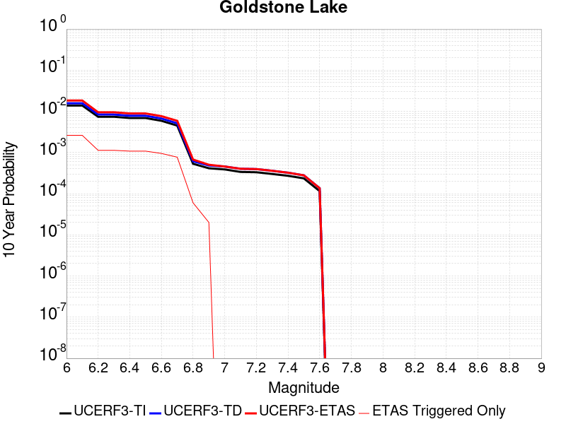 |

| Magnitude | 1 wk TI Prob | 1 wk TD Prob | 1 wk ETAS Prob | 1 wk ETAS/TD Gain | 1 wk ETAS Triggered Only | 1 mo TI Prob | 1 mo TD Prob | 1 mo ETAS Prob | 1 mo ETAS/TD Gain | 1 mo ETAS Triggered Only | 1 yr TI Prob | 1 yr TD Prob | 1 yr ETAS Prob | 1 yr ETAS/TD Gain | 1 yr ETAS Triggered Only | 10 yr TI Prob | 10 yr TD Prob | 10 yr ETAS Prob | 10 yr ETAS/TD Gain | 10 yr ETAS Triggered Only |
|-----|-----|-----|-----|-----|-----|-----|-----|-----|-----|-----|-----|-----|-----|-----|-----|-----|-----|-----|-----|-----|
| 6.0 | 2.671352E-5 | 3.0378256E-5 | 1.10375826E-4 | 3.6333826 | 8.0E-5 | 1.1448149E-4 | 1.3018714E-4 | 3.901533E-4 | 2.996865 | 2.6E-4 | 0.001392921 | 0.0015840722 | 0.0027122824 | 1.7122213 | 0.00113 | 0.013842222 | 0.01574731 | 0.01831621 | 1.1631325 | 0.00261 |
| 6.1 | 2.671352E-5 | 3.0378256E-5 | 1.10375826E-4 | 3.6333826 | 8.0E-5 | 1.1448149E-4 | 1.3018714E-4 | 3.901533E-4 | 2.996865 | 2.6E-4 | 0.001392921 | 0.0015840722 | 0.0027122824 | 1.7122213 | 0.00113 | 0.013842222 | 0.01574731 | 0.01831621 | 1.1631325 | 0.00261 |
| 6.2 | 1.4197047E-5 | 1.609734E-5 | 6.609653E-5 | 4.1060534 | 5.0E-5 | 6.0843064E-5 | 6.898733E-5 | 2.2897629E-4 | 3.3191066 | 1.6E-4 | 7.4051257E-4 | 8.396957E-4 | 0.0013792423 | 1.6425501 | 5.4E-4 | 0.007380498 | 0.008374927 | 0.009495463 | 1.1337966 | 0.00113 |
| 6.3 | 1.4197047E-5 | 1.609734E-5 | 6.609653E-5 | 4.1060534 | 5.0E-5 | 6.0843064E-5 | 6.898733E-5 | 2.2897629E-4 | 3.3191066 | 1.6E-4 | 7.4051257E-4 | 8.396957E-4 | 0.0013792423 | 1.6425501 | 5.4E-4 | 0.007380498 | 0.008374927 | 0.009495463 | 1.1337966 | 0.00113 |
| 6.4 | 1.3238931E-5 | 1.5009476E-5 | 5.5008877E-5 | 3.6649432 | 4.0E-5 | 5.6737044E-5 | 6.432529E-5 | 2.1431565E-4 | 3.3317478 | 1.5E-4 | 6.9055456E-4 | 7.8297703E-4 | 0.0012925777 | 1.65085 | 5.1E-4 | 0.006884126 | 0.0078118113 | 0.008883375 | 1.1371722 | 0.00108 |
| 6.5 | 1.3238931E-5 | 1.5009476E-5 | 5.5008877E-5 | 3.6649432 | 4.0E-5 | 5.6737044E-5 | 6.432529E-5 | 2.1431565E-4 | 3.3317478 | 1.5E-4 | 6.9055456E-4 | 7.8297703E-4 | 0.0012925777 | 1.65085 | 5.1E-4 | 0.006884126 | 0.0078118113 | 0.008883375 | 1.1371722 | 0.00108 |
| 6.6 | 1.1328278E-5 | 1.2856037E-5 | 5.285552E-5 | 4.1113386 | 4.0E-5 | 4.8548856E-5 | 5.5096676E-5 | 2.050884E-4 | 3.7223372 | 1.5E-4 | 5.90922E-4 | 6.7069125E-4 | 0.0011303828 | 1.6853995 | 4.6E-4 | 0.0058935313 | 0.0066960617 | 0.0076397005 | 1.1409245 | 9.5E-4 |
| 6.7 | 8.651175E-6 | 9.825223E-6 | 4.982483E-5 | 5.071114 | 4.0E-5 | 3.707594E-5 | 4.210793E-5 | 1.521033E-4 | 3.6122246 | 1.1E-4 | 4.5130608E-4 | 5.12634E-4 | 8.824443E-4 | 1.7213925 | 3.7E-4 | 0.0045039062 | 0.0051233945 | 0.0058894497 | 1.149521 | 7.7E-4 |
| 6.8 | 1.0215377E-6 | 1.1755159E-6 | 1.1755159E-6 | 1.0 | 0.0 | 4.378012E-6 | 5.0379163E-6 | 2.5037816E-5 | 4.9698753 | 2.0E-5 | 5.3300988E-5 | 6.133502E-5 | 1.0133257E-4 | 1.6521161 | 4.0E-5 | 5.3288206E-4 | 6.1319215E-4 | 6.7315536E-4 | 1.0977886 | 6.0E-5 |
| 6.9 | 7.9360774E-7 | 9.283743E-7 | 9.283743E-7 | 1.0 | 0.0 | 3.4011714E-6 | 3.978741E-6 | 1.3978702E-5 | 3.5133479 | 1.0E-5 | 4.1408475E-5 | 4.8440168E-5 | 5.8439684E-5 | 1.2064302 | 1.0E-5 | 4.140076E-4 | 4.8430308E-4 | 5.042934E-4 | 1.0412765 | 2.0E-5 |
| 7.0 | 7.4382757E-7 | 8.7476525E-7 | 8.7476525E-7 | 1.0 | 0.0 | 3.1878285E-6 | 3.748989E-6 | 3.748989E-6 | 1.0 | 0.0 | 3.8811122E-5 | 4.5643053E-5 | 4.5643053E-5 | 1.0 | 0.0 | 3.8804344E-4 | 4.5634343E-4 | 4.5634343E-4 | 1.0 | 0.0 |
| 7.1 | 6.4709513E-7 | 7.711585E-7 | 7.711585E-7 | 1.0 | 0.0 | 2.773262E-6 | 3.3049612E-6 | 3.3049612E-6 | 1.0 | 0.0 | 3.376394E-5 | 4.023722E-5 | 4.023722E-5 | 1.0 | 0.0 | 3.375881E-4 | 4.023053E-4 | 4.023053E-4 | 1.0 | 0.0 |
| 7.2 | 6.356704E-7 | 7.5886396E-7 | 7.5886396E-7 | 1.0 | 0.0 | 2.7242988E-6 | 3.2522705E-6 | 3.2522705E-6 | 1.0 | 0.0 | 3.3167835E-5 | 3.9595736E-5 | 3.9595736E-5 | 1.0 | 0.0 | 3.3162883E-4 | 3.9589274E-4 | 3.9589274E-4 | 1.0 | 0.0 |
| 7.3 | 5.7695723E-7 | 6.8968285E-7 | 6.8968285E-7 | 1.0 | 0.0 | 2.4726714E-6 | 2.9557807E-6 | 2.9557807E-6 | 1.0 | 0.0 | 3.0104358E-5 | 3.5986093E-5 | 3.5986093E-5 | 1.0 | 0.0 | 3.0100282E-4 | 3.598084E-4 | 3.598084E-4 | 1.0 | 0.0 |
| 7.4 | 5.209647E-7 | 6.1937425E-7 | 6.1937425E-7 | 1.0 | 0.0 | 2.232704E-6 | 2.6544587E-6 | 2.6544587E-6 | 1.0 | 0.0 | 2.718283E-5 | 3.231761E-5 | 3.231761E-5 | 1.0 | 0.0 | 2.7179506E-4 | 3.2313468E-4 | 3.2313468E-4 | 1.0 | 0.0 |
| 7.5 | 4.512955E-7 | 5.3490703E-7 | 5.3490703E-7 | 1.0 | 0.0 | 1.934122E-6 | 2.292457E-6 | 2.292457E-6 | 1.0 | 0.0 | 2.3547682E-5 | 2.791036E-5 | 2.791036E-5 | 1.0 | 0.0 | 2.3545188E-4 | 2.7907387E-4 | 2.7907387E-4 | 1.0 | 0.0 |
| 7.6 | 2.21172E-7 | 2.6040448E-7 | 2.6040448E-7 | 1.0 | 0.0 | 9.478797E-7 | 1.1160189E-6 | 1.1160189E-6 | 1.0 | 0.0 | 1.1540374E-5 | 1.3587473E-5 | 1.3587473E-5 | 1.0 | 0.0 | 1.1539775E-4 | 1.3586924E-4 | 1.3586924E-4 | 1.0 | 0.0 |

## So Sierra Nevada
*[(top)](#table-of-contents)*

| 1 Week | 1 Month | 1 Year | 10 Year |
|-----|-----|-----|-----|
|  |  |  |  |

| Magnitude | 1 wk TI Prob | 1 wk TD Prob | 1 wk ETAS Prob | 1 wk ETAS/TD Gain | 1 wk ETAS Triggered Only | 1 mo TI Prob | 1 mo TD Prob | 1 mo ETAS Prob | 1 mo ETAS/TD Gain | 1 mo ETAS Triggered Only | 1 yr TI Prob | 1 yr TD Prob | 1 yr ETAS Prob | 1 yr ETAS/TD Gain | 1 yr ETAS Triggered Only | 10 yr TI Prob | 10 yr TD Prob | 10 yr ETAS Prob | 10 yr ETAS/TD Gain | 10 yr ETAS Triggered Only |
|-----|-----|-----|-----|-----|-----|-----|-----|-----|-----|-----|-----|-----|-----|-----|-----|-----|-----|-----|-----|-----|
| 6.0 | 1.15488665E-5 | 1.1079929E-5 | 7.107927E-5 | 6.4151373 | 6.0E-5 | 4.9494203E-5 | 4.7484617E-5 | 2.5747463E-4 | 5.422275 | 2.1E-4 | 6.024253E-4 | 5.779846E-4 | 0.0014474818 | 2.5043604 | 8.7E-4 | 0.006007948 | 0.0057660826 | 0.007754551 | 1.3448559 | 0.002 |
| 6.1 | 1.15488665E-5 | 1.1079929E-5 | 7.107927E-5 | 6.4151373 | 6.0E-5 | 4.9494203E-5 | 4.7484617E-5 | 2.5747463E-4 | 5.422275 | 2.1E-4 | 6.024253E-4 | 5.779846E-4 | 0.0014474818 | 2.5043604 | 8.7E-4 | 0.006007948 | 0.0057660826 | 0.007754551 | 1.3448559 | 0.002 |
| 6.2 | 1.15488665E-5 | 1.1079929E-5 | 7.107927E-5 | 6.4151373 | 6.0E-5 | 4.9494203E-5 | 4.7484617E-5 | 2.5747463E-4 | 5.422275 | 2.1E-4 | 6.024253E-4 | 5.779846E-4 | 0.0014474818 | 2.5043604 | 8.7E-4 | 0.006007948 | 0.0057660826 | 0.007754551 | 1.3448559 | 0.002 |
| 6.3 | 1.15488665E-5 | 1.1079929E-5 | 7.107927E-5 | 6.4151373 | 6.0E-5 | 4.9494203E-5 | 4.7484617E-5 | 2.5747463E-4 | 5.422275 | 2.1E-4 | 6.024253E-4 | 5.779846E-4 | 0.0014474818 | 2.5043604 | 8.7E-4 | 0.006007948 | 0.0057660826 | 0.007754551 | 1.3448559 | 0.002 |
| 6.4 | 1.15488665E-5 | 1.1079929E-5 | 7.107927E-5 | 6.4151373 | 6.0E-5 | 4.9494203E-5 | 4.7484617E-5 | 2.5747463E-4 | 5.422275 | 2.1E-4 | 6.024253E-4 | 5.779846E-4 | 0.0014474818 | 2.5043604 | 8.7E-4 | 0.006007948 | 0.0057660826 | 0.007754551 | 1.3448559 | 0.002 |
| 6.5 | 1.15488665E-5 | 1.1079929E-5 | 7.107927E-5 | 6.4151373 | 6.0E-5 | 4.9494203E-5 | 4.7484617E-5 | 2.5747463E-4 | 5.422275 | 2.1E-4 | 6.024253E-4 | 5.779846E-4 | 0.0014474818 | 2.5043604 | 8.7E-4 | 0.006007948 | 0.0057660826 | 0.007754551 | 1.3448559 | 0.002 |
| 6.6 | 7.587044E-6 | 6.9358202E-6 | 2.6935682E-5 | 3.8835611 | 2.0E-5 | 3.2515498E-5 | 2.9724622E-5 | 1.19721946E-4 | 4.027703 | 9.0E-5 | 3.9580427E-4 | 3.618401E-4 | 7.916845E-4 | 2.1879401 | 4.3E-4 | 0.003951 | 0.003612801 | 0.0045992243 | 1.2730356 | 9.9E-4 |
| 6.7 | 7.587044E-6 | 6.9358202E-6 | 2.6935682E-5 | 3.8835611 | 2.0E-5 | 3.2515498E-5 | 2.9724622E-5 | 1.19721946E-4 | 4.027703 | 9.0E-5 | 3.9580427E-4 | 3.618401E-4 | 7.916845E-4 | 2.1879401 | 4.3E-4 | 0.003951 | 0.003612801 | 0.0045992243 | 1.2730356 | 9.9E-4 |
| 6.8 | 5.9026956E-6 | 5.179538E-6 | 2.5179434E-5 | 4.861328 | 2.0E-5 | 2.5297022E-5 | 2.2197837E-5 | 9.2196286E-5 | 4.1533904 | 7.0E-5 | 3.0794772E-4 | 2.7022633E-4 | 6.1013445E-4 | 2.2578645 | 3.4E-4 | 0.0030752132 | 0.0026990937 | 0.0034570422 | 1.280816 | 7.6E-4 |
| 6.9 | 5.0118915E-6 | 4.2525508E-6 | 1.4252508E-5 | 3.3515198 | 1.0E-5 | 2.1479358E-5 | 1.8225093E-5 | 6.822418E-5 | 3.7434201 | 5.0E-5 | 2.614798E-4 | 2.2186866E-4 | 4.8181097E-4 | 2.1716044 | 2.6E-4 | 0.0026117235 | 0.002216544 | 0.0027952585 | 1.2610886 | 5.8E-4 |
| 7.0 | 4.4924795E-6 | 3.7140323E-6 | 1.3713995E-5 | 3.6924813 | 1.0E-5 | 1.925334E-5 | 1.5917189E-5 | 4.591671E-5 | 2.884725 | 3.0E-5 | 2.3438422E-4 | 1.9377517E-4 | 4.1373254E-4 | 2.1351163 | 2.2E-4 | 0.0023413717 | 0.0019361249 | 0.002455118 | 1.2680577 | 5.2E-4 |
| 7.1 | 3.9118436E-6 | 3.1120794E-6 | 3.1120794E-6 | 1.0 | 0.0 | 1.6764936E-5 | 1.3337418E-5 | 3.333715E-5 | 2.4995205 | 2.0E-5 | 2.0409399E-4 | 1.6237154E-4 | 3.1234717E-4 | 1.9236573 | 1.5E-4 | 0.0020390663 | 0.001622585 | 0.002021936 | 1.2461202 | 4.0E-4 |
| 7.2 | 3.4200818E-6 | 2.605546E-6 | 2.605546E-6 | 1.0 | 0.0 | 1.4657411E-5 | 1.116658E-5 | 3.1166357E-5 | 2.7910385 | 2.0E-5 | 1.7843937E-4 | 1.3594514E-4 | 2.6592746E-4 | 1.9561381 | 1.3E-4 | 0.0017829615 | 0.0013586695 | 0.0017081939 | 1.257255 | 3.5E-4 |
| 7.3 | 2.6593618E-6 | 1.8284966E-6 | 1.8284966E-6 | 1.0 | 0.0 | 1.13972155E-5 | 7.836392E-6 | 1.7836313E-5 | 2.2760875 | 1.0E-5 | 1.3875226E-4 | 9.540419E-5 | 1.653975E-4 | 1.7336504 | 7.0E-5 | 0.0013866565 | 9.536612E-4 | 0.0011834418 | 1.2409458 | 2.3E-4 |
| 7.4 | 2.2577992E-6 | 1.4365053E-6 | 1.4365053E-6 | 1.0 | 0.0 | 9.676246E-6 | 6.156438E-6 | 1.6156377E-5 | 2.624306 | 1.0E-5 | 1.1780193E-4 | 7.495231E-5 | 1.2494856E-4 | 1.6670408 | 5.0E-5 | 0.001177395 | 7.4929534E-4 | 9.3915296E-4 | 1.2533816 | 1.9E-4 |
| 7.5 | 1.489319E-6 | 7.354422E-7 | 7.354422E-7 | 1.0 | 0.0 | 6.3827797E-6 | 3.1518912E-6 | 3.1518912E-6 | 1.0 | 0.0 | 7.770758E-5 | 3.8373604E-5 | 6.837245E-5 | 1.7817574 | 3.0E-5 | 7.7680405E-4 | 3.836702E-4 | 4.9362803E-4 | 1.2865945 | 1.1E-4 |
| 7.6 | 1.0680322E-6 | 4.659972E-7 | 4.659972E-7 | 1.0 | 0.0 | 4.577273E-6 | 1.9971294E-6 | 1.9971294E-6 | 1.0 | 0.0 | 5.5726876E-5 | 2.431478E-5 | 4.4314293E-5 | 1.8225249 | 2.0E-5 | 5.5712904E-4 | 2.4312147E-4 | 3.1310445E-4 | 1.2878519 | 7.0E-5 |
| 7.7 | 5.509146E-7 | 1.5581371E-7 | 1.5581371E-7 | 1.0 | 0.0 | 2.3610605E-6 | 6.677729E-7 | 6.677729E-7 | 1.0 | 0.0 | 2.8745531E-5 | 8.130106E-6 | 2.8129944E-5 | 3.4599726 | 2.0E-5 | 2.8741814E-4 | 8.1298196E-5 | 1.2129494E-4 | 1.4919758 | 4.0E-5 |

## Coyote Canyon
*[(top)](#table-of-contents)*

| 1 Week | 1 Month | 1 Year | 10 Year |
|-----|-----|-----|-----|
| 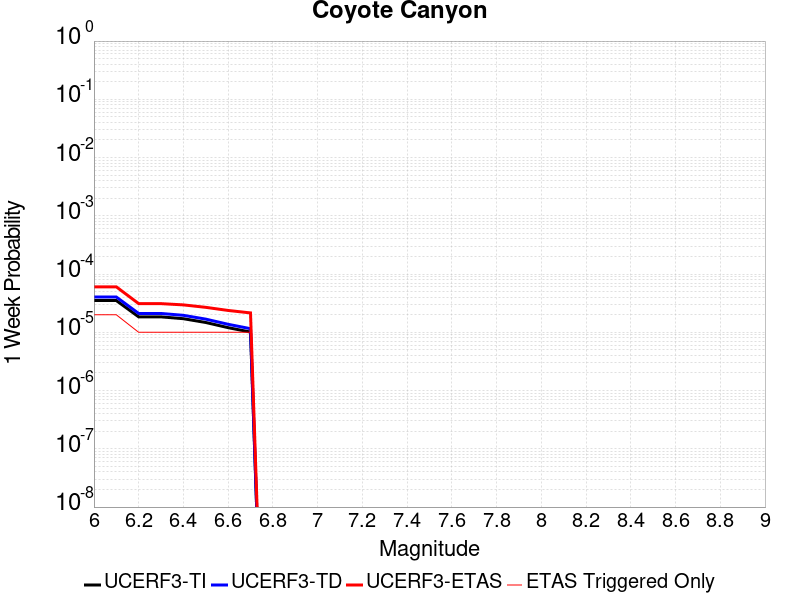 |  |  |  |

| Magnitude | 1 wk TI Prob | 1 wk TD Prob | 1 wk ETAS Prob | 1 wk ETAS/TD Gain | 1 wk ETAS Triggered Only | 1 mo TI Prob | 1 mo TD Prob | 1 mo ETAS Prob | 1 mo ETAS/TD Gain | 1 mo ETAS Triggered Only | 1 yr TI Prob | 1 yr TD Prob | 1 yr ETAS Prob | 1 yr ETAS/TD Gain | 1 yr ETAS Triggered Only | 10 yr TI Prob | 10 yr TD Prob | 10 yr ETAS Prob | 10 yr ETAS/TD Gain | 10 yr ETAS Triggered Only |
|-----|-----|-----|-----|-----|-----|-----|-----|-----|-----|-----|-----|-----|-----|-----|-----|-----|-----|-----|-----|-----|
| 6.0 | 3.5090034E-5 | 4.0367537E-5 | 6.0366732E-5 | 1.4954276 | 2.0E-5 | 1.503772E-4 | 1.729937E-4 | 2.729764E-4 | 1.5779557 | 1.0E-4 | 0.0018293047 | 0.0021044211 | 0.0026632426 | 1.2655464 | 5.6E-4 | 0.018143194 | 0.020870855 | 0.022466835 | 1.0764693 | 0.00163 |
| 6.1 | 3.5090034E-5 | 4.0367537E-5 | 6.0366732E-5 | 1.4954276 | 2.0E-5 | 1.503772E-4 | 1.729937E-4 | 2.729764E-4 | 1.5779557 | 1.0E-4 | 0.0018293047 | 0.0021044211 | 0.0026632426 | 1.2655464 | 5.6E-4 | 0.018143194 | 0.020870855 | 0.022466835 | 1.0764693 | 0.00163 |
| 6.2 | 1.841879E-5 | 2.1061396E-5 | 3.1061187E-5 | 1.4747924 | 1.0E-5 | 7.8935285E-5 | 9.0260575E-5 | 1.3025697E-4 | 1.4431213 | 4.0E-5 | 9.606133E-4 | 0.0010984705 | 0.0014181191 | 1.2909942 | 3.2E-4 | 0.0095647145 | 0.010940497 | 0.011889993 | 1.0867873 | 9.6E-4 |
| 6.3 | 1.841879E-5 | 2.1061396E-5 | 3.1061187E-5 | 1.4747924 | 1.0E-5 | 7.8935285E-5 | 9.0260575E-5 | 1.3025697E-4 | 1.4431213 | 4.0E-5 | 9.606133E-4 | 0.0010984705 | 0.0014181191 | 1.2909942 | 3.2E-4 | 0.0095647145 | 0.010940497 | 0.011889993 | 1.0867873 | 9.6E-4 |
| 6.4 | 1.712201E-5 | 1.9566693E-5 | 2.9566498E-5 | 1.5110625 | 1.0E-5 | 7.337798E-5 | 8.385513E-5 | 1.2385177E-4 | 1.4769732 | 4.0E-5 | 8.930107E-4 | 0.0010205586 | 0.0013302423 | 1.3034452 | 3.1E-4 | 0.008894307 | 0.010168638 | 0.0110891815 | 1.0905277 | 9.3E-4 |
| 6.5 | 1.4744935E-5 | 1.683824E-5 | 2.6838072E-5 | 1.5938764 | 1.0E-5 | 6.3191044E-5 | 7.216242E-5 | 1.1215953E-4 | 1.5542651 | 4.0E-5 | 7.6907943E-4 | 8.7831676E-4 | 0.0011580709 | 1.3185116 | 2.8E-4 | 0.007664232 | 0.008757652 | 0.009570471 | 1.0928124 | 8.2E-4 |
| 6.6 | 1.2017839E-5 | 1.3725124E-5 | 2.3724986E-5 | 1.728581 | 1.0E-5 | 5.150401E-5 | 5.882113E-5 | 9.8818775E-5 | 1.6799878 | 4.0E-5 | 6.268809E-4 | 7.1600056E-4 | 9.558287E-4 | 1.3349553 | 2.4E-4 | 0.0062511545 | 0.007145631 | 0.007820772 | 1.094483 | 6.8E-4 |
| 6.7 | 1.00956095E-5 | 1.1534388E-5 | 2.1534273E-5 | 1.8669627 | 1.0E-5 | 4.326618E-5 | 4.943265E-5 | 8.943067E-5 | 1.8091419 | 4.0E-5 | 5.266384E-4 | 6.0176325E-4 | 8.016429E-4 | 1.3321567 | 2.0E-4 | 0.005253921 | 0.006009866 | 0.0065366807 | 1.0876583 | 5.3E-4 |

## San Andreas (Mojave S)
*[(top)](#table-of-contents)*

| 1 Week | 1 Month | 1 Year | 10 Year |
|-----|-----|-----|-----|
|  | 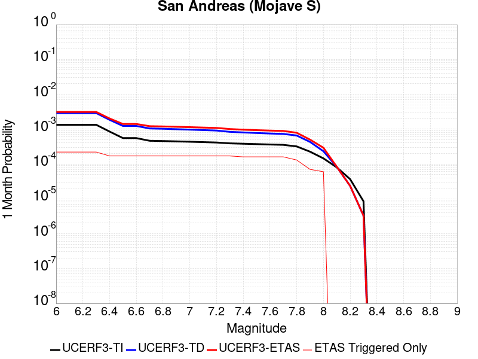 |  |  |

| Magnitude | 1 wk TI Prob | 1 wk TD Prob | 1 wk ETAS Prob | 1 wk ETAS/TD Gain | 1 wk ETAS Triggered Only | 1 mo TI Prob | 1 mo TD Prob | 1 mo ETAS Prob | 1 mo ETAS/TD Gain | 1 mo ETAS Triggered Only | 1 yr TI Prob | 1 yr TD Prob | 1 yr ETAS Prob | 1 yr ETAS/TD Gain | 1 yr ETAS Triggered Only | 10 yr TI Prob | 10 yr TD Prob | 10 yr ETAS Prob | 10 yr ETAS/TD Gain | 10 yr ETAS Triggered Only |
|-----|-----|-----|-----|-----|-----|-----|-----|-----|-----|-----|-----|-----|-----|-----|-----|-----|-----|-----|-----|-----|
| 6.0 | 3.1064058E-4 | 6.7501515E-4 | 7.449679E-4 | 1.1036314 | 7.0E-5 | 0.0013306376 | 0.002889843 | 0.0031092074 | 1.0759087 | 2.2E-4 | 0.016080605 | 0.034743454 | 0.03543844 | 1.0200033 | 7.2E-4 | 0.1496549 | 0.28684503 | 0.28796467 | 1.0039034 | 0.00157 |
| 6.1 | 3.1064058E-4 | 6.7501515E-4 | 7.449679E-4 | 1.1036314 | 7.0E-5 | 0.0013306376 | 0.002889843 | 0.0031092074 | 1.0759087 | 2.2E-4 | 0.016080605 | 0.034743454 | 0.03543844 | 1.0200033 | 7.2E-4 | 0.1496549 | 0.28684503 | 0.28796467 | 1.0039034 | 0.00157 |
| 6.2 | 3.1064058E-4 | 6.7501515E-4 | 7.449679E-4 | 1.1036314 | 7.0E-5 | 0.0013306376 | 0.002889843 | 0.0031092074 | 1.0759087 | 2.2E-4 | 0.016080605 | 0.034743454 | 0.03543844 | 1.0200033 | 7.2E-4 | 0.1496549 | 0.28684503 | 0.28796467 | 1.0039034 | 0.00157 |
| 6.3 | 3.1064058E-4 | 6.7501515E-4 | 7.449679E-4 | 1.1036314 | 7.0E-5 | 0.0013306376 | 0.002889843 | 0.0031092074 | 1.0759087 | 2.2E-4 | 0.016080605 | 0.034743454 | 0.03543844 | 1.0200033 | 7.2E-4 | 0.1496549 | 0.28684503 | 0.28796467 | 1.0039034 | 0.00157 |
| 6.4 | 1.9872203E-4 | 4.3217847E-4 | 4.921525E-4 | 1.1387715 | 6.0E-5 | 8.5138786E-4 | 0.0018509069 | 0.002020592 | 1.0916768 | 1.7E-4 | 0.010316478 | 0.022308085 | 0.022884924 | 1.0258578 | 5.9E-4 | 0.098504856 | 0.19718863 | 0.19827244 | 1.0054963 | 0.00135 |
| 6.5 | 1.291105E-4 | 2.878896E-4 | 3.4787232E-4 | 1.2083533 | 6.0E-5 | 5.5321335E-4 | 0.001233232 | 0.0014030223 | 1.1376792 | 1.7E-4 | 0.006714592 | 0.0149120595 | 0.015463709 | 1.0369935 | 5.6E-4 | 0.065152965 | 0.13821197 | 0.13926335 | 1.007607 | 0.00122 |
| 6.6 | 1.291105E-4 | 2.878896E-4 | 3.4787232E-4 | 1.2083533 | 6.0E-5 | 5.5321335E-4 | 0.001233232 | 0.0014030223 | 1.1376792 | 1.7E-4 | 0.006714592 | 0.0149120595 | 0.015463709 | 1.0369935 | 5.6E-4 | 0.065152965 | 0.13821197 | 0.13926335 | 1.007607 | 0.00122 |
| 6.7 | 1.08001186E-4 | 2.4369665E-4 | 3.0368203E-4 | 1.2461478 | 6.0E-5 | 4.6278012E-4 | 0.0010439967 | 0.0012138193 | 1.1626657 | 1.7E-4 | 0.0056198016 | 0.012636882 | 0.013170058 | 1.0421921 | 5.4E-4 | 0.054797906 | 0.11933387 | 0.12036425 | 1.0086344 | 0.00117 |
| 6.8 | 1.0624356E-4 | 2.3887234E-4 | 2.98858E-4 | 1.2511202 | 6.0E-5 | 4.5525006E-4 | 0.0010233375 | 0.0011931635 | 1.1659532 | 1.7E-4 | 0.0055285925 | 0.012388234 | 0.012921545 | 1.0430497 | 5.4E-4 | 0.053930566 | 0.117277905 | 0.11831069 | 1.0088063 | 0.00117 |
| 6.9 | 1.0393785E-4 | 2.3257434E-4 | 2.9256038E-4 | 1.257922 | 6.0E-5 | 4.4537184E-4 | 9.963668E-4 | 0.0011661975 | 1.1704499 | 1.7E-4 | 0.0054089287 | 0.012063543 | 0.012597029 | 1.044223 | 5.4E-4 | 0.05279156 | 0.11457736 | 0.115613304 | 1.0090414 | 0.00117 |
| 7.0 | 1.0155622E-4 | 2.2626782E-4 | 2.8625425E-4 | 1.2651125 | 6.0E-5 | 4.3516833E-4 | 9.693592E-4 | 0.0011391945 | 1.1752036 | 1.7E-4 | 0.005285311 | 0.01173831 | 0.012271971 | 1.0454632 | 5.4E-4 | 0.05161361 | 0.111840434 | 0.11287958 | 1.0092913 | 0.00117 |
| 7.1 | 9.885595E-5 | 2.1914982E-4 | 2.7913667E-4 | 1.2737253 | 6.0E-5 | 4.2359953E-4 | 9.388758E-4 | 0.0011087161 | 1.1808976 | 1.7E-4 | 0.0051451353 | 0.011371101 | 0.0119049605 | 1.0469488 | 5.4E-4 | 0.05027629 | 0.10872063 | 0.10976343 | 1.0095916 | 0.00117 |
| 7.2 | 9.6411415E-5 | 2.1277768E-4 | 2.727649E-4 | 1.2819245 | 6.0E-5 | 4.1312634E-4 | 9.11586E-4 | 0.001081431 | 1.1863182 | 1.7E-4 | 0.005018219 | 0.011042262 | 0.0115763 | 1.048363 | 5.4E-4 | 0.049064007 | 0.105914876 | 0.10696095 | 1.0098766 | 0.00117 |
| 7.3 | 9.1180635E-5 | 1.9505205E-4 | 2.5504033E-4 | 1.3075502 | 6.0E-5 | 3.907156E-4 | 8.3566963E-4 | 0.0010055276 | 1.2032597 | 1.7E-4 | 0.004746591 | 0.010126927 | 0.010661459 | 1.0527831 | 5.4E-4 | 0.046464786 | 0.09810342 | 0.099149615 | 1.0106642 | 0.00116 |
| 7.4 | 8.887388E-5 | 1.875339E-4 | 2.3752452E-4 | 1.2665684 | 5.0E-5 | 3.8083247E-4 | 8.034692E-4 | 9.633407E-4 | 1.1989764 | 1.6E-4 | 0.0046267817 | 0.009738459 | 0.010253395 | 1.0528766 | 5.2E-4 | 0.045316286 | 0.094735 | 0.09575795 | 1.010798 | 0.00113 |
| 7.5 | 8.6750515E-5 | 1.8084598E-4 | 2.3083694E-4 | 1.2764283 | 5.0E-5 | 3.7173493E-4 | 7.7482406E-4 | 9.347001E-4 | 1.2063385 | 1.6E-4 | 0.004516484 | 0.009392765 | 0.009907881 | 1.0548418 | 5.2E-4 | 0.04425787 | 0.091696784 | 0.092714086 | 1.0110942 | 0.00112 |
| 7.6 | 8.453092E-5 | 1.7471766E-4 | 2.2470891E-4 | 1.286126 | 5.0E-5 | 3.6222505E-4 | 7.485751E-4 | 9.0845535E-4 | 1.2135794 | 1.6E-4 | 0.0044011753 | 0.009075891 | 0.009581263 | 1.0556828 | 5.1E-4 | 0.04315024 | 0.08885263 | 0.089864 | 1.0113826 | 0.00111 |
| 7.7 | 8.259102E-5 | 1.6993514E-4 | 2.1992665E-4 | 1.2941799 | 5.0E-5 | 3.539135E-4 | 7.280903E-4 | 8.8797376E-4 | 1.2195929 | 1.6E-4 | 0.004300386 | 0.0088285385 | 0.009334035 | 1.0572572 | 5.1E-4 | 0.042181134 | 0.086603284 | 0.08760802 | 1.0116016 | 0.0011 |
| 7.8 | 7.444844E-5 | 1.531286E-4 | 1.9312247E-4 | 1.2611784 | 4.0E-5 | 3.1902574E-4 | 6.561004E-4 | 7.860151E-4 | 1.1980104 | 1.3E-4 | 0.0038772223 | 0.0079588145 | 0.008365552 | 1.0511053 | 4.1E-4 | 0.03810269 | 0.07842231 | 0.079233296 | 1.0103413 | 8.8E-4 |
| 7.9 | 5.2586525E-5 | 1.0026347E-4 | 1.20261466E-4 | 1.1994544 | 2.0E-5 | 2.2535135E-4 | 4.2962984E-4 | 4.995998E-4 | 1.162861 | 7.0E-5 | 0.0027402006 | 0.0052182092 | 0.0054171653 | 1.0381273 | 2.0E-4 | 0.027066574 | 0.052295044 | 0.05275942 | 1.0088799 | 4.9E-4 |
| 8.0 | 3.379877E-5 | 5.418741E-5 | 6.418687E-5 | 1.1845347 | 1.0E-5 | 1.4484383E-4 | 2.322111E-4 | 2.9219716E-4 | 1.2583256 | 6.0E-5 | 0.0017620471 | 0.0028235065 | 0.0029431677 | 1.0423803 | 1.2E-4 | 0.017481409 | 0.0288912 | 0.029133977 | 1.0084032 | 2.5E-4 |
| 8.1 | 1.8668277E-5 | 1.9360978E-5 | 1.9360978E-5 | 1.0 | 0.0 | 8.000444E-5 | 8.2972976E-5 | 8.2972976E-5 | 1.0 | 0.0 | 9.736188E-4 | 0.0010097285 | 0.0010297083 | 1.0197873 | 2.0E-5 | 0.009693642 | 0.010826115 | 0.010865681 | 1.0036547 | 4.0E-5 |
| 8.2 | 8.541571E-6 | 5.4799148E-6 | 5.4799148E-6 | 1.0 | 0.0 | 3.660622E-5 | 2.3485138E-5 | 2.3485138E-5 | 1.0 | 0.0 | 4.455896E-4 | 2.8589412E-4 | 2.8589412E-4 | 1.0 | 0.0 | 0.0044469717 | 0.0032512886 | 0.0032512886 | 1.0 | 0.0 |
| 8.3 | 1.983087E-6 | 7.690063E-7 | 7.690063E-7 | 1.0 | 0.0 | 8.498917E-6 | 3.295737E-6 | 3.295737E-6 | 1.0 | 0.0 | 1.034694E-4 | 4.012488E-5 | 4.012488E-5 | 1.0 | 0.0 | 0.0010342124 | 4.737206E-4 | 4.737206E-4 | 1.0 | 0.0 |

## Lenwood-Lockhart-Old Woman Springs
*[(top)](#table-of-contents)*

| 1 Week | 1 Month | 1 Year | 10 Year |
|-----|-----|-----|-----|
|  | 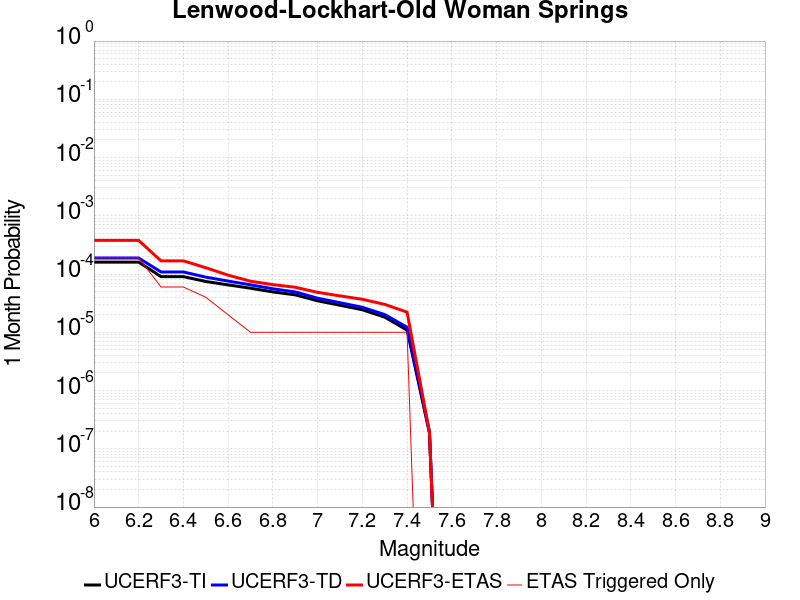 |  |  |

| Magnitude | 1 wk TI Prob | 1 wk TD Prob | 1 wk ETAS Prob | 1 wk ETAS/TD Gain | 1 wk ETAS Triggered Only | 1 mo TI Prob | 1 mo TD Prob | 1 mo ETAS Prob | 1 mo ETAS/TD Gain | 1 mo ETAS Triggered Only | 1 yr TI Prob | 1 yr TD Prob | 1 yr ETAS Prob | 1 yr ETAS/TD Gain | 1 yr ETAS Triggered Only | 10 yr TI Prob | 10 yr TD Prob | 10 yr ETAS Prob | 10 yr ETAS/TD Gain | 10 yr ETAS Triggered Only |
|-----|-----|-----|-----|-----|-----|-----|-----|-----|-----|-----|-----|-----|-----|-----|-----|-----|-----|-----|-----|-----|
| 6.0 | 3.744542E-5 | 4.3965032E-5 | 1.0396239E-4 | 2.364661 | 6.0E-5 | 1.604705E-4 | 1.8840893E-4 | 3.7837314E-4 | 2.0082548 | 1.9E-4 | 0.0019519776 | 0.0022916375 | 0.0030299418 | 1.3221732 | 7.4E-4 | 0.019349206 | 0.02269807 | 0.02421289 | 1.0667378 | 0.00155 |
| 6.1 | 3.744542E-5 | 4.3965032E-5 | 1.0396239E-4 | 2.364661 | 6.0E-5 | 1.604705E-4 | 1.8840893E-4 | 3.7837314E-4 | 2.0082548 | 1.9E-4 | 0.0019519776 | 0.0022916375 | 0.0030299418 | 1.3221732 | 7.4E-4 | 0.019349206 | 0.02269807 | 0.02421289 | 1.0667378 | 0.00155 |
| 6.2 | 3.744542E-5 | 4.3965032E-5 | 1.0396239E-4 | 2.364661 | 6.0E-5 | 1.604705E-4 | 1.8840893E-4 | 3.7837314E-4 | 2.0082548 | 1.9E-4 | 0.0019519776 | 0.0022916375 | 0.0030299418 | 1.3221732 | 7.4E-4 | 0.019349206 | 0.02269807 | 0.02421289 | 1.0667378 | 0.00155 |
| 6.3 | 2.1079984E-5 | 2.5354779E-5 | 6.5353765E-5 | 2.5775719 | 4.0E-5 | 9.0339665E-5 | 1.0865892E-4 | 1.686524E-4 | 1.5521266 | 6.0E-5 | 0.0010993304 | 0.0013221395 | 0.0015318618 | 1.1586235 | 2.1E-4 | 0.010939079 | 0.01314495 | 0.013717326 | 1.0435435 | 5.8E-4 |
| 6.4 | 2.1079984E-5 | 2.5354779E-5 | 6.5353765E-5 | 2.5775719 | 4.0E-5 | 9.0339665E-5 | 1.0865892E-4 | 1.686524E-4 | 1.5521266 | 6.0E-5 | 0.0010993304 | 0.0013221395 | 0.0015318618 | 1.1586235 | 2.1E-4 | 0.010939079 | 0.01314495 | 0.013717326 | 1.0435435 | 5.8E-4 |
| 6.5 | 1.7397282E-5 | 2.0663578E-5 | 5.066296E-5 | 2.4517999 | 3.0E-5 | 7.455765E-5 | 8.855525E-5 | 1.285517E-4 | 1.4516554 | 4.0E-5 | 9.073613E-4 | 0.0010776386 | 0.0012174877 | 1.1297737 | 1.4E-4 | 0.009036654 | 0.010725424 | 0.011170598 | 1.0415064 | 4.5E-4 |
| 6.6 | 1.52050325E-5 | 1.7680335E-5 | 2.7680158E-5 | 1.5655901 | 1.0E-5 | 6.51628E-5 | 7.577071E-5 | 9.576919E-5 | 1.2639343 | 2.0E-5 | 7.9306826E-4 | 9.221258E-4 | 0.0010420152 | 1.1300141 | 1.2E-4 | 0.007902439 | 0.009183858 | 0.009560368 | 1.0409969 | 3.8E-4 |
| 6.7 | 1.332523E-5 | 1.526459E-5 | 2.5264439E-5 | 1.655101 | 1.0E-5 | 5.7106878E-5 | 6.541806E-5 | 7.541741E-5 | 1.152853 | 1.0E-5 | 6.950544E-4 | 7.9617975E-4 | 8.7611604E-4 | 1.1003999 | 8.0E-5 | 0.006928845 | 0.0079339035 | 0.008221602 | 1.036262 | 2.9E-4 |
| 6.8 | 1.1525329E-5 | 1.30315375E-5 | 2.3031407E-5 | 1.7673591 | 1.0E-5 | 4.9393333E-5 | 5.584827E-5 | 6.5847715E-5 | 1.1790465 | 1.0E-5 | 6.011979E-4 | 6.797448E-4 | 7.4969727E-4 | 1.1029098 | 7.0E-5 | 0.00599574 | 0.0067771086 | 0.0069956174 | 1.0322422 | 2.2E-4 |
| 6.9 | 1.0253909E-5 | 1.151498E-5 | 2.1514865E-5 | 1.868424 | 1.0E-5 | 4.3944583E-5 | 4.9349E-5 | 5.9348506E-5 | 1.2026284 | 1.0E-5 | 5.3489394E-4 | 6.006621E-4 | 6.7062E-4 | 1.1164681 | 7.0E-5 | 0.0053360825 | 0.005990765 | 0.0061895666 | 1.0331848 | 2.0E-4 |
| 7.0 | 8.104563E-6 | 8.991533E-6 | 1.8991443E-5 | 2.1121473 | 1.0E-5 | 3.4733377E-5 | 3.8534585E-5 | 4.85342E-5 | 1.2594972 | 1.0E-5 | 4.2279682E-4 | 4.6906E-4 | 5.1903655E-4 | 1.1065462 | 5.0E-5 | 0.0042199334 | 0.0046809474 | 0.0048401984 | 1.0340211 | 1.6E-4 |
| 7.1 | 6.7986157E-6 | 7.516056E-6 | 1.751598E-5 | 2.330475 | 1.0E-5 | 2.91366E-5 | 3.2211283E-5 | 4.2210962E-5 | 1.3104402 | 1.0E-5 | 3.5468035E-4 | 3.9210395E-4 | 4.3208824E-4 | 1.1019738 | 4.0E-5 | 0.003541148 | 0.0039143376 | 0.0040438287 | 1.0330813 | 1.3E-4 |
| 7.2 | 5.6893327E-6 | 6.280187E-6 | 1.6280124E-5 | 2.5922992 | 1.0E-5 | 2.4382627E-5 | 2.691482E-5 | 3.6914553E-5 | 1.3715326 | 1.0E-5 | 2.9681803E-4 | 3.2764065E-4 | 3.3763738E-4 | 1.0305113 | 1.0E-5 | 0.002964219 | 0.0032717746 | 0.0033315783 | 1.0182787 | 6.0E-5 |
| 7.3 | 4.253348E-6 | 4.707105E-6 | 1.4707058E-5 | 3.1244383 | 1.0E-5 | 1.8228506E-5 | 2.017316E-5 | 3.0172958E-5 | 1.4956982 | 1.0E-5 | 2.2190946E-4 | 2.4558237E-4 | 2.5557991E-4 | 1.0407095 | 1.0E-5 | 0.00221688 | 0.0024532909 | 0.002503168 | 1.0203308 | 5.0E-5 |
| 7.4 | 2.5448119E-6 | 2.8520674E-6 | 1.2852039E-5 | 4.5062184 | 1.0E-5 | 1.0906291E-5 | 1.2223099E-5 | 2.2222976E-5 | 1.8181132 | 1.0E-5 | 1.3277601E-4 | 1.4880771E-4 | 1.5880622E-4 | 1.0671908 | 1.0E-5 | 0.001326967 | 0.0014872429 | 0.0015072131 | 1.0134277 | 2.0E-5 |
| 7.5 | 4.3706837E-8 | 4.5630156E-8 | 4.5630156E-8 | 1.0 | 0.0 | 1.8731501E-7 | 1.955578E-7 | 1.955578E-7 | 1.0 | 0.0 | 2.2805577E-6 | 2.380914E-6 | 2.380914E-6 | 1.0 | 0.0 | 2.2805343E-5 | 2.3808941E-5 | 2.3808941E-5 | 1.0 | 0.0 |

## Nelson Lake
*[(top)](#table-of-contents)*

| 1 Week | 1 Month | 1 Year | 10 Year |
|-----|-----|-----|-----|
|  |  |  |  |

| Magnitude | 1 wk TI Prob | 1 wk TD Prob | 1 wk ETAS Prob | 1 wk ETAS/TD Gain | 1 wk ETAS Triggered Only | 1 mo TI Prob | 1 mo TD Prob | 1 mo ETAS Prob | 1 mo ETAS/TD Gain | 1 mo ETAS Triggered Only | 1 yr TI Prob | 1 yr TD Prob | 1 yr ETAS Prob | 1 yr ETAS/TD Gain | 1 yr ETAS Triggered Only | 10 yr TI Prob | 10 yr TD Prob | 10 yr ETAS Prob | 10 yr ETAS/TD Gain | 10 yr ETAS Triggered Only |
|-----|-----|-----|-----|-----|-----|-----|-----|-----|-----|-----|-----|-----|-----|-----|-----|-----|-----|-----|-----|-----|
| 6.0 | 9.913453E-6 | 1.0192408E-5 | 2.0192305E-5 | 1.9811125 | 1.0E-5 | 4.2485535E-5 | 4.3681073E-5 | 9.367889E-5 | 2.1446104 | 5.0E-5 | 5.1713863E-4 | 5.3169765E-4 | 0.0010214371 | 1.9210864 | 4.9E-4 | 0.0051593683 | 0.0053052832 | 0.0067475904 | 1.2718625 | 0.00145 |
| 6.1 | 9.913453E-6 | 1.0192408E-5 | 2.0192305E-5 | 1.9811125 | 1.0E-5 | 4.2485535E-5 | 4.3681073E-5 | 9.367889E-5 | 2.1446104 | 5.0E-5 | 5.1713863E-4 | 5.3169765E-4 | 0.0010214371 | 1.9210864 | 4.9E-4 | 0.0051593683 | 0.0053052832 | 0.0067475904 | 1.2718625 | 0.00145 |
| 6.2 | 4.5596407E-6 | 4.696388E-6 | 4.696388E-6 | 1.0 | 0.0 | 1.954117E-5 | 2.0127229E-5 | 5.0126626E-5 | 2.4904883 | 3.0E-5 | 2.3788778E-4 | 2.4502273E-4 | 4.6496882E-4 | 1.897656 | 2.2E-4 | 0.0023763329 | 0.0024476517 | 0.0031160119 | 1.2730618 | 6.7E-4 |
| 6.3 | 4.5596407E-6 | 4.696388E-6 | 4.696388E-6 | 1.0 | 0.0 | 1.954117E-5 | 2.0127229E-5 | 5.0126626E-5 | 2.4904883 | 3.0E-5 | 2.3788778E-4 | 2.4502273E-4 | 4.6496882E-4 | 1.897656 | 2.2E-4 | 0.0023763329 | 0.0024476517 | 0.0031160119 | 1.2730618 | 6.7E-4 |
| 6.4 | 3.4025713E-6 | 3.509956E-6 | 3.509956E-6 | 1.0 | 0.0 | 1.4582367E-5 | 1.5042587E-5 | 4.5042136E-5 | 2.9943078 | 3.0E-5 | 1.7752586E-4 | 1.8312894E-4 | 3.4309964E-4 | 1.8735414 | 1.6E-4 | 0.001773841 | 0.0018298633 | 0.0023289484 | 1.2727444 | 5.0E-4 |
| 6.5 | 2.8352947E-6 | 2.927907E-6 | 2.927907E-6 | 1.0 | 0.0 | 1.2151207E-5 | 1.25481165E-5 | 3.2547865E-5 | 2.5938447 | 2.0E-5 | 1.479309E-4 | 1.5276336E-4 | 2.827435E-4 | 1.8508594 | 1.3E-4 | 0.0014783246 | 0.0015266574 | 0.0019360314 | 1.2681506 | 4.1E-4 |
| 6.6 | 2.251518E-6 | 2.3291102E-6 | 2.3291102E-6 | 1.0 | 0.0 | 9.649328E-6 | 9.981866E-6 | 2.9981667E-5 | 3.0036132 | 2.0E-5 | 1.1747423E-4 | 1.2152307E-4 | 2.1151213E-4 | 1.7405101 | 9.0E-5 | 0.0011741214 | 0.001214628 | 0.0014942879 | 1.2302433 | 2.8E-4 |
| 6.7 | 1.8911853E-6 | 1.959177E-6 | 1.959177E-6 | 1.0 | 0.0 | 8.105055E-6 | 8.39645E-6 | 2.8396282E-5 | 3.3819392 | 2.0E-5 | 9.867457E-5 | 1.0222256E-4 | 1.8221438E-4 | 1.7825261 | 8.0E-5 | 9.863076E-4 | 0.0010218129 | 0.0012515779 | 1.2248601 | 2.3E-4 |
| 6.8 | 1.4874814E-6 | 1.5438616E-6 | 1.5438616E-6 | 1.0 | 0.0 | 6.374905E-6 | 6.6165358E-6 | 2.6616404E-5 | 4.02271 | 2.0E-5 | 7.76117E-5 | 8.0553866E-5 | 1.5054822E-4 | 1.8689138 | 7.0E-5 | 7.75846E-4 | 8.0529775E-4 | 9.851528E-4 | 1.2233398 | 1.8E-4 |
| 6.9 | 6.835972E-7 | 7.140097E-7 | 7.140097E-7 | 1.0 | 0.0 | 2.9296991E-6 | 3.0600397E-6 | 3.0600397E-6 | 1.0 | 0.0 | 3.56685E-5 | 3.7255664E-5 | 4.7255293E-5 | 1.2684056 | 1.0E-5 | 3.5662777E-4 | 3.7252545E-4 | 4.5249565E-4 | 1.2146704 | 8.0E-5 |

## Death Valley (So)
*[(top)](#table-of-contents)*

| 1 Week | 1 Month | 1 Year | 10 Year |
|-----|-----|-----|-----|
| 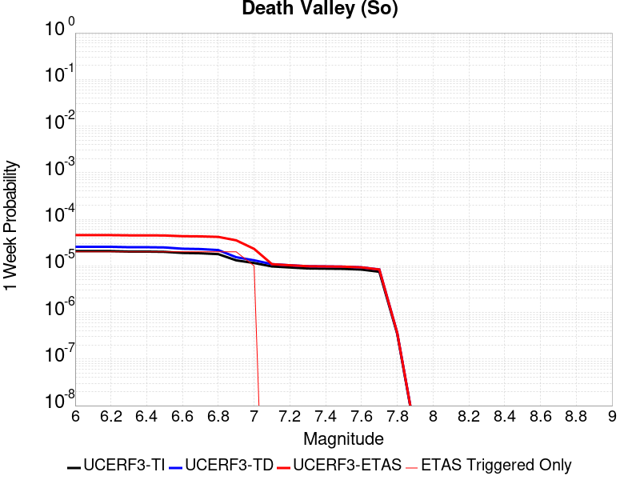 |  |  |  |

| Magnitude | 1 wk TI Prob | 1 wk TD Prob | 1 wk ETAS Prob | 1 wk ETAS/TD Gain | 1 wk ETAS Triggered Only | 1 mo TI Prob | 1 mo TD Prob | 1 mo ETAS Prob | 1 mo ETAS/TD Gain | 1 mo ETAS Triggered Only | 1 yr TI Prob | 1 yr TD Prob | 1 yr ETAS Prob | 1 yr ETAS/TD Gain | 1 yr ETAS Triggered Only | 10 yr TI Prob | 10 yr TD Prob | 10 yr ETAS Prob | 10 yr ETAS/TD Gain | 10 yr ETAS Triggered Only |
|-----|-----|-----|-----|-----|-----|-----|-----|-----|-----|-----|-----|-----|-----|-----|-----|-----|-----|-----|-----|-----|
| 6.0 | 2.0684236E-5 | 2.5620835E-5 | 4.5620323E-5 | 1.7805947 | 2.0E-5 | 8.864371E-5 | 1.09799046E-4 | 2.2978587E-4 | 2.0927856 | 1.2E-4 | 0.0010787029 | 0.0013360005 | 0.0019751454 | 1.4784018 | 6.4E-4 | 0.010734817 | 0.013282978 | 0.014802522 | 1.1143979 | 0.00154 |
| 6.1 | 2.0684236E-5 | 2.5620835E-5 | 4.5620323E-5 | 1.7805947 | 2.0E-5 | 8.864371E-5 | 1.09799046E-4 | 2.2978587E-4 | 2.0927856 | 1.2E-4 | 0.0010787029 | 0.0013360005 | 0.0019751454 | 1.4784018 | 6.4E-4 | 0.010734817 | 0.013282978 | 0.014802522 | 1.1143979 | 0.00154 |
| 6.2 | 2.0684236E-5 | 2.5620835E-5 | 4.5620323E-5 | 1.7805947 | 2.0E-5 | 8.864371E-5 | 1.09799046E-4 | 2.2978587E-4 | 2.0927856 | 1.2E-4 | 0.0010787029 | 0.0013360005 | 0.0019751454 | 1.4784018 | 6.4E-4 | 0.010734817 | 0.013282978 | 0.014802522 | 1.1143979 | 0.00154 |
| 6.3 | 2.0240292E-5 | 2.5120886E-5 | 4.512038E-5 | 1.7961303 | 2.0E-5 | 8.6741224E-5 | 1.0765659E-4 | 2.1764475E-4 | 2.0216575 | 1.1E-4 | 0.0010555626 | 0.0013099476 | 0.0019191485 | 1.4650575 | 6.1E-4 | 0.010505628 | 0.01302552 | 0.014496112 | 1.1129009 | 0.00149 |
| 6.4 | 2.0240292E-5 | 2.5120886E-5 | 4.512038E-5 | 1.7961303 | 2.0E-5 | 8.6741224E-5 | 1.0765659E-4 | 2.1764475E-4 | 2.0216575 | 1.1E-4 | 0.0010555626 | 0.0013099476 | 0.0019191485 | 1.4650575 | 6.1E-4 | 0.010505628 | 0.01302552 | 0.014496112 | 1.1129009 | 0.00149 |
| 6.5 | 1.9962767E-5 | 2.4810119E-5 | 4.480962E-5 | 1.8061028 | 2.0E-5 | 8.55519E-5 | 1.0632484E-4 | 2.063142E-4 | 1.940414 | 1.0E-4 | 0.0010410968 | 0.0012937529 | 0.0018730025 | 1.4477282 | 5.8E-4 | 0.010362327 | 0.012865457 | 0.014296802 | 1.1112549 | 0.00145 |
| 6.6 | 1.8937297E-5 | 2.3313813E-5 | 4.3313346E-5 | 1.8578405 | 2.0E-5 | 8.115732E-5 | 9.99126E-5 | 1.999026E-4 | 2.0007749 | 1.0E-4 | 9.876423E-4 | 0.0012157715 | 0.0017551151 | 1.4436224 | 5.4E-4 | 0.009832645 | 0.01209411 | 0.013408025 | 1.1086409 | 0.00133 |
| 6.7 | 1.8621096E-5 | 2.291442E-5 | 4.291396E-5 | 1.8727928 | 2.0E-5 | 7.980225E-5 | 9.8201046E-5 | 1.9819122E-4 | 2.018219 | 1.0E-4 | 9.711593E-4 | 0.0011949565 | 0.0017243231 | 1.4430008 | 5.3E-4 | 0.009669261 | 0.011888204 | 0.013172749 | 1.1080521 | 0.0013 |
| 6.8 | 1.7830353E-5 | 2.1808304E-5 | 4.1807867E-5 | 1.9170618 | 2.0E-5 | 7.641356E-5 | 9.34609E-5 | 1.8345249E-4 | 1.9628795 | 9.0E-5 | 9.29938E-4 | 0.0011373064 | 0.0016167605 | 1.4215698 | 4.8E-4 | 0.009260561 | 0.011317262 | 0.012513569 | 1.1057063 | 0.00121 |
| 6.9 | 1.3135183E-5 | 1.5305317E-5 | 3.5305013E-5 | 2.3067155 | 2.0E-5 | 5.6292425E-5 | 6.5592605E-5 | 1.15589326E-4 | 1.762231 | 5.0E-5 | 6.8514474E-4 | 7.9830387E-4 | 0.0010281203 | 1.2878809 | 2.3E-4 | 0.006830362 | 0.007955869 | 0.008709823 | 1.094767 | 7.6E-4 |
| 7.0 | 1.1507512E-5 | 1.3155236E-5 | 2.3155104E-5 | 1.7601436 | 1.0E-5 | 4.9316975E-5 | 5.6378398E-5 | 9.637614E-5 | 1.7094516 | 4.0E-5 | 6.002687E-4 | 6.861966E-4 | 8.360937E-4 | 1.2184463 | 1.5E-4 | 0.0059864987 | 0.0068420726 | 0.0074081724 | 1.082738 | 5.7E-4 |
| 7.1 | 9.715903E-6 | 1.0865992E-5 | 1.0865992E-5 | 1.0 | 0.0 | 4.1638916E-5 | 4.6567733E-5 | 6.65668E-5 | 1.429462 | 2.0E-5 | 5.068359E-4 | 5.668189E-4 | 6.267849E-4 | 1.105794 | 6.0E-5 | 0.0050568148 | 0.0056542754 | 0.0059426357 | 1.0509986 | 2.9E-4 |
| 7.2 | 9.233269E-6 | 1.02869635E-5 | 1.02869635E-5 | 1.0 | 0.0 | 3.9570554E-5 | 4.4086264E-5 | 5.4085824E-5 | 1.226818 | 1.0E-5 | 4.81665E-4 | 5.366223E-4 | 5.666062E-4 | 1.0558753 | 3.0E-5 | 0.0048062233 | 0.0053536966 | 0.0055625723 | 1.0390153 | 2.1E-4 |
| 7.3 | 8.8041315E-6 | 9.80876E-6 | 9.80876E-6 | 1.0 | 0.0 | 3.7731446E-5 | 4.203689E-5 | 5.203647E-5 | 1.2378763 | 1.0E-5 | 4.592835E-4 | 5.116832E-4 | 5.21678E-4 | 1.0195334 | 1.0E-5 | 0.0045833546 | 0.005105477 | 0.005254711 | 1.0292302 | 1.5E-4 |
| 7.4 | 8.708749E-6 | 9.707768E-6 | 9.707768E-6 | 1.0 | 0.0 | 3.7322676E-5 | 4.1604082E-5 | 5.1603663E-5 | 1.2403511 | 1.0E-5 | 4.5430884E-4 | 5.0641614E-4 | 5.164111E-4 | 1.0197366 | 1.0E-5 | 0.004533812 | 0.0050530476 | 0.0051923404 | 1.0275661 | 1.4E-4 |
| 7.5 | 8.612678E-6 | 9.605406E-6 | 9.605406E-6 | 1.0 | 0.0 | 3.6910955E-5 | 4.1165404E-5 | 5.1164992E-5 | 1.2429124 | 1.0E-5 | 4.492982E-4 | 5.0107774E-4 | 5.110727E-4 | 1.0199469 | 1.0E-5 | 0.004483909 | 0.004999905 | 0.005129255 | 1.0258704 | 1.3E-4 |
| 7.6 | 8.319024E-6 | 9.28449E-6 | 9.28449E-6 | 1.0 | 0.0 | 3.5652476E-5 | 3.9790088E-5 | 4.978969E-5 | 1.2513089 | 1.0E-5 | 4.3398244E-4 | 4.8434082E-4 | 4.94336E-4 | 1.0206366 | 1.0E-5 | 0.0043313587 | 0.0048332764 | 0.004962648 | 1.0267669 | 1.3E-4 |
| 7.7 | 7.4718328E-6 | 8.345689E-6 | 8.345689E-6 | 1.0 | 0.0 | 3.2021748E-5 | 3.576677E-5 | 4.5766414E-5 | 1.2795792 | 1.0E-5 | 3.8979502E-4 | 4.3537747E-4 | 4.4537312E-4 | 1.0229585 | 1.0E-5 | 0.00389112 | 0.0043456503 | 0.0044551725 | 1.0252026 | 1.1E-4 |
| 7.8 | 3.4586725E-7 | 3.648368E-7 | 3.648368E-7 | 1.0 | 0.0 | 1.4822873E-6 | 1.5635853E-6 | 1.5635853E-6 | 1.0 | 0.0 | 1.80467E-5 | 1.903649E-5 | 1.903649E-5 | 1.0 | 0.0 | 1.8045233E-4 | 1.9034903E-4 | 2.0034713E-4 | 1.052525 | 1.0E-5 |
| 7.9 | 2.5591178E-9 | 2.6697329E-9 | 2.6697329E-9 | 1.0 | 0.0 | 1.0967647E-8 | 1.14417125E-8 | 1.14417125E-8 | 1.0 | 0.0 | 1.335311E-7 | 1.3930286E-7 | 1.3930286E-7 | 1.0 | 0.0 | 1.3353102E-6 | 1.3930285E-6 | 1.3930285E-6 | 1.0 | 0.0 |

## San Andreas (Mojave N)
*[(top)](#table-of-contents)*

| 1 Week | 1 Month | 1 Year | 10 Year |
|-----|-----|-----|-----|
|  |  |  |  |

| Magnitude | 1 wk TI Prob | 1 wk TD Prob | 1 wk ETAS Prob | 1 wk ETAS/TD Gain | 1 wk ETAS Triggered Only | 1 mo TI Prob | 1 mo TD Prob | 1 mo ETAS Prob | 1 mo ETAS/TD Gain | 1 mo ETAS Triggered Only | 1 yr TI Prob | 1 yr TD Prob | 1 yr ETAS Prob | 1 yr ETAS/TD Gain | 1 yr ETAS Triggered Only | 10 yr TI Prob | 10 yr TD Prob | 10 yr ETAS Prob | 10 yr ETAS/TD Gain | 10 yr ETAS Triggered Only |
|-----|-----|-----|-----|-----|-----|-----|-----|-----|-----|-----|-----|-----|-----|-----|-----|-----|-----|-----|-----|-----|
| 6.0 | 9.877682E-5 | 1.9436594E-4 | 2.743504E-4 | 1.4115148 | 8.0E-5 | 4.2326056E-4 | 8.3273114E-4 | 0.0010625396 | 1.2759696 | 2.3E-4 | 0.0051410277 | 0.0100914985 | 0.010843829 | 1.0745509 | 7.6E-4 | 0.05023708 | 0.09847636 | 0.09980159 | 1.0134574 | 0.00147 |
| 6.1 | 9.877682E-5 | 1.9436594E-4 | 2.743504E-4 | 1.4115148 | 8.0E-5 | 4.2326056E-4 | 8.3273114E-4 | 0.0010625396 | 1.2759696 | 2.3E-4 | 0.0051410277 | 0.0100914985 | 0.010843829 | 1.0745509 | 7.6E-4 | 0.05023708 | 0.09847636 | 0.09980159 | 1.0134574 | 0.00147 |
| 6.2 | 9.877682E-5 | 1.9436594E-4 | 2.743504E-4 | 1.4115148 | 8.0E-5 | 4.2326056E-4 | 8.3273114E-4 | 0.0010625396 | 1.2759696 | 2.3E-4 | 0.0051410277 | 0.0100914985 | 0.010843829 | 1.0745509 | 7.6E-4 | 0.05023708 | 0.09847636 | 0.09980159 | 1.0134574 | 0.00147 |
| 6.3 | 9.877682E-5 | 1.9436594E-4 | 2.743504E-4 | 1.4115148 | 8.0E-5 | 4.2326056E-4 | 8.3273114E-4 | 0.0010625396 | 1.2759696 | 2.3E-4 | 0.0051410277 | 0.0100914985 | 0.010843829 | 1.0745509 | 7.6E-4 | 0.05023708 | 0.09847636 | 0.09980159 | 1.0134574 | 0.00147 |
| 6.4 | 9.877682E-5 | 1.9436594E-4 | 2.743504E-4 | 1.4115148 | 8.0E-5 | 4.2326056E-4 | 8.3273114E-4 | 0.0010625396 | 1.2759696 | 2.3E-4 | 0.0051410277 | 0.0100914985 | 0.010843829 | 1.0745509 | 7.6E-4 | 0.05023708 | 0.09847636 | 0.09980159 | 1.0134574 | 0.00147 |
| 6.5 | 9.861474E-5 | 1.9410347E-4 | 2.7408794E-4 | 1.4120713 | 8.0E-5 | 4.2256617E-4 | 8.3160703E-4 | 0.0010614158 | 1.276343 | 2.3E-4 | 0.0051326132 | 0.010077939 | 0.01083028 | 1.0746522 | 7.6E-4 | 0.050156746 | 0.098354205 | 0.09967963 | 1.013476 | 0.00147 |
| 6.6 | 9.861474E-5 | 1.9410347E-4 | 2.7408794E-4 | 1.4120713 | 8.0E-5 | 4.2256617E-4 | 8.3160703E-4 | 0.0010614158 | 1.276343 | 2.3E-4 | 0.0051326132 | 0.010077939 | 0.01083028 | 1.0746522 | 7.6E-4 | 0.050156746 | 0.098354205 | 0.09967963 | 1.013476 | 0.00147 |
| 6.7 | 9.8552715E-5 | 1.9400296E-4 | 2.7398745E-4 | 1.4122849 | 8.0E-5 | 4.223004E-4 | 8.311765E-4 | 0.0010609854 | 1.2764862 | 2.3E-4 | 0.0051293927 | 0.010072746 | 0.010825091 | 1.0746912 | 7.6E-4 | 0.050125998 | 0.09830724 | 0.099632725 | 1.0134832 | 0.00147 |
| 6.8 | 9.8464974E-5 | 1.9385452E-4 | 2.7383902E-4 | 1.4126006 | 8.0E-5 | 4.219245E-4 | 8.305407E-4 | 0.0010603498 | 1.276698 | 2.3E-4 | 0.0051248376 | 0.010065078 | 0.010817428 | 1.0747486 | 7.6E-4 | 0.05008251 | 0.098237 | 0.099562585 | 1.0134938 | 0.00147 |
| 6.9 | 9.825824E-5 | 1.935344E-4 | 2.735189E-4 | 1.4132832 | 8.0E-5 | 4.2103877E-4 | 8.291697E-4 | 0.001058979 | 1.2771559 | 2.3E-4 | 0.0051141046 | 0.010048538 | 0.010800902 | 1.0748729 | 7.6E-4 | 0.049980022 | 0.09808606 | 0.09941187 | 1.0135168 | 0.00147 |
| 7.0 | 9.781462E-5 | 1.9284763E-4 | 2.728322E-4 | 1.4147552 | 8.0E-5 | 4.1913814E-4 | 8.2622824E-4 | 0.0010560382 | 1.2781434 | 2.3E-4 | 0.005091073 | 0.010013057 | 0.010765446 | 1.075141 | 7.6E-4 | 0.04976007 | 0.09776237 | 0.09908866 | 1.0135665 | 0.00147 |
| 7.1 | 9.7121134E-5 | 1.9186416E-4 | 2.718488E-4 | 1.4168817 | 8.0E-5 | 4.1616702E-4 | 8.2201604E-4 | 0.001051827 | 1.2795699 | 2.3E-4 | 0.005055068 | 0.009962243 | 0.010714672 | 1.075528 | 7.6E-4 | 0.04941613 | 0.09729878 | 0.09862575 | 1.0136381 | 0.00147 |
| 7.2 | 9.663819E-5 | 1.9117158E-4 | 2.7115628E-4 | 1.4183923 | 8.0E-5 | 4.1409794E-4 | 8.1904966E-4 | 0.0010488613 | 1.2805833 | 2.3E-4 | 0.0050299936 | 0.009926458 | 0.010678913 | 1.075803 | 7.6E-4 | 0.049176537 | 0.09697204 | 0.098299496 | 1.013689 | 0.00147 |
| 7.3 | 9.6277574E-5 | 1.906962E-4 | 2.7068093E-4 | 1.4194355 | 8.0E-5 | 4.125529E-4 | 8.170136E-4 | 0.0010468257 | 1.281283 | 2.3E-4 | 0.0050112694 | 0.009901894 | 0.010654368 | 1.075993 | 7.6E-4 | 0.04899759 | 0.09674529 | 0.09807307 | 1.0137246 | 0.00147 |
| 7.4 | 9.593308E-5 | 1.9009347E-4 | 2.7007828E-4 | 1.4207656 | 8.0E-5 | 4.1107697E-4 | 8.1443216E-4 | 0.0010442449 | 1.2821753 | 2.3E-4 | 0.0049933824 | 0.00987075 | 0.010623248 | 1.0762352 | 7.6E-4 | 0.04882661 | 0.09646287 | 0.09779107 | 1.013769 | 0.00147 |
| 7.5 | 9.561707E-5 | 1.8955376E-4 | 2.6953858E-4 | 1.4219639 | 8.0E-5 | 4.0972308E-4 | 8.121205E-4 | 0.0010419337 | 1.2829792 | 2.3E-4 | 0.0049769743 | 0.0098428605 | 0.010595379 | 1.0764533 | 7.6E-4 | 0.048669744 | 0.09620883 | 0.097537406 | 1.0138092 | 0.00147 |
| 7.6 | 9.418194E-5 | 1.8607336E-4 | 2.6605846E-4 | 1.429858 | 8.0E-5 | 4.0357444E-4 | 7.972137E-4 | 0.0010270303 | 1.2882748 | 2.3E-4 | 0.004902454 | 0.009662993 | 0.010405746 | 1.0768657 | 7.5E-4 | 0.047957025 | 0.09458842 | 0.09591032 | 1.0139753 | 0.00146 |
| 7.7 | 8.202141E-5 | 1.6053455E-4 | 2.305233E-4 | 1.4359733 | 7.0E-5 | 3.51473E-4 | 6.878238E-4 | 8.8768627E-4 | 1.2905722 | 2.0E-4 | 0.00427079 | 0.008342157 | 0.0089966515 | 1.0784563 | 6.6E-4 | 0.04189639 | 0.08237585 | 0.08358711 | 1.0147041 | 0.00132 |
| 7.8 | 7.2859846E-5 | 1.4545326E-4 | 1.8544744E-4 | 1.2749624 | 4.0E-5 | 3.1221908E-4 | 6.232222E-4 | 7.531412E-4 | 1.2084633 | 1.3E-4 | 0.003794643 | 0.0075613735 | 0.007968273 | 1.053813 | 4.1E-4 | 0.037304975 | 0.074854724 | 0.07566885 | 1.010876 | 8.8E-4 |
| 7.9 | 5.3874453E-5 | 1.0065783E-4 | 1.2065582E-4 | 1.1986729 | 2.0E-5 | 2.3087008E-4 | 4.313194E-4 | 5.012892E-4 | 1.1622227 | 7.0E-5 | 0.0028072202 | 0.0052386806 | 0.005437633 | 1.0379776 | 2.0E-4 | 0.02772022 | 0.052520394 | 0.052984662 | 1.0088397 | 4.9E-4 |
| 8.0 | 3.468538E-5 | 5.4374406E-5 | 6.437386E-5 | 1.1839001 | 1.0E-5 | 1.4864317E-4 | 2.3301235E-4 | 2.929984E-4 | 1.2574371 | 6.0E-5 | 0.0018082283 | 0.0028332367 | 0.0029528968 | 1.0422344 | 1.2E-4 | 0.017935853 | 0.02900434 | 0.029247088 | 1.0083694 | 2.5E-4 |
| 8.1 | 1.9152367E-5 | 1.9454663E-5 | 1.9454663E-5 | 1.0 | 0.0 | 8.207899E-5 | 8.337447E-5 | 8.337447E-5 | 1.0 | 0.0 | 9.988535E-4 | 0.001014612 | 0.0010345918 | 1.019692 | 2.0E-5 | 0.009943757 | 0.010883738 | 0.010923303 | 1.0036352 | 4.0E-5 |
| 8.2 | 8.643924E-6 | 5.494016E-6 | 5.494016E-6 | 1.0 | 0.0 | 3.704486E-5 | 2.3545572E-5 | 2.3545572E-5 | 1.0 | 0.0 | 4.5092785E-4 | 2.866297E-4 | 2.866297E-4 | 1.0 | 0.0 | 0.0045001395 | 0.0032592218 | 0.0032592218 | 1.0 | 0.0 |
| 8.3 | 1.983087E-6 | 7.690063E-7 | 7.690063E-7 | 1.0 | 0.0 | 8.498917E-6 | 3.295737E-6 | 3.295737E-6 | 1.0 | 0.0 | 1.034694E-4 | 4.012488E-5 | 4.012488E-5 | 1.0 | 0.0 | 0.0010342124 | 4.737206E-4 | 4.737206E-4 | 1.0 | 0.0 |

## Towne Pass
*[(top)](#table-of-contents)*

| 1 Week | 1 Month | 1 Year | 10 Year |
|-----|-----|-----|-----|
|  |  |  |  |

| Magnitude | 1 wk TI Prob | 1 wk TD Prob | 1 wk ETAS Prob | 1 wk ETAS/TD Gain | 1 wk ETAS Triggered Only | 1 mo TI Prob | 1 mo TD Prob | 1 mo ETAS Prob | 1 mo ETAS/TD Gain | 1 mo ETAS Triggered Only | 1 yr TI Prob | 1 yr TD Prob | 1 yr ETAS Prob | 1 yr ETAS/TD Gain | 1 yr ETAS Triggered Only | 10 yr TI Prob | 10 yr TD Prob | 10 yr ETAS Prob | 10 yr ETAS/TD Gain | 10 yr ETAS Triggered Only |
|-----|-----|-----|-----|-----|-----|-----|-----|-----|-----|-----|-----|-----|-----|-----|-----|-----|-----|-----|-----|-----|
| 6.0 | 3.849728E-6 | 3.894574E-6 | 3.3894456E-5 | 8.702994 | 3.0E-5 | 1.649873E-5 | 1.669095E-5 | 7.668995E-5 | 4.5947022 | 6.0E-5 | 2.0085352E-4 | 2.0319773E-4 | 6.4310833E-4 | 3.1649384 | 4.4E-4 | 0.0020067208 | 0.0020305486 | 0.003158254 | 1.5553699 | 0.00113 |
| 6.1 | 3.849728E-6 | 3.894574E-6 | 3.3894456E-5 | 8.702994 | 3.0E-5 | 1.649873E-5 | 1.669095E-5 | 7.668995E-5 | 4.5947022 | 6.0E-5 | 2.0085352E-4 | 2.0319773E-4 | 6.4310833E-4 | 3.1649384 | 4.4E-4 | 0.0020067208 | 0.0020305486 | 0.003158254 | 1.5553699 | 0.00113 |
| 6.2 | 3.849728E-6 | 3.894574E-6 | 3.3894456E-5 | 8.702994 | 3.0E-5 | 1.649873E-5 | 1.669095E-5 | 7.668995E-5 | 4.5947022 | 6.0E-5 | 2.0085352E-4 | 2.0319773E-4 | 6.4310833E-4 | 3.1649384 | 4.4E-4 | 0.0020067208 | 0.0020305486 | 0.003158254 | 1.5553699 | 0.00113 |
| 6.3 | 3.849728E-6 | 3.894574E-6 | 3.3894456E-5 | 8.702994 | 3.0E-5 | 1.649873E-5 | 1.669095E-5 | 7.668995E-5 | 4.5947022 | 6.0E-5 | 2.0085352E-4 | 2.0319773E-4 | 6.4310833E-4 | 3.1649384 | 4.4E-4 | 0.0020067208 | 0.0020305486 | 0.003158254 | 1.5553699 | 0.00113 |
| 6.4 | 3.849728E-6 | 3.894574E-6 | 3.3894456E-5 | 8.702994 | 3.0E-5 | 1.649873E-5 | 1.669095E-5 | 7.668995E-5 | 4.5947022 | 6.0E-5 | 2.0085352E-4 | 2.0319773E-4 | 6.4310833E-4 | 3.1649384 | 4.4E-4 | 0.0020067208 | 0.0020305486 | 0.003158254 | 1.5553699 | 0.00113 |
| 6.5 | 1.1953545E-6 | 1.2030648E-6 | 1.2030648E-6 | 1.0 | 0.0 | 5.1229376E-6 | 5.1559828E-6 | 5.1559828E-6 | 1.0 | 0.0 | 6.236998E-5 | 6.27724E-5 | 1.1276926E-4 | 1.7964784 | 5.0E-5 | 6.235248E-4 | 6.275584E-4 | 7.974517E-4 | 1.2707211 | 1.7E-4 |
| 6.6 | 1.1953545E-6 | 1.2030648E-6 | 1.2030648E-6 | 1.0 | 0.0 | 5.1229376E-6 | 5.1559828E-6 | 5.1559828E-6 | 1.0 | 0.0 | 6.236998E-5 | 6.27724E-5 | 1.1276926E-4 | 1.7964784 | 5.0E-5 | 6.235248E-4 | 6.275584E-4 | 7.974517E-4 | 1.2707211 | 1.7E-4 |
| 6.7 | 8.375951E-7 | 8.410776E-7 | 8.410776E-7 | 1.0 | 0.0 | 3.5896885E-6 | 3.6046138E-6 | 3.6046138E-6 | 1.0 | 0.0 | 4.370358E-5 | 4.3885346E-5 | 8.388359E-5 | 1.911426 | 4.0E-5 | 4.3694986E-4 | 4.3877252E-4 | 5.6871545E-4 | 1.296151 | 1.3E-4 |
| 6.8 | 6.38041E-7 | 6.39225E-7 | 6.39225E-7 | 1.0 | 0.0 | 2.7344586E-6 | 2.7395329E-6 | 2.7395329E-6 | 1.0 | 0.0 | 3.3291526E-5 | 3.3353343E-5 | 6.3352345E-5 | 1.89943 | 3.0E-5 | 3.3286537E-4 | 3.3348717E-4 | 4.434505E-4 | 1.3297378 | 1.1E-4 |
| 6.9 | 5.3460053E-7 | 5.34542E-7 | 5.34542E-7 | 1.0 | 0.0 | 2.2911431E-6 | 2.2908923E-6 | 2.2908923E-6 | 1.0 | 0.0 | 2.789431E-5 | 2.7891292E-5 | 4.7890735E-5 | 1.7170497 | 2.0E-5 | 2.789081E-4 | 2.7888123E-4 | 3.6885613E-4 | 1.322628 | 9.0E-5 |
| 7.0 | 3.557783E-7 | 3.532496E-7 | 3.532496E-7 | 1.0 | 0.0 | 1.5247632E-6 | 1.513926E-6 | 1.513926E-6 | 1.0 | 0.0 | 1.8563835E-5 | 1.8431901E-5 | 2.8431718E-5 | 1.5425276 | 1.0E-5 | 1.8562283E-4 | 1.8430458E-4 | 2.3429537E-4 | 1.2712401 | 5.0E-5 |
| 7.1 | 3.037942E-7 | 3.0002886E-7 | 3.0002886E-7 | 1.0 | 0.0 | 1.3019744E-6 | 1.2858374E-6 | 1.2858374E-6 | 1.0 | 0.0 | 1.5851423E-5 | 1.5654965E-5 | 1.5654965E-5 | 1.0 | 0.0 | 1.5850292E-4 | 1.5653936E-4 | 1.965331E-4 | 1.2554867 | 4.0E-5 |
| 7.2 | 2.0808248E-7 | 2.0218206E-7 | 2.0218206E-7 | 1.0 | 0.0 | 8.917818E-7 | 8.664943E-7 | 8.664943E-7 | 1.0 | 0.0 | 1.0857389E-5 | 1.0549522E-5 | 1.0549522E-5 | 1.0 | 0.0 | 1.0856859E-4 | 1.05490675E-4 | 1.3548751E-4 | 1.2843553 | 3.0E-5 |
| 7.3 | 1.1162073E-7 | 1.06371445E-7 | 1.06371445E-7 | 1.0 | 0.0 | 4.7837443E-7 | 4.5587754E-7 | 4.5587754E-7 | 1.0 | 0.0 | 5.8241935E-6 | 5.550297E-6 | 5.550297E-6 | 1.0 | 0.0 | 5.8240406E-5 | 5.5501783E-5 | 7.550068E-5 | 1.3603288 | 2.0E-5 |

## Bicycle Lake
*[(top)](#table-of-contents)*

| 1 Week | 1 Month | 1 Year | 10 Year |
|-----|-----|-----|-----|
|  | 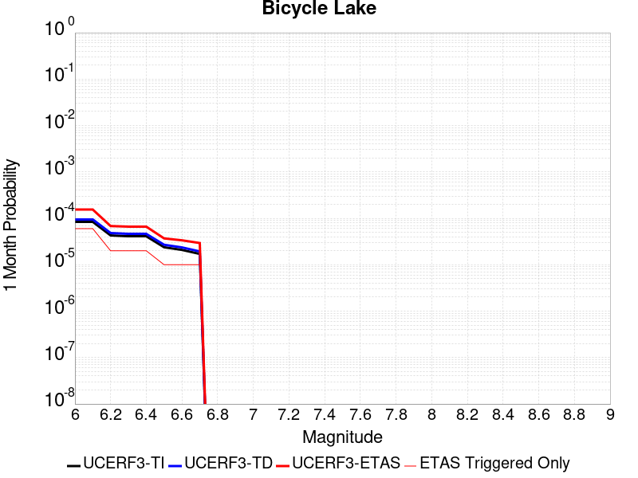 |  |  |

| Magnitude | 1 wk TI Prob | 1 wk TD Prob | 1 wk ETAS Prob | 1 wk ETAS/TD Gain | 1 wk ETAS Triggered Only | 1 mo TI Prob | 1 mo TD Prob | 1 mo ETAS Prob | 1 mo ETAS/TD Gain | 1 mo ETAS Triggered Only | 1 yr TI Prob | 1 yr TD Prob | 1 yr ETAS Prob | 1 yr ETAS/TD Gain | 1 yr ETAS Triggered Only | 10 yr TI Prob | 10 yr TD Prob | 10 yr ETAS Prob | 10 yr ETAS/TD Gain | 10 yr ETAS Triggered Only |
|-----|-----|-----|-----|-----|-----|-----|-----|-----|-----|-----|-----|-----|-----|-----|-----|-----|-----|-----|-----|-----|
| 6.0 | 1.9621975E-5 | 2.2098557E-5 | 3.2098338E-5 | 1.4525082 | 1.0E-5 | 8.4091465E-5 | 9.470543E-5 | 1.5469974E-4 | 1.6334834 | 6.0E-5 | 0.0010233327 | 0.0011525637 | 0.0015221372 | 1.3206534 | 3.7E-4 | 0.01018633 | 0.011479174 | 0.012378727 | 1.078364 | 9.1E-4 |
| 6.1 | 1.9621975E-5 | 2.2098557E-5 | 3.2098338E-5 | 1.4525082 | 1.0E-5 | 8.4091465E-5 | 9.470543E-5 | 1.5469974E-4 | 1.6334834 | 6.0E-5 | 0.0010233327 | 0.0011525637 | 0.0015221372 | 1.3206534 | 3.7E-4 | 0.01018633 | 0.011479174 | 0.012378727 | 1.078364 | 9.1E-4 |
| 6.2 | 9.9971285E-6 | 1.1256391E-5 | 1.1256391E-5 | 1.0 | 0.0 | 4.2844134E-5 | 4.824108E-5 | 6.8240115E-5 | 1.4145644 | 2.0E-5 | 5.2150246E-4 | 5.8722886E-4 | 8.170938E-4 | 1.3914402 | 2.3E-4 | 0.0052028033 | 0.0058618775 | 0.0064185946 | 1.0949725 | 5.6E-4 |
| 6.3 | 9.589428E-6 | 1.0799068E-5 | 1.0799068E-5 | 1.0 | 0.0 | 4.10969E-5 | 4.6281195E-5 | 6.628027E-5 | 1.4321209 | 2.0E-5 | 5.002399E-4 | 5.633797E-4 | 7.832558E-4 | 1.3902804 | 2.2E-4 | 0.0049911533 | 0.0056246053 | 0.006151624 | 1.0936989 | 5.3E-4 |
| 6.4 | 9.589428E-6 | 1.0799068E-5 | 1.0799068E-5 | 1.0 | 0.0 | 4.10969E-5 | 4.6281195E-5 | 6.628027E-5 | 1.4321209 | 2.0E-5 | 5.002399E-4 | 5.633797E-4 | 7.832558E-4 | 1.3902804 | 2.2E-4 | 0.0049911533 | 0.0056246053 | 0.006151624 | 1.0936989 | 5.3E-4 |
| 6.5 | 5.557707E-6 | 6.286038E-6 | 6.286038E-6 | 1.0 | 0.0 | 2.3818526E-5 | 2.6940037E-5 | 3.6939768E-5 | 1.3711847 | 1.0E-5 | 2.8995197E-4 | 3.2797246E-4 | 4.7792328E-4 | 1.4572054 | 1.5E-4 | 0.0028957394 | 0.003277521 | 0.003636341 | 1.1094791 | 3.6E-4 |
| 6.6 | 4.8742945E-6 | 5.5136734E-6 | 5.5136734E-6 | 1.0 | 0.0 | 2.0889667E-5 | 2.3629962E-5 | 3.3629727E-5 | 1.4231815 | 1.0E-5 | 2.54302E-4 | 2.87683E-4 | 3.9765137E-4 | 1.3822553 | 1.1E-4 | 0.002540112 | 0.0028756752 | 0.0031847837 | 1.1074908 | 3.1E-4 |
| 6.7 | 3.991108E-6 | 4.5162255E-6 | 4.5162255E-6 | 1.0 | 0.0 | 1.7104636E-5 | 1.9355251E-5 | 2.9355058E-5 | 1.5166457 | 1.0E-5 | 2.0822904E-4 | 2.3565018E-4 | 3.1563133E-4 | 1.3394063 | 8.0E-5 | 0.0020803404 | 0.0023565018 | 0.0025759835 | 1.0931387 | 2.2E-4 |

## Paradise
*[(top)](#table-of-contents)*

| 1 Week | 1 Month | 1 Year | 10 Year |
|-----|-----|-----|-----|
|  |  |  |  |

| Magnitude | 1 wk TI Prob | 1 wk TD Prob | 1 wk ETAS Prob | 1 wk ETAS/TD Gain | 1 wk ETAS Triggered Only | 1 mo TI Prob | 1 mo TD Prob | 1 mo ETAS Prob | 1 mo ETAS/TD Gain | 1 mo ETAS Triggered Only | 1 yr TI Prob | 1 yr TD Prob | 1 yr ETAS Prob | 1 yr ETAS/TD Gain | 1 yr ETAS Triggered Only | 10 yr TI Prob | 10 yr TD Prob | 10 yr ETAS Prob | 10 yr ETAS/TD Gain | 10 yr ETAS Triggered Only |
|-----|-----|-----|-----|-----|-----|-----|-----|-----|-----|-----|-----|-----|-----|-----|-----|-----|-----|-----|-----|-----|
| 6.0 | 1.4851273E-5 | 1.6695423E-5 | 4.669492E-5 | 2.7968698 | 3.0E-5 | 6.364676E-5 | 7.1549985E-5 | 1.7154282E-4 | 2.3975244 | 1.0E-4 | 7.7462377E-4 | 8.707965E-4 | 0.001300422 | 1.4933708 | 4.3E-4 | 0.0077192914 | 0.008676223 | 0.009588241 | 1.105117 | 9.2E-4 |
| 6.1 | 1.4851273E-5 | 1.6695423E-5 | 4.669492E-5 | 2.7968698 | 3.0E-5 | 6.364676E-5 | 7.1549985E-5 | 1.7154282E-4 | 2.3975244 | 1.0E-4 | 7.7462377E-4 | 8.707965E-4 | 0.001300422 | 1.4933708 | 4.3E-4 | 0.0077192914 | 0.008676223 | 0.009588241 | 1.105117 | 9.2E-4 |
| 6.2 | 1.4851273E-5 | 1.6695423E-5 | 4.669492E-5 | 2.7968698 | 3.0E-5 | 6.364676E-5 | 7.1549985E-5 | 1.7154282E-4 | 2.3975244 | 1.0E-4 | 7.7462377E-4 | 8.707965E-4 | 0.001300422 | 1.4933708 | 4.3E-4 | 0.0077192914 | 0.008676223 | 0.009588241 | 1.105117 | 9.2E-4 |
| 6.3 | 1.0426831E-5 | 1.1889131E-5 | 2.1889013E-5 | 1.8410944 | 1.0E-5 | 4.4685654E-5 | 5.0952458E-5 | 1.2094889E-4 | 2.3737597 | 7.0E-5 | 5.43912E-4 | 6.2017556E-4 | 8.300453E-4 | 1.3384038 | 2.1E-4 | 0.0054258266 | 0.0061850566 | 0.0065627065 | 1.0610584 | 3.8E-4 |
| 6.4 | 1.0426831E-5 | 1.1889131E-5 | 2.1889013E-5 | 1.8410944 | 1.0E-5 | 4.4685654E-5 | 5.0952458E-5 | 1.2094889E-4 | 2.3737597 | 7.0E-5 | 5.43912E-4 | 6.2017556E-4 | 8.300453E-4 | 1.3384038 | 2.1E-4 | 0.0054258266 | 0.0061850566 | 0.0065627065 | 1.0610584 | 3.8E-4 |
| 6.5 | 9.25027E-6 | 1.0620418E-5 | 1.0620418E-5 | 1.0 | 0.0 | 3.964341E-5 | 4.5515313E-5 | 9.551304E-5 | 2.0984814 | 5.0E-5 | 4.8255164E-4 | 5.5401295E-4 | 7.139243E-4 | 1.2886419 | 1.6E-4 | 0.0048150513 | 0.0055268174 | 0.00580527 | 1.050382 | 2.8E-4 |
| 6.6 | 7.904275E-6 | 9.159918E-6 | 9.159918E-6 | 1.0 | 0.0 | 3.3875025E-5 | 3.925622E-5 | 7.925465E-5 | 2.0189068 | 4.0E-5 | 4.1235037E-4 | 4.778436E-4 | 5.8779103E-4 | 1.2300909 | 1.1E-4 | 0.0041158604 | 0.0047685583 | 0.0049477 | 1.0375673 | 1.8E-4 |
| 6.7 | 7.2061953E-6 | 8.40761E-6 | 8.40761E-6 | 1.0 | 0.0 | 3.088333E-5 | 3.6032136E-5 | 5.6031415E-5 | 1.5550401 | 2.0E-5 | 3.7593965E-4 | 4.3860663E-4 | 5.285672E-4 | 1.2051053 | 9.0E-5 | 0.003753043 | 0.0043777786 | 0.0045271222 | 1.034114 | 1.5E-4 |
| 6.8 | 6.6948724E-6 | 7.842504E-6 | 7.842504E-6 | 1.0 | 0.0 | 2.8691995E-5 | 3.361032E-5 | 5.3609645E-5 | 1.5950354 | 2.0E-5 | 3.4926904E-4 | 4.0913236E-4 | 4.8909965E-4 | 1.1954558 | 8.0E-5 | 0.003487206 | 0.004084149 | 0.004223577 | 1.0341389 | 1.4E-4 |
| 6.9 | 6.0421025E-6 | 7.13093E-6 | 7.13093E-6 | 1.0 | 0.0 | 2.5894467E-5 | 3.056079E-5 | 4.0560484E-5 | 1.3272066 | 1.0E-5 | 3.1521954E-4 | 3.720175E-4 | 4.219989E-4 | 1.1343523 | 5.0E-5 | 0.0031477278 | 0.0037142856 | 0.003813914 | 1.026823 | 1.0E-4 |
| 7.0 | 4.134091E-6 | 5.080546E-6 | 5.080546E-6 | 1.0 | 0.0 | 1.7717413E-5 | 2.1773596E-5 | 2.1773596E-5 | 1.0 | 0.0 | 2.1568815E-4 | 2.6506282E-4 | 2.8505753E-4 | 1.0754339 | 2.0E-5 | 0.0021547892 | 0.00264762 | 0.0026775405 | 1.0113009 | 3.0E-5 |
| 7.1 | 3.7674888E-6 | 4.6320843E-6 | 4.6320843E-6 | 1.0 | 0.0 | 1.6146281E-5 | 1.9851648E-5 | 1.9851648E-5 | 1.0 | 0.0 | 1.9656324E-4 | 2.4166853E-4 | 2.616637E-4 | 1.082738 | 2.0E-5 | 0.0019638946 | 0.002414208 | 0.0024441353 | 1.0123965 | 3.0E-5 |
| 7.2 | 3.4065345E-6 | 4.1569137E-6 | 4.1569137E-6 | 1.0 | 0.0 | 1.4599351E-5 | 1.7815231E-5 | 1.7815231E-5 | 1.0 | 0.0 | 1.777326E-4 | 2.1688035E-4 | 2.3687602E-4 | 1.0921967 | 2.0E-5 | 0.0017759053 | 0.0021668351 | 0.0021967702 | 1.013815 | 3.0E-5 |
| 7.3 | 2.9934936E-6 | 3.629477E-6 | 3.629477E-6 | 1.0 | 0.0 | 1.2829195E-5 | 1.5554817E-5 | 1.5554817E-5 | 1.0 | 0.0 | 1.5618425E-4 | 1.8936492E-4 | 2.0936114E-4 | 1.1055962 | 2.0E-5 | 0.0015607453 | 0.001892181 | 0.0019221242 | 1.0158247 | 3.0E-5 |
| 7.4 | 2.4049796E-6 | 2.889102E-6 | 2.889102E-6 | 1.0 | 0.0 | 1.0307015E-5 | 1.2381815E-5 | 1.2381815E-5 | 1.0 | 0.0 | 1.2548068E-4 | 1.5073961E-4 | 1.6073811E-4 | 1.0663296 | 1.0E-5 | 0.0012540985 | 0.0015065151 | 0.001526485 | 1.0132557 | 2.0E-5 |
| 7.5 | 1.2710091E-6 | 1.5135334E-6 | 1.5135334E-6 | 1.0 | 0.0 | 5.44717E-6 | 6.4865626E-6 | 6.4865626E-6 | 1.0 | 0.0 | 6.631728E-5 | 7.897229E-5 | 8.89715E-5 | 1.1266167 | 1.0E-5 | 6.6297496E-4 | 7.895649E-4 | 8.095491E-4 | 1.0253104 | 2.0E-5 |
| 7.6 | 2.21172E-7 | 2.6040448E-7 | 2.6040448E-7 | 1.0 | 0.0 | 9.478797E-7 | 1.1160189E-6 | 1.1160189E-6 | 1.0 | 0.0 | 1.1540374E-5 | 1.3587473E-5 | 1.3587473E-5 | 1.0 | 0.0 | 1.1539775E-4 | 1.3586924E-4 | 1.3586924E-4 | 1.0 | 0.0 |

## San Andreas (San Bernardino N)
*[(top)](#table-of-contents)*

| 1 Week | 1 Month | 1 Year | 10 Year |
|-----|-----|-----|-----|
|  |  |  | 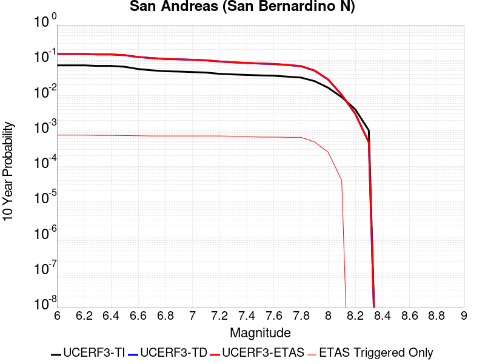 |

| Magnitude | 1 wk TI Prob | 1 wk TD Prob | 1 wk ETAS Prob | 1 wk ETAS/TD Gain | 1 wk ETAS Triggered Only | 1 mo TI Prob | 1 mo TD Prob | 1 mo ETAS Prob | 1 mo ETAS/TD Gain | 1 mo ETAS Triggered Only | 1 yr TI Prob | 1 yr TD Prob | 1 yr ETAS Prob | 1 yr ETAS/TD Gain | 1 yr ETAS Triggered Only | 10 yr TI Prob | 10 yr TD Prob | 10 yr ETAS Prob | 10 yr ETAS/TD Gain | 10 yr ETAS Triggered Only |
|-----|-----|-----|-----|-----|-----|-----|-----|-----|-----|-----|-----|-----|-----|-----|-----|-----|-----|-----|-----|-----|
| 6.0 | 1.4273766E-4 | 3.1637165E-4 | 3.5635897E-4 | 1.1263936 | 4.0E-5 | 6.115894E-4 | 0.0013551798 | 0.0014750172 | 1.0884291 | 1.2E-4 | 0.0074207084 | 0.016375994 | 0.016710427 | 1.0204221 | 3.4E-4 | 0.07177748 | 0.15046582 | 0.15111145 | 1.0042909 | 7.6E-4 |
| 6.1 | 1.4273766E-4 | 3.1637165E-4 | 3.5635897E-4 | 1.1263936 | 4.0E-5 | 6.115894E-4 | 0.0013551798 | 0.0014750172 | 1.0884291 | 1.2E-4 | 0.0074207084 | 0.016375994 | 0.016710427 | 1.0204221 | 3.4E-4 | 0.07177748 | 0.15046582 | 0.15111145 | 1.0042909 | 7.6E-4 |
| 6.2 | 1.4273766E-4 | 3.1637165E-4 | 3.5635897E-4 | 1.1263936 | 4.0E-5 | 6.115894E-4 | 0.0013551798 | 0.0014750172 | 1.0884291 | 1.2E-4 | 0.0074207084 | 0.016375994 | 0.016710427 | 1.0204221 | 3.4E-4 | 0.07177748 | 0.15046582 | 0.15111145 | 1.0042909 | 7.6E-4 |
| 6.3 | 1.3730655E-4 | 3.0541886E-4 | 3.4540662E-4 | 1.1309277 | 4.0E-5 | 5.883239E-4 | 0.0013082869 | 0.001418143 | 1.0839694 | 1.1E-4 | 0.0071393442 | 0.015813464 | 0.016138246 | 1.0205383 | 3.3E-4 | 0.06914291 | 0.14575101 | 0.14639169 | 1.0043957 | 7.5E-4 |
| 6.4 | 1.3730655E-4 | 3.0541886E-4 | 3.4540662E-4 | 1.1309277 | 4.0E-5 | 5.883239E-4 | 0.0013082869 | 0.001418143 | 1.0839694 | 1.1E-4 | 0.0071393442 | 0.015813464 | 0.016138246 | 1.0205383 | 3.3E-4 | 0.06914291 | 0.14575101 | 0.14639169 | 1.0043957 | 7.5E-4 |
| 6.5 | 1.2942807E-4 | 2.895608E-4 | 3.2954922E-4 | 1.1381003 | 4.0E-5 | 5.545738E-4 | 0.0012403899 | 0.0013502534 | 1.0885718 | 1.1E-4 | 0.0067310524 | 0.014998424 | 0.015323475 | 1.0216724 | 3.3E-4 | 0.06530788 | 0.1388892 | 0.13952641 | 1.004588 | 7.4E-4 |
| 6.6 | 1.1125901E-4 | 2.5394472E-4 | 2.9393457E-4 | 1.1574746 | 4.0E-5 | 4.767372E-4 | 0.0010878829 | 0.0011977633 | 1.1010038 | 1.1E-4 | 0.005788839 | 0.013165171 | 0.013490827 | 1.0247362 | 3.3E-4 | 0.056403454 | 0.123156786 | 0.12379688 | 1.0051974 | 7.3E-4 |
| 6.7 | 1.02209575E-4 | 2.3529287E-4 | 2.7528347E-4 | 1.1699609 | 4.0E-5 | 4.3796748E-4 | 0.0010080098 | 0.0011178988 | 1.109016 | 1.1E-4 | 0.0053192247 | 0.012203882 | 0.012529856 | 1.0267106 | 3.3E-4 | 0.051936906 | 0.1149152 | 0.115552455 | 1.0055455 | 7.2E-4 |
| 6.8 | 9.610582E-5 | 2.2054653E-4 | 2.605377E-4 | 1.1813276 | 4.0E-5 | 4.1181705E-4 | 9.448577E-4 | 0.0010547538 | 1.1163096 | 1.1E-4 | 0.0050023515 | 0.011443232 | 0.011769456 | 1.028508 | 3.3E-4 | 0.048912346 | 0.10832591 | 0.10896792 | 1.0059266 | 7.2E-4 |
| 6.9 | 9.3877505E-5 | 2.1510055E-4 | 2.5509193E-4 | 1.1859195 | 4.0E-5 | 4.0227012E-4 | 9.2153443E-4 | 0.0010314331 | 1.1192561 | 1.1E-4 | 0.0048866454 | 0.01116221 | 0.011488527 | 1.029234 | 3.3E-4 | 0.04780577 | 0.10591924 | 0.10656298 | 1.0060776 | 7.2E-4 |
| 7.0 | 9.1019785E-5 | 2.0836767E-4 | 2.4835934E-4 | 1.1919284 | 4.0E-5 | 3.900265E-4 | 8.926993E-4 | 0.0010026011 | 1.1231118 | 1.1E-4 | 0.0047382377 | 0.010814676 | 0.011141107 | 1.030184 | 3.3E-4 | 0.046384744 | 0.10288831 | 0.10353423 | 1.0062779 | 7.2E-4 |
| 7.1 | 8.771155E-5 | 2.0011076E-4 | 2.4010276E-4 | 1.1998492 | 4.0E-5 | 3.758525E-4 | 8.573362E-4 | 9.672419E-4 | 1.1281943 | 1.1E-4 | 0.0045664064 | 0.010388309 | 0.010714881 | 1.0314364 | 3.3E-4 | 0.044737056 | 0.099199384 | 0.09984796 | 1.0065382 | 7.2E-4 |
| 7.2 | 8.0830236E-5 | 1.8416144E-4 | 2.2415406E-4 | 1.2171607 | 4.0E-5 | 3.4636928E-4 | 7.890247E-4 | 8.989379E-4 | 1.1393026 | 1.1E-4 | 0.0042088944 | 0.00956417 | 0.009891014 | 1.0341737 | 3.3E-4 | 0.041300658 | 0.09192752 | 0.09258133 | 1.0071123 | 7.2E-4 |
| 7.3 | 7.7668235E-5 | 1.7359214E-4 | 2.135852E-4 | 1.2303852 | 4.0E-5 | 3.328214E-4 | 7.4375427E-4 | 8.5367245E-4 | 1.1477883 | 1.1E-4 | 0.0040445733 | 0.009017691 | 0.009344716 | 1.0362648 | 3.3E-4 | 0.03971748 | 0.087187394 | 0.08783549 | 1.0074334 | 7.1E-4 |
| 7.4 | 7.520177E-5 | 1.6578918E-4 | 1.957842E-4 | 1.1809227 | 3.0E-5 | 3.2225347E-4 | 7.1033166E-4 | 8.102606E-4 | 1.1406794 | 1.0E-4 | 0.0039163795 | 0.008614061 | 0.00892139 | 1.0356777 | 3.1E-4 | 0.038480744 | 0.08364062 | 0.08426375 | 1.00745 | 6.8E-4 |
| 7.5 | 7.274697E-5 | 1.5866217E-4 | 1.886574E-4 | 1.189051 | 3.0E-5 | 3.1173544E-4 | 6.7980355E-4 | 7.7973556E-4 | 1.1470013 | 1.0E-4 | 0.003788775 | 0.008245256 | 0.0085527 | 1.0372874 | 3.1E-4 | 0.03724827 | 0.080355436 | 0.08097159 | 1.0076679 | 6.7E-4 |
| 7.6 | 7.1185845E-5 | 1.5435848E-4 | 1.8435385E-4 | 1.1943228 | 3.0E-5 | 3.0504653E-4 | 6.6136866E-4 | 7.6130254E-4 | 1.1511016 | 1.0E-4 | 0.0037076178 | 0.008022487 | 0.00833 | 1.0383314 | 3.1E-4 | 0.036463667 | 0.07834393 | 0.07896143 | 1.007882 | 6.7E-4 |
| 7.7 | 6.709961E-5 | 1.4344044E-4 | 1.7343614E-4 | 1.209116 | 3.0E-5 | 2.8753807E-4 | 6.1459997E-4 | 7.145385E-4 | 1.1626074 | 1.0E-4 | 0.003495157 | 0.0074571203 | 0.007764809 | 1.041261 | 3.1E-4 | 0.034406938 | 0.07317166 | 0.07378337 | 1.0083599 | 6.6E-4 |
| 7.8 | 6.300812E-5 | 1.3226763E-4 | 1.6226366E-4 | 1.2267829 | 3.0E-5 | 2.7000686E-4 | 5.6673813E-4 | 6.6668144E-4 | 1.1763483 | 1.0E-4 | 0.0032823787 | 0.0068782354 | 0.007186103 | 1.0447598 | 3.1E-4 | 0.032343175 | 0.06782526 | 0.06844049 | 1.0090709 | 6.6E-4 |
| 7.9 | 4.983037E-5 | 9.7425276E-5 | 1.17423326E-4 | 1.2052655 | 2.0E-5 | 2.1354125E-4 | 4.174701E-4 | 4.8744088E-4 | 1.1676067 | 7.0E-5 | 0.0025967648 | 0.0050708633 | 0.005269849 | 1.039241 | 2.0E-4 | 0.025666296 | 0.050739504 | 0.051204644 | 1.0091672 | 4.9E-4 |
| 8.0 | 3.2211527E-5 | 5.3414442E-5 | 6.341391E-5 | 1.1872053 | 1.0E-5 | 1.380421E-4 | 2.2889896E-4 | 2.8888523E-4 | 1.2620643 | 6.0E-5 | 0.0016793669 | 0.0027832852 | 0.002902951 | 1.0429945 | 1.2E-4 | 0.016667323 | 0.028415749 | 0.028658645 | 1.0085479 | 2.5E-4 |
| 8.1 | 1.743376E-5 | 1.8873632E-5 | 1.8873632E-5 | 1.0 | 0.0 | 7.471398E-5 | 8.0884485E-5 | 8.0884485E-5 | 1.0 | 0.0 | 9.0926304E-4 | 9.843244E-4 | 0.0010043047 | 1.0202985 | 2.0E-5 | 0.009055517 | 0.010509953 | 0.010549532 | 1.003766 | 4.0E-5 |
| 8.2 | 7.831616E-6 | 5.1727284E-6 | 5.1727284E-6 | 1.0 | 0.0 | 3.3563636E-5 | 2.2168648E-5 | 2.2168648E-5 | 1.0 | 0.0 | 4.0856065E-4 | 2.6986995E-4 | 2.6986995E-4 | 1.0 | 0.0 | 0.004078103 | 0.003051444 | 0.003051444 | 1.0 | 0.0 |
| 8.3 | 1.983087E-6 | 7.690063E-7 | 7.690063E-7 | 1.0 | 0.0 | 8.498917E-6 | 3.295737E-6 | 3.295737E-6 | 1.0 | 0.0 | 1.034694E-4 | 4.012488E-5 | 4.012488E-5 | 1.0 | 0.0 | 0.0010342124 | 4.737206E-4 | 4.737206E-4 | 1.0 | 0.0 |

## Garlic Springs
*[(top)](#table-of-contents)*

| 1 Week | 1 Month | 1 Year | 10 Year |
|-----|-----|-----|-----|
|  |  |  |  |

| Magnitude | 1 wk TI Prob | 1 wk TD Prob | 1 wk ETAS Prob | 1 wk ETAS/TD Gain | 1 wk ETAS Triggered Only | 1 mo TI Prob | 1 mo TD Prob | 1 mo ETAS Prob | 1 mo ETAS/TD Gain | 1 mo ETAS Triggered Only | 1 yr TI Prob | 1 yr TD Prob | 1 yr ETAS Prob | 1 yr ETAS/TD Gain | 1 yr ETAS Triggered Only | 10 yr TI Prob | 10 yr TD Prob | 10 yr ETAS Prob | 10 yr ETAS/TD Gain | 10 yr ETAS Triggered Only |
|-----|-----|-----|-----|-----|-----|-----|-----|-----|-----|-----|-----|-----|-----|-----|-----|-----|-----|-----|-----|-----|
| 6.0 | 1.6760017E-5 | 1.8778032E-5 | 1.8778032E-5 | 1.0 | 0.0 | 7.182667E-5 | 8.047546E-5 | 1.5046983E-4 | 1.8697604 | 7.0E-5 | 8.7413884E-4 | 9.794657E-4 | 0.0012991523 | 1.3263887 | 3.2E-4 | 0.008707083 | 0.009763035 | 0.01049581 | 1.0750561 | 7.4E-4 |
| 6.1 | 9.852767E-6 | 1.097425E-5 | 1.097425E-5 | 1.0 | 0.0 | 4.222546E-5 | 4.703205E-5 | 9.70297E-5 | 2.0630548 | 5.0E-5 | 5.139737E-4 | 5.7253573E-4 | 7.824155E-4 | 1.3665793 | 2.1E-4 | 0.005127866 | 0.0057175662 | 0.0061948216 | 1.0834718 | 4.8E-4 |
| 6.2 | 9.852767E-6 | 1.097425E-5 | 1.097425E-5 | 1.0 | 0.0 | 4.222546E-5 | 4.703205E-5 | 9.70297E-5 | 2.0630548 | 5.0E-5 | 5.139737E-4 | 5.7253573E-4 | 7.824155E-4 | 1.3665793 | 2.1E-4 | 0.005127866 | 0.0057175662 | 0.0061948216 | 1.0834718 | 4.8E-4 |
| 6.3 | 4.3167724E-6 | 4.7782996E-6 | 4.7782996E-6 | 1.0 | 0.0 | 1.8500323E-5 | 2.0478396E-5 | 5.047778E-5 | 2.4649286 | 3.0E-5 | 2.2521814E-4 | 2.4931898E-4 | 3.3929653E-4 | 1.3608934 | 9.0E-5 | 0.0022499003 | 0.002492651 | 0.0026722024 | 1.0720322 | 1.8E-4 |
| 6.4 | 4.3167724E-6 | 4.7782996E-6 | 4.7782996E-6 | 1.0 | 0.0 | 1.8500323E-5 | 2.0478396E-5 | 5.047778E-5 | 2.4649286 | 3.0E-5 | 2.2521814E-4 | 2.4931898E-4 | 3.3929653E-4 | 1.3608934 | 9.0E-5 | 0.0022499003 | 0.002492651 | 0.0026722024 | 1.0720322 | 1.8E-4 |
| 6.5 | 4.3167724E-6 | 4.7782996E-6 | 4.7782996E-6 | 1.0 | 0.0 | 1.8500323E-5 | 2.0478396E-5 | 5.047778E-5 | 2.4649286 | 3.0E-5 | 2.2521814E-4 | 2.4931898E-4 | 3.3929653E-4 | 1.3608934 | 9.0E-5 | 0.0022499003 | 0.002492651 | 0.0026722024 | 1.0720322 | 1.8E-4 |
| 6.6 | 4.301311E-6 | 4.761167E-6 | 4.761167E-6 | 1.0 | 0.0 | 1.8434059E-5 | 2.0404972E-5 | 5.040436E-5 | 2.4702 | 3.0E-5 | 2.2441156E-4 | 2.4842523E-4 | 3.3840287E-4 | 1.362192 | 9.0E-5 | 0.0022418506 | 0.002483734 | 0.0026632869 | 1.0722915 | 1.8E-4 |
| 6.7 | 3.8599724E-6 | 4.2713013E-6 | 4.2713013E-6 | 1.0 | 0.0 | 1.6542634E-5 | 1.8305576E-5 | 4.8305028E-5 | 2.638815 | 3.0E-5 | 2.0138794E-4 | 2.228704E-4 | 3.0285257E-4 | 1.358873 | 8.0E-5 | 0.0020120554 | 0.0022287038 | 0.0023883474 | 1.0716306 | 1.6E-4 |

## Coyote Lake
*[(top)](#table-of-contents)*

| 1 Week | 1 Month | 1 Year | 10 Year |
|-----|-----|-----|-----|
|  | 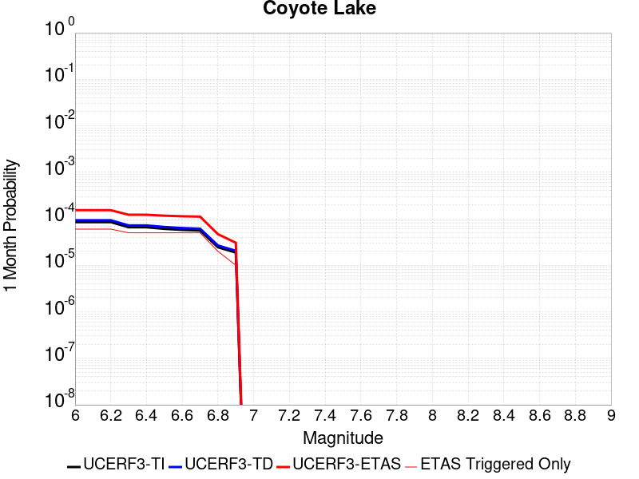 |  |  |

| Magnitude | 1 wk TI Prob | 1 wk TD Prob | 1 wk ETAS Prob | 1 wk ETAS/TD Gain | 1 wk ETAS Triggered Only | 1 mo TI Prob | 1 mo TD Prob | 1 mo ETAS Prob | 1 mo ETAS/TD Gain | 1 mo ETAS Triggered Only | 1 yr TI Prob | 1 yr TD Prob | 1 yr ETAS Prob | 1 yr ETAS/TD Gain | 1 yr ETAS Triggered Only | 10 yr TI Prob | 10 yr TD Prob | 10 yr ETAS Prob | 10 yr ETAS/TD Gain | 10 yr ETAS Triggered Only |
|-----|-----|-----|-----|-----|-----|-----|-----|-----|-----|-----|-----|-----|-----|-----|-----|-----|-----|-----|-----|-----|
| 6.0 | 1.980352E-5 | 2.1707852E-5 | 4.170742E-5 | 1.9213057 | 2.0E-5 | 8.486947E-5 | 9.303074E-5 | 1.5302516E-4 | 1.6448882 | 6.0E-5 | 0.0010327959 | 0.0011321327 | 0.0013518838 | 1.1941035 | 2.2E-4 | 0.010280091 | 0.01127083 | 0.011695984 | 1.0377216 | 4.3E-4 |
| 6.1 | 1.980352E-5 | 2.1707852E-5 | 4.170742E-5 | 1.9213057 | 2.0E-5 | 8.486947E-5 | 9.303074E-5 | 1.5302516E-4 | 1.6448882 | 6.0E-5 | 0.0010327959 | 0.0011321327 | 0.0013518838 | 1.1941035 | 2.2E-4 | 0.010280091 | 0.01127083 | 0.011695984 | 1.0377216 | 4.3E-4 |
| 6.2 | 1.980352E-5 | 2.1707852E-5 | 4.170742E-5 | 1.9213057 | 2.0E-5 | 8.486947E-5 | 9.303074E-5 | 1.5302516E-4 | 1.6448882 | 6.0E-5 | 0.0010327959 | 0.0011321327 | 0.0013518838 | 1.1941035 | 2.2E-4 | 0.010280091 | 0.01127083 | 0.011695984 | 1.0377216 | 4.3E-4 |
| 6.3 | 1.5344787E-5 | 1.6821528E-5 | 3.682119E-5 | 2.1889327 | 2.0E-5 | 6.576172E-5 | 7.209062E-5 | 1.22087E-4 | 1.6935215 | 5.0E-5 | 8.003548E-4 | 8.7741105E-4 | 0.0010772356 | 1.2277434 | 2.0E-4 | 0.007974784 | 0.008745514 | 0.009082541 | 1.038537 | 3.4E-4 |
| 6.4 | 1.5344787E-5 | 1.6821528E-5 | 3.682119E-5 | 2.1889327 | 2.0E-5 | 6.576172E-5 | 7.209062E-5 | 1.22087E-4 | 1.6935215 | 5.0E-5 | 8.003548E-4 | 8.7741105E-4 | 0.0010772356 | 1.2277434 | 2.0E-4 | 0.007974784 | 0.008745514 | 0.009082541 | 1.038537 | 3.4E-4 |
| 6.5 | 1.4189697E-5 | 1.5558782E-5 | 3.555847E-5 | 2.2854276 | 2.0E-5 | 6.081157E-5 | 6.667913E-5 | 1.166758E-4 | 1.7498097 | 5.0E-5 | 7.401293E-4 | 8.115764E-4 | 0.0010014222 | 1.2339222 | 1.9E-4 | 0.0073766913 | 0.008092069 | 0.008419398 | 1.0404507 | 3.3E-4 |
| 6.6 | 1.3469301E-5 | 1.4772335E-5 | 3.477204E-5 | 2.353862 | 2.0E-5 | 5.7724297E-5 | 6.330881E-5 | 1.1330564E-4 | 1.7897295 | 5.0E-5 | 7.025667E-4 | 7.7057217E-4 | 9.4044115E-4 | 1.2204453 | 1.7E-4 | 0.0070034964 | 0.0076849074 | 0.007982602 | 1.0387375 | 3.0E-4 |
| 6.7 | 1.3027966E-5 | 1.4282475E-5 | 3.4282188E-5 | 2.4002976 | 2.0E-5 | 5.5832945E-5 | 6.12095E-5 | 1.1120644E-4 | 1.8168166 | 5.0E-5 | 6.7955407E-4 | 7.450307E-4 | 9.049115E-4 | 1.2145963 | 1.6E-4 | 0.006774798 | 0.007431207 | 0.0077091265 | 1.0373989 | 2.8E-4 |
| 6.8 | 5.695434E-6 | 6.2247245E-6 | 2.62246E-5 | 4.2129736 | 2.0E-5 | 2.4408775E-5 | 2.6677288E-5 | 4.6676752E-5 | 1.7496815 | 2.0E-5 | 2.971363E-4 | 3.2477756E-4 | 4.0475157E-4 | 1.2462424 | 8.0E-5 | 0.0029673933 | 0.0032459702 | 0.0033456457 | 1.0307075 | 1.0E-4 |
| 6.9 | 4.385688E-6 | 4.7932917E-6 | 1.4793243E-5 | 3.086239 | 1.0E-5 | 1.879567E-5 | 2.0542679E-5 | 3.0542473E-5 | 1.4867815 | 1.0E-5 | 2.2881327E-4 | 2.501071E-4 | 3.000946E-4 | 1.1998644 | 5.0E-5 | 0.002285778 | 0.002501071 | 0.002570896 | 1.027918 | 7.0E-5 |

## Death Valley (Black Mtns Frontal)
*[(top)](#table-of-contents)*

| 1 Week | 1 Month | 1 Year | 10 Year |
|-----|-----|-----|-----|
|  |  |  | 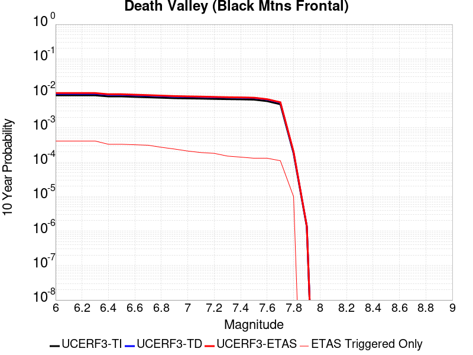 |

| Magnitude | 1 wk TI Prob | 1 wk TD Prob | 1 wk ETAS Prob | 1 wk ETAS/TD Gain | 1 wk ETAS Triggered Only | 1 mo TI Prob | 1 mo TD Prob | 1 mo ETAS Prob | 1 mo ETAS/TD Gain | 1 mo ETAS Triggered Only | 1 yr TI Prob | 1 yr TD Prob | 1 yr ETAS Prob | 1 yr ETAS/TD Gain | 1 yr ETAS Triggered Only | 10 yr TI Prob | 10 yr TD Prob | 10 yr ETAS Prob | 10 yr ETAS/TD Gain | 10 yr ETAS Triggered Only |
|-----|-----|-----|-----|-----|-----|-----|-----|-----|-----|-----|-----|-----|-----|-----|-----|-----|-----|-----|-----|-----|
| 6.0 | 1.6707214E-5 | 1.8671435E-5 | 2.867125E-5 | 1.5355674 | 1.0E-5 | 7.160038E-5 | 8.001803E-5 | 1.1001563E-4 | 1.3748856 | 3.0E-5 | 8.71386E-4 | 9.737917E-4 | 0.0011036651 | 1.1333687 | 1.3E-4 | 0.00867977 | 0.0096961 | 0.010102125 | 1.041875 | 4.1E-4 |
| 6.1 | 1.6707214E-5 | 1.8671435E-5 | 2.867125E-5 | 1.5355674 | 1.0E-5 | 7.160038E-5 | 8.001803E-5 | 1.1001563E-4 | 1.3748856 | 3.0E-5 | 8.71386E-4 | 9.737917E-4 | 0.0011036651 | 1.1333687 | 1.3E-4 | 0.00867977 | 0.0096961 | 0.010102125 | 1.041875 | 4.1E-4 |
| 6.2 | 1.6707214E-5 | 1.8671435E-5 | 2.867125E-5 | 1.5355674 | 1.0E-5 | 7.160038E-5 | 8.001803E-5 | 1.1001563E-4 | 1.3748856 | 3.0E-5 | 8.71386E-4 | 9.737917E-4 | 0.0011036651 | 1.1333687 | 1.3E-4 | 0.00867977 | 0.0096961 | 0.010102125 | 1.041875 | 4.1E-4 |
| 6.3 | 1.6707214E-5 | 1.8671435E-5 | 2.867125E-5 | 1.5355674 | 1.0E-5 | 7.160038E-5 | 8.001803E-5 | 1.1001563E-4 | 1.3748856 | 3.0E-5 | 8.71386E-4 | 9.737917E-4 | 0.0011036651 | 1.1333687 | 1.3E-4 | 0.00867977 | 0.0096961 | 0.010102125 | 1.041875 | 4.1E-4 |
| 6.4 | 1.5515609E-5 | 1.7339296E-5 | 1.7339296E-5 | 1.0 | 0.0 | 6.649377E-5 | 7.430919E-5 | 9.43077E-5 | 1.2691257 | 2.0E-5 | 8.0926094E-4 | 9.04345E-4 | 0.0010142456 | 1.121525 | 1.1E-4 | 0.008063202 | 0.009007333 | 0.009334361 | 1.0363069 | 3.3E-4 |
| 6.5 | 1.5515609E-5 | 1.7339296E-5 | 1.7339296E-5 | 1.0 | 0.0 | 6.649377E-5 | 7.430919E-5 | 9.43077E-5 | 1.2691257 | 2.0E-5 | 8.0926094E-4 | 9.04345E-4 | 0.0010142456 | 1.121525 | 1.1E-4 | 0.008063202 | 0.009007333 | 0.009334361 | 1.0363069 | 3.3E-4 |
| 6.6 | 1.5041828E-5 | 1.6810196E-5 | 1.6810196E-5 | 1.0 | 0.0 | 6.4463384E-5 | 7.204174E-5 | 9.2040296E-5 | 1.2775968 | 2.0E-5 | 7.8455906E-4 | 8.767611E-4 | 9.866647E-4 | 1.1253518 | 1.1E-4 | 0.00781795 | 0.008733676 | 0.0090508815 | 1.0363197 | 3.2E-4 |
| 6.7 | 1.4634985E-5 | 1.635704E-5 | 1.635704E-5 | 1.0 | 0.0 | 6.271985E-5 | 7.009975E-5 | 9.009834E-5 | 1.2852877 | 2.0E-5 | 7.6334673E-4 | 8.53136E-4 | 9.530507E-4 | 1.1171145 | 1.0E-4 | 0.007607299 | 0.008499245 | 0.0088066105 | 1.0361638 | 3.1E-4 |
| 6.8 | 1.4209158E-5 | 1.5883043E-5 | 1.5883043E-5 | 1.0 | 0.0 | 6.089497E-5 | 6.806844E-5 | 8.806708E-5 | 1.2938019 | 2.0E-5 | 7.4114406E-4 | 8.2842377E-4 | 9.183492E-4 | 1.1085501 | 9.0E-5 | 0.007386771 | 0.008253971 | 0.008521743 | 1.0324415 | 2.7E-4 |
| 6.9 | 1.3780098E-5 | 1.540556E-5 | 1.540556E-5 | 1.0 | 0.0 | 5.9056227E-5 | 6.6022185E-5 | 8.602087E-5 | 1.3029084 | 2.0E-5 | 7.1877235E-4 | 8.0352917E-4 | 8.734729E-4 | 1.0870457 | 7.0E-5 | 0.0071645193 | 0.0080068335 | 0.008244911 | 1.0297344 | 2.4E-4 |
| 7.0 | 1.3585064E-5 | 1.5189109E-5 | 1.5189109E-5 | 1.0 | 0.0 | 5.8220405E-5 | 6.509459E-5 | 8.5093285E-5 | 1.3072252 | 2.0E-5 | 7.086029E-4 | 7.922439E-4 | 8.322122E-4 | 1.0504495 | 4.0E-5 | 0.007063476 | 0.007894788 | 0.008103129 | 1.0263898 | 2.1E-4 |
| 7.1 | 1.3398601E-5 | 1.4982282E-5 | 1.4982282E-5 | 1.0 | 0.0 | 5.742131E-5 | 6.420823E-5 | 8.420694E-5 | 1.3114666 | 2.0E-5 | 6.9888023E-4 | 7.8146026E-4 | 8.114368E-4 | 1.0383596 | 3.0E-5 | 0.0069668638 | 0.007787712 | 0.007976232 | 1.0242074 | 1.9E-4 |
| 7.2 | 1.3126312E-5 | 1.4680485E-5 | 1.4680485E-5 | 1.0 | 0.0 | 5.6254412E-5 | 6.291488E-5 | 7.291425E-5 | 1.158935 | 1.0E-5 | 6.846822E-4 | 7.6572486E-4 | 7.857096E-4 | 1.0260991 | 2.0E-5 | 0.006825765 | 0.007631449 | 0.0078100753 | 1.0234066 | 1.8E-4 |
| 7.3 | 1.2922429E-5 | 1.4454699E-5 | 1.4454699E-5 | 1.0 | 0.0 | 5.5380664E-5 | 6.194727E-5 | 7.1946655E-5 | 1.1614176 | 1.0E-5 | 6.74051E-4 | 7.539525E-4 | 7.6394493E-4 | 1.0132535 | 1.0E-5 | 0.006720101 | 0.007514527 | 0.0076634 | 1.0198114 | 1.5E-4 |
| 7.4 | 1.2768878E-5 | 1.4284673E-5 | 1.4284673E-5 | 1.0 | 0.0 | 5.4722615E-5 | 6.121862E-5 | 7.121801E-5 | 1.163339 | 1.0E-5 | 6.660441E-4 | 7.450873E-4 | 7.5507985E-4 | 1.0134113 | 1.0E-5 | 0.0066405144 | 0.007426471 | 0.007565431 | 1.0187114 | 1.4E-4 |
| 7.5 | 1.2521929E-5 | 1.4012902E-5 | 1.4012902E-5 | 1.0 | 0.0 | 5.366431E-5 | 6.0053942E-5 | 7.005334E-5 | 1.166507 | 1.0E-5 | 6.531671E-4 | 7.309169E-4 | 7.409096E-4 | 1.0136714 | 1.0E-5 | 0.006512506 | 0.0072857053 | 0.007414758 | 1.0177132 | 1.3E-4 |
| 7.6 | 1.1301089E-5 | 1.2648951E-5 | 1.2648951E-5 | 1.0 | 0.0 | 4.8432343E-5 | 5.4208693E-5 | 6.420815E-5 | 1.1844623 | 1.0E-5 | 5.895042E-4 | 6.597963E-4 | 6.697897E-4 | 1.0151461 | 1.0E-5 | 0.0058794282 | 0.006578926 | 0.006708071 | 1.0196301 | 1.3E-4 |
| 7.7 | 9.189108E-6 | 1.02840095E-5 | 1.02840095E-5 | 1.0 | 0.0 | 3.93813E-5 | 4.407361E-5 | 5.407317E-5 | 1.2268832 | 1.0E-5 | 4.7936183E-4 | 5.3646916E-4 | 5.4646377E-4 | 1.0186304 | 1.0E-5 | 0.004783291 | 0.005352252 | 0.0054616635 | 1.0204421 | 1.1E-4 |
| 7.8 | 3.4586725E-7 | 3.648368E-7 | 3.648368E-7 | 1.0 | 0.0 | 1.4822873E-6 | 1.5635853E-6 | 1.5635853E-6 | 1.0 | 0.0 | 1.80467E-5 | 1.903649E-5 | 1.903649E-5 | 1.0 | 0.0 | 1.8045233E-4 | 1.9034903E-4 | 2.0034713E-4 | 1.052525 | 1.0E-5 |
| 7.9 | 2.5591178E-9 | 2.6697329E-9 | 2.6697329E-9 | 1.0 | 0.0 | 1.0967647E-8 | 1.14417125E-8 | 1.14417125E-8 | 1.0 | 0.0 | 1.335311E-7 | 1.3930286E-7 | 1.3930286E-7 | 1.0 | 0.0 | 1.3353102E-6 | 1.3930285E-6 | 1.3930285E-6 | 1.0 | 0.0 |

## Helendale-So Lockhart
*[(top)](#table-of-contents)*

| 1 Week | 1 Month | 1 Year | 10 Year |
|-----|-----|-----|-----|
|  |  |  | 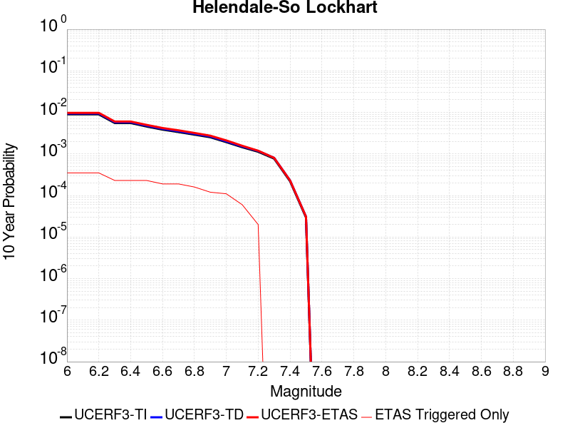 |

| Magnitude | 1 wk TI Prob | 1 wk TD Prob | 1 wk ETAS Prob | 1 wk ETAS/TD Gain | 1 wk ETAS Triggered Only | 1 mo TI Prob | 1 mo TD Prob | 1 mo ETAS Prob | 1 mo ETAS/TD Gain | 1 mo ETAS Triggered Only | 1 yr TI Prob | 1 yr TD Prob | 1 yr ETAS Prob | 1 yr ETAS/TD Gain | 1 yr ETAS Triggered Only | 10 yr TI Prob | 10 yr TD Prob | 10 yr ETAS Prob | 10 yr ETAS/TD Gain | 10 yr ETAS Triggered Only |
|-----|-----|-----|-----|-----|-----|-----|-----|-----|-----|-----|-----|-----|-----|-----|-----|-----|-----|-----|-----|-----|
| 6.0 | 1.7296055E-5 | 1.810418E-5 | 3.8103815E-5 | 2.1046972 | 2.0E-5 | 7.412385E-5 | 7.7587145E-5 | 1.0758482E-4 | 1.386632 | 3.0E-5 | 9.0208417E-4 | 9.442349E-4 | 0.0011040838 | 1.1692894 | 1.6E-4 | 0.008984311 | 0.009404349 | 0.009751057 | 1.0368668 | 3.5E-4 |
| 6.1 | 1.7296055E-5 | 1.810418E-5 | 3.8103815E-5 | 2.1046972 | 2.0E-5 | 7.412385E-5 | 7.7587145E-5 | 1.0758482E-4 | 1.386632 | 3.0E-5 | 9.0208417E-4 | 9.442349E-4 | 0.0011040838 | 1.1692894 | 1.6E-4 | 0.008984311 | 0.009404349 | 0.009751057 | 1.0368668 | 3.5E-4 |
| 6.2 | 1.7296055E-5 | 1.810418E-5 | 3.8103815E-5 | 2.1046972 | 2.0E-5 | 7.412385E-5 | 7.7587145E-5 | 1.0758482E-4 | 1.386632 | 3.0E-5 | 9.0208417E-4 | 9.442349E-4 | 0.0011040838 | 1.1692894 | 1.6E-4 | 0.008984311 | 0.009404349 | 0.009751057 | 1.0368668 | 3.5E-4 |
| 6.3 | 1.0669118E-5 | 1.1135683E-5 | 3.113546E-5 | 2.796008 | 2.0E-5 | 4.5723988E-5 | 4.7723497E-5 | 7.772207E-5 | 1.6285912 | 3.0E-5 | 5.5654737E-4 | 5.808815E-4 | 6.708292E-4 | 1.1548469 | 9.0E-5 | 0.0055515557 | 0.0057939277 | 0.0060225953 | 1.0394667 | 2.3E-4 |
| 6.4 | 1.0669118E-5 | 1.1135683E-5 | 3.113546E-5 | 2.796008 | 2.0E-5 | 4.5723988E-5 | 4.7723497E-5 | 7.772207E-5 | 1.6285912 | 3.0E-5 | 5.5654737E-4 | 5.808815E-4 | 6.708292E-4 | 1.1548469 | 9.0E-5 | 0.0055515557 | 0.0057939277 | 0.0060225953 | 1.0394667 | 2.3E-4 |
| 6.5 | 8.790038E-6 | 9.170408E-6 | 2.9170224E-5 | 3.1809082 | 2.0E-5 | 3.767105E-5 | 3.930116E-5 | 6.929998E-5 | 1.7633061 | 3.0E-5 | 4.585485E-4 | 4.7838816E-4 | 5.683451E-4 | 1.1880418 | 9.0E-5 | 0.0045760344 | 0.0047737476 | 0.00500265 | 1.0479501 | 2.3E-4 |
| 6.6 | 7.396949E-6 | 7.715714E-6 | 7.715714E-6 | 1.0 | 0.0 | 3.1700827E-5 | 3.306693E-5 | 3.306693E-5 | 1.0 | 0.0 | 3.858892E-4 | 4.025165E-4 | 4.6249237E-4 | 1.1490022 | 6.0E-5 | 0.003852198 | 0.0040179817 | 0.004207218 | 1.0470974 | 1.9E-4 |
| 6.7 | 6.4600285E-6 | 6.738185E-6 | 6.738185E-6 | 1.0 | 0.0 | 2.7685543E-5 | 2.8877621E-5 | 2.8877621E-5 | 1.0 | 0.0 | 3.3701936E-4 | 3.515291E-4 | 4.11508E-4 | 1.1706228 | 6.0E-5 | 0.0033650869 | 0.003509812 | 0.0036991453 | 1.053944 | 1.9E-4 |
| 6.8 | 5.600104E-6 | 5.8361397E-6 | 5.8361397E-6 | 1.0 | 0.0 | 2.4000226E-5 | 2.5011792E-5 | 2.5011792E-5 | 1.0 | 0.0 | 2.9216358E-4 | 3.0447662E-4 | 3.5446137E-4 | 1.1641662 | 5.0E-5 | 0.0029177975 | 0.003040656 | 0.0032001694 | 1.0524602 | 1.6E-4 |
| 6.9 | 4.839122E-6 | 5.03962E-6 | 5.03962E-6 | 1.0 | 0.0 | 2.0738931E-5 | 2.1598196E-5 | 2.1598196E-5 | 1.0 | 0.0 | 2.5246723E-4 | 2.6292677E-4 | 2.829215E-4 | 1.0760468 | 2.0E-5 | 0.002521806 | 0.0026262044 | 0.0027458894 | 1.0455734 | 1.2E-4 |
| 7.0 | 3.6937633E-6 | 3.8452918E-6 | 3.8452918E-6 | 1.0 | 0.0 | 1.5830317E-5 | 1.6479718E-5 | 1.6479718E-5 | 1.0 | 0.0 | 1.9271708E-4 | 2.0062242E-4 | 2.1062042E-4 | 1.0498348 | 1.0E-5 | 0.0019255003 | 0.0020044446 | 0.002114224 | 1.0547681 | 1.1E-4 |
| 7.1 | 2.7858857E-6 | 2.8979157E-6 | 2.8979157E-6 | 1.0 | 0.0 | 1.1939455E-5 | 1.241958E-5 | 1.241958E-5 | 1.0 | 0.0 | 1.4535317E-4 | 1.5119811E-4 | 1.5119811E-4 | 1.0 | 0.0 | 0.0014525814 | 0.0015109739 | 0.0015708833 | 1.0396495 | 6.0E-5 |
| 7.2 | 2.1672065E-6 | 2.2540607E-6 | 2.2540607E-6 | 1.0 | 0.0 | 9.2879945E-6 | 9.660225E-6 | 9.660225E-6 | 1.0 | 0.0 | 1.1307546E-4 | 1.1760708E-4 | 1.1760708E-4 | 1.0 | 0.0 | 0.0011301794 | 0.0011754666 | 0.0011954431 | 1.0169945 | 2.0E-5 |
| 7.3 | 1.4823496E-6 | 1.5422432E-6 | 1.5422432E-6 | 1.0 | 0.0 | 6.3529114E-6 | 6.609598E-6 | 6.609598E-6 | 1.0 | 0.0 | 7.734395E-5 | 8.0469035E-5 | 8.0469035E-5 | 1.0 | 0.0 | 7.731704E-4 | 8.044141E-4 | 8.044141E-4 | 1.0 | 0.0 |
| 7.4 | 4.2321457E-7 | 4.4109754E-7 | 4.4109754E-7 | 1.0 | 0.0 | 1.8137755E-6 | 1.8904169E-6 | 1.8904169E-6 | 1.0 | 0.0 | 2.2082493E-5 | 2.301563E-5 | 2.301563E-5 | 1.0 | 0.0 | 2.2080299E-4 | 2.3013698E-4 | 2.3013698E-4 | 1.0 | 0.0 |
| 7.5 | 5.6942316E-8 | 5.9417015E-8 | 5.9417015E-8 | 1.0 | 0.0 | 2.440385E-7 | 2.5464433E-7 | 2.5464433E-7 | 1.0 | 0.0 | 2.9711643E-6 | 3.100291E-6 | 3.100291E-6 | 1.0 | 0.0 | 2.9711247E-5 | 3.1002557E-5 | 3.1002557E-5 | 1.0 | 0.0 |

## San Andreas (San Bernardino S)
*[(top)](#table-of-contents)*

| 1 Week | 1 Month | 1 Year | 10 Year |
|-----|-----|-----|-----|
|  |  |  |  |

| Magnitude | 1 wk TI Prob | 1 wk TD Prob | 1 wk ETAS Prob | 1 wk ETAS/TD Gain | 1 wk ETAS Triggered Only | 1 mo TI Prob | 1 mo TD Prob | 1 mo ETAS Prob | 1 mo ETAS/TD Gain | 1 mo ETAS Triggered Only | 1 yr TI Prob | 1 yr TD Prob | 1 yr ETAS Prob | 1 yr ETAS/TD Gain | 1 yr ETAS Triggered Only | 10 yr TI Prob | 10 yr TD Prob | 10 yr ETAS Prob | 10 yr ETAS/TD Gain | 10 yr ETAS Triggered Only |
|-----|-----|-----|-----|-----|-----|-----|-----|-----|-----|-----|-----|-----|-----|-----|-----|-----|-----|-----|-----|-----|
| 6.0 | 1.2336002E-4 | 3.0025674E-4 | 3.302477E-4 | 1.0998845 | 3.0E-5 | 5.2857865E-4 | 0.0012862061 | 0.0013461289 | 1.0465888 | 6.0E-5 | 0.006416472 | 0.015552082 | 0.015729282 | 1.011394 | 1.8E-4 | 0.06234337 | 0.14278531 | 0.14306818 | 1.0019811 | 3.3E-4 |
| 6.1 | 1.2336002E-4 | 3.0025674E-4 | 3.302477E-4 | 1.0998845 | 3.0E-5 | 5.2857865E-4 | 0.0012862061 | 0.0013461289 | 1.0465888 | 6.0E-5 | 0.006416472 | 0.015552082 | 0.015729282 | 1.011394 | 1.8E-4 | 0.06234337 | 0.14278531 | 0.14306818 | 1.0019811 | 3.3E-4 |
| 6.2 | 1.2336002E-4 | 3.0025674E-4 | 3.302477E-4 | 1.0998845 | 3.0E-5 | 5.2857865E-4 | 0.0012862061 | 0.0013461289 | 1.0465888 | 6.0E-5 | 0.006416472 | 0.015552082 | 0.015729282 | 1.011394 | 1.8E-4 | 0.06234337 | 0.14278531 | 0.14306818 | 1.0019811 | 3.3E-4 |
| 6.3 | 1.1712257E-4 | 2.8813703E-4 | 3.1812838E-4 | 1.1040871 | 3.0E-5 | 5.018573E-4 | 0.0012343143 | 0.0012942402 | 1.04855 | 6.0E-5 | 0.006093008 | 0.014929076 | 0.015096538 | 1.0112171 | 1.7E-4 | 0.059286322 | 0.13748851 | 0.13776451 | 1.0020075 | 3.2E-4 |
| 6.4 | 1.1712257E-4 | 2.8813703E-4 | 3.1812838E-4 | 1.1040871 | 3.0E-5 | 5.018573E-4 | 0.0012343143 | 0.0012942402 | 1.04855 | 6.0E-5 | 0.006093008 | 0.014929076 | 0.015096538 | 1.0112171 | 1.7E-4 | 0.059286322 | 0.13748851 | 0.13776451 | 1.0020075 | 3.2E-4 |
| 6.5 | 1.0689076E-4 | 2.6826185E-4 | 2.982538E-4 | 1.111801 | 3.0E-5 | 4.5802278E-4 | 0.0011492119 | 0.001209143 | 1.0521497 | 6.0E-5 | 0.0055621783 | 0.013906514 | 0.01407415 | 1.0120544 | 1.7E-4 | 0.05425003 | 0.12872604 | 0.12900484 | 1.0021659 | 3.2E-4 |
| 6.6 | 9.7648895E-5 | 2.5070578E-4 | 2.8069827E-4 | 1.1196321 | 3.0E-5 | 4.1842813E-4 | 0.0010740346 | 0.0011339702 | 1.0558041 | 6.0E-5 | 0.005082469 | 0.013002338 | 0.013170128 | 1.0129045 | 1.7E-4 | 0.049677886 | 0.120901346 | 0.12117387 | 1.0022541 | 3.1E-4 |
| 6.7 | 8.757013E-5 | 2.3141113E-4 | 2.6140417E-4 | 1.1296093 | 3.0E-5 | 3.7524657E-4 | 9.914073E-4 | 0.0010513478 | 1.06046 | 6.0E-5 | 0.00455906 | 0.0120076705 | 0.012175629 | 1.0139877 | 1.7E-4 | 0.04466656 | 0.11218169 | 0.11245692 | 1.0024533 | 3.1E-4 |
| 6.8 | 8.562978E-5 | 2.270081E-4 | 2.570013E-4 | 1.1321238 | 3.0E-5 | 3.6693315E-4 | 9.7255135E-4 | 0.001032493 | 1.0616333 | 6.0E-5 | 0.004458263 | 0.011780596 | 0.011948594 | 1.0142605 | 1.7E-4 | 0.043698758 | 0.1101955 | 0.11047134 | 1.0025032 | 3.1E-4 |
| 6.9 | 6.124075E-5 | 1.7083176E-4 | 2.0082663E-4 | 1.1755813 | 3.0E-5 | 2.6243398E-4 | 7.319315E-4 | 7.918876E-4 | 1.0819149 | 6.0E-5 | 0.0031904527 | 0.008875063 | 0.009033643 | 1.017868 | 1.6E-4 | 0.031450346 | 0.084271915 | 0.08454664 | 1.0032599 | 3.0E-4 |
| 7.0 | 5.8598747E-5 | 1.6512029E-4 | 1.9511534E-4 | 1.1816558 | 3.0E-5 | 2.5111332E-4 | 7.0746726E-4 | 7.674248E-4 | 1.0847496 | 6.0E-5 | 0.0030530186 | 0.008579592 | 0.00873822 | 1.0184889 | 1.6E-4 | 0.03011414 | 0.08158445 | 0.081859976 | 1.0033772 | 3.0E-4 |
| 7.1 | 5.613814E-5 | 1.5930375E-4 | 1.8929897E-4 | 1.1882895 | 3.0E-5 | 2.4056983E-4 | 6.8255246E-4 | 7.325183E-4 | 1.0732044 | 5.0E-5 | 0.0029250039 | 0.008278593 | 0.008427352 | 1.017969 | 1.5E-4 | 0.028868021 | 0.07888606 | 0.07915319 | 1.0033861 | 2.9E-4 |
| 7.2 | 4.991222E-5 | 1.4536385E-4 | 1.7535948E-4 | 1.2063487 | 3.0E-5 | 2.1389198E-4 | 6.2283955E-4 | 6.7280844E-4 | 1.0802275 | 5.0E-5 | 0.002601025 | 0.007556809 | 0.007705676 | 1.0196997 | 1.5E-4 | 0.025707912 | 0.07233381 | 0.07260283 | 1.0037192 | 2.9E-4 |
| 7.3 | 4.7410045E-5 | 1.373025E-4 | 1.6729839E-4 | 1.2184657 | 3.0E-5 | 2.0317009E-4 | 5.883069E-4 | 6.382775E-4 | 1.0849396 | 5.0E-5 | 0.0024707897 | 0.0071392 | 0.0072881286 | 1.0208608 | 1.5E-4 | 0.024434982 | 0.06861141 | 0.0688722 | 1.003801 | 2.8E-4 |
| 7.4 | 4.5556746E-5 | 1.3137884E-4 | 1.5137621E-4 | 1.1522115 | 2.0E-5 | 1.952286E-4 | 5.62931E-4 | 6.029085E-4 | 1.0710167 | 4.0E-5 | 0.002374317 | 0.006832226 | 0.0069613378 | 1.0188974 | 1.3E-4 | 0.023491086 | 0.06586029 | 0.06609382 | 1.0035459 | 2.5E-4 |
| 7.5 | 4.3084514E-5 | 1.2372872E-4 | 1.4372624E-4 | 1.161624 | 2.0E-5 | 1.8463485E-4 | 5.3015846E-4 | 5.701373E-4 | 1.0754092 | 4.0E-5 | 0.0022456115 | 0.006435648 | 0.006564812 | 1.02007 | 1.3E-4 | 0.022230545 | 0.06225957 | 0.062494006 | 1.0037655 | 2.5E-4 |
| 7.6 | 3.408608E-5 | 9.849839E-5 | 1.1849642E-4 | 1.203029 | 2.0E-5 | 1.4607502E-4 | 4.2206777E-4 | 4.620509E-4 | 1.0947315 | 4.0E-5 | 0.0017770125 | 0.005126593 | 0.005255927 | 1.025228 | 1.3E-4 | 0.017628696 | 0.050086122 | 0.0503236 | 1.0047414 | 2.5E-4 |
| 7.7 | 2.8315713E-5 | 8.262102E-5 | 1.02619364E-4 | 1.2420491 | 2.0E-5 | 1.2134742E-4 | 3.5404207E-4 | 3.940279E-4 | 1.1129409 | 4.0E-5 | 0.0014764034 | 0.0043019517 | 0.0044313925 | 1.0300889 | 1.3E-4 | 0.01466633 | 0.042333513 | 0.04257293 | 1.0056555 | 2.5E-4 |
| 7.8 | 2.6222975E-5 | 7.4756E-5 | 9.47545E-5 | 1.2675171 | 2.0E-5 | 1.1237934E-4 | 3.203435E-4 | 3.603307E-4 | 1.124826 | 4.0E-5 | 0.0013673597 | 0.0038932136 | 0.004022707 | 1.0332614 | 1.3E-4 | 0.013589768 | 0.038495146 | 0.03873552 | 1.0062443 | 2.5E-4 |
| 7.9 | 2.1469694E-5 | 5.7982703E-5 | 6.7982124E-5 | 1.1724552 | 1.0E-5 | 9.200973E-5 | 2.4847363E-4 | 2.7846618E-4 | 1.1207072 | 3.0E-5 | 0.0011196428 | 0.003020973 | 0.0031007314 | 1.0264015 | 8.0E-5 | 0.011140184 | 0.030201301 | 0.030385563 | 1.0061011 | 1.9E-4 |
| 8.0 | 1.2420249E-5 | 3.1376432E-5 | 4.137612E-5 | 1.3187006 | 1.0E-5 | 5.322855E-5 | 1.344635E-4 | 1.6445946E-4 | 1.2230788 | 3.0E-5 | 6.478649E-4 | 0.0016358647 | 0.0016757993 | 1.0244119 | 4.0E-5 | 0.0064597935 | 0.016549915 | 0.016648259 | 1.0059423 | 1.0E-4 |
| 8.1 | 4.9197724E-6 | 7.842547E-6 | 7.842547E-6 | 1.0 | 0.0 | 2.1084568E-5 | 3.3610482E-5 | 3.3610482E-5 | 1.0 | 0.0 | 2.566744E-4 | 4.0913094E-4 | 4.0913094E-4 | 1.0 | 0.0 | 0.002563781 | 0.0043946104 | 0.0043946104 | 1.0 | 0.0 |
| 8.2 | 2.5634774E-6 | 2.915849E-6 | 2.915849E-6 | 1.0 | 0.0 | 1.0986286E-5 | 1.2496436E-5 | 1.2496436E-5 | 1.0 | 0.0 | 1.3374983E-4 | 1.5213354E-4 | 1.5213354E-4 | 1.0 | 0.0 | 0.0013366934 | 0.0017097751 | 0.0017097751 | 1.0 | 0.0 |
| 8.3 | 5.2850464E-7 | 3.2203224E-7 | 3.2203224E-7 | 1.0 | 0.0 | 2.2650179E-6 | 1.3801375E-6 | 1.3801375E-6 | 1.0 | 0.0 | 2.7576245E-5 | 1.6803056E-5 | 1.6803056E-5 | 1.0 | 0.0 | 2.7572823E-4 | 1.9934843E-4 | 1.9934843E-4 | 1.0 | 0.0 |

## San Andreas (Big Bend)
*[(top)](#table-of-contents)*

| 1 Week | 1 Month | 1 Year | 10 Year |
|-----|-----|-----|-----|
|  |  | 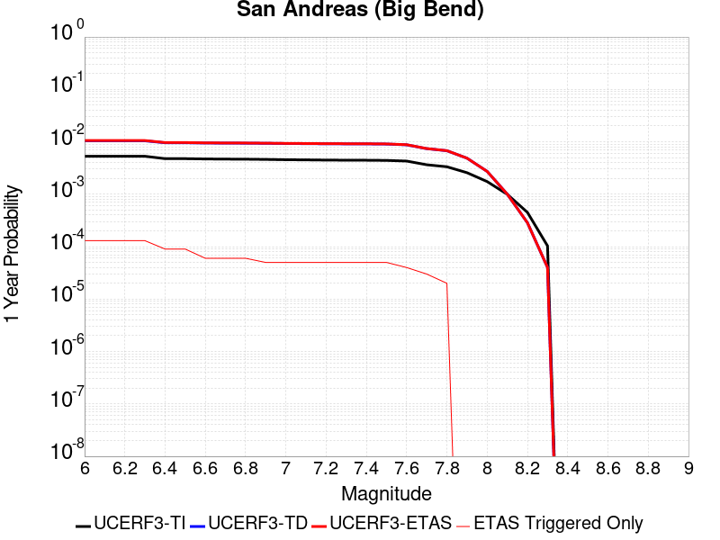 |  |

| Magnitude | 1 wk TI Prob | 1 wk TD Prob | 1 wk ETAS Prob | 1 wk ETAS/TD Gain | 1 wk ETAS Triggered Only | 1 mo TI Prob | 1 mo TD Prob | 1 mo ETAS Prob | 1 mo ETAS/TD Gain | 1 mo ETAS Triggered Only | 1 yr TI Prob | 1 yr TD Prob | 1 yr ETAS Prob | 1 yr ETAS/TD Gain | 1 yr ETAS Triggered Only | 10 yr TI Prob | 10 yr TD Prob | 10 yr ETAS Prob | 10 yr ETAS/TD Gain | 10 yr ETAS Triggered Only |
|-----|-----|-----|-----|-----|-----|-----|-----|-----|-----|-----|-----|-----|-----|-----|-----|-----|-----|-----|-----|-----|
| 6.0 | 1.0179969E-4 | 2.0107176E-4 | 2.2106773E-4 | 1.099447 | 2.0E-5 | 4.362114E-4 | 8.6145254E-4 | 8.914267E-4 | 1.0347949 | 3.0E-5 | 0.0052979486 | 0.0104380315 | 0.010566675 | 1.0123245 | 1.3E-4 | 0.051734097 | 0.10163772 | 0.101880275 | 1.0023865 | 2.7E-4 |
| 6.1 | 1.0179969E-4 | 2.0107176E-4 | 2.2106773E-4 | 1.099447 | 2.0E-5 | 4.362114E-4 | 8.6145254E-4 | 8.914267E-4 | 1.0347949 | 3.0E-5 | 0.0052979486 | 0.0104380315 | 0.010566675 | 1.0123245 | 1.3E-4 | 0.051734097 | 0.10163772 | 0.101880275 | 1.0023865 | 2.7E-4 |
| 6.2 | 1.0179969E-4 | 2.0107176E-4 | 2.2106773E-4 | 1.099447 | 2.0E-5 | 4.362114E-4 | 8.6145254E-4 | 8.914267E-4 | 1.0347949 | 3.0E-5 | 0.0052979486 | 0.0104380315 | 0.010566675 | 1.0123245 | 1.3E-4 | 0.051734097 | 0.10163772 | 0.101880275 | 1.0023865 | 2.7E-4 |
| 6.3 | 1.0179969E-4 | 2.0107176E-4 | 2.2106773E-4 | 1.099447 | 2.0E-5 | 4.362114E-4 | 8.6145254E-4 | 8.914267E-4 | 1.0347949 | 3.0E-5 | 0.0052979486 | 0.0104380315 | 0.010566675 | 1.0123245 | 1.3E-4 | 0.051734097 | 0.10163772 | 0.101880275 | 1.0023865 | 2.7E-4 |
| 6.4 | 9.1639464E-5 | 1.8463937E-4 | 2.0463568E-4 | 1.1082993 | 2.0E-5 | 3.9268145E-4 | 7.9107186E-4 | 8.11056E-4 | 1.0252621 | 2.0E-5 | 0.0047704205 | 0.009588886 | 0.009678023 | 1.0092958 | 9.0E-5 | 0.046693064 | 0.093937874 | 0.09407378 | 1.0014468 | 1.5E-4 |
| 6.5 | 9.1639464E-5 | 1.8463937E-4 | 2.0463568E-4 | 1.1082993 | 2.0E-5 | 3.9268145E-4 | 7.9107186E-4 | 8.11056E-4 | 1.0252621 | 2.0E-5 | 0.0047704205 | 0.009588886 | 0.009678023 | 1.0092958 | 9.0E-5 | 0.046693064 | 0.093937874 | 0.09407378 | 1.0014468 | 1.5E-4 |
| 6.6 | 9.042622E-5 | 1.827092E-4 | 2.0270556E-4 | 1.1094435 | 2.0E-5 | 3.8748336E-4 | 7.828047E-4 | 8.0278906E-4 | 1.0255291 | 2.0E-5 | 0.0047074095 | 0.009489112 | 0.009548543 | 1.006263 | 6.0E-5 | 0.046089325 | 0.09302715 | 0.09311785 | 1.000975 | 1.0E-4 |
| 6.7 | 8.9836685E-5 | 1.8185233E-4 | 2.0184868E-4 | 1.1099594 | 2.0E-5 | 3.8495753E-4 | 7.791345E-4 | 7.9911895E-4 | 1.0256495 | 2.0E-5 | 0.00467679 | 0.009444815 | 0.009504248 | 1.0062927 | 6.0E-5 | 0.045795817 | 0.09262138 | 0.09271212 | 1.0009797 | 1.0E-4 |
| 6.8 | 8.9471854E-5 | 1.8131983E-4 | 2.013162E-4 | 1.1102823 | 2.0E-5 | 3.8339442E-4 | 7.7685376E-4 | 7.968382E-4 | 1.0257249 | 2.0E-5 | 0.004657841 | 0.009417287 | 0.009476722 | 1.0063113 | 6.0E-5 | 0.04561414 | 0.092368215 | 0.09245898 | 1.0009826 | 1.0E-4 |
| 6.9 | 8.858234E-5 | 1.8013896E-4 | 1.9013716E-4 | 1.0555027 | 1.0E-5 | 3.7958333E-4 | 7.717959E-4 | 7.817882E-4 | 1.0129468 | 1.0E-5 | 0.004611638 | 0.009356238 | 0.00940577 | 1.0052941 | 5.0E-5 | 0.04517103 | 0.09180844 | 0.09189017 | 1.0008903 | 9.0E-5 |
| 7.0 | 8.7433385E-5 | 1.7852607E-4 | 1.8852428E-4 | 1.0560043 | 1.0E-5 | 3.746607E-4 | 7.6488755E-4 | 7.7487994E-4 | 1.0130638 | 1.0E-5 | 0.004551957 | 0.009272847 | 0.009322384 | 1.0053421 | 5.0E-5 | 0.044598386 | 0.0910425 | 0.0911243 | 1.0008986 | 9.0E-5 |
| 7.1 | 8.684964E-5 | 1.7764501E-4 | 1.8764322E-4 | 1.056282 | 1.0E-5 | 3.7215967E-4 | 7.6111377E-4 | 7.7110616E-4 | 1.0131286 | 1.0E-5 | 0.0045216335 | 0.009227292 | 0.009276831 | 1.0053687 | 5.0E-5 | 0.04430731 | 0.09062394 | 0.09070578 | 1.0009031 | 9.0E-5 |
| 7.2 | 8.606521E-5 | 1.7655063E-4 | 1.8654887E-4 | 1.056631 | 1.0E-5 | 3.6879873E-4 | 7.5642637E-4 | 7.664188E-4 | 1.01321 | 1.0E-5 | 0.0044808835 | 0.0091707045 | 0.009220246 | 1.0054021 | 5.0E-5 | 0.043916024 | 0.09010384 | 0.09018573 | 1.0009089 | 9.0E-5 |
| 7.3 | 8.568266E-5 | 1.7596998E-4 | 1.8596822E-4 | 1.0568179 | 1.0E-5 | 3.6715972E-4 | 7.5393927E-4 | 7.639317E-4 | 1.0132537 | 1.0E-5 | 0.0044610105 | 0.009140679 | 0.009190221 | 1.0054201 | 5.0E-5 | 0.043725148 | 0.08982521 | 0.08990713 | 1.000912 | 9.0E-5 |
| 7.4 | 8.5432206E-5 | 1.7559543E-4 | 1.8559367E-4 | 1.0569391 | 1.0E-5 | 3.6608664E-4 | 7.5233495E-4 | 7.6232746E-4 | 1.013282 | 1.0E-5 | 0.004447999 | 0.00912131 | 0.0091708535 | 1.0054317 | 5.0E-5 | 0.043600157 | 0.08964524 | 0.08972717 | 1.000914 | 9.0E-5 |
| 7.5 | 8.4791965E-5 | 1.7428731E-4 | 1.8428557E-4 | 1.0573665 | 1.0E-5 | 3.633435E-4 | 7.46732E-4 | 7.5672456E-4 | 1.0133817 | 1.0E-5 | 0.0044147377 | 0.009053662 | 0.00910321 | 1.0054727 | 5.0E-5 | 0.043280575 | 0.08902357 | 0.089105554 | 1.000921 | 9.0E-5 |
| 7.6 | 8.241105E-5 | 1.6873641E-4 | 1.7873473E-4 | 1.059254 | 1.0E-5 | 3.531424E-4 | 7.229558E-4 | 7.3294854E-4 | 1.0138221 | 1.0E-5 | 0.0042910352 | 0.008766552 | 0.008806202 | 1.0045228 | 4.0E-5 | 0.042091176 | 0.08639386 | 0.08646695 | 1.000846 | 8.0E-5 |
| 7.7 | 7.00432E-5 | 1.4234452E-4 | 1.523431E-4 | 1.070242 | 1.0E-5 | 3.001506E-4 | 6.099054E-4 | 6.198993E-4 | 1.016386 | 1.0E-5 | 0.0036482112 | 0.007400356 | 0.0074301334 | 1.0040239 | 3.0E-5 | 0.035888977 | 0.07365227 | 0.07369858 | 1.0006288 | 5.0E-5 |
| 7.8 | 6.415362E-5 | 1.2995867E-4 | 1.3995738E-4 | 1.0769376 | 1.0E-5 | 2.749151E-4 | 5.568469E-4 | 5.6684134E-4 | 1.0179483 | 1.0E-5 | 0.0033419547 | 0.006758566 | 0.006778431 | 1.0029392 | 2.0E-5 | 0.03292141 | 0.06737457 | 0.06740255 | 1.0004153 | 3.0E-5 |
| 7.9 | 4.939911E-5 | 9.36036E-5 | 9.36036E-5 | 1.0 | 0.0 | 2.116933E-4 | 4.0109662E-4 | 4.0109662E-4 | 1.0 | 0.0 | 0.0025743195 | 0.0048724264 | 0.0048724264 | 1.0 | 0.0 | 0.025447013 | 0.049006134 | 0.049015645 | 1.0001941 | 1.0E-5 |
| 8.0 | 3.344983E-5 | 5.233905E-5 | 5.233905E-5 | 1.0 | 0.0 | 1.4334853E-4 | 2.2429094E-4 | 2.2429094E-4 | 1.0 | 0.0 | 0.0017438711 | 0.0027273244 | 0.0027273244 | 1.0 | 0.0 | 0.017302496 | 0.027977858 | 0.027987579 | 1.0003474 | 1.0E-5 |
| 8.1 | 1.9104898E-5 | 1.9225243E-5 | 1.9225243E-5 | 1.0 | 0.0 | 8.1875565E-5 | 8.23913E-5 | 8.23913E-5 | 1.0 | 0.0 | 9.963791E-4 | 0.001002653 | 0.001002653 | 1.0 | 0.0 | 0.009919235 | 0.010777342 | 0.010787235 | 1.0009179 | 1.0E-5 |
| 8.2 | 8.643924E-6 | 5.494016E-6 | 5.494016E-6 | 1.0 | 0.0 | 3.704486E-5 | 2.3545572E-5 | 2.3545572E-5 | 1.0 | 0.0 | 4.5092785E-4 | 2.866297E-4 | 2.866297E-4 | 1.0 | 0.0 | 0.0045001395 | 0.0032592218 | 0.0032592218 | 1.0 | 0.0 |
| 8.3 | 1.983087E-6 | 7.690063E-7 | 7.690063E-7 | 1.0 | 0.0 | 8.498917E-6 | 3.295737E-6 | 3.295737E-6 | 1.0 | 0.0 | 1.034694E-4 | 4.012488E-5 | 4.012488E-5 | 1.0 | 0.0 | 0.0010342124 | 4.737206E-4 | 4.737206E-4 | 1.0 | 0.0 |

## Sierra Nevada  (No Extension)
*[(top)](#table-of-contents)*

| 1 Week | 1 Month | 1 Year | 10 Year |
|-----|-----|-----|-----|
|  |  | 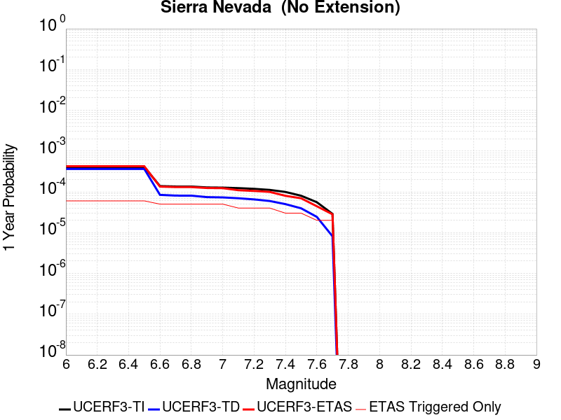 |  |

| Magnitude | 1 wk TI Prob | 1 wk TD Prob | 1 wk ETAS Prob | 1 wk ETAS/TD Gain | 1 wk ETAS Triggered Only | 1 mo TI Prob | 1 mo TD Prob | 1 mo ETAS Prob | 1 mo ETAS/TD Gain | 1 mo ETAS Triggered Only | 1 yr TI Prob | 1 yr TD Prob | 1 yr ETAS Prob | 1 yr ETAS/TD Gain | 1 yr ETAS Triggered Only | 10 yr TI Prob | 10 yr TD Prob | 10 yr ETAS Prob | 10 yr ETAS/TD Gain | 10 yr ETAS Triggered Only |
|-----|-----|-----|-----|-----|-----|-----|-----|-----|-----|-----|-----|-----|-----|-----|-----|-----|-----|-----|-----|-----|
| 6.0 | 7.7690465E-6 | 6.9765347E-6 | 6.9765347E-6 | 1.0 | 0.0 | 3.329549E-5 | 2.9899295E-5 | 3.9898994E-5 | 1.3344461 | 1.0E-5 | 4.0529718E-4 | 3.6399896E-4 | 4.2397712E-4 | 1.1647756 | 6.0E-5 | 0.004045588 | 0.0036375436 | 0.00384678 | 1.0575212 | 2.1E-4 |
| 6.1 | 7.7690465E-6 | 6.9765347E-6 | 6.9765347E-6 | 1.0 | 0.0 | 3.329549E-5 | 2.9899295E-5 | 3.9898994E-5 | 1.3344461 | 1.0E-5 | 4.0529718E-4 | 3.6399896E-4 | 4.2397712E-4 | 1.1647756 | 6.0E-5 | 0.004045588 | 0.0036375436 | 0.00384678 | 1.0575212 | 2.1E-4 |
| 6.2 | 7.7690465E-6 | 6.9765347E-6 | 6.9765347E-6 | 1.0 | 0.0 | 3.329549E-5 | 2.9899295E-5 | 3.9898994E-5 | 1.3344461 | 1.0E-5 | 4.0529718E-4 | 3.6399896E-4 | 4.2397712E-4 | 1.1647756 | 6.0E-5 | 0.004045588 | 0.0036375436 | 0.00384678 | 1.0575212 | 2.1E-4 |
| 6.3 | 7.7690465E-6 | 6.9765347E-6 | 6.9765347E-6 | 1.0 | 0.0 | 3.329549E-5 | 2.9899295E-5 | 3.9898994E-5 | 1.3344461 | 1.0E-5 | 4.0529718E-4 | 3.6399896E-4 | 4.2397712E-4 | 1.1647756 | 6.0E-5 | 0.004045588 | 0.0036375436 | 0.00384678 | 1.0575212 | 2.1E-4 |
| 6.4 | 7.7690465E-6 | 6.9765347E-6 | 6.9765347E-6 | 1.0 | 0.0 | 3.329549E-5 | 2.9899295E-5 | 3.9898994E-5 | 1.3344461 | 1.0E-5 | 4.0529718E-4 | 3.6399896E-4 | 4.2397712E-4 | 1.1647756 | 6.0E-5 | 0.004045588 | 0.0036375436 | 0.00384678 | 1.0575212 | 2.1E-4 |
| 6.5 | 7.7690465E-6 | 6.9765347E-6 | 6.9765347E-6 | 1.0 | 0.0 | 3.329549E-5 | 2.9899295E-5 | 3.9898994E-5 | 1.3344461 | 1.0E-5 | 4.0529718E-4 | 3.6399896E-4 | 4.2397712E-4 | 1.1647756 | 6.0E-5 | 0.004045588 | 0.0036375436 | 0.00384678 | 1.0575212 | 2.1E-4 |
| 6.6 | 2.653E-6 | 1.6149307E-6 | 1.6149307E-6 | 1.0 | 0.0 | 1.136995E-5 | 6.9211133E-6 | 6.9211133E-6 | 1.0 | 0.0 | 1.3842035E-4 | 8.426133E-5 | 1.3425712E-4 | 1.593342 | 5.0E-5 | 0.0013833415 | 8.422973E-4 | 0.001012154 | 1.201659 | 1.7E-4 |
| 6.7 | 2.5902466E-6 | 1.5502632E-6 | 1.5502632E-6 | 1.0 | 0.0 | 1.11010095E-5 | 6.6439684E-6 | 6.6439684E-6 | 1.0 | 0.0 | 1.351464E-4 | 8.0887345E-5 | 1.308833E-4 | 1.6180937 | 5.0E-5 | 0.0013506424 | 8.08582E-4 | 9.684526E-4 | 1.1977173 | 1.6E-4 |
| 6.8 | 2.5853892E-6 | 1.547063E-6 | 1.547063E-6 | 1.0 | 0.0 | 1.1080193E-5 | 6.630253E-6 | 6.630253E-6 | 1.0 | 0.0 | 1.34893E-4 | 8.072037E-5 | 1.3071633E-4 | 1.6193724 | 5.0E-5 | 0.0013481114 | 8.069135E-4 | 9.6678437E-4 | 1.1981264 | 1.6E-4 |
| 6.9 | 2.458257E-6 | 1.4221347E-6 | 1.4221347E-6 | 1.0 | 0.0 | 1.0535345E-5 | 6.094849E-6 | 6.094849E-6 | 1.0 | 0.0 | 1.2826028E-4 | 7.4202275E-5 | 1.2419857E-4 | 1.6737838 | 5.0E-5 | 0.0012818627 | 7.41777E-4 | 8.916657E-4 | 1.2020671 | 1.5E-4 |
| 7.0 | 2.4341468E-6 | 1.3990981E-6 | 1.3990981E-6 | 1.0 | 0.0 | 1.0432016E-5 | 5.9961208E-6 | 5.9961208E-6 | 1.0 | 0.0 | 1.270024E-4 | 7.3000345E-5 | 1.229967E-4 | 1.6848782 | 5.0E-5 | 0.0012692984 | 7.2976557E-4 | 8.796561E-4 | 1.2053955 | 1.5E-4 |
| 7.1 | 2.3652476E-6 | 1.3340461E-6 | 1.3340461E-6 | 1.0 | 0.0 | 1.0136736E-5 | 5.717328E-6 | 5.717328E-6 | 1.0 | 0.0 | 1.2340778E-4 | 6.960626E-5 | 1.09603476E-4 | 1.574621 | 4.0E-5 | 0.0012333926 | 6.958463E-4 | 8.3574886E-4 | 1.2010539 | 1.4E-4 |
| 7.2 | 2.272158E-6 | 1.2503509E-6 | 1.2503509E-6 | 1.0 | 0.0 | 9.737784E-6 | 5.3586355E-6 | 5.3586355E-6 | 1.0 | 0.0 | 1.1855107E-4 | 6.523945E-5 | 1.0523684E-4 | 1.613086 | 4.0E-5 | 0.0011848784 | 6.522045E-4 | 7.921132E-4 | 1.2145166 | 1.4E-4 |
| 7.3 | 2.1382127E-6 | 1.1420364E-6 | 1.1420364E-6 | 1.0 | 0.0 | 9.163737E-6 | 4.894432E-6 | 4.894432E-6 | 1.0 | 0.0 | 1.1156279E-4 | 5.9588092E-5 | 9.958571E-5 | 1.6712351 | 4.0E-5 | 0.001115068 | 5.9572235E-4 | 7.256449E-4 | 1.2180924 | 1.3E-4 |
| 7.4 | 1.9048055E-6 | 9.575857E-7 | 9.575857E-7 | 1.0 | 0.0 | 8.163426E-6 | 4.103932E-6 | 4.103932E-6 | 1.0 | 0.0 | 9.9385186E-5 | 4.9964237E-5 | 7.996274E-5 | 1.6003995 | 3.0E-5 | 9.934074E-4 | 4.995307E-4 | 6.194708E-4 | 1.2401055 | 1.2E-4 |
| 7.5 | 1.5373403E-6 | 7.5605493E-7 | 7.5605493E-7 | 1.0 | 0.0 | 6.5885843E-6 | 3.2402313E-6 | 3.2402313E-6 | 1.0 | 0.0 | 8.021306E-5 | 3.9449107E-5 | 6.9447924E-5 | 1.7604434 | 3.0E-5 | 8.0184115E-4 | 3.944215E-4 | 5.043781E-4 | 1.2787795 | 1.1E-4 |
| 7.6 | 1.0680322E-6 | 4.659972E-7 | 4.659972E-7 | 1.0 | 0.0 | 4.577273E-6 | 1.9971294E-6 | 1.9971294E-6 | 1.0 | 0.0 | 5.5726876E-5 | 2.431478E-5 | 4.4314293E-5 | 1.8225249 | 2.0E-5 | 5.5712904E-4 | 2.4312147E-4 | 3.1310445E-4 | 1.2878519 | 7.0E-5 |
| 7.7 | 5.509146E-7 | 1.5581371E-7 | 1.5581371E-7 | 1.0 | 0.0 | 2.3610605E-6 | 6.677729E-7 | 6.677729E-7 | 1.0 | 0.0 | 2.8745531E-5 | 8.130106E-6 | 2.8129944E-5 | 3.4599726 | 2.0E-5 | 2.8741814E-4 | 8.1298196E-5 | 1.2129494E-4 | 1.4919758 | 4.0E-5 |

## Lake Isabella (Seismicity)
*[(top)](#table-of-contents)*

| 1 Week | 1 Month | 1 Year | 10 Year |
|-----|-----|-----|-----|
|  |  |  |  |

| Magnitude | 1 wk TI Prob | 1 wk TD Prob | 1 wk ETAS Prob | 1 wk ETAS/TD Gain | 1 wk ETAS Triggered Only | 1 mo TI Prob | 1 mo TD Prob | 1 mo ETAS Prob | 1 mo ETAS/TD Gain | 1 mo ETAS Triggered Only | 1 yr TI Prob | 1 yr TD Prob | 1 yr ETAS Prob | 1 yr ETAS/TD Gain | 1 yr ETAS Triggered Only | 10 yr TI Prob | 10 yr TD Prob | 10 yr ETAS Prob | 10 yr ETAS/TD Gain | 10 yr ETAS Triggered Only |
|-----|-----|-----|-----|-----|-----|-----|-----|-----|-----|-----|-----|-----|-----|-----|-----|-----|-----|-----|-----|-----|
| 6.0 | 9.431637E-6 | 9.7418215E-6 | 9.7418215E-6 | 1.0 | 0.0 | 4.0420677E-5 | 4.175007E-5 | 1.01747566E-4 | 2.4370635 | 6.0E-5 | 4.920106E-4 | 5.082016E-4 | 6.481305E-4 | 1.2753413 | 1.4E-4 | 0.004909227 | 0.005071687 | 0.005270673 | 1.0392346 | 2.0E-4 |
| 6.1 | 9.431637E-6 | 9.7418215E-6 | 9.7418215E-6 | 1.0 | 0.0 | 4.0420677E-5 | 4.175007E-5 | 1.01747566E-4 | 2.4370635 | 6.0E-5 | 4.920106E-4 | 5.082016E-4 | 6.481305E-4 | 1.2753413 | 1.4E-4 | 0.004909227 | 0.005071687 | 0.005270673 | 1.0392346 | 2.0E-4 |
| 6.2 | 9.431637E-6 | 9.7418215E-6 | 9.7418215E-6 | 1.0 | 0.0 | 4.0420677E-5 | 4.175007E-5 | 1.01747566E-4 | 2.4370635 | 6.0E-5 | 4.920106E-4 | 5.082016E-4 | 6.481305E-4 | 1.2753413 | 1.4E-4 | 0.004909227 | 0.005071687 | 0.005270673 | 1.0392346 | 2.0E-4 |
| 6.3 | 9.431637E-6 | 9.7418215E-6 | 9.7418215E-6 | 1.0 | 0.0 | 4.0420677E-5 | 4.175007E-5 | 1.01747566E-4 | 2.4370635 | 6.0E-5 | 4.920106E-4 | 5.082016E-4 | 6.481305E-4 | 1.2753413 | 1.4E-4 | 0.004909227 | 0.005071687 | 0.005270673 | 1.0392346 | 2.0E-4 |
| 6.4 | 5.144063E-6 | 5.3001613E-6 | 5.3001613E-6 | 1.0 | 0.0 | 2.2045799E-5 | 2.27148E-5 | 7.2713665E-5 | 3.201158 | 5.0E-5 | 2.6837454E-4 | 2.7652105E-4 | 3.6649616E-4 | 1.3253825 | 9.0E-5 | 0.0026805066 | 0.0027621102 | 0.0029017234 | 1.0505459 | 1.4E-4 |
| 6.5 | 5.144063E-6 | 5.3001613E-6 | 5.3001613E-6 | 1.0 | 0.0 | 2.2045799E-5 | 2.27148E-5 | 7.2713665E-5 | 3.201158 | 5.0E-5 | 2.6837454E-4 | 2.7652105E-4 | 3.6649616E-4 | 1.3253825 | 9.0E-5 | 0.0026805066 | 0.0027621102 | 0.0029017234 | 1.0505459 | 1.4E-4 |
| 6.6 | 3.4009804E-6 | 3.4988395E-6 | 3.4988395E-6 | 1.0 | 0.0 | 1.4575549E-5 | 1.4994949E-5 | 4.49945E-5 | 3.0006437 | 3.0E-5 | 1.7744285E-4 | 1.8254982E-4 | 2.5253705E-4 | 1.383387 | 7.0E-5 | 0.0017730123 | 0.0018241564 | 0.0019339557 | 1.0601919 | 1.1E-4 |
| 6.7 | 3.3880428E-6 | 3.485706E-6 | 3.485706E-6 | 1.0 | 0.0 | 1.4520103E-5 | 1.4938664E-5 | 4.4938217E-5 | 3.0081818 | 3.0E-5 | 1.767679E-4 | 1.8186466E-4 | 2.5185192E-4 | 1.3848317 | 7.0E-5 | 0.0017662736 | 0.0018173159 | 0.0019271161 | 1.0604188 | 1.1E-4 |
| 6.8 | 2.6582E-6 | 2.7337414E-6 | 2.7337414E-6 | 1.0 | 0.0 | 1.1392236E-5 | 1.171599E-5 | 4.1715637E-5 | 3.560573 | 3.0E-5 | 1.3869164E-4 | 1.4263418E-4 | 2.126242E-4 | 1.490696 | 7.0E-5 | 0.0013860512 | 0.0014255584 | 0.0015254158 | 1.070048 | 1.0E-4 |
| 6.9 | 2.406011E-6 | 2.474366E-6 | 2.474366E-6 | 1.0 | 0.0 | 1.0311434E-5 | 1.0604391E-5 | 4.060407E-5 | 3.828987 | 3.0E-5 | 1.2553448E-4 | 1.2910213E-4 | 1.9909309E-4 | 1.5421364 | 7.0E-5 | 0.0012546359 | 0.0012904009 | 0.0013902718 | 1.0773953 | 1.0E-4 |
| 7.0 | 1.6953097E-6 | 1.7429631E-6 | 1.7429631E-6 | 1.0 | 0.0 | 7.265593E-6 | 7.469827E-6 | 2.7469678E-5 | 3.6774182 | 2.0E-5 | 8.8455E-5 | 9.094239E-5 | 1.4093785E-4 | 1.5497487 | 5.0E-5 | 8.84198E-4 | 9.0915454E-4 | 9.790909E-4 | 1.0769246 | 7.0E-5 |
| 7.1 | 3.5013824E-7 | 3.5715203E-7 | 3.5715203E-7 | 1.0 | 0.0 | 1.5005916E-6 | 1.5306507E-6 | 1.5306507E-6 | 1.0 | 0.0 | 1.826955E-5 | 1.8635516E-5 | 3.8635142E-5 | 2.0731995 | 2.0E-5 | 1.8268047E-4 | 1.8633978E-4 | 2.0633604E-4 | 1.1073108 | 2.0E-5 |
| 7.2 | 2.2321095E-7 | 2.2750805E-7 | 2.2750805E-7 | 1.0 | 0.0 | 9.56618E-7 | 9.750341E-7 | 9.750341E-7 | 1.0 | 0.0 | 1.1646762E-5 | 1.1870978E-5 | 1.1870978E-5 | 1.0 | 0.0 | 1.1646151E-4 | 1.1870354E-4 | 1.1870354E-4 | 1.0 | 0.0 |
| 7.3 | 1.5760406E-7 | 1.6061085E-7 | 1.6061085E-7 | 1.0 | 0.0 | 6.7544585E-7 | 6.88332E-7 | 6.88332E-7 | 1.0 | 0.0 | 8.223522E-6 | 8.380411E-6 | 8.380411E-6 | 1.0 | 0.0 | 8.2232174E-5 | 8.380101E-5 | 8.380101E-5 | 1.0 | 0.0 |
| 7.4 | 1.1216497E-7 | 1.14318226E-7 | 1.14318226E-7 | 1.0 | 0.0 | 4.8070694E-7 | 4.899352E-7 | 4.899352E-7 | 1.0 | 0.0 | 5.852591E-6 | 5.9649446E-6 | 5.9649446E-6 | 1.0 | 0.0 | 5.8524372E-5 | 5.964789E-5 | 5.964789E-5 | 1.0 | 0.0 |
| 7.5 | 4.885185E-8 | 4.9788245E-8 | 4.9788245E-8 | 1.0 | 0.0 | 2.0936506E-7 | 2.1337817E-7 | 2.1337817E-7 | 1.0 | 0.0 | 2.5490165E-6 | 2.5978763E-6 | 2.5978763E-6 | 1.0 | 0.0 | 2.5489873E-5 | 2.5978477E-5 | 2.5978477E-5 | 1.0 | 0.0 |
| 7.6 | 1.504641E-9 | 1.5318049E-9 | 1.5318049E-9 | 1.0 | 0.0 | 6.4484613E-9 | 6.5648784E-9 | 6.5648784E-9 | 1.0 | 0.0 | 7.851001E-8 | 7.9927396E-8 | 7.9927396E-8 | 1.0 | 0.0 | 7.8509987E-7 | 7.9927395E-7 | 7.9927395E-7 | 1.0 | 0.0 |

## Ludlow
*[(top)](#table-of-contents)*

| 1 Week | 1 Month | 1 Year | 10 Year |
|-----|-----|-----|-----|
|  |  |  | 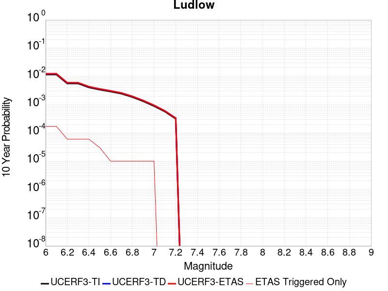 |

| Magnitude | 1 wk TI Prob | 1 wk TD Prob | 1 wk ETAS Prob | 1 wk ETAS/TD Gain | 1 wk ETAS Triggered Only | 1 mo TI Prob | 1 mo TD Prob | 1 mo ETAS Prob | 1 mo ETAS/TD Gain | 1 mo ETAS Triggered Only | 1 yr TI Prob | 1 yr TD Prob | 1 yr ETAS Prob | 1 yr ETAS/TD Gain | 1 yr ETAS Triggered Only | 10 yr TI Prob | 10 yr TD Prob | 10 yr ETAS Prob | 10 yr ETAS/TD Gain | 10 yr ETAS Triggered Only |
|-----|-----|-----|-----|-----|-----|-----|-----|-----|-----|-----|-----|-----|-----|-----|-----|-----|-----|-----|-----|-----|
| 6.0 | 2.2407607E-5 | 2.3657954E-5 | 2.3657954E-5 | 1.0 | 0.0 | 9.602906E-5 | 1.0138754E-4 | 1.313845E-4 | 1.2958643 | 3.0E-5 | 0.0011685267 | 0.0012337384 | 0.0012936644 | 1.0485727 | 6.0E-5 | 0.011624013 | 0.012273403 | 0.012441317 | 1.013681 | 1.7E-4 |
| 6.1 | 2.2407607E-5 | 2.3657954E-5 | 2.3657954E-5 | 1.0 | 0.0 | 9.602906E-5 | 1.0138754E-4 | 1.313845E-4 | 1.2958643 | 3.0E-5 | 0.0011685267 | 0.0012337384 | 0.0012936644 | 1.0485727 | 6.0E-5 | 0.011624013 | 0.012273403 | 0.012441317 | 1.013681 | 1.7E-4 |
| 6.2 | 1.0781252E-5 | 1.1365991E-5 | 1.1365991E-5 | 1.0 | 0.0 | 4.620455E-5 | 4.8710503E-5 | 4.8710503E-5 | 1.0 | 0.0 | 5.623952E-4 | 5.92893E-4 | 6.2287523E-4 | 1.0505693 | 3.0E-5 | 0.00560974 | 0.005913531 | 0.005973176 | 1.0100862 | 6.0E-5 |
| 6.3 | 1.0781252E-5 | 1.1365991E-5 | 1.1365991E-5 | 1.0 | 0.0 | 4.620455E-5 | 4.8710503E-5 | 4.8710503E-5 | 1.0 | 0.0 | 5.623952E-4 | 5.92893E-4 | 6.2287523E-4 | 1.0505693 | 3.0E-5 | 0.00560974 | 0.005913531 | 0.005973176 | 1.0100862 | 6.0E-5 |
| 6.4 | 7.814439E-6 | 8.237966E-6 | 8.237966E-6 | 1.0 | 0.0 | 3.3490025E-5 | 3.5305096E-5 | 3.5305096E-5 | 1.0 | 0.0 | 4.0766477E-4 | 4.2975618E-4 | 4.5974329E-4 | 1.069777 | 3.0E-5 | 0.0040691774 | 0.0042893975 | 0.0043491405 | 1.0139279 | 6.0E-5 |
| 6.5 | 6.4986366E-6 | 6.8511167E-6 | 6.8511167E-6 | 1.0 | 0.0 | 2.7851002E-5 | 2.9361603E-5 | 2.9361603E-5 | 1.0 | 0.0 | 3.390332E-4 | 3.574198E-4 | 3.7741265E-4 | 1.0559366 | 2.0E-5 | 0.003385164 | 0.003568546 | 0.0035984388 | 1.0083768 | 3.0E-5 |
| 6.6 | 5.582177E-6 | 5.8861756E-6 | 5.8861756E-6 | 1.0 | 0.0 | 2.3923398E-5 | 2.5226227E-5 | 2.5226227E-5 | 1.0 | 0.0 | 2.9122844E-4 | 3.0708674E-4 | 3.1708367E-4 | 1.032554 | 1.0E-5 | 0.0029084706 | 0.0030666974 | 0.0030766667 | 1.0032508 | 1.0E-5 |
| 6.7 | 4.6858763E-6 | 4.94057E-6 | 4.94057E-6 | 1.0 | 0.0 | 2.0082172E-5 | 2.1173702E-5 | 2.1173702E-5 | 1.0 | 0.0 | 2.4447302E-4 | 2.5775988E-4 | 2.677573E-4 | 1.0387858 | 1.0E-5 | 0.0024420423 | 0.0025746655 | 0.0025846397 | 1.003874 | 1.0E-5 |
| 6.8 | 3.5584908E-6 | 3.7521265E-6 | 3.7521265E-6 | 1.0 | 0.0 | 1.5250586E-5 | 1.6080447E-5 | 1.6080447E-5 | 1.0 | 0.0 | 1.8566006E-4 | 1.9576224E-4 | 2.057603E-4 | 1.0510724 | 1.0E-5 | 0.0018550502 | 0.0019559392 | 0.0019659195 | 1.0051026 | 1.0E-5 |
| 6.9 | 2.532834E-6 | 2.6710807E-6 | 2.6710807E-6 | 1.0 | 0.0 | 1.0854958E-5 | 1.1447441E-5 | 1.1447441E-5 | 1.0 | 0.0 | 1.3215111E-4 | 1.3936395E-4 | 1.4936256E-4 | 1.0717446 | 1.0E-5 | 0.0013207254 | 0.0013927931 | 0.0014027792 | 1.0071698 | 1.0E-5 |
| 7.0 | 1.7083285E-6 | 1.8019963E-6 | 1.8019963E-6 | 1.0 | 0.0 | 7.3213873E-6 | 7.722819E-6 | 7.722819E-6 | 1.0 | 0.0 | 8.913424E-5 | 9.402143E-5 | 1.04020495E-4 | 1.1063488 | 1.0E-5 | 8.9098496E-4 | 9.3983306E-4 | 9.4982365E-4 | 1.0106301 | 1.0E-5 |
| 7.1 | 1.0905424E-6 | 1.1497951E-6 | 1.1497951E-6 | 1.0 | 0.0 | 4.6737446E-6 | 4.9276846E-6 | 4.9276846E-6 | 1.0 | 0.0 | 5.6901354E-5 | 5.9993006E-5 | 5.9993006E-5 | 1.0 | 0.0 | 5.6886784E-4 | 5.997779E-4 | 5.997779E-4 | 1.0 | 0.0 |
| 7.2 | 6.06668E-7 | 6.387457E-7 | 6.387457E-7 | 1.0 | 0.0 | 2.600003E-6 | 2.737479E-6 | 2.737479E-6 | 1.0 | 0.0 | 3.1654577E-5 | 3.3328364E-5 | 3.3328364E-5 | 1.0 | 0.0 | 3.1650066E-4 | 3.3324052E-4 | 3.3324052E-4 | 1.0 | 0.0 |

## Scodie Lineament
*[(top)](#table-of-contents)*

| 1 Week | 1 Month | 1 Year | 10 Year |
|-----|-----|-----|-----|
|  | 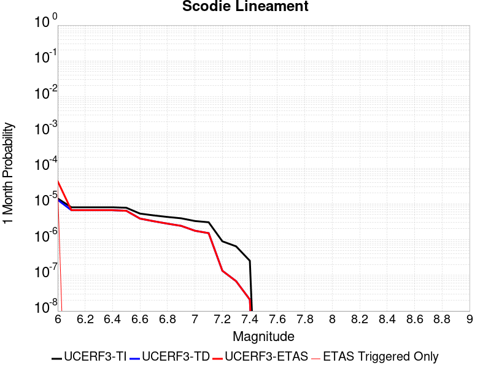 |  |  |

| Magnitude | 1 wk TI Prob | 1 wk TD Prob | 1 wk ETAS Prob | 1 wk ETAS/TD Gain | 1 wk ETAS Triggered Only | 1 mo TI Prob | 1 mo TD Prob | 1 mo ETAS Prob | 1 mo ETAS/TD Gain | 1 mo ETAS Triggered Only | 1 yr TI Prob | 1 yr TD Prob | 1 yr ETAS Prob | 1 yr ETAS/TD Gain | 1 yr ETAS Triggered Only | 10 yr TI Prob | 10 yr TD Prob | 10 yr ETAS Prob | 10 yr ETAS/TD Gain | 10 yr ETAS Triggered Only |
|-----|-----|-----|-----|-----|-----|-----|-----|-----|-----|-----|-----|-----|-----|-----|-----|-----|-----|-----|-----|-----|
| 6.0 | 3.2919327E-6 | 3.0133872E-6 | 2.3013326E-5 | 7.6370296 | 2.0E-5 | 1.4108206E-5 | 1.2914471E-5 | 4.2914082E-5 | 3.3229456 | 3.0E-5 | 1.7175387E-4 | 1.5722551E-4 | 2.3721294E-4 | 1.5087433 | 8.0E-5 | 0.0017162118 | 0.0015714543 | 0.0017611558 | 1.120717 | 1.9E-4 |
| 6.1 | 1.8663811E-6 | 1.5490738E-6 | 1.5490738E-6 | 1.0 | 0.0 | 7.998751E-6 | 6.638874E-6 | 6.638874E-6 | 1.0 | 0.0 | 9.738045E-5 | 8.082579E-5 | 9.082498E-5 | 1.1237129 | 1.0E-5 | 9.7337784E-4 | 8.0801273E-4 | 8.579723E-4 | 1.0618302 | 5.0E-5 |
| 6.2 | 1.8663811E-6 | 1.5490738E-6 | 1.5490738E-6 | 1.0 | 0.0 | 7.998751E-6 | 6.638874E-6 | 6.638874E-6 | 1.0 | 0.0 | 9.738045E-5 | 8.082579E-5 | 9.082498E-5 | 1.1237129 | 1.0E-5 | 9.7337784E-4 | 8.0801273E-4 | 8.579723E-4 | 1.0618302 | 5.0E-5 |
| 6.3 | 1.8663811E-6 | 1.5490738E-6 | 1.5490738E-6 | 1.0 | 0.0 | 7.998751E-6 | 6.638874E-6 | 6.638874E-6 | 1.0 | 0.0 | 9.738045E-5 | 8.082579E-5 | 9.082498E-5 | 1.1237129 | 1.0E-5 | 9.7337784E-4 | 8.0801273E-4 | 8.579723E-4 | 1.0618302 | 5.0E-5 |
| 6.4 | 1.8663811E-6 | 1.5490738E-6 | 1.5490738E-6 | 1.0 | 0.0 | 7.998751E-6 | 6.638874E-6 | 6.638874E-6 | 1.0 | 0.0 | 9.738045E-5 | 8.082579E-5 | 9.082498E-5 | 1.1237129 | 1.0E-5 | 9.7337784E-4 | 8.0801273E-4 | 8.579723E-4 | 1.0618302 | 5.0E-5 |
| 6.5 | 1.8106311E-6 | 1.4910065E-6 | 1.4910065E-6 | 1.0 | 0.0 | 7.759824E-6 | 6.390015E-6 | 6.390015E-6 | 1.0 | 0.0 | 9.447177E-5 | 7.7796154E-5 | 8.779538E-5 | 1.1285311 | 1.0E-5 | 9.4431615E-4 | 7.777379E-4 | 8.2769897E-4 | 1.064239 | 5.0E-5 |
| 6.6 | 1.2414679E-6 | 8.9976623E-7 | 8.9976623E-7 | 1.0 | 0.0 | 5.320566E-6 | 3.8561357E-6 | 3.8561357E-6 | 1.0 | 0.0 | 6.477596E-5 | 4.694753E-5 | 5.694706E-5 | 1.2129937 | 1.0E-5 | 6.475708E-4 | 4.6938477E-4 | 5.09366E-4 | 1.0851779 | 4.0E-5 |
| 6.7 | 1.1062215E-6 | 7.5943876E-7 | 7.5943876E-7 | 1.0 | 0.0 | 4.7409408E-6 | 3.2547339E-6 | 3.2547339E-6 | 1.0 | 0.0 | 5.7719422E-5 | 3.9625735E-5 | 4.9625338E-5 | 1.2523513 | 1.0E-5 | 5.770443E-4 | 3.9619367E-4 | 4.261818E-4 | 1.0756905 | 3.0E-5 |
| 6.8 | 1.0006736E-6 | 6.500452E-7 | 6.500452E-7 | 1.0 | 0.0 | 4.288594E-6 | 2.7859055E-6 | 2.7859055E-6 | 1.0 | 0.0 | 5.221238E-5 | 3.391793E-5 | 4.3917593E-5 | 1.2948192 | 1.0E-5 | 5.220012E-4 | 3.3913364E-4 | 3.6912345E-4 | 1.0884308 | 3.0E-5 |
| 6.9 | 9.167364E-7 | 5.631664E-7 | 5.631664E-7 | 1.0 | 0.0 | 3.9288643E-6 | 2.4135684E-6 | 2.4135684E-6 | 1.0 | 0.0 | 4.7832873E-5 | 2.9384857E-5 | 2.9384857E-5 | 1.0 | 0.0 | 4.782258E-4 | 2.938154E-4 | 3.1380952E-4 | 1.0680499 | 2.0E-5 |
| 7.0 | 7.6987664E-7 | 4.113395E-7 | 4.113395E-7 | 1.0 | 0.0 | 3.2994672E-6 | 1.7628826E-6 | 1.7628826E-6 | 1.0 | 0.0 | 4.0170275E-5 | 2.1462924E-5 | 2.1462924E-5 | 1.0 | 0.0 | 4.0163012E-4 | 2.1461236E-4 | 2.3460807E-4 | 1.0931712 | 2.0E-5 |
| 7.1 | 7.1038727E-7 | 3.521151E-7 | 3.521151E-7 | 1.0 | 0.0 | 3.0445133E-6 | 1.5090641E-6 | 1.5090641E-6 | 1.0 | 0.0 | 3.706632E-5 | 1.8372735E-5 | 1.8372735E-5 | 1.0 | 0.0 | 3.7060137E-4 | 1.8371566E-4 | 1.9371383E-4 | 1.0544219 | 1.0E-5 |
| 7.2 | 2.0799602E-7 | 3.118087E-8 | 3.118087E-8 | 1.0 | 0.0 | 8.914113E-7 | 1.336323E-7 | 1.336323E-7 | 1.0 | 0.0 | 1.0852878E-5 | 1.6269721E-6 | 1.6269721E-6 | 1.0 | 0.0 | 1.08523476E-4 | 1.6269609E-5 | 1.6269609E-5 | 1.0 | 0.0 |
| 7.3 | 1.5048182E-7 | 1.5940762E-8 | 1.5940762E-8 | 1.0 | 0.0 | 6.449219E-7 | 6.831755E-8 | 6.831755E-8 | 1.0 | 0.0 | 7.851896E-6 | 8.317658E-7 | 8.317658E-7 | 1.0 | 0.0 | 7.851618E-5 | 8.31763E-6 | 8.31763E-6 | 1.0 | 0.0 |
| 7.4 | 5.9334678E-8 | 4.864214E-9 | 4.864214E-9 | 1.0 | 0.0 | 2.5429145E-7 | 2.0846631E-8 | 2.0846631E-8 | 1.0 | 0.0 | 3.095994E-6 | 2.5380774E-7 | 2.5380774E-7 | 1.0 | 0.0 | 3.095951E-5 | 2.5380755E-6 | 2.5380755E-6 | 1.0 | 0.0 |

## Red Pass
*[(top)](#table-of-contents)*

| 1 Week | 1 Month | 1 Year | 10 Year |
|-----|-----|-----|-----|
| 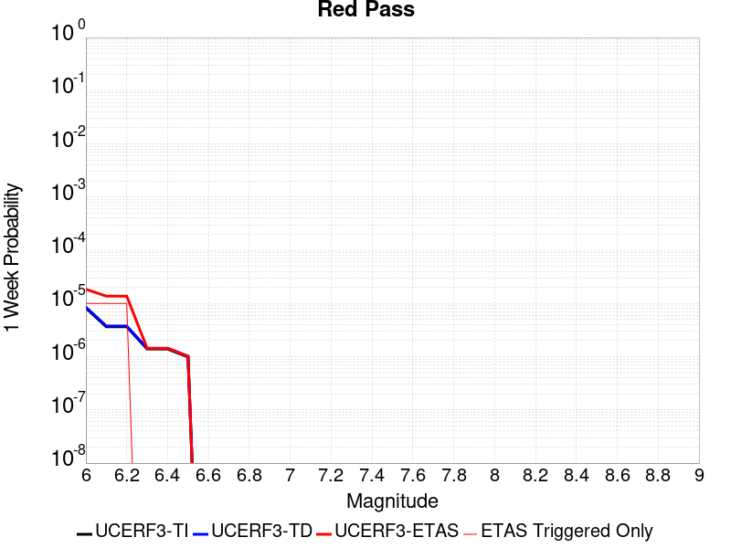 |  |  |  |

| Magnitude | 1 wk TI Prob | 1 wk TD Prob | 1 wk ETAS Prob | 1 wk ETAS/TD Gain | 1 wk ETAS Triggered Only | 1 mo TI Prob | 1 mo TD Prob | 1 mo ETAS Prob | 1 mo ETAS/TD Gain | 1 mo ETAS Triggered Only | 1 yr TI Prob | 1 yr TD Prob | 1 yr ETAS Prob | 1 yr ETAS/TD Gain | 1 yr ETAS Triggered Only | 10 yr TI Prob | 10 yr TD Prob | 10 yr ETAS Prob | 10 yr ETAS/TD Gain | 10 yr ETAS Triggered Only |
|-----|-----|-----|-----|-----|-----|-----|-----|-----|-----|-----|-----|-----|-----|-----|-----|-----|-----|-----|-----|-----|
| 6.0 | 8.258278E-6 | 8.551426E-6 | 1.855134E-5 | 2.1693857 | 1.0E-5 | 3.539214E-5 | 3.6648555E-5 | 5.664782E-5 | 1.5457041 | 2.0E-5 | 4.308141E-4 | 4.4612266E-4 | 5.2608695E-4 | 1.1792428 | 8.0E-5 | 0.0042997985 | 0.0044540283 | 0.0046232715 | 1.0379977 | 1.7E-4 |
| 6.1 | 3.649988E-6 | 3.7753848E-6 | 1.3775347E-5 | 3.6487267 | 1.0E-5 | 1.5642712E-5 | 1.6180147E-5 | 2.6179985E-5 | 1.6180314 | 1.0E-5 | 1.9043336E-4 | 1.9698025E-4 | 2.2697434E-4 | 1.1522695 | 3.0E-5 | 0.0019027026 | 0.0019685237 | 0.0020583468 | 1.0456295 | 9.0E-5 |
| 6.2 | 3.649988E-6 | 3.7753848E-6 | 1.3775347E-5 | 3.6487267 | 1.0E-5 | 1.5642712E-5 | 1.6180147E-5 | 2.6179985E-5 | 1.6180314 | 1.0E-5 | 1.9043336E-4 | 1.9698025E-4 | 2.2697434E-4 | 1.1522695 | 3.0E-5 | 0.0019027026 | 0.0019685237 | 0.0020583468 | 1.0456295 | 9.0E-5 |
| 6.3 | 1.3924937E-6 | 1.4411434E-6 | 1.4411434E-6 | 1.0 | 0.0 | 5.9678164E-6 | 6.1763217E-6 | 6.1763217E-6 | 1.0 | 0.0 | 7.265574E-5 | 7.519554E-5 | 7.519554E-5 | 1.0 | 0.0 | 7.263199E-4 | 7.518397E-4 | 7.818172E-4 | 1.0398722 | 3.0E-5 |
| 6.4 | 1.3924937E-6 | 1.4411434E-6 | 1.4411434E-6 | 1.0 | 0.0 | 5.9678164E-6 | 6.1763217E-6 | 6.1763217E-6 | 1.0 | 0.0 | 7.265574E-5 | 7.519554E-5 | 7.519554E-5 | 1.0 | 0.0 | 7.263199E-4 | 7.518397E-4 | 7.818172E-4 | 1.0398722 | 3.0E-5 |
| 6.5 | 9.876812E-7 | 1.0222102E-6 | 1.0222102E-6 | 1.0 | 0.0 | 4.2329125E-6 | 4.3809005E-6 | 4.3809005E-6 | 1.0 | 0.0 | 5.153449E-5 | 5.3337466E-5 | 5.3337466E-5 | 1.0 | 0.0 | 5.1522546E-4 | 5.3337467E-4 | 5.53364E-4 | 1.0374771 | 2.0E-5 |

## San Andreas (San Gorgonio Pass-Garnet HIll)
*[(top)](#table-of-contents)*

| 1 Week | 1 Month | 1 Year | 10 Year |
|-----|-----|-----|-----|
| 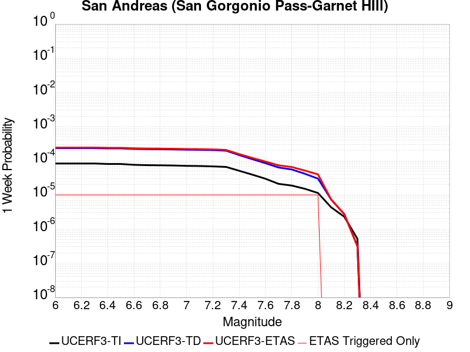 |  |  |  |

| Magnitude | 1 wk TI Prob | 1 wk TD Prob | 1 wk ETAS Prob | 1 wk ETAS/TD Gain | 1 wk ETAS Triggered Only | 1 mo TI Prob | 1 mo TD Prob | 1 mo ETAS Prob | 1 mo ETAS/TD Gain | 1 mo ETAS Triggered Only | 1 yr TI Prob | 1 yr TD Prob | 1 yr ETAS Prob | 1 yr ETAS/TD Gain | 1 yr ETAS Triggered Only | 10 yr TI Prob | 10 yr TD Prob | 10 yr ETAS Prob | 10 yr ETAS/TD Gain | 10 yr ETAS Triggered Only |
|-----|-----|-----|-----|-----|-----|-----|-----|-----|-----|-----|-----|-----|-----|-----|-----|-----|-----|-----|-----|-----|
| 6.0 | 8.31567E-5 | 2.3400006E-4 | 2.4399773E-4 | 1.0427251 | 1.0E-5 | 3.5633717E-4 | 0.0010024677 | 0.0010424276 | 1.0398616 | 4.0E-5 | 0.004329778 | 0.012136659 | 0.012225566 | 1.0073255 | 9.0E-5 | 0.042463828 | 0.112651974 | 0.11279395 | 1.0012603 | 1.6E-4 |
| 6.1 | 8.31567E-5 | 2.3400006E-4 | 2.4399773E-4 | 1.0427251 | 1.0E-5 | 3.5633717E-4 | 0.0010024677 | 0.0010424276 | 1.0398616 | 4.0E-5 | 0.004329778 | 0.012136659 | 0.012225566 | 1.0073255 | 9.0E-5 | 0.042463828 | 0.112651974 | 0.11279395 | 1.0012603 | 1.6E-4 |
| 6.2 | 8.31567E-5 | 2.3400006E-4 | 2.4399773E-4 | 1.0427251 | 1.0E-5 | 3.5633717E-4 | 0.0010024677 | 0.0010424276 | 1.0398616 | 4.0E-5 | 0.004329778 | 0.012136659 | 0.012225566 | 1.0073255 | 9.0E-5 | 0.042463828 | 0.112651974 | 0.11279395 | 1.0012603 | 1.6E-4 |
| 6.3 | 8.31567E-5 | 2.3400006E-4 | 2.4399773E-4 | 1.0427251 | 1.0E-5 | 3.5633717E-4 | 0.0010024677 | 0.0010424276 | 1.0398616 | 4.0E-5 | 0.004329778 | 0.012136659 | 0.012225566 | 1.0073255 | 9.0E-5 | 0.042463828 | 0.112651974 | 0.11279395 | 1.0012603 | 1.6E-4 |
| 6.4 | 8.059055E-5 | 2.2957478E-4 | 2.3957249E-4 | 1.0435488 | 1.0E-5 | 3.4534236E-4 | 9.835173E-4 | 0.0010234779 | 1.0406303 | 4.0E-5 | 0.0041964394 | 0.0119088115 | 0.01199774 | 1.0074674 | 9.0E-5 | 0.041180745 | 0.11063283 | 0.11077513 | 1.0012863 | 1.6E-4 |
| 6.5 | 8.059055E-5 | 2.2957478E-4 | 2.3957249E-4 | 1.0435488 | 1.0E-5 | 3.4534236E-4 | 9.835173E-4 | 0.0010234779 | 1.0406303 | 4.0E-5 | 0.0041964394 | 0.0119088115 | 0.01199774 | 1.0074674 | 9.0E-5 | 0.041180745 | 0.11063283 | 0.11077513 | 1.0012863 | 1.6E-4 |
| 6.6 | 7.619237E-5 | 2.2201831E-4 | 2.320161E-4 | 1.0450313 | 1.0E-5 | 3.2649786E-4 | 9.5116236E-4 | 9.911243E-4 | 1.0420138 | 4.0E-5 | 0.0039678677 | 0.011519459 | 0.011608423 | 1.0077229 | 9.0E-5 | 0.03897764 | 0.10716916 | 0.10731201 | 1.001333 | 1.6E-4 |
| 6.7 | 7.440636E-5 | 2.187761E-4 | 2.287739E-4 | 1.0456989 | 1.0E-5 | 3.188454E-4 | 9.3727716E-4 | 9.772397E-4 | 1.0426368 | 4.0E-5 | 0.0038750346 | 0.011352178 | 0.011441155 | 1.007838 | 9.0E-5 | 0.038081564 | 0.10567762 | 0.10582071 | 1.001354 | 1.6E-4 |
| 6.8 | 7.3735864E-5 | 2.1724754E-4 | 2.2724536E-4 | 1.0460204 | 1.0E-5 | 3.1597257E-4 | 9.307309E-4 | 9.7069365E-4 | 1.0429369 | 4.0E-5 | 0.0038401815 | 0.011273306 | 0.011362292 | 1.0078934 | 9.0E-5 | 0.03774495 | 0.10497911 | 0.10512231 | 1.0013641 | 1.6E-4 |
| 6.9 | 7.27575E-5 | 2.1493697E-4 | 2.2493482E-4 | 1.0465152 | 1.0E-5 | 3.117806E-4 | 9.208355E-4 | 9.6079864E-4 | 1.0433989 | 4.0E-5 | 0.003789323 | 0.01115407 | 0.011243066 | 1.0079788 | 9.0E-5 | 0.037253562 | 0.10392705 | 0.104070425 | 1.0013795 | 1.6E-4 |
| 7.0 | 7.102591E-5 | 2.1077669E-4 | 2.2077459E-4 | 1.0474336 | 1.0E-5 | 3.0436125E-4 | 9.0301817E-4 | 9.4298203E-4 | 1.0442559 | 4.0E-5 | 0.003699303 | 0.01093934 | 0.011028355 | 1.0081372 | 9.0E-5 | 0.03638325 | 0.10202858 | 0.102172256 | 1.0014082 | 1.6E-4 |
| 7.1 | 7.028513E-5 | 2.0913279E-4 | 2.191307E-4 | 1.0478065 | 1.0E-5 | 3.0118722E-4 | 8.959777E-4 | 9.259509E-4 | 1.033453 | 3.0E-5 | 0.0036607897 | 0.01085448 | 0.010933612 | 1.0072902 | 8.0E-5 | 0.036010686 | 0.10127171 | 0.10140652 | 1.0013312 | 1.5E-4 |
| 7.2 | 6.8498244E-5 | 2.0521069E-4 | 2.1520862E-4 | 1.0487204 | 1.0E-5 | 2.9353087E-4 | 8.7918015E-4 | 9.091538E-4 | 1.0340927 | 3.0E-5 | 0.003567883 | 0.010651984 | 0.010731133 | 1.0074303 | 8.0E-5 | 0.035111405 | 0.09946359 | 0.099598676 | 1.001358 | 1.5E-4 |
| 7.3 | 6.622592E-5 | 1.9748145E-4 | 2.0747948E-4 | 1.0506277 | 1.0E-5 | 2.8379448E-4 | 8.4607676E-4 | 8.760514E-4 | 1.0354278 | 3.0E-5 | 0.0034497243 | 0.010252813 | 0.010331992 | 1.0077227 | 8.0E-5 | 0.033966612 | 0.095959775 | 0.09609538 | 1.0014131 | 1.5E-4 |
| 7.4 | 5.1050705E-5 | 1.4702928E-4 | 1.5702781E-4 | 1.0680037 | 1.0E-5 | 2.1877038E-4 | 6.299742E-4 | 6.599553E-4 | 1.047591 | 3.0E-5 | 0.002660276 | 0.0076431558 | 0.007702697 | 1.0077902 | 6.0E-5 | 0.02628654 | 0.07292454 | 0.07301725 | 1.0012712 | 1.0E-4 |
| 7.5 | 3.9302922E-5 | 1.1141936E-4 | 1.2141824E-4 | 1.089741 | 1.0E-5 | 1.6843023E-4 | 4.7742447E-4 | 5.0741015E-4 | 1.0628072 | 3.0E-5 | 0.0020487092 | 0.005797221 | 0.005856873 | 1.0102898 | 6.0E-5 | 0.020299247 | 0.056063596 | 0.05615799 | 1.0016837 | 1.0E-4 |
| 7.6 | 2.9851626E-5 | 8.50571E-5 | 9.5056246E-5 | 1.1175581 | 1.0E-5 | 1.2792926E-4 | 3.644796E-4 | 3.944687E-4 | 1.0822791 | 3.0E-5 | 0.0015564259 | 0.0044285357 | 0.0044882703 | 1.0134885 | 6.0E-5 | 0.0154556995 | 0.0432426 | 0.043338276 | 1.0022125 | 1.0E-4 |
| 7.7 | 2.1135214E-5 | 6.362411E-5 | 7.362347E-5 | 1.1571631 | 1.0E-5 | 9.0576345E-5 | 2.7264628E-4 | 3.026381E-4 | 1.1100026 | 3.0E-5 | 0.0011022091 | 0.0033144215 | 0.0033742227 | 1.0180427 | 6.0E-5 | 0.010967582 | 0.032626197 | 0.03272293 | 1.002965 | 1.0E-4 |
| 7.8 | 1.883379E-5 | 5.5727225E-5 | 6.572667E-5 | 1.1794355 | 1.0E-5 | 8.0713755E-5 | 2.3880912E-4 | 2.6880196E-4 | 1.1255933 | 3.0E-5 | 9.822468E-4 | 0.0029036277 | 0.0029634535 | 1.0206038 | 6.0E-5 | 0.0097791655 | 0.028735327 | 0.028832454 | 1.0033801 | 1.0E-4 |
| 7.9 | 1.5156185E-5 | 4.172945E-5 | 5.1729032E-5 | 1.2396289 | 1.0E-5 | 6.495346E-5 | 1.7882824E-4 | 2.0882288E-4 | 1.1677288 | 3.0E-5 | 7.9052144E-4 | 0.0021750613 | 0.0022249524 | 1.0229379 | 5.0E-5 | 0.007877152 | 0.021792497 | 0.021880535 | 1.0040399 | 9.0E-5 |
| 8.0 | 1.1405907E-5 | 3.0027531E-5 | 4.002723E-5 | 1.3330177 | 1.0E-5 | 4.8881542E-5 | 1.2868308E-4 | 1.5867922E-4 | 1.2331009 | 3.0E-5 | 5.9497025E-4 | 0.0015655915 | 0.0016055289 | 1.0255095 | 4.0E-5 | 0.005933798 | 0.01579799 | 0.015876725 | 1.0049839 | 8.0E-5 |
| 8.1 | 4.3511436E-6 | 7.3876467E-6 | 7.3876467E-6 | 1.0 | 0.0 | 1.8647626E-5 | 3.166096E-5 | 3.166096E-5 | 1.0 | 0.0 | 2.2701119E-4 | 3.8540413E-4 | 3.8540413E-4 | 1.0 | 0.0 | 0.0022677942 | 0.004125591 | 0.004125591 | 1.0 | 0.0 |
| 8.2 | 2.3042528E-6 | 2.741309E-6 | 2.741309E-6 | 1.0 | 0.0 | 9.875332E-6 | 1.1748414E-5 | 1.1748414E-5 | 1.0 | 0.0 | 1.2022553E-4 | 1.430276E-4 | 1.430276E-4 | 1.0 | 0.0 | 0.0012016051 | 0.0016023441 | 0.0016023441 | 1.0 | 0.0 |
| 8.3 | 5.202968E-7 | 3.1710775E-7 | 3.1710775E-7 | 1.0 | 0.0 | 2.2298414E-6 | 1.3590326E-6 | 1.3590326E-6 | 1.0 | 0.0 | 2.714798E-5 | 1.6546108E-5 | 1.6546108E-5 | 1.0 | 0.0 | 2.7144665E-4 | 1.9627038E-4 | 1.9627038E-4 | 1.0 | 0.0 |

## Death Valley (No)
*[(top)](#table-of-contents)*

| 1 Week | 1 Month | 1 Year | 10 Year |
|-----|-----|-----|-----|
|  |  |  |  |

| Magnitude | 1 wk TI Prob | 1 wk TD Prob | 1 wk ETAS Prob | 1 wk ETAS/TD Gain | 1 wk ETAS Triggered Only | 1 mo TI Prob | 1 mo TD Prob | 1 mo ETAS Prob | 1 mo ETAS/TD Gain | 1 mo ETAS Triggered Only | 1 yr TI Prob | 1 yr TD Prob | 1 yr ETAS Prob | 1 yr ETAS/TD Gain | 1 yr ETAS Triggered Only | 10 yr TI Prob | 10 yr TD Prob | 10 yr ETAS Prob | 10 yr ETAS/TD Gain | 10 yr ETAS Triggered Only |
|-----|-----|-----|-----|-----|-----|-----|-----|-----|-----|-----|-----|-----|-----|-----|-----|-----|-----|-----|-----|-----|
| 6.0 | 2.0074807E-5 | 2.2501532E-5 | 2.2501532E-5 | 1.0 | 0.0 | 8.603206E-5 | 9.643161E-5 | 1.0643065E-4 | 1.1036904 | 1.0E-5 | 0.001046937 | 0.00117343 | 0.0011834182 | 1.008512 | 1.0E-5 | 0.010420183 | 0.011673254 | 0.011831386 | 1.0135466 | 1.6E-4 |
| 6.1 | 2.0074807E-5 | 2.2501532E-5 | 2.2501532E-5 | 1.0 | 0.0 | 8.603206E-5 | 9.643161E-5 | 1.0643065E-4 | 1.1036904 | 1.0E-5 | 0.001046937 | 0.00117343 | 0.0011834182 | 1.008512 | 1.0E-5 | 0.010420183 | 0.011673254 | 0.011831386 | 1.0135466 | 1.6E-4 |
| 6.2 | 2.0074807E-5 | 2.2501532E-5 | 2.2501532E-5 | 1.0 | 0.0 | 8.603206E-5 | 9.643161E-5 | 1.0643065E-4 | 1.1036904 | 1.0E-5 | 0.001046937 | 0.00117343 | 0.0011834182 | 1.008512 | 1.0E-5 | 0.010420183 | 0.011673254 | 0.011831386 | 1.0135466 | 1.6E-4 |
| 6.3 | 1.9050609E-5 | 2.1338312E-5 | 2.1338312E-5 | 1.0 | 0.0 | 8.164292E-5 | 9.1446746E-5 | 1.0144583E-4 | 1.1093433 | 1.0E-5 | 9.935491E-4 | 0.0011128022 | 0.0011227911 | 1.0089763 | 1.0E-5 | 0.009891188 | 0.011073124 | 0.011231352 | 1.0142894 | 1.6E-4 |
| 6.4 | 1.9050609E-5 | 2.1338312E-5 | 2.1338312E-5 | 1.0 | 0.0 | 8.164292E-5 | 9.1446746E-5 | 1.0144583E-4 | 1.1093433 | 1.0E-5 | 9.935491E-4 | 0.0011128022 | 0.0011227911 | 1.0089763 | 1.0E-5 | 0.009891188 | 0.011073124 | 0.011231352 | 1.0142894 | 1.6E-4 |
| 6.5 | 1.8367004E-5 | 2.0562318E-5 | 2.0562318E-5 | 1.0 | 0.0 | 7.8713354E-5 | 8.812128E-5 | 9.81204E-5 | 1.11347 | 1.0E-5 | 9.5791375E-4 | 0.0010723551 | 0.0010823443 | 1.0093153 | 1.0E-5 | 0.009537951 | 0.010672592 | 0.01082099 | 1.0139047 | 1.5E-4 |
| 6.6 | 1.779439E-5 | 1.9912191E-5 | 1.9912191E-5 | 1.0 | 0.0 | 7.625944E-5 | 8.53352E-5 | 9.5334355E-5 | 1.117175 | 1.0E-5 | 9.280632E-4 | 0.0010384673 | 0.001048457 | 1.0096196 | 1.0E-5 | 0.009241969 | 0.010336905 | 0.010475458 | 1.0134037 | 1.4E-4 |
| 6.7 | 1.7025437E-5 | 1.904463E-5 | 1.904463E-5 | 1.0 | 0.0 | 7.296412E-5 | 8.161732E-5 | 9.16165E-5 | 1.122513 | 1.0E-5 | 8.87976E-4 | 9.93244E-4 | 0.0010032341 | 1.010058 | 1.0E-5 | 0.008844362 | 0.009888767 | 0.0100273825 | 1.0140175 | 1.4E-4 |
| 6.8 | 1.6545107E-5 | 1.851372E-5 | 1.851372E-5 | 1.0 | 0.0 | 7.090568E-5 | 7.934213E-5 | 8.934134E-5 | 1.1260264 | 1.0E-5 | 8.629347E-4 | 9.6556847E-4 | 9.755588E-4 | 1.0103467 | 1.0E-5 | 0.008595915 | 0.009614435 | 0.009753089 | 1.0144215 | 1.4E-4 |
| 6.9 | 1.615478E-5 | 1.8088747E-5 | 1.8088747E-5 | 1.0 | 0.0 | 6.9232934E-5 | 7.7520934E-5 | 8.752016E-5 | 1.1289874 | 1.0E-5 | 8.4258494E-4 | 9.4341475E-4 | 9.5340534E-4 | 1.0105898 | 1.0E-5 | 0.008393973 | 0.009394792 | 0.009533476 | 1.0147619 | 1.4E-4 |
| 7.0 | 1.5894311E-5 | 1.780669E-5 | 1.780669E-5 | 1.0 | 0.0 | 6.81167E-5 | 7.6312186E-5 | 8.6311426E-5 | 1.1310307 | 1.0E-5 | 8.2900526E-4 | 9.287109E-4 | 9.387016E-4 | 1.0107576 | 1.0E-5 | 0.008259195 | 0.009248987 | 0.009377785 | 1.0139256 | 1.3E-4 |
| 7.1 | 1.5602263E-5 | 1.7484625E-5 | 1.7484625E-5 | 1.0 | 0.0 | 6.6865134E-5 | 7.493199E-5 | 8.493124E-5 | 1.1334443 | 1.0E-5 | 8.137789E-4 | 9.119212E-4 | 9.219121E-4 | 1.0109558 | 1.0E-5 | 0.008108052 | 0.009082474 | 0.009211293 | 1.0141833 | 1.3E-4 |
| 7.2 | 1.5323829E-5 | 1.7171731E-5 | 1.7171731E-5 | 1.0 | 0.0 | 6.56719E-5 | 7.3591094E-5 | 8.3590356E-5 | 1.135876 | 1.0E-5 | 7.99262E-4 | 8.956093E-4 | 9.056004E-4 | 1.0111556 | 1.0E-5 | 0.007963934 | 0.008920676 | 0.009049517 | 1.0144429 | 1.3E-4 |
| 7.3 | 1.4556212E-5 | 1.6303497E-5 | 1.6303497E-5 | 1.0 | 0.0 | 6.238227E-5 | 6.9870286E-5 | 7.986959E-5 | 1.1431123 | 1.0E-5 | 7.592395E-4 | 8.503446E-4 | 8.603361E-4 | 1.01175 | 1.0E-5 | 0.0075665074 | 0.008471553 | 0.008600452 | 1.0152155 | 1.3E-4 |
| 7.4 | 1.411725E-5 | 1.5808968E-5 | 1.5808968E-5 | 1.0 | 0.0 | 6.0501097E-5 | 6.775099E-5 | 7.7750316E-5 | 1.1475893 | 1.0E-5 | 7.363519E-4 | 8.24562E-4 | 8.3455374E-4 | 1.0121176 | 1.0E-5 | 0.0073391674 | 0.00821566 | 0.008344592 | 1.0156934 | 1.3E-4 |
| 7.5 | 1.3503312E-5 | 1.5127256E-5 | 1.5127256E-5 | 1.0 | 0.0 | 5.7870053E-5 | 6.4829524E-5 | 7.482887E-5 | 1.1542407 | 1.0E-5 | 7.043401E-4 | 7.890194E-4 | 7.990115E-4 | 1.012664 | 1.0E-5 | 0.007021119 | 0.007862805 | 0.007991783 | 1.0164036 | 1.3E-4 |
| 7.6 | 1.1279839E-5 | 1.2627129E-5 | 1.2627129E-5 | 1.0 | 0.0 | 4.834127E-5 | 5.4115175E-5 | 6.411463E-5 | 1.1847811 | 1.0E-5 | 5.88396E-4 | 6.586584E-4 | 6.686518E-4 | 1.0151724 | 1.0E-5 | 0.005868405 | 0.006567614 | 0.0066868262 | 1.0181515 | 1.2E-4 |
| 7.7 | 9.189108E-6 | 1.02840095E-5 | 1.02840095E-5 | 1.0 | 0.0 | 3.93813E-5 | 4.407361E-5 | 5.407317E-5 | 1.2268832 | 1.0E-5 | 4.7936183E-4 | 5.3646916E-4 | 5.4646377E-4 | 1.0186304 | 1.0E-5 | 0.004783291 | 0.005352252 | 0.0054616635 | 1.0204421 | 1.1E-4 |
| 7.8 | 3.4586725E-7 | 3.648368E-7 | 3.648368E-7 | 1.0 | 0.0 | 1.4822873E-6 | 1.5635853E-6 | 1.5635853E-6 | 1.0 | 0.0 | 1.80467E-5 | 1.903649E-5 | 1.903649E-5 | 1.0 | 0.0 | 1.8045233E-4 | 1.9034903E-4 | 2.0034713E-4 | 1.052525 | 1.0E-5 |
| 7.9 | 2.5591178E-9 | 2.6697329E-9 | 2.6697329E-9 | 1.0 | 0.0 | 1.0967647E-8 | 1.14417125E-8 | 1.14417125E-8 | 1.0 | 0.0 | 1.335311E-7 | 1.3930286E-7 | 1.3930286E-7 | 1.0 | 0.0 | 1.3353102E-6 | 1.3930285E-6 | 1.3930285E-6 | 1.0 | 0.0 |

## Santa Ynez (East)
*[(top)](#table-of-contents)*

| 1 Week | 1 Month | 1 Year | 10 Year |
|-----|-----|-----|-----|
|  |  |  | 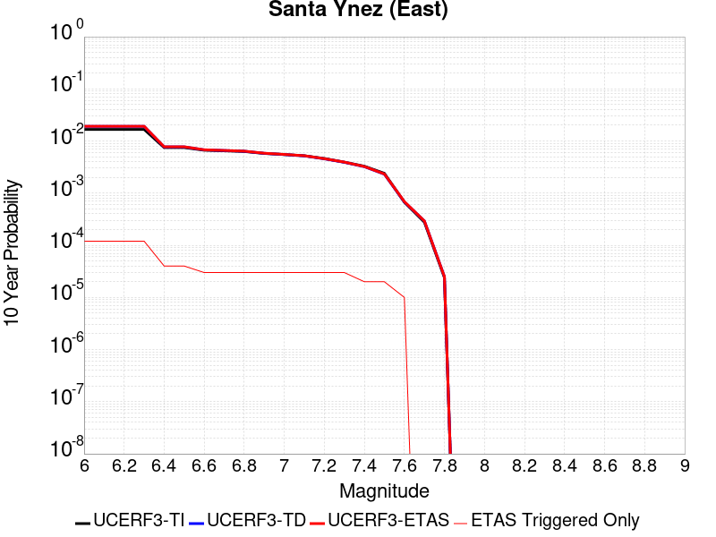 |

| Magnitude | 1 wk TI Prob | 1 wk TD Prob | 1 wk ETAS Prob | 1 wk ETAS/TD Gain | 1 wk ETAS Triggered Only | 1 mo TI Prob | 1 mo TD Prob | 1 mo ETAS Prob | 1 mo ETAS/TD Gain | 1 mo ETAS Triggered Only | 1 yr TI Prob | 1 yr TD Prob | 1 yr ETAS Prob | 1 yr ETAS/TD Gain | 1 yr ETAS Triggered Only | 10 yr TI Prob | 10 yr TD Prob | 10 yr ETAS Prob | 10 yr ETAS/TD Gain | 10 yr ETAS Triggered Only |
|-----|-----|-----|-----|-----|-----|-----|-----|-----|-----|-----|-----|-----|-----|-----|-----|-----|-----|-----|-----|-----|
| 6.0 | 3.2269712E-5 | 3.675413E-5 | 3.675413E-5 | 1.0 | 0.0 | 1.3829143E-4 | 1.5751152E-4 | 1.7750837E-4 | 1.1269548 | 2.0E-5 | 0.0016823979 | 0.0019165992 | 0.0019665034 | 1.0260379 | 5.0E-5 | 0.016697178 | 0.01905816 | 0.019175872 | 1.0061765 | 1.2E-4 |
| 6.1 | 3.2269712E-5 | 3.675413E-5 | 3.675413E-5 | 1.0 | 0.0 | 1.3829143E-4 | 1.5751152E-4 | 1.7750837E-4 | 1.1269548 | 2.0E-5 | 0.0016823979 | 0.0019165992 | 0.0019665034 | 1.0260379 | 5.0E-5 | 0.016697178 | 0.01905816 | 0.019175872 | 1.0061765 | 1.2E-4 |
| 6.2 | 3.2269712E-5 | 3.675413E-5 | 3.675413E-5 | 1.0 | 0.0 | 1.3829143E-4 | 1.5751152E-4 | 1.7750837E-4 | 1.1269548 | 2.0E-5 | 0.0016823979 | 0.0019165992 | 0.0019665034 | 1.0260379 | 5.0E-5 | 0.016697178 | 0.01905816 | 0.019175872 | 1.0061765 | 1.2E-4 |
| 6.3 | 3.2269712E-5 | 3.675413E-5 | 3.675413E-5 | 1.0 | 0.0 | 1.3829143E-4 | 1.5751152E-4 | 1.7750837E-4 | 1.1269548 | 2.0E-5 | 0.0016823979 | 0.0019165992 | 0.0019665034 | 1.0260379 | 5.0E-5 | 0.016697178 | 0.01905816 | 0.019175872 | 1.0061765 | 1.2E-4 |
| 6.4 | 1.4404779E-5 | 1.4850021E-5 | 1.4850021E-5 | 1.0 | 0.0 | 6.1733306E-5 | 6.3641426E-5 | 7.364079E-5 | 1.1571203 | 1.0E-5 | 7.513438E-4 | 7.74564E-4 | 7.945485E-4 | 1.025801 | 2.0E-5 | 0.0074880854 | 0.0077191936 | 0.0077588847 | 1.0051419 | 4.0E-5 |
| 6.5 | 1.4404779E-5 | 1.4850021E-5 | 1.4850021E-5 | 1.0 | 0.0 | 6.1733306E-5 | 6.3641426E-5 | 7.364079E-5 | 1.1571203 | 1.0E-5 | 7.513438E-4 | 7.74564E-4 | 7.945485E-4 | 1.025801 | 2.0E-5 | 0.0074880854 | 0.0077191936 | 0.0077588847 | 1.0051419 | 4.0E-5 |
| 6.6 | 1.280208E-5 | 1.3012444E-5 | 1.3012444E-5 | 1.0 | 0.0 | 5.4864904E-5 | 5.5766435E-5 | 6.5765875E-5 | 1.1793094 | 1.0E-5 | 6.6777546E-4 | 6.787466E-4 | 6.98733E-4 | 1.0294461 | 2.0E-5 | 0.006657724 | 0.006766946 | 0.006796743 | 1.0044034 | 3.0E-5 |
| 6.7 | 1.2457027E-5 | 1.26289415E-5 | 1.26289415E-5 | 1.0 | 0.0 | 5.3386164E-5 | 5.412292E-5 | 6.412238E-5 | 1.1847546 | 1.0E-5 | 6.497827E-4 | 6.58749E-4 | 6.7873584E-4 | 1.0303406 | 2.0E-5 | 0.00647886 | 0.0065681604 | 0.0065979636 | 1.0045375 | 3.0E-5 |
| 6.8 | 1.2095134E-5 | 1.2231368E-5 | 1.2231368E-5 | 1.0 | 0.0 | 5.1835254E-5 | 5.2419102E-5 | 6.241858E-5 | 1.1907601 | 1.0E-5 | 6.309115E-4 | 6.380173E-4 | 6.5800454E-4 | 1.0313271 | 2.0E-5 | 0.0062912325 | 0.006362044 | 0.006391853 | 1.0046855 | 3.0E-5 |
| 6.9 | 1.1104036E-5 | 1.1157752E-5 | 1.1157752E-5 | 1.0 | 0.0 | 4.758786E-5 | 4.781807E-5 | 5.781759E-5 | 1.209116 | 1.0E-5 | 5.7922816E-4 | 5.8203074E-4 | 6.020191E-4 | 1.0343424 | 2.0E-5 | 0.005777207 | 0.0058052093 | 0.005835035 | 1.0051378 | 3.0E-5 |
| 7.0 | 1.0577444E-5 | 1.0582056E-5 | 1.0582056E-5 | 1.0 | 0.0 | 4.5331115E-5 | 4.535089E-5 | 5.5350436E-5 | 1.2204928 | 1.0E-5 | 5.5176654E-4 | 5.520084E-4 | 5.7199737E-4 | 1.0362114 | 2.0E-5 | 0.0055039856 | 0.005506511 | 0.0055363458 | 1.0054181 | 3.0E-5 |
| 7.1 | 1.0021775E-5 | 9.981338E-6 | 9.981338E-6 | 1.0 | 0.0 | 4.294976E-5 | 4.2776468E-5 | 5.277604E-5 | 1.2337635 | 1.0E-5 | 5.2278786E-4 | 5.206802E-4 | 5.406698E-4 | 1.0383914 | 2.0E-5 | 0.0052155964 | 0.0051947352 | 0.0052245795 | 1.005745 | 3.0E-5 |
| 7.2 | 8.874109E-6 | 8.749089E-6 | 8.749089E-6 | 1.0 | 0.0 | 3.8031343E-5 | 3.7495563E-5 | 4.749519E-5 | 1.2666882 | 1.0E-5 | 4.629332E-4 | 4.5641392E-4 | 4.7640482E-4 | 1.0437999 | 2.0E-5 | 0.0046197 | 0.0045548836 | 0.004584747 | 1.0065564 | 3.0E-5 |
| 7.3 | 7.5504267E-6 | 7.5053244E-6 | 7.5053244E-6 | 1.0 | 0.0 | 3.235857E-5 | 3.2165288E-5 | 4.2164964E-5 | 1.3108841 | 1.0E-5 | 3.9389438E-4 | 3.91543E-4 | 4.1153518E-4 | 1.05106 | 2.0E-5 | 0.0039319694 | 0.0039086384 | 0.0039385213 | 1.0076452 | 3.0E-5 |
| 7.4 | 6.309394E-6 | 6.183301E-6 | 6.183301E-6 | 1.0 | 0.0 | 2.703998E-5 | 2.6499598E-5 | 3.6499332E-5 | 1.3773543 | 1.0E-5 | 3.2916202E-4 | 3.225858E-4 | 3.3258257E-4 | 1.0309895 | 1.0E-5 | 0.003286749 | 0.0032212727 | 0.0032412081 | 1.0061888 | 2.0E-5 |
| 7.5 | 4.6103073E-6 | 4.440954E-6 | 4.440954E-6 | 1.0 | 0.0 | 1.975831E-5 | 1.9032526E-5 | 2.9032335E-5 | 1.5254064 | 1.0E-5 | 2.4053088E-4 | 2.3169705E-4 | 2.4169474E-4 | 1.0431498 | 1.0E-5 | 0.002402707 | 0.0023146244 | 0.002334578 | 1.0086207 | 2.0E-5 |
| 7.6 | 1.2858658E-6 | 1.3008582E-6 | 1.3008582E-6 | 1.0 | 0.0 | 5.5108417E-6 | 5.575095E-6 | 5.575095E-6 | 1.0 | 0.0 | 6.7092435E-5 | 6.787474E-5 | 6.787474E-5 | 1.0 | 0.0 | 6.707218E-4 | 6.7854696E-4 | 6.8854017E-4 | 1.0147274 | 1.0E-5 |
| 7.7 | 5.3302307E-7 | 5.612297E-7 | 5.612297E-7 | 1.0 | 0.0 | 2.2843826E-6 | 2.4052679E-6 | 2.4052679E-6 | 1.0 | 0.0 | 2.7812002E-5 | 2.9283781E-5 | 2.9283781E-5 | 1.0 | 0.0 | 2.7808524E-4 | 2.9280278E-4 | 2.9280278E-4 | 1.0 | 0.0 |
| 7.8 | 4.613933E-8 | 4.8031144E-8 | 4.8031144E-8 | 1.0 | 0.0 | 1.9773998E-7 | 2.0584774E-7 | 2.0584774E-7 | 1.0 | 0.0 | 2.4074816E-6 | 2.5061934E-6 | 2.5061934E-6 | 1.0 | 0.0 | 2.4074554E-5 | 2.5061661E-5 | 2.5061661E-5 | 1.0 | 0.0 |

## Death Valley (Fish Lake Valley)
*[(top)](#table-of-contents)*

| 1 Week | 1 Month | 1 Year | 10 Year |
|-----|-----|-----|-----|
|  | 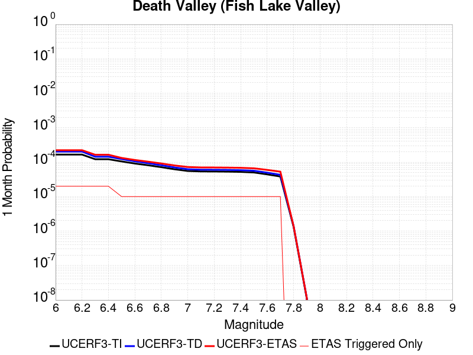 | 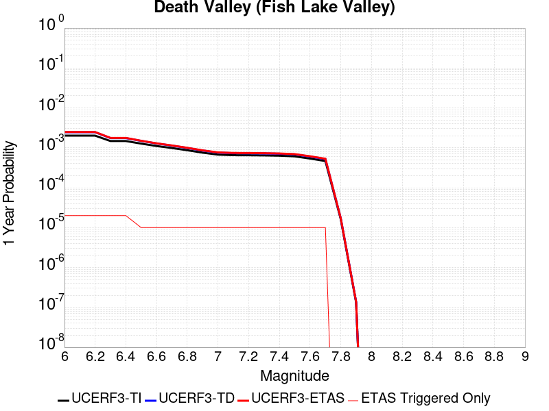 |  |

| Magnitude | 1 wk TI Prob | 1 wk TD Prob | 1 wk ETAS Prob | 1 wk ETAS/TD Gain | 1 wk ETAS Triggered Only | 1 mo TI Prob | 1 mo TD Prob | 1 mo ETAS Prob | 1 mo ETAS/TD Gain | 1 mo ETAS Triggered Only | 1 yr TI Prob | 1 yr TD Prob | 1 yr ETAS Prob | 1 yr ETAS/TD Gain | 1 yr ETAS Triggered Only | 10 yr TI Prob | 10 yr TD Prob | 10 yr ETAS Prob | 10 yr ETAS/TD Gain | 10 yr ETAS Triggered Only |
|-----|-----|-----|-----|-----|-----|-----|-----|-----|-----|-----|-----|-----|-----|-----|-----|-----|-----|-----|-----|-----|
| 6.0 | 3.872328E-5 | 4.7271373E-5 | 4.7271373E-5 | 1.0 | 0.0 | 1.6594635E-4 | 2.0257758E-4 | 2.2257352E-4 | 1.0987076 | 2.0E-5 | 0.0020185246 | 0.0024638502 | 0.0024838008 | 1.0080974 | 2.0E-5 | 0.02000288 | 0.024391154 | 0.02452774 | 1.0055997 | 1.4E-4 |
| 6.1 | 3.872328E-5 | 4.7271373E-5 | 4.7271373E-5 | 1.0 | 0.0 | 1.6594635E-4 | 2.0257758E-4 | 2.2257352E-4 | 1.0987076 | 2.0E-5 | 0.0020185246 | 0.0024638502 | 0.0024838008 | 1.0080974 | 2.0E-5 | 0.02000288 | 0.024391154 | 0.02452774 | 1.0055997 | 1.4E-4 |
| 6.2 | 3.872328E-5 | 4.7271373E-5 | 4.7271373E-5 | 1.0 | 0.0 | 1.6594635E-4 | 2.0257758E-4 | 2.2257352E-4 | 1.0987076 | 2.0E-5 | 0.0020185246 | 0.0024638502 | 0.0024838008 | 1.0080974 | 2.0E-5 | 0.02000288 | 0.024391154 | 0.02452774 | 1.0055997 | 1.4E-4 |
| 6.3 | 2.8356371E-5 | 3.3613145E-5 | 3.3613145E-5 | 1.0 | 0.0 | 1.2152165E-4 | 1.4404883E-4 | 1.6404595E-4 | 1.1388218 | 2.0E-5 | 0.0014785219 | 0.0017524528 | 0.0017724178 | 1.0113926 | 2.0E-5 | 0.014687235 | 0.017393526 | 0.017531091 | 1.0079089 | 1.4E-4 |
| 6.4 | 2.8356371E-5 | 3.3613145E-5 | 3.3613145E-5 | 1.0 | 0.0 | 1.2152165E-4 | 1.4404883E-4 | 1.6404595E-4 | 1.1388218 | 2.0E-5 | 0.0014785219 | 0.0017524528 | 0.0017724178 | 1.0113926 | 2.0E-5 | 0.014687235 | 0.017393526 | 0.017531091 | 1.0079089 | 1.4E-4 |
| 6.5 | 2.4448687E-5 | 2.8610195E-5 | 2.8610195E-5 | 1.0 | 0.0 | 1.0477588E-4 | 1.2260964E-4 | 1.3260842E-4 | 1.0815496 | 1.0E-5 | 0.0012748998 | 0.0014917979 | 0.0015017829 | 1.0066934 | 1.0E-5 | 0.012676105 | 0.014822734 | 0.014940956 | 1.0079757 | 1.2E-4 |
| 6.6 | 2.1298161E-5 | 2.466216E-5 | 2.466216E-5 | 1.0 | 0.0 | 9.127464E-5 | 1.0569088E-4 | 1.1568983E-4 | 1.0946056 | 1.0E-5 | 0.0011107022 | 0.0012860601 | 0.0012960472 | 1.0077657 | 1.0E-5 | 0.011051672 | 0.012789606 | 0.012908071 | 1.0092626 | 1.2E-4 |
| 6.7 | 1.8959729E-5 | 2.1782764E-5 | 2.1782764E-5 | 1.0 | 0.0 | 8.125345E-5 | 9.3351504E-5 | 1.0335057E-4 | 1.107112 | 1.0E-5 | 9.888117E-4 | 0.0011359876 | 0.0011459761 | 1.0087929 | 1.0E-5 | 0.009844234 | 0.011304467 | 0.01142311 | 1.0104953 | 1.2E-4 |
| 6.8 | 1.6691629E-5 | 1.901977E-5 | 1.901977E-5 | 1.0 | 0.0 | 7.153359E-5 | 8.151084E-5 | 9.151003E-5 | 1.122673 | 1.0E-5 | 8.7057345E-4 | 9.919596E-4 | 0.0010019497 | 1.010071 | 1.0E-5 | 0.008671708 | 0.009877076 | 0.009995891 | 1.0120293 | 1.2E-4 |
| 6.9 | 1.450505E-5 | 1.6390675E-5 | 1.6390675E-5 | 1.0 | 0.0 | 6.216302E-5 | 7.024391E-5 | 8.0243204E-5 | 1.1423512 | 1.0E-5 | 7.5657194E-4 | 8.5489283E-4 | 8.6488423E-4 | 1.0116874 | 1.0E-5 | 0.007540013 | 0.008516973 | 0.008635951 | 1.0139695 | 1.2E-4 |
| 7.0 | 1.2940855E-5 | 1.4538927E-5 | 1.4538927E-5 | 1.0 | 0.0 | 5.545963E-5 | 6.230823E-5 | 7.230761E-5 | 1.1604824 | 1.0E-5 | 6.750118E-4 | 7.583444E-4 | 7.683369E-4 | 1.0131766 | 1.0E-5 | 0.006729651 | 0.007558184 | 0.007677277 | 1.0157568 | 1.2E-4 |
| 7.1 | 1.2544658E-5 | 1.4079123E-5 | 1.4079123E-5 | 1.0 | 0.0 | 5.3761712E-5 | 6.0337734E-5 | 7.033713E-5 | 1.1657238 | 1.0E-5 | 6.5435225E-4 | 7.343699E-4 | 7.443626E-4 | 1.0136071 | 1.0E-5 | 0.006524288 | 0.007320025 | 0.0074391467 | 1.0162734 | 1.2E-4 |
| 7.2 | 1.2489416E-5 | 1.4016585E-5 | 1.4016585E-5 | 1.0 | 0.0 | 5.3524967E-5 | 6.0069728E-5 | 7.006913E-5 | 1.1664633 | 1.0E-5 | 6.514716E-4 | 7.311091E-4 | 7.411018E-4 | 1.0136678 | 1.0E-5 | 0.006495651 | 0.0072876317 | 0.007406757 | 1.0163462 | 1.2E-4 |
| 7.3 | 1.2368307E-5 | 1.38807145E-5 | 1.38807145E-5 | 1.0 | 0.0 | 5.3005948E-5 | 5.948745E-5 | 6.948686E-5 | 1.1680927 | 1.0E-5 | 6.451563E-4 | 7.2402466E-4 | 7.340174E-4 | 1.0138017 | 1.0E-5 | 0.0064328653 | 0.0072172494 | 0.007336383 | 1.0165068 | 1.2E-4 |
| 7.4 | 1.2161707E-5 | 1.3648755E-5 | 1.3648755E-5 | 1.0 | 0.0 | 5.212056E-5 | 5.8493384E-5 | 6.84928E-5 | 1.1709495 | 1.0E-5 | 6.3438306E-4 | 7.1192987E-4 | 7.219227E-4 | 1.0140363 | 1.0E-5 | 0.006325751 | 0.0070970803 | 0.0072162286 | 1.0167884 | 1.2E-4 |
| 7.5 | 1.1707948E-5 | 1.3146373E-5 | 1.3146373E-5 | 1.0 | 0.0 | 5.0175953E-5 | 5.6340414E-5 | 6.633985E-5 | 1.1774825 | 1.0E-5 | 6.10721E-4 | 6.857342E-4 | 6.9572736E-4 | 1.0145729 | 1.0E-5 | 0.0060904534 | 0.006836766 | 0.0069559454 | 1.0174322 | 1.2E-4 |
| 7.6 | 1.0319538E-5 | 1.1580373E-5 | 1.1580373E-5 | 1.0 | 0.0 | 4.4225842E-5 | 4.9629256E-5 | 5.962876E-5 | 1.2014841 | 1.0E-5 | 5.383166E-4 | 6.0407387E-4 | 6.1406783E-4 | 1.0165442 | 1.0E-5 | 0.0053701443 | 0.00602485 | 0.0061341873 | 1.0181477 | 1.1E-4 |
| 7.7 | 8.937764E-6 | 1.0023426E-5 | 1.0023426E-5 | 1.0 | 0.0 | 3.830414E-5 | 4.295686E-5 | 5.295643E-5 | 1.2327816 | 1.0E-5 | 4.6625308E-4 | 5.228793E-4 | 5.328741E-4 | 1.0191149 | 1.0E-5 | 0.0046527605 | 0.005217 | 0.005326426 | 1.0209749 | 1.1E-4 |
| 7.8 | 3.108007E-7 | 3.2847535E-7 | 3.2847535E-7 | 1.0 | 0.0 | 1.3320023E-6 | 1.4077508E-6 | 1.4077508E-6 | 1.0 | 0.0 | 1.6217007E-5 | 1.7139235E-5 | 1.7139235E-5 | 1.0 | 0.0 | 1.6215823E-4 | 1.713795E-4 | 1.8137779E-4 | 1.0583401 | 1.0E-5 |
| 7.9 | 2.5591178E-9 | 2.6697329E-9 | 2.6697329E-9 | 1.0 | 0.0 | 1.0967647E-8 | 1.14417125E-8 | 1.14417125E-8 | 1.0 | 0.0 | 1.335311E-7 | 1.3930286E-7 | 1.3930286E-7 | 1.0 | 0.0 | 1.3353102E-6 | 1.3930285E-6 | 1.3930285E-6 | 1.0 | 0.0 |

## Mission Ridge-Arroyo Parida-Santa Ana
*[(top)](#table-of-contents)*

| 1 Week | 1 Month | 1 Year | 10 Year |
|-----|-----|-----|-----|
|  |  | 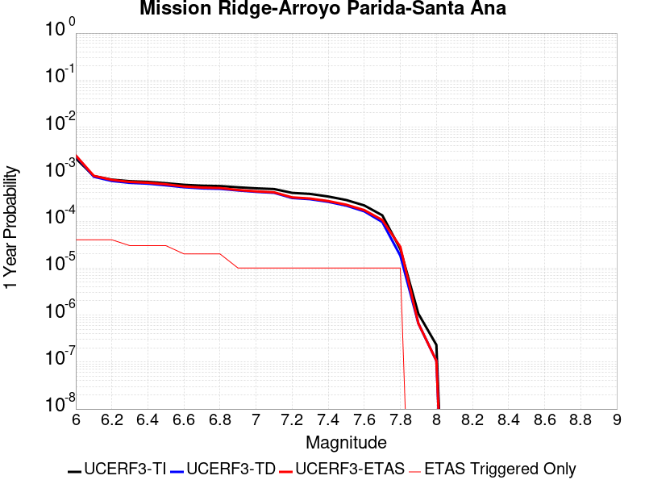 | 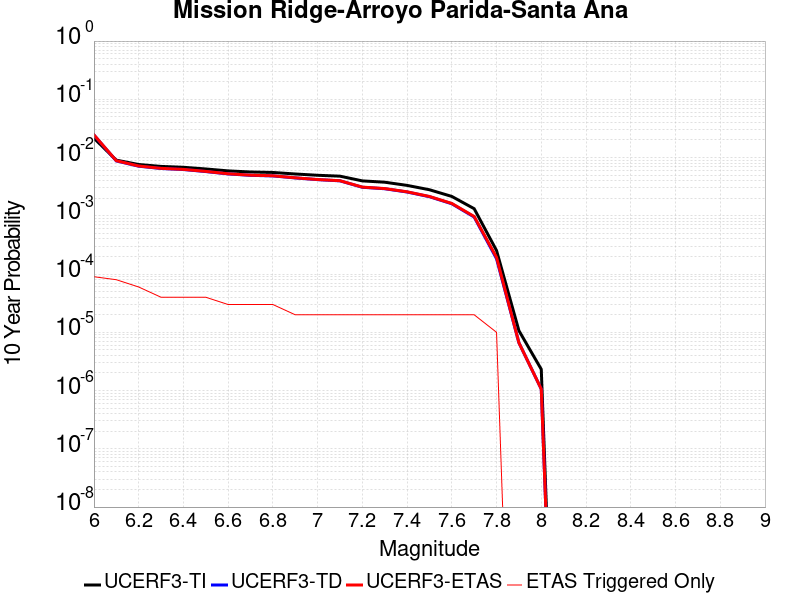 |

| Magnitude | 1 wk TI Prob | 1 wk TD Prob | 1 wk ETAS Prob | 1 wk ETAS/TD Gain | 1 wk ETAS Triggered Only | 1 mo TI Prob | 1 mo TD Prob | 1 mo ETAS Prob | 1 mo ETAS/TD Gain | 1 mo ETAS Triggered Only | 1 yr TI Prob | 1 yr TD Prob | 1 yr ETAS Prob | 1 yr ETAS/TD Gain | 1 yr ETAS Triggered Only | 10 yr TI Prob | 10 yr TD Prob | 10 yr ETAS Prob | 10 yr ETAS/TD Gain | 10 yr ETAS Triggered Only |
|-----|-----|-----|-----|-----|-----|-----|-----|-----|-----|-----|-----|-----|-----|-----|-----|-----|-----|-----|-----|-----|
| 6.0 | 4.169034E-5 | 4.7142308E-5 | 4.7142308E-5 | 1.0 | 0.0 | 1.7866064E-4 | 2.0202712E-4 | 2.120251E-4 | 1.0494883 | 1.0E-5 | 0.0021730233 | 0.0024577351 | 0.0024976367 | 1.0162351 | 4.0E-5 | 0.021518968 | 0.024387209 | 0.024475014 | 1.0036005 | 9.0E-5 |
| 6.1 | 1.73813E-5 | 1.6855429E-5 | 1.6855429E-5 | 1.0 | 0.0 | 7.4489166E-5 | 7.223561E-5 | 8.2234896E-5 | 1.1384258 | 1.0E-5 | 9.065282E-4 | 8.791244E-4 | 9.1908925E-4 | 1.0454599 | 4.0E-5 | 0.009028391 | 0.008757493 | 0.008836793 | 1.009055 | 8.0E-5 |
| 6.2 | 1.4622182E-5 | 1.36742265E-5 | 1.36742265E-5 | 1.0 | 0.0 | 6.2664985E-5 | 5.8602534E-5 | 6.860195E-5 | 1.170631 | 1.0E-5 | 7.6267915E-4 | 7.132562E-4 | 7.532276E-4 | 1.0560409 | 4.0E-5 | 0.007600669 | 0.0071099964 | 0.00716957 | 1.0083789 | 6.0E-5 |
| 6.3 | 1.3552434E-5 | 1.2483065E-5 | 1.2483065E-5 | 1.0 | 0.0 | 5.8080568E-5 | 5.3497773E-5 | 6.349724E-5 | 1.1869137 | 1.0E-5 | 7.069015E-4 | 6.511439E-4 | 6.8112434E-4 | 1.0460428 | 3.0E-5 | 0.00704657 | 0.006492607 | 0.0065323473 | 1.0061208 | 4.0E-5 |
| 6.4 | 1.30977305E-5 | 1.19799915E-5 | 1.19799915E-5 | 1.0 | 0.0 | 5.613192E-5 | 5.1341827E-5 | 6.1341314E-5 | 1.194763 | 1.0E-5 | 6.831918E-4 | 6.249105E-4 | 6.548918E-4 | 1.0479769 | 3.0E-5 | 0.006810953 | 0.0062317615 | 0.0062715122 | 1.0063788 | 4.0E-5 |
| 6.5 | 1.225205E-5 | 1.1049589E-5 | 1.1049589E-5 | 1.0 | 0.0 | 5.2507727E-5 | 4.7354537E-5 | 5.7354064E-5 | 1.211163 | 1.0E-5 | 6.3909404E-4 | 5.763917E-4 | 6.063744E-4 | 1.0520179 | 3.0E-5 | 0.006372592 | 0.005749161 | 0.0057889307 | 1.0069176 | 4.0E-5 |
| 6.6 | 1.1352241E-5 | 1.0064272E-5 | 1.0064272E-5 | 1.0 | 0.0 | 4.8651553E-5 | 4.313189E-5 | 4.313189E-5 | 1.0 | 0.0 | 5.921717E-4 | 5.250063E-4 | 5.449958E-4 | 1.0380747 | 2.0E-5 | 0.0059059616 | 0.0052377903 | 0.005267633 | 1.0056976 | 3.0E-5 |
| 6.7 | 1.0864116E-5 | 9.517728E-6 | 9.517728E-6 | 1.0 | 0.0 | 4.6559664E-5 | 4.078964E-5 | 4.078964E-5 | 1.0 | 0.0 | 5.667165E-4 | 4.965027E-4 | 5.1649276E-4 | 1.0402617 | 2.0E-5 | 0.005652734 | 0.0049540517 | 0.004983903 | 1.0060257 | 3.0E-5 |
| 6.8 | 1.0666365E-5 | 9.300469E-6 | 9.300469E-6 | 1.0 | 0.0 | 4.571219E-5 | 3.9858554E-5 | 3.9858554E-5 | 1.0 | 0.0 | 5.564038E-4 | 4.8517185E-4 | 5.051621E-4 | 1.0412025 | 2.0E-5 | 0.005550127 | 0.004841242 | 0.0048710965 | 1.0061668 | 3.0E-5 |
| 6.9 | 1.0038665E-5 | 8.592688E-6 | 8.592688E-6 | 1.0 | 0.0 | 4.302214E-5 | 3.6825295E-5 | 3.6825295E-5 | 1.0 | 0.0 | 5.236687E-4 | 4.4825752E-4 | 4.5825305E-4 | 1.0222986 | 1.0E-5 | 0.005224364 | 0.0044736275 | 0.0044935383 | 1.0044507 | 2.0E-5 |
| 7.0 | 9.5379955E-6 | 8.025673E-6 | 8.025673E-6 | 1.0 | 0.0 | 4.0876483E-5 | 3.43953E-5 | 3.43953E-5 | 1.0 | 0.0 | 4.975576E-4 | 4.18684E-4 | 4.286798E-4 | 1.0238744 | 1.0E-5 | 0.00496445 | 0.004179035 | 0.004198951 | 1.0047657 | 2.0E-5 |
| 7.1 | 9.207389E-6 | 7.652947E-6 | 7.652947E-6 | 1.0 | 0.0 | 3.945964E-5 | 3.279794E-5 | 3.279794E-5 | 1.0 | 0.0 | 4.803152E-4 | 3.9924344E-4 | 4.0923947E-4 | 1.0250374 | 1.0E-5 | 0.004792784 | 0.0039853416 | 0.0040052617 | 1.0049984 | 2.0E-5 |
| 7.2 | 7.638091E-6 | 5.9315425E-6 | 5.9315425E-6 | 1.0 | 0.0 | 3.2734264E-5 | 2.542065E-5 | 2.542065E-5 | 1.0 | 0.0 | 3.984668E-4 | 3.0945276E-4 | 3.1944967E-4 | 1.0323051 | 1.0E-5 | 0.0039775306 | 0.0030901586 | 0.0031100968 | 1.0064522 | 2.0E-5 |
| 7.3 | 7.2500147E-6 | 5.596552E-6 | 5.596552E-6 | 1.0 | 0.0 | 3.1071122E-5 | 2.3985005E-5 | 2.3985005E-5 | 1.0 | 0.0 | 3.7822526E-4 | 2.919786E-4 | 3.019757E-4 | 1.034239 | 1.0E-5 | 0.0037758215 | 0.0029158886 | 0.0029358303 | 1.0068389 | 2.0E-5 |
| 7.4 | 6.3899715E-6 | 4.9188443E-6 | 4.9188443E-6 | 1.0 | 0.0 | 2.7385306E-5 | 2.1080592E-5 | 2.1080592E-5 | 1.0 | 0.0 | 3.3336508E-4 | 2.5662617E-4 | 2.6662363E-4 | 1.0389572 | 1.0E-5 | 0.0033286542 | 0.002563226 | 0.0025831747 | 1.0077827 | 2.0E-5 |
| 7.5 | 5.379025E-6 | 4.0841383E-6 | 4.0841383E-6 | 1.0 | 0.0 | 2.305276E-5 | 1.7503333E-5 | 1.7503333E-5 | 1.0 | 0.0 | 2.806312E-4 | 2.1308236E-4 | 2.2308022E-4 | 1.0469202 | 1.0E-5 | 0.0028027708 | 0.0021287918 | 0.002148749 | 1.009375 | 2.0E-5 |
| 7.6 | 4.1270696E-6 | 3.0885694E-6 | 3.0885694E-6 | 1.0 | 0.0 | 1.768732E-5 | 1.32366595E-5 | 1.32366595E-5 | 1.0 | 0.0 | 2.1532185E-4 | 1.6114449E-4 | 1.7114288E-4 | 1.062046 | 1.0E-5 | 0.0021511333 | 0.0016102846 | 0.0016302523 | 1.0124002 | 2.0E-5 |
| 7.7 | 2.5406805E-6 | 1.8283392E-6 | 1.8283392E-6 | 1.0 | 0.0 | 1.0888585E-5 | 7.835716E-6 | 7.835716E-6 | 1.0 | 0.0 | 1.3256045E-4 | 9.5395735E-5 | 1.0539478E-4 | 1.1048164 | 1.0E-5 | 0.0013248142 | 9.53554E-4 | 9.7353494E-4 | 1.0209541 | 2.0E-5 |
| 7.8 | 4.8608285E-7 | 3.5100481E-7 | 3.5100481E-7 | 1.0 | 0.0 | 2.0832106E-6 | 1.5043055E-6 | 1.5043055E-6 | 1.0 | 0.0 | 2.5362791E-5 | 1.8314766E-5 | 2.8314584E-5 | 1.5459975 | 1.0E-5 | 2.5359896E-4 | 1.831327E-4 | 1.9313087E-4 | 1.0545952 | 1.0E-5 |
| 7.9 | 2.0472514E-8 | 1.2689942E-8 | 1.2689942E-8 | 1.0 | 0.0 | 8.7739345E-8 | 5.4385467E-8 | 5.4385467E-8 | 1.0 | 0.0 | 1.068226E-6 | 6.6214284E-7 | 6.6214284E-7 | 1.0 | 0.0 | 1.0682209E-5 | 6.6214097E-6 | 6.6214097E-6 | 1.0 | 0.0 |
| 8.0 | 4.443582E-9 | 2.0326758E-9 | 2.0326758E-9 | 1.0 | 0.0 | 1.9043922E-8 | 8.711468E-9 | 8.711468E-9 | 1.0 | 0.0 | 2.3185973E-7 | 1.0606212E-7 | 1.0606212E-7 | 1.0 | 0.0 | 2.3185949E-6 | 1.0606208E-6 | 1.0606208E-6 | 1.0 | 0.0 |

## San Jacinto (San Bernardino)
*[(top)](#table-of-contents)*

| 1 Week | 1 Month | 1 Year | 10 Year |
|-----|-----|-----|-----|
|  | 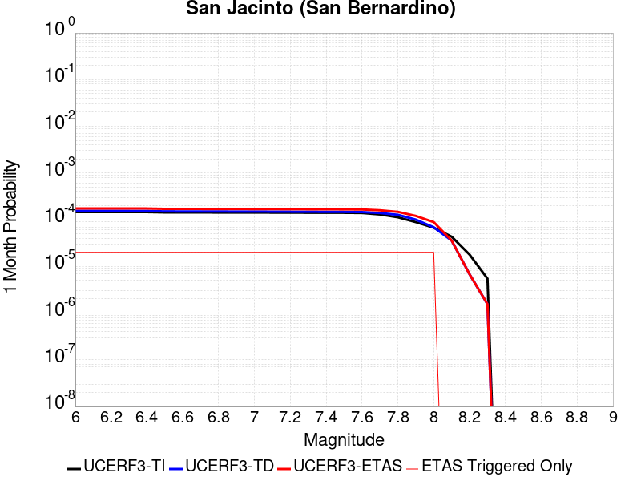 | 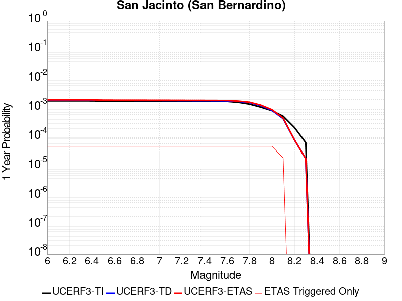 |  |

| Magnitude | 1 wk TI Prob | 1 wk TD Prob | 1 wk ETAS Prob | 1 wk ETAS/TD Gain | 1 wk ETAS Triggered Only | 1 mo TI Prob | 1 mo TD Prob | 1 mo ETAS Prob | 1 mo ETAS/TD Gain | 1 mo ETAS Triggered Only | 1 yr TI Prob | 1 yr TD Prob | 1 yr ETAS Prob | 1 yr ETAS/TD Gain | 1 yr ETAS Triggered Only | 10 yr TI Prob | 10 yr TD Prob | 10 yr ETAS Prob | 10 yr ETAS/TD Gain | 10 yr ETAS Triggered Only |
|-----|-----|-----|-----|-----|-----|-----|-----|-----|-----|-----|-----|-----|-----|-----|-----|-----|-----|-----|-----|-----|
| 6.0 | 3.409352E-5 | 3.604894E-5 | 3.604894E-5 | 1.0 | 0.0 | 1.461069E-4 | 1.5448632E-4 | 1.7448323E-4 | 1.1294413 | 2.0E-5 | 0.0017774 | 0.0018792498 | 0.0019291559 | 1.0265564 | 5.0E-5 | 0.01763251 | 0.019381514 | 0.019508993 | 1.0065774 | 1.3E-4 |
| 6.1 | 3.409352E-5 | 3.604894E-5 | 3.604894E-5 | 1.0 | 0.0 | 1.461069E-4 | 1.5448632E-4 | 1.7448323E-4 | 1.1294413 | 2.0E-5 | 0.0017774 | 0.0018792498 | 0.0019291559 | 1.0265564 | 5.0E-5 | 0.01763251 | 0.019381514 | 0.019508993 | 1.0065774 | 1.3E-4 |
| 6.2 | 3.409352E-5 | 3.604894E-5 | 3.604894E-5 | 1.0 | 0.0 | 1.461069E-4 | 1.5448632E-4 | 1.7448323E-4 | 1.1294413 | 2.0E-5 | 0.0017774 | 0.0018792498 | 0.0019291559 | 1.0265564 | 5.0E-5 | 0.01763251 | 0.019381514 | 0.019508993 | 1.0065774 | 1.3E-4 |
| 6.3 | 3.409352E-5 | 3.604894E-5 | 3.604894E-5 | 1.0 | 0.0 | 1.461069E-4 | 1.5448632E-4 | 1.7448323E-4 | 1.1294413 | 2.0E-5 | 0.0017774 | 0.0018792498 | 0.0019291559 | 1.0265564 | 5.0E-5 | 0.01763251 | 0.019381514 | 0.019508993 | 1.0065774 | 1.3E-4 |
| 6.4 | 3.400795E-5 | 3.594159E-5 | 3.594159E-5 | 1.0 | 0.0 | 1.4574021E-4 | 1.540263E-4 | 1.7402323E-4 | 1.129828 | 2.0E-5 | 0.0017729428 | 0.0018736589 | 0.0019235652 | 1.0266358 | 5.0E-5 | 0.017588645 | 0.01932659 | 0.019454077 | 1.0065964 | 1.3E-4 |
| 6.5 | 3.341482E-5 | 3.5202123E-5 | 3.5202123E-5 | 1.0 | 0.0 | 1.4319851E-4 | 1.5085752E-4 | 1.708545E-4 | 1.1325554 | 2.0E-5 | 0.0017420477 | 0.0018351445 | 0.0018850527 | 1.0271958 | 5.0E-5 | 0.017284546 | 0.018948095 | 0.01907563 | 1.0067308 | 1.3E-4 |
| 6.6 | 3.3364955E-5 | 3.5139332E-5 | 3.5139332E-5 | 1.0 | 0.0 | 1.4298483E-4 | 1.5058846E-4 | 1.7058544E-4 | 1.1327924 | 2.0E-5 | 0.0017394501 | 0.001831874 | 0.0018817824 | 1.0272444 | 5.0E-5 | 0.017258976 | 0.018915955 | 0.019043496 | 1.0067425 | 1.3E-4 |
| 6.7 | 3.335922E-5 | 3.5129106E-5 | 3.5129106E-5 | 1.0 | 0.0 | 1.4296026E-4 | 1.5054463E-4 | 1.7054162E-4 | 1.132831 | 2.0E-5 | 0.0017391514 | 0.0018313414 | 0.0018812498 | 1.0272524 | 5.0E-5 | 0.017256035 | 0.018910747 | 0.01903829 | 1.0067444 | 1.3E-4 |
| 6.8 | 3.327683E-5 | 3.5023157E-5 | 3.5023157E-5 | 1.0 | 0.0 | 1.4260718E-4 | 1.5009061E-4 | 1.700876E-4 | 1.1332328 | 2.0E-5 | 0.0017348597 | 0.001825823 | 0.0018757317 | 1.0273349 | 5.0E-5 | 0.017213784 | 0.018856514 | 0.018984063 | 1.0067642 | 1.3E-4 |
| 6.9 | 3.3235785E-5 | 3.49641E-5 | 3.49641E-5 | 1.0 | 0.0 | 1.4243131E-4 | 1.4983755E-4 | 1.6983454E-4 | 1.1334579 | 2.0E-5 | 0.0017327217 | 0.001822747 | 0.0018726559 | 1.0273812 | 5.0E-5 | 0.017192734 | 0.01882638 | 0.018953932 | 1.0067753 | 1.3E-4 |
| 7.0 | 3.3197095E-5 | 3.4904017E-5 | 3.4904017E-5 | 1.0 | 0.0 | 1.422655E-4 | 1.4958008E-4 | 1.6957709E-4 | 1.1336876 | 2.0E-5 | 0.0017307063 | 0.0018196177 | 0.0018695267 | 1.0274283 | 5.0E-5 | 0.017172894 | 0.018795753 | 0.018923309 | 1.0067865 | 1.3E-4 |
| 7.1 | 3.3129716E-5 | 3.4784203E-5 | 3.4784203E-5 | 1.0 | 0.0 | 1.4197677E-4 | 1.4906665E-4 | 1.6906366E-4 | 1.1341481 | 2.0E-5 | 0.0017271966 | 0.001813377 | 0.0018632864 | 1.0275229 | 5.0E-5 | 0.017138338 | 0.01873482 | 0.018862385 | 1.006809 | 1.3E-4 |
| 7.2 | 3.3034008E-5 | 3.4651628E-5 | 3.4651628E-5 | 1.0 | 0.0 | 1.4156665E-4 | 1.4849853E-4 | 1.6849556E-4 | 1.1346614 | 2.0E-5 | 0.0017222111 | 0.0018064718 | 0.0018563814 | 1.0276283 | 5.0E-5 | 0.017089253 | 0.018667199 | 0.018794773 | 1.006834 | 1.3E-4 |
| 7.3 | 3.2956614E-5 | 3.4519344E-5 | 3.4519344E-5 | 1.0 | 0.0 | 1.4123498E-4 | 1.4793167E-4 | 1.6792871E-4 | 1.1351776 | 2.0E-5 | 0.0017181796 | 0.0017995817 | 0.0018494916 | 1.0277343 | 5.0E-5 | 0.017049557 | 0.018599935 | 0.018727517 | 1.0068593 | 1.3E-4 |
| 7.4 | 3.2915937E-5 | 3.4441007E-5 | 3.4441007E-5 | 1.0 | 0.0 | 1.4106068E-4 | 1.4759599E-4 | 1.6759303E-4 | 1.135485 | 2.0E-5 | 0.0017160608 | 0.0017955014 | 0.0018454116 | 1.0277973 | 5.0E-5 | 0.017028693 | 0.01856018 | 0.018687768 | 1.0068742 | 1.3E-4 |
| 7.5 | 3.281791E-5 | 3.4305875E-5 | 3.4305875E-5 | 1.0 | 0.0 | 1.406406E-4 | 1.4701691E-4 | 1.6701396E-4 | 1.1360188 | 2.0E-5 | 0.0017109542 | 0.0017884627 | 0.0018383734 | 1.027907 | 5.0E-5 | 0.016978411 | 0.018491047 | 0.018618641 | 1.0069004 | 1.3E-4 |
| 7.6 | 3.2521442E-5 | 3.403071E-5 | 3.403071E-5 | 1.0 | 0.0 | 1.3937015E-4 | 1.4583775E-4 | 1.6583483E-4 | 1.1371187 | 2.0E-5 | 0.0016955109 | 0.00177413 | 0.0018240414 | 1.0281328 | 5.0E-5 | 0.016826328 | 0.018348608 | 0.018476224 | 1.006955 | 1.3E-4 |
| 7.7 | 3.0287873E-5 | 3.2514057E-5 | 3.2514057E-5 | 1.0 | 0.0 | 1.297987E-4 | 1.3933852E-4 | 1.5933573E-4 | 1.1435153 | 2.0E-5 | 0.0015791537 | 0.0016951276 | 0.0017450429 | 1.0294464 | 5.0E-5 | 0.01567979 | 0.017559286 | 0.017687004 | 1.0072734 | 1.3E-4 |
| 7.8 | 2.6316151E-5 | 2.9722758E-5 | 2.9722758E-5 | 1.0 | 0.0 | 1.1277862E-4 | 1.2737703E-4 | 1.4737449E-4 | 1.1569942 | 2.0E-5 | 0.0013722149 | 0.0015497132 | 0.0015996357 | 1.032214 | 5.0E-5 | 0.013637724 | 0.016099673 | 0.016227579 | 1.0079447 | 1.3E-4 |
| 7.9 | 2.0761147E-5 | 2.346946E-5 | 2.346946E-5 | 1.0 | 0.0 | 8.897331E-5 | 1.0057953E-4 | 1.2057752E-4 | 1.1988276 | 2.0E-5 | 0.0010827117 | 0.0012238687 | 0.0012738075 | 1.040804 | 5.0E-5 | 0.010774517 | 0.012819743 | 0.012938204 | 1.0092405 | 1.2E-4 |
| 8.0 | 1.5738568E-5 | 1.6071699E-5 | 1.6071699E-5 | 1.0 | 0.0 | 6.744926E-5 | 6.887689E-5 | 8.887552E-5 | 1.2903532 | 2.0E-5 | 8.2088535E-4 | 8.3825423E-4 | 8.8821235E-4 | 1.0595977 | 5.0E-5 | 0.008178596 | 0.008886066 | 0.008985178 | 1.0111536 | 1.0E-4 |
| 8.1 | 1.0105832E-5 | 8.352162E-6 | 8.352162E-6 | 1.0 | 0.0 | 4.3309992E-5 | 3.5794492E-5 | 3.5794492E-5 | 1.0 | 0.0 | 5.2717153E-4 | 4.357113E-4 | 4.557026E-4 | 1.045882 | 2.0E-5 | 0.005259227 | 0.004688983 | 0.0047287955 | 1.0084907 | 4.0E-5 |
| 8.2 | 4.189207E-6 | 1.5843941E-6 | 1.5843941E-6 | 1.0 | 0.0 | 1.7953622E-5 | 6.790243E-6 | 6.790243E-6 | 1.0 | 0.0 | 2.1856341E-4 | 8.26681E-5 | 8.26681E-5 | 1.0 | 0.0 | 0.0021834858 | 9.600267E-4 | 9.600267E-4 | 1.0 | 0.0 |
| 8.3 | 1.2758221E-6 | 3.6306494E-7 | 3.6306494E-7 | 1.0 | 0.0 | 5.4677976E-6 | 1.5559917E-6 | 1.5559917E-6 | 1.0 | 0.0 | 6.65684E-5 | 1.8944038E-5 | 1.8944038E-5 | 1.0 | 0.0 | 6.6548464E-4 | 2.2845245E-4 | 2.2845245E-4 | 1.0 | 0.0 |

## Calico-Hidalgo
*[(top)](#table-of-contents)*

| 1 Week | 1 Month | 1 Year | 10 Year |
|-----|-----|-----|-----|
|  | 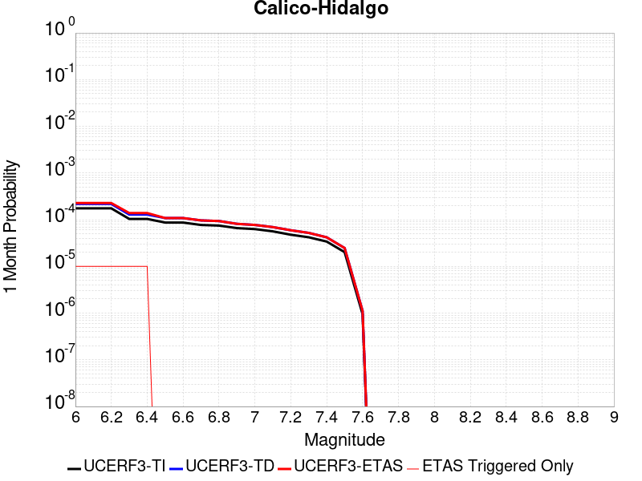 |  | 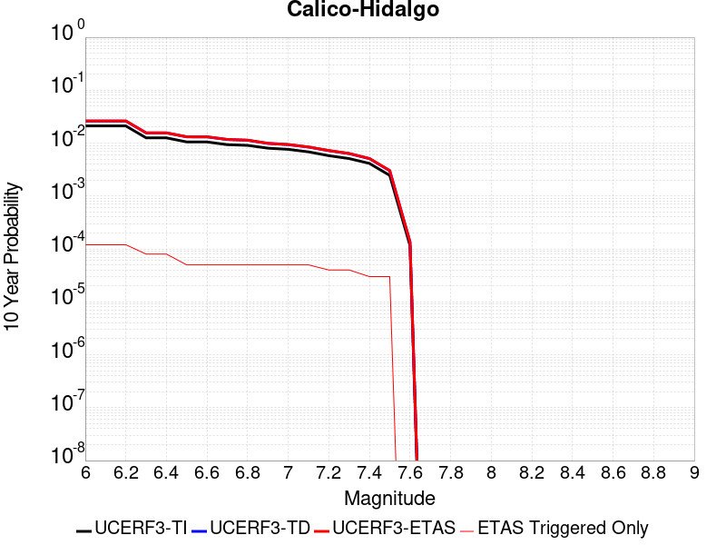 |

| Magnitude | 1 wk TI Prob | 1 wk TD Prob | 1 wk ETAS Prob | 1 wk ETAS/TD Gain | 1 wk ETAS Triggered Only | 1 mo TI Prob | 1 mo TD Prob | 1 mo ETAS Prob | 1 mo ETAS/TD Gain | 1 mo ETAS Triggered Only | 1 yr TI Prob | 1 yr TD Prob | 1 yr ETAS Prob | 1 yr ETAS/TD Gain | 1 yr ETAS Triggered Only | 10 yr TI Prob | 10 yr TD Prob | 10 yr ETAS Prob | 10 yr ETAS/TD Gain | 10 yr ETAS Triggered Only |
|-----|-----|-----|-----|-----|-----|-----|-----|-----|-----|-----|-----|-----|-----|-----|-----|-----|-----|-----|-----|-----|
| 6.0 | 4.0906612E-5 | 5.0708393E-5 | 6.0707887E-5 | 1.197196 | 1.0E-5 | 1.7530227E-4 | 2.1730587E-4 | 2.2730371E-4 | 1.0460081 | 1.0E-5 | 0.0021322158 | 0.0026428874 | 0.0026827818 | 1.015095 | 4.0E-5 | 0.02111873 | 0.02615486 | 0.026271723 | 1.0044681 | 1.2E-4 |
| 6.1 | 4.0906612E-5 | 5.0708393E-5 | 6.0707887E-5 | 1.197196 | 1.0E-5 | 1.7530227E-4 | 2.1730587E-4 | 2.2730371E-4 | 1.0460081 | 1.0E-5 | 0.0021322158 | 0.0026428874 | 0.0026827818 | 1.015095 | 4.0E-5 | 0.02111873 | 0.02615486 | 0.026271723 | 1.0044681 | 1.2E-4 |
| 6.2 | 4.0906612E-5 | 5.0708393E-5 | 6.0707887E-5 | 1.197196 | 1.0E-5 | 1.7530227E-4 | 2.1730587E-4 | 2.2730371E-4 | 1.0460081 | 1.0E-5 | 0.0021322158 | 0.0026428874 | 0.0026827818 | 1.015095 | 4.0E-5 | 0.02111873 | 0.02615486 | 0.026271723 | 1.0044681 | 1.2E-4 |
| 6.3 | 2.4242801E-5 | 3.0092604E-5 | 4.0092305E-5 | 1.3322976 | 1.0E-5 | 1.0389358E-4 | 1.2896211E-4 | 1.3896084E-4 | 1.0775322 | 1.0E-5 | 0.0012641704 | 0.0015690165 | 0.0016089537 | 1.0254537 | 4.0E-5 | 0.01257003 | 0.015583069 | 0.015661823 | 1.0050538 | 8.0E-5 |
| 6.4 | 2.4242801E-5 | 3.0092604E-5 | 4.0092305E-5 | 1.3322976 | 1.0E-5 | 1.0389358E-4 | 1.2896211E-4 | 1.3896084E-4 | 1.0775322 | 1.0E-5 | 0.0012641704 | 0.0015690165 | 0.0016089537 | 1.0254537 | 4.0E-5 | 0.01257003 | 0.015583069 | 0.015661823 | 1.0050538 | 8.0E-5 |
| 6.5 | 2.0286952E-5 | 2.5317231E-5 | 2.5317231E-5 | 1.0 | 0.0 | 8.694118E-5 | 1.08498E-4 | 1.08498E-4 | 1.0 | 0.0 | 0.0010579949 | 0.0013201798 | 0.0013501402 | 1.0226942 | 3.0E-5 | 0.010529719 | 0.013125306 | 0.01317465 | 1.0037594 | 5.0E-5 |
| 6.6 | 2.0269223E-5 | 2.5298179E-5 | 2.5298179E-5 | 1.0 | 0.0 | 8.6865206E-5 | 1.0841636E-4 | 1.0841636E-4 | 1.0 | 0.0 | 0.0010570707 | 0.001319187 | 0.0013491474 | 1.0227113 | 3.0E-5 | 0.010520565 | 0.013115495 | 0.01316484 | 1.0037622 | 5.0E-5 |
| 6.7 | 1.799852E-5 | 2.2541886E-5 | 2.2541886E-5 | 1.0 | 0.0 | 7.713423E-5 | 9.660459E-5 | 9.660459E-5 | 1.0 | 0.0 | 9.3870464E-4 | 0.0011755408 | 0.0012055056 | 1.0254902 | 3.0E-5 | 0.009347493 | 0.011694837 | 0.011744252 | 1.0042254 | 5.0E-5 |
| 6.8 | 1.7458793E-5 | 2.1843232E-5 | 2.1843232E-5 | 1.0 | 0.0 | 7.4821255E-5 | 9.361057E-5 | 9.361057E-5 | 1.0 | 0.0 | 9.10568E-4 | 0.0011391273 | 0.0011690932 | 1.0263059 | 3.0E-5 | 0.009068459 | 0.011334467 | 0.0113839 | 1.0043613 | 5.0E-5 |
| 6.9 | 1.542884E-5 | 1.9026784E-5 | 1.9026784E-5 | 1.0 | 0.0 | 6.612192E-5 | 8.1540886E-5 | 8.1540886E-5 | 1.0 | 0.0 | 8.04737E-4 | 9.923213E-4 | 0.0010222915 | 1.0302022 | 3.0E-5 | 0.008018291 | 0.009880301 | 0.009929806 | 1.0050106 | 5.0E-5 |
| 7.0 | 1.468253E-5 | 1.8031564E-5 | 1.8031564E-5 | 1.0 | 0.0 | 6.292361E-5 | 7.7275916E-5 | 7.7275916E-5 | 1.0 | 0.0 | 7.658257E-4 | 9.404412E-4 | 9.70413E-4 | 1.0318699 | 3.0E-5 | 0.0076319184 | 0.0093659805 | 0.009415512 | 1.0052885 | 5.0E-5 |
| 7.1 | 1.3139281E-5 | 1.620179E-5 | 1.620179E-5 | 1.0 | 0.0 | 5.6309986E-5 | 6.943446E-5 | 6.943446E-5 | 1.0 | 0.0 | 6.853584E-4 | 8.4504933E-4 | 8.75024E-4 | 1.0354708 | 3.0E-5 | 0.0068324856 | 0.008419657 | 0.008469236 | 1.0058885 | 5.0E-5 |
| 7.2 | 1.1127404E-5 | 1.3867326E-5 | 1.3867326E-5 | 1.0 | 0.0 | 4.7688E-5 | 5.9430102E-5 | 5.9430102E-5 | 1.0 | 0.0 | 5.8044674E-4 | 7.2333217E-4 | 7.433177E-4 | 1.0276299 | 2.0E-5 | 0.0057893298 | 0.007210886 | 0.0072505972 | 1.0055071 | 4.0E-5 |
| 7.3 | 9.808154E-6 | 1.2176835E-5 | 1.2176835E-5 | 1.0 | 0.0 | 4.2034266E-5 | 5.2185453E-5 | 5.2185453E-5 | 1.0 | 0.0 | 5.11647E-4 | 6.351834E-4 | 6.551707E-4 | 1.031467 | 2.0E-5 | 0.0051047057 | 0.0063347546 | 0.0063745016 | 1.0062743 | 4.0E-5 |
| 7.4 | 7.942452E-6 | 9.792561E-6 | 9.792561E-6 | 1.0 | 0.0 | 3.4038632E-5 | 4.1967498E-5 | 4.1967498E-5 | 1.0 | 0.0 | 4.1434157E-4 | 5.10844E-4 | 5.2083883E-4 | 1.0195655 | 1.0E-5 | 0.0041356985 | 0.005097638 | 0.005127485 | 1.0058551 | 3.0E-5 |
| 7.5 | 4.7121216E-6 | 5.773085E-6 | 5.773085E-6 | 1.0 | 0.0 | 2.019465E-5 | 2.4741601E-5 | 2.4741601E-5 | 1.0 | 0.0 | 2.4584212E-4 | 3.0119502E-4 | 3.11192E-4 | 1.0331911 | 1.0E-5 | 0.0024557032 | 0.0030086206 | 0.0030385302 | 1.0099413 | 3.0E-5 |
| 7.6 | 2.21172E-7 | 2.6040448E-7 | 2.6040448E-7 | 1.0 | 0.0 | 9.478797E-7 | 1.1160189E-6 | 1.1160189E-6 | 1.0 | 0.0 | 1.1540374E-5 | 1.3587473E-5 | 1.3587473E-5 | 1.0 | 0.0 | 1.1539775E-4 | 1.3586924E-4 | 1.3586924E-4 | 1.0 | 0.0 |

## San Andreas (Parkfield)
*[(top)](#table-of-contents)*

| 1 Week | 1 Month | 1 Year | 10 Year |
|-----|-----|-----|-----|
| 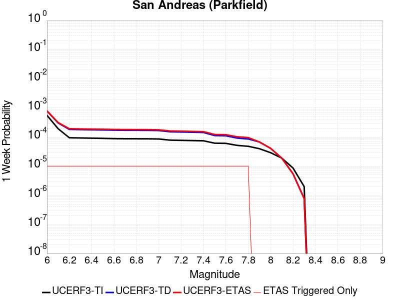 |  |  | 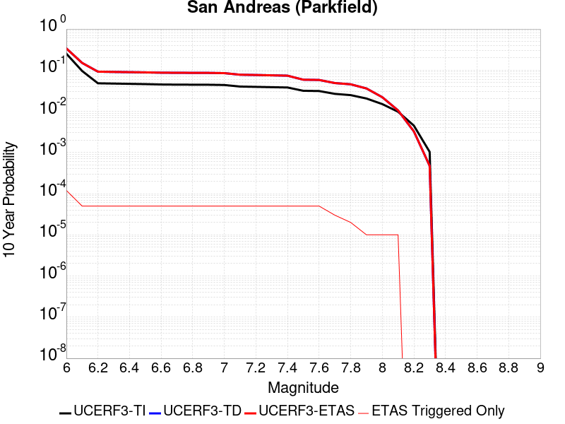 |

| Magnitude | 1 wk TI Prob | 1 wk TD Prob | 1 wk ETAS Prob | 1 wk ETAS/TD Gain | 1 wk ETAS Triggered Only | 1 mo TI Prob | 1 mo TD Prob | 1 mo ETAS Prob | 1 mo ETAS/TD Gain | 1 mo ETAS Triggered Only | 1 yr TI Prob | 1 yr TD Prob | 1 yr ETAS Prob | 1 yr ETAS/TD Gain | 1 yr ETAS Triggered Only | 10 yr TI Prob | 10 yr TD Prob | 10 yr ETAS Prob | 10 yr ETAS/TD Gain | 10 yr ETAS Triggered Only |
|-----|-----|-----|-----|-----|-----|-----|-----|-----|-----|-----|-----|-----|-----|-----|-----|-----|-----|-----|-----|-----|
| 6.0 | 5.556969E-4 | 7.8200514E-4 | 7.919973E-4 | 1.0127777 | 1.0E-5 | 0.0023793848 | 0.003347701 | 0.0033776006 | 1.0089314 | 3.0E-5 | 0.028586963 | 0.040345885 | 0.040403467 | 1.0014272 | 6.0E-5 | 0.25176284 | 0.3377101 | 0.33778957 | 1.0002353 | 1.2E-4 |
| 6.1 | 1.925858E-4 | 3.0395915E-4 | 3.1395612E-4 | 1.0328891 | 1.0E-5 | 8.2510663E-4 | 0.0013021269 | 0.0013121138 | 1.0076697 | 1.0E-5 | 0.0099994885 | 0.015831968 | 0.01585165 | 1.0012432 | 2.0E-5 | 0.095613256 | 0.14996985 | 0.15001236 | 1.0002834 | 5.0E-5 |
| 6.2 | 9.4306815E-5 | 1.8274323E-4 | 1.9274141E-4 | 1.0547116 | 1.0E-5 | 4.0410945E-4 | 7.829515E-4 | 7.9294364E-4 | 1.0127622 | 1.0E-5 | 0.0049089384 | 0.009490968 | 0.009510778 | 1.0020872 | 2.0E-5 | 0.048019063 | 0.09199097 | 0.09203637 | 1.0004935 | 5.0E-5 |
| 6.3 | 9.283051E-5 | 1.7970752E-4 | 1.8970574E-4 | 1.0556359 | 1.0E-5 | 3.9778434E-4 | 7.69949E-4 | 7.799413E-4 | 1.0129778 | 1.0E-5 | 0.0048322747 | 0.009334031 | 0.0093538435 | 1.0021226 | 2.0E-5 | 0.047285385 | 0.090643644 | 0.09068911 | 1.0005016 | 5.0E-5 |
| 6.4 | 9.138826E-5 | 1.7732776E-4 | 1.8732599E-4 | 1.0563828 | 1.0E-5 | 3.916052E-4 | 7.5975596E-4 | 7.6974835E-4 | 1.0131521 | 1.0E-5 | 0.0047573745 | 0.009210981 | 0.009230797 | 1.0021514 | 2.0E-5 | 0.046568092 | 0.08954158 | 0.0895871 | 1.0005084 | 5.0E-5 |
| 6.5 | 9.000255E-5 | 1.749061E-4 | 1.8490435E-4 | 1.0571635 | 1.0E-5 | 3.8566816E-4 | 7.493834E-4 | 7.593759E-4 | 1.0133343 | 1.0E-5 | 0.0046854047 | 0.009085771 | 0.009105589 | 1.0021813 | 2.0E-5 | 0.045878403 | 0.08842976 | 0.08847533 | 1.0005155 | 5.0E-5 |
| 6.6 | 8.8109264E-5 | 1.7171387E-4 | 1.8171214E-4 | 1.0582265 | 1.0E-5 | 3.7755648E-4 | 7.3571014E-4 | 7.4570277E-4 | 1.0135823 | 1.0E-5 | 0.0045870654 | 0.008920688 | 0.0089405095 | 1.002222 | 2.0E-5 | 0.04493529 | 0.08695953 | 0.08700518 | 1.000525 | 5.0E-5 |
| 6.7 | 8.738073E-5 | 1.7038376E-4 | 1.8038206E-4 | 1.058681 | 1.0E-5 | 3.7443507E-4 | 7.3001295E-4 | 7.4000563E-4 | 1.0136884 | 1.0E-5 | 0.0045492216 | 0.0088519445 | 0.008871768 | 1.0022393 | 2.0E-5 | 0.04457213 | 0.086359605 | 0.08640529 | 1.0005289 | 5.0E-5 |
| 6.8 | 8.710195E-5 | 1.698381E-4 | 1.798364E-4 | 1.0588696 | 1.0E-5 | 3.7324068E-4 | 7.276757E-4 | 7.3766836E-4 | 1.0137324 | 1.0E-5 | 0.0045347405 | 0.008823725 | 0.0088435495 | 1.0022466 | 2.0E-5 | 0.04443313 | 0.08610701 | 0.0861527 | 1.0005307 | 5.0E-5 |
| 6.9 | 8.6801556E-5 | 1.6924697E-4 | 1.7924528E-4 | 1.0590752 | 1.0E-5 | 3.7195362E-4 | 7.251437E-4 | 7.3513645E-4 | 1.0137804 | 1.0E-5 | 0.0045191357 | 0.008793148 | 0.008812972 | 1.0022545 | 2.0E-5 | 0.044283327 | 0.085832745 | 0.085878454 | 1.0005325 | 5.0E-5 |
| 7.0 | 8.5571606E-5 | 1.6677282E-4 | 1.7677115E-4 | 1.0599518 | 1.0E-5 | 3.6668387E-4 | 7.14546E-4 | 7.2453887E-4 | 1.0139849 | 1.0E-5 | 0.004455241 | 0.008665155 | 0.008684981 | 1.0022881 | 2.0E-5 | 0.043669727 | 0.084680066 | 0.08472583 | 1.0005405 | 5.0E-5 |
| 7.1 | 7.82589E-5 | 1.5156982E-4 | 1.6156831E-4 | 1.0659662 | 1.0E-5 | 3.3535215E-4 | 6.4942404E-4 | 6.5941754E-4 | 1.0153883 | 1.0E-5 | 0.0040752706 | 0.007878244 | 0.007898086 | 1.0025187 | 2.0E-5 | 0.040013418 | 0.07759189 | 0.07763801 | 1.0005944 | 5.0E-5 |
| 7.2 | 7.690929E-5 | 1.4894054E-4 | 1.5893906E-4 | 1.0671309 | 1.0E-5 | 3.2956956E-4 | 6.381612E-4 | 6.481548E-4 | 1.01566 | 1.0E-5 | 0.004005129 | 0.007742101 | 0.007761946 | 1.0025632 | 2.0E-5 | 0.0393371 | 0.07636437 | 0.076410554 | 1.0006047 | 5.0E-5 |
| 7.3 | 7.5543794E-5 | 1.4590233E-4 | 1.5590088E-4 | 1.068529 | 1.0E-5 | 3.2371894E-4 | 6.251466E-4 | 6.3514034E-4 | 1.0159862 | 1.0E-5 | 0.003934157 | 0.0075847614 | 0.0076046097 | 1.0026169 | 2.0E-5 | 0.038652334 | 0.07492845 | 0.0749747 | 1.0006173 | 5.0E-5 |
| 7.4 | 7.4214564E-5 | 1.4290822E-4 | 1.5290678E-4 | 1.069965 | 1.0E-5 | 3.1802364E-4 | 6.123207E-4 | 6.2231463E-4 | 1.0163213 | 1.0E-5 | 0.003865065 | 0.0074296813 | 0.007449533 | 1.002672 | 2.0E-5 | 0.03798529 | 0.07350102 | 0.07354735 | 1.0006303 | 5.0E-5 |
| 7.5 | 6.149578E-5 | 1.1214689E-4 | 1.2214576E-4 | 1.0891588 | 1.0E-5 | 2.6352672E-4 | 4.805411E-4 | 4.905363E-4 | 1.0207999 | 1.0E-5 | 0.0032037178 | 0.005834925 | 0.0058548083 | 1.0034076 | 2.0E-5 | 0.03157923 | 0.058674183 | 0.05872125 | 1.0008022 | 5.0E-5 |
| 7.6 | 6.0643448E-5 | 1.1043109E-4 | 1.20429984E-4 | 1.0905442 | 1.0E-5 | 2.598746E-4 | 4.7319033E-4 | 4.831856E-4 | 1.0211232 | 1.0E-5 | 0.0031593828 | 0.0057459055 | 0.0057657906 | 1.0034608 | 2.0E-5 | 0.031148417 | 0.057834256 | 0.057881363 | 1.0008146 | 5.0E-5 |
| 7.7 | 5.1652263E-5 | 9.1959046E-5 | 1.01958125E-4 | 1.108734 | 1.0E-5 | 2.2134806E-4 | 3.940507E-4 | 4.0404673E-4 | 1.0253675 | 1.0E-5 | 0.002691582 | 0.0047870236 | 0.0047969758 | 1.002079 | 1.0E-5 | 0.026592141 | 0.04863762 | 0.048666164 | 1.0005867 | 3.0E-5 |
| 7.8 | 4.8090482E-5 | 8.5791486E-5 | 9.579063E-5 | 1.1165516 | 1.0E-5 | 2.060858E-4 | 3.67626E-4 | 3.7762232E-4 | 1.0271915 | 1.0E-5 | 0.0025062072 | 0.004466669 | 0.0044766245 | 1.0022289 | 1.0E-5 | 0.024781305 | 0.045395855 | 0.045414947 | 1.0004206 | 2.0E-5 |
| 7.9 | 3.970278E-5 | 6.765535E-5 | 6.765535E-5 | 1.0 | 0.0 | 1.7014367E-4 | 2.899193E-4 | 2.899193E-4 | 1.0 | 0.0 | 0.002069531 | 0.003524058 | 0.003524058 | 1.0 | 0.0 | 0.020503636 | 0.035954855 | 0.035964496 | 1.0002681 | 1.0E-5 |
| 8.0 | 2.8982335E-5 | 4.0792085E-5 | 4.0792085E-5 | 1.0 | 0.0 | 1.2420409E-4 | 1.748115E-4 | 1.748115E-4 | 1.0 | 0.0 | 0.0015111357 | 0.002126254 | 0.002126254 | 1.0 | 0.0 | 0.015009012 | 0.022058146 | 0.022067925 | 1.0004433 | 1.0E-5 |
| 8.1 | 1.8836186E-5 | 1.8732435E-5 | 1.8732435E-5 | 1.0 | 0.0 | 8.0724014E-5 | 8.02794E-5 | 8.02794E-5 | 1.0 | 0.0 | 9.823717E-4 | 9.76964E-4 | 9.76964E-4 | 1.0 | 0.0 | 0.009780403 | 0.010515128 | 0.010525024 | 1.000941 | 1.0E-5 |
| 8.2 | 8.643924E-6 | 5.494016E-6 | 5.494016E-6 | 1.0 | 0.0 | 3.704486E-5 | 2.3545572E-5 | 2.3545572E-5 | 1.0 | 0.0 | 4.5092785E-4 | 2.866297E-4 | 2.866297E-4 | 1.0 | 0.0 | 0.0045001395 | 0.0032592218 | 0.0032592218 | 1.0 | 0.0 |
| 8.3 | 1.983087E-6 | 7.690063E-7 | 7.690063E-7 | 1.0 | 0.0 | 8.498917E-6 | 3.295737E-6 | 3.295737E-6 | 1.0 | 0.0 | 1.034694E-4 | 4.012488E-5 | 4.012488E-5 | 1.0 | 0.0 | 0.0010342124 | 4.737206E-4 | 4.737206E-4 | 1.0 | 0.0 |

## Baker
*[(top)](#table-of-contents)*

| 1 Week | 1 Month | 1 Year | 10 Year |
|-----|-----|-----|-----|
|  |  |  |  |

| Magnitude | 1 wk TI Prob | 1 wk TD Prob | 1 wk ETAS Prob | 1 wk ETAS/TD Gain | 1 wk ETAS Triggered Only | 1 mo TI Prob | 1 mo TD Prob | 1 mo ETAS Prob | 1 mo ETAS/TD Gain | 1 mo ETAS Triggered Only | 1 yr TI Prob | 1 yr TD Prob | 1 yr ETAS Prob | 1 yr ETAS/TD Gain | 1 yr ETAS Triggered Only | 10 yr TI Prob | 10 yr TD Prob | 10 yr ETAS Prob | 10 yr ETAS/TD Gain | 10 yr ETAS Triggered Only |
|-----|-----|-----|-----|-----|-----|-----|-----|-----|-----|-----|-----|-----|-----|-----|-----|-----|-----|-----|-----|-----|
| 6.0 | 5.695525E-6 | 5.8349133E-6 | 5.8349133E-6 | 1.0 | 0.0 | 2.4409164E-5 | 2.5006555E-5 | 3.5006306E-5 | 1.3998852 | 1.0E-5 | 2.9714106E-4 | 3.0441626E-4 | 3.3440714E-4 | 1.0985192 | 3.0E-5 | 0.0029674405 | 0.0030403885 | 0.0031600236 | 1.0393486 | 1.2E-4 |
| 6.1 | 5.695525E-6 | 5.8349133E-6 | 5.8349133E-6 | 1.0 | 0.0 | 2.4409164E-5 | 2.5006555E-5 | 3.5006306E-5 | 1.3998852 | 1.0E-5 | 2.9714106E-4 | 3.0441626E-4 | 3.3440714E-4 | 1.0985192 | 3.0E-5 | 0.0029674405 | 0.0030403885 | 0.0031600236 | 1.0393486 | 1.2E-4 |
| 6.2 | 5.695525E-6 | 5.8349133E-6 | 5.8349133E-6 | 1.0 | 0.0 | 2.4409164E-5 | 2.5006555E-5 | 3.5006306E-5 | 1.3998852 | 1.0E-5 | 2.9714106E-4 | 3.0441626E-4 | 3.3440714E-4 | 1.0985192 | 3.0E-5 | 0.0029674405 | 0.0030403885 | 0.0031600236 | 1.0393486 | 1.2E-4 |
| 6.3 | 3.2995713E-6 | 3.3837132E-6 | 3.3837132E-6 | 1.0 | 0.0 | 1.4140943E-5 | 1.450155E-5 | 2.4501405E-5 | 1.6895715 | 1.0E-5 | 1.7215237E-4 | 1.7654254E-4 | 2.0653725E-4 | 1.1699007 | 3.0E-5 | 0.0017201907 | 0.00176407 | 0.001873876 | 1.0622458 | 1.1E-4 |
| 6.4 | 3.2995713E-6 | 3.3837132E-6 | 3.3837132E-6 | 1.0 | 0.0 | 1.4140943E-5 | 1.450155E-5 | 2.4501405E-5 | 1.6895715 | 1.0E-5 | 1.7215237E-4 | 1.7654254E-4 | 2.0653725E-4 | 1.1699007 | 3.0E-5 | 0.0017201907 | 0.00176407 | 0.001873876 | 1.0622458 | 1.1E-4 |
| 6.5 | 2.782202E-6 | 2.855881E-6 | 2.855881E-6 | 1.0 | 0.0 | 1.1923668E-5 | 1.2239434E-5 | 2.2239312E-5 | 1.8170213 | 1.0E-5 | 1.4516099E-4 | 1.4900525E-4 | 1.7900078E-4 | 1.2013052 | 3.0E-5 | 0.001450662 | 0.0014890862 | 0.0015989224 | 1.0737609 | 1.1E-4 |
| 6.6 | 2.3163404E-6 | 2.3809555E-6 | 2.3809555E-6 | 1.0 | 0.0 | 9.927136E-6 | 1.0204057E-5 | 2.0203954E-5 | 1.9799924 | 1.0E-5 | 1.20856166E-4 | 1.242275E-4 | 1.3422627E-4 | 1.0804875 | 1.0E-5 | 0.0012079047 | 0.0012416008 | 0.0013314892 | 1.0723971 | 9.0E-5 |
| 6.7 | 2.037056E-6 | 2.0965333E-6 | 2.0965333E-6 | 1.0 | 0.0 | 8.7302105E-6 | 8.985113E-6 | 1.8985023E-5 | 2.1129422 | 1.0E-5 | 1.0628513E-4 | 1.0938842E-4 | 1.19387325E-4 | 1.0914073 | 1.0E-5 | 0.0010623431 | 0.0010933619 | 0.0011632853 | 1.0639527 | 7.0E-5 |
| 6.8 | 1.8356744E-6 | 1.8915596E-6 | 1.8915596E-6 | 1.0 | 0.0 | 7.867153E-6 | 8.106659E-6 | 1.8106579E-5 | 2.2335436 | 1.0E-5 | 9.577837E-5 | 9.869425E-5 | 1.0869326E-4 | 1.101313 | 1.0E-5 | 9.57371E-4 | 9.865181E-4 | 0.001046459 | 1.06076 | 6.0E-5 |
| 6.9 | 1.6310546E-6 | 1.6832361E-6 | 1.6832361E-6 | 1.0 | 0.0 | 6.9902153E-6 | 7.2138496E-6 | 7.2138496E-6 | 1.0 | 0.0 | 8.510255E-5 | 8.7825196E-5 | 8.7825196E-5 | 1.0 | 0.0 | 8.5069967E-4 | 8.779161E-4 | 9.278722E-4 | 1.056903 | 5.0E-5 |
| 7.0 | 1.2058036E-6 | 1.2508916E-6 | 1.2508916E-6 | 1.0 | 0.0 | 5.1677193E-6 | 5.3609533E-6 | 5.3609533E-6 | 1.0 | 0.0 | 6.291517E-5 | 6.5267675E-5 | 6.5267675E-5 | 1.0 | 0.0 | 6.289736E-4 | 6.5248733E-4 | 7.024547E-4 | 1.0765798 | 5.0E-5 |
| 7.1 | 1.052382E-6 | 1.0951846E-6 | 1.0951846E-6 | 1.0 | 0.0 | 4.5102006E-6 | 4.69364E-6 | 4.69364E-6 | 1.0 | 0.0 | 5.491031E-5 | 5.714358E-5 | 5.714358E-5 | 1.0 | 0.0 | 5.4896745E-4 | 5.7128974E-4 | 6.212612E-4 | 1.0874712 | 5.0E-5 |
| 7.2 | 1.0067454E-6 | 1.0487945E-6 | 1.0487945E-6 | 1.0 | 0.0 | 4.3146156E-6 | 4.4948256E-6 | 4.4948256E-6 | 1.0 | 0.0 | 5.252918E-5 | 5.472314E-5 | 5.472314E-5 | 1.0 | 0.0 | 5.251676E-4 | 5.470975E-4 | 5.9707015E-4 | 1.0913414 | 5.0E-5 |
| 7.3 | 9.3596316E-7 | 9.76795E-7 | 9.76795E-7 | 1.0 | 0.0 | 4.0112645E-6 | 4.186258E-6 | 4.186258E-6 | 1.0 | 0.0 | 4.8836053E-5 | 5.0966508E-5 | 5.0966508E-5 | 1.0 | 0.0 | 4.8825322E-4 | 5.09549E-4 | 5.5952347E-4 | 1.098076 | 5.0E-5 |
| 7.4 | 8.8117395E-7 | 9.207884E-7 | 9.207884E-7 | 1.0 | 0.0 | 3.7764542E-6 | 3.94623E-6 | 3.94623E-6 | 1.0 | 0.0 | 4.5977362E-5 | 4.80443E-5 | 4.80443E-5 | 1.0 | 0.0 | 4.596785E-4 | 4.803399E-4 | 5.303159E-4 | 1.104043 | 5.0E-5 |
| 7.5 | 8.292386E-7 | 8.6748094E-7 | 8.6748094E-7 | 1.0 | 0.0 | 3.5538749E-6 | 3.7177701E-6 | 3.7177701E-6 | 1.0 | 0.0 | 4.326757E-5 | 4.5262917E-5 | 4.5262917E-5 | 1.0 | 0.0 | 4.3259145E-4 | 4.5253773E-4 | 4.9251964E-4 | 1.0883504 | 4.0E-5 |
| 7.6 | 7.553842E-7 | 7.9146724E-7 | 7.9146724E-7 | 1.0 | 0.0 | 3.2373566E-6 | 3.391998E-6 | 3.391998E-6 | 1.0 | 0.0 | 3.9414106E-5 | 4.12968E-5 | 4.12968E-5 | 1.0 | 0.0 | 3.9407116E-4 | 4.1289197E-4 | 4.5287545E-4 | 1.0968376 | 4.0E-5 |
| 7.7 | 6.5285366E-7 | 6.8529783E-7 | 6.8529783E-7 | 1.0 | 0.0 | 2.797941E-6 | 2.9369874E-6 | 2.9369874E-6 | 1.0 | 0.0 | 3.40644E-5 | 3.5757243E-5 | 3.5757243E-5 | 1.0 | 0.0 | 3.405918E-4 | 3.5751556E-4 | 3.775084E-4 | 1.0559217 | 2.0E-5 |
| 7.8 | 3.4586725E-7 | 3.648368E-7 | 3.648368E-7 | 1.0 | 0.0 | 1.4822873E-6 | 1.5635853E-6 | 1.5635853E-6 | 1.0 | 0.0 | 1.80467E-5 | 1.903649E-5 | 1.903649E-5 | 1.0 | 0.0 | 1.8045233E-4 | 1.9034903E-4 | 2.0034713E-4 | 1.052525 | 1.0E-5 |
| 7.9 | 2.5591178E-9 | 2.6697329E-9 | 2.6697329E-9 | 1.0 | 0.0 | 1.0967647E-8 | 1.14417125E-8 | 1.14417125E-8 | 1.0 | 0.0 | 1.335311E-7 | 1.3930286E-7 | 1.3930286E-7 | 1.0 | 0.0 | 1.3353102E-6 | 1.3930285E-6 | 1.3930285E-6 | 1.0 | 0.0 |

## White Wolf (Extension)
*[(top)](#table-of-contents)*

| 1 Week | 1 Month | 1 Year | 10 Year |
|-----|-----|-----|-----|
|  |  |  | 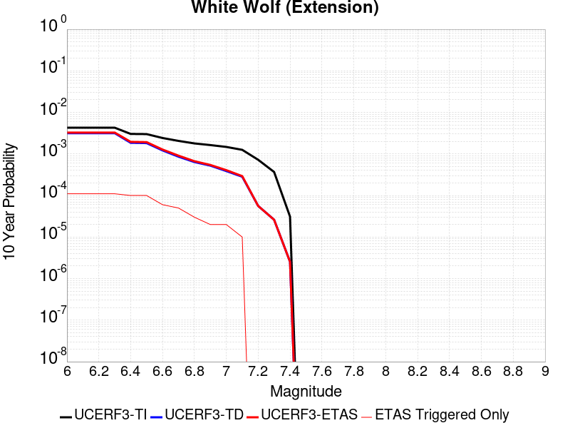 |

| Magnitude | 1 wk TI Prob | 1 wk TD Prob | 1 wk ETAS Prob | 1 wk ETAS/TD Gain | 1 wk ETAS Triggered Only | 1 mo TI Prob | 1 mo TD Prob | 1 mo ETAS Prob | 1 mo ETAS/TD Gain | 1 mo ETAS Triggered Only | 1 yr TI Prob | 1 yr TD Prob | 1 yr ETAS Prob | 1 yr ETAS/TD Gain | 1 yr ETAS Triggered Only | 10 yr TI Prob | 10 yr TD Prob | 10 yr ETAS Prob | 10 yr ETAS/TD Gain | 10 yr ETAS Triggered Only |
|-----|-----|-----|-----|-----|-----|-----|-----|-----|-----|-----|-----|-----|-----|-----|-----|-----|-----|-----|-----|-----|
| 6.0 | 8.222555E-6 | 6.066774E-6 | 6.066774E-6 | 1.0 | 0.0 | 3.5239045E-5 | 2.600024E-5 | 4.5999717E-5 | 1.7692037 | 2.0E-5 | 4.289509E-4 | 3.1651356E-4 | 3.7649457E-4 | 1.1895053 | 6.0E-5 | 0.0042812387 | 0.0031612795 | 0.0032709318 | 1.0346861 | 1.1E-4 |
| 6.1 | 8.222555E-6 | 6.066774E-6 | 6.066774E-6 | 1.0 | 0.0 | 3.5239045E-5 | 2.600024E-5 | 4.5999717E-5 | 1.7692037 | 2.0E-5 | 4.289509E-4 | 3.1651356E-4 | 3.7649457E-4 | 1.1895053 | 6.0E-5 | 0.0042812387 | 0.0031612795 | 0.0032709318 | 1.0346861 | 1.1E-4 |
| 6.2 | 8.222555E-6 | 6.066774E-6 | 6.066774E-6 | 1.0 | 0.0 | 3.5239045E-5 | 2.600024E-5 | 4.5999717E-5 | 1.7692037 | 2.0E-5 | 4.289509E-4 | 3.1651356E-4 | 3.7649457E-4 | 1.1895053 | 6.0E-5 | 0.0042812387 | 0.0031612795 | 0.0032709318 | 1.0346861 | 1.1E-4 |
| 6.3 | 8.222555E-6 | 6.066774E-6 | 6.066774E-6 | 1.0 | 0.0 | 3.5239045E-5 | 2.600024E-5 | 4.5999717E-5 | 1.7692037 | 2.0E-5 | 4.289509E-4 | 3.1651356E-4 | 3.7649457E-4 | 1.1895053 | 6.0E-5 | 0.0042812387 | 0.0031612795 | 0.0032709318 | 1.0346861 | 1.1E-4 |
| 6.4 | 5.821773E-6 | 3.5572245E-6 | 3.5572245E-6 | 1.0 | 0.0 | 2.4950215E-5 | 1.5245166E-5 | 3.5244862E-5 | 2.3118713 | 2.0E-5 | 3.0372653E-4 | 1.8559519E-4 | 2.4558406E-4 | 1.3232243 | 6.0E-5 | 0.0030331176 | 0.0018545102 | 0.0019543248 | 1.0538226 | 1.0E-4 |
| 6.5 | 5.766023E-6 | 3.4991574E-6 | 3.4991574E-6 | 1.0 | 0.0 | 2.4711293E-5 | 1.4996309E-5 | 3.499601E-5 | 2.3336415 | 2.0E-5 | 3.0081844E-4 | 1.8256587E-4 | 2.4255492E-4 | 1.3285885 | 6.0E-5 | 0.0030041158 | 0.001824267 | 0.0019240846 | 1.0547166 | 1.0E-4 |
| 6.6 | 4.643576E-6 | 2.3326468E-6 | 2.3326468E-6 | 1.0 | 0.0 | 1.9900888E-5 | 9.997021E-6 | 1.9996922E-5 | 2.000288 | 1.0E-5 | 2.4226638E-4 | 1.21707366E-4 | 1.5170372E-4 | 1.246463 | 3.0E-5 | 0.0024200242 | 0.0012164495 | 0.0012763765 | 1.0492638 | 6.0E-5 |
| 6.7 | 3.9529173E-6 | 1.6483561E-6 | 1.6483561E-6 | 1.0 | 0.0 | 1.6940963E-5 | 7.064365E-6 | 1.7064294E-5 | 2.4155455 | 1.0E-5 | 2.0623671E-4 | 8.600544E-5 | 1.1600286E-4 | 1.3487852 | 3.0E-5 | 0.002060454 | 8.597401E-4 | 9.096971E-4 | 1.0581071 | 5.0E-5 |
| 6.8 | 3.4377522E-6 | 1.2245247E-6 | 1.2245247E-6 | 1.0 | 0.0 | 1.473314E-5 | 5.247953E-6 | 5.247953E-6 | 1.0 | 0.0 | 1.7936122E-4 | 6.389205E-5 | 7.389141E-5 | 1.156504 | 1.0E-5 | 0.0017921652 | 6.387459E-4 | 6.6872675E-4 | 1.046937 | 3.0E-5 |
| 6.9 | 3.1367306E-6 | 1.0033741E-6 | 1.0033741E-6 | 1.0 | 0.0 | 1.3443062E-5 | 4.300168E-6 | 4.300168E-6 | 1.0 | 0.0 | 1.63657E-4 | 5.2353364E-5 | 5.2353364E-5 | 1.0 | 0.0 | 0.0016353652 | 5.2341796E-4 | 5.434075E-4 | 1.0381904 | 2.0E-5 |
| 7.0 | 2.8298145E-6 | 7.428598E-7 | 7.428598E-7 | 1.0 | 0.0 | 1.2127721E-5 | 3.1836814E-6 | 3.1836814E-6 | 1.0 | 0.0 | 1.47645E-4 | 3.876068E-5 | 3.876068E-5 | 1.0 | 0.0 | 0.0014754693 | 3.8754422E-4 | 4.0753646E-4 | 1.051587 | 2.0E-5 |
| 7.1 | 2.4091064E-6 | 5.422674E-7 | 5.422674E-7 | 1.0 | 0.0 | 1.03247E-5 | 2.3240013E-6 | 2.3240013E-6 | 1.0 | 0.0 | 1.2569598E-4 | 2.829439E-5 | 2.829439E-5 | 1.0 | 0.0 | 0.001256249 | 2.829119E-4 | 2.9290907E-4 | 1.0353367 | 1.0E-5 |
| 7.2 | 1.3875518E-6 | 1.0741592E-7 | 1.0741592E-7 | 1.0 | 0.0 | 5.9466374E-6 | 4.6035387E-7 | 4.6035387E-7 | 1.0 | 0.0 | 7.23979E-5 | 5.604795E-6 | 5.604795E-6 | 1.0 | 0.0 | 7.2374323E-4 | 5.6046654E-5 | 5.6046654E-5 | 1.0 | 0.0 |
| 7.3 | 7.056077E-7 | 5.001199E-8 | 5.001199E-8 | 1.0 | 0.0 | 3.0240296E-6 | 2.1433708E-7 | 2.1433708E-7 | 1.0 | 0.0 | 3.681694E-5 | 2.6095513E-6 | 2.6095513E-6 | 1.0 | 0.0 | 3.681084E-4 | 2.6095253E-5 | 2.6095253E-5 | 1.0 | 0.0 |
| 7.4 | 5.9334678E-8 | 4.864214E-9 | 4.864214E-9 | 1.0 | 0.0 | 2.5429145E-7 | 2.0846631E-8 | 2.0846631E-8 | 1.0 | 0.0 | 3.095994E-6 | 2.5380774E-7 | 2.5380774E-7 | 1.0 | 0.0 | 3.095951E-5 | 2.5380755E-6 | 2.5380755E-6 | 1.0 | 0.0 |

## Big Pine (Central)
*[(top)](#table-of-contents)*

| 1 Week | 1 Month | 1 Year | 10 Year |
|-----|-----|-----|-----|
|  |  |  |  |

| Magnitude | 1 wk TI Prob | 1 wk TD Prob | 1 wk ETAS Prob | 1 wk ETAS/TD Gain | 1 wk ETAS Triggered Only | 1 mo TI Prob | 1 mo TD Prob | 1 mo ETAS Prob | 1 mo ETAS/TD Gain | 1 mo ETAS Triggered Only | 1 yr TI Prob | 1 yr TD Prob | 1 yr ETAS Prob | 1 yr ETAS/TD Gain | 1 yr ETAS Triggered Only | 10 yr TI Prob | 10 yr TD Prob | 10 yr ETAS Prob | 10 yr ETAS/TD Gain | 10 yr ETAS Triggered Only |
|-----|-----|-----|-----|-----|-----|-----|-----|-----|-----|-----|-----|-----|-----|-----|-----|-----|-----|-----|-----|-----|
| 6.0 | 1.2706755E-5 | 1.4252547E-5 | 2.4252404E-5 | 1.701619 | 1.0E-5 | 5.4456385E-5 | 6.108112E-5 | 7.108051E-5 | 1.1637067 | 1.0E-5 | 6.628048E-4 | 7.434455E-4 | 8.034008E-4 | 1.0806453 | 6.0E-5 | 0.006608314 | 0.0074146423 | 0.0075139008 | 1.0133868 | 1.0E-4 |
| 6.1 | 8.342579E-6 | 9.512563E-6 | 9.512563E-6 | 1.0 | 0.0 | 3.5753423E-5 | 4.0767616E-5 | 4.0767616E-5 | 1.0 | 0.0 | 4.3521097E-4 | 4.962544E-4 | 5.162445E-4 | 1.0402819 | 2.0E-5 | 0.0043435963 | 0.0049550477 | 0.0050147506 | 1.0120488 | 6.0E-5 |
| 6.2 | 6.923899E-6 | 7.968877E-6 | 7.968877E-6 | 1.0 | 0.0 | 2.9673516E-5 | 3.415199E-5 | 3.415199E-5 | 1.0 | 0.0 | 3.6121515E-4 | 4.1574042E-4 | 4.357321E-4 | 1.048087 | 2.0E-5 | 0.003606286 | 0.0041529653 | 0.004202758 | 1.0119896 | 5.0E-5 |
| 6.3 | 2.728396E-6 | 3.425821E-6 | 3.425821E-6 | 1.0 | 0.0 | 1.1693074E-5 | 1.4682013E-5 | 1.4682013E-5 | 1.0 | 0.0 | 1.4235388E-4 | 1.787397E-4 | 1.8873792E-4 | 1.0559373 | 1.0E-5 | 0.0014226272 | 0.0017874972 | 0.0018074615 | 1.0111688 | 2.0E-5 |
| 6.4 | 2.7136944E-6 | 3.4101138E-6 | 3.4101138E-6 | 1.0 | 0.0 | 1.1630066E-5 | 1.4614697E-5 | 1.4614697E-5 | 1.0 | 0.0 | 1.4158686E-4 | 1.7792027E-4 | 1.879185E-4 | 1.0561949 | 1.0E-5 | 0.0014149669 | 0.001779316 | 0.0017992804 | 1.0112202 | 2.0E-5 |
| 6.5 | 2.6971882E-6 | 3.3924584E-6 | 3.3924584E-6 | 1.0 | 0.0 | 1.1559327E-5 | 1.4539031E-5 | 1.4539031E-5 | 1.0 | 0.0 | 1.4072572E-4 | 1.769992E-4 | 1.8699742E-4 | 1.0564874 | 1.0E-5 | 0.0014063664 | 0.0017701199 | 0.0017900844 | 1.0112786 | 2.0E-5 |
| 6.6 | 2.669092E-6 | 3.3624776E-6 | 3.3624776E-6 | 1.0 | 0.0 | 1.1438916E-5 | 1.4410544E-5 | 1.4410544E-5 | 1.0 | 0.0 | 1.3925991E-4 | 1.7543513E-4 | 1.8543337E-4 | 1.0569911 | 1.0E-5 | 0.0013917267 | 0.0017545038 | 0.0017744688 | 1.0113792 | 2.0E-5 |
| 6.7 | 2.6408059E-6 | 3.3325025E-6 | 3.3325025E-6 | 1.0 | 0.0 | 1.1317691E-5 | 1.428208E-5 | 1.428208E-5 | 1.0 | 0.0 | 1.3778417E-4 | 1.7387132E-4 | 1.8386958E-4 | 1.0575038 | 1.0E-5 | 0.0013769877 | 0.0017388904 | 0.0017588557 | 1.0114816 | 2.0E-5 |
| 6.8 | 2.1786943E-6 | 2.8559518E-6 | 2.8559518E-6 | 1.0 | 0.0 | 9.337228E-6 | 1.22397405E-5 | 1.22397405E-5 | 1.0 | 0.0 | 1.1367482E-4 | 1.4900937E-4 | 1.5900789E-4 | 1.0670999 | 1.0E-5 | 0.0011361669 | 0.0014906187 | 0.0015006039 | 1.0066986 | 1.0E-5 |
| 6.9 | 1.4411696E-6 | 2.069955E-6 | 2.069955E-6 | 1.0 | 0.0 | 6.1764263E-6 | 8.871207E-6 | 8.871207E-6 | 1.0 | 0.0 | 7.51954E-5 | 1.0800186E-4 | 1.0800186E-4 | 1.0 | 0.0 | 7.5169955E-4 | 0.0010809733 | 0.0010809733 | 1.0 | 0.0 |
| 7.0 | 1.0073411E-6 | 1.5555618E-6 | 1.5555618E-6 | 1.0 | 0.0 | 4.317169E-6 | 6.6666776E-6 | 6.6666776E-6 | 1.0 | 0.0 | 5.2560266E-5 | 8.1163926E-5 | 8.1163926E-5 | 1.0 | 0.0 | 5.2547833E-4 | 8.128111E-4 | 8.128111E-4 | 1.0 | 0.0 |
| 7.1 | 8.947104E-7 | 1.4315309E-6 | 1.4315309E-6 | 1.0 | 0.0 | 3.834468E-6 | 6.135119E-6 | 6.135119E-6 | 1.0 | 0.0 | 4.6683643E-5 | 7.469266E-5 | 7.469266E-5 | 1.0 | 0.0 | 4.6673836E-4 | 7.481436E-4 | 7.481436E-4 | 1.0 | 0.0 |
| 7.2 | 5.215166E-7 | 1.0123637E-6 | 1.0123637E-6 | 1.0 | 0.0 | 2.2350691E-6 | 4.3386945E-6 | 4.3386945E-6 | 1.0 | 0.0 | 2.7211627E-5 | 5.2822368E-5 | 5.2822368E-5 | 1.0 | 0.0 | 2.7208295E-4 | 5.29556E-4 | 5.29556E-4 | 1.0 | 0.0 |
| 7.3 | 4.4024807E-7 | 9.231207E-7 | 9.231207E-7 | 1.0 | 0.0 | 1.8867761E-6 | 3.956226E-6 | 3.956226E-6 | 1.0 | 0.0 | 2.2971257E-5 | 4.8166028E-5 | 4.8166028E-5 | 1.0 | 0.0 | 2.2968883E-4 | 4.8301363E-4 | 4.8301363E-4 | 1.0 | 0.0 |
| 7.4 | 3.6130905E-7 | 8.3697915E-7 | 8.3697915E-7 | 1.0 | 0.0 | 1.5484665E-6 | 3.5870487E-6 | 3.5870487E-6 | 1.0 | 0.0 | 1.8852415E-5 | 4.3671484E-5 | 4.3671484E-5 | 1.0 | 0.0 | 1.8850817E-4 | 4.3807772E-4 | 4.3807772E-4 | 1.0 | 0.0 |
| 7.5 | 3.408184E-7 | 8.1191774E-7 | 8.1191774E-7 | 1.0 | 0.0 | 1.4606494E-6 | 3.479643E-6 | 3.479643E-6 | 1.0 | 0.0 | 1.7783263E-5 | 4.236387E-5 | 4.236387E-5 | 1.0 | 0.0 | 1.778184E-4 | 4.2498423E-4 | 4.2498423E-4 | 1.0 | 0.0 |
| 7.6 | 3.1428627E-7 | 7.742247E-7 | 7.742247E-7 | 1.0 | 0.0 | 1.3469405E-6 | 3.318102E-6 | 3.318102E-6 | 1.0 | 0.0 | 1.6398877E-5 | 4.0397183E-5 | 4.0397183E-5 | 1.0 | 0.0 | 1.6397667E-4 | 4.0529485E-4 | 4.0529485E-4 | 1.0 | 0.0 |
| 7.7 | 1.7972785E-7 | 5.085898E-7 | 5.085898E-7 | 1.0 | 0.0 | 7.70262E-7 | 2.1796686E-6 | 2.1796686E-6 | 1.0 | 0.0 | 9.377899E-6 | 2.6537155E-5 | 2.6537155E-5 | 1.0 | 0.0 | 9.377503E-5 | 2.6671647E-4 | 2.6671647E-4 | 1.0 | 0.0 |
| 7.8 | 4.9230927E-8 | 1.1999686E-7 | 1.1999686E-7 | 1.0 | 0.0 | 2.1098968E-7 | 5.1427213E-7 | 5.1427213E-7 | 1.0 | 0.0 | 2.5687964E-6 | 6.261247E-6 | 6.261247E-6 | 1.0 | 0.0 | 2.5687666E-5 | 6.306763E-5 | 6.306763E-5 | 1.0 | 0.0 |
| 7.9 | 3.6805972E-9 | 4.112225E-9 | 4.112225E-9 | 1.0 | 0.0 | 1.5773987E-8 | 1.762382E-8 | 1.762382E-8 | 1.0 | 0.0 | 1.9204828E-7 | 2.1457E-7 | 2.1457E-7 | 1.0 | 0.0 | 1.920481E-6 | 2.1932892E-6 | 2.1932892E-6 | 1.0 | 0.0 |

## Elsinore (Glen Ivy) rev
*[(top)](#table-of-contents)*

| 1 Week | 1 Month | 1 Year | 10 Year |
|-----|-----|-----|-----|
|  | 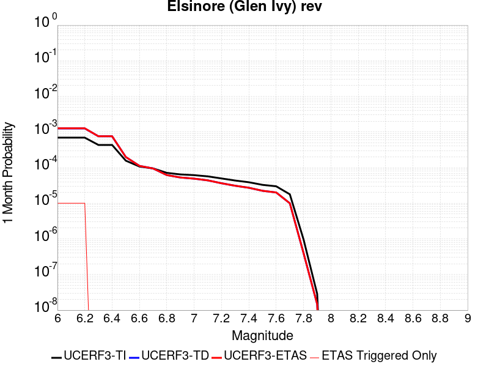 |  |  |

| Magnitude | 1 wk TI Prob | 1 wk TD Prob | 1 wk ETAS Prob | 1 wk ETAS/TD Gain | 1 wk ETAS Triggered Only | 1 mo TI Prob | 1 mo TD Prob | 1 mo ETAS Prob | 1 mo ETAS/TD Gain | 1 mo ETAS Triggered Only | 1 yr TI Prob | 1 yr TD Prob | 1 yr ETAS Prob | 1 yr ETAS/TD Gain | 1 yr ETAS Triggered Only | 10 yr TI Prob | 10 yr TD Prob | 10 yr ETAS Prob | 10 yr ETAS/TD Gain | 10 yr ETAS Triggered Only |
|-----|-----|-----|-----|-----|-----|-----|-----|-----|-----|-----|-----|-----|-----|-----|-----|-----|-----|-----|-----|-----|
| 6.0 | 1.6204086E-4 | 2.93772E-4 | 2.93772E-4 | 1.0 | 0.0 | 6.94276E-4 | 0.0012584875 | 0.0012684749 | 1.007936 | 1.0E-5 | 0.008420097 | 0.015235919 | 0.015304852 | 1.0045244 | 7.0E-5 | 0.081081145 | 0.1398973 | 0.13999191 | 1.0006763 | 1.1E-4 |
| 6.1 | 1.6204086E-4 | 2.93772E-4 | 2.93772E-4 | 1.0 | 0.0 | 6.94276E-4 | 0.0012584875 | 0.0012684749 | 1.007936 | 1.0E-5 | 0.008420097 | 0.015235919 | 0.015304852 | 1.0045244 | 7.0E-5 | 0.081081145 | 0.1398973 | 0.13999191 | 1.0006763 | 1.1E-4 |
| 6.2 | 1.6204086E-4 | 2.93772E-4 | 2.93772E-4 | 1.0 | 0.0 | 6.94276E-4 | 0.0012584875 | 0.0012684749 | 1.007936 | 1.0E-5 | 0.008420097 | 0.015235919 | 0.015304852 | 1.0045244 | 7.0E-5 | 0.081081145 | 0.1398973 | 0.13999191 | 1.0006763 | 1.1E-4 |
| 6.3 | 1.0111737E-4 | 1.7704953E-4 | 1.7704953E-4 | 1.0 | 0.0 | 4.332882E-4 | 7.5867976E-4 | 7.5867976E-4 | 1.0 | 0.0 | 0.005262531 | 0.009218495 | 0.009238311 | 1.0021496 | 2.0E-5 | 0.0513964 | 0.08714668 | 0.087183185 | 1.000419 | 4.0E-5 |
| 6.4 | 1.0111737E-4 | 1.7704953E-4 | 1.7704953E-4 | 1.0 | 0.0 | 4.332882E-4 | 7.5867976E-4 | 7.5867976E-4 | 1.0 | 0.0 | 0.005262531 | 0.009218495 | 0.009238311 | 1.0021496 | 2.0E-5 | 0.0513964 | 0.08714668 | 0.087183185 | 1.000419 | 4.0E-5 |
| 6.5 | 3.6624708E-5 | 4.63993E-5 | 4.63993E-5 | 1.0 | 0.0 | 1.569536E-4 | 1.9884102E-4 | 1.9884102E-4 | 1.0 | 0.0 | 0.001909235 | 0.002418563 | 0.002418563 | 1.0 | 0.0 | 0.01892915 | 0.023771606 | 0.023771606 | 1.0 | 0.0 |
| 6.6 | 2.5051324E-5 | 2.6153504E-5 | 2.6153504E-5 | 1.0 | 0.0 | 1.073584E-4 | 1.12081885E-4 | 1.12081885E-4 | 1.0 | 0.0 | 0.0013063047 | 0.0013637872 | 0.0013637872 | 1.0 | 0.0 | 0.012986525 | 0.013565531 | 0.013565531 | 1.0 | 0.0 |
| 6.7 | 2.2189772E-5 | 2.2077826E-5 | 2.2077826E-5 | 1.0 | 0.0 | 9.509556E-5 | 9.461602E-5 | 9.461602E-5 | 1.0 | 0.0 | 0.0011571734 | 0.0011513777 | 0.0011513777 | 1.0 | 0.0 | 0.011511663 | 0.011465822 | 0.011465822 | 1.0 | 0.0 |
| 6.8 | 1.6654378E-5 | 1.44404075E-5 | 1.44404075E-5 | 1.0 | 0.0 | 7.137396E-5 | 6.188602E-5 | 6.188602E-5 | 1.0 | 0.0 | 8.686314E-4 | 7.5320696E-4 | 7.5320696E-4 | 1.0 | 0.0 | 0.008652439 | 0.007511861 | 0.007511861 | 1.0 | 0.0 |
| 6.9 | 1.5042909E-5 | 1.2334343E-5 | 1.2334343E-5 | 1.0 | 0.0 | 6.446802E-5 | 5.2860418E-5 | 5.2860418E-5 | 1.0 | 0.0 | 7.8461546E-4 | 6.4338866E-4 | 6.4338866E-4 | 1.0 | 0.0 | 0.007818509 | 0.0064195115 | 0.0064195115 | 1.0 | 0.0 |
| 7.0 | 1.4361385E-5 | 1.1453502E-5 | 1.1453502E-5 | 1.0 | 0.0 | 6.154734E-5 | 4.908553E-5 | 4.908553E-5 | 1.0 | 0.0 | 7.490812E-4 | 5.974554E-4 | 5.974554E-4 | 1.0 | 0.0 | 0.007465612 | 0.0059625087 | 0.0059625087 | 1.0 | 0.0 |
| 7.1 | 1.3265571E-5 | 1.0246804E-5 | 1.0246804E-5 | 1.0 | 0.0 | 5.6851208E-5 | 4.391415E-5 | 4.391415E-5 | 1.0 | 0.0 | 6.919436E-4 | 5.3452613E-4 | 5.3452613E-4 | 1.0 | 0.0 | 0.006897931 | 0.0053357244 | 0.0053357244 | 1.0 | 0.0 |
| 7.2 | 1.1596403E-5 | 8.506578E-6 | 8.506578E-6 | 1.0 | 0.0 | 4.9697923E-5 | 3.6456262E-5 | 3.6456262E-5 | 1.0 | 0.0 | 6.049042E-4 | 4.4376627E-4 | 4.4376627E-4 | 1.0 | 0.0 | 0.006032603 | 0.004430235 | 0.004430235 | 1.0 | 0.0 |
| 7.3 | 1.0150827E-5 | 7.2400208E-6 | 7.2400208E-6 | 1.0 | 0.0 | 4.3502816E-5 | 3.10283E-5 | 3.10283E-5 | 1.0 | 0.0 | 5.2951806E-4 | 3.777055E-4 | 3.777055E-4 | 1.0 | 0.0 | 0.005282581 | 0.003771035 | 0.003771035 | 1.0 | 0.0 |
| 7.4 | 9.080705E-6 | 6.3536127E-6 | 6.3536127E-6 | 1.0 | 0.0 | 3.8916725E-5 | 2.7229491E-5 | 2.7229491E-5 | 1.0 | 0.0 | 4.7370812E-4 | 3.3147E-4 | 3.3147E-4 | 1.0 | 0.0 | 0.004726996 | 0.0033099046 | 0.0033099046 | 1.0 | 0.0 |
| 7.5 | 7.671649E-6 | 5.2265436E-6 | 5.2265436E-6 | 1.0 | 0.0 | 3.287808E-5 | 2.2399287E-5 | 2.2399287E-5 | 1.0 | 0.0 | 4.0021708E-4 | 2.7267844E-4 | 2.7267844E-4 | 1.0 | 0.0 | 0.0039949706 | 0.0027235637 | 0.0027235637 | 1.0 | 0.0 |
| 7.6 | 6.990086E-6 | 4.688364E-6 | 4.688364E-6 | 1.0 | 0.0 | 2.9957167E-5 | 2.0092839E-5 | 2.0092839E-5 | 1.0 | 0.0 | 3.6466747E-4 | 2.4460402E-4 | 2.4460402E-4 | 1.0 | 0.0 | 0.0036406964 | 0.0024434642 | 0.0024434642 | 1.0 | 0.0 |
| 7.7 | 4.163505E-6 | 2.3300386E-6 | 2.3300386E-6 | 1.0 | 0.0 | 1.7843471E-5 | 9.985846E-6 | 9.985846E-6 | 1.0 | 0.0 | 2.172226E-4 | 1.2157163E-4 | 1.2157163E-4 | 1.0 | 0.0 | 0.0021701038 | 0.0012151244 | 0.0012151244 | 1.0 | 0.0 |
| 7.8 | 2.2692414E-7 | 9.38645E-8 | 9.38645E-8 | 1.0 | 0.0 | 9.725317E-7 | 4.0227638E-7 | 4.0227638E-7 | 1.0 | 0.0 | 1.1840509E-5 | 4.8977076E-6 | 4.8977076E-6 | 1.0 | 0.0 | 1.1839878E-4 | 4.8976322E-5 | 4.8976322E-5 | 1.0 | 0.0 |
| 7.9 | 6.676829E-9 | 3.4402008E-9 | 3.4402008E-9 | 1.0 | 0.0 | 2.861498E-8 | 1.4743718E-8 | 1.4743718E-8 | 1.0 | 0.0 | 3.4838732E-7 | 1.7950475E-7 | 1.7950475E-7 | 1.0 | 0.0 | 3.4838679E-6 | 1.7950463E-6 | 1.7950463E-6 | 1.0 | 0.0 |

## San Jacinto (San Jacinto Valley) rev
*[(top)](#table-of-contents)*

| 1 Week | 1 Month | 1 Year | 10 Year |
|-----|-----|-----|-----|
|  |  |  |  |

| Magnitude | 1 wk TI Prob | 1 wk TD Prob | 1 wk ETAS Prob | 1 wk ETAS/TD Gain | 1 wk ETAS Triggered Only | 1 mo TI Prob | 1 mo TD Prob | 1 mo ETAS Prob | 1 mo ETAS/TD Gain | 1 mo ETAS Triggered Only | 1 yr TI Prob | 1 yr TD Prob | 1 yr ETAS Prob | 1 yr ETAS/TD Gain | 1 yr ETAS Triggered Only | 10 yr TI Prob | 10 yr TD Prob | 10 yr ETAS Prob | 10 yr ETAS/TD Gain | 10 yr ETAS Triggered Only |
|-----|-----|-----|-----|-----|-----|-----|-----|-----|-----|-----|-----|-----|-----|-----|-----|-----|-----|-----|-----|-----|
| 6.0 | 3.652694E-5 | 3.4466113E-5 | 3.4466113E-5 | 1.0 | 0.0 | 1.5653463E-4 | 1.4770357E-4 | 1.6770061E-4 | 1.1353863 | 2.0E-5 | 0.0019041431 | 0.0017968096 | 0.0018467198 | 1.0277771 | 5.0E-5 | 0.018879099 | 0.018559378 | 0.018667337 | 1.0058169 | 1.1E-4 |
| 6.1 | 3.652694E-5 | 3.4466113E-5 | 3.4466113E-5 | 1.0 | 0.0 | 1.5653463E-4 | 1.4770357E-4 | 1.6770061E-4 | 1.1353863 | 2.0E-5 | 0.0019041431 | 0.0017968096 | 0.0018467198 | 1.0277771 | 5.0E-5 | 0.018879099 | 0.018559378 | 0.018667337 | 1.0058169 | 1.1E-4 |
| 6.2 | 3.652694E-5 | 3.4466113E-5 | 3.4466113E-5 | 1.0 | 0.0 | 1.5653463E-4 | 1.4770357E-4 | 1.6770061E-4 | 1.1353863 | 2.0E-5 | 0.0019041431 | 0.0017968096 | 0.0018467198 | 1.0277771 | 5.0E-5 | 0.018879099 | 0.018559378 | 0.018667337 | 1.0058169 | 1.1E-4 |
| 6.3 | 3.652694E-5 | 3.4466113E-5 | 3.4466113E-5 | 1.0 | 0.0 | 1.5653463E-4 | 1.4770357E-4 | 1.6770061E-4 | 1.1353863 | 2.0E-5 | 0.0019041431 | 0.0017968096 | 0.0018467198 | 1.0277771 | 5.0E-5 | 0.018879099 | 0.018559378 | 0.018667337 | 1.0058169 | 1.1E-4 |
| 6.4 | 3.646941E-5 | 3.4387675E-5 | 3.4387675E-5 | 1.0 | 0.0 | 1.5628811E-4 | 1.4736745E-4 | 1.673645E-4 | 1.1356952 | 2.0E-5 | 0.0019011468 | 0.0017927244 | 0.0018426346 | 1.0278405 | 5.0E-5 | 0.018849645 | 0.018519253 | 0.018627215 | 1.0058298 | 1.1E-4 |
| 6.5 | 3.646941E-5 | 3.4387675E-5 | 3.4387675E-5 | 1.0 | 0.0 | 1.5628811E-4 | 1.4736745E-4 | 1.673645E-4 | 1.1356952 | 2.0E-5 | 0.0019011468 | 0.0017927244 | 0.0018426346 | 1.0278405 | 5.0E-5 | 0.018849645 | 0.018519253 | 0.018627215 | 1.0058298 | 1.1E-4 |
| 6.6 | 3.6442503E-5 | 3.435106E-5 | 3.435106E-5 | 1.0 | 0.0 | 1.561728E-4 | 1.4721052E-4 | 1.6720757E-4 | 1.1358398 | 2.0E-5 | 0.0018997455 | 0.0017908171 | 0.0018407275 | 1.0278702 | 5.0E-5 | 0.018835869 | 0.018500518 | 0.018608483 | 1.0058358 | 1.1E-4 |
| 6.7 | 3.6432113E-5 | 3.433663E-5 | 3.433663E-5 | 1.0 | 0.0 | 1.5612828E-4 | 1.4714869E-4 | 1.6714576E-4 | 1.1358969 | 2.0E-5 | 0.0018992044 | 0.0017900657 | 0.0018399762 | 1.027882 | 5.0E-5 | 0.018830549 | 0.01849314 | 0.018601106 | 1.0058382 | 1.1E-4 |
| 6.8 | 3.6409598E-5 | 3.4305678E-5 | 3.4305678E-5 | 1.0 | 0.0 | 1.560318E-4 | 1.4701606E-4 | 1.6701313E-4 | 1.1360196 | 2.0E-5 | 0.0018980318 | 0.0017884537 | 0.0018383642 | 1.0279071 | 5.0E-5 | 0.018819023 | 0.018477293 | 0.01858526 | 1.0058433 | 1.1E-4 |
| 6.9 | 3.638078E-5 | 3.4266093E-5 | 3.4266093E-5 | 1.0 | 0.0 | 1.5590832E-4 | 1.4684643E-4 | 1.668435E-4 | 1.1361767 | 2.0E-5 | 0.0018965311 | 0.0017863918 | 0.0018363025 | 1.0279394 | 5.0E-5 | 0.018804269 | 0.018457023 | 0.018564994 | 1.0058498 | 1.1E-4 |
| 7.0 | 3.6294874E-5 | 3.4148088E-5 | 3.4148088E-5 | 1.0 | 0.0 | 1.5554018E-4 | 1.4634077E-4 | 1.6633784E-4 | 1.1366473 | 2.0E-5 | 0.0018920569 | 0.0017802453 | 0.0018301563 | 1.028036 | 5.0E-5 | 0.018760284 | 0.018396595 | 0.018504571 | 1.0058694 | 1.1E-4 |
| 7.1 | 3.6260717E-5 | 3.4104367E-5 | 3.4104367E-5 | 1.0 | 0.0 | 1.5539382E-4 | 1.461534E-4 | 1.6615048E-4 | 1.1368226 | 2.0E-5 | 0.001890278 | 0.0017779679 | 0.001827879 | 1.028072 | 5.0E-5 | 0.018742796 | 0.018374188 | 0.018482167 | 1.0058767 | 1.1E-4 |
| 7.2 | 3.6210204E-5 | 3.4038494E-5 | 3.4038494E-5 | 1.0 | 0.0 | 1.5517735E-4 | 1.4587112E-4 | 1.658682E-4 | 1.1370873 | 2.0E-5 | 0.001887647 | 0.0017745368 | 0.0018244481 | 1.0281264 | 5.0E-5 | 0.01871693 | 0.018340416 | 0.018448398 | 1.0058876 | 1.1E-4 |
| 7.3 | 3.6119454E-5 | 3.392659E-5 | 3.392659E-5 | 1.0 | 0.0 | 1.5478847E-4 | 1.4539158E-4 | 1.6538867E-4 | 1.1375395 | 2.0E-5 | 0.0018829206 | 0.0017687079 | 0.0018186194 | 1.0282192 | 5.0E-5 | 0.018670462 | 0.018282874 | 0.018390862 | 1.0059066 | 1.1E-4 |
| 7.4 | 3.607848E-5 | 3.3874043E-5 | 3.3874043E-5 | 1.0 | 0.0 | 1.5461289E-4 | 1.4516641E-4 | 1.6516351E-4 | 1.1377529 | 2.0E-5 | 0.0018807866 | 0.001765971 | 0.0018158826 | 1.0282631 | 5.0E-5 | 0.018649481 | 0.018255847 | 0.018363837 | 1.0059155 | 1.1E-4 |
| 7.5 | 3.5856774E-5 | 3.368289E-5 | 3.368289E-5 | 1.0 | 0.0 | 1.5366284E-4 | 1.4434727E-4 | 1.6434438E-4 | 1.1385348 | 2.0E-5 | 0.0018692396 | 0.0017560141 | 0.0018059262 | 1.0284235 | 5.0E-5 | 0.018535944 | 0.018156461 | 0.018264465 | 1.0059484 | 1.1E-4 |
| 7.6 | 3.286655E-5 | 3.219922E-5 | 3.219922E-5 | 1.0 | 0.0 | 1.4084904E-4 | 1.3798937E-4 | 1.5798661E-4 | 1.1449187 | 2.0E-5 | 0.001713488 | 0.0016787279 | 0.001728644 | 1.0297345 | 5.0E-5 | 0.017003361 | 0.017372673 | 0.017480763 | 1.0062218 | 1.1E-4 |
| 7.7 | 2.8882527E-5 | 2.9290912E-5 | 2.9290912E-5 | 1.0 | 0.0 | 1.237764E-4 | 1.2552645E-4 | 1.4552394E-4 | 1.159309 | 2.0E-5 | 0.0015059357 | 0.0015272142 | 0.0015771379 | 1.0326893 | 5.0E-5 | 0.014957713 | 0.01585857 | 0.015966825 | 1.0068263 | 1.1E-4 |
| 7.8 | 2.4950225E-5 | 2.6579837E-5 | 2.6579837E-5 | 1.0 | 0.0 | 1.0692515E-4 | 1.13908616E-4 | 1.3390633E-4 | 1.1755594 | 2.0E-5 | 0.0013010362 | 0.001385956 | 0.0014358867 | 1.0360262 | 5.0E-5 | 0.012934455 | 0.014438762 | 0.014547174 | 1.0075084 | 1.1E-4 |
| 7.9 | 1.9881603E-5 | 2.1554622E-5 | 2.1554622E-5 | 1.0 | 0.0 | 8.520408E-5 | 9.237368E-5 | 1.1237184E-4 | 1.2164919 | 2.0E-5 | 0.001036866 | 0.0011240701 | 0.001174014 | 1.0444312 | 5.0E-5 | 0.010320415 | 0.011801713 | 0.011910415 | 1.0092107 | 1.1E-4 |
| 8.0 | 1.563292E-5 | 1.597515E-5 | 1.597515E-5 | 1.0 | 0.0 | 6.6996516E-5 | 6.846314E-5 | 8.846177E-5 | 1.2921079 | 2.0E-5 | 8.153773E-4 | 8.3322066E-4 | 8.8317896E-4 | 1.0599581 | 5.0E-5 | 0.00812392 | 0.008830484 | 0.008929601 | 1.0112244 | 1.0E-4 |
| 8.1 | 1.0045313E-5 | 8.323337E-6 | 8.323337E-6 | 1.0 | 0.0 | 4.305063E-5 | 3.567096E-5 | 3.567096E-5 | 1.0 | 0.0 | 5.2401534E-4 | 4.3420793E-4 | 4.5419924E-4 | 1.0460409 | 2.0E-5 | 0.0052278144 | 0.00467079 | 0.004710603 | 1.0085238 | 4.0E-5 |
| 8.2 | 4.1554413E-6 | 1.571458E-6 | 1.571458E-6 | 1.0 | 0.0 | 1.7808914E-5 | 6.734803E-6 | 6.734803E-6 | 1.0 | 0.0 | 2.1680194E-4 | 8.199317E-5 | 8.199317E-5 | 1.0 | 0.0 | 0.0021659054 | 9.5169496E-4 | 9.5169496E-4 | 1.0 | 0.0 |
| 8.3 | 1.2758221E-6 | 3.6306494E-7 | 3.6306494E-7 | 1.0 | 0.0 | 5.4677976E-6 | 1.5559917E-6 | 1.5559917E-6 | 1.0 | 0.0 | 6.65684E-5 | 1.8944038E-5 | 1.8944038E-5 | 1.0 | 0.0 | 6.6548464E-4 | 2.2845245E-4 | 2.2845245E-4 | 1.0 | 0.0 |

## San Andreas (Carrizo) rev
*[(top)](#table-of-contents)*

| 1 Week | 1 Month | 1 Year | 10 Year |
|-----|-----|-----|-----|
|  | 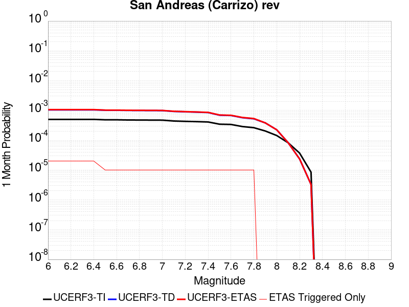 | 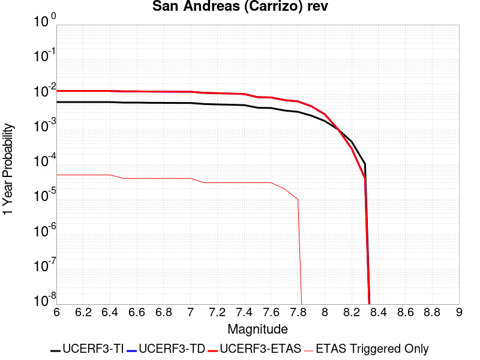 |  |

| Magnitude | 1 wk TI Prob | 1 wk TD Prob | 1 wk ETAS Prob | 1 wk ETAS/TD Gain | 1 wk ETAS Triggered Only | 1 mo TI Prob | 1 mo TD Prob | 1 mo ETAS Prob | 1 mo ETAS/TD Gain | 1 mo ETAS Triggered Only | 1 yr TI Prob | 1 yr TD Prob | 1 yr ETAS Prob | 1 yr ETAS/TD Gain | 1 yr ETAS Triggered Only | 10 yr TI Prob | 10 yr TD Prob | 10 yr ETAS Prob | 10 yr ETAS/TD Gain | 10 yr ETAS Triggered Only |
|-----|-----|-----|-----|-----|-----|-----|-----|-----|-----|-----|-----|-----|-----|-----|-----|-----|-----|-----|-----|-----|
| 6.0 | 1.1674632E-4 | 2.4362565E-4 | 2.6362078E-4 | 1.0820732 | 2.0E-5 | 5.002454E-4 | 0.0010436937 | 0.001063673 | 1.0191427 | 2.0E-5 | 0.006073493 | 0.012633421 | 0.01268279 | 1.0039078 | 5.0E-5 | 0.0591016 | 0.12077793 | 0.12087464 | 1.0008007 | 1.1E-4 |
| 6.1 | 1.1674632E-4 | 2.4362565E-4 | 2.6362078E-4 | 1.0820732 | 2.0E-5 | 5.002454E-4 | 0.0010436937 | 0.001063673 | 1.0191427 | 2.0E-5 | 0.006073493 | 0.012633421 | 0.01268279 | 1.0039078 | 5.0E-5 | 0.0591016 | 0.12077793 | 0.12087464 | 1.0008007 | 1.1E-4 |
| 6.2 | 1.1674632E-4 | 2.4362565E-4 | 2.6362078E-4 | 1.0820732 | 2.0E-5 | 5.002454E-4 | 0.0010436937 | 0.001063673 | 1.0191427 | 2.0E-5 | 0.006073493 | 0.012633421 | 0.01268279 | 1.0039078 | 5.0E-5 | 0.0591016 | 0.12077793 | 0.12087464 | 1.0008007 | 1.1E-4 |
| 6.3 | 1.1674632E-4 | 2.4362565E-4 | 2.6362078E-4 | 1.0820732 | 2.0E-5 | 5.002454E-4 | 0.0010436937 | 0.001063673 | 1.0191427 | 2.0E-5 | 0.006073493 | 0.012633421 | 0.01268279 | 1.0039078 | 5.0E-5 | 0.0591016 | 0.12077793 | 0.12087464 | 1.0008007 | 1.1E-4 |
| 6.4 | 1.1674632E-4 | 2.4362565E-4 | 2.6362078E-4 | 1.0820732 | 2.0E-5 | 5.002454E-4 | 0.0010436937 | 0.001063673 | 1.0191427 | 2.0E-5 | 0.006073493 | 0.012633421 | 0.01268279 | 1.0039078 | 5.0E-5 | 0.0591016 | 0.12077793 | 0.12087464 | 1.0008007 | 1.1E-4 |
| 6.5 | 1.13136164E-4 | 2.368245E-4 | 2.4682214E-4 | 1.0422153 | 1.0E-5 | 4.847792E-4 | 0.001014569 | 0.0010245588 | 1.0098464 | 1.0E-5 | 0.0058862255 | 0.012282865 | 0.012322374 | 1.0032166 | 4.0E-5 | 0.057327334 | 0.11774252 | 0.11783075 | 1.0007493 | 1.0E-4 |
| 6.6 | 1.13136164E-4 | 2.368245E-4 | 2.4682214E-4 | 1.0422153 | 1.0E-5 | 4.847792E-4 | 0.001014569 | 0.0010245588 | 1.0098464 | 1.0E-5 | 0.0058862255 | 0.012282865 | 0.012322374 | 1.0032166 | 4.0E-5 | 0.057327334 | 0.11774252 | 0.11783075 | 1.0007493 | 1.0E-4 |
| 6.7 | 1.1149675E-4 | 2.3373615E-4 | 2.4373381E-4 | 1.0427732 | 1.0E-5 | 4.777557E-4 | 0.0010013434 | 0.0010113333 | 1.0099766 | 1.0E-5 | 0.0058011734 | 0.012123644 | 0.012163159 | 1.0032593 | 4.0E-5 | 0.05652051 | 0.11636054 | 0.1164489 | 1.0007594 | 1.0E-4 |
| 6.8 | 1.1103589E-4 | 2.3275726E-4 | 2.4275493E-4 | 1.0429533 | 1.0E-5 | 4.7578133E-4 | 9.971512E-4 | 0.0010071413 | 1.0100186 | 1.0E-5 | 0.005777263 | 0.012073172 | 0.012112689 | 1.0032731 | 4.0E-5 | 0.056293584 | 0.11592107 | 0.11600948 | 1.0007627 | 1.0E-4 |
| 6.9 | 1.1053259E-4 | 2.3168049E-4 | 2.4167818E-4 | 1.0431529 | 1.0E-5 | 4.7362508E-4 | 9.9254E-4 | 0.0010025301 | 1.0100652 | 1.0E-5 | 0.0057511497 | 0.012017651 | 0.012057171 | 1.0032884 | 4.0E-5 | 0.05604569 | 0.11543746 | 0.11552592 | 1.0007663 | 1.0E-4 |
| 7.0 | 1.1005377E-4 | 2.306884E-4 | 2.4068609E-4 | 1.0433385 | 1.0E-5 | 4.7157376E-4 | 9.882915E-4 | 9.982815E-4 | 1.0101085 | 1.0E-5 | 0.0057263062 | 0.011966494 | 0.0120060155 | 1.0033027 | 4.0E-5 | 0.055809796 | 0.114989534 | 0.11507804 | 1.0007696 | 1.0E-4 |
| 7.1 | 1.0308142E-4 | 2.157785E-4 | 2.2577636E-4 | 1.0463338 | 1.0E-5 | 4.417027E-4 | 9.2443835E-4 | 9.3442906E-4 | 1.0108074 | 1.0E-5 | 0.0053644776 | 0.01119727 | 0.011226934 | 1.0026492 | 3.0E-5 | 0.052368138 | 0.108249314 | 0.10832065 | 1.000659 | 8.0E-5 |
| 7.2 | 1.0027479E-4 | 2.0985417E-4 | 2.1985207E-4 | 1.0476421 | 1.0E-5 | 4.296783E-4 | 8.9906604E-4 | 9.0905704E-4 | 1.0111127 | 1.0E-5 | 0.0052187922 | 0.01089149 | 0.0109211635 | 1.0027244 | 3.0E-5 | 0.050979212 | 0.105556235 | 0.10562779 | 1.000678 | 8.0E-5 |
| 7.3 | 9.816942E-5 | 2.0460035E-4 | 2.1459832E-4 | 1.0488658 | 1.0E-5 | 4.2065824E-4 | 8.76565E-4 | 8.865562E-4 | 1.0113982 | 1.0E-5 | 0.005109493 | 0.010620243 | 0.010649924 | 1.0027947 | 3.0E-5 | 0.049935985 | 0.103138015 | 0.103209764 | 1.0006957 | 8.0E-5 |
| 7.4 | 9.5634205E-5 | 1.9828742E-4 | 2.0828543E-4 | 1.0504218 | 1.0E-5 | 4.0979648E-4 | 8.4952737E-4 | 8.595189E-4 | 1.0117613 | 1.0E-5 | 0.0049778637 | 0.010294209 | 0.010323901 | 1.0028843 | 3.0E-5 | 0.048678253 | 0.10022864 | 0.100291625 | 1.0006284 | 7.0E-5 |
| 7.5 | 8.052417E-5 | 1.6144858E-4 | 1.7144697E-4 | 1.0619292 | 1.0E-5 | 3.4505792E-4 | 6.917392E-4 | 7.017323E-4 | 1.0144463 | 1.0E-5 | 0.0041929903 | 0.008389484 | 0.008419232 | 1.0035459 | 3.0E-5 | 0.04114753 | 0.082961716 | 0.08301674 | 1.0006633 | 6.0E-5 |
| 7.6 | 7.897024E-5 | 1.5797748E-4 | 1.6797592E-4 | 1.0632901 | 1.0E-5 | 3.384E-4 | 6.7687087E-4 | 6.8686414E-4 | 1.0147638 | 1.0E-5 | 0.0041122385 | 0.00820984 | 0.008239594 | 1.0036242 | 3.0E-5 | 0.040369697 | 0.08129846 | 0.08135358 | 1.0006781 | 6.0E-5 |
| 7.7 | 6.707427E-5 | 1.3304809E-4 | 1.4304675E-4 | 1.0751508 | 1.0E-5 | 2.8742946E-4 | 5.700815E-4 | 5.8007584E-4 | 1.0175314 | 1.0E-5 | 0.003493839 | 0.006918687 | 0.0069385483 | 1.0028707 | 2.0E-5 | 0.034394164 | 0.06917808 | 0.06921531 | 1.0005382 | 4.0E-5 |
| 7.8 | 6.147705E-5 | 1.2223405E-4 | 1.3223282E-4 | 1.0818002 | 1.0E-5 | 2.6344648E-4 | 5.2375504E-4 | 5.337498E-4 | 1.0190829 | 1.0E-5 | 0.0032027436 | 0.0063580987 | 0.006368035 | 1.0015628 | 1.0E-5 | 0.031569764 | 0.06363271 | 0.06365144 | 1.0002943 | 2.0E-5 |
| 7.9 | 4.7636717E-5 | 8.898354E-5 | 8.898354E-5 | 1.0 | 0.0 | 2.0414138E-4 | 3.8130232E-4 | 3.8130232E-4 | 1.0 | 0.0 | 0.0024825884 | 0.004632482 | 0.004632482 | 1.0 | 0.0 | 0.024550365 | 0.046717253 | 0.046726786 | 1.0002041 | 1.0E-5 |
| 8.0 | 3.3554235E-5 | 5.224913E-5 | 5.224913E-5 | 1.0 | 0.0 | 1.4379594E-4 | 2.2390562E-4 | 2.2390562E-4 | 1.0 | 0.0 | 0.0017493097 | 0.002722645 | 0.002722645 | 1.0 | 0.0 | 0.017356034 | 0.02793666 | 0.02794638 | 1.000348 | 1.0E-5 |
| 8.1 | 1.9175432E-5 | 1.923722E-5 | 1.923722E-5 | 1.0 | 0.0 | 8.217783E-5 | 8.244263E-5 | 8.244263E-5 | 1.0 | 0.0 | 0.0010000558 | 0.0010032775 | 0.0010032775 | 1.0 | 0.0 | 0.009955673 | 0.010785607 | 0.010795498 | 1.0009172 | 1.0E-5 |
| 8.2 | 8.643924E-6 | 5.494016E-6 | 5.494016E-6 | 1.0 | 0.0 | 3.704486E-5 | 2.3545572E-5 | 2.3545572E-5 | 1.0 | 0.0 | 4.5092785E-4 | 2.866297E-4 | 2.866297E-4 | 1.0 | 0.0 | 0.0045001395 | 0.0032592218 | 0.0032592218 | 1.0 | 0.0 |
| 8.3 | 1.983087E-6 | 7.690063E-7 | 7.690063E-7 | 1.0 | 0.0 | 8.498917E-6 | 3.295737E-6 | 3.295737E-6 | 1.0 | 0.0 | 1.034694E-4 | 4.012488E-5 | 4.012488E-5 | 1.0 | 0.0 | 0.0010342124 | 4.737206E-4 | 4.737206E-4 | 1.0 | 0.0 |

## Cady
*[(top)](#table-of-contents)*

| 1 Week | 1 Month | 1 Year | 10 Year |
|-----|-----|-----|-----|
| 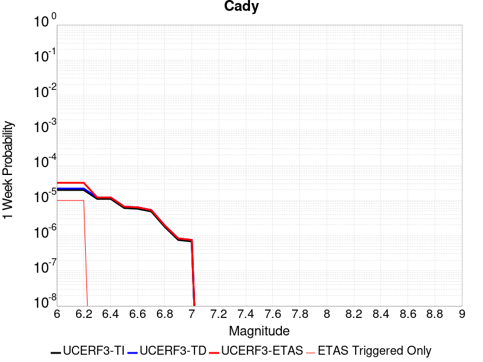 | 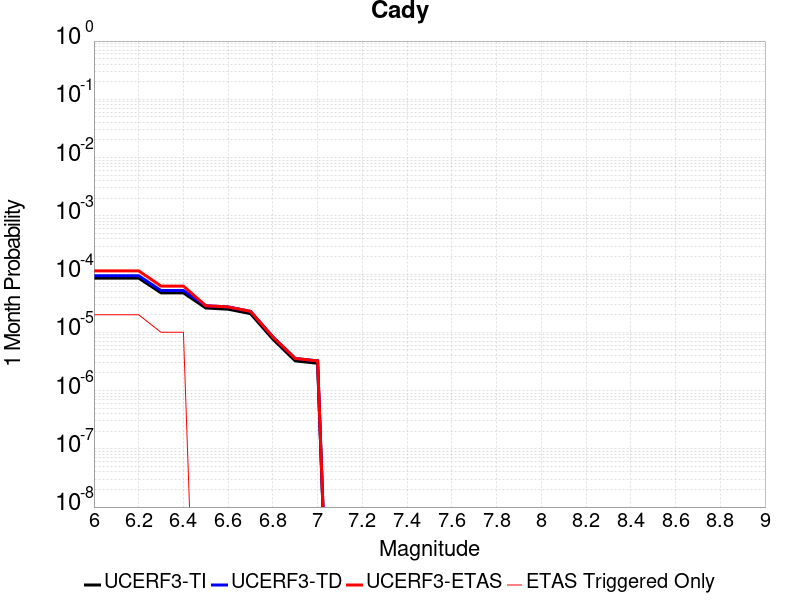 |  |  |

| Magnitude | 1 wk TI Prob | 1 wk TD Prob | 1 wk ETAS Prob | 1 wk ETAS/TD Gain | 1 wk ETAS Triggered Only | 1 mo TI Prob | 1 mo TD Prob | 1 mo ETAS Prob | 1 mo ETAS/TD Gain | 1 mo ETAS Triggered Only | 1 yr TI Prob | 1 yr TD Prob | 1 yr ETAS Prob | 1 yr ETAS/TD Gain | 1 yr ETAS Triggered Only | 10 yr TI Prob | 10 yr TD Prob | 10 yr ETAS Prob | 10 yr ETAS/TD Gain | 10 yr ETAS Triggered Only |
|-----|-----|-----|-----|-----|-----|-----|-----|-----|-----|-----|-----|-----|-----|-----|-----|-----|-----|-----|-----|-----|
| 6.0 | 1.9892565E-5 | 2.1859876E-5 | 3.1859658E-5 | 1.4574491 | 1.0E-5 | 8.525106E-5 | 9.3682334E-5 | 1.1368046E-4 | 1.2134675 | 2.0E-5 | 0.0010374374 | 0.0011400766 | 0.0011900195 | 1.0438067 | 5.0E-5 | 0.010326075 | 0.011351293 | 0.0114402715 | 1.0078386 | 9.0E-5 |
| 6.1 | 1.9892565E-5 | 2.1859876E-5 | 3.1859658E-5 | 1.4574491 | 1.0E-5 | 8.525106E-5 | 9.3682334E-5 | 1.1368046E-4 | 1.2134675 | 2.0E-5 | 0.0010374374 | 0.0011400766 | 0.0011900195 | 1.0438067 | 5.0E-5 | 0.010326075 | 0.011351293 | 0.0114402715 | 1.0078386 | 9.0E-5 |
| 6.2 | 1.9892565E-5 | 2.1859876E-5 | 3.1859658E-5 | 1.4574491 | 1.0E-5 | 8.525106E-5 | 9.3682334E-5 | 1.1368046E-4 | 1.2134675 | 2.0E-5 | 0.0010374374 | 0.0011400766 | 0.0011900195 | 1.0438067 | 5.0E-5 | 0.010326075 | 0.011351293 | 0.0114402715 | 1.0078386 | 9.0E-5 |
| 6.3 | 1.1117327E-5 | 1.2177199E-5 | 1.2177199E-5 | 1.0 | 0.0 | 4.764482E-5 | 5.218713E-5 | 6.218661E-5 | 1.1916081 | 1.0E-5 | 5.7992124E-4 | 6.352246E-4 | 6.6520553E-4 | 1.0471973 | 3.0E-5 | 0.0057841022 | 0.006337195 | 0.0063868784 | 1.0078399 | 5.0E-5 |
| 6.4 | 1.1117327E-5 | 1.2177199E-5 | 1.2177199E-5 | 1.0 | 0.0 | 4.764482E-5 | 5.218713E-5 | 6.218661E-5 | 1.1916081 | 1.0E-5 | 5.7992124E-4 | 6.352246E-4 | 6.6520553E-4 | 1.0471973 | 3.0E-5 | 0.0057841022 | 0.006337195 | 0.0063868784 | 1.0078399 | 5.0E-5 |
| 6.5 | 6.103093E-6 | 6.672351E-6 | 6.672351E-6 | 1.0 | 0.0 | 2.615585E-5 | 2.8595547E-5 | 2.8595547E-5 | 1.0 | 0.0 | 3.1840094E-4 | 3.4810771E-4 | 3.5810424E-4 | 1.0287167 | 1.0E-5 | 0.0031794512 | 0.0034768586 | 0.003496789 | 1.0057323 | 2.0E-5 |
| 6.6 | 5.817237E-6 | 6.3659772E-6 | 6.3659772E-6 | 1.0 | 0.0 | 2.4930776E-5 | 2.7282544E-5 | 2.7282544E-5 | 1.0 | 0.0 | 3.034899E-4 | 3.321268E-4 | 3.4212347E-4 | 1.030099 | 1.0E-5 | 0.0030307577 | 0.0033175263 | 0.00333746 | 1.0060086 | 2.0E-5 |
| 6.7 | 4.8846314E-6 | 5.340833E-6 | 5.340833E-6 | 1.0 | 0.0 | 2.0933967E-5 | 2.288915E-5 | 2.288915E-5 | 1.0 | 0.0 | 2.5484123E-4 | 2.7865154E-4 | 2.8864873E-4 | 1.0358771 | 1.0E-5 | 0.0025454918 | 0.002784177 | 0.0028041212 | 1.0071634 | 2.0E-5 |
| 6.8 | 1.7788773E-6 | 1.940001E-6 | 1.940001E-6 | 1.0 | 0.0 | 7.6237375E-6 | 8.314273E-6 | 8.314273E-6 | 1.0 | 0.0 | 9.281505E-5 | 1.0122315E-4 | 1.0122315E-4 | 1.0 | 0.0 | 9.2776294E-4 | 0.001011925 | 0.001011925 | 1.0 | 0.0 |
| 6.9 | 7.5455404E-7 | 8.2975305E-7 | 8.2975305E-7 | 1.0 | 0.0 | 3.233799E-6 | 3.5560815E-6 | 3.5560815E-6 | 1.0 | 0.0 | 3.937079E-5 | 4.329477E-5 | 4.329477E-5 | 1.0 | 0.0 | 3.9363815E-4 | 4.3289628E-4 | 4.3289628E-4 | 1.0 | 0.0 |
| 7.0 | 6.8578805E-7 | 7.542215E-7 | 7.542215E-7 | 1.0 | 0.0 | 2.9390883E-6 | 3.2323758E-6 | 3.2323758E-6 | 1.0 | 0.0 | 3.578281E-5 | 3.9353796E-5 | 3.9353796E-5 | 1.0 | 0.0 | 3.577705E-4 | 3.9350073E-4 | 3.9350073E-4 | 1.0 | 0.0 |

## Owens Valley
*[(top)](#table-of-contents)*

| 1 Week | 1 Month | 1 Year | 10 Year |
|-----|-----|-----|-----|
|  |  |  | 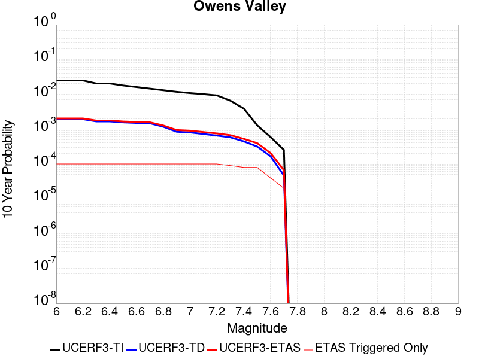 |

| Magnitude | 1 wk TI Prob | 1 wk TD Prob | 1 wk ETAS Prob | 1 wk ETAS/TD Gain | 1 wk ETAS Triggered Only | 1 mo TI Prob | 1 mo TD Prob | 1 mo ETAS Prob | 1 mo ETAS/TD Gain | 1 mo ETAS Triggered Only | 1 yr TI Prob | 1 yr TD Prob | 1 yr ETAS Prob | 1 yr ETAS/TD Gain | 1 yr ETAS Triggered Only | 10 yr TI Prob | 10 yr TD Prob | 10 yr ETAS Prob | 10 yr ETAS/TD Gain | 10 yr ETAS Triggered Only |
|-----|-----|-----|-----|-----|-----|-----|-----|-----|-----|-----|-----|-----|-----|-----|-----|-----|-----|-----|-----|-----|
| 6.0 | 4.83821E-5 | 3.6305946E-6 | 3.6305946E-6 | 1.0 | 0.0 | 2.0733538E-4 | 1.5559604E-5 | 1.5559604E-5 | 1.0 | 0.0 | 0.002521386 | 1.8942272E-4 | 2.0941893E-4 | 1.105564 | 2.0E-5 | 0.024929691 | 0.0019204353 | 0.0020202433 | 1.0519716 | 1.0E-4 |
| 6.1 | 4.83821E-5 | 3.6305946E-6 | 3.6305946E-6 | 1.0 | 0.0 | 2.0733538E-4 | 1.5559604E-5 | 1.5559604E-5 | 1.0 | 0.0 | 0.002521386 | 1.8942272E-4 | 2.0941893E-4 | 1.105564 | 2.0E-5 | 0.024929691 | 0.0019204353 | 0.0020202433 | 1.0519716 | 1.0E-4 |
| 6.2 | 4.83821E-5 | 3.6305946E-6 | 3.6305946E-6 | 1.0 | 0.0 | 2.0733538E-4 | 1.5559604E-5 | 1.5559604E-5 | 1.0 | 0.0 | 0.002521386 | 1.8942272E-4 | 2.0941893E-4 | 1.105564 | 2.0E-5 | 0.024929691 | 0.0019204353 | 0.0020202433 | 1.0519716 | 1.0E-4 |
| 6.3 | 3.953008E-5 | 3.1569743E-6 | 3.1569743E-6 | 1.0 | 0.0 | 1.6940363E-4 | 1.3529823E-5 | 1.3529823E-5 | 1.0 | 0.0 | 0.002060538 | 1.6471389E-4 | 1.8471059E-4 | 1.1214026 | 2.0E-5 | 0.020415364 | 0.0016592429 | 0.0017590771 | 1.0601685 | 1.0E-4 |
| 6.4 | 3.953008E-5 | 3.1569743E-6 | 3.1569743E-6 | 1.0 | 0.0 | 1.6940363E-4 | 1.3529823E-5 | 1.3529823E-5 | 1.0 | 0.0 | 0.002060538 | 1.6471389E-4 | 1.8471059E-4 | 1.1214026 | 2.0E-5 | 0.020415364 | 0.0016592429 | 0.0017590771 | 1.0601685 | 1.0E-4 |
| 6.5 | 3.457342E-5 | 2.9722537E-6 | 2.9722537E-6 | 1.0 | 0.0 | 1.4816338E-4 | 1.2738172E-5 | 1.2738172E-5 | 1.0 | 0.0 | 0.0018023965 | 1.5507691E-4 | 1.750738E-4 | 1.1289483 | 2.0E-5 | 0.017878477 | 0.0015558794 | 0.0016557238 | 1.0641724 | 1.0E-4 |
| 6.6 | 3.1127765E-5 | 2.8751224E-6 | 2.8751224E-6 | 1.0 | 0.0 | 1.3339789E-4 | 1.2321899E-5 | 1.2321899E-5 | 1.0 | 0.0 | 0.0016229092 | 1.5000948E-4 | 1.7000647E-4 | 1.133305 | 2.0E-5 | 0.016111081 | 0.0015009856 | 0.0016008356 | 1.0665228 | 1.0E-4 |
| 6.7 | 2.806885E-5 | 2.8107588E-6 | 2.8107588E-6 | 1.0 | 0.0 | 1.2028952E-4 | 1.2046057E-5 | 1.2046057E-5 | 1.0 | 0.0 | 0.001463541 | 1.4665157E-4 | 1.6664864E-4 | 1.1363577 | 2.0E-5 | 0.014539397 | 0.0014659754 | 0.0015658288 | 1.0681139 | 1.0E-4 |
| 6.8 | 2.524524E-5 | 2.2356737E-6 | 2.2356737E-6 | 1.0 | 0.0 | 1.0818939E-4 | 9.581425E-6 | 9.581425E-6 | 1.0 | 0.0 | 0.0013164099 | 1.1664791E-4 | 1.3664558E-4 | 1.1714362 | 2.0E-5 | 0.01308639 | 0.0011661606 | 0.001266044 | 1.0856515 | 1.0E-4 |
| 6.9 | 2.2704568E-5 | 1.6083629E-6 | 1.6083629E-6 | 1.0 | 0.0 | 9.730166E-5 | 6.8929658E-6 | 6.8929658E-6 | 1.0 | 0.0 | 0.0011840039 | 8.391865E-5 | 1.03916966E-4 | 1.238306 | 2.0E-5 | 0.011777153 | 8.3909626E-4 | 9.3901233E-4 | 1.1190759 | 1.0E-4 |
| 7.0 | 2.0871712E-5 | 1.539734E-6 | 1.539734E-6 | 1.0 | 0.0 | 8.944713E-5 | 6.5988434E-6 | 6.5988434E-6 | 1.0 | 0.0 | 0.0010884746 | 8.033797E-5 | 1.00336365E-4 | 1.2489283 | 2.0E-5 | 0.010831586 | 8.0327404E-4 | 9.031937E-4 | 1.1243905 | 1.0E-4 |
| 7.1 | 1.944928E-5 | 1.386575E-6 | 1.386575E-6 | 1.0 | 0.0 | 8.335139E-5 | 5.942451E-6 | 5.942451E-6 | 1.0 | 0.0 | 0.0010143308 | 7.234695E-5 | 9.23455E-5 | 1.2764256 | 2.0E-5 | 0.010097133 | 7.2340504E-4 | 8.233327E-4 | 1.1381352 | 1.0E-4 |
| 7.2 | 1.7876306E-5 | 1.24905E-6 | 1.24905E-6 | 1.0 | 0.0 | 7.6610486E-5 | 5.3530603E-6 | 5.3530603E-6 | 1.0 | 0.0 | 9.3233347E-4 | 6.517157E-5 | 8.5170264E-5 | 1.3068622 | 2.0E-5 | 0.009284316 | 6.5168424E-4 | 7.5161905E-4 | 1.1533486 | 1.0E-4 |
| 7.3 | 1.2618672E-5 | 1.1116437E-6 | 1.1116437E-6 | 1.0 | 0.0 | 5.40789E-5 | 4.7641784E-6 | 4.7641784E-6 | 1.0 | 0.0 | 6.582117E-4 | 5.8002333E-5 | 7.8001176E-5 | 1.3447937 | 2.0E-5 | 0.0065626553 | 5.8002654E-4 | 6.6997437E-4 | 1.1550753 | 9.0E-5 |
| 7.4 | 7.4874442E-6 | 8.5496856E-7 | 8.5496856E-7 | 1.0 | 0.0 | 3.208865E-5 | 3.6641459E-6 | 3.6641459E-6 | 1.0 | 0.0 | 3.906093E-4 | 4.4610068E-5 | 5.460962E-5 | 1.2241547 | 1.0E-5 | 0.003899234 | 4.4612345E-4 | 5.2608777E-4 | 1.1792426 | 8.0E-5 |
| 7.5 | 2.4734156E-6 | 6.0694214E-7 | 6.0694214E-7 | 1.0 | 0.0 | 1.060031E-5 | 2.601178E-6 | 2.601178E-6 | 1.0 | 0.0 | 1.2905113E-4 | 3.1668886E-5 | 4.166857E-5 | 1.3157574 | 1.0E-5 | 0.0012897621 | 3.1664406E-4 | 3.966187E-4 | 1.2525697 | 8.0E-5 |
| 7.6 | 1.1328841E-6 | 3.196907E-7 | 3.196907E-7 | 1.0 | 0.0 | 4.8552088E-6 | 1.3701024E-6 | 1.3701024E-6 | 1.0 | 0.0 | 5.9110564E-5 | 1.668087E-5 | 1.668087E-5 | 1.0 | 0.0 | 5.9094845E-4 | 1.6679637E-4 | 2.067897E-4 | 1.2397734 | 4.0E-5 |
| 7.7 | 4.8613185E-7 | 8.9654996E-8 | 8.9654996E-8 | 1.0 | 0.0 | 2.0834207E-6 | 3.8423565E-7 | 3.8423565E-7 | 1.0 | 0.0 | 2.536535E-5 | 4.6780597E-6 | 4.6780597E-6 | 1.0 | 0.0 | 2.5362454E-4 | 4.677968E-5 | 6.6778746E-5 | 1.4275161 | 2.0E-5 |

## San Jacinto (Stepovers Combined)
*[(top)](#table-of-contents)*

| 1 Week | 1 Month | 1 Year | 10 Year |
|-----|-----|-----|-----|
|  |  |  |  |

| Magnitude | 1 wk TI Prob | 1 wk TD Prob | 1 wk ETAS Prob | 1 wk ETAS/TD Gain | 1 wk ETAS Triggered Only | 1 mo TI Prob | 1 mo TD Prob | 1 mo ETAS Prob | 1 mo ETAS/TD Gain | 1 mo ETAS Triggered Only | 1 yr TI Prob | 1 yr TD Prob | 1 yr ETAS Prob | 1 yr ETAS/TD Gain | 1 yr ETAS Triggered Only | 10 yr TI Prob | 10 yr TD Prob | 10 yr ETAS Prob | 10 yr ETAS/TD Gain | 10 yr ETAS Triggered Only |
|-----|-----|-----|-----|-----|-----|-----|-----|-----|-----|-----|-----|-----|-----|-----|-----|-----|-----|-----|-----|-----|
| 6.0 | 4.0667746E-5 | 3.5335263E-5 | 3.5335263E-5 | 1.0 | 0.0 | 1.742787E-4 | 1.5142806E-4 | 1.7142504E-4 | 1.1320559 | 2.0E-5 | 0.0021197782 | 0.0018420788 | 0.0018919867 | 1.0270933 | 5.0E-5 | 0.020996714 | 0.019019177 | 0.019117275 | 1.0051578 | 1.0E-4 |
| 6.1 | 4.0667746E-5 | 3.5335263E-5 | 3.5335263E-5 | 1.0 | 0.0 | 1.742787E-4 | 1.5142806E-4 | 1.7142504E-4 | 1.1320559 | 2.0E-5 | 0.0021197782 | 0.0018420788 | 0.0018919867 | 1.0270933 | 5.0E-5 | 0.020996714 | 0.019019177 | 0.019117275 | 1.0051578 | 1.0E-4 |
| 6.2 | 4.0667746E-5 | 3.5335263E-5 | 3.5335263E-5 | 1.0 | 0.0 | 1.742787E-4 | 1.5142806E-4 | 1.7142504E-4 | 1.1320559 | 2.0E-5 | 0.0021197782 | 0.0018420788 | 0.0018919867 | 1.0270933 | 5.0E-5 | 0.020996714 | 0.019019177 | 0.019117275 | 1.0051578 | 1.0E-4 |
| 6.3 | 4.0667746E-5 | 3.5335263E-5 | 3.5335263E-5 | 1.0 | 0.0 | 1.742787E-4 | 1.5142806E-4 | 1.7142504E-4 | 1.1320559 | 2.0E-5 | 0.0021197782 | 0.0018420788 | 0.0018919867 | 1.0270933 | 5.0E-5 | 0.020996714 | 0.019019177 | 0.019117275 | 1.0051578 | 1.0E-4 |
| 6.4 | 4.0577226E-5 | 3.5207147E-5 | 3.5207147E-5 | 1.0 | 0.0 | 1.738908E-4 | 1.5087906E-4 | 1.7087605E-4 | 1.1325365 | 2.0E-5 | 0.0021150648 | 0.0018354072 | 0.0018853155 | 1.0271919 | 5.0E-5 | 0.020950472 | 0.018953735 | 0.019051839 | 1.005176 | 1.0E-4 |
| 6.5 | 4.0577226E-5 | 3.5207147E-5 | 3.5207147E-5 | 1.0 | 0.0 | 1.738908E-4 | 1.5087906E-4 | 1.7087605E-4 | 1.1325365 | 2.0E-5 | 0.0021150648 | 0.0018354072 | 0.0018853155 | 1.0271919 | 5.0E-5 | 0.020950472 | 0.018953735 | 0.019051839 | 1.005176 | 1.0E-4 |
| 6.6 | 4.053861E-5 | 3.515248E-5 | 3.515248E-5 | 1.0 | 0.0 | 1.7372532E-4 | 1.506448E-4 | 1.7064178E-4 | 1.1327426 | 2.0E-5 | 0.0021130538 | 0.0018325604 | 0.0018824687 | 1.0272342 | 5.0E-5 | 0.020930743 | 0.018925807 | 0.019023914 | 1.0051838 | 1.0E-4 |
| 6.7 | 4.0516545E-5 | 3.5121546E-5 | 3.5121546E-5 | 1.0 | 0.0 | 1.7363077E-4 | 1.5051225E-4 | 1.7050923E-4 | 1.1328596 | 2.0E-5 | 0.002111905 | 0.0018309496 | 0.001880858 | 1.0272583 | 5.0E-5 | 0.020919468 | 0.018910002 | 0.01900811 | 1.0051882 | 1.0E-4 |
| 6.8 | 4.049434E-5 | 3.5093104E-5 | 3.5093104E-5 | 1.0 | 0.0 | 1.7353562E-4 | 1.5039036E-4 | 1.7038736E-4 | 1.1329672 | 2.0E-5 | 0.0021107488 | 0.0018294681 | 0.0018793766 | 1.0272803 | 5.0E-5 | 0.020908125 | 0.018895412 | 0.018993523 | 1.0051923 | 1.0E-4 |
| 6.9 | 4.046386E-5 | 3.5055655E-5 | 3.5055655E-5 | 1.0 | 0.0 | 1.73405E-4 | 1.5022988E-4 | 1.7022688E-4 | 1.1331093 | 2.0E-5 | 0.0021091616 | 0.0018275176 | 0.0018774263 | 1.0273095 | 5.0E-5 | 0.020892553 | 0.018876182 | 0.018974293 | 1.0051976 | 1.0E-4 |
| 7.0 | 4.036382E-5 | 3.4936198E-5 | 3.4936198E-5 | 1.0 | 0.0 | 1.7297632E-4 | 1.4971798E-4 | 1.6971499E-4 | 1.1335645 | 2.0E-5 | 0.0021039525 | 0.0018212957 | 0.0018712046 | 1.027403 | 5.0E-5 | 0.02084144 | 0.018814782 | 0.0189129 | 1.0052149 | 1.0E-4 |
| 7.1 | 4.0343282E-5 | 3.4914654E-5 | 3.4914654E-5 | 1.0 | 0.0 | 1.7288832E-4 | 1.4962567E-4 | 1.6962268E-4 | 1.1336468 | 2.0E-5 | 0.002102883 | 0.0018201737 | 0.0018700827 | 1.0274199 | 5.0E-5 | 0.020830948 | 0.018803652 | 0.018901771 | 1.0052181 | 1.0E-4 |
| 7.2 | 4.0257353E-5 | 3.4819048E-5 | 3.4819048E-5 | 1.0 | 0.0 | 1.725201E-4 | 1.4921598E-4 | 1.6921299E-4 | 1.1340139 | 2.0E-5 | 0.0020984085 | 0.001815194 | 0.0018651033 | 1.0274953 | 5.0E-5 | 0.020787042 | 0.018754339 | 0.018852463 | 1.0052321 | 1.0E-4 |
| 7.3 | 3.9940667E-5 | 3.4646426E-5 | 3.4646426E-5 | 1.0 | 0.0 | 1.7116306E-4 | 1.4847625E-4 | 1.6847327E-4 | 1.1346817 | 2.0E-5 | 0.0020819185 | 0.0018062027 | 0.0018561124 | 1.0276324 | 5.0E-5 | 0.020625217 | 0.018662827 | 0.01876096 | 1.0052582 | 1.0E-4 |
| 7.4 | 3.9721202E-5 | 3.4531695E-5 | 3.4531695E-5 | 1.0 | 0.0 | 1.7022261E-4 | 1.479846E-4 | 1.6798163E-4 | 1.1351292 | 2.0E-5 | 0.0020704903 | 0.0018002269 | 0.0018501368 | 1.0277243 | 5.0E-5 | 0.020513052 | 0.018601885 | 0.018700024 | 1.0052758 | 1.0E-4 |
| 7.5 | 3.7036873E-5 | 3.3597462E-5 | 3.3597462E-5 | 1.0 | 0.0 | 1.5871979E-4 | 1.4398119E-4 | 1.6397831E-4 | 1.138887 | 2.0E-5 | 0.0019307006 | 0.0017515646 | 0.001801477 | 1.0284959 | 5.0E-5 | 0.019140124 | 0.018102536 | 0.018200725 | 1.0054241 | 1.0E-4 |
| 7.6 | 3.2940967E-5 | 3.1371335E-5 | 3.1371335E-5 | 1.0 | 0.0 | 1.4116794E-4 | 1.3444165E-4 | 1.5443897E-4 | 1.1487434 | 2.0E-5 | 0.0017173645 | 0.0016356006 | 0.0016855188 | 1.0305198 | 5.0E-5 | 0.01704153 | 0.016931716 | 0.017030025 | 1.0058061 | 1.0E-4 |
| 7.7 | 2.8236149E-5 | 2.7935872E-5 | 2.7935872E-5 | 1.0 | 0.0 | 1.2100645E-4 | 1.19719676E-4 | 1.3971727E-4 | 1.1670369 | 2.0E-5 | 0.0014722579 | 0.0014566135 | 0.0015065407 | 1.0342762 | 5.0E-5 | 0.014625421 | 0.015141861 | 0.015240346 | 1.0065042 | 1.0E-4 |
| 7.8 | 2.4329287E-5 | 2.5257565E-5 | 2.5257565E-5 | 1.0 | 0.0 | 1.042642E-4 | 1.08242224E-4 | 1.2824006E-4 | 1.1847508 | 2.0E-5 | 0.0012686774 | 0.0013170532 | 0.0013669874 | 1.0379136 | 5.0E-5 | 0.012614589 | 0.013738072 | 0.013836698 | 1.007179 | 1.0E-4 |
| 7.9 | 1.9370926E-5 | 2.0466443E-5 | 2.0466443E-5 | 1.0 | 0.0 | 8.301561E-5 | 8.771038E-5 | 1.0770863E-4 | 1.2280031 | 2.0E-5 | 0.0010102465 | 0.0010673514 | 0.0011172981 | 1.0467949 | 5.0E-5 | 0.0100566605 | 0.011223038 | 0.011321915 | 1.0088103 | 1.0E-4 |
| 8.0 | 1.5583017E-5 | 1.5924119E-5 | 1.5924119E-5 | 1.0 | 0.0 | 6.6782646E-5 | 6.8244444E-5 | 8.8243076E-5 | 1.2930442 | 2.0E-5 | 8.127754E-4 | 8.3056005E-4 | 8.805185E-4 | 1.0601504 | 5.0E-5 | 0.008098091 | 0.008801706 | 0.008900826 | 1.0112615 | 1.0E-4 |
| 8.1 | 1.0024873E-5 | 8.313899E-6 | 8.313899E-6 | 1.0 | 0.0 | 4.2963035E-5 | 3.5630514E-5 | 3.5630514E-5 | 1.0 | 0.0 | 5.229494E-4 | 4.3371567E-4 | 4.5370698E-4 | 1.0460931 | 2.0E-5 | 0.0052172043 | 0.004665064 | 0.0047048777 | 1.0085344 | 4.0E-5 |
| 8.2 | 4.142796E-6 | 1.5668816E-6 | 1.5668816E-6 | 1.0 | 0.0 | 1.775472E-5 | 6.7151896E-6 | 6.7151896E-6 | 1.0 | 0.0 | 2.1614227E-4 | 8.175439E-5 | 8.175439E-5 | 1.0 | 0.0 | 0.0021593217 | 9.488576E-4 | 9.488576E-4 | 1.0 | 0.0 |
| 8.3 | 1.2750878E-6 | 3.6277774E-7 | 3.6277774E-7 | 1.0 | 0.0 | 5.4646503E-6 | 1.5547608E-6 | 1.5547608E-6 | 1.0 | 0.0 | 6.653009E-5 | 1.8929053E-5 | 1.8929053E-5 | 1.0 | 0.0 | 6.6510175E-4 | 2.2828147E-4 | 2.2828147E-4 | 1.0 | 0.0 |

## Santa Ynez (West)
*[(top)](#table-of-contents)*

| 1 Week | 1 Month | 1 Year | 10 Year |
|-----|-----|-----|-----|
|  |  |  |  |

| Magnitude | 1 wk TI Prob | 1 wk TD Prob | 1 wk ETAS Prob | 1 wk ETAS/TD Gain | 1 wk ETAS Triggered Only | 1 mo TI Prob | 1 mo TD Prob | 1 mo ETAS Prob | 1 mo ETAS/TD Gain | 1 mo ETAS Triggered Only | 1 yr TI Prob | 1 yr TD Prob | 1 yr ETAS Prob | 1 yr ETAS/TD Gain | 1 yr ETAS Triggered Only | 10 yr TI Prob | 10 yr TD Prob | 10 yr ETAS Prob | 10 yr ETAS/TD Gain | 10 yr ETAS Triggered Only |
|-----|-----|-----|-----|-----|-----|-----|-----|-----|-----|-----|-----|-----|-----|-----|-----|-----|-----|-----|-----|-----|
| 6.0 | 4.7352758E-5 | 5.4976248E-5 | 5.4976248E-5 | 1.0 | 0.0 | 2.0292461E-4 | 2.3559289E-4 | 2.4559052E-4 | 1.0424361 | 1.0E-5 | 0.0024678076 | 0.0028648374 | 0.0029047227 | 1.0139225 | 4.0E-5 | 0.024405818 | 0.028307172 | 0.028375192 | 1.0024029 | 7.0E-5 |
| 6.1 | 4.7352758E-5 | 5.4976248E-5 | 5.4976248E-5 | 1.0 | 0.0 | 2.0292461E-4 | 2.3559289E-4 | 2.4559052E-4 | 1.0424361 | 1.0E-5 | 0.0024678076 | 0.0028648374 | 0.0029047227 | 1.0139225 | 4.0E-5 | 0.024405818 | 0.028307172 | 0.028375192 | 1.0024029 | 7.0E-5 |
| 6.2 | 3.0415853E-5 | 3.3927645E-5 | 3.3927645E-5 | 1.0 | 0.0 | 1.3034715E-4 | 1.4539632E-4 | 1.5539485E-4 | 1.0687675 | 1.0E-5 | 0.0015858212 | 0.0017687982 | 0.0017987451 | 1.0169307 | 3.0E-5 | 0.015745522 | 0.017551146 | 0.017610094 | 1.0033586 | 6.0E-5 |
| 6.3 | 3.0415853E-5 | 3.3927645E-5 | 3.3927645E-5 | 1.0 | 0.0 | 1.3034715E-4 | 1.4539632E-4 | 1.5539485E-4 | 1.0687675 | 1.0E-5 | 0.0015858212 | 0.0017687982 | 0.0017987451 | 1.0169307 | 3.0E-5 | 0.015745522 | 0.017551146 | 0.017610094 | 1.0033586 | 6.0E-5 |
| 6.4 | 2.5452082E-5 | 2.7914315E-5 | 2.7914315E-5 | 1.0 | 0.0 | 1.09075794E-4 | 1.196274E-4 | 1.296262E-4 | 1.0835829 | 1.0E-5 | 0.0013271887 | 0.0014555093 | 0.0014854657 | 1.0205814 | 3.0E-5 | 0.013192902 | 0.014461935 | 0.014521066 | 1.0040889 | 6.0E-5 |
| 6.5 | 2.3143784E-5 | 2.512982E-5 | 2.512982E-5 | 1.0 | 0.0 | 9.9183875E-5 | 1.0769487E-4 | 1.17693795E-4 | 1.092845 | 1.0E-5 | 0.0012068948 | 0.0013104109 | 0.0013403716 | 1.0228636 | 3.0E-5 | 0.012003611 | 0.013028506 | 0.013087725 | 1.0045453 | 6.0E-5 |
| 6.6 | 1.9118515E-5 | 2.035546E-5 | 2.035546E-5 | 1.0 | 0.0 | 8.193392E-5 | 8.723481E-5 | 9.723393E-5 | 1.1146232 | 1.0E-5 | 9.97089E-4 | 0.0010615742 | 0.0010815529 | 1.0188199 | 2.0E-5 | 0.00992627 | 0.010565943 | 0.010605521 | 1.0037458 | 4.0E-5 |
| 6.7 | 1.722807E-5 | 1.8147268E-5 | 1.8147268E-5 | 1.0 | 0.0 | 7.3832496E-5 | 7.777172E-5 | 8.777094E-5 | 1.1285714 | 1.0E-5 | 8.985399E-4 | 9.4646495E-4 | 9.66446E-4 | 1.0211112 | 2.0E-5 | 0.008949154 | 0.009424986 | 0.009464609 | 1.004204 | 4.0E-5 |
| 6.8 | 1.5317364E-5 | 1.5927215E-5 | 1.5927215E-5 | 1.0 | 0.0 | 6.56442E-5 | 6.825773E-5 | 7.825704E-5 | 1.1464936 | 1.0E-5 | 7.98925E-4 | 8.3072524E-4 | 8.5070863E-4 | 1.0240554 | 2.0E-5 | 0.007960589 | 0.008276687 | 0.008316356 | 1.0047928 | 4.0E-5 |
| 6.9 | 1.3071226E-5 | 1.3330136E-5 | 1.3330136E-5 | 1.0 | 0.0 | 5.6018336E-5 | 5.7127916E-5 | 6.7127345E-5 | 1.1750357 | 1.0E-5 | 6.8180985E-4 | 6.953127E-4 | 7.152988E-4 | 1.028744 | 2.0E-5 | 0.0067972173 | 0.0069316328 | 0.0069713555 | 1.0057306 | 4.0E-5 |
| 7.0 | 1.1836986E-5 | 1.1933195E-5 | 1.1933195E-5 | 1.0 | 0.0 | 5.0728955E-5 | 5.1141273E-5 | 6.114076E-5 | 1.1955268 | 1.0E-5 | 6.1745E-4 | 6.224688E-4 | 6.4245635E-4 | 1.0321101 | 2.0E-5 | 0.006157372 | 0.0062074456 | 0.0062471973 | 1.0064039 | 4.0E-5 |
| 7.1 | 1.0597169E-5 | 1.0542524E-5 | 1.0542524E-5 | 1.0 | 0.0 | 4.541565E-5 | 4.518147E-5 | 5.518102E-5 | 1.2213197 | 1.0E-5 | 5.5279525E-4 | 5.499467E-4 | 5.699357E-4 | 1.0363472 | 2.0E-5 | 0.0055142213 | 0.0054859887 | 0.005515824 | 1.0054384 | 3.0E-5 |
| 7.2 | 9.59113E-6 | 9.4594225E-6 | 9.4594225E-6 | 1.0 | 0.0 | 4.11042E-5 | 4.053976E-5 | 5.0539355E-5 | 1.2466614 | 1.0E-5 | 5.0032866E-4 | 4.9346086E-4 | 5.13451E-4 | 1.04051 | 2.0E-5 | 0.004992037 | 0.00492377 | 0.0049536224 | 1.0060629 | 3.0E-5 |
| 7.3 | 8.586084E-6 | 8.3798195E-6 | 8.3798195E-6 | 1.0 | 0.0 | 3.679698E-5 | 3.591302E-5 | 4.5912664E-5 | 1.2784405 | 1.0E-5 | 4.4791115E-4 | 4.3715438E-4 | 4.5714562E-4 | 1.0457305 | 2.0E-5 | 0.004470094 | 0.0043630553 | 0.0043929247 | 1.006846 | 3.0E-5 |
| 7.4 | 7.2622997E-6 | 6.951717E-6 | 6.951717E-6 | 1.0 | 0.0 | 3.112377E-5 | 2.9792738E-5 | 3.979244E-5 | 1.3356422 | 1.0E-5 | 3.78866E-4 | 3.6266717E-4 | 3.7266355E-4 | 1.0275635 | 1.0E-5 | 0.0037822074 | 0.0036208534 | 0.0036407812 | 1.0055035 | 2.0E-5 |
| 7.5 | 5.627296E-6 | 5.251687E-6 | 5.251687E-6 | 1.0 | 0.0 | 2.411676E-5 | 2.250704E-5 | 3.2506814E-5 | 1.4442954 | 1.0E-5 | 2.9358198E-4 | 2.7398948E-4 | 2.8398674E-4 | 1.0364877 | 1.0E-5 | 0.0029319443 | 0.0027365887 | 0.002756534 | 1.0072883 | 2.0E-5 |
| 7.6 | 2.265244E-6 | 2.0609377E-6 | 2.0609377E-6 | 1.0 | 0.0 | 9.708152E-6 | 8.832561E-6 | 8.832561E-6 | 1.0 | 0.0 | 1.18190335E-4 | 1.0753121E-4 | 1.0753121E-4 | 1.0 | 0.0 | 0.001181275 | 0.0010748004 | 0.0010847896 | 1.009294 | 1.0E-5 |
| 7.7 | 1.3099874E-6 | 1.1016689E-6 | 1.1016689E-6 | 1.0 | 0.0 | 5.61422E-6 | 4.7214294E-6 | 4.7214294E-6 | 1.0 | 0.0 | 6.8350986E-5 | 5.7481913E-5 | 5.7481913E-5 | 1.0 | 0.0 | 6.832996E-4 | 5.746728E-4 | 5.746728E-4 | 1.0 | 0.0 |
| 7.8 | 7.903951E-7 | 6.071319E-7 | 6.071319E-7 | 1.0 | 0.0 | 3.3874032E-6 | 2.6019911E-6 | 2.6019911E-6 | 1.0 | 0.0 | 4.1240855E-5 | 3.1678795E-5 | 3.1678795E-5 | 1.0 | 0.0 | 4.12332E-4 | 3.1674412E-4 | 3.1674412E-4 | 1.0 | 0.0 |
| 7.9 | 7.0753297E-9 | 5.0901185E-9 | 5.0901185E-9 | 1.0 | 0.0 | 3.032284E-8 | 2.1814794E-8 | 2.1814794E-8 | 1.0 | 0.0 | 3.6918053E-7 | 2.6559508E-7 | 2.6559508E-7 | 1.0 | 0.0 | 3.691799E-6 | 2.6559487E-6 | 2.6559487E-6 | 1.0 | 0.0 |

## Independence rev 2011
*[(top)](#table-of-contents)*

| 1 Week | 1 Month | 1 Year | 10 Year |
|-----|-----|-----|-----|
|  |  |  |  |

| Magnitude | 1 wk TI Prob | 1 wk TD Prob | 1 wk ETAS Prob | 1 wk ETAS/TD Gain | 1 wk ETAS Triggered Only | 1 mo TI Prob | 1 mo TD Prob | 1 mo ETAS Prob | 1 mo ETAS/TD Gain | 1 mo ETAS Triggered Only | 1 yr TI Prob | 1 yr TD Prob | 1 yr ETAS Prob | 1 yr ETAS/TD Gain | 1 yr ETAS Triggered Only | 10 yr TI Prob | 10 yr TD Prob | 10 yr ETAS Prob | 10 yr ETAS/TD Gain | 10 yr ETAS Triggered Only |
|-----|-----|-----|-----|-----|-----|-----|-----|-----|-----|-----|-----|-----|-----|-----|-----|-----|-----|-----|-----|-----|
| 6.0 | 4.422171E-6 | 4.3263026E-6 | 4.3263026E-6 | 1.0 | 0.0 | 1.8952025E-5 | 1.854118E-5 | 1.854118E-5 | 1.0 | 0.0 | 2.3071647E-4 | 2.2571848E-4 | 2.757072E-4 | 1.2214649 | 5.0E-5 | 0.0023047708 | 0.002255186 | 0.002344983 | 1.039818 | 9.0E-5 |
| 6.1 | 4.422171E-6 | 4.3263026E-6 | 4.3263026E-6 | 1.0 | 0.0 | 1.8952025E-5 | 1.854118E-5 | 1.854118E-5 | 1.0 | 0.0 | 2.3071647E-4 | 2.2571848E-4 | 2.757072E-4 | 1.2214649 | 5.0E-5 | 0.0023047708 | 0.002255186 | 0.002344983 | 1.039818 | 9.0E-5 |
| 6.2 | 4.422171E-6 | 4.3263026E-6 | 4.3263026E-6 | 1.0 | 0.0 | 1.8952025E-5 | 1.854118E-5 | 1.854118E-5 | 1.0 | 0.0 | 2.3071647E-4 | 2.2571848E-4 | 2.757072E-4 | 1.2214649 | 5.0E-5 | 0.0023047708 | 0.002255186 | 0.002344983 | 1.039818 | 9.0E-5 |
| 6.3 | 4.422171E-6 | 4.3263026E-6 | 4.3263026E-6 | 1.0 | 0.0 | 1.8952025E-5 | 1.854118E-5 | 1.854118E-5 | 1.0 | 0.0 | 2.3071647E-4 | 2.2571848E-4 | 2.757072E-4 | 1.2214649 | 5.0E-5 | 0.0023047708 | 0.002255186 | 0.002344983 | 1.039818 | 9.0E-5 |
| 6.4 | 4.422171E-6 | 4.3263026E-6 | 4.3263026E-6 | 1.0 | 0.0 | 1.8952025E-5 | 1.854118E-5 | 1.854118E-5 | 1.0 | 0.0 | 2.3071647E-4 | 2.2571848E-4 | 2.757072E-4 | 1.2214649 | 5.0E-5 | 0.0023047708 | 0.002255186 | 0.002344983 | 1.039818 | 9.0E-5 |
| 6.5 | 4.422171E-6 | 4.3263026E-6 | 4.3263026E-6 | 1.0 | 0.0 | 1.8952025E-5 | 1.854118E-5 | 1.854118E-5 | 1.0 | 0.0 | 2.3071647E-4 | 2.2571848E-4 | 2.757072E-4 | 1.2214649 | 5.0E-5 | 0.0023047708 | 0.002255186 | 0.002344983 | 1.039818 | 9.0E-5 |
| 6.6 | 2.663744E-6 | 2.5320423E-6 | 2.5320423E-6 | 1.0 | 0.0 | 1.1415996E-5 | 1.0851568E-5 | 1.0851568E-5 | 1.0 | 0.0 | 1.3898089E-4 | 1.3211032E-4 | 1.8210371E-4 | 1.3784215 | 5.0E-5 | 0.0013889399 | 0.001320366 | 0.0014102472 | 1.0680729 | 9.0E-5 |
| 6.7 | 2.663744E-6 | 2.5320423E-6 | 2.5320423E-6 | 1.0 | 0.0 | 1.1415996E-5 | 1.0851568E-5 | 1.0851568E-5 | 1.0 | 0.0 | 1.3898089E-4 | 1.3211032E-4 | 1.8210371E-4 | 1.3784215 | 5.0E-5 | 0.0013889399 | 0.001320366 | 0.0014102472 | 1.0680729 | 9.0E-5 |
| 6.8 | 1.9716529E-6 | 1.8323069E-6 | 1.8323069E-6 | 1.0 | 0.0 | 8.449913E-6 | 7.852721E-6 | 7.852721E-6 | 1.0 | 0.0 | 1.0287284E-4 | 9.560281E-5 | 1.3559898E-4 | 1.4183577 | 4.0E-5 | 0.0010282523 | 9.5562974E-4 | 0.0010355533 | 1.0836344 | 8.0E-5 |
| 6.9 | 1.8788617E-6 | 1.7430461E-6 | 1.7430461E-6 | 1.0 | 0.0 | 8.0522395E-6 | 7.470177E-6 | 7.470177E-6 | 1.0 | 0.0 | 9.80316E-5 | 9.094573E-5 | 1.3094209E-4 | 1.4397827 | 4.0E-5 | 9.798837E-4 | 9.0909714E-4 | 9.890244E-4 | 1.0879194 | 8.0E-5 |
| 7.0 | 1.5045488E-6 | 1.3849901E-6 | 1.3849901E-6 | 1.0 | 0.0 | 6.44805E-6 | 5.935659E-6 | 5.935659E-6 | 1.0 | 0.0 | 7.8502184E-5 | 7.22643E-5 | 1.1226141E-4 | 1.5534836 | 4.0E-5 | 7.8474457E-4 | 7.224132E-4 | 8.0235535E-4 | 1.11066 | 8.0E-5 |
| 7.1 | 1.272341E-6 | 1.1625449E-6 | 1.1625449E-6 | 1.0 | 0.0 | 5.4528787E-6 | 4.982326E-6 | 4.982326E-6 | 1.0 | 0.0 | 6.6386776E-5 | 6.0658163E-5 | 9.0656344E-5 | 1.4945449 | 3.0E-5 | 6.636695E-4 | 6.064193E-4 | 6.663829E-4 | 1.0988815 | 6.0E-5 |
| 7.2 | 1.0416892E-6 | 9.4101864E-7 | 9.4101864E-7 | 1.0 | 0.0 | 4.464375E-6 | 4.032931E-6 | 4.032931E-6 | 1.0 | 0.0 | 5.4352407E-5 | 4.9099846E-5 | 7.9098376E-5 | 1.6109699 | 3.0E-5 | 5.4339116E-4 | 4.9089186E-4 | 5.4086733E-4 | 1.1018054 | 5.0E-5 |
| 7.3 | 7.9450155E-7 | 7.2352304E-7 | 7.2352304E-7 | 1.0 | 0.0 | 3.4050022E-6 | 3.1008094E-6 | 3.1008094E-6 | 1.0 | 0.0 | 4.1455114E-5 | 3.775171E-5 | 6.775058E-5 | 1.794636 | 3.0E-5 | 4.144738E-4 | 3.774541E-4 | 4.274352E-4 | 1.1324165 | 5.0E-5 |
| 7.4 | 5.3893444E-7 | 5.019647E-7 | 5.019647E-7 | 1.0 | 0.0 | 2.309717E-6 | 2.1512753E-6 | 2.1512753E-6 | 1.0 | 0.0 | 2.8120441E-5 | 2.6191468E-5 | 4.6190944E-5 | 1.7635875 | 2.0E-5 | 2.8116882E-4 | 2.6188427E-4 | 3.018738E-4 | 1.1526992 | 4.0E-5 |
| 7.5 | 3.8852085E-7 | 3.682647E-7 | 3.682647E-7 | 1.0 | 0.0 | 1.6650882E-6 | 1.5782763E-6 | 1.5782763E-6 | 1.0 | 0.0 | 2.027226E-5 | 1.9215347E-5 | 3.9214963E-5 | 2.0408146 | 2.0E-5 | 2.0270412E-4 | 1.9213707E-4 | 2.3212939E-4 | 1.2081447 | 4.0E-5 |
| 7.6 | 2.414929E-7 | 2.345808E-7 | 2.345808E-7 | 1.0 | 0.0 | 1.0349692E-6 | 1.0053459E-6 | 1.0053459E-6 | 1.0 | 0.0 | 1.2600677E-5 | 1.2240019E-5 | 3.2239775E-5 | 2.6339643 | 2.0E-5 | 1.2599962E-4 | 1.2239357E-4 | 1.523899E-4 | 1.245081 | 3.0E-5 |
| 7.7 | 6.8298014E-8 | 6.859071E-8 | 6.859071E-8 | 1.0 | 0.0 | 2.9270575E-7 | 2.9396014E-7 | 2.9396014E-7 | 1.0 | 0.0 | 3.5636867E-6 | 3.5789594E-6 | 2.3578888E-5 | 6.5881963 | 2.0E-5 | 3.5636294E-5 | 3.5789068E-5 | 5.578835E-5 | 1.5588099 | 2.0E-5 |

## White Mountains
*[(top)](#table-of-contents)*

| 1 Week | 1 Month | 1 Year | 10 Year |
|-----|-----|-----|-----|
|  |  |  |  |

| Magnitude | 1 wk TI Prob | 1 wk TD Prob | 1 wk ETAS Prob | 1 wk ETAS/TD Gain | 1 wk ETAS Triggered Only | 1 mo TI Prob | 1 mo TD Prob | 1 mo ETAS Prob | 1 mo ETAS/TD Gain | 1 mo ETAS Triggered Only | 1 yr TI Prob | 1 yr TD Prob | 1 yr ETAS Prob | 1 yr ETAS/TD Gain | 1 yr ETAS Triggered Only | 10 yr TI Prob | 10 yr TD Prob | 10 yr ETAS Prob | 10 yr ETAS/TD Gain | 10 yr ETAS Triggered Only |
|-----|-----|-----|-----|-----|-----|-----|-----|-----|-----|-----|-----|-----|-----|-----|-----|-----|-----|-----|-----|-----|
| 6.0 | 3.503579E-5 | 3.378576E-5 | 3.378576E-5 | 1.0 | 0.0 | 1.5014476E-4 | 1.4478876E-4 | 1.4478876E-4 | 1.0 | 0.0 | 0.0018264796 | 0.0017614986 | 0.0017814634 | 1.011334 | 2.0E-5 | 0.018115403 | 0.017487697 | 0.017566297 | 1.0044947 | 8.0E-5 |
| 6.1 | 3.503579E-5 | 3.378576E-5 | 3.378576E-5 | 1.0 | 0.0 | 1.5014476E-4 | 1.4478876E-4 | 1.4478876E-4 | 1.0 | 0.0 | 0.0018264796 | 0.0017614986 | 0.0017814634 | 1.011334 | 2.0E-5 | 0.018115403 | 0.017487697 | 0.017566297 | 1.0044947 | 8.0E-5 |
| 6.2 | 3.503579E-5 | 3.378576E-5 | 3.378576E-5 | 1.0 | 0.0 | 1.5014476E-4 | 1.4478876E-4 | 1.4478876E-4 | 1.0 | 0.0 | 0.0018264796 | 0.0017614986 | 0.0017814634 | 1.011334 | 2.0E-5 | 0.018115403 | 0.017487697 | 0.017566297 | 1.0044947 | 8.0E-5 |
| 6.3 | 1.7818425E-5 | 1.5916949E-5 | 1.5916949E-5 | 1.0 | 0.0 | 7.636245E-5 | 6.821379E-5 | 6.821379E-5 | 1.0 | 0.0 | 9.293162E-4 | 8.3020073E-4 | 8.3020073E-4 | 1.0 | 0.0 | 0.009254395 | 0.008272451 | 0.008322038 | 1.0059942 | 5.0E-5 |
| 6.4 | 1.7818425E-5 | 1.5916949E-5 | 1.5916949E-5 | 1.0 | 0.0 | 7.636245E-5 | 6.821379E-5 | 6.821379E-5 | 1.0 | 0.0 | 9.293162E-4 | 8.3020073E-4 | 8.3020073E-4 | 1.0 | 0.0 | 0.009254395 | 0.008272451 | 0.008322038 | 1.0059942 | 5.0E-5 |
| 6.5 | 1.3397557E-5 | 1.1336967E-5 | 1.1336967E-5 | 1.0 | 0.0 | 5.741684E-5 | 4.858614E-5 | 4.858614E-5 | 1.0 | 0.0 | 6.988258E-4 | 5.913826E-4 | 5.913826E-4 | 1.0 | 0.0 | 0.006966323 | 0.0058987946 | 0.0059485 | 1.0084263 | 5.0E-5 |
| 6.6 | 1.0818695E-5 | 8.625845E-6 | 8.625845E-6 | 1.0 | 0.0 | 4.6365014E-5 | 3.696741E-5 | 3.696741E-5 | 1.0 | 0.0 | 5.6434784E-4 | 4.499896E-4 | 4.499896E-4 | 1.0 | 0.0 | 0.005629168 | 0.0044912207 | 0.0045210863 | 1.0066497 | 3.0E-5 |
| 6.7 | 9.067908E-6 | 6.802775E-6 | 6.802775E-6 | 1.0 | 0.0 | 3.8861883E-5 | 2.915444E-5 | 2.915444E-5 | 1.0 | 0.0 | 4.7304068E-4 | 3.549007E-4 | 3.549007E-4 | 1.0 | 0.0 | 0.00472035 | 0.0035436563 | 0.0035635855 | 1.0056239 | 2.0E-5 |
| 6.8 | 7.295947E-6 | 4.936636E-6 | 4.936636E-6 | 1.0 | 0.0 | 3.126797E-5 | 2.1156846E-5 | 2.1156846E-5 | 1.0 | 0.0 | 3.8062103E-4 | 2.5755528E-4 | 2.5755528E-4 | 1.0 | 0.0 | 0.0037996976 | 0.0025726808 | 0.0025726808 | 1.0 | 0.0 |
| 6.9 | 6.2243444E-6 | 3.8324238E-6 | 3.8324238E-6 | 1.0 | 0.0 | 2.6675489E-5 | 1.6424572E-5 | 1.6424572E-5 | 1.0 | 0.0 | 3.2472567E-4 | 1.9995135E-4 | 1.9995135E-4 | 1.0 | 0.0 | 0.0032425157 | 0.0019977672 | 0.0019977672 | 1.0 | 0.0 |
| 7.0 | 4.9878413E-6 | 2.6796909E-6 | 2.6796909E-6 | 1.0 | 0.0 | 2.1376287E-5 | 1.1484341E-5 | 1.1484341E-5 | 1.0 | 0.0 | 2.602252E-4 | 1.3981314E-4 | 1.3981314E-4 | 1.0 | 0.0 | 0.002599207 | 0.001397278 | 0.001397278 | 1.0 | 0.0 |
| 7.1 | 4.0252844E-6 | 1.8858237E-6 | 1.8858237E-6 | 1.0 | 0.0 | 1.7251105E-5 | 8.082077E-6 | 8.082077E-6 | 1.0 | 0.0 | 2.1001195E-4 | 9.839498E-5 | 9.839498E-5 | 1.0 | 0.0 | 0.0020981359 | 9.835269E-4 | 9.835269E-4 | 1.0 | 0.0 |
| 7.2 | 3.3284066E-6 | 1.2820087E-6 | 1.2820087E-6 | 1.0 | 0.0 | 1.4264522E-5 | 5.494312E-6 | 5.494312E-6 | 1.0 | 0.0 | 1.736567E-4 | 6.68913E-5 | 6.68913E-5 | 1.0 | 0.0 | 0.0017352107 | 6.6872174E-4 | 6.6872174E-4 | 1.0 | 0.0 |
| 7.3 | 2.458226E-6 | 6.057767E-7 | 6.057767E-7 | 1.0 | 0.0 | 1.0535211E-5 | 2.5961833E-6 | 2.5961833E-6 | 1.0 | 0.0 | 1.2825865E-4 | 3.1608113E-5 | 3.1608113E-5 | 1.0 | 0.0 | 0.0012818464 | 3.1603992E-4 | 3.1603992E-4 | 1.0 | 0.0 |
| 7.4 | 1.965953E-6 | 3.1094075E-7 | 3.1094075E-7 | 1.0 | 0.0 | 8.425486E-6 | 1.3326026E-6 | 1.3326026E-6 | 1.0 | 0.0 | 1.0257547E-4 | 1.6224316E-5 | 1.6224316E-5 | 1.0 | 0.0 | 0.0010252813 | 1.6223144E-4 | 1.6223144E-4 | 1.0 | 0.0 |
| 7.5 | 1.2014192E-6 | 1.8247486E-7 | 1.8247486E-7 | 1.0 | 0.0 | 5.148929E-6 | 7.820349E-7 | 7.820349E-7 | 1.0 | 0.0 | 6.2686406E-5 | 9.521234E-6 | 9.521234E-6 | 1.0 | 0.0 | 6.266873E-4 | 9.520834E-5 | 9.520834E-5 | 1.0 | 0.0 |
| 7.6 | 2.5612175E-7 | 4.8954593E-8 | 4.8954593E-8 | 1.0 | 0.0 | 1.0976642E-6 | 2.0980538E-7 | 2.0980538E-7 | 1.0 | 0.0 | 1.3363979E-5 | 2.554378E-6 | 2.554378E-6 | 1.0 | 0.0 | 1.3363175E-4 | 2.5543522E-5 | 2.5543522E-5 | 1.0 | 0.0 |

## San Jacinto (Anza) rev
*[(top)](#table-of-contents)*

| 1 Week | 1 Month | 1 Year | 10 Year |
|-----|-----|-----|-----|
|  |  |  |  |

| Magnitude | 1 wk TI Prob | 1 wk TD Prob | 1 wk ETAS Prob | 1 wk ETAS/TD Gain | 1 wk ETAS Triggered Only | 1 mo TI Prob | 1 mo TD Prob | 1 mo ETAS Prob | 1 mo ETAS/TD Gain | 1 mo ETAS Triggered Only | 1 yr TI Prob | 1 yr TD Prob | 1 yr ETAS Prob | 1 yr ETAS/TD Gain | 1 yr ETAS Triggered Only | 10 yr TI Prob | 10 yr TD Prob | 10 yr ETAS Prob | 10 yr ETAS/TD Gain | 10 yr ETAS Triggered Only |
|-----|-----|-----|-----|-----|-----|-----|-----|-----|-----|-----|-----|-----|-----|-----|-----|-----|-----|-----|-----|-----|
| 6.0 | 6.3015636E-5 | 4.33769E-5 | 4.33769E-5 | 1.0 | 0.0 | 2.7003905E-4 | 1.8588782E-4 | 1.9588596E-4 | 1.0537859 | 1.0E-5 | 0.0032827691 | 0.002260847 | 0.0023007568 | 1.0176525 | 4.0E-5 | 0.032346968 | 0.023336569 | 0.023424467 | 1.0037667 | 9.0E-5 |
| 6.1 | 6.3015636E-5 | 4.33769E-5 | 4.33769E-5 | 1.0 | 0.0 | 2.7003905E-4 | 1.8588782E-4 | 1.9588596E-4 | 1.0537859 | 1.0E-5 | 0.0032827691 | 0.002260847 | 0.0023007568 | 1.0176525 | 4.0E-5 | 0.032346968 | 0.023336569 | 0.023424467 | 1.0037667 | 9.0E-5 |
| 6.2 | 6.3015636E-5 | 4.33769E-5 | 4.33769E-5 | 1.0 | 0.0 | 2.7003905E-4 | 1.8588782E-4 | 1.9588596E-4 | 1.0537859 | 1.0E-5 | 0.0032827691 | 0.002260847 | 0.0023007568 | 1.0176525 | 4.0E-5 | 0.032346968 | 0.023336569 | 0.023424467 | 1.0037667 | 9.0E-5 |
| 6.3 | 6.3015636E-5 | 4.33769E-5 | 4.33769E-5 | 1.0 | 0.0 | 2.7003905E-4 | 1.8588782E-4 | 1.9588596E-4 | 1.0537859 | 1.0E-5 | 0.0032827691 | 0.002260847 | 0.0023007568 | 1.0176525 | 4.0E-5 | 0.032346968 | 0.023336569 | 0.023424467 | 1.0037667 | 9.0E-5 |
| 6.4 | 6.3015636E-5 | 4.33769E-5 | 4.33769E-5 | 1.0 | 0.0 | 2.7003905E-4 | 1.8588782E-4 | 1.9588596E-4 | 1.0537859 | 1.0E-5 | 0.0032827691 | 0.002260847 | 0.0023007568 | 1.0176525 | 4.0E-5 | 0.032346968 | 0.023336569 | 0.023424467 | 1.0037667 | 9.0E-5 |
| 6.5 | 5.811017E-5 | 4.0152172E-5 | 4.0152172E-5 | 1.0 | 0.0 | 2.4901982E-4 | 1.7206941E-4 | 1.820677E-4 | 1.0581061 | 1.0E-5 | 0.0030276014 | 0.002092938 | 0.0021328542 | 1.0190719 | 4.0E-5 | 0.02986684 | 0.02163211 | 0.021720164 | 1.0040705 | 9.0E-5 |
| 6.6 | 5.811017E-5 | 4.0152172E-5 | 4.0152172E-5 | 1.0 | 0.0 | 2.4901982E-4 | 1.7206941E-4 | 1.820677E-4 | 1.0581061 | 1.0E-5 | 0.0030276014 | 0.002092938 | 0.0021328542 | 1.0190719 | 4.0E-5 | 0.02986684 | 0.02163211 | 0.021720164 | 1.0040705 | 9.0E-5 |
| 6.7 | 5.712442E-5 | 3.9574043E-5 | 3.9574043E-5 | 1.0 | 0.0 | 2.4479596E-4 | 1.6959205E-4 | 1.7959035E-4 | 1.0589551 | 1.0E-5 | 0.0029763177 | 0.0020628334 | 0.0021027508 | 1.0193508 | 4.0E-5 | 0.029367693 | 0.021324372 | 0.021412453 | 1.0041305 | 9.0E-5 |
| 6.8 | 5.6967532E-5 | 3.9430324E-5 | 3.9430324E-5 | 1.0 | 0.0 | 2.4412372E-4 | 1.689762E-4 | 1.789745E-4 | 1.0591699 | 1.0E-5 | 0.0029681553 | 0.0020553495 | 0.0020952672 | 1.0194215 | 4.0E-5 | 0.029288229 | 0.021248532 | 0.021336619 | 1.0041456 | 9.0E-5 |
| 6.9 | 5.6211324E-5 | 3.9134367E-5 | 3.9134367E-5 | 1.0 | 0.0 | 2.4088343E-4 | 1.6770797E-4 | 1.7770629E-4 | 1.0596174 | 1.0E-5 | 0.0029288116 | 0.0020399378 | 0.0020798563 | 1.0195684 | 4.0E-5 | 0.028905109 | 0.021088846 | 0.02117695 | 1.0041777 | 9.0E-5 |
| 7.0 | 5.4383527E-5 | 3.7993592E-5 | 3.7993592E-5 | 1.0 | 0.0 | 2.3305144E-4 | 1.6281955E-4 | 1.7281792E-4 | 1.0614077 | 1.0E-5 | 0.0028337094 | 0.0019805306 | 0.0020204515 | 1.0201566 | 4.0E-5 | 0.027978465 | 0.020475477 | 0.020563634 | 1.0043055 | 9.0E-5 |
| 7.1 | 5.1393665E-5 | 3.6453963E-5 | 3.6453963E-5 | 1.0 | 0.0 | 2.2023996E-4 | 1.5622194E-4 | 1.6622037E-4 | 1.0640014 | 1.0E-5 | 0.0026781242 | 0.0019003471 | 0.0019402711 | 1.0210087 | 4.0E-5 | 0.026460782 | 0.019646611 | 0.019734843 | 1.004491 | 9.0E-5 |
| 7.2 | 4.785222E-5 | 3.480354E-5 | 3.480354E-5 | 1.0 | 0.0 | 2.0506482E-4 | 1.4914952E-4 | 1.5914802E-4 | 1.0670369 | 1.0E-5 | 0.0024938055 | 0.0018143865 | 0.0018543139 | 1.022006 | 4.0E-5 | 0.024660049 | 0.018758623 | 0.018846935 | 1.0047078 | 9.0E-5 |
| 7.3 | 4.2143256E-5 | 3.3895747E-5 | 3.3895747E-5 | 1.0 | 0.0 | 1.8060145E-4 | 1.4525942E-4 | 1.5525796E-4 | 1.0688324 | 1.0E-5 | 0.002196605 | 0.0017671023 | 0.0018070316 | 1.0225959 | 4.0E-5 | 0.02175019 | 0.018267985 | 0.018356342 | 1.0048367 | 9.0E-5 |
| 7.4 | 4.0264713E-5 | 3.35335E-5 | 3.35335E-5 | 1.0 | 0.0 | 1.7255165E-4 | 1.4370709E-4 | 1.5370565E-4 | 1.069576 | 1.0E-5 | 0.002098792 | 0.0017482331 | 0.0017881632 | 1.0228403 | 4.0E-5 | 0.020790804 | 0.018072372 | 0.018160746 | 1.00489 | 9.0E-5 |
| 7.5 | 3.694492E-5 | 3.2245665E-5 | 3.2245665E-5 | 1.0 | 0.0 | 1.5832575E-4 | 1.381884E-4 | 1.4818703E-4 | 1.0723549 | 1.0E-5 | 0.0019259118 | 0.0016811487 | 0.0017210813 | 1.0237533 | 4.0E-5 | 0.01909306 | 0.017387826 | 0.01747626 | 1.0050861 | 9.0E-5 |
| 7.6 | 3.200565E-5 | 2.9554123E-5 | 2.9554123E-5 | 1.0 | 0.0 | 1.3715986E-4 | 1.2665438E-4 | 1.3665312E-4 | 1.078945 | 1.0E-5 | 0.001668642 | 0.0015409287 | 0.001580867 | 1.0259184 | 4.0E-5 | 0.01656168 | 0.015972013 | 0.016060574 | 1.0055449 | 9.0E-5 |
| 7.7 | 2.731642E-5 | 2.6141446E-5 | 2.6141446E-5 | 1.0 | 0.0 | 1.1706512E-4 | 1.12029964E-4 | 1.2202884E-4 | 1.0892519 | 1.0E-5 | 0.001424336 | 0.0013631124 | 0.0014030578 | 1.0293046 | 4.0E-5 | 0.014152412 | 0.014192118 | 0.014280841 | 1.0062516 | 9.0E-5 |
| 7.8 | 2.3466424E-5 | 2.3551616E-5 | 2.3551616E-5 | 1.0 | 0.0 | 1.0056651E-4 | 1.009316E-4 | 1.1093059E-4 | 1.099067 | 1.0E-5 | 0.0012237094 | 0.0012281502 | 0.0012681012 | 1.0325294 | 4.0E-5 | 0.012169928 | 0.012832963 | 0.012921807 | 1.0069232 | 9.0E-5 |
| 7.9 | 1.8611925E-5 | 1.8950184E-5 | 1.8950184E-5 | 1.0 | 0.0 | 7.9762955E-5 | 8.121255E-5 | 9.121174E-5 | 1.1231236 | 1.0E-5 | 9.7068126E-4 | 9.883151E-4 | 0.0010282756 | 1.0404329 | 4.0E-5 | 0.0096645225 | 0.010415917 | 0.01050498 | 1.0085506 | 9.0E-5 |
| 8.0 | 1.5460775E-5 | 1.5778292E-5 | 1.5778292E-5 | 1.0 | 0.0 | 6.6258784E-5 | 6.7619505E-5 | 7.7618824E-5 | 1.1478764 | 1.0E-5 | 8.0640207E-4 | 8.229572E-4 | 8.6292427E-4 | 1.0485651 | 4.0E-5 | 0.008034821 | 0.008722612 | 0.008811827 | 1.010228 | 9.0E-5 |
| 8.1 | 9.983884E-6 | 8.29136E-6 | 8.29136E-6 | 1.0 | 0.0 | 4.2787375E-5 | 3.553392E-5 | 3.553392E-5 | 1.0 | 0.0 | 5.2081177E-4 | 4.3254014E-4 | 4.5253147E-4 | 1.0462185 | 2.0E-5 | 0.0051959283 | 0.004651628 | 0.004691442 | 1.0085591 | 4.0E-5 |
| 8.2 | 4.1226E-6 | 1.5588215E-6 | 1.5588215E-6 | 1.0 | 0.0 | 1.7668166E-5 | 6.6806465E-6 | 6.6806465E-6 | 1.0 | 0.0 | 2.1508869E-4 | 8.133386E-5 | 8.133386E-5 | 1.0 | 0.0 | 0.0021488064 | 9.43875E-4 | 9.43875E-4 | 1.0 | 0.0 |
| 8.3 | 1.2750878E-6 | 3.6277774E-7 | 3.6277774E-7 | 1.0 | 0.0 | 5.4646503E-6 | 1.5547608E-6 | 1.5547608E-6 | 1.0 | 0.0 | 6.653009E-5 | 1.8929053E-5 | 1.8929053E-5 | 1.0 | 0.0 | 6.6510175E-4 | 2.2828147E-4 | 2.2828147E-4 | 1.0 | 0.0 |

## Lost Hills
*[(top)](#table-of-contents)*

| 1 Week | 1 Month | 1 Year | 10 Year |
|-----|-----|-----|-----|
|  | 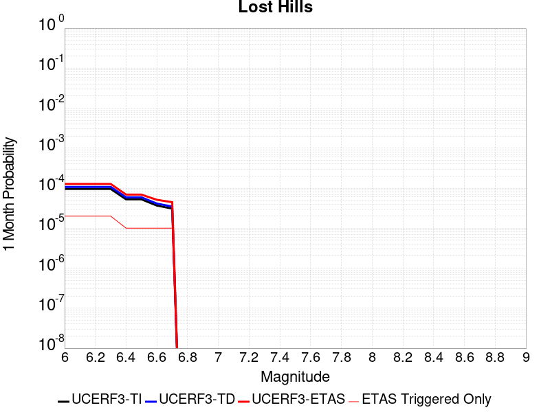 |  |  |

| Magnitude | 1 wk TI Prob | 1 wk TD Prob | 1 wk ETAS Prob | 1 wk ETAS/TD Gain | 1 wk ETAS Triggered Only | 1 mo TI Prob | 1 mo TD Prob | 1 mo ETAS Prob | 1 mo ETAS/TD Gain | 1 mo ETAS Triggered Only | 1 yr TI Prob | 1 yr TD Prob | 1 yr ETAS Prob | 1 yr ETAS/TD Gain | 1 yr ETAS Triggered Only | 10 yr TI Prob | 10 yr TD Prob | 10 yr ETAS Prob | 10 yr ETAS/TD Gain | 10 yr ETAS Triggered Only |
|-----|-----|-----|-----|-----|-----|-----|-----|-----|-----|-----|-----|-----|-----|-----|-----|-----|-----|-----|-----|-----|
| 6.0 | 2.233523E-5 | 2.5108235E-5 | 2.5108235E-5 | 1.0 | 0.0 | 9.571891E-5 | 1.07603235E-4 | 1.2760107E-4 | 1.185848 | 2.0E-5 | 0.0011647546 | 0.0013094501 | 0.0013593847 | 1.038134 | 5.0E-5 | 0.011586686 | 0.013033944 | 0.0131030325 | 1.0053006 | 7.0E-5 |
| 6.1 | 2.233523E-5 | 2.5108235E-5 | 2.5108235E-5 | 1.0 | 0.0 | 9.571891E-5 | 1.07603235E-4 | 1.2760107E-4 | 1.185848 | 2.0E-5 | 0.0011647546 | 0.0013094501 | 0.0013593847 | 1.038134 | 5.0E-5 | 0.011586686 | 0.013033944 | 0.0131030325 | 1.0053006 | 7.0E-5 |
| 6.2 | 2.233523E-5 | 2.5108235E-5 | 2.5108235E-5 | 1.0 | 0.0 | 9.571891E-5 | 1.07603235E-4 | 1.2760107E-4 | 1.185848 | 2.0E-5 | 0.0011647546 | 0.0013094501 | 0.0013593847 | 1.038134 | 5.0E-5 | 0.011586686 | 0.013033944 | 0.0131030325 | 1.0053006 | 7.0E-5 |
| 6.3 | 2.233523E-5 | 2.5108235E-5 | 2.5108235E-5 | 1.0 | 0.0 | 9.571891E-5 | 1.07603235E-4 | 1.2760107E-4 | 1.185848 | 2.0E-5 | 0.0011647546 | 0.0013094501 | 0.0013593847 | 1.038134 | 5.0E-5 | 0.011586686 | 0.013033944 | 0.0131030325 | 1.0053006 | 7.0E-5 |
| 6.4 | 1.2288092E-5 | 1.3781996E-5 | 1.3781996E-5 | 1.0 | 0.0 | 5.2662188E-5 | 5.906489E-5 | 6.90643E-5 | 1.1692953 | 1.0E-5 | 6.409735E-4 | 7.1897154E-4 | 7.4895E-4 | 1.0416963 | 3.0E-5 | 0.006391279 | 0.007175662 | 0.007205447 | 1.0041507 | 3.0E-5 |
| 6.5 | 1.2288092E-5 | 1.3781996E-5 | 1.3781996E-5 | 1.0 | 0.0 | 5.2662188E-5 | 5.906489E-5 | 6.90643E-5 | 1.1692953 | 1.0E-5 | 6.409735E-4 | 7.1897154E-4 | 7.4895E-4 | 1.0416963 | 3.0E-5 | 0.006391279 | 0.007175662 | 0.007205447 | 1.0041507 | 3.0E-5 |
| 6.6 | 8.58281E-6 | 9.634396E-6 | 9.634396E-6 | 1.0 | 0.0 | 3.6782953E-5 | 4.1290084E-5 | 5.128967E-5 | 1.2421789 | 1.0E-5 | 4.4774043E-4 | 5.02674E-4 | 5.22664E-4 | 1.0397673 | 2.0E-5 | 0.0044683935 | 0.005023531 | 0.0050434307 | 1.0039612 | 2.0E-5 |
| 6.7 | 7.205685E-6 | 8.088828E-6 | 8.088828E-6 | 1.0 | 0.0 | 3.088114E-5 | 3.4666402E-5 | 4.4666056E-5 | 1.2884537 | 1.0E-5 | 3.7591302E-4 | 4.2206346E-4 | 4.4205502E-4 | 1.0473663 | 2.0E-5 | 0.0037527776 | 0.0042206347 | 0.00424055 | 1.0047187 | 2.0E-5 |

## San Andreas (North Branch Mill Creek)
*[(top)](#table-of-contents)*

| 1 Week | 1 Month | 1 Year | 10 Year |
|-----|-----|-----|-----|
| 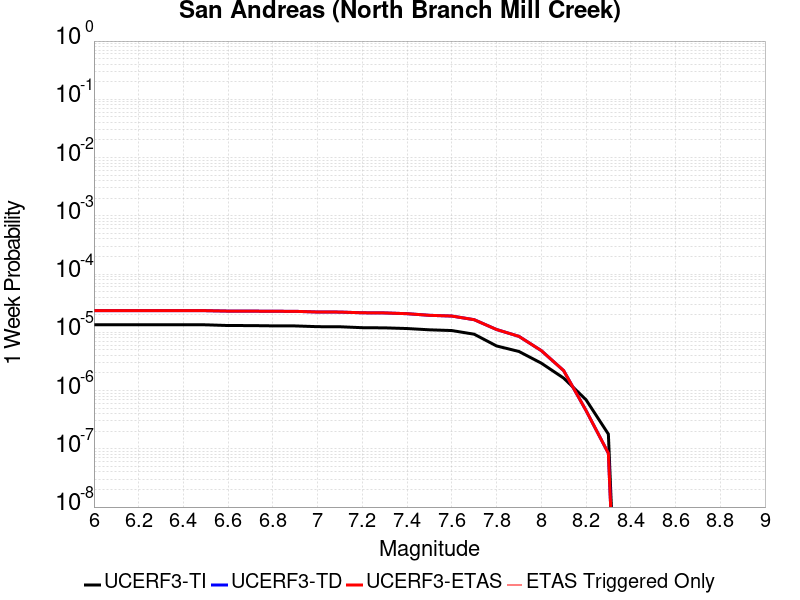 |  |  |  |

| Magnitude | 1 wk TI Prob | 1 wk TD Prob | 1 wk ETAS Prob | 1 wk ETAS/TD Gain | 1 wk ETAS Triggered Only | 1 mo TI Prob | 1 mo TD Prob | 1 mo ETAS Prob | 1 mo ETAS/TD Gain | 1 mo ETAS Triggered Only | 1 yr TI Prob | 1 yr TD Prob | 1 yr ETAS Prob | 1 yr ETAS/TD Gain | 1 yr ETAS Triggered Only | 10 yr TI Prob | 10 yr TD Prob | 10 yr ETAS Prob | 10 yr ETAS/TD Gain | 10 yr ETAS Triggered Only |
|-----|-----|-----|-----|-----|-----|-----|-----|-----|-----|-----|-----|-----|-----|-----|-----|-----|-----|-----|-----|-----|
| 6.0 | 1.3461156E-5 | 2.3528417E-5 | 2.3528417E-5 | 1.0 | 0.0 | 5.7689394E-5 | 1.0083219E-4 | 1.10831184E-4 | 1.0991647 | 1.0E-5 | 7.02142E-4 | 0.0012269439 | 0.0012668949 | 1.0325613 | 4.0E-5 | 0.0069992766 | 0.012244128 | 0.012323149 | 1.0064538 | 8.0E-5 |
| 6.1 | 1.3461156E-5 | 2.3528417E-5 | 2.3528417E-5 | 1.0 | 0.0 | 5.7689394E-5 | 1.0083219E-4 | 1.10831184E-4 | 1.0991647 | 1.0E-5 | 7.02142E-4 | 0.0012269439 | 0.0012668949 | 1.0325613 | 4.0E-5 | 0.0069992766 | 0.012244128 | 0.012323149 | 1.0064538 | 8.0E-5 |
| 6.2 | 1.3461156E-5 | 2.3528417E-5 | 2.3528417E-5 | 1.0 | 0.0 | 5.7689394E-5 | 1.0083219E-4 | 1.10831184E-4 | 1.0991647 | 1.0E-5 | 7.02142E-4 | 0.0012269439 | 0.0012668949 | 1.0325613 | 4.0E-5 | 0.0069992766 | 0.012244128 | 0.012323149 | 1.0064538 | 8.0E-5 |
| 6.3 | 1.3461156E-5 | 2.3528417E-5 | 2.3528417E-5 | 1.0 | 0.0 | 5.7689394E-5 | 1.0083219E-4 | 1.10831184E-4 | 1.0991647 | 1.0E-5 | 7.02142E-4 | 0.0012269439 | 0.0012668949 | 1.0325613 | 4.0E-5 | 0.0069992766 | 0.012244128 | 0.012323149 | 1.0064538 | 8.0E-5 |
| 6.4 | 1.3461156E-5 | 2.3528417E-5 | 2.3528417E-5 | 1.0 | 0.0 | 5.7689394E-5 | 1.0083219E-4 | 1.10831184E-4 | 1.0991647 | 1.0E-5 | 7.02142E-4 | 0.0012269439 | 0.0012668949 | 1.0325613 | 4.0E-5 | 0.0069992766 | 0.012244128 | 0.012323149 | 1.0064538 | 8.0E-5 |
| 6.5 | 1.3450706E-5 | 2.3517377E-5 | 2.3517377E-5 | 1.0 | 0.0 | 5.764461E-5 | 1.00784884E-4 | 1.10783876E-4 | 1.0992112 | 1.0E-5 | 7.0159714E-4 | 0.0012263686 | 0.0012663195 | 1.0325767 | 4.0E-5 | 0.006993862 | 0.012238437 | 0.012317458 | 1.0064567 | 8.0E-5 |
| 6.6 | 1.3074523E-5 | 2.313165E-5 | 2.313165E-5 | 1.0 | 0.0 | 5.6032466E-5 | 9.9131896E-5 | 1.0913091E-4 | 1.1008657 | 1.0E-5 | 6.8198174E-4 | 0.0012062659 | 0.0012462176 | 1.0331202 | 4.0E-5 | 0.006798926 | 0.012039601 | 0.012118638 | 1.0065647 | 8.0E-5 |
| 6.7 | 1.3050216E-5 | 2.3106948E-5 | 2.3106948E-5 | 1.0 | 0.0 | 5.59283E-5 | 9.902603E-5 | 1.09025044E-4 | 1.1009735 | 1.0E-5 | 6.8071426E-4 | 0.0012049783 | 0.0012449302 | 1.0331556 | 4.0E-5 | 0.0067863287 | 0.012026866 | 0.012105904 | 1.0065718 | 8.0E-5 |
| 6.8 | 1.29049395E-5 | 2.295535E-5 | 2.295535E-5 | 1.0 | 0.0 | 5.530571E-5 | 9.837638E-5 | 1.08375396E-4 | 1.1016405 | 1.0E-5 | 6.73139E-4 | 0.0011970776 | 0.0012370297 | 1.0333747 | 4.0E-5 | 0.0067110364 | 0.011948708 | 0.012027753 | 1.0066153 | 8.0E-5 |
| 6.9 | 1.2867369E-5 | 2.2914748E-5 | 2.2914748E-5 | 1.0 | 0.0 | 5.51447E-5 | 9.8202385E-5 | 1.08201406E-4 | 1.1018205 | 1.0E-5 | 6.711799E-4 | 0.0011949615 | 0.0012349137 | 1.0334339 | 4.0E-5 | 0.006691564 | 0.011927776 | 0.012006822 | 1.0066271 | 8.0E-5 |
| 7.0 | 1.2495996E-5 | 2.2314638E-5 | 2.2314638E-5 | 1.0 | 0.0 | 5.3553173E-5 | 9.5630676E-5 | 1.0562972E-4 | 1.104559 | 1.0E-5 | 6.518148E-4 | 0.0011636844 | 0.0012036379 | 1.0343336 | 4.0E-5 | 0.0064990623 | 0.011618286 | 0.0116973575 | 1.0068057 | 8.0E-5 |
| 7.1 | 1.2452067E-5 | 2.2259701E-5 | 2.2259701E-5 | 1.0 | 0.0 | 5.3364907E-5 | 9.539525E-5 | 1.053943E-4 | 1.104817 | 1.0E-5 | 6.4952404E-4 | 0.0011608212 | 0.0012007748 | 1.0344183 | 4.0E-5 | 0.0064762887 | 0.011589954 | 0.011669027 | 1.0068226 | 8.0E-5 |
| 7.2 | 1.2002777E-5 | 2.1638136E-5 | 2.1638136E-5 | 1.0 | 0.0 | 5.143946E-5 | 9.2731585E-5 | 1.0273066E-4 | 1.1078281 | 1.0E-5 | 6.2609545E-4 | 0.001128425 | 0.0011683799 | 1.0354077 | 4.0E-5 | 0.006243344 | 0.011269332 | 0.011348431 | 1.0070189 | 8.0E-5 |
| 7.3 | 1.1923425E-5 | 2.150792E-5 | 2.150792E-5 | 1.0 | 0.0 | 5.109939E-5 | 9.2173555E-5 | 1.02172635E-4 | 1.1084809 | 1.0E-5 | 6.219575E-4 | 0.001121638 | 0.0011615931 | 1.0356221 | 4.0E-5 | 0.0062021962 | 0.011202184 | 0.011281287 | 1.0070615 | 8.0E-5 |
| 7.4 | 1.16105175E-5 | 2.0881596E-5 | 2.0881596E-5 | 1.0 | 0.0 | 4.975841E-5 | 8.94895E-5 | 9.94886E-5 | 1.111735 | 1.0E-5 | 6.0564023E-4 | 0.0010889926 | 0.0011289491 | 1.0366912 | 4.0E-5 | 0.006039923 | 0.010879889 | 0.010959019 | 1.007273 | 8.0E-5 |
| 7.5 | 1.1037265E-5 | 1.9580697E-5 | 1.9580697E-5 | 1.0 | 0.0 | 4.7301706E-5 | 8.391459E-5 | 9.3913746E-5 | 1.1191587 | 1.0E-5 | 5.757461E-4 | 0.0010211834 | 0.0010611425 | 1.0391302 | 4.0E-5 | 0.005742567 | 0.010208925 | 0.010288108 | 1.0077562 | 8.0E-5 |
| 7.6 | 1.0720915E-5 | 1.9022264E-5 | 1.9022264E-5 | 1.0 | 0.0 | 4.5945973E-5 | 8.152145E-5 | 9.152064E-5 | 1.1226571 | 1.0E-5 | 5.592486E-4 | 9.920739E-4 | 0.0010320343 | 1.0402796 | 4.0E-5 | 0.005578433 | 0.009920476 | 0.009999682 | 1.0079842 | 8.0E-5 |
| 7.7 | 9.276279E-6 | 1.6466776E-5 | 1.6466776E-5 | 1.0 | 0.0 | 3.9754876E-5 | 7.057E-5 | 8.056929E-5 | 1.1416932 | 1.0E-5 | 4.839081E-4 | 8.588527E-4 | 8.9881837E-4 | 1.0465337 | 4.0E-5 | 0.0048285574 | 0.008599266 | 0.008678579 | 1.0092231 | 8.0E-5 |
| 7.8 | 5.8346777E-6 | 1.1175348E-5 | 1.1175348E-5 | 1.0 | 0.0 | 2.5005522E-5 | 4.7893467E-5 | 5.789299E-5 | 1.2087867 | 1.0E-5 | 3.043997E-4 | 5.829471E-4 | 6.229238E-4 | 1.0685768 | 4.0E-5 | 0.0030398308 | 0.0058576525 | 0.0059371837 | 1.0135773 | 8.0E-5 |
| 7.9 | 4.690204E-6 | 8.525966E-6 | 8.525966E-6 | 1.0 | 0.0 | 2.0100719E-5 | 3.6539343E-5 | 4.653898E-5 | 1.2736676 | 1.0E-5 | 2.4469878E-4 | 4.4477577E-4 | 4.84758E-4 | 1.089893 | 4.0E-5 | 0.002444295 | 0.0044796076 | 0.004559249 | 1.0177788 | 8.0E-5 |
| 8.0 | 2.9570454E-6 | 4.857161E-6 | 4.857161E-6 | 1.0 | 0.0 | 1.267299E-5 | 2.0816238E-5 | 3.081603E-5 | 1.4803842 | 1.0E-5 | 1.5428272E-4 | 2.5340827E-4 | 2.8340067E-4 | 1.118356 | 3.0E-5 | 0.0015417566 | 0.002555138 | 0.00260501 | 1.0195184 | 5.0E-5 |
| 8.1 | 1.6376824E-6 | 2.2021675E-6 | 2.2021675E-6 | 1.0 | 0.0 | 7.01862E-6 | 9.4378265E-6 | 9.4378265E-6 | 1.0 | 0.0 | 8.544835E-5 | 1.1489949E-4 | 1.1489949E-4 | 1.0 | 0.0 | 8.54155E-4 | 0.0011635037 | 0.0011635037 | 1.0 | 0.0 |
| 8.2 | 6.9631557E-7 | 4.5515284E-7 | 4.5515284E-7 | 1.0 | 0.0 | 2.984206E-6 | 1.9506535E-6 | 1.9506535E-6 | 1.0 | 0.0 | 3.63321E-5 | 2.374895E-5 | 2.374895E-5 | 1.0 | 0.0 | 3.6326164E-4 | 2.4599142E-4 | 2.4599142E-4 | 1.0 | 0.0 |
| 8.3 | 1.7876137E-7 | 8.39093E-8 | 8.39093E-8 | 1.0 | 0.0 | 7.661199E-7 | 3.5961122E-7 | 3.5961122E-7 | 1.0 | 0.0 | 9.32747E-6 | 4.3782584E-6 | 4.3782584E-6 | 1.0 | 0.0 | 9.3270784E-5 | 4.598492E-5 | 4.598492E-5 | 1.0 | 0.0 |

## San Andreas (Cholame) rev
*[(top)](#table-of-contents)*

| 1 Week | 1 Month | 1 Year | 10 Year |
|-----|-----|-----|-----|
|  |  |  |  |

| Magnitude | 1 wk TI Prob | 1 wk TD Prob | 1 wk ETAS Prob | 1 wk ETAS/TD Gain | 1 wk ETAS Triggered Only | 1 mo TI Prob | 1 mo TD Prob | 1 mo ETAS Prob | 1 mo ETAS/TD Gain | 1 mo ETAS Triggered Only | 1 yr TI Prob | 1 yr TD Prob | 1 yr ETAS Prob | 1 yr ETAS/TD Gain | 1 yr ETAS Triggered Only | 10 yr TI Prob | 10 yr TD Prob | 10 yr ETAS Prob | 10 yr ETAS/TD Gain | 10 yr ETAS Triggered Only |
|-----|-----|-----|-----|-----|-----|-----|-----|-----|-----|-----|-----|-----|-----|-----|-----|-----|-----|-----|-----|-----|
| 6.0 | 1.2302514E-4 | 2.5244427E-4 | 2.6244175E-4 | 1.0396028 | 1.0E-5 | 5.27144E-4 | 0.0010814571 | 0.0010914463 | 1.0092368 | 1.0E-5 | 0.0063991086 | 0.01308776 | 0.0131173665 | 1.0022622 | 3.0E-5 | 0.06217949 | 0.124556385 | 0.12462642 | 1.0005623 | 8.0E-5 |
| 6.1 | 1.2302514E-4 | 2.5244427E-4 | 2.6244175E-4 | 1.0396028 | 1.0E-5 | 5.27144E-4 | 0.0010814571 | 0.0010914463 | 1.0092368 | 1.0E-5 | 0.0063991086 | 0.01308776 | 0.0131173665 | 1.0022622 | 3.0E-5 | 0.06217949 | 0.124556385 | 0.12462642 | 1.0005623 | 8.0E-5 |
| 6.2 | 1.2203569E-4 | 2.5061177E-4 | 2.606093E-4 | 1.0398923 | 1.0E-5 | 5.2290526E-4 | 0.00107361 | 0.0010835993 | 1.0093044 | 1.0E-5 | 0.006347804 | 0.0129933655 | 0.013022975 | 1.0022789 | 3.0E-5 | 0.061695136 | 0.123740464 | 0.12381056 | 1.0005665 | 8.0E-5 |
| 6.3 | 1.2142645E-4 | 2.494712E-4 | 2.594687E-4 | 1.0400748 | 1.0E-5 | 5.202953E-4 | 0.0010687258 | 0.0010787151 | 1.009347 | 1.0E-5 | 0.006316212 | 0.012934607 | 0.012964219 | 1.0022894 | 3.0E-5 | 0.06139677 | 0.12323469 | 0.12330483 | 1.0005692 | 8.0E-5 |
| 6.4 | 1.1865206E-4 | 2.4452424E-4 | 2.5452182E-4 | 1.0408857 | 1.0E-5 | 5.0840975E-4 | 0.0010475417 | 0.0010575313 | 1.0095361 | 1.0E-5 | 0.006172335 | 0.012679719 | 0.012709338 | 1.002336 | 3.0E-5 | 0.060036868 | 0.12102321 | 0.12109353 | 1.000581 | 8.0E-5 |
| 6.5 | 1.17443946E-4 | 2.4245547E-4 | 2.5245306E-4 | 1.0412347 | 1.0E-5 | 5.032341E-4 | 0.0010386826 | 0.0010486722 | 1.0096176 | 1.0E-5 | 0.006109677 | 0.012573105 | 0.012602729 | 1.002356 | 3.0E-5 | 0.059444077 | 0.12009983 | 0.12017022 | 1.0005862 | 8.0E-5 |
| 6.6 | 1.13579066E-4 | 2.3554098E-4 | 2.4553863E-4 | 1.0424454 | 1.0E-5 | 4.866766E-4 | 0.0010090723 | 0.0010190622 | 1.0099001 | 1.0E-5 | 0.0059092017 | 0.012216696 | 0.012246329 | 1.0024257 | 3.0E-5 | 0.057545185 | 0.11701165 | 0.11708229 | 1.0006037 | 8.0E-5 |
| 6.7 | 1.1271412E-4 | 2.3398313E-4 | 2.4398079E-4 | 1.0427281 | 1.0E-5 | 4.829711E-4 | 0.001002401 | 0.001012391 | 1.009966 | 1.0E-5 | 0.005864331 | 0.01213638 | 0.012166016 | 1.0024419 | 3.0E-5 | 0.057119697 | 0.11631538 | 0.11638607 | 1.0006077 | 8.0E-5 |
| 6.8 | 1.1217975E-4 | 2.3286647E-4 | 2.4286415E-4 | 1.0429331 | 1.0E-5 | 4.8068175E-4 | 9.97619E-4 | 0.001007609 | 1.0100138 | 1.0E-5 | 0.005836608 | 0.012078806 | 0.012108444 | 1.0024537 | 3.0E-5 | 0.056856725 | 0.11581328 | 0.11588401 | 1.0006107 | 8.0E-5 |
| 6.9 | 1.1146753E-4 | 2.3135285E-4 | 2.4135054E-4 | 1.043214 | 1.0E-5 | 4.7763053E-4 | 9.91137E-4 | 0.0010011271 | 1.0100794 | 1.0E-5 | 0.0057996577 | 0.01200076 | 0.0120304 | 1.0024699 | 3.0E-5 | 0.056506127 | 0.11513366 | 0.115204446 | 1.0006149 | 8.0E-5 |
| 7.0 | 1.0965793E-4 | 2.2758332E-4 | 2.3758104E-4 | 1.0439299 | 1.0E-5 | 4.698779E-4 | 9.7499404E-4 | 9.849842E-4 | 1.0102465 | 1.0E-5 | 0.005705768 | 0.011806366 | 0.011836012 | 1.002511 | 3.0E-5 | 0.055614736 | 0.11343388 | 0.113504805 | 1.0006253 | 8.0E-5 |
| 7.1 | 9.927982E-5 | 2.0575813E-4 | 2.1575607E-4 | 1.0485908 | 1.0E-5 | 4.2541555E-4 | 8.8152353E-4 | 8.9151476E-4 | 1.011334 | 1.0E-5 | 0.0051671406 | 0.010680028 | 0.010709708 | 1.002779 | 3.0E-5 | 0.05048634 | 0.10352613 | 0.10359784 | 1.0006927 | 8.0E-5 |
| 7.2 | 9.696786E-5 | 2.0079788E-4 | 2.1079587E-4 | 1.0497913 | 1.0E-5 | 4.1551032E-4 | 8.6027954E-4 | 8.7027095E-4 | 1.0116141 | 1.0E-5 | 0.00504711 | 0.010423886 | 0.0104535725 | 1.002848 | 3.0E-5 | 0.04934009 | 0.10126456 | 0.10133646 | 1.00071 | 8.0E-5 |
| 7.3 | 9.4727984E-5 | 1.9508426E-4 | 2.050823E-4 | 1.0512499 | 1.0E-5 | 4.0591392E-4 | 8.3580846E-4 | 8.458001E-4 | 1.0119544 | 1.0E-5 | 0.0049308087 | 0.010128759 | 0.010158455 | 1.0029318 | 3.0E-5 | 0.048228268 | 0.09863298 | 0.09870509 | 1.0007311 | 8.0E-5 |
| 7.4 | 9.220358E-5 | 1.8878204E-4 | 1.9878015E-4 | 1.0529611 | 1.0E-5 | 3.9509835E-4 | 8.0881594E-4 | 8.1880786E-4 | 1.0123538 | 1.0E-5 | 0.004799717 | 0.009803121 | 0.009832826 | 1.0030303 | 3.0E-5 | 0.046973653 | 0.09571529 | 0.09577859 | 1.0006614 | 7.0E-5 |
| 7.5 | 7.71631E-5 | 1.520862E-4 | 1.6208467E-4 | 1.0657421 | 1.0E-5 | 3.306571E-4 | 6.5163535E-4 | 6.6162884E-4 | 1.015336 | 1.0E-5 | 0.0040183207 | 0.007904872 | 0.0079346355 | 1.0037651 | 3.0E-5 | 0.03946433 | 0.078431815 | 0.07848711 | 1.000705 | 6.0E-5 |
| 7.6 | 7.5634416E-5 | 1.4867744E-4 | 1.5867595E-4 | 1.0672497 | 1.0E-5 | 3.241072E-4 | 6.370336E-4 | 6.470272E-4 | 1.0156877 | 1.0E-5 | 0.0039388672 | 0.00772837 | 0.0077581382 | 1.0038518 | 3.0E-5 | 0.038697794 | 0.07679068 | 0.07684607 | 1.0007213 | 6.0E-5 |
| 7.7 | 6.3783E-5 | 1.2385847E-4 | 1.3385722E-4 | 1.0807273 | 1.0E-5 | 2.7332708E-4 | 5.30714E-4 | 5.407087E-4 | 1.0188326 | 1.0E-5 | 0.0033226798 | 0.006442327 | 0.006462198 | 1.0030844 | 2.0E-5 | 0.032734364 | 0.06466551 | 0.06470293 | 1.0005785 | 4.0E-5 |
| 7.8 | 5.863422E-5 | 1.1440734E-4 | 1.244062E-4 | 1.087397 | 1.0E-5 | 2.512653E-4 | 4.9022504E-4 | 5.0022017E-4 | 1.0203888 | 1.0E-5 | 0.003054864 | 0.0059521776 | 0.005962118 | 1.00167 | 1.0E-5 | 0.030132094 | 0.059772514 | 0.05979132 | 1.0003146 | 2.0E-5 |
| 7.9 | 4.595283E-5 | 8.44424E-5 | 8.44424E-5 | 1.0 | 0.0 | 1.9692584E-4 | 3.618458E-4 | 3.618458E-4 | 1.0 | 0.0 | 0.0023949358 | 0.00439658 | 0.00439658 | 1.0 | 0.0 | 0.023692891 | 0.044448342 | 0.044457898 | 1.0002149 | 1.0E-5 |
| 8.0 | 3.2950178E-5 | 5.0882958E-5 | 5.0882958E-5 | 1.0 | 0.0 | 1.412074E-4 | 2.180516E-4 | 2.180516E-4 | 1.0 | 0.0 | 0.0017178444 | 0.002651548 | 0.002651548 | 1.0 | 0.0 | 0.017046256 | 0.027234862 | 0.027244588 | 1.0003572 | 1.0E-5 |
| 8.1 | 1.9177472E-5 | 1.9237392E-5 | 1.9237392E-5 | 1.0 | 0.0 | 8.218658E-5 | 8.244337E-5 | 8.244337E-5 | 1.0 | 0.0 | 0.0010001622 | 0.0010032863 | 0.0010032863 | 1.0 | 0.0 | 0.009956728 | 0.010785722 | 0.010795615 | 1.0009172 | 1.0E-5 |
| 8.2 | 8.643924E-6 | 5.494016E-6 | 5.494016E-6 | 1.0 | 0.0 | 3.704486E-5 | 2.3545572E-5 | 2.3545572E-5 | 1.0 | 0.0 | 4.5092785E-4 | 2.866297E-4 | 2.866297E-4 | 1.0 | 0.0 | 0.0045001395 | 0.0032592218 | 0.0032592218 | 1.0 | 0.0 |
| 8.3 | 1.983087E-6 | 7.690063E-7 | 7.690063E-7 | 1.0 | 0.0 | 8.498917E-6 | 3.295737E-6 | 3.295737E-6 | 1.0 | 0.0 | 1.034694E-4 | 4.012488E-5 | 4.012488E-5 | 1.0 | 0.0 | 0.0010342124 | 4.737206E-4 | 4.737206E-4 | 1.0 | 0.0 |

## Santa Rosa Island
*[(top)](#table-of-contents)*

| 1 Week | 1 Month | 1 Year | 10 Year |
|-----|-----|-----|-----|
|  |  |  | 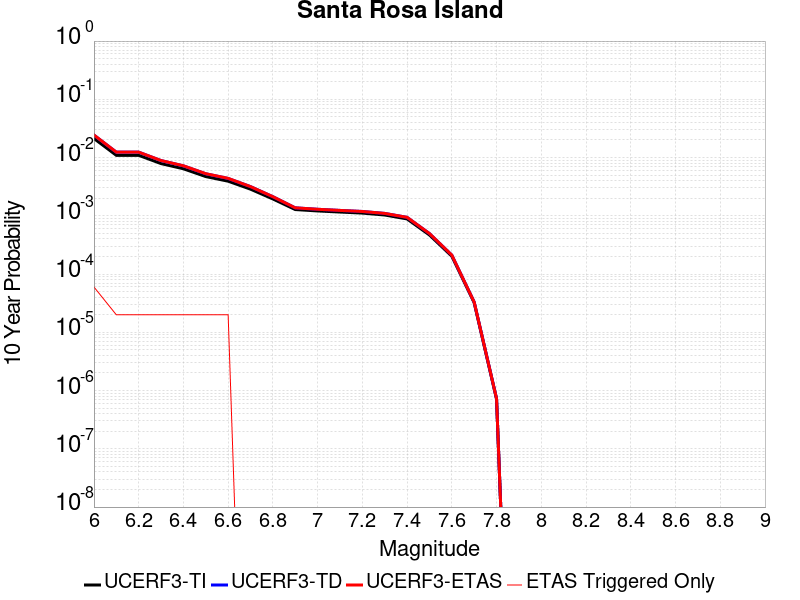 |

| Magnitude | 1 wk TI Prob | 1 wk TD Prob | 1 wk ETAS Prob | 1 wk ETAS/TD Gain | 1 wk ETAS Triggered Only | 1 mo TI Prob | 1 mo TD Prob | 1 mo ETAS Prob | 1 mo ETAS/TD Gain | 1 mo ETAS Triggered Only | 1 yr TI Prob | 1 yr TD Prob | 1 yr ETAS Prob | 1 yr ETAS/TD Gain | 1 yr ETAS Triggered Only | 10 yr TI Prob | 10 yr TD Prob | 10 yr ETAS Prob | 10 yr ETAS/TD Gain | 10 yr ETAS Triggered Only |
|-----|-----|-----|-----|-----|-----|-----|-----|-----|-----|-----|-----|-----|-----|-----|-----|-----|-----|-----|-----|-----|
| 6.0 | 4.1143165E-5 | 4.709476E-5 | 4.709476E-5 | 1.0 | 0.0 | 1.7631594E-4 | 2.0182018E-4 | 2.0182018E-4 | 1.0 | 0.0 | 0.002144533 | 0.0024545882 | 0.0024845144 | 1.012192 | 3.0E-5 | 0.021239553 | 0.024295408 | 0.024353951 | 1.0024096 | 6.0E-5 |
| 6.1 | 2.1061249E-5 | 2.3866654E-5 | 2.3866654E-5 | 1.0 | 0.0 | 9.0259375E-5 | 1.0228182E-4 | 1.0228182E-4 | 1.0 | 0.0 | 0.0010983539 | 0.0012445987 | 0.0012545863 | 1.0080247 | 1.0E-5 | 0.01092941 | 0.012379324 | 0.0123990765 | 1.0015956 | 2.0E-5 |
| 6.2 | 2.1061249E-5 | 2.3866654E-5 | 2.3866654E-5 | 1.0 | 0.0 | 9.0259375E-5 | 1.0228182E-4 | 1.0228182E-4 | 1.0 | 0.0 | 0.0010983539 | 0.0012445987 | 0.0012545863 | 1.0080247 | 1.0E-5 | 0.01092941 | 0.012379324 | 0.0123990765 | 1.0015956 | 2.0E-5 |
| 6.3 | 1.5158236E-5 | 1.707557E-5 | 1.707557E-5 | 1.0 | 0.0 | 6.496225E-5 | 7.317903E-5 | 7.317903E-5 | 1.0 | 0.0 | 7.906284E-4 | 8.9060253E-4 | 9.005936E-4 | 1.0112183 | 1.0E-5 | 0.007878214 | 0.008871586 | 0.008891408 | 1.0022343 | 2.0E-5 |
| 6.4 | 1.2341918E-5 | 1.3853823E-5 | 1.3853823E-5 | 1.0 | 0.0 | 5.2892858E-5 | 5.9372218E-5 | 5.9372218E-5 | 1.0 | 0.0 | 6.437803E-4 | 7.226252E-4 | 7.326179E-4 | 1.0138284 | 1.0E-5 | 0.006419184 | 0.007203591 | 0.007223447 | 1.0027564 | 2.0E-5 |
| 6.5 | 9.061158E-6 | 1.0117662E-5 | 1.0117662E-5 | 1.0 | 0.0 | 3.883296E-5 | 4.3360717E-5 | 4.3360717E-5 | 1.0 | 0.0 | 4.726887E-4 | 5.277942E-4 | 5.377889E-4 | 1.0189368 | 1.0E-5 | 0.004716845 | 0.005265945 | 0.0052858396 | 1.003778 | 2.0E-5 |
| 6.6 | 7.5461685E-6 | 8.401244E-6 | 8.401244E-6 | 1.0 | 0.0 | 3.2340322E-5 | 3.6004854E-5 | 3.6004854E-5 | 1.0 | 0.0 | 3.936723E-4 | 4.3827525E-4 | 4.4827085E-4 | 1.0228068 | 1.0E-5 | 0.003929756 | 0.0043745385 | 0.004394451 | 1.0045519 | 2.0E-5 |
| 6.7 | 5.5023775E-6 | 6.0877283E-6 | 6.0877283E-6 | 1.0 | 0.0 | 2.3581404E-5 | 2.6090021E-5 | 2.6090021E-5 | 1.0 | 0.0 | 2.8706578E-4 | 3.1760297E-4 | 3.1760297E-4 | 1.0 | 0.0 | 0.0028669522 | 0.0031718123 | 0.0031718123 | 1.0 | 0.0 |
| 6.8 | 3.7351679E-6 | 4.0833456E-6 | 4.0833456E-6 | 1.0 | 0.0 | 1.6007763E-5 | 1.7499948E-5 | 1.7499948E-5 | 1.0 | 0.0 | 1.948771E-4 | 2.1304353E-4 | 2.1304353E-4 | 1.0 | 0.0 | 0.0019470629 | 0.0021286383 | 0.0021286383 | 1.0 | 0.0 |
| 6.9 | 2.456366E-6 | 2.6293699E-6 | 2.6293699E-6 | 1.0 | 0.0 | 1.0527241E-5 | 1.126868E-5 | 1.126868E-5 | 1.0 | 0.0 | 1.2816161E-4 | 1.3718757E-4 | 1.3718757E-4 | 1.0 | 0.0 | 0.0012808773 | 0.0013710317 | 0.0013710317 | 1.0 | 0.0 |
| 7.0 | 2.3245157E-6 | 2.4828691E-6 | 2.4828691E-6 | 1.0 | 0.0 | 9.962172E-6 | 1.0640824E-5 | 1.0640824E-5 | 1.0 | 0.0 | 1.2128269E-4 | 1.2954435E-4 | 1.2954435E-4 | 1.0 | 0.0 | 0.0012121652 | 0.0012946906 | 0.0012946906 | 1.0 | 0.0 |
| 7.1 | 2.2248344E-6 | 2.373335E-6 | 2.373335E-6 | 1.0 | 0.0 | 9.53497E-6 | 1.0171396E-5 | 1.0171396E-5 | 1.0 | 0.0 | 1.1608207E-4 | 1.2382973E-4 | 1.2382973E-4 | 1.0 | 0.0 | 0.0011602144 | 0.0012376093 | 0.0012376093 | 1.0 | 0.0 |
| 7.2 | 2.1350402E-6 | 2.2762347E-6 | 2.2762347E-6 | 1.0 | 0.0 | 9.150141E-6 | 9.755256E-6 | 9.755256E-6 | 1.0 | 0.0 | 1.1139726E-4 | 1.1876378E-4 | 1.1876378E-4 | 1.0 | 0.0 | 0.0011134144 | 0.001187005 | 0.001187005 | 1.0 | 0.0 |
| 7.3 | 1.9793572E-6 | 2.108793E-6 | 2.108793E-6 | 1.0 | 0.0 | 8.482932E-6 | 9.037653E-6 | 9.037653E-6 | 1.0 | 0.0 | 1.032748E-4 | 1.100279E-4 | 1.100279E-4 | 1.0 | 0.0 | 0.0010322682 | 0.001099736 | 0.001099736 | 1.0 | 0.0 |
| 7.4 | 1.6951194E-6 | 1.8046361E-6 | 1.8046361E-6 | 1.0 | 0.0 | 7.264777E-6 | 7.734132E-6 | 7.734132E-6 | 1.0 | 0.0 | 8.844508E-5 | 9.4159004E-5 | 9.4159004E-5 | 1.0 | 0.0 | 8.840988E-4 | 9.411928E-4 | 9.411928E-4 | 1.0 | 0.0 |
| 7.5 | 8.987207E-7 | 9.512518E-7 | 9.512518E-7 | 1.0 | 0.0 | 3.8516546E-6 | 4.0767873E-6 | 4.0767873E-6 | 1.0 | 0.0 | 4.6892885E-5 | 4.9633767E-5 | 4.9633767E-5 | 1.0 | 0.0 | 4.688299E-4 | 4.96228E-4 | 4.96228E-4 | 1.0 | 0.0 |
| 7.6 | 3.8783037E-7 | 4.0530364E-7 | 4.0530364E-7 | 1.0 | 0.0 | 1.6621291E-6 | 1.7370145E-6 | 1.7370145E-6 | 1.0 | 0.0 | 2.0236233E-5 | 2.1147953E-5 | 2.1147953E-5 | 1.0 | 0.0 | 2.023439E-4 | 2.1146005E-4 | 2.1146005E-4 | 1.0 | 0.0 |
| 7.7 | 6.181804E-8 | 6.3391695E-8 | 6.3391695E-8 | 1.0 | 0.0 | 2.6493444E-7 | 2.7167866E-7 | 2.7167866E-7 | 1.0 | 0.0 | 3.225572E-6 | 3.3076826E-6 | 3.3076826E-6 | 1.0 | 0.0 | 3.225525E-5 | 3.3076343E-5 | 3.3076343E-5 | 1.0 | 0.0 |
| 7.8 | 1.3704449E-9 | 1.3964294E-9 | 1.3964294E-9 | 1.0 | 0.0 | 5.873335E-9 | 5.984697E-9 | 5.984697E-9 | 1.0 | 0.0 | 7.1507856E-8 | 7.2863685E-8 | 7.2863685E-8 | 1.0 | 0.0 | 7.1507833E-7 | 7.2863673E-7 | 7.2863673E-7 | 1.0 | 0.0 |

## San Andreas (Coachella) rev
*[(top)](#table-of-contents)*

| 1 Week | 1 Month | 1 Year | 10 Year |
|-----|-----|-----|-----|
|  |  |  | 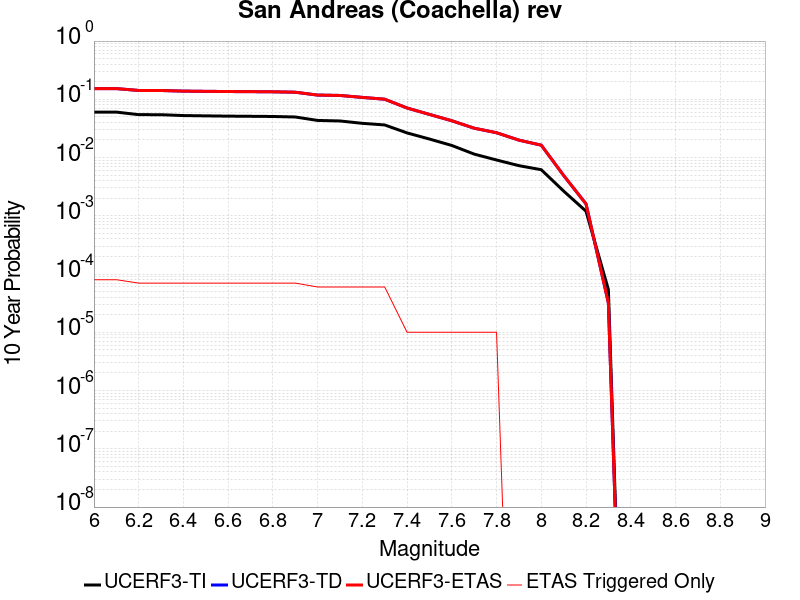 |

| Magnitude | 1 wk TI Prob | 1 wk TD Prob | 1 wk ETAS Prob | 1 wk ETAS/TD Gain | 1 wk ETAS Triggered Only | 1 mo TI Prob | 1 mo TD Prob | 1 mo ETAS Prob | 1 mo ETAS/TD Gain | 1 mo ETAS Triggered Only | 1 yr TI Prob | 1 yr TD Prob | 1 yr ETAS Prob | 1 yr ETAS/TD Gain | 1 yr ETAS Triggered Only | 10 yr TI Prob | 10 yr TD Prob | 10 yr ETAS Prob | 10 yr ETAS/TD Gain | 10 yr ETAS Triggered Only |
|-----|-----|-----|-----|-----|-----|-----|-----|-----|-----|-----|-----|-----|-----|-----|-----|-----|-----|-----|-----|-----|
| 6.0 | 1.1925945E-4 | 3.2748378E-4 | 3.2748378E-4 | 1.0 | 0.0 | 5.110118E-4 | 0.0014027518 | 0.0014027518 | 1.0 | 0.0 | 0.0062038354 | 0.016946103 | 0.016995255 | 1.0029005 | 5.0E-5 | 0.060334753 | 0.15272254 | 0.15279032 | 1.0004438 | 8.0E-5 |
| 6.1 | 1.1925945E-4 | 3.2748378E-4 | 3.2748378E-4 | 1.0 | 0.0 | 5.110118E-4 | 0.0014027518 | 0.0014027518 | 1.0 | 0.0 | 0.0062038354 | 0.016946103 | 0.016995255 | 1.0029005 | 5.0E-5 | 0.060334753 | 0.15272254 | 0.15279032 | 1.0004438 | 8.0E-5 |
| 6.2 | 1.07432395E-4 | 3.0248926E-4 | 3.0248926E-4 | 1.0 | 0.0 | 4.603433E-4 | 0.0012957426 | 0.0012957426 | 1.0 | 0.0 | 0.005590286 | 0.015662653 | 0.015702028 | 1.0025139 | 4.0E-5 | 0.05451731 | 0.14190318 | 0.14196324 | 1.0004233 | 7.0E-5 |
| 6.3 | 1.0718766E-4 | 3.0194232E-4 | 3.0194232E-4 | 1.0 | 0.0 | 4.592948E-4 | 0.0012934008 | 0.0012934008 | 1.0 | 0.0 | 0.005577586 | 0.015634552 | 0.015673926 | 1.0025184 | 4.0E-5 | 0.054396555 | 0.14167143 | 0.14173152 | 1.0004241 | 7.0E-5 |
| 6.4 | 1.0355944E-4 | 2.94023E-4 | 2.94023E-4 | 1.0 | 0.0 | 4.4375064E-4 | 0.001259494 | 0.001259494 | 1.0 | 0.0 | 0.0053892885 | 0.015227578 | 0.015266969 | 1.0025868 | 4.0E-5 | 0.052604496 | 0.13822651 | 0.13828683 | 1.0004364 | 7.0E-5 |
| 6.5 | 1.0227914E-4 | 2.9121726E-4 | 2.9121726E-4 | 1.0 | 0.0 | 4.382655E-4 | 0.001247481 | 0.001247481 | 1.0 | 0.0 | 0.0053228354 | 0.015083354 | 0.015122751 | 1.0026119 | 4.0E-5 | 0.051971316 | 0.13700029 | 0.1370607 | 1.000441 | 7.0E-5 |
| 6.6 | 1.0116757E-4 | 2.8887467E-4 | 2.8887467E-4 | 1.0 | 0.0 | 4.3350324E-4 | 0.0012374509 | 0.0012374509 | 1.0 | 0.0 | 0.0052651367 | 0.014962921 | 0.015002322 | 1.0026333 | 4.0E-5 | 0.051421247 | 0.13597916 | 0.13603964 | 1.0004448 | 7.0E-5 |
| 6.7 | 1.0050676E-4 | 2.8746025E-4 | 2.8746025E-4 | 1.0 | 0.0 | 4.3067214E-4 | 0.0012313948 | 0.0012313948 | 1.0 | 0.0 | 0.005230834 | 0.014890198 | 0.014929603 | 1.0026463 | 4.0E-5 | 0.051094085 | 0.13536453 | 0.13542506 | 1.0004472 | 7.0E-5 |
| 6.8 | 9.976819E-5 | 2.854966E-4 | 2.854966E-4 | 1.0 | 0.0 | 4.2750788E-4 | 0.001222987 | 0.001222987 | 1.0 | 0.0 | 0.0051924936 | 0.014789228 | 0.014828636 | 1.0026647 | 4.0E-5 | 0.050728295 | 0.13451625 | 0.13457684 | 1.0004504 | 7.0E-5 |
| 6.9 | 9.77719E-5 | 2.8046442E-4 | 2.8046442E-4 | 1.0 | 0.0 | 4.1895514E-4 | 0.0012014406 | 0.0012014406 | 1.0 | 0.0 | 0.0050888555 | 0.014530429 | 0.014569848 | 1.0027128 | 4.0E-5 | 0.049738888 | 0.13234438 | 0.13240512 | 1.000459 | 7.0E-5 |
| 7.0 | 8.500761E-5 | 2.4780032E-4 | 2.4780032E-4 | 1.0 | 0.0 | 3.6426744E-4 | 0.0010615723 | 0.0010615723 | 1.0 | 0.0 | 0.0044259406 | 0.012848827 | 0.012878441 | 1.0023048 | 3.0E-5 | 0.04338823 | 0.11821055 | 0.11826345 | 1.0004475 | 6.0E-5 |
| 7.1 | 8.319876E-5 | 2.4382581E-4 | 2.4382581E-4 | 1.0 | 0.0 | 3.5651738E-4 | 0.0010445524 | 0.0010445524 | 1.0 | 0.0 | 0.004331963 | 0.012644033 | 0.012673654 | 1.0023427 | 3.0E-5 | 0.042484846 | 0.116430394 | 0.116483405 | 1.0004554 | 6.0E-5 |
| 7.2 | 7.563917E-5 | 2.2430507E-4 | 2.2430507E-4 | 1.0 | 0.0 | 3.2412758E-4 | 9.609563E-4 | 9.609563E-4 | 1.0 | 0.0 | 0.0039391145 | 0.011637572 | 0.011667223 | 1.0025479 | 3.0E-5 | 0.03870018 | 0.10783492 | 0.10788845 | 1.0004964 | 6.0E-5 |
| 7.3 | 7.082985E-5 | 2.074602E-4 | 2.074602E-4 | 1.0 | 0.0 | 3.0352117E-4 | 8.888151E-4 | 8.888151E-4 | 1.0 | 0.0 | 0.0036891096 | 0.010768257 | 0.010797934 | 1.002756 | 3.0E-5 | 0.03628465 | 0.100355 | 0.10040897 | 1.0005379 | 6.0E-5 |
| 7.4 | 5.146215E-5 | 1.4286964E-4 | 1.4286964E-4 | 1.0 | 0.0 | 2.2053342E-4 | 6.1215565E-4 | 6.1215565E-4 | 1.0 | 0.0 | 0.0026816884 | 0.0074277157 | 0.0074376413 | 1.0013363 | 1.0E-5 | 0.02649557 | 0.07090832 | 0.070917614 | 1.000131 | 1.0E-5 |
| 7.5 | 4.0285166E-5 | 1.0953038E-4 | 1.0953038E-4 | 1.0 | 0.0 | 1.7263928E-4 | 4.6933178E-4 | 4.6933178E-4 | 1.0 | 0.0 | 0.002099857 | 0.005699213 | 0.005709156 | 1.0017446 | 1.0E-5 | 0.020801254 | 0.055062566 | 0.055072013 | 1.0001717 | 1.0E-5 |
| 7.6 | 3.1168736E-5 | 8.4490566E-5 | 8.4490566E-5 | 1.0 | 0.0 | 1.3357346E-4 | 3.620523E-4 | 3.620523E-4 | 1.0 | 0.0 | 0.0016250437 | 0.004399104 | 0.00440906 | 1.0022632 | 1.0E-5 | 0.016132116 | 0.04285644 | 0.04286601 | 1.0002233 | 1.0E-5 |
| 7.7 | 2.2100989E-5 | 6.247655E-5 | 6.247655E-5 | 1.0 | 0.0 | 9.4715084E-5 | 2.677292E-4 | 2.677292E-4 | 1.0 | 0.0 | 0.001152546 | 0.0032547372 | 0.0032647047 | 1.0030625 | 1.0E-5 | 0.011465867 | 0.031941194 | 0.031950872 | 1.000303 | 1.0E-5 |
| 7.8 | 1.7484861E-5 | 5.1874897E-5 | 5.1874897E-5 | 1.0 | 0.0 | 7.493296E-5 | 2.2230206E-4 | 2.2230206E-4 | 1.0 | 0.0 | 9.1192697E-4 | 0.0027031712 | 0.0027131443 | 1.0036894 | 1.0E-5 | 0.009081938 | 0.026676701 | 0.026686434 | 1.0003649 | 1.0E-5 |
| 7.9 | 1.3967285E-5 | 3.8286966E-5 | 3.8286966E-5 | 1.0 | 0.0 | 5.985842E-5 | 1.6407667E-4 | 1.6407667E-4 | 1.0 | 0.0 | 7.2853256E-4 | 0.0019958045 | 0.0019958045 | 1.0 | 0.0 | 0.0072614877 | 0.019939471 | 0.019939471 | 1.0 | 0.0 |
| 8.0 | 1.1887396E-5 | 3.1120293E-5 | 3.1120293E-5 | 1.0 | 0.0 | 5.094499E-5 | 1.3336587E-4 | 1.3336587E-4 | 1.0 | 0.0 | 6.200787E-4 | 0.0016225212 | 0.0016225212 | 1.0 | 0.0 | 0.006183513 | 0.016305106 | 0.016305106 | 1.0 | 0.0 |
| 8.1 | 5.100864E-6 | 8.995033E-6 | 8.995033E-6 | 1.0 | 0.0 | 2.1860664E-5 | 3.8549573E-5 | 3.8549573E-5 | 1.0 | 0.0 | 2.6612106E-4 | 4.692401E-4 | 4.692401E-4 | 1.0 | 0.0 | 0.002658026 | 0.0049286583 | 0.0049286583 | 1.0 | 0.0 |
| 8.2 | 2.3004484E-6 | 2.7949095E-6 | 2.7949095E-6 | 1.0 | 0.0 | 9.859027E-6 | 1.1978128E-5 | 1.1978128E-5 | 1.0 | 0.0 | 1.2002704E-4 | 1.4582399E-4 | 1.4582399E-4 | 1.0 | 0.0 | 0.0011996223 | 0.001601765 | 0.001601765 | 1.0 | 0.0 |
| 8.3 | 1.0424446E-7 | 5.837541E-8 | 5.837541E-8 | 1.0 | 0.0 | 4.4676187E-7 | 2.501803E-7 | 2.501803E-7 | 1.0 | 0.0 | 5.439312E-6 | 3.0459412E-6 | 3.0459412E-6 | 1.0 | 0.0 | 5.4391792E-5 | 3.2025855E-5 | 3.2025855E-5 | 1.0 | 0.0 |

## Mission Creek
*[(top)](#table-of-contents)*

| 1 Week | 1 Month | 1 Year | 10 Year |
|-----|-----|-----|-----|
|  |  | 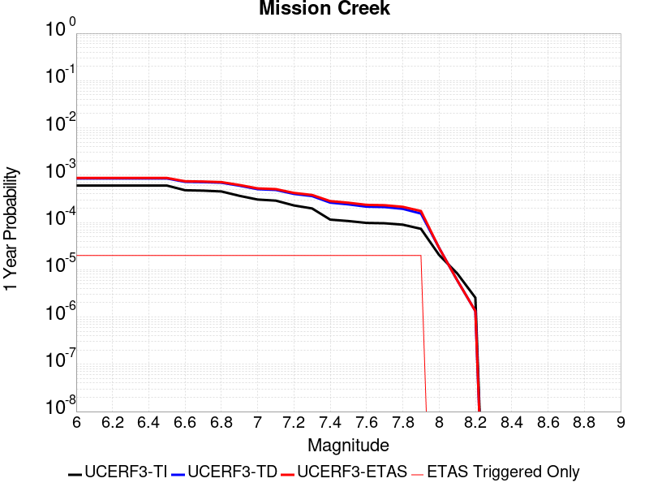 |  |

| Magnitude | 1 wk TI Prob | 1 wk TD Prob | 1 wk ETAS Prob | 1 wk ETAS/TD Gain | 1 wk ETAS Triggered Only | 1 mo TI Prob | 1 mo TD Prob | 1 mo ETAS Prob | 1 mo ETAS/TD Gain | 1 mo ETAS Triggered Only | 1 yr TI Prob | 1 yr TD Prob | 1 yr ETAS Prob | 1 yr ETAS/TD Gain | 1 yr ETAS Triggered Only | 10 yr TI Prob | 10 yr TD Prob | 10 yr ETAS Prob | 10 yr ETAS/TD Gain | 10 yr ETAS Triggered Only |
|-----|-----|-----|-----|-----|-----|-----|-----|-----|-----|-----|-----|-----|-----|-----|-----|-----|-----|-----|-----|-----|
| 6.0 | 1.1549387E-5 | 1.6332237E-5 | 1.6332237E-5 | 1.0 | 0.0 | 4.9496433E-5 | 6.9993504E-5 | 6.9993504E-5 | 1.0 | 0.0 | 6.0245243E-4 | 8.5185276E-4 | 8.718357E-4 | 1.0234582 | 2.0E-5 | 0.006008218 | 0.0085145235 | 0.0085839275 | 1.0081513 | 7.0E-5 |
| 6.1 | 1.1549387E-5 | 1.6332237E-5 | 1.6332237E-5 | 1.0 | 0.0 | 4.9496433E-5 | 6.9993504E-5 | 6.9993504E-5 | 1.0 | 0.0 | 6.0245243E-4 | 8.5185276E-4 | 8.718357E-4 | 1.0234582 | 2.0E-5 | 0.006008218 | 0.0085145235 | 0.0085839275 | 1.0081513 | 7.0E-5 |
| 6.2 | 1.1549387E-5 | 1.6332237E-5 | 1.6332237E-5 | 1.0 | 0.0 | 4.9496433E-5 | 6.9993504E-5 | 6.9993504E-5 | 1.0 | 0.0 | 6.0245243E-4 | 8.5185276E-4 | 8.718357E-4 | 1.0234582 | 2.0E-5 | 0.006008218 | 0.0085145235 | 0.0085839275 | 1.0081513 | 7.0E-5 |
| 6.3 | 1.1549387E-5 | 1.6332237E-5 | 1.6332237E-5 | 1.0 | 0.0 | 4.9496433E-5 | 6.9993504E-5 | 6.9993504E-5 | 1.0 | 0.0 | 6.0245243E-4 | 8.5185276E-4 | 8.718357E-4 | 1.0234582 | 2.0E-5 | 0.006008218 | 0.0085145235 | 0.0085839275 | 1.0081513 | 7.0E-5 |
| 6.4 | 1.1549387E-5 | 1.6332237E-5 | 1.6332237E-5 | 1.0 | 0.0 | 4.9496433E-5 | 6.9993504E-5 | 6.9993504E-5 | 1.0 | 0.0 | 6.0245243E-4 | 8.5185276E-4 | 8.718357E-4 | 1.0234582 | 2.0E-5 | 0.006008218 | 0.0085145235 | 0.0085839275 | 1.0081513 | 7.0E-5 |
| 6.5 | 1.1549387E-5 | 1.6332237E-5 | 1.6332237E-5 | 1.0 | 0.0 | 4.9496433E-5 | 6.9993504E-5 | 6.9993504E-5 | 1.0 | 0.0 | 6.0245243E-4 | 8.5185276E-4 | 8.718357E-4 | 1.0234582 | 2.0E-5 | 0.006008218 | 0.0085145235 | 0.0085839275 | 1.0081513 | 7.0E-5 |
| 6.6 | 9.202681E-6 | 1.385544E-5 | 1.385544E-5 | 1.0 | 0.0 | 3.9439463E-5 | 5.9379156E-5 | 5.9379156E-5 | 1.0 | 0.0 | 4.800697E-4 | 7.2271045E-4 | 7.42696E-4 | 1.0276536 | 2.0E-5 | 0.004790339 | 0.0072316756 | 0.0073011694 | 1.0096096 | 7.0E-5 |
| 6.7 | 9.019164E-6 | 1.3661103E-5 | 1.3661103E-5 | 1.0 | 0.0 | 3.8652986E-5 | 5.854632E-5 | 5.854632E-5 | 1.0 | 0.0 | 4.7049852E-4 | 7.1257737E-4 | 7.325631E-4 | 1.0280471 | 2.0E-5 | 0.004695036 | 0.0071309973 | 0.007200498 | 1.0097463 | 7.0E-5 |
| 6.8 | 8.673558E-6 | 1.3283194E-5 | 1.3283194E-5 | 1.0 | 0.0 | 3.717186E-5 | 5.692678E-5 | 5.692678E-5 | 1.0 | 0.0 | 4.524734E-4 | 6.92872E-4 | 7.1285816E-4 | 1.0288453 | 2.0E-5 | 0.0045155324 | 0.006935176 | 0.0070046904 | 1.0100235 | 7.0E-5 |
| 6.9 | 7.002255E-6 | 1.1487351E-5 | 1.1487351E-5 | 1.0 | 0.0 | 3.000932E-5 | 4.9230614E-5 | 4.9230614E-5 | 1.0 | 0.0 | 3.653022E-4 | 5.9922476E-4 | 6.1921275E-4 | 1.0333564 | 2.0E-5 | 0.0036470229 | 0.0060039656 | 0.0060735457 | 1.0115889 | 7.0E-5 |
| 7.0 | 5.84644E-6 | 9.68415E-6 | 9.68415E-6 | 1.0 | 0.0 | 2.5055931E-5 | 4.150287E-5 | 4.150287E-5 | 1.0 | 0.0 | 3.0501327E-4 | 5.051848E-4 | 5.251747E-4 | 1.0395695 | 2.0E-5 | 0.0030459496 | 0.005068033 | 0.0051376782 | 1.0137421 | 7.0E-5 |
| 7.1 | 5.54703E-6 | 9.338593E-6 | 9.338593E-6 | 1.0 | 0.0 | 2.377277E-5 | 4.0021954E-5 | 4.0021954E-5 | 1.0 | 0.0 | 2.8939504E-4 | 4.8716282E-4 | 5.0715305E-4 | 1.041034 | 2.0E-5 | 0.0028901845 | 0.0048886104 | 0.0049582683 | 1.014249 | 7.0E-5 |
| 7.2 | 4.384709E-6 | 7.690283E-6 | 7.690283E-6 | 1.0 | 0.0 | 1.8791474E-5 | 3.295796E-5 | 3.295796E-5 | 1.0 | 0.0 | 2.2876218E-4 | 4.0119293E-4 | 4.2118493E-4 | 1.0498313 | 2.0E-5 | 0.0022852682 | 0.0040323576 | 0.0041020755 | 1.0172895 | 7.0E-5 |
| 7.3 | 3.7888456E-6 | 6.9239895E-6 | 6.9239895E-6 | 1.0 | 0.0 | 1.623781E-5 | 2.9673924E-5 | 2.9673924E-5 | 1.0 | 0.0 | 1.9767738E-4 | 3.6122347E-4 | 3.8121626E-4 | 1.0553474 | 2.0E-5 | 0.0019750162 | 0.0036340314 | 0.003703777 | 1.0191923 | 7.0E-5 |
| 7.4 | 2.1982462E-6 | 5.032061E-6 | 5.032061E-6 | 1.0 | 0.0 | 9.421021E-6 | 2.1565798E-5 | 2.1565798E-5 | 1.0 | 0.0 | 1.1469489E-4 | 2.6253215E-4 | 2.825269E-4 | 1.0761611 | 2.0E-5 | 0.0011463572 | 0.00264967 | 0.0027194845 | 1.0263484 | 7.0E-5 |
| 7.5 | 2.051923E-6 | 4.623061E-6 | 4.623061E-6 | 1.0 | 0.0 | 8.793926E-6 | 1.9812971E-5 | 1.9812971E-5 | 1.0 | 0.0 | 1.0706078E-4 | 2.4119635E-4 | 2.6119154E-4 | 1.0829 | 2.0E-5 | 0.0010700922 | 0.0024373732 | 0.0025072026 | 1.0286494 | 7.0E-5 |
| 7.6 | 1.8733427E-6 | 4.131132E-6 | 4.131132E-6 | 1.0 | 0.0 | 8.028587E-6 | 1.7704731E-5 | 1.7704731E-5 | 1.0 | 0.0 | 9.774366E-5 | 2.1553386E-4 | 2.3552954E-4 | 1.0927728 | 2.0E-5 | 9.770069E-4 | 0.0021818897 | 0.0022517368 | 1.0320122 | 7.0E-5 |
| 7.7 | 1.8411953E-6 | 4.0507525E-6 | 4.0507525E-6 | 1.0 | 0.0 | 7.890813E-6 | 1.7360253E-5 | 1.7360253E-5 | 1.0 | 0.0 | 9.606641E-5 | 2.1134067E-4 | 2.3133644E-4 | 1.0946139 | 2.0E-5 | 9.6024893E-4 | 0.0021401562 | 0.0022100064 | 1.0326378 | 7.0E-5 |
| 7.8 | 1.7194251E-6 | 3.7175898E-6 | 3.7175898E-6 | 1.0 | 0.0 | 7.368944E-6 | 1.5932432E-5 | 1.5932432E-5 | 1.0 | 0.0 | 8.97132E-5 | 1.9396016E-4 | 2.1395629E-4 | 1.103094 | 2.0E-5 | 8.967699E-4 | 0.0019658697 | 0.002035732 | 1.0355376 | 7.0E-5 |
| 7.9 | 1.4035052E-6 | 2.9559305E-6 | 2.9559305E-6 | 1.0 | 0.0 | 6.0150082E-6 | 1.2668213E-5 | 1.2668213E-5 | 1.0 | 0.0 | 7.3230265E-5 | 1.5422463E-4 | 1.7422154E-4 | 1.129661 | 2.0E-5 | 7.3206134E-4 | 0.001565874 | 0.0016357644 | 1.0446335 | 7.0E-5 |
| 8.0 | 3.9318823E-7 | 5.5421293E-7 | 5.5421293E-7 | 1.0 | 0.0 | 1.6850913E-6 | 2.3751961E-6 | 2.3751961E-6 | 1.0 | 0.0 | 2.0515794E-5 | 2.8917633E-5 | 2.8917633E-5 | 1.0 | 0.0 | 2.0513899E-4 | 2.9980825E-4 | 3.1980226E-4 | 1.0666893 | 2.0E-5 |
| 8.1 | 1.596793E-7 | 1.1425073E-7 | 1.1425073E-7 | 1.0 | 0.0 | 6.8433974E-7 | 4.896459E-7 | 4.896459E-7 | 1.0 | 0.0 | 8.331805E-6 | 5.961423E-6 | 5.961423E-6 | 1.0 | 0.0 | 8.331492E-5 | 6.574893E-5 | 6.574893E-5 | 1.0 | 0.0 |
| 8.2 | 4.9003038E-8 | 2.5556407E-8 | 2.5556407E-8 | 1.0 | 0.0 | 2.10013E-7 | 1.09527456E-7 | 1.09527456E-7 | 1.0 | 0.0 | 2.5569052E-6 | 1.333496E-6 | 1.333496E-6 | 1.0 | 0.0 | 2.556876E-5 | 1.5019927E-5 | 1.5019927E-5 | 1.0 | 0.0 |

## Red Mountain
*[(top)](#table-of-contents)*

| 1 Week | 1 Month | 1 Year | 10 Year |
|-----|-----|-----|-----|
|  | 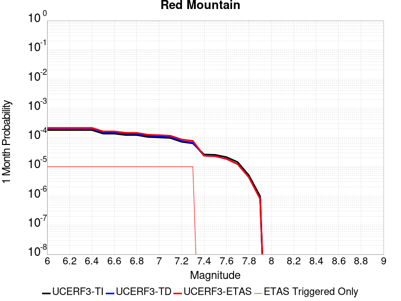 |  |  |

| Magnitude | 1 wk TI Prob | 1 wk TD Prob | 1 wk ETAS Prob | 1 wk ETAS/TD Gain | 1 wk ETAS Triggered Only | 1 mo TI Prob | 1 mo TD Prob | 1 mo ETAS Prob | 1 mo ETAS/TD Gain | 1 mo ETAS Triggered Only | 1 yr TI Prob | 1 yr TD Prob | 1 yr ETAS Prob | 1 yr ETAS/TD Gain | 1 yr ETAS Triggered Only | 10 yr TI Prob | 10 yr TD Prob | 10 yr ETAS Prob | 10 yr ETAS/TD Gain | 10 yr ETAS Triggered Only |
|-----|-----|-----|-----|-----|-----|-----|-----|-----|-----|-----|-----|-----|-----|-----|-----|-----|-----|-----|-----|-----|
| 6.0 | 4.1810763E-5 | 4.759426E-5 | 4.759426E-5 | 1.0 | 0.0 | 1.7917668E-4 | 2.0396039E-4 | 2.1395835E-4 | 1.0490191 | 1.0E-5 | 0.0021792934 | 0.0024805544 | 0.002500505 | 1.0080427 | 2.0E-5 | 0.021580452 | 0.024546275 | 0.024604803 | 1.0023843 | 6.0E-5 |
| 6.1 | 4.1810763E-5 | 4.759426E-5 | 4.759426E-5 | 1.0 | 0.0 | 1.7917668E-4 | 2.0396039E-4 | 2.1395835E-4 | 1.0490191 | 1.0E-5 | 0.0021792934 | 0.0024805544 | 0.002500505 | 1.0080427 | 2.0E-5 | 0.021580452 | 0.024546275 | 0.024604803 | 1.0023843 | 6.0E-5 |
| 6.2 | 4.1810763E-5 | 4.759426E-5 | 4.759426E-5 | 1.0 | 0.0 | 1.7917668E-4 | 2.0396039E-4 | 2.1395835E-4 | 1.0490191 | 1.0E-5 | 0.0021792934 | 0.0024805544 | 0.002500505 | 1.0080427 | 2.0E-5 | 0.021580452 | 0.024546275 | 0.024604803 | 1.0023843 | 6.0E-5 |
| 6.3 | 4.1810763E-5 | 4.759426E-5 | 4.759426E-5 | 1.0 | 0.0 | 1.7917668E-4 | 2.0396039E-4 | 2.1395835E-4 | 1.0490191 | 1.0E-5 | 0.0021792934 | 0.0024805544 | 0.002500505 | 1.0080427 | 2.0E-5 | 0.021580452 | 0.024546275 | 0.024604803 | 1.0023843 | 6.0E-5 |
| 6.4 | 4.1810763E-5 | 4.759426E-5 | 4.759426E-5 | 1.0 | 0.0 | 1.7917668E-4 | 2.0396039E-4 | 2.1395835E-4 | 1.0490191 | 1.0E-5 | 0.0021792934 | 0.0024805544 | 0.002500505 | 1.0080427 | 2.0E-5 | 0.021580452 | 0.024546275 | 0.024604803 | 1.0023843 | 6.0E-5 |
| 6.5 | 3.154503E-5 | 3.5362766E-5 | 3.5362766E-5 | 1.0 | 0.0 | 1.3518598E-4 | 1.5154642E-4 | 1.615449E-4 | 1.0659764 | 1.0E-5 | 0.0016446467 | 0.0018436083 | 0.0018635715 | 1.0108283 | 2.0E-5 | 0.01632528 | 0.018292787 | 0.018341873 | 1.0026833 | 5.0E-5 |
| 6.6 | 3.1535834E-5 | 3.5352146E-5 | 3.5352146E-5 | 1.0 | 0.0 | 1.3514658E-4 | 1.5150092E-4 | 1.614994E-4 | 1.0659962 | 1.0E-5 | 0.0016441676 | 0.0018430552 | 0.0018630184 | 1.0108316 | 2.0E-5 | 0.01632056 | 0.018287348 | 0.018336432 | 1.0026841 | 5.0E-5 |
| 6.7 | 2.8267326E-5 | 3.1471976E-5 | 3.1471976E-5 | 1.0 | 0.0 | 1.2114006E-4 | 1.3487341E-4 | 1.4487206E-4 | 1.0741336 | 1.0E-5 | 0.0014738824 | 0.0016409319 | 0.0016608991 | 1.0121682 | 2.0E-5 | 0.014641452 | 0.01629692 | 0.016346104 | 1.003018 | 5.0E-5 |
| 6.8 | 2.8212884E-5 | 3.1409858E-5 | 3.1409858E-5 | 1.0 | 0.0 | 1.20906756E-4 | 1.3460721E-4 | 1.4460586E-4 | 1.0742803 | 1.0E-5 | 0.0014710457 | 0.0016376958 | 0.0016576631 | 1.0121922 | 2.0E-5 | 0.014613459 | 0.016265033 | 0.01631422 | 1.0030241 | 5.0E-5 |
| 6.9 | 2.4227871E-5 | 2.6709162E-5 | 2.6709162E-5 | 1.0 | 0.0 | 1.03829596E-4 | 1.1446325E-4 | 1.244621E-4 | 1.0873543 | 1.0E-5 | 0.0012633923 | 0.0013927751 | 0.0014127472 | 1.0143398 | 2.0E-5 | 0.012562336 | 0.013848151 | 0.013897459 | 1.0035605 | 5.0E-5 |
| 7.0 | 2.348524E-5 | 2.5837868E-5 | 2.5837868E-5 | 1.0 | 0.0 | 1.0064714E-4 | 1.10729445E-4 | 1.20728335E-4 | 1.0903002 | 1.0E-5 | 0.0012246901 | 0.0013473729 | 0.0013673459 | 1.0148237 | 2.0E-5 | 0.012179627 | 0.013399675 | 0.013449005 | 1.0036814 | 5.0E-5 |
| 7.1 | 2.2311642E-5 | 2.4464809E-5 | 2.4464809E-5 | 1.0 | 0.0 | 9.561782E-5 | 1.0484539E-4 | 1.1484434E-4 | 1.0953685 | 1.0E-5 | 0.0011635252 | 0.00127582 | 0.0012957945 | 1.0156562 | 2.0E-5 | 0.01157452 | 0.012692473 | 0.012741839 | 1.0038893 | 5.0E-5 |
| 7.2 | 1.6533986E-5 | 1.7671693E-5 | 1.7671693E-5 | 1.0 | 0.0 | 7.085802E-5 | 7.573399E-5 | 8.573323E-5 | 1.1320311 | 1.0E-5 | 8.623549E-4 | 9.217347E-4 | 9.4171625E-4 | 1.0216782 | 2.0E-5 | 0.008590161 | 0.009185396 | 0.009225029 | 1.0043148 | 4.0E-5 |
| 7.3 | 1.4703092E-5 | 1.5560694E-5 | 1.5560694E-5 | 1.0 | 0.0 | 6.301173E-5 | 6.668733E-5 | 7.6686665E-5 | 1.1499435 | 1.0E-5 | 7.668978E-4 | 8.116775E-4 | 8.316612E-4 | 1.0246203 | 2.0E-5 | 0.0076425658 | 0.008093204 | 0.008132881 | 1.0049024 | 4.0E-5 |
| 7.4 | 6.1331984E-6 | 5.5291357E-6 | 5.5291357E-6 | 1.0 | 0.0 | 2.6284872E-5 | 2.3696084E-5 | 2.3696084E-5 | 1.0 | 0.0 | 3.199713E-4 | 2.8846215E-4 | 2.9845926E-4 | 1.0346566 | 1.0E-5 | 0.0031951098 | 0.0028809316 | 0.0029108452 | 1.0103832 | 3.0E-5 |
| 7.5 | 5.954766E-6 | 5.3387566E-6 | 5.3387566E-6 | 1.0 | 0.0 | 2.5520176E-5 | 2.288019E-5 | 2.288019E-5 | 1.0 | 0.0 | 3.1066386E-4 | 2.7853122E-4 | 2.8852842E-4 | 1.0358926 | 1.0E-5 | 0.003102299 | 0.0027818752 | 0.0028117916 | 1.0107541 | 3.0E-5 |
| 7.6 | 4.9726646E-6 | 4.315507E-6 | 4.315507E-6 | 1.0 | 0.0 | 2.1311245E-5 | 1.84949E-5 | 1.84949E-5 | 1.0 | 0.0 | 2.5943352E-4 | 2.2515249E-4 | 2.3515023E-4 | 1.0444044 | 1.0E-5 | 0.0025913084 | 0.0022492784 | 0.0022792108 | 1.0133076 | 3.0E-5 |
| 7.7 | 3.3613894E-6 | 2.8528066E-6 | 2.8528066E-6 | 1.0 | 0.0 | 1.4405875E-5 | 1.2226258E-5 | 1.2226258E-5 | 1.0 | 0.0 | 1.7537741E-4 | 1.4884479E-4 | 1.588433E-4 | 1.0671741 | 1.0E-5 | 0.0017523908 | 0.0014874772 | 0.0015174325 | 1.0201384 | 3.0E-5 |
| 7.8 | 1.1828961E-6 | 1.0123285E-6 | 1.0123285E-6 | 1.0 | 0.0 | 5.069545E-6 | 4.338544E-6 | 4.338544E-6 | 1.0 | 0.0 | 6.171996E-5 | 5.2820524E-5 | 6.281999E-5 | 1.1893103 | 1.0E-5 | 6.170282E-4 | 5.280826E-4 | 5.380773E-4 | 1.0189264 | 1.0E-5 |
| 7.9 | 2.2967266E-7 | 1.8619782E-7 | 1.8619782E-7 | 1.0 | 0.0 | 9.843111E-7 | 7.979905E-7 | 7.979905E-7 | 1.0 | 0.0 | 1.19839215E-5 | 9.715493E-6 | 9.715493E-6 | 1.0 | 0.0 | 1.1983275E-4 | 9.715097E-5 | 9.715097E-5 | 1.0 | 0.0 |

## Deep Springs
*[(top)](#table-of-contents)*

| 1 Week | 1 Month | 1 Year | 10 Year |
|-----|-----|-----|-----|
|  |  |  |  |

| Magnitude | 1 wk TI Prob | 1 wk TD Prob | 1 wk ETAS Prob | 1 wk ETAS/TD Gain | 1 wk ETAS Triggered Only | 1 mo TI Prob | 1 mo TD Prob | 1 mo ETAS Prob | 1 mo ETAS/TD Gain | 1 mo ETAS Triggered Only | 1 yr TI Prob | 1 yr TD Prob | 1 yr ETAS Prob | 1 yr ETAS/TD Gain | 1 yr ETAS Triggered Only | 10 yr TI Prob | 10 yr TD Prob | 10 yr ETAS Prob | 10 yr ETAS/TD Gain | 10 yr ETAS Triggered Only |
|-----|-----|-----|-----|-----|-----|-----|-----|-----|-----|-----|-----|-----|-----|-----|-----|-----|-----|-----|-----|-----|
| 6.0 | 1.9810619E-5 | 2.3114562E-5 | 2.3114562E-5 | 1.0 | 0.0 | 8.489989E-5 | 9.9061515E-5 | 9.9061515E-5 | 1.0 | 0.0 | 0.001033166 | 0.0012059144 | 0.0012258902 | 1.016565 | 2.0E-5 | 0.010283757 | 0.012043493 | 0.012112649 | 1.0057423 | 7.0E-5 |
| 6.1 | 1.9810619E-5 | 2.3114562E-5 | 2.3114562E-5 | 1.0 | 0.0 | 8.489989E-5 | 9.9061515E-5 | 9.9061515E-5 | 1.0 | 0.0 | 0.001033166 | 0.0012059144 | 0.0012258902 | 1.016565 | 2.0E-5 | 0.010283757 | 0.012043493 | 0.012112649 | 1.0057423 | 7.0E-5 |
| 6.2 | 1.9810619E-5 | 2.3114562E-5 | 2.3114562E-5 | 1.0 | 0.0 | 8.489989E-5 | 9.9061515E-5 | 9.9061515E-5 | 1.0 | 0.0 | 0.001033166 | 0.0012059144 | 0.0012258902 | 1.016565 | 2.0E-5 | 0.010283757 | 0.012043493 | 0.012112649 | 1.0057423 | 7.0E-5 |
| 6.3 | 1.9810619E-5 | 2.3114562E-5 | 2.3114562E-5 | 1.0 | 0.0 | 8.489989E-5 | 9.9061515E-5 | 9.9061515E-5 | 1.0 | 0.0 | 0.001033166 | 0.0012059144 | 0.0012258902 | 1.016565 | 2.0E-5 | 0.010283757 | 0.012043493 | 0.012112649 | 1.0057423 | 7.0E-5 |
| 6.4 | 1.9810619E-5 | 2.3114562E-5 | 2.3114562E-5 | 1.0 | 0.0 | 8.489989E-5 | 9.9061515E-5 | 9.9061515E-5 | 1.0 | 0.0 | 0.001033166 | 0.0012059144 | 0.0012258902 | 1.016565 | 2.0E-5 | 0.010283757 | 0.012043493 | 0.012112649 | 1.0057423 | 7.0E-5 |
| 6.5 | 1.7190405E-5 | 2.0052328E-5 | 2.0052328E-5 | 1.0 | 0.0 | 7.367108E-5 | 8.593855E-5 | 8.593855E-5 | 1.0 | 0.0 | 8.9657627E-4 | 0.0010463016 | 0.001056291 | 1.0095475 | 1.0E-5 | 0.008929676 | 0.0104629835 | 0.010502566 | 1.003783 | 4.0E-5 |
| 6.6 | 1.7190405E-5 | 2.0052328E-5 | 2.0052328E-5 | 1.0 | 0.0 | 7.367108E-5 | 8.593855E-5 | 8.593855E-5 | 1.0 | 0.0 | 8.9657627E-4 | 0.0010463016 | 0.001056291 | 1.0095475 | 1.0E-5 | 0.008929676 | 0.0104629835 | 0.010502566 | 1.003783 | 4.0E-5 |

## Pinto Mtn
*[(top)](#table-of-contents)*

| 1 Week | 1 Month | 1 Year | 10 Year |
|-----|-----|-----|-----|
|  |  |  |  |

| Magnitude | 1 wk TI Prob | 1 wk TD Prob | 1 wk ETAS Prob | 1 wk ETAS/TD Gain | 1 wk ETAS Triggered Only | 1 mo TI Prob | 1 mo TD Prob | 1 mo ETAS Prob | 1 mo ETAS/TD Gain | 1 mo ETAS Triggered Only | 1 yr TI Prob | 1 yr TD Prob | 1 yr ETAS Prob | 1 yr ETAS/TD Gain | 1 yr ETAS Triggered Only | 10 yr TI Prob | 10 yr TD Prob | 10 yr ETAS Prob | 10 yr ETAS/TD Gain | 10 yr ETAS Triggered Only |
|-----|-----|-----|-----|-----|-----|-----|-----|-----|-----|-----|-----|-----|-----|-----|-----|-----|-----|-----|-----|-----|
| 6.0 | 4.4194956E-5 | 4.786026E-5 | 4.786026E-5 | 1.0 | 0.0 | 1.893932E-4 | 2.051002E-4 | 2.1509815E-4 | 1.0487467 | 1.0E-5 | 0.0023034236 | 0.0024943987 | 0.002514349 | 1.007998 | 2.0E-5 | 0.022796938 | 0.024681535 | 0.024749808 | 1.0027661 | 7.0E-5 |
| 6.1 | 4.4194956E-5 | 4.786026E-5 | 4.786026E-5 | 1.0 | 0.0 | 1.893932E-4 | 2.051002E-4 | 2.1509815E-4 | 1.0487467 | 1.0E-5 | 0.0023034236 | 0.0024943987 | 0.002514349 | 1.007998 | 2.0E-5 | 0.022796938 | 0.024681535 | 0.024749808 | 1.0027661 | 7.0E-5 |
| 6.2 | 4.4194956E-5 | 4.786026E-5 | 4.786026E-5 | 1.0 | 0.0 | 1.893932E-4 | 2.051002E-4 | 2.1509815E-4 | 1.0487467 | 1.0E-5 | 0.0023034236 | 0.0024943987 | 0.002514349 | 1.007998 | 2.0E-5 | 0.022796938 | 0.024681535 | 0.024749808 | 1.0027661 | 7.0E-5 |
| 6.3 | 4.4194956E-5 | 4.786026E-5 | 4.786026E-5 | 1.0 | 0.0 | 1.893932E-4 | 2.051002E-4 | 2.1509815E-4 | 1.0487467 | 1.0E-5 | 0.0023034236 | 0.0024943987 | 0.002514349 | 1.007998 | 2.0E-5 | 0.022796938 | 0.024681535 | 0.024749808 | 1.0027661 | 7.0E-5 |
| 6.4 | 3.729929E-5 | 3.9608974E-5 | 3.9608974E-5 | 1.0 | 0.0 | 1.5984432E-4 | 1.6974223E-4 | 1.7974053E-4 | 1.0589029 | 1.0E-5 | 0.0019443673 | 0.0020647459 | 0.0020747252 | 1.0048332 | 1.0E-5 | 0.019274427 | 0.020465652 | 0.020504834 | 1.0019145 | 4.0E-5 |
| 6.5 | 3.729929E-5 | 3.9608974E-5 | 3.9608974E-5 | 1.0 | 0.0 | 1.5984432E-4 | 1.6974223E-4 | 1.7974053E-4 | 1.0589029 | 1.0E-5 | 0.0019443673 | 0.0020647459 | 0.0020747252 | 1.0048332 | 1.0E-5 | 0.019274427 | 0.020465652 | 0.020504834 | 1.0019145 | 4.0E-5 |
| 6.6 | 3.0204548E-5 | 3.1210264E-5 | 3.1210264E-5 | 1.0 | 0.0 | 1.2944164E-4 | 1.3375162E-4 | 1.3375162E-4 | 1.0 | 0.0 | 0.0015748127 | 0.0016272442 | 0.0016272442 | 1.0 | 0.0 | 0.015636992 | 0.01615716 | 0.016176837 | 1.0012178 | 2.0E-5 |
| 6.7 | 2.9857754E-5 | 3.081962E-5 | 3.081962E-5 | 1.0 | 0.0 | 1.2795553E-4 | 1.320776E-4 | 1.320776E-4 | 1.0 | 0.0 | 0.0015567453 | 0.0016068934 | 0.0016068934 | 1.0 | 0.0 | 0.015458848 | 0.015956586 | 0.015976267 | 1.0012335 | 2.0E-5 |
| 6.8 | 2.4819734E-5 | 2.5013833E-5 | 2.5013833E-5 | 1.0 | 0.0 | 1.0636595E-4 | 1.07197855E-4 | 1.07197855E-4 | 1.0 | 0.0 | 0.0012942362 | 0.0013043742 | 0.0013043742 | 1.0 | 0.0 | 0.012867244 | 0.01296955 | 0.01297942 | 1.000761 | 1.0E-5 |
| 6.9 | 2.331124E-5 | 2.3342016E-5 | 2.3342016E-5 | 1.0 | 0.0 | 9.990149E-5 | 1.0003349E-4 | 1.0003349E-4 | 1.0 | 0.0 | 0.001215622 | 0.0012172476 | 0.0012172476 | 1.0 | 0.0 | 0.012089936 | 0.012107995 | 0.012117875 | 1.0008159 | 1.0E-5 |
| 7.0 | 2.1818534E-5 | 2.1765065E-5 | 2.1765065E-5 | 1.0 | 0.0 | 9.3504656E-5 | 9.327562E-5 | 9.327562E-5 | 1.0 | 0.0 | 0.0011378246 | 0.0011350589 | 0.0011350589 | 1.0 | 0.0 | 0.011320163 | 0.011294719 | 0.011304606 | 1.0008754 | 1.0E-5 |
| 7.1 | 2.066081E-5 | 2.0544632E-5 | 2.0544632E-5 | 1.0 | 0.0 | 8.854332E-5 | 8.804556E-5 | 8.804556E-5 | 1.0 | 0.0 | 0.0010774818 | 0.0010714472 | 0.0010714472 | 1.0 | 0.0 | 0.010722724 | 0.010664865 | 0.010674758 | 1.0009277 | 1.0E-5 |
| 7.2 | 1.8990233E-5 | 1.9057838E-5 | 1.9057838E-5 | 1.0 | 0.0 | 8.138417E-5 | 8.1674E-5 | 8.1674E-5 | 1.0 | 0.0 | 9.904018E-4 | 9.939467E-4 | 9.939467E-4 | 1.0 | 0.0 | 0.009859995 | 0.00989701 | 0.009906912 | 1.0010004 | 1.0E-5 |
| 7.3 | 1.3335872E-5 | 1.4910233E-5 | 1.4910233E-5 | 1.0 | 0.0 | 5.7152483E-5 | 6.3899504E-5 | 6.3899504E-5 | 1.0 | 0.0 | 6.956093E-4 | 7.7771157E-4 | 7.7771157E-4 | 1.0 | 0.0 | 0.006934359 | 0.007751199 | 0.0077611213 | 1.0012801 | 1.0E-5 |
| 7.4 | 9.414066E-6 | 1.1864307E-5 | 1.1864307E-5 | 1.0 | 0.0 | 4.0345374E-5 | 5.0846094E-5 | 5.0846094E-5 | 1.0 | 0.0 | 4.910942E-4 | 6.188848E-4 | 6.188848E-4 | 1.0 | 0.0 | 0.0049001034 | 0.0061725616 | 0.0061824997 | 1.00161 | 1.0E-5 |
| 7.5 | 7.2101157E-6 | 9.16147E-6 | 9.16147E-6 | 1.0 | 0.0 | 3.090013E-5 | 3.9262897E-5 | 3.9262897E-5 | 1.0 | 0.0 | 3.7614413E-4 | 4.7792873E-4 | 4.7792873E-4 | 1.0 | 0.0 | 0.0037550807 | 0.0047697844 | 0.004779737 | 1.0020865 | 1.0E-5 |
| 7.6 | 3.296375E-6 | 4.548674E-6 | 4.548674E-6 | 1.0 | 0.0 | 1.4127245E-5 | 1.9494179E-5 | 1.9494179E-5 | 1.0 | 0.0 | 1.7198564E-4 | 2.3731717E-4 | 2.3731717E-4 | 1.0 | 0.0 | 0.0017185259 | 0.002370775 | 0.002370775 | 1.0 | 0.0 |
| 7.7 | 2.5741092E-6 | 3.5873995E-6 | 3.5873995E-6 | 1.0 | 0.0 | 1.103185E-5 | 1.5374486E-5 | 1.5374486E-5 | 1.0 | 0.0 | 1.3430449E-4 | 1.8716961E-4 | 1.8716961E-4 | 1.0 | 0.0 | 0.0013422335 | 0.0018702497 | 0.0018702497 | 1.0 | 0.0 |

## Santa Cruz Island
*[(top)](#table-of-contents)*

| 1 Week | 1 Month | 1 Year | 10 Year |
|-----|-----|-----|-----|
|  |  |  |  |

| Magnitude | 1 wk TI Prob | 1 wk TD Prob | 1 wk ETAS Prob | 1 wk ETAS/TD Gain | 1 wk ETAS Triggered Only | 1 mo TI Prob | 1 mo TD Prob | 1 mo ETAS Prob | 1 mo ETAS/TD Gain | 1 mo ETAS Triggered Only | 1 yr TI Prob | 1 yr TD Prob | 1 yr ETAS Prob | 1 yr ETAS/TD Gain | 1 yr ETAS Triggered Only | 10 yr TI Prob | 10 yr TD Prob | 10 yr ETAS Prob | 10 yr ETAS/TD Gain | 10 yr ETAS Triggered Only |
|-----|-----|-----|-----|-----|-----|-----|-----|-----|-----|-----|-----|-----|-----|-----|-----|-----|-----|-----|-----|-----|
| 6.0 | 2.9164563E-5 | 3.1601154E-5 | 3.1601154E-5 | 1.0 | 0.0 | 1.2498499E-4 | 1.3542725E-4 | 1.3542725E-4 | 1.0 | 0.0 | 0.0015206301 | 0.001647716 | 0.0016676831 | 1.012118 | 2.0E-5 | 0.015102667 | 0.016368724 | 0.016427742 | 1.0036055 | 6.0E-5 |
| 6.1 | 2.9164563E-5 | 3.1601154E-5 | 3.1601154E-5 | 1.0 | 0.0 | 1.2498499E-4 | 1.3542725E-4 | 1.3542725E-4 | 1.0 | 0.0 | 0.0015206301 | 0.001647716 | 0.0016676831 | 1.012118 | 2.0E-5 | 0.015102667 | 0.016368724 | 0.016427742 | 1.0036055 | 6.0E-5 |
| 6.2 | 2.9164563E-5 | 3.1601154E-5 | 3.1601154E-5 | 1.0 | 0.0 | 1.2498499E-4 | 1.3542725E-4 | 1.3542725E-4 | 1.0 | 0.0 | 0.0015206301 | 0.001647716 | 0.0016676831 | 1.012118 | 2.0E-5 | 0.015102667 | 0.016368724 | 0.016427742 | 1.0036055 | 6.0E-5 |
| 6.3 | 1.6635553E-5 | 1.7805029E-5 | 1.7805029E-5 | 1.0 | 0.0 | 7.1293274E-5 | 7.6305136E-5 | 7.6305136E-5 | 1.0 | 0.0 | 8.6765E-4 | 9.286373E-4 | 9.38628E-4 | 1.0107585 | 1.0E-5 | 0.008642701 | 0.00924944 | 0.009269255 | 1.0021423 | 2.0E-5 |
| 6.4 | 1.6635553E-5 | 1.7805029E-5 | 1.7805029E-5 | 1.0 | 0.0 | 7.1293274E-5 | 7.6305136E-5 | 7.6305136E-5 | 1.0 | 0.0 | 8.6765E-4 | 9.286373E-4 | 9.38628E-4 | 1.0107585 | 1.0E-5 | 0.008642701 | 0.00924944 | 0.009269255 | 1.0021423 | 2.0E-5 |
| 6.5 | 1.2238748E-5 | 1.30434555E-5 | 1.30434555E-5 | 1.0 | 0.0 | 5.2450723E-5 | 5.589935E-5 | 5.589935E-5 | 1.0 | 0.0 | 6.3840044E-4 | 6.803657E-4 | 6.803657E-4 | 1.0 | 0.0 | 0.0063656955 | 0.0067832265 | 0.0067931586 | 1.0014642 | 1.0E-5 |
| 6.6 | 1.0489767E-5 | 1.1157017E-5 | 1.1157017E-5 | 1.0 | 0.0 | 4.495537E-5 | 4.7814923E-5 | 4.7814923E-5 | 1.0 | 0.0 | 5.4719415E-4 | 5.8199343E-4 | 5.8199343E-4 | 1.0 | 0.0 | 0.005458487 | 0.0058049336 | 0.0058148755 | 1.0017127 | 1.0E-5 |
| 6.7 | 8.699222E-6 | 9.23709E-6 | 9.23709E-6 | 1.0 | 0.0 | 3.7281847E-5 | 3.9586932E-5 | 3.9586932E-5 | 1.0 | 0.0 | 4.5381195E-4 | 4.8186484E-4 | 4.8186484E-4 | 1.0 | 0.0 | 0.0045288634 | 0.0048082676 | 0.0048182197 | 1.0020697 | 1.0E-5 |
| 6.8 | 8.307732E-6 | 8.8171955E-6 | 8.8171955E-6 | 1.0 | 0.0 | 3.560408E-5 | 3.778744E-5 | 3.778744E-5 | 1.0 | 0.0 | 4.3339343E-4 | 4.5996535E-4 | 4.5996535E-4 | 1.0 | 0.0 | 0.004325492 | 0.0045901868 | 0.0046001407 | 1.0021685 | 1.0E-5 |
| 6.9 | 8.073121E-6 | 8.565221E-6 | 8.565221E-6 | 1.0 | 0.0 | 3.459863E-5 | 3.6707574E-5 | 3.6707574E-5 | 1.0 | 0.0 | 4.2115687E-4 | 4.4682348E-4 | 4.4682348E-4 | 1.0 | 0.0 | 0.004203596 | 0.0044593024 | 0.004469258 | 1.0022326 | 1.0E-5 |
| 7.0 | 7.617019E-6 | 8.074926E-6 | 8.074926E-6 | 1.0 | 0.0 | 3.264396E-5 | 3.460637E-5 | 3.460637E-5 | 1.0 | 0.0 | 3.9736772E-4 | 4.212515E-4 | 4.212515E-4 | 1.0 | 0.0 | 0.003966579 | 0.0042045773 | 0.0042145355 | 1.0023683 | 1.0E-5 |
| 7.1 | 7.1224836E-6 | 7.5460302E-6 | 7.5460302E-6 | 1.0 | 0.0 | 3.052457E-5 | 3.2339733E-5 | 3.2339733E-5 | 1.0 | 0.0 | 3.715733E-4 | 3.9366545E-4 | 3.9366545E-4 | 1.0 | 0.0 | 0.003709526 | 0.003929724 | 0.0039396845 | 1.0025347 | 1.0E-5 |
| 7.2 | 6.441115E-6 | 6.827605E-6 | 6.827605E-6 | 1.0 | 0.0 | 2.7604487E-5 | 2.9260838E-5 | 2.9260838E-5 | 1.0 | 0.0 | 3.360328E-4 | 3.561927E-4 | 3.561927E-4 | 1.0 | 0.0 | 0.0033552512 | 0.0035562462 | 0.0035662106 | 1.0028019 | 1.0E-5 |
| 7.3 | 5.494274E-6 | 5.8201817E-6 | 5.8201817E-6 | 1.0 | 0.0 | 2.3546674E-5 | 2.4943398E-5 | 2.4943398E-5 | 1.0 | 0.0 | 2.8664304E-4 | 3.0364376E-4 | 3.0364376E-4 | 1.0 | 0.0 | 0.002862736 | 0.0030323118 | 0.0030422816 | 1.0032878 | 1.0E-5 |
| 7.4 | 4.0802624E-6 | 4.3123905E-6 | 4.3123905E-6 | 1.0 | 0.0 | 1.7486722E-5 | 1.8481544E-5 | 1.8481544E-5 | 1.0 | 0.0 | 2.1288003E-4 | 2.2498962E-4 | 2.2498962E-4 | 1.0 | 0.0 | 0.0021267622 | 0.0022476274 | 0.0022476274 | 1.0 | 0.0 |
| 7.5 | 2.3584746E-6 | 2.4753786E-6 | 2.4753786E-6 | 1.0 | 0.0 | 1.0107709E-5 | 1.0608722E-5 | 1.0608722E-5 | 1.0 | 0.0 | 1.2305441E-4 | 1.2915359E-4 | 1.2915359E-4 | 1.0 | 0.0 | 0.0012298629 | 0.0012907903 | 0.0012907903 | 1.0 | 0.0 |
| 7.6 | 9.4981914E-7 | 9.861163E-7 | 9.861163E-7 | 1.0 | 0.0 | 4.0706473E-6 | 4.226206E-6 | 4.226206E-6 | 1.0 | 0.0 | 4.9559E-5 | 5.1452855E-5 | 5.1452855E-5 | 1.0 | 0.0 | 4.954795E-4 | 5.144107E-4 | 5.144107E-4 | 1.0 | 0.0 |
| 7.7 | 2.6013532E-7 | 2.6417084E-7 | 2.6417084E-7 | 1.0 | 0.0 | 1.1148652E-6 | 1.1321602E-6 | 1.1321602E-6 | 1.0 | 0.0 | 1.3573399E-5 | 1.3783963E-5 | 1.3783963E-5 | 1.0 | 0.0 | 1.357257E-4 | 1.3783116E-4 | 1.3783116E-4 | 1.0 | 0.0 |
| 7.8 | 4.1522263E-8 | 3.965741E-8 | 3.965741E-8 | 1.0 | 0.0 | 1.7795254E-7 | 1.6996033E-7 | 1.6996033E-7 | 1.0 | 0.0 | 2.16657E-6 | 2.0692653E-6 | 2.0692653E-6 | 1.0 | 0.0 | 2.1665488E-5 | 2.0692481E-5 | 2.0692481E-5 | 1.0 | 0.0 |
| 7.9 | 7.7242046E-10 | 5.947626E-10 | 5.947626E-10 | 1.0 | 0.0 | 3.3103735E-9 | 2.548983E-9 | 2.548983E-9 | 1.0 | 0.0 | 4.0303796E-8 | 3.1033867E-8 | 3.1033867E-8 | 1.0 | 0.0 | 4.030379E-7 | 3.1033863E-7 | 3.1033863E-7 | 1.0 | 0.0 |

## Pine Mtn
*[(top)](#table-of-contents)*

| 1 Week | 1 Month | 1 Year | 10 Year |
|-----|-----|-----|-----|
|  |  |  | 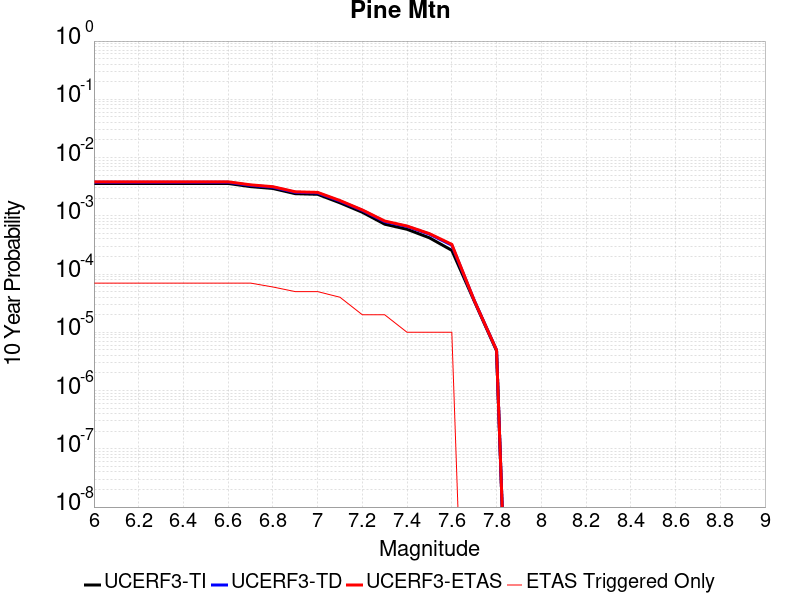 |

| Magnitude | 1 wk TI Prob | 1 wk TD Prob | 1 wk ETAS Prob | 1 wk ETAS/TD Gain | 1 wk ETAS Triggered Only | 1 mo TI Prob | 1 mo TD Prob | 1 mo ETAS Prob | 1 mo ETAS/TD Gain | 1 mo ETAS Triggered Only | 1 yr TI Prob | 1 yr TD Prob | 1 yr ETAS Prob | 1 yr ETAS/TD Gain | 1 yr ETAS Triggered Only | 10 yr TI Prob | 10 yr TD Prob | 10 yr ETAS Prob | 10 yr ETAS/TD Gain | 10 yr ETAS Triggered Only |
|-----|-----|-----|-----|-----|-----|-----|-----|-----|-----|-----|-----|-----|-----|-----|-----|-----|-----|-----|-----|-----|
| 6.0 | 6.894797E-6 | 7.2258863E-6 | 7.2258863E-6 | 1.0 | 0.0 | 2.9548795E-5 | 3.0967734E-5 | 3.0967734E-5 | 1.0 | 0.0 | 3.596972E-4 | 3.769699E-4 | 4.069586E-4 | 1.0795519 | 3.0E-5 | 0.0035911554 | 0.0037636019 | 0.0038333384 | 1.0185292 | 7.0E-5 |
| 6.1 | 6.894797E-6 | 7.2258863E-6 | 7.2258863E-6 | 1.0 | 0.0 | 2.9548795E-5 | 3.0967734E-5 | 3.0967734E-5 | 1.0 | 0.0 | 3.596972E-4 | 3.769699E-4 | 4.069586E-4 | 1.0795519 | 3.0E-5 | 0.0035911554 | 0.0037636019 | 0.0038333384 | 1.0185292 | 7.0E-5 |
| 6.2 | 6.894797E-6 | 7.2258863E-6 | 7.2258863E-6 | 1.0 | 0.0 | 2.9548795E-5 | 3.0967734E-5 | 3.0967734E-5 | 1.0 | 0.0 | 3.596972E-4 | 3.769699E-4 | 4.069586E-4 | 1.0795519 | 3.0E-5 | 0.0035911554 | 0.0037636019 | 0.0038333384 | 1.0185292 | 7.0E-5 |
| 6.3 | 6.894797E-6 | 7.2258863E-6 | 7.2258863E-6 | 1.0 | 0.0 | 2.9548795E-5 | 3.0967734E-5 | 3.0967734E-5 | 1.0 | 0.0 | 3.596972E-4 | 3.769699E-4 | 4.069586E-4 | 1.0795519 | 3.0E-5 | 0.0035911554 | 0.0037636019 | 0.0038333384 | 1.0185292 | 7.0E-5 |
| 6.4 | 6.894797E-6 | 7.2258863E-6 | 7.2258863E-6 | 1.0 | 0.0 | 2.9548795E-5 | 3.0967734E-5 | 3.0967734E-5 | 1.0 | 0.0 | 3.596972E-4 | 3.769699E-4 | 4.069586E-4 | 1.0795519 | 3.0E-5 | 0.0035911554 | 0.0037636019 | 0.0038333384 | 1.0185292 | 7.0E-5 |
| 6.5 | 6.894797E-6 | 7.2258863E-6 | 7.2258863E-6 | 1.0 | 0.0 | 2.9548795E-5 | 3.0967734E-5 | 3.0967734E-5 | 1.0 | 0.0 | 3.596972E-4 | 3.769699E-4 | 4.069586E-4 | 1.0795519 | 3.0E-5 | 0.0035911554 | 0.0037636019 | 0.0038333384 | 1.0185292 | 7.0E-5 |
| 6.6 | 6.894797E-6 | 7.2258863E-6 | 7.2258863E-6 | 1.0 | 0.0 | 2.9548795E-5 | 3.0967734E-5 | 3.0967734E-5 | 1.0 | 0.0 | 3.596972E-4 | 3.769699E-4 | 4.069586E-4 | 1.0795519 | 3.0E-5 | 0.0035911554 | 0.0037636019 | 0.0038333384 | 1.0185292 | 7.0E-5 |
| 6.7 | 6.0867933E-6 | 6.397527E-6 | 6.397527E-6 | 1.0 | 0.0 | 2.6085996E-5 | 2.7417698E-5 | 2.7417698E-5 | 1.0 | 0.0 | 3.1755073E-4 | 3.3376153E-4 | 3.6375152E-4 | 1.0898545 | 3.0E-5 | 0.0031709734 | 0.0033328217 | 0.0034025884 | 1.0209333 | 7.0E-5 |
| 6.8 | 5.6530425E-6 | 5.9510025E-6 | 5.9510025E-6 | 1.0 | 0.0 | 2.42271E-5 | 2.550406E-5 | 2.550406E-5 | 1.0 | 0.0 | 2.94925E-4 | 3.1046974E-4 | 3.4046042E-4 | 1.0965978 | 3.0E-5 | 0.002945339 | 0.0031005645 | 0.0031603784 | 1.0192913 | 6.0E-5 |
| 6.9 | 4.6015225E-6 | 4.864222E-6 | 4.864222E-6 | 1.0 | 0.0 | 1.9720663E-5 | 2.0846506E-5 | 2.0846506E-5 | 1.0 | 0.0 | 2.4007261E-4 | 2.537781E-4 | 2.7377304E-4 | 1.078789 | 2.0E-5 | 0.0023981342 | 0.0025350272 | 0.0025849005 | 1.0196737 | 5.0E-5 |
| 7.0 | 4.4875965E-6 | 4.7478593E-6 | 4.7478593E-6 | 1.0 | 0.0 | 1.9232413E-5 | 2.0347818E-5 | 2.0347818E-5 | 1.0 | 0.0 | 2.3412947E-4 | 2.4770797E-4 | 2.6770303E-4 | 1.0807202 | 2.0E-5 | 0.0023388295 | 0.0024744626 | 0.0025243387 | 1.0201564 | 5.0E-5 |
| 7.1 | 3.203907E-6 | 3.429777E-6 | 3.429777E-6 | 1.0 | 0.0 | 1.3730958E-5 | 1.4698966E-5 | 1.4698966E-5 | 1.0 | 0.0 | 1.6716159E-4 | 1.7894588E-4 | 1.989423E-4 | 1.1117456 | 2.0E-5 | 0.0016703589 | 0.001788084 | 0.0018280125 | 1.0223303 | 4.0E-5 |
| 7.2 | 2.2060601E-6 | 2.3787825E-6 | 2.3787825E-6 | 1.0 | 0.0 | 9.4545085E-6 | 1.0194745E-5 | 1.0194745E-5 | 1.0 | 0.0 | 1.15102564E-4 | 1.241144E-4 | 1.3411316E-4 | 1.0805608 | 1.0E-5 | 0.0011504296 | 0.0012404957 | 0.001260471 | 1.0161026 | 2.0E-5 |
| 7.3 | 1.3765207E-6 | 1.5219202E-6 | 1.5219202E-6 | 1.0 | 0.0 | 5.899361E-6 | 6.5224995E-6 | 6.5224995E-6 | 1.0 | 0.0 | 7.182235E-5 | 7.940863E-5 | 8.940783E-5 | 1.1259209 | 1.0E-5 | 7.1799144E-4 | 7.9381163E-4 | 8.137958E-4 | 1.0251749 | 2.0E-5 |
| 7.4 | 1.1245983E-6 | 1.2589533E-6 | 1.2589533E-6 | 1.0 | 0.0 | 4.819698E-6 | 5.3955036E-6 | 5.3955036E-6 | 1.0 | 0.0 | 5.8678244E-5 | 6.568836E-5 | 6.568836E-5 | 1.0 | 0.0 | 5.866275E-4 | 6.566977E-4 | 6.6669116E-4 | 1.0152177 | 1.0E-5 |
| 7.5 | 8.031682E-7 | 9.279254E-7 | 9.279254E-7 | 1.0 | 0.0 | 3.4421448E-6 | 3.9768174E-6 | 3.9768174E-6 | 1.0 | 0.0 | 4.1907308E-5 | 4.8416743E-5 | 4.8416743E-5 | 1.0 | 0.0 | 4.1899405E-4 | 4.840687E-4 | 4.940639E-4 | 1.0206482 | 1.0E-5 |
| 7.6 | 4.8953444E-7 | 6.0050616E-7 | 6.0050616E-7 | 1.0 | 0.0 | 2.098003E-6 | 2.5735953E-6 | 2.5735953E-6 | 1.0 | 0.0 | 2.5542888E-5 | 3.1333122E-5 | 3.1333122E-5 | 1.0 | 0.0 | 2.5539953E-4 | 3.1329194E-4 | 3.2328878E-4 | 1.0319091 | 1.0E-5 |
| 7.7 | 6.634529E-8 | 6.7889104E-8 | 6.7889104E-8 | 1.0 | 0.0 | 2.843369E-7 | 2.9095327E-7 | 2.9095327E-7 | 1.0 | 0.0 | 3.4617963E-6 | 3.542351E-6 | 3.542351E-6 | 1.0 | 0.0 | 3.4617424E-5 | 3.5422992E-5 | 3.5422992E-5 | 1.0 | 0.0 |
| 7.8 | 9.235578E-9 | 9.488707E-9 | 9.488707E-9 | 1.0 | 0.0 | 3.9581046E-8 | 4.0665885E-8 | 4.0665885E-8 | 1.0 | 0.0 | 4.818991E-7 | 4.9510703E-7 | 4.9510703E-7 | 1.0 | 0.0 | 4.8189804E-6 | 4.951061E-6 | 4.951061E-6 | 1.0 | 0.0 |

## San Diego Trough north alt1
*[(top)](#table-of-contents)*

| 1 Week | 1 Month | 1 Year | 10 Year |
|-----|-----|-----|-----|
|  |  |  |  |

| Magnitude | 1 wk TI Prob | 1 wk TD Prob | 1 wk ETAS Prob | 1 wk ETAS/TD Gain | 1 wk ETAS Triggered Only | 1 mo TI Prob | 1 mo TD Prob | 1 mo ETAS Prob | 1 mo ETAS/TD Gain | 1 mo ETAS Triggered Only | 1 yr TI Prob | 1 yr TD Prob | 1 yr ETAS Prob | 1 yr ETAS/TD Gain | 1 yr ETAS Triggered Only | 10 yr TI Prob | 10 yr TD Prob | 10 yr ETAS Prob | 10 yr ETAS/TD Gain | 10 yr ETAS Triggered Only |
|-----|-----|-----|-----|-----|-----|-----|-----|-----|-----|-----|-----|-----|-----|-----|-----|-----|-----|-----|-----|-----|
| 6.0 | 7.329252E-5 | 8.822253E-5 | 8.822253E-5 | 1.0 | 0.0 | 3.14073E-4 | 3.7804473E-4 | 3.7804473E-4 | 1.0 | 0.0 | 0.0038171355 | 0.0045935456 | 0.0045935456 | 1.0 | 0.0 | 0.03752231 | 0.045049902 | 0.0451072 | 1.0012718 | 6.0E-5 |
| 6.1 | 3.7940346E-5 | 4.4889384E-5 | 4.4889384E-5 | 1.0 | 0.0 | 1.6259136E-4 | 1.9236945E-4 | 1.9236945E-4 | 1.0 | 0.0 | 0.0019777524 | 0.002339661 | 0.002339661 | 1.0 | 0.0 | 0.019602431 | 0.023158977 | 0.023188282 | 1.0012654 | 3.0E-5 |
| 6.2 | 2.8645263E-5 | 3.3299646E-5 | 3.3299646E-5 | 1.0 | 0.0 | 1.2275964E-4 | 1.4270512E-4 | 1.4270512E-4 | 1.0 | 0.0 | 0.0014935739 | 0.001736072 | 0.001736072 | 1.0 | 0.0 | 0.0148357535 | 0.017227756 | 0.01724741 | 1.001141 | 2.0E-5 |
| 6.3 | 2.8645263E-5 | 3.3299646E-5 | 3.3299646E-5 | 1.0 | 0.0 | 1.2275964E-4 | 1.4270512E-4 | 1.4270512E-4 | 1.0 | 0.0 | 0.0014935739 | 0.001736072 | 0.001736072 | 1.0 | 0.0 | 0.0148357535 | 0.017227756 | 0.01724741 | 1.001141 | 2.0E-5 |
| 6.4 | 2.2204576E-5 | 2.5450316E-5 | 2.5450316E-5 | 1.0 | 0.0 | 9.5159E-5 | 1.0906828E-4 | 1.0906828E-4 | 1.0 | 0.0 | 0.001157945 | 0.0013271067 | 0.0013271067 | 1.0 | 0.0 | 0.011519298 | 0.013192985 | 0.0132028535 | 1.0007479 | 1.0E-5 |
| 6.5 | 2.1004838E-5 | 2.4026549E-5 | 2.4026549E-5 | 1.0 | 0.0 | 9.0017624E-5 | 1.02966915E-4 | 1.02966915E-4 | 1.0 | 0.0 | 0.0010954136 | 0.00125291 | 0.00125291 | 1.0 | 0.0 | 0.010900296 | 0.012459545 | 0.012469421 | 1.0007926 | 1.0E-5 |
| 6.6 | 1.820557E-5 | 2.0706313E-5 | 2.0706313E-5 | 1.0 | 0.0 | 7.802154E-5 | 8.873835E-5 | 8.873835E-5 | 1.0 | 0.0 | 9.4949827E-4 | 0.0010798593 | 0.0010798593 | 1.0 | 0.0 | 0.009454516 | 0.010746791 | 0.010756684 | 1.0009205 | 1.0E-5 |
| 6.7 | 1.5884485E-5 | 1.7984918E-5 | 1.7984918E-5 | 1.0 | 0.0 | 6.807459E-5 | 7.707596E-5 | 7.707596E-5 | 1.0 | 0.0 | 8.284929E-4 | 9.379985E-4 | 9.379985E-4 | 1.0 | 0.0 | 0.008254109 | 0.009340761 | 0.009350668 | 1.0010606 | 1.0E-5 |
| 6.8 | 1.4331171E-5 | 1.6202195E-5 | 1.6202195E-5 | 1.0 | 0.0 | 6.141786E-5 | 6.9436144E-5 | 6.9436144E-5 | 1.0 | 0.0 | 7.4750587E-4 | 8.450591E-4 | 8.450591E-4 | 1.0 | 0.0 | 0.0074499645 | 0.008418724 | 0.00842864 | 1.0011778 | 1.0E-5 |
| 6.9 | 1.2574203E-5 | 1.4206819E-5 | 1.4206819E-5 | 1.0 | 0.0 | 5.3888325E-5 | 6.0884955E-5 | 6.0884955E-5 | 1.0 | 0.0 | 6.558929E-4 | 7.410236E-4 | 7.410236E-4 | 1.0 | 0.0 | 0.0065396037 | 0.0073857135 | 0.0073956395 | 1.001344 | 1.0E-5 |
| 7.0 | 1.0883844E-5 | 1.2290109E-5 | 1.2290109E-5 | 1.0 | 0.0 | 4.664421E-5 | 5.267084E-5 | 5.267084E-5 | 1.0 | 0.0 | 5.677453E-4 | 6.4107974E-4 | 6.4107974E-4 | 1.0 | 0.0 | 0.00566297 | 0.0063924324 | 0.006402368 | 1.0015544 | 1.0E-5 |
| 7.1 | 9.393088E-6 | 1.0607752E-5 | 1.0607752E-5 | 1.0 | 0.0 | 4.025547E-5 | 4.546101E-5 | 4.546101E-5 | 1.0 | 0.0 | 4.900001E-4 | 5.53348E-4 | 5.53348E-4 | 1.0 | 0.0 | 0.0048892107 | 0.005519798 | 0.0055297427 | 1.0018016 | 1.0E-5 |
| 7.2 | 8.190791E-6 | 9.259271E-6 | 9.259271E-6 | 1.0 | 0.0 | 3.510292E-5 | 3.968199E-5 | 3.968199E-5 | 1.0 | 0.0 | 4.2729423E-4 | 4.830218E-4 | 4.830218E-4 | 1.0 | 0.0 | 0.0042647356 | 0.0048197997 | 0.004829752 | 1.0020648 | 1.0E-5 |
| 7.3 | 6.268162E-6 | 7.090212E-6 | 7.090212E-6 | 1.0 | 0.0 | 2.6863276E-5 | 3.0386273E-5 | 3.0386273E-5 | 1.0 | 0.0 | 3.2701128E-4 | 3.6989048E-4 | 3.6989048E-4 | 1.0 | 0.0 | 0.003265305 | 0.0036927941 | 0.0037027572 | 1.002698 | 1.0E-5 |
| 7.4 | 4.985186E-6 | 5.643079E-6 | 5.643079E-6 | 1.0 | 0.0 | 2.1364907E-5 | 2.4184403E-5 | 2.4184403E-5 | 1.0 | 0.0 | 2.600867E-4 | 2.944057E-4 | 2.944057E-4 | 1.0 | 0.0 | 0.002597825 | 0.0029401982 | 0.0029401982 | 1.0 | 0.0 |
| 7.5 | 1.7489613E-6 | 1.9698116E-6 | 1.9698116E-6 | 1.0 | 0.0 | 7.495527E-6 | 8.4420235E-6 | 8.4420235E-6 | 1.0 | 0.0 | 9.125422E-5 | 1.0277701E-4 | 1.0277701E-4 | 1.0 | 0.0 | 9.1216754E-4 | 0.0010273168 | 0.0010273168 | 1.0 | 0.0 |
| 7.6 | 1.6988751E-7 | 1.7534121E-7 | 1.7534121E-7 | 1.0 | 0.0 | 7.2808916E-7 | 7.5146215E-7 | 7.5146215E-7 | 1.0 | 0.0 | 8.864449E-6 | 9.149016E-6 | 9.149016E-6 | 1.0 | 0.0 | 8.8640954E-5 | 9.148658E-5 | 9.148658E-5 | 1.0 | 0.0 |

## Manix-Afton Hills
*[(top)](#table-of-contents)*

| 1 Week | 1 Month | 1 Year | 10 Year |
|-----|-----|-----|-----|
| 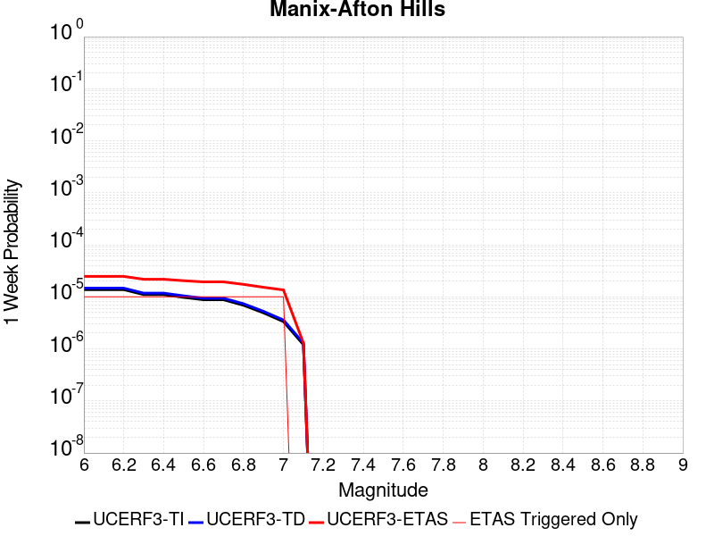 |  |  |  |

| Magnitude | 1 wk TI Prob | 1 wk TD Prob | 1 wk ETAS Prob | 1 wk ETAS/TD Gain | 1 wk ETAS Triggered Only | 1 mo TI Prob | 1 mo TD Prob | 1 mo ETAS Prob | 1 mo ETAS/TD Gain | 1 mo ETAS Triggered Only | 1 yr TI Prob | 1 yr TD Prob | 1 yr ETAS Prob | 1 yr ETAS/TD Gain | 1 yr ETAS Triggered Only | 10 yr TI Prob | 10 yr TD Prob | 10 yr ETAS Prob | 10 yr ETAS/TD Gain | 10 yr ETAS Triggered Only |
|-----|-----|-----|-----|-----|-----|-----|-----|-----|-----|-----|-----|-----|-----|-----|-----|-----|-----|-----|-----|-----|
| 6.0 | 1.3783202E-5 | 1.4711616E-5 | 2.471147E-5 | 1.6797249 | 1.0E-5 | 5.906953E-5 | 6.3048356E-5 | 7.3047726E-5 | 1.1585984 | 1.0E-5 | 7.189342E-4 | 7.673609E-4 | 7.873456E-4 | 1.0260434 | 2.0E-5 | 0.0071661277 | 0.0076488685 | 0.00770841 | 1.0077842 | 6.0E-5 |
| 6.1 | 1.3783202E-5 | 1.4711616E-5 | 2.471147E-5 | 1.6797249 | 1.0E-5 | 5.906953E-5 | 6.3048356E-5 | 7.3047726E-5 | 1.1585984 | 1.0E-5 | 7.189342E-4 | 7.673609E-4 | 7.873456E-4 | 1.0260434 | 2.0E-5 | 0.0071661277 | 0.0076488685 | 0.00770841 | 1.0077842 | 6.0E-5 |
| 6.2 | 1.3783202E-5 | 1.4711616E-5 | 2.471147E-5 | 1.6797249 | 1.0E-5 | 5.906953E-5 | 6.3048356E-5 | 7.3047726E-5 | 1.1585984 | 1.0E-5 | 7.189342E-4 | 7.673609E-4 | 7.873456E-4 | 1.0260434 | 2.0E-5 | 0.0071661277 | 0.0076488685 | 0.00770841 | 1.0077842 | 6.0E-5 |
| 6.3 | 1.10494875E-5 | 1.1793558E-5 | 2.179344E-5 | 1.8479105 | 1.0E-5 | 4.7354086E-5 | 5.0542898E-5 | 6.0542392E-5 | 1.1978418 | 1.0E-5 | 5.763835E-4 | 6.151964E-4 | 6.351841E-4 | 1.0324899 | 2.0E-5 | 0.005748908 | 0.0061359745 | 0.0061657904 | 1.0048592 | 3.0E-5 |
| 6.4 | 1.10494875E-5 | 1.1793558E-5 | 2.179344E-5 | 1.8479105 | 1.0E-5 | 4.7354086E-5 | 5.0542898E-5 | 6.0542392E-5 | 1.1978418 | 1.0E-5 | 5.763835E-4 | 6.151964E-4 | 6.351841E-4 | 1.0324899 | 2.0E-5 | 0.005748908 | 0.0061359745 | 0.0061657904 | 1.0048592 | 3.0E-5 |
| 6.5 | 9.788949E-6 | 1.0454697E-5 | 2.0454592E-5 | 1.9564978 | 1.0E-5 | 4.1951964E-5 | 4.480513E-5 | 5.480468E-5 | 1.2231787 | 1.0E-5 | 5.1064545E-4 | 5.453752E-4 | 5.653643E-4 | 1.036652 | 2.0E-5 | 0.0050947363 | 0.005441295 | 0.0054711318 | 1.0054834 | 3.0E-5 |
| 6.6 | 8.810006E-6 | 9.413971E-6 | 1.9413877E-5 | 2.062241 | 1.0E-5 | 3.775662E-5 | 4.0345018E-5 | 5.0344614E-5 | 1.2478521 | 1.0E-5 | 4.5958988E-4 | 4.9109873E-4 | 5.1108893E-4 | 1.040705 | 2.0E-5 | 0.0045864056 | 0.0049010175 | 0.00493087 | 1.0060912 | 3.0E-5 |
| 6.7 | 8.80128E-6 | 9.404451E-6 | 1.9404357E-5 | 2.0633163 | 1.0E-5 | 3.7719226E-5 | 4.0304214E-5 | 5.0303814E-5 | 1.248103 | 1.0E-5 | 4.591348E-4 | 4.906022E-4 | 5.105924E-4 | 1.0407462 | 2.0E-5 | 0.004581874 | 0.004896074 | 0.004925927 | 1.0060973 | 3.0E-5 |
| 6.8 | 6.8994877E-6 | 7.3803494E-6 | 1.7380276E-5 | 2.3549395 | 1.0E-5 | 2.9568899E-5 | 3.162973E-5 | 4.1629417E-5 | 1.3161483 | 1.0E-5 | 3.5994186E-4 | 3.850321E-4 | 4.050244E-4 | 1.0519238 | 2.0E-5 | 0.003593594 | 0.0038444551 | 0.0038743396 | 1.0077734 | 3.0E-5 |
| 6.9 | 4.9328037E-6 | 5.271154E-6 | 1.5271102E-5 | 2.8971078 | 1.0E-5 | 2.1140417E-5 | 2.2590497E-5 | 3.2590273E-5 | 1.442654 | 1.0E-5 | 2.5735417E-4 | 2.7501077E-4 | 2.9500524E-4 | 1.0727044 | 2.0E-5 | 0.0025705635 | 0.0027473096 | 0.0027772272 | 1.0108898 | 3.0E-5 |
| 7.0 | 3.347973E-6 | 3.590168E-6 | 1.3590132E-5 | 3.7853749 | 1.0E-5 | 1.4348378E-5 | 1.5386368E-5 | 2.5386213E-5 | 1.649916 | 1.0E-5 | 1.746775E-4 | 1.8731703E-4 | 2.0731328E-4 | 1.1067508 | 2.0E-5 | 0.0017454025 | 0.0018719939 | 0.0019019378 | 1.0159957 | 3.0E-5 |
| 7.1 | 1.2073567E-6 | 1.293531E-6 | 1.293531E-6 | 1.0 | 0.0 | 5.1743755E-6 | 5.5437017E-6 | 5.5437017E-6 | 1.0 | 0.0 | 6.29962E-5 | 6.749411E-5 | 7.749344E-5 | 1.148151 | 1.0E-5 | 6.297835E-4 | 6.748963E-4 | 6.8488956E-4 | 1.0148071 | 1.0E-5 |

## Tin Mountain
*[(top)](#table-of-contents)*

| 1 Week | 1 Month | 1 Year | 10 Year |
|-----|-----|-----|-----|
|  |  |  |  |

| Magnitude | 1 wk TI Prob | 1 wk TD Prob | 1 wk ETAS Prob | 1 wk ETAS/TD Gain | 1 wk ETAS Triggered Only | 1 mo TI Prob | 1 mo TD Prob | 1 mo ETAS Prob | 1 mo ETAS/TD Gain | 1 mo ETAS Triggered Only | 1 yr TI Prob | 1 yr TD Prob | 1 yr ETAS Prob | 1 yr ETAS/TD Gain | 1 yr ETAS Triggered Only | 10 yr TI Prob | 10 yr TD Prob | 10 yr ETAS Prob | 10 yr ETAS/TD Gain | 10 yr ETAS Triggered Only |
|-----|-----|-----|-----|-----|-----|-----|-----|-----|-----|-----|-----|-----|-----|-----|-----|-----|-----|-----|-----|-----|
| 6.0 | 4.083776E-6 | 4.18159E-6 | 1.4181548E-5 | 3.391425 | 1.0E-5 | 1.750178E-5 | 1.7920998E-5 | 2.7920818E-5 | 1.5579946 | 1.0E-5 | 2.1306332E-4 | 2.1817003E-4 | 2.581613E-4 | 1.1833032 | 4.0E-5 | 0.0021285915 | 0.0021799242 | 0.0022397933 | 1.0274639 | 6.0E-5 |
| 6.1 | 4.083776E-6 | 4.18159E-6 | 1.4181548E-5 | 3.391425 | 1.0E-5 | 1.750178E-5 | 1.7920998E-5 | 2.7920818E-5 | 1.5579946 | 1.0E-5 | 2.1306332E-4 | 2.1817003E-4 | 2.581613E-4 | 1.1833032 | 4.0E-5 | 0.0021285915 | 0.0021799242 | 0.0022397933 | 1.0274639 | 6.0E-5 |
| 6.2 | 4.083776E-6 | 4.18159E-6 | 1.4181548E-5 | 3.391425 | 1.0E-5 | 1.750178E-5 | 1.7920998E-5 | 2.7920818E-5 | 1.5579946 | 1.0E-5 | 2.1306332E-4 | 2.1817003E-4 | 2.581613E-4 | 1.1833032 | 4.0E-5 | 0.0021285915 | 0.0021799242 | 0.0022397933 | 1.0274639 | 6.0E-5 |
| 6.3 | 4.083776E-6 | 4.18159E-6 | 1.4181548E-5 | 3.391425 | 1.0E-5 | 1.750178E-5 | 1.7920998E-5 | 2.7920818E-5 | 1.5579946 | 1.0E-5 | 2.1306332E-4 | 2.1817003E-4 | 2.581613E-4 | 1.1833032 | 4.0E-5 | 0.0021285915 | 0.0021799242 | 0.0022397933 | 1.0274639 | 6.0E-5 |
| 6.4 | 4.083776E-6 | 4.18159E-6 | 1.4181548E-5 | 3.391425 | 1.0E-5 | 1.750178E-5 | 1.7920998E-5 | 2.7920818E-5 | 1.5579946 | 1.0E-5 | 2.1306332E-4 | 2.1817003E-4 | 2.581613E-4 | 1.1833032 | 4.0E-5 | 0.0021285915 | 0.0021799242 | 0.0022397933 | 1.0274639 | 6.0E-5 |
| 6.5 | 2.3143427E-6 | 2.3731893E-6 | 1.2373165E-5 | 5.213729 | 1.0E-5 | 9.9185745E-6 | 1.01707765E-5 | 2.0170673E-5 | 1.9831991 | 1.0E-5 | 1.2075195E-4 | 1.2382293E-4 | 1.5381922E-4 | 1.2422514 | 3.0E-5 | 0.0012068636 | 0.0012376154 | 0.0012775658 | 1.0322802 | 4.0E-5 |
| 6.6 | 2.3143427E-6 | 2.3731893E-6 | 1.2373165E-5 | 5.213729 | 1.0E-5 | 9.9185745E-6 | 1.01707765E-5 | 2.0170673E-5 | 1.9831991 | 1.0E-5 | 1.2075195E-4 | 1.2382293E-4 | 1.5381922E-4 | 1.2422514 | 3.0E-5 | 0.0012068636 | 0.0012376154 | 0.0012775658 | 1.0322802 | 4.0E-5 |
| 6.7 | 1.7029532E-6 | 1.7498172E-6 | 1.1749799E-5 | 6.714873 | 1.0E-5 | 7.2983503E-6 | 7.499198E-6 | 1.7499124E-5 | 2.333466 | 1.0E-5 | 8.885379E-5 | 9.1299444E-5 | 1.0129853E-4 | 1.1095197 | 1.0E-5 | 8.881827E-4 | 9.12672E-4 | 9.326537E-4 | 1.0218936 | 2.0E-5 |
| 6.8 | 1.2914646E-6 | 1.329959E-6 | 1.1329946E-5 | 8.519019 | 1.0E-5 | 5.534837E-6 | 5.699814E-6 | 1.5699758E-5 | 2.7544332 | 1.0E-5 | 6.738455E-5 | 6.939347E-5 | 7.9392776E-5 | 1.1440958 | 1.0E-5 | 6.736412E-4 | 6.937614E-4 | 7.137475E-4 | 1.0288084 | 2.0E-5 |
| 6.9 | 5.8708974E-7 | 6.11713E-7 | 6.11713E-7 | 1.0 | 0.0 | 2.5160964E-6 | 2.6216248E-6 | 2.6216248E-6 | 1.0 | 0.0 | 3.0633044E-5 | 3.1917854E-5 | 3.1917854E-5 | 1.0 | 0.0 | 3.0628822E-4 | 3.1913683E-4 | 3.2913365E-4 | 1.0313245 | 1.0E-5 |
| 7.0 | 4.6248786E-7 | 4.8321306E-7 | 4.8321306E-7 | 1.0 | 0.0 | 1.9820893E-6 | 2.0709115E-6 | 2.0709115E-6 | 1.0 | 0.0 | 2.413167E-5 | 2.5213094E-5 | 2.5213094E-5 | 1.0 | 0.0 | 2.412905E-4 | 2.5210602E-4 | 2.5210602E-4 | 1.0 | 0.0 |
| 7.1 | 3.804606E-7 | 3.9872486E-7 | 3.9872486E-7 | 1.0 | 0.0 | 1.6305444E-6 | 1.7088199E-6 | 1.7088199E-6 | 1.0 | 0.0 | 1.9851697E-5 | 2.0804719E-5 | 2.0804719E-5 | 1.0 | 0.0 | 1.9849923E-4 | 2.0803107E-4 | 2.0803107E-4 | 1.0 | 0.0 |
| 7.2 | 3.5864858E-7 | 3.7617838E-7 | 3.7617838E-7 | 1.0 | 0.0 | 1.5370645E-6 | 1.6121922E-6 | 1.6121922E-6 | 1.0 | 0.0 | 1.87136E-5 | 1.9628298E-5 | 1.9628298E-5 | 1.0 | 0.0 | 1.8712023E-4 | 1.9626896E-4 | 1.9626896E-4 | 1.0 | 0.0 |
| 7.3 | 3.342063E-7 | 3.5064386E-7 | 3.5064386E-7 | 1.0 | 0.0 | 1.4323119E-6 | 1.5027588E-6 | 1.5027588E-6 | 1.0 | 0.0 | 1.7438259E-5 | 1.8295968E-5 | 1.8295968E-5 | 1.0 | 0.0 | 1.743689E-4 | 1.8294792E-4 | 1.8294792E-4 | 1.0 | 0.0 |
| 7.4 | 2.971242E-7 | 3.1166627E-7 | 3.1166627E-7 | 1.0 | 0.0 | 1.2733886E-6 | 1.3357121E-6 | 1.3357121E-6 | 1.0 | 0.0 | 1.5503398E-5 | 1.6262207E-5 | 1.6262207E-5 | 1.0 | 0.0 | 1.5502315E-4 | 1.6261345E-4 | 1.6261345E-4 | 1.0 | 0.0 |
| 7.5 | 1.4326713E-7 | 1.5012905E-7 | 1.5012905E-7 | 1.0 | 0.0 | 6.140018E-7 | 6.434102E-7 | 6.434102E-7 | 1.0 | 0.0 | 7.4754466E-6 | 7.83352E-6 | 7.83352E-6 | 1.0 | 0.0 | 7.475195E-5 | 7.833519E-5 | 7.833519E-5 | 1.0 | 0.0 |

## Channel Islands Thrust
*[(top)](#table-of-contents)*

| 1 Week | 1 Month | 1 Year | 10 Year |
|-----|-----|-----|-----|
|  |  |  |  |

| Magnitude | 1 wk TI Prob | 1 wk TD Prob | 1 wk ETAS Prob | 1 wk ETAS/TD Gain | 1 wk ETAS Triggered Only | 1 mo TI Prob | 1 mo TD Prob | 1 mo ETAS Prob | 1 mo ETAS/TD Gain | 1 mo ETAS Triggered Only | 1 yr TI Prob | 1 yr TD Prob | 1 yr ETAS Prob | 1 yr ETAS/TD Gain | 1 yr ETAS Triggered Only | 10 yr TI Prob | 10 yr TD Prob | 10 yr ETAS Prob | 10 yr ETAS/TD Gain | 10 yr ETAS Triggered Only |
|-----|-----|-----|-----|-----|-----|-----|-----|-----|-----|-----|-----|-----|-----|-----|-----|-----|-----|-----|-----|-----|
| 6.0 | 2.2156251E-5 | 2.4093148E-5 | 2.4093148E-5 | 1.0 | 0.0 | 9.495191E-5 | 1.0325286E-4 | 1.0325286E-4 | 1.0 | 0.0 | 0.0011554264 | 0.0012564851 | 0.0012864474 | 1.0238461 | 3.0E-5 | 0.011494373 | 0.012504402 | 0.012563651 | 1.0047383 | 6.0E-5 |
| 6.1 | 2.2156251E-5 | 2.4093148E-5 | 2.4093148E-5 | 1.0 | 0.0 | 9.495191E-5 | 1.0325286E-4 | 1.0325286E-4 | 1.0 | 0.0 | 0.0011554264 | 0.0012564851 | 0.0012864474 | 1.0238461 | 3.0E-5 | 0.011494373 | 0.012504402 | 0.012563651 | 1.0047383 | 6.0E-5 |
| 6.2 | 2.2156251E-5 | 2.4093148E-5 | 2.4093148E-5 | 1.0 | 0.0 | 9.495191E-5 | 1.0325286E-4 | 1.0325286E-4 | 1.0 | 0.0 | 0.0011554264 | 0.0012564851 | 0.0012864474 | 1.0238461 | 3.0E-5 | 0.011494373 | 0.012504402 | 0.012563651 | 1.0047383 | 6.0E-5 |
| 6.3 | 2.2156251E-5 | 2.4093148E-5 | 2.4093148E-5 | 1.0 | 0.0 | 9.495191E-5 | 1.0325286E-4 | 1.0325286E-4 | 1.0 | 0.0 | 0.0011554264 | 0.0012564851 | 0.0012864474 | 1.0238461 | 3.0E-5 | 0.011494373 | 0.012504402 | 0.012563651 | 1.0047383 | 6.0E-5 |
| 6.4 | 2.2156251E-5 | 2.4093148E-5 | 2.4093148E-5 | 1.0 | 0.0 | 9.495191E-5 | 1.0325286E-4 | 1.0325286E-4 | 1.0 | 0.0 | 0.0011554264 | 0.0012564851 | 0.0012864474 | 1.0238461 | 3.0E-5 | 0.011494373 | 0.012504402 | 0.012563651 | 1.0047383 | 6.0E-5 |
| 6.5 | 2.2156251E-5 | 2.4093148E-5 | 2.4093148E-5 | 1.0 | 0.0 | 9.495191E-5 | 1.0325286E-4 | 1.0325286E-4 | 1.0 | 0.0 | 0.0011554264 | 0.0012564851 | 0.0012864474 | 1.0238461 | 3.0E-5 | 0.011494373 | 0.012504402 | 0.012563651 | 1.0047383 | 6.0E-5 |
| 6.6 | 2.2156251E-5 | 2.4093148E-5 | 2.4093148E-5 | 1.0 | 0.0 | 9.495191E-5 | 1.0325286E-4 | 1.0325286E-4 | 1.0 | 0.0 | 0.0011554264 | 0.0012564851 | 0.0012864474 | 1.0238461 | 3.0E-5 | 0.011494373 | 0.012504402 | 0.012563651 | 1.0047383 | 6.0E-5 |
| 6.7 | 1.0601296E-5 | 1.1379992E-5 | 1.1379992E-5 | 1.0 | 0.0 | 4.5433335E-5 | 4.8770515E-5 | 4.8770515E-5 | 1.0 | 0.0 | 5.5301044E-4 | 5.9362414E-4 | 5.9362414E-4 | 1.0 | 0.0 | 0.005516363 | 0.0059208865 | 0.005940768 | 1.0033579 | 2.0E-5 |
| 6.8 | 1.0246747E-5 | 1.09971015E-5 | 1.09971015E-5 | 1.0 | 0.0 | 4.391389E-5 | 4.712961E-5 | 4.712961E-5 | 1.0 | 0.0 | 5.345204E-4 | 5.7365675E-4 | 5.7365675E-4 | 1.0 | 0.0 | 0.0053323656 | 0.0057222494 | 0.005742135 | 1.0034751 | 2.0E-5 |
| 6.9 | 9.049551E-6 | 9.70002E-6 | 9.70002E-6 | 1.0 | 0.0 | 3.878322E-5 | 4.1570875E-5 | 4.1570875E-5 | 1.0 | 0.0 | 4.7208337E-4 | 5.0601194E-4 | 5.0601194E-4 | 1.0 | 0.0 | 0.0047108172 | 0.0050490154 | 0.0050589647 | 1.0019705 | 1.0E-5 |
| 7.0 | 8.6542195E-6 | 9.2749615E-6 | 9.2749615E-6 | 1.0 | 0.0 | 3.7088983E-5 | 3.974925E-5 | 3.974925E-5 | 1.0 | 0.0 | 4.5146482E-4 | 4.8384376E-4 | 4.8384376E-4 | 1.0 | 0.0 | 0.004505487 | 0.004828315 | 0.004838267 | 1.0020611 | 1.0E-5 |
| 7.1 | 8.391028E-6 | 8.993273E-6 | 8.993273E-6 | 1.0 | 0.0 | 3.5961057E-5 | 3.8542054E-5 | 3.8542054E-5 | 1.0 | 0.0 | 4.3773788E-4 | 4.6915252E-4 | 4.6915252E-4 | 1.0 | 0.0 | 0.004368766 | 0.004682031 | 0.004691984 | 1.0021259 | 1.0E-5 |
| 7.2 | 5.965188E-6 | 6.3719312E-6 | 6.3719312E-6 | 1.0 | 0.0 | 2.556484E-5 | 2.7307993E-5 | 2.7307993E-5 | 1.0 | 0.0 | 3.1120746E-4 | 3.3242465E-4 | 3.3242465E-4 | 1.0 | 0.0 | 0.00310772 | 0.003319332 | 0.0033292987 | 1.0030026 | 1.0E-5 |
| 7.3 | 4.877518E-6 | 5.206198E-6 | 5.206198E-6 | 1.0 | 0.0 | 2.0903482E-5 | 2.2312088E-5 | 2.2312088E-5 | 1.0 | 0.0 | 2.5447016E-4 | 2.7161627E-4 | 2.7161627E-4 | 1.0 | 0.0 | 0.0025417898 | 0.002712889 | 0.002722862 | 1.003676 | 1.0E-5 |
| 7.4 | 3.8829853E-6 | 4.142015E-6 | 4.142015E-6 | 1.0 | 0.0 | 1.664126E-5 | 1.7751374E-5 | 1.7751374E-5 | 1.0 | 0.0 | 2.0258849E-4 | 2.1610195E-4 | 2.1610195E-4 | 1.0 | 0.0 | 0.002024039 | 0.0021589599 | 0.0021589599 | 1.0 | 0.0 |
| 7.5 | 1.3489616E-6 | 1.4278398E-6 | 1.4278398E-6 | 1.0 | 0.0 | 5.7812517E-6 | 6.119299E-6 | 6.119299E-6 | 1.0 | 0.0 | 7.038446E-5 | 7.449996E-5 | 7.449996E-5 | 1.0 | 0.0 | 7.036218E-4 | 7.447538E-4 | 7.447538E-4 | 1.0 | 0.0 |
| 7.6 | 6.058192E-7 | 6.3539926E-7 | 6.3539926E-7 | 1.0 | 0.0 | 2.5963652E-6 | 2.723137E-6 | 2.723137E-6 | 1.0 | 0.0 | 3.161029E-5 | 3.3153705E-5 | 3.3153705E-5 | 1.0 | 0.0 | 3.1605794E-4 | 3.314892E-4 | 3.314892E-4 | 1.0 | 0.0 |
| 7.7 | 2.2170494E-7 | 2.26086E-7 | 2.26086E-7 | 1.0 | 0.0 | 9.5016367E-7 | 9.689397E-7 | 9.689397E-7 | 1.0 | 0.0 | 1.1568181E-5 | 1.1796788E-5 | 1.1796788E-5 | 1.0 | 0.0 | 1.1567579E-4 | 1.1796273E-4 | 1.1796273E-4 | 1.0 | 0.0 |
| 7.8 | 2.1613102E-8 | 1.546703E-8 | 1.546703E-8 | 1.0 | 0.0 | 9.262757E-8 | 6.628727E-8 | 6.628727E-8 | 1.0 | 0.0 | 1.1277401E-6 | 8.070473E-7 | 8.070473E-7 | 1.0 | 0.0 | 1.1277344E-5 | 8.070451E-6 | 8.070451E-6 | 1.0 | 0.0 |

## San Cayetano
*[(top)](#table-of-contents)*

| 1 Week | 1 Month | 1 Year | 10 Year |
|-----|-----|-----|-----|
|  | 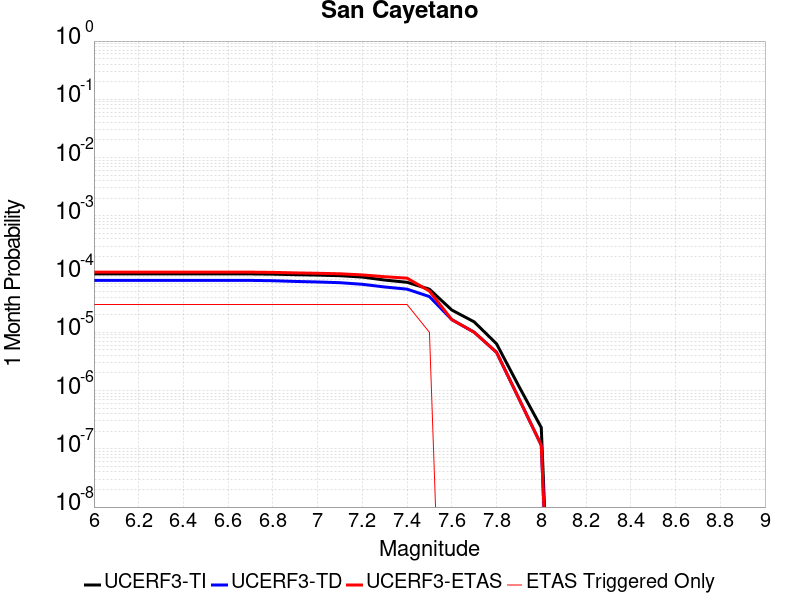 | 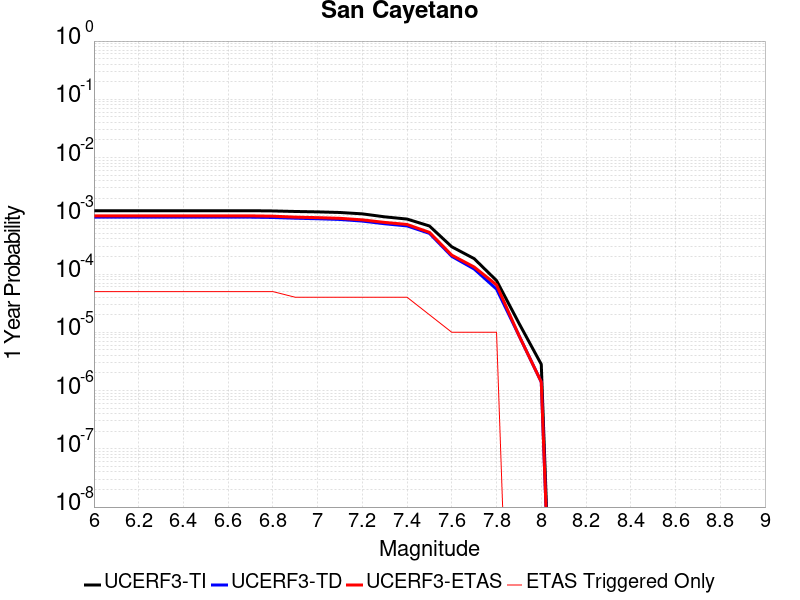 |  |

| Magnitude | 1 wk TI Prob | 1 wk TD Prob | 1 wk ETAS Prob | 1 wk ETAS/TD Gain | 1 wk ETAS Triggered Only | 1 mo TI Prob | 1 mo TD Prob | 1 mo ETAS Prob | 1 mo ETAS/TD Gain | 1 mo ETAS Triggered Only | 1 yr TI Prob | 1 yr TD Prob | 1 yr ETAS Prob | 1 yr ETAS/TD Gain | 1 yr ETAS Triggered Only | 10 yr TI Prob | 10 yr TD Prob | 10 yr ETAS Prob | 10 yr ETAS/TD Gain | 10 yr ETAS Triggered Only |
|-----|-----|-----|-----|-----|-----|-----|-----|-----|-----|-----|-----|-----|-----|-----|-----|-----|-----|-----|-----|-----|
| 6.0 | 2.3476267E-5 | 1.8172113E-5 | 1.8172113E-5 | 1.0 | 0.0 | 1.0060869E-4 | 7.787818E-5 | 1.0787584E-4 | 1.385187 | 3.0E-5 | 0.0012242225 | 9.477581E-4 | 9.977107E-4 | 1.0527061 | 5.0E-5 | 0.012175002 | 0.009437738 | 0.009497172 | 1.0062975 | 6.0E-5 |
| 6.1 | 2.3476267E-5 | 1.8172113E-5 | 1.8172113E-5 | 1.0 | 0.0 | 1.0060869E-4 | 7.787818E-5 | 1.0787584E-4 | 1.385187 | 3.0E-5 | 0.0012242225 | 9.477581E-4 | 9.977107E-4 | 1.0527061 | 5.0E-5 | 0.012175002 | 0.009437738 | 0.009497172 | 1.0062975 | 6.0E-5 |
| 6.2 | 2.3476267E-5 | 1.8172113E-5 | 1.8172113E-5 | 1.0 | 0.0 | 1.0060869E-4 | 7.787818E-5 | 1.0787584E-4 | 1.385187 | 3.0E-5 | 0.0012242225 | 9.477581E-4 | 9.977107E-4 | 1.0527061 | 5.0E-5 | 0.012175002 | 0.009437738 | 0.009497172 | 1.0062975 | 6.0E-5 |
| 6.3 | 2.3476267E-5 | 1.8172113E-5 | 1.8172113E-5 | 1.0 | 0.0 | 1.0060869E-4 | 7.787818E-5 | 1.0787584E-4 | 1.385187 | 3.0E-5 | 0.0012242225 | 9.477581E-4 | 9.977107E-4 | 1.0527061 | 5.0E-5 | 0.012175002 | 0.009437738 | 0.009497172 | 1.0062975 | 6.0E-5 |
| 6.4 | 2.3476267E-5 | 1.8172113E-5 | 1.8172113E-5 | 1.0 | 0.0 | 1.0060869E-4 | 7.787818E-5 | 1.0787584E-4 | 1.385187 | 3.0E-5 | 0.0012242225 | 9.477581E-4 | 9.977107E-4 | 1.0527061 | 5.0E-5 | 0.012175002 | 0.009437738 | 0.009497172 | 1.0062975 | 6.0E-5 |
| 6.5 | 2.3476267E-5 | 1.8172113E-5 | 1.8172113E-5 | 1.0 | 0.0 | 1.0060869E-4 | 7.787818E-5 | 1.0787584E-4 | 1.385187 | 3.0E-5 | 0.0012242225 | 9.477581E-4 | 9.977107E-4 | 1.0527061 | 5.0E-5 | 0.012175002 | 0.009437738 | 0.009497172 | 1.0062975 | 6.0E-5 |
| 6.6 | 2.3476267E-5 | 1.8172113E-5 | 1.8172113E-5 | 1.0 | 0.0 | 1.0060869E-4 | 7.787818E-5 | 1.0787584E-4 | 1.385187 | 3.0E-5 | 0.0012242225 | 9.477581E-4 | 9.977107E-4 | 1.0527061 | 5.0E-5 | 0.012175002 | 0.009437738 | 0.009497172 | 1.0062975 | 6.0E-5 |
| 6.7 | 2.3476267E-5 | 1.8172113E-5 | 1.8172113E-5 | 1.0 | 0.0 | 1.0060869E-4 | 7.787818E-5 | 1.0787584E-4 | 1.385187 | 3.0E-5 | 0.0012242225 | 9.477581E-4 | 9.977107E-4 | 1.0527061 | 5.0E-5 | 0.012175002 | 0.009437738 | 0.009497172 | 1.0062975 | 6.0E-5 |
| 6.8 | 2.3241924E-5 | 1.7939776E-5 | 1.7939776E-5 | 1.0 | 0.0 | 9.960445E-5 | 7.6882505E-5 | 1.068802E-4 | 1.3901758 | 3.0E-5 | 0.0012120095 | 9.356462E-4 | 9.855994E-4 | 1.053389 | 5.0E-5 | 0.012054204 | 0.009317572 | 0.009377013 | 1.0063795 | 6.0E-5 |
| 6.9 | 2.2761007E-5 | 1.7435174E-5 | 1.7435174E-5 | 1.0 | 0.0 | 9.7543525E-5 | 7.472005E-5 | 1.0471781E-4 | 1.4014686 | 3.0E-5 | 0.0011869454 | 9.0934034E-4 | 9.4930397E-4 | 1.0439479 | 4.0E-5 | 0.011806256 | 0.009056673 | 0.009106221 | 1.0054708 | 5.0E-5 |
| 7.0 | 2.240283E-5 | 1.7068909E-5 | 1.7068909E-5 | 1.0 | 0.0 | 9.600859E-5 | 7.315043E-5 | 1.0314824E-4 | 1.4100838 | 3.0E-5 | 0.0011682777 | 8.9024607E-4 | 9.3021046E-4 | 1.0448914 | 4.0E-5 | 0.011621549 | 0.00886726 | 0.008916817 | 1.0055888 | 5.0E-5 |
| 7.1 | 2.1871154E-5 | 1.6588769E-5 | 1.6588769E-5 | 1.0 | 0.0 | 9.373015E-5 | 7.10928E-5 | 1.0109067E-4 | 1.4219537 | 3.0E-5 | 0.0011405671 | 8.652145E-4 | 9.051799E-4 | 1.0461913 | 4.0E-5 | 0.011347309 | 0.008618908 | 0.008668478 | 1.0057513 | 5.0E-5 |
| 7.2 | 2.0714133E-5 | 1.556723E-5 | 1.556723E-5 | 1.0 | 0.0 | 8.8771834E-5 | 6.671501E-5 | 9.6713E-5 | 1.449644 | 3.0E-5 | 0.0010802611 | 8.119558E-4 | 8.519233E-4 | 1.0492238 | 4.0E-5 | 0.010750249 | 0.008090313 | 0.008139908 | 1.0061302 | 5.0E-5 |
| 7.3 | 1.8408395E-5 | 1.3997954E-5 | 1.3997954E-5 | 1.0 | 0.0 | 7.8890735E-5 | 5.998987E-5 | 8.998807E-5 | 1.5000545 | 3.0E-5 | 9.600714E-4 | 7.301349E-4 | 7.701057E-4 | 1.0547444 | 4.0E-5 | 0.009559342 | 0.0072777392 | 0.007327375 | 1.0068203 | 5.0E-5 |
| 7.4 | 1.6856795E-5 | 1.2850997E-5 | 1.2850997E-5 | 1.0 | 0.0 | 7.2241404E-5 | 5.5074554E-5 | 8.5072905E-5 | 1.5446862 | 3.0E-5 | 8.7918417E-4 | 6.7032926E-4 | 7.1030244E-4 | 1.0596322 | 4.0E-5 | 0.00875714 | 0.0066834004 | 0.006733066 | 1.0074313 | 5.0E-5 |
| 7.5 | 1.2822778E-5 | 9.578085E-6 | 9.578085E-6 | 1.0 | 0.0 | 5.495361E-5 | 4.1048297E-5 | 5.104789E-5 | 1.2436055 | 1.0E-5 | 6.688548E-4 | 4.9965E-4 | 5.1964005E-4 | 1.0400081 | 2.0E-5 | 0.006668452 | 0.00498533 | 0.0050151804 | 1.0059876 | 3.0E-5 |
| 7.6 | 5.6272684E-6 | 3.855225E-6 | 3.855225E-6 | 1.0 | 0.0 | 2.4116642E-5 | 1.6522288E-5 | 1.6522288E-5 | 1.0 | 0.0 | 2.9358055E-4 | 2.0114038E-4 | 2.1113838E-4 | 1.0497066 | 1.0E-5 | 0.0029319301 | 0.0020095943 | 0.002029554 | 1.0099323 | 2.0E-5 |
| 7.7 | 3.5261346E-6 | 2.3409038E-6 | 2.3409038E-6 | 1.0 | 0.0 | 1.5111918E-5 | 1.0032407E-5 | 1.0032407E-5 | 1.0 | 0.0 | 1.8397206E-4 | 1.2213778E-4 | 1.3213656E-4 | 1.0818647 | 1.0E-5 | 0.0018381984 | 0.001220714 | 0.0012406895 | 1.0163639 | 2.0E-5 |
| 7.8 | 1.4826929E-6 | 1.0565171E-6 | 1.0565171E-6 | 1.0 | 0.0 | 6.354383E-6 | 4.527923E-6 | 4.527923E-6 | 1.0 | 0.0 | 7.736187E-5 | 5.5126085E-5 | 6.512553E-5 | 1.1813923 | 1.0E-5 | 7.733494E-4 | 5.5112614E-4 | 5.611206E-4 | 1.0181347 | 1.0E-5 |
| 7.9 | 2.7568166E-7 | 1.6979682E-7 | 1.6979682E-7 | 1.0 | 0.0 | 1.1814923E-6 | 7.2770047E-7 | 7.2770047E-7 | 1.0 | 0.0 | 1.4384574E-5 | 8.859717E-6 | 8.859717E-6 | 1.0 | 0.0 | 1.4383643E-4 | 8.8593675E-5 | 8.8593675E-5 | 1.0 | 0.0 |
| 8.0 | 5.407832E-8 | 2.6892753E-8 | 2.6892753E-8 | 1.0 | 0.0 | 2.3176422E-7 | 1.1525465E-7 | 1.1525465E-7 | 1.0 | 0.0 | 2.8217257E-6 | 1.4032245E-6 | 1.4032245E-6 | 1.0 | 0.0 | 2.8216898E-5 | 1.4032161E-5 | 1.4032161E-5 | 1.0 | 0.0 |

## San Clemente
*[(top)](#table-of-contents)*

| 1 Week | 1 Month | 1 Year | 10 Year |
|-----|-----|-----|-----|
| 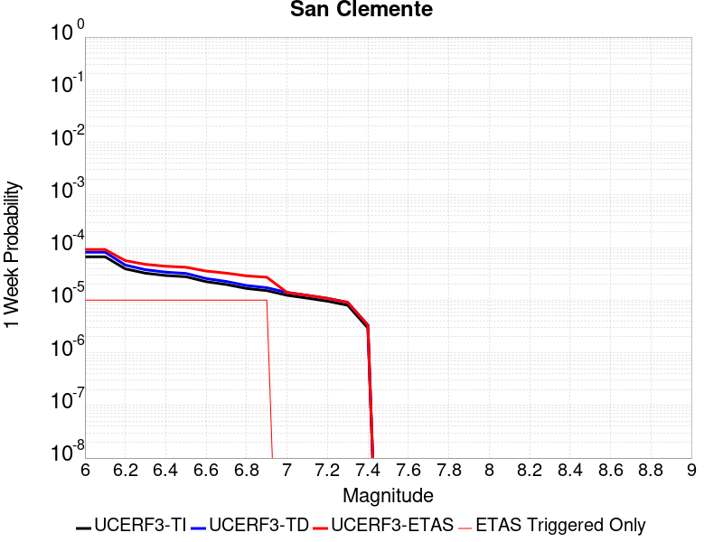 |  | 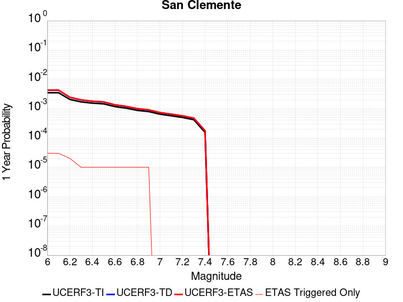 |  |

| Magnitude | 1 wk TI Prob | 1 wk TD Prob | 1 wk ETAS Prob | 1 wk ETAS/TD Gain | 1 wk ETAS Triggered Only | 1 mo TI Prob | 1 mo TD Prob | 1 mo ETAS Prob | 1 mo ETAS/TD Gain | 1 mo ETAS Triggered Only | 1 yr TI Prob | 1 yr TD Prob | 1 yr ETAS Prob | 1 yr ETAS/TD Gain | 1 yr ETAS Triggered Only | 10 yr TI Prob | 10 yr TD Prob | 10 yr ETAS Prob | 10 yr ETAS/TD Gain | 10 yr ETAS Triggered Only |
|-----|-----|-----|-----|-----|-----|-----|-----|-----|-----|-----|-----|-----|-----|-----|-----|-----|-----|-----|-----|-----|
| 6.0 | 6.681379E-5 | 8.164766E-5 | 9.164685E-5 | 1.1224675 | 1.0E-5 | 2.8631336E-4 | 3.4987382E-4 | 3.5987032E-4 | 1.0285717 | 1.0E-5 | 0.003480294 | 0.0042519076 | 0.0042817798 | 1.0070256 | 3.0E-5 | 0.03426291 | 0.041760825 | 0.041818317 | 1.0013767 | 6.0E-5 |
| 6.1 | 6.681379E-5 | 8.164766E-5 | 9.164685E-5 | 1.1224675 | 1.0E-5 | 2.8631336E-4 | 3.4987382E-4 | 3.5987032E-4 | 1.0285717 | 1.0E-5 | 0.003480294 | 0.0042519076 | 0.0042817798 | 1.0070256 | 3.0E-5 | 0.03426291 | 0.041760825 | 0.041808736 | 1.0011473 | 5.0E-5 |
| 6.2 | 3.9400576E-5 | 4.6456847E-5 | 5.645638E-5 | 1.2152436 | 1.0E-5 | 1.6884868E-4 | 1.9908592E-4 | 2.0908393E-4 | 1.0502195 | 1.0E-5 | 0.0020537945 | 0.0024212298 | 0.0024411816 | 1.0082402 | 2.0E-5 | 0.020349167 | 0.023955164 | 0.023984445 | 1.0012224 | 3.0E-5 |
| 6.3 | 3.2590255E-5 | 3.793244E-5 | 4.7932062E-5 | 1.2636166 | 1.0E-5 | 1.3966505E-4 | 1.6255764E-4 | 1.7255601E-4 | 1.0615066 | 1.0E-5 | 0.0016990956 | 0.001977373 | 0.0019873532 | 1.0050472 | 1.0E-5 | 0.01686163 | 0.019601578 | 0.019611383 | 1.0005002 | 1.0E-5 |
| 6.4 | 2.9454652E-5 | 3.410063E-5 | 4.410029E-5 | 1.2932397 | 1.0E-5 | 1.2622811E-4 | 1.4613752E-4 | 1.5613606E-4 | 1.0684187 | 1.0E-5 | 0.0015357438 | 0.0017777986 | 0.0017877808 | 1.0056149 | 1.0E-5 | 0.015251739 | 0.017638939 | 0.017648762 | 1.000557 | 1.0E-5 |
| 6.5 | 2.790836E-5 | 3.2250136E-5 | 4.2249812E-5 | 1.3100662 | 1.0E-5 | 1.1960178E-4 | 1.3820769E-4 | 1.4820631E-4 | 1.0723449 | 1.0E-5 | 0.001455179 | 0.0016814056 | 0.0016913888 | 1.0059375 | 1.0E-5 | 0.014456868 | 0.016689856 | 0.016699689 | 1.0005891 | 1.0E-5 |
| 6.6 | 2.2492153E-5 | 2.5764695E-5 | 3.576444E-5 | 1.388118 | 1.0E-5 | 9.639138E-5 | 1.1041553E-4 | 1.2041443E-4 | 1.090557 | 1.0E-5 | 0.0011729331 | 0.0013434949 | 0.0013534813 | 1.0074333 | 1.0E-5 | 0.011667615 | 0.013355443 | 0.01336531 | 1.0007387 | 1.0E-5 |
| 6.7 | 1.9862755E-5 | 2.2668124E-5 | 3.2667896E-5 | 1.4411381 | 1.0E-5 | 8.512331E-5 | 9.7145545E-5 | 1.0714457E-4 | 1.1029283 | 1.0E-5 | 0.0010358836 | 0.0011821166 | 0.0011921048 | 1.0084494 | 1.0E-5 | 0.010310682 | 0.011759578 | 0.0117694605 | 1.0008404 | 1.0E-5 |
| 6.8 | 1.6697575E-5 | 1.8979084E-5 | 2.8978895E-5 | 1.5268857 | 1.0E-5 | 7.155907E-5 | 8.133645E-5 | 9.133564E-5 | 1.1229361 | 1.0E-5 | 8.7088346E-4 | 9.898308E-4 | 9.998209E-4 | 1.0100927 | 1.0E-5 | 0.008674784 | 0.009855248 | 0.009865149 | 1.0010047 | 1.0E-5 |
| 6.9 | 1.5218415E-5 | 1.7270635E-5 | 2.7270464E-5 | 1.5790075 | 1.0E-5 | 6.522015E-5 | 7.401496E-5 | 8.4014224E-5 | 1.1350979 | 1.0E-5 | 7.93766E-4 | 9.007684E-4 | 9.107594E-4 | 1.0110916 | 1.0E-5 | 0.007909367 | 0.00897212 | 0.00898203 | 1.0011046 | 1.0E-5 |
| 7.0 | 1.2392958E-5 | 1.4034001E-5 | 1.4034001E-5 | 1.0 | 0.0 | 5.3111595E-5 | 6.0144375E-5 | 6.0144375E-5 | 1.0 | 0.0 | 6.4644177E-4 | 7.320193E-4 | 7.320193E-4 | 1.0 | 0.0 | 0.0064456454 | 0.007296867 | 0.007296867 | 1.0 | 0.0 |
| 7.1 | 1.0934128E-5 | 1.2376004E-5 | 1.2376004E-5 | 1.0 | 0.0 | 4.6859706E-5 | 5.3038977E-5 | 5.3038977E-5 | 1.0 | 0.0 | 5.7036756E-4 | 6.4556557E-4 | 6.4556557E-4 | 1.0 | 0.0 | 0.0056890585 | 0.0064376486 | 0.0064376486 | 1.0 | 0.0 |
| 7.2 | 9.5798805E-6 | 1.0845695E-5 | 1.0845695E-5 | 1.0 | 0.0 | 4.1055984E-5 | 4.6480764E-5 | 4.6480764E-5 | 1.0 | 0.0 | 4.9974193E-4 | 5.6576356E-4 | 5.6576356E-4 | 1.0 | 0.0 | 0.0049861963 | 0.005643956 | 0.005643956 | 1.0 | 0.0 |
| 7.3 | 8.0167365E-6 | 9.084559E-6 | 9.084559E-6 | 1.0 | 0.0 | 3.4356988E-5 | 3.893328E-5 | 3.893328E-5 | 1.0 | 0.0 | 4.1821605E-4 | 4.7391668E-4 | 4.7391668E-4 | 1.0 | 0.0 | 0.0041742986 | 0.004729763 | 0.004729763 | 1.0 | 0.0 |
| 7.4 | 2.9581017E-6 | 3.362623E-6 | 3.362623E-6 | 1.0 | 0.0 | 1.2677518E-5 | 1.441119E-5 | 1.441119E-5 | 1.0 | 0.0 | 1.5433785E-4 | 1.7544716E-4 | 1.7544716E-4 | 1.0 | 0.0 | 0.001542307 | 0.0017535817 | 0.0017535817 | 1.0 | 0.0 |

## San Jacinto (Lytle Creek connector)
*[(top)](#table-of-contents)*

| 1 Week | 1 Month | 1 Year | 10 Year |
|-----|-----|-----|-----|
|  |  |  | 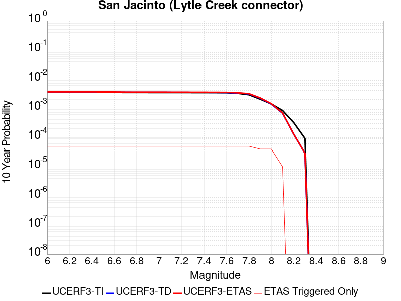 |

| Magnitude | 1 wk TI Prob | 1 wk TD Prob | 1 wk ETAS Prob | 1 wk ETAS/TD Gain | 1 wk ETAS Triggered Only | 1 mo TI Prob | 1 mo TD Prob | 1 mo ETAS Prob | 1 mo ETAS/TD Gain | 1 mo ETAS Triggered Only | 1 yr TI Prob | 1 yr TD Prob | 1 yr ETAS Prob | 1 yr ETAS/TD Gain | 1 yr ETAS Triggered Only | 10 yr TI Prob | 10 yr TD Prob | 10 yr ETAS Prob | 10 yr ETAS/TD Gain | 10 yr ETAS Triggered Only |
|-----|-----|-----|-----|-----|-----|-----|-----|-----|-----|-----|-----|-----|-----|-----|-----|-----|-----|-----|-----|-----|
| 6.0 | 6.693995E-6 | 6.6708703E-6 | 6.6708703E-6 | 1.0 | 0.0 | 2.8688235E-5 | 2.8589133E-5 | 3.8588845E-5 | 1.3497733 | 1.0E-5 | 3.492233E-4 | 3.4801717E-4 | 3.7800672E-4 | 1.0861727 | 3.0E-5 | 0.00348675 | 0.0035549798 | 0.003604802 | 1.0140147 | 5.0E-5 |
| 6.1 | 6.693995E-6 | 6.6708703E-6 | 6.6708703E-6 | 1.0 | 0.0 | 2.8688235E-5 | 2.8589133E-5 | 3.8588845E-5 | 1.3497733 | 1.0E-5 | 3.492233E-4 | 3.4801717E-4 | 3.7800672E-4 | 1.0861727 | 3.0E-5 | 0.00348675 | 0.0035549798 | 0.003604802 | 1.0140147 | 5.0E-5 |
| 6.2 | 6.693995E-6 | 6.6708703E-6 | 6.6708703E-6 | 1.0 | 0.0 | 2.8688235E-5 | 2.8589133E-5 | 3.8588845E-5 | 1.3497733 | 1.0E-5 | 3.492233E-4 | 3.4801717E-4 | 3.7800672E-4 | 1.0861727 | 3.0E-5 | 0.00348675 | 0.0035549798 | 0.003604802 | 1.0140147 | 5.0E-5 |
| 6.3 | 6.693995E-6 | 6.6708703E-6 | 6.6708703E-6 | 1.0 | 0.0 | 2.8688235E-5 | 2.8589133E-5 | 3.8588845E-5 | 1.3497733 | 1.0E-5 | 3.492233E-4 | 3.4801717E-4 | 3.7800672E-4 | 1.0861727 | 3.0E-5 | 0.00348675 | 0.0035549798 | 0.003604802 | 1.0140147 | 5.0E-5 |
| 6.4 | 6.693995E-6 | 6.6708703E-6 | 6.6708703E-6 | 1.0 | 0.0 | 2.8688235E-5 | 2.8589133E-5 | 3.8588845E-5 | 1.3497733 | 1.0E-5 | 3.492233E-4 | 3.4801717E-4 | 3.7800672E-4 | 1.0861727 | 3.0E-5 | 0.00348675 | 0.0035549798 | 0.003604802 | 1.0140147 | 5.0E-5 |
| 6.5 | 6.6561875E-6 | 6.6310877E-6 | 6.6310877E-6 | 1.0 | 0.0 | 2.8526205E-5 | 2.8418637E-5 | 3.841835E-5 | 1.3518717 | 1.0E-5 | 3.472512E-4 | 3.4594207E-4 | 3.7593168E-4 | 1.0866897 | 3.0E-5 | 0.0034670907 | 0.003534295 | 0.0035841183 | 1.0140971 | 5.0E-5 |
| 6.6 | 6.6561875E-6 | 6.6310877E-6 | 6.6310877E-6 | 1.0 | 0.0 | 2.8526205E-5 | 2.8418637E-5 | 3.841835E-5 | 1.3518717 | 1.0E-5 | 3.472512E-4 | 3.4594207E-4 | 3.7593168E-4 | 1.0866897 | 3.0E-5 | 0.0034670907 | 0.003534295 | 0.0035841183 | 1.0140971 | 5.0E-5 |
| 6.7 | 6.5802237E-6 | 6.550262E-6 | 6.550262E-6 | 1.0 | 0.0 | 2.8200653E-5 | 2.8072249E-5 | 3.807197E-5 | 1.3562137 | 1.0E-5 | 3.4328885E-4 | 3.417261E-4 | 3.7171584E-4 | 1.0877596 | 3.0E-5 | 0.0034275902 | 0.0034922683 | 0.0035420936 | 1.0142673 | 5.0E-5 |
| 6.8 | 6.575632E-6 | 6.5447507E-6 | 6.5447507E-6 | 1.0 | 0.0 | 2.8180975E-5 | 2.804863E-5 | 3.804835E-5 | 1.3565136 | 1.0E-5 | 3.4304935E-4 | 3.4143863E-4 | 3.7142838E-4 | 1.0878335 | 3.0E-5 | 0.0034252026 | 0.0034894026 | 0.003539228 | 1.0142791 | 5.0E-5 |
| 6.9 | 6.570433E-6 | 6.5361432E-6 | 6.5361432E-6 | 1.0 | 0.0 | 2.8158694E-5 | 2.8011742E-5 | 3.801146E-5 | 1.3569832 | 1.0E-5 | 3.4277816E-4 | 3.4098965E-4 | 3.7097943E-4 | 1.0879492 | 3.0E-5 | 0.0034224992 | 0.0034849271 | 0.0035347529 | 1.0142975 | 5.0E-5 |
| 7.0 | 6.5643826E-6 | 6.526262E-6 | 6.526262E-6 | 1.0 | 0.0 | 2.8132765E-5 | 2.7969396E-5 | 3.7969116E-5 | 1.3575237 | 1.0E-5 | 3.424626E-4 | 3.4047425E-4 | 3.7046405E-4 | 1.0880824 | 3.0E-5 | 0.0034193532 | 0.0034797892 | 0.0035296152 | 1.0143187 | 5.0E-5 |
| 7.1 | 6.557402E-6 | 6.514972E-6 | 6.514972E-6 | 1.0 | 0.0 | 2.8102848E-5 | 2.792101E-5 | 3.792073E-5 | 1.3581432 | 1.0E-5 | 3.4209844E-4 | 3.3988536E-4 | 3.6987517E-4 | 1.088235 | 3.0E-5 | 0.0034157229 | 0.00347392 | 0.0035237465 | 1.0143429 | 5.0E-5 |
| 7.2 | 6.546394E-6 | 6.496935E-6 | 6.496935E-6 | 1.0 | 0.0 | 2.8055672E-5 | 2.784371E-5 | 3.784343E-5 | 1.3591375 | 1.0E-5 | 3.4152428E-4 | 3.3894452E-4 | 3.6893433E-4 | 1.0884801 | 3.0E-5 | 0.0034099987 | 0.0034645454 | 0.0035143723 | 1.0143819 | 5.0E-5 |
| 7.3 | 6.5364216E-6 | 6.477713E-6 | 6.477713E-6 | 1.0 | 0.0 | 2.8012933E-5 | 2.7761333E-5 | 3.7761056E-5 | 1.3602033 | 1.0E-5 | 3.4100408E-4 | 3.379419E-4 | 3.6793173E-4 | 1.0887426 | 3.0E-5 | 0.003404813 | 0.0034545609 | 0.003504388 | 1.0144236 | 5.0E-5 |
| 7.4 | 6.5269523E-6 | 6.4587916E-6 | 6.4587916E-6 | 1.0 | 0.0 | 2.7972354E-5 | 2.7680242E-5 | 3.7679965E-5 | 1.3612585 | 1.0E-5 | 3.4051016E-4 | 3.3695492E-4 | 3.669448E-4 | 1.0890027 | 3.0E-5 | 0.0033998888 | 0.00344474 | 0.003494568 | 1.0144649 | 5.0E-5 |
| 7.5 | 6.5111835E-6 | 6.435057E-6 | 6.435057E-6 | 1.0 | 0.0 | 2.7904773E-5 | 2.7578524E-5 | 3.7578247E-5 | 1.362591 | 1.0E-5 | 3.3968766E-4 | 3.3571688E-4 | 3.657068E-4 | 1.089331 | 3.0E-5 | 0.0033916887 | 0.00343241 | 0.0034822384 | 1.0145171 | 5.0E-5 |
| 7.6 | 6.4768806E-6 | 6.394153E-6 | 6.394153E-6 | 1.0 | 0.0 | 2.7757764E-5 | 2.7403225E-5 | 3.740295E-5 | 1.3649106 | 1.0E-5 | 3.3789838E-4 | 3.3358324E-4 | 3.6357326E-4 | 1.0899025 | 3.0E-5 | 0.0033738504 | 0.003411134 | 0.0034609635 | 1.0146079 | 5.0E-5 |
| 7.7 | 6.1655364E-6 | 6.18656E-6 | 6.18656E-6 | 1.0 | 0.0 | 2.642346E-5 | 2.6513559E-5 | 3.6513295E-5 | 1.3771555 | 1.0E-5 | 3.2165812E-4 | 3.2275481E-4 | 3.5274515E-4 | 1.0929198 | 3.0E-5 | 0.0032119295 | 0.003302697 | 0.003352532 | 1.0150892 | 5.0E-5 |
| 7.8 | 5.5043524E-6 | 5.747343E-6 | 5.747343E-6 | 1.0 | 0.0 | 2.3589868E-5 | 2.463124E-5 | 3.4630993E-5 | 1.4059786 | 1.0E-5 | 2.871688E-4 | 2.9984413E-4 | 3.2983514E-4 | 1.100022 | 3.0E-5 | 0.0028679797 | 0.0030726586 | 0.003122505 | 1.0162226 | 5.0E-5 |
| 7.9 | 3.889249E-6 | 4.085056E-6 | 4.085056E-6 | 1.0 | 0.0 | 1.6668104E-5 | 1.7507266E-5 | 2.750709E-5 | 1.5711814 | 1.0E-5 | 2.0291525E-4 | 2.1313014E-4 | 2.3312589E-4 | 1.0938194 | 2.0E-5 | 0.0020273007 | 0.0021987725 | 0.0022386846 | 1.018152 | 4.0E-5 |
| 8.0 | 2.668535E-6 | 2.5371553E-6 | 2.5371553E-6 | 1.0 | 0.0 | 1.1436528E-5 | 1.0873477E-5 | 2.0873369E-5 | 1.919659 | 1.0E-5 | 1.3923083E-4 | 1.3237656E-4 | 1.5237392E-4 | 1.1510642 | 2.0E-5 | 0.0013914363 | 0.0013788908 | 0.0014188357 | 1.0289688 | 4.0E-5 |
| 8.1 | 1.5911459E-6 | 1.2216242E-6 | 1.2216242E-6 | 1.0 | 0.0 | 6.8191785E-6 | 5.2355217E-6 | 5.2355217E-6 | 1.0 | 0.0 | 8.3020335E-5 | 6.3740634E-5 | 7.374E-5 | 1.1568758 | 1.0E-5 | 8.298933E-4 | 6.709651E-4 | 6.809584E-4 | 1.0148939 | 1.0E-5 |
| 8.2 | 6.1294963E-7 | 2.1894976E-7 | 2.1894976E-7 | 1.0 | 0.0 | 2.6269242E-6 | 9.383558E-7 | 9.383558E-7 | 1.0 | 0.0 | 3.1982334E-5 | 1.1424422E-5 | 1.1424422E-5 | 1.0 | 0.0 | 3.1977732E-4 | 1.2831615E-4 | 1.2831615E-4 | 1.0 | 0.0 |
| 8.3 | 1.762871E-7 | 4.7755343E-8 | 4.7755343E-8 | 1.0 | 0.0 | 7.5551594E-7 | 2.0466574E-7 | 2.0466574E-7 | 1.0 | 0.0 | 9.1983675E-6 | 2.4918027E-6 | 2.4918027E-6 | 1.0 | 0.0 | 9.197987E-5 | 2.881044E-5 | 2.881044E-5 | 1.0 | 0.0 |

## Oceanic - West Huasna
*[(top)](#table-of-contents)*

| 1 Week | 1 Month | 1 Year | 10 Year |
|-----|-----|-----|-----|
|  |  |  |  |

| Magnitude | 1 wk TI Prob | 1 wk TD Prob | 1 wk ETAS Prob | 1 wk ETAS/TD Gain | 1 wk ETAS Triggered Only | 1 mo TI Prob | 1 mo TD Prob | 1 mo ETAS Prob | 1 mo ETAS/TD Gain | 1 mo ETAS Triggered Only | 1 yr TI Prob | 1 yr TD Prob | 1 yr ETAS Prob | 1 yr ETAS/TD Gain | 1 yr ETAS Triggered Only | 10 yr TI Prob | 10 yr TD Prob | 10 yr ETAS Prob | 10 yr ETAS/TD Gain | 10 yr ETAS Triggered Only |
|-----|-----|-----|-----|-----|-----|-----|-----|-----|-----|-----|-----|-----|-----|-----|-----|-----|-----|-----|-----|-----|
| 6.0 | 3.195567E-5 | 2.7928398E-5 | 2.7928398E-5 | 1.0 | 0.0 | 1.3694567E-4 | 1.1968789E-4 | 1.2968668E-4 | 1.0835407 | 1.0E-5 | 0.0016660384 | 0.0014562691 | 0.0014862254 | 1.0205706 | 3.0E-5 | 0.016536033 | 0.014471814 | 0.014521091 | 1.003405 | 5.0E-5 |
| 6.1 | 2.1156782E-5 | 1.7574706E-5 | 1.7574706E-5 | 1.0 | 0.0 | 9.066878E-5 | 7.531805E-5 | 8.53173E-5 | 1.1327603 | 1.0E-5 | 0.0011033333 | 9.166209E-4 | 9.3660253E-4 | 1.0217993 | 2.0E-5 | 0.010978713 | 0.009129409 | 0.009159135 | 1.0032561 | 3.0E-5 |
| 6.2 | 1.6195117E-5 | 1.3327666E-5 | 1.3327666E-5 | 1.0 | 0.0 | 6.9405796E-5 | 5.7117333E-5 | 6.711676E-5 | 1.1750683 | 1.0E-5 | 8.44688E-4 | 6.951842E-4 | 7.0517726E-4 | 1.0143747 | 1.0E-5 | 0.008414844 | 0.006930389 | 0.0069403197 | 1.0014329 | 1.0E-5 |
| 6.3 | 1.3559345E-5 | 1.1179372E-5 | 1.1179372E-5 | 1.0 | 0.0 | 5.811018E-5 | 4.7910722E-5 | 5.791024E-5 | 1.2087115 | 1.0E-5 | 7.072618E-4 | 5.831579E-4 | 5.93152E-4 | 1.017138 | 1.0E-5 | 0.0070501505 | 0.005816394 | 0.005826336 | 1.0017092 | 1.0E-5 |
| 6.4 | 1.2120619E-5 | 1.0001191E-5 | 1.0001191E-5 | 1.0 | 0.0 | 5.1944477E-5 | 4.2861546E-5 | 5.2861116E-5 | 1.2332994 | 1.0E-5 | 6.322405E-4 | 5.2171486E-4 | 5.3170964E-4 | 1.0191575 | 1.0E-5 | 0.006304447 | 0.0052049677 | 0.005214916 | 1.0019113 | 1.0E-5 |
| 6.5 | 1.13511915E-5 | 9.367664E-6 | 9.367664E-6 | 1.0 | 0.0 | 4.8647056E-5 | 4.0146515E-5 | 5.014611E-5 | 1.2490777 | 1.0E-5 | 5.9211696E-4 | 4.886746E-4 | 4.9866975E-4 | 1.0204536 | 1.0E-5 | 0.0059054173 | 0.004876059 | 0.00488601 | 1.0020409 | 1.0E-5 |
| 6.6 | 9.850605E-6 | 8.135557E-6 | 8.135557E-6 | 1.0 | 0.0 | 4.2216197E-5 | 3.486621E-5 | 3.486621E-5 | 1.0 | 0.0 | 5.1386096E-4 | 4.2441362E-4 | 4.2441362E-4 | 1.0 | 0.0 | 0.0051267436 | 0.004236063 | 0.004236063 | 1.0 | 0.0 |
| 6.7 | 8.8558645E-6 | 7.318557E-6 | 7.318557E-6 | 1.0 | 0.0 | 3.7953152E-5 | 3.1364867E-5 | 3.1364867E-5 | 1.0 | 0.0 | 4.6198163E-4 | 3.8180055E-4 | 3.8180055E-4 | 1.0 | 0.0 | 0.004610224 | 0.0038114712 | 0.0038114712 | 1.0 | 0.0 |
| 6.8 | 7.67136E-6 | 6.3918774E-6 | 6.3918774E-6 | 1.0 | 0.0 | 3.2876844E-5 | 2.7393473E-5 | 2.7393473E-5 | 1.0 | 0.0 | 4.0020206E-4 | 3.3346465E-4 | 3.3346465E-4 | 1.0 | 0.0 | 0.003994821 | 0.0033296635 | 0.0033296635 | 1.0 | 0.0 |
| 6.9 | 6.534529E-6 | 5.458424E-6 | 5.458424E-6 | 1.0 | 0.0 | 2.8004823E-5 | 2.3393037E-5 | 2.3393037E-5 | 1.0 | 0.0 | 3.4090536E-4 | 2.8477312E-4 | 2.8477312E-4 | 1.0 | 0.0 | 0.0034038287 | 0.0028440985 | 0.0028440985 | 1.0 | 0.0 |
| 7.0 | 5.460525E-6 | 4.570061E-6 | 4.570061E-6 | 1.0 | 0.0 | 2.3402039E-5 | 1.9585828E-5 | 1.9585828E-5 | 1.0 | 0.0 | 2.8488258E-4 | 2.3843147E-4 | 2.3843147E-4 | 1.0 | 0.0 | 0.0028451765 | 0.0023817702 | 0.0023817702 | 1.0 | 0.0 |
| 7.1 | 4.4825083E-6 | 3.7525451E-6 | 3.7525451E-6 | 1.0 | 0.0 | 1.9210609E-5 | 1.6082236E-5 | 1.6082236E-5 | 1.0 | 0.0 | 2.3386406E-4 | 1.9578375E-4 | 1.9578375E-4 | 1.0 | 0.0 | 0.002336181 | 0.0019561243 | 0.0019561243 | 1.0 | 0.0 |
| 7.2 | 2.821708E-6 | 2.425045E-6 | 2.425045E-6 | 1.0 | 0.0 | 1.2092979E-5 | 1.0393009E-5 | 1.0393009E-5 | 1.0 | 0.0 | 1.4722206E-4 | 1.2652755E-4 | 1.2652755E-4 | 1.0 | 0.0 | 0.0014712457 | 0.0012645572 | 0.0012645572 | 1.0 | 0.0 |
| 7.3 | 2.0644757E-6 | 1.7688409E-6 | 1.7688409E-6 | 1.0 | 0.0 | 8.847723E-6 | 7.5807243E-6 | 7.5807243E-6 | 1.0 | 0.0 | 1.0771569E-4 | 9.229141E-5 | 9.229141E-5 | 1.0 | 0.0 | 0.001076635 | 9.2253234E-4 | 9.2253234E-4 | 1.0 | 0.0 |
| 7.4 | 1.6980367E-6 | 1.4380826E-6 | 1.4380826E-6 | 1.0 | 0.0 | 7.27728E-6 | 6.1631963E-6 | 6.1631963E-6 | 1.0 | 0.0 | 8.8597284E-5 | 7.503434E-5 | 7.503434E-5 | 1.0 | 0.0 | 8.8561967E-4 | 7.500914E-4 | 7.500914E-4 | 1.0 | 0.0 |
| 7.5 | 1.3637683E-6 | 1.1303514E-6 | 1.1303514E-6 | 1.0 | 0.0 | 5.844708E-6 | 4.844354E-6 | 4.844354E-6 | 1.0 | 0.0 | 7.1156996E-5 | 5.8978418E-5 | 5.8978418E-5 | 1.0 | 0.0 | 7.1134215E-4 | 5.8962894E-4 | 5.8962894E-4 | 1.0 | 0.0 |
| 7.6 | 9.802994E-7 | 7.6780407E-7 | 7.6780407E-7 | 1.0 | 0.0 | 4.2012766E-6 | 3.2905848E-6 | 3.2905848E-6 | 1.0 | 0.0 | 5.1149345E-5 | 4.0062132E-5 | 4.0062132E-5 | 1.0 | 0.0 | 5.113757E-4 | 4.005503E-4 | 4.005503E-4 | 1.0 | 0.0 |
| 7.7 | 5.986191E-7 | 4.0057682E-7 | 4.0057682E-7 | 1.0 | 0.0 | 2.5655079E-6 | 1.7167566E-6 | 1.7167566E-6 | 1.0 | 0.0 | 3.1234613E-5 | 2.0901312E-5 | 2.0901312E-5 | 1.0 | 0.0 | 3.123022E-4 | 2.0899458E-4 | 2.0899458E-4 | 1.0 | 0.0 |
| 7.8 | 2.9189815E-7 | 1.5291376E-7 | 1.5291376E-7 | 1.0 | 0.0 | 1.2509914E-6 | 6.553445E-7 | 6.553445E-7 | 1.0 | 0.0 | 1.5230714E-5 | 7.978791E-6 | 7.978791E-6 | 1.0 | 0.0 | 1.522967E-4 | 7.9786114E-5 | 7.9786114E-5 | 1.0 | 0.0 |
| 7.9 | 1.2057845E-7 | 4.624249E-8 | 4.624249E-8 | 1.0 | 0.0 | 5.1676466E-7 | 1.981821E-7 | 1.981821E-7 | 1.0 | 0.0 | 6.2915915E-6 | 2.4128642E-6 | 2.4128642E-6 | 1.0 | 0.0 | 6.2914136E-5 | 2.4129453E-5 | 2.4129453E-5 | 1.0 | 0.0 |
| 8.0 | 3.3806387E-9 | 9.0229946E-10 | 9.0229946E-10 | 1.0 | 0.0 | 1.4488451E-8 | 3.8669987E-9 | 3.8669987E-9 | 1.0 | 0.0 | 1.7639688E-7 | 4.7080707E-8 | 4.7080707E-8 | 1.0 | 0.0 | 1.7639674E-6 | 4.7169183E-7 | 4.7169183E-7 | 1.0 | 0.0 |

## Pisgah-Bullion Mtn-Mesquite Lk
*[(top)](#table-of-contents)*

| 1 Week | 1 Month | 1 Year | 10 Year |
|-----|-----|-----|-----|
|  |  | 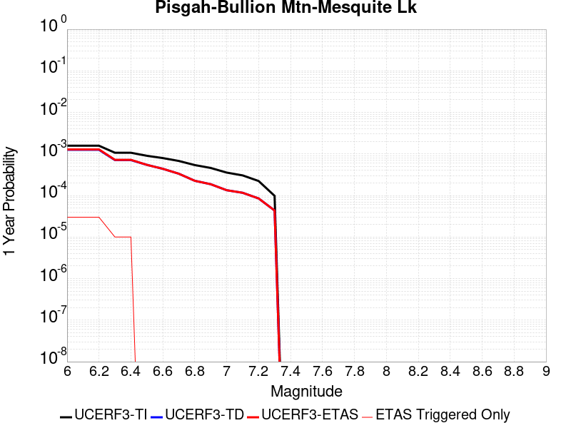 |  |

| Magnitude | 1 wk TI Prob | 1 wk TD Prob | 1 wk ETAS Prob | 1 wk ETAS/TD Gain | 1 wk ETAS Triggered Only | 1 mo TI Prob | 1 mo TD Prob | 1 mo ETAS Prob | 1 mo ETAS/TD Gain | 1 mo ETAS Triggered Only | 1 yr TI Prob | 1 yr TD Prob | 1 yr ETAS Prob | 1 yr ETAS/TD Gain | 1 yr ETAS Triggered Only | 10 yr TI Prob | 10 yr TD Prob | 10 yr ETAS Prob | 10 yr ETAS/TD Gain | 10 yr ETAS Triggered Only |
|-----|-----|-----|-----|-----|-----|-----|-----|-----|-----|-----|-----|-----|-----|-----|-----|-----|-----|-----|-----|-----|
| 6.0 | 3.0240792E-5 | 2.4092273E-5 | 2.4092273E-5 | 1.0 | 0.0 | 1.2959696E-4 | 1.0324908E-4 | 1.0324908E-4 | 1.0 | 0.0 | 0.0015767008 | 0.0012564333 | 0.0012863957 | 1.0238471 | 3.0E-5 | 0.015655609 | 0.012503322 | 0.012552697 | 1.0039489 | 5.0E-5 |
| 6.1 | 3.0240792E-5 | 2.4092273E-5 | 2.4092273E-5 | 1.0 | 0.0 | 1.2959696E-4 | 1.0324908E-4 | 1.0324908E-4 | 1.0 | 0.0 | 0.0015767008 | 0.0012564333 | 0.0012863957 | 1.0238471 | 3.0E-5 | 0.015655609 | 0.012503322 | 0.012552697 | 1.0039489 | 5.0E-5 |
| 6.2 | 3.0240792E-5 | 2.4092273E-5 | 2.4092273E-5 | 1.0 | 0.0 | 1.2959696E-4 | 1.0324908E-4 | 1.0324908E-4 | 1.0 | 0.0 | 0.0015767008 | 0.0012564333 | 0.0012863957 | 1.0238471 | 3.0E-5 | 0.015655609 | 0.012503322 | 0.012552697 | 1.0039489 | 5.0E-5 |
| 6.3 | 2.0498217E-5 | 1.3638665E-5 | 1.3638665E-5 | 1.0 | 0.0 | 8.784654E-5 | 5.84502E-5 | 5.84502E-5 | 1.0 | 0.0 | 0.0010690069 | 7.114151E-4 | 7.21408E-4 | 1.0140465 | 1.0E-5 | 0.01063879 | 0.007093003 | 0.007112861 | 1.0027996 | 2.0E-5 |
| 6.4 | 2.0498217E-5 | 1.3638665E-5 | 1.3638665E-5 | 1.0 | 0.0 | 8.784654E-5 | 5.84502E-5 | 5.84502E-5 | 1.0 | 0.0 | 0.0010690069 | 7.114151E-4 | 7.21408E-4 | 1.0140465 | 1.0E-5 | 0.01063879 | 0.007093003 | 0.007112861 | 1.0027996 | 2.0E-5 |
| 6.5 | 1.7316182E-5 | 1.0477401E-5 | 1.0477401E-5 | 1.0 | 0.0 | 7.42101E-5 | 4.4902426E-5 | 4.4902426E-5 | 1.0 | 0.0 | 9.0313336E-4 | 5.465599E-4 | 5.465599E-4 | 1.0 | 0.0 | 0.008994718 | 0.0054531526 | 0.005463098 | 1.0018238 | 1.0E-5 |
| 6.6 | 1.5251077E-5 | 8.414451E-6 | 8.414451E-6 | 1.0 | 0.0 | 6.536012E-5 | 3.6061476E-5 | 3.6061476E-5 | 1.0 | 0.0 | 7.9546886E-4 | 4.3896728E-4 | 4.3896728E-4 | 1.0 | 0.0 | 0.007926274 | 0.004381719 | 0.0043916753 | 1.0022722 | 1.0E-5 |
| 6.7 | 1.2997425E-5 | 6.411434E-6 | 6.411434E-6 | 1.0 | 0.0 | 5.570206E-5 | 2.747731E-5 | 2.747731E-5 | 1.0 | 0.0 | 6.7796157E-4 | 3.3448957E-4 | 3.3448957E-4 | 1.0 | 0.0 | 0.0067589693 | 0.0033403211 | 0.0033502877 | 1.0029837 | 1.0E-5 |
| 6.8 | 1.035386E-5 | 4.3333516E-6 | 4.3333516E-6 | 1.0 | 0.0 | 4.437293E-5 | 1.857138E-5 | 1.857138E-5 | 1.0 | 0.0 | 5.401065E-4 | 2.2608395E-4 | 2.2608395E-4 | 1.0 | 0.0 | 0.0053879567 | 0.0022586263 | 0.0022586263 | 1.0 | 0.0 |
| 6.9 | 8.816252E-6 | 3.5807668E-6 | 3.5807668E-6 | 1.0 | 0.0 | 3.778339E-5 | 1.5346057E-5 | 1.5346057E-5 | 1.0 | 0.0 | 4.5991567E-4 | 1.8682281E-4 | 1.8682281E-4 | 1.0 | 0.0 | 0.00458965 | 0.001866716 | 0.001866716 | 1.0 | 0.0 |
| 7.0 | 6.8232207E-6 | 2.5675947E-6 | 2.5675947E-6 | 1.0 | 0.0 | 2.9242048E-5 | 1.1003933E-5 | 1.1003933E-5 | 1.0 | 0.0 | 3.5596377E-4 | 1.3396496E-4 | 1.3396496E-4 | 1.0 | 0.0 | 0.0035539411 | 0.0013388731 | 0.0013388731 | 1.0 | 0.0 |
| 7.1 | 5.837013E-6 | 2.2274467E-6 | 2.2274467E-6 | 1.0 | 0.0 | 2.501553E-5 | 9.546166E-6 | 9.546166E-6 | 1.0 | 0.0 | 3.045215E-4 | 1.16218675E-4 | 1.16218675E-4 | 1.0 | 0.0 | 0.0030410455 | 0.001161608 | 0.001161608 | 1.0 | 0.0 |
| 7.2 | 4.278052E-6 | 1.6275889E-6 | 1.6275889E-6 | 1.0 | 0.0 | 1.833438E-5 | 6.9753632E-6 | 6.9753632E-6 | 1.0 | 0.0 | 2.231982E-4 | 8.492197E-5 | 8.492197E-5 | 1.0 | 0.0 | 0.0022297418 | 8.4891845E-4 | 8.4891845E-4 | 1.0 | 0.0 |
| 7.3 | 1.8803692E-6 | 8.345203E-7 | 8.345203E-7 | 1.0 | 0.0 | 8.0587E-6 | 3.5765115E-6 | 3.5765115E-6 | 1.0 | 0.0 | 9.811026E-5 | 4.3543307E-5 | 4.3543307E-5 | 1.0 | 0.0 | 9.806695E-4 | 4.353622E-4 | 4.353622E-4 | 1.0 | 0.0 |

## San Andreas (Creeping Section) 2011 CFM
*[(top)](#table-of-contents)*

| 1 Week | 1 Month | 1 Year | 10 Year |
|-----|-----|-----|-----|
|  |  | 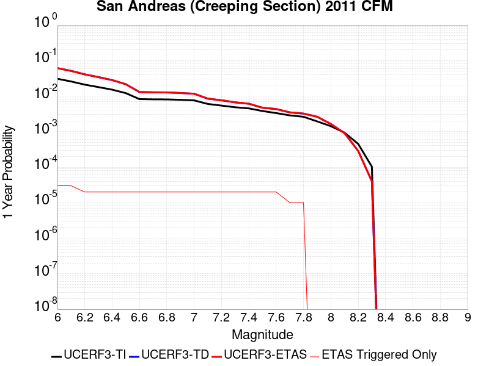 |  |

| Magnitude | 1 wk TI Prob | 1 wk TD Prob | 1 wk ETAS Prob | 1 wk ETAS/TD Gain | 1 wk ETAS Triggered Only | 1 mo TI Prob | 1 mo TD Prob | 1 mo ETAS Prob | 1 mo ETAS/TD Gain | 1 mo ETAS Triggered Only | 1 yr TI Prob | 1 yr TD Prob | 1 yr ETAS Prob | 1 yr ETAS/TD Gain | 1 yr ETAS Triggered Only | 10 yr TI Prob | 10 yr TD Prob | 10 yr ETAS Prob | 10 yr ETAS/TD Gain | 10 yr ETAS Triggered Only |
|-----|-----|-----|-----|-----|-----|-----|-----|-----|-----|-----|-----|-----|-----|-----|-----|-----|-----|-----|-----|-----|
| 6.0 | 5.986481E-4 | 0.0012281181 | 0.0012381057 | 1.0081326 | 1.0E-5 | 0.0025631124 | 0.0052478816 | 0.005257829 | 1.0018955 | 1.0E-5 | 0.030762846 | 0.061232176 | 0.06126034 | 1.0004599 | 3.0E-5 | 0.26835477 | 0.42607728 | 0.42610598 | 1.0000674 | 5.0E-5 |
| 6.1 | 5.015945E-4 | 0.0010222462 | 0.0010322359 | 1.0097724 | 1.0E-5 | 0.00214792 | 0.004369848 | 0.0043798042 | 1.0022784 | 1.0E-5 | 0.025839351 | 0.051271588 | 0.05130005 | 1.0005552 | 3.0E-5 | 0.23032776 | 0.3729949 | 0.37302625 | 1.000084 | 5.0E-5 |
| 6.2 | 4.073338E-4 | 8.1118365E-4 | 8.211755E-4 | 1.0123177 | 1.0E-5 | 0.0017445484 | 0.0034691135 | 0.0034790789 | 1.0028726 | 1.0E-5 | 0.021034058 | 0.040956367 | 0.04097555 | 1.0004684 | 2.0E-5 | 0.19150782 | 0.3131846 | 0.31321207 | 1.0000877 | 4.0E-5 |
| 6.3 | 3.464099E-4 | 6.743695E-4 | 6.843628E-4 | 1.0148187 | 1.0E-5 | 0.0014837692 | 0.0028849328 | 0.002894904 | 1.0034562 | 1.0E-5 | 0.017915873 | 0.03421296 | 0.034232277 | 1.0005646 | 2.0E-5 | 0.16538359 | 0.27147684 | 0.27150595 | 1.0001073 | 4.0E-5 |
| 6.4 | 2.935057E-4 | 5.5487157E-4 | 5.64866E-4 | 1.0180122 | 1.0E-5 | 0.0012572751 | 0.0023745096 | 0.002384486 | 1.0042014 | 1.0E-5 | 0.015200248 | 0.028288092 | 0.028307525 | 1.000687 | 2.0E-5 | 0.14201577 | 0.23315436 | 0.23318502 | 1.0001316 | 4.0E-5 |
| 6.5 | 2.3409708E-4 | 4.2138255E-4 | 4.313783E-4 | 1.0237215 | 1.0E-5 | 0.0010028875 | 0.0018039518 | 0.0018139337 | 1.0055333 | 1.0E-5 | 0.012141965 | 0.02161123 | 0.0216308 | 1.0009054 | 2.0E-5 | 0.11499573 | 0.18700314 | 0.18703566 | 1.0001739 | 4.0E-5 |
| 6.6 | 1.5842178E-4 | 2.511574E-4 | 2.611549E-4 | 1.0398057 | 1.0E-5 | 6.7877385E-4 | 0.0010759344 | 0.0010859236 | 1.0092843 | 1.0E-5 | 0.0082328 | 0.013019429 | 0.013039168 | 1.0015162 | 2.0E-5 | 0.07934396 | 0.12333928 | 0.12337435 | 1.0002843 | 4.0E-5 |
| 6.7 | 1.5616413E-4 | 2.46522E-4 | 2.5651953E-4 | 1.0405543 | 1.0E-5 | 6.691031E-4 | 0.0010560873 | 0.0010660767 | 1.0094589 | 1.0E-5 | 0.0081159435 | 0.0127812615 | 0.012801006 | 1.0015448 | 2.0E-5 | 0.0782586 | 0.12136643 | 0.12140158 | 1.0002896 | 4.0E-5 |
| 6.8 | 1.5538467E-4 | 2.4475955E-4 | 2.5475712E-4 | 1.0408465 | 1.0E-5 | 6.6576427E-4 | 0.0010485414 | 0.0010585309 | 1.0095271 | 1.0E-5 | 0.008075596 | 0.01269062 | 0.0127103655 | 1.0015559 | 2.0E-5 | 0.07788358 | 0.120597176 | 0.12063236 | 1.0002917 | 4.0E-5 |
| 6.9 | 1.5153569E-4 | 2.3584829E-4 | 2.4584593E-4 | 1.0423901 | 1.0E-5 | 6.49277E-4 | 0.0010103888 | 0.0010203788 | 1.0098872 | 1.0E-5 | 0.007876333 | 0.012232622 | 0.012252377 | 1.0016149 | 2.0E-5 | 0.07602952 | 0.116666704 | 0.11670204 | 1.0003029 | 4.0E-5 |
| 7.0 | 1.4588932E-4 | 2.2441633E-4 | 2.344141E-4 | 1.0445501 | 1.0E-5 | 6.250901E-4 | 9.6143177E-4 | 9.714222E-4 | 1.0103911 | 1.0E-5 | 0.0075839474 | 0.011643107 | 0.011662873 | 1.0016978 | 2.0E-5 | 0.073302895 | 0.1115123 | 0.11154784 | 1.0003186 | 4.0E-5 |
| 7.1 | 1.1565079E-4 | 1.631913E-4 | 1.7318968E-4 | 1.0612677 | 1.0E-5 | 4.955521E-4 | 6.992047E-4 | 7.091977E-4 | 1.014292 | 1.0E-5 | 0.006016669 | 0.008479793 | 0.008499622 | 1.0023385 | 2.0E-5 | 0.058563538 | 0.08384011 | 0.08387675 | 1.0004371 | 4.0E-5 |
| 7.2 | 1.0393792E-4 | 1.4650873E-4 | 1.5650726E-4 | 1.0682453 | 1.0E-5 | 4.4537216E-4 | 6.277442E-4 | 6.377379E-4 | 1.01592 | 1.0E-5 | 0.005408933 | 0.007616173 | 0.007636021 | 1.002606 | 2.0E-5 | 0.052791595 | 0.07578092 | 0.07581789 | 1.0004878 | 4.0E-5 |
| 7.3 | 9.332884E-5 | 1.2811464E-4 | 1.3811335E-4 | 1.0780451 | 1.0E-5 | 3.999194E-4 | 5.4894784E-4 | 5.589423E-4 | 1.0182067 | 1.0E-5 | 0.0048581534 | 0.006663094 | 0.006682961 | 1.0029817 | 2.0E-5 | 0.047533102 | 0.06662787 | 0.0666652 | 1.0005604 | 4.0E-5 |
| 7.4 | 8.670252E-5 | 1.1729612E-4 | 1.2729494E-4 | 1.0852443 | 1.0E-5 | 3.715293E-4 | 5.026014E-4 | 5.1259634E-4 | 1.0198865 | 1.0E-5 | 0.004513991 | 0.006102124 | 0.0061220024 | 1.0032575 | 2.0E-5 | 0.044233937 | 0.061277855 | 0.061315402 | 1.0006127 | 4.0E-5 |
| 7.5 | 7.3036405E-5 | 9.0276684E-5 | 1.0027578E-4 | 1.1107606 | 1.0E-5 | 3.129756E-4 | 3.868428E-4 | 3.9683894E-4 | 1.0258403 | 1.0E-5 | 0.0038038217 | 0.0046996614 | 0.0047195675 | 1.0042356 | 2.0E-5 | 0.03739367 | 0.047983047 | 0.048021127 | 1.0007936 | 4.0E-5 |
| 7.6 | 6.3935775E-5 | 8.298909E-5 | 9.298826E-5 | 1.1204878 | 1.0E-5 | 2.7398168E-4 | 3.5561912E-4 | 3.656156E-4 | 1.02811 | 1.0E-5 | 0.0033306254 | 0.004321086 | 0.0043409998 | 1.0046085 | 2.0E-5 | 0.032811474 | 0.044081833 | 0.04412007 | 1.0008674 | 4.0E-5 |
| 7.7 | 5.5050095E-5 | 6.678156E-5 | 7.6780896E-5 | 1.1497319 | 1.0E-5 | 2.3590765E-4 | 2.8617532E-4 | 2.9617245E-4 | 1.0349336 | 1.0E-5 | 0.0028683927 | 0.0034786223 | 0.0034885874 | 1.0028647 | 1.0E-5 | 0.0283165 | 0.035876084 | 0.035895366 | 1.0005375 | 2.0E-5 |
| 7.8 | 5.027131E-5 | 6.177745E-5 | 7.1776834E-5 | 1.1618613 | 1.0E-5 | 2.1543067E-4 | 2.6473365E-4 | 2.7473102E-4 | 1.0377638 | 1.0E-5 | 0.0026197135 | 0.003218372 | 0.0032283398 | 1.0030972 | 1.0E-5 | 0.025890453 | 0.033199526 | 0.033218864 | 1.0005825 | 2.0E-5 |
| 7.9 | 3.7271806E-5 | 5.0343926E-5 | 5.0343926E-5 | 1.0 | 0.0 | 1.5972654E-4 | 2.1574185E-4 | 2.1574185E-4 | 1.0 | 0.0 | 0.0019429359 | 0.0026234952 | 0.0026234952 | 1.0 | 0.0 | 0.019260362 | 0.027125923 | 0.027135652 | 1.0003587 | 1.0E-5 |
| 8.0 | 2.7310243E-5 | 3.1506035E-5 | 3.1506035E-5 | 1.0 | 0.0 | 1.17038646E-4 | 1.3501888E-4 | 1.3501888E-4 | 1.0 | 0.0 | 0.0014240141 | 0.0016426162 | 0.0016426162 | 1.0 | 0.0 | 0.014149235 | 0.01725378 | 0.017263608 | 1.0005696 | 1.0E-5 |
| 8.1 | 1.7940547E-5 | 1.7449367E-5 | 1.7449367E-5 | 1.0 | 0.0 | 7.688579E-5 | 7.478086E-5 | 7.478086E-5 | 1.0 | 0.0 | 9.3568244E-4 | 9.1007724E-4 | 9.1007724E-4 | 1.0 | 0.0 | 0.009317525 | 0.009824635 | 0.009834537 | 1.0010078 | 1.0E-5 |
| 8.2 | 8.643924E-6 | 5.494016E-6 | 5.494016E-6 | 1.0 | 0.0 | 3.704486E-5 | 2.3545572E-5 | 2.3545572E-5 | 1.0 | 0.0 | 4.5092785E-4 | 2.866297E-4 | 2.866297E-4 | 1.0 | 0.0 | 0.0045001395 | 0.0032592218 | 0.0032592218 | 1.0 | 0.0 |
| 8.3 | 1.983087E-6 | 7.690063E-7 | 7.690063E-7 | 1.0 | 0.0 | 8.498917E-6 | 3.295737E-6 | 3.295737E-6 | 1.0 | 0.0 | 1.034694E-4 | 4.012488E-5 | 4.012488E-5 | 1.0 | 0.0 | 0.0010342124 | 4.737206E-4 | 4.737206E-4 | 1.0 | 0.0 |

## Bullion Mountains
*[(top)](#table-of-contents)*

| 1 Week | 1 Month | 1 Year | 10 Year |
|-----|-----|-----|-----|
|  |  | 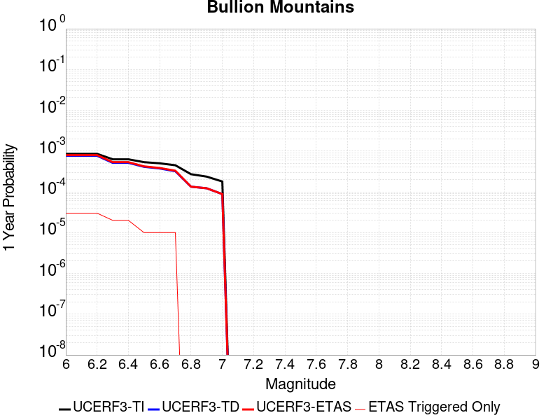 |  |

| Magnitude | 1 wk TI Prob | 1 wk TD Prob | 1 wk ETAS Prob | 1 wk ETAS/TD Gain | 1 wk ETAS Triggered Only | 1 mo TI Prob | 1 mo TD Prob | 1 mo ETAS Prob | 1 mo ETAS/TD Gain | 1 mo ETAS Triggered Only | 1 yr TI Prob | 1 yr TD Prob | 1 yr ETAS Prob | 1 yr ETAS/TD Gain | 1 yr ETAS Triggered Only | 10 yr TI Prob | 10 yr TD Prob | 10 yr ETAS Prob | 10 yr ETAS/TD Gain | 10 yr ETAS Triggered Only |
|-----|-----|-----|-----|-----|-----|-----|-----|-----|-----|-----|-----|-----|-----|-----|-----|-----|-----|-----|-----|-----|
| 6.0 | 1.6420427E-5 | 1.4692933E-5 | 1.4692933E-5 | 1.0 | 0.0 | 7.037136E-5 | 6.296841E-5 | 7.296778E-5 | 1.1587998 | 1.0E-5 | 8.5643446E-4 | 7.664091E-4 | 7.963861E-4 | 1.0391136 | 3.0E-5 | 0.008531413 | 0.0076414533 | 0.0076811477 | 1.0051947 | 4.0E-5 |
| 6.1 | 1.6420427E-5 | 1.4692933E-5 | 1.4692933E-5 | 1.0 | 0.0 | 7.037136E-5 | 6.296841E-5 | 7.296778E-5 | 1.1587998 | 1.0E-5 | 8.5643446E-4 | 7.664091E-4 | 7.963861E-4 | 1.0391136 | 3.0E-5 | 0.008531413 | 0.0076414533 | 0.0076811477 | 1.0051947 | 4.0E-5 |
| 6.2 | 1.6420427E-5 | 1.4692933E-5 | 1.4692933E-5 | 1.0 | 0.0 | 7.037136E-5 | 6.296841E-5 | 7.296778E-5 | 1.1587998 | 1.0E-5 | 8.5643446E-4 | 7.664091E-4 | 7.963861E-4 | 1.0391136 | 3.0E-5 | 0.008531413 | 0.0076414533 | 0.0076811477 | 1.0051947 | 4.0E-5 |
| 6.3 | 1.2046778E-5 | 9.862912E-6 | 9.862912E-6 | 1.0 | 0.0 | 5.1628023E-5 | 4.2269065E-5 | 4.2269065E-5 | 1.0 | 0.0 | 6.283899E-4 | 5.1452755E-4 | 5.345173E-4 | 1.0388507 | 2.0E-5 | 0.0062661595 | 0.005135644 | 0.0051654903 | 1.0058116 | 3.0E-5 |
| 6.4 | 1.2046778E-5 | 9.862912E-6 | 9.862912E-6 | 1.0 | 0.0 | 5.1628023E-5 | 4.2269065E-5 | 4.2269065E-5 | 1.0 | 0.0 | 6.283899E-4 | 5.1452755E-4 | 5.345173E-4 | 1.0388507 | 2.0E-5 | 0.0062661595 | 0.005135644 | 0.0051654903 | 1.0058116 | 3.0E-5 |
| 6.5 | 1.0244343E-5 | 7.879929E-6 | 7.879929E-6 | 1.0 | 0.0 | 4.390359E-5 | 3.3770804E-5 | 3.3770804E-5 | 1.0 | 0.0 | 5.343951E-4 | 4.1110266E-4 | 4.2109855E-4 | 1.0243149 | 1.0E-5 | 0.005331118 | 0.004105453 | 0.004125371 | 1.0048516 | 2.0E-5 |
| 6.6 | 9.605408E-6 | 7.177931E-6 | 7.177931E-6 | 1.0 | 0.0 | 4.1165385E-5 | 3.0762312E-5 | 3.0762312E-5 | 1.0 | 0.0 | 5.010733E-4 | 3.7448714E-4 | 3.844834E-4 | 1.0266932 | 1.0E-5 | 0.00499945 | 0.0037405582 | 0.0037505208 | 1.0026634 | 1.0E-5 |
| 6.7 | 8.60418E-6 | 6.1243827E-6 | 6.1243827E-6 | 1.0 | 0.0 | 3.687454E-5 | 2.62472E-5 | 2.62472E-5 | 1.0 | 0.0 | 4.48855E-4 | 3.195323E-4 | 3.295291E-4 | 1.0312858 | 1.0E-5 | 0.004479495 | 0.0031926408 | 0.003202609 | 1.0031222 | 1.0E-5 |
| 6.8 | 5.187994E-6 | 2.5633894E-6 | 2.5633894E-6 | 1.0 | 0.0 | 2.223407E-5 | 1.098593E-5 | 1.098593E-5 | 1.0 | 0.0 | 2.7066618E-4 | 1.3374949E-4 | 1.3374949E-4 | 1.0 | 0.0 | 0.0027033675 | 0.0013370815 | 0.0013370815 | 1.0 | 0.0 |
| 6.9 | 4.5302368E-6 | 2.344526E-6 | 2.344526E-6 | 1.0 | 0.0 | 1.9415156E-5 | 1.0047952E-5 | 1.0047952E-5 | 1.0 | 0.0 | 2.3635388E-4 | 1.2233092E-4 | 1.2233092E-4 | 1.0 | 0.0 | 0.0023610266 | 0.0012230249 | 0.0012230249 | 1.0 | 0.0 |
| 7.0 | 3.431668E-6 | 1.6884097E-6 | 1.6884097E-6 | 1.0 | 0.0 | 1.4707065E-5 | 7.2360417E-6 | 7.2360417E-6 | 1.0 | 0.0 | 1.7904381E-4 | 8.809881E-5 | 8.809881E-5 | 1.0 | 0.0 | 0.0017889962 | 8.809881E-4 | 8.809881E-4 | 1.0 | 0.0 |

## Cleghorn
*[(top)](#table-of-contents)*

| 1 Week | 1 Month | 1 Year | 10 Year |
|-----|-----|-----|-----|
|  |  |  | 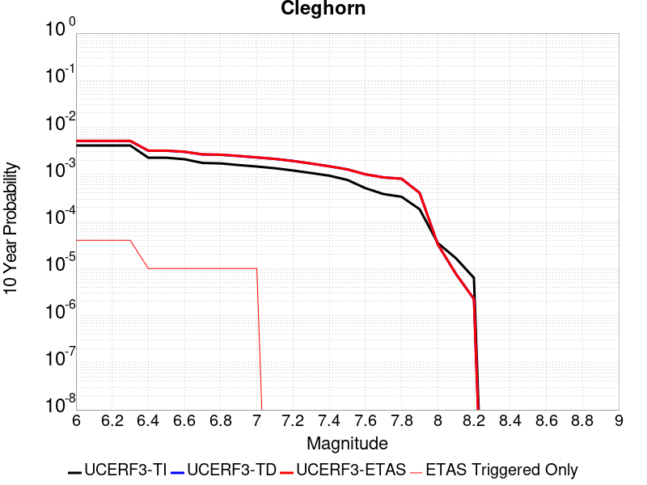 |

| Magnitude | 1 wk TI Prob | 1 wk TD Prob | 1 wk ETAS Prob | 1 wk ETAS/TD Gain | 1 wk ETAS Triggered Only | 1 mo TI Prob | 1 mo TD Prob | 1 mo ETAS Prob | 1 mo ETAS/TD Gain | 1 mo ETAS Triggered Only | 1 yr TI Prob | 1 yr TD Prob | 1 yr ETAS Prob | 1 yr ETAS/TD Gain | 1 yr ETAS Triggered Only | 10 yr TI Prob | 10 yr TD Prob | 10 yr ETAS Prob | 10 yr ETAS/TD Gain | 10 yr ETAS Triggered Only |
|-----|-----|-----|-----|-----|-----|-----|-----|-----|-----|-----|-----|-----|-----|-----|-----|-----|-----|-----|-----|-----|
| 6.0 | 7.9267165E-6 | 9.838549E-6 | 9.838549E-6 | 1.0 | 0.0 | 3.39712E-5 | 4.216459E-5 | 4.216459E-5 | 1.0 | 0.0 | 4.1352084E-4 | 5.1324355E-4 | 5.2323844E-4 | 1.0194739 | 1.0E-5 | 0.004127522 | 0.0051355856 | 0.00517538 | 1.0077488 | 4.0E-5 |
| 6.1 | 7.9267165E-6 | 9.838549E-6 | 9.838549E-6 | 1.0 | 0.0 | 3.39712E-5 | 4.216459E-5 | 4.216459E-5 | 1.0 | 0.0 | 4.1352084E-4 | 5.1324355E-4 | 5.2323844E-4 | 1.0194739 | 1.0E-5 | 0.004127522 | 0.0051355856 | 0.00517538 | 1.0077488 | 4.0E-5 |
| 6.2 | 7.9267165E-6 | 9.838549E-6 | 9.838549E-6 | 1.0 | 0.0 | 3.39712E-5 | 4.216459E-5 | 4.216459E-5 | 1.0 | 0.0 | 4.1352084E-4 | 5.1324355E-4 | 5.2323844E-4 | 1.0194739 | 1.0E-5 | 0.004127522 | 0.0051355856 | 0.00517538 | 1.0077488 | 4.0E-5 |
| 6.3 | 7.9267165E-6 | 9.838549E-6 | 9.838549E-6 | 1.0 | 0.0 | 3.39712E-5 | 4.216459E-5 | 4.216459E-5 | 1.0 | 0.0 | 4.1352084E-4 | 5.1324355E-4 | 5.2323844E-4 | 1.0194739 | 1.0E-5 | 0.004127522 | 0.0051355856 | 0.00517538 | 1.0077488 | 4.0E-5 |
| 6.4 | 4.3445207E-6 | 6.098322E-6 | 6.098322E-6 | 1.0 | 0.0 | 1.8619241E-5 | 2.613541E-5 | 2.613541E-5 | 1.0 | 0.0 | 2.2666567E-4 | 3.1815318E-4 | 3.2815E-4 | 1.0314214 | 1.0E-5 | 0.0022643462 | 0.0031910567 | 0.0032010248 | 1.0031238 | 1.0E-5 |
| 6.5 | 4.3445207E-6 | 6.098322E-6 | 6.098322E-6 | 1.0 | 0.0 | 1.8619241E-5 | 2.613541E-5 | 2.613541E-5 | 1.0 | 0.0 | 2.2666567E-4 | 3.1815318E-4 | 3.2815E-4 | 1.0314214 | 1.0E-5 | 0.0022643462 | 0.0031910567 | 0.0032010248 | 1.0031238 | 1.0E-5 |
| 6.6 | 4.040109E-6 | 5.7807224E-6 | 5.7807224E-6 | 1.0 | 0.0 | 1.7314638E-5 | 2.4774296E-5 | 2.4774296E-5 | 1.0 | 0.0 | 2.1078532E-4 | 3.0158623E-4 | 3.1158322E-4 | 1.033148 | 1.0E-5 | 0.002105855 | 0.0030258433 | 0.003035813 | 1.0032948 | 1.0E-5 |
| 6.7 | 3.3632055E-6 | 5.0742033E-6 | 5.0742033E-6 | 1.0 | 0.0 | 1.4413658E-5 | 2.1746406E-5 | 2.1746406E-5 | 1.0 | 0.0 | 1.7547216E-4 | 2.6473065E-4 | 2.74728E-4 | 1.0377642 | 1.0E-5 | 0.0017533366 | 0.0026581702 | 0.0026681437 | 1.003752 | 1.0E-5 |
| 6.8 | 3.2902772E-6 | 4.9961077E-6 | 4.9961077E-6 | 1.0 | 0.0 | 1.4101111E-5 | 2.1411717E-5 | 2.1411717E-5 | 1.0 | 0.0 | 1.716675E-4 | 2.606568E-4 | 2.7065416E-4 | 1.0383546 | 1.0E-5 | 0.0017153495 | 0.0026175277 | 0.0026275015 | 1.0038104 | 1.0E-5 |
| 6.9 | 3.031547E-6 | 4.6976434E-6 | 4.6976434E-6 | 1.0 | 0.0 | 1.299228E-5 | 2.0132604E-5 | 2.0132604E-5 | 1.0 | 0.0 | 1.5816953E-4 | 2.4508717E-4 | 2.550847E-4 | 1.0407919 | 1.0E-5 | 0.00158057 | 0.0024621838 | 0.0024721592 | 1.0040514 | 1.0E-5 |
| 7.0 | 2.8259715E-6 | 4.3766395E-6 | 4.3766395E-6 | 1.0 | 0.0 | 1.211125E-5 | 1.8756893E-5 | 1.8756893E-5 | 1.0 | 0.0 | 1.4744449E-4 | 2.2834148E-4 | 2.3833918E-4 | 1.043784 | 1.0E-5 | 0.001473467 | 0.0022950824 | 0.0023050595 | 1.0043471 | 1.0E-5 |
| 7.1 | 2.5962665E-6 | 4.071624E-6 | 4.071624E-6 | 1.0 | 0.0 | 1.1126809E-5 | 1.7449702E-5 | 1.7449702E-5 | 1.0 | 0.0 | 1.3546048E-4 | 2.1242963E-4 | 2.1242963E-4 | 1.0 | 0.0 | 0.0013537793 | 0.002136286 | 0.002136286 | 1.0 | 0.0 |
| 7.2 | 2.3247253E-6 | 3.6819104E-6 | 3.6819104E-6 | 1.0 | 0.0 | 9.96307E-6 | 1.577952E-5 | 1.577952E-5 | 1.0 | 0.0 | 1.21293626E-4 | 1.9209892E-4 | 1.9209892E-4 | 1.0 | 0.0 | 0.0012122744 | 0.0019333686 | 0.0019333686 | 1.0 | 0.0 |
| 7.3 | 2.056928E-6 | 3.240099E-6 | 3.240099E-6 | 1.0 | 0.0 | 8.815376E-6 | 1.3886065E-5 | 1.3886065E-5 | 1.0 | 0.0 | 1.0732192E-4 | 1.6904989E-4 | 1.6904989E-4 | 1.0 | 0.0 | 0.001072701 | 0.001703324 | 0.001703324 | 1.0 | 0.0 |
| 7.4 | 1.8055999E-6 | 2.830045E-6 | 2.830045E-6 | 1.0 | 0.0 | 7.738263E-6 | 1.2128709E-5 | 1.2128709E-5 | 1.0 | 0.0 | 9.4209274E-5 | 1.4765716E-4 | 1.4765716E-4 | 1.0 | 0.0 | 9.4169343E-4 | 0.0014898488 | 0.0014898488 | 1.0 | 0.0 |
| 7.5 | 1.4683443E-6 | 2.4290832E-6 | 2.4290832E-6 | 1.0 | 0.0 | 6.292889E-6 | 1.0410316E-5 | 1.0410316E-5 | 1.0 | 0.0 | 7.661323E-5 | 1.267383E-4 | 1.267383E-4 | 1.0 | 0.0 | 7.658682E-4 | 0.0012809638 | 0.0012809638 | 1.0 | 0.0 |
| 7.6 | 9.804088E-7 | 1.9045069E-6 | 1.9045069E-6 | 1.0 | 0.0 | 4.201745E-6 | 8.162147E-6 | 8.162147E-6 | 1.0 | 0.0 | 5.1155046E-5 | 9.936965E-5 | 9.936965E-5 | 1.0 | 0.0 | 5.114327E-4 | 0.0010075923 | 0.0010075923 | 1.0 | 0.0 |
| 7.7 | 7.3434086E-7 | 1.6325722E-6 | 1.6325722E-6 | 1.0 | 0.0 | 3.1471714E-6 | 6.9967195E-6 | 6.9967195E-6 | 1.0 | 0.0 | 3.831614E-5 | 8.518175E-5 | 8.518175E-5 | 1.0 | 0.0 | 3.8309532E-4 | 8.6586515E-4 | 8.6586515E-4 | 1.0 | 0.0 |
| 7.8 | 6.434184E-7 | 1.5259246E-6 | 1.5259246E-6 | 1.0 | 0.0 | 2.7575045E-6 | 6.5396607E-6 | 6.5396607E-6 | 1.0 | 0.0 | 3.35721E-5 | 7.9617486E-5 | 7.9617486E-5 | 1.0 | 0.0 | 3.3567028E-4 | 8.0996245E-4 | 8.0996245E-4 | 1.0 | 0.0 |
| 7.9 | 3.4943926E-7 | 7.594768E-7 | 7.594768E-7 | 1.0 | 0.0 | 1.497596E-6 | 3.2548967E-6 | 3.2548967E-6 | 1.0 | 0.0 | 1.8233079E-5 | 3.9627655E-5 | 3.9627655E-5 | 1.0 | 0.0 | 1.8231584E-4 | 4.050516E-4 | 4.050516E-4 | 1.0 | 0.0 |
| 8.0 | 6.717524E-8 | 5.858803E-8 | 5.858803E-8 | 1.0 | 0.0 | 2.8789387E-7 | 2.510915E-7 | 2.510915E-7 | 1.0 | 0.0 | 3.505102E-6 | 3.057035E-6 | 3.057035E-6 | 1.0 | 0.0 | 3.5050467E-5 | 3.2865428E-5 | 3.2865428E-5 | 1.0 | 0.0 |
| 8.1 | 3.1984914E-8 | 1.3018768E-8 | 1.3018768E-8 | 1.0 | 0.0 | 1.370782E-7 | 5.5794718E-8 | 5.5794718E-8 | 1.0 | 0.0 | 1.6689258E-6 | 6.793005E-7 | 6.793005E-7 | 1.0 | 0.0 | 1.6689133E-5 | 7.780131E-6 | 7.780131E-6 | 1.0 | 0.0 |
| 8.2 | 1.21887656E-8 | 3.6682692E-9 | 3.6682692E-9 | 1.0 | 0.0 | 5.2237567E-8 | 1.5721154E-8 | 1.5721154E-8 | 1.0 | 0.0 | 6.359922E-7 | 1.9140504E-7 | 1.9140504E-7 | 1.0 | 0.0 | 6.3599036E-6 | 2.2579025E-6 | 2.2579025E-6 | 1.0 | 0.0 |

## Brawley (Seismic Zone) alt 1
*[(top)](#table-of-contents)*

| 1 Week | 1 Month | 1 Year | 10 Year |
|-----|-----|-----|-----|
|  |  |  | 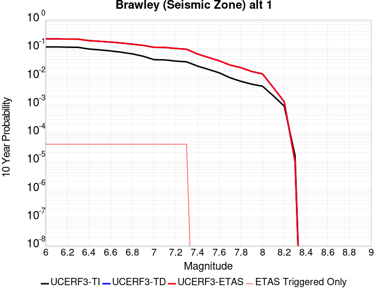 |

| Magnitude | 1 wk TI Prob | 1 wk TD Prob | 1 wk ETAS Prob | 1 wk ETAS/TD Gain | 1 wk ETAS Triggered Only | 1 mo TI Prob | 1 mo TD Prob | 1 mo ETAS Prob | 1 mo ETAS/TD Gain | 1 mo ETAS Triggered Only | 1 yr TI Prob | 1 yr TD Prob | 1 yr ETAS Prob | 1 yr ETAS/TD Gain | 1 yr ETAS Triggered Only | 10 yr TI Prob | 10 yr TD Prob | 10 yr ETAS Prob | 10 yr ETAS/TD Gain | 10 yr ETAS Triggered Only |
|-----|-----|-----|-----|-----|-----|-----|-----|-----|-----|-----|-----|-----|-----|-----|-----|-----|-----|-----|-----|-----|
| 6.0 | 2.2521618E-4 | 4.76691E-4 | 4.76691E-4 | 1.0 | 0.0 | 9.6485513E-4 | 0.002041399 | 0.002041399 | 1.0 | 0.0 | 0.011683988 | 0.024565222 | 0.02458473 | 1.0007942 | 2.0E-5 | 0.11088423 | 0.21363127 | 0.21366273 | 1.0001472 | 4.0E-5 |
| 6.1 | 2.2521618E-4 | 4.76691E-4 | 4.76691E-4 | 1.0 | 0.0 | 9.6485513E-4 | 0.002041399 | 0.002041399 | 1.0 | 0.0 | 0.011683988 | 0.024565222 | 0.02458473 | 1.0007942 | 2.0E-5 | 0.11088423 | 0.21363127 | 0.21366273 | 1.0001472 | 4.0E-5 |
| 6.2 | 2.198148E-4 | 4.6752882E-4 | 4.6752882E-4 | 1.0 | 0.0 | 9.417233E-4 | 0.0020021931 | 0.0020021931 | 1.0 | 0.0 | 0.011405343 | 0.02409898 | 0.024118498 | 1.0008099 | 2.0E-5 | 0.10837428 | 0.21006602 | 0.21009761 | 1.0001504 | 4.0E-5 |
| 6.3 | 2.1704129E-4 | 4.618843E-4 | 4.618843E-4 | 1.0 | 0.0 | 9.298453E-4 | 0.001978039 | 0.001978039 | 1.0 | 0.0 | 0.011262234 | 0.02381224 | 0.023831764 | 1.0008199 | 2.0E-5 | 0.107082725 | 0.20795701 | 0.2079887 | 1.0001523 | 4.0E-5 |
| 6.4 | 1.876142E-4 | 4.0079502E-4 | 4.0079502E-4 | 1.0 | 0.0 | 8.038131E-4 | 0.0017165765 | 0.0017165765 | 1.0 | 0.0 | 0.00974259 | 0.020700144 | 0.02071973 | 1.0009462 | 2.0E-5 | 0.093263686 | 0.18470816 | 0.18474077 | 1.0001765 | 4.0E-5 |
| 6.5 | 1.7390939E-4 | 3.7510466E-4 | 3.7510466E-4 | 1.0 | 0.0 | 7.45113E-4 | 0.0016066132 | 0.0016066132 | 1.0 | 0.0 | 0.009034078 | 0.019388033 | 0.019407645 | 1.0010116 | 2.0E-5 | 0.086755216 | 0.17452815 | 0.17456117 | 1.0001892 | 4.0E-5 |
| 6.6 | 1.591791E-4 | 3.4923697E-4 | 3.4923697E-4 | 1.0 | 0.0 | 6.8201777E-4 | 0.0014958814 | 0.0014958814 | 1.0 | 0.0 | 0.008271996 | 0.018062927 | 0.018082565 | 1.0010872 | 2.0E-5 | 0.07970774 | 0.16393267 | 0.1639661 | 1.000204 | 4.0E-5 |
| 6.7 | 1.4268003E-4 | 3.208802E-4 | 3.208802E-4 | 1.0 | 0.0 | 6.1134255E-4 | 0.0013744844 | 0.0013744844 | 1.0 | 0.0 | 0.007417723 | 0.01660808 | 0.016627748 | 1.0011842 | 2.0E-5 | 0.07174956 | 0.15205671 | 0.15209062 | 1.000223 | 4.0E-5 |
| 6.8 | 1.239713E-4 | 2.9079075E-4 | 2.9079075E-4 | 1.0 | 0.0 | 5.3119735E-4 | 0.001245657 | 0.001245657 | 1.0 | 0.0 | 0.0064481674 | 0.015061846 | 0.015081545 | 1.0013078 | 2.0E-5 | 0.06264243 | 0.13848521 | 0.13851967 | 1.0002488 | 4.0E-5 |
| 6.9 | 1.0180238E-4 | 2.6274272E-4 | 2.6274272E-4 | 1.0 | 0.0 | 4.3622297E-4 | 0.0011255586 | 0.0011255586 | 1.0 | 0.0 | 0.005298089 | 0.013618573 | 0.013638301 | 1.0014486 | 2.0E-5 | 0.05173543 | 0.12504812 | 0.1250831 | 1.0002799 | 4.0E-5 |
| 7.0 | 7.6619996E-5 | 2.241466E-4 | 2.241466E-4 | 1.0 | 0.0 | 3.283301E-4 | 9.602778E-4 | 9.602778E-4 | 1.0 | 0.0 | 0.0039900932 | 0.011629419 | 0.011649187 | 1.0016998 | 2.0E-5 | 0.039192066 | 0.10733641 | 0.10737212 | 1.0003327 | 4.0E-5 |
| 7.1 | 7.5127435E-5 | 2.2097632E-4 | 2.2097632E-4 | 1.0 | 0.0 | 3.2193496E-4 | 9.4670086E-4 | 9.4670086E-4 | 1.0 | 0.0 | 0.0039125155 | 0.011465871 | 0.011485642 | 1.0017244 | 2.0E-5 | 0.038443442 | 0.10589979 | 0.10593555 | 1.0003377 | 4.0E-5 |
| 7.2 | 6.788582E-5 | 2.0224846E-4 | 2.0224846E-4 | 1.0 | 0.0 | 2.9090676E-4 | 8.664942E-4 | 8.664942E-4 | 1.0 | 0.0 | 0.0035360386 | 0.0104991775 | 0.010518967 | 1.0018849 | 2.0E-5 | 0.034803 | 0.097568415 | 0.09760451 | 1.00037 | 4.0E-5 |
| 7.3 | 6.399602E-5 | 1.8855186E-4 | 1.8855186E-4 | 1.0 | 0.0 | 2.7423984E-4 | 8.0783205E-4 | 8.0783205E-4 | 1.0 | 0.0 | 0.0033337586 | 0.009791592 | 0.009811396 | 1.0020226 | 2.0E-5 | 0.03284188 | 0.091460384 | 0.09149673 | 1.0003973 | 4.0E-5 |
| 7.4 | 4.506759E-5 | 1.2540306E-4 | 1.2540306E-4 | 1.0 | 0.0 | 1.9313251E-4 | 5.373319E-4 | 5.373319E-4 | 1.0 | 0.0 | 0.0023488526 | 0.0065225675 | 0.0065225675 | 1.0 | 0.0 | 0.023241805 | 0.06241342 | 0.06241342 | 1.0 | 0.0 |
| 7.5 | 3.43289E-5 | 9.3448114E-5 | 9.3448114E-5 | 1.0 | 0.0 | 1.4711556E-4 | 4.0043076E-4 | 4.0043076E-4 | 1.0 | 0.0 | 0.0017896603 | 0.0048644086 | 0.0048644086 | 1.0 | 0.0 | 0.01775316 | 0.04709746 | 0.04709746 | 1.0 | 0.0 |
| 7.6 | 2.5980507E-5 | 7.061279E-5 | 7.061279E-5 | 1.0 | 0.0 | 1.1134028E-4 | 3.0259127E-4 | 3.0259127E-4 | 1.0 | 0.0 | 0.001354725 | 0.0036778497 | 0.0036778497 | 1.0 | 0.0 | 0.013464959 | 0.03587832 | 0.03587832 | 1.0 | 0.0 |
| 7.7 | 1.7292105E-5 | 4.9476897E-5 | 4.9476897E-5 | 1.0 | 0.0 | 7.4106916E-5 | 2.1202664E-4 | 2.1202664E-4 | 1.0 | 0.0 | 9.018782E-4 | 0.0025783742 | 0.0025783742 | 1.0 | 0.0 | 0.008982267 | 0.025322445 | 0.025322445 | 1.0 | 0.0 |
| 7.8 | 1.2927471E-5 | 3.9753748E-5 | 3.9753748E-5 | 1.0 | 0.0 | 5.5402274E-5 | 1.703621E-4 | 1.703621E-4 | 1.0 | 0.0 | 6.743139E-4 | 0.0020721878 | 0.0020721878 | 1.0 | 0.0 | 0.0067227143 | 0.02045964 | 0.02045964 | 1.0 | 0.0 |
| 7.9 | 1.0200774E-5 | 2.879426E-5 | 2.879426E-5 | 1.0 | 0.0 | 4.371687E-5 | 1.2339813E-4 | 1.2339813E-4 | 1.0 | 0.0 | 5.321229E-4 | 0.0015013381 | 0.0015013381 | 1.0 | 0.0 | 0.005308505 | 0.015014351 | 0.015014351 | 1.0 | 0.0 |
| 8.0 | 8.650396E-6 | 2.331885E-5 | 2.331885E-5 | 1.0 | 0.0 | 3.70726E-5 | 9.99341E-5 | 9.99341E-5 | 1.0 | 0.0 | 4.5126543E-4 | 0.0012160194 | 0.0012160194 | 1.0 | 0.0 | 0.0045035016 | 0.012230608 | 0.012230608 | 1.0 | 0.0 |
| 8.1 | 3.9368224E-6 | 7.3453502E-6 | 7.3453502E-6 | 1.0 | 0.0 | 1.6871985E-5 | 3.1479693E-5 | 3.1479693E-5 | 1.0 | 0.0 | 2.0539707E-4 | 3.83198E-4 | 3.83198E-4 | 1.0 | 0.0 | 0.0020520731 | 0.004009915 | 0.004009915 | 1.0 | 0.0 |
| 8.2 | 1.7101195E-6 | 2.2244978E-6 | 2.2244978E-6 | 1.0 | 0.0 | 7.329063E-6 | 9.533527E-6 | 9.533527E-6 | 1.0 | 0.0 | 8.922769E-5 | 1.1606455E-4 | 1.1606455E-4 | 1.0 | 0.0 | 8.9191867E-4 | 0.0012700894 | 0.0012700894 | 1.0 | 0.0 |
| 8.3 | 3.0346666E-8 | 1.7278948E-8 | 1.7278948E-8 | 1.0 | 0.0 | 1.3005713E-7 | 7.405263E-8 | 7.405263E-8 | 1.0 | 0.0 | 1.5834444E-6 | 9.015907E-7 | 9.015907E-7 | 1.0 | 0.0 | 1.5834332E-5 | 9.403383E-6 | 9.403383E-6 | 1.0 | 0.0 |

## Cleghorn Lake
*[(top)](#table-of-contents)*

| 1 Week | 1 Month | 1 Year | 10 Year |
|-----|-----|-----|-----|
|  |  |  |  |

| Magnitude | 1 wk TI Prob | 1 wk TD Prob | 1 wk ETAS Prob | 1 wk ETAS/TD Gain | 1 wk ETAS Triggered Only | 1 mo TI Prob | 1 mo TD Prob | 1 mo ETAS Prob | 1 mo ETAS/TD Gain | 1 mo ETAS Triggered Only | 1 yr TI Prob | 1 yr TD Prob | 1 yr ETAS Prob | 1 yr ETAS/TD Gain | 1 yr ETAS Triggered Only | 10 yr TI Prob | 10 yr TD Prob | 10 yr ETAS Prob | 10 yr ETAS/TD Gain | 10 yr ETAS Triggered Only |
|-----|-----|-----|-----|-----|-----|-----|-----|-----|-----|-----|-----|-----|-----|-----|-----|-----|-----|-----|-----|-----|
| 6.0 | 1.5467183E-5 | 1.6794971E-5 | 1.6794971E-5 | 1.0 | 0.0 | 6.6286244E-5 | 7.197677E-5 | 7.197677E-5 | 1.0 | 0.0 | 8.067362E-4 | 8.760197E-4 | 9.0599345E-4 | 1.0342158 | 3.0E-5 | 0.008038137 | 0.008731093 | 0.008770743 | 1.0045413 | 4.0E-5 |
| 6.1 | 1.5467183E-5 | 1.6794971E-5 | 1.6794971E-5 | 1.0 | 0.0 | 6.6286244E-5 | 7.197677E-5 | 7.197677E-5 | 1.0 | 0.0 | 8.067362E-4 | 8.760197E-4 | 9.0599345E-4 | 1.0342158 | 3.0E-5 | 0.008038137 | 0.008731093 | 0.008770743 | 1.0045413 | 4.0E-5 |
| 6.2 | 1.2624631E-5 | 1.36821545E-5 | 1.36821545E-5 | 1.0 | 0.0 | 5.410444E-5 | 5.863676E-5 | 5.863676E-5 | 1.0 | 0.0 | 6.585225E-4 | 7.137174E-4 | 7.43696E-4 | 1.0420034 | 3.0E-5 | 0.0065657445 | 0.0071190484 | 0.0071587637 | 1.0055788 | 4.0E-5 |
| 6.3 | 1.2624631E-5 | 1.36821545E-5 | 1.36821545E-5 | 1.0 | 0.0 | 5.410444E-5 | 5.863676E-5 | 5.863676E-5 | 1.0 | 0.0 | 6.585225E-4 | 7.137174E-4 | 7.43696E-4 | 1.0420034 | 3.0E-5 | 0.0065657445 | 0.0071190484 | 0.0071587637 | 1.0055788 | 4.0E-5 |
| 6.4 | 9.417684E-6 | 1.0170551E-5 | 1.0170551E-5 | 1.0 | 0.0 | 4.036088E-5 | 4.3587577E-5 | 4.3587577E-5 | 1.0 | 0.0 | 4.912829E-4 | 5.3059065E-4 | 5.405853E-4 | 1.018837 | 1.0E-5 | 0.004901982 | 0.0052972743 | 0.0053171683 | 1.0037556 | 2.0E-5 |
| 6.5 | 9.368219E-6 | 1.0117976E-5 | 1.0117976E-5 | 1.0 | 0.0 | 4.014889E-5 | 4.3362263E-5 | 4.3362263E-5 | 1.0 | 0.0 | 4.8870314E-4 | 5.278488E-4 | 5.378435E-4 | 1.0189348 | 1.0E-5 | 0.004876298 | 0.0052699856 | 0.0052898806 | 1.0037751 | 2.0E-5 |
| 6.6 | 7.803798E-6 | 8.442198E-6 | 8.442198E-6 | 1.0 | 0.0 | 3.3444423E-5 | 3.6180576E-5 | 3.6180576E-5 | 1.0 | 0.0 | 4.0710976E-4 | 4.404494E-4 | 4.50445E-4 | 1.0226941 | 1.0E-5 | 0.0040636472 | 0.004399682 | 0.0044195936 | 1.0045258 | 2.0E-5 |
| 6.7 | 2.3108669E-6 | 2.4439082E-6 | 2.4439082E-6 | 1.0 | 0.0 | 9.903678E-6 | 1.0473852E-5 | 1.0473852E-5 | 1.0 | 0.0 | 1.205706E-4 | 1.2751187E-4 | 1.375106E-4 | 1.0784141 | 1.0E-5 | 0.001205052 | 0.0012744057 | 0.001284393 | 1.0078368 | 1.0E-5 |
| 6.8 | 2.0882828E-6 | 2.2063484E-6 | 2.2063484E-6 | 1.0 | 0.0 | 8.949753E-6 | 9.455745E-6 | 9.455745E-6 | 1.0 | 0.0 | 1.08957785E-4 | 1.15117786E-4 | 1.2511664E-4 | 1.0868576 | 1.0E-5 | 0.0010890438 | 0.0011505984 | 0.001160587 | 1.0086812 | 1.0E-5 |
| 6.9 | 1.876935E-6 | 1.9811093E-6 | 1.9811093E-6 | 1.0 | 0.0 | 8.043982E-6 | 8.490441E-6 | 8.490441E-6 | 1.0 | 0.0 | 9.7931086E-5 | 1.0336639E-4 | 1.1336535E-4 | 1.0967332 | 1.0E-5 | 9.788794E-4 | 0.001033199 | 0.0010431887 | 1.0096687 | 1.0E-5 |
| 7.0 | 1.5357559E-6 | 1.620328E-6 | 1.620328E-6 | 1.0 | 0.0 | 6.5817944E-6 | 6.9442453E-6 | 6.9442453E-6 | 1.0 | 0.0 | 8.01304E-5 | 8.454303E-5 | 9.4542185E-5 | 1.1182729 | 1.0E-5 | 8.010151E-4 | 8.4512116E-4 | 8.551127E-4 | 1.0118226 | 1.0E-5 |
| 7.1 | 1.0905424E-6 | 1.1497951E-6 | 1.1497951E-6 | 1.0 | 0.0 | 4.6737446E-6 | 4.9276846E-6 | 4.9276846E-6 | 1.0 | 0.0 | 5.6901354E-5 | 5.9993006E-5 | 5.9993006E-5 | 1.0 | 0.0 | 5.6886784E-4 | 5.997779E-4 | 5.997779E-4 | 1.0 | 0.0 |
| 7.2 | 6.06668E-7 | 6.387457E-7 | 6.387457E-7 | 1.0 | 0.0 | 2.600003E-6 | 2.737479E-6 | 2.737479E-6 | 1.0 | 0.0 | 3.1654577E-5 | 3.3328364E-5 | 3.3328364E-5 | 1.0 | 0.0 | 3.1650066E-4 | 3.3324052E-4 | 3.3324052E-4 | 1.0 | 0.0 |

## Ortigalita (South)
*[(top)](#table-of-contents)*

| 1 Week | 1 Month | 1 Year | 10 Year |
|-----|-----|-----|-----|
|  |  |  |  |

| Magnitude | 1 wk TI Prob | 1 wk TD Prob | 1 wk ETAS Prob | 1 wk ETAS/TD Gain | 1 wk ETAS Triggered Only | 1 mo TI Prob | 1 mo TD Prob | 1 mo ETAS Prob | 1 mo ETAS/TD Gain | 1 mo ETAS Triggered Only | 1 yr TI Prob | 1 yr TD Prob | 1 yr ETAS Prob | 1 yr ETAS/TD Gain | 1 yr ETAS Triggered Only | 10 yr TI Prob | 10 yr TD Prob | 10 yr ETAS Prob | 10 yr ETAS/TD Gain | 10 yr ETAS Triggered Only |
|-----|-----|-----|-----|-----|-----|-----|-----|-----|-----|-----|-----|-----|-----|-----|-----|-----|-----|-----|-----|-----|
| 6.0 | 3.72394E-5 | 4.3259326E-5 | 4.3259326E-5 | 1.0 | 0.0 | 1.5958765E-4 | 1.8538482E-4 | 1.9538296E-4 | 1.0539318 | 1.0E-5 | 0.0019412481 | 0.0022548803 | 0.0022648575 | 1.0044248 | 1.0E-5 | 0.019243775 | 0.022336403 | 0.022365732 | 1.0013131 | 3.0E-5 |
| 6.1 | 2.7299884E-5 | 3.1494612E-5 | 3.1494612E-5 | 1.0 | 0.0 | 1.16994255E-4 | 1.3497024E-4 | 1.3497024E-4 | 1.0 | 0.0 | 0.0014234743 | 0.0016420798 | 0.0016420798 | 1.0 | 0.0 | 0.014143906 | 0.016305394 | 0.016315231 | 1.0006033 | 1.0E-5 |
| 6.2 | 2.7299884E-5 | 3.1494612E-5 | 3.1494612E-5 | 1.0 | 0.0 | 1.16994255E-4 | 1.3497024E-4 | 1.3497024E-4 | 1.0 | 0.0 | 0.0014234743 | 0.0016420798 | 0.0016420798 | 1.0 | 0.0 | 0.014143906 | 0.016305394 | 0.016315231 | 1.0006033 | 1.0E-5 |
| 6.3 | 2.0546433E-5 | 2.3633342E-5 | 2.3633342E-5 | 1.0 | 0.0 | 8.805317E-5 | 1.0128192E-4 | 1.0128192E-4 | 1.0 | 0.0 | 0.00107152 | 0.0012324288 | 0.0012324288 | 1.0 | 0.0 | 0.010663681 | 0.012258004 | 0.012267882 | 1.0008057 | 1.0E-5 |
| 6.4 | 2.0546433E-5 | 2.3633342E-5 | 2.3633342E-5 | 1.0 | 0.0 | 8.805317E-5 | 1.0128192E-4 | 1.0128192E-4 | 1.0 | 0.0 | 0.00107152 | 0.0012324288 | 0.0012324288 | 1.0 | 0.0 | 0.010663681 | 0.012258004 | 0.012267882 | 1.0008057 | 1.0E-5 |
| 6.5 | 1.7779594E-5 | 2.0448608E-5 | 2.0448608E-5 | 1.0 | 0.0 | 7.619603E-5 | 8.763403E-5 | 8.763403E-5 | 1.0 | 0.0 | 9.272918E-4 | 0.0010664356 | 0.0010664356 | 1.0 | 0.0 | 0.009234319 | 0.010614647 | 0.010624541 | 1.0009321 | 1.0E-5 |
| 6.6 | 1.6272212E-5 | 1.8716464E-5 | 1.8716464E-5 | 1.0 | 0.0 | 6.973618E-5 | 8.0211015E-5 | 8.0211015E-5 | 1.0 | 0.0 | 8.487073E-4 | 9.7614387E-4 | 9.7614387E-4 | 1.0 | 0.0 | 0.008454733 | 0.0097198635 | 0.009729766 | 1.0010188 | 1.0E-5 |
| 6.7 | 1.3051484E-5 | 1.5039977E-5 | 1.5039977E-5 | 1.0 | 0.0 | 5.593373E-5 | 6.4455504E-5 | 6.4455504E-5 | 1.0 | 0.0 | 6.807804E-4 | 7.8447274E-4 | 7.8447274E-4 | 1.0 | 0.0 | 0.006786986 | 0.007818019 | 0.007827941 | 1.0012691 | 1.0E-5 |
| 6.8 | 1.04277415E-5 | 1.1988189E-5 | 1.1988189E-5 | 1.0 | 0.0 | 4.4689557E-5 | 5.137698E-5 | 5.137698E-5 | 1.0 | 0.0 | 5.439595E-4 | 6.2534265E-4 | 6.2534265E-4 | 1.0 | 0.0 | 0.0054262993 | 0.0062365844 | 0.006246522 | 1.0015935 | 1.0E-5 |
| 6.9 | 7.639968E-6 | 8.792207E-6 | 8.792207E-6 | 1.0 | 0.0 | 3.274231E-5 | 3.7680376E-5 | 3.7680376E-5 | 1.0 | 0.0 | 3.9856473E-4 | 4.5866793E-4 | 4.5866793E-4 | 1.0 | 0.0 | 0.003978506 | 0.004577799 | 0.004587753 | 1.0021745 | 1.0E-5 |
| 7.0 | 3.919831E-6 | 4.5337783E-6 | 4.5337783E-6 | 1.0 | 0.0 | 1.679917E-5 | 1.9430345E-5 | 1.9430345E-5 | 1.0 | 0.0 | 2.045107E-4 | 2.3654089E-4 | 2.3654089E-4 | 1.0 | 0.0 | 0.0020432258 | 0.0023630997 | 0.0023630997 | 1.0 | 0.0 |
| 7.1 | 1.6017933E-6 | 1.857199E-6 | 1.857199E-6 | 1.0 | 0.0 | 6.8648105E-6 | 7.959406E-6 | 7.959406E-6 | 1.0 | 0.0 | 8.357586E-5 | 9.690253E-5 | 9.690253E-5 | 1.0 | 0.0 | 8.3544437E-4 | 9.6870743E-4 | 9.6870743E-4 | 1.0 | 0.0 |

## Kern Canyon (Lake Isabella) 2011
*[(top)](#table-of-contents)*

| 1 Week | 1 Month | 1 Year | 10 Year |
|-----|-----|-----|-----|
|  |  | 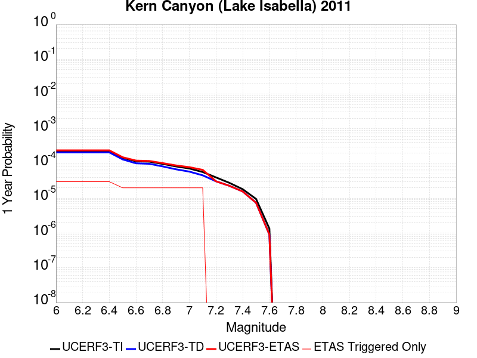 |  |

| Magnitude | 1 wk TI Prob | 1 wk TD Prob | 1 wk ETAS Prob | 1 wk ETAS/TD Gain | 1 wk ETAS Triggered Only | 1 mo TI Prob | 1 mo TD Prob | 1 mo ETAS Prob | 1 mo ETAS/TD Gain | 1 mo ETAS Triggered Only | 1 yr TI Prob | 1 yr TD Prob | 1 yr ETAS Prob | 1 yr ETAS/TD Gain | 1 yr ETAS Triggered Only | 10 yr TI Prob | 10 yr TD Prob | 10 yr ETAS Prob | 10 yr ETAS/TD Gain | 10 yr ETAS Triggered Only |
|-----|-----|-----|-----|-----|-----|-----|-----|-----|-----|-----|-----|-----|-----|-----|-----|-----|-----|-----|-----|-----|
| 6.0 | 4.2387383E-6 | 4.0016826E-6 | 4.0016826E-6 | 1.0 | 0.0 | 1.8165894E-5 | 1.7149967E-5 | 1.7149967E-5 | 1.0 | 0.0 | 2.2114732E-4 | 2.087827E-4 | 2.3877644E-4 | 1.1436601 | 3.0E-5 | 0.0022092736 | 0.0020860494 | 0.002125966 | 1.019135 | 4.0E-5 |
| 6.1 | 4.2387383E-6 | 4.0016826E-6 | 4.0016826E-6 | 1.0 | 0.0 | 1.8165894E-5 | 1.7149967E-5 | 1.7149967E-5 | 1.0 | 0.0 | 2.2114732E-4 | 2.087827E-4 | 2.3877644E-4 | 1.1436601 | 3.0E-5 | 0.0022092736 | 0.0020860494 | 0.002125966 | 1.019135 | 4.0E-5 |
| 6.2 | 4.2387383E-6 | 4.0016826E-6 | 4.0016826E-6 | 1.0 | 0.0 | 1.8165894E-5 | 1.7149967E-5 | 1.7149967E-5 | 1.0 | 0.0 | 2.2114732E-4 | 2.087827E-4 | 2.3877644E-4 | 1.1436601 | 3.0E-5 | 0.0022092736 | 0.0020860494 | 0.002125966 | 1.019135 | 4.0E-5 |
| 6.3 | 4.2387383E-6 | 4.0016826E-6 | 4.0016826E-6 | 1.0 | 0.0 | 1.8165894E-5 | 1.7149967E-5 | 1.7149967E-5 | 1.0 | 0.0 | 2.2114732E-4 | 2.087827E-4 | 2.3877644E-4 | 1.1436601 | 3.0E-5 | 0.0022092736 | 0.0020860494 | 0.002125966 | 1.019135 | 4.0E-5 |
| 6.4 | 4.2387383E-6 | 4.0016826E-6 | 4.0016826E-6 | 1.0 | 0.0 | 1.8165894E-5 | 1.7149967E-5 | 1.7149967E-5 | 1.0 | 0.0 | 2.2114732E-4 | 2.087827E-4 | 2.3877644E-4 | 1.1436601 | 3.0E-5 | 0.0022092736 | 0.0020860494 | 0.002125966 | 1.019135 | 4.0E-5 |
| 6.5 | 2.7857532E-6 | 2.5178942E-6 | 2.5178942E-6 | 1.0 | 0.0 | 1.1938888E-5 | 1.0790933E-5 | 1.0790933E-5 | 1.0 | 0.0 | 1.4534626E-4 | 1.3137201E-4 | 1.5136939E-4 | 1.1522194 | 2.0E-5 | 0.0014525123 | 0.0013129762 | 0.0013429369 | 1.0228188 | 3.0E-5 |
| 6.6 | 2.2233348E-6 | 1.9441447E-6 | 1.9441447E-6 | 1.0 | 0.0 | 9.528543E-6 | 8.332023E-6 | 8.332023E-6 | 1.0 | 0.0 | 1.1600384E-4 | 1.0143774E-4 | 1.2143572E-4 | 1.1971452 | 2.0E-5 | 0.001159433 | 0.0010139231 | 0.0010438927 | 1.0295581 | 3.0E-5 |
| 6.7 | 2.1635126E-6 | 1.8835244E-6 | 1.8835244E-6 | 1.0 | 0.0 | 9.272164E-6 | 8.072223E-6 | 8.072223E-6 | 1.0 | 0.0 | 1.1288274E-4 | 9.827496E-5 | 1.18273E-4 | 1.2034906 | 2.0E-5 | 0.0011282542 | 9.823232E-4 | 0.0010122937 | 1.0305098 | 3.0E-5 |
| 6.8 | 1.8685711E-6 | 1.5831604E-6 | 1.5831604E-6 | 1.0 | 0.0 | 8.008137E-6 | 6.7849555E-6 | 6.7849555E-6 | 1.0 | 0.0 | 9.74947E-5 | 8.260376E-5 | 1.02602105E-4 | 1.2420998 | 2.0E-5 | 9.745194E-4 | 8.2573545E-4 | 8.5571065E-4 | 1.0363013 | 3.0E-5 |
| 6.9 | 1.5815071E-6 | 1.3065078E-6 | 1.3065078E-6 | 1.0 | 0.0 | 6.77787E-6 | 5.5993073E-6 | 5.5993073E-6 | 1.0 | 0.0 | 8.251744E-5 | 6.816946E-5 | 8.81681E-5 | 1.2933666 | 2.0E-5 | 8.248681E-4 | 6.8148813E-4 | 7.114677E-4 | 1.0439913 | 3.0E-5 |
| 7.0 | 1.3772564E-6 | 1.1210848E-6 | 1.1210848E-6 | 1.0 | 0.0 | 5.9025137E-6 | 4.8046404E-6 | 4.8046404E-6 | 1.0 | 0.0 | 7.186073E-5 | 5.8494945E-5 | 7.849377E-5 | 1.3418899 | 2.0E-5 | 7.18375E-4 | 5.847975E-4 | 6.1478E-4 | 1.0512698 | 3.0E-5 |
| 7.1 | 1.0916998E-6 | 8.7638756E-7 | 8.7638756E-7 | 1.0 | 0.0 | 4.678705E-6 | 3.7559414E-6 | 3.7559414E-6 | 1.0 | 0.0 | 5.6961744E-5 | 4.572764E-5 | 6.572672E-5 | 1.4373522 | 2.0E-5 | 5.6947145E-4 | 4.5718366E-4 | 4.771745E-4 | 1.0437261 | 2.0E-5 |
| 7.2 | 7.6277024E-7 | 5.9015247E-7 | 5.9015247E-7 | 1.0 | 0.0 | 3.2690114E-6 | 2.5292225E-6 | 2.5292225E-6 | 1.0 | 0.0 | 3.9799485E-5 | 3.0792857E-5 | 3.0792857E-5 | 1.0 | 0.0 | 3.9792358E-4 | 3.0788648E-4 | 3.0788648E-4 | 1.0 | 0.0 |
| 7.3 | 5.3265916E-7 | 4.3824897E-7 | 4.3824897E-7 | 1.0 | 0.0 | 2.282823E-6 | 1.8782085E-6 | 1.8782085E-6 | 1.0 | 0.0 | 2.7793016E-5 | 2.2866952E-5 | 2.2866952E-5 | 1.0 | 0.0 | 2.778954E-4 | 2.2864637E-4 | 2.2864637E-4 | 1.0 | 0.0 |
| 7.4 | 3.4946007E-7 | 3.0066073E-7 | 3.0066073E-7 | 1.0 | 0.0 | 1.497685E-6 | 1.2885454E-6 | 1.2885454E-6 | 1.0 | 0.0 | 1.8234163E-5 | 1.5687929E-5 | 1.5687929E-5 | 1.0 | 0.0 | 1.8232666E-4 | 1.5686844E-4 | 1.5686844E-4 | 1.0 | 0.0 |
| 7.5 | 1.8317026E-7 | 1.4244999E-7 | 1.4244999E-7 | 1.0 | 0.0 | 7.850152E-7 | 6.104998E-7 | 6.104998E-7 | 1.0 | 0.0 | 9.557518E-6 | 7.432811E-6 | 7.432811E-6 | 1.0 | 0.0 | 9.5571064E-5 | 7.43257E-5 | 7.43257E-5 | 1.0 | 0.0 |
| 7.6 | 2.572245E-8 | 1.7353019E-8 | 1.7353019E-8 | 1.0 | 0.0 | 1.10239064E-7 | 7.437008E-8 | 7.437008E-8 | 1.0 | 0.0 | 1.3421597E-6 | 9.054554E-7 | 9.054554E-7 | 1.0 | 0.0 | 1.3421517E-5 | 9.054523E-6 | 9.054523E-6 | 1.0 | 0.0 |

## Kern Canyon (North Kern) 2011
*[(top)](#table-of-contents)*

| 1 Week | 1 Month | 1 Year | 10 Year |
|-----|-----|-----|-----|
|  |  |  |  |

| Magnitude | 1 wk TI Prob | 1 wk TD Prob | 1 wk ETAS Prob | 1 wk ETAS/TD Gain | 1 wk ETAS Triggered Only | 1 mo TI Prob | 1 mo TD Prob | 1 mo ETAS Prob | 1 mo ETAS/TD Gain | 1 mo ETAS Triggered Only | 1 yr TI Prob | 1 yr TD Prob | 1 yr ETAS Prob | 1 yr ETAS/TD Gain | 1 yr ETAS Triggered Only | 10 yr TI Prob | 10 yr TD Prob | 10 yr ETAS Prob | 10 yr ETAS/TD Gain | 10 yr ETAS Triggered Only |
|-----|-----|-----|-----|-----|-----|-----|-----|-----|-----|-----|-----|-----|-----|-----|-----|-----|-----|-----|-----|-----|
| 6.0 | 6.6264497E-6 | 6.757416E-6 | 6.757416E-6 | 1.0 | 0.0 | 2.8398761E-5 | 2.8960078E-5 | 2.8960078E-5 | 1.0 | 0.0 | 3.4570007E-4 | 3.525399E-4 | 3.7253284E-4 | 1.0567112 | 2.0E-5 | 0.0034516277 | 0.003520595 | 0.0035604541 | 1.0113217 | 4.0E-5 |
| 6.1 | 6.6264497E-6 | 6.757416E-6 | 6.757416E-6 | 1.0 | 0.0 | 2.8398761E-5 | 2.8960078E-5 | 2.8960078E-5 | 1.0 | 0.0 | 3.4570007E-4 | 3.525399E-4 | 3.7253284E-4 | 1.0567112 | 2.0E-5 | 0.0034516277 | 0.003520595 | 0.0035604541 | 1.0113217 | 4.0E-5 |
| 6.2 | 6.6264497E-6 | 6.757416E-6 | 6.757416E-6 | 1.0 | 0.0 | 2.8398761E-5 | 2.8960078E-5 | 2.8960078E-5 | 1.0 | 0.0 | 3.4570007E-4 | 3.525399E-4 | 3.7253284E-4 | 1.0567112 | 2.0E-5 | 0.0034516277 | 0.003520595 | 0.0035604541 | 1.0113217 | 4.0E-5 |
| 6.3 | 6.6264497E-6 | 6.757416E-6 | 6.757416E-6 | 1.0 | 0.0 | 2.8398761E-5 | 2.8960078E-5 | 2.8960078E-5 | 1.0 | 0.0 | 3.4570007E-4 | 3.525399E-4 | 3.7253284E-4 | 1.0567112 | 2.0E-5 | 0.0034516277 | 0.003520595 | 0.0035604541 | 1.0113217 | 4.0E-5 |
| 6.4 | 6.6264497E-6 | 6.757416E-6 | 6.757416E-6 | 1.0 | 0.0 | 2.8398761E-5 | 2.8960078E-5 | 2.8960078E-5 | 1.0 | 0.0 | 3.4570007E-4 | 3.525399E-4 | 3.7253284E-4 | 1.0567112 | 2.0E-5 | 0.0034516277 | 0.003520595 | 0.0035604541 | 1.0113217 | 4.0E-5 |
| 6.5 | 3.2162225E-6 | 3.2571281E-6 | 3.2571281E-6 | 1.0 | 0.0 | 1.3783738E-5 | 1.395905E-5 | 1.395905E-5 | 1.0 | 0.0 | 1.6780409E-4 | 1.69939E-4 | 1.799373E-4 | 1.0588347 | 1.0E-5 | 0.0016767744 | 0.0016981701 | 0.0017181361 | 1.0117574 | 2.0E-5 |
| 6.6 | 3.2162225E-6 | 3.2571281E-6 | 3.2571281E-6 | 1.0 | 0.0 | 1.3783738E-5 | 1.395905E-5 | 1.395905E-5 | 1.0 | 0.0 | 1.6780409E-4 | 1.69939E-4 | 1.799373E-4 | 1.0588347 | 1.0E-5 | 0.0016767744 | 0.0016981701 | 0.0017181361 | 1.0117574 | 2.0E-5 |
| 6.7 | 2.1908265E-6 | 2.2071456E-6 | 2.2071456E-6 | 1.0 | 0.0 | 9.389223E-6 | 9.459161E-6 | 9.459161E-6 | 1.0 | 0.0 | 1.1430779E-4 | 1.15159404E-4 | 1.2515826E-4 | 1.0868262 | 1.0E-5 | 0.0011424901 | 0.0011510167 | 0.0011709937 | 1.0173559 | 2.0E-5 |
| 6.8 | 1.7303895E-6 | 1.7365708E-6 | 1.7365708E-6 | 1.0 | 0.0 | 7.415934E-6 | 7.4424256E-6 | 7.4424256E-6 | 1.0 | 0.0 | 9.028525E-5 | 9.060786E-5 | 1.0060695E-4 | 1.1103557 | 1.0E-5 | 9.024858E-4 | 9.057189E-4 | 9.157098E-4 | 1.0110309 | 1.0E-5 |
| 6.9 | 1.3700314E-6 | 1.3688762E-6 | 1.3688762E-6 | 1.0 | 0.0 | 5.87155E-6 | 5.866599E-6 | 5.866599E-6 | 1.0 | 0.0 | 7.148377E-5 | 7.142355E-5 | 8.142283E-5 | 1.1399999 | 1.0E-5 | 7.146078E-4 | 7.140105E-4 | 7.2400336E-4 | 1.0139954 | 1.0E-5 |
| 7.0 | 1.1467797E-6 | 1.1413921E-6 | 1.1413921E-6 | 1.0 | 0.0 | 4.9147607E-6 | 4.8916713E-6 | 4.8916713E-6 | 1.0 | 0.0 | 5.983557E-5 | 5.9554503E-5 | 5.9554503E-5 | 1.0 | 0.0 | 5.981946E-4 | 5.953886E-4 | 5.953886E-4 | 1.0 | 0.0 |
| 7.1 | 9.3952065E-7 | 9.302786E-7 | 9.302786E-7 | 1.0 | 0.0 | 4.026511E-6 | 3.9869024E-6 | 3.9869024E-6 | 1.0 | 0.0 | 4.9021666E-5 | 4.853947E-5 | 4.853947E-5 | 1.0 | 0.0 | 4.901085E-4 | 4.8529045E-4 | 4.8529045E-4 | 1.0 | 0.0 |
| 7.2 | 6.858055E-7 | 6.719371E-7 | 6.719371E-7 | 1.0 | 0.0 | 2.939163E-6 | 2.8797272E-6 | 2.8797272E-6 | 1.0 | 0.0 | 3.5783723E-5 | 3.5060122E-5 | 3.5060122E-5 | 1.0 | 0.0 | 3.5777962E-4 | 3.505468E-4 | 3.505468E-4 | 1.0 | 0.0 |
| 7.3 | 5.1101983E-7 | 4.9393526E-7 | 4.9393526E-7 | 1.0 | 0.0 | 2.1900833E-6 | 2.1168637E-6 | 2.1168637E-6 | 1.0 | 0.0 | 2.6663936E-5 | 2.5772517E-5 | 2.5772517E-5 | 1.0 | 0.0 | 2.6660739E-4 | 2.5769576E-4 | 2.5769576E-4 | 1.0 | 0.0 |
| 7.4 | 3.4999414E-7 | 3.2996275E-7 | 3.2996275E-7 | 1.0 | 0.0 | 1.499974E-6 | 1.4141253E-6 | 1.4141253E-6 | 1.0 | 0.0 | 1.8262032E-5 | 1.7216842E-5 | 1.7216842E-5 | 1.0 | 0.0 | 1.826053E-4 | 1.7215533E-4 | 1.7215533E-4 | 1.0 | 0.0 |
| 7.5 | 1.7021522E-7 | 1.4750238E-7 | 1.4750238E-7 | 1.0 | 0.0 | 7.2949354E-7 | 6.321529E-7 | 6.321529E-7 | 1.0 | 0.0 | 8.881548E-6 | 7.696435E-6 | 7.696435E-6 | 1.0 | 0.0 | 8.8811925E-5 | 7.696177E-5 | 7.696177E-5 | 1.0 | 0.0 |
| 7.6 | 2.572245E-8 | 1.7353019E-8 | 1.7353019E-8 | 1.0 | 0.0 | 1.10239064E-7 | 7.437008E-8 | 7.437008E-8 | 1.0 | 0.0 | 1.3421597E-6 | 9.054554E-7 | 9.054554E-7 | 1.0 | 0.0 | 1.3421517E-5 | 9.054523E-6 | 9.054523E-6 | 1.0 | 0.0 |

## San Jacinto (Coyote Creek)
*[(top)](#table-of-contents)*

| 1 Week | 1 Month | 1 Year | 10 Year |
|-----|-----|-----|-----|
|  |  |  |  |

| Magnitude | 1 wk TI Prob | 1 wk TD Prob | 1 wk ETAS Prob | 1 wk ETAS/TD Gain | 1 wk ETAS Triggered Only | 1 mo TI Prob | 1 mo TD Prob | 1 mo ETAS Prob | 1 mo ETAS/TD Gain | 1 mo ETAS Triggered Only | 1 yr TI Prob | 1 yr TD Prob | 1 yr ETAS Prob | 1 yr ETAS/TD Gain | 1 yr ETAS Triggered Only | 10 yr TI Prob | 10 yr TD Prob | 10 yr ETAS Prob | 10 yr ETAS/TD Gain | 10 yr ETAS Triggered Only |
|-----|-----|-----|-----|-----|-----|-----|-----|-----|-----|-----|-----|-----|-----|-----|-----|-----|-----|-----|-----|-----|
| 6.0 | 2.7374346E-5 | 2.4176177E-5 | 2.4176177E-5 | 1.0 | 0.0 | 1.1731335E-4 | 1.03608094E-4 | 1.03608094E-4 | 1.0 | 0.0 | 0.0014273542 | 0.0012607011 | 0.001280676 | 1.0158442 | 2.0E-5 | 0.01418221 | 0.012944493 | 0.012983975 | 1.0030501 | 4.0E-5 |
| 6.1 | 2.7374346E-5 | 2.4176177E-5 | 2.4176177E-5 | 1.0 | 0.0 | 1.1731335E-4 | 1.03608094E-4 | 1.03608094E-4 | 1.0 | 0.0 | 0.0014273542 | 0.0012607011 | 0.001280676 | 1.0158442 | 2.0E-5 | 0.01418221 | 0.012944493 | 0.012983975 | 1.0030501 | 4.0E-5 |
| 6.2 | 2.7374346E-5 | 2.4176177E-5 | 2.4176177E-5 | 1.0 | 0.0 | 1.1731335E-4 | 1.03608094E-4 | 1.03608094E-4 | 1.0 | 0.0 | 0.0014273542 | 0.0012607011 | 0.001280676 | 1.0158442 | 2.0E-5 | 0.01418221 | 0.012944493 | 0.012983975 | 1.0030501 | 4.0E-5 |
| 6.3 | 2.7374346E-5 | 2.4176177E-5 | 2.4176177E-5 | 1.0 | 0.0 | 1.1731335E-4 | 1.03608094E-4 | 1.03608094E-4 | 1.0 | 0.0 | 0.0014273542 | 0.0012607011 | 0.001280676 | 1.0158442 | 2.0E-5 | 0.01418221 | 0.012944493 | 0.012983975 | 1.0030501 | 4.0E-5 |
| 6.4 | 2.7374346E-5 | 2.4176177E-5 | 2.4176177E-5 | 1.0 | 0.0 | 1.1731335E-4 | 1.03608094E-4 | 1.03608094E-4 | 1.0 | 0.0 | 0.0014273542 | 0.0012607011 | 0.001280676 | 1.0158442 | 2.0E-5 | 0.01418221 | 0.012944493 | 0.012983975 | 1.0030501 | 4.0E-5 |
| 6.5 | 2.7282445E-5 | 2.4062241E-5 | 2.4062241E-5 | 1.0 | 0.0 | 1.16919524E-4 | 1.0311983E-4 | 1.0311983E-4 | 1.0 | 0.0 | 0.0014225657 | 0.0012547635 | 0.0012747383 | 1.0159192 | 2.0E-5 | 0.014134934 | 0.0128858145 | 0.012925299 | 1.0030642 | 4.0E-5 |
| 6.6 | 2.7282445E-5 | 2.4062241E-5 | 2.4062241E-5 | 1.0 | 0.0 | 1.16919524E-4 | 1.0311983E-4 | 1.0311983E-4 | 1.0 | 0.0 | 0.0014225657 | 0.0012547635 | 0.0012747383 | 1.0159192 | 2.0E-5 | 0.014134934 | 0.0128858145 | 0.012925299 | 1.0030642 | 4.0E-5 |
| 6.7 | 2.7216198E-5 | 2.3987352E-5 | 2.3987352E-5 | 1.0 | 0.0 | 1.1663563E-4 | 1.02798906E-4 | 1.02798906E-4 | 1.0 | 0.0 | 0.0014191137 | 0.0012508607 | 0.0012708358 | 1.015969 | 2.0E-5 | 0.014100855 | 0.012847221 | 0.012886707 | 1.0030736 | 4.0E-5 |
| 6.8 | 2.7078617E-5 | 2.3904551E-5 | 2.3904551E-5 | 1.0 | 0.0 | 1.1604605E-4 | 1.0244407E-4 | 1.0244407E-4 | 1.0 | 0.0 | 0.001411945 | 0.0012465456 | 0.0012665207 | 1.0160244 | 2.0E-5 | 0.014030075 | 0.012804349 | 0.012843837 | 1.003084 | 4.0E-5 |
| 6.9 | 2.6982952E-5 | 2.3824046E-5 | 2.3824046E-5 | 1.0 | 0.0 | 1.15636096E-4 | 1.02099075E-4 | 1.02099075E-4 | 1.0 | 0.0 | 0.0014069602 | 0.0012423501 | 0.0012623252 | 1.0160785 | 2.0E-5 | 0.013980856 | 0.012762618 | 0.012802108 | 1.0030942 | 4.0E-5 |
| 7.0 | 2.6449972E-5 | 2.3401004E-5 | 2.3401004E-5 | 1.0 | 0.0 | 1.1335209E-4 | 1.00286175E-4 | 1.00286175E-4 | 1.0 | 0.0 | 0.001379188 | 0.0012203029 | 0.0012402785 | 1.0163693 | 2.0E-5 | 0.0137065975 | 0.012543921 | 0.012583419 | 1.0031488 | 4.0E-5 |
| 7.1 | 2.6257849E-5 | 2.322702E-5 | 2.322702E-5 | 1.0 | 0.0 | 1.1252879E-4 | 9.9540586E-5 | 9.9540586E-5 | 1.0 | 0.0 | 0.0013691769 | 0.0012112354 | 0.0012312112 | 1.016492 | 2.0E-5 | 0.013607717 | 0.012453787 | 0.012493289 | 1.0031719 | 4.0E-5 |
| 7.2 | 2.5270041E-5 | 2.242154E-5 | 2.242154E-5 | 1.0 | 0.0 | 1.0829568E-4 | 9.6088785E-5 | 9.6088785E-5 | 1.0 | 0.0 | 0.0013177024 | 0.0011692555 | 0.0011892321 | 1.017085 | 2.0E-5 | 0.013099162 | 0.012034738 | 0.012074257 | 1.0032837 | 4.0E-5 |
| 7.3 | 2.339701E-5 | 2.1152975E-5 | 2.1152975E-5 | 1.0 | 0.0 | 1.0026905E-4 | 9.0652466E-5 | 9.0652466E-5 | 1.0 | 0.0 | 0.001220092 | 0.001103137 | 0.001123115 | 1.0181102 | 2.0E-5 | 0.012134149 | 0.0113734165 | 0.011412961 | 1.003477 | 4.0E-5 |
| 7.4 | 2.296333E-5 | 2.0883224E-5 | 2.0883224E-5 | 1.0 | 0.0 | 9.841056E-5 | 8.9496476E-5 | 8.9496476E-5 | 1.0 | 0.0 | 0.0011974899 | 0.001089077 | 0.0011090552 | 1.0183442 | 2.0E-5 | 0.011910575 | 0.011232498 | 0.011272049 | 1.0035211 | 4.0E-5 |
| 7.5 | 2.2188895E-5 | 2.0405923E-5 | 2.0405923E-5 | 1.0 | 0.0 | 9.50918E-5 | 8.745104E-5 | 8.745104E-5 | 1.0 | 0.0 | 0.0011571277 | 0.0010641983 | 0.001084177 | 1.0187734 | 2.0E-5 | 0.011511209 | 0.010982013 | 0.011021574 | 1.0036023 | 4.0E-5 |
| 7.6 | 2.0013189E-5 | 1.899158E-5 | 1.899158E-5 | 1.0 | 0.0 | 8.5767984E-5 | 8.138996E-5 | 8.138996E-5 | 1.0 | 0.0 | 0.001043725 | 9.90474E-4 | 0.0010104543 | 1.0201724 | 2.0E-5 | 0.010388365 | 0.010239562 | 0.010279152 | 1.0038664 | 4.0E-5 |
| 7.7 | 1.7230794E-5 | 1.6772141E-5 | 1.6772141E-5 | 1.0 | 0.0 | 7.384417E-5 | 7.1878625E-5 | 7.1878625E-5 | 1.0 | 0.0 | 8.986819E-4 | 8.7477174E-4 | 8.9475425E-4 | 1.0228431 | 2.0E-5 | 0.008950562 | 0.009077629 | 0.009117266 | 1.0043664 | 4.0E-5 |
| 7.8 | 1.4478809E-5 | 1.5018486E-5 | 1.5018486E-5 | 1.0 | 0.0 | 6.205057E-5 | 6.4363354E-5 | 6.4363354E-5 | 1.0 | 0.0 | 7.552038E-4 | 7.8334275E-4 | 8.033271E-4 | 1.0255116 | 2.0E-5 | 0.0075264242 | 0.008155493 | 0.008195167 | 1.0048647 | 4.0E-5 |
| 7.9 | 1.1114467E-5 | 1.1669441E-5 | 1.1669441E-5 | 1.0 | 0.0 | 4.7632562E-5 | 5.0010935E-5 | 5.0010935E-5 | 1.0 | 0.0 | 5.797721E-4 | 6.087136E-4 | 6.287014E-4 | 1.0328362 | 2.0E-5 | 0.0057826187 | 0.006393022 | 0.006432766 | 1.0062168 | 4.0E-5 |
| 8.0 | 9.327402E-6 | 9.92126E-6 | 9.92126E-6 | 1.0 | 0.0 | 3.9973966E-5 | 4.2518997E-5 | 4.2518997E-5 | 1.0 | 0.0 | 4.8657437E-4 | 5.175464E-4 | 5.37536E-4 | 1.0386239 | 2.0E-5 | 0.0048551033 | 0.005461515 | 0.0055012964 | 1.0072839 | 4.0E-5 |
| 8.1 | 7.0235833E-6 | 6.8437025E-6 | 6.8437025E-6 | 1.0 | 0.0 | 3.0100724E-5 | 2.9329827E-5 | 2.9329827E-5 | 1.0 | 0.0 | 3.664147E-4 | 3.5703264E-4 | 3.7702548E-4 | 1.0559973 | 2.0E-5 | 0.003658111 | 0.003796282 | 0.0038261681 | 1.0078725 | 3.0E-5 |
| 8.2 | 2.0358202E-6 | 9.025306E-7 | 9.025306E-7 | 1.0 | 0.0 | 8.724915E-6 | 3.8679827E-6 | 3.8679827E-6 | 1.0 | 0.0 | 1.06220665E-4 | 4.7091693E-5 | 4.7091693E-5 | 1.0 | 0.0 | 0.001061699 | 5.3427246E-4 | 5.3427246E-4 | 1.0 | 0.0 |
| 8.3 | 2.0051264E-7 | 6.6426736E-8 | 6.6426736E-8 | 1.0 | 0.0 | 8.5933965E-7 | 2.8468597E-7 | 2.8468597E-7 | 1.0 | 0.0 | 1.046241E-5 | 3.4660466E-6 | 3.4660466E-6 | 1.0 | 0.0 | 1.0461917E-4 | 4.028949E-5 | 4.028949E-5 | 1.0 | 0.0 |

## Ventura-Pitas Point
*[(top)](#table-of-contents)*

| 1 Week | 1 Month | 1 Year | 10 Year |
|-----|-----|-----|-----|
|  |  |  |  |

| Magnitude | 1 wk TI Prob | 1 wk TD Prob | 1 wk ETAS Prob | 1 wk ETAS/TD Gain | 1 wk ETAS Triggered Only | 1 mo TI Prob | 1 mo TD Prob | 1 mo ETAS Prob | 1 mo ETAS/TD Gain | 1 mo ETAS Triggered Only | 1 yr TI Prob | 1 yr TD Prob | 1 yr ETAS Prob | 1 yr ETAS/TD Gain | 1 yr ETAS Triggered Only | 10 yr TI Prob | 10 yr TD Prob | 10 yr ETAS Prob | 10 yr ETAS/TD Gain | 10 yr ETAS Triggered Only |
|-----|-----|-----|-----|-----|-----|-----|-----|-----|-----|-----|-----|-----|-----|-----|-----|-----|-----|-----|-----|-----|
| 6.0 | 3.3179622E-5 | 3.3739056E-5 | 3.3739056E-5 | 1.0 | 0.0 | 1.4219063E-4 | 1.445894E-4 | 1.645865E-4 | 1.1383027 | 2.0E-5 | 0.0017297962 | 0.0017592113 | 0.0017791761 | 1.0113487 | 2.0E-5 | 0.017163932 | 0.017478276 | 0.017517578 | 1.0022485 | 4.0E-5 |
| 6.1 | 3.3179622E-5 | 3.3739056E-5 | 3.3739056E-5 | 1.0 | 0.0 | 1.4219063E-4 | 1.445894E-4 | 1.645865E-4 | 1.1383027 | 2.0E-5 | 0.0017297962 | 0.0017592113 | 0.0017791761 | 1.0113487 | 2.0E-5 | 0.017163932 | 0.017478276 | 0.017517578 | 1.0022485 | 4.0E-5 |
| 6.2 | 3.3179622E-5 | 3.3739056E-5 | 3.3739056E-5 | 1.0 | 0.0 | 1.4219063E-4 | 1.445894E-4 | 1.645865E-4 | 1.1383027 | 2.0E-5 | 0.0017297962 | 0.0017592113 | 0.0017791761 | 1.0113487 | 2.0E-5 | 0.017163932 | 0.017478276 | 0.017517578 | 1.0022485 | 4.0E-5 |
| 6.3 | 3.3179622E-5 | 3.3739056E-5 | 3.3739056E-5 | 1.0 | 0.0 | 1.4219063E-4 | 1.445894E-4 | 1.645865E-4 | 1.1383027 | 2.0E-5 | 0.0017297962 | 0.0017592113 | 0.0017791761 | 1.0113487 | 2.0E-5 | 0.017163932 | 0.017478276 | 0.017517578 | 1.0022485 | 4.0E-5 |
| 6.4 | 1.8754668E-5 | 1.7022052E-5 | 1.7022052E-5 | 1.0 | 0.0 | 8.037467E-5 | 7.294974E-5 | 9.294828E-5 | 1.2741413 | 2.0E-5 | 9.781223E-4 | 8.878243E-4 | 9.078065E-4 | 1.022507 | 2.0E-5 | 0.009738282 | 0.008845002 | 0.008864826 | 1.0022411 | 2.0E-5 |
| 6.5 | 1.8754668E-5 | 1.7022052E-5 | 1.7022052E-5 | 1.0 | 0.0 | 8.037467E-5 | 7.294974E-5 | 9.294828E-5 | 1.2741413 | 2.0E-5 | 9.781223E-4 | 8.878243E-4 | 9.078065E-4 | 1.022507 | 2.0E-5 | 0.009738282 | 0.008845002 | 0.008864826 | 1.0022411 | 2.0E-5 |
| 6.6 | 1.4361558E-5 | 1.21244175E-5 | 1.21244175E-5 | 1.0 | 0.0 | 6.154808E-5 | 5.1960767E-5 | 7.195973E-5 | 1.3848858 | 2.0E-5 | 7.490902E-4 | 6.32441E-4 | 6.5242837E-4 | 1.0316035 | 2.0E-5 | 0.0074657016 | 0.0063065602 | 0.006326434 | 1.0031513 | 2.0E-5 |
| 6.7 | 1.4361558E-5 | 1.21244175E-5 | 1.21244175E-5 | 1.0 | 0.0 | 6.154808E-5 | 5.1960767E-5 | 7.195973E-5 | 1.3848858 | 2.0E-5 | 7.490902E-4 | 6.32441E-4 | 6.5242837E-4 | 1.0316035 | 2.0E-5 | 0.0074657016 | 0.0063065602 | 0.006326434 | 1.0031513 | 2.0E-5 |
| 6.8 | 1.3663846E-5 | 1.1346513E-5 | 1.1346513E-5 | 1.0 | 0.0 | 5.8558027E-5 | 4.862702E-5 | 6.862605E-5 | 1.411274 | 2.0E-5 | 7.127108E-4 | 5.9187505E-4 | 6.118632E-4 | 1.0337709 | 2.0E-5 | 0.007104293 | 0.0059030945 | 0.0059229764 | 1.003368 | 2.0E-5 |
| 6.9 | 1.3644157E-5 | 1.1324612E-5 | 1.1324612E-5 | 1.0 | 0.0 | 5.8473648E-5 | 4.8533162E-5 | 6.853219E-5 | 1.4120693 | 2.0E-5 | 7.116841E-4 | 5.9073296E-4 | 6.107211E-4 | 1.0338362 | 2.0E-5 | 0.007094092 | 0.0058917343 | 0.0059116166 | 1.0033746 | 2.0E-5 |
| 7.0 | 1.3568845E-5 | 1.1244173E-5 | 1.1244173E-5 | 1.0 | 0.0 | 5.8150898E-5 | 4.8188434E-5 | 6.8187466E-5 | 1.4150174 | 2.0E-5 | 7.077572E-4 | 5.8653817E-4 | 6.0652645E-4 | 1.0340784 | 2.0E-5 | 0.007055073 | 0.0058500078 | 0.005869891 | 1.0033988 | 2.0E-5 |
| 7.1 | 1.306572E-5 | 1.07225915E-5 | 1.07225915E-5 | 1.0 | 0.0 | 5.599474E-5 | 4.5953166E-5 | 6.595225E-5 | 1.4352057 | 2.0E-5 | 6.815227E-4 | 5.59338E-4 | 5.793268E-4 | 1.0357366 | 2.0E-5 | 0.0067943637 | 0.0055793985 | 0.005599287 | 1.0035646 | 2.0E-5 |
| 7.2 | 1.232604E-5 | 9.997138E-6 | 9.997138E-6 | 1.0 | 0.0 | 5.2824813E-5 | 4.284418E-5 | 6.2843326E-5 | 1.4667878 | 2.0E-5 | 6.429523E-4 | 5.2150484E-4 | 5.414944E-4 | 1.0383306 | 2.0E-5 | 0.0064109527 | 0.0052028936 | 0.0052227895 | 1.003824 | 2.0E-5 |
| 7.3 | 1.0917261E-5 | 8.844401E-6 | 8.844401E-6 | 1.0 | 0.0 | 4.678742E-5 | 3.7904032E-5 | 5.7903275E-5 | 1.5276283 | 2.0E-5 | 5.69488E-4 | 4.6138544E-4 | 4.8137622E-4 | 1.0433277 | 2.0E-5 | 0.0056803077 | 0.0046043326 | 0.0046242406 | 1.0043237 | 2.0E-5 |
| 7.4 | 1.039959E-5 | 8.424092E-6 | 8.424092E-6 | 1.0 | 0.0 | 4.456891E-5 | 3.610276E-5 | 5.6102035E-5 | 1.5539542 | 2.0E-5 | 5.424914E-4 | 4.3946397E-4 | 4.594552E-4 | 1.04549 | 2.0E-5 | 0.0054116896 | 0.004386002 | 0.0044059143 | 1.00454 | 2.0E-5 |
| 7.5 | 9.015877E-6 | 7.297917E-6 | 7.297917E-6 | 1.0 | 0.0 | 3.86389E-5 | 3.127642E-5 | 3.127642E-5 | 1.0 | 0.0 | 4.7032707E-4 | 3.8072528E-4 | 3.8072528E-4 | 1.0 | 0.0 | 0.004693329 | 0.003800768 | 0.003800768 | 1.0 | 0.0 |
| 7.6 | 4.900162E-6 | 3.8742764E-6 | 3.8742764E-6 | 1.0 | 0.0 | 2.1000526E-5 | 1.6603937E-5 | 1.6603937E-5 | 1.0 | 0.0 | 2.556514E-4 | 2.0213432E-4 | 2.0213432E-4 | 1.0 | 0.0 | 0.0025535747 | 0.0020195183 | 0.0020195183 | 1.0 | 0.0 |
| 7.7 | 3.8850626E-6 | 3.12688E-6 | 3.12688E-6 | 1.0 | 0.0 | 1.6650163E-5 | 1.3400846E-5 | 1.3400846E-5 | 1.0 | 0.0 | 2.0269687E-4 | 1.6314318E-4 | 1.6314318E-4 | 1.0 | 0.0 | 0.002025121 | 0.0016302434 | 0.0016302434 | 1.0 | 0.0 |
| 7.8 | 2.4654719E-6 | 2.0299744E-6 | 2.0299744E-6 | 1.0 | 0.0 | 1.0566265E-5 | 8.699862E-6 | 8.699862E-6 | 1.0 | 0.0 | 1.2863669E-4 | 1.05915715E-4 | 1.05915715E-4 | 1.0 | 0.0 | 0.0012856225 | 0.0010586571 | 0.0010586571 | 1.0 | 0.0 |
| 7.9 | 4.095894E-7 | 3.2766198E-7 | 3.2766198E-7 | 1.0 | 0.0 | 1.7553821E-6 | 1.4042649E-6 | 1.4042649E-6 | 1.0 | 0.0 | 2.1371567E-5 | 1.7096794E-5 | 1.7096794E-5 | 1.0 | 0.0 | 2.1369511E-4 | 1.709551E-4 | 1.709551E-4 | 1.0 | 0.0 |
| 8.0 | 7.791402E-9 | 5.6839005E-9 | 5.6839005E-9 | 1.0 | 0.0 | 3.3391725E-8 | 2.4359574E-8 | 2.4359574E-8 | 1.0 | 0.0 | 4.0654416E-7 | 2.9657778E-7 | 2.9657778E-7 | 1.0 | 0.0 | 4.065434E-6 | 2.965776E-6 | 2.965776E-6 | 1.0 | 0.0 |

## Big Pine (East)
*[(top)](#table-of-contents)*

| 1 Week | 1 Month | 1 Year | 10 Year |
|-----|-----|-----|-----|
|  |  |  |  |

| Magnitude | 1 wk TI Prob | 1 wk TD Prob | 1 wk ETAS Prob | 1 wk ETAS/TD Gain | 1 wk ETAS Triggered Only | 1 mo TI Prob | 1 mo TD Prob | 1 mo ETAS Prob | 1 mo ETAS/TD Gain | 1 mo ETAS Triggered Only | 1 yr TI Prob | 1 yr TD Prob | 1 yr ETAS Prob | 1 yr ETAS/TD Gain | 1 yr ETAS Triggered Only | 10 yr TI Prob | 10 yr TD Prob | 10 yr ETAS Prob | 10 yr ETAS/TD Gain | 10 yr ETAS Triggered Only |
|-----|-----|-----|-----|-----|-----|-----|-----|-----|-----|-----|-----|-----|-----|-----|-----|-----|-----|-----|-----|-----|
| 6.0 | 9.916913E-6 | 1.2822198E-5 | 2.2822069E-5 | 1.7798876 | 1.0E-5 | 4.250036E-5 | 5.4951244E-5 | 7.495014E-5 | 1.363939 | 2.0E-5 | 5.173191E-4 | 6.688481E-4 | 6.988281E-4 | 1.0448233 | 3.0E-5 | 0.0051611643 | 0.006673103 | 0.0067128367 | 1.0059543 | 4.0E-5 |
| 6.1 | 9.916913E-6 | 1.2822198E-5 | 2.2822069E-5 | 1.7798876 | 1.0E-5 | 4.250036E-5 | 5.4951244E-5 | 7.495014E-5 | 1.363939 | 2.0E-5 | 5.173191E-4 | 6.688481E-4 | 6.988281E-4 | 1.0448233 | 3.0E-5 | 0.0051611643 | 0.006673103 | 0.0067128367 | 1.0059543 | 4.0E-5 |
| 6.2 | 9.916913E-6 | 1.2822198E-5 | 2.2822069E-5 | 1.7798876 | 1.0E-5 | 4.250036E-5 | 5.4951244E-5 | 7.495014E-5 | 1.363939 | 2.0E-5 | 5.173191E-4 | 6.688481E-4 | 6.988281E-4 | 1.0448233 | 3.0E-5 | 0.0051611643 | 0.006673103 | 0.0067128367 | 1.0059543 | 4.0E-5 |
| 6.3 | 5.479711E-6 | 8.118015E-6 | 1.8117933E-5 | 2.2318182 | 1.0E-5 | 2.3484265E-5 | 3.4791046E-5 | 4.4790697E-5 | 1.2874203 | 1.0E-5 | 2.858834E-4 | 4.2350183E-4 | 4.334976E-4 | 1.0236026 | 1.0E-5 | 0.0028551589 | 0.0042298343 | 0.0042497497 | 1.0047083 | 2.0E-5 |
| 6.4 | 5.465009E-6 | 8.102307E-6 | 1.8102226E-5 | 2.2342062 | 1.0E-5 | 2.3421257E-5 | 3.472373E-5 | 4.4723383E-5 | 1.2879775 | 1.0E-5 | 2.851165E-4 | 4.226826E-4 | 4.3267838E-4 | 1.0236484 | 1.0E-5 | 0.0028475097 | 0.004221673 | 0.0042415885 | 1.0047175 | 2.0E-5 |
| 6.5 | 4.826767E-6 | 7.427343E-6 | 1.7427268E-5 | 2.3463664 | 1.0E-5 | 2.068598E-5 | 3.18311E-5 | 4.183078E-5 | 1.3141482 | 1.0E-5 | 2.518227E-4 | 3.8747748E-4 | 3.974736E-4 | 1.025798 | 1.0E-5 | 0.0025153751 | 0.0038708635 | 0.003890786 | 1.0051469 | 2.0E-5 |
| 6.6 | 4.3146847E-6 | 6.8872637E-6 | 1.6887194E-5 | 2.4519455 | 1.0E-5 | 1.8491375E-5 | 2.9516525E-5 | 3.9516228E-5 | 1.3387833 | 1.0E-5 | 2.2510924E-4 | 3.5930687E-4 | 3.6930328E-4 | 1.0278214 | 1.0E-5 | 0.0022488134 | 0.0035900716 | 0.0036099998 | 1.0055509 | 2.0E-5 |
| 6.7 | 3.6968106E-6 | 6.000254E-6 | 1.6000195E-5 | 2.6665862 | 1.0E-5 | 1.5843378E-5 | 2.571513E-5 | 3.5714875E-5 | 1.3888661 | 1.0E-5 | 1.9287605E-4 | 3.1303827E-4 | 3.2303514E-4 | 1.031935 | 1.0E-5 | 0.0019270873 | 0.003128695 | 0.0031486326 | 1.0063725 | 2.0E-5 |
| 6.8 | 3.4671132E-6 | 5.706825E-6 | 1.5706768E-5 | 2.7522779 | 1.0E-5 | 1.4858972E-5 | 2.44576E-5 | 3.4457356E-5 | 1.4088608 | 1.0E-5 | 1.8089297E-4 | 2.9773204E-4 | 3.0772906E-4 | 1.0335772 | 1.0E-5 | 0.0018074579 | 0.002976045 | 0.0029959856 | 1.0067003 | 2.0E-5 |
| 6.9 | 2.7686972E-6 | 4.829523E-6 | 4.829523E-6 | 1.0 | 0.0 | 1.1865792E-5 | 2.0697795E-5 | 2.0697795E-5 | 1.0 | 0.0 | 1.4445644E-4 | 2.5196726E-4 | 2.5196726E-4 | 1.0 | 0.0 | 0.0014436257 | 0.0025194613 | 0.002529436 | 1.0039591 | 1.0E-5 |
| 7.0 | 2.1472624E-6 | 3.9889437E-6 | 3.9889437E-6 | 1.0 | 0.0 | 9.20252E-6 | 1.7095364E-5 | 1.7095364E-5 | 1.0 | 0.0 | 1.12034926E-4 | 2.0811672E-4 | 2.0811672E-4 | 1.0 | 0.0 | 0.0011197845 | 0.0020818403 | 0.0020918194 | 1.0047934 | 1.0E-5 |
| 7.1 | 1.7018335E-6 | 3.3484318E-6 | 3.3484318E-6 | 1.0 | 0.0 | 7.293552E-6 | 1.4350345E-5 | 1.4350345E-5 | 1.0 | 0.0 | 8.879537E-5 | 1.747018E-4 | 1.747018E-4 | 1.0 | 0.0 | 8.87599E-4 | 0.0017482359 | 0.0017582185 | 1.00571 | 1.0E-5 |
| 7.2 | 1.25603E-6 | 2.797844E-6 | 2.797844E-6 | 1.0 | 0.0 | 5.3829745E-6 | 1.1990706E-5 | 1.1990706E-5 | 1.0 | 0.0 | 6.553574E-5 | 1.459773E-4 | 1.459773E-4 | 1.0 | 0.0 | 6.551642E-4 | 0.0014613821 | 0.0014713675 | 1.0068328 | 1.0E-5 |
| 7.3 | 1.112297E-6 | 2.6135112E-6 | 2.6135112E-6 | 1.0 | 0.0 | 4.7669787E-6 | 1.1200716E-5 | 1.1200716E-5 | 1.0 | 0.0 | 5.803642E-5 | 1.363604E-4 | 1.363604E-4 | 1.0 | 0.0 | 5.802127E-4 | 0.0013651794 | 0.0013751658 | 1.007315 | 1.0E-5 |
| 7.4 | 1.0137181E-6 | 2.4865376E-6 | 2.4865376E-6 | 1.0 | 0.0 | 4.3444993E-6 | 1.0656548E-5 | 1.0656548E-5 | 1.0 | 0.0 | 5.2892992E-5 | 1.2973596E-4 | 1.2973596E-4 | 1.0 | 0.0 | 5.288041E-4 | 0.0012987981 | 0.0013087852 | 1.0076895 | 1.0E-5 |
| 7.5 | 9.598608E-7 | 2.410106E-6 | 2.410106E-6 | 1.0 | 0.0 | 4.1136827E-6 | 1.0328986E-5 | 1.0328986E-5 | 1.0 | 0.0 | 5.0082934E-5 | 1.2574837E-4 | 1.2574837E-4 | 1.0 | 0.0 | 5.007165E-4 | 0.001258775 | 0.0012687624 | 1.0079342 | 1.0E-5 |
| 7.6 | 7.929459E-7 | 2.0474768E-6 | 2.0474768E-6 | 1.0 | 0.0 | 3.3983351E-6 | 8.774872E-6 | 8.774872E-6 | 1.0 | 0.0 | 4.1373947E-5 | 1.06829E-4 | 1.06829E-4 | 1.0 | 0.0 | 4.1366243E-4 | 0.0010698074 | 0.0010797967 | 1.0093374 | 1.0E-5 |
| 7.7 | 4.155788E-7 | 1.1624114E-6 | 1.1624114E-6 | 1.0 | 0.0 | 1.7810507E-6 | 4.981754E-6 | 4.981754E-6 | 1.0 | 0.0 | 2.1684076E-5 | 6.0651208E-5 | 6.0651208E-5 | 1.0 | 0.0 | 2.1681961E-4 | 6.09492E-4 | 6.09492E-4 | 1.0 | 0.0 |
| 7.8 | 1.14666925E-7 | 2.5960628E-7 | 2.5960628E-7 | 1.0 | 0.0 | 4.914296E-7 | 1.1125978E-6 | 1.1125978E-6 | 1.0 | 0.0 | 5.9831386E-6 | 1.3545799E-5 | 1.3545799E-5 | 1.0 | 0.0 | 5.9829777E-5 | 1.3656996E-4 | 1.3656996E-4 | 1.0 | 0.0 |
| 7.9 | 2.9231824E-8 | 4.1527553E-8 | 4.1527553E-8 | 1.0 | 0.0 | 1.2527924E-7 | 1.7797521E-7 | 1.7797521E-7 | 1.0 | 0.0 | 1.5252737E-6 | 2.1668463E-6 | 2.1668463E-6 | 1.0 | 0.0 | 1.5252632E-5 | 2.2004704E-5 | 2.2004704E-5 | 1.0 | 0.0 |

## Ortigalita (North)
*[(top)](#table-of-contents)*

| 1 Week | 1 Month | 1 Year | 10 Year |
|-----|-----|-----|-----|
|  |  |  |  |

| Magnitude | 1 wk TI Prob | 1 wk TD Prob | 1 wk ETAS Prob | 1 wk ETAS/TD Gain | 1 wk ETAS Triggered Only | 1 mo TI Prob | 1 mo TD Prob | 1 mo ETAS Prob | 1 mo ETAS/TD Gain | 1 mo ETAS Triggered Only | 1 yr TI Prob | 1 yr TD Prob | 1 yr ETAS Prob | 1 yr ETAS/TD Gain | 1 yr ETAS Triggered Only | 10 yr TI Prob | 10 yr TD Prob | 10 yr ETAS Prob | 10 yr ETAS/TD Gain | 10 yr ETAS Triggered Only |
|-----|-----|-----|-----|-----|-----|-----|-----|-----|-----|-----|-----|-----|-----|-----|-----|-----|-----|-----|-----|-----|
| 6.0 | 7.711876E-5 | 1.0507352E-4 | 1.0507352E-4 | 1.0 | 0.0 | 3.3046713E-4 | 4.502348E-4 | 4.502348E-4 | 1.0 | 0.0 | 0.004016016 | 0.005469011 | 0.0054789567 | 1.0018185 | 1.0E-5 | 0.039442103 | 0.05346466 | 0.053502522 | 1.0007081 | 4.0E-5 |
| 6.1 | 4.607858E-5 | 6.0249444E-5 | 6.0249444E-5 | 1.0 | 0.0 | 1.9746469E-4 | 2.581888E-4 | 2.581888E-4 | 1.0 | 0.0 | 0.0024014818 | 0.003139234 | 0.003139234 | 1.0 | 0.0 | 0.023756953 | 0.030980105 | 0.030989794 | 1.0003128 | 1.0E-5 |
| 6.2 | 4.607858E-5 | 6.0249444E-5 | 6.0249444E-5 | 1.0 | 0.0 | 1.9746469E-4 | 2.581888E-4 | 2.581888E-4 | 1.0 | 0.0 | 0.0024014818 | 0.003139234 | 0.003139234 | 1.0 | 0.0 | 0.023756953 | 0.030980105 | 0.030989794 | 1.0003128 | 1.0E-5 |
| 6.3 | 3.327423E-5 | 4.2482494E-5 | 4.2482494E-5 | 1.0 | 0.0 | 1.4259605E-4 | 1.8205654E-4 | 1.8205654E-4 | 1.0 | 0.0 | 0.0017347244 | 0.002214531 | 0.002214531 | 1.0 | 0.0 | 0.017212452 | 0.021948911 | 0.021948911 | 1.0 | 0.0 |
| 6.4 | 2.7732503E-5 | 3.5003977E-5 | 3.5003977E-5 | 1.0 | 0.0 | 1.1884817E-4 | 1.5000958E-4 | 1.5000958E-4 | 1.0 | 0.0 | 0.001446016 | 0.0018250728 | 0.0018250728 | 1.0 | 0.0 | 0.014366428 | 0.018123824 | 0.018123824 | 1.0 | 0.0 |
| 6.5 | 2.7689714E-5 | 3.4953788E-5 | 3.4953788E-5 | 1.0 | 0.0 | 1.186648E-4 | 1.497945E-4 | 1.497945E-4 | 1.0 | 0.0 | 0.0014437864 | 0.0018224587 | 0.0018224587 | 1.0 | 0.0 | 0.014344421 | 0.018098108 | 0.018098108 | 1.0 | 0.0 |
| 6.6 | 2.2976905E-5 | 2.872225E-5 | 2.872225E-5 | 1.0 | 0.0 | 9.846873E-5 | 1.2309082E-4 | 1.2309082E-4 | 1.0 | 0.0 | 0.0011981975 | 0.0014978388 | 0.0014978388 | 1.0 | 0.0 | 0.011917574 | 0.014900749 | 0.014900749 | 1.0 | 0.0 |
| 6.7 | 1.9871539E-5 | 2.4908106E-5 | 2.4908106E-5 | 1.0 | 0.0 | 8.516096E-5 | 1.0674606E-4 | 1.0674606E-4 | 1.0 | 0.0 | 0.0010363415 | 0.0012990998 | 0.0012990998 | 1.0 | 0.0 | 0.010315218 | 0.012938719 | 0.012938719 | 1.0 | 0.0 |
| 6.8 | 6.5640475E-6 | 7.6061337E-6 | 7.6061337E-6 | 1.0 | 0.0 | 2.813133E-5 | 3.2597323E-5 | 3.2597323E-5 | 1.0 | 0.0 | 3.424451E-4 | 3.9680302E-4 | 3.9680302E-4 | 1.0 | 0.0 | 0.0034191788 | 0.0039612325 | 0.0039612325 | 1.0 | 0.0 |
| 6.9 | 5.6219683E-6 | 6.5023783E-6 | 6.5023783E-6 | 1.0 | 0.0 | 2.4093928E-5 | 2.7867052E-5 | 2.7867052E-5 | 1.0 | 0.0 | 2.933041E-4 | 3.3923113E-4 | 3.3923113E-4 | 1.0 | 0.0 | 0.0029291727 | 0.00338739 | 0.00338739 | 1.0 | 0.0 |
| 7.0 | 3.875591E-6 | 4.4851295E-6 | 4.4851295E-6 | 1.0 | 0.0 | 1.6609569E-5 | 1.9221854E-5 | 1.9221854E-5 | 1.0 | 0.0 | 2.0220275E-4 | 2.3400305E-4 | 2.3400305E-4 | 1.0 | 0.0 | 0.0020201886 | 0.0023377747 | 0.0023377747 | 1.0 | 0.0 |
| 7.1 | 1.6017933E-6 | 1.857199E-6 | 1.857199E-6 | 1.0 | 0.0 | 6.8648105E-6 | 7.959406E-6 | 7.959406E-6 | 1.0 | 0.0 | 8.357586E-5 | 9.690253E-5 | 9.690253E-5 | 1.0 | 0.0 | 8.3544437E-4 | 9.6870743E-4 | 9.6870743E-4 | 1.0 | 0.0 |

## Blue Cut
*[(top)](#table-of-contents)*

| 1 Week | 1 Month | 1 Year | 10 Year |
|-----|-----|-----|-----|
|  |  |  |  |

| Magnitude | 1 wk TI Prob | 1 wk TD Prob | 1 wk ETAS Prob | 1 wk ETAS/TD Gain | 1 wk ETAS Triggered Only | 1 mo TI Prob | 1 mo TD Prob | 1 mo ETAS Prob | 1 mo ETAS/TD Gain | 1 mo ETAS Triggered Only | 1 yr TI Prob | 1 yr TD Prob | 1 yr ETAS Prob | 1 yr ETAS/TD Gain | 1 yr ETAS Triggered Only | 10 yr TI Prob | 10 yr TD Prob | 10 yr ETAS Prob | 10 yr ETAS/TD Gain | 10 yr ETAS Triggered Only |
|-----|-----|-----|-----|-----|-----|-----|-----|-----|-----|-----|-----|-----|-----|-----|-----|-----|-----|-----|-----|-----|
| 6.0 | 2.1227985E-5 | 2.2720424E-5 | 3.2720196E-5 | 1.4401226 | 1.0E-5 | 9.097391E-5 | 9.7369935E-5 | 1.17367985E-4 | 1.2053822 | 2.0E-5 | 0.0011070445 | 0.0011848924 | 0.0012148567 | 1.0252887 | 3.0E-5 | 0.011015458 | 0.01179159 | 0.011831118 | 1.0033523 | 4.0E-5 |
| 6.1 | 2.1227985E-5 | 2.2720424E-5 | 3.2720196E-5 | 1.4401226 | 1.0E-5 | 9.097391E-5 | 9.7369935E-5 | 1.17367985E-4 | 1.2053822 | 2.0E-5 | 0.0011070445 | 0.0011848924 | 0.0012148567 | 1.0252887 | 3.0E-5 | 0.011015458 | 0.01179159 | 0.011831118 | 1.0033523 | 4.0E-5 |
| 6.2 | 2.1227985E-5 | 2.2720424E-5 | 3.2720196E-5 | 1.4401226 | 1.0E-5 | 9.097391E-5 | 9.7369935E-5 | 1.17367985E-4 | 1.2053822 | 2.0E-5 | 0.0011070445 | 0.0011848924 | 0.0012148567 | 1.0252887 | 3.0E-5 | 0.011015458 | 0.01179159 | 0.011831118 | 1.0033523 | 4.0E-5 |
| 6.3 | 1.1613981E-5 | 1.2353959E-5 | 2.2353835E-5 | 1.809447 | 1.0E-5 | 4.9773254E-5 | 5.2944535E-5 | 7.2943476E-5 | 1.3777338 | 2.0E-5 | 6.0582085E-4 | 6.4442155E-4 | 6.744022E-4 | 1.0465233 | 3.0E-5 | 0.0060417196 | 0.006426776 | 0.0064665186 | 1.006184 | 4.0E-5 |
| 6.4 | 1.1613981E-5 | 1.2353959E-5 | 2.2353835E-5 | 1.809447 | 1.0E-5 | 4.9773254E-5 | 5.2944535E-5 | 7.2943476E-5 | 1.3777338 | 2.0E-5 | 6.0582085E-4 | 6.4442155E-4 | 6.744022E-4 | 1.0465233 | 3.0E-5 | 0.0060417196 | 0.006426776 | 0.0064665186 | 1.006184 | 4.0E-5 |
| 6.5 | 8.931326E-6 | 9.48191E-6 | 1.9481815E-5 | 2.0546298 | 1.0E-5 | 3.8276554E-5 | 4.0636176E-5 | 6.063536E-5 | 1.4921523 | 2.0E-5 | 4.6591737E-4 | 4.9464224E-4 | 5.146324E-4 | 1.0404133 | 2.0E-5 | 0.0046494175 | 0.004936322 | 0.0049661743 | 1.0060474 | 3.0E-5 |
| 6.6 | 7.345353E-6 | 7.79053E-6 | 1.7790451E-5 | 2.2835999 | 1.0E-5 | 3.1479703E-5 | 3.33876E-5 | 5.3386935E-5 | 1.5990047 | 2.0E-5 | 3.83198E-4 | 4.0642623E-4 | 4.2641812E-4 | 1.0491894 | 2.0E-5 | 0.0038253788 | 0.004057621 | 0.0040874993 | 1.0073634 | 3.0E-5 |
| 6.7 | 6.2775666E-6 | 6.655361E-6 | 6.655361E-6 | 1.0 | 0.0 | 2.690358E-5 | 2.8522707E-5 | 3.8522423E-5 | 1.3505878 | 1.0E-5 | 3.2750185E-4 | 3.4721615E-4 | 3.5721267E-4 | 1.0287905 | 1.0E-5 | 0.0032701963 | 0.0034674776 | 0.0034874082 | 1.0057479 | 2.0E-5 |
| 6.8 | 5.5234095E-6 | 5.855298E-6 | 5.855298E-6 | 1.0 | 0.0 | 2.367154E-5 | 2.5093934E-5 | 3.5093683E-5 | 1.3984927 | 1.0E-5 | 2.8816288E-4 | 3.054831E-4 | 3.1548002E-4 | 1.0327251 | 1.0E-5 | 0.002877895 | 0.0030513476 | 0.0030712867 | 1.0065345 | 2.0E-5 |
| 6.9 | 4.7780054E-6 | 5.065582E-6 | 5.065582E-6 | 1.0 | 0.0 | 2.0477004E-5 | 2.1709497E-5 | 3.1709278E-5 | 1.4606179 | 1.0E-5 | 2.4927902E-4 | 2.642881E-4 | 2.7428547E-4 | 1.0378275 | 1.0E-5 | 0.0024899957 | 0.0026404303 | 0.0026504039 | 1.0037773 | 1.0E-5 |
| 7.0 | 3.883171E-6 | 4.1186195E-6 | 4.1186195E-6 | 1.0 | 0.0 | 1.6642054E-5 | 1.7651146E-5 | 2.7650969E-5 | 1.5665255 | 1.0E-5 | 2.0259817E-4 | 2.148884E-4 | 2.2488624E-4 | 1.0465258 | 1.0E-5 | 0.0020241356 | 0.0021474818 | 0.0021574604 | 1.0046467 | 1.0E-5 |
| 7.1 | 2.8358215E-6 | 3.0098138E-6 | 3.0098138E-6 | 1.0 | 0.0 | 1.2153464E-5 | 1.2899175E-5 | 1.2899175E-5 | 1.0 | 0.0 | 1.4795837E-4 | 1.5704273E-4 | 1.5704273E-4 | 1.0 | 0.0 | 0.001478599 | 0.0015699627 | 0.0015699627 | 1.0 | 0.0 |

## Imperial
*[(top)](#table-of-contents)*

| 1 Week | 1 Month | 1 Year | 10 Year |
|-----|-----|-----|-----|
|  |  |  | 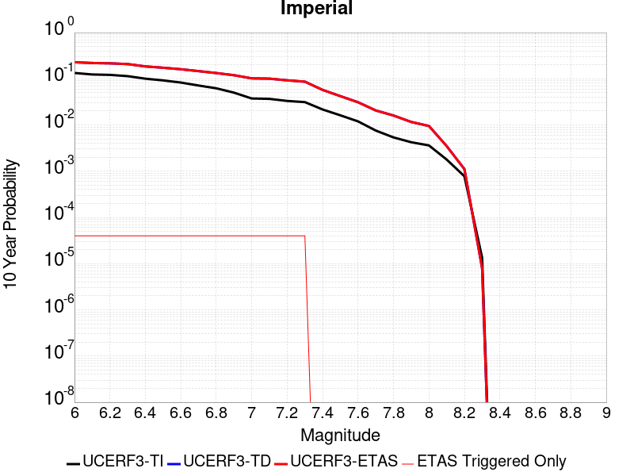 |

| Magnitude | 1 wk TI Prob | 1 wk TD Prob | 1 wk ETAS Prob | 1 wk ETAS/TD Gain | 1 wk ETAS Triggered Only | 1 mo TI Prob | 1 mo TD Prob | 1 mo ETAS Prob | 1 mo ETAS/TD Gain | 1 mo ETAS Triggered Only | 1 yr TI Prob | 1 yr TD Prob | 1 yr ETAS Prob | 1 yr ETAS/TD Gain | 1 yr ETAS Triggered Only | 10 yr TI Prob | 10 yr TD Prob | 10 yr ETAS Prob | 10 yr ETAS/TD Gain | 10 yr ETAS Triggered Only |
|-----|-----|-----|-----|-----|-----|-----|-----|-----|-----|-----|-----|-----|-----|-----|-----|-----|-----|-----|-----|-----|
| 6.0 | 2.7496446E-4 | 5.060534E-4 | 5.060534E-4 | 1.0 | 0.0 | 0.0011778869 | 0.002167037 | 0.002167037 | 1.0 | 0.0 | 0.0142467655 | 0.026063008 | 0.026082486 | 1.0007473 | 2.0E-5 | 0.13367249 | 0.22823441 | 0.22826529 | 1.0001353 | 4.0E-5 |
| 6.1 | 2.5356023E-4 | 4.8701253E-4 | 4.8701253E-4 | 1.0 | 0.0 | 0.001086234 | 0.0020855654 | 0.0020855654 | 1.0 | 0.0 | 0.013144928 | 0.025100723 | 0.025120221 | 1.0007768 | 2.0E-5 | 0.123940155 | 0.21965367 | 0.21968488 | 1.0001421 | 4.0E-5 |
| 6.2 | 2.4820742E-4 | 4.7795853E-4 | 4.7795853E-4 | 1.0 | 0.0 | 0.0010633124 | 0.0020468235 | 0.0020468235 | 1.0 | 0.0 | 0.01286919 | 0.02464024 | 0.024659747 | 1.0007917 | 2.0E-5 | 0.12148927 | 0.21615778 | 0.21618913 | 1.0001451 | 4.0E-5 |
| 6.3 | 2.3205351E-4 | 4.5930318E-4 | 4.5930318E-4 | 1.0 | 0.0 | 9.94136E-4 | 0.001966994 | 0.001966994 | 1.0 | 0.0 | 0.012036599 | 0.023685131 | 0.023704657 | 1.0008245 | 2.0E-5 | 0.11405133 | 0.20807824 | 0.2081099 | 1.0001522 | 4.0E-5 |
| 6.4 | 2.0304754E-4 | 3.9915304E-4 | 3.9915304E-4 | 1.0 | 0.0 | 8.6991355E-4 | 0.001709549 | 0.001709549 | 1.0 | 0.0 | 0.010539869 | 0.02062065 | 0.020640237 | 1.0009499 | 2.0E-5 | 0.100537635 | 0.1852114 | 0.185244 | 1.000176 | 4.0E-5 |
| 6.5 | 1.854992E-4 | 3.7025133E-4 | 3.7025133E-4 | 1.0 | 0.0 | 7.9475436E-4 | 0.0015858389 | 0.0015858389 | 1.0 | 0.0 | 0.009633281 | 0.019145777 | 0.019165395 | 1.0010246 | 2.0E-5 | 0.0922623 | 0.17343764 | 0.1734707 | 1.0001906 | 4.0E-5 |
| 6.6 | 1.6586106E-4 | 3.406821E-4 | 3.406821E-4 | 1.0 | 0.0 | 7.106394E-4 | 0.0014592593 | 0.0014592593 | 1.0 | 0.0 | 0.008617763 | 0.01762655 | 0.0176462 | 1.0011146 | 2.0E-5 | 0.08291132 | 0.16090786 | 0.16094144 | 1.0002086 | 4.0E-5 |
| 6.7 | 1.4224656E-4 | 3.0796128E-4 | 3.0796128E-4 | 1.0 | 0.0 | 6.094856E-4 | 0.0013191747 | 0.0013191747 | 1.0 | 0.0 | 0.0073952693 | 0.015944751 | 0.015964434 | 1.0012343 | 2.0E-5 | 0.07153955 | 0.14660648 | 0.14664061 | 1.0002328 | 4.0E-5 |
| 6.8 | 1.2317259E-4 | 2.7815934E-4 | 2.7815934E-4 | 1.0 | 0.0 | 5.2777573E-4 | 0.0011915729 | 0.0011915729 | 1.0 | 0.0 | 0.0064067547 | 0.014412285 | 0.014431997 | 1.0013677 | 2.0E-5 | 0.06225166 | 0.13304241 | 0.13307709 | 1.0002607 | 4.0E-5 |
| 6.9 | 9.859898E-5 | 2.503297E-4 | 2.503297E-4 | 1.0 | 0.0 | 4.2249862E-4 | 0.0010724048 | 0.0010724048 | 1.0 | 0.0 | 0.0051317946 | 0.012979328 | 0.012999069 | 1.0015209 | 2.0E-5 | 0.05014893 | 0.11948839 | 0.119523615 | 1.0002948 | 4.0E-5 |
| 7.0 | 7.3191884E-5 | 2.1280872E-4 | 2.1280872E-4 | 1.0 | 0.0 | 3.136418E-4 | 9.117218E-4 | 9.117218E-4 | 1.0 | 0.0 | 0.003811904 | 0.011044404 | 0.011064183 | 1.0017909 | 2.0E-5 | 0.037471764 | 0.10212967 | 0.10216558 | 1.0003517 | 4.0E-5 |
| 7.1 | 7.1760296E-5 | 2.0982049E-4 | 2.0982049E-4 | 1.0 | 0.0 | 3.0750787E-4 | 8.9892396E-4 | 8.9892396E-4 | 1.0 | 0.0 | 0.003737482 | 0.010890158 | 0.01090994 | 1.0018165 | 2.0E-5 | 0.03675245 | 0.10076556 | 0.100801535 | 1.0003569 | 4.0E-5 |
| 7.2 | 6.46614E-5 | 1.9150079E-4 | 1.9150079E-4 | 1.0 | 0.0 | 2.7709085E-4 | 8.204626E-4 | 8.204626E-4 | 1.0 | 0.0 | 0.0033683628 | 0.009944002 | 0.009963804 | 1.0019913 | 2.0E-5 | 0.033177625 | 0.09257121 | 0.092607506 | 1.0003921 | 4.0E-5 |
| 7.3 | 6.088115E-5 | 1.7821198E-4 | 1.7821198E-4 | 1.0 | 0.0 | 2.6089314E-4 | 7.6354493E-4 | 7.6354493E-4 | 1.0 | 0.0 | 0.0031717476 | 0.009257112 | 0.0092769265 | 1.0021405 | 2.0E-5 | 0.031268585 | 0.086619206 | 0.08665574 | 1.0004218 | 4.0E-5 |
| 7.4 | 4.199346E-5 | 1.1520217E-4 | 1.1520217E-4 | 1.0 | 0.0 | 1.7995955E-4 | 4.9363106E-4 | 4.9363106E-4 | 1.0 | 0.0 | 0.0021888057 | 0.0059935665 | 0.0059935665 | 1.0 | 0.0 | 0.02167372 | 0.05748436 | 0.05748436 | 1.0 | 0.0 |
| 7.5 | 3.130448E-5 | 8.341438E-5 | 8.341438E-5 | 1.0 | 0.0 | 1.3415517E-4 | 3.5744155E-4 | 3.5744155E-4 | 1.0 | 0.0 | 0.0016321153 | 0.004343227 | 0.004343227 | 1.0 | 0.0 | 0.016201803 | 0.042169005 | 0.042169005 | 1.0 | 0.0 |
| 7.6 | 2.3074248E-5 | 6.0914088E-5 | 6.0914088E-5 | 1.0 | 0.0 | 9.888588E-5 | 2.6103438E-4 | 2.6103438E-4 | 1.0 | 0.0 | 0.0012032706 | 0.0031734854 | 0.0031734854 | 1.0 | 0.0 | 0.011967761 | 0.031058539 | 0.031058539 | 1.0 | 0.0 |
| 7.7 | 1.45864815E-5 | 4.018208E-5 | 4.018208E-5 | 1.0 | 0.0 | 6.2511994E-5 | 1.7219759E-4 | 1.7219759E-4 | 1.0 | 0.0 | 7.608177E-4 | 0.002094495 | 0.002094495 | 1.0 | 0.0 | 0.007582182 | 0.020654438 | 0.020654438 | 1.0 | 0.0 |
| 7.8 | 1.0352979E-5 | 3.100957E-5 | 3.100957E-5 | 1.0 | 0.0 | 4.4369157E-5 | 1.3289141E-4 | 1.3289141E-4 | 1.0 | 0.0 | 5.400606E-4 | 0.0016167545 | 0.0016167545 | 1.0 | 0.0 | 0.0053875 | 0.016039513 | 0.016039513 | 1.0 | 0.0 |
| 7.9 | 8.137906E-6 | 2.2187884E-5 | 2.2187884E-5 | 1.0 | 0.0 | 3.4876273E-5 | 9.5087475E-5 | 9.5087475E-5 | 1.0 | 0.0 | 4.2453592E-4 | 0.0011570761 | 0.0011570761 | 1.0 | 0.0 | 0.004237258 | 0.011636249 | 0.011636249 | 1.0 | 0.0 |
| 8.0 | 6.93792E-6 | 1.8041985E-5 | 1.8041985E-5 | 1.0 | 0.0 | 2.9733603E-5 | 7.73205E-5 | 7.73205E-5 | 1.0 | 0.0 | 3.6194647E-4 | 9.409713E-4 | 9.409713E-4 | 1.0 | 0.0 | 0.0036135751 | 0.009517279 | 0.009517279 | 1.0 | 0.0 |
| 8.1 | 3.4286315E-6 | 6.394906E-6 | 6.394906E-6 | 1.0 | 0.0 | 1.4694053E-5 | 2.7406453E-5 | 2.7406453E-5 | 1.0 | 0.0 | 1.7888541E-4 | 3.336226E-4 | 3.336226E-4 | 1.0 | 0.0 | 0.0017874148 | 0.003493592 | 0.003493592 | 1.0 | 0.0 |
| 8.2 | 1.4906886E-6 | 1.9423765E-6 | 1.9423765E-6 | 1.0 | 0.0 | 6.3886496E-6 | 8.324444E-6 | 8.324444E-6 | 1.0 | 0.0 | 7.7779034E-5 | 1.01345424E-4 | 1.01345424E-4 | 1.0 | 0.0 | 7.775182E-4 | 0.0011104718 | 0.0011104718 | 1.0 | 0.0 |
| 8.3 | 2.5758007E-8 | 1.4553524E-8 | 1.4553524E-8 | 1.0 | 0.0 | 1.10391454E-7 | 6.2372244E-8 | 6.2372244E-8 | 1.0 | 0.0 | 1.3440151E-6 | 7.593821E-7 | 7.593821E-7 | 1.0 | 0.0 | 1.344007E-5 | 7.9182655E-6 | 7.9182655E-6 | 1.0 | 0.0 |

## Palos Verdes
*[(top)](#table-of-contents)*

| 1 Week | 1 Month | 1 Year | 10 Year |
|-----|-----|-----|-----|
| 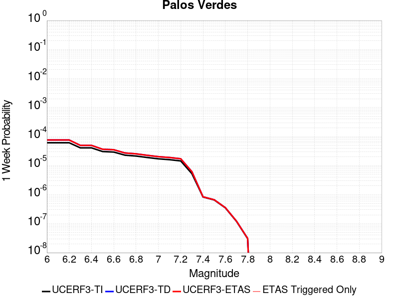 |  |  |  |

| Magnitude | 1 wk TI Prob | 1 wk TD Prob | 1 wk ETAS Prob | 1 wk ETAS/TD Gain | 1 wk ETAS Triggered Only | 1 mo TI Prob | 1 mo TD Prob | 1 mo ETAS Prob | 1 mo ETAS/TD Gain | 1 mo ETAS Triggered Only | 1 yr TI Prob | 1 yr TD Prob | 1 yr ETAS Prob | 1 yr ETAS/TD Gain | 1 yr ETAS Triggered Only | 10 yr TI Prob | 10 yr TD Prob | 10 yr ETAS Prob | 10 yr ETAS/TD Gain | 10 yr ETAS Triggered Only |
|-----|-----|-----|-----|-----|-----|-----|-----|-----|-----|-----|-----|-----|-----|-----|-----|-----|-----|-----|-----|-----|
| 6.0 | 6.126063E-5 | 7.623574E-5 | 7.623574E-5 | 1.0 | 0.0 | 2.6251914E-4 | 3.2668703E-4 | 3.2668703E-4 | 1.0 | 0.0 | 0.0031914865 | 0.0039706845 | 0.003980645 | 1.0025084 | 1.0E-5 | 0.031460393 | 0.039054003 | 0.03908283 | 1.0007381 | 3.0E-5 |
| 6.1 | 6.126063E-5 | 7.623574E-5 | 7.623574E-5 | 1.0 | 0.0 | 2.6251914E-4 | 3.2668703E-4 | 3.2668703E-4 | 1.0 | 0.0 | 0.0031914865 | 0.0039706845 | 0.003980645 | 1.0025084 | 1.0E-5 | 0.031460393 | 0.039054003 | 0.03908283 | 1.0007381 | 3.0E-5 |
| 6.2 | 6.126063E-5 | 7.623574E-5 | 7.623574E-5 | 1.0 | 0.0 | 2.6251914E-4 | 3.2668703E-4 | 3.2668703E-4 | 1.0 | 0.0 | 0.0031914865 | 0.0039706845 | 0.003980645 | 1.0025084 | 1.0E-5 | 0.031460393 | 0.039054003 | 0.03908283 | 1.0007381 | 3.0E-5 |
| 6.3 | 4.0838047E-5 | 4.9754835E-5 | 4.9754835E-5 | 1.0 | 0.0 | 1.7500846E-4 | 2.1321885E-4 | 2.1321885E-4 | 1.0 | 0.0 | 0.0021286458 | 0.0025930547 | 0.0026030287 | 1.0038464 | 1.0E-5 | 0.021083709 | 0.02564968 | 0.02567891 | 1.0011396 | 3.0E-5 |
| 6.4 | 4.0838047E-5 | 4.9754835E-5 | 4.9754835E-5 | 1.0 | 0.0 | 1.7500846E-4 | 2.1321885E-4 | 2.1321885E-4 | 1.0 | 0.0 | 0.0021286458 | 0.0025930547 | 0.0026030287 | 1.0038464 | 1.0E-5 | 0.021083709 | 0.02564968 | 0.02567891 | 1.0011396 | 3.0E-5 |
| 6.5 | 3.0512005E-5 | 3.6565478E-5 | 3.6565478E-5 | 1.0 | 0.0 | 1.3075917E-4 | 1.5670045E-4 | 1.5670045E-4 | 1.0 | 0.0 | 0.0015908304 | 0.0019062737 | 0.0019162546 | 1.0052358 | 1.0E-5 | 0.015794903 | 0.018911155 | 0.018940588 | 1.0015564 | 3.0E-5 |
| 6.6 | 2.9255087E-5 | 3.5158188E-5 | 3.5158188E-5 | 1.0 | 0.0 | 1.2537291E-4 | 1.5066989E-4 | 1.5066989E-4 | 1.0 | 0.0 | 0.0015253464 | 0.0018329752 | 0.0018429569 | 1.0054456 | 1.0E-5 | 0.015149189 | 0.018190183 | 0.018219637 | 1.0016192 | 3.0E-5 |
| 6.7 | 2.287198E-5 | 2.7251068E-5 | 2.7251068E-5 | 1.0 | 0.0 | 9.801909E-5 | 1.1678558E-4 | 1.1678558E-4 | 1.0 | 0.0 | 0.001192729 | 0.0014210287 | 0.0014310145 | 1.0070271 | 1.0E-5 | 0.011863477 | 0.014128654 | 0.014148372 | 1.0013956 | 2.0E-5 |
| 6.8 | 2.1325764E-5 | 2.5434496E-5 | 2.5434496E-5 | 1.0 | 0.0 | 9.139293E-5 | 1.0900094E-4 | 1.0900094E-4 | 1.0 | 0.0 | 0.001112141 | 0.0013263688 | 0.0013363555 | 1.0075294 | 1.0E-5 | 0.011065915 | 0.013193562 | 0.013213298 | 1.0014958 | 2.0E-5 |
| 6.9 | 1.9009392E-5 | 2.2615843E-5 | 2.2615843E-5 | 1.0 | 0.0 | 8.1466285E-5 | 9.692193E-5 | 9.692193E-5 | 1.0 | 0.0 | 9.914007E-4 | 0.0011794731 | 0.0011894613 | 1.0084684 | 1.0E-5 | 0.009869894 | 0.011740818 | 0.011760583 | 1.0016835 | 2.0E-5 |
| 7.0 | 1.7098473E-5 | 2.0321406E-5 | 2.0321406E-5 | 1.0 | 0.0 | 7.3277115E-5 | 8.708931E-5 | 8.708931E-5 | 1.0 | 0.0 | 8.917837E-4 | 0.0010598819 | 0.0010698712 | 1.009425 | 1.0E-5 | 0.008882134 | 0.010556707 | 0.010576496 | 1.0018746 | 2.0E-5 |
| 7.1 | 1.5982785E-5 | 1.8996678E-5 | 1.8996678E-5 | 1.0 | 0.0 | 6.849585E-5 | 8.141227E-5 | 8.141227E-5 | 1.0 | 0.0 | 8.336179E-4 | 9.908284E-4 | 0.0010008184 | 1.0100826 | 1.0E-5 | 0.008304977 | 0.009872472 | 0.009892275 | 1.0020058 | 2.0E-5 |
| 7.2 | 1.4468002E-5 | 1.7198974E-5 | 1.7198974E-5 | 1.0 | 0.0 | 6.200425E-5 | 7.370828E-5 | 7.370828E-5 | 1.0 | 0.0 | 7.546402E-4 | 8.971129E-4 | 8.971129E-4 | 1.0 | 0.0 | 0.007520827 | 0.008943185 | 0.008953095 | 1.0011082 | 1.0E-5 |
| 7.3 | 5.288233E-6 | 6.204259E-6 | 6.204259E-6 | 1.0 | 0.0 | 2.2663658E-5 | 2.6589607E-5 | 2.6589607E-5 | 1.0 | 0.0 | 2.7589512E-4 | 3.237153E-4 | 3.237153E-4 | 1.0 | 0.0 | 0.0027555283 | 0.003235861 | 0.003235861 | 1.0 | 0.0 |
| 7.4 | 8.279556E-7 | 8.408416E-7 | 8.408416E-7 | 1.0 | 0.0 | 3.5483763E-6 | 3.6036022E-6 | 3.6036022E-6 | 1.0 | 0.0 | 4.3200624E-5 | 4.387305E-5 | 4.387305E-5 | 1.0 | 0.0 | 4.3192226E-4 | 4.386511E-4 | 4.386511E-4 | 1.0 | 0.0 |
| 7.5 | 6.559831E-7 | 6.667287E-7 | 6.667287E-7 | 1.0 | 0.0 | 2.8113532E-6 | 2.857406E-6 | 2.857406E-6 | 1.0 | 0.0 | 3.4227687E-5 | 3.4788427E-5 | 3.4788427E-5 | 1.0 | 0.0 | 3.4222414E-4 | 3.4783647E-4 | 3.4783647E-4 | 1.0 | 0.0 |
| 7.6 | 3.5018968E-7 | 3.5620351E-7 | 3.5620351E-7 | 1.0 | 0.0 | 1.500812E-6 | 1.526586E-6 | 1.526586E-6 | 1.0 | 0.0 | 1.8272232E-5 | 1.8586072E-5 | 1.8586072E-5 | 1.0 | 0.0 | 1.8270731E-4 | 1.8584977E-4 | 1.8584977E-4 | 1.0 | 0.0 |
| 7.7 | 1.1986104E-7 | 1.2198491E-7 | 1.2198491E-7 | 1.0 | 0.0 | 5.1369005E-7 | 5.227924E-7 | 5.227924E-7 | 1.0 | 0.0 | 6.2541585E-6 | 6.364979E-6 | 6.364979E-6 | 1.0 | 0.0 | 6.2539824E-5 | 6.364801E-5 | 6.364801E-5 | 1.0 | 0.0 |
| 7.8 | 3.0445005E-8 | 3.10279E-8 | 3.10279E-8 | 1.0 | 0.0 | 1.3047858E-7 | 1.3297671E-7 | 1.3297671E-7 | 1.0 | 0.0 | 1.5885756E-6 | 1.6189904E-6 | 1.6189904E-6 | 1.0 | 0.0 | 1.5885644E-5 | 1.6189806E-5 | 1.6189806E-5 | 1.0 | 0.0 |

## San Jacinto (Borrego)
*[(top)](#table-of-contents)*

| 1 Week | 1 Month | 1 Year | 10 Year |
|-----|-----|-----|-----|
|  |  | 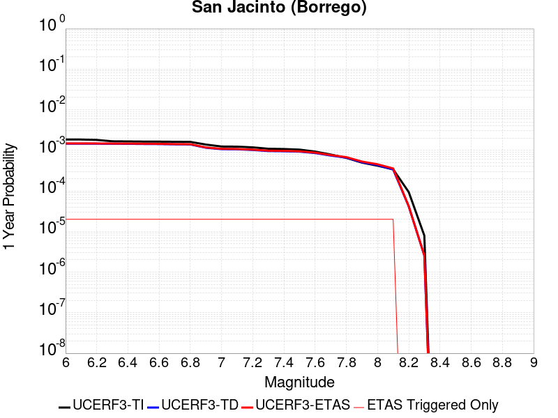 |  |

| Magnitude | 1 wk TI Prob | 1 wk TD Prob | 1 wk ETAS Prob | 1 wk ETAS/TD Gain | 1 wk ETAS Triggered Only | 1 mo TI Prob | 1 mo TD Prob | 1 mo ETAS Prob | 1 mo ETAS/TD Gain | 1 mo ETAS Triggered Only | 1 yr TI Prob | 1 yr TD Prob | 1 yr ETAS Prob | 1 yr ETAS/TD Gain | 1 yr ETAS Triggered Only | 10 yr TI Prob | 10 yr TD Prob | 10 yr ETAS Prob | 10 yr ETAS/TD Gain | 10 yr ETAS Triggered Only |
|-----|-----|-----|-----|-----|-----|-----|-----|-----|-----|-----|-----|-----|-----|-----|-----|-----|-----|-----|-----|-----|
| 6.0 | 3.543992E-5 | 2.7955874E-5 | 2.7955874E-5 | 1.0 | 0.0 | 1.5187653E-4 | 1.1980545E-4 | 1.1980545E-4 | 1.0 | 0.0 | 0.0018475284 | 0.0014576677 | 0.0014776385 | 1.0137006 | 2.0E-5 | 0.018322436 | 0.01488493 | 0.014914484 | 1.0019854 | 3.0E-5 |
| 6.1 | 3.542281E-5 | 2.7955874E-5 | 2.7955874E-5 | 1.0 | 0.0 | 1.5180321E-4 | 1.1980545E-4 | 1.1980545E-4 | 1.0 | 0.0 | 0.0018466372 | 0.0014576677 | 0.0014776385 | 1.0137006 | 2.0E-5 | 0.018313672 | 0.01488493 | 0.014914484 | 1.0019854 | 3.0E-5 |
| 6.2 | 3.4688688E-5 | 2.7955874E-5 | 2.7955874E-5 | 1.0 | 0.0 | 1.4865733E-4 | 1.1980545E-4 | 1.1980545E-4 | 1.0 | 0.0 | 0.0018084005 | 0.0014576677 | 0.0014776385 | 1.0137006 | 2.0E-5 | 0.017937548 | 0.01488493 | 0.014914484 | 1.0019854 | 3.0E-5 |
| 6.3 | 3.2087122E-5 | 2.7801223E-5 | 2.7801223E-5 | 1.0 | 0.0 | 1.3750899E-4 | 1.1914273E-4 | 1.1914273E-4 | 1.0 | 0.0 | 0.0016728862 | 0.0014496098 | 0.0014695807 | 1.0137768 | 2.0E-5 | 0.016603488 | 0.014806089 | 0.0148356445 | 1.0019962 | 3.0E-5 |
| 6.4 | 3.1828724E-5 | 2.77682E-5 | 2.77682E-5 | 1.0 | 0.0 | 1.364017E-4 | 1.1900121E-4 | 1.1900121E-4 | 1.0 | 0.0 | 0.0016594254 | 0.001447889 | 0.0014678601 | 1.0137932 | 2.0E-5 | 0.016470885 | 0.014789282 | 0.014818839 | 1.0019985 | 3.0E-5 |
| 6.5 | 3.1563577E-5 | 2.750787E-5 | 2.750787E-5 | 1.0 | 0.0 | 1.3526545E-4 | 1.17885604E-4 | 1.17885604E-4 | 1.0 | 0.0 | 0.0016456128 | 0.0014343245 | 0.0014542958 | 1.0139239 | 2.0E-5 | 0.0163348 | 0.014655326 | 0.014684886 | 1.002017 | 3.0E-5 |
| 6.6 | 3.1467625E-5 | 2.7352073E-5 | 2.7352073E-5 | 1.0 | 0.0 | 1.3485427E-4 | 1.1721797E-4 | 1.1721797E-4 | 1.0 | 0.0 | 0.0016406142 | 0.0014262067 | 0.0014461782 | 1.0140032 | 2.0E-5 | 0.016285548 | 0.014575482 | 0.014605045 | 1.0020282 | 3.0E-5 |
| 6.7 | 3.1223695E-5 | 2.6970027E-5 | 2.6970027E-5 | 1.0 | 0.0 | 1.3380898E-4 | 1.1558078E-4 | 1.1558078E-4 | 1.0 | 0.0 | 0.0016279068 | 0.0014062996 | 0.0014262715 | 1.0142018 | 2.0E-5 | 0.01616033 | 0.014379977 | 0.014409546 | 1.0020562 | 3.0E-5 |
| 6.8 | 3.1015585E-5 | 2.679098E-5 | 2.679098E-5 | 1.0 | 0.0 | 1.3291716E-4 | 1.14813505E-4 | 1.14813505E-4 | 1.0 | 0.0 | 0.001617065 | 0.0013969702 | 0.0014169422 | 1.0142967 | 2.0E-5 | 0.016053487 | 0.014287205 | 0.014316777 | 1.0020698 | 3.0E-5 |
| 6.9 | 2.6641965E-5 | 2.2211414E-5 | 2.2211414E-5 | 1.0 | 0.0 | 1.1417485E-4 | 9.518833E-5 | 9.518833E-5 | 1.0 | 0.0 | 0.0013891924 | 0.0011583057 | 0.0011782825 | 1.0172466 | 2.0E-5 | 0.0138054015 | 0.011896737 | 0.01192638 | 1.0024917 | 3.0E-5 |
| 7.0 | 2.3854353E-5 | 2.050528E-5 | 2.050528E-5 | 1.0 | 0.0 | 1.02228936E-4 | 8.7876826E-5 | 8.7876826E-5 | 1.0 | 0.0 | 0.0012439266 | 0.0010693778 | 0.0010893564 | 1.0186825 | 2.0E-5 | 0.012369866 | 0.010996556 | 0.011026226 | 1.0026982 | 3.0E-5 |
| 7.1 | 2.3672901E-5 | 2.0341751E-5 | 2.0341751E-5 | 1.0 | 0.0 | 1.0145135E-4 | 8.7176035E-5 | 8.7176035E-5 | 1.0 | 0.0 | 0.0012344702 | 0.001060854 | 0.0010808327 | 1.0188327 | 2.0E-5 | 0.0122763505 | 0.010911736 | 0.010941409 | 1.0027193 | 3.0E-5 |
| 7.2 | 2.2717244E-5 | 1.9568899E-5 | 1.9568899E-5 | 1.0 | 0.0 | 9.735599E-5 | 8.3864026E-5 | 8.3864026E-5 | 1.0 | 0.0 | 0.0011846646 | 0.0010205687 | 0.0010405482 | 1.0195769 | 2.0E-5 | 0.01178369 | 0.010509028 | 0.010538712 | 1.0028247 | 3.0E-5 |
| 7.3 | 2.1016205E-5 | 1.8410172E-5 | 1.8410172E-5 | 1.0 | 0.0 | 9.006634E-5 | 7.889837E-5 | 7.889837E-5 | 1.0 | 0.0 | 0.001096006 | 9.6016633E-4 | 9.801472E-4 | 1.0208098 | 2.0E-5 | 0.010906163 | 0.0099044405 | 0.009934143 | 1.002999 | 3.0E-5 |
| 7.4 | 2.0683625E-5 | 1.8212622E-5 | 1.8212622E-5 | 1.0 | 0.0 | 8.86411E-5 | 7.805177E-5 | 7.805177E-5 | 1.0 | 0.0 | 0.001078671 | 9.4986806E-4 | 9.6984906E-4 | 1.0210356 | 2.0E-5 | 0.010734501 | 0.00980115 | 0.009830856 | 1.0030309 | 3.0E-5 |
| 7.5 | 1.9993966E-5 | 1.7807442E-5 | 1.7807442E-5 | 1.0 | 0.0 | 8.568561E-5 | 7.6315395E-5 | 7.6315395E-5 | 1.0 | 0.0 | 0.001042723 | 9.2874584E-4 | 9.487273E-4 | 1.0215144 | 2.0E-5 | 0.010378438 | 0.009587968 | 0.00961768 | 1.003099 | 3.0E-5 |
| 7.6 | 1.788966E-5 | 1.6460064E-5 | 1.6460064E-5 | 1.0 | 0.0 | 7.666772E-5 | 7.054124E-5 | 7.054124E-5 | 1.0 | 0.0 | 9.3302975E-4 | 8.585029E-4 | 8.784858E-4 | 1.0232763 | 2.0E-5 | 0.00929122 | 0.008879389 | 0.008909122 | 1.0033486 | 3.0E-5 |
| 7.7 | 1.5125781E-5 | 1.4261374E-5 | 1.4261374E-5 | 1.0 | 0.0 | 6.4823165E-5 | 6.111875E-5 | 6.111875E-5 | 1.0 | 0.0 | 7.889362E-4 | 7.4386754E-4 | 7.638527E-4 | 1.0268666 | 2.0E-5 | 0.007861412 | 0.007726649 | 0.007756417 | 1.0038527 | 3.0E-5 |
| 7.8 | 1.250089E-5 | 1.26536925E-5 | 1.26536925E-5 | 1.0 | 0.0 | 5.3574146E-5 | 5.4228985E-5 | 5.4228985E-5 | 1.0 | 0.0 | 6.5207E-4 | 6.600385E-4 | 6.800253E-4 | 1.0302813 | 2.0E-5 | 0.006501599 | 0.0068797027 | 0.006909496 | 1.0043306 | 3.0E-5 |
| 7.9 | 9.561E-6 | 9.775099E-6 | 9.775099E-6 | 1.0 | 0.0 | 4.0975072E-5 | 4.189261E-5 | 4.189261E-5 | 1.0 | 0.0 | 4.987573E-4 | 5.0992373E-4 | 5.299135E-4 | 1.0392015 | 2.0E-5 | 0.0049763937 | 0.005363107 | 0.0053929463 | 1.0055637 | 3.0E-5 |
| 8.0 | 8.01699E-6 | 8.3121295E-6 | 8.3121295E-6 | 1.0 | 0.0 | 3.4358076E-5 | 3.562293E-5 | 3.562293E-5 | 1.0 | 0.0 | 4.1822926E-4 | 4.3362338E-4 | 4.536147E-4 | 1.046103 | 2.0E-5 | 0.0041744304 | 0.0045832046 | 0.0046130675 | 1.0065156 | 3.0E-5 |
| 8.1 | 6.541947E-6 | 6.477423E-6 | 6.477423E-6 | 1.0 | 0.0 | 2.8036617E-5 | 2.7760092E-5 | 2.7760092E-5 | 1.0 | 0.0 | 3.4129233E-4 | 3.3792722E-4 | 3.5792045E-4 | 1.0591643 | 2.0E-5 | 0.0034076865 | 0.003588821 | 0.0036187135 | 1.0083293 | 3.0E-5 |
| 8.2 | 1.7968189E-6 | 7.9984034E-7 | 7.9984034E-7 | 1.0 | 0.0 | 7.70063E-6 | 3.4278826E-6 | 3.4278826E-6 | 1.0 | 0.0 | 9.3751136E-5 | 4.1733696E-5 | 4.1733696E-5 | 1.0 | 0.0 | 9.371159E-4 | 4.727189E-4 | 4.727189E-4 | 1.0 | 0.0 |
| 8.3 | 1.5167889E-7 | 4.916523E-8 | 4.916523E-8 | 1.0 | 0.0 | 6.500522E-7 | 2.1070811E-7 | 2.1070811E-7 | 1.0 | 0.0 | 7.9143565E-6 | 2.5653687E-6 | 2.5653687E-6 | 1.0 | 0.0 | 7.914075E-5 | 2.9806817E-5 | 2.9806817E-5 | 1.0 | 0.0 |

## Great Valley 09 (Laguna Seca)
*[(top)](#table-of-contents)*

| 1 Week | 1 Month | 1 Year | 10 Year |
|-----|-----|-----|-----|
|  |  |  |  |

| Magnitude | 1 wk TI Prob | 1 wk TD Prob | 1 wk ETAS Prob | 1 wk ETAS/TD Gain | 1 wk ETAS Triggered Only | 1 mo TI Prob | 1 mo TD Prob | 1 mo ETAS Prob | 1 mo ETAS/TD Gain | 1 mo ETAS Triggered Only | 1 yr TI Prob | 1 yr TD Prob | 1 yr ETAS Prob | 1 yr ETAS/TD Gain | 1 yr ETAS Triggered Only | 10 yr TI Prob | 10 yr TD Prob | 10 yr ETAS Prob | 10 yr ETAS/TD Gain | 10 yr ETAS Triggered Only |
|-----|-----|-----|-----|-----|-----|-----|-----|-----|-----|-----|-----|-----|-----|-----|-----|-----|-----|-----|-----|-----|
| 6.0 | 5.4353277E-5 | 7.051243E-5 | 7.051243E-5 | 1.0 | 0.0 | 2.3292181E-4 | 3.0216138E-4 | 3.0216138E-4 | 1.0 | 0.0 | 0.0028321352 | 0.003672609 | 0.0036825724 | 1.0027128 | 1.0E-5 | 0.02796312 | 0.03612157 | 0.036150485 | 1.0008005 | 3.0E-5 |
| 6.1 | 4.5578287E-5 | 5.823013E-5 | 5.823013E-5 | 1.0 | 0.0 | 1.953209E-4 | 2.4953342E-4 | 2.4953342E-4 | 1.0 | 0.0 | 0.0023754383 | 0.0030338368 | 0.0030438066 | 1.0032861 | 1.0E-5 | 0.023502063 | 0.029924503 | 0.029953605 | 1.0009725 | 3.0E-5 |
| 6.2 | 2.8536782E-5 | 3.4741206E-5 | 3.4741206E-5 | 1.0 | 0.0 | 1.2229476E-4 | 1.4888248E-4 | 1.4888248E-4 | 1.0 | 0.0 | 0.0014879217 | 0.0018111159 | 0.0018210978 | 1.0055114 | 1.0E-5 | 0.014779986 | 0.017960787 | 0.017980427 | 1.0010935 | 2.0E-5 |
| 6.3 | 2.3698774E-5 | 2.82169E-5 | 2.82169E-5 | 1.0 | 0.0 | 1.01562226E-4 | 1.2092415E-4 | 1.2092415E-4 | 1.0 | 0.0 | 0.0012358186 | 0.0014712509 | 0.0014812362 | 1.006787 | 1.0E-5 | 0.012289686 | 0.014613405 | 0.014633113 | 1.0013486 | 2.0E-5 |
| 6.4 | 1.9191197E-5 | 2.2125585E-5 | 2.2125585E-5 | 1.0 | 0.0 | 8.2245395E-5 | 9.482068E-5 | 9.482068E-5 | 1.0 | 0.0 | 0.0010008777 | 0.0011538353 | 0.0011638238 | 1.0086567 | 1.0E-5 | 0.009963818 | 0.011478443 | 0.011498213 | 1.0017225 | 2.0E-5 |
| 6.5 | 1.5203241E-5 | 1.6803031E-5 | 1.6803031E-5 | 1.0 | 0.0 | 6.5155116E-5 | 7.201118E-5 | 7.201118E-5 | 1.0 | 0.0 | 7.9297484E-4 | 8.763992E-4 | 8.8639045E-4 | 1.0114003 | 1.0E-5 | 0.007901512 | 0.00873055 | 0.008750375 | 1.0022708 | 2.0E-5 |
| 6.6 | 1.0984925E-5 | 1.124355E-5 | 1.124355E-5 | 1.0 | 0.0 | 4.70774E-5 | 4.8185768E-5 | 4.8185768E-5 | 1.0 | 0.0 | 5.730166E-4 | 5.865076E-4 | 5.865076E-4 | 1.0 | 0.0 | 0.005715413 | 0.0058499887 | 0.0058499887 | 1.0 | 0.0 |
| 6.7 | 9.134616E-6 | 9.02062E-6 | 9.02062E-6 | 1.0 | 0.0 | 3.9147766E-5 | 3.865924E-5 | 3.865924E-5 | 1.0 | 0.0 | 4.7651984E-4 | 4.70577E-4 | 4.70577E-4 | 1.0 | 0.0 | 0.004754993 | 0.0046960507 | 0.0046960507 | 1.0 | 0.0 |
| 6.8 | 7.785589E-6 | 7.4525356E-6 | 7.4525356E-6 | 1.0 | 0.0 | 3.3366385E-5 | 3.1939056E-5 | 3.1939056E-5 | 1.0 | 0.0 | 4.0616E-4 | 3.8879065E-4 | 3.8879065E-4 | 1.0 | 0.0 | 0.0040541845 | 0.0038813087 | 0.0038813087 | 1.0 | 0.0 |
| 6.9 | 5.579095E-6 | 4.8988704E-6 | 4.8988704E-6 | 1.0 | 0.0 | 2.3910188E-5 | 2.0994998E-5 | 2.0994998E-5 | 1.0 | 0.0 | 2.9106764E-4 | 2.555855E-4 | 2.555855E-4 | 1.0 | 0.0 | 0.002906867 | 0.0025530527 | 0.0025530527 | 1.0 | 0.0 |
| 7.0 | 2.6816688E-6 | 1.5216937E-6 | 1.5216937E-6 | 1.0 | 0.0 | 1.1492816E-5 | 6.5215286E-6 | 6.5215286E-6 | 1.0 | 0.0 | 1.3991605E-4 | 7.939681E-5 | 7.939681E-5 | 1.0 | 0.0 | 0.0013982799 | 7.936931E-4 | 7.936931E-4 | 1.0 | 0.0 |
| 7.1 | 1.9951021E-6 | 7.4540986E-7 | 7.4540986E-7 | 1.0 | 0.0 | 8.55041E-6 | 3.1946101E-6 | 3.1946101E-6 | 1.0 | 0.0 | 1.0409627E-4 | 3.8893726E-5 | 3.8893726E-5 | 1.0 | 0.0 | 0.0010404752 | 3.8887333E-4 | 3.8887333E-4 | 1.0 | 0.0 |
| 7.2 | 1.9951021E-6 | 7.4540986E-7 | 7.4540986E-7 | 1.0 | 0.0 | 8.55041E-6 | 3.1946101E-6 | 3.1946101E-6 | 1.0 | 0.0 | 1.0409627E-4 | 3.8893726E-5 | 3.8893726E-5 | 1.0 | 0.0 | 0.0010404752 | 3.8887333E-4 | 3.8887333E-4 | 1.0 | 0.0 |
| 7.3 | 1.7087556E-6 | 6.579121E-7 | 6.579121E-7 | 1.0 | 0.0 | 7.3232177E-6 | 2.8196202E-6 | 2.8196202E-6 | 1.0 | 0.0 | 8.915652E-5 | 3.432838E-5 | 3.432838E-5 | 1.0 | 0.0 | 8.9120766E-4 | 3.432348E-4 | 3.432348E-4 | 1.0 | 0.0 |
| 7.4 | 1.3804846E-6 | 6.0740956E-7 | 6.0740956E-7 | 1.0 | 0.0 | 5.916349E-6 | 2.6031814E-6 | 2.6031814E-6 | 1.0 | 0.0 | 7.2029165E-5 | 3.1693315E-5 | 3.1693315E-5 | 1.0 | 0.0 | 7.200583E-4 | 3.1689196E-4 | 3.1689196E-4 | 1.0 | 0.0 |
| 7.5 | 1.3804846E-6 | 6.0740956E-7 | 6.0740956E-7 | 1.0 | 0.0 | 5.916349E-6 | 2.6031814E-6 | 2.6031814E-6 | 1.0 | 0.0 | 7.2029165E-5 | 3.1693315E-5 | 3.1693315E-5 | 1.0 | 0.0 | 7.200583E-4 | 3.1689196E-4 | 3.1689196E-4 | 1.0 | 0.0 |

## Oak Ridge (Onshore)
*[(top)](#table-of-contents)*

| 1 Week | 1 Month | 1 Year | 10 Year |
|-----|-----|-----|-----|
|  | 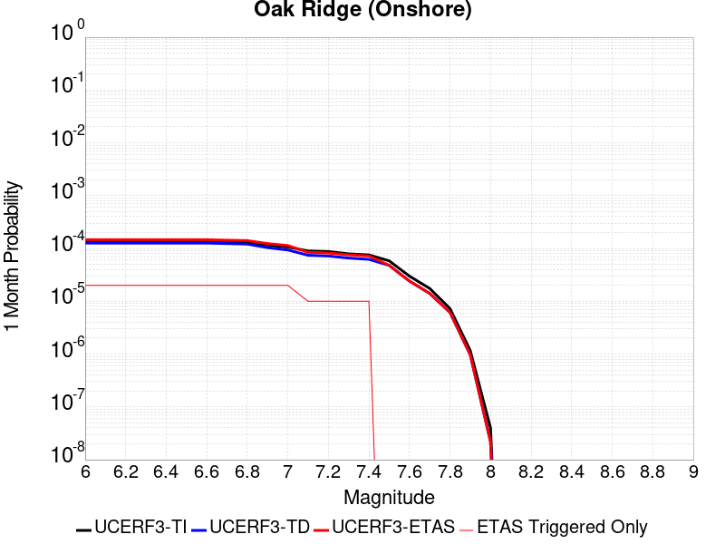 |  | 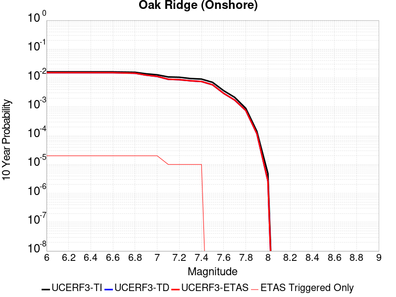 |

| Magnitude | 1 wk TI Prob | 1 wk TD Prob | 1 wk ETAS Prob | 1 wk ETAS/TD Gain | 1 wk ETAS Triggered Only | 1 mo TI Prob | 1 mo TD Prob | 1 mo ETAS Prob | 1 mo ETAS/TD Gain | 1 mo ETAS Triggered Only | 1 yr TI Prob | 1 yr TD Prob | 1 yr ETAS Prob | 1 yr ETAS/TD Gain | 1 yr ETAS Triggered Only | 10 yr TI Prob | 10 yr TD Prob | 10 yr ETAS Prob | 10 yr ETAS/TD Gain | 10 yr ETAS Triggered Only |
|-----|-----|-----|-----|-----|-----|-----|-----|-----|-----|-----|-----|-----|-----|-----|-----|-----|-----|-----|-----|-----|
| 6.0 | 3.155064E-5 | 2.9529527E-5 | 2.9529527E-5 | 1.0 | 0.0 | 1.3521002E-4 | 1.2654919E-4 | 1.4654666E-4 | 1.1580213 | 2.0E-5 | 0.001644939 | 0.0015396855 | 0.0015596547 | 1.0129696 | 2.0E-5 | 0.01632816 | 0.015294337 | 0.01531403 | 1.0012877 | 2.0E-5 |
| 6.1 | 3.155064E-5 | 2.9529527E-5 | 2.9529527E-5 | 1.0 | 0.0 | 1.3521002E-4 | 1.2654919E-4 | 1.4654666E-4 | 1.1580213 | 2.0E-5 | 0.001644939 | 0.0015396855 | 0.0015596547 | 1.0129696 | 2.0E-5 | 0.01632816 | 0.015294337 | 0.01531403 | 1.0012877 | 2.0E-5 |
| 6.2 | 3.155064E-5 | 2.9529527E-5 | 2.9529527E-5 | 1.0 | 0.0 | 1.3521002E-4 | 1.2654919E-4 | 1.4654666E-4 | 1.1580213 | 2.0E-5 | 0.001644939 | 0.0015396855 | 0.0015596547 | 1.0129696 | 2.0E-5 | 0.01632816 | 0.015294337 | 0.01531403 | 1.0012877 | 2.0E-5 |
| 6.3 | 3.155064E-5 | 2.9529527E-5 | 2.9529527E-5 | 1.0 | 0.0 | 1.3521002E-4 | 1.2654919E-4 | 1.4654666E-4 | 1.1580213 | 2.0E-5 | 0.001644939 | 0.0015396855 | 0.0015596547 | 1.0129696 | 2.0E-5 | 0.01632816 | 0.015294337 | 0.01531403 | 1.0012877 | 2.0E-5 |
| 6.4 | 3.155064E-5 | 2.9529527E-5 | 2.9529527E-5 | 1.0 | 0.0 | 1.3521002E-4 | 1.2654919E-4 | 1.4654666E-4 | 1.1580213 | 2.0E-5 | 0.001644939 | 0.0015396855 | 0.0015596547 | 1.0129696 | 2.0E-5 | 0.01632816 | 0.015294337 | 0.01531403 | 1.0012877 | 2.0E-5 |
| 6.5 | 3.155064E-5 | 2.9529527E-5 | 2.9529527E-5 | 1.0 | 0.0 | 1.3521002E-4 | 1.2654919E-4 | 1.4654666E-4 | 1.1580213 | 2.0E-5 | 0.001644939 | 0.0015396855 | 0.0015596547 | 1.0129696 | 2.0E-5 | 0.01632816 | 0.015294337 | 0.01531403 | 1.0012877 | 2.0E-5 |
| 6.6 | 3.155064E-5 | 2.9529527E-5 | 2.9529527E-5 | 1.0 | 0.0 | 1.3521002E-4 | 1.2654919E-4 | 1.4654666E-4 | 1.1580213 | 2.0E-5 | 0.001644939 | 0.0015396855 | 0.0015596547 | 1.0129696 | 2.0E-5 | 0.01632816 | 0.015294337 | 0.01531403 | 1.0012877 | 2.0E-5 |
| 6.7 | 3.098897E-5 | 2.8867666E-5 | 2.8867666E-5 | 1.0 | 0.0 | 1.328031E-4 | 1.2371292E-4 | 1.4371044E-4 | 1.1616446 | 2.0E-5 | 0.0016156785 | 0.0015052018 | 0.0015251717 | 1.0132673 | 2.0E-5 | 0.016039822 | 0.01495416 | 0.01497386 | 1.0013174 | 2.0E-5 |
| 6.8 | 3.0449872E-5 | 2.824281E-5 | 2.824281E-5 | 1.0 | 0.0 | 1.3049292E-4 | 1.2103521E-4 | 1.410328E-4 | 1.1652212 | 2.0E-5 | 0.0015875935 | 0.0014726447 | 0.0014926153 | 1.013561 | 2.0E-5 | 0.015762992 | 0.014632881 | 0.014652588 | 1.0013468 | 2.0E-5 |
| 6.9 | 2.697928E-5 | 2.4222873E-5 | 2.4222873E-5 | 1.0 | 0.0 | 1.15620365E-4 | 1.0380831E-4 | 1.2380623E-4 | 1.1926428 | 2.0E-5 | 0.0014067689 | 0.0012631549 | 0.0012831296 | 1.0158134 | 2.0E-5 | 0.0139789665 | 0.012562118 | 0.012581866 | 1.0015721 | 2.0E-5 |
| 7.0 | 2.4893961E-5 | 2.1864958E-5 | 2.1864958E-5 | 1.0 | 0.0 | 1.0668404E-4 | 9.37037E-5 | 1.1370182E-4 | 1.2134187 | 2.0E-5 | 0.0012981043 | 0.0011402632 | 0.0011602404 | 1.0175198 | 2.0E-5 | 0.012905477 | 0.011346059 | 0.011365833 | 1.0017427 | 2.0E-5 |
| 7.1 | 2.0945363E-5 | 1.7357057E-5 | 1.7357057E-5 | 1.0 | 0.0 | 8.976275E-5 | 7.4385294E-5 | 8.438455E-5 | 1.1344252 | 1.0E-5 | 0.0010923136 | 9.052694E-4 | 9.1526035E-4 | 1.0110364 | 1.0E-5 | 0.0108696 | 0.0090164 | 0.00902631 | 1.0010991 | 1.0E-5 |
| 7.2 | 2.0439404E-5 | 1.6811955E-5 | 1.6811955E-5 | 1.0 | 0.0 | 8.7594504E-5 | 7.2049275E-5 | 8.204855E-5 | 1.1387839 | 1.0E-5 | 0.0010659413 | 8.7685155E-4 | 8.868428E-4 | 1.0113944 | 1.0E-5 | 0.010608427 | 0.008734483 | 0.008744396 | 1.0011349 | 1.0E-5 |
| 7.3 | 1.8463334E-5 | 1.5382886E-5 | 1.5382886E-5 | 1.0 | 0.0 | 7.912617E-5 | 6.5925014E-5 | 7.5924356E-5 | 1.1516775 | 1.0E-5 | 9.6293533E-4 | 8.023458E-4 | 8.123378E-4 | 1.0124534 | 1.0E-5 | 0.009587734 | 0.007995001 | 0.0080049215 | 1.0012407 | 1.0E-5 |
| 7.4 | 1.763139E-5 | 1.4517755E-5 | 1.4517755E-5 | 1.0 | 0.0 | 7.556091E-5 | 6.2217485E-5 | 7.221686E-5 | 1.1607165 | 1.0E-5 | 9.1956573E-4 | 7.572386E-4 | 7.6723105E-4 | 1.0131959 | 1.0E-5 | 0.009157699 | 0.007547035 | 0.0075569595 | 1.001315 | 1.0E-5 |
| 7.5 | 1.3594944E-5 | 1.1163885E-5 | 1.1163885E-5 | 1.0 | 0.0 | 5.8262744E-5 | 4.7844354E-5 | 4.7844354E-5 | 1.0 | 0.0 | 7.0911803E-4 | 5.823519E-4 | 5.823519E-4 | 1.0 | 0.0 | 0.007068595 | 0.0058084223 | 0.0058084223 | 1.0 | 0.0 |
| 7.6 | 6.9889534E-6 | 5.636935E-6 | 5.636935E-6 | 1.0 | 0.0 | 2.9952313E-5 | 2.4158073E-5 | 2.4158073E-5 | 1.0 | 0.0 | 3.646084E-4 | 2.9408524E-4 | 2.9408524E-4 | 1.0 | 0.0 | 0.0036401073 | 0.0029370047 | 0.0029370047 | 1.0 | 0.0 |
| 7.7 | 4.0824193E-6 | 3.2833914E-6 | 3.2833914E-6 | 1.0 | 0.0 | 1.7495966E-5 | 1.4071602E-5 | 1.4071602E-5 | 1.0 | 0.0 | 2.1299256E-4 | 1.7130842E-4 | 1.7130842E-4 | 1.0 | 0.0 | 0.0021278851 | 0.0017117771 | 0.0017117771 | 1.0 | 0.0 |
| 7.8 | 1.7023609E-6 | 1.4371045E-6 | 1.4371045E-6 | 1.0 | 0.0 | 7.295812E-6 | 6.159005E-6 | 6.159005E-6 | 1.0 | 0.0 | 8.882289E-5 | 7.4983334E-5 | 7.4983334E-5 | 1.0 | 0.0 | 8.8787393E-4 | 7.495831E-4 | 7.495831E-4 | 1.0 | 0.0 |
| 7.9 | 2.721225E-7 | 2.2617681E-7 | 2.2617681E-7 | 1.0 | 0.0 | 1.1662388E-6 | 9.693289E-7 | 9.693289E-7 | 1.0 | 0.0 | 1.4198865E-5 | 1.1801518E-5 | 1.1801518E-5 | 1.0 | 0.0 | 1.4197957E-4 | 1.18009186E-4 | 1.18009186E-4 | 1.0 | 0.0 |
| 8.0 | 9.364255E-9 | 5.1215614E-9 | 5.1215614E-9 | 1.0 | 0.0 | 4.0132523E-8 | 2.1949548E-8 | 2.1949548E-8 | 1.0 | 0.0 | 4.8861335E-7 | 2.6723572E-7 | 2.6723572E-7 | 1.0 | 0.0 | 4.8861225E-6 | 2.6723544E-6 | 2.6723544E-6 | 1.0 | 0.0 |

## Cleghorn Pass
*[(top)](#table-of-contents)*

| 1 Week | 1 Month | 1 Year | 10 Year |
|-----|-----|-----|-----|
|  |  |  |  |

| Magnitude | 1 wk TI Prob | 1 wk TD Prob | 1 wk ETAS Prob | 1 wk ETAS/TD Gain | 1 wk ETAS Triggered Only | 1 mo TI Prob | 1 mo TD Prob | 1 mo ETAS Prob | 1 mo ETAS/TD Gain | 1 mo ETAS Triggered Only | 1 yr TI Prob | 1 yr TD Prob | 1 yr ETAS Prob | 1 yr ETAS/TD Gain | 1 yr ETAS Triggered Only | 10 yr TI Prob | 10 yr TD Prob | 10 yr ETAS Prob | 10 yr ETAS/TD Gain | 10 yr ETAS Triggered Only |
|-----|-----|-----|-----|-----|-----|-----|-----|-----|-----|-----|-----|-----|-----|-----|-----|-----|-----|-----|-----|-----|
| 6.0 | 1.0522846E-5 | 1.104093E-5 | 1.104093E-5 | 1.0 | 0.0 | 4.509713E-5 | 4.731771E-5 | 4.731771E-5 | 1.0 | 0.0 | 5.4891926E-4 | 5.759935E-4 | 5.9598195E-4 | 1.0347027 | 2.0E-5 | 0.0054756533 | 0.005750172 | 0.0057700565 | 1.0034581 | 2.0E-5 |
| 6.1 | 1.0522846E-5 | 1.104093E-5 | 1.104093E-5 | 1.0 | 0.0 | 4.509713E-5 | 4.731771E-5 | 4.731771E-5 | 1.0 | 0.0 | 5.4891926E-4 | 5.759935E-4 | 5.9598195E-4 | 1.0347027 | 2.0E-5 | 0.0054756533 | 0.005750172 | 0.0057700565 | 1.0034581 | 2.0E-5 |
| 6.2 | 2.1045846E-6 | 2.2082602E-6 | 2.2082602E-6 | 1.0 | 0.0 | 9.019617E-6 | 9.463961E-6 | 9.463961E-6 | 1.0 | 0.0 | 1.098083E-4 | 1.1522183E-4 | 1.1522183E-4 | 1.0 | 0.0 | 0.0010975406 | 0.0011520323 | 0.0011520323 | 1.0 | 0.0 |
| 6.3 | 2.1045846E-6 | 2.2082602E-6 | 2.2082602E-6 | 1.0 | 0.0 | 9.019617E-6 | 9.463961E-6 | 9.463961E-6 | 1.0 | 0.0 | 1.098083E-4 | 1.1522183E-4 | 1.1522183E-4 | 1.0 | 0.0 | 0.0010975406 | 0.0011520323 | 0.0011520323 | 1.0 | 0.0 |
| 6.4 | 1.7259927E-6 | 1.8109243E-6 | 1.8109243E-6 | 1.0 | 0.0 | 7.3970905E-6 | 7.761104E-6 | 7.761104E-6 | 1.0 | 0.0 | 9.005586E-5 | 9.449144E-5 | 9.449144E-5 | 1.0 | 0.0 | 9.001937E-4 | 9.4491447E-4 | 9.4491447E-4 | 1.0 | 0.0 |

## Rose Canyon
*[(top)](#table-of-contents)*

| 1 Week | 1 Month | 1 Year | 10 Year |
|-----|-----|-----|-----|
|  |  | 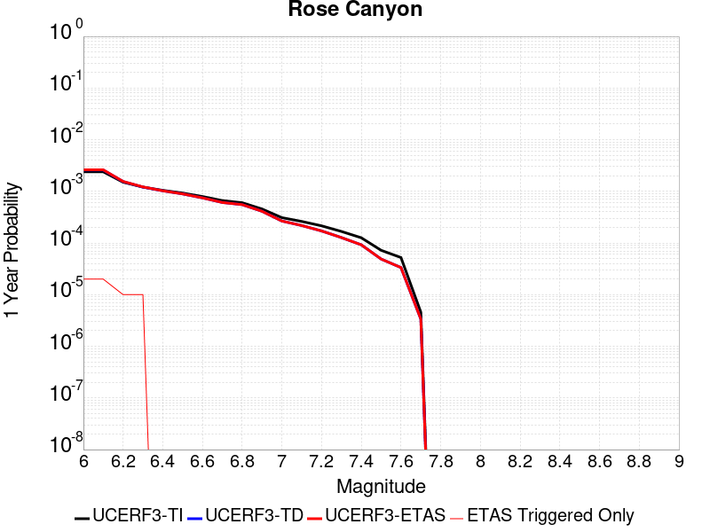 |  |

| Magnitude | 1 wk TI Prob | 1 wk TD Prob | 1 wk ETAS Prob | 1 wk ETAS/TD Gain | 1 wk ETAS Triggered Only | 1 mo TI Prob | 1 mo TD Prob | 1 mo ETAS Prob | 1 mo ETAS/TD Gain | 1 mo ETAS Triggered Only | 1 yr TI Prob | 1 yr TD Prob | 1 yr ETAS Prob | 1 yr ETAS/TD Gain | 1 yr ETAS Triggered Only | 10 yr TI Prob | 10 yr TD Prob | 10 yr ETAS Prob | 10 yr ETAS/TD Gain | 10 yr ETAS Triggered Only |
|-----|-----|-----|-----|-----|-----|-----|-----|-----|-----|-----|-----|-----|-----|-----|-----|-----|-----|-----|-----|-----|
| 6.0 | 4.5923203E-5 | 4.9721333E-5 | 4.9721333E-5 | 1.0 | 0.0 | 1.9679888E-4 | 2.130744E-4 | 2.130744E-4 | 1.0 | 0.0 | 0.0023933933 | 0.002591291 | 0.0026112392 | 1.0076982 | 2.0E-5 | 0.023677798 | 0.02562449 | 0.025653722 | 1.0011407 | 3.0E-5 |
| 6.1 | 4.5923203E-5 | 4.9721333E-5 | 4.9721333E-5 | 1.0 | 0.0 | 1.9679888E-4 | 2.130744E-4 | 2.130744E-4 | 1.0 | 0.0 | 0.0023933933 | 0.002591291 | 0.0026112392 | 1.0076982 | 2.0E-5 | 0.023677798 | 0.02562449 | 0.025653722 | 1.0011407 | 3.0E-5 |
| 6.2 | 2.8844734E-5 | 2.9672712E-5 | 2.9672712E-5 | 1.0 | 0.0 | 1.2361443E-4 | 1.2716257E-4 | 1.2716257E-4 | 1.0 | 0.0 | 0.0015039665 | 0.0015471342 | 0.0015571187 | 1.0064535 | 1.0E-5 | 0.0149382865 | 0.015362789 | 0.015382482 | 1.0012819 | 2.0E-5 |
| 6.3 | 2.3171577E-5 | 2.316474E-5 | 2.316474E-5 | 1.0 | 0.0 | 9.9302975E-5 | 9.9273755E-5 | 9.9273755E-5 | 1.0 | 0.0 | 0.0012083431 | 0.001208001 | 0.001217989 | 1.0082681 | 1.0E-5 | 0.012017938 | 0.012007657 | 0.012027417 | 1.0016456 | 2.0E-5 |
| 6.4 | 2.0066604E-5 | 1.9670135E-5 | 1.9670135E-5 | 1.0 | 0.0 | 8.599689E-5 | 8.4297906E-5 | 8.4297906E-5 | 1.0 | 0.0 | 0.0010465092 | 0.0010258538 | 0.0010258538 | 1.0 | 0.0 | 0.010415946 | 0.010209216 | 0.010219113 | 1.0009695 | 1.0E-5 |
| 6.5 | 1.776989E-5 | 1.7116565E-5 | 1.7116565E-5 | 1.0 | 0.0 | 7.615444E-5 | 7.3354684E-5 | 7.3354684E-5 | 1.0 | 0.0 | 9.267859E-4 | 8.9273433E-4 | 8.9273433E-4 | 1.0 | 0.0 | 0.009229303 | 0.008885121 | 0.008895032 | 1.0011154 | 1.0E-5 |
| 6.6 | 1.5227364E-5 | 1.4341523E-5 | 1.4341523E-5 | 1.0 | 0.0 | 6.52585E-5 | 6.146225E-5 | 6.146225E-5 | 1.0 | 0.0 | 7.942326E-4 | 7.4805116E-4 | 7.4805116E-4 | 1.0 | 0.0 | 0.007914 | 0.007443273 | 0.0074531985 | 1.0013335 | 1.0E-5 |
| 6.7 | 1.2703898E-5 | 1.1674748E-5 | 1.1674748E-5 | 1.0 | 0.0 | 5.4444143E-5 | 5.0033697E-5 | 5.0033697E-5 | 1.0 | 0.0 | 6.626558E-4 | 6.089942E-4 | 6.089942E-4 | 1.0 | 0.0 | 0.006606833 | 0.0060647707 | 0.00607471 | 1.0016389 | 1.0E-5 |
| 6.8 | 1.1554917E-5 | 1.0610774E-5 | 1.0610774E-5 | 1.0 | 0.0 | 4.9520135E-5 | 4.5473975E-5 | 4.5473975E-5 | 1.0 | 0.0 | 6.0274085E-4 | 5.5350905E-4 | 5.5350905E-4 | 1.0 | 0.0 | 0.0060110865 | 0.0055070627 | 0.005517008 | 1.0018059 | 1.0E-5 |
| 6.9 | 8.732078E-6 | 7.882542E-6 | 7.882542E-6 | 1.0 | 0.0 | 3.7422655E-5 | 3.3781904E-5 | 3.3781904E-5 | 1.0 | 0.0 | 4.5552556E-4 | 4.1121998E-4 | 4.1121998E-4 | 1.0 | 0.0 | 0.0045459294 | 0.0040896484 | 0.0040996075 | 1.0024352 | 1.0E-5 |
| 7.0 | 5.9337494E-6 | 5.1076154E-6 | 5.1076154E-6 | 1.0 | 0.0 | 2.5430107E-5 | 2.1889597E-5 | 2.1889597E-5 | 1.0 | 0.0 | 3.0956755E-4 | 2.664734E-4 | 2.664734E-4 | 1.0 | 0.0 | 0.0030913667 | 0.0026615544 | 0.0026715277 | 1.0037472 | 1.0E-5 |
| 7.1 | 5.013409E-6 | 4.1774833E-6 | 4.1774833E-6 | 1.0 | 0.0 | 2.1485863E-5 | 1.7903378E-5 | 1.7903378E-5 | 1.0 | 0.0 | 2.6155898E-4 | 2.1795194E-4 | 2.1795194E-4 | 1.0 | 0.0 | 0.0026125133 | 0.0021773935 | 0.0021873717 | 1.0045826 | 1.0E-5 |
| 7.2 | 4.120763E-6 | 3.2822081E-6 | 3.2822081E-6 | 1.0 | 0.0 | 1.7660293E-5 | 1.4066532E-5 | 1.4066532E-5 | 1.0 | 0.0 | 2.1499286E-4 | 1.7124665E-4 | 1.7124665E-4 | 1.0 | 0.0 | 0.0021478499 | 0.0017111565 | 0.0017111565 | 1.0 | 0.0 |
| 7.3 | 3.2081239E-6 | 2.4405792E-6 | 2.4405792E-6 | 1.0 | 0.0 | 1.374903E-5 | 1.0459584E-5 | 1.0459584E-5 | 1.0 | 0.0 | 1.6738157E-4 | 1.2733806E-4 | 1.2733806E-4 | 1.0 | 0.0 | 0.0016725556 | 0.001272658 | 0.001272658 | 1.0 | 0.0 |
| 7.4 | 2.4194755E-6 | 1.7680943E-6 | 1.7680943E-6 | 1.0 | 0.0 | 1.0369139E-5 | 7.577525E-6 | 7.577525E-6 | 1.0 | 0.0 | 1.2623696E-4 | 9.225252E-5 | 9.225252E-5 | 1.0 | 0.0 | 0.0012616527 | 9.221476E-4 | 9.221476E-4 | 1.0 | 0.0 |
| 7.5 | 1.3842889E-6 | 9.378659E-7 | 9.378659E-7 | 1.0 | 0.0 | 5.9326535E-6 | 4.019419E-6 | 4.019419E-6 | 1.0 | 0.0 | 7.222766E-5 | 4.8935366E-5 | 4.8935366E-5 | 1.0 | 0.0 | 7.220419E-4 | 4.892494E-4 | 4.892494E-4 | 1.0 | 0.0 |
| 7.6 | 1.0021575E-6 | 6.4116585E-7 | 6.4116585E-7 | 1.0 | 0.0 | 4.2949537E-6 | 2.7478509E-6 | 2.7478509E-6 | 1.0 | 0.0 | 5.2289808E-5 | 3.345459E-5 | 3.345459E-5 | 1.0 | 0.0 | 5.2277505E-4 | 3.3449772E-4 | 3.3449772E-4 | 1.0 | 0.0 |
| 7.7 | 8.7620116E-8 | 6.449451E-8 | 6.449451E-8 | 1.0 | 0.0 | 3.7551473E-7 | 2.7640502E-7 | 2.7640502E-7 | 1.0 | 0.0 | 4.5718825E-6 | 3.3652261E-6 | 3.3652261E-6 | 1.0 | 0.0 | 4.5717883E-5 | 3.365178E-5 | 3.365178E-5 | 1.0 | 0.0 |

## Coronado Bank alt1
*[(top)](#table-of-contents)*

| 1 Week | 1 Month | 1 Year | 10 Year |
|-----|-----|-----|-----|
|  |  |  |  |

| Magnitude | 1 wk TI Prob | 1 wk TD Prob | 1 wk ETAS Prob | 1 wk ETAS/TD Gain | 1 wk ETAS Triggered Only | 1 mo TI Prob | 1 mo TD Prob | 1 mo ETAS Prob | 1 mo ETAS/TD Gain | 1 mo ETAS Triggered Only | 1 yr TI Prob | 1 yr TD Prob | 1 yr ETAS Prob | 1 yr ETAS/TD Gain | 1 yr ETAS Triggered Only | 10 yr TI Prob | 10 yr TD Prob | 10 yr ETAS Prob | 10 yr ETAS/TD Gain | 10 yr ETAS Triggered Only |
|-----|-----|-----|-----|-----|-----|-----|-----|-----|-----|-----|-----|-----|-----|-----|-----|-----|-----|-----|-----|-----|
| 6.0 | 7.533492E-5 | 9.396308E-5 | 9.396308E-5 | 1.0 | 0.0 | 3.22824E-4 | 4.026398E-4 | 4.026398E-4 | 1.0 | 0.0 | 0.0039233007 | 0.004891753 | 0.0049017044 | 1.0020343 | 1.0E-5 | 0.03854755 | 0.047910035 | 0.047938596 | 1.0005962 | 3.0E-5 |
| 6.1 | 4.1807285E-5 | 5.0498526E-5 | 5.0498526E-5 | 1.0 | 0.0 | 1.7916178E-4 | 2.164048E-4 | 2.164048E-4 | 1.0 | 0.0 | 0.0021791123 | 0.0026316273 | 0.0026316273 | 1.0 | 0.0 | 0.021578677 | 0.026013961 | 0.0260237 | 1.0003744 | 1.0E-5 |
| 6.2 | 4.1807285E-5 | 5.0498526E-5 | 5.0498526E-5 | 1.0 | 0.0 | 1.7916178E-4 | 2.164048E-4 | 2.164048E-4 | 1.0 | 0.0 | 0.0021791123 | 0.0026316273 | 0.0026316273 | 1.0 | 0.0 | 0.021578677 | 0.026013961 | 0.0260237 | 1.0003744 | 1.0E-5 |
| 6.3 | 3.1793104E-5 | 3.7714883E-5 | 3.7714883E-5 | 1.0 | 0.0 | 1.3624904E-4 | 1.6162539E-4 | 1.6162539E-4 | 1.0 | 0.0 | 0.0016575698 | 0.0019660448 | 0.0019660448 | 1.0 | 0.0 | 0.016452603 | 0.019490417 | 0.019490417 | 1.0 | 0.0 |
| 6.4 | 2.9878007E-5 | 3.5339264E-5 | 3.5339264E-5 | 1.0 | 0.0 | 1.2804232E-4 | 1.5144538E-4 | 1.5144538E-4 | 1.0 | 0.0 | 0.0015578003 | 0.0018423196 | 0.0018423196 | 1.0 | 0.0 | 0.015469253 | 0.018274235 | 0.018274235 | 1.0 | 0.0 |
| 6.5 | 2.4512565E-5 | 2.8766783E-5 | 2.8766783E-5 | 1.0 | 0.0 | 1.0504962E-4 | 1.2328054E-4 | 1.2328054E-4 | 1.0 | 0.0 | 0.0012782287 | 0.0014999339 | 0.0014999339 | 1.0 | 0.0 | 0.012709012 | 0.01490107 | 0.01490107 | 1.0 | 0.0 |
| 6.6 | 2.1317413E-5 | 2.4908924E-5 | 2.4908924E-5 | 1.0 | 0.0 | 9.135714E-5 | 1.0674829E-4 | 1.0674829E-4 | 1.0 | 0.0 | 0.0011117056 | 0.0012989078 | 0.0012989078 | 1.0 | 0.0 | 0.011061605 | 0.012915568 | 0.012915568 | 1.0 | 0.0 |
| 6.7 | 1.8585655E-5 | 2.1636792E-5 | 2.1636792E-5 | 1.0 | 0.0 | 7.9650374E-5 | 9.2725924E-5 | 9.2725924E-5 | 1.0 | 0.0 | 9.6931186E-4 | 0.0011283739 | 0.0011283739 | 1.0 | 0.0 | 0.0096509475 | 0.011228609 | 0.011228609 | 1.0 | 0.0 |
| 6.8 | 1.5862879E-5 | 1.8421075E-5 | 1.8421075E-5 | 1.0 | 0.0 | 6.798199E-5 | 7.894519E-5 | 7.894519E-5 | 1.0 | 0.0 | 8.273665E-4 | 9.6075307E-4 | 9.6075307E-4 | 1.0 | 0.0 | 0.008242928 | 0.009567978 | 0.009567978 | 1.0 | 0.0 |
| 6.9 | 1.3021509E-5 | 1.5096564E-5 | 1.5096564E-5 | 1.0 | 0.0 | 5.5805274E-5 | 6.4698055E-5 | 6.4698055E-5 | 1.0 | 0.0 | 6.792174E-4 | 7.874323E-4 | 7.874323E-4 | 1.0 | 0.0 | 0.006771452 | 0.007848245 | 0.007848245 | 1.0 | 0.0 |
| 7.0 | 1.0974371E-5 | 1.2721201E-5 | 1.2721201E-5 | 1.0 | 0.0 | 4.7032172E-5 | 5.451839E-5 | 5.451839E-5 | 1.0 | 0.0 | 5.7246623E-4 | 6.635768E-4 | 6.635768E-4 | 1.0 | 0.0 | 0.0057099373 | 0.0066177035 | 0.0066177035 | 1.0 | 0.0 |
| 7.1 | 8.766221E-6 | 1.0164714E-5 | 1.0164714E-5 | 1.0 | 0.0 | 3.7568978E-5 | 4.356243E-5 | 4.356243E-5 | 1.0 | 0.0 | 4.573063E-4 | 5.3026073E-4 | 5.3026073E-4 | 1.0 | 0.0 | 0.0045636636 | 0.0052916547 | 0.0052916547 | 1.0 | 0.0 |
| 7.2 | 8.026024E-7 | 8.332067E-7 | 8.332067E-7 | 1.0 | 0.0 | 3.43972E-6 | 3.570881E-6 | 3.570881E-6 | 1.0 | 0.0 | 4.1877785E-5 | 4.3474618E-5 | 4.3474618E-5 | 1.0 | 0.0 | 4.1869894E-4 | 4.3466224E-4 | 4.3466224E-4 | 1.0 | 0.0 |
| 7.3 | 3.7293114E-7 | 3.7002025E-7 | 3.7002025E-7 | 1.0 | 0.0 | 1.5982754E-6 | 1.5858001E-6 | 1.5858001E-6 | 1.0 | 0.0 | 1.9458828E-5 | 1.9306945E-5 | 1.9306945E-5 | 1.0 | 0.0 | 1.9457124E-4 | 1.9305275E-4 | 1.9305275E-4 | 1.0 | 0.0 |
| 7.4 | 2.0557036E-7 | 1.9674852E-7 | 1.9674852E-7 | 1.0 | 0.0 | 8.810155E-7 | 8.4320766E-7 | 8.4320766E-7 | 1.0 | 0.0 | 1.0726311E-5 | 1.0266005E-5 | 1.0266005E-5 | 1.0 | 0.0 | 1.0725793E-4 | 1.0265534E-4 | 1.0265534E-4 | 1.0 | 0.0 |
| 7.5 | 6.845446E-8 | 6.2794854E-8 | 6.2794854E-8 | 1.0 | 0.0 | 2.9337625E-7 | 2.6912076E-7 | 2.6912076E-7 | 1.0 | 0.0 | 3.5718497E-6 | 3.2765404E-6 | 3.2765404E-6 | 1.0 | 0.0 | 3.5717923E-5 | 3.276493E-5 | 3.276493E-5 | 1.0 | 0.0 |
| 7.6 | 6.0975145E-9 | 5.5319385E-9 | 5.5319385E-9 | 1.0 | 0.0 | 2.6132206E-8 | 2.3708308E-8 | 2.3708308E-8 | 1.0 | 0.0 | 3.1815955E-7 | 2.8864864E-7 | 2.8864864E-7 | 1.0 | 0.0 | 3.181591E-6 | 2.8864836E-6 | 2.8864836E-6 | 1.0 | 0.0 |

## San Jacinto (Clark) rev
*[(top)](#table-of-contents)*

| 1 Week | 1 Month | 1 Year | 10 Year |
|-----|-----|-----|-----|
|  |  |  |  |

| Magnitude | 1 wk TI Prob | 1 wk TD Prob | 1 wk ETAS Prob | 1 wk ETAS/TD Gain | 1 wk ETAS Triggered Only | 1 mo TI Prob | 1 mo TD Prob | 1 mo ETAS Prob | 1 mo ETAS/TD Gain | 1 mo ETAS Triggered Only | 1 yr TI Prob | 1 yr TD Prob | 1 yr ETAS Prob | 1 yr ETAS/TD Gain | 1 yr ETAS Triggered Only | 10 yr TI Prob | 10 yr TD Prob | 10 yr ETAS Prob | 10 yr ETAS/TD Gain | 10 yr ETAS Triggered Only |
|-----|-----|-----|-----|-----|-----|-----|-----|-----|-----|-----|-----|-----|-----|-----|-----|-----|-----|-----|-----|-----|
| 6.0 | 4.482615E-5 | 2.1191718E-5 | 2.1191718E-5 | 1.0 | 0.0 | 1.9209793E-4 | 9.081853E-5 | 1.00817626E-4 | 1.1100997 | 1.0E-5 | 0.0023362834 | 0.0011051641 | 0.001115153 | 1.0090384 | 1.0E-5 | 0.02311874 | 0.011545315 | 0.011574969 | 1.0025685 | 3.0E-5 |
| 6.1 | 4.482615E-5 | 2.1191718E-5 | 2.1191718E-5 | 1.0 | 0.0 | 1.9209793E-4 | 9.081853E-5 | 1.00817626E-4 | 1.1100997 | 1.0E-5 | 0.0023362834 | 0.0011051641 | 0.001115153 | 1.0090384 | 1.0E-5 | 0.02311874 | 0.011545315 | 0.011574969 | 1.0025685 | 3.0E-5 |
| 6.2 | 4.482615E-5 | 2.1191718E-5 | 2.1191718E-5 | 1.0 | 0.0 | 1.9209793E-4 | 9.081853E-5 | 1.00817626E-4 | 1.1100997 | 1.0E-5 | 0.0023362834 | 0.0011051641 | 0.001115153 | 1.0090384 | 1.0E-5 | 0.02311874 | 0.011545315 | 0.011574969 | 1.0025685 | 3.0E-5 |
| 6.3 | 4.482615E-5 | 2.1191718E-5 | 2.1191718E-5 | 1.0 | 0.0 | 1.9209793E-4 | 9.081853E-5 | 1.00817626E-4 | 1.1100997 | 1.0E-5 | 0.0023362834 | 0.0011051641 | 0.001115153 | 1.0090384 | 1.0E-5 | 0.02311874 | 0.011545315 | 0.011574969 | 1.0025685 | 3.0E-5 |
| 6.4 | 4.482615E-5 | 2.1191718E-5 | 2.1191718E-5 | 1.0 | 0.0 | 1.9209793E-4 | 9.081853E-5 | 1.00817626E-4 | 1.1100997 | 1.0E-5 | 0.0023362834 | 0.0011051641 | 0.001115153 | 1.0090384 | 1.0E-5 | 0.02311874 | 0.011545315 | 0.011574969 | 1.0025685 | 3.0E-5 |
| 6.5 | 3.7294863E-5 | 1.7390303E-5 | 1.7390303E-5 | 1.0 | 0.0 | 1.5982533E-4 | 7.4527765E-5 | 8.452702E-5 | 1.1341681 | 1.0E-5 | 0.0019441366 | 9.070023E-4 | 9.1699325E-4 | 1.0110153 | 1.0E-5 | 0.01927216 | 0.009527762 | 0.009557476 | 1.0031186 | 3.0E-5 |
| 6.6 | 3.7294863E-5 | 1.7390303E-5 | 1.7390303E-5 | 1.0 | 0.0 | 1.5982533E-4 | 7.4527765E-5 | 8.452702E-5 | 1.1341681 | 1.0E-5 | 0.0019441366 | 9.070023E-4 | 9.1699325E-4 | 1.0110153 | 1.0E-5 | 0.01927216 | 0.009527762 | 0.009557476 | 1.0031186 | 3.0E-5 |
| 6.7 | 3.6039248E-5 | 1.663832E-5 | 1.663832E-5 | 1.0 | 0.0 | 1.5444479E-4 | 7.1305156E-5 | 8.1304446E-5 | 1.1402323 | 1.0E-5 | 0.0018787434 | 8.677987E-4 | 8.7779004E-4 | 1.0115134 | 1.0E-5 | 0.01862939 | 0.009127249 | 0.009156975 | 1.0032569 | 3.0E-5 |
| 6.8 | 3.5031844E-5 | 1.6266758E-5 | 1.6266758E-5 | 1.0 | 0.0 | 1.5012783E-4 | 6.971284E-5 | 7.971215E-5 | 1.1434356 | 1.0E-5 | 0.0018262739 | 8.484275E-4 | 8.5841893E-4 | 1.0117766 | 1.0E-5 | 0.01811338 | 0.008926392 | 0.008956124 | 1.0033308 | 3.0E-5 |
| 6.9 | 3.435112E-5 | 1.609673E-5 | 1.609673E-5 | 1.0 | 0.0 | 1.4721078E-4 | 6.898418E-5 | 7.8983496E-5 | 1.1449507 | 1.0E-5 | 0.0017908178 | 8.395629E-4 | 8.495545E-4 | 1.0119009 | 1.0E-5 | 0.017764548 | 0.008834177 | 0.008863911 | 1.0033659 | 3.0E-5 |
| 7.0 | 2.8959772E-5 | 1.4369085E-5 | 1.4369085E-5 | 1.0 | 0.0 | 1.241074E-4 | 6.158036E-5 | 7.157974E-5 | 1.1623795 | 1.0E-5 | 0.0015099603 | 7.4948574E-4 | 7.5947825E-4 | 1.0133325 | 1.0E-5 | 0.014997416 | 0.007885363 | 0.007915126 | 1.0037745 | 3.0E-5 |
| 7.1 | 2.6002877E-5 | 1.2858783E-5 | 1.2858783E-5 | 1.0 | 0.0 | 1.11436144E-4 | 5.5107917E-5 | 6.5107364E-5 | 1.1814522 | 1.0E-5 | 0.0013558907 | 6.707345E-4 | 6.8072777E-4 | 1.014899 | 1.0E-5 | 0.013476475 | 0.007061323 | 0.0070911115 | 1.0042185 | 3.0E-5 |
| 7.2 | 2.2544838E-5 | 1.1290127E-5 | 1.1290127E-5 | 1.0 | 0.0 | 9.661716E-5 | 4.8385373E-5 | 5.838489E-5 | 1.2066641 | 1.0E-5 | 0.001175679 | 5.889341E-4 | 5.9892825E-4 | 1.0169698 | 1.0E-5 | 0.011694785 | 0.0062048775 | 0.006234691 | 1.0048048 | 3.0E-5 |
| 7.3 | 1.75334E-5 | 1.0837388E-5 | 1.0837388E-5 | 1.0 | 0.0 | 7.514098E-5 | 4.644513E-5 | 5.6444664E-5 | 1.2152978 | 1.0E-5 | 9.144575E-4 | 5.653241E-4 | 5.7531847E-4 | 1.017679 | 1.0E-5 | 0.009107036 | 0.005947213 | 0.005977035 | 1.0050144 | 3.0E-5 |
| 7.4 | 1.5924552E-5 | 1.0636858E-5 | 1.0636858E-5 | 1.0 | 0.0 | 6.82463E-5 | 4.5585744E-5 | 5.558529E-5 | 1.2193568 | 1.0E-5 | 8.305819E-4 | 5.548665E-4 | 5.6486094E-4 | 1.0180124 | 1.0E-5 | 0.008274844 | 0.005834334 | 0.005864159 | 1.0051119 | 3.0E-5 |
| 7.5 | 1.3428931E-5 | 9.8756445E-6 | 9.8756445E-6 | 1.0 | 0.0 | 5.7551293E-5 | 4.232351E-5 | 5.2323085E-5 | 1.2362653 | 1.0E-5 | 7.004617E-4 | 5.15168E-4 | 5.2516285E-4 | 1.0194012 | 1.0E-5 | 0.006982579 | 0.005418992 | 0.00544883 | 1.005506 | 3.0E-5 |
| 7.6 | 1.0688787E-5 | 8.632028E-6 | 8.632028E-6 | 1.0 | 0.0 | 4.5808283E-5 | 3.6993883E-5 | 4.699351E-5 | 1.2703049 | 1.0E-5 | 5.5757316E-4 | 4.503079E-4 | 4.603034E-4 | 1.022197 | 1.0E-5 | 0.005561762 | 0.0047506006 | 0.004780458 | 1.006285 | 3.0E-5 |
| 7.7 | 8.81236E-6 | 7.484666E-6 | 7.484666E-6 | 1.0 | 0.0 | 3.776671E-5 | 3.2076747E-5 | 4.2076426E-5 | 1.3117423 | 1.0E-5 | 4.597127E-4 | 3.9046461E-4 | 4.0046073E-4 | 1.0256006 | 1.0E-5 | 0.0045876284 | 0.004143442 | 0.0041733175 | 1.0072104 | 3.0E-5 |
| 7.8 | 7.780431E-6 | 6.7123256E-6 | 6.7123256E-6 | 1.0 | 0.0 | 3.3344273E-5 | 2.8766794E-5 | 3.8766506E-5 | 1.347613 | 1.0E-5 | 4.0589093E-4 | 3.5017962E-4 | 3.601761E-4 | 1.0285468 | 1.0E-5 | 0.0040515037 | 0.003731095 | 0.003760983 | 1.0080105 | 3.0E-5 |
| 7.9 | 6.5437994E-6 | 5.7950524E-6 | 5.7950524E-6 | 1.0 | 0.0 | 2.8044553E-5 | 2.4835703E-5 | 3.4835455E-5 | 1.4026362 | 1.0E-5 | 3.4138895E-4 | 3.023329E-4 | 3.1232988E-4 | 1.0330662 | 1.0E-5 | 0.0034086495 | 0.0032424044 | 0.0032723073 | 1.0092224 | 3.0E-5 |
| 8.0 | 5.4488164E-6 | 4.8263623E-6 | 4.8263623E-6 | 1.0 | 0.0 | 2.3351862E-5 | 2.0684245E-5 | 3.0684037E-5 | 1.4834497 | 1.0E-5 | 2.8427184E-4 | 2.5180174E-4 | 2.6179923E-4 | 1.0397037 | 1.0E-5 | 0.0028390845 | 0.0027179152 | 0.0027478337 | 1.0110079 | 3.0E-5 |
| 8.1 | 2.8397242E-6 | 1.3719867E-6 | 1.3719867E-6 | 1.0 | 0.0 | 1.217019E-5 | 5.87993E-6 | 5.87993E-6 | 1.0 | 0.0 | 1.4816198E-4 | 7.1585804E-5 | 7.1585804E-5 | 1.0 | 0.0 | 0.0014806325 | 8.143387E-4 | 8.2433055E-4 | 1.0122699 | 1.0E-5 |
| 8.2 | 2.030244E-6 | 6.3457173E-7 | 6.3457173E-7 | 1.0 | 0.0 | 8.701017E-6 | 2.7195904E-6 | 2.7195904E-6 | 1.0 | 0.0 | 1.05929736E-4 | 3.3110515E-5 | 3.3110515E-5 | 1.0 | 0.0 | 0.0010587925 | 3.9645724E-4 | 3.9645724E-4 | 1.0 | 0.0 |
| 8.3 | 1.0659804E-6 | 2.9379942E-7 | 2.9379942E-7 | 1.0 | 0.0 | 4.568479E-6 | 1.2591397E-6 | 1.2591397E-6 | 1.0 | 0.0 | 5.5619817E-5 | 1.5329922E-5 | 1.5329922E-5 | 1.0 | 0.0 | 5.5605895E-4 | 1.8644381E-4 | 1.8644381E-4 | 1.0 | 0.0 |

## San Diego Trough south
*[(top)](#table-of-contents)*

| 1 Week | 1 Month | 1 Year | 10 Year |
|-----|-----|-----|-----|
|  |  |  | 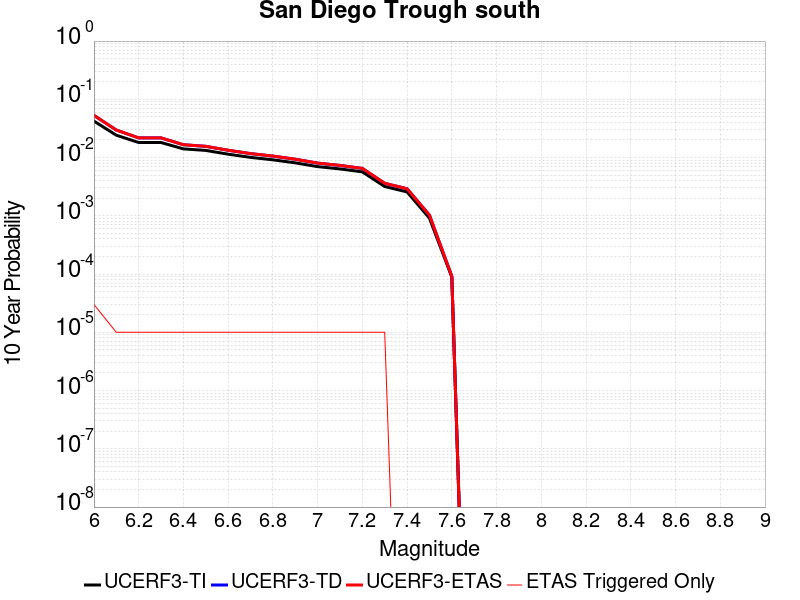 |

| Magnitude | 1 wk TI Prob | 1 wk TD Prob | 1 wk ETAS Prob | 1 wk ETAS/TD Gain | 1 wk ETAS Triggered Only | 1 mo TI Prob | 1 mo TD Prob | 1 mo ETAS Prob | 1 mo ETAS/TD Gain | 1 mo ETAS Triggered Only | 1 yr TI Prob | 1 yr TD Prob | 1 yr ETAS Prob | 1 yr ETAS/TD Gain | 1 yr ETAS Triggered Only | 10 yr TI Prob | 10 yr TD Prob | 10 yr ETAS Prob | 10 yr ETAS/TD Gain | 10 yr ETAS Triggered Only |
|-----|-----|-----|-----|-----|-----|-----|-----|-----|-----|-----|-----|-----|-----|-----|-----|-----|-----|-----|-----|-----|
| 6.0 | 8.279495E-5 | 1.0426959E-4 | 1.0426959E-4 | 1.0 | 0.0 | 3.5478722E-4 | 4.4679717E-4 | 4.4679717E-4 | 1.0 | 0.0 | 0.004310982 | 0.0054266346 | 0.0054266346 | 1.0 | 0.0 | 0.042283054 | 0.052999813 | 0.053028222 | 1.0005361 | 3.0E-5 |
| 6.1 | 4.6961468E-5 | 5.7736557E-5 | 5.7736557E-5 | 1.0 | 0.0 | 2.0124791E-4 | 2.4741987E-4 | 2.4741987E-4 | 1.0 | 0.0 | 0.00244744 | 0.0030082478 | 0.0030082478 | 1.0 | 0.0 | 0.024206603 | 0.029683128 | 0.029692832 | 1.0003269 | 1.0E-5 |
| 6.2 | 3.5079658E-5 | 4.214702E-5 | 4.214702E-5 | 1.0 | 0.0 | 1.5033272E-4 | 1.8061785E-4 | 1.8061785E-4 | 1.0 | 0.0 | 0.0018287642 | 0.0021968228 | 0.0021968228 | 1.0 | 0.0 | 0.018137876 | 0.021753483 | 0.021763265 | 1.0004497 | 1.0E-5 |
| 6.3 | 3.5079658E-5 | 4.214702E-5 | 4.214702E-5 | 1.0 | 0.0 | 1.5033272E-4 | 1.8061785E-4 | 1.8061785E-4 | 1.0 | 0.0 | 0.0018287642 | 0.0021968228 | 0.0021968228 | 1.0 | 0.0 | 0.018137876 | 0.021753483 | 0.021763265 | 1.0004497 | 1.0E-5 |
| 6.4 | 2.7196904E-5 | 3.2090207E-5 | 3.2090207E-5 | 1.0 | 0.0 | 1.16552954E-4 | 1.375223E-4 | 1.375223E-4 | 1.0 | 0.0 | 0.0014181085 | 0.00167306 | 0.00167306 | 1.0 | 0.0 | 0.014090929 | 0.016606245 | 0.01661608 | 1.0005922 | 1.0E-5 |
| 6.5 | 2.5584688E-5 | 3.0104437E-5 | 3.0104437E-5 | 1.0 | 0.0 | 1.0964406E-4 | 1.2901273E-4 | 1.2901273E-4 | 1.0 | 0.0 | 0.0013340989 | 0.0015696106 | 0.0015696106 | 1.0 | 0.0 | 0.013261181 | 0.01558679 | 0.015596634 | 1.0006316 | 1.0E-5 |
| 6.6 | 2.2034688E-5 | 2.5745014E-5 | 2.5745014E-5 | 1.0 | 0.0 | 9.443096E-5 | 1.1033115E-4 | 1.1033115E-4 | 1.0 | 0.0 | 0.0011490905 | 0.0013424618 | 0.0013424618 | 1.0 | 0.0 | 0.011431668 | 0.013344516 | 0.0133543825 | 1.0007393 | 1.0E-5 |
| 6.7 | 1.9394853E-5 | 2.2543714E-5 | 2.2543714E-5 | 1.0 | 0.0 | 8.311815E-5 | 9.661237E-5 | 9.661237E-5 | 1.0 | 0.0 | 0.0010114936 | 0.0011756261 | 0.0011756261 | 1.0 | 0.0 | 0.01006902 | 0.011694773 | 0.011704656 | 1.0008451 | 1.0E-5 |
| 6.8 | 1.7615313E-5 | 2.0404905E-5 | 2.0404905E-5 | 1.0 | 0.0 | 7.549201E-5 | 8.7446686E-5 | 8.7446686E-5 | 1.0 | 0.0 | 9.1872766E-4 | 0.0010641478 | 0.0010641478 | 1.0 | 0.0 | 0.009149387 | 0.010591088 | 0.010600981 | 1.0009342 | 1.0E-5 |
| 6.9 | 1.5621423E-5 | 1.8027595E-5 | 1.8027595E-5 | 1.0 | 0.0 | 6.6947236E-5 | 7.725885E-5 | 7.725885E-5 | 1.0 | 0.0 | 8.147778E-4 | 9.402241E-4 | 9.402241E-4 | 1.0 | 0.0 | 0.008117969 | 0.009362906 | 0.009372813 | 1.0010581 | 1.0E-5 |
| 7.0 | 1.3444376E-5 | 1.5449315E-5 | 1.5449315E-5 | 1.0 | 0.0 | 5.7617483E-5 | 6.6209686E-5 | 6.6209686E-5 | 1.0 | 0.0 | 7.0126704E-4 | 8.0580753E-4 | 8.0580753E-4 | 1.0 | 0.0 | 0.006990582 | 0.00802919 | 0.008039109 | 1.0012355 | 1.0E-5 |
| 7.1 | 1.2268361E-5 | 1.4074132E-5 | 1.4074132E-5 | 1.0 | 0.0 | 5.2577634E-5 | 6.031633E-5 | 6.031633E-5 | 1.0 | 0.0 | 6.399447E-4 | 7.341065E-4 | 7.341065E-4 | 1.0 | 0.0 | 0.0063810493 | 0.00731712 | 0.007327047 | 1.0013566 | 1.0E-5 |
| 7.2 | 1.0922655E-5 | 1.2514534E-5 | 1.2514534E-5 | 1.0 | 0.0 | 4.681054E-5 | 5.363263E-5 | 5.363263E-5 | 1.0 | 0.0 | 5.697693E-4 | 6.5278413E-4 | 6.5278413E-4 | 1.0 | 0.0 | 0.0056831064 | 0.006508947 | 0.006518882 | 1.0015264 | 1.0E-5 |
| 7.3 | 6.1106753E-6 | 6.9294197E-6 | 6.9294197E-6 | 1.0 | 0.0 | 2.6188345E-5 | 2.9697178E-5 | 2.9697178E-5 | 1.0 | 0.0 | 3.1879646E-4 | 3.6150354E-4 | 3.6150354E-4 | 1.0 | 0.0 | 0.0031833951 | 0.0036092002 | 0.003619164 | 1.0027606 | 1.0E-5 |
| 7.4 | 4.933187E-6 | 5.5899495E-6 | 5.5899495E-6 | 1.0 | 0.0 | 2.114206E-5 | 2.3956709E-5 | 2.3956709E-5 | 1.0 | 0.0 | 2.5737417E-4 | 2.9163426E-4 | 2.9163426E-4 | 1.0 | 0.0 | 0.002570763 | 0.0029125568 | 0.0029125568 | 1.0 | 0.0 |
| 7.5 | 1.7489613E-6 | 1.9698116E-6 | 1.9698116E-6 | 1.0 | 0.0 | 7.495527E-6 | 8.4420235E-6 | 8.4420235E-6 | 1.0 | 0.0 | 9.125422E-5 | 1.0277701E-4 | 1.0277701E-4 | 1.0 | 0.0 | 9.1216754E-4 | 0.0010273168 | 0.0010273168 | 1.0 | 0.0 |
| 7.6 | 1.6988751E-7 | 1.7534121E-7 | 1.7534121E-7 | 1.0 | 0.0 | 7.2808916E-7 | 7.5146215E-7 | 7.5146215E-7 | 1.0 | 0.0 | 8.864449E-6 | 9.149016E-6 | 9.149016E-6 | 1.0 | 0.0 | 8.8640954E-5 | 9.148658E-5 | 9.148658E-5 | 1.0 | 0.0 |

## Cucamonga
*[(top)](#table-of-contents)*

| 1 Week | 1 Month | 1 Year | 10 Year |
|-----|-----|-----|-----|
|  |  |  |  |

| Magnitude | 1 wk TI Prob | 1 wk TD Prob | 1 wk ETAS Prob | 1 wk ETAS/TD Gain | 1 wk ETAS Triggered Only | 1 mo TI Prob | 1 mo TD Prob | 1 mo ETAS Prob | 1 mo ETAS/TD Gain | 1 mo ETAS Triggered Only | 1 yr TI Prob | 1 yr TD Prob | 1 yr ETAS Prob | 1 yr ETAS/TD Gain | 1 yr ETAS Triggered Only | 10 yr TI Prob | 10 yr TD Prob | 10 yr ETAS Prob | 10 yr ETAS/TD Gain | 10 yr ETAS Triggered Only |
|-----|-----|-----|-----|-----|-----|-----|-----|-----|-----|-----|-----|-----|-----|-----|-----|-----|-----|-----|-----|-----|
| 6.0 | 1.1848348E-5 | 1.1739775E-5 | 1.1739775E-5 | 1.0 | 0.0 | 5.0777642E-5 | 5.0312367E-5 | 5.0312367E-5 | 1.0 | 0.0 | 6.180424E-4 | 6.123836E-4 | 6.3237135E-4 | 1.0326393 | 2.0E-5 | 0.0061632637 | 0.0061081476 | 0.0061280252 | 1.0032543 | 2.0E-5 |
| 6.1 | 1.1848348E-5 | 1.1739775E-5 | 1.1739775E-5 | 1.0 | 0.0 | 5.0777642E-5 | 5.0312367E-5 | 5.0312367E-5 | 1.0 | 0.0 | 6.180424E-4 | 6.123836E-4 | 6.3237135E-4 | 1.0326393 | 2.0E-5 | 0.0061632637 | 0.0061081476 | 0.0061280252 | 1.0032543 | 2.0E-5 |
| 6.2 | 1.1848348E-5 | 1.1739775E-5 | 1.1739775E-5 | 1.0 | 0.0 | 5.0777642E-5 | 5.0312367E-5 | 5.0312367E-5 | 1.0 | 0.0 | 6.180424E-4 | 6.123836E-4 | 6.3237135E-4 | 1.0326393 | 2.0E-5 | 0.0061632637 | 0.0061081476 | 0.0061280252 | 1.0032543 | 2.0E-5 |
| 6.3 | 1.1848348E-5 | 1.1739775E-5 | 1.1739775E-5 | 1.0 | 0.0 | 5.0777642E-5 | 5.0312367E-5 | 5.0312367E-5 | 1.0 | 0.0 | 6.180424E-4 | 6.123836E-4 | 6.3237135E-4 | 1.0326393 | 2.0E-5 | 0.0061632637 | 0.0061081476 | 0.0061280252 | 1.0032543 | 2.0E-5 |
| 6.4 | 1.1848348E-5 | 1.1739775E-5 | 1.1739775E-5 | 1.0 | 0.0 | 5.0777642E-5 | 5.0312367E-5 | 5.0312367E-5 | 1.0 | 0.0 | 6.180424E-4 | 6.123836E-4 | 6.3237135E-4 | 1.0326393 | 2.0E-5 | 0.0061632637 | 0.0061081476 | 0.0061280252 | 1.0032543 | 2.0E-5 |
| 6.5 | 1.16988695E-5 | 1.15788E-5 | 1.15788E-5 | 1.0 | 0.0 | 5.013705E-5 | 4.9622497E-5 | 4.9622497E-5 | 1.0 | 0.0 | 6.102476E-4 | 6.039891E-4 | 6.2397704E-4 | 1.0330932 | 2.0E-5 | 0.006085745 | 0.0060246587 | 0.006044538 | 1.0032997 | 2.0E-5 |
| 6.6 | 1.16988695E-5 | 1.15788E-5 | 1.15788E-5 | 1.0 | 0.0 | 5.013705E-5 | 4.9622497E-5 | 4.9622497E-5 | 1.0 | 0.0 | 6.102476E-4 | 6.039891E-4 | 6.2397704E-4 | 1.0330932 | 2.0E-5 | 0.006085745 | 0.0060246587 | 0.006044538 | 1.0032997 | 2.0E-5 |
| 6.7 | 1.1397107E-5 | 1.11176305E-5 | 1.11176305E-5 | 1.0 | 0.0 | 4.884383E-5 | 4.7646132E-5 | 4.7646132E-5 | 1.0 | 0.0 | 5.9451134E-4 | 5.7993975E-4 | 5.9992814E-4 | 1.0344664 | 2.0E-5 | 0.005929234 | 0.005785425 | 0.00580531 | 1.0034369 | 2.0E-5 |
| 6.8 | 1.058387E-5 | 9.787316E-6 | 9.787316E-6 | 1.0 | 0.0 | 4.5358654E-5 | 4.1944975E-5 | 4.1944975E-5 | 1.0 | 0.0 | 5.521017E-4 | 5.105615E-4 | 5.305513E-4 | 1.0391525 | 2.0E-5 | 0.00550732 | 0.0050949054 | 0.0051148036 | 1.0039055 | 2.0E-5 |
| 6.9 | 9.690046E-6 | 8.581577E-6 | 8.581577E-6 | 1.0 | 0.0 | 4.1528107E-5 | 3.6777674E-5 | 3.6777674E-5 | 1.0 | 0.0 | 5.054874E-4 | 4.4767658E-4 | 4.6766762E-4 | 1.0446551 | 2.0E-5 | 0.005043391 | 0.004468694 | 0.0044886046 | 1.0044556 | 2.0E-5 |
| 7.0 | 9.381461E-6 | 8.189138E-6 | 8.189138E-6 | 1.0 | 0.0 | 4.020564E-5 | 3.5095833E-5 | 3.5095833E-5 | 1.0 | 0.0 | 4.893937E-4 | 4.2720835E-4 | 4.471998E-4 | 1.0467956 | 2.0E-5 | 0.0048831734 | 0.004264814 | 0.004284729 | 1.0046695 | 2.0E-5 |
| 7.1 | 8.946492E-6 | 7.783881E-6 | 7.783881E-6 | 1.0 | 0.0 | 3.8341543E-5 | 3.335907E-5 | 3.335907E-5 | 1.0 | 0.0 | 4.667083E-4 | 4.0607128E-4 | 4.1606723E-4 | 1.0246162 | 1.0E-5 | 0.0046572937 | 0.004054238 | 0.0040641977 | 1.0024565 | 1.0E-5 |
| 7.2 | 8.251016E-6 | 6.977128E-6 | 6.977128E-6 | 1.0 | 0.0 | 3.5361016E-5 | 2.9901637E-5 | 2.9901637E-5 | 1.0 | 0.0 | 4.3043532E-4 | 3.6399186E-4 | 3.739882E-4 | 1.0274632 | 1.0E-5 | 0.0042960253 | 0.0036348994 | 0.0036448631 | 1.0027411 | 1.0E-5 |
| 7.3 | 7.717881E-6 | 6.4881388E-6 | 6.4881388E-6 | 1.0 | 0.0 | 3.3076216E-5 | 2.7806014E-5 | 2.7806014E-5 | 1.0 | 0.0 | 4.026285E-4 | 3.3848584E-4 | 3.4848246E-4 | 1.0295334 | 1.0E-5 | 0.004018998 | 0.0033806541 | 0.0033906205 | 1.002948 | 1.0E-5 |
| 7.4 | 7.275623E-6 | 6.033712E-6 | 6.033712E-6 | 1.0 | 0.0 | 3.118087E-5 | 2.585851E-5 | 2.585851E-5 | 1.0 | 0.0 | 3.7956095E-4 | 3.1478208E-4 | 3.2477896E-4 | 1.031758 | 1.0E-5 | 0.0037891332 | 0.0031443113 | 0.00315428 | 1.0031704 | 1.0E-5 |
| 7.5 | 6.5109502E-6 | 5.1021066E-6 | 5.1021066E-6 | 1.0 | 0.0 | 2.7903774E-5 | 2.1865988E-5 | 2.1865988E-5 | 1.0 | 0.0 | 3.3967546E-4 | 2.6618605E-4 | 2.7618336E-4 | 1.0375577 | 1.0E-5 | 0.0033915674 | 0.0026596072 | 0.0026695807 | 1.00375 | 1.0E-5 |
| 7.6 | 5.4495326E-6 | 3.9098873E-6 | 3.9098873E-6 | 1.0 | 0.0 | 2.335493E-5 | 1.6756552E-5 | 1.6756552E-5 | 1.0 | 0.0 | 2.8430918E-4 | 2.03992E-4 | 2.1398996E-4 | 1.0490116 | 1.0E-5 | 0.0028394572 | 0.0020389801 | 0.0020489597 | 1.0048944 | 1.0E-5 |
| 7.7 | 4.7997164E-6 | 3.2014277E-6 | 3.2014277E-6 | 1.0 | 0.0 | 2.057005E-5 | 1.3720333E-5 | 1.3720333E-5 | 1.0 | 0.0 | 2.504116E-4 | 1.6703228E-4 | 1.7703061E-4 | 1.0598587 | 1.0E-5 | 0.002501296 | 0.001670011 | 0.0016799943 | 1.005978 | 1.0E-5 |
| 7.8 | 3.3941733E-6 | 2.0648565E-6 | 2.0648565E-6 | 1.0 | 0.0 | 1.4546376E-5 | 8.849355E-6 | 8.849355E-6 | 1.0 | 0.0 | 1.7708774E-4 | 1.0773559E-4 | 1.1773452E-4 | 1.0928098 | 1.0E-5 | 0.0017694668 | 0.0010770098 | 0.001086999 | 1.009275 | 1.0E-5 |
| 7.9 | 9.750552E-7 | 5.157492E-7 | 5.157492E-7 | 1.0 | 0.0 | 4.178801E-6 | 2.2103518E-6 | 2.2103518E-6 | 1.0 | 0.0 | 5.0875715E-5 | 2.6910706E-5 | 2.6910706E-5 | 1.0 | 0.0 | 5.086407E-4 | 2.6907487E-4 | 2.6907487E-4 | 1.0 | 0.0 |
| 8.0 | 1.133857E-7 | 6.055065E-8 | 6.055065E-8 | 1.0 | 0.0 | 4.8593864E-7 | 2.5950274E-7 | 2.5950274E-7 | 1.0 | 0.0 | 5.9162867E-6 | 3.1594416E-6 | 3.1594416E-6 | 1.0 | 0.0 | 5.916129E-5 | 3.1593983E-5 | 3.1593983E-5 | 1.0 | 0.0 |

## Earthquake Valley (No  Extension)
*[(top)](#table-of-contents)*

| 1 Week | 1 Month | 1 Year | 10 Year |
|-----|-----|-----|-----|
|  |  |  |  |

| Magnitude | 1 wk TI Prob | 1 wk TD Prob | 1 wk ETAS Prob | 1 wk ETAS/TD Gain | 1 wk ETAS Triggered Only | 1 mo TI Prob | 1 mo TD Prob | 1 mo ETAS Prob | 1 mo ETAS/TD Gain | 1 mo ETAS Triggered Only | 1 yr TI Prob | 1 yr TD Prob | 1 yr ETAS Prob | 1 yr ETAS/TD Gain | 1 yr ETAS Triggered Only | 10 yr TI Prob | 10 yr TD Prob | 10 yr ETAS Prob | 10 yr ETAS/TD Gain | 10 yr ETAS Triggered Only |
|-----|-----|-----|-----|-----|-----|-----|-----|-----|-----|-----|-----|-----|-----|-----|-----|-----|-----|-----|-----|-----|
| 6.0 | 2.1859703E-5 | 2.520045E-5 | 2.520045E-5 | 1.0 | 0.0 | 9.3681076E-5 | 1.07998276E-4 | 1.07998276E-4 | 1.0 | 0.0 | 0.0011399703 | 0.001314231 | 0.0013242179 | 1.007599 | 1.0E-5 | 0.011341401 | 0.013078952 | 0.013098691 | 1.0015092 | 2.0E-5 |
| 6.1 | 2.1859703E-5 | 2.520045E-5 | 2.520045E-5 | 1.0 | 0.0 | 9.3681076E-5 | 1.07998276E-4 | 1.07998276E-4 | 1.0 | 0.0 | 0.0011399703 | 0.001314231 | 0.0013242179 | 1.007599 | 1.0E-5 | 0.011341401 | 0.013078952 | 0.013098691 | 1.0015092 | 2.0E-5 |
| 6.2 | 2.1859703E-5 | 2.520045E-5 | 2.520045E-5 | 1.0 | 0.0 | 9.3681076E-5 | 1.07998276E-4 | 1.07998276E-4 | 1.0 | 0.0 | 0.0011399703 | 0.001314231 | 0.0013242179 | 1.007599 | 1.0E-5 | 0.011341401 | 0.013078952 | 0.013098691 | 1.0015092 | 2.0E-5 |
| 6.3 | 2.1859703E-5 | 2.520045E-5 | 2.520045E-5 | 1.0 | 0.0 | 9.3681076E-5 | 1.07998276E-4 | 1.07998276E-4 | 1.0 | 0.0 | 0.0011399703 | 0.001314231 | 0.0013242179 | 1.007599 | 1.0E-5 | 0.011341401 | 0.013078952 | 0.013098691 | 1.0015092 | 2.0E-5 |
| 6.4 | 2.1859703E-5 | 2.520045E-5 | 2.520045E-5 | 1.0 | 0.0 | 9.3681076E-5 | 1.07998276E-4 | 1.07998276E-4 | 1.0 | 0.0 | 0.0011399703 | 0.001314231 | 0.0013242179 | 1.007599 | 1.0E-5 | 0.011341401 | 0.013078952 | 0.013098691 | 1.0015092 | 2.0E-5 |
| 6.5 | 2.1859703E-5 | 2.520045E-5 | 2.520045E-5 | 1.0 | 0.0 | 9.3681076E-5 | 1.07998276E-4 | 1.07998276E-4 | 1.0 | 0.0 | 0.0011399703 | 0.001314231 | 0.0013242179 | 1.007599 | 1.0E-5 | 0.011341401 | 0.013078952 | 0.013098691 | 1.0015092 | 2.0E-5 |
| 6.6 | 1.597E-5 | 1.835778E-5 | 1.835778E-5 | 1.0 | 0.0 | 6.8441055E-5 | 7.867432E-5 | 7.867432E-5 | 1.0 | 0.0 | 8.329513E-4 | 9.5752627E-4 | 9.675167E-4 | 1.0104336 | 1.0E-5 | 0.008298361 | 0.009542615 | 0.009562424 | 1.0020759 | 2.0E-5 |
| 6.7 | 1.597E-5 | 1.835778E-5 | 1.835778E-5 | 1.0 | 0.0 | 6.8441055E-5 | 7.867432E-5 | 7.867432E-5 | 1.0 | 0.0 | 8.329513E-4 | 9.5752627E-4 | 9.675167E-4 | 1.0104336 | 1.0E-5 | 0.008298361 | 0.009542615 | 0.009562424 | 1.0020759 | 2.0E-5 |
| 6.8 | 1.5315149E-5 | 1.7603536E-5 | 1.7603536E-5 | 1.0 | 0.0 | 6.5634704E-5 | 7.544203E-5 | 7.544203E-5 | 1.0 | 0.0 | 7.988095E-4 | 9.182064E-4 | 9.281972E-4 | 1.0108808 | 1.0E-5 | 0.007959441 | 0.009152667 | 0.009172484 | 1.0021652 | 2.0E-5 |
| 6.9 | 1.3634728E-5 | 1.5677115E-5 | 1.5677115E-5 | 1.0 | 0.0 | 5.8433237E-5 | 6.7186375E-5 | 6.7186375E-5 | 1.0 | 0.0 | 7.1119244E-4 | 8.1776915E-4 | 8.1776915E-4 | 1.0 | 0.0 | 0.007089207 | 0.008155672 | 0.00816559 | 1.0012162 | 1.0E-5 |
| 7.0 | 1.3496271E-5 | 1.5519136E-5 | 1.5519136E-5 | 1.0 | 0.0 | 5.783988E-5 | 6.650935E-5 | 6.650935E-5 | 1.0 | 0.0 | 7.03973E-4 | 8.095326E-4 | 8.095326E-4 | 1.0 | 0.0 | 0.007017471 | 0.008073906 | 0.008083825 | 1.0012286 | 1.0E-5 |
| 7.1 | 8.242798E-6 | 9.473399E-6 | 9.473399E-6 | 1.0 | 0.0 | 3.53258E-5 | 4.0600025E-5 | 4.0600025E-5 | 1.0 | 0.0 | 4.300067E-4 | 4.942603E-4 | 4.942603E-4 | 1.0 | 0.0 | 0.004291756 | 0.0049381875 | 0.0049481383 | 1.002015 | 1.0E-5 |
| 7.2 | 2.6506527E-7 | 2.25621E-7 | 2.25621E-7 | 1.0 | 0.0 | 1.1359936E-6 | 9.669468E-7 | 9.669468E-7 | 1.0 | 0.0 | 1.3830633E-5 | 1.1772518E-5 | 1.1772518E-5 | 1.0 | 0.0 | 1.3829772E-4 | 1.1771935E-4 | 1.1771935E-4 | 1.0 | 0.0 |
| 7.3 | 2.5810488E-7 | 2.19572E-7 | 2.19572E-7 | 1.0 | 0.0 | 1.1061633E-6 | 9.4102256E-7 | 9.4102256E-7 | 1.0 | 0.0 | 1.3467455E-5 | 1.1456893E-5 | 1.1456893E-5 | 1.0 | 0.0 | 1.3466639E-4 | 1.1456344E-4 | 1.1456344E-4 | 1.0 | 0.0 |
| 7.4 | 2.2676066E-7 | 1.9112282E-7 | 1.9112282E-7 | 1.0 | 0.0 | 9.71831E-7 | 8.190976E-7 | 8.190976E-7 | 1.0 | 0.0 | 1.1831979E-5 | 9.972471E-6 | 9.972471E-6 | 1.0 | 0.0 | 1.1831349E-4 | 9.972062E-5 | 9.972062E-5 | 1.0 | 0.0 |
| 7.5 | 1.5553917E-7 | 1.3113362E-7 | 1.3113362E-7 | 1.0 | 0.0 | 6.6659624E-7 | 5.620011E-7 | 5.620011E-7 | 1.0 | 0.0 | 8.115779E-6 | 6.8423437E-6 | 6.8423437E-6 | 1.0 | 0.0 | 8.115482E-5 | 6.842155E-5 | 6.842155E-5 | 1.0 | 0.0 |
| 7.6 | 1.3448629E-7 | 1.1289465E-7 | 1.1289465E-7 | 1.0 | 0.0 | 5.7636964E-7 | 4.838341E-7 | 4.838341E-7 | 1.0 | 0.0 | 7.017278E-6 | 5.8906667E-6 | 5.8906667E-6 | 1.0 | 0.0 | 7.0170565E-5 | 5.8905316E-5 | 5.8905316E-5 | 1.0 | 0.0 |
| 7.7 | 2.9719402E-8 | 1.4584017E-8 | 1.4584017E-8 | 1.0 | 0.0 | 1.2736886E-7 | 6.250293E-8 | 6.250293E-8 | 1.0 | 0.0 | 1.5507147E-6 | 7.609729E-7 | 7.609729E-7 | 1.0 | 0.0 | 1.550704E-5 | 7.6097085E-6 | 7.6097085E-6 | 1.0 | 0.0 |
| 7.8 | 7.4390196E-9 | 3.250552E-9 | 3.250552E-9 | 1.0 | 0.0 | 3.1881513E-8 | 1.3930936E-8 | 1.3930936E-8 | 1.0 | 0.0 | 3.8815733E-7 | 1.6960914E-7 | 1.6960914E-7 | 1.0 | 0.0 | 3.8815665E-6 | 1.6960904E-6 | 1.6960904E-6 | 1.0 | 0.0 |
| 7.9 | 1.5373532E-9 | 8.441089E-10 | 8.441089E-10 | 1.0 | 0.0 | 6.5886567E-9 | 3.6176093E-9 | 3.6176093E-9 | 1.0 | 0.0 | 8.021689E-8 | 4.4044395E-8 | 4.4044395E-8 | 1.0 | 0.0 | 8.0216864E-7 | 4.4044393E-7 | 4.4044393E-7 | 1.0 | 0.0 |

## Channel Islands Western Deep Ramp
*[(top)](#table-of-contents)*

| 1 Week | 1 Month | 1 Year | 10 Year |
|-----|-----|-----|-----|
|  |  | 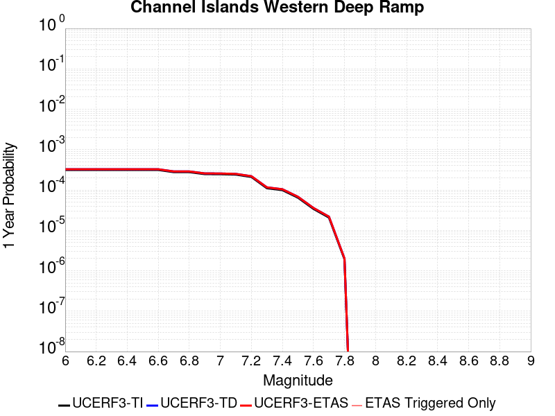 |  |

| Magnitude | 1 wk TI Prob | 1 wk TD Prob | 1 wk ETAS Prob | 1 wk ETAS/TD Gain | 1 wk ETAS Triggered Only | 1 mo TI Prob | 1 mo TD Prob | 1 mo ETAS Prob | 1 mo ETAS/TD Gain | 1 mo ETAS Triggered Only | 1 yr TI Prob | 1 yr TD Prob | 1 yr ETAS Prob | 1 yr ETAS/TD Gain | 1 yr ETAS Triggered Only | 10 yr TI Prob | 10 yr TD Prob | 10 yr ETAS Prob | 10 yr ETAS/TD Gain | 10 yr ETAS Triggered Only |
|-----|-----|-----|-----|-----|-----|-----|-----|-----|-----|-----|-----|-----|-----|-----|-----|-----|-----|-----|-----|-----|
| 6.0 | 6.0213506E-6 | 6.2549975E-6 | 6.2549975E-6 | 1.0 | 0.0 | 2.5805533E-5 | 2.6806882E-5 | 2.6806882E-5 | 1.0 | 0.0 | 3.1413708E-4 | 3.2632938E-4 | 3.2632938E-4 | 1.0 | 0.0 | 0.0031369338 | 0.0032589433 | 0.0032689108 | 1.0030584 | 1.0E-5 |
| 6.1 | 6.0213506E-6 | 6.2549975E-6 | 6.2549975E-6 | 1.0 | 0.0 | 2.5805533E-5 | 2.6806882E-5 | 2.6806882E-5 | 1.0 | 0.0 | 3.1413708E-4 | 3.2632938E-4 | 3.2632938E-4 | 1.0 | 0.0 | 0.0031369338 | 0.0032589433 | 0.0032689108 | 1.0030584 | 1.0E-5 |
| 6.2 | 6.0213506E-6 | 6.2549975E-6 | 6.2549975E-6 | 1.0 | 0.0 | 2.5805533E-5 | 2.6806882E-5 | 2.6806882E-5 | 1.0 | 0.0 | 3.1413708E-4 | 3.2632938E-4 | 3.2632938E-4 | 1.0 | 0.0 | 0.0031369338 | 0.0032589433 | 0.0032689108 | 1.0030584 | 1.0E-5 |
| 6.3 | 6.0213506E-6 | 6.2549975E-6 | 6.2549975E-6 | 1.0 | 0.0 | 2.5805533E-5 | 2.6806882E-5 | 2.6806882E-5 | 1.0 | 0.0 | 3.1413708E-4 | 3.2632938E-4 | 3.2632938E-4 | 1.0 | 0.0 | 0.0031369338 | 0.0032589433 | 0.0032689108 | 1.0030584 | 1.0E-5 |
| 6.4 | 6.0213506E-6 | 6.2549975E-6 | 6.2549975E-6 | 1.0 | 0.0 | 2.5805533E-5 | 2.6806882E-5 | 2.6806882E-5 | 1.0 | 0.0 | 3.1413708E-4 | 3.2632938E-4 | 3.2632938E-4 | 1.0 | 0.0 | 0.0031369338 | 0.0032589433 | 0.0032689108 | 1.0030584 | 1.0E-5 |
| 6.5 | 6.0213506E-6 | 6.2549975E-6 | 6.2549975E-6 | 1.0 | 0.0 | 2.5805533E-5 | 2.6806882E-5 | 2.6806882E-5 | 1.0 | 0.0 | 3.1413708E-4 | 3.2632938E-4 | 3.2632938E-4 | 1.0 | 0.0 | 0.0031369338 | 0.0032589433 | 0.0032689108 | 1.0030584 | 1.0E-5 |
| 6.6 | 6.0213506E-6 | 6.2549975E-6 | 6.2549975E-6 | 1.0 | 0.0 | 2.5805533E-5 | 2.6806882E-5 | 2.6806882E-5 | 1.0 | 0.0 | 3.1413708E-4 | 3.2632938E-4 | 3.2632938E-4 | 1.0 | 0.0 | 0.0031369338 | 0.0032589433 | 0.0032689108 | 1.0030584 | 1.0E-5 |
| 6.7 | 5.313309E-6 | 5.5253577E-6 | 5.5253577E-6 | 1.0 | 0.0 | 2.2771126E-5 | 2.3679913E-5 | 2.3679913E-5 | 1.0 | 0.0 | 2.772032E-4 | 2.8826887E-4 | 2.8826887E-4 | 1.0 | 0.0 | 0.0027685766 | 0.0028793528 | 0.002889324 | 1.003463 | 1.0E-5 |
| 6.8 | 5.313309E-6 | 5.5253577E-6 | 5.5253577E-6 | 1.0 | 0.0 | 2.2771126E-5 | 2.3679913E-5 | 2.3679913E-5 | 1.0 | 0.0 | 2.772032E-4 | 2.8826887E-4 | 2.8826887E-4 | 1.0 | 0.0 | 0.0027685766 | 0.0028793528 | 0.002889324 | 1.003463 | 1.0E-5 |
| 6.9 | 4.744377E-6 | 4.9395385E-6 | 4.9395385E-6 | 1.0 | 0.0 | 2.0332885E-5 | 2.11693E-5 | 2.11693E-5 | 1.0 | 0.0 | 2.4752476E-4 | 2.5770947E-4 | 2.5770947E-4 | 1.0 | 0.0 | 0.0024724922 | 0.0025744736 | 0.0025844479 | 1.0038743 | 1.0E-5 |
| 7.0 | 4.722209E-6 | 4.9165806E-6 | 4.9165806E-6 | 1.0 | 0.0 | 2.0237881E-5 | 2.1070911E-5 | 2.1070911E-5 | 1.0 | 0.0 | 2.4636835E-4 | 2.5651188E-4 | 2.5651188E-4 | 1.0 | 0.0 | 0.002460954 | 0.0025625252 | 0.0025724997 | 1.0038924 | 1.0E-5 |
| 7.1 | 4.611174E-6 | 4.8015145E-6 | 4.8015145E-6 | 1.0 | 0.0 | 1.9762025E-5 | 2.0577778E-5 | 2.0577778E-5 | 1.0 | 0.0 | 2.4057609E-4 | 2.5050936E-4 | 2.5050936E-4 | 1.0 | 0.0 | 0.002403158 | 0.0025026368 | 0.0025126117 | 1.0039858 | 1.0E-5 |
| 7.2 | 4.043994E-6 | 4.2121196E-6 | 4.2121196E-6 | 1.0 | 0.0 | 1.7331287E-5 | 1.8051836E-5 | 1.8051836E-5 | 1.0 | 0.0 | 2.10988E-4 | 2.1976251E-4 | 2.1976251E-4 | 1.0 | 0.0 | 0.002107878 | 0.0021958028 | 0.0022057807 | 1.0045441 | 1.0E-5 |
| 7.3 | 2.1233036E-6 | 2.2298468E-6 | 2.2298468E-6 | 1.0 | 0.0 | 9.099841E-6 | 9.556452E-6 | 9.556452E-6 | 1.0 | 0.0 | 1.1078493E-4 | 1.1634364E-4 | 1.1634364E-4 | 1.0 | 0.0 | 0.0011072971 | 0.0011628328 | 0.0011728213 | 1.0085897 | 1.0E-5 |
| 7.4 | 1.9051884E-6 | 2.001551E-6 | 2.001551E-6 | 1.0 | 0.0 | 8.165067E-6 | 8.5780475E-6 | 8.5780475E-6 | 1.0 | 0.0 | 9.940516E-5 | 1.0443278E-4 | 1.0443278E-4 | 1.0 | 0.0 | 9.93607E-4 | 0.0010438423 | 0.0010538319 | 1.00957 | 1.0E-5 |
| 7.5 | 1.2408497E-6 | 1.3039191E-6 | 1.3039191E-6 | 1.0 | 0.0 | 5.317916E-6 | 5.588213E-6 | 5.588213E-6 | 1.0 | 0.0 | 6.4743705E-5 | 6.803439E-5 | 6.803439E-5 | 1.0 | 0.0 | 6.4724847E-4 | 6.801378E-4 | 6.90131E-4 | 1.0146929 | 1.0E-5 |
| 7.6 | 6.5440025E-7 | 6.88691E-7 | 6.88691E-7 | 1.0 | 0.0 | 2.8045695E-6 | 2.9515295E-6 | 2.9515295E-6 | 1.0 | 0.0 | 3.4145098E-5 | 3.5934292E-5 | 3.5934292E-5 | 1.0 | 0.0 | 3.4139853E-4 | 3.5928623E-4 | 3.6928264E-4 | 1.027823 | 1.0E-5 |
| 7.7 | 3.985963E-7 | 4.1931946E-7 | 4.1931946E-7 | 1.0 | 0.0 | 1.7082689E-6 | 1.7970822E-6 | 1.7970822E-6 | 1.0 | 0.0 | 2.0797976E-5 | 2.1879268E-5 | 2.1879268E-5 | 1.0 | 0.0 | 2.0796029E-4 | 2.187723E-4 | 2.2877012E-4 | 1.0456996 | 1.0E-5 |
| 7.8 | 3.706329E-8 | 3.859264E-8 | 3.859264E-8 | 1.0 | 0.0 | 1.5884267E-7 | 1.6539701E-7 | 1.6539701E-7 | 1.0 | 0.0 | 1.9339077E-6 | 2.013707E-6 | 2.013707E-6 | 1.0 | 0.0 | 1.933891E-5 | 2.0136898E-5 | 2.0136898E-5 | 1.0 | 0.0 |

## Simi-Santa Rosa
*[(top)](#table-of-contents)*

| 1 Week | 1 Month | 1 Year | 10 Year |
|-----|-----|-----|-----|
|  |  | 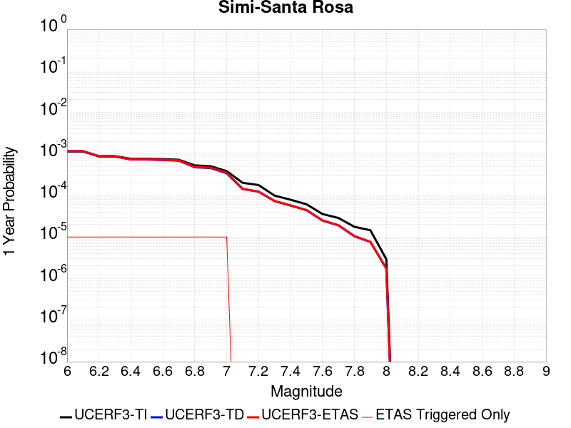 |  |

| Magnitude | 1 wk TI Prob | 1 wk TD Prob | 1 wk ETAS Prob | 1 wk ETAS/TD Gain | 1 wk ETAS Triggered Only | 1 mo TI Prob | 1 mo TD Prob | 1 mo ETAS Prob | 1 mo ETAS/TD Gain | 1 mo ETAS Triggered Only | 1 yr TI Prob | 1 yr TD Prob | 1 yr ETAS Prob | 1 yr ETAS/TD Gain | 1 yr ETAS Triggered Only | 10 yr TI Prob | 10 yr TD Prob | 10 yr ETAS Prob | 10 yr ETAS/TD Gain | 10 yr ETAS Triggered Only |
|-----|-----|-----|-----|-----|-----|-----|-----|-----|-----|-----|-----|-----|-----|-----|-----|-----|-----|-----|-----|-----|
| 6.0 | 2.198912E-5 | 2.2277021E-5 | 2.2277021E-5 | 1.0 | 0.0 | 9.4235686E-5 | 9.54697E-5 | 1.05468745E-4 | 1.1047353 | 1.0E-5 | 0.0011467156 | 0.0011617676 | 0.0011717561 | 1.0085976 | 1.0E-5 | 0.011408163 | 0.01156139 | 0.011581159 | 1.0017099 | 2.0E-5 |
| 6.1 | 2.198912E-5 | 2.2277021E-5 | 2.2277021E-5 | 1.0 | 0.0 | 9.4235686E-5 | 9.54697E-5 | 1.05468745E-4 | 1.1047353 | 1.0E-5 | 0.0011467156 | 0.0011617676 | 0.0011717561 | 1.0085976 | 1.0E-5 | 0.011408163 | 0.01156139 | 0.011581159 | 1.0017099 | 2.0E-5 |
| 6.2 | 1.69983E-5 | 1.666977E-5 | 1.666977E-5 | 1.0 | 0.0 | 7.284782E-5 | 7.144008E-5 | 8.1439364E-5 | 1.1399674 | 1.0E-5 | 8.865613E-4 | 8.694651E-4 | 8.794564E-4 | 1.0114913 | 1.0E-5 | 0.008830327 | 0.008663555 | 0.008683382 | 1.0022886 | 2.0E-5 |
| 6.3 | 1.69983E-5 | 1.666977E-5 | 1.666977E-5 | 1.0 | 0.0 | 7.284782E-5 | 7.144008E-5 | 8.1439364E-5 | 1.1399674 | 1.0E-5 | 8.865613E-4 | 8.694651E-4 | 8.794564E-4 | 1.0114913 | 1.0E-5 | 0.008830327 | 0.008663555 | 0.008683382 | 1.0022886 | 2.0E-5 |
| 6.4 | 1.4666188E-5 | 1.4053585E-5 | 1.4053585E-5 | 1.0 | 0.0 | 6.285358E-5 | 6.02284E-5 | 7.02278E-5 | 1.1660247 | 1.0E-5 | 7.6497364E-4 | 7.3305896E-4 | 7.4305164E-4 | 1.0136315 | 1.0E-5 | 0.0076234564 | 0.0073088845 | 0.007328738 | 1.0027164 | 2.0E-5 |
| 6.5 | 1.4666188E-5 | 1.4053585E-5 | 1.4053585E-5 | 1.0 | 0.0 | 6.285358E-5 | 6.02284E-5 | 7.02278E-5 | 1.1660247 | 1.0E-5 | 7.6497364E-4 | 7.3305896E-4 | 7.4305164E-4 | 1.0136315 | 1.0E-5 | 0.0076234564 | 0.0073088845 | 0.007328738 | 1.0027164 | 2.0E-5 |
| 6.6 | 1.4377586E-5 | 1.3730604E-5 | 1.3730604E-5 | 1.0 | 0.0 | 6.1616774E-5 | 5.884426E-5 | 6.884367E-5 | 1.1699301 | 1.0E-5 | 7.4992597E-4 | 7.1621826E-4 | 7.2621106E-4 | 1.0139523 | 1.0E-5 | 0.007474003 | 0.007141568 | 0.0071614254 | 1.0027806 | 2.0E-5 |
| 6.7 | 1.3881404E-5 | 1.320854E-5 | 1.320854E-5 | 1.0 | 0.0 | 5.9490372E-5 | 5.6606936E-5 | 6.660637E-5 | 1.1766468 | 1.0E-5 | 7.240546E-4 | 6.889962E-4 | 6.989894E-4 | 1.0145038 | 1.0E-5 | 0.007217 | 0.0068710507 | 0.0068909135 | 1.0028907 | 2.0E-5 |
| 6.8 | 1.0176516E-5 | 9.154869E-6 | 9.154869E-6 | 1.0 | 0.0 | 4.3612912E-5 | 3.9234656E-5 | 4.9234262E-5 | 1.2548667 | 1.0E-5 | 5.308578E-4 | 4.7759383E-4 | 4.8758904E-4 | 1.0209283 | 1.0E-5 | 0.0052959146 | 0.004767308 | 0.00477726 | 1.0020876 | 1.0E-5 |
| 6.9 | 9.699797E-6 | 8.775409E-6 | 8.775409E-6 | 1.0 | 0.0 | 4.15699E-5 | 3.7608446E-5 | 4.760807E-5 | 1.2658877 | 1.0E-5 | 5.05996E-4 | 4.5780305E-4 | 4.677985E-4 | 1.0218334 | 1.0E-5 | 0.005048454 | 0.004570218 | 0.0045801722 | 1.0021781 | 1.0E-5 |
| 7.0 | 7.4049476E-6 | 6.559854E-6 | 6.559854E-6 | 1.0 | 0.0 | 3.1735104E-5 | 2.8113427E-5 | 3.8113147E-5 | 1.3556919 | 1.0E-5 | 3.8630638E-4 | 3.4223986E-4 | 3.5223644E-4 | 1.0292093 | 1.0E-5 | 0.0038563553 | 0.0034183706 | 0.0034283365 | 1.0029154 | 1.0E-5 |
| 7.1 | 3.873439E-6 | 2.75975E-6 | 2.75975E-6 | 1.0 | 0.0 | 1.6600346E-5 | 1.1827447E-5 | 1.1827447E-5 | 1.0 | 0.0 | 2.0209046E-4 | 1.4398989E-4 | 1.4398989E-4 | 1.0 | 0.0 | 0.0020190678 | 0.0014389895 | 0.0014389895 | 1.0 | 0.0 |
| 7.2 | 3.417706E-6 | 2.367868E-6 | 2.367868E-6 | 1.0 | 0.0 | 1.4647229E-5 | 1.0147968E-5 | 1.0147968E-5 | 1.0 | 0.0 | 1.7831543E-4 | 1.2354473E-4 | 1.2354473E-4 | 1.0 | 0.0 | 0.0017817242 | 0.0012347827 | 0.0012347827 | 1.0 | 0.0 |
| 7.3 | 1.90225E-6 | 1.4075636E-6 | 1.4075636E-6 | 1.0 | 0.0 | 8.152474E-6 | 6.0324014E-6 | 6.0324014E-6 | 1.0 | 0.0 | 9.9251854E-5 | 7.344203E-5 | 7.344203E-5 | 1.0 | 0.0 | 9.920754E-4 | 7.3417986E-4 | 7.3417986E-4 | 1.0 | 0.0 |
| 7.4 | 1.5170556E-6 | 1.102654E-6 | 1.102654E-6 | 1.0 | 0.0 | 6.5016507E-6 | 4.7256517E-6 | 4.7256517E-6 | 1.0 | 0.0 | 7.915472E-5 | 5.75333E-5 | 5.75333E-5 | 1.0 | 0.0 | 7.9126534E-4 | 5.751852E-4 | 5.751852E-4 | 1.0 | 0.0 |
| 7.5 | 1.178732E-6 | 8.5367844E-7 | 8.5367844E-7 | 1.0 | 0.0 | 5.0516987E-6 | 3.6586166E-6 | 3.6586166E-6 | 1.0 | 0.0 | 6.1502695E-5 | 4.4542758E-5 | 4.4542758E-5 | 1.0 | 0.0 | 6.148568E-4 | 4.4533925E-4 | 4.4533925E-4 | 1.0 | 0.0 |
| 7.6 | 6.8722386E-7 | 4.7947464E-7 | 4.7947464E-7 | 1.0 | 0.0 | 2.9452417E-6 | 2.0548896E-6 | 2.0548896E-6 | 1.0 | 0.0 | 3.5857727E-5 | 2.5017995E-5 | 2.5017995E-5 | 1.0 | 0.0 | 3.5851944E-4 | 2.501519E-4 | 2.501519E-4 | 1.0 | 0.0 |
| 7.7 | 5.5126515E-7 | 3.6746107E-7 | 3.6746107E-7 | 1.0 | 0.0 | 2.3625628E-6 | 1.5748323E-6 | 1.5748323E-6 | 1.0 | 0.0 | 2.8763823E-5 | 1.9173414E-5 | 1.9173414E-5 | 1.0 | 0.0 | 2.87601E-4 | 1.9171771E-4 | 1.9171771E-4 | 1.0 | 0.0 |
| 7.8 | 3.3860243E-7 | 2.008429E-7 | 2.008429E-7 | 1.0 | 0.0 | 1.4511525E-6 | 8.60755E-7 | 8.60755E-7 | 1.0 | 0.0 | 1.7667637E-5 | 1.0479643E-5 | 1.0479643E-5 | 1.0 | 0.0 | 1.7666233E-4 | 1.04791536E-4 | 1.04791536E-4 | 1.0 | 0.0 |
| 7.9 | 2.7955386E-7 | 1.4656874E-7 | 1.4656874E-7 | 1.0 | 0.0 | 1.1980875E-6 | 6.281516E-7 | 6.281516E-7 | 1.0 | 0.0 | 1.4586617E-5 | 7.647719E-6 | 7.647719E-6 | 1.0 | 0.0 | 1.458566E-4 | 7.64746E-5 | 7.64746E-5 | 1.0 | 0.0 |
| 8.0 | 5.6259015E-8 | 3.336323E-8 | 3.336323E-8 | 1.0 | 0.0 | 2.4111003E-7 | 1.4298526E-7 | 1.4298526E-7 | 1.0 | 0.0 | 2.9355108E-6 | 1.7408443E-6 | 1.7408443E-6 | 1.0 | 0.0 | 2.935472E-5 | 1.740832E-5 | 1.740832E-5 | 1.0 | 0.0 |

## Kern Canyon (South Kern) 2011
*[(top)](#table-of-contents)*

| 1 Week | 1 Month | 1 Year | 10 Year |
|-----|-----|-----|-----|
|  |  |  | 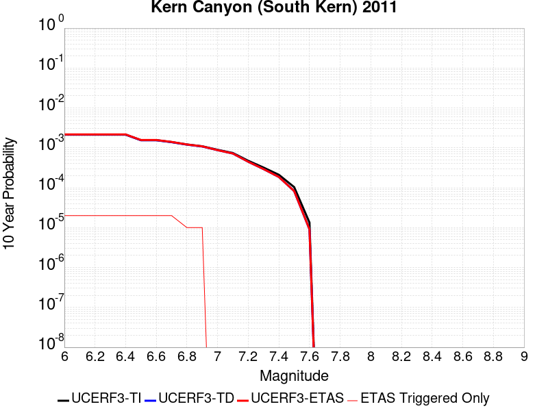 |

| Magnitude | 1 wk TI Prob | 1 wk TD Prob | 1 wk ETAS Prob | 1 wk ETAS/TD Gain | 1 wk ETAS Triggered Only | 1 mo TI Prob | 1 mo TD Prob | 1 mo ETAS Prob | 1 mo ETAS/TD Gain | 1 mo ETAS Triggered Only | 1 yr TI Prob | 1 yr TD Prob | 1 yr ETAS Prob | 1 yr ETAS/TD Gain | 1 yr ETAS Triggered Only | 10 yr TI Prob | 10 yr TD Prob | 10 yr ETAS Prob | 10 yr ETAS/TD Gain | 10 yr ETAS Triggered Only |
|-----|-----|-----|-----|-----|-----|-----|-----|-----|-----|-----|-----|-----|-----|-----|-----|-----|-----|-----|-----|-----|
| 6.0 | 4.105075E-6 | 4.1137673E-6 | 4.1137673E-6 | 1.0 | 0.0 | 1.7593058E-5 | 1.7630315E-5 | 1.7630315E-5 | 1.0 | 0.0 | 2.1417443E-4 | 2.1462858E-4 | 2.2462645E-4 | 1.0465821 | 1.0E-5 | 0.0021396813 | 0.0021442769 | 0.002164234 | 1.0093071 | 2.0E-5 |
| 6.1 | 4.105075E-6 | 4.1137673E-6 | 4.1137673E-6 | 1.0 | 0.0 | 1.7593058E-5 | 1.7630315E-5 | 1.7630315E-5 | 1.0 | 0.0 | 2.1417443E-4 | 2.1462858E-4 | 2.2462645E-4 | 1.0465821 | 1.0E-5 | 0.0021396813 | 0.0021442769 | 0.002164234 | 1.0093071 | 2.0E-5 |
| 6.2 | 4.105075E-6 | 4.1137673E-6 | 4.1137673E-6 | 1.0 | 0.0 | 1.7593058E-5 | 1.7630315E-5 | 1.7630315E-5 | 1.0 | 0.0 | 2.1417443E-4 | 2.1462858E-4 | 2.2462645E-4 | 1.0465821 | 1.0E-5 | 0.0021396813 | 0.0021442769 | 0.002164234 | 1.0093071 | 2.0E-5 |
| 6.3 | 4.105075E-6 | 4.1137673E-6 | 4.1137673E-6 | 1.0 | 0.0 | 1.7593058E-5 | 1.7630315E-5 | 1.7630315E-5 | 1.0 | 0.0 | 2.1417443E-4 | 2.1462858E-4 | 2.2462645E-4 | 1.0465821 | 1.0E-5 | 0.0021396813 | 0.0021442769 | 0.002164234 | 1.0093071 | 2.0E-5 |
| 6.4 | 4.105075E-6 | 4.1137673E-6 | 4.1137673E-6 | 1.0 | 0.0 | 1.7593058E-5 | 1.7630315E-5 | 1.7630315E-5 | 1.0 | 0.0 | 2.1417443E-4 | 2.1462858E-4 | 2.2462645E-4 | 1.0465821 | 1.0E-5 | 0.0021396813 | 0.0021442769 | 0.002164234 | 1.0093071 | 2.0E-5 |
| 6.5 | 2.9849807E-6 | 2.9731846E-6 | 2.9731846E-6 | 1.0 | 0.0 | 1.2792712E-5 | 1.2742158E-5 | 1.2742158E-5 | 1.0 | 0.0 | 1.5574014E-4 | 1.5512487E-4 | 1.6512333E-4 | 1.0644542 | 1.0E-5 | 0.0015563103 | 0.0015501811 | 0.0015701501 | 1.0128818 | 2.0E-5 |
| 6.6 | 2.9849807E-6 | 2.9731846E-6 | 2.9731846E-6 | 1.0 | 0.0 | 1.2792712E-5 | 1.2742158E-5 | 1.2742158E-5 | 1.0 | 0.0 | 1.5574014E-4 | 1.5512487E-4 | 1.6512333E-4 | 1.0644542 | 1.0E-5 | 0.0015563103 | 0.0015501811 | 0.0015701501 | 1.0128818 | 2.0E-5 |
| 6.7 | 2.6756725E-6 | 2.6582475E-6 | 2.6582475E-6 | 1.0 | 0.0 | 1.1467117E-5 | 1.139244E-5 | 1.139244E-5 | 1.0 | 0.0 | 1.396032E-4 | 1.3869423E-4 | 1.4869285E-4 | 1.0720911 | 1.0E-5 | 0.0013951553 | 0.0013860877 | 0.00140606 | 1.0144091 | 2.0E-5 |
| 6.8 | 2.3283721E-6 | 2.3048021E-6 | 2.3048021E-6 | 1.0 | 0.0 | 9.9787E-6 | 9.877686E-6 | 9.877686E-6 | 1.0 | 0.0 | 1.214839E-4 | 1.2025428E-4 | 1.3025307E-4 | 1.0831472 | 1.0E-5 | 0.001214175 | 0.0012018995 | 0.0012118875 | 1.0083102 | 1.0E-5 |
| 6.9 | 2.0972677E-6 | 2.0696623E-6 | 2.0696623E-6 | 1.0 | 0.0 | 8.988259E-6 | 8.869952E-6 | 8.869952E-6 | 1.0 | 0.0 | 1.0942656E-4 | 1.07986365E-4 | 1.17985284E-4 | 1.0925943 | 1.0E-5 | 0.0010937268 | 0.0010793448 | 0.001089334 | 1.0092549 | 1.0E-5 |
| 7.0 | 1.7132242E-6 | 1.6787211E-6 | 1.6787211E-6 | 1.0 | 0.0 | 7.3423685E-6 | 7.194499E-6 | 7.194499E-6 | 1.0 | 0.0 | 8.938967E-5 | 8.758954E-5 | 8.758954E-5 | 1.0 | 0.0 | 8.935372E-4 | 8.7555405E-4 | 8.7555405E-4 | 1.0 | 0.0 |
| 7.1 | 1.4215541E-6 | 1.3815898E-6 | 1.3815898E-6 | 1.0 | 0.0 | 6.0923603E-6 | 5.9210856E-6 | 5.9210856E-6 | 1.0 | 0.0 | 7.417196E-5 | 7.208686E-5 | 7.208686E-5 | 1.0 | 0.0 | 7.414721E-4 | 7.2063744E-4 | 7.2063744E-4 | 1.0 | 0.0 |
| 7.2 | 9.097853E-7 | 8.60387E-7 | 8.60387E-7 | 1.0 | 0.0 | 3.899074E-6 | 3.6873678E-6 | 3.6873678E-6 | 1.0 | 0.0 | 4.7470192E-5 | 4.489279E-5 | 4.489279E-5 | 1.0 | 0.0 | 4.7460053E-4 | 4.4883828E-4 | 4.4883828E-4 | 1.0 | 0.0 |
| 7.3 | 6.144169E-7 | 5.62827E-7 | 5.62827E-7 | 1.0 | 0.0 | 2.6332125E-6 | 2.4121134E-6 | 2.4121134E-6 | 1.0 | 0.0 | 3.205889E-5 | 2.9367091E-5 | 2.9367091E-5 | 1.0 | 0.0 | 3.2054266E-4 | 2.936326E-4 | 2.936326E-4 | 1.0 | 0.0 |
| 7.4 | 4.049844E-7 | 3.5728738E-7 | 3.5728738E-7 | 1.0 | 0.0 | 1.7356463E-6 | 1.5312307E-6 | 1.5312307E-6 | 1.0 | 0.0 | 2.1131287E-5 | 1.8642577E-5 | 1.8642577E-5 | 1.0 | 0.0 | 2.1129279E-4 | 1.8641038E-4 | 1.8641038E-4 | 1.0 | 0.0 |
| 7.5 | 1.9871162E-7 | 1.5830643E-7 | 1.5830643E-7 | 1.0 | 0.0 | 8.5162094E-7 | 6.78456E-7 | 6.78456E-7 | 1.0 | 0.0 | 1.0368436E-5 | 8.260171E-6 | 8.260171E-6 | 1.0 | 0.0 | 1.0367952E-4 | 8.259873E-5 | 8.259873E-5 | 1.0 | 0.0 |
| 7.6 | 2.572245E-8 | 1.7353019E-8 | 1.7353019E-8 | 1.0 | 0.0 | 1.10239064E-7 | 7.437008E-8 | 7.437008E-8 | 1.0 | 0.0 | 1.3421597E-6 | 9.054554E-7 | 9.054554E-7 | 1.0 | 0.0 | 1.3421517E-5 | 9.054523E-6 | 9.054523E-6 | 1.0 | 0.0 |

## Del Valle
*[(top)](#table-of-contents)*

| 1 Week | 1 Month | 1 Year | 10 Year |
|-----|-----|-----|-----|
|  |  |  | 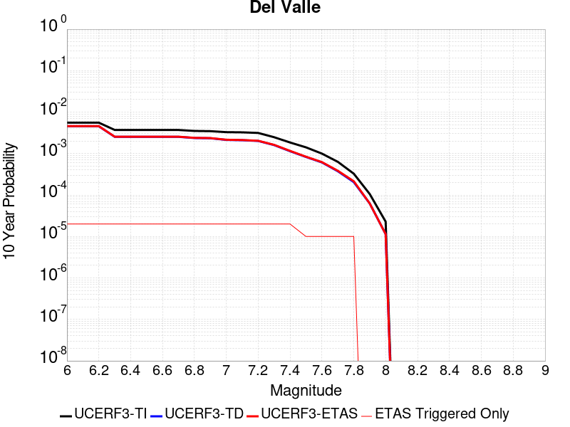 |

| Magnitude | 1 wk TI Prob | 1 wk TD Prob | 1 wk ETAS Prob | 1 wk ETAS/TD Gain | 1 wk ETAS Triggered Only | 1 mo TI Prob | 1 mo TD Prob | 1 mo ETAS Prob | 1 mo ETAS/TD Gain | 1 mo ETAS Triggered Only | 1 yr TI Prob | 1 yr TD Prob | 1 yr ETAS Prob | 1 yr ETAS/TD Gain | 1 yr ETAS Triggered Only | 10 yr TI Prob | 10 yr TD Prob | 10 yr ETAS Prob | 10 yr ETAS/TD Gain | 10 yr ETAS Triggered Only |
|-----|-----|-----|-----|-----|-----|-----|-----|-----|-----|-----|-----|-----|-----|-----|-----|-----|-----|-----|-----|-----|
| 6.0 | 1.0716125E-5 | 8.768545E-6 | 8.768545E-6 | 1.0 | 0.0 | 4.592544E-5 | 3.7579048E-5 | 4.7578673E-5 | 1.2660958 | 1.0E-5 | 5.589988E-4 | 4.574486E-4 | 4.7743946E-4 | 1.0437008 | 2.0E-5 | 0.0055759475 | 0.004567024 | 0.0045869322 | 1.0043592 | 2.0E-5 |
| 6.1 | 1.0716125E-5 | 8.768545E-6 | 8.768545E-6 | 1.0 | 0.0 | 4.592544E-5 | 3.7579048E-5 | 4.7578673E-5 | 1.2660958 | 1.0E-5 | 5.589988E-4 | 4.574486E-4 | 4.7743946E-4 | 1.0437008 | 2.0E-5 | 0.0055759475 | 0.004567024 | 0.0045869322 | 1.0043592 | 2.0E-5 |
| 6.2 | 1.0716125E-5 | 8.768545E-6 | 8.768545E-6 | 1.0 | 0.0 | 4.592544E-5 | 3.7579048E-5 | 4.7578673E-5 | 1.2660958 | 1.0E-5 | 5.589988E-4 | 4.574486E-4 | 4.7743946E-4 | 1.0437008 | 2.0E-5 | 0.0055759475 | 0.004567024 | 0.0045869322 | 1.0043592 | 2.0E-5 |
| 6.3 | 7.1293784E-6 | 4.8663037E-6 | 4.8663037E-6 | 1.0 | 0.0 | 3.055412E-5 | 2.0855425E-5 | 3.0855215E-5 | 1.4794816 | 1.0E-5 | 3.7193293E-4 | 2.5388596E-4 | 2.7388087E-4 | 1.0787555 | 2.0E-5 | 0.0037131102 | 0.002536044 | 0.0025559932 | 1.0078663 | 2.0E-5 |
| 6.4 | 7.1293784E-6 | 4.8663037E-6 | 4.8663037E-6 | 1.0 | 0.0 | 3.055412E-5 | 2.0855425E-5 | 3.0855215E-5 | 1.4794816 | 1.0E-5 | 3.7193293E-4 | 2.5388596E-4 | 2.7388087E-4 | 1.0787555 | 2.0E-5 | 0.0037131102 | 0.002536044 | 0.0025559932 | 1.0078663 | 2.0E-5 |
| 6.5 | 7.1293784E-6 | 4.8663037E-6 | 4.8663037E-6 | 1.0 | 0.0 | 3.055412E-5 | 2.0855425E-5 | 3.0855215E-5 | 1.4794816 | 1.0E-5 | 3.7193293E-4 | 2.5388596E-4 | 2.7388087E-4 | 1.0787555 | 2.0E-5 | 0.0037131102 | 0.002536044 | 0.0025559932 | 1.0078663 | 2.0E-5 |
| 6.6 | 7.1293784E-6 | 4.8663037E-6 | 4.8663037E-6 | 1.0 | 0.0 | 3.055412E-5 | 2.0855425E-5 | 3.0855215E-5 | 1.4794816 | 1.0E-5 | 3.7193293E-4 | 2.5388596E-4 | 2.7388087E-4 | 1.0787555 | 2.0E-5 | 0.0037131102 | 0.002536044 | 0.0025559932 | 1.0078663 | 2.0E-5 |
| 6.7 | 7.12272E-6 | 4.863679E-6 | 4.863679E-6 | 1.0 | 0.0 | 3.0525585E-5 | 2.0844176E-5 | 3.0843967E-5 | 1.4797403 | 1.0E-5 | 3.7158563E-4 | 2.5374902E-4 | 2.7374396E-4 | 1.078798 | 2.0E-5 | 0.003709649 | 0.002534678 | 0.0025546274 | 1.0078706 | 2.0E-5 |
| 6.8 | 6.7558703E-6 | 4.55986E-6 | 4.55986E-6 | 1.0 | 0.0 | 2.895341E-5 | 1.9542113E-5 | 2.9541918E-5 | 1.5117054 | 1.0E-5 | 3.5245073E-4 | 2.3789989E-4 | 2.5789512E-4 | 1.084049 | 2.0E-5 | 0.0035189227 | 0.0023765266 | 0.002396479 | 1.0083957 | 2.0E-5 |
| 6.9 | 6.6700386E-6 | 4.5029883E-6 | 4.5029883E-6 | 1.0 | 0.0 | 2.8585566E-5 | 1.9298383E-5 | 2.929819E-5 | 1.5181681 | 1.0E-5 | 3.479737E-4 | 2.349331E-4 | 2.549284E-4 | 1.0851107 | 2.0E-5 | 0.003474293 | 0.0023469215 | 0.0023668746 | 1.0085018 | 2.0E-5 |
| 7.0 | 6.3181424E-6 | 4.099119E-6 | 4.099119E-6 | 1.0 | 0.0 | 2.7077473E-5 | 1.7567538E-5 | 2.7567361E-5 | 1.5692217 | 1.0E-5 | 3.2961834E-4 | 2.138642E-4 | 2.3385993E-4 | 1.0934973 | 2.0E-5 | 0.0032912986 | 0.0021366377 | 0.002156595 | 1.0093405 | 2.0E-5 |
| 7.1 | 6.248759E-6 | 4.034304E-6 | 4.034304E-6 | 1.0 | 0.0 | 2.678012E-5 | 1.7289762E-5 | 2.7289589E-5 | 1.578367 | 1.0E-5 | 3.2599916E-4 | 2.1048293E-4 | 2.3047873E-4 | 1.0949996 | 2.0E-5 | 0.0032552136 | 0.0021028894 | 0.0021228474 | 1.0094907 | 2.0E-5 |
| 7.2 | 6.0411944E-6 | 3.8702806E-6 | 3.8702806E-6 | 1.0 | 0.0 | 2.5890577E-5 | 1.6586813E-5 | 2.6586647E-5 | 1.6028786 | 1.0E-5 | 3.1517216E-4 | 2.0192616E-4 | 2.2192212E-4 | 1.0990261 | 2.0E-5 | 0.0031472554 | 0.0020174794 | 0.002037439 | 1.0098934 | 2.0E-5 |
| 7.3 | 4.7691183E-6 | 3.0783858E-6 | 3.0783858E-6 | 1.0 | 0.0 | 2.0438918E-5 | 1.3193017E-5 | 2.3192884E-5 | 1.7579668 | 1.0E-5 | 2.488154E-4 | 1.6061336E-4 | 1.8061015E-4 | 1.1245027 | 2.0E-5 | 0.00248537 | 0.0016050109 | 0.0016249788 | 1.0124409 | 2.0E-5 |
| 7.4 | 3.5524722E-6 | 2.1895319E-6 | 2.1895319E-6 | 1.0 | 0.0 | 1.5224792E-5 | 9.383675E-6 | 1.938358E-5 | 2.0656705 | 1.0E-5 | 1.8534607E-4 | 1.14240334E-4 | 1.3423806E-4 | 1.1750495 | 2.0E-5 | 0.0018519156 | 0.0011418243 | 0.0011618015 | 1.0174959 | 2.0E-5 |
| 7.5 | 2.7133442E-6 | 1.5917523E-6 | 1.5917523E-6 | 1.0 | 0.0 | 1.1628566E-5 | 6.821778E-6 | 6.821778E-6 | 1.0 | 0.0 | 1.415686E-4 | 8.3052E-5 | 9.305117E-5 | 1.1203965 | 1.0E-5 | 0.0014147845 | 8.302115E-4 | 8.402032E-4 | 1.0120351 | 1.0E-5 |
| 7.6 | 1.915338E-6 | 1.1740236E-6 | 1.1740236E-6 | 1.0 | 0.0 | 8.208566E-6 | 5.0315202E-6 | 5.0315202E-6 | 1.0 | 0.0 | 9.993471E-5 | 6.1257044E-5 | 7.125643E-5 | 1.1632365 | 1.0E-5 | 9.988978E-4 | 6.124025E-4 | 6.223964E-4 | 1.0163192 | 1.0E-5 |
| 7.7 | 1.2120448E-6 | 7.1810405E-7 | 7.1810405E-7 | 1.0 | 0.0 | 5.194467E-6 | 3.077585E-6 | 3.077585E-6 | 1.0 | 0.0 | 6.3240805E-5 | 3.746896E-5 | 4.7468584E-5 | 1.2668777 | 1.0E-5 | 6.322281E-4 | 3.7462678E-4 | 3.8462304E-4 | 1.0266832 | 1.0E-5 |
| 7.8 | 6.272381E-7 | 3.9329194E-7 | 3.9329194E-7 | 1.0 | 0.0 | 2.6881603E-6 | 1.6855358E-6 | 1.6855358E-6 | 1.0 | 0.0 | 3.272786E-5 | 2.0521207E-5 | 3.0521E-5 | 1.4872907 | 1.0E-5 | 3.272304E-4 | 2.0519328E-4 | 2.1519122E-4 | 1.0487245 | 1.0E-5 |
| 7.9 | 2.0292627E-7 | 1.2005809E-7 | 1.2005809E-7 | 1.0 | 0.0 | 8.6968373E-7 | 5.145345E-7 | 5.145345E-7 | 1.0 | 0.0 | 1.0588348E-5 | 6.2644403E-6 | 6.2644403E-6 | 1.0 | 0.0 | 1.0587843E-4 | 6.2642655E-5 | 6.2642655E-5 | 1.0 | 0.0 |
| 8.0 | 4.374492E-8 | 2.1903668E-8 | 2.1903668E-8 | 1.0 | 0.0 | 1.8747821E-7 | 9.3872856E-8 | 9.3872856E-8 | 1.0 | 0.0 | 2.2825448E-6 | 1.1429015E-6 | 1.1429015E-6 | 1.0 | 0.0 | 2.2825214E-5 | 1.14289605E-5 | 1.14289605E-5 | 1.0 | 0.0 |

## Sierra Madre
*[(top)](#table-of-contents)*

| 1 Week | 1 Month | 1 Year | 10 Year |
|-----|-----|-----|-----|
|  |  |  |  |

| Magnitude | 1 wk TI Prob | 1 wk TD Prob | 1 wk ETAS Prob | 1 wk ETAS/TD Gain | 1 wk ETAS Triggered Only | 1 mo TI Prob | 1 mo TD Prob | 1 mo ETAS Prob | 1 mo ETAS/TD Gain | 1 mo ETAS Triggered Only | 1 yr TI Prob | 1 yr TD Prob | 1 yr ETAS Prob | 1 yr ETAS/TD Gain | 1 yr ETAS Triggered Only | 10 yr TI Prob | 10 yr TD Prob | 10 yr ETAS Prob | 10 yr ETAS/TD Gain | 10 yr ETAS Triggered Only |
|-----|-----|-----|-----|-----|-----|-----|-----|-----|-----|-----|-----|-----|-----|-----|-----|-----|-----|-----|-----|-----|
| 6.0 | 1.3379373E-5 | 1.10021165E-5 | 1.10021165E-5 | 1.0 | 0.0 | 5.7338908E-5 | 4.7151083E-5 | 4.7151083E-5 | 1.0 | 0.0 | 6.978776E-4 | 5.7391473E-4 | 5.83909E-4 | 1.0174142 | 1.0E-5 | 0.0069569005 | 0.005724645 | 0.005744531 | 1.0034736 | 2.0E-5 |
| 6.1 | 1.3379373E-5 | 1.10021165E-5 | 1.10021165E-5 | 1.0 | 0.0 | 5.7338908E-5 | 4.7151083E-5 | 4.7151083E-5 | 1.0 | 0.0 | 6.978776E-4 | 5.7391473E-4 | 5.83909E-4 | 1.0174142 | 1.0E-5 | 0.0069569005 | 0.005724645 | 0.005744531 | 1.0034736 | 2.0E-5 |
| 6.2 | 1.3379373E-5 | 1.10021165E-5 | 1.10021165E-5 | 1.0 | 0.0 | 5.7338908E-5 | 4.7151083E-5 | 4.7151083E-5 | 1.0 | 0.0 | 6.978776E-4 | 5.7391473E-4 | 5.83909E-4 | 1.0174142 | 1.0E-5 | 0.0069569005 | 0.005724645 | 0.005744531 | 1.0034736 | 2.0E-5 |
| 6.3 | 1.3379373E-5 | 1.10021165E-5 | 1.10021165E-5 | 1.0 | 0.0 | 5.7338908E-5 | 4.7151083E-5 | 4.7151083E-5 | 1.0 | 0.0 | 6.978776E-4 | 5.7391473E-4 | 5.83909E-4 | 1.0174142 | 1.0E-5 | 0.0069569005 | 0.005724645 | 0.005744531 | 1.0034736 | 2.0E-5 |
| 6.4 | 1.3379373E-5 | 1.10021165E-5 | 1.10021165E-5 | 1.0 | 0.0 | 5.7338908E-5 | 4.7151083E-5 | 4.7151083E-5 | 1.0 | 0.0 | 6.978776E-4 | 5.7391473E-4 | 5.83909E-4 | 1.0174142 | 1.0E-5 | 0.0069569005 | 0.005724645 | 0.005744531 | 1.0034736 | 2.0E-5 |
| 6.5 | 1.26563245E-5 | 1.0231545E-5 | 1.0231545E-5 | 1.0 | 0.0 | 5.4240263E-5 | 4.384875E-5 | 4.384875E-5 | 1.0 | 0.0 | 6.601751E-4 | 5.3372886E-4 | 5.437235E-4 | 1.0187261 | 1.0E-5 | 0.006582173 | 0.005324747 | 0.0053446405 | 1.003736 | 2.0E-5 |
| 6.6 | 1.26563245E-5 | 1.0231545E-5 | 1.0231545E-5 | 1.0 | 0.0 | 5.4240263E-5 | 4.384875E-5 | 4.384875E-5 | 1.0 | 0.0 | 6.601751E-4 | 5.3372886E-4 | 5.437235E-4 | 1.0187261 | 1.0E-5 | 0.006582173 | 0.005324747 | 0.0053446405 | 1.003736 | 2.0E-5 |
| 6.7 | 1.2502474E-5 | 1.0067684E-5 | 1.0067684E-5 | 1.0 | 0.0 | 5.3580934E-5 | 4.314651E-5 | 4.314651E-5 | 1.0 | 0.0 | 6.521526E-4 | 5.251832E-4 | 5.3517794E-4 | 1.0190309 | 1.0E-5 | 0.0065024206 | 0.0052396953 | 0.0052595907 | 1.003797 | 2.0E-5 |
| 6.8 | 1.2454966E-5 | 1.0019968E-5 | 1.0019968E-5 | 1.0 | 0.0 | 5.3377335E-5 | 4.2942018E-5 | 4.2942018E-5 | 1.0 | 0.0 | 6.4967526E-4 | 5.226947E-4 | 5.326895E-4 | 1.0191216 | 1.0E-5 | 0.006477792 | 0.0052149273 | 0.005234823 | 1.0038152 | 2.0E-5 |
| 6.9 | 1.2225574E-5 | 9.793936E-6 | 9.793936E-6 | 1.0 | 0.0 | 5.2394265E-5 | 4.1973344E-5 | 4.1973344E-5 | 1.0 | 0.0 | 6.3771347E-4 | 5.109067E-4 | 5.209016E-4 | 1.0195631 | 1.0E-5 | 0.006358865 | 0.0050975927 | 0.005117491 | 1.0039034 | 2.0E-5 |
| 7.0 | 1.182946E-5 | 9.4004645E-6 | 9.4004645E-6 | 1.0 | 0.0 | 5.06967E-5 | 4.028709E-5 | 4.028709E-5 | 1.0 | 0.0 | 6.1705755E-4 | 4.903859E-4 | 5.0038105E-4 | 1.020382 | 1.0E-5 | 0.006153469 | 0.0048933052 | 0.0049132076 | 1.0040672 | 2.0E-5 |
| 7.1 | 1.14369095E-5 | 8.987445E-6 | 8.987445E-6 | 1.0 | 0.0 | 4.9014405E-5 | 3.8517057E-5 | 3.8517057E-5 | 1.0 | 0.0 | 5.9658696E-4 | 4.6884525E-4 | 4.7884058E-4 | 1.021319 | 1.0E-5 | 0.005949879 | 0.0046788226 | 0.0046887756 | 1.0021273 | 1.0E-5 |
| 7.2 | 1.0836419E-5 | 8.400809E-6 | 8.400809E-6 | 1.0 | 0.0 | 4.644097E-5 | 3.6002977E-5 | 3.6002977E-5 | 1.0 | 0.0 | 5.652721E-4 | 4.3824897E-4 | 4.482446E-4 | 1.0228081 | 1.0E-5 | 0.0056383642 | 0.0043741004 | 0.0043840567 | 1.0022762 | 1.0E-5 |
| 7.3 | 1.0403439E-5 | 8.0220525E-6 | 8.0220525E-6 | 1.0 | 0.0 | 4.4585406E-5 | 3.4379776E-5 | 3.4379776E-5 | 1.0 | 0.0 | 5.426921E-4 | 4.184943E-4 | 4.284901E-4 | 1.0238851 | 1.0E-5 | 0.005413687 | 0.004177313 | 0.004187271 | 1.0023838 | 1.0E-5 |
| 7.4 | 9.768864E-6 | 7.415647E-6 | 7.415647E-6 | 1.0 | 0.0 | 4.186589E-5 | 3.178096E-5 | 3.178096E-5 | 1.0 | 0.0 | 5.09598E-4 | 3.868654E-4 | 3.9686152E-4 | 1.0258387 | 1.0E-5 | 0.0050843097 | 0.0038621665 | 0.003872128 | 1.0025792 | 1.0E-5 |
| 7.5 | 8.687089E-6 | 6.451198E-6 | 6.451198E-6 | 1.0 | 0.0 | 3.722985E-5 | 2.7647704E-5 | 2.7647704E-5 | 1.0 | 0.0 | 4.5317915E-4 | 3.3655966E-4 | 3.465563E-4 | 1.0297024 | 1.0E-5 | 0.004522561 | 0.0033607422 | 0.0033707086 | 1.0029656 | 1.0E-5 |
| 7.6 | 6.3506063E-6 | 4.431243E-6 | 4.431243E-6 | 1.0 | 0.0 | 2.72166E-5 | 1.8990904E-5 | 1.8990904E-5 | 1.0 | 0.0 | 3.3131172E-4 | 2.3118999E-4 | 2.4118768E-4 | 1.0432445 | 1.0E-5 | 0.003308182 | 0.0023096756 | 0.0023196524 | 1.0043197 | 1.0E-5 |
| 7.7 | 4.62223E-6 | 2.9338082E-6 | 2.9338082E-6 | 1.0 | 0.0 | 1.9809406E-5 | 1.2573403E-5 | 1.2573403E-5 | 1.0 | 0.0 | 2.4115283E-4 | 1.5307045E-4 | 1.6306892E-4 | 1.0653194 | 1.0E-5 | 0.0024089129 | 0.0015298066 | 0.0015397914 | 1.0065268 | 1.0E-5 |
| 7.8 | 3.2145008E-6 | 1.9500208E-6 | 1.9500208E-6 | 1.0 | 0.0 | 1.3776359E-5 | 8.357206E-6 | 8.357206E-6 | 1.0 | 0.0 | 1.6771426E-4 | 1.0174424E-4 | 1.1174322E-4 | 1.0982757 | 1.0E-5 | 0.0016758774 | 0.0010170741 | 0.0010270639 | 1.0098221 | 1.0E-5 |
| 7.9 | 1.0391769E-6 | 5.604198E-7 | 5.604198E-7 | 1.0 | 0.0 | 4.4536077E-6 | 2.4017968E-6 | 2.4017968E-6 | 1.0 | 0.0 | 5.4221324E-5 | 2.9241488E-5 | 2.9241488E-5 | 1.0 | 0.0 | 5.4208096E-4 | 2.9237682E-4 | 2.9237682E-4 | 1.0 | 0.0 |
| 8.0 | 1.210983E-7 | 6.615219E-8 | 6.615219E-8 | 1.0 | 0.0 | 5.1899264E-7 | 2.8350937E-7 | 2.8350937E-7 | 1.0 | 0.0 | 6.3187167E-6 | 3.451721E-6 | 3.451721E-6 | 1.0 | 0.0 | 6.318537E-5 | 3.4516695E-5 | 3.4516695E-5 | 1.0 | 0.0 |

## Owens Valley Keough Hot Springs
*[(top)](#table-of-contents)*

| 1 Week | 1 Month | 1 Year | 10 Year |
|-----|-----|-----|-----|
|  |  |  |  |

| Magnitude | 1 wk TI Prob | 1 wk TD Prob | 1 wk ETAS Prob | 1 wk ETAS/TD Gain | 1 wk ETAS Triggered Only | 1 mo TI Prob | 1 mo TD Prob | 1 mo ETAS Prob | 1 mo ETAS/TD Gain | 1 mo ETAS Triggered Only | 1 yr TI Prob | 1 yr TD Prob | 1 yr ETAS Prob | 1 yr ETAS/TD Gain | 1 yr ETAS Triggered Only | 10 yr TI Prob | 10 yr TD Prob | 10 yr ETAS Prob | 10 yr ETAS/TD Gain | 10 yr ETAS Triggered Only |
|-----|-----|-----|-----|-----|-----|-----|-----|-----|-----|-----|-----|-----|-----|-----|-----|-----|-----|-----|-----|-----|
| 6.0 | 1.5708529E-5 | 4.951135E-6 | 4.951135E-6 | 1.0 | 0.0 | 6.7320536E-5 | 2.1219006E-5 | 2.1219006E-5 | 1.0 | 0.0 | 8.193192E-4 | 2.583159E-4 | 2.583159E-4 | 1.0 | 0.0 | 0.008163051 | 0.00258083 | 0.0026007784 | 1.0077294 | 2.0E-5 |
| 6.1 | 1.5708529E-5 | 4.951135E-6 | 4.951135E-6 | 1.0 | 0.0 | 6.7320536E-5 | 2.1219006E-5 | 2.1219006E-5 | 1.0 | 0.0 | 8.193192E-4 | 2.583159E-4 | 2.583159E-4 | 1.0 | 0.0 | 0.008163051 | 0.00258083 | 0.0026007784 | 1.0077294 | 2.0E-5 |
| 6.2 | 1.5708529E-5 | 4.951135E-6 | 4.951135E-6 | 1.0 | 0.0 | 6.7320536E-5 | 2.1219006E-5 | 2.1219006E-5 | 1.0 | 0.0 | 8.193192E-4 | 2.583159E-4 | 2.583159E-4 | 1.0 | 0.0 | 0.008163051 | 0.00258083 | 0.0026007784 | 1.0077294 | 2.0E-5 |
| 6.3 | 1.5708529E-5 | 4.951135E-6 | 4.951135E-6 | 1.0 | 0.0 | 6.7320536E-5 | 2.1219006E-5 | 2.1219006E-5 | 1.0 | 0.0 | 8.193192E-4 | 2.583159E-4 | 2.583159E-4 | 1.0 | 0.0 | 0.008163051 | 0.00258083 | 0.0026007784 | 1.0077294 | 2.0E-5 |
| 6.4 | 1.4622509E-5 | 3.726917E-6 | 3.726917E-6 | 1.0 | 0.0 | 6.266639E-5 | 1.5972422E-5 | 1.5972422E-5 | 1.0 | 0.0 | 7.626962E-4 | 1.9445019E-4 | 1.9445019E-4 | 1.0 | 0.0 | 0.007600839 | 0.001943295 | 0.0019632562 | 1.0102718 | 2.0E-5 |
| 6.5 | 1.3335527E-5 | 2.2780168E-6 | 2.2780168E-6 | 1.0 | 0.0 | 5.7151006E-5 | 9.762897E-6 | 9.762897E-6 | 1.0 | 0.0 | 6.955913E-4 | 1.1885747E-4 | 1.1885747E-4 | 1.0 | 0.0 | 0.0069341804 | 0.0011881763 | 0.0012081525 | 1.0168126 | 2.0E-5 |
| 6.6 | 1.3332855E-5 | 2.275166E-6 | 2.275166E-6 | 1.0 | 0.0 | 5.7139558E-5 | 9.750679E-6 | 9.750679E-6 | 1.0 | 0.0 | 6.9545204E-4 | 1.1870873E-4 | 1.1870873E-4 | 1.0 | 0.0 | 0.0069327964 | 0.0011866905 | 0.0012066668 | 1.0168335 | 2.0E-5 |
| 6.7 | 1.3318214E-5 | 2.264395E-6 | 2.264395E-6 | 1.0 | 0.0 | 5.707681E-5 | 9.704519E-6 | 9.704519E-6 | 1.0 | 0.0 | 6.946886E-4 | 1.1814679E-4 | 1.1814679E-4 | 1.0 | 0.0 | 0.0069252094 | 0.001181077 | 0.0012010534 | 1.0169137 | 2.0E-5 |
| 6.8 | 1.2441338E-5 | 1.6780228E-6 | 1.6780228E-6 | 1.0 | 0.0 | 5.331893E-5 | 7.1915083E-6 | 7.1915083E-6 | 1.0 | 0.0 | 6.489646E-4 | 8.7553395E-5 | 8.7553395E-5 | 1.0 | 0.0 | 0.0064707273 | 8.753886E-4 | 8.9537114E-4 | 1.022827 | 2.0E-5 |
| 6.9 | 1.1130476E-5 | 1.0305113E-6 | 1.0305113E-6 | 1.0 | 0.0 | 4.7701167E-5 | 4.4164694E-6 | 4.4164694E-6 | 1.0 | 0.0 | 5.806069E-4 | 5.3769203E-5 | 5.3769203E-5 | 1.0 | 0.0 | 0.0057909233 | 5.377308E-4 | 5.5772E-4 | 1.0371734 | 2.0E-5 |
| 7.0 | 1.0986073E-5 | 9.580568E-7 | 9.580568E-7 | 1.0 | 0.0 | 4.7082318E-5 | 4.1059516E-6 | 4.1059516E-6 | 1.0 | 0.0 | 5.730765E-4 | 4.9988827E-5 | 4.9988827E-5 | 1.0 | 0.0 | 0.0057160086 | 4.9994385E-4 | 5.199338E-4 | 1.0399845 | 2.0E-5 |
| 7.1 | 1.0451338E-5 | 8.0011125E-7 | 8.0011125E-7 | 1.0 | 0.0 | 4.4790682E-5 | 3.4290438E-6 | 3.4290438E-6 | 1.0 | 0.0 | 5.451901E-4 | 4.1747815E-5 | 4.1747815E-5 | 1.0 | 0.0 | 0.005438545 | 4.1756374E-4 | 4.375554E-4 | 1.0478768 | 2.0E-5 |
| 7.2 | 9.989061E-6 | 6.545603E-7 | 6.545603E-7 | 1.0 | 0.0 | 4.280956E-5 | 2.8052555E-6 | 2.8052555E-6 | 1.0 | 0.0 | 5.2108173E-4 | 3.4153454E-5 | 3.4153454E-5 | 1.0 | 0.0 | 0.0051986156 | 3.4164122E-4 | 3.616344E-4 | 1.0585209 | 2.0E-5 |
| 7.3 | 9.465365E-6 | 5.460636E-7 | 5.460636E-7 | 1.0 | 0.0 | 4.056522E-5 | 2.3402704E-6 | 2.3402704E-6 | 1.0 | 0.0 | 4.937696E-4 | 2.849242E-5 | 2.849242E-5 | 1.0 | 0.0 | 0.0049267393 | 2.8504184E-4 | 3.0503614E-4 | 1.0701451 | 2.0E-5 |
| 7.4 | 6.3824805E-6 | 4.0168445E-7 | 4.0168445E-7 | 1.0 | 0.0 | 2.73532E-5 | 1.7215036E-6 | 1.7215036E-6 | 1.0 | 0.0 | 3.3297433E-4 | 2.0959107E-5 | 2.0959107E-5 | 1.0 | 0.0 | 0.0033247585 | 2.096834E-4 | 2.2967921E-4 | 1.095362 | 2.0E-5 |
| 7.5 | 1.6192645E-6 | 2.51651E-7 | 2.51651E-7 | 1.0 | 0.0 | 6.9396865E-6 | 1.0785038E-6 | 1.0785038E-6 | 1.0 | 0.0 | 8.448741E-5 | 1.3130706E-5 | 1.3130706E-5 | 1.0 | 0.0 | 8.4455294E-4 | 1.3129943E-4 | 1.512968E-4 | 1.1523036 | 2.0E-5 |
| 7.6 | 5.7062545E-7 | 1.07936074E-7 | 1.07936074E-7 | 1.0 | 0.0 | 2.4455355E-6 | 4.625831E-7 | 4.625831E-7 | 1.0 | 0.0 | 2.9773988E-5 | 5.6319354E-6 | 5.6319354E-6 | 1.0 | 0.0 | 2.977E-4 | 5.6318007E-5 | 7.631688E-5 | 1.3551062 | 2.0E-5 |
| 7.7 | 2.5988817E-7 | 4.5459043E-8 | 4.5459043E-8 | 1.0 | 0.0 | 1.113806E-6 | 1.9482447E-7 | 1.9482447E-7 | 1.0 | 0.0 | 1.3560503E-5 | 2.3719856E-6 | 2.3719856E-6 | 1.0 | 0.0 | 1.3559677E-4 | 2.3719647E-5 | 4.3719174E-5 | 1.8431629 | 2.0E-5 |

## Elysian Park (Upper)
*[(top)](#table-of-contents)*

| 1 Week | 1 Month | 1 Year | 10 Year |
|-----|-----|-----|-----|
|  | 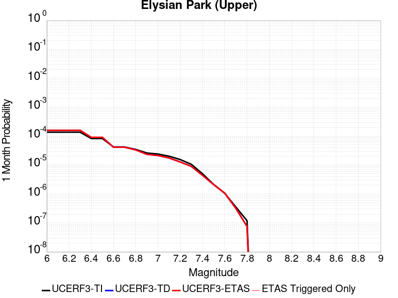 | 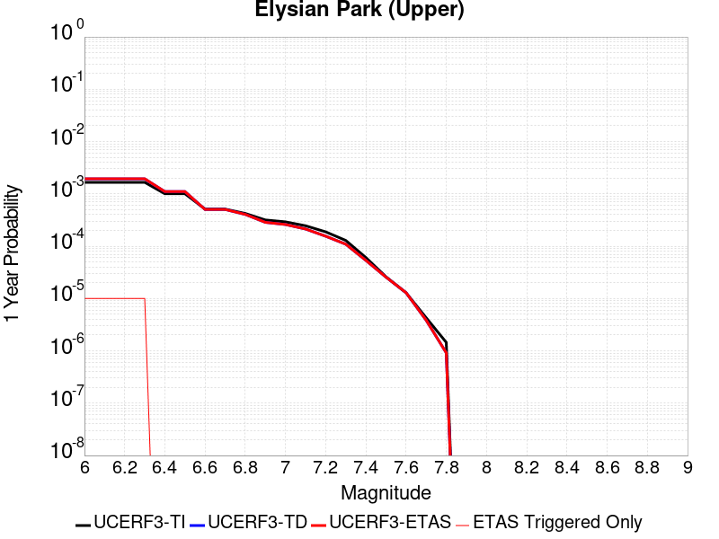 | 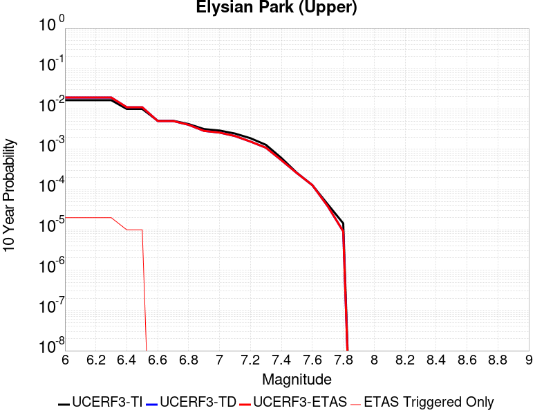 |

| Magnitude | 1 wk TI Prob | 1 wk TD Prob | 1 wk ETAS Prob | 1 wk ETAS/TD Gain | 1 wk ETAS Triggered Only | 1 mo TI Prob | 1 mo TD Prob | 1 mo ETAS Prob | 1 mo ETAS/TD Gain | 1 mo ETAS Triggered Only | 1 yr TI Prob | 1 yr TD Prob | 1 yr ETAS Prob | 1 yr ETAS/TD Gain | 1 yr ETAS Triggered Only | 10 yr TI Prob | 10 yr TD Prob | 10 yr ETAS Prob | 10 yr ETAS/TD Gain | 10 yr ETAS Triggered Only |
|-----|-----|-----|-----|-----|-----|-----|-----|-----|-----|-----|-----|-----|-----|-----|-----|-----|-----|-----|-----|-----|
| 6.0 | 3.1876025E-5 | 3.703929E-5 | 3.703929E-5 | 1.0 | 0.0 | 1.3660437E-4 | 1.5873248E-4 | 1.5873248E-4 | 1.0 | 0.0 | 0.0016618895 | 0.0019313293 | 0.00194131 | 1.0051677 | 1.0E-5 | 0.016495159 | 0.019191904 | 0.019211521 | 1.0010221 | 2.0E-5 |
| 6.1 | 3.1876025E-5 | 3.703929E-5 | 3.703929E-5 | 1.0 | 0.0 | 1.3660437E-4 | 1.5873248E-4 | 1.5873248E-4 | 1.0 | 0.0 | 0.0016618895 | 0.0019313293 | 0.00194131 | 1.0051677 | 1.0E-5 | 0.016495159 | 0.019191904 | 0.019211521 | 1.0010221 | 2.0E-5 |
| 6.2 | 3.1876025E-5 | 3.703929E-5 | 3.703929E-5 | 1.0 | 0.0 | 1.3660437E-4 | 1.5873248E-4 | 1.5873248E-4 | 1.0 | 0.0 | 0.0016618895 | 0.0019313293 | 0.00194131 | 1.0051677 | 1.0E-5 | 0.016495159 | 0.019191904 | 0.019211521 | 1.0010221 | 2.0E-5 |
| 6.3 | 3.1876025E-5 | 3.703929E-5 | 3.703929E-5 | 1.0 | 0.0 | 1.3660437E-4 | 1.5873248E-4 | 1.5873248E-4 | 1.0 | 0.0 | 0.0016618895 | 0.0019313293 | 0.00194131 | 1.0051677 | 1.0E-5 | 0.016495159 | 0.019191904 | 0.019211521 | 1.0010221 | 2.0E-5 |
| 6.4 | 1.9273462E-5 | 2.1204301E-5 | 2.1204301E-5 | 1.0 | 0.0 | 8.259794E-5 | 9.0873385E-5 | 9.0873385E-5 | 1.0 | 0.0 | 0.001005166 | 0.0011059934 | 0.0011059934 | 1.0 | 0.0 | 0.010006315 | 0.011021703 | 0.011031593 | 1.0008973 | 1.0E-5 |
| 6.5 | 1.9273462E-5 | 2.1204301E-5 | 2.1204301E-5 | 1.0 | 0.0 | 8.259794E-5 | 9.0873385E-5 | 9.0873385E-5 | 1.0 | 0.0 | 0.001005166 | 0.0011059934 | 0.0011059934 | 1.0 | 0.0 | 0.010006315 | 0.011021703 | 0.011031593 | 1.0008973 | 1.0E-5 |
| 6.6 | 9.813258E-6 | 9.666103E-6 | 9.666103E-6 | 1.0 | 0.0 | 4.205614E-5 | 4.142554E-5 | 4.142554E-5 | 1.0 | 0.0 | 5.119132E-4 | 5.042465E-4 | 5.042465E-4 | 1.0 | 0.0 | 0.005107356 | 0.0050317473 | 0.0050317473 | 1.0 | 0.0 |
| 6.7 | 9.801478E-6 | 9.653672E-6 | 9.653672E-6 | 1.0 | 0.0 | 4.2005657E-5 | 4.1372266E-5 | 4.1372266E-5 | 1.0 | 0.0 | 5.112989E-4 | 5.035982E-4 | 5.035982E-4 | 1.0 | 0.0 | 0.0051012407 | 0.005025293 | 0.005025293 | 1.0 | 0.0 |
| 6.8 | 8.102489E-6 | 7.773402E-6 | 7.773402E-6 | 1.0 | 0.0 | 3.4724493E-5 | 3.3314183E-5 | 3.3314183E-5 | 1.0 | 0.0 | 4.2268867E-4 | 4.0552966E-4 | 4.0552966E-4 | 1.0 | 0.0 | 0.004218856 | 0.0040483903 | 0.0040483903 | 1.0 | 0.0 |
| 6.9 | 6.08275E-6 | 5.4816855E-6 | 5.4816855E-6 | 1.0 | 0.0 | 2.6068668E-5 | 2.349273E-5 | 2.349273E-5 | 1.0 | 0.0 | 3.173398E-4 | 2.8598722E-4 | 2.8598722E-4 | 1.0 | 0.0 | 0.0031688702 | 0.0028562695 | 0.0028562695 | 1.0 | 0.0 |
| 7.0 | 5.5995934E-6 | 4.982991E-6 | 4.982991E-6 | 1.0 | 0.0 | 2.3998036E-5 | 2.1355505E-5 | 2.1355505E-5 | 1.0 | 0.0 | 2.9213692E-4 | 2.599729E-4 | 2.599729E-4 | 1.0 | 0.0 | 0.0029175316 | 0.002596755 | 0.002596755 | 1.0 | 0.0 |
| 7.1 | 4.709881E-6 | 4.087571E-6 | 4.087571E-6 | 1.0 | 0.0 | 2.0185047E-5 | 1.7518047E-5 | 1.7518047E-5 | 1.0 | 0.0 | 2.4572524E-4 | 2.1326175E-4 | 2.1326175E-4 | 1.0 | 0.0 | 0.002454537 | 0.0021306125 | 0.0021306125 | 1.0 | 0.0 |
| 7.2 | 3.6063436E-6 | 2.97807E-6 | 2.97807E-6 | 1.0 | 0.0 | 1.5455667E-5 | 1.2763095E-5 | 1.2763095E-5 | 1.0 | 0.0 | 1.881565E-4 | 1.553797E-4 | 1.553797E-4 | 1.0 | 0.0 | 0.0018799726 | 0.001552722 | 0.001552722 | 1.0 | 0.0 |
| 7.3 | 2.471135E-6 | 2.0955465E-6 | 2.0955465E-6 | 1.0 | 0.0 | 1.0590536E-5 | 8.980883E-6 | 8.980883E-6 | 1.0 | 0.0 | 1.2893214E-4 | 1.09336834E-4 | 1.09336834E-4 | 1.0 | 0.0 | 0.0012885736 | 0.0010928377 | 0.0010928377 | 1.0 | 0.0 |
| 7.4 | 1.163943E-6 | 1.0275547E-6 | 1.0275547E-6 | 1.0 | 0.0 | 4.988318E-6 | 4.403799E-6 | 4.403799E-6 | 1.0 | 0.0 | 6.0731076E-5 | 5.3614964E-5 | 5.3614964E-5 | 1.0 | 0.0 | 6.071448E-4 | 5.3602323E-4 | 5.3602323E-4 | 1.0 | 0.0 |
| 7.5 | 4.99459E-7 | 4.9178317E-7 | 4.9178317E-7 | 1.0 | 0.0 | 2.140537E-6 | 2.1076405E-6 | 2.1076405E-6 | 1.0 | 0.0 | 2.6060725E-5 | 2.5660238E-5 | 2.5660238E-5 | 1.0 | 0.0 | 2.605767E-4 | 2.565743E-4 | 2.565743E-4 | 1.0 | 0.0 |
| 7.6 | 2.4667852E-7 | 2.4779692E-7 | 2.4779692E-7 | 1.0 | 0.0 | 1.0571932E-6 | 1.0619863E-6 | 1.0619863E-6 | 1.0 | 0.0 | 1.2871251E-5 | 1.292961E-5 | 1.292961E-5 | 1.0 | 0.0 | 1.2870505E-4 | 1.2928895E-4 | 1.2928895E-4 | 1.0 | 0.0 |
| 7.7 | 8.2312795E-8 | 7.387176E-8 | 7.387176E-8 | 1.0 | 0.0 | 3.527691E-7 | 3.1659323E-7 | 3.1659323E-7 | 1.0 | 0.0 | 4.294955E-6 | 3.8545168E-6 | 3.8545168E-6 | 1.0 | 0.0 | 4.2948723E-5 | 3.8544615E-5 | 3.8544615E-5 | 1.0 | 0.0 |
| 7.8 | 2.7819295E-8 | 1.7571175E-8 | 1.7571175E-8 | 1.0 | 0.0 | 1.1922555E-7 | 7.530504E-8 | 7.530504E-8 | 1.0 | 0.0 | 1.45157E-6 | 9.168386E-7 | 9.168386E-7 | 1.0 | 0.0 | 1.45156055E-5 | 9.168363E-6 | 9.168363E-6 | 1.0 | 0.0 |

## Camp Rock 2011
*[(top)](#table-of-contents)*

| 1 Week | 1 Month | 1 Year | 10 Year |
|-----|-----|-----|-----|
|  |  | 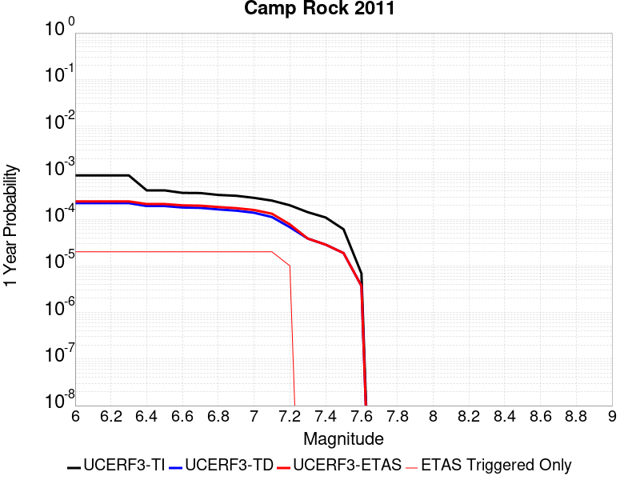 |  |

| Magnitude | 1 wk TI Prob | 1 wk TD Prob | 1 wk ETAS Prob | 1 wk ETAS/TD Gain | 1 wk ETAS Triggered Only | 1 mo TI Prob | 1 mo TD Prob | 1 mo ETAS Prob | 1 mo ETAS/TD Gain | 1 mo ETAS Triggered Only | 1 yr TI Prob | 1 yr TD Prob | 1 yr ETAS Prob | 1 yr ETAS/TD Gain | 1 yr ETAS Triggered Only | 10 yr TI Prob | 10 yr TD Prob | 10 yr ETAS Prob | 10 yr ETAS/TD Gain | 10 yr ETAS Triggered Only |
|-----|-----|-----|-----|-----|-----|-----|-----|-----|-----|-----|-----|-----|-----|-----|-----|-----|-----|-----|-----|-----|
| 6.0 | 1.6710783E-5 | 4.2501633E-6 | 1.425012E-5 | 3.352841 | 1.0E-5 | 7.161568E-5 | 1.8214861E-5 | 2.821468E-5 | 1.5489923 | 1.0E-5 | 8.7157206E-4 | 2.2174389E-4 | 2.4173946E-4 | 1.0901742 | 2.0E-5 | 0.008681616 | 0.0022152793 | 0.002235235 | 1.0090082 | 2.0E-5 |
| 6.1 | 1.6710783E-5 | 4.2501633E-6 | 1.425012E-5 | 3.352841 | 1.0E-5 | 7.161568E-5 | 1.8214861E-5 | 2.821468E-5 | 1.5489923 | 1.0E-5 | 8.7157206E-4 | 2.2174389E-4 | 2.4173946E-4 | 1.0901742 | 2.0E-5 | 0.008681616 | 0.0022152793 | 0.002235235 | 1.0090082 | 2.0E-5 |
| 6.2 | 1.6710783E-5 | 4.2501633E-6 | 1.425012E-5 | 3.352841 | 1.0E-5 | 7.161568E-5 | 1.8214861E-5 | 2.821468E-5 | 1.5489923 | 1.0E-5 | 8.7157206E-4 | 2.2174389E-4 | 2.4173946E-4 | 1.0901742 | 2.0E-5 | 0.008681616 | 0.0022152793 | 0.002235235 | 1.0090082 | 2.0E-5 |
| 6.3 | 1.6710783E-5 | 4.2501633E-6 | 1.425012E-5 | 3.352841 | 1.0E-5 | 7.161568E-5 | 1.8214861E-5 | 2.821468E-5 | 1.5489923 | 1.0E-5 | 8.7157206E-4 | 2.2174389E-4 | 2.4173946E-4 | 1.0901742 | 2.0E-5 | 0.008681616 | 0.0022152793 | 0.002235235 | 1.0090082 | 2.0E-5 |
| 6.4 | 7.982846E-6 | 3.6821912E-6 | 1.36821545E-5 | 3.7157643 | 1.0E-5 | 3.421175E-5 | 1.5780724E-5 | 2.5780568E-5 | 1.6336744 | 1.0E-5 | 4.1644843E-4 | 1.9211374E-4 | 2.121099E-4 | 1.104085 | 2.0E-5 | 0.0041566887 | 0.0019195115 | 0.0019394731 | 1.0103993 | 2.0E-5 |
| 6.5 | 7.982846E-6 | 3.6821912E-6 | 1.36821545E-5 | 3.7157643 | 1.0E-5 | 3.421175E-5 | 1.5780724E-5 | 2.5780568E-5 | 1.6336744 | 1.0E-5 | 4.1644843E-4 | 1.9211374E-4 | 2.121099E-4 | 1.104085 | 2.0E-5 | 0.0041566887 | 0.0019195115 | 0.0019394731 | 1.0103993 | 2.0E-5 |
| 6.6 | 7.048869E-6 | 3.4244488E-6 | 1.3424415E-5 | 3.920168 | 1.0E-5 | 3.0209088E-5 | 1.4676129E-5 | 2.4675981E-5 | 1.6813686 | 1.0E-5 | 3.677336E-4 | 1.7866753E-4 | 1.9866395E-4 | 1.1119198 | 2.0E-5 | 0.0036712566 | 0.0017852704 | 0.0018052347 | 1.0111828 | 2.0E-5 |
| 6.7 | 6.987307E-6 | 3.3624244E-6 | 1.3362391E-5 | 3.9740345 | 1.0E-5 | 2.9945259E-5 | 1.4410312E-5 | 2.4410168E-5 | 1.6939375 | 1.0E-5 | 3.6452254E-4 | 1.7543173E-4 | 1.9542823E-4 | 1.1139845 | 2.0E-5 | 0.0036392517 | 0.0017529636 | 0.0017729286 | 1.0113893 | 2.0E-5 |
| 6.8 | 6.3737602E-6 | 3.1180107E-6 | 1.31179795E-5 | 4.2071633 | 1.0E-5 | 2.731583E-5 | 1.3362836E-5 | 2.3362702E-5 | 1.7483342 | 1.0E-5 | 3.3251947E-4 | 1.6268066E-4 | 1.8267741E-4 | 1.1229203 | 2.0E-5 | 0.0033202237 | 0.0016256444 | 0.001645612 | 1.0122828 | 2.0E-5 |
| 6.9 | 6.112211E-6 | 2.9332175E-6 | 1.2933188E-5 | 4.4092155 | 1.0E-5 | 2.6194928E-5 | 1.2570873E-5 | 2.2570746E-5 | 1.7954797 | 1.0E-5 | 3.1887658E-4 | 1.530399E-4 | 1.7303685E-4 | 1.1306648 | 2.0E-5 | 0.003184194 | 0.0015293729 | 0.0015493423 | 1.0130572 | 2.0E-5 |
| 7.0 | 5.5140117E-6 | 2.642044E-6 | 1.2642017E-5 | 4.7849383 | 1.0E-5 | 2.3631264E-5 | 1.1322997E-5 | 2.1322885E-5 | 1.8831484 | 1.0E-5 | 2.8767265E-4 | 1.3784903E-4 | 1.5784627E-4 | 1.1450663 | 2.0E-5 | 0.0028730053 | 0.0013776604 | 0.0013976329 | 1.0144974 | 2.0E-5 |
| 7.1 | 4.8151105E-6 | 2.134374E-6 | 1.2134353E-5 | 5.6852045 | 1.0E-5 | 2.0636026E-5 | 9.147286E-6 | 1.9147194E-5 | 2.0932105 | 1.0E-5 | 2.5121463E-4 | 1.1136274E-4 | 1.313605E-4 | 1.1795733 | 2.0E-5 | 0.0025093083 | 0.0011130912 | 0.0011330689 | 1.017948 | 2.0E-5 |
| 7.2 | 3.818335E-6 | 1.293818E-6 | 1.1293805E-5 | 8.729053 | 1.0E-5 | 1.6364189E-5 | 5.5449227E-6 | 1.5544867E-5 | 2.8034418 | 1.0E-5 | 1.9921579E-4 | 6.7507426E-5 | 7.7506746E-5 | 1.1481218 | 1.0E-5 | 0.0019903728 | 6.748774E-4 | 6.8487064E-4 | 1.0148075 | 1.0E-5 |
| 7.3 | 2.7166698E-6 | 7.38375E-7 | 7.38375E-7 | 1.0 | 0.0 | 1.1642818E-5 | 3.1644604E-6 | 3.1644604E-6 | 1.0 | 0.0 | 1.4174209E-4 | 3.8526647E-5 | 3.8526647E-5 | 1.0 | 0.0 | 0.0014165172 | 3.8520168E-4 | 3.8520168E-4 | 1.0 | 0.0 |
| 7.4 | 2.0893426E-6 | 5.461979E-7 | 5.461979E-7 | 1.0 | 0.0 | 8.954295E-6 | 2.340846E-6 | 2.340846E-6 | 1.0 | 0.0 | 1.0901308E-4 | 2.8499433E-5 | 2.8499433E-5 | 1.0 | 0.0 | 0.0010895962 | 2.8495834E-4 | 2.8495834E-4 | 1.0 | 0.0 |
| 7.5 | 1.1681728E-6 | 3.6031344E-7 | 3.6031344E-7 | 1.0 | 0.0 | 5.0064455E-6 | 1.5441996E-6 | 1.5441996E-6 | 1.0 | 0.0 | 6.0951766E-5 | 1.8800472E-5 | 1.8800472E-5 | 1.0 | 0.0 | 6.093505E-4 | 1.8798928E-4 | 1.8798928E-4 | 1.0 | 0.0 |
| 7.6 | 1.3154387E-7 | 7.119929E-8 | 7.119929E-8 | 1.0 | 0.0 | 5.6375933E-7 | 3.0513976E-7 | 3.0513976E-7 | 1.0 | 0.0 | 6.863748E-6 | 3.715072E-6 | 3.715072E-6 | 1.0 | 0.0 | 6.863536E-5 | 3.7150257E-5 | 3.7150257E-5 | 1.0 | 0.0 |

## Pitas Point (Lower West)
*[(top)](#table-of-contents)*

| 1 Week | 1 Month | 1 Year | 10 Year |
|-----|-----|-----|-----|
|  |  | 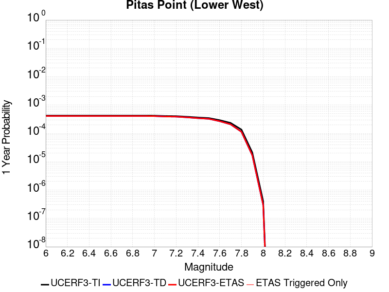 |  |

| Magnitude | 1 wk TI Prob | 1 wk TD Prob | 1 wk ETAS Prob | 1 wk ETAS/TD Gain | 1 wk ETAS Triggered Only | 1 mo TI Prob | 1 mo TD Prob | 1 mo ETAS Prob | 1 mo ETAS/TD Gain | 1 mo ETAS Triggered Only | 1 yr TI Prob | 1 yr TD Prob | 1 yr ETAS Prob | 1 yr ETAS/TD Gain | 1 yr ETAS Triggered Only | 10 yr TI Prob | 10 yr TD Prob | 10 yr ETAS Prob | 10 yr ETAS/TD Gain | 10 yr ETAS Triggered Only |
|-----|-----|-----|-----|-----|-----|-----|-----|-----|-----|-----|-----|-----|-----|-----|-----|-----|-----|-----|-----|-----|
| 6.0 | 8.151497E-6 | 7.856073E-6 | 7.856073E-6 | 1.0 | 0.0 | 3.493452E-5 | 3.3668453E-5 | 3.3668453E-5 | 1.0 | 0.0 | 4.252448E-4 | 4.0983706E-4 | 4.0983706E-4 | 1.0 | 0.0 | 0.0042443196 | 0.004090893 | 0.0041108113 | 1.0048689 | 2.0E-5 |
| 6.1 | 8.151497E-6 | 7.856073E-6 | 7.856073E-6 | 1.0 | 0.0 | 3.493452E-5 | 3.3668453E-5 | 3.3668453E-5 | 1.0 | 0.0 | 4.252448E-4 | 4.0983706E-4 | 4.0983706E-4 | 1.0 | 0.0 | 0.0042443196 | 0.004090893 | 0.0041108113 | 1.0048689 | 2.0E-5 |
| 6.2 | 8.151497E-6 | 7.856073E-6 | 7.856073E-6 | 1.0 | 0.0 | 3.493452E-5 | 3.3668453E-5 | 3.3668453E-5 | 1.0 | 0.0 | 4.252448E-4 | 4.0983706E-4 | 4.0983706E-4 | 1.0 | 0.0 | 0.0042443196 | 0.004090893 | 0.0041108113 | 1.0048689 | 2.0E-5 |
| 6.3 | 8.151497E-6 | 7.856073E-6 | 7.856073E-6 | 1.0 | 0.0 | 3.493452E-5 | 3.3668453E-5 | 3.3668453E-5 | 1.0 | 0.0 | 4.252448E-4 | 4.0983706E-4 | 4.0983706E-4 | 1.0 | 0.0 | 0.0042443196 | 0.004090893 | 0.0041108113 | 1.0048689 | 2.0E-5 |
| 6.4 | 8.151497E-6 | 7.856073E-6 | 7.856073E-6 | 1.0 | 0.0 | 3.493452E-5 | 3.3668453E-5 | 3.3668453E-5 | 1.0 | 0.0 | 4.252448E-4 | 4.0983706E-4 | 4.0983706E-4 | 1.0 | 0.0 | 0.0042443196 | 0.004090893 | 0.0041108113 | 1.0048689 | 2.0E-5 |
| 6.5 | 8.151497E-6 | 7.856073E-6 | 7.856073E-6 | 1.0 | 0.0 | 3.493452E-5 | 3.3668453E-5 | 3.3668453E-5 | 1.0 | 0.0 | 4.252448E-4 | 4.0983706E-4 | 4.0983706E-4 | 1.0 | 0.0 | 0.0042443196 | 0.004090893 | 0.0041108113 | 1.0048689 | 2.0E-5 |
| 6.6 | 8.151497E-6 | 7.856073E-6 | 7.856073E-6 | 1.0 | 0.0 | 3.493452E-5 | 3.3668453E-5 | 3.3668453E-5 | 1.0 | 0.0 | 4.252448E-4 | 4.0983706E-4 | 4.0983706E-4 | 1.0 | 0.0 | 0.0042443196 | 0.004090893 | 0.0041108113 | 1.0048689 | 2.0E-5 |
| 6.7 | 8.151497E-6 | 7.856073E-6 | 7.856073E-6 | 1.0 | 0.0 | 3.493452E-5 | 3.3668453E-5 | 3.3668453E-5 | 1.0 | 0.0 | 4.252448E-4 | 4.0983706E-4 | 4.0983706E-4 | 1.0 | 0.0 | 0.0042443196 | 0.004090893 | 0.0041108113 | 1.0048689 | 2.0E-5 |
| 6.8 | 8.151497E-6 | 7.856073E-6 | 7.856073E-6 | 1.0 | 0.0 | 3.493452E-5 | 3.3668453E-5 | 3.3668453E-5 | 1.0 | 0.0 | 4.252448E-4 | 4.0983706E-4 | 4.0983706E-4 | 1.0 | 0.0 | 0.0042443196 | 0.004090893 | 0.0041108113 | 1.0048689 | 2.0E-5 |
| 6.9 | 8.151497E-6 | 7.856073E-6 | 7.856073E-6 | 1.0 | 0.0 | 3.493452E-5 | 3.3668453E-5 | 3.3668453E-5 | 1.0 | 0.0 | 4.252448E-4 | 4.0983706E-4 | 4.0983706E-4 | 1.0 | 0.0 | 0.0042443196 | 0.004090893 | 0.0041108113 | 1.0048689 | 2.0E-5 |
| 7.0 | 8.103535E-6 | 7.805501E-6 | 7.805501E-6 | 1.0 | 0.0 | 3.4728975E-5 | 3.3451724E-5 | 3.3451724E-5 | 1.0 | 0.0 | 4.2274324E-4 | 4.0719935E-4 | 4.0719935E-4 | 1.0 | 0.0 | 0.0042193993 | 0.0040646126 | 0.004084531 | 1.0049006 | 2.0E-5 |
| 7.1 | 7.853298E-6 | 7.5411845E-6 | 7.5411845E-6 | 1.0 | 0.0 | 3.3656554E-5 | 3.2318967E-5 | 3.2318967E-5 | 1.0 | 0.0 | 4.096915E-4 | 3.9341307E-4 | 3.9341307E-4 | 1.0 | 0.0 | 0.00408937 | 0.003927242 | 0.0039471635 | 1.0050726 | 2.0E-5 |
| 7.2 | 7.771102E-6 | 7.4534632E-6 | 7.4534632E-6 | 1.0 | 0.0 | 3.33043E-5 | 3.1943026E-5 | 3.1943026E-5 | 1.0 | 0.0 | 4.0540437E-4 | 3.8883765E-4 | 3.8883765E-4 | 1.0 | 0.0 | 0.0040466557 | 0.0038816486 | 0.003901571 | 1.0051324 | 2.0E-5 |
| 7.3 | 7.3945344E-6 | 7.049552E-6 | 7.049552E-6 | 1.0 | 0.0 | 3.1690477E-5 | 3.021202E-5 | 3.021202E-5 | 1.0 | 0.0 | 3.8576324E-4 | 3.6776988E-4 | 3.6776988E-4 | 1.0 | 0.0 | 0.0038509427 | 0.0036716803 | 0.003691607 | 1.0054271 | 2.0E-5 |
| 7.4 | 6.964645E-6 | 6.5903846E-6 | 6.5903846E-6 | 1.0 | 0.0 | 2.9848137E-5 | 2.8244203E-5 | 2.8244203E-5 | 1.0 | 0.0 | 3.6334046E-4 | 3.438194E-4 | 3.438194E-4 | 1.0 | 0.0 | 0.0036274698 | 0.003432928 | 0.0034528594 | 1.005806 | 2.0E-5 |
| 7.5 | 6.6525035E-6 | 6.2594127E-6 | 6.2594127E-6 | 1.0 | 0.0 | 2.851042E-5 | 2.682578E-5 | 2.682578E-5 | 1.0 | 0.0 | 3.4705905E-4 | 3.2655543E-4 | 3.2655543E-4 | 1.0 | 0.0 | 0.0034651754 | 0.0032608071 | 0.0032807419 | 1.0061134 | 2.0E-5 |
| 7.6 | 5.613338E-6 | 5.1516E-6 | 5.1516E-6 | 1.0 | 0.0 | 2.405694E-5 | 2.20781E-5 | 2.20781E-5 | 1.0 | 0.0 | 2.928539E-4 | 2.68768E-4 | 2.68768E-4 | 1.0 | 0.0 | 0.0029246826 | 0.0026844612 | 0.0027044076 | 1.0074303 | 2.0E-5 |
| 7.7 | 4.494704E-6 | 3.9970882E-6 | 3.9970882E-6 | 1.0 | 0.0 | 1.9262876E-5 | 1.7130267E-5 | 1.7130267E-5 | 1.0 | 0.0 | 2.3450027E-4 | 2.0854129E-4 | 2.0854129E-4 | 1.0 | 0.0 | 0.0023425296 | 0.00208348 | 0.0021034381 | 1.0095793 | 2.0E-5 |
| 7.8 | 2.6075882E-6 | 2.1837427E-6 | 2.1837427E-6 | 1.0 | 0.0 | 1.117533E-5 | 9.358864E-6 | 9.358864E-6 | 1.0 | 0.0 | 1.3605114E-4 | 1.1393826E-4 | 1.1393826E-4 | 1.0 | 0.0 | 0.0013596788 | 0.0011388032 | 0.0011388032 | 1.0 | 0.0 |
| 7.9 | 4.045984E-7 | 3.2425163E-7 | 3.2425163E-7 | 1.0 | 0.0 | 1.733992E-6 | 1.389649E-6 | 1.389649E-6 | 1.0 | 0.0 | 2.1111147E-5 | 1.691885E-5 | 1.691885E-5 | 1.0 | 0.0 | 2.1109142E-4 | 1.6917592E-4 | 1.6917592E-4 | 1.0 | 0.0 |
| 8.0 | 7.791402E-9 | 5.6839005E-9 | 5.6839005E-9 | 1.0 | 0.0 | 3.3391725E-8 | 2.4359574E-8 | 2.4359574E-8 | 1.0 | 0.0 | 4.0654416E-7 | 2.9657778E-7 | 2.9657778E-7 | 1.0 | 0.0 | 4.065434E-6 | 2.965776E-6 | 2.965776E-6 | 1.0 | 0.0 |

## Santa Ynez River
*[(top)](#table-of-contents)*

| 1 Week | 1 Month | 1 Year | 10 Year |
|-----|-----|-----|-----|
|  |  | 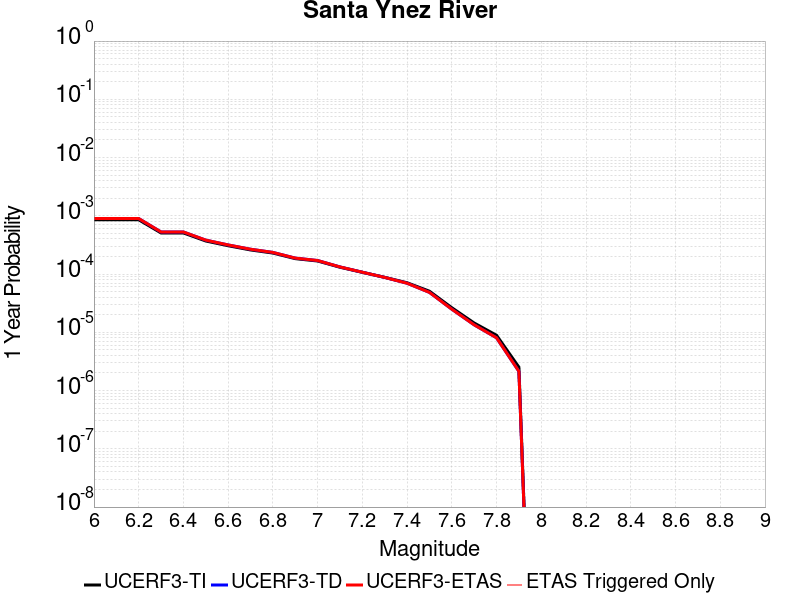 |  |

| Magnitude | 1 wk TI Prob | 1 wk TD Prob | 1 wk ETAS Prob | 1 wk ETAS/TD Gain | 1 wk ETAS Triggered Only | 1 mo TI Prob | 1 mo TD Prob | 1 mo ETAS Prob | 1 mo ETAS/TD Gain | 1 mo ETAS Triggered Only | 1 yr TI Prob | 1 yr TD Prob | 1 yr ETAS Prob | 1 yr ETAS/TD Gain | 1 yr ETAS Triggered Only | 10 yr TI Prob | 10 yr TD Prob | 10 yr ETAS Prob | 10 yr ETAS/TD Gain | 10 yr ETAS Triggered Only |
|-----|-----|-----|-----|-----|-----|-----|-----|-----|-----|-----|-----|-----|-----|-----|-----|-----|-----|-----|-----|-----|
| 6.0 | 1.6396456E-5 | 1.7209959E-5 | 1.7209959E-5 | 1.0 | 0.0 | 7.026863E-5 | 7.375509E-5 | 7.375509E-5 | 1.0 | 0.0 | 8.551848E-4 | 8.976337E-4 | 8.976337E-4 | 1.0 | 0.0 | 0.0085190125 | 0.008943629 | 0.00895354 | 1.0011082 | 1.0E-5 |
| 6.1 | 1.6396456E-5 | 1.7209959E-5 | 1.7209959E-5 | 1.0 | 0.0 | 7.026863E-5 | 7.375509E-5 | 7.375509E-5 | 1.0 | 0.0 | 8.551848E-4 | 8.976337E-4 | 8.976337E-4 | 1.0 | 0.0 | 0.0085190125 | 0.008943629 | 0.00895354 | 1.0011082 | 1.0E-5 |
| 6.2 | 1.6396456E-5 | 1.7209959E-5 | 1.7209959E-5 | 1.0 | 0.0 | 7.026863E-5 | 7.375509E-5 | 7.375509E-5 | 1.0 | 0.0 | 8.551848E-4 | 8.976337E-4 | 8.976337E-4 | 1.0 | 0.0 | 0.0085190125 | 0.008943629 | 0.00895354 | 1.0011082 | 1.0E-5 |
| 6.3 | 9.736976E-6 | 1.01226115E-5 | 1.01226115E-5 | 1.0 | 0.0 | 4.172923E-5 | 4.338193E-5 | 4.338193E-5 | 1.0 | 0.0 | 5.0793495E-4 | 5.28052E-4 | 5.28052E-4 | 1.0 | 0.0 | 0.005067755 | 0.0052684783 | 0.0052784253 | 1.001888 | 1.0E-5 |
| 6.4 | 9.736976E-6 | 1.01226115E-5 | 1.01226115E-5 | 1.0 | 0.0 | 4.172923E-5 | 4.338193E-5 | 4.338193E-5 | 1.0 | 0.0 | 5.0793495E-4 | 5.28052E-4 | 5.28052E-4 | 1.0 | 0.0 | 0.005067755 | 0.0052684783 | 0.0052784253 | 1.001888 | 1.0E-5 |
| 6.5 | 7.081964E-6 | 7.330101E-6 | 7.330101E-6 | 1.0 | 0.0 | 3.035092E-5 | 3.141435E-5 | 3.141435E-5 | 1.0 | 0.0 | 3.694598E-4 | 3.8240416E-4 | 3.8240416E-4 | 1.0 | 0.0 | 0.0036884616 | 0.0038176232 | 0.003827585 | 1.0026094 | 1.0E-5 |
| 6.6 | 5.873247E-6 | 6.059913E-6 | 6.059913E-6 | 1.0 | 0.0 | 2.5170815E-5 | 2.5970803E-5 | 2.5970803E-5 | 1.0 | 0.0 | 3.064116E-4 | 3.161495E-4 | 3.161495E-4 | 1.0 | 0.0 | 0.0030598943 | 0.0031570848 | 0.0031570848 | 1.0 | 0.0 |
| 6.7 | 4.973277E-6 | 5.116047E-6 | 5.116047E-6 | 1.0 | 0.0 | 2.1313872E-5 | 2.1925734E-5 | 2.1925734E-5 | 1.0 | 0.0 | 2.5946548E-4 | 2.669136E-4 | 2.669136E-4 | 1.0 | 0.0 | 0.0025916274 | 0.002665979 | 0.002665979 | 1.0 | 0.0 |
| 6.8 | 4.396492E-6 | 4.511108E-6 | 4.511108E-6 | 1.0 | 0.0 | 1.884197E-5 | 1.9333178E-5 | 1.9333178E-5 | 1.0 | 0.0 | 2.2937685E-4 | 2.3535638E-4 | 2.3535638E-4 | 1.0 | 0.0 | 0.0022914023 | 0.0023511064 | 0.0023511064 | 1.0 | 0.0 |
| 6.9 | 3.5255632E-6 | 3.6014421E-6 | 3.6014421E-6 | 1.0 | 0.0 | 1.5109469E-5 | 1.5434662E-5 | 1.5434662E-5 | 1.0 | 0.0 | 1.8394225E-4 | 1.8790095E-4 | 1.8790095E-4 | 1.0 | 0.0 | 0.0018379007 | 0.001877437 | 0.001877437 | 1.0 | 0.0 |
| 7.0 | 3.211603E-6 | 3.2737553E-6 | 3.2737553E-6 | 1.0 | 0.0 | 1.376394E-5 | 1.4030305E-5 | 1.4030305E-5 | 1.0 | 0.0 | 1.6756308E-4 | 1.7080571E-4 | 1.7080571E-4 | 1.0 | 0.0 | 0.0016743679 | 0.0017067584 | 0.0017067584 | 1.0 | 0.0 |
| 7.1 | 2.5094619E-6 | 2.5410047E-6 | 2.5410047E-6 | 1.0 | 0.0 | 1.0754793E-5 | 1.0889975E-5 | 1.0889975E-5 | 1.0 | 0.0 | 1.3093173E-4 | 1.3257744E-4 | 1.3257744E-4 | 1.0 | 0.0 | 0.0013085462 | 0.0013249894 | 0.0013249894 | 1.0 | 0.0 |
| 7.2 | 2.0515774E-6 | 2.06201E-6 | 2.06201E-6 | 1.0 | 0.0 | 8.792445E-6 | 8.837156E-6 | 8.837156E-6 | 1.0 | 0.0 | 1.0704277E-4 | 1.07587104E-4 | 1.07587104E-4 | 1.0 | 0.0 | 0.0010699122 | 0.0010753545 | 0.0010753545 | 1.0 | 0.0 |
| 7.3 | 1.6845745E-6 | 1.6774534E-6 | 1.6774534E-6 | 1.0 | 0.0 | 7.219585E-6 | 7.1890663E-6 | 7.1890663E-6 | 1.0 | 0.0 | 8.78949E-5 | 8.752339E-5 | 8.752339E-5 | 1.0 | 0.0 | 8.7860145E-4 | 8.748921E-4 | 8.748921E-4 | 1.0 | 0.0 |
| 7.4 | 1.3600285E-6 | 1.3333874E-6 | 1.3333874E-6 | 1.0 | 0.0 | 5.82868E-6 | 5.7145053E-6 | 5.7145053E-6 | 1.0 | 0.0 | 7.096187E-5 | 6.95719E-5 | 6.95719E-5 | 1.0 | 0.0 | 7.0939213E-4 | 6.9550343E-4 | 6.9550343E-4 | 1.0 | 0.0 |
| 7.5 | 9.735342E-7 | 9.290493E-7 | 9.290493E-7 | 1.0 | 0.0 | 4.172283E-6 | 3.981634E-6 | 3.981634E-6 | 1.0 | 0.0 | 5.079636E-5 | 4.8475333E-5 | 4.8475333E-5 | 1.0 | 0.0 | 5.0784746E-4 | 4.846493E-4 | 4.846493E-4 | 1.0 | 0.0 |
| 7.6 | 5.067187E-7 | 4.778753E-7 | 4.778753E-7 | 1.0 | 0.0 | 2.1716498E-6 | 2.0480354E-6 | 2.0480354E-6 | 1.0 | 0.0 | 2.6439517E-5 | 2.4934552E-5 | 2.4934552E-5 | 1.0 | 0.0 | 2.643637E-4 | 2.4931828E-4 | 2.4931828E-4 | 1.0 | 0.0 |
| 7.7 | 2.769089E-7 | 2.5760096E-7 | 2.5760096E-7 | 1.0 | 0.0 | 1.1867519E-6 | 1.1040037E-6 | 1.1040037E-6 | 1.0 | 0.0 | 1.4448608E-5 | 1.3441162E-5 | 1.3441162E-5 | 1.0 | 0.0 | 1.444767E-4 | 1.3440353E-4 | 1.3440353E-4 | 1.0 | 0.0 |
| 7.8 | 1.7044663E-7 | 1.5449687E-7 | 1.5449687E-7 | 1.0 | 0.0 | 7.3048534E-7 | 6.6212925E-7 | 6.6212925E-7 | 1.0 | 0.0 | 8.893623E-6 | 8.0613945E-6 | 8.0613945E-6 | 1.0 | 0.0 | 8.893267E-5 | 8.061104E-5 | 8.061104E-5 | 1.0 | 0.0 |
| 7.9 | 4.8344287E-8 | 4.0912912E-8 | 4.0912912E-8 | 1.0 | 0.0 | 2.0718979E-7 | 1.7534104E-7 | 1.7534104E-7 | 1.0 | 0.0 | 2.5225327E-6 | 2.134775E-6 | 2.134775E-6 | 1.0 | 0.0 | 2.5225041E-5 | 2.134755E-5 | 2.134755E-5 | 1.0 | 0.0 |

## South Klamath Lake West
*[(top)](#table-of-contents)*

| 1 Week | 1 Month | 1 Year | 10 Year |
|-----|-----|-----|-----|
|  |  |  | 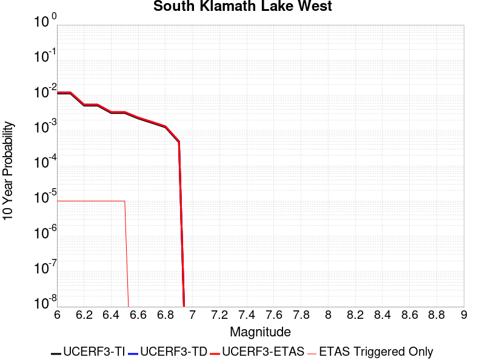 |

| Magnitude | 1 wk TI Prob | 1 wk TD Prob | 1 wk ETAS Prob | 1 wk ETAS/TD Gain | 1 wk ETAS Triggered Only | 1 mo TI Prob | 1 mo TD Prob | 1 mo ETAS Prob | 1 mo ETAS/TD Gain | 1 mo ETAS Triggered Only | 1 yr TI Prob | 1 yr TD Prob | 1 yr ETAS Prob | 1 yr ETAS/TD Gain | 1 yr ETAS Triggered Only | 10 yr TI Prob | 10 yr TD Prob | 10 yr ETAS Prob | 10 yr ETAS/TD Gain | 10 yr ETAS Triggered Only |
|-----|-----|-----|-----|-----|-----|-----|-----|-----|-----|-----|-----|-----|-----|-----|-----|-----|-----|-----|-----|-----|
| 6.0 | 2.174025E-5 | 2.3042758E-5 | 2.3042758E-5 | 1.0 | 0.0 | 9.3169176E-5 | 9.875131E-5 | 9.875131E-5 | 1.0 | 0.0 | 0.0011337444 | 0.0012016998 | 0.0012116878 | 1.0083115 | 1.0E-5 | 0.011279777 | 0.011958619 | 0.011968499 | 1.0008262 | 1.0E-5 |
| 6.1 | 2.174025E-5 | 2.3042758E-5 | 2.3042758E-5 | 1.0 | 0.0 | 9.3169176E-5 | 9.875131E-5 | 9.875131E-5 | 1.0 | 0.0 | 0.0011337444 | 0.0012016998 | 0.0012116878 | 1.0083115 | 1.0E-5 | 0.011279777 | 0.011958619 | 0.011968499 | 1.0008262 | 1.0E-5 |
| 6.2 | 9.834929E-6 | 1.0394155E-5 | 1.0394155E-5 | 1.0 | 0.0 | 4.2149015E-5 | 4.4545668E-5 | 4.4545668E-5 | 1.0 | 0.0 | 5.1304343E-4 | 5.422176E-4 | 5.522122E-4 | 1.0184327 | 1.0E-5 | 0.0051186057 | 0.0054098484 | 0.005419794 | 1.0018384 | 1.0E-5 |
| 6.3 | 9.834929E-6 | 1.0394155E-5 | 1.0394155E-5 | 1.0 | 0.0 | 4.2149015E-5 | 4.4545668E-5 | 4.4545668E-5 | 1.0 | 0.0 | 5.1304343E-4 | 5.422176E-4 | 5.522122E-4 | 1.0184327 | 1.0E-5 | 0.0051186057 | 0.0054098484 | 0.005419794 | 1.0018384 | 1.0E-5 |
| 6.4 | 6.066321E-6 | 6.4006167E-6 | 6.4006167E-6 | 1.0 | 0.0 | 2.5998259E-5 | 2.7430942E-5 | 2.7430942E-5 | 1.0 | 0.0 | 3.1648282E-4 | 3.3392326E-4 | 3.439199E-4 | 1.029937 | 1.0E-5 | 0.0031603249 | 0.0033344855 | 0.003344452 | 1.0029889 | 1.0E-5 |
| 6.5 | 6.066321E-6 | 6.4006167E-6 | 6.4006167E-6 | 1.0 | 0.0 | 2.5998259E-5 | 2.7430942E-5 | 2.7430942E-5 | 1.0 | 0.0 | 3.1648282E-4 | 3.3392326E-4 | 3.439199E-4 | 1.029937 | 1.0E-5 | 0.0031603249 | 0.0033344855 | 0.003344452 | 1.0029889 | 1.0E-5 |
| 6.6 | 4.2321803E-6 | 4.4614194E-6 | 4.4614194E-6 | 1.0 | 0.0 | 1.8137789E-5 | 1.9120234E-5 | 1.9120234E-5 | 1.0 | 0.0 | 2.208052E-4 | 2.3276501E-4 | 2.3276501E-4 | 1.0 | 0.0 | 0.0022058594 | 0.002325314 | 0.002325314 | 1.0 | 0.0 |
| 6.7 | 3.186646E-6 | 3.3604024E-6 | 3.3604024E-6 | 1.0 | 0.0 | 1.3656982E-5 | 1.44016485E-5 | 1.44016485E-5 | 1.0 | 0.0 | 1.6626107E-4 | 1.7532664E-4 | 1.7532664E-4 | 1.0 | 0.0 | 0.0016613674 | 0.0017519504 | 0.0017519504 | 1.0 | 0.0 |
| 6.8 | 2.380121E-6 | 2.5109803E-6 | 2.5109803E-6 | 1.0 | 0.0 | 1.0200479E-5 | 1.0761302E-5 | 1.0761302E-5 | 1.0 | 0.0 | 1.2418375E-4 | 1.3101145E-4 | 1.3101145E-4 | 1.0 | 0.0 | 0.0012411437 | 0.0013093879 | 0.0013093879 | 1.0 | 0.0 |
| 6.9 | 8.928287E-7 | 9.430532E-7 | 9.430532E-7 | 1.0 | 0.0 | 3.826403E-6 | 4.041651E-6 | 4.041651E-6 | 1.0 | 0.0 | 4.658546E-5 | 4.9206214E-5 | 4.9206214E-5 | 1.0 | 0.0 | 4.6575698E-4 | 4.919748E-4 | 4.919748E-4 | 1.0 | 0.0 |

## Newport-Inglewood (Offshore)
*[(top)](#table-of-contents)*

| 1 Week | 1 Month | 1 Year | 10 Year |
|-----|-----|-----|-----|
|  |  |  |  |

| Magnitude | 1 wk TI Prob | 1 wk TD Prob | 1 wk ETAS Prob | 1 wk ETAS/TD Gain | 1 wk ETAS Triggered Only | 1 mo TI Prob | 1 mo TD Prob | 1 mo ETAS Prob | 1 mo ETAS/TD Gain | 1 mo ETAS Triggered Only | 1 yr TI Prob | 1 yr TD Prob | 1 yr ETAS Prob | 1 yr ETAS/TD Gain | 1 yr ETAS Triggered Only | 10 yr TI Prob | 10 yr TD Prob | 10 yr ETAS Prob | 10 yr ETAS/TD Gain | 10 yr ETAS Triggered Only |
|-----|-----|-----|-----|-----|-----|-----|-----|-----|-----|-----|-----|-----|-----|-----|-----|-----|-----|-----|-----|-----|
| 6.0 | 1.9626508E-5 | 1.8966122E-5 | 1.8966122E-5 | 1.0 | 0.0 | 8.411089E-5 | 8.1280916E-5 | 8.1280916E-5 | 1.0 | 0.0 | 0.001023569 | 9.891585E-4 | 9.891585E-4 | 1.0 | 0.0 | 0.010188672 | 0.009848899 | 0.009858801 | 1.0010053 | 1.0E-5 |
| 6.1 | 1.331886E-5 | 1.2218608E-5 | 1.2218608E-5 | 1.0 | 0.0 | 5.707958E-5 | 5.2364423E-5 | 5.2364423E-5 | 1.0 | 0.0 | 6.947222E-4 | 6.373518E-4 | 6.373518E-4 | 1.0 | 0.0 | 0.006925544 | 0.0063554165 | 0.0063653532 | 1.0015634 | 1.0E-5 |
| 6.2 | 1.2250852E-5 | 1.1076503E-5 | 1.1076503E-5 | 1.0 | 0.0 | 5.2502597E-5 | 4.746987E-5 | 4.746987E-5 | 1.0 | 0.0 | 6.3903164E-4 | 5.777934E-4 | 5.777934E-4 | 1.0 | 0.0 | 0.006371971 | 0.005763033 | 0.0057729753 | 1.0017252 | 1.0E-5 |
| 6.3 | 1.2106258E-5 | 1.0919358E-5 | 1.0919358E-5 | 1.0 | 0.0 | 5.1882926E-5 | 4.6796413E-5 | 4.6796413E-5 | 1.0 | 0.0 | 6.3149154E-4 | 5.695984E-4 | 5.695984E-4 | 1.0 | 0.0 | 0.0062970007 | 0.0056815012 | 0.0056914445 | 1.0017501 | 1.0E-5 |
| 6.4 | 1.1348758E-5 | 1.0109799E-5 | 1.0109799E-5 | 1.0 | 0.0 | 4.8636626E-5 | 4.3326996E-5 | 4.3326996E-5 | 1.0 | 0.0 | 5.919901E-4 | 5.273793E-4 | 5.273793E-4 | 1.0 | 0.0 | 0.005904155 | 0.0052613737 | 0.0052713207 | 1.0018907 | 1.0E-5 |
| 6.5 | 1.100837E-5 | 9.7438115E-6 | 9.7438115E-6 | 1.0 | 0.0 | 4.7177873E-5 | 4.175853E-5 | 4.175853E-5 | 1.0 | 0.0 | 5.7423924E-4 | 5.082923E-4 | 5.082923E-4 | 1.0 | 0.0 | 0.005727576 | 0.005071388 | 0.0050813374 | 1.0019618 | 1.0E-5 |
| 6.6 | 1.0634696E-5 | 9.34595E-6 | 9.34595E-6 | 1.0 | 0.0 | 4.557647E-5 | 4.0053463E-5 | 4.0053463E-5 | 1.0 | 0.0 | 5.5475225E-4 | 4.875425E-4 | 4.875425E-4 | 1.0 | 0.0 | 0.0055336943 | 0.0048648156 | 0.0048747673 | 1.0020456 | 1.0E-5 |
| 6.7 | 9.9780855E-6 | 8.668286E-6 | 8.668286E-6 | 1.0 | 0.0 | 4.276252E-5 | 3.714927E-5 | 3.714927E-5 | 1.0 | 0.0 | 5.205093E-4 | 4.521992E-4 | 4.521992E-4 | 1.0 | 0.0 | 0.0051929182 | 0.0045128698 | 0.0045228247 | 1.0022058 | 1.0E-5 |
| 6.8 | 9.59546E-6 | 8.273307E-6 | 8.273307E-6 | 1.0 | 0.0 | 4.1122752E-5 | 3.545655E-5 | 3.545655E-5 | 1.0 | 0.0 | 5.0055445E-4 | 4.3159866E-4 | 4.3159866E-4 | 1.0 | 0.0 | 0.004994285 | 0.0043076803 | 0.004317637 | 1.0023115 | 1.0E-5 |
| 6.9 | 9.000614E-6 | 7.707169E-6 | 7.707169E-6 | 1.0 | 0.0 | 3.857349E-5 | 3.3030312E-5 | 3.3030312E-5 | 1.0 | 0.0 | 4.6953102E-4 | 4.0207047E-4 | 4.0207047E-4 | 1.0 | 0.0 | 0.004685402 | 0.004013502 | 0.0040234616 | 1.0024816 | 1.0E-5 |
| 7.0 | 7.4070194E-6 | 6.1491287E-6 | 6.1491287E-6 | 1.0 | 0.0 | 3.1743984E-5 | 2.6353144E-5 | 2.6353144E-5 | 1.0 | 0.0 | 3.8641447E-4 | 3.2080244E-4 | 3.2080244E-4 | 1.0 | 0.0 | 0.0038574322 | 0.0032034132 | 0.0032133812 | 1.0031117 | 1.0E-5 |
| 7.1 | 6.299615E-6 | 5.0567855E-6 | 5.0567855E-6 | 1.0 | 0.0 | 2.699807E-5 | 2.1671758E-5 | 2.1671758E-5 | 1.0 | 0.0 | 3.2865192E-4 | 2.6382183E-4 | 2.6382183E-4 | 1.0 | 0.0 | 0.003281663 | 0.002635101 | 0.0026450749 | 1.0037849 | 1.0E-5 |
| 7.2 | 5.096653E-6 | 3.8929225E-6 | 3.8929225E-6 | 1.0 | 0.0 | 2.1842614E-5 | 1.6683847E-5 | 1.6683847E-5 | 1.0 | 0.0 | 2.6590136E-4 | 2.03107E-4 | 2.03107E-4 | 1.0 | 0.0 | 0.0026558342 | 0.002029225 | 0.002029225 | 1.0 | 0.0 |
| 7.3 | 3.9753018E-6 | 2.909986E-6 | 2.909986E-6 | 1.0 | 0.0 | 1.7036897E-5 | 1.2471309E-5 | 1.2471309E-5 | 1.0 | 0.0 | 2.0740448E-4 | 1.5182768E-4 | 1.5182768E-4 | 1.0 | 0.0 | 0.00207211 | 0.0015172476 | 0.0015172476 | 1.0 | 0.0 |
| 7.4 | 3.0568392E-6 | 2.145059E-6 | 2.145059E-6 | 1.0 | 0.0 | 1.3100675E-5 | 9.193077E-6 | 9.193077E-6 | 1.0 | 0.0 | 1.5948903E-4 | 1.1192003E-4 | 1.1192003E-4 | 1.0 | 0.0 | 0.0015937461 | 0.001118643 | 0.001118643 | 1.0 | 0.0 |
| 7.5 | 1.7279019E-6 | 1.1470098E-6 | 1.1470098E-6 | 1.0 | 0.0 | 7.405273E-6 | 4.9157475E-6 | 4.9157475E-6 | 1.0 | 0.0 | 9.015547E-5 | 5.9847618E-5 | 5.9847618E-5 | 1.0 | 0.0 | 9.01189E-4 | 5.983189E-4 | 5.983189E-4 | 1.0 | 0.0 |
| 7.6 | 1.1156416E-6 | 7.223291E-7 | 7.223291E-7 | 1.0 | 0.0 | 4.7813123E-6 | 3.0956926E-6 | 3.0956926E-6 | 1.0 | 0.0 | 5.821092E-5 | 3.7689428E-5 | 3.7689428E-5 | 1.0 | 0.0 | 5.8195676E-4 | 3.768327E-4 | 3.768327E-4 | 1.0 | 0.0 |
| 7.7 | 9.117973E-8 | 6.73438E-8 | 6.73438E-8 | 1.0 | 0.0 | 3.907702E-7 | 2.8861623E-7 | 2.8861623E-7 | 1.0 | 0.0 | 4.757617E-6 | 3.5138974E-6 | 3.5138974E-6 | 1.0 | 0.0 | 4.7575148E-5 | 3.5138448E-5 | 3.5138448E-5 | 1.0 | 0.0 |

## South Klamath Lake East
*[(top)](#table-of-contents)*

| 1 Week | 1 Month | 1 Year | 10 Year |
|-----|-----|-----|-----|
|  |  |  |  |

| Magnitude | 1 wk TI Prob | 1 wk TD Prob | 1 wk ETAS Prob | 1 wk ETAS/TD Gain | 1 wk ETAS Triggered Only | 1 mo TI Prob | 1 mo TD Prob | 1 mo ETAS Prob | 1 mo ETAS/TD Gain | 1 mo ETAS Triggered Only | 1 yr TI Prob | 1 yr TD Prob | 1 yr ETAS Prob | 1 yr ETAS/TD Gain | 1 yr ETAS Triggered Only | 10 yr TI Prob | 10 yr TD Prob | 10 yr ETAS Prob | 10 yr ETAS/TD Gain | 10 yr ETAS Triggered Only |
|-----|-----|-----|-----|-----|-----|-----|-----|-----|-----|-----|-----|-----|-----|-----|-----|-----|-----|-----|-----|-----|
| 6.0 | 2.3539369E-5 | 2.5048159E-5 | 2.5048159E-5 | 1.0 | 0.0 | 1.0087911E-4 | 1.073453E-4 | 1.073453E-4 | 1.0 | 0.0 | 0.0012275111 | 0.0013062288 | 0.0013162157 | 1.0076456 | 1.0E-5 | 0.012207527 | 0.012993856 | 0.0130037265 | 1.0007596 | 1.0E-5 |
| 6.1 | 2.3539369E-5 | 2.5048159E-5 | 2.5048159E-5 | 1.0 | 0.0 | 1.0087911E-4 | 1.073453E-4 | 1.073453E-4 | 1.0 | 0.0 | 0.0012275111 | 0.0013062288 | 0.0013162157 | 1.0076456 | 1.0E-5 | 0.012207527 | 0.012993856 | 0.0130037265 | 1.0007596 | 1.0E-5 |
| 6.2 | 2.3539369E-5 | 2.5048159E-5 | 2.5048159E-5 | 1.0 | 0.0 | 1.0087911E-4 | 1.073453E-4 | 1.073453E-4 | 1.0 | 0.0 | 0.0012275111 | 0.0013062288 | 0.0013162157 | 1.0076456 | 1.0E-5 | 0.012207527 | 0.012993856 | 0.0130037265 | 1.0007596 | 1.0E-5 |
| 6.3 | 9.807823E-6 | 1.0396374E-5 | 1.0396374E-5 | 1.0 | 0.0 | 4.2032847E-5 | 4.4555178E-5 | 4.4555178E-5 | 1.0 | 0.0 | 5.1162974E-4 | 5.4233265E-4 | 5.4233265E-4 | 1.0 | 0.0 | 0.005104534 | 0.005410928 | 0.005410928 | 1.0 | 0.0 |
| 6.4 | 9.807823E-6 | 1.0396374E-5 | 1.0396374E-5 | 1.0 | 0.0 | 4.2032847E-5 | 4.4555178E-5 | 4.4555178E-5 | 1.0 | 0.0 | 5.1162974E-4 | 5.4233265E-4 | 5.4233265E-4 | 1.0 | 0.0 | 0.005104534 | 0.005410928 | 0.005410928 | 1.0 | 0.0 |
| 6.5 | 6.191981E-6 | 6.551041E-6 | 6.551041E-6 | 1.0 | 0.0 | 2.653679E-5 | 2.8075605E-5 | 2.8075605E-5 | 1.0 | 0.0 | 3.2303753E-4 | 3.417697E-4 | 3.417697E-4 | 1.0 | 0.0 | 0.0032256835 | 0.003412719 | 0.003412719 | 1.0 | 0.0 |
| 6.6 | 4.3693776E-6 | 4.616696E-6 | 4.616696E-6 | 1.0 | 0.0 | 1.8725768E-5 | 1.9785697E-5 | 1.9785697E-5 | 1.0 | 0.0 | 2.2796239E-4 | 2.4086535E-4 | 2.4086535E-4 | 1.0 | 0.0 | 0.0022772867 | 0.0024061555 | 0.0024061555 | 1.0 | 0.0 |
| 6.7 | 3.360834E-6 | 3.551347E-6 | 3.551347E-6 | 1.0 | 0.0 | 1.4403494E-5 | 1.5219975E-5 | 1.5219975E-5 | 1.0 | 0.0 | 1.7534842E-4 | 1.8528824E-4 | 1.8528824E-4 | 1.0 | 0.0 | 0.0017521014 | 0.0018514175 | 0.0018514175 | 1.0 | 0.0 |
| 6.8 | 2.57873E-6 | 2.725253E-6 | 2.725253E-6 | 1.0 | 0.0 | 1.1051653E-5 | 1.1679606E-5 | 1.1679606E-5 | 1.0 | 0.0 | 1.3454557E-4 | 1.4219055E-4 | 1.4219055E-4 | 1.0 | 0.0 | 0.0013446413 | 0.0014210563 | 0.0014210563 | 1.0 | 0.0 |
| 6.9 | 9.987825E-7 | 1.0566537E-6 | 1.0566537E-6 | 1.0 | 0.0 | 4.2804895E-6 | 4.52851E-6 | 4.52851E-6 | 1.0 | 0.0 | 5.211371E-5 | 5.5133543E-5 | 5.5133543E-5 | 1.0 | 0.0 | 5.210149E-4 | 5.512308E-4 | 5.512308E-4 | 1.0 | 0.0 |

## San Gabriel (Extension)
*[(top)](#table-of-contents)*

| 1 Week | 1 Month | 1 Year | 10 Year |
|-----|-----|-----|-----|
|  |  |  |  |

| Magnitude | 1 wk TI Prob | 1 wk TD Prob | 1 wk ETAS Prob | 1 wk ETAS/TD Gain | 1 wk ETAS Triggered Only | 1 mo TI Prob | 1 mo TD Prob | 1 mo ETAS Prob | 1 mo ETAS/TD Gain | 1 mo ETAS Triggered Only | 1 yr TI Prob | 1 yr TD Prob | 1 yr ETAS Prob | 1 yr ETAS/TD Gain | 1 yr ETAS Triggered Only | 10 yr TI Prob | 10 yr TD Prob | 10 yr ETAS Prob | 10 yr ETAS/TD Gain | 10 yr ETAS Triggered Only |
|-----|-----|-----|-----|-----|-----|-----|-----|-----|-----|-----|-----|-----|-----|-----|-----|-----|-----|-----|-----|-----|
| 6.0 | 5.6486106E-6 | 5.718104E-6 | 5.718104E-6 | 1.0 | 0.0 | 2.4208108E-5 | 2.4505938E-5 | 2.4505938E-5 | 1.0 | 0.0 | 2.9469383E-4 | 2.983202E-4 | 3.0831722E-4 | 1.033511 | 1.0E-5 | 0.0029430336 | 0.0029793254 | 0.0029892954 | 1.0033464 | 1.0E-5 |
| 6.1 | 5.6486106E-6 | 5.718104E-6 | 5.718104E-6 | 1.0 | 0.0 | 2.4208108E-5 | 2.4505938E-5 | 2.4505938E-5 | 1.0 | 0.0 | 2.9469383E-4 | 2.983202E-4 | 3.0831722E-4 | 1.033511 | 1.0E-5 | 0.0029430336 | 0.0029793254 | 0.0029892954 | 1.0033464 | 1.0E-5 |
| 6.2 | 5.6486106E-6 | 5.718104E-6 | 5.718104E-6 | 1.0 | 0.0 | 2.4208108E-5 | 2.4505938E-5 | 2.4505938E-5 | 1.0 | 0.0 | 2.9469383E-4 | 2.983202E-4 | 3.0831722E-4 | 1.033511 | 1.0E-5 | 0.0029430336 | 0.0029793254 | 0.0029892954 | 1.0033464 | 1.0E-5 |
| 6.3 | 5.6486106E-6 | 5.718104E-6 | 5.718104E-6 | 1.0 | 0.0 | 2.4208108E-5 | 2.4505938E-5 | 2.4505938E-5 | 1.0 | 0.0 | 2.9469383E-4 | 2.983202E-4 | 3.0831722E-4 | 1.033511 | 1.0E-5 | 0.0029430336 | 0.0029793254 | 0.0029892954 | 1.0033464 | 1.0E-5 |
| 6.4 | 5.6486106E-6 | 5.718104E-6 | 5.718104E-6 | 1.0 | 0.0 | 2.4208108E-5 | 2.4505938E-5 | 2.4505938E-5 | 1.0 | 0.0 | 2.9469383E-4 | 2.983202E-4 | 3.0831722E-4 | 1.033511 | 1.0E-5 | 0.0029430336 | 0.0029793254 | 0.0029892954 | 1.0033464 | 1.0E-5 |
| 6.5 | 4.7134554E-6 | 4.755513E-6 | 4.755513E-6 | 1.0 | 0.0 | 2.0200367E-5 | 2.0380618E-5 | 2.0380618E-5 | 1.0 | 0.0 | 2.459117E-4 | 2.481066E-4 | 2.5810412E-4 | 1.0402952 | 1.0E-5 | 0.0024563975 | 0.0024783816 | 0.0024883568 | 1.0040249 | 1.0E-5 |
| 6.6 | 4.7134554E-6 | 4.755513E-6 | 4.755513E-6 | 1.0 | 0.0 | 2.0200367E-5 | 2.0380618E-5 | 2.0380618E-5 | 1.0 | 0.0 | 2.459117E-4 | 2.481066E-4 | 2.5810412E-4 | 1.0402952 | 1.0E-5 | 0.0024563975 | 0.0024783816 | 0.0024883568 | 1.0040249 | 1.0E-5 |
| 6.7 | 4.2468837E-6 | 4.275323E-6 | 4.275323E-6 | 1.0 | 0.0 | 1.8200803E-5 | 1.832269E-5 | 1.832269E-5 | 1.0 | 0.0 | 2.2157225E-4 | 2.2305663E-4 | 2.330544E-4 | 1.0448216 | 1.0E-5 | 0.0022135144 | 0.0022284007 | 0.0022383784 | 1.0044775 | 1.0E-5 |
| 6.8 | 4.1180615E-6 | 4.1427106E-6 | 4.1427106E-6 | 1.0 | 0.0 | 1.7648716E-5 | 1.7754357E-5 | 1.7754357E-5 | 1.0 | 0.0 | 2.1485193E-4 | 2.1613858E-4 | 2.2613641E-4 | 1.0462567 | 1.0E-5 | 0.0021464431 | 0.0021593561 | 0.0021693346 | 1.004621 | 1.0E-5 |
| 6.9 | 3.863861E-6 | 3.8810217E-6 | 3.8810217E-6 | 1.0 | 0.0 | 1.65593E-5 | 1.6632848E-5 | 1.6632848E-5 | 1.0 | 0.0 | 2.0159081E-4 | 2.024868E-4 | 2.1248478E-4 | 1.0493759 | 1.0E-5 | 0.0020140803 | 0.0020230918 | 0.0020330716 | 1.0049329 | 1.0E-5 |
| 7.0 | 3.6947372E-6 | 3.7069185E-6 | 3.7069185E-6 | 1.0 | 0.0 | 1.5834492E-5 | 1.58867E-5 | 1.58867E-5 | 1.0 | 0.0 | 1.9276788E-4 | 1.9340408E-4 | 2.0340215E-4 | 1.0516952 | 1.0E-5 | 0.0019260074 | 0.0019324252 | 0.001942406 | 1.0051649 | 1.0E-5 |
| 7.1 | 3.5686835E-6 | 3.5741346E-6 | 3.5741346E-6 | 1.0 | 0.0 | 1.5294268E-5 | 1.5317633E-5 | 1.5317633E-5 | 1.0 | 0.0 | 1.861918E-4 | 1.864769E-4 | 1.864769E-4 | 1.0 | 0.0 | 0.0018603588 | 0.0018632711 | 0.0018632711 | 1.0 | 0.0 |
| 7.2 | 2.8023446E-6 | 2.7780084E-6 | 2.7780084E-6 | 1.0 | 0.0 | 1.2009994E-5 | 1.1905696E-5 | 1.1905696E-5 | 1.0 | 0.0 | 1.4621185E-4 | 1.4494231E-4 | 1.4494231E-4 | 1.0 | 0.0 | 0.001461157 | 0.0014484898 | 0.0014484898 | 1.0 | 0.0 |
| 7.3 | 2.5843012E-6 | 2.5471716E-6 | 2.5471716E-6 | 1.0 | 0.0 | 1.1075529E-5 | 1.0916404E-5 | 1.0916404E-5 | 1.0 | 0.0 | 1.3483623E-4 | 1.3289921E-4 | 1.3289921E-4 | 1.0 | 0.0 | 0.0013475444 | 0.0013282083 | 0.0013282083 | 1.0 | 0.0 |
| 7.4 | 2.4464468E-6 | 2.3978541E-6 | 2.3978541E-6 | 1.0 | 0.0 | 1.04847295E-5 | 1.0276478E-5 | 1.0276478E-5 | 1.0 | 0.0 | 1.276441E-4 | 1.2510903E-4 | 1.2510903E-4 | 1.0 | 0.0 | 0.0012757082 | 0.0012503967 | 0.0012503967 | 1.0 | 0.0 |
| 7.5 | 2.0420266E-6 | 1.892085E-6 | 1.892085E-6 | 1.0 | 0.0 | 8.751514E-6 | 8.108911E-6 | 8.108911E-6 | 1.0 | 0.0 | 1.0654447E-4 | 9.872155E-5 | 9.872155E-5 | 1.0 | 0.0 | 0.001064934 | 9.867814E-4 | 9.867814E-4 | 1.0 | 0.0 |
| 7.6 | 1.8326596E-6 | 1.6407992E-6 | 1.6407992E-6 | 1.0 | 0.0 | 7.854232E-6 | 7.0319775E-6 | 7.0319775E-6 | 1.0 | 0.0 | 9.562107E-5 | 8.5610984E-5 | 8.5610984E-5 | 1.0 | 0.0 | 9.5579936E-4 | 8.5578335E-4 | 8.5578335E-4 | 1.0 | 0.0 |
| 7.7 | 1.4786998E-6 | 1.2532653E-6 | 1.2532653E-6 | 1.0 | 0.0 | 6.3372695E-6 | 5.371126E-6 | 5.371126E-6 | 1.0 | 0.0 | 7.715353E-5 | 6.5391505E-5 | 6.5391505E-5 | 1.0 | 0.0 | 7.7126746E-4 | 6.537298E-4 | 6.537298E-4 | 1.0 | 0.0 |
| 7.8 | 7.6975533E-7 | 6.076714E-7 | 6.076714E-7 | 1.0 | 0.0 | 3.2989474E-6 | 2.6043033E-6 | 2.6043033E-6 | 1.0 | 0.0 | 4.0163945E-5 | 3.1706935E-5 | 3.1706935E-5 | 1.0 | 0.0 | 4.0156685E-4 | 3.170294E-4 | 3.170294E-4 | 1.0 | 0.0 |
| 7.9 | 1.7645915E-7 | 9.2330005E-8 | 9.2330005E-8 | 1.0 | 0.0 | 7.562533E-7 | 3.9569994E-7 | 3.9569994E-7 | 1.0 | 0.0 | 9.207345E-6 | 4.817636E-6 | 4.817636E-6 | 1.0 | 0.0 | 9.206964E-5 | 4.818034E-5 | 4.818034E-5 | 1.0 | 0.0 |
| 8.0 | 1.0463461E-7 | 2.5029875E-8 | 2.5029875E-8 | 1.0 | 0.0 | 4.4843398E-7 | 1.0727089E-7 | 1.0727089E-7 | 1.0 | 0.0 | 5.45967E-6 | 1.3060223E-6 | 1.3060223E-6 | 1.0 | 0.0 | 5.459536E-5 | 1.30651615E-5 | 1.30651615E-5 | 1.0 | 0.0 |
| 8.1 | 7.875717E-8 | 1.3918644E-8 | 1.3918644E-8 | 1.0 | 0.0 | 3.3753068E-7 | 5.965133E-8 | 5.965133E-8 | 1.0 | 0.0 | 4.109428E-6 | 7.262547E-7 | 7.262547E-7 | 1.0 | 0.0 | 4.109352E-5 | 7.2675384E-6 | 7.2675384E-6 | 1.0 | 0.0 |
| 8.2 | 1.33163E-8 | 1.780463E-9 | 1.780463E-9 | 1.0 | 0.0 | 5.7069855E-8 | 7.630555E-9 | 7.630555E-9 | 1.0 | 0.0 | 6.9482525E-7 | 9.2902E-8 | 9.2902E-8 | 1.0 | 0.0 | 6.9482307E-6 | 9.310114E-7 | 9.310114E-7 | 1.0 | 0.0 |

## Los Alamos 2011 CFM
*[(top)](#table-of-contents)*

| 1 Week | 1 Month | 1 Year | 10 Year |
|-----|-----|-----|-----|
|  |  | 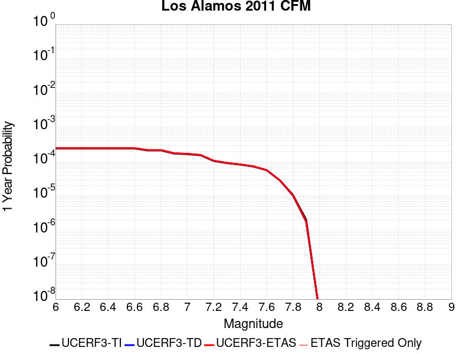 |  |

| Magnitude | 1 wk TI Prob | 1 wk TD Prob | 1 wk ETAS Prob | 1 wk ETAS/TD Gain | 1 wk ETAS Triggered Only | 1 mo TI Prob | 1 mo TD Prob | 1 mo ETAS Prob | 1 mo ETAS/TD Gain | 1 mo ETAS Triggered Only | 1 yr TI Prob | 1 yr TD Prob | 1 yr ETAS Prob | 1 yr ETAS/TD Gain | 1 yr ETAS Triggered Only | 10 yr TI Prob | 10 yr TD Prob | 10 yr ETAS Prob | 10 yr ETAS/TD Gain | 10 yr ETAS Triggered Only |
|-----|-----|-----|-----|-----|-----|-----|-----|-----|-----|-----|-----|-----|-----|-----|-----|-----|-----|-----|-----|-----|
| 6.0 | 4.6284417E-6 | 4.7518215E-6 | 4.7518215E-6 | 1.0 | 0.0 | 1.9836029E-5 | 2.03648E-5 | 2.03648E-5 | 1.0 | 0.0 | 2.4147688E-4 | 2.4791498E-4 | 2.4791498E-4 | 1.0 | 0.0 | 0.0024121467 | 0.0024765583 | 0.0024865337 | 1.0040278 | 1.0E-5 |
| 6.1 | 4.6284417E-6 | 4.7518215E-6 | 4.7518215E-6 | 1.0 | 0.0 | 1.9836029E-5 | 2.03648E-5 | 2.03648E-5 | 1.0 | 0.0 | 2.4147688E-4 | 2.4791498E-4 | 2.4791498E-4 | 1.0 | 0.0 | 0.0024121467 | 0.0024765583 | 0.0024865337 | 1.0040278 | 1.0E-5 |
| 6.2 | 4.6284417E-6 | 4.7518215E-6 | 4.7518215E-6 | 1.0 | 0.0 | 1.9836029E-5 | 2.03648E-5 | 2.03648E-5 | 1.0 | 0.0 | 2.4147688E-4 | 2.4791498E-4 | 2.4791498E-4 | 1.0 | 0.0 | 0.0024121467 | 0.0024765583 | 0.0024865337 | 1.0040278 | 1.0E-5 |
| 6.3 | 4.6284417E-6 | 4.7518215E-6 | 4.7518215E-6 | 1.0 | 0.0 | 1.9836029E-5 | 2.03648E-5 | 2.03648E-5 | 1.0 | 0.0 | 2.4147688E-4 | 2.4791498E-4 | 2.4791498E-4 | 1.0 | 0.0 | 0.0024121467 | 0.0024765583 | 0.0024865337 | 1.0040278 | 1.0E-5 |
| 6.4 | 4.6284417E-6 | 4.7518215E-6 | 4.7518215E-6 | 1.0 | 0.0 | 1.9836029E-5 | 2.03648E-5 | 2.03648E-5 | 1.0 | 0.0 | 2.4147688E-4 | 2.4791498E-4 | 2.4791498E-4 | 1.0 | 0.0 | 0.0024121467 | 0.0024765583 | 0.0024865337 | 1.0040278 | 1.0E-5 |
| 6.5 | 4.6284417E-6 | 4.7518215E-6 | 4.7518215E-6 | 1.0 | 0.0 | 1.9836029E-5 | 2.03648E-5 | 2.03648E-5 | 1.0 | 0.0 | 2.4147688E-4 | 2.4791498E-4 | 2.4791498E-4 | 1.0 | 0.0 | 0.0024121467 | 0.0024765583 | 0.0024865337 | 1.0040278 | 1.0E-5 |
| 6.6 | 4.6284417E-6 | 4.7518215E-6 | 4.7518215E-6 | 1.0 | 0.0 | 1.9836029E-5 | 2.03648E-5 | 2.03648E-5 | 1.0 | 0.0 | 2.4147688E-4 | 2.4791498E-4 | 2.4791498E-4 | 1.0 | 0.0 | 0.0024121467 | 0.0024765583 | 0.0024865337 | 1.0040278 | 1.0E-5 |
| 6.7 | 4.062321E-6 | 4.1664284E-6 | 4.1664284E-6 | 1.0 | 0.0 | 1.7409831E-5 | 1.7856008E-5 | 1.7856008E-5 | 1.0 | 0.0 | 2.1194408E-4 | 2.1737673E-4 | 2.1737673E-4 | 1.0 | 0.0 | 0.0021174205 | 0.0021717907 | 0.0021817689 | 1.0045944 | 1.0E-5 |
| 6.8 | 4.062321E-6 | 4.1664284E-6 | 4.1664284E-6 | 1.0 | 0.0 | 1.7409831E-5 | 1.7856008E-5 | 1.7856008E-5 | 1.0 | 0.0 | 2.1194408E-4 | 2.1737673E-4 | 2.1737673E-4 | 1.0 | 0.0 | 0.0021174205 | 0.0021717907 | 0.0021817689 | 1.0045944 | 1.0E-5 |
| 6.9 | 3.2936077E-6 | 3.3730241E-6 | 3.3730241E-6 | 1.0 | 0.0 | 1.4115385E-5 | 1.44557425E-5 | 1.44557425E-5 | 1.0 | 0.0 | 1.7184127E-4 | 1.7598539E-4 | 1.7598539E-4 | 1.0 | 0.0 | 0.0017170844 | 0.0017585529 | 0.0017685354 | 1.0056765 | 1.0E-5 |
| 7.0 | 3.1687898E-6 | 3.24488E-6 | 3.24488E-6 | 1.0 | 0.0 | 1.3580457E-5 | 1.390656E-5 | 1.390656E-5 | 1.0 | 0.0 | 1.6532952E-4 | 1.6930014E-4 | 1.6930014E-4 | 1.0 | 0.0 | 0.0016520657 | 0.0016918032 | 0.0017017863 | 1.0059009 | 1.0E-5 |
| 7.1 | 2.9379228E-6 | 3.0073866E-6 | 3.0073866E-6 | 1.0 | 0.0 | 1.25910365E-5 | 1.2888741E-5 | 1.2888741E-5 | 1.0 | 0.0 | 1.5328509E-4 | 1.5691003E-4 | 1.5691003E-4 | 1.0 | 0.0 | 0.001531794 | 0.0015680816 | 0.0015780659 | 1.0063672 | 1.0E-5 |
| 7.2 | 2.0020686E-6 | 2.0416742E-6 | 2.0416742E-6 | 1.0 | 0.0 | 8.580266E-6 | 8.750003E-6 | 8.750003E-6 | 1.0 | 0.0 | 1.0445973E-4 | 1.06526124E-4 | 1.06526124E-4 | 1.0 | 0.0 | 0.0010441064 | 0.0010647551 | 0.0010747444 | 1.0093819 | 1.0E-5 |
| 7.3 | 1.7364243E-6 | 1.7679203E-6 | 1.7679203E-6 | 1.0 | 0.0 | 7.441797E-6 | 7.5767794E-6 | 7.5767794E-6 | 1.0 | 0.0 | 9.0600115E-5 | 9.224341E-5 | 9.224341E-5 | 1.0 | 0.0 | 9.0563187E-4 | 9.220544E-4 | 9.3204516E-4 | 1.0108353 | 1.0E-5 |
| 7.4 | 1.5718434E-6 | 1.598355E-6 | 1.598355E-6 | 1.0 | 0.0 | 6.7364545E-6 | 6.850075E-6 | 6.850075E-6 | 1.0 | 0.0 | 8.201325E-5 | 8.3396495E-5 | 8.3396495E-5 | 1.0 | 0.0 | 8.198299E-4 | 8.33655E-4 | 8.436467E-4 | 1.0119854 | 1.0E-5 |
| 7.5 | 1.3841119E-6 | 1.404313E-6 | 1.404313E-6 | 1.0 | 0.0 | 5.9318945E-6 | 6.0184707E-6 | 6.0184707E-6 | 1.0 | 0.0 | 7.221842E-5 | 7.3272444E-5 | 7.3272444E-5 | 1.0 | 0.0 | 7.2194956E-4 | 7.324857E-4 | 7.424784E-4 | 1.0136422 | 1.0E-5 |
| 7.6 | 1.0843726E-6 | 1.0934698E-6 | 1.0934698E-6 | 1.0 | 0.0 | 4.647303E-6 | 4.686291E-6 | 4.686291E-6 | 1.0 | 0.0 | 5.6579443E-5 | 5.7054123E-5 | 5.7054123E-5 | 1.0 | 0.0 | 5.656504E-4 | 5.7039736E-4 | 5.803917E-4 | 1.0175216 | 1.0E-5 |
| 7.7 | 5.544814E-7 | 5.502016E-7 | 5.502016E-7 | 1.0 | 0.0 | 2.3763469E-6 | 2.3580046E-6 | 2.3580046E-6 | 1.0 | 0.0 | 2.8931638E-5 | 2.8708331E-5 | 2.8708331E-5 | 1.0 | 0.0 | 2.8927872E-4 | 2.8704636E-4 | 2.8704636E-4 | 1.0 | 0.0 |
| 7.8 | 2.0707465E-7 | 1.977911E-7 | 1.977911E-7 | 1.0 | 0.0 | 8.874625E-7 | 8.4767584E-7 | 8.4767584E-7 | 1.0 | 0.0 | 1.08048025E-5 | 1.0320405E-5 | 1.0320405E-5 | 1.0 | 0.0 | 1.0804277E-4 | 1.03199294E-4 | 1.03199294E-4 | 1.0 | 0.0 |
| 7.9 | 3.9821284E-8 | 3.4332658E-8 | 3.4332658E-8 | 1.0 | 0.0 | 1.7066264E-7 | 1.4713996E-7 | 1.4713996E-7 | 1.0 | 0.0 | 2.0778157E-6 | 1.7914276E-6 | 1.7914276E-6 | 1.0 | 0.0 | 2.0777963E-5 | 1.7914137E-5 | 1.7914137E-5 | 1.0 | 0.0 |
| 8.0 | 7.880441E-11 | 8.235512E-11 | 8.235512E-11 | 1.0 | 0.0 | 3.3773329E-10 | 3.5295045E-10 | 3.5295045E-10 | 1.0 | 0.0 | 4.1119033E-9 | 4.2971724E-9 | 4.2971724E-9 | 1.0 | 0.0 | 4.1119034E-8 | 4.297172E-8 | 4.297172E-8 | 1.0 | 0.0 |

## Mission Hills 2011
*[(top)](#table-of-contents)*

| 1 Week | 1 Month | 1 Year | 10 Year |
|-----|-----|-----|-----|
|  |  |  |  |

| Magnitude | 1 wk TI Prob | 1 wk TD Prob | 1 wk ETAS Prob | 1 wk ETAS/TD Gain | 1 wk ETAS Triggered Only | 1 mo TI Prob | 1 mo TD Prob | 1 mo ETAS Prob | 1 mo ETAS/TD Gain | 1 mo ETAS Triggered Only | 1 yr TI Prob | 1 yr TD Prob | 1 yr ETAS Prob | 1 yr ETAS/TD Gain | 1 yr ETAS Triggered Only | 10 yr TI Prob | 10 yr TD Prob | 10 yr ETAS Prob | 10 yr ETAS/TD Gain | 10 yr ETAS Triggered Only |
|-----|-----|-----|-----|-----|-----|-----|-----|-----|-----|-----|-----|-----|-----|-----|-----|-----|-----|-----|-----|-----|
| 6.0 | 1.8765717E-5 | 1.9056275E-5 | 1.9056275E-5 | 1.0 | 0.0 | 8.0422025E-5 | 8.166913E-5 | 8.166913E-5 | 1.0 | 0.0 | 9.786983E-4 | 9.942115E-4 | 0.0010042016 | 1.0100483 | 1.0E-5 | 0.009743992 | 0.009931307 | 0.009941207 | 1.000997 | 1.0E-5 |
| 6.1 | 1.8765717E-5 | 1.9056275E-5 | 1.9056275E-5 | 1.0 | 0.0 | 8.0422025E-5 | 8.166913E-5 | 8.166913E-5 | 1.0 | 0.0 | 9.786983E-4 | 9.942115E-4 | 0.0010042016 | 1.0100483 | 1.0E-5 | 0.009743992 | 0.009931307 | 0.009941207 | 1.000997 | 1.0E-5 |
| 6.2 | 1.8765717E-5 | 1.9056275E-5 | 1.9056275E-5 | 1.0 | 0.0 | 8.0422025E-5 | 8.166913E-5 | 8.166913E-5 | 1.0 | 0.0 | 9.786983E-4 | 9.942115E-4 | 0.0010042016 | 1.0100483 | 1.0E-5 | 0.009743992 | 0.009931307 | 0.009941207 | 1.000997 | 1.0E-5 |
| 6.3 | 1.8765717E-5 | 1.9056275E-5 | 1.9056275E-5 | 1.0 | 0.0 | 8.0422025E-5 | 8.166913E-5 | 8.166913E-5 | 1.0 | 0.0 | 9.786983E-4 | 9.942115E-4 | 0.0010042016 | 1.0100483 | 1.0E-5 | 0.009743992 | 0.009931307 | 0.009941207 | 1.000997 | 1.0E-5 |
| 6.4 | 4.566357E-6 | 2.515023E-6 | 2.515023E-6 | 1.0 | 0.0 | 1.9569954E-5 | 1.0778635E-5 | 1.0778635E-5 | 1.0 | 0.0 | 2.3823815E-4 | 1.312238E-4 | 1.312238E-4 | 1.0 | 0.0 | 0.002379829 | 0.0013116414 | 0.0013116414 | 1.0 | 0.0 |
| 6.5 | 4.566357E-6 | 2.515023E-6 | 2.515023E-6 | 1.0 | 0.0 | 1.9569954E-5 | 1.0778635E-5 | 1.0778635E-5 | 1.0 | 0.0 | 2.3823815E-4 | 1.312238E-4 | 1.312238E-4 | 1.0 | 0.0 | 0.002379829 | 0.0013116414 | 0.0013116414 | 1.0 | 0.0 |
| 6.6 | 4.566357E-6 | 2.515023E-6 | 2.515023E-6 | 1.0 | 0.0 | 1.9569954E-5 | 1.0778635E-5 | 1.0778635E-5 | 1.0 | 0.0 | 2.3823815E-4 | 1.312238E-4 | 1.312238E-4 | 1.0 | 0.0 | 0.002379829 | 0.0013116414 | 0.0013116414 | 1.0 | 0.0 |
| 6.7 | 2.3266773E-6 | 1.3296884E-6 | 1.3296884E-6 | 1.0 | 0.0 | 9.971435E-6 | 5.6986523E-6 | 5.6986523E-6 | 1.0 | 0.0 | 1.2139547E-4 | 6.937895E-5 | 6.937895E-5 | 1.0 | 0.0 | 0.0012132917 | 6.93579E-4 | 6.93579E-4 | 1.0 | 0.0 |
| 6.8 | 2.032735E-6 | 1.1894759E-6 | 1.1894759E-6 | 1.0 | 0.0 | 8.711692E-6 | 5.0977446E-6 | 5.0977446E-6 | 1.0 | 0.0 | 1.06059684E-4 | 6.206332E-5 | 6.206332E-5 | 1.0 | 0.0 | 0.0010600908 | 6.2046474E-4 | 6.2046474E-4 | 1.0 | 0.0 |
| 6.9 | 1.3186259E-6 | 1.0562425E-6 | 1.0562425E-6 | 1.0 | 0.0 | 5.6512413E-6 | 4.5267457E-6 | 4.5267457E-6 | 1.0 | 0.0 | 6.8801695E-5 | 5.5111766E-5 | 5.5111766E-5 | 1.0 | 0.0 | 6.8780396E-4 | 5.5098394E-4 | 5.5098394E-4 | 1.0 | 0.0 |
| 7.0 | 1.2726016E-6 | 1.0159716E-6 | 1.0159716E-6 | 1.0 | 0.0 | 5.4539955E-6 | 4.354157E-6 | 4.354157E-6 | 1.0 | 0.0 | 6.6400375E-5 | 5.30106E-5 | 5.30106E-5 | 1.0 | 0.0 | 6.6380535E-4 | 5.2998244E-4 | 5.2998244E-4 | 1.0 | 0.0 |
| 7.1 | 1.2063913E-6 | 9.570683E-7 | 9.570683E-7 | 1.0 | 0.0 | 5.170238E-6 | 4.101715E-6 | 4.101715E-6 | 1.0 | 0.0 | 6.294583E-5 | 4.993726E-5 | 4.993726E-5 | 1.0 | 0.0 | 6.2928005E-4 | 4.9926294E-4 | 4.9926294E-4 | 1.0 | 0.0 |
| 7.2 | 9.105806E-7 | 7.377107E-7 | 7.377107E-7 | 1.0 | 0.0 | 3.9024826E-6 | 3.1616137E-6 | 3.1616137E-6 | 1.0 | 0.0 | 4.7511687E-5 | 3.849198E-5 | 3.849198E-5 | 1.0 | 0.0 | 4.7501532E-4 | 3.8485468E-4 | 3.8485468E-4 | 1.0 | 0.0 |
| 7.3 | 7.020432E-7 | 5.7106206E-7 | 5.7106206E-7 | 1.0 | 0.0 | 3.0087533E-6 | 2.4474066E-6 | 2.4474066E-6 | 1.0 | 0.0 | 3.6630954E-5 | 2.979678E-5 | 2.979678E-5 | 1.0 | 0.0 | 3.6624918E-4 | 2.9792916E-4 | 2.9792916E-4 | 1.0 | 0.0 |
| 7.4 | 5.3900635E-7 | 4.4485827E-7 | 4.4485827E-7 | 1.0 | 0.0 | 2.3100251E-6 | 1.9065342E-6 | 1.9065342E-6 | 1.0 | 0.0 | 2.8124194E-5 | 2.3211818E-5 | 2.3211818E-5 | 1.0 | 0.0 | 2.8120633E-4 | 2.3209516E-4 | 2.3209516E-4 | 1.0 | 0.0 |
| 7.5 | 2.907075E-7 | 2.287705E-7 | 2.287705E-7 | 1.0 | 0.0 | 1.2458887E-6 | 9.804446E-7 | 9.804446E-7 | 1.0 | 0.0 | 1.5168589E-5 | 1.193685E-5 | 1.193685E-5 | 1.0 | 0.0 | 1.5167553E-4 | 1.1936227E-4 | 1.1936227E-4 | 1.0 | 0.0 |
| 7.6 | 1.6903675E-7 | 1.2354697E-7 | 1.2354697E-7 | 1.0 | 0.0 | 7.2444305E-7 | 5.2948695E-7 | 5.2948695E-7 | 1.0 | 0.0 | 8.820059E-6 | 6.4464857E-6 | 6.4464857E-6 | 1.0 | 0.0 | 8.8197085E-5 | 6.446311E-5 | 6.446311E-5 | 1.0 | 0.0 |
| 7.7 | 7.168073E-8 | 3.914252E-8 | 3.914252E-8 | 1.0 | 0.0 | 3.072031E-7 | 1.6775364E-7 | 1.6775364E-7 | 1.0 | 0.0 | 3.7401915E-6 | 2.0423988E-6 | 2.0423988E-6 | 1.0 | 0.0 | 3.7401285E-5 | 2.0423811E-5 | 2.0423811E-5 | 1.0 | 0.0 |
| 7.8 | 6.564101E-8 | 3.3842426E-8 | 3.3842426E-8 | 1.0 | 0.0 | 2.813186E-7 | 1.4503897E-7 | 1.4503897E-7 | 1.0 | 0.0 | 3.4250486E-6 | 1.7658481E-6 | 1.7658481E-6 | 1.0 | 0.0 | 3.424996E-5 | 1.765835E-5 | 1.765835E-5 | 1.0 | 0.0 |
| 7.9 | 1.0029074E-8 | 3.7301864E-9 | 3.7301864E-9 | 1.0 | 0.0 | 4.2981743E-8 | 1.5986512E-8 | 1.5986512E-8 | 1.0 | 0.0 | 5.2330256E-7 | 1.9463577E-7 | 1.9463577E-7 | 1.0 | 0.0 | 5.2330133E-6 | 1.946357E-6 | 1.946357E-6 | 1.0 | 0.0 |

## Santa Susana alt 1
*[(top)](#table-of-contents)*

| 1 Week | 1 Month | 1 Year | 10 Year |
|-----|-----|-----|-----|
|  |  |  |  |

| Magnitude | 1 wk TI Prob | 1 wk TD Prob | 1 wk ETAS Prob | 1 wk ETAS/TD Gain | 1 wk ETAS Triggered Only | 1 mo TI Prob | 1 mo TD Prob | 1 mo ETAS Prob | 1 mo ETAS/TD Gain | 1 mo ETAS Triggered Only | 1 yr TI Prob | 1 yr TD Prob | 1 yr ETAS Prob | 1 yr ETAS/TD Gain | 1 yr ETAS Triggered Only | 10 yr TI Prob | 10 yr TD Prob | 10 yr ETAS Prob | 10 yr ETAS/TD Gain | 10 yr ETAS Triggered Only |
|-----|-----|-----|-----|-----|-----|-----|-----|-----|-----|-----|-----|-----|-----|-----|-----|-----|-----|-----|-----|-----|
| 6.0 | 2.674877E-5 | 2.7200702E-5 | 2.7200702E-5 | 1.0 | 0.0 | 1.1463255E-4 | 1.1656987E-4 | 1.265687E-4 | 1.0857755 | 1.0E-5 | 0.0013947578 | 0.0014184278 | 0.0014284137 | 1.00704 | 1.0E-5 | 0.013860362 | 0.0141051775 | 0.014115036 | 1.0006989 | 1.0E-5 |
| 6.1 | 2.674877E-5 | 2.7200702E-5 | 2.7200702E-5 | 1.0 | 0.0 | 1.1463255E-4 | 1.1656987E-4 | 1.265687E-4 | 1.0857755 | 1.0E-5 | 0.0013947578 | 0.0014184278 | 0.0014284137 | 1.00704 | 1.0E-5 | 0.013860362 | 0.0141051775 | 0.014115036 | 1.0006989 | 1.0E-5 |
| 6.2 | 2.674877E-5 | 2.7200702E-5 | 2.7200702E-5 | 1.0 | 0.0 | 1.1463255E-4 | 1.1656987E-4 | 1.265687E-4 | 1.0857755 | 1.0E-5 | 0.0013947578 | 0.0014184278 | 0.0014284137 | 1.00704 | 1.0E-5 | 0.013860362 | 0.0141051775 | 0.014115036 | 1.0006989 | 1.0E-5 |
| 6.3 | 2.674877E-5 | 2.7200702E-5 | 2.7200702E-5 | 1.0 | 0.0 | 1.1463255E-4 | 1.1656987E-4 | 1.265687E-4 | 1.0857755 | 1.0E-5 | 0.0013947578 | 0.0014184278 | 0.0014284137 | 1.00704 | 1.0E-5 | 0.013860362 | 0.0141051775 | 0.014115036 | 1.0006989 | 1.0E-5 |
| 6.4 | 2.674877E-5 | 2.7200702E-5 | 2.7200702E-5 | 1.0 | 0.0 | 1.1463255E-4 | 1.1656987E-4 | 1.265687E-4 | 1.0857755 | 1.0E-5 | 0.0013947578 | 0.0014184278 | 0.0014284137 | 1.00704 | 1.0E-5 | 0.013860362 | 0.0141051775 | 0.014115036 | 1.0006989 | 1.0E-5 |
| 6.5 | 2.674877E-5 | 2.7200702E-5 | 2.7200702E-5 | 1.0 | 0.0 | 1.1463255E-4 | 1.1656987E-4 | 1.265687E-4 | 1.0857755 | 1.0E-5 | 0.0013947578 | 0.0014184278 | 0.0014284137 | 1.00704 | 1.0E-5 | 0.013860362 | 0.0141051775 | 0.014115036 | 1.0006989 | 1.0E-5 |
| 6.6 | 2.6647976E-5 | 2.7077027E-5 | 2.7077027E-5 | 1.0 | 0.0 | 1.14200615E-4 | 1.1603988E-4 | 1.2603872E-4 | 1.0861672 | 1.0E-5 | 0.0013895056 | 0.0014119836 | 0.0014219695 | 1.0070722 | 1.0E-5 | 0.013808494 | 0.014041555 | 0.014051414 | 1.0007021 | 1.0E-5 |
| 6.7 | 2.6647976E-5 | 2.7077027E-5 | 2.7077027E-5 | 1.0 | 0.0 | 1.14200615E-4 | 1.1603988E-4 | 1.2603872E-4 | 1.0861672 | 1.0E-5 | 0.0013895056 | 0.0014119836 | 0.0014219695 | 1.0070722 | 1.0E-5 | 0.013808494 | 0.014041555 | 0.014051414 | 1.0007021 | 1.0E-5 |
| 6.8 | 1.9073179E-5 | 1.7638708E-5 | 1.7638708E-5 | 1.0 | 0.0 | 8.1739636E-5 | 7.5592376E-5 | 8.559162E-5 | 1.1322784 | 1.0E-5 | 9.947256E-4 | 9.199667E-4 | 9.299575E-4 | 1.01086 | 1.0E-5 | 0.009902848 | 0.009163507 | 0.009173416 | 1.0010812 | 1.0E-5 |
| 6.9 | 1.9041876E-5 | 1.7620838E-5 | 1.7620838E-5 | 1.0 | 0.0 | 8.160549E-5 | 7.5515796E-5 | 8.5515036E-5 | 1.1324127 | 1.0E-5 | 9.930939E-4 | 9.190351E-4 | 9.2902593E-4 | 1.0108709 | 1.0E-5 | 0.0098866755 | 0.009154269 | 0.009164177 | 1.0010824 | 1.0E-5 |
| 7.0 | 1.5917482E-5 | 1.386486E-5 | 1.386486E-5 | 1.0 | 0.0 | 6.8215995E-5 | 5.9419504E-5 | 6.941891E-5 | 1.1682849 | 1.0E-5 | 8.302132E-4 | 7.23197E-4 | 7.3318975E-4 | 1.0138175 | 1.0E-5 | 0.008271185 | 0.007208977 | 0.007218905 | 1.0013771 | 1.0E-5 |
| 7.1 | 1.577788E-5 | 1.3744859E-5 | 1.3744859E-5 | 1.0 | 0.0 | 6.761774E-5 | 5.8905236E-5 | 6.890464E-5 | 1.1697541 | 1.0E-5 | 8.2293496E-4 | 7.169399E-4 | 7.269327E-4 | 1.0139382 | 1.0E-5 | 0.008198941 | 0.00714681 | 0.0071567385 | 1.0013893 | 1.0E-5 |
| 7.2 | 1.5416446E-5 | 1.3470913E-5 | 1.3470913E-5 | 1.0 | 0.0 | 6.606882E-5 | 5.773123E-5 | 6.773065E-5 | 1.1732064 | 1.0E-5 | 8.0409093E-4 | 7.026557E-4 | 7.126487E-4 | 1.0142217 | 1.0E-5 | 0.008011877 | 0.007004871 | 0.0070148013 | 1.0014176 | 1.0E-5 |
| 7.3 | 1.4534083E-5 | 1.271876E-5 | 1.271876E-5 | 1.0 | 0.0 | 6.228744E-5 | 5.450786E-5 | 6.4507316E-5 | 1.1834497 | 1.0E-5 | 7.580857E-4 | 6.6343555E-4 | 6.7342893E-4 | 1.015063 | 1.0E-5 | 0.007555048 | 0.0066150604 | 0.0066249943 | 1.0015017 | 1.0E-5 |
| 7.4 | 1.2858995E-5 | 1.1230413E-5 | 1.1230413E-5 | 1.0 | 0.0 | 5.5108816E-5 | 4.8129477E-5 | 5.8128993E-5 | 1.2077628 | 1.0E-5 | 6.7074323E-4 | 5.8582274E-4 | 5.958169E-4 | 1.01706 | 1.0E-5 | 0.0066872234 | 0.0058432063 | 0.0058531477 | 1.0017014 | 1.0E-5 |
| 7.5 | 8.827668E-6 | 7.805836E-6 | 7.805836E-6 | 1.0 | 0.0 | 3.7832317E-5 | 3.3453165E-5 | 3.3453165E-5 | 1.0 | 0.0 | 4.605111E-4 | 4.072186E-4 | 4.072186E-4 | 1.0 | 0.0 | 0.0045955796 | 0.0040648654 | 0.0040648654 | 1.0 | 0.0 |
| 7.6 | 3.2533426E-6 | 2.8720965E-6 | 2.8720965E-6 | 1.0 | 0.0 | 1.3942822E-5 | 1.23089285E-5 | 1.23089285E-5 | 1.0 | 0.0 | 1.6974064E-4 | 1.4985127E-4 | 1.4985127E-4 | 1.0 | 0.0 | 0.0016961104 | 0.0014975391 | 0.0014975391 | 1.0 | 0.0 |
| 7.7 | 1.2751709E-6 | 1.1491738E-6 | 1.1491738E-6 | 1.0 | 0.0 | 5.4650063E-6 | 4.9250216E-6 | 4.9250216E-6 | 1.0 | 0.0 | 6.653442E-5 | 5.996058E-5 | 5.996058E-5 | 1.0 | 0.0 | 6.6514505E-4 | 5.9945293E-4 | 5.9945293E-4 | 1.0 | 0.0 |
| 7.8 | 3.067544E-7 | 3.240163E-7 | 3.240163E-7 | 1.0 | 0.0 | 1.3146611E-6 | 1.3886406E-6 | 1.3886406E-6 | 1.0 | 0.0 | 1.600588E-5 | 1.6906579E-5 | 1.6906579E-5 | 1.0 | 0.0 | 1.6004729E-4 | 1.6905395E-4 | 1.6905395E-4 | 1.0 | 0.0 |
| 7.9 | 7.622999E-8 | 8.088244E-8 | 8.088244E-8 | 1.0 | 0.0 | 3.2669993E-7 | 3.4663898E-7 | 3.4663898E-7 | 1.0 | 0.0 | 3.977564E-6 | 4.2203237E-6 | 4.2203237E-6 | 1.0 | 0.0 | 3.977493E-5 | 4.2202642E-5 | 4.2202642E-5 | 1.0 | 0.0 |

## Johnson Valley (No) 2011 rev
*[(top)](#table-of-contents)*

| 1 Week | 1 Month | 1 Year | 10 Year |
|-----|-----|-----|-----|
|  |  |  |  |

| Magnitude | 1 wk TI Prob | 1 wk TD Prob | 1 wk ETAS Prob | 1 wk ETAS/TD Gain | 1 wk ETAS Triggered Only | 1 mo TI Prob | 1 mo TD Prob | 1 mo ETAS Prob | 1 mo ETAS/TD Gain | 1 mo ETAS Triggered Only | 1 yr TI Prob | 1 yr TD Prob | 1 yr ETAS Prob | 1 yr ETAS/TD Gain | 1 yr ETAS Triggered Only | 10 yr TI Prob | 10 yr TD Prob | 10 yr ETAS Prob | 10 yr ETAS/TD Gain | 10 yr ETAS Triggered Only |
|-----|-----|-----|-----|-----|-----|-----|-----|-----|-----|-----|-----|-----|-----|-----|-----|-----|-----|-----|-----|-----|
| 6.0 | 2.577707E-5 | 1.2901752E-5 | 1.2901752E-5 | 1.0 | 0.0 | 1.1046848E-4 | 5.5292276E-5 | 5.5292276E-5 | 1.0 | 0.0 | 0.0013441239 | 6.730152E-4 | 6.730152E-4 | 1.0 | 0.0 | 0.013360229 | 0.0067136795 | 0.006723612 | 1.0014795 | 1.0E-5 |
| 6.1 | 2.577707E-5 | 1.2901752E-5 | 1.2901752E-5 | 1.0 | 0.0 | 1.1046848E-4 | 5.5292276E-5 | 5.5292276E-5 | 1.0 | 0.0 | 0.0013441239 | 6.730152E-4 | 6.730152E-4 | 1.0 | 0.0 | 0.013360229 | 0.0067136795 | 0.006723612 | 1.0014795 | 1.0E-5 |
| 6.2 | 2.577707E-5 | 1.2901752E-5 | 1.2901752E-5 | 1.0 | 0.0 | 1.1046848E-4 | 5.5292276E-5 | 5.5292276E-5 | 1.0 | 0.0 | 0.0013441239 | 6.730152E-4 | 6.730152E-4 | 1.0 | 0.0 | 0.013360229 | 0.0067136795 | 0.006723612 | 1.0014795 | 1.0E-5 |
| 6.3 | 2.577707E-5 | 1.2901752E-5 | 1.2901752E-5 | 1.0 | 0.0 | 1.1046848E-4 | 5.5292276E-5 | 5.5292276E-5 | 1.0 | 0.0 | 0.0013441239 | 6.730152E-4 | 6.730152E-4 | 1.0 | 0.0 | 0.013360229 | 0.0067136795 | 0.006723612 | 1.0014795 | 1.0E-5 |
| 6.4 | 1.5296591E-5 | 7.53722E-6 | 7.53722E-6 | 1.0 | 0.0 | 6.555518E-5 | 3.2302076E-5 | 3.2302076E-5 | 1.0 | 0.0 | 7.97842E-4 | 3.9322558E-4 | 3.9322558E-4 | 1.0 | 0.0 | 0.007949836 | 0.003927139 | 0.0039371 | 1.0025364 | 1.0E-5 |
| 6.5 | 1.5296591E-5 | 7.53722E-6 | 7.53722E-6 | 1.0 | 0.0 | 6.555518E-5 | 3.2302076E-5 | 3.2302076E-5 | 1.0 | 0.0 | 7.97842E-4 | 3.9322558E-4 | 3.9322558E-4 | 1.0 | 0.0 | 0.007949836 | 0.003927139 | 0.0039371 | 1.0025364 | 1.0E-5 |
| 6.6 | 1.3289383E-5 | 5.9921053E-6 | 5.9921053E-6 | 1.0 | 0.0 | 5.6953253E-5 | 2.5680294E-5 | 2.5680294E-5 | 1.0 | 0.0 | 6.9318525E-4 | 3.1262968E-4 | 3.1262968E-4 | 1.0 | 0.0 | 0.0069102696 | 0.0031235635 | 0.0031335321 | 1.0031915 | 1.0E-5 |
| 6.7 | 1.3289383E-5 | 5.9921053E-6 | 5.9921053E-6 | 1.0 | 0.0 | 5.6953253E-5 | 2.5680294E-5 | 2.5680294E-5 | 1.0 | 0.0 | 6.9318525E-4 | 3.1262968E-4 | 3.1262968E-4 | 1.0 | 0.0 | 0.0069102696 | 0.0031235635 | 0.0031335321 | 1.0031915 | 1.0E-5 |
| 6.8 | 8.330789E-6 | 2.9214655E-6 | 2.9214655E-6 | 1.0 | 0.0 | 3.570289E-5 | 1.2520538E-5 | 1.2520538E-5 | 1.0 | 0.0 | 4.34596E-4 | 1.524326E-4 | 1.524326E-4 | 1.0 | 0.0 | 0.0043374705 | 0.0015238405 | 0.0015338252 | 1.0065523 | 1.0E-5 |
| 6.9 | 7.2359003E-6 | 2.3014777E-6 | 2.3014777E-6 | 1.0 | 0.0 | 3.1010633E-5 | 9.863469E-6 | 9.863469E-6 | 1.0 | 0.0 | 3.7748902E-4 | 1.2008645E-4 | 1.2008645E-4 | 1.0 | 0.0 | 0.0037684843 | 0.0012007385 | 0.0012107264 | 1.0083182 | 1.0E-5 |
| 7.0 | 6.5149957E-6 | 2.0886475E-6 | 2.0886475E-6 | 1.0 | 0.0 | 2.792111E-5 | 8.951346E-6 | 8.951346E-6 | 1.0 | 0.0 | 3.398865E-4 | 1.0898248E-4 | 1.0898248E-4 | 1.0 | 0.0 | 0.003393671 | 0.0010898102 | 0.0010997993 | 1.0091659 | 1.0E-5 |
| 7.1 | 1.1662233E-6 | 2.8800763E-8 | 2.8800763E-8 | 1.0 | 0.0 | 4.9980904E-6 | 1.2343183E-7 | 1.2343183E-7 | 1.0 | 0.0 | 6.0850052E-5 | 1.5027817E-6 | 1.5027817E-6 | 1.0 | 0.0 | 6.083339E-4 | 1.5027732E-5 | 1.5027732E-5 | 1.0 | 0.0 |
| 7.2 | 5.413881E-7 | 2.8800763E-8 | 2.8800763E-8 | 1.0 | 0.0 | 2.3202326E-6 | 1.2343183E-7 | 1.2343183E-7 | 1.0 | 0.0 | 2.8248465E-5 | 1.5027817E-6 | 1.5027817E-6 | 1.0 | 0.0 | 2.8244875E-4 | 1.5027732E-5 | 1.5027732E-5 | 1.0 | 0.0 |
| 7.3 | 5.076821E-7 | 2.8800763E-8 | 2.8800763E-8 | 1.0 | 0.0 | 2.1757785E-6 | 1.2343183E-7 | 1.2343183E-7 | 1.0 | 0.0 | 2.648978E-5 | 1.5027817E-6 | 1.5027817E-6 | 1.0 | 0.0 | 2.6486625E-4 | 1.5027732E-5 | 1.5027732E-5 | 1.0 | 0.0 |
| 7.4 | 4.7568687E-7 | 2.87827E-8 | 2.87827E-8 | 1.0 | 0.0 | 2.0386565E-6 | 1.2335443E-7 | 1.2335443E-7 | 1.0 | 0.0 | 2.482036E-5 | 1.5018393E-6 | 1.5018393E-6 | 1.0 | 0.0 | 2.4817587E-4 | 1.5018308E-5 | 1.5018308E-5 | 1.0 | 0.0 |
| 7.5 | 3.435626E-7 | 2.5356895E-8 | 2.5356895E-8 | 1.0 | 0.0 | 1.4724103E-6 | 1.086724E-7 | 1.086724E-7 | 1.0 | 0.0 | 1.7926448E-5 | 1.3230859E-6 | 1.3230859E-6 | 1.0 | 0.0 | 1.7925001E-4 | 1.3230796E-5 | 1.3230796E-5 | 1.0 | 0.0 |

## Mono Lake 2011 CFM
*[(top)](#table-of-contents)*

| 1 Week | 1 Month | 1 Year | 10 Year |
|-----|-----|-----|-----|
|  |  |  |  |

| Magnitude | 1 wk TI Prob | 1 wk TD Prob | 1 wk ETAS Prob | 1 wk ETAS/TD Gain | 1 wk ETAS Triggered Only | 1 mo TI Prob | 1 mo TD Prob | 1 mo ETAS Prob | 1 mo ETAS/TD Gain | 1 mo ETAS Triggered Only | 1 yr TI Prob | 1 yr TD Prob | 1 yr ETAS Prob | 1 yr ETAS/TD Gain | 1 yr ETAS Triggered Only | 10 yr TI Prob | 10 yr TD Prob | 10 yr ETAS Prob | 10 yr ETAS/TD Gain | 10 yr ETAS Triggered Only |
|-----|-----|-----|-----|-----|-----|-----|-----|-----|-----|-----|-----|-----|-----|-----|-----|-----|-----|-----|-----|-----|
| 6.0 | 2.0341662E-5 | 2.3830356E-5 | 2.3830356E-5 | 1.0 | 0.0 | 8.717564E-5 | 1.021291E-4 | 1.1212808E-4 | 1.0979053 | 1.0E-5 | 0.0010608466 | 0.0012432437 | 0.0012532313 | 1.0080335 | 1.0E-5 | 0.010557966 | 0.012414968 | 0.012424843 | 1.0007955 | 1.0E-5 |
| 6.1 | 2.0341662E-5 | 2.3830356E-5 | 2.3830356E-5 | 1.0 | 0.0 | 8.717564E-5 | 1.021291E-4 | 1.1212808E-4 | 1.0979053 | 1.0E-5 | 0.0010608466 | 0.0012432437 | 0.0012532313 | 1.0080335 | 1.0E-5 | 0.010557966 | 0.012414968 | 0.012424843 | 1.0007955 | 1.0E-5 |
| 6.2 | 2.0341662E-5 | 2.3830356E-5 | 2.3830356E-5 | 1.0 | 0.0 | 8.717564E-5 | 1.021291E-4 | 1.1212808E-4 | 1.0979053 | 1.0E-5 | 0.0010608466 | 0.0012432437 | 0.0012532313 | 1.0080335 | 1.0E-5 | 0.010557966 | 0.012414968 | 0.012424843 | 1.0007955 | 1.0E-5 |
| 6.3 | 2.0341662E-5 | 2.3830356E-5 | 2.3830356E-5 | 1.0 | 0.0 | 8.717564E-5 | 1.021291E-4 | 1.1212808E-4 | 1.0979053 | 1.0E-5 | 0.0010608466 | 0.0012432437 | 0.0012532313 | 1.0080335 | 1.0E-5 | 0.010557966 | 0.012414968 | 0.012424843 | 1.0007955 | 1.0E-5 |
| 6.4 | 1.749821E-5 | 2.049287E-5 | 2.049287E-5 | 1.0 | 0.0 | 7.499018E-5 | 8.782658E-5 | 8.782658E-5 | 1.0 | 0.0 | 9.1262296E-4 | 0.0010692884 | 0.0010692884 | 1.0 | 0.0 | 0.009088841 | 0.0106928395 | 0.0106928395 | 1.0 | 0.0 |
| 6.5 | 1.749821E-5 | 2.049287E-5 | 2.049287E-5 | 1.0 | 0.0 | 7.499018E-5 | 8.782658E-5 | 8.782658E-5 | 1.0 | 0.0 | 9.1262296E-4 | 0.0010692884 | 0.0010692884 | 1.0 | 0.0 | 0.009088841 | 0.0106928395 | 0.0106928395 | 1.0 | 0.0 |

## Oceanside alt1
*[(top)](#table-of-contents)*

| 1 Week | 1 Month | 1 Year | 10 Year |
|-----|-----|-----|-----|
|  |  | 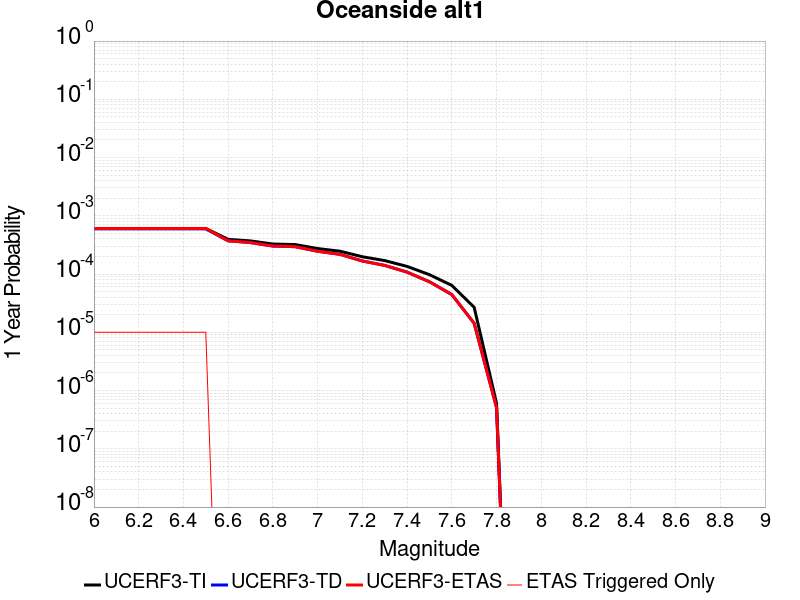 |  |

| Magnitude | 1 wk TI Prob | 1 wk TD Prob | 1 wk ETAS Prob | 1 wk ETAS/TD Gain | 1 wk ETAS Triggered Only | 1 mo TI Prob | 1 mo TD Prob | 1 mo ETAS Prob | 1 mo ETAS/TD Gain | 1 mo ETAS Triggered Only | 1 yr TI Prob | 1 yr TD Prob | 1 yr ETAS Prob | 1 yr ETAS/TD Gain | 1 yr ETAS Triggered Only | 10 yr TI Prob | 10 yr TD Prob | 10 yr ETAS Prob | 10 yr ETAS/TD Gain | 10 yr ETAS Triggered Only |
|-----|-----|-----|-----|-----|-----|-----|-----|-----|-----|-----|-----|-----|-----|-----|-----|-----|-----|-----|-----|-----|
| 6.0 | 1.1617542E-5 | 1.1423775E-5 | 1.1423775E-5 | 1.0 | 0.0 | 4.9788516E-5 | 4.8958205E-5 | 4.8958205E-5 | 1.0 | 0.0 | 6.060066E-4 | 5.959192E-4 | 6.059133E-4 | 1.0167708 | 1.0E-5 | 0.0060435664 | 0.0059448103 | 0.0059547513 | 1.0016721 | 1.0E-5 |
| 6.1 | 1.1617542E-5 | 1.1423775E-5 | 1.1423775E-5 | 1.0 | 0.0 | 4.9788516E-5 | 4.8958205E-5 | 4.8958205E-5 | 1.0 | 0.0 | 6.060066E-4 | 5.959192E-4 | 6.059133E-4 | 1.0167708 | 1.0E-5 | 0.0060435664 | 0.0059448103 | 0.0059547513 | 1.0016721 | 1.0E-5 |
| 6.2 | 1.1617542E-5 | 1.1423775E-5 | 1.1423775E-5 | 1.0 | 0.0 | 4.9788516E-5 | 4.8958205E-5 | 4.8958205E-5 | 1.0 | 0.0 | 6.060066E-4 | 5.959192E-4 | 6.059133E-4 | 1.0167708 | 1.0E-5 | 0.0060435664 | 0.0059448103 | 0.0059547513 | 1.0016721 | 1.0E-5 |
| 6.3 | 1.1617542E-5 | 1.1423775E-5 | 1.1423775E-5 | 1.0 | 0.0 | 4.9788516E-5 | 4.8958205E-5 | 4.8958205E-5 | 1.0 | 0.0 | 6.060066E-4 | 5.959192E-4 | 6.059133E-4 | 1.0167708 | 1.0E-5 | 0.0060435664 | 0.0059448103 | 0.0059547513 | 1.0016721 | 1.0E-5 |
| 6.4 | 1.1617542E-5 | 1.1423775E-5 | 1.1423775E-5 | 1.0 | 0.0 | 4.9788516E-5 | 4.8958205E-5 | 4.8958205E-5 | 1.0 | 0.0 | 6.060066E-4 | 5.959192E-4 | 6.059133E-4 | 1.0167708 | 1.0E-5 | 0.0060435664 | 0.0059448103 | 0.0059547513 | 1.0016721 | 1.0E-5 |
| 6.5 | 1.1617542E-5 | 1.1423775E-5 | 1.1423775E-5 | 1.0 | 0.0 | 4.9788516E-5 | 4.8958205E-5 | 4.8958205E-5 | 1.0 | 0.0 | 6.060066E-4 | 5.959192E-4 | 6.059133E-4 | 1.0167708 | 1.0E-5 | 0.0060435664 | 0.0059448103 | 0.0059547513 | 1.0016721 | 1.0E-5 |
| 6.6 | 7.561768E-6 | 7.133766E-6 | 7.133766E-6 | 1.0 | 0.0 | 3.2407173E-5 | 3.057293E-5 | 3.057293E-5 | 1.0 | 0.0 | 3.9448592E-4 | 3.7216293E-4 | 3.7216293E-4 | 1.0 | 0.0 | 0.0039378637 | 0.0037155082 | 0.0037155082 | 1.0 | 0.0 |
| 6.7 | 7.1042605E-6 | 6.6558246E-6 | 6.6558246E-6 | 1.0 | 0.0 | 3.0446476E-5 | 2.8524655E-5 | 2.8524655E-5 | 1.0 | 0.0 | 3.706228E-4 | 3.4723314E-4 | 3.4723314E-4 | 1.0 | 0.0 | 0.0037000529 | 0.0034669894 | 0.0034669894 | 1.0 | 0.0 |
| 6.8 | 6.285554E-6 | 5.799824E-6 | 5.799824E-6 | 1.0 | 0.0 | 2.693781E-5 | 2.4856156E-5 | 2.4856156E-5 | 1.0 | 0.0 | 3.2791847E-4 | 3.0258222E-4 | 3.0258222E-4 | 1.0 | 0.0 | 0.0032743502 | 0.0030217597 | 0.0030217597 | 1.0 | 0.0 |
| 6.9 | 6.148883E-6 | 5.656659E-6 | 5.656659E-6 | 1.0 | 0.0 | 2.635209E-5 | 2.4242603E-5 | 2.4242603E-5 | 1.0 | 0.0 | 3.2078946E-4 | 2.9511427E-4 | 2.9511427E-4 | 1.0 | 0.0 | 0.003203268 | 0.0029472804 | 0.0029472804 | 1.0 | 0.0 |
| 7.0 | 5.253857E-6 | 4.7224967E-6 | 4.7224967E-6 | 1.0 | 0.0 | 2.2516335E-5 | 2.0239117E-5 | 2.0239117E-5 | 1.0 | 0.0 | 2.7410188E-4 | 2.463837E-4 | 2.463837E-4 | 1.0 | 0.0 | 0.0027376404 | 0.0024611368 | 0.0024611368 | 1.0 | 0.0 |
| 7.1 | 4.730754E-6 | 4.1785897E-6 | 4.1785897E-6 | 1.0 | 0.0 | 2.0274503E-5 | 1.790812E-5 | 1.790812E-5 | 1.0 | 0.0 | 2.468141E-4 | 2.180098E-4 | 2.180098E-4 | 1.0 | 0.0 | 0.0024654015 | 0.0021779859 | 0.0021779859 | 1.0 | 0.0 |
| 7.2 | 3.7998386E-6 | 3.2140806E-6 | 3.2140806E-6 | 1.0 | 0.0 | 1.6284921E-5 | 1.3774559E-5 | 1.3774559E-5 | 1.0 | 0.0 | 1.9825088E-4 | 1.6769247E-4 | 1.6769247E-4 | 1.0 | 0.0 | 0.001980741 | 0.0016756715 | 0.0016756715 | 1.0 | 0.0 |
| 7.3 | 3.2656465E-6 | 2.6984203E-6 | 2.6984203E-6 | 1.0 | 0.0 | 1.3995553E-5 | 1.1564607E-5 | 1.1564607E-5 | 1.0 | 0.0 | 1.7038253E-4 | 1.4079011E-4 | 1.4079011E-4 | 1.0 | 0.0 | 0.0017025196 | 0.0014070203 | 0.0014070203 | 1.0 | 0.0 |
| 7.4 | 2.593703E-6 | 2.0680636E-6 | 2.0680636E-6 | 1.0 | 0.0 | 1.1115822E-5 | 8.8631E-6 | 8.8631E-6 | 1.0 | 0.0 | 1.3532673E-4 | 1.0790299E-4 | 1.0790299E-4 | 1.0 | 0.0 | 0.0013524436 | 0.0010785148 | 0.0010785148 | 1.0 | 0.0 |
| 7.5 | 1.8715585E-6 | 1.413753E-6 | 1.413753E-6 | 1.0 | 0.0 | 8.020941E-6 | 6.0589277E-6 | 6.0589277E-6 | 1.0 | 0.0 | 9.7650576E-5 | 7.3765004E-5 | 7.3765004E-5 | 1.0 | 0.0 | 9.7607676E-4 | 7.374113E-4 | 7.374113E-4 | 1.0 | 0.0 |
| 7.6 | 1.2246786E-6 | 8.5271427E-7 | 8.5271427E-7 | 1.0 | 0.0 | 5.248612E-6 | 3.654485E-6 | 3.654485E-6 | 1.0 | 0.0 | 6.389998E-5 | 4.449249E-5 | 4.449249E-5 | 1.0 | 0.0 | 6.3881604E-4 | 4.4484032E-4 | 4.4484032E-4 | 1.0 | 0.0 |
| 7.7 | 5.140719E-7 | 2.7347738E-7 | 2.7347738E-7 | 1.0 | 0.0 | 2.2031636E-6 | 1.1720455E-6 | 1.1720455E-6 | 1.0 | 0.0 | 2.6823185E-5 | 1.42695735E-5 | 1.42695735E-5 | 1.0 | 0.0 | 2.6819948E-4 | 1.4268792E-4 | 1.4268792E-4 | 1.0 | 0.0 |
| 7.8 | 1.16056995E-8 | 9.783043E-9 | 9.783043E-9 | 1.0 | 0.0 | 4.9738713E-8 | 4.1927326E-8 | 4.1927326E-8 | 1.0 | 0.0 | 6.0556863E-7 | 5.104652E-7 | 5.104652E-7 | 1.0 | 0.0 | 6.05567E-6 | 5.1046522E-6 | 5.1046522E-6 | 1.0 | 0.0 |

## La Panza 2011
*[(top)](#table-of-contents)*

| 1 Week | 1 Month | 1 Year | 10 Year |
|-----|-----|-----|-----|
|  |  |  |  |

| Magnitude | 1 wk TI Prob | 1 wk TD Prob | 1 wk ETAS Prob | 1 wk ETAS/TD Gain | 1 wk ETAS Triggered Only | 1 mo TI Prob | 1 mo TD Prob | 1 mo ETAS Prob | 1 mo ETAS/TD Gain | 1 mo ETAS Triggered Only | 1 yr TI Prob | 1 yr TD Prob | 1 yr ETAS Prob | 1 yr ETAS/TD Gain | 1 yr ETAS Triggered Only | 10 yr TI Prob | 10 yr TD Prob | 10 yr ETAS Prob | 10 yr ETAS/TD Gain | 10 yr ETAS Triggered Only |
|-----|-----|-----|-----|-----|-----|-----|-----|-----|-----|-----|-----|-----|-----|-----|-----|-----|-----|-----|-----|-----|
| 6.0 | 4.6754544E-6 | 4.717672E-6 | 4.717672E-6 | 1.0 | 0.0 | 2.0037509E-5 | 2.0218447E-5 | 2.0218447E-5 | 1.0 | 0.0 | 2.4392935E-4 | 2.4613377E-4 | 2.4613377E-4 | 1.0 | 0.0 | 0.0024366176 | 0.002458806 | 0.0024687813 | 1.004057 | 1.0E-5 |
| 6.1 | 4.6754544E-6 | 4.717672E-6 | 4.717672E-6 | 1.0 | 0.0 | 2.0037509E-5 | 2.0218447E-5 | 2.0218447E-5 | 1.0 | 0.0 | 2.4392935E-4 | 2.4613377E-4 | 2.4613377E-4 | 1.0 | 0.0 | 0.0024366176 | 0.002458806 | 0.0024687813 | 1.004057 | 1.0E-5 |
| 6.2 | 4.6754544E-6 | 4.717672E-6 | 4.717672E-6 | 1.0 | 0.0 | 2.0037509E-5 | 2.0218447E-5 | 2.0218447E-5 | 1.0 | 0.0 | 2.4392935E-4 | 2.4613377E-4 | 2.4613377E-4 | 1.0 | 0.0 | 0.0024366176 | 0.002458806 | 0.0024687813 | 1.004057 | 1.0E-5 |
| 6.3 | 4.6754544E-6 | 4.717672E-6 | 4.717672E-6 | 1.0 | 0.0 | 2.0037509E-5 | 2.0218447E-5 | 2.0218447E-5 | 1.0 | 0.0 | 2.4392935E-4 | 2.4613377E-4 | 2.4613377E-4 | 1.0 | 0.0 | 0.0024366176 | 0.002458806 | 0.0024687813 | 1.004057 | 1.0E-5 |
| 6.4 | 4.6754544E-6 | 4.717672E-6 | 4.717672E-6 | 1.0 | 0.0 | 2.0037509E-5 | 2.0218447E-5 | 2.0218447E-5 | 1.0 | 0.0 | 2.4392935E-4 | 2.4613377E-4 | 2.4613377E-4 | 1.0 | 0.0 | 0.0024366176 | 0.002458806 | 0.0024687813 | 1.004057 | 1.0E-5 |
| 6.5 | 2.485343E-6 | 2.5006693E-6 | 2.5006693E-6 | 1.0 | 0.0 | 1.0651426E-5 | 1.0717112E-5 | 1.0717112E-5 | 1.0 | 0.0 | 1.296734E-4 | 1.3047342E-4 | 1.3047342E-4 | 1.0 | 0.0 | 0.0012959775 | 0.0013040066 | 0.0013040066 | 1.0 | 0.0 |
| 6.6 | 2.485343E-6 | 2.5006693E-6 | 2.5006693E-6 | 1.0 | 0.0 | 1.0651426E-5 | 1.0717112E-5 | 1.0717112E-5 | 1.0 | 0.0 | 1.296734E-4 | 1.3047342E-4 | 1.3047342E-4 | 1.0 | 0.0 | 0.0012959775 | 0.0013040066 | 0.0013040066 | 1.0 | 0.0 |
| 6.7 | 1.5108508E-6 | 1.5147016E-6 | 1.5147016E-6 | 1.0 | 0.0 | 6.4750584E-6 | 6.4915625E-6 | 6.4915625E-6 | 1.0 | 0.0 | 7.8830984E-5 | 7.903202E-5 | 7.903202E-5 | 1.0 | 0.0 | 7.880303E-4 | 7.9004996E-4 | 7.9004996E-4 | 1.0 | 0.0 |
| 6.8 | 1.3865837E-6 | 1.3885733E-6 | 1.3885733E-6 | 1.0 | 0.0 | 5.942488E-6 | 5.9510153E-6 | 5.9510153E-6 | 1.0 | 0.0 | 7.234739E-5 | 7.24513E-5 | 7.24513E-5 | 1.0 | 0.0 | 7.232384E-4 | 7.2428666E-4 | 7.2428666E-4 | 1.0 | 0.0 |
| 6.9 | 9.826583E-7 | 9.796892E-7 | 9.796892E-7 | 1.0 | 0.0 | 4.2113857E-6 | 4.198661E-6 | 4.198661E-6 | 1.0 | 0.0 | 5.1272415E-5 | 5.1117553E-5 | 5.1117553E-5 | 1.0 | 0.0 | 5.126059E-4 | 5.110633E-4 | 5.110633E-4 | 1.0 | 0.0 |
| 7.0 | 6.7797646E-7 | 6.710798E-7 | 6.710798E-7 | 1.0 | 0.0 | 2.9056102E-6 | 2.8760535E-6 | 2.8760535E-6 | 1.0 | 0.0 | 3.537523E-5 | 3.501542E-5 | 3.501542E-5 | 1.0 | 0.0 | 3.5369597E-4 | 3.501021E-4 | 3.501021E-4 | 1.0 | 0.0 |
| 7.1 | 3.4979826E-7 | 3.3879496E-7 | 3.3879496E-7 | 1.0 | 0.0 | 1.4991346E-6 | 1.4519776E-6 | 1.4519776E-6 | 1.0 | 0.0 | 1.825181E-5 | 1.7677696E-5 | 1.7677696E-5 | 1.0 | 0.0 | 1.825031E-4 | 1.7676406E-4 | 1.7676406E-4 | 1.0 | 0.0 |
| 7.2 | 2.5088332E-7 | 2.3837433E-7 | 2.3837433E-7 | 1.0 | 0.0 | 1.0752137E-6 | 1.0216039E-6 | 1.0216039E-6 | 1.0 | 0.0 | 1.3090649E-5 | 1.2437966E-5 | 1.2437966E-5 | 1.0 | 0.0 | 1.3089878E-4 | 1.2437355E-4 | 1.2437355E-4 | 1.0 | 0.0 |
| 7.3 | 1.0159086E-7 | 8.650015E-8 | 8.650015E-8 | 1.0 | 0.0 | 4.3538932E-7 | 3.7071487E-7 | 3.7071487E-7 | 1.0 | 0.0 | 5.300852E-6 | 4.5134448E-6 | 4.5134448E-6 | 1.0 | 0.0 | 5.3007258E-5 | 4.513357E-5 | 4.513357E-5 | 1.0 | 0.0 |
| 7.4 | 3.5006252E-8 | 1.942112E-8 | 1.942112E-8 | 1.0 | 0.0 | 1.5002678E-7 | 8.3233374E-8 | 8.3233374E-8 | 1.0 | 0.0 | 1.8265745E-6 | 1.0133658E-6 | 1.0133658E-6 | 1.0 | 0.0 | 1.8265595E-5 | 1.01336145E-5 | 1.01336145E-5 | 1.0 | 0.0 |
| 7.5 | 2.592274E-8 | 1.0251418E-8 | 1.0251418E-8 | 1.0 | 0.0 | 1.1109746E-7 | 4.3934648E-8 | 4.3934648E-8 | 1.0 | 0.0 | 1.3526106E-6 | 5.349042E-7 | 5.349042E-7 | 1.0 | 0.0 | 1.3526024E-5 | 5.3490303E-6 | 5.3490303E-6 | 1.0 | 0.0 |
| 7.6 | 1.9016717E-8 | 5.252449E-9 | 5.252449E-9 | 1.0 | 0.0 | 8.150022E-8 | 2.2510497E-8 | 2.2510497E-8 | 1.0 | 0.0 | 9.922647E-7 | 2.7406526E-7 | 2.7406526E-7 | 1.0 | 0.0 | 9.922603E-6 | 2.7406493E-6 | 2.7406493E-6 | 1.0 | 0.0 |
| 7.7 | 1.17738495E-8 | 1.2428653E-9 | 1.2428653E-9 | 1.0 | 0.0 | 5.0459356E-8 | 5.326565E-9 | 5.326565E-9 | 1.0 | 0.0 | 6.1434247E-7 | 6.485092E-8 | 6.485092E-8 | 1.0 | 0.0 | 6.143408E-6 | 6.4850906E-7 | 6.4850906E-7 | 1.0 | 0.0 |
| 7.8 | 5.489079E-9 | 2.0186508E-10 | 2.0186508E-10 | 1.0 | 0.0 | 2.3524624E-8 | 8.651371E-10 | 8.651371E-10 | 1.0 | 0.0 | 2.8641225E-7 | 1.0533043E-8 | 1.0533043E-8 | 1.0 | 0.0 | 2.8641189E-6 | 1.0533042E-7 | 1.0533042E-7 | 1.0 | 0.0 |
| 7.9 | 2.5081048E-9 | 6.7113426E-11 | 6.7113426E-11 | 1.0 | 0.0 | 1.0749021E-8 | 2.8763014E-10 | 2.8763014E-10 | 1.0 | 0.0 | 1.3086932E-7 | 3.5018966E-9 | 3.5018966E-9 | 1.0 | 0.0 | 1.3086925E-6 | 3.5018967E-8 | 3.5018967E-8 | 1.0 | 0.0 |

## Earthquake Valley
*[(top)](#table-of-contents)*

| 1 Week | 1 Month | 1 Year | 10 Year |
|-----|-----|-----|-----|
|  |  | 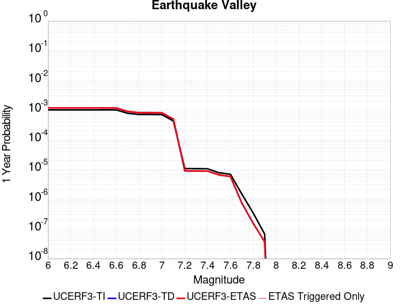 |  |

| Magnitude | 1 wk TI Prob | 1 wk TD Prob | 1 wk ETAS Prob | 1 wk ETAS/TD Gain | 1 wk ETAS Triggered Only | 1 mo TI Prob | 1 mo TD Prob | 1 mo ETAS Prob | 1 mo ETAS/TD Gain | 1 mo ETAS Triggered Only | 1 yr TI Prob | 1 yr TD Prob | 1 yr ETAS Prob | 1 yr ETAS/TD Gain | 1 yr ETAS Triggered Only | 10 yr TI Prob | 10 yr TD Prob | 10 yr ETAS Prob | 10 yr ETAS/TD Gain | 10 yr ETAS Triggered Only |
|-----|-----|-----|-----|-----|-----|-----|-----|-----|-----|-----|-----|-----|-----|-----|-----|-----|-----|-----|-----|-----|
| 6.0 | 1.9416384E-5 | 2.2586119E-5 | 2.2586119E-5 | 1.0 | 0.0 | 8.321042E-5 | 9.6794734E-5 | 9.6794734E-5 | 1.0 | 0.0 | 0.001012616 | 0.0011779587 | 0.0011779587 | 1.0 | 0.0 | 0.010080142 | 0.0117289815 | 0.011738865 | 1.0008426 | 1.0E-5 |
| 6.1 | 1.9416384E-5 | 2.2586119E-5 | 2.2586119E-5 | 1.0 | 0.0 | 8.321042E-5 | 9.6794734E-5 | 9.6794734E-5 | 1.0 | 0.0 | 0.001012616 | 0.0011779587 | 0.0011779587 | 1.0 | 0.0 | 0.010080142 | 0.0117289815 | 0.011738865 | 1.0008426 | 1.0E-5 |
| 6.2 | 1.9416384E-5 | 2.2586119E-5 | 2.2586119E-5 | 1.0 | 0.0 | 8.321042E-5 | 9.6794734E-5 | 9.6794734E-5 | 1.0 | 0.0 | 0.001012616 | 0.0011779587 | 0.0011779587 | 1.0 | 0.0 | 0.010080142 | 0.0117289815 | 0.011738865 | 1.0008426 | 1.0E-5 |
| 6.3 | 1.9416384E-5 | 2.2586119E-5 | 2.2586119E-5 | 1.0 | 0.0 | 8.321042E-5 | 9.6794734E-5 | 9.6794734E-5 | 1.0 | 0.0 | 0.001012616 | 0.0011779587 | 0.0011779587 | 1.0 | 0.0 | 0.010080142 | 0.0117289815 | 0.011738865 | 1.0008426 | 1.0E-5 |
| 6.4 | 1.9416384E-5 | 2.2586119E-5 | 2.2586119E-5 | 1.0 | 0.0 | 8.321042E-5 | 9.6794734E-5 | 9.6794734E-5 | 1.0 | 0.0 | 0.001012616 | 0.0011779587 | 0.0011779587 | 1.0 | 0.0 | 0.010080142 | 0.0117289815 | 0.011738865 | 1.0008426 | 1.0E-5 |
| 6.5 | 1.9389157E-5 | 2.2554705E-5 | 2.2554705E-5 | 1.0 | 0.0 | 8.309374E-5 | 9.6660115E-5 | 9.6660115E-5 | 1.0 | 0.0 | 0.0010111968 | 0.0011763214 | 0.0011763214 | 1.0 | 0.0 | 0.010066078 | 0.011712782 | 0.011722665 | 1.0008438 | 1.0E-5 |
| 6.6 | 1.9389157E-5 | 2.2554705E-5 | 2.2554705E-5 | 1.0 | 0.0 | 8.309374E-5 | 9.6660115E-5 | 9.6660115E-5 | 1.0 | 0.0 | 0.0010111968 | 0.0011763214 | 0.0011763214 | 1.0 | 0.0 | 0.010066078 | 0.011712782 | 0.011722665 | 1.0008438 | 1.0E-5 |
| 6.7 | 1.4925434E-5 | 1.7209666E-5 | 1.7209666E-5 | 1.0 | 0.0 | 6.396457E-5 | 7.3754105E-5 | 7.3754105E-5 | 1.0 | 0.0 | 7.7849044E-4 | 8.976714E-4 | 8.976714E-4 | 1.0 | 0.0 | 0.007757689 | 0.008948831 | 0.008958741 | 1.0011075 | 1.0E-5 |
| 6.8 | 1.3570335E-5 | 1.5618134E-5 | 1.5618134E-5 | 1.0 | 0.0 | 5.8157282E-5 | 6.693361E-5 | 6.693361E-5 | 1.0 | 0.0 | 7.0783484E-4 | 8.146941E-4 | 8.146941E-4 | 1.0 | 0.0 | 0.0070558446 | 0.008125147 | 0.008135065 | 1.0012207 | 1.0E-5 |
| 6.9 | 1.3570335E-5 | 1.5618134E-5 | 1.5618134E-5 | 1.0 | 0.0 | 5.8157282E-5 | 6.693361E-5 | 6.693361E-5 | 1.0 | 0.0 | 7.0783484E-4 | 8.146941E-4 | 8.146941E-4 | 1.0 | 0.0 | 0.0070558446 | 0.008125147 | 0.008135065 | 1.0012207 | 1.0E-5 |
| 7.0 | 1.3433392E-5 | 1.5461666E-5 | 1.5461666E-5 | 1.0 | 0.0 | 5.757041E-5 | 6.626306E-5 | 6.626306E-5 | 1.0 | 0.0 | 7.0069433E-4 | 8.065363E-4 | 8.065363E-4 | 1.0 | 0.0 | 0.006984891 | 0.008044161 | 0.00805408 | 1.0012331 | 1.0E-5 |
| 7.1 | 8.181609E-6 | 9.417647E-6 | 9.417647E-6 | 1.0 | 0.0 | 3.5063567E-5 | 4.0361097E-5 | 4.0361097E-5 | 1.0 | 0.0 | 4.268153E-4 | 4.9135264E-4 | 4.9135264E-4 | 1.0 | 0.0 | 0.0042599645 | 0.00490924 | 0.004919191 | 1.0020269 | 1.0E-5 |
| 7.2 | 2.0663983E-7 | 1.7264514E-7 | 1.7264514E-7 | 1.0 | 0.0 | 8.855989E-7 | 7.399076E-7 | 7.399076E-7 | 1.0 | 0.0 | 1.0782113E-5 | 9.008341E-6 | 9.008341E-6 | 1.0 | 0.0 | 1.07815904E-4 | 9.0080124E-5 | 9.0080124E-5 | 1.0 | 0.0 |
| 7.3 | 2.0462376E-7 | 1.7079999E-7 | 1.7079999E-7 | 1.0 | 0.0 | 8.7695867E-7 | 7.3199976E-7 | 7.3199976E-7 | 1.0 | 0.0 | 1.0676919E-5 | 8.912065E-6 | 8.912065E-6 | 1.0 | 0.0 | 1.0676406E-4 | 8.911743E-5 | 8.911743E-5 | 1.0 | 0.0 |
| 7.4 | 2.0171088E-7 | 1.6862458E-7 | 1.6862458E-7 | 1.0 | 0.0 | 8.644749E-7 | 7.226766E-7 | 7.226766E-7 | 1.0 | 0.0 | 1.0524931E-5 | 8.798555E-6 | 8.798555E-6 | 1.0 | 0.0 | 1.05244326E-4 | 8.798243E-5 | 8.798243E-5 | 1.0 | 0.0 |
| 7.5 | 1.4847944E-7 | 1.2560471E-7 | 1.2560471E-7 | 1.0 | 0.0 | 6.363403E-7 | 5.383058E-7 | 5.383058E-7 | 1.0 | 0.0 | 7.747416E-6 | 6.5538557E-6 | 6.5538557E-6 | 1.0 | 0.0 | 7.747146E-5 | 6.553684E-5 | 6.553684E-5 | 1.0 | 0.0 |
| 7.6 | 1.3185847E-7 | 1.11242514E-7 | 1.11242514E-7 | 1.0 | 0.0 | 5.6510765E-7 | 4.7675354E-7 | 4.7675354E-7 | 1.0 | 0.0 | 6.8801637E-6 | 5.804461E-6 | 5.804461E-6 | 1.0 | 0.0 | 6.8799505E-5 | 5.8043308E-5 | 5.8043308E-5 | 1.0 | 0.0 |
| 7.7 | 2.8609954E-8 | 1.4172866E-8 | 1.4172866E-8 | 1.0 | 0.0 | 1.2261408E-7 | 6.074085E-8 | 6.074085E-8 | 1.0 | 0.0 | 1.4928254E-6 | 7.395197E-7 | 7.395197E-7 | 1.0 | 0.0 | 1.4928154E-5 | 7.395178E-6 | 7.395178E-6 | 1.0 | 0.0 |
| 7.8 | 6.527266E-9 | 2.9237168E-9 | 2.9237168E-9 | 1.0 | 0.0 | 2.7973995E-8 | 1.2530215E-8 | 1.2530215E-8 | 1.0 | 0.0 | 3.4058334E-7 | 1.5255536E-7 | 1.5255536E-7 | 1.0 | 0.0 | 3.4058282E-6 | 1.5255528E-6 | 1.5255528E-6 | 1.0 | 0.0 |
| 7.9 | 1.2898267E-9 | 7.1284756E-10 | 7.1284756E-10 | 1.0 | 0.0 | 5.527829E-9 | 3.055061E-9 | 3.055061E-9 | 1.0 | 0.0 | 6.7301315E-8 | 3.719537E-8 | 3.719537E-8 | 1.0 | 0.0 | 6.7301295E-7 | 3.719537E-7 | 3.719537E-7 | 1.0 | 0.0 |

## Green Valley 2011 CFM
*[(top)](#table-of-contents)*

| 1 Week | 1 Month | 1 Year | 10 Year |
|-----|-----|-----|-----|
|  |  |  | 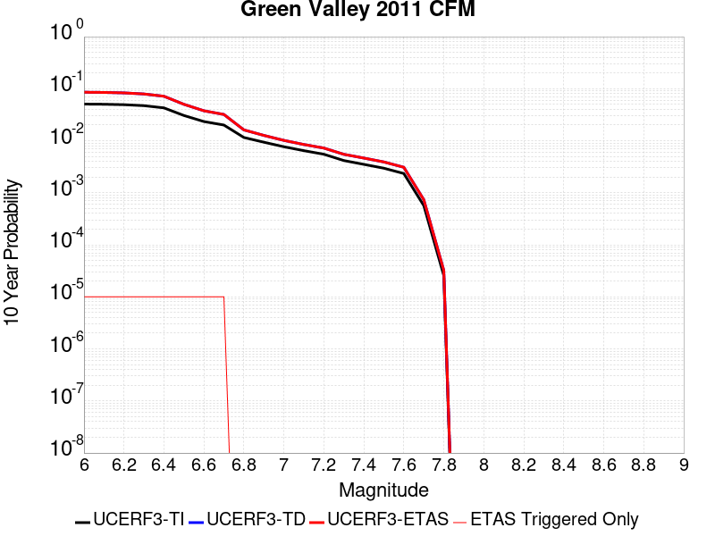 |

| Magnitude | 1 wk TI Prob | 1 wk TD Prob | 1 wk ETAS Prob | 1 wk ETAS/TD Gain | 1 wk ETAS Triggered Only | 1 mo TI Prob | 1 mo TD Prob | 1 mo ETAS Prob | 1 mo ETAS/TD Gain | 1 mo ETAS Triggered Only | 1 yr TI Prob | 1 yr TD Prob | 1 yr ETAS Prob | 1 yr ETAS/TD Gain | 1 yr ETAS Triggered Only | 10 yr TI Prob | 10 yr TD Prob | 10 yr ETAS Prob | 10 yr ETAS/TD Gain | 10 yr ETAS Triggered Only |
|-----|-----|-----|-----|-----|-----|-----|-----|-----|-----|-----|-----|-----|-----|-----|-----|-----|-----|-----|-----|-----|
| 6.0 | 9.9629346E-5 | 1.7304572E-4 | 1.7304572E-4 | 1.0 | 0.0 | 4.2691303E-4 | 7.414138E-4 | 7.414138E-4 | 1.0 | 0.0 | 0.0051852856 | 0.008987814 | 0.008997724 | 1.0011026 | 1.0E-5 | 0.050659515 | 0.085527435 | 0.08553658 | 1.0001069 | 1.0E-5 |
| 6.1 | 9.88615E-5 | 1.7151864E-4 | 1.7151864E-4 | 1.0 | 0.0 | 4.2362334E-4 | 7.3487294E-4 | 7.3487294E-4 | 1.0 | 0.0 | 0.0051454236 | 0.008908839 | 0.008918749 | 1.0011125 | 1.0E-5 | 0.050279044 | 0.08481502 | 0.084824175 | 1.0001079 | 1.0E-5 |
| 6.2 | 9.696895E-5 | 1.6790899E-4 | 1.6790899E-4 | 1.0 | 0.0 | 4.15515E-4 | 7.1941176E-4 | 7.1941176E-4 | 1.0 | 0.0 | 0.0050471667 | 0.008722208 | 0.0087321205 | 1.0011365 | 1.0E-5 | 0.04934063 | 0.08312373 | 0.0831329 | 1.0001103 | 1.0E-5 |
| 6.3 | 9.275224E-5 | 1.5970213E-4 | 1.5970213E-4 | 1.0 | 0.0 | 3.9744904E-4 | 6.842581E-4 | 6.842581E-4 | 1.0 | 0.0 | 0.0048282105 | 0.008297518 | 0.008307436 | 1.0011952 | 1.0E-5 | 0.047246475 | 0.07926153 | 0.079270735 | 1.0001161 | 1.0E-5 |
| 6.4 | 8.391499E-5 | 1.4367483E-4 | 1.4367483E-4 | 1.0 | 0.0 | 3.595861E-4 | 6.1560416E-4 | 6.1560416E-4 | 1.0 | 0.0 | 0.004369175 | 0.007467977 | 0.007477902 | 1.0013291 | 1.0E-5 | 0.04284265 | 0.071636066 | 0.07164535 | 1.0001296 | 1.0E-5 |
| 6.5 | 5.9519385E-5 | 9.933853E-5 | 9.933853E-5 | 1.0 | 0.0 | 2.5505814E-4 | 4.2566867E-4 | 4.2566867E-4 | 1.0 | 0.0 | 0.0031009112 | 0.0051689674 | 0.005178916 | 1.0019246 | 1.0E-5 | 0.030579966 | 0.050151594 | 0.05016109 | 1.0001894 | 1.0E-5 |
| 6.6 | 4.5361558E-5 | 7.4029E-5 | 7.4029E-5 | 1.0 | 0.0 | 1.9439218E-4 | 3.172295E-4 | 3.172295E-4 | 1.0 | 0.0 | 0.0023641558 | 0.0038543947 | 0.0038643563 | 1.0025845 | 1.0E-5 | 0.023391623 | 0.037671465 | 0.03768109 | 1.0002555 | 1.0E-5 |
| 6.7 | 3.8808106E-5 | 6.265283E-5 | 6.265283E-5 | 1.0 | 0.0 | 1.6630985E-4 | 2.6848516E-4 | 2.6848516E-4 | 1.0 | 0.0 | 0.0020229418 | 0.003263188 | 0.0032731553 | 1.0030545 | 1.0E-5 | 0.020046256 | 0.032010417 | 0.0320201 | 1.0003024 | 1.0E-5 |
| 6.8 | 2.2284667E-5 | 3.1287414E-5 | 3.1287414E-5 | 1.0 | 0.0 | 9.550222E-5 | 1.3408205E-4 | 1.3408205E-4 | 1.0 | 0.0 | 0.0011621192 | 0.0016312245 | 0.0016312245 | 1.0 | 0.0 | 0.011560607 | 0.016166147 | 0.016166147 | 1.0 | 0.0 |
| 6.9 | 1.8050168E-5 | 2.4449786E-5 | 2.4449786E-5 | 1.0 | 0.0 | 7.735557E-5 | 1.0478061E-4 | 1.0478061E-4 | 1.0 | 0.0 | 9.4139716E-4 | 0.00127496 | 0.00127496 | 1.0 | 0.0 | 0.009374191 | 0.012668968 | 0.012668968 | 1.0 | 0.0 |
| 7.0 | 1.4763166E-5 | 1.9584304E-5 | 1.9584304E-5 | 1.0 | 0.0 | 6.326917E-5 | 8.393005E-5 | 8.393005E-5 | 1.0 | 0.0 | 7.7002996E-4 | 0.0010213705 | 0.0010213705 | 1.0 | 0.0 | 0.007673672 | 0.010166095 | 0.010166095 | 1.0 | 0.0 |
| 7.1 | 1.2399713E-5 | 1.6304952E-5 | 1.6304952E-5 | 1.0 | 0.0 | 5.3140546E-5 | 6.987651E-5 | 6.987651E-5 | 1.0 | 0.0 | 6.467941E-4 | 8.5041637E-4 | 8.5041637E-4 | 1.0 | 0.0 | 0.006449148 | 0.0084723225 | 0.0084723225 | 1.0 | 0.0 |
| 7.2 | 1.0584195E-5 | 1.3922896E-5 | 1.3922896E-5 | 1.0 | 0.0 | 4.5360044E-5 | 5.9668197E-5 | 5.9668197E-5 | 1.0 | 0.0 | 5.521186E-4 | 7.262198E-4 | 7.262198E-4 | 1.0 | 0.0 | 0.0055074887 | 0.007239167 | 0.007239167 | 1.0 | 0.0 |
| 7.3 | 7.998173E-6 | 1.0545019E-5 | 1.0545019E-5 | 1.0 | 0.0 | 3.4277433E-5 | 4.5192162E-5 | 4.5192162E-5 | 1.0 | 0.0 | 4.1724785E-4 | 5.500767E-4 | 5.500767E-4 | 1.0 | 0.0 | 0.004164653 | 0.005487462 | 0.005487462 | 1.0 | 0.0 |
| 7.4 | 6.7571127E-6 | 8.933612E-6 | 8.933612E-6 | 1.0 | 0.0 | 2.8958733E-5 | 3.828635E-5 | 3.828635E-5 | 1.0 | 0.0 | 3.5251552E-4 | 4.660376E-4 | 4.660376E-4 | 1.0 | 0.0 | 0.0035195686 | 0.004650931 | 0.004650931 | 1.0 | 0.0 |
| 7.5 | 5.69878E-6 | 7.5170196E-6 | 7.5170196E-6 | 1.0 | 0.0 | 2.4423114E-5 | 3.2215405E-5 | 3.2215405E-5 | 1.0 | 0.0 | 2.9731085E-4 | 3.9215287E-4 | 3.9215287E-4 | 1.0 | 0.0 | 0.002969134 | 0.0039148894 | 0.0039148894 | 1.0 | 0.0 |
| 7.6 | 4.503664E-6 | 5.9361423E-6 | 5.9361423E-6 | 1.0 | 0.0 | 1.9301275E-5 | 2.5440368E-5 | 2.5440368E-5 | 1.0 | 0.0 | 2.3496768E-4 | 3.0969328E-4 | 3.0969328E-4 | 1.0 | 0.0 | 0.002347194 | 0.0030928045 | 0.0030928045 | 1.0 | 0.0 |
| 7.7 | 1.0873546E-6 | 1.4108049E-6 | 1.4108049E-6 | 1.0 | 0.0 | 4.6600826E-6 | 6.0462926E-6 | 6.0462926E-6 | 1.0 | 0.0 | 5.6735033E-5 | 7.3611154E-5 | 7.3611154E-5 | 1.0 | 0.0 | 5.672055E-4 | 7.358776E-4 | 7.358776E-4 | 1.0 | 0.0 |
| 7.8 | 4.9373917E-8 | 6.178244E-8 | 6.178244E-8 | 1.0 | 0.0 | 2.1160248E-7 | 2.6478185E-7 | 2.6478185E-7 | 1.0 | 0.0 | 2.5762572E-6 | 3.2237156E-6 | 3.2237156E-6 | 1.0 | 0.0 | 2.5762274E-5 | 3.2229666E-5 | 3.2229666E-5 | 1.0 | 0.0 |

## Santa Susana East (connector)
*[(top)](#table-of-contents)*

| 1 Week | 1 Month | 1 Year | 10 Year |
|-----|-----|-----|-----|
|  | 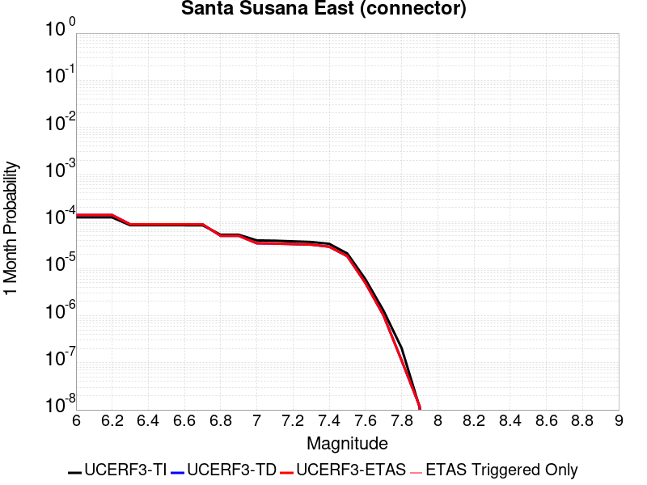 |  |  |

| Magnitude | 1 wk TI Prob | 1 wk TD Prob | 1 wk ETAS Prob | 1 wk ETAS/TD Gain | 1 wk ETAS Triggered Only | 1 mo TI Prob | 1 mo TD Prob | 1 mo ETAS Prob | 1 mo ETAS/TD Gain | 1 mo ETAS Triggered Only | 1 yr TI Prob | 1 yr TD Prob | 1 yr ETAS Prob | 1 yr ETAS/TD Gain | 1 yr ETAS Triggered Only | 10 yr TI Prob | 10 yr TD Prob | 10 yr ETAS Prob | 10 yr ETAS/TD Gain | 10 yr ETAS Triggered Only |
|-----|-----|-----|-----|-----|-----|-----|-----|-----|-----|-----|-----|-----|-----|-----|-----|-----|-----|-----|-----|-----|
| 6.0 | 2.858397E-5 | 3.2025328E-5 | 3.2025328E-5 | 1.0 | 0.0 | 1.2249697E-4 | 1.3724578E-4 | 1.3724578E-4 | 1.0 | 0.0 | 0.0014903803 | 0.0016699575 | 0.0016699575 | 1.0 | 0.0 | 0.014804244 | 0.016600663 | 0.016610498 | 1.0005924 | 1.0E-5 |
| 6.1 | 2.858397E-5 | 3.2025328E-5 | 3.2025328E-5 | 1.0 | 0.0 | 1.2249697E-4 | 1.3724578E-4 | 1.3724578E-4 | 1.0 | 0.0 | 0.0014903803 | 0.0016699575 | 0.0016699575 | 1.0 | 0.0 | 0.014804244 | 0.016600663 | 0.016610498 | 1.0005924 | 1.0E-5 |
| 6.2 | 2.858397E-5 | 3.2025328E-5 | 3.2025328E-5 | 1.0 | 0.0 | 1.2249697E-4 | 1.3724578E-4 | 1.3724578E-4 | 1.0 | 0.0 | 0.0014903803 | 0.0016699575 | 0.0016699575 | 1.0 | 0.0 | 0.014804244 | 0.016600663 | 0.016610498 | 1.0005924 | 1.0E-5 |
| 6.3 | 1.943582E-5 | 2.0369282E-5 | 2.0369282E-5 | 1.0 | 0.0 | 8.329371E-5 | 8.729463E-5 | 8.729463E-5 | 1.0 | 0.0 | 0.001013629 | 0.001062406 | 0.001062406 | 1.0 | 0.0 | 0.010090181 | 0.010584349 | 0.010584349 | 1.0 | 0.0 |
| 6.4 | 1.943582E-5 | 2.0369282E-5 | 2.0369282E-5 | 1.0 | 0.0 | 8.329371E-5 | 8.729463E-5 | 8.729463E-5 | 1.0 | 0.0 | 0.001013629 | 0.001062406 | 0.001062406 | 1.0 | 0.0 | 0.010090181 | 0.010584349 | 0.010584349 | 1.0 | 0.0 |
| 6.5 | 1.943582E-5 | 2.0369282E-5 | 2.0369282E-5 | 1.0 | 0.0 | 8.329371E-5 | 8.729463E-5 | 8.729463E-5 | 1.0 | 0.0 | 0.001013629 | 0.001062406 | 0.001062406 | 1.0 | 0.0 | 0.010090181 | 0.010584349 | 0.010584349 | 1.0 | 0.0 |
| 6.6 | 1.943582E-5 | 2.0369282E-5 | 2.0369282E-5 | 1.0 | 0.0 | 8.329371E-5 | 8.729463E-5 | 8.729463E-5 | 1.0 | 0.0 | 0.001013629 | 0.001062406 | 0.001062406 | 1.0 | 0.0 | 0.010090181 | 0.010584349 | 0.010584349 | 1.0 | 0.0 |
| 6.7 | 1.9404439E-5 | 2.0356701E-5 | 2.0356701E-5 | 1.0 | 0.0 | 8.3159226E-5 | 8.724072E-5 | 8.724072E-5 | 1.0 | 0.0 | 0.0010119933 | 0.0010617502 | 0.0010617502 | 1.0 | 0.0 | 0.010073971 | 0.010577854 | 0.010577854 | 1.0 | 0.0 |
| 6.8 | 1.2217526E-5 | 1.1593922E-5 | 1.1593922E-5 | 1.0 | 0.0 | 5.2359774E-5 | 4.9687387E-5 | 4.9687387E-5 | 1.0 | 0.0 | 6.372938E-4 | 6.0479285E-4 | 6.0479285E-4 | 1.0 | 0.0 | 0.0063546924 | 0.006033162 | 0.006033162 | 1.0 | 0.0 |
| 6.9 | 1.2217526E-5 | 1.1593922E-5 | 1.1593922E-5 | 1.0 | 0.0 | 5.2359774E-5 | 4.9687387E-5 | 4.9687387E-5 | 1.0 | 0.0 | 6.372938E-4 | 6.0479285E-4 | 6.0479285E-4 | 1.0 | 0.0 | 0.0063546924 | 0.006033162 | 0.006033162 | 1.0 | 0.0 |
| 7.0 | 9.276017E-6 | 8.059641E-6 | 8.059641E-6 | 1.0 | 0.0 | 3.9753755E-5 | 3.454088E-5 | 3.454088E-5 | 1.0 | 0.0 | 4.8389446E-4 | 4.2045754E-4 | 4.2045754E-4 | 1.0 | 0.0 | 0.0048284214 | 0.004196991 | 0.004196991 | 1.0 | 0.0 |
| 7.1 | 9.130355E-6 | 7.942807E-6 | 7.942807E-6 | 1.0 | 0.0 | 3.9129503E-5 | 3.404018E-5 | 3.404018E-5 | 1.0 | 0.0 | 4.7629757E-4 | 4.143638E-4 | 4.143638E-4 | 1.0 | 0.0 | 0.00475278 | 0.004136282 | 0.004136282 | 1.0 | 0.0 |
| 7.2 | 8.851015E-6 | 7.741957E-6 | 7.741957E-6 | 1.0 | 0.0 | 3.7932372E-5 | 3.3179414E-5 | 3.3179414E-5 | 1.0 | 0.0 | 4.6172875E-4 | 4.0388794E-4 | 4.0388794E-4 | 1.0 | 0.0 | 0.0046077054 | 0.004031906 | 0.004031906 | 1.0 | 0.0 |
| 7.3 | 8.573006E-6 | 7.5506696E-6 | 7.5506696E-6 | 1.0 | 0.0 | 3.6740938E-5 | 3.2359632E-5 | 3.2359632E-5 | 1.0 | 0.0 | 4.472291E-4 | 3.939107E-4 | 3.939107E-4 | 1.0 | 0.0 | 0.004463301 | 0.0039325035 | 0.0039325035 | 1.0 | 0.0 |
| 7.4 | 7.852282E-6 | 6.8181307E-6 | 6.8181307E-6 | 1.0 | 0.0 | 3.36522E-5 | 2.922025E-5 | 2.922025E-5 | 1.0 | 0.0 | 4.096385E-4 | 3.557015E-4 | 3.557015E-4 | 1.0 | 0.0 | 0.0040888423 | 0.0035516357 | 0.0035516357 | 1.0 | 0.0 |
| 7.5 | 4.8869324E-6 | 4.279285E-6 | 4.279285E-6 | 1.0 | 0.0 | 2.0943828E-5 | 1.8339673E-5 | 1.8339673E-5 | 1.0 | 0.0 | 2.5496128E-4 | 2.232643E-4 | 2.232643E-4 | 1.0 | 0.0 | 0.0025466895 | 0.0022304566 | 0.0022304566 | 1.0 | 0.0 |
| 7.6 | 1.3894544E-6 | 1.1568683E-6 | 1.1568683E-6 | 1.0 | 0.0 | 5.954791E-6 | 4.957999E-6 | 4.957999E-6 | 1.0 | 0.0 | 7.249717E-5 | 6.0362185E-5 | 6.0362185E-5 | 1.0 | 0.0 | 7.247352E-4 | 6.034797E-4 | 6.034797E-4 | 1.0 | 0.0 |
| 7.7 | 2.9924632E-7 | 2.372098E-7 | 2.372098E-7 | 1.0 | 0.0 | 1.2824837E-6 | 1.016613E-6 | 1.016613E-6 | 1.0 | 0.0 | 1.5614127E-5 | 1.23772015E-5 | 1.23772015E-5 | 1.0 | 0.0 | 1.5613029E-4 | 1.2376584E-4 | 1.2376584E-4 | 1.0 | 0.0 |
| 7.8 | 4.8188564E-8 | 2.6328209E-8 | 2.6328209E-8 | 1.0 | 0.0 | 2.065224E-7 | 1.12835174E-7 | 1.12835174E-7 | 1.0 | 0.0 | 2.5144072E-6 | 1.3737674E-6 | 1.3737674E-6 | 1.0 | 0.0 | 2.5143789E-5 | 1.3737598E-5 | 1.3737598E-5 | 1.0 | 0.0 |
| 7.9 | 2.6127251E-9 | 2.7681977E-9 | 2.7681977E-9 | 1.0 | 0.0 | 1.1197393E-8 | 1.1863704E-8 | 1.1863704E-8 | 1.0 | 0.0 | 1.3632825E-7 | 1.4444059E-7 | 1.4444059E-7 | 1.0 | 0.0 | 1.3632817E-6 | 1.4444059E-6 | 1.4444059E-6 | 1.0 | 0.0 |

## San Luis Range - Oceano 2011 CFM
*[(top)](#table-of-contents)*

| 1 Week | 1 Month | 1 Year | 10 Year |
|-----|-----|-----|-----|
|  |  |  |  |

| Magnitude | 1 wk TI Prob | 1 wk TD Prob | 1 wk ETAS Prob | 1 wk ETAS/TD Gain | 1 wk ETAS Triggered Only | 1 mo TI Prob | 1 mo TD Prob | 1 mo ETAS Prob | 1 mo ETAS/TD Gain | 1 mo ETAS Triggered Only | 1 yr TI Prob | 1 yr TD Prob | 1 yr ETAS Prob | 1 yr ETAS/TD Gain | 1 yr ETAS Triggered Only | 10 yr TI Prob | 10 yr TD Prob | 10 yr ETAS Prob | 10 yr ETAS/TD Gain | 10 yr ETAS Triggered Only |
|-----|-----|-----|-----|-----|-----|-----|-----|-----|-----|-----|-----|-----|-----|-----|-----|-----|-----|-----|-----|-----|
| 6.0 | 1.6025788E-6 | 1.6201284E-6 | 1.6201284E-6 | 1.0 | 0.0 | 6.8681766E-6 | 6.9433913E-6 | 6.9433913E-6 | 1.0 | 0.0 | 8.361684E-5 | 8.453293E-5 | 8.453293E-5 | 1.0 | 0.0 | 8.3585386E-4 | 8.450485E-4 | 8.5504004E-4 | 1.0118237 | 1.0E-5 |
| 6.1 | 1.6025788E-6 | 1.6201284E-6 | 1.6201284E-6 | 1.0 | 0.0 | 6.8681766E-6 | 6.9433913E-6 | 6.9433913E-6 | 1.0 | 0.0 | 8.361684E-5 | 8.453293E-5 | 8.453293E-5 | 1.0 | 0.0 | 8.3585386E-4 | 8.450485E-4 | 8.5504004E-4 | 1.0118237 | 1.0E-5 |
| 6.2 | 1.6025788E-6 | 1.6201284E-6 | 1.6201284E-6 | 1.0 | 0.0 | 6.8681766E-6 | 6.9433913E-6 | 6.9433913E-6 | 1.0 | 0.0 | 8.361684E-5 | 8.453293E-5 | 8.453293E-5 | 1.0 | 0.0 | 8.3585386E-4 | 8.450485E-4 | 8.5504004E-4 | 1.0118237 | 1.0E-5 |
| 6.3 | 1.6025788E-6 | 1.6201284E-6 | 1.6201284E-6 | 1.0 | 0.0 | 6.8681766E-6 | 6.9433913E-6 | 6.9433913E-6 | 1.0 | 0.0 | 8.361684E-5 | 8.453293E-5 | 8.453293E-5 | 1.0 | 0.0 | 8.3585386E-4 | 8.450485E-4 | 8.5504004E-4 | 1.0118237 | 1.0E-5 |
| 6.4 | 1.1621186E-6 | 1.1749963E-6 | 1.1749963E-6 | 1.0 | 0.0 | 4.980499E-6 | 5.0356903E-6 | 5.0356903E-6 | 1.0 | 0.0 | 6.0635884E-5 | 6.130808E-5 | 6.130808E-5 | 1.0 | 0.0 | 6.0619344E-4 | 6.1293825E-4 | 6.229321E-4 | 1.0163049 | 1.0E-5 |
| 6.5 | 1.1621186E-6 | 1.1749963E-6 | 1.1749963E-6 | 1.0 | 0.0 | 4.980499E-6 | 5.0356903E-6 | 5.0356903E-6 | 1.0 | 0.0 | 6.0635884E-5 | 6.130808E-5 | 6.130808E-5 | 1.0 | 0.0 | 6.0619344E-4 | 6.1293825E-4 | 6.229321E-4 | 1.0163049 | 1.0E-5 |
| 6.6 | 7.164729E-7 | 7.2486233E-7 | 7.2486233E-7 | 1.0 | 0.0 | 3.0705946E-6 | 3.1065492E-6 | 3.1065492E-6 | 1.0 | 0.0 | 3.738385E-5 | 3.78216E-5 | 3.78216E-5 | 1.0 | 0.0 | 3.737756E-4 | 3.7815337E-4 | 3.881496E-4 | 1.0264343 | 1.0E-5 |
| 6.7 | 7.164729E-7 | 7.2486233E-7 | 7.2486233E-7 | 1.0 | 0.0 | 3.0705946E-6 | 3.1065492E-6 | 3.1065492E-6 | 1.0 | 0.0 | 3.738385E-5 | 3.78216E-5 | 3.78216E-5 | 1.0 | 0.0 | 3.737756E-4 | 3.7815337E-4 | 3.881496E-4 | 1.0264343 | 1.0E-5 |
| 6.8 | 6.700177E-7 | 6.777481E-7 | 6.777481E-7 | 1.0 | 0.0 | 2.8715012E-6 | 2.9046316E-6 | 2.9046316E-6 | 1.0 | 0.0 | 3.495997E-5 | 3.5363333E-5 | 3.5363333E-5 | 1.0 | 0.0 | 3.495447E-4 | 3.535787E-4 | 3.6357515E-4 | 1.0282723 | 1.0E-5 |
| 6.9 | 5.657865E-7 | 5.721821E-7 | 5.721821E-7 | 1.0 | 0.0 | 2.424797E-6 | 2.4522067E-6 | 2.4522067E-6 | 1.0 | 0.0 | 2.9521503E-5 | 2.9855219E-5 | 2.9855219E-5 | 1.0 | 0.0 | 2.9517582E-4 | 2.9851313E-4 | 3.0851015E-4 | 1.0334893 | 1.0E-5 |
| 7.0 | 4.608413E-7 | 4.6601969E-7 | 4.6601969E-7 | 1.0 | 0.0 | 1.9750328E-6 | 1.9972258E-6 | 1.9972258E-6 | 1.0 | 0.0 | 2.4045758E-5 | 2.4315956E-5 | 2.4315956E-5 | 1.0 | 0.0 | 2.4043156E-4 | 2.4313324E-4 | 2.531308E-4 | 1.0411197 | 1.0E-5 |
| 7.1 | 3.9177846E-7 | 3.962184E-7 | 3.962184E-7 | 1.0 | 0.0 | 1.6790494E-6 | 1.6980779E-6 | 1.6980779E-6 | 1.0 | 0.0 | 2.0442236E-5 | 2.0673902E-5 | 2.0673902E-5 | 1.0 | 0.0 | 2.0440355E-4 | 2.0671995E-4 | 2.1671788E-4 | 1.0483646 | 1.0E-5 |
| 7.2 | 3.3974752E-7 | 3.436674E-7 | 3.436674E-7 | 1.0 | 0.0 | 1.45606E-6 | 1.4728595E-6 | 1.4728595E-6 | 1.0 | 0.0 | 1.7727387E-5 | 1.7931918E-5 | 1.7931918E-5 | 1.0 | 0.0 | 1.7725973E-4 | 1.7930481E-4 | 1.8930303E-4 | 1.055761 | 1.0E-5 |
| 7.3 | 2.8900928E-7 | 2.9234198E-7 | 2.9234198E-7 | 1.0 | 0.0 | 1.2386106E-6 | 1.2528936E-6 | 1.2528936E-6 | 1.0 | 0.0 | 1.5079979E-5 | 1.5253873E-5 | 1.5253873E-5 | 1.0 | 0.0 | 1.5078956E-4 | 1.5252834E-4 | 1.6252682E-4 | 1.0655516 | 1.0E-5 |
| 7.4 | 2.1881527E-7 | 2.2139733E-7 | 2.2139733E-7 | 1.0 | 0.0 | 9.3777936E-7 | 9.4884535E-7 | 9.4884535E-7 | 1.0 | 0.0 | 1.14174045E-5 | 1.1552132E-5 | 1.1552132E-5 | 1.0 | 0.0 | 1.1416818E-4 | 1.15515366E-4 | 1.2551421E-4 | 1.0865586 | 1.0E-5 |
| 7.5 | 1.356398E-7 | 1.3718723E-7 | 1.3718723E-7 | 1.0 | 0.0 | 5.813133E-7 | 5.879451E-7 | 5.879451E-7 | 1.0 | 0.0 | 7.0774663E-6 | 7.1582085E-6 | 7.1582085E-6 | 1.0 | 0.0 | 7.077241E-5 | 7.157981E-5 | 8.15791E-5 | 1.1396942 | 1.0E-5 |
| 7.6 | 5.9269272E-8 | 6.0014045E-8 | 6.0014045E-8 | 1.0 | 0.0 | 2.5401116E-7 | 2.5720303E-7 | 2.5720303E-7 | 1.0 | 0.0 | 3.0925814E-6 | 3.1314426E-6 | 3.1314426E-6 | 1.0 | 0.0 | 3.0925385E-5 | 3.1313997E-5 | 4.1313684E-5 | 1.319336 | 1.0E-5 |
| 7.7 | 5.946232E-9 | 6.0369776E-9 | 6.0369776E-9 | 1.0 | 0.0 | 2.5483851E-8 | 2.587276E-8 | 2.587276E-8 | 1.0 | 0.0 | 3.1026585E-7 | 3.1500082E-7 | 3.1500082E-7 | 1.0 | 0.0 | 3.102654E-6 | 3.1500044E-6 | 3.1500044E-6 | 1.0 | 0.0 |

## Burnt Mtn
*[(top)](#table-of-contents)*

| 1 Week | 1 Month | 1 Year | 10 Year |
|-----|-----|-----|-----|
|  |  |  |  |

| Magnitude | 1 wk TI Prob | 1 wk TD Prob | 1 wk ETAS Prob | 1 wk ETAS/TD Gain | 1 wk ETAS Triggered Only | 1 mo TI Prob | 1 mo TD Prob | 1 mo ETAS Prob | 1 mo ETAS/TD Gain | 1 mo ETAS Triggered Only | 1 yr TI Prob | 1 yr TD Prob | 1 yr ETAS Prob | 1 yr ETAS/TD Gain | 1 yr ETAS Triggered Only | 10 yr TI Prob | 10 yr TD Prob | 10 yr ETAS Prob | 10 yr ETAS/TD Gain | 10 yr ETAS Triggered Only |
|-----|-----|-----|-----|-----|-----|-----|-----|-----|-----|-----|-----|-----|-----|-----|-----|-----|-----|-----|-----|-----|
| 6.0 | 1.5673151E-5 | 1.1749327E-5 | 1.1749327E-5 | 1.0 | 0.0 | 6.716892E-5 | 5.0354014E-5 | 5.0354014E-5 | 1.0 | 0.0 | 8.1747473E-4 | 6.130166E-4 | 6.130166E-4 | 1.0 | 0.0 | 0.008144741 | 0.0061258962 | 0.006135835 | 1.0016224 | 1.0E-5 |
| 6.1 | 1.5673151E-5 | 1.1749327E-5 | 1.1749327E-5 | 1.0 | 0.0 | 6.716892E-5 | 5.0354014E-5 | 5.0354014E-5 | 1.0 | 0.0 | 8.1747473E-4 | 6.130166E-4 | 6.130166E-4 | 1.0 | 0.0 | 0.008144741 | 0.0061258962 | 0.006135835 | 1.0016224 | 1.0E-5 |
| 6.2 | 1.5673151E-5 | 1.1749327E-5 | 1.1749327E-5 | 1.0 | 0.0 | 6.716892E-5 | 5.0354014E-5 | 5.0354014E-5 | 1.0 | 0.0 | 8.1747473E-4 | 6.130166E-4 | 6.130166E-4 | 1.0 | 0.0 | 0.008144741 | 0.0061258962 | 0.006135835 | 1.0016224 | 1.0E-5 |
| 6.3 | 1.5673151E-5 | 1.1749327E-5 | 1.1749327E-5 | 1.0 | 0.0 | 6.716892E-5 | 5.0354014E-5 | 5.0354014E-5 | 1.0 | 0.0 | 8.1747473E-4 | 6.130166E-4 | 6.130166E-4 | 1.0 | 0.0 | 0.008144741 | 0.0061258962 | 0.006135835 | 1.0016224 | 1.0E-5 |
| 6.4 | 1.5673151E-5 | 1.1749327E-5 | 1.1749327E-5 | 1.0 | 0.0 | 6.716892E-5 | 5.0354014E-5 | 5.0354014E-5 | 1.0 | 0.0 | 8.1747473E-4 | 6.130166E-4 | 6.130166E-4 | 1.0 | 0.0 | 0.008144741 | 0.0061258962 | 0.006135835 | 1.0016224 | 1.0E-5 |
| 6.5 | 1.36191375E-5 | 1.007816E-5 | 1.007816E-5 | 1.0 | 0.0 | 5.8366426E-5 | 4.319211E-5 | 4.319211E-5 | 1.0 | 0.0 | 7.103795E-4 | 5.2586396E-4 | 5.2586396E-4 | 1.0 | 0.0 | 0.0070811296 | 0.00525864 | 0.0052685873 | 1.0018916 | 1.0E-5 |

## Last Chance
*[(top)](#table-of-contents)*

| 1 Week | 1 Month | 1 Year | 10 Year |
|-----|-----|-----|-----|
|  | 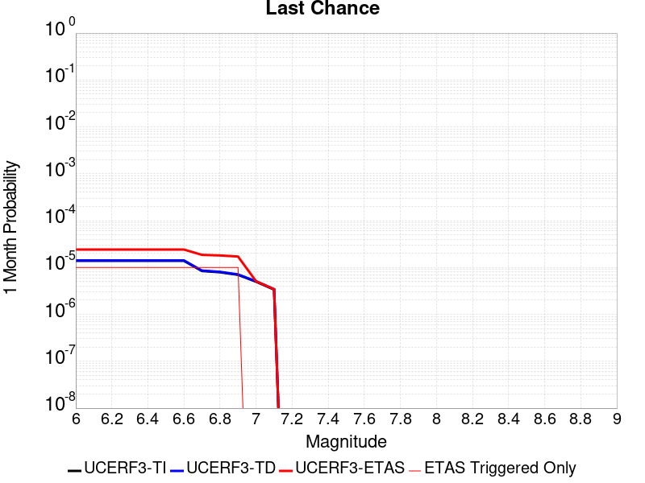 | 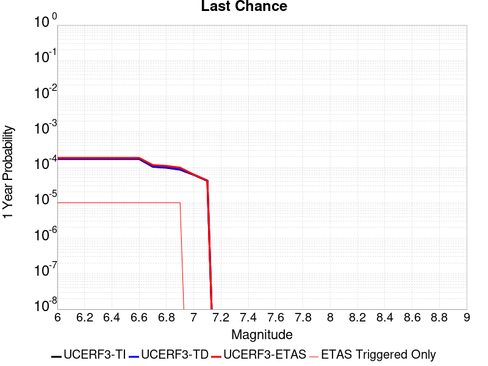 |  |

| Magnitude | 1 wk TI Prob | 1 wk TD Prob | 1 wk ETAS Prob | 1 wk ETAS/TD Gain | 1 wk ETAS Triggered Only | 1 mo TI Prob | 1 mo TD Prob | 1 mo ETAS Prob | 1 mo ETAS/TD Gain | 1 mo ETAS Triggered Only | 1 yr TI Prob | 1 yr TD Prob | 1 yr ETAS Prob | 1 yr ETAS/TD Gain | 1 yr ETAS Triggered Only | 10 yr TI Prob | 10 yr TD Prob | 10 yr ETAS Prob | 10 yr ETAS/TD Gain | 10 yr ETAS Triggered Only |
|-----|-----|-----|-----|-----|-----|-----|-----|-----|-----|-----|-----|-----|-----|-----|-----|-----|-----|-----|-----|-----|
| 6.0 | 3.23929E-6 | 3.3051665E-6 | 3.3051665E-6 | 1.0 | 0.0 | 1.3882597E-5 | 1.4164937E-5 | 2.4164796E-5 | 1.7059586 | 1.0E-5 | 1.6900752E-4 | 1.7244693E-4 | 1.8244522E-4 | 1.0579789 | 1.0E-5 | 0.0016887904 | 0.0017233749 | 0.0017333578 | 1.0057926 | 1.0E-5 |
| 6.1 | 3.23929E-6 | 3.3051665E-6 | 3.3051665E-6 | 1.0 | 0.0 | 1.3882597E-5 | 1.4164937E-5 | 2.4164796E-5 | 1.7059586 | 1.0E-5 | 1.6900752E-4 | 1.7244693E-4 | 1.8244522E-4 | 1.0579789 | 1.0E-5 | 0.0016887904 | 0.0017233749 | 0.0017333578 | 1.0057926 | 1.0E-5 |
| 6.2 | 3.23929E-6 | 3.3051665E-6 | 3.3051665E-6 | 1.0 | 0.0 | 1.3882597E-5 | 1.4164937E-5 | 2.4164796E-5 | 1.7059586 | 1.0E-5 | 1.6900752E-4 | 1.7244693E-4 | 1.8244522E-4 | 1.0579789 | 1.0E-5 | 0.0016887904 | 0.0017233749 | 0.0017333578 | 1.0057926 | 1.0E-5 |
| 6.3 | 3.23929E-6 | 3.3051665E-6 | 3.3051665E-6 | 1.0 | 0.0 | 1.3882597E-5 | 1.4164937E-5 | 2.4164796E-5 | 1.7059586 | 1.0E-5 | 1.6900752E-4 | 1.7244693E-4 | 1.8244522E-4 | 1.0579789 | 1.0E-5 | 0.0016887904 | 0.0017233749 | 0.0017333578 | 1.0057926 | 1.0E-5 |
| 6.4 | 3.23929E-6 | 3.3051665E-6 | 3.3051665E-6 | 1.0 | 0.0 | 1.3882597E-5 | 1.4164937E-5 | 2.4164796E-5 | 1.7059586 | 1.0E-5 | 1.6900752E-4 | 1.7244693E-4 | 1.8244522E-4 | 1.0579789 | 1.0E-5 | 0.0016887904 | 0.0017233749 | 0.0017333578 | 1.0057926 | 1.0E-5 |
| 6.5 | 3.23929E-6 | 3.3051665E-6 | 3.3051665E-6 | 1.0 | 0.0 | 1.3882597E-5 | 1.4164937E-5 | 2.4164796E-5 | 1.7059586 | 1.0E-5 | 1.6900752E-4 | 1.7244693E-4 | 1.8244522E-4 | 1.0579789 | 1.0E-5 | 0.0016887904 | 0.0017233749 | 0.0017333578 | 1.0057926 | 1.0E-5 |
| 6.6 | 3.23929E-6 | 3.3051665E-6 | 3.3051665E-6 | 1.0 | 0.0 | 1.3882597E-5 | 1.4164937E-5 | 2.4164796E-5 | 1.7059586 | 1.0E-5 | 1.6900752E-4 | 1.7244693E-4 | 1.8244522E-4 | 1.0579789 | 1.0E-5 | 0.0016887904 | 0.0017233749 | 0.0017333578 | 1.0057926 | 1.0E-5 |
| 6.7 | 1.9639244E-6 | 2.0044758E-6 | 2.0044758E-6 | 1.0 | 0.0 | 8.416792E-6 | 8.590587E-6 | 1.8590501E-5 | 2.1640549 | 1.0E-5 | 1.02469625E-4 | 1.04586004E-4 | 1.1458496E-4 | 1.0956051 | 1.0E-5 | 0.0010242239 | 0.0010454304 | 0.0010554199 | 1.0095555 | 1.0E-5 |
| 6.8 | 1.8490592E-6 | 1.8875124E-6 | 1.8875124E-6 | 1.0 | 0.0 | 7.924516E-6 | 8.089317E-6 | 1.8089237E-5 | 2.2361882 | 1.0E-5 | 9.64767E-5 | 9.848361E-5 | 1.0848262E-4 | 1.1015297 | 1.0E-5 | 9.643483E-4 | 9.844608E-4 | 9.944509E-4 | 1.0101478 | 1.0E-5 |
| 6.9 | 1.6283703E-6 | 1.6624571E-6 | 1.6624571E-6 | 1.0 | 0.0 | 6.9787116E-6 | 7.1247996E-6 | 1.7124728E-5 | 2.4035382 | 1.0E-5 | 8.49625E-5 | 8.6741544E-5 | 9.6740674E-5 | 1.115275 | 1.0E-5 | 8.4930024E-4 | 8.6713175E-4 | 8.771231E-4 | 1.0115223 | 1.0E-5 |
| 7.0 | 1.1619308E-6 | 1.1869662E-6 | 1.1869662E-6 | 1.0 | 0.0 | 4.979694E-6 | 5.0869908E-6 | 5.0869908E-6 | 1.0 | 0.0 | 6.0626087E-5 | 6.19328E-5 | 6.19328E-5 | 1.0 | 0.0 | 6.060955E-4 | 6.1919907E-4 | 6.1919907E-4 | 1.0 | 0.0 |
| 7.1 | 7.8723247E-7 | 8.0470915E-7 | 8.0470915E-7 | 1.0 | 0.0 | 3.373849E-6 | 3.4487507E-6 | 3.4487507E-6 | 1.0 | 0.0 | 4.107584E-5 | 4.1988034E-5 | 4.1988034E-5 | 1.0 | 0.0 | 4.1068246E-4 | 4.198309E-4 | 4.198309E-4 | 1.0 | 0.0 |

## Pitas Point (Lower)-Montalvo
*[(top)](#table-of-contents)*

| 1 Week | 1 Month | 1 Year | 10 Year |
|-----|-----|-----|-----|
|  |  |  |  |

| Magnitude | 1 wk TI Prob | 1 wk TD Prob | 1 wk ETAS Prob | 1 wk ETAS/TD Gain | 1 wk ETAS Triggered Only | 1 mo TI Prob | 1 mo TD Prob | 1 mo ETAS Prob | 1 mo ETAS/TD Gain | 1 mo ETAS Triggered Only | 1 yr TI Prob | 1 yr TD Prob | 1 yr ETAS Prob | 1 yr ETAS/TD Gain | 1 yr ETAS Triggered Only | 10 yr TI Prob | 10 yr TD Prob | 10 yr ETAS Prob | 10 yr ETAS/TD Gain | 10 yr ETAS Triggered Only |
|-----|-----|-----|-----|-----|-----|-----|-----|-----|-----|-----|-----|-----|-----|-----|-----|-----|-----|-----|-----|-----|
| 6.0 | 5.2543637E-6 | 4.8380684E-6 | 4.8380684E-6 | 1.0 | 0.0 | 2.2518509E-5 | 2.0734415E-5 | 2.0734415E-5 | 1.0 | 0.0 | 2.7412834E-4 | 2.5241257E-4 | 2.5241257E-4 | 1.0 | 0.0 | 0.0027379042 | 0.0025212914 | 0.002531266 | 1.0039562 | 1.0E-5 |
| 6.1 | 5.2543637E-6 | 4.8380684E-6 | 4.8380684E-6 | 1.0 | 0.0 | 2.2518509E-5 | 2.0734415E-5 | 2.0734415E-5 | 1.0 | 0.0 | 2.7412834E-4 | 2.5241257E-4 | 2.5241257E-4 | 1.0 | 0.0 | 0.0027379042 | 0.0025212914 | 0.002531266 | 1.0039562 | 1.0E-5 |
| 6.2 | 5.2543637E-6 | 4.8380684E-6 | 4.8380684E-6 | 1.0 | 0.0 | 2.2518509E-5 | 2.0734415E-5 | 2.0734415E-5 | 1.0 | 0.0 | 2.7412834E-4 | 2.5241257E-4 | 2.5241257E-4 | 1.0 | 0.0 | 0.0027379042 | 0.0025212914 | 0.002531266 | 1.0039562 | 1.0E-5 |
| 6.3 | 5.2543637E-6 | 4.8380684E-6 | 4.8380684E-6 | 1.0 | 0.0 | 2.2518509E-5 | 2.0734415E-5 | 2.0734415E-5 | 1.0 | 0.0 | 2.7412834E-4 | 2.5241257E-4 | 2.5241257E-4 | 1.0 | 0.0 | 0.0027379042 | 0.0025212914 | 0.002531266 | 1.0039562 | 1.0E-5 |
| 6.4 | 5.2543637E-6 | 4.8380684E-6 | 4.8380684E-6 | 1.0 | 0.0 | 2.2518509E-5 | 2.0734415E-5 | 2.0734415E-5 | 1.0 | 0.0 | 2.7412834E-4 | 2.5241257E-4 | 2.5241257E-4 | 1.0 | 0.0 | 0.0027379042 | 0.0025212914 | 0.002531266 | 1.0039562 | 1.0E-5 |
| 6.5 | 5.2543637E-6 | 4.8380684E-6 | 4.8380684E-6 | 1.0 | 0.0 | 2.2518509E-5 | 2.0734415E-5 | 2.0734415E-5 | 1.0 | 0.0 | 2.7412834E-4 | 2.5241257E-4 | 2.5241257E-4 | 1.0 | 0.0 | 0.0027379042 | 0.0025212914 | 0.002531266 | 1.0039562 | 1.0E-5 |
| 6.6 | 5.2543637E-6 | 4.8380684E-6 | 4.8380684E-6 | 1.0 | 0.0 | 2.2518509E-5 | 2.0734415E-5 | 2.0734415E-5 | 1.0 | 0.0 | 2.7412834E-4 | 2.5241257E-4 | 2.5241257E-4 | 1.0 | 0.0 | 0.0027379042 | 0.0025212914 | 0.002531266 | 1.0039562 | 1.0E-5 |
| 6.7 | 5.2543637E-6 | 4.8380684E-6 | 4.8380684E-6 | 1.0 | 0.0 | 2.2518509E-5 | 2.0734415E-5 | 2.0734415E-5 | 1.0 | 0.0 | 2.7412834E-4 | 2.5241257E-4 | 2.5241257E-4 | 1.0 | 0.0 | 0.0027379042 | 0.0025212914 | 0.002531266 | 1.0039562 | 1.0E-5 |
| 6.8 | 5.2543637E-6 | 4.8380684E-6 | 4.8380684E-6 | 1.0 | 0.0 | 2.2518509E-5 | 2.0734415E-5 | 2.0734415E-5 | 1.0 | 0.0 | 2.7412834E-4 | 2.5241257E-4 | 2.5241257E-4 | 1.0 | 0.0 | 0.0027379042 | 0.0025212914 | 0.002531266 | 1.0039562 | 1.0E-5 |
| 6.9 | 5.2543637E-6 | 4.8380684E-6 | 4.8380684E-6 | 1.0 | 0.0 | 2.2518509E-5 | 2.0734415E-5 | 2.0734415E-5 | 1.0 | 0.0 | 2.7412834E-4 | 2.5241257E-4 | 2.5241257E-4 | 1.0 | 0.0 | 0.0027379042 | 0.0025212914 | 0.002531266 | 1.0039562 | 1.0E-5 |
| 7.0 | 5.2543637E-6 | 4.8380684E-6 | 4.8380684E-6 | 1.0 | 0.0 | 2.2518509E-5 | 2.0734415E-5 | 2.0734415E-5 | 1.0 | 0.0 | 2.7412834E-4 | 2.5241257E-4 | 2.5241257E-4 | 1.0 | 0.0 | 0.0027379042 | 0.0025212914 | 0.002531266 | 1.0039562 | 1.0E-5 |
| 7.1 | 5.2543637E-6 | 4.8380684E-6 | 4.8380684E-6 | 1.0 | 0.0 | 2.2518509E-5 | 2.0734415E-5 | 2.0734415E-5 | 1.0 | 0.0 | 2.7412834E-4 | 2.5241257E-4 | 2.5241257E-4 | 1.0 | 0.0 | 0.0027379042 | 0.0025212914 | 0.002531266 | 1.0039562 | 1.0E-5 |
| 7.2 | 5.2458695E-6 | 4.829222E-6 | 4.829222E-6 | 1.0 | 0.0 | 2.2482105E-5 | 2.0696503E-5 | 2.0696503E-5 | 1.0 | 0.0 | 2.7368523E-4 | 2.519511E-4 | 2.519511E-4 | 1.0 | 0.0 | 0.0027334841 | 0.002516687 | 0.0025266618 | 1.0039635 | 1.0E-5 |
| 7.3 | 5.22665E-6 | 4.8091388E-6 | 4.8091388E-6 | 1.0 | 0.0 | 2.2399736E-5 | 2.0610434E-5 | 2.0610434E-5 | 1.0 | 0.0 | 2.7268266E-4 | 2.5090345E-4 | 2.5090345E-4 | 1.0 | 0.0 | 0.002723483 | 0.0025062342 | 0.0025162091 | 1.00398 | 1.0E-5 |
| 7.4 | 5.210642E-6 | 4.7923504E-6 | 4.7923504E-6 | 1.0 | 0.0 | 2.233113E-5 | 2.0538486E-5 | 2.0538486E-5 | 1.0 | 0.0 | 2.718476E-4 | 2.500277E-4 | 2.500277E-4 | 1.0 | 0.0 | 0.002715153 | 0.0024974963 | 0.0025074712 | 1.003994 | 1.0E-5 |
| 7.5 | 5.1226016E-6 | 4.700235E-6 | 4.700235E-6 | 1.0 | 0.0 | 2.1953823E-5 | 2.014371E-5 | 2.014371E-5 | 1.0 | 0.0 | 2.67255E-4 | 2.4522239E-4 | 2.4522239E-4 | 1.0 | 0.0 | 0.0026693381 | 0.0024495495 | 0.0024595251 | 1.0040724 | 1.0E-5 |
| 7.6 | 4.8796987E-6 | 4.4451276E-6 | 4.4451276E-6 | 1.0 | 0.0 | 2.0912828E-5 | 1.905041E-5 | 1.905041E-5 | 1.0 | 0.0 | 2.5458392E-4 | 2.3191435E-4 | 2.3191435E-4 | 1.0 | 0.0 | 0.0025429246 | 0.002316754 | 0.0023267309 | 1.0043064 | 1.0E-5 |
| 7.7 | 4.0834398E-6 | 3.6092747E-6 | 3.6092747E-6 | 1.0 | 0.0 | 1.7500339E-5 | 1.546823E-5 | 1.546823E-5 | 1.0 | 0.0 | 2.1304579E-4 | 1.8830966E-4 | 1.8830966E-4 | 1.0 | 0.0 | 0.0021284167 | 0.0018815246 | 0.0018915058 | 1.0053048 | 1.0E-5 |
| 7.8 | 2.5445438E-6 | 2.1213307E-6 | 2.1213307E-6 | 1.0 | 0.0 | 1.0905142E-5 | 9.091385E-6 | 9.091385E-6 | 1.0 | 0.0 | 1.3276201E-4 | 1.1068204E-4 | 1.1068204E-4 | 1.0 | 0.0 | 0.0013268272 | 0.0011062738 | 0.0011062738 | 1.0 | 0.0 |
| 7.9 | 4.1677114E-7 | 3.3295146E-7 | 3.3295146E-7 | 1.0 | 0.0 | 1.7861609E-6 | 1.4269341E-6 | 1.4269341E-6 | 1.0 | 0.0 | 2.1746291E-5 | 1.7372788E-5 | 1.7372788E-5 | 1.0 | 0.0 | 2.1744163E-4 | 1.7371461E-4 | 1.7371461E-4 | 1.0 | 0.0 |
| 8.0 | 7.791402E-9 | 5.6839005E-9 | 5.6839005E-9 | 1.0 | 0.0 | 3.3391725E-8 | 2.4359574E-8 | 2.4359574E-8 | 1.0 | 0.0 | 4.0654416E-7 | 2.9657778E-7 | 2.9657778E-7 | 1.0 | 0.0 | 4.065434E-6 | 2.965776E-6 | 2.965776E-6 | 1.0 | 0.0 |

## South Cuyama
*[(top)](#table-of-contents)*

| 1 Week | 1 Month | 1 Year | 10 Year |
|-----|-----|-----|-----|
|  |  |  |  |

| Magnitude | 1 wk TI Prob | 1 wk TD Prob | 1 wk ETAS Prob | 1 wk ETAS/TD Gain | 1 wk ETAS Triggered Only | 1 mo TI Prob | 1 mo TD Prob | 1 mo ETAS Prob | 1 mo ETAS/TD Gain | 1 mo ETAS Triggered Only | 1 yr TI Prob | 1 yr TD Prob | 1 yr ETAS Prob | 1 yr ETAS/TD Gain | 1 yr ETAS Triggered Only | 10 yr TI Prob | 10 yr TD Prob | 10 yr ETAS Prob | 10 yr ETAS/TD Gain | 10 yr ETAS Triggered Only |
|-----|-----|-----|-----|-----|-----|-----|-----|-----|-----|-----|-----|-----|-----|-----|-----|-----|-----|-----|-----|-----|
| 6.0 | 1.2747308E-6 | 1.2818736E-6 | 1.2818736E-6 | 1.0 | 0.0 | 5.4631205E-6 | 5.4937327E-6 | 5.4937327E-6 | 1.0 | 0.0 | 6.6511464E-5 | 6.688421E-5 | 6.688421E-5 | 1.0 | 0.0 | 6.649156E-4 | 6.686478E-4 | 6.786411E-4 | 1.0149455 | 1.0E-5 |
| 6.1 | 1.2747308E-6 | 1.2818736E-6 | 1.2818736E-6 | 1.0 | 0.0 | 5.4631205E-6 | 5.4937327E-6 | 5.4937327E-6 | 1.0 | 0.0 | 6.6511464E-5 | 6.688421E-5 | 6.688421E-5 | 1.0 | 0.0 | 6.649156E-4 | 6.686478E-4 | 6.786411E-4 | 1.0149455 | 1.0E-5 |
| 6.2 | 1.2747308E-6 | 1.2818736E-6 | 1.2818736E-6 | 1.0 | 0.0 | 5.4631205E-6 | 5.4937327E-6 | 5.4937327E-6 | 1.0 | 0.0 | 6.6511464E-5 | 6.688421E-5 | 6.688421E-5 | 1.0 | 0.0 | 6.649156E-4 | 6.686478E-4 | 6.786411E-4 | 1.0149455 | 1.0E-5 |
| 6.3 | 1.2747308E-6 | 1.2818736E-6 | 1.2818736E-6 | 1.0 | 0.0 | 5.4631205E-6 | 5.4937327E-6 | 5.4937327E-6 | 1.0 | 0.0 | 6.6511464E-5 | 6.688421E-5 | 6.688421E-5 | 1.0 | 0.0 | 6.649156E-4 | 6.686478E-4 | 6.786411E-4 | 1.0149455 | 1.0E-5 |
| 6.4 | 1.2747308E-6 | 1.2818736E-6 | 1.2818736E-6 | 1.0 | 0.0 | 5.4631205E-6 | 5.4937327E-6 | 5.4937327E-6 | 1.0 | 0.0 | 6.6511464E-5 | 6.688421E-5 | 6.688421E-5 | 1.0 | 0.0 | 6.649156E-4 | 6.686478E-4 | 6.786411E-4 | 1.0149455 | 1.0E-5 |
| 6.5 | 1.2747308E-6 | 1.2818736E-6 | 1.2818736E-6 | 1.0 | 0.0 | 5.4631205E-6 | 5.4937327E-6 | 5.4937327E-6 | 1.0 | 0.0 | 6.6511464E-5 | 6.688421E-5 | 6.688421E-5 | 1.0 | 0.0 | 6.649156E-4 | 6.686478E-4 | 6.786411E-4 | 1.0149455 | 1.0E-5 |
| 6.6 | 1.2747308E-6 | 1.2818736E-6 | 1.2818736E-6 | 1.0 | 0.0 | 5.4631205E-6 | 5.4937327E-6 | 5.4937327E-6 | 1.0 | 0.0 | 6.6511464E-5 | 6.688421E-5 | 6.688421E-5 | 1.0 | 0.0 | 6.649156E-4 | 6.686478E-4 | 6.786411E-4 | 1.0149455 | 1.0E-5 |
| 6.7 | 1.2747308E-6 | 1.2818736E-6 | 1.2818736E-6 | 1.0 | 0.0 | 5.4631205E-6 | 5.4937327E-6 | 5.4937327E-6 | 1.0 | 0.0 | 6.6511464E-5 | 6.688421E-5 | 6.688421E-5 | 1.0 | 0.0 | 6.649156E-4 | 6.686478E-4 | 6.786411E-4 | 1.0149455 | 1.0E-5 |
| 6.8 | 1.2747308E-6 | 1.2818736E-6 | 1.2818736E-6 | 1.0 | 0.0 | 5.4631205E-6 | 5.4937327E-6 | 5.4937327E-6 | 1.0 | 0.0 | 6.6511464E-5 | 6.688421E-5 | 6.688421E-5 | 1.0 | 0.0 | 6.649156E-4 | 6.686478E-4 | 6.786411E-4 | 1.0149455 | 1.0E-5 |
| 6.9 | 8.4566324E-7 | 8.50791E-7 | 8.50791E-7 | 1.0 | 0.0 | 3.624266E-6 | 3.646242E-6 | 3.646242E-6 | 1.0 | 0.0 | 4.4124543E-5 | 4.4392105E-5 | 4.4392105E-5 | 1.0 | 0.0 | 4.4115784E-4 | 4.4383339E-4 | 4.5382895E-4 | 1.022521 | 1.0E-5 |
| 7.0 | 8.2277904E-7 | 8.277847E-7 | 8.277847E-7 | 1.0 | 0.0 | 3.526191E-6 | 3.5476437E-6 | 3.5476437E-6 | 1.0 | 0.0 | 4.293053E-5 | 4.3191718E-5 | 4.3191718E-5 | 1.0 | 0.0 | 4.292224E-4 | 4.3183423E-4 | 4.418299E-4 | 1.023147 | 1.0E-5 |
| 7.1 | 6.7661887E-7 | 6.809153E-7 | 6.809153E-7 | 1.0 | 0.0 | 2.899792E-6 | 2.9182052E-6 | 2.9182052E-6 | 1.0 | 0.0 | 3.5304394E-5 | 3.5528574E-5 | 3.5528574E-5 | 1.0 | 0.0 | 3.5298787E-4 | 3.552293E-4 | 3.6522577E-4 | 1.0281408 | 1.0E-5 |
| 7.2 | 5.783336E-7 | 5.821211E-7 | 5.821211E-7 | 1.0 | 0.0 | 2.4785702E-6 | 2.4948024E-6 | 2.4948024E-6 | 1.0 | 0.0 | 3.0176174E-5 | 3.0373798E-5 | 3.0373798E-5 | 1.0 | 0.0 | 3.0172078E-4 | 3.036967E-4 | 3.1369366E-4 | 1.0329176 | 1.0E-5 |
| 7.3 | 5.136759E-7 | 5.170956E-7 | 5.170956E-7 | 1.0 | 0.0 | 2.2014663E-6 | 2.2161223E-6 | 2.2161223E-6 | 1.0 | 0.0 | 2.6802521E-5 | 2.6980955E-5 | 2.6980955E-5 | 1.0 | 0.0 | 2.679929E-4 | 2.69777E-4 | 2.797743E-4 | 1.0370576 | 1.0E-5 |
| 7.4 | 4.3370295E-7 | 4.366552E-7 | 4.366552E-7 | 1.0 | 0.0 | 1.8587256E-6 | 1.8713781E-6 | 1.8713781E-6 | 1.0 | 0.0 | 2.2629749E-5 | 2.2783792E-5 | 2.2783792E-5 | 1.0 | 0.0 | 2.2627445E-4 | 2.2781473E-4 | 2.3781245E-4 | 1.0438854 | 1.0E-5 |
| 7.5 | 3.3242574E-7 | 3.347659E-7 | 3.347659E-7 | 1.0 | 0.0 | 1.4246809E-6 | 1.4347102E-6 | 1.4347102E-6 | 1.0 | 0.0 | 1.7345352E-5 | 1.7467459E-5 | 1.7467459E-5 | 1.0 | 0.0 | 1.7343998E-4 | 1.7466098E-4 | 1.8465923E-4 | 1.0572438 | 1.0E-5 |
| 7.6 | 2.0627535E-7 | 2.0778981E-7 | 2.0778981E-7 | 1.0 | 0.0 | 8.840369E-7 | 8.905275E-7 | 8.905275E-7 | 1.0 | 0.0 | 1.0763096E-5 | 1.0842119E-5 | 1.0842119E-5 | 1.0 | 0.0 | 1.0762575E-4 | 1.0841598E-4 | 1.184149E-4 | 1.0922273 | 1.0E-5 |
| 7.7 | 6.15236E-8 | 6.198329E-8 | 6.198329E-8 | 1.0 | 0.0 | 2.6367252E-7 | 2.6564265E-7 | 2.6564265E-7 | 1.0 | 0.0 | 3.2102084E-6 | 3.2341945E-6 | 3.2341945E-6 | 1.0 | 0.0 | 3.210162E-5 | 3.2341486E-5 | 3.2341486E-5 | 1.0 | 0.0 |
| 7.8 | 1.1765573E-8 | 1.1873472E-8 | 1.1873472E-8 | 1.0 | 0.0 | 5.0423886E-8 | 5.0886307E-8 | 5.0886307E-8 | 1.0 | 0.0 | 6.1391063E-7 | 6.1954063E-7 | 6.1954063E-7 | 1.0 | 0.0 | 6.1390897E-6 | 6.19539E-6 | 6.19539E-6 | 1.0 | 0.0 |
| 7.9 | 6.0381755E-10 | 6.1006133E-10 | 6.1006133E-10 | 1.0 | 0.0 | 2.5877895E-9 | 2.6145484E-9 | 2.6145484E-9 | 1.0 | 0.0 | 3.1506335E-8 | 3.1832126E-8 | 3.1832126E-8 | 1.0 | 0.0 | 3.1506332E-7 | 3.1832124E-7 | 3.1832124E-7 | 1.0 | 0.0 |

## Santa Cruz Catalina Ridge alt1
*[(top)](#table-of-contents)*

| 1 Week | 1 Month | 1 Year | 10 Year |
|-----|-----|-----|-----|
|  |  |  |  |

| Magnitude | 1 wk TI Prob | 1 wk TD Prob | 1 wk ETAS Prob | 1 wk ETAS/TD Gain | 1 wk ETAS Triggered Only | 1 mo TI Prob | 1 mo TD Prob | 1 mo ETAS Prob | 1 mo ETAS/TD Gain | 1 mo ETAS Triggered Only | 1 yr TI Prob | 1 yr TD Prob | 1 yr ETAS Prob | 1 yr ETAS/TD Gain | 1 yr ETAS Triggered Only | 10 yr TI Prob | 10 yr TD Prob | 10 yr ETAS Prob | 10 yr ETAS/TD Gain | 10 yr ETAS Triggered Only |
|-----|-----|-----|-----|-----|-----|-----|-----|-----|-----|-----|-----|-----|-----|-----|-----|-----|-----|-----|-----|-----|
| 6.0 | 3.2833184E-5 | 3.6560636E-5 | 3.6560636E-5 | 1.0 | 0.0 | 1.4070606E-4 | 1.5667996E-4 | 1.5667996E-4 | 1.0 | 0.0 | 0.00171175 | 0.0019060757 | 0.0019060757 | 1.0 | 0.0 | 0.016986247 | 0.01891418 | 0.01892399 | 1.0005187 | 1.0E-5 |
| 6.1 | 1.9835548E-5 | 2.1660571E-5 | 2.1660571E-5 | 1.0 | 0.0 | 8.500672E-5 | 9.282783E-5 | 9.282783E-5 | 1.0 | 0.0 | 0.0010344655 | 0.001129613 | 0.001129613 | 1.0 | 0.0 | 0.010296632 | 0.011240846 | 0.011250733 | 1.0008796 | 1.0E-5 |
| 6.2 | 1.9835548E-5 | 2.1660571E-5 | 2.1660571E-5 | 1.0 | 0.0 | 8.500672E-5 | 9.282783E-5 | 9.282783E-5 | 1.0 | 0.0 | 0.0010344655 | 0.001129613 | 0.001129613 | 1.0 | 0.0 | 0.010296632 | 0.011240846 | 0.011250733 | 1.0008796 | 1.0E-5 |
| 6.3 | 1.5728183E-5 | 1.7034703E-5 | 1.7034703E-5 | 1.0 | 0.0 | 6.7404755E-5 | 7.300386E-5 | 7.300386E-5 | 1.0 | 0.0 | 8.2034385E-4 | 8.8846567E-4 | 8.8846567E-4 | 1.0 | 0.0 | 0.008173222 | 0.008849816 | 0.008859728 | 1.00112 | 1.0E-5 |
| 6.4 | 1.5728183E-5 | 1.7034703E-5 | 1.7034703E-5 | 1.0 | 0.0 | 6.7404755E-5 | 7.300386E-5 | 7.300386E-5 | 1.0 | 0.0 | 8.2034385E-4 | 8.8846567E-4 | 8.8846567E-4 | 1.0 | 0.0 | 0.008173222 | 0.008849816 | 0.008859728 | 1.00112 | 1.0E-5 |
| 6.5 | 1.3707734E-5 | 1.4795146E-5 | 1.4795146E-5 | 1.0 | 0.0 | 5.8746107E-5 | 6.3406245E-5 | 6.3406245E-5 | 1.0 | 0.0 | 7.1499916E-4 | 7.7170116E-4 | 7.7170116E-4 | 1.0 | 0.0 | 0.0071270303 | 0.0076906127 | 0.007700536 | 1.0012903 | 1.0E-5 |
| 6.6 | 1.2539813E-5 | 1.3510776E-5 | 1.3510776E-5 | 1.0 | 0.0 | 5.3740947E-5 | 5.7902053E-5 | 5.7902053E-5 | 1.0 | 0.0 | 6.540996E-4 | 7.0473214E-4 | 7.0473214E-4 | 1.0 | 0.0 | 0.0065217763 | 0.007025277 | 0.0070352065 | 1.0014135 | 1.0E-5 |
| 6.7 | 1.1504083E-5 | 1.2377875E-5 | 1.2377875E-5 | 1.0 | 0.0 | 4.930228E-5 | 5.3046966E-5 | 5.3046966E-5 | 1.0 | 0.0 | 6.0008996E-4 | 6.456574E-4 | 6.456574E-4 | 1.0 | 0.0 | 0.005984721 | 0.006438045 | 0.0064479806 | 1.0015433 | 1.0E-5 |
| 6.8 | 1.012739E-5 | 1.0877499E-5 | 1.0877499E-5 | 1.0 | 0.0 | 4.340238E-5 | 4.661703E-5 | 4.661703E-5 | 1.0 | 0.0 | 5.282958E-4 | 5.67416E-4 | 5.67416E-4 | 1.0 | 0.0 | 0.0052704164 | 0.0056598415 | 0.005669785 | 1.0017568 | 1.0E-5 |
| 6.9 | 8.9607865E-6 | 9.609487E-6 | 9.609487E-6 | 1.0 | 0.0 | 3.8402806E-5 | 4.118287E-5 | 4.118287E-5 | 1.0 | 0.0 | 4.6745385E-4 | 5.0128717E-4 | 5.0128717E-4 | 1.0 | 0.0 | 0.0046647177 | 0.0050016837 | 0.0050116335 | 1.0019894 | 1.0E-5 |
| 7.0 | 8.046829E-6 | 8.620072E-6 | 8.620072E-6 | 1.0 | 0.0 | 3.4485955E-5 | 3.694265E-5 | 3.694265E-5 | 1.0 | 0.0 | 4.1978562E-4 | 4.496847E-4 | 4.496847E-4 | 1.0 | 0.0 | 0.004189935 | 0.004487838 | 0.0044977935 | 1.0022182 | 1.0E-5 |
| 7.1 | 7.136131E-6 | 7.637941E-6 | 7.637941E-6 | 1.0 | 0.0 | 3.0583058E-5 | 3.2733627E-5 | 3.2733627E-5 | 1.0 | 0.0 | 3.7228514E-4 | 3.9845973E-4 | 3.9845973E-4 | 1.0 | 0.0 | 0.0037166206 | 0.0039775297 | 0.0039874897 | 1.0025041 | 1.0E-5 |
| 7.2 | 6.362014E-6 | 6.8052104E-6 | 6.8052104E-6 | 1.0 | 0.0 | 2.726549E-5 | 2.9164865E-5 | 2.9164865E-5 | 1.0 | 0.0 | 3.3190678E-4 | 3.5502503E-4 | 3.5502503E-4 | 1.0 | 0.0 | 0.0033141149 | 0.003544647 | 0.0035546115 | 1.0028112 | 1.0E-5 |
| 7.3 | 5.004101E-6 | 5.3519125E-6 | 5.3519125E-6 | 1.0 | 0.0 | 2.1445969E-5 | 2.2936569E-5 | 2.2936569E-5 | 1.0 | 0.0 | 2.6107338E-4 | 2.792175E-4 | 2.792175E-4 | 1.0 | 0.0 | 0.002607669 | 0.0027887214 | 0.0027986935 | 1.0035759 | 1.0E-5 |
| 7.4 | 3.4901443E-6 | 3.73219E-6 | 3.73219E-6 | 1.0 | 0.0 | 1.4957676E-5 | 1.5995005E-5 | 1.5995005E-5 | 1.0 | 0.0 | 1.8209449E-4 | 1.9472216E-4 | 1.9472216E-4 | 1.0 | 0.0 | 0.0018194534 | 0.001945554 | 0.0019555346 | 1.0051299 | 1.0E-5 |
| 7.5 | 1.1215045E-6 | 1.1894253E-6 | 1.1894253E-6 | 1.0 | 0.0 | 4.806439E-6 | 5.0975277E-6 | 5.0975277E-6 | 1.0 | 0.0 | 5.851682E-5 | 6.206066E-5 | 6.206066E-5 | 1.0 | 0.0 | 5.850142E-4 | 6.204364E-4 | 6.304302E-4 | 1.0161077 | 1.0E-5 |
| 7.6 | 2.8599047E-7 | 2.9952744E-7 | 2.9952744E-7 | 1.0 | 0.0 | 1.2256729E-6 | 1.2836884E-6 | 1.2836884E-6 | 1.0 | 0.0 | 1.4922465E-5 | 1.5628797E-5 | 1.5628797E-5 | 1.0 | 0.0 | 1.4921463E-4 | 1.562771E-4 | 1.6627555E-4 | 1.0639789 | 1.0E-5 |
| 7.7 | 2.0781519E-7 | 2.1744857E-7 | 2.1744857E-7 | 1.0 | 0.0 | 8.906362E-7 | 9.3192216E-7 | 9.3192216E-7 | 1.0 | 0.0 | 1.08434415E-5 | 1.1346094E-5 | 1.1346094E-5 | 1.0 | 0.0 | 1.0842913E-4 | 1.1345524E-4 | 1.2345411E-4 | 1.0881305 | 1.0E-5 |
| 7.8 | 3.614776E-8 | 3.7641843E-8 | 3.7641843E-8 | 1.0 | 0.0 | 1.5491896E-7 | 1.6132218E-7 | 1.6132218E-7 | 1.0 | 0.0 | 1.8861368E-6 | 1.9640959E-6 | 1.9640959E-6 | 1.0 | 0.0 | 1.8861208E-5 | 1.9640796E-5 | 1.9640796E-5 | 1.0 | 0.0 |

## Ozena
*[(top)](#table-of-contents)*

| 1 Week | 1 Month | 1 Year | 10 Year |
|-----|-----|-----|-----|
|  |  | 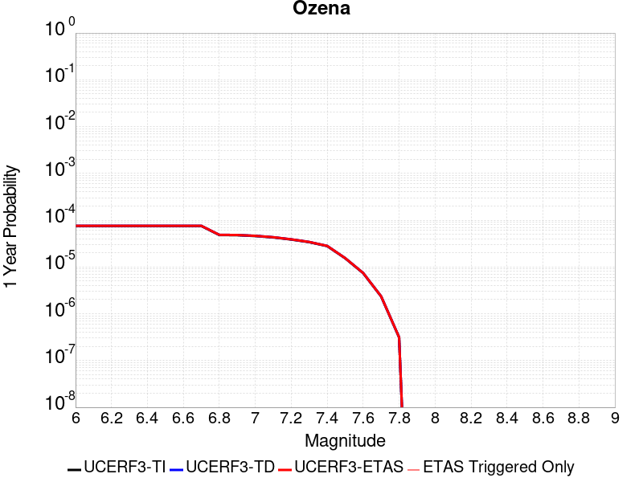 |  |

| Magnitude | 1 wk TI Prob | 1 wk TD Prob | 1 wk ETAS Prob | 1 wk ETAS/TD Gain | 1 wk ETAS Triggered Only | 1 mo TI Prob | 1 mo TD Prob | 1 mo ETAS Prob | 1 mo ETAS/TD Gain | 1 mo ETAS Triggered Only | 1 yr TI Prob | 1 yr TD Prob | 1 yr ETAS Prob | 1 yr ETAS/TD Gain | 1 yr ETAS Triggered Only | 10 yr TI Prob | 10 yr TD Prob | 10 yr ETAS Prob | 10 yr ETAS/TD Gain | 10 yr ETAS Triggered Only |
|-----|-----|-----|-----|-----|-----|-----|-----|-----|-----|-----|-----|-----|-----|-----|-----|-----|-----|-----|-----|-----|
| 6.0 | 1.4377547E-6 | 1.4513856E-6 | 1.4513856E-6 | 1.0 | 0.0 | 6.161791E-6 | 6.2202107E-6 | 6.2202107E-6 | 1.0 | 0.0 | 7.5017226E-5 | 7.5728705E-5 | 7.5728705E-5 | 1.0 | 0.0 | 7.4991904E-4 | 7.570556E-4 | 7.6704804E-4 | 1.0131991 | 1.0E-5 |
| 6.1 | 1.4377547E-6 | 1.4513856E-6 | 1.4513856E-6 | 1.0 | 0.0 | 6.161791E-6 | 6.2202107E-6 | 6.2202107E-6 | 1.0 | 0.0 | 7.5017226E-5 | 7.5728705E-5 | 7.5728705E-5 | 1.0 | 0.0 | 7.4991904E-4 | 7.570556E-4 | 7.6704804E-4 | 1.0131991 | 1.0E-5 |
| 6.2 | 1.4377547E-6 | 1.4513856E-6 | 1.4513856E-6 | 1.0 | 0.0 | 6.161791E-6 | 6.2202107E-6 | 6.2202107E-6 | 1.0 | 0.0 | 7.5017226E-5 | 7.5728705E-5 | 7.5728705E-5 | 1.0 | 0.0 | 7.4991904E-4 | 7.570556E-4 | 7.6704804E-4 | 1.0131991 | 1.0E-5 |
| 6.3 | 1.4377547E-6 | 1.4513856E-6 | 1.4513856E-6 | 1.0 | 0.0 | 6.161791E-6 | 6.2202107E-6 | 6.2202107E-6 | 1.0 | 0.0 | 7.5017226E-5 | 7.5728705E-5 | 7.5728705E-5 | 1.0 | 0.0 | 7.4991904E-4 | 7.570556E-4 | 7.6704804E-4 | 1.0131991 | 1.0E-5 |
| 6.4 | 1.4377547E-6 | 1.4513856E-6 | 1.4513856E-6 | 1.0 | 0.0 | 6.161791E-6 | 6.2202107E-6 | 6.2202107E-6 | 1.0 | 0.0 | 7.5017226E-5 | 7.5728705E-5 | 7.5728705E-5 | 1.0 | 0.0 | 7.4991904E-4 | 7.570556E-4 | 7.6704804E-4 | 1.0131991 | 1.0E-5 |
| 6.5 | 1.4377547E-6 | 1.4513856E-6 | 1.4513856E-6 | 1.0 | 0.0 | 6.161791E-6 | 6.2202107E-6 | 6.2202107E-6 | 1.0 | 0.0 | 7.5017226E-5 | 7.5728705E-5 | 7.5728705E-5 | 1.0 | 0.0 | 7.4991904E-4 | 7.570556E-4 | 7.6704804E-4 | 1.0131991 | 1.0E-5 |
| 6.6 | 1.4377547E-6 | 1.4513856E-6 | 1.4513856E-6 | 1.0 | 0.0 | 6.161791E-6 | 6.2202107E-6 | 6.2202107E-6 | 1.0 | 0.0 | 7.5017226E-5 | 7.5728705E-5 | 7.5728705E-5 | 1.0 | 0.0 | 7.4991904E-4 | 7.570556E-4 | 7.6704804E-4 | 1.0131991 | 1.0E-5 |
| 6.7 | 1.4377547E-6 | 1.4513856E-6 | 1.4513856E-6 | 1.0 | 0.0 | 6.161791E-6 | 6.2202107E-6 | 6.2202107E-6 | 1.0 | 0.0 | 7.5017226E-5 | 7.5728705E-5 | 7.5728705E-5 | 1.0 | 0.0 | 7.4991904E-4 | 7.570556E-4 | 7.6704804E-4 | 1.0131991 | 1.0E-5 |
| 6.8 | 9.223257E-7 | 9.3176743E-7 | 9.3176743E-7 | 1.0 | 0.0 | 3.9528186E-6 | 3.993283E-6 | 3.993283E-6 | 1.0 | 0.0 | 4.81245E-5 | 4.8617178E-5 | 4.8617178E-5 | 1.0 | 0.0 | 4.811408E-4 | 4.8606945E-4 | 4.960646E-4 | 1.0205632 | 1.0E-5 |
| 6.9 | 9.141515E-7 | 9.2354213E-7 | 9.2354213E-7 | 1.0 | 0.0 | 3.917786E-6 | 3.958032E-6 | 3.958032E-6 | 1.0 | 0.0 | 4.7698002E-5 | 4.8188012E-5 | 4.8188012E-5 | 1.0 | 0.0 | 4.7687767E-4 | 4.8177966E-4 | 4.917749E-4 | 1.0207464 | 1.0E-5 |
| 7.0 | 8.767648E-7 | 8.8586256E-7 | 8.8586256E-7 | 1.0 | 0.0 | 3.757558E-6 | 3.7965485E-6 | 3.7965485E-6 | 1.0 | 0.0 | 4.5747307E-5 | 4.6222038E-5 | 4.6222038E-5 | 1.0 | 0.0 | 4.5737892E-4 | 4.6212817E-4 | 4.6212817E-4 | 1.0 | 0.0 |
| 7.1 | 8.199402E-7 | 8.2854444E-7 | 8.2854444E-7 | 1.0 | 0.0 | 3.5140247E-6 | 3.5509001E-6 | 3.5509001E-6 | 1.0 | 0.0 | 4.2782412E-5 | 4.323139E-5 | 4.323139E-5 | 1.0 | 0.0 | 4.2774176E-4 | 4.3223353E-4 | 4.3223353E-4 | 1.0 | 0.0 |
| 7.2 | 7.38705E-7 | 7.464304E-7 | 7.464304E-7 | 1.0 | 0.0 | 3.1658747E-6 | 3.1989837E-6 | 3.1989837E-6 | 1.0 | 0.0 | 3.8543843E-5 | 3.8946964E-5 | 3.8946964E-5 | 1.0 | 0.0 | 3.853716E-4 | 3.8940492E-4 | 3.8940492E-4 | 1.0 | 0.0 |
| 7.3 | 6.490017E-7 | 6.557838E-7 | 6.557838E-7 | 1.0 | 0.0 | 2.7814328E-6 | 2.8104992E-6 | 2.8104992E-6 | 1.0 | 0.0 | 3.386342E-5 | 3.4217326E-5 | 3.4217326E-5 | 1.0 | 0.0 | 3.3858258E-4 | 3.4212394E-4 | 3.4212394E-4 | 1.0 | 0.0 |
| 7.4 | 5.346736E-7 | 5.4022905E-7 | 5.4022905E-7 | 1.0 | 0.0 | 2.291456E-6 | 2.3152654E-6 | 2.3152654E-6 | 1.0 | 0.0 | 2.789812E-5 | 2.8188024E-5 | 2.8188024E-5 | 1.0 | 0.0 | 2.789462E-4 | 2.8184752E-4 | 2.8184752E-4 | 1.0 | 0.0 |
| 7.5 | 2.939325E-7 | 2.9666205E-7 | 2.9666205E-7 | 1.0 | 0.0 | 1.25971E-6 | 1.2714082E-6 | 1.2714082E-6 | 1.0 | 0.0 | 1.5336862E-5 | 1.5479302E-5 | 1.5479302E-5 | 1.0 | 0.0 | 1.5335804E-4 | 1.5478385E-4 | 1.5478385E-4 | 1.0 | 0.0 |
| 7.6 | 1.4151905E-7 | 1.425332E-7 | 1.425332E-7 | 1.0 | 0.0 | 6.065101E-7 | 6.108564E-7 | 6.108564E-7 | 1.0 | 0.0 | 7.3842357E-6 | 7.437152E-6 | 7.437152E-6 | 1.0 | 0.0 | 7.38399E-5 | 7.4369105E-5 | 7.4369105E-5 | 1.0 | 0.0 |
| 7.7 | 4.4957577E-8 | 4.52524E-8 | 4.52524E-8 | 1.0 | 0.0 | 1.9267533E-7 | 1.9393885E-7 | 1.9393885E-7 | 1.0 | 0.0 | 2.3458194E-6 | 2.361203E-6 | 2.361203E-6 | 1.0 | 0.0 | 2.3457947E-5 | 2.3611788E-5 | 2.3611788E-5 | 1.0 | 0.0 |
| 7.8 | 5.9993255E-9 | 6.04132E-9 | 6.04132E-9 | 1.0 | 0.0 | 2.5711394E-8 | 2.589137E-8 | 2.589137E-8 | 1.0 | 0.0 | 3.1303617E-7 | 3.152274E-7 | 3.152274E-7 | 1.0 | 0.0 | 3.1303573E-6 | 3.1522707E-6 | 3.1522707E-6 | 1.0 | 0.0 |

## Calaveras (Central) 2011 CFM
*[(top)](#table-of-contents)*

| 1 Week | 1 Month | 1 Year | 10 Year |
|-----|-----|-----|-----|
|  |  |  |  |

| Magnitude | 1 wk TI Prob | 1 wk TD Prob | 1 wk ETAS Prob | 1 wk ETAS/TD Gain | 1 wk ETAS Triggered Only | 1 mo TI Prob | 1 mo TD Prob | 1 mo ETAS Prob | 1 mo ETAS/TD Gain | 1 mo ETAS Triggered Only | 1 yr TI Prob | 1 yr TD Prob | 1 yr ETAS Prob | 1 yr ETAS/TD Gain | 1 yr ETAS Triggered Only | 10 yr TI Prob | 10 yr TD Prob | 10 yr ETAS Prob | 10 yr ETAS/TD Gain | 10 yr ETAS Triggered Only |
|-----|-----|-----|-----|-----|-----|-----|-----|-----|-----|-----|-----|-----|-----|-----|-----|-----|-----|-----|-----|-----|
| 6.0 | 1.5010907E-4 | 2.4819706E-4 | 2.4819706E-4 | 1.0 | 0.0 | 6.4316596E-4 | 0.001063205 | 0.001063205 | 1.0 | 0.0 | 0.0078024664 | 0.012858907 | 0.012868779 | 1.0007677 | 1.0E-5 | 0.07534136 | 0.12048197 | 0.12049077 | 1.000073 | 1.0E-5 |
| 6.1 | 1.4521465E-4 | 2.3981159E-4 | 2.3981159E-4 | 1.0 | 0.0 | 6.222001E-4 | 0.0010272958 | 0.0010272958 | 1.0 | 0.0 | 0.0075490056 | 0.012428159 | 0.012438035 | 1.0007946 | 1.0E-5 | 0.07297657 | 0.11675321 | 0.11676205 | 1.0000757 | 1.0E-5 |
| 6.2 | 1.429998E-4 | 2.391228E-4 | 2.391228E-4 | 1.0 | 0.0 | 6.127123E-4 | 0.0010243463 | 0.0010243463 | 1.0 | 0.0 | 0.007434286 | 0.012392704 | 0.01240258 | 1.0007969 | 1.0E-5 | 0.07190444 | 0.1164066 | 0.11641543 | 1.0000759 | 1.0E-5 |
| 6.3 | 1.3536277E-4 | 2.3243108E-4 | 2.3243108E-4 | 1.0 | 0.0 | 5.799972E-4 | 9.956934E-4 | 9.956934E-4 | 1.0 | 0.0 | 0.0070386264 | 0.012048675 | 0.012058554 | 1.0008199 | 1.0E-5 | 0.0681982 | 0.113317646 | 0.11332651 | 1.0000782 | 1.0E-5 |
| 6.4 | 1.2993296E-4 | 2.2666331E-4 | 2.2666331E-4 | 1.0 | 0.0 | 5.5673666E-4 | 9.7099325E-4 | 9.7099325E-4 | 1.0 | 0.0 | 0.006757223 | 0.0117513 | 0.011761182 | 1.000841 | 1.0E-5 | 0.06555412 | 0.110593975 | 0.11060287 | 1.0000805 | 1.0E-5 |
| 6.5 | 1.0498927E-4 | 1.7996559E-4 | 1.7996559E-4 | 1.0 | 0.0 | 4.498764E-4 | 7.71052E-4 | 7.71052E-4 | 1.0 | 0.0 | 0.005463498 | 0.009347059 | 0.009356966 | 1.0010599 | 1.0E-5 | 0.053311124 | 0.08927178 | 0.08928089 | 1.000102 | 1.0E-5 |
| 6.6 | 1.0157505E-4 | 1.7483841E-4 | 1.7483841E-4 | 1.0 | 0.0 | 4.35249E-4 | 7.490911E-4 | 7.490911E-4 | 1.0 | 0.0 | 0.0052862884 | 0.009081982 | 0.009081982 | 1.0 | 0.0 | 0.05162293 | 0.08684812 | 0.08684812 | 1.0 | 0.0 |
| 6.7 | 9.660386E-5 | 1.6742892E-4 | 1.6742892E-4 | 1.0 | 0.0 | 4.1395082E-4 | 7.173546E-4 | 7.173546E-4 | 1.0 | 0.0 | 0.0050282106 | 0.008698776 | 0.008698776 | 1.0 | 0.0 | 0.049159497 | 0.083336994 | 0.083336994 | 1.0 | 0.0 |
| 6.8 | 9.089927E-5 | 1.5656423E-4 | 1.5656423E-4 | 1.0 | 0.0 | 3.8951015E-4 | 6.708168E-4 | 6.708168E-4 | 1.0 | 0.0 | 0.0047319788 | 0.008136575 | 0.008136575 | 1.0 | 0.0 | 0.046324775 | 0.07822998 | 0.07822998 | 1.0 | 0.0 |
| 6.9 | 7.353187E-5 | 1.2306191E-4 | 1.2306191E-4 | 1.0 | 0.0 | 3.150985E-4 | 5.273022E-4 | 5.273022E-4 | 1.0 | 0.0 | 0.0038295772 | 0.006401127 | 0.006401127 | 1.0 | 0.0 | 0.037642512 | 0.062238418 | 0.062238418 | 1.0 | 0.0 |
| 7.0 | 5.746064E-5 | 9.398813E-5 | 9.398813E-5 | 1.0 | 0.0 | 2.4623662E-4 | 4.0274445E-4 | 4.0274445E-4 | 1.0 | 0.0 | 0.0029938098 | 0.0048924605 | 0.0048924605 | 1.0 | 0.0 | 0.02953797 | 0.048034415 | 0.048034415 | 1.0 | 0.0 |
| 7.1 | 4.9557195E-5 | 8.060119E-5 | 8.060119E-5 | 1.0 | 0.0 | 2.123707E-4 | 3.4538825E-4 | 3.4538825E-4 | 1.0 | 0.0 | 0.0025825473 | 0.004197057 | 0.004197057 | 1.0 | 0.0 | 0.0255274 | 0.041410543 | 0.041410543 | 1.0 | 0.0 |
| 7.2 | 3.687595E-5 | 5.9597183E-5 | 5.9597183E-5 | 1.0 | 0.0 | 1.5803022E-4 | 2.5539167E-4 | 2.5539167E-4 | 1.0 | 0.0 | 0.0019223199 | 0.0031049892 | 0.0031049892 | 1.0 | 0.0 | 0.01905776 | 0.030919215 | 0.030919215 | 1.0 | 0.0 |
| 7.3 | 2.5846984E-5 | 4.2534713E-5 | 4.2534713E-5 | 1.0 | 0.0 | 1.1076809E-4 | 1.82279E-4 | 1.82279E-4 | 1.0 | 0.0 | 0.0013477671 | 0.0022170055 | 0.0022170055 | 1.0 | 0.0 | 0.013396223 | 0.022206744 | 0.022206744 | 1.0 | 0.0 |
| 7.4 | 1.7747854E-5 | 2.9968245E-5 | 2.9968245E-5 | 1.0 | 0.0 | 7.6060016E-5 | 1.2842902E-4 | 1.2842902E-4 | 1.0 | 0.0 | 9.2563726E-4 | 0.0015625048 | 0.0015625048 | 1.0 | 0.0 | 0.009217911 | 0.015725428 | 0.015725428 | 1.0 | 0.0 |
| 7.5 | 1.4883479E-5 | 2.6273883E-5 | 2.6273883E-5 | 1.0 | 0.0 | 6.378478E-5 | 1.1259751E-4 | 1.1259751E-4 | 1.0 | 0.0 | 7.76303E-4 | 0.0013700153 | 0.0013700153 | 1.0 | 0.0 | 0.0077359667 | 0.01381797 | 0.01381797 | 1.0 | 0.0 |
| 7.6 | 8.166975E-6 | 1.4987666E-5 | 1.4987666E-5 | 1.0 | 0.0 | 3.5000852E-5 | 6.423128E-5 | 6.423128E-5 | 1.0 | 0.0 | 4.2605202E-4 | 7.8173657E-4 | 7.8173657E-4 | 1.0 | 0.0 | 0.004252361 | 0.007952956 | 0.007952956 | 1.0 | 0.0 |
| 7.7 | 3.3858064E-6 | 6.2680556E-6 | 6.2680556E-6 | 1.0 | 0.0 | 1.4510518E-5 | 2.686282E-5 | 2.686282E-5 | 1.0 | 0.0 | 1.7665124E-4 | 3.2700578E-4 | 3.2700578E-4 | 1.0 | 0.0 | 0.0017651088 | 0.0033953558 | 0.0033953558 | 1.0 | 0.0 |
| 7.8 | 2.7721615E-6 | 5.3785216E-6 | 5.3785216E-6 | 1.0 | 0.0 | 1.1880637E-5 | 2.3050603E-5 | 2.3050603E-5 | 1.0 | 0.0 | 1.4463716E-4 | 2.8060502E-4 | 2.8060502E-4 | 1.0 | 0.0 | 0.0014454306 | 0.002913498 | 0.002913498 | 1.0 | 0.0 |
| 7.9 | 1.9736292E-6 | 4.1373296E-6 | 4.1373296E-6 | 1.0 | 0.0 | 8.4583835E-6 | 1.7731292E-5 | 1.7731292E-5 | 1.0 | 0.0 | 1.0297595E-4 | 2.1585713E-4 | 2.1585713E-4 | 1.0 | 0.0 | 0.0010292825 | 0.0022279534 | 0.0022279534 | 1.0 | 0.0 |
| 8.0 | 1.1767289E-6 | 2.5597071E-6 | 2.5597071E-6 | 1.0 | 0.0 | 5.0431145E-6 | 1.0970128E-5 | 1.0970128E-5 | 1.0 | 0.0 | 6.139818E-5 | 1.3355314E-4 | 1.3355314E-4 | 1.0 | 0.0 | 6.1381224E-4 | 0.0013686379 | 0.0013686379 | 1.0 | 0.0 |
| 8.1 | 7.5112825E-7 | 1.5440835E-6 | 1.5440835E-6 | 1.0 | 0.0 | 3.2191172E-6 | 6.617484E-6 | 6.617484E-6 | 1.0 | 0.0 | 3.9192048E-5 | 8.056491E-5 | 8.056491E-5 | 1.0 | 0.0 | 3.9185135E-4 | 8.25079E-4 | 8.25079E-4 | 1.0 | 0.0 |

## Hunting Creek - Berryessa 2011 CFM
*[(top)](#table-of-contents)*

| 1 Week | 1 Month | 1 Year | 10 Year |
|-----|-----|-----|-----|
|  |  | 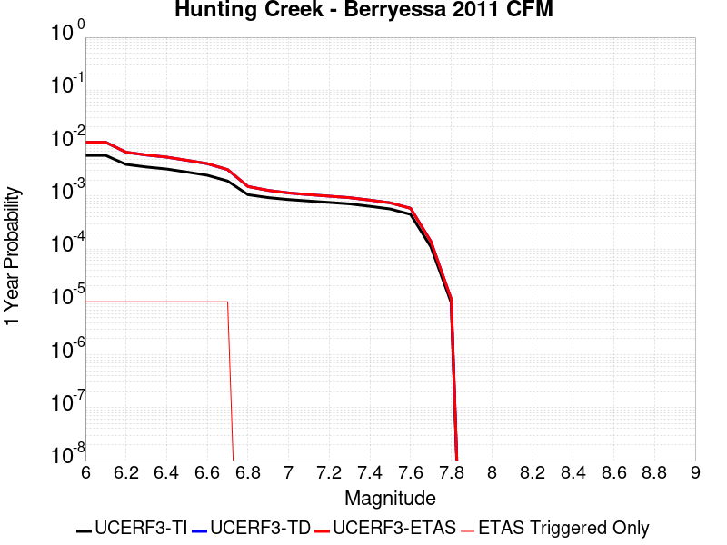 |  |

| Magnitude | 1 wk TI Prob | 1 wk TD Prob | 1 wk ETAS Prob | 1 wk ETAS/TD Gain | 1 wk ETAS Triggered Only | 1 mo TI Prob | 1 mo TD Prob | 1 mo ETAS Prob | 1 mo ETAS/TD Gain | 1 mo ETAS Triggered Only | 1 yr TI Prob | 1 yr TD Prob | 1 yr ETAS Prob | 1 yr ETAS/TD Gain | 1 yr ETAS Triggered Only | 10 yr TI Prob | 10 yr TD Prob | 10 yr ETAS Prob | 10 yr ETAS/TD Gain | 10 yr ETAS Triggered Only |
|-----|-----|-----|-----|-----|-----|-----|-----|-----|-----|-----|-----|-----|-----|-----|-----|-----|-----|-----|-----|-----|
| 6.0 | 1.1270982E-4 | 2.003051E-4 | 2.003051E-4 | 1.0 | 0.0 | 4.8295266E-4 | 8.5816236E-4 | 8.5816236E-4 | 1.0 | 0.0 | 0.0058641075 | 0.010387901 | 0.0103977965 | 1.0009526 | 1.0E-5 | 0.057117578 | 0.09805656 | 0.098065585 | 1.000092 | 1.0E-5 |
| 6.1 | 1.1239393E-4 | 1.9978649E-4 | 1.9978649E-4 | 1.0 | 0.0 | 4.8159933E-4 | 8.559412E-4 | 8.559412E-4 | 1.0 | 0.0 | 0.0058477195 | 0.01036114 | 0.010371036 | 1.0009551 | 1.0E-5 | 0.056962132 | 0.09781499 | 0.097824015 | 1.0000923 | 1.0E-5 |
| 6.2 | 7.596265E-5 | 1.2936012E-4 | 1.2936012E-4 | 1.0 | 0.0 | 3.2551357E-4 | 5.542557E-4 | 5.542557E-4 | 1.0 | 0.0 | 0.0039559277 | 0.0067224824 | 0.006732415 | 1.0014776 | 1.0E-5 | 0.038862433 | 0.06460357 | 0.06461292 | 1.0001448 | 1.0E-5 |
| 6.3 | 6.78794E-5 | 1.1450075E-4 | 1.1450075E-4 | 1.0 | 0.0 | 2.9087928E-4 | 4.9062027E-4 | 4.9062027E-4 | 1.0 | 0.0 | 0.003535705 | 0.005953632 | 0.0059635723 | 1.0016696 | 1.0E-5 | 0.034799766 | 0.057476293 | 0.05748572 | 1.000164 | 1.0E-5 |
| 6.4 | 6.2165134E-5 | 1.0436495E-4 | 1.0436495E-4 | 1.0 | 0.0 | 2.6639478E-4 | 4.4719726E-4 | 4.4719726E-4 | 1.0 | 0.0 | 0.0032385332 | 0.0054283096 | 0.005438255 | 1.0018322 | 1.0E-5 | 0.03191742 | 0.052560717 | 0.05257019 | 1.0001802 | 1.0E-5 |
| 6.5 | 5.4368087E-5 | 9.071705E-5 | 9.071705E-5 | 1.0 | 0.0 | 2.3298527E-4 | 3.8872933E-4 | 3.8872933E-4 | 1.0 | 0.0 | 0.0028329059 | 0.00472048 | 0.0047304328 | 1.0021085 | 1.0E-5 | 0.027970633 | 0.04588959 | 0.04589913 | 1.0002079 | 1.0E-5 |
| 6.6 | 4.729947E-5 | 7.8481535E-5 | 7.8481535E-5 | 1.0 | 0.0 | 2.0269625E-4 | 3.3630725E-4 | 3.3630725E-4 | 1.0 | 0.0 | 0.002465034 | 0.0040854122 | 0.0040953713 | 1.0024377 | 1.0E-5 | 0.02437869 | 0.039859768 | 0.039869368 | 1.0002409 | 1.0E-5 |
| 6.7 | 3.6875328E-5 | 6.0453847E-5 | 6.0453847E-5 | 1.0 | 0.0 | 1.5802756E-4 | 2.590628E-4 | 2.590628E-4 | 1.0 | 0.0 | 0.0019222875 | 0.003148796 | 0.0031587644 | 1.0031658 | 1.0E-5 | 0.019057442 | 0.030898971 | 0.030908663 | 1.0003136 | 1.0E-5 |
| 6.8 | 2.0292036E-5 | 2.8979644E-5 | 2.8979644E-5 | 1.0 | 0.0 | 8.6962966E-5 | 1.241925E-4 | 1.241925E-4 | 1.0 | 0.0 | 0.0010582599 | 0.0015109818 | 0.0015109818 | 1.0 | 0.0 | 0.010532344 | 0.014980777 | 0.014980777 | 1.0 | 0.0 |
| 6.9 | 1.7871042E-5 | 2.4475177E-5 | 2.4475177E-5 | 1.0 | 0.0 | 7.658793E-5 | 1.0488941E-4 | 1.0488941E-4 | 1.0 | 0.0 | 9.320591E-4 | 0.0012762798 | 0.0012762798 | 1.0 | 0.0 | 0.009281595 | 0.012681562 | 0.012681562 | 1.0 | 0.0 |
| 7.0 | 1.6415532E-5 | 2.1908912E-5 | 2.1908912E-5 | 1.0 | 0.0 | 7.035038E-5 | 9.3891984E-5 | 9.3891984E-5 | 1.0 | 0.0 | 8.561793E-4 | 0.0011425366 | 0.0011425366 | 1.0 | 0.0 | 0.008528882 | 0.011366049 | 0.011366049 | 1.0 | 0.0 |
| 7.1 | 1.5409885E-5 | 2.03488E-5 | 2.03488E-5 | 1.0 | 0.0 | 6.6040695E-5 | 8.7206245E-5 | 8.7206245E-5 | 1.0 | 0.0 | 8.0374884E-4 | 0.0010612216 | 0.0010612216 | 1.0 | 0.0 | 0.00800848 | 0.0105619915 | 0.0105619915 | 1.0 | 0.0 |
| 7.2 | 1.4497423E-5 | 1.9057261E-5 | 1.9057261E-5 | 1.0 | 0.0 | 6.213033E-5 | 8.167144E-5 | 8.167144E-5 | 1.0 | 0.0 | 7.5617427E-4 | 9.938992E-4 | 9.938992E-4 | 1.0 | 0.0 | 0.0075360634 | 0.00989526 | 0.00989526 | 1.0 | 0.0 |
| 7.3 | 1.3615175E-5 | 1.7828346E-5 | 1.7828346E-5 | 1.0 | 0.0 | 5.8349444E-5 | 7.640498E-5 | 7.640498E-5 | 1.0 | 0.0 | 7.101729E-4 | 9.2983653E-4 | 9.2983653E-4 | 1.0 | 0.0 | 0.0070790765 | 0.009260084 | 0.009260084 | 1.0 | 0.0 |
| 7.4 | 1.2252825E-5 | 1.6028262E-5 | 1.6028262E-5 | 1.0 | 0.0 | 5.251105E-5 | 6.869076E-5 | 6.869076E-5 | 1.0 | 0.0 | 6.391345E-4 | 8.359919E-4 | 8.359919E-4 | 1.0 | 0.0 | 0.0063729943 | 0.008329037 | 0.008329037 | 1.0 | 0.0 |
| 7.5 | 1.0913301E-5 | 1.4242859E-5 | 1.4242859E-5 | 1.0 | 0.0 | 4.6770452E-5 | 6.103941E-5 | 6.103941E-5 | 1.0 | 0.0 | 5.6928146E-4 | 7.429042E-4 | 7.429042E-4 | 1.0 | 0.0 | 0.0056782532 | 0.00740471 | 0.00740471 | 1.0 | 0.0 |
| 7.6 | 8.623192E-6 | 1.1235911E-5 | 1.1235911E-5 | 1.0 | 0.0 | 3.6956015E-5 | 4.815303E-5 | 4.815303E-5 | 1.0 | 0.0 | 4.4984656E-4 | 5.86108E-4 | 5.86108E-4 | 1.0 | 0.0 | 0.00448937 | 0.005845999 | 0.005845999 | 1.0 | 0.0 |
| 7.7 | 2.0993634E-6 | 2.6628493E-6 | 2.6628493E-6 | 1.0 | 0.0 | 8.997241E-6 | 1.1412161E-5 | 1.1412161E-5 | 1.0 | 0.0 | 1.09535904E-4 | 1.3893428E-4 | 1.3893428E-4 | 1.0 | 0.0 | 0.0010948193 | 0.0013884885 | 0.0013884885 | 1.0 | 0.0 |
| 7.8 | 1.8428308E-7 | 2.1676125E-7 | 2.1676125E-7 | 1.0 | 0.0 | 7.897844E-7 | 9.289765E-7 | 9.289765E-7 | 1.0 | 0.0 | 9.615583E-6 | 1.1310233E-5 | 1.1310233E-5 | 1.0 | 0.0 | 9.615166E-5 | 1.1308978E-4 | 1.1308978E-4 | 1.0 | 0.0 |

## Eureka Peak
*[(top)](#table-of-contents)*

| 1 Week | 1 Month | 1 Year | 10 Year |
|-----|-----|-----|-----|
|  |  |  |  |

| Magnitude | 1 wk TI Prob | 1 wk TD Prob | 1 wk ETAS Prob | 1 wk ETAS/TD Gain | 1 wk ETAS Triggered Only | 1 mo TI Prob | 1 mo TD Prob | 1 mo ETAS Prob | 1 mo ETAS/TD Gain | 1 mo ETAS Triggered Only | 1 yr TI Prob | 1 yr TD Prob | 1 yr ETAS Prob | 1 yr ETAS/TD Gain | 1 yr ETAS Triggered Only | 10 yr TI Prob | 10 yr TD Prob | 10 yr ETAS Prob | 10 yr ETAS/TD Gain | 10 yr ETAS Triggered Only |
|-----|-----|-----|-----|-----|-----|-----|-----|-----|-----|-----|-----|-----|-----|-----|-----|-----|-----|-----|-----|-----|
| 6.0 | 3.1949054E-5 | 9.31106E-6 | 9.31106E-6 | 1.0 | 0.0 | 1.3691733E-4 | 3.9904375E-5 | 3.9904375E-5 | 1.0 | 0.0 | 0.0016656938 | 4.8580556E-4 | 4.8580556E-4 | 1.0 | 0.0 | 0.016532637 | 0.0049213353 | 0.004931286 | 1.002022 | 1.0E-5 |
| 6.1 | 3.1949054E-5 | 9.31106E-6 | 9.31106E-6 | 1.0 | 0.0 | 1.3691733E-4 | 3.9904375E-5 | 3.9904375E-5 | 1.0 | 0.0 | 0.0016656938 | 4.8580556E-4 | 4.8580556E-4 | 1.0 | 0.0 | 0.016532637 | 0.0049213353 | 0.004931286 | 1.002022 | 1.0E-5 |
| 6.2 | 3.1949054E-5 | 9.31106E-6 | 9.31106E-6 | 1.0 | 0.0 | 1.3691733E-4 | 3.9904375E-5 | 3.9904375E-5 | 1.0 | 0.0 | 0.0016656938 | 4.8580556E-4 | 4.8580556E-4 | 1.0 | 0.0 | 0.016532637 | 0.0049213353 | 0.004931286 | 1.002022 | 1.0E-5 |
| 6.3 | 2.7339745E-5 | 7.9809015E-6 | 7.9809015E-6 | 1.0 | 0.0 | 1.1716507E-4 | 3.4203844E-5 | 3.4203844E-5 | 1.0 | 0.0 | 0.0014255513 | 4.1642814E-4 | 4.1642814E-4 | 1.0 | 0.0 | 0.0141644105 | 0.0042260378 | 0.0042359955 | 1.0023563 | 1.0E-5 |
| 6.4 | 2.7339745E-5 | 7.9809015E-6 | 7.9809015E-6 | 1.0 | 0.0 | 1.1716507E-4 | 3.4203844E-5 | 3.4203844E-5 | 1.0 | 0.0 | 0.0014255513 | 4.1642814E-4 | 4.1642814E-4 | 1.0 | 0.0 | 0.0141644105 | 0.0042260378 | 0.0042359955 | 1.0023563 | 1.0E-5 |
| 6.5 | 9.738388E-8 | 1.862816E-7 | 1.862816E-7 | 1.0 | 0.0 | 4.1735944E-7 | 7.983495E-7 | 7.983495E-7 | 1.0 | 0.0 | 5.081339E-6 | 9.719863E-6 | 9.719863E-6 | 1.0 | 0.0 | 5.0812232E-5 | 9.7194454E-5 | 9.7194454E-5 | 1.0 | 0.0 |
| 6.6 | 9.3495956E-8 | 1.8336962E-7 | 1.8336962E-7 | 1.0 | 0.0 | 4.0069688E-7 | 7.8586953E-7 | 7.8586953E-7 | 1.0 | 0.0 | 4.8784736E-6 | 9.567921E-6 | 9.567921E-6 | 1.0 | 0.0 | 4.8783666E-5 | 9.567517E-5 | 9.567517E-5 | 1.0 | 0.0 |
| 6.7 | 9.3495956E-8 | 1.8336962E-7 | 1.8336962E-7 | 1.0 | 0.0 | 4.0069688E-7 | 7.8586953E-7 | 7.8586953E-7 | 1.0 | 0.0 | 4.8784736E-6 | 9.567921E-6 | 9.567921E-6 | 1.0 | 0.0 | 4.8783666E-5 | 9.567517E-5 | 9.567517E-5 | 1.0 | 0.0 |
| 6.8 | 8.591428E-8 | 1.8029873E-7 | 1.8029873E-7 | 1.0 | 0.0 | 3.68204E-7 | 7.727086E-7 | 7.727086E-7 | 1.0 | 0.0 | 4.4828744E-6 | 9.407688E-6 | 9.407688E-6 | 1.0 | 0.0 | 4.482784E-5 | 9.4072966E-5 | 9.4072966E-5 | 1.0 | 0.0 |
| 6.9 | 7.749723E-8 | 1.7447826E-7 | 1.7447826E-7 | 1.0 | 0.0 | 3.3213098E-7 | 7.4776375E-7 | 7.4776375E-7 | 1.0 | 0.0 | 4.043687E-6 | 9.1039865E-6 | 9.1039865E-6 | 1.0 | 0.0 | 4.0436134E-5 | 9.1036214E-5 | 9.1036214E-5 | 1.0 | 0.0 |
| 7.0 | 6.897872E-8 | 1.6423827E-7 | 1.6423827E-7 | 1.0 | 0.0 | 2.9562307E-7 | 7.0387813E-7 | 7.0387813E-7 | 1.0 | 0.0 | 3.5992048E-6 | 8.569684E-6 | 8.569684E-6 | 1.0 | 0.0 | 3.5991467E-5 | 8.56936E-5 | 8.56936E-5 | 1.0 | 0.0 |
| 7.1 | 5.859318E-8 | 1.479528E-7 | 1.479528E-7 | 1.0 | 0.0 | 2.5111362E-7 | 6.340833E-7 | 6.340833E-7 | 1.0 | 0.0 | 3.057304E-6 | 7.7199375E-6 | 7.7199375E-6 | 1.0 | 0.0 | 3.0572617E-5 | 7.719675E-5 | 7.719675E-5 | 1.0 | 0.0 |
| 7.2 | 5.1375338E-8 | 1.3428803E-7 | 1.3428803E-7 | 1.0 | 0.0 | 2.2018E-7 | 5.7552E-7 | 5.7552E-7 | 1.0 | 0.0 | 2.680688E-6 | 7.006934E-6 | 7.006934E-6 | 1.0 | 0.0 | 2.6806558E-5 | 7.0067195E-5 | 7.0067195E-5 | 1.0 | 0.0 |
| 7.3 | 4.5441396E-8 | 1.1643492E-7 | 1.1643492E-7 | 1.0 | 0.0 | 1.9474882E-7 | 4.990067E-7 | 4.990067E-7 | 1.0 | 0.0 | 2.3710643E-6 | 6.0753905E-6 | 6.0753905E-6 | 1.0 | 0.0 | 2.371039E-5 | 6.07523E-5 | 6.07523E-5 | 1.0 | 0.0 |
| 7.4 | 2.981918E-8 | 6.916823E-8 | 6.916823E-8 | 1.0 | 0.0 | 1.2779647E-7 | 2.9643525E-7 | 2.9643525E-7 | 1.0 | 0.0 | 1.5559209E-6 | 3.6090935E-6 | 3.6090935E-6 | 1.0 | 0.0 | 1.55591E-5 | 3.609039E-5 | 3.609039E-5 | 1.0 | 0.0 |
| 7.5 | 4.24214E-9 | 8.350494E-9 | 8.350494E-9 | 1.0 | 0.0 | 1.81806E-8 | 3.578783E-8 | 3.578783E-8 | 1.0 | 0.0 | 2.213488E-7 | 4.357168E-7 | 4.357168E-7 | 1.0 | 0.0 | 2.2134857E-6 | 4.357166E-6 | 4.357166E-6 | 1.0 | 0.0 |

## Raymond
*[(top)](#table-of-contents)*

| 1 Week | 1 Month | 1 Year | 10 Year |
|-----|-----|-----|-----|
|  |  |  |  |

| Magnitude | 1 wk TI Prob | 1 wk TD Prob | 1 wk ETAS Prob | 1 wk ETAS/TD Gain | 1 wk ETAS Triggered Only | 1 mo TI Prob | 1 mo TD Prob | 1 mo ETAS Prob | 1 mo ETAS/TD Gain | 1 mo ETAS Triggered Only | 1 yr TI Prob | 1 yr TD Prob | 1 yr ETAS Prob | 1 yr ETAS/TD Gain | 1 yr ETAS Triggered Only | 10 yr TI Prob | 10 yr TD Prob | 10 yr ETAS Prob | 10 yr ETAS/TD Gain | 10 yr ETAS Triggered Only |
|-----|-----|-----|-----|-----|-----|-----|-----|-----|-----|-----|-----|-----|-----|-----|-----|-----|-----|-----|-----|-----|
| 6.0 | 1.5157413E-5 | 1.5811209E-5 | 1.5811209E-5 | 1.0 | 0.0 | 6.4958724E-5 | 6.776071E-5 | 6.776071E-5 | 1.0 | 0.0 | 7.905855E-4 | 8.2469947E-4 | 8.2469947E-4 | 1.0 | 0.0 | 0.007877788 | 0.008218907 | 0.0082288245 | 1.0012068 | 1.0E-5 |
| 6.1 | 1.5157413E-5 | 1.5811209E-5 | 1.5811209E-5 | 1.0 | 0.0 | 6.4958724E-5 | 6.776071E-5 | 6.776071E-5 | 1.0 | 0.0 | 7.905855E-4 | 8.2469947E-4 | 8.2469947E-4 | 1.0 | 0.0 | 0.007877788 | 0.008218907 | 0.0082288245 | 1.0012068 | 1.0E-5 |
| 6.2 | 1.5157413E-5 | 1.5811209E-5 | 1.5811209E-5 | 1.0 | 0.0 | 6.4958724E-5 | 6.776071E-5 | 6.776071E-5 | 1.0 | 0.0 | 7.905855E-4 | 8.2469947E-4 | 8.2469947E-4 | 1.0 | 0.0 | 0.007877788 | 0.008218907 | 0.0082288245 | 1.0012068 | 1.0E-5 |
| 6.3 | 1.5157413E-5 | 1.5811209E-5 | 1.5811209E-5 | 1.0 | 0.0 | 6.4958724E-5 | 6.776071E-5 | 6.776071E-5 | 1.0 | 0.0 | 7.905855E-4 | 8.2469947E-4 | 8.2469947E-4 | 1.0 | 0.0 | 0.007877788 | 0.008218907 | 0.0082288245 | 1.0012068 | 1.0E-5 |
| 6.4 | 1.3941944E-5 | 1.445569E-5 | 1.445569E-5 | 1.0 | 0.0 | 5.9749822E-5 | 6.1951614E-5 | 6.1951614E-5 | 1.0 | 0.0 | 7.2721124E-4 | 7.540232E-4 | 7.540232E-4 | 1.0 | 0.0 | 0.007248361 | 0.0075169806 | 0.0075269053 | 1.0013204 | 1.0E-5 |
| 6.5 | 1.3941944E-5 | 1.445569E-5 | 1.445569E-5 | 1.0 | 0.0 | 5.9749822E-5 | 6.1951614E-5 | 6.1951614E-5 | 1.0 | 0.0 | 7.2721124E-4 | 7.540232E-4 | 7.540232E-4 | 1.0 | 0.0 | 0.007248361 | 0.0075169806 | 0.0075269053 | 1.0013204 | 1.0E-5 |
| 6.6 | 1.0542609E-5 | 1.0671884E-5 | 1.0671884E-5 | 1.0 | 0.0 | 4.5181827E-5 | 4.5735876E-5 | 4.5735876E-5 | 1.0 | 0.0 | 5.499499E-4 | 5.566975E-4 | 5.566975E-4 | 1.0 | 0.0 | 0.005485909 | 0.005553589 | 0.0055635334 | 1.0017906 | 1.0E-5 |
| 6.7 | 1.0542609E-5 | 1.0671884E-5 | 1.0671884E-5 | 1.0 | 0.0 | 4.5181827E-5 | 4.5735876E-5 | 4.5735876E-5 | 1.0 | 0.0 | 5.499499E-4 | 5.566975E-4 | 5.566975E-4 | 1.0 | 0.0 | 0.005485909 | 0.005553589 | 0.0055635334 | 1.0017906 | 1.0E-5 |
| 6.8 | 1.0079132E-5 | 1.01774E-5 | 1.01774E-5 | 1.0 | 0.0 | 4.3195567E-5 | 4.361673E-5 | 4.361673E-5 | 1.0 | 0.0 | 5.257791E-4 | 5.3090963E-4 | 5.3090963E-4 | 1.0 | 0.0 | 0.0052453685 | 0.005296961 | 0.005306908 | 1.0018779 | 1.0E-5 |
| 6.9 | 7.721598E-6 | 7.5494972E-6 | 7.5494972E-6 | 1.0 | 0.0 | 3.3092143E-5 | 3.2354594E-5 | 3.2354594E-5 | 1.0 | 0.0 | 4.0282236E-4 | 3.9384718E-4 | 3.9384718E-4 | 1.0 | 0.0 | 0.0040209293 | 0.003931624 | 0.0039415844 | 1.0025334 | 1.0E-5 |
| 7.0 | 7.137566E-6 | 6.911867E-6 | 6.911867E-6 | 1.0 | 0.0 | 3.058921E-5 | 2.9621957E-5 | 2.9621957E-5 | 1.0 | 0.0 | 3.7236E-4 | 3.6058872E-4 | 3.6058872E-4 | 1.0 | 0.0 | 0.0037173668 | 0.0036001527 | 0.0036101167 | 1.0027677 | 1.0E-5 |
| 7.1 | 5.654976E-6 | 5.3000267E-6 | 5.3000267E-6 | 1.0 | 0.0 | 2.4235387E-5 | 2.2714205E-5 | 2.2714205E-5 | 1.0 | 0.0 | 2.9502588E-4 | 2.7651055E-4 | 2.7651055E-4 | 1.0 | 0.0 | 0.0029463451 | 0.0027616941 | 0.0027616941 | 1.0 | 0.0 |
| 7.2 | 4.9358455E-6 | 4.5271095E-6 | 4.5271095E-6 | 1.0 | 0.0 | 2.1153453E-5 | 1.9401756E-5 | 1.9401756E-5 | 1.0 | 0.0 | 2.5751285E-4 | 2.361909E-4 | 2.361909E-4 | 1.0 | 0.0 | 0.0025721465 | 0.002359419 | 0.002359419 | 1.0 | 0.0 |
| 7.3 | 4.2368597E-6 | 3.806038E-6 | 3.806038E-6 | 1.0 | 0.0 | 1.8157843E-5 | 1.631149E-5 | 1.631149E-5 | 1.0 | 0.0 | 2.2104931E-4 | 1.985744E-4 | 1.985744E-4 | 1.0 | 0.0 | 0.0022082955 | 0.0019839865 | 0.0019839865 | 1.0 | 0.0 |
| 7.4 | 3.4999923E-6 | 3.0441297E-6 | 3.0441297E-6 | 1.0 | 0.0 | 1.49998805E-5 | 1.3046205E-5 | 1.3046205E-5 | 1.0 | 0.0 | 1.8260824E-4 | 1.5882605E-4 | 1.5882605E-4 | 1.0 | 0.0 | 0.0018245826 | 0.0015871392 | 0.0015871392 | 1.0 | 0.0 |
| 7.5 | 2.738017E-6 | 2.3022947E-6 | 2.3022947E-6 | 1.0 | 0.0 | 1.1734306E-5 | 9.866941E-6 | 9.866941E-6 | 1.0 | 0.0 | 1.428558E-4 | 1.2012344E-4 | 1.2012344E-4 | 1.0 | 0.0 | 0.0014276401 | 0.0012005976 | 0.0012005976 | 1.0 | 0.0 |
| 7.6 | 1.8186392E-6 | 1.4424808E-6 | 1.4424808E-6 | 1.0 | 0.0 | 7.794145E-6 | 6.182046E-6 | 6.182046E-6 | 1.0 | 0.0 | 9.488958E-5 | 7.526385E-5 | 7.526385E-5 | 1.0 | 0.0 | 9.4849075E-4 | 7.523932E-4 | 7.523932E-4 | 1.0 | 0.0 |
| 7.7 | 1.0660348E-6 | 7.64514E-7 | 7.64514E-7 | 1.0 | 0.0 | 4.5687125E-6 | 3.2764847E-6 | 3.2764847E-6 | 1.0 | 0.0 | 5.5622655E-5 | 3.989049E-5 | 3.989049E-5 | 1.0 | 0.0 | 5.5608735E-4 | 3.9884052E-4 | 3.9884052E-4 | 1.0 | 0.0 |
| 7.8 | 6.913602E-7 | 4.3215485E-7 | 4.3215485E-7 | 1.0 | 0.0 | 2.962969E-6 | 1.8520909E-6 | 1.8520909E-6 | 1.0 | 0.0 | 3.607355E-5 | 2.254898E-5 | 2.254898E-5 | 1.0 | 0.0 | 3.6067693E-4 | 2.2547293E-4 | 2.2547293E-4 | 1.0 | 0.0 |
| 7.9 | 7.425201E-8 | 5.3234693E-8 | 5.3234693E-8 | 1.0 | 0.0 | 3.1822285E-7 | 2.2814866E-7 | 2.2814866E-7 | 1.0 | 0.0 | 3.874356E-6 | 2.7777078E-6 | 2.7777078E-6 | 1.0 | 0.0 | 3.8742884E-5 | 2.7776861E-5 | 2.7776861E-5 | 1.0 | 0.0 |

## Hayward (So) 2011 CFM
*[(top)](#table-of-contents)*

| 1 Week | 1 Month | 1 Year | 10 Year |
|-----|-----|-----|-----|
|  |  |  |  |

| Magnitude | 1 wk TI Prob | 1 wk TD Prob | 1 wk ETAS Prob | 1 wk ETAS/TD Gain | 1 wk ETAS Triggered Only | 1 mo TI Prob | 1 mo TD Prob | 1 mo ETAS Prob | 1 mo ETAS/TD Gain | 1 mo ETAS Triggered Only | 1 yr TI Prob | 1 yr TD Prob | 1 yr ETAS Prob | 1 yr ETAS/TD Gain | 1 yr ETAS Triggered Only | 10 yr TI Prob | 10 yr TD Prob | 10 yr ETAS Prob | 10 yr ETAS/TD Gain | 10 yr ETAS Triggered Only |
|-----|-----|-----|-----|-----|-----|-----|-----|-----|-----|-----|-----|-----|-----|-----|-----|-----|-----|-----|-----|-----|
| 6.0 | 1.8091932E-4 | 3.572658E-4 | 3.572658E-4 | 1.0 | 0.0 | 7.751381E-4 | 0.0015302505 | 0.0015302505 | 1.0 | 0.0 | 0.00939654 | 0.018474055 | 0.018474055 | 1.0 | 0.0 | 0.090090066 | 0.16683507 | 0.1668434 | 1.00005 | 1.0E-5 |
| 6.1 | 1.8091932E-4 | 3.572658E-4 | 3.572658E-4 | 1.0 | 0.0 | 7.751381E-4 | 0.0015302505 | 0.0015302505 | 1.0 | 0.0 | 0.00939654 | 0.018474055 | 0.018474055 | 1.0 | 0.0 | 0.090090066 | 0.16683507 | 0.1668434 | 1.00005 | 1.0E-5 |
| 6.2 | 1.8091932E-4 | 3.572658E-4 | 3.572658E-4 | 1.0 | 0.0 | 7.751381E-4 | 0.0015302505 | 0.0015302505 | 1.0 | 0.0 | 0.00939654 | 0.018474055 | 0.018474055 | 1.0 | 0.0 | 0.090090066 | 0.16683507 | 0.1668434 | 1.00005 | 1.0E-5 |
| 6.3 | 1.7322872E-4 | 3.4283107E-4 | 3.4283107E-4 | 1.0 | 0.0 | 7.4219756E-4 | 0.0014684583 | 0.0014684583 | 1.0 | 0.0 | 0.0089988755 | 0.017734194 | 0.017734194 | 1.0 | 0.0 | 0.08643075 | 0.16077508 | 0.16078347 | 1.0000522 | 1.0E-5 |
| 6.4 | 1.6334097E-4 | 3.2364417E-4 | 3.2364417E-4 | 1.0 | 0.0 | 6.998449E-4 | 0.0013863178 | 0.0013863178 | 1.0 | 0.0 | 0.008487372 | 0.016749809 | 0.016749809 | 1.0 | 0.0 | 0.081704415 | 0.1526814 | 0.15268987 | 1.0000556 | 1.0E-5 |
| 6.5 | 1.5600289E-4 | 3.1038653E-4 | 3.1038653E-4 | 1.0 | 0.0 | 6.684125E-4 | 0.0013295582 | 0.0013295582 | 1.0 | 0.0 | 0.008107598 | 0.016069118 | 0.016069118 | 1.0 | 0.0 | 0.078181036 | 0.14695747 | 0.146966 | 1.000058 | 1.0E-5 |
| 6.6 | 1.4046066E-4 | 2.8051974E-4 | 2.8051974E-4 | 1.0 | 0.0 | 6.018354E-4 | 0.0012016804 | 0.0012016804 | 1.0 | 0.0 | 0.0073027555 | 0.014533816 | 0.014533816 | 1.0 | 0.0 | 0.07067384 | 0.13404344 | 0.13404344 | 1.0 | 0.0 |
| 6.7 | 1.14696966E-4 | 2.3288836E-4 | 2.3288836E-4 | 1.0 | 0.0 | 4.914658E-4 | 9.977162E-4 | 9.977162E-4 | 1.0 | 0.0 | 0.0059671924 | 0.012080604 | 0.012080604 | 1.0 | 0.0 | 0.058094822 | 0.11285077 | 0.11285077 | 1.0 | 0.0 |
| 6.8 | 9.3874296E-5 | 1.8875783E-4 | 1.8875783E-4 | 1.0 | 0.0 | 4.0225635E-4 | 8.08715E-4 | 8.08715E-4 | 1.0 | 0.0 | 0.0048864787 | 0.00980239 | 0.00980239 | 1.0 | 0.0 | 0.047804173 | 0.092699364 | 0.092699364 | 1.0 | 0.0 |
| 6.9 | 5.551852E-5 | 1.07379914E-4 | 1.07379914E-4 | 1.0 | 0.0 | 2.3791482E-4 | 4.6011907E-4 | 4.6011907E-4 | 1.0 | 0.0 | 0.0028927654 | 0.00558768 | 0.00558768 | 1.0 | 0.0 | 0.028553981 | 0.054287255 | 0.054287255 | 1.0 | 0.0 |
| 7.0 | 4.2662363E-5 | 8.2531384E-5 | 8.2531384E-5 | 1.0 | 0.0 | 1.8282588E-4 | 3.5365837E-4 | 3.5365837E-4 | 1.0 | 0.0 | 0.0022236328 | 0.004297363 | 0.004297363 | 1.0 | 0.0 | 0.022015138 | 0.04209628 | 0.04209628 | 1.0 | 0.0 |
| 7.1 | 3.305886E-5 | 6.307517E-5 | 6.307517E-5 | 1.0 | 0.0 | 1.4167312E-4 | 2.7029423E-4 | 2.7029423E-4 | 1.0 | 0.0 | 0.0017235056 | 0.0032858853 | 0.0032858853 | 1.0 | 0.0 | 0.017101998 | 0.032479387 | 0.032479387 | 1.0 | 0.0 |
| 7.2 | 2.9856887E-5 | 5.7067366E-5 | 5.7067366E-5 | 1.0 | 0.0 | 1.2795182E-4 | 2.445516E-4 | 2.445516E-4 | 1.0 | 0.0 | 0.0015567001 | 0.0029733672 | 0.0029733672 | 1.0 | 0.0 | 0.015458403 | 0.029479273 | 0.029479273 | 1.0 | 0.0 |
| 7.3 | 2.4559737E-5 | 4.603594E-5 | 4.603594E-5 | 1.0 | 0.0 | 1.0525176E-4 | 1.9728203E-4 | 1.9728203E-4 | 1.0 | 0.0 | 0.0012806869 | 0.002399276 | 0.002399276 | 1.0 | 0.0 | 0.012733313 | 0.02387939 | 0.02387939 | 1.0 | 0.0 |
| 7.4 | 1.9002231E-5 | 3.5087567E-5 | 3.5087567E-5 | 1.0 | 0.0 | 8.143559E-5 | 1.5036669E-4 | 1.5036669E-4 | 1.0 | 0.0 | 9.910273E-4 | 0.0018291869 | 0.0018291869 | 1.0 | 0.0 | 0.009866194 | 0.018276993 | 0.018276993 | 1.0 | 0.0 |
| 7.5 | 1.2783333E-5 | 2.335991E-5 | 2.335991E-5 | 1.0 | 0.0 | 5.4784563E-5 | 1.0011009E-4 | 1.0011009E-4 | 1.0 | 0.0 | 6.667979E-4 | 0.0012181647 | 0.0012181647 | 1.0 | 0.0 | 0.006648007 | 0.012224549 | 0.012224549 | 1.0 | 0.0 |
| 7.6 | 4.8149627E-6 | 8.898817E-6 | 8.898817E-6 | 1.0 | 0.0 | 2.063539E-5 | 3.8137237E-5 | 3.8137237E-5 | 1.0 | 0.0 | 2.5120692E-4 | 4.6422318E-4 | 4.6422318E-4 | 1.0 | 0.0 | 0.0025092314 | 0.004687876 | 0.004687876 | 1.0 | 0.0 |
| 7.7 | 6.0838227E-7 | 1.2080477E-6 | 1.2080477E-6 | 1.0 | 0.0 | 2.6073499E-6 | 5.177337E-6 | 5.177337E-6 | 1.0 | 0.0 | 3.174402E-5 | 6.3032254E-5 | 6.3032254E-5 | 1.0 | 0.0 | 3.1739488E-4 | 6.5410853E-4 | 6.5410853E-4 | 1.0 | 0.0 |
| 7.8 | 4.5542808E-7 | 9.812968E-7 | 9.812968E-7 | 1.0 | 0.0 | 1.9518332E-6 | 4.2055512E-6 | 4.2055512E-6 | 1.0 | 0.0 | 2.376331E-5 | 5.1201387E-5 | 5.1201387E-5 | 1.0 | 0.0 | 2.3760769E-4 | 5.331643E-4 | 5.331643E-4 | 1.0 | 0.0 |
| 7.9 | 3.3016747E-7 | 7.401679E-7 | 7.401679E-7 | 1.0 | 0.0 | 1.4150027E-6 | 3.172144E-6 | 3.172144E-6 | 1.0 | 0.0 | 1.7227521E-5 | 3.8620172E-5 | 3.8620172E-5 | 1.0 | 0.0 | 1.7226185E-4 | 4.0006454E-4 | 4.0006454E-4 | 1.0 | 0.0 |
| 8.0 | 2.347038E-7 | 5.482229E-7 | 5.482229E-7 | 1.0 | 0.0 | 1.0058731E-6 | 2.3495245E-6 | 2.3495245E-6 | 1.0 | 0.0 | 1.2246436E-5 | 2.8605087E-5 | 2.8605087E-5 | 1.0 | 0.0 | 1.2245761E-4 | 2.9407733E-4 | 2.9407733E-4 | 1.0 | 0.0 |
| 8.1 | 1.18822804E-7 | 2.610645E-7 | 2.610645E-7 | 1.0 | 0.0 | 5.092405E-7 | 1.1188474E-6 | 1.1188474E-6 | 1.0 | 0.0 | 6.1999854E-6 | 1.3621884E-5 | 1.3621884E-5 | 1.0 | 0.0 | 6.199812E-5 | 1.3941649E-4 | 1.3941649E-4 | 1.0 | 0.0 |

## Earthquake Valley (So Extension)
*[(top)](#table-of-contents)*

| 1 Week | 1 Month | 1 Year | 10 Year |
|-----|-----|-----|-----|
|  |  | 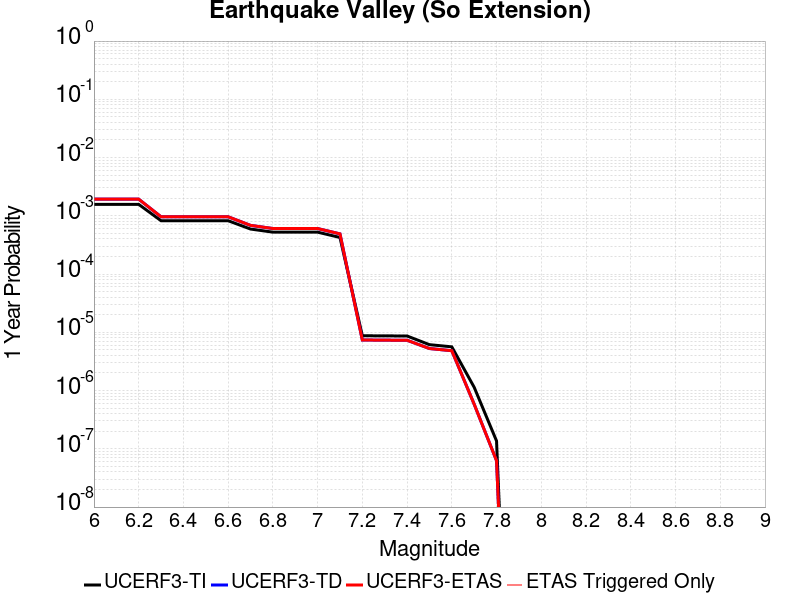 |  |

| Magnitude | 1 wk TI Prob | 1 wk TD Prob | 1 wk ETAS Prob | 1 wk ETAS/TD Gain | 1 wk ETAS Triggered Only | 1 mo TI Prob | 1 mo TD Prob | 1 mo ETAS Prob | 1 mo ETAS/TD Gain | 1 mo ETAS Triggered Only | 1 yr TI Prob | 1 yr TD Prob | 1 yr ETAS Prob | 1 yr ETAS/TD Gain | 1 yr ETAS Triggered Only | 10 yr TI Prob | 10 yr TD Prob | 10 yr ETAS Prob | 10 yr ETAS/TD Gain | 10 yr ETAS Triggered Only |
|-----|-----|-----|-----|-----|-----|-----|-----|-----|-----|-----|-----|-----|-----|-----|-----|-----|-----|-----|-----|-----|
| 6.0 | 3.0194888E-5 | 3.7076676E-5 | 3.7076676E-5 | 1.0 | 0.0 | 1.2940024E-4 | 1.5889342E-4 | 1.5889342E-4 | 1.0 | 0.0 | 0.0015743093 | 0.0019333225 | 0.0019333225 | 1.0 | 0.0 | 0.01563203 | 0.01921541 | 0.019225217 | 1.0005105 | 1.0E-5 |
| 6.1 | 3.0194888E-5 | 3.7076676E-5 | 3.7076676E-5 | 1.0 | 0.0 | 1.2940024E-4 | 1.5889342E-4 | 1.5889342E-4 | 1.0 | 0.0 | 0.0015743093 | 0.0019333225 | 0.0019333225 | 1.0 | 0.0 | 0.01563203 | 0.01921541 | 0.019225217 | 1.0005105 | 1.0E-5 |
| 6.2 | 3.0194888E-5 | 3.7076676E-5 | 3.7076676E-5 | 1.0 | 0.0 | 1.2940024E-4 | 1.5889342E-4 | 1.5889342E-4 | 1.0 | 0.0 | 0.0015743093 | 0.0019333225 | 0.0019333225 | 1.0 | 0.0 | 0.01563203 | 0.01921541 | 0.019225217 | 1.0005105 | 1.0E-5 |
| 6.3 | 1.5795305E-5 | 1.8448294E-5 | 1.8448294E-5 | 1.0 | 0.0 | 6.769241E-5 | 7.906235E-5 | 7.906235E-5 | 1.0 | 0.0 | 8.238434E-4 | 9.6226996E-4 | 9.6226996E-4 | 1.0 | 0.0 | 0.008207959 | 0.009591934 | 0.009601838 | 1.0010326 | 1.0E-5 |
| 6.4 | 1.5795305E-5 | 1.8448294E-5 | 1.8448294E-5 | 1.0 | 0.0 | 6.769241E-5 | 7.906235E-5 | 7.906235E-5 | 1.0 | 0.0 | 8.238434E-4 | 9.6226996E-4 | 9.6226996E-4 | 1.0 | 0.0 | 0.008207959 | 0.009591934 | 0.009601838 | 1.0010326 | 1.0E-5 |
| 6.5 | 1.5795305E-5 | 1.8448294E-5 | 1.8448294E-5 | 1.0 | 0.0 | 6.769241E-5 | 7.906235E-5 | 7.906235E-5 | 1.0 | 0.0 | 8.238434E-4 | 9.6226996E-4 | 9.6226996E-4 | 1.0 | 0.0 | 0.008207959 | 0.009591934 | 0.009601838 | 1.0010326 | 1.0E-5 |
| 6.6 | 1.5795305E-5 | 1.8448294E-5 | 1.8448294E-5 | 1.0 | 0.0 | 6.769241E-5 | 7.906235E-5 | 7.906235E-5 | 1.0 | 0.0 | 8.238434E-4 | 9.6226996E-4 | 9.6226996E-4 | 1.0 | 0.0 | 0.008207959 | 0.009591934 | 0.009601838 | 1.0010326 | 1.0E-5 |
| 6.7 | 1.1363076E-5 | 1.3139414E-5 | 1.3139414E-5 | 1.0 | 0.0 | 4.8697988E-5 | 5.6310986E-5 | 5.6310986E-5 | 1.0 | 0.0 | 5.927367E-4 | 6.854467E-4 | 6.854467E-4 | 1.0 | 0.0 | 0.0059115817 | 0.0068407995 | 0.006850731 | 1.0014518 | 1.0E-5 |
| 6.8 | 1.0049611E-5 | 1.1595309E-5 | 1.1595309E-5 | 1.0 | 0.0 | 4.306905E-5 | 4.9693648E-5 | 4.9693648E-5 | 1.0 | 0.0 | 5.242395E-4 | 6.049254E-4 | 6.049254E-4 | 1.0 | 0.0 | 0.0052300454 | 0.0060399654 | 0.006049905 | 1.0016457 | 1.0E-5 |
| 6.9 | 1.0049611E-5 | 1.1595309E-5 | 1.1595309E-5 | 1.0 | 0.0 | 4.306905E-5 | 4.9693648E-5 | 4.9693648E-5 | 1.0 | 0.0 | 5.242395E-4 | 6.049254E-4 | 6.049254E-4 | 1.0 | 0.0 | 0.0052300454 | 0.0060399654 | 0.006049905 | 1.0016457 | 1.0E-5 |
| 7.0 | 1.0049611E-5 | 1.1595309E-5 | 1.1595309E-5 | 1.0 | 0.0 | 4.306905E-5 | 4.9693648E-5 | 4.9693648E-5 | 1.0 | 0.0 | 5.242395E-4 | 6.049254E-4 | 6.049254E-4 | 1.0 | 0.0 | 0.0052300454 | 0.0060399654 | 0.006049905 | 1.0016457 | 1.0E-5 |
| 7.1 | 8.140254E-6 | 9.384248E-6 | 9.384248E-6 | 1.0 | 0.0 | 3.4886336E-5 | 4.0217965E-5 | 4.0217965E-5 | 1.0 | 0.0 | 4.2465836E-4 | 4.896108E-4 | 4.896108E-4 | 1.0 | 0.0 | 0.0042384774 | 0.004891898 | 0.004901849 | 1.0020342 | 1.0E-5 |
| 7.2 | 1.673835E-7 | 1.415511E-7 | 1.415511E-7 | 1.0 | 0.0 | 7.173577E-7 | 6.066474E-7 | 6.066474E-7 | 1.0 | 0.0 | 8.733795E-6 | 7.385911E-6 | 7.385911E-6 | 1.0 | 0.0 | 8.733451E-5 | 7.385701E-5 | 7.385701E-5 | 1.0 | 0.0 |
| 7.3 | 1.6632116E-7 | 1.4053334E-7 | 1.4053334E-7 | 1.0 | 0.0 | 7.1280476E-7 | 6.0228564E-7 | 6.0228564E-7 | 1.0 | 0.0 | 8.678364E-6 | 7.3328065E-6 | 7.3328065E-6 | 1.0 | 0.0 | 8.6780245E-5 | 7.3326E-5 | 7.3326E-5 | 1.0 | 0.0 |
| 7.4 | 1.6569169E-7 | 1.3997958E-7 | 1.3997958E-7 | 1.0 | 0.0 | 7.1010703E-7 | 5.9991237E-7 | 5.9991237E-7 | 1.0 | 0.0 | 8.645519E-6 | 7.3039123E-6 | 7.3039123E-6 | 1.0 | 0.0 | 8.645182E-5 | 7.303708E-5 | 7.303708E-5 | 1.0 | 0.0 |
| 7.5 | 1.1764555E-7 | 1.00965785E-7 | 1.00965785E-7 | 1.0 | 0.0 | 5.041951E-7 | 4.3271044E-7 | 4.3271044E-7 | 1.0 | 0.0 | 6.138558E-6 | 5.268239E-6 | 5.268239E-6 | 1.0 | 0.0 | 6.1383886E-5 | 5.2681356E-5 | 5.2681356E-5 | 1.0 | 0.0 |
| 7.6 | 1.07927605E-7 | 9.2613234E-8 | 9.2613234E-8 | 1.0 | 0.0 | 4.6254678E-7 | 3.9691383E-7 | 3.9691383E-7 | 1.0 | 0.0 | 5.6314925E-6 | 4.8324173E-6 | 4.8324173E-6 | 1.0 | 0.0 | 5.63135E-5 | 4.832333E-5 | 4.832333E-5 | 1.0 | 0.0 |
| 7.7 | 2.1826905E-8 | 1.1182069E-8 | 1.1182069E-8 | 1.0 | 0.0 | 9.3543875E-8 | 4.792315E-8 | 4.792315E-8 | 1.0 | 0.0 | 1.1388961E-6 | 5.8346427E-7 | 5.8346427E-7 | 1.0 | 0.0 | 1.1388902E-5 | 5.8346322E-6 | 5.8346322E-6 | 1.0 | 0.0 |
| 7.8 | 2.6169649E-9 | 1.1970844E-9 | 1.1970844E-9 | 1.0 | 0.0 | 1.1215564E-8 | 5.1303615E-9 | 5.1303615E-9 | 1.0 | 0.0 | 1.3654947E-7 | 6.246215E-8 | 6.246215E-8 | 1.0 | 0.0 | 1.365494E-6 | 6.246215E-7 | 6.246215E-7 | 1.0 | 0.0 |

## San Jacinto (Superstition Mtn)
*[(top)](#table-of-contents)*

| 1 Week | 1 Month | 1 Year | 10 Year |
|-----|-----|-----|-----|
|  |  |  |  |

| Magnitude | 1 wk TI Prob | 1 wk TD Prob | 1 wk ETAS Prob | 1 wk ETAS/TD Gain | 1 wk ETAS Triggered Only | 1 mo TI Prob | 1 mo TD Prob | 1 mo ETAS Prob | 1 mo ETAS/TD Gain | 1 mo ETAS Triggered Only | 1 yr TI Prob | 1 yr TD Prob | 1 yr ETAS Prob | 1 yr ETAS/TD Gain | 1 yr ETAS Triggered Only | 10 yr TI Prob | 10 yr TD Prob | 10 yr ETAS Prob | 10 yr ETAS/TD Gain | 10 yr ETAS Triggered Only |
|-----|-----|-----|-----|-----|-----|-----|-----|-----|-----|-----|-----|-----|-----|-----|-----|-----|-----|-----|-----|-----|
| 6.0 | 6.4193904E-5 | 9.602433E-5 | 9.602433E-5 | 1.0 | 0.0 | 2.7508775E-4 | 4.1147732E-4 | 4.1147732E-4 | 1.0 | 0.0 | 0.0033440501 | 0.004999611 | 0.004999611 | 1.0 | 0.0 | 0.03294174 | 0.048835956 | 0.04884547 | 1.0001948 | 1.0E-5 |
| 6.1 | 6.4193904E-5 | 9.602433E-5 | 9.602433E-5 | 1.0 | 0.0 | 2.7508775E-4 | 4.1147732E-4 | 4.1147732E-4 | 1.0 | 0.0 | 0.0033440501 | 0.004999611 | 0.004999611 | 1.0 | 0.0 | 0.03294174 | 0.048835956 | 0.04884547 | 1.0001948 | 1.0E-5 |
| 6.2 | 5.7023593E-5 | 8.317071E-5 | 8.317071E-5 | 1.0 | 0.0 | 2.4436394E-4 | 3.564066E-4 | 3.564066E-4 | 1.0 | 0.0 | 0.002971072 | 0.0043322598 | 0.0043322598 | 1.0 | 0.0 | 0.029316625 | 0.042517688 | 0.042527262 | 1.0002252 | 1.0E-5 |
| 6.3 | 5.6940098E-5 | 8.3016064E-5 | 8.3016064E-5 | 1.0 | 0.0 | 2.4400617E-4 | 3.5574404E-4 | 3.5574404E-4 | 1.0 | 0.0 | 0.002966728 | 0.0043242252 | 0.0043242252 | 1.0 | 0.0 | 0.029274331 | 0.04244106 | 0.042450633 | 1.0002257 | 1.0E-5 |
| 6.4 | 5.4171585E-5 | 7.750967E-5 | 7.750967E-5 | 1.0 | 0.0 | 2.3214328E-4 | 3.321513E-4 | 3.321513E-4 | 1.0 | 0.0 | 0.0028226813 | 0.004038092 | 0.004038092 | 1.0 | 0.0 | 0.02787096 | 0.039730404 | 0.039740007 | 1.0002416 | 1.0E-5 |
| 6.5 | 4.375144E-5 | 5.6446475E-5 | 5.6446475E-5 | 1.0 | 0.0 | 1.874927E-4 | 2.4189767E-4 | 2.4189767E-4 | 1.0 | 0.0 | 0.0022803338 | 0.0029423025 | 0.0029423025 | 1.0 | 0.0 | 0.022570757 | 0.029251525 | 0.029261233 | 1.0003319 | 1.0E-5 |
| 6.6 | 2.772192E-5 | 2.5512014E-5 | 2.5512014E-5 | 1.0 | 0.0 | 1.1880282E-4 | 1.0933273E-4 | 1.0933273E-4 | 1.0 | 0.0 | 0.0014454646 | 0.0013303325 | 0.0013303325 | 1.0 | 0.0 | 0.014360986 | 0.013552204 | 0.013562068 | 1.0007279 | 1.0E-5 |
| 6.7 | 2.7124124E-5 | 2.4722887E-5 | 2.4722887E-5 | 1.0 | 0.0 | 1.1624106E-4 | 1.0595103E-4 | 1.0595103E-4 | 1.0 | 0.0 | 0.0014143161 | 0.0012892097 | 0.0012892097 | 1.0 | 0.0 | 0.014053487 | 0.01314578 | 0.013155649 | 1.0007507 | 1.0E-5 |
| 6.8 | 2.5475807E-5 | 2.2187278E-5 | 2.2187278E-5 | 1.0 | 0.0 | 1.0917746E-4 | 9.5084935E-5 | 9.5084935E-5 | 1.0 | 0.0 | 0.001328425 | 0.0011570562 | 0.0011570562 | 1.0 | 0.0 | 0.0132051185 | 0.011833734 | 0.011843616 | 1.0008351 | 1.0E-5 |
| 6.9 | 2.1162023E-5 | 1.7647073E-5 | 1.7647073E-5 | 1.0 | 0.0 | 9.069123E-5 | 7.562814E-5 | 7.562814E-5 | 1.0 | 0.0 | 0.0011036064 | 9.2038745E-4 | 9.2038745E-4 | 1.0 | 0.0 | 0.010981417 | 0.0094578 | 0.009467705 | 1.0010474 | 1.0E-5 |
| 7.0 | 1.8754288E-5 | 1.618151E-5 | 1.618151E-5 | 1.0 | 0.0 | 8.037304E-5 | 6.93475E-5 | 6.93475E-5 | 1.0 | 0.0 | 9.781026E-4 | 8.439812E-4 | 8.439812E-4 | 1.0 | 0.0 | 0.009738087 | 0.008680461 | 0.008690374 | 1.001142 | 1.0E-5 |
| 7.1 | 1.8678527E-5 | 1.6106644E-5 | 1.6106644E-5 | 1.0 | 0.0 | 8.0048376E-5 | 6.902666E-5 | 6.902666E-5 | 1.0 | 0.0 | 9.7415317E-4 | 8.4007805E-4 | 8.4007805E-4 | 1.0 | 0.0 | 0.009698939 | 0.008641433 | 0.008651346 | 1.0011473 | 1.0E-5 |
| 7.2 | 1.7804578E-5 | 1.5400998E-5 | 1.5400998E-5 | 1.0 | 0.0 | 7.6303106E-5 | 6.600262E-5 | 6.600262E-5 | 1.0 | 0.0 | 9.285943E-4 | 8.032879E-4 | 8.032879E-4 | 1.0 | 0.0 | 0.009247236 | 0.008272669 | 0.008282586 | 1.0011988 | 1.0E-5 |
| 7.3 | 1.6583685E-5 | 1.4549885E-5 | 1.4549885E-5 | 1.0 | 0.0 | 7.1070994E-5 | 6.2355175E-5 | 6.2355175E-5 | 1.0 | 0.0 | 8.649459E-4 | 7.5891183E-4 | 7.5891183E-4 | 1.0 | 0.0 | 0.00861587 | 0.00782784 | 0.007837762 | 1.0012674 | 1.0E-5 |
| 7.4 | 1.6387552E-5 | 1.4414733E-5 | 1.4414733E-5 | 1.0 | 0.0 | 7.023047E-5 | 6.177598E-5 | 6.177598E-5 | 1.0 | 0.0 | 8.5472054E-4 | 7.51865E-4 | 7.51865E-4 | 1.0 | 0.0 | 0.008514405 | 0.0077572274 | 0.0077671497 | 1.0012791 | 1.0E-5 |
| 7.5 | 1.5790754E-5 | 1.4055237E-5 | 1.4055237E-5 | 1.0 | 0.0 | 6.767291E-5 | 6.0235354E-5 | 6.0235354E-5 | 1.0 | 0.0 | 8.236062E-4 | 7.3312066E-4 | 7.3312066E-4 | 1.0 | 0.0 | 0.008205604 | 0.007567697 | 0.0075776214 | 1.0013114 | 1.0E-5 |
| 7.6 | 1.4248672E-5 | 1.3073736E-5 | 1.3073736E-5 | 1.0 | 0.0 | 6.106431E-5 | 5.6029105E-5 | 5.6029105E-5 | 1.0 | 0.0 | 7.432043E-4 | 6.8194256E-4 | 6.8194256E-4 | 1.0 | 0.0 | 0.007407237 | 0.0070500122 | 0.0070599415 | 1.0014085 | 1.0E-5 |
| 7.7 | 1.15449975E-5 | 1.0921719E-5 | 1.0921719E-5 | 1.0 | 0.0 | 4.947762E-5 | 4.6806534E-5 | 4.6806534E-5 | 1.0 | 0.0 | 6.022235E-4 | 5.6972133E-4 | 5.6972133E-4 | 1.0 | 0.0 | 0.006005941 | 0.005919572 | 0.005929513 | 1.0016793 | 1.0E-5 |
| 7.8 | 9.1391985E-6 | 9.531725E-6 | 9.531725E-6 | 1.0 | 0.0 | 3.9167408E-5 | 4.0849613E-5 | 4.0849613E-5 | 1.0 | 0.0 | 4.767588E-4 | 4.9723114E-4 | 4.9723114E-4 | 1.0 | 0.0 | 0.0047573727 | 0.00518564 | 0.005195588 | 1.0019184 | 1.0E-5 |
| 7.9 | 6.973017E-6 | 7.3976203E-6 | 7.3976203E-6 | 1.0 | 0.0 | 2.9884017E-5 | 3.1703705E-5 | 3.1703705E-5 | 1.0 | 0.0 | 3.6377716E-4 | 3.8592477E-4 | 3.8592477E-4 | 1.0 | 0.0 | 0.0036318225 | 0.004059825 | 0.0040697847 | 1.0024532 | 1.0E-5 |
| 8.0 | 5.7638235E-6 | 6.274068E-6 | 6.274068E-6 | 1.0 | 0.0 | 2.4701867E-5 | 2.6888587E-5 | 2.6888587E-5 | 1.0 | 0.0 | 3.0070372E-4 | 3.2731987E-4 | 3.2731987E-4 | 1.0 | 0.0 | 0.0030029714 | 0.0034608443 | 0.00347081 | 1.0028795 | 1.0E-5 |
| 8.1 | 5.1124434E-6 | 5.508488E-6 | 5.508488E-6 | 1.0 | 0.0 | 2.1910288E-5 | 2.3607594E-5 | 2.3607594E-5 | 1.0 | 0.0 | 2.6672508E-4 | 2.8738505E-4 | 2.8738505E-4 | 1.0 | 0.0 | 0.0026640517 | 0.0030471014 | 0.003057071 | 1.0032718 | 1.0E-5 |
| 8.2 | 1.1075938E-6 | 5.354127E-7 | 5.354127E-7 | 1.0 | 0.0 | 4.7468216E-6 | 2.294624E-6 | 2.294624E-6 | 1.0 | 0.0 | 5.779102E-5 | 2.793671E-5 | 2.793671E-5 | 1.0 | 0.0 | 5.777599E-4 | 3.1443583E-4 | 3.1443583E-4 | 1.0 | 0.0 |
| 8.3 | 1.3584393E-8 | 4.4900936E-9 | 4.4900936E-9 | 1.0 | 0.0 | 5.8218827E-8 | 1.9243258E-8 | 1.9243258E-8 | 1.0 | 0.0 | 7.0881396E-7 | 2.3428666E-7 | 2.3428666E-7 | 1.0 | 0.0 | 7.0881174E-6 | 2.6262912E-6 | 2.6262912E-6 | 1.0 | 0.0 |

## North Frontal  (East)
*[(top)](#table-of-contents)*

| 1 Week | 1 Month | 1 Year | 10 Year |
|-----|-----|-----|-----|
|  |  |  |  |

| Magnitude | 1 wk TI Prob | 1 wk TD Prob | 1 wk ETAS Prob | 1 wk ETAS/TD Gain | 1 wk ETAS Triggered Only | 1 mo TI Prob | 1 mo TD Prob | 1 mo ETAS Prob | 1 mo ETAS/TD Gain | 1 mo ETAS Triggered Only | 1 yr TI Prob | 1 yr TD Prob | 1 yr ETAS Prob | 1 yr ETAS/TD Gain | 1 yr ETAS Triggered Only | 10 yr TI Prob | 10 yr TD Prob | 10 yr ETAS Prob | 10 yr ETAS/TD Gain | 10 yr ETAS Triggered Only |
|-----|-----|-----|-----|-----|-----|-----|-----|-----|-----|-----|-----|-----|-----|-----|-----|-----|-----|-----|-----|-----|
| 6.0 | 7.135738E-6 | 7.4773666E-6 | 7.4773666E-6 | 1.0 | 0.0 | 3.0581377E-5 | 3.2045577E-5 | 3.2045577E-5 | 1.0 | 0.0 | 3.7226462E-4 | 3.9010498E-4 | 4.0010107E-4 | 1.0256242 | 1.0E-5 | 0.0037164164 | 0.0038961596 | 0.0039061208 | 1.0025567 | 1.0E-5 |
| 6.1 | 7.135738E-6 | 7.4773666E-6 | 7.4773666E-6 | 1.0 | 0.0 | 3.0581377E-5 | 3.2045577E-5 | 3.2045577E-5 | 1.0 | 0.0 | 3.7226462E-4 | 3.9010498E-4 | 4.0010107E-4 | 1.0256242 | 1.0E-5 | 0.0037164164 | 0.0038961596 | 0.0039061208 | 1.0025567 | 1.0E-5 |
| 6.2 | 7.135738E-6 | 7.4773666E-6 | 7.4773666E-6 | 1.0 | 0.0 | 3.0581377E-5 | 3.2045577E-5 | 3.2045577E-5 | 1.0 | 0.0 | 3.7226462E-4 | 3.9010498E-4 | 4.0010107E-4 | 1.0256242 | 1.0E-5 | 0.0037164164 | 0.0038961596 | 0.0039061208 | 1.0025567 | 1.0E-5 |
| 6.3 | 7.135738E-6 | 7.4773666E-6 | 7.4773666E-6 | 1.0 | 0.0 | 3.0581377E-5 | 3.2045577E-5 | 3.2045577E-5 | 1.0 | 0.0 | 3.7226462E-4 | 3.9010498E-4 | 4.0010107E-4 | 1.0256242 | 1.0E-5 | 0.0037164164 | 0.0038961596 | 0.0039061208 | 1.0025567 | 1.0E-5 |
| 6.4 | 7.135738E-6 | 7.4773666E-6 | 7.4773666E-6 | 1.0 | 0.0 | 3.0581377E-5 | 3.2045577E-5 | 3.2045577E-5 | 1.0 | 0.0 | 3.7226462E-4 | 3.9010498E-4 | 4.0010107E-4 | 1.0256242 | 1.0E-5 | 0.0037164164 | 0.0038961596 | 0.0039061208 | 1.0025567 | 1.0E-5 |
| 6.5 | 7.135738E-6 | 7.4773666E-6 | 7.4773666E-6 | 1.0 | 0.0 | 3.0581377E-5 | 3.2045577E-5 | 3.2045577E-5 | 1.0 | 0.0 | 3.7226462E-4 | 3.9010498E-4 | 4.0010107E-4 | 1.0256242 | 1.0E-5 | 0.0037164164 | 0.0038961596 | 0.0039061208 | 1.0025567 | 1.0E-5 |
| 6.6 | 7.135738E-6 | 7.4773666E-6 | 7.4773666E-6 | 1.0 | 0.0 | 3.0581377E-5 | 3.2045577E-5 | 3.2045577E-5 | 1.0 | 0.0 | 3.7226462E-4 | 3.9010498E-4 | 4.0010107E-4 | 1.0256242 | 1.0E-5 | 0.0037164164 | 0.0038961596 | 0.0039061208 | 1.0025567 | 1.0E-5 |
| 6.7 | 7.135738E-6 | 7.4773666E-6 | 7.4773666E-6 | 1.0 | 0.0 | 3.0581377E-5 | 3.2045577E-5 | 3.2045577E-5 | 1.0 | 0.0 | 3.7226462E-4 | 3.9010498E-4 | 4.0010107E-4 | 1.0256242 | 1.0E-5 | 0.0037164164 | 0.0038961596 | 0.0039061208 | 1.0025567 | 1.0E-5 |
| 6.8 | 5.959142E-6 | 6.236837E-6 | 6.236837E-6 | 1.0 | 0.0 | 2.553893E-5 | 2.672913E-5 | 2.672913E-5 | 1.0 | 0.0 | 3.108921E-4 | 3.2539663E-4 | 3.353934E-4 | 1.0307218 | 1.0E-5 | 0.0031045752 | 0.0032509752 | 0.0032609426 | 1.003066 | 1.0E-5 |
| 6.9 | 2.2946929E-6 | 2.382509E-6 | 2.382509E-6 | 1.0 | 0.0 | 9.834361E-6 | 1.0210715E-5 | 1.0210715E-5 | 1.0 | 0.0 | 1.1972676E-4 | 1.2430883E-4 | 1.2430883E-4 | 1.0 | 0.0 | 0.0011966228 | 0.0012424395 | 0.0012424395 | 1.0 | 0.0 |
| 7.0 | 2.2468673E-6 | 2.3322007E-6 | 2.3322007E-6 | 1.0 | 0.0 | 9.629396E-6 | 9.99511E-6 | 9.99511E-6 | 1.0 | 0.0 | 1.1723159E-4 | 1.2168415E-4 | 1.2168415E-4 | 1.0 | 0.0 | 0.0011716976 | 0.0012162215 | 0.0012162215 | 1.0 | 0.0 |
| 7.1 | 1.9921076E-6 | 2.064643E-6 | 2.064643E-6 | 1.0 | 0.0 | 8.537577E-6 | 8.848443E-6 | 8.848443E-6 | 1.0 | 0.0 | 1.0394004E-4 | 1.077249E-4 | 1.077249E-4 | 1.0 | 0.0 | 0.0010389143 | 0.0010767695 | 0.0010767695 | 1.0 | 0.0 |
| 7.2 | 1.4524545E-6 | 1.5045434E-6 | 1.5045434E-6 | 1.0 | 0.0 | 6.2247905E-6 | 6.4480287E-6 | 6.4480287E-6 | 1.0 | 0.0 | 7.5784184E-5 | 7.850217E-5 | 7.850217E-5 | 1.0 | 0.0 | 7.575835E-4 | 7.8476884E-4 | 7.8476884E-4 | 1.0 | 0.0 |
| 7.3 | 8.9802575E-7 | 9.3089085E-7 | 9.3089085E-7 | 1.0 | 0.0 | 3.848676E-6 | 3.9895267E-6 | 3.9895267E-6 | 1.0 | 0.0 | 4.685662E-5 | 4.857152E-5 | 4.857152E-5 | 1.0 | 0.0 | 4.6846745E-4 | 4.8562037E-4 | 4.8562037E-4 | 1.0 | 0.0 |
| 7.4 | 7.776139E-7 | 8.060631E-7 | 8.060631E-7 | 1.0 | 0.0 | 3.3326266E-6 | 3.4545521E-6 | 3.4545521E-6 | 1.0 | 0.0 | 4.0573974E-5 | 4.2058473E-5 | 4.2058473E-5 | 1.0 | 0.0 | 4.0566566E-4 | 4.205159E-4 | 4.205159E-4 | 1.0 | 0.0 |
| 7.5 | 5.244417E-7 | 5.441328E-7 | 5.441328E-7 | 1.0 | 0.0 | 2.2476054E-6 | 2.3319958E-6 | 2.3319958E-6 | 1.0 | 0.0 | 2.7364253E-5 | 2.8391745E-5 | 2.8391745E-5 | 1.0 | 0.0 | 2.7360884E-4 | 2.838877E-4 | 2.838877E-4 | 1.0 | 0.0 |
| 7.6 | 1.5489647E-7 | 1.6089835E-7 | 1.6089835E-7 | 1.0 | 0.0 | 6.6384183E-7 | 6.895643E-7 | 6.895643E-7 | 1.0 | 0.0 | 8.082245E-6 | 8.395433E-6 | 8.395433E-6 | 1.0 | 0.0 | 8.08195E-5 | 8.395316E-5 | 8.395316E-5 | 1.0 | 0.0 |

## Los Alamos extension
*[(top)](#table-of-contents)*

| 1 Week | 1 Month | 1 Year | 10 Year |
|-----|-----|-----|-----|
|  |  | 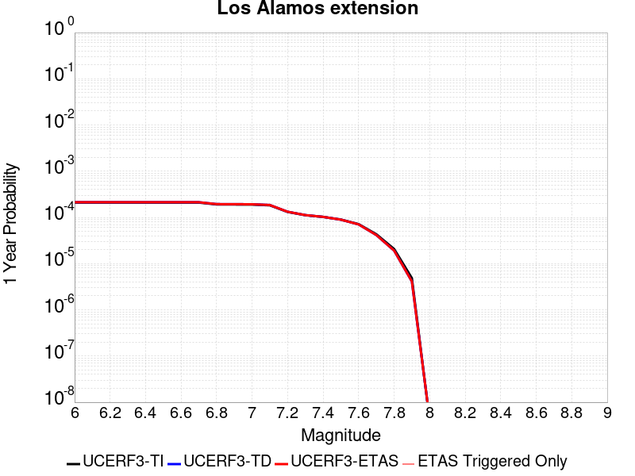 |  |

| Magnitude | 1 wk TI Prob | 1 wk TD Prob | 1 wk ETAS Prob | 1 wk ETAS/TD Gain | 1 wk ETAS Triggered Only | 1 mo TI Prob | 1 mo TD Prob | 1 mo ETAS Prob | 1 mo ETAS/TD Gain | 1 mo ETAS Triggered Only | 1 yr TI Prob | 1 yr TD Prob | 1 yr ETAS Prob | 1 yr ETAS/TD Gain | 1 yr ETAS Triggered Only | 10 yr TI Prob | 10 yr TD Prob | 10 yr ETAS Prob | 10 yr ETAS/TD Gain | 10 yr ETAS Triggered Only |
|-----|-----|-----|-----|-----|-----|-----|-----|-----|-----|-----|-----|-----|-----|-----|-----|-----|-----|-----|-----|-----|
| 6.0 | 4.0146506E-6 | 4.0862483E-6 | 4.0862483E-6 | 1.0 | 0.0 | 1.7205533E-5 | 1.751238E-5 | 1.751238E-5 | 1.0 | 0.0 | 2.0945723E-4 | 2.1319349E-4 | 2.1319349E-4 | 1.0 | 0.0 | 0.0020925992 | 0.0021299988 | 0.0021399774 | 1.0046848 | 1.0E-5 |
| 6.1 | 4.0146506E-6 | 4.0862483E-6 | 4.0862483E-6 | 1.0 | 0.0 | 1.7205533E-5 | 1.751238E-5 | 1.751238E-5 | 1.0 | 0.0 | 2.0945723E-4 | 2.1319349E-4 | 2.1319349E-4 | 1.0 | 0.0 | 0.0020925992 | 0.0021299988 | 0.0021399774 | 1.0046848 | 1.0E-5 |
| 6.2 | 4.0146506E-6 | 4.0862483E-6 | 4.0862483E-6 | 1.0 | 0.0 | 1.7205533E-5 | 1.751238E-5 | 1.751238E-5 | 1.0 | 0.0 | 2.0945723E-4 | 2.1319349E-4 | 2.1319349E-4 | 1.0 | 0.0 | 0.0020925992 | 0.0021299988 | 0.0021399774 | 1.0046848 | 1.0E-5 |
| 6.3 | 4.0146506E-6 | 4.0862483E-6 | 4.0862483E-6 | 1.0 | 0.0 | 1.7205533E-5 | 1.751238E-5 | 1.751238E-5 | 1.0 | 0.0 | 2.0945723E-4 | 2.1319349E-4 | 2.1319349E-4 | 1.0 | 0.0 | 0.0020925992 | 0.0021299988 | 0.0021399774 | 1.0046848 | 1.0E-5 |
| 6.4 | 4.0146506E-6 | 4.0862483E-6 | 4.0862483E-6 | 1.0 | 0.0 | 1.7205533E-5 | 1.751238E-5 | 1.751238E-5 | 1.0 | 0.0 | 2.0945723E-4 | 2.1319349E-4 | 2.1319349E-4 | 1.0 | 0.0 | 0.0020925992 | 0.0021299988 | 0.0021399774 | 1.0046848 | 1.0E-5 |
| 6.5 | 4.0146506E-6 | 4.0862483E-6 | 4.0862483E-6 | 1.0 | 0.0 | 1.7205533E-5 | 1.751238E-5 | 1.751238E-5 | 1.0 | 0.0 | 2.0945723E-4 | 2.1319349E-4 | 2.1319349E-4 | 1.0 | 0.0 | 0.0020925992 | 0.0021299988 | 0.0021399774 | 1.0046848 | 1.0E-5 |
| 6.6 | 4.0146506E-6 | 4.0862483E-6 | 4.0862483E-6 | 1.0 | 0.0 | 1.7205533E-5 | 1.751238E-5 | 1.751238E-5 | 1.0 | 0.0 | 2.0945723E-4 | 2.1319349E-4 | 2.1319349E-4 | 1.0 | 0.0 | 0.0020925992 | 0.0021299988 | 0.0021399774 | 1.0046848 | 1.0E-5 |
| 6.7 | 4.0146506E-6 | 4.0862483E-6 | 4.0862483E-6 | 1.0 | 0.0 | 1.7205533E-5 | 1.751238E-5 | 1.751238E-5 | 1.0 | 0.0 | 2.0945723E-4 | 2.1319349E-4 | 2.1319349E-4 | 1.0 | 0.0 | 0.0020925992 | 0.0021299988 | 0.0021399774 | 1.0046848 | 1.0E-5 |
| 6.8 | 3.6584688E-6 | 3.7189413E-6 | 3.7189413E-6 | 1.0 | 0.0 | 1.5679057E-5 | 1.5938229E-5 | 1.5938229E-5 | 1.0 | 0.0 | 1.9087581E-4 | 1.9403159E-4 | 1.9403159E-4 | 1.0 | 0.0 | 0.0019071194 | 0.0019387142 | 0.0019486948 | 1.005148 | 1.0E-5 |
| 6.9 | 3.644631E-6 | 3.7046511E-6 | 3.7046511E-6 | 1.0 | 0.0 | 1.5619753E-5 | 1.5876985E-5 | 1.5876985E-5 | 1.0 | 0.0 | 1.901539E-4 | 1.9328608E-4 | 1.9328608E-4 | 1.0 | 0.0 | 0.0018999127 | 0.0019312721 | 0.0019412527 | 1.005168 | 1.0E-5 |
| 7.0 | 3.6318522E-6 | 3.6914114E-6 | 3.6914114E-6 | 1.0 | 0.0 | 1.5564989E-5 | 1.5820244E-5 | 1.5820244E-5 | 1.0 | 0.0 | 1.8948725E-4 | 1.9259538E-4 | 1.9259538E-4 | 1.0 | 0.0 | 0.0018932576 | 0.001924377 | 0.0019343578 | 1.0051864 | 1.0E-5 |
| 7.1 | 3.5001724E-6 | 3.5554797E-6 | 3.5554797E-6 | 1.0 | 0.0 | 1.5000653E-5 | 1.5237686E-5 | 1.5237686E-5 | 1.0 | 0.0 | 1.8261763E-4 | 1.8550396E-4 | 1.8550396E-4 | 1.0 | 0.0 | 0.0018246764 | 0.0018535818 | 0.0018635632 | 1.0053849 | 1.0E-5 |
| 7.2 | 2.5204702E-6 | 2.5437564E-6 | 2.5437564E-6 | 1.0 | 0.0 | 1.080197E-5 | 1.0901767E-5 | 1.0901767E-5 | 1.0 | 0.0 | 1.3150605E-4 | 1.3272099E-4 | 1.3272099E-4 | 1.0 | 0.0 | 0.0013142825 | 0.0013264229 | 0.0013364097 | 1.007529 | 1.0E-5 |
| 7.3 | 2.1399692E-6 | 2.1501864E-6 | 2.1501864E-6 | 1.0 | 0.0 | 9.1712645E-6 | 9.215053E-6 | 9.215053E-6 | 1.0 | 0.0 | 1.1165442E-4 | 1.12187525E-4 | 1.12187525E-4 | 1.0 | 0.0 | 0.0011159834 | 0.0011213121 | 0.0011313009 | 1.0089082 | 1.0E-5 |
| 7.4 | 1.9660122E-6 | 1.970288E-6 | 1.970288E-6 | 1.0 | 0.0 | 8.42574E-6 | 8.444064E-6 | 8.444064E-6 | 1.0 | 0.0 | 1.0257855E-4 | 1.0280166E-4 | 1.0280166E-4 | 1.0 | 0.0 | 0.0010253121 | 0.0010275443 | 0.001037534 | 1.009722 | 1.0E-5 |
| 7.5 | 1.7204633E-6 | 1.7151447E-6 | 1.7151447E-6 | 1.0 | 0.0 | 7.373393E-6 | 7.3505994E-6 | 7.3505994E-6 | 1.0 | 0.0 | 8.976737E-5 | 8.9489906E-5 | 8.9489906E-5 | 1.0 | 0.0 | 8.9731114E-4 | 8.945416E-4 | 9.045327E-4 | 1.011169 | 1.0E-5 |
| 7.6 | 1.3717638E-6 | 1.3536211E-6 | 1.3536211E-6 | 1.0 | 0.0 | 5.878974E-6 | 5.80122E-6 | 5.80122E-6 | 1.0 | 0.0 | 7.157416E-5 | 7.06276E-5 | 7.06276E-5 | 1.0 | 0.0 | 7.1551115E-4 | 7.060541E-4 | 7.1604707E-4 | 1.0141532 | 1.0E-5 |
| 7.7 | 8.272564E-7 | 7.957882E-7 | 7.957882E-7 | 1.0 | 0.0 | 3.5453797E-6 | 3.4105165E-6 | 3.4105165E-6 | 1.0 | 0.0 | 4.3164142E-5 | 4.1522246E-5 | 4.1522246E-5 | 1.0 | 0.0 | 4.315576E-4 | 4.1514507E-4 | 4.1514507E-4 | 1.0 | 0.0 |
| 7.8 | 3.9708277E-7 | 3.6720428E-7 | 3.6720428E-7 | 1.0 | 0.0 | 1.7017821E-6 | 1.5737317E-6 | 1.5737317E-6 | 1.0 | 0.0 | 2.0719E-5 | 1.9160016E-5 | 1.9160016E-5 | 1.0 | 0.0 | 2.071707E-4 | 1.915837E-4 | 1.915837E-4 | 1.0 | 0.0 |
| 7.9 | 9.292528E-8 | 7.889468E-8 | 7.889468E-8 | 1.0 | 0.0 | 3.9825116E-7 | 3.3812E-7 | 3.3812E-7 | 1.0 | 0.0 | 4.848697E-6 | 4.116603E-6 | 4.116603E-6 | 1.0 | 0.0 | 4.8485912E-5 | 4.116528E-5 | 4.116528E-5 | 1.0 | 0.0 |
| 8.0 | 7.880441E-11 | 8.235512E-11 | 8.235512E-11 | 1.0 | 0.0 | 3.3773329E-10 | 3.5295045E-10 | 3.5295045E-10 | 1.0 | 0.0 | 4.1119033E-9 | 4.2971724E-9 | 4.2971724E-9 | 1.0 | 0.0 | 4.1119034E-8 | 4.297172E-8 | 4.297172E-8 | 1.0 | 0.0 |

## Northridge Hills
*[(top)](#table-of-contents)*

| 1 Week | 1 Month | 1 Year | 10 Year |
|-----|-----|-----|-----|
|  |  | 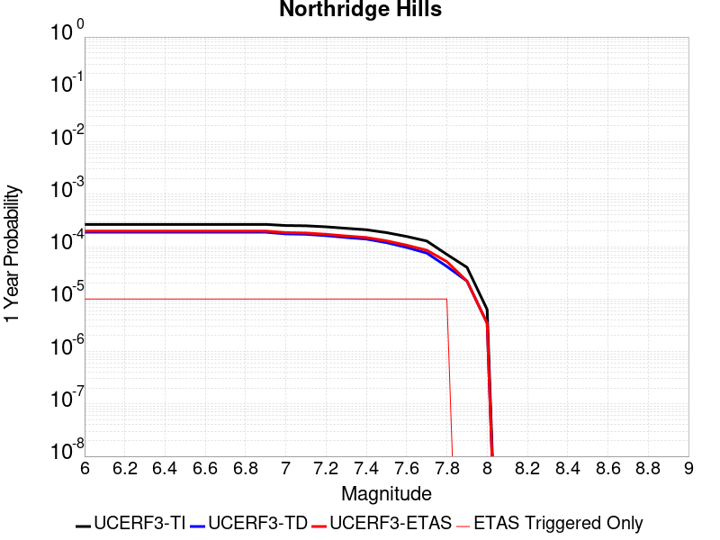 |  |

| Magnitude | 1 wk TI Prob | 1 wk TD Prob | 1 wk ETAS Prob | 1 wk ETAS/TD Gain | 1 wk ETAS Triggered Only | 1 mo TI Prob | 1 mo TD Prob | 1 mo ETAS Prob | 1 mo ETAS/TD Gain | 1 mo ETAS Triggered Only | 1 yr TI Prob | 1 yr TD Prob | 1 yr ETAS Prob | 1 yr ETAS/TD Gain | 1 yr ETAS Triggered Only | 10 yr TI Prob | 10 yr TD Prob | 10 yr ETAS Prob | 10 yr ETAS/TD Gain | 10 yr ETAS Triggered Only |
|-----|-----|-----|-----|-----|-----|-----|-----|-----|-----|-----|-----|-----|-----|-----|-----|-----|-----|-----|-----|-----|
| 6.0 | 5.095982E-6 | 3.6155866E-6 | 3.6155866E-6 | 1.0 | 0.0 | 2.183974E-5 | 1.549528E-5 | 1.549528E-5 | 1.0 | 0.0 | 2.658664E-4 | 1.8863882E-4 | 1.9863693E-4 | 1.0530014 | 1.0E-5 | 0.0026554854 | 0.0018847993 | 0.0018947804 | 1.0052956 | 1.0E-5 |
| 6.1 | 5.095982E-6 | 3.6155866E-6 | 3.6155866E-6 | 1.0 | 0.0 | 2.183974E-5 | 1.549528E-5 | 1.549528E-5 | 1.0 | 0.0 | 2.658664E-4 | 1.8863882E-4 | 1.9863693E-4 | 1.0530014 | 1.0E-5 | 0.0026554854 | 0.0018847993 | 0.0018947804 | 1.0052956 | 1.0E-5 |
| 6.2 | 5.095982E-6 | 3.6155866E-6 | 3.6155866E-6 | 1.0 | 0.0 | 2.183974E-5 | 1.549528E-5 | 1.549528E-5 | 1.0 | 0.0 | 2.658664E-4 | 1.8863882E-4 | 1.9863693E-4 | 1.0530014 | 1.0E-5 | 0.0026554854 | 0.0018847993 | 0.0018947804 | 1.0052956 | 1.0E-5 |
| 6.3 | 5.095982E-6 | 3.6155866E-6 | 3.6155866E-6 | 1.0 | 0.0 | 2.183974E-5 | 1.549528E-5 | 1.549528E-5 | 1.0 | 0.0 | 2.658664E-4 | 1.8863882E-4 | 1.9863693E-4 | 1.0530014 | 1.0E-5 | 0.0026554854 | 0.0018847993 | 0.0018947804 | 1.0052956 | 1.0E-5 |
| 6.4 | 5.095982E-6 | 3.6155866E-6 | 3.6155866E-6 | 1.0 | 0.0 | 2.183974E-5 | 1.549528E-5 | 1.549528E-5 | 1.0 | 0.0 | 2.658664E-4 | 1.8863882E-4 | 1.9863693E-4 | 1.0530014 | 1.0E-5 | 0.0026554854 | 0.0018847993 | 0.0018947804 | 1.0052956 | 1.0E-5 |
| 6.5 | 5.095982E-6 | 3.6155866E-6 | 3.6155866E-6 | 1.0 | 0.0 | 2.183974E-5 | 1.549528E-5 | 1.549528E-5 | 1.0 | 0.0 | 2.658664E-4 | 1.8863882E-4 | 1.9863693E-4 | 1.0530014 | 1.0E-5 | 0.0026554854 | 0.0018847993 | 0.0018947804 | 1.0052956 | 1.0E-5 |
| 6.6 | 5.095982E-6 | 3.6155866E-6 | 3.6155866E-6 | 1.0 | 0.0 | 2.183974E-5 | 1.549528E-5 | 1.549528E-5 | 1.0 | 0.0 | 2.658664E-4 | 1.8863882E-4 | 1.9863693E-4 | 1.0530014 | 1.0E-5 | 0.0026554854 | 0.0018847993 | 0.0018947804 | 1.0052956 | 1.0E-5 |
| 6.7 | 5.095982E-6 | 3.6155866E-6 | 3.6155866E-6 | 1.0 | 0.0 | 2.183974E-5 | 1.549528E-5 | 1.549528E-5 | 1.0 | 0.0 | 2.658664E-4 | 1.8863882E-4 | 1.9863693E-4 | 1.0530014 | 1.0E-5 | 0.0026554854 | 0.0018847993 | 0.0018947804 | 1.0052956 | 1.0E-5 |
| 6.8 | 5.095982E-6 | 3.6155866E-6 | 3.6155866E-6 | 1.0 | 0.0 | 2.183974E-5 | 1.549528E-5 | 1.549528E-5 | 1.0 | 0.0 | 2.658664E-4 | 1.8863882E-4 | 1.9863693E-4 | 1.0530014 | 1.0E-5 | 0.0026554854 | 0.0018847993 | 0.0018947804 | 1.0052956 | 1.0E-5 |
| 6.9 | 5.0942654E-6 | 3.6138015E-6 | 3.6138015E-6 | 1.0 | 0.0 | 2.1832384E-5 | 1.5487629E-5 | 1.5487629E-5 | 1.0 | 0.0 | 2.6577685E-4 | 1.8854569E-4 | 1.985438E-4 | 1.0530275 | 1.0E-5 | 0.002654592 | 0.0018838696 | 0.0018938507 | 1.0052983 | 1.0E-5 |
| 7.0 | 4.851143E-6 | 3.35911E-6 | 3.35911E-6 | 1.0 | 0.0 | 2.0790447E-5 | 1.4396106E-5 | 1.4396106E-5 | 1.0 | 0.0 | 2.5309427E-4 | 1.7525854E-4 | 1.8525678E-4 | 1.0570486 | 1.0E-5 | 0.0025280623 | 0.0017512076 | 0.0017611901 | 1.0057003 | 1.0E-5 |
| 7.1 | 4.7910607E-6 | 3.2973896E-6 | 3.2973896E-6 | 1.0 | 0.0 | 2.0532956E-5 | 1.4131593E-5 | 1.4131593E-5 | 1.0 | 0.0 | 2.4996005E-4 | 1.7203859E-4 | 1.8203688E-4 | 1.0581164 | 1.0E-5 | 0.0024967908 | 0.0017190583 | 0.0017290411 | 1.0058072 | 1.0E-5 |
| 7.2 | 4.580079E-6 | 3.1071618E-6 | 3.1071618E-6 | 1.0 | 0.0 | 1.9628762E-5 | 1.3316339E-5 | 1.3316339E-5 | 1.0 | 0.0 | 2.3895396E-4 | 1.621144E-4 | 1.7211278E-4 | 1.0616748 | 1.0E-5 | 0.0023869718 | 0.001619965 | 0.0016299487 | 1.006163 | 1.0E-5 |
| 7.3 | 4.290062E-6 | 2.8685886E-6 | 2.8685886E-6 | 1.0 | 0.0 | 1.838585E-5 | 1.2293893E-5 | 1.2293893E-5 | 1.0 | 0.0 | 2.2382473E-4 | 1.4966789E-4 | 1.596664E-4 | 1.0668046 | 1.0E-5 | 0.0022359942 | 0.001495674 | 0.001505659 | 1.006676 | 1.0E-5 |
| 7.4 | 4.0259683E-6 | 2.6742607E-6 | 2.6742607E-6 | 1.0 | 0.0 | 1.7254037E-5 | 1.1461067E-5 | 1.1461067E-5 | 1.0 | 0.0 | 2.1004764E-4 | 1.3952958E-4 | 1.4952818E-4 | 1.0716594 | 1.0E-5 | 0.002098492 | 0.0013944225 | 0.0014044086 | 1.0071614 | 1.0E-5 |
| 7.5 | 3.5477108E-6 | 2.285531E-6 | 2.285531E-6 | 1.0 | 0.0 | 1.5204386E-5 | 9.795096E-6 | 9.795096E-6 | 1.0 | 0.0 | 1.8509767E-4 | 1.1924878E-4 | 1.292476E-4 | 1.0838482 | 1.0E-5 | 0.0018494357 | 0.0011918495 | 0.0012018376 | 1.0083803 | 1.0E-5 |
| 7.6 | 2.9990608E-6 | 1.8531293E-6 | 1.8531293E-6 | 1.0 | 0.0 | 1.2853055E-5 | 7.941959E-6 | 7.941959E-6 | 1.0 | 0.0 | 1.564747E-4 | 9.668906E-5 | 1.06688094E-4 | 1.1034143 | 1.0E-5 | 0.0015636457 | 9.6647075E-4 | 9.764611E-4 | 1.0103369 | 1.0E-5 |
| 7.7 | 2.4542855E-6 | 1.4464023E-6 | 1.4464023E-6 | 1.0 | 0.0 | 1.05183235E-5 | 6.198852E-6 | 6.198852E-6 | 1.0 | 0.0 | 1.2805307E-4 | 7.5468415E-5 | 8.546766E-5 | 1.1324958 | 1.0E-5 | 0.001279793 | 7.5442845E-4 | 7.644209E-4 | 1.0132451 | 1.0E-5 |
| 7.8 | 1.3623128E-6 | 8.0177045E-7 | 8.0177045E-7 | 1.0 | 0.0 | 5.8384703E-6 | 3.4361544E-6 | 3.4361544E-6 | 1.0 | 0.0 | 7.108106E-5 | 4.183438E-5 | 5.1833962E-5 | 1.2390279 | 1.0E-5 | 7.1058323E-4 | 4.1826526E-4 | 4.282611E-4 | 1.0238982 | 1.0E-5 |
| 7.9 | 7.716622E-7 | 4.219918E-7 | 4.219918E-7 | 1.0 | 0.0 | 3.3071194E-6 | 1.8085351E-6 | 1.8085351E-6 | 1.0 | 0.0 | 4.0263436E-5 | 2.2018694E-5 | 2.2018694E-5 | 1.0 | 0.0 | 4.0256142E-4 | 2.2016522E-4 | 2.2016522E-4 | 1.0 | 0.0 |
| 8.0 | 1.2117711E-7 | 6.623455E-8 | 6.623455E-8 | 1.0 | 0.0 | 5.1933034E-7 | 2.838623E-7 | 2.838623E-7 | 1.0 | 0.0 | 6.3228285E-6 | 3.4560182E-6 | 3.4560182E-6 | 1.0 | 0.0 | 6.3226486E-5 | 3.4559664E-5 | 3.4559664E-5 | 1.0 | 0.0 |

## Dog Valley
*[(top)](#table-of-contents)*

| 1 Week | 1 Month | 1 Year | 10 Year |
|-----|-----|-----|-----|
|  |  |  |  |

| Magnitude | 1 wk TI Prob | 1 wk TD Prob | 1 wk ETAS Prob | 1 wk ETAS/TD Gain | 1 wk ETAS Triggered Only | 1 mo TI Prob | 1 mo TD Prob | 1 mo ETAS Prob | 1 mo ETAS/TD Gain | 1 mo ETAS Triggered Only | 1 yr TI Prob | 1 yr TD Prob | 1 yr ETAS Prob | 1 yr ETAS/TD Gain | 1 yr ETAS Triggered Only | 10 yr TI Prob | 10 yr TD Prob | 10 yr ETAS Prob | 10 yr ETAS/TD Gain | 10 yr ETAS Triggered Only |
|-----|-----|-----|-----|-----|-----|-----|-----|-----|-----|-----|-----|-----|-----|-----|-----|-----|-----|-----|-----|-----|
| 6.0 | 7.949598E-6 | 8.275906E-6 | 8.275906E-6 | 1.0 | 0.0 | 3.4069257E-5 | 3.5467798E-5 | 4.5467445E-5 | 1.2819359 | 1.0E-5 | 4.1471425E-4 | 4.3175454E-4 | 4.4175022E-4 | 1.0231513 | 1.0E-5 | 0.0041394117 | 0.0043110875 | 0.0043210443 | 1.0023096 | 1.0E-5 |
| 6.1 | 7.949598E-6 | 8.275906E-6 | 8.275906E-6 | 1.0 | 0.0 | 3.4069257E-5 | 3.5467798E-5 | 4.5467445E-5 | 1.2819359 | 1.0E-5 | 4.1471425E-4 | 4.3175454E-4 | 4.4175022E-4 | 1.0231513 | 1.0E-5 | 0.0041394117 | 0.0043110875 | 0.0043210443 | 1.0023096 | 1.0E-5 |
| 6.2 | 7.949598E-6 | 8.275906E-6 | 8.275906E-6 | 1.0 | 0.0 | 3.4069257E-5 | 3.5467798E-5 | 4.5467445E-5 | 1.2819359 | 1.0E-5 | 4.1471425E-4 | 4.3175454E-4 | 4.4175022E-4 | 1.0231513 | 1.0E-5 | 0.0041394117 | 0.0043110875 | 0.0043210443 | 1.0023096 | 1.0E-5 |
| 6.3 | 7.949598E-6 | 8.275906E-6 | 8.275906E-6 | 1.0 | 0.0 | 3.4069257E-5 | 3.5467798E-5 | 4.5467445E-5 | 1.2819359 | 1.0E-5 | 4.1471425E-4 | 4.3175454E-4 | 4.4175022E-4 | 1.0231513 | 1.0E-5 | 0.0041394117 | 0.0043110875 | 0.0043210443 | 1.0023096 | 1.0E-5 |
| 6.4 | 4.462132E-6 | 4.6232517E-6 | 4.6232517E-6 | 1.0 | 0.0 | 1.9123283E-5 | 1.9813835E-5 | 2.9813637E-5 | 1.5046879 | 1.0E-5 | 2.328011E-4 | 2.4121568E-4 | 2.5121326E-4 | 1.0414467 | 1.0E-5 | 0.0023255737 | 0.0024104158 | 0.0024203917 | 1.0041387 | 1.0E-5 |
| 6.5 | 4.462132E-6 | 4.6232517E-6 | 4.6232517E-6 | 1.0 | 0.0 | 1.9123283E-5 | 1.9813835E-5 | 2.9813637E-5 | 1.5046879 | 1.0E-5 | 2.328011E-4 | 2.4121568E-4 | 2.5121326E-4 | 1.0414467 | 1.0E-5 | 0.0023255737 | 0.0024104158 | 0.0024203917 | 1.0041387 | 1.0E-5 |
| 6.6 | 4.074213E-6 | 4.2174543E-6 | 4.2174543E-6 | 1.0 | 0.0 | 1.7460794E-5 | 1.8074728E-5 | 2.8074548E-5 | 1.5532486 | 1.0E-5 | 2.1256444E-4 | 2.200464E-4 | 2.3004418E-4 | 1.045435 | 1.0E-5 | 0.0021236122 | 0.0021991467 | 0.0022091246 | 1.0045372 | 1.0E-5 |
| 6.7 | 4.074213E-6 | 4.2174543E-6 | 4.2174543E-6 | 1.0 | 0.0 | 1.7460794E-5 | 1.8074728E-5 | 2.8074548E-5 | 1.5532486 | 1.0E-5 | 2.1256444E-4 | 2.200464E-4 | 2.3004418E-4 | 1.045435 | 1.0E-5 | 0.0021236122 | 0.0021991467 | 0.0022091246 | 1.0045372 | 1.0E-5 |
| 6.8 | 1.6159543E-6 | 1.6503592E-6 | 1.6503592E-6 | 1.0 | 0.0 | 6.9255E-6 | 7.072952E-6 | 1.7072882E-5 | 2.413827 | 1.0E-5 | 8.43147E-5 | 8.611034E-5 | 9.610948E-5 | 1.1161201 | 1.0E-5 | 8.4282714E-4 | 8.6082396E-4 | 8.7081536E-4 | 1.0116068 | 1.0E-5 |
| 6.9 | 1.3952654E-6 | 1.4253038E-6 | 1.4253038E-6 | 1.0 | 0.0 | 5.9796953E-6 | 6.1084334E-6 | 1.6108372E-5 | 2.637071 | 1.0E-5 | 7.280036E-5 | 7.436813E-5 | 8.4367384E-5 | 1.1344562 | 1.0E-5 | 7.2776515E-4 | 7.434804E-4 | 7.5347297E-4 | 1.0134403 | 1.0E-5 |
| 7.0 | 1.1619308E-6 | 1.1869662E-6 | 1.1869662E-6 | 1.0 | 0.0 | 4.979694E-6 | 5.0869908E-6 | 5.0869908E-6 | 1.0 | 0.0 | 6.0626087E-5 | 6.19328E-5 | 6.19328E-5 | 1.0 | 0.0 | 6.060955E-4 | 6.1919907E-4 | 6.1919907E-4 | 1.0 | 0.0 |
| 7.1 | 7.8723247E-7 | 8.0470915E-7 | 8.0470915E-7 | 1.0 | 0.0 | 3.373849E-6 | 3.4487507E-6 | 3.4487507E-6 | 1.0 | 0.0 | 4.107584E-5 | 4.1988034E-5 | 4.1988034E-5 | 1.0 | 0.0 | 4.1068246E-4 | 4.198309E-4 | 4.198309E-4 | 1.0 | 0.0 |

## San Luis Range 2011 CFM
*[(top)](#table-of-contents)*

| 1 Week | 1 Month | 1 Year | 10 Year |
|-----|-----|-----|-----|
|  |  | 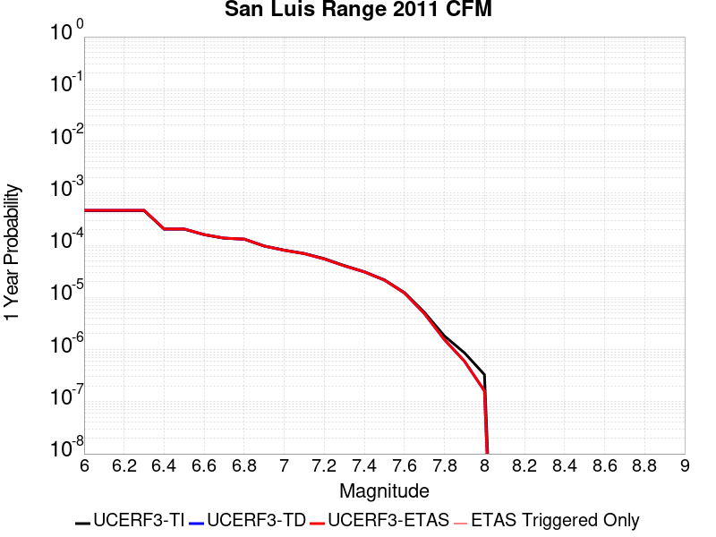 |  |

| Magnitude | 1 wk TI Prob | 1 wk TD Prob | 1 wk ETAS Prob | 1 wk ETAS/TD Gain | 1 wk ETAS Triggered Only | 1 mo TI Prob | 1 mo TD Prob | 1 mo ETAS Prob | 1 mo ETAS/TD Gain | 1 mo ETAS Triggered Only | 1 yr TI Prob | 1 yr TD Prob | 1 yr ETAS Prob | 1 yr ETAS/TD Gain | 1 yr ETAS Triggered Only | 10 yr TI Prob | 10 yr TD Prob | 10 yr ETAS Prob | 10 yr ETAS/TD Gain | 10 yr ETAS Triggered Only |
|-----|-----|-----|-----|-----|-----|-----|-----|-----|-----|-----|-----|-----|-----|-----|-----|-----|-----|-----|-----|-----|
| 6.0 | 8.8368415E-6 | 8.965549E-6 | 8.965549E-6 | 1.0 | 0.0 | 3.787163E-5 | 3.842326E-5 | 3.842326E-5 | 1.0 | 0.0 | 4.609895E-4 | 4.6771066E-4 | 4.6771066E-4 | 1.0 | 0.0 | 0.0046003438 | 0.004668046 | 0.0046779993 | 1.0021322 | 1.0E-5 |
| 6.1 | 8.8368415E-6 | 8.965549E-6 | 8.965549E-6 | 1.0 | 0.0 | 3.787163E-5 | 3.842326E-5 | 3.842326E-5 | 1.0 | 0.0 | 4.609895E-4 | 4.6771066E-4 | 4.6771066E-4 | 1.0 | 0.0 | 0.0046003438 | 0.004668046 | 0.0046779993 | 1.0021322 | 1.0E-5 |
| 6.2 | 8.8368415E-6 | 8.965549E-6 | 8.965549E-6 | 1.0 | 0.0 | 3.787163E-5 | 3.842326E-5 | 3.842326E-5 | 1.0 | 0.0 | 4.609895E-4 | 4.6771066E-4 | 4.6771066E-4 | 1.0 | 0.0 | 0.0046003438 | 0.004668046 | 0.0046779993 | 1.0021322 | 1.0E-5 |
| 6.3 | 8.8368415E-6 | 8.965549E-6 | 8.965549E-6 | 1.0 | 0.0 | 3.787163E-5 | 3.842326E-5 | 3.842326E-5 | 1.0 | 0.0 | 4.609895E-4 | 4.6771066E-4 | 4.6771066E-4 | 1.0 | 0.0 | 0.0046003438 | 0.004668046 | 0.0046779993 | 1.0021322 | 1.0E-5 |
| 6.4 | 3.9094193E-6 | 3.9412457E-6 | 3.9412457E-6 | 1.0 | 0.0 | 1.6754546E-5 | 1.6890945E-5 | 1.6890945E-5 | 1.0 | 0.0 | 2.039675E-4 | 2.0562814E-4 | 2.0562814E-4 | 1.0 | 0.0 | 0.0020378039 | 0.0020544075 | 0.0020544075 | 1.0 | 0.0 |
| 6.5 | 3.9094193E-6 | 3.9412457E-6 | 3.9412457E-6 | 1.0 | 0.0 | 1.6754546E-5 | 1.6890945E-5 | 1.6890945E-5 | 1.0 | 0.0 | 2.039675E-4 | 2.0562814E-4 | 2.0562814E-4 | 1.0 | 0.0 | 0.0020378039 | 0.0020544075 | 0.0020544075 | 1.0 | 0.0 |
| 6.6 | 3.0587726E-6 | 3.0754231E-6 | 3.0754231E-6 | 1.0 | 0.0 | 1.3108959E-5 | 1.3180319E-5 | 1.3180319E-5 | 1.0 | 0.0 | 1.595899E-4 | 1.6045867E-4 | 1.6045867E-4 | 1.0 | 0.0 | 0.0015947534 | 0.0016034401 | 0.0016034401 | 1.0 | 0.0 |
| 6.7 | 2.6160574E-6 | 2.625158E-6 | 2.625158E-6 | 1.0 | 0.0 | 1.1211626E-5 | 1.1250629E-5 | 1.1250629E-5 | 1.0 | 0.0 | 1.3649299E-4 | 1.3696786E-4 | 1.3696786E-4 | 1.0 | 0.0 | 0.0013640919 | 0.0013688406 | 0.0013688406 | 1.0 | 0.0 |
| 6.8 | 2.5110312E-6 | 2.5181698E-6 | 2.5181698E-6 | 1.0 | 0.0 | 1.0761518E-5 | 1.0792112E-5 | 1.0792112E-5 | 1.0 | 0.0 | 1.310136E-4 | 1.313861E-4 | 1.313861E-4 | 1.0 | 0.0 | 0.0013093639 | 0.0013130901 | 0.0013130901 | 1.0 | 0.0 |
| 6.9 | 1.8564405E-6 | 1.8525106E-6 | 1.8525106E-6 | 1.0 | 0.0 | 7.95615E-6 | 7.939308E-6 | 7.939308E-6 | 1.0 | 0.0 | 9.686181E-5 | 9.66568E-5 | 9.66568E-5 | 1.0 | 0.0 | 9.68196E-4 | 9.661496E-4 | 9.661496E-4 | 1.0 | 0.0 |
| 7.0 | 1.546127E-6 | 1.5369747E-6 | 1.5369747E-6 | 1.0 | 0.0 | 6.626242E-6 | 6.5870177E-6 | 6.5870177E-6 | 1.0 | 0.0 | 8.06715E-5 | 8.019399E-5 | 8.019399E-5 | 1.0 | 0.0 | 8.0642226E-4 | 8.016513E-4 | 8.016513E-4 | 1.0 | 0.0 |
| 7.1 | 1.3368208E-6 | 1.3235513E-6 | 1.3235513E-6 | 1.0 | 0.0 | 5.7292195E-6 | 5.67235E-6 | 5.67235E-6 | 1.0 | 0.0 | 6.975101E-5 | 6.9058675E-5 | 6.9058675E-5 | 1.0 | 0.0 | 6.972912E-4 | 6.9037266E-4 | 6.9037266E-4 | 1.0 | 0.0 |
| 7.2 | 1.0623363E-6 | 1.0454524E-6 | 1.0454524E-6 | 1.0 | 0.0 | 4.5528623E-6 | 4.480503E-6 | 4.480503E-6 | 1.0 | 0.0 | 5.5429686E-5 | 5.4548756E-5 | 5.4548756E-5 | 1.0 | 0.0 | 5.5415864E-4 | 5.453539E-4 | 5.453539E-4 | 1.0 | 0.0 |
| 7.3 | 7.831679E-7 | 7.727519E-7 | 7.727519E-7 | 1.0 | 0.0 | 3.3564295E-6 | 3.3117897E-6 | 3.3117897E-6 | 1.0 | 0.0 | 4.086376E-5 | 4.0320294E-5 | 4.0320294E-5 | 1.0 | 0.0 | 4.0856248E-4 | 4.0312993E-4 | 4.0312993E-4 | 1.0 | 0.0 |
| 7.4 | 5.9558846E-7 | 5.9107464E-7 | 5.9107464E-7 | 1.0 | 0.0 | 2.5525194E-6 | 2.5331744E-6 | 2.5331744E-6 | 1.0 | 0.0 | 3.107648E-5 | 3.084096E-5 | 3.084096E-5 | 1.0 | 0.0 | 3.1072134E-4 | 3.0836693E-4 | 3.0836693E-4 | 1.0 | 0.0 |
| 7.5 | 4.1616502E-7 | 4.119723E-7 | 4.119723E-7 | 1.0 | 0.0 | 1.7835631E-6 | 1.7655943E-6 | 1.7655943E-6 | 1.0 | 0.0 | 2.1714664E-5 | 2.14959E-5 | 2.14959E-5 | 1.0 | 0.0 | 2.1712543E-4 | 2.1493825E-4 | 2.1493825E-4 | 1.0 | 0.0 |
| 7.6 | 2.3816014E-7 | 2.3377252E-7 | 2.3377252E-7 | 1.0 | 0.0 | 1.0206859E-6 | 1.0018819E-6 | 1.0018819E-6 | 1.0 | 0.0 | 1.242678E-5 | 1.2197844E-5 | 1.2197844E-5 | 1.0 | 0.0 | 1.2426086E-4 | 1.2197176E-4 | 1.2197176E-4 | 1.0 | 0.0 |
| 7.7 | 9.918777E-8 | 9.387299E-8 | 9.387299E-8 | 1.0 | 0.0 | 4.2509038E-7 | 4.0231276E-7 | 4.0231276E-7 | 1.0 | 0.0 | 5.1754632E-6 | 4.898147E-6 | 4.898147E-6 | 1.0 | 0.0 | 5.1753424E-5 | 4.8980393E-5 | 4.8980393E-5 | 1.0 | 0.0 |
| 7.8 | 3.4982556E-8 | 2.9690755E-8 | 2.9690755E-8 | 1.0 | 0.0 | 1.4992524E-7 | 1.272461E-7 | 1.272461E-7 | 1.0 | 0.0 | 1.8253382E-6 | 1.54922E-6 | 1.54922E-6 | 1.0 | 0.0 | 1.8253233E-5 | 1.5492093E-5 | 1.5492093E-5 | 1.0 | 0.0 |
| 7.9 | 1.6624908E-8 | 1.14806715E-8 | 1.14806715E-8 | 1.0 | 0.0 | 7.12496E-8 | 4.9202875E-8 | 4.9202875E-8 | 1.0 | 0.0 | 8.6746354E-7 | 5.990448E-7 | 5.990448E-7 | 1.0 | 0.0 | 8.674601E-6 | 5.9904323E-6 | 5.9904323E-6 | 1.0 | 0.0 |
| 8.0 | 6.3352315E-9 | 3.0906608E-9 | 3.0906608E-9 | 1.0 | 0.0 | 2.715099E-8 | 1.3245688E-8 | 1.3245688E-8 | 1.0 | 0.0 | 3.3056327E-7 | 1.6126624E-7 | 1.6126624E-7 | 1.0 | 0.0 | 3.3056278E-6 | 1.6126613E-6 | 1.6126613E-6 | 1.0 | 0.0 |

## Calaveras (So) 2011 CFM
*[(top)](#table-of-contents)*

| 1 Week | 1 Month | 1 Year | 10 Year |
|-----|-----|-----|-----|
|  |  |  |  |

| Magnitude | 1 wk TI Prob | 1 wk TD Prob | 1 wk ETAS Prob | 1 wk ETAS/TD Gain | 1 wk ETAS Triggered Only | 1 mo TI Prob | 1 mo TD Prob | 1 mo ETAS Prob | 1 mo ETAS/TD Gain | 1 mo ETAS Triggered Only | 1 yr TI Prob | 1 yr TD Prob | 1 yr ETAS Prob | 1 yr ETAS/TD Gain | 1 yr ETAS Triggered Only | 10 yr TI Prob | 10 yr TD Prob | 10 yr ETAS Prob | 10 yr ETAS/TD Gain | 10 yr ETAS Triggered Only |
|-----|-----|-----|-----|-----|-----|-----|-----|-----|-----|-----|-----|-----|-----|-----|-----|-----|-----|-----|-----|-----|
| 6.0 | 1.5950744E-4 | 3.072718E-4 | 3.072718E-4 | 1.0 | 0.0 | 6.834242E-4 | 0.0013160399 | 0.0013160399 | 1.0 | 0.0 | 0.00828899 | 0.015865648 | 0.01587549 | 1.0006202 | 1.0E-5 | 0.079865426 | 0.14446959 | 0.14447814 | 1.0000592 | 1.0E-5 |
| 6.1 | 1.3584697E-4 | 2.604938E-4 | 2.604938E-4 | 1.0 | 0.0 | 5.8207137E-4 | 0.0011157675 | 0.0011157675 | 1.0 | 0.0 | 0.007063716 | 0.01346837 | 0.013478235 | 1.0007324 | 1.0E-5 | 0.06843361 | 0.12409648 | 0.124105245 | 1.0000706 | 1.0E-5 |
| 6.2 | 1.14676266E-4 | 2.1727956E-4 | 2.1727956E-4 | 1.0 | 0.0 | 4.9137714E-4 | 9.307831E-4 | 9.307831E-4 | 1.0 | 0.0 | 0.0059661185 | 0.011251759 | 0.011261647 | 1.0008787 | 1.0E-5 | 0.058084648 | 0.10508624 | 0.105095185 | 1.0000851 | 1.0E-5 |
| 6.3 | 8.691518E-5 | 1.6000312E-4 | 1.6000312E-4 | 1.0 | 0.0 | 3.7244044E-4 | 6.8550813E-4 | 6.8550813E-4 | 1.0 | 0.0 | 0.004525038 | 0.008307494 | 0.008317411 | 1.0011938 | 1.0E-5 | 0.044339992 | 0.07940137 | 0.07941057 | 1.000116 | 1.0E-5 |
| 6.4 | 8.50982E-5 | 1.5706658E-4 | 1.5706658E-4 | 1.0 | 0.0 | 3.646556E-4 | 6.7292945E-4 | 6.7292945E-4 | 1.0 | 0.0 | 0.0044306475 | 0.008155502 | 0.008165421 | 1.0012162 | 1.0E-5 | 0.04343345 | 0.078007154 | 0.07801637 | 1.0001181 | 1.0E-5 |
| 6.5 | 8.4062965E-5 | 1.5531052E-4 | 1.5531052E-4 | 1.0 | 0.0 | 3.602201E-4 | 6.6540745E-4 | 6.6540745E-4 | 1.0 | 0.0 | 0.004376863 | 0.008064697 | 0.008074616 | 1.00123 | 1.0E-5 | 0.042916555 | 0.07717834 | 0.07718756 | 1.0001196 | 1.0E-5 |
| 6.6 | 8.194716E-5 | 1.5166824E-4 | 1.5166824E-4 | 1.0 | 0.0 | 3.5115483E-4 | 6.498056E-4 | 6.498056E-4 | 1.0 | 0.0 | 0.0042669317 | 0.007876504 | 0.007876504 | 1.0 | 0.0 | 0.04185927 | 0.07546313 | 0.07546313 | 1.0 | 0.0 |
| 6.7 | 8.012326E-5 | 1.4834652E-4 | 1.4834652E-4 | 1.0 | 0.0 | 3.433402E-4 | 6.355799E-4 | 6.355799E-4 | 1.0 | 0.0 | 0.004172157 | 0.0077049676 | 0.0077049676 | 1.0 | 0.0 | 0.040946912 | 0.073905125 | 0.073905125 | 1.0 | 0.0 |
| 6.8 | 7.119773E-5 | 1.2893327E-4 | 1.2893327E-4 | 1.0 | 0.0 | 3.0509746E-4 | 5.5243546E-4 | 5.5243546E-4 | 1.0 | 0.0 | 0.0037082357 | 0.0067019444 | 0.0067019444 | 1.0 | 0.0 | 0.036469642 | 0.06474684 | 0.06474684 | 1.0 | 0.0 |
| 6.9 | 5.7343088E-5 | 9.929162E-5 | 9.929162E-5 | 1.0 | 0.0 | 2.4573295E-4 | 4.2546654E-4 | 4.2546654E-4 | 1.0 | 0.0 | 0.0029876942 | 0.005167826 | 0.005167826 | 1.0 | 0.0 | 0.02947844 | 0.050557766 | 0.050557766 | 1.0 | 0.0 |
| 7.0 | 4.8746577E-5 | 8.294708E-5 | 8.294708E-5 | 1.0 | 0.0 | 2.0889717E-4 | 3.5543944E-4 | 3.5543944E-4 | 1.0 | 0.0 | 0.0025403565 | 0.0043189544 | 0.0043189544 | 1.0 | 0.0 | 0.025115121 | 0.042532407 | 0.042532407 | 1.0 | 0.0 |
| 7.1 | 4.2998014E-5 | 7.272609E-5 | 7.272609E-5 | 1.0 | 0.0 | 1.8426418E-4 | 3.1164635E-4 | 3.1164635E-4 | 1.0 | 0.0 | 0.002241108 | 0.0037877534 | 0.0037877534 | 1.0 | 0.0 | 0.022186412 | 0.03746113 | 0.03746113 | 1.0 | 0.0 |
| 7.2 | 3.221292E-5 | 5.397899E-5 | 5.397899E-5 | 1.0 | 0.0 | 1.3804805E-4 | 2.3131818E-4 | 2.3131818E-4 | 1.0 | 0.0 | 0.0016794393 | 0.0028126896 | 0.0028126896 | 1.0 | 0.0 | 0.016668037 | 0.028072093 | 0.028072093 | 1.0 | 0.0 |
| 7.3 | 2.3756531E-5 | 3.9535546E-5 | 3.9535546E-5 | 1.0 | 0.0 | 1.0180973E-4 | 1.6942713E-4 | 1.6942713E-4 | 1.0 | 0.0 | 0.0012388286 | 0.0020608408 | 0.0020608408 | 1.0 | 0.0 | 0.012319452 | 0.020675438 | 0.020675438 | 1.0 | 0.0 |
| 7.4 | 1.5997684E-5 | 2.7374297E-5 | 2.7374297E-5 | 1.0 | 0.0 | 6.8559704E-5 | 1.1731315E-4 | 1.1731315E-4 | 1.0 | 0.0 | 8.343947E-4 | 0.0014273543 | 0.0014273543 | 1.0 | 0.0 | 0.008312687 | 0.0143935755 | 0.0143935755 | 1.0 | 0.0 |
| 7.5 | 1.3814293E-5 | 2.4815101E-5 | 2.4815101E-5 | 1.0 | 0.0 | 5.9202768E-5 | 1.0634611E-4 | 1.0634611E-4 | 1.0 | 0.0 | 7.205553E-4 | 0.0012939973 | 0.0012939973 | 1.0 | 0.0 | 0.007182234 | 0.013072435 | 0.013072435 | 1.0 | 0.0 |
| 7.6 | 8.817309E-6 | 1.6457496E-5 | 1.6457496E-5 | 1.0 | 0.0 | 3.7787922E-5 | 7.053022E-5 | 7.053022E-5 | 1.0 | 0.0 | 4.5997082E-4 | 8.583685E-4 | 8.583685E-4 | 1.0 | 0.0 | 0.004590199 | 0.008734633 | 0.008734633 | 1.0 | 0.0 |
| 7.7 | 4.0352206E-6 | 7.724459E-6 | 7.724459E-6 | 1.0 | 0.0 | 1.7293689E-5 | 3.3104403E-5 | 3.3104403E-5 | 1.0 | 0.0 | 2.1053031E-4 | 4.0297164E-4 | 4.0297164E-4 | 1.0 | 0.0 | 0.0021033096 | 0.0041737603 | 0.0041737603 | 1.0 | 0.0 |
| 7.8 | 3.413169E-6 | 6.802247E-6 | 6.802247E-6 | 1.0 | 0.0 | 1.4627784E-5 | 2.9152161E-5 | 2.9152161E-5 | 1.0 | 0.0 | 1.7807873E-4 | 3.5486982E-4 | 3.5486982E-4 | 1.0 | 0.0 | 0.0017793609 | 0.003673909 | 0.003673909 | 1.0 | 0.0 |
| 7.9 | 2.4740732E-6 | 5.290168E-6 | 5.290168E-6 | 1.0 | 0.0 | 1.06031275E-5 | 2.2671951E-5 | 2.2671951E-5 | 1.0 | 0.0 | 1.2908543E-4 | 2.7599608E-4 | 2.7599608E-4 | 1.0 | 0.0 | 0.0012901047 | 0.0028401602 | 0.0028401602 | 1.0 | 0.0 |
| 8.0 | 1.5231818E-6 | 3.295294E-6 | 3.295294E-6 | 1.0 | 0.0 | 6.527906E-6 | 1.4122612E-5 | 1.4122612E-5 | 1.0 | 0.0 | 7.9474354E-5 | 1.7192928E-4 | 1.7192928E-4 | 1.0 | 0.0 | 7.944594E-4 | 0.0017596188 | 0.0017596188 | 1.0 | 0.0 |
| 8.1 | 1.0104524E-6 | 2.0496998E-6 | 2.0496998E-6 | 1.0 | 0.0 | 4.330503E-6 | 8.784398E-6 | 8.784398E-6 | 1.0 | 0.0 | 5.2722597E-5 | 1.0694483E-4 | 1.0694483E-4 | 1.0 | 0.0 | 5.271009E-4 | 0.0010949362 | 0.0010949362 | 1.0 | 0.0 |

## Los Osos 2011
*[(top)](#table-of-contents)*

| 1 Week | 1 Month | 1 Year | 10 Year |
|-----|-----|-----|-----|
|  |  |  |  |

| Magnitude | 1 wk TI Prob | 1 wk TD Prob | 1 wk ETAS Prob | 1 wk ETAS/TD Gain | 1 wk ETAS Triggered Only | 1 mo TI Prob | 1 mo TD Prob | 1 mo ETAS Prob | 1 mo ETAS/TD Gain | 1 mo ETAS Triggered Only | 1 yr TI Prob | 1 yr TD Prob | 1 yr ETAS Prob | 1 yr ETAS/TD Gain | 1 yr ETAS Triggered Only | 10 yr TI Prob | 10 yr TD Prob | 10 yr ETAS Prob | 10 yr ETAS/TD Gain | 10 yr ETAS Triggered Only |
|-----|-----|-----|-----|-----|-----|-----|-----|-----|-----|-----|-----|-----|-----|-----|-----|-----|-----|-----|-----|-----|
| 6.0 | 4.8871775E-6 | 4.981564E-6 | 4.981564E-6 | 1.0 | 0.0 | 2.0944879E-5 | 2.1349402E-5 | 2.1349402E-5 | 1.0 | 0.0 | 2.5497406E-4 | 2.5990076E-4 | 2.5990076E-4 | 1.0 | 0.0 | 0.002546817 | 0.0025962424 | 0.0026062164 | 1.0038418 | 1.0E-5 |
| 6.1 | 4.8871775E-6 | 4.981564E-6 | 4.981564E-6 | 1.0 | 0.0 | 2.0944879E-5 | 2.1349402E-5 | 2.1349402E-5 | 1.0 | 0.0 | 2.5497406E-4 | 2.5990076E-4 | 2.5990076E-4 | 1.0 | 0.0 | 0.002546817 | 0.0025962424 | 0.0026062164 | 1.0038418 | 1.0E-5 |
| 6.2 | 4.8871775E-6 | 4.981564E-6 | 4.981564E-6 | 1.0 | 0.0 | 2.0944879E-5 | 2.1349402E-5 | 2.1349402E-5 | 1.0 | 0.0 | 2.5497406E-4 | 2.5990076E-4 | 2.5990076E-4 | 1.0 | 0.0 | 0.002546817 | 0.0025962424 | 0.0026062164 | 1.0038418 | 1.0E-5 |
| 6.3 | 4.8871775E-6 | 4.981564E-6 | 4.981564E-6 | 1.0 | 0.0 | 2.0944879E-5 | 2.1349402E-5 | 2.1349402E-5 | 1.0 | 0.0 | 2.5497406E-4 | 2.5990076E-4 | 2.5990076E-4 | 1.0 | 0.0 | 0.002546817 | 0.0025962424 | 0.0026062164 | 1.0038418 | 1.0E-5 |
| 6.4 | 4.8871775E-6 | 4.981564E-6 | 4.981564E-6 | 1.0 | 0.0 | 2.0944879E-5 | 2.1349402E-5 | 2.1349402E-5 | 1.0 | 0.0 | 2.5497406E-4 | 2.5990076E-4 | 2.5990076E-4 | 1.0 | 0.0 | 0.002546817 | 0.0025962424 | 0.0026062164 | 1.0038418 | 1.0E-5 |
| 6.5 | 3.1724062E-6 | 3.223452E-6 | 3.223452E-6 | 1.0 | 0.0 | 1.3595956E-5 | 1.38147225E-5 | 1.38147225E-5 | 1.0 | 0.0 | 1.6551818E-4 | 1.681814E-4 | 1.681814E-4 | 1.0 | 0.0 | 0.0016539496 | 0.0016805547 | 0.0016905379 | 1.0059404 | 1.0E-5 |
| 6.6 | 3.1022591E-6 | 3.1511604E-6 | 3.1511604E-6 | 1.0 | 0.0 | 1.3295328E-5 | 1.3504904E-5 | 1.3504904E-5 | 1.0 | 0.0 | 1.618586E-4 | 1.6440992E-4 | 1.6440992E-4 | 1.0 | 0.0 | 0.0016174077 | 0.0016428957 | 0.0016528793 | 1.0060768 | 1.0E-5 |
| 6.7 | 2.611518E-6 | 2.6492332E-6 | 2.6492332E-6 | 1.0 | 0.0 | 1.1192172E-5 | 1.1353807E-5 | 1.1353807E-5 | 1.0 | 0.0 | 1.3625617E-4 | 1.3822388E-4 | 1.3822388E-4 | 1.0 | 0.0 | 0.0013617266 | 0.0013813835 | 0.0013913697 | 1.0072291 | 1.0E-5 |
| 6.8 | 2.4780884E-6 | 2.5122072E-6 | 2.5122072E-6 | 1.0 | 0.0 | 1.0620336E-5 | 1.0766558E-5 | 1.0766558E-5 | 1.0 | 0.0 | 1.2929492E-4 | 1.3107501E-4 | 1.3107501E-4 | 1.0 | 0.0 | 0.0012921972 | 0.001309981 | 0.0013199679 | 1.0076237 | 1.0E-5 |
| 6.9 | 2.1376322E-6 | 2.1635492E-6 | 2.1635492E-6 | 1.0 | 0.0 | 9.161248E-6 | 9.27232E-6 | 9.27232E-6 | 1.0 | 0.0 | 1.1153249E-4 | 1.1288467E-4 | 1.1288467E-4 | 1.0 | 0.0 | 0.0011147653 | 0.0011282752 | 0.001138264 | 1.0088531 | 1.0E-5 |
| 7.0 | 1.9282882E-6 | 1.9494996E-6 | 1.9494996E-6 | 1.0 | 0.0 | 8.264066E-6 | 8.354971E-6 | 8.354971E-6 | 1.0 | 0.0 | 1.0061036E-4 | 1.01717036E-4 | 1.01717036E-4 | 1.0 | 0.0 | 0.0010056482 | 0.0010167062 | 0.0010266961 | 1.0098257 | 1.0E-5 |
| 7.1 | 1.6353226E-6 | 1.6501493E-6 | 1.6501493E-6 | 1.0 | 0.0 | 7.0085066E-6 | 7.0720494E-6 | 7.0720494E-6 | 1.0 | 0.0 | 8.532523E-5 | 8.609881E-5 | 8.609881E-5 | 1.0 | 0.0 | 8.529247E-4 | 8.606552E-4 | 8.706466E-4 | 1.0116091 | 1.0E-5 |
| 7.2 | 1.4446276E-6 | 1.4553694E-6 | 1.4553694E-6 | 1.0 | 0.0 | 6.191247E-6 | 6.2372824E-6 | 6.2372824E-6 | 1.0 | 0.0 | 7.537582E-5 | 7.5936274E-5 | 7.5936274E-5 | 1.0 | 0.0 | 7.535026E-4 | 7.5910386E-4 | 7.6909625E-4 | 1.0131634 | 1.0E-5 |
| 7.3 | 1.2014582E-6 | 1.2069397E-6 | 1.2069397E-6 | 1.0 | 0.0 | 5.149096E-6 | 5.1725883E-6 | 5.1725883E-6 | 1.0 | 0.0 | 6.268844E-5 | 6.2974446E-5 | 6.2974446E-5 | 1.0 | 0.0 | 6.267076E-4 | 6.2956644E-4 | 6.3956017E-4 | 1.0158739 | 1.0E-5 |
| 7.4 | 9.707733E-7 | 9.710069E-7 | 9.710069E-7 | 1.0 | 0.0 | 4.16045E-6 | 4.1614517E-6 | 4.1614517E-6 | 1.0 | 0.0 | 5.0652303E-5 | 5.0664497E-5 | 5.0664497E-5 | 1.0 | 0.0 | 5.064076E-4 | 5.065297E-4 | 5.1652465E-4 | 1.0197322 | 1.0E-5 |
| 7.5 | 7.174908E-7 | 7.115176E-7 | 7.115176E-7 | 1.0 | 0.0 | 3.074957E-6 | 3.0493575E-6 | 3.0493575E-6 | 1.0 | 0.0 | 3.743696E-5 | 3.7125297E-5 | 3.7125297E-5 | 1.0 | 0.0 | 3.7430652E-4 | 3.7119113E-4 | 3.8118742E-4 | 1.0269303 | 1.0E-5 |
| 7.6 | 4.5535776E-7 | 4.4210145E-7 | 4.4210145E-7 | 1.0 | 0.0 | 1.9515319E-6 | 1.8947192E-6 | 1.8947192E-6 | 1.0 | 0.0 | 2.3759641E-5 | 2.3067962E-5 | 2.3067962E-5 | 1.0 | 0.0 | 2.37571E-4 | 2.3065577E-4 | 2.4065346E-4 | 1.0433446 | 1.0E-5 |
| 7.7 | 2.1173553E-7 | 1.906259E-7 | 1.906259E-7 | 1.0 | 0.0 | 9.0743765E-7 | 8.169679E-7 | 8.169679E-7 | 1.0 | 0.0 | 1.1047998E-5 | 9.946539E-6 | 9.946539E-6 | 1.0 | 0.0 | 1.1047449E-4 | 9.946096E-5 | 9.946096E-5 | 1.0 | 0.0 |
| 7.8 | 9.873608E-8 | 7.3690714E-8 | 7.3690714E-8 | 1.0 | 0.0 | 4.2315455E-7 | 3.158173E-7 | 3.158173E-7 | 1.0 | 0.0 | 5.1518946E-6 | 3.845069E-6 | 3.845069E-6 | 1.0 | 0.0 | 5.1517753E-5 | 3.845003E-5 | 3.845003E-5 | 1.0 | 0.0 |
| 7.9 | 5.4399106E-8 | 3.1893627E-8 | 3.1893627E-8 | 1.0 | 0.0 | 2.33139E-7 | 1.3668696E-7 | 1.3668696E-7 | 1.0 | 0.0 | 2.8384638E-6 | 1.6641625E-6 | 1.6641625E-6 | 1.0 | 0.0 | 2.8384275E-5 | 1.6641501E-5 | 1.6641501E-5 | 1.0 | 0.0 |
| 8.0 | 1.817203E-8 | 8.4260625E-9 | 8.4260625E-9 | 1.0 | 0.0 | 7.7880124E-8 | 3.6111697E-8 | 3.6111697E-8 | 1.0 | 0.0 | 9.481901E-7 | 4.396598E-7 | 4.396598E-7 | 1.0 | 0.0 | 9.481861E-6 | 4.3965897E-6 | 4.3965897E-6 | 1.0 | 0.0 |

## Whittier alt 1
*[(top)](#table-of-contents)*

| 1 Week | 1 Month | 1 Year | 10 Year |
|-----|-----|-----|-----|
|  |  |  |  |

| Magnitude | 1 wk TI Prob | 1 wk TD Prob | 1 wk ETAS Prob | 1 wk ETAS/TD Gain | 1 wk ETAS Triggered Only | 1 mo TI Prob | 1 mo TD Prob | 1 mo ETAS Prob | 1 mo ETAS/TD Gain | 1 mo ETAS Triggered Only | 1 yr TI Prob | 1 yr TD Prob | 1 yr ETAS Prob | 1 yr ETAS/TD Gain | 1 yr ETAS Triggered Only | 10 yr TI Prob | 10 yr TD Prob | 10 yr ETAS Prob | 10 yr ETAS/TD Gain | 10 yr ETAS Triggered Only |
|-----|-----|-----|-----|-----|-----|-----|-----|-----|-----|-----|-----|-----|-----|-----|-----|-----|-----|-----|-----|-----|
| 6.0 | 4.2554693E-5 | 4.725724E-5 | 4.725724E-5 | 1.0 | 0.0 | 1.8236451E-4 | 2.0251713E-4 | 2.0251713E-4 | 1.0 | 0.0 | 0.002218027 | 0.0024631799 | 0.0024631799 | 1.0 | 0.0 | 0.02196019 | 0.024392825 | 0.02440258 | 1.0004 | 1.0E-5 |
| 6.1 | 4.2554693E-5 | 4.725724E-5 | 4.725724E-5 | 1.0 | 0.0 | 1.8236451E-4 | 2.0251713E-4 | 2.0251713E-4 | 1.0 | 0.0 | 0.002218027 | 0.0024631799 | 0.0024631799 | 1.0 | 0.0 | 0.02196019 | 0.024392825 | 0.02440258 | 1.0004 | 1.0E-5 |
| 6.2 | 4.2554693E-5 | 4.725724E-5 | 4.725724E-5 | 1.0 | 0.0 | 1.8236451E-4 | 2.0251713E-4 | 2.0251713E-4 | 1.0 | 0.0 | 0.002218027 | 0.0024631799 | 0.0024631799 | 1.0 | 0.0 | 0.02196019 | 0.024392825 | 0.02440258 | 1.0004 | 1.0E-5 |
| 6.3 | 1.9617712E-5 | 1.827133E-5 | 1.827133E-5 | 1.0 | 0.0 | 8.40732E-5 | 7.8303456E-5 | 7.8303456E-5 | 1.0 | 0.0 | 0.0010231105 | 9.5294666E-4 | 9.5294666E-4 | 1.0 | 0.0 | 0.01018413 | 0.009491887 | 0.009491887 | 1.0 | 0.0 |
| 6.4 | 1.5611336E-5 | 1.3606614E-5 | 1.3606614E-5 | 1.0 | 0.0 | 6.690401E-5 | 5.8312788E-5 | 5.8312788E-5 | 1.0 | 0.0 | 8.142519E-4 | 7.0973294E-4 | 7.0973294E-4 | 1.0 | 0.0 | 0.008112748 | 0.0070766234 | 0.0070766234 | 1.0 | 0.0 |
| 6.5 | 1.5150166E-5 | 1.3103243E-5 | 1.3103243E-5 | 1.0 | 0.0 | 6.492767E-5 | 5.615558E-5 | 5.615558E-5 | 1.0 | 0.0 | 7.9020765E-4 | 6.834856E-4 | 6.834856E-4 | 1.0 | 0.0 | 0.007874036 | 0.0068157804 | 0.0068157804 | 1.0 | 0.0 |
| 6.6 | 1.295588E-5 | 1.03825705E-5 | 1.03825705E-5 | 1.0 | 0.0 | 5.552402E-5 | 4.4495984E-5 | 4.4495984E-5 | 1.0 | 0.0 | 6.7579525E-4 | 5.4160587E-4 | 5.4160587E-4 | 1.0 | 0.0 | 0.006737438 | 0.005404372 | 0.005404372 | 1.0 | 0.0 |
| 6.7 | 1.2542085E-5 | 9.901169E-6 | 9.901169E-6 | 1.0 | 0.0 | 5.3750682E-5 | 4.24329E-5 | 4.24329E-5 | 1.0 | 0.0 | 6.542181E-4 | 5.165E-4 | 5.165E-4 | 1.0 | 0.0 | 0.006522954 | 0.0051544965 | 0.0051544965 | 1.0 | 0.0 |
| 6.8 | 1.2195878E-5 | 9.497154E-6 | 9.497154E-6 | 1.0 | 0.0 | 5.2267E-5 | 4.0701463E-5 | 4.0701463E-5 | 1.0 | 0.0 | 6.36165E-4 | 4.954295E-4 | 4.954295E-4 | 1.0 | 0.0 | 0.0063434686 | 0.0049446435 | 0.0049446435 | 1.0 | 0.0 |
| 6.9 | 1.1580298E-5 | 8.774531E-6 | 8.774531E-6 | 1.0 | 0.0 | 4.9628903E-5 | 3.76046E-5 | 3.76046E-5 | 1.0 | 0.0 | 6.040644E-4 | 4.577415E-4 | 4.577415E-4 | 1.0 | 0.0 | 0.00602425 | 0.0045693456 | 0.0045693456 | 1.0 | 0.0 |
| 7.0 | 1.0964795E-5 | 8.085506E-6 | 8.085506E-6 | 1.0 | 0.0 | 4.6991136E-5 | 3.465172E-5 | 3.465172E-5 | 1.0 | 0.0 | 5.7196687E-4 | 4.2180452E-4 | 4.2180452E-4 | 1.0 | 0.0 | 0.0057049696 | 0.0042113136 | 0.0042113136 | 1.0 | 0.0 |
| 7.1 | 1.0230601E-5 | 7.3279657E-6 | 7.3279657E-6 | 1.0 | 0.0 | 4.3844695E-5 | 3.1405198E-5 | 3.1405198E-5 | 1.0 | 0.0 | 5.336784E-4 | 3.822925E-4 | 3.822925E-4 | 1.0 | 0.0 | 0.005323986 | 0.0038174998 | 0.0038174998 | 1.0 | 0.0 |
| 7.2 | 9.40865E-6 | 6.544458E-6 | 6.544458E-6 | 1.0 | 0.0 | 4.032216E-5 | 2.8047383E-5 | 2.8047383E-5 | 1.0 | 0.0 | 4.908117E-4 | 3.414246E-4 | 3.414246E-4 | 1.0 | 0.0 | 0.0048972913 | 0.0034100893 | 0.0034100893 | 1.0 | 0.0 |
| 7.3 | 8.237384E-6 | 5.5987566E-6 | 5.5987566E-6 | 1.0 | 0.0 | 3.5302593E-5 | 2.3994457E-5 | 2.3994457E-5 | 1.0 | 0.0 | 4.2972428E-4 | 2.920944E-4 | 2.920944E-4 | 1.0 | 0.0 | 0.0042889426 | 0.002917429 | 0.002917429 | 1.0 | 0.0 |
| 7.4 | 7.5316966E-6 | 5.028736E-6 | 5.028736E-6 | 1.0 | 0.0 | 3.2278298E-5 | 2.1551552E-5 | 2.1551552E-5 | 1.0 | 0.0 | 3.9291743E-4 | 2.6235956E-4 | 2.6235956E-4 | 1.0 | 0.0 | 0.0039222343 | 0.0026206083 | 0.0026206083 | 1.0 | 0.0 |
| 7.5 | 6.149649E-6 | 3.9345864E-6 | 3.9345864E-6 | 1.0 | 0.0 | 2.6355372E-5 | 1.6862408E-5 | 1.6862408E-5 | 1.0 | 0.0 | 3.208294E-4 | 2.0528138E-4 | 2.0528138E-4 | 1.0 | 0.0 | 0.003203666 | 0.0020510068 | 0.0020510068 | 1.0 | 0.0 |
| 7.6 | 5.457711E-6 | 3.3960353E-6 | 3.3960353E-6 | 1.0 | 0.0 | 2.338998E-5 | 1.455436E-5 | 1.455436E-5 | 1.0 | 0.0 | 2.8473578E-4 | 1.7718575E-4 | 1.7718575E-4 | 1.0 | 0.0 | 0.0028437122 | 0.0017705255 | 0.0017705255 | 1.0 | 0.0 |
| 7.7 | 4.1676276E-6 | 2.3337E-6 | 2.3337E-6 | 1.0 | 0.0 | 1.7861139E-5 | 1.0001537E-5 | 1.0001537E-5 | 1.0 | 0.0 | 2.1743766E-4 | 1.21762656E-4 | 1.21762656E-4 | 1.0 | 0.0 | 0.0021722503 | 0.0012170325 | 0.0012170325 | 1.0 | 0.0 |
| 7.8 | 2.2692414E-7 | 9.38645E-8 | 9.38645E-8 | 1.0 | 0.0 | 9.725317E-7 | 4.0227638E-7 | 4.0227638E-7 | 1.0 | 0.0 | 1.1840509E-5 | 4.8977076E-6 | 4.8977076E-6 | 1.0 | 0.0 | 1.1839878E-4 | 4.8976322E-5 | 4.8976322E-5 | 1.0 | 0.0 |
| 7.9 | 6.676829E-9 | 3.4402008E-9 | 3.4402008E-9 | 1.0 | 0.0 | 2.861498E-8 | 1.4743718E-8 | 1.4743718E-8 | 1.0 | 0.0 | 3.4838732E-7 | 1.7950475E-7 | 1.7950475E-7 | 1.0 | 0.0 | 3.4838679E-6 | 1.7950463E-6 | 1.7950463E-6 | 1.0 | 0.0 |

## Hollywood
*[(top)](#table-of-contents)*

| 1 Week | 1 Month | 1 Year | 10 Year |
|-----|-----|-----|-----|
|  | 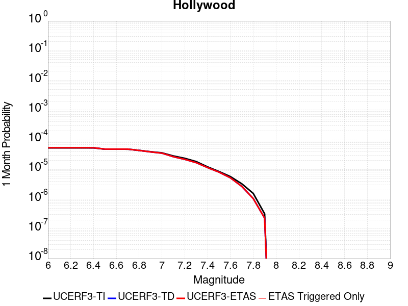 |  |  |

| Magnitude | 1 wk TI Prob | 1 wk TD Prob | 1 wk ETAS Prob | 1 wk ETAS/TD Gain | 1 wk ETAS Triggered Only | 1 mo TI Prob | 1 mo TD Prob | 1 mo ETAS Prob | 1 mo ETAS/TD Gain | 1 mo ETAS Triggered Only | 1 yr TI Prob | 1 yr TD Prob | 1 yr ETAS Prob | 1 yr ETAS/TD Gain | 1 yr ETAS Triggered Only | 10 yr TI Prob | 10 yr TD Prob | 10 yr ETAS Prob | 10 yr ETAS/TD Gain | 10 yr ETAS Triggered Only |
|-----|-----|-----|-----|-----|-----|-----|-----|-----|-----|-----|-----|-----|-----|-----|-----|-----|-----|-----|-----|-----|
| 6.0 | 1.24487615E-5 | 1.25938495E-5 | 1.25938495E-5 | 1.0 | 0.0 | 5.3350745E-5 | 5.3972548E-5 | 5.3972548E-5 | 1.0 | 0.0 | 6.4935174E-4 | 6.569223E-4 | 6.569223E-4 | 1.0 | 0.0 | 0.0064745755 | 0.006550292 | 0.0065602264 | 1.0015167 | 1.0E-5 |
| 6.1 | 1.24487615E-5 | 1.25938495E-5 | 1.25938495E-5 | 1.0 | 0.0 | 5.3350745E-5 | 5.3972548E-5 | 5.3972548E-5 | 1.0 | 0.0 | 6.4935174E-4 | 6.569223E-4 | 6.569223E-4 | 1.0 | 0.0 | 0.0064745755 | 0.006550292 | 0.0065602264 | 1.0015167 | 1.0E-5 |
| 6.2 | 1.24487615E-5 | 1.25938495E-5 | 1.25938495E-5 | 1.0 | 0.0 | 5.3350745E-5 | 5.3972548E-5 | 5.3972548E-5 | 1.0 | 0.0 | 6.4935174E-4 | 6.569223E-4 | 6.569223E-4 | 1.0 | 0.0 | 0.0064745755 | 0.006550292 | 0.0065602264 | 1.0015167 | 1.0E-5 |
| 6.3 | 1.24487615E-5 | 1.25938495E-5 | 1.25938495E-5 | 1.0 | 0.0 | 5.3350745E-5 | 5.3972548E-5 | 5.3972548E-5 | 1.0 | 0.0 | 6.4935174E-4 | 6.569223E-4 | 6.569223E-4 | 1.0 | 0.0 | 0.0064745755 | 0.006550292 | 0.0065602264 | 1.0015167 | 1.0E-5 |
| 6.4 | 1.2431024E-5 | 1.2574462E-5 | 1.2574462E-5 | 1.0 | 0.0 | 5.327473E-5 | 5.3889464E-5 | 5.3889464E-5 | 1.0 | 0.0 | 6.4842677E-4 | 6.5591134E-4 | 6.5591134E-4 | 1.0 | 0.0 | 0.0064653796 | 0.006540242 | 0.0065501765 | 1.001519 | 1.0E-5 |
| 6.5 | 1.1242222E-5 | 1.1318385E-5 | 1.1318385E-5 | 1.0 | 0.0 | 4.8180063E-5 | 4.8506477E-5 | 4.8506477E-5 | 1.0 | 0.0 | 5.864344E-4 | 5.9040904E-4 | 5.9040904E-4 | 1.0 | 0.0 | 0.0058488925 | 0.005888691 | 0.0058986326 | 1.0016881 | 1.0E-5 |
| 6.6 | 1.1234066E-5 | 1.1309498E-5 | 1.1309498E-5 | 1.0 | 0.0 | 4.8145106E-5 | 4.8468395E-5 | 4.8468395E-5 | 1.0 | 0.0 | 5.86009E-4 | 5.899456E-4 | 5.899456E-4 | 1.0 | 0.0 | 0.005844661 | 0.0058840816 | 0.005894023 | 1.0016896 | 1.0E-5 |
| 6.7 | 1.12294E-5 | 1.13042415E-5 | 1.13042415E-5 | 1.0 | 0.0 | 4.812511E-5 | 4.8445865E-5 | 4.8445865E-5 | 1.0 | 0.0 | 5.857657E-4 | 5.896715E-4 | 5.896715E-4 | 1.0 | 0.0 | 0.0058422405 | 0.0058813547 | 0.005891296 | 1.0016903 | 1.0E-5 |
| 6.8 | 1.0252819E-5 | 1.0218964E-5 | 1.0218964E-5 | 1.0 | 0.0 | 4.3939912E-5 | 4.3794837E-5 | 4.3794837E-5 | 1.0 | 0.0 | 5.3483713E-4 | 5.330738E-4 | 5.330738E-4 | 1.0 | 0.0 | 0.005335517 | 0.0053181774 | 0.005328124 | 1.0018704 | 1.0E-5 |
| 6.9 | 9.252289E-6 | 9.110762E-6 | 9.110762E-6 | 1.0 | 0.0 | 3.9652066E-5 | 3.9045546E-5 | 3.9045546E-5 | 1.0 | 0.0 | 4.8265693E-4 | 4.7527748E-4 | 4.7527748E-4 | 1.0 | 0.0 | 0.0048161 | 0.0047427835 | 0.004752736 | 1.0020984 | 1.0E-5 |
| 7.0 | 8.474604E-6 | 8.258669E-6 | 8.258669E-6 | 1.0 | 0.0 | 3.6319227E-5 | 3.5393827E-5 | 3.5393827E-5 | 1.0 | 0.0 | 4.4209688E-4 | 4.3083608E-4 | 4.3083608E-4 | 1.0 | 0.0 | 0.004412184 | 0.0043001585 | 0.0043101152 | 1.0023155 | 1.0E-5 |
| 7.1 | 6.643643E-6 | 6.268681E-6 | 6.268681E-6 | 1.0 | 0.0 | 2.8472443E-5 | 2.6865502E-5 | 2.6865502E-5 | 1.0 | 0.0 | 3.4659685E-4 | 3.270388E-4 | 3.270388E-4 | 1.0 | 0.0 | 0.0034605677 | 0.0032656214 | 0.0032656214 | 1.0 | 0.0 |
| 7.2 | 5.549002E-6 | 5.1089673E-6 | 5.1089673E-6 | 1.0 | 0.0 | 2.378122E-5 | 2.1895392E-5 | 2.1895392E-5 | 1.0 | 0.0 | 2.8949787E-4 | 2.6654394E-4 | 2.6654394E-4 | 1.0 | 0.0 | 0.0028912104 | 0.002662259 | 0.002662259 | 1.0 | 0.0 |
| 7.3 | 4.3059727E-6 | 3.960104E-6 | 3.960104E-6 | 1.0 | 0.0 | 1.8454039E-5 | 1.6971766E-5 | 1.6971766E-5 | 1.0 | 0.0 | 2.2465475E-4 | 2.0661174E-4 | 2.0661174E-4 | 1.0 | 0.0 | 0.0022442779 | 0.0020642066 | 0.0020642066 | 1.0 | 0.0 |
| 7.4 | 2.8550733E-6 | 2.7014687E-6 | 2.7014687E-6 | 1.0 | 0.0 | 1.2235971E-5 | 1.1577672E-5 | 1.1577672E-5 | 1.0 | 0.0 | 1.4896276E-4 | 1.4094908E-4 | 1.4094908E-4 | 1.0 | 0.0 | 0.0014886294 | 0.001408602 | 0.001408602 | 1.0 | 0.0 |
| 7.5 | 1.9927045E-6 | 1.897773E-6 | 1.897773E-6 | 1.0 | 0.0 | 8.540134E-6 | 8.133287E-6 | 8.133287E-6 | 1.0 | 0.0 | 1.0397117E-4 | 9.901831E-5 | 9.901831E-5 | 1.0 | 0.0 | 0.0010392254 | 9.897455E-4 | 9.897455E-4 | 1.0 | 0.0 |
| 7.6 | 1.345084E-6 | 1.2216943E-6 | 1.2216943E-6 | 1.0 | 0.0 | 5.764633E-6 | 5.2358223E-6 | 5.2358223E-6 | 1.0 | 0.0 | 7.018215E-5 | 6.374429E-5 | 6.374429E-5 | 1.0 | 0.0 | 7.0159987E-4 | 6.3726207E-4 | 6.3726207E-4 | 1.0 | 0.0 |
| 7.7 | 7.6835164E-7 | 6.278395E-7 | 6.278395E-7 | 1.0 | 0.0 | 3.2929315E-6 | 2.6907378E-6 | 2.6907378E-6 | 1.0 | 0.0 | 4.00907E-5 | 3.2759257E-5 | 3.2759257E-5 | 1.0 | 0.0 | 4.0083472E-4 | 3.2754574E-4 | 3.2754574E-4 | 1.0 | 0.0 |
| 7.8 | 3.6562128E-7 | 2.4540378E-7 | 2.4540378E-7 | 1.0 | 0.0 | 1.5669474E-6 | 1.05173E-6 | 1.05173E-6 | 1.0 | 0.0 | 1.9077417E-5 | 1.2804742E-5 | 1.2804742E-5 | 1.0 | 0.0 | 1.907578E-4 | 1.2804041E-4 | 1.2804041E-4 | 1.0 | 0.0 |
| 7.9 | 7.5024424E-8 | 5.3829453E-8 | 5.3829453E-8 | 1.0 | 0.0 | 3.215332E-7 | 2.3069765E-7 | 2.3069765E-7 | 1.0 | 0.0 | 3.91466E-6 | 2.8087416E-6 | 2.8087416E-6 | 1.0 | 0.0 | 3.9145907E-5 | 2.808719E-5 | 2.808719E-5 | 1.0 | 0.0 |

## Malibu Coast (Extension) alt 1
*[(top)](#table-of-contents)*

| 1 Week | 1 Month | 1 Year | 10 Year |
|-----|-----|-----|-----|
|  | 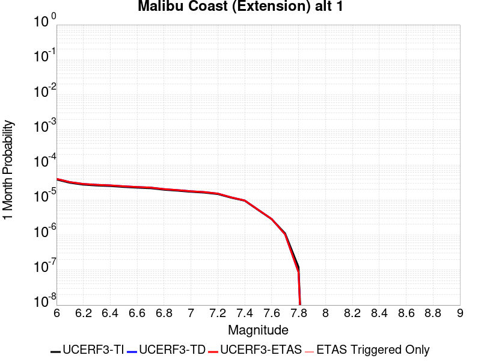 |  |  |

| Magnitude | 1 wk TI Prob | 1 wk TD Prob | 1 wk ETAS Prob | 1 wk ETAS/TD Gain | 1 wk ETAS Triggered Only | 1 mo TI Prob | 1 mo TD Prob | 1 mo ETAS Prob | 1 mo ETAS/TD Gain | 1 mo ETAS Triggered Only | 1 yr TI Prob | 1 yr TD Prob | 1 yr ETAS Prob | 1 yr ETAS/TD Gain | 1 yr ETAS Triggered Only | 10 yr TI Prob | 10 yr TD Prob | 10 yr ETAS Prob | 10 yr ETAS/TD Gain | 10 yr ETAS Triggered Only |
|-----|-----|-----|-----|-----|-----|-----|-----|-----|-----|-----|-----|-----|-----|-----|-----|-----|-----|-----|-----|-----|
| 6.0 | 8.930738E-6 | 9.329555E-6 | 9.329555E-6 | 1.0 | 0.0 | 3.827403E-5 | 3.9983202E-5 | 3.9983202E-5 | 1.0 | 0.0 | 4.6588664E-4 | 4.8668848E-4 | 4.966836E-4 | 1.020537 | 1.0E-5 | 0.0046491115 | 0.0048564086 | 0.00486636 | 1.0020491 | 1.0E-5 |
| 6.1 | 7.199952E-6 | 7.5305375E-6 | 7.5305375E-6 | 1.0 | 0.0 | 3.0856572E-5 | 3.2273336E-5 | 3.2273336E-5 | 1.0 | 0.0 | 3.75614E-4 | 3.9285762E-4 | 4.028537E-4 | 1.0254445 | 1.0E-5 | 0.0037497976 | 0.0039216974 | 0.0039316583 | 1.0025399 | 1.0E-5 |
| 6.2 | 6.3721413E-6 | 6.6670127E-6 | 6.6670127E-6 | 1.0 | 0.0 | 2.7308892E-5 | 2.8572602E-5 | 2.8572602E-5 | 1.0 | 0.0 | 3.3243504E-4 | 3.4781624E-4 | 3.5781277E-4 | 1.0287408 | 1.0E-5 | 0.0033193815 | 0.0034727587 | 0.003482724 | 1.0028696 | 1.0E-5 |
| 6.3 | 6.016345E-6 | 6.295371E-6 | 6.295371E-6 | 1.0 | 0.0 | 2.578408E-5 | 2.6979882E-5 | 2.6979882E-5 | 1.0 | 0.0 | 3.1387596E-4 | 3.2843088E-4 | 3.384276E-4 | 1.0304378 | 1.0E-5 | 0.00313433 | 0.0032794913 | 0.0032894583 | 1.0030392 | 1.0E-5 |
| 6.4 | 5.8104883E-6 | 6.0797515E-6 | 6.0797515E-6 | 1.0 | 0.0 | 2.4901856E-5 | 2.605582E-5 | 2.605582E-5 | 1.0 | 0.0 | 3.031379E-4 | 3.1718376E-4 | 3.1718376E-4 | 1.0 | 0.0 | 0.0030272473 | 0.003167345 | 0.003167345 | 1.0 | 0.0 |
| 6.5 | 5.476925E-6 | 5.72771E-6 | 5.72771E-6 | 1.0 | 0.0 | 2.3472323E-5 | 2.4547098E-5 | 2.4547098E-5 | 1.0 | 0.0 | 2.8573806E-4 | 2.9882023E-4 | 2.9882023E-4 | 1.0 | 0.0 | 0.0028537093 | 0.0029842162 | 0.0029842162 | 1.0 | 0.0 |
| 6.6 | 5.222387E-6 | 5.458768E-6 | 5.458768E-6 | 1.0 | 0.0 | 2.2381464E-5 | 2.3394514E-5 | 2.3394514E-5 | 1.0 | 0.0 | 2.7246025E-4 | 2.8479125E-4 | 2.8479125E-4 | 1.0 | 0.0 | 0.0027212645 | 0.0028442936 | 0.0028442936 | 1.0 | 0.0 |
| 6.7 | 5.0337076E-6 | 5.2592854E-6 | 5.2592854E-6 | 1.0 | 0.0 | 2.1572854E-5 | 2.2539603E-5 | 2.2539603E-5 | 1.0 | 0.0 | 2.6261783E-4 | 2.7438538E-4 | 2.7438538E-4 | 1.0 | 0.0 | 0.002623077 | 0.002740496 | 0.002740496 | 1.0 | 0.0 |
| 6.8 | 4.5675624E-6 | 4.7588796E-6 | 4.7588796E-6 | 1.0 | 0.0 | 1.9575122E-5 | 2.0395039E-5 | 2.0395039E-5 | 1.0 | 0.0 | 2.3830103E-4 | 2.482815E-4 | 2.482815E-4 | 1.0 | 0.0 | 0.0023804565 | 0.0024800608 | 0.0024800608 | 1.0 | 0.0 |
| 6.9 | 4.2802412E-6 | 4.4521726E-6 | 4.4521726E-6 | 1.0 | 0.0 | 1.8343762E-5 | 1.90806E-5 | 1.90806E-5 | 1.0 | 0.0 | 2.2331243E-4 | 2.322817E-4 | 2.322817E-4 | 1.0 | 0.0 | 0.0022308815 | 0.002320406 | 0.002320406 | 1.0 | 0.0 |
| 7.0 | 3.9794063E-6 | 4.130239E-6 | 4.130239E-6 | 1.0 | 0.0 | 1.7054486E-5 | 1.7700906E-5 | 1.7700906E-5 | 1.0 | 0.0 | 2.0761859E-4 | 2.1548734E-4 | 2.1548734E-4 | 1.0 | 0.0 | 0.0020742472 | 0.0021527973 | 0.0021527973 | 1.0 | 0.0 |
| 7.1 | 3.7730424E-6 | 3.91135E-6 | 3.91135E-6 | 1.0 | 0.0 | 1.6170083E-5 | 1.6762822E-5 | 1.6762822E-5 | 1.0 | 0.0 | 1.9685295E-4 | 2.0406836E-4 | 2.0406836E-4 | 1.0 | 0.0 | 0.0019667868 | 0.0020388225 | 0.0020388225 | 1.0 | 0.0 |
| 7.2 | 3.424985E-6 | 3.5414578E-6 | 3.5414578E-6 | 1.0 | 0.0 | 1.4678424E-5 | 1.5177588E-5 | 1.5177588E-5 | 1.0 | 0.0 | 1.7869516E-4 | 1.8477158E-4 | 1.8477158E-4 | 1.0 | 0.0 | 0.0017855153 | 0.0018461916 | 0.0018461916 | 1.0 | 0.0 |
| 7.3 | 2.6966375E-6 | 2.7597434E-6 | 2.7597434E-6 | 1.0 | 0.0 | 1.15569665E-5 | 1.1827418E-5 | 1.1827418E-5 | 1.0 | 0.0 | 1.4069698E-4 | 1.4398934E-4 | 1.4398934E-4 | 1.0 | 0.0 | 0.0014060794 | 0.0014389646 | 0.0014389646 | 1.0 | 0.0 |
| 7.4 | 2.215957E-6 | 2.2494505E-6 | 2.2494505E-6 | 1.0 | 0.0 | 9.496924E-6 | 9.6404665E-6 | 9.6404665E-6 | 1.0 | 0.0 | 1.1561892E-4 | 1.1736639E-4 | 1.1736639E-4 | 1.0 | 0.0 | 0.0011555878 | 0.0011730478 | 0.0011730478 | 1.0 | 0.0 |
| 7.5 | 1.2040218E-6 | 1.2219476E-6 | 1.2219476E-6 | 1.0 | 0.0 | 5.160083E-6 | 5.236908E-6 | 5.236908E-6 | 1.0 | 0.0 | 6.2822204E-5 | 6.375751E-5 | 6.375751E-5 | 1.0 | 0.0 | 6.280445E-4 | 6.37394E-4 | 6.37394E-4 | 1.0 | 0.0 |
| 7.6 | 6.6157446E-7 | 6.679206E-7 | 6.679206E-7 | 1.0 | 0.0 | 2.835316E-6 | 2.8625136E-6 | 2.8625136E-6 | 1.0 | 0.0 | 3.4519428E-5 | 3.485056E-5 | 3.485056E-5 | 1.0 | 0.0 | 3.4514067E-4 | 3.4845248E-4 | 3.4845248E-4 | 1.0 | 0.0 |
| 7.7 | 2.6012302E-7 | 2.4358354E-7 | 2.4358354E-7 | 1.0 | 0.0 | 1.1148124E-6 | 1.0439292E-6 | 1.0439292E-6 | 1.0 | 0.0 | 1.3572758E-5 | 1.2709774E-5 | 1.2709774E-5 | 1.0 | 0.0 | 1.3571928E-4 | 1.2709154E-4 | 1.2709154E-4 | 1.0 | 0.0 |
| 7.8 | 2.8323132E-8 | 2.0267E-8 | 2.0267E-8 | 1.0 | 0.0 | 1.2138484E-7 | 8.685857E-8 | 8.685857E-8 | 1.0 | 0.0 | 1.4778595E-6 | 1.0575027E-6 | 1.0575027E-6 | 1.0 | 0.0 | 1.4778497E-5 | 1.0574984E-5 | 1.0574984E-5 | 1.0 | 0.0 |

## Great Valley 06 (Midland) 2011 CFM alt1
*[(top)](#table-of-contents)*

| 1 Week | 1 Month | 1 Year | 10 Year |
|-----|-----|-----|-----|
|  |  |  |  |

| Magnitude | 1 wk TI Prob | 1 wk TD Prob | 1 wk ETAS Prob | 1 wk ETAS/TD Gain | 1 wk ETAS Triggered Only | 1 mo TI Prob | 1 mo TD Prob | 1 mo ETAS Prob | 1 mo ETAS/TD Gain | 1 mo ETAS Triggered Only | 1 yr TI Prob | 1 yr TD Prob | 1 yr ETAS Prob | 1 yr ETAS/TD Gain | 1 yr ETAS Triggered Only | 10 yr TI Prob | 10 yr TD Prob | 10 yr ETAS Prob | 10 yr ETAS/TD Gain | 10 yr ETAS Triggered Only |
|-----|-----|-----|-----|-----|-----|-----|-----|-----|-----|-----|-----|-----|-----|-----|-----|-----|-----|-----|-----|-----|
| 6.0 | 1.2712525E-5 | 1.3210851E-5 | 1.3210851E-5 | 1.0 | 0.0 | 5.4481112E-5 | 5.6616846E-5 | 5.6616846E-5 | 1.0 | 0.0 | 6.6310563E-4 | 6.8911747E-4 | 6.8911747E-4 | 1.0 | 0.0 | 0.0066113044 | 0.0068723215 | 0.0068822526 | 1.001445 | 1.0E-5 |
| 6.1 | 1.2712525E-5 | 1.3210851E-5 | 1.3210851E-5 | 1.0 | 0.0 | 5.4481112E-5 | 5.6616846E-5 | 5.6616846E-5 | 1.0 | 0.0 | 6.6310563E-4 | 6.8911747E-4 | 6.8911747E-4 | 1.0 | 0.0 | 0.0066113044 | 0.0068723215 | 0.0068822526 | 1.001445 | 1.0E-5 |
| 6.2 | 1.2712525E-5 | 1.3210851E-5 | 1.3210851E-5 | 1.0 | 0.0 | 5.4481112E-5 | 5.6616846E-5 | 5.6616846E-5 | 1.0 | 0.0 | 6.6310563E-4 | 6.8911747E-4 | 6.8911747E-4 | 1.0 | 0.0 | 0.0066113044 | 0.0068723215 | 0.0068822526 | 1.001445 | 1.0E-5 |
| 6.3 | 1.2712525E-5 | 1.3210851E-5 | 1.3210851E-5 | 1.0 | 0.0 | 5.4481112E-5 | 5.6616846E-5 | 5.6616846E-5 | 1.0 | 0.0 | 6.6310563E-4 | 6.8911747E-4 | 6.8911747E-4 | 1.0 | 0.0 | 0.0066113044 | 0.0068723215 | 0.0068822526 | 1.001445 | 1.0E-5 |
| 6.4 | 1.2712525E-5 | 1.3210851E-5 | 1.3210851E-5 | 1.0 | 0.0 | 5.4481112E-5 | 5.6616846E-5 | 5.6616846E-5 | 1.0 | 0.0 | 6.6310563E-4 | 6.8911747E-4 | 6.8911747E-4 | 1.0 | 0.0 | 0.0066113044 | 0.0068723215 | 0.0068822526 | 1.001445 | 1.0E-5 |
| 6.5 | 1.2712525E-5 | 1.3210851E-5 | 1.3210851E-5 | 1.0 | 0.0 | 5.4481112E-5 | 5.6616846E-5 | 5.6616846E-5 | 1.0 | 0.0 | 6.6310563E-4 | 6.8911747E-4 | 6.8911747E-4 | 1.0 | 0.0 | 0.0066113044 | 0.0068723215 | 0.0068822526 | 1.001445 | 1.0E-5 |
| 6.6 | 5.7574384E-6 | 5.9707636E-6 | 5.9707636E-6 | 1.0 | 0.0 | 2.4674504E-5 | 2.5588757E-5 | 2.5588757E-5 | 1.0 | 0.0 | 3.0037065E-4 | 3.1150252E-4 | 3.1150252E-4 | 1.0 | 0.0 | 0.0029996498 | 0.0031110453 | 0.0031110453 | 1.0 | 0.0 |
| 6.7 | 5.7574384E-6 | 5.9707636E-6 | 5.9707636E-6 | 1.0 | 0.0 | 2.4674504E-5 | 2.5588757E-5 | 2.5588757E-5 | 1.0 | 0.0 | 3.0037065E-4 | 3.1150252E-4 | 3.1150252E-4 | 1.0 | 0.0 | 0.0029996498 | 0.0031110453 | 0.0031110453 | 1.0 | 0.0 |
| 6.8 | 3.3474828E-6 | 3.4694517E-6 | 3.4694517E-6 | 1.0 | 0.0 | 1.4346277E-5 | 1.4869002E-5 | 1.4869002E-5 | 1.0 | 0.0 | 1.7465191E-4 | 1.8101657E-4 | 1.8101657E-4 | 1.0 | 0.0 | 0.0017451472 | 0.0018088382 | 0.0018088382 | 1.0 | 0.0 |
| 6.9 | 2.035106E-6 | 2.1090761E-6 | 2.1090761E-6 | 1.0 | 0.0 | 8.721853E-6 | 9.038871E-6 | 9.038871E-6 | 1.0 | 0.0 | 1.0618339E-4 | 1.1004343E-4 | 1.1004343E-4 | 1.0 | 0.0 | 0.0010613267 | 0.0010999617 | 0.0010999617 | 1.0 | 0.0 |
| 7.0 | 1.2424716E-6 | 1.2879011E-6 | 1.2879011E-6 | 1.0 | 0.0 | 5.3248673E-6 | 5.5195674E-6 | 5.5195674E-6 | 1.0 | 0.0 | 6.482833E-5 | 6.719911E-5 | 6.719911E-5 | 1.0 | 0.0 | 6.480942E-4 | 6.7183224E-4 | 6.7183224E-4 | 1.0 | 0.0 |
| 7.1 | 6.6904556E-7 | 6.939171E-7 | 6.939171E-7 | 1.0 | 0.0 | 2.867335E-6 | 2.9739288E-6 | 2.9739288E-6 | 1.0 | 0.0 | 3.4909244E-5 | 3.620724E-5 | 3.620724E-5 | 1.0 | 0.0 | 3.490376E-4 | 3.620389E-4 | 3.620389E-4 | 1.0 | 0.0 |
| 7.2 | 3.948168E-7 | 4.095786E-7 | 4.095786E-7 | 1.0 | 0.0 | 1.6920709E-6 | 1.7553369E-6 | 1.7553369E-6 | 1.0 | 0.0 | 2.0600768E-5 | 2.1371226E-5 | 2.1371226E-5 | 1.0 | 0.0 | 2.0598859E-4 | 2.1371226E-4 | 2.1371226E-4 | 1.0 | 0.0 |

## Newport-Inglewood alt 1
*[(top)](#table-of-contents)*

| 1 Week | 1 Month | 1 Year | 10 Year |
|-----|-----|-----|-----|
|  |  |  |  |

| Magnitude | 1 wk TI Prob | 1 wk TD Prob | 1 wk ETAS Prob | 1 wk ETAS/TD Gain | 1 wk ETAS Triggered Only | 1 mo TI Prob | 1 mo TD Prob | 1 mo ETAS Prob | 1 mo ETAS/TD Gain | 1 mo ETAS Triggered Only | 1 yr TI Prob | 1 yr TD Prob | 1 yr ETAS Prob | 1 yr ETAS/TD Gain | 1 yr ETAS Triggered Only | 10 yr TI Prob | 10 yr TD Prob | 10 yr ETAS Prob | 10 yr ETAS/TD Gain | 10 yr ETAS Triggered Only |
|-----|-----|-----|-----|-----|-----|-----|-----|-----|-----|-----|-----|-----|-----|-----|-----|-----|-----|-----|-----|-----|
| 6.0 | 2.9668912E-5 | 3.0407426E-5 | 3.0407426E-5 | 1.0 | 0.0 | 1.2714628E-4 | 1.3031377E-4 | 1.3031377E-4 | 1.0 | 0.0 | 0.0015469068 | 0.0015859006 | 0.0015958847 | 1.0062956 | 1.0E-5 | 0.015361829 | 0.01579345 | 0.015803292 | 1.0006232 | 1.0E-5 |
| 6.1 | 2.9668912E-5 | 3.0407426E-5 | 3.0407426E-5 | 1.0 | 0.0 | 1.2714628E-4 | 1.3031377E-4 | 1.3031377E-4 | 1.0 | 0.0 | 0.0015469068 | 0.0015859006 | 0.0015958847 | 1.0062956 | 1.0E-5 | 0.015361829 | 0.01579345 | 0.015803292 | 1.0006232 | 1.0E-5 |
| 6.2 | 2.9668912E-5 | 3.0407426E-5 | 3.0407426E-5 | 1.0 | 0.0 | 1.2714628E-4 | 1.3031377E-4 | 1.3031377E-4 | 1.0 | 0.0 | 0.0015469068 | 0.0015859006 | 0.0015958847 | 1.0062956 | 1.0E-5 | 0.015361829 | 0.01579345 | 0.015803292 | 1.0006232 | 1.0E-5 |
| 6.3 | 2.9668912E-5 | 3.0407426E-5 | 3.0407426E-5 | 1.0 | 0.0 | 1.2714628E-4 | 1.3031377E-4 | 1.3031377E-4 | 1.0 | 0.0 | 0.0015469068 | 0.0015859006 | 0.0015958847 | 1.0062956 | 1.0E-5 | 0.015361829 | 0.01579345 | 0.015803292 | 1.0006232 | 1.0E-5 |
| 6.4 | 1.275942E-5 | 1.0272993E-5 | 1.0272993E-5 | 1.0 | 0.0 | 5.4682085E-5 | 4.4026394E-5 | 4.4026394E-5 | 1.0 | 0.0 | 6.65551E-4 | 5.3589366E-4 | 5.458883E-4 | 1.0186504 | 1.0E-5 | 0.0066356123 | 0.005346439 | 0.0053563854 | 1.0018604 | 1.0E-5 |
| 6.5 | 1.275942E-5 | 1.0272993E-5 | 1.0272993E-5 | 1.0 | 0.0 | 5.4682085E-5 | 4.4026394E-5 | 4.4026394E-5 | 1.0 | 0.0 | 6.65551E-4 | 5.3589366E-4 | 5.458883E-4 | 1.0186504 | 1.0E-5 | 0.0066356123 | 0.005346439 | 0.0053563854 | 1.0018604 | 1.0E-5 |
| 6.6 | 1.1255358E-5 | 8.662263E-6 | 8.662263E-6 | 1.0 | 0.0 | 4.8236358E-5 | 3.7123467E-5 | 3.7123467E-5 | 1.0 | 0.0 | 5.871194E-4 | 4.5188615E-4 | 4.6188166E-4 | 1.0221195 | 1.0E-5 | 0.005855706 | 0.0045098504 | 0.0045198053 | 1.0022074 | 1.0E-5 |
| 6.7 | 1.0504745E-5 | 7.90015E-6 | 7.90015E-6 | 1.0 | 0.0 | 4.5019555E-5 | 3.3857355E-5 | 3.3857355E-5 | 1.0 | 0.0 | 5.4797524E-4 | 4.1213658E-4 | 4.2213246E-4 | 1.0242538 | 1.0E-5 | 0.0054662596 | 0.0041138525 | 0.004123811 | 1.0024208 | 1.0E-5 |
| 6.8 | 1.0476007E-5 | 7.881531E-6 | 7.881531E-6 | 1.0 | 0.0 | 4.4896402E-5 | 3.377756E-5 | 3.377756E-5 | 1.0 | 0.0 | 5.464766E-4 | 4.1116544E-4 | 4.2116133E-4 | 1.0243111 | 1.0E-5 | 0.005451347 | 0.004104177 | 0.004114136 | 1.0024265 | 1.0E-5 |
| 6.9 | 9.076797E-6 | 6.4898973E-6 | 6.4898973E-6 | 1.0 | 0.0 | 3.889998E-5 | 2.781355E-5 | 2.781355E-5 | 1.0 | 0.0 | 4.7350433E-4 | 3.385777E-4 | 3.485743E-4 | 1.0295253 | 1.0E-5 | 0.004724967 | 0.003380656 | 0.0033906223 | 1.002948 | 1.0E-5 |
| 7.0 | 8.73795E-6 | 6.212289E-6 | 6.212289E-6 | 1.0 | 0.0 | 3.7447822E-5 | 2.6623826E-5 | 2.6623826E-5 | 1.0 | 0.0 | 4.5583185E-4 | 3.2409714E-4 | 3.2409714E-4 | 1.0 | 0.0 | 0.0045489795 | 0.0032362766 | 0.0032362766 | 1.0 | 0.0 |
| 7.1 | 8.391299E-6 | 5.955989E-6 | 5.955989E-6 | 1.0 | 0.0 | 3.5962214E-5 | 2.5525418E-5 | 2.5525418E-5 | 1.0 | 0.0 | 4.37752E-4 | 3.1072792E-4 | 3.1072792E-4 | 1.0 | 0.0 | 0.004368907 | 0.003102964 | 0.003102964 | 1.0 | 0.0 |
| 7.2 | 7.796882E-6 | 5.49671E-6 | 5.49671E-6 | 1.0 | 0.0 | 3.341478E-5 | 2.3557117E-5 | 2.3557117E-5 | 1.0 | 0.0 | 4.06749E-4 | 2.8677037E-4 | 2.8677037E-4 | 1.0 | 0.0 | 0.0040600533 | 0.0028640272 | 0.0028640272 | 1.0 | 0.0 |
| 7.3 | 6.4738833E-6 | 4.6479204E-6 | 4.6479204E-6 | 1.0 | 0.0 | 2.774492E-5 | 1.9919507E-5 | 1.9919507E-5 | 1.0 | 0.0 | 3.3774204E-4 | 2.4249316E-4 | 2.4249316E-4 | 1.0 | 0.0 | 0.0033722918 | 0.0024223023 | 0.0024223023 | 1.0 | 0.0 |
| 7.4 | 5.382145E-6 | 3.8858393E-6 | 3.8858393E-6 | 1.0 | 0.0 | 2.3066134E-5 | 1.665349E-5 | 1.665349E-5 | 1.0 | 0.0 | 2.8079396E-4 | 2.0273753E-4 | 2.0273753E-4 | 1.0 | 0.0 | 0.0028043943 | 0.0020255402 | 0.0020255402 | 1.0 | 0.0 |
| 7.5 | 3.648244E-6 | 2.5738361E-6 | 2.5738361E-6 | 1.0 | 0.0 | 1.5635238E-5 | 1.103068E-5 | 1.103068E-5 | 1.0 | 0.0 | 1.9034238E-4 | 1.3429036E-4 | 1.3429036E-4 | 1.0 | 0.0 | 0.0019017943 | 0.0013421025 | 0.0013421025 | 1.0 | 0.0 |
| 7.6 | 2.2906888E-6 | 1.5480372E-6 | 1.5480372E-6 | 1.0 | 0.0 | 9.817201E-6 | 6.6344287E-6 | 6.6344287E-6 | 1.0 | 0.0 | 1.1951787E-4 | 8.077124E-5 | 8.077124E-5 | 1.0 | 0.0 | 0.0011945361 | 8.074256E-4 | 8.074256E-4 | 1.0 | 0.0 |
| 7.7 | 6.0479874E-7 | 3.397605E-7 | 3.397605E-7 | 1.0 | 0.0 | 2.5919921E-6 | 1.4561158E-6 | 1.4561158E-6 | 1.0 | 0.0 | 3.1557047E-5 | 1.7728078E-5 | 1.7728078E-5 | 1.0 | 0.0 | 3.1552566E-4 | 1.7726803E-4 | 1.7726803E-4 | 1.0 | 0.0 |
| 7.8 | 1.16056995E-8 | 9.783043E-9 | 9.783043E-9 | 1.0 | 0.0 | 4.9738713E-8 | 4.1927326E-8 | 4.1927326E-8 | 1.0 | 0.0 | 6.0556863E-7 | 5.104652E-7 | 5.104652E-7 | 1.0 | 0.0 | 6.05567E-6 | 5.1046522E-6 | 5.1046522E-6 | 1.0 | 0.0 |

## Sierra Madre (San Fernando)
*[(top)](#table-of-contents)*

| 1 Week | 1 Month | 1 Year | 10 Year |
|-----|-----|-----|-----|
| 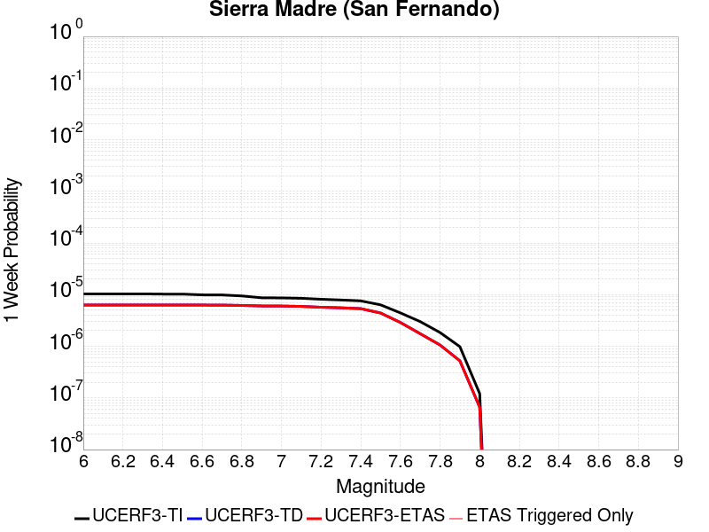 |  |  |  |

| Magnitude | 1 wk TI Prob | 1 wk TD Prob | 1 wk ETAS Prob | 1 wk ETAS/TD Gain | 1 wk ETAS Triggered Only | 1 mo TI Prob | 1 mo TD Prob | 1 mo ETAS Prob | 1 mo ETAS/TD Gain | 1 mo ETAS Triggered Only | 1 yr TI Prob | 1 yr TD Prob | 1 yr ETAS Prob | 1 yr ETAS/TD Gain | 1 yr ETAS Triggered Only | 10 yr TI Prob | 10 yr TD Prob | 10 yr ETAS Prob | 10 yr ETAS/TD Gain | 10 yr ETAS Triggered Only |
|-----|-----|-----|-----|-----|-----|-----|-----|-----|-----|-----|-----|-----|-----|-----|-----|-----|-----|-----|-----|-----|
| 6.0 | 1.0346413E-5 | 6.2877984E-6 | 6.2877984E-6 | 1.0 | 0.0 | 4.4341014E-5 | 2.6947435E-5 | 2.6947435E-5 | 1.0 | 0.0 | 5.3971814E-4 | 3.2803672E-4 | 3.3803345E-4 | 1.0304744 | 1.0E-5 | 0.0053840918 | 0.0032756377 | 0.003285605 | 1.0030428 | 1.0E-5 |
| 6.1 | 1.0346413E-5 | 6.2877984E-6 | 6.2877984E-6 | 1.0 | 0.0 | 4.4341014E-5 | 2.6947435E-5 | 2.6947435E-5 | 1.0 | 0.0 | 5.3971814E-4 | 3.2803672E-4 | 3.3803345E-4 | 1.0304744 | 1.0E-5 | 0.0053840918 | 0.0032756377 | 0.003285605 | 1.0030428 | 1.0E-5 |
| 6.2 | 1.0346413E-5 | 6.2877984E-6 | 6.2877984E-6 | 1.0 | 0.0 | 4.4341014E-5 | 2.6947435E-5 | 2.6947435E-5 | 1.0 | 0.0 | 5.3971814E-4 | 3.2803672E-4 | 3.3803345E-4 | 1.0304744 | 1.0E-5 | 0.0053840918 | 0.0032756377 | 0.003285605 | 1.0030428 | 1.0E-5 |
| 6.3 | 1.0346413E-5 | 6.2877984E-6 | 6.2877984E-6 | 1.0 | 0.0 | 4.4341014E-5 | 2.6947435E-5 | 2.6947435E-5 | 1.0 | 0.0 | 5.3971814E-4 | 3.2803672E-4 | 3.3803345E-4 | 1.0304744 | 1.0E-5 | 0.0053840918 | 0.0032756377 | 0.003285605 | 1.0030428 | 1.0E-5 |
| 6.4 | 1.0249558E-5 | 6.2877984E-6 | 6.2877984E-6 | 1.0 | 0.0 | 4.392594E-5 | 2.6947435E-5 | 2.6947435E-5 | 1.0 | 0.0 | 5.3466705E-4 | 3.2803672E-4 | 3.3803345E-4 | 1.0304744 | 1.0E-5 | 0.0053338245 | 0.0032756377 | 0.003285605 | 1.0030428 | 1.0E-5 |
| 6.5 | 1.0249558E-5 | 6.2877984E-6 | 6.2877984E-6 | 1.0 | 0.0 | 4.392594E-5 | 2.6947435E-5 | 2.6947435E-5 | 1.0 | 0.0 | 5.3466705E-4 | 3.2803672E-4 | 3.3803345E-4 | 1.0304744 | 1.0E-5 | 0.0053338245 | 0.0032756377 | 0.003285605 | 1.0030428 | 1.0E-5 |
| 6.6 | 9.9035515E-6 | 6.2877984E-6 | 6.2877984E-6 | 1.0 | 0.0 | 4.2443102E-5 | 2.6947435E-5 | 2.6947435E-5 | 1.0 | 0.0 | 5.166222E-4 | 3.2803672E-4 | 3.3803345E-4 | 1.0304744 | 1.0E-5 | 0.0051542283 | 0.0032756377 | 0.003285605 | 1.0030428 | 1.0E-5 |
| 6.7 | 9.87217E-6 | 6.2752183E-6 | 6.2752183E-6 | 1.0 | 0.0 | 4.2308613E-5 | 2.689352E-5 | 2.689352E-5 | 1.0 | 0.0 | 5.149856E-4 | 3.2738052E-4 | 3.3737725E-4 | 1.0305355 | 1.0E-5 | 0.005137938 | 0.003269095 | 0.0032790622 | 1.0030489 | 1.0E-5 |
| 6.8 | 9.4359175E-6 | 6.1791916E-6 | 6.1791916E-6 | 1.0 | 0.0 | 4.043902E-5 | 2.6481986E-5 | 2.6481986E-5 | 1.0 | 0.0 | 4.9223384E-4 | 3.223716E-4 | 3.3236836E-4 | 1.0310102 | 1.0E-5 | 0.0049114493 | 0.0032191512 | 0.003229119 | 1.0030965 | 1.0E-5 |
| 6.9 | 8.700447E-6 | 6.0404545E-6 | 6.0404545E-6 | 1.0 | 0.0 | 3.72871E-5 | 2.5887412E-5 | 2.5887412E-5 | 1.0 | 0.0 | 4.5387587E-4 | 3.1513473E-4 | 3.2513158E-4 | 1.0317224 | 1.0E-5 | 0.0045295 | 0.003146988 | 0.0031569565 | 1.0031676 | 1.0E-5 |
| 7.0 | 8.648878E-6 | 6.0153684E-6 | 6.0153684E-6 | 1.0 | 0.0 | 3.7066096E-5 | 2.5779902E-5 | 2.5779902E-5 | 1.0 | 0.0 | 4.5118626E-4 | 3.1382617E-4 | 3.2382304E-4 | 1.0318547 | 1.0E-5 | 0.004502713 | 0.0031339393 | 0.003143908 | 1.0031809 | 1.0E-5 |
| 7.1 | 8.505786E-6 | 5.924995E-6 | 5.924995E-6 | 1.0 | 0.0 | 3.645286E-5 | 2.5392595E-5 | 2.5392595E-5 | 1.0 | 0.0 | 4.437232E-4 | 3.0911207E-4 | 3.1910898E-4 | 1.0323408 | 1.0E-5 | 0.0044283825 | 0.0030869301 | 0.0030968993 | 1.0032295 | 1.0E-5 |
| 7.2 | 8.139752E-6 | 5.6992817E-6 | 5.6992817E-6 | 1.0 | 0.0 | 3.4884186E-5 | 2.442527E-5 | 2.442527E-5 | 1.0 | 0.0 | 4.246322E-4 | 2.9733812E-4 | 3.0733517E-4 | 1.0336218 | 1.0E-5 | 0.004238217 | 0.002969509 | 0.0029794793 | 1.0033575 | 1.0E-5 |
| 7.3 | 7.8816E-6 | 5.5525925E-6 | 5.5525925E-6 | 1.0 | 0.0 | 3.3777847E-5 | 2.3796614E-5 | 2.3796614E-5 | 1.0 | 0.0 | 4.111677E-4 | 2.8968632E-4 | 2.9968342E-4 | 1.0345101 | 1.0E-5 | 0.004104078 | 0.0028931925 | 0.0029031634 | 1.0034463 | 1.0E-5 |
| 7.4 | 7.5810603E-6 | 5.356825E-6 | 5.356825E-6 | 1.0 | 0.0 | 3.2489854E-5 | 2.2957627E-5 | 2.2957627E-5 | 1.0 | 0.0 | 3.9549218E-4 | 2.794743E-4 | 2.894715E-4 | 1.0357715 | 1.0E-5 | 0.0039478904 | 0.0027913335 | 0.0028013056 | 1.0035725 | 1.0E-5 |
| 7.5 | 6.349153E-6 | 4.408056E-6 | 4.408056E-6 | 1.0 | 0.0 | 2.7210372E-5 | 1.8891536E-5 | 1.8891536E-5 | 1.0 | 0.0 | 3.312359E-4 | 2.2998101E-4 | 2.399787E-4 | 1.0434718 | 1.0E-5 | 0.0033074263 | 0.002297512 | 0.002307489 | 1.0043426 | 1.0E-5 |
| 7.6 | 4.430576E-6 | 2.8910133E-6 | 2.8910133E-6 | 1.0 | 0.0 | 1.8988047E-5 | 1.239E-5 | 1.239E-5 | 1.0 | 0.0 | 2.3115493E-4 | 1.5083802E-4 | 1.6083651E-4 | 1.0662863 | 1.0E-5 | 0.0023091463 | 0.001507379 | 0.0015173639 | 1.006624 | 1.0E-5 |
| 7.7 | 3.005066E-6 | 1.7513829E-6 | 1.7513829E-6 | 1.0 | 0.0 | 1.2878791E-5 | 7.505905E-6 | 7.505905E-6 | 1.0 | 0.0 | 1.56788E-4 | 9.138058E-5 | 1.01379665E-4 | 1.1094224 | 1.0E-5 | 0.0015667742 | 9.1343117E-4 | 9.2342205E-4 | 1.0109377 | 1.0E-5 |
| 7.8 | 1.8459098E-6 | 1.0584525E-6 | 1.0584525E-6 | 1.0 | 0.0 | 7.911018E-6 | 4.536217E-6 | 4.536217E-6 | 1.0 | 0.0 | 9.631238E-5 | 5.522705E-5 | 6.52265E-5 | 1.1810607 | 1.0E-5 | 9.627065E-4 | 5.521337E-4 | 5.621282E-4 | 1.0181016 | 1.0E-5 |
| 7.9 | 9.839262E-7 | 5.2356137E-7 | 5.2356137E-7 | 1.0 | 0.0 | 4.2168194E-6 | 2.2438323E-6 | 2.2438323E-6 | 1.0 | 0.0 | 5.1338568E-5 | 2.731832E-5 | 2.731832E-5 | 1.0 | 0.0 | 5.132671E-4 | 2.731499E-4 | 2.731499E-4 | 1.0 | 0.0 |
| 8.0 | 1.210983E-7 | 6.615219E-8 | 6.615219E-8 | 1.0 | 0.0 | 5.1899264E-7 | 2.8350937E-7 | 2.8350937E-7 | 1.0 | 0.0 | 6.3187167E-6 | 3.451721E-6 | 3.451721E-6 | 1.0 | 0.0 | 6.318537E-5 | 3.4516695E-5 | 3.4516695E-5 | 1.0 | 0.0 |

## San Pedro Basin
*[(top)](#table-of-contents)*

| 1 Week | 1 Month | 1 Year | 10 Year |
|-----|-----|-----|-----|
|  |  |  |  |

| Magnitude | 1 wk TI Prob | 1 wk TD Prob | 1 wk ETAS Prob | 1 wk ETAS/TD Gain | 1 wk ETAS Triggered Only | 1 mo TI Prob | 1 mo TD Prob | 1 mo ETAS Prob | 1 mo ETAS/TD Gain | 1 mo ETAS Triggered Only | 1 yr TI Prob | 1 yr TD Prob | 1 yr ETAS Prob | 1 yr ETAS/TD Gain | 1 yr ETAS Triggered Only | 10 yr TI Prob | 10 yr TD Prob | 10 yr ETAS Prob | 10 yr ETAS/TD Gain | 10 yr ETAS Triggered Only |
|-----|-----|-----|-----|-----|-----|-----|-----|-----|-----|-----|-----|-----|-----|-----|-----|-----|-----|-----|-----|-----|
| 6.0 | 5.3449043E-5 | 6.337653E-5 | 6.337653E-5 | 1.0 | 0.0 | 2.2904722E-4 | 2.7158888E-4 | 2.7158888E-4 | 1.0 | 0.0 | 0.0027850836 | 0.0033021797 | 0.0033021797 | 1.0 | 0.0 | 0.027504366 | 0.032592677 | 0.03260235 | 1.0002968 | 1.0E-5 |
| 6.1 | 5.3449043E-5 | 6.337653E-5 | 6.337653E-5 | 1.0 | 0.0 | 2.2904722E-4 | 2.7158888E-4 | 2.7158888E-4 | 1.0 | 0.0 | 0.0027850836 | 0.0033021797 | 0.0033021797 | 1.0 | 0.0 | 0.027504366 | 0.032592677 | 0.03260235 | 1.0002968 | 1.0E-5 |
| 6.2 | 2.3189454E-5 | 2.6644975E-5 | 2.6644975E-5 | 1.0 | 0.0 | 9.9379584E-5 | 1.1418802E-4 | 1.1418802E-4 | 1.0 | 0.0 | 0.0012092749 | 0.0013893996 | 0.0013893996 | 1.0 | 0.0 | 0.012027155 | 0.013811997 | 0.013821859 | 1.0007141 | 1.0E-5 |
| 6.3 | 2.3189454E-5 | 2.6644975E-5 | 2.6644975E-5 | 1.0 | 0.0 | 9.9379584E-5 | 1.1418802E-4 | 1.1418802E-4 | 1.0 | 0.0 | 0.0012092749 | 0.0013893996 | 0.0013893996 | 1.0 | 0.0 | 0.012027155 | 0.013811997 | 0.013821859 | 1.0007141 | 1.0E-5 |
| 6.4 | 1.966056E-5 | 2.2465161E-5 | 2.2465161E-5 | 1.0 | 0.0 | 8.425682E-5 | 9.627594E-5 | 9.627594E-5 | 1.0 | 0.0 | 0.001025344 | 0.0011715693 | 0.0011715693 | 1.0 | 0.0 | 0.010206259 | 0.0116580175 | 0.011667901 | 1.0008478 | 1.0E-5 |
| 6.5 | 1.7342953E-5 | 1.9746642E-5 | 1.9746642E-5 | 1.0 | 0.0 | 7.4324824E-5 | 8.462593E-5 | 8.462593E-5 | 1.0 | 0.0 | 9.04529E-4 | 0.0010298706 | 0.0010298706 | 1.0 | 0.0 | 0.009008561 | 0.010254703 | 0.010264601 | 1.0009651 | 1.0E-5 |
| 6.6 | 1.439804E-5 | 1.6323913E-5 | 1.6323913E-5 | 1.0 | 0.0 | 6.170443E-5 | 6.995793E-5 | 6.995793E-5 | 1.0 | 0.0 | 7.509924E-4 | 8.514371E-4 | 8.514371E-4 | 1.0 | 0.0 | 0.0074845953 | 0.008484952 | 0.008494867 | 1.0011686 | 1.0E-5 |
| 6.7 | 1.2634884E-5 | 1.42863255E-5 | 1.42863255E-5 | 1.0 | 0.0 | 5.414838E-5 | 6.1225845E-5 | 6.1225845E-5 | 1.0 | 0.0 | 6.590571E-4 | 7.452002E-4 | 7.452002E-4 | 1.0 | 0.0 | 0.006571059 | 0.0074300347 | 0.0074399603 | 1.0013359 | 1.0E-5 |
| 6.8 | 1.146091E-5 | 1.29341115E-5 | 1.29341115E-5 | 1.0 | 0.0 | 4.911726E-5 | 5.5430897E-5 | 5.5430897E-5 | 1.0 | 0.0 | 5.9783855E-4 | 6.746919E-4 | 6.746919E-4 | 1.0 | 0.0 | 0.0059623276 | 0.0067293765 | 0.006739309 | 1.001476 | 1.0E-5 |
| 6.9 | 9.109035E-6 | 1.023572E-5 | 1.023572E-5 | 1.0 | 0.0 | 3.9038136E-5 | 4.3866792E-5 | 4.3866792E-5 | 1.0 | 0.0 | 4.7518566E-4 | 5.339753E-4 | 5.339753E-4 | 1.0 | 0.0 | 0.0047417083 | 0.0053296774 | 0.005339624 | 1.0018663 | 1.0E-5 |
| 7.0 | 5.9351028E-6 | 6.584381E-6 | 6.584381E-6 | 1.0 | 0.0 | 2.5435906E-5 | 2.8218605E-5 | 2.8218605E-5 | 1.0 | 0.0 | 3.0963816E-4 | 3.4353096E-4 | 3.4353096E-4 | 1.0 | 0.0 | 0.0030920706 | 0.0034323165 | 0.0034422823 | 1.0029035 | 1.0E-5 |
| 7.1 | 2.1557585E-6 | 2.2096997E-6 | 2.2096997E-6 | 1.0 | 0.0 | 9.238933E-6 | 9.470108E-6 | 9.470108E-6 | 1.0 | 0.0 | 1.1247819E-4 | 1.1529262E-4 | 1.1529262E-4 | 1.0 | 0.0 | 0.0011242128 | 0.0011523435 | 0.0011523435 | 1.0 | 0.0 |
| 7.2 | 2.1251979E-6 | 2.1780454E-6 | 2.1780454E-6 | 1.0 | 0.0 | 9.107958E-6 | 9.334447E-6 | 9.334447E-6 | 1.0 | 0.0 | 1.1088375E-4 | 1.1364112E-4 | 1.1364112E-4 | 1.0 | 0.0 | 0.0011082845 | 0.0011358454 | 0.0011358454 | 1.0 | 0.0 |
| 7.3 | 1.7145798E-6 | 1.7443253E-6 | 1.7443253E-6 | 1.0 | 0.0 | 7.3481783E-6 | 7.4756595E-6 | 7.4756595E-6 | 1.0 | 0.0 | 8.94604E-5 | 9.101244E-5 | 9.101244E-5 | 1.0 | 0.0 | 8.9424395E-4 | 9.097608E-4 | 9.097608E-4 | 1.0 | 0.0 |
| 7.4 | 1.4467993E-6 | 1.4642178E-6 | 1.4642178E-6 | 1.0 | 0.0 | 6.200554E-6 | 6.2752047E-6 | 6.2752047E-6 | 1.0 | 0.0 | 7.548913E-5 | 7.639801E-5 | 7.639801E-5 | 1.0 | 0.0 | 7.546349E-4 | 7.6372473E-4 | 7.6372473E-4 | 1.0 | 0.0 |
| 7.5 | 1.2803735E-6 | 1.293177E-6 | 1.293177E-6 | 1.0 | 0.0 | 5.487303E-6 | 5.5421756E-6 | 5.5421756E-6 | 1.0 | 0.0 | 6.680587E-5 | 6.747397E-5 | 6.747397E-5 | 1.0 | 0.0 | 6.678579E-4 | 6.745419E-4 | 6.745419E-4 | 1.0 | 0.0 |
| 7.6 | 6.755009E-7 | 6.769609E-7 | 6.769609E-7 | 1.0 | 0.0 | 2.8950008E-6 | 2.901258E-6 | 2.901258E-6 | 1.0 | 0.0 | 3.5246063E-5 | 3.5322304E-5 | 3.5322304E-5 | 1.0 | 0.0 | 3.5240475E-4 | 3.5317263E-4 | 3.5317263E-4 | 1.0 | 0.0 |
| 7.7 | 6.211885E-8 | 4.5700904E-8 | 4.5700904E-8 | 1.0 | 0.0 | 2.6622362E-7 | 1.95861E-7 | 1.95861E-7 | 1.0 | 0.0 | 3.2412677E-6 | 2.3846053E-6 | 2.3846053E-6 | 1.0 | 0.0 | 3.2412205E-5 | 2.3845818E-5 | 2.3845818E-5 | 1.0 | 0.0 |
| 7.8 | 2.6580573E-9 | 1.5139658E-9 | 1.5139658E-9 | 1.0 | 0.0 | 1.1391674E-8 | 6.488425E-9 | 6.488425E-9 | 1.0 | 0.0 | 1.3869362E-7 | 7.899657E-8 | 7.899657E-8 | 1.0 | 0.0 | 1.3869354E-6 | 7.899657E-7 | 7.899657E-7 | 1.0 | 0.0 |

## White Wolf
*[(top)](#table-of-contents)*

| 1 Week | 1 Month | 1 Year | 10 Year |
|-----|-----|-----|-----|
|  |  |  |  |

| Magnitude | 1 wk TI Prob | 1 wk TD Prob | 1 wk ETAS Prob | 1 wk ETAS/TD Gain | 1 wk ETAS Triggered Only | 1 mo TI Prob | 1 mo TD Prob | 1 mo ETAS Prob | 1 mo ETAS/TD Gain | 1 mo ETAS Triggered Only | 1 yr TI Prob | 1 yr TD Prob | 1 yr ETAS Prob | 1 yr ETAS/TD Gain | 1 yr ETAS Triggered Only | 10 yr TI Prob | 10 yr TD Prob | 10 yr ETAS Prob | 10 yr ETAS/TD Gain | 10 yr ETAS Triggered Only |
|-----|-----|-----|-----|-----|-----|-----|-----|-----|-----|-----|-----|-----|-----|-----|-----|-----|-----|-----|-----|-----|
| 6.0 | 2.0037822E-5 | 1.0469125E-6 | 1.0469125E-6 | 1.0 | 0.0 | 8.587355E-5 | 4.4867606E-6 | 4.4867606E-6 | 1.0 | 0.0 | 0.001045009 | 5.4624994E-5 | 5.4624994E-5 | 1.0 | 0.0 | 0.010401085 | 5.4612075E-4 | 5.561153E-4 | 1.018301 | 1.0E-5 |
| 6.1 | 2.0037822E-5 | 1.0469125E-6 | 1.0469125E-6 | 1.0 | 0.0 | 8.587355E-5 | 4.4867606E-6 | 4.4867606E-6 | 1.0 | 0.0 | 0.001045009 | 5.4624994E-5 | 5.4624994E-5 | 1.0 | 0.0 | 0.010401085 | 5.4612075E-4 | 5.561153E-4 | 1.018301 | 1.0E-5 |
| 6.2 | 2.0037822E-5 | 1.0469125E-6 | 1.0469125E-6 | 1.0 | 0.0 | 8.587355E-5 | 4.4867606E-6 | 4.4867606E-6 | 1.0 | 0.0 | 0.001045009 | 5.4624994E-5 | 5.4624994E-5 | 1.0 | 0.0 | 0.010401085 | 5.4612075E-4 | 5.561153E-4 | 1.018301 | 1.0E-5 |
| 6.3 | 2.0037822E-5 | 1.0469125E-6 | 1.0469125E-6 | 1.0 | 0.0 | 8.587355E-5 | 4.4867606E-6 | 4.4867606E-6 | 1.0 | 0.0 | 0.001045009 | 5.4624994E-5 | 5.4624994E-5 | 1.0 | 0.0 | 0.010401085 | 5.4612075E-4 | 5.561153E-4 | 1.018301 | 1.0E-5 |
| 6.4 | 1.132487E-5 | 1.0469125E-6 | 1.0469125E-6 | 1.0 | 0.0 | 4.8534253E-5 | 4.4867606E-6 | 4.4867606E-6 | 1.0 | 0.0 | 5.907443E-4 | 5.4624994E-5 | 5.4624994E-5 | 1.0 | 0.0 | 0.005891764 | 5.4612075E-4 | 5.561153E-4 | 1.018301 | 1.0E-5 |
| 6.5 | 1.132487E-5 | 1.0469125E-6 | 1.0469125E-6 | 1.0 | 0.0 | 4.8534253E-5 | 4.4867606E-6 | 4.4867606E-6 | 1.0 | 0.0 | 5.907443E-4 | 5.4624994E-5 | 5.4624994E-5 | 1.0 | 0.0 | 0.005891764 | 5.4612075E-4 | 5.561153E-4 | 1.018301 | 1.0E-5 |
| 6.6 | 9.347473E-6 | 1.0469125E-6 | 1.0469125E-6 | 1.0 | 0.0 | 4.0059982E-5 | 4.4867606E-6 | 4.4867606E-6 | 1.0 | 0.0 | 4.8762115E-4 | 5.4624994E-5 | 5.4624994E-5 | 1.0 | 0.0 | 0.0048655253 | 5.4612075E-4 | 5.561153E-4 | 1.018301 | 1.0E-5 |
| 6.7 | 7.842647E-6 | 1.0048299E-6 | 1.0048299E-6 | 1.0 | 0.0 | 3.361091E-5 | 4.306407E-6 | 4.306407E-6 | 1.0 | 0.0 | 4.0913603E-4 | 5.2429295E-5 | 5.2429295E-5 | 1.0 | 0.0 | 0.004083836 | 5.2417425E-4 | 5.3416897E-4 | 1.0190676 | 1.0E-5 |
| 6.8 | 6.26597E-6 | 9.734783E-7 | 9.734783E-7 | 1.0 | 0.0 | 2.685388E-5 | 4.1720436E-6 | 4.1720436E-6 | 1.0 | 0.0 | 3.2689696E-4 | 5.07935E-5 | 5.07935E-5 | 1.0 | 0.0 | 0.003264165 | 5.078238E-4 | 5.178187E-4 | 1.0196818 | 1.0E-5 |
| 6.9 | 5.258436E-6 | 9.183194E-7 | 9.183194E-7 | 1.0 | 0.0 | 2.2535958E-5 | 3.935649E-6 | 3.935649E-6 | 1.0 | 0.0 | 2.7434074E-4 | 4.7915524E-5 | 4.7915524E-5 | 1.0 | 0.0 | 0.0027400232 | 4.790567E-4 | 4.890519E-4 | 1.0208644 | 1.0E-5 |
| 7.0 | 4.675028E-6 | 8.661136E-7 | 8.661136E-7 | 1.0 | 0.0 | 2.003568E-5 | 3.7119105E-6 | 3.7119105E-6 | 1.0 | 0.0 | 2.4390711E-4 | 4.5191624E-5 | 4.5191624E-5 | 1.0 | 0.0 | 0.0024363957 | 4.5182905E-4 | 4.6182453E-4 | 1.0221223 | 1.0E-5 |
| 7.1 | 2.8270078E-6 | 6.874117E-7 | 6.874117E-7 | 1.0 | 0.0 | 1.2115692E-5 | 2.9460473E-6 | 2.9460473E-6 | 1.0 | 0.0 | 1.4749856E-4 | 3.5867575E-5 | 3.5867575E-5 | 1.0 | 0.0 | 0.001474007 | 3.5862197E-4 | 3.6861838E-4 | 1.0278745 | 1.0E-5 |
| 7.2 | 1.6881406E-6 | 2.2705167E-7 | 2.2705167E-7 | 1.0 | 0.0 | 7.2348685E-6 | 9.730783E-7 | 9.730783E-7 | 1.0 | 0.0 | 8.808096E-5 | 1.1847164E-5 | 1.1847164E-5 | 1.0 | 0.0 | 8.8046055E-4 | 1.1846548E-4 | 1.1846548E-4 | 1.0 | 0.0 |
| 7.3 | 9.086107E-7 | 1.5265711E-7 | 1.5265711E-7 | 1.0 | 0.0 | 3.8940398E-6 | 6.542446E-7 | 6.542446E-7 | 1.0 | 0.0 | 4.7408903E-5 | 7.9654E-6 | 7.9654E-6 | 1.0 | 0.0 | 4.739879E-4 | 7.9651225E-5 | 7.9651225E-5 | 1.0 | 0.0 |
| 7.4 | 1.9717383E-7 | 9.003655E-8 | 9.003655E-8 | 1.0 | 0.0 | 8.450304E-7 | 3.8587086E-7 | 3.8587086E-7 | 1.0 | 0.0 | 1.0288197E-5 | 4.697968E-6 | 4.697968E-6 | 1.0 | 0.0 | 1.028772E-4 | 4.697872E-5 | 4.697872E-5 | 1.0 | 0.0 |
| 7.5 | 1.086975E-7 | 6.659832E-8 | 6.659832E-8 | 1.0 | 0.0 | 4.6584634E-7 | 2.8542135E-7 | 2.8542135E-7 | 1.0 | 0.0 | 5.6716644E-6 | 3.4749996E-6 | 3.4749996E-6 | 1.0 | 0.0 | 5.6715195E-5 | 3.4749475E-5 | 3.4749475E-5 | 1.0 | 0.0 |
| 7.6 | 2.4217808E-8 | 1.5821215E-8 | 1.5821215E-8 | 1.0 | 0.0 | 1.03790605E-7 | 6.78052E-8 | 6.78052E-8 | 1.0 | 0.0 | 1.2636499E-6 | 8.2552805E-7 | 8.2552805E-7 | 1.0 | 0.0 | 1.2636427E-5 | 8.255255E-6 | 8.255255E-6 | 1.0 | 0.0 |

## West Napa 2011 CFM
*[(top)](#table-of-contents)*

| 1 Week | 1 Month | 1 Year | 10 Year |
|-----|-----|-----|-----|
|  |  | 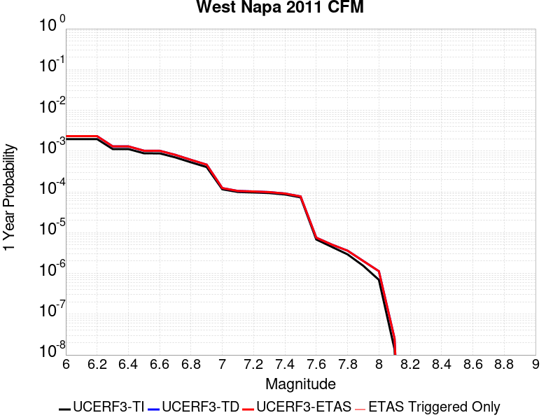 | 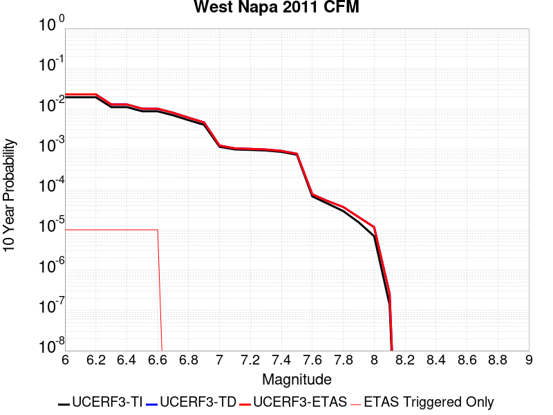 |

| Magnitude | 1 wk TI Prob | 1 wk TD Prob | 1 wk ETAS Prob | 1 wk ETAS/TD Gain | 1 wk ETAS Triggered Only | 1 mo TI Prob | 1 mo TD Prob | 1 mo ETAS Prob | 1 mo ETAS/TD Gain | 1 mo ETAS Triggered Only | 1 yr TI Prob | 1 yr TD Prob | 1 yr ETAS Prob | 1 yr ETAS/TD Gain | 1 yr ETAS Triggered Only | 10 yr TI Prob | 10 yr TD Prob | 10 yr ETAS Prob | 10 yr ETAS/TD Gain | 10 yr ETAS Triggered Only |
|-----|-----|-----|-----|-----|-----|-----|-----|-----|-----|-----|-----|-----|-----|-----|-----|-----|-----|-----|-----|-----|
| 6.0 | 3.773104E-5 | 4.453336E-5 | 4.453336E-5 | 1.0 | 0.0 | 1.6169442E-4 | 1.9084511E-4 | 1.9084511E-4 | 1.0 | 0.0 | 0.001966852 | 0.0023213807 | 0.0023213807 | 1.0 | 0.0 | 0.019495348 | 0.023004508 | 0.023014277 | 1.0004247 | 1.0E-5 |
| 6.1 | 3.773104E-5 | 4.453336E-5 | 4.453336E-5 | 1.0 | 0.0 | 1.6169442E-4 | 1.9084511E-4 | 1.9084511E-4 | 1.0 | 0.0 | 0.001966852 | 0.0023213807 | 0.0023213807 | 1.0 | 0.0 | 0.019495348 | 0.023004508 | 0.023014277 | 1.0004247 | 1.0E-5 |
| 6.2 | 3.773104E-5 | 4.453336E-5 | 4.453336E-5 | 1.0 | 0.0 | 1.6169442E-4 | 1.9084511E-4 | 1.9084511E-4 | 1.0 | 0.0 | 0.001966852 | 0.0023213807 | 0.0023213807 | 1.0 | 0.0 | 0.019495348 | 0.023004508 | 0.023014277 | 1.0004247 | 1.0E-5 |
| 6.3 | 2.147964E-5 | 2.4989826E-5 | 2.4989826E-5 | 1.0 | 0.0 | 9.2052345E-5 | 1.0709537E-4 | 1.0709537E-4 | 1.0 | 0.0 | 0.001120161 | 0.0013031979 | 0.0013031979 | 1.0 | 0.0 | 0.011145315 | 0.012965921 | 0.0129757915 | 1.0007613 | 1.0E-5 |
| 6.4 | 2.147964E-5 | 2.4989826E-5 | 2.4989826E-5 | 1.0 | 0.0 | 9.2052345E-5 | 1.0709537E-4 | 1.0709537E-4 | 1.0 | 0.0 | 0.001120161 | 0.0013031979 | 0.0013031979 | 1.0 | 0.0 | 0.011145315 | 0.012965921 | 0.0129757915 | 1.0007613 | 1.0E-5 |
| 6.5 | 1.688201E-5 | 1.9549603E-5 | 1.9549603E-5 | 1.0 | 0.0 | 7.234947E-5 | 8.378173E-5 | 8.378173E-5 | 1.0 | 0.0 | 8.804988E-4 | 0.001019638 | 0.001019638 | 1.0 | 0.0 | 0.008770182 | 0.01015801 | 0.010167908 | 1.0009744 | 1.0E-5 |
| 6.6 | 1.6846381E-5 | 1.9509293E-5 | 1.9509293E-5 | 1.0 | 0.0 | 7.219678E-5 | 8.360898E-5 | 8.360898E-5 | 1.0 | 0.0 | 8.7864127E-4 | 0.0010175367 | 0.0010175367 | 1.0 | 0.0 | 0.008751754 | 0.010137189 | 0.010147088 | 1.0009764 | 1.0E-5 |
| 6.7 | 1.3396501E-5 | 1.5469546E-5 | 1.5469546E-5 | 1.0 | 0.0 | 5.7412315E-5 | 6.629673E-5 | 6.629673E-5 | 1.0 | 0.0 | 6.9877075E-4 | 8.069273E-4 | 8.069273E-4 | 1.0 | 0.0 | 0.0069657755 | 0.008047441 | 0.008047441 | 1.0 | 0.0 |
| 6.8 | 1.0139058E-5 | 1.1673708E-5 | 1.1673708E-5 | 1.0 | 0.0 | 4.3452383E-5 | 5.0029532E-5 | 5.0029532E-5 | 1.0 | 0.0 | 5.289043E-4 | 6.0899486E-4 | 6.0899486E-4 | 1.0 | 0.0 | 0.005276473 | 0.0060799234 | 0.0060799234 | 1.0 | 0.0 |
| 6.9 | 7.761281E-6 | 8.8920015E-6 | 8.8920015E-6 | 1.0 | 0.0 | 3.326221E-5 | 3.810831E-5 | 3.810831E-5 | 1.0 | 0.0 | 4.0489217E-4 | 4.639213E-4 | 4.639213E-4 | 1.0 | 0.0 | 0.0040415525 | 0.004635784 | 0.004635784 | 1.0 | 0.0 |
| 7.0 | 2.2109202E-6 | 2.3673033E-6 | 2.3673033E-6 | 1.0 | 0.0 | 9.475338E-6 | 1.0145546E-5 | 1.0145546E-5 | 1.0 | 0.0 | 1.1535613E-4 | 1.235151E-4 | 1.235151E-4 | 1.0 | 0.0 | 0.0011529627 | 0.0012356899 | 0.0012356899 | 1.0 | 0.0 |
| 7.1 | 1.9008926E-6 | 2.0139657E-6 | 2.0139657E-6 | 1.0 | 0.0 | 8.146657E-6 | 8.631254E-6 | 8.631254E-6 | 1.0 | 0.0 | 9.918104E-5 | 1.0508047E-4 | 1.0508047E-4 | 1.0 | 0.0 | 9.913679E-4 | 0.001051528 | 0.001051528 | 1.0 | 0.0 |
| 7.2 | 1.8495944E-6 | 1.956769E-6 | 1.956769E-6 | 1.0 | 0.0 | 7.926808E-6 | 8.386126E-6 | 8.386126E-6 | 1.0 | 0.0 | 9.650462E-5 | 1.02096325E-4 | 1.02096325E-4 | 1.0 | 0.0 | 9.6462725E-4 | 0.0010217144 | 0.0010217144 | 1.0 | 0.0 |
| 7.3 | 1.7883189E-6 | 1.8887272E-6 | 1.8887272E-6 | 1.0 | 0.0 | 7.664201E-6 | 8.09452E-6 | 8.09452E-6 | 1.0 | 0.0 | 9.330765E-5 | 9.8546356E-5 | 9.8546356E-5 | 1.0 | 0.0 | 9.3268487E-4 | 9.862463E-4 | 9.862463E-4 | 1.0 | 0.0 |
| 7.4 | 1.6520572E-6 | 1.7421288E-6 | 1.7421288E-6 | 1.0 | 0.0 | 7.0802257E-6 | 7.466245E-6 | 7.466245E-6 | 1.0 | 0.0 | 8.6198335E-5 | 9.089777E-5 | 9.089777E-5 | 1.0 | 0.0 | 8.616491E-4 | 9.0982515E-4 | 9.0982515E-4 | 1.0 | 0.0 |
| 7.5 | 1.4040345E-6 | 1.4805424E-6 | 1.4805424E-6 | 1.0 | 0.0 | 6.0172765E-6 | 6.345166E-6 | 6.345166E-6 | 1.0 | 0.0 | 7.325788E-5 | 7.7249686E-5 | 7.7249686E-5 | 1.0 | 0.0 | 7.3233736E-4 | 7.734145E-4 | 7.734145E-4 | 1.0 | 0.0 |
| 7.6 | 1.3013842E-7 | 1.4432868E-7 | 1.4432868E-7 | 1.0 | 0.0 | 5.57736E-7 | 6.185513E-7 | 6.185513E-7 | 1.0 | 0.0 | 6.790414E-6 | 7.5308362E-6 | 7.5308362E-6 | 1.0 | 0.0 | 6.790207E-5 | 7.623862E-5 | 7.623862E-5 | 1.0 | 0.0 |
| 7.7 | 8.541512E-8 | 9.731742E-8 | 9.731742E-8 | 1.0 | 0.0 | 3.6606474E-7 | 4.170746E-7 | 4.170746E-7 | 1.0 | 0.0 | 4.456829E-6 | 5.0778713E-6 | 5.0778713E-6 | 1.0 | 0.0 | 4.4567398E-5 | 5.168527E-5 | 5.168527E-5 | 1.0 | 0.0 |
| 7.8 | 5.6074793E-8 | 6.908085E-8 | 6.908085E-8 | 1.0 | 0.0 | 2.403205E-7 | 2.9606076E-7 | 2.9606076E-7 | 1.0 | 0.0 | 2.9258983E-6 | 3.6045337E-6 | 3.6045337E-6 | 1.0 | 0.0 | 2.9258597E-5 | 3.688268E-5 | 3.688268E-5 | 1.0 | 0.0 |
| 7.9 | 2.9475839E-8 | 3.8641733E-8 | 3.8641733E-8 | 1.0 | 0.0 | 1.2632502E-7 | 1.6560742E-7 | 1.6560742E-7 | 1.0 | 0.0 | 1.538006E-6 | 2.0162686E-6 | 2.0162686E-6 | 1.0 | 0.0 | 1.5379954E-5 | 2.070501E-5 | 2.070501E-5 | 1.0 | 0.0 |
| 8.0 | 1.3337122E-8 | 2.16757E-8 | 2.16757E-8 | 1.0 | 0.0 | 5.7159088E-8 | 9.289585E-8 | 9.289585E-8 | 1.0 | 0.0 | 6.959117E-7 | 1.1310065E-6 | 1.1310065E-6 | 1.0 | 0.0 | 6.959095E-6 | 1.1667862E-5 | 1.1667862E-5 | 1.0 | 0.0 |
| 8.1 | 2.6589986E-10 | 4.8711546E-10 | 4.8711546E-10 | 1.0 | 0.0 | 1.1395708E-9 | 2.0876372E-9 | 2.0876372E-9 | 1.0 | 0.0 | 1.3874274E-8 | 2.5416986E-8 | 2.5416986E-8 | 1.0 | 0.0 | 1.3874273E-7 | 2.6085002E-7 | 2.6085002E-7 | 1.0 | 0.0 |

## Elmore Ranch
*[(top)](#table-of-contents)*

| 1 Week | 1 Month | 1 Year | 10 Year |
|-----|-----|-----|-----|
|  |  |  |  |

| Magnitude | 1 wk TI Prob | 1 wk TD Prob | 1 wk ETAS Prob | 1 wk ETAS/TD Gain | 1 wk ETAS Triggered Only | 1 mo TI Prob | 1 mo TD Prob | 1 mo ETAS Prob | 1 mo ETAS/TD Gain | 1 mo ETAS Triggered Only | 1 yr TI Prob | 1 yr TD Prob | 1 yr ETAS Prob | 1 yr ETAS/TD Gain | 1 yr ETAS Triggered Only | 10 yr TI Prob | 10 yr TD Prob | 10 yr ETAS Prob | 10 yr ETAS/TD Gain | 10 yr ETAS Triggered Only |
|-----|-----|-----|-----|-----|-----|-----|-----|-----|-----|-----|-----|-----|-----|-----|-----|-----|-----|-----|-----|-----|
| 6.0 | 9.102099E-5 | 8.9555084E-5 | 8.9555084E-5 | 1.0 | 0.0 | 3.9003167E-4 | 3.8376293E-4 | 3.8376293E-4 | 1.0 | 0.0 | 0.0047383 | 0.004662842 | 0.004662842 | 1.0 | 0.0 | 0.046385348 | 0.045949984 | 0.045959525 | 1.0002077 | 1.0E-5 |
| 6.1 | 3.8306698E-5 | 4.1495587E-5 | 4.1495587E-5 | 1.0 | 0.0 | 1.6416123E-4 | 1.7783017E-4 | 1.7783017E-4 | 1.0 | 0.0 | 0.0019968306 | 0.0021633834 | 0.0021633834 | 1.0 | 0.0 | 0.019789828 | 0.021704927 | 0.021704927 | 1.0 | 0.0 |
| 6.2 | 3.8306698E-5 | 4.1495587E-5 | 4.1495587E-5 | 1.0 | 0.0 | 1.6416123E-4 | 1.7783017E-4 | 1.7783017E-4 | 1.0 | 0.0 | 0.0019968306 | 0.0021633834 | 0.0021633834 | 1.0 | 0.0 | 0.019789828 | 0.021704927 | 0.021704927 | 1.0 | 0.0 |
| 6.3 | 3.3197924E-5 | 3.6552145E-5 | 3.6552145E-5 | 1.0 | 0.0 | 1.4226905E-4 | 1.5664661E-4 | 1.5664661E-4 | 1.0 | 0.0 | 0.0017307495 | 0.001906045 | 0.001906045 | 1.0 | 0.0 | 0.017173318 | 0.019166641 | 0.019166641 | 1.0 | 0.0 |
| 6.4 | 2.5148964E-5 | 2.7420736E-5 | 2.7420736E-5 | 1.0 | 0.0 | 1.0777682E-4 | 1.17515796E-4 | 1.17515796E-4 | 1.0 | 0.0 | 0.0013113929 | 0.0014304637 | 0.0014304637 | 1.0 | 0.0 | 0.01303681 | 0.014442592 | 0.014442592 | 1.0 | 0.0 |
| 6.5 | 2.5148964E-5 | 2.7420736E-5 | 2.7420736E-5 | 1.0 | 0.0 | 1.0777682E-4 | 1.17515796E-4 | 1.17515796E-4 | 1.0 | 0.0 | 0.0013113929 | 0.0014304637 | 0.0014304637 | 1.0 | 0.0 | 0.01303681 | 0.014442592 | 0.014442592 | 1.0 | 0.0 |

## Pleito
*[(top)](#table-of-contents)*

| 1 Week | 1 Month | 1 Year | 10 Year |
|-----|-----|-----|-----|
|  |  |  |  |

| Magnitude | 1 wk TI Prob | 1 wk TD Prob | 1 wk ETAS Prob | 1 wk ETAS/TD Gain | 1 wk ETAS Triggered Only | 1 mo TI Prob | 1 mo TD Prob | 1 mo ETAS Prob | 1 mo ETAS/TD Gain | 1 mo ETAS Triggered Only | 1 yr TI Prob | 1 yr TD Prob | 1 yr ETAS Prob | 1 yr ETAS/TD Gain | 1 yr ETAS Triggered Only | 10 yr TI Prob | 10 yr TD Prob | 10 yr ETAS Prob | 10 yr ETAS/TD Gain | 10 yr ETAS Triggered Only |
|-----|-----|-----|-----|-----|-----|-----|-----|-----|-----|-----|-----|-----|-----|-----|-----|-----|-----|-----|-----|-----|
| 6.0 | 1.6763008E-5 | 2.479146E-5 | 2.479146E-5 | 1.0 | 0.0 | 7.183948E-5 | 1.0624519E-4 | 1.0624519E-4 | 1.0 | 0.0 | 8.742947E-4 | 0.0012928396 | 0.0013028268 | 1.0077249 | 1.0E-5 | 0.00870863 | 0.012967767 | 0.012977638 | 1.0007612 | 1.0E-5 |
| 6.1 | 1.6763008E-5 | 2.479146E-5 | 2.479146E-5 | 1.0 | 0.0 | 7.183948E-5 | 1.0624519E-4 | 1.0624519E-4 | 1.0 | 0.0 | 8.742947E-4 | 0.0012928396 | 0.0013028268 | 1.0077249 | 1.0E-5 | 0.00870863 | 0.012967767 | 0.012977638 | 1.0007612 | 1.0E-5 |
| 6.2 | 1.6763008E-5 | 2.479146E-5 | 2.479146E-5 | 1.0 | 0.0 | 7.183948E-5 | 1.0624519E-4 | 1.0624519E-4 | 1.0 | 0.0 | 8.742947E-4 | 0.0012928396 | 0.0013028268 | 1.0077249 | 1.0E-5 | 0.00870863 | 0.012967767 | 0.012977638 | 1.0007612 | 1.0E-5 |
| 6.3 | 1.6763008E-5 | 2.479146E-5 | 2.479146E-5 | 1.0 | 0.0 | 7.183948E-5 | 1.0624519E-4 | 1.0624519E-4 | 1.0 | 0.0 | 8.742947E-4 | 0.0012928396 | 0.0013028268 | 1.0077249 | 1.0E-5 | 0.00870863 | 0.012967767 | 0.012977638 | 1.0007612 | 1.0E-5 |
| 6.4 | 1.6763008E-5 | 2.479146E-5 | 2.479146E-5 | 1.0 | 0.0 | 7.183948E-5 | 1.0624519E-4 | 1.0624519E-4 | 1.0 | 0.0 | 8.742947E-4 | 0.0012928396 | 0.0013028268 | 1.0077249 | 1.0E-5 | 0.00870863 | 0.012967767 | 0.012977638 | 1.0007612 | 1.0E-5 |
| 6.5 | 1.6763008E-5 | 2.479146E-5 | 2.479146E-5 | 1.0 | 0.0 | 7.183948E-5 | 1.0624519E-4 | 1.0624519E-4 | 1.0 | 0.0 | 8.742947E-4 | 0.0012928396 | 0.0013028268 | 1.0077249 | 1.0E-5 | 0.00870863 | 0.012967767 | 0.012977638 | 1.0007612 | 1.0E-5 |
| 6.6 | 9.910213E-6 | 1.7241837E-5 | 1.7241837E-5 | 1.0 | 0.0 | 4.247165E-5 | 7.389152E-5 | 7.389152E-5 | 1.0 | 0.0 | 5.169696E-4 | 8.992616E-4 | 8.992616E-4 | 1.0 | 0.0 | 0.0051576863 | 0.009064423 | 0.009064423 | 1.0 | 0.0 |
| 6.7 | 9.910213E-6 | 1.7241837E-5 | 1.7241837E-5 | 1.0 | 0.0 | 4.247165E-5 | 7.389152E-5 | 7.389152E-5 | 1.0 | 0.0 | 5.169696E-4 | 8.992616E-4 | 8.992616E-4 | 1.0 | 0.0 | 0.0051576863 | 0.009064423 | 0.009064423 | 1.0 | 0.0 |
| 6.8 | 8.300162E-6 | 1.5501371E-5 | 1.5501371E-5 | 1.0 | 0.0 | 3.557164E-5 | 6.643277E-5 | 6.643277E-5 | 1.0 | 0.0 | 4.3299864E-4 | 8.0852024E-4 | 8.0852024E-4 | 1.0 | 0.0 | 0.004321559 | 0.008163834 | 0.008163834 | 1.0 | 0.0 |
| 6.9 | 8.183114E-6 | 1.5372574E-5 | 1.5372574E-5 | 1.0 | 0.0 | 3.5070017E-5 | 6.5880806E-5 | 6.5880806E-5 | 1.0 | 0.0 | 4.2689382E-4 | 8.0180506E-4 | 8.0180506E-4 | 1.0 | 0.0 | 0.0042607468 | 0.008097173 | 0.008097173 | 1.0 | 0.0 |
| 7.0 | 7.1748823E-6 | 1.4159216E-5 | 1.4159216E-5 | 1.0 | 0.0 | 3.0749135E-5 | 6.0680948E-5 | 6.0680948E-5 | 1.0 | 0.0 | 3.743064E-4 | 7.385406E-4 | 7.385406E-4 | 1.0 | 0.0 | 0.0037367654 | 0.007468599 | 0.007468599 | 1.0 | 0.0 |
| 7.1 | 7.1671807E-6 | 1.4149584E-5 | 1.4149584E-5 | 1.0 | 0.0 | 3.0716128E-5 | 6.0639664E-5 | 6.0639664E-5 | 1.0 | 0.0 | 3.7390468E-4 | 7.380384E-4 | 7.380384E-4 | 1.0 | 0.0 | 0.0037327618 | 0.0074636103 | 0.0074636103 | 1.0 | 0.0 |
| 7.2 | 7.0649667E-6 | 1.3996784E-5 | 1.3996784E-5 | 1.0 | 0.0 | 3.0278077E-5 | 5.998484E-5 | 5.998484E-5 | 1.0 | 0.0 | 3.6857324E-4 | 7.300712E-4 | 7.300712E-4 | 1.0 | 0.0 | 0.0036796255 | 0.007384318 | 0.007384318 | 1.0 | 0.0 |
| 7.3 | 7.02082E-6 | 1.3940186E-5 | 1.3940186E-5 | 1.0 | 0.0 | 3.008888E-5 | 5.974229E-5 | 5.974229E-5 | 1.0 | 0.0 | 3.6627054E-4 | 7.2712015E-4 | 7.2712015E-4 | 1.0 | 0.0 | 0.0036566744 | 0.007354794 | 0.007354794 | 1.0 | 0.0 |
| 7.4 | 6.987146E-6 | 1.3899719E-5 | 1.3899719E-5 | 1.0 | 0.0 | 2.9944567E-5 | 5.956887E-5 | 5.956887E-5 | 1.0 | 0.0 | 3.6451413E-4 | 7.250101E-4 | 7.250101E-4 | 1.0 | 0.0 | 0.0036391679 | 0.007333714 | 0.007333714 | 1.0 | 0.0 |
| 7.5 | 6.9494554E-6 | 1.3856602E-5 | 1.3856602E-5 | 1.0 | 0.0 | 2.9783041E-5 | 5.938409E-5 | 5.938409E-5 | 1.0 | 0.0 | 3.625482E-4 | 7.2276196E-4 | 7.2276196E-4 | 1.0 | 0.0 | 0.0036195726 | 0.0073113306 | 0.0073113306 | 1.0 | 0.0 |
| 7.6 | 6.92694E-6 | 1.3815674E-5 | 1.3815674E-5 | 1.0 | 0.0 | 2.9686547E-5 | 5.920869E-5 | 5.920869E-5 | 1.0 | 0.0 | 3.6137376E-4 | 7.206279E-4 | 7.206279E-4 | 1.0 | 0.0 | 0.0036078666 | 0.0072900616 | 0.0072900616 | 1.0 | 0.0 |
| 7.7 | 6.395867E-6 | 1.2693605E-5 | 1.2693605E-5 | 1.0 | 0.0 | 2.741057E-5 | 5.440003E-5 | 5.440003E-5 | 1.0 | 0.0 | 3.336726E-4 | 6.621194E-4 | 6.621194E-4 | 1.0 | 0.0 | 0.0033317201 | 0.0067081 | 0.0067081 | 1.0 | 0.0 |
| 7.8 | 5.8664327E-6 | 1.1559044E-5 | 1.1559044E-5 | 1.0 | 0.0 | 2.5141611E-5 | 4.953782E-5 | 4.953782E-5 | 1.0 | 0.0 | 3.060561E-4 | 6.029563E-4 | 6.029563E-4 | 1.0 | 0.0 | 0.0030563495 | 0.006112456 | 0.006112456 | 1.0 | 0.0 |
| 7.9 | 3.7167474E-6 | 7.128102E-6 | 7.128102E-6 | 1.0 | 0.0 | 1.592882E-5 | 3.054865E-5 | 3.054865E-5 | 1.0 | 0.0 | 1.9391612E-4 | 3.718665E-4 | 3.718665E-4 | 1.0 | 0.0 | 0.0019374699 | 0.0037745768 | 0.0037745768 | 1.0 | 0.0 |
| 8.0 | 1.0903841E-6 | 1.2908959E-6 | 1.2908959E-6 | 1.0 | 0.0 | 4.6730665E-6 | 5.532399E-6 | 5.532399E-6 | 1.0 | 0.0 | 5.68931E-5 | 6.7354886E-5 | 6.7354886E-5 | 1.0 | 0.0 | 5.6878536E-4 | 6.957491E-4 | 6.957491E-4 | 1.0 | 0.0 |
| 8.1 | 2.6894583E-7 | 1.1106567E-7 | 1.1106567E-7 | 1.0 | 0.0 | 1.1526245E-6 | 4.7599562E-7 | 4.7599562E-7 | 1.0 | 0.0 | 1.4033113E-5 | 5.7952316E-6 | 5.7952316E-6 | 1.0 | 0.0 | 1.4032227E-4 | 6.482664E-5 | 6.482664E-5 | 1.0 | 0.0 |
| 8.2 | 5.2967013E-9 | 2.468831E-9 | 2.468831E-9 | 1.0 | 0.0 | 2.2700148E-8 | 1.0580704E-8 | 1.0580704E-8 | 1.0 | 0.0 | 2.7637427E-7 | 1.2882006E-7 | 1.2882006E-7 | 1.0 | 0.0 | 2.7637393E-6 | 1.4656648E-6 | 1.4656648E-6 | 1.0 | 0.0 |

