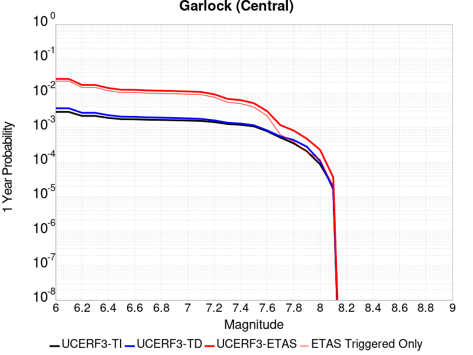
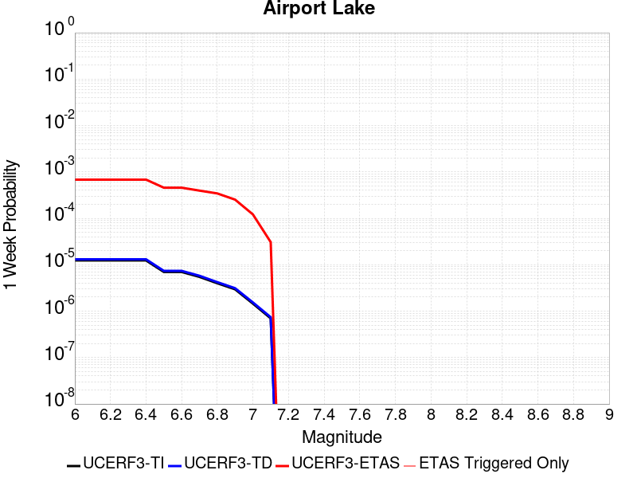
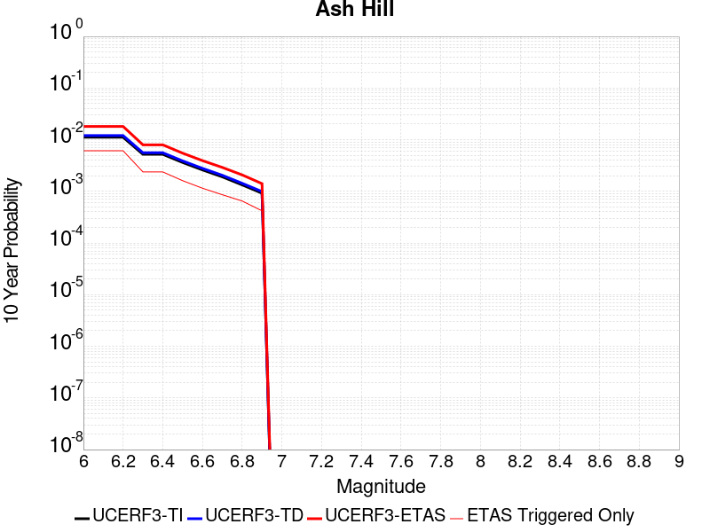
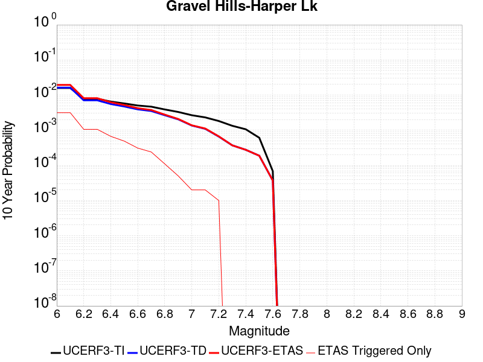
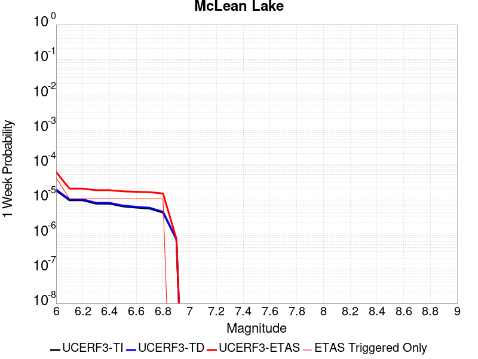
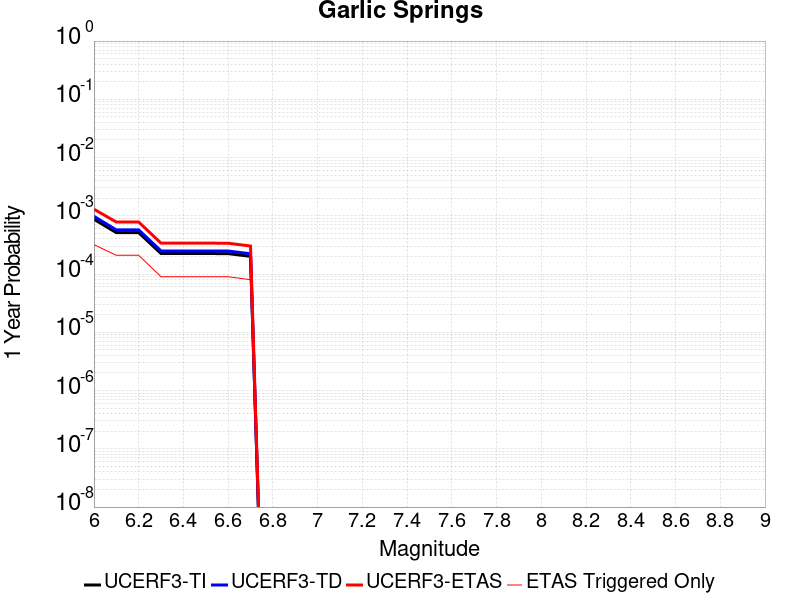
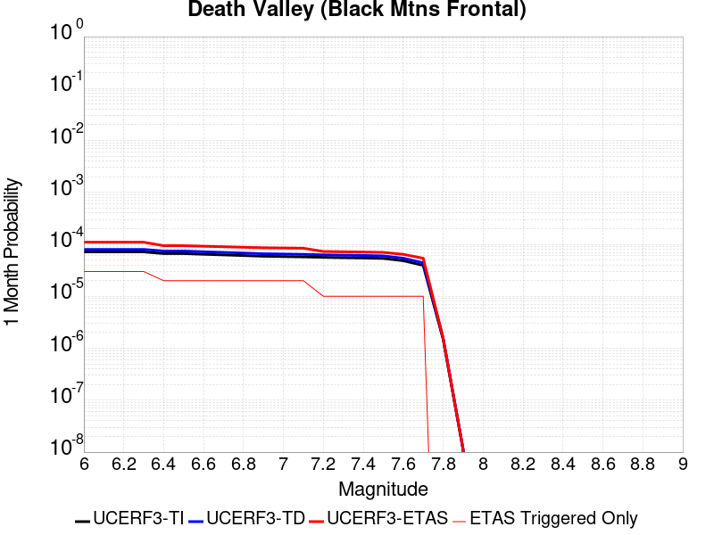
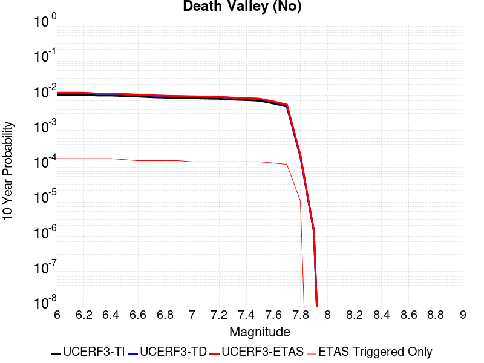

# Parent Section Magnitude-Probability Distributions

Only fault sections with at least one triggered aftershock are plotted. Sections are sorted by total supraseismogenic trigger rate (decreasing)

## Table Of Contents

* [Tank Canyon](#tank-canyon)
* [Garlock (Central)](#garlock-central)
* [Little Lake](#little-lake)
* [Owl Lake](#owl-lake)
* [Airport Lake](#airport-lake)
* [Garlock (East)](#garlock-east)
* [Panamint Valley](#panamint-valley)
* [Ash Hill](#ash-hill)
* [Blackwater](#blackwater)
* [Hunter Mountain-Saline Valley](#hunter-mountain-saline-valley)
* [Gravel Hills-Harper Lk](#gravel-hills-harper-lk)
* [Goldstone Lake](#goldstone-lake)
* [Garlock (West)](#garlock-west)
* [McLean Lake](#mclean-lake)
* [Coyote Canyon](#coyote-canyon)
* [So Sierra Nevada](#so-sierra-nevada)
* [Death Valley (So)](#death-valley-so)
* [Lenwood-Lockhart-Old Woman Springs](#lenwood-lockhart-old-woman-springs)
* [Nelson Lake](#nelson-lake)
* [Bicycle Lake](#bicycle-lake)
* [San Andreas (Mojave S)](#san-andreas-mojave-s)
* [Towne Pass](#towne-pass)
* [San Andreas (Mojave N)](#san-andreas-mojave-n)
* [Paradise](#paradise)
* [Garlic Springs](#garlic-springs)
* [San Andreas (San Bernardino N)](#san-andreas-san-bernardino-n)
* [Coyote Lake](#coyote-lake)
* [Tin Mountain](#tin-mountain)
* [Sierra Nevada  (No Extension)](#sierra-nevada--no-extension)
* [Baker](#baker)
* [Scodie Lineament](#scodie-lineament)
* [Lost Hills](#lost-hills)
* [Lake Isabella (Seismicity)](#lake-isabella-seismicity)
* [White Wolf (Extension)](#white-wolf-extension)
* [Death Valley (Black Mtns Frontal)](#death-valley-black-mtns-frontal)
* [Death Valley (No)](#death-valley-no)
* [South Klamath Lake West](#south-klamath-lake-west)
* [San Jacinto (Stepovers Combined)](#san-jacinto-stepovers-combined)
* [Independence rev 2011](#independence-rev-2011)
* [Rose Canyon](#rose-canyon)
* [White Mountains](#white-mountains)
* [San Jacinto (San Jacinto Valley) rev](#san-jacinto-san-jacinto-valley-rev)
* [San Jacinto (San Bernardino)](#san-jacinto-san-bernardino)
* [Pisgah-Bullion Mtn-Mesquite Lk](#pisgah-bullion-mtn-mesquite-lk)
* [Blue Cut](#blue-cut)
* [Newport-Inglewood alt 1](#newport-inglewood-alt-1)
* [San Jacinto (Clark) rev](#san-jacinto-clark-rev)
* [San Jacinto (Anza) rev](#san-jacinto-anza-rev)
* [San Andreas (San Bernardino S)](#san-andreas-san-bernardino-s)
* [South Klamath Lake East](#south-klamath-lake-east)

## Tank Canyon
*[(top)](#table-of-contents)*

| 1 Week | 1 Month | 1 Year | 10 Year |
|-----|-----|-----|-----|
|  |  |  |  |

| Magnitude | 1 wk TI Prob | 1 wk TD Prob | 1 wk ETAS Prob | 1 wk ETAS/TD Gain | 1 wk ETAS Triggered Only | 1 mo TI Prob | 1 mo TD Prob | 1 mo ETAS Prob | 1 mo ETAS/TD Gain | 1 mo ETAS Triggered Only | 1 yr TI Prob | 1 yr TD Prob | 1 yr ETAS Prob | 1 yr ETAS/TD Gain | 1 yr ETAS Triggered Only | 10 yr TI Prob | 10 yr TD Prob | 10 yr ETAS Prob | 10 yr ETAS/TD Gain | 10 yr ETAS Triggered Only |
|-----|-----|-----|-----|-----|-----|-----|-----|-----|-----|-----|-----|-----|-----|-----|-----|-----|-----|-----|-----|-----|
| 6.0 | 4.8284557E-5 | 5.7970923E-5 | 0.0013099329 | 22.596378 | 0.0012520346 | 2.0691741E-4 | 2.48427E-4 | 0.0051301485 | 20.650528 | 0.004882935 | 0.0025163088 | 0.0030210684 | 0.022119325 | 7.3216896 | 0.019156128 | 0.02488006 | 0.029866708 | 0.06800642 | 2.2769973 | 0.039313886 |
| 6.1 | 1.7796336E-5 | 2.0875108E-5 | 3.9647764E-4 | 18.992842 | 3.7561037E-4 | 7.626778E-5 | 8.946191E-5 | 0.0019673458 | 21.990877 | 0.0018780518 | 9.281647E-4 | 0.0010886913 | 0.007342049 | 6.7439213 | 0.006260173 | 0.009242975 | 0.010837668 | 0.024584634 | 2.268443 | 0.013897584 |
| 6.2 | 1.7796336E-5 | 2.0875108E-5 | 3.9647764E-4 | 18.992842 | 3.7561037E-4 | 7.626778E-5 | 8.946191E-5 | 0.0019673458 | 21.990877 | 0.0018780518 | 9.281647E-4 | 0.0010886913 | 0.007342049 | 6.7439213 | 0.006260173 | 0.009242975 | 0.010837668 | 0.024584634 | 2.268443 | 0.013897584 |
| 6.3 | 1.3515912E-5 | 1.5760828E-5 | 2.6616378E-4 | 16.887678 | 2.504069E-4 | 5.792405E-5 | 6.7544795E-5 | 0.0014446898 | 21.388618 | 0.001377238 | 7.049971E-4 | 8.220716E-4 | 0.005450791 | 6.630555 | 0.004632528 | 0.007027647 | 0.008192917 | 0.018623842 | 2.2731636 | 0.010517091 |
| 6.4 | 1.0870146E-5 | 1.2618972E-5 | 2.6302272E-4 | 20.843435 | 2.504069E-4 | 4.658551E-5 | 5.4080287E-5 | 0.0011808504 | 21.835136 | 0.001126831 | 5.67031E-4 | 6.582465E-4 | 0.0041616354 | 6.3223057 | 0.0035056968 | 0.005655863 | 0.006564983 | 0.014152254 | 2.1557183 | 0.007637411 |
| 6.5 | 7.964826E-6 | 9.196723E-6 | 2.5960134E-4 | 28.227589 | 2.504069E-4 | 3.4134522E-5 | 3.9413993E-5 | 6.654066E-4 | 16.882496 | 6.260173E-4 | 4.1550855E-4 | 4.797704E-4 | 0.002607208 | 5.434283 | 0.0021284588 | 0.0041473247 | 0.0047886474 | 0.0096482 | 2.0148067 | 0.004882935 |
| 6.6 | 6.6317E-6 | 7.612777E-6 | 1.3281529E-4 | 17.446363 | 1.2520346E-4 | 2.8421264E-5 | 3.262583E-5 | 5.334233E-4 | 16.349724 | 5.008138E-4 | 3.4597394E-4 | 3.9715623E-4 | 0.0013983861 | 3.5209975 | 0.0010016277 | 0.0034543579 | 0.003965616 | 0.0077068247 | 1.9434116 | 0.0037561036 |
| 6.7 | 4.793663E-6 | 5.4310603E-6 | 1.3063384E-4 | 24.053099 | 1.2520346E-4 | 2.0544108E-5 | 2.327579E-5 | 2.7367688E-4 | 11.758006 | 2.504069E-4 | 2.500958E-4 | 2.8335027E-4 | 6.588542E-4 | 2.3252287 | 3.7561037E-4 | 0.0024981452 | 0.0028305824 | 0.004203922 | 1.4851792 | 0.001377238 |
| 6.8 | 4.382823E-6 | 4.9694927E-6 | 1.3017232E-4 | 26.194288 | 1.2520346E-4 | 1.8783392E-5 | 2.1297676E-5 | 2.7169925E-4 | 12.757226 | 2.504069E-4 | 2.286638E-4 | 2.592726E-4 | 6.347856E-4 | 2.4483325 | 3.7561037E-4 | 0.0022842865 | 0.0025903755 | 0.0038391668 | 1.4820889 | 0.0012520346 |
| 6.9 | 2.729601E-6 | 3.0736521E-6 | 3.0736521E-6 | 1.0 | 0.0 | 1.1698237E-5 | 1.3172735E-5 | 1.3837454E-4 | 10.504618 | 1.2520346E-4 | 1.4241673E-4 | 1.6036748E-4 | 2.8555084E-4 | 1.7806033 | 1.2520346E-4 | 0.001423255 | 0.0016026833 | 0.0019776917 | 1.2339878 | 3.7561037E-4 |
| 7.0 | 1.8987357E-6 | 2.1269989E-6 | 2.1269989E-6 | 1.0 | 0.0 | 8.137413E-6 | 9.115682E-6 | 9.115682E-6 | 1.0 | 0.0 | 9.90685E-5 | 1.1097847E-4 | 1.1097847E-4 | 1.0 | 0.0 | 9.902435E-4 | 0.0011092991 | 0.0012343638 | 1.112742 | 1.2520346E-4 |
| 7.1 | 1.4928986E-6 | 1.6641684E-6 | 1.6641684E-6 | 1.0 | 0.0 | 6.398121E-6 | 7.1321338E-6 | 7.1321338E-6 | 1.0 | 0.0 | 7.789434E-5 | 8.683086E-5 | 8.683086E-5 | 1.0 | 0.0 | 7.786704E-4 | 8.680272E-4 | 9.93122E-4 | 1.1441139 | 1.2520346E-4 |
| 7.2 | 1.069082E-6 | 1.1828834E-6 | 1.1828834E-6 | 1.0 | 0.0 | 4.581772E-6 | 5.0694935E-6 | 5.0694935E-6 | 1.0 | 0.0 | 5.5781646E-5 | 6.171987E-5 | 6.171987E-5 | 1.0 | 0.0 | 5.576765E-4 | 6.170795E-4 | 6.170795E-4 | 1.0 | 0.0 |
| 7.3 | 8.776551E-7 | 9.770195E-7 | 9.770195E-7 | 1.0 | 0.0 | 3.7613736E-6 | 4.1872227E-6 | 4.1872227E-6 | 1.0 | 0.0 | 4.579376E-5 | 5.0978764E-5 | 5.0978764E-5 | 1.0 | 0.0 | 4.5784327E-4 | 5.097217E-4 | 5.097217E-4 | 1.0 | 0.0 |
| 7.4 | 7.55721E-7 | 8.510402E-7 | 8.510402E-7 | 1.0 | 0.0 | 3.2388E-6 | 3.647313E-6 | 3.647313E-6 | 1.0 | 0.0 | 3.9431678E-5 | 4.440565E-5 | 4.440565E-5 | 1.0 | 0.0 | 3.942468E-4 | 4.440186E-4 | 4.440186E-4 | 1.0 | 0.0 |
| 7.5 | 5.587665E-7 | 6.305733E-7 | 6.305733E-7 | 1.0 | 0.0 | 2.3947114E-6 | 2.702457E-6 | 2.702457E-6 | 1.0 | 0.0 | 2.915522E-5 | 3.2902415E-5 | 3.2902415E-5 | 1.0 | 0.0 | 2.9151395E-4 | 3.2902416E-4 | 3.2902416E-4 | 1.0 | 0.0 |

## Garlock (Central)
*[(top)](#table-of-contents)*

| 1 Week | 1 Month | 1 Year | 10 Year |
|-----|-----|-----|-----|
|  |  |  |  |

| Magnitude | 1 wk TI Prob | 1 wk TD Prob | 1 wk ETAS Prob | 1 wk ETAS/TD Gain | 1 wk ETAS Triggered Only | 1 mo TI Prob | 1 mo TD Prob | 1 mo ETAS Prob | 1 mo ETAS/TD Gain | 1 mo ETAS Triggered Only | 1 yr TI Prob | 1 yr TD Prob | 1 yr ETAS Prob | 1 yr ETAS/TD Gain | 1 yr ETAS Triggered Only | 10 yr TI Prob | 10 yr TD Prob | 10 yr ETAS Prob | 10 yr ETAS/TD Gain | 10 yr ETAS Triggered Only |
|-----|-----|-----|-----|-----|-----|-----|-----|-----|-----|-----|-----|-----|-----|-----|-----|-----|-----|-----|-----|-----|
| 6.0 | 5.5131142E-5 | 7.027124E-5 | 0.0016978018 | 24.160692 | 0.0016276449 | 2.3625491E-4 | 3.0112805E-4 | 0.004932261 | 16.37928 | 0.004632528 | 0.0028726095 | 0.0036601364 | 0.023744112 | 6.487221 | 0.020157756 | 0.028357591 | 0.036092084 | 0.07736622 | 2.1435785 | 0.042819582 |
| 6.1 | 5.5131142E-5 | 7.027124E-5 | 0.0016978018 | 24.160692 | 0.0016276449 | 2.3625491E-4 | 3.0112805E-4 | 0.004932261 | 16.37928 | 0.004632528 | 0.0028726095 | 0.0036601364 | 0.023744112 | 6.487221 | 0.020157756 | 0.028357591 | 0.036092084 | 0.07736622 | 2.1435785 | 0.042819582 |
| 6.2 | 4.216245E-5 | 5.1683597E-5 | 0.0014288505 | 27.64611 | 0.001377238 | 1.806837E-4 | 2.214825E-4 | 0.0032257 | 14.56413 | 0.003004883 | 0.0021976046 | 0.0026932466 | 0.014555541 | 5.404459 | 0.0118943285 | 0.021759989 | 0.026701005 | 0.052535407 | 1.9675443 | 0.026543133 |
| 6.3 | 4.216245E-5 | 5.1683597E-5 | 0.0014288505 | 27.64611 | 0.001377238 | 1.806837E-4 | 2.214825E-4 | 0.0032257 | 14.56413 | 0.003004883 | 0.0021976046 | 0.0026932466 | 0.014555541 | 5.404459 | 0.0118943285 | 0.021759989 | 0.026701005 | 0.052535407 | 1.9675443 | 0.026543133 |
| 6.4 | 3.6858168E-5 | 4.4131746E-5 | 0.0011709131 | 26.532219 | 0.001126831 | 1.5795401E-4 | 1.8912248E-4 | 0.0024423585 | 12.914163 | 0.002253662 | 0.0019213937 | 0.00230016 | 0.011793735 | 5.1273546 | 0.009515462 | 0.019048655 | 0.022859743 | 0.04378011 | 1.9151621 | 0.021409791 |
| 6.5 | 3.39199E-5 | 4.0038896E-5 | 9.16428E-4 | 22.888443 | 8.764242E-4 | 1.453629E-4 | 1.715841E-4 | 0.0021744957 | 12.673059 | 0.0020032553 | 0.0017683565 | 0.0020870569 | 0.010833007 | 5.1905665 | 0.008764242 | 0.017543508 | 0.020770492 | 0.039896548 | 1.9208282 | 0.01953174 |
| 6.6 | 3.3571985E-5 | 3.9493032E-5 | 9.158826E-4 | 23.190992 | 8.764242E-4 | 1.4387199E-4 | 1.6924499E-4 | 0.0021721611 | 12.834419 | 0.0020032553 | 0.0017502342 | 0.0020586322 | 0.010804832 | 5.248549 | 0.008764242 | 0.017365133 | 0.020491783 | 0.039623283 | 1.9336181 | 0.01953174 |
| 6.7 | 3.2580007E-5 | 3.8109323E-5 | 9.145001E-4 | 23.996754 | 8.764242E-4 | 1.3962112E-4 | 1.6331558E-4 | 0.0020410607 | 12.497649 | 0.0018780518 | 0.0016985617 | 0.0019865753 | 0.010108633 | 5.088472 | 0.0081382245 | 0.016856372 | 0.019784356 | 0.037825134 | 1.911871 | 0.018404908 |
| 6.8 | 3.2185937E-5 | 3.7536465E-5 | 9.1392774E-4 | 24.34773 | 8.764242E-4 | 1.3793244E-4 | 1.6086077E-4 | 0.0020386104 | 12.673137 | 0.0018780518 | 0.0016780337 | 0.001956742 | 0.009704167 | 4.959349 | 0.007762614 | 0.016654192 | 0.01949112 | 0.03692348 | 1.8943745 | 0.01777889 |
| 6.9 | 3.165394E-5 | 3.6740938E-5 | 9.131329E-4 | 24.853283 | 8.764242E-4 | 1.3565269E-4 | 1.5745178E-4 | 0.0020352078 | 12.925912 | 0.0018780518 | 0.0016503202 | 0.0019153113 | 0.0096630575 | 5.045163 | 0.007762614 | 0.01638118 | 0.0190837 | 0.03640049 | 1.9074126 | 0.017653687 |
| 7.0 | 3.0903822E-5 | 3.564605E-5 | 7.8684E-4 | 22.073694 | 7.5122074E-4 | 1.3243823E-4 | 1.5275997E-4 | 0.0019053406 | 12.4727745 | 0.0017528484 | 0.0016112428 | 0.0018582871 | 0.009356535 | 5.035032 | 0.007512207 | 0.015996104 | 0.018522795 | 0.034989297 | 1.8889858 | 0.016777264 |
| 7.1 | 3.0069863E-5 | 3.441218E-5 | 6.6040794E-4 | 19.191109 | 6.260173E-4 | 1.2886449E-4 | 1.4747256E-4 | 0.0017748774 | 12.035306 | 0.0016276449 | 0.0015677959 | 0.0017940209 | 0.008792836 | 4.9011893 | 0.0070113936 | 0.01556781 | 0.017890377 | 0.03338378 | 1.8660189 | 0.015775636 |
| 7.2 | 2.7957109E-5 | 3.1301115E-5 | 6.572988E-4 | 20.999214 | 6.260173E-4 | 1.1981068E-4 | 1.3414085E-4 | 0.0016363808 | 12.198975 | 0.0015024415 | 0.0014577188 | 0.0016319609 | 0.007256922 | 4.4467497 | 0.0056341556 | 0.014481937 | 0.016293783 | 0.029349105 | 1.8012456 | 0.0132715665 |
| 7.3 | 2.4519275E-5 | 2.6733265E-5 | 4.023336E-4 | 15.049923 | 3.7561037E-4 | 1.0507837E-4 | 1.1456619E-4 | 0.0012412682 | 10.834507 | 0.001126831 | 0.0012785783 | 0.0013939656 | 0.0053948914 | 3.8701754 | 0.0040065106 | 0.012712469 | 0.013937555 | 0.023073478 | 1.6554897 | 0.009265056 |
| 7.4 | 2.3225532E-5 | 2.5217494E-5 | 4.008184E-4 | 15.894458 | 3.7561037E-4 | 9.95342E-5 | 1.0807058E-4 | 0.0011095899 | 10.267272 | 0.0010016277 | 0.0012111551 | 0.0013149795 | 0.005066144 | 3.8526409 | 0.0037561036 | 0.012045753 | 0.01315504 | 0.021803988 | 1.6574627 | 0.008764242 |
| 7.5 | 2.097765E-5 | 2.250088E-5 | 3.981028E-4 | 17.692764 | 3.7561037E-4 | 8.9901114E-5 | 9.6428856E-5 | 9.727685E-4 | 10.08794 | 8.764242E-4 | 0.0010939965 | 0.0011734008 | 0.0037995882 | 3.2380993 | 0.0026292726 | 0.010886264 | 0.01174923 | 0.017812118 | 1.5160242 | 0.006134969 |
| 7.6 | 1.511254E-5 | 1.6007341E-5 | 2.6641024E-4 | 16.643003 | 2.504069E-4 | 6.476642E-5 | 6.860113E-5 | 6.945755E-4 | 10.12484 | 6.260173E-4 | 7.882459E-4 | 8.3490653E-4 | 0.0023360937 | 2.7980301 | 0.0015024415 | 0.007854558 | 0.00839184 | 0.011619813 | 1.384656 | 0.0032552897 |
| 7.7 | 9.934069E-6 | 1.0693656E-5 | 1.3589577E-4 | 12.708075 | 1.2520346E-4 | 4.2573887E-5 | 4.582915E-5 | 1.7102687E-4 | 3.7318358 | 1.2520346E-4 | 5.182138E-4 | 5.578274E-4 | 8.080947E-4 | 1.4486463 | 2.504069E-4 | 0.00517007 | 0.005635394 | 0.006382381 | 1.1325529 | 7.5122074E-4 |
| 7.8 | 6.7562896E-6 | 8.440562E-6 | 8.440562E-6 | 1.0 | 0.0 | 2.8955206E-5 | 3.6173336E-5 | 3.6173336E-5 | 1.0 | 0.0 | 3.5247262E-4 | 4.4032154E-4 | 5.6546985E-4 | 1.2842203 | 1.2520346E-4 | 0.0035191406 | 0.0044529405 | 0.0048268787 | 1.0839754 | 3.7561037E-4 |
| 7.9 | 3.975453E-6 | 5.3784297E-6 | 5.3784297E-6 | 1.0 | 0.0 | 1.7037546E-5 | 2.305021E-5 | 2.305021E-5 | 1.0 | 0.0 | 2.0741238E-4 | 2.8060027E-4 | 4.057686E-4 | 1.4460734 | 1.2520346E-4 | 0.002072189 | 0.0028374717 | 0.003087168 | 1.0879996 | 2.504069E-4 |
| 8.0 | 1.6729537E-6 | 2.0800776E-6 | 2.0800776E-6 | 1.0 | 0.0 | 7.169782E-6 | 8.914588E-6 | 8.914588E-6 | 1.0 | 0.0 | 8.7288594E-5 | 1.0852974E-4 | 1.0852974E-4 | 1.0 | 0.0 | 8.7254314E-4 | 0.0010982669 | 0.001223333 | 1.1138757 | 1.2520346E-4 |
| 8.1 | 3.6733252E-7 | 3.1526864E-7 | 3.1526864E-7 | 1.0 | 0.0 | 1.5742813E-6 | 1.3511507E-6 | 1.3511507E-6 | 1.0 | 0.0 | 1.9166706E-5 | 1.645015E-5 | 1.645015E-5 | 1.0 | 0.0 | 1.9165053E-4 | 1.6658098E-4 | 2.9176357E-4 | 1.751482 | 1.2520346E-4 |

## Little Lake
*[(top)](#table-of-contents)*

| 1 Week | 1 Month | 1 Year | 10 Year |
|-----|-----|-----|-----|
|  |  |  |  |

| Magnitude | 1 wk TI Prob | 1 wk TD Prob | 1 wk ETAS Prob | 1 wk ETAS/TD Gain | 1 wk ETAS Triggered Only | 1 mo TI Prob | 1 mo TD Prob | 1 mo ETAS Prob | 1 mo ETAS/TD Gain | 1 mo ETAS Triggered Only | 1 yr TI Prob | 1 yr TD Prob | 1 yr ETAS Prob | 1 yr ETAS/TD Gain | 1 yr ETAS Triggered Only | 10 yr TI Prob | 10 yr TD Prob | 10 yr ETAS Prob | 10 yr ETAS/TD Gain | 10 yr ETAS Triggered Only |
|-----|-----|-----|-----|-----|-----|-----|-----|-----|-----|-----|-----|-----|-----|-----|-----|-----|-----|-----|-----|-----|
| 6.0 | 2.8424427E-5 | 3.1207477E-5 | 4.0680612E-4 | 13.035534 | 3.7561037E-4 | 1.2181328E-4 | 1.3374022E-4 | 0.0025122878 | 18.784832 | 0.0023788656 | 0.0014820677 | 0.0016272042 | 0.013252178 | 8.144139 | 0.011643921 | 0.014722223 | 0.016166303 | 0.037353158 | 2.3105564 | 0.021534994 |
| 6.1 | 2.8424427E-5 | 3.1207477E-5 | 4.0680612E-4 | 13.035534 | 3.7561037E-4 | 1.2181328E-4 | 1.3374022E-4 | 0.0025122878 | 18.784832 | 0.0023788656 | 0.0014820677 | 0.0016272042 | 0.013252178 | 8.144139 | 0.011643921 | 0.014722223 | 0.016166303 | 0.037353158 | 2.3105564 | 0.021534994 |
| 6.2 | 2.8424427E-5 | 3.1207477E-5 | 4.0680612E-4 | 13.035534 | 3.7561037E-4 | 1.2181328E-4 | 1.3374022E-4 | 0.0025122878 | 18.784832 | 0.0023788656 | 0.0014820677 | 0.0016272042 | 0.013252178 | 8.144139 | 0.011643921 | 0.014722223 | 0.016166303 | 0.037353158 | 2.3105564 | 0.021534994 |
| 6.3 | 1.48860645E-5 | 1.6082206E-5 | 2.664851E-4 | 16.570183 | 2.504069E-4 | 6.379586E-5 | 6.8922076E-5 | 0.0016964548 | 24.6141 | 0.0016276449 | 7.7643775E-4 | 8.388314E-4 | 0.007969442 | 9.500648 | 0.007136597 | 0.007737305 | 0.00835947 | 0.020775152 | 2.4852235 | 0.012520346 |
| 6.4 | 1.48860645E-5 | 1.6082206E-5 | 2.664851E-4 | 16.570183 | 2.504069E-4 | 6.379586E-5 | 6.8922076E-5 | 0.0016964548 | 24.6141 | 0.0016276449 | 7.7643775E-4 | 8.388314E-4 | 0.007969442 | 9.500648 | 0.007136597 | 0.007737305 | 0.00835947 | 0.020775152 | 2.4852235 | 0.012520346 |
| 6.5 | 1.2797581E-5 | 1.3766247E-5 | 2.641697E-4 | 19.189669 | 2.504069E-4 | 5.4845623E-5 | 5.899701E-5 | 0.0015613498 | 26.464897 | 0.0015024415 | 6.675408E-4 | 7.180776E-4 | 0.0072239824 | 10.060169 | 0.0065105795 | 0.006655392 | 0.007160124 | 0.017850524 | 2.493047 | 0.010767497 |
| 6.6 | 9.661896E-6 | 1.0289519E-5 | 2.6069387E-4 | 25.335863 | 2.504069E-4 | 4.1407468E-5 | 4.4097287E-5 | 0.0014212746 | 32.23043 | 0.001377238 | 5.040193E-4 | 5.3676846E-4 | 0.0061679 | 11.490802 | 0.0056341556 | 0.005028777 | 0.0053563244 | 0.014696286 | 2.743726 | 0.009390259 |
| 6.7 | 7.767871E-6 | 8.200053E-6 | 2.586049E-4 | 31.536978 | 2.504069E-4 | 3.329045E-5 | 3.514269E-5 | 0.0012871332 | 36.625916 | 0.0012520346 | 4.0523586E-4 | 4.27792E-4 | 0.005183488 | 12.116842 | 0.004757731 | 0.004044977 | 0.004271037 | 0.01262384 | 2.9556851 | 0.008388632 |
| 6.8 | 6.4235196E-6 | 6.736042E-6 | 2.5714128E-4 | 38.17394 | 2.504069E-4 | 2.752908E-5 | 2.8868506E-5 | 9.0526737E-4 | 31.358305 | 8.764242E-4 | 3.35115E-4 | 3.514302E-4 | 0.0044816923 | 12.752724 | 0.004131714 | 0.003346101 | 0.0035100048 | 0.01024726 | 2.9194434 | 0.0067609865 |
| 6.9 | 3.1283696E-6 | 3.1122859E-6 | 1.2831535E-4 | 41.228653 | 1.2520346E-4 | 1.3407229E-5 | 1.3338308E-5 | 6.3934724E-4 | 47.93316 | 6.260173E-4 | 1.6322079E-4 | 1.6238331E-4 | 0.002666046 | 16.418226 | 0.0025040691 | 0.0016310095 | 0.0016227949 | 0.005372803 | 3.3108332 | 0.0037561036 |
| 7.0 | 2.290603E-6 | 2.2287613E-6 | 1.2743194E-4 | 57.17613 | 1.2520346E-4 | 9.816834E-6 | 9.551805E-6 | 3.8515858E-4 | 40.32312 | 3.7561037E-4 | 1.19513395E-4 | 1.1628806E-4 | 0.0017437437 | 14.995036 | 0.0016276449 | 0.0011944914 | 0.0011623743 | 0.0035384747 | 3.0441785 | 0.0023788656 |
| 7.1 | 1.293693E-6 | 1.1777322E-6 | 1.1777322E-6 | 1.0 | 0.0 | 5.5443866E-6 | 5.0474177E-6 | 5.0474177E-6 | 1.0 | 0.0 | 6.750081E-5 | 6.1451276E-5 | 8.1262586E-4 | 13.223905 | 7.5122074E-4 | 6.7480316E-4 | 6.144114E-4 | 0.0017405502 | 2.8328743 | 0.001126831 |
| 7.2 | 4.715842E-7 | 3.09202E-7 | 3.09202E-7 | 1.0 | 0.0 | 2.0210737E-6 | 1.3251507E-6 | 1.3251507E-6 | 1.0 | 0.0 | 2.4606294E-5 | 1.6133596E-5 | 1.6133596E-5 | 1.0 | 0.0 | 2.460357E-4 | 1.6132479E-4 | 1.6132479E-4 | 1.0 | 0.0 |
| 7.3 | 3.9430947E-7 | 2.3099639E-7 | 2.3099639E-7 | 1.0 | 0.0 | 1.6898966E-6 | 9.899842E-7 | 9.899842E-7 | 1.0 | 0.0 | 2.0574296E-5 | 1.2052991E-5 | 1.2052991E-5 | 1.0 | 0.0 | 2.0572392E-4 | 1.20523444E-4 | 1.20523444E-4 | 1.0 | 0.0 |
| 7.4 | 3.547123E-7 | 1.9681133E-7 | 1.9681133E-7 | 1.0 | 0.0 | 1.5201948E-6 | 8.4347687E-7 | 8.4347687E-7 | 1.0 | 0.0 | 1.8508214E-5 | 1.0269283E-5 | 1.0269283E-5 | 1.0 | 0.0 | 1.8506673E-4 | 1.02688144E-4 | 1.02688144E-4 | 1.0 | 0.0 |
| 7.5 | 2.6354266E-7 | 1.4424535E-7 | 1.4424535E-7 | 1.0 | 0.0 | 1.129468E-6 | 6.1819424E-7 | 6.1819424E-7 | 1.0 | 0.0 | 1.3751187E-5 | 7.5264893E-6 | 7.5264893E-6 | 1.0 | 0.0 | 1.3750336E-4 | 7.52624E-5 | 7.52624E-5 | 1.0 | 0.0 |
| 7.6 | 1.269913E-7 | 7.573149E-8 | 7.573149E-8 | 1.0 | 0.0 | 5.4424834E-7 | 3.245635E-7 | 3.245635E-7 | 1.0 | 0.0 | 6.6262032E-6 | 3.951554E-6 | 3.951554E-6 | 1.0 | 0.0 | 6.626006E-5 | 3.951487E-5 | 3.951487E-5 | 1.0 | 0.0 |

## Owl Lake
*[(top)](#table-of-contents)*

| 1 Week | 1 Month | 1 Year | 10 Year |
|-----|-----|-----|-----|
|  |  |  |  |

| Magnitude | 1 wk TI Prob | 1 wk TD Prob | 1 wk ETAS Prob | 1 wk ETAS/TD Gain | 1 wk ETAS Triggered Only | 1 mo TI Prob | 1 mo TD Prob | 1 mo ETAS Prob | 1 mo ETAS/TD Gain | 1 mo ETAS Triggered Only | 1 yr TI Prob | 1 yr TD Prob | 1 yr ETAS Prob | 1 yr ETAS/TD Gain | 1 yr ETAS Triggered Only | 10 yr TI Prob | 10 yr TD Prob | 10 yr ETAS Prob | 10 yr ETAS/TD Gain | 10 yr ETAS Triggered Only |
|-----|-----|-----|-----|-----|-----|-----|-----|-----|-----|-----|-----|-----|-----|-----|-----|-----|-----|-----|-----|-----|
| 6.0 | 5.0320643E-5 | 6.637151E-5 | 5.671521E-4 | 8.545114 | 5.008138E-4 | 2.1564208E-4 | 2.844246E-4 | 0.0014109352 | 4.960665 | 0.001126831 | 0.0026222812 | 0.0034584238 | 0.009447405 | 2.7317085 | 0.006009766 | 0.02591553 | 0.034147043 | 0.047932852 | 1.4037188 | 0.014273194 |
| 6.1 | 5.0320643E-5 | 6.637151E-5 | 5.671521E-4 | 8.545114 | 5.008138E-4 | 2.1564208E-4 | 2.844246E-4 | 0.0014109352 | 4.960665 | 0.001126831 | 0.0026222812 | 0.0034584238 | 0.009447405 | 2.7317085 | 0.006009766 | 0.02591553 | 0.034147043 | 0.047932852 | 1.4037188 | 0.014273194 |
| 6.2 | 2.4125871E-5 | 3.098766E-5 | 5.3178595E-4 | 17.161219 | 5.008138E-4 | 1.0339249E-4 | 1.3279865E-4 | 0.0012594801 | 9.484133 | 0.001126831 | 0.0012580766 | 0.0016157742 | 0.0062408173 | 3.8624313 | 0.004632528 | 0.012509781 | 0.016073797 | 0.027160984 | 1.6897677 | 0.011268311 |
| 6.3 | 1.7433485E-5 | 2.2360802E-5 | 5.231634E-4 | 23.396452 | 5.008138E-4 | 7.471279E-5 | 9.582938E-5 | 9.7216957E-4 | 10.144796 | 8.764242E-4 | 9.0924866E-4 | 0.0011662478 | 0.004917971 | 4.2169175 | 0.0037561036 | 0.009055373 | 0.01163159 | 0.021036373 | 1.8085552 | 0.009515462 |
| 6.4 | 1.7433485E-5 | 2.2360802E-5 | 5.231634E-4 | 23.396452 | 5.008138E-4 | 7.471279E-5 | 9.582938E-5 | 9.7216957E-4 | 10.144796 | 8.764242E-4 | 9.0924866E-4 | 0.0011662478 | 0.004917971 | 4.2169175 | 0.0037561036 | 0.009055373 | 0.01163159 | 0.021036373 | 1.8085552 | 0.009515462 |
| 6.5 | 1.5182742E-5 | 1.9433977E-5 | 5.2023807E-4 | 26.769512 | 5.008138E-4 | 6.506727E-5 | 8.3286664E-5 | 9.5963787E-4 | 11.522107 | 8.764242E-4 | 7.919061E-4 | 0.0010136948 | 0.0046409145 | 4.5782166 | 0.0036309003 | 0.0078909 | 0.0101209 | 0.019292185 | 1.9061729 | 0.009265056 |
| 6.6 | 6.7271576E-6 | 8.550545E-6 | 3.841577E-4 | 44.92786 | 3.7561037E-4 | 2.8830356E-5 | 3.6644713E-5 | 7.878379E-4 | 21.499363 | 7.5122074E-4 | 3.5095305E-4 | 4.460637E-4 | 0.0035747539 | 8.013999 | 0.0031300865 | 0.0035039932 | 0.0044694655 | 0.0119480975 | 2.6732721 | 0.007512207 |
| 6.7 | 6.682835E-6 | 8.482986E-6 | 3.8409018E-4 | 45.277706 | 3.7561037E-4 | 2.8640408E-5 | 3.635518E-5 | 7.875486E-4 | 21.662624 | 7.5122074E-4 | 3.4864116E-4 | 4.4254007E-4 | 0.0035712414 | 8.069871 | 0.0031300865 | 0.003480947 | 0.004434389 | 0.011913285 | 2.6865673 | 0.007512207 |
| 6.8 | 6.5774975E-6 | 8.329444E-6 | 3.8393668E-4 | 46.09391 | 3.7561037E-4 | 2.8188972E-5 | 3.569716E-5 | 7.868911E-4 | 22.043518 | 7.5122074E-4 | 3.4314668E-4 | 4.3453192E-4 | 0.003563258 | 8.200222 | 0.0031300865 | 0.0034261728 | 0.004354527 | 0.011834023 | 2.7176366 | 0.007512207 |
| 6.9 | 6.363419E-6 | 8.002579E-6 | 3.8360993E-4 | 47.935787 | 3.7561037E-4 | 2.727151E-5 | 3.429635E-5 | 7.854913E-4 | 22.903059 | 7.5122074E-4 | 3.3198006E-4 | 4.1748365E-4 | 0.0035462633 | 8.494376 | 0.0031300865 | 0.0033148455 | 0.0041844994 | 0.011665272 | 2.7877343 | 0.007512207 |
| 7.0 | 6.1342453E-6 | 7.63473E-6 | 3.8324224E-4 | 50.197224 | 3.7561037E-4 | 2.6289357E-5 | 3.271989E-5 | 7.8391604E-4 | 23.958395 | 7.5122074E-4 | 3.2002592E-4 | 3.9829736E-4 | 0.003527137 | 8.855537 | 0.0031300865 | 0.0031956544 | 0.0039931675 | 0.011475378 | 2.873753 | 0.007512207 |
| 7.1 | 5.842926E-6 | 7.14521E-6 | 2.5755033E-4 | 36.045174 | 2.504069E-4 | 2.504087E-5 | 3.0622E-5 | 6.5662013E-4 | 21.442757 | 6.260173E-4 | 3.0482994E-4 | 3.7276448E-4 | 0.0032513705 | 8.722319 | 0.0028796794 | 0.0030441214 | 0.0037385917 | 0.010599038 | 2.8350346 | 0.0068861903 |
| 7.2 | 4.77173E-6 | 5.361204E-6 | 2.5576676E-4 | 47.706966 | 2.504069E-4 | 2.045011E-5 | 2.297641E-5 | 5.237787E-4 | 22.79637 | 5.008138E-4 | 2.4895166E-4 | 2.7970594E-4 | 0.0019068955 | 6.8175015 | 0.0016276449 | 0.0024867293 | 0.0028100624 | 0.0074295728 | 2.6439173 | 0.004632528 |
| 7.3 | 3.0494948E-6 | 2.7124704E-6 | 1.2791558E-4 | 47.158333 | 1.2520346E-4 | 1.3069198E-5 | 1.1624823E-5 | 2.6202883E-4 | 22.540459 | 2.504069E-4 | 1.5910587E-4 | 1.4152318E-4 | 6.422661E-4 | 4.5382395 | 5.008138E-4 | 0.0015899199 | 0.0014242887 | 0.0027995652 | 1.9655882 | 0.001377238 |
| 7.4 | 2.7263884E-6 | 2.3075613E-6 | 1.2751074E-4 | 55.25779 | 1.2520346E-4 | 1.1684469E-5 | 9.889511E-6 | 1.3509173E-4 | 13.660102 | 1.2520346E-4 | 1.4224913E-4 | 1.2039825E-4 | 3.70775E-4 | 3.0795715 | 2.504069E-4 | 0.0014215811 | 0.0012122075 | 0.002212621 | 1.8252823 | 0.0010016277 |
| 7.5 | 2.6090431E-6 | 2.1674637E-6 | 1.2737064E-4 | 58.76484 | 1.2520346E-4 | 1.1181565E-5 | 9.289097E-6 | 1.3449139E-4 | 14.478414 | 1.2520346E-4 | 1.3612706E-4 | 1.1308899E-4 | 3.6346758E-4 | 3.2139964 | 2.504069E-4 | 0.001360437 | 0.0011389464 | 0.0018893115 | 1.658824 | 7.5122074E-4 |
| 7.6 | 2.3008756E-6 | 1.8745708E-6 | 1.2707779E-4 | 67.79034 | 1.2520346E-4 | 9.860858E-6 | 8.0338505E-6 | 1.332363E-4 | 16.584364 | 1.2520346E-4 | 1.20049335E-4 | 9.7807824E-5 | 2.2299904E-4 | 2.2799714 | 1.2520346E-4 | 0.001199845 | 9.85921E-4 | 0.0016113211 | 1.6343309 | 6.260173E-4 |
| 7.7 | 1.7184348E-6 | 1.343562E-6 | 1.2654685E-4 | 94.18758 | 1.2520346E-4 | 7.3646997E-6 | 5.7581105E-6 | 1.3096085E-4 | 22.74372 | 1.2520346E-4 | 8.966153E-5 | 7.010278E-5 | 1.9529746E-4 | 2.7858732 | 1.2520346E-4 | 8.962536E-4 | 7.086945E-4 | 0.0012091534 | 1.7061701 | 5.008138E-4 |
| 7.8 | 8.4612907E-7 | 8.4176E-7 | 8.4176E-7 | 1.0 | 0.0 | 3.6262625E-6 | 3.607538E-6 | 3.607538E-6 | 1.0 | 0.0 | 4.4148852E-5 | 4.392091E-5 | 4.392091E-5 | 1.0 | 0.0 | 4.414008E-4 | 4.4459777E-4 | 5.6974555E-4 | 1.2814854 | 1.2520346E-4 |
| 7.9 | 2.716738E-7 | 3.7732943E-7 | 3.7732943E-7 | 1.0 | 0.0 | 1.1643157E-6 | 1.6171252E-6 | 1.6171252E-6 | 1.0 | 0.0 | 1.4175452E-5 | 1.9688332E-5 | 1.9688332E-5 | 1.0 | 0.0 | 1.4174548E-4 | 1.9863734E-4 | 1.9863734E-4 | 1.0 | 0.0 |
| 8.0 | 2.1995428E-8 | 3.389418E-8 | 3.389418E-8 | 1.0 | 0.0 | 9.426611E-8 | 1.4526077E-7 | 1.4526077E-7 | 1.0 | 0.0 | 1.1476893E-6 | 1.768549E-6 | 1.768549E-6 | 1.0 | 0.0 | 1.14768345E-5 | 1.798665E-5 | 1.798665E-5 | 1.0 | 0.0 |

## Airport Lake
*[(top)](#table-of-contents)*

| 1 Week | 1 Month | 1 Year | 10 Year |
|-----|-----|-----|-----|
|  |  |  |  |

| Magnitude | 1 wk TI Prob | 1 wk TD Prob | 1 wk ETAS Prob | 1 wk ETAS/TD Gain | 1 wk ETAS Triggered Only | 1 mo TI Prob | 1 mo TD Prob | 1 mo ETAS Prob | 1 mo ETAS/TD Gain | 1 mo ETAS Triggered Only | 1 yr TI Prob | 1 yr TD Prob | 1 yr ETAS Prob | 1 yr ETAS/TD Gain | 1 yr ETAS Triggered Only | 10 yr TI Prob | 10 yr TD Prob | 10 yr ETAS Prob | 10 yr ETAS/TD Gain | 10 yr ETAS Triggered Only |
|-----|-----|-----|-----|-----|-----|-----|-----|-----|-----|-----|-----|-----|-----|-----|-----|-----|-----|-----|-----|-----|
| 6.0 | 1.2387061E-5 | 1.3103559E-5 | 6.391126E-4 | 48.773975 | 6.260173E-4 | 5.3086325E-5 | 5.615706E-5 | 0.0023096928 | 41.129158 | 0.002253662 | 6.461343E-4 | 6.8352616E-4 | 0.0084408345 | 12.348956 | 0.007762614 | 0.0064425888 | 0.006817048 | 0.020744242 | 3.0429947 | 0.014022787 |
| 6.1 | 1.2387061E-5 | 1.3103559E-5 | 6.391126E-4 | 48.773975 | 6.260173E-4 | 5.3086325E-5 | 5.615706E-5 | 0.0023096928 | 41.129158 | 0.002253662 | 6.461343E-4 | 6.8352616E-4 | 0.0084408345 | 12.348956 | 0.007762614 | 0.0064425888 | 0.006817048 | 0.020744242 | 3.0429947 | 0.014022787 |
| 6.2 | 1.2387061E-5 | 1.3103559E-5 | 6.391126E-4 | 48.773975 | 6.260173E-4 | 5.3086325E-5 | 5.615706E-5 | 0.0023096928 | 41.129158 | 0.002253662 | 6.461343E-4 | 6.8352616E-4 | 0.0084408345 | 12.348956 | 0.007762614 | 0.0064425888 | 0.006817048 | 0.020744242 | 3.0429947 | 0.014022787 |
| 6.3 | 1.2387061E-5 | 1.3103559E-5 | 6.391126E-4 | 48.773975 | 6.260173E-4 | 5.3086325E-5 | 5.615706E-5 | 0.0023096928 | 41.129158 | 0.002253662 | 6.461343E-4 | 6.8352616E-4 | 0.0084408345 | 12.348956 | 0.007762614 | 0.0064425888 | 0.006817048 | 0.020744242 | 3.0429947 | 0.014022787 |
| 6.4 | 1.2387061E-5 | 1.3103559E-5 | 6.391126E-4 | 48.773975 | 6.260173E-4 | 5.3086325E-5 | 5.615706E-5 | 0.0023096928 | 41.129158 | 0.002253662 | 6.461343E-4 | 6.8352616E-4 | 0.0084408345 | 12.348956 | 0.007762614 | 0.0064425888 | 0.006817048 | 0.020744242 | 3.0429947 | 0.014022787 |
| 6.5 | 6.9922594E-6 | 7.385145E-6 | 2.577902E-4 | 34.906586 | 2.504069E-4 | 2.996648E-5 | 3.165027E-5 | 0.0015340442 | 48.468597 | 0.0015024415 | 3.6478083E-4 | 3.8527933E-4 | 0.00664304 | 17.24214 | 0.006260173 | 0.003641826 | 0.003846651 | 0.0150716165 | 3.918114 | 0.011268311 |
| 6.6 | 6.9922594E-6 | 7.385145E-6 | 2.577902E-4 | 34.906586 | 2.504069E-4 | 2.996648E-5 | 3.165027E-5 | 0.0015340442 | 48.468597 | 0.0015024415 | 3.6478083E-4 | 3.8527933E-4 | 0.00664304 | 17.24214 | 0.006260173 | 0.003641826 | 0.003846651 | 0.0150716165 | 3.918114 | 0.011268311 |
| 6.7 | 5.477277E-6 | 5.7862417E-6 | 2.561917E-4 | 44.276012 | 2.504069E-4 | 2.3473833E-5 | 2.4797964E-5 | 0.0014020018 | 56.536972 | 0.001377238 | 2.8575645E-4 | 3.0187727E-4 | 0.0056840004 | 18.828846 | 0.0053837486 | 0.0028538927 | 0.003015056 | 0.013001133 | 4.3120704 | 0.0100162765 |
| 6.8 | 3.9950432E-6 | 4.2192128E-6 | 2.5462508E-4 | 60.348953 | 2.504069E-4 | 1.7121502E-5 | 1.808223E-5 | 8.944906E-4 | 49.467934 | 8.764242E-4 | 2.0843433E-4 | 2.2013167E-4 | 0.0041005844 | 18.627872 | 0.003881307 | 0.0020823893 | 0.0021994072 | 0.0093203075 | 4.2376456 | 0.007136597 |
| 6.9 | 2.95695E-6 | 3.1231173E-6 | 1.2832618E-4 | 41.08913 | 1.2520346E-4 | 1.2672582E-5 | 1.33847325E-5 | 6.3939363E-4 | 47.77037 | 6.260173E-4 | 1.5427776E-4 | 1.629492E-4 | 0.0029169763 | 17.90114 | 0.002754476 | 0.001541707 | 0.0016285196 | 0.006628502 | 4.0702624 | 0.0050081383 |
| 7.0 | 1.456072E-6 | 1.5408596E-6 | 1.2674413E-4 | 82.25546 | 1.2520346E-4 | 6.2402937E-6 | 6.603673E-6 | 3.8221155E-4 | 57.87863 | 3.7561037E-4 | 7.597293E-5 | 8.039776E-5 | 0.0015827185 | 19.686102 | 0.0015024415 | 7.594696E-4 | 8.0378563E-4 | 0.0030556363 | 3.8015563 | 0.002253662 |
| 7.1 | 6.995192E-7 | 7.409207E-7 | 7.409207E-7 | 1.0 | 0.0 | 2.997936E-6 | 3.1753743E-6 | 3.1753743E-6 | 1.0 | 0.0 | 3.649926E-5 | 3.8660182E-5 | 6.6465326E-4 | 17.192192 | 6.260173E-4 | 3.6493264E-4 | 3.8660184E-4 | 0.0013878422 | 3.5898492 | 0.0010016277 |

## Garlock (East)
*[(top)](#table-of-contents)*

| 1 Week | 1 Month | 1 Year | 10 Year |
|-----|-----|-----|-----|
|  |  |  |  |

| Magnitude | 1 wk TI Prob | 1 wk TD Prob | 1 wk ETAS Prob | 1 wk ETAS/TD Gain | 1 wk ETAS Triggered Only | 1 mo TI Prob | 1 mo TD Prob | 1 mo ETAS Prob | 1 mo ETAS/TD Gain | 1 mo ETAS Triggered Only | 1 yr TI Prob | 1 yr TD Prob | 1 yr ETAS Prob | 1 yr ETAS/TD Gain | 1 yr ETAS Triggered Only | 10 yr TI Prob | 10 yr TD Prob | 10 yr ETAS Prob | 10 yr ETAS/TD Gain | 10 yr ETAS Triggered Only |
|-----|-----|-----|-----|-----|-----|-----|-----|-----|-----|-----|-----|-----|-----|-----|-----|-----|-----|-----|-----|-----|
| 6.0 | 4.5092507E-5 | 6.2917425E-5 | 1.88113E-4 | 2.9898396 | 1.2520346E-4 | 1.9323928E-4 | 2.6962077E-4 | 0.001020639 | 3.7854614 | 7.5122074E-4 | 0.0023501497 | 0.0032781374 | 0.007021928 | 2.1420481 | 0.0037561036 | 0.023254504 | 0.03235903 | 0.041081976 | 1.2695675 | 0.009014648 |
| 6.1 | 4.5092507E-5 | 6.2917425E-5 | 1.88113E-4 | 2.9898396 | 1.2520346E-4 | 1.9323928E-4 | 2.6962077E-4 | 0.001020639 | 3.7854614 | 7.5122074E-4 | 0.0023501497 | 0.0032781374 | 0.007021928 | 2.1420481 | 0.0037561036 | 0.023254504 | 0.03235903 | 0.041081976 | 1.2695675 | 0.009014648 |
| 6.2 | 2.6674514E-5 | 3.452091E-5 | 1.5972005E-4 | 4.6267624 | 1.2520346E-4 | 1.1431433E-4 | 1.4793854E-4 | 5.2349333E-4 | 3.5385866 | 3.7561037E-4 | 0.0013908884 | 0.0017996968 | 0.003924325 | 2.1805477 | 0.0021284588 | 0.01382215 | 0.017896036 | 0.023921214 | 1.3366767 | 0.006134969 |
| 6.3 | 2.6674514E-5 | 3.452091E-5 | 1.5972005E-4 | 4.6267624 | 1.2520346E-4 | 1.1431433E-4 | 1.4793854E-4 | 5.2349333E-4 | 3.5385866 | 3.7561037E-4 | 0.0013908884 | 0.0017996968 | 0.003924325 | 2.1805477 | 0.0021284588 | 0.01382215 | 0.017896036 | 0.023921214 | 1.3366767 | 0.006134969 |
| 6.4 | 2.5312667E-5 | 3.234991E-5 | 1.5754932E-4 | 4.8701625 | 1.2520346E-4 | 1.0847834E-4 | 1.3863528E-4 | 5.1419355E-4 | 3.7089663 | 3.7561037E-4 | 0.0013199237 | 0.0016866071 | 0.003811476 | 2.259848 | 0.0021284588 | 0.013121112 | 0.016783953 | 0.02269285 | 1.3520564 | 0.006009766 |
| 6.5 | 2.5312667E-5 | 3.234991E-5 | 1.5754932E-4 | 4.8701625 | 1.2520346E-4 | 1.0847834E-4 | 1.3863528E-4 | 5.1419355E-4 | 3.7089663 | 3.7561037E-4 | 0.0013199237 | 0.0016866071 | 0.003811476 | 2.259848 | 0.0021284588 | 0.013121112 | 0.016783953 | 0.02269285 | 1.3520564 | 0.006009766 |
| 6.6 | 2.246556E-5 | 2.8144346E-5 | 1.5334428E-4 | 5.448493 | 1.2520346E-4 | 9.627742E-5 | 1.20613186E-4 | 4.961782E-4 | 4.1137977 | 3.7561037E-4 | 0.0011715472 | 0.0014674999 | 0.003592835 | 2.4482694 | 0.0021284588 | 0.011653901 | 0.0146240825 | 0.020175844 | 1.3796314 | 0.0056341556 |
| 6.7 | 2.2241198E-5 | 2.781406E-5 | 1.5301403E-4 | 5.50132 | 1.2520346E-4 | 9.531594E-5 | 1.1919779E-4 | 4.947634E-4 | 4.1507764 | 3.7561037E-4 | 0.0011598538 | 0.0014502906 | 0.0035756624 | 2.46548 | 0.0021284588 | 0.011538187 | 0.014454261 | 0.020006979 | 1.3841579 | 0.0056341556 |
| 6.8 | 1.9528685E-5 | 2.3908038E-5 | 1.491085E-4 | 6.2367516 | 1.2520346E-4 | 8.369167E-5 | 1.0245911E-4 | 4.78031E-4 | 4.6655784 | 3.7561037E-4 | 0.0010184698 | 0.0012467455 | 0.0033725505 | 2.7050834 | 0.0021284588 | 0.010138147 | 0.012441495 | 0.017263679 | 1.3875887 | 0.004882935 |
| 6.9 | 1.3318621E-5 | 1.5207374E-5 | 1.4040893E-4 | 9.232949 | 1.2520346E-4 | 5.7078556E-5 | 6.517287E-5 | 3.1556346E-4 | 4.841945 | 2.504069E-4 | 6.9470983E-4 | 7.931965E-4 | 0.0026697586 | 3.3658226 | 0.0018780518 | 0.0069254204 | 0.007944281 | 0.01216738 | 1.5315899 | 0.0042569176 |
| 7.0 | 1.1760853E-5 | 1.3115987E-5 | 1.383178E-4 | 10.545741 | 1.2520346E-4 | 5.0402683E-5 | 5.621019E-5 | 3.0660303E-4 | 5.454581 | 2.504069E-4 | 6.134799E-4 | 6.841492E-4 | 0.0024357983 | 3.560332 | 0.0017528484 | 0.0061178906 | 0.006860767 | 0.010964135 | 1.5980916 | 0.004131714 |
| 7.1 | 1.0064758E-5 | 1.0910848E-5 | 1.3611294E-4 | 12.47501 | 1.2520346E-4 | 4.3133965E-5 | 4.675996E-5 | 2.9715517E-4 | 6.3549066 | 2.504069E-4 | 5.2502943E-4 | 5.691573E-4 | 0.0021958759 | 3.8581176 | 0.0016276449 | 0.005237907 | 0.005717105 | 0.009451735 | 1.6532378 | 0.0037561036 |
| 7.2 | 9.768808E-6 | 1.0506669E-5 | 1.357088E-4 | 12.916444 | 1.2520346E-4 | 4.186565E-5 | 4.5027828E-5 | 2.9542347E-4 | 6.560909 | 2.504069E-4 | 5.095951E-4 | 5.480794E-4 | 0.0021748322 | 3.9680972 | 0.0016276449 | 0.0050842804 | 0.0055073434 | 0.009118247 | 1.6556525 | 0.0036309003 |
| 7.3 | 9.344516E-6 | 9.95218E-6 | 1.3515439E-4 | 13.5803795 | 1.2520346E-4 | 4.004731E-5 | 4.2651525E-5 | 2.9304775E-4 | 6.870745 | 2.504069E-4 | 4.8746695E-4 | 5.1916204E-4 | 0.0020208235 | 3.8924716 | 0.0015024415 | 0.0048639905 | 0.0052189473 | 0.008706348 | 1.6682192 | 0.0035056968 |
| 7.4 | 9.023491E-6 | 9.498219E-6 | 1.3470049E-4 | 14.181658 | 1.2520346E-4 | 3.867153E-5 | 4.0706036E-5 | 2.9110274E-4 | 7.1513414 | 2.504069E-4 | 4.7072413E-4 | 4.9548666E-4 | 0.0019971838 | 4.0307517 | 0.0015024415 | 0.004697283 | 0.004982321 | 0.008470551 | 1.7001215 | 0.0035056968 |
| 7.5 | 7.081253E-6 | 7.0943947E-6 | 1.3229696E-4 | 18.648096 | 1.2520346E-4 | 3.0347876E-5 | 3.0404199E-5 | 1.5560385E-4 | 5.117841 | 1.2520346E-4 | 3.6942272E-4 | 3.70109E-4 | 8.707375E-4 | 2.3526514 | 5.008138E-4 | 0.003688092 | 0.00372781 | 0.0049751773 | 1.3346113 | 0.0012520346 |
| 7.6 | 6.116396E-6 | 5.9656345E-6 | 5.9656345E-6 | 1.0 | 0.0 | 2.6212863E-5 | 2.5566756E-5 | 2.5566756E-5 | 1.0 | 0.0 | 3.1909486E-4 | 3.1123104E-4 | 4.3639552E-4 | 1.4021593 | 1.2520346E-4 | 0.0031863707 | 0.0031390795 | 0.0036383213 | 1.1590408 | 5.008138E-4 |
| 7.7 | 4.797145E-6 | 4.763327E-6 | 4.763327E-6 | 1.0 | 0.0 | 2.055903E-5 | 2.04141E-5 | 2.04141E-5 | 1.0 | 0.0 | 2.5027743E-4 | 2.4851345E-4 | 2.4851345E-4 | 1.0 | 0.0 | 0.0024999576 | 0.0025124948 | 0.0026373838 | 1.0497072 | 1.2520346E-4 |
| 7.8 | 3.4028885E-6 | 3.9838537E-6 | 3.9838537E-6 | 1.0 | 0.0 | 1.4583726E-5 | 1.7073547E-5 | 1.7073547E-5 | 1.0 | 0.0 | 1.775424E-4 | 2.0785068E-4 | 2.0785068E-4 | 1.0 | 0.0 | 0.0017740062 | 0.0021040295 | 0.0022289695 | 1.0593814 | 1.2520346E-4 |
| 7.9 | 2.5928412E-6 | 3.3770064E-6 | 3.3770064E-6 | 1.0 | 0.0 | 1.1112129E-5 | 1.4472805E-5 | 1.4472805E-5 | 1.0 | 0.0 | 1.3528178E-4 | 1.7619222E-4 | 1.7619222E-4 | 1.0 | 0.0 | 0.0013519945 | 0.0017836117 | 0.0019085918 | 1.0700713 | 1.2520346E-4 |
| 8.0 | 1.3743648E-6 | 1.6755408E-6 | 1.6755408E-6 | 1.0 | 0.0 | 5.8901214E-6 | 7.1808695E-6 | 7.1808695E-6 | 1.0 | 0.0 | 7.1709874E-5 | 8.742361E-5 | 8.742361E-5 | 1.0 | 0.0 | 7.1686733E-4 | 8.847989E-4 | 0.0010098915 | 1.1413798 | 1.2520346E-4 |
| 8.1 | 3.6733252E-7 | 3.1526864E-7 | 3.1526864E-7 | 1.0 | 0.0 | 1.5742813E-6 | 1.3511507E-6 | 1.3511507E-6 | 1.0 | 0.0 | 1.9166706E-5 | 1.645015E-5 | 1.645015E-5 | 1.0 | 0.0 | 1.9165053E-4 | 1.6658098E-4 | 2.9176357E-4 | 1.751482 | 1.2520346E-4 |

## Panamint Valley
*[(top)](#table-of-contents)*

| 1 Week | 1 Month | 1 Year | 10 Year |
|-----|-----|-----|-----|
|  |  |  |  |

| Magnitude | 1 wk TI Prob | 1 wk TD Prob | 1 wk ETAS Prob | 1 wk ETAS/TD Gain | 1 wk ETAS Triggered Only | 1 mo TI Prob | 1 mo TD Prob | 1 mo ETAS Prob | 1 mo ETAS/TD Gain | 1 mo ETAS Triggered Only | 1 yr TI Prob | 1 yr TD Prob | 1 yr ETAS Prob | 1 yr ETAS/TD Gain | 1 yr ETAS Triggered Only | 10 yr TI Prob | 10 yr TD Prob | 10 yr ETAS Prob | 10 yr ETAS/TD Gain | 10 yr ETAS Triggered Only |
|-----|-----|-----|-----|-----|-----|-----|-----|-----|-----|-----|-----|-----|-----|-----|-----|-----|-----|-----|-----|-----|
| 6.0 | 3.0211835E-5 | 3.39879E-5 | 5.347847E-4 | 15.734561 | 5.008138E-4 | 1.2947287E-4 | 1.4565447E-4 | 0.0013975067 | 9.594671 | 0.0012520346 | 0.0015751923 | 0.0017719301 | 0.0060213045 | 3.3981614 | 0.0042569176 | 0.015640736 | 0.017584875 | 0.026687006 | 1.5176114 | 0.009265056 |
| 6.1 | 3.0211835E-5 | 3.39879E-5 | 5.347847E-4 | 15.734561 | 5.008138E-4 | 1.2947287E-4 | 1.4565447E-4 | 0.0013975067 | 9.594671 | 0.0012520346 | 0.0015751923 | 0.0017719301 | 0.0060213045 | 3.3981614 | 0.0042569176 | 0.015640736 | 0.017584875 | 0.026687006 | 1.5176114 | 0.009265056 |
| 6.2 | 3.0211835E-5 | 3.39879E-5 | 5.347847E-4 | 15.734561 | 5.008138E-4 | 1.2947287E-4 | 1.4565447E-4 | 0.0013975067 | 9.594671 | 0.0012520346 | 0.0015751923 | 0.0017719301 | 0.0060213045 | 3.3981614 | 0.0042569176 | 0.015640736 | 0.017584875 | 0.026687006 | 1.5176114 | 0.009265056 |
| 6.3 | 2.8573924E-5 | 3.210589E-5 | 5.3290365E-4 | 16.598312 | 5.008138E-4 | 1.2245393E-4 | 1.3758958E-4 | 0.0013894519 | 10.098525 | 0.0012520346 | 0.001489857 | 0.0016738938 | 0.005798692 | 3.4641933 | 0.004131714 | 0.01479908 | 0.01661945 | 0.02499179 | 1.5037676 | 0.008513835 |
| 6.4 | 2.8573924E-5 | 3.210589E-5 | 5.3290365E-4 | 16.598312 | 5.008138E-4 | 1.2245393E-4 | 1.3758958E-4 | 0.0013894519 | 10.098525 | 0.0012520346 | 0.001489857 | 0.0016738938 | 0.005798692 | 3.4641933 | 0.004131714 | 0.01479908 | 0.01661945 | 0.02499179 | 1.5037676 | 0.008513835 |
| 6.5 | 2.7468774E-5 | 3.0831525E-5 | 5.316299E-4 | 17.243063 | 5.008138E-4 | 1.1771801E-4 | 1.3212857E-4 | 0.0013839977 | 10.474629 | 0.0012520346 | 0.0014322745 | 0.0016075056 | 0.0054825735 | 3.4106092 | 0.003881307 | 0.014230782 | 0.015965264 | 0.024096765 | 1.5093246 | 0.008263428 |
| 6.6 | 2.6135967E-5 | 2.9255436E-5 | 4.048548E-4 | 13.838618 | 3.7561037E-4 | 1.1200648E-4 | 1.2537456E-4 | 0.0011268767 | 8.98808 | 0.0010016277 | 0.0013628257 | 0.001525393 | 0.0051507545 | 3.376674 | 0.0036309003 | 0.013544982 | 0.015155562 | 0.023047142 | 1.5207051 | 0.008013021 |
| 6.7 | 2.4498746E-5 | 2.7344193E-5 | 4.0294428E-4 | 14.73601 | 3.7561037E-4 | 1.04990395E-4 | 1.17184274E-4 | 0.0011186945 | 9.546456 | 0.0010016277 | 0.0012775084 | 0.0014258098 | 0.005051533 | 3.542922 | 0.0036309003 | 0.012701893 | 0.014172745 | 0.02194877 | 1.5486605 | 0.007887818 |
| 6.8 | 2.2244329E-5 | 2.4938103E-5 | 4.005391E-4 | 16.06133 | 3.7561037E-4 | 9.532935E-5 | 1.06873325E-4 | 0.0011083939 | 10.371099 | 0.0010016277 | 0.0011600169 | 0.0013004278 | 0.004676525 | 3.5961435 | 0.0033804933 | 0.011539802 | 0.012933899 | 0.020348944 | 1.5733032 | 0.007512207 |
| 6.9 | 1.9902658E-5 | 2.2292743E-5 | 2.7269407E-4 | 12.232414 | 2.504069E-4 | 8.529431E-5 | 9.553693E-5 | 9.7187737E-4 | 10.172792 | 8.764242E-4 | 0.0010379635 | 0.00116256 | 0.0040388918 | 3.474136 | 0.0028796794 | 0.010331288 | 0.011569886 | 0.018005138 | 1.5562072 | 0.0065105795 |
| 7.0 | 1.8353881E-5 | 2.0568525E-5 | 2.7097028E-4 | 13.1740265 | 2.504069E-4 | 7.865712E-5 | 8.814794E-5 | 8.3930243E-4 | 9.521521 | 7.5122074E-4 | 9.5722964E-4 | 0.0010726905 | 0.0036991427 | 3.4484715 | 0.0026292726 | 0.009531168 | 0.010680057 | 0.016501771 | 1.5451015 | 0.0058845626 |
| 7.1 | 1.7667631E-5 | 1.9774876E-5 | 2.7017682E-4 | 13.662631 | 2.504069E-4 | 7.571623E-5 | 8.474681E-5 | 8.3590386E-4 | 9.8635435 | 7.5122074E-4 | 9.2145515E-4 | 0.0010313216 | 0.0036578826 | 3.5467913 | 0.0026292726 | 0.009176437 | 0.010270242 | 0.016094368 | 1.5670875 | 0.0058845626 |
| 7.2 | 1.6381597E-5 | 1.8160366E-5 | 2.6856273E-4 | 14.788398 | 2.504069E-4 | 7.020495E-5 | 7.782792E-5 | 8.289902E-4 | 10.651579 | 7.5122074E-4 | 8.544101E-4 | 9.471603E-4 | 0.0034488577 | 3.6412609 | 0.0025040691 | 0.008511325 | 0.0094358865 | 0.014892857 | 1.5783209 | 0.005508952 |
| 7.3 | 1.4520491E-5 | 1.5968182E-5 | 1.4116964E-4 | 8.840683 | 1.2520346E-4 | 6.222919E-5 | 6.8433365E-5 | 6.944078E-4 | 10.147211 | 6.260173E-4 | 7.57377E-4 | 8.328739E-4 | 0.0028344607 | 3.403229 | 0.0020032553 | 0.0075480095 | 0.008300635 | 0.012770546 | 1.5385022 | 0.004507324 |
| 7.4 | 1.2852287E-5 | 1.4146948E-5 | 1.3934863E-4 | 9.850084 | 1.2520346E-4 | 5.5080065E-5 | 6.0628456E-5 | 6.866078E-4 | 11.324843 | 6.260173E-4 | 6.7039346E-4 | 7.379173E-4 | 0.0027396944 | 3.712739 | 0.0020032553 | 0.0066837464 | 0.0073575918 | 0.011831753 | 1.6081014 | 0.004507324 |
| 7.5 | 1.1637851E-5 | 1.2838205E-5 | 1.3804005E-4 | 10.752286 | 1.2520346E-4 | 4.987555E-5 | 5.5019806E-5 | 6.810026E-4 | 12.377409 | 6.260173E-4 | 6.070656E-4 | 6.6967594E-4 | 0.0026715896 | 3.9893768 | 0.0020032553 | 0.006054099 | 0.006679477 | 0.011156695 | 1.6702946 | 0.004507324 |
| 7.6 | 3.0068115E-6 | 3.3335807E-6 | 1.2853662E-4 | 38.558125 | 1.2520346E-4 | 1.2886271E-5 | 1.4286737E-5 | 5.150934E-4 | 36.05396 | 5.008138E-4 | 1.5687906E-4 | 1.7393442E-4 | 0.0013005695 | 7.477356 | 0.001126831 | 0.0015676835 | 0.0017394236 | 0.0037391945 | 2.1496744 | 0.0020032553 |

## Ash Hill
*[(top)](#table-of-contents)*

| 1 Week | 1 Month | 1 Year | 10 Year |
|-----|-----|-----|-----|
|  |  |  |  |

| Magnitude | 1 wk TI Prob | 1 wk TD Prob | 1 wk ETAS Prob | 1 wk ETAS/TD Gain | 1 wk ETAS Triggered Only | 1 mo TI Prob | 1 mo TD Prob | 1 mo ETAS Prob | 1 mo ETAS/TD Gain | 1 mo ETAS Triggered Only | 1 yr TI Prob | 1 yr TD Prob | 1 yr ETAS Prob | 1 yr ETAS/TD Gain | 1 yr ETAS Triggered Only | 10 yr TI Prob | 10 yr TD Prob | 10 yr ETAS Prob | 10 yr ETAS/TD Gain | 10 yr ETAS Triggered Only |
|-----|-----|-----|-----|-----|-----|-----|-----|-----|-----|-----|-----|-----|-----|-----|-----|-----|-----|-----|-----|-----|
| 6.0 | 2.1545662E-5 | 2.3195389E-5 | 2.3195389E-5 | 1.0 | 0.0 | 9.2335285E-5 | 9.940547E-5 | 7.253605E-4 | 7.2969875 | 6.260173E-4 | 0.0011236023 | 0.0012096697 | 0.0035856578 | 2.9641626 | 0.0023788656 | 0.011179381 | 0.012038835 | 0.017481467 | 1.4520894 | 0.005508952 |
| 6.1 | 2.1545662E-5 | 2.3195389E-5 | 2.3195389E-5 | 1.0 | 0.0 | 9.2335285E-5 | 9.940547E-5 | 7.253605E-4 | 7.2969875 | 6.260173E-4 | 0.0011236023 | 0.0012096697 | 0.0035856578 | 2.9641626 | 0.0023788656 | 0.011179381 | 0.012038835 | 0.017481467 | 1.4520894 | 0.005508952 |
| 6.2 | 2.1545662E-5 | 2.3195389E-5 | 2.3195389E-5 | 1.0 | 0.0 | 9.2335285E-5 | 9.940547E-5 | 7.253605E-4 | 7.2969875 | 6.260173E-4 | 0.0011236023 | 0.0012096697 | 0.0035856578 | 2.9641626 | 0.0023788656 | 0.011179381 | 0.012038835 | 0.017481467 | 1.4520894 | 0.005508952 |
| 6.3 | 1.0025529E-5 | 1.0747344E-5 | 1.0747344E-5 | 1.0 | 0.0 | 4.2965847E-5 | 4.605931E-5 | 2.9645467E-4 | 6.4363685 | 2.504069E-4 | 5.229836E-4 | 5.6064106E-4 | 0.0018119736 | 3.2319674 | 0.0012520346 | 0.005217545 | 0.0055935793 | 0.008332648 | 1.4896809 | 0.002754476 |
| 6.4 | 1.0025529E-5 | 1.0747344E-5 | 1.0747344E-5 | 1.0 | 0.0 | 4.2965847E-5 | 4.605931E-5 | 2.9645467E-4 | 6.4363685 | 2.504069E-4 | 5.229836E-4 | 5.6064106E-4 | 0.0018119736 | 3.2319674 | 0.0012520346 | 0.005217545 | 0.0055935793 | 0.008332648 | 1.4896809 | 0.002754476 |
| 6.5 | 6.9617327E-6 | 7.4569152E-6 | 7.4569152E-6 | 1.0 | 0.0 | 2.9835655E-5 | 3.1957865E-5 | 2.8235678E-4 | 8.835282 | 2.504069E-4 | 3.6318856E-4 | 3.8902622E-4 | 0.0012651094 | 3.2519903 | 8.764242E-4 | 0.0036259557 | 0.0038843066 | 0.006004498 | 1.5458351 | 0.0021284588 |
| 6.6 | 4.9919777E-6 | 5.34689E-6 | 5.34689E-6 | 1.0 | 0.0 | 2.1394015E-5 | 2.291508E-5 | 2.7331625E-4 | 11.927354 | 2.504069E-4 | 2.60441E-4 | 2.7896208E-4 | 9.0480474E-4 | 3.2434685 | 6.260173E-4 | 0.0026013597 | 0.0027867774 | 0.004534741 | 1.6272347 | 0.0017528484 |
| 6.7 | 3.6630722E-6 | 3.9247725E-6 | 3.9247725E-6 | 1.0 | 0.0 | 1.5698786E-5 | 1.6820377E-5 | 2.6722308E-4 | 15.886867 | 2.504069E-4 | 1.9111596E-4 | 2.0477458E-4 | 7.054859E-4 | 3.4451828 | 5.008138E-4 | 0.0019095168 | 0.002046422 | 0.0032958942 | 1.6105644 | 0.0012520346 |
| 6.8 | 2.5599613E-6 | 2.7450303E-6 | 2.7450303E-6 | 1.0 | 0.0 | 1.0971216E-5 | 1.176439E-5 | 2.6216835E-4 | 22.284908 | 2.504069E-4 | 1.3356637E-4 | 1.4322698E-4 | 6.439691E-4 | 4.4961433 | 5.008138E-4 | 0.0013348613 | 0.0014318317 | 0.0024320253 | 1.6985412 | 0.0010016277 |
| 6.9 | 1.7684905E-6 | 1.8969438E-6 | 1.8969438E-6 | 1.0 | 0.0 | 7.579223E-6 | 8.129759E-6 | 1.333322E-4 | 16.40051 | 1.2520346E-4 | 9.2273134E-5 | 9.897981E-5 | 3.4936194E-4 | 3.529628 | 2.504069E-4 | 9.223483E-4 | 9.897981E-4 | 0.0017402753 | 1.7582123 | 7.5122074E-4 |

## Blackwater
*[(top)](#table-of-contents)*

| 1 Week | 1 Month | 1 Year | 10 Year |
|-----|-----|-----|-----|
|  |  |  |  |

| Magnitude | 1 wk TI Prob | 1 wk TD Prob | 1 wk ETAS Prob | 1 wk ETAS/TD Gain | 1 wk ETAS Triggered Only | 1 mo TI Prob | 1 mo TD Prob | 1 mo ETAS Prob | 1 mo ETAS/TD Gain | 1 mo ETAS Triggered Only | 1 yr TI Prob | 1 yr TD Prob | 1 yr ETAS Prob | 1 yr ETAS/TD Gain | 1 yr ETAS Triggered Only | 10 yr TI Prob | 10 yr TD Prob | 10 yr ETAS Prob | 10 yr ETAS/TD Gain | 10 yr ETAS Triggered Only |
|-----|-----|-----|-----|-----|-----|-----|-----|-----|-----|-----|-----|-----|-----|-----|-----|-----|-----|-----|-----|-----|
| 6.0 | 3.0708583E-5 | 3.3097214E-5 | 2.8349584E-4 | 8.56555 | 2.504069E-4 | 1.3160157E-4 | 1.4183826E-4 | 0.0010181381 | 7.1781626 | 8.764242E-4 | 0.0016010714 | 0.0017256497 | 0.003975423 | 2.3037252 | 0.002253662 | 0.015895851 | 0.017136335 | 0.022058653 | 1.2872444 | 0.0050081383 |
| 6.1 | 3.0708583E-5 | 3.3097214E-5 | 2.8349584E-4 | 8.56555 | 2.504069E-4 | 1.3160157E-4 | 1.4183826E-4 | 0.0010181381 | 7.1781626 | 8.764242E-4 | 0.0016010714 | 0.0017256497 | 0.003975423 | 2.3037252 | 0.002253662 | 0.015895851 | 0.017136335 | 0.022058653 | 1.2872444 | 0.0050081383 |
| 6.2 | 1.1707779E-5 | 1.2545598E-5 | 1.2545598E-5 | 1.0 | 0.0 | 5.017523E-5 | 5.3765798E-5 | 5.545527E-4 | 10.314228 | 5.008138E-4 | 6.107122E-4 | 6.5441156E-4 | 0.0015302622 | 2.338379 | 8.764242E-4 | 0.006090366 | 0.0065258164 | 0.00814284 | 1.2477887 | 0.0016276449 |
| 6.3 | 1.1707779E-5 | 1.2545598E-5 | 1.2545598E-5 | 1.0 | 0.0 | 5.017523E-5 | 5.3765798E-5 | 5.545527E-4 | 10.314228 | 5.008138E-4 | 6.107122E-4 | 6.5441156E-4 | 0.0015302622 | 2.338379 | 8.764242E-4 | 0.006090366 | 0.0065258164 | 0.00814284 | 1.2477887 | 0.0016276449 |
| 6.4 | 7.929244E-6 | 8.4804105E-6 | 8.4804105E-6 | 1.0 | 0.0 | 3.3982033E-5 | 3.6344132E-5 | 5.371398E-4 | 14.77927 | 5.008138E-4 | 4.136527E-4 | 4.4240404E-4 | 0.0011932924 | 2.6972911 | 7.5122074E-4 | 0.0041288356 | 0.0044156383 | 0.0056621446 | 1.2822936 | 0.0012520346 |
| 6.5 | 5.8832115E-6 | 6.286219E-6 | 6.286219E-6 | 1.0 | 0.0 | 2.521352E-5 | 2.6940676E-5 | 2.7734085E-4 | 10.294502 | 2.504069E-4 | 3.0693135E-4 | 3.279559E-4 | 8.286055E-4 | 2.5265758 | 5.008138E-4 | 0.0030650778 | 0.0032749726 | 0.00427332 | 1.3048414 | 0.0010016277 |
| 6.6 | 5.8832115E-6 | 6.286219E-6 | 6.286219E-6 | 1.0 | 0.0 | 2.521352E-5 | 2.6940676E-5 | 2.7734085E-4 | 10.294502 | 2.504069E-4 | 3.0693135E-4 | 3.279559E-4 | 8.286055E-4 | 2.5265758 | 5.008138E-4 | 0.0030650778 | 0.0032749726 | 0.00427332 | 1.3048414 | 0.0010016277 |
| 6.7 | 3.0715053E-6 | 3.2815851E-6 | 3.2815851E-6 | 1.0 | 0.0 | 1.3163528E-5 | 1.4063868E-5 | 1.3926557E-4 | 9.902366 | 1.2520346E-4 | 1.6025416E-4 | 1.7121529E-4 | 4.2157935E-4 | 2.4622762 | 2.504069E-4 | 0.0016013865 | 0.0017109484 | 0.0022109053 | 1.2922105 | 5.008138E-4 |
| 6.8 | 2.2722281E-6 | 2.4288424E-6 | 2.4288424E-6 | 1.0 | 0.0 | 9.738084E-6 | 1.0409289E-5 | 1.3561144E-4 | 13.027926 | 1.2520346E-4 | 1.1855473E-4 | 1.2672663E-4 | 2.5191423E-4 | 1.9878554 | 1.2520346E-4 | 0.001184915 | 0.0012666339 | 0.0015167235 | 1.1974444 | 2.504069E-4 |
| 6.9 | 9.952399E-7 | 1.0653887E-6 | 1.0653887E-6 | 1.0 | 0.0 | 4.265307E-6 | 4.5659463E-6 | 4.5659463E-6 | 1.0 | 0.0 | 5.1928873E-5 | 5.5589495E-5 | 5.5589495E-5 | 1.0 | 0.0 | 5.191674E-4 | 5.558065E-4 | 5.558065E-4 | 1.0 | 0.0 |
| 7.0 | 4.7385504E-7 | 5.075751E-7 | 5.075751E-7 | 1.0 | 0.0 | 2.0308057E-6 | 2.175322E-6 | 2.175322E-6 | 1.0 | 0.0 | 2.4724779E-5 | 2.6484544E-5 | 2.6484544E-5 | 1.0 | 0.0 | 2.4722028E-4 | 2.6484544E-4 | 2.6484544E-4 | 1.0 | 0.0 |

## Hunter Mountain-Saline Valley
*[(top)](#table-of-contents)*

| 1 Week | 1 Month | 1 Year | 10 Year |
|-----|-----|-----|-----|
|  |  |  |  |

| Magnitude | 1 wk TI Prob | 1 wk TD Prob | 1 wk ETAS Prob | 1 wk ETAS/TD Gain | 1 wk ETAS Triggered Only | 1 mo TI Prob | 1 mo TD Prob | 1 mo ETAS Prob | 1 mo ETAS/TD Gain | 1 mo ETAS Triggered Only | 1 yr TI Prob | 1 yr TD Prob | 1 yr ETAS Prob | 1 yr ETAS/TD Gain | 1 yr ETAS Triggered Only | 10 yr TI Prob | 10 yr TD Prob | 10 yr ETAS Prob | 10 yr ETAS/TD Gain | 10 yr ETAS Triggered Only |
|-----|-----|-----|-----|-----|-----|-----|-----|-----|-----|-----|-----|-----|-----|-----|-----|-----|-----|-----|-----|-----|
| 6.0 | 4.5103672E-5 | 5.4576634E-5 | 1.7977325E-4 | 3.29396 | 1.2520346E-4 | 1.9328714E-4 | 2.3387549E-4 | 8.5974636E-4 | 3.6760857 | 6.260173E-4 | 0.002350731 | 0.002843864 | 0.0049662697 | 1.7463106 | 0.0021284588 | 0.023260195 | 0.028095365 | 0.032841112 | 1.1689156 | 0.004882935 |
| 6.1 | 4.5103672E-5 | 5.4576634E-5 | 1.7977325E-4 | 3.29396 | 1.2520346E-4 | 1.9328714E-4 | 2.3387549E-4 | 8.5974636E-4 | 3.6760857 | 6.260173E-4 | 0.002350731 | 0.002843864 | 0.0049662697 | 1.7463106 | 0.0021284588 | 0.023260195 | 0.028095365 | 0.032841112 | 1.1689156 | 0.004882935 |
| 6.2 | 3.9363465E-5 | 4.706859E-5 | 1.7226615E-4 | 3.6598961 | 1.2520346E-4 | 1.6868966E-4 | 2.017032E-4 | 8.275942E-4 | 4.1030297 | 6.260173E-4 | 0.002051862 | 0.0024531104 | 0.004576348 | 1.8655287 | 0.0021284588 | 0.020330196 | 0.024276383 | 0.02879645 | 1.1861919 | 0.004632528 |
| 6.3 | 3.9363465E-5 | 4.706859E-5 | 1.7226615E-4 | 3.6598961 | 1.2520346E-4 | 1.6868966E-4 | 2.017032E-4 | 8.275942E-4 | 4.1030297 | 6.260173E-4 | 0.002051862 | 0.0024531104 | 0.004576348 | 1.8655287 | 0.0021284588 | 0.020330196 | 0.024276383 | 0.02879645 | 1.1861919 | 0.004632528 |
| 6.4 | 3.2311684E-5 | 3.7955346E-5 | 1.6315405E-4 | 4.2985787 | 1.2520346E-4 | 1.384713E-4 | 1.6265604E-4 | 7.885715E-4 | 4.8480926 | 6.260173E-4 | 0.0016845843 | 0.0019786113 | 0.0041028587 | 2.0736053 | 0.0021284588 | 0.016718714 | 0.019618697 | 0.02416034 | 1.2314957 | 0.004632528 |
| 6.5 | 3.2311684E-5 | 3.7955346E-5 | 1.6315405E-4 | 4.2985787 | 1.2520346E-4 | 1.384713E-4 | 1.6265604E-4 | 7.885715E-4 | 4.8480926 | 6.260173E-4 | 0.0016845843 | 0.0019786113 | 0.0041028587 | 2.0736053 | 0.0021284588 | 0.016718714 | 0.019618697 | 0.02416034 | 1.2314957 | 0.004632528 |
| 6.6 | 2.9305844E-5 | 3.4185676E-5 | 1.5938486E-4 | 4.6623282 | 1.2520346E-4 | 1.2559042E-4 | 1.4650216E-4 | 7.724277E-4 | 5.272466 | 6.260173E-4 | 0.0015279909 | 0.0017822674 | 0.0039069327 | 2.1921136 | 0.0021284588 | 0.015175272 | 0.017687662 | 0.02223825 | 1.2572747 | 0.004632528 |
| 6.7 | 2.7826512E-5 | 3.234788E-5 | 1.5754729E-4 | 4.8704047 | 1.2520346E-4 | 1.19251024E-4 | 1.3862675E-4 | 7.645573E-4 | 5.515221 | 6.260173E-4 | 0.0014509142 | 0.0016865344 | 0.0038114034 | 2.2599025 | 0.0021284588 | 0.014414776 | 0.01674504 | 0.021299995 | 1.2720182 | 0.004632528 |
| 6.8 | 2.3389874E-5 | 2.686964E-5 | 1.5206973E-4 | 5.6595373 | 1.2520346E-4 | 1.0023846E-4 | 1.1515078E-4 | 7.41096E-4 | 6.4358745 | 6.260173E-4 | 0.00121972 | 0.0014011064 | 0.003401555 | 2.4277635 | 0.0020032553 | 0.01213047 | 0.013928941 | 0.018373484 | 1.3190869 | 0.004507324 |
| 6.9 | 2.069209E-5 | 2.3572567E-5 | 1.4877308E-4 | 6.31128 | 1.2520346E-4 | 8.867737E-5 | 1.01021586E-4 | 7.269756E-4 | 7.1962404 | 6.260173E-4 | 0.0010791123 | 0.00122928 | 0.0032300728 | 2.6276135 | 0.0020032553 | 0.010738871 | 0.012229833 | 0.016682032 | 1.3640443 | 0.004507324 |
| 7.0 | 1.7462342E-5 | 1.9635625E-5 | 1.4483662E-4 | 7.3762164 | 1.2520346E-4 | 7.483646E-5 | 8.4150095E-5 | 7.101147E-4 | 8.438668 | 6.260173E-4 | 9.1075303E-4 | 0.0010240684 | 0.0030252724 | 2.95417 | 0.0020032553 | 0.009070295 | 0.010197128 | 0.014658491 | 1.4375117 | 0.004507324 |
| 7.1 | 1.4807709E-5 | 1.6443486E-5 | 1.4164488E-4 | 8.614042 | 1.2520346E-4 | 6.3460066E-5 | 7.0470276E-5 | 6.964434E-4 | 9.882797 | 6.260173E-4 | 7.723524E-4 | 8.576544E-4 | 0.0028591915 | 3.333734 | 0.0020032553 | 0.007696735 | 0.008546432 | 0.013015235 | 1.5228852 | 0.004507324 |
| 7.2 | 1.4180048E-5 | 1.5700001E-5 | 1.409015E-4 | 8.974617 | 1.2520346E-4 | 6.077022E-5 | 6.7284076E-5 | 6.9325924E-4 | 10.303467 | 6.260173E-4 | 7.396263E-4 | 8.188919E-4 | 0.0028205067 | 3.4442966 | 0.0020032553 | 0.0073716943 | 0.008161696 | 0.012632233 | 1.5477461 | 0.004507324 |
| 7.3 | 1.3730402E-5 | 1.5173691E-5 | 1.4037525E-4 | 9.251225 | 1.2520346E-4 | 5.8843252E-5 | 6.502858E-5 | 6.9100515E-4 | 10.626177 | 6.260173E-4 | 7.161811E-4 | 7.914514E-4 | 0.0027931212 | 3.5291126 | 0.0020032553 | 0.007138774 | 0.007889261 | 0.012361025 | 1.5668167 | 0.004507324 |
| 7.4 | 1.2810095E-5 | 1.4110805E-5 | 1.393125E-4 | 9.872753 | 1.2520346E-4 | 5.489925E-5 | 6.0473565E-5 | 6.8645296E-4 | 11.351291 | 6.260173E-4 | 6.681934E-4 | 7.360327E-4 | 0.0027378136 | 3.7196898 | 0.0020032553 | 0.006661878 | 0.0073388456 | 0.011813092 | 1.6096661 | 0.004507324 |
| 7.5 | 1.1595659E-5 | 1.2802062E-5 | 1.3800392E-4 | 10.7798195 | 1.2520346E-4 | 4.9694736E-5 | 5.486491E-5 | 6.8084785E-4 | 12.409531 | 6.260173E-4 | 6.0486543E-4 | 6.677913E-4 | 0.0026697088 | 3.9978192 | 0.0020032553 | 0.006032217 | 0.006660718 | 0.011138021 | 1.6721952 | 0.004507324 |
| 7.6 | 2.997694E-6 | 3.325705E-6 | 1.2852874E-4 | 38.647068 | 1.2520346E-4 | 1.28471975E-5 | 1.4252984E-5 | 5.150597E-4 | 36.13697 | 5.008138E-4 | 1.564034E-4 | 1.7352356E-4 | 0.0013001591 | 7.4926953 | 0.001126831 | 0.0015629337 | 0.0017353174 | 0.0037350964 | 2.1523995 | 0.0020032553 |

## Gravel Hills-Harper Lk
*[(top)](#table-of-contents)*

| 1 Week | 1 Month | 1 Year | 10 Year |
|-----|-----|-----|-----|
|  |  |  |  |

| Magnitude | 1 wk TI Prob | 1 wk TD Prob | 1 wk ETAS Prob | 1 wk ETAS/TD Gain | 1 wk ETAS Triggered Only | 1 mo TI Prob | 1 mo TD Prob | 1 mo ETAS Prob | 1 mo ETAS/TD Gain | 1 mo ETAS Triggered Only | 1 yr TI Prob | 1 yr TD Prob | 1 yr ETAS Prob | 1 yr ETAS/TD Gain | 1 yr ETAS Triggered Only | 10 yr TI Prob | 10 yr TD Prob | 10 yr ETAS Prob | 10 yr ETAS/TD Gain | 10 yr ETAS Triggered Only |
|-----|-----|-----|-----|-----|-----|-----|-----|-----|-----|-----|-----|-----|-----|-----|-----|-----|-----|-----|-----|-----|
| 6.0 | 3.0679566E-5 | 3.1466803E-5 | 1.5666631E-4 | 4.978781 | 1.2520346E-4 | 1.3147724E-4 | 1.3485197E-4 | 3.852251E-4 | 2.8566515 | 2.504069E-4 | 0.0015995599 | 0.0016408027 | 0.003140779 | 1.9141722 | 0.0015024415 | 0.015880952 | 0.01630845 | 0.019756973 | 1.2114563 | 0.0035056968 |
| 6.1 | 3.0679566E-5 | 3.1466803E-5 | 1.5666631E-4 | 4.978781 | 1.2520346E-4 | 1.3147724E-4 | 1.3485197E-4 | 3.852251E-4 | 2.8566515 | 2.504069E-4 | 0.0015995599 | 0.0016408027 | 0.003140779 | 1.9141722 | 0.0015024415 | 0.015880952 | 0.01630845 | 0.019756973 | 1.2114563 | 0.0035056968 |
| 6.2 | 1.514536E-5 | 1.363595E-5 | 1.363595E-5 | 1.0 | 0.0 | 6.490707E-5 | 5.8438545E-5 | 5.8438545E-5 | 1.0 | 0.0 | 7.8995706E-4 | 7.112689E-4 | 0.0014619554 | 2.0554185 | 7.5122074E-4 | 0.007871548 | 0.007091126 | 0.009080175 | 1.2804985 | 0.0020032553 |
| 6.3 | 1.514536E-5 | 1.363595E-5 | 1.363595E-5 | 1.0 | 0.0 | 6.490707E-5 | 5.8438545E-5 | 5.8438545E-5 | 1.0 | 0.0 | 7.8995706E-4 | 7.112689E-4 | 0.0014619554 | 2.0554185 | 7.5122074E-4 | 0.007871548 | 0.007091126 | 0.009080175 | 1.2804985 | 0.0020032553 |
| 6.4 | 1.2532521E-5 | 1.0690234E-5 | 1.0690234E-5 | 1.0 | 0.0 | 5.37097E-5 | 4.5814515E-5 | 4.5814515E-5 | 1.0 | 0.0 | 6.537194E-4 | 5.576548E-4 | 6.8278844E-4 | 1.2243927 | 1.2520346E-4 | 0.0065179965 | 0.0055631446 | 0.0063101863 | 1.134284 | 7.5122074E-4 |
| 6.5 | 1.1094058E-5 | 9.084107E-6 | 9.084107E-6 | 1.0 | 0.0 | 4.7545094E-5 | 3.8931328E-5 | 3.8931328E-5 | 1.0 | 0.0 | 5.787078E-4 | 4.7388987E-4 | 5.99034E-4 | 1.2640785 | 1.2520346E-4 | 0.0057720304 | 0.004729201 | 0.0052276463 | 1.1053973 | 5.008138E-4 |
| 6.6 | 9.688328E-6 | 7.5320527E-6 | 7.5320527E-6 | 1.0 | 0.0 | 4.1520743E-5 | 3.227984E-5 | 3.227984E-5 | 1.0 | 0.0 | 5.053978E-4 | 3.9293873E-4 | 3.9293873E-4 | 1.0 | 0.0 | 0.0050424994 | 0.003922696 | 0.004172121 | 1.063585 | 2.504069E-4 |
| 6.7 | 8.974824E-6 | 6.7497303E-6 | 6.7497303E-6 | 1.0 | 0.0 | 3.8462964E-5 | 2.8927108E-5 | 2.8927108E-5 | 1.0 | 0.0 | 4.6818596E-4 | 3.5213283E-4 | 3.5213283E-4 | 1.0 | 0.0 | 0.004672008 | 0.0035159695 | 0.003765496 | 1.0709695 | 2.504069E-4 |
| 6.8 | 7.4780046E-6 | 5.1164316E-6 | 5.1164316E-6 | 1.0 | 0.0 | 3.20482E-5 | 2.1927388E-5 | 2.1927388E-5 | 1.0 | 0.0 | 3.9011694E-4 | 2.6693463E-4 | 2.6693463E-4 | 1.0 | 0.0 | 0.0038943281 | 0.0026662783 | 0.002791148 | 1.0468329 | 1.2520346E-4 |
| 6.9 | 6.3409307E-6 | 3.907683E-6 | 3.907683E-6 | 1.0 | 0.0 | 2.7175134E-5 | 1.674711E-5 | 1.674711E-5 | 1.0 | 0.0 | 3.3080703E-4 | 2.0387798E-4 | 2.0387798E-4 | 1.0 | 0.0 | 0.0033031502 | 0.0020370076 | 0.002161956 | 1.0613391 | 1.2520346E-4 |
| 7.0 | 5.1239335E-6 | 2.6059872E-6 | 2.6059872E-6 | 1.0 | 0.0 | 2.195953E-5 | 1.116847E-5 | 1.116847E-5 | 1.0 | 0.0 | 2.6732447E-4 | 1.3596789E-4 | 1.3596789E-4 | 1.0 | 0.0 | 0.0026700313 | 0.0013588723 | 0.0013588723 | 1.0 | 0.0 |
| 7.1 | 4.438899E-6 | 2.0985822E-6 | 2.0985822E-6 | 1.0 | 0.0 | 1.9023713E-5 | 8.993894E-6 | 8.993894E-6 | 1.0 | 0.0 | 2.315891E-4 | 1.0949538E-4 | 1.0949538E-4 | 1.0 | 0.0 | 0.002313479 | 0.0010944362 | 0.0010944362 | 1.0 | 0.0 |
| 7.2 | 3.50367E-6 | 1.2616524E-6 | 1.2616524E-6 | 1.0 | 0.0 | 1.5015643E-5 | 5.407071E-6 | 5.407071E-6 | 1.0 | 0.0 | 1.8280011E-4 | 6.582918E-5 | 6.582918E-5 | 1.0 | 0.0 | 0.0018264982 | 6.5810507E-4 | 6.5810507E-4 | 1.0 | 0.0 |
| 7.3 | 2.561638E-6 | 7.11978E-7 | 7.11978E-7 | 1.0 | 0.0 | 1.0978401E-5 | 3.0513306E-6 | 3.0513306E-6 | 1.0 | 0.0 | 1.3365384E-4 | 3.7149337E-5 | 3.7149337E-5 | 1.0 | 0.0 | 0.0013357349 | 3.7143327E-4 | 3.7143327E-4 | 1.0 | 0.0 |
| 7.4 | 2.0368864E-6 | 5.3053367E-7 | 5.3053367E-7 | 1.0 | 0.0 | 8.729483E-6 | 2.2737138E-6 | 2.2737138E-6 | 1.0 | 0.0 | 1.06276275E-4 | 2.768212E-5 | 2.768212E-5 | 1.0 | 0.0 | 0.0010622547 | 2.7678726E-4 | 2.7678726E-4 | 1.0 | 0.0 |
| 7.5 | 1.1681728E-6 | 3.6033393E-7 | 3.6033393E-7 | 1.0 | 0.0 | 5.0064455E-6 | 1.5442874E-6 | 1.5442874E-6 | 1.0 | 0.0 | 6.0951766E-5 | 1.8801542E-5 | 1.8801542E-5 | 1.0 | 0.0 | 6.093505E-4 | 1.8799998E-4 | 1.8799998E-4 | 1.0 | 0.0 |
| 7.6 | 1.3154387E-7 | 7.12009E-8 | 7.12009E-8 | 1.0 | 0.0 | 5.6375933E-7 | 3.051467E-7 | 3.051467E-7 | 1.0 | 0.0 | 6.863748E-6 | 3.7151563E-6 | 3.7151563E-6 | 1.0 | 0.0 | 6.863536E-5 | 3.7151098E-5 | 3.7151098E-5 | 1.0 | 0.0 |

## Goldstone Lake
*[(top)](#table-of-contents)*

| 1 Week | 1 Month | 1 Year | 10 Year |
|-----|-----|-----|-----|
|  |  |  |  |

| Magnitude | 1 wk TI Prob | 1 wk TD Prob | 1 wk ETAS Prob | 1 wk ETAS/TD Gain | 1 wk ETAS Triggered Only | 1 mo TI Prob | 1 mo TD Prob | 1 mo ETAS Prob | 1 mo ETAS/TD Gain | 1 mo ETAS Triggered Only | 1 yr TI Prob | 1 yr TD Prob | 1 yr ETAS Prob | 1 yr ETAS/TD Gain | 1 yr ETAS Triggered Only | 10 yr TI Prob | 10 yr TD Prob | 10 yr ETAS Prob | 10 yr ETAS/TD Gain | 10 yr ETAS Triggered Only |
|-----|-----|-----|-----|-----|-----|-----|-----|-----|-----|-----|-----|-----|-----|-----|-----|-----|-----|-----|-----|-----|
| 6.0 | 2.671352E-5 | 3.0378242E-5 | 1.555779E-4 | 5.1213593 | 1.2520346E-4 | 1.1448149E-4 | 1.3018708E-4 | 5.0574855E-4 | 3.884783 | 3.7561037E-4 | 0.001392921 | 0.0015840717 | 0.0030841331 | 1.9469657 | 0.0015024415 | 0.013842222 | 0.015747305 | 0.018828101 | 1.1956396 | 0.0031300865 |
| 6.1 | 2.671352E-5 | 3.0378242E-5 | 1.555779E-4 | 5.1213593 | 1.2520346E-4 | 1.1448149E-4 | 1.3018708E-4 | 5.0574855E-4 | 3.884783 | 3.7561037E-4 | 0.001392921 | 0.0015840717 | 0.0030841331 | 1.9469657 | 0.0015024415 | 0.013842222 | 0.015747305 | 0.018828101 | 1.1956396 | 0.0031300865 |
| 6.2 | 1.4197047E-5 | 1.6097329E-5 | 1.6097329E-5 | 1.0 | 0.0 | 6.0843064E-5 | 6.898728E-5 | 3.1937694E-4 | 4.629504 | 2.504069E-4 | 7.4051257E-4 | 8.396952E-4 | 0.0014651868 | 1.7449032 | 6.260173E-4 | 0.007380498 | 0.008374922 | 0.0097406255 | 1.1630707 | 0.001377238 |
| 6.3 | 1.4197047E-5 | 1.6097329E-5 | 1.6097329E-5 | 1.0 | 0.0 | 6.0843064E-5 | 6.898728E-5 | 3.1937694E-4 | 4.629504 | 2.504069E-4 | 7.4051257E-4 | 8.396952E-4 | 0.0014651868 | 1.7449032 | 6.260173E-4 | 0.007380498 | 0.008374922 | 0.0097406255 | 1.1630707 | 0.001377238 |
| 6.4 | 1.3238931E-5 | 1.5009467E-5 | 1.5009467E-5 | 1.0 | 0.0 | 5.6737044E-5 | 6.432525E-5 | 3.1471605E-4 | 4.8925743 | 2.504069E-4 | 6.9055456E-4 | 7.829765E-4 | 0.0014085036 | 1.7989092 | 6.260173E-4 | 0.006884126 | 0.007811806 | 0.0091782855 | 1.1749249 | 0.001377238 |
| 6.5 | 1.3238931E-5 | 1.5009467E-5 | 1.5009467E-5 | 1.0 | 0.0 | 5.6737044E-5 | 6.432525E-5 | 3.1471605E-4 | 4.8925743 | 2.504069E-4 | 6.9055456E-4 | 7.829765E-4 | 0.0014085036 | 1.7989092 | 6.260173E-4 | 0.006884126 | 0.007811806 | 0.0091782855 | 1.1749249 | 0.001377238 |
| 6.6 | 1.1328278E-5 | 1.2856027E-5 | 1.2856027E-5 | 1.0 | 0.0 | 4.8548856E-5 | 5.5096636E-5 | 3.0548975E-4 | 5.544617 | 2.504069E-4 | 5.90922E-4 | 6.706908E-4 | 0.0012962882 | 1.9327658 | 6.260173E-4 | 0.0058935313 | 0.0066960566 | 0.0079397075 | 1.1857289 | 0.0012520346 |
| 6.7 | 8.651175E-6 | 9.825214E-6 | 9.825214E-6 | 1.0 | 0.0 | 3.707594E-5 | 4.2107888E-5 | 2.9250426E-4 | 6.9465427 | 2.504069E-4 | 4.5130608E-4 | 5.1263353E-4 | 0.0010131906 | 1.9764425 | 5.008138E-4 | 0.0045039062 | 0.0051233894 | 0.0059953234 | 1.1701869 | 8.764242E-4 |
| 6.8 | 1.0215377E-6 | 1.1755062E-6 | 1.1755062E-6 | 1.0 | 0.0 | 4.378012E-6 | 5.037875E-6 | 5.037875E-6 | 1.0 | 0.0 | 5.3300988E-5 | 6.133451E-5 | 6.133451E-5 | 1.0 | 0.0 | 5.3288206E-4 | 6.131871E-4 | 6.131871E-4 | 1.0 | 0.0 |
| 6.9 | 7.9360774E-7 | 9.2836456E-7 | 9.2836456E-7 | 1.0 | 0.0 | 3.4011714E-6 | 3.9786996E-6 | 3.9786996E-6 | 1.0 | 0.0 | 4.1408475E-5 | 4.8439662E-5 | 4.8439662E-5 | 1.0 | 0.0 | 4.140076E-4 | 4.8429804E-4 | 4.8429804E-4 | 1.0 | 0.0 |
| 7.0 | 7.4382757E-7 | 8.747556E-7 | 8.747556E-7 | 1.0 | 0.0 | 3.1878285E-6 | 3.7489476E-6 | 3.7489476E-6 | 1.0 | 0.0 | 3.8811122E-5 | 4.5642548E-5 | 4.5642548E-5 | 1.0 | 0.0 | 3.8804344E-4 | 4.5633837E-4 | 4.5633837E-4 | 1.0 | 0.0 |
| 7.1 | 6.4709513E-7 | 7.7114885E-7 | 7.7114885E-7 | 1.0 | 0.0 | 2.773262E-6 | 3.3049198E-6 | 3.3049198E-6 | 1.0 | 0.0 | 3.376394E-5 | 4.0236715E-5 | 4.0236715E-5 | 1.0 | 0.0 | 3.375881E-4 | 4.0230027E-4 | 4.0230027E-4 | 1.0 | 0.0 |
| 7.2 | 6.356704E-7 | 7.588543E-7 | 7.588543E-7 | 1.0 | 0.0 | 2.7242988E-6 | 3.2522291E-6 | 3.2522291E-6 | 1.0 | 0.0 | 3.3167835E-5 | 3.959523E-5 | 3.959523E-5 | 1.0 | 0.0 | 3.3162883E-4 | 3.9588768E-4 | 3.9588768E-4 | 1.0 | 0.0 |
| 7.3 | 5.7695723E-7 | 6.8967347E-7 | 6.8967347E-7 | 1.0 | 0.0 | 2.4726714E-6 | 2.9557402E-6 | 2.9557402E-6 | 1.0 | 0.0 | 3.0104358E-5 | 3.5985602E-5 | 3.5985602E-5 | 1.0 | 0.0 | 3.0100282E-4 | 3.5980347E-4 | 3.5980347E-4 | 1.0 | 0.0 |
| 7.4 | 5.209647E-7 | 6.1936566E-7 | 6.1936566E-7 | 1.0 | 0.0 | 2.232704E-6 | 2.654422E-6 | 2.654422E-6 | 1.0 | 0.0 | 2.718283E-5 | 3.2317163E-5 | 3.2317163E-5 | 1.0 | 0.0 | 2.7179506E-4 | 3.231302E-4 | 3.231302E-4 | 1.0 | 0.0 |
| 7.5 | 4.512955E-7 | 5.3490027E-7 | 5.3490027E-7 | 1.0 | 0.0 | 1.934122E-6 | 2.292428E-6 | 2.292428E-6 | 1.0 | 0.0 | 2.3547682E-5 | 2.7910008E-5 | 2.7910008E-5 | 1.0 | 0.0 | 2.3545188E-4 | 2.7907031E-4 | 2.7907031E-4 | 1.0 | 0.0 |
| 7.6 | 2.21172E-7 | 2.6040124E-7 | 2.6040124E-7 | 1.0 | 0.0 | 9.478797E-7 | 1.116005E-6 | 1.116005E-6 | 1.0 | 0.0 | 1.1540374E-5 | 1.3587305E-5 | 1.3587305E-5 | 1.0 | 0.0 | 1.1539775E-4 | 1.3586757E-4 | 1.3586757E-4 | 1.0 | 0.0 |

## Garlock (West)
*[(top)](#table-of-contents)*

| 1 Week | 1 Month | 1 Year | 10 Year |
|-----|-----|-----|-----|
|  |  |  |  |

| Magnitude | 1 wk TI Prob | 1 wk TD Prob | 1 wk ETAS Prob | 1 wk ETAS/TD Gain | 1 wk ETAS Triggered Only | 1 mo TI Prob | 1 mo TD Prob | 1 mo ETAS Prob | 1 mo ETAS/TD Gain | 1 mo ETAS Triggered Only | 1 yr TI Prob | 1 yr TD Prob | 1 yr ETAS Prob | 1 yr ETAS/TD Gain | 1 yr ETAS Triggered Only | 10 yr TI Prob | 10 yr TD Prob | 10 yr ETAS Prob | 10 yr ETAS/TD Gain | 10 yr ETAS Triggered Only |
|-----|-----|-----|-----|-----|-----|-----|-----|-----|-----|-----|-----|-----|-----|-----|-----|-----|-----|-----|-----|-----|
| 6.0 | 2.5181727E-5 | 2.5216661E-5 | 2.7561726E-4 | 10.929967 | 2.504069E-4 | 1.0791722E-4 | 1.08066946E-4 | 3.584468E-4 | 3.3168957 | 2.504069E-4 | 0.0013131002 | 0.0013149243 | 0.0024402738 | 1.8558282 | 0.001126831 | 0.013053683 | 0.013151911 | 0.016117275 | 1.2254701 | 0.003004883 |
| 6.1 | 2.5077732E-5 | 2.5117724E-5 | 2.7551834E-4 | 10.969081 | 2.504069E-4 | 1.0747157E-4 | 1.0764297E-4 | 3.5802292E-4 | 3.3260224 | 2.504069E-4 | 0.001307681 | 0.0013097686 | 0.0024351238 | 1.8592016 | 0.001126831 | 0.013000126 | 0.013100963 | 0.016066479 | 1.2263587 | 0.003004883 |
| 6.2 | 2.494612E-5 | 2.4999388E-5 | 2.7540003E-4 | 11.016271 | 2.504069E-4 | 1.0690756E-4 | 1.0713586E-4 | 3.5751594E-4 | 3.3370335 | 2.504069E-4 | 0.0013008224 | 0.001303602 | 0.0024289642 | 1.8632712 | 0.001126831 | 0.012932341 | 0.013040021 | 0.016005721 | 1.2274306 | 0.003004883 |
| 6.3 | 2.4733758E-5 | 2.4818735E-5 | 2.7521944E-4 | 11.08918 | 2.504069E-4 | 1.0599751E-4 | 1.0636169E-4 | 3.5674198E-4 | 3.3540456 | 2.504069E-4 | 0.0012897556 | 0.0012941877 | 0.0024195604 | 1.8695592 | 0.001126831 | 0.012822957 | 0.01294698 | 0.01591296 | 1.2290865 | 0.003004883 |
| 6.4 | 2.3237335E-5 | 2.3197908E-5 | 2.73599E-4 | 11.794125 | 2.504069E-4 | 9.958477E-5 | 9.941583E-5 | 3.4979786E-4 | 3.5185328 | 2.504069E-4 | 0.0012117702 | 0.0012097185 | 0.0023351863 | 1.9303553 | 0.001126831 | 0.012051838 | 0.012111766 | 0.0150802545 | 1.2450913 | 0.003004883 |
| 6.5 | 2.2732203E-5 | 2.3012379E-5 | 2.7341352E-4 | 11.88115 | 2.504069E-4 | 9.742009E-5 | 9.862077E-5 | 3.4900298E-4 | 3.5388386 | 2.504069E-4 | 0.0011854442 | 0.0012000492 | 0.002325528 | 1.9378606 | 0.001126831 | 0.011791403 | 0.012016123 | 0.014984899 | 1.247066 | 0.003004883 |
| 6.6 | 2.1319436E-5 | 2.1792415E-5 | 2.7219387E-4 | 12.490303 | 2.504069E-4 | 9.136581E-5 | 9.339274E-5 | 3.4377625E-4 | 3.6809745 | 2.504069E-4 | 0.001111811 | 0.0011364657 | 0.0022620163 | 1.9903954 | 0.001126831 | 0.011062649 | 0.011386949 | 0.014233838 | 1.2500134 | 0.0028796794 |
| 6.7 | 1.970802E-5 | 2.0412112E-5 | 2.708139E-4 | 13.267315 | 2.504069E-4 | 8.446021E-5 | 8.747755E-5 | 3.3786256E-4 | 3.8622773 | 2.504069E-4 | 0.001027818 | 0.0010645206 | 0.0021901522 | 2.0574071 | 0.001126831 | 0.010230771 | 0.01067459 | 0.01352353 | 1.2668899 | 0.0028796794 |
| 6.8 | 1.8744462E-5 | 1.9919653E-5 | 2.703216E-4 | 13.570597 | 2.504069E-4 | 8.033094E-5 | 8.536715E-5 | 3.357527E-4 | 3.933043 | 2.504069E-4 | 9.775903E-4 | 0.0010388512 | 0.0021645117 | 2.0835629 | 0.001126831 | 0.009733009 | 0.010420324 | 0.013269996 | 1.2734725 | 0.0028796794 |
| 6.9 | 1.7559682E-5 | 1.8971898E-5 | 2.6937405E-4 | 14.198584 | 2.504069E-4 | 7.5253614E-5 | 8.13056E-5 | 3.3169216E-4 | 4.079573 | 2.504069E-4 | 9.158276E-4 | 9.894476E-4 | 0.0021151637 | 2.1377218 | 0.001126831 | 0.0091206245 | 0.009930745 | 0.012781827 | 1.2870965 | 0.0028796794 |
| 7.0 | 1.6794445E-5 | 1.8234585E-5 | 2.6863694E-4 | 14.732276 | 2.504069E-4 | 7.197421E-5 | 7.814589E-5 | 3.2853324E-4 | 4.2041016 | 2.504069E-4 | 8.759337E-4 | 9.5101225E-4 | 0.0020767718 | 2.1837487 | 0.001126831 | 0.008724891 | 0.009549588 | 0.012401768 | 1.2986704 | 0.0028796794 |
| 7.1 | 1.6337795E-5 | 1.7735292E-5 | 2.6813775E-4 | 15.11888 | 2.504069E-4 | 7.0017246E-5 | 7.600619E-5 | 3.2639407E-4 | 4.294309 | 2.504069E-4 | 8.521265E-4 | 9.249838E-4 | 0.001925685 | 2.081858 | 0.0010016277 | 0.008488664 | 0.009291395 | 0.012020278 | 1.2937001 | 0.002754476 |
| 7.2 | 1.5780008E-5 | 1.7183862E-5 | 2.6758647E-4 | 15.571964 | 2.504069E-4 | 6.762685E-5 | 7.364305E-5 | 3.240315E-4 | 4.4000287 | 2.504069E-4 | 8.2304585E-4 | 8.962366E-4 | 0.0018969666 | 2.1165912 | 0.0010016277 | 0.008200042 | 0.009006202 | 0.0117358705 | 1.3030876 | 0.002754476 |
| 7.3 | 1.5058865E-5 | 1.6636799E-5 | 2.6703955E-4 | 16.051138 | 2.504069E-4 | 6.45364E-5 | 7.129862E-5 | 3.216877E-4 | 4.5118356 | 2.504069E-4 | 7.854473E-4 | 8.6771627E-4 | 0.0018684748 | 2.1533246 | 0.0010016277 | 0.00782677 | 0.008722834 | 0.011453283 | 1.3130232 | 0.002754476 |
| 7.4 | 1.4887923E-5 | 1.647271E-5 | 2.668755E-4 | 16.201067 | 2.504069E-4 | 6.380382E-5 | 7.059543E-5 | 3.2098466E-4 | 4.546819 | 2.504069E-4 | 7.7653467E-4 | 8.591616E-4 | 0.0018599287 | 2.1648183 | 0.0010016277 | 0.0077382675 | 0.008637666 | 0.011244227 | 1.3017669 | 0.0026292726 |
| 7.5 | 1.4509299E-5 | 1.6064607E-5 | 2.6646748E-4 | 16.58724 | 2.504069E-4 | 6.218123E-5 | 6.884651E-5 | 3.1923616E-4 | 4.6369267 | 2.504069E-4 | 7.567935E-4 | 8.37885E-4 | 0.0017135749 | 2.0451193 | 8.764242E-4 | 0.0075422134 | 0.008425911 | 0.010536435 | 1.2504803 | 0.0021284588 |
| 7.6 | 1.2756717E-5 | 1.4067994E-5 | 1.3926969E-4 | 9.899755 | 1.2520346E-4 | 5.4670498E-5 | 6.029001E-5 | 1.8548591E-4 | 3.0765612 | 1.2520346E-4 | 6.6541E-4 | 7.3378434E-4 | 0.0011091192 | 1.5115055 | 3.7561037E-4 | 0.006634211 | 0.0073905406 | 0.008633322 | 1.1681584 | 0.0012520346 |
| 7.7 | 1.0328985E-5 | 1.147664E-5 | 1.3667866E-4 | 11.909292 | 1.2520346E-4 | 4.4266326E-5 | 4.9184677E-5 | 1.7438197E-4 | 3.5454533 | 1.2520346E-4 | 5.388092E-4 | 5.986593E-4 | 8.489163E-4 | 1.4180291 | 2.504069E-4 | 0.0053750467 | 0.006046838 | 0.006793516 | 1.1234825 | 7.5122074E-4 |
| 7.8 | 7.0306583E-6 | 8.912468E-6 | 8.912468E-6 | 1.0 | 0.0 | 3.0131043E-5 | 3.8195732E-5 | 3.8195732E-5 | 1.0 | 0.0 | 3.667837E-4 | 4.6493395E-4 | 5.900792E-4 | 1.2691678 | 1.2520346E-4 | 0.003661789 | 0.0047019436 | 0.005075788 | 1.0795084 | 3.7561037E-4 |
| 7.9 | 4.060633E-6 | 5.4729326E-6 | 5.4729326E-6 | 1.0 | 0.0 | 1.7402595E-5 | 2.3455215E-5 | 2.3455215E-5 | 1.0 | 0.0 | 2.11856E-4 | 2.8552994E-4 | 4.1069763E-4 | 1.4383699 | 1.2520346E-4 | 0.0021165414 | 0.0028881172 | 0.0031378008 | 1.0864521 | 2.504069E-4 |
| 8.0 | 1.6729537E-6 | 2.0800776E-6 | 2.0800776E-6 | 1.0 | 0.0 | 7.169782E-6 | 8.914588E-6 | 8.914588E-6 | 1.0 | 0.0 | 8.7288594E-5 | 1.0852974E-4 | 1.0852974E-4 | 1.0 | 0.0 | 8.7254314E-4 | 0.0010982669 | 0.001223333 | 1.1138757 | 1.2520346E-4 |
| 8.1 | 3.6733252E-7 | 3.1526864E-7 | 3.1526864E-7 | 1.0 | 0.0 | 1.5742813E-6 | 1.3511507E-6 | 1.3511507E-6 | 1.0 | 0.0 | 1.9166706E-5 | 1.645015E-5 | 1.645015E-5 | 1.0 | 0.0 | 1.9165053E-4 | 1.6658098E-4 | 2.9176357E-4 | 1.751482 | 1.2520346E-4 |

## McLean Lake
*[(top)](#table-of-contents)*

| 1 Week | 1 Month | 1 Year | 10 Year |
|-----|-----|-----|-----|
|  |  |  |  |

| Magnitude | 1 wk TI Prob | 1 wk TD Prob | 1 wk ETAS Prob | 1 wk ETAS/TD Gain | 1 wk ETAS Triggered Only | 1 mo TI Prob | 1 mo TD Prob | 1 mo ETAS Prob | 1 mo ETAS/TD Gain | 1 mo ETAS Triggered Only | 1 yr TI Prob | 1 yr TD Prob | 1 yr ETAS Prob | 1 yr ETAS/TD Gain | 1 yr ETAS Triggered Only | 10 yr TI Prob | 10 yr TD Prob | 10 yr ETAS Prob | 10 yr ETAS/TD Gain | 10 yr ETAS Triggered Only |
|-----|-----|-----|-----|-----|-----|-----|-----|-----|-----|-----|-----|-----|-----|-----|-----|-----|-----|-----|-----|-----|
| 6.0 | 1.7360222E-5 | 1.8502275E-5 | 1.8502275E-5 | 1.0 | 0.0 | 7.439883E-5 | 7.929332E-5 | 4.548739E-4 | 5.736598 | 3.7561037E-4 | 9.0542925E-4 | 9.6501724E-4 | 0.0023409263 | 2.425787 | 0.001377238 | 0.009017491 | 0.009613109 | 0.012093106 | 1.2579808 | 0.0025040691 |
| 6.1 | 9.062689E-6 | 9.592492E-6 | 9.592492E-6 | 1.0 | 0.0 | 3.8839516E-5 | 4.1110077E-5 | 1.6630838E-4 | 4.0454407 | 1.2520346E-4 | 4.727685E-4 | 5.0040917E-4 | 0.0016266764 | 3.2506928 | 0.001126831 | 0.0047176396 | 0.0049937065 | 0.0066132233 | 1.3243116 | 0.0016276449 |
| 6.2 | 9.062689E-6 | 9.592492E-6 | 9.592492E-6 | 1.0 | 0.0 | 3.8839516E-5 | 4.1110077E-5 | 1.6630838E-4 | 4.0454407 | 1.2520346E-4 | 4.727685E-4 | 5.0040917E-4 | 0.0016266764 | 3.2506928 | 0.001126831 | 0.0047176396 | 0.0049937065 | 0.0066132233 | 1.3243116 | 0.0016276449 |
| 6.3 | 7.2575485E-6 | 7.66794E-6 | 7.66794E-6 | 1.0 | 0.0 | 3.110341E-5 | 3.2862223E-5 | 1.5806156E-4 | 4.8098254 | 1.2520346E-4 | 3.786182E-4 | 4.0003125E-4 | 0.0012761048 | 3.190013 | 8.764242E-4 | 0.0037797375 | 0.003993816 | 0.005365554 | 1.3434653 | 0.001377238 |
| 6.4 | 7.2575485E-6 | 7.66794E-6 | 7.66794E-6 | 1.0 | 0.0 | 3.110341E-5 | 3.2862223E-5 | 1.5806156E-4 | 4.8098254 | 1.2520346E-4 | 3.786182E-4 | 4.0003125E-4 | 0.0012761048 | 3.190013 | 8.764242E-4 | 0.0037797375 | 0.003993816 | 0.005365554 | 1.3434653 | 0.001377238 |
| 6.5 | 6.06582E-6 | 6.4040664E-6 | 6.4040664E-6 | 1.0 | 0.0 | 2.5996113E-5 | 2.7445747E-5 | 1.5264576E-4 | 5.5617275 | 1.2520346E-4 | 3.164567E-4 | 3.3410723E-4 | 0.001085077 | 3.247691 | 7.5122074E-4 | 0.0031600643 | 0.0033366878 | 0.0047093304 | 1.4113787 | 0.001377238 |
| 6.6 | 5.598744E-6 | 5.910437E-6 | 5.910437E-6 | 1.0 | 0.0 | 2.3994397E-5 | 2.5330233E-5 | 1.5053051E-4 | 5.9427214 | 1.2520346E-4 | 2.9209262E-4 | 3.0835834E-4 | 0.0010593474 | 3.4354427 | 7.5122074E-4 | 0.0029170897 | 0.003079934 | 0.0044529303 | 1.4457875 | 0.001377238 |
| 6.7 | 5.246996E-6 | 5.5393257E-6 | 5.5393257E-6 | 1.0 | 0.0 | 2.2486933E-5 | 2.3739787E-5 | 1.4894026E-4 | 6.273867 | 1.2520346E-4 | 2.73744E-4 | 2.8899993E-4 | 9.148363E-4 | 3.1655242 | 6.260173E-4 | 0.0027340704 | 0.0028868648 | 0.004135285 | 1.4324484 | 0.0012520346 |
| 6.8 | 4.02324E-6 | 4.2470297E-6 | 4.2470297E-6 | 1.0 | 0.0 | 1.7242342E-5 | 1.8201463E-5 | 1.4340263E-4 | 7.8786325 | 1.2520346E-4 | 2.099053E-4 | 2.2158623E-4 | 8.474648E-4 | 3.8245373 | 6.260173E-4 | 0.0020970714 | 0.0022142373 | 0.003213647 | 1.4513563 | 0.0010016277 |
| 6.9 | 6.835972E-7 | 7.140097E-7 | 7.140097E-7 | 1.0 | 0.0 | 2.9296991E-6 | 3.0600397E-6 | 3.0600397E-6 | 1.0 | 0.0 | 3.56685E-5 | 3.7255664E-5 | 3.7255664E-5 | 1.0 | 0.0 | 3.5662777E-4 | 3.7252545E-4 | 3.7252545E-4 | 1.0 | 0.0 |

## Coyote Canyon
*[(top)](#table-of-contents)*

| 1 Week | 1 Month | 1 Year | 10 Year |
|-----|-----|-----|-----|
|  |  |  |  |

| Magnitude | 1 wk TI Prob | 1 wk TD Prob | 1 wk ETAS Prob | 1 wk ETAS/TD Gain | 1 wk ETAS Triggered Only | 1 mo TI Prob | 1 mo TD Prob | 1 mo ETAS Prob | 1 mo ETAS/TD Gain | 1 mo ETAS Triggered Only | 1 yr TI Prob | 1 yr TD Prob | 1 yr ETAS Prob | 1 yr ETAS/TD Gain | 1 yr ETAS Triggered Only | 10 yr TI Prob | 10 yr TD Prob | 10 yr ETAS Prob | 10 yr ETAS/TD Gain | 10 yr ETAS Triggered Only |
|-----|-----|-----|-----|-----|-----|-----|-----|-----|-----|-----|-----|-----|-----|-----|-----|-----|-----|-----|-----|-----|
| 6.0 | 3.5090034E-5 | 4.0367544E-5 | 4.0367544E-5 | 1.0 | 0.0 | 1.503772E-4 | 1.7299375E-4 | 1.7299375E-4 | 1.0 | 0.0 | 0.0018293047 | 0.0021044204 | 0.0027291204 | 1.2968513 | 6.260173E-4 | 0.018143194 | 0.020870851 | 0.022587117 | 1.0822326 | 0.0017528484 |
| 6.1 | 3.5090034E-5 | 4.0367544E-5 | 4.0367544E-5 | 1.0 | 0.0 | 1.503772E-4 | 1.7299375E-4 | 1.7299375E-4 | 1.0 | 0.0 | 0.0018293047 | 0.0021044204 | 0.0027291204 | 1.2968513 | 6.260173E-4 | 0.018143194 | 0.020870851 | 0.022587117 | 1.0822326 | 0.0017528484 |
| 6.2 | 1.841879E-5 | 2.1061396E-5 | 2.1061396E-5 | 1.0 | 0.0 | 7.8935285E-5 | 9.026058E-5 | 9.026058E-5 | 1.0 | 0.0 | 9.606133E-4 | 0.0010984705 | 0.0014736683 | 1.3415638 | 3.7561037E-4 | 0.0095647145 | 0.010940496 | 0.012178833 | 1.1131884 | 0.0012520346 |
| 6.3 | 1.841879E-5 | 2.1061396E-5 | 2.1061396E-5 | 1.0 | 0.0 | 7.8935285E-5 | 9.026058E-5 | 9.026058E-5 | 1.0 | 0.0 | 9.606133E-4 | 0.0010984705 | 0.0014736683 | 1.3415638 | 3.7561037E-4 | 0.0095647145 | 0.010940496 | 0.012178833 | 1.1131884 | 0.0012520346 |
| 6.4 | 1.712201E-5 | 1.9566693E-5 | 1.9566693E-5 | 1.0 | 0.0 | 7.337798E-5 | 8.385513E-5 | 8.385513E-5 | 1.0 | 0.0 | 8.930107E-4 | 0.0010205585 | 0.0012707099 | 1.2451122 | 2.504069E-4 | 0.008894307 | 0.010168637 | 0.0112840105 | 1.1096876 | 0.001126831 |
| 6.5 | 1.4744935E-5 | 1.683824E-5 | 1.683824E-5 | 1.0 | 0.0 | 6.3191044E-5 | 7.216242E-5 | 7.216242E-5 | 1.0 | 0.0 | 7.6907943E-4 | 8.7831676E-4 | 0.0011285037 | 1.2848482 | 2.504069E-4 | 0.007664232 | 0.008757652 | 0.009874614 | 1.1275413 | 0.001126831 |
| 6.6 | 1.2017839E-5 | 1.3725124E-5 | 1.3725124E-5 | 1.0 | 0.0 | 5.150401E-5 | 5.882113E-5 | 5.882113E-5 | 1.0 | 0.0 | 6.268809E-4 | 7.1600056E-4 | 9.6622814E-4 | 1.3494797 | 2.504069E-4 | 0.0062511545 | 0.007145631 | 0.00826441 | 1.1565683 | 0.001126831 |
| 6.7 | 1.00956095E-5 | 1.1534388E-5 | 1.1534388E-5 | 1.0 | 0.0 | 4.326618E-5 | 4.943265E-5 | 4.943265E-5 | 1.0 | 0.0 | 5.266384E-4 | 6.0176325E-4 | 6.0176325E-4 | 1.0 | 0.0 | 0.005253921 | 0.006009866 | 0.00650767 | 1.0828311 | 5.008138E-4 |

## So Sierra Nevada
*[(top)](#table-of-contents)*

| 1 Week | 1 Month | 1 Year | 10 Year |
|-----|-----|-----|-----|
|  |  |  |  |

| Magnitude | 1 wk TI Prob | 1 wk TD Prob | 1 wk ETAS Prob | 1 wk ETAS/TD Gain | 1 wk ETAS Triggered Only | 1 mo TI Prob | 1 mo TD Prob | 1 mo ETAS Prob | 1 mo ETAS/TD Gain | 1 mo ETAS Triggered Only | 1 yr TI Prob | 1 yr TD Prob | 1 yr ETAS Prob | 1 yr ETAS/TD Gain | 1 yr ETAS Triggered Only | 10 yr TI Prob | 10 yr TD Prob | 10 yr ETAS Prob | 10 yr ETAS/TD Gain | 10 yr ETAS Triggered Only |
|-----|-----|-----|-----|-----|-----|-----|-----|-----|-----|-----|-----|-----|-----|-----|-----|-----|-----|-----|-----|-----|
| 6.0 | 1.15488665E-5 | 1.1079958E-5 | 1.1079958E-5 | 1.0 | 0.0 | 4.9494203E-5 | 4.7484744E-5 | 4.7484744E-5 | 1.0 | 0.0 | 6.024253E-4 | 5.779862E-4 | 0.001704166 | 2.9484546 | 0.001126831 | 0.006007948 | 0.0057660984 | 0.0077578025 | 1.3454163 | 0.0020032553 |
| 6.1 | 1.15488665E-5 | 1.1079958E-5 | 1.1079958E-5 | 1.0 | 0.0 | 4.9494203E-5 | 4.7484744E-5 | 4.7484744E-5 | 1.0 | 0.0 | 6.024253E-4 | 5.779862E-4 | 0.001704166 | 2.9484546 | 0.001126831 | 0.006007948 | 0.0057660984 | 0.0077578025 | 1.3454163 | 0.0020032553 |
| 6.2 | 1.15488665E-5 | 1.1079958E-5 | 1.1079958E-5 | 1.0 | 0.0 | 4.9494203E-5 | 4.7484744E-5 | 4.7484744E-5 | 1.0 | 0.0 | 6.024253E-4 | 5.779862E-4 | 0.001704166 | 2.9484546 | 0.001126831 | 0.006007948 | 0.0057660984 | 0.0077578025 | 1.3454163 | 0.0020032553 |
| 6.3 | 1.15488665E-5 | 1.1079958E-5 | 1.1079958E-5 | 1.0 | 0.0 | 4.9494203E-5 | 4.7484744E-5 | 4.7484744E-5 | 1.0 | 0.0 | 6.024253E-4 | 5.779862E-4 | 0.001704166 | 2.9484546 | 0.001126831 | 0.006007948 | 0.0057660984 | 0.0077578025 | 1.3454163 | 0.0020032553 |
| 6.4 | 1.15488665E-5 | 1.1079958E-5 | 1.1079958E-5 | 1.0 | 0.0 | 4.9494203E-5 | 4.7484744E-5 | 4.7484744E-5 | 1.0 | 0.0 | 6.024253E-4 | 5.779862E-4 | 0.001704166 | 2.9484546 | 0.001126831 | 0.006007948 | 0.0057660984 | 0.0077578025 | 1.3454163 | 0.0020032553 |
| 6.5 | 1.15488665E-5 | 1.1079958E-5 | 1.1079958E-5 | 1.0 | 0.0 | 4.9494203E-5 | 4.7484744E-5 | 4.7484744E-5 | 1.0 | 0.0 | 6.024253E-4 | 5.779862E-4 | 0.001704166 | 2.9484546 | 0.001126831 | 0.006007948 | 0.0057660984 | 0.0077578025 | 1.3454163 | 0.0020032553 |
| 6.6 | 7.587044E-6 | 6.9358503E-6 | 6.9358503E-6 | 1.0 | 0.0 | 3.2515498E-5 | 2.972475E-5 | 2.972475E-5 | 1.0 | 0.0 | 3.9580427E-4 | 3.6184167E-4 | 7.373161E-4 | 2.037676 | 3.7561037E-4 | 0.003951 | 0.0036128166 | 0.0044860747 | 1.2417111 | 8.764242E-4 |
| 6.7 | 7.587044E-6 | 6.9358503E-6 | 6.9358503E-6 | 1.0 | 0.0 | 3.2515498E-5 | 2.972475E-5 | 2.972475E-5 | 1.0 | 0.0 | 3.9580427E-4 | 3.6184167E-4 | 7.373161E-4 | 2.037676 | 3.7561037E-4 | 0.003951 | 0.0036128166 | 0.0044860747 | 1.2417111 | 8.764242E-4 |
| 6.8 | 5.9026956E-6 | 5.179568E-6 | 5.179568E-6 | 1.0 | 0.0 | 2.5297022E-5 | 2.2197966E-5 | 2.2197966E-5 | 1.0 | 0.0 | 3.0794772E-4 | 2.7022787E-4 | 6.4573676E-4 | 2.3896008 | 3.7561037E-4 | 0.0030752132 | 0.0026991093 | 0.0033234367 | 1.2313088 | 6.260173E-4 |
| 6.9 | 5.0118915E-6 | 4.2525808E-6 | 4.2525808E-6 | 1.0 | 0.0 | 2.1479358E-5 | 1.8225222E-5 | 1.8225222E-5 | 1.0 | 0.0 | 2.614798E-4 | 2.2187021E-4 | 5.973972E-4 | 2.6925528 | 3.7561037E-4 | 0.0026117235 | 0.0022165596 | 0.0027162633 | 1.2254411 | 5.008138E-4 |
| 7.0 | 4.4924795E-6 | 3.7140621E-6 | 3.7140621E-6 | 1.0 | 0.0 | 1.925334E-5 | 1.5917316E-5 | 1.5917316E-5 | 1.0 | 0.0 | 2.3438422E-4 | 1.9377672E-4 | 5.693143E-4 | 2.9379911 | 3.7561037E-4 | 0.0023413717 | 0.0019361405 | 0.0024359848 | 1.2581652 | 5.008138E-4 |
| 7.1 | 3.9118436E-6 | 3.1121094E-6 | 3.1121094E-6 | 1.0 | 0.0 | 1.6764936E-5 | 1.3337547E-5 | 1.3337547E-5 | 1.0 | 0.0 | 2.0409399E-4 | 1.6237311E-4 | 4.1273935E-4 | 2.5419195 | 2.504069E-4 | 0.0020390663 | 0.0016226007 | 0.0019976017 | 1.231111 | 3.7561037E-4 |
| 7.2 | 3.4200818E-6 | 2.605576E-6 | 2.605576E-6 | 1.0 | 0.0 | 1.4657411E-5 | 1.116671E-5 | 1.116671E-5 | 1.0 | 0.0 | 1.7843937E-4 | 1.3594671E-4 | 2.6113313E-4 | 1.9208493 | 1.2520346E-4 | 0.0017829615 | 0.0013586852 | 0.0016087518 | 1.1840506 | 2.504069E-4 |
| 7.3 | 2.6593618E-6 | 1.8285265E-6 | 1.8285265E-6 | 1.0 | 0.0 | 1.13972155E-5 | 7.83652E-6 | 7.83652E-6 | 1.0 | 0.0 | 1.3875226E-4 | 9.5405754E-5 | 2.2059726E-4 | 2.3122008 | 1.2520346E-4 | 0.0013866565 | 9.536769E-4 | 0.001078761 | 1.1311598 | 1.2520346E-4 |
| 7.4 | 2.2577992E-6 | 1.436535E-6 | 1.436535E-6 | 1.0 | 0.0 | 9.676246E-6 | 6.156565E-6 | 6.156565E-6 | 1.0 | 0.0 | 1.1780193E-4 | 7.495386E-5 | 2.0014793E-4 | 2.670282 | 1.2520346E-4 | 0.001177395 | 7.493108E-4 | 8.7442045E-4 | 1.1669663 | 1.2520346E-4 |
| 7.5 | 1.489319E-6 | 7.354697E-7 | 7.354697E-7 | 1.0 | 0.0 | 6.3827797E-6 | 3.1520092E-6 | 3.1520092E-6 | 1.0 | 0.0 | 7.770758E-5 | 3.837504E-5 | 1.6357368E-4 | 4.262502 | 1.2520346E-4 | 7.7680405E-4 | 3.836846E-4 | 5.0883996E-4 | 1.3261935 | 1.2520346E-4 |
| 7.6 | 1.0680322E-6 | 4.6602182E-7 | 4.6602182E-7 | 1.0 | 0.0 | 4.577273E-6 | 1.997235E-6 | 1.997235E-6 | 1.0 | 0.0 | 5.5726876E-5 | 2.4316065E-5 | 1.4951648E-4 | 6.148876 | 1.2520346E-4 | 5.5712904E-4 | 2.431343E-4 | 3.6830732E-4 | 1.5148307 | 1.2520346E-4 |
| 7.7 | 5.509146E-7 | 1.558334E-7 | 1.558334E-7 | 1.0 | 0.0 | 2.3610605E-6 | 6.678573E-7 | 6.678573E-7 | 1.0 | 0.0 | 2.8745531E-5 | 8.131134E-6 | 1.3333357E-4 | 16.397907 | 1.2520346E-4 | 2.8741814E-4 | 8.130848E-5 | 2.0650175E-4 | 2.5397322 | 1.2520346E-4 |

## Death Valley (So)
*[(top)](#table-of-contents)*

| 1 Week | 1 Month | 1 Year | 10 Year |
|-----|-----|-----|-----|
|  |  |  |  |

| Magnitude | 1 wk TI Prob | 1 wk TD Prob | 1 wk ETAS Prob | 1 wk ETAS/TD Gain | 1 wk ETAS Triggered Only | 1 mo TI Prob | 1 mo TD Prob | 1 mo ETAS Prob | 1 mo ETAS/TD Gain | 1 mo ETAS Triggered Only | 1 yr TI Prob | 1 yr TD Prob | 1 yr ETAS Prob | 1 yr ETAS/TD Gain | 1 yr ETAS Triggered Only | 10 yr TI Prob | 10 yr TD Prob | 10 yr ETAS Prob | 10 yr ETAS/TD Gain | 10 yr ETAS Triggered Only |
|-----|-----|-----|-----|-----|-----|-----|-----|-----|-----|-----|-----|-----|-----|-----|-----|-----|-----|-----|-----|-----|
| 6.0 | 2.0684236E-5 | 2.562036E-5 | 2.562036E-5 | 1.0 | 0.0 | 8.864371E-5 | 1.0979702E-4 | 3.6017643E-4 | 3.2803845 | 2.504069E-4 | 0.0010787029 | 0.0013359758 | 0.0022112292 | 1.6551416 | 8.764242E-4 | 0.010734817 | 0.013282726 | 0.015135831 | 1.1395125 | 0.0018780518 |
| 6.1 | 2.0684236E-5 | 2.562036E-5 | 2.562036E-5 | 1.0 | 0.0 | 8.864371E-5 | 1.0979702E-4 | 3.6017643E-4 | 3.2803845 | 2.504069E-4 | 0.0010787029 | 0.0013359758 | 0.0022112292 | 1.6551416 | 8.764242E-4 | 0.010734817 | 0.013282726 | 0.015135831 | 1.1395125 | 0.0018780518 |
| 6.2 | 2.0684236E-5 | 2.562036E-5 | 2.562036E-5 | 1.0 | 0.0 | 8.864371E-5 | 1.0979702E-4 | 3.6017643E-4 | 3.2803845 | 2.504069E-4 | 0.0010787029 | 0.0013359758 | 0.0022112292 | 1.6551416 | 8.764242E-4 | 0.010734817 | 0.013282726 | 0.015135831 | 1.1395125 | 0.0018780518 |
| 6.3 | 2.0240292E-5 | 2.5120411E-5 | 2.5120411E-5 | 1.0 | 0.0 | 8.6741224E-5 | 1.0765456E-4 | 3.580345E-4 | 3.325772 | 2.504069E-4 | 0.0010555626 | 0.0013099229 | 0.0021851992 | 1.668189 | 8.764242E-4 | 0.010505628 | 0.013025268 | 0.014878858 | 1.1423073 | 0.0018780518 |
| 6.4 | 2.0240292E-5 | 2.5120411E-5 | 2.5120411E-5 | 1.0 | 0.0 | 8.6741224E-5 | 1.0765456E-4 | 3.580345E-4 | 3.325772 | 2.504069E-4 | 0.0010555626 | 0.0013099229 | 0.0021851992 | 1.668189 | 8.764242E-4 | 0.010505628 | 0.013025268 | 0.014878858 | 1.1423073 | 0.0018780518 |
| 6.5 | 1.9962767E-5 | 2.4809646E-5 | 2.4809646E-5 | 1.0 | 0.0 | 8.55519E-5 | 1.0632281E-4 | 3.567031E-4 | 3.3549066 | 2.504069E-4 | 0.0010410968 | 0.0012937282 | 0.0020439771 | 1.5799123 | 7.5122074E-4 | 0.010362327 | 0.012865204 | 0.014595502 | 1.1344944 | 0.0017528484 |
| 6.6 | 1.8937297E-5 | 2.331338E-5 | 2.331338E-5 | 1.0 | 0.0 | 8.115732E-5 | 9.991074E-5 | 3.5029263E-4 | 3.5060558 | 2.504069E-4 | 9.876423E-4 | 0.0012157491 | 0.0019660564 | 1.6171565 | 7.5122074E-4 | 0.009832645 | 0.012094032 | 0.013701992 | 1.1329548 | 0.0016276449 |
| 6.7 | 1.8621096E-5 | 2.2913995E-5 | 2.2913995E-5 | 1.0 | 0.0 | 7.980225E-5 | 9.819922E-5 | 3.4858155E-4 | 3.5497384 | 2.504069E-4 | 9.711593E-4 | 0.0011949344 | 0.0019452574 | 1.6279199 | 7.5122074E-4 | 0.009669261 | 0.011888134 | 0.01349643 | 1.1352857 | 0.0016276449 |
| 6.8 | 1.7830353E-5 | 2.1807928E-5 | 2.1807928E-5 | 1.0 | 0.0 | 7.641356E-5 | 9.3459275E-5 | 3.4384278E-4 | 3.6790655 | 2.504069E-4 | 9.29938E-4 | 0.0011372868 | 0.0017625921 | 1.5498221 | 6.260173E-4 | 0.009260561 | 0.011317508 | 0.012555373 | 1.1093761 | 0.0012520346 |
| 6.9 | 1.3135183E-5 | 1.530519E-5 | 1.530519E-5 | 1.0 | 0.0 | 5.6292425E-5 | 6.559206E-5 | 6.559206E-5 | 1.0 | 0.0 | 6.8514474E-4 | 7.9829723E-4 | 0.0010485043 | 1.3134259 | 2.504069E-4 | 0.006830362 | 0.007955303 | 0.008824755 | 1.1092921 | 8.764242E-4 |
| 7.0 | 1.1507512E-5 | 1.3155178E-5 | 1.3155178E-5 | 1.0 | 0.0 | 4.9316975E-5 | 5.6378147E-5 | 5.6378147E-5 | 1.0 | 0.0 | 6.002687E-4 | 6.861935E-4 | 8.1131107E-4 | 1.1823356 | 1.2520346E-4 | 0.0059864987 | 0.0068414486 | 0.0075875297 | 1.1090531 | 7.5122074E-4 |
| 7.1 | 9.715903E-6 | 1.08659815E-5 | 1.08659815E-5 | 1.0 | 0.0 | 4.1638916E-5 | 4.6567682E-5 | 4.6567682E-5 | 1.0 | 0.0 | 5.068359E-4 | 5.6681834E-4 | 5.6681834E-4 | 1.0 | 0.0 | 0.0050568148 | 0.0056541795 | 0.0059031704 | 1.0440366 | 2.504069E-4 |
| 7.2 | 9.233269E-6 | 1.0286961E-5 | 1.0286961E-5 | 1.0 | 0.0 | 3.9570554E-5 | 4.4086253E-5 | 4.4086253E-5 | 1.0 | 0.0 | 4.81665E-4 | 5.366222E-4 | 5.366222E-4 | 1.0 | 0.0 | 0.0048062233 | 0.0053536952 | 0.0054782284 | 1.0232612 | 1.2520346E-4 |
| 7.3 | 8.8041315E-6 | 9.80876E-6 | 9.80876E-6 | 1.0 | 0.0 | 3.7731446E-5 | 4.203689E-5 | 4.203689E-5 | 1.0 | 0.0 | 4.592835E-4 | 5.116832E-4 | 5.116832E-4 | 1.0 | 0.0 | 0.0045833546 | 0.005105477 | 0.005105477 | 1.0 | 0.0 |
| 7.4 | 8.708749E-6 | 9.707768E-6 | 9.707768E-6 | 1.0 | 0.0 | 3.7322676E-5 | 4.1604082E-5 | 4.1604082E-5 | 1.0 | 0.0 | 4.5430884E-4 | 5.0641614E-4 | 5.0641614E-4 | 1.0 | 0.0 | 0.004533812 | 0.0050530476 | 0.0050530476 | 1.0 | 0.0 |
| 7.5 | 8.612678E-6 | 9.605406E-6 | 9.605406E-6 | 1.0 | 0.0 | 3.6910955E-5 | 4.1165404E-5 | 4.1165404E-5 | 1.0 | 0.0 | 4.492982E-4 | 5.0107774E-4 | 5.0107774E-4 | 1.0 | 0.0 | 0.004483909 | 0.004999905 | 0.004999905 | 1.0 | 0.0 |
| 7.6 | 8.319024E-6 | 9.28449E-6 | 9.28449E-6 | 1.0 | 0.0 | 3.5652476E-5 | 3.9790088E-5 | 3.9790088E-5 | 1.0 | 0.0 | 4.3398244E-4 | 4.8434082E-4 | 4.8434082E-4 | 1.0 | 0.0 | 0.0043313587 | 0.0048332764 | 0.0048332764 | 1.0 | 0.0 |
| 7.7 | 7.4718328E-6 | 8.345689E-6 | 8.345689E-6 | 1.0 | 0.0 | 3.2021748E-5 | 3.576677E-5 | 3.576677E-5 | 1.0 | 0.0 | 3.8979502E-4 | 4.3537747E-4 | 4.3537747E-4 | 1.0 | 0.0 | 0.00389112 | 0.0043456503 | 0.0043456503 | 1.0 | 0.0 |
| 7.8 | 3.4586725E-7 | 3.648368E-7 | 3.648368E-7 | 1.0 | 0.0 | 1.4822873E-6 | 1.5635853E-6 | 1.5635853E-6 | 1.0 | 0.0 | 1.80467E-5 | 1.903649E-5 | 1.903649E-5 | 1.0 | 0.0 | 1.8045233E-4 | 1.9034903E-4 | 1.9034903E-4 | 1.0 | 0.0 |
| 7.9 | 2.5591178E-9 | 2.6697329E-9 | 2.6697329E-9 | 1.0 | 0.0 | 1.0967647E-8 | 1.14417125E-8 | 1.14417125E-8 | 1.0 | 0.0 | 1.335311E-7 | 1.3930286E-7 | 1.3930286E-7 | 1.0 | 0.0 | 1.3353102E-6 | 1.3930285E-6 | 1.3930285E-6 | 1.0 | 0.0 |

## Lenwood-Lockhart-Old Woman Springs
*[(top)](#table-of-contents)*

| 1 Week | 1 Month | 1 Year | 10 Year |
|-----|-----|-----|-----|
|  |  |  |  |

| Magnitude | 1 wk TI Prob | 1 wk TD Prob | 1 wk ETAS Prob | 1 wk ETAS/TD Gain | 1 wk ETAS Triggered Only | 1 mo TI Prob | 1 mo TD Prob | 1 mo ETAS Prob | 1 mo ETAS/TD Gain | 1 mo ETAS Triggered Only | 1 yr TI Prob | 1 yr TD Prob | 1 yr ETAS Prob | 1 yr ETAS/TD Gain | 1 yr ETAS Triggered Only | 10 yr TI Prob | 10 yr TD Prob | 10 yr ETAS Prob | 10 yr ETAS/TD Gain | 10 yr ETAS Triggered Only |
|-----|-----|-----|-----|-----|-----|-----|-----|-----|-----|-----|-----|-----|-----|-----|-----|-----|-----|-----|-----|-----|
| 6.0 | 3.744542E-5 | 4.3964304E-5 | 4.3964304E-5 | 1.0 | 0.0 | 1.604705E-4 | 1.8840581E-4 | 3.1358568E-4 | 1.6644162 | 1.2520346E-4 | 0.0019519776 | 0.0022915998 | 0.0031660155 | 1.3815744 | 8.764242E-4 | 0.019349206 | 0.0226977 | 0.024533125 | 1.0808638 | 0.0018780518 |
| 6.1 | 3.744542E-5 | 4.3964304E-5 | 4.3964304E-5 | 1.0 | 0.0 | 1.604705E-4 | 1.8840581E-4 | 3.1358568E-4 | 1.6644162 | 1.2520346E-4 | 0.0019519776 | 0.0022915998 | 0.0031660155 | 1.3815744 | 8.764242E-4 | 0.019349206 | 0.0226977 | 0.024533125 | 1.0808638 | 0.0018780518 |
| 6.2 | 3.744542E-5 | 4.3964304E-5 | 4.3964304E-5 | 1.0 | 0.0 | 1.604705E-4 | 1.8840581E-4 | 3.1358568E-4 | 1.6644162 | 1.2520346E-4 | 0.0019519776 | 0.0022915998 | 0.0031660155 | 1.3815744 | 8.764242E-4 | 0.019349206 | 0.0226977 | 0.024533125 | 1.0808638 | 0.0018780518 |
| 6.3 | 2.1079984E-5 | 2.5354084E-5 | 2.5354084E-5 | 1.0 | 0.0 | 9.0339665E-5 | 1.0865595E-4 | 1.0865595E-4 | 1.0 | 0.0 | 0.0010993304 | 0.0013221033 | 0.0013221033 | 1.0 | 0.0 | 0.010939079 | 0.013144593 | 0.013391708 | 1.0187998 | 2.504069E-4 |
| 6.4 | 2.1079984E-5 | 2.5354084E-5 | 2.5354084E-5 | 1.0 | 0.0 | 9.0339665E-5 | 1.0865595E-4 | 1.0865595E-4 | 1.0 | 0.0 | 0.0010993304 | 0.0013221033 | 0.0013221033 | 1.0 | 0.0 | 0.010939079 | 0.013144593 | 0.013391708 | 1.0187998 | 2.504069E-4 |
| 6.5 | 1.7397282E-5 | 2.0662914E-5 | 2.0662914E-5 | 1.0 | 0.0 | 7.455765E-5 | 8.8552406E-5 | 8.8552406E-5 | 1.0 | 0.0 | 9.073613E-4 | 0.001077604 | 0.001077604 | 1.0 | 0.0 | 0.009036654 | 0.010725081 | 0.0109728025 | 1.0230974 | 2.504069E-4 |
| 6.6 | 1.52050325E-5 | 1.7680117E-5 | 1.7680117E-5 | 1.0 | 0.0 | 6.51628E-5 | 7.576977E-5 | 7.576977E-5 | 1.0 | 0.0 | 7.9306826E-4 | 9.221144E-4 | 9.221144E-4 | 1.0 | 0.0 | 0.007902439 | 0.009183745 | 0.009431852 | 1.0270159 | 2.504069E-4 |
| 6.7 | 1.332523E-5 | 1.5264359E-5 | 1.5264359E-5 | 1.0 | 0.0 | 5.7106878E-5 | 6.541707E-5 | 6.541707E-5 | 1.0 | 0.0 | 6.950544E-4 | 7.9616765E-4 | 7.9616765E-4 | 1.0 | 0.0 | 0.006928845 | 0.007933783 | 0.008057993 | 1.0156559 | 1.2520346E-4 |
| 6.8 | 1.1525329E-5 | 1.3031262E-5 | 1.3031262E-5 | 1.0 | 0.0 | 4.9393333E-5 | 5.5847093E-5 | 5.5847093E-5 | 1.0 | 0.0 | 6.011979E-4 | 6.797305E-4 | 6.797305E-4 | 1.0 | 0.0 | 0.00599574 | 0.0067769657 | 0.0069013205 | 1.0183496 | 1.2520346E-4 |
| 6.9 | 1.0253909E-5 | 1.1514676E-5 | 1.1514676E-5 | 1.0 | 0.0 | 4.3944583E-5 | 4.93477E-5 | 4.93477E-5 | 1.0 | 0.0 | 5.3489394E-4 | 6.006462E-4 | 6.006462E-4 | 1.0 | 0.0 | 0.0053360825 | 0.005990607 | 0.0061150608 | 1.0207747 | 1.2520346E-4 |
| 7.0 | 8.104563E-6 | 8.991446E-6 | 8.991446E-6 | 1.0 | 0.0 | 3.4733377E-5 | 3.8534214E-5 | 3.8534214E-5 | 1.0 | 0.0 | 4.2279682E-4 | 4.6905546E-4 | 4.6905546E-4 | 1.0 | 0.0 | 0.0042199334 | 0.004680902 | 0.0048055197 | 1.0266225 | 1.2520346E-4 |
| 7.1 | 6.7986157E-6 | 7.515946E-6 | 7.515946E-6 | 1.0 | 0.0 | 2.91366E-5 | 3.221081E-5 | 3.221081E-5 | 1.0 | 0.0 | 3.5468035E-4 | 3.9209818E-4 | 3.9209818E-4 | 1.0 | 0.0 | 0.003541148 | 0.0039142803 | 0.0040389937 | 1.0318611 | 1.2520346E-4 |
| 7.2 | 5.6893327E-6 | 6.280115E-6 | 6.280115E-6 | 1.0 | 0.0 | 2.4382627E-5 | 2.6914513E-5 | 2.6914513E-5 | 1.0 | 0.0 | 2.9681803E-4 | 3.2763692E-4 | 3.2763692E-4 | 1.0 | 0.0 | 0.002964219 | 0.0032717374 | 0.0032717374 | 1.0 | 0.0 |
| 7.3 | 4.253348E-6 | 4.7069766E-6 | 4.7069766E-6 | 1.0 | 0.0 | 1.8228506E-5 | 2.0172612E-5 | 2.0172612E-5 | 1.0 | 0.0 | 2.2190946E-4 | 2.455757E-4 | 2.455757E-4 | 1.0 | 0.0 | 0.00221688 | 0.0024532243 | 0.0024532243 | 1.0 | 0.0 |
| 7.4 | 2.5448119E-6 | 2.8520785E-6 | 2.8520785E-6 | 1.0 | 0.0 | 1.0906291E-5 | 1.2223146E-5 | 1.2223146E-5 | 1.0 | 0.0 | 1.3277601E-4 | 1.4880829E-4 | 1.4880829E-4 | 1.0 | 0.0 | 0.001326967 | 0.0014872487 | 0.0014872487 | 1.0 | 0.0 |
| 7.5 | 4.3706837E-8 | 4.5630156E-8 | 4.5630156E-8 | 1.0 | 0.0 | 1.8731501E-7 | 1.955578E-7 | 1.955578E-7 | 1.0 | 0.0 | 2.2805577E-6 | 2.380914E-6 | 2.380914E-6 | 1.0 | 0.0 | 2.2805343E-5 | 2.3808941E-5 | 2.3808941E-5 | 1.0 | 0.0 |

## Nelson Lake
*[(top)](#table-of-contents)*

| 1 Week | 1 Month | 1 Year | 10 Year |
|-----|-----|-----|-----|
|  |  |  |  |

| Magnitude | 1 wk TI Prob | 1 wk TD Prob | 1 wk ETAS Prob | 1 wk ETAS/TD Gain | 1 wk ETAS Triggered Only | 1 mo TI Prob | 1 mo TD Prob | 1 mo ETAS Prob | 1 mo ETAS/TD Gain | 1 mo ETAS Triggered Only | 1 yr TI Prob | 1 yr TD Prob | 1 yr ETAS Prob | 1 yr ETAS/TD Gain | 1 yr ETAS Triggered Only | 10 yr TI Prob | 10 yr TD Prob | 10 yr ETAS Prob | 10 yr ETAS/TD Gain | 10 yr ETAS Triggered Only |
|-----|-----|-----|-----|-----|-----|-----|-----|-----|-----|-----|-----|-----|-----|-----|-----|-----|-----|-----|-----|-----|
| 6.0 | 9.913453E-6 | 1.0192408E-5 | 1.0192408E-5 | 1.0 | 0.0 | 4.2485535E-5 | 4.3681073E-5 | 4.3681073E-5 | 1.0 | 0.0 | 5.1713863E-4 | 5.3169765E-4 | 0.0010322452 | 1.9414139 | 5.008138E-4 | 0.0051593683 | 0.0053052832 | 0.0065506753 | 1.2347456 | 0.0012520346 |
| 6.1 | 9.913453E-6 | 1.0192408E-5 | 1.0192408E-5 | 1.0 | 0.0 | 4.2485535E-5 | 4.3681073E-5 | 4.3681073E-5 | 1.0 | 0.0 | 5.1713863E-4 | 5.3169765E-4 | 0.0010322452 | 1.9414139 | 5.008138E-4 | 0.0051593683 | 0.0053052832 | 0.0065506753 | 1.2347456 | 0.0012520346 |
| 6.2 | 4.5596407E-6 | 4.696388E-6 | 4.696388E-6 | 1.0 | 0.0 | 1.954117E-5 | 2.0127229E-5 | 2.0127229E-5 | 1.0 | 0.0 | 2.3788778E-4 | 2.4502273E-4 | 3.701955E-4 | 1.5108619 | 1.2520346E-4 | 0.0023763329 | 0.0024476517 | 0.0026974457 | 1.1020546 | 2.504069E-4 |
| 6.3 | 4.5596407E-6 | 4.696388E-6 | 4.696388E-6 | 1.0 | 0.0 | 1.954117E-5 | 2.0127229E-5 | 2.0127229E-5 | 1.0 | 0.0 | 2.3788778E-4 | 2.4502273E-4 | 3.701955E-4 | 1.5108619 | 1.2520346E-4 | 0.0023763329 | 0.0024476517 | 0.0026974457 | 1.1020546 | 2.504069E-4 |
| 6.4 | 3.4025713E-6 | 3.509956E-6 | 3.509956E-6 | 1.0 | 0.0 | 1.4582367E-5 | 1.5042587E-5 | 1.5042587E-5 | 1.0 | 0.0 | 1.7752586E-4 | 1.8312894E-4 | 1.8312894E-4 | 1.0 | 0.0 | 0.001773841 | 0.0018298633 | 0.0019548377 | 1.0682971 | 1.2520346E-4 |
| 6.5 | 2.8352947E-6 | 2.927907E-6 | 2.927907E-6 | 1.0 | 0.0 | 1.2151207E-5 | 1.25481165E-5 | 1.25481165E-5 | 1.0 | 0.0 | 1.479309E-4 | 1.5276336E-4 | 1.5276336E-4 | 1.0 | 0.0 | 0.0014783246 | 0.0015266574 | 0.0016516696 | 1.0818863 | 1.2520346E-4 |
| 6.6 | 2.251518E-6 | 2.3291102E-6 | 2.3291102E-6 | 1.0 | 0.0 | 9.649328E-6 | 9.981866E-6 | 9.981866E-6 | 1.0 | 0.0 | 1.1747423E-4 | 1.2152307E-4 | 1.2152307E-4 | 1.0 | 0.0 | 0.0011741214 | 0.001214628 | 0.001214628 | 1.0 | 0.0 |
| 6.7 | 1.8911853E-6 | 1.959177E-6 | 1.959177E-6 | 1.0 | 0.0 | 8.105055E-6 | 8.39645E-6 | 8.39645E-6 | 1.0 | 0.0 | 9.867457E-5 | 1.0222256E-4 | 1.0222256E-4 | 1.0 | 0.0 | 9.863076E-4 | 0.0010218129 | 0.0010218129 | 1.0 | 0.0 |
| 6.8 | 1.4874814E-6 | 1.5438616E-6 | 1.5438616E-6 | 1.0 | 0.0 | 6.374905E-6 | 6.6165358E-6 | 6.6165358E-6 | 1.0 | 0.0 | 7.76117E-5 | 8.0553866E-5 | 8.0553866E-5 | 1.0 | 0.0 | 7.75846E-4 | 8.0529775E-4 | 8.0529775E-4 | 1.0 | 0.0 |
| 6.9 | 6.835972E-7 | 7.140097E-7 | 7.140097E-7 | 1.0 | 0.0 | 2.9296991E-6 | 3.0600397E-6 | 3.0600397E-6 | 1.0 | 0.0 | 3.56685E-5 | 3.7255664E-5 | 3.7255664E-5 | 1.0 | 0.0 | 3.5662777E-4 | 3.7252545E-4 | 3.7252545E-4 | 1.0 | 0.0 |

## Bicycle Lake
*[(top)](#table-of-contents)*

| 1 Week | 1 Month | 1 Year | 10 Year |
|-----|-----|-----|-----|
|  |  |  |  |

| Magnitude | 1 wk TI Prob | 1 wk TD Prob | 1 wk ETAS Prob | 1 wk ETAS/TD Gain | 1 wk ETAS Triggered Only | 1 mo TI Prob | 1 mo TD Prob | 1 mo ETAS Prob | 1 mo ETAS/TD Gain | 1 mo ETAS Triggered Only | 1 yr TI Prob | 1 yr TD Prob | 1 yr ETAS Prob | 1 yr ETAS/TD Gain | 1 yr ETAS Triggered Only | 10 yr TI Prob | 10 yr TD Prob | 10 yr ETAS Prob | 10 yr ETAS/TD Gain | 10 yr ETAS Triggered Only |
|-----|-----|-----|-----|-----|-----|-----|-----|-----|-----|-----|-----|-----|-----|-----|-----|-----|-----|-----|-----|-----|
| 6.0 | 1.9621975E-5 | 2.2098558E-5 | 2.2098558E-5 | 1.0 | 0.0 | 8.4091465E-5 | 9.470543E-5 | 9.470543E-5 | 1.0 | 0.0 | 0.0010233327 | 0.0011525637 | 0.0015277411 | 1.3255156 | 3.7561037E-4 | 0.01018633 | 0.011479173 | 0.012593069 | 1.0970362 | 0.001126831 |
| 6.1 | 1.9621975E-5 | 2.2098558E-5 | 2.2098558E-5 | 1.0 | 0.0 | 8.4091465E-5 | 9.470543E-5 | 9.470543E-5 | 1.0 | 0.0 | 0.0010233327 | 0.0011525637 | 0.0015277411 | 1.3255156 | 3.7561037E-4 | 0.01018633 | 0.011479173 | 0.012593069 | 1.0970362 | 0.001126831 |
| 6.2 | 9.9971285E-6 | 1.1256391E-5 | 1.1256391E-5 | 1.0 | 0.0 | 4.2844134E-5 | 4.824108E-5 | 4.824108E-5 | 1.0 | 0.0 | 5.2150246E-4 | 5.8722886E-4 | 8.3748874E-4 | 1.426171 | 2.504069E-4 | 0.0052028033 | 0.0058618775 | 0.006733164 | 1.1486361 | 8.764242E-4 |
| 6.3 | 9.589428E-6 | 1.0799068E-5 | 1.0799068E-5 | 1.0 | 0.0 | 4.10969E-5 | 4.628119E-5 | 4.628119E-5 | 1.0 | 0.0 | 5.002399E-4 | 5.633797E-4 | 8.1364554E-4 | 1.4442223 | 2.504069E-4 | 0.0049911533 | 0.0056246053 | 0.0064960998 | 1.1549432 | 8.764242E-4 |
| 6.4 | 9.589428E-6 | 1.0799068E-5 | 1.0799068E-5 | 1.0 | 0.0 | 4.10969E-5 | 4.628119E-5 | 4.628119E-5 | 1.0 | 0.0 | 5.002399E-4 | 5.633797E-4 | 8.1364554E-4 | 1.4442223 | 2.504069E-4 | 0.0049911533 | 0.0056246053 | 0.0064960998 | 1.1549432 | 8.764242E-4 |
| 6.5 | 5.557707E-6 | 6.286038E-6 | 6.286038E-6 | 1.0 | 0.0 | 2.3818526E-5 | 2.6940037E-5 | 2.6940037E-5 | 1.0 | 0.0 | 2.8995197E-4 | 3.2797246E-4 | 5.7829724E-4 | 1.7632494 | 2.504069E-4 | 0.0028957394 | 0.0032775209 | 0.00402628 | 1.2284527 | 7.5122074E-4 |
| 6.6 | 4.8742945E-6 | 5.5136734E-6 | 5.5136734E-6 | 1.0 | 0.0 | 2.0889667E-5 | 2.3629962E-5 | 2.3629962E-5 | 1.0 | 0.0 | 2.54302E-4 | 2.87683E-4 | 5.380179E-4 | 1.8701761 | 2.504069E-4 | 0.002540112 | 0.0028756752 | 0.0036247356 | 1.2604816 | 7.5122074E-4 |
| 6.7 | 3.991108E-6 | 4.5162255E-6 | 4.5162255E-6 | 1.0 | 0.0 | 1.7104636E-5 | 1.9355251E-5 | 1.9355251E-5 | 1.0 | 0.0 | 2.0822904E-4 | 2.3565018E-4 | 2.3565018E-4 | 1.0 | 0.0 | 0.0020803404 | 0.0023565018 | 0.0026063188 | 1.1060117 | 2.504069E-4 |

## San Andreas (Mojave S)
*[(top)](#table-of-contents)*

| 1 Week | 1 Month | 1 Year | 10 Year |
|-----|-----|-----|-----|
|  |  |  |  |

| Magnitude | 1 wk TI Prob | 1 wk TD Prob | 1 wk ETAS Prob | 1 wk ETAS/TD Gain | 1 wk ETAS Triggered Only | 1 mo TI Prob | 1 mo TD Prob | 1 mo ETAS Prob | 1 mo ETAS/TD Gain | 1 mo ETAS Triggered Only | 1 yr TI Prob | 1 yr TD Prob | 1 yr ETAS Prob | 1 yr ETAS/TD Gain | 1 yr ETAS Triggered Only | 10 yr TI Prob | 10 yr TD Prob | 10 yr ETAS Prob | 10 yr ETAS/TD Gain | 10 yr ETAS Triggered Only |
|-----|-----|-----|-----|-----|-----|-----|-----|-----|-----|-----|-----|-----|-----|-----|-----|-----|-----|-----|-----|-----|
| 6.0 | 3.1064058E-4 | 6.7499664E-4 | 8.001156E-4 | 1.1853623 | 1.2520346E-4 | 0.0013306376 | 0.0028897638 | 0.0030146055 | 1.0432013 | 1.2520346E-4 | 0.016080605 | 0.034641396 | 0.03488313 | 1.0069782 | 2.504069E-4 | 0.1496549 | 0.2867374 | 0.28745183 | 1.0024916 | 0.0010016277 |
| 6.1 | 3.1064058E-4 | 6.7499664E-4 | 8.001156E-4 | 1.1853623 | 1.2520346E-4 | 0.0013306376 | 0.0028897638 | 0.0030146055 | 1.0432013 | 1.2520346E-4 | 0.016080605 | 0.034641396 | 0.03488313 | 1.0069782 | 2.504069E-4 | 0.1496549 | 0.2867374 | 0.28745183 | 1.0024916 | 0.0010016277 |
| 6.2 | 3.1064058E-4 | 6.7499664E-4 | 8.001156E-4 | 1.1853623 | 1.2520346E-4 | 0.0013306376 | 0.0028897638 | 0.0030146055 | 1.0432013 | 1.2520346E-4 | 0.016080605 | 0.034641396 | 0.03488313 | 1.0069782 | 2.504069E-4 | 0.1496549 | 0.2867374 | 0.28745183 | 1.0024916 | 0.0010016277 |
| 6.3 | 3.1064058E-4 | 6.7499664E-4 | 8.001156E-4 | 1.1853623 | 1.2520346E-4 | 0.0013306376 | 0.0028897638 | 0.0030146055 | 1.0432013 | 1.2520346E-4 | 0.016080605 | 0.034641396 | 0.03488313 | 1.0069782 | 2.504069E-4 | 0.1496549 | 0.2867374 | 0.28745183 | 1.0024916 | 0.0010016277 |
| 6.4 | 1.9872203E-4 | 4.3216298E-4 | 5.5731233E-4 | 1.2895883 | 1.2520346E-4 | 8.5138786E-4 | 0.0018508406 | 0.0019758123 | 1.0675216 | 1.2520346E-4 | 0.010316478 | 0.022307295 | 0.022552116 | 1.0109749 | 2.504069E-4 | 0.098504856 | 0.19713911 | 0.19784276 | 1.0035692 | 8.764242E-4 |
| 6.5 | 1.291105E-4 | 2.8787713E-4 | 4.1304456E-4 | 1.4347945 | 1.2520346E-4 | 5.5321335E-4 | 0.0012331787 | 0.0013582277 | 1.1014038 | 1.2520346E-4 | 0.006714592 | 0.014911419 | 0.015158092 | 1.0165426 | 2.504069E-4 | 0.065152965 | 0.13817947 | 0.13882689 | 1.0046853 | 7.5122074E-4 |
| 6.6 | 1.291105E-4 | 2.8787713E-4 | 4.1304456E-4 | 1.4347945 | 1.2520346E-4 | 5.5321335E-4 | 0.0012331787 | 0.0013582277 | 1.1014038 | 1.2520346E-4 | 0.006714592 | 0.014911419 | 0.015158092 | 1.0165426 | 2.504069E-4 | 0.065152965 | 0.13817947 | 0.13882689 | 1.0046853 | 7.5122074E-4 |
| 6.7 | 1.08001186E-4 | 2.4368397E-4 | 3.688569E-4 | 1.5136691 | 1.2520346E-4 | 4.6278012E-4 | 0.0010439424 | 0.0011690152 | 1.1198081 | 1.2520346E-4 | 0.0056198016 | 0.012636229 | 0.012883471 | 1.0195662 | 2.504069E-4 | 0.054797906 | 0.119323194 | 0.119984776 | 1.0055444 | 7.5122074E-4 |
| 6.8 | 1.0624356E-4 | 2.3885963E-4 | 3.6403319E-4 | 1.5240465 | 1.2520346E-4 | 4.5525006E-4 | 0.001023283 | 0.0011483583 | 1.1222295 | 1.2520346E-4 | 0.0055285925 | 0.012387579 | 0.012634884 | 1.019964 | 2.504069E-4 | 0.053930566 | 0.11727233 | 0.11793546 | 1.0056546 | 7.5122074E-4 |
| 6.9 | 1.0393785E-4 | 2.3256175E-4 | 3.5773608E-4 | 1.5382413 | 1.2520346E-4 | 4.4537184E-4 | 9.963129E-4 | 0.0011213917 | 1.1255416 | 1.2520346E-4 | 0.0054089287 | 0.012062895 | 0.012310281 | 1.020508 | 2.504069E-4 | 0.05279156 | 0.114569746 | 0.115234904 | 1.0058056 | 7.5122074E-4 |
| 7.0 | 1.0155622E-4 | 2.262555E-4 | 3.5143064E-4 | 1.5532467 | 1.2520346E-4 | 4.3516833E-4 | 9.693065E-4 | 0.0010943885 | 1.1290429 | 1.2520346E-4 | 0.005285311 | 0.011737675 | 0.011985143 | 1.0210832 | 2.504069E-4 | 0.05161361 | 0.11182977 | 0.11249699 | 1.0059663 | 7.5122074E-4 |
| 7.1 | 9.885595E-5 | 2.191377E-4 | 3.443137E-4 | 1.5712209 | 1.2520346E-4 | 4.2359953E-4 | 9.388239E-4 | 0.0010639098 | 1.1332368 | 1.2520346E-4 | 0.0051451353 | 0.011370476 | 0.011618036 | 1.0217721 | 2.504069E-4 | 0.05027629 | 0.10871404 | 0.10938359 | 1.0061588 | 7.5122074E-4 |
| 7.2 | 9.6411415E-5 | 2.1276584E-4 | 3.3794265E-4 | 1.5883313 | 1.2520346E-4 | 4.1312634E-4 | 9.115353E-4 | 0.0010366247 | 1.1372293 | 1.2520346E-4 | 0.005018219 | 0.0110416515 | 0.011289294 | 1.022428 | 2.504069E-4 | 0.049064007 | 0.10590357 | 0.106575236 | 1.0063422 | 7.5122074E-4 |
| 7.3 | 9.1180635E-5 | 1.950402E-4 | 3.2021923E-4 | 1.6418115 | 1.2520346E-4 | 3.907156E-4 | 8.356189E-4 | 9.6071773E-4 | 1.149708 | 1.2520346E-4 | 0.004746591 | 0.010126315 | 0.010374187 | 1.024478 | 2.504069E-4 | 0.046464786 | 0.09809433 | 0.09877186 | 1.0069069 | 7.5122074E-4 |
| 7.4 | 8.887388E-5 | 1.8752231E-4 | 3.127023E-4 | 1.6675471 | 1.2520346E-4 | 3.8083247E-4 | 8.0341956E-4 | 9.2852244E-4 | 1.155713 | 1.2520346E-4 | 0.0046267817 | 0.00973786 | 0.009985829 | 1.0254644 | 2.504069E-4 | 0.045316286 | 0.09472819 | 0.095408246 | 1.007179 | 7.5122074E-4 |
| 7.5 | 8.6750515E-5 | 1.8083451E-4 | 3.0601534E-4 | 1.6922396 | 1.2520346E-4 | 3.7173493E-4 | 7.7477493E-4 | 8.998814E-4 | 1.1614746 | 1.2520346E-4 | 0.004516484 | 0.009392173 | 0.009640228 | 1.0264108 | 2.504069E-4 | 0.04425787 | 0.09169095 | 0.0923733 | 1.0074418 | 7.5122074E-4 |
| 7.6 | 8.453092E-5 | 1.747065E-4 | 2.9988808E-4 | 1.7165251 | 1.2520346E-4 | 3.6222505E-4 | 7.485273E-4 | 8.7363704E-4 | 1.1671412 | 1.2520346E-4 | 0.0044011753 | 0.009075315 | 0.009323449 | 1.0273417 | 2.504069E-4 | 0.04315024 | 0.08884873 | 0.08953321 | 1.0077038 | 7.5122074E-4 |
| 7.7 | 8.259102E-5 | 1.6992437E-4 | 2.9510655E-4 | 1.7366935 | 1.2520346E-4 | 3.539135E-4 | 7.280441E-4 | 8.531564E-4 | 1.1718471 | 1.2520346E-4 | 0.004300386 | 0.008827981 | 0.009076177 | 1.0281147 | 2.504069E-4 | 0.042181134 | 0.08659836 | 0.08728453 | 1.0079236 | 7.5122074E-4 |
| 7.8 | 7.444844E-5 | 1.531194E-4 | 1.531194E-4 | 1.0 | 0.0 | 3.1902574E-4 | 6.56061E-4 | 6.56061E-4 | 1.0 | 0.0 | 0.0038772223 | 0.007958339 | 0.008082545 | 1.0156071 | 1.2520346E-4 | 0.03810269 | 0.07841811 | 0.07876427 | 1.0044142 | 3.7561037E-4 |
| 7.9 | 5.2586525E-5 | 1.0025827E-4 | 1.0025827E-4 | 1.0 | 0.0 | 2.2535135E-4 | 4.2960755E-4 | 4.2960755E-4 | 1.0 | 0.0 | 0.0027402006 | 0.005217939 | 0.005342489 | 1.0238696 | 1.2520346E-4 | 0.027066574 | 0.052290585 | 0.052527897 | 1.0045383 | 2.504069E-4 |
| 8.0 | 3.379877E-5 | 5.418614E-5 | 5.418614E-5 | 1.0 | 0.0 | 1.4484383E-4 | 2.3220567E-4 | 2.3220567E-4 | 1.0 | 0.0 | 0.0017620471 | 0.0028234406 | 0.0028234406 | 1.0 | 0.0 | 0.017481409 | 0.028889727 | 0.029011313 | 1.0042087 | 1.2520346E-4 |
| 8.1 | 1.8668277E-5 | 1.936222E-5 | 1.936222E-5 | 1.0 | 0.0 | 8.000444E-5 | 8.29783E-5 | 8.29783E-5 | 1.0 | 0.0 | 9.736188E-4 | 0.0010097933 | 0.0010097933 | 1.0 | 0.0 | 0.009693642 | 0.010826511 | 0.0109503595 | 1.0114393 | 1.2520346E-4 |
| 8.2 | 8.541571E-6 | 5.4811067E-6 | 5.4811067E-6 | 1.0 | 0.0 | 3.660622E-5 | 2.3490245E-5 | 2.3490245E-5 | 1.0 | 0.0 | 4.455896E-4 | 2.8595628E-4 | 2.8595628E-4 | 1.0 | 0.0 | 0.0044469717 | 0.0032518986 | 0.0032518986 | 1.0 | 0.0 |
| 8.3 | 1.983087E-6 | 7.693574E-7 | 7.693574E-7 | 1.0 | 0.0 | 8.498917E-6 | 3.297242E-6 | 3.297242E-6 | 1.0 | 0.0 | 1.034694E-4 | 4.01432E-5 | 4.01432E-5 | 1.0 | 0.0 | 0.0010342124 | 4.7390026E-4 | 4.7390026E-4 | 1.0 | 0.0 |

## Towne Pass
*[(top)](#table-of-contents)*

| 1 Week | 1 Month | 1 Year | 10 Year |
|-----|-----|-----|-----|
|  |  |  |  |

| Magnitude | 1 wk TI Prob | 1 wk TD Prob | 1 wk ETAS Prob | 1 wk ETAS/TD Gain | 1 wk ETAS Triggered Only | 1 mo TI Prob | 1 mo TD Prob | 1 mo ETAS Prob | 1 mo ETAS/TD Gain | 1 mo ETAS Triggered Only | 1 yr TI Prob | 1 yr TD Prob | 1 yr ETAS Prob | 1 yr ETAS/TD Gain | 1 yr ETAS Triggered Only | 10 yr TI Prob | 10 yr TD Prob | 10 yr ETAS Prob | 10 yr ETAS/TD Gain | 10 yr ETAS Triggered Only |
|-----|-----|-----|-----|-----|-----|-----|-----|-----|-----|-----|-----|-----|-----|-----|-----|-----|-----|-----|-----|-----|
| 6.0 | 3.849728E-6 | 3.8945745E-6 | 3.8945745E-6 | 1.0 | 0.0 | 1.649873E-5 | 1.669095E-5 | 1.669095E-5 | 1.0 | 0.0 | 2.0085352E-4 | 2.0319775E-4 | 2.0319775E-4 | 1.0 | 0.0 | 0.0020067208 | 0.0020305486 | 0.0029051933 | 1.430743 | 8.764242E-4 |
| 6.1 | 3.849728E-6 | 3.8945745E-6 | 3.8945745E-6 | 1.0 | 0.0 | 1.649873E-5 | 1.669095E-5 | 1.669095E-5 | 1.0 | 0.0 | 2.0085352E-4 | 2.0319775E-4 | 2.0319775E-4 | 1.0 | 0.0 | 0.0020067208 | 0.0020305486 | 0.0029051933 | 1.430743 | 8.764242E-4 |
| 6.2 | 3.849728E-6 | 3.8945745E-6 | 3.8945745E-6 | 1.0 | 0.0 | 1.649873E-5 | 1.669095E-5 | 1.669095E-5 | 1.0 | 0.0 | 2.0085352E-4 | 2.0319775E-4 | 2.0319775E-4 | 1.0 | 0.0 | 0.0020067208 | 0.0020305486 | 0.0029051933 | 1.430743 | 8.764242E-4 |
| 6.3 | 3.849728E-6 | 3.8945745E-6 | 3.8945745E-6 | 1.0 | 0.0 | 1.649873E-5 | 1.669095E-5 | 1.669095E-5 | 1.0 | 0.0 | 2.0085352E-4 | 2.0319775E-4 | 2.0319775E-4 | 1.0 | 0.0 | 0.0020067208 | 0.0020305486 | 0.0029051933 | 1.430743 | 8.764242E-4 |
| 6.4 | 3.849728E-6 | 3.8945745E-6 | 3.8945745E-6 | 1.0 | 0.0 | 1.649873E-5 | 1.669095E-5 | 1.669095E-5 | 1.0 | 0.0 | 2.0085352E-4 | 2.0319775E-4 | 2.0319775E-4 | 1.0 | 0.0 | 0.0020067208 | 0.0020305486 | 0.0029051933 | 1.430743 | 8.764242E-4 |
| 6.5 | 1.1953545E-6 | 1.203065E-6 | 1.203065E-6 | 1.0 | 0.0 | 5.1229376E-6 | 5.1559837E-6 | 5.1559837E-6 | 1.0 | 0.0 | 6.236998E-5 | 6.277241E-5 | 6.277241E-5 | 1.0 | 0.0 | 6.235248E-4 | 6.275585E-4 | 8.7780826E-4 | 1.3987672 | 2.504069E-4 |
| 6.6 | 1.1953545E-6 | 1.203065E-6 | 1.203065E-6 | 1.0 | 0.0 | 5.1229376E-6 | 5.1559837E-6 | 5.1559837E-6 | 1.0 | 0.0 | 6.236998E-5 | 6.277241E-5 | 6.277241E-5 | 1.0 | 0.0 | 6.235248E-4 | 6.275585E-4 | 8.7780826E-4 | 1.3987672 | 2.504069E-4 |
| 6.7 | 8.375951E-7 | 8.410778E-7 | 8.410778E-7 | 1.0 | 0.0 | 3.5896885E-6 | 3.6046144E-6 | 3.6046144E-6 | 1.0 | 0.0 | 4.370358E-5 | 4.3885353E-5 | 4.3885353E-5 | 1.0 | 0.0 | 4.3694986E-4 | 4.387726E-4 | 6.890696E-4 | 1.5704482 | 2.504069E-4 |
| 6.8 | 6.38041E-7 | 6.3922516E-7 | 6.3922516E-7 | 1.0 | 0.0 | 2.7344586E-6 | 2.7395338E-6 | 2.7395338E-6 | 1.0 | 0.0 | 3.3291526E-5 | 3.335335E-5 | 3.335335E-5 | 1.0 | 0.0 | 3.3286537E-4 | 3.3348726E-4 | 4.5864895E-4 | 1.3753119 | 1.2520346E-4 |
| 6.9 | 5.3460053E-7 | 5.3454215E-7 | 5.3454215E-7 | 1.0 | 0.0 | 2.2911431E-6 | 2.290893E-6 | 2.290893E-6 | 1.0 | 0.0 | 2.789431E-5 | 2.78913E-5 | 2.78913E-5 | 1.0 | 0.0 | 2.789081E-4 | 2.788813E-4 | 4.0404985E-4 | 1.4488237 | 1.2520346E-4 |
| 7.0 | 3.557783E-7 | 3.5324976E-7 | 3.5324976E-7 | 1.0 | 0.0 | 1.5247632E-6 | 1.5139268E-6 | 1.5139268E-6 | 1.0 | 0.0 | 1.8563835E-5 | 1.843191E-5 | 1.843191E-5 | 1.0 | 0.0 | 1.8562283E-4 | 1.8430466E-4 | 3.0948504E-4 | 1.6792035 | 1.2520346E-4 |
| 7.1 | 3.037942E-7 | 3.0002903E-7 | 3.0002903E-7 | 1.0 | 0.0 | 1.3019744E-6 | 1.285838E-6 | 1.285838E-6 | 1.0 | 0.0 | 1.5851423E-5 | 1.5654974E-5 | 1.5654974E-5 | 1.0 | 0.0 | 1.5850292E-4 | 1.5653945E-4 | 2.817233E-4 | 1.7996953 | 1.2520346E-4 |
| 7.2 | 2.0808248E-7 | 2.0218252E-7 | 2.0218252E-7 | 1.0 | 0.0 | 8.917818E-7 | 8.6649624E-7 | 8.6649624E-7 | 1.0 | 0.0 | 1.0857389E-5 | 1.0549546E-5 | 1.0549546E-5 | 1.0 | 0.0 | 1.0856859E-4 | 1.0549091E-4 | 2.3068115E-4 | 2.1867397 | 1.2520346E-4 |
| 7.3 | 1.1162073E-7 | 1.0637251E-7 | 1.0637251E-7 | 1.0 | 0.0 | 4.7837443E-7 | 4.5588212E-7 | 4.5588212E-7 | 1.0 | 0.0 | 5.8241935E-6 | 5.5503524E-6 | 5.5503524E-6 | 1.0 | 0.0 | 5.8240406E-5 | 5.550234E-5 | 5.550234E-5 | 1.0 | 0.0 |

## San Andreas (Mojave N)
*[(top)](#table-of-contents)*

| 1 Week | 1 Month | 1 Year | 10 Year |
|-----|-----|-----|-----|
|  |  |  |  |

| Magnitude | 1 wk TI Prob | 1 wk TD Prob | 1 wk ETAS Prob | 1 wk ETAS/TD Gain | 1 wk ETAS Triggered Only | 1 mo TI Prob | 1 mo TD Prob | 1 mo ETAS Prob | 1 mo ETAS/TD Gain | 1 mo ETAS Triggered Only | 1 yr TI Prob | 1 yr TD Prob | 1 yr ETAS Prob | 1 yr ETAS/TD Gain | 1 yr ETAS Triggered Only | 10 yr TI Prob | 10 yr TD Prob | 10 yr ETAS Prob | 10 yr ETAS/TD Gain | 10 yr ETAS Triggered Only |
|-----|-----|-----|-----|-----|-----|-----|-----|-----|-----|-----|-----|-----|-----|-----|-----|-----|-----|-----|-----|-----|
| 6.0 | 9.877682E-5 | 1.9435467E-4 | 3.1953378E-4 | 1.6440758 | 1.2520346E-4 | 4.2326056E-4 | 8.326828E-4 | 9.5778203E-4 | 1.1502364 | 1.2520346E-4 | 0.0051410277 | 0.010090916 | 0.010338796 | 1.0245646 | 2.504069E-4 | 0.05023708 | 0.09846656 | 0.09925669 | 1.0080243 | 8.764242E-4 |
| 6.1 | 9.877682E-5 | 1.9435467E-4 | 3.1953378E-4 | 1.6440758 | 1.2520346E-4 | 4.2326056E-4 | 8.326828E-4 | 9.5778203E-4 | 1.1502364 | 1.2520346E-4 | 0.0051410277 | 0.010090916 | 0.010338796 | 1.0245646 | 2.504069E-4 | 0.05023708 | 0.09846656 | 0.09925669 | 1.0080243 | 8.764242E-4 |
| 6.2 | 9.877682E-5 | 1.9435467E-4 | 3.1953378E-4 | 1.6440758 | 1.2520346E-4 | 4.2326056E-4 | 8.326828E-4 | 9.5778203E-4 | 1.1502364 | 1.2520346E-4 | 0.0051410277 | 0.010090916 | 0.010338796 | 1.0245646 | 2.504069E-4 | 0.05023708 | 0.09846656 | 0.09925669 | 1.0080243 | 8.764242E-4 |
| 6.3 | 9.877682E-5 | 1.9435467E-4 | 3.1953378E-4 | 1.6440758 | 1.2520346E-4 | 4.2326056E-4 | 8.326828E-4 | 9.5778203E-4 | 1.1502364 | 1.2520346E-4 | 0.0051410277 | 0.010090916 | 0.010338796 | 1.0245646 | 2.504069E-4 | 0.05023708 | 0.09846656 | 0.09925669 | 1.0080243 | 8.764242E-4 |
| 6.4 | 9.877682E-5 | 1.9435467E-4 | 3.1953378E-4 | 1.6440758 | 1.2520346E-4 | 4.2326056E-4 | 8.326828E-4 | 9.5778203E-4 | 1.1502364 | 1.2520346E-4 | 0.0051410277 | 0.010090916 | 0.010338796 | 1.0245646 | 2.504069E-4 | 0.05023708 | 0.09846656 | 0.09925669 | 1.0080243 | 8.764242E-4 |
| 6.5 | 9.861474E-5 | 1.9409222E-4 | 3.1927138E-4 | 1.6449468 | 1.2520346E-4 | 4.2256617E-4 | 8.3155883E-4 | 9.5665816E-4 | 1.1504395 | 1.2520346E-4 | 0.0051326132 | 0.010077358 | 0.010325241 | 1.024598 | 2.504069E-4 | 0.050156746 | 0.09834433 | 0.099134564 | 1.0080354 | 8.764242E-4 |
| 6.6 | 9.861474E-5 | 1.9409222E-4 | 3.1927138E-4 | 1.6449468 | 1.2520346E-4 | 4.2256617E-4 | 8.3155883E-4 | 9.5665816E-4 | 1.1504395 | 1.2520346E-4 | 0.0051326132 | 0.010077358 | 0.010325241 | 1.024598 | 2.504069E-4 | 0.050156746 | 0.09834433 | 0.099134564 | 1.0080354 | 8.764242E-4 |
| 6.7 | 9.8552715E-5 | 1.9399171E-4 | 3.1917088E-4 | 1.6452811 | 1.2520346E-4 | 4.223004E-4 | 8.3112833E-4 | 9.562277E-4 | 1.1505176 | 1.2520346E-4 | 0.0051293927 | 0.010072165 | 0.01032005 | 1.0246109 | 2.504069E-4 | 0.050125998 | 0.09829751 | 0.09908778 | 1.0080396 | 8.764242E-4 |
| 6.8 | 9.8464974E-5 | 1.9384324E-4 | 3.1902242E-4 | 1.6457753 | 1.2520346E-4 | 4.219245E-4 | 8.304924E-4 | 9.555919E-4 | 1.1506329 | 1.2520346E-4 | 0.0051248376 | 0.010064495 | 0.010312381 | 1.0246298 | 2.504069E-4 | 0.05008251 | 0.0982275 | 0.099017836 | 1.0080459 | 8.764242E-4 |
| 6.9 | 9.825824E-5 | 1.9352314E-4 | 3.1870237E-4 | 1.6468437 | 1.2520346E-4 | 4.2103877E-4 | 8.2912145E-4 | 9.542211E-4 | 1.1508821 | 1.2520346E-4 | 0.0051141046 | 0.010047957 | 0.010295848 | 1.0246707 | 2.504069E-4 | 0.049980022 | 0.098076545 | 0.09886701 | 1.0080597 | 8.764242E-4 |
| 7.0 | 9.781462E-5 | 1.928364E-4 | 3.1801572E-4 | 1.6491477 | 1.2520346E-4 | 4.1913814E-4 | 8.2618016E-4 | 9.512802E-4 | 1.1514198 | 1.2520346E-4 | 0.005091073 | 0.010012477 | 0.010260376 | 1.024759 | 2.504069E-4 | 0.04976007 | 0.0977528 | 0.098543555 | 1.0080893 | 8.764242E-4 |
| 7.1 | 9.7121134E-5 | 1.9185297E-4 | 3.1703242E-4 | 1.6524758 | 1.2520346E-4 | 4.1616702E-4 | 8.2196813E-4 | 9.470687E-4 | 1.1521963 | 1.2520346E-4 | 0.005055068 | 0.009961666 | 0.010209578 | 1.0248866 | 2.504069E-4 | 0.04941613 | 0.09728914 | 0.0980803 | 1.008132 | 8.764242E-4 |
| 7.2 | 9.663819E-5 | 1.9116043E-4 | 3.1633995E-4 | 1.6548401 | 1.2520346E-4 | 4.1409794E-4 | 8.19002E-4 | 9.441029E-4 | 1.152748 | 1.2520346E-4 | 0.0050299936 | 0.009925882 | 0.010173803 | 1.0249773 | 2.504069E-4 | 0.049176537 | 0.09696228 | 0.097753726 | 1.0081624 | 8.764242E-4 |
| 7.3 | 9.6277574E-5 | 1.9068507E-4 | 3.1586466E-4 | 1.6564729 | 1.2520346E-4 | 4.125529E-4 | 8.16966E-4 | 9.420671E-4 | 1.153129 | 1.2520346E-4 | 0.0050112694 | 0.00990132 | 0.010149247 | 1.0250398 | 2.504069E-4 | 0.04899759 | 0.09673555 | 0.09752719 | 1.0081836 | 8.764242E-4 |
| 7.4 | 9.593308E-5 | 1.9008234E-4 | 3.15262E-4 | 1.6585549 | 1.2520346E-4 | 4.1107697E-4 | 8.1438443E-4 | 9.3948597E-4 | 1.1536148 | 1.2520346E-4 | 0.0049933824 | 0.009870174 | 0.01011811 | 1.0251197 | 2.504069E-4 | 0.04882661 | 0.09645354 | 0.09724543 | 1.0082101 | 8.764242E-4 |
| 7.5 | 9.561707E-5 | 1.8954265E-4 | 3.147224E-4 | 1.6604303 | 1.2520346E-4 | 4.0972308E-4 | 8.12073E-4 | 9.371748E-4 | 1.1540524 | 1.2520346E-4 | 0.0049769743 | 0.009842287 | 0.010090229 | 1.0251915 | 2.504069E-4 | 0.048669744 | 0.09619955 | 0.09699166 | 1.008234 | 8.764242E-4 |
| 7.6 | 9.418194E-5 | 1.8606246E-4 | 3.1124262E-4 | 1.6727856 | 1.2520346E-4 | 4.0357444E-4 | 7.97167E-4 | 9.222707E-4 | 1.1569353 | 1.2520346E-4 | 0.004902454 | 0.00966243 | 0.009910418 | 1.0256652 | 2.504069E-4 | 0.047957025 | 0.09458092 | 0.09537445 | 1.00839 | 8.764242E-4 |
| 7.7 | 8.202141E-5 | 1.6052493E-4 | 2.857083E-4 | 1.7798375 | 1.2520346E-4 | 3.51473E-4 | 6.877826E-4 | 8.1289996E-4 | 1.1819141 | 1.2520346E-4 | 0.00427079 | 0.00834166 | 0.008589977 | 1.0297685 | 2.504069E-4 | 0.04189639 | 0.082371704 | 0.08306105 | 1.0083686 | 7.5122074E-4 |
| 7.8 | 7.2859846E-5 | 1.4544492E-4 | 1.4544492E-4 | 1.0 | 0.0 | 3.1221908E-4 | 6.231865E-4 | 6.231865E-4 | 1.0 | 0.0 | 0.003794643 | 0.0075609423 | 0.0076851994 | 1.0164341 | 1.2520346E-4 | 0.037304975 | 0.07485102 | 0.075198516 | 1.0046425 | 3.7561037E-4 |
| 7.9 | 5.3874453E-5 | 1.0065284E-4 | 1.0065284E-4 | 1.0 | 0.0 | 2.3087008E-4 | 4.3129802E-4 | 4.3129802E-4 | 1.0 | 0.0 | 0.0028072202 | 0.0052384217 | 0.0053629694 | 1.0237758 | 1.2520346E-4 | 0.02772022 | 0.05251603 | 0.052753285 | 1.0045178 | 2.504069E-4 |
| 8.0 | 3.468538E-5 | 5.4373286E-5 | 5.4373286E-5 | 1.0 | 0.0 | 1.4864317E-4 | 2.3300757E-4 | 2.3300757E-4 | 1.0 | 0.0 | 0.0018082283 | 0.0028331785 | 0.0028331785 | 1.0 | 0.0 | 0.017935853 | 0.02900292 | 0.029124493 | 1.0041918 | 1.2520346E-4 |
| 8.1 | 1.9152367E-5 | 1.9455974E-5 | 1.9455974E-5 | 1.0 | 0.0 | 8.207899E-5 | 8.338009E-5 | 8.338009E-5 | 1.0 | 0.0 | 9.988535E-4 | 0.0010146805 | 0.0010146805 | 1.0 | 0.0 | 0.009943757 | 0.010884172 | 0.011008013 | 1.011378 | 1.2520346E-4 |
| 8.2 | 8.643924E-6 | 5.49522E-6 | 5.49522E-6 | 1.0 | 0.0 | 3.704486E-5 | 2.355073E-5 | 2.355073E-5 | 1.0 | 0.0 | 4.5092785E-4 | 2.866925E-4 | 2.866925E-4 | 1.0 | 0.0 | 0.0045001395 | 0.0032598388 | 0.0032598388 | 1.0 | 0.0 |
| 8.3 | 1.983087E-6 | 7.693574E-7 | 7.693574E-7 | 1.0 | 0.0 | 8.498917E-6 | 3.297242E-6 | 3.297242E-6 | 1.0 | 0.0 | 1.034694E-4 | 4.01432E-5 | 4.01432E-5 | 1.0 | 0.0 | 0.0010342124 | 4.7390026E-4 | 4.7390026E-4 | 1.0 | 0.0 |

## Paradise
*[(top)](#table-of-contents)*

| 1 Week | 1 Month | 1 Year | 10 Year |
|-----|-----|-----|-----|
|  |  |  |  |

| Magnitude | 1 wk TI Prob | 1 wk TD Prob | 1 wk ETAS Prob | 1 wk ETAS/TD Gain | 1 wk ETAS Triggered Only | 1 mo TI Prob | 1 mo TD Prob | 1 mo ETAS Prob | 1 mo ETAS/TD Gain | 1 mo ETAS Triggered Only | 1 yr TI Prob | 1 yr TD Prob | 1 yr ETAS Prob | 1 yr ETAS/TD Gain | 1 yr ETAS Triggered Only | 10 yr TI Prob | 10 yr TD Prob | 10 yr ETAS Prob | 10 yr ETAS/TD Gain | 10 yr ETAS Triggered Only |
|-----|-----|-----|-----|-----|-----|-----|-----|-----|-----|-----|-----|-----|-----|-----|-----|-----|-----|-----|-----|-----|
| 6.0 | 1.4851273E-5 | 1.6695341E-5 | 1.418967E-4 | 8.49918 | 1.2520346E-4 | 6.364676E-5 | 7.154963E-5 | 3.2193863E-4 | 4.4995146 | 2.504069E-4 | 7.7462377E-4 | 8.707922E-4 | 0.0011209811 | 1.2873118 | 2.504069E-4 | 0.0077192914 | 0.008676181 | 0.009420884 | 1.0858331 | 7.5122074E-4 |
| 6.1 | 1.4851273E-5 | 1.6695341E-5 | 1.418967E-4 | 8.49918 | 1.2520346E-4 | 6.364676E-5 | 7.154963E-5 | 3.2193863E-4 | 4.4995146 | 2.504069E-4 | 7.7462377E-4 | 8.707922E-4 | 0.0011209811 | 1.2873118 | 2.504069E-4 | 0.0077192914 | 0.008676181 | 0.009420884 | 1.0858331 | 7.5122074E-4 |
| 6.2 | 1.4851273E-5 | 1.6695341E-5 | 1.418967E-4 | 8.49918 | 1.2520346E-4 | 6.364676E-5 | 7.154963E-5 | 3.2193863E-4 | 4.4995146 | 2.504069E-4 | 7.7462377E-4 | 8.707922E-4 | 0.0011209811 | 1.2873118 | 2.504069E-4 | 0.0077192914 | 0.008676181 | 0.009420884 | 1.0858331 | 7.5122074E-4 |
| 6.3 | 1.0426831E-5 | 1.1889049E-5 | 1.3709102E-4 | 11.530865 | 1.2520346E-4 | 4.4685654E-5 | 5.095211E-5 | 3.0134627E-4 | 5.9143043 | 2.504069E-4 | 5.43912E-4 | 6.2017125E-4 | 8.7042287E-4 | 1.4035201 | 2.504069E-4 | 0.0054258266 | 0.0061850143 | 0.0068071596 | 1.1005892 | 6.260173E-4 |
| 6.4 | 1.0426831E-5 | 1.1889049E-5 | 1.3709102E-4 | 11.530865 | 1.2520346E-4 | 4.4685654E-5 | 5.095211E-5 | 3.0134627E-4 | 5.9143043 | 2.504069E-4 | 5.43912E-4 | 6.2017125E-4 | 8.7042287E-4 | 1.4035201 | 2.504069E-4 | 0.0054258266 | 0.0061850143 | 0.0068071596 | 1.1005892 | 6.260173E-4 |
| 6.5 | 9.25027E-6 | 1.0620336E-5 | 1.0620336E-5 | 1.0 | 0.0 | 3.964341E-5 | 4.551496E-5 | 1.7071272E-4 | 3.7506948 | 1.2520346E-4 | 4.8255164E-4 | 5.5400864E-4 | 6.791427E-4 | 1.2258703 | 1.2520346E-4 | 0.0048150513 | 0.0055267746 | 0.005900309 | 1.0675863 | 3.7561037E-4 |
| 6.6 | 7.904275E-6 | 9.159836E-6 | 9.159836E-6 | 1.0 | 0.0 | 3.3875025E-5 | 3.925587E-5 | 1.6445441E-4 | 4.189295 | 1.2520346E-4 | 4.1235037E-4 | 4.7783932E-4 | 6.0298294E-4 | 1.2618948 | 1.2520346E-4 | 0.0041158604 | 0.0047685155 | 0.0050177285 | 1.0522622 | 2.504069E-4 |
| 6.7 | 7.2061953E-6 | 8.407527E-6 | 8.407527E-6 | 1.0 | 0.0 | 3.088333E-5 | 3.6031786E-5 | 3.6031786E-5 | 1.0 | 0.0 | 3.7593965E-4 | 4.3860235E-4 | 4.3860235E-4 | 1.0 | 0.0 | 0.003753043 | 0.0043777362 | 0.0043777362 | 1.0 | 0.0 |
| 6.8 | 6.6948724E-6 | 7.842423E-6 | 7.842423E-6 | 1.0 | 0.0 | 2.8691995E-5 | 3.3609973E-5 | 3.3609973E-5 | 1.0 | 0.0 | 3.4926904E-4 | 4.0912814E-4 | 4.0912814E-4 | 1.0 | 0.0 | 0.003487206 | 0.004084107 | 0.004084107 | 1.0 | 0.0 |
| 6.9 | 6.0421025E-6 | 7.1308505E-6 | 7.1308505E-6 | 1.0 | 0.0 | 2.5894467E-5 | 3.0560448E-5 | 3.0560448E-5 | 1.0 | 0.0 | 3.1521954E-4 | 3.7201334E-4 | 3.7201334E-4 | 1.0 | 0.0 | 0.0031477278 | 0.003714244 | 0.003714244 | 1.0 | 0.0 |
| 7.0 | 4.134091E-6 | 5.080469E-6 | 5.080469E-6 | 1.0 | 0.0 | 1.7717413E-5 | 2.1773263E-5 | 2.1773263E-5 | 1.0 | 0.0 | 2.1568815E-4 | 2.6505877E-4 | 2.6505877E-4 | 1.0 | 0.0 | 0.0021547892 | 0.0026475794 | 0.0026475794 | 1.0 | 0.0 |
| 7.1 | 3.7674888E-6 | 4.6320133E-6 | 4.6320133E-6 | 1.0 | 0.0 | 1.6146281E-5 | 1.9851343E-5 | 1.9851343E-5 | 1.0 | 0.0 | 1.9656324E-4 | 2.4166482E-4 | 2.4166482E-4 | 1.0 | 0.0 | 0.0019638946 | 0.002414171 | 0.002414171 | 1.0 | 0.0 |
| 7.2 | 3.4065345E-6 | 4.1568514E-6 | 4.1568514E-6 | 1.0 | 0.0 | 1.4599351E-5 | 1.7814966E-5 | 1.7814966E-5 | 1.0 | 0.0 | 1.777326E-4 | 2.1687712E-4 | 2.1687712E-4 | 1.0 | 0.0 | 0.0017759053 | 0.0021668028 | 0.0021668028 | 1.0 | 0.0 |
| 7.3 | 2.9934936E-6 | 3.629423E-6 | 3.629423E-6 | 1.0 | 0.0 | 1.2829195E-5 | 1.5554586E-5 | 1.5554586E-5 | 1.0 | 0.0 | 1.5618425E-4 | 1.893621E-4 | 1.893621E-4 | 1.0 | 0.0 | 0.0015607453 | 0.0018921527 | 0.0018921527 | 1.0 | 0.0 |
| 7.4 | 2.4049796E-6 | 2.889062E-6 | 2.889062E-6 | 1.0 | 0.0 | 1.0307015E-5 | 1.23816435E-5 | 1.23816435E-5 | 1.0 | 0.0 | 1.2548068E-4 | 1.5073753E-4 | 1.5073753E-4 | 1.0 | 0.0 | 0.0012540985 | 0.0015064942 | 0.0015064942 | 1.0 | 0.0 |
| 7.5 | 1.2710091E-6 | 1.5135054E-6 | 1.5135054E-6 | 1.0 | 0.0 | 5.44717E-6 | 6.4864425E-6 | 6.4864425E-6 | 1.0 | 0.0 | 6.631728E-5 | 7.897083E-5 | 7.897083E-5 | 1.0 | 0.0 | 6.6297496E-4 | 7.8955025E-4 | 7.8955025E-4 | 1.0 | 0.0 |
| 7.6 | 2.21172E-7 | 2.6040124E-7 | 2.6040124E-7 | 1.0 | 0.0 | 9.478797E-7 | 1.116005E-6 | 1.116005E-6 | 1.0 | 0.0 | 1.1540374E-5 | 1.3587305E-5 | 1.3587305E-5 | 1.0 | 0.0 | 1.1539775E-4 | 1.3586757E-4 | 1.3586757E-4 | 1.0 | 0.0 |

## Garlic Springs
*[(top)](#table-of-contents)*

| 1 Week | 1 Month | 1 Year | 10 Year |
|-----|-----|-----|-----|
|  |  |  |  |

| Magnitude | 1 wk TI Prob | 1 wk TD Prob | 1 wk ETAS Prob | 1 wk ETAS/TD Gain | 1 wk ETAS Triggered Only | 1 mo TI Prob | 1 mo TD Prob | 1 mo ETAS Prob | 1 mo ETAS/TD Gain | 1 mo ETAS Triggered Only | 1 yr TI Prob | 1 yr TD Prob | 1 yr ETAS Prob | 1 yr ETAS/TD Gain | 1 yr ETAS Triggered Only | 10 yr TI Prob | 10 yr TD Prob | 10 yr ETAS Prob | 10 yr ETAS/TD Gain | 10 yr ETAS Triggered Only |
|-----|-----|-----|-----|-----|-----|-----|-----|-----|-----|-----|-----|-----|-----|-----|-----|-----|-----|-----|-----|-----|
| 6.0 | 1.6760017E-5 | 1.8778032E-5 | 1.8778032E-5 | 1.0 | 0.0 | 7.182667E-5 | 8.047546E-5 | 8.047546E-5 | 1.0 | 0.0 | 8.7413884E-4 | 9.794658E-4 | 0.0012296274 | 1.2554063 | 2.504069E-4 | 0.008707083 | 0.009763034 | 0.01038294 | 1.0634952 | 6.260173E-4 |
| 6.1 | 9.852767E-6 | 1.097425E-5 | 1.097425E-5 | 1.0 | 0.0 | 4.222546E-5 | 4.703205E-5 | 4.703205E-5 | 1.0 | 0.0 | 5.139737E-4 | 5.7253573E-4 | 8.227993E-4 | 1.4371142 | 2.504069E-4 | 0.005127866 | 0.005717566 | 0.006340004 | 1.1088642 | 6.260173E-4 |
| 6.2 | 9.852767E-6 | 1.097425E-5 | 1.097425E-5 | 1.0 | 0.0 | 4.222546E-5 | 4.703205E-5 | 4.703205E-5 | 1.0 | 0.0 | 5.139737E-4 | 5.7253573E-4 | 8.227993E-4 | 1.4371142 | 2.504069E-4 | 0.005127866 | 0.005717566 | 0.006340004 | 1.1088642 | 6.260173E-4 |
| 6.3 | 4.3167724E-6 | 4.7782996E-6 | 4.7782996E-6 | 1.0 | 0.0 | 1.8500323E-5 | 2.0478396E-5 | 2.0478396E-5 | 1.0 | 0.0 | 2.2521814E-4 | 2.4931898E-4 | 3.744912E-4 | 1.5020566 | 1.2520346E-4 | 0.0022499003 | 0.002492651 | 0.002742434 | 1.1002077 | 2.504069E-4 |
| 6.4 | 4.3167724E-6 | 4.7782996E-6 | 4.7782996E-6 | 1.0 | 0.0 | 1.8500323E-5 | 2.0478396E-5 | 2.0478396E-5 | 1.0 | 0.0 | 2.2521814E-4 | 2.4931898E-4 | 3.744912E-4 | 1.5020566 | 1.2520346E-4 | 0.0022499003 | 0.002492651 | 0.002742434 | 1.1002077 | 2.504069E-4 |
| 6.5 | 4.3167724E-6 | 4.7782996E-6 | 4.7782996E-6 | 1.0 | 0.0 | 1.8500323E-5 | 2.0478396E-5 | 2.0478396E-5 | 1.0 | 0.0 | 2.2521814E-4 | 2.4931898E-4 | 3.744912E-4 | 1.5020566 | 1.2520346E-4 | 0.0022499003 | 0.002492651 | 0.002742434 | 1.1002077 | 2.504069E-4 |
| 6.6 | 4.301311E-6 | 4.761167E-6 | 4.761167E-6 | 1.0 | 0.0 | 1.8434059E-5 | 2.0404972E-5 | 2.0404972E-5 | 1.0 | 0.0 | 2.2441156E-4 | 2.4842523E-4 | 3.7359758E-4 | 1.5038632 | 1.2520346E-4 | 0.0022418506 | 0.002483734 | 0.0027335188 | 1.1005683 | 2.504069E-4 |
| 6.7 | 3.8599724E-6 | 4.2713013E-6 | 4.2713013E-6 | 1.0 | 0.0 | 1.6542634E-5 | 1.8305576E-5 | 1.8305576E-5 | 1.0 | 0.0 | 2.0138794E-4 | 2.228704E-4 | 3.4804596E-4 | 1.5616518 | 1.2520346E-4 | 0.0020120554 | 0.0022287038 | 0.0024785527 | 1.112105 | 2.504069E-4 |

## San Andreas (San Bernardino N)
*[(top)](#table-of-contents)*

| 1 Week | 1 Month | 1 Year | 10 Year |
|-----|-----|-----|-----|
|  |  |  |  |

| Magnitude | 1 wk TI Prob | 1 wk TD Prob | 1 wk ETAS Prob | 1 wk ETAS/TD Gain | 1 wk ETAS Triggered Only | 1 mo TI Prob | 1 mo TD Prob | 1 mo ETAS Prob | 1 mo ETAS/TD Gain | 1 mo ETAS Triggered Only | 1 yr TI Prob | 1 yr TD Prob | 1 yr ETAS Prob | 1 yr ETAS/TD Gain | 1 yr ETAS Triggered Only | 10 yr TI Prob | 10 yr TD Prob | 10 yr ETAS Prob | 10 yr ETAS/TD Gain | 10 yr ETAS Triggered Only |
|-----|-----|-----|-----|-----|-----|-----|-----|-----|-----|-----|-----|-----|-----|-----|-----|-----|-----|-----|-----|-----|
| 6.0 | 1.4273766E-4 | 3.1635934E-4 | 3.1635934E-4 | 1.0 | 0.0 | 6.115894E-4 | 0.0013551271 | 0.0013551271 | 1.0 | 0.0 | 0.0074207084 | 0.016375363 | 0.016498515 | 1.0075207 | 1.2520346E-4 | 0.07177748 | 0.15038711 | 0.15070623 | 1.002122 | 3.7561037E-4 |
| 6.1 | 1.4273766E-4 | 3.1635934E-4 | 3.1635934E-4 | 1.0 | 0.0 | 6.115894E-4 | 0.0013551271 | 0.0013551271 | 1.0 | 0.0 | 0.0074207084 | 0.016375363 | 0.016498515 | 1.0075207 | 1.2520346E-4 | 0.07177748 | 0.15038711 | 0.15070623 | 1.002122 | 3.7561037E-4 |
| 6.2 | 1.4273766E-4 | 3.1635934E-4 | 3.1635934E-4 | 1.0 | 0.0 | 6.115894E-4 | 0.0013551271 | 0.0013551271 | 1.0 | 0.0 | 0.0074207084 | 0.016375363 | 0.016498515 | 1.0075207 | 1.2520346E-4 | 0.07177748 | 0.15038711 | 0.15070623 | 1.002122 | 3.7561037E-4 |
| 6.3 | 1.3730655E-4 | 3.0540637E-4 | 3.0540637E-4 | 1.0 | 0.0 | 5.883239E-4 | 0.0013082335 | 0.0013082335 | 1.0 | 0.0 | 0.0071393442 | 0.015812824 | 0.015936047 | 1.0077926 | 1.2520346E-4 | 0.06914291 | 0.14568701 | 0.1460079 | 1.0022026 | 3.7561037E-4 |
| 6.4 | 1.3730655E-4 | 3.0540637E-4 | 3.0540637E-4 | 1.0 | 0.0 | 5.883239E-4 | 0.0013082335 | 0.0013082335 | 1.0 | 0.0 | 0.0071393442 | 0.015812824 | 0.015936047 | 1.0077926 | 1.2520346E-4 | 0.06914291 | 0.14568701 | 0.1460079 | 1.0022026 | 3.7561037E-4 |
| 6.5 | 1.2942807E-4 | 2.8954886E-4 | 2.8954886E-4 | 1.0 | 0.0 | 5.545738E-4 | 0.0012403387 | 0.0012403387 | 1.0 | 0.0 | 0.0067310524 | 0.014997809 | 0.015121135 | 1.0082229 | 1.2520346E-4 | 0.06530788 | 0.13882978 | 0.13915326 | 1.00233 | 3.7561037E-4 |
| 6.6 | 1.1125901E-4 | 2.5393223E-4 | 2.5393223E-4 | 1.0 | 0.0 | 4.767372E-4 | 0.0010878295 | 0.0010878295 | 1.0 | 0.0 | 0.005788839 | 0.013164529 | 0.0132880835 | 1.0093855 | 1.2520346E-4 | 0.056403454 | 0.12311955 | 0.123339124 | 1.0017835 | 2.504069E-4 |
| 6.7 | 1.02209575E-4 | 2.3527986E-4 | 2.3527986E-4 | 1.0 | 0.0 | 4.3796748E-4 | 0.001007954 | 0.001007954 | 1.0 | 0.0 | 0.0053192247 | 0.012203212 | 0.012326888 | 1.0101347 | 1.2520346E-4 | 0.051936906 | 0.11491149 | 0.11513312 | 1.0019287 | 2.504069E-4 |
| 6.8 | 9.610582E-5 | 2.2053412E-4 | 2.2053412E-4 | 1.0 | 0.0 | 4.1181705E-4 | 9.448046E-4 | 9.448046E-4 | 1.0 | 0.0 | 0.0050023515 | 0.011442591 | 0.011566362 | 1.0108167 | 1.2520346E-4 | 0.048912346 | 0.10831282 | 0.10853611 | 1.0020615 | 2.504069E-4 |
| 6.9 | 9.3877505E-5 | 2.150883E-4 | 2.150883E-4 | 1.0 | 0.0 | 4.0227012E-4 | 9.2148193E-4 | 9.2148193E-4 | 1.0 | 0.0 | 0.0048866454 | 0.011161577 | 0.011285383 | 1.0110922 | 1.2520346E-4 | 0.04780577 | 0.1059029 | 0.10612679 | 1.002114 | 2.504069E-4 |
| 7.0 | 9.1019785E-5 | 2.0835544E-4 | 2.0835544E-4 | 1.0 | 0.0 | 3.900265E-4 | 8.926469E-4 | 8.926469E-4 | 1.0 | 0.0 | 0.0047382377 | 0.010814046 | 0.010937895 | 1.0114527 | 1.2520346E-4 | 0.046384744 | 0.10287278 | 0.10309743 | 1.0021837 | 2.504069E-4 |
| 7.1 | 8.771155E-5 | 2.0009889E-4 | 2.0009889E-4 | 1.0 | 0.0 | 3.758525E-4 | 8.5728534E-4 | 8.5728534E-4 | 1.0 | 0.0 | 0.0045664064 | 0.010387696 | 0.0105115995 | 1.0119278 | 1.2520346E-4 | 0.044737056 | 0.09918398 | 0.09940955 | 1.0022743 | 2.504069E-4 |
| 7.2 | 8.0830236E-5 | 1.8415037E-4 | 1.8415037E-4 | 1.0 | 0.0 | 3.4636928E-4 | 7.8897737E-4 | 7.8897737E-4 | 1.0 | 0.0 | 0.0042088944 | 0.009563598 | 0.009687604 | 1.0129665 | 1.2520346E-4 | 0.041300658 | 0.09191379 | 0.09214118 | 1.002474 | 2.504069E-4 |
| 7.3 | 7.7668235E-5 | 1.7358093E-4 | 1.7358093E-4 | 1.0 | 0.0 | 3.328214E-4 | 7.437063E-4 | 7.437063E-4 | 1.0 | 0.0 | 0.0040445733 | 0.009017113 | 0.009141186 | 1.0137599 | 1.2520346E-4 | 0.03971748 | 0.08717959 | 0.08740816 | 1.0026219 | 2.504069E-4 |
| 7.4 | 7.520177E-5 | 1.657783E-4 | 1.657783E-4 | 1.0 | 0.0 | 3.2225347E-4 | 7.1028504E-4 | 7.1028504E-4 | 1.0 | 0.0 | 0.0039163795 | 0.008613498 | 0.008737624 | 1.0144105 | 1.2520346E-4 | 0.038480744 | 0.08363466 | 0.08386412 | 1.0027436 | 2.504069E-4 |
| 7.5 | 7.274697E-5 | 1.5865144E-4 | 1.5865144E-4 | 1.0 | 0.0 | 3.1173544E-4 | 6.797576E-4 | 6.797576E-4 | 1.0 | 0.0 | 0.003788775 | 0.008244702 | 0.008368873 | 1.0150608 | 1.2520346E-4 | 0.03724827 | 0.08035038 | 0.08058066 | 1.002866 | 2.504069E-4 |
| 7.6 | 7.1185845E-5 | 1.5434787E-4 | 1.5434787E-4 | 1.0 | 0.0 | 3.0504653E-4 | 6.6132325E-4 | 6.6132325E-4 | 1.0 | 0.0 | 0.0037076178 | 0.008021939 | 0.008146137 | 1.0154824 | 1.2520346E-4 | 0.036463667 | 0.078339346 | 0.078570135 | 1.002946 | 2.504069E-4 |
| 7.7 | 6.709961E-5 | 1.4343053E-4 | 1.4343053E-4 | 1.0 | 0.0 | 2.8753807E-4 | 6.1455753E-4 | 6.1455753E-4 | 1.0 | 0.0 | 0.003495157 | 0.007456607 | 0.0075808773 | 1.0166657 | 1.2520346E-4 | 0.034406938 | 0.07316601 | 0.0733981 | 1.003172 | 2.504069E-4 |
| 7.8 | 6.300812E-5 | 1.3225875E-4 | 1.3225875E-4 | 1.0 | 0.0 | 2.7000686E-4 | 5.6670007E-4 | 5.6670007E-4 | 1.0 | 0.0 | 0.0032823787 | 0.0068777753 | 0.0070021176 | 1.0180788 | 1.2520346E-4 | 0.032343175 | 0.06781986 | 0.06805328 | 1.0034418 | 2.504069E-4 |
| 7.9 | 4.983037E-5 | 9.7419856E-5 | 9.7419856E-5 | 1.0 | 0.0 | 2.1354125E-4 | 4.1744686E-4 | 4.1744686E-4 | 1.0 | 0.0 | 0.0025967648 | 0.005070582 | 0.0051951506 | 1.0245669 | 1.2520346E-4 | 0.025666296 | 0.050735 | 0.050972704 | 1.0046852 | 2.504069E-4 |
| 8.0 | 3.2211527E-5 | 5.341288E-5 | 5.341288E-5 | 1.0 | 0.0 | 1.380421E-4 | 2.2889227E-4 | 2.2889227E-4 | 1.0 | 0.0 | 0.0016793669 | 0.002783204 | 0.002783204 | 1.0 | 0.0 | 0.016667323 | 0.028414162 | 0.028535808 | 1.0042812 | 1.2520346E-4 |
| 8.1 | 1.743376E-5 | 1.8874636E-5 | 1.8874636E-5 | 1.0 | 0.0 | 7.471398E-5 | 8.088879E-5 | 8.088879E-5 | 1.0 | 0.0 | 9.0926304E-4 | 9.843768E-4 | 9.843768E-4 | 1.0 | 0.0 | 0.009055517 | 0.010510205 | 0.010634093 | 1.0117874 | 1.2520346E-4 |
| 8.2 | 7.831616E-6 | 5.1737816E-6 | 5.1737816E-6 | 1.0 | 0.0 | 3.3563636E-5 | 2.217316E-5 | 2.217316E-5 | 1.0 | 0.0 | 4.0856065E-4 | 2.6992487E-4 | 2.6992487E-4 | 1.0 | 0.0 | 0.004078103 | 0.0030519657 | 0.0030519657 | 1.0 | 0.0 |
| 8.3 | 1.983087E-6 | 7.693574E-7 | 7.693574E-7 | 1.0 | 0.0 | 8.498917E-6 | 3.297242E-6 | 3.297242E-6 | 1.0 | 0.0 | 1.034694E-4 | 4.01432E-5 | 4.01432E-5 | 1.0 | 0.0 | 0.0010342124 | 4.7390026E-4 | 4.7390026E-4 | 1.0 | 0.0 |

## Coyote Lake
*[(top)](#table-of-contents)*

| 1 Week | 1 Month | 1 Year | 10 Year |
|-----|-----|-----|-----|
|  |  |  |  |

| Magnitude | 1 wk TI Prob | 1 wk TD Prob | 1 wk ETAS Prob | 1 wk ETAS/TD Gain | 1 wk ETAS Triggered Only | 1 mo TI Prob | 1 mo TD Prob | 1 mo ETAS Prob | 1 mo ETAS/TD Gain | 1 mo ETAS Triggered Only | 1 yr TI Prob | 1 yr TD Prob | 1 yr ETAS Prob | 1 yr ETAS/TD Gain | 1 yr ETAS Triggered Only | 10 yr TI Prob | 10 yr TD Prob | 10 yr ETAS Prob | 10 yr ETAS/TD Gain | 10 yr ETAS Triggered Only |
|-----|-----|-----|-----|-----|-----|-----|-----|-----|-----|-----|-----|-----|-----|-----|-----|-----|-----|-----|-----|-----|
| 6.0 | 1.980352E-5 | 2.1707852E-5 | 2.1707852E-5 | 1.0 | 0.0 | 8.486947E-5 | 9.303074E-5 | 9.303074E-5 | 1.0 | 0.0 | 0.0010327959 | 0.0011321327 | 0.0012571944 | 1.1104655 | 1.2520346E-4 | 0.010280091 | 0.01127083 | 0.011642207 | 1.0329503 | 3.7561037E-4 |
| 6.1 | 1.980352E-5 | 2.1707852E-5 | 2.1707852E-5 | 1.0 | 0.0 | 8.486947E-5 | 9.303074E-5 | 9.303074E-5 | 1.0 | 0.0 | 0.0010327959 | 0.0011321327 | 0.0012571944 | 1.1104655 | 1.2520346E-4 | 0.010280091 | 0.01127083 | 0.011642207 | 1.0329503 | 3.7561037E-4 |
| 6.2 | 1.980352E-5 | 2.1707852E-5 | 2.1707852E-5 | 1.0 | 0.0 | 8.486947E-5 | 9.303074E-5 | 9.303074E-5 | 1.0 | 0.0 | 0.0010327959 | 0.0011321327 | 0.0012571944 | 1.1104655 | 1.2520346E-4 | 0.010280091 | 0.01127083 | 0.011642207 | 1.0329503 | 3.7561037E-4 |
| 6.3 | 1.5344787E-5 | 1.6821528E-5 | 1.6821528E-5 | 1.0 | 0.0 | 6.576172E-5 | 7.209062E-5 | 7.209062E-5 | 1.0 | 0.0 | 8.003548E-4 | 8.7741105E-4 | 0.0010025046 | 1.1425712 | 1.2520346E-4 | 0.007974784 | 0.008745514 | 0.00911784 | 1.0425733 | 3.7561037E-4 |
| 6.4 | 1.5344787E-5 | 1.6821528E-5 | 1.6821528E-5 | 1.0 | 0.0 | 6.576172E-5 | 7.209062E-5 | 7.209062E-5 | 1.0 | 0.0 | 8.003548E-4 | 8.7741105E-4 | 0.0010025046 | 1.1425712 | 1.2520346E-4 | 0.007974784 | 0.008745514 | 0.00911784 | 1.0425733 | 3.7561037E-4 |
| 6.5 | 1.4189697E-5 | 1.5558782E-5 | 1.5558782E-5 | 1.0 | 0.0 | 6.081157E-5 | 6.667913E-5 | 6.667913E-5 | 1.0 | 0.0 | 7.401293E-4 | 8.115764E-4 | 9.3667826E-4 | 1.1541467 | 1.2520346E-4 | 0.0073766913 | 0.008092069 | 0.00846464 | 1.0460415 | 3.7561037E-4 |
| 6.6 | 1.3469301E-5 | 1.4772335E-5 | 1.4772335E-5 | 1.0 | 0.0 | 5.7724297E-5 | 6.330881E-5 | 6.330881E-5 | 1.0 | 0.0 | 7.025667E-4 | 7.7057217E-4 | 8.956792E-4 | 1.1623559 | 1.2520346E-4 | 0.0070034964 | 0.0076849074 | 0.008057632 | 1.0485008 | 3.7561037E-4 |
| 6.7 | 1.3027966E-5 | 1.4282475E-5 | 1.4282475E-5 | 1.0 | 0.0 | 5.5832945E-5 | 6.12095E-5 | 6.12095E-5 | 1.0 | 0.0 | 6.7955407E-4 | 7.450307E-4 | 8.7014085E-4 | 1.1679262 | 1.2520346E-4 | 0.006774798 | 0.007431207 | 0.0078040264 | 1.0501693 | 3.7561037E-4 |
| 6.8 | 5.695434E-6 | 6.2247245E-6 | 6.2247245E-6 | 1.0 | 0.0 | 2.4408775E-5 | 2.6677288E-5 | 2.6677288E-5 | 1.0 | 0.0 | 2.971363E-4 | 3.2477756E-4 | 3.2477756E-4 | 1.0 | 0.0 | 0.0029673933 | 0.0032459702 | 0.0033707672 | 1.0384468 | 1.2520346E-4 |
| 6.9 | 4.385688E-6 | 4.7932917E-6 | 4.7932917E-6 | 1.0 | 0.0 | 1.879567E-5 | 2.0542679E-5 | 2.0542679E-5 | 1.0 | 0.0 | 2.2881327E-4 | 2.501071E-4 | 2.501071E-4 | 1.0 | 0.0 | 0.002285778 | 0.002501071 | 0.0026259613 | 1.0499347 | 1.2520346E-4 |

## Tin Mountain
*[(top)](#table-of-contents)*

| 1 Week | 1 Month | 1 Year | 10 Year |
|-----|-----|-----|-----|
|  |  |  |  |

| Magnitude | 1 wk TI Prob | 1 wk TD Prob | 1 wk ETAS Prob | 1 wk ETAS/TD Gain | 1 wk ETAS Triggered Only | 1 mo TI Prob | 1 mo TD Prob | 1 mo ETAS Prob | 1 mo ETAS/TD Gain | 1 mo ETAS Triggered Only | 1 yr TI Prob | 1 yr TD Prob | 1 yr ETAS Prob | 1 yr ETAS/TD Gain | 1 yr ETAS Triggered Only | 10 yr TI Prob | 10 yr TD Prob | 10 yr ETAS Prob | 10 yr ETAS/TD Gain | 10 yr ETAS Triggered Only |
|-----|-----|-----|-----|-----|-----|-----|-----|-----|-----|-----|-----|-----|-----|-----|-----|-----|-----|-----|-----|-----|
| 6.0 | 4.083776E-6 | 4.18159E-6 | 4.18159E-6 | 1.0 | 0.0 | 1.750178E-5 | 1.7920998E-5 | 1.7920998E-5 | 1.0 | 0.0 | 2.1306332E-4 | 2.1817003E-4 | 4.685223E-4 | 2.14751 | 2.504069E-4 | 0.0021285915 | 0.0021799242 | 0.0025547156 | 1.1719288 | 3.7561037E-4 |
| 6.1 | 4.083776E-6 | 4.18159E-6 | 4.18159E-6 | 1.0 | 0.0 | 1.750178E-5 | 1.7920998E-5 | 1.7920998E-5 | 1.0 | 0.0 | 2.1306332E-4 | 2.1817003E-4 | 4.685223E-4 | 2.14751 | 2.504069E-4 | 0.0021285915 | 0.0021799242 | 0.0025547156 | 1.1719288 | 3.7561037E-4 |
| 6.2 | 4.083776E-6 | 4.18159E-6 | 4.18159E-6 | 1.0 | 0.0 | 1.750178E-5 | 1.7920998E-5 | 1.7920998E-5 | 1.0 | 0.0 | 2.1306332E-4 | 2.1817003E-4 | 4.685223E-4 | 2.14751 | 2.504069E-4 | 0.0021285915 | 0.0021799242 | 0.0025547156 | 1.1719288 | 3.7561037E-4 |
| 6.3 | 4.083776E-6 | 4.18159E-6 | 4.18159E-6 | 1.0 | 0.0 | 1.750178E-5 | 1.7920998E-5 | 1.7920998E-5 | 1.0 | 0.0 | 2.1306332E-4 | 2.1817003E-4 | 4.685223E-4 | 2.14751 | 2.504069E-4 | 0.0021285915 | 0.0021799242 | 0.0025547156 | 1.1719288 | 3.7561037E-4 |
| 6.4 | 4.083776E-6 | 4.18159E-6 | 4.18159E-6 | 1.0 | 0.0 | 1.750178E-5 | 1.7920998E-5 | 1.7920998E-5 | 1.0 | 0.0 | 2.1306332E-4 | 2.1817003E-4 | 4.685223E-4 | 2.14751 | 2.504069E-4 | 0.0021285915 | 0.0021799242 | 0.0025547156 | 1.1719288 | 3.7561037E-4 |
| 6.5 | 2.3143427E-6 | 2.3731893E-6 | 2.3731893E-6 | 1.0 | 0.0 | 9.9185745E-6 | 1.01707765E-5 | 1.01707765E-5 | 1.0 | 0.0 | 1.2075195E-4 | 1.2382293E-4 | 2.490109E-4 | 2.011024 | 1.2520346E-4 | 0.0012068636 | 0.0012376154 | 0.0014877124 | 1.2020798 | 2.504069E-4 |
| 6.6 | 2.3143427E-6 | 2.3731893E-6 | 2.3731893E-6 | 1.0 | 0.0 | 9.9185745E-6 | 1.01707765E-5 | 1.01707765E-5 | 1.0 | 0.0 | 1.2075195E-4 | 1.2382293E-4 | 2.490109E-4 | 2.011024 | 1.2520346E-4 | 0.0012068636 | 0.0012376154 | 0.0014877124 | 1.2020798 | 2.504069E-4 |
| 6.7 | 1.7029532E-6 | 1.7498172E-6 | 1.7498172E-6 | 1.0 | 0.0 | 7.2983503E-6 | 7.499198E-6 | 7.499198E-6 | 1.0 | 0.0 | 8.885379E-5 | 9.1299444E-5 | 9.1299444E-5 | 1.0 | 0.0 | 8.881827E-4 | 9.12672E-4 | 0.0010377612 | 1.1370583 | 1.2520346E-4 |
| 6.8 | 1.2914646E-6 | 1.329959E-6 | 1.329959E-6 | 1.0 | 0.0 | 5.534837E-6 | 5.699814E-6 | 5.699814E-6 | 1.0 | 0.0 | 6.738455E-5 | 6.939347E-5 | 6.939347E-5 | 1.0 | 0.0 | 6.736412E-4 | 6.937614E-4 | 8.1887795E-4 | 1.1803453 | 1.2520346E-4 |
| 6.9 | 5.8708974E-7 | 6.11713E-7 | 6.11713E-7 | 1.0 | 0.0 | 2.5160964E-6 | 2.6216248E-6 | 2.6216248E-6 | 1.0 | 0.0 | 3.0633044E-5 | 3.1917854E-5 | 3.1917854E-5 | 1.0 | 0.0 | 3.0628822E-4 | 3.1913683E-4 | 4.4430033E-4 | 1.3921938 | 1.2520346E-4 |
| 7.0 | 4.6248786E-7 | 4.8321306E-7 | 4.8321306E-7 | 1.0 | 0.0 | 1.9820893E-6 | 2.0709115E-6 | 2.0709115E-6 | 1.0 | 0.0 | 2.413167E-5 | 2.5213094E-5 | 2.5213094E-5 | 1.0 | 0.0 | 2.412905E-4 | 2.5210602E-4 | 2.5210602E-4 | 1.0 | 0.0 |
| 7.1 | 3.804606E-7 | 3.9872486E-7 | 3.9872486E-7 | 1.0 | 0.0 | 1.6305444E-6 | 1.7088199E-6 | 1.7088199E-6 | 1.0 | 0.0 | 1.9851697E-5 | 2.0804719E-5 | 2.0804719E-5 | 1.0 | 0.0 | 1.9849923E-4 | 2.0803107E-4 | 2.0803107E-4 | 1.0 | 0.0 |
| 7.2 | 3.5864858E-7 | 3.7617838E-7 | 3.7617838E-7 | 1.0 | 0.0 | 1.5370645E-6 | 1.6121922E-6 | 1.6121922E-6 | 1.0 | 0.0 | 1.87136E-5 | 1.9628298E-5 | 1.9628298E-5 | 1.0 | 0.0 | 1.8712023E-4 | 1.9626896E-4 | 1.9626896E-4 | 1.0 | 0.0 |
| 7.3 | 3.342063E-7 | 3.5064386E-7 | 3.5064386E-7 | 1.0 | 0.0 | 1.4323119E-6 | 1.5027588E-6 | 1.5027588E-6 | 1.0 | 0.0 | 1.7438259E-5 | 1.8295968E-5 | 1.8295968E-5 | 1.0 | 0.0 | 1.743689E-4 | 1.8294792E-4 | 1.8294792E-4 | 1.0 | 0.0 |
| 7.4 | 2.971242E-7 | 3.1166627E-7 | 3.1166627E-7 | 1.0 | 0.0 | 1.2733886E-6 | 1.3357121E-6 | 1.3357121E-6 | 1.0 | 0.0 | 1.5503398E-5 | 1.6262207E-5 | 1.6262207E-5 | 1.0 | 0.0 | 1.5502315E-4 | 1.6261345E-4 | 1.6261345E-4 | 1.0 | 0.0 |
| 7.5 | 1.4326713E-7 | 1.5012905E-7 | 1.5012905E-7 | 1.0 | 0.0 | 6.140018E-7 | 6.434102E-7 | 6.434102E-7 | 1.0 | 0.0 | 7.4754466E-6 | 7.83352E-6 | 7.83352E-6 | 1.0 | 0.0 | 7.475195E-5 | 7.833519E-5 | 7.833519E-5 | 1.0 | 0.0 |

## Sierra Nevada  (No Extension)
*[(top)](#table-of-contents)*

| 1 Week | 1 Month | 1 Year | 10 Year |
|-----|-----|-----|-----|
|  |  |  |  |

| Magnitude | 1 wk TI Prob | 1 wk TD Prob | 1 wk ETAS Prob | 1 wk ETAS/TD Gain | 1 wk ETAS Triggered Only | 1 mo TI Prob | 1 mo TD Prob | 1 mo ETAS Prob | 1 mo ETAS/TD Gain | 1 mo ETAS Triggered Only | 1 yr TI Prob | 1 yr TD Prob | 1 yr ETAS Prob | 1 yr ETAS/TD Gain | 1 yr ETAS Triggered Only | 10 yr TI Prob | 10 yr TD Prob | 10 yr ETAS Prob | 10 yr ETAS/TD Gain | 10 yr ETAS Triggered Only |
|-----|-----|-----|-----|-----|-----|-----|-----|-----|-----|-----|-----|-----|-----|-----|-----|-----|-----|-----|-----|-----|
| 6.0 | 7.7690465E-6 | 6.976568E-6 | 6.976568E-6 | 1.0 | 0.0 | 3.329549E-5 | 2.9899435E-5 | 2.9899435E-5 | 1.0 | 0.0 | 4.0529718E-4 | 3.6400068E-4 | 4.8915856E-4 | 1.3438396 | 1.2520346E-4 | 0.004045588 | 0.0036375606 | 0.0038870568 | 1.0685889 | 2.504069E-4 |
| 6.1 | 7.7690465E-6 | 6.976568E-6 | 6.976568E-6 | 1.0 | 0.0 | 3.329549E-5 | 2.9899435E-5 | 2.9899435E-5 | 1.0 | 0.0 | 4.0529718E-4 | 3.6400068E-4 | 4.8915856E-4 | 1.3438396 | 1.2520346E-4 | 0.004045588 | 0.0036375606 | 0.0038870568 | 1.0685889 | 2.504069E-4 |
| 6.2 | 7.7690465E-6 | 6.976568E-6 | 6.976568E-6 | 1.0 | 0.0 | 3.329549E-5 | 2.9899435E-5 | 2.9899435E-5 | 1.0 | 0.0 | 4.0529718E-4 | 3.6400068E-4 | 4.8915856E-4 | 1.3438396 | 1.2520346E-4 | 0.004045588 | 0.0036375606 | 0.0038870568 | 1.0685889 | 2.504069E-4 |
| 6.3 | 7.7690465E-6 | 6.976568E-6 | 6.976568E-6 | 1.0 | 0.0 | 3.329549E-5 | 2.9899435E-5 | 2.9899435E-5 | 1.0 | 0.0 | 4.0529718E-4 | 3.6400068E-4 | 4.8915856E-4 | 1.3438396 | 1.2520346E-4 | 0.004045588 | 0.0036375606 | 0.0038870568 | 1.0685889 | 2.504069E-4 |
| 6.4 | 7.7690465E-6 | 6.976568E-6 | 6.976568E-6 | 1.0 | 0.0 | 3.329549E-5 | 2.9899435E-5 | 2.9899435E-5 | 1.0 | 0.0 | 4.0529718E-4 | 3.6400068E-4 | 4.8915856E-4 | 1.3438396 | 1.2520346E-4 | 0.004045588 | 0.0036375606 | 0.0038870568 | 1.0685889 | 2.504069E-4 |
| 6.5 | 7.7690465E-6 | 6.976568E-6 | 6.976568E-6 | 1.0 | 0.0 | 3.329549E-5 | 2.9899435E-5 | 2.9899435E-5 | 1.0 | 0.0 | 4.0529718E-4 | 3.6400068E-4 | 4.8915856E-4 | 1.3438396 | 1.2520346E-4 | 0.004045588 | 0.0036375606 | 0.0038870568 | 1.0685889 | 2.504069E-4 |
| 6.6 | 2.653E-6 | 1.6149635E-6 | 1.6149635E-6 | 1.0 | 0.0 | 1.136995E-5 | 6.9212538E-6 | 6.9212538E-6 | 1.0 | 0.0 | 1.3842035E-4 | 8.426304E-5 | 2.0945595E-4 | 2.4857392 | 1.2520346E-4 | 0.0013833415 | 8.4231433E-4 | 0.0010925103 | 1.297034 | 2.504069E-4 |
| 6.7 | 2.5902466E-6 | 1.5502959E-6 | 1.5502959E-6 | 1.0 | 0.0 | 1.11010095E-5 | 6.644109E-6 | 6.644109E-6 | 1.0 | 0.0 | 1.351464E-4 | 8.0889055E-5 | 2.0608238E-4 | 2.5477166 | 1.2520346E-4 | 0.0013506424 | 8.0859906E-4 | 0.0010588035 | 1.3094295 | 2.504069E-4 |
| 6.8 | 2.5853892E-6 | 1.5470957E-6 | 1.5470957E-6 | 1.0 | 0.0 | 1.1080193E-5 | 6.6303933E-6 | 6.6303933E-6 | 1.0 | 0.0 | 1.34893E-4 | 8.072208E-5 | 2.0591542E-4 | 2.5509183 | 1.2520346E-4 | 0.0013481114 | 8.069306E-4 | 0.0010571354 | 1.3100699 | 2.504069E-4 |
| 6.9 | 2.458257E-6 | 1.4221675E-6 | 1.4221675E-6 | 1.0 | 0.0 | 1.0535345E-5 | 6.0949897E-6 | 6.0949897E-6 | 1.0 | 0.0 | 1.2826028E-4 | 7.420399E-5 | 1.9939816E-4 | 2.6871622 | 1.2520346E-4 | 0.0012818627 | 7.4179407E-4 | 8.669047E-4 | 1.1686594 | 1.2520346E-4 |
| 7.0 | 2.4341468E-6 | 1.3991308E-6 | 1.3991308E-6 | 1.0 | 0.0 | 1.0432016E-5 | 5.9962613E-6 | 5.9962613E-6 | 1.0 | 0.0 | 1.270024E-4 | 7.3002055E-5 | 1.9819637E-4 | 2.7149425 | 1.2520346E-4 | 0.0012692984 | 7.297827E-4 | 8.5489475E-4 | 1.1714375 | 1.2520346E-4 |
| 7.1 | 2.3652476E-6 | 1.334079E-6 | 1.334079E-6 | 1.0 | 0.0 | 1.0136736E-5 | 5.717469E-6 | 5.717469E-6 | 1.0 | 0.0 | 1.2340778E-4 | 6.960797E-5 | 1.9480272E-4 | 2.798569 | 1.2520346E-4 | 0.0012333926 | 6.9586345E-4 | 8.2097977E-4 | 1.1798002 | 1.2520346E-4 |
| 7.2 | 2.272158E-6 | 1.2503832E-6 | 1.2503832E-6 | 1.0 | 0.0 | 9.737784E-6 | 5.358774E-6 | 5.358774E-6 | 1.0 | 0.0 | 1.1855107E-4 | 6.524114E-5 | 1.9043643E-4 | 2.9189622 | 1.2520346E-4 | 0.0011848784 | 6.522214E-4 | 7.773432E-4 | 1.1918395 | 1.2520346E-4 |
| 7.3 | 2.1382127E-6 | 1.1420682E-6 | 1.1420682E-6 | 1.0 | 0.0 | 9.163737E-6 | 4.894569E-6 | 4.894569E-6 | 1.0 | 0.0 | 1.1156279E-4 | 5.9589758E-5 | 1.8478575E-4 | 3.100965 | 1.2520346E-4 | 0.001115068 | 5.95739E-4 | 7.208678E-4 | 1.2100397 | 1.2520346E-4 |
| 7.4 | 1.9048055E-6 | 9.57617E-7 | 9.57617E-7 | 1.0 | 0.0 | 8.163426E-6 | 4.104066E-6 | 4.104066E-6 | 1.0 | 0.0 | 9.9385186E-5 | 4.9965867E-5 | 1.7516306E-4 | 3.5056546 | 1.2520346E-4 | 9.934074E-4 | 4.99547E-4 | 6.2468793E-4 | 1.2505088 | 1.2520346E-4 |
| 7.5 | 1.5373403E-6 | 7.560832E-7 | 7.560832E-7 | 1.0 | 0.0 | 6.5885843E-6 | 3.2403525E-6 | 3.2403525E-6 | 1.0 | 0.0 | 8.021306E-5 | 3.9450584E-5 | 1.646491E-4 | 4.173553 | 1.2520346E-4 | 8.0184115E-4 | 3.9443627E-4 | 5.1959034E-4 | 1.3172985 | 1.2520346E-4 |
| 7.6 | 1.0680322E-6 | 4.6602182E-7 | 4.6602182E-7 | 1.0 | 0.0 | 4.577273E-6 | 1.997235E-6 | 1.997235E-6 | 1.0 | 0.0 | 5.5726876E-5 | 2.4316065E-5 | 1.4951648E-4 | 6.148876 | 1.2520346E-4 | 5.5712904E-4 | 2.431343E-4 | 3.6830732E-4 | 1.5148307 | 1.2520346E-4 |
| 7.7 | 5.509146E-7 | 1.558334E-7 | 1.558334E-7 | 1.0 | 0.0 | 2.3610605E-6 | 6.678573E-7 | 6.678573E-7 | 1.0 | 0.0 | 2.8745531E-5 | 8.131134E-6 | 1.3333357E-4 | 16.397907 | 1.2520346E-4 | 2.8741814E-4 | 8.130848E-5 | 2.0650175E-4 | 2.5397322 | 1.2520346E-4 |

## Baker
*[(top)](#table-of-contents)*

| 1 Week | 1 Month | 1 Year | 10 Year |
|-----|-----|-----|-----|
|  |  |  |  |

| Magnitude | 1 wk TI Prob | 1 wk TD Prob | 1 wk ETAS Prob | 1 wk ETAS/TD Gain | 1 wk ETAS Triggered Only | 1 mo TI Prob | 1 mo TD Prob | 1 mo ETAS Prob | 1 mo ETAS/TD Gain | 1 mo ETAS Triggered Only | 1 yr TI Prob | 1 yr TD Prob | 1 yr ETAS Prob | 1 yr ETAS/TD Gain | 1 yr ETAS Triggered Only | 10 yr TI Prob | 10 yr TD Prob | 10 yr ETAS Prob | 10 yr ETAS/TD Gain | 10 yr ETAS Triggered Only |
|-----|-----|-----|-----|-----|-----|-----|-----|-----|-----|-----|-----|-----|-----|-----|-----|-----|-----|-----|-----|-----|
| 6.0 | 5.695525E-6 | 5.8349133E-6 | 5.8349133E-6 | 1.0 | 0.0 | 2.4409164E-5 | 2.5006555E-5 | 1.5020688E-4 | 6.0067005 | 1.2520346E-4 | 2.9714106E-4 | 3.0441626E-4 | 4.2958162E-4 | 1.4111651 | 1.2520346E-4 | 0.0029674405 | 0.0030403885 | 0.003290034 | 1.0821098 | 2.504069E-4 |
| 6.1 | 5.695525E-6 | 5.8349133E-6 | 5.8349133E-6 | 1.0 | 0.0 | 2.4409164E-5 | 2.5006555E-5 | 1.5020688E-4 | 6.0067005 | 1.2520346E-4 | 2.9714106E-4 | 3.0441626E-4 | 4.2958162E-4 | 1.4111651 | 1.2520346E-4 | 0.0029674405 | 0.0030403885 | 0.003290034 | 1.0821098 | 2.504069E-4 |
| 6.2 | 5.695525E-6 | 5.8349133E-6 | 5.8349133E-6 | 1.0 | 0.0 | 2.4409164E-5 | 2.5006555E-5 | 1.5020688E-4 | 6.0067005 | 1.2520346E-4 | 2.9714106E-4 | 3.0441626E-4 | 4.2958162E-4 | 1.4111651 | 1.2520346E-4 | 0.0029674405 | 0.0030403885 | 0.003290034 | 1.0821098 | 2.504069E-4 |
| 6.3 | 3.2995713E-6 | 3.3837132E-6 | 3.3837132E-6 | 1.0 | 0.0 | 1.4140943E-5 | 1.450155E-5 | 1.3970319E-4 | 9.633673 | 1.2520346E-4 | 1.7215237E-4 | 1.7654254E-4 | 3.017239E-4 | 1.7090719 | 1.2520346E-4 | 0.0017201907 | 0.00176407 | 0.0018890527 | 1.070849 | 1.2520346E-4 |
| 6.4 | 3.2995713E-6 | 3.3837132E-6 | 3.3837132E-6 | 1.0 | 0.0 | 1.4140943E-5 | 1.450155E-5 | 1.3970319E-4 | 9.633673 | 1.2520346E-4 | 1.7215237E-4 | 1.7654254E-4 | 3.017239E-4 | 1.7090719 | 1.2520346E-4 | 0.0017201907 | 0.00176407 | 0.0018890527 | 1.070849 | 1.2520346E-4 |
| 6.5 | 2.782202E-6 | 2.855881E-6 | 2.855881E-6 | 1.0 | 0.0 | 1.1923668E-5 | 1.2239434E-5 | 1.3744136E-4 | 11.229388 | 1.2520346E-4 | 1.4516099E-4 | 1.4900525E-4 | 2.7419004E-4 | 1.8401369 | 1.2520346E-4 | 0.001450662 | 0.0014890862 | 0.0016141032 | 1.0839555 | 1.2520346E-4 |
| 6.6 | 2.3163404E-6 | 2.3809555E-6 | 2.3809555E-6 | 1.0 | 0.0 | 9.927136E-6 | 1.0204057E-5 | 1.3540624E-4 | 13.269844 | 1.2520346E-4 | 1.20856166E-4 | 1.242275E-4 | 2.494154E-4 | 2.007731 | 1.2520346E-4 | 0.0012079047 | 0.0012416008 | 0.0013666488 | 1.1007152 | 1.2520346E-4 |
| 6.7 | 2.037056E-6 | 2.0965333E-6 | 2.0965333E-6 | 1.0 | 0.0 | 8.7302105E-6 | 8.985113E-6 | 1.3418744E-4 | 14.93442 | 1.2520346E-4 | 1.0628513E-4 | 1.0938842E-4 | 2.3457818E-4 | 2.1444516 | 1.2520346E-4 | 0.0010623431 | 0.0010933619 | 0.0012184284 | 1.1143872 | 1.2520346E-4 |
| 6.8 | 1.8356744E-6 | 1.8915596E-6 | 1.8915596E-6 | 1.0 | 0.0 | 7.867153E-6 | 8.106659E-6 | 1.333091E-4 | 16.444393 | 1.2520346E-4 | 9.577837E-5 | 9.869425E-5 | 2.2388535E-4 | 2.268474 | 1.2520346E-4 | 9.57371E-4 | 9.865181E-4 | 0.0011115981 | 1.1267893 | 1.2520346E-4 |
| 6.9 | 1.6310546E-6 | 1.6832361E-6 | 1.6832361E-6 | 1.0 | 0.0 | 6.9902153E-6 | 7.2138496E-6 | 7.2138496E-6 | 1.0 | 0.0 | 8.510255E-5 | 8.7825196E-5 | 8.7825196E-5 | 1.0 | 0.0 | 8.5069967E-4 | 8.779161E-4 | 8.779161E-4 | 1.0 | 0.0 |
| 7.0 | 1.2058036E-6 | 1.2508916E-6 | 1.2508916E-6 | 1.0 | 0.0 | 5.1677193E-6 | 5.3609533E-6 | 5.3609533E-6 | 1.0 | 0.0 | 6.291517E-5 | 6.5267675E-5 | 6.5267675E-5 | 1.0 | 0.0 | 6.289736E-4 | 6.5248733E-4 | 6.5248733E-4 | 1.0 | 0.0 |
| 7.1 | 1.052382E-6 | 1.0951846E-6 | 1.0951846E-6 | 1.0 | 0.0 | 4.5102006E-6 | 4.69364E-6 | 4.69364E-6 | 1.0 | 0.0 | 5.491031E-5 | 5.714358E-5 | 5.714358E-5 | 1.0 | 0.0 | 5.4896745E-4 | 5.7128974E-4 | 5.7128974E-4 | 1.0 | 0.0 |
| 7.2 | 1.0067454E-6 | 1.0487945E-6 | 1.0487945E-6 | 1.0 | 0.0 | 4.3146156E-6 | 4.4948256E-6 | 4.4948256E-6 | 1.0 | 0.0 | 5.252918E-5 | 5.472314E-5 | 5.472314E-5 | 1.0 | 0.0 | 5.251676E-4 | 5.470975E-4 | 5.470975E-4 | 1.0 | 0.0 |
| 7.3 | 9.3596316E-7 | 9.76795E-7 | 9.76795E-7 | 1.0 | 0.0 | 4.0112645E-6 | 4.186258E-6 | 4.186258E-6 | 1.0 | 0.0 | 4.8836053E-5 | 5.0966508E-5 | 5.0966508E-5 | 1.0 | 0.0 | 4.8825322E-4 | 5.09549E-4 | 5.09549E-4 | 1.0 | 0.0 |
| 7.4 | 8.8117395E-7 | 9.207884E-7 | 9.207884E-7 | 1.0 | 0.0 | 3.7764542E-6 | 3.94623E-6 | 3.94623E-6 | 1.0 | 0.0 | 4.5977362E-5 | 4.80443E-5 | 4.80443E-5 | 1.0 | 0.0 | 4.596785E-4 | 4.803399E-4 | 4.803399E-4 | 1.0 | 0.0 |
| 7.5 | 8.292386E-7 | 8.6748094E-7 | 8.6748094E-7 | 1.0 | 0.0 | 3.5538749E-6 | 3.7177701E-6 | 3.7177701E-6 | 1.0 | 0.0 | 4.326757E-5 | 4.5262917E-5 | 4.5262917E-5 | 1.0 | 0.0 | 4.3259145E-4 | 4.5253773E-4 | 4.5253773E-4 | 1.0 | 0.0 |
| 7.6 | 7.553842E-7 | 7.9146724E-7 | 7.9146724E-7 | 1.0 | 0.0 | 3.2373566E-6 | 3.391998E-6 | 3.391998E-6 | 1.0 | 0.0 | 3.9414106E-5 | 4.12968E-5 | 4.12968E-5 | 1.0 | 0.0 | 3.9407116E-4 | 4.1289197E-4 | 4.1289197E-4 | 1.0 | 0.0 |
| 7.7 | 6.5285366E-7 | 6.8529783E-7 | 6.8529783E-7 | 1.0 | 0.0 | 2.797941E-6 | 2.9369874E-6 | 2.9369874E-6 | 1.0 | 0.0 | 3.40644E-5 | 3.5757243E-5 | 3.5757243E-5 | 1.0 | 0.0 | 3.405918E-4 | 3.5751556E-4 | 3.5751556E-4 | 1.0 | 0.0 |
| 7.8 | 3.4586725E-7 | 3.648368E-7 | 3.648368E-7 | 1.0 | 0.0 | 1.4822873E-6 | 1.5635853E-6 | 1.5635853E-6 | 1.0 | 0.0 | 1.80467E-5 | 1.903649E-5 | 1.903649E-5 | 1.0 | 0.0 | 1.8045233E-4 | 1.9034903E-4 | 1.9034903E-4 | 1.0 | 0.0 |
| 7.9 | 2.5591178E-9 | 2.6697329E-9 | 2.6697329E-9 | 1.0 | 0.0 | 1.0967647E-8 | 1.14417125E-8 | 1.14417125E-8 | 1.0 | 0.0 | 1.335311E-7 | 1.3930286E-7 | 1.3930286E-7 | 1.0 | 0.0 | 1.3353102E-6 | 1.3930285E-6 | 1.3930285E-6 | 1.0 | 0.0 |

## Scodie Lineament
*[(top)](#table-of-contents)*

| 1 Week | 1 Month | 1 Year | 10 Year |
|-----|-----|-----|-----|
|  |  |  |  |

| Magnitude | 1 wk TI Prob | 1 wk TD Prob | 1 wk ETAS Prob | 1 wk ETAS/TD Gain | 1 wk ETAS Triggered Only | 1 mo TI Prob | 1 mo TD Prob | 1 mo ETAS Prob | 1 mo ETAS/TD Gain | 1 mo ETAS Triggered Only | 1 yr TI Prob | 1 yr TD Prob | 1 yr ETAS Prob | 1 yr ETAS/TD Gain | 1 yr ETAS Triggered Only | 10 yr TI Prob | 10 yr TD Prob | 10 yr ETAS Prob | 10 yr ETAS/TD Gain | 10 yr ETAS Triggered Only |
|-----|-----|-----|-----|-----|-----|-----|-----|-----|-----|-----|-----|-----|-----|-----|-----|-----|-----|-----|-----|-----|
| 6.0 | 3.2919327E-6 | 3.0133992E-6 | 3.0133992E-6 | 1.0 | 0.0 | 1.4108206E-5 | 1.2914522E-5 | 1.2914522E-5 | 1.0 | 0.0 | 1.7175387E-4 | 1.5722614E-4 | 4.0759367E-4 | 2.5924041 | 2.504069E-4 | 0.0017162118 | 0.0015714606 | 0.001821474 | 1.1590962 | 2.504069E-4 |
| 6.1 | 1.8663811E-6 | 1.5490858E-6 | 1.5490858E-6 | 1.0 | 0.0 | 7.998751E-6 | 6.6389252E-6 | 6.6389252E-6 | 1.0 | 0.0 | 9.738045E-5 | 8.082641E-5 | 2.0601974E-4 | 2.548916 | 1.2520346E-4 | 9.7337784E-4 | 8.0801896E-4 | 9.3312125E-4 | 1.1548259 | 1.2520346E-4 |
| 6.2 | 1.8663811E-6 | 1.5490858E-6 | 1.5490858E-6 | 1.0 | 0.0 | 7.998751E-6 | 6.6389252E-6 | 6.6389252E-6 | 1.0 | 0.0 | 9.738045E-5 | 8.082641E-5 | 2.0601974E-4 | 2.548916 | 1.2520346E-4 | 9.7337784E-4 | 8.0801896E-4 | 9.3312125E-4 | 1.1548259 | 1.2520346E-4 |
| 6.3 | 1.8663811E-6 | 1.5490858E-6 | 1.5490858E-6 | 1.0 | 0.0 | 7.998751E-6 | 6.6389252E-6 | 6.6389252E-6 | 1.0 | 0.0 | 9.738045E-5 | 8.082641E-5 | 2.0601974E-4 | 2.548916 | 1.2520346E-4 | 9.7337784E-4 | 8.0801896E-4 | 9.3312125E-4 | 1.1548259 | 1.2520346E-4 |
| 6.4 | 1.8663811E-6 | 1.5490858E-6 | 1.5490858E-6 | 1.0 | 0.0 | 7.998751E-6 | 6.6389252E-6 | 6.6389252E-6 | 1.0 | 0.0 | 9.738045E-5 | 8.082641E-5 | 2.0601974E-4 | 2.548916 | 1.2520346E-4 | 9.7337784E-4 | 8.0801896E-4 | 9.3312125E-4 | 1.1548259 | 1.2520346E-4 |
| 6.5 | 1.8106311E-6 | 1.4910186E-6 | 1.4910186E-6 | 1.0 | 0.0 | 7.759824E-6 | 6.3900666E-6 | 6.3900666E-6 | 1.0 | 0.0 | 9.447177E-5 | 7.779678E-5 | 2.029905E-4 | 2.6092403 | 1.2520346E-4 | 9.4431615E-4 | 7.777441E-4 | 9.028502E-4 | 1.1608577 | 1.2520346E-4 |
| 6.6 | 1.2414679E-6 | 8.997782E-7 | 8.997782E-7 | 1.0 | 0.0 | 5.320566E-6 | 3.856187E-6 | 3.856187E-6 | 1.0 | 0.0 | 6.477596E-5 | 4.6948153E-5 | 1.7214574E-4 | 3.66672 | 1.2520346E-4 | 6.475708E-4 | 4.69391E-4 | 5.945357E-4 | 1.2666107 | 1.2520346E-4 |
| 6.7 | 1.1062215E-6 | 7.5945076E-7 | 7.5945076E-7 | 1.0 | 0.0 | 4.7409408E-6 | 3.2547853E-6 | 3.2547853E-6 | 1.0 | 0.0 | 5.7719422E-5 | 3.962636E-5 | 1.6482486E-4 | 4.159475 | 1.2520346E-4 | 5.770443E-4 | 3.9619993E-4 | 5.213538E-4 | 1.3158855 | 1.2520346E-4 |
| 6.8 | 1.0006736E-6 | 6.500572E-7 | 6.500572E-7 | 1.0 | 0.0 | 4.288594E-6 | 2.7859567E-6 | 2.7859567E-6 | 1.0 | 0.0 | 5.221238E-5 | 3.3918557E-5 | 1.5911777E-4 | 4.691171 | 1.2520346E-4 | 5.220012E-4 | 3.391399E-4 | 4.643009E-4 | 1.3690542 | 1.2520346E-4 |
| 6.9 | 9.167364E-7 | 5.631784E-7 | 5.631784E-7 | 1.0 | 0.0 | 3.9288643E-6 | 2.4136198E-6 | 2.4136198E-6 | 1.0 | 0.0 | 4.7832873E-5 | 2.9385481E-5 | 2.9385481E-5 | 1.0 | 0.0 | 4.782258E-4 | 2.9382162E-4 | 2.9382162E-4 | 1.0 | 0.0 |
| 7.0 | 7.6987664E-7 | 4.113515E-7 | 4.113515E-7 | 1.0 | 0.0 | 3.2994672E-6 | 1.762934E-6 | 1.762934E-6 | 1.0 | 0.0 | 4.0170275E-5 | 2.146355E-5 | 2.146355E-5 | 1.0 | 0.0 | 4.0163012E-4 | 2.1461862E-4 | 2.1461862E-4 | 1.0 | 0.0 |
| 7.1 | 7.1038727E-7 | 3.5212707E-7 | 3.5212707E-7 | 1.0 | 0.0 | 3.0445133E-6 | 1.5091154E-6 | 1.5091154E-6 | 1.0 | 0.0 | 3.706632E-5 | 1.837336E-5 | 1.837336E-5 | 1.0 | 0.0 | 3.7060137E-4 | 1.837219E-4 | 1.837219E-4 | 1.0 | 0.0 |
| 7.2 | 2.0799602E-7 | 3.1190186E-8 | 3.1190186E-8 | 1.0 | 0.0 | 8.914113E-7 | 1.3367222E-7 | 1.3367222E-7 | 1.0 | 0.0 | 1.0852878E-5 | 1.6274581E-6 | 1.6274581E-6 | 1.0 | 0.0 | 1.08523476E-4 | 1.6274469E-5 | 1.6274469E-5 | 1.0 | 0.0 |
| 7.3 | 1.5048182E-7 | 1.5947961E-8 | 1.5947961E-8 | 1.0 | 0.0 | 6.449219E-7 | 6.8348406E-8 | 6.8348406E-8 | 1.0 | 0.0 | 7.851896E-6 | 8.3214155E-7 | 8.3214155E-7 | 1.0 | 0.0 | 7.851618E-5 | 8.321387E-6 | 8.321387E-6 | 1.0 | 0.0 |
| 7.4 | 5.9334678E-8 | 4.86919E-9 | 4.86919E-9 | 1.0 | 0.0 | 2.5429145E-7 | 2.0867958E-8 | 2.0867958E-8 | 1.0 | 0.0 | 3.095994E-6 | 2.5406737E-7 | 2.5406737E-7 | 1.0 | 0.0 | 3.095951E-5 | 2.5406719E-6 | 2.5406719E-6 | 1.0 | 0.0 |

## Lost Hills
*[(top)](#table-of-contents)*

| 1 Week | 1 Month | 1 Year | 10 Year |
|-----|-----|-----|-----|
|  |  |  |  |

| Magnitude | 1 wk TI Prob | 1 wk TD Prob | 1 wk ETAS Prob | 1 wk ETAS/TD Gain | 1 wk ETAS Triggered Only | 1 mo TI Prob | 1 mo TD Prob | 1 mo ETAS Prob | 1 mo ETAS/TD Gain | 1 mo ETAS Triggered Only | 1 yr TI Prob | 1 yr TD Prob | 1 yr ETAS Prob | 1 yr ETAS/TD Gain | 1 yr ETAS Triggered Only | 10 yr TI Prob | 10 yr TD Prob | 10 yr ETAS Prob | 10 yr ETAS/TD Gain | 10 yr ETAS Triggered Only |
|-----|-----|-----|-----|-----|-----|-----|-----|-----|-----|-----|-----|-----|-----|-----|-----|-----|-----|-----|-----|-----|
| 6.0 | 2.233523E-5 | 2.5108235E-5 | 2.5108235E-5 | 1.0 | 0.0 | 9.571891E-5 | 1.07603235E-4 | 1.07603235E-4 | 1.0 | 0.0 | 0.0011647546 | 0.0013094501 | 0.0015595292 | 1.1909802 | 2.504069E-4 | 0.011586686 | 0.013033944 | 0.013281087 | 1.0189615 | 2.504069E-4 |
| 6.1 | 2.233523E-5 | 2.5108235E-5 | 2.5108235E-5 | 1.0 | 0.0 | 9.571891E-5 | 1.07603235E-4 | 1.07603235E-4 | 1.0 | 0.0 | 0.0011647546 | 0.0013094501 | 0.0015595292 | 1.1909802 | 2.504069E-4 | 0.011586686 | 0.013033944 | 0.013281087 | 1.0189615 | 2.504069E-4 |
| 6.2 | 2.233523E-5 | 2.5108235E-5 | 2.5108235E-5 | 1.0 | 0.0 | 9.571891E-5 | 1.07603235E-4 | 1.07603235E-4 | 1.0 | 0.0 | 0.0011647546 | 0.0013094501 | 0.0015595292 | 1.1909802 | 2.504069E-4 | 0.011586686 | 0.013033944 | 0.013281087 | 1.0189615 | 2.504069E-4 |
| 6.3 | 2.233523E-5 | 2.5108235E-5 | 2.5108235E-5 | 1.0 | 0.0 | 9.571891E-5 | 1.07603235E-4 | 1.07603235E-4 | 1.0 | 0.0 | 0.0011647546 | 0.0013094501 | 0.0015595292 | 1.1909802 | 2.504069E-4 | 0.011586686 | 0.013033944 | 0.013281087 | 1.0189615 | 2.504069E-4 |
| 6.4 | 1.2288092E-5 | 1.3781996E-5 | 1.3781996E-5 | 1.0 | 0.0 | 5.2662188E-5 | 5.906489E-5 | 5.906489E-5 | 1.0 | 0.0 | 6.409735E-4 | 7.1897154E-4 | 8.44085E-4 | 1.1740172 | 1.2520346E-4 | 0.006391279 | 0.007175662 | 0.007299967 | 1.0173231 | 1.2520346E-4 |
| 6.5 | 1.2288092E-5 | 1.3781996E-5 | 1.3781996E-5 | 1.0 | 0.0 | 5.2662188E-5 | 5.906489E-5 | 5.906489E-5 | 1.0 | 0.0 | 6.409735E-4 | 7.1897154E-4 | 8.44085E-4 | 1.1740172 | 1.2520346E-4 | 0.006391279 | 0.007175662 | 0.007299967 | 1.0173231 | 1.2520346E-4 |
| 6.6 | 8.58281E-6 | 9.634396E-6 | 9.634396E-6 | 1.0 | 0.0 | 3.6782953E-5 | 4.1290084E-5 | 4.1290084E-5 | 1.0 | 0.0 | 4.4774043E-4 | 5.02674E-4 | 6.2781456E-4 | 1.2489496 | 1.2520346E-4 | 0.0044683935 | 0.005023531 | 0.005148106 | 1.0247982 | 1.2520346E-4 |
| 6.7 | 7.205685E-6 | 8.088828E-6 | 8.088828E-6 | 1.0 | 0.0 | 3.088114E-5 | 3.4666402E-5 | 3.4666402E-5 | 1.0 | 0.0 | 3.7591302E-4 | 4.2206346E-4 | 5.4721406E-4 | 1.2965208 | 1.2520346E-4 | 0.0037527776 | 0.0042206347 | 0.0043453095 | 1.0295393 | 1.2520346E-4 |

## Lake Isabella (Seismicity)
*[(top)](#table-of-contents)*

| 1 Week | 1 Month | 1 Year | 10 Year |
|-----|-----|-----|-----|
|  |  |  |  |

| Magnitude | 1 wk TI Prob | 1 wk TD Prob | 1 wk ETAS Prob | 1 wk ETAS/TD Gain | 1 wk ETAS Triggered Only | 1 mo TI Prob | 1 mo TD Prob | 1 mo ETAS Prob | 1 mo ETAS/TD Gain | 1 mo ETAS Triggered Only | 1 yr TI Prob | 1 yr TD Prob | 1 yr ETAS Prob | 1 yr ETAS/TD Gain | 1 yr ETAS Triggered Only | 10 yr TI Prob | 10 yr TD Prob | 10 yr ETAS Prob | 10 yr ETAS/TD Gain | 10 yr ETAS Triggered Only |
|-----|-----|-----|-----|-----|-----|-----|-----|-----|-----|-----|-----|-----|-----|-----|-----|-----|-----|-----|-----|-----|
| 6.0 | 9.431637E-6 | 9.7418215E-6 | 9.7418215E-6 | 1.0 | 0.0 | 4.0420677E-5 | 4.175007E-5 | 4.175007E-5 | 1.0 | 0.0 | 4.920106E-4 | 5.082016E-4 | 7.5848127E-4 | 1.492481 | 2.504069E-4 | 0.004909227 | 0.005071687 | 0.005320824 | 1.049123 | 2.504069E-4 |
| 6.1 | 9.431637E-6 | 9.7418215E-6 | 9.7418215E-6 | 1.0 | 0.0 | 4.0420677E-5 | 4.175007E-5 | 4.175007E-5 | 1.0 | 0.0 | 4.920106E-4 | 5.082016E-4 | 7.5848127E-4 | 1.492481 | 2.504069E-4 | 0.004909227 | 0.005071687 | 0.005320824 | 1.049123 | 2.504069E-4 |
| 6.2 | 9.431637E-6 | 9.7418215E-6 | 9.7418215E-6 | 1.0 | 0.0 | 4.0420677E-5 | 4.175007E-5 | 4.175007E-5 | 1.0 | 0.0 | 4.920106E-4 | 5.082016E-4 | 7.5848127E-4 | 1.492481 | 2.504069E-4 | 0.004909227 | 0.005071687 | 0.005320824 | 1.049123 | 2.504069E-4 |
| 6.3 | 9.431637E-6 | 9.7418215E-6 | 9.7418215E-6 | 1.0 | 0.0 | 4.0420677E-5 | 4.175007E-5 | 4.175007E-5 | 1.0 | 0.0 | 4.920106E-4 | 5.082016E-4 | 7.5848127E-4 | 1.492481 | 2.504069E-4 | 0.004909227 | 0.005071687 | 0.005320824 | 1.049123 | 2.504069E-4 |
| 6.4 | 5.144063E-6 | 5.3001613E-6 | 5.3001613E-6 | 1.0 | 0.0 | 2.2045799E-5 | 2.27148E-5 | 2.27148E-5 | 1.0 | 0.0 | 2.6837454E-4 | 2.7652105E-4 | 4.0168987E-4 | 1.4526558 | 1.2520346E-4 | 0.0026805066 | 0.0027621102 | 0.0028869677 | 1.0452037 | 1.2520346E-4 |
| 6.5 | 5.144063E-6 | 5.3001613E-6 | 5.3001613E-6 | 1.0 | 0.0 | 2.2045799E-5 | 2.27148E-5 | 2.27148E-5 | 1.0 | 0.0 | 2.6837454E-4 | 2.7652105E-4 | 4.0168987E-4 | 1.4526558 | 1.2520346E-4 | 0.0026805066 | 0.0027621102 | 0.0028869677 | 1.0452037 | 1.2520346E-4 |
| 6.6 | 3.4009804E-6 | 3.4988395E-6 | 3.4988395E-6 | 1.0 | 0.0 | 1.4575549E-5 | 1.4994949E-5 | 1.4994949E-5 | 1.0 | 0.0 | 1.7744285E-4 | 1.8254982E-4 | 3.0773043E-4 | 1.6857339 | 1.2520346E-4 | 0.0017730123 | 0.0018241564 | 0.0019491315 | 1.0685111 | 1.2520346E-4 |
| 6.7 | 3.3880428E-6 | 3.485706E-6 | 3.485706E-6 | 1.0 | 0.0 | 1.4520103E-5 | 1.4938664E-5 | 1.4938664E-5 | 1.0 | 0.0 | 1.767679E-4 | 1.8186466E-4 | 3.0704535E-4 | 1.6883178 | 1.2520346E-4 | 0.0017662736 | 0.0018173159 | 0.0019422919 | 1.0687695 | 1.2520346E-4 |
| 6.8 | 2.6582E-6 | 2.7337414E-6 | 2.7337414E-6 | 1.0 | 0.0 | 1.1392236E-5 | 1.171599E-5 | 1.171599E-5 | 1.0 | 0.0 | 1.3869164E-4 | 1.4263418E-4 | 2.678198E-4 | 1.877669 | 1.2520346E-4 | 0.0013860512 | 0.0014255584 | 0.0015505834 | 1.0877025 | 1.2520346E-4 |
| 6.9 | 2.406011E-6 | 2.474366E-6 | 2.474366E-6 | 1.0 | 0.0 | 1.0311434E-5 | 1.0604391E-5 | 1.0604391E-5 | 1.0 | 0.0 | 1.2553448E-4 | 1.2910213E-4 | 2.5428942E-4 | 1.9696765 | 1.2520346E-4 | 0.0012546359 | 0.0012904009 | 0.0014154428 | 1.0969015 | 1.2520346E-4 |
| 7.0 | 1.6953097E-6 | 1.7429631E-6 | 1.7429631E-6 | 1.0 | 0.0 | 7.265593E-6 | 7.469827E-6 | 7.469827E-6 | 1.0 | 0.0 | 8.8455E-5 | 9.094239E-5 | 9.094239E-5 | 1.0 | 0.0 | 8.84198E-4 | 9.0915454E-4 | 9.0915454E-4 | 1.0 | 0.0 |
| 7.1 | 3.5013824E-7 | 3.5715203E-7 | 3.5715203E-7 | 1.0 | 0.0 | 1.5005916E-6 | 1.5306507E-6 | 1.5306507E-6 | 1.0 | 0.0 | 1.826955E-5 | 1.8635516E-5 | 1.8635516E-5 | 1.0 | 0.0 | 1.8268047E-4 | 1.8633978E-4 | 1.8633978E-4 | 1.0 | 0.0 |
| 7.2 | 2.2321095E-7 | 2.2750805E-7 | 2.2750805E-7 | 1.0 | 0.0 | 9.56618E-7 | 9.750341E-7 | 9.750341E-7 | 1.0 | 0.0 | 1.1646762E-5 | 1.1870978E-5 | 1.1870978E-5 | 1.0 | 0.0 | 1.1646151E-4 | 1.1870354E-4 | 1.1870354E-4 | 1.0 | 0.0 |
| 7.3 | 1.5760406E-7 | 1.6061085E-7 | 1.6061085E-7 | 1.0 | 0.0 | 6.7544585E-7 | 6.88332E-7 | 6.88332E-7 | 1.0 | 0.0 | 8.223522E-6 | 8.380411E-6 | 8.380411E-6 | 1.0 | 0.0 | 8.2232174E-5 | 8.380101E-5 | 8.380101E-5 | 1.0 | 0.0 |
| 7.4 | 1.1216497E-7 | 1.14318226E-7 | 1.14318226E-7 | 1.0 | 0.0 | 4.8070694E-7 | 4.899352E-7 | 4.899352E-7 | 1.0 | 0.0 | 5.852591E-6 | 5.9649446E-6 | 5.9649446E-6 | 1.0 | 0.0 | 5.8524372E-5 | 5.964789E-5 | 5.964789E-5 | 1.0 | 0.0 |
| 7.5 | 4.885185E-8 | 4.9788245E-8 | 4.9788245E-8 | 1.0 | 0.0 | 2.0936506E-7 | 2.1337817E-7 | 2.1337817E-7 | 1.0 | 0.0 | 2.5490165E-6 | 2.5978763E-6 | 2.5978763E-6 | 1.0 | 0.0 | 2.5489873E-5 | 2.5978477E-5 | 2.5978477E-5 | 1.0 | 0.0 |
| 7.6 | 1.504641E-9 | 1.5318049E-9 | 1.5318049E-9 | 1.0 | 0.0 | 6.4484613E-9 | 6.5648784E-9 | 6.5648784E-9 | 1.0 | 0.0 | 7.851001E-8 | 7.9927396E-8 | 7.9927396E-8 | 1.0 | 0.0 | 7.8509987E-7 | 7.9927395E-7 | 7.9927395E-7 | 1.0 | 0.0 |

## White Wolf (Extension)
*[(top)](#table-of-contents)*

| 1 Week | 1 Month | 1 Year | 10 Year |
|-----|-----|-----|-----|
|  |  |  |  |

| Magnitude | 1 wk TI Prob | 1 wk TD Prob | 1 wk ETAS Prob | 1 wk ETAS/TD Gain | 1 wk ETAS Triggered Only | 1 mo TI Prob | 1 mo TD Prob | 1 mo ETAS Prob | 1 mo ETAS/TD Gain | 1 mo ETAS Triggered Only | 1 yr TI Prob | 1 yr TD Prob | 1 yr ETAS Prob | 1 yr ETAS/TD Gain | 1 yr ETAS Triggered Only | 10 yr TI Prob | 10 yr TD Prob | 10 yr ETAS Prob | 10 yr ETAS/TD Gain | 10 yr ETAS Triggered Only |
|-----|-----|-----|-----|-----|-----|-----|-----|-----|-----|-----|-----|-----|-----|-----|-----|-----|-----|-----|-----|-----|
| 6.0 | 8.222555E-6 | 6.0668267E-6 | 6.0668267E-6 | 1.0 | 0.0 | 3.5239045E-5 | 2.6000464E-5 | 2.6000464E-5 | 1.0 | 0.0 | 4.289509E-4 | 3.165163E-4 | 4.416801E-4 | 1.395442 | 1.2520346E-4 | 0.0042812387 | 0.0031613067 | 0.003410922 | 1.0789596 | 2.504069E-4 |
| 6.1 | 8.222555E-6 | 6.0668267E-6 | 6.0668267E-6 | 1.0 | 0.0 | 3.5239045E-5 | 2.6000464E-5 | 2.6000464E-5 | 1.0 | 0.0 | 4.289509E-4 | 3.165163E-4 | 4.416801E-4 | 1.395442 | 1.2520346E-4 | 0.0042812387 | 0.0031613067 | 0.003410922 | 1.0789596 | 2.504069E-4 |
| 6.2 | 8.222555E-6 | 6.0668267E-6 | 6.0668267E-6 | 1.0 | 0.0 | 3.5239045E-5 | 2.6000464E-5 | 2.6000464E-5 | 1.0 | 0.0 | 4.289509E-4 | 3.165163E-4 | 4.416801E-4 | 1.395442 | 1.2520346E-4 | 0.0042812387 | 0.0031613067 | 0.003410922 | 1.0789596 | 2.504069E-4 |
| 6.3 | 8.222555E-6 | 6.0668267E-6 | 6.0668267E-6 | 1.0 | 0.0 | 3.5239045E-5 | 2.6000464E-5 | 2.6000464E-5 | 1.0 | 0.0 | 4.289509E-4 | 3.165163E-4 | 4.416801E-4 | 1.395442 | 1.2520346E-4 | 0.0042812387 | 0.0031613067 | 0.003410922 | 1.0789596 | 2.504069E-4 |
| 6.4 | 5.821773E-6 | 3.557277E-6 | 3.557277E-6 | 1.0 | 0.0 | 2.4950215E-5 | 1.52453895E-5 | 1.52453895E-5 | 1.0 | 0.0 | 3.0372653E-4 | 1.855979E-4 | 3.1077812E-4 | 1.67447 | 1.2520346E-4 | 0.0030331176 | 0.0018545374 | 0.0019795087 | 1.0673867 | 1.2520346E-4 |
| 6.5 | 5.766023E-6 | 3.49921E-6 | 3.49921E-6 | 1.0 | 0.0 | 2.4711293E-5 | 1.49965335E-5 | 1.49965335E-5 | 1.0 | 0.0 | 3.0081844E-4 | 1.8256859E-4 | 3.077492E-4 | 1.6856633 | 1.2520346E-4 | 0.0030041158 | 0.0018242942 | 0.0019492693 | 1.068506 | 1.2520346E-4 |
| 6.6 | 4.643576E-6 | 2.332699E-6 | 2.332699E-6 | 1.0 | 0.0 | 1.9900888E-5 | 9.997246E-6 | 9.997246E-6 | 1.0 | 0.0 | 2.4226638E-4 | 1.21710094E-4 | 2.468983E-4 | 2.028577 | 1.2520346E-4 | 0.0024200242 | 0.0012164768 | 0.0013415279 | 1.1027979 | 1.2520346E-4 |
| 6.7 | 3.9529173E-6 | 1.648408E-6 | 1.648408E-6 | 1.0 | 0.0 | 1.6940963E-5 | 7.0645874E-6 | 7.0645874E-6 | 1.0 | 0.0 | 2.0623671E-4 | 8.600815E-5 | 2.1120084E-4 | 2.455591 | 1.2520346E-4 | 0.002060454 | 8.597671E-4 | 9.848629E-4 | 1.1454996 | 1.2520346E-4 |
| 6.8 | 3.4377522E-6 | 1.2245736E-6 | 1.2245736E-6 | 1.0 | 0.0 | 1.473314E-5 | 5.2481623E-6 | 5.2481623E-6 | 1.0 | 0.0 | 1.7936122E-4 | 6.389459E-5 | 1.8909005E-4 | 2.9594061 | 1.2520346E-4 | 0.0017921652 | 6.3877134E-4 | 7.638948E-4 | 1.1958815 | 1.2520346E-4 |
| 6.9 | 3.1367306E-6 | 1.0034221E-6 | 1.0034221E-6 | 1.0 | 0.0 | 1.3443062E-5 | 4.300374E-6 | 4.300374E-6 | 1.0 | 0.0 | 1.63657E-4 | 5.2355874E-5 | 5.2355874E-5 | 1.0 | 0.0 | 0.0016353652 | 5.2344304E-4 | 5.2344304E-4 | 1.0 | 0.0 |
| 7.0 | 2.8298145E-6 | 7.429045E-7 | 7.429045E-7 | 1.0 | 0.0 | 1.2127721E-5 | 3.1838729E-6 | 3.1838729E-6 | 1.0 | 0.0 | 1.47645E-4 | 3.8763013E-5 | 3.8763013E-5 | 1.0 | 0.0 | 0.0014754693 | 3.875675E-4 | 3.875675E-4 | 1.0 | 0.0 |
| 7.1 | 2.4091064E-6 | 5.4230577E-7 | 5.4230577E-7 | 1.0 | 0.0 | 1.03247E-5 | 2.3241657E-6 | 2.3241657E-6 | 1.0 | 0.0 | 1.2569598E-4 | 2.8296392E-5 | 2.8296392E-5 | 1.0 | 0.0 | 0.001256249 | 2.8293193E-4 | 2.8293193E-4 | 1.0 | 0.0 |
| 7.2 | 1.3875518E-6 | 1.0744563E-7 | 1.0744563E-7 | 1.0 | 0.0 | 5.9466374E-6 | 4.604812E-7 | 4.604812E-7 | 1.0 | 0.0 | 7.23979E-5 | 5.6063454E-6 | 5.6063454E-6 | 1.0 | 0.0 | 7.2374323E-4 | 5.6062152E-5 | 5.6062152E-5 | 1.0 | 0.0 |
| 7.3 | 7.056077E-7 | 5.002896E-8 | 5.002896E-8 | 1.0 | 0.0 | 3.0240296E-6 | 2.1440981E-7 | 2.1440981E-7 | 1.0 | 0.0 | 3.681694E-5 | 2.6104367E-6 | 2.6104367E-6 | 1.0 | 0.0 | 3.681084E-4 | 2.6104108E-5 | 2.6104108E-5 | 1.0 | 0.0 |
| 7.4 | 5.9334678E-8 | 4.86919E-9 | 4.86919E-9 | 1.0 | 0.0 | 2.5429145E-7 | 2.0867958E-8 | 2.0867958E-8 | 1.0 | 0.0 | 3.095994E-6 | 2.5406737E-7 | 2.5406737E-7 | 1.0 | 0.0 | 3.095951E-5 | 2.5406719E-6 | 2.5406719E-6 | 1.0 | 0.0 |

## Death Valley (Black Mtns Frontal)
*[(top)](#table-of-contents)*

| 1 Week | 1 Month | 1 Year | 10 Year |
|-----|-----|-----|-----|
|  |  |  |  |

| Magnitude | 1 wk TI Prob | 1 wk TD Prob | 1 wk ETAS Prob | 1 wk ETAS/TD Gain | 1 wk ETAS Triggered Only | 1 mo TI Prob | 1 mo TD Prob | 1 mo ETAS Prob | 1 mo ETAS/TD Gain | 1 mo ETAS Triggered Only | 1 yr TI Prob | 1 yr TD Prob | 1 yr ETAS Prob | 1 yr ETAS/TD Gain | 1 yr ETAS Triggered Only | 10 yr TI Prob | 10 yr TD Prob | 10 yr ETAS Prob | 10 yr ETAS/TD Gain | 10 yr ETAS Triggered Only |
|-----|-----|-----|-----|-----|-----|-----|-----|-----|-----|-----|-----|-----|-----|-----|-----|-----|-----|-----|-----|-----|
| 6.0 | 1.6707214E-5 | 1.8671435E-5 | 1.8671435E-5 | 1.0 | 0.0 | 7.160038E-5 | 8.001803E-5 | 8.001803E-5 | 1.0 | 0.0 | 8.71386E-4 | 9.737917E-4 | 9.737917E-4 | 1.0 | 0.0 | 0.00867977 | 0.0096961 | 0.0099440785 | 1.0255752 | 2.504069E-4 |
| 6.1 | 1.6707214E-5 | 1.8671435E-5 | 1.8671435E-5 | 1.0 | 0.0 | 7.160038E-5 | 8.001803E-5 | 8.001803E-5 | 1.0 | 0.0 | 8.71386E-4 | 9.737917E-4 | 9.737917E-4 | 1.0 | 0.0 | 0.00867977 | 0.0096961 | 0.0099440785 | 1.0255752 | 2.504069E-4 |
| 6.2 | 1.6707214E-5 | 1.8671435E-5 | 1.8671435E-5 | 1.0 | 0.0 | 7.160038E-5 | 8.001803E-5 | 8.001803E-5 | 1.0 | 0.0 | 8.71386E-4 | 9.737917E-4 | 9.737917E-4 | 1.0 | 0.0 | 0.00867977 | 0.0096961 | 0.0099440785 | 1.0255752 | 2.504069E-4 |
| 6.3 | 1.6707214E-5 | 1.8671435E-5 | 1.8671435E-5 | 1.0 | 0.0 | 7.160038E-5 | 8.001803E-5 | 8.001803E-5 | 1.0 | 0.0 | 8.71386E-4 | 9.737917E-4 | 9.737917E-4 | 1.0 | 0.0 | 0.00867977 | 0.0096961 | 0.0099440785 | 1.0255752 | 2.504069E-4 |
| 6.4 | 1.5515609E-5 | 1.7339296E-5 | 1.7339296E-5 | 1.0 | 0.0 | 6.649377E-5 | 7.430919E-5 | 7.430919E-5 | 1.0 | 0.0 | 8.0926094E-4 | 9.04345E-4 | 9.04345E-4 | 1.0 | 0.0 | 0.008063202 | 0.009007333 | 0.009131409 | 1.013775 | 1.2520346E-4 |
| 6.5 | 1.5515609E-5 | 1.7339296E-5 | 1.7339296E-5 | 1.0 | 0.0 | 6.649377E-5 | 7.430919E-5 | 7.430919E-5 | 1.0 | 0.0 | 8.0926094E-4 | 9.04345E-4 | 9.04345E-4 | 1.0 | 0.0 | 0.008063202 | 0.009007333 | 0.009131409 | 1.013775 | 1.2520346E-4 |
| 6.6 | 1.5041828E-5 | 1.6810196E-5 | 1.6810196E-5 | 1.0 | 0.0 | 6.4463384E-5 | 7.204174E-5 | 7.204174E-5 | 1.0 | 0.0 | 7.8455906E-4 | 8.767611E-4 | 8.767611E-4 | 1.0 | 0.0 | 0.00781795 | 0.008733676 | 0.008857786 | 1.0142105 | 1.2520346E-4 |
| 6.7 | 1.4634985E-5 | 1.635704E-5 | 1.635704E-5 | 1.0 | 0.0 | 6.271985E-5 | 7.009975E-5 | 7.009975E-5 | 1.0 | 0.0 | 7.6334673E-4 | 8.53136E-4 | 8.53136E-4 | 1.0 | 0.0 | 0.007607299 | 0.008499245 | 0.008623385 | 1.0146059 | 1.2520346E-4 |
| 6.8 | 1.4209158E-5 | 1.5883043E-5 | 1.5883043E-5 | 1.0 | 0.0 | 6.089497E-5 | 6.806844E-5 | 6.806844E-5 | 1.0 | 0.0 | 7.4114406E-4 | 8.2842377E-4 | 8.2842377E-4 | 1.0 | 0.0 | 0.007386771 | 0.008253971 | 0.008378142 | 1.0150436 | 1.2520346E-4 |
| 6.9 | 1.3780098E-5 | 1.540556E-5 | 1.540556E-5 | 1.0 | 0.0 | 5.9056227E-5 | 6.6022185E-5 | 6.6022185E-5 | 1.0 | 0.0 | 7.1877235E-4 | 8.0352917E-4 | 8.0352917E-4 | 1.0 | 0.0 | 0.0071645193 | 0.0080068335 | 0.008131034 | 1.0155119 | 1.2520346E-4 |
| 7.0 | 1.3585064E-5 | 1.5189109E-5 | 1.5189109E-5 | 1.0 | 0.0 | 5.8220405E-5 | 6.509459E-5 | 6.509459E-5 | 1.0 | 0.0 | 7.086029E-4 | 7.922439E-4 | 7.922439E-4 | 1.0 | 0.0 | 0.007063476 | 0.007894788 | 0.008019003 | 1.0157338 | 1.2520346E-4 |
| 7.1 | 1.3398601E-5 | 1.4982282E-5 | 1.4982282E-5 | 1.0 | 0.0 | 5.742131E-5 | 6.420823E-5 | 6.420823E-5 | 1.0 | 0.0 | 6.9888023E-4 | 7.8146026E-4 | 7.8146026E-4 | 1.0 | 0.0 | 0.0069668638 | 0.007787712 | 0.00791194 | 1.0159519 | 1.2520346E-4 |
| 7.2 | 1.3126312E-5 | 1.4680485E-5 | 1.4680485E-5 | 1.0 | 0.0 | 5.6254412E-5 | 6.291488E-5 | 6.291488E-5 | 1.0 | 0.0 | 6.846822E-4 | 7.6572486E-4 | 7.6572486E-4 | 1.0 | 0.0 | 0.006825765 | 0.007631449 | 0.007755697 | 1.016281 | 1.2520346E-4 |
| 7.3 | 1.2922429E-5 | 1.4454699E-5 | 1.4454699E-5 | 1.0 | 0.0 | 5.5380664E-5 | 6.194727E-5 | 6.194727E-5 | 1.0 | 0.0 | 6.74051E-4 | 7.539525E-4 | 7.539525E-4 | 1.0 | 0.0 | 0.006720101 | 0.007514527 | 0.007514527 | 1.0 | 0.0 |
| 7.4 | 1.2768878E-5 | 1.4284673E-5 | 1.4284673E-5 | 1.0 | 0.0 | 5.4722615E-5 | 6.121862E-5 | 6.121862E-5 | 1.0 | 0.0 | 6.660441E-4 | 7.450873E-4 | 7.450873E-4 | 1.0 | 0.0 | 0.0066405144 | 0.007426471 | 0.007426471 | 1.0 | 0.0 |
| 7.5 | 1.2521929E-5 | 1.4012902E-5 | 1.4012902E-5 | 1.0 | 0.0 | 5.366431E-5 | 6.0053942E-5 | 6.0053942E-5 | 1.0 | 0.0 | 6.531671E-4 | 7.309169E-4 | 7.309169E-4 | 1.0 | 0.0 | 0.006512506 | 0.0072857053 | 0.0072857053 | 1.0 | 0.0 |
| 7.6 | 1.1301089E-5 | 1.2648951E-5 | 1.2648951E-5 | 1.0 | 0.0 | 4.8432343E-5 | 5.4208693E-5 | 5.4208693E-5 | 1.0 | 0.0 | 5.895042E-4 | 6.597963E-4 | 6.597963E-4 | 1.0 | 0.0 | 0.0058794282 | 0.006578926 | 0.006578926 | 1.0 | 0.0 |
| 7.7 | 9.189108E-6 | 1.02840095E-5 | 1.02840095E-5 | 1.0 | 0.0 | 3.93813E-5 | 4.407361E-5 | 4.407361E-5 | 1.0 | 0.0 | 4.7936183E-4 | 5.3646916E-4 | 5.3646916E-4 | 1.0 | 0.0 | 0.004783291 | 0.005352252 | 0.005352252 | 1.0 | 0.0 |
| 7.8 | 3.4586725E-7 | 3.648368E-7 | 3.648368E-7 | 1.0 | 0.0 | 1.4822873E-6 | 1.5635853E-6 | 1.5635853E-6 | 1.0 | 0.0 | 1.80467E-5 | 1.903649E-5 | 1.903649E-5 | 1.0 | 0.0 | 1.8045233E-4 | 1.9034903E-4 | 1.9034903E-4 | 1.0 | 0.0 |
| 7.9 | 2.5591178E-9 | 2.6697329E-9 | 2.6697329E-9 | 1.0 | 0.0 | 1.0967647E-8 | 1.14417125E-8 | 1.14417125E-8 | 1.0 | 0.0 | 1.335311E-7 | 1.3930286E-7 | 1.3930286E-7 | 1.0 | 0.0 | 1.3353102E-6 | 1.3930285E-6 | 1.3930285E-6 | 1.0 | 0.0 |

## Death Valley (No)
*[(top)](#table-of-contents)*

| 1 Week | 1 Month | 1 Year | 10 Year |
|-----|-----|-----|-----|
|  |  |  |  |

| Magnitude | 1 wk TI Prob | 1 wk TD Prob | 1 wk ETAS Prob | 1 wk ETAS/TD Gain | 1 wk ETAS Triggered Only | 1 mo TI Prob | 1 mo TD Prob | 1 mo ETAS Prob | 1 mo ETAS/TD Gain | 1 mo ETAS Triggered Only | 1 yr TI Prob | 1 yr TD Prob | 1 yr ETAS Prob | 1 yr ETAS/TD Gain | 1 yr ETAS Triggered Only | 10 yr TI Prob | 10 yr TD Prob | 10 yr ETAS Prob | 10 yr ETAS/TD Gain | 10 yr ETAS Triggered Only |
|-----|-----|-----|-----|-----|-----|-----|-----|-----|-----|-----|-----|-----|-----|-----|-----|-----|-----|-----|-----|-----|
| 6.0 | 2.0074807E-5 | 2.2501532E-5 | 2.2501532E-5 | 1.0 | 0.0 | 8.603206E-5 | 9.643161E-5 | 9.643161E-5 | 1.0 | 0.0 | 0.001046937 | 0.00117343 | 0.00117343 | 1.0 | 0.0 | 0.010420183 | 0.011673254 | 0.011920738 | 1.0212009 | 2.504069E-4 |
| 6.1 | 2.0074807E-5 | 2.2501532E-5 | 2.2501532E-5 | 1.0 | 0.0 | 8.603206E-5 | 9.643161E-5 | 9.643161E-5 | 1.0 | 0.0 | 0.001046937 | 0.00117343 | 0.00117343 | 1.0 | 0.0 | 0.010420183 | 0.011673254 | 0.011920738 | 1.0212009 | 2.504069E-4 |
| 6.2 | 2.0074807E-5 | 2.2501532E-5 | 2.2501532E-5 | 1.0 | 0.0 | 8.603206E-5 | 9.643161E-5 | 9.643161E-5 | 1.0 | 0.0 | 0.001046937 | 0.00117343 | 0.00117343 | 1.0 | 0.0 | 0.010420183 | 0.011673254 | 0.011920738 | 1.0212009 | 2.504069E-4 |
| 6.3 | 1.9050609E-5 | 2.1338312E-5 | 2.1338312E-5 | 1.0 | 0.0 | 8.164292E-5 | 9.1446746E-5 | 9.1446746E-5 | 1.0 | 0.0 | 9.935491E-4 | 0.0011128022 | 0.0011128022 | 1.0 | 0.0 | 0.009891188 | 0.011073124 | 0.011320758 | 1.0223635 | 2.504069E-4 |
| 6.4 | 1.9050609E-5 | 2.1338312E-5 | 2.1338312E-5 | 1.0 | 0.0 | 8.164292E-5 | 9.1446746E-5 | 9.1446746E-5 | 1.0 | 0.0 | 9.935491E-4 | 0.0011128022 | 0.0011128022 | 1.0 | 0.0 | 0.009891188 | 0.011073124 | 0.011320758 | 1.0223635 | 2.504069E-4 |
| 6.5 | 1.8367004E-5 | 2.0562318E-5 | 2.0562318E-5 | 1.0 | 0.0 | 7.8713354E-5 | 8.8121276E-5 | 8.8121276E-5 | 1.0 | 0.0 | 9.5791375E-4 | 0.0010723551 | 0.0010723551 | 1.0 | 0.0 | 0.009537951 | 0.010672592 | 0.010920326 | 1.0232122 | 2.504069E-4 |
| 6.6 | 1.779439E-5 | 1.9912191E-5 | 1.9912191E-5 | 1.0 | 0.0 | 7.625944E-5 | 8.53352E-5 | 8.53352E-5 | 1.0 | 0.0 | 9.280632E-4 | 0.0010384673 | 0.0010384673 | 1.0 | 0.0 | 0.009241969 | 0.010336905 | 0.010460814 | 1.0119871 | 1.2520346E-4 |
| 6.7 | 1.7025437E-5 | 1.904463E-5 | 1.904463E-5 | 1.0 | 0.0 | 7.296412E-5 | 8.161732E-5 | 8.161732E-5 | 1.0 | 0.0 | 8.87976E-4 | 9.93244E-4 | 9.93244E-4 | 1.0 | 0.0 | 0.008844362 | 0.009888767 | 0.010012733 | 1.0125359 | 1.2520346E-4 |
| 6.8 | 1.6545107E-5 | 1.851372E-5 | 1.851372E-5 | 1.0 | 0.0 | 7.090568E-5 | 7.934213E-5 | 7.934213E-5 | 1.0 | 0.0 | 8.629347E-4 | 9.6556847E-4 | 9.6556847E-4 | 1.0 | 0.0 | 0.008595915 | 0.009614435 | 0.009738435 | 1.0128973 | 1.2520346E-4 |
| 6.9 | 1.615478E-5 | 1.8088747E-5 | 1.8088747E-5 | 1.0 | 0.0 | 6.9232934E-5 | 7.7520934E-5 | 7.7520934E-5 | 1.0 | 0.0 | 8.4258494E-4 | 9.4341475E-4 | 9.4341475E-4 | 1.0 | 0.0 | 0.008393973 | 0.009394792 | 0.009518819 | 1.0132017 | 1.2520346E-4 |
| 7.0 | 1.5894311E-5 | 1.780669E-5 | 1.780669E-5 | 1.0 | 0.0 | 6.81167E-5 | 7.6312186E-5 | 7.6312186E-5 | 1.0 | 0.0 | 8.2900526E-4 | 9.287109E-4 | 9.287109E-4 | 1.0 | 0.0 | 0.008259195 | 0.009248987 | 0.009248987 | 1.0 | 0.0 |
| 7.1 | 1.5602263E-5 | 1.7484625E-5 | 1.7484625E-5 | 1.0 | 0.0 | 6.6865134E-5 | 7.493199E-5 | 7.493199E-5 | 1.0 | 0.0 | 8.137789E-4 | 9.119212E-4 | 9.119212E-4 | 1.0 | 0.0 | 0.008108052 | 0.009082474 | 0.009082474 | 1.0 | 0.0 |
| 7.2 | 1.5323829E-5 | 1.7171731E-5 | 1.7171731E-5 | 1.0 | 0.0 | 6.56719E-5 | 7.3591094E-5 | 7.3591094E-5 | 1.0 | 0.0 | 7.99262E-4 | 8.956093E-4 | 8.956093E-4 | 1.0 | 0.0 | 0.007963934 | 0.008920676 | 0.008920676 | 1.0 | 0.0 |
| 7.3 | 1.4556212E-5 | 1.6303497E-5 | 1.6303497E-5 | 1.0 | 0.0 | 6.238227E-5 | 6.9870286E-5 | 6.9870286E-5 | 1.0 | 0.0 | 7.592395E-4 | 8.503446E-4 | 8.503446E-4 | 1.0 | 0.0 | 0.0075665074 | 0.008471553 | 0.008471553 | 1.0 | 0.0 |
| 7.4 | 1.411725E-5 | 1.5808968E-5 | 1.5808968E-5 | 1.0 | 0.0 | 6.0501097E-5 | 6.775099E-5 | 6.775099E-5 | 1.0 | 0.0 | 7.363519E-4 | 8.24562E-4 | 8.24562E-4 | 1.0 | 0.0 | 0.0073391674 | 0.00821566 | 0.00821566 | 1.0 | 0.0 |
| 7.5 | 1.3503312E-5 | 1.5127256E-5 | 1.5127256E-5 | 1.0 | 0.0 | 5.7870053E-5 | 6.4829524E-5 | 6.4829524E-5 | 1.0 | 0.0 | 7.043401E-4 | 7.890194E-4 | 7.890194E-4 | 1.0 | 0.0 | 0.007021119 | 0.007862805 | 0.007862805 | 1.0 | 0.0 |
| 7.6 | 1.1279839E-5 | 1.2627129E-5 | 1.2627129E-5 | 1.0 | 0.0 | 4.834127E-5 | 5.4115175E-5 | 5.4115175E-5 | 1.0 | 0.0 | 5.88396E-4 | 6.586584E-4 | 6.586584E-4 | 1.0 | 0.0 | 0.005868405 | 0.006567614 | 0.006567614 | 1.0 | 0.0 |
| 7.7 | 9.189108E-6 | 1.02840095E-5 | 1.02840095E-5 | 1.0 | 0.0 | 3.93813E-5 | 4.407361E-5 | 4.407361E-5 | 1.0 | 0.0 | 4.7936183E-4 | 5.3646916E-4 | 5.3646916E-4 | 1.0 | 0.0 | 0.004783291 | 0.005352252 | 0.005352252 | 1.0 | 0.0 |
| 7.8 | 3.4586725E-7 | 3.648368E-7 | 3.648368E-7 | 1.0 | 0.0 | 1.4822873E-6 | 1.5635853E-6 | 1.5635853E-6 | 1.0 | 0.0 | 1.80467E-5 | 1.903649E-5 | 1.903649E-5 | 1.0 | 0.0 | 1.8045233E-4 | 1.9034903E-4 | 1.9034903E-4 | 1.0 | 0.0 |
| 7.9 | 2.5591178E-9 | 2.6697329E-9 | 2.6697329E-9 | 1.0 | 0.0 | 1.0967647E-8 | 1.14417125E-8 | 1.14417125E-8 | 1.0 | 0.0 | 1.335311E-7 | 1.3930286E-7 | 1.3930286E-7 | 1.0 | 0.0 | 1.3353102E-6 | 1.3930285E-6 | 1.3930285E-6 | 1.0 | 0.0 |

## South Klamath Lake West
*[(top)](#table-of-contents)*

| 1 Week | 1 Month | 1 Year | 10 Year |
|-----|-----|-----|-----|
|  |  |  |  |

| Magnitude | 1 wk TI Prob | 1 wk TD Prob | 1 wk ETAS Prob | 1 wk ETAS/TD Gain | 1 wk ETAS Triggered Only | 1 mo TI Prob | 1 mo TD Prob | 1 mo ETAS Prob | 1 mo ETAS/TD Gain | 1 mo ETAS Triggered Only | 1 yr TI Prob | 1 yr TD Prob | 1 yr ETAS Prob | 1 yr ETAS/TD Gain | 1 yr ETAS Triggered Only | 10 yr TI Prob | 10 yr TD Prob | 10 yr ETAS Prob | 10 yr ETAS/TD Gain | 10 yr ETAS Triggered Only |
|-----|-----|-----|-----|-----|-----|-----|-----|-----|-----|-----|-----|-----|-----|-----|-----|-----|-----|-----|-----|-----|
| 6.0 | 2.174025E-5 | 2.3042758E-5 | 2.3042758E-5 | 1.0 | 0.0 | 9.3169176E-5 | 9.875131E-5 | 9.875131E-5 | 1.0 | 0.0 | 0.0011337444 | 0.0012016998 | 0.0013267528 | 1.1040634 | 1.2520346E-4 | 0.011279777 | 0.011958619 | 0.012082324 | 1.0103445 | 1.2520346E-4 |
| 6.1 | 2.174025E-5 | 2.3042758E-5 | 2.3042758E-5 | 1.0 | 0.0 | 9.3169176E-5 | 9.875131E-5 | 9.875131E-5 | 1.0 | 0.0 | 0.0011337444 | 0.0012016998 | 0.0013267528 | 1.1040634 | 1.2520346E-4 | 0.011279777 | 0.011958619 | 0.012082324 | 1.0103445 | 1.2520346E-4 |
| 6.2 | 9.834929E-6 | 1.0394155E-5 | 1.0394155E-5 | 1.0 | 0.0 | 4.2149015E-5 | 4.4545668E-5 | 4.4545668E-5 | 1.0 | 0.0 | 5.1304343E-4 | 5.422176E-4 | 6.6735316E-4 | 1.2307848 | 1.2520346E-4 | 0.0051186057 | 0.0054098484 | 0.005534374 | 1.0230184 | 1.2520346E-4 |
| 6.3 | 9.834929E-6 | 1.0394155E-5 | 1.0394155E-5 | 1.0 | 0.0 | 4.2149015E-5 | 4.4545668E-5 | 4.4545668E-5 | 1.0 | 0.0 | 5.1304343E-4 | 5.422176E-4 | 6.6735316E-4 | 1.2307848 | 1.2520346E-4 | 0.0051186057 | 0.0054098484 | 0.005534374 | 1.0230184 | 1.2520346E-4 |
| 6.4 | 6.066321E-6 | 6.4006167E-6 | 6.4006167E-6 | 1.0 | 0.0 | 2.5998259E-5 | 2.7430942E-5 | 2.7430942E-5 | 1.0 | 0.0 | 3.1648282E-4 | 3.3392326E-4 | 4.590849E-4 | 1.3748215 | 1.2520346E-4 | 0.0031603249 | 0.0033344855 | 0.0034592713 | 1.0374229 | 1.2520346E-4 |
| 6.5 | 6.066321E-6 | 6.4006167E-6 | 6.4006167E-6 | 1.0 | 0.0 | 2.5998259E-5 | 2.7430942E-5 | 2.7430942E-5 | 1.0 | 0.0 | 3.1648282E-4 | 3.3392326E-4 | 4.590849E-4 | 1.3748215 | 1.2520346E-4 | 0.0031603249 | 0.0033344855 | 0.0034592713 | 1.0374229 | 1.2520346E-4 |
| 6.6 | 4.2321803E-6 | 4.4614194E-6 | 4.4614194E-6 | 1.0 | 0.0 | 1.8137789E-5 | 1.9120234E-5 | 1.9120234E-5 | 1.0 | 0.0 | 2.208052E-4 | 2.3276501E-4 | 2.3276501E-4 | 1.0 | 0.0 | 0.0022058594 | 0.002325314 | 0.002325314 | 1.0 | 0.0 |
| 6.7 | 3.186646E-6 | 3.3604024E-6 | 3.3604024E-6 | 1.0 | 0.0 | 1.3656982E-5 | 1.44016485E-5 | 1.44016485E-5 | 1.0 | 0.0 | 1.6626107E-4 | 1.7532664E-4 | 1.7532664E-4 | 1.0 | 0.0 | 0.0016613674 | 0.0017519504 | 0.0017519504 | 1.0 | 0.0 |
| 6.8 | 2.380121E-6 | 2.5109803E-6 | 2.5109803E-6 | 1.0 | 0.0 | 1.0200479E-5 | 1.0761302E-5 | 1.0761302E-5 | 1.0 | 0.0 | 1.2418375E-4 | 1.3101145E-4 | 1.3101145E-4 | 1.0 | 0.0 | 0.0012411437 | 0.0013093879 | 0.0013093879 | 1.0 | 0.0 |
| 6.9 | 8.928287E-7 | 9.430532E-7 | 9.430532E-7 | 1.0 | 0.0 | 3.826403E-6 | 4.041651E-6 | 4.041651E-6 | 1.0 | 0.0 | 4.658546E-5 | 4.9206214E-5 | 4.9206214E-5 | 1.0 | 0.0 | 4.6575698E-4 | 4.919748E-4 | 4.919748E-4 | 1.0 | 0.0 |

## San Jacinto (Stepovers Combined)
*[(top)](#table-of-contents)*

| 1 Week | 1 Month | 1 Year | 10 Year |
|-----|-----|-----|-----|
|  |  |  |  |

| Magnitude | 1 wk TI Prob | 1 wk TD Prob | 1 wk ETAS Prob | 1 wk ETAS/TD Gain | 1 wk ETAS Triggered Only | 1 mo TI Prob | 1 mo TD Prob | 1 mo ETAS Prob | 1 mo ETAS/TD Gain | 1 mo ETAS Triggered Only | 1 yr TI Prob | 1 yr TD Prob | 1 yr ETAS Prob | 1 yr ETAS/TD Gain | 1 yr ETAS Triggered Only | 10 yr TI Prob | 10 yr TD Prob | 10 yr ETAS Prob | 10 yr ETAS/TD Gain | 10 yr ETAS Triggered Only |
|-----|-----|-----|-----|-----|-----|-----|-----|-----|-----|-----|-----|-----|-----|-----|-----|-----|-----|-----|-----|-----|
| 6.0 | 4.0667746E-5 | 3.5336896E-5 | 3.5336896E-5 | 1.0 | 0.0 | 1.742787E-4 | 1.5143506E-4 | 1.5143506E-4 | 1.0 | 0.0 | 0.0021197782 | 0.0018421634 | 0.0018421634 | 1.0 | 0.0 | 0.020996714 | 0.019020144 | 0.019142965 | 1.0064574 | 1.2520346E-4 |
| 6.1 | 4.0667746E-5 | 3.5336896E-5 | 3.5336896E-5 | 1.0 | 0.0 | 1.742787E-4 | 1.5143506E-4 | 1.5143506E-4 | 1.0 | 0.0 | 0.0021197782 | 0.0018421634 | 0.0018421634 | 1.0 | 0.0 | 0.020996714 | 0.019020144 | 0.019142965 | 1.0064574 | 1.2520346E-4 |
| 6.2 | 4.0667746E-5 | 3.5336896E-5 | 3.5336896E-5 | 1.0 | 0.0 | 1.742787E-4 | 1.5143506E-4 | 1.5143506E-4 | 1.0 | 0.0 | 0.0021197782 | 0.0018421634 | 0.0018421634 | 1.0 | 0.0 | 0.020996714 | 0.019020144 | 0.019142965 | 1.0064574 | 1.2520346E-4 |
| 6.3 | 4.0667746E-5 | 3.5336896E-5 | 3.5336896E-5 | 1.0 | 0.0 | 1.742787E-4 | 1.5143506E-4 | 1.5143506E-4 | 1.0 | 0.0 | 0.0021197782 | 0.0018421634 | 0.0018421634 | 1.0 | 0.0 | 0.020996714 | 0.019020144 | 0.019142965 | 1.0064574 | 1.2520346E-4 |
| 6.4 | 4.0577226E-5 | 3.5208766E-5 | 3.5208766E-5 | 1.0 | 0.0 | 1.738908E-4 | 1.50886E-4 | 1.50886E-4 | 1.0 | 0.0 | 0.0021150648 | 0.0018354917 | 0.0018354917 | 1.0 | 0.0 | 0.020950472 | 0.018954702 | 0.019077532 | 1.0064802 | 1.2520346E-4 |
| 6.5 | 4.0577226E-5 | 3.5208766E-5 | 3.5208766E-5 | 1.0 | 0.0 | 1.738908E-4 | 1.50886E-4 | 1.50886E-4 | 1.0 | 0.0 | 0.0021150648 | 0.0018354917 | 0.0018354917 | 1.0 | 0.0 | 0.020950472 | 0.018954702 | 0.019077532 | 1.0064802 | 1.2520346E-4 |
| 6.6 | 4.053861E-5 | 3.5154102E-5 | 3.5154102E-5 | 1.0 | 0.0 | 1.7372532E-4 | 1.5065174E-4 | 1.5065174E-4 | 1.0 | 0.0 | 0.0021130538 | 0.0018326445 | 0.0018326445 | 1.0 | 0.0 | 0.020930743 | 0.018926777 | 0.01904961 | 1.00649 | 1.2520346E-4 |
| 6.7 | 4.0516545E-5 | 3.512316E-5 | 3.512316E-5 | 1.0 | 0.0 | 1.7363077E-4 | 1.5051916E-4 | 1.5051916E-4 | 1.0 | 0.0 | 0.002111905 | 0.0018310336 | 0.0018310336 | 1.0 | 0.0 | 0.020919468 | 0.01891097 | 0.019033806 | 1.0064955 | 1.2520346E-4 |
| 6.8 | 4.049434E-5 | 3.509472E-5 | 3.509472E-5 | 1.0 | 0.0 | 1.7353562E-4 | 1.5039727E-4 | 1.5039727E-4 | 1.0 | 0.0 | 0.0021107488 | 0.0018295521 | 0.0018295521 | 1.0 | 0.0 | 0.020908125 | 0.01889638 | 0.019019218 | 1.0065006 | 1.2520346E-4 |
| 6.9 | 4.046386E-5 | 3.505727E-5 | 3.505727E-5 | 1.0 | 0.0 | 1.73405E-4 | 1.502368E-4 | 1.502368E-4 | 1.0 | 0.0 | 0.0021091616 | 0.0018276017 | 0.0018276017 | 1.0 | 0.0 | 0.020892553 | 0.01887715 | 0.01899999 | 1.0065073 | 1.2520346E-4 |
| 7.0 | 4.036382E-5 | 3.4937813E-5 | 3.4937813E-5 | 1.0 | 0.0 | 1.7297632E-4 | 1.4972492E-4 | 1.4972492E-4 | 1.0 | 0.0 | 0.0021039525 | 0.00182138 | 0.00182138 | 1.0 | 0.0 | 0.02084144 | 0.018815752 | 0.0189386 | 1.006529 | 1.2520346E-4 |
| 7.1 | 4.0343282E-5 | 3.4916273E-5 | 3.4916273E-5 | 1.0 | 0.0 | 1.7288832E-4 | 1.496326E-4 | 1.496326E-4 | 1.0 | 0.0 | 0.002102883 | 0.0018202579 | 0.0018202579 | 1.0 | 0.0 | 0.020830948 | 0.018804627 | 0.018927475 | 1.0065329 | 1.2520346E-4 |
| 7.2 | 4.0257353E-5 | 3.4820667E-5 | 3.4820667E-5 | 1.0 | 0.0 | 1.725201E-4 | 1.492229E-4 | 1.492229E-4 | 1.0 | 0.0 | 0.0020984085 | 0.0018152783 | 0.0018152783 | 1.0 | 0.0 | 0.020787042 | 0.018755313 | 0.018878167 | 1.0065504 | 1.2520346E-4 |
| 7.3 | 3.9940667E-5 | 3.4648023E-5 | 3.4648023E-5 | 1.0 | 0.0 | 1.7116306E-4 | 1.4848309E-4 | 1.4848309E-4 | 1.0 | 0.0 | 0.0020819185 | 0.0018062859 | 0.0018062859 | 1.0 | 0.0 | 0.020625217 | 0.018663792 | 0.01878666 | 1.0065832 | 1.2520346E-4 |
| 7.4 | 3.9721202E-5 | 3.453329E-5 | 3.453329E-5 | 1.0 | 0.0 | 1.7022261E-4 | 1.4799142E-4 | 1.4799142E-4 | 1.0 | 0.0 | 0.0020704903 | 0.0018003098 | 0.0018003098 | 1.0 | 0.0 | 0.020513052 | 0.01860285 | 0.018725725 | 1.0066051 | 1.2520346E-4 |
| 7.5 | 3.7036873E-5 | 3.3598866E-5 | 3.3598866E-5 | 1.0 | 0.0 | 1.5871979E-4 | 1.439872E-4 | 1.439872E-4 | 1.0 | 0.0 | 0.0019307006 | 0.0017516377 | 0.0017516377 | 1.0 | 0.0 | 0.019140124 | 0.018103454 | 0.018226393 | 1.0067908 | 1.2520346E-4 |
| 7.6 | 3.2940967E-5 | 3.1372547E-5 | 3.1372547E-5 | 1.0 | 0.0 | 1.4116794E-4 | 1.3444685E-4 | 1.3444685E-4 | 1.0 | 0.0 | 0.0017173645 | 0.0016356637 | 0.0016356637 | 1.0 | 0.0 | 0.01704153 | 0.01693263 | 0.017055715 | 1.007269 | 1.2520346E-4 |
| 7.7 | 2.8236149E-5 | 2.7937022E-5 | 2.7937022E-5 | 1.0 | 0.0 | 1.2100645E-4 | 1.197246E-4 | 1.197246E-4 | 1.0 | 0.0 | 0.0014722579 | 0.0014566735 | 0.0014566735 | 1.0 | 0.0 | 0.014625421 | 0.015142685 | 0.015265993 | 1.0081431 | 1.2520346E-4 |
| 7.8 | 2.4329287E-5 | 2.5258554E-5 | 2.5258554E-5 | 1.0 | 0.0 | 1.042642E-4 | 1.0824646E-4 | 1.0824646E-4 | 1.0 | 0.0 | 0.0012686774 | 0.0013171048 | 0.0013171048 | 1.0 | 0.0 | 0.012614589 | 0.013738932 | 0.013862415 | 1.0089878 | 1.2520346E-4 |
| 7.9 | 1.9370926E-5 | 2.0467445E-5 | 2.0467445E-5 | 1.0 | 0.0 | 8.301561E-5 | 8.7714674E-5 | 8.7714674E-5 | 1.0 | 0.0 | 0.0010102465 | 0.0010674037 | 0.0010674037 | 1.0 | 0.0 | 0.0100566605 | 0.011223499 | 0.011347297 | 1.0110303 | 1.2520346E-4 |
| 8.0 | 1.5583017E-5 | 1.5925136E-5 | 1.5925136E-5 | 1.0 | 0.0 | 6.6782646E-5 | 6.82488E-5 | 6.82488E-5 | 1.0 | 0.0 | 8.127754E-4 | 8.306131E-4 | 8.306131E-4 | 1.0 | 0.0 | 0.008098091 | 0.008802158 | 0.008926259 | 1.014099 | 1.2520346E-4 |
| 8.1 | 1.0024873E-5 | 8.314913E-6 | 8.314913E-6 | 1.0 | 0.0 | 4.2963035E-5 | 3.563486E-5 | 3.563486E-5 | 1.0 | 0.0 | 5.229494E-4 | 4.3376858E-4 | 4.3376858E-4 | 1.0 | 0.0 | 0.0052172043 | 0.00466551 | 0.004790129 | 1.0267107 | 1.2520346E-4 |
| 8.2 | 4.142796E-6 | 1.5676045E-6 | 1.5676045E-6 | 1.0 | 0.0 | 1.775472E-5 | 6.7182878E-6 | 6.7182878E-6 | 1.0 | 0.0 | 2.1614227E-4 | 8.179211E-5 | 8.179211E-5 | 1.0 | 0.0 | 0.0021593217 | 9.4923546E-4 | 9.4923546E-4 | 1.0 | 0.0 |
| 8.3 | 1.2750878E-6 | 3.6301523E-7 | 3.6301523E-7 | 1.0 | 0.0 | 5.4646503E-6 | 1.5557786E-6 | 1.5557786E-6 | 1.0 | 0.0 | 6.653009E-5 | 1.8941444E-5 | 1.8941444E-5 | 1.0 | 0.0 | 6.6510175E-4 | 2.2840123E-4 | 2.2840123E-4 | 1.0 | 0.0 |

## Independence rev 2011
*[(top)](#table-of-contents)*

| 1 Week | 1 Month | 1 Year | 10 Year |
|-----|-----|-----|-----|
|  |  |  |  |

| Magnitude | 1 wk TI Prob | 1 wk TD Prob | 1 wk ETAS Prob | 1 wk ETAS/TD Gain | 1 wk ETAS Triggered Only | 1 mo TI Prob | 1 mo TD Prob | 1 mo ETAS Prob | 1 mo ETAS/TD Gain | 1 mo ETAS Triggered Only | 1 yr TI Prob | 1 yr TD Prob | 1 yr ETAS Prob | 1 yr ETAS/TD Gain | 1 yr ETAS Triggered Only | 10 yr TI Prob | 10 yr TD Prob | 10 yr ETAS Prob | 10 yr ETAS/TD Gain | 10 yr ETAS Triggered Only |
|-----|-----|-----|-----|-----|-----|-----|-----|-----|-----|-----|-----|-----|-----|-----|-----|-----|-----|-----|-----|-----|
| 6.0 | 4.422171E-6 | 4.3263003E-6 | 4.3263003E-6 | 1.0 | 0.0 | 1.8952025E-5 | 1.8541172E-5 | 1.8541172E-5 | 1.0 | 0.0 | 2.3071647E-4 | 2.2571837E-4 | 3.5089356E-4 | 1.5545636 | 1.2520346E-4 | 0.0023047708 | 0.0022551846 | 0.0023801057 | 1.0553929 | 1.2520346E-4 |
| 6.1 | 4.422171E-6 | 4.3263003E-6 | 4.3263003E-6 | 1.0 | 0.0 | 1.8952025E-5 | 1.8541172E-5 | 1.8541172E-5 | 1.0 | 0.0 | 2.3071647E-4 | 2.2571837E-4 | 3.5089356E-4 | 1.5545636 | 1.2520346E-4 | 0.0023047708 | 0.0022551846 | 0.0023801057 | 1.0553929 | 1.2520346E-4 |
| 6.2 | 4.422171E-6 | 4.3263003E-6 | 4.3263003E-6 | 1.0 | 0.0 | 1.8952025E-5 | 1.8541172E-5 | 1.8541172E-5 | 1.0 | 0.0 | 2.3071647E-4 | 2.2571837E-4 | 3.5089356E-4 | 1.5545636 | 1.2520346E-4 | 0.0023047708 | 0.0022551846 | 0.0023801057 | 1.0553929 | 1.2520346E-4 |
| 6.3 | 4.422171E-6 | 4.3263003E-6 | 4.3263003E-6 | 1.0 | 0.0 | 1.8952025E-5 | 1.8541172E-5 | 1.8541172E-5 | 1.0 | 0.0 | 2.3071647E-4 | 2.2571837E-4 | 3.5089356E-4 | 1.5545636 | 1.2520346E-4 | 0.0023047708 | 0.0022551846 | 0.0023801057 | 1.0553929 | 1.2520346E-4 |
| 6.4 | 4.422171E-6 | 4.3263003E-6 | 4.3263003E-6 | 1.0 | 0.0 | 1.8952025E-5 | 1.8541172E-5 | 1.8541172E-5 | 1.0 | 0.0 | 2.3071647E-4 | 2.2571837E-4 | 3.5089356E-4 | 1.5545636 | 1.2520346E-4 | 0.0023047708 | 0.0022551846 | 0.0023801057 | 1.0553929 | 1.2520346E-4 |
| 6.5 | 4.422171E-6 | 4.3263003E-6 | 4.3263003E-6 | 1.0 | 0.0 | 1.8952025E-5 | 1.8541172E-5 | 1.8541172E-5 | 1.0 | 0.0 | 2.3071647E-4 | 2.2571837E-4 | 3.5089356E-4 | 1.5545636 | 1.2520346E-4 | 0.0023047708 | 0.0022551846 | 0.0023801057 | 1.0553929 | 1.2520346E-4 |
| 6.6 | 2.663744E-6 | 2.53204E-6 | 2.53204E-6 | 1.0 | 0.0 | 1.1415996E-5 | 1.0851558E-5 | 1.0851558E-5 | 1.0 | 0.0 | 1.3898089E-4 | 1.3211019E-4 | 2.572971E-4 | 1.9475946 | 1.2520346E-4 | 0.0013889399 | 0.0013203648 | 0.001445403 | 1.0946997 | 1.2520346E-4 |
| 6.7 | 2.663744E-6 | 2.53204E-6 | 2.53204E-6 | 1.0 | 0.0 | 1.1415996E-5 | 1.0851558E-5 | 1.0851558E-5 | 1.0 | 0.0 | 1.3898089E-4 | 1.3211019E-4 | 2.572971E-4 | 1.9475946 | 1.2520346E-4 | 0.0013889399 | 0.0013203648 | 0.001445403 | 1.0946997 | 1.2520346E-4 |
| 6.8 | 1.9716529E-6 | 1.8323044E-6 | 1.8323044E-6 | 1.0 | 0.0 | 8.449913E-6 | 7.85271E-6 | 7.85271E-6 | 1.0 | 0.0 | 1.0287284E-4 | 9.5602685E-5 | 2.2079417E-4 | 2.3094976 | 1.2520346E-4 | 0.0010282523 | 9.5562846E-4 | 0.0010807123 | 1.1308917 | 1.2520346E-4 |
| 6.9 | 1.8788617E-6 | 1.7430435E-6 | 1.7430435E-6 | 1.0 | 0.0 | 8.0522395E-6 | 7.470166E-6 | 7.470166E-6 | 1.0 | 0.0 | 9.80316E-5 | 9.09456E-5 | 2.1613766E-4 | 2.37656 | 1.2520346E-4 | 9.798837E-4 | 9.090958E-4 | 0.0010341854 | 1.1375978 | 1.2520346E-4 |
| 7.0 | 1.5045488E-6 | 1.384987E-6 | 1.384987E-6 | 1.0 | 0.0 | 6.44805E-6 | 5.9356453E-6 | 5.9356453E-6 | 1.0 | 0.0 | 7.8502184E-5 | 7.2264134E-5 | 1.9745855E-4 | 2.7324555 | 1.2520346E-4 | 7.8474457E-4 | 7.224115E-4 | 8.475245E-4 | 1.173188 | 1.2520346E-4 |
| 7.1 | 1.272341E-6 | 1.1625416E-6 | 1.1625416E-6 | 1.0 | 0.0 | 5.4528787E-6 | 4.9823116E-6 | 4.9823116E-6 | 1.0 | 0.0 | 6.6386776E-5 | 6.065799E-5 | 1.8585385E-4 | 3.0639632 | 1.2520346E-4 | 6.636695E-4 | 6.0641754E-4 | 7.3154503E-4 | 1.2063389 | 1.2520346E-4 |
| 7.2 | 1.0416892E-6 | 9.410155E-7 | 9.410155E-7 | 1.0 | 0.0 | 4.464375E-6 | 4.032918E-6 | 4.032918E-6 | 1.0 | 0.0 | 5.4352407E-5 | 4.9099683E-5 | 1.7429699E-4 | 3.5498598 | 1.2520346E-4 | 5.4339116E-4 | 4.9089023E-4 | 6.160322E-4 | 1.2549287 | 1.2520346E-4 |
| 7.3 | 7.9450155E-7 | 7.2352077E-7 | 7.2352077E-7 | 1.0 | 0.0 | 3.4050022E-6 | 3.1007996E-6 | 3.1007996E-6 | 1.0 | 0.0 | 4.1455114E-5 | 3.7751593E-5 | 1.6295032E-4 | 4.316383 | 1.2520346E-4 | 4.144738E-4 | 3.774529E-4 | 5.026091E-4 | 1.331581 | 1.2520346E-4 |
| 7.4 | 5.3893444E-7 | 5.01964E-7 | 5.01964E-7 | 1.0 | 0.0 | 2.309717E-6 | 2.1512726E-6 | 2.1512726E-6 | 1.0 | 0.0 | 2.8120441E-5 | 2.6191434E-5 | 1.513916E-4 | 5.7801957 | 1.2520346E-4 | 2.8116882E-4 | 2.6188392E-4 | 3.870546E-4 | 1.4779624 | 1.2520346E-4 |
| 7.5 | 3.8852085E-7 | 3.6826376E-7 | 3.6826376E-7 | 1.0 | 0.0 | 1.6650882E-6 | 1.5782723E-6 | 1.5782723E-6 | 1.0 | 0.0 | 2.027226E-5 | 1.9215298E-5 | 1.4441635E-4 | 7.5156965 | 1.2520346E-4 | 2.0270412E-4 | 1.9213658E-4 | 3.1731598E-4 | 1.6515126 | 1.2520346E-4 |
| 7.6 | 2.414929E-7 | 2.3457987E-7 | 2.3457987E-7 | 1.0 | 0.0 | 1.0349692E-6 | 1.0053419E-6 | 1.0053419E-6 | 1.0 | 0.0 | 1.2600677E-5 | 1.2239971E-5 | 1.374419E-4 | 11.22894 | 1.2520346E-4 | 1.2599962E-4 | 1.2239309E-4 | 2.4758122E-4 | 2.0228367 | 1.2520346E-4 |
| 7.7 | 6.8298014E-8 | 6.8590616E-8 | 6.8590616E-8 | 1.0 | 0.0 | 2.9270575E-7 | 2.9395974E-7 | 2.9395974E-7 | 1.0 | 0.0 | 3.5636867E-6 | 3.5789546E-6 | 1.2878196E-4 | 35.983124 | 1.2520346E-4 | 3.5636294E-5 | 3.5789017E-5 | 1.60988E-4 | 4.4982514 | 1.2520346E-4 |

## Rose Canyon
*[(top)](#table-of-contents)*

| 1 Week | 1 Month | 1 Year | 10 Year |
|-----|-----|-----|-----|
|  |  |  |  |

| Magnitude | 1 wk TI Prob | 1 wk TD Prob | 1 wk ETAS Prob | 1 wk ETAS/TD Gain | 1 wk ETAS Triggered Only | 1 mo TI Prob | 1 mo TD Prob | 1 mo ETAS Prob | 1 mo ETAS/TD Gain | 1 mo ETAS Triggered Only | 1 yr TI Prob | 1 yr TD Prob | 1 yr ETAS Prob | 1 yr ETAS/TD Gain | 1 yr ETAS Triggered Only | 10 yr TI Prob | 10 yr TD Prob | 10 yr ETAS Prob | 10 yr ETAS/TD Gain | 10 yr ETAS Triggered Only |
|-----|-----|-----|-----|-----|-----|-----|-----|-----|-----|-----|-----|-----|-----|-----|-----|-----|-----|-----|-----|-----|
| 6.0 | 4.5923203E-5 | 4.9720562E-5 | 4.9720562E-5 | 1.0 | 0.0 | 1.9679888E-4 | 2.1307007E-4 | 2.1307007E-4 | 1.0 | 0.0 | 0.0023933933 | 0.0025912558 | 0.0027161348 | 1.0481925 | 1.2520346E-4 | 0.023677798 | 0.025643215 | 0.025765207 | 1.0047573 | 1.2520346E-4 |
| 6.1 | 4.5923203E-5 | 4.9720562E-5 | 4.9720562E-5 | 1.0 | 0.0 | 1.9679888E-4 | 2.1307007E-4 | 2.1307007E-4 | 1.0 | 0.0 | 0.0023933933 | 0.0025912558 | 0.0027161348 | 1.0481925 | 1.2520346E-4 | 0.023677798 | 0.025643215 | 0.025765207 | 1.0047573 | 1.2520346E-4 |
| 6.2 | 2.8844734E-5 | 2.9671555E-5 | 2.9671555E-5 | 1.0 | 0.0 | 1.2361443E-4 | 1.2715581E-4 | 1.2715581E-4 | 1.0 | 0.0 | 0.0015039665 | 0.0015470508 | 0.0015470508 | 1.0 | 0.0 | 0.0149382865 | 0.015375828 | 0.015375828 | 1.0 | 0.0 |
| 6.3 | 2.3171577E-5 | 2.3163228E-5 | 2.3163228E-5 | 1.0 | 0.0 | 9.9302975E-5 | 9.926727E-5 | 9.926727E-5 | 1.0 | 0.0 | 0.0012083431 | 0.0012079224 | 0.0012079224 | 1.0 | 0.0 | 0.012017938 | 0.012023459 | 0.012023459 | 1.0 | 0.0 |
| 6.4 | 2.0066604E-5 | 1.9668718E-5 | 1.9668718E-5 | 1.0 | 0.0 | 8.599689E-5 | 8.429184E-5 | 8.429184E-5 | 1.0 | 0.0 | 0.0010465092 | 0.00102578 | 0.00102578 | 1.0 | 0.0 | 0.010415946 | 0.010218433 | 0.010218433 | 1.0 | 0.0 |
| 6.5 | 1.776989E-5 | 1.7115255E-5 | 1.7115255E-5 | 1.0 | 0.0 | 7.615444E-5 | 7.3349074E-5 | 7.3349074E-5 | 1.0 | 0.0 | 9.267859E-4 | 8.9266605E-4 | 8.9266605E-4 | 1.0 | 0.0 | 0.009229303 | 0.008896962 | 0.008896962 | 1.0 | 0.0 |
| 6.6 | 1.5227364E-5 | 1.4340241E-5 | 1.4340241E-5 | 1.0 | 0.0 | 6.52585E-5 | 6.1456754E-5 | 6.1456754E-5 | 1.0 | 0.0 | 7.942326E-4 | 7.4798433E-4 | 7.4798433E-4 | 1.0 | 0.0 | 0.007914 | 0.007458868 | 0.007458868 | 1.0 | 0.0 |
| 6.7 | 1.2703898E-5 | 1.167398E-5 | 1.167398E-5 | 1.0 | 0.0 | 5.4444143E-5 | 5.003041E-5 | 5.003041E-5 | 1.0 | 0.0 | 6.626558E-4 | 6.0895423E-4 | 6.0895423E-4 | 1.0 | 0.0 | 0.006606833 | 0.0060754507 | 0.0060754507 | 1.0 | 0.0 |
| 6.8 | 1.1554917E-5 | 1.060993E-5 | 1.060993E-5 | 1.0 | 0.0 | 4.9520135E-5 | 4.547036E-5 | 4.547036E-5 | 1.0 | 0.0 | 6.0274085E-4 | 5.5346504E-4 | 5.5346504E-4 | 1.0 | 0.0 | 0.0060110865 | 0.005522874 | 0.005522874 | 1.0 | 0.0 |
| 6.9 | 8.732078E-6 | 7.88172E-6 | 7.88172E-6 | 1.0 | 0.0 | 3.7422655E-5 | 3.377838E-5 | 3.377838E-5 | 1.0 | 0.0 | 4.5552556E-4 | 4.111771E-4 | 4.111771E-4 | 1.0 | 0.0 | 0.0045459294 | 0.0041049966 | 0.0041049966 | 1.0 | 0.0 |
| 7.0 | 5.9337494E-6 | 5.1076677E-6 | 5.1076677E-6 | 1.0 | 0.0 | 2.5430107E-5 | 2.188982E-5 | 2.188982E-5 | 1.0 | 0.0 | 3.0956755E-4 | 2.6647613E-4 | 2.6647613E-4 | 1.0 | 0.0 | 0.0030913667 | 0.0026615816 | 0.0026615816 | 1.0 | 0.0 |
| 7.1 | 5.013409E-6 | 4.177528E-6 | 4.177528E-6 | 1.0 | 0.0 | 2.1485863E-5 | 1.7903569E-5 | 1.7903569E-5 | 1.0 | 0.0 | 2.6155898E-4 | 2.1795425E-4 | 2.1795425E-4 | 1.0 | 0.0 | 0.0026125133 | 0.0021774166 | 0.0021774166 | 1.0 | 0.0 |
| 7.2 | 4.120763E-6 | 3.2822556E-6 | 3.2822556E-6 | 1.0 | 0.0 | 1.7660293E-5 | 1.4066734E-5 | 1.4066734E-5 | 1.0 | 0.0 | 2.1499286E-4 | 1.7124912E-4 | 1.7124912E-4 | 1.0 | 0.0 | 0.0021478499 | 0.0017111811 | 0.0017111811 | 1.0 | 0.0 |
| 7.3 | 3.2081239E-6 | 2.4406268E-6 | 2.4406268E-6 | 1.0 | 0.0 | 1.374903E-5 | 1.0459787E-5 | 1.0459787E-5 | 1.0 | 0.0 | 1.6738157E-4 | 1.2734054E-4 | 1.2734054E-4 | 1.0 | 0.0 | 0.0016725556 | 0.0012726827 | 0.0012726827 | 1.0 | 0.0 |
| 7.4 | 2.4194755E-6 | 1.7681314E-6 | 1.7681314E-6 | 1.0 | 0.0 | 1.0369139E-5 | 7.577684E-6 | 7.577684E-6 | 1.0 | 0.0 | 1.2623696E-4 | 9.225445E-5 | 9.225445E-5 | 1.0 | 0.0 | 0.0012616527 | 9.2216686E-4 | 9.2216686E-4 | 1.0 | 0.0 |
| 7.5 | 1.3842889E-6 | 9.3790675E-7 | 9.3790675E-7 | 1.0 | 0.0 | 5.9326535E-6 | 4.019594E-6 | 4.019594E-6 | 1.0 | 0.0 | 7.222766E-5 | 4.8937498E-5 | 4.8937498E-5 | 1.0 | 0.0 | 7.220419E-4 | 4.892707E-4 | 4.892707E-4 | 1.0 | 0.0 |
| 7.6 | 1.0021575E-6 | 6.4118046E-7 | 6.4118046E-7 | 1.0 | 0.0 | 4.2949537E-6 | 2.7479136E-6 | 2.7479136E-6 | 1.0 | 0.0 | 5.2289808E-5 | 3.3455355E-5 | 3.3455355E-5 | 1.0 | 0.0 | 5.2277505E-4 | 3.3450534E-4 | 3.3450534E-4 | 1.0 | 0.0 |
| 7.7 | 8.7620116E-8 | 6.4494145E-8 | 6.4494145E-8 | 1.0 | 0.0 | 3.7551473E-7 | 2.7640345E-7 | 2.7640345E-7 | 1.0 | 0.0 | 4.5718825E-6 | 3.365207E-6 | 3.365207E-6 | 1.0 | 0.0 | 4.5717883E-5 | 3.365159E-5 | 3.365159E-5 | 1.0 | 0.0 |

## White Mountains
*[(top)](#table-of-contents)*

| 1 Week | 1 Month | 1 Year | 10 Year |
|-----|-----|-----|-----|
|  |  |  |  |

| Magnitude | 1 wk TI Prob | 1 wk TD Prob | 1 wk ETAS Prob | 1 wk ETAS/TD Gain | 1 wk ETAS Triggered Only | 1 mo TI Prob | 1 mo TD Prob | 1 mo ETAS Prob | 1 mo ETAS/TD Gain | 1 mo ETAS Triggered Only | 1 yr TI Prob | 1 yr TD Prob | 1 yr ETAS Prob | 1 yr ETAS/TD Gain | 1 yr ETAS Triggered Only | 10 yr TI Prob | 10 yr TD Prob | 10 yr ETAS Prob | 10 yr ETAS/TD Gain | 10 yr ETAS Triggered Only |
|-----|-----|-----|-----|-----|-----|-----|-----|-----|-----|-----|-----|-----|-----|-----|-----|-----|-----|-----|-----|-----|
| 6.0 | 3.503579E-5 | 3.378569E-5 | 3.378569E-5 | 1.0 | 0.0 | 1.5014476E-4 | 1.4478847E-4 | 1.4478847E-4 | 1.0 | 0.0 | 0.0018264796 | 0.001761495 | 0.0018864779 | 1.0709528 | 1.2520346E-4 | 0.018115403 | 0.017487662 | 0.017610675 | 1.0070343 | 1.2520346E-4 |
| 6.1 | 3.503579E-5 | 3.378569E-5 | 3.378569E-5 | 1.0 | 0.0 | 1.5014476E-4 | 1.4478847E-4 | 1.4478847E-4 | 1.0 | 0.0 | 0.0018264796 | 0.001761495 | 0.0018864779 | 1.0709528 | 1.2520346E-4 | 0.018115403 | 0.017487662 | 0.017610675 | 1.0070343 | 1.2520346E-4 |
| 6.2 | 3.503579E-5 | 3.378569E-5 | 3.378569E-5 | 1.0 | 0.0 | 1.5014476E-4 | 1.4478847E-4 | 1.4478847E-4 | 1.0 | 0.0 | 0.0018264796 | 0.001761495 | 0.0018864779 | 1.0709528 | 1.2520346E-4 | 0.018115403 | 0.017487662 | 0.017610675 | 1.0070343 | 1.2520346E-4 |
| 6.3 | 1.7818425E-5 | 1.5916867E-5 | 1.5916867E-5 | 1.0 | 0.0 | 7.636245E-5 | 6.821344E-5 | 6.821344E-5 | 1.0 | 0.0 | 9.293162E-4 | 8.301964E-4 | 8.301964E-4 | 1.0 | 0.0 | 0.009254395 | 0.0082724085 | 0.0082724085 | 1.0 | 0.0 |
| 6.4 | 1.7818425E-5 | 1.5916867E-5 | 1.5916867E-5 | 1.0 | 0.0 | 7.636245E-5 | 6.821344E-5 | 6.821344E-5 | 1.0 | 0.0 | 9.293162E-4 | 8.301964E-4 | 8.301964E-4 | 1.0 | 0.0 | 0.009254395 | 0.0082724085 | 0.0082724085 | 1.0 | 0.0 |
| 6.5 | 1.3397557E-5 | 1.1336862E-5 | 1.1336862E-5 | 1.0 | 0.0 | 5.741684E-5 | 4.8585687E-5 | 4.8585687E-5 | 1.0 | 0.0 | 6.988258E-4 | 5.9137715E-4 | 5.9137715E-4 | 1.0 | 0.0 | 0.006966323 | 0.00589874 | 0.00589874 | 1.0 | 0.0 |
| 6.6 | 1.0818695E-5 | 8.625775E-6 | 8.625775E-6 | 1.0 | 0.0 | 4.6365014E-5 | 3.696711E-5 | 3.696711E-5 | 1.0 | 0.0 | 5.6434784E-4 | 4.4998596E-4 | 4.4998596E-4 | 1.0 | 0.0 | 0.005629168 | 0.004491185 | 0.004491185 | 1.0 | 0.0 |
| 6.7 | 9.067908E-6 | 6.8027375E-6 | 6.8027375E-6 | 1.0 | 0.0 | 3.8861883E-5 | 2.9154282E-5 | 2.9154282E-5 | 1.0 | 0.0 | 4.7304068E-4 | 3.5489874E-4 | 3.5489874E-4 | 1.0 | 0.0 | 0.00472035 | 0.003543637 | 0.003543637 | 1.0 | 0.0 |
| 6.8 | 7.295947E-6 | 4.9365945E-6 | 4.9365945E-6 | 1.0 | 0.0 | 3.126797E-5 | 2.1156668E-5 | 2.1156668E-5 | 1.0 | 0.0 | 3.8062103E-4 | 2.5755313E-4 | 2.5755313E-4 | 1.0 | 0.0 | 0.0037996976 | 0.0025726592 | 0.0025726592 | 1.0 | 0.0 |
| 6.9 | 6.2243444E-6 | 3.83238E-6 | 3.83238E-6 | 1.0 | 0.0 | 2.6675489E-5 | 1.6424385E-5 | 1.6424385E-5 | 1.0 | 0.0 | 3.2472567E-4 | 1.9994906E-4 | 1.9994906E-4 | 1.0 | 0.0 | 0.0032425157 | 0.0019977444 | 0.0019977444 | 1.0 | 0.0 |
| 7.0 | 4.9878413E-6 | 2.6796765E-6 | 2.6796765E-6 | 1.0 | 0.0 | 2.1376287E-5 | 1.1484279E-5 | 1.1484279E-5 | 1.0 | 0.0 | 2.602252E-4 | 1.3981239E-4 | 1.3981239E-4 | 1.0 | 0.0 | 0.002599207 | 0.0013972705 | 0.0013972705 | 1.0 | 0.0 |
| 7.1 | 4.0252844E-6 | 1.8858877E-6 | 1.8858877E-6 | 1.0 | 0.0 | 1.7251105E-5 | 8.082352E-6 | 8.082352E-6 | 1.0 | 0.0 | 2.1001195E-4 | 9.839832E-5 | 9.839832E-5 | 1.0 | 0.0 | 0.0020981359 | 9.835603E-4 | 9.835603E-4 | 1.0 | 0.0 |
| 7.2 | 3.3284066E-6 | 1.2820851E-6 | 1.2820851E-6 | 1.0 | 0.0 | 1.4264522E-5 | 5.49464E-6 | 5.49464E-6 | 1.0 | 0.0 | 1.736567E-4 | 6.6895285E-5 | 6.6895285E-5 | 1.0 | 0.0 | 0.0017352107 | 6.6876155E-4 | 6.6876155E-4 | 1.0 | 0.0 |
| 7.3 | 2.458226E-6 | 6.058311E-7 | 6.058311E-7 | 1.0 | 0.0 | 1.0535211E-5 | 2.5964166E-6 | 2.5964166E-6 | 1.0 | 0.0 | 1.2825865E-4 | 3.161095E-5 | 3.161095E-5 | 1.0 | 0.0 | 0.0012818464 | 3.160683E-4 | 3.160683E-4 | 1.0 | 0.0 |
| 7.4 | 1.965953E-6 | 3.1098764E-7 | 3.1098764E-7 | 1.0 | 0.0 | 8.425486E-6 | 1.3328034E-6 | 1.3328034E-6 | 1.0 | 0.0 | 1.0257547E-4 | 1.6226762E-5 | 1.6226762E-5 | 1.0 | 0.0 | 0.0010252813 | 1.622559E-4 | 1.622559E-4 | 1.0 | 0.0 |
| 7.5 | 1.2014192E-6 | 1.8250802E-7 | 1.8250802E-7 | 1.0 | 0.0 | 5.148929E-6 | 7.82177E-7 | 7.82177E-7 | 1.0 | 0.0 | 6.2686406E-5 | 9.522963E-6 | 9.522963E-6 | 1.0 | 0.0 | 6.266873E-4 | 9.522564E-5 | 9.522564E-5 | 1.0 | 0.0 |
| 7.6 | 2.5612175E-7 | 4.8963752E-8 | 4.8963752E-8 | 1.0 | 0.0 | 1.0976642E-6 | 2.0984464E-7 | 2.0984464E-7 | 1.0 | 0.0 | 1.3363979E-5 | 2.5548559E-6 | 2.5548559E-6 | 1.0 | 0.0 | 1.3363175E-4 | 2.5548301E-5 | 2.5548301E-5 | 1.0 | 0.0 |

## San Jacinto (San Jacinto Valley) rev
*[(top)](#table-of-contents)*

| 1 Week | 1 Month | 1 Year | 10 Year |
|-----|-----|-----|-----|
|  |  |  |  |

| Magnitude | 1 wk TI Prob | 1 wk TD Prob | 1 wk ETAS Prob | 1 wk ETAS/TD Gain | 1 wk ETAS Triggered Only | 1 mo TI Prob | 1 mo TD Prob | 1 mo ETAS Prob | 1 mo ETAS/TD Gain | 1 mo ETAS Triggered Only | 1 yr TI Prob | 1 yr TD Prob | 1 yr ETAS Prob | 1 yr ETAS/TD Gain | 1 yr ETAS Triggered Only | 10 yr TI Prob | 10 yr TD Prob | 10 yr ETAS Prob | 10 yr ETAS/TD Gain | 10 yr ETAS Triggered Only |
|-----|-----|-----|-----|-----|-----|-----|-----|-----|-----|-----|-----|-----|-----|-----|-----|-----|-----|-----|-----|-----|
| 6.0 | 3.652694E-5 | 3.4467394E-5 | 3.4467394E-5 | 1.0 | 0.0 | 1.5653463E-4 | 1.4770904E-4 | 1.4770904E-4 | 1.0 | 0.0 | 0.0019041431 | 0.001796876 | 0.001796876 | 1.0 | 0.0 | 0.018879099 | 0.018560216 | 0.018683095 | 1.0066206 | 1.2520346E-4 |
| 6.1 | 3.652694E-5 | 3.4467394E-5 | 3.4467394E-5 | 1.0 | 0.0 | 1.5653463E-4 | 1.4770904E-4 | 1.4770904E-4 | 1.0 | 0.0 | 0.0019041431 | 0.001796876 | 0.001796876 | 1.0 | 0.0 | 0.018879099 | 0.018560216 | 0.018683095 | 1.0066206 | 1.2520346E-4 |
| 6.2 | 3.652694E-5 | 3.4467394E-5 | 3.4467394E-5 | 1.0 | 0.0 | 1.5653463E-4 | 1.4770904E-4 | 1.4770904E-4 | 1.0 | 0.0 | 0.0019041431 | 0.001796876 | 0.001796876 | 1.0 | 0.0 | 0.018879099 | 0.018560216 | 0.018683095 | 1.0066206 | 1.2520346E-4 |
| 6.3 | 3.652694E-5 | 3.4467394E-5 | 3.4467394E-5 | 1.0 | 0.0 | 1.5653463E-4 | 1.4770904E-4 | 1.4770904E-4 | 1.0 | 0.0 | 0.0019041431 | 0.001796876 | 0.001796876 | 1.0 | 0.0 | 0.018879099 | 0.018560216 | 0.018683095 | 1.0066206 | 1.2520346E-4 |
| 6.4 | 3.646941E-5 | 3.4388955E-5 | 3.4388955E-5 | 1.0 | 0.0 | 1.5628811E-4 | 1.4737292E-4 | 1.4737292E-4 | 1.0 | 0.0 | 0.0019011468 | 0.0017927908 | 0.0017927908 | 1.0 | 0.0 | 0.018849645 | 0.01852009 | 0.018642975 | 1.0066352 | 1.2520346E-4 |
| 6.5 | 3.646941E-5 | 3.4388955E-5 | 3.4388955E-5 | 1.0 | 0.0 | 1.5628811E-4 | 1.4737292E-4 | 1.4737292E-4 | 1.0 | 0.0 | 0.0019011468 | 0.0017927908 | 0.0017927908 | 1.0 | 0.0 | 0.018849645 | 0.01852009 | 0.018642975 | 1.0066352 | 1.2520346E-4 |
| 6.6 | 3.6442503E-5 | 3.4352335E-5 | 3.4352335E-5 | 1.0 | 0.0 | 1.561728E-4 | 1.4721598E-4 | 1.4721598E-4 | 1.0 | 0.0 | 0.0018997455 | 0.0017908834 | 0.0017908834 | 1.0 | 0.0 | 0.018835869 | 0.018501356 | 0.018624244 | 1.0066421 | 1.2520346E-4 |
| 6.7 | 3.6432113E-5 | 3.4337903E-5 | 3.4337903E-5 | 1.0 | 0.0 | 1.5612828E-4 | 1.4715415E-4 | 1.4715415E-4 | 1.0 | 0.0 | 0.0018992044 | 0.001790132 | 0.001790132 | 1.0 | 0.0 | 0.018830549 | 0.01849398 | 0.018616868 | 1.0066447 | 1.2520346E-4 |
| 6.8 | 3.6409598E-5 | 3.430695E-5 | 3.430695E-5 | 1.0 | 0.0 | 1.560318E-4 | 1.470215E-4 | 1.470215E-4 | 1.0 | 0.0 | 0.0018980318 | 0.0017885199 | 0.0017885199 | 1.0 | 0.0 | 0.018819023 | 0.01847813 | 0.01860102 | 1.0066506 | 1.2520346E-4 |
| 6.9 | 3.638078E-5 | 3.4267367E-5 | 3.4267367E-5 | 1.0 | 0.0 | 1.5590832E-4 | 1.4685189E-4 | 1.4685189E-4 | 1.0 | 0.0 | 0.0018965311 | 0.0017864581 | 0.0017864581 | 1.0 | 0.0 | 0.018804269 | 0.018457862 | 0.018580755 | 1.006658 | 1.2520346E-4 |
| 7.0 | 3.6294874E-5 | 3.4149365E-5 | 3.4149365E-5 | 1.0 | 0.0 | 1.5554018E-4 | 1.4634622E-4 | 1.4634622E-4 | 1.0 | 0.0 | 0.0018920569 | 0.0017803118 | 0.0017803118 | 1.0 | 0.0 | 0.018760284 | 0.018397434 | 0.018520335 | 1.0066803 | 1.2520346E-4 |
| 7.1 | 3.6260717E-5 | 3.410564E-5 | 3.410564E-5 | 1.0 | 0.0 | 1.5539382E-4 | 1.4615887E-4 | 1.4615887E-4 | 1.0 | 0.0 | 0.001890278 | 0.0017780344 | 0.0017780344 | 1.0 | 0.0 | 0.018742796 | 0.018375032 | 0.018497935 | 1.0066886 | 1.2520346E-4 |
| 7.2 | 3.6210204E-5 | 3.403977E-5 | 3.403977E-5 | 1.0 | 0.0 | 1.5517735E-4 | 1.4587659E-4 | 1.4587659E-4 | 1.0 | 0.0 | 0.001887647 | 0.0017746033 | 0.0017746033 | 1.0 | 0.0 | 0.01871693 | 0.018341267 | 0.018464174 | 1.0067011 | 1.2520346E-4 |
| 7.3 | 3.6119454E-5 | 3.3927867E-5 | 3.3927867E-5 | 1.0 | 0.0 | 1.5478847E-4 | 1.4539705E-4 | 1.4539705E-4 | 1.0 | 0.0 | 0.0018829206 | 0.0017687745 | 0.0017687745 | 1.0 | 0.0 | 0.018670462 | 0.018283723 | 0.018406637 | 1.0067226 | 1.2520346E-4 |
| 7.4 | 3.607848E-5 | 3.387532E-5 | 3.387532E-5 | 1.0 | 0.0 | 1.5461289E-4 | 1.4517189E-4 | 1.4517189E-4 | 1.0 | 0.0 | 0.0018807866 | 0.0017660374 | 0.0017660374 | 1.0 | 0.0 | 0.018649481 | 0.018256696 | 0.018379614 | 1.0067327 | 1.2520346E-4 |
| 7.5 | 3.5856774E-5 | 3.3684162E-5 | 3.3684162E-5 | 1.0 | 0.0 | 1.5366284E-4 | 1.4435273E-4 | 1.4435273E-4 | 1.0 | 0.0 | 0.0018692396 | 0.0017560803 | 0.0017560803 | 1.0 | 0.0 | 0.018535944 | 0.01815731 | 0.01828024 | 1.0067703 | 1.2520346E-4 |
| 7.6 | 3.286655E-5 | 3.220034E-5 | 3.220034E-5 | 1.0 | 0.0 | 1.4084904E-4 | 1.3799417E-4 | 1.3799417E-4 | 1.0 | 0.0 | 0.001713488 | 0.0016787864 | 0.0016787864 | 1.0 | 0.0 | 0.017003361 | 0.017373424 | 0.017496452 | 1.0070814 | 1.2520346E-4 |
| 7.7 | 2.8882527E-5 | 2.9291981E-5 | 2.9291981E-5 | 1.0 | 0.0 | 1.237764E-4 | 1.2553102E-4 | 1.2553102E-4 | 1.0 | 0.0 | 0.0015059357 | 0.0015272698 | 0.0015272698 | 1.0 | 0.0 | 0.014957713 | 0.015859274 | 0.015982492 | 1.0077695 | 1.2520346E-4 |
| 7.8 | 2.4950225E-5 | 2.6580747E-5 | 2.6580747E-5 | 1.0 | 0.0 | 1.0692515E-4 | 1.13912516E-4 | 1.13912516E-4 | 1.0 | 0.0 | 0.0013010362 | 0.0013860033 | 0.0013860033 | 1.0 | 0.0 | 0.012934455 | 0.014439502 | 0.014562897 | 1.0085456 | 1.2520346E-4 |
| 7.9 | 1.9881603E-5 | 2.155556E-5 | 2.155556E-5 | 1.0 | 0.0 | 8.520408E-5 | 9.2377704E-5 | 9.2377704E-5 | 1.0 | 0.0 | 0.001036866 | 0.001124119 | 0.001124119 | 1.0 | 0.0 | 0.010320415 | 0.011802064 | 0.01192579 | 1.0104834 | 1.2520346E-4 |
| 8.0 | 1.563292E-5 | 1.5976173E-5 | 1.5976173E-5 | 1.0 | 0.0 | 6.6996516E-5 | 6.846752E-5 | 6.846752E-5 | 1.0 | 0.0 | 8.153773E-4 | 8.332739E-4 | 8.332739E-4 | 1.0 | 0.0 | 0.00812392 | 0.008830938 | 0.008955035 | 1.0140526 | 1.2520346E-4 |
| 8.1 | 1.0045313E-5 | 8.324356E-6 | 8.324356E-6 | 1.0 | 0.0 | 4.305063E-5 | 3.5675326E-5 | 3.5675326E-5 | 1.0 | 0.0 | 5.2401534E-4 | 4.3426102E-4 | 4.3426102E-4 | 1.0 | 0.0 | 0.0052278144 | 0.0046712374 | 0.004795856 | 1.0266778 | 1.2520346E-4 |
| 8.2 | 4.1554413E-6 | 1.5721832E-6 | 1.5721832E-6 | 1.0 | 0.0 | 1.7808914E-5 | 6.737911E-6 | 6.737911E-6 | 1.0 | 0.0 | 2.1680194E-4 | 8.203101E-5 | 8.203101E-5 | 1.0 | 0.0 | 0.0021659054 | 9.520741E-4 | 9.520741E-4 | 1.0 | 0.0 |
| 8.3 | 1.2758221E-6 | 3.6330252E-7 | 3.6330252E-7 | 1.0 | 0.0 | 5.4677976E-6 | 1.5570099E-6 | 1.5570099E-6 | 1.0 | 0.0 | 6.65684E-5 | 1.8956434E-5 | 1.8956434E-5 | 1.0 | 0.0 | 6.6548464E-4 | 2.2857229E-4 | 2.2857229E-4 | 1.0 | 0.0 |

## San Jacinto (San Bernardino)
*[(top)](#table-of-contents)*

| 1 Week | 1 Month | 1 Year | 10 Year |
|-----|-----|-----|-----|
|  |  |  |  |

| Magnitude | 1 wk TI Prob | 1 wk TD Prob | 1 wk ETAS Prob | 1 wk ETAS/TD Gain | 1 wk ETAS Triggered Only | 1 mo TI Prob | 1 mo TD Prob | 1 mo ETAS Prob | 1 mo ETAS/TD Gain | 1 mo ETAS Triggered Only | 1 yr TI Prob | 1 yr TD Prob | 1 yr ETAS Prob | 1 yr ETAS/TD Gain | 1 yr ETAS Triggered Only | 10 yr TI Prob | 10 yr TD Prob | 10 yr ETAS Prob | 10 yr ETAS/TD Gain | 10 yr ETAS Triggered Only |
|-----|-----|-----|-----|-----|-----|-----|-----|-----|-----|-----|-----|-----|-----|-----|-----|-----|-----|-----|-----|-----|
| 6.0 | 3.409352E-5 | 3.6049758E-5 | 3.6049758E-5 | 1.0 | 0.0 | 1.461069E-4 | 1.5448983E-4 | 1.5448983E-4 | 1.0 | 0.0 | 0.0017774 | 0.0018792928 | 0.0018792928 | 1.0 | 0.0 | 0.01763251 | 0.019382251 | 0.019505028 | 1.0063345 | 1.2520346E-4 |
| 6.1 | 3.409352E-5 | 3.6049758E-5 | 3.6049758E-5 | 1.0 | 0.0 | 1.461069E-4 | 1.5448983E-4 | 1.5448983E-4 | 1.0 | 0.0 | 0.0017774 | 0.0018792928 | 0.0018792928 | 1.0 | 0.0 | 0.01763251 | 0.019382251 | 0.019505028 | 1.0063345 | 1.2520346E-4 |
| 6.2 | 3.409352E-5 | 3.6049758E-5 | 3.6049758E-5 | 1.0 | 0.0 | 1.461069E-4 | 1.5448983E-4 | 1.5448983E-4 | 1.0 | 0.0 | 0.0017774 | 0.0018792928 | 0.0018792928 | 1.0 | 0.0 | 0.01763251 | 0.019382251 | 0.019505028 | 1.0063345 | 1.2520346E-4 |
| 6.3 | 3.409352E-5 | 3.6049758E-5 | 3.6049758E-5 | 1.0 | 0.0 | 1.461069E-4 | 1.5448983E-4 | 1.5448983E-4 | 1.0 | 0.0 | 0.0017774 | 0.0018792928 | 0.0018792928 | 1.0 | 0.0 | 0.01763251 | 0.019382251 | 0.019505028 | 1.0063345 | 1.2520346E-4 |
| 6.4 | 3.400795E-5 | 3.5942405E-5 | 3.5942405E-5 | 1.0 | 0.0 | 1.4574021E-4 | 1.540298E-4 | 1.540298E-4 | 1.0 | 0.0 | 0.0017729428 | 0.0018737017 | 0.0018737017 | 1.0 | 0.0 | 0.017588645 | 0.019327328 | 0.019450111 | 1.0063529 | 1.2520346E-4 |
| 6.5 | 3.341482E-5 | 3.5202946E-5 | 3.5202946E-5 | 1.0 | 0.0 | 1.4319851E-4 | 1.5086106E-4 | 1.5086106E-4 | 1.0 | 0.0 | 0.0017420477 | 0.0018351874 | 0.0018351874 | 1.0 | 0.0 | 0.017284546 | 0.018948833 | 0.019071665 | 1.0064822 | 1.2520346E-4 |
| 6.6 | 3.3364955E-5 | 3.5140158E-5 | 3.5140158E-5 | 1.0 | 0.0 | 1.4298483E-4 | 1.50592E-4 | 1.50592E-4 | 1.0 | 0.0 | 0.0017394501 | 0.0018319171 | 0.0018319171 | 1.0 | 0.0 | 0.017258976 | 0.018916694 | 0.01903953 | 1.0064934 | 1.2520346E-4 |
| 6.7 | 3.335922E-5 | 3.512993E-5 | 3.512993E-5 | 1.0 | 0.0 | 1.4296026E-4 | 1.5054816E-4 | 1.5054816E-4 | 1.0 | 0.0 | 0.0017391514 | 0.0018313844 | 0.0018313844 | 1.0 | 0.0 | 0.017256035 | 0.018911485 | 0.01903432 | 1.0064952 | 1.2520346E-4 |
| 6.8 | 3.327683E-5 | 3.5023982E-5 | 3.5023982E-5 | 1.0 | 0.0 | 1.4260718E-4 | 1.5009414E-4 | 1.5009414E-4 | 1.0 | 0.0 | 0.0017348597 | 0.0018258659 | 0.0018258659 | 1.0 | 0.0 | 0.017213784 | 0.018857252 | 0.018980093 | 1.0065143 | 1.2520346E-4 |
| 6.9 | 3.3235785E-5 | 3.4964927E-5 | 3.4964927E-5 | 1.0 | 0.0 | 1.4243131E-4 | 1.4984109E-4 | 1.4984109E-4 | 1.0 | 0.0 | 0.0017327217 | 0.0018227901 | 0.0018227901 | 1.0 | 0.0 | 0.017192734 | 0.018827116 | 0.018949961 | 1.0065249 | 1.2520346E-4 |
| 7.0 | 3.3197095E-5 | 3.4904846E-5 | 3.4904846E-5 | 1.0 | 0.0 | 1.422655E-4 | 1.4958362E-4 | 1.4958362E-4 | 1.0 | 0.0 | 0.0017307063 | 0.0018196608 | 0.0018196608 | 1.0 | 0.0 | 0.017172894 | 0.018796489 | 0.01891934 | 1.0065358 | 1.2520346E-4 |
| 7.1 | 3.3129716E-5 | 3.478503E-5 | 3.478503E-5 | 1.0 | 0.0 | 1.4197677E-4 | 1.4907018E-4 | 1.4907018E-4 | 1.0 | 0.0 | 0.0017271966 | 0.0018134202 | 0.0018134202 | 1.0 | 0.0 | 0.017138338 | 0.018735558 | 0.018858416 | 1.0065575 | 1.2520346E-4 |
| 7.2 | 3.3034008E-5 | 3.4652458E-5 | 3.4652458E-5 | 1.0 | 0.0 | 1.4156665E-4 | 1.4850209E-4 | 1.4850209E-4 | 1.0 | 0.0 | 0.0017222111 | 0.001806515 | 0.001806515 | 1.0 | 0.0 | 0.017089253 | 0.018667944 | 0.01879081 | 1.0065817 | 1.2520346E-4 |
| 7.3 | 3.2956614E-5 | 3.4520177E-5 | 3.4520177E-5 | 1.0 | 0.0 | 1.4123498E-4 | 1.4793524E-4 | 1.4793524E-4 | 1.0 | 0.0 | 0.0017181796 | 0.001799625 | 0.001799625 | 1.0 | 0.0 | 0.017049557 | 0.018600674 | 0.01872355 | 1.0066059 | 1.2520346E-4 |
| 7.4 | 3.2915937E-5 | 3.4441844E-5 | 3.4441844E-5 | 1.0 | 0.0 | 1.4106068E-4 | 1.4759957E-4 | 1.4759957E-4 | 1.0 | 0.0 | 0.0017160608 | 0.0017955449 | 0.0017955449 | 1.0 | 0.0 | 0.017028693 | 0.018560927 | 0.018683808 | 1.0066203 | 1.2520346E-4 |
| 7.5 | 3.281791E-5 | 3.430671E-5 | 3.430671E-5 | 1.0 | 0.0 | 1.406406E-4 | 1.4702049E-4 | 1.4702049E-4 | 1.0 | 0.0 | 0.0017109542 | 0.0017885063 | 0.0017885063 | 1.0 | 0.0 | 0.016978411 | 0.018491795 | 0.018614683 | 1.0066456 | 1.2520346E-4 |
| 7.6 | 3.2521442E-5 | 3.4031546E-5 | 3.4031546E-5 | 1.0 | 0.0 | 1.3937015E-4 | 1.4584133E-4 | 1.4584133E-4 | 1.0 | 0.0 | 0.0016955109 | 0.0017741736 | 0.0017741736 | 1.0 | 0.0 | 0.016826328 | 0.018349366 | 0.018472273 | 1.0066981 | 1.2520346E-4 |
| 7.7 | 3.0287873E-5 | 3.2514843E-5 | 3.2514843E-5 | 1.0 | 0.0 | 1.297987E-4 | 1.393419E-4 | 1.393419E-4 | 1.0 | 0.0 | 0.0015791537 | 0.0016951686 | 0.0016951686 | 1.0 | 0.0 | 0.01567979 | 0.017559871 | 0.017682876 | 1.0070049 | 1.2520346E-4 |
| 7.8 | 2.6316151E-5 | 2.9723395E-5 | 2.9723395E-5 | 1.0 | 0.0 | 1.1277862E-4 | 1.2737977E-4 | 1.2737977E-4 | 1.0 | 0.0 | 0.0013722149 | 0.0015497464 | 0.0015497464 | 1.0 | 0.0 | 0.013637724 | 0.016100293 | 0.01622348 | 1.0076512 | 1.2520346E-4 |
| 7.9 | 2.0761147E-5 | 2.3470231E-5 | 2.3470231E-5 | 1.0 | 0.0 | 8.897331E-5 | 1.0058283E-4 | 1.0058283E-4 | 1.0 | 0.0 | 0.0010827117 | 0.0012239089 | 0.0012239089 | 1.0 | 0.0 | 0.010774517 | 0.012820105 | 0.012943703 | 1.0096409 | 1.2520346E-4 |
| 8.0 | 1.5738568E-5 | 1.607273E-5 | 1.607273E-5 | 1.0 | 0.0 | 6.744926E-5 | 6.8881316E-5 | 6.8881316E-5 | 1.0 | 0.0 | 8.2088535E-4 | 8.38308E-4 | 8.38308E-4 | 1.0 | 0.0 | 0.008178596 | 0.008886527 | 0.009010618 | 1.0139639 | 1.2520346E-4 |
| 8.1 | 1.0105832E-5 | 8.353191E-6 | 8.353191E-6 | 1.0 | 0.0 | 4.3309992E-5 | 3.5798905E-5 | 3.5798905E-5 | 1.0 | 0.0 | 5.2717153E-4 | 4.35765E-4 | 4.35765E-4 | 1.0 | 0.0 | 0.005259227 | 0.004689436 | 0.004814052 | 1.0265739 | 1.2520346E-4 |
| 8.2 | 4.189207E-6 | 1.5851253E-6 | 1.5851253E-6 | 1.0 | 0.0 | 1.7953622E-5 | 6.7933765E-6 | 6.7933765E-6 | 1.0 | 0.0 | 2.1856341E-4 | 8.270625E-5 | 8.270625E-5 | 1.0 | 0.0 | 0.0021834858 | 9.604094E-4 | 9.604094E-4 | 1.0 | 0.0 |
| 8.3 | 1.2758221E-6 | 3.6330252E-7 | 3.6330252E-7 | 1.0 | 0.0 | 5.4677976E-6 | 1.5570099E-6 | 1.5570099E-6 | 1.0 | 0.0 | 6.65684E-5 | 1.8956434E-5 | 1.8956434E-5 | 1.0 | 0.0 | 6.6548464E-4 | 2.2857229E-4 | 2.2857229E-4 | 1.0 | 0.0 |

## Pisgah-Bullion Mtn-Mesquite Lk
*[(top)](#table-of-contents)*

| 1 Week | 1 Month | 1 Year | 10 Year |
|-----|-----|-----|-----|
|  |  |  |  |

| Magnitude | 1 wk TI Prob | 1 wk TD Prob | 1 wk ETAS Prob | 1 wk ETAS/TD Gain | 1 wk ETAS Triggered Only | 1 mo TI Prob | 1 mo TD Prob | 1 mo ETAS Prob | 1 mo ETAS/TD Gain | 1 mo ETAS Triggered Only | 1 yr TI Prob | 1 yr TD Prob | 1 yr ETAS Prob | 1 yr ETAS/TD Gain | 1 yr ETAS Triggered Only | 10 yr TI Prob | 10 yr TD Prob | 10 yr ETAS Prob | 10 yr ETAS/TD Gain | 10 yr ETAS Triggered Only |
|-----|-----|-----|-----|-----|-----|-----|-----|-----|-----|-----|-----|-----|-----|-----|-----|-----|-----|-----|-----|-----|
| 6.0 | 3.0240792E-5 | 2.409264E-5 | 2.409264E-5 | 1.0 | 0.0 | 1.2959696E-4 | 1.03250655E-4 | 1.03250655E-4 | 1.0 | 0.0 | 0.0015767008 | 0.0012564523 | 0.0013814984 | 1.0995232 | 1.2520346E-4 | 0.015655609 | 0.012503509 | 0.012627147 | 1.0098883 | 1.2520346E-4 |
| 6.1 | 3.0240792E-5 | 2.409264E-5 | 2.409264E-5 | 1.0 | 0.0 | 1.2959696E-4 | 1.03250655E-4 | 1.03250655E-4 | 1.0 | 0.0 | 0.0015767008 | 0.0012564523 | 0.0013814984 | 1.0995232 | 1.2520346E-4 | 0.015655609 | 0.012503509 | 0.012627147 | 1.0098883 | 1.2520346E-4 |
| 6.2 | 3.0240792E-5 | 2.409264E-5 | 2.409264E-5 | 1.0 | 0.0 | 1.2959696E-4 | 1.03250655E-4 | 1.03250655E-4 | 1.0 | 0.0 | 0.0015767008 | 0.0012564523 | 0.0013814984 | 1.0995232 | 1.2520346E-4 | 0.015655609 | 0.012503509 | 0.012627147 | 1.0098883 | 1.2520346E-4 |
| 6.3 | 2.0498217E-5 | 1.3638809E-5 | 1.3638809E-5 | 1.0 | 0.0 | 8.784654E-5 | 5.845082E-5 | 5.845082E-5 | 1.0 | 0.0 | 0.0010690069 | 7.114226E-4 | 7.114226E-4 | 1.0 | 0.0 | 0.01063879 | 0.0070930775 | 0.0070930775 | 1.0 | 0.0 |
| 6.4 | 2.0498217E-5 | 1.3638809E-5 | 1.3638809E-5 | 1.0 | 0.0 | 8.784654E-5 | 5.845082E-5 | 5.845082E-5 | 1.0 | 0.0 | 0.0010690069 | 7.114226E-4 | 7.114226E-4 | 1.0 | 0.0 | 0.01063879 | 0.0070930775 | 0.0070930775 | 1.0 | 0.0 |
| 6.5 | 1.7316182E-5 | 1.0477582E-5 | 1.0477582E-5 | 1.0 | 0.0 | 7.42101E-5 | 4.490321E-5 | 4.490321E-5 | 1.0 | 0.0 | 9.0313336E-4 | 5.465694E-4 | 5.465694E-4 | 1.0 | 0.0 | 0.008994718 | 0.005453247 | 0.005453247 | 1.0 | 0.0 |
| 6.6 | 1.5251077E-5 | 8.414691E-6 | 8.414691E-6 | 1.0 | 0.0 | 6.536012E-5 | 3.6062505E-5 | 3.6062505E-5 | 1.0 | 0.0 | 7.9546886E-4 | 4.389798E-4 | 4.389798E-4 | 1.0 | 0.0 | 0.007926274 | 0.004381844 | 0.004381844 | 1.0 | 0.0 |
| 6.7 | 1.2997425E-5 | 6.4118035E-6 | 6.4118035E-6 | 1.0 | 0.0 | 5.570206E-5 | 2.7478894E-5 | 2.7478894E-5 | 1.0 | 0.0 | 6.7796157E-4 | 3.3450883E-4 | 3.3450883E-4 | 1.0 | 0.0 | 0.0067589693 | 0.0033405134 | 0.0033405134 | 1.0 | 0.0 |
| 6.8 | 1.035386E-5 | 4.3334735E-6 | 4.3334735E-6 | 1.0 | 0.0 | 4.437293E-5 | 1.8571902E-5 | 1.8571902E-5 | 1.0 | 0.0 | 5.401065E-4 | 2.2609031E-4 | 2.2609031E-4 | 1.0 | 0.0 | 0.0053879567 | 0.0022586898 | 0.0022586898 | 1.0 | 0.0 |
| 6.9 | 8.816252E-6 | 3.580855E-6 | 3.580855E-6 | 1.0 | 0.0 | 3.778339E-5 | 1.5346433E-5 | 1.5346433E-5 | 1.0 | 0.0 | 4.5991567E-4 | 1.8682741E-4 | 1.8682741E-4 | 1.0 | 0.0 | 0.00458965 | 0.0018667618 | 0.0018667618 | 1.0 | 0.0 |
| 7.0 | 6.8232207E-6 | 2.5677498E-6 | 2.5677498E-6 | 1.0 | 0.0 | 2.9242048E-5 | 1.1004598E-5 | 1.1004598E-5 | 1.0 | 0.0 | 3.5596377E-4 | 1.3397305E-4 | 1.3397305E-4 | 1.0 | 0.0 | 0.0035539411 | 0.0013389539 | 0.0013389539 | 1.0 | 0.0 |
| 7.1 | 5.837013E-6 | 2.2275226E-6 | 2.2275226E-6 | 1.0 | 0.0 | 2.501553E-5 | 9.546492E-6 | 9.546492E-6 | 1.0 | 0.0 | 3.045215E-4 | 1.1622263E-4 | 1.1622263E-4 | 1.0 | 0.0 | 0.0030410455 | 0.0011616475 | 0.0011616475 | 1.0 | 0.0 |
| 7.2 | 4.278052E-6 | 1.6276728E-6 | 1.6276728E-6 | 1.0 | 0.0 | 1.833438E-5 | 6.975723E-6 | 6.975723E-6 | 1.0 | 0.0 | 2.231982E-4 | 8.492635E-5 | 8.492635E-5 | 1.0 | 0.0 | 0.0022297418 | 8.489622E-4 | 8.489622E-4 | 1.0 | 0.0 |
| 7.3 | 1.8803692E-6 | 8.345377E-7 | 8.345377E-7 | 1.0 | 0.0 | 8.0587E-6 | 3.576586E-6 | 3.576586E-6 | 1.0 | 0.0 | 9.811026E-5 | 4.3544213E-5 | 4.3544213E-5 | 1.0 | 0.0 | 9.806695E-4 | 4.3537127E-4 | 4.3537127E-4 | 1.0 | 0.0 |

## Blue Cut
*[(top)](#table-of-contents)*

| 1 Week | 1 Month | 1 Year | 10 Year |
|-----|-----|-----|-----|
|  |  |  |  |

| Magnitude | 1 wk TI Prob | 1 wk TD Prob | 1 wk ETAS Prob | 1 wk ETAS/TD Gain | 1 wk ETAS Triggered Only | 1 mo TI Prob | 1 mo TD Prob | 1 mo ETAS Prob | 1 mo ETAS/TD Gain | 1 mo ETAS Triggered Only | 1 yr TI Prob | 1 yr TD Prob | 1 yr ETAS Prob | 1 yr ETAS/TD Gain | 1 yr ETAS Triggered Only | 10 yr TI Prob | 10 yr TD Prob | 10 yr ETAS Prob | 10 yr ETAS/TD Gain | 10 yr ETAS Triggered Only |
|-----|-----|-----|-----|-----|-----|-----|-----|-----|-----|-----|-----|-----|-----|-----|-----|-----|-----|-----|-----|-----|
| 6.0 | 2.1227985E-5 | 2.2720424E-5 | 2.2720424E-5 | 1.0 | 0.0 | 9.097391E-5 | 9.7369935E-5 | 9.7369935E-5 | 1.0 | 0.0 | 0.0011070445 | 0.0011848924 | 0.0011848924 | 1.0 | 0.0 | 0.011015458 | 0.01179159 | 0.011915317 | 1.0104928 | 1.2520346E-4 |
| 6.1 | 2.1227985E-5 | 2.2720424E-5 | 2.2720424E-5 | 1.0 | 0.0 | 9.097391E-5 | 9.7369935E-5 | 9.7369935E-5 | 1.0 | 0.0 | 0.0011070445 | 0.0011848924 | 0.0011848924 | 1.0 | 0.0 | 0.011015458 | 0.01179159 | 0.011915317 | 1.0104928 | 1.2520346E-4 |
| 6.2 | 2.1227985E-5 | 2.2720424E-5 | 2.2720424E-5 | 1.0 | 0.0 | 9.097391E-5 | 9.7369935E-5 | 9.7369935E-5 | 1.0 | 0.0 | 0.0011070445 | 0.0011848924 | 0.0011848924 | 1.0 | 0.0 | 0.011015458 | 0.01179159 | 0.011915317 | 1.0104928 | 1.2520346E-4 |
| 6.3 | 1.1613981E-5 | 1.2353959E-5 | 1.2353959E-5 | 1.0 | 0.0 | 4.9773254E-5 | 5.2944535E-5 | 5.2944535E-5 | 1.0 | 0.0 | 6.0582085E-4 | 6.4442155E-4 | 6.4442155E-4 | 1.0 | 0.0 | 0.0060417196 | 0.006426776 | 0.0065511744 | 1.0193564 | 1.2520346E-4 |
| 6.4 | 1.1613981E-5 | 1.2353959E-5 | 1.2353959E-5 | 1.0 | 0.0 | 4.9773254E-5 | 5.2944535E-5 | 5.2944535E-5 | 1.0 | 0.0 | 6.0582085E-4 | 6.4442155E-4 | 6.4442155E-4 | 1.0 | 0.0 | 0.0060417196 | 0.006426776 | 0.0065511744 | 1.0193564 | 1.2520346E-4 |
| 6.5 | 8.931326E-6 | 9.48191E-6 | 9.48191E-6 | 1.0 | 0.0 | 3.8276554E-5 | 4.0636176E-5 | 4.0636176E-5 | 1.0 | 0.0 | 4.6591737E-4 | 4.9464224E-4 | 4.9464224E-4 | 1.0 | 0.0 | 0.0046494175 | 0.004936322 | 0.0050609075 | 1.0252385 | 1.2520346E-4 |
| 6.6 | 7.345353E-6 | 7.79053E-6 | 7.79053E-6 | 1.0 | 0.0 | 3.1479703E-5 | 3.33876E-5 | 3.33876E-5 | 1.0 | 0.0 | 3.83198E-4 | 4.0642623E-4 | 4.0642623E-4 | 1.0 | 0.0 | 0.0038253788 | 0.004057621 | 0.0041823164 | 1.0307312 | 1.2520346E-4 |
| 6.7 | 6.2775666E-6 | 6.655361E-6 | 6.655361E-6 | 1.0 | 0.0 | 2.690358E-5 | 2.8522707E-5 | 2.8522707E-5 | 1.0 | 0.0 | 3.2750185E-4 | 3.4721615E-4 | 3.4721615E-4 | 1.0 | 0.0 | 0.0032701963 | 0.0034674776 | 0.003592247 | 1.0359827 | 1.2520346E-4 |
| 6.8 | 5.5234095E-6 | 5.855298E-6 | 5.855298E-6 | 1.0 | 0.0 | 2.367154E-5 | 2.5093934E-5 | 2.5093934E-5 | 1.0 | 0.0 | 2.8816288E-4 | 3.054831E-4 | 3.054831E-4 | 1.0 | 0.0 | 0.002877895 | 0.0030513476 | 0.003176169 | 1.040907 | 1.2520346E-4 |
| 6.9 | 4.7780054E-6 | 5.065582E-6 | 5.065582E-6 | 1.0 | 0.0 | 2.0477004E-5 | 2.1709497E-5 | 2.1709497E-5 | 1.0 | 0.0 | 2.4927902E-4 | 2.642881E-4 | 2.642881E-4 | 1.0 | 0.0 | 0.0024899957 | 0.0026404303 | 0.0026404303 | 1.0 | 0.0 |
| 7.0 | 3.883171E-6 | 4.1186195E-6 | 4.1186195E-6 | 1.0 | 0.0 | 1.6642054E-5 | 1.7651146E-5 | 1.7651146E-5 | 1.0 | 0.0 | 2.0259817E-4 | 2.148884E-4 | 2.148884E-4 | 1.0 | 0.0 | 0.0020241356 | 0.0021474818 | 0.0021474818 | 1.0 | 0.0 |
| 7.1 | 2.8358215E-6 | 3.0098138E-6 | 3.0098138E-6 | 1.0 | 0.0 | 1.2153464E-5 | 1.2899175E-5 | 1.2899175E-5 | 1.0 | 0.0 | 1.4795837E-4 | 1.5704273E-4 | 1.5704273E-4 | 1.0 | 0.0 | 0.001478599 | 0.0015699627 | 0.0015699627 | 1.0 | 0.0 |

## Newport-Inglewood alt 1
*[(top)](#table-of-contents)*

| 1 Week | 1 Month | 1 Year | 10 Year |
|-----|-----|-----|-----|
|  |  |  |  |

| Magnitude | 1 wk TI Prob | 1 wk TD Prob | 1 wk ETAS Prob | 1 wk ETAS/TD Gain | 1 wk ETAS Triggered Only | 1 mo TI Prob | 1 mo TD Prob | 1 mo ETAS Prob | 1 mo ETAS/TD Gain | 1 mo ETAS Triggered Only | 1 yr TI Prob | 1 yr TD Prob | 1 yr ETAS Prob | 1 yr ETAS/TD Gain | 1 yr ETAS Triggered Only | 10 yr TI Prob | 10 yr TD Prob | 10 yr ETAS Prob | 10 yr ETAS/TD Gain | 10 yr ETAS Triggered Only |
|-----|-----|-----|-----|-----|-----|-----|-----|-----|-----|-----|-----|-----|-----|-----|-----|-----|-----|-----|-----|-----|
| 6.0 | 2.9668912E-5 | 3.040745E-5 | 3.040745E-5 | 1.0 | 0.0 | 1.2714628E-4 | 1.3031387E-4 | 1.3031387E-4 | 1.0 | 0.0 | 0.0015469068 | 0.0015858983 | 0.0017109032 | 1.0788227 | 1.2520346E-4 | 0.015361829 | 0.0157934 | 0.015916627 | 1.0078024 | 1.2520346E-4 |
| 6.1 | 2.9668912E-5 | 3.040745E-5 | 3.040745E-5 | 1.0 | 0.0 | 1.2714628E-4 | 1.3031387E-4 | 1.3031387E-4 | 1.0 | 0.0 | 0.0015469068 | 0.0015858983 | 0.0017109032 | 1.0788227 | 1.2520346E-4 | 0.015361829 | 0.0157934 | 0.015916627 | 1.0078024 | 1.2520346E-4 |
| 6.2 | 2.9668912E-5 | 3.040745E-5 | 3.040745E-5 | 1.0 | 0.0 | 1.2714628E-4 | 1.3031387E-4 | 1.3031387E-4 | 1.0 | 0.0 | 0.0015469068 | 0.0015858983 | 0.0017109032 | 1.0788227 | 1.2520346E-4 | 0.015361829 | 0.0157934 | 0.015916627 | 1.0078024 | 1.2520346E-4 |
| 6.3 | 2.9668912E-5 | 3.040745E-5 | 3.040745E-5 | 1.0 | 0.0 | 1.2714628E-4 | 1.3031387E-4 | 1.3031387E-4 | 1.0 | 0.0 | 0.0015469068 | 0.0015858983 | 0.0017109032 | 1.0788227 | 1.2520346E-4 | 0.015361829 | 0.0157934 | 0.015916627 | 1.0078024 | 1.2520346E-4 |
| 6.4 | 1.275942E-5 | 1.027299E-5 | 1.027299E-5 | 1.0 | 0.0 | 5.4682085E-5 | 4.4026383E-5 | 4.4026383E-5 | 1.0 | 0.0 | 6.65551E-4 | 5.3589355E-4 | 6.610299E-4 | 1.2335098 | 1.2520346E-4 | 0.0066356123 | 0.0053464375 | 0.0054709716 | 1.0232929 | 1.2520346E-4 |
| 6.5 | 1.275942E-5 | 1.027299E-5 | 1.027299E-5 | 1.0 | 0.0 | 5.4682085E-5 | 4.4026383E-5 | 4.4026383E-5 | 1.0 | 0.0 | 6.65551E-4 | 5.3589355E-4 | 6.610299E-4 | 1.2335098 | 1.2520346E-4 | 0.0066356123 | 0.0053464375 | 0.0054709716 | 1.0232929 | 1.2520346E-4 |
| 6.6 | 1.1255358E-5 | 8.66226E-6 | 8.66226E-6 | 1.0 | 0.0 | 4.8236358E-5 | 3.7123453E-5 | 3.7123453E-5 | 1.0 | 0.0 | 5.871194E-4 | 4.51886E-4 | 5.770329E-4 | 1.2769434 | 1.2520346E-4 | 0.005855706 | 0.0045098485 | 0.0046344874 | 1.027637 | 1.2520346E-4 |
| 6.7 | 1.0504745E-5 | 7.90013E-6 | 7.90013E-6 | 1.0 | 0.0 | 4.5019555E-5 | 3.385727E-5 | 3.385727E-5 | 1.0 | 0.0 | 5.4797524E-4 | 4.1213553E-4 | 5.372874E-4 | 1.3036667 | 1.2520346E-4 | 0.0054662596 | 0.0041138423 | 0.0042385305 | 1.0303094 | 1.2520346E-4 |
| 6.8 | 1.0476007E-5 | 7.881511E-6 | 7.881511E-6 | 1.0 | 0.0 | 4.4896402E-5 | 3.3777476E-5 | 3.3777476E-5 | 1.0 | 0.0 | 5.464766E-4 | 4.111644E-4 | 5.3631637E-4 | 1.3043842 | 1.2520346E-4 | 0.005451347 | 0.0041041668 | 0.0042288564 | 1.0303812 | 1.2520346E-4 |
| 6.9 | 9.076797E-6 | 6.4898977E-6 | 6.4898977E-6 | 1.0 | 0.0 | 3.889998E-5 | 2.7813552E-5 | 2.7813552E-5 | 1.0 | 0.0 | 4.7350433E-4 | 3.3857772E-4 | 4.6373878E-4 | 1.3696672 | 1.2520346E-4 | 0.004724967 | 0.0033806562 | 0.0035054365 | 1.03691 | 1.2520346E-4 |
| 7.0 | 8.73795E-6 | 6.2122745E-6 | 6.2122745E-6 | 1.0 | 0.0 | 3.7447822E-5 | 2.6623764E-5 | 2.6623764E-5 | 1.0 | 0.0 | 4.5583185E-4 | 3.2409639E-4 | 3.2409639E-4 | 1.0 | 0.0 | 0.0045489795 | 0.003236269 | 0.003236269 | 1.0 | 0.0 |
| 7.1 | 8.391299E-6 | 5.9560443E-6 | 5.9560443E-6 | 1.0 | 0.0 | 3.5962214E-5 | 2.5525655E-5 | 2.5525655E-5 | 1.0 | 0.0 | 4.37752E-4 | 3.107308E-4 | 3.107308E-4 | 1.0 | 0.0 | 0.004368907 | 0.003102993 | 0.003102993 | 1.0 | 0.0 |
| 7.2 | 7.796882E-6 | 5.4967763E-6 | 5.4967763E-6 | 1.0 | 0.0 | 3.341478E-5 | 2.3557403E-5 | 2.3557403E-5 | 1.0 | 0.0 | 4.06749E-4 | 2.8677384E-4 | 2.8677384E-4 | 1.0 | 0.0 | 0.0040600533 | 0.0028640619 | 0.0028640619 | 1.0 | 0.0 |
| 7.3 | 6.4738833E-6 | 4.647969E-6 | 4.647969E-6 | 1.0 | 0.0 | 2.774492E-5 | 1.9919717E-5 | 1.9919717E-5 | 1.0 | 0.0 | 3.3774204E-4 | 2.424957E-4 | 2.424957E-4 | 1.0 | 0.0 | 0.0033722918 | 0.0024223276 | 0.0024223276 | 1.0 | 0.0 |
| 7.4 | 5.382145E-6 | 3.8858843E-6 | 3.8858843E-6 | 1.0 | 0.0 | 2.3066134E-5 | 1.6653685E-5 | 1.6653685E-5 | 1.0 | 0.0 | 2.8079396E-4 | 2.0273989E-4 | 2.0273989E-4 | 1.0 | 0.0 | 0.0028043943 | 0.0020255637 | 0.0020255637 | 1.0 | 0.0 |
| 7.5 | 3.648244E-6 | 2.5738668E-6 | 2.5738668E-6 | 1.0 | 0.0 | 1.5635238E-5 | 1.1030811E-5 | 1.1030811E-5 | 1.0 | 0.0 | 1.9034238E-4 | 1.3429196E-4 | 1.3429196E-4 | 1.0 | 0.0 | 0.0019017943 | 0.0013421185 | 0.0013421185 | 1.0 | 0.0 |
| 7.6 | 2.2906888E-6 | 1.5480406E-6 | 1.5480406E-6 | 1.0 | 0.0 | 9.817201E-6 | 6.6344433E-6 | 6.6344433E-6 | 1.0 | 0.0 | 1.1951787E-4 | 8.0771424E-5 | 8.0771424E-5 | 1.0 | 0.0 | 0.0011945361 | 8.074274E-4 | 8.074274E-4 | 1.0 | 0.0 |
| 7.7 | 6.0479874E-7 | 3.3976542E-7 | 3.3976542E-7 | 1.0 | 0.0 | 2.5919921E-6 | 1.4561367E-6 | 1.4561367E-6 | 1.0 | 0.0 | 3.1557047E-5 | 1.7728335E-5 | 1.7728335E-5 | 1.0 | 0.0 | 3.1552566E-4 | 1.7727059E-4 | 1.7727059E-4 | 1.0 | 0.0 |
| 7.8 | 1.16056995E-8 | 9.782449E-9 | 9.782449E-9 | 1.0 | 0.0 | 4.9738713E-8 | 4.1924782E-8 | 4.1924782E-8 | 1.0 | 0.0 | 6.0556863E-7 | 5.1043423E-7 | 5.1043423E-7 | 1.0 | 0.0 | 6.05567E-6 | 5.104342E-6 | 5.104342E-6 | 1.0 | 0.0 |

## San Jacinto (Clark) rev
*[(top)](#table-of-contents)*

| 1 Week | 1 Month | 1 Year | 10 Year |
|-----|-----|-----|-----|
|  |  |  |  |

| Magnitude | 1 wk TI Prob | 1 wk TD Prob | 1 wk ETAS Prob | 1 wk ETAS/TD Gain | 1 wk ETAS Triggered Only | 1 mo TI Prob | 1 mo TD Prob | 1 mo ETAS Prob | 1 mo ETAS/TD Gain | 1 mo ETAS Triggered Only | 1 yr TI Prob | 1 yr TD Prob | 1 yr ETAS Prob | 1 yr ETAS/TD Gain | 1 yr ETAS Triggered Only | 10 yr TI Prob | 10 yr TD Prob | 10 yr ETAS Prob | 10 yr ETAS/TD Gain | 10 yr ETAS Triggered Only |
|-----|-----|-----|-----|-----|-----|-----|-----|-----|-----|-----|-----|-----|-----|-----|-----|-----|-----|-----|-----|-----|
| 6.0 | 4.482615E-5 | 2.1195152E-5 | 2.1195152E-5 | 1.0 | 0.0 | 1.9209793E-4 | 9.083325E-5 | 9.083325E-5 | 1.0 | 0.0 | 0.0023362834 | 0.001105343 | 0.001105343 | 1.0 | 0.0 | 0.02311874 | 0.011525473 | 0.011649233 | 1.010738 | 1.2520346E-4 |
| 6.1 | 4.482615E-5 | 2.1195152E-5 | 2.1195152E-5 | 1.0 | 0.0 | 1.9209793E-4 | 9.083325E-5 | 9.083325E-5 | 1.0 | 0.0 | 0.0023362834 | 0.001105343 | 0.001105343 | 1.0 | 0.0 | 0.02311874 | 0.011525473 | 0.011649233 | 1.010738 | 1.2520346E-4 |
| 6.2 | 4.482615E-5 | 2.1195152E-5 | 2.1195152E-5 | 1.0 | 0.0 | 1.9209793E-4 | 9.083325E-5 | 9.083325E-5 | 1.0 | 0.0 | 0.0023362834 | 0.001105343 | 0.001105343 | 1.0 | 0.0 | 0.02311874 | 0.011525473 | 0.011649233 | 1.010738 | 1.2520346E-4 |
| 6.3 | 4.482615E-5 | 2.1195152E-5 | 2.1195152E-5 | 1.0 | 0.0 | 1.9209793E-4 | 9.083325E-5 | 9.083325E-5 | 1.0 | 0.0 | 0.0023362834 | 0.001105343 | 0.001105343 | 1.0 | 0.0 | 0.02311874 | 0.011525473 | 0.011649233 | 1.010738 | 1.2520346E-4 |
| 6.4 | 4.482615E-5 | 2.1195152E-5 | 2.1195152E-5 | 1.0 | 0.0 | 1.9209793E-4 | 9.083325E-5 | 9.083325E-5 | 1.0 | 0.0 | 0.0023362834 | 0.001105343 | 0.001105343 | 1.0 | 0.0 | 0.02311874 | 0.011525473 | 0.011649233 | 1.010738 | 1.2520346E-4 |
| 6.5 | 3.7294863E-5 | 1.7393328E-5 | 1.7393328E-5 | 1.0 | 0.0 | 1.5982533E-4 | 7.454073E-5 | 7.454073E-5 | 1.0 | 0.0 | 0.0019441366 | 9.0716005E-4 | 9.0716005E-4 | 1.0 | 0.0 | 0.01927216 | 0.009513795 | 0.0096378075 | 1.0130349 | 1.2520346E-4 |
| 6.6 | 3.7294863E-5 | 1.7393328E-5 | 1.7393328E-5 | 1.0 | 0.0 | 1.5982533E-4 | 7.454073E-5 | 7.454073E-5 | 1.0 | 0.0 | 0.0019441366 | 9.0716005E-4 | 9.0716005E-4 | 1.0 | 0.0 | 0.01927216 | 0.009513795 | 0.0096378075 | 1.0130349 | 1.2520346E-4 |
| 6.7 | 3.6039248E-5 | 1.6640866E-5 | 1.6640866E-5 | 1.0 | 0.0 | 1.5444479E-4 | 7.131607E-5 | 7.131607E-5 | 1.0 | 0.0 | 0.0018787434 | 8.6793146E-4 | 8.6793146E-4 | 1.0 | 0.0 | 0.01862939 | 0.009115386 | 0.009239448 | 1.0136102 | 1.2520346E-4 |
| 6.8 | 3.5031844E-5 | 1.6268963E-5 | 1.6268963E-5 | 1.0 | 0.0 | 1.5012783E-4 | 6.9722286E-5 | 6.9722286E-5 | 1.0 | 0.0 | 0.0018262739 | 8.485423E-4 | 8.485423E-4 | 1.0 | 0.0 | 0.01811338 | 0.008915053 | 0.009039139 | 1.0139189 | 1.2520346E-4 |
| 6.9 | 3.435112E-5 | 1.6098935E-5 | 1.6098935E-5 | 1.0 | 0.0 | 1.4721078E-4 | 6.8993635E-5 | 6.8993635E-5 | 1.0 | 0.0 | 0.0017908178 | 8.396779E-4 | 8.396779E-4 | 1.0 | 0.0 | 0.017764548 | 0.008823094 | 0.008947193 | 1.0140653 | 1.2520346E-4 |
| 7.0 | 2.8959772E-5 | 1.4369728E-5 | 1.4369728E-5 | 1.0 | 0.0 | 1.241074E-4 | 6.158311E-5 | 6.158311E-5 | 1.0 | 0.0 | 0.0015099603 | 7.4951927E-4 | 7.4951927E-4 | 1.0 | 0.0 | 0.014997416 | 0.00788556 | 0.008009777 | 1.0157523 | 1.2520346E-4 |
| 7.1 | 2.6002877E-5 | 1.2859668E-5 | 1.2859668E-5 | 1.0 | 0.0 | 1.11436144E-4 | 5.511171E-5 | 5.511171E-5 | 1.0 | 0.0 | 0.0013558907 | 6.707806E-4 | 6.707806E-4 | 1.0 | 0.0 | 0.013476475 | 0.007062899 | 0.0071872184 | 1.0176017 | 1.2520346E-4 |
| 7.2 | 2.2544838E-5 | 1.1290756E-5 | 1.1290756E-5 | 1.0 | 0.0 | 9.661716E-5 | 4.8388065E-5 | 4.8388065E-5 | 1.0 | 0.0 | 0.001175679 | 5.889669E-4 | 5.889669E-4 | 1.0 | 0.0 | 0.011694785 | 0.0062078307 | 0.006332257 | 1.0200434 | 1.2520346E-4 |
| 7.3 | 1.75334E-5 | 1.0838515E-5 | 1.0838515E-5 | 1.0 | 0.0 | 7.514098E-5 | 4.644996E-5 | 4.644996E-5 | 1.0 | 0.0 | 9.144575E-4 | 5.653829E-4 | 5.653829E-4 | 1.0 | 0.0 | 0.009107036 | 0.005948046 | 0.006072505 | 1.0209243 | 1.2520346E-4 |
| 7.4 | 1.5924552E-5 | 1.0637865E-5 | 1.0637865E-5 | 1.0 | 0.0 | 6.82463E-5 | 4.5590063E-5 | 4.5590063E-5 | 1.0 | 0.0 | 8.305819E-4 | 5.54919E-4 | 5.54919E-4 | 1.0 | 0.0 | 0.008274844 | 0.005835053 | 0.0059595257 | 1.0213319 | 1.2520346E-4 |
| 7.5 | 1.3428931E-5 | 9.876464E-6 | 9.876464E-6 | 1.0 | 0.0 | 5.7551293E-5 | 4.232702E-5 | 4.232702E-5 | 1.0 | 0.0 | 7.004617E-4 | 5.1521073E-4 | 5.1521073E-4 | 1.0 | 0.0 | 0.006982579 | 0.005419675 | 0.0055441996 | 1.0229764 | 1.2520346E-4 |
| 7.6 | 1.0688787E-5 | 8.632698E-6 | 8.632698E-6 | 1.0 | 0.0 | 4.5808283E-5 | 3.6996757E-5 | 3.6996757E-5 | 1.0 | 0.0 | 5.5757316E-4 | 4.503429E-4 | 4.503429E-4 | 1.0 | 0.0 | 0.005561762 | 0.004751152 | 0.0048757605 | 1.026227 | 1.2520346E-4 |
| 7.7 | 8.81236E-6 | 7.4852865E-6 | 7.4852865E-6 | 1.0 | 0.0 | 3.776671E-5 | 3.2079406E-5 | 3.2079406E-5 | 1.0 | 0.0 | 4.597127E-4 | 3.9049698E-4 | 3.9049698E-4 | 1.0 | 0.0 | 0.0045876284 | 0.004143844 | 0.0042685284 | 1.0300891 | 1.2520346E-4 |
| 7.8 | 7.780431E-6 | 6.712883E-6 | 6.712883E-6 | 1.0 | 0.0 | 3.3344273E-5 | 2.8769182E-5 | 2.8769182E-5 | 1.0 | 0.0 | 4.0589093E-4 | 3.502087E-4 | 3.502087E-4 | 1.0 | 0.0 | 0.0040515037 | 0.0037314843 | 0.0038562205 | 1.0334281 | 1.2520346E-4 |
| 7.9 | 6.5437994E-6 | 5.795602E-6 | 5.795602E-6 | 1.0 | 0.0 | 2.8044553E-5 | 2.4838058E-5 | 2.4838058E-5 | 1.0 | 0.0 | 3.4138895E-4 | 3.023616E-4 | 3.023616E-4 | 1.0 | 0.0 | 0.0034086495 | 0.0032426151 | 0.0033674126 | 1.0384867 | 1.2520346E-4 |
| 8.0 | 5.4488164E-6 | 4.8268685E-6 | 4.8268685E-6 | 1.0 | 0.0 | 2.3351862E-5 | 2.0686417E-5 | 2.0686417E-5 | 1.0 | 0.0 | 2.8427184E-4 | 2.5182817E-4 | 2.5182817E-4 | 1.0 | 0.0 | 0.0028390845 | 0.0027180852 | 0.0028429483 | 1.0459379 | 1.2520346E-4 |
| 8.1 | 2.8397242E-6 | 1.372448E-6 | 1.372448E-6 | 1.0 | 0.0 | 1.217019E-5 | 5.8819064E-6 | 5.8819064E-6 | 1.0 | 0.0 | 1.4816198E-4 | 7.160987E-5 | 7.160987E-5 | 1.0 | 0.0 | 0.0014806325 | 8.145797E-4 | 9.396812E-4 | 1.1535779 | 1.2520346E-4 |
| 8.2 | 2.030244E-6 | 6.3495634E-7 | 6.3495634E-7 | 1.0 | 0.0 | 8.701017E-6 | 2.7212386E-6 | 2.7212386E-6 | 1.0 | 0.0 | 1.05929736E-4 | 3.3130582E-5 | 3.3130582E-5 | 1.0 | 0.0 | 0.0010587925 | 3.966504E-4 | 3.966504E-4 | 1.0 | 0.0 |
| 8.3 | 1.0659804E-6 | 2.9400067E-7 | 2.9400067E-7 | 1.0 | 0.0 | 4.568479E-6 | 1.2600023E-6 | 1.2600023E-6 | 1.0 | 0.0 | 5.5619817E-5 | 1.5340423E-5 | 1.5340423E-5 | 1.0 | 0.0 | 5.5605895E-4 | 1.8654772E-4 | 1.8654772E-4 | 1.0 | 0.0 |

## San Jacinto (Anza) rev
*[(top)](#table-of-contents)*

| 1 Week | 1 Month | 1 Year | 10 Year |
|-----|-----|-----|-----|
|  |  |  |  |

| Magnitude | 1 wk TI Prob | 1 wk TD Prob | 1 wk ETAS Prob | 1 wk ETAS/TD Gain | 1 wk ETAS Triggered Only | 1 mo TI Prob | 1 mo TD Prob | 1 mo ETAS Prob | 1 mo ETAS/TD Gain | 1 mo ETAS Triggered Only | 1 yr TI Prob | 1 yr TD Prob | 1 yr ETAS Prob | 1 yr ETAS/TD Gain | 1 yr ETAS Triggered Only | 10 yr TI Prob | 10 yr TD Prob | 10 yr ETAS Prob | 10 yr ETAS/TD Gain | 10 yr ETAS Triggered Only |
|-----|-----|-----|-----|-----|-----|-----|-----|-----|-----|-----|-----|-----|-----|-----|-----|-----|-----|-----|-----|-----|
| 6.0 | 6.3015636E-5 | 4.337693E-5 | 4.337693E-5 | 1.0 | 0.0 | 2.7003905E-4 | 1.8588796E-4 | 1.8588796E-4 | 1.0 | 0.0 | 0.0032827691 | 0.0022608489 | 0.0022608489 | 1.0 | 0.0 | 0.032346968 | 0.023334619 | 0.023456901 | 1.0052403 | 1.2520346E-4 |
| 6.1 | 6.3015636E-5 | 4.337693E-5 | 4.337693E-5 | 1.0 | 0.0 | 2.7003905E-4 | 1.8588796E-4 | 1.8588796E-4 | 1.0 | 0.0 | 0.0032827691 | 0.0022608489 | 0.0022608489 | 1.0 | 0.0 | 0.032346968 | 0.023334619 | 0.023456901 | 1.0052403 | 1.2520346E-4 |
| 6.2 | 6.3015636E-5 | 4.337693E-5 | 4.337693E-5 | 1.0 | 0.0 | 2.7003905E-4 | 1.8588796E-4 | 1.8588796E-4 | 1.0 | 0.0 | 0.0032827691 | 0.0022608489 | 0.0022608489 | 1.0 | 0.0 | 0.032346968 | 0.023334619 | 0.023456901 | 1.0052403 | 1.2520346E-4 |
| 6.3 | 6.3015636E-5 | 4.337693E-5 | 4.337693E-5 | 1.0 | 0.0 | 2.7003905E-4 | 1.8588796E-4 | 1.8588796E-4 | 1.0 | 0.0 | 0.0032827691 | 0.0022608489 | 0.0022608489 | 1.0 | 0.0 | 0.032346968 | 0.023334619 | 0.023456901 | 1.0052403 | 1.2520346E-4 |
| 6.4 | 6.3015636E-5 | 4.337693E-5 | 4.337693E-5 | 1.0 | 0.0 | 2.7003905E-4 | 1.8588796E-4 | 1.8588796E-4 | 1.0 | 0.0 | 0.0032827691 | 0.0022608489 | 0.0022608489 | 1.0 | 0.0 | 0.032346968 | 0.023334619 | 0.023456901 | 1.0052403 | 1.2520346E-4 |
| 6.5 | 5.811017E-5 | 4.015336E-5 | 4.015336E-5 | 1.0 | 0.0 | 2.4901982E-4 | 1.7207452E-4 | 1.7207452E-4 | 1.0 | 0.0 | 0.0030276014 | 0.0020929999 | 0.0020929999 | 1.0 | 0.0 | 0.02986684 | 0.021630494 | 0.02175299 | 1.005663 | 1.2520346E-4 |
| 6.6 | 5.811017E-5 | 4.015336E-5 | 4.015336E-5 | 1.0 | 0.0 | 2.4901982E-4 | 1.7207452E-4 | 1.7207452E-4 | 1.0 | 0.0 | 0.0030276014 | 0.0020929999 | 0.0020929999 | 1.0 | 0.0 | 0.02986684 | 0.021630494 | 0.02175299 | 1.005663 | 1.2520346E-4 |
| 6.7 | 5.712442E-5 | 3.957534E-5 | 3.957534E-5 | 1.0 | 0.0 | 2.4479596E-4 | 1.6959761E-4 | 1.6959761E-4 | 1.0 | 0.0 | 0.0029763177 | 0.002062901 | 0.002062901 | 1.0 | 0.0 | 0.029367693 | 0.021321962 | 0.021444496 | 1.0057468 | 1.2520346E-4 |
| 6.8 | 5.6967532E-5 | 3.9431634E-5 | 3.9431634E-5 | 1.0 | 0.0 | 2.4412372E-4 | 1.689818E-4 | 1.689818E-4 | 1.0 | 0.0 | 0.0029681553 | 0.0020554175 | 0.0020554175 | 1.0 | 0.0 | 0.029288229 | 0.021246629 | 0.021369172 | 1.0057677 | 1.2520346E-4 |
| 6.9 | 5.6211324E-5 | 3.9135975E-5 | 3.9135975E-5 | 1.0 | 0.0 | 2.4088343E-4 | 1.6771485E-4 | 1.6771485E-4 | 1.0 | 0.0 | 0.0029288116 | 0.0020400216 | 0.0020400216 | 1.0 | 0.0 | 0.028905109 | 0.021085827 | 0.02120839 | 1.0058126 | 1.2520346E-4 |
| 7.0 | 5.4383527E-5 | 3.7995007E-5 | 3.7995007E-5 | 1.0 | 0.0 | 2.3305144E-4 | 1.6282561E-4 | 1.6282561E-4 | 1.0 | 0.0 | 0.0028337094 | 0.0019806041 | 0.0019806041 | 1.0 | 0.0 | 0.027978465 | 0.020476038 | 0.020598678 | 1.0059894 | 1.2520346E-4 |
| 7.1 | 5.1393665E-5 | 3.6455618E-5 | 3.6455618E-5 | 1.0 | 0.0 | 2.2023996E-4 | 1.5622903E-4 | 1.5622903E-4 | 1.0 | 0.0 | 0.0026781242 | 0.0019004333 | 0.0019004333 | 1.0 | 0.0 | 0.026460782 | 0.019648531 | 0.019771274 | 1.0062469 | 1.2520346E-4 |
| 7.2 | 4.785222E-5 | 3.480494E-5 | 3.480494E-5 | 1.0 | 0.0 | 2.0506482E-4 | 1.4915552E-4 | 1.4915552E-4 | 1.0 | 0.0 | 0.0024938055 | 0.0018144595 | 0.0018144595 | 1.0 | 0.0 | 0.024660049 | 0.018761909 | 0.018884763 | 1.006548 | 1.2520346E-4 |
| 7.3 | 4.2143256E-5 | 3.389763E-5 | 3.389763E-5 | 1.0 | 0.0 | 1.8060145E-4 | 1.4526749E-4 | 1.4526749E-4 | 1.0 | 0.0 | 0.002196605 | 0.0017672004 | 0.0017672004 | 1.0 | 0.0 | 0.02175019 | 0.018269178 | 0.018392093 | 1.006728 | 1.2520346E-4 |
| 7.4 | 4.0264713E-5 | 3.3535252E-5 | 3.3535252E-5 | 1.0 | 0.0 | 1.7255165E-4 | 1.4371461E-4 | 1.4371461E-4 | 1.0 | 0.0 | 0.002098792 | 0.0017483246 | 0.0017483246 | 1.0 | 0.0 | 0.020790804 | 0.018073453 | 0.018196395 | 1.0068023 | 1.2520346E-4 |
| 7.5 | 3.694492E-5 | 3.2247204E-5 | 3.2247204E-5 | 1.0 | 0.0 | 1.5832575E-4 | 1.38195E-4 | 1.38195E-4 | 1.0 | 0.0 | 0.0019259118 | 0.0016812286 | 0.0016812286 | 1.0 | 0.0 | 0.01909306 | 0.017388845 | 0.01751187 | 1.0070751 | 1.2520346E-4 |
| 7.6 | 3.200565E-5 | 2.9555436E-5 | 2.9555436E-5 | 1.0 | 0.0 | 1.3715986E-4 | 1.2666002E-4 | 1.2666002E-4 | 1.0 | 0.0 | 0.001668642 | 0.0015409971 | 0.0015409971 | 1.0 | 0.0 | 0.01656168 | 0.015973015 | 0.016096218 | 1.0077132 | 1.2520346E-4 |
| 7.7 | 2.731642E-5 | 2.6142696E-5 | 2.6142696E-5 | 1.0 | 0.0 | 1.1706512E-4 | 1.1203532E-4 | 1.1203532E-4 | 1.0 | 0.0 | 0.001424336 | 0.0013631776 | 0.0013631776 | 1.0 | 0.0 | 0.014152412 | 0.01419303 | 0.014316456 | 1.0086963 | 1.2520346E-4 |
| 7.8 | 2.3466424E-5 | 2.3552704E-5 | 2.3552704E-5 | 1.0 | 0.0 | 1.0056651E-4 | 1.0093625E-4 | 1.0093625E-4 | 1.0 | 0.0 | 0.0012237094 | 0.0012282069 | 0.0012282069 | 1.0 | 0.0 | 0.012169928 | 0.012833906 | 0.012957503 | 1.0096304 | 1.2520346E-4 |
| 7.9 | 1.8611925E-5 | 1.8951272E-5 | 1.8951272E-5 | 1.0 | 0.0 | 7.9762955E-5 | 8.1217215E-5 | 8.1217215E-5 | 1.0 | 0.0 | 9.7068126E-4 | 9.883717E-4 | 9.883717E-4 | 1.0 | 0.0 | 0.0096645225 | 0.010416457 | 0.010540357 | 1.0118946 | 1.2520346E-4 |
| 8.0 | 1.5460775E-5 | 1.5779307E-5 | 1.5779307E-5 | 1.0 | 0.0 | 6.6258784E-5 | 6.762385E-5 | 6.762385E-5 | 1.0 | 0.0 | 8.0640207E-4 | 8.2301005E-4 | 8.2301005E-4 | 1.0 | 0.0 | 0.008034821 | 0.008723064 | 0.008847175 | 1.014228 | 1.2520346E-4 |
| 8.1 | 9.983884E-6 | 8.292369E-6 | 8.292369E-6 | 1.0 | 0.0 | 4.2787375E-5 | 3.5538244E-5 | 3.5538244E-5 | 1.0 | 0.0 | 5.2081177E-4 | 4.3259273E-4 | 4.3259273E-4 | 1.0 | 0.0 | 0.0051959283 | 0.00465207 | 0.004776691 | 1.0267882 | 1.2520346E-4 |
| 8.2 | 4.1226E-6 | 1.5595413E-6 | 1.5595413E-6 | 1.0 | 0.0 | 1.7668166E-5 | 6.683731E-6 | 6.683731E-6 | 1.0 | 0.0 | 2.1508869E-4 | 8.137142E-5 | 8.137142E-5 | 1.0 | 0.0 | 0.0021488064 | 9.4425044E-4 | 9.4425044E-4 | 1.0 | 0.0 |
| 8.3 | 1.2750878E-6 | 3.6301523E-7 | 3.6301523E-7 | 1.0 | 0.0 | 5.4646503E-6 | 1.5557786E-6 | 1.5557786E-6 | 1.0 | 0.0 | 6.653009E-5 | 1.8941444E-5 | 1.8941444E-5 | 1.0 | 0.0 | 6.6510175E-4 | 2.2840123E-4 | 2.2840123E-4 | 1.0 | 0.0 |

## San Andreas (San Bernardino S)
*[(top)](#table-of-contents)*

| 1 Week | 1 Month | 1 Year | 10 Year |
|-----|-----|-----|-----|
|  |  |  |  |

| Magnitude | 1 wk TI Prob | 1 wk TD Prob | 1 wk ETAS Prob | 1 wk ETAS/TD Gain | 1 wk ETAS Triggered Only | 1 mo TI Prob | 1 mo TD Prob | 1 mo ETAS Prob | 1 mo ETAS/TD Gain | 1 mo ETAS Triggered Only | 1 yr TI Prob | 1 yr TD Prob | 1 yr ETAS Prob | 1 yr ETAS/TD Gain | 1 yr ETAS Triggered Only | 10 yr TI Prob | 10 yr TD Prob | 10 yr ETAS Prob | 10 yr ETAS/TD Gain | 10 yr ETAS Triggered Only |
|-----|-----|-----|-----|-----|-----|-----|-----|-----|-----|-----|-----|-----|-----|-----|-----|-----|-----|-----|-----|-----|
| 6.0 | 1.2336002E-4 | 3.0023555E-4 | 3.0023555E-4 | 1.0 | 0.0 | 5.2857865E-4 | 0.0012861154 | 0.0012861154 | 1.0 | 0.0 | 0.006416472 | 0.015550992 | 0.015674248 | 1.007926 | 1.2520346E-4 | 0.06234337 | 0.14291383 | 0.14302115 | 1.0007509 | 1.2520346E-4 |
| 6.1 | 1.2336002E-4 | 3.0023555E-4 | 3.0023555E-4 | 1.0 | 0.0 | 5.2857865E-4 | 0.0012861154 | 0.0012861154 | 1.0 | 0.0 | 0.006416472 | 0.015550992 | 0.015674248 | 1.007926 | 1.2520346E-4 | 0.06234337 | 0.14291383 | 0.14302115 | 1.0007509 | 1.2520346E-4 |
| 6.2 | 1.2336002E-4 | 3.0023555E-4 | 3.0023555E-4 | 1.0 | 0.0 | 5.2857865E-4 | 0.0012861154 | 0.0012861154 | 1.0 | 0.0 | 0.006416472 | 0.015550992 | 0.015674248 | 1.007926 | 1.2520346E-4 | 0.06234337 | 0.14291383 | 0.14302115 | 1.0007509 | 1.2520346E-4 |
| 6.3 | 1.1712257E-4 | 2.8811657E-4 | 2.8811657E-4 | 1.0 | 0.0 | 5.018573E-4 | 0.0012342266 | 0.0012342266 | 1.0 | 0.0 | 0.006093008 | 0.0149280215 | 0.015051356 | 1.0082619 | 1.2520346E-4 | 0.059286322 | 0.13762207 | 0.13773005 | 1.0007845 | 1.2520346E-4 |
| 6.4 | 1.1712257E-4 | 2.8811657E-4 | 2.8811657E-4 | 1.0 | 0.0 | 5.018573E-4 | 0.0012342266 | 0.0012342266 | 1.0 | 0.0 | 0.006093008 | 0.0149280215 | 0.015051356 | 1.0082619 | 1.2520346E-4 | 0.059286322 | 0.13762207 | 0.13773005 | 1.0007845 | 1.2520346E-4 |
| 6.5 | 1.0689076E-4 | 2.682418E-4 | 2.682418E-4 | 1.0 | 0.0 | 4.5802278E-4 | 0.001149126 | 0.001149126 | 1.0 | 0.0 | 0.0055621783 | 0.013905481 | 0.014028943 | 1.0088787 | 1.2520346E-4 | 0.05425003 | 0.12886871 | 0.12897778 | 1.0008464 | 1.2520346E-4 |
| 6.6 | 9.7648895E-5 | 2.506867E-4 | 2.506867E-4 | 1.0 | 0.0 | 4.1842813E-4 | 0.0010739529 | 0.0010739529 | 1.0 | 0.0 | 0.005082469 | 0.0130013535 | 0.013124929 | 1.0095048 | 1.2520346E-4 | 0.049677886 | 0.12102797 | 0.12113802 | 1.0009093 | 1.2520346E-4 |
| 6.7 | 8.757013E-5 | 2.3139146E-4 | 2.3139146E-4 | 1.0 | 0.0 | 3.7524657E-4 | 9.913231E-4 | 9.913231E-4 | 1.0 | 0.0 | 0.00455906 | 0.012006655 | 0.012130355 | 1.0103027 | 1.2520346E-4 | 0.04466656 | 0.112335846 | 0.11244698 | 1.0009893 | 1.2520346E-4 |
| 6.8 | 8.562978E-5 | 2.2698891E-4 | 2.2698891E-4 | 1.0 | 0.0 | 3.6693315E-4 | 9.7246916E-4 | 9.7246916E-4 | 1.0 | 0.0 | 0.004458263 | 0.011779605 | 0.011903334 | 1.0105036 | 1.2520346E-4 | 0.043698758 | 0.11034572 | 0.11045711 | 1.0010095 | 1.2520346E-4 |
| 6.9 | 6.124075E-5 | 1.7082063E-4 | 1.7082063E-4 | 1.0 | 0.0 | 2.6243398E-4 | 7.318838E-4 | 7.318838E-4 | 1.0 | 0.0 | 0.0031904527 | 0.008874487 | 0.008998579 | 1.013983 | 1.2520346E-4 | 0.031450346 | 0.08425208 | 0.08436674 | 1.0013609 | 1.2520346E-4 |
| 7.0 | 5.8598747E-5 | 1.6510907E-4 | 1.6510907E-4 | 1.0 | 0.0 | 2.5111332E-4 | 7.0741924E-4 | 7.0741924E-4 | 1.0 | 0.0 | 0.0030530186 | 0.008579012 | 0.0087031415 | 1.0144689 | 1.2520346E-4 | 0.03011414 | 0.08156926 | 0.081684254 | 1.0014098 | 1.2520346E-4 |
| 7.1 | 5.613814E-5 | 1.5929298E-4 | 1.5929298E-4 | 1.0 | 0.0 | 2.4056983E-4 | 6.825063E-4 | 6.825063E-4 | 1.0 | 0.0 | 0.0029250039 | 0.0082780365 | 0.008402203 | 1.0149996 | 1.2520346E-4 | 0.028868021 | 0.078867756 | 0.07898308 | 1.0014623 | 1.2520346E-4 |
| 7.2 | 4.991222E-5 | 1.4535384E-4 | 1.4535384E-4 | 1.0 | 0.0 | 2.1389198E-4 | 6.227967E-4 | 6.227967E-4 | 1.0 | 0.0 | 0.002601025 | 0.0075562913 | 0.0076805484 | 1.0164442 | 1.2520346E-4 | 0.025707912 | 0.072320335 | 0.07243648 | 1.001606 | 1.2520346E-4 |
| 7.3 | 4.7410045E-5 | 1.3729246E-4 | 1.3729246E-4 | 1.0 | 0.0 | 2.0317009E-4 | 5.882639E-4 | 5.882639E-4 | 1.0 | 0.0 | 0.0024707897 | 0.0071386793 | 0.007262989 | 1.0174135 | 1.2520346E-4 | 0.024434982 | 0.06860168 | 0.0687183 | 1.0016999 | 1.2520346E-4 |
| 7.4 | 4.5556746E-5 | 1.313689E-4 | 1.313689E-4 | 1.0 | 0.0 | 1.952286E-4 | 5.628884E-4 | 5.628884E-4 | 1.0 | 0.0 | 0.002374317 | 0.006831711 | 0.006956059 | 1.0182016 | 1.2520346E-4 | 0.023491086 | 0.06585319 | 0.06597015 | 1.0017761 | 1.2520346E-4 |
| 7.5 | 4.3084514E-5 | 1.2371907E-4 | 1.2371907E-4 | 1.0 | 0.0 | 1.8463485E-4 | 5.3011713E-4 | 5.3011713E-4 | 1.0 | 0.0 | 0.0022456115 | 0.0064351484 | 0.006559546 | 1.019331 | 1.2520346E-4 | 0.022230545 | 0.062252887 | 0.062370297 | 1.001886 | 1.2520346E-4 |
| 7.6 | 3.408608E-5 | 9.8489814E-5 | 9.8489814E-5 | 1.0 | 0.0 | 1.4607502E-4 | 4.2203104E-4 | 4.2203104E-4 | 1.0 | 0.0 | 0.0017770125 | 0.005126148 | 0.0052507096 | 1.0242993 | 1.2520346E-4 | 0.017628696 | 0.050079897 | 0.05019883 | 1.0023749 | 1.2520346E-4 |
| 7.7 | 2.8315713E-5 | 8.261325E-5 | 8.261325E-5 | 1.0 | 0.0 | 1.2134742E-4 | 3.5400878E-4 | 3.5400878E-4 | 1.0 | 0.0 | 0.0014764034 | 0.004301548 | 0.004426213 | 1.0289814 | 1.2520346E-4 | 0.01466633 | 0.042327844 | 0.042447746 | 1.0028328 | 1.2520346E-4 |
| 7.8 | 2.6222975E-5 | 7.4749165E-5 | 7.4749165E-5 | 1.0 | 0.0 | 1.1237934E-4 | 3.2031426E-4 | 3.2031426E-4 | 1.0 | 0.0 | 0.0013673597 | 0.0038928585 | 0.0040175747 | 1.0320371 | 1.2520346E-4 | 0.013589768 | 0.038489804 | 0.03861019 | 1.0031277 | 1.2520346E-4 |
| 7.9 | 2.1469694E-5 | 5.7977377E-5 | 5.7977377E-5 | 1.0 | 0.0 | 9.200973E-5 | 2.4845081E-4 | 2.4845081E-4 | 1.0 | 0.0 | 0.0011196428 | 0.003020696 | 0.0031455213 | 1.0413233 | 1.2520346E-4 | 0.011140184 | 0.030197 | 0.030318422 | 1.004021 | 1.2520346E-4 |
| 8.0 | 1.2420249E-5 | 3.1373827E-5 | 3.1373827E-5 | 1.0 | 0.0 | 5.322855E-5 | 1.3445233E-4 | 1.3445233E-4 | 1.0 | 0.0 | 6.478649E-4 | 0.001635729 | 0.001635729 | 1.0 | 0.0 | 0.0064597935 | 0.016548108 | 0.016548108 | 1.0 | 0.0 |
| 8.1 | 4.9197724E-6 | 7.842378E-6 | 7.842378E-6 | 1.0 | 0.0 | 2.1084568E-5 | 3.360976E-5 | 3.360976E-5 | 1.0 | 0.0 | 2.566744E-4 | 4.0912212E-4 | 4.0912212E-4 | 1.0 | 0.0 | 0.002563781 | 0.004394436 | 0.004394436 | 1.0 | 0.0 |
| 8.2 | 2.5634774E-6 | 2.9160003E-6 | 2.9160003E-6 | 1.0 | 0.0 | 1.0986286E-5 | 1.2497085E-5 | 1.2497085E-5 | 1.0 | 0.0 | 1.3374983E-4 | 1.5214144E-4 | 1.5214144E-4 | 1.0 | 0.0 | 0.0013366934 | 0.0017098442 | 0.0017098442 | 1.0 | 0.0 |
| 8.3 | 5.2850464E-7 | 3.2211614E-7 | 3.2211614E-7 | 1.0 | 0.0 | 2.2650179E-6 | 1.380497E-6 | 1.380497E-6 | 1.0 | 0.0 | 2.7576245E-5 | 1.6807435E-5 | 1.6807435E-5 | 1.0 | 0.0 | 2.7572823E-4 | 1.9939634E-4 | 1.9939634E-4 | 1.0 | 0.0 |

## South Klamath Lake East
*[(top)](#table-of-contents)*

| 1 Week | 1 Month | 1 Year | 10 Year |
|-----|-----|-----|-----|
|  |  |  |  |

| Magnitude | 1 wk TI Prob | 1 wk TD Prob | 1 wk ETAS Prob | 1 wk ETAS/TD Gain | 1 wk ETAS Triggered Only | 1 mo TI Prob | 1 mo TD Prob | 1 mo ETAS Prob | 1 mo ETAS/TD Gain | 1 mo ETAS Triggered Only | 1 yr TI Prob | 1 yr TD Prob | 1 yr ETAS Prob | 1 yr ETAS/TD Gain | 1 yr ETAS Triggered Only | 10 yr TI Prob | 10 yr TD Prob | 10 yr ETAS Prob | 10 yr ETAS/TD Gain | 10 yr ETAS Triggered Only |
|-----|-----|-----|-----|-----|-----|-----|-----|-----|-----|-----|-----|-----|-----|-----|-----|-----|-----|-----|-----|-----|
| 6.0 | 2.3539369E-5 | 2.5048159E-5 | 2.5048159E-5 | 1.0 | 0.0 | 1.0087911E-4 | 1.073453E-4 | 1.073453E-4 | 1.0 | 0.0 | 0.0012275111 | 0.0013062288 | 0.0014312686 | 1.0957259 | 1.2520346E-4 | 0.012207527 | 0.012993856 | 0.013117433 | 1.0095104 | 1.2520346E-4 |
| 6.1 | 2.3539369E-5 | 2.5048159E-5 | 2.5048159E-5 | 1.0 | 0.0 | 1.0087911E-4 | 1.073453E-4 | 1.073453E-4 | 1.0 | 0.0 | 0.0012275111 | 0.0013062288 | 0.0014312686 | 1.0957259 | 1.2520346E-4 | 0.012207527 | 0.012993856 | 0.013117433 | 1.0095104 | 1.2520346E-4 |
| 6.2 | 2.3539369E-5 | 2.5048159E-5 | 2.5048159E-5 | 1.0 | 0.0 | 1.0087911E-4 | 1.073453E-4 | 1.073453E-4 | 1.0 | 0.0 | 0.0012275111 | 0.0013062288 | 0.0014312686 | 1.0957259 | 1.2520346E-4 | 0.012207527 | 0.012993856 | 0.013117433 | 1.0095104 | 1.2520346E-4 |
| 6.3 | 9.807823E-6 | 1.0396374E-5 | 1.0396374E-5 | 1.0 | 0.0 | 4.2032847E-5 | 4.4555178E-5 | 4.4555178E-5 | 1.0 | 0.0 | 5.1162974E-4 | 5.4233265E-4 | 5.4233265E-4 | 1.0 | 0.0 | 0.005104534 | 0.005410928 | 0.005410928 | 1.0 | 0.0 |
| 6.4 | 9.807823E-6 | 1.0396374E-5 | 1.0396374E-5 | 1.0 | 0.0 | 4.2032847E-5 | 4.4555178E-5 | 4.4555178E-5 | 1.0 | 0.0 | 5.1162974E-4 | 5.4233265E-4 | 5.4233265E-4 | 1.0 | 0.0 | 0.005104534 | 0.005410928 | 0.005410928 | 1.0 | 0.0 |
| 6.5 | 6.191981E-6 | 6.551041E-6 | 6.551041E-6 | 1.0 | 0.0 | 2.653679E-5 | 2.8075605E-5 | 2.8075605E-5 | 1.0 | 0.0 | 3.2303753E-4 | 3.417697E-4 | 3.417697E-4 | 1.0 | 0.0 | 0.0032256835 | 0.003412719 | 0.003412719 | 1.0 | 0.0 |
| 6.6 | 4.3693776E-6 | 4.616696E-6 | 4.616696E-6 | 1.0 | 0.0 | 1.8725768E-5 | 1.9785697E-5 | 1.9785697E-5 | 1.0 | 0.0 | 2.2796239E-4 | 2.4086535E-4 | 2.4086535E-4 | 1.0 | 0.0 | 0.0022772867 | 0.0024061555 | 0.0024061555 | 1.0 | 0.0 |
| 6.7 | 3.360834E-6 | 3.551347E-6 | 3.551347E-6 | 1.0 | 0.0 | 1.4403494E-5 | 1.5219975E-5 | 1.5219975E-5 | 1.0 | 0.0 | 1.7534842E-4 | 1.8528824E-4 | 1.8528824E-4 | 1.0 | 0.0 | 0.0017521014 | 0.0018514175 | 0.0018514175 | 1.0 | 0.0 |
| 6.8 | 2.57873E-6 | 2.725253E-6 | 2.725253E-6 | 1.0 | 0.0 | 1.1051653E-5 | 1.1679606E-5 | 1.1679606E-5 | 1.0 | 0.0 | 1.3454557E-4 | 1.4219055E-4 | 1.4219055E-4 | 1.0 | 0.0 | 0.0013446413 | 0.0014210563 | 0.0014210563 | 1.0 | 0.0 |
| 6.9 | 9.987825E-7 | 1.0566537E-6 | 1.0566537E-6 | 1.0 | 0.0 | 4.2804895E-6 | 4.52851E-6 | 4.52851E-6 | 1.0 | 0.0 | 5.211371E-5 | 5.5133543E-5 | 5.5133543E-5 | 1.0 | 0.0 | 5.210149E-4 | 5.512308E-4 | 5.512308E-4 | 1.0 | 0.0 |

