# Parent Section Magnitude-Probability Distributions

Only fault sections with at least one triggered aftershock are plotted. Sections are sorted by total supraseismogenic trigger rate (decreasing)

## Table Of Contents

* [Garlock (Central)](#garlock-central)
* [Tank Canyon](#tank-canyon)
* [Little Lake](#little-lake)
* [Owl Lake](#owl-lake)
* [Airport Lake](#airport-lake)
* [Panamint Valley](#panamint-valley)
* [Garlock (East)](#garlock-east)
* [Ash Hill](#ash-hill)
* [Blackwater](#blackwater)
* [Hunter Mountain-Saline Valley](#hunter-mountain-saline-valley)
* [Garlock (West)](#garlock-west)
* [Gravel Hills-Harper Lk](#gravel-hills-harper-lk)
* [McLean Lake](#mclean-lake)
* [Goldstone Lake](#goldstone-lake)
* [So Sierra Nevada](#so-sierra-nevada)
* [Coyote Canyon](#coyote-canyon)
* [Lenwood-Lockhart-Old Woman Springs](#lenwood-lockhart-old-woman-springs)
* [Death Valley (So)](#death-valley-so)
* [San Andreas (Mojave S)](#san-andreas-mojave-s)
* [San Andreas (Mojave N)](#san-andreas-mojave-n)
* [Nelson Lake](#nelson-lake)
* [Towne Pass](#towne-pass)
* [Paradise](#paradise)
* [Bicycle Lake](#bicycle-lake)
* [Garlic Springs](#garlic-springs)
* [San Andreas (San Bernardino N)](#san-andreas-san-bernardino-n)
* [Helendale-So Lockhart](#helendale-so-lockhart)
* [Death Valley (Black Mtns Frontal)](#death-valley-black-mtns-frontal)
* [Coyote Lake](#coyote-lake)
* [San Andreas (San Bernardino S)](#san-andreas-san-bernardino-s)
* [San Andreas (Big Bend)](#san-andreas-big-bend)
* [San Andreas (Parkfield)](#san-andreas-parkfield)
* [Death Valley (No)](#death-valley-no)
* [San Andreas (Carrizo) rev](#san-andreas-carrizo-rev)
* [San Andreas (San Gorgonio Pass-Garnet HIll)](#san-andreas-san-gorgonio-pass-garnet-hill)
* [Calico-Hidalgo](#calico-hidalgo)
* [Sierra Nevada  (No Extension)](#sierra-nevada--no-extension)
* [Santa Ynez (West)](#santa-ynez-west)
* [Elsinore (Glen Ivy) rev](#elsinore-glen-ivy-rev)
* [San Andreas (Cholame) rev](#san-andreas-cholame-rev)
* [White Wolf (Extension)](#white-wolf-extension)
* [Ludlow](#ludlow)
* [Death Valley (Fish Lake Valley)](#death-valley-fish-lake-valley)
* [Red Pass](#red-pass)
* [Baker](#baker)
* [San Andreas (Coachella) rev](#san-andreas-coachella-rev)
* [Cady](#cady)
* [Mission Ridge-Arroyo Parida-Santa Ana](#mission-ridge-arroyo-parida-santa-ana)
* [Owens Valley](#owens-valley)
* [San Andreas (Creeping Section) 2011 CFM](#san-andreas-creeping-section-2011-cfm)
* [Cleghorn Lake](#cleghorn-lake)
* [Manix-Afton Hills](#manix-afton-hills)
* [Red Mountain](#red-mountain)
* [Pinto Mtn](#pinto-mtn)
* [Scodie Lineament](#scodie-lineament)
* [Lake Isabella (Seismicity)](#lake-isabella-seismicity)
* [Ventura-Pitas Point](#ventura-pitas-point)
* [Santa Ynez (East)](#santa-ynez-east)
* [Santa Rosa Island](#santa-rosa-island)
* [Cleghorn Pass](#cleghorn-pass)
* [Kern Canyon (North Kern) 2011](#kern-canyon-north-kern-2011)
* [Oceanic - West Huasna](#oceanic---west-huasna)
* [Pleito](#pleito)
* [Santa Ynez River](#santa-ynez-river)
* [Independence rev 2011](#independence-rev-2011)
* [Pitas Point (Lower West)](#pitas-point-lower-west)
* [Los Alamos extension](#los-alamos-extension)
* [Channel Islands Thrust](#channel-islands-thrust)
* [Pisgah-Bullion Mtn-Mesquite Lk](#pisgah-bullion-mtn-mesquite-lk)
* [Chino alt 1](#chino-alt-1)
* [San Andreas (North Branch Mill Creek)](#san-andreas-north-branch-mill-creek)
* [San Jacinto (San Bernardino)](#san-jacinto-san-bernardino)
* [San Jacinto (Stepovers Combined)](#san-jacinto-stepovers-combined)
* [Sheephole](#sheephole)
* [San Jacinto (San Jacinto Valley) rev](#san-jacinto-san-jacinto-valley-rev)
* [Santa Cruz Catalina Ridge alt1](#santa-cruz-catalina-ridge-alt1)
* [Coronado Bank alt1](#coronado-bank-alt1)
* [Oak Ridge (Onshore)](#oak-ridge-onshore)
* [San Diego Trough north alt1](#san-diego-trough-north-alt1)
* [San Diego Trough south](#san-diego-trough-south)
* [San Luis Range 2011 CFM](#san-luis-range-2011-cfm)
* [Hosgri (Extension)](#hosgri-extension)
* [Deep Springs](#deep-springs)
* [Simi-Santa Rosa](#simi-santa-rosa)
* [San Cayetano](#san-cayetano)
* [Pitas Point (Lower)-Montalvo](#pitas-point-lower-montalvo)
* [San Jacinto (Anza) rev](#san-jacinto-anza-rev)
* [Rose Canyon](#rose-canyon)
* [Bullion Mountains](#bullion-mountains)
* [Mission Creek](#mission-creek)
* [San Jacinto (Lytle Creek connector)](#san-jacinto-lytle-creek-connector)
* [Newport-Inglewood (Offshore)](#newport-inglewood-offshore)
* [Lost Hills](#lost-hills)
* [San Clemente](#san-clemente)
* [Whittier alt 1](#whittier-alt-1)
* [Elsinore (Stepovers Combined)](#elsinore-stepovers-combined)
* [Los Alamos 2011 CFM](#los-alamos-2011-cfm)
* [Camp Rock 2011](#camp-rock-2011)
* [White Mountains](#white-mountains)
* [Palos Verdes](#palos-verdes)
* [Calaveras (Central) 2011 CFM](#calaveras-central-2011-cfm)
* [Elysian Park (Upper)](#elysian-park-upper)
* [Santa Susana alt 1](#santa-susana-alt-1)
* [Calaveras (So) - Paicines extension 2011 CFM](#calaveras-so---paicines-extension-2011-cfm)
* [Santa Susana East (connector)](#santa-susana-east-connector)
* [Almanor 2011 CFM](#almanor-2011-cfm)
* [Great Valley 09 (Laguna Seca)](#great-valley-09-laguna-seca)
* [San Gabriel (Extension)](#san-gabriel-extension)
* [San Jacinto (Coyote Creek)](#san-jacinto-coyote-creek)
* [Monterey Bay-Tularcitos](#monterey-bay-tularcitos)
* [Big Pine (Central)](#big-pine-central)
* [Hosgri](#hosgri)
* [Northridge](#northridge)
* [Hayward (So) extension 2011 CFM](#hayward-so-extension-2011-cfm)
* [Ortigalita (North)](#ortigalita-north)
* [Emerson-Copper Mtn 2011](#emerson-copper-mtn-2011)
* [Dry Mountain](#dry-mountain)
* [Big Pine (East)](#big-pine-east)
* [Tin Mountain](#tin-mountain)
* [San Andreas (Santa Cruz Mts) 2011 CFM](#san-andreas-santa-cruz-mts-2011-cfm)
* [White Wolf](#white-wolf)
* [Channel Islands Western Deep Ramp](#channel-islands-western-deep-ramp)
* [Surprise Valley 2011 CFM](#surprise-valley-2011-cfm)
* [Brawley (Seismic Zone) alt 1](#brawley-seismic-zone-alt-1)
* [Sisar](#sisar)
* [Great Valley 08 (Quinto)](#great-valley-08-quinto)
* [Compton](#compton)
* [Sierra Madre (San Fernando)](#sierra-madre-san-fernando)
* [Anaheim](#anaheim)
* [San Jacinto (Superstition Mtn)](#san-jacinto-superstition-mtn)
* [Earthquake Valley (So Extension)](#earthquake-valley-so-extension)
* [Northridge Hills](#northridge-hills)
* [Casmalia 2011 CFM](#casmalia-2011-cfm)
* [Hayward (So) 2011 CFM](#hayward-so-2011-cfm)
* [Homestead Valley 2011](#homestead-valley-2011)
* [Redondo Canyon alt 1](#redondo-canyon-alt-1)
* [Burnt Mtn](#burnt-mtn)
* [Carlsbad](#carlsbad)
* [Calaveras (So) 2011 CFM](#calaveras-so-2011-cfm)
* [North Salt Lake](#north-salt-lake)
* [Raymond](#raymond)
* [Mission Hills 2011](#mission-hills-2011)
* [Butano 2011 CFM](#butano-2011-cfm)
* [Santa Cruz Island](#santa-cruz-island)
* [Cerro Prieto](#cerro-prieto)
* [Swain Ravine - Spenceville](#swain-ravine---spenceville)
* [San Pedro Basin](#san-pedro-basin)
* [Kern Canyon (Lake Isabella) 2011](#kern-canyon-lake-isabella-2011)
* [Elsinore (Temecula) rev](#elsinore-temecula-rev)
* [Verdugo](#verdugo)
* [San Andreas (Peninsula) 2011 CFM](#san-andreas-peninsula-2011-cfm)
* [San Jose](#san-jose)
* [Breckenridge 2011](#breckenridge-2011)
* [Great Valley 03a Dunnigan Hills](#great-valley-03a-dunnigan-hills)
* [San Gabriel](#san-gabriel)
* [Robinson Creek](#robinson-creek)
* [Malibu Coast (Extension) alt 1](#malibu-coast-extension-alt-1)
* [Carson Range (Genoa)](#carson-range-genoa)
* [Eureka Peak](#eureka-peak)
* [San Pedro Escarpment](#san-pedro-escarpment)
* [Elsinore (Coyote Mountains)](#elsinore-coyote-mountains)
* [Owens Valley Keough Hot Springs](#owens-valley-keough-hot-springs)
* [Fish Slough 2011 CFM](#fish-slough-2011-cfm)
* [Imperial](#imperial)
* [Newport-Inglewood alt 1](#newport-inglewood-alt-1)
* [Great Valley 04b Gordon Valley](#great-valley-04b-gordon-valley)
* [Mono Lake 2011 CFM](#mono-lake-2011-cfm)
* [San Juan](#san-juan)
* [San Jacinto (Borrego)](#san-jacinto-borrego)

## Garlock (Central)
*[(top)](#table-of-contents)*

| 1 Week | 1 Month | 1 Year | 10 Year |
|-----|-----|-----|-----|
|  | 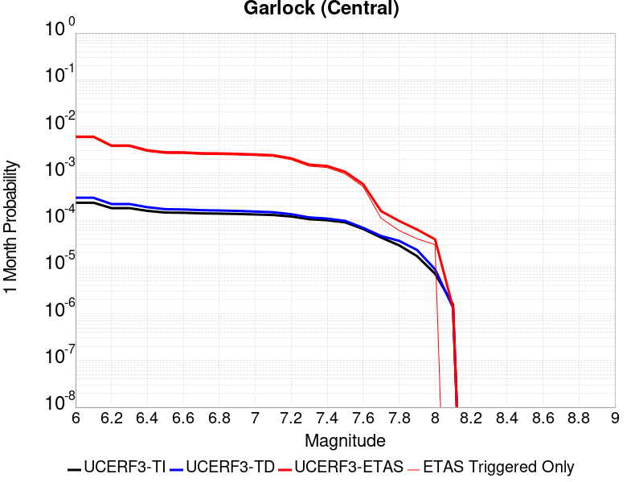 | 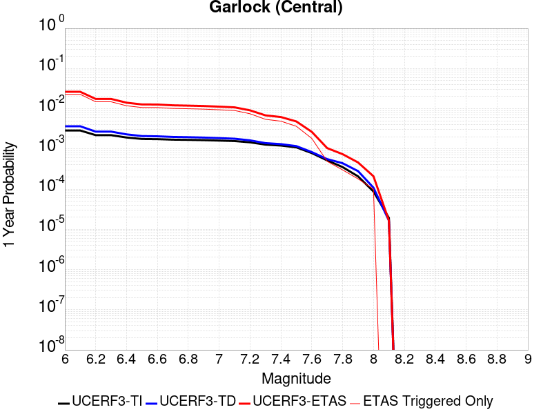 | 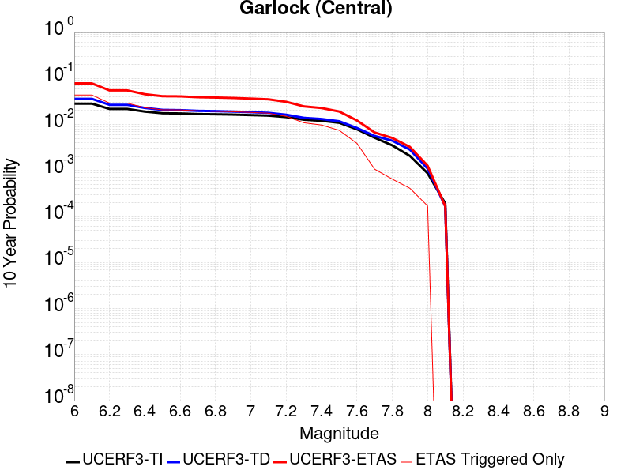 |

| Magnitude | 1 wk TI Prob | 1 wk TD Prob | 1 wk ETAS Prob | 1 wk ETAS/TD Gain | 1 wk ETAS Triggered Only | 1 mo TI Prob | 1 mo TD Prob | 1 mo ETAS Prob | 1 mo ETAS/TD Gain | 1 mo ETAS Triggered Only | 1 yr TI Prob | 1 yr TD Prob | 1 yr ETAS Prob | 1 yr ETAS/TD Gain | 1 yr ETAS Triggered Only | 10 yr TI Prob | 10 yr TD Prob | 10 yr ETAS Prob | 10 yr ETAS/TD Gain | 10 yr ETAS Triggered Only |
|-----|-----|-----|-----|-----|-----|-----|-----|-----|-----|-----|-----|-----|-----|-----|-----|-----|-----|-----|-----|-----|
| 6.0 | 5.5131142E-5 | 7.0271424E-5 | 0.0018901435 | 26.897755 | 0.00182 | 2.3625491E-4 | 3.0112884E-4 | 0.0060993824 | 20.255058 | 0.0058 | 0.0028726095 | 0.0036601445 | 0.026356766 | 7.201018 | 0.02278 | 0.028357591 | 0.03610883 | 0.078288704 | 2.1681318 | 0.04376 |
| 6.1 | 5.5131142E-5 | 7.0271424E-5 | 0.0018901435 | 26.897755 | 0.00182 | 2.3625491E-4 | 3.0112884E-4 | 0.0060993824 | 20.255058 | 0.0058 | 0.0028726095 | 0.0036601445 | 0.026356766 | 7.201018 | 0.02278 | 0.028357591 | 0.03610883 | 0.078288704 | 2.1681318 | 0.04376 |
| 6.2 | 4.216245E-5 | 5.1684234E-5 | 0.0012616217 | 24.410185 | 0.00121 | 1.806837E-4 | 2.2148523E-4 | 0.0039306637 | 17.746843 | 0.00371 | 0.0021976046 | 0.0026932796 | 0.017523231 | 6.50628 | 0.01487 | 0.021759989 | 0.026699346 | 0.05504186 | 2.0615435 | 0.02912 |
| 6.3 | 4.216245E-5 | 5.1684234E-5 | 0.0012616217 | 24.410185 | 0.00121 | 1.806837E-4 | 2.2148523E-4 | 0.0039306637 | 17.746843 | 0.00371 | 0.0021976046 | 0.0026932796 | 0.017523231 | 6.50628 | 0.01487 | 0.021759989 | 0.026699346 | 0.05504186 | 2.0615435 | 0.02912 |
| 6.4 | 3.6858168E-5 | 4.4131644E-5 | 0.0010140889 | 22.978724 | 9.7E-4 | 1.5795401E-4 | 1.8912205E-4 | 0.0031185679 | 16.489712 | 0.00293 | 0.0019213937 | 0.0023001547 | 0.014122898 | 6.1399775 | 0.01185 | 0.019048655 | 0.022866493 | 0.045487132 | 1.9892484 | 0.02315 |
| 6.5 | 3.39199E-5 | 4.0038954E-5 | 8.800053E-4 | 21.978727 | 8.4E-4 | 1.453629E-4 | 1.7158437E-4 | 0.0028211297 | 16.441648 | 0.00265 | 0.0017683565 | 0.00208706 | 0.012774708 | 6.120911 | 0.01071 | 0.017543508 | 0.020775849 | 0.0411535 | 1.9808338 | 0.02081 |
| 6.6 | 3.3571985E-5 | 3.9493098E-5 | 8.794599E-4 | 22.268698 | 8.4E-4 | 1.4387199E-4 | 1.6924528E-4 | 0.0028087986 | 16.596022 | 0.00264 | 0.0017502342 | 0.0020586357 | 0.012716649 | 6.177222 | 0.01068 | 0.017365133 | 0.02049695 | 0.04083143 | 1.9920737 | 0.02076 |
| 6.7 | 3.2580007E-5 | 3.8109458E-5 | 8.3807897E-4 | 21.991365 | 8.0E-4 | 1.3962112E-4 | 1.6331614E-4 | 0.002692903 | 16.488897 | 0.00253 | 0.0016985617 | 0.001986582 | 0.012146358 | 6.114199 | 0.01018 | 0.016856372 | 0.019786576 | 0.03915559 | 1.9788969 | 0.01976 |
| 6.8 | 3.2185937E-5 | 3.7536578E-5 | 8.3750655E-4 | 22.311745 | 8.0E-4 | 1.3793244E-4 | 1.6086125E-4 | 0.0026704576 | 16.601 | 0.00251 | 0.0016780337 | 0.0019567478 | 0.0119272 | 6.09542 | 0.00999 | 0.016654192 | 0.019493341 | 0.038505364 | 1.9753087 | 0.01939 |
| 6.9 | 3.165394E-5 | 3.6741036E-5 | 8.167124E-4 | 22.22889 | 7.8E-4 | 1.3565269E-4 | 1.5745219E-4 | 0.0026170649 | 16.62133 | 0.00246 | 0.0016503202 | 0.0019153163 | 0.011666603 | 6.091215 | 0.00977 | 0.01638118 | 0.019086242 | 0.037674557 | 1.9739118 | 0.01895 |
| 7.0 | 3.0903822E-5 | 3.5646088E-5 | 7.756197E-4 | 21.758902 | 7.4E-4 | 1.3243823E-4 | 1.5276013E-4 | 0.0025423951 | 16.643053 | 0.00239 | 0.0016112428 | 0.0018582892 | 0.011260784 | 6.0597587 | 0.00942 | 0.015996104 | 0.01852385 | 0.036484864 | 1.9696156 | 0.0183 |
| 7.1 | 3.0069863E-5 | 3.4412176E-5 | 7.643871E-4 | 22.212692 | 7.3E-4 | 1.2886449E-4 | 1.4747253E-4 | 0.0024471334 | 16.593824 | 0.0023 | 0.0015677959 | 0.0017940205 | 0.0108178025 | 6.0299215 | 0.00904 | 0.01556781 | 0.017891437 | 0.03518637 | 1.9666597 | 0.01761 |
| 7.2 | 2.7957109E-5 | 3.1300966E-5 | 6.612812E-4 | 21.126543 | 6.3E-4 | 1.1981068E-4 | 1.3414022E-4 | 0.0020938774 | 15.609616 | 0.00196 | 0.0014577188 | 0.0016319532 | 0.009119714 | 5.58822 | 0.0075 | 0.014481937 | 0.016294453 | 0.031040201 | 1.9049549 | 0.01499 |
| 7.3 | 2.4519275E-5 | 2.6732969E-5 | 4.6672122E-4 | 17.458637 | 4.4E-4 | 1.0507837E-4 | 1.14564915E-4 | 0.0015344023 | 13.3933 | 0.00142 | 0.0012785783 | 0.0013939501 | 0.006836353 | 4.9043026 | 0.00545 | 0.012712469 | 0.013937883 | 0.02468596 | 1.7711413 | 0.0109 |
| 7.4 | 2.3225532E-5 | 2.5217167E-5 | 4.2520708E-4 | 16.86181 | 4.0E-4 | 9.95342E-5 | 1.0806918E-4 | 0.0014379255 | 13.305602 | 0.00133 | 0.0012111551 | 0.0013149625 | 0.006208519 | 4.721442 | 0.0049 | 0.012045753 | 0.013155304 | 0.022757303 | 1.7298956 | 0.00973 |
| 7.5 | 2.097765E-5 | 2.2500466E-5 | 3.1249394E-4 | 13.888331 | 2.9E-4 | 8.9901114E-5 | 9.642707E-5 | 0.0010763325 | 11.162141 | 9.8E-4 | 0.0010939965 | 0.0011733791 | 0.0048290845 | 4.115536 | 0.00366 | 0.010886264 | 0.011749807 | 0.01911227 | 1.626603 | 0.00745 |
| 7.6 | 1.511254E-5 | 1.6006861E-5 | 1.8600414E-4 | 11.6202755 | 1.7E-4 | 6.476642E-5 | 6.8599074E-5 | 5.885634E-4 | 8.579757 | 5.2E-4 | 7.882459E-4 | 8.3488156E-4 | 0.0026633537 | 3.1900978 | 0.00183 | 0.007854558 | 0.008392387 | 0.0122596575 | 1.4608068 | 0.0039 |
| 7.7 | 9.934069E-6 | 1.0693293E-5 | 5.0692866E-5 | 4.7406225 | 4.0E-5 | 4.2573887E-5 | 4.5827597E-5 | 1.5582255E-4 | 3.4001904 | 1.1E-4 | 5.182138E-4 | 5.5780855E-4 | 0.0010475352 | 1.8779476 | 4.9E-4 | 0.00517007 | 0.005635492 | 0.006699462 | 1.1887981 | 0.00107 |
| 7.8 | 6.7562896E-6 | 8.440426E-6 | 2.8440258E-5 | 3.3695285 | 2.0E-5 | 2.8955206E-5 | 3.6172754E-5 | 9.617059E-5 | 2.6586468 | 6.0E-5 | 3.5247262E-4 | 4.4031447E-4 | 7.4018235E-4 | 1.6810312 | 3.0E-4 | 0.0035191406 | 0.004453119 | 0.0051002246 | 1.145315 | 6.5E-4 |
| 7.9 | 3.975453E-6 | 5.378374E-6 | 1.537832E-5 | 2.859288 | 1.0E-5 | 1.7037546E-5 | 2.3049972E-5 | 6.304905E-5 | 2.73532 | 4.0E-5 | 2.0741238E-4 | 2.8059736E-4 | 4.6054684E-4 | 1.6413085 | 1.8E-4 | 0.002072189 | 0.0028377224 | 0.003246559 | 1.144072 | 4.1E-4 |
| 8.0 | 1.6729537E-6 | 2.080019E-6 | 1.2079999E-5 | 5.807638 | 1.0E-5 | 7.169782E-6 | 8.914337E-6 | 3.891407E-5 | 4.3653355 | 3.0E-5 | 8.7288594E-5 | 1.08526685E-4 | 2.0851583E-4 | 1.9213324 | 1.0E-4 | 8.7254314E-4 | 0.0010985459 | 0.0012683591 | 1.15458 | 1.7E-4 |
| 8.1 | 3.6733252E-7 | 3.1523513E-7 | 3.1523513E-7 | 1.0 | 0.0 | 1.5742813E-6 | 1.3510071E-6 | 1.3510071E-6 | 1.0 | 0.0 | 1.9166706E-5 | 1.6448403E-5 | 1.6448403E-5 | 1.0 | 0.0 | 1.9165053E-4 | 1.6662726E-4 | 1.6662726E-4 | 1.0 | 0.0 |

## Tank Canyon
*[(top)](#table-of-contents)*

| 1 Week | 1 Month | 1 Year | 10 Year |
|-----|-----|-----|-----|
|  | 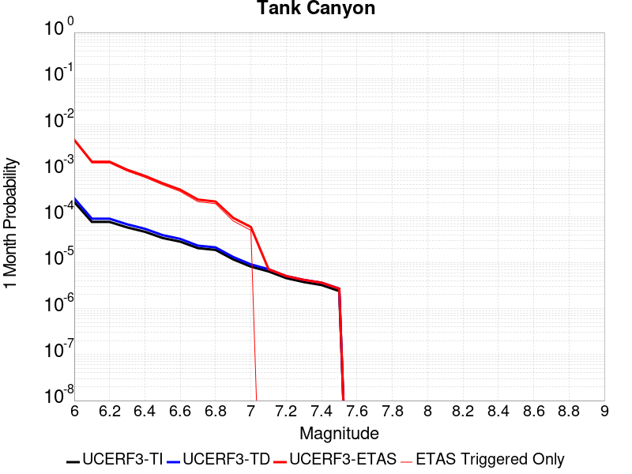 |  |  |

| Magnitude | 1 wk TI Prob | 1 wk TD Prob | 1 wk ETAS Prob | 1 wk ETAS/TD Gain | 1 wk ETAS Triggered Only | 1 mo TI Prob | 1 mo TD Prob | 1 mo ETAS Prob | 1 mo ETAS/TD Gain | 1 mo ETAS Triggered Only | 1 yr TI Prob | 1 yr TD Prob | 1 yr ETAS Prob | 1 yr ETAS/TD Gain | 1 yr ETAS Triggered Only | 10 yr TI Prob | 10 yr TD Prob | 10 yr ETAS Prob | 10 yr ETAS/TD Gain | 10 yr ETAS Triggered Only |
|-----|-----|-----|-----|-----|-----|-----|-----|-----|-----|-----|-----|-----|-----|-----|-----|-----|-----|-----|-----|-----|
| 6.0 | 4.8284557E-5 | 5.797054E-5 | 0.0012079038 | 20.836512 | 0.00115 | 2.0691741E-4 | 2.4842535E-4 | 0.0046473322 | 18.707157 | 0.0044 | 0.0025163088 | 0.003021048 | 0.0213854 | 7.078802 | 0.01842 | 0.02488006 | 0.02986708 | 0.06680974 | 2.2369025 | 0.03808 |
| 6.1 | 1.7796336E-5 | 2.0875163E-5 | 4.10867E-4 | 19.682098 | 3.9E-4 | 7.626778E-5 | 8.946213E-5 | 0.0015493315 | 17.318295 | 0.00146 | 9.281647E-4 | 0.0010886953 | 0.0077514336 | 7.1199293 | 0.00667 | 0.009242975 | 0.010837966 | 0.024804933 | 2.2887075 | 0.01412 |
| 6.2 | 1.7796336E-5 | 2.0875163E-5 | 4.10867E-4 | 19.682098 | 3.9E-4 | 7.626778E-5 | 8.946213E-5 | 0.0015493315 | 17.318295 | 0.00146 | 9.281647E-4 | 0.0010886953 | 0.0077514336 | 7.1199293 | 0.00667 | 0.009242975 | 0.010837966 | 0.024804933 | 2.2887075 | 0.01412 |
| 6.3 | 1.3515912E-5 | 1.5760907E-5 | 2.3575744E-4 | 14.958367 | 2.2E-4 | 5.792405E-5 | 6.754513E-5 | 0.0010374796 | 15.359798 | 9.7E-4 | 7.049971E-4 | 8.220753E-4 | 0.0054882364 | 6.676075 | 0.00467 | 0.007027647 | 0.00819321 | 0.01840882 | 2.2468386 | 0.0103 |
| 6.4 | 1.0870146E-5 | 1.2619056E-5 | 1.7261703E-4 | 13.679077 | 1.6E-4 | 4.658551E-5 | 5.4080647E-5 | 7.6404226E-4 | 14.1278305 | 7.1E-4 | 5.67031E-4 | 6.582507E-4 | 0.0040660063 | 6.176987 | 0.00341 | 0.005655863 | 0.0065652747 | 0.014155116 | 2.1560585 | 0.00764 |
| 6.5 | 7.964826E-6 | 9.196807E-6 | 1.1919579E-4 | 12.960564 | 1.1E-4 | 3.4134522E-5 | 3.941435E-5 | 5.29395E-4 | 13.431531 | 4.9E-4 | 4.1550855E-4 | 4.7977458E-4 | 0.0027087047 | 5.6457863 | 0.00223 | 0.0041473247 | 0.004788939 | 0.009824707 | 2.0515416 | 0.00506 |
| 6.6 | 6.6317E-6 | 7.6128526E-6 | 8.761224E-5 | 11.508465 | 8.0E-5 | 2.8421264E-5 | 3.2626154E-5 | 3.8261473E-4 | 11.72724 | 3.5E-4 | 3.4597394E-4 | 3.971601E-4 | 0.0019965246 | 5.0270023 | 0.0016 | 0.0034543579 | 0.003965905 | 0.0075815087 | 1.9116718 | 0.00363 |
| 6.7 | 4.793663E-6 | 5.431129E-6 | 5.5430857E-5 | 10.206139 | 5.0E-5 | 2.0544108E-5 | 2.3276085E-5 | 2.332712E-4 | 10.021926 | 2.1E-4 | 2.500958E-4 | 2.8335385E-4 | 0.0011631045 | 4.1047773 | 8.8E-4 | 0.0024981452 | 0.0028308667 | 0.0048750634 | 1.7221098 | 0.00205 |
| 6.8 | 4.382823E-6 | 4.96956E-6 | 4.496936E-5 | 9.048963 | 4.0E-5 | 1.8783392E-5 | 2.1297965E-5 | 2.1129391E-4 | 9.92085 | 1.9E-4 | 2.286638E-4 | 2.5927613E-4 | 0.0010690661 | 4.1232724 | 8.1E-4 | 0.0022842865 | 0.0025906577 | 0.004445839 | 1.7161044 | 0.00186 |
| 6.9 | 2.729601E-6 | 3.073687E-6 | 2.3073626E-5 | 7.506824 | 2.0E-5 | 1.1698237E-5 | 1.3172884E-5 | 9.317183E-5 | 7.073002 | 8.0E-5 | 1.4241673E-4 | 1.6036928E-4 | 5.6030514E-4 | 3.4938433 | 4.0E-4 | 0.001423255 | 0.0016027665 | 0.002451404 | 1.5294831 | 8.5E-4 |
| 7.0 | 1.8987357E-6 | 2.1270264E-6 | 1.2127005E-5 | 5.7013893 | 1.0E-5 | 8.137413E-6 | 9.1158E-6 | 5.9115344E-5 | 6.4849324 | 5.0E-5 | 9.90685E-5 | 1.10979905E-4 | 3.009588E-4 | 2.7118316 | 1.9E-4 | 9.902435E-4 | 0.0011093135 | 0.0015188587 | 1.369188 | 4.1E-4 |
| 7.1 | 1.4928986E-6 | 1.66419E-6 | 1.66419E-6 | 1.0 | 0.0 | 6.398121E-6 | 7.1322265E-6 | 7.1322265E-6 | 1.0 | 0.0 | 7.789434E-5 | 8.683199E-5 | 1.7682418E-4 | 2.0363944 | 9.0E-5 | 7.786704E-4 | 8.680385E-4 | 0.0011178214 | 1.2877556 | 2.5E-4 |
| 7.2 | 1.069082E-6 | 1.1829021E-6 | 1.1829021E-6 | 1.0 | 0.0 | 4.581772E-6 | 5.069574E-6 | 5.069574E-6 | 1.0 | 0.0 | 5.5781646E-5 | 6.172085E-5 | 1.21717145E-4 | 1.9720589 | 6.0E-5 | 5.576765E-4 | 6.1708933E-4 | 7.4700906E-4 | 1.2105365 | 1.3E-4 |
| 7.3 | 8.776551E-7 | 9.770343E-7 | 9.770343E-7 | 1.0 | 0.0 | 3.7613736E-6 | 4.1872863E-6 | 4.1872863E-6 | 1.0 | 0.0 | 4.579376E-5 | 5.097954E-5 | 1.0097699E-4 | 1.9807357 | 5.0E-5 | 4.5784327E-4 | 5.0972943E-4 | 5.996836E-4 | 1.1764742 | 9.0E-5 |
| 7.4 | 7.55721E-7 | 8.5105546E-7 | 8.5105546E-7 | 1.0 | 0.0 | 3.2388E-6 | 3.6473784E-6 | 3.6473784E-6 | 1.0 | 0.0 | 3.9431678E-5 | 4.4406446E-5 | 9.4404226E-5 | 2.1259127 | 5.0E-5 | 3.942468E-4 | 4.4402658E-4 | 5.2399107E-4 | 1.1800894 | 8.0E-5 |
| 7.5 | 5.587665E-7 | 6.3058303E-7 | 6.3058303E-7 | 1.0 | 0.0 | 2.3947114E-6 | 2.7024987E-6 | 2.7024987E-6 | 1.0 | 0.0 | 2.915522E-5 | 3.290292E-5 | 7.29016E-5 | 2.2156575 | 4.0E-5 | 2.9151395E-4 | 3.2902922E-4 | 3.9900618E-4 | 1.2126771 | 7.0E-5 |

## Little Lake
*[(top)](#table-of-contents)*

| 1 Week | 1 Month | 1 Year | 10 Year |
|-----|-----|-----|-----|
|  |  |  |  |

| Magnitude | 1 wk TI Prob | 1 wk TD Prob | 1 wk ETAS Prob | 1 wk ETAS/TD Gain | 1 wk ETAS Triggered Only | 1 mo TI Prob | 1 mo TD Prob | 1 mo ETAS Prob | 1 mo ETAS/TD Gain | 1 mo ETAS Triggered Only | 1 yr TI Prob | 1 yr TD Prob | 1 yr ETAS Prob | 1 yr ETAS/TD Gain | 1 yr ETAS Triggered Only | 10 yr TI Prob | 10 yr TD Prob | 10 yr ETAS Prob | 10 yr ETAS/TD Gain | 10 yr ETAS Triggered Only |
|-----|-----|-----|-----|-----|-----|-----|-----|-----|-----|-----|-----|-----|-----|-----|-----|-----|-----|-----|-----|-----|
| 6.0 | 2.8424427E-5 | 3.1207474E-5 | 8.411822E-4 | 26.954512 | 8.1E-4 | 1.2181328E-4 | 1.337402E-4 | 0.0029433644 | 22.008074 | 0.00281 | 0.0014820677 | 0.001627204 | 0.012709142 | 7.810417 | 0.0111 | 0.014722223 | 0.016166301 | 0.03717115 | 2.2992983 | 0.02135 |
| 6.1 | 2.8424427E-5 | 3.1207474E-5 | 8.411822E-4 | 26.954512 | 8.1E-4 | 1.2181328E-4 | 1.337402E-4 | 0.0029433644 | 22.008074 | 0.00281 | 0.0014820677 | 0.001627204 | 0.012709142 | 7.810417 | 0.0111 | 0.014722223 | 0.016166301 | 0.03717115 | 2.2992983 | 0.02135 |
| 6.2 | 2.8424427E-5 | 3.1207474E-5 | 8.411822E-4 | 26.954512 | 8.1E-4 | 1.2181328E-4 | 1.337402E-4 | 0.0029433644 | 22.008074 | 0.00281 | 0.0014820677 | 0.001627204 | 0.012709142 | 7.810417 | 0.0111 | 0.014722223 | 0.016166301 | 0.03717115 | 2.2992983 | 0.02135 |
| 6.3 | 1.48860645E-5 | 1.60822E-5 | 4.6607497E-4 | 28.980795 | 4.5E-4 | 6.379586E-5 | 6.8922054E-5 | 0.0016888104 | 24.503193 | 0.00162 | 7.7643775E-4 | 8.388312E-4 | 0.0074932445 | 8.932959 | 0.00666 | 0.007737305 | 0.008359468 | 0.020804556 | 2.4887416 | 0.01255 |
| 6.4 | 1.48860645E-5 | 1.60822E-5 | 4.6607497E-4 | 28.980795 | 4.5E-4 | 6.379586E-5 | 6.8922054E-5 | 0.0016888104 | 24.503193 | 0.00162 | 7.7643775E-4 | 8.388312E-4 | 0.0074932445 | 8.932959 | 0.00666 | 0.007737305 | 0.008359468 | 0.020804556 | 2.4887416 | 0.01255 |
| 6.5 | 1.2797581E-5 | 1.3766243E-5 | 3.5376157E-4 | 25.697758 | 3.4E-4 | 5.4845623E-5 | 5.8996993E-5 | 0.001498912 | 25.406584 | 0.00144 | 6.675408E-4 | 7.1807735E-4 | 0.0069236183 | 9.641883 | 0.00621 | 0.006655392 | 0.007160121 | 0.018746562 | 2.6181908 | 0.01167 |
| 6.6 | 9.661896E-6 | 1.0289515E-5 | 3.102864E-4 | 30.155594 | 3.0E-4 | 4.1407468E-5 | 4.4097265E-5 | 0.0012940421 | 29.345179 | 0.00125 | 5.040193E-4 | 5.367682E-4 | 0.005823929 | 10.849988 | 0.00529 | 0.005028777 | 0.005356322 | 0.015233134 | 2.843954 | 0.00993 |
| 6.7 | 7.767871E-6 | 8.200049E-6 | 2.7819784E-4 | 33.92636 | 2.7E-4 | 3.329045E-5 | 3.514267E-5 | 0.0010851058 | 30.877155 | 0.00105 | 4.0523586E-4 | 4.2779176E-4 | 0.0050058323 | 11.701564 | 0.00458 | 0.004044977 | 0.0042710346 | 0.012764603 | 2.9886441 | 0.00853 |
| 6.8 | 6.4235196E-6 | 6.7360374E-6 | 2.4673442E-4 | 36.629013 | 2.4E-4 | 2.752908E-5 | 2.8868486E-5 | 9.0884307E-4 | 31.482187 | 8.8E-4 | 3.35115E-4 | 3.5142995E-4 | 0.0040501296 | 11.5247135 | 0.0037 | 0.003346101 | 0.0035100025 | 0.010246275 | 2.9191644 | 0.00676 |
| 6.9 | 3.1283696E-6 | 3.1122813E-6 | 1.2311191E-4 | 39.55681 | 1.2E-4 | 1.3407229E-5 | 1.3338288E-5 | 4.9333187E-4 | 36.986145 | 4.8E-4 | 1.6322079E-4 | 1.6238306E-4 | 0.0023020355 | 14.176574 | 0.00214 | 0.0016310095 | 0.0016227924 | 0.005526447 | 3.405517 | 0.00391 |
| 7.0 | 2.290603E-6 | 2.2287568E-6 | 8.222858E-5 | 36.89437 | 8.0E-5 | 9.816834E-6 | 9.551785E-6 | 2.9954902E-4 | 31.360525 | 2.9E-4 | 1.19513395E-4 | 1.16287825E-4 | 0.0014461331 | 12.435809 | 0.00133 | 0.0011944914 | 0.0011623718 | 0.0036494776 | 3.1396816 | 0.00249 |
| 7.1 | 1.293693E-6 | 1.1777277E-6 | 4.1177682E-5 | 34.96367 | 4.0E-5 | 5.5443866E-6 | 5.0473986E-6 | 6.50471E-5 | 12.887252 | 6.0E-5 | 6.750081E-5 | 6.145104E-5 | 6.514148E-4 | 10.600549 | 5.9E-4 | 6.7480316E-4 | 6.14409E-4 | 0.0017437147 | 2.8380358 | 0.00113 |
| 7.2 | 4.715842E-7 | 3.0919745E-7 | 3.0919745E-7 | 1.0 | 0.0 | 2.0210737E-6 | 1.3251313E-6 | 1.3251313E-6 | 1.0 | 0.0 | 2.4606294E-5 | 1.613336E-5 | 2.6133197E-5 | 1.6198237 | 1.0E-5 | 2.460357E-4 | 1.6132242E-4 | 2.1131436E-4 | 1.3098884 | 5.0E-5 |
| 7.3 | 3.9430947E-7 | 2.3099179E-7 | 2.3099179E-7 | 1.0 | 0.0 | 1.6898966E-6 | 9.899644E-7 | 9.899644E-7 | 1.0 | 0.0 | 2.0574296E-5 | 1.2052751E-5 | 2.205263E-5 | 1.829676 | 1.0E-5 | 2.0572392E-4 | 1.2052105E-4 | 1.5051743E-4 | 1.2488892 | 3.0E-5 |
| 7.4 | 3.547123E-7 | 1.9680678E-7 | 1.9680678E-7 | 1.0 | 0.0 | 1.5201948E-6 | 8.434573E-7 | 8.434573E-7 | 1.0 | 0.0 | 1.8508214E-5 | 1.0269046E-5 | 2.0268943E-5 | 1.9737904 | 1.0E-5 | 1.8506673E-4 | 1.0268577E-4 | 1.3268269E-4 | 1.2921234 | 3.0E-5 |
| 7.5 | 2.6354266E-7 | 1.4424151E-7 | 1.4424151E-7 | 1.0 | 0.0 | 1.129468E-6 | 6.1817775E-7 | 6.1817775E-7 | 1.0 | 0.0 | 1.3751187E-5 | 7.5262888E-6 | 1.7526214E-5 | 2.3286662 | 1.0E-5 | 1.3750336E-4 | 7.526039E-5 | 1.05258136E-4 | 1.398586 | 3.0E-5 |
| 7.6 | 1.269913E-7 | 7.572964E-8 | 7.572964E-8 | 1.0 | 0.0 | 5.4424834E-7 | 3.2455554E-7 | 3.2455554E-7 | 1.0 | 0.0 | 6.6262032E-6 | 3.951457E-6 | 3.951457E-6 | 1.0 | 0.0 | 6.626006E-5 | 3.9513903E-5 | 5.9513113E-5 | 1.5061309 | 2.0E-5 |

## Owl Lake
*[(top)](#table-of-contents)*

| 1 Week | 1 Month | 1 Year | 10 Year |
|-----|-----|-----|-----|
|  |  |  | 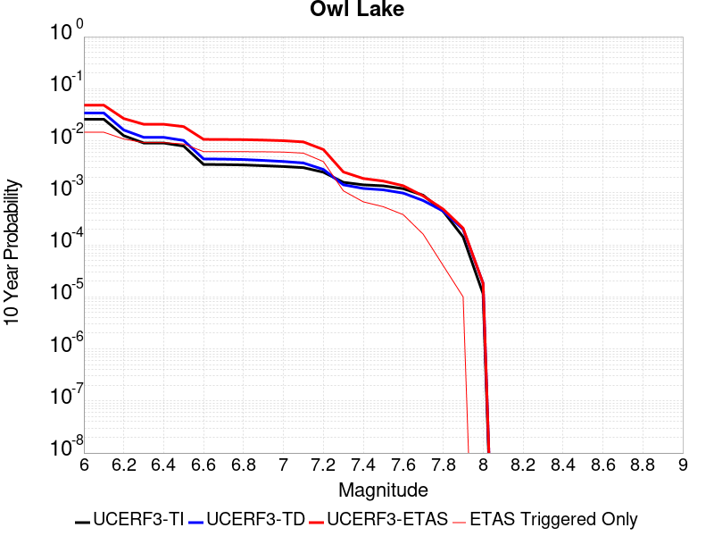 |

| Magnitude | 1 wk TI Prob | 1 wk TD Prob | 1 wk ETAS Prob | 1 wk ETAS/TD Gain | 1 wk ETAS Triggered Only | 1 mo TI Prob | 1 mo TD Prob | 1 mo ETAS Prob | 1 mo ETAS/TD Gain | 1 mo ETAS Triggered Only | 1 yr TI Prob | 1 yr TD Prob | 1 yr ETAS Prob | 1 yr ETAS/TD Gain | 1 yr ETAS Triggered Only | 10 yr TI Prob | 10 yr TD Prob | 10 yr ETAS Prob | 10 yr ETAS/TD Gain | 10 yr ETAS Triggered Only |
|-----|-----|-----|-----|-----|-----|-----|-----|-----|-----|-----|-----|-----|-----|-----|-----|-----|-----|-----|-----|-----|
| 6.0 | 5.0320643E-5 | 6.637038E-5 | 5.563379E-4 | 8.382321 | 4.9E-4 | 2.1564208E-4 | 2.8441957E-4 | 0.0017639986 | 6.2021 | 0.00148 | 0.0026222812 | 0.0034582033 | 0.01042403 | 3.0142908 | 0.00699 | 0.02591553 | 0.034148198 | 0.048220657 | 1.4120997 | 0.01457 |
| 6.1 | 5.0320643E-5 | 6.637038E-5 | 5.563379E-4 | 8.382321 | 4.9E-4 | 2.1564208E-4 | 2.8441957E-4 | 0.0017639986 | 6.2021 | 0.00148 | 0.0026222812 | 0.0034582033 | 0.01042403 | 3.0142908 | 0.00699 | 0.02591553 | 0.034148198 | 0.048220657 | 1.4120997 | 0.01457 |
| 6.2 | 2.4125871E-5 | 3.09871E-5 | 3.6097688E-4 | 11.649263 | 3.3E-4 | 1.0339249E-4 | 1.3279608E-4 | 0.00123265 | 9.282277 | 0.0011 | 0.0012580766 | 0.0016157634 | 0.0067374744 | 4.16984 | 0.00513 | 0.012509781 | 0.016074665 | 0.02670106 | 1.6610647 | 0.0108 |
| 6.3 | 1.7433485E-5 | 2.2360797E-5 | 3.123543E-4 | 13.968837 | 2.9E-4 | 7.471279E-5 | 9.582917E-5 | 0.0010757353 | 11.225551 | 9.8E-4 | 9.0924866E-4 | 0.0011662331 | 0.0055511133 | 4.759866 | 0.00439 | 0.009055373 | 0.011632415 | 0.02073528 | 1.7825431 | 0.00921 |
| 6.4 | 1.7433485E-5 | 2.2360797E-5 | 3.123543E-4 | 13.968837 | 2.9E-4 | 7.471279E-5 | 9.582917E-5 | 0.0010757353 | 11.225551 | 9.8E-4 | 9.0924866E-4 | 0.0011662331 | 0.0055511133 | 4.759866 | 0.00439 | 0.009055373 | 0.011632415 | 0.02073528 | 1.7825431 | 0.00921 |
| 6.5 | 1.5182742E-5 | 1.9434077E-5 | 2.9942865E-4 | 15.407402 | 2.8E-4 | 6.506727E-5 | 8.328693E-5 | 0.0010032103 | 12.045232 | 9.2E-4 | 7.919061E-4 | 0.0010136823 | 0.0051394957 | 5.0701246 | 0.00413 | 0.0078909 | 0.010121727 | 0.018703973 | 1.8479031 | 0.00867 |
| 6.6 | 6.7271576E-6 | 8.550671E-6 | 2.1854887E-4 | 25.559265 | 2.1E-4 | 2.8830356E-5 | 3.664525E-5 | 7.666185E-4 | 20.919996 | 7.3E-4 | 3.5095305E-4 | 4.4607025E-4 | 0.0035047054 | 7.856846 | 0.00306 | 0.0035039932 | 0.0044702506 | 0.010622624 | 2.3762927 | 0.00618 |
| 6.7 | 6.682835E-6 | 8.48311E-6 | 2.1848133E-4 | 25.754864 | 2.1E-4 | 2.8640408E-5 | 3.635571E-5 | 7.663292E-4 | 21.078648 | 7.3E-4 | 3.4864116E-4 | 4.4254653E-4 | 0.0035011924 | 7.911467 | 0.00306 | 0.003480947 | 0.0044352226 | 0.0105778575 | 2.3849664 | 0.00617 |
| 6.8 | 6.5774975E-6 | 8.32956E-6 | 2.1832781E-4 | 26.211205 | 2.1E-4 | 2.8188972E-5 | 3.569766E-5 | 7.656716E-4 | 21.44879 | 7.3E-4 | 3.4314668E-4 | 4.3453797E-4 | 0.0034932082 | 8.038902 | 0.00306 | 0.0034261728 | 0.0043553766 | 0.010498504 | 2.41047 | 0.00617 |
| 6.9 | 6.363419E-6 | 8.002683E-6 | 2.18001E-4 | 27.24099 | 2.1E-4 | 2.727151E-5 | 3.429679E-5 | 7.6427177E-4 | 22.28406 | 7.3E-4 | 3.3198006E-4 | 4.1748903E-4 | 0.0034662157 | 8.302531 | 0.00305 | 0.0033148455 | 0.0041853474 | 0.010299649 | 2.460883 | 0.00614 |
| 7.0 | 6.1342453E-6 | 7.634817E-6 | 2.1763322E-4 | 28.505362 | 2.1E-4 | 2.6289357E-5 | 3.272026E-5 | 7.626964E-4 | 23.309605 | 7.3E-4 | 3.2002592E-4 | 3.983019E-4 | 0.0034170991 | 8.579168 | 0.00302 | 0.0031956544 | 0.003994015 | 0.010029811 | 2.5112102 | 0.00606 |
| 7.1 | 5.842926E-6 | 7.1452696E-6 | 2.0714384E-4 | 28.990347 | 2.0E-4 | 2.504087E-5 | 3.0622254E-5 | 7.206011E-4 | 23.531942 | 6.9E-4 | 3.0482994E-4 | 3.727676E-4 | 0.0032317014 | 8.669481 | 0.00286 | 0.0030441214 | 0.0037395519 | 0.009497937 | 2.5398598 | 0.00578 |
| 7.2 | 4.77173E-6 | 5.3611675E-6 | 1.6536031E-4 | 30.844088 | 1.6E-4 | 2.045011E-5 | 2.2976252E-5 | 5.429643E-4 | 23.631544 | 5.2E-4 | 2.4895166E-4 | 2.7970402E-4 | 0.0021591783 | 7.719511 | 0.00188 | 0.0024867293 | 0.0028107075 | 0.006779521 | 2.4120336 | 0.00398 |
| 7.3 | 3.0494948E-6 | 2.712334E-6 | 2.271228E-5 | 8.373703 | 2.0E-5 | 1.3069198E-5 | 1.1624238E-5 | 1.1162308E-4 | 9.602614 | 1.0E-4 | 1.5910587E-4 | 1.4151607E-4 | 6.0145097E-4 | 4.2500544 | 4.6E-4 | 0.0015899199 | 0.0014246284 | 0.0025130755 | 1.7640218 | 0.00109 |
| 7.4 | 2.7263884E-6 | 2.307415E-6 | 1.2307391E-5 | 5.333844 | 1.0E-5 | 1.1684469E-5 | 9.888884E-6 | 5.988839E-5 | 6.0561323 | 5.0E-5 | 1.4224913E-4 | 1.20390614E-4 | 4.0035692E-4 | 3.3254826 | 2.8E-4 | 0.0014215811 | 0.0012125135 | 0.0018817012 | 1.5519011 | 6.7E-4 |
| 7.5 | 2.6090431E-6 | 2.1673172E-6 | 1.2167296E-5 | 5.6139894 | 1.0E-5 | 1.1181565E-5 | 9.288469E-6 | 4.9288097E-5 | 5.3063745 | 4.0E-5 | 1.3612706E-4 | 1.1308135E-4 | 3.530542E-4 | 3.122126 | 2.4E-4 | 0.001360437 | 0.0011392768 | 0.0016786616 | 1.4734449 | 5.4E-4 |
| 7.6 | 2.3008756E-6 | 1.8744257E-6 | 1.8744257E-6 | 1.0 | 0.0 | 9.860858E-6 | 8.033228E-6 | 2.8033068E-5 | 3.489639 | 2.0E-5 | 1.20049335E-4 | 9.780025E-5 | 2.5778462E-4 | 2.6358275 | 1.6E-4 | 0.001199845 | 9.862278E-4 | 0.001365853 | 1.3849266 | 3.8E-4 |
| 7.7 | 1.7184348E-6 | 1.3434202E-6 | 1.3434202E-6 | 1.0 | 0.0 | 7.3646997E-6 | 5.7575025E-6 | 2.5757387E-5 | 4.4737086 | 2.0E-5 | 8.966153E-5 | 7.0095375E-5 | 1.3009117E-4 | 1.8559165 | 6.0E-5 | 8.962536E-4 | 7.0897903E-4 | 8.6886564E-4 | 1.2255167 | 1.6E-4 |
| 7.8 | 8.4612907E-7 | 8.416933E-7 | 8.416933E-7 | 1.0 | 0.0 | 3.6262625E-6 | 3.6072522E-6 | 3.6072522E-6 | 1.0 | 0.0 | 4.4148852E-5 | 4.391743E-5 | 7.391611E-5 | 1.6830701 | 3.0E-5 | 4.414008E-4 | 4.4484966E-4 | 4.8483186E-4 | 1.089878 | 4.0E-5 |
| 7.9 | 2.716738E-7 | 3.773008E-7 | 3.773008E-7 | 1.0 | 0.0 | 1.1643157E-6 | 1.6170025E-6 | 1.6170025E-6 | 1.0 | 0.0 | 1.4175452E-5 | 1.9686839E-5 | 2.9686642E-5 | 1.5079436 | 1.0E-5 | 1.4174548E-4 | 1.9892666E-4 | 2.0892467E-4 | 1.0502598 | 1.0E-5 |
| 8.0 | 2.1995428E-8 | 3.3868776E-8 | 3.3868776E-8 | 1.0 | 0.0 | 9.426611E-8 | 1.4515189E-7 | 1.4515189E-7 | 1.0 | 0.0 | 1.1476893E-6 | 1.7672235E-6 | 1.7672235E-6 | 1.0 | 0.0 | 1.14768345E-5 | 1.8218208E-5 | 1.8218208E-5 | 1.0 | 0.0 |

## Airport Lake
*[(top)](#table-of-contents)*

| 1 Week | 1 Month | 1 Year | 10 Year |
|-----|-----|-----|-----|
|  |  | 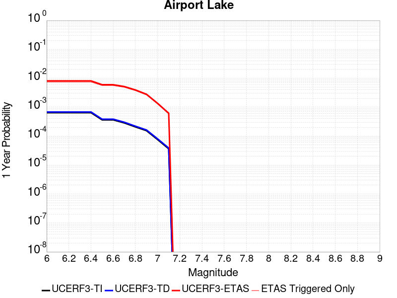 |  |

| Magnitude | 1 wk TI Prob | 1 wk TD Prob | 1 wk ETAS Prob | 1 wk ETAS/TD Gain | 1 wk ETAS Triggered Only | 1 mo TI Prob | 1 mo TD Prob | 1 mo ETAS Prob | 1 mo ETAS/TD Gain | 1 mo ETAS Triggered Only | 1 yr TI Prob | 1 yr TD Prob | 1 yr ETAS Prob | 1 yr ETAS/TD Gain | 1 yr ETAS Triggered Only | 10 yr TI Prob | 10 yr TD Prob | 10 yr ETAS Prob | 10 yr ETAS/TD Gain | 10 yr ETAS Triggered Only |
|-----|-----|-----|-----|-----|-----|-----|-----|-----|-----|-----|-----|-----|-----|-----|-----|-----|-----|-----|-----|-----|
| 6.0 | 1.2387061E-5 | 1.3103559E-5 | 5.330967E-4 | 40.683357 | 5.2E-4 | 5.3086325E-5 | 5.615706E-5 | 0.0019160527 | 34.11953 | 0.00186 | 6.461343E-4 | 6.8352616E-4 | 0.00811844 | 11.877294 | 0.00744 | 0.0064425888 | 0.006817048 | 0.02050311 | 3.007623 | 0.01378 |
| 6.1 | 1.2387061E-5 | 1.3103559E-5 | 5.330967E-4 | 40.683357 | 5.2E-4 | 5.3086325E-5 | 5.615706E-5 | 0.0019160527 | 34.11953 | 0.00186 | 6.461343E-4 | 6.8352616E-4 | 0.00811844 | 11.877294 | 0.00744 | 0.0064425888 | 0.006817048 | 0.02050311 | 3.007623 | 0.01378 |
| 6.2 | 1.2387061E-5 | 1.3103559E-5 | 5.330967E-4 | 40.683357 | 5.2E-4 | 5.3086325E-5 | 5.615706E-5 | 0.0019160527 | 34.11953 | 0.00186 | 6.461343E-4 | 6.8352616E-4 | 0.00811844 | 11.877294 | 0.00744 | 0.0064425888 | 0.006817048 | 0.02050311 | 3.007623 | 0.01378 |
| 6.3 | 1.2387061E-5 | 1.3103559E-5 | 5.330967E-4 | 40.683357 | 5.2E-4 | 5.3086325E-5 | 5.615706E-5 | 0.0019160527 | 34.11953 | 0.00186 | 6.461343E-4 | 6.8352616E-4 | 0.00811844 | 11.877294 | 0.00744 | 0.0064425888 | 0.006817048 | 0.02050311 | 3.007623 | 0.01378 |
| 6.4 | 1.2387061E-5 | 1.3103559E-5 | 5.330967E-4 | 40.683357 | 5.2E-4 | 5.3086325E-5 | 5.615706E-5 | 0.0019160527 | 34.11953 | 0.00186 | 6.461343E-4 | 6.8352616E-4 | 0.00811844 | 11.877294 | 0.00744 | 0.0064425888 | 0.006817048 | 0.02050311 | 3.007623 | 0.01378 |
| 6.5 | 6.9922594E-6 | 7.385145E-6 | 3.773824E-4 | 51.1002 | 3.7E-4 | 2.996648E-5 | 3.165027E-5 | 0.0013616082 | 43.02043 | 0.00133 | 3.6478083E-4 | 3.8527933E-4 | 0.005993118 | 15.555255 | 0.00561 | 0.003641826 | 0.003846651 | 0.014136915 | 3.675123 | 0.01033 |
| 6.6 | 6.9922594E-6 | 7.385145E-6 | 3.773824E-4 | 51.1002 | 3.7E-4 | 2.996648E-5 | 3.165027E-5 | 0.0013616082 | 43.02043 | 0.00133 | 3.6478083E-4 | 3.8527933E-4 | 0.005993118 | 15.555255 | 0.00561 | 0.003641826 | 0.003846651 | 0.014136915 | 3.675123 | 0.01033 |
| 6.7 | 5.477277E-6 | 5.7862417E-6 | 3.3578434E-4 | 58.03151 | 3.3E-4 | 2.3473833E-5 | 2.4797964E-5 | 0.0012047687 | 48.58337 | 0.00118 | 2.8575645E-4 | 3.0187727E-4 | 0.0051704072 | 17.127514 | 0.00487 | 0.0028538927 | 0.003015056 | 0.011908161 | 3.9495656 | 0.00892 |
| 6.8 | 3.9950432E-6 | 4.2192128E-6 | 2.8421803E-4 | 67.362816 | 2.8E-4 | 1.7121502E-5 | 1.808223E-5 | 9.1806595E-4 | 50.77172 | 9.0E-4 | 2.0843433E-4 | 2.2013167E-4 | 0.0039493106 | 17.940674 | 0.00373 | 0.0020823893 | 0.0021994072 | 0.008914605 | 4.0531855 | 0.00673 |
| 6.9 | 2.95695E-6 | 3.1231173E-6 | 2.0312249E-4 | 65.038376 | 2.0E-4 | 1.2672582E-5 | 1.33847325E-5 | 7.033755E-4 | 52.550583 | 6.9E-4 | 1.5427776E-4 | 1.629492E-4 | 0.0028025191 | 17.198729 | 0.00264 | 0.001541707 | 0.0016285196 | 0.0065604746 | 4.0284896 | 0.00494 |
| 7.0 | 1.456072E-6 | 1.5408596E-6 | 8.154073E-5 | 52.91899 | 8.0E-5 | 6.2402937E-6 | 6.603673E-6 | 2.8660183E-4 | 43.400368 | 2.8E-4 | 7.597293E-5 | 8.039776E-5 | 0.0013602949 | 16.919561 | 0.00128 | 7.594696E-4 | 8.0378563E-4 | 0.0031419047 | 3.908884 | 0.00234 |
| 7.1 | 6.995192E-7 | 7.409207E-7 | 4.074089E-5 | 54.986843 | 4.0E-5 | 2.997936E-6 | 3.1753743E-6 | 6.317518E-5 | 19.89535 | 6.0E-5 | 3.649926E-5 | 3.8660182E-5 | 6.186378E-4 | 16.001936 | 5.8E-4 | 3.6493264E-4 | 3.8660184E-4 | 0.001446192 | 3.7407792 | 0.00106 |

## Panamint Valley
*[(top)](#table-of-contents)*

| 1 Week | 1 Month | 1 Year | 10 Year |
|-----|-----|-----|-----|
|  |  |  |  |

| Magnitude | 1 wk TI Prob | 1 wk TD Prob | 1 wk ETAS Prob | 1 wk ETAS/TD Gain | 1 wk ETAS Triggered Only | 1 mo TI Prob | 1 mo TD Prob | 1 mo ETAS Prob | 1 mo ETAS/TD Gain | 1 mo ETAS Triggered Only | 1 yr TI Prob | 1 yr TD Prob | 1 yr ETAS Prob | 1 yr ETAS/TD Gain | 1 yr ETAS Triggered Only | 10 yr TI Prob | 10 yr TD Prob | 10 yr ETAS Prob | 10 yr ETAS/TD Gain | 10 yr ETAS Triggered Only |
|-----|-----|-----|-----|-----|-----|-----|-----|-----|-----|-----|-----|-----|-----|-----|-----|-----|-----|-----|-----|-----|
| 6.0 | 3.0211835E-5 | 3.3987795E-5 | 4.2397453E-4 | 12.474318 | 3.9E-4 | 1.2947287E-4 | 1.4565402E-4 | 0.0015954428 | 10.953649 | 0.00145 | 0.0015751923 | 0.0017719247 | 0.0073819663 | 4.1660724 | 0.00562 | 0.015640736 | 0.017584749 | 0.029304963 | 1.6664988 | 0.01193 |
| 6.1 | 3.0211835E-5 | 3.3987795E-5 | 4.2397453E-4 | 12.474318 | 3.9E-4 | 1.2947287E-4 | 1.4565402E-4 | 0.0015954428 | 10.953649 | 0.00145 | 0.0015751923 | 0.0017719247 | 0.0073819663 | 4.1660724 | 0.00562 | 0.015640736 | 0.017584749 | 0.029304963 | 1.6664988 | 0.01193 |
| 6.2 | 3.0211835E-5 | 3.3987795E-5 | 4.2397453E-4 | 12.474318 | 3.9E-4 | 1.2947287E-4 | 1.4565402E-4 | 0.0015954428 | 10.953649 | 0.00145 | 0.0015751923 | 0.0017719247 | 0.0073819663 | 4.1660724 | 0.00562 | 0.015640736 | 0.017584749 | 0.029304963 | 1.6664988 | 0.01193 |
| 6.3 | 2.8573924E-5 | 3.2105843E-5 | 4.2209332E-4 | 13.146932 | 3.9E-4 | 1.2245393E-4 | 1.3758938E-4 | 0.0015273981 | 11.101134 | 0.00139 | 0.001489857 | 0.0016738913 | 0.0069250865 | 4.1371183 | 0.00526 | 0.01479908 | 0.016619716 | 0.027653243 | 1.6638818 | 0.01122 |
| 6.4 | 2.8573924E-5 | 3.2105843E-5 | 4.2209332E-4 | 13.146932 | 3.9E-4 | 1.2245393E-4 | 1.3758938E-4 | 0.0015273981 | 11.101134 | 0.00139 | 0.001489857 | 0.0016738913 | 0.0069250865 | 4.1371183 | 0.00526 | 0.01479908 | 0.016619716 | 0.027653243 | 1.6638818 | 0.01122 |
| 6.5 | 2.7468774E-5 | 3.0831467E-5 | 4.1081975E-4 | 13.324691 | 3.8E-4 | 1.1771801E-4 | 1.321283E-4 | 0.0014919486 | 11.291665 | 0.00136 | 0.0014322745 | 0.0016075026 | 0.0066793365 | 4.155102 | 0.00508 | 0.014230782 | 0.015965527 | 0.026583258 | 1.6650411 | 0.01079 |
| 6.6 | 2.6135967E-5 | 2.9255378E-5 | 4.0924427E-4 | 13.988685 | 3.8E-4 | 1.1200648E-4 | 1.2537432E-4 | 0.0014852039 | 11.846157 | 0.00136 | 0.0013628257 | 0.0015253901 | 0.006407931 | 4.2008476 | 0.00489 | 0.013544982 | 0.015155784 | 0.025319377 | 1.6706082 | 0.01032 |
| 6.7 | 2.4498746E-5 | 2.7344215E-5 | 4.0733384E-4 | 14.896527 | 3.8E-4 | 1.04990395E-4 | 1.1718437E-4 | 0.0013770367 | 11.751028 | 0.00126 | 0.0012775084 | 0.001425811 | 0.0060492093 | 4.242645 | 0.00463 | 0.012701893 | 0.014173006 | 0.023765102 | 1.6767863 | 0.00973 |
| 6.8 | 2.2244329E-5 | 2.4938487E-5 | 3.849295E-4 | 15.435159 | 3.6E-4 | 9.532935E-5 | 1.0687498E-4 | 0.0013167456 | 12.32043 | 0.00121 | 0.0011600169 | 0.001300448 | 0.005624817 | 4.325292 | 0.00433 | 0.011539802 | 0.012934348 | 0.02181794 | 1.6868217 | 0.009 |
| 6.9 | 1.9902658E-5 | 2.229314E-5 | 3.5228577E-4 | 15.80243 | 3.3E-4 | 8.529431E-5 | 9.5538635E-5 | 0.0011754355 | 12.303247 | 0.00108 | 0.0010379635 | 0.0011625807 | 0.0050081047 | 4.3077483 | 0.00385 | 0.010331288 | 0.01157016 | 0.019418294 | 1.6783081 | 0.00794 |
| 7.0 | 1.8353881E-5 | 2.0568947E-5 | 3.4056237E-4 | 16.557112 | 3.2E-4 | 7.865712E-5 | 8.814975E-5 | 0.0011080599 | 12.570198 | 0.00102 | 9.5722964E-4 | 0.0010727125 | 0.004638883 | 4.324442 | 0.00357 | 0.009531168 | 0.010680287 | 0.017912215 | 1.6771286 | 0.00731 |
| 7.1 | 1.7667631E-5 | 1.9775267E-5 | 3.2976913E-4 | 16.675837 | 3.1E-4 | 7.571623E-5 | 8.474849E-5 | 0.0010546662 | 12.444661 | 9.7E-4 | 9.2145515E-4 | 0.0010313421 | 0.0044877734 | 4.3513923 | 0.00346 | 0.009176437 | 0.010270455 | 0.017297534 | 1.6842034 | 0.0071 |
| 7.2 | 1.6381597E-5 | 1.8160737E-5 | 2.681562E-4 | 14.76571 | 2.5E-4 | 7.020495E-5 | 7.782951E-5 | 8.977657E-4 | 11.535029 | 8.2E-4 | 8.544101E-4 | 9.471797E-4 | 0.003904376 | 4.122107 | 0.00296 | 0.008511325 | 0.009436136 | 0.01562716 | 1.6560974 | 0.00625 |
| 7.3 | 1.4520491E-5 | 1.5968153E-5 | 2.259648E-4 | 14.150967 | 2.1E-4 | 6.222919E-5 | 6.843323E-5 | 7.783846E-4 | 11.374366 | 7.1E-4 | 7.57377E-4 | 8.3287235E-4 | 0.0033108068 | 3.975167 | 0.00248 | 0.0075480095 | 0.0083006555 | 0.01349716 | 1.6260355 | 0.00524 |
| 7.4 | 1.2852287E-5 | 1.41469245E-5 | 2.141441E-4 | 15.137148 | 2.0E-4 | 5.5080065E-5 | 6.0628357E-5 | 7.4058713E-4 | 12.215194 | 6.8E-4 | 6.7039346E-4 | 7.379161E-4 | 0.0031361452 | 4.2500024 | 0.0024 | 0.0066837464 | 0.007357609 | 0.012360526 | 1.6799651 | 0.00504 |
| 7.5 | 1.1637851E-5 | 1.2838173E-5 | 2.0283573E-4 | 15.799424 | 1.9E-4 | 4.987555E-5 | 5.5019667E-5 | 7.249828E-4 | 13.176794 | 6.7E-4 | 6.070656E-4 | 6.6967425E-4 | 0.0030181005 | 4.506819 | 0.00235 | 0.006054099 | 0.006679489 | 0.011536825 | 1.7272019 | 0.00489 |
| 7.6 | 3.0068115E-6 | 3.333561E-6 | 1.133332E-4 | 33.99764 | 1.1E-4 | 1.2886271E-5 | 1.4286652E-5 | 3.542818E-4 | 24.798098 | 3.4E-4 | 1.5687906E-4 | 1.739334E-4 | 0.001233749 | 7.093227 | 0.00106 | 0.0015676835 | 0.0017394735 | 0.0038358206 | 2.2051618 | 0.0021 |

## Garlock (East)
*[(top)](#table-of-contents)*

| 1 Week | 1 Month | 1 Year | 10 Year |
|-----|-----|-----|-----|
|  |  |  |  |

| Magnitude | 1 wk TI Prob | 1 wk TD Prob | 1 wk ETAS Prob | 1 wk ETAS/TD Gain | 1 wk ETAS Triggered Only | 1 mo TI Prob | 1 mo TD Prob | 1 mo ETAS Prob | 1 mo ETAS/TD Gain | 1 mo ETAS Triggered Only | 1 yr TI Prob | 1 yr TD Prob | 1 yr ETAS Prob | 1 yr ETAS/TD Gain | 1 yr ETAS Triggered Only | 10 yr TI Prob | 10 yr TD Prob | 10 yr ETAS Prob | 10 yr ETAS/TD Gain | 10 yr ETAS Triggered Only |
|-----|-----|-----|-----|-----|-----|-----|-----|-----|-----|-----|-----|-----|-----|-----|-----|-----|-----|-----|-----|-----|
| 6.0 | 4.5092507E-5 | 6.291901E-5 | 4.0289763E-4 | 6.4034324 | 3.4E-4 | 1.9323928E-4 | 2.6962755E-4 | 0.0013193444 | 4.893211 | 0.00105 | 0.0023501497 | 0.0032782198 | 0.008122288 | 2.4776518 | 0.00486 | 0.023254504 | 0.032287683 | 0.04208093 | 1.3033122 | 0.01012 |
| 6.1 | 4.5092507E-5 | 6.291901E-5 | 4.0289763E-4 | 6.4034324 | 3.4E-4 | 1.9323928E-4 | 2.6962755E-4 | 0.0013193444 | 4.893211 | 0.00105 | 0.0023501497 | 0.0032782198 | 0.008122288 | 2.4776518 | 0.00486 | 0.023254504 | 0.032287683 | 0.04208093 | 1.3033122 | 0.01012 |
| 6.2 | 2.6674514E-5 | 3.4522156E-5 | 3.145125E-4 | 9.110454 | 2.8E-4 | 1.1431433E-4 | 1.4794388E-4 | 9.6782256E-4 | 6.541822 | 8.2E-4 | 0.0013908884 | 0.0017997618 | 0.005463157 | 3.0354888 | 0.00367 | 0.01382215 | 0.01787814 | 0.025086913 | 1.4032173 | 0.00734 |
| 6.3 | 2.6674514E-5 | 3.4522156E-5 | 3.145125E-4 | 9.110454 | 2.8E-4 | 1.1431433E-4 | 1.4794388E-4 | 9.6782256E-4 | 6.541822 | 8.2E-4 | 0.0013908884 | 0.0017997618 | 0.005463157 | 3.0354888 | 0.00367 | 0.01382215 | 0.01787814 | 0.025086913 | 1.4032173 | 0.00734 |
| 6.4 | 2.5312667E-5 | 3.2350978E-5 | 3.1234193E-4 | 9.654791 | 2.8E-4 | 1.0847834E-4 | 1.3863985E-4 | 9.385289E-4 | 6.769547 | 8.0E-4 | 0.0013199237 | 0.0016866627 | 0.005300557 | 3.14263 | 0.00362 | 0.013121112 | 0.016778192 | 0.023837723 | 1.4207565 | 0.00718 |
| 6.5 | 2.5312667E-5 | 3.2350978E-5 | 3.1234193E-4 | 9.654791 | 2.8E-4 | 1.0847834E-4 | 1.3863985E-4 | 9.385289E-4 | 6.769547 | 8.0E-4 | 0.0013199237 | 0.0016866627 | 0.005300557 | 3.14263 | 0.00362 | 0.013121112 | 0.016778192 | 0.023837723 | 1.4207565 | 0.00718 |
| 6.6 | 2.246556E-5 | 2.8145088E-5 | 2.981375E-4 | 10.592878 | 2.7E-4 | 9.627742E-5 | 1.20616365E-4 | 9.105211E-4 | 7.5489016 | 7.9E-4 | 0.0011715472 | 0.0014675385 | 0.0049024904 | 3.340621 | 0.00344 | 0.011653901 | 0.014618727 | 0.021230636 | 1.4522903 | 0.00671 |
| 6.7 | 2.2241198E-5 | 2.7814802E-5 | 2.978073E-4 | 10.706792 | 2.7E-4 | 9.531594E-5 | 1.1920098E-4 | 9.091068E-4 | 7.6266723 | 7.9E-4 | 0.0011598538 | 0.0014503293 | 0.0048653693 | 3.3546653 | 0.00342 | 0.011538187 | 0.014448618 | 0.021041956 | 1.4563301 | 0.00669 |
| 6.8 | 1.9528685E-5 | 2.3908464E-5 | 2.8390225E-4 | 11.87455 | 2.6E-4 | 8.369167E-5 | 1.0246093E-4 | 8.6238305E-4 | 8.416701 | 7.6E-4 | 0.0010184698 | 0.0012467676 | 0.004482728 | 3.59548 | 0.00324 | 0.010138147 | 0.012441509 | 0.018653253 | 1.4992757 | 0.00629 |
| 6.9 | 1.3318621E-5 | 1.5207378E-5 | 2.7520343E-4 | 18.096704 | 2.6E-4 | 5.7078556E-5 | 6.5172884E-5 | 7.951253E-4 | 12.200248 | 7.3E-4 | 6.9470983E-4 | 7.9319667E-4 | 0.0037408567 | 4.716178 | 0.00295 | 0.0069254204 | 0.007945063 | 0.013520411 | 1.7017375 | 0.00562 |
| 7.0 | 1.1760853E-5 | 1.3115919E-5 | 2.5311278E-4 | 19.298136 | 2.4E-4 | 5.0402683E-5 | 5.6209898E-5 | 7.2617223E-4 | 12.918939 | 6.7E-4 | 6.134799E-4 | 6.8414566E-4 | 0.0035022164 | 5.119109 | 0.00282 | 0.0061178906 | 0.006861606 | 0.012164965 | 1.7729034 | 0.00534 |
| 7.1 | 1.0064758E-5 | 1.09107295E-5 | 2.509081E-4 | 22.996456 | 2.4E-4 | 4.3133965E-5 | 4.675945E-5 | 7.167281E-4 | 15.327984 | 6.7E-4 | 5.2502943E-4 | 5.6915113E-4 | 0.0032576201 | 5.723647 | 0.00269 | 0.005237907 | 0.005717425 | 0.010738553 | 1.8782147 | 0.00505 |
| 7.2 | 9.768808E-6 | 1.0506538E-5 | 2.4050412E-4 | 22.890902 | 2.3E-4 | 4.186565E-5 | 4.5027264E-5 | 6.94998E-4 | 15.435049 | 6.5E-4 | 5.095951E-4 | 5.480725E-4 | 0.0031266585 | 5.7048264 | 0.00258 | 0.0050842804 | 0.0055075847 | 0.010390542 | 1.8865879 | 0.00491 |
| 7.3 | 9.344516E-6 | 9.952032E-6 | 2.1994994E-4 | 22.10101 | 2.1E-4 | 4.004731E-5 | 4.2650885E-5 | 6.7262404E-4 | 15.770458 | 6.3E-4 | 4.8746695E-4 | 5.191543E-4 | 0.0029179084 | 5.6205034 | 0.0024 | 0.0048639905 | 0.0052191834 | 0.009765332 | 1.871046 | 0.00457 |
| 7.4 | 9.023491E-6 | 9.498046E-6 | 1.9949624E-4 | 21.003923 | 1.9E-4 | 3.867153E-5 | 4.0705298E-5 | 6.406809E-4 | 15.739497 | 6.0E-4 | 4.7072413E-4 | 4.9547764E-4 | 0.0026044322 | 5.2564073 | 0.00211 | 0.004697283 | 0.0049825576 | 0.008952677 | 1.7968036 | 0.00399 |
| 7.5 | 7.081253E-6 | 7.0941337E-6 | 8.709357E-5 | 12.276843 | 8.0E-5 | 3.0347876E-5 | 3.040308E-5 | 2.9039517E-4 | 9.551505 | 2.6E-4 | 3.6942272E-4 | 3.7009537E-4 | 0.0012897549 | 3.4849257 | 9.2E-4 | 0.003688092 | 0.0037283404 | 0.005601331 | 1.5023658 | 0.00188 |
| 7.6 | 6.116396E-6 | 5.9653516E-6 | 3.596517E-5 | 6.0290112 | 3.0E-5 | 2.6212863E-5 | 2.5565543E-5 | 1.2556299E-4 | 4.9114146 | 1.0E-4 | 3.1909486E-4 | 3.112163E-4 | 7.110918E-4 | 2.2848797 | 4.0E-4 | 0.0031863707 | 0.0031395783 | 0.0041663446 | 1.3270395 | 0.00103 |
| 7.7 | 4.797145E-6 | 4.7631393E-6 | 1.4763092E-5 | 3.0994458 | 1.0E-5 | 2.055903E-5 | 2.0413294E-5 | 6.0412476E-5 | 2.9594674 | 4.0E-5 | 2.5027743E-4 | 2.4850364E-4 | 4.984415E-4 | 2.0057714 | 2.5E-4 | 0.0024999576 | 0.0025124259 | 0.003080994 | 1.2263024 | 5.7E-4 |
| 7.8 | 3.4028885E-6 | 3.9837723E-6 | 3.9837723E-6 | 1.0 | 0.0 | 1.4583726E-5 | 1.70732E-5 | 3.707286E-5 | 2.1714065 | 2.0E-5 | 1.775424E-4 | 2.0784645E-4 | 3.278215E-4 | 1.5772293 | 1.2E-4 | 0.0017740062 | 0.0021040265 | 0.0024233533 | 1.1517694 | 3.2E-4 |
| 7.9 | 2.5928412E-6 | 3.3769782E-6 | 3.3769782E-6 | 1.0 | 0.0 | 1.1112129E-5 | 1.4472684E-5 | 3.4472396E-5 | 2.3818936 | 2.0E-5 | 1.3528178E-4 | 1.7619075E-4 | 2.7617312E-4 | 1.5674667 | 1.0E-4 | 0.0013519945 | 0.0017837033 | 0.0020332574 | 1.1399078 | 2.5E-4 |
| 8.0 | 1.3743648E-6 | 1.6755052E-6 | 1.6755052E-6 | 1.0 | 0.0 | 5.8901214E-6 | 7.180717E-6 | 1.7180646E-5 | 2.3926086 | 1.0E-5 | 7.1709874E-5 | 8.742175E-5 | 1.474165E-4 | 1.6862681 | 6.0E-5 | 7.1686733E-4 | 8.849517E-4 | 0.0010148366 | 1.1467707 | 1.3E-4 |
| 8.1 | 3.6733252E-7 | 3.1523513E-7 | 3.1523513E-7 | 1.0 | 0.0 | 1.5742813E-6 | 1.3510071E-6 | 1.3510071E-6 | 1.0 | 0.0 | 1.9166706E-5 | 1.6448403E-5 | 1.6448403E-5 | 1.0 | 0.0 | 1.9165053E-4 | 1.6662726E-4 | 1.6662726E-4 | 1.0 | 0.0 |

## Ash Hill
*[(top)](#table-of-contents)*

| 1 Week | 1 Month | 1 Year | 10 Year |
|-----|-----|-----|-----|
|  |  |  |  |

| Magnitude | 1 wk TI Prob | 1 wk TD Prob | 1 wk ETAS Prob | 1 wk ETAS/TD Gain | 1 wk ETAS Triggered Only | 1 mo TI Prob | 1 mo TD Prob | 1 mo ETAS Prob | 1 mo ETAS/TD Gain | 1 mo ETAS Triggered Only | 1 yr TI Prob | 1 yr TD Prob | 1 yr ETAS Prob | 1 yr ETAS/TD Gain | 1 yr ETAS Triggered Only | 10 yr TI Prob | 10 yr TD Prob | 10 yr ETAS Prob | 10 yr ETAS/TD Gain | 10 yr ETAS Triggered Only |
|-----|-----|-----|-----|-----|-----|-----|-----|-----|-----|-----|-----|-----|-----|-----|-----|-----|-----|-----|-----|-----|
| 6.0 | 2.1545662E-5 | 2.3195389E-5 | 1.8319167E-4 | 7.897763 | 1.6E-4 | 9.2335285E-5 | 9.940547E-5 | 7.793379E-4 | 7.8399897 | 6.8E-4 | 0.0011236023 | 0.0012096697 | 0.0040861857 | 3.3779352 | 0.00288 | 0.011179381 | 0.012038835 | 0.017897446 | 1.4866426 | 0.00593 |
| 6.1 | 2.1545662E-5 | 2.3195389E-5 | 1.8319167E-4 | 7.897763 | 1.6E-4 | 9.2335285E-5 | 9.940547E-5 | 7.793379E-4 | 7.8399897 | 6.8E-4 | 0.0011236023 | 0.0012096697 | 0.0040861857 | 3.3779352 | 0.00288 | 0.011179381 | 0.012038835 | 0.017897446 | 1.4866426 | 0.00593 |
| 6.2 | 2.1545662E-5 | 2.3195389E-5 | 1.8319167E-4 | 7.897763 | 1.6E-4 | 9.2335285E-5 | 9.940547E-5 | 7.793379E-4 | 7.8399897 | 6.8E-4 | 0.0011236023 | 0.0012096697 | 0.0040861857 | 3.3779352 | 0.00288 | 0.011179381 | 0.012038835 | 0.017897446 | 1.4866426 | 0.00593 |
| 6.3 | 1.0025529E-5 | 1.0747344E-5 | 5.0746916E-5 | 4.7218094 | 4.0E-5 | 4.2965847E-5 | 4.605931E-5 | 2.960478E-4 | 6.427534 | 2.5E-4 | 5.229836E-4 | 5.6064106E-4 | 0.0017399795 | 3.1035535 | 0.00118 | 0.005217545 | 0.0055935793 | 0.007970211 | 1.4248856 | 0.00239 |
| 6.4 | 1.0025529E-5 | 1.0747344E-5 | 5.0746916E-5 | 4.7218094 | 4.0E-5 | 4.2965847E-5 | 4.605931E-5 | 2.960478E-4 | 6.427534 | 2.5E-4 | 5.229836E-4 | 5.6064106E-4 | 0.0017399795 | 3.1035535 | 0.00118 | 0.005217545 | 0.0055935793 | 0.007970211 | 1.4248856 | 0.00239 |
| 6.5 | 6.9617327E-6 | 7.4569152E-6 | 3.745669E-5 | 5.0230813 | 3.0E-5 | 2.9835655E-5 | 3.1957865E-5 | 2.0195244E-4 | 6.319334 | 1.7E-4 | 3.6318856E-4 | 3.8902622E-4 | 0.0011587266 | 2.9785311 | 7.7E-4 | 0.0036259557 | 0.0038843066 | 0.0055378587 | 1.4257007 | 0.00166 |
| 6.6 | 4.9919777E-6 | 5.34689E-6 | 3.534673E-5 | 6.610708 | 3.0E-5 | 2.1394015E-5 | 2.291508E-5 | 1.529121E-4 | 6.6729903 | 1.3E-4 | 2.60441E-4 | 2.7896208E-4 | 8.488031E-4 | 3.0427186 | 5.7E-4 | 0.0026013597 | 0.0027867774 | 0.0040532383 | 1.4544535 | 0.00127 |
| 6.7 | 3.6630722E-6 | 3.9247725E-6 | 2.3924695E-5 | 6.095817 | 2.0E-5 | 1.5698786E-5 | 1.6820377E-5 | 9.681903E-5 | 5.756056 | 8.0E-5 | 1.9111596E-4 | 2.0477458E-4 | 6.446845E-4 | 3.1482642 | 4.4E-4 | 0.0019095168 | 0.002046422 | 0.003034396 | 1.4827812 | 9.9E-4 |
| 6.8 | 2.5599613E-6 | 2.7450303E-6 | 1.2745003E-5 | 4.642937 | 1.0E-5 | 1.0971216E-5 | 1.176439E-5 | 6.17638E-5 | 5.250064 | 5.0E-5 | 1.3356637E-4 | 1.4322698E-4 | 4.5318258E-4 | 3.1640866 | 3.1E-4 | 0.0013348613 | 0.0014318317 | 0.0021408151 | 1.4951583 | 7.1E-4 |
| 6.9 | 1.7684905E-6 | 1.8969438E-6 | 1.1896925E-5 | 6.2716274 | 1.0E-5 | 7.579223E-6 | 8.129759E-6 | 3.8129514E-5 | 4.6901164 | 3.0E-5 | 9.2273134E-5 | 9.897981E-5 | 3.1895805E-4 | 3.2224553 | 2.2E-4 | 9.223483E-4 | 9.897981E-4 | 0.0014693231 | 1.4844674 | 4.8E-4 |

## Blackwater
*[(top)](#table-of-contents)*

| 1 Week | 1 Month | 1 Year | 10 Year |
|-----|-----|-----|-----|
|  |  |  |  |

| Magnitude | 1 wk TI Prob | 1 wk TD Prob | 1 wk ETAS Prob | 1 wk ETAS/TD Gain | 1 wk ETAS Triggered Only | 1 mo TI Prob | 1 mo TD Prob | 1 mo ETAS Prob | 1 mo ETAS/TD Gain | 1 mo ETAS Triggered Only | 1 yr TI Prob | 1 yr TD Prob | 1 yr ETAS Prob | 1 yr ETAS/TD Gain | 1 yr ETAS Triggered Only | 10 yr TI Prob | 10 yr TD Prob | 10 yr ETAS Prob | 10 yr ETAS/TD Gain | 10 yr ETAS Triggered Only |
|-----|-----|-----|-----|-----|-----|-----|-----|-----|-----|-----|-----|-----|-----|-----|-----|-----|-----|-----|-----|-----|
| 6.0 | 3.0708583E-5 | 3.3097214E-5 | 1.5309325E-4 | 4.6255627 | 1.2E-4 | 1.3160157E-4 | 1.4183826E-4 | 6.2177016E-4 | 4.383656 | 4.8E-4 | 0.0016010714 | 0.0017256497 | 0.0039917324 | 2.3131766 | 0.00227 | 0.015895851 | 0.017136335 | 0.02236517 | 1.3051314 | 0.00532 |
| 6.1 | 3.0708583E-5 | 3.3097214E-5 | 1.5309325E-4 | 4.6255627 | 1.2E-4 | 1.3160157E-4 | 1.4183826E-4 | 6.2177016E-4 | 4.383656 | 4.8E-4 | 0.0016010714 | 0.0017256497 | 0.0039917324 | 2.3131766 | 0.00227 | 0.015895851 | 0.017136335 | 0.02236517 | 1.3051314 | 0.00532 |
| 6.2 | 1.1707779E-5 | 1.2545598E-5 | 7.254485E-5 | 5.7824936 | 6.0E-5 | 5.017523E-5 | 5.3765798E-5 | 2.4375558E-4 | 4.533655 | 1.9E-4 | 6.107122E-4 | 6.5441156E-4 | 0.0015738095 | 2.4049232 | 9.2E-4 | 0.006090366 | 0.0065258164 | 0.008463091 | 1.2968632 | 0.00195 |
| 6.3 | 1.1707779E-5 | 1.2545598E-5 | 7.254485E-5 | 5.7824936 | 6.0E-5 | 5.017523E-5 | 5.3765798E-5 | 2.4375558E-4 | 4.533655 | 1.9E-4 | 6.107122E-4 | 6.5441156E-4 | 0.0015738095 | 2.4049232 | 9.2E-4 | 0.006090366 | 0.0065258164 | 0.008463091 | 1.2968632 | 0.00195 |
| 6.4 | 7.929244E-6 | 8.4804105E-6 | 2.848024E-5 | 3.3583565 | 2.0E-5 | 3.3982033E-5 | 3.6344132E-5 | 1.363405E-4 | 3.7513757 | 1.0E-4 | 4.136527E-4 | 4.4240404E-4 | 0.001032143 | 2.3330326 | 5.9E-4 | 0.0041288356 | 0.0044156383 | 0.005600384 | 1.2683067 | 0.00119 |
| 6.5 | 5.8832115E-6 | 6.286219E-6 | 1.6286156E-5 | 2.5907712 | 1.0E-5 | 2.521352E-5 | 2.6940676E-5 | 8.693906E-5 | 3.2270555 | 6.0E-5 | 3.0693135E-4 | 3.279559E-4 | 7.17828E-4 | 2.1887944 | 3.9E-4 | 0.0030650778 | 0.0032749726 | 0.0041122218 | 1.2556508 | 8.4E-4 |
| 6.6 | 5.8832115E-6 | 6.286219E-6 | 1.6286156E-5 | 2.5907712 | 1.0E-5 | 2.521352E-5 | 2.6940676E-5 | 8.693906E-5 | 3.2270555 | 6.0E-5 | 3.0693135E-4 | 3.279559E-4 | 7.17828E-4 | 2.1887944 | 3.9E-4 | 0.0030650778 | 0.0032749726 | 0.0041122218 | 1.2556508 | 8.4E-4 |
| 6.7 | 3.0715053E-6 | 3.2815851E-6 | 1.3281552E-5 | 4.047298 | 1.0E-5 | 1.3163528E-5 | 1.4063868E-5 | 4.4063447E-5 | 3.133096 | 3.0E-5 | 1.6025416E-4 | 1.7121529E-4 | 3.5118448E-4 | 2.051128 | 1.8E-4 | 0.0016013865 | 0.0017109484 | 0.0020902983 | 1.221719 | 3.8E-4 |
| 6.8 | 2.2722281E-6 | 2.4288424E-6 | 1.2428818E-5 | 5.1171775 | 1.0E-5 | 9.738084E-6 | 1.0409289E-5 | 4.0408977E-5 | 3.8820114 | 3.0E-5 | 1.1855473E-4 | 1.2672663E-4 | 2.5671016E-4 | 2.0257 | 1.3E-4 | 0.001184915 | 0.0012666339 | 0.0015562666 | 1.2286633 | 2.9E-4 |
| 6.9 | 9.952399E-7 | 1.0653887E-6 | 1.0653887E-6 | 1.0 | 0.0 | 4.265307E-6 | 4.5659463E-6 | 4.5659463E-6 | 1.0 | 0.0 | 5.1928873E-5 | 5.5589495E-5 | 1.0558672E-4 | 1.8994005 | 5.0E-5 | 5.191674E-4 | 5.558065E-4 | 6.657454E-4 | 1.1978006 | 1.1E-4 |
| 7.0 | 4.7385504E-7 | 5.075751E-7 | 5.075751E-7 | 1.0 | 0.0 | 2.0308057E-6 | 2.175322E-6 | 2.175322E-6 | 1.0 | 0.0 | 2.4724779E-5 | 2.6484544E-5 | 5.648375E-5 | 2.1327062 | 3.0E-5 | 2.4722028E-4 | 2.6484544E-4 | 3.348269E-4 | 1.2642351 | 7.0E-5 |

## Hunter Mountain-Saline Valley
*[(top)](#table-of-contents)*

| 1 Week | 1 Month | 1 Year | 10 Year |
|-----|-----|-----|-----|
|  |  |  |  |

| Magnitude | 1 wk TI Prob | 1 wk TD Prob | 1 wk ETAS Prob | 1 wk ETAS/TD Gain | 1 wk ETAS Triggered Only | 1 mo TI Prob | 1 mo TD Prob | 1 mo ETAS Prob | 1 mo ETAS/TD Gain | 1 mo ETAS Triggered Only | 1 yr TI Prob | 1 yr TD Prob | 1 yr ETAS Prob | 1 yr ETAS/TD Gain | 1 yr ETAS Triggered Only | 10 yr TI Prob | 10 yr TD Prob | 10 yr ETAS Prob | 10 yr ETAS/TD Gain | 10 yr ETAS Triggered Only |
|-----|-----|-----|-----|-----|-----|-----|-----|-----|-----|-----|-----|-----|-----|-----|-----|-----|-----|-----|-----|-----|
| 6.0 | 4.5103672E-5 | 5.4575703E-5 | 2.5456477E-4 | 4.6644344 | 2.0E-4 | 1.9328714E-4 | 2.3387565E-4 | 9.5370726E-4 | 4.0778394 | 7.2E-4 | 0.002350731 | 0.0028438994 | 0.005376676 | 1.8905998 | 0.00254 | 0.023260195 | 0.028095502 | 0.03332435 | 1.1861097 | 0.00538 |
| 6.1 | 4.5103672E-5 | 5.4575703E-5 | 2.5456477E-4 | 4.6644344 | 2.0E-4 | 1.9328714E-4 | 2.3387565E-4 | 9.5370726E-4 | 4.0778394 | 7.2E-4 | 0.002350731 | 0.0028438994 | 0.005376676 | 1.8905998 | 0.00254 | 0.023260195 | 0.028095502 | 0.03332435 | 1.1861097 | 0.00538 |
| 6.2 | 3.9363465E-5 | 4.7068323E-5 | 2.470589E-4 | 5.2489424 | 2.0E-4 | 1.6868966E-4 | 2.017062E-4 | 9.21561E-4 | 4.568828 | 7.2E-4 | 0.002051862 | 0.0024531453 | 0.004976939 | 2.028799 | 0.00253 | 0.020330196 | 0.02427648 | 0.029506357 | 1.2154298 | 0.00536 |
| 6.3 | 3.9363465E-5 | 4.7068323E-5 | 2.470589E-4 | 5.2489424 | 2.0E-4 | 1.6868966E-4 | 2.017062E-4 | 9.21561E-4 | 4.568828 | 7.2E-4 | 0.002051862 | 0.0024531453 | 0.004976939 | 2.028799 | 0.00253 | 0.020330196 | 0.02427648 | 0.029506357 | 1.2154298 | 0.00536 |
| 6.4 | 3.2311684E-5 | 3.7955364E-5 | 2.3794777E-4 | 6.2691474 | 2.0E-4 | 1.384713E-4 | 1.6265611E-4 | 8.82539E-4 | 5.4257965 | 7.2E-4 | 0.0016845843 | 0.001978608 | 0.004493622 | 2.2711027 | 0.00252 | 0.016718714 | 0.019618724 | 0.02485396 | 1.2668489 | 0.00534 |
| 6.5 | 3.2311684E-5 | 3.7955364E-5 | 2.3794777E-4 | 6.2691474 | 2.0E-4 | 1.384713E-4 | 1.6265611E-4 | 8.82539E-4 | 5.4257965 | 7.2E-4 | 0.0016845843 | 0.001978608 | 0.004493622 | 2.2711027 | 0.00252 | 0.016718714 | 0.019618724 | 0.02485396 | 1.2668489 | 0.00534 |
| 6.6 | 2.9305844E-5 | 3.4185698E-5 | 2.3417886E-4 | 6.8501997 | 2.0E-4 | 1.2559042E-4 | 1.4650227E-4 | 8.5639826E-4 | 5.8456316 | 7.1E-4 | 0.0015279909 | 0.0017822677 | 0.004277812 | 2.4002073 | 0.0025 | 0.015175272 | 0.017687676 | 0.022884108 | 1.2937883 | 0.00529 |
| 6.7 | 2.7826512E-5 | 3.2347863E-5 | 2.323414E-4 | 7.1825886 | 2.0E-4 | 1.19251024E-4 | 1.3862668E-4 | 8.4852823E-4 | 6.1209593 | 7.1E-4 | 0.0014509142 | 0.0016865334 | 0.0041823173 | 2.4798305 | 0.0025 | 0.014414776 | 0.016745051 | 0.021916972 | 1.3088627 | 0.00526 |
| 6.8 | 2.3389874E-5 | 2.686962E-5 | 2.2686424E-4 | 8.4431505 | 2.0E-4 | 1.0023846E-4 | 1.15150695E-4 | 8.250689E-4 | 7.1651235 | 7.1E-4 | 0.00121972 | 0.0014011054 | 0.0038976027 | 2.7818055 | 0.0025 | 0.01213047 | 0.013928953 | 0.019086104 | 1.3702469 | 0.00523 |
| 6.9 | 2.069209E-5 | 2.357255E-5 | 2.2356784E-4 | 9.484245 | 2.0E-4 | 8.867737E-5 | 1.01021506E-4 | 8.009508E-4 | 7.928518 | 7.0E-4 | 0.0010791123 | 0.001229279 | 0.0036962426 | 3.0068378 | 0.00247 | 0.010738871 | 0.012229844 | 0.017346494 | 1.4183741 | 0.00518 |
| 7.0 | 1.7462342E-5 | 1.9635605E-5 | 2.1963168E-4 | 11.185378 | 2.0E-4 | 7.483646E-5 | 8.415001E-5 | 7.840911E-4 | 9.317778 | 7.0E-4 | 9.1075303E-4 | 0.0010240674 | 0.0034615686 | 3.3802156 | 0.00244 | 0.009070295 | 0.010197138 | 0.015264929 | 1.4969816 | 0.00512 |
| 7.1 | 1.4807709E-5 | 1.6443466E-5 | 2.1644018E-4 | 13.162685 | 2.0E-4 | 6.3460066E-5 | 7.047019E-5 | 7.6042156E-4 | 10.790685 | 6.9E-4 | 7.723524E-4 | 8.5765333E-4 | 0.0032655864 | 3.8075833 | 0.00241 | 0.007696735 | 0.008546443 | 0.013583027 | 1.5893193 | 0.00508 |
| 7.2 | 1.4180048E-5 | 1.5699981E-5 | 2.1569684E-4 | 13.738669 | 2.0E-4 | 6.077022E-5 | 6.728399E-5 | 7.5723755E-4 | 11.254351 | 6.9E-4 | 7.396263E-4 | 8.1889087E-4 | 0.0032269175 | 3.9405951 | 0.00241 | 0.0073716943 | 0.008161707 | 0.013200245 | 1.6173389 | 0.00508 |
| 7.3 | 1.3730402E-5 | 1.517367E-5 | 2.1517063E-4 | 14.180527 | 2.0E-4 | 5.8843252E-5 | 6.5028486E-5 | 7.5498363E-4 | 11.6100445 | 6.9E-4 | 7.161811E-4 | 7.914503E-4 | 0.0031995429 | 4.0426326 | 0.00241 | 0.007138774 | 0.007889271 | 0.012929194 | 1.6388324 | 0.00508 |
| 7.4 | 1.2810095E-5 | 1.4110783E-5 | 2.1410796E-4 | 15.173358 | 2.0E-4 | 5.489925E-5 | 6.047347E-5 | 7.4043236E-4 | 12.24392 | 6.8E-4 | 6.681934E-4 | 7.360316E-4 | 0.0031242725 | 4.2447534 | 0.00239 | 0.006661878 | 0.0073388554 | 0.012331941 | 1.6803629 | 0.00503 |
| 7.5 | 1.1595659E-5 | 1.280203E-5 | 2.027996E-4 | 15.841206 | 1.9E-4 | 4.9694736E-5 | 5.486478E-5 | 7.2482805E-4 | 13.211172 | 6.7E-4 | 6.0486543E-4 | 6.6778966E-4 | 0.003006227 | 4.5017576 | 0.00234 | 0.006032217 | 0.0066607227 | 0.011508218 | 1.7277732 | 0.00488 |
| 7.6 | 2.997694E-6 | 3.325686E-6 | 1.1332532E-4 | 34.07577 | 1.1E-4 | 1.28471975E-5 | 1.4252903E-5 | 3.5424807E-4 | 24.854448 | 3.4E-4 | 1.564034E-4 | 1.7352257E-4 | 0.0012333386 | 7.1076555 | 0.00106 | 0.0015629337 | 0.0017353615 | 0.0038317174 | 2.2080224 | 0.0021 |

## Garlock (West)
*[(top)](#table-of-contents)*

| 1 Week | 1 Month | 1 Year | 10 Year |
|-----|-----|-----|-----|
|  |  |  |  |

| Magnitude | 1 wk TI Prob | 1 wk TD Prob | 1 wk ETAS Prob | 1 wk ETAS/TD Gain | 1 wk ETAS Triggered Only | 1 mo TI Prob | 1 mo TD Prob | 1 mo ETAS Prob | 1 mo ETAS/TD Gain | 1 mo ETAS Triggered Only | 1 yr TI Prob | 1 yr TD Prob | 1 yr ETAS Prob | 1 yr ETAS/TD Gain | 1 yr ETAS Triggered Only | 10 yr TI Prob | 10 yr TD Prob | 10 yr ETAS Prob | 10 yr ETAS/TD Gain | 10 yr ETAS Triggered Only |
|-----|-----|-----|-----|-----|-----|-----|-----|-----|-----|-----|-----|-----|-----|-----|-----|-----|-----|-----|-----|-----|
| 6.0 | 2.5181727E-5 | 2.5216248E-5 | 1.4521323E-4 | 5.758716 | 1.2E-4 | 1.0791722E-4 | 1.0806518E-4 | 5.0802197E-4 | 4.70107 | 4.0E-4 | 0.0013131002 | 0.0013149029 | 0.0030026808 | 2.283576 | 0.00169 | 0.013053683 | 0.013152735 | 0.016567226 | 1.2596031 | 0.00346 |
| 6.1 | 2.5077732E-5 | 2.5117288E-5 | 1.4511427E-4 | 5.777466 | 1.2E-4 | 1.0747157E-4 | 1.0764109E-4 | 5.0759804E-4 | 4.715653 | 4.0E-4 | 0.001307681 | 0.001309746 | 0.0029975325 | 2.2886367 | 0.00169 | 0.013000126 | 0.013101775 | 0.016516443 | 1.2606263 | 0.00346 |
| 6.2 | 2.494612E-5 | 2.4998972E-5 | 1.4499597E-4 | 5.8000774 | 1.2E-4 | 1.0690756E-4 | 1.0713407E-4 | 5.0709123E-4 | 4.7332397 | 4.0E-4 | 0.0013008224 | 0.0013035802 | 0.0029913771 | 2.2947397 | 0.00169 | 0.012932341 | 0.0130408425 | 0.016455721 | 1.2618603 | 0.00346 |
| 6.3 | 2.4733758E-5 | 2.4818324E-5 | 1.4481535E-4 | 5.835017 | 1.2E-4 | 1.0599751E-4 | 1.0635993E-4 | 5.0631736E-4 | 4.7604146 | 4.0E-4 | 0.0012897556 | 0.0012941663 | 0.0029819792 | 2.30417 | 0.00169 | 0.012822957 | 0.012947805 | 0.016363006 | 1.2637668 | 0.00346 |
| 6.4 | 2.3237335E-5 | 2.3197525E-5 | 1.4319475E-4 | 6.1728454 | 1.2E-4 | 9.958477E-5 | 9.9414196E-5 | 4.8937544E-4 | 4.922591 | 3.9E-4 | 0.0012117702 | 0.0012096985 | 0.0028876662 | 2.3870957 | 0.00168 | 0.012051838 | 0.012112607 | 0.01551094 | 1.2805616 | 0.00344 |
| 6.5 | 2.2732203E-5 | 2.3011888E-5 | 1.4300912E-4 | 6.2145762 | 1.2E-4 | 9.742009E-5 | 9.8618664E-5 | 4.885802E-4 | 4.9542365 | 3.9E-4 | 0.0011854442 | 0.0012000237 | 0.0028680197 | 2.389969 | 0.00167 | 0.011791403 | 0.012016909 | 0.015405691 | 1.2820011 | 0.00343 |
| 6.6 | 2.1319436E-5 | 2.179202E-5 | 1.4178941E-4 | 6.5064826 | 1.2E-4 | 9.136581E-5 | 9.339105E-5 | 4.833546E-4 | 5.175599 | 3.9E-4 | 0.001111811 | 0.0011364452 | 0.0028045473 | 2.4678245 | 0.00167 | 0.011062649 | 0.011387785 | 0.014778725 | 1.2977699 | 0.00343 |
| 6.7 | 1.970802E-5 | 2.0411735E-5 | 1.4040929E-4 | 6.8788514 | 1.2E-4 | 8.446021E-5 | 8.747594E-5 | 4.7744182E-4 | 5.4579787 | 3.9E-4 | 0.001027818 | 0.0010645009 | 0.0027327233 | 2.5671403 | 0.00167 | 0.010230771 | 0.010675436 | 0.014068819 | 1.3178684 | 0.00343 |
| 6.8 | 1.8744462E-5 | 1.9919305E-5 | 1.3991691E-4 | 7.0241866 | 1.2E-4 | 8.033094E-5 | 8.536567E-5 | 4.7533237E-4 | 5.5681915 | 3.9E-4 | 9.775903E-4 | 0.0010388332 | 0.0027070984 | 2.605903 | 0.00167 | 0.009733009 | 0.0104211895 | 0.013815445 | 1.3257071 | 0.00343 |
| 6.9 | 1.7559682E-5 | 1.8971561E-5 | 1.3896928E-4 | 7.325137 | 1.2E-4 | 7.5253614E-5 | 8.130416E-5 | 4.7127245E-4 | 5.7964125 | 3.9E-4 | 9.158276E-4 | 9.894301E-4 | 0.0026577776 | 2.6861703 | 0.00167 | 0.0091206245 | 0.009931459 | 0.013327394 | 1.3419372 | 0.00343 |
| 7.0 | 1.6794445E-5 | 1.823424E-5 | 1.3823205E-4 | 7.580906 | 1.2E-4 | 7.197421E-5 | 7.81444E-5 | 4.6811393E-4 | 5.9903703 | 3.9E-4 | 8.759337E-4 | 9.509942E-4 | 0.002619406 | 2.754387 | 0.00167 | 0.008724891 | 0.009550322 | 0.012927756 | 1.353646 | 0.00341 |
| 7.1 | 1.6337795E-5 | 1.7734945E-5 | 1.3773282E-4 | 7.7661824 | 1.2E-4 | 7.0017246E-5 | 7.60047E-5 | 4.6597506E-4 | 6.130872 | 3.9E-4 | 8.521265E-4 | 9.249657E-4 | 0.002593421 | 2.8038023 | 0.00167 | 0.008488664 | 0.00929198 | 0.012670295 | 1.3635731 | 0.00341 |
| 7.2 | 1.5780008E-5 | 1.7183505E-5 | 1.3718144E-4 | 7.983321 | 1.2E-4 | 6.762685E-5 | 7.3641524E-5 | 4.636128E-4 | 6.295535 | 3.9E-4 | 8.2304585E-4 | 8.9621806E-4 | 0.0025547303 | 2.8505678 | 0.00166 | 0.008200042 | 0.009006796 | 0.012366264 | 1.3729924 | 0.00339 |
| 7.3 | 1.5058865E-5 | 1.6636446E-5 | 1.3663445E-4 | 8.212959 | 1.2E-4 | 6.45364E-5 | 7.129711E-5 | 4.6126932E-4 | 6.4696774 | 3.9E-4 | 7.854473E-4 | 8.676978E-4 | 0.0025162662 | 2.8999336 | 0.00165 | 0.00782677 | 0.00872343 | 0.01205412 | 1.3818096 | 0.00336 |
| 7.4 | 1.4887923E-5 | 1.6472359E-5 | 1.3647038E-4 | 8.284811 | 1.2E-4 | 6.380382E-5 | 7.0593924E-5 | 4.605664E-4 | 6.5241647 | 3.9E-4 | 7.7653467E-4 | 8.591433E-4 | 0.0024577687 | 2.8607204 | 0.0016 | 0.0077382675 | 0.008638229 | 0.011889896 | 1.3764274 | 0.00328 |
| 7.5 | 1.4509299E-5 | 1.6064254E-5 | 1.3606233E-4 | 8.469882 | 1.2E-4 | 6.218123E-5 | 6.8844995E-5 | 4.288202E-4 | 6.2287784 | 3.6E-4 | 7.567935E-4 | 8.378666E-4 | 0.0023166265 | 2.764911 | 0.00148 | 0.0075422134 | 0.008426482 | 0.011381371 | 1.350667 | 0.00298 |
| 7.6 | 1.2756717E-5 | 1.4067613E-5 | 7.406677E-5 | 5.265056 | 6.0E-5 | 5.4670498E-5 | 6.028838E-5 | 2.4027753E-4 | 3.98547 | 1.8E-4 | 6.6541E-4 | 7.337645E-4 | 0.0015131922 | 2.0622313 | 7.8E-4 | 0.006634211 | 0.0073910584 | 0.009207533 | 1.2457665 | 0.00183 |
| 7.7 | 1.0328985E-5 | 1.1476324E-5 | 5.1475865E-5 | 4.4853964 | 4.0E-5 | 4.4266326E-5 | 4.9183323E-5 | 1.5917791E-4 | 3.2364206 | 1.1E-4 | 5.388092E-4 | 5.986428E-4 | 0.0010883495 | 1.8180281 | 4.9E-4 | 0.0053750467 | 0.006046964 | 0.0071104937 | 1.1758783 | 0.00107 |
| 7.8 | 7.0306583E-6 | 8.912348E-6 | 2.8912169E-5 | 3.2440577 | 2.0E-5 | 3.0131043E-5 | 3.819522E-5 | 9.8192926E-5 | 2.5708172 | 6.0E-5 | 3.667837E-4 | 4.6492773E-4 | 7.6478824E-4 | 1.6449616 | 3.0E-4 | 0.003661789 | 0.004702143 | 0.0053490866 | 1.1375848 | 6.5E-4 |
| 7.9 | 4.060633E-6 | 5.472873E-6 | 1.5472819E-5 | 2.827184 | 1.0E-5 | 1.7402595E-5 | 2.3454959E-5 | 6.345402E-5 | 2.7053561 | 4.0E-5 | 2.11856E-4 | 2.8552682E-4 | 4.6547543E-4 | 1.6302336 | 1.8E-4 | 0.0021165414 | 0.0028883645 | 0.0032971802 | 1.1415389 | 4.1E-4 |
| 8.0 | 1.6729537E-6 | 2.080019E-6 | 1.2079999E-5 | 5.807638 | 1.0E-5 | 7.169782E-6 | 8.914337E-6 | 3.891407E-5 | 4.3653355 | 3.0E-5 | 8.7288594E-5 | 1.08526685E-4 | 2.0851583E-4 | 1.9213324 | 1.0E-4 | 8.7254314E-4 | 0.0010985459 | 0.0012683591 | 1.15458 | 1.7E-4 |
| 8.1 | 3.6733252E-7 | 3.1523513E-7 | 3.1523513E-7 | 1.0 | 0.0 | 1.5742813E-6 | 1.3510071E-6 | 1.3510071E-6 | 1.0 | 0.0 | 1.9166706E-5 | 1.6448403E-5 | 1.6448403E-5 | 1.0 | 0.0 | 1.9165053E-4 | 1.6662726E-4 | 1.6662726E-4 | 1.0 | 0.0 |

## Gravel Hills-Harper Lk
*[(top)](#table-of-contents)*

| 1 Week | 1 Month | 1 Year | 10 Year |
|-----|-----|-----|-----|
|  |  |  |  |

| Magnitude | 1 wk TI Prob | 1 wk TD Prob | 1 wk ETAS Prob | 1 wk ETAS/TD Gain | 1 wk ETAS Triggered Only | 1 mo TI Prob | 1 mo TD Prob | 1 mo ETAS Prob | 1 mo ETAS/TD Gain | 1 mo ETAS Triggered Only | 1 yr TI Prob | 1 yr TD Prob | 1 yr ETAS Prob | 1 yr ETAS/TD Gain | 1 yr ETAS Triggered Only | 10 yr TI Prob | 10 yr TD Prob | 10 yr ETAS Prob | 10 yr ETAS/TD Gain | 10 yr ETAS Triggered Only |
|-----|-----|-----|-----|-----|-----|-----|-----|-----|-----|-----|-----|-----|-----|-----|-----|-----|-----|-----|-----|-----|
| 6.0 | 3.0679566E-5 | 3.146678E-5 | 1.01464575E-4 | 3.2244983 | 7.0E-5 | 1.3147724E-4 | 1.3485189E-4 | 4.8480468E-4 | 3.5950902 | 3.5E-4 | 0.0015995599 | 0.0016408021 | 0.0031782754 | 1.9370253 | 0.00154 | 0.015880952 | 0.016308447 | 0.019170988 | 1.1755252 | 0.00291 |
| 6.1 | 3.0679566E-5 | 3.146678E-5 | 1.01464575E-4 | 3.2244983 | 7.0E-5 | 1.3147724E-4 | 1.3485189E-4 | 4.8480468E-4 | 3.5950902 | 3.5E-4 | 0.0015995599 | 0.0016408021 | 0.0031782754 | 1.9370253 | 0.00154 | 0.015880952 | 0.016308447 | 0.019170988 | 1.1755252 | 0.00291 |
| 6.2 | 1.514536E-5 | 1.3635941E-5 | 1.3635941E-5 | 1.0 | 0.0 | 6.490707E-5 | 5.843851E-5 | 1.3843384E-4 | 2.3688803 | 8.0E-5 | 7.8995706E-4 | 7.1126845E-4 | 0.0012308985 | 1.7305683 | 5.2E-4 | 0.007871548 | 0.0070911213 | 0.008034385 | 1.1330204 | 9.5E-4 |
| 6.3 | 1.514536E-5 | 1.3635941E-5 | 1.3635941E-5 | 1.0 | 0.0 | 6.490707E-5 | 5.843851E-5 | 1.3843384E-4 | 2.3688803 | 8.0E-5 | 7.8995706E-4 | 7.1126845E-4 | 0.0012308985 | 1.7305683 | 5.2E-4 | 0.007871548 | 0.0070911213 | 0.008034385 | 1.1330204 | 9.5E-4 |
| 6.4 | 1.2532521E-5 | 1.0690225E-5 | 1.0690225E-5 | 1.0 | 0.0 | 5.37097E-5 | 4.581448E-5 | 7.581311E-5 | 1.6547848 | 3.0E-5 | 6.537194E-4 | 5.5765436E-4 | 8.474926E-4 | 1.5197453 | 2.9E-4 | 0.0065179965 | 0.00556314 | 0.0061697466 | 1.1090403 | 6.1E-4 |
| 6.5 | 1.1094058E-5 | 9.084098E-6 | 9.084098E-6 | 1.0 | 0.0 | 4.7545094E-5 | 3.8931288E-5 | 5.8930513E-5 | 1.5137056 | 2.0E-5 | 5.787078E-4 | 4.738894E-4 | 6.6379935E-4 | 1.4007474 | 1.9E-4 | 0.0057720304 | 0.004729196 | 0.0051870206 | 1.0968081 | 4.6E-4 |
| 6.6 | 9.688328E-6 | 7.5320436E-6 | 7.5320436E-6 | 1.0 | 0.0 | 4.1520743E-5 | 3.22798E-5 | 4.227948E-5 | 1.3097812 | 1.0E-5 | 5.053978E-4 | 3.9293827E-4 | 5.2288716E-4 | 1.3307108 | 1.3E-4 | 0.0050424994 | 0.0039226916 | 0.0042015933 | 1.0710995 | 2.8E-4 |
| 6.7 | 8.974824E-6 | 6.7497213E-6 | 6.7497213E-6 | 1.0 | 0.0 | 3.8462964E-5 | 2.8927068E-5 | 2.8927068E-5 | 1.0 | 0.0 | 4.6818596E-4 | 3.5213237E-4 | 4.4210066E-4 | 1.2554957 | 9.0E-5 | 0.004672008 | 0.0035159648 | 0.003695332 | 1.051015 | 1.8E-4 |
| 6.8 | 7.4780046E-6 | 5.1164225E-6 | 5.1164225E-6 | 1.0 | 0.0 | 3.20482E-5 | 2.1927348E-5 | 2.1927348E-5 | 1.0 | 0.0 | 3.9011694E-4 | 2.6693416E-4 | 3.0692347E-4 | 1.1498097 | 4.0E-5 | 0.0038943281 | 0.0026662734 | 0.0027261134 | 1.0224433 | 6.0E-5 |
| 6.9 | 6.3409307E-6 | 3.9076735E-6 | 3.9076735E-6 | 1.0 | 0.0 | 2.7175134E-5 | 1.674707E-5 | 1.674707E-5 | 1.0 | 0.0 | 3.3080703E-4 | 2.038775E-4 | 2.4386935E-4 | 1.1961563 | 4.0E-5 | 0.0033031502 | 0.0020370027 | 0.0020968805 | 1.029395 | 6.0E-5 |
| 7.0 | 5.1239335E-6 | 2.605978E-6 | 2.605978E-6 | 1.0 | 0.0 | 2.195953E-5 | 1.116843E-5 | 1.116843E-5 | 1.0 | 0.0 | 2.6732447E-4 | 1.359674E-4 | 1.6596333E-4 | 1.2206111 | 3.0E-5 | 0.0026700313 | 0.0013588674 | 0.0013888266 | 1.0220472 | 3.0E-5 |
| 7.1 | 4.438899E-6 | 2.0985767E-6 | 2.0985767E-6 | 1.0 | 0.0 | 1.9023713E-5 | 8.99387E-6 | 8.99387E-6 | 1.0 | 0.0 | 2.315891E-4 | 1.0949509E-4 | 1.394918E-4 | 1.2739549 | 3.0E-5 | 0.002313479 | 0.0010944332 | 0.0011244004 | 1.0273814 | 3.0E-5 |
| 7.2 | 3.50367E-6 | 1.2616476E-6 | 1.2616476E-6 | 1.0 | 0.0 | 1.5015643E-5 | 5.4070506E-6 | 5.4070506E-6 | 1.0 | 0.0 | 1.8280011E-4 | 6.5828935E-5 | 8.582762E-5 | 1.3037977 | 2.0E-5 | 0.0018264982 | 6.5810257E-4 | 6.780894E-4 | 1.0303704 | 2.0E-5 |
| 7.3 | 2.561638E-6 | 7.1193233E-7 | 7.1193233E-7 | 1.0 | 0.0 | 1.0978401E-5 | 3.051135E-6 | 3.051135E-6 | 1.0 | 0.0 | 1.3365384E-4 | 3.7146954E-5 | 5.714621E-5 | 1.5383822 | 2.0E-5 | 0.0013357349 | 3.7140946E-4 | 3.9140202E-4 | 1.053829 | 2.0E-5 |
| 7.4 | 2.0368864E-6 | 5.304974E-7 | 5.304974E-7 | 1.0 | 0.0 | 8.729483E-6 | 2.2735583E-6 | 2.2735583E-6 | 1.0 | 0.0 | 1.06276275E-4 | 2.7680228E-5 | 3.767995E-5 | 1.3612587 | 1.0E-5 | 0.0010622547 | 2.7676832E-4 | 2.8676557E-4 | 1.0361212 | 1.0E-5 |
| 7.5 | 1.1681728E-6 | 3.6031344E-7 | 3.6031344E-7 | 1.0 | 0.0 | 5.0064455E-6 | 1.5441996E-6 | 1.5441996E-6 | 1.0 | 0.0 | 6.0951766E-5 | 1.8800472E-5 | 2.8800285E-5 | 1.5318915 | 1.0E-5 | 6.093505E-4 | 1.8798928E-4 | 1.979874E-4 | 1.0531845 | 1.0E-5 |
| 7.6 | 1.3154387E-7 | 7.119929E-8 | 7.119929E-8 | 1.0 | 0.0 | 5.6375933E-7 | 3.0513976E-7 | 3.0513976E-7 | 1.0 | 0.0 | 6.863748E-6 | 3.715072E-6 | 3.715072E-6 | 1.0 | 0.0 | 6.863536E-5 | 3.7150257E-5 | 3.7150257E-5 | 1.0 | 0.0 |

## McLean Lake
*[(top)](#table-of-contents)*

| 1 Week | 1 Month | 1 Year | 10 Year |
|-----|-----|-----|-----|
|  |  |  |  |

| Magnitude | 1 wk TI Prob | 1 wk TD Prob | 1 wk ETAS Prob | 1 wk ETAS/TD Gain | 1 wk ETAS Triggered Only | 1 mo TI Prob | 1 mo TD Prob | 1 mo ETAS Prob | 1 mo ETAS/TD Gain | 1 mo ETAS Triggered Only | 1 yr TI Prob | 1 yr TD Prob | 1 yr ETAS Prob | 1 yr ETAS/TD Gain | 1 yr ETAS Triggered Only | 10 yr TI Prob | 10 yr TD Prob | 10 yr ETAS Prob | 10 yr ETAS/TD Gain | 10 yr ETAS Triggered Only |
|-----|-----|-----|-----|-----|-----|-----|-----|-----|-----|-----|-----|-----|-----|-----|-----|-----|-----|-----|-----|-----|
| 6.0 | 1.7360222E-5 | 1.8502275E-5 | 7.8501165E-5 | 4.2427845 | 6.0E-5 | 7.439883E-5 | 7.929332E-5 | 2.8927668E-4 | 3.6481845 | 2.1E-4 | 9.0542925E-4 | 9.6501724E-4 | 0.0020839365 | 2.159481 | 0.00112 | 0.009017491 | 0.009613109 | 0.012316865 | 1.2812572 | 0.00273 |
| 6.1 | 9.062689E-6 | 9.592492E-6 | 3.9592203E-5 | 4.127416 | 3.0E-5 | 3.8839516E-5 | 4.1110077E-5 | 1.7110474E-4 | 4.1621118 | 1.3E-4 | 4.727685E-4 | 5.0040917E-4 | 0.0011400889 | 2.2783134 | 6.4E-4 | 0.0047176396 | 0.0049937065 | 0.006406615 | 1.2829379 | 0.00142 |
| 6.2 | 9.062689E-6 | 9.592492E-6 | 3.9592203E-5 | 4.127416 | 3.0E-5 | 3.8839516E-5 | 4.1110077E-5 | 1.7110474E-4 | 4.1621118 | 1.3E-4 | 4.727685E-4 | 5.0040917E-4 | 0.0011400889 | 2.2783134 | 6.4E-4 | 0.0047176396 | 0.0049937065 | 0.006406615 | 1.2829379 | 0.00142 |
| 6.3 | 7.2575485E-6 | 7.66794E-6 | 1.7667862E-5 | 2.3041213 | 1.0E-5 | 3.110341E-5 | 3.2862223E-5 | 1.3285894E-4 | 4.0429077 | 1.0E-4 | 3.786182E-4 | 4.0003125E-4 | 9.1982324E-4 | 2.2993784 | 5.2E-4 | 0.0037797375 | 0.003993816 | 0.0051292633 | 1.2843013 | 0.00114 |
| 6.4 | 7.2575485E-6 | 7.66794E-6 | 1.7667862E-5 | 2.3041213 | 1.0E-5 | 3.110341E-5 | 3.2862223E-5 | 1.3285894E-4 | 4.0429077 | 1.0E-4 | 3.786182E-4 | 4.0003125E-4 | 9.1982324E-4 | 2.2993784 | 5.2E-4 | 0.0037797375 | 0.003993816 | 0.0051292633 | 1.2843013 | 0.00114 |
| 6.5 | 6.06582E-6 | 6.4040664E-6 | 1.6404003E-5 | 2.5614977 | 1.0E-5 | 2.5996113E-5 | 2.7445747E-5 | 1.1744328E-4 | 4.2791066 | 9.0E-5 | 3.164567E-4 | 3.3410723E-4 | 7.6396356E-4 | 2.286582 | 4.3E-4 | 0.0031600643 | 0.0033366878 | 0.0042436514 | 1.2718155 | 9.1E-4 |
| 6.6 | 5.598744E-6 | 5.910437E-6 | 1.5910378E-5 | 2.6919124 | 1.0E-5 | 2.3994397E-5 | 2.5330233E-5 | 1.0532821E-4 | 4.158201 | 8.0E-5 | 2.9209262E-4 | 3.0835834E-4 | 6.982381E-4 | 2.2643723 | 3.9E-4 | 0.0029170897 | 0.003079934 | 0.0039372854 | 1.2783668 | 8.6E-4 |
| 6.7 | 5.246996E-6 | 5.5393257E-6 | 1.553927E-5 | 2.8052638 | 1.0E-5 | 2.2486933E-5 | 2.3739787E-5 | 1.0373789E-4 | 4.36979 | 8.0E-5 | 2.73744E-4 | 2.8899993E-4 | 6.4889586E-4 | 2.245315 | 3.6E-4 | 0.0027340704 | 0.0028868648 | 0.003664613 | 1.2694093 | 7.8E-4 |
| 6.8 | 4.02324E-6 | 4.2470297E-6 | 1.4246987E-5 | 3.3545768 | 1.0E-5 | 1.7242342E-5 | 1.8201463E-5 | 7.820037E-5 | 4.296378 | 6.0E-5 | 2.099053E-4 | 2.2158623E-4 | 5.015242E-4 | 2.2633364 | 2.8E-4 | 0.0020970714 | 0.0022142373 | 0.002862798 | 1.2929049 | 6.5E-4 |
| 6.9 | 6.835972E-7 | 7.140097E-7 | 7.140097E-7 | 1.0 | 0.0 | 2.9296991E-6 | 3.0600397E-6 | 1.3060009E-5 | 4.2679214 | 1.0E-5 | 3.56685E-5 | 3.7255664E-5 | 7.7254175E-5 | 2.0736222 | 4.0E-5 | 3.5662777E-4 | 3.7252545E-4 | 4.4249938E-4 | 1.1878366 | 7.0E-5 |

## Goldstone Lake
*[(top)](#table-of-contents)*

| 1 Week | 1 Month | 1 Year | 10 Year |
|-----|-----|-----|-----|
|  |  |  |  |

| Magnitude | 1 wk TI Prob | 1 wk TD Prob | 1 wk ETAS Prob | 1 wk ETAS/TD Gain | 1 wk ETAS Triggered Only | 1 mo TI Prob | 1 mo TD Prob | 1 mo ETAS Prob | 1 mo ETAS/TD Gain | 1 mo ETAS Triggered Only | 1 yr TI Prob | 1 yr TD Prob | 1 yr ETAS Prob | 1 yr ETAS/TD Gain | 1 yr ETAS Triggered Only | 10 yr TI Prob | 10 yr TD Prob | 10 yr ETAS Prob | 10 yr ETAS/TD Gain | 10 yr ETAS Triggered Only |
|-----|-----|-----|-----|-----|-----|-----|-----|-----|-----|-----|-----|-----|-----|-----|-----|-----|-----|-----|-----|-----|
| 6.0 | 2.671352E-5 | 3.0378256E-5 | 8.037674E-5 | 2.6458642 | 5.0E-5 | 1.1448149E-4 | 1.3018714E-4 | 3.601572E-4 | 2.7664576 | 2.3E-4 | 0.001392921 | 0.0015840722 | 0.002572504 | 1.6239815 | 9.9E-4 | 0.013842222 | 0.01574731 | 0.01815873 | 1.1531321 | 0.00245 |
| 6.1 | 2.671352E-5 | 3.0378256E-5 | 8.037674E-5 | 2.6458642 | 5.0E-5 | 1.1448149E-4 | 1.3018714E-4 | 3.601572E-4 | 2.7664576 | 2.3E-4 | 0.001392921 | 0.0015840722 | 0.002572504 | 1.6239815 | 9.9E-4 | 0.013842222 | 0.01574731 | 0.01815873 | 1.1531321 | 0.00245 |
| 6.2 | 1.4197047E-5 | 1.609734E-5 | 4.6096855E-5 | 2.863632 | 3.0E-5 | 6.0843064E-5 | 6.898733E-5 | 1.8897904E-4 | 2.7393298 | 1.2E-4 | 7.4051257E-4 | 8.396957E-4 | 0.0014292003 | 1.7020454 | 5.9E-4 | 0.007380498 | 0.008374927 | 0.009683872 | 1.1562933 | 0.00132 |
| 6.3 | 1.4197047E-5 | 1.609734E-5 | 4.6096855E-5 | 2.863632 | 3.0E-5 | 6.0843064E-5 | 6.898733E-5 | 1.8897904E-4 | 2.7393298 | 1.2E-4 | 7.4051257E-4 | 8.396957E-4 | 0.0014292003 | 1.7020454 | 5.9E-4 | 0.007380498 | 0.008374927 | 0.009683872 | 1.1562933 | 0.00132 |
| 6.4 | 1.3238931E-5 | 1.5009476E-5 | 4.5009027E-5 | 2.9987073 | 3.0E-5 | 5.6737044E-5 | 6.432529E-5 | 1.6431886E-4 | 2.5544984 | 1.0E-4 | 6.9055456E-4 | 7.8297703E-4 | 0.001312562 | 1.6763736 | 5.3E-4 | 0.006884126 | 0.0078118113 | 0.009052047 | 1.1587641 | 0.00125 |
| 6.5 | 1.3238931E-5 | 1.5009476E-5 | 4.5009027E-5 | 2.9987073 | 3.0E-5 | 5.6737044E-5 | 6.432529E-5 | 1.6431886E-4 | 2.5544984 | 1.0E-4 | 6.9055456E-4 | 7.8297703E-4 | 0.001312562 | 1.6763736 | 5.3E-4 | 0.006884126 | 0.0078118113 | 0.009052047 | 1.1587641 | 0.00125 |
| 6.6 | 1.1328278E-5 | 1.2856037E-5 | 4.2855652E-5 | 3.3335042 | 3.0E-5 | 4.8548856E-5 | 5.5096676E-5 | 1.3509227E-4 | 2.451913 | 8.0E-5 | 5.90922E-4 | 6.7069125E-4 | 0.0011403761 | 1.7002995 | 4.7E-4 | 0.0058935313 | 0.0066960617 | 0.007748964 | 1.1572421 | 0.00106 |
| 6.7 | 8.651175E-6 | 9.825223E-6 | 1.9825125E-5 | 2.0177786 | 1.0E-5 | 3.707594E-5 | 4.210793E-5 | 8.210625E-5 | 1.9498998 | 4.0E-5 | 4.5130608E-4 | 5.12634E-4 | 8.524597E-4 | 1.6629012 | 3.4E-4 | 0.0045039062 | 0.0051233945 | 0.005869552 | 1.1456373 | 7.5E-4 |
| 6.8 | 1.0215377E-6 | 1.1755159E-6 | 1.1755159E-6 | 1.0 | 0.0 | 4.378012E-6 | 5.0379163E-6 | 1.50378655E-5 | 2.9849377 | 1.0E-5 | 5.3300988E-5 | 6.133502E-5 | 9.1333175E-5 | 1.489087 | 3.0E-5 | 5.3288206E-4 | 6.1319215E-4 | 6.4317376E-4 | 1.0488943 | 3.0E-5 |
| 6.9 | 7.9360774E-7 | 9.283743E-7 | 9.283743E-7 | 1.0 | 0.0 | 3.4011714E-6 | 3.978741E-6 | 3.978741E-6 | 1.0 | 0.0 | 4.1408475E-5 | 4.8440168E-5 | 5.8439684E-5 | 1.2064302 | 1.0E-5 | 4.140076E-4 | 4.8430308E-4 | 4.9429823E-4 | 1.0206382 | 1.0E-5 |
| 7.0 | 7.4382757E-7 | 8.7476525E-7 | 8.7476525E-7 | 1.0 | 0.0 | 3.1878285E-6 | 3.748989E-6 | 3.748989E-6 | 1.0 | 0.0 | 3.8811122E-5 | 4.5643053E-5 | 5.5642595E-5 | 1.2190814 | 1.0E-5 | 3.8804344E-4 | 4.5634343E-4 | 4.6633885E-4 | 1.0219033 | 1.0E-5 |
| 7.1 | 6.4709513E-7 | 7.711585E-7 | 7.711585E-7 | 1.0 | 0.0 | 2.773262E-6 | 3.3049612E-6 | 3.3049612E-6 | 1.0 | 0.0 | 3.376394E-5 | 4.023722E-5 | 5.0236817E-5 | 1.2485161 | 1.0E-5 | 3.375881E-4 | 4.023053E-4 | 4.1230128E-4 | 1.0248468 | 1.0E-5 |
| 7.2 | 6.356704E-7 | 7.5886396E-7 | 7.5886396E-7 | 1.0 | 0.0 | 2.7242988E-6 | 3.2522705E-6 | 3.2522705E-6 | 1.0 | 0.0 | 3.3167835E-5 | 3.9595736E-5 | 4.959534E-5 | 1.2525425 | 1.0E-5 | 3.3162883E-4 | 3.9589274E-4 | 4.0588877E-4 | 1.0252494 | 1.0E-5 |
| 7.3 | 5.7695723E-7 | 6.8968285E-7 | 6.8968285E-7 | 1.0 | 0.0 | 2.4726714E-6 | 2.9557807E-6 | 2.9557807E-6 | 1.0 | 0.0 | 3.0104358E-5 | 3.5986093E-5 | 4.5985733E-5 | 1.2778751 | 1.0E-5 | 3.0100282E-4 | 3.598084E-4 | 3.698048E-4 | 1.0277826 | 1.0E-5 |
| 7.4 | 5.209647E-7 | 6.1937425E-7 | 6.1937425E-7 | 1.0 | 0.0 | 2.232704E-6 | 2.6544587E-6 | 2.6544587E-6 | 1.0 | 0.0 | 2.718283E-5 | 3.231761E-5 | 4.231729E-5 | 1.3094188 | 1.0E-5 | 2.7179506E-4 | 3.2313468E-4 | 3.3313144E-4 | 1.0309368 | 1.0E-5 |
| 7.5 | 4.512955E-7 | 5.3490703E-7 | 5.3490703E-7 | 1.0 | 0.0 | 1.934122E-6 | 2.292457E-6 | 2.292457E-6 | 1.0 | 0.0 | 2.3547682E-5 | 2.791036E-5 | 2.791036E-5 | 1.0 | 0.0 | 2.3545188E-4 | 2.7907387E-4 | 2.7907387E-4 | 1.0 | 0.0 |
| 7.6 | 2.21172E-7 | 2.6040448E-7 | 2.6040448E-7 | 1.0 | 0.0 | 9.478797E-7 | 1.1160189E-6 | 1.1160189E-6 | 1.0 | 0.0 | 1.1540374E-5 | 1.3587473E-5 | 1.3587473E-5 | 1.0 | 0.0 | 1.1539775E-4 | 1.3586924E-4 | 1.3586924E-4 | 1.0 | 0.0 |

## So Sierra Nevada
*[(top)](#table-of-contents)*

| 1 Week | 1 Month | 1 Year | 10 Year |
|-----|-----|-----|-----|
|  |  |  |  |

| Magnitude | 1 wk TI Prob | 1 wk TD Prob | 1 wk ETAS Prob | 1 wk ETAS/TD Gain | 1 wk ETAS Triggered Only | 1 mo TI Prob | 1 mo TD Prob | 1 mo ETAS Prob | 1 mo ETAS/TD Gain | 1 mo ETAS Triggered Only | 1 yr TI Prob | 1 yr TD Prob | 1 yr ETAS Prob | 1 yr ETAS/TD Gain | 1 yr ETAS Triggered Only | 10 yr TI Prob | 10 yr TD Prob | 10 yr ETAS Prob | 10 yr ETAS/TD Gain | 10 yr ETAS Triggered Only |
|-----|-----|-----|-----|-----|-----|-----|-----|-----|-----|-----|-----|-----|-----|-----|-----|-----|-----|-----|-----|-----|
| 6.0 | 1.15488665E-5 | 1.1079929E-5 | 7.107927E-5 | 6.4151373 | 6.0E-5 | 4.9494203E-5 | 4.7484617E-5 | 2.474751E-4 | 5.2116904 | 2.0E-4 | 6.024253E-4 | 5.779846E-4 | 0.0016073893 | 2.7810245 | 0.00103 | 0.006007948 | 0.0057660826 | 0.007784378 | 1.3500288 | 0.00203 |
| 6.1 | 1.15488665E-5 | 1.1079929E-5 | 7.107927E-5 | 6.4151373 | 6.0E-5 | 4.9494203E-5 | 4.7484617E-5 | 2.474751E-4 | 5.2116904 | 2.0E-4 | 6.024253E-4 | 5.779846E-4 | 0.0016073893 | 2.7810245 | 0.00103 | 0.006007948 | 0.0057660826 | 0.007784378 | 1.3500288 | 0.00203 |
| 6.2 | 1.15488665E-5 | 1.1079929E-5 | 7.107927E-5 | 6.4151373 | 6.0E-5 | 4.9494203E-5 | 4.7484617E-5 | 2.474751E-4 | 5.2116904 | 2.0E-4 | 6.024253E-4 | 5.779846E-4 | 0.0016073893 | 2.7810245 | 0.00103 | 0.006007948 | 0.0057660826 | 0.007784378 | 1.3500288 | 0.00203 |
| 6.3 | 1.15488665E-5 | 1.1079929E-5 | 7.107927E-5 | 6.4151373 | 6.0E-5 | 4.9494203E-5 | 4.7484617E-5 | 2.474751E-4 | 5.2116904 | 2.0E-4 | 6.024253E-4 | 5.779846E-4 | 0.0016073893 | 2.7810245 | 0.00103 | 0.006007948 | 0.0057660826 | 0.007784378 | 1.3500288 | 0.00203 |
| 6.4 | 1.15488665E-5 | 1.1079929E-5 | 7.107927E-5 | 6.4151373 | 6.0E-5 | 4.9494203E-5 | 4.7484617E-5 | 2.474751E-4 | 5.2116904 | 2.0E-4 | 6.024253E-4 | 5.779846E-4 | 0.0016073893 | 2.7810245 | 0.00103 | 0.006007948 | 0.0057660826 | 0.007784378 | 1.3500288 | 0.00203 |
| 6.5 | 1.15488665E-5 | 1.1079929E-5 | 7.107927E-5 | 6.4151373 | 6.0E-5 | 4.9494203E-5 | 4.7484617E-5 | 2.474751E-4 | 5.2116904 | 2.0E-4 | 6.024253E-4 | 5.779846E-4 | 0.0016073893 | 2.7810245 | 0.00103 | 0.006007948 | 0.0057660826 | 0.007784378 | 1.3500288 | 0.00203 |
| 6.6 | 7.587044E-6 | 6.9358202E-6 | 4.6935544E-5 | 6.7671223 | 4.0E-5 | 3.2515498E-5 | 2.9724622E-5 | 1.5972076E-4 | 5.3733487 | 1.3E-4 | 3.9580427E-4 | 3.618401E-4 | 8.8165194E-4 | 2.436579 | 5.2E-4 | 0.003951 | 0.003612801 | 0.004708827 | 1.3033729 | 0.0011 |
| 6.7 | 7.587044E-6 | 6.9358202E-6 | 4.6935544E-5 | 6.7671223 | 4.0E-5 | 3.2515498E-5 | 2.9724622E-5 | 1.5972076E-4 | 5.3733487 | 1.3E-4 | 3.9580427E-4 | 3.618401E-4 | 8.8165194E-4 | 2.436579 | 5.2E-4 | 0.003951 | 0.003612801 | 0.004708827 | 1.3033729 | 0.0011 |
| 6.8 | 5.9026956E-6 | 5.179538E-6 | 2.5179434E-5 | 4.861328 | 2.0E-5 | 2.5297022E-5 | 2.2197837E-5 | 1.0219606E-4 | 4.6038747 | 8.0E-5 | 3.0794772E-4 | 2.7022633E-4 | 6.7011826E-4 | 2.4798408 | 4.0E-4 | 0.0030752132 | 0.0026990937 | 0.0035069073 | 1.2992908 | 8.1E-4 |
| 6.9 | 5.0118915E-6 | 4.2525508E-6 | 2.4252466E-5 | 5.7030396 | 2.0E-5 | 2.1479358E-5 | 1.8225093E-5 | 9.822364E-5 | 5.389472 | 8.0E-5 | 2.614798E-4 | 2.2186866E-4 | 5.517954E-4 | 2.4870365 | 3.3E-4 | 0.0026117235 | 0.002216544 | 0.0028651033 | 1.2925993 | 6.5E-4 |
| 7.0 | 4.4924795E-6 | 3.7140323E-6 | 2.3713957E-5 | 6.3849626 | 2.0E-5 | 1.925334E-5 | 1.5917189E-5 | 7.5916236E-5 | 4.76945 | 6.0E-5 | 2.3438422E-4 | 1.9377517E-4 | 4.6372286E-4 | 2.3930974 | 2.7E-4 | 0.0023413717 | 0.0019361249 | 0.0024950407 | 1.2886776 | 5.6E-4 |
| 7.1 | 3.9118436E-6 | 3.1120794E-6 | 2.3112018E-5 | 7.4265513 | 2.0E-5 | 1.6764936E-5 | 1.3337418E-5 | 5.3336884E-5 | 3.9990413 | 4.0E-5 | 2.0409399E-4 | 1.6237154E-4 | 3.523407E-4 | 2.169966 | 1.9E-4 | 0.0020390663 | 0.001622585 | 0.0020419036 | 1.2584262 | 4.2E-4 |
| 7.2 | 3.4200818E-6 | 2.605546E-6 | 2.2605494E-5 | 8.675915 | 2.0E-5 | 1.4657411E-5 | 1.116658E-5 | 5.1166135E-5 | 4.582077 | 4.0E-5 | 1.7843937E-4 | 1.3594514E-4 | 3.0592203E-4 | 2.2503345 | 1.7E-4 | 0.0017829615 | 0.0013586695 | 0.0016982076 | 1.2499049 | 3.4E-4 |
| 7.3 | 2.6593618E-6 | 1.8284966E-6 | 1.1828478E-5 | 6.468964 | 1.0E-5 | 1.13972155E-5 | 7.836392E-6 | 3.783616E-5 | 4.8282623 | 3.0E-5 | 1.3875226E-4 | 9.540419E-5 | 1.7539656E-4 | 1.8384576 | 8.0E-5 | 0.0013866565 | 9.536612E-4 | 0.0011334895 | 1.1885663 | 1.8E-4 |
| 7.4 | 2.2577992E-6 | 1.4365053E-6 | 1.1436491E-5 | 7.961329 | 1.0E-5 | 9.676246E-6 | 6.156438E-6 | 2.6156315E-5 | 4.248612 | 2.0E-5 | 1.1780193E-4 | 7.495231E-5 | 1.3494781E-4 | 1.800449 | 6.0E-5 | 0.001177395 | 7.4929534E-4 | 8.891904E-4 | 1.1867023 | 1.4E-4 |
| 7.5 | 1.489319E-6 | 7.354422E-7 | 7.354422E-7 | 1.0 | 0.0 | 6.3827797E-6 | 3.1518912E-6 | 1.315186E-5 | 4.1726885 | 1.0E-5 | 7.770758E-5 | 3.8373604E-5 | 7.837207E-5 | 2.0423431 | 4.0E-5 | 7.7680405E-4 | 3.836702E-4 | 4.9362803E-4 | 1.2865945 | 1.1E-4 |
| 7.6 | 1.0680322E-6 | 4.659972E-7 | 4.659972E-7 | 1.0 | 0.0 | 4.577273E-6 | 1.9971294E-6 | 1.9971294E-6 | 1.0 | 0.0 | 5.5726876E-5 | 2.431478E-5 | 3.4314537E-5 | 1.4112625 | 1.0E-5 | 5.5712904E-4 | 2.4312147E-4 | 3.0310688E-4 | 1.2467302 | 6.0E-5 |
| 7.7 | 5.509146E-7 | 1.5581371E-7 | 1.5581371E-7 | 1.0 | 0.0 | 2.3610605E-6 | 6.677729E-7 | 6.677729E-7 | 1.0 | 0.0 | 2.8745531E-5 | 8.130106E-6 | 1.8130024E-5 | 2.2299862 | 1.0E-5 | 2.8741814E-4 | 8.1298196E-5 | 9.1297385E-5 | 1.122994 | 1.0E-5 |

## Coyote Canyon
*[(top)](#table-of-contents)*

| 1 Week | 1 Month | 1 Year | 10 Year |
|-----|-----|-----|-----|
|  |  |  |  |

| Magnitude | 1 wk TI Prob | 1 wk TD Prob | 1 wk ETAS Prob | 1 wk ETAS/TD Gain | 1 wk ETAS Triggered Only | 1 mo TI Prob | 1 mo TD Prob | 1 mo ETAS Prob | 1 mo ETAS/TD Gain | 1 mo ETAS Triggered Only | 1 yr TI Prob | 1 yr TD Prob | 1 yr ETAS Prob | 1 yr ETAS/TD Gain | 1 yr ETAS Triggered Only | 10 yr TI Prob | 10 yr TD Prob | 10 yr ETAS Prob | 10 yr ETAS/TD Gain | 10 yr ETAS Triggered Only |
|-----|-----|-----|-----|-----|-----|-----|-----|-----|-----|-----|-----|-----|-----|-----|-----|-----|-----|-----|-----|-----|
| 6.0 | 3.5090034E-5 | 4.0367537E-5 | 6.0366732E-5 | 1.4954276 | 2.0E-5 | 1.503772E-4 | 1.729937E-4 | 2.729764E-4 | 1.5779557 | 1.0E-4 | 0.0018293047 | 0.0021044211 | 0.0028728007 | 1.3651264 | 7.7E-4 | 0.018143194 | 0.020870855 | 0.022515792 | 1.078815 | 0.00168 |
| 6.1 | 3.5090034E-5 | 4.0367537E-5 | 6.0366732E-5 | 1.4954276 | 2.0E-5 | 1.503772E-4 | 1.729937E-4 | 2.729764E-4 | 1.5779557 | 1.0E-4 | 0.0018293047 | 0.0021044211 | 0.0028728007 | 1.3651264 | 7.7E-4 | 0.018143194 | 0.020870855 | 0.022515792 | 1.078815 | 0.00168 |
| 6.2 | 1.841879E-5 | 2.1061396E-5 | 3.1061187E-5 | 1.4747924 | 1.0E-5 | 7.8935285E-5 | 9.0260575E-5 | 1.3025697E-4 | 1.4431213 | 4.0E-5 | 9.606133E-4 | 0.0010984705 | 0.0015779433 | 1.4364913 | 4.8E-4 | 0.0095647145 | 0.010940497 | 0.011860322 | 1.0840753 | 9.3E-4 |
| 6.3 | 1.841879E-5 | 2.1061396E-5 | 3.1061187E-5 | 1.4747924 | 1.0E-5 | 7.8935285E-5 | 9.0260575E-5 | 1.3025697E-4 | 1.4431213 | 4.0E-5 | 9.606133E-4 | 0.0010984705 | 0.0015779433 | 1.4364913 | 4.8E-4 | 0.0095647145 | 0.010940497 | 0.011860322 | 1.0840753 | 9.3E-4 |
| 6.4 | 1.712201E-5 | 1.9566693E-5 | 2.9566498E-5 | 1.5110625 | 1.0E-5 | 7.337798E-5 | 8.385513E-5 | 1.2385177E-4 | 1.4769732 | 4.0E-5 | 8.930107E-4 | 0.0010205586 | 0.0014800892 | 1.4502735 | 4.6E-4 | 0.008894307 | 0.010168638 | 0.011039689 | 1.0856606 | 8.8E-4 |
| 6.5 | 1.4744935E-5 | 1.683824E-5 | 2.6838072E-5 | 1.5938764 | 1.0E-5 | 6.3191044E-5 | 7.216242E-5 | 1.0216025E-4 | 1.4156989 | 3.0E-5 | 7.6907943E-4 | 8.7831676E-4 | 0.0013079391 | 1.4891428 | 4.3E-4 | 0.007664232 | 0.008757652 | 0.009580383 | 1.0939443 | 8.3E-4 |
| 6.6 | 1.2017839E-5 | 1.3725124E-5 | 2.3724986E-5 | 1.728581 | 1.0E-5 | 5.150401E-5 | 5.882113E-5 | 7.8819954E-5 | 1.3399938 | 2.0E-5 | 6.268809E-4 | 7.1600056E-4 | 0.0010657499 | 1.4884764 | 3.5E-4 | 0.0062511545 | 0.007145631 | 0.0077909864 | 1.0903146 | 6.5E-4 |
| 6.7 | 1.00956095E-5 | 1.1534388E-5 | 2.1534273E-5 | 1.8669627 | 1.0E-5 | 4.326618E-5 | 4.943265E-5 | 6.9431655E-5 | 1.4045709 | 2.0E-5 | 5.266384E-4 | 6.0176325E-4 | 8.9158874E-4 | 1.4816271 | 2.9E-4 | 0.005253921 | 0.006009866 | 0.0065565608 | 1.0909662 | 5.5E-4 |

## Lenwood-Lockhart-Old Woman Springs
*[(top)](#table-of-contents)*

| 1 Week | 1 Month | 1 Year | 10 Year |
|-----|-----|-----|-----|
|  |  |  |  |

| Magnitude | 1 wk TI Prob | 1 wk TD Prob | 1 wk ETAS Prob | 1 wk ETAS/TD Gain | 1 wk ETAS Triggered Only | 1 mo TI Prob | 1 mo TD Prob | 1 mo ETAS Prob | 1 mo ETAS/TD Gain | 1 mo ETAS Triggered Only | 1 yr TI Prob | 1 yr TD Prob | 1 yr ETAS Prob | 1 yr ETAS/TD Gain | 1 yr ETAS Triggered Only | 10 yr TI Prob | 10 yr TD Prob | 10 yr ETAS Prob | 10 yr ETAS/TD Gain | 10 yr ETAS Triggered Only |
|-----|-----|-----|-----|-----|-----|-----|-----|-----|-----|-----|-----|-----|-----|-----|-----|-----|-----|-----|-----|-----|
| 6.0 | 3.744542E-5 | 4.3965032E-5 | 5.396459E-5 | 1.2274435 | 1.0E-5 | 1.604705E-4 | 1.8840893E-4 | 3.083863E-4 | 1.6367925 | 1.2E-4 | 0.0019519776 | 0.0022916375 | 0.0030798272 | 1.3439417 | 7.9E-4 | 0.019349206 | 0.02269807 | 0.024281299 | 1.0697517 | 0.00162 |
| 6.1 | 3.744542E-5 | 4.3965032E-5 | 5.396459E-5 | 1.2274435 | 1.0E-5 | 1.604705E-4 | 1.8840893E-4 | 3.083863E-4 | 1.6367925 | 1.2E-4 | 0.0019519776 | 0.0022916375 | 0.0030798272 | 1.3439417 | 7.9E-4 | 0.019349206 | 0.02269807 | 0.024281299 | 1.0697517 | 0.00162 |
| 6.2 | 3.744542E-5 | 4.3965032E-5 | 5.396459E-5 | 1.2274435 | 1.0E-5 | 1.604705E-4 | 1.8840893E-4 | 3.083863E-4 | 1.6367925 | 1.2E-4 | 0.0019519776 | 0.0022916375 | 0.0030798272 | 1.3439417 | 7.9E-4 | 0.019349206 | 0.02269807 | 0.024281299 | 1.0697517 | 0.00162 |
| 6.3 | 2.1079984E-5 | 2.5354779E-5 | 2.5354779E-5 | 1.0 | 0.0 | 9.0339665E-5 | 1.0865892E-4 | 1.686524E-4 | 1.5521266 | 6.0E-5 | 0.0010993304 | 0.0013221395 | 0.001701637 | 1.287033 | 3.8E-4 | 0.010939079 | 0.01314495 | 0.01389496 | 1.0570569 | 7.6E-4 |
| 6.4 | 2.1079984E-5 | 2.5354779E-5 | 2.5354779E-5 | 1.0 | 0.0 | 9.0339665E-5 | 1.0865892E-4 | 1.686524E-4 | 1.5521266 | 6.0E-5 | 0.0010993304 | 0.0013221395 | 0.001701637 | 1.287033 | 3.8E-4 | 0.010939079 | 0.01314495 | 0.01389496 | 1.0570569 | 7.6E-4 |
| 6.5 | 1.7397282E-5 | 2.0663578E-5 | 2.0663578E-5 | 1.0 | 0.0 | 7.455765E-5 | 8.855525E-5 | 1.4854994E-4 | 1.6774831 | 6.0E-5 | 9.073613E-4 | 0.0010776386 | 0.0013673261 | 1.268817 | 2.9E-4 | 0.009036654 | 0.010725424 | 0.011309096 | 1.0544195 | 5.9E-4 |
| 6.6 | 1.52050325E-5 | 1.7680335E-5 | 1.7680335E-5 | 1.0 | 0.0 | 6.51628E-5 | 7.577071E-5 | 9.576919E-5 | 1.2639343 | 2.0E-5 | 7.9306826E-4 | 9.221258E-4 | 0.0011319321 | 1.2275246 | 2.1E-4 | 0.007902439 | 0.009183858 | 0.009639633 | 1.0496279 | 4.6E-4 |
| 6.7 | 1.332523E-5 | 1.526459E-5 | 1.526459E-5 | 1.0 | 0.0 | 5.7106878E-5 | 6.541806E-5 | 8.541676E-5 | 1.3057059 | 2.0E-5 | 6.950544E-4 | 7.9617975E-4 | 9.860285E-4 | 1.2384496 | 1.9E-4 | 0.006928845 | 0.0079339035 | 0.00833073 | 1.0500165 | 4.0E-4 |
| 6.8 | 1.1525329E-5 | 1.30315375E-5 | 1.30315375E-5 | 1.0 | 0.0 | 4.9393333E-5 | 5.584827E-5 | 7.584716E-5 | 1.3580931 | 2.0E-5 | 6.011979E-4 | 6.797448E-4 | 8.496293E-4 | 1.2499238 | 1.7E-4 | 0.00599574 | 0.0067771086 | 0.0071247364 | 1.0512944 | 3.5E-4 |
| 6.9 | 1.0253909E-5 | 1.151498E-5 | 1.151498E-5 | 1.0 | 0.0 | 4.3944583E-5 | 4.9349E-5 | 5.9348506E-5 | 1.2026284 | 1.0E-5 | 5.3489394E-4 | 6.006621E-4 | 7.3058397E-4 | 1.2162979 | 1.3E-4 | 0.0053360825 | 0.005990765 | 0.0062690875 | 1.0464586 | 2.8E-4 |
| 7.0 | 8.104563E-6 | 8.991533E-6 | 8.991533E-6 | 1.0 | 0.0 | 3.4733377E-5 | 3.8534585E-5 | 4.85342E-5 | 1.2594972 | 1.0E-5 | 4.2279682E-4 | 4.6906E-4 | 5.7900837E-4 | 1.2344016 | 1.1E-4 | 0.0042199334 | 0.0046809474 | 0.0048999176 | 1.046779 | 2.2E-4 |
| 7.1 | 6.7986157E-6 | 7.516056E-6 | 7.516056E-6 | 1.0 | 0.0 | 2.91366E-5 | 3.2211283E-5 | 3.2211283E-5 | 1.0 | 0.0 | 3.5468035E-4 | 3.9210395E-4 | 4.8206866E-4 | 1.2294409 | 9.0E-5 | 0.003541148 | 0.0039143376 | 0.004073711 | 1.0407153 | 1.6E-4 |
| 7.2 | 5.6893327E-6 | 6.280187E-6 | 6.280187E-6 | 1.0 | 0.0 | 2.4382627E-5 | 2.691482E-5 | 2.691482E-5 | 1.0 | 0.0 | 2.9681803E-4 | 3.2764065E-4 | 3.87621E-4 | 1.1830674 | 6.0E-5 | 0.002964219 | 0.0032717746 | 0.003391382 | 1.0365573 | 1.2E-4 |
| 7.3 | 4.253348E-6 | 4.707105E-6 | 4.707105E-6 | 1.0 | 0.0 | 1.8228506E-5 | 2.017316E-5 | 2.017316E-5 | 1.0 | 0.0 | 2.2190946E-4 | 2.4558237E-4 | 2.75575E-4 | 1.1221286 | 3.0E-5 | 0.00221688 | 0.0024532909 | 0.0025430701 | 1.0365955 | 9.0E-5 |
| 7.4 | 2.5448119E-6 | 2.8520674E-6 | 2.8520674E-6 | 1.0 | 0.0 | 1.0906291E-5 | 1.2223099E-5 | 1.2223099E-5 | 1.0 | 0.0 | 1.3277601E-4 | 1.4880771E-4 | 1.5880622E-4 | 1.0671908 | 1.0E-5 | 0.001326967 | 0.0014872429 | 0.0015371685 | 1.0335692 | 5.0E-5 |
| 7.5 | 4.3706837E-8 | 4.5630156E-8 | 4.5630156E-8 | 1.0 | 0.0 | 1.8731501E-7 | 1.955578E-7 | 1.955578E-7 | 1.0 | 0.0 | 2.2805577E-6 | 2.380914E-6 | 2.380914E-6 | 1.0 | 0.0 | 2.2805343E-5 | 2.3808941E-5 | 2.3808941E-5 | 1.0 | 0.0 |

## Death Valley (So)
*[(top)](#table-of-contents)*

| 1 Week | 1 Month | 1 Year | 10 Year |
|-----|-----|-----|-----|
|  |  |  |  |

| Magnitude | 1 wk TI Prob | 1 wk TD Prob | 1 wk ETAS Prob | 1 wk ETAS/TD Gain | 1 wk ETAS Triggered Only | 1 mo TI Prob | 1 mo TD Prob | 1 mo ETAS Prob | 1 mo ETAS/TD Gain | 1 mo ETAS Triggered Only | 1 yr TI Prob | 1 yr TD Prob | 1 yr ETAS Prob | 1 yr ETAS/TD Gain | 1 yr ETAS Triggered Only | 10 yr TI Prob | 10 yr TD Prob | 10 yr ETAS Prob | 10 yr ETAS/TD Gain | 10 yr ETAS Triggered Only |
|-----|-----|-----|-----|-----|-----|-----|-----|-----|-----|-----|-----|-----|-----|-----|-----|-----|-----|-----|-----|-----|
| 6.0 | 2.0684236E-5 | 2.5620835E-5 | 5.5620065E-5 | 2.170892 | 3.0E-5 | 8.864371E-5 | 1.09799046E-4 | 2.4978368E-4 | 2.2749166 | 1.4E-4 | 0.0010787029 | 0.0013360005 | 0.0020350653 | 1.5232519 | 7.0E-4 | 0.010734817 | 0.013282978 | 0.014841991 | 1.1173692 | 0.00158 |
| 6.1 | 2.0684236E-5 | 2.5620835E-5 | 5.5620065E-5 | 2.170892 | 3.0E-5 | 8.864371E-5 | 1.09799046E-4 | 2.4978368E-4 | 2.2749166 | 1.4E-4 | 0.0010787029 | 0.0013360005 | 0.0020350653 | 1.5232519 | 7.0E-4 | 0.010734817 | 0.013282978 | 0.014841991 | 1.1173692 | 0.00158 |
| 6.2 | 2.0684236E-5 | 2.5620835E-5 | 5.5620065E-5 | 2.170892 | 3.0E-5 | 8.864371E-5 | 1.09799046E-4 | 2.4978368E-4 | 2.2749166 | 1.4E-4 | 0.0010787029 | 0.0013360005 | 0.0020350653 | 1.5232519 | 7.0E-4 | 0.010734817 | 0.013282978 | 0.014841991 | 1.1173692 | 0.00158 |
| 6.3 | 2.0240292E-5 | 2.5120886E-5 | 5.512013E-5 | 2.1941955 | 3.0E-5 | 8.6741224E-5 | 1.0765659E-4 | 2.4764152E-4 | 2.3002913 | 1.4E-4 | 0.0010555626 | 0.0013099476 | 0.0019590962 | 1.495553 | 6.5E-4 | 0.010505628 | 0.01302552 | 0.014486243 | 1.1121432 | 0.00148 |
| 6.4 | 2.0240292E-5 | 2.5120886E-5 | 5.512013E-5 | 2.1941955 | 3.0E-5 | 8.6741224E-5 | 1.0765659E-4 | 2.4764152E-4 | 2.3002913 | 1.4E-4 | 0.0010555626 | 0.0013099476 | 0.0019590962 | 1.495553 | 6.5E-4 | 0.010505628 | 0.01302552 | 0.014486243 | 1.1121432 | 0.00148 |
| 6.5 | 1.9962767E-5 | 2.4810119E-5 | 5.4809374E-5 | 2.2091541 | 3.0E-5 | 8.55519E-5 | 1.0632484E-4 | 2.4630997E-4 | 2.3165796 | 1.4E-4 | 0.0010410968 | 0.0012937529 | 0.0019129508 | 1.478606 | 6.2E-4 | 0.010362327 | 0.012865457 | 0.014267188 | 1.1089531 | 0.00142 |
| 6.6 | 1.8937297E-5 | 2.3313813E-5 | 5.3313113E-5 | 2.2867608 | 3.0E-5 | 8.115732E-5 | 9.99126E-5 | 2.2989961E-4 | 2.3010073 | 1.3E-4 | 9.876423E-4 | 0.0012157715 | 0.0018150421 | 1.4929137 | 6.0E-4 | 0.009832645 | 0.01209411 | 0.013368509 | 1.1053735 | 0.00129 |
| 6.7 | 1.8621096E-5 | 2.291442E-5 | 5.2913732E-5 | 2.309189 | 3.0E-5 | 7.980225E-5 | 9.8201046E-5 | 2.1818926E-4 | 2.2218628 | 1.2E-4 | 9.711593E-4 | 0.0011949565 | 0.0017842515 | 1.4931518 | 5.9E-4 | 0.009669261 | 0.011888204 | 0.013152987 | 1.1063898 | 0.00128 |
| 6.8 | 1.7830353E-5 | 2.1808304E-5 | 5.1807652E-5 | 2.3755927 | 3.0E-5 | 7.641356E-5 | 9.34609E-5 | 2.1344968E-4 | 2.2838395 | 1.2E-4 | 9.29938E-4 | 0.0011373064 | 0.0017266354 | 1.5181795 | 5.9E-4 | 0.009260561 | 0.011317262 | 0.012553115 | 1.1092007 | 0.00125 |
| 6.9 | 1.3135183E-5 | 1.5305317E-5 | 4.530486E-5 | 2.960073 | 3.0E-5 | 5.6292425E-5 | 6.5592605E-5 | 1.555867E-4 | 2.372016 | 9.0E-5 | 6.8514474E-4 | 7.9830387E-4 | 0.0012479447 | 1.5632452 | 4.5E-4 | 0.006830362 | 0.007955869 | 0.0088586295 | 1.1134709 | 9.1E-4 |
| 7.0 | 1.1507512E-5 | 1.3155236E-5 | 2.3155104E-5 | 1.7601436 | 1.0E-5 | 4.9316975E-5 | 5.6378398E-5 | 9.637614E-5 | 1.7094516 | 4.0E-5 | 6.002687E-4 | 6.861966E-4 | 0.001005977 | 1.4660187 | 3.2E-4 | 0.0059864987 | 0.0068420726 | 0.0074677616 | 1.0914474 | 6.3E-4 |
| 7.1 | 9.715903E-6 | 1.0865992E-5 | 2.0865884E-5 | 1.9202925 | 1.0E-5 | 4.1638916E-5 | 4.6567733E-5 | 8.656587E-5 | 1.8589239 | 4.0E-5 | 5.068359E-4 | 5.668189E-4 | 7.7669986E-4 | 1.3702787 | 2.1E-4 | 0.0050568148 | 0.0056542754 | 0.005992353 | 1.0597914 | 3.4E-4 |
| 7.2 | 9.233269E-6 | 1.02869635E-5 | 1.02869635E-5 | 1.0 | 0.0 | 3.9570554E-5 | 4.4086264E-5 | 6.408538E-5 | 1.453636 | 2.0E-5 | 4.81665E-4 | 5.366223E-4 | 6.765472E-4 | 1.2607511 | 1.4E-4 | 0.0048062233 | 0.0053536966 | 0.005592412 | 1.0445888 | 2.4E-4 |
| 7.3 | 8.8041315E-6 | 9.80876E-6 | 9.80876E-6 | 1.0 | 0.0 | 3.7731446E-5 | 4.203689E-5 | 6.203605E-5 | 1.4757526 | 2.0E-5 | 4.592835E-4 | 5.116832E-4 | 6.4161664E-4 | 1.2539334 | 1.3E-4 | 0.0045833546 | 0.005105477 | 0.005294507 | 1.037025 | 1.9E-4 |
| 7.4 | 8.708749E-6 | 9.707768E-6 | 9.707768E-6 | 1.0 | 0.0 | 3.7322676E-5 | 4.1604082E-5 | 6.160325E-5 | 1.480702 | 2.0E-5 | 4.5430884E-4 | 5.0641614E-4 | 6.363503E-4 | 1.2565758 | 1.3E-4 | 0.004533812 | 0.0050530476 | 0.0052420874 | 1.0374111 | 1.9E-4 |
| 7.5 | 8.612678E-6 | 9.605406E-6 | 9.605406E-6 | 1.0 | 0.0 | 3.6910955E-5 | 4.1165404E-5 | 6.116458E-5 | 1.4858248 | 2.0E-5 | 4.492982E-4 | 5.0107774E-4 | 6.310126E-4 | 1.2593108 | 1.3E-4 | 0.004483909 | 0.004999905 | 0.005188955 | 1.0378107 | 1.9E-4 |
| 7.6 | 8.319024E-6 | 9.28449E-6 | 9.28449E-6 | 1.0 | 0.0 | 3.5652476E-5 | 3.9790088E-5 | 5.978929E-5 | 1.5026177 | 2.0E-5 | 4.3398244E-4 | 4.8434082E-4 | 5.942875E-4 | 1.2270027 | 1.1E-4 | 0.0043313587 | 0.0048332764 | 0.0050024544 | 1.0350028 | 1.7E-4 |
| 7.7 | 7.4718328E-6 | 8.345689E-6 | 8.345689E-6 | 1.0 | 0.0 | 3.2021748E-5 | 3.576677E-5 | 4.5766414E-5 | 1.2795792 | 1.0E-5 | 3.8979502E-4 | 4.3537747E-4 | 5.1534263E-4 | 1.1836686 | 8.0E-5 | 0.00389112 | 0.0043456503 | 0.0044651288 | 1.0274938 | 1.2E-4 |
| 7.8 | 3.4586725E-7 | 3.648368E-7 | 3.648368E-7 | 1.0 | 0.0 | 1.4822873E-6 | 1.5635853E-6 | 1.1563569E-5 | 7.3955474 | 1.0E-5 | 1.80467E-5 | 1.903649E-5 | 3.903611E-5 | 2.0505939 | 2.0E-5 | 1.8045233E-4 | 1.9034903E-4 | 2.1034523E-4 | 1.1050501 | 2.0E-5 |
| 7.9 | 2.5591178E-9 | 2.6697329E-9 | 2.6697329E-9 | 1.0 | 0.0 | 1.0967647E-8 | 1.14417125E-8 | 1.14417125E-8 | 1.0 | 0.0 | 1.335311E-7 | 1.3930286E-7 | 1.3930286E-7 | 1.0 | 0.0 | 1.3353102E-6 | 1.3930285E-6 | 1.3930285E-6 | 1.0 | 0.0 |

## San Andreas (Mojave S)
*[(top)](#table-of-contents)*

| 1 Week | 1 Month | 1 Year | 10 Year |
|-----|-----|-----|-----|
|  |  |  |  |

| Magnitude | 1 wk TI Prob | 1 wk TD Prob | 1 wk ETAS Prob | 1 wk ETAS/TD Gain | 1 wk ETAS Triggered Only | 1 mo TI Prob | 1 mo TD Prob | 1 mo ETAS Prob | 1 mo ETAS/TD Gain | 1 mo ETAS Triggered Only | 1 yr TI Prob | 1 yr TD Prob | 1 yr ETAS Prob | 1 yr ETAS/TD Gain | 1 yr ETAS Triggered Only | 10 yr TI Prob | 10 yr TD Prob | 10 yr ETAS Prob | 10 yr ETAS/TD Gain | 10 yr ETAS Triggered Only |
|-----|-----|-----|-----|-----|-----|-----|-----|-----|-----|-----|-----|-----|-----|-----|-----|-----|-----|-----|-----|-----|
| 6.0 | 3.1064058E-4 | 6.7501515E-4 | 7.1498816E-4 | 1.0592179 | 4.0E-5 | 0.0013306376 | 0.002889843 | 0.0030693228 | 1.0621071 | 1.8E-4 | 0.016080605 | 0.034743454 | 0.035419133 | 1.0194477 | 7.0E-4 | 0.1496549 | 0.28684503 | 0.2878506 | 1.0035056 | 0.00141 |
| 6.1 | 3.1064058E-4 | 6.7501515E-4 | 7.1498816E-4 | 1.0592179 | 4.0E-5 | 0.0013306376 | 0.002889843 | 0.0030693228 | 1.0621071 | 1.8E-4 | 0.016080605 | 0.034743454 | 0.035419133 | 1.0194477 | 7.0E-4 | 0.1496549 | 0.28684503 | 0.2878506 | 1.0035056 | 0.00141 |
| 6.2 | 3.1064058E-4 | 6.7501515E-4 | 7.1498816E-4 | 1.0592179 | 4.0E-5 | 0.0013306376 | 0.002889843 | 0.0030693228 | 1.0621071 | 1.8E-4 | 0.016080605 | 0.034743454 | 0.035419133 | 1.0194477 | 7.0E-4 | 0.1496549 | 0.28684503 | 0.2878506 | 1.0035056 | 0.00141 |
| 6.3 | 3.1064058E-4 | 6.7501515E-4 | 7.1498816E-4 | 1.0592179 | 4.0E-5 | 0.0013306376 | 0.002889843 | 0.0030693228 | 1.0621071 | 1.8E-4 | 0.016080605 | 0.034743454 | 0.035419133 | 1.0194477 | 7.0E-4 | 0.1496549 | 0.28684503 | 0.2878506 | 1.0035056 | 0.00141 |
| 6.4 | 1.9872203E-4 | 4.3217847E-4 | 4.7216116E-4 | 1.0925144 | 4.0E-5 | 8.5138786E-4 | 0.0018509069 | 0.0019906478 | 1.0754986 | 1.4E-4 | 0.010316478 | 0.022308085 | 0.02286537 | 1.0249813 | 5.7E-4 | 0.098504856 | 0.19718863 | 0.1981761 | 1.0050076 | 0.00123 |
| 6.5 | 1.291105E-4 | 2.878896E-4 | 3.1788097E-4 | 1.1041766 | 3.0E-5 | 5.5321335E-4 | 0.001233232 | 0.0013331086 | 1.0809877 | 1.0E-4 | 0.006714592 | 0.0149120595 | 0.015404603 | 1.0330299 | 5.0E-4 | 0.065152965 | 0.13821197 | 0.13914269 | 1.0067341 | 0.00108 |
| 6.6 | 1.291105E-4 | 2.878896E-4 | 3.1788097E-4 | 1.1041766 | 3.0E-5 | 5.5321335E-4 | 0.001233232 | 0.0013331086 | 1.0809877 | 1.0E-4 | 0.006714592 | 0.0149120595 | 0.015404603 | 1.0330299 | 5.0E-4 | 0.065152965 | 0.13821197 | 0.13914269 | 1.0067341 | 0.00108 |
| 6.7 | 1.08001186E-4 | 2.4369665E-4 | 2.7368934E-4 | 1.1230738 | 3.0E-5 | 4.6278012E-4 | 0.0010439967 | 0.0011438923 | 1.0956857 | 1.0E-4 | 0.0056198016 | 0.012636882 | 0.0131108165 | 1.0375041 | 4.8E-4 | 0.054797906 | 0.11933387 | 0.12025857 | 1.0077488 | 0.00105 |
| 6.8 | 1.0624356E-4 | 2.3887234E-4 | 2.6886517E-4 | 1.12556 | 3.0E-5 | 4.5525006E-4 | 0.0010233375 | 0.0011232351 | 1.0976195 | 1.0E-4 | 0.0055285925 | 0.012388234 | 0.012852412 | 1.0374693 | 4.7E-4 | 0.053930566 | 0.117277905 | 0.118195936 | 1.0078279 | 0.00104 |
| 6.9 | 1.0393785E-4 | 2.3257434E-4 | 2.6256737E-4 | 1.128961 | 3.0E-5 | 4.4537184E-4 | 9.963668E-4 | 0.0010962673 | 1.1002647 | 1.0E-4 | 0.0054089287 | 0.012063543 | 0.012517994 | 1.0376714 | 4.6E-4 | 0.05279156 | 0.11457736 | 0.11548934 | 1.0079596 | 0.00103 |
| 7.0 | 1.0155622E-4 | 2.2626782E-4 | 2.5626103E-4 | 1.1325562 | 3.0E-5 | 4.3516833E-4 | 9.693592E-4 | 0.0010692623 | 1.103061 | 1.0E-4 | 0.005285311 | 0.01173831 | 0.012183027 | 1.037886 | 4.5E-4 | 0.05161361 | 0.111840434 | 0.11274636 | 1.0081002 | 0.00102 |
| 7.1 | 9.885595E-5 | 2.1914982E-4 | 2.4914325E-4 | 1.1368626 | 3.0E-5 | 4.2359953E-4 | 9.388758E-4 | 0.0010387818 | 1.1064104 | 1.0E-4 | 0.0051451353 | 0.011371101 | 0.011815985 | 1.039124 | 4.5E-4 | 0.05027629 | 0.10872063 | 0.109629735 | 1.0083618 | 0.00102 |
| 7.2 | 9.6411415E-5 | 2.1277768E-4 | 2.427713E-4 | 1.1409622 | 3.0E-5 | 4.1312634E-4 | 9.11586E-4 | 0.0010114948 | 1.1095989 | 1.0E-4 | 0.005018219 | 0.011042262 | 0.011487294 | 1.0403025 | 4.5E-4 | 0.049064007 | 0.105914876 | 0.10682684 | 1.0086104 | 0.00102 |
| 7.3 | 9.1180635E-5 | 1.9505205E-4 | 2.250462E-4 | 1.1537751 | 3.0E-5 | 3.907156E-4 | 8.3566963E-4 | 9.3558605E-4 | 1.1195645 | 1.0E-4 | 0.004746591 | 0.010126927 | 0.01057237 | 1.043986 | 4.5E-4 | 0.046464786 | 0.09810342 | 0.09902335 | 1.0093772 | 0.00102 |
| 7.4 | 8.887388E-5 | 1.875339E-4 | 2.1752827E-4 | 1.1599411 | 3.0E-5 | 3.8083247E-4 | 8.034692E-4 | 8.933969E-4 | 1.1119243 | 9.0E-5 | 0.0046267817 | 0.009738459 | 0.010174174 | 1.0447416 | 4.4E-4 | 0.045316286 | 0.094735 | 0.09564931 | 1.0096513 | 0.00101 |
| 7.5 | 8.6750515E-5 | 1.8084598E-4 | 2.1084056E-4 | 1.165857 | 3.0E-5 | 3.7173493E-4 | 7.7482406E-4 | 8.647543E-4 | 1.1160654 | 9.0E-5 | 0.004516484 | 0.009392765 | 0.009828633 | 1.0464046 | 4.4E-4 | 0.04425787 | 0.091696784 | 0.092614174 | 1.0100045 | 0.00101 |
| 7.6 | 8.453092E-5 | 1.7471766E-4 | 2.0471241E-4 | 1.1716756 | 3.0E-5 | 3.6222505E-4 | 7.485751E-4 | 8.385077E-4 | 1.1201384 | 9.0E-5 | 0.0044011753 | 0.009075891 | 0.009511898 | 1.04804 | 4.4E-4 | 0.04315024 | 0.08885263 | 0.08977289 | 1.0103571 | 0.00101 |
| 7.7 | 8.259102E-5 | 1.6993514E-4 | 1.9993004E-4 | 1.176508 | 3.0E-5 | 3.539135E-4 | 7.280903E-4 | 8.1802474E-4 | 1.1235211 | 9.0E-5 | 0.004300386 | 0.0088285385 | 0.009264654 | 1.0493984 | 4.4E-4 | 0.042181134 | 0.086603284 | 0.08751668 | 1.0105469 | 0.001 |
| 7.8 | 7.444844E-5 | 1.531286E-4 | 1.7312553E-4 | 1.1305891 | 2.0E-5 | 3.1902574E-4 | 6.561004E-4 | 7.260545E-4 | 1.106621 | 7.0E-5 | 0.0038772223 | 0.0079588145 | 0.00831595 | 1.0448729 | 3.6E-4 | 0.03810269 | 0.07842231 | 0.07915957 | 1.0094012 | 8.0E-4 |
| 7.9 | 5.2586525E-5 | 1.0026347E-4 | 1.1026247E-4 | 1.0997273 | 1.0E-5 | 2.2535135E-4 | 4.2962984E-4 | 4.7960837E-4 | 1.1163293 | 5.0E-5 | 0.0027402006 | 0.0052182092 | 0.005437061 | 1.0419401 | 2.2E-4 | 0.027066574 | 0.052295044 | 0.05275942 | 1.0088799 | 4.9E-4 |
| 8.0 | 3.379877E-5 | 5.418741E-5 | 6.418687E-5 | 1.1845347 | 1.0E-5 | 1.4484383E-4 | 2.322111E-4 | 2.6220412E-4 | 1.1291628 | 3.0E-5 | 0.0017620471 | 0.0028235065 | 0.0029431677 | 1.0423803 | 1.2E-4 | 0.017481409 | 0.0288912 | 0.029095134 | 1.0070586 | 2.1E-4 |
| 8.1 | 1.8668277E-5 | 1.9360978E-5 | 1.9360978E-5 | 1.0 | 0.0 | 8.000444E-5 | 8.2972976E-5 | 8.2972976E-5 | 1.0 | 0.0 | 9.736188E-4 | 0.0010097285 | 0.0010197184 | 1.0098937 | 1.0E-5 | 0.009693642 | 0.010826115 | 0.010845898 | 1.0018274 | 2.0E-5 |
| 8.2 | 8.541571E-6 | 5.4799148E-6 | 5.4799148E-6 | 1.0 | 0.0 | 3.660622E-5 | 2.3485138E-5 | 2.3485138E-5 | 1.0 | 0.0 | 4.455896E-4 | 2.8589412E-4 | 2.8589412E-4 | 1.0 | 0.0 | 0.0044469717 | 0.0032512886 | 0.0032512886 | 1.0 | 0.0 |
| 8.3 | 1.983087E-6 | 7.690063E-7 | 7.690063E-7 | 1.0 | 0.0 | 8.498917E-6 | 3.295737E-6 | 3.295737E-6 | 1.0 | 0.0 | 1.034694E-4 | 4.012488E-5 | 4.012488E-5 | 1.0 | 0.0 | 0.0010342124 | 4.737206E-4 | 4.737206E-4 | 1.0 | 0.0 |

## San Andreas (Mojave N)
*[(top)](#table-of-contents)*

| 1 Week | 1 Month | 1 Year | 10 Year |
|-----|-----|-----|-----|
|  |  |  |  |

| Magnitude | 1 wk TI Prob | 1 wk TD Prob | 1 wk ETAS Prob | 1 wk ETAS/TD Gain | 1 wk ETAS Triggered Only | 1 mo TI Prob | 1 mo TD Prob | 1 mo ETAS Prob | 1 mo ETAS/TD Gain | 1 mo ETAS Triggered Only | 1 yr TI Prob | 1 yr TD Prob | 1 yr ETAS Prob | 1 yr ETAS/TD Gain | 1 yr ETAS Triggered Only | 10 yr TI Prob | 10 yr TD Prob | 10 yr ETAS Prob | 10 yr ETAS/TD Gain | 10 yr ETAS Triggered Only |
|-----|-----|-----|-----|-----|-----|-----|-----|-----|-----|-----|-----|-----|-----|-----|-----|-----|-----|-----|-----|-----|
| 6.0 | 9.877682E-5 | 1.9436594E-4 | 2.3435817E-4 | 1.2057574 | 4.0E-5 | 4.2326056E-4 | 8.3273114E-4 | 9.7261457E-4 | 1.1679815 | 1.4E-4 | 0.0051410277 | 0.0100914985 | 0.010715141 | 1.0617988 | 6.3E-4 | 0.05023708 | 0.09847636 | 0.099702425 | 1.0124505 | 0.00136 |
| 6.1 | 9.877682E-5 | 1.9436594E-4 | 2.3435817E-4 | 1.2057574 | 4.0E-5 | 4.2326056E-4 | 8.3273114E-4 | 9.7261457E-4 | 1.1679815 | 1.4E-4 | 0.0051410277 | 0.0100914985 | 0.010715141 | 1.0617988 | 6.3E-4 | 0.05023708 | 0.09847636 | 0.099702425 | 1.0124505 | 0.00136 |
| 6.2 | 9.877682E-5 | 1.9436594E-4 | 2.3435817E-4 | 1.2057574 | 4.0E-5 | 4.2326056E-4 | 8.3273114E-4 | 9.7261457E-4 | 1.1679815 | 1.4E-4 | 0.0051410277 | 0.0100914985 | 0.010715141 | 1.0617988 | 6.3E-4 | 0.05023708 | 0.09847636 | 0.099702425 | 1.0124505 | 0.00136 |
| 6.3 | 9.877682E-5 | 1.9436594E-4 | 2.3435817E-4 | 1.2057574 | 4.0E-5 | 4.2326056E-4 | 8.3273114E-4 | 9.7261457E-4 | 1.1679815 | 1.4E-4 | 0.0051410277 | 0.0100914985 | 0.010715141 | 1.0617988 | 6.3E-4 | 0.05023708 | 0.09847636 | 0.099702425 | 1.0124505 | 0.00136 |
| 6.4 | 9.877682E-5 | 1.9436594E-4 | 2.3435817E-4 | 1.2057574 | 4.0E-5 | 4.2326056E-4 | 8.3273114E-4 | 9.7261457E-4 | 1.1679815 | 1.4E-4 | 0.0051410277 | 0.0100914985 | 0.010715141 | 1.0617988 | 6.3E-4 | 0.05023708 | 0.09847636 | 0.099702425 | 1.0124505 | 0.00136 |
| 6.5 | 9.861474E-5 | 1.9410347E-4 | 2.3409571E-4 | 1.2060356 | 4.0E-5 | 4.2256617E-4 | 8.3160703E-4 | 9.714906E-4 | 1.1682087 | 1.4E-4 | 0.0051326132 | 0.010077939 | 0.01070159 | 1.0618827 | 6.3E-4 | 0.050156746 | 0.098354205 | 0.099580444 | 1.0124676 | 0.00136 |
| 6.6 | 9.861474E-5 | 1.9410347E-4 | 2.3409571E-4 | 1.2060356 | 4.0E-5 | 4.2256617E-4 | 8.3160703E-4 | 9.714906E-4 | 1.1682087 | 1.4E-4 | 0.0051326132 | 0.010077939 | 0.01070159 | 1.0618827 | 6.3E-4 | 0.050156746 | 0.098354205 | 0.099580444 | 1.0124676 | 0.00136 |
| 6.7 | 9.8552715E-5 | 1.9400296E-4 | 2.339952E-4 | 1.2061424 | 4.0E-5 | 4.223004E-4 | 8.311765E-4 | 9.7106013E-4 | 1.168296 | 1.4E-4 | 0.0051293927 | 0.010072746 | 0.010696401 | 1.061915 | 6.3E-4 | 0.050125998 | 0.09830724 | 0.09953354 | 1.0124742 | 0.00136 |
| 6.8 | 9.8464974E-5 | 1.9385452E-4 | 2.3384676E-4 | 1.2063003 | 4.0E-5 | 4.219245E-4 | 8.305407E-4 | 9.7042444E-4 | 1.1684248 | 1.4E-4 | 0.0051248376 | 0.010065078 | 0.010688736 | 1.0619626 | 6.3E-4 | 0.05008251 | 0.098237 | 0.099463396 | 1.0124841 | 0.00136 |
| 6.9 | 9.825824E-5 | 1.935344E-4 | 2.3352666E-4 | 1.2066416 | 4.0E-5 | 4.2103877E-4 | 8.291697E-4 | 9.690536E-4 | 1.1687036 | 1.4E-4 | 0.0051141046 | 0.010048538 | 0.010672208 | 1.0620657 | 6.3E-4 | 0.049980022 | 0.09808606 | 0.099312656 | 1.0125054 | 0.00136 |
| 7.0 | 9.781462E-5 | 1.9284763E-4 | 2.3283991E-4 | 1.2073777 | 4.0E-5 | 4.1913814E-4 | 8.2622824E-4 | 9.6611254E-4 | 1.1693047 | 1.4E-4 | 0.005091073 | 0.010013057 | 0.010636749 | 1.0622878 | 6.3E-4 | 0.04976007 | 0.09776237 | 0.09898941 | 1.0125513 | 0.00136 |
| 7.1 | 9.7121134E-5 | 1.9186416E-4 | 2.3185648E-4 | 1.2084408 | 4.0E-5 | 4.1616702E-4 | 8.2201604E-4 | 9.61901E-4 | 1.1701729 | 1.4E-4 | 0.005055068 | 0.009962243 | 0.0105859665 | 1.0626087 | 6.3E-4 | 0.04941613 | 0.09729878 | 0.098517425 | 1.0125248 | 0.00135 |
| 7.2 | 9.663819E-5 | 1.9117158E-4 | 2.3116393E-4 | 1.2091961 | 4.0E-5 | 4.1409794E-4 | 8.1904966E-4 | 9.58935E-4 | 1.1707898 | 1.4E-4 | 0.0050299936 | 0.009926458 | 0.010550204 | 1.0628368 | 6.3E-4 | 0.049176537 | 0.09697204 | 0.098191135 | 1.0125716 | 0.00135 |
| 7.3 | 9.6277574E-5 | 1.906962E-4 | 2.3068857E-4 | 1.2097178 | 4.0E-5 | 4.125529E-4 | 8.170136E-4 | 9.5689925E-4 | 1.1712158 | 1.4E-4 | 0.0050112694 | 0.009901894 | 0.010525656 | 1.0629942 | 6.3E-4 | 0.04899759 | 0.09674529 | 0.09796468 | 1.0126041 | 0.00135 |
| 7.4 | 9.593308E-5 | 1.9009347E-4 | 2.3008588E-4 | 1.2103828 | 4.0E-5 | 4.1107697E-4 | 8.1443216E-4 | 9.443263E-4 | 1.1594905 | 1.3E-4 | 0.0049933824 | 0.00987075 | 0.01048463 | 1.0621918 | 6.2E-4 | 0.04882661 | 0.09646287 | 0.09767361 | 1.0125513 | 0.00134 |
| 7.5 | 9.561707E-5 | 1.8955376E-4 | 2.2954617E-4 | 1.210982 | 4.0E-5 | 4.0972308E-4 | 8.121205E-4 | 9.420149E-4 | 1.1599448 | 1.3E-4 | 0.0049769743 | 0.0098428605 | 0.010456758 | 1.0623698 | 6.2E-4 | 0.048669744 | 0.09620883 | 0.09741992 | 1.012588 | 0.00134 |
| 7.6 | 9.418194E-5 | 1.8607336E-4 | 2.2606591E-4 | 1.214929 | 4.0E-5 | 4.0357444E-4 | 7.972137E-4 | 9.271101E-4 | 1.162938 | 1.3E-4 | 0.004902454 | 0.009662993 | 0.010277002 | 1.0635424 | 6.2E-4 | 0.047957025 | 0.09458842 | 0.09580167 | 1.0128267 | 0.00134 |
| 7.7 | 8.202141E-5 | 1.6053455E-4 | 2.0052811E-4 | 1.2491275 | 4.0E-5 | 3.51473E-4 | 6.878238E-4 | 8.0774125E-4 | 1.1743432 | 1.2E-4 | 0.00427079 | 0.008342157 | 0.008887569 | 1.0653802 | 5.5E-4 | 0.04189639 | 0.08237585 | 0.08348617 | 1.0134788 | 0.00121 |
| 7.8 | 7.2859846E-5 | 1.4545326E-4 | 1.6545034E-4 | 1.1374812 | 2.0E-5 | 3.1221908E-4 | 6.232222E-4 | 6.9317856E-4 | 1.1122495 | 7.0E-5 | 0.003794643 | 0.0075613735 | 0.007928576 | 1.0485629 | 3.7E-4 | 0.037304975 | 0.074854724 | 0.07560409 | 1.010011 | 8.1E-4 |
| 7.9 | 5.3874453E-5 | 1.0065783E-4 | 1.1065682E-4 | 1.0993365 | 1.0E-5 | 2.3087008E-4 | 4.313194E-4 | 4.8129784E-4 | 1.1158733 | 5.0E-5 | 0.0028072202 | 0.0052386806 | 0.0054575284 | 1.0417753 | 2.2E-4 | 0.02772022 | 0.052520394 | 0.052984662 | 1.0088397 | 4.9E-4 |
| 8.0 | 3.468538E-5 | 5.4374406E-5 | 6.437386E-5 | 1.1839001 | 1.0E-5 | 1.4864317E-4 | 2.3301235E-4 | 2.6300538E-4 | 1.1287185 | 3.0E-5 | 0.0018082283 | 0.0028332367 | 0.0029528968 | 1.0422344 | 1.2E-4 | 0.017935853 | 0.02900434 | 0.029208248 | 1.0070302 | 2.1E-4 |
| 8.1 | 1.9152367E-5 | 1.9454663E-5 | 1.9454663E-5 | 1.0 | 0.0 | 8.207899E-5 | 8.337447E-5 | 8.337447E-5 | 1.0 | 0.0 | 9.988535E-4 | 0.001014612 | 0.001024602 | 1.009846 | 1.0E-5 | 0.009943757 | 0.010883738 | 0.0109035205 | 1.0018176 | 2.0E-5 |
| 8.2 | 8.643924E-6 | 5.494016E-6 | 5.494016E-6 | 1.0 | 0.0 | 3.704486E-5 | 2.3545572E-5 | 2.3545572E-5 | 1.0 | 0.0 | 4.5092785E-4 | 2.866297E-4 | 2.866297E-4 | 1.0 | 0.0 | 0.0045001395 | 0.0032592218 | 0.0032592218 | 1.0 | 0.0 |
| 8.3 | 1.983087E-6 | 7.690063E-7 | 7.690063E-7 | 1.0 | 0.0 | 8.498917E-6 | 3.295737E-6 | 3.295737E-6 | 1.0 | 0.0 | 1.034694E-4 | 4.012488E-5 | 4.012488E-5 | 1.0 | 0.0 | 0.0010342124 | 4.737206E-4 | 4.737206E-4 | 1.0 | 0.0 |

## Nelson Lake
*[(top)](#table-of-contents)*

| 1 Week | 1 Month | 1 Year | 10 Year |
|-----|-----|-----|-----|
|  |  |  |  |

| Magnitude | 1 wk TI Prob | 1 wk TD Prob | 1 wk ETAS Prob | 1 wk ETAS/TD Gain | 1 wk ETAS Triggered Only | 1 mo TI Prob | 1 mo TD Prob | 1 mo ETAS Prob | 1 mo ETAS/TD Gain | 1 mo ETAS Triggered Only | 1 yr TI Prob | 1 yr TD Prob | 1 yr ETAS Prob | 1 yr ETAS/TD Gain | 1 yr ETAS Triggered Only | 10 yr TI Prob | 10 yr TD Prob | 10 yr ETAS Prob | 10 yr ETAS/TD Gain | 10 yr ETAS Triggered Only |
|-----|-----|-----|-----|-----|-----|-----|-----|-----|-----|-----|-----|-----|-----|-----|-----|-----|-----|-----|-----|-----|
| 6.0 | 9.913453E-6 | 1.0192408E-5 | 2.0192305E-5 | 1.9811125 | 1.0E-5 | 4.2485535E-5 | 4.3681073E-5 | 1.5367627E-4 | 3.5181432 | 1.1E-4 | 5.1713863E-4 | 5.3169765E-4 | 0.0010814052 | 2.0338726 | 5.5E-4 | 0.0051593683 | 0.0053052832 | 0.0064790226 | 1.2212398 | 0.00118 |
| 6.1 | 9.913453E-6 | 1.0192408E-5 | 2.0192305E-5 | 1.9811125 | 1.0E-5 | 4.2485535E-5 | 4.3681073E-5 | 1.5367627E-4 | 3.5181432 | 1.1E-4 | 5.1713863E-4 | 5.3169765E-4 | 0.0010814052 | 2.0338726 | 5.5E-4 | 0.0051593683 | 0.0053052832 | 0.0064790226 | 1.2212398 | 0.00118 |
| 6.2 | 4.5596407E-6 | 4.696388E-6 | 4.696388E-6 | 1.0 | 0.0 | 1.954117E-5 | 2.0127229E-5 | 5.0126626E-5 | 2.4904883 | 3.0E-5 | 2.3788778E-4 | 2.4502273E-4 | 4.5497128E-4 | 1.8568534 | 2.1E-4 | 0.0023763329 | 0.0024476517 | 0.002966379 | 1.2119285 | 5.2E-4 |
| 6.3 | 4.5596407E-6 | 4.696388E-6 | 4.696388E-6 | 1.0 | 0.0 | 1.954117E-5 | 2.0127229E-5 | 5.0126626E-5 | 2.4904883 | 3.0E-5 | 2.3788778E-4 | 2.4502273E-4 | 4.5497128E-4 | 1.8568534 | 2.1E-4 | 0.0023763329 | 0.0024476517 | 0.002966379 | 1.2119285 | 5.2E-4 |
| 6.4 | 3.4025713E-6 | 3.509956E-6 | 3.509956E-6 | 1.0 | 0.0 | 1.4582367E-5 | 1.5042587E-5 | 3.5042285E-5 | 2.3295386 | 2.0E-5 | 1.7752586E-4 | 1.8312894E-4 | 3.231033E-4 | 1.7643486 | 1.4E-4 | 0.001773841 | 0.0018298633 | 0.0022291313 | 1.2181956 | 4.0E-4 |
| 6.5 | 2.8352947E-6 | 2.927907E-6 | 2.927907E-6 | 1.0 | 0.0 | 1.2151207E-5 | 1.25481165E-5 | 2.254799E-5 | 1.7969223 | 1.0E-5 | 1.479309E-4 | 1.5276336E-4 | 2.7274503E-4 | 1.7854087 | 1.2E-4 | 0.0014783246 | 0.0015266574 | 0.0018661383 | 1.2223688 | 3.4E-4 |
| 6.6 | 2.251518E-6 | 2.3291102E-6 | 2.3291102E-6 | 1.0 | 0.0 | 9.649328E-6 | 9.981866E-6 | 1.9981766E-5 | 2.0018067 | 1.0E-5 | 1.1747423E-4 | 1.2152307E-4 | 1.9151457E-4 | 1.5759523 | 7.0E-5 | 0.0011741214 | 0.001214628 | 0.0014443486 | 1.1891284 | 2.3E-4 |
| 6.7 | 1.8911853E-6 | 1.959177E-6 | 1.959177E-6 | 1.0 | 0.0 | 8.105055E-6 | 8.39645E-6 | 1.8396366E-5 | 2.1909695 | 1.0E-5 | 9.867457E-5 | 1.0222256E-4 | 1.6221643E-4 | 1.5868945 | 6.0E-5 | 9.863076E-4 | 0.0010218129 | 0.0011816494 | 1.1564244 | 1.6E-4 |
| 6.8 | 1.4874814E-6 | 1.5438616E-6 | 1.5438616E-6 | 1.0 | 0.0 | 6.374905E-6 | 6.6165358E-6 | 1.661647E-5 | 2.511355 | 1.0E-5 | 7.76117E-5 | 8.0553866E-5 | 1.4054903E-4 | 1.7447832 | 6.0E-5 | 7.75846E-4 | 8.0529775E-4 | 9.5517695E-4 | 1.1861165 | 1.5E-4 |
| 6.9 | 6.835972E-7 | 7.140097E-7 | 7.140097E-7 | 1.0 | 0.0 | 2.9296991E-6 | 3.0600397E-6 | 1.3060009E-5 | 4.2679214 | 1.0E-5 | 3.56685E-5 | 3.7255664E-5 | 7.7254175E-5 | 2.0736222 | 4.0E-5 | 3.5662777E-4 | 3.7252545E-4 | 4.4249938E-4 | 1.1878366 | 7.0E-5 |

## Towne Pass
*[(top)](#table-of-contents)*

| 1 Week | 1 Month | 1 Year | 10 Year |
|-----|-----|-----|-----|
|  |  |  |  |

| Magnitude | 1 wk TI Prob | 1 wk TD Prob | 1 wk ETAS Prob | 1 wk ETAS/TD Gain | 1 wk ETAS Triggered Only | 1 mo TI Prob | 1 mo TD Prob | 1 mo ETAS Prob | 1 mo ETAS/TD Gain | 1 mo ETAS Triggered Only | 1 yr TI Prob | 1 yr TD Prob | 1 yr ETAS Prob | 1 yr ETAS/TD Gain | 1 yr ETAS Triggered Only | 10 yr TI Prob | 10 yr TD Prob | 10 yr ETAS Prob | 10 yr ETAS/TD Gain | 10 yr ETAS Triggered Only |
|-----|-----|-----|-----|-----|-----|-----|-----|-----|-----|-----|-----|-----|-----|-----|-----|-----|-----|-----|-----|-----|
| 6.0 | 3.849728E-6 | 3.894574E-6 | 3.894574E-6 | 1.0 | 0.0 | 1.649873E-5 | 1.669095E-5 | 8.668978E-5 | 5.1938195 | 7.0E-5 | 2.0085352E-4 | 2.0319773E-4 | 6.1311445E-4 | 3.017329 | 4.1E-4 | 0.0020067208 | 0.0020305486 | 0.0032081525 | 1.5799438 | 0.00118 |
| 6.1 | 3.849728E-6 | 3.894574E-6 | 3.894574E-6 | 1.0 | 0.0 | 1.649873E-5 | 1.669095E-5 | 8.668978E-5 | 5.1938195 | 7.0E-5 | 2.0085352E-4 | 2.0319773E-4 | 6.1311445E-4 | 3.017329 | 4.1E-4 | 0.0020067208 | 0.0020305486 | 0.0032081525 | 1.5799438 | 0.00118 |
| 6.2 | 3.849728E-6 | 3.894574E-6 | 3.894574E-6 | 1.0 | 0.0 | 1.649873E-5 | 1.669095E-5 | 8.668978E-5 | 5.1938195 | 7.0E-5 | 2.0085352E-4 | 2.0319773E-4 | 6.1311445E-4 | 3.017329 | 4.1E-4 | 0.0020067208 | 0.0020305486 | 0.0032081525 | 1.5799438 | 0.00118 |
| 6.3 | 3.849728E-6 | 3.894574E-6 | 3.894574E-6 | 1.0 | 0.0 | 1.649873E-5 | 1.669095E-5 | 8.668978E-5 | 5.1938195 | 7.0E-5 | 2.0085352E-4 | 2.0319773E-4 | 6.1311445E-4 | 3.017329 | 4.1E-4 | 0.0020067208 | 0.0020305486 | 0.0032081525 | 1.5799438 | 0.00118 |
| 6.4 | 3.849728E-6 | 3.894574E-6 | 3.894574E-6 | 1.0 | 0.0 | 1.649873E-5 | 1.669095E-5 | 8.668978E-5 | 5.1938195 | 7.0E-5 | 2.0085352E-4 | 2.0319773E-4 | 6.1311445E-4 | 3.017329 | 4.1E-4 | 0.0020067208 | 0.0020305486 | 0.0032081525 | 1.5799438 | 0.00118 |
| 6.5 | 1.1953545E-6 | 1.2030648E-6 | 1.2030648E-6 | 1.0 | 0.0 | 5.1229376E-6 | 5.1559828E-6 | 1.5155932E-5 | 2.9394844 | 1.0E-5 | 6.236998E-5 | 6.27724E-5 | 9.277052E-5 | 1.477887 | 3.0E-5 | 6.235248E-4 | 6.275584E-4 | 7.774643E-4 | 1.2388716 | 1.5E-4 |
| 6.6 | 1.1953545E-6 | 1.2030648E-6 | 1.2030648E-6 | 1.0 | 0.0 | 5.1229376E-6 | 5.1559828E-6 | 1.5155932E-5 | 2.9394844 | 1.0E-5 | 6.236998E-5 | 6.27724E-5 | 9.277052E-5 | 1.477887 | 3.0E-5 | 6.235248E-4 | 6.275584E-4 | 7.774643E-4 | 1.2388716 | 1.5E-4 |
| 6.7 | 8.375951E-7 | 8.410776E-7 | 8.410776E-7 | 1.0 | 0.0 | 3.5896885E-6 | 3.6046138E-6 | 1.3604577E-5 | 3.7742124 | 1.0E-5 | 4.370358E-5 | 4.3885346E-5 | 6.3884465E-5 | 1.455713 | 2.0E-5 | 4.3694986E-4 | 4.3877252E-4 | 5.28733E-4 | 1.2050277 | 9.0E-5 |
| 6.8 | 6.38041E-7 | 6.39225E-7 | 6.39225E-7 | 1.0 | 0.0 | 2.7344586E-6 | 2.7395329E-6 | 1.2739506E-5 | 4.650247 | 1.0E-5 | 3.3291526E-5 | 3.3353343E-5 | 4.3353008E-5 | 1.29981 | 1.0E-5 | 3.3286537E-4 | 3.3348717E-4 | 3.9346717E-4 | 1.179857 | 6.0E-5 |
| 6.9 | 5.3460053E-7 | 5.34542E-7 | 5.34542E-7 | 1.0 | 0.0 | 2.2911431E-6 | 2.2908923E-6 | 2.2908923E-6 | 1.0 | 0.0 | 2.789431E-5 | 2.7891292E-5 | 2.7891292E-5 | 1.0 | 0.0 | 2.789081E-4 | 2.7888123E-4 | 3.0887287E-4 | 1.1075426 | 3.0E-5 |
| 7.0 | 3.557783E-7 | 3.532496E-7 | 3.532496E-7 | 1.0 | 0.0 | 1.5247632E-6 | 1.513926E-6 | 1.513926E-6 | 1.0 | 0.0 | 1.8563835E-5 | 1.8431901E-5 | 1.8431901E-5 | 1.0 | 0.0 | 1.8562283E-4 | 1.8430458E-4 | 1.9430273E-4 | 1.054248 | 1.0E-5 |
| 7.1 | 3.037942E-7 | 3.0002886E-7 | 3.0002886E-7 | 1.0 | 0.0 | 1.3019744E-6 | 1.2858374E-6 | 1.2858374E-6 | 1.0 | 0.0 | 1.5851423E-5 | 1.5654965E-5 | 1.5654965E-5 | 1.0 | 0.0 | 1.5850292E-4 | 1.5653936E-4 | 1.6653781E-4 | 1.0638717 | 1.0E-5 |
| 7.2 | 2.0808248E-7 | 2.0218206E-7 | 2.0218206E-7 | 1.0 | 0.0 | 8.917818E-7 | 8.664943E-7 | 8.664943E-7 | 1.0 | 0.0 | 1.0857389E-5 | 1.0549522E-5 | 1.0549522E-5 | 1.0 | 0.0 | 1.0856859E-4 | 1.05490675E-4 | 1.05490675E-4 | 1.0 | 0.0 |
| 7.3 | 1.1162073E-7 | 1.06371445E-7 | 1.06371445E-7 | 1.0 | 0.0 | 4.7837443E-7 | 4.5587754E-7 | 4.5587754E-7 | 1.0 | 0.0 | 5.8241935E-6 | 5.550297E-6 | 5.550297E-6 | 1.0 | 0.0 | 5.8240406E-5 | 5.5501783E-5 | 5.5501783E-5 | 1.0 | 0.0 |

## Paradise
*[(top)](#table-of-contents)*

| 1 Week | 1 Month | 1 Year | 10 Year |
|-----|-----|-----|-----|
|  |  |  |  |

| Magnitude | 1 wk TI Prob | 1 wk TD Prob | 1 wk ETAS Prob | 1 wk ETAS/TD Gain | 1 wk ETAS Triggered Only | 1 mo TI Prob | 1 mo TD Prob | 1 mo ETAS Prob | 1 mo ETAS/TD Gain | 1 mo ETAS Triggered Only | 1 yr TI Prob | 1 yr TD Prob | 1 yr ETAS Prob | 1 yr ETAS/TD Gain | 1 yr ETAS Triggered Only | 10 yr TI Prob | 10 yr TD Prob | 10 yr ETAS Prob | 10 yr ETAS/TD Gain | 10 yr ETAS Triggered Only |
|-----|-----|-----|-----|-----|-----|-----|-----|-----|-----|-----|-----|-----|-----|-----|-----|-----|-----|-----|-----|-----|
| 6.0 | 1.4851273E-5 | 1.6695423E-5 | 4.669492E-5 | 2.7968698 | 3.0E-5 | 6.364676E-5 | 7.1549985E-5 | 1.7154282E-4 | 2.3975244 | 1.0E-4 | 7.7462377E-4 | 8.707965E-4 | 0.0012404743 | 1.4245284 | 3.7E-4 | 0.0077192914 | 0.008676223 | 0.009627894 | 1.1096872 | 9.6E-4 |
| 6.1 | 1.4851273E-5 | 1.6695423E-5 | 4.669492E-5 | 2.7968698 | 3.0E-5 | 6.364676E-5 | 7.1549985E-5 | 1.7154282E-4 | 2.3975244 | 1.0E-4 | 7.7462377E-4 | 8.707965E-4 | 0.0012404743 | 1.4245284 | 3.7E-4 | 0.0077192914 | 0.008676223 | 0.009627894 | 1.1096872 | 9.6E-4 |
| 6.2 | 1.4851273E-5 | 1.6695423E-5 | 4.669492E-5 | 2.7968698 | 3.0E-5 | 6.364676E-5 | 7.1549985E-5 | 1.7154282E-4 | 2.3975244 | 1.0E-4 | 7.7462377E-4 | 8.707965E-4 | 0.0012404743 | 1.4245284 | 3.7E-4 | 0.0077192914 | 0.008676223 | 0.009627894 | 1.1096872 | 9.6E-4 |
| 6.3 | 1.0426831E-5 | 1.1889131E-5 | 3.1888892E-5 | 2.6821887 | 2.0E-5 | 4.4685654E-5 | 5.0952458E-5 | 1.0094991E-4 | 1.9812568 | 5.0E-5 | 5.43912E-4 | 6.2017556E-4 | 7.9007016E-4 | 1.2739459 | 1.7E-4 | 0.0054258266 | 0.0061850566 | 0.0066322736 | 1.072306 | 4.5E-4 |
| 6.4 | 1.0426831E-5 | 1.1889131E-5 | 3.1888892E-5 | 2.6821887 | 2.0E-5 | 4.4685654E-5 | 5.0952458E-5 | 1.0094991E-4 | 1.9812568 | 5.0E-5 | 5.43912E-4 | 6.2017556E-4 | 7.9007016E-4 | 1.2739459 | 1.7E-4 | 0.0054258266 | 0.0061850566 | 0.0066322736 | 1.072306 | 4.5E-4 |
| 6.5 | 9.25027E-6 | 1.0620418E-5 | 3.0620206E-5 | 2.883145 | 2.0E-5 | 3.964341E-5 | 4.5515313E-5 | 9.551304E-5 | 2.0984814 | 5.0E-5 | 4.8255164E-4 | 5.5401295E-4 | 7.039298E-4 | 1.2706017 | 1.5E-4 | 0.0048150513 | 0.0055268174 | 0.0058649383 | 1.0611782 | 3.4E-4 |
| 6.6 | 7.904275E-6 | 9.159918E-6 | 2.9159733E-5 | 3.1834059 | 2.0E-5 | 3.3875025E-5 | 3.925622E-5 | 6.9255046E-5 | 1.7641801 | 3.0E-5 | 4.1235037E-4 | 4.778436E-4 | 5.678006E-4 | 1.1882561 | 9.0E-5 | 0.0041158604 | 0.0047685583 | 0.0049676048 | 1.0417414 | 2.0E-4 |
| 6.7 | 7.2061953E-6 | 8.40761E-6 | 8.40761E-6 | 1.0 | 0.0 | 3.088333E-5 | 3.6032136E-5 | 4.6031775E-5 | 1.2775201 | 1.0E-5 | 3.7593965E-4 | 4.3860663E-4 | 4.6859347E-4 | 1.0683684 | 3.0E-5 | 0.003753043 | 0.0043777786 | 0.0044972533 | 1.0272912 | 1.2E-4 |
| 6.8 | 6.6948724E-6 | 7.842504E-6 | 7.842504E-6 | 1.0 | 0.0 | 2.8691995E-5 | 3.361032E-5 | 4.360998E-5 | 1.2975177 | 1.0E-5 | 3.4926904E-4 | 4.0913236E-4 | 4.3912008E-4 | 1.073296 | 3.0E-5 | 0.003487206 | 0.004084149 | 0.0041737813 | 1.0219464 | 9.0E-5 |
| 6.9 | 6.0421025E-6 | 7.13093E-6 | 7.13093E-6 | 1.0 | 0.0 | 2.5894467E-5 | 3.056079E-5 | 3.056079E-5 | 1.0 | 0.0 | 3.1521954E-4 | 3.720175E-4 | 3.8201376E-4 | 1.0268705 | 1.0E-5 | 0.0031477278 | 0.0037142856 | 0.0037840256 | 1.0187762 | 7.0E-5 |
| 7.0 | 4.134091E-6 | 5.080546E-6 | 5.080546E-6 | 1.0 | 0.0 | 1.7717413E-5 | 2.1773596E-5 | 2.1773596E-5 | 1.0 | 0.0 | 2.1568815E-4 | 2.6506282E-4 | 2.7506019E-4 | 1.0377169 | 1.0E-5 | 0.0021547892 | 0.00264762 | 0.0026974876 | 1.0188348 | 5.0E-5 |
| 7.1 | 3.7674888E-6 | 4.6320843E-6 | 4.6320843E-6 | 1.0 | 0.0 | 1.6146281E-5 | 1.9851648E-5 | 1.9851648E-5 | 1.0 | 0.0 | 1.9656324E-4 | 2.4166853E-4 | 2.5166612E-4 | 1.041369 | 1.0E-5 | 0.0019638946 | 0.002414208 | 0.002464087 | 1.0206608 | 5.0E-5 |
| 7.2 | 3.4065345E-6 | 4.1569137E-6 | 4.1569137E-6 | 1.0 | 0.0 | 1.4599351E-5 | 1.7815231E-5 | 1.7815231E-5 | 1.0 | 0.0 | 1.777326E-4 | 2.1688035E-4 | 2.2687818E-4 | 1.0460984 | 1.0E-5 | 0.0017759053 | 0.0021668351 | 0.0022067486 | 1.0184201 | 4.0E-5 |
| 7.3 | 2.9934936E-6 | 3.629477E-6 | 3.629477E-6 | 1.0 | 0.0 | 1.2829195E-5 | 1.5554817E-5 | 1.5554817E-5 | 1.0 | 0.0 | 1.5618425E-4 | 1.8936492E-4 | 1.9936303E-4 | 1.052798 | 1.0E-5 | 0.0015607453 | 0.001892181 | 0.0019321053 | 1.0210996 | 4.0E-5 |
| 7.4 | 2.4049796E-6 | 2.889102E-6 | 2.889102E-6 | 1.0 | 0.0 | 1.0307015E-5 | 1.2381815E-5 | 1.2381815E-5 | 1.0 | 0.0 | 1.2548068E-4 | 1.5073961E-4 | 1.6073811E-4 | 1.0663296 | 1.0E-5 | 0.0012540985 | 0.0015065151 | 0.001526485 | 1.0132557 | 2.0E-5 |
| 7.5 | 1.2710091E-6 | 1.5135334E-6 | 1.5135334E-6 | 1.0 | 0.0 | 5.44717E-6 | 6.4865626E-6 | 6.4865626E-6 | 1.0 | 0.0 | 6.631728E-5 | 7.897229E-5 | 7.897229E-5 | 1.0 | 0.0 | 6.6297496E-4 | 7.895649E-4 | 7.895649E-4 | 1.0 | 0.0 |
| 7.6 | 2.21172E-7 | 2.6040448E-7 | 2.6040448E-7 | 1.0 | 0.0 | 9.478797E-7 | 1.1160189E-6 | 1.1160189E-6 | 1.0 | 0.0 | 1.1540374E-5 | 1.3587473E-5 | 1.3587473E-5 | 1.0 | 0.0 | 1.1539775E-4 | 1.3586924E-4 | 1.3586924E-4 | 1.0 | 0.0 |

## Bicycle Lake
*[(top)](#table-of-contents)*

| 1 Week | 1 Month | 1 Year | 10 Year |
|-----|-----|-----|-----|
|  |  |  |  |

| Magnitude | 1 wk TI Prob | 1 wk TD Prob | 1 wk ETAS Prob | 1 wk ETAS/TD Gain | 1 wk ETAS Triggered Only | 1 mo TI Prob | 1 mo TD Prob | 1 mo ETAS Prob | 1 mo ETAS/TD Gain | 1 mo ETAS Triggered Only | 1 yr TI Prob | 1 yr TD Prob | 1 yr ETAS Prob | 1 yr ETAS/TD Gain | 1 yr ETAS Triggered Only | 10 yr TI Prob | 10 yr TD Prob | 10 yr ETAS Prob | 10 yr ETAS/TD Gain | 10 yr ETAS Triggered Only |
|-----|-----|-----|-----|-----|-----|-----|-----|-----|-----|-----|-----|-----|-----|-----|-----|-----|-----|-----|-----|-----|
| 6.0 | 1.9621975E-5 | 2.2098557E-5 | 2.2098557E-5 | 1.0 | 0.0 | 8.4091465E-5 | 9.470543E-5 | 1.3470164E-4 | 1.4223223 | 4.0E-5 | 0.0010233327 | 0.0011525637 | 0.0015021602 | 1.3033209 | 3.5E-4 | 0.01018633 | 0.011479174 | 0.012220564 | 1.0645857 | 7.5E-4 |
| 6.1 | 1.9621975E-5 | 2.2098557E-5 | 2.2098557E-5 | 1.0 | 0.0 | 8.4091465E-5 | 9.470543E-5 | 1.3470164E-4 | 1.4223223 | 4.0E-5 | 0.0010233327 | 0.0011525637 | 0.0015021602 | 1.3033209 | 3.5E-4 | 0.01018633 | 0.011479174 | 0.012220564 | 1.0645857 | 7.5E-4 |
| 6.2 | 9.9971285E-6 | 1.1256391E-5 | 1.1256391E-5 | 1.0 | 0.0 | 4.2844134E-5 | 4.824108E-5 | 5.8240596E-5 | 1.2072822 | 1.0E-5 | 5.2150246E-4 | 5.8722886E-4 | 7.9710555E-4 | 1.3574018 | 2.1E-4 | 0.0052028033 | 0.0058618775 | 0.0062595326 | 1.0678375 | 4.0E-4 |
| 6.3 | 9.589428E-6 | 1.0799068E-5 | 1.0799068E-5 | 1.0 | 0.0 | 4.10969E-5 | 4.6281195E-5 | 5.628073E-5 | 1.2160605 | 1.0E-5 | 5.002399E-4 | 5.633797E-4 | 7.732614E-4 | 1.3725404 | 2.1E-4 | 0.0049911533 | 0.0056246053 | 0.006002468 | 1.0671803 | 3.8E-4 |
| 6.4 | 9.589428E-6 | 1.0799068E-5 | 1.0799068E-5 | 1.0 | 0.0 | 4.10969E-5 | 4.6281195E-5 | 5.628073E-5 | 1.2160605 | 1.0E-5 | 5.002399E-4 | 5.633797E-4 | 7.732614E-4 | 1.3725404 | 2.1E-4 | 0.0049911533 | 0.0056246053 | 0.006002468 | 1.0671803 | 3.8E-4 |
| 6.5 | 5.557707E-6 | 6.286038E-6 | 6.286038E-6 | 1.0 | 0.0 | 2.3818526E-5 | 2.6940037E-5 | 2.6940037E-5 | 1.0 | 0.0 | 2.8995197E-4 | 3.2797246E-4 | 4.8792E-4 | 1.4876858 | 1.6E-4 | 0.0028957394 | 0.003277521 | 0.0035665706 | 1.0881915 | 2.9E-4 |
| 6.6 | 4.8742945E-6 | 5.5136734E-6 | 5.5136734E-6 | 1.0 | 0.0 | 2.0889667E-5 | 2.3629962E-5 | 2.3629962E-5 | 1.0 | 0.0 | 2.54302E-4 | 2.87683E-4 | 4.176456E-4 | 1.4517562 | 1.3E-4 | 0.002540112 | 0.0028756752 | 0.0031050136 | 1.0797513 | 2.3E-4 |
| 6.7 | 3.991108E-6 | 4.5162255E-6 | 4.5162255E-6 | 1.0 | 0.0 | 1.7104636E-5 | 1.9355251E-5 | 1.9355251E-5 | 1.0 | 0.0 | 2.0822904E-4 | 2.3565018E-4 | 3.2562896E-4 | 1.381832 | 9.0E-5 | 0.0020803404 | 0.0023565018 | 0.0025161249 | 1.0677372 | 1.6E-4 |

## Garlic Springs
*[(top)](#table-of-contents)*

| 1 Week | 1 Month | 1 Year | 10 Year |
|-----|-----|-----|-----|
|  |  |  |  |

| Magnitude | 1 wk TI Prob | 1 wk TD Prob | 1 wk ETAS Prob | 1 wk ETAS/TD Gain | 1 wk ETAS Triggered Only | 1 mo TI Prob | 1 mo TD Prob | 1 mo ETAS Prob | 1 mo ETAS/TD Gain | 1 mo ETAS Triggered Only | 1 yr TI Prob | 1 yr TD Prob | 1 yr ETAS Prob | 1 yr ETAS/TD Gain | 1 yr ETAS Triggered Only | 10 yr TI Prob | 10 yr TD Prob | 10 yr ETAS Prob | 10 yr ETAS/TD Gain | 10 yr ETAS Triggered Only |
|-----|-----|-----|-----|-----|-----|-----|-----|-----|-----|-----|-----|-----|-----|-----|-----|-----|-----|-----|-----|-----|
| 6.0 | 1.6760017E-5 | 1.8778032E-5 | 3.8777656E-5 | 2.0650544 | 2.0E-5 | 7.182667E-5 | 8.047546E-5 | 1.6046902E-4 | 1.9940119 | 8.0E-5 | 8.7413884E-4 | 9.794657E-4 | 0.0012991523 | 1.3263887 | 3.2E-4 | 0.008707083 | 0.009763035 | 0.010416591 | 1.066942 | 6.6E-4 |
| 6.1 | 9.852767E-6 | 1.097425E-5 | 2.097414E-5 | 1.911214 | 1.0E-5 | 4.222546E-5 | 4.703205E-5 | 8.703017E-5 | 1.8504438 | 4.0E-5 | 5.139737E-4 | 5.7253573E-4 | 7.024613E-4 | 1.22693 | 1.3E-4 | 0.005127866 | 0.0057175662 | 0.0060158507 | 1.0521699 | 3.0E-4 |
| 6.2 | 9.852767E-6 | 1.097425E-5 | 2.097414E-5 | 1.911214 | 1.0E-5 | 4.222546E-5 | 4.703205E-5 | 8.703017E-5 | 1.8504438 | 4.0E-5 | 5.139737E-4 | 5.7253573E-4 | 7.024613E-4 | 1.22693 | 1.3E-4 | 0.005127866 | 0.0057175662 | 0.0060158507 | 1.0521699 | 3.0E-4 |
| 6.3 | 4.3167724E-6 | 4.7782996E-6 | 1.4778252E-5 | 3.0927846 | 1.0E-5 | 1.8500323E-5 | 2.0478396E-5 | 4.0477986E-5 | 1.976619 | 2.0E-5 | 2.2521814E-4 | 2.4931898E-4 | 3.3929653E-4 | 1.3608934 | 9.0E-5 | 0.0022499003 | 0.002492651 | 0.0026622275 | 1.0680305 | 1.7E-4 |
| 6.4 | 4.3167724E-6 | 4.7782996E-6 | 1.4778252E-5 | 3.0927846 | 1.0E-5 | 1.8500323E-5 | 2.0478396E-5 | 4.0477986E-5 | 1.976619 | 2.0E-5 | 2.2521814E-4 | 2.4931898E-4 | 3.3929653E-4 | 1.3608934 | 9.0E-5 | 0.0022499003 | 0.002492651 | 0.0026622275 | 1.0680305 | 1.7E-4 |
| 6.5 | 4.3167724E-6 | 4.7782996E-6 | 1.4778252E-5 | 3.0927846 | 1.0E-5 | 1.8500323E-5 | 2.0478396E-5 | 4.0477986E-5 | 1.976619 | 2.0E-5 | 2.2521814E-4 | 2.4931898E-4 | 3.3929653E-4 | 1.3608934 | 9.0E-5 | 0.0022499003 | 0.002492651 | 0.0026622275 | 1.0680305 | 1.7E-4 |
| 6.6 | 4.301311E-6 | 4.761167E-6 | 1.4761119E-5 | 3.1003153 | 1.0E-5 | 1.8434059E-5 | 2.0404972E-5 | 4.0404564E-5 | 1.9801333 | 2.0E-5 | 2.2441156E-4 | 2.4842523E-4 | 3.3840287E-4 | 1.362192 | 9.0E-5 | 0.0022418506 | 0.002483734 | 0.0026533117 | 1.0682753 | 1.7E-4 |
| 6.7 | 3.8599724E-6 | 4.2713013E-6 | 1.4271259E-5 | 3.341197 | 1.0E-5 | 1.6542634E-5 | 1.8305576E-5 | 3.830521E-5 | 2.0925434 | 2.0E-5 | 2.0138794E-4 | 2.228704E-4 | 2.928548E-4 | 1.3140138 | 7.0E-5 | 0.0020120554 | 0.0022287038 | 0.0023584142 | 1.0581999 | 1.3E-4 |

## San Andreas (San Bernardino N)
*[(top)](#table-of-contents)*

| 1 Week | 1 Month | 1 Year | 10 Year |
|-----|-----|-----|-----|
|  |  |  |  |

| Magnitude | 1 wk TI Prob | 1 wk TD Prob | 1 wk ETAS Prob | 1 wk ETAS/TD Gain | 1 wk ETAS Triggered Only | 1 mo TI Prob | 1 mo TD Prob | 1 mo ETAS Prob | 1 mo ETAS/TD Gain | 1 mo ETAS Triggered Only | 1 yr TI Prob | 1 yr TD Prob | 1 yr ETAS Prob | 1 yr ETAS/TD Gain | 1 yr ETAS Triggered Only | 10 yr TI Prob | 10 yr TD Prob | 10 yr ETAS Prob | 10 yr ETAS/TD Gain | 10 yr ETAS Triggered Only |
|-----|-----|-----|-----|-----|-----|-----|-----|-----|-----|-----|-----|-----|-----|-----|-----|-----|-----|-----|-----|-----|
| 6.0 | 1.4273766E-4 | 3.1637165E-4 | 3.363653E-4 | 1.0631968 | 2.0E-5 | 6.115894E-4 | 0.0013551798 | 0.001425085 | 1.0515836 | 7.0E-5 | 0.0074207084 | 0.016375994 | 0.016651409 | 1.0168182 | 2.8E-4 | 0.07177748 | 0.15046582 | 0.15100951 | 1.0036135 | 6.4E-4 |
| 6.1 | 1.4273766E-4 | 3.1637165E-4 | 3.363653E-4 | 1.0631968 | 2.0E-5 | 6.115894E-4 | 0.0013551798 | 0.001425085 | 1.0515836 | 7.0E-5 | 0.0074207084 | 0.016375994 | 0.016651409 | 1.0168182 | 2.8E-4 | 0.07177748 | 0.15046582 | 0.15100951 | 1.0036135 | 6.4E-4 |
| 6.2 | 1.4273766E-4 | 3.1637165E-4 | 3.363653E-4 | 1.0631968 | 2.0E-5 | 6.115894E-4 | 0.0013551798 | 0.001425085 | 1.0515836 | 7.0E-5 | 0.0074207084 | 0.016375994 | 0.016651409 | 1.0168182 | 2.8E-4 | 0.07177748 | 0.15046582 | 0.15100951 | 1.0036135 | 6.4E-4 |
| 6.3 | 1.3730655E-4 | 3.0541886E-4 | 3.2541272E-4 | 1.0654639 | 2.0E-5 | 5.883239E-4 | 0.0013082869 | 0.0013781954 | 1.0534351 | 7.0E-5 | 0.0071393442 | 0.015813464 | 0.016089037 | 1.0174264 | 2.8E-4 | 0.06914291 | 0.14575101 | 0.14629772 | 1.003751 | 6.4E-4 |
| 6.4 | 1.3730655E-4 | 3.0541886E-4 | 3.2541272E-4 | 1.0654639 | 2.0E-5 | 5.883239E-4 | 0.0013082869 | 0.0013781954 | 1.0534351 | 7.0E-5 | 0.0071393442 | 0.015813464 | 0.016089037 | 1.0174264 | 2.8E-4 | 0.06914291 | 0.14575101 | 0.14629772 | 1.003751 | 6.4E-4 |
| 6.5 | 1.2942807E-4 | 2.895608E-4 | 3.09555E-4 | 1.0690501 | 2.0E-5 | 5.545738E-4 | 0.0012403899 | 0.001310303 | 1.0563638 | 7.0E-5 | 0.0067310524 | 0.014998424 | 0.015274225 | 1.0183886 | 2.8E-4 | 0.06530788 | 0.1388892 | 0.1394403 | 1.003968 | 6.4E-4 |
| 6.6 | 1.1125901E-4 | 2.5394472E-4 | 2.7393963E-4 | 1.0787373 | 2.0E-5 | 4.767372E-4 | 0.0010878829 | 0.0011578067 | 1.0642751 | 7.0E-5 | 0.005788839 | 0.013165171 | 0.013441485 | 1.0209882 | 2.8E-4 | 0.056403454 | 0.123156786 | 0.12371797 | 1.0045567 | 6.4E-4 |
| 6.7 | 1.02209575E-4 | 2.3529287E-4 | 2.5528818E-4 | 1.0849805 | 2.0E-5 | 4.3796748E-4 | 0.0010080098 | 0.0010779392 | 1.0693737 | 7.0E-5 | 0.0053192247 | 0.012203882 | 0.012480466 | 1.0226635 | 2.8E-4 | 0.051936906 | 0.1149152 | 0.1154551 | 1.0046983 | 6.1E-4 |
| 6.8 | 9.610582E-5 | 2.2054653E-4 | 2.4054213E-4 | 1.0906638 | 2.0E-5 | 4.1181705E-4 | 9.448577E-4 | 0.0010147915 | 1.0740153 | 7.0E-5 | 0.0050023515 | 0.011443232 | 0.011720028 | 1.0241886 | 2.8E-4 | 0.048912346 | 0.10832591 | 0.10886092 | 1.0049388 | 6.0E-4 |
| 6.9 | 9.3877505E-5 | 2.1510055E-4 | 2.3509625E-4 | 1.0929598 | 2.0E-5 | 4.0227012E-4 | 9.2153443E-4 | 9.9147E-4 | 1.0758903 | 7.0E-5 | 0.0048866454 | 0.01116221 | 0.011429196 | 1.0239187 | 2.7E-4 | 0.04780577 | 0.10591924 | 0.10644675 | 1.0049803 | 5.9E-4 |
| 7.0 | 9.1019785E-5 | 2.0836767E-4 | 2.283635E-4 | 1.0959642 | 2.0E-5 | 3.900265E-4 | 8.926993E-4 | 9.626368E-4 | 1.0783439 | 7.0E-5 | 0.0047382377 | 0.010814676 | 0.011081756 | 1.0246961 | 2.7E-4 | 0.046384744 | 0.10288831 | 0.103417605 | 1.0051444 | 5.9E-4 |
| 7.1 | 8.771155E-5 | 2.0011076E-4 | 2.2010675E-4 | 1.0999247 | 2.0E-5 | 3.758525E-4 | 8.573362E-4 | 9.272762E-4 | 1.0815783 | 7.0E-5 | 0.0045664064 | 0.010388309 | 0.010655505 | 1.0257207 | 2.7E-4 | 0.044737056 | 0.099199384 | 0.09973086 | 1.0053576 | 5.9E-4 |
| 7.2 | 8.0830236E-5 | 1.8416144E-4 | 2.0415775E-4 | 1.1085804 | 2.0E-5 | 3.4636928E-4 | 7.890247E-4 | 8.5896946E-4 | 1.0886471 | 7.0E-5 | 0.0042088944 | 0.00956417 | 0.009831587 | 1.0279604 | 2.7E-4 | 0.041300658 | 0.09192752 | 0.092463285 | 1.0058281 | 5.9E-4 |
| 7.3 | 7.7668235E-5 | 1.7359214E-4 | 1.9358867E-4 | 1.1151927 | 2.0E-5 | 3.328214E-4 | 7.4375427E-4 | 8.137022E-4 | 1.0940471 | 7.0E-5 | 0.0040445733 | 0.009017691 | 0.009285256 | 1.0296712 | 2.7E-4 | 0.03971748 | 0.087187394 | 0.08772595 | 1.0061771 | 5.9E-4 |
| 7.4 | 7.520177E-5 | 1.6578918E-4 | 1.8578586E-4 | 1.1206151 | 2.0E-5 | 3.2225347E-4 | 7.1033166E-4 | 7.802819E-4 | 1.0984756 | 7.0E-5 | 0.0039163795 | 0.008614061 | 0.008881736 | 1.031074 | 2.7E-4 | 0.038480744 | 0.08364062 | 0.08418127 | 1.006464 | 5.9E-4 |
| 7.5 | 7.274697E-5 | 1.5866217E-4 | 1.7865899E-4 | 1.126034 | 2.0E-5 | 3.1173544E-4 | 6.7980355E-4 | 7.4975594E-4 | 1.102901 | 7.0E-5 | 0.003788775 | 0.008245256 | 0.00851303 | 1.0324761 | 2.7E-4 | 0.03724827 | 0.080355436 | 0.080898024 | 1.0067524 | 5.9E-4 |
| 7.6 | 7.1185845E-5 | 1.5435848E-4 | 1.7435539E-4 | 1.1295485 | 2.0E-5 | 3.0504653E-4 | 6.6136866E-4 | 7.3132233E-4 | 1.1057711 | 7.0E-5 | 0.0037076178 | 0.008022487 | 0.008290321 | 1.0333854 | 2.7E-4 | 0.036463667 | 0.07834393 | 0.0788877 | 1.0069408 | 5.9E-4 |
| 7.7 | 6.709961E-5 | 1.4344044E-4 | 1.6343758E-4 | 1.1394107 | 2.0E-5 | 2.8753807E-4 | 6.1459997E-4 | 6.845569E-4 | 1.1138252 | 7.0E-5 | 0.003495157 | 0.0074571203 | 0.007725107 | 1.035937 | 2.7E-4 | 0.034406938 | 0.07317166 | 0.07371849 | 1.0074732 | 5.9E-4 |
| 7.8 | 6.300812E-5 | 1.3226763E-4 | 1.5226498E-4 | 1.1511886 | 2.0E-5 | 2.7000686E-4 | 5.6673813E-4 | 6.3669845E-4 | 1.1234438 | 7.0E-5 | 0.0032823787 | 0.0068782354 | 0.0071463785 | 1.0389843 | 2.7E-4 | 0.032343175 | 0.06782526 | 0.06837524 | 1.0081089 | 5.9E-4 |
| 7.9 | 4.983037E-5 | 9.7425276E-5 | 1.074243E-4 | 1.1026328 | 1.0E-5 | 2.1354125E-4 | 4.174701E-4 | 4.6744922E-4 | 1.119719 | 5.0E-5 | 0.0025967648 | 0.0050708633 | 0.005289748 | 1.0431651 | 2.2E-4 | 0.025666296 | 0.050739504 | 0.051204644 | 1.0091672 | 4.9E-4 |
| 8.0 | 3.2211527E-5 | 5.3414442E-5 | 6.341391E-5 | 1.1872053 | 1.0E-5 | 1.380421E-4 | 2.2889896E-4 | 2.588921E-4 | 1.1310322 | 3.0E-5 | 0.0016793669 | 0.0027832852 | 0.002902951 | 1.0429945 | 1.2E-4 | 0.016667323 | 0.028415749 | 0.028619781 | 1.0071802 | 2.1E-4 |
| 8.1 | 1.743376E-5 | 1.8873632E-5 | 1.8873632E-5 | 1.0 | 0.0 | 7.471398E-5 | 8.0884485E-5 | 8.0884485E-5 | 1.0 | 0.0 | 9.0926304E-4 | 9.843244E-4 | 9.943146E-4 | 1.0101492 | 1.0E-5 | 0.009055517 | 0.010509953 | 0.010529743 | 1.0018829 | 2.0E-5 |
| 8.2 | 7.831616E-6 | 5.1727284E-6 | 5.1727284E-6 | 1.0 | 0.0 | 3.3563636E-5 | 2.2168648E-5 | 2.2168648E-5 | 1.0 | 0.0 | 4.0856065E-4 | 2.6986995E-4 | 2.6986995E-4 | 1.0 | 0.0 | 0.004078103 | 0.003051444 | 0.003051444 | 1.0 | 0.0 |
| 8.3 | 1.983087E-6 | 7.690063E-7 | 7.690063E-7 | 1.0 | 0.0 | 8.498917E-6 | 3.295737E-6 | 3.295737E-6 | 1.0 | 0.0 | 1.034694E-4 | 4.012488E-5 | 4.012488E-5 | 1.0 | 0.0 | 0.0010342124 | 4.737206E-4 | 4.737206E-4 | 1.0 | 0.0 |

## Helendale-So Lockhart
*[(top)](#table-of-contents)*

| 1 Week | 1 Month | 1 Year | 10 Year |
|-----|-----|-----|-----|
|  |  |  |  |

| Magnitude | 1 wk TI Prob | 1 wk TD Prob | 1 wk ETAS Prob | 1 wk ETAS/TD Gain | 1 wk ETAS Triggered Only | 1 mo TI Prob | 1 mo TD Prob | 1 mo ETAS Prob | 1 mo ETAS/TD Gain | 1 mo ETAS Triggered Only | 1 yr TI Prob | 1 yr TD Prob | 1 yr ETAS Prob | 1 yr ETAS/TD Gain | 1 yr ETAS Triggered Only | 10 yr TI Prob | 10 yr TD Prob | 10 yr ETAS Prob | 10 yr ETAS/TD Gain | 10 yr ETAS Triggered Only |
|-----|-----|-----|-----|-----|-----|-----|-----|-----|-----|-----|-----|-----|-----|-----|-----|-----|-----|-----|-----|-----|
| 6.0 | 1.7296055E-5 | 1.810418E-5 | 1.810418E-5 | 1.0 | 0.0 | 7.412385E-5 | 7.7587145E-5 | 9.7585595E-5 | 1.2577547 | 2.0E-5 | 9.0208417E-4 | 9.442349E-4 | 0.0011040838 | 1.1692894 | 1.6E-4 | 0.008984311 | 0.009404349 | 0.009850116 | 1.0474002 | 4.5E-4 |
| 6.1 | 1.7296055E-5 | 1.810418E-5 | 1.810418E-5 | 1.0 | 0.0 | 7.412385E-5 | 7.7587145E-5 | 9.7585595E-5 | 1.2577547 | 2.0E-5 | 9.0208417E-4 | 9.442349E-4 | 0.0011040838 | 1.1692894 | 1.6E-4 | 0.008984311 | 0.009404349 | 0.009850116 | 1.0474002 | 4.5E-4 |
| 6.2 | 1.7296055E-5 | 1.810418E-5 | 1.810418E-5 | 1.0 | 0.0 | 7.412385E-5 | 7.7587145E-5 | 9.7585595E-5 | 1.2577547 | 2.0E-5 | 9.0208417E-4 | 9.442349E-4 | 0.0011040838 | 1.1692894 | 1.6E-4 | 0.008984311 | 0.009404349 | 0.009850116 | 1.0474002 | 4.5E-4 |
| 6.3 | 1.0669118E-5 | 1.1135683E-5 | 1.1135683E-5 | 1.0 | 0.0 | 4.5723988E-5 | 4.7723497E-5 | 5.772302E-5 | 1.2095304 | 1.0E-5 | 5.5654737E-4 | 5.808815E-4 | 6.908176E-4 | 1.1892574 | 1.1E-4 | 0.0055515557 | 0.0057939277 | 0.0060723056 | 1.0480465 | 2.8E-4 |
| 6.4 | 1.0669118E-5 | 1.1135683E-5 | 1.1135683E-5 | 1.0 | 0.0 | 4.5723988E-5 | 4.7723497E-5 | 5.772302E-5 | 1.2095304 | 1.0E-5 | 5.5654737E-4 | 5.808815E-4 | 6.908176E-4 | 1.1892574 | 1.1E-4 | 0.0055515557 | 0.0057939277 | 0.0060723056 | 1.0480465 | 2.8E-4 |
| 6.5 | 8.790038E-6 | 9.170408E-6 | 9.170408E-6 | 1.0 | 0.0 | 3.767105E-5 | 3.930116E-5 | 4.9300772E-5 | 1.2544354 | 1.0E-5 | 4.585485E-4 | 4.7838816E-4 | 5.4835464E-4 | 1.1462547 | 7.0E-5 | 0.0045760344 | 0.0047737476 | 0.0049926974 | 1.0458654 | 2.2E-4 |
| 6.6 | 7.396949E-6 | 7.715714E-6 | 7.715714E-6 | 1.0 | 0.0 | 3.1700827E-5 | 3.306693E-5 | 4.30666E-5 | 1.3024069 | 1.0E-5 | 3.858892E-4 | 4.025165E-4 | 4.6249237E-4 | 1.1490022 | 6.0E-5 | 0.003852198 | 0.0040179817 | 0.0041972585 | 1.0446186 | 1.8E-4 |
| 6.7 | 6.4600285E-6 | 6.738185E-6 | 6.738185E-6 | 1.0 | 0.0 | 2.7685543E-5 | 2.8877621E-5 | 3.8877333E-5 | 1.3462789 | 1.0E-5 | 3.3701936E-4 | 3.515291E-4 | 4.11508E-4 | 1.1706228 | 6.0E-5 | 0.0033650869 | 0.003509812 | 0.0036792154 | 1.0482657 | 1.7E-4 |
| 6.8 | 5.600104E-6 | 5.8361397E-6 | 5.8361397E-6 | 1.0 | 0.0 | 2.4000226E-5 | 2.5011792E-5 | 3.501154E-5 | 1.3998014 | 1.0E-5 | 2.9216358E-4 | 3.0447662E-4 | 3.5446137E-4 | 1.1641662 | 5.0E-5 | 0.0029177975 | 0.003040656 | 0.0032001694 | 1.0524602 | 1.6E-4 |
| 6.9 | 4.839122E-6 | 5.03962E-6 | 5.03962E-6 | 1.0 | 0.0 | 2.0738931E-5 | 2.1598196E-5 | 2.1598196E-5 | 1.0 | 0.0 | 2.5246723E-4 | 2.6292677E-4 | 2.829215E-4 | 1.0760468 | 2.0E-5 | 0.002521806 | 0.0026262044 | 0.0027359156 | 1.0417756 | 1.1E-4 |
| 7.0 | 3.6937633E-6 | 3.8452918E-6 | 3.8452918E-6 | 1.0 | 0.0 | 1.5830317E-5 | 1.6479718E-5 | 1.6479718E-5 | 1.0 | 0.0 | 1.9271708E-4 | 2.0062242E-4 | 2.206184E-4 | 1.0996698 | 2.0E-5 | 0.0019255003 | 0.0020044446 | 0.0020942641 | 1.0448102 | 9.0E-5 |
| 7.1 | 2.7858857E-6 | 2.8979157E-6 | 2.8979157E-6 | 1.0 | 0.0 | 1.1939455E-5 | 1.241958E-5 | 1.241958E-5 | 1.0 | 0.0 | 1.4535317E-4 | 1.5119811E-4 | 1.7119509E-4 | 1.1322567 | 2.0E-5 | 0.0014525814 | 0.0015109739 | 0.0015708833 | 1.0396495 | 6.0E-5 |
| 7.2 | 2.1672065E-6 | 2.2540607E-6 | 2.2540607E-6 | 1.0 | 0.0 | 9.2879945E-6 | 9.660225E-6 | 9.660225E-6 | 1.0 | 0.0 | 1.1307546E-4 | 1.1760708E-4 | 1.3760473E-4 | 1.1700377 | 2.0E-5 | 0.0011301794 | 0.0011754666 | 0.0012353961 | 1.0509835 | 6.0E-5 |
| 7.3 | 1.4823496E-6 | 1.5422432E-6 | 1.5422432E-6 | 1.0 | 0.0 | 6.3529114E-6 | 6.609598E-6 | 6.609598E-6 | 1.0 | 0.0 | 7.734395E-5 | 8.0469035E-5 | 9.046823E-5 | 1.1242614 | 1.0E-5 | 7.731704E-4 | 8.044141E-4 | 8.443819E-4 | 1.0496856 | 4.0E-5 |
| 7.4 | 4.2321457E-7 | 4.4109754E-7 | 4.4109754E-7 | 1.0 | 0.0 | 1.8137755E-6 | 1.8904169E-6 | 1.8904169E-6 | 1.0 | 0.0 | 2.2082493E-5 | 2.301563E-5 | 2.301563E-5 | 1.0 | 0.0 | 2.2080299E-4 | 2.3013698E-4 | 2.5013238E-4 | 1.0868847 | 2.0E-5 |
| 7.5 | 5.6942316E-8 | 5.9417015E-8 | 5.9417015E-8 | 1.0 | 0.0 | 2.440385E-7 | 2.5464433E-7 | 2.5464433E-7 | 1.0 | 0.0 | 2.9711643E-6 | 3.100291E-6 | 3.100291E-6 | 1.0 | 0.0 | 2.9711247E-5 | 3.1002557E-5 | 3.1002557E-5 | 1.0 | 0.0 |

## Death Valley (Black Mtns Frontal)
*[(top)](#table-of-contents)*

| 1 Week | 1 Month | 1 Year | 10 Year |
|-----|-----|-----|-----|
|  |  |  |  |

| Magnitude | 1 wk TI Prob | 1 wk TD Prob | 1 wk ETAS Prob | 1 wk ETAS/TD Gain | 1 wk ETAS Triggered Only | 1 mo TI Prob | 1 mo TD Prob | 1 mo ETAS Prob | 1 mo ETAS/TD Gain | 1 mo ETAS Triggered Only | 1 yr TI Prob | 1 yr TD Prob | 1 yr ETAS Prob | 1 yr ETAS/TD Gain | 1 yr ETAS Triggered Only | 10 yr TI Prob | 10 yr TD Prob | 10 yr ETAS Prob | 10 yr ETAS/TD Gain | 10 yr ETAS Triggered Only |
|-----|-----|-----|-----|-----|-----|-----|-----|-----|-----|-----|-----|-----|-----|-----|-----|-----|-----|-----|-----|-----|
| 6.0 | 1.6707214E-5 | 1.8671435E-5 | 1.8671435E-5 | 1.0 | 0.0 | 7.160038E-5 | 8.001803E-5 | 1.20014825E-4 | 1.4998474 | 4.0E-5 | 8.71386E-4 | 9.737917E-4 | 0.0012035677 | 1.2359601 | 2.3E-4 | 0.00867977 | 0.0096961 | 0.010112028 | 1.0428964 | 4.2E-4 |
| 6.1 | 1.6707214E-5 | 1.8671435E-5 | 1.8671435E-5 | 1.0 | 0.0 | 7.160038E-5 | 8.001803E-5 | 1.20014825E-4 | 1.4998474 | 4.0E-5 | 8.71386E-4 | 9.737917E-4 | 0.0012035677 | 1.2359601 | 2.3E-4 | 0.00867977 | 0.0096961 | 0.010112028 | 1.0428964 | 4.2E-4 |
| 6.2 | 1.6707214E-5 | 1.8671435E-5 | 1.8671435E-5 | 1.0 | 0.0 | 7.160038E-5 | 8.001803E-5 | 1.20014825E-4 | 1.4998474 | 4.0E-5 | 8.71386E-4 | 9.737917E-4 | 0.0012035677 | 1.2359601 | 2.3E-4 | 0.00867977 | 0.0096961 | 0.010112028 | 1.0428964 | 4.2E-4 |
| 6.3 | 1.6707214E-5 | 1.8671435E-5 | 1.8671435E-5 | 1.0 | 0.0 | 7.160038E-5 | 8.001803E-5 | 1.20014825E-4 | 1.4998474 | 4.0E-5 | 8.71386E-4 | 9.737917E-4 | 0.0012035677 | 1.2359601 | 2.3E-4 | 0.00867977 | 0.0096961 | 0.010112028 | 1.0428964 | 4.2E-4 |
| 6.4 | 1.5515609E-5 | 1.7339296E-5 | 1.7339296E-5 | 1.0 | 0.0 | 6.649377E-5 | 7.430919E-5 | 9.43077E-5 | 1.2691257 | 2.0E-5 | 8.0926094E-4 | 9.04345E-4 | 0.0010941732 | 1.2099068 | 1.9E-4 | 0.008063202 | 0.009007333 | 0.009354181 | 1.0385072 | 3.5E-4 |
| 6.5 | 1.5515609E-5 | 1.7339296E-5 | 1.7339296E-5 | 1.0 | 0.0 | 6.649377E-5 | 7.430919E-5 | 9.43077E-5 | 1.2691257 | 2.0E-5 | 8.0926094E-4 | 9.04345E-4 | 0.0010941732 | 1.2099068 | 1.9E-4 | 0.008063202 | 0.009007333 | 0.009354181 | 1.0385072 | 3.5E-4 |
| 6.6 | 1.5041828E-5 | 1.6810196E-5 | 1.6810196E-5 | 1.0 | 0.0 | 6.4463384E-5 | 7.204174E-5 | 9.2040296E-5 | 1.2775968 | 2.0E-5 | 7.8455906E-4 | 8.767611E-4 | 0.001046612 | 1.1937255 | 1.7E-4 | 0.00781795 | 0.008733676 | 0.009060794 | 1.0374547 | 3.3E-4 |
| 6.7 | 1.4634985E-5 | 1.635704E-5 | 1.635704E-5 | 1.0 | 0.0 | 6.271985E-5 | 7.009975E-5 | 9.009834E-5 | 1.2852877 | 2.0E-5 | 7.6334673E-4 | 8.53136E-4 | 0.001022991 | 1.1990948 | 1.7E-4 | 0.007607299 | 0.008499245 | 0.008816525 | 1.0373304 | 3.2E-4 |
| 6.8 | 1.4209158E-5 | 1.5883043E-5 | 1.5883043E-5 | 1.0 | 0.0 | 6.089497E-5 | 6.806844E-5 | 8.806708E-5 | 1.2938019 | 2.0E-5 | 7.4114406E-4 | 8.2842377E-4 | 9.782995E-4 | 1.1809168 | 1.5E-4 | 0.007386771 | 0.008253971 | 0.0085415775 | 1.0348446 | 2.9E-4 |
| 6.9 | 1.3780098E-5 | 1.540556E-5 | 1.540556E-5 | 1.0 | 0.0 | 5.9056227E-5 | 6.6022185E-5 | 8.602087E-5 | 1.3029084 | 2.0E-5 | 7.1877235E-4 | 8.0352917E-4 | 9.534086E-4 | 1.1865265 | 1.5E-4 | 0.0071645193 | 0.0080068335 | 0.008284591 | 1.0346901 | 2.8E-4 |
| 7.0 | 1.3585064E-5 | 1.5189109E-5 | 1.5189109E-5 | 1.0 | 0.0 | 5.8220405E-5 | 6.509459E-5 | 8.5093285E-5 | 1.3072252 | 2.0E-5 | 7.086029E-4 | 7.922439E-4 | 9.421251E-4 | 1.1891856 | 1.5E-4 | 0.007063476 | 0.007894788 | 0.008162656 | 1.0339298 | 2.7E-4 |
| 7.1 | 1.3398601E-5 | 1.4982282E-5 | 1.4982282E-5 | 1.0 | 0.0 | 5.742131E-5 | 6.420823E-5 | 8.420694E-5 | 1.3114666 | 2.0E-5 | 6.9888023E-4 | 7.8146026E-4 | 9.2135085E-4 | 1.1790118 | 1.4E-4 | 0.0069668638 | 0.007787712 | 0.008035765 | 1.0318519 | 2.5E-4 |
| 7.2 | 1.3126312E-5 | 1.4680485E-5 | 1.4680485E-5 | 1.0 | 0.0 | 5.6254412E-5 | 6.291488E-5 | 8.291362E-5 | 1.3178698 | 2.0E-5 | 6.846822E-4 | 7.6572486E-4 | 9.0561766E-4 | 1.1826932 | 1.4E-4 | 0.006825765 | 0.007631449 | 0.007869617 | 1.0312088 | 2.4E-4 |
| 7.3 | 1.2922429E-5 | 1.4454699E-5 | 1.4454699E-5 | 1.0 | 0.0 | 5.5380664E-5 | 6.194727E-5 | 8.194603E-5 | 1.3228352 | 2.0E-5 | 6.74051E-4 | 7.539525E-4 | 8.9384697E-4 | 1.1855481 | 1.4E-4 | 0.006720101 | 0.007514527 | 0.007742799 | 1.0303774 | 2.3E-4 |
| 7.4 | 1.2768878E-5 | 1.4284673E-5 | 1.4284673E-5 | 1.0 | 0.0 | 5.4722615E-5 | 6.121862E-5 | 8.12174E-5 | 1.3266779 | 2.0E-5 | 6.660441E-4 | 7.450873E-4 | 8.84983E-4 | 1.1877575 | 1.4E-4 | 0.0066405144 | 0.007426471 | 0.007654763 | 1.0307403 | 2.3E-4 |
| 7.5 | 1.2521929E-5 | 1.4012902E-5 | 1.4012902E-5 | 1.0 | 0.0 | 5.366431E-5 | 6.0053942E-5 | 8.005274E-5 | 1.3330139 | 2.0E-5 | 6.531671E-4 | 7.309169E-4 | 8.708146E-4 | 1.1914003 | 1.4E-4 | 0.006512506 | 0.0072857053 | 0.0075140297 | 1.0313387 | 2.3E-4 |
| 7.6 | 1.1301089E-5 | 1.2648951E-5 | 1.2648951E-5 | 1.0 | 0.0 | 4.8432343E-5 | 5.4208693E-5 | 7.420761E-5 | 1.3689245 | 2.0E-5 | 5.895042E-4 | 6.597963E-4 | 7.6972373E-4 | 1.1666081 | 1.1E-4 | 0.0058794282 | 0.006578926 | 0.0067776106 | 1.0302001 | 2.0E-4 |
| 7.7 | 9.189108E-6 | 1.02840095E-5 | 1.02840095E-5 | 1.0 | 0.0 | 3.93813E-5 | 4.407361E-5 | 5.407317E-5 | 1.2268832 | 1.0E-5 | 4.7936183E-4 | 5.3646916E-4 | 6.1642623E-4 | 1.1490432 | 8.0E-5 | 0.004783291 | 0.005352252 | 0.0054815565 | 1.0241588 | 1.3E-4 |
| 7.8 | 3.4586725E-7 | 3.648368E-7 | 3.648368E-7 | 1.0 | 0.0 | 1.4822873E-6 | 1.5635853E-6 | 1.1563569E-5 | 7.3955474 | 1.0E-5 | 1.80467E-5 | 1.903649E-5 | 3.903611E-5 | 2.0505939 | 2.0E-5 | 1.8045233E-4 | 1.9034903E-4 | 2.1034523E-4 | 1.1050501 | 2.0E-5 |
| 7.9 | 2.5591178E-9 | 2.6697329E-9 | 2.6697329E-9 | 1.0 | 0.0 | 1.0967647E-8 | 1.14417125E-8 | 1.14417125E-8 | 1.0 | 0.0 | 1.335311E-7 | 1.3930286E-7 | 1.3930286E-7 | 1.0 | 0.0 | 1.3353102E-6 | 1.3930285E-6 | 1.3930285E-6 | 1.0 | 0.0 |

## Coyote Lake
*[(top)](#table-of-contents)*

| 1 Week | 1 Month | 1 Year | 10 Year |
|-----|-----|-----|-----|
|  |  |  | 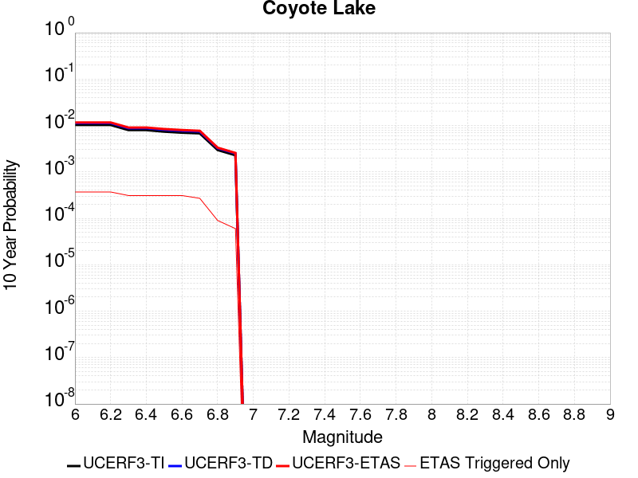 |

| Magnitude | 1 wk TI Prob | 1 wk TD Prob | 1 wk ETAS Prob | 1 wk ETAS/TD Gain | 1 wk ETAS Triggered Only | 1 mo TI Prob | 1 mo TD Prob | 1 mo ETAS Prob | 1 mo ETAS/TD Gain | 1 mo ETAS Triggered Only | 1 yr TI Prob | 1 yr TD Prob | 1 yr ETAS Prob | 1 yr ETAS/TD Gain | 1 yr ETAS Triggered Only | 10 yr TI Prob | 10 yr TD Prob | 10 yr ETAS Prob | 10 yr ETAS/TD Gain | 10 yr ETAS Triggered Only |
|-----|-----|-----|-----|-----|-----|-----|-----|-----|-----|-----|-----|-----|-----|-----|-----|-----|-----|-----|-----|-----|
| 6.0 | 1.980352E-5 | 2.1707852E-5 | 4.170742E-5 | 1.9213057 | 2.0E-5 | 8.486947E-5 | 9.303074E-5 | 1.3302702E-4 | 1.4299254 | 4.0E-5 | 0.0010327959 | 0.0011321327 | 0.0013319063 | 1.1764578 | 2.0E-4 | 0.010280091 | 0.01127083 | 0.0116366595 | 1.0324581 | 3.7E-4 |
| 6.1 | 1.980352E-5 | 2.1707852E-5 | 4.170742E-5 | 1.9213057 | 2.0E-5 | 8.486947E-5 | 9.303074E-5 | 1.3302702E-4 | 1.4299254 | 4.0E-5 | 0.0010327959 | 0.0011321327 | 0.0013319063 | 1.1764578 | 2.0E-4 | 0.010280091 | 0.01127083 | 0.0116366595 | 1.0324581 | 3.7E-4 |
| 6.2 | 1.980352E-5 | 2.1707852E-5 | 4.170742E-5 | 1.9213057 | 2.0E-5 | 8.486947E-5 | 9.303074E-5 | 1.3302702E-4 | 1.4299254 | 4.0E-5 | 0.0010327959 | 0.0011321327 | 0.0013319063 | 1.1764578 | 2.0E-4 | 0.010280091 | 0.01127083 | 0.0116366595 | 1.0324581 | 3.7E-4 |
| 6.3 | 1.5344787E-5 | 1.6821528E-5 | 2.6821359E-5 | 1.5944663 | 1.0E-5 | 6.576172E-5 | 7.209062E-5 | 1.0208845E-4 | 1.4161129 | 3.0E-5 | 8.003548E-4 | 8.7741105E-4 | 0.0010372706 | 1.1821947 | 1.6E-4 | 0.007974784 | 0.008745514 | 0.009052803 | 1.0351367 | 3.1E-4 |
| 6.4 | 1.5344787E-5 | 1.6821528E-5 | 2.6821359E-5 | 1.5944663 | 1.0E-5 | 6.576172E-5 | 7.209062E-5 | 1.0208845E-4 | 1.4161129 | 3.0E-5 | 8.003548E-4 | 8.7741105E-4 | 0.0010372706 | 1.1821947 | 1.6E-4 | 0.007974784 | 0.008745514 | 0.009052803 | 1.0351367 | 3.1E-4 |
| 6.5 | 1.4189697E-5 | 1.5558782E-5 | 2.5558627E-5 | 1.6427138 | 1.0E-5 | 6.081157E-5 | 6.667913E-5 | 9.667713E-5 | 1.4498858 | 3.0E-5 | 7.401293E-4 | 8.115764E-4 | 9.7144657E-4 | 1.1969872 | 1.6E-4 | 0.0073766913 | 0.008092069 | 0.00839956 | 1.0379992 | 3.1E-4 |
| 6.6 | 1.3469301E-5 | 1.4772335E-5 | 2.4772187E-5 | 1.676931 | 1.0E-5 | 5.7724297E-5 | 6.330881E-5 | 9.330691E-5 | 1.4738377 | 3.0E-5 | 7.025667E-4 | 7.7057217E-4 | 9.304489E-4 | 1.2074779 | 1.6E-4 | 0.0070034964 | 0.0076849074 | 0.007992525 | 1.0400288 | 3.1E-4 |
| 6.7 | 1.3027966E-5 | 1.4282475E-5 | 2.4282332E-5 | 1.7001488 | 1.0E-5 | 5.5832945E-5 | 6.12095E-5 | 9.120767E-5 | 1.4900899 | 3.0E-5 | 6.7955407E-4 | 7.450307E-4 | 8.8492635E-4 | 1.1877717 | 1.4E-4 | 0.006774798 | 0.007431207 | 0.007699201 | 1.0360633 | 2.7E-4 |
| 6.8 | 5.695434E-6 | 6.2247245E-6 | 6.2247245E-6 | 1.0 | 0.0 | 2.4408775E-5 | 2.6677288E-5 | 3.6677022E-5 | 1.3748407 | 1.0E-5 | 2.971363E-4 | 3.2477756E-4 | 3.8475805E-4 | 1.1846818 | 6.0E-5 | 0.0029673933 | 0.0032459702 | 0.003335678 | 1.0276366 | 9.0E-5 |
| 6.9 | 4.385688E-6 | 4.7932917E-6 | 4.7932917E-6 | 1.0 | 0.0 | 1.879567E-5 | 2.0542679E-5 | 3.0542473E-5 | 1.4867815 | 1.0E-5 | 2.2881327E-4 | 2.501071E-4 | 3.000946E-4 | 1.1998644 | 5.0E-5 | 0.002285778 | 0.002501071 | 0.002560921 | 1.0239297 | 6.0E-5 |

## San Andreas (San Bernardino S)
*[(top)](#table-of-contents)*

| 1 Week | 1 Month | 1 Year | 10 Year |
|-----|-----|-----|-----|
|  |  |  |  |

| Magnitude | 1 wk TI Prob | 1 wk TD Prob | 1 wk ETAS Prob | 1 wk ETAS/TD Gain | 1 wk ETAS Triggered Only | 1 mo TI Prob | 1 mo TD Prob | 1 mo ETAS Prob | 1 mo ETAS/TD Gain | 1 mo ETAS Triggered Only | 1 yr TI Prob | 1 yr TD Prob | 1 yr ETAS Prob | 1 yr ETAS/TD Gain | 1 yr ETAS Triggered Only | 10 yr TI Prob | 10 yr TD Prob | 10 yr ETAS Prob | 10 yr ETAS/TD Gain | 10 yr ETAS Triggered Only |
|-----|-----|-----|-----|-----|-----|-----|-----|-----|-----|-----|-----|-----|-----|-----|-----|-----|-----|-----|-----|-----|
| 6.0 | 1.2336002E-4 | 3.0025674E-4 | 3.0025674E-4 | 1.0 | 0.0 | 5.2857865E-4 | 0.0012862061 | 0.0013161675 | 1.0232944 | 3.0E-5 | 0.006416472 | 0.015552082 | 0.01569975 | 1.009495 | 1.5E-4 | 0.06234337 | 0.14278531 | 0.14308533 | 1.0021012 | 3.5E-4 |
| 6.1 | 1.2336002E-4 | 3.0025674E-4 | 3.0025674E-4 | 1.0 | 0.0 | 5.2857865E-4 | 0.0012862061 | 0.0013161675 | 1.0232944 | 3.0E-5 | 0.006416472 | 0.015552082 | 0.01569975 | 1.009495 | 1.5E-4 | 0.06234337 | 0.14278531 | 0.14308533 | 1.0021012 | 3.5E-4 |
| 6.2 | 1.2336002E-4 | 3.0025674E-4 | 3.0025674E-4 | 1.0 | 0.0 | 5.2857865E-4 | 0.0012862061 | 0.0013161675 | 1.0232944 | 3.0E-5 | 0.006416472 | 0.015552082 | 0.01569975 | 1.009495 | 1.5E-4 | 0.06234337 | 0.14278531 | 0.14308533 | 1.0021012 | 3.5E-4 |
| 6.3 | 1.1712257E-4 | 2.8813703E-4 | 2.8813703E-4 | 1.0 | 0.0 | 5.018573E-4 | 0.0012343143 | 0.0012642773 | 1.024275 | 3.0E-5 | 0.006093008 | 0.014929076 | 0.015076836 | 1.0098975 | 1.5E-4 | 0.059286322 | 0.13748851 | 0.1377904 | 1.0021957 | 3.5E-4 |
| 6.4 | 1.1712257E-4 | 2.8813703E-4 | 2.8813703E-4 | 1.0 | 0.0 | 5.018573E-4 | 0.0012343143 | 0.0012642773 | 1.024275 | 3.0E-5 | 0.006093008 | 0.014929076 | 0.015076836 | 1.0098975 | 1.5E-4 | 0.059286322 | 0.13748851 | 0.1377904 | 1.0021957 | 3.5E-4 |
| 6.5 | 1.0689076E-4 | 2.6826185E-4 | 2.6826185E-4 | 1.0 | 0.0 | 4.5802278E-4 | 0.0011492119 | 0.0011791774 | 1.0260749 | 3.0E-5 | 0.0055621783 | 0.013906514 | 0.014054428 | 1.0106363 | 1.5E-4 | 0.05425003 | 0.12872604 | 0.12903097 | 1.0023689 | 3.5E-4 |
| 6.6 | 9.7648895E-5 | 2.5070578E-4 | 2.5070578E-4 | 1.0 | 0.0 | 4.1842813E-4 | 0.0010740346 | 0.0011040024 | 1.027902 | 3.0E-5 | 0.005082469 | 0.013002338 | 0.013150387 | 1.0113864 | 1.5E-4 | 0.049677886 | 0.120901346 | 0.12120903 | 1.0025449 | 3.5E-4 |
| 6.7 | 8.757013E-5 | 2.3141113E-4 | 2.3141113E-4 | 1.0 | 0.0 | 3.7524657E-4 | 9.914073E-4 | 0.0010213776 | 1.03023 | 3.0E-5 | 0.00455906 | 0.0120076705 | 0.012155869 | 1.012342 | 1.5E-4 | 0.04466656 | 0.11218169 | 0.11249243 | 1.00277 | 3.5E-4 |
| 6.8 | 8.562978E-5 | 2.270081E-4 | 2.270081E-4 | 1.0 | 0.0 | 3.6693315E-4 | 9.7255135E-4 | 0.0010025222 | 1.0308167 | 3.0E-5 | 0.004458263 | 0.011780596 | 0.011928829 | 1.0125828 | 1.5E-4 | 0.043698758 | 0.1101955 | 0.11050693 | 1.0028262 | 3.5E-4 |
| 6.9 | 6.124075E-5 | 1.7083176E-4 | 1.7083176E-4 | 1.0 | 0.0 | 2.6243398E-4 | 7.319315E-4 | 7.619095E-4 | 1.0409575 | 3.0E-5 | 0.0031904527 | 0.008875063 | 0.009023732 | 1.0167513 | 1.5E-4 | 0.031450346 | 0.084271915 | 0.08458327 | 1.0036945 | 3.4E-4 |
| 7.0 | 5.8598747E-5 | 1.6512029E-4 | 1.6512029E-4 | 1.0 | 0.0 | 2.5111332E-4 | 7.0746726E-4 | 7.37446E-4 | 1.0423748 | 3.0E-5 | 0.0030530186 | 0.008579592 | 0.008728305 | 1.0173334 | 1.5E-4 | 0.03011414 | 0.08158445 | 0.08188753 | 1.0037149 | 3.3E-4 |
| 7.1 | 5.613814E-5 | 1.5930375E-4 | 1.5930375E-4 | 1.0 | 0.0 | 2.4056983E-4 | 6.8255246E-4 | 7.1253197E-4 | 1.0439227 | 3.0E-5 | 0.0029250039 | 0.008278593 | 0.008427352 | 1.017969 | 1.5E-4 | 0.028868021 | 0.07888606 | 0.07919003 | 1.0038532 | 3.3E-4 |
| 7.2 | 4.991222E-5 | 1.4536385E-4 | 1.4536385E-4 | 1.0 | 0.0 | 2.1389198E-4 | 6.2283955E-4 | 6.528209E-4 | 1.0481365 | 3.0E-5 | 0.002601025 | 0.007556809 | 0.007705676 | 1.0196997 | 1.5E-4 | 0.025707912 | 0.07233381 | 0.07263994 | 1.0042322 | 3.3E-4 |
| 7.3 | 4.7410045E-5 | 1.373025E-4 | 1.373025E-4 | 1.0 | 0.0 | 2.0317009E-4 | 5.883069E-4 | 6.182893E-4 | 1.0509638 | 3.0E-5 | 0.0024707897 | 0.0071392 | 0.0072881286 | 1.0208608 | 1.5E-4 | 0.024434982 | 0.06861141 | 0.06891877 | 1.0044796 | 3.3E-4 |
| 7.4 | 4.5556746E-5 | 1.3137884E-4 | 1.3137884E-4 | 1.0 | 0.0 | 1.952286E-4 | 5.62931E-4 | 5.929141E-4 | 1.0532625 | 3.0E-5 | 0.002374317 | 0.006832226 | 0.006981201 | 1.0218048 | 1.5E-4 | 0.023491086 | 0.06586029 | 0.06616855 | 1.0046806 | 3.3E-4 |
| 7.5 | 4.3084514E-5 | 1.2372872E-4 | 1.2372872E-4 | 1.0 | 0.0 | 1.8463485E-4 | 5.3015846E-4 | 5.6014257E-4 | 1.0565568 | 3.0E-5 | 0.0022456115 | 0.006435648 | 0.006584683 | 1.0231577 | 1.5E-4 | 0.022230545 | 0.06225957 | 0.06256902 | 1.0049704 | 3.3E-4 |
| 7.6 | 3.408608E-5 | 9.849839E-5 | 9.849839E-5 | 1.0 | 0.0 | 1.4607502E-4 | 4.2206777E-4 | 4.520551E-4 | 1.0710486 | 3.0E-5 | 0.0017770125 | 0.005126593 | 0.0052758246 | 1.0291092 | 1.5E-4 | 0.017628696 | 0.050086122 | 0.050399594 | 1.0062586 | 3.3E-4 |
| 7.7 | 2.8315713E-5 | 8.262102E-5 | 8.262102E-5 | 1.0 | 0.0 | 1.2134742E-4 | 3.5404207E-4 | 3.8403145E-4 | 1.0847057 | 3.0E-5 | 0.0014764034 | 0.0043019517 | 0.0044513065 | 1.0347179 | 1.5E-4 | 0.01466633 | 0.042333513 | 0.042649545 | 1.0074652 | 3.3E-4 |
| 7.8 | 2.6222975E-5 | 7.4756E-5 | 7.4756E-5 | 1.0 | 0.0 | 1.1237934E-4 | 3.203435E-4 | 3.503339E-4 | 1.0936195 | 3.0E-5 | 0.0013673597 | 0.0038932136 | 0.0040426296 | 1.0383786 | 1.5E-4 | 0.013589768 | 0.038495146 | 0.038812444 | 1.0082425 | 3.3E-4 |
| 7.9 | 2.1469694E-5 | 5.7982703E-5 | 5.7982703E-5 | 1.0 | 0.0 | 9.200973E-5 | 2.4847363E-4 | 2.7846618E-4 | 1.1207072 | 3.0E-5 | 0.0011196428 | 0.003020973 | 0.0031705198 | 1.0495028 | 1.5E-4 | 0.011140184 | 0.030201301 | 0.030521335 | 1.0105966 | 3.3E-4 |
| 8.0 | 1.2420249E-5 | 3.1376432E-5 | 3.1376432E-5 | 1.0 | 0.0 | 5.322855E-5 | 1.344635E-4 | 1.5446081E-4 | 1.1487193 | 2.0E-5 | 6.478649E-4 | 0.0016358647 | 0.0017257174 | 1.0549268 | 9.0E-5 | 0.0064597935 | 0.016549915 | 0.016687598 | 1.0083193 | 1.4E-4 |
| 8.1 | 4.9197724E-6 | 7.842547E-6 | 7.842547E-6 | 1.0 | 0.0 | 2.1084568E-5 | 3.3610482E-5 | 3.3610482E-5 | 1.0 | 0.0 | 2.566744E-4 | 4.0913094E-4 | 4.1912685E-4 | 1.0244321 | 1.0E-5 | 0.002563781 | 0.0043946104 | 0.0044045663 | 1.0022656 | 1.0E-5 |
| 8.2 | 2.5634774E-6 | 2.915849E-6 | 2.915849E-6 | 1.0 | 0.0 | 1.0986286E-5 | 1.2496436E-5 | 1.2496436E-5 | 1.0 | 0.0 | 1.3374983E-4 | 1.5213354E-4 | 1.5213354E-4 | 1.0 | 0.0 | 0.0013366934 | 0.0017097751 | 0.0017097751 | 1.0 | 0.0 |
| 8.3 | 5.2850464E-7 | 3.2203224E-7 | 3.2203224E-7 | 1.0 | 0.0 | 2.2650179E-6 | 1.3801375E-6 | 1.3801375E-6 | 1.0 | 0.0 | 2.7576245E-5 | 1.6803056E-5 | 1.6803056E-5 | 1.0 | 0.0 | 2.7572823E-4 | 1.9934843E-4 | 1.9934843E-4 | 1.0 | 0.0 |

## San Andreas (Big Bend)
*[(top)](#table-of-contents)*

| 1 Week | 1 Month | 1 Year | 10 Year |
|-----|-----|-----|-----|
|  |  |  |  |

| Magnitude | 1 wk TI Prob | 1 wk TD Prob | 1 wk ETAS Prob | 1 wk ETAS/TD Gain | 1 wk ETAS Triggered Only | 1 mo TI Prob | 1 mo TD Prob | 1 mo ETAS Prob | 1 mo ETAS/TD Gain | 1 mo ETAS Triggered Only | 1 yr TI Prob | 1 yr TD Prob | 1 yr ETAS Prob | 1 yr ETAS/TD Gain | 1 yr ETAS Triggered Only | 10 yr TI Prob | 10 yr TD Prob | 10 yr ETAS Prob | 10 yr ETAS/TD Gain | 10 yr ETAS Triggered Only |
|-----|-----|-----|-----|-----|-----|-----|-----|-----|-----|-----|-----|-----|-----|-----|-----|-----|-----|-----|-----|-----|
| 6.0 | 1.0179969E-4 | 2.0107176E-4 | 2.0107176E-4 | 1.0 | 0.0 | 4.362114E-4 | 8.6145254E-4 | 8.814353E-4 | 1.0231966 | 2.0E-5 | 0.0052979486 | 0.0104380315 | 0.010527092 | 1.0085323 | 9.0E-5 | 0.051734097 | 0.10163772 | 0.101925194 | 1.0028285 | 3.2E-4 |
| 6.1 | 1.0179969E-4 | 2.0107176E-4 | 2.0107176E-4 | 1.0 | 0.0 | 4.362114E-4 | 8.6145254E-4 | 8.814353E-4 | 1.0231966 | 2.0E-5 | 0.0052979486 | 0.0104380315 | 0.010527092 | 1.0085323 | 9.0E-5 | 0.051734097 | 0.10163772 | 0.101925194 | 1.0028285 | 3.2E-4 |
| 6.2 | 1.0179969E-4 | 2.0107176E-4 | 2.0107176E-4 | 1.0 | 0.0 | 4.362114E-4 | 8.6145254E-4 | 8.814353E-4 | 1.0231966 | 2.0E-5 | 0.0052979486 | 0.0104380315 | 0.010527092 | 1.0085323 | 9.0E-5 | 0.051734097 | 0.10163772 | 0.101925194 | 1.0028285 | 3.2E-4 |
| 6.3 | 1.0179969E-4 | 2.0107176E-4 | 2.0107176E-4 | 1.0 | 0.0 | 4.362114E-4 | 8.6145254E-4 | 8.814353E-4 | 1.0231966 | 2.0E-5 | 0.0052979486 | 0.0104380315 | 0.010527092 | 1.0085323 | 9.0E-5 | 0.051734097 | 0.10163772 | 0.101925194 | 1.0028285 | 3.2E-4 |
| 6.4 | 9.1639464E-5 | 1.8463937E-4 | 1.8463937E-4 | 1.0 | 0.0 | 3.9268145E-4 | 7.9107186E-4 | 8.11056E-4 | 1.0252621 | 2.0E-5 | 0.0047704205 | 0.009588886 | 0.009678023 | 1.0092958 | 9.0E-5 | 0.046693064 | 0.093937874 | 0.09413721 | 1.0021219 | 2.2E-4 |
| 6.5 | 9.1639464E-5 | 1.8463937E-4 | 1.8463937E-4 | 1.0 | 0.0 | 3.9268145E-4 | 7.9107186E-4 | 8.11056E-4 | 1.0252621 | 2.0E-5 | 0.0047704205 | 0.009588886 | 0.009678023 | 1.0092958 | 9.0E-5 | 0.046693064 | 0.093937874 | 0.09413721 | 1.0021219 | 2.2E-4 |
| 6.6 | 9.042622E-5 | 1.827092E-4 | 1.827092E-4 | 1.0 | 0.0 | 3.8748336E-4 | 7.828047E-4 | 8.0278906E-4 | 1.0255291 | 2.0E-5 | 0.0047074095 | 0.009489112 | 0.009578258 | 1.0093945 | 9.0E-5 | 0.046089325 | 0.09302715 | 0.09321761 | 1.0020474 | 2.1E-4 |
| 6.7 | 8.9836685E-5 | 1.8185233E-4 | 1.8185233E-4 | 1.0 | 0.0 | 3.8495753E-4 | 7.791345E-4 | 7.9911895E-4 | 1.0256495 | 2.0E-5 | 0.00467679 | 0.009444815 | 0.009533965 | 1.009439 | 9.0E-5 | 0.045795817 | 0.09262138 | 0.09281193 | 1.0020573 | 2.1E-4 |
| 6.8 | 8.9471854E-5 | 1.8131983E-4 | 1.8131983E-4 | 1.0 | 0.0 | 3.8339442E-4 | 7.7685376E-4 | 7.968382E-4 | 1.0257249 | 2.0E-5 | 0.004657841 | 0.009417287 | 0.00950644 | 1.0094669 | 9.0E-5 | 0.04561414 | 0.092368215 | 0.092558816 | 1.0020635 | 2.1E-4 |
| 6.9 | 8.858234E-5 | 1.8013896E-4 | 1.8013896E-4 | 1.0 | 0.0 | 3.7958333E-4 | 7.717959E-4 | 7.917805E-4 | 1.0258936 | 2.0E-5 | 0.004611638 | 0.009356238 | 0.009445396 | 1.0095292 | 9.0E-5 | 0.04517103 | 0.09180844 | 0.09199916 | 1.0020773 | 2.1E-4 |
| 7.0 | 8.7433385E-5 | 1.7852607E-4 | 1.7852607E-4 | 1.0 | 0.0 | 3.746607E-4 | 7.6488755E-4 | 7.848723E-4 | 1.0261276 | 2.0E-5 | 0.004551957 | 0.009272847 | 0.009362013 | 1.0096158 | 9.0E-5 | 0.044598386 | 0.0910425 | 0.09123338 | 1.0020967 | 2.1E-4 |
| 7.1 | 8.684964E-5 | 1.7764501E-4 | 1.7764501E-4 | 1.0 | 0.0 | 3.7215967E-4 | 7.6111377E-4 | 7.7110616E-4 | 1.0131286 | 1.0E-5 | 0.0045216335 | 0.009227292 | 0.009306554 | 1.00859 | 8.0E-5 | 0.04430731 | 0.09062394 | 0.09079672 | 1.0019066 | 1.9E-4 |
| 7.2 | 8.606521E-5 | 1.7655063E-4 | 1.7655063E-4 | 1.0 | 0.0 | 3.6879873E-4 | 7.5642637E-4 | 7.664188E-4 | 1.01321 | 1.0E-5 | 0.0044808835 | 0.0091707045 | 0.009249971 | 1.0086434 | 8.0E-5 | 0.043916024 | 0.09010384 | 0.09027672 | 1.0019187 | 1.9E-4 |
| 7.3 | 8.568266E-5 | 1.7596998E-4 | 1.7596998E-4 | 1.0 | 0.0 | 3.6715972E-4 | 7.5393927E-4 | 7.639317E-4 | 1.0132537 | 1.0E-5 | 0.0044610105 | 0.009140679 | 0.009219947 | 1.0086721 | 8.0E-5 | 0.043725148 | 0.08982521 | 0.08999815 | 1.0019252 | 1.9E-4 |
| 7.4 | 8.5432206E-5 | 1.7559543E-4 | 1.7559543E-4 | 1.0 | 0.0 | 3.6608664E-4 | 7.5233495E-4 | 7.6232746E-4 | 1.013282 | 1.0E-5 | 0.004447999 | 0.00912131 | 0.00920058 | 1.0086907 | 8.0E-5 | 0.043600157 | 0.08964524 | 0.0898182 | 1.0019295 | 1.9E-4 |
| 7.5 | 8.4791965E-5 | 1.7428731E-4 | 1.7428731E-4 | 1.0 | 0.0 | 3.633435E-4 | 7.46732E-4 | 7.5672456E-4 | 1.0133817 | 1.0E-5 | 0.0044147377 | 0.009053662 | 0.009132938 | 1.0087562 | 8.0E-5 | 0.043280575 | 0.08902357 | 0.08919665 | 1.0019443 | 1.9E-4 |
| 7.6 | 8.241105E-5 | 1.6873641E-4 | 1.6873641E-4 | 1.0 | 0.0 | 3.531424E-4 | 7.229558E-4 | 7.3294854E-4 | 1.0138221 | 1.0E-5 | 0.0042910352 | 0.008766552 | 0.008845851 | 1.0090456 | 8.0E-5 | 0.042091176 | 0.08639386 | 0.08656745 | 1.0020093 | 1.9E-4 |
| 7.7 | 7.00432E-5 | 1.4234452E-4 | 1.4234452E-4 | 1.0 | 0.0 | 3.001506E-4 | 6.099054E-4 | 6.198993E-4 | 1.016386 | 1.0E-5 | 0.0036482112 | 0.007400356 | 0.0074698376 | 1.009389 | 7.0E-5 | 0.035888977 | 0.07365227 | 0.07380974 | 1.0021381 | 1.7E-4 |
| 7.8 | 6.415362E-5 | 1.2995867E-4 | 1.2995867E-4 | 1.0 | 0.0 | 2.749151E-4 | 5.568469E-4 | 5.6684134E-4 | 1.0179483 | 1.0E-5 | 0.0033419547 | 0.006758566 | 0.006828093 | 1.0102873 | 7.0E-5 | 0.03292141 | 0.06737457 | 0.06753312 | 1.0023532 | 1.7E-4 |
| 7.9 | 4.939911E-5 | 9.36036E-5 | 9.36036E-5 | 1.0 | 0.0 | 2.116933E-4 | 4.0109662E-4 | 4.1109262E-4 | 1.0249217 | 1.0E-5 | 0.0025743195 | 0.0048724264 | 0.004912231 | 1.0081694 | 4.0E-5 | 0.025447013 | 0.049006134 | 0.049082216 | 1.0015525 | 8.0E-5 |
| 8.0 | 3.344983E-5 | 5.233905E-5 | 5.233905E-5 | 1.0 | 0.0 | 1.4334853E-4 | 2.2429094E-4 | 2.2429094E-4 | 1.0 | 0.0 | 0.0017438711 | 0.0027273244 | 0.0027472698 | 1.0073133 | 2.0E-5 | 0.017302496 | 0.027977858 | 0.028016739 | 1.0013897 | 4.0E-5 |
| 8.1 | 1.9104898E-5 | 1.9225243E-5 | 1.9225243E-5 | 1.0 | 0.0 | 8.1875565E-5 | 8.23913E-5 | 8.23913E-5 | 1.0 | 0.0 | 9.963791E-4 | 0.001002653 | 0.001012643 | 1.0099635 | 1.0E-5 | 0.009919235 | 0.010777342 | 0.010797127 | 1.0018357 | 2.0E-5 |
| 8.2 | 8.643924E-6 | 5.494016E-6 | 5.494016E-6 | 1.0 | 0.0 | 3.704486E-5 | 2.3545572E-5 | 2.3545572E-5 | 1.0 | 0.0 | 4.5092785E-4 | 2.866297E-4 | 2.866297E-4 | 1.0 | 0.0 | 0.0045001395 | 0.0032592218 | 0.0032592218 | 1.0 | 0.0 |
| 8.3 | 1.983087E-6 | 7.690063E-7 | 7.690063E-7 | 1.0 | 0.0 | 8.498917E-6 | 3.295737E-6 | 3.295737E-6 | 1.0 | 0.0 | 1.034694E-4 | 4.012488E-5 | 4.012488E-5 | 1.0 | 0.0 | 0.0010342124 | 4.737206E-4 | 4.737206E-4 | 1.0 | 0.0 |

## San Andreas (Parkfield)
*[(top)](#table-of-contents)*

| 1 Week | 1 Month | 1 Year | 10 Year |
|-----|-----|-----|-----|
|  |  |  |  |

| Magnitude | 1 wk TI Prob | 1 wk TD Prob | 1 wk ETAS Prob | 1 wk ETAS/TD Gain | 1 wk ETAS Triggered Only | 1 mo TI Prob | 1 mo TD Prob | 1 mo ETAS Prob | 1 mo ETAS/TD Gain | 1 mo ETAS Triggered Only | 1 yr TI Prob | 1 yr TD Prob | 1 yr ETAS Prob | 1 yr ETAS/TD Gain | 1 yr ETAS Triggered Only | 10 yr TI Prob | 10 yr TD Prob | 10 yr ETAS Prob | 10 yr ETAS/TD Gain | 10 yr ETAS Triggered Only |
|-----|-----|-----|-----|-----|-----|-----|-----|-----|-----|-----|-----|-----|-----|-----|-----|-----|-----|-----|-----|-----|
| 6.0 | 5.556969E-4 | 7.8200514E-4 | 7.919973E-4 | 1.0127777 | 1.0E-5 | 0.0023793848 | 0.003347701 | 0.003367634 | 1.0059543 | 2.0E-5 | 0.028586963 | 0.040345885 | 0.040432256 | 1.0021408 | 9.0E-5 | 0.25176284 | 0.3377101 | 0.33786905 | 1.0004706 | 2.4E-4 |
| 6.1 | 1.925858E-4 | 3.0395915E-4 | 3.1395612E-4 | 1.0328891 | 1.0E-5 | 8.2510663E-4 | 0.0013021269 | 0.0013221009 | 1.0153395 | 2.0E-5 | 0.0099994885 | 0.015831968 | 0.01590086 | 1.0043514 | 7.0E-5 | 0.095613256 | 0.14996985 | 0.15008886 | 1.0007936 | 1.4E-4 |
| 6.2 | 9.4306815E-5 | 1.8274323E-4 | 1.8274323E-4 | 1.0 | 0.0 | 4.0410945E-4 | 7.829515E-4 | 7.9294364E-4 | 1.0127622 | 1.0E-5 | 0.0049089384 | 0.009490968 | 0.009550398 | 1.0062618 | 6.0E-5 | 0.048019063 | 0.09199097 | 0.09210901 | 1.0012832 | 1.3E-4 |
| 6.3 | 9.283051E-5 | 1.7970752E-4 | 1.7970752E-4 | 1.0 | 0.0 | 3.9778434E-4 | 7.69949E-4 | 7.799413E-4 | 1.0129778 | 1.0E-5 | 0.0048322747 | 0.009334031 | 0.00939347 | 1.006368 | 6.0E-5 | 0.047285385 | 0.090643644 | 0.09076186 | 1.0013041 | 1.3E-4 |
| 6.4 | 9.138826E-5 | 1.7732776E-4 | 1.7732776E-4 | 1.0 | 0.0 | 3.916052E-4 | 7.5975596E-4 | 7.6974835E-4 | 1.0131521 | 1.0E-5 | 0.0047573745 | 0.009210981 | 0.009270429 | 1.006454 | 6.0E-5 | 0.046568092 | 0.08954158 | 0.08965994 | 1.0013218 | 1.3E-4 |
| 6.5 | 9.000255E-5 | 1.749061E-4 | 1.749061E-4 | 1.0 | 0.0 | 3.8566816E-4 | 7.493834E-4 | 7.593759E-4 | 1.0133343 | 1.0E-5 | 0.0046854047 | 0.009085771 | 0.009145226 | 1.0065438 | 6.0E-5 | 0.045878403 | 0.08842976 | 0.08854826 | 1.0013402 | 1.3E-4 |
| 6.6 | 8.8109264E-5 | 1.7171387E-4 | 1.7171387E-4 | 1.0 | 0.0 | 3.7755648E-4 | 7.3571014E-4 | 7.4570277E-4 | 1.0135823 | 1.0E-5 | 0.0045870654 | 0.008920688 | 0.008980152 | 1.006666 | 6.0E-5 | 0.04493529 | 0.08695953 | 0.08707823 | 1.001365 | 1.3E-4 |
| 6.7 | 8.738073E-5 | 1.7038376E-4 | 1.7038376E-4 | 1.0 | 0.0 | 3.7443507E-4 | 7.3001295E-4 | 7.4000563E-4 | 1.0136884 | 1.0E-5 | 0.0045492216 | 0.0088519445 | 0.008911413 | 1.0067182 | 6.0E-5 | 0.04457213 | 0.086359605 | 0.08647838 | 1.0013753 | 1.3E-4 |
| 6.8 | 8.710195E-5 | 1.698381E-4 | 1.698381E-4 | 1.0 | 0.0 | 3.7324068E-4 | 7.276757E-4 | 7.3766836E-4 | 1.0137324 | 1.0E-5 | 0.0045347405 | 0.008823725 | 0.008883196 | 1.0067399 | 6.0E-5 | 0.04443313 | 0.08610701 | 0.086225815 | 1.0013797 | 1.3E-4 |
| 6.9 | 8.6801556E-5 | 1.6924697E-4 | 1.6924697E-4 | 1.0 | 0.0 | 3.7195362E-4 | 7.251437E-4 | 7.3513645E-4 | 1.0137804 | 1.0E-5 | 0.0045191357 | 0.008793148 | 0.008852621 | 1.0067635 | 6.0E-5 | 0.044283327 | 0.085832745 | 0.08595158 | 1.0013846 | 1.3E-4 |
| 7.0 | 8.5571606E-5 | 1.6677282E-4 | 1.6677282E-4 | 1.0 | 0.0 | 3.6668387E-4 | 7.14546E-4 | 7.2453887E-4 | 1.0139849 | 1.0E-5 | 0.004455241 | 0.008665155 | 0.008724635 | 1.0068643 | 6.0E-5 | 0.043669727 | 0.084680066 | 0.08479905 | 1.0014052 | 1.3E-4 |
| 7.1 | 7.82589E-5 | 1.5156982E-4 | 1.5156982E-4 | 1.0 | 0.0 | 3.3535215E-4 | 6.4942404E-4 | 6.5941754E-4 | 1.0153883 | 1.0E-5 | 0.0040752706 | 0.007878244 | 0.007937771 | 1.007556 | 6.0E-5 | 0.040013418 | 0.07759189 | 0.0777118 | 1.0015454 | 1.3E-4 |
| 7.2 | 7.690929E-5 | 1.4894054E-4 | 1.4894054E-4 | 1.0 | 0.0 | 3.2956956E-4 | 6.381612E-4 | 6.481548E-4 | 1.01566 | 1.0E-5 | 0.004005129 | 0.007742101 | 0.0078016366 | 1.0076898 | 6.0E-5 | 0.0393371 | 0.07636437 | 0.07648444 | 1.0015724 | 1.3E-4 |
| 7.3 | 7.5543794E-5 | 1.4590233E-4 | 1.4590233E-4 | 1.0 | 0.0 | 3.2371894E-4 | 6.251466E-4 | 6.3514034E-4 | 1.0159862 | 1.0E-5 | 0.003934157 | 0.0075847614 | 0.0076443064 | 1.0078506 | 6.0E-5 | 0.038652334 | 0.07492845 | 0.07504871 | 1.001605 | 1.3E-4 |
| 7.4 | 7.4214564E-5 | 1.4290822E-4 | 1.4290822E-4 | 1.0 | 0.0 | 3.1802364E-4 | 6.123207E-4 | 6.2231463E-4 | 1.0163213 | 1.0E-5 | 0.003865065 | 0.0074296813 | 0.0074892356 | 1.0080158 | 6.0E-5 | 0.03798529 | 0.07350102 | 0.07362147 | 1.0016387 | 1.3E-4 |
| 7.5 | 6.149578E-5 | 1.1214689E-4 | 1.1214689E-4 | 1.0 | 0.0 | 2.6352672E-4 | 4.805411E-4 | 4.905363E-4 | 1.0207999 | 1.0E-5 | 0.0032037178 | 0.005834925 | 0.005894575 | 1.0102229 | 6.0E-5 | 0.03157923 | 0.058674183 | 0.058787145 | 1.0019252 | 1.2E-4 |
| 7.6 | 6.0643448E-5 | 1.1043109E-4 | 1.1043109E-4 | 1.0 | 0.0 | 2.598746E-4 | 4.7319033E-4 | 4.831856E-4 | 1.0211232 | 1.0E-5 | 0.0031593828 | 0.0057459055 | 0.0058055604 | 1.0103822 | 6.0E-5 | 0.031148417 | 0.057834256 | 0.057947315 | 1.0019549 | 1.2E-4 |
| 7.7 | 5.1652263E-5 | 9.1959046E-5 | 9.1959046E-5 | 1.0 | 0.0 | 2.2134806E-4 | 3.940507E-4 | 4.0404673E-4 | 1.0253675 | 1.0E-5 | 0.002691582 | 0.0047870236 | 0.004836784 | 1.0103949 | 5.0E-5 | 0.026592141 | 0.04863762 | 0.048742272 | 1.0021516 | 1.1E-4 |
| 7.8 | 4.8090482E-5 | 8.5791486E-5 | 8.5791486E-5 | 1.0 | 0.0 | 2.060858E-4 | 3.67626E-4 | 3.7762232E-4 | 1.0271915 | 1.0E-5 | 0.0025062072 | 0.004466669 | 0.0045164456 | 1.011144 | 5.0E-5 | 0.024781305 | 0.045395855 | 0.045500863 | 1.0023131 | 1.1E-4 |
| 7.9 | 3.970278E-5 | 6.765535E-5 | 6.765535E-5 | 1.0 | 0.0 | 1.7014367E-4 | 2.899193E-4 | 2.999164E-4 | 1.0344824 | 1.0E-5 | 0.002069531 | 0.003524058 | 0.0035539523 | 1.0084829 | 3.0E-5 | 0.020503636 | 0.035954855 | 0.03602234 | 1.0018768 | 7.0E-5 |
| 8.0 | 2.8982335E-5 | 4.0792085E-5 | 4.0792085E-5 | 1.0 | 0.0 | 1.2420409E-4 | 1.748115E-4 | 1.748115E-4 | 1.0 | 0.0 | 0.0015111357 | 0.002126254 | 0.0021462112 | 1.0093862 | 2.0E-5 | 0.015009012 | 0.022058146 | 0.022097263 | 1.0017734 | 4.0E-5 |
| 8.1 | 1.8836186E-5 | 1.8732435E-5 | 1.8732435E-5 | 1.0 | 0.0 | 8.0724014E-5 | 8.02794E-5 | 8.02794E-5 | 1.0 | 0.0 | 9.823717E-4 | 9.76964E-4 | 9.869542E-4 | 1.0102258 | 1.0E-5 | 0.009780403 | 0.010515128 | 0.010534918 | 1.0018821 | 2.0E-5 |
| 8.2 | 8.643924E-6 | 5.494016E-6 | 5.494016E-6 | 1.0 | 0.0 | 3.704486E-5 | 2.3545572E-5 | 2.3545572E-5 | 1.0 | 0.0 | 4.5092785E-4 | 2.866297E-4 | 2.866297E-4 | 1.0 | 0.0 | 0.0045001395 | 0.0032592218 | 0.0032592218 | 1.0 | 0.0 |
| 8.3 | 1.983087E-6 | 7.690063E-7 | 7.690063E-7 | 1.0 | 0.0 | 8.498917E-6 | 3.295737E-6 | 3.295737E-6 | 1.0 | 0.0 | 1.034694E-4 | 4.012488E-5 | 4.012488E-5 | 1.0 | 0.0 | 0.0010342124 | 4.737206E-4 | 4.737206E-4 | 1.0 | 0.0 |

## Death Valley (No)
*[(top)](#table-of-contents)*

| 1 Week | 1 Month | 1 Year | 10 Year |
|-----|-----|-----|-----|
|  |  |  |  |

| Magnitude | 1 wk TI Prob | 1 wk TD Prob | 1 wk ETAS Prob | 1 wk ETAS/TD Gain | 1 wk ETAS Triggered Only | 1 mo TI Prob | 1 mo TD Prob | 1 mo ETAS Prob | 1 mo ETAS/TD Gain | 1 mo ETAS Triggered Only | 1 yr TI Prob | 1 yr TD Prob | 1 yr ETAS Prob | 1 yr ETAS/TD Gain | 1 yr ETAS Triggered Only | 10 yr TI Prob | 10 yr TD Prob | 10 yr ETAS Prob | 10 yr ETAS/TD Gain | 10 yr ETAS Triggered Only |
|-----|-----|-----|-----|-----|-----|-----|-----|-----|-----|-----|-----|-----|-----|-----|-----|-----|-----|-----|-----|-----|
| 6.0 | 2.0074807E-5 | 2.2501532E-5 | 3.2501306E-5 | 1.4444041 | 1.0E-5 | 8.603206E-5 | 9.643161E-5 | 1.2642873E-4 | 1.3110713 | 3.0E-5 | 0.001046937 | 0.00117343 | 0.0013032774 | 1.1106564 | 1.3E-4 | 0.010420183 | 0.011673254 | 0.0119104525 | 1.0203198 | 2.4E-4 |
| 6.1 | 2.0074807E-5 | 2.2501532E-5 | 3.2501306E-5 | 1.4444041 | 1.0E-5 | 8.603206E-5 | 9.643161E-5 | 1.2642873E-4 | 1.3110713 | 3.0E-5 | 0.001046937 | 0.00117343 | 0.0013032774 | 1.1106564 | 1.3E-4 | 0.010420183 | 0.011673254 | 0.0119104525 | 1.0203198 | 2.4E-4 |
| 6.2 | 2.0074807E-5 | 2.2501532E-5 | 3.2501306E-5 | 1.4444041 | 1.0E-5 | 8.603206E-5 | 9.643161E-5 | 1.2642873E-4 | 1.3110713 | 3.0E-5 | 0.001046937 | 0.00117343 | 0.0013032774 | 1.1106564 | 1.3E-4 | 0.010420183 | 0.011673254 | 0.0119104525 | 1.0203198 | 2.4E-4 |
| 6.3 | 1.9050609E-5 | 2.1338312E-5 | 3.13381E-5 | 1.4686307 | 1.0E-5 | 8.164292E-5 | 9.1446746E-5 | 1.21444E-4 | 1.3280298 | 3.0E-5 | 9.935491E-4 | 0.0011128022 | 0.0012426575 | 1.1166922 | 1.3E-4 | 0.009891188 | 0.011073124 | 0.011310466 | 1.0214341 | 2.4E-4 |
| 6.4 | 1.9050609E-5 | 2.1338312E-5 | 3.13381E-5 | 1.4686307 | 1.0E-5 | 8.164292E-5 | 9.1446746E-5 | 1.21444E-4 | 1.3280298 | 3.0E-5 | 9.935491E-4 | 0.0011128022 | 0.0012426575 | 1.1166922 | 1.3E-4 | 0.009891188 | 0.011073124 | 0.011310466 | 1.0214341 | 2.4E-4 |
| 6.5 | 1.8367004E-5 | 2.0562318E-5 | 3.056211E-5 | 1.4863164 | 1.0E-5 | 7.8713354E-5 | 8.812128E-5 | 1.1811864E-4 | 1.3404099 | 3.0E-5 | 9.5791375E-4 | 0.0010723551 | 0.0012022157 | 1.1210985 | 1.3E-4 | 0.009537951 | 0.010672592 | 0.010900137 | 1.0213206 | 2.3E-4 |
| 6.6 | 1.779439E-5 | 1.9912191E-5 | 2.9911991E-5 | 1.5021949 | 1.0E-5 | 7.625944E-5 | 8.53352E-5 | 1.15332645E-4 | 1.3515248 | 3.0E-5 | 9.280632E-4 | 0.0010384673 | 0.0011683323 | 1.1250545 | 1.3E-4 | 0.009241969 | 0.010336905 | 0.0105645275 | 1.0220203 | 2.3E-4 |
| 6.7 | 1.7025437E-5 | 1.904463E-5 | 2.9044439E-5 | 1.5250725 | 1.0E-5 | 7.296412E-5 | 8.161732E-5 | 1.1161487E-4 | 1.367539 | 3.0E-5 | 8.87976E-4 | 9.93244E-4 | 0.001123115 | 1.1307542 | 1.3E-4 | 0.008844362 | 0.009888767 | 0.010116492 | 1.0230287 | 2.3E-4 |
| 6.8 | 1.6545107E-5 | 1.851372E-5 | 2.8513534E-5 | 1.54013 | 1.0E-5 | 7.090568E-5 | 7.934213E-5 | 1.0933975E-4 | 1.3780793 | 3.0E-5 | 8.629347E-4 | 9.6556847E-4 | 0.0010954429 | 1.1345057 | 1.3E-4 | 0.008595915 | 0.009614435 | 0.00983232 | 1.0226623 | 2.2E-4 |
| 6.9 | 1.615478E-5 | 1.8088747E-5 | 2.8088565E-5 | 1.5528198 | 1.0E-5 | 6.9232934E-5 | 7.7520934E-5 | 1.0751861E-4 | 1.3869623 | 3.0E-5 | 8.4258494E-4 | 9.4341475E-4 | 0.0010732921 | 1.1376673 | 1.3E-4 | 0.008393973 | 0.009394792 | 0.009612725 | 1.0231972 | 2.2E-4 |
| 7.0 | 1.5894311E-5 | 1.780669E-5 | 2.7806513E-5 | 1.5615767 | 1.0E-5 | 6.81167E-5 | 7.6312186E-5 | 1.063099E-4 | 1.393092 | 3.0E-5 | 8.2900526E-4 | 9.287109E-4 | 0.0010585902 | 1.139849 | 1.3E-4 | 0.008259195 | 0.009248987 | 0.009466953 | 1.0235664 | 2.2E-4 |
| 7.1 | 1.5602263E-5 | 1.7484625E-5 | 1.7484625E-5 | 1.0 | 0.0 | 6.6865134E-5 | 7.493199E-5 | 9.4930496E-5 | 1.2668887 | 2.0E-5 | 8.137789E-4 | 9.119212E-4 | 0.0010318118 | 1.1314703 | 1.2E-4 | 0.008108052 | 0.009082474 | 0.009290567 | 1.0229114 | 2.1E-4 |
| 7.2 | 1.5323829E-5 | 1.7171731E-5 | 1.7171731E-5 | 1.0 | 0.0 | 6.56719E-5 | 7.3591094E-5 | 9.3589624E-5 | 1.271752 | 2.0E-5 | 7.99262E-4 | 8.956093E-4 | 0.0010155019 | 1.133867 | 1.2E-4 | 0.007963934 | 0.008920676 | 0.009128803 | 1.0233308 | 2.1E-4 |
| 7.3 | 1.4556212E-5 | 1.6303497E-5 | 1.6303497E-5 | 1.0 | 0.0 | 6.238227E-5 | 6.9870286E-5 | 8.986889E-5 | 1.2862247 | 2.0E-5 | 7.592395E-4 | 8.503446E-4 | 9.702426E-4 | 1.1409992 | 1.2E-4 | 0.0075665074 | 0.008471553 | 0.008679774 | 1.0245788 | 2.1E-4 |
| 7.4 | 1.411725E-5 | 1.5808968E-5 | 1.5808968E-5 | 1.0 | 0.0 | 6.0501097E-5 | 6.775099E-5 | 8.7749635E-5 | 1.2951787 | 2.0E-5 | 7.363519E-4 | 8.24562E-4 | 9.44463E-4 | 1.1454118 | 1.2E-4 | 0.0073391674 | 0.00821566 | 0.008423935 | 1.0253509 | 2.1E-4 |
| 7.5 | 1.3503312E-5 | 1.5127256E-5 | 1.5127256E-5 | 1.0 | 0.0 | 5.7870053E-5 | 6.4829524E-5 | 8.482822E-5 | 1.3084815 | 2.0E-5 | 7.043401E-4 | 7.890194E-4 | 9.0892473E-4 | 1.1519675 | 1.2E-4 | 0.007021119 | 0.007862805 | 0.008071154 | 1.0264981 | 2.1E-4 |
| 7.6 | 1.1279839E-5 | 1.2627129E-5 | 1.2627129E-5 | 1.0 | 0.0 | 4.834127E-5 | 5.4115175E-5 | 7.411409E-5 | 1.3695621 | 2.0E-5 | 5.88396E-4 | 6.586584E-4 | 7.6858595E-4 | 1.1668961 | 1.1E-4 | 0.005868405 | 0.006567614 | 0.0067663006 | 1.0302525 | 2.0E-4 |
| 7.7 | 9.189108E-6 | 1.02840095E-5 | 1.02840095E-5 | 1.0 | 0.0 | 3.93813E-5 | 4.407361E-5 | 5.407317E-5 | 1.2268832 | 1.0E-5 | 4.7936183E-4 | 5.3646916E-4 | 6.1642623E-4 | 1.1490432 | 8.0E-5 | 0.004783291 | 0.005352252 | 0.0054815565 | 1.0241588 | 1.3E-4 |
| 7.8 | 3.4586725E-7 | 3.648368E-7 | 3.648368E-7 | 1.0 | 0.0 | 1.4822873E-6 | 1.5635853E-6 | 1.1563569E-5 | 7.3955474 | 1.0E-5 | 1.80467E-5 | 1.903649E-5 | 3.903611E-5 | 2.0505939 | 2.0E-5 | 1.8045233E-4 | 1.9034903E-4 | 2.1034523E-4 | 1.1050501 | 2.0E-5 |
| 7.9 | 2.5591178E-9 | 2.6697329E-9 | 2.6697329E-9 | 1.0 | 0.0 | 1.0967647E-8 | 1.14417125E-8 | 1.14417125E-8 | 1.0 | 0.0 | 1.335311E-7 | 1.3930286E-7 | 1.3930286E-7 | 1.0 | 0.0 | 1.3353102E-6 | 1.3930285E-6 | 1.3930285E-6 | 1.0 | 0.0 |

## San Andreas (Carrizo) rev
*[(top)](#table-of-contents)*

| 1 Week | 1 Month | 1 Year | 10 Year |
|-----|-----|-----|-----|
|  |  |  |  |

| Magnitude | 1 wk TI Prob | 1 wk TD Prob | 1 wk ETAS Prob | 1 wk ETAS/TD Gain | 1 wk ETAS Triggered Only | 1 mo TI Prob | 1 mo TD Prob | 1 mo ETAS Prob | 1 mo ETAS/TD Gain | 1 mo ETAS Triggered Only | 1 yr TI Prob | 1 yr TD Prob | 1 yr ETAS Prob | 1 yr ETAS/TD Gain | 1 yr ETAS Triggered Only | 10 yr TI Prob | 10 yr TD Prob | 10 yr ETAS Prob | 10 yr ETAS/TD Gain | 10 yr ETAS Triggered Only |
|-----|-----|-----|-----|-----|-----|-----|-----|-----|-----|-----|-----|-----|-----|-----|-----|-----|-----|-----|-----|-----|
| 6.0 | 1.1674632E-4 | 2.4362565E-4 | 2.4362565E-4 | 1.0 | 0.0 | 5.002454E-4 | 0.0010436937 | 0.001063673 | 1.0191427 | 2.0E-5 | 0.006073493 | 0.012633421 | 0.0127222845 | 1.007034 | 9.0E-5 | 0.0591016 | 0.12077793 | 0.12098894 | 1.0017471 | 2.4E-4 |
| 6.1 | 1.1674632E-4 | 2.4362565E-4 | 2.4362565E-4 | 1.0 | 0.0 | 5.002454E-4 | 0.0010436937 | 0.001063673 | 1.0191427 | 2.0E-5 | 0.006073493 | 0.012633421 | 0.0127222845 | 1.007034 | 9.0E-5 | 0.0591016 | 0.12077793 | 0.12098894 | 1.0017471 | 2.4E-4 |
| 6.2 | 1.1674632E-4 | 2.4362565E-4 | 2.4362565E-4 | 1.0 | 0.0 | 5.002454E-4 | 0.0010436937 | 0.001063673 | 1.0191427 | 2.0E-5 | 0.006073493 | 0.012633421 | 0.0127222845 | 1.007034 | 9.0E-5 | 0.0591016 | 0.12077793 | 0.12098894 | 1.0017471 | 2.4E-4 |
| 6.3 | 1.1674632E-4 | 2.4362565E-4 | 2.4362565E-4 | 1.0 | 0.0 | 5.002454E-4 | 0.0010436937 | 0.001063673 | 1.0191427 | 2.0E-5 | 0.006073493 | 0.012633421 | 0.0127222845 | 1.007034 | 9.0E-5 | 0.0591016 | 0.12077793 | 0.12098894 | 1.0017471 | 2.4E-4 |
| 6.4 | 1.1674632E-4 | 2.4362565E-4 | 2.4362565E-4 | 1.0 | 0.0 | 5.002454E-4 | 0.0010436937 | 0.001063673 | 1.0191427 | 2.0E-5 | 0.006073493 | 0.012633421 | 0.0127222845 | 1.007034 | 9.0E-5 | 0.0591016 | 0.12077793 | 0.12098894 | 1.0017471 | 2.4E-4 |
| 6.5 | 1.13136164E-4 | 2.368245E-4 | 2.368245E-4 | 1.0 | 0.0 | 4.847792E-4 | 0.001014569 | 0.0010345486 | 1.0196928 | 2.0E-5 | 0.0058862255 | 0.012282865 | 0.012361883 | 1.0064331 | 8.0E-5 | 0.057327334 | 0.11774252 | 0.11794544 | 1.0017234 | 2.3E-4 |
| 6.6 | 1.13136164E-4 | 2.368245E-4 | 2.368245E-4 | 1.0 | 0.0 | 4.847792E-4 | 0.001014569 | 0.0010345486 | 1.0196928 | 2.0E-5 | 0.0058862255 | 0.012282865 | 0.012361883 | 1.0064331 | 8.0E-5 | 0.057327334 | 0.11774252 | 0.11794544 | 1.0017234 | 2.3E-4 |
| 6.7 | 1.1149675E-4 | 2.3373615E-4 | 2.3373615E-4 | 1.0 | 0.0 | 4.777557E-4 | 0.0010013434 | 0.0010213233 | 1.0199531 | 2.0E-5 | 0.0058011734 | 0.012123644 | 0.012202674 | 1.0065187 | 8.0E-5 | 0.05652051 | 0.11636054 | 0.11655494 | 1.0016707 | 2.2E-4 |
| 6.8 | 1.1103589E-4 | 2.3275726E-4 | 2.3275726E-4 | 1.0 | 0.0 | 4.7578133E-4 | 9.971512E-4 | 0.0010171313 | 1.0200372 | 2.0E-5 | 0.005777263 | 0.012073172 | 0.012152206 | 1.0065463 | 8.0E-5 | 0.056293584 | 0.11592107 | 0.11611557 | 1.0016779 | 2.2E-4 |
| 6.9 | 1.1053259E-4 | 2.3168049E-4 | 2.3168049E-4 | 1.0 | 0.0 | 4.7362508E-4 | 9.9254E-4 | 0.0010125202 | 1.0201303 | 2.0E-5 | 0.0057511497 | 0.012017651 | 0.012096691 | 1.0065769 | 8.0E-5 | 0.05604569 | 0.11543746 | 0.115632065 | 1.0016857 | 2.2E-4 |
| 7.0 | 1.1005377E-4 | 2.306884E-4 | 2.306884E-4 | 1.0 | 0.0 | 4.7157376E-4 | 9.882915E-4 | 0.0010082717 | 1.020217 | 2.0E-5 | 0.0057263062 | 0.011966494 | 0.012045537 | 1.0066054 | 8.0E-5 | 0.055809796 | 0.114989534 | 0.11518424 | 1.0016932 | 2.2E-4 |
| 7.1 | 1.0308142E-4 | 2.157785E-4 | 2.157785E-4 | 1.0 | 0.0 | 4.417027E-4 | 9.2443835E-4 | 9.3442906E-4 | 1.0108074 | 1.0E-5 | 0.0053644776 | 0.01119727 | 0.011266486 | 1.0061815 | 7.0E-5 | 0.052368138 | 0.108249314 | 0.10841875 | 1.0015652 | 1.9E-4 |
| 7.2 | 1.0027479E-4 | 2.0985417E-4 | 2.0985417E-4 | 1.0 | 0.0 | 4.296783E-4 | 8.9906604E-4 | 9.0905704E-4 | 1.0111127 | 1.0E-5 | 0.0052187922 | 0.01089149 | 0.010960727 | 1.0063571 | 7.0E-5 | 0.050979212 | 0.105556235 | 0.10572618 | 1.00161 | 1.9E-4 |
| 7.3 | 9.816942E-5 | 2.0460035E-4 | 2.0460035E-4 | 1.0 | 0.0 | 4.2065824E-4 | 8.76565E-4 | 8.865562E-4 | 1.0113982 | 1.0E-5 | 0.005109493 | 0.010620243 | 0.010689499 | 1.0065212 | 7.0E-5 | 0.049935985 | 0.103138015 | 0.10330842 | 1.0016522 | 1.9E-4 |
| 7.4 | 9.5634205E-5 | 1.9828742E-4 | 1.9828742E-4 | 1.0 | 0.0 | 4.0979648E-4 | 8.4952737E-4 | 8.595189E-4 | 1.0117613 | 1.0E-5 | 0.0049778637 | 0.010294209 | 0.010363488 | 1.00673 | 7.0E-5 | 0.048678253 | 0.10022864 | 0.1003996 | 1.0017056 | 1.9E-4 |
| 7.5 | 8.052417E-5 | 1.6144858E-4 | 1.6144858E-4 | 1.0 | 0.0 | 3.4505792E-4 | 6.917392E-4 | 7.017323E-4 | 1.0144463 | 1.0E-5 | 0.0041929903 | 0.008389484 | 0.008458897 | 1.0082737 | 7.0E-5 | 0.04114753 | 0.082961716 | 0.08312678 | 1.0019897 | 1.8E-4 |
| 7.6 | 7.897024E-5 | 1.5797748E-4 | 1.5797748E-4 | 1.0 | 0.0 | 3.384E-4 | 6.7687087E-4 | 6.8686414E-4 | 1.0147638 | 1.0E-5 | 0.0041122385 | 0.00820984 | 0.008279266 | 1.0084563 | 7.0E-5 | 0.040369697 | 0.08129846 | 0.08146383 | 1.0020341 | 1.8E-4 |
| 7.7 | 6.707427E-5 | 1.3304809E-4 | 1.3304809E-4 | 1.0 | 0.0 | 2.8742946E-4 | 5.700815E-4 | 5.8007584E-4 | 1.0175314 | 1.0E-5 | 0.003493839 | 0.006918687 | 0.0069782715 | 1.0086122 | 6.0E-5 | 0.034394164 | 0.06917808 | 0.06932701 | 1.0021529 | 1.6E-4 |
| 7.8 | 6.147705E-5 | 1.2223405E-4 | 1.2223405E-4 | 1.0 | 0.0 | 2.6344648E-4 | 5.2375504E-4 | 5.337498E-4 | 1.0190829 | 1.0E-5 | 0.0032027436 | 0.0063580987 | 0.0064177173 | 1.0093768 | 6.0E-5 | 0.031569764 | 0.06363271 | 0.063782535 | 1.0023544 | 1.6E-4 |
| 7.9 | 4.7636717E-5 | 8.898354E-5 | 8.898354E-5 | 1.0 | 0.0 | 2.0414138E-4 | 3.8130232E-4 | 3.912985E-4 | 1.0262159 | 1.0E-5 | 0.0024825884 | 0.004632482 | 0.004662343 | 1.006446 | 3.0E-5 | 0.024550365 | 0.046717253 | 0.04678398 | 1.0014284 | 7.0E-5 |
| 8.0 | 3.3554235E-5 | 5.224913E-5 | 5.224913E-5 | 1.0 | 0.0 | 1.4379594E-4 | 2.2390562E-4 | 2.2390562E-4 | 1.0 | 0.0 | 0.0017493097 | 0.002722645 | 0.0027425904 | 1.0073258 | 2.0E-5 | 0.017356034 | 0.02793666 | 0.027975542 | 1.0013918 | 4.0E-5 |
| 8.1 | 1.9175432E-5 | 1.923722E-5 | 1.923722E-5 | 1.0 | 0.0 | 8.217783E-5 | 8.244263E-5 | 8.244263E-5 | 1.0 | 0.0 | 0.0010000558 | 0.0010032775 | 0.0010132674 | 1.0099573 | 1.0E-5 | 0.009955673 | 0.010785607 | 0.010805391 | 1.0018343 | 2.0E-5 |
| 8.2 | 8.643924E-6 | 5.494016E-6 | 5.494016E-6 | 1.0 | 0.0 | 3.704486E-5 | 2.3545572E-5 | 2.3545572E-5 | 1.0 | 0.0 | 4.5092785E-4 | 2.866297E-4 | 2.866297E-4 | 1.0 | 0.0 | 0.0045001395 | 0.0032592218 | 0.0032592218 | 1.0 | 0.0 |
| 8.3 | 1.983087E-6 | 7.690063E-7 | 7.690063E-7 | 1.0 | 0.0 | 8.498917E-6 | 3.295737E-6 | 3.295737E-6 | 1.0 | 0.0 | 1.034694E-4 | 4.012488E-5 | 4.012488E-5 | 1.0 | 0.0 | 0.0010342124 | 4.737206E-4 | 4.737206E-4 | 1.0 | 0.0 |

## San Andreas (San Gorgonio Pass-Garnet HIll)
*[(top)](#table-of-contents)*

| 1 Week | 1 Month | 1 Year | 10 Year |
|-----|-----|-----|-----|
|  |  |  |  |

| Magnitude | 1 wk TI Prob | 1 wk TD Prob | 1 wk ETAS Prob | 1 wk ETAS/TD Gain | 1 wk ETAS Triggered Only | 1 mo TI Prob | 1 mo TD Prob | 1 mo ETAS Prob | 1 mo ETAS/TD Gain | 1 mo ETAS Triggered Only | 1 yr TI Prob | 1 yr TD Prob | 1 yr ETAS Prob | 1 yr ETAS/TD Gain | 1 yr ETAS Triggered Only | 10 yr TI Prob | 10 yr TD Prob | 10 yr ETAS Prob | 10 yr ETAS/TD Gain | 10 yr ETAS Triggered Only |
|-----|-----|-----|-----|-----|-----|-----|-----|-----|-----|-----|-----|-----|-----|-----|-----|-----|-----|-----|-----|-----|
| 6.0 | 8.31567E-5 | 2.3400006E-4 | 2.3400006E-4 | 1.0 | 0.0 | 3.5633717E-4 | 0.0010024677 | 0.0010224477 | 1.0199307 | 2.0E-5 | 0.004329778 | 0.012136659 | 0.012255202 | 1.0097674 | 1.2E-4 | 0.042463828 | 0.112651974 | 0.112847194 | 1.001733 | 2.2E-4 |
| 6.1 | 8.31567E-5 | 2.3400006E-4 | 2.3400006E-4 | 1.0 | 0.0 | 3.5633717E-4 | 0.0010024677 | 0.0010224477 | 1.0199307 | 2.0E-5 | 0.004329778 | 0.012136659 | 0.012255202 | 1.0097674 | 1.2E-4 | 0.042463828 | 0.112651974 | 0.112847194 | 1.001733 | 2.2E-4 |
| 6.2 | 8.31567E-5 | 2.3400006E-4 | 2.3400006E-4 | 1.0 | 0.0 | 3.5633717E-4 | 0.0010024677 | 0.0010224477 | 1.0199307 | 2.0E-5 | 0.004329778 | 0.012136659 | 0.012255202 | 1.0097674 | 1.2E-4 | 0.042463828 | 0.112651974 | 0.112847194 | 1.001733 | 2.2E-4 |
| 6.3 | 8.31567E-5 | 2.3400006E-4 | 2.3400006E-4 | 1.0 | 0.0 | 3.5633717E-4 | 0.0010024677 | 0.0010224477 | 1.0199307 | 2.0E-5 | 0.004329778 | 0.012136659 | 0.012255202 | 1.0097674 | 1.2E-4 | 0.042463828 | 0.112651974 | 0.112847194 | 1.001733 | 2.2E-4 |
| 6.4 | 8.059055E-5 | 2.2957478E-4 | 2.2957478E-4 | 1.0 | 0.0 | 3.4534236E-4 | 9.835173E-4 | 0.0010034975 | 1.0203152 | 2.0E-5 | 0.0041964394 | 0.0119088115 | 0.012027383 | 1.0099566 | 1.2E-4 | 0.041180745 | 0.11063283 | 0.11082849 | 1.0017686 | 2.2E-4 |
| 6.5 | 8.059055E-5 | 2.2957478E-4 | 2.2957478E-4 | 1.0 | 0.0 | 3.4534236E-4 | 9.835173E-4 | 0.0010034975 | 1.0203152 | 2.0E-5 | 0.0041964394 | 0.0119088115 | 0.012027383 | 1.0099566 | 1.2E-4 | 0.041180745 | 0.11063283 | 0.11082849 | 1.0017686 | 2.2E-4 |
| 6.6 | 7.619237E-5 | 2.2201831E-4 | 2.2201831E-4 | 1.0 | 0.0 | 3.2649786E-4 | 9.5116236E-4 | 9.711433E-4 | 1.021007 | 2.0E-5 | 0.0039678677 | 0.011519459 | 0.011628192 | 1.0094391 | 1.1E-4 | 0.03897764 | 0.10716916 | 0.10735665 | 1.0017495 | 2.1E-4 |
| 6.7 | 7.440636E-5 | 2.187761E-4 | 2.187761E-4 | 1.0 | 0.0 | 3.188454E-4 | 9.3727716E-4 | 9.572584E-4 | 1.0213184 | 2.0E-5 | 0.0038750346 | 0.011352178 | 0.011460928 | 1.0095798 | 1.1E-4 | 0.038081564 | 0.10567762 | 0.10586543 | 1.0017772 | 2.1E-4 |
| 6.8 | 7.3735864E-5 | 2.1724754E-4 | 2.1724754E-4 | 1.0 | 0.0 | 3.1597257E-4 | 9.307309E-4 | 9.507123E-4 | 1.0214685 | 2.0E-5 | 0.0038401815 | 0.011273306 | 0.011382066 | 1.0096476 | 1.1E-4 | 0.03774495 | 0.10497911 | 0.10516706 | 1.0017904 | 2.1E-4 |
| 6.9 | 7.27575E-5 | 2.1493697E-4 | 2.1493697E-4 | 1.0 | 0.0 | 3.117806E-4 | 9.208355E-4 | 9.4081706E-4 | 1.0216994 | 2.0E-5 | 0.003789323 | 0.01115407 | 0.011262842 | 1.0097519 | 1.1E-4 | 0.037253562 | 0.10392705 | 0.104115225 | 1.0018107 | 2.1E-4 |
| 7.0 | 7.102591E-5 | 2.1077669E-4 | 2.1077669E-4 | 1.0 | 0.0 | 3.0436125E-4 | 9.0301817E-4 | 9.230001E-4 | 1.022128 | 2.0E-5 | 0.003699303 | 0.01093934 | 0.011048136 | 1.0099454 | 1.1E-4 | 0.03638325 | 0.10202858 | 0.10221715 | 1.0018482 | 2.1E-4 |
| 7.1 | 7.028513E-5 | 2.0913279E-4 | 2.0913279E-4 | 1.0 | 0.0 | 3.0118722E-4 | 8.959777E-4 | 9.159598E-4 | 1.022302 | 2.0E-5 | 0.0036607897 | 0.01085448 | 0.010963286 | 1.0100241 | 1.1E-4 | 0.036010686 | 0.10127171 | 0.10146045 | 1.0018636 | 2.1E-4 |
| 7.2 | 6.8498244E-5 | 2.0521069E-4 | 2.0521069E-4 | 1.0 | 0.0 | 2.9353087E-4 | 8.7918015E-4 | 8.9916255E-4 | 1.0227284 | 2.0E-5 | 0.003567883 | 0.010651984 | 0.010760813 | 1.0102167 | 1.1E-4 | 0.035111405 | 0.09946359 | 0.09965271 | 1.0019013 | 2.1E-4 |
| 7.3 | 6.622592E-5 | 1.9748145E-4 | 1.9748145E-4 | 1.0 | 0.0 | 2.8379448E-4 | 8.4607676E-4 | 8.6605985E-4 | 1.0236185 | 2.0E-5 | 0.0034497243 | 0.010252813 | 0.0103616845 | 1.0106188 | 1.1E-4 | 0.033966612 | 0.095959775 | 0.09614962 | 1.0019784 | 2.1E-4 |
| 7.4 | 5.1050705E-5 | 1.4702928E-4 | 1.4702928E-4 | 1.0 | 0.0 | 2.1877038E-4 | 6.299742E-4 | 6.499616E-4 | 1.0317273 | 2.0E-5 | 0.002660276 | 0.0076431558 | 0.0077523147 | 1.014282 | 1.1E-4 | 0.02628654 | 0.07292454 | 0.07311922 | 1.0026697 | 2.1E-4 |
| 7.5 | 3.9302922E-5 | 1.1141936E-4 | 1.1141936E-4 | 1.0 | 0.0 | 1.6843023E-4 | 4.7742447E-4 | 4.974149E-4 | 1.0418714 | 2.0E-5 | 0.0020487092 | 0.005797221 | 0.0059065833 | 1.0188646 | 1.1E-4 | 0.020299247 | 0.056063596 | 0.056261823 | 1.0035357 | 2.1E-4 |
| 7.6 | 2.9851626E-5 | 8.50571E-5 | 8.50571E-5 | 1.0 | 0.0 | 1.2792926E-4 | 3.644796E-4 | 3.8447234E-4 | 1.0548527 | 2.0E-5 | 0.0015564259 | 0.0044285357 | 0.004538049 | 1.0247289 | 1.1E-4 | 0.0154556995 | 0.0432426 | 0.04344352 | 1.0046463 | 2.1E-4 |
| 7.7 | 2.1135214E-5 | 6.362411E-5 | 6.362411E-5 | 1.0 | 0.0 | 9.0576345E-5 | 2.7264628E-4 | 2.9264085E-4 | 1.0733352 | 2.0E-5 | 0.0011022091 | 0.0033144215 | 0.0034240568 | 1.0330783 | 1.1E-4 | 0.010967582 | 0.032626197 | 0.032829344 | 1.0062265 | 2.1E-4 |
| 7.8 | 1.883379E-5 | 5.5727225E-5 | 5.5727225E-5 | 1.0 | 0.0 | 8.0713755E-5 | 2.3880912E-4 | 2.5880436E-4 | 1.0837289 | 2.0E-5 | 9.822468E-4 | 0.0029036277 | 0.0030133084 | 1.0377736 | 1.1E-4 | 0.0097791655 | 0.028735327 | 0.028939294 | 1.0070981 | 2.1E-4 |
| 7.9 | 1.5156185E-5 | 4.172945E-5 | 4.172945E-5 | 1.0 | 0.0 | 6.495346E-5 | 1.7882824E-4 | 1.9882467E-4 | 1.1118191 | 2.0E-5 | 7.9052144E-4 | 0.0021750613 | 0.0022848218 | 1.0504633 | 1.1E-4 | 0.007877152 | 0.021792497 | 0.021997921 | 1.0094264 | 2.1E-4 |
| 8.0 | 1.1405907E-5 | 3.0027531E-5 | 3.0027531E-5 | 1.0 | 0.0 | 4.8881542E-5 | 1.2868308E-4 | 1.486805E-4 | 1.1554006 | 2.0E-5 | 5.9497025E-4 | 0.0015655915 | 0.0016554506 | 1.0573963 | 9.0E-5 | 0.005933798 | 0.01579799 | 0.015935777 | 1.0087218 | 1.4E-4 |
| 8.1 | 4.3511436E-6 | 7.3876467E-6 | 7.3876467E-6 | 1.0 | 0.0 | 1.8647626E-5 | 3.166096E-5 | 3.166096E-5 | 1.0 | 0.0 | 2.2701119E-4 | 3.8540413E-4 | 3.9540028E-4 | 1.0259368 | 1.0E-5 | 0.0022677942 | 0.004125591 | 0.0041355495 | 1.0024139 | 1.0E-5 |
| 8.2 | 2.3042528E-6 | 2.741309E-6 | 2.741309E-6 | 1.0 | 0.0 | 9.875332E-6 | 1.1748414E-5 | 1.1748414E-5 | 1.0 | 0.0 | 1.2022553E-4 | 1.430276E-4 | 1.430276E-4 | 1.0 | 0.0 | 0.0012016051 | 0.0016023441 | 0.0016023441 | 1.0 | 0.0 |
| 8.3 | 5.202968E-7 | 3.1710775E-7 | 3.1710775E-7 | 1.0 | 0.0 | 2.2298414E-6 | 1.3590326E-6 | 1.3590326E-6 | 1.0 | 0.0 | 2.714798E-5 | 1.6546108E-5 | 1.6546108E-5 | 1.0 | 0.0 | 2.7144665E-4 | 1.9627038E-4 | 1.9627038E-4 | 1.0 | 0.0 |

## Calico-Hidalgo
*[(top)](#table-of-contents)*

| 1 Week | 1 Month | 1 Year | 10 Year |
|-----|-----|-----|-----|
|  |  |  |  |

| Magnitude | 1 wk TI Prob | 1 wk TD Prob | 1 wk ETAS Prob | 1 wk ETAS/TD Gain | 1 wk ETAS Triggered Only | 1 mo TI Prob | 1 mo TD Prob | 1 mo ETAS Prob | 1 mo ETAS/TD Gain | 1 mo ETAS Triggered Only | 1 yr TI Prob | 1 yr TD Prob | 1 yr ETAS Prob | 1 yr ETAS/TD Gain | 1 yr ETAS Triggered Only | 10 yr TI Prob | 10 yr TD Prob | 10 yr ETAS Prob | 10 yr ETAS/TD Gain | 10 yr ETAS Triggered Only |
|-----|-----|-----|-----|-----|-----|-----|-----|-----|-----|-----|-----|-----|-----|-----|-----|-----|-----|-----|-----|-----|
| 6.0 | 4.0906612E-5 | 5.0708393E-5 | 5.0708393E-5 | 1.0 | 0.0 | 1.7530227E-4 | 2.1730587E-4 | 2.3730153E-4 | 1.0920162 | 2.0E-5 | 0.0021322158 | 0.0026428874 | 0.0027426232 | 1.0377374 | 1.0E-4 | 0.02111873 | 0.02615486 | 0.02634963 | 1.0074468 | 2.0E-4 |
| 6.1 | 4.0906612E-5 | 5.0708393E-5 | 5.0708393E-5 | 1.0 | 0.0 | 1.7530227E-4 | 2.1730587E-4 | 2.3730153E-4 | 1.0920162 | 2.0E-5 | 0.0021322158 | 0.0026428874 | 0.0027426232 | 1.0377374 | 1.0E-4 | 0.02111873 | 0.02615486 | 0.02634963 | 1.0074468 | 2.0E-4 |
| 6.2 | 4.0906612E-5 | 5.0708393E-5 | 5.0708393E-5 | 1.0 | 0.0 | 1.7530227E-4 | 2.1730587E-4 | 2.3730153E-4 | 1.0920162 | 2.0E-5 | 0.0021322158 | 0.0026428874 | 0.0027426232 | 1.0377374 | 1.0E-4 | 0.02111873 | 0.02615486 | 0.02634963 | 1.0074468 | 2.0E-4 |
| 6.3 | 2.4242801E-5 | 3.0092604E-5 | 3.0092604E-5 | 1.0 | 0.0 | 1.0389358E-4 | 1.2896211E-4 | 1.3896084E-4 | 1.0775322 | 1.0E-5 | 0.0012641704 | 0.0015690165 | 0.0016289223 | 1.0381805 | 6.0E-5 | 0.01257003 | 0.015583069 | 0.015711043 | 1.0082123 | 1.3E-4 |
| 6.4 | 2.4242801E-5 | 3.0092604E-5 | 3.0092604E-5 | 1.0 | 0.0 | 1.0389358E-4 | 1.2896211E-4 | 1.3896084E-4 | 1.0775322 | 1.0E-5 | 0.0012641704 | 0.0015690165 | 0.0016289223 | 1.0381805 | 6.0E-5 | 0.01257003 | 0.015583069 | 0.015711043 | 1.0082123 | 1.3E-4 |
| 6.5 | 2.0286952E-5 | 2.5317231E-5 | 2.5317231E-5 | 1.0 | 0.0 | 8.694118E-5 | 1.08498E-4 | 1.08498E-4 | 1.0 | 0.0 | 0.0010579949 | 0.0013201798 | 0.0013401534 | 1.0151294 | 2.0E-5 | 0.010529719 | 0.013125306 | 0.013204256 | 1.0060151 | 8.0E-5 |
| 6.6 | 2.0269223E-5 | 2.5298179E-5 | 2.5298179E-5 | 1.0 | 0.0 | 8.6865206E-5 | 1.0841636E-4 | 1.0841636E-4 | 1.0 | 0.0 | 0.0010570707 | 0.001319187 | 0.0013391606 | 1.0151409 | 2.0E-5 | 0.010520565 | 0.013115495 | 0.013194446 | 1.0060197 | 8.0E-5 |
| 6.7 | 1.799852E-5 | 2.2541886E-5 | 2.2541886E-5 | 1.0 | 0.0 | 7.713423E-5 | 9.660459E-5 | 9.660459E-5 | 1.0 | 0.0 | 9.3870464E-4 | 0.0011755408 | 0.0011955174 | 1.0169934 | 2.0E-5 | 0.009347493 | 0.011694837 | 0.011773901 | 1.0067606 | 8.0E-5 |
| 6.8 | 1.7458793E-5 | 2.1843232E-5 | 2.1843232E-5 | 1.0 | 0.0 | 7.4821255E-5 | 9.361057E-5 | 9.361057E-5 | 1.0 | 0.0 | 9.10568E-4 | 0.0011391273 | 0.0011591045 | 1.0175374 | 2.0E-5 | 0.009068459 | 0.011334467 | 0.01141356 | 1.0069782 | 8.0E-5 |
| 6.9 | 1.542884E-5 | 1.9026784E-5 | 1.9026784E-5 | 1.0 | 0.0 | 6.612192E-5 | 8.1540886E-5 | 8.1540886E-5 | 1.0 | 0.0 | 8.04737E-4 | 9.923213E-4 | 0.0010023114 | 1.0100673 | 1.0E-5 | 0.008018291 | 0.009880301 | 0.009949609 | 1.0070148 | 7.0E-5 |
| 7.0 | 1.468253E-5 | 1.8031564E-5 | 1.8031564E-5 | 1.0 | 0.0 | 6.292361E-5 | 7.7275916E-5 | 7.7275916E-5 | 1.0 | 0.0 | 7.658257E-4 | 9.404412E-4 | 9.504318E-4 | 1.0106233 | 1.0E-5 | 0.0076319184 | 0.0093659805 | 0.009435325 | 1.0074039 | 7.0E-5 |
| 7.1 | 1.3139281E-5 | 1.620179E-5 | 1.620179E-5 | 1.0 | 0.0 | 5.6309986E-5 | 6.943446E-5 | 6.943446E-5 | 1.0 | 0.0 | 6.853584E-4 | 8.4504933E-4 | 8.550409E-4 | 1.0118237 | 1.0E-5 | 0.0068324856 | 0.008419657 | 0.008489068 | 1.0082439 | 7.0E-5 |
| 7.2 | 1.1127404E-5 | 1.3867326E-5 | 1.3867326E-5 | 1.0 | 0.0 | 4.7688E-5 | 5.9430102E-5 | 5.9430102E-5 | 1.0 | 0.0 | 5.8044674E-4 | 7.2333217E-4 | 7.3332497E-4 | 1.0138149 | 1.0E-5 | 0.0057893298 | 0.007210886 | 0.007270453 | 1.0082607 | 6.0E-5 |
| 7.3 | 9.808154E-6 | 1.2176835E-5 | 1.2176835E-5 | 1.0 | 0.0 | 4.2034266E-5 | 5.2185453E-5 | 5.2185453E-5 | 1.0 | 0.0 | 5.11647E-4 | 6.351834E-4 | 6.4517703E-4 | 1.0157335 | 1.0E-5 | 0.0051047057 | 0.0063347546 | 0.0063943746 | 1.0094116 | 6.0E-5 |
| 7.4 | 7.942452E-6 | 9.792561E-6 | 9.792561E-6 | 1.0 | 0.0 | 3.4038632E-5 | 4.1967498E-5 | 4.1967498E-5 | 1.0 | 0.0 | 4.1434157E-4 | 5.10844E-4 | 5.2083883E-4 | 1.0195655 | 1.0E-5 | 0.0041356985 | 0.005097638 | 0.005137434 | 1.0078068 | 4.0E-5 |
| 7.5 | 4.7121216E-6 | 5.773085E-6 | 5.773085E-6 | 1.0 | 0.0 | 2.019465E-5 | 2.4741601E-5 | 2.4741601E-5 | 1.0 | 0.0 | 2.4584212E-4 | 3.0119502E-4 | 3.0119502E-4 | 1.0 | 0.0 | 0.0024557032 | 0.0030086206 | 0.0030285604 | 1.0066276 | 2.0E-5 |
| 7.6 | 2.21172E-7 | 2.6040448E-7 | 2.6040448E-7 | 1.0 | 0.0 | 9.478797E-7 | 1.1160189E-6 | 1.1160189E-6 | 1.0 | 0.0 | 1.1540374E-5 | 1.3587473E-5 | 1.3587473E-5 | 1.0 | 0.0 | 1.1539775E-4 | 1.3586924E-4 | 1.3586924E-4 | 1.0 | 0.0 |

## Sierra Nevada  (No Extension)
*[(top)](#table-of-contents)*

| 1 Week | 1 Month | 1 Year | 10 Year |
|-----|-----|-----|-----|
|  |  |  |  |

| Magnitude | 1 wk TI Prob | 1 wk TD Prob | 1 wk ETAS Prob | 1 wk ETAS/TD Gain | 1 wk ETAS Triggered Only | 1 mo TI Prob | 1 mo TD Prob | 1 mo ETAS Prob | 1 mo ETAS/TD Gain | 1 mo ETAS Triggered Only | 1 yr TI Prob | 1 yr TD Prob | 1 yr ETAS Prob | 1 yr ETAS/TD Gain | 1 yr ETAS Triggered Only | 10 yr TI Prob | 10 yr TD Prob | 10 yr ETAS Prob | 10 yr ETAS/TD Gain | 10 yr ETAS Triggered Only |
|-----|-----|-----|-----|-----|-----|-----|-----|-----|-----|-----|-----|-----|-----|-----|-----|-----|-----|-----|-----|-----|
| 6.0 | 7.7690465E-6 | 6.9765347E-6 | 1.6976464E-5 | 2.4333663 | 1.0E-5 | 3.329549E-5 | 2.9899295E-5 | 4.9898696E-5 | 1.6688921 | 2.0E-5 | 4.0529718E-4 | 3.6399896E-4 | 4.3397347E-4 | 1.1922382 | 7.0E-5 | 0.004045588 | 0.0036375436 | 0.0038368162 | 1.0547822 | 2.0E-4 |
| 6.1 | 7.7690465E-6 | 6.9765347E-6 | 1.6976464E-5 | 2.4333663 | 1.0E-5 | 3.329549E-5 | 2.9899295E-5 | 4.9898696E-5 | 1.6688921 | 2.0E-5 | 4.0529718E-4 | 3.6399896E-4 | 4.3397347E-4 | 1.1922382 | 7.0E-5 | 0.004045588 | 0.0036375436 | 0.0038368162 | 1.0547822 | 2.0E-4 |
| 6.2 | 7.7690465E-6 | 6.9765347E-6 | 1.6976464E-5 | 2.4333663 | 1.0E-5 | 3.329549E-5 | 2.9899295E-5 | 4.9898696E-5 | 1.6688921 | 2.0E-5 | 4.0529718E-4 | 3.6399896E-4 | 4.3397347E-4 | 1.1922382 | 7.0E-5 | 0.004045588 | 0.0036375436 | 0.0038368162 | 1.0547822 | 2.0E-4 |
| 6.3 | 7.7690465E-6 | 6.9765347E-6 | 1.6976464E-5 | 2.4333663 | 1.0E-5 | 3.329549E-5 | 2.9899295E-5 | 4.9898696E-5 | 1.6688921 | 2.0E-5 | 4.0529718E-4 | 3.6399896E-4 | 4.3397347E-4 | 1.1922382 | 7.0E-5 | 0.004045588 | 0.0036375436 | 0.0038368162 | 1.0547822 | 2.0E-4 |
| 6.4 | 7.7690465E-6 | 6.9765347E-6 | 1.6976464E-5 | 2.4333663 | 1.0E-5 | 3.329549E-5 | 2.9899295E-5 | 4.9898696E-5 | 1.6688921 | 2.0E-5 | 4.0529718E-4 | 3.6399896E-4 | 4.3397347E-4 | 1.1922382 | 7.0E-5 | 0.004045588 | 0.0036375436 | 0.0038368162 | 1.0547822 | 2.0E-4 |
| 6.5 | 7.7690465E-6 | 6.9765347E-6 | 1.6976464E-5 | 2.4333663 | 1.0E-5 | 3.329549E-5 | 2.9899295E-5 | 4.9898696E-5 | 1.6688921 | 2.0E-5 | 4.0529718E-4 | 3.6399896E-4 | 4.3397347E-4 | 1.1922382 | 7.0E-5 | 0.004045588 | 0.0036375436 | 0.0038368162 | 1.0547822 | 2.0E-4 |
| 6.6 | 2.653E-6 | 1.6149307E-6 | 1.1614915E-5 | 7.1922064 | 1.0E-5 | 1.136995E-5 | 6.9211133E-6 | 2.6920976E-5 | 3.8896885 | 2.0E-5 | 1.3842035E-4 | 8.426133E-5 | 1.3425712E-4 | 1.593342 | 5.0E-5 | 0.0013833415 | 8.422973E-4 | 9.721878E-4 | 1.1542099 | 1.3E-4 |
| 6.7 | 2.5902466E-6 | 1.5502632E-6 | 1.1550248E-5 | 7.4505076 | 1.0E-5 | 1.11010095E-5 | 6.6439684E-6 | 2.6643835E-5 | 4.010229 | 2.0E-5 | 1.351464E-4 | 8.0887345E-5 | 1.308833E-4 | 1.6180937 | 5.0E-5 | 0.0013506424 | 8.08582E-4 | 9.384769E-4 | 1.1606452 | 1.3E-4 |
| 6.8 | 2.5853892E-6 | 1.547063E-6 | 1.15470475E-5 | 7.463851 | 1.0E-5 | 1.1080193E-5 | 6.630253E-6 | 2.6630121E-5 | 4.016456 | 2.0E-5 | 1.34893E-4 | 8.072037E-5 | 1.3071633E-4 | 1.6193724 | 5.0E-5 | 0.0013481114 | 8.069135E-4 | 9.368086E-4 | 1.1609777 | 1.3E-4 |
| 6.9 | 2.458257E-6 | 1.4221347E-6 | 1.142212E-5 | 8.0316725 | 1.0E-5 | 1.0535345E-5 | 6.094849E-6 | 2.6094727E-5 | 4.2814393 | 2.0E-5 | 1.2826028E-4 | 7.4202275E-5 | 1.2419857E-4 | 1.6737838 | 5.0E-5 | 0.0012818627 | 7.41777E-4 | 8.7168056E-4 | 1.1751249 | 1.3E-4 |
| 7.0 | 2.4341468E-6 | 1.3990981E-6 | 1.1399084E-5 | 8.147451 | 1.0E-5 | 1.0432016E-5 | 5.9961208E-6 | 2.5996002E-5 | 4.3354697 | 2.0E-5 | 1.270024E-4 | 7.3000345E-5 | 1.229967E-4 | 1.6848782 | 5.0E-5 | 0.0012692984 | 7.2976557E-4 | 8.596707E-4 | 1.1780094 | 1.3E-4 |
| 7.1 | 2.3652476E-6 | 1.3340461E-6 | 1.1334033E-5 | 8.495983 | 1.0E-5 | 1.0136736E-5 | 5.717328E-6 | 2.5717214E-5 | 4.4981174 | 2.0E-5 | 1.2340778E-4 | 6.960626E-5 | 1.1960278E-4 | 1.7182761 | 5.0E-5 | 0.0012333926 | 6.958463E-4 | 8.257558E-4 | 1.1866928 | 1.3E-4 |
| 7.2 | 2.272158E-6 | 1.2503509E-6 | 1.12503385E-5 | 8.997745 | 1.0E-5 | 9.737784E-6 | 5.3586355E-6 | 2.5358528E-5 | 4.732273 | 2.0E-5 | 1.1855107E-4 | 6.523945E-5 | 1.1523619E-4 | 1.7663574 | 5.0E-5 | 0.0011848784 | 6.522045E-4 | 7.821197E-4 | 1.199194 | 1.3E-4 |
| 7.3 | 2.1382127E-6 | 1.1420364E-6 | 1.1142025E-5 | 9.756279 | 1.0E-5 | 9.163737E-6 | 4.894432E-6 | 2.4894334E-5 | 5.086256 | 2.0E-5 | 1.1156279E-4 | 5.9588092E-5 | 1.0958511E-4 | 1.8390439 | 5.0E-5 | 0.001115068 | 5.9572235E-4 | 7.1565085E-4 | 1.2013161 | 1.2E-4 |
| 7.4 | 1.9048055E-6 | 9.575857E-7 | 1.0957576E-5 | 11.44292 | 1.0E-5 | 8.163426E-6 | 4.103932E-6 | 2.410385E-5 | 5.873355 | 2.0E-5 | 9.9385186E-5 | 4.9964237E-5 | 9.996174E-5 | 2.000666 | 5.0E-5 | 9.934074E-4 | 4.995307E-4 | 6.194708E-4 | 1.2401055 | 1.2E-4 |
| 7.5 | 1.5373403E-6 | 7.5605493E-7 | 7.5605493E-7 | 1.0 | 0.0 | 6.5885843E-6 | 3.2402313E-6 | 1.3240199E-5 | 4.0861893 | 1.0E-5 | 8.021306E-5 | 3.9449107E-5 | 7.944753E-5 | 2.0139246 | 4.0E-5 | 8.0184115E-4 | 3.944215E-4 | 5.043781E-4 | 1.2787795 | 1.1E-4 |
| 7.6 | 1.0680322E-6 | 4.659972E-7 | 4.659972E-7 | 1.0 | 0.0 | 4.577273E-6 | 1.9971294E-6 | 1.9971294E-6 | 1.0 | 0.0 | 5.5726876E-5 | 2.431478E-5 | 3.4314537E-5 | 1.4112625 | 1.0E-5 | 5.5712904E-4 | 2.4312147E-4 | 3.0310688E-4 | 1.2467302 | 6.0E-5 |
| 7.7 | 5.509146E-7 | 1.5581371E-7 | 1.5581371E-7 | 1.0 | 0.0 | 2.3610605E-6 | 6.677729E-7 | 6.677729E-7 | 1.0 | 0.0 | 2.8745531E-5 | 8.130106E-6 | 1.8130024E-5 | 2.2299862 | 1.0E-5 | 2.8741814E-4 | 8.1298196E-5 | 9.1297385E-5 | 1.122994 | 1.0E-5 |

## Santa Ynez (West)
*[(top)](#table-of-contents)*

| 1 Week | 1 Month | 1 Year | 10 Year |
|-----|-----|-----|-----|
|  |  |  |  |

| Magnitude | 1 wk TI Prob | 1 wk TD Prob | 1 wk ETAS Prob | 1 wk ETAS/TD Gain | 1 wk ETAS Triggered Only | 1 mo TI Prob | 1 mo TD Prob | 1 mo ETAS Prob | 1 mo ETAS/TD Gain | 1 mo ETAS Triggered Only | 1 yr TI Prob | 1 yr TD Prob | 1 yr ETAS Prob | 1 yr ETAS/TD Gain | 1 yr ETAS Triggered Only | 10 yr TI Prob | 10 yr TD Prob | 10 yr ETAS Prob | 10 yr ETAS/TD Gain | 10 yr ETAS Triggered Only |
|-----|-----|-----|-----|-----|-----|-----|-----|-----|-----|-----|-----|-----|-----|-----|-----|-----|-----|-----|-----|-----|
| 6.0 | 4.7352758E-5 | 5.4976248E-5 | 5.4976248E-5 | 1.0 | 0.0 | 2.0292461E-4 | 2.3559289E-4 | 2.4559052E-4 | 1.0424361 | 1.0E-5 | 0.0024678076 | 0.0028648374 | 0.0029146941 | 1.017403 | 5.0E-5 | 0.024405818 | 0.028307172 | 0.028423775 | 1.0041192 | 1.2E-4 |
| 6.1 | 4.7352758E-5 | 5.4976248E-5 | 5.4976248E-5 | 1.0 | 0.0 | 2.0292461E-4 | 2.3559289E-4 | 2.4559052E-4 | 1.0424361 | 1.0E-5 | 0.0024678076 | 0.0028648374 | 0.0028947513 | 1.0104418 | 3.0E-5 | 0.024405818 | 0.028307172 | 0.028394625 | 1.0030894 | 9.0E-5 |
| 6.2 | 3.0415853E-5 | 3.3927645E-5 | 3.3927645E-5 | 1.0 | 0.0 | 1.3034715E-4 | 1.4539632E-4 | 1.4539632E-4 | 1.0 | 0.0 | 0.0015858212 | 0.0017687982 | 0.0017887629 | 1.0112871 | 2.0E-5 | 0.015745522 | 0.017551146 | 0.017610094 | 1.0033586 | 6.0E-5 |
| 6.3 | 3.0415853E-5 | 3.3927645E-5 | 3.3927645E-5 | 1.0 | 0.0 | 1.3034715E-4 | 1.4539632E-4 | 1.4539632E-4 | 1.0 | 0.0 | 0.0015858212 | 0.0017687982 | 0.0017887629 | 1.0112871 | 2.0E-5 | 0.015745522 | 0.017551146 | 0.017610094 | 1.0033586 | 6.0E-5 |
| 6.4 | 2.5452082E-5 | 2.7914315E-5 | 2.7914315E-5 | 1.0 | 0.0 | 1.09075794E-4 | 1.196274E-4 | 1.196274E-4 | 1.0 | 0.0 | 0.0013271887 | 0.0014555093 | 0.0014754803 | 1.0137209 | 2.0E-5 | 0.013192902 | 0.014461935 | 0.014521066 | 1.0040889 | 6.0E-5 |
| 6.5 | 2.3143784E-5 | 2.512982E-5 | 2.512982E-5 | 1.0 | 0.0 | 9.9183875E-5 | 1.0769487E-4 | 1.0769487E-4 | 1.0 | 0.0 | 0.0012068948 | 0.0013104109 | 0.0013303846 | 1.0152423 | 2.0E-5 | 0.012003611 | 0.013028506 | 0.013087725 | 1.0045453 | 6.0E-5 |
| 6.6 | 1.9118515E-5 | 2.035546E-5 | 2.035546E-5 | 1.0 | 0.0 | 8.193392E-5 | 8.723481E-5 | 8.723481E-5 | 1.0 | 0.0 | 9.97089E-4 | 0.0010615742 | 0.0010815529 | 1.0188199 | 2.0E-5 | 0.00992627 | 0.010565943 | 0.010625309 | 1.0056186 | 6.0E-5 |
| 6.7 | 1.722807E-5 | 1.8147268E-5 | 1.8147268E-5 | 1.0 | 0.0 | 7.3832496E-5 | 7.777172E-5 | 7.777172E-5 | 1.0 | 0.0 | 8.985399E-4 | 9.4646495E-4 | 9.564555E-4 | 1.0105556 | 1.0E-5 | 0.008949154 | 0.009424986 | 0.009474515 | 1.0052551 | 5.0E-5 |
| 6.8 | 1.5317364E-5 | 1.5927215E-5 | 1.5927215E-5 | 1.0 | 0.0 | 6.56442E-5 | 6.825773E-5 | 6.825773E-5 | 1.0 | 0.0 | 7.98925E-4 | 8.3072524E-4 | 8.4071694E-4 | 1.0120276 | 1.0E-5 | 0.007960589 | 0.008276687 | 0.008316356 | 1.0047928 | 4.0E-5 |
| 6.9 | 1.3071226E-5 | 1.3330136E-5 | 1.3330136E-5 | 1.0 | 0.0 | 5.6018336E-5 | 5.7127916E-5 | 5.7127916E-5 | 1.0 | 0.0 | 6.8180985E-4 | 6.953127E-4 | 7.053057E-4 | 1.014372 | 1.0E-5 | 0.0067972173 | 0.0069316328 | 0.006961425 | 1.004298 | 3.0E-5 |
| 7.0 | 1.1836986E-5 | 1.1933195E-5 | 1.1933195E-5 | 1.0 | 0.0 | 5.0728955E-5 | 5.1141273E-5 | 5.1141273E-5 | 1.0 | 0.0 | 6.1745E-4 | 6.224688E-4 | 6.3246256E-4 | 1.0160551 | 1.0E-5 | 0.006157372 | 0.0062074456 | 0.0062372596 | 1.004803 | 3.0E-5 |
| 7.1 | 1.0597169E-5 | 1.0542524E-5 | 1.0542524E-5 | 1.0 | 0.0 | 4.541565E-5 | 4.518147E-5 | 4.518147E-5 | 1.0 | 0.0 | 5.5279525E-4 | 5.499467E-4 | 5.599412E-4 | 1.0181736 | 1.0E-5 | 0.0055142213 | 0.0054859887 | 0.005515824 | 1.0054384 | 3.0E-5 |
| 7.2 | 9.59113E-6 | 9.4594225E-6 | 9.4594225E-6 | 1.0 | 0.0 | 4.11042E-5 | 4.053976E-5 | 4.053976E-5 | 1.0 | 0.0 | 5.0032866E-4 | 4.9346086E-4 | 5.034559E-4 | 1.0202551 | 1.0E-5 | 0.004992037 | 0.00492377 | 0.0049436716 | 1.0040419 | 2.0E-5 |
| 7.3 | 8.586084E-6 | 8.3798195E-6 | 8.3798195E-6 | 1.0 | 0.0 | 3.679698E-5 | 3.591302E-5 | 3.591302E-5 | 1.0 | 0.0 | 4.4791115E-4 | 4.3715438E-4 | 4.4715E-4 | 1.0228652 | 1.0E-5 | 0.004470094 | 0.0043630553 | 0.0043829684 | 1.0045639 | 2.0E-5 |
| 7.4 | 7.2622997E-6 | 6.951717E-6 | 6.951717E-6 | 1.0 | 0.0 | 3.112377E-5 | 2.9792738E-5 | 2.9792738E-5 | 1.0 | 0.0 | 3.78866E-4 | 3.6266717E-4 | 3.7266355E-4 | 1.0275635 | 1.0E-5 | 0.0037822074 | 0.0036208534 | 0.0036407812 | 1.0055035 | 2.0E-5 |
| 7.5 | 5.627296E-6 | 5.251687E-6 | 5.251687E-6 | 1.0 | 0.0 | 2.411676E-5 | 2.250704E-5 | 2.250704E-5 | 1.0 | 0.0 | 2.9358198E-4 | 2.7398948E-4 | 2.7398948E-4 | 1.0 | 0.0 | 0.0029319443 | 0.0027365887 | 0.0027465613 | 1.0036442 | 1.0E-5 |
| 7.6 | 2.265244E-6 | 2.0609377E-6 | 2.0609377E-6 | 1.0 | 0.0 | 9.708152E-6 | 8.832561E-6 | 8.832561E-6 | 1.0 | 0.0 | 1.18190335E-4 | 1.0753121E-4 | 1.0753121E-4 | 1.0 | 0.0 | 0.001181275 | 0.0010748004 | 0.0010748004 | 1.0 | 0.0 |
| 7.7 | 1.3099874E-6 | 1.1016689E-6 | 1.1016689E-6 | 1.0 | 0.0 | 5.61422E-6 | 4.7214294E-6 | 4.7214294E-6 | 1.0 | 0.0 | 6.8350986E-5 | 5.7481913E-5 | 5.7481913E-5 | 1.0 | 0.0 | 6.832996E-4 | 5.746728E-4 | 5.746728E-4 | 1.0 | 0.0 |
| 7.8 | 7.903951E-7 | 6.071319E-7 | 6.071319E-7 | 1.0 | 0.0 | 3.3874032E-6 | 2.6019911E-6 | 2.6019911E-6 | 1.0 | 0.0 | 4.1240855E-5 | 3.1678795E-5 | 3.1678795E-5 | 1.0 | 0.0 | 4.12332E-4 | 3.1674412E-4 | 3.1674412E-4 | 1.0 | 0.0 |
| 7.9 | 7.0753297E-9 | 5.0901185E-9 | 5.0901185E-9 | 1.0 | 0.0 | 3.032284E-8 | 2.1814794E-8 | 2.1814794E-8 | 1.0 | 0.0 | 3.6918053E-7 | 2.6559508E-7 | 2.6559508E-7 | 1.0 | 0.0 | 3.691799E-6 | 2.6559487E-6 | 2.6559487E-6 | 1.0 | 0.0 |

## Elsinore (Glen Ivy) rev
*[(top)](#table-of-contents)*

| 1 Week | 1 Month | 1 Year | 10 Year |
|-----|-----|-----|-----|
|  |  |  |  |

| Magnitude | 1 wk TI Prob | 1 wk TD Prob | 1 wk ETAS Prob | 1 wk ETAS/TD Gain | 1 wk ETAS Triggered Only | 1 mo TI Prob | 1 mo TD Prob | 1 mo ETAS Prob | 1 mo ETAS/TD Gain | 1 mo ETAS Triggered Only | 1 yr TI Prob | 1 yr TD Prob | 1 yr ETAS Prob | 1 yr ETAS/TD Gain | 1 yr ETAS Triggered Only | 10 yr TI Prob | 10 yr TD Prob | 10 yr ETAS Prob | 10 yr ETAS/TD Gain | 10 yr ETAS Triggered Only |
|-----|-----|-----|-----|-----|-----|-----|-----|-----|-----|-----|-----|-----|-----|-----|-----|-----|-----|-----|-----|-----|
| 6.0 | 1.6204086E-4 | 2.93772E-4 | 3.0376908E-4 | 1.03403 | 1.0E-5 | 6.94276E-4 | 0.0012584875 | 0.0012684749 | 1.007936 | 1.0E-5 | 0.008420097 | 0.015235919 | 0.0152950045 | 1.0038781 | 6.0E-5 | 0.081081145 | 0.1398973 | 0.14005212 | 1.0011066 | 1.8E-4 |
| 6.1 | 1.6204086E-4 | 2.93772E-4 | 3.0376908E-4 | 1.03403 | 1.0E-5 | 6.94276E-4 | 0.0012584875 | 0.0012684749 | 1.007936 | 1.0E-5 | 0.008420097 | 0.015235919 | 0.0152950045 | 1.0038781 | 6.0E-5 | 0.081081145 | 0.1398973 | 0.14005212 | 1.0011066 | 1.8E-4 |
| 6.2 | 1.6204086E-4 | 2.93772E-4 | 3.0376908E-4 | 1.03403 | 1.0E-5 | 6.94276E-4 | 0.0012584875 | 0.0012684749 | 1.007936 | 1.0E-5 | 0.008420097 | 0.015235919 | 0.0152950045 | 1.0038781 | 6.0E-5 | 0.081081145 | 0.1398973 | 0.14005212 | 1.0011066 | 1.8E-4 |
| 6.3 | 1.0111737E-4 | 1.7704953E-4 | 1.8704776E-4 | 1.0564713 | 1.0E-5 | 4.332882E-4 | 7.5867976E-4 | 7.6867215E-4 | 1.0131708 | 1.0E-5 | 0.005262531 | 0.009218495 | 0.0092482185 | 1.0032244 | 3.0E-5 | 0.0513964 | 0.08714668 | 0.08723796 | 1.0010475 | 1.0E-4 |
| 6.4 | 1.0111737E-4 | 1.7704953E-4 | 1.8704776E-4 | 1.0564713 | 1.0E-5 | 4.332882E-4 | 7.5867976E-4 | 7.6867215E-4 | 1.0131708 | 1.0E-5 | 0.005262531 | 0.009218495 | 0.0092482185 | 1.0032244 | 3.0E-5 | 0.0513964 | 0.08714668 | 0.08723796 | 1.0010475 | 1.0E-4 |
| 6.5 | 3.6624708E-5 | 4.63993E-5 | 4.63993E-5 | 1.0 | 0.0 | 1.569536E-4 | 1.9884102E-4 | 1.9884102E-4 | 1.0 | 0.0 | 0.001909235 | 0.002418563 | 0.002418563 | 1.0 | 0.0 | 0.01892915 | 0.023771606 | 0.023781369 | 1.0004107 | 1.0E-5 |
| 6.6 | 2.5051324E-5 | 2.6153504E-5 | 2.6153504E-5 | 1.0 | 0.0 | 1.073584E-4 | 1.12081885E-4 | 1.12081885E-4 | 1.0 | 0.0 | 0.0013063047 | 0.0013637872 | 0.0013637872 | 1.0 | 0.0 | 0.012986525 | 0.013565531 | 0.013565531 | 1.0 | 0.0 |
| 6.7 | 2.2189772E-5 | 2.2077826E-5 | 2.2077826E-5 | 1.0 | 0.0 | 9.509556E-5 | 9.461602E-5 | 9.461602E-5 | 1.0 | 0.0 | 0.0011571734 | 0.0011513777 | 0.0011513777 | 1.0 | 0.0 | 0.011511663 | 0.011465822 | 0.011465822 | 1.0 | 0.0 |
| 6.8 | 1.6654378E-5 | 1.44404075E-5 | 1.44404075E-5 | 1.0 | 0.0 | 7.137396E-5 | 6.188602E-5 | 6.188602E-5 | 1.0 | 0.0 | 8.686314E-4 | 7.5320696E-4 | 7.5320696E-4 | 1.0 | 0.0 | 0.008652439 | 0.007511861 | 0.007511861 | 1.0 | 0.0 |
| 6.9 | 1.5042909E-5 | 1.2334343E-5 | 1.2334343E-5 | 1.0 | 0.0 | 6.446802E-5 | 5.2860418E-5 | 5.2860418E-5 | 1.0 | 0.0 | 7.8461546E-4 | 6.4338866E-4 | 6.4338866E-4 | 1.0 | 0.0 | 0.007818509 | 0.0064195115 | 0.0064195115 | 1.0 | 0.0 |
| 7.0 | 1.4361385E-5 | 1.1453502E-5 | 1.1453502E-5 | 1.0 | 0.0 | 6.154734E-5 | 4.908553E-5 | 4.908553E-5 | 1.0 | 0.0 | 7.490812E-4 | 5.974554E-4 | 5.974554E-4 | 1.0 | 0.0 | 0.007465612 | 0.0059625087 | 0.0059625087 | 1.0 | 0.0 |
| 7.1 | 1.3265571E-5 | 1.0246804E-5 | 1.0246804E-5 | 1.0 | 0.0 | 5.6851208E-5 | 4.391415E-5 | 4.391415E-5 | 1.0 | 0.0 | 6.919436E-4 | 5.3452613E-4 | 5.3452613E-4 | 1.0 | 0.0 | 0.006897931 | 0.0053357244 | 0.0053357244 | 1.0 | 0.0 |
| 7.2 | 1.1596403E-5 | 8.506578E-6 | 8.506578E-6 | 1.0 | 0.0 | 4.9697923E-5 | 3.6456262E-5 | 3.6456262E-5 | 1.0 | 0.0 | 6.049042E-4 | 4.4376627E-4 | 4.4376627E-4 | 1.0 | 0.0 | 0.006032603 | 0.004430235 | 0.004430235 | 1.0 | 0.0 |
| 7.3 | 1.0150827E-5 | 7.2400208E-6 | 7.2400208E-6 | 1.0 | 0.0 | 4.3502816E-5 | 3.10283E-5 | 3.10283E-5 | 1.0 | 0.0 | 5.2951806E-4 | 3.777055E-4 | 3.777055E-4 | 1.0 | 0.0 | 0.005282581 | 0.003771035 | 0.003771035 | 1.0 | 0.0 |
| 7.4 | 9.080705E-6 | 6.3536127E-6 | 6.3536127E-6 | 1.0 | 0.0 | 3.8916725E-5 | 2.7229491E-5 | 2.7229491E-5 | 1.0 | 0.0 | 4.7370812E-4 | 3.3147E-4 | 3.3147E-4 | 1.0 | 0.0 | 0.004726996 | 0.0033099046 | 0.0033099046 | 1.0 | 0.0 |
| 7.5 | 7.671649E-6 | 5.2265436E-6 | 5.2265436E-6 | 1.0 | 0.0 | 3.287808E-5 | 2.2399287E-5 | 2.2399287E-5 | 1.0 | 0.0 | 4.0021708E-4 | 2.7267844E-4 | 2.7267844E-4 | 1.0 | 0.0 | 0.0039949706 | 0.0027235637 | 0.0027235637 | 1.0 | 0.0 |
| 7.6 | 6.990086E-6 | 4.688364E-6 | 4.688364E-6 | 1.0 | 0.0 | 2.9957167E-5 | 2.0092839E-5 | 2.0092839E-5 | 1.0 | 0.0 | 3.6466747E-4 | 2.4460402E-4 | 2.4460402E-4 | 1.0 | 0.0 | 0.0036406964 | 0.0024434642 | 0.0024434642 | 1.0 | 0.0 |
| 7.7 | 4.163505E-6 | 2.3300386E-6 | 2.3300386E-6 | 1.0 | 0.0 | 1.7843471E-5 | 9.985846E-6 | 9.985846E-6 | 1.0 | 0.0 | 2.172226E-4 | 1.2157163E-4 | 1.2157163E-4 | 1.0 | 0.0 | 0.0021701038 | 0.0012151244 | 0.0012151244 | 1.0 | 0.0 |
| 7.8 | 2.2692414E-7 | 9.38645E-8 | 9.38645E-8 | 1.0 | 0.0 | 9.725317E-7 | 4.0227638E-7 | 4.0227638E-7 | 1.0 | 0.0 | 1.1840509E-5 | 4.8977076E-6 | 4.8977076E-6 | 1.0 | 0.0 | 1.1839878E-4 | 4.8976322E-5 | 4.8976322E-5 | 1.0 | 0.0 |
| 7.9 | 6.676829E-9 | 3.4402008E-9 | 3.4402008E-9 | 1.0 | 0.0 | 2.861498E-8 | 1.4743718E-8 | 1.4743718E-8 | 1.0 | 0.0 | 3.4838732E-7 | 1.7950475E-7 | 1.7950475E-7 | 1.0 | 0.0 | 3.4838679E-6 | 1.7950463E-6 | 1.7950463E-6 | 1.0 | 0.0 |

## San Andreas (Cholame) rev
*[(top)](#table-of-contents)*

| 1 Week | 1 Month | 1 Year | 10 Year |
|-----|-----|-----|-----|
|  |  |  |  |

| Magnitude | 1 wk TI Prob | 1 wk TD Prob | 1 wk ETAS Prob | 1 wk ETAS/TD Gain | 1 wk ETAS Triggered Only | 1 mo TI Prob | 1 mo TD Prob | 1 mo ETAS Prob | 1 mo ETAS/TD Gain | 1 mo ETAS Triggered Only | 1 yr TI Prob | 1 yr TD Prob | 1 yr ETAS Prob | 1 yr ETAS/TD Gain | 1 yr ETAS Triggered Only | 10 yr TI Prob | 10 yr TD Prob | 10 yr ETAS Prob | 10 yr ETAS/TD Gain | 10 yr ETAS Triggered Only |
|-----|-----|-----|-----|-----|-----|-----|-----|-----|-----|-----|-----|-----|-----|-----|-----|-----|-----|-----|-----|-----|
| 6.0 | 1.2302514E-4 | 2.5244427E-4 | 2.5244427E-4 | 1.0 | 0.0 | 5.27144E-4 | 0.0010814571 | 0.0010914463 | 1.0092368 | 1.0E-5 | 0.0063991086 | 0.01308776 | 0.013156843 | 1.0052785 | 7.0E-5 | 0.06217949 | 0.124556385 | 0.12472272 | 1.0013354 | 1.9E-4 |
| 6.1 | 1.2302514E-4 | 2.5244427E-4 | 2.5244427E-4 | 1.0 | 0.0 | 5.27144E-4 | 0.0010814571 | 0.0010914463 | 1.0092368 | 1.0E-5 | 0.0063991086 | 0.01308776 | 0.013156843 | 1.0052785 | 7.0E-5 | 0.06217949 | 0.124556385 | 0.12472272 | 1.0013354 | 1.9E-4 |
| 6.2 | 1.2203569E-4 | 2.5061177E-4 | 2.5061177E-4 | 1.0 | 0.0 | 5.2290526E-4 | 0.00107361 | 0.0010835993 | 1.0093044 | 1.0E-5 | 0.006347804 | 0.0129933655 | 0.013062456 | 1.0053173 | 7.0E-5 | 0.061695136 | 0.123740464 | 0.123906955 | 1.0013455 | 1.9E-4 |
| 6.3 | 1.2142645E-4 | 2.494712E-4 | 2.494712E-4 | 1.0 | 0.0 | 5.202953E-4 | 0.0010687258 | 0.0010787151 | 1.009347 | 1.0E-5 | 0.006316212 | 0.012934607 | 0.013003702 | 1.0053419 | 7.0E-5 | 0.06139677 | 0.12323469 | 0.12340128 | 1.0013517 | 1.9E-4 |
| 6.4 | 1.1865206E-4 | 2.4452424E-4 | 2.4452424E-4 | 1.0 | 0.0 | 5.0840975E-4 | 0.0010475417 | 0.0010575313 | 1.0095361 | 1.0E-5 | 0.006172335 | 0.012679719 | 0.012748831 | 1.0054506 | 7.0E-5 | 0.060036868 | 0.12102321 | 0.12119021 | 1.00138 | 1.9E-4 |
| 6.5 | 1.17443946E-4 | 2.4245547E-4 | 2.4245547E-4 | 1.0 | 0.0 | 5.032341E-4 | 0.0010386826 | 0.0010486722 | 1.0096176 | 1.0E-5 | 0.006109677 | 0.012573105 | 0.012642225 | 1.0054975 | 7.0E-5 | 0.059444077 | 0.12009983 | 0.12026701 | 1.001392 | 1.9E-4 |
| 6.6 | 1.13579066E-4 | 2.3554098E-4 | 2.3554098E-4 | 1.0 | 0.0 | 4.866766E-4 | 0.0010090723 | 0.0010190622 | 1.0099001 | 1.0E-5 | 0.0059092017 | 0.012216696 | 0.012285841 | 1.0056598 | 7.0E-5 | 0.057545185 | 0.11701165 | 0.117179416 | 1.0014337 | 1.9E-4 |
| 6.7 | 1.1271412E-4 | 2.3398313E-4 | 2.3398313E-4 | 1.0 | 0.0 | 4.829711E-4 | 0.001002401 | 0.001012391 | 1.009966 | 1.0E-5 | 0.005864331 | 0.01213638 | 0.012205531 | 1.0056977 | 7.0E-5 | 0.057119697 | 0.11631538 | 0.11648328 | 1.0014435 | 1.9E-4 |
| 6.8 | 1.1217975E-4 | 2.3286647E-4 | 2.3286647E-4 | 1.0 | 0.0 | 4.8068175E-4 | 9.97619E-4 | 0.001007609 | 1.0100138 | 1.0E-5 | 0.005836608 | 0.012078806 | 0.012147961 | 1.0057253 | 7.0E-5 | 0.056856725 | 0.11581328 | 0.11598127 | 1.0014505 | 1.9E-4 |
| 6.9 | 1.1146753E-4 | 2.3135285E-4 | 2.3135285E-4 | 1.0 | 0.0 | 4.7763053E-4 | 9.91137E-4 | 0.0010011271 | 1.0100794 | 1.0E-5 | 0.0057996577 | 0.01200076 | 0.01206992 | 1.0057629 | 7.0E-5 | 0.056506127 | 0.11513366 | 0.11530179 | 1.0014603 | 1.9E-4 |
| 7.0 | 1.0965793E-4 | 2.2758332E-4 | 2.2758332E-4 | 1.0 | 0.0 | 4.698779E-4 | 9.7499404E-4 | 9.849842E-4 | 1.0102465 | 1.0E-5 | 0.005705768 | 0.011806366 | 0.01187554 | 1.005859 | 7.0E-5 | 0.055614736 | 0.11343388 | 0.113602325 | 1.001485 | 1.9E-4 |
| 7.1 | 9.927982E-5 | 2.0575813E-4 | 2.0575813E-4 | 1.0 | 0.0 | 4.2541555E-4 | 8.8152353E-4 | 8.9151476E-4 | 1.011334 | 1.0E-5 | 0.0051671406 | 0.010680028 | 0.01074928 | 1.0064843 | 7.0E-5 | 0.05048634 | 0.10352613 | 0.103687495 | 1.0015587 | 1.8E-4 |
| 7.2 | 9.696786E-5 | 2.0079788E-4 | 2.0079788E-4 | 1.0 | 0.0 | 4.1551032E-4 | 8.6027954E-4 | 8.7027095E-4 | 1.0116141 | 1.0E-5 | 0.00504711 | 0.010423886 | 0.010493156 | 1.0066453 | 7.0E-5 | 0.04934009 | 0.10126456 | 0.10142633 | 1.0015975 | 1.8E-4 |
| 7.3 | 9.4727984E-5 | 1.9508426E-4 | 1.9508426E-4 | 1.0 | 0.0 | 4.0591392E-4 | 8.3580846E-4 | 8.458001E-4 | 1.0119544 | 1.0E-5 | 0.0049308087 | 0.010128759 | 0.010198049 | 1.0068411 | 7.0E-5 | 0.048228268 | 0.09863298 | 0.09879522 | 1.001645 | 1.8E-4 |
| 7.4 | 9.220358E-5 | 1.8878204E-4 | 1.8878204E-4 | 1.0 | 0.0 | 3.9509835E-4 | 8.0881594E-4 | 8.1880786E-4 | 1.0123538 | 1.0E-5 | 0.004799717 | 0.009803121 | 0.009872435 | 1.0070705 | 7.0E-5 | 0.046973653 | 0.09571529 | 0.095878065 | 1.0017005 | 1.8E-4 |
| 7.5 | 7.71631E-5 | 1.520862E-4 | 1.520862E-4 | 1.0 | 0.0 | 3.306571E-4 | 6.5163535E-4 | 6.6162884E-4 | 1.015336 | 1.0E-5 | 0.0040183207 | 0.007904872 | 0.007974319 | 1.0087852 | 7.0E-5 | 0.03946433 | 0.078431815 | 0.078588486 | 1.0019975 | 1.7E-4 |
| 7.6 | 7.5634416E-5 | 1.4867744E-4 | 1.4867744E-4 | 1.0 | 0.0 | 3.241072E-4 | 6.370336E-4 | 6.470272E-4 | 1.0156877 | 1.0E-5 | 0.0039388672 | 0.00772837 | 0.0077978293 | 1.0089875 | 7.0E-5 | 0.038697794 | 0.07679068 | 0.07694763 | 1.0020438 | 1.7E-4 |
| 7.7 | 6.3783E-5 | 1.2385847E-4 | 1.2385847E-4 | 1.0 | 0.0 | 2.7332708E-4 | 5.30714E-4 | 5.407087E-4 | 1.0188326 | 1.0E-5 | 0.0033226798 | 0.006442327 | 0.0065019405 | 1.0092534 | 6.0E-5 | 0.032734364 | 0.06466551 | 0.06481516 | 1.0023143 | 1.6E-4 |
| 7.8 | 5.863422E-5 | 1.1440734E-4 | 1.1440734E-4 | 1.0 | 0.0 | 2.512653E-4 | 4.9022504E-4 | 5.0022017E-4 | 1.0203888 | 1.0E-5 | 0.003054864 | 0.0059521776 | 0.0060118204 | 1.0100204 | 6.0E-5 | 0.030132094 | 0.059772514 | 0.05992295 | 1.0025169 | 1.6E-4 |
| 7.9 | 4.595283E-5 | 8.44424E-5 | 8.44424E-5 | 1.0 | 0.0 | 1.9692584E-4 | 3.618458E-4 | 3.7184218E-4 | 1.027626 | 1.0E-5 | 0.0023949358 | 0.00439658 | 0.0044264486 | 1.0067935 | 3.0E-5 | 0.023692891 | 0.044448342 | 0.044515233 | 1.0015049 | 7.0E-5 |
| 8.0 | 3.2950178E-5 | 5.0882958E-5 | 5.0882958E-5 | 1.0 | 0.0 | 1.412074E-4 | 2.180516E-4 | 2.180516E-4 | 1.0 | 0.0 | 0.0017178444 | 0.002651548 | 0.0026714948 | 1.0075228 | 2.0E-5 | 0.017046256 | 0.027234862 | 0.027273772 | 1.0014287 | 4.0E-5 |
| 8.1 | 1.9177472E-5 | 1.9237392E-5 | 1.9237392E-5 | 1.0 | 0.0 | 8.218658E-5 | 8.244337E-5 | 8.244337E-5 | 1.0 | 0.0 | 0.0010001622 | 0.0010032863 | 0.0010132764 | 1.0099572 | 1.0E-5 | 0.009956728 | 0.010785722 | 0.010805507 | 1.0018343 | 2.0E-5 |
| 8.2 | 8.643924E-6 | 5.494016E-6 | 5.494016E-6 | 1.0 | 0.0 | 3.704486E-5 | 2.3545572E-5 | 2.3545572E-5 | 1.0 | 0.0 | 4.5092785E-4 | 2.866297E-4 | 2.866297E-4 | 1.0 | 0.0 | 0.0045001395 | 0.0032592218 | 0.0032592218 | 1.0 | 0.0 |
| 8.3 | 1.983087E-6 | 7.690063E-7 | 7.690063E-7 | 1.0 | 0.0 | 8.498917E-6 | 3.295737E-6 | 3.295737E-6 | 1.0 | 0.0 | 1.034694E-4 | 4.012488E-5 | 4.012488E-5 | 1.0 | 0.0 | 0.0010342124 | 4.737206E-4 | 4.737206E-4 | 1.0 | 0.0 |

## White Wolf (Extension)
*[(top)](#table-of-contents)*

| 1 Week | 1 Month | 1 Year | 10 Year |
|-----|-----|-----|-----|
|  |  |  |  |

| Magnitude | 1 wk TI Prob | 1 wk TD Prob | 1 wk ETAS Prob | 1 wk ETAS/TD Gain | 1 wk ETAS Triggered Only | 1 mo TI Prob | 1 mo TD Prob | 1 mo ETAS Prob | 1 mo ETAS/TD Gain | 1 mo ETAS Triggered Only | 1 yr TI Prob | 1 yr TD Prob | 1 yr ETAS Prob | 1 yr ETAS/TD Gain | 1 yr ETAS Triggered Only | 10 yr TI Prob | 10 yr TD Prob | 10 yr ETAS Prob | 10 yr ETAS/TD Gain | 10 yr ETAS Triggered Only |
|-----|-----|-----|-----|-----|-----|-----|-----|-----|-----|-----|-----|-----|-----|-----|-----|-----|-----|-----|-----|-----|
| 6.0 | 8.222555E-6 | 6.066774E-6 | 6.066774E-6 | 1.0 | 0.0 | 3.5239045E-5 | 2.600024E-5 | 3.599998E-5 | 1.3846018 | 1.0E-5 | 4.289509E-4 | 3.1651356E-4 | 3.864914E-4 | 1.2210896 | 7.0E-5 | 0.0042812387 | 0.0031612795 | 0.003330742 | 1.0536057 | 1.7E-4 |
| 6.1 | 8.222555E-6 | 6.066774E-6 | 6.066774E-6 | 1.0 | 0.0 | 3.5239045E-5 | 2.600024E-5 | 3.599998E-5 | 1.3846018 | 1.0E-5 | 4.289509E-4 | 3.1651356E-4 | 3.864914E-4 | 1.2210896 | 7.0E-5 | 0.0042812387 | 0.0031612795 | 0.003330742 | 1.0536057 | 1.7E-4 |
| 6.2 | 8.222555E-6 | 6.066774E-6 | 6.066774E-6 | 1.0 | 0.0 | 3.5239045E-5 | 2.600024E-5 | 3.599998E-5 | 1.3846018 | 1.0E-5 | 4.289509E-4 | 3.1651356E-4 | 3.864914E-4 | 1.2210896 | 7.0E-5 | 0.0042812387 | 0.0031612795 | 0.003330742 | 1.0536057 | 1.7E-4 |
| 6.3 | 8.222555E-6 | 6.066774E-6 | 6.066774E-6 | 1.0 | 0.0 | 3.5239045E-5 | 2.600024E-5 | 3.599998E-5 | 1.3846018 | 1.0E-5 | 4.289509E-4 | 3.1651356E-4 | 3.864914E-4 | 1.2210896 | 7.0E-5 | 0.0042812387 | 0.0031612795 | 0.003330742 | 1.0536057 | 1.7E-4 |
| 6.4 | 5.821773E-6 | 3.5572245E-6 | 3.5572245E-6 | 1.0 | 0.0 | 2.4950215E-5 | 1.5245166E-5 | 1.5245166E-5 | 1.0 | 0.0 | 3.0372653E-4 | 1.8559519E-4 | 2.355859E-4 | 1.2693535 | 5.0E-5 | 0.0030331176 | 0.0018545102 | 0.0019543248 | 1.0538226 | 1.0E-4 |
| 6.5 | 5.766023E-6 | 3.4991574E-6 | 3.4991574E-6 | 1.0 | 0.0 | 2.4711293E-5 | 1.4996309E-5 | 1.4996309E-5 | 1.0 | 0.0 | 3.0081844E-4 | 1.8256587E-4 | 2.3255673E-4 | 1.2738237 | 5.0E-5 | 0.0030041158 | 0.001824267 | 0.0019240846 | 1.0547166 | 1.0E-4 |
| 6.6 | 4.643576E-6 | 2.3326468E-6 | 2.3326468E-6 | 1.0 | 0.0 | 1.9900888E-5 | 9.997021E-6 | 9.997021E-6 | 1.0 | 0.0 | 2.4226638E-4 | 1.21707366E-4 | 1.617025E-4 | 1.3286172 | 4.0E-5 | 0.0024200242 | 0.0012164495 | 0.0012763765 | 1.0492638 | 6.0E-5 |
| 6.7 | 3.9529173E-6 | 1.6483561E-6 | 1.6483561E-6 | 1.0 | 0.0 | 1.6940963E-5 | 7.064365E-6 | 7.064365E-6 | 1.0 | 0.0 | 2.0623671E-4 | 8.600544E-5 | 1.1600286E-4 | 1.3487852 | 3.0E-5 | 0.002060454 | 8.597401E-4 | 8.997057E-4 | 1.0464857 | 4.0E-5 |
| 6.8 | 3.4377522E-6 | 1.2245247E-6 | 1.2245247E-6 | 1.0 | 0.0 | 1.473314E-5 | 5.247953E-6 | 5.247953E-6 | 1.0 | 0.0 | 1.7936122E-4 | 6.389205E-5 | 8.3890765E-5 | 1.313008 | 2.0E-5 | 0.0017921652 | 6.387459E-4 | 6.6872675E-4 | 1.046937 | 3.0E-5 |
| 6.9 | 3.1367306E-6 | 1.0033741E-6 | 1.0033741E-6 | 1.0 | 0.0 | 1.3443062E-5 | 4.300168E-6 | 4.300168E-6 | 1.0 | 0.0 | 1.63657E-4 | 5.2353364E-5 | 7.235232E-5 | 1.3819994 | 2.0E-5 | 0.0016353652 | 5.2341796E-4 | 5.5340223E-4 | 1.0572855 | 3.0E-5 |
| 7.0 | 2.8298145E-6 | 7.428598E-7 | 7.428598E-7 | 1.0 | 0.0 | 1.2127721E-5 | 3.1836814E-6 | 3.1836814E-6 | 1.0 | 0.0 | 1.47645E-4 | 3.876068E-5 | 4.8760296E-5 | 1.2579834 | 1.0E-5 | 0.0014754693 | 3.8754422E-4 | 4.0753646E-4 | 1.051587 | 2.0E-5 |
| 7.1 | 2.4091064E-6 | 5.422674E-7 | 5.422674E-7 | 1.0 | 0.0 | 1.03247E-5 | 2.3240013E-6 | 2.3240013E-6 | 1.0 | 0.0 | 1.2569598E-4 | 2.829439E-5 | 3.8294107E-5 | 1.3534169 | 1.0E-5 | 0.001256249 | 2.829119E-4 | 3.0290626E-4 | 1.0706733 | 2.0E-5 |
| 7.2 | 1.3875518E-6 | 1.0741592E-7 | 1.0741592E-7 | 1.0 | 0.0 | 5.9466374E-6 | 4.6035387E-7 | 4.6035387E-7 | 1.0 | 0.0 | 7.23979E-5 | 5.604795E-6 | 5.604795E-6 | 1.0 | 0.0 | 7.2374323E-4 | 5.6046654E-5 | 5.6046654E-5 | 1.0 | 0.0 |
| 7.3 | 7.056077E-7 | 5.001199E-8 | 5.001199E-8 | 1.0 | 0.0 | 3.0240296E-6 | 2.1433708E-7 | 2.1433708E-7 | 1.0 | 0.0 | 3.681694E-5 | 2.6095513E-6 | 2.6095513E-6 | 1.0 | 0.0 | 3.681084E-4 | 2.6095253E-5 | 2.6095253E-5 | 1.0 | 0.0 |
| 7.4 | 5.9334678E-8 | 4.864214E-9 | 4.864214E-9 | 1.0 | 0.0 | 2.5429145E-7 | 2.0846631E-8 | 2.0846631E-8 | 1.0 | 0.0 | 3.095994E-6 | 2.5380774E-7 | 2.5380774E-7 | 1.0 | 0.0 | 3.095951E-5 | 2.5380755E-6 | 2.5380755E-6 | 1.0 | 0.0 |

## Ludlow
*[(top)](#table-of-contents)*

| 1 Week | 1 Month | 1 Year | 10 Year |
|-----|-----|-----|-----|
|  |  |  |  |

| Magnitude | 1 wk TI Prob | 1 wk TD Prob | 1 wk ETAS Prob | 1 wk ETAS/TD Gain | 1 wk ETAS Triggered Only | 1 mo TI Prob | 1 mo TD Prob | 1 mo ETAS Prob | 1 mo ETAS/TD Gain | 1 mo ETAS Triggered Only | 1 yr TI Prob | 1 yr TD Prob | 1 yr ETAS Prob | 1 yr ETAS/TD Gain | 1 yr ETAS Triggered Only | 10 yr TI Prob | 10 yr TD Prob | 10 yr ETAS Prob | 10 yr ETAS/TD Gain | 10 yr ETAS Triggered Only |
|-----|-----|-----|-----|-----|-----|-----|-----|-----|-----|-----|-----|-----|-----|-----|-----|-----|-----|-----|-----|-----|
| 6.0 | 2.2407607E-5 | 2.3657954E-5 | 2.3657954E-5 | 1.0 | 0.0 | 9.602906E-5 | 1.0138754E-4 | 1.0138754E-4 | 1.0 | 0.0 | 0.0011685267 | 0.0012337384 | 0.0012836767 | 1.0404773 | 5.0E-5 | 0.011624013 | 0.012273403 | 0.012441317 | 1.013681 | 1.7E-4 |
| 6.1 | 2.2407607E-5 | 2.3657954E-5 | 2.3657954E-5 | 1.0 | 0.0 | 9.602906E-5 | 1.0138754E-4 | 1.0138754E-4 | 1.0 | 0.0 | 0.0011685267 | 0.0012337384 | 0.0012836767 | 1.0404773 | 5.0E-5 | 0.011624013 | 0.012273403 | 0.012441317 | 1.013681 | 1.7E-4 |
| 6.2 | 1.0781252E-5 | 1.1365991E-5 | 1.1365991E-5 | 1.0 | 0.0 | 4.620455E-5 | 4.8710503E-5 | 4.8710503E-5 | 1.0 | 0.0 | 5.623952E-4 | 5.92893E-4 | 6.2287523E-4 | 1.0505693 | 3.0E-5 | 0.00560974 | 0.005913531 | 0.005993058 | 1.0134482 | 8.0E-5 |
| 6.3 | 1.0781252E-5 | 1.1365991E-5 | 1.1365991E-5 | 1.0 | 0.0 | 4.620455E-5 | 4.8710503E-5 | 4.8710503E-5 | 1.0 | 0.0 | 5.623952E-4 | 5.92893E-4 | 6.2287523E-4 | 1.0505693 | 3.0E-5 | 0.00560974 | 0.005913531 | 0.005993058 | 1.0134482 | 8.0E-5 |
| 6.4 | 7.814439E-6 | 8.237966E-6 | 8.237966E-6 | 1.0 | 0.0 | 3.3490025E-5 | 3.5305096E-5 | 3.5305096E-5 | 1.0 | 0.0 | 4.0766477E-4 | 4.2975618E-4 | 4.2975618E-4 | 1.0 | 0.0 | 0.0040691774 | 0.0042893975 | 0.004329226 | 1.0092853 | 4.0E-5 |
| 6.5 | 6.4986366E-6 | 6.8511167E-6 | 6.8511167E-6 | 1.0 | 0.0 | 2.7851002E-5 | 2.9361603E-5 | 2.9361603E-5 | 1.0 | 0.0 | 3.390332E-4 | 3.574198E-4 | 3.574198E-4 | 1.0 | 0.0 | 0.003385164 | 0.003568546 | 0.003608403 | 1.0111691 | 4.0E-5 |
| 6.6 | 5.582177E-6 | 5.8861756E-6 | 5.8861756E-6 | 1.0 | 0.0 | 2.3923398E-5 | 2.5226227E-5 | 2.5226227E-5 | 1.0 | 0.0 | 2.9122844E-4 | 3.0708674E-4 | 3.0708674E-4 | 1.0 | 0.0 | 0.0029084706 | 0.0030666974 | 0.0030966054 | 1.0097525 | 3.0E-5 |
| 6.7 | 4.6858763E-6 | 4.94057E-6 | 4.94057E-6 | 1.0 | 0.0 | 2.0082172E-5 | 2.1173702E-5 | 2.1173702E-5 | 1.0 | 0.0 | 2.4447302E-4 | 2.5775988E-4 | 2.5775988E-4 | 1.0 | 0.0 | 0.0024420423 | 0.0025746655 | 0.0026045882 | 1.011622 | 3.0E-5 |
| 6.8 | 3.5584908E-6 | 3.7521265E-6 | 3.7521265E-6 | 1.0 | 0.0 | 1.5250586E-5 | 1.6080447E-5 | 1.6080447E-5 | 1.0 | 0.0 | 1.8566006E-4 | 1.9576224E-4 | 1.9576224E-4 | 1.0 | 0.0 | 0.0018550502 | 0.0019559392 | 0.0019759 | 1.0102053 | 2.0E-5 |
| 6.9 | 2.532834E-6 | 2.6710807E-6 | 2.6710807E-6 | 1.0 | 0.0 | 1.0854958E-5 | 1.1447441E-5 | 1.1447441E-5 | 1.0 | 0.0 | 1.3215111E-4 | 1.3936395E-4 | 1.3936395E-4 | 1.0 | 0.0 | 0.0013207254 | 0.0013927931 | 0.0014127652 | 1.0143397 | 2.0E-5 |
| 7.0 | 1.7083285E-6 | 1.8019963E-6 | 1.8019963E-6 | 1.0 | 0.0 | 7.3213873E-6 | 7.722819E-6 | 7.722819E-6 | 1.0 | 0.0 | 8.913424E-5 | 9.402143E-5 | 9.402143E-5 | 1.0 | 0.0 | 8.9098496E-4 | 9.3983306E-4 | 9.4982365E-4 | 1.0106301 | 1.0E-5 |
| 7.1 | 1.0905424E-6 | 1.1497951E-6 | 1.1497951E-6 | 1.0 | 0.0 | 4.6737446E-6 | 4.9276846E-6 | 4.9276846E-6 | 1.0 | 0.0 | 5.6901354E-5 | 5.9993006E-5 | 5.9993006E-5 | 1.0 | 0.0 | 5.6886784E-4 | 5.997779E-4 | 6.097719E-4 | 1.0166628 | 1.0E-5 |
| 7.2 | 6.06668E-7 | 6.387457E-7 | 6.387457E-7 | 1.0 | 0.0 | 2.600003E-6 | 2.737479E-6 | 2.737479E-6 | 1.0 | 0.0 | 3.1654577E-5 | 3.3328364E-5 | 3.3328364E-5 | 1.0 | 0.0 | 3.1650066E-4 | 3.3324052E-4 | 3.432372E-4 | 1.0299983 | 1.0E-5 |

## Death Valley (Fish Lake Valley)
*[(top)](#table-of-contents)*

| 1 Week | 1 Month | 1 Year | 10 Year |
|-----|-----|-----|-----|
|  |  |  |  |

| Magnitude | 1 wk TI Prob | 1 wk TD Prob | 1 wk ETAS Prob | 1 wk ETAS/TD Gain | 1 wk ETAS Triggered Only | 1 mo TI Prob | 1 mo TD Prob | 1 mo ETAS Prob | 1 mo ETAS/TD Gain | 1 mo ETAS Triggered Only | 1 yr TI Prob | 1 yr TD Prob | 1 yr ETAS Prob | 1 yr ETAS/TD Gain | 1 yr ETAS Triggered Only | 10 yr TI Prob | 10 yr TD Prob | 10 yr ETAS Prob | 10 yr ETAS/TD Gain | 10 yr ETAS Triggered Only |
|-----|-----|-----|-----|-----|-----|-----|-----|-----|-----|-----|-----|-----|-----|-----|-----|-----|-----|-----|-----|-----|
| 6.0 | 3.872328E-5 | 4.7271373E-5 | 4.7271373E-5 | 1.0 | 0.0 | 1.6594635E-4 | 2.0257758E-4 | 2.1257554E-4 | 1.0493538 | 1.0E-5 | 0.0020185246 | 0.0024638502 | 0.0025636037 | 1.0404869 | 1.0E-4 | 0.02000288 | 0.024391154 | 0.024557007 | 1.0067997 | 1.7E-4 |
| 6.1 | 3.872328E-5 | 4.7271373E-5 | 4.7271373E-5 | 1.0 | 0.0 | 1.6594635E-4 | 2.0257758E-4 | 2.1257554E-4 | 1.0493538 | 1.0E-5 | 0.0020185246 | 0.0024638502 | 0.0025636037 | 1.0404869 | 1.0E-4 | 0.02000288 | 0.024391154 | 0.024557007 | 1.0067997 | 1.7E-4 |
| 6.2 | 3.872328E-5 | 4.7271373E-5 | 4.7271373E-5 | 1.0 | 0.0 | 1.6594635E-4 | 2.0257758E-4 | 2.1257554E-4 | 1.0493538 | 1.0E-5 | 0.0020185246 | 0.0024638502 | 0.0025636037 | 1.0404869 | 1.0E-4 | 0.02000288 | 0.024391154 | 0.024557007 | 1.0067997 | 1.7E-4 |
| 6.3 | 2.8356371E-5 | 3.3613145E-5 | 3.3613145E-5 | 1.0 | 0.0 | 1.2152165E-4 | 1.4404883E-4 | 1.5404739E-4 | 1.0694109 | 1.0E-5 | 0.0014785219 | 0.0017524528 | 0.001842295 | 1.0512666 | 9.0E-5 | 0.014687235 | 0.017393526 | 0.017550744 | 1.0090388 | 1.6E-4 |
| 6.4 | 2.8356371E-5 | 3.3613145E-5 | 3.3613145E-5 | 1.0 | 0.0 | 1.2152165E-4 | 1.4404883E-4 | 1.5404739E-4 | 1.0694109 | 1.0E-5 | 0.0014785219 | 0.0017524528 | 0.001842295 | 1.0512666 | 9.0E-5 | 0.014687235 | 0.017393526 | 0.017550744 | 1.0090388 | 1.6E-4 |
| 6.5 | 2.4448687E-5 | 2.8610195E-5 | 2.8610195E-5 | 1.0 | 0.0 | 1.0477588E-4 | 1.2260964E-4 | 1.3260842E-4 | 1.0815496 | 1.0E-5 | 0.0012748998 | 0.0014917979 | 0.0015716784 | 1.0535465 | 8.0E-5 | 0.012676105 | 0.014822734 | 0.01497051 | 1.0099696 | 1.5E-4 |
| 6.6 | 2.1298161E-5 | 2.466216E-5 | 2.466216E-5 | 1.0 | 0.0 | 9.127464E-5 | 1.0569088E-4 | 1.1568983E-4 | 1.0946056 | 1.0E-5 | 0.0011107022 | 0.0012860601 | 0.0013659572 | 1.0621254 | 8.0E-5 | 0.011051672 | 0.012789606 | 0.012937688 | 1.0115783 | 1.5E-4 |
| 6.7 | 1.8959729E-5 | 2.1782764E-5 | 2.1782764E-5 | 1.0 | 0.0 | 8.125345E-5 | 9.3351504E-5 | 1.0335057E-4 | 1.107112 | 1.0E-5 | 9.888117E-4 | 0.0011359876 | 0.0012158967 | 1.0703433 | 8.0E-5 | 0.009844234 | 0.011304467 | 0.011452771 | 1.0131191 | 1.5E-4 |
| 6.8 | 1.6691629E-5 | 1.901977E-5 | 1.901977E-5 | 1.0 | 0.0 | 7.153359E-5 | 8.151084E-5 | 9.151003E-5 | 1.122673 | 1.0E-5 | 8.7057345E-4 | 9.919596E-4 | 0.0010718802 | 1.0805684 | 8.0E-5 | 0.008671708 | 0.009877076 | 0.010025594 | 1.0150367 | 1.5E-4 |
| 6.9 | 1.450505E-5 | 1.6390675E-5 | 1.6390675E-5 | 1.0 | 0.0 | 6.216302E-5 | 7.024391E-5 | 8.0243204E-5 | 1.1423512 | 1.0E-5 | 7.5657194E-4 | 8.5489283E-4 | 9.348244E-4 | 1.093499 | 8.0E-5 | 0.007540013 | 0.008516973 | 0.008665696 | 1.0174619 | 1.5E-4 |
| 7.0 | 1.2940855E-5 | 1.4538927E-5 | 1.4538927E-5 | 1.0 | 0.0 | 5.545963E-5 | 6.230823E-5 | 7.230761E-5 | 1.1604824 | 1.0E-5 | 6.750118E-4 | 7.583444E-4 | 8.382838E-4 | 1.105413 | 8.0E-5 | 0.006729651 | 0.007558184 | 0.0077070505 | 1.019696 | 1.5E-4 |
| 7.1 | 1.2544658E-5 | 1.4079123E-5 | 1.4079123E-5 | 1.0 | 0.0 | 5.3761712E-5 | 6.0337734E-5 | 7.033713E-5 | 1.1657238 | 1.0E-5 | 6.5435225E-4 | 7.343699E-4 | 8.1431115E-4 | 1.1088569 | 8.0E-5 | 0.006524288 | 0.007320025 | 0.007468927 | 1.0203418 | 1.5E-4 |
| 7.2 | 1.2489416E-5 | 1.4016585E-5 | 1.4016585E-5 | 1.0 | 0.0 | 5.3524967E-5 | 6.0069728E-5 | 7.006913E-5 | 1.1664633 | 1.0E-5 | 6.514716E-4 | 7.311091E-4 | 8.1105065E-4 | 1.1093428 | 8.0E-5 | 0.006495651 | 0.0072876317 | 0.0074365386 | 1.0204328 | 1.5E-4 |
| 7.3 | 1.2368307E-5 | 1.38807145E-5 | 1.38807145E-5 | 1.0 | 0.0 | 5.3005948E-5 | 5.948745E-5 | 6.948686E-5 | 1.1680927 | 1.0E-5 | 6.451563E-4 | 7.2402466E-4 | 8.039667E-4 | 1.1104134 | 8.0E-5 | 0.0064328653 | 0.0072172494 | 0.0073661665 | 1.0206336 | 1.5E-4 |
| 7.4 | 1.2161707E-5 | 1.3648755E-5 | 1.3648755E-5 | 1.0 | 0.0 | 5.212056E-5 | 5.8493384E-5 | 6.84928E-5 | 1.1709495 | 1.0E-5 | 6.3438306E-4 | 7.1192987E-4 | 7.918729E-4 | 1.1122906 | 8.0E-5 | 0.006325751 | 0.0070970803 | 0.0072460156 | 1.0209855 | 1.5E-4 |
| 7.5 | 1.1707948E-5 | 1.3146373E-5 | 1.3146373E-5 | 1.0 | 0.0 | 5.0175953E-5 | 5.6340414E-5 | 6.633985E-5 | 1.1774825 | 1.0E-5 | 6.10721E-4 | 6.857342E-4 | 7.6567935E-4 | 1.1165832 | 8.0E-5 | 0.0060904534 | 0.006836766 | 0.0069857403 | 1.0217901 | 1.5E-4 |
| 7.6 | 1.0319538E-5 | 1.1580373E-5 | 1.1580373E-5 | 1.0 | 0.0 | 4.4225842E-5 | 4.9629256E-5 | 5.962876E-5 | 1.2014841 | 1.0E-5 | 5.383166E-4 | 6.0407387E-4 | 6.840255E-4 | 1.1323541 | 8.0E-5 | 0.0053701443 | 0.00602485 | 0.0061739464 | 1.0247469 | 1.5E-4 |
| 7.7 | 8.937764E-6 | 1.0023426E-5 | 1.0023426E-5 | 1.0 | 0.0 | 3.830414E-5 | 4.295686E-5 | 5.295643E-5 | 1.2327816 | 1.0E-5 | 4.6625308E-4 | 5.228793E-4 | 6.028375E-4 | 1.1529189 | 8.0E-5 | 0.0046527605 | 0.005217 | 0.0053463215 | 1.0247885 | 1.3E-4 |
| 7.8 | 3.108007E-7 | 3.2847535E-7 | 3.2847535E-7 | 1.0 | 0.0 | 1.3320023E-6 | 1.4077508E-6 | 1.1407737E-5 | 8.10352 | 1.0E-5 | 1.6217007E-5 | 1.7139235E-5 | 3.7138892E-5 | 2.1668932 | 2.0E-5 | 1.6215823E-4 | 1.713795E-4 | 1.9137608E-4 | 1.11668 | 2.0E-5 |
| 7.9 | 2.5591178E-9 | 2.6697329E-9 | 2.6697329E-9 | 1.0 | 0.0 | 1.0967647E-8 | 1.14417125E-8 | 1.14417125E-8 | 1.0 | 0.0 | 1.335311E-7 | 1.3930286E-7 | 1.3930286E-7 | 1.0 | 0.0 | 1.3353102E-6 | 1.3930285E-6 | 1.3930285E-6 | 1.0 | 0.0 |

## Red Pass
*[(top)](#table-of-contents)*

| 1 Week | 1 Month | 1 Year | 10 Year |
|-----|-----|-----|-----|
|  |  |  |  |

| Magnitude | 1 wk TI Prob | 1 wk TD Prob | 1 wk ETAS Prob | 1 wk ETAS/TD Gain | 1 wk ETAS Triggered Only | 1 mo TI Prob | 1 mo TD Prob | 1 mo ETAS Prob | 1 mo ETAS/TD Gain | 1 mo ETAS Triggered Only | 1 yr TI Prob | 1 yr TD Prob | 1 yr ETAS Prob | 1 yr ETAS/TD Gain | 1 yr ETAS Triggered Only | 10 yr TI Prob | 10 yr TD Prob | 10 yr ETAS Prob | 10 yr ETAS/TD Gain | 10 yr ETAS Triggered Only |
|-----|-----|-----|-----|-----|-----|-----|-----|-----|-----|-----|-----|-----|-----|-----|-----|-----|-----|-----|-----|-----|
| 6.0 | 8.258278E-6 | 8.551426E-6 | 8.551426E-6 | 1.0 | 0.0 | 3.539214E-5 | 3.6648555E-5 | 3.6648555E-5 | 1.0 | 0.0 | 4.308141E-4 | 4.4612266E-4 | 4.861048E-4 | 1.0896214 | 4.0E-5 | 0.0042997985 | 0.0044540283 | 0.0046133157 | 1.0357625 | 1.6E-4 |
| 6.1 | 3.649988E-6 | 3.7753848E-6 | 3.7753848E-6 | 1.0 | 0.0 | 1.5642712E-5 | 1.6180147E-5 | 1.6180147E-5 | 1.0 | 0.0 | 1.9043336E-4 | 1.9698025E-4 | 2.169763E-4 | 1.101513 | 2.0E-5 | 0.0019027026 | 0.0019685237 | 0.0020483662 | 1.0405595 | 8.0E-5 |
| 6.2 | 3.649988E-6 | 3.7753848E-6 | 3.7753848E-6 | 1.0 | 0.0 | 1.5642712E-5 | 1.6180147E-5 | 1.6180147E-5 | 1.0 | 0.0 | 1.9043336E-4 | 1.9698025E-4 | 2.169763E-4 | 1.101513 | 2.0E-5 | 0.0019027026 | 0.0019685237 | 0.0020483662 | 1.0405595 | 8.0E-5 |
| 6.3 | 1.3924937E-6 | 1.4411434E-6 | 1.4411434E-6 | 1.0 | 0.0 | 5.9678164E-6 | 6.1763217E-6 | 6.1763217E-6 | 1.0 | 0.0 | 7.265574E-5 | 7.519554E-5 | 7.519554E-5 | 1.0 | 0.0 | 7.263199E-4 | 7.518397E-4 | 7.9180964E-4 | 1.0531628 | 4.0E-5 |
| 6.4 | 1.3924937E-6 | 1.4411434E-6 | 1.4411434E-6 | 1.0 | 0.0 | 5.9678164E-6 | 6.1763217E-6 | 6.1763217E-6 | 1.0 | 0.0 | 7.265574E-5 | 7.519554E-5 | 7.519554E-5 | 1.0 | 0.0 | 7.263199E-4 | 7.518397E-4 | 7.9180964E-4 | 1.0531628 | 4.0E-5 |
| 6.5 | 9.876812E-7 | 1.0222102E-6 | 1.0222102E-6 | 1.0 | 0.0 | 4.2329125E-6 | 4.3809005E-6 | 4.3809005E-6 | 1.0 | 0.0 | 5.153449E-5 | 5.3337466E-5 | 5.3337466E-5 | 1.0 | 0.0 | 5.1522546E-4 | 5.3337467E-4 | 5.6335866E-4 | 1.0562156 | 3.0E-5 |

## Baker
*[(top)](#table-of-contents)*

| 1 Week | 1 Month | 1 Year | 10 Year |
|-----|-----|-----|-----|
|  |  |  |  |

| Magnitude | 1 wk TI Prob | 1 wk TD Prob | 1 wk ETAS Prob | 1 wk ETAS/TD Gain | 1 wk ETAS Triggered Only | 1 mo TI Prob | 1 mo TD Prob | 1 mo ETAS Prob | 1 mo ETAS/TD Gain | 1 mo ETAS Triggered Only | 1 yr TI Prob | 1 yr TD Prob | 1 yr ETAS Prob | 1 yr ETAS/TD Gain | 1 yr ETAS Triggered Only | 10 yr TI Prob | 10 yr TD Prob | 10 yr ETAS Prob | 10 yr ETAS/TD Gain | 10 yr ETAS Triggered Only |
|-----|-----|-----|-----|-----|-----|-----|-----|-----|-----|-----|-----|-----|-----|-----|-----|-----|-----|-----|-----|-----|
| 6.0 | 5.695525E-6 | 5.8349133E-6 | 5.8349133E-6 | 1.0 | 0.0 | 2.4409164E-5 | 2.5006555E-5 | 4.5006054E-5 | 1.7997704 | 2.0E-5 | 2.9714106E-4 | 3.0441626E-4 | 3.8439193E-4 | 1.2627181 | 8.0E-5 | 0.0029674405 | 0.0030403885 | 0.0031699932 | 1.0426277 | 1.3E-4 |
| 6.1 | 5.695525E-6 | 5.8349133E-6 | 5.8349133E-6 | 1.0 | 0.0 | 2.4409164E-5 | 2.5006555E-5 | 4.5006054E-5 | 1.7997704 | 2.0E-5 | 2.9714106E-4 | 3.0441626E-4 | 3.8439193E-4 | 1.2627181 | 8.0E-5 | 0.0029674405 | 0.0030403885 | 0.0031699932 | 1.0426277 | 1.3E-4 |
| 6.2 | 5.695525E-6 | 5.8349133E-6 | 5.8349133E-6 | 1.0 | 0.0 | 2.4409164E-5 | 2.5006555E-5 | 4.5006054E-5 | 1.7997704 | 2.0E-5 | 2.9714106E-4 | 3.0441626E-4 | 3.8439193E-4 | 1.2627181 | 8.0E-5 | 0.0029674405 | 0.0030403885 | 0.0031699932 | 1.0426277 | 1.3E-4 |
| 6.3 | 3.2995713E-6 | 3.3837132E-6 | 3.3837132E-6 | 1.0 | 0.0 | 1.4140943E-5 | 1.450155E-5 | 3.450126E-5 | 2.379143 | 2.0E-5 | 1.7215237E-4 | 1.7654254E-4 | 2.465302E-4 | 1.396435 | 7.0E-5 | 0.0017201907 | 0.00176407 | 0.0018638937 | 1.0565871 | 1.0E-4 |
| 6.4 | 3.2995713E-6 | 3.3837132E-6 | 3.3837132E-6 | 1.0 | 0.0 | 1.4140943E-5 | 1.450155E-5 | 3.450126E-5 | 2.379143 | 2.0E-5 | 1.7215237E-4 | 1.7654254E-4 | 2.465302E-4 | 1.396435 | 7.0E-5 | 0.0017201907 | 0.00176407 | 0.0018638937 | 1.0565871 | 1.0E-4 |
| 6.5 | 2.782202E-6 | 2.855881E-6 | 2.855881E-6 | 1.0 | 0.0 | 1.1923668E-5 | 1.2239434E-5 | 3.223919E-5 | 2.6340425 | 2.0E-5 | 1.4516099E-4 | 1.4900525E-4 | 2.1899481E-4 | 1.4697121 | 7.0E-5 | 0.001450662 | 0.0014890862 | 0.0015789522 | 1.0603497 | 9.0E-5 |
| 6.6 | 2.3163404E-6 | 2.3809555E-6 | 2.3809555E-6 | 1.0 | 0.0 | 9.927136E-6 | 1.0204057E-5 | 3.0203852E-5 | 2.9599848 | 2.0E-5 | 1.20856166E-4 | 1.242275E-4 | 1.8422006E-4 | 1.4829248 | 6.0E-5 | 0.0012079047 | 0.0012416008 | 0.0013215016 | 1.064353 | 8.0E-5 |
| 6.7 | 2.037056E-6 | 2.0965333E-6 | 2.0965333E-6 | 1.0 | 0.0 | 8.7302105E-6 | 8.985113E-6 | 2.8984932E-5 | 3.2258842 | 2.0E-5 | 1.0628513E-4 | 1.0938842E-4 | 1.6938185E-4 | 1.5484442 | 6.0E-5 | 0.0010623431 | 0.0010933619 | 0.0011732744 | 1.0730888 | 8.0E-5 |
| 6.8 | 1.8356744E-6 | 1.8915596E-6 | 1.8915596E-6 | 1.0 | 0.0 | 7.867153E-6 | 8.106659E-6 | 2.8106497E-5 | 3.4670875 | 2.0E-5 | 9.577837E-5 | 9.869425E-5 | 1.5868833E-4 | 1.6078782 | 6.0E-5 | 9.57371E-4 | 9.865181E-4 | 0.0010664392 | 1.0810133 | 8.0E-5 |
| 6.9 | 1.6310546E-6 | 1.6832361E-6 | 1.6832361E-6 | 1.0 | 0.0 | 6.9902153E-6 | 7.2138496E-6 | 2.7213706E-5 | 3.772425 | 2.0E-5 | 8.510255E-5 | 8.7825196E-5 | 1.4781993E-4 | 1.6831152 | 6.0E-5 | 8.5069967E-4 | 8.779161E-4 | 9.4785466E-4 | 1.0796642 | 7.0E-5 |
| 7.0 | 1.2058036E-6 | 1.2508916E-6 | 1.2508916E-6 | 1.0 | 0.0 | 5.1677193E-6 | 5.3609533E-6 | 1.53609E-5 | 2.86533 | 1.0E-5 | 6.291517E-5 | 6.5267675E-5 | 1.1526441E-4 | 1.766026 | 5.0E-5 | 6.289736E-4 | 6.5248733E-4 | 7.024547E-4 | 1.0765798 | 5.0E-5 |
| 7.1 | 1.052382E-6 | 1.0951846E-6 | 1.0951846E-6 | 1.0 | 0.0 | 4.5102006E-6 | 4.69364E-6 | 1.4693594E-5 | 3.1305325 | 1.0E-5 | 5.491031E-5 | 5.714358E-5 | 1.07140724E-4 | 1.874939 | 5.0E-5 | 5.4896745E-4 | 5.7128974E-4 | 6.212612E-4 | 1.0874712 | 5.0E-5 |
| 7.2 | 1.0067454E-6 | 1.0487945E-6 | 1.0487945E-6 | 1.0 | 0.0 | 4.3146156E-6 | 4.4948256E-6 | 1.4494781E-5 | 3.2247703 | 1.0E-5 | 5.252918E-5 | 5.472314E-5 | 1.047204E-4 | 1.9136403 | 5.0E-5 | 5.251676E-4 | 5.470975E-4 | 5.9707015E-4 | 1.0913414 | 5.0E-5 |
| 7.3 | 9.3596316E-7 | 9.76795E-7 | 9.76795E-7 | 1.0 | 0.0 | 4.0112645E-6 | 4.186258E-6 | 1.41862165E-5 | 3.3887582 | 1.0E-5 | 4.8836053E-5 | 5.0966508E-5 | 1.0096396E-4 | 1.9809865 | 5.0E-5 | 4.8825322E-4 | 5.09549E-4 | 5.5952347E-4 | 1.098076 | 5.0E-5 |
| 7.4 | 8.8117395E-7 | 9.207884E-7 | 9.207884E-7 | 1.0 | 0.0 | 3.7764542E-6 | 3.94623E-6 | 1.3946191E-5 | 3.534054 | 1.0E-5 | 4.5977362E-5 | 4.80443E-5 | 9.80419E-5 | 2.040656 | 5.0E-5 | 4.596785E-4 | 4.803399E-4 | 5.303159E-4 | 1.104043 | 5.0E-5 |
| 7.5 | 8.292386E-7 | 8.6748094E-7 | 8.6748094E-7 | 1.0 | 0.0 | 3.5538749E-6 | 3.7177701E-6 | 1.3717733E-5 | 3.6897745 | 1.0E-5 | 4.326757E-5 | 4.5262917E-5 | 9.526066E-5 | 2.104607 | 5.0E-5 | 4.3259145E-4 | 4.5253773E-4 | 5.025151E-4 | 1.110438 | 5.0E-5 |
| 7.6 | 7.553842E-7 | 7.9146724E-7 | 7.9146724E-7 | 1.0 | 0.0 | 3.2373566E-6 | 3.391998E-6 | 1.3391964E-5 | 3.9481049 | 1.0E-5 | 3.9414106E-5 | 4.12968E-5 | 7.129556E-5 | 1.7264185 | 3.0E-5 | 3.9407116E-4 | 4.1289197E-4 | 4.4287957E-4 | 1.0726283 | 3.0E-5 |
| 7.7 | 6.5285366E-7 | 6.8529783E-7 | 6.8529783E-7 | 1.0 | 0.0 | 2.797941E-6 | 2.9369874E-6 | 1.2936958E-5 | 4.4048395 | 1.0E-5 | 3.40644E-5 | 3.5757243E-5 | 5.5756525E-5 | 1.5593072 | 2.0E-5 | 3.405918E-4 | 3.5751556E-4 | 3.775084E-4 | 1.0559217 | 2.0E-5 |
| 7.8 | 3.4586725E-7 | 3.648368E-7 | 3.648368E-7 | 1.0 | 0.0 | 1.4822873E-6 | 1.5635853E-6 | 1.1563569E-5 | 7.3955474 | 1.0E-5 | 1.80467E-5 | 1.903649E-5 | 3.903611E-5 | 2.0505939 | 2.0E-5 | 1.8045233E-4 | 1.9034903E-4 | 2.1034523E-4 | 1.1050501 | 2.0E-5 |
| 7.9 | 2.5591178E-9 | 2.6697329E-9 | 2.6697329E-9 | 1.0 | 0.0 | 1.0967647E-8 | 1.14417125E-8 | 1.14417125E-8 | 1.0 | 0.0 | 1.335311E-7 | 1.3930286E-7 | 1.3930286E-7 | 1.0 | 0.0 | 1.3353102E-6 | 1.3930285E-6 | 1.3930285E-6 | 1.0 | 0.0 |

## San Andreas (Coachella) rev
*[(top)](#table-of-contents)*

| 1 Week | 1 Month | 1 Year | 10 Year |
|-----|-----|-----|-----|
|  |  |  |  |

| Magnitude | 1 wk TI Prob | 1 wk TD Prob | 1 wk ETAS Prob | 1 wk ETAS/TD Gain | 1 wk ETAS Triggered Only | 1 mo TI Prob | 1 mo TD Prob | 1 mo ETAS Prob | 1 mo ETAS/TD Gain | 1 mo ETAS Triggered Only | 1 yr TI Prob | 1 yr TD Prob | 1 yr ETAS Prob | 1 yr ETAS/TD Gain | 1 yr ETAS Triggered Only | 10 yr TI Prob | 10 yr TD Prob | 10 yr ETAS Prob | 10 yr ETAS/TD Gain | 10 yr ETAS Triggered Only |
|-----|-----|-----|-----|-----|-----|-----|-----|-----|-----|-----|-----|-----|-----|-----|-----|-----|-----|-----|-----|-----|
| 6.0 | 1.1925945E-4 | 3.2748378E-4 | 3.2748378E-4 | 1.0 | 0.0 | 5.110118E-4 | 0.0014027518 | 0.0014227238 | 1.0142376 | 2.0E-5 | 0.0062038354 | 0.016946103 | 0.017034577 | 1.005221 | 9.0E-5 | 0.060334753 | 0.15272254 | 0.15282421 | 1.0006658 | 1.2E-4 |
| 6.1 | 1.1925945E-4 | 3.2748378E-4 | 3.2748378E-4 | 1.0 | 0.0 | 5.110118E-4 | 0.0014027518 | 0.0014227238 | 1.0142376 | 2.0E-5 | 0.0062038354 | 0.016946103 | 0.017034577 | 1.005221 | 9.0E-5 | 0.060334753 | 0.15272254 | 0.15282421 | 1.0006658 | 1.2E-4 |
| 6.2 | 1.07432395E-4 | 3.0248926E-4 | 3.0248926E-4 | 1.0 | 0.0 | 4.603433E-4 | 0.0012957426 | 0.0013157167 | 1.0154152 | 2.0E-5 | 0.005590286 | 0.015662653 | 0.015751245 | 1.0056561 | 9.0E-5 | 0.05451731 | 0.14190318 | 0.14200616 | 1.0007256 | 1.2E-4 |
| 6.3 | 1.0718766E-4 | 3.0194232E-4 | 3.0194232E-4 | 1.0 | 0.0 | 4.592948E-4 | 0.0012934008 | 0.001313375 | 1.0154431 | 2.0E-5 | 0.005577586 | 0.015634552 | 0.015723145 | 1.0056665 | 9.0E-5 | 0.054396555 | 0.14167143 | 0.14177443 | 1.000727 | 1.2E-4 |
| 6.4 | 1.0355944E-4 | 2.94023E-4 | 2.94023E-4 | 1.0 | 0.0 | 4.4375064E-4 | 0.001259494 | 0.0012794688 | 1.0158594 | 2.0E-5 | 0.0053892885 | 0.015227578 | 0.015316207 | 1.0058203 | 9.0E-5 | 0.052604496 | 0.13822651 | 0.13832992 | 1.0007482 | 1.2E-4 |
| 6.5 | 1.0227914E-4 | 2.9121726E-4 | 2.9121726E-4 | 1.0 | 0.0 | 4.382655E-4 | 0.001247481 | 0.001267456 | 1.0160123 | 2.0E-5 | 0.0053228354 | 0.015083354 | 0.015171996 | 1.0058769 | 9.0E-5 | 0.051971316 | 0.13700029 | 0.13710386 | 1.0007559 | 1.2E-4 |
| 6.6 | 1.0116757E-4 | 2.8887467E-4 | 2.8887467E-4 | 1.0 | 0.0 | 4.3350324E-4 | 0.0012374509 | 0.0012574261 | 1.0161422 | 2.0E-5 | 0.0052651367 | 0.014962921 | 0.0150515735 | 1.0059248 | 9.0E-5 | 0.051421247 | 0.13597916 | 0.13608284 | 1.0007625 | 1.2E-4 |
| 6.7 | 1.0050676E-4 | 2.8746025E-4 | 2.8746025E-4 | 1.0 | 0.0 | 4.3067214E-4 | 0.0012313948 | 0.0012513702 | 1.0162218 | 2.0E-5 | 0.005230834 | 0.014890198 | 0.014978858 | 1.0059543 | 9.0E-5 | 0.051094085 | 0.13536453 | 0.13546829 | 1.0007665 | 1.2E-4 |
| 6.8 | 9.976819E-5 | 2.854966E-4 | 2.854966E-4 | 1.0 | 0.0 | 4.2750788E-4 | 0.001222987 | 0.0012429625 | 1.0163335 | 2.0E-5 | 0.0051924936 | 0.014789228 | 0.014877897 | 1.0059955 | 9.0E-5 | 0.050728295 | 0.13451625 | 0.13462012 | 1.0007721 | 1.2E-4 |
| 6.9 | 9.77719E-5 | 2.8046442E-4 | 2.8046442E-4 | 1.0 | 0.0 | 4.1895514E-4 | 0.0012014406 | 0.0012214165 | 1.0166267 | 2.0E-5 | 0.0050888555 | 0.014530429 | 0.014619121 | 1.0061039 | 9.0E-5 | 0.049738888 | 0.13234438 | 0.1324485 | 1.0007868 | 1.2E-4 |
| 7.0 | 8.500761E-5 | 2.4780032E-4 | 2.4780032E-4 | 1.0 | 0.0 | 3.6426744E-4 | 0.0010615723 | 0.0010815512 | 1.0188199 | 2.0E-5 | 0.0044259406 | 0.012848827 | 0.012937671 | 1.0069145 | 9.0E-5 | 0.04338823 | 0.11821055 | 0.11831636 | 1.0008951 | 1.2E-4 |
| 7.1 | 8.319876E-5 | 2.4382581E-4 | 2.4382581E-4 | 1.0 | 0.0 | 3.5651738E-4 | 0.0010445524 | 0.0010645316 | 1.019127 | 2.0E-5 | 0.004331963 | 0.012644033 | 0.012732895 | 1.007028 | 9.0E-5 | 0.042484846 | 0.116430394 | 0.11653642 | 1.0009106 | 1.2E-4 |
| 7.2 | 7.563917E-5 | 2.2430507E-4 | 2.2430507E-4 | 1.0 | 0.0 | 3.2412758E-4 | 9.609563E-4 | 9.809372E-4 | 1.0207926 | 2.0E-5 | 0.0039391145 | 0.011637572 | 0.011726525 | 1.0076436 | 9.0E-5 | 0.03870018 | 0.10783492 | 0.10794198 | 1.0009928 | 1.2E-4 |
| 7.3 | 7.082985E-5 | 2.074602E-4 | 2.074602E-4 | 1.0 | 0.0 | 3.0352117E-4 | 8.888151E-4 | 9.087973E-4 | 1.0224819 | 2.0E-5 | 0.0036891096 | 0.010768257 | 0.010857288 | 1.0082679 | 9.0E-5 | 0.03628465 | 0.100355 | 0.10046295 | 1.0010757 | 1.2E-4 |
| 7.4 | 5.146215E-5 | 1.4286964E-4 | 1.4286964E-4 | 1.0 | 0.0 | 2.2053342E-4 | 6.1215565E-4 | 6.3214346E-4 | 1.0326514 | 2.0E-5 | 0.0026816884 | 0.0074277157 | 0.0075170468 | 1.0120268 | 9.0E-5 | 0.02649557 | 0.07090832 | 0.07101981 | 1.0015724 | 1.2E-4 |
| 7.5 | 4.0285166E-5 | 1.0953038E-4 | 1.0953038E-4 | 1.0 | 0.0 | 1.7263928E-4 | 4.6933178E-4 | 4.893224E-4 | 1.0425938 | 2.0E-5 | 0.002099857 | 0.005699213 | 0.0057887 | 1.0157017 | 9.0E-5 | 0.020801254 | 0.055062566 | 0.055175956 | 1.0020593 | 1.2E-4 |
| 7.6 | 3.1168736E-5 | 8.4490566E-5 | 8.4490566E-5 | 1.0 | 0.0 | 1.3357346E-4 | 3.620523E-4 | 3.8204505E-4 | 1.0552206 | 2.0E-5 | 0.0016250437 | 0.004399104 | 0.004488708 | 1.0203687 | 9.0E-5 | 0.016132116 | 0.04285644 | 0.042971294 | 1.0026801 | 1.2E-4 |
| 7.7 | 2.2100989E-5 | 6.247655E-5 | 6.247655E-5 | 1.0 | 0.0 | 9.4715084E-5 | 2.677292E-4 | 2.8772384E-4 | 1.0746824 | 2.0E-5 | 0.001152546 | 0.0032547372 | 0.0033444443 | 1.027562 | 9.0E-5 | 0.011465867 | 0.031941194 | 0.03205736 | 1.003637 | 1.2E-4 |
| 7.8 | 1.7484861E-5 | 5.1874897E-5 | 5.1874897E-5 | 1.0 | 0.0 | 7.493296E-5 | 2.2230206E-4 | 2.4229761E-4 | 1.0899477 | 2.0E-5 | 9.1192697E-4 | 0.0027031712 | 0.002792928 | 1.0332042 | 9.0E-5 | 0.009081938 | 0.026676701 | 0.0267935 | 1.0043783 | 1.2E-4 |
| 7.9 | 1.3967285E-5 | 3.8286966E-5 | 3.8286966E-5 | 1.0 | 0.0 | 5.985842E-5 | 1.6407667E-4 | 1.8407339E-4 | 1.1218742 | 2.0E-5 | 7.2853256E-4 | 0.0019958045 | 0.002085625 | 1.0450046 | 9.0E-5 | 0.0072614877 | 0.019939471 | 0.020057078 | 1.0058982 | 1.2E-4 |
| 8.0 | 1.1887396E-5 | 3.1120293E-5 | 3.1120293E-5 | 1.0 | 0.0 | 5.094499E-5 | 1.3336587E-4 | 1.5336322E-4 | 1.1499434 | 2.0E-5 | 6.200787E-4 | 0.0016225212 | 0.0017023914 | 1.0492259 | 8.0E-5 | 0.006183513 | 0.016305106 | 0.016413312 | 1.0066364 | 1.1E-4 |
| 8.1 | 5.100864E-6 | 8.995033E-6 | 8.995033E-6 | 1.0 | 0.0 | 2.1860664E-5 | 3.8549573E-5 | 3.8549573E-5 | 1.0 | 0.0 | 2.6612106E-4 | 4.692401E-4 | 4.792354E-4 | 1.021301 | 1.0E-5 | 0.002658026 | 0.0049286583 | 0.004938609 | 1.0020189 | 1.0E-5 |
| 8.2 | 2.3004484E-6 | 2.7949095E-6 | 2.7949095E-6 | 1.0 | 0.0 | 9.859027E-6 | 1.1978128E-5 | 1.1978128E-5 | 1.0 | 0.0 | 1.2002704E-4 | 1.4582399E-4 | 1.4582399E-4 | 1.0 | 0.0 | 0.0011996223 | 0.001601765 | 0.001601765 | 1.0 | 0.0 |
| 8.3 | 1.0424446E-7 | 5.837541E-8 | 5.837541E-8 | 1.0 | 0.0 | 4.4676187E-7 | 2.501803E-7 | 2.501803E-7 | 1.0 | 0.0 | 5.439312E-6 | 3.0459412E-6 | 3.0459412E-6 | 1.0 | 0.0 | 5.4391792E-5 | 3.2025855E-5 | 3.2025855E-5 | 1.0 | 0.0 |

## Cady
*[(top)](#table-of-contents)*

| 1 Week | 1 Month | 1 Year | 10 Year |
|-----|-----|-----|-----|
|  |  |  |  |

| Magnitude | 1 wk TI Prob | 1 wk TD Prob | 1 wk ETAS Prob | 1 wk ETAS/TD Gain | 1 wk ETAS Triggered Only | 1 mo TI Prob | 1 mo TD Prob | 1 mo ETAS Prob | 1 mo ETAS/TD Gain | 1 mo ETAS Triggered Only | 1 yr TI Prob | 1 yr TD Prob | 1 yr ETAS Prob | 1 yr ETAS/TD Gain | 1 yr ETAS Triggered Only | 10 yr TI Prob | 10 yr TD Prob | 10 yr ETAS Prob | 10 yr ETAS/TD Gain | 10 yr ETAS Triggered Only |
|-----|-----|-----|-----|-----|-----|-----|-----|-----|-----|-----|-----|-----|-----|-----|-----|-----|-----|-----|-----|-----|
| 6.0 | 1.9892565E-5 | 2.1859876E-5 | 2.1859876E-5 | 1.0 | 0.0 | 8.525106E-5 | 9.3682334E-5 | 9.3682334E-5 | 1.0 | 0.0 | 0.0010374374 | 0.0011400766 | 0.0011600537 | 1.0175227 | 2.0E-5 | 0.010326075 | 0.011351293 | 0.011460044 | 1.0095805 | 1.1E-4 |
| 6.1 | 1.9892565E-5 | 2.1859876E-5 | 2.1859876E-5 | 1.0 | 0.0 | 8.525106E-5 | 9.3682334E-5 | 9.3682334E-5 | 1.0 | 0.0 | 0.0010374374 | 0.0011400766 | 0.0011600537 | 1.0175227 | 2.0E-5 | 0.010326075 | 0.011351293 | 0.011460044 | 1.0095805 | 1.1E-4 |
| 6.2 | 1.9892565E-5 | 2.1859876E-5 | 2.1859876E-5 | 1.0 | 0.0 | 8.525106E-5 | 9.3682334E-5 | 9.3682334E-5 | 1.0 | 0.0 | 0.0010374374 | 0.0011400766 | 0.0011600537 | 1.0175227 | 2.0E-5 | 0.010326075 | 0.011351293 | 0.011460044 | 1.0095805 | 1.1E-4 |
| 6.3 | 1.1117327E-5 | 1.2177199E-5 | 1.2177199E-5 | 1.0 | 0.0 | 4.764482E-5 | 5.218713E-5 | 5.218713E-5 | 1.0 | 0.0 | 5.7992124E-4 | 6.352246E-4 | 6.4521824E-4 | 1.0157324 | 1.0E-5 | 0.0057841022 | 0.006337195 | 0.0063868784 | 1.0078399 | 5.0E-5 |
| 6.4 | 1.1117327E-5 | 1.2177199E-5 | 1.2177199E-5 | 1.0 | 0.0 | 4.764482E-5 | 5.218713E-5 | 5.218713E-5 | 1.0 | 0.0 | 5.7992124E-4 | 6.352246E-4 | 6.4521824E-4 | 1.0157324 | 1.0E-5 | 0.0057841022 | 0.006337195 | 0.0063868784 | 1.0078399 | 5.0E-5 |
| 6.5 | 6.103093E-6 | 6.672351E-6 | 6.672351E-6 | 1.0 | 0.0 | 2.615585E-5 | 2.8595547E-5 | 2.8595547E-5 | 1.0 | 0.0 | 3.1840094E-4 | 3.4810771E-4 | 3.5810424E-4 | 1.0287167 | 1.0E-5 | 0.0031794512 | 0.0034768586 | 0.0035167194 | 1.0114646 | 4.0E-5 |
| 6.6 | 5.817237E-6 | 6.3659772E-6 | 6.3659772E-6 | 1.0 | 0.0 | 2.4930776E-5 | 2.7282544E-5 | 2.7282544E-5 | 1.0 | 0.0 | 3.034899E-4 | 3.321268E-4 | 3.4212347E-4 | 1.030099 | 1.0E-5 | 0.0030307577 | 0.0033175263 | 0.0033573937 | 1.0120171 | 4.0E-5 |
| 6.7 | 4.8846314E-6 | 5.340833E-6 | 5.340833E-6 | 1.0 | 0.0 | 2.0933967E-5 | 2.288915E-5 | 2.288915E-5 | 1.0 | 0.0 | 2.5484123E-4 | 2.7865154E-4 | 2.8864873E-4 | 1.0358771 | 1.0E-5 | 0.0025454918 | 0.002784177 | 0.0028240655 | 1.0143269 | 4.0E-5 |
| 6.8 | 1.7788773E-6 | 1.940001E-6 | 1.940001E-6 | 1.0 | 0.0 | 7.6237375E-6 | 8.314273E-6 | 8.314273E-6 | 1.0 | 0.0 | 9.281505E-5 | 1.0122315E-4 | 1.0122315E-4 | 1.0 | 0.0 | 9.2776294E-4 | 0.001011925 | 0.001011925 | 1.0 | 0.0 |
| 6.9 | 7.5455404E-7 | 8.2975305E-7 | 8.2975305E-7 | 1.0 | 0.0 | 3.233799E-6 | 3.5560815E-6 | 3.5560815E-6 | 1.0 | 0.0 | 3.937079E-5 | 4.329477E-5 | 4.329477E-5 | 1.0 | 0.0 | 3.9363815E-4 | 4.3289628E-4 | 4.3289628E-4 | 1.0 | 0.0 |
| 7.0 | 6.8578805E-7 | 7.542215E-7 | 7.542215E-7 | 1.0 | 0.0 | 2.9390883E-6 | 3.2323758E-6 | 3.2323758E-6 | 1.0 | 0.0 | 3.578281E-5 | 3.9353796E-5 | 3.9353796E-5 | 1.0 | 0.0 | 3.577705E-4 | 3.9350073E-4 | 3.9350073E-4 | 1.0 | 0.0 |

## Mission Ridge-Arroyo Parida-Santa Ana
*[(top)](#table-of-contents)*

| 1 Week | 1 Month | 1 Year | 10 Year |
|-----|-----|-----|-----|
|  |  |  |  |

| Magnitude | 1 wk TI Prob | 1 wk TD Prob | 1 wk ETAS Prob | 1 wk ETAS/TD Gain | 1 wk ETAS Triggered Only | 1 mo TI Prob | 1 mo TD Prob | 1 mo ETAS Prob | 1 mo ETAS/TD Gain | 1 mo ETAS Triggered Only | 1 yr TI Prob | 1 yr TD Prob | 1 yr ETAS Prob | 1 yr ETAS/TD Gain | 1 yr ETAS Triggered Only | 10 yr TI Prob | 10 yr TD Prob | 10 yr ETAS Prob | 10 yr ETAS/TD Gain | 10 yr ETAS Triggered Only |
|-----|-----|-----|-----|-----|-----|-----|-----|-----|-----|-----|-----|-----|-----|-----|-----|-----|-----|-----|-----|-----|
| 6.0 | 4.169034E-5 | 4.7142308E-5 | 4.7142308E-5 | 1.0 | 0.0 | 1.7866064E-4 | 2.0202712E-4 | 2.120251E-4 | 1.0494883 | 1.0E-5 | 0.0021730233 | 0.0024577351 | 0.0024876613 | 1.0121764 | 3.0E-5 | 0.021518968 | 0.024387209 | 0.024465257 | 1.0032004 | 8.0E-5 |
| 6.1 | 1.73813E-5 | 1.6855429E-5 | 1.6855429E-5 | 1.0 | 0.0 | 7.4489166E-5 | 7.223561E-5 | 7.223561E-5 | 1.0 | 0.0 | 9.065282E-4 | 8.791244E-4 | 8.891156E-4 | 1.0113649 | 1.0E-5 | 0.009028391 | 0.008757493 | 0.008787231 | 1.0033957 | 3.0E-5 |
| 6.2 | 1.4622182E-5 | 1.36742265E-5 | 1.36742265E-5 | 1.0 | 0.0 | 6.2664985E-5 | 5.8602534E-5 | 5.8602534E-5 | 1.0 | 0.0 | 7.6267915E-4 | 7.132562E-4 | 7.2324905E-4 | 1.0140102 | 1.0E-5 | 0.007600669 | 0.0071099964 | 0.0071397834 | 1.0041894 | 3.0E-5 |
| 6.3 | 1.3552434E-5 | 1.2483065E-5 | 1.2483065E-5 | 1.0 | 0.0 | 5.8080568E-5 | 5.3497773E-5 | 5.3497773E-5 | 1.0 | 0.0 | 7.069015E-4 | 6.511439E-4 | 6.6113734E-4 | 1.0153476 | 1.0E-5 | 0.00704657 | 0.006492607 | 0.006522412 | 1.0045906 | 3.0E-5 |
| 6.4 | 1.30977305E-5 | 1.19799915E-5 | 1.19799915E-5 | 1.0 | 0.0 | 5.613192E-5 | 5.1341827E-5 | 5.1341827E-5 | 1.0 | 0.0 | 6.831918E-4 | 6.249105E-4 | 6.3490425E-4 | 1.0159923 | 1.0E-5 | 0.006810953 | 0.0062317615 | 0.0062615746 | 1.0047841 | 3.0E-5 |
| 6.5 | 1.225205E-5 | 1.1049589E-5 | 1.1049589E-5 | 1.0 | 0.0 | 5.2507727E-5 | 4.7354537E-5 | 4.7354537E-5 | 1.0 | 0.0 | 6.3909404E-4 | 5.763917E-4 | 5.8638596E-4 | 1.0173393 | 1.0E-5 | 0.006372592 | 0.005749161 | 0.0057789884 | 1.0051881 | 3.0E-5 |
| 6.6 | 1.1352241E-5 | 1.0064272E-5 | 1.0064272E-5 | 1.0 | 0.0 | 4.8651553E-5 | 4.313189E-5 | 4.313189E-5 | 1.0 | 0.0 | 5.921717E-4 | 5.250063E-4 | 5.350011E-4 | 1.0190374 | 1.0E-5 | 0.0059059616 | 0.0052377903 | 0.0052576857 | 1.0037984 | 2.0E-5 |
| 6.7 | 1.0864116E-5 | 9.517728E-6 | 9.517728E-6 | 1.0 | 0.0 | 4.6559664E-5 | 4.078964E-5 | 4.078964E-5 | 1.0 | 0.0 | 5.667165E-4 | 4.965027E-4 | 5.0649774E-4 | 1.0201309 | 1.0E-5 | 0.005652734 | 0.0049540517 | 0.0049739527 | 1.0040171 | 2.0E-5 |
| 6.8 | 1.0666365E-5 | 9.300469E-6 | 9.300469E-6 | 1.0 | 0.0 | 4.571219E-5 | 3.9858554E-5 | 3.9858554E-5 | 1.0 | 0.0 | 5.564038E-4 | 4.8517185E-4 | 4.95167E-4 | 1.0206013 | 1.0E-5 | 0.005550127 | 0.004841242 | 0.0048611453 | 1.0041112 | 2.0E-5 |
| 6.9 | 1.0038665E-5 | 8.592688E-6 | 8.592688E-6 | 1.0 | 0.0 | 4.302214E-5 | 3.6825295E-5 | 3.6825295E-5 | 1.0 | 0.0 | 5.236687E-4 | 4.4825752E-4 | 4.5825305E-4 | 1.0222986 | 1.0E-5 | 0.005224364 | 0.0044736275 | 0.0044935383 | 1.0044507 | 2.0E-5 |
| 7.0 | 9.5379955E-6 | 8.025673E-6 | 8.025673E-6 | 1.0 | 0.0 | 4.0876483E-5 | 3.43953E-5 | 3.43953E-5 | 1.0 | 0.0 | 4.975576E-4 | 4.18684E-4 | 4.286798E-4 | 1.0238744 | 1.0E-5 | 0.00496445 | 0.004179035 | 0.004198951 | 1.0047657 | 2.0E-5 |
| 7.1 | 9.207389E-6 | 7.652947E-6 | 7.652947E-6 | 1.0 | 0.0 | 3.945964E-5 | 3.279794E-5 | 3.279794E-5 | 1.0 | 0.0 | 4.803152E-4 | 3.9924344E-4 | 4.0923947E-4 | 1.0250374 | 1.0E-5 | 0.004792784 | 0.0039853416 | 0.0040052617 | 1.0049984 | 2.0E-5 |
| 7.2 | 7.638091E-6 | 5.9315425E-6 | 5.9315425E-6 | 1.0 | 0.0 | 3.2734264E-5 | 2.542065E-5 | 2.542065E-5 | 1.0 | 0.0 | 3.984668E-4 | 3.0945276E-4 | 3.1944967E-4 | 1.0323051 | 1.0E-5 | 0.0039775306 | 0.0030901586 | 0.0031001277 | 1.003226 | 1.0E-5 |
| 7.3 | 7.2500147E-6 | 5.596552E-6 | 5.596552E-6 | 1.0 | 0.0 | 3.1071122E-5 | 2.3985005E-5 | 2.3985005E-5 | 1.0 | 0.0 | 3.7822526E-4 | 2.919786E-4 | 3.019757E-4 | 1.034239 | 1.0E-5 | 0.0037758215 | 0.0029158886 | 0.0029258593 | 1.0034195 | 1.0E-5 |
| 7.4 | 6.3899715E-6 | 4.9188443E-6 | 4.9188443E-6 | 1.0 | 0.0 | 2.7385306E-5 | 2.1080592E-5 | 2.1080592E-5 | 1.0 | 0.0 | 3.3336508E-4 | 2.5662617E-4 | 2.6662363E-4 | 1.0389572 | 1.0E-5 | 0.0033286542 | 0.002563226 | 0.0025732005 | 1.0038913 | 1.0E-5 |
| 7.5 | 5.379025E-6 | 4.0841383E-6 | 4.0841383E-6 | 1.0 | 0.0 | 2.305276E-5 | 1.7503333E-5 | 1.7503333E-5 | 1.0 | 0.0 | 2.806312E-4 | 2.1308236E-4 | 2.2308022E-4 | 1.0469202 | 1.0E-5 | 0.0028027708 | 0.0021287918 | 0.0021387704 | 1.0046875 | 1.0E-5 |
| 7.6 | 4.1270696E-6 | 3.0885694E-6 | 3.0885694E-6 | 1.0 | 0.0 | 1.768732E-5 | 1.32366595E-5 | 1.32366595E-5 | 1.0 | 0.0 | 2.1532185E-4 | 1.6114449E-4 | 1.7114288E-4 | 1.062046 | 1.0E-5 | 0.0021511333 | 0.0016102846 | 0.0016202684 | 1.0062001 | 1.0E-5 |
| 7.7 | 2.5406805E-6 | 1.8283392E-6 | 1.8283392E-6 | 1.0 | 0.0 | 1.0888585E-5 | 7.835716E-6 | 7.835716E-6 | 1.0 | 0.0 | 1.3256045E-4 | 9.5395735E-5 | 9.5395735E-5 | 1.0 | 0.0 | 0.0013248142 | 9.53554E-4 | 9.53554E-4 | 1.0 | 0.0 |
| 7.8 | 4.8608285E-7 | 3.5100481E-7 | 3.5100481E-7 | 1.0 | 0.0 | 2.0832106E-6 | 1.5043055E-6 | 1.5043055E-6 | 1.0 | 0.0 | 2.5362791E-5 | 1.8314766E-5 | 1.8314766E-5 | 1.0 | 0.0 | 2.5359896E-4 | 1.831327E-4 | 1.831327E-4 | 1.0 | 0.0 |
| 7.9 | 2.0472514E-8 | 1.2689942E-8 | 1.2689942E-8 | 1.0 | 0.0 | 8.7739345E-8 | 5.4385467E-8 | 5.4385467E-8 | 1.0 | 0.0 | 1.068226E-6 | 6.6214284E-7 | 6.6214284E-7 | 1.0 | 0.0 | 1.0682209E-5 | 6.6214097E-6 | 6.6214097E-6 | 1.0 | 0.0 |
| 8.0 | 4.443582E-9 | 2.0326758E-9 | 2.0326758E-9 | 1.0 | 0.0 | 1.9043922E-8 | 8.711468E-9 | 8.711468E-9 | 1.0 | 0.0 | 2.3185973E-7 | 1.0606212E-7 | 1.0606212E-7 | 1.0 | 0.0 | 2.3185949E-6 | 1.0606208E-6 | 1.0606208E-6 | 1.0 | 0.0 |

## Owens Valley
*[(top)](#table-of-contents)*

| 1 Week | 1 Month | 1 Year | 10 Year |
|-----|-----|-----|-----|
|  |  |  |  |

| Magnitude | 1 wk TI Prob | 1 wk TD Prob | 1 wk ETAS Prob | 1 wk ETAS/TD Gain | 1 wk ETAS Triggered Only | 1 mo TI Prob | 1 mo TD Prob | 1 mo ETAS Prob | 1 mo ETAS/TD Gain | 1 mo ETAS Triggered Only | 1 yr TI Prob | 1 yr TD Prob | 1 yr ETAS Prob | 1 yr ETAS/TD Gain | 1 yr ETAS Triggered Only | 10 yr TI Prob | 10 yr TD Prob | 10 yr ETAS Prob | 10 yr ETAS/TD Gain | 10 yr ETAS Triggered Only |
|-----|-----|-----|-----|-----|-----|-----|-----|-----|-----|-----|-----|-----|-----|-----|-----|-----|-----|-----|-----|-----|
| 6.0 | 4.83821E-5 | 3.6305946E-6 | 1.3630558E-5 | 3.7543597 | 1.0E-5 | 2.0733538E-4 | 1.5559604E-5 | 3.5559293E-5 | 2.2853596 | 2.0E-5 | 0.002521386 | 1.8942272E-4 | 2.2941513E-4 | 1.2111279 | 4.0E-5 | 0.024929691 | 0.0019204353 | 0.0020202433 | 1.0519716 | 1.0E-4 |
| 6.1 | 4.83821E-5 | 3.6305946E-6 | 1.3630558E-5 | 3.7543597 | 1.0E-5 | 2.0733538E-4 | 1.5559604E-5 | 3.5559293E-5 | 2.2853596 | 2.0E-5 | 0.002521386 | 1.8942272E-4 | 2.2941513E-4 | 1.2111279 | 4.0E-5 | 0.024929691 | 0.0019204353 | 0.0020202433 | 1.0519716 | 1.0E-4 |
| 6.2 | 4.83821E-5 | 3.6305946E-6 | 1.3630558E-5 | 3.7543597 | 1.0E-5 | 2.0733538E-4 | 1.5559604E-5 | 3.5559293E-5 | 2.2853596 | 2.0E-5 | 0.002521386 | 1.8942272E-4 | 2.2941513E-4 | 1.2111279 | 4.0E-5 | 0.024929691 | 0.0019204353 | 0.0020202433 | 1.0519716 | 1.0E-4 |
| 6.3 | 3.953008E-5 | 3.1569743E-6 | 1.3156942E-5 | 4.16758 | 1.0E-5 | 1.6940363E-4 | 1.3529823E-5 | 3.352955E-5 | 2.478196 | 2.0E-5 | 0.002060538 | 1.6471389E-4 | 2.0470729E-4 | 1.2428054 | 4.0E-5 | 0.020415364 | 0.0016592429 | 0.0017490936 | 1.0541517 | 9.0E-5 |
| 6.4 | 3.953008E-5 | 3.1569743E-6 | 1.3156942E-5 | 4.16758 | 1.0E-5 | 1.6940363E-4 | 1.3529823E-5 | 3.352955E-5 | 2.478196 | 2.0E-5 | 0.002060538 | 1.6471389E-4 | 2.0470729E-4 | 1.2428054 | 4.0E-5 | 0.020415364 | 0.0016592429 | 0.0017490936 | 1.0541517 | 9.0E-5 |
| 6.5 | 3.457342E-5 | 2.9722537E-6 | 1.2972224E-5 | 4.3644404 | 1.0E-5 | 1.4816338E-4 | 1.2738172E-5 | 3.2737917E-5 | 2.570064 | 2.0E-5 | 0.0018023965 | 1.5507691E-4 | 1.950707E-4 | 1.2578965 | 4.0E-5 | 0.017878477 | 0.0015558794 | 0.0016457393 | 1.0577551 | 9.0E-5 |
| 6.6 | 3.1127765E-5 | 2.8751224E-6 | 1.28750935E-5 | 4.4781027 | 1.0E-5 | 1.3339789E-4 | 1.2321899E-5 | 3.232165E-5 | 2.6231065 | 2.0E-5 | 0.0016229092 | 1.5000948E-4 | 1.9000348E-4 | 1.2666098 | 4.0E-5 | 0.016111081 | 0.0015009856 | 0.0015908505 | 1.0598706 | 9.0E-5 |
| 6.7 | 2.806885E-5 | 2.8107588E-6 | 1.281073E-5 | 4.557748 | 1.0E-5 | 1.2028952E-4 | 1.2046057E-5 | 3.2045817E-5 | 2.6602743 | 2.0E-5 | 0.001463541 | 1.4665157E-4 | 1.866457E-4 | 1.2727153 | 4.0E-5 | 0.014539397 | 0.0014659754 | 0.0015558434 | 1.0613025 | 9.0E-5 |
| 6.8 | 2.524524E-5 | 2.2356737E-6 | 1.2235651E-5 | 5.4729147 | 1.0E-5 | 1.0818939E-4 | 9.581425E-6 | 2.9581233E-5 | 3.087352 | 2.0E-5 | 0.0013164099 | 1.1664791E-4 | 1.5664325E-4 | 1.3428723 | 4.0E-5 | 0.01308639 | 0.0011661606 | 0.0012560557 | 1.0770863 | 9.0E-5 |
| 6.9 | 2.2704568E-5 | 1.6083629E-6 | 1.16083465E-5 | 7.217492 | 1.0E-5 | 9.730166E-5 | 6.8929658E-6 | 2.6892829E-5 | 3.9014885 | 2.0E-5 | 0.0011840039 | 8.391865E-5 | 1.2391529E-4 | 1.4766121 | 4.0E-5 | 0.011777153 | 8.3909626E-4 | 9.2902075E-4 | 1.1071682 | 9.0E-5 |
| 7.0 | 2.0871712E-5 | 1.539734E-6 | 1.1539719E-5 | 7.4946184 | 1.0E-5 | 8.944713E-5 | 6.5988434E-6 | 2.6598711E-5 | 4.030814 | 2.0E-5 | 0.0010884746 | 8.033797E-5 | 1.2033476E-4 | 1.4978566 | 4.0E-5 | 0.010831586 | 8.0327404E-4 | 8.9320174E-4 | 1.1119515 | 9.0E-5 |
| 7.1 | 1.944928E-5 | 1.386575E-6 | 1.1386561E-5 | 8.212005 | 1.0E-5 | 8.335139E-5 | 5.942451E-6 | 2.5942332E-5 | 4.3655944 | 2.0E-5 | 0.0010143308 | 7.234695E-5 | 1.1234405E-4 | 1.5528513 | 4.0E-5 | 0.010097133 | 7.2340504E-4 | 8.1333995E-4 | 1.1243216 | 9.0E-5 |
| 7.2 | 1.7876306E-5 | 1.24905E-6 | 1.1249037E-5 | 9.006075 | 1.0E-5 | 7.6610486E-5 | 5.3530603E-6 | 2.5352952E-5 | 4.7361608 | 2.0E-5 | 9.3233347E-4 | 6.517157E-5 | 1.0516896E-4 | 1.6137246 | 4.0E-5 | 0.009284316 | 6.5168424E-4 | 7.416256E-4 | 1.1380137 | 9.0E-5 |
| 7.3 | 1.2618672E-5 | 1.1116437E-6 | 1.1111632E-5 | 9.995679 | 1.0E-5 | 5.40789E-5 | 4.7641784E-6 | 2.4764084E-5 | 5.1979756 | 2.0E-5 | 6.582117E-4 | 5.8002333E-5 | 9.800001E-5 | 1.6895875 | 4.0E-5 | 0.0065626553 | 5.8002654E-4 | 6.6997437E-4 | 1.1550753 | 9.0E-5 |
| 7.4 | 7.4874442E-6 | 8.5496856E-7 | 1.085496E-5 | 12.696327 | 1.0E-5 | 3.208865E-5 | 3.6641459E-6 | 2.3664072E-5 | 6.458278 | 2.0E-5 | 3.906093E-4 | 4.4610068E-5 | 8.4608284E-5 | 1.8966186 | 4.0E-5 | 0.003899234 | 4.4612345E-4 | 5.360833E-4 | 1.2016479 | 9.0E-5 |
| 7.5 | 2.4734156E-6 | 6.0694214E-7 | 6.0694214E-7 | 1.0 | 0.0 | 1.060031E-5 | 2.601178E-6 | 1.2601152E-5 | 4.844402 | 1.0E-5 | 1.2905113E-4 | 3.1668886E-5 | 6.166793E-5 | 1.9472721 | 3.0E-5 | 0.0012897621 | 3.1664406E-4 | 3.966187E-4 | 1.2525697 | 8.0E-5 |
| 7.6 | 1.1328841E-6 | 3.196907E-7 | 3.196907E-7 | 1.0 | 0.0 | 4.8552088E-6 | 1.3701024E-6 | 1.3701024E-6 | 1.0 | 0.0 | 5.9110564E-5 | 1.668087E-5 | 2.6680704E-5 | 1.5994791 | 1.0E-5 | 5.9094845E-4 | 1.6679637E-4 | 2.1678803E-4 | 1.2997167 | 5.0E-5 |
| 7.7 | 4.8613185E-7 | 8.9654996E-8 | 8.9654996E-8 | 1.0 | 0.0 | 2.0834207E-6 | 3.8423565E-7 | 3.8423565E-7 | 1.0 | 0.0 | 2.536535E-5 | 4.6780597E-6 | 1.4678013E-5 | 3.1376283 | 1.0E-5 | 2.5362454E-4 | 4.677968E-5 | 5.6779212E-5 | 1.213758 | 1.0E-5 |

## San Andreas (Creeping Section) 2011 CFM
*[(top)](#table-of-contents)*

| 1 Week | 1 Month | 1 Year | 10 Year |
|-----|-----|-----|-----|
|  | 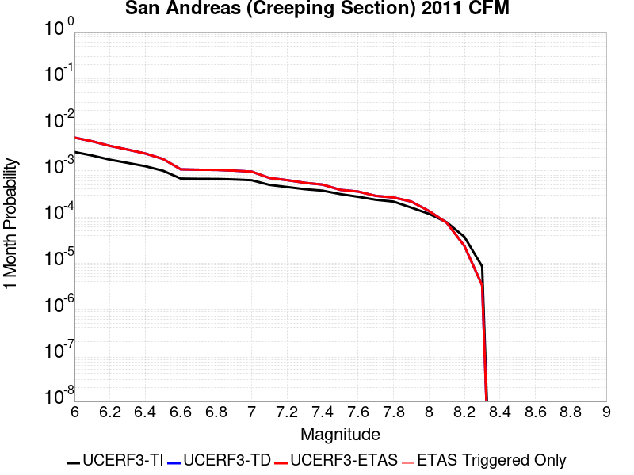 |  |  |

| Magnitude | 1 wk TI Prob | 1 wk TD Prob | 1 wk ETAS Prob | 1 wk ETAS/TD Gain | 1 wk ETAS Triggered Only | 1 mo TI Prob | 1 mo TD Prob | 1 mo ETAS Prob | 1 mo ETAS/TD Gain | 1 mo ETAS Triggered Only | 1 yr TI Prob | 1 yr TD Prob | 1 yr ETAS Prob | 1 yr ETAS/TD Gain | 1 yr ETAS Triggered Only | 10 yr TI Prob | 10 yr TD Prob | 10 yr ETAS Prob | 10 yr ETAS/TD Gain | 10 yr ETAS Triggered Only |
|-----|-----|-----|-----|-----|-----|-----|-----|-----|-----|-----|-----|-----|-----|-----|-----|-----|-----|-----|-----|-----|
| 6.0 | 5.986481E-4 | 0.0012281181 | 0.0012281181 | 1.0 | 0.0 | 0.0025631124 | 0.0052478816 | 0.0052478816 | 1.0 | 0.0 | 0.030762846 | 0.061232176 | 0.061279114 | 1.0007665 | 5.0E-5 | 0.26835477 | 0.42607728 | 0.42612317 | 1.0001078 | 8.0E-5 |
| 6.1 | 5.015945E-4 | 0.0010222462 | 0.0010222462 | 1.0 | 0.0 | 0.00214792 | 0.004369848 | 0.004369848 | 1.0 | 0.0 | 0.025839351 | 0.051271588 | 0.05131902 | 1.0009252 | 5.0E-5 | 0.23032776 | 0.3729949 | 0.37304506 | 1.0001345 | 8.0E-5 |
| 6.2 | 4.073338E-4 | 8.1118365E-4 | 8.1118365E-4 | 1.0 | 0.0 | 0.0017445484 | 0.0034691135 | 0.0034691135 | 1.0 | 0.0 | 0.021034058 | 0.040956367 | 0.04100432 | 1.0011708 | 5.0E-5 | 0.19150782 | 0.3131846 | 0.31323954 | 1.0001755 | 8.0E-5 |
| 6.3 | 3.464099E-4 | 6.743695E-4 | 6.743695E-4 | 1.0 | 0.0 | 0.0014837692 | 0.0028849328 | 0.0028849328 | 1.0 | 0.0 | 0.017915873 | 0.03421296 | 0.034261253 | 1.0014114 | 5.0E-5 | 0.16538359 | 0.27147684 | 0.2715351 | 1.0002147 | 8.0E-5 |
| 6.4 | 2.935057E-4 | 5.5487157E-4 | 5.5487157E-4 | 1.0 | 0.0 | 0.0012572751 | 0.0023745096 | 0.0023745096 | 1.0 | 0.0 | 0.015200248 | 0.028288092 | 0.02832696 | 1.001374 | 4.0E-5 | 0.14201577 | 0.23315436 | 0.23320803 | 1.0002302 | 7.0E-5 |
| 6.5 | 2.3409708E-4 | 4.2138255E-4 | 4.2138255E-4 | 1.0 | 0.0 | 0.0010028875 | 0.0018039518 | 0.0018039518 | 1.0 | 0.0 | 0.012141965 | 0.02161123 | 0.021650366 | 1.0018109 | 4.0E-5 | 0.11499573 | 0.18700314 | 0.18706004 | 1.0003043 | 7.0E-5 |
| 6.6 | 1.5842178E-4 | 2.511574E-4 | 2.511574E-4 | 1.0 | 0.0 | 6.7877385E-4 | 0.0010759344 | 0.0010759344 | 1.0 | 0.0 | 0.0082328 | 0.013019429 | 0.013049038 | 1.0022743 | 3.0E-5 | 0.07934396 | 0.12333928 | 0.12339188 | 1.0004264 | 6.0E-5 |
| 6.7 | 1.5616413E-4 | 2.46522E-4 | 2.46522E-4 | 1.0 | 0.0 | 6.691031E-4 | 0.0010560873 | 0.0010560873 | 1.0 | 0.0 | 0.0081159435 | 0.0127812615 | 0.012810878 | 1.0023172 | 3.0E-5 | 0.0782586 | 0.12136643 | 0.12141915 | 1.0004344 | 6.0E-5 |
| 6.8 | 1.5538467E-4 | 2.4475955E-4 | 2.4475955E-4 | 1.0 | 0.0 | 6.6576427E-4 | 0.0010485414 | 0.0010485414 | 1.0 | 0.0 | 0.008075596 | 0.01269062 | 0.012720238 | 1.002334 | 3.0E-5 | 0.07788358 | 0.120597176 | 0.12064994 | 1.0004375 | 6.0E-5 |
| 6.9 | 1.5153569E-4 | 2.3584829E-4 | 2.3584829E-4 | 1.0 | 0.0 | 6.49277E-4 | 0.0010103888 | 0.0010103888 | 1.0 | 0.0 | 0.007876333 | 0.012232622 | 0.012262255 | 1.0024225 | 3.0E-5 | 0.07602952 | 0.116666704 | 0.11671971 | 1.0004543 | 6.0E-5 |
| 7.0 | 1.4588932E-4 | 2.2441633E-4 | 2.2441633E-4 | 1.0 | 0.0 | 6.250901E-4 | 9.6143177E-4 | 9.6143177E-4 | 1.0 | 0.0 | 0.0075839474 | 0.011643107 | 0.011672758 | 1.0025467 | 3.0E-5 | 0.073302895 | 0.1115123 | 0.11156561 | 1.000478 | 6.0E-5 |
| 7.1 | 1.1565079E-4 | 1.631913E-4 | 1.631913E-4 | 1.0 | 0.0 | 4.955521E-4 | 6.992047E-4 | 6.992047E-4 | 1.0 | 0.0 | 0.006016669 | 0.008479793 | 0.008509538 | 1.0035079 | 3.0E-5 | 0.058563538 | 0.08384011 | 0.08389508 | 1.0006557 | 6.0E-5 |
| 7.2 | 1.0393792E-4 | 1.4650873E-4 | 1.4650873E-4 | 1.0 | 0.0 | 4.4537216E-4 | 6.277442E-4 | 6.277442E-4 | 1.0 | 0.0 | 0.005408933 | 0.007616173 | 0.0076459446 | 1.003909 | 3.0E-5 | 0.052791595 | 0.07578092 | 0.075836375 | 1.0007317 | 6.0E-5 |
| 7.3 | 9.332884E-5 | 1.2811464E-4 | 1.2811464E-4 | 1.0 | 0.0 | 3.999194E-4 | 5.4894784E-4 | 5.4894784E-4 | 1.0 | 0.0 | 0.0048581534 | 0.006663094 | 0.006692894 | 1.0044724 | 3.0E-5 | 0.047533102 | 0.06662787 | 0.066683866 | 1.0008405 | 6.0E-5 |
| 7.4 | 8.670252E-5 | 1.1729612E-4 | 1.1729612E-4 | 1.0 | 0.0 | 3.715293E-4 | 5.026014E-4 | 5.026014E-4 | 1.0 | 0.0 | 0.004513991 | 0.006102124 | 0.0061319415 | 1.0048863 | 3.0E-5 | 0.044233937 | 0.061277855 | 0.061334178 | 1.0009191 | 6.0E-5 |
| 7.5 | 7.3036405E-5 | 9.0276684E-5 | 9.0276684E-5 | 1.0 | 0.0 | 3.129756E-4 | 3.868428E-4 | 3.868428E-4 | 1.0 | 0.0 | 0.0038038217 | 0.0046996614 | 0.0047295205 | 1.0063535 | 3.0E-5 | 0.03739367 | 0.047983047 | 0.048030645 | 1.0009921 | 5.0E-5 |
| 7.6 | 6.3935775E-5 | 8.298909E-5 | 8.298909E-5 | 1.0 | 0.0 | 2.7398168E-4 | 3.5561912E-4 | 3.5561912E-4 | 1.0 | 0.0 | 0.0033306254 | 0.004321086 | 0.0043509565 | 1.0069127 | 3.0E-5 | 0.032811474 | 0.044081833 | 0.04412963 | 1.0010842 | 5.0E-5 |
| 7.7 | 5.5050095E-5 | 6.678156E-5 | 6.678156E-5 | 1.0 | 0.0 | 2.3590765E-4 | 2.8617532E-4 | 2.8617532E-4 | 1.0 | 0.0 | 0.0028683927 | 0.0034786223 | 0.0034985526 | 1.0057294 | 2.0E-5 | 0.0283165 | 0.035876084 | 0.03591465 | 1.0010749 | 4.0E-5 |
| 7.8 | 5.027131E-5 | 6.177745E-5 | 6.177745E-5 | 1.0 | 0.0 | 2.1543067E-4 | 2.6473365E-4 | 2.6473365E-4 | 1.0 | 0.0 | 0.0026197135 | 0.003218372 | 0.0032383075 | 1.0061944 | 2.0E-5 | 0.025890453 | 0.033199526 | 0.0332382 | 1.0011648 | 4.0E-5 |
| 7.9 | 3.7271806E-5 | 5.0343926E-5 | 5.0343926E-5 | 1.0 | 0.0 | 1.5972654E-4 | 2.1574185E-4 | 2.1574185E-4 | 1.0 | 0.0 | 0.0019429359 | 0.0026234952 | 0.002633469 | 1.0038017 | 1.0E-5 | 0.019260362 | 0.027125923 | 0.02714538 | 1.0007173 | 2.0E-5 |
| 8.0 | 2.7310243E-5 | 3.1506035E-5 | 3.1506035E-5 | 1.0 | 0.0 | 1.17038646E-4 | 1.3501888E-4 | 1.3501888E-4 | 1.0 | 0.0 | 0.0014240141 | 0.0016426162 | 0.0016525998 | 1.0060779 | 1.0E-5 | 0.014149235 | 0.01725378 | 0.017273435 | 1.0011392 | 2.0E-5 |
| 8.1 | 1.7940547E-5 | 1.7449367E-5 | 1.7449367E-5 | 1.0 | 0.0 | 7.688579E-5 | 7.478086E-5 | 7.478086E-5 | 1.0 | 0.0 | 9.3568244E-4 | 9.1007724E-4 | 9.200681E-4 | 1.0109781 | 1.0E-5 | 0.009317525 | 0.009824635 | 0.009844438 | 1.0020157 | 2.0E-5 |
| 8.2 | 8.643924E-6 | 5.494016E-6 | 5.494016E-6 | 1.0 | 0.0 | 3.704486E-5 | 2.3545572E-5 | 2.3545572E-5 | 1.0 | 0.0 | 4.5092785E-4 | 2.866297E-4 | 2.866297E-4 | 1.0 | 0.0 | 0.0045001395 | 0.0032592218 | 0.0032592218 | 1.0 | 0.0 |
| 8.3 | 1.983087E-6 | 7.690063E-7 | 7.690063E-7 | 1.0 | 0.0 | 8.498917E-6 | 3.295737E-6 | 3.295737E-6 | 1.0 | 0.0 | 1.034694E-4 | 4.012488E-5 | 4.012488E-5 | 1.0 | 0.0 | 0.0010342124 | 4.737206E-4 | 4.737206E-4 | 1.0 | 0.0 |

## Cleghorn Lake
*[(top)](#table-of-contents)*

| 1 Week | 1 Month | 1 Year | 10 Year |
|-----|-----|-----|-----|
|  |  |  |  |

| Magnitude | 1 wk TI Prob | 1 wk TD Prob | 1 wk ETAS Prob | 1 wk ETAS/TD Gain | 1 wk ETAS Triggered Only | 1 mo TI Prob | 1 mo TD Prob | 1 mo ETAS Prob | 1 mo ETAS/TD Gain | 1 mo ETAS Triggered Only | 1 yr TI Prob | 1 yr TD Prob | 1 yr ETAS Prob | 1 yr ETAS/TD Gain | 1 yr ETAS Triggered Only | 10 yr TI Prob | 10 yr TD Prob | 10 yr ETAS Prob | 10 yr ETAS/TD Gain | 10 yr ETAS Triggered Only |
|-----|-----|-----|-----|-----|-----|-----|-----|-----|-----|-----|-----|-----|-----|-----|-----|-----|-----|-----|-----|-----|
| 6.0 | 1.5467183E-5 | 1.6794971E-5 | 1.6794971E-5 | 1.0 | 0.0 | 6.6286244E-5 | 7.197677E-5 | 7.197677E-5 | 1.0 | 0.0 | 8.067362E-4 | 8.760197E-4 | 9.0599345E-4 | 1.0342158 | 3.0E-5 | 0.008038137 | 0.008731093 | 0.0088302195 | 1.0113534 | 1.0E-4 |
| 6.1 | 1.5467183E-5 | 1.6794971E-5 | 1.6794971E-5 | 1.0 | 0.0 | 6.6286244E-5 | 7.197677E-5 | 7.197677E-5 | 1.0 | 0.0 | 8.067362E-4 | 8.760197E-4 | 9.0599345E-4 | 1.0342158 | 3.0E-5 | 0.008038137 | 0.008731093 | 0.0088302195 | 1.0113534 | 1.0E-4 |
| 6.2 | 1.2624631E-5 | 1.36821545E-5 | 1.36821545E-5 | 1.0 | 0.0 | 5.410444E-5 | 5.863676E-5 | 5.863676E-5 | 1.0 | 0.0 | 6.585225E-4 | 7.137174E-4 | 7.3370314E-4 | 1.0280023 | 2.0E-5 | 0.0065657445 | 0.0071190484 | 0.00718855 | 1.0097628 | 7.0E-5 |
| 6.3 | 1.2624631E-5 | 1.36821545E-5 | 1.36821545E-5 | 1.0 | 0.0 | 5.410444E-5 | 5.863676E-5 | 5.863676E-5 | 1.0 | 0.0 | 6.585225E-4 | 7.137174E-4 | 7.3370314E-4 | 1.0280023 | 2.0E-5 | 0.0065657445 | 0.0071190484 | 0.00718855 | 1.0097628 | 7.0E-5 |
| 6.4 | 9.417684E-6 | 1.0170551E-5 | 1.0170551E-5 | 1.0 | 0.0 | 4.036088E-5 | 4.3587577E-5 | 4.3587577E-5 | 1.0 | 0.0 | 4.912829E-4 | 5.3059065E-4 | 5.5058004E-4 | 1.0376738 | 2.0E-5 | 0.004901982 | 0.0052972743 | 0.0053569563 | 1.0112666 | 6.0E-5 |
| 6.5 | 9.368219E-6 | 1.0117976E-5 | 1.0117976E-5 | 1.0 | 0.0 | 4.014889E-5 | 4.3362263E-5 | 4.3362263E-5 | 1.0 | 0.0 | 4.8870314E-4 | 5.278488E-4 | 5.478382E-4 | 1.0378697 | 2.0E-5 | 0.004876298 | 0.0052699856 | 0.0053296695 | 1.0113252 | 6.0E-5 |
| 6.6 | 7.803798E-6 | 8.442198E-6 | 8.442198E-6 | 1.0 | 0.0 | 3.3444423E-5 | 3.6180576E-5 | 3.6180576E-5 | 1.0 | 0.0 | 4.0710976E-4 | 4.404494E-4 | 4.6044058E-4 | 1.0453882 | 2.0E-5 | 0.0040636472 | 0.004399682 | 0.004459418 | 1.0135773 | 6.0E-5 |
| 6.7 | 2.3108669E-6 | 2.4439082E-6 | 2.4439082E-6 | 1.0 | 0.0 | 9.903678E-6 | 1.0473852E-5 | 1.0473852E-5 | 1.0 | 0.0 | 1.205706E-4 | 1.2751187E-4 | 1.2751187E-4 | 1.0 | 0.0 | 0.001205052 | 0.0012744057 | 0.0012943802 | 1.0156736 | 2.0E-5 |
| 6.8 | 2.0882828E-6 | 2.2063484E-6 | 2.2063484E-6 | 1.0 | 0.0 | 8.949753E-6 | 9.455745E-6 | 9.455745E-6 | 1.0 | 0.0 | 1.08957785E-4 | 1.15117786E-4 | 1.15117786E-4 | 1.0 | 0.0 | 0.0010890438 | 0.0011505984 | 0.0011705754 | 1.0173622 | 2.0E-5 |
| 6.9 | 1.876935E-6 | 1.9811093E-6 | 1.9811093E-6 | 1.0 | 0.0 | 8.043982E-6 | 8.490441E-6 | 8.490441E-6 | 1.0 | 0.0 | 9.7931086E-5 | 1.0336639E-4 | 1.0336639E-4 | 1.0 | 0.0 | 9.788794E-4 | 0.001033199 | 0.0010531783 | 1.0193373 | 2.0E-5 |
| 7.0 | 1.5357559E-6 | 1.620328E-6 | 1.620328E-6 | 1.0 | 0.0 | 6.5817944E-6 | 6.9442453E-6 | 6.9442453E-6 | 1.0 | 0.0 | 8.01304E-5 | 8.454303E-5 | 8.454303E-5 | 1.0 | 0.0 | 8.010151E-4 | 8.4512116E-4 | 8.551127E-4 | 1.0118226 | 1.0E-5 |
| 7.1 | 1.0905424E-6 | 1.1497951E-6 | 1.1497951E-6 | 1.0 | 0.0 | 4.6737446E-6 | 4.9276846E-6 | 4.9276846E-6 | 1.0 | 0.0 | 5.6901354E-5 | 5.9993006E-5 | 5.9993006E-5 | 1.0 | 0.0 | 5.6886784E-4 | 5.997779E-4 | 6.097719E-4 | 1.0166628 | 1.0E-5 |
| 7.2 | 6.06668E-7 | 6.387457E-7 | 6.387457E-7 | 1.0 | 0.0 | 2.600003E-6 | 2.737479E-6 | 2.737479E-6 | 1.0 | 0.0 | 3.1654577E-5 | 3.3328364E-5 | 3.3328364E-5 | 1.0 | 0.0 | 3.1650066E-4 | 3.3324052E-4 | 3.432372E-4 | 1.0299983 | 1.0E-5 |

## Manix-Afton Hills
*[(top)](#table-of-contents)*

| 1 Week | 1 Month | 1 Year | 10 Year |
|-----|-----|-----|-----|
|  |  |  |  |

| Magnitude | 1 wk TI Prob | 1 wk TD Prob | 1 wk ETAS Prob | 1 wk ETAS/TD Gain | 1 wk ETAS Triggered Only | 1 mo TI Prob | 1 mo TD Prob | 1 mo ETAS Prob | 1 mo ETAS/TD Gain | 1 mo ETAS Triggered Only | 1 yr TI Prob | 1 yr TD Prob | 1 yr ETAS Prob | 1 yr ETAS/TD Gain | 1 yr ETAS Triggered Only | 10 yr TI Prob | 10 yr TD Prob | 10 yr ETAS Prob | 10 yr ETAS/TD Gain | 10 yr ETAS Triggered Only |
|-----|-----|-----|-----|-----|-----|-----|-----|-----|-----|-----|-----|-----|-----|-----|-----|-----|-----|-----|-----|-----|
| 6.0 | 1.3783202E-5 | 1.4711616E-5 | 1.4711616E-5 | 1.0 | 0.0 | 5.906953E-5 | 6.3048356E-5 | 6.3048356E-5 | 1.0 | 0.0 | 7.189342E-4 | 7.673609E-4 | 8.073302E-4 | 1.0520867 | 4.0E-5 | 0.0071661277 | 0.0076488685 | 0.0077481037 | 1.0129738 | 1.0E-4 |
| 6.1 | 1.3783202E-5 | 1.4711616E-5 | 1.4711616E-5 | 1.0 | 0.0 | 5.906953E-5 | 6.3048356E-5 | 6.3048356E-5 | 1.0 | 0.0 | 7.189342E-4 | 7.673609E-4 | 8.073302E-4 | 1.0520867 | 4.0E-5 | 0.0071661277 | 0.0076488685 | 0.0077481037 | 1.0129738 | 1.0E-4 |
| 6.2 | 1.3783202E-5 | 1.4711616E-5 | 1.4711616E-5 | 1.0 | 0.0 | 5.906953E-5 | 6.3048356E-5 | 6.3048356E-5 | 1.0 | 0.0 | 7.189342E-4 | 7.673609E-4 | 8.073302E-4 | 1.0520867 | 4.0E-5 | 0.0071661277 | 0.0076488685 | 0.0077481037 | 1.0129738 | 1.0E-4 |
| 6.3 | 1.10494875E-5 | 1.1793558E-5 | 1.1793558E-5 | 1.0 | 0.0 | 4.7354086E-5 | 5.0542898E-5 | 5.0542898E-5 | 1.0 | 0.0 | 5.763835E-4 | 6.151964E-4 | 6.551718E-4 | 1.0649799 | 4.0E-5 | 0.005748908 | 0.0061359745 | 0.0062353606 | 1.0161973 | 1.0E-4 |
| 6.4 | 1.10494875E-5 | 1.1793558E-5 | 1.1793558E-5 | 1.0 | 0.0 | 4.7354086E-5 | 5.0542898E-5 | 5.0542898E-5 | 1.0 | 0.0 | 5.763835E-4 | 6.151964E-4 | 6.551718E-4 | 1.0649799 | 4.0E-5 | 0.005748908 | 0.0061359745 | 0.0062353606 | 1.0161973 | 1.0E-4 |
| 6.5 | 9.788949E-6 | 1.0454697E-5 | 1.0454697E-5 | 1.0 | 0.0 | 4.1951964E-5 | 4.480513E-5 | 4.480513E-5 | 1.0 | 0.0 | 5.1064545E-4 | 5.453752E-4 | 5.853534E-4 | 1.073304 | 4.0E-5 | 0.0050947363 | 0.005441295 | 0.005530805 | 1.0164502 | 9.0E-5 |
| 6.6 | 8.810006E-6 | 9.413971E-6 | 9.413971E-6 | 1.0 | 0.0 | 3.775662E-5 | 4.0345018E-5 | 4.0345018E-5 | 1.0 | 0.0 | 4.5958988E-4 | 4.9109873E-4 | 5.3107913E-4 | 1.08141 | 4.0E-5 | 0.0045864056 | 0.0049010175 | 0.0049905763 | 1.0182736 | 9.0E-5 |
| 6.7 | 8.80128E-6 | 9.404451E-6 | 9.404451E-6 | 1.0 | 0.0 | 3.7719226E-5 | 4.0304214E-5 | 4.0304214E-5 | 1.0 | 0.0 | 4.591348E-4 | 4.906022E-4 | 5.305826E-4 | 1.0814924 | 4.0E-5 | 0.004581874 | 0.004896074 | 0.0049856333 | 1.0182921 | 9.0E-5 |
| 6.8 | 6.8994877E-6 | 7.3803494E-6 | 7.3803494E-6 | 1.0 | 0.0 | 2.9568899E-5 | 3.162973E-5 | 3.162973E-5 | 1.0 | 0.0 | 3.5994186E-4 | 3.850321E-4 | 4.050244E-4 | 1.0519238 | 2.0E-5 | 0.003593594 | 0.0038444551 | 0.0038743396 | 1.0077734 | 3.0E-5 |
| 6.9 | 4.9328037E-6 | 5.271154E-6 | 5.271154E-6 | 1.0 | 0.0 | 2.1140417E-5 | 2.2590497E-5 | 2.2590497E-5 | 1.0 | 0.0 | 2.5735417E-4 | 2.7501077E-4 | 2.9500524E-4 | 1.0727044 | 2.0E-5 | 0.0025705635 | 0.0027473096 | 0.0027672546 | 1.0072598 | 2.0E-5 |
| 7.0 | 3.347973E-6 | 3.590168E-6 | 3.590168E-6 | 1.0 | 0.0 | 1.4348378E-5 | 1.5386368E-5 | 1.5386368E-5 | 1.0 | 0.0 | 1.746775E-4 | 1.8731703E-4 | 1.9731515E-4 | 1.0533755 | 1.0E-5 | 0.0017454025 | 0.0018719939 | 0.0018819752 | 1.0053319 | 1.0E-5 |
| 7.1 | 1.2073567E-6 | 1.293531E-6 | 1.293531E-6 | 1.0 | 0.0 | 5.1743755E-6 | 5.5437017E-6 | 5.5437017E-6 | 1.0 | 0.0 | 6.29962E-5 | 6.749411E-5 | 6.749411E-5 | 1.0 | 0.0 | 6.297835E-4 | 6.748963E-4 | 6.748963E-4 | 1.0 | 0.0 |

## Red Mountain
*[(top)](#table-of-contents)*

| 1 Week | 1 Month | 1 Year | 10 Year |
|-----|-----|-----|-----|
|  |  |  |  |

| Magnitude | 1 wk TI Prob | 1 wk TD Prob | 1 wk ETAS Prob | 1 wk ETAS/TD Gain | 1 wk ETAS Triggered Only | 1 mo TI Prob | 1 mo TD Prob | 1 mo ETAS Prob | 1 mo ETAS/TD Gain | 1 mo ETAS Triggered Only | 1 yr TI Prob | 1 yr TD Prob | 1 yr ETAS Prob | 1 yr ETAS/TD Gain | 1 yr ETAS Triggered Only | 10 yr TI Prob | 10 yr TD Prob | 10 yr ETAS Prob | 10 yr ETAS/TD Gain | 10 yr ETAS Triggered Only |
|-----|-----|-----|-----|-----|-----|-----|-----|-----|-----|-----|-----|-----|-----|-----|-----|-----|-----|-----|-----|-----|
| 6.0 | 4.1810763E-5 | 4.759426E-5 | 5.759379E-5 | 1.2100993 | 1.0E-5 | 1.7917668E-4 | 2.0396039E-4 | 2.2395632E-4 | 1.0980382 | 2.0E-5 | 0.0021792934 | 0.0024805544 | 0.002500505 | 1.0080427 | 2.0E-5 | 0.021580452 | 0.024546275 | 0.024604803 | 1.0023843 | 6.0E-5 |
| 6.1 | 4.1810763E-5 | 4.759426E-5 | 5.759379E-5 | 1.2100993 | 1.0E-5 | 1.7917668E-4 | 2.0396039E-4 | 2.2395632E-4 | 1.0980382 | 2.0E-5 | 0.0021792934 | 0.0024805544 | 0.002500505 | 1.0080427 | 2.0E-5 | 0.021580452 | 0.024546275 | 0.024604803 | 1.0023843 | 6.0E-5 |
| 6.2 | 4.1810763E-5 | 4.759426E-5 | 5.759379E-5 | 1.2100993 | 1.0E-5 | 1.7917668E-4 | 2.0396039E-4 | 2.2395632E-4 | 1.0980382 | 2.0E-5 | 0.0021792934 | 0.0024805544 | 0.002500505 | 1.0080427 | 2.0E-5 | 0.021580452 | 0.024546275 | 0.024604803 | 1.0023843 | 6.0E-5 |
| 6.3 | 4.1810763E-5 | 4.759426E-5 | 5.759379E-5 | 1.2100993 | 1.0E-5 | 1.7917668E-4 | 2.0396039E-4 | 2.2395632E-4 | 1.0980382 | 2.0E-5 | 0.0021792934 | 0.0024805544 | 0.002500505 | 1.0080427 | 2.0E-5 | 0.021580452 | 0.024546275 | 0.024604803 | 1.0023843 | 6.0E-5 |
| 6.4 | 4.1810763E-5 | 4.759426E-5 | 5.759379E-5 | 1.2100993 | 1.0E-5 | 1.7917668E-4 | 2.0396039E-4 | 2.2395632E-4 | 1.0980382 | 2.0E-5 | 0.0021792934 | 0.0024805544 | 0.002500505 | 1.0080427 | 2.0E-5 | 0.021580452 | 0.024546275 | 0.024604803 | 1.0023843 | 6.0E-5 |
| 6.5 | 3.154503E-5 | 3.5362766E-5 | 4.5362412E-5 | 1.2827734 | 1.0E-5 | 1.3518598E-4 | 1.5154642E-4 | 1.615449E-4 | 1.0659764 | 1.0E-5 | 0.0016446467 | 0.0018436083 | 0.0018535899 | 1.0054141 | 1.0E-5 | 0.01632528 | 0.018292787 | 0.018341873 | 1.0026833 | 5.0E-5 |
| 6.6 | 3.1535834E-5 | 3.5352146E-5 | 4.5351793E-5 | 1.2828583 | 1.0E-5 | 1.3514658E-4 | 1.5150092E-4 | 1.614994E-4 | 1.0659962 | 1.0E-5 | 0.0016441676 | 0.0018430552 | 0.0018530368 | 1.0054158 | 1.0E-5 | 0.01632056 | 0.018287348 | 0.018336432 | 1.0026841 | 5.0E-5 |
| 6.7 | 2.8267326E-5 | 3.1471976E-5 | 4.1471663E-5 | 1.317733 | 1.0E-5 | 1.2114006E-4 | 1.3487341E-4 | 1.4487206E-4 | 1.0741336 | 1.0E-5 | 0.0014738824 | 0.0016409319 | 0.0016509155 | 1.0060841 | 1.0E-5 | 0.014641452 | 0.01629692 | 0.016346104 | 1.003018 | 5.0E-5 |
| 6.8 | 2.8212884E-5 | 3.1409858E-5 | 4.1409545E-5 | 1.3183614 | 1.0E-5 | 1.20906756E-4 | 1.3460721E-4 | 1.4460586E-4 | 1.0742803 | 1.0E-5 | 0.0014710457 | 0.0016376958 | 0.0016476795 | 1.0060961 | 1.0E-5 | 0.014613459 | 0.016265033 | 0.01631422 | 1.0030241 | 5.0E-5 |
| 6.9 | 2.4227871E-5 | 2.6709162E-5 | 3.6708894E-5 | 1.3743933 | 1.0E-5 | 1.03829596E-4 | 1.1446325E-4 | 1.244621E-4 | 1.0873543 | 1.0E-5 | 0.0012633923 | 0.0013927751 | 0.0014027611 | 1.00717 | 1.0E-5 | 0.012562336 | 0.013848151 | 0.013897459 | 1.0035605 | 5.0E-5 |
| 7.0 | 2.348524E-5 | 2.5837868E-5 | 3.583761E-5 | 1.3870188 | 1.0E-5 | 1.0064714E-4 | 1.10729445E-4 | 1.20728335E-4 | 1.0903002 | 1.0E-5 | 0.0012246901 | 0.0013473729 | 0.0013573595 | 1.0074118 | 1.0E-5 | 0.012179627 | 0.013399675 | 0.013449005 | 1.0036814 | 5.0E-5 |
| 7.1 | 2.2311642E-5 | 2.4464809E-5 | 3.4464563E-5 | 1.4087404 | 1.0E-5 | 9.561782E-5 | 1.0484539E-4 | 1.1484434E-4 | 1.0953685 | 1.0E-5 | 0.0011635252 | 0.00127582 | 0.0012858072 | 1.0078281 | 1.0E-5 | 0.01157452 | 0.012692473 | 0.012741839 | 1.0038893 | 5.0E-5 |
| 7.2 | 1.6533986E-5 | 1.7671693E-5 | 2.7671516E-5 | 1.5658667 | 1.0E-5 | 7.085802E-5 | 7.573399E-5 | 8.573323E-5 | 1.1320311 | 1.0E-5 | 8.623549E-4 | 9.217347E-4 | 9.317255E-4 | 1.0108391 | 1.0E-5 | 0.008590161 | 0.009185396 | 0.00921512 | 1.003236 | 3.0E-5 |
| 7.3 | 1.4703092E-5 | 1.5560694E-5 | 2.556054E-5 | 1.6426349 | 1.0E-5 | 6.301173E-5 | 6.668733E-5 | 7.6686665E-5 | 1.1499435 | 1.0E-5 | 7.668978E-4 | 8.116775E-4 | 8.2166935E-4 | 1.0123101 | 1.0E-5 | 0.0076425658 | 0.008093204 | 0.008122962 | 1.0036768 | 3.0E-5 |
| 7.4 | 6.1331984E-6 | 5.5291357E-6 | 1.552908E-5 | 2.808591 | 1.0E-5 | 2.6284872E-5 | 2.3696084E-5 | 3.3695847E-5 | 1.4220006 | 1.0E-5 | 3.199713E-4 | 2.8846215E-4 | 2.9845926E-4 | 1.0346566 | 1.0E-5 | 0.0031951098 | 0.0028809316 | 0.002900874 | 1.0069222 | 2.0E-5 |
| 7.5 | 5.954766E-6 | 5.3387566E-6 | 1.5338703E-5 | 2.8730853 | 1.0E-5 | 2.5520176E-5 | 2.288019E-5 | 3.287996E-5 | 1.4370494 | 1.0E-5 | 3.1066386E-4 | 2.7853122E-4 | 2.8852842E-4 | 1.0358926 | 1.0E-5 | 0.003102299 | 0.0027818752 | 0.0028018195 | 1.0071694 | 2.0E-5 |
| 7.6 | 4.9726646E-6 | 4.315507E-6 | 4.315507E-6 | 1.0 | 0.0 | 2.1311245E-5 | 1.84949E-5 | 1.84949E-5 | 1.0 | 0.0 | 2.5943352E-4 | 2.2515249E-4 | 2.2515249E-4 | 1.0 | 0.0 | 0.0025913084 | 0.0022492784 | 0.0022592559 | 1.0044359 | 1.0E-5 |
| 7.7 | 3.3613894E-6 | 2.8528066E-6 | 2.8528066E-6 | 1.0 | 0.0 | 1.4405875E-5 | 1.2226258E-5 | 1.2226258E-5 | 1.0 | 0.0 | 1.7537741E-4 | 1.4884479E-4 | 1.4884479E-4 | 1.0 | 0.0 | 0.0017523908 | 0.0014874772 | 0.0014974623 | 1.0067128 | 1.0E-5 |
| 7.8 | 1.1828961E-6 | 1.0123285E-6 | 1.0123285E-6 | 1.0 | 0.0 | 5.069545E-6 | 4.338544E-6 | 4.338544E-6 | 1.0 | 0.0 | 6.171996E-5 | 5.2820524E-5 | 5.2820524E-5 | 1.0 | 0.0 | 6.170282E-4 | 5.280826E-4 | 5.280826E-4 | 1.0 | 0.0 |
| 7.9 | 2.2967266E-7 | 1.8619782E-7 | 1.8619782E-7 | 1.0 | 0.0 | 9.843111E-7 | 7.979905E-7 | 7.979905E-7 | 1.0 | 0.0 | 1.19839215E-5 | 9.715493E-6 | 9.715493E-6 | 1.0 | 0.0 | 1.1983275E-4 | 9.715097E-5 | 9.715097E-5 | 1.0 | 0.0 |

## Pinto Mtn
*[(top)](#table-of-contents)*

| 1 Week | 1 Month | 1 Year | 10 Year |
|-----|-----|-----|-----|
|  |  |  |  |

| Magnitude | 1 wk TI Prob | 1 wk TD Prob | 1 wk ETAS Prob | 1 wk ETAS/TD Gain | 1 wk ETAS Triggered Only | 1 mo TI Prob | 1 mo TD Prob | 1 mo ETAS Prob | 1 mo ETAS/TD Gain | 1 mo ETAS Triggered Only | 1 yr TI Prob | 1 yr TD Prob | 1 yr ETAS Prob | 1 yr ETAS/TD Gain | 1 yr ETAS Triggered Only | 10 yr TI Prob | 10 yr TD Prob | 10 yr ETAS Prob | 10 yr ETAS/TD Gain | 10 yr ETAS Triggered Only |
|-----|-----|-----|-----|-----|-----|-----|-----|-----|-----|-----|-----|-----|-----|-----|-----|-----|-----|-----|-----|-----|
| 6.0 | 4.4194956E-5 | 4.786026E-5 | 4.786026E-5 | 1.0 | 0.0 | 1.893932E-4 | 2.051002E-4 | 2.051002E-4 | 1.0 | 0.0 | 0.0023034236 | 0.0024943987 | 0.0025342992 | 1.015996 | 4.0E-5 | 0.022796938 | 0.024681535 | 0.02475956 | 1.0031613 | 8.0E-5 |
| 6.1 | 4.4194956E-5 | 4.786026E-5 | 4.786026E-5 | 1.0 | 0.0 | 1.893932E-4 | 2.051002E-4 | 2.051002E-4 | 1.0 | 0.0 | 0.0023034236 | 0.0024943987 | 0.0025342992 | 1.015996 | 4.0E-5 | 0.022796938 | 0.024681535 | 0.02475956 | 1.0031613 | 8.0E-5 |
| 6.2 | 4.4194956E-5 | 4.786026E-5 | 4.786026E-5 | 1.0 | 0.0 | 1.893932E-4 | 2.051002E-4 | 2.051002E-4 | 1.0 | 0.0 | 0.0023034236 | 0.0024943987 | 0.0025342992 | 1.015996 | 4.0E-5 | 0.022796938 | 0.024681535 | 0.02475956 | 1.0031613 | 8.0E-5 |
| 6.3 | 4.4194956E-5 | 4.786026E-5 | 4.786026E-5 | 1.0 | 0.0 | 1.893932E-4 | 2.051002E-4 | 2.051002E-4 | 1.0 | 0.0 | 0.0023034236 | 0.0024943987 | 0.0025342992 | 1.015996 | 4.0E-5 | 0.022796938 | 0.024681535 | 0.02475956 | 1.0031613 | 8.0E-5 |
| 6.4 | 3.729929E-5 | 3.9608974E-5 | 3.9608974E-5 | 1.0 | 0.0 | 1.5984432E-4 | 1.6974223E-4 | 1.6974223E-4 | 1.0 | 0.0 | 0.0019443673 | 0.0020647459 | 0.002094684 | 1.0144997 | 3.0E-5 | 0.019274427 | 0.020465652 | 0.020524424 | 1.0028718 | 6.0E-5 |
| 6.5 | 3.729929E-5 | 3.9608974E-5 | 3.9608974E-5 | 1.0 | 0.0 | 1.5984432E-4 | 1.6974223E-4 | 1.6974223E-4 | 1.0 | 0.0 | 0.0019443673 | 0.0020647459 | 0.002094684 | 1.0144997 | 3.0E-5 | 0.019274427 | 0.020465652 | 0.020524424 | 1.0028718 | 6.0E-5 |
| 6.6 | 3.0204548E-5 | 3.1210264E-5 | 3.1210264E-5 | 1.0 | 0.0 | 1.2944164E-4 | 1.3375162E-4 | 1.3375162E-4 | 1.0 | 0.0 | 0.0015748127 | 0.0016272442 | 0.0016571954 | 1.018406 | 3.0E-5 | 0.015636992 | 0.01615716 | 0.016206352 | 1.0030446 | 5.0E-5 |
| 6.7 | 2.9857754E-5 | 3.081962E-5 | 3.081962E-5 | 1.0 | 0.0 | 1.2795553E-4 | 1.320776E-4 | 1.320776E-4 | 1.0 | 0.0 | 0.0015567453 | 0.0016068934 | 0.0016368451 | 1.0186396 | 3.0E-5 | 0.015458848 | 0.015956586 | 0.016005788 | 1.0030835 | 5.0E-5 |
| 6.8 | 2.4819734E-5 | 2.5013833E-5 | 2.5013833E-5 | 1.0 | 0.0 | 1.0636595E-4 | 1.07197855E-4 | 1.07197855E-4 | 1.0 | 0.0 | 0.0012942362 | 0.0013043742 | 0.001324348 | 1.015313 | 2.0E-5 | 0.012867244 | 0.01296955 | 0.01300903 | 1.0030441 | 4.0E-5 |
| 6.9 | 2.331124E-5 | 2.3342016E-5 | 2.3342016E-5 | 1.0 | 0.0 | 9.990149E-5 | 1.0003349E-4 | 1.0003349E-4 | 1.0 | 0.0 | 0.001215622 | 0.0012172476 | 0.0012372233 | 1.0164105 | 2.0E-5 | 0.012089936 | 0.012107995 | 0.012147511 | 1.0032636 | 4.0E-5 |
| 7.0 | 2.1818534E-5 | 2.1765065E-5 | 2.1765065E-5 | 1.0 | 0.0 | 9.3504656E-5 | 9.327562E-5 | 9.327562E-5 | 1.0 | 0.0 | 0.0011378246 | 0.0011350589 | 0.0011550363 | 1.0176002 | 2.0E-5 | 0.011320163 | 0.011294719 | 0.0113342665 | 1.0035015 | 4.0E-5 |
| 7.1 | 2.066081E-5 | 2.0544632E-5 | 2.0544632E-5 | 1.0 | 0.0 | 8.854332E-5 | 8.804556E-5 | 8.804556E-5 | 1.0 | 0.0 | 0.0010774818 | 0.0010714472 | 0.0010814364 | 1.0093231 | 1.0E-5 | 0.010722724 | 0.010664865 | 0.010694545 | 1.002783 | 3.0E-5 |
| 7.2 | 1.8990233E-5 | 1.9057838E-5 | 1.9057838E-5 | 1.0 | 0.0 | 8.138417E-5 | 8.1674E-5 | 8.1674E-5 | 1.0 | 0.0 | 9.904018E-4 | 9.939467E-4 | 0.0010039367 | 1.0100509 | 1.0E-5 | 0.009859995 | 0.00989701 | 0.009926714 | 1.0030012 | 3.0E-5 |
| 7.3 | 1.3335872E-5 | 1.4910233E-5 | 1.4910233E-5 | 1.0 | 0.0 | 5.7152483E-5 | 6.3899504E-5 | 6.3899504E-5 | 1.0 | 0.0 | 6.956093E-4 | 7.7771157E-4 | 7.877038E-4 | 1.0128483 | 1.0E-5 | 0.006934359 | 0.007751199 | 0.0077809663 | 1.0038403 | 3.0E-5 |
| 7.4 | 9.414066E-6 | 1.1864307E-5 | 1.1864307E-5 | 1.0 | 0.0 | 4.0345374E-5 | 5.0846094E-5 | 5.0846094E-5 | 1.0 | 0.0 | 4.910942E-4 | 6.188848E-4 | 6.288786E-4 | 1.0161481 | 1.0E-5 | 0.0049001034 | 0.0061725616 | 0.0062023764 | 1.0048302 | 3.0E-5 |
| 7.5 | 7.2101157E-6 | 9.16147E-6 | 9.16147E-6 | 1.0 | 0.0 | 3.090013E-5 | 3.9262897E-5 | 3.9262897E-5 | 1.0 | 0.0 | 3.7614413E-4 | 4.7792873E-4 | 4.8792394E-4 | 1.0209136 | 1.0E-5 | 0.0037550807 | 0.0047697844 | 0.0047996417 | 1.0062596 | 3.0E-5 |
| 7.6 | 3.296375E-6 | 4.548674E-6 | 4.548674E-6 | 1.0 | 0.0 | 1.4127245E-5 | 1.9494179E-5 | 1.9494179E-5 | 1.0 | 0.0 | 1.7198564E-4 | 2.3731717E-4 | 2.3731717E-4 | 1.0 | 0.0 | 0.0017185259 | 0.002370775 | 0.002370775 | 1.0 | 0.0 |
| 7.7 | 2.5741092E-6 | 3.5873995E-6 | 3.5873995E-6 | 1.0 | 0.0 | 1.103185E-5 | 1.5374486E-5 | 1.5374486E-5 | 1.0 | 0.0 | 1.3430449E-4 | 1.8716961E-4 | 1.8716961E-4 | 1.0 | 0.0 | 0.0013422335 | 0.0018702497 | 0.0018702497 | 1.0 | 0.0 |

## Scodie Lineament
*[(top)](#table-of-contents)*

| 1 Week | 1 Month | 1 Year | 10 Year |
|-----|-----|-----|-----|
|  |  |  |  |

| Magnitude | 1 wk TI Prob | 1 wk TD Prob | 1 wk ETAS Prob | 1 wk ETAS/TD Gain | 1 wk ETAS Triggered Only | 1 mo TI Prob | 1 mo TD Prob | 1 mo ETAS Prob | 1 mo ETAS/TD Gain | 1 mo ETAS Triggered Only | 1 yr TI Prob | 1 yr TD Prob | 1 yr ETAS Prob | 1 yr ETAS/TD Gain | 1 yr ETAS Triggered Only | 10 yr TI Prob | 10 yr TD Prob | 10 yr ETAS Prob | 10 yr ETAS/TD Gain | 10 yr ETAS Triggered Only |
|-----|-----|-----|-----|-----|-----|-----|-----|-----|-----|-----|-----|-----|-----|-----|-----|-----|-----|-----|-----|-----|
| 6.0 | 3.2919327E-6 | 3.0133872E-6 | 3.0133872E-6 | 1.0 | 0.0 | 1.4108206E-5 | 1.2914471E-5 | 1.2914471E-5 | 1.0 | 0.0 | 1.7175387E-4 | 1.5722551E-4 | 1.872208E-4 | 1.1907787 | 3.0E-5 | 0.0017162118 | 0.0015714543 | 0.0016613129 | 1.0571818 | 9.0E-5 |
| 6.1 | 1.8663811E-6 | 1.5490738E-6 | 1.5490738E-6 | 1.0 | 0.0 | 7.998751E-6 | 6.638874E-6 | 6.638874E-6 | 1.0 | 0.0 | 9.738045E-5 | 8.082579E-5 | 1.0082417E-4 | 1.2474258 | 2.0E-5 | 9.7337784E-4 | 8.0801273E-4 | 8.579723E-4 | 1.0618302 | 5.0E-5 |
| 6.2 | 1.8663811E-6 | 1.5490738E-6 | 1.5490738E-6 | 1.0 | 0.0 | 7.998751E-6 | 6.638874E-6 | 6.638874E-6 | 1.0 | 0.0 | 9.738045E-5 | 8.082579E-5 | 1.0082417E-4 | 1.2474258 | 2.0E-5 | 9.7337784E-4 | 8.0801273E-4 | 8.579723E-4 | 1.0618302 | 5.0E-5 |
| 6.3 | 1.8663811E-6 | 1.5490738E-6 | 1.5490738E-6 | 1.0 | 0.0 | 7.998751E-6 | 6.638874E-6 | 6.638874E-6 | 1.0 | 0.0 | 9.738045E-5 | 8.082579E-5 | 1.0082417E-4 | 1.2474258 | 2.0E-5 | 9.7337784E-4 | 8.0801273E-4 | 8.579723E-4 | 1.0618302 | 5.0E-5 |
| 6.4 | 1.8663811E-6 | 1.5490738E-6 | 1.5490738E-6 | 1.0 | 0.0 | 7.998751E-6 | 6.638874E-6 | 6.638874E-6 | 1.0 | 0.0 | 9.738045E-5 | 8.082579E-5 | 1.0082417E-4 | 1.2474258 | 2.0E-5 | 9.7337784E-4 | 8.0801273E-4 | 8.579723E-4 | 1.0618302 | 5.0E-5 |
| 6.5 | 1.8106311E-6 | 1.4910065E-6 | 1.4910065E-6 | 1.0 | 0.0 | 7.759824E-6 | 6.390015E-6 | 6.390015E-6 | 1.0 | 0.0 | 9.447177E-5 | 7.7796154E-5 | 9.77946E-5 | 1.2570621 | 2.0E-5 | 9.4431615E-4 | 7.777379E-4 | 8.2769897E-4 | 1.064239 | 5.0E-5 |
| 6.6 | 1.2414679E-6 | 8.9976623E-7 | 8.9976623E-7 | 1.0 | 0.0 | 5.320566E-6 | 3.8561357E-6 | 3.8561357E-6 | 1.0 | 0.0 | 6.477596E-5 | 4.694753E-5 | 6.694659E-5 | 1.4259875 | 2.0E-5 | 6.475708E-4 | 4.6938477E-4 | 4.993707E-4 | 1.0638834 | 3.0E-5 |
| 6.7 | 1.1062215E-6 | 7.5943876E-7 | 7.5943876E-7 | 1.0 | 0.0 | 4.7409408E-6 | 3.2547339E-6 | 3.2547339E-6 | 1.0 | 0.0 | 5.7719422E-5 | 3.9625735E-5 | 5.9624945E-5 | 1.5047024 | 2.0E-5 | 5.770443E-4 | 3.9619367E-4 | 4.261818E-4 | 1.0756905 | 3.0E-5 |
| 6.8 | 1.0006736E-6 | 6.500452E-7 | 6.500452E-7 | 1.0 | 0.0 | 4.288594E-6 | 2.7859055E-6 | 2.7859055E-6 | 1.0 | 0.0 | 5.221238E-5 | 3.391793E-5 | 5.3917254E-5 | 1.5896386 | 2.0E-5 | 5.220012E-4 | 3.3913364E-4 | 3.6912345E-4 | 1.0884308 | 3.0E-5 |
| 6.9 | 9.167364E-7 | 5.631664E-7 | 5.631664E-7 | 1.0 | 0.0 | 3.9288643E-6 | 2.4135684E-6 | 2.4135684E-6 | 1.0 | 0.0 | 4.7832873E-5 | 2.9384857E-5 | 4.9384267E-5 | 1.6806027 | 2.0E-5 | 4.782258E-4 | 2.938154E-4 | 3.2380657E-4 | 1.102075 | 3.0E-5 |
| 7.0 | 7.6987664E-7 | 4.113395E-7 | 4.113395E-7 | 1.0 | 0.0 | 3.2994672E-6 | 1.7628826E-6 | 1.7628826E-6 | 1.0 | 0.0 | 4.0170275E-5 | 2.1462924E-5 | 3.146271E-5 | 1.4659097 | 1.0E-5 | 4.0163012E-4 | 2.1461236E-4 | 2.3460807E-4 | 1.0931712 | 2.0E-5 |
| 7.1 | 7.1038727E-7 | 3.521151E-7 | 3.521151E-7 | 1.0 | 0.0 | 3.0445133E-6 | 1.5090641E-6 | 1.5090641E-6 | 1.0 | 0.0 | 3.706632E-5 | 1.8372735E-5 | 2.8372551E-5 | 1.5442748 | 1.0E-5 | 3.7060137E-4 | 1.8371566E-4 | 2.0371198E-4 | 1.1088439 | 2.0E-5 |
| 7.2 | 2.0799602E-7 | 3.118087E-8 | 3.118087E-8 | 1.0 | 0.0 | 8.914113E-7 | 1.336323E-7 | 1.336323E-7 | 1.0 | 0.0 | 1.0852878E-5 | 1.6269721E-6 | 1.6269721E-6 | 1.0 | 0.0 | 1.08523476E-4 | 1.6269609E-5 | 1.6269609E-5 | 1.0 | 0.0 |
| 7.3 | 1.5048182E-7 | 1.5940762E-8 | 1.5940762E-8 | 1.0 | 0.0 | 6.449219E-7 | 6.831755E-8 | 6.831755E-8 | 1.0 | 0.0 | 7.851896E-6 | 8.317658E-7 | 8.317658E-7 | 1.0 | 0.0 | 7.851618E-5 | 8.31763E-6 | 8.31763E-6 | 1.0 | 0.0 |
| 7.4 | 5.9334678E-8 | 4.864214E-9 | 4.864214E-9 | 1.0 | 0.0 | 2.5429145E-7 | 2.0846631E-8 | 2.0846631E-8 | 1.0 | 0.0 | 3.095994E-6 | 2.5380774E-7 | 2.5380774E-7 | 1.0 | 0.0 | 3.095951E-5 | 2.5380755E-6 | 2.5380755E-6 | 1.0 | 0.0 |

## Lake Isabella (Seismicity)
*[(top)](#table-of-contents)*

| 1 Week | 1 Month | 1 Year | 10 Year |
|-----|-----|-----|-----|
|  |  |  |  |

| Magnitude | 1 wk TI Prob | 1 wk TD Prob | 1 wk ETAS Prob | 1 wk ETAS/TD Gain | 1 wk ETAS Triggered Only | 1 mo TI Prob | 1 mo TD Prob | 1 mo ETAS Prob | 1 mo ETAS/TD Gain | 1 mo ETAS Triggered Only | 1 yr TI Prob | 1 yr TD Prob | 1 yr ETAS Prob | 1 yr ETAS/TD Gain | 1 yr ETAS Triggered Only | 10 yr TI Prob | 10 yr TD Prob | 10 yr ETAS Prob | 10 yr ETAS/TD Gain | 10 yr ETAS Triggered Only |
|-----|-----|-----|-----|-----|-----|-----|-----|-----|-----|-----|-----|-----|-----|-----|-----|-----|-----|-----|-----|-----|
| 6.0 | 9.431637E-6 | 9.7418215E-6 | 9.7418215E-6 | 1.0 | 0.0 | 4.0420677E-5 | 4.175007E-5 | 4.175007E-5 | 1.0 | 0.0 | 4.920106E-4 | 5.082016E-4 | 5.481813E-4 | 1.078669 | 4.0E-5 | 0.004909227 | 0.005071687 | 0.005161231 | 1.0176556 | 9.0E-5 |
| 6.1 | 9.431637E-6 | 9.7418215E-6 | 9.7418215E-6 | 1.0 | 0.0 | 4.0420677E-5 | 4.175007E-5 | 4.175007E-5 | 1.0 | 0.0 | 4.920106E-4 | 5.082016E-4 | 5.481813E-4 | 1.078669 | 4.0E-5 | 0.004909227 | 0.005071687 | 0.005161231 | 1.0176556 | 9.0E-5 |
| 6.2 | 9.431637E-6 | 9.7418215E-6 | 9.7418215E-6 | 1.0 | 0.0 | 4.0420677E-5 | 4.175007E-5 | 4.175007E-5 | 1.0 | 0.0 | 4.920106E-4 | 5.082016E-4 | 5.481813E-4 | 1.078669 | 4.0E-5 | 0.004909227 | 0.005071687 | 0.005161231 | 1.0176556 | 9.0E-5 |
| 6.3 | 9.431637E-6 | 9.7418215E-6 | 9.7418215E-6 | 1.0 | 0.0 | 4.0420677E-5 | 4.175007E-5 | 4.175007E-5 | 1.0 | 0.0 | 4.920106E-4 | 5.082016E-4 | 5.481813E-4 | 1.078669 | 4.0E-5 | 0.004909227 | 0.005071687 | 0.005161231 | 1.0176556 | 9.0E-5 |
| 6.4 | 5.144063E-6 | 5.3001613E-6 | 5.3001613E-6 | 1.0 | 0.0 | 2.2045799E-5 | 2.27148E-5 | 2.27148E-5 | 1.0 | 0.0 | 2.6837454E-4 | 2.7652105E-4 | 2.8651828E-4 | 1.0361536 | 1.0E-5 | 0.0026805066 | 0.0027621102 | 0.0028019997 | 1.0144417 | 4.0E-5 |
| 6.5 | 5.144063E-6 | 5.3001613E-6 | 5.3001613E-6 | 1.0 | 0.0 | 2.2045799E-5 | 2.27148E-5 | 2.27148E-5 | 1.0 | 0.0 | 2.6837454E-4 | 2.7652105E-4 | 2.8651828E-4 | 1.0361536 | 1.0E-5 | 0.0026805066 | 0.0027621102 | 0.0028019997 | 1.0144417 | 4.0E-5 |
| 6.6 | 3.4009804E-6 | 3.4988395E-6 | 3.4988395E-6 | 1.0 | 0.0 | 1.4575549E-5 | 1.4994949E-5 | 1.4994949E-5 | 1.0 | 0.0 | 1.7744285E-4 | 1.8254982E-4 | 1.9254799E-4 | 1.0547695 | 1.0E-5 | 0.0017730123 | 0.0018241564 | 0.0018541017 | 1.016416 | 3.0E-5 |
| 6.7 | 3.3880428E-6 | 3.485706E-6 | 3.485706E-6 | 1.0 | 0.0 | 1.4520103E-5 | 1.4938664E-5 | 1.4938664E-5 | 1.0 | 0.0 | 1.767679E-4 | 1.8186466E-4 | 1.9186284E-4 | 1.054976 | 1.0E-5 | 0.0017662736 | 0.0018173159 | 0.0018372796 | 1.0109853 | 2.0E-5 |
| 6.8 | 2.6582E-6 | 2.7337414E-6 | 2.7337414E-6 | 1.0 | 0.0 | 1.1392236E-5 | 1.171599E-5 | 1.171599E-5 | 1.0 | 0.0 | 1.3869164E-4 | 1.4263418E-4 | 1.5263275E-4 | 1.0700995 | 1.0E-5 | 0.0013860512 | 0.0014255584 | 0.0014455299 | 1.0140096 | 2.0E-5 |
| 6.9 | 2.406011E-6 | 2.474366E-6 | 2.474366E-6 | 1.0 | 0.0 | 1.0311434E-5 | 1.0604391E-5 | 1.0604391E-5 | 1.0 | 0.0 | 1.2553448E-4 | 1.2910213E-4 | 1.3910084E-4 | 1.077448 | 1.0E-5 | 0.0012546359 | 0.0012904009 | 0.001310375 | 1.0154791 | 2.0E-5 |
| 7.0 | 1.6953097E-6 | 1.7429631E-6 | 1.7429631E-6 | 1.0 | 0.0 | 7.265593E-6 | 7.469827E-6 | 7.469827E-6 | 1.0 | 0.0 | 8.8455E-5 | 9.094239E-5 | 1.00941485E-4 | 1.1099497 | 1.0E-5 | 8.84198E-4 | 9.0915454E-4 | 9.2913635E-4 | 1.0219785 | 2.0E-5 |
| 7.1 | 3.5013824E-7 | 3.5715203E-7 | 3.5715203E-7 | 1.0 | 0.0 | 1.5005916E-6 | 1.5306507E-6 | 1.5306507E-6 | 1.0 | 0.0 | 1.826955E-5 | 1.8635516E-5 | 1.8635516E-5 | 1.0 | 0.0 | 1.8268047E-4 | 1.8633978E-4 | 1.8633978E-4 | 1.0 | 0.0 |
| 7.2 | 2.2321095E-7 | 2.2750805E-7 | 2.2750805E-7 | 1.0 | 0.0 | 9.56618E-7 | 9.750341E-7 | 9.750341E-7 | 1.0 | 0.0 | 1.1646762E-5 | 1.1870978E-5 | 1.1870978E-5 | 1.0 | 0.0 | 1.1646151E-4 | 1.1870354E-4 | 1.1870354E-4 | 1.0 | 0.0 |
| 7.3 | 1.5760406E-7 | 1.6061085E-7 | 1.6061085E-7 | 1.0 | 0.0 | 6.7544585E-7 | 6.88332E-7 | 6.88332E-7 | 1.0 | 0.0 | 8.223522E-6 | 8.380411E-6 | 8.380411E-6 | 1.0 | 0.0 | 8.2232174E-5 | 8.380101E-5 | 8.380101E-5 | 1.0 | 0.0 |
| 7.4 | 1.1216497E-7 | 1.14318226E-7 | 1.14318226E-7 | 1.0 | 0.0 | 4.8070694E-7 | 4.899352E-7 | 4.899352E-7 | 1.0 | 0.0 | 5.852591E-6 | 5.9649446E-6 | 5.9649446E-6 | 1.0 | 0.0 | 5.8524372E-5 | 5.964789E-5 | 5.964789E-5 | 1.0 | 0.0 |
| 7.5 | 4.885185E-8 | 4.9788245E-8 | 4.9788245E-8 | 1.0 | 0.0 | 2.0936506E-7 | 2.1337817E-7 | 2.1337817E-7 | 1.0 | 0.0 | 2.5490165E-6 | 2.5978763E-6 | 2.5978763E-6 | 1.0 | 0.0 | 2.5489873E-5 | 2.5978477E-5 | 2.5978477E-5 | 1.0 | 0.0 |
| 7.6 | 1.504641E-9 | 1.5318049E-9 | 1.5318049E-9 | 1.0 | 0.0 | 6.4484613E-9 | 6.5648784E-9 | 6.5648784E-9 | 1.0 | 0.0 | 7.851001E-8 | 7.9927396E-8 | 7.9927396E-8 | 1.0 | 0.0 | 7.8509987E-7 | 7.9927395E-7 | 7.9927395E-7 | 1.0 | 0.0 |

## Ventura-Pitas Point
*[(top)](#table-of-contents)*

| 1 Week | 1 Month | 1 Year | 10 Year |
|-----|-----|-----|-----|
|  |  |  |  |

| Magnitude | 1 wk TI Prob | 1 wk TD Prob | 1 wk ETAS Prob | 1 wk ETAS/TD Gain | 1 wk ETAS Triggered Only | 1 mo TI Prob | 1 mo TD Prob | 1 mo ETAS Prob | 1 mo ETAS/TD Gain | 1 mo ETAS Triggered Only | 1 yr TI Prob | 1 yr TD Prob | 1 yr ETAS Prob | 1 yr ETAS/TD Gain | 1 yr ETAS Triggered Only | 10 yr TI Prob | 10 yr TD Prob | 10 yr ETAS Prob | 10 yr ETAS/TD Gain | 10 yr ETAS Triggered Only |
|-----|-----|-----|-----|-----|-----|-----|-----|-----|-----|-----|-----|-----|-----|-----|-----|-----|-----|-----|-----|-----|
| 6.0 | 3.3179622E-5 | 3.3739056E-5 | 4.373872E-5 | 1.2963824 | 1.0E-5 | 1.4219063E-4 | 1.445894E-4 | 1.7458506E-4 | 1.2074541 | 3.0E-5 | 0.0017297962 | 0.0017592113 | 0.0017891584 | 1.0170231 | 3.0E-5 | 0.017163932 | 0.017478276 | 0.017547052 | 1.003935 | 7.0E-5 |
| 6.1 | 3.3179622E-5 | 3.3739056E-5 | 4.373872E-5 | 1.2963824 | 1.0E-5 | 1.4219063E-4 | 1.445894E-4 | 1.7458506E-4 | 1.2074541 | 3.0E-5 | 0.0017297962 | 0.0017592113 | 0.0017891584 | 1.0170231 | 3.0E-5 | 0.017163932 | 0.017478276 | 0.017547052 | 1.003935 | 7.0E-5 |
| 6.2 | 3.3179622E-5 | 3.3739056E-5 | 4.373872E-5 | 1.2963824 | 1.0E-5 | 1.4219063E-4 | 1.445894E-4 | 1.7458506E-4 | 1.2074541 | 3.0E-5 | 0.0017297962 | 0.0017592113 | 0.0017891584 | 1.0170231 | 3.0E-5 | 0.017163932 | 0.017478276 | 0.017547052 | 1.003935 | 7.0E-5 |
| 6.3 | 3.3179622E-5 | 3.3739056E-5 | 4.373872E-5 | 1.2963824 | 1.0E-5 | 1.4219063E-4 | 1.445894E-4 | 1.7458506E-4 | 1.2074541 | 3.0E-5 | 0.0017297962 | 0.0017592113 | 0.0017891584 | 1.0170231 | 3.0E-5 | 0.017163932 | 0.017478276 | 0.017547052 | 1.003935 | 7.0E-5 |
| 6.4 | 1.8754668E-5 | 1.7022052E-5 | 1.7022052E-5 | 1.0 | 0.0 | 8.037467E-5 | 7.294974E-5 | 8.294901E-5 | 1.1370707 | 1.0E-5 | 9.781223E-4 | 8.878243E-4 | 8.978154E-4 | 1.0112535 | 1.0E-5 | 0.009738282 | 0.008845002 | 0.008854914 | 1.0011206 | 1.0E-5 |
| 6.5 | 1.8754668E-5 | 1.7022052E-5 | 1.7022052E-5 | 1.0 | 0.0 | 8.037467E-5 | 7.294974E-5 | 8.294901E-5 | 1.1370707 | 1.0E-5 | 9.781223E-4 | 8.878243E-4 | 8.978154E-4 | 1.0112535 | 1.0E-5 | 0.009738282 | 0.008845002 | 0.008854914 | 1.0011206 | 1.0E-5 |
| 6.6 | 1.4361558E-5 | 1.21244175E-5 | 1.21244175E-5 | 1.0 | 0.0 | 6.154808E-5 | 5.1960767E-5 | 6.196024E-5 | 1.1924429 | 1.0E-5 | 7.490902E-4 | 6.32441E-4 | 6.424347E-4 | 1.0158018 | 1.0E-5 | 0.0074657016 | 0.0063065602 | 0.006316497 | 1.0015757 | 1.0E-5 |
| 6.7 | 1.4361558E-5 | 1.21244175E-5 | 1.21244175E-5 | 1.0 | 0.0 | 6.154808E-5 | 5.1960767E-5 | 6.196024E-5 | 1.1924429 | 1.0E-5 | 7.490902E-4 | 6.32441E-4 | 6.424347E-4 | 1.0158018 | 1.0E-5 | 0.0074657016 | 0.0063065602 | 0.006316497 | 1.0015757 | 1.0E-5 |
| 6.8 | 1.3663846E-5 | 1.1346513E-5 | 1.1346513E-5 | 1.0 | 0.0 | 5.8558027E-5 | 4.862702E-5 | 5.862653E-5 | 1.205637 | 1.0E-5 | 7.127108E-4 | 5.9187505E-4 | 6.0186913E-4 | 1.0168854 | 1.0E-5 | 0.007104293 | 0.0059030945 | 0.0059130355 | 1.0016841 | 1.0E-5 |
| 6.9 | 1.3644157E-5 | 1.1324612E-5 | 1.1324612E-5 | 1.0 | 0.0 | 5.8473648E-5 | 4.8533162E-5 | 5.8532674E-5 | 1.2060347 | 1.0E-5 | 7.116841E-4 | 5.9073296E-4 | 6.0072704E-4 | 1.0169181 | 1.0E-5 | 0.007094092 | 0.0058917343 | 0.005901675 | 1.0016873 | 1.0E-5 |
| 7.0 | 1.3568845E-5 | 1.1244173E-5 | 1.1244173E-5 | 1.0 | 0.0 | 5.8150898E-5 | 4.8188434E-5 | 5.818795E-5 | 1.2075087 | 1.0E-5 | 7.077572E-4 | 5.8653817E-4 | 5.965323E-4 | 1.0170392 | 1.0E-5 | 0.007055073 | 0.0058500078 | 0.0058599496 | 1.0016994 | 1.0E-5 |
| 7.1 | 1.306572E-5 | 1.07225915E-5 | 1.07225915E-5 | 1.0 | 0.0 | 5.599474E-5 | 4.5953166E-5 | 5.5952707E-5 | 1.2176028 | 1.0E-5 | 6.815227E-4 | 5.59338E-4 | 5.6933245E-4 | 1.0178683 | 1.0E-5 | 0.0067943637 | 0.0055793985 | 0.0055893427 | 1.0017823 | 1.0E-5 |
| 7.2 | 1.232604E-5 | 9.997138E-6 | 9.997138E-6 | 1.0 | 0.0 | 5.2824813E-5 | 4.284418E-5 | 5.2843752E-5 | 1.2333939 | 1.0E-5 | 6.429523E-4 | 5.2150484E-4 | 5.314996E-4 | 1.0191653 | 1.0E-5 | 0.0064109527 | 0.0052028936 | 0.0052128416 | 1.001912 | 1.0E-5 |
| 7.3 | 1.0917261E-5 | 8.844401E-6 | 8.844401E-6 | 1.0 | 0.0 | 4.678742E-5 | 3.7904032E-5 | 4.7903653E-5 | 1.2638142 | 1.0E-5 | 5.69488E-4 | 4.6138544E-4 | 4.7138083E-4 | 1.0216639 | 1.0E-5 | 0.0056803077 | 0.0046043326 | 0.0046142866 | 1.0021619 | 1.0E-5 |
| 7.4 | 1.039959E-5 | 8.424092E-6 | 8.424092E-6 | 1.0 | 0.0 | 4.456891E-5 | 3.610276E-5 | 4.61024E-5 | 1.2769772 | 1.0E-5 | 5.424914E-4 | 4.3946397E-4 | 4.4945956E-4 | 1.022745 | 1.0E-5 | 0.0054116896 | 0.004386002 | 0.0043959585 | 1.00227 | 1.0E-5 |
| 7.5 | 9.015877E-6 | 7.297917E-6 | 7.297917E-6 | 1.0 | 0.0 | 3.86389E-5 | 3.127642E-5 | 4.1276107E-5 | 1.3197197 | 1.0E-5 | 4.7032707E-4 | 3.8072528E-4 | 3.9072149E-4 | 1.0262556 | 1.0E-5 | 0.004693329 | 0.003800768 | 0.0038107298 | 1.002621 | 1.0E-5 |
| 7.6 | 4.900162E-6 | 3.8742764E-6 | 3.8742764E-6 | 1.0 | 0.0 | 2.1000526E-5 | 1.6603937E-5 | 2.6603771E-5 | 1.6022568 | 1.0E-5 | 2.556514E-4 | 2.0213432E-4 | 2.121323E-4 | 1.0494621 | 1.0E-5 | 0.0025535747 | 0.0020195183 | 0.002029498 | 1.0049417 | 1.0E-5 |
| 7.7 | 3.8850626E-6 | 3.12688E-6 | 3.12688E-6 | 1.0 | 0.0 | 1.6650163E-5 | 1.3400846E-5 | 1.3400846E-5 | 1.0 | 0.0 | 2.0269687E-4 | 1.6314318E-4 | 1.6314318E-4 | 1.0 | 0.0 | 0.002025121 | 0.0016302434 | 0.0016302434 | 1.0 | 0.0 |
| 7.8 | 2.4654719E-6 | 2.0299744E-6 | 2.0299744E-6 | 1.0 | 0.0 | 1.0566265E-5 | 8.699862E-6 | 8.699862E-6 | 1.0 | 0.0 | 1.2863669E-4 | 1.05915715E-4 | 1.05915715E-4 | 1.0 | 0.0 | 0.0012856225 | 0.0010586571 | 0.0010586571 | 1.0 | 0.0 |
| 7.9 | 4.095894E-7 | 3.2766198E-7 | 3.2766198E-7 | 1.0 | 0.0 | 1.7553821E-6 | 1.4042649E-6 | 1.4042649E-6 | 1.0 | 0.0 | 2.1371567E-5 | 1.7096794E-5 | 1.7096794E-5 | 1.0 | 0.0 | 2.1369511E-4 | 1.709551E-4 | 1.709551E-4 | 1.0 | 0.0 |
| 8.0 | 7.791402E-9 | 5.6839005E-9 | 5.6839005E-9 | 1.0 | 0.0 | 3.3391725E-8 | 2.4359574E-8 | 2.4359574E-8 | 1.0 | 0.0 | 4.0654416E-7 | 2.9657778E-7 | 2.9657778E-7 | 1.0 | 0.0 | 4.065434E-6 | 2.965776E-6 | 2.965776E-6 | 1.0 | 0.0 |

## Santa Ynez (East)
*[(top)](#table-of-contents)*

| 1 Week | 1 Month | 1 Year | 10 Year |
|-----|-----|-----|-----|
|  |  |  |  |

| Magnitude | 1 wk TI Prob | 1 wk TD Prob | 1 wk ETAS Prob | 1 wk ETAS/TD Gain | 1 wk ETAS Triggered Only | 1 mo TI Prob | 1 mo TD Prob | 1 mo ETAS Prob | 1 mo ETAS/TD Gain | 1 mo ETAS Triggered Only | 1 yr TI Prob | 1 yr TD Prob | 1 yr ETAS Prob | 1 yr ETAS/TD Gain | 1 yr ETAS Triggered Only | 10 yr TI Prob | 10 yr TD Prob | 10 yr ETAS Prob | 10 yr ETAS/TD Gain | 10 yr ETAS Triggered Only |
|-----|-----|-----|-----|-----|-----|-----|-----|-----|-----|-----|-----|-----|-----|-----|-----|-----|-----|-----|-----|-----|
| 6.0 | 3.2269712E-5 | 3.675413E-5 | 3.675413E-5 | 1.0 | 0.0 | 1.3829143E-4 | 1.5751152E-4 | 1.5751152E-4 | 1.0 | 0.0 | 0.0016823979 | 0.0019165992 | 0.0019365608 | 1.0104152 | 2.0E-5 | 0.016697178 | 0.01905816 | 0.019126825 | 1.003603 | 7.0E-5 |
| 6.1 | 3.2269712E-5 | 3.675413E-5 | 3.675413E-5 | 1.0 | 0.0 | 1.3829143E-4 | 1.5751152E-4 | 1.5751152E-4 | 1.0 | 0.0 | 0.0016823979 | 0.0019165992 | 0.0019365608 | 1.0104152 | 2.0E-5 | 0.016697178 | 0.01905816 | 0.019126825 | 1.003603 | 7.0E-5 |
| 6.2 | 3.2269712E-5 | 3.675413E-5 | 3.675413E-5 | 1.0 | 0.0 | 1.3829143E-4 | 1.5751152E-4 | 1.5751152E-4 | 1.0 | 0.0 | 0.0016823979 | 0.0019165992 | 0.0019365608 | 1.0104152 | 2.0E-5 | 0.016697178 | 0.01905816 | 0.019126825 | 1.003603 | 7.0E-5 |
| 6.3 | 3.2269712E-5 | 3.675413E-5 | 3.675413E-5 | 1.0 | 0.0 | 1.3829143E-4 | 1.5751152E-4 | 1.5751152E-4 | 1.0 | 0.0 | 0.0016823979 | 0.0019165992 | 0.0019365608 | 1.0104152 | 2.0E-5 | 0.016697178 | 0.01905816 | 0.019126825 | 1.003603 | 7.0E-5 |
| 6.4 | 1.4404779E-5 | 1.4850021E-5 | 1.4850021E-5 | 1.0 | 0.0 | 6.1733306E-5 | 6.3641426E-5 | 6.3641426E-5 | 1.0 | 0.0 | 7.513438E-4 | 7.74564E-4 | 7.845562E-4 | 1.0129005 | 1.0E-5 | 0.0074880854 | 0.0077191936 | 0.007748962 | 1.0038564 | 3.0E-5 |
| 6.5 | 1.4404779E-5 | 1.4850021E-5 | 1.4850021E-5 | 1.0 | 0.0 | 6.1733306E-5 | 6.3641426E-5 | 6.3641426E-5 | 1.0 | 0.0 | 7.513438E-4 | 7.74564E-4 | 7.845562E-4 | 1.0129005 | 1.0E-5 | 0.0074880854 | 0.0077191936 | 0.007748962 | 1.0038564 | 3.0E-5 |
| 6.6 | 1.280208E-5 | 1.3012444E-5 | 1.3012444E-5 | 1.0 | 0.0 | 5.4864904E-5 | 5.5766435E-5 | 5.5766435E-5 | 1.0 | 0.0 | 6.6777546E-4 | 6.787466E-4 | 6.887398E-4 | 1.0147231 | 1.0E-5 | 0.006657724 | 0.006766946 | 0.006796743 | 1.0044034 | 3.0E-5 |
| 6.7 | 1.2457027E-5 | 1.26289415E-5 | 1.26289415E-5 | 1.0 | 0.0 | 5.3386164E-5 | 5.412292E-5 | 5.412292E-5 | 1.0 | 0.0 | 6.497827E-4 | 6.58749E-4 | 6.687424E-4 | 1.0151703 | 1.0E-5 | 0.00647886 | 0.0065681604 | 0.0065979636 | 1.0045375 | 3.0E-5 |
| 6.8 | 1.2095134E-5 | 1.2231368E-5 | 1.2231368E-5 | 1.0 | 0.0 | 5.1835254E-5 | 5.2419102E-5 | 5.2419102E-5 | 1.0 | 0.0 | 6.309115E-4 | 6.380173E-4 | 6.4801093E-4 | 1.0156635 | 1.0E-5 | 0.0062912325 | 0.006362044 | 0.006391853 | 1.0046855 | 3.0E-5 |
| 6.9 | 1.1104036E-5 | 1.1157752E-5 | 1.1157752E-5 | 1.0 | 0.0 | 4.758786E-5 | 4.781807E-5 | 4.781807E-5 | 1.0 | 0.0 | 5.7922816E-4 | 5.8203074E-4 | 5.920249E-4 | 1.0171713 | 1.0E-5 | 0.005777207 | 0.0058052093 | 0.005835035 | 1.0051378 | 3.0E-5 |
| 7.0 | 1.0577444E-5 | 1.0582056E-5 | 1.0582056E-5 | 1.0 | 0.0 | 4.5331115E-5 | 4.535089E-5 | 4.535089E-5 | 1.0 | 0.0 | 5.5176654E-4 | 5.520084E-4 | 5.620029E-4 | 1.0181056 | 1.0E-5 | 0.0055039856 | 0.005506511 | 0.0055363458 | 1.0054181 | 3.0E-5 |
| 7.1 | 1.0021775E-5 | 9.981338E-6 | 9.981338E-6 | 1.0 | 0.0 | 4.294976E-5 | 4.2776468E-5 | 4.2776468E-5 | 1.0 | 0.0 | 5.2278786E-4 | 5.206802E-4 | 5.30675E-4 | 1.0191957 | 1.0E-5 | 0.0052155964 | 0.0051947352 | 0.0052245795 | 1.005745 | 3.0E-5 |
| 7.2 | 8.874109E-6 | 8.749089E-6 | 8.749089E-6 | 1.0 | 0.0 | 3.8031343E-5 | 3.7495563E-5 | 3.7495563E-5 | 1.0 | 0.0 | 4.629332E-4 | 4.5641392E-4 | 4.6640937E-4 | 1.0218999 | 1.0E-5 | 0.0046197 | 0.0045548836 | 0.004584747 | 1.0065564 | 3.0E-5 |
| 7.3 | 7.5504267E-6 | 7.5053244E-6 | 7.5053244E-6 | 1.0 | 0.0 | 3.235857E-5 | 3.2165288E-5 | 3.2165288E-5 | 1.0 | 0.0 | 3.9389438E-4 | 3.91543E-4 | 4.015391E-4 | 1.02553 | 1.0E-5 | 0.0039319694 | 0.0039086384 | 0.0039285603 | 1.0050969 | 2.0E-5 |
| 7.4 | 6.309394E-6 | 6.183301E-6 | 6.183301E-6 | 1.0 | 0.0 | 2.703998E-5 | 2.6499598E-5 | 2.6499598E-5 | 1.0 | 0.0 | 3.2916202E-4 | 3.225858E-4 | 3.3258257E-4 | 1.0309895 | 1.0E-5 | 0.003286749 | 0.0032212727 | 0.0032412081 | 1.0061888 | 2.0E-5 |
| 7.5 | 4.6103073E-6 | 4.440954E-6 | 4.440954E-6 | 1.0 | 0.0 | 1.975831E-5 | 1.9032526E-5 | 1.9032526E-5 | 1.0 | 0.0 | 2.4053088E-4 | 2.3169705E-4 | 2.3169705E-4 | 1.0 | 0.0 | 0.002402707 | 0.0023146244 | 0.0023246012 | 1.0043104 | 1.0E-5 |
| 7.6 | 1.2858658E-6 | 1.3008582E-6 | 1.3008582E-6 | 1.0 | 0.0 | 5.5108417E-6 | 5.575095E-6 | 5.575095E-6 | 1.0 | 0.0 | 6.7092435E-5 | 6.787474E-5 | 6.787474E-5 | 1.0 | 0.0 | 6.707218E-4 | 6.7854696E-4 | 6.7854696E-4 | 1.0 | 0.0 |
| 7.7 | 5.3302307E-7 | 5.612297E-7 | 5.612297E-7 | 1.0 | 0.0 | 2.2843826E-6 | 2.4052679E-6 | 2.4052679E-6 | 1.0 | 0.0 | 2.7812002E-5 | 2.9283781E-5 | 2.9283781E-5 | 1.0 | 0.0 | 2.7808524E-4 | 2.9280278E-4 | 2.9280278E-4 | 1.0 | 0.0 |
| 7.8 | 4.613933E-8 | 4.8031144E-8 | 4.8031144E-8 | 1.0 | 0.0 | 1.9773998E-7 | 2.0584774E-7 | 2.0584774E-7 | 1.0 | 0.0 | 2.4074816E-6 | 2.5061934E-6 | 2.5061934E-6 | 1.0 | 0.0 | 2.4074554E-5 | 2.5061661E-5 | 2.5061661E-5 | 1.0 | 0.0 |

## Santa Rosa Island
*[(top)](#table-of-contents)*

| 1 Week | 1 Month | 1 Year | 10 Year |
|-----|-----|-----|-----|
|  |  |  |  |

| Magnitude | 1 wk TI Prob | 1 wk TD Prob | 1 wk ETAS Prob | 1 wk ETAS/TD Gain | 1 wk ETAS Triggered Only | 1 mo TI Prob | 1 mo TD Prob | 1 mo ETAS Prob | 1 mo ETAS/TD Gain | 1 mo ETAS Triggered Only | 1 yr TI Prob | 1 yr TD Prob | 1 yr ETAS Prob | 1 yr ETAS/TD Gain | 1 yr ETAS Triggered Only | 10 yr TI Prob | 10 yr TD Prob | 10 yr ETAS Prob | 10 yr ETAS/TD Gain | 10 yr ETAS Triggered Only |
|-----|-----|-----|-----|-----|-----|-----|-----|-----|-----|-----|-----|-----|-----|-----|-----|-----|-----|-----|-----|-----|
| 6.0 | 4.1143165E-5 | 4.709476E-5 | 4.709476E-5 | 1.0 | 0.0 | 1.7631594E-4 | 2.0182018E-4 | 2.0182018E-4 | 1.0 | 0.0 | 0.002144533 | 0.0024545882 | 0.002474539 | 1.008128 | 2.0E-5 | 0.021239553 | 0.024295408 | 0.024353951 | 1.0024096 | 6.0E-5 |
| 6.1 | 2.1061249E-5 | 2.3866654E-5 | 2.3866654E-5 | 1.0 | 0.0 | 9.0259375E-5 | 1.0228182E-4 | 1.0228182E-4 | 1.0 | 0.0 | 0.0010983539 | 0.0012445987 | 0.0012545863 | 1.0080247 | 1.0E-5 | 0.01092941 | 0.012379324 | 0.0123990765 | 1.0015956 | 2.0E-5 |
| 6.2 | 2.1061249E-5 | 2.3866654E-5 | 2.3866654E-5 | 1.0 | 0.0 | 9.0259375E-5 | 1.0228182E-4 | 1.0228182E-4 | 1.0 | 0.0 | 0.0010983539 | 0.0012445987 | 0.0012545863 | 1.0080247 | 1.0E-5 | 0.01092941 | 0.012379324 | 0.0123990765 | 1.0015956 | 2.0E-5 |
| 6.3 | 1.5158236E-5 | 1.707557E-5 | 1.707557E-5 | 1.0 | 0.0 | 6.496225E-5 | 7.317903E-5 | 7.317903E-5 | 1.0 | 0.0 | 7.906284E-4 | 8.9060253E-4 | 9.005936E-4 | 1.0112183 | 1.0E-5 | 0.007878214 | 0.008871586 | 0.008881497 | 1.0011172 | 1.0E-5 |
| 6.4 | 1.2341918E-5 | 1.3853823E-5 | 1.3853823E-5 | 1.0 | 0.0 | 5.2892858E-5 | 5.9372218E-5 | 5.9372218E-5 | 1.0 | 0.0 | 6.437803E-4 | 7.226252E-4 | 7.326179E-4 | 1.0138284 | 1.0E-5 | 0.006419184 | 0.007203591 | 0.007213519 | 1.0013782 | 1.0E-5 |
| 6.5 | 9.061158E-6 | 1.0117662E-5 | 1.0117662E-5 | 1.0 | 0.0 | 3.883296E-5 | 4.3360717E-5 | 4.3360717E-5 | 1.0 | 0.0 | 4.726887E-4 | 5.277942E-4 | 5.377889E-4 | 1.0189368 | 1.0E-5 | 0.004716845 | 0.005265945 | 0.005275892 | 1.001889 | 1.0E-5 |
| 6.6 | 7.5461685E-6 | 8.401244E-6 | 8.401244E-6 | 1.0 | 0.0 | 3.2340322E-5 | 3.6004854E-5 | 3.6004854E-5 | 1.0 | 0.0 | 3.936723E-4 | 4.3827525E-4 | 4.4827085E-4 | 1.0228068 | 1.0E-5 | 0.003929756 | 0.0043745385 | 0.004384495 | 1.002276 | 1.0E-5 |
| 6.7 | 5.5023775E-6 | 6.0877283E-6 | 6.0877283E-6 | 1.0 | 0.0 | 2.3581404E-5 | 2.6090021E-5 | 2.6090021E-5 | 1.0 | 0.0 | 2.8706578E-4 | 3.1760297E-4 | 3.275998E-4 | 1.0314759 | 1.0E-5 | 0.0028669522 | 0.0031718123 | 0.0031817807 | 1.0031427 | 1.0E-5 |
| 6.8 | 3.7351679E-6 | 4.0833456E-6 | 4.0833456E-6 | 1.0 | 0.0 | 1.6007763E-5 | 1.7499948E-5 | 1.7499948E-5 | 1.0 | 0.0 | 1.948771E-4 | 2.1304353E-4 | 2.1304353E-4 | 1.0 | 0.0 | 0.0019470629 | 0.0021286383 | 0.0021286383 | 1.0 | 0.0 |
| 6.9 | 2.456366E-6 | 2.6293699E-6 | 2.6293699E-6 | 1.0 | 0.0 | 1.0527241E-5 | 1.126868E-5 | 1.126868E-5 | 1.0 | 0.0 | 1.2816161E-4 | 1.3718757E-4 | 1.3718757E-4 | 1.0 | 0.0 | 0.0012808773 | 0.0013710317 | 0.0013710317 | 1.0 | 0.0 |
| 7.0 | 2.3245157E-6 | 2.4828691E-6 | 2.4828691E-6 | 1.0 | 0.0 | 9.962172E-6 | 1.0640824E-5 | 1.0640824E-5 | 1.0 | 0.0 | 1.2128269E-4 | 1.2954435E-4 | 1.2954435E-4 | 1.0 | 0.0 | 0.0012121652 | 0.0012946906 | 0.0012946906 | 1.0 | 0.0 |
| 7.1 | 2.2248344E-6 | 2.373335E-6 | 2.373335E-6 | 1.0 | 0.0 | 9.53497E-6 | 1.0171396E-5 | 1.0171396E-5 | 1.0 | 0.0 | 1.1608207E-4 | 1.2382973E-4 | 1.2382973E-4 | 1.0 | 0.0 | 0.0011602144 | 0.0012376093 | 0.0012376093 | 1.0 | 0.0 |
| 7.2 | 2.1350402E-6 | 2.2762347E-6 | 2.2762347E-6 | 1.0 | 0.0 | 9.150141E-6 | 9.755256E-6 | 9.755256E-6 | 1.0 | 0.0 | 1.1139726E-4 | 1.1876378E-4 | 1.1876378E-4 | 1.0 | 0.0 | 0.0011134144 | 0.001187005 | 0.001187005 | 1.0 | 0.0 |
| 7.3 | 1.9793572E-6 | 2.108793E-6 | 2.108793E-6 | 1.0 | 0.0 | 8.482932E-6 | 9.037653E-6 | 9.037653E-6 | 1.0 | 0.0 | 1.032748E-4 | 1.100279E-4 | 1.100279E-4 | 1.0 | 0.0 | 0.0010322682 | 0.001099736 | 0.001099736 | 1.0 | 0.0 |
| 7.4 | 1.6951194E-6 | 1.8046361E-6 | 1.8046361E-6 | 1.0 | 0.0 | 7.264777E-6 | 7.734132E-6 | 7.734132E-6 | 1.0 | 0.0 | 8.844508E-5 | 9.4159004E-5 | 9.4159004E-5 | 1.0 | 0.0 | 8.840988E-4 | 9.411928E-4 | 9.411928E-4 | 1.0 | 0.0 |
| 7.5 | 8.987207E-7 | 9.512518E-7 | 9.512518E-7 | 1.0 | 0.0 | 3.8516546E-6 | 4.0767873E-6 | 4.0767873E-6 | 1.0 | 0.0 | 4.6892885E-5 | 4.9633767E-5 | 4.9633767E-5 | 1.0 | 0.0 | 4.688299E-4 | 4.96228E-4 | 4.96228E-4 | 1.0 | 0.0 |
| 7.6 | 3.8783037E-7 | 4.0530364E-7 | 4.0530364E-7 | 1.0 | 0.0 | 1.6621291E-6 | 1.7370145E-6 | 1.7370145E-6 | 1.0 | 0.0 | 2.0236233E-5 | 2.1147953E-5 | 2.1147953E-5 | 1.0 | 0.0 | 2.023439E-4 | 2.1146005E-4 | 2.1146005E-4 | 1.0 | 0.0 |
| 7.7 | 6.181804E-8 | 6.3391695E-8 | 6.3391695E-8 | 1.0 | 0.0 | 2.6493444E-7 | 2.7167866E-7 | 2.7167866E-7 | 1.0 | 0.0 | 3.225572E-6 | 3.3076826E-6 | 3.3076826E-6 | 1.0 | 0.0 | 3.225525E-5 | 3.3076343E-5 | 3.3076343E-5 | 1.0 | 0.0 |
| 7.8 | 1.3704449E-9 | 1.3964294E-9 | 1.3964294E-9 | 1.0 | 0.0 | 5.873335E-9 | 5.984697E-9 | 5.984697E-9 | 1.0 | 0.0 | 7.1507856E-8 | 7.2863685E-8 | 7.2863685E-8 | 1.0 | 0.0 | 7.1507833E-7 | 7.2863673E-7 | 7.2863673E-7 | 1.0 | 0.0 |

## Cleghorn Pass
*[(top)](#table-of-contents)*

| 1 Week | 1 Month | 1 Year | 10 Year |
|-----|-----|-----|-----|
|  |  |  |  |

| Magnitude | 1 wk TI Prob | 1 wk TD Prob | 1 wk ETAS Prob | 1 wk ETAS/TD Gain | 1 wk ETAS Triggered Only | 1 mo TI Prob | 1 mo TD Prob | 1 mo ETAS Prob | 1 mo ETAS/TD Gain | 1 mo ETAS Triggered Only | 1 yr TI Prob | 1 yr TD Prob | 1 yr ETAS Prob | 1 yr ETAS/TD Gain | 1 yr ETAS Triggered Only | 10 yr TI Prob | 10 yr TD Prob | 10 yr ETAS Prob | 10 yr ETAS/TD Gain | 10 yr ETAS Triggered Only |
|-----|-----|-----|-----|-----|-----|-----|-----|-----|-----|-----|-----|-----|-----|-----|-----|-----|-----|-----|-----|-----|
| 6.0 | 1.0522846E-5 | 1.104093E-5 | 1.104093E-5 | 1.0 | 0.0 | 4.509713E-5 | 4.731771E-5 | 4.731771E-5 | 1.0 | 0.0 | 5.4891926E-4 | 5.759935E-4 | 6.1597046E-4 | 1.0694052 | 4.0E-5 | 0.0054756533 | 0.005750172 | 0.005809827 | 1.0103744 | 6.0E-5 |
| 6.1 | 1.0522846E-5 | 1.104093E-5 | 1.104093E-5 | 1.0 | 0.0 | 4.509713E-5 | 4.731771E-5 | 4.731771E-5 | 1.0 | 0.0 | 5.4891926E-4 | 5.759935E-4 | 6.1597046E-4 | 1.0694052 | 4.0E-5 | 0.0054756533 | 0.005750172 | 0.005809827 | 1.0103744 | 6.0E-5 |
| 6.2 | 2.1045846E-6 | 2.2082602E-6 | 2.2082602E-6 | 1.0 | 0.0 | 9.019617E-6 | 9.463961E-6 | 9.463961E-6 | 1.0 | 0.0 | 1.098083E-4 | 1.1522183E-4 | 1.1522183E-4 | 1.0 | 0.0 | 0.0010975406 | 0.0011520323 | 0.0011620208 | 1.0086703 | 1.0E-5 |
| 6.3 | 2.1045846E-6 | 2.2082602E-6 | 2.2082602E-6 | 1.0 | 0.0 | 9.019617E-6 | 9.463961E-6 | 9.463961E-6 | 1.0 | 0.0 | 1.098083E-4 | 1.1522183E-4 | 1.1522183E-4 | 1.0 | 0.0 | 0.0010975406 | 0.0011520323 | 0.0011620208 | 1.0086703 | 1.0E-5 |
| 6.4 | 1.7259927E-6 | 1.8109243E-6 | 1.8109243E-6 | 1.0 | 0.0 | 7.3970905E-6 | 7.761104E-6 | 7.761104E-6 | 1.0 | 0.0 | 9.005586E-5 | 9.449144E-5 | 9.449144E-5 | 1.0 | 0.0 | 9.001937E-4 | 9.4491447E-4 | 9.54905E-4 | 1.0105729 | 1.0E-5 |

## Kern Canyon (North Kern) 2011
*[(top)](#table-of-contents)*

| 1 Week | 1 Month | 1 Year | 10 Year |
|-----|-----|-----|-----|
|  |  |  |  |

| Magnitude | 1 wk TI Prob | 1 wk TD Prob | 1 wk ETAS Prob | 1 wk ETAS/TD Gain | 1 wk ETAS Triggered Only | 1 mo TI Prob | 1 mo TD Prob | 1 mo ETAS Prob | 1 mo ETAS/TD Gain | 1 mo ETAS Triggered Only | 1 yr TI Prob | 1 yr TD Prob | 1 yr ETAS Prob | 1 yr ETAS/TD Gain | 1 yr ETAS Triggered Only | 10 yr TI Prob | 10 yr TD Prob | 10 yr ETAS Prob | 10 yr ETAS/TD Gain | 10 yr ETAS Triggered Only |
|-----|-----|-----|-----|-----|-----|-----|-----|-----|-----|-----|-----|-----|-----|-----|-----|-----|-----|-----|-----|-----|
| 6.0 | 6.6264497E-6 | 6.757416E-6 | 6.757416E-6 | 1.0 | 0.0 | 2.8398761E-5 | 2.8960078E-5 | 4.8959497E-5 | 1.6905859 | 2.0E-5 | 3.4570007E-4 | 3.525399E-4 | 3.825293E-4 | 1.0850668 | 3.0E-5 | 0.0034516277 | 0.003520595 | 0.0035903484 | 1.0198131 | 7.0E-5 |
| 6.1 | 6.6264497E-6 | 6.757416E-6 | 6.757416E-6 | 1.0 | 0.0 | 2.8398761E-5 | 2.8960078E-5 | 4.8959497E-5 | 1.6905859 | 2.0E-5 | 3.4570007E-4 | 3.525399E-4 | 3.825293E-4 | 1.0850668 | 3.0E-5 | 0.0034516277 | 0.003520595 | 0.0035903484 | 1.0198131 | 7.0E-5 |
| 6.2 | 6.6264497E-6 | 6.757416E-6 | 6.757416E-6 | 1.0 | 0.0 | 2.8398761E-5 | 2.8960078E-5 | 4.8959497E-5 | 1.6905859 | 2.0E-5 | 3.4570007E-4 | 3.525399E-4 | 3.825293E-4 | 1.0850668 | 3.0E-5 | 0.0034516277 | 0.003520595 | 0.0035903484 | 1.0198131 | 7.0E-5 |
| 6.3 | 6.6264497E-6 | 6.757416E-6 | 6.757416E-6 | 1.0 | 0.0 | 2.8398761E-5 | 2.8960078E-5 | 4.8959497E-5 | 1.6905859 | 2.0E-5 | 3.4570007E-4 | 3.525399E-4 | 3.825293E-4 | 1.0850668 | 3.0E-5 | 0.0034516277 | 0.003520595 | 0.0035903484 | 1.0198131 | 7.0E-5 |
| 6.4 | 6.6264497E-6 | 6.757416E-6 | 6.757416E-6 | 1.0 | 0.0 | 2.8398761E-5 | 2.8960078E-5 | 4.8959497E-5 | 1.6905859 | 2.0E-5 | 3.4570007E-4 | 3.525399E-4 | 3.825293E-4 | 1.0850668 | 3.0E-5 | 0.0034516277 | 0.003520595 | 0.0035903484 | 1.0198131 | 7.0E-5 |
| 6.5 | 3.2162225E-6 | 3.2571281E-6 | 3.2571281E-6 | 1.0 | 0.0 | 1.3783738E-5 | 1.395905E-5 | 1.395905E-5 | 1.0 | 0.0 | 1.6780409E-4 | 1.69939E-4 | 1.69939E-4 | 1.0 | 0.0 | 0.0016767744 | 0.0016981701 | 0.0016981701 | 1.0 | 0.0 |
| 6.6 | 3.2162225E-6 | 3.2571281E-6 | 3.2571281E-6 | 1.0 | 0.0 | 1.3783738E-5 | 1.395905E-5 | 1.395905E-5 | 1.0 | 0.0 | 1.6780409E-4 | 1.69939E-4 | 1.69939E-4 | 1.0 | 0.0 | 0.0016767744 | 0.0016981701 | 0.0016981701 | 1.0 | 0.0 |
| 6.7 | 2.1908265E-6 | 2.2071456E-6 | 2.2071456E-6 | 1.0 | 0.0 | 9.389223E-6 | 9.459161E-6 | 9.459161E-6 | 1.0 | 0.0 | 1.1430779E-4 | 1.15159404E-4 | 1.15159404E-4 | 1.0 | 0.0 | 0.0011424901 | 0.0011510167 | 0.0011510167 | 1.0 | 0.0 |
| 6.8 | 1.7303895E-6 | 1.7365708E-6 | 1.7365708E-6 | 1.0 | 0.0 | 7.415934E-6 | 7.4424256E-6 | 7.4424256E-6 | 1.0 | 0.0 | 9.028525E-5 | 9.060786E-5 | 9.060786E-5 | 1.0 | 0.0 | 9.024858E-4 | 9.057189E-4 | 9.057189E-4 | 1.0 | 0.0 |
| 6.9 | 1.3700314E-6 | 1.3688762E-6 | 1.3688762E-6 | 1.0 | 0.0 | 5.87155E-6 | 5.866599E-6 | 5.866599E-6 | 1.0 | 0.0 | 7.148377E-5 | 7.142355E-5 | 7.142355E-5 | 1.0 | 0.0 | 7.146078E-4 | 7.140105E-4 | 7.140105E-4 | 1.0 | 0.0 |
| 7.0 | 1.1467797E-6 | 1.1413921E-6 | 1.1413921E-6 | 1.0 | 0.0 | 4.9147607E-6 | 4.8916713E-6 | 4.8916713E-6 | 1.0 | 0.0 | 5.983557E-5 | 5.9554503E-5 | 5.9554503E-5 | 1.0 | 0.0 | 5.981946E-4 | 5.953886E-4 | 5.953886E-4 | 1.0 | 0.0 |
| 7.1 | 9.3952065E-7 | 9.302786E-7 | 9.302786E-7 | 1.0 | 0.0 | 4.026511E-6 | 3.9869024E-6 | 3.9869024E-6 | 1.0 | 0.0 | 4.9021666E-5 | 4.853947E-5 | 4.853947E-5 | 1.0 | 0.0 | 4.901085E-4 | 4.8529045E-4 | 4.8529045E-4 | 1.0 | 0.0 |
| 7.2 | 6.858055E-7 | 6.719371E-7 | 6.719371E-7 | 1.0 | 0.0 | 2.939163E-6 | 2.8797272E-6 | 2.8797272E-6 | 1.0 | 0.0 | 3.5783723E-5 | 3.5060122E-5 | 3.5060122E-5 | 1.0 | 0.0 | 3.5777962E-4 | 3.505468E-4 | 3.505468E-4 | 1.0 | 0.0 |
| 7.3 | 5.1101983E-7 | 4.9393526E-7 | 4.9393526E-7 | 1.0 | 0.0 | 2.1900833E-6 | 2.1168637E-6 | 2.1168637E-6 | 1.0 | 0.0 | 2.6663936E-5 | 2.5772517E-5 | 2.5772517E-5 | 1.0 | 0.0 | 2.6660739E-4 | 2.5769576E-4 | 2.5769576E-4 | 1.0 | 0.0 |
| 7.4 | 3.4999414E-7 | 3.2996275E-7 | 3.2996275E-7 | 1.0 | 0.0 | 1.499974E-6 | 1.4141253E-6 | 1.4141253E-6 | 1.0 | 0.0 | 1.8262032E-5 | 1.7216842E-5 | 1.7216842E-5 | 1.0 | 0.0 | 1.826053E-4 | 1.7215533E-4 | 1.7215533E-4 | 1.0 | 0.0 |
| 7.5 | 1.7021522E-7 | 1.4750238E-7 | 1.4750238E-7 | 1.0 | 0.0 | 7.2949354E-7 | 6.321529E-7 | 6.321529E-7 | 1.0 | 0.0 | 8.881548E-6 | 7.696435E-6 | 7.696435E-6 | 1.0 | 0.0 | 8.8811925E-5 | 7.696177E-5 | 7.696177E-5 | 1.0 | 0.0 |
| 7.6 | 2.572245E-8 | 1.7353019E-8 | 1.7353019E-8 | 1.0 | 0.0 | 1.10239064E-7 | 7.437008E-8 | 7.437008E-8 | 1.0 | 0.0 | 1.3421597E-6 | 9.054554E-7 | 9.054554E-7 | 1.0 | 0.0 | 1.3421517E-5 | 9.054523E-6 | 9.054523E-6 | 1.0 | 0.0 |

## Oceanic - West Huasna
*[(top)](#table-of-contents)*

| 1 Week | 1 Month | 1 Year | 10 Year |
|-----|-----|-----|-----|
|  | 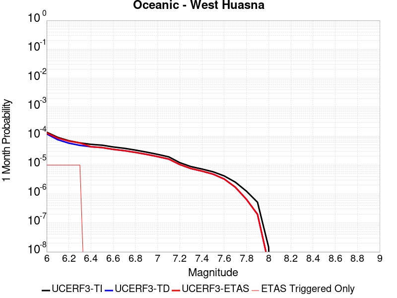 |  |  |

| Magnitude | 1 wk TI Prob | 1 wk TD Prob | 1 wk ETAS Prob | 1 wk ETAS/TD Gain | 1 wk ETAS Triggered Only | 1 mo TI Prob | 1 mo TD Prob | 1 mo ETAS Prob | 1 mo ETAS/TD Gain | 1 mo ETAS Triggered Only | 1 yr TI Prob | 1 yr TD Prob | 1 yr ETAS Prob | 1 yr ETAS/TD Gain | 1 yr ETAS Triggered Only | 10 yr TI Prob | 10 yr TD Prob | 10 yr ETAS Prob | 10 yr ETAS/TD Gain | 10 yr ETAS Triggered Only |
|-----|-----|-----|-----|-----|-----|-----|-----|-----|-----|-----|-----|-----|-----|-----|-----|-----|-----|-----|-----|-----|
| 6.0 | 3.195567E-5 | 2.7928398E-5 | 2.7928398E-5 | 1.0 | 0.0 | 1.3694567E-4 | 1.1968789E-4 | 1.2968668E-4 | 1.0835407 | 1.0E-5 | 0.0016660384 | 0.0014562691 | 0.0014862254 | 1.0205706 | 3.0E-5 | 0.016536033 | 0.014471814 | 0.014521091 | 1.003405 | 5.0E-5 |
| 6.1 | 2.1156782E-5 | 1.7574706E-5 | 1.7574706E-5 | 1.0 | 0.0 | 9.066878E-5 | 7.531805E-5 | 8.53173E-5 | 1.1327603 | 1.0E-5 | 0.0011033333 | 9.166209E-4 | 9.266117E-4 | 1.0108997 | 1.0E-5 | 0.010978713 | 0.009129409 | 0.009159135 | 1.0032561 | 3.0E-5 |
| 6.2 | 1.6195117E-5 | 1.3327666E-5 | 1.3327666E-5 | 1.0 | 0.0 | 6.9405796E-5 | 5.7117333E-5 | 6.711676E-5 | 1.1750683 | 1.0E-5 | 8.44688E-4 | 6.951842E-4 | 7.0517726E-4 | 1.0143747 | 1.0E-5 | 0.008414844 | 0.006930389 | 0.006960181 | 1.0042988 | 3.0E-5 |
| 6.3 | 1.3559345E-5 | 1.1179372E-5 | 1.1179372E-5 | 1.0 | 0.0 | 5.811018E-5 | 4.7910722E-5 | 5.791024E-5 | 1.2087115 | 1.0E-5 | 7.072618E-4 | 5.831579E-4 | 5.93152E-4 | 1.017138 | 1.0E-5 | 0.0070501505 | 0.005816394 | 0.0058362777 | 1.0034186 | 2.0E-5 |
| 6.4 | 1.2120619E-5 | 1.0001191E-5 | 1.0001191E-5 | 1.0 | 0.0 | 5.1944477E-5 | 4.2861546E-5 | 4.2861546E-5 | 1.0 | 0.0 | 6.322405E-4 | 5.2171486E-4 | 5.2171486E-4 | 1.0 | 0.0 | 0.006304447 | 0.0052049677 | 0.0052049677 | 1.0 | 0.0 |
| 6.5 | 1.13511915E-5 | 9.367664E-6 | 9.367664E-6 | 1.0 | 0.0 | 4.8647056E-5 | 4.0146515E-5 | 4.0146515E-5 | 1.0 | 0.0 | 5.9211696E-4 | 4.886746E-4 | 4.886746E-4 | 1.0 | 0.0 | 0.0059054173 | 0.004876059 | 0.004876059 | 1.0 | 0.0 |
| 6.6 | 9.850605E-6 | 8.135557E-6 | 8.135557E-6 | 1.0 | 0.0 | 4.2216197E-5 | 3.486621E-5 | 3.486621E-5 | 1.0 | 0.0 | 5.1386096E-4 | 4.2441362E-4 | 4.2441362E-4 | 1.0 | 0.0 | 0.0051267436 | 0.004236063 | 0.004236063 | 1.0 | 0.0 |
| 6.7 | 8.8558645E-6 | 7.318557E-6 | 7.318557E-6 | 1.0 | 0.0 | 3.7953152E-5 | 3.1364867E-5 | 3.1364867E-5 | 1.0 | 0.0 | 4.6198163E-4 | 3.8180055E-4 | 3.8180055E-4 | 1.0 | 0.0 | 0.004610224 | 0.0038114712 | 0.0038114712 | 1.0 | 0.0 |
| 6.8 | 7.67136E-6 | 6.3918774E-6 | 6.3918774E-6 | 1.0 | 0.0 | 3.2876844E-5 | 2.7393473E-5 | 2.7393473E-5 | 1.0 | 0.0 | 4.0020206E-4 | 3.3346465E-4 | 3.3346465E-4 | 1.0 | 0.0 | 0.003994821 | 0.0033296635 | 0.0033296635 | 1.0 | 0.0 |
| 6.9 | 6.534529E-6 | 5.458424E-6 | 5.458424E-6 | 1.0 | 0.0 | 2.8004823E-5 | 2.3393037E-5 | 2.3393037E-5 | 1.0 | 0.0 | 3.4090536E-4 | 2.8477312E-4 | 2.8477312E-4 | 1.0 | 0.0 | 0.0034038287 | 0.0028440985 | 0.0028440985 | 1.0 | 0.0 |
| 7.0 | 5.460525E-6 | 4.570061E-6 | 4.570061E-6 | 1.0 | 0.0 | 2.3402039E-5 | 1.9585828E-5 | 1.9585828E-5 | 1.0 | 0.0 | 2.8488258E-4 | 2.3843147E-4 | 2.3843147E-4 | 1.0 | 0.0 | 0.0028451765 | 0.0023817702 | 0.0023817702 | 1.0 | 0.0 |
| 7.1 | 4.4825083E-6 | 3.7525451E-6 | 3.7525451E-6 | 1.0 | 0.0 | 1.9210609E-5 | 1.6082236E-5 | 1.6082236E-5 | 1.0 | 0.0 | 2.3386406E-4 | 1.9578375E-4 | 1.9578375E-4 | 1.0 | 0.0 | 0.002336181 | 0.0019561243 | 0.0019561243 | 1.0 | 0.0 |
| 7.2 | 2.821708E-6 | 2.425045E-6 | 2.425045E-6 | 1.0 | 0.0 | 1.2092979E-5 | 1.0393009E-5 | 1.0393009E-5 | 1.0 | 0.0 | 1.4722206E-4 | 1.2652755E-4 | 1.2652755E-4 | 1.0 | 0.0 | 0.0014712457 | 0.0012645572 | 0.0012645572 | 1.0 | 0.0 |
| 7.3 | 2.0644757E-6 | 1.7688409E-6 | 1.7688409E-6 | 1.0 | 0.0 | 8.847723E-6 | 7.5807243E-6 | 7.5807243E-6 | 1.0 | 0.0 | 1.0771569E-4 | 9.229141E-5 | 9.229141E-5 | 1.0 | 0.0 | 0.001076635 | 9.2253234E-4 | 9.2253234E-4 | 1.0 | 0.0 |
| 7.4 | 1.6980367E-6 | 1.4380826E-6 | 1.4380826E-6 | 1.0 | 0.0 | 7.27728E-6 | 6.1631963E-6 | 6.1631963E-6 | 1.0 | 0.0 | 8.8597284E-5 | 7.503434E-5 | 7.503434E-5 | 1.0 | 0.0 | 8.8561967E-4 | 7.500914E-4 | 7.500914E-4 | 1.0 | 0.0 |
| 7.5 | 1.3637683E-6 | 1.1303514E-6 | 1.1303514E-6 | 1.0 | 0.0 | 5.844708E-6 | 4.844354E-6 | 4.844354E-6 | 1.0 | 0.0 | 7.1156996E-5 | 5.8978418E-5 | 5.8978418E-5 | 1.0 | 0.0 | 7.1134215E-4 | 5.8962894E-4 | 5.8962894E-4 | 1.0 | 0.0 |
| 7.6 | 9.802994E-7 | 7.6780407E-7 | 7.6780407E-7 | 1.0 | 0.0 | 4.2012766E-6 | 3.2905848E-6 | 3.2905848E-6 | 1.0 | 0.0 | 5.1149345E-5 | 4.0062132E-5 | 4.0062132E-5 | 1.0 | 0.0 | 5.113757E-4 | 4.005503E-4 | 4.005503E-4 | 1.0 | 0.0 |
| 7.7 | 5.986191E-7 | 4.0057682E-7 | 4.0057682E-7 | 1.0 | 0.0 | 2.5655079E-6 | 1.7167566E-6 | 1.7167566E-6 | 1.0 | 0.0 | 3.1234613E-5 | 2.0901312E-5 | 2.0901312E-5 | 1.0 | 0.0 | 3.123022E-4 | 2.0899458E-4 | 2.0899458E-4 | 1.0 | 0.0 |
| 7.8 | 2.9189815E-7 | 1.5291376E-7 | 1.5291376E-7 | 1.0 | 0.0 | 1.2509914E-6 | 6.553445E-7 | 6.553445E-7 | 1.0 | 0.0 | 1.5230714E-5 | 7.978791E-6 | 7.978791E-6 | 1.0 | 0.0 | 1.522967E-4 | 7.9786114E-5 | 7.9786114E-5 | 1.0 | 0.0 |
| 7.9 | 1.2057845E-7 | 4.624249E-8 | 4.624249E-8 | 1.0 | 0.0 | 5.1676466E-7 | 1.981821E-7 | 1.981821E-7 | 1.0 | 0.0 | 6.2915915E-6 | 2.4128642E-6 | 2.4128642E-6 | 1.0 | 0.0 | 6.2914136E-5 | 2.4129453E-5 | 2.4129453E-5 | 1.0 | 0.0 |
| 8.0 | 3.3806387E-9 | 9.0229946E-10 | 9.0229946E-10 | 1.0 | 0.0 | 1.4488451E-8 | 3.8669987E-9 | 3.8669987E-9 | 1.0 | 0.0 | 1.7639688E-7 | 4.7080707E-8 | 4.7080707E-8 | 1.0 | 0.0 | 1.7639674E-6 | 4.7169183E-7 | 4.7169183E-7 | 1.0 | 0.0 |

## Pleito
*[(top)](#table-of-contents)*

| 1 Week | 1 Month | 1 Year | 10 Year |
|-----|-----|-----|-----|
|  |  |  |  |

| Magnitude | 1 wk TI Prob | 1 wk TD Prob | 1 wk ETAS Prob | 1 wk ETAS/TD Gain | 1 wk ETAS Triggered Only | 1 mo TI Prob | 1 mo TD Prob | 1 mo ETAS Prob | 1 mo ETAS/TD Gain | 1 mo ETAS Triggered Only | 1 yr TI Prob | 1 yr TD Prob | 1 yr ETAS Prob | 1 yr ETAS/TD Gain | 1 yr ETAS Triggered Only | 10 yr TI Prob | 10 yr TD Prob | 10 yr ETAS Prob | 10 yr ETAS/TD Gain | 10 yr ETAS Triggered Only |
|-----|-----|-----|-----|-----|-----|-----|-----|-----|-----|-----|-----|-----|-----|-----|-----|-----|-----|-----|-----|-----|
| 6.0 | 1.6763008E-5 | 2.479146E-5 | 2.479146E-5 | 1.0 | 0.0 | 7.183948E-5 | 1.0624519E-4 | 1.0624519E-4 | 1.0 | 0.0 | 8.742947E-4 | 0.0012928396 | 0.0013128138 | 1.0154499 | 2.0E-5 | 0.00870863 | 0.012967767 | 0.013026989 | 1.0045669 | 6.0E-5 |
| 6.1 | 1.6763008E-5 | 2.479146E-5 | 2.479146E-5 | 1.0 | 0.0 | 7.183948E-5 | 1.0624519E-4 | 1.0624519E-4 | 1.0 | 0.0 | 8.742947E-4 | 0.0012928396 | 0.0013128138 | 1.0154499 | 2.0E-5 | 0.00870863 | 0.012967767 | 0.013026989 | 1.0045669 | 6.0E-5 |
| 6.2 | 1.6763008E-5 | 2.479146E-5 | 2.479146E-5 | 1.0 | 0.0 | 7.183948E-5 | 1.0624519E-4 | 1.0624519E-4 | 1.0 | 0.0 | 8.742947E-4 | 0.0012928396 | 0.0013128138 | 1.0154499 | 2.0E-5 | 0.00870863 | 0.012967767 | 0.013026989 | 1.0045669 | 6.0E-5 |
| 6.3 | 1.6763008E-5 | 2.479146E-5 | 2.479146E-5 | 1.0 | 0.0 | 7.183948E-5 | 1.0624519E-4 | 1.0624519E-4 | 1.0 | 0.0 | 8.742947E-4 | 0.0012928396 | 0.0013128138 | 1.0154499 | 2.0E-5 | 0.00870863 | 0.012967767 | 0.013026989 | 1.0045669 | 6.0E-5 |
| 6.4 | 1.6763008E-5 | 2.479146E-5 | 2.479146E-5 | 1.0 | 0.0 | 7.183948E-5 | 1.0624519E-4 | 1.0624519E-4 | 1.0 | 0.0 | 8.742947E-4 | 0.0012928396 | 0.0013128138 | 1.0154499 | 2.0E-5 | 0.00870863 | 0.012967767 | 0.013026989 | 1.0045669 | 6.0E-5 |
| 6.5 | 1.6763008E-5 | 2.479146E-5 | 2.479146E-5 | 1.0 | 0.0 | 7.183948E-5 | 1.0624519E-4 | 1.0624519E-4 | 1.0 | 0.0 | 8.742947E-4 | 0.0012928396 | 0.0013128138 | 1.0154499 | 2.0E-5 | 0.00870863 | 0.012967767 | 0.013026989 | 1.0045669 | 6.0E-5 |
| 6.6 | 9.910213E-6 | 1.7241837E-5 | 1.7241837E-5 | 1.0 | 0.0 | 4.247165E-5 | 7.389152E-5 | 7.389152E-5 | 1.0 | 0.0 | 5.169696E-4 | 8.992616E-4 | 9.1924367E-4 | 1.0222205 | 2.0E-5 | 0.0051576863 | 0.009064423 | 0.00910406 | 1.0043728 | 4.0E-5 |
| 6.7 | 9.910213E-6 | 1.7241837E-5 | 1.7241837E-5 | 1.0 | 0.0 | 4.247165E-5 | 7.389152E-5 | 7.389152E-5 | 1.0 | 0.0 | 5.169696E-4 | 8.992616E-4 | 9.1924367E-4 | 1.0222205 | 2.0E-5 | 0.0051576863 | 0.009064423 | 0.00910406 | 1.0043728 | 4.0E-5 |
| 6.8 | 8.300162E-6 | 1.5501371E-5 | 1.5501371E-5 | 1.0 | 0.0 | 3.557164E-5 | 6.643277E-5 | 6.643277E-5 | 1.0 | 0.0 | 4.3299864E-4 | 8.0852024E-4 | 8.2850404E-4 | 1.0247165 | 2.0E-5 | 0.004321559 | 0.008163834 | 0.008203507 | 1.0048597 | 4.0E-5 |
| 6.9 | 8.183114E-6 | 1.5372574E-5 | 1.5372574E-5 | 1.0 | 0.0 | 3.5070017E-5 | 6.5880806E-5 | 6.5880806E-5 | 1.0 | 0.0 | 4.2689382E-4 | 8.0180506E-4 | 8.21789E-4 | 1.0249237 | 2.0E-5 | 0.0042607468 | 0.008097173 | 0.008136849 | 1.0049 | 4.0E-5 |
| 7.0 | 7.1748823E-6 | 1.4159216E-5 | 1.4159216E-5 | 1.0 | 0.0 | 3.0749135E-5 | 6.0680948E-5 | 6.0680948E-5 | 1.0 | 0.0 | 3.743064E-4 | 7.385406E-4 | 7.5852586E-4 | 1.0270604 | 2.0E-5 | 0.0037367654 | 0.007468599 | 0.0075083002 | 1.0053158 | 4.0E-5 |
| 7.1 | 7.1671807E-6 | 1.4149584E-5 | 1.4149584E-5 | 1.0 | 0.0 | 3.0716128E-5 | 6.0639664E-5 | 6.0639664E-5 | 1.0 | 0.0 | 3.7390468E-4 | 7.380384E-4 | 7.5802364E-4 | 1.0270789 | 2.0E-5 | 0.0037327618 | 0.0074636103 | 0.0075033116 | 1.0053194 | 4.0E-5 |
| 7.2 | 7.0649667E-6 | 1.3996784E-5 | 1.3996784E-5 | 1.0 | 0.0 | 3.0278077E-5 | 5.998484E-5 | 5.998484E-5 | 1.0 | 0.0 | 3.6857324E-4 | 7.300712E-4 | 7.5005664E-4 | 1.0273746 | 2.0E-5 | 0.0036796255 | 0.007384318 | 0.0074240225 | 1.0053769 | 4.0E-5 |
| 7.3 | 7.02082E-6 | 1.3940186E-5 | 1.3940186E-5 | 1.0 | 0.0 | 3.008888E-5 | 5.974229E-5 | 5.974229E-5 | 1.0 | 0.0 | 3.6627054E-4 | 7.2712015E-4 | 7.4710563E-4 | 1.0274857 | 2.0E-5 | 0.0036566744 | 0.007354794 | 0.0073945 | 1.0053986 | 4.0E-5 |
| 7.4 | 6.987146E-6 | 1.3899719E-5 | 1.3899719E-5 | 1.0 | 0.0 | 2.9944567E-5 | 5.956887E-5 | 5.956887E-5 | 1.0 | 0.0 | 3.6451413E-4 | 7.250101E-4 | 7.4499566E-4 | 1.0275658 | 2.0E-5 | 0.0036391679 | 0.007333714 | 0.007373421 | 1.0054142 | 4.0E-5 |
| 7.5 | 6.9494554E-6 | 1.3856602E-5 | 1.3856602E-5 | 1.0 | 0.0 | 2.9783041E-5 | 5.938409E-5 | 5.938409E-5 | 1.0 | 0.0 | 3.625482E-4 | 7.2276196E-4 | 7.427475E-4 | 1.0276517 | 2.0E-5 | 0.0036195726 | 0.0073113306 | 0.0073510385 | 1.0054309 | 4.0E-5 |
| 7.6 | 6.92694E-6 | 1.3815674E-5 | 1.3815674E-5 | 1.0 | 0.0 | 2.9686547E-5 | 5.920869E-5 | 5.920869E-5 | 1.0 | 0.0 | 3.6137376E-4 | 7.206279E-4 | 7.406135E-4 | 1.0277336 | 2.0E-5 | 0.0036078666 | 0.0072900616 | 0.00732977 | 1.0054469 | 4.0E-5 |
| 7.7 | 6.395867E-6 | 1.2693605E-5 | 1.2693605E-5 | 1.0 | 0.0 | 2.741057E-5 | 5.440003E-5 | 5.440003E-5 | 1.0 | 0.0 | 3.336726E-4 | 6.621194E-4 | 6.821062E-4 | 1.030186 | 2.0E-5 | 0.0033317201 | 0.0067081 | 0.0067478316 | 1.0059229 | 4.0E-5 |
| 7.8 | 5.8664327E-6 | 1.1559044E-5 | 1.1559044E-5 | 1.0 | 0.0 | 2.5141611E-5 | 4.953782E-5 | 4.953782E-5 | 1.0 | 0.0 | 3.060561E-4 | 6.029563E-4 | 6.229442E-4 | 1.03315 | 2.0E-5 | 0.0030563495 | 0.006112456 | 0.0061522117 | 1.006504 | 4.0E-5 |
| 7.9 | 3.7167474E-6 | 7.128102E-6 | 7.128102E-6 | 1.0 | 0.0 | 1.592882E-5 | 3.054865E-5 | 3.054865E-5 | 1.0 | 0.0 | 1.9391612E-4 | 3.718665E-4 | 3.8186277E-4 | 1.0268813 | 1.0E-5 | 0.0019374699 | 0.0037745768 | 0.0037945013 | 1.0052786 | 2.0E-5 |
| 8.0 | 1.0903841E-6 | 1.2908959E-6 | 1.2908959E-6 | 1.0 | 0.0 | 4.6730665E-6 | 5.532399E-6 | 5.532399E-6 | 1.0 | 0.0 | 5.68931E-5 | 6.7354886E-5 | 6.7354886E-5 | 1.0 | 0.0 | 5.6878536E-4 | 6.957491E-4 | 6.957491E-4 | 1.0 | 0.0 |
| 8.1 | 2.6894583E-7 | 1.1106567E-7 | 1.1106567E-7 | 1.0 | 0.0 | 1.1526245E-6 | 4.7599562E-7 | 4.7599562E-7 | 1.0 | 0.0 | 1.4033113E-5 | 5.7952316E-6 | 5.7952316E-6 | 1.0 | 0.0 | 1.4032227E-4 | 6.482664E-5 | 6.482664E-5 | 1.0 | 0.0 |
| 8.2 | 5.2967013E-9 | 2.468831E-9 | 2.468831E-9 | 1.0 | 0.0 | 2.2700148E-8 | 1.0580704E-8 | 1.0580704E-8 | 1.0 | 0.0 | 2.7637427E-7 | 1.2882006E-7 | 1.2882006E-7 | 1.0 | 0.0 | 2.7637393E-6 | 1.4656648E-6 | 1.4656648E-6 | 1.0 | 0.0 |

## Santa Ynez River
*[(top)](#table-of-contents)*

| 1 Week | 1 Month | 1 Year | 10 Year |
|-----|-----|-----|-----|
|  |  |  |  |

| Magnitude | 1 wk TI Prob | 1 wk TD Prob | 1 wk ETAS Prob | 1 wk ETAS/TD Gain | 1 wk ETAS Triggered Only | 1 mo TI Prob | 1 mo TD Prob | 1 mo ETAS Prob | 1 mo ETAS/TD Gain | 1 mo ETAS Triggered Only | 1 yr TI Prob | 1 yr TD Prob | 1 yr ETAS Prob | 1 yr ETAS/TD Gain | 1 yr ETAS Triggered Only | 10 yr TI Prob | 10 yr TD Prob | 10 yr ETAS Prob | 10 yr ETAS/TD Gain | 10 yr ETAS Triggered Only |
|-----|-----|-----|-----|-----|-----|-----|-----|-----|-----|-----|-----|-----|-----|-----|-----|-----|-----|-----|-----|-----|
| 6.0 | 1.6396456E-5 | 1.7209959E-5 | 1.7209959E-5 | 1.0 | 0.0 | 7.026863E-5 | 7.375509E-5 | 7.375509E-5 | 1.0 | 0.0 | 8.551848E-4 | 8.976337E-4 | 8.976337E-4 | 1.0 | 0.0 | 0.0085190125 | 0.008943629 | 0.008993182 | 1.0055406 | 5.0E-5 |
| 6.1 | 1.6396456E-5 | 1.7209959E-5 | 1.7209959E-5 | 1.0 | 0.0 | 7.026863E-5 | 7.375509E-5 | 7.375509E-5 | 1.0 | 0.0 | 8.551848E-4 | 8.976337E-4 | 8.976337E-4 | 1.0 | 0.0 | 0.0085190125 | 0.008943629 | 0.008993182 | 1.0055406 | 5.0E-5 |
| 6.2 | 1.6396456E-5 | 1.7209959E-5 | 1.7209959E-5 | 1.0 | 0.0 | 7.026863E-5 | 7.375509E-5 | 7.375509E-5 | 1.0 | 0.0 | 8.551848E-4 | 8.976337E-4 | 8.976337E-4 | 1.0 | 0.0 | 0.0085190125 | 0.008943629 | 0.008993182 | 1.0055406 | 5.0E-5 |
| 6.3 | 9.736976E-6 | 1.01226115E-5 | 1.01226115E-5 | 1.0 | 0.0 | 4.172923E-5 | 4.338193E-5 | 4.338193E-5 | 1.0 | 0.0 | 5.0793495E-4 | 5.28052E-4 | 5.28052E-4 | 1.0 | 0.0 | 0.005067755 | 0.0052684783 | 0.0053182147 | 1.0094404 | 5.0E-5 |
| 6.4 | 9.736976E-6 | 1.01226115E-5 | 1.01226115E-5 | 1.0 | 0.0 | 4.172923E-5 | 4.338193E-5 | 4.338193E-5 | 1.0 | 0.0 | 5.0793495E-4 | 5.28052E-4 | 5.28052E-4 | 1.0 | 0.0 | 0.005067755 | 0.0052684783 | 0.0053182147 | 1.0094404 | 5.0E-5 |
| 6.5 | 7.081964E-6 | 7.330101E-6 | 7.330101E-6 | 1.0 | 0.0 | 3.035092E-5 | 3.141435E-5 | 3.141435E-5 | 1.0 | 0.0 | 3.694598E-4 | 3.8240416E-4 | 3.8240416E-4 | 1.0 | 0.0 | 0.0036884616 | 0.0038176232 | 0.0038674322 | 1.0130471 | 5.0E-5 |
| 6.6 | 5.873247E-6 | 6.059913E-6 | 6.059913E-6 | 1.0 | 0.0 | 2.5170815E-5 | 2.5970803E-5 | 2.5970803E-5 | 1.0 | 0.0 | 3.064116E-4 | 3.161495E-4 | 3.161495E-4 | 1.0 | 0.0 | 0.0030598943 | 0.0031570848 | 0.003206927 | 1.0157874 | 5.0E-5 |
| 6.7 | 4.973277E-6 | 5.116047E-6 | 5.116047E-6 | 1.0 | 0.0 | 2.1313872E-5 | 2.1925734E-5 | 2.1925734E-5 | 1.0 | 0.0 | 2.5946548E-4 | 2.669136E-4 | 2.669136E-4 | 1.0 | 0.0 | 0.0025916274 | 0.002665979 | 0.0027158458 | 1.0187049 | 5.0E-5 |
| 6.8 | 4.396492E-6 | 4.511108E-6 | 4.511108E-6 | 1.0 | 0.0 | 1.884197E-5 | 1.9333178E-5 | 1.9333178E-5 | 1.0 | 0.0 | 2.2937685E-4 | 2.3535638E-4 | 2.3535638E-4 | 1.0 | 0.0 | 0.0022914023 | 0.0023511064 | 0.0023910124 | 1.0169733 | 4.0E-5 |
| 6.9 | 3.5255632E-6 | 3.6014421E-6 | 3.6014421E-6 | 1.0 | 0.0 | 1.5109469E-5 | 1.5434662E-5 | 1.5434662E-5 | 1.0 | 0.0 | 1.8394225E-4 | 1.8790095E-4 | 1.8790095E-4 | 1.0 | 0.0 | 0.0018379007 | 0.001877437 | 0.0018973994 | 1.0106329 | 2.0E-5 |
| 7.0 | 3.211603E-6 | 3.2737553E-6 | 3.2737553E-6 | 1.0 | 0.0 | 1.376394E-5 | 1.4030305E-5 | 1.4030305E-5 | 1.0 | 0.0 | 1.6756308E-4 | 1.7080571E-4 | 1.7080571E-4 | 1.0 | 0.0 | 0.0016743679 | 0.0017067584 | 0.0017167414 | 1.005849 | 1.0E-5 |
| 7.1 | 2.5094619E-6 | 2.5410047E-6 | 2.5410047E-6 | 1.0 | 0.0 | 1.0754793E-5 | 1.0889975E-5 | 1.0889975E-5 | 1.0 | 0.0 | 1.3093173E-4 | 1.3257744E-4 | 1.3257744E-4 | 1.0 | 0.0 | 0.0013085462 | 0.0013249894 | 0.0013249894 | 1.0 | 0.0 |
| 7.2 | 2.0515774E-6 | 2.06201E-6 | 2.06201E-6 | 1.0 | 0.0 | 8.792445E-6 | 8.837156E-6 | 8.837156E-6 | 1.0 | 0.0 | 1.0704277E-4 | 1.07587104E-4 | 1.07587104E-4 | 1.0 | 0.0 | 0.0010699122 | 0.0010753545 | 0.0010753545 | 1.0 | 0.0 |
| 7.3 | 1.6845745E-6 | 1.6774534E-6 | 1.6774534E-6 | 1.0 | 0.0 | 7.219585E-6 | 7.1890663E-6 | 7.1890663E-6 | 1.0 | 0.0 | 8.78949E-5 | 8.752339E-5 | 8.752339E-5 | 1.0 | 0.0 | 8.7860145E-4 | 8.748921E-4 | 8.748921E-4 | 1.0 | 0.0 |
| 7.4 | 1.3600285E-6 | 1.3333874E-6 | 1.3333874E-6 | 1.0 | 0.0 | 5.82868E-6 | 5.7145053E-6 | 5.7145053E-6 | 1.0 | 0.0 | 7.096187E-5 | 6.95719E-5 | 6.95719E-5 | 1.0 | 0.0 | 7.0939213E-4 | 6.9550343E-4 | 6.9550343E-4 | 1.0 | 0.0 |
| 7.5 | 9.735342E-7 | 9.290493E-7 | 9.290493E-7 | 1.0 | 0.0 | 4.172283E-6 | 3.981634E-6 | 3.981634E-6 | 1.0 | 0.0 | 5.079636E-5 | 4.8475333E-5 | 4.8475333E-5 | 1.0 | 0.0 | 5.0784746E-4 | 4.846493E-4 | 4.846493E-4 | 1.0 | 0.0 |
| 7.6 | 5.067187E-7 | 4.778753E-7 | 4.778753E-7 | 1.0 | 0.0 | 2.1716498E-6 | 2.0480354E-6 | 2.0480354E-6 | 1.0 | 0.0 | 2.6439517E-5 | 2.4934552E-5 | 2.4934552E-5 | 1.0 | 0.0 | 2.643637E-4 | 2.4931828E-4 | 2.4931828E-4 | 1.0 | 0.0 |
| 7.7 | 2.769089E-7 | 2.5760096E-7 | 2.5760096E-7 | 1.0 | 0.0 | 1.1867519E-6 | 1.1040037E-6 | 1.1040037E-6 | 1.0 | 0.0 | 1.4448608E-5 | 1.3441162E-5 | 1.3441162E-5 | 1.0 | 0.0 | 1.444767E-4 | 1.3440353E-4 | 1.3440353E-4 | 1.0 | 0.0 |
| 7.8 | 1.7044663E-7 | 1.5449687E-7 | 1.5449687E-7 | 1.0 | 0.0 | 7.3048534E-7 | 6.6212925E-7 | 6.6212925E-7 | 1.0 | 0.0 | 8.893623E-6 | 8.0613945E-6 | 8.0613945E-6 | 1.0 | 0.0 | 8.893267E-5 | 8.061104E-5 | 8.061104E-5 | 1.0 | 0.0 |
| 7.9 | 4.8344287E-8 | 4.0912912E-8 | 4.0912912E-8 | 1.0 | 0.0 | 2.0718979E-7 | 1.7534104E-7 | 1.7534104E-7 | 1.0 | 0.0 | 2.5225327E-6 | 2.134775E-6 | 2.134775E-6 | 1.0 | 0.0 | 2.5225041E-5 | 2.134755E-5 | 2.134755E-5 | 1.0 | 0.0 |

## Independence rev 2011
*[(top)](#table-of-contents)*

| 1 Week | 1 Month | 1 Year | 10 Year |
|-----|-----|-----|-----|
|  |  |  |  |

| Magnitude | 1 wk TI Prob | 1 wk TD Prob | 1 wk ETAS Prob | 1 wk ETAS/TD Gain | 1 wk ETAS Triggered Only | 1 mo TI Prob | 1 mo TD Prob | 1 mo ETAS Prob | 1 mo ETAS/TD Gain | 1 mo ETAS Triggered Only | 1 yr TI Prob | 1 yr TD Prob | 1 yr ETAS Prob | 1 yr ETAS/TD Gain | 1 yr ETAS Triggered Only | 10 yr TI Prob | 10 yr TD Prob | 10 yr ETAS Prob | 10 yr ETAS/TD Gain | 10 yr ETAS Triggered Only |
|-----|-----|-----|-----|-----|-----|-----|-----|-----|-----|-----|-----|-----|-----|-----|-----|-----|-----|-----|-----|-----|
| 6.0 | 4.422171E-6 | 4.3263026E-6 | 1.432626E-5 | 3.3114326 | 1.0E-5 | 1.8952025E-5 | 1.854118E-5 | 2.8540997E-5 | 1.53933 | 1.0E-5 | 2.3071647E-4 | 2.2571848E-4 | 2.4571398E-4 | 1.088586 | 2.0E-5 | 0.0023047708 | 0.002255186 | 0.0023050732 | 1.0221211 | 5.0E-5 |
| 6.1 | 4.422171E-6 | 4.3263026E-6 | 1.432626E-5 | 3.3114326 | 1.0E-5 | 1.8952025E-5 | 1.854118E-5 | 2.8540997E-5 | 1.53933 | 1.0E-5 | 2.3071647E-4 | 2.2571848E-4 | 2.4571398E-4 | 1.088586 | 2.0E-5 | 0.0023047708 | 0.002255186 | 0.0023050732 | 1.0221211 | 5.0E-5 |
| 6.2 | 4.422171E-6 | 4.3263026E-6 | 1.432626E-5 | 3.3114326 | 1.0E-5 | 1.8952025E-5 | 1.854118E-5 | 2.8540997E-5 | 1.53933 | 1.0E-5 | 2.3071647E-4 | 2.2571848E-4 | 2.4571398E-4 | 1.088586 | 2.0E-5 | 0.0023047708 | 0.002255186 | 0.0023050732 | 1.0221211 | 5.0E-5 |
| 6.3 | 4.422171E-6 | 4.3263026E-6 | 1.432626E-5 | 3.3114326 | 1.0E-5 | 1.8952025E-5 | 1.854118E-5 | 2.8540997E-5 | 1.53933 | 1.0E-5 | 2.3071647E-4 | 2.2571848E-4 | 2.4571398E-4 | 1.088586 | 2.0E-5 | 0.0023047708 | 0.002255186 | 0.0023050732 | 1.0221211 | 5.0E-5 |
| 6.4 | 4.422171E-6 | 4.3263026E-6 | 1.432626E-5 | 3.3114326 | 1.0E-5 | 1.8952025E-5 | 1.854118E-5 | 2.8540997E-5 | 1.53933 | 1.0E-5 | 2.3071647E-4 | 2.2571848E-4 | 2.4571398E-4 | 1.088586 | 2.0E-5 | 0.0023047708 | 0.002255186 | 0.0023050732 | 1.0221211 | 5.0E-5 |
| 6.5 | 4.422171E-6 | 4.3263026E-6 | 1.432626E-5 | 3.3114326 | 1.0E-5 | 1.8952025E-5 | 1.854118E-5 | 2.8540997E-5 | 1.53933 | 1.0E-5 | 2.3071647E-4 | 2.2571848E-4 | 2.4571398E-4 | 1.088586 | 2.0E-5 | 0.0023047708 | 0.002255186 | 0.0023050732 | 1.0221211 | 5.0E-5 |
| 6.6 | 2.663744E-6 | 2.5320423E-6 | 1.2532017E-5 | 4.949371 | 1.0E-5 | 1.1415996E-5 | 1.0851568E-5 | 2.085146E-5 | 1.9215158 | 1.0E-5 | 1.3898089E-4 | 1.3211032E-4 | 1.5210768E-4 | 1.1513686 | 2.0E-5 | 0.0013889399 | 0.001320366 | 0.0013603133 | 1.0302546 | 4.0E-5 |
| 6.7 | 2.663744E-6 | 2.5320423E-6 | 1.2532017E-5 | 4.949371 | 1.0E-5 | 1.1415996E-5 | 1.0851568E-5 | 2.085146E-5 | 1.9215158 | 1.0E-5 | 1.3898089E-4 | 1.3211032E-4 | 1.5210768E-4 | 1.1513686 | 2.0E-5 | 0.0013889399 | 0.001320366 | 0.0013603133 | 1.0302546 | 4.0E-5 |
| 6.8 | 1.9716529E-6 | 1.8323069E-6 | 1.1832289E-5 | 6.457591 | 1.0E-5 | 8.449913E-6 | 7.852721E-6 | 1.7852642E-5 | 2.273434 | 1.0E-5 | 1.0287284E-4 | 9.560281E-5 | 1.156009E-4 | 1.2091789 | 2.0E-5 | 0.0010282523 | 9.5562974E-4 | 9.955915E-4 | 1.0418172 | 4.0E-5 |
| 6.9 | 1.8788617E-6 | 1.7430461E-6 | 1.1743029E-5 | 6.737073 | 1.0E-5 | 8.0522395E-6 | 7.470177E-6 | 1.7470102E-5 | 2.3386464 | 1.0E-5 | 9.80316E-5 | 9.094573E-5 | 1.1094391E-4 | 1.2198913 | 2.0E-5 | 9.798837E-4 | 9.0909714E-4 | 9.490608E-4 | 1.0439597 | 4.0E-5 |
| 7.0 | 1.5045488E-6 | 1.3849901E-6 | 1.13849765E-5 | 8.220258 | 1.0E-5 | 6.44805E-6 | 5.935659E-6 | 1.5935599E-5 | 2.684723 | 1.0E-5 | 7.8502184E-5 | 7.22643E-5 | 9.226285E-5 | 1.2767419 | 2.0E-5 | 7.8474457E-4 | 7.224132E-4 | 7.6238427E-4 | 1.0553299 | 4.0E-5 |
| 7.1 | 1.272341E-6 | 1.1625449E-6 | 1.1162533E-5 | 9.601809 | 1.0E-5 | 5.4528787E-6 | 4.982326E-6 | 1.4982276E-5 | 3.0070846 | 1.0E-5 | 6.6386776E-5 | 6.0658163E-5 | 8.065695E-5 | 1.3296965 | 2.0E-5 | 6.636695E-4 | 6.064193E-4 | 6.46395E-4 | 1.065921 | 4.0E-5 |
| 7.2 | 1.0416892E-6 | 9.4101864E-7 | 1.0941009E-5 | 11.626772 | 1.0E-5 | 4.464375E-6 | 4.032931E-6 | 1.403289E-5 | 3.479576 | 1.0E-5 | 5.4352407E-5 | 4.9099846E-5 | 6.909887E-5 | 1.4073132 | 2.0E-5 | 5.4339116E-4 | 4.9089186E-4 | 5.308722E-4 | 1.0814444 | 4.0E-5 |
| 7.3 | 7.9450155E-7 | 7.2352304E-7 | 1.07235155E-5 | 14.82125 | 1.0E-5 | 3.4050022E-6 | 3.1008094E-6 | 1.3100778E-5 | 4.2249546 | 1.0E-5 | 4.1455114E-5 | 3.775171E-5 | 5.7750956E-5 | 1.5297573 | 2.0E-5 | 4.144738E-4 | 3.774541E-4 | 4.0744277E-4 | 1.0794499 | 3.0E-5 |
| 7.4 | 5.3893444E-7 | 5.019647E-7 | 1.050196E-5 | 20.921711 | 1.0E-5 | 2.309717E-6 | 2.1512753E-6 | 1.2151254E-5 | 5.648395 | 1.0E-5 | 2.8120441E-5 | 2.6191468E-5 | 4.6190944E-5 | 1.7635875 | 2.0E-5 | 2.8116882E-4 | 2.6188427E-4 | 2.918764E-4 | 1.1145244 | 3.0E-5 |
| 7.5 | 3.8852085E-7 | 3.682647E-7 | 3.682647E-7 | 1.0 | 0.0 | 1.6650882E-6 | 1.5782763E-6 | 1.5782763E-6 | 1.0 | 0.0 | 2.027226E-5 | 1.9215347E-5 | 2.9215154E-5 | 1.5204073 | 1.0E-5 | 2.0270412E-4 | 1.9213707E-4 | 2.1213322E-4 | 1.1040723 | 2.0E-5 |
| 7.6 | 2.414929E-7 | 2.345808E-7 | 2.345808E-7 | 1.0 | 0.0 | 1.0349692E-6 | 1.0053459E-6 | 1.0053459E-6 | 1.0 | 0.0 | 1.2600677E-5 | 1.2240019E-5 | 1.2240019E-5 | 1.0 | 0.0 | 1.2599962E-4 | 1.2239357E-4 | 1.3239235E-4 | 1.0816936 | 1.0E-5 |
| 7.7 | 6.8298014E-8 | 6.859071E-8 | 6.859071E-8 | 1.0 | 0.0 | 2.9270575E-7 | 2.9396014E-7 | 2.9396014E-7 | 1.0 | 0.0 | 3.5636867E-6 | 3.5789594E-6 | 3.5789594E-6 | 1.0 | 0.0 | 3.5636294E-5 | 3.5789068E-5 | 3.5789068E-5 | 1.0 | 0.0 |

## Pitas Point (Lower West)
*[(top)](#table-of-contents)*

| 1 Week | 1 Month | 1 Year | 10 Year |
|-----|-----|-----|-----|
|  |  |  |  |

| Magnitude | 1 wk TI Prob | 1 wk TD Prob | 1 wk ETAS Prob | 1 wk ETAS/TD Gain | 1 wk ETAS Triggered Only | 1 mo TI Prob | 1 mo TD Prob | 1 mo ETAS Prob | 1 mo ETAS/TD Gain | 1 mo ETAS Triggered Only | 1 yr TI Prob | 1 yr TD Prob | 1 yr ETAS Prob | 1 yr ETAS/TD Gain | 1 yr ETAS Triggered Only | 10 yr TI Prob | 10 yr TD Prob | 10 yr ETAS Prob | 10 yr ETAS/TD Gain | 10 yr ETAS Triggered Only |
|-----|-----|-----|-----|-----|-----|-----|-----|-----|-----|-----|-----|-----|-----|-----|-----|-----|-----|-----|-----|-----|
| 6.0 | 8.151497E-6 | 7.856073E-6 | 1.7855995E-5 | 2.2728906 | 1.0E-5 | 3.493452E-5 | 3.3668453E-5 | 4.366812E-5 | 1.297004 | 1.0E-5 | 4.252448E-4 | 4.0983706E-4 | 4.2982885E-4 | 1.0487798 | 2.0E-5 | 0.0042443196 | 0.004090893 | 0.0041406886 | 1.0121722 | 5.0E-5 |
| 6.1 | 8.151497E-6 | 7.856073E-6 | 1.7855995E-5 | 2.2728906 | 1.0E-5 | 3.493452E-5 | 3.3668453E-5 | 4.366812E-5 | 1.297004 | 1.0E-5 | 4.252448E-4 | 4.0983706E-4 | 4.2982885E-4 | 1.0487798 | 2.0E-5 | 0.0042443196 | 0.004090893 | 0.0041406886 | 1.0121722 | 5.0E-5 |
| 6.2 | 8.151497E-6 | 7.856073E-6 | 1.7855995E-5 | 2.2728906 | 1.0E-5 | 3.493452E-5 | 3.3668453E-5 | 4.366812E-5 | 1.297004 | 1.0E-5 | 4.252448E-4 | 4.0983706E-4 | 4.2982885E-4 | 1.0487798 | 2.0E-5 | 0.0042443196 | 0.004090893 | 0.0041406886 | 1.0121722 | 5.0E-5 |
| 6.3 | 8.151497E-6 | 7.856073E-6 | 1.7855995E-5 | 2.2728906 | 1.0E-5 | 3.493452E-5 | 3.3668453E-5 | 4.366812E-5 | 1.297004 | 1.0E-5 | 4.252448E-4 | 4.0983706E-4 | 4.2982885E-4 | 1.0487798 | 2.0E-5 | 0.0042443196 | 0.004090893 | 0.0041406886 | 1.0121722 | 5.0E-5 |
| 6.4 | 8.151497E-6 | 7.856073E-6 | 1.7855995E-5 | 2.2728906 | 1.0E-5 | 3.493452E-5 | 3.3668453E-5 | 4.366812E-5 | 1.297004 | 1.0E-5 | 4.252448E-4 | 4.0983706E-4 | 4.2982885E-4 | 1.0487798 | 2.0E-5 | 0.0042443196 | 0.004090893 | 0.0041406886 | 1.0121722 | 5.0E-5 |
| 6.5 | 8.151497E-6 | 7.856073E-6 | 1.7855995E-5 | 2.2728906 | 1.0E-5 | 3.493452E-5 | 3.3668453E-5 | 4.366812E-5 | 1.297004 | 1.0E-5 | 4.252448E-4 | 4.0983706E-4 | 4.2982885E-4 | 1.0487798 | 2.0E-5 | 0.0042443196 | 0.004090893 | 0.0041406886 | 1.0121722 | 5.0E-5 |
| 6.6 | 8.151497E-6 | 7.856073E-6 | 1.7855995E-5 | 2.2728906 | 1.0E-5 | 3.493452E-5 | 3.3668453E-5 | 4.366812E-5 | 1.297004 | 1.0E-5 | 4.252448E-4 | 4.0983706E-4 | 4.2982885E-4 | 1.0487798 | 2.0E-5 | 0.0042443196 | 0.004090893 | 0.0041406886 | 1.0121722 | 5.0E-5 |
| 6.7 | 8.151497E-6 | 7.856073E-6 | 1.7855995E-5 | 2.2728906 | 1.0E-5 | 3.493452E-5 | 3.3668453E-5 | 4.366812E-5 | 1.297004 | 1.0E-5 | 4.252448E-4 | 4.0983706E-4 | 4.2982885E-4 | 1.0487798 | 2.0E-5 | 0.0042443196 | 0.004090893 | 0.0041406886 | 1.0121722 | 5.0E-5 |
| 6.8 | 8.151497E-6 | 7.856073E-6 | 1.7855995E-5 | 2.2728906 | 1.0E-5 | 3.493452E-5 | 3.3668453E-5 | 4.366812E-5 | 1.297004 | 1.0E-5 | 4.252448E-4 | 4.0983706E-4 | 4.2982885E-4 | 1.0487798 | 2.0E-5 | 0.0042443196 | 0.004090893 | 0.0041406886 | 1.0121722 | 5.0E-5 |
| 6.9 | 8.151497E-6 | 7.856073E-6 | 1.7855995E-5 | 2.2728906 | 1.0E-5 | 3.493452E-5 | 3.3668453E-5 | 4.366812E-5 | 1.297004 | 1.0E-5 | 4.252448E-4 | 4.0983706E-4 | 4.2982885E-4 | 1.0487798 | 2.0E-5 | 0.0042443196 | 0.004090893 | 0.0041406886 | 1.0121722 | 5.0E-5 |
| 7.0 | 8.103535E-6 | 7.805501E-6 | 1.7805423E-5 | 2.2811377 | 1.0E-5 | 3.4728975E-5 | 3.3451724E-5 | 4.345139E-5 | 1.2989283 | 1.0E-5 | 4.2274324E-4 | 4.0719935E-4 | 4.271912E-4 | 1.049096 | 2.0E-5 | 0.0042193993 | 0.0040646126 | 0.0041144094 | 1.0122513 | 5.0E-5 |
| 7.1 | 7.853298E-6 | 7.5411845E-6 | 1.754111E-5 | 2.3260417 | 1.0E-5 | 3.3656554E-5 | 3.2318967E-5 | 4.2318643E-5 | 1.3094058 | 1.0E-5 | 4.096915E-4 | 3.9341307E-4 | 4.1340519E-4 | 1.0508171 | 2.0E-5 | 0.00408937 | 0.003927242 | 0.003977046 | 1.0126816 | 5.0E-5 |
| 7.2 | 7.771102E-6 | 7.4534632E-6 | 1.7453389E-5 | 2.341648 | 1.0E-5 | 3.33043E-5 | 3.1943026E-5 | 4.194271E-5 | 1.3130474 | 1.0E-5 | 4.0540437E-4 | 3.8883765E-4 | 4.0882986E-4 | 1.0514153 | 2.0E-5 | 0.0040466557 | 0.0038816486 | 0.0039314544 | 1.0128311 | 5.0E-5 |
| 7.3 | 7.3945344E-6 | 7.049552E-6 | 1.7049482E-5 | 2.4185197 | 1.0E-5 | 3.1690477E-5 | 3.021202E-5 | 4.021172E-5 | 1.3309841 | 1.0E-5 | 3.8576324E-4 | 3.6776988E-4 | 3.8776253E-4 | 1.0543618 | 2.0E-5 | 0.0038509427 | 0.0036716803 | 0.0037115335 | 1.0108542 | 4.0E-5 |
| 7.4 | 6.964645E-6 | 6.5903846E-6 | 1.6590318E-5 | 2.517352 | 1.0E-5 | 2.9848137E-5 | 2.8244203E-5 | 3.824392E-5 | 1.3540449 | 1.0E-5 | 3.6334046E-4 | 3.438194E-4 | 3.6381252E-4 | 1.05815 | 2.0E-5 | 0.0036274698 | 0.003432928 | 0.0034727906 | 1.0116118 | 4.0E-5 |
| 7.5 | 6.6525035E-6 | 6.2594127E-6 | 1.625935E-5 | 2.597584 | 1.0E-5 | 2.851042E-5 | 2.682578E-5 | 3.6825513E-5 | 1.3727658 | 1.0E-5 | 3.4705905E-4 | 3.2655543E-4 | 3.4654888E-4 | 1.0612253 | 2.0E-5 | 0.0034651754 | 0.0032608071 | 0.0032907093 | 1.0091702 | 3.0E-5 |
| 7.6 | 5.613338E-6 | 5.1516E-6 | 5.1516E-6 | 1.0 | 0.0 | 2.405694E-5 | 2.20781E-5 | 2.20781E-5 | 1.0 | 0.0 | 2.928539E-4 | 2.68768E-4 | 2.787653E-4 | 1.0371968 | 1.0E-5 | 0.0029246826 | 0.0026844612 | 0.0027044076 | 1.0074303 | 2.0E-5 |
| 7.7 | 4.494704E-6 | 3.9970882E-6 | 3.9970882E-6 | 1.0 | 0.0 | 1.9262876E-5 | 1.7130267E-5 | 1.7130267E-5 | 1.0 | 0.0 | 2.3450027E-4 | 2.0854129E-4 | 2.0854129E-4 | 1.0 | 0.0 | 0.0023425296 | 0.00208348 | 0.002093459 | 1.0047897 | 1.0E-5 |
| 7.8 | 2.6075882E-6 | 2.1837427E-6 | 2.1837427E-6 | 1.0 | 0.0 | 1.117533E-5 | 9.358864E-6 | 9.358864E-6 | 1.0 | 0.0 | 1.3605114E-4 | 1.1393826E-4 | 1.1393826E-4 | 1.0 | 0.0 | 0.0013596788 | 0.0011388032 | 0.0011388032 | 1.0 | 0.0 |
| 7.9 | 4.045984E-7 | 3.2425163E-7 | 3.2425163E-7 | 1.0 | 0.0 | 1.733992E-6 | 1.389649E-6 | 1.389649E-6 | 1.0 | 0.0 | 2.1111147E-5 | 1.691885E-5 | 1.691885E-5 | 1.0 | 0.0 | 2.1109142E-4 | 1.6917592E-4 | 1.6917592E-4 | 1.0 | 0.0 |
| 8.0 | 7.791402E-9 | 5.6839005E-9 | 5.6839005E-9 | 1.0 | 0.0 | 3.3391725E-8 | 2.4359574E-8 | 2.4359574E-8 | 1.0 | 0.0 | 4.0654416E-7 | 2.9657778E-7 | 2.9657778E-7 | 1.0 | 0.0 | 4.065434E-6 | 2.965776E-6 | 2.965776E-6 | 1.0 | 0.0 |

## Los Alamos extension
*[(top)](#table-of-contents)*

| 1 Week | 1 Month | 1 Year | 10 Year |
|-----|-----|-----|-----|
|  |  |  |  |

| Magnitude | 1 wk TI Prob | 1 wk TD Prob | 1 wk ETAS Prob | 1 wk ETAS/TD Gain | 1 wk ETAS Triggered Only | 1 mo TI Prob | 1 mo TD Prob | 1 mo ETAS Prob | 1 mo ETAS/TD Gain | 1 mo ETAS Triggered Only | 1 yr TI Prob | 1 yr TD Prob | 1 yr ETAS Prob | 1 yr ETAS/TD Gain | 1 yr ETAS Triggered Only | 10 yr TI Prob | 10 yr TD Prob | 10 yr ETAS Prob | 10 yr ETAS/TD Gain | 10 yr ETAS Triggered Only |
|-----|-----|-----|-----|-----|-----|-----|-----|-----|-----|-----|-----|-----|-----|-----|-----|-----|-----|-----|-----|-----|
| 6.0 | 4.0146506E-6 | 4.0862483E-6 | 1.4086208E-5 | 3.4472227 | 1.0E-5 | 1.7205533E-5 | 1.751238E-5 | 2.7512206E-5 | 1.5710145 | 1.0E-5 | 2.0945723E-4 | 2.1319349E-4 | 2.3318922E-4 | 1.0937915 | 2.0E-5 | 0.0020925992 | 0.0021299988 | 0.0021798923 | 1.0234241 | 5.0E-5 |
| 6.1 | 4.0146506E-6 | 4.0862483E-6 | 1.4086208E-5 | 3.4472227 | 1.0E-5 | 1.7205533E-5 | 1.751238E-5 | 2.7512206E-5 | 1.5710145 | 1.0E-5 | 2.0945723E-4 | 2.1319349E-4 | 2.3318922E-4 | 1.0937915 | 2.0E-5 | 0.0020925992 | 0.0021299988 | 0.0021798923 | 1.0234241 | 5.0E-5 |
| 6.2 | 4.0146506E-6 | 4.0862483E-6 | 1.4086208E-5 | 3.4472227 | 1.0E-5 | 1.7205533E-5 | 1.751238E-5 | 2.7512206E-5 | 1.5710145 | 1.0E-5 | 2.0945723E-4 | 2.1319349E-4 | 2.3318922E-4 | 1.0937915 | 2.0E-5 | 0.0020925992 | 0.0021299988 | 0.0021798923 | 1.0234241 | 5.0E-5 |
| 6.3 | 4.0146506E-6 | 4.0862483E-6 | 1.4086208E-5 | 3.4472227 | 1.0E-5 | 1.7205533E-5 | 1.751238E-5 | 2.7512206E-5 | 1.5710145 | 1.0E-5 | 2.0945723E-4 | 2.1319349E-4 | 2.3318922E-4 | 1.0937915 | 2.0E-5 | 0.0020925992 | 0.0021299988 | 0.0021798923 | 1.0234241 | 5.0E-5 |
| 6.4 | 4.0146506E-6 | 4.0862483E-6 | 1.4086208E-5 | 3.4472227 | 1.0E-5 | 1.7205533E-5 | 1.751238E-5 | 2.7512206E-5 | 1.5710145 | 1.0E-5 | 2.0945723E-4 | 2.1319349E-4 | 2.3318922E-4 | 1.0937915 | 2.0E-5 | 0.0020925992 | 0.0021299988 | 0.0021798923 | 1.0234241 | 5.0E-5 |
| 6.5 | 4.0146506E-6 | 4.0862483E-6 | 1.4086208E-5 | 3.4472227 | 1.0E-5 | 1.7205533E-5 | 1.751238E-5 | 2.7512206E-5 | 1.5710145 | 1.0E-5 | 2.0945723E-4 | 2.1319349E-4 | 2.3318922E-4 | 1.0937915 | 2.0E-5 | 0.0020925992 | 0.0021299988 | 0.0021798923 | 1.0234241 | 5.0E-5 |
| 6.6 | 4.0146506E-6 | 4.0862483E-6 | 1.4086208E-5 | 3.4472227 | 1.0E-5 | 1.7205533E-5 | 1.751238E-5 | 2.7512206E-5 | 1.5710145 | 1.0E-5 | 2.0945723E-4 | 2.1319349E-4 | 2.3318922E-4 | 1.0937915 | 2.0E-5 | 0.0020925992 | 0.0021299988 | 0.0021798923 | 1.0234241 | 5.0E-5 |
| 6.7 | 4.0146506E-6 | 4.0862483E-6 | 1.4086208E-5 | 3.4472227 | 1.0E-5 | 1.7205533E-5 | 1.751238E-5 | 2.7512206E-5 | 1.5710145 | 1.0E-5 | 2.0945723E-4 | 2.1319349E-4 | 2.3318922E-4 | 1.0937915 | 2.0E-5 | 0.0020925992 | 0.0021299988 | 0.0021798923 | 1.0234241 | 5.0E-5 |
| 6.8 | 3.6584688E-6 | 3.7189413E-6 | 3.7189413E-6 | 1.0 | 0.0 | 1.5679057E-5 | 1.5938229E-5 | 1.5938229E-5 | 1.0 | 0.0 | 1.9087581E-4 | 1.9403159E-4 | 2.0402964E-4 | 1.051528 | 1.0E-5 | 0.0019071194 | 0.0019387142 | 0.001968656 | 1.0154442 | 3.0E-5 |
| 6.9 | 3.644631E-6 | 3.7046511E-6 | 3.7046511E-6 | 1.0 | 0.0 | 1.5619753E-5 | 1.5876985E-5 | 1.5876985E-5 | 1.0 | 0.0 | 1.901539E-4 | 1.9328608E-4 | 2.0328414E-4 | 1.0517268 | 1.0E-5 | 0.0018999127 | 0.0019312721 | 0.0019612142 | 1.0155038 | 3.0E-5 |
| 7.0 | 3.6318522E-6 | 3.6914114E-6 | 3.6914114E-6 | 1.0 | 0.0 | 1.5564989E-5 | 1.5820244E-5 | 1.5820244E-5 | 1.0 | 0.0 | 1.8948725E-4 | 1.9259538E-4 | 2.0259345E-4 | 1.0519123 | 1.0E-5 | 0.0018932576 | 0.001924377 | 0.0019543194 | 1.0155594 | 3.0E-5 |
| 7.1 | 3.5001724E-6 | 3.5554797E-6 | 3.5554797E-6 | 1.0 | 0.0 | 1.5000653E-5 | 1.5237686E-5 | 1.5237686E-5 | 1.0 | 0.0 | 1.8261763E-4 | 1.8550396E-4 | 1.955021E-4 | 1.0538973 | 1.0E-5 | 0.0018246764 | 0.0018535818 | 0.0018835261 | 1.0161549 | 3.0E-5 |
| 7.2 | 2.5204702E-6 | 2.5437564E-6 | 2.5437564E-6 | 1.0 | 0.0 | 1.080197E-5 | 1.0901767E-5 | 1.0901767E-5 | 1.0 | 0.0 | 1.3150605E-4 | 1.3272099E-4 | 1.4271967E-4 | 1.075336 | 1.0E-5 | 0.0013142825 | 0.0013264229 | 0.0013364097 | 1.007529 | 1.0E-5 |
| 7.3 | 2.1399692E-6 | 2.1501864E-6 | 2.1501864E-6 | 1.0 | 0.0 | 9.1712645E-6 | 9.215053E-6 | 9.215053E-6 | 1.0 | 0.0 | 1.1165442E-4 | 1.12187525E-4 | 1.2218641E-4 | 1.0891265 | 1.0E-5 | 0.0011159834 | 0.0011213121 | 0.0011313009 | 1.0089082 | 1.0E-5 |
| 7.4 | 1.9660122E-6 | 1.970288E-6 | 1.970288E-6 | 1.0 | 0.0 | 8.42574E-6 | 8.444064E-6 | 8.444064E-6 | 1.0 | 0.0 | 1.0257855E-4 | 1.0280166E-4 | 1.1280063E-4 | 1.0972646 | 1.0E-5 | 0.0010253121 | 0.0010275443 | 0.001037534 | 1.009722 | 1.0E-5 |
| 7.5 | 1.7204633E-6 | 1.7151447E-6 | 1.7151447E-6 | 1.0 | 0.0 | 7.373393E-6 | 7.3505994E-6 | 7.3505994E-6 | 1.0 | 0.0 | 8.976737E-5 | 8.9489906E-5 | 9.948901E-5 | 1.1117344 | 1.0E-5 | 8.9731114E-4 | 8.945416E-4 | 9.045327E-4 | 1.011169 | 1.0E-5 |
| 7.6 | 1.3717638E-6 | 1.3536211E-6 | 1.3536211E-6 | 1.0 | 0.0 | 5.878974E-6 | 5.80122E-6 | 5.80122E-6 | 1.0 | 0.0 | 7.157416E-5 | 7.06276E-5 | 8.062689E-5 | 1.1415777 | 1.0E-5 | 7.1551115E-4 | 7.060541E-4 | 7.1604707E-4 | 1.0141532 | 1.0E-5 |
| 7.7 | 8.272564E-7 | 7.957882E-7 | 7.957882E-7 | 1.0 | 0.0 | 3.5453797E-6 | 3.4105165E-6 | 3.4105165E-6 | 1.0 | 0.0 | 4.3164142E-5 | 4.1522246E-5 | 4.1522246E-5 | 1.0 | 0.0 | 4.315576E-4 | 4.1514507E-4 | 4.1514507E-4 | 1.0 | 0.0 |
| 7.8 | 3.9708277E-7 | 3.6720428E-7 | 3.6720428E-7 | 1.0 | 0.0 | 1.7017821E-6 | 1.5737317E-6 | 1.5737317E-6 | 1.0 | 0.0 | 2.0719E-5 | 1.9160016E-5 | 1.9160016E-5 | 1.0 | 0.0 | 2.071707E-4 | 1.915837E-4 | 1.915837E-4 | 1.0 | 0.0 |
| 7.9 | 9.292528E-8 | 7.889468E-8 | 7.889468E-8 | 1.0 | 0.0 | 3.9825116E-7 | 3.3812E-7 | 3.3812E-7 | 1.0 | 0.0 | 4.848697E-6 | 4.116603E-6 | 4.116603E-6 | 1.0 | 0.0 | 4.8485912E-5 | 4.116528E-5 | 4.116528E-5 | 1.0 | 0.0 |
| 8.0 | 7.880441E-11 | 8.235512E-11 | 8.235512E-11 | 1.0 | 0.0 | 3.3773329E-10 | 3.5295045E-10 | 3.5295045E-10 | 1.0 | 0.0 | 4.1119033E-9 | 4.2971724E-9 | 4.2971724E-9 | 1.0 | 0.0 | 4.1119034E-8 | 4.297172E-8 | 4.297172E-8 | 1.0 | 0.0 |

## Channel Islands Thrust
*[(top)](#table-of-contents)*

| 1 Week | 1 Month | 1 Year | 10 Year |
|-----|-----|-----|-----|
|  |  |  |  |

| Magnitude | 1 wk TI Prob | 1 wk TD Prob | 1 wk ETAS Prob | 1 wk ETAS/TD Gain | 1 wk ETAS Triggered Only | 1 mo TI Prob | 1 mo TD Prob | 1 mo ETAS Prob | 1 mo ETAS/TD Gain | 1 mo ETAS Triggered Only | 1 yr TI Prob | 1 yr TD Prob | 1 yr ETAS Prob | 1 yr ETAS/TD Gain | 1 yr ETAS Triggered Only | 10 yr TI Prob | 10 yr TD Prob | 10 yr ETAS Prob | 10 yr ETAS/TD Gain | 10 yr ETAS Triggered Only |
|-----|-----|-----|-----|-----|-----|-----|-----|-----|-----|-----|-----|-----|-----|-----|-----|-----|-----|-----|-----|-----|
| 6.0 | 2.2156251E-5 | 2.4093148E-5 | 2.4093148E-5 | 1.0 | 0.0 | 9.495191E-5 | 1.0325286E-4 | 1.0325286E-4 | 1.0 | 0.0 | 0.0011554264 | 0.0012564851 | 0.00127646 | 1.0158974 | 2.0E-5 | 0.011494373 | 0.012504402 | 0.012553777 | 1.0039486 | 5.0E-5 |
| 6.1 | 2.2156251E-5 | 2.4093148E-5 | 2.4093148E-5 | 1.0 | 0.0 | 9.495191E-5 | 1.0325286E-4 | 1.0325286E-4 | 1.0 | 0.0 | 0.0011554264 | 0.0012564851 | 0.00127646 | 1.0158974 | 2.0E-5 | 0.011494373 | 0.012504402 | 0.012553777 | 1.0039486 | 5.0E-5 |
| 6.2 | 2.2156251E-5 | 2.4093148E-5 | 2.4093148E-5 | 1.0 | 0.0 | 9.495191E-5 | 1.0325286E-4 | 1.0325286E-4 | 1.0 | 0.0 | 0.0011554264 | 0.0012564851 | 0.00127646 | 1.0158974 | 2.0E-5 | 0.011494373 | 0.012504402 | 0.012553777 | 1.0039486 | 5.0E-5 |
| 6.3 | 2.2156251E-5 | 2.4093148E-5 | 2.4093148E-5 | 1.0 | 0.0 | 9.495191E-5 | 1.0325286E-4 | 1.0325286E-4 | 1.0 | 0.0 | 0.0011554264 | 0.0012564851 | 0.00127646 | 1.0158974 | 2.0E-5 | 0.011494373 | 0.012504402 | 0.012553777 | 1.0039486 | 5.0E-5 |
| 6.4 | 2.2156251E-5 | 2.4093148E-5 | 2.4093148E-5 | 1.0 | 0.0 | 9.495191E-5 | 1.0325286E-4 | 1.0325286E-4 | 1.0 | 0.0 | 0.0011554264 | 0.0012564851 | 0.00127646 | 1.0158974 | 2.0E-5 | 0.011494373 | 0.012504402 | 0.012553777 | 1.0039486 | 5.0E-5 |
| 6.5 | 2.2156251E-5 | 2.4093148E-5 | 2.4093148E-5 | 1.0 | 0.0 | 9.495191E-5 | 1.0325286E-4 | 1.0325286E-4 | 1.0 | 0.0 | 0.0011554264 | 0.0012564851 | 0.00127646 | 1.0158974 | 2.0E-5 | 0.011494373 | 0.012504402 | 0.012553777 | 1.0039486 | 5.0E-5 |
| 6.6 | 2.2156251E-5 | 2.4093148E-5 | 2.4093148E-5 | 1.0 | 0.0 | 9.495191E-5 | 1.0325286E-4 | 1.0325286E-4 | 1.0 | 0.0 | 0.0011554264 | 0.0012564851 | 0.00127646 | 1.0158974 | 2.0E-5 | 0.011494373 | 0.012504402 | 0.012553777 | 1.0039486 | 5.0E-5 |
| 6.7 | 1.0601296E-5 | 1.1379992E-5 | 1.1379992E-5 | 1.0 | 0.0 | 4.5433335E-5 | 4.8770515E-5 | 4.8770515E-5 | 1.0 | 0.0 | 5.5301044E-4 | 5.9362414E-4 | 6.0361816E-4 | 1.0168357 | 1.0E-5 | 0.005516363 | 0.0059208865 | 0.005950709 | 1.0050368 | 3.0E-5 |
| 6.8 | 1.0246747E-5 | 1.09971015E-5 | 1.09971015E-5 | 1.0 | 0.0 | 4.391389E-5 | 4.712961E-5 | 4.712961E-5 | 1.0 | 0.0 | 5.345204E-4 | 5.7365675E-4 | 5.83651E-4 | 1.0174221 | 1.0E-5 | 0.0053323656 | 0.0057222494 | 0.005752078 | 1.0052127 | 3.0E-5 |
| 6.9 | 9.049551E-6 | 9.70002E-6 | 9.70002E-6 | 1.0 | 0.0 | 3.878322E-5 | 4.1570875E-5 | 4.1570875E-5 | 1.0 | 0.0 | 4.7208337E-4 | 5.0601194E-4 | 5.160069E-4 | 1.0197524 | 1.0E-5 | 0.0047108172 | 0.0050490154 | 0.005078864 | 1.0059117 | 3.0E-5 |
| 7.0 | 8.6542195E-6 | 9.2749615E-6 | 9.2749615E-6 | 1.0 | 0.0 | 3.7088983E-5 | 3.974925E-5 | 3.974925E-5 | 1.0 | 0.0 | 4.5146482E-4 | 4.8384376E-4 | 4.938389E-4 | 1.0206578 | 1.0E-5 | 0.004505487 | 0.004828315 | 0.0048581706 | 1.0061834 | 3.0E-5 |
| 7.1 | 8.391028E-6 | 8.993273E-6 | 8.993273E-6 | 1.0 | 0.0 | 3.5961057E-5 | 3.8542054E-5 | 3.8542054E-5 | 1.0 | 0.0 | 4.3773788E-4 | 4.6915252E-4 | 4.7914783E-4 | 1.0213051 | 1.0E-5 | 0.004368766 | 0.004682031 | 0.0047118906 | 1.0063775 | 3.0E-5 |
| 7.2 | 5.965188E-6 | 6.3719312E-6 | 6.3719312E-6 | 1.0 | 0.0 | 2.556484E-5 | 2.7307993E-5 | 2.7307993E-5 | 1.0 | 0.0 | 3.1120746E-4 | 3.3242465E-4 | 3.3242465E-4 | 1.0 | 0.0 | 0.00310772 | 0.003319332 | 0.003319332 | 1.0 | 0.0 |
| 7.3 | 4.877518E-6 | 5.206198E-6 | 5.206198E-6 | 1.0 | 0.0 | 2.0903482E-5 | 2.2312088E-5 | 2.2312088E-5 | 1.0 | 0.0 | 2.5447016E-4 | 2.7161627E-4 | 2.7161627E-4 | 1.0 | 0.0 | 0.0025417898 | 0.002712889 | 0.002712889 | 1.0 | 0.0 |
| 7.4 | 3.8829853E-6 | 4.142015E-6 | 4.142015E-6 | 1.0 | 0.0 | 1.664126E-5 | 1.7751374E-5 | 1.7751374E-5 | 1.0 | 0.0 | 2.0258849E-4 | 2.1610195E-4 | 2.1610195E-4 | 1.0 | 0.0 | 0.002024039 | 0.0021589599 | 0.0021589599 | 1.0 | 0.0 |
| 7.5 | 1.3489616E-6 | 1.4278398E-6 | 1.4278398E-6 | 1.0 | 0.0 | 5.7812517E-6 | 6.119299E-6 | 6.119299E-6 | 1.0 | 0.0 | 7.038446E-5 | 7.449996E-5 | 7.449996E-5 | 1.0 | 0.0 | 7.036218E-4 | 7.447538E-4 | 7.447538E-4 | 1.0 | 0.0 |
| 7.6 | 6.058192E-7 | 6.3539926E-7 | 6.3539926E-7 | 1.0 | 0.0 | 2.5963652E-6 | 2.723137E-6 | 2.723137E-6 | 1.0 | 0.0 | 3.161029E-5 | 3.3153705E-5 | 3.3153705E-5 | 1.0 | 0.0 | 3.1605794E-4 | 3.314892E-4 | 3.314892E-4 | 1.0 | 0.0 |
| 7.7 | 2.2170494E-7 | 2.26086E-7 | 2.26086E-7 | 1.0 | 0.0 | 9.5016367E-7 | 9.689397E-7 | 9.689397E-7 | 1.0 | 0.0 | 1.1568181E-5 | 1.1796788E-5 | 1.1796788E-5 | 1.0 | 0.0 | 1.1567579E-4 | 1.1796273E-4 | 1.1796273E-4 | 1.0 | 0.0 |
| 7.8 | 2.1613102E-8 | 1.546703E-8 | 1.546703E-8 | 1.0 | 0.0 | 9.262757E-8 | 6.628727E-8 | 6.628727E-8 | 1.0 | 0.0 | 1.1277401E-6 | 8.070473E-7 | 8.070473E-7 | 1.0 | 0.0 | 1.1277344E-5 | 8.070451E-6 | 8.070451E-6 | 1.0 | 0.0 |

## Pisgah-Bullion Mtn-Mesquite Lk
*[(top)](#table-of-contents)*

| 1 Week | 1 Month | 1 Year | 10 Year |
|-----|-----|-----|-----|
|  |  |  |  |

| Magnitude | 1 wk TI Prob | 1 wk TD Prob | 1 wk ETAS Prob | 1 wk ETAS/TD Gain | 1 wk ETAS Triggered Only | 1 mo TI Prob | 1 mo TD Prob | 1 mo ETAS Prob | 1 mo ETAS/TD Gain | 1 mo ETAS Triggered Only | 1 yr TI Prob | 1 yr TD Prob | 1 yr ETAS Prob | 1 yr ETAS/TD Gain | 1 yr ETAS Triggered Only | 10 yr TI Prob | 10 yr TD Prob | 10 yr ETAS Prob | 10 yr ETAS/TD Gain | 10 yr ETAS Triggered Only |
|-----|-----|-----|-----|-----|-----|-----|-----|-----|-----|-----|-----|-----|-----|-----|-----|-----|-----|-----|-----|-----|
| 6.0 | 3.0240792E-5 | 2.4092273E-5 | 2.4092273E-5 | 1.0 | 0.0 | 1.2959696E-4 | 1.0324908E-4 | 1.0324908E-4 | 1.0 | 0.0 | 0.0015767008 | 0.0012564333 | 0.0012863957 | 1.0238471 | 3.0E-5 | 0.015655609 | 0.012503322 | 0.012552697 | 1.0039489 | 5.0E-5 |
| 6.1 | 3.0240792E-5 | 2.4092273E-5 | 2.4092273E-5 | 1.0 | 0.0 | 1.2959696E-4 | 1.0324908E-4 | 1.0324908E-4 | 1.0 | 0.0 | 0.0015767008 | 0.0012564333 | 0.0012863957 | 1.0238471 | 3.0E-5 | 0.015655609 | 0.012503322 | 0.012552697 | 1.0039489 | 5.0E-5 |
| 6.2 | 3.0240792E-5 | 2.4092273E-5 | 2.4092273E-5 | 1.0 | 0.0 | 1.2959696E-4 | 1.0324908E-4 | 1.0324908E-4 | 1.0 | 0.0 | 0.0015767008 | 0.0012564333 | 0.0012863957 | 1.0238471 | 3.0E-5 | 0.015655609 | 0.012503322 | 0.012552697 | 1.0039489 | 5.0E-5 |
| 6.3 | 2.0498217E-5 | 1.3638665E-5 | 1.3638665E-5 | 1.0 | 0.0 | 8.784654E-5 | 5.84502E-5 | 5.84502E-5 | 1.0 | 0.0 | 0.0010690069 | 7.114151E-4 | 7.413938E-4 | 1.0421395 | 3.0E-5 | 0.01063879 | 0.007093003 | 0.0071426486 | 1.0069993 | 5.0E-5 |
| 6.4 | 2.0498217E-5 | 1.3638665E-5 | 1.3638665E-5 | 1.0 | 0.0 | 8.784654E-5 | 5.84502E-5 | 5.84502E-5 | 1.0 | 0.0 | 0.0010690069 | 7.114151E-4 | 7.413938E-4 | 1.0421395 | 3.0E-5 | 0.01063879 | 0.007093003 | 0.0071426486 | 1.0069993 | 5.0E-5 |
| 6.5 | 1.7316182E-5 | 1.0477401E-5 | 1.0477401E-5 | 1.0 | 0.0 | 7.42101E-5 | 4.4902426E-5 | 4.4902426E-5 | 1.0 | 0.0 | 9.0313336E-4 | 5.465599E-4 | 5.66549E-4 | 1.0365725 | 2.0E-5 | 0.008994718 | 0.0054531526 | 0.0054929345 | 1.0072953 | 4.0E-5 |
| 6.6 | 1.5251077E-5 | 8.414451E-6 | 8.414451E-6 | 1.0 | 0.0 | 6.536012E-5 | 3.6061476E-5 | 3.6061476E-5 | 1.0 | 0.0 | 7.9546886E-4 | 4.3896728E-4 | 4.589585E-4 | 1.0455415 | 2.0E-5 | 0.007926274 | 0.004381719 | 0.0044115875 | 1.0068166 | 3.0E-5 |
| 6.7 | 1.2997425E-5 | 6.411434E-6 | 6.411434E-6 | 1.0 | 0.0 | 5.570206E-5 | 2.747731E-5 | 2.747731E-5 | 1.0 | 0.0 | 6.7796157E-4 | 3.3448957E-4 | 3.5448285E-4 | 1.0597726 | 2.0E-5 | 0.0067589693 | 0.0033403211 | 0.0033702208 | 1.0089512 | 3.0E-5 |
| 6.8 | 1.035386E-5 | 4.3333516E-6 | 4.3333516E-6 | 1.0 | 0.0 | 4.437293E-5 | 1.857138E-5 | 1.857138E-5 | 1.0 | 0.0 | 5.401065E-4 | 2.2608395E-4 | 2.360817E-4 | 1.0442214 | 1.0E-5 | 0.0053879567 | 0.0022586263 | 0.0022785813 | 1.008835 | 2.0E-5 |
| 6.9 | 8.816252E-6 | 3.5807668E-6 | 3.5807668E-6 | 1.0 | 0.0 | 3.778339E-5 | 1.5346057E-5 | 1.5346057E-5 | 1.0 | 0.0 | 4.5991567E-4 | 1.8682281E-4 | 1.9682094E-4 | 1.0535166 | 1.0E-5 | 0.00458965 | 0.001866716 | 0.0018866786 | 1.010694 | 2.0E-5 |
| 7.0 | 6.8232207E-6 | 2.5675947E-6 | 2.5675947E-6 | 1.0 | 0.0 | 2.9242048E-5 | 1.1003933E-5 | 1.1003933E-5 | 1.0 | 0.0 | 3.5596377E-4 | 1.3396496E-4 | 1.4396363E-4 | 1.0746363 | 1.0E-5 | 0.0035539411 | 0.0013388731 | 0.0013588463 | 1.014918 | 2.0E-5 |
| 7.1 | 5.837013E-6 | 2.2274467E-6 | 2.2274467E-6 | 1.0 | 0.0 | 2.501553E-5 | 9.546166E-6 | 9.546166E-6 | 1.0 | 0.0 | 3.045215E-4 | 1.16218675E-4 | 1.16218675E-4 | 1.0 | 0.0 | 0.0030410455 | 0.001161608 | 0.001161608 | 1.0 | 0.0 |
| 7.2 | 4.278052E-6 | 1.6275889E-6 | 1.6275889E-6 | 1.0 | 0.0 | 1.833438E-5 | 6.9753632E-6 | 6.9753632E-6 | 1.0 | 0.0 | 2.231982E-4 | 8.492197E-5 | 8.492197E-5 | 1.0 | 0.0 | 0.0022297418 | 8.4891845E-4 | 8.4891845E-4 | 1.0 | 0.0 |
| 7.3 | 1.8803692E-6 | 8.345203E-7 | 8.345203E-7 | 1.0 | 0.0 | 8.0587E-6 | 3.5765115E-6 | 3.5765115E-6 | 1.0 | 0.0 | 9.811026E-5 | 4.3543307E-5 | 4.3543307E-5 | 1.0 | 0.0 | 9.806695E-4 | 4.353622E-4 | 4.353622E-4 | 1.0 | 0.0 |

## Chino alt 1
*[(top)](#table-of-contents)*

| 1 Week | 1 Month | 1 Year | 10 Year |
|-----|-----|-----|-----|
|  |  |  |  |

| Magnitude | 1 wk TI Prob | 1 wk TD Prob | 1 wk ETAS Prob | 1 wk ETAS/TD Gain | 1 wk ETAS Triggered Only | 1 mo TI Prob | 1 mo TD Prob | 1 mo ETAS Prob | 1 mo ETAS/TD Gain | 1 mo ETAS Triggered Only | 1 yr TI Prob | 1 yr TD Prob | 1 yr ETAS Prob | 1 yr ETAS/TD Gain | 1 yr ETAS Triggered Only | 10 yr TI Prob | 10 yr TD Prob | 10 yr ETAS Prob | 10 yr ETAS/TD Gain | 10 yr ETAS Triggered Only |
|-----|-----|-----|-----|-----|-----|-----|-----|-----|-----|-----|-----|-----|-----|-----|-----|-----|-----|-----|-----|-----|
| 6.0 | 3.939946E-5 | 4.8956157E-5 | 4.8956157E-5 | 1.0 | 0.0 | 1.6884391E-4 | 2.0979813E-4 | 2.2979394E-4 | 1.0953097 | 2.0E-5 | 0.0020537362 | 0.002551809 | 0.0025817323 | 1.0117264 | 3.0E-5 | 0.020348595 | 0.025279585 | 0.025328321 | 1.0019279 | 5.0E-5 |
| 6.1 | 2.1505624E-5 | 2.6884254E-5 | 2.6884254E-5 | 1.0 | 0.0 | 9.2163704E-5 | 1.1521374E-4 | 1.1521374E-4 | 1.0 | 0.0 | 0.0011215154 | 0.0014019344 | 0.0014119203 | 1.007123 | 1.0E-5 | 0.011158722 | 0.01394543 | 0.01395529 | 1.000707 | 1.0E-5 |
| 6.2 | 2.1505624E-5 | 2.6884254E-5 | 2.6884254E-5 | 1.0 | 0.0 | 9.2163704E-5 | 1.1521374E-4 | 1.1521374E-4 | 1.0 | 0.0 | 0.0011215154 | 0.0014019344 | 0.0014119203 | 1.007123 | 1.0E-5 | 0.011158722 | 0.01394543 | 0.01395529 | 1.000707 | 1.0E-5 |
| 6.3 | 1.4290785E-5 | 1.81693E-5 | 1.81693E-5 | 1.0 | 0.0 | 6.1244784E-5 | 7.786636E-5 | 7.786636E-5 | 1.0 | 0.0 | 7.454001E-4 | 9.476558E-4 | 9.476558E-4 | 1.0 | 0.0 | 0.007429048 | 0.009444239 | 0.009444239 | 1.0 | 0.0 |
| 6.4 | 1.4290785E-5 | 1.81693E-5 | 1.81693E-5 | 1.0 | 0.0 | 6.1244784E-5 | 7.786636E-5 | 7.786636E-5 | 1.0 | 0.0 | 7.454001E-4 | 9.476558E-4 | 9.476558E-4 | 1.0 | 0.0 | 0.007429048 | 0.009444239 | 0.009444239 | 1.0 | 0.0 |
| 6.5 | 1.3017944E-5 | 1.6656108E-5 | 1.6656108E-5 | 1.0 | 0.0 | 5.5789995E-5 | 7.138161E-5 | 7.138161E-5 | 1.0 | 0.0 | 6.790315E-4 | 8.687684E-4 | 8.687684E-4 | 1.0 | 0.0 | 0.0067696036 | 0.008661652 | 0.008661652 | 1.0 | 0.0 |
| 6.6 | 9.470016E-6 | 1.204242E-5 | 1.204242E-5 | 1.0 | 0.0 | 4.058515E-5 | 5.1609542E-5 | 5.1609542E-5 | 1.0 | 0.0 | 4.940122E-4 | 6.2819896E-4 | 6.2819896E-4 | 1.0 | 0.0 | 0.004929154 | 0.00627157 | 0.00627157 | 1.0 | 0.0 |
| 6.7 | 8.314155E-6 | 1.04104065E-5 | 1.04104065E-5 | 1.0 | 0.0 | 3.5631605E-5 | 4.4615444E-5 | 4.4615444E-5 | 1.0 | 0.0 | 4.3372845E-4 | 5.4308993E-4 | 5.4308993E-4 | 1.0 | 0.0 | 0.004328829 | 0.005425105 | 0.005425105 | 1.0 | 0.0 |
| 6.8 | 3.4856364E-6 | 3.8139972E-6 | 3.8139972E-6 | 1.0 | 0.0 | 1.4938357E-5 | 1.6345612E-5 | 1.6345612E-5 | 1.0 | 0.0 | 1.8185932E-4 | 1.9899172E-4 | 1.9899172E-4 | 1.0 | 0.0 | 0.0018171056 | 0.001989816 | 0.001989816 | 1.0 | 0.0 |
| 6.9 | 2.2645952E-6 | 2.1532255E-6 | 2.1532255E-6 | 1.0 | 0.0 | 9.705372E-6 | 9.228078E-6 | 9.228078E-6 | 1.0 | 0.0 | 1.18156495E-4 | 1.1234627E-4 | 1.1234627E-4 | 1.0 | 0.0 | 0.0011809369 | 0.0011235173 | 0.0011235173 | 1.0 | 0.0 |
| 7.0 | 1.7864003E-6 | 1.5433253E-6 | 1.5433253E-6 | 1.0 | 0.0 | 7.655979E-6 | 6.614235E-6 | 6.614235E-6 | 1.0 | 0.0 | 9.3207556E-5 | 8.0525395E-5 | 8.0525395E-5 | 1.0 | 0.0 | 9.316847E-4 | 8.0545404E-4 | 8.0545404E-4 | 1.0 | 0.0 |
| 7.1 | 1.7315456E-6 | 1.4735895E-6 | 1.4735895E-6 | 1.0 | 0.0 | 7.420889E-6 | 6.3153684E-6 | 6.3153684E-6 | 1.0 | 0.0 | 9.034557E-5 | 7.688695E-5 | 7.688695E-5 | 1.0 | 0.0 | 9.0308854E-4 | 7.6908193E-4 | 7.6908193E-4 | 1.0 | 0.0 |
| 7.2 | 1.6008337E-6 | 1.3576248E-6 | 1.3576248E-6 | 1.0 | 0.0 | 6.860698E-6 | 5.818379E-6 | 5.818379E-6 | 1.0 | 0.0 | 8.352579E-5 | 7.083652E-5 | 7.083652E-5 | 1.0 | 0.0 | 8.34944E-4 | 7.086046E-4 | 7.086046E-4 | 1.0 | 0.0 |
| 7.3 | 1.3320939E-6 | 1.1219453E-6 | 1.1219453E-6 | 1.0 | 0.0 | 5.7089615E-6 | 4.8083284E-6 | 4.8083284E-6 | 1.0 | 0.0 | 6.9504385E-5 | 5.8539874E-5 | 5.8539874E-5 | 1.0 | 0.0 | 6.9482654E-4 | 5.854161E-4 | 5.854161E-4 | 1.0 | 0.0 |
| 7.4 | 1.114294E-6 | 9.2384E-7 | 9.2384E-7 | 1.0 | 0.0 | 4.775537E-6 | 3.9593083E-6 | 3.9593083E-6 | 1.0 | 0.0 | 5.8140613E-5 | 4.820355E-5 | 4.820355E-5 | 1.0 | 0.0 | 5.81254E-4 | 4.8194567E-4 | 4.8194567E-4 | 1.0 | 0.0 |
| 7.5 | 9.354081E-7 | 7.6244334E-7 | 7.6244334E-7 | 1.0 | 0.0 | 4.0088858E-6 | 3.2676103E-6 | 3.2676103E-6 | 1.0 | 0.0 | 4.8807087E-5 | 3.9782462E-5 | 3.9782462E-5 | 1.0 | 0.0 | 4.879637E-4 | 3.977568E-4 | 3.977568E-4 | 1.0 | 0.0 |
| 7.6 | 8.521771E-7 | 6.881599E-7 | 6.881599E-7 | 1.0 | 0.0 | 3.6521824E-6 | 2.9492537E-6 | 2.9492537E-6 | 1.0 | 0.0 | 4.4464414E-5 | 3.5906603E-5 | 3.5906603E-5 | 1.0 | 0.0 | 4.4455516E-4 | 3.590112E-4 | 3.590112E-4 | 1.0 | 0.0 |
| 7.7 | 2.1803626E-7 | 1.4188254E-7 | 1.4188254E-7 | 1.0 | 0.0 | 9.344408E-7 | 6.08068E-7 | 6.08068E-7 | 1.0 | 0.0 | 1.1376757E-5 | 7.403212E-6 | 7.403212E-6 | 1.0 | 0.0 | 1.13761744E-4 | 7.403061E-5 | 7.403061E-5 | 1.0 | 0.0 |

## San Andreas (North Branch Mill Creek)
*[(top)](#table-of-contents)*

| 1 Week | 1 Month | 1 Year | 10 Year |
|-----|-----|-----|-----|
|  |  |  |  |

| Magnitude | 1 wk TI Prob | 1 wk TD Prob | 1 wk ETAS Prob | 1 wk ETAS/TD Gain | 1 wk ETAS Triggered Only | 1 mo TI Prob | 1 mo TD Prob | 1 mo ETAS Prob | 1 mo ETAS/TD Gain | 1 mo ETAS Triggered Only | 1 yr TI Prob | 1 yr TD Prob | 1 yr ETAS Prob | 1 yr ETAS/TD Gain | 1 yr ETAS Triggered Only | 10 yr TI Prob | 10 yr TD Prob | 10 yr ETAS Prob | 10 yr ETAS/TD Gain | 10 yr ETAS Triggered Only |
|-----|-----|-----|-----|-----|-----|-----|-----|-----|-----|-----|-----|-----|-----|-----|-----|-----|-----|-----|-----|-----|
| 6.0 | 1.3461156E-5 | 2.3528417E-5 | 2.3528417E-5 | 1.0 | 0.0 | 5.7689394E-5 | 1.0083219E-4 | 1.0083219E-4 | 1.0 | 0.0 | 7.02142E-4 | 0.0012269439 | 0.0012569071 | 1.024421 | 3.0E-5 | 0.0069992766 | 0.012244128 | 0.012293516 | 1.0040336 | 5.0E-5 |
| 6.1 | 1.3461156E-5 | 2.3528417E-5 | 2.3528417E-5 | 1.0 | 0.0 | 5.7689394E-5 | 1.0083219E-4 | 1.0083219E-4 | 1.0 | 0.0 | 7.02142E-4 | 0.0012269439 | 0.0012569071 | 1.024421 | 3.0E-5 | 0.0069992766 | 0.012244128 | 0.012293516 | 1.0040336 | 5.0E-5 |
| 6.2 | 1.3461156E-5 | 2.3528417E-5 | 2.3528417E-5 | 1.0 | 0.0 | 5.7689394E-5 | 1.0083219E-4 | 1.0083219E-4 | 1.0 | 0.0 | 7.02142E-4 | 0.0012269439 | 0.0012569071 | 1.024421 | 3.0E-5 | 0.0069992766 | 0.012244128 | 0.012293516 | 1.0040336 | 5.0E-5 |
| 6.3 | 1.3461156E-5 | 2.3528417E-5 | 2.3528417E-5 | 1.0 | 0.0 | 5.7689394E-5 | 1.0083219E-4 | 1.0083219E-4 | 1.0 | 0.0 | 7.02142E-4 | 0.0012269439 | 0.0012569071 | 1.024421 | 3.0E-5 | 0.0069992766 | 0.012244128 | 0.012293516 | 1.0040336 | 5.0E-5 |
| 6.4 | 1.3461156E-5 | 2.3528417E-5 | 2.3528417E-5 | 1.0 | 0.0 | 5.7689394E-5 | 1.0083219E-4 | 1.0083219E-4 | 1.0 | 0.0 | 7.02142E-4 | 0.0012269439 | 0.0012569071 | 1.024421 | 3.0E-5 | 0.0069992766 | 0.012244128 | 0.012293516 | 1.0040336 | 5.0E-5 |
| 6.5 | 1.3450706E-5 | 2.3517377E-5 | 2.3517377E-5 | 1.0 | 0.0 | 5.764461E-5 | 1.00784884E-4 | 1.00784884E-4 | 1.0 | 0.0 | 7.0159714E-4 | 0.0012263686 | 0.0012563318 | 1.0244324 | 3.0E-5 | 0.006993862 | 0.012238437 | 0.012287825 | 1.0040355 | 5.0E-5 |
| 6.6 | 1.3074523E-5 | 2.313165E-5 | 2.313165E-5 | 1.0 | 0.0 | 5.6032466E-5 | 9.9131896E-5 | 9.9131896E-5 | 1.0 | 0.0 | 6.8198174E-4 | 0.0012062659 | 0.0012362297 | 1.0248401 | 3.0E-5 | 0.006798926 | 0.012039601 | 0.012088999 | 1.004103 | 5.0E-5 |
| 6.7 | 1.3050216E-5 | 2.3106948E-5 | 2.3106948E-5 | 1.0 | 0.0 | 5.59283E-5 | 9.902603E-5 | 9.902603E-5 | 1.0 | 0.0 | 6.8071426E-4 | 0.0012049783 | 0.0012349422 | 1.0248667 | 3.0E-5 | 0.0067863287 | 0.012026866 | 0.012076264 | 1.0041074 | 5.0E-5 |
| 6.8 | 1.29049395E-5 | 2.295535E-5 | 2.295535E-5 | 1.0 | 0.0 | 5.530571E-5 | 9.837638E-5 | 9.837638E-5 | 1.0 | 0.0 | 6.73139E-4 | 0.0011970776 | 0.0012270417 | 1.0250311 | 3.0E-5 | 0.0067110364 | 0.011948708 | 0.011998111 | 1.0041345 | 5.0E-5 |
| 6.9 | 1.2867369E-5 | 2.2914748E-5 | 2.2914748E-5 | 1.0 | 0.0 | 5.51447E-5 | 9.8202385E-5 | 9.8202385E-5 | 1.0 | 0.0 | 6.711799E-4 | 0.0011949615 | 0.0012249256 | 1.0250754 | 3.0E-5 | 0.006691564 | 0.011927776 | 0.01197718 | 1.0041419 | 5.0E-5 |
| 7.0 | 1.2495996E-5 | 2.2314638E-5 | 2.2314638E-5 | 1.0 | 0.0 | 5.3553173E-5 | 9.5630676E-5 | 9.5630676E-5 | 1.0 | 0.0 | 6.518148E-4 | 0.0011636844 | 0.0011936495 | 1.0257502 | 3.0E-5 | 0.0064990623 | 0.011618286 | 0.011667706 | 1.0042535 | 5.0E-5 |
| 7.1 | 1.2452067E-5 | 2.2259701E-5 | 2.2259701E-5 | 1.0 | 0.0 | 5.3364907E-5 | 9.539525E-5 | 9.539525E-5 | 1.0 | 0.0 | 6.4952404E-4 | 0.0011608212 | 0.0011907864 | 1.0258138 | 3.0E-5 | 0.0064762887 | 0.011589954 | 0.011639374 | 1.0042641 | 5.0E-5 |
| 7.2 | 1.2002777E-5 | 2.1638136E-5 | 2.1638136E-5 | 1.0 | 0.0 | 5.143946E-5 | 9.2731585E-5 | 9.2731585E-5 | 1.0 | 0.0 | 6.2609545E-4 | 0.001128425 | 0.0011583911 | 1.0265558 | 3.0E-5 | 0.006243344 | 0.011269332 | 0.011318768 | 1.0043868 | 5.0E-5 |
| 7.3 | 1.1923425E-5 | 2.150792E-5 | 2.150792E-5 | 1.0 | 0.0 | 5.109939E-5 | 9.2173555E-5 | 9.2173555E-5 | 1.0 | 0.0 | 6.219575E-4 | 0.001121638 | 0.0011516043 | 1.0267166 | 3.0E-5 | 0.0062021962 | 0.011202184 | 0.011251624 | 1.0044134 | 5.0E-5 |
| 7.4 | 1.16105175E-5 | 2.0881596E-5 | 2.0881596E-5 | 1.0 | 0.0 | 4.975841E-5 | 8.94895E-5 | 8.94895E-5 | 1.0 | 0.0 | 6.0564023E-4 | 0.0010889926 | 0.00111896 | 1.0275184 | 3.0E-5 | 0.006039923 | 0.010879889 | 0.010929345 | 1.0045457 | 5.0E-5 |
| 7.5 | 1.1037265E-5 | 1.9580697E-5 | 1.9580697E-5 | 1.0 | 0.0 | 4.7301706E-5 | 8.391459E-5 | 8.391459E-5 | 1.0 | 0.0 | 5.757461E-4 | 0.0010211834 | 0.0010511527 | 1.0293477 | 3.0E-5 | 0.005742567 | 0.010208925 | 0.010258415 | 1.0048476 | 5.0E-5 |
| 7.6 | 1.0720915E-5 | 1.9022264E-5 | 1.9022264E-5 | 1.0 | 0.0 | 4.5945973E-5 | 8.152145E-5 | 8.152145E-5 | 1.0 | 0.0 | 5.592486E-4 | 9.920739E-4 | 0.0010220442 | 1.0302097 | 3.0E-5 | 0.005578433 | 0.009920476 | 0.0099699795 | 1.0049901 | 5.0E-5 |
| 7.7 | 9.276279E-6 | 1.6466776E-5 | 1.6466776E-5 | 1.0 | 0.0 | 3.9754876E-5 | 7.057E-5 | 7.057E-5 | 1.0 | 0.0 | 4.839081E-4 | 8.588527E-4 | 8.8882697E-4 | 1.0349003 | 3.0E-5 | 0.0048285574 | 0.008599266 | 0.008648837 | 1.0057645 | 5.0E-5 |
| 7.8 | 5.8346777E-6 | 1.1175348E-5 | 1.1175348E-5 | 1.0 | 0.0 | 2.5005522E-5 | 4.7893467E-5 | 4.7893467E-5 | 1.0 | 0.0 | 3.043997E-4 | 5.829471E-4 | 6.129296E-4 | 1.0514326 | 3.0E-5 | 0.0030398308 | 0.0058576525 | 0.0059073595 | 1.0084858 | 5.0E-5 |
| 7.9 | 4.690204E-6 | 8.525966E-6 | 8.525966E-6 | 1.0 | 0.0 | 2.0100719E-5 | 3.6539343E-5 | 3.6539343E-5 | 1.0 | 0.0 | 2.4469878E-4 | 4.4477577E-4 | 4.7476243E-4 | 1.0674198 | 3.0E-5 | 0.002444295 | 0.0044796076 | 0.0045293835 | 1.0111117 | 5.0E-5 |
| 8.0 | 2.9570454E-6 | 4.857161E-6 | 4.857161E-6 | 1.0 | 0.0 | 1.267299E-5 | 2.0816238E-5 | 2.0816238E-5 | 1.0 | 0.0 | 1.5428272E-4 | 2.5340827E-4 | 2.734032E-4 | 1.078904 | 2.0E-5 | 0.0015417566 | 0.002555138 | 0.0025850611 | 1.011711 | 3.0E-5 |
| 8.1 | 1.6376824E-6 | 2.2021675E-6 | 2.2021675E-6 | 1.0 | 0.0 | 7.01862E-6 | 9.4378265E-6 | 9.4378265E-6 | 1.0 | 0.0 | 8.544835E-5 | 1.1489949E-4 | 1.1489949E-4 | 1.0 | 0.0 | 8.54155E-4 | 0.0011635037 | 0.0011635037 | 1.0 | 0.0 |
| 8.2 | 6.9631557E-7 | 4.5515284E-7 | 4.5515284E-7 | 1.0 | 0.0 | 2.984206E-6 | 1.9506535E-6 | 1.9506535E-6 | 1.0 | 0.0 | 3.63321E-5 | 2.374895E-5 | 2.374895E-5 | 1.0 | 0.0 | 3.6326164E-4 | 2.4599142E-4 | 2.4599142E-4 | 1.0 | 0.0 |
| 8.3 | 1.7876137E-7 | 8.39093E-8 | 8.39093E-8 | 1.0 | 0.0 | 7.661199E-7 | 3.5961122E-7 | 3.5961122E-7 | 1.0 | 0.0 | 9.32747E-6 | 4.3782584E-6 | 4.3782584E-6 | 1.0 | 0.0 | 9.3270784E-5 | 4.598492E-5 | 4.598492E-5 | 1.0 | 0.0 |

## San Jacinto (San Bernardino)
*[(top)](#table-of-contents)*

| 1 Week | 1 Month | 1 Year | 10 Year |
|-----|-----|-----|-----|
|  | 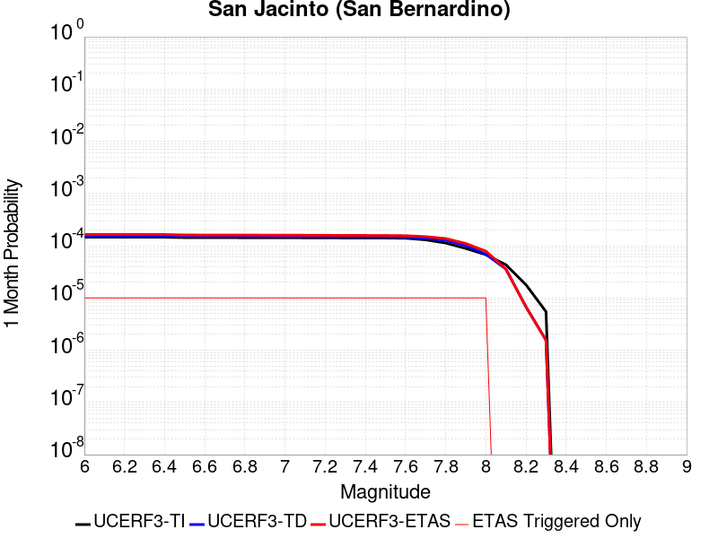 |  |  |

| Magnitude | 1 wk TI Prob | 1 wk TD Prob | 1 wk ETAS Prob | 1 wk ETAS/TD Gain | 1 wk ETAS Triggered Only | 1 mo TI Prob | 1 mo TD Prob | 1 mo ETAS Prob | 1 mo ETAS/TD Gain | 1 mo ETAS Triggered Only | 1 yr TI Prob | 1 yr TD Prob | 1 yr ETAS Prob | 1 yr ETAS/TD Gain | 1 yr ETAS Triggered Only | 10 yr TI Prob | 10 yr TD Prob | 10 yr ETAS Prob | 10 yr ETAS/TD Gain | 10 yr ETAS Triggered Only |
|-----|-----|-----|-----|-----|-----|-----|-----|-----|-----|-----|-----|-----|-----|-----|-----|-----|-----|-----|-----|-----|
| 6.0 | 3.409352E-5 | 3.604894E-5 | 4.604858E-5 | 1.2773907 | 1.0E-5 | 1.461069E-4 | 1.5448632E-4 | 1.6448477E-4 | 1.0647206 | 1.0E-5 | 0.0017774 | 0.0018792498 | 0.001889231 | 1.0053113 | 1.0E-5 | 0.01763251 | 0.019381514 | 0.019430544 | 1.0025297 | 5.0E-5 |
| 6.1 | 3.409352E-5 | 3.604894E-5 | 4.604858E-5 | 1.2773907 | 1.0E-5 | 1.461069E-4 | 1.5448632E-4 | 1.6448477E-4 | 1.0647206 | 1.0E-5 | 0.0017774 | 0.0018792498 | 0.001889231 | 1.0053113 | 1.0E-5 | 0.01763251 | 0.019381514 | 0.019430544 | 1.0025297 | 5.0E-5 |
| 6.2 | 3.409352E-5 | 3.604894E-5 | 4.604858E-5 | 1.2773907 | 1.0E-5 | 1.461069E-4 | 1.5448632E-4 | 1.6448477E-4 | 1.0647206 | 1.0E-5 | 0.0017774 | 0.0018792498 | 0.001889231 | 1.0053113 | 1.0E-5 | 0.01763251 | 0.019381514 | 0.019430544 | 1.0025297 | 5.0E-5 |
| 6.3 | 3.409352E-5 | 3.604894E-5 | 4.604858E-5 | 1.2773907 | 1.0E-5 | 1.461069E-4 | 1.5448632E-4 | 1.6448477E-4 | 1.0647206 | 1.0E-5 | 0.0017774 | 0.0018792498 | 0.001889231 | 1.0053113 | 1.0E-5 | 0.01763251 | 0.019381514 | 0.019430544 | 1.0025297 | 5.0E-5 |
| 6.4 | 3.400795E-5 | 3.594159E-5 | 4.594123E-5 | 1.2782192 | 1.0E-5 | 1.4574021E-4 | 1.540263E-4 | 1.6402476E-4 | 1.064914 | 1.0E-5 | 0.0017729428 | 0.0018736589 | 0.0018836402 | 1.0053271 | 1.0E-5 | 0.017588645 | 0.01932659 | 0.019375622 | 1.0025371 | 5.0E-5 |
| 6.5 | 3.341482E-5 | 3.5202123E-5 | 4.520177E-5 | 1.2840638 | 1.0E-5 | 1.4319851E-4 | 1.5085752E-4 | 1.6085601E-4 | 1.0662777 | 1.0E-5 | 0.0017420477 | 0.0018351445 | 0.0018451262 | 1.0054392 | 1.0E-5 | 0.017284546 | 0.018948095 | 0.018997146 | 1.0025887 | 5.0E-5 |
| 6.6 | 3.3364955E-5 | 3.5139332E-5 | 4.5138982E-5 | 1.2845714 | 1.0E-5 | 1.4298483E-4 | 1.5058846E-4 | 1.6058695E-4 | 1.0663961 | 1.0E-5 | 0.0017394501 | 0.001831874 | 0.0018418557 | 1.0054489 | 1.0E-5 | 0.017258976 | 0.018915955 | 0.01896501 | 1.0025933 | 5.0E-5 |
| 6.7 | 3.335922E-5 | 3.5129106E-5 | 4.5128752E-5 | 1.2846543 | 1.0E-5 | 1.4296026E-4 | 1.5054463E-4 | 1.6054312E-4 | 1.0664154 | 1.0E-5 | 0.0017391514 | 0.0018313414 | 0.0018413231 | 1.0054505 | 1.0E-5 | 0.017256035 | 0.018910747 | 0.018959802 | 1.002594 | 5.0E-5 |
| 6.8 | 3.327683E-5 | 3.5023157E-5 | 4.5022804E-5 | 1.2855154 | 1.0E-5 | 1.4260718E-4 | 1.5009061E-4 | 1.6008911E-4 | 1.0666164 | 1.0E-5 | 0.0017348597 | 0.001825823 | 0.0018358048 | 1.0054669 | 1.0E-5 | 0.017213784 | 0.018856514 | 0.01890557 | 1.0026016 | 5.0E-5 |
| 6.9 | 3.3235785E-5 | 3.49641E-5 | 4.496375E-5 | 1.2859976 | 1.0E-5 | 1.4243131E-4 | 1.4983755E-4 | 1.5983604E-4 | 1.066729 | 1.0E-5 | 0.0017327217 | 0.001822747 | 0.0018327289 | 1.0054762 | 1.0E-5 | 0.017192734 | 0.01882638 | 0.018875439 | 1.0026058 | 5.0E-5 |
| 7.0 | 3.3197095E-5 | 3.4904017E-5 | 4.4903667E-5 | 1.28649 | 1.0E-5 | 1.422655E-4 | 1.4958008E-4 | 1.5957859E-4 | 1.0668439 | 1.0E-5 | 0.0017307063 | 0.0018196177 | 0.0018295995 | 1.0054857 | 1.0E-5 | 0.017172894 | 0.018795753 | 0.018844813 | 1.0026102 | 5.0E-5 |
| 7.1 | 3.3129716E-5 | 3.4784203E-5 | 4.4783854E-5 | 1.2874768 | 1.0E-5 | 1.4197677E-4 | 1.4906665E-4 | 1.5906515E-4 | 1.0670741 | 1.0E-5 | 0.0017271966 | 0.001813377 | 0.0018233589 | 1.0055046 | 1.0E-5 | 0.017138338 | 0.01873482 | 0.018783884 | 1.0026188 | 5.0E-5 |
| 7.2 | 3.3034008E-5 | 3.4651628E-5 | 4.4651282E-5 | 1.2885767 | 1.0E-5 | 1.4156665E-4 | 1.4849853E-4 | 1.5849705E-4 | 1.0673307 | 1.0E-5 | 0.0017222111 | 0.0018064718 | 0.0018164538 | 1.0055257 | 1.0E-5 | 0.017089253 | 0.018667199 | 0.018716266 | 1.0026284 | 5.0E-5 |
| 7.3 | 3.2956614E-5 | 3.4519344E-5 | 4.4518998E-5 | 1.2896826 | 1.0E-5 | 1.4123498E-4 | 1.4793167E-4 | 1.5793019E-4 | 1.0675888 | 1.0E-5 | 0.0017181796 | 0.0017995817 | 0.0018095636 | 1.0055468 | 1.0E-5 | 0.017049557 | 0.018599935 | 0.018649004 | 1.0026382 | 5.0E-5 |
| 7.4 | 3.2915937E-5 | 3.4441007E-5 | 4.4440665E-5 | 1.2903415 | 1.0E-5 | 1.4106068E-4 | 1.4759599E-4 | 1.575945E-4 | 1.0677425 | 1.0E-5 | 0.0017160608 | 0.0017955014 | 0.0018054835 | 1.0055594 | 1.0E-5 | 0.017028693 | 0.01856018 | 0.018609252 | 1.002644 | 5.0E-5 |
| 7.5 | 3.281791E-5 | 3.4305875E-5 | 4.4305532E-5 | 1.2914853 | 1.0E-5 | 1.406406E-4 | 1.4701691E-4 | 1.5701544E-4 | 1.0680094 | 1.0E-5 | 0.0017109542 | 0.0017884627 | 0.0017984449 | 1.0055814 | 1.0E-5 | 0.016978411 | 0.018491047 | 0.018540122 | 1.002654 | 5.0E-5 |
| 7.6 | 3.2521442E-5 | 3.403071E-5 | 4.403037E-5 | 1.2938422 | 1.0E-5 | 1.3937015E-4 | 1.4583775E-4 | 1.558363E-4 | 1.0685594 | 1.0E-5 | 0.0016955109 | 0.00177413 | 0.0017841123 | 1.0056266 | 1.0E-5 | 0.016826328 | 0.018348608 | 0.01839769 | 1.002675 | 5.0E-5 |
| 7.7 | 3.0287873E-5 | 3.2514057E-5 | 4.251373E-5 | 1.3075492 | 1.0E-5 | 1.297987E-4 | 1.3933852E-4 | 1.4933712E-4 | 1.0717577 | 1.0E-5 | 0.0015791537 | 0.0016951276 | 0.0017051107 | 1.0058893 | 1.0E-5 | 0.01567979 | 0.017559286 | 0.017608408 | 1.0027975 | 5.0E-5 |
| 7.8 | 2.6316151E-5 | 2.9722758E-5 | 3.972246E-5 | 1.3364326 | 1.0E-5 | 1.1277862E-4 | 1.2737703E-4 | 1.3737577E-4 | 1.078497 | 1.0E-5 | 0.0013722149 | 0.0015497132 | 0.0015596977 | 1.0064428 | 1.0E-5 | 0.013637724 | 0.016099673 | 0.016148867 | 1.0030557 | 5.0E-5 |
| 7.9 | 2.0761147E-5 | 2.346946E-5 | 3.3469227E-5 | 1.4260757 | 1.0E-5 | 8.897331E-5 | 1.0057953E-4 | 1.1057852E-4 | 1.0994138 | 1.0E-5 | 0.0010827117 | 0.0012238687 | 0.0012338564 | 1.0081608 | 1.0E-5 | 0.010774517 | 0.012819743 | 0.01285923 | 1.0030801 | 4.0E-5 |
| 8.0 | 1.5738568E-5 | 1.6071699E-5 | 2.6071539E-5 | 1.6222018 | 1.0E-5 | 6.744926E-5 | 6.887689E-5 | 7.8876204E-5 | 1.1451765 | 1.0E-5 | 8.2088535E-4 | 8.3825423E-4 | 8.4824587E-4 | 1.0119195 | 1.0E-5 | 0.008178596 | 0.008886066 | 0.008925711 | 1.0044614 | 4.0E-5 |
| 8.1 | 1.0105832E-5 | 8.352162E-6 | 8.352162E-6 | 1.0 | 0.0 | 4.3309992E-5 | 3.5794492E-5 | 3.5794492E-5 | 1.0 | 0.0 | 5.2717153E-4 | 4.357113E-4 | 4.357113E-4 | 1.0 | 0.0 | 0.005259227 | 0.004688983 | 0.004698936 | 1.0021226 | 1.0E-5 |
| 8.2 | 4.189207E-6 | 1.5843941E-6 | 1.5843941E-6 | 1.0 | 0.0 | 1.7953622E-5 | 6.790243E-6 | 6.790243E-6 | 1.0 | 0.0 | 2.1856341E-4 | 8.26681E-5 | 8.26681E-5 | 1.0 | 0.0 | 0.0021834858 | 9.600267E-4 | 9.600267E-4 | 1.0 | 0.0 |
| 8.3 | 1.2758221E-6 | 3.6306494E-7 | 3.6306494E-7 | 1.0 | 0.0 | 5.4677976E-6 | 1.5559917E-6 | 1.5559917E-6 | 1.0 | 0.0 | 6.65684E-5 | 1.8944038E-5 | 1.8944038E-5 | 1.0 | 0.0 | 6.6548464E-4 | 2.2845245E-4 | 2.2845245E-4 | 1.0 | 0.0 |

## San Jacinto (Stepovers Combined)
*[(top)](#table-of-contents)*

| 1 Week | 1 Month | 1 Year | 10 Year |
|-----|-----|-----|-----|
|  |  |  |  |

| Magnitude | 1 wk TI Prob | 1 wk TD Prob | 1 wk ETAS Prob | 1 wk ETAS/TD Gain | 1 wk ETAS Triggered Only | 1 mo TI Prob | 1 mo TD Prob | 1 mo ETAS Prob | 1 mo ETAS/TD Gain | 1 mo ETAS Triggered Only | 1 yr TI Prob | 1 yr TD Prob | 1 yr ETAS Prob | 1 yr ETAS/TD Gain | 1 yr ETAS Triggered Only | 10 yr TI Prob | 10 yr TD Prob | 10 yr ETAS Prob | 10 yr ETAS/TD Gain | 10 yr ETAS Triggered Only |
|-----|-----|-----|-----|-----|-----|-----|-----|-----|-----|-----|-----|-----|-----|-----|-----|-----|-----|-----|-----|-----|
| 6.0 | 4.0667746E-5 | 3.5335263E-5 | 4.533491E-5 | 1.2829934 | 1.0E-5 | 1.742787E-4 | 1.5142806E-4 | 1.6142655E-4 | 1.066028 | 1.0E-5 | 0.0021197782 | 0.0018420788 | 0.0018520604 | 1.0054187 | 1.0E-5 | 0.020996714 | 0.019019177 | 0.019058416 | 1.0020632 | 4.0E-5 |
| 6.1 | 4.0667746E-5 | 3.5335263E-5 | 4.533491E-5 | 1.2829934 | 1.0E-5 | 1.742787E-4 | 1.5142806E-4 | 1.6142655E-4 | 1.066028 | 1.0E-5 | 0.0021197782 | 0.0018420788 | 0.0018520604 | 1.0054187 | 1.0E-5 | 0.020996714 | 0.019019177 | 0.019058416 | 1.0020632 | 4.0E-5 |
| 6.2 | 4.0667746E-5 | 3.5335263E-5 | 4.533491E-5 | 1.2829934 | 1.0E-5 | 1.742787E-4 | 1.5142806E-4 | 1.6142655E-4 | 1.066028 | 1.0E-5 | 0.0021197782 | 0.0018420788 | 0.0018520604 | 1.0054187 | 1.0E-5 | 0.020996714 | 0.019019177 | 0.019058416 | 1.0020632 | 4.0E-5 |
| 6.3 | 4.0667746E-5 | 3.5335263E-5 | 4.533491E-5 | 1.2829934 | 1.0E-5 | 1.742787E-4 | 1.5142806E-4 | 1.6142655E-4 | 1.066028 | 1.0E-5 | 0.0021197782 | 0.0018420788 | 0.0018520604 | 1.0054187 | 1.0E-5 | 0.020996714 | 0.019019177 | 0.019058416 | 1.0020632 | 4.0E-5 |
| 6.4 | 4.0577226E-5 | 3.5207147E-5 | 4.5206798E-5 | 1.2840232 | 1.0E-5 | 1.738908E-4 | 1.5087906E-4 | 1.6087756E-4 | 1.0662682 | 1.0E-5 | 0.0021150648 | 0.0018354072 | 0.0018453889 | 1.0054383 | 1.0E-5 | 0.020950472 | 0.018953735 | 0.018992975 | 1.0020704 | 4.0E-5 |
| 6.5 | 4.0577226E-5 | 3.5207147E-5 | 4.5206798E-5 | 1.2840232 | 1.0E-5 | 1.738908E-4 | 1.5087906E-4 | 1.6087756E-4 | 1.0662682 | 1.0E-5 | 0.0021150648 | 0.0018354072 | 0.0018453889 | 1.0054383 | 1.0E-5 | 0.020950472 | 0.018953735 | 0.018992975 | 1.0020704 | 4.0E-5 |
| 6.6 | 4.053861E-5 | 3.515248E-5 | 4.5152126E-5 | 1.284465 | 1.0E-5 | 1.7372532E-4 | 1.506448E-4 | 1.6064329E-4 | 1.0663713 | 1.0E-5 | 0.0021130538 | 0.0018325604 | 0.0018425421 | 1.0054468 | 1.0E-5 | 0.020930743 | 0.018925807 | 0.01896505 | 1.0020735 | 4.0E-5 |
| 6.7 | 4.0516545E-5 | 3.5121546E-5 | 4.5121196E-5 | 1.2847155 | 1.0E-5 | 1.7363077E-4 | 1.5051225E-4 | 1.6051074E-4 | 1.0664297 | 1.0E-5 | 0.002111905 | 0.0018309496 | 0.0018409312 | 1.0054517 | 1.0E-5 | 0.020919468 | 0.018910002 | 0.018949244 | 1.0020753 | 4.0E-5 |
| 6.8 | 4.049434E-5 | 3.5093104E-5 | 4.509275E-5 | 1.2849463 | 1.0E-5 | 1.7353562E-4 | 1.5039036E-4 | 1.6038885E-4 | 1.0664836 | 1.0E-5 | 0.0021107488 | 0.0018294681 | 0.0018394497 | 1.0054561 | 1.0E-5 | 0.020908125 | 0.018895412 | 0.018934656 | 1.0020769 | 4.0E-5 |
| 6.9 | 4.046386E-5 | 3.5055655E-5 | 4.5055305E-5 | 1.2852507 | 1.0E-5 | 1.73405E-4 | 1.5022988E-4 | 1.6022839E-4 | 1.0665547 | 1.0E-5 | 0.0021091616 | 0.0018275176 | 0.0018374993 | 1.0054619 | 1.0E-5 | 0.020892553 | 0.018876182 | 0.018915426 | 1.0020791 | 4.0E-5 |
| 7.0 | 4.036382E-5 | 3.4936198E-5 | 4.493585E-5 | 1.286226 | 1.0E-5 | 1.7297632E-4 | 1.4971798E-4 | 1.5971648E-4 | 1.0667822 | 1.0E-5 | 0.0021039525 | 0.0018212957 | 0.0018312775 | 1.0054806 | 1.0E-5 | 0.02084144 | 0.018814782 | 0.01885403 | 1.002086 | 4.0E-5 |
| 7.1 | 4.0343282E-5 | 3.4914654E-5 | 4.4914304E-5 | 1.2864027 | 1.0E-5 | 1.7288832E-4 | 1.4962567E-4 | 1.5962418E-4 | 1.0668235 | 1.0E-5 | 0.002102883 | 0.0018201737 | 0.0018301555 | 1.005484 | 1.0E-5 | 0.020830948 | 0.018803652 | 0.0188429 | 1.0020872 | 4.0E-5 |
| 7.2 | 4.0257353E-5 | 3.4819048E-5 | 4.4818702E-5 | 1.2871891 | 1.0E-5 | 1.725201E-4 | 1.4921598E-4 | 1.5921448E-4 | 1.067007 | 1.0E-5 | 0.0020984085 | 0.001815194 | 0.0018251758 | 1.005499 | 1.0E-5 | 0.020787042 | 0.018754339 | 0.018793589 | 1.0020928 | 4.0E-5 |
| 7.3 | 3.9940667E-5 | 3.4646426E-5 | 4.4646076E-5 | 1.2886201 | 1.0E-5 | 1.7116306E-4 | 1.4847625E-4 | 1.5847477E-4 | 1.0673409 | 1.0E-5 | 0.0020819185 | 0.0018062027 | 0.0018161846 | 1.0055264 | 1.0E-5 | 0.020625217 | 0.018662827 | 0.01870208 | 1.0021033 | 4.0E-5 |
| 7.4 | 3.9721202E-5 | 3.4531695E-5 | 4.453135E-5 | 1.289579 | 1.0E-5 | 1.7022261E-4 | 1.479846E-4 | 1.5798312E-4 | 1.0675646 | 1.0E-5 | 0.0020704903 | 0.0018002269 | 0.0018102088 | 1.0055449 | 1.0E-5 | 0.020513052 | 0.018601885 | 0.01864114 | 1.0021104 | 4.0E-5 |
| 7.5 | 3.7036873E-5 | 3.3597462E-5 | 4.3597127E-5 | 1.2976315 | 1.0E-5 | 1.5871979E-4 | 1.4398119E-4 | 1.5397975E-4 | 1.0694435 | 1.0E-5 | 0.0019307006 | 0.0017515646 | 0.001761547 | 1.0056992 | 1.0E-5 | 0.019140124 | 0.018102536 | 0.018141812 | 1.0021696 | 4.0E-5 |
| 7.6 | 3.2940967E-5 | 3.1371335E-5 | 4.1371022E-5 | 1.3187523 | 1.0E-5 | 1.4116794E-4 | 1.3444165E-4 | 1.4444032E-4 | 1.0743717 | 1.0E-5 | 0.0017173645 | 0.0016356006 | 0.0016455841 | 1.006104 | 1.0E-5 | 0.01704153 | 0.016931716 | 0.01697104 | 1.0023224 | 4.0E-5 |
| 7.7 | 2.8236149E-5 | 2.7935872E-5 | 3.793559E-5 | 1.3579527 | 1.0E-5 | 1.2100645E-4 | 1.19719676E-4 | 1.2971848E-4 | 1.0835185 | 1.0E-5 | 0.0014722579 | 0.0014566135 | 0.001466599 | 1.0068552 | 1.0E-5 | 0.014625421 | 0.015141861 | 0.015181255 | 1.0026017 | 4.0E-5 |
| 7.8 | 2.4329287E-5 | 2.5257565E-5 | 3.525731E-5 | 1.395911 | 1.0E-5 | 1.042642E-4 | 1.08242224E-4 | 1.18241136E-4 | 1.0923754 | 1.0E-5 | 0.0012686774 | 0.0013170532 | 0.00132704 | 1.0075827 | 1.0E-5 | 0.012614589 | 0.013738072 | 0.013777521 | 1.0028716 | 4.0E-5 |
| 7.9 | 1.9370926E-5 | 2.0466443E-5 | 3.0466237E-5 | 1.4885947 | 1.0E-5 | 8.301561E-5 | 8.771038E-5 | 9.7709504E-5 | 1.1140016 | 1.0E-5 | 0.0010102465 | 0.0010673514 | 0.0010773408 | 1.009359 | 1.0E-5 | 0.0100566605 | 0.011223038 | 0.011262589 | 1.0035241 | 4.0E-5 |
| 8.0 | 1.5583017E-5 | 1.5924119E-5 | 2.592396E-5 | 1.6279682 | 1.0E-5 | 6.6782646E-5 | 6.8244444E-5 | 7.824376E-5 | 1.146522 | 1.0E-5 | 8.127754E-4 | 8.3056005E-4 | 8.4055174E-4 | 1.0120301 | 1.0E-5 | 0.008098091 | 0.008801706 | 0.008841354 | 1.0045046 | 4.0E-5 |
| 8.1 | 1.0024873E-5 | 8.313899E-6 | 8.313899E-6 | 1.0 | 0.0 | 4.2963035E-5 | 3.5630514E-5 | 3.5630514E-5 | 1.0 | 0.0 | 5.229494E-4 | 4.3371567E-4 | 4.3371567E-4 | 1.0 | 0.0 | 0.0052172043 | 0.004665064 | 0.0046750177 | 1.0021336 | 1.0E-5 |
| 8.2 | 4.142796E-6 | 1.5668816E-6 | 1.5668816E-6 | 1.0 | 0.0 | 1.775472E-5 | 6.7151896E-6 | 6.7151896E-6 | 1.0 | 0.0 | 2.1614227E-4 | 8.175439E-5 | 8.175439E-5 | 1.0 | 0.0 | 0.0021593217 | 9.488576E-4 | 9.488576E-4 | 1.0 | 0.0 |
| 8.3 | 1.2750878E-6 | 3.6277774E-7 | 3.6277774E-7 | 1.0 | 0.0 | 5.4646503E-6 | 1.5547608E-6 | 1.5547608E-6 | 1.0 | 0.0 | 6.653009E-5 | 1.8929053E-5 | 1.8929053E-5 | 1.0 | 0.0 | 6.6510175E-4 | 2.2828147E-4 | 2.2828147E-4 | 1.0 | 0.0 |

## Sheephole
*[(top)](#table-of-contents)*

| 1 Week | 1 Month | 1 Year | 10 Year |
|-----|-----|-----|-----|
|  |  |  |  |

| Magnitude | 1 wk TI Prob | 1 wk TD Prob | 1 wk ETAS Prob | 1 wk ETAS/TD Gain | 1 wk ETAS Triggered Only | 1 mo TI Prob | 1 mo TD Prob | 1 mo ETAS Prob | 1 mo ETAS/TD Gain | 1 mo ETAS Triggered Only | 1 yr TI Prob | 1 yr TD Prob | 1 yr ETAS Prob | 1 yr ETAS/TD Gain | 1 yr ETAS Triggered Only | 10 yr TI Prob | 10 yr TD Prob | 10 yr ETAS Prob | 10 yr ETAS/TD Gain | 10 yr ETAS Triggered Only |
|-----|-----|-----|-----|-----|-----|-----|-----|-----|-----|-----|-----|-----|-----|-----|-----|-----|-----|-----|-----|-----|
| 6.0 | 4.5579695E-6 | 4.741364E-6 | 4.741364E-6 | 1.0 | 0.0 | 1.9534009E-5 | 2.0320003E-5 | 2.0320003E-5 | 1.0 | 0.0 | 2.3780059E-4 | 2.473735E-4 | 2.473735E-4 | 1.0 | 0.0 | 0.0023754628 | 0.002471526 | 0.002511427 | 1.0161443 | 4.0E-5 |
| 6.1 | 4.5579695E-6 | 4.741364E-6 | 4.741364E-6 | 1.0 | 0.0 | 1.9534009E-5 | 2.0320003E-5 | 2.0320003E-5 | 1.0 | 0.0 | 2.3780059E-4 | 2.473735E-4 | 2.473735E-4 | 1.0 | 0.0 | 0.0023754628 | 0.002471526 | 0.002511427 | 1.0161443 | 4.0E-5 |
| 6.2 | 2.6677674E-6 | 2.7874607E-6 | 2.7874607E-6 | 1.0 | 0.0 | 1.1433239E-5 | 1.1946211E-5 | 1.1946211E-5 | 1.0 | 0.0 | 1.3919079E-4 | 1.454365E-4 | 1.454365E-4 | 1.0 | 0.0 | 0.0013910364 | 0.001453519 | 0.0014834754 | 1.0206096 | 3.0E-5 |
| 6.3 | 2.6677674E-6 | 2.7874607E-6 | 2.7874607E-6 | 1.0 | 0.0 | 1.1433239E-5 | 1.1946211E-5 | 1.1946211E-5 | 1.0 | 0.0 | 1.3919079E-4 | 1.454365E-4 | 1.454365E-4 | 1.0 | 0.0 | 0.0013910364 | 0.001453519 | 0.0014834754 | 1.0206096 | 3.0E-5 |
| 6.4 | 2.2159759E-6 | 2.3229381E-6 | 2.3229381E-6 | 1.0 | 0.0 | 9.497005E-6 | 9.955416E-6 | 9.955416E-6 | 1.0 | 0.0 | 1.156199E-4 | 1.2120126E-4 | 1.2120126E-4 | 1.0 | 0.0 | 0.0011555976 | 0.0012114309 | 0.0012314067 | 1.0164894 | 2.0E-5 |
| 6.5 | 2.1986082E-6 | 2.304818E-6 | 2.304818E-6 | 1.0 | 0.0 | 9.4225725E-6 | 9.877759E-6 | 9.877759E-6 | 1.0 | 0.0 | 1.1471378E-4 | 1.20255885E-4 | 1.20255885E-4 | 1.0 | 0.0 | 0.0011465458 | 0.0012019875 | 0.0012219634 | 1.0166191 | 2.0E-5 |
| 6.6 | 1.5232331E-6 | 1.6019358E-6 | 1.6019358E-6 | 1.0 | 0.0 | 6.5281256E-6 | 6.8654217E-6 | 6.8654217E-6 | 1.0 | 0.0 | 7.947703E-5 | 8.3583494E-5 | 8.3583494E-5 | 1.0 | 0.0 | 7.9448614E-4 | 8.355393E-4 | 8.555226E-4 | 1.0239166 | 2.0E-5 |
| 6.7 | 1.3137362E-6 | 1.3828576E-6 | 1.3828576E-6 | 1.0 | 0.0 | 5.6302856E-6 | 5.92652E-6 | 5.92652E-6 | 1.0 | 0.0 | 6.854657E-5 | 7.215313E-5 | 7.215313E-5 | 1.0 | 0.0 | 6.8525434E-4 | 7.2131096E-4 | 7.4129656E-4 | 1.0277073 | 2.0E-5 |
| 6.8 | 1.2275751E-6 | 1.2923208E-6 | 1.2923208E-6 | 1.0 | 0.0 | 5.2610258E-6 | 5.5385067E-6 | 5.5385067E-6 | 1.0 | 0.0 | 6.4051106E-5 | 6.742937E-5 | 6.742937E-5 | 1.0 | 0.0 | 6.4032647E-4 | 6.7410246E-4 | 6.940889E-4 | 1.0296491 | 2.0E-5 |
| 6.9 | 1.1837088E-6 | 1.2461369E-6 | 1.2461369E-6 | 1.0 | 0.0 | 5.0730278E-6 | 5.3405765E-6 | 5.3405765E-6 | 1.0 | 0.0 | 6.176237E-5 | 6.501971E-5 | 6.501971E-5 | 1.0 | 0.0 | 6.17452E-4 | 6.5002E-4 | 6.70007E-4 | 1.0307482 | 2.0E-5 |
| 7.0 | 9.849371E-7 | 1.0366576E-6 | 1.0366576E-6 | 1.0 | 0.0 | 4.2211523E-6 | 4.4428116E-6 | 4.4428116E-6 | 1.0 | 0.0 | 5.1391315E-5 | 5.4089993E-5 | 5.4089993E-5 | 1.0 | 0.0 | 5.137943E-4 | 5.4077833E-4 | 5.5077294E-4 | 1.0184819 | 1.0E-5 |
| 7.1 | 8.1643645E-7 | 8.591908E-7 | 8.591908E-7 | 1.0 | 0.0 | 3.4990085E-6 | 3.6822414E-6 | 3.6822414E-6 | 1.0 | 0.0 | 4.2599597E-5 | 4.4830453E-5 | 4.4830453E-5 | 1.0 | 0.0 | 4.259143E-4 | 4.4822274E-4 | 4.5821824E-4 | 1.0223004 | 1.0E-5 |
| 7.2 | 5.7295756E-7 | 6.029669E-7 | 6.029669E-7 | 1.0 | 0.0 | 2.45553E-6 | 2.5841418E-6 | 2.5841418E-6 | 1.0 | 0.0 | 2.9895667E-5 | 3.146154E-5 | 3.146154E-5 | 1.0 | 0.0 | 2.9891645E-4 | 3.1457754E-4 | 3.2457442E-4 | 1.0317787 | 1.0E-5 |

## San Jacinto (San Jacinto Valley) rev
*[(top)](#table-of-contents)*

| 1 Week | 1 Month | 1 Year | 10 Year |
|-----|-----|-----|-----|
|  |  |  |  |

| Magnitude | 1 wk TI Prob | 1 wk TD Prob | 1 wk ETAS Prob | 1 wk ETAS/TD Gain | 1 wk ETAS Triggered Only | 1 mo TI Prob | 1 mo TD Prob | 1 mo ETAS Prob | 1 mo ETAS/TD Gain | 1 mo ETAS Triggered Only | 1 yr TI Prob | 1 yr TD Prob | 1 yr ETAS Prob | 1 yr ETAS/TD Gain | 1 yr ETAS Triggered Only | 10 yr TI Prob | 10 yr TD Prob | 10 yr ETAS Prob | 10 yr ETAS/TD Gain | 10 yr ETAS Triggered Only |
|-----|-----|-----|-----|-----|-----|-----|-----|-----|-----|-----|-----|-----|-----|-----|-----|-----|-----|-----|-----|-----|
| 6.0 | 3.652694E-5 | 3.4466113E-5 | 4.446577E-5 | 1.29013 | 1.0E-5 | 1.5653463E-4 | 1.4770357E-4 | 1.5770209E-4 | 1.0676931 | 1.0E-5 | 0.0019041431 | 0.0017968096 | 0.0018067916 | 1.0055554 | 1.0E-5 | 0.018879099 | 0.018559378 | 0.018598635 | 1.0021152 | 4.0E-5 |
| 6.1 | 3.652694E-5 | 3.4466113E-5 | 4.446577E-5 | 1.29013 | 1.0E-5 | 1.5653463E-4 | 1.4770357E-4 | 1.5770209E-4 | 1.0676931 | 1.0E-5 | 0.0019041431 | 0.0017968096 | 0.0018067916 | 1.0055554 | 1.0E-5 | 0.018879099 | 0.018559378 | 0.018598635 | 1.0021152 | 4.0E-5 |
| 6.2 | 3.652694E-5 | 3.4466113E-5 | 4.446577E-5 | 1.29013 | 1.0E-5 | 1.5653463E-4 | 1.4770357E-4 | 1.5770209E-4 | 1.0676931 | 1.0E-5 | 0.0019041431 | 0.0017968096 | 0.0018067916 | 1.0055554 | 1.0E-5 | 0.018879099 | 0.018559378 | 0.018598635 | 1.0021152 | 4.0E-5 |
| 6.3 | 3.652694E-5 | 3.4466113E-5 | 4.446577E-5 | 1.29013 | 1.0E-5 | 1.5653463E-4 | 1.4770357E-4 | 1.5770209E-4 | 1.0676931 | 1.0E-5 | 0.0019041431 | 0.0017968096 | 0.0018067916 | 1.0055554 | 1.0E-5 | 0.018879099 | 0.018559378 | 0.018598635 | 1.0021152 | 4.0E-5 |
| 6.4 | 3.646941E-5 | 3.4387675E-5 | 4.4387332E-5 | 1.2907919 | 1.0E-5 | 1.5628811E-4 | 1.4736745E-4 | 1.5736597E-4 | 1.0678476 | 1.0E-5 | 0.0019011468 | 0.0017927244 | 0.0018027064 | 1.0055681 | 1.0E-5 | 0.018849645 | 0.018519253 | 0.018558512 | 1.0021199 | 4.0E-5 |
| 6.5 | 3.646941E-5 | 3.4387675E-5 | 4.4387332E-5 | 1.2907919 | 1.0E-5 | 1.5628811E-4 | 1.4736745E-4 | 1.5736597E-4 | 1.0678476 | 1.0E-5 | 0.0019011468 | 0.0017927244 | 0.0018027064 | 1.0055681 | 1.0E-5 | 0.018849645 | 0.018519253 | 0.018558512 | 1.0021199 | 4.0E-5 |
| 6.6 | 3.6442503E-5 | 3.435106E-5 | 4.4350712E-5 | 1.2911018 | 1.0E-5 | 1.561728E-4 | 1.4721052E-4 | 1.5720906E-4 | 1.06792 | 1.0E-5 | 0.0018997455 | 0.0017908171 | 0.0018007992 | 1.005574 | 1.0E-5 | 0.018835869 | 0.018500518 | 0.018539779 | 1.002122 | 4.0E-5 |
| 6.7 | 3.6432113E-5 | 3.433663E-5 | 4.4336284E-5 | 1.2912241 | 1.0E-5 | 1.5612828E-4 | 1.4714869E-4 | 1.5714722E-4 | 1.0679485 | 1.0E-5 | 0.0018992044 | 0.0017900657 | 0.0018000478 | 1.0055764 | 1.0E-5 | 0.018830549 | 0.01849314 | 0.018532401 | 1.002123 | 4.0E-5 |
| 6.8 | 3.6409598E-5 | 3.4305678E-5 | 4.4305336E-5 | 1.291487 | 1.0E-5 | 1.560318E-4 | 1.4701606E-4 | 1.570146E-4 | 1.0680097 | 1.0E-5 | 0.0018980318 | 0.0017884537 | 0.0017984357 | 1.0055814 | 1.0E-5 | 0.018819023 | 0.018477293 | 0.018516554 | 1.0021248 | 4.0E-5 |
| 6.9 | 3.638078E-5 | 3.4266093E-5 | 4.426575E-5 | 1.2918236 | 1.0E-5 | 1.5590832E-4 | 1.4684643E-4 | 1.5684497E-4 | 1.0680883 | 1.0E-5 | 0.0018965311 | 0.0017863918 | 0.001796374 | 1.0055879 | 1.0E-5 | 0.018804269 | 0.018457023 | 0.018496284 | 1.0021272 | 4.0E-5 |
| 7.0 | 3.6294874E-5 | 3.4148088E-5 | 4.414775E-5 | 1.2928321 | 1.0E-5 | 1.5554018E-4 | 1.4634077E-4 | 1.563393E-4 | 1.0683236 | 1.0E-5 | 0.0018920569 | 0.0017802453 | 0.0017902276 | 1.0056072 | 1.0E-5 | 0.018760284 | 0.018396595 | 0.01843586 | 1.0021343 | 4.0E-5 |
| 7.1 | 3.6260717E-5 | 3.4104367E-5 | 4.4104025E-5 | 1.2932076 | 1.0E-5 | 1.5539382E-4 | 1.461534E-4 | 1.5615193E-4 | 1.0684112 | 1.0E-5 | 0.001890278 | 0.0017779679 | 0.0017879502 | 1.0056144 | 1.0E-5 | 0.018742796 | 0.018374188 | 0.018413454 | 1.002137 | 4.0E-5 |
| 7.2 | 3.6210204E-5 | 3.4038494E-5 | 4.4038152E-5 | 1.2937751 | 1.0E-5 | 1.5517735E-4 | 1.4587112E-4 | 1.5586965E-4 | 1.0685437 | 1.0E-5 | 0.001887647 | 0.0017745368 | 0.0017845191 | 1.0056252 | 1.0E-5 | 0.01871693 | 0.018340416 | 0.018379683 | 1.002141 | 4.0E-5 |
| 7.3 | 3.6119454E-5 | 3.392659E-5 | 4.3926248E-5 | 1.294744 | 1.0E-5 | 1.5478847E-4 | 1.4539158E-4 | 1.5539012E-4 | 1.0687698 | 1.0E-5 | 0.0018829206 | 0.0017687079 | 0.0017786903 | 1.0056438 | 1.0E-5 | 0.018670462 | 0.018282874 | 0.018322142 | 1.0021478 | 4.0E-5 |
| 7.4 | 3.607848E-5 | 3.3874043E-5 | 4.3873704E-5 | 1.2952013 | 1.0E-5 | 1.5461289E-4 | 1.4516641E-4 | 1.5516496E-4 | 1.0688765 | 1.0E-5 | 0.0018807866 | 0.001765971 | 0.0017759532 | 1.0056527 | 1.0E-5 | 0.018649481 | 0.018255847 | 0.018295115 | 1.0021511 | 4.0E-5 |
| 7.5 | 3.5856774E-5 | 3.368289E-5 | 4.3682554E-5 | 1.2968767 | 1.0E-5 | 1.5366284E-4 | 1.4434727E-4 | 1.5434582E-4 | 1.0692674 | 1.0E-5 | 0.0018692396 | 0.0017560141 | 0.0017659965 | 1.0056847 | 1.0E-5 | 0.018535944 | 0.018156461 | 0.018195735 | 1.002163 | 4.0E-5 |
| 7.6 | 3.286655E-5 | 3.219922E-5 | 4.2198895E-5 | 1.3105565 | 1.0E-5 | 1.4084904E-4 | 1.3798937E-4 | 1.4798799E-4 | 1.0724593 | 1.0E-5 | 0.001713488 | 0.0016787279 | 0.0016887111 | 1.0059469 | 1.0E-5 | 0.017003361 | 0.017372673 | 0.017411979 | 1.0022625 | 4.0E-5 |
| 7.7 | 2.8882527E-5 | 2.9290912E-5 | 3.929062E-5 | 1.3413929 | 1.0E-5 | 1.237764E-4 | 1.2552645E-4 | 1.3552519E-4 | 1.0796545 | 1.0E-5 | 0.0015059357 | 0.0015272142 | 0.0015371989 | 1.0065379 | 1.0E-5 | 0.014957713 | 0.01585857 | 0.015897935 | 1.0024823 | 4.0E-5 |
| 7.8 | 2.4950225E-5 | 2.6579837E-5 | 3.657957E-5 | 1.376215 | 1.0E-5 | 1.0692515E-4 | 1.13908616E-4 | 1.2390748E-4 | 1.0877796 | 1.0E-5 | 0.0013010362 | 0.001385956 | 0.0013959422 | 1.0072052 | 1.0E-5 | 0.012934455 | 0.014438762 | 0.014478184 | 1.0027304 | 4.0E-5 |
| 7.9 | 1.9881603E-5 | 2.1554622E-5 | 3.1554406E-5 | 1.4639276 | 1.0E-5 | 8.520408E-5 | 9.237368E-5 | 1.0237276E-4 | 1.108246 | 1.0E-5 | 0.001036866 | 0.0011240701 | 0.0011340589 | 1.0088862 | 1.0E-5 | 0.010320415 | 0.011801713 | 0.011841241 | 1.0033493 | 4.0E-5 |
| 8.0 | 1.563292E-5 | 1.597515E-5 | 2.597499E-5 | 1.6259621 | 1.0E-5 | 6.6996516E-5 | 6.846314E-5 | 7.846246E-5 | 1.146054 | 1.0E-5 | 8.153773E-4 | 8.3322066E-4 | 8.432123E-4 | 1.0119916 | 1.0E-5 | 0.00812392 | 0.008830484 | 0.00887013 | 1.0044898 | 4.0E-5 |
| 8.1 | 1.0045313E-5 | 8.323337E-6 | 8.323337E-6 | 1.0 | 0.0 | 4.305063E-5 | 3.567096E-5 | 3.567096E-5 | 1.0 | 0.0 | 5.2401534E-4 | 4.3420793E-4 | 4.3420793E-4 | 1.0 | 0.0 | 0.0052278144 | 0.00467079 | 0.0046807434 | 1.002131 | 1.0E-5 |
| 8.2 | 4.1554413E-6 | 1.571458E-6 | 1.571458E-6 | 1.0 | 0.0 | 1.7808914E-5 | 6.734803E-6 | 6.734803E-6 | 1.0 | 0.0 | 2.1680194E-4 | 8.199317E-5 | 8.199317E-5 | 1.0 | 0.0 | 0.0021659054 | 9.5169496E-4 | 9.5169496E-4 | 1.0 | 0.0 |
| 8.3 | 1.2758221E-6 | 3.6306494E-7 | 3.6306494E-7 | 1.0 | 0.0 | 5.4677976E-6 | 1.5559917E-6 | 1.5559917E-6 | 1.0 | 0.0 | 6.65684E-5 | 1.8944038E-5 | 1.8944038E-5 | 1.0 | 0.0 | 6.6548464E-4 | 2.2845245E-4 | 2.2845245E-4 | 1.0 | 0.0 |

## Santa Cruz Catalina Ridge alt1
*[(top)](#table-of-contents)*

| 1 Week | 1 Month | 1 Year | 10 Year |
|-----|-----|-----|-----|
|  |  |  |  |

| Magnitude | 1 wk TI Prob | 1 wk TD Prob | 1 wk ETAS Prob | 1 wk ETAS/TD Gain | 1 wk ETAS Triggered Only | 1 mo TI Prob | 1 mo TD Prob | 1 mo ETAS Prob | 1 mo ETAS/TD Gain | 1 mo ETAS Triggered Only | 1 yr TI Prob | 1 yr TD Prob | 1 yr ETAS Prob | 1 yr ETAS/TD Gain | 1 yr ETAS Triggered Only | 10 yr TI Prob | 10 yr TD Prob | 10 yr ETAS Prob | 10 yr ETAS/TD Gain | 10 yr ETAS Triggered Only |
|-----|-----|-----|-----|-----|-----|-----|-----|-----|-----|-----|-----|-----|-----|-----|-----|-----|-----|-----|-----|-----|
| 6.0 | 3.2833184E-5 | 3.6560636E-5 | 3.6560636E-5 | 1.0 | 0.0 | 1.4070606E-4 | 1.5667996E-4 | 1.5667996E-4 | 1.0 | 0.0 | 0.00171175 | 0.0019060757 | 0.0019060757 | 1.0 | 0.0 | 0.016986247 | 0.01891418 | 0.018953422 | 1.0020748 | 4.0E-5 |
| 6.1 | 1.9835548E-5 | 2.1660571E-5 | 2.1660571E-5 | 1.0 | 0.0 | 8.500672E-5 | 9.282783E-5 | 9.282783E-5 | 1.0 | 0.0 | 0.0010344655 | 0.001129613 | 0.001129613 | 1.0 | 0.0 | 0.010296632 | 0.011240846 | 0.011260621 | 1.0017592 | 2.0E-5 |
| 6.2 | 1.9835548E-5 | 2.1660571E-5 | 2.1660571E-5 | 1.0 | 0.0 | 8.500672E-5 | 9.282783E-5 | 9.282783E-5 | 1.0 | 0.0 | 0.0010344655 | 0.001129613 | 0.001129613 | 1.0 | 0.0 | 0.010296632 | 0.011240846 | 0.011260621 | 1.0017592 | 2.0E-5 |
| 6.3 | 1.5728183E-5 | 1.7034703E-5 | 1.7034703E-5 | 1.0 | 0.0 | 6.7404755E-5 | 7.300386E-5 | 7.300386E-5 | 1.0 | 0.0 | 8.2034385E-4 | 8.8846567E-4 | 8.8846567E-4 | 1.0 | 0.0 | 0.008173222 | 0.008849816 | 0.008859728 | 1.00112 | 1.0E-5 |
| 6.4 | 1.5728183E-5 | 1.7034703E-5 | 1.7034703E-5 | 1.0 | 0.0 | 6.7404755E-5 | 7.300386E-5 | 7.300386E-5 | 1.0 | 0.0 | 8.2034385E-4 | 8.8846567E-4 | 8.8846567E-4 | 1.0 | 0.0 | 0.008173222 | 0.008849816 | 0.008859728 | 1.00112 | 1.0E-5 |
| 6.5 | 1.3707734E-5 | 1.4795146E-5 | 1.4795146E-5 | 1.0 | 0.0 | 5.8746107E-5 | 6.3406245E-5 | 6.3406245E-5 | 1.0 | 0.0 | 7.1499916E-4 | 7.7170116E-4 | 7.7170116E-4 | 1.0 | 0.0 | 0.0071270303 | 0.0076906127 | 0.0076906127 | 1.0 | 0.0 |
| 6.6 | 1.2539813E-5 | 1.3510776E-5 | 1.3510776E-5 | 1.0 | 0.0 | 5.3740947E-5 | 5.7902053E-5 | 5.7902053E-5 | 1.0 | 0.0 | 6.540996E-4 | 7.0473214E-4 | 7.0473214E-4 | 1.0 | 0.0 | 0.0065217763 | 0.007025277 | 0.007025277 | 1.0 | 0.0 |
| 6.7 | 1.1504083E-5 | 1.2377875E-5 | 1.2377875E-5 | 1.0 | 0.0 | 4.930228E-5 | 5.3046966E-5 | 5.3046966E-5 | 1.0 | 0.0 | 6.0008996E-4 | 6.456574E-4 | 6.456574E-4 | 1.0 | 0.0 | 0.005984721 | 0.006438045 | 0.006438045 | 1.0 | 0.0 |
| 6.8 | 1.012739E-5 | 1.0877499E-5 | 1.0877499E-5 | 1.0 | 0.0 | 4.340238E-5 | 4.661703E-5 | 4.661703E-5 | 1.0 | 0.0 | 5.282958E-4 | 5.67416E-4 | 5.67416E-4 | 1.0 | 0.0 | 0.0052704164 | 0.0056598415 | 0.0056598415 | 1.0 | 0.0 |
| 6.9 | 8.9607865E-6 | 9.609487E-6 | 9.609487E-6 | 1.0 | 0.0 | 3.8402806E-5 | 4.118287E-5 | 4.118287E-5 | 1.0 | 0.0 | 4.6745385E-4 | 5.0128717E-4 | 5.0128717E-4 | 1.0 | 0.0 | 0.0046647177 | 0.0050016837 | 0.0050016837 | 1.0 | 0.0 |
| 7.0 | 8.046829E-6 | 8.620072E-6 | 8.620072E-6 | 1.0 | 0.0 | 3.4485955E-5 | 3.694265E-5 | 3.694265E-5 | 1.0 | 0.0 | 4.1978562E-4 | 4.496847E-4 | 4.496847E-4 | 1.0 | 0.0 | 0.004189935 | 0.004487838 | 0.004487838 | 1.0 | 0.0 |
| 7.1 | 7.136131E-6 | 7.637941E-6 | 7.637941E-6 | 1.0 | 0.0 | 3.0583058E-5 | 3.2733627E-5 | 3.2733627E-5 | 1.0 | 0.0 | 3.7228514E-4 | 3.9845973E-4 | 3.9845973E-4 | 1.0 | 0.0 | 0.0037166206 | 0.0039775297 | 0.0039775297 | 1.0 | 0.0 |
| 7.2 | 6.362014E-6 | 6.8052104E-6 | 6.8052104E-6 | 1.0 | 0.0 | 2.726549E-5 | 2.9164865E-5 | 2.9164865E-5 | 1.0 | 0.0 | 3.3190678E-4 | 3.5502503E-4 | 3.5502503E-4 | 1.0 | 0.0 | 0.0033141149 | 0.003544647 | 0.003544647 | 1.0 | 0.0 |
| 7.3 | 5.004101E-6 | 5.3519125E-6 | 5.3519125E-6 | 1.0 | 0.0 | 2.1445969E-5 | 2.2936569E-5 | 2.2936569E-5 | 1.0 | 0.0 | 2.6107338E-4 | 2.792175E-4 | 2.792175E-4 | 1.0 | 0.0 | 0.002607669 | 0.0027887214 | 0.0027887214 | 1.0 | 0.0 |
| 7.4 | 3.4901443E-6 | 3.73219E-6 | 3.73219E-6 | 1.0 | 0.0 | 1.4957676E-5 | 1.5995005E-5 | 1.5995005E-5 | 1.0 | 0.0 | 1.8209449E-4 | 1.9472216E-4 | 1.9472216E-4 | 1.0 | 0.0 | 0.0018194534 | 0.001945554 | 0.001945554 | 1.0 | 0.0 |
| 7.5 | 1.1215045E-6 | 1.1894253E-6 | 1.1894253E-6 | 1.0 | 0.0 | 4.806439E-6 | 5.0975277E-6 | 5.0975277E-6 | 1.0 | 0.0 | 5.851682E-5 | 6.206066E-5 | 6.206066E-5 | 1.0 | 0.0 | 5.850142E-4 | 6.204364E-4 | 6.204364E-4 | 1.0 | 0.0 |
| 7.6 | 2.8599047E-7 | 2.9952744E-7 | 2.9952744E-7 | 1.0 | 0.0 | 1.2256729E-6 | 1.2836884E-6 | 1.2836884E-6 | 1.0 | 0.0 | 1.4922465E-5 | 1.5628797E-5 | 1.5628797E-5 | 1.0 | 0.0 | 1.4921463E-4 | 1.562771E-4 | 1.562771E-4 | 1.0 | 0.0 |
| 7.7 | 2.0781519E-7 | 2.1744857E-7 | 2.1744857E-7 | 1.0 | 0.0 | 8.906362E-7 | 9.3192216E-7 | 9.3192216E-7 | 1.0 | 0.0 | 1.08434415E-5 | 1.1346094E-5 | 1.1346094E-5 | 1.0 | 0.0 | 1.0842913E-4 | 1.1345524E-4 | 1.1345524E-4 | 1.0 | 0.0 |
| 7.8 | 3.614776E-8 | 3.7641843E-8 | 3.7641843E-8 | 1.0 | 0.0 | 1.5491896E-7 | 1.6132218E-7 | 1.6132218E-7 | 1.0 | 0.0 | 1.8861368E-6 | 1.9640959E-6 | 1.9640959E-6 | 1.0 | 0.0 | 1.8861208E-5 | 1.9640796E-5 | 1.9640796E-5 | 1.0 | 0.0 |

## Coronado Bank alt1
*[(top)](#table-of-contents)*

| 1 Week | 1 Month | 1 Year | 10 Year |
|-----|-----|-----|-----|
|  |  |  |  |

| Magnitude | 1 wk TI Prob | 1 wk TD Prob | 1 wk ETAS Prob | 1 wk ETAS/TD Gain | 1 wk ETAS Triggered Only | 1 mo TI Prob | 1 mo TD Prob | 1 mo ETAS Prob | 1 mo ETAS/TD Gain | 1 mo ETAS Triggered Only | 1 yr TI Prob | 1 yr TD Prob | 1 yr ETAS Prob | 1 yr ETAS/TD Gain | 1 yr ETAS Triggered Only | 10 yr TI Prob | 10 yr TD Prob | 10 yr ETAS Prob | 10 yr ETAS/TD Gain | 10 yr ETAS Triggered Only |
|-----|-----|-----|-----|-----|-----|-----|-----|-----|-----|-----|-----|-----|-----|-----|-----|-----|-----|-----|-----|-----|
| 6.0 | 7.533492E-5 | 9.396308E-5 | 9.396308E-5 | 1.0 | 0.0 | 3.22824E-4 | 4.026398E-4 | 4.026398E-4 | 1.0 | 0.0 | 0.0039233007 | 0.004891753 | 0.0049116556 | 1.0040685 | 2.0E-5 | 0.03854755 | 0.047910035 | 0.04794812 | 1.0007949 | 4.0E-5 |
| 6.1 | 4.1807285E-5 | 5.0498526E-5 | 5.0498526E-5 | 1.0 | 0.0 | 1.7916178E-4 | 2.164048E-4 | 2.164048E-4 | 1.0 | 0.0 | 0.0021791123 | 0.0026316273 | 0.0026316273 | 1.0 | 0.0 | 0.021578677 | 0.026013961 | 0.02603344 | 1.0007489 | 2.0E-5 |
| 6.2 | 4.1807285E-5 | 5.0498526E-5 | 5.0498526E-5 | 1.0 | 0.0 | 1.7916178E-4 | 2.164048E-4 | 2.164048E-4 | 1.0 | 0.0 | 0.0021791123 | 0.0026316273 | 0.0026316273 | 1.0 | 0.0 | 0.021578677 | 0.026013961 | 0.02603344 | 1.0007489 | 2.0E-5 |
| 6.3 | 3.1793104E-5 | 3.7714883E-5 | 3.7714883E-5 | 1.0 | 0.0 | 1.3624904E-4 | 1.6162539E-4 | 1.6162539E-4 | 1.0 | 0.0 | 0.0016575698 | 0.0019660448 | 0.0019660448 | 1.0 | 0.0 | 0.016452603 | 0.019490417 | 0.019510027 | 1.0010061 | 2.0E-5 |
| 6.4 | 2.9878007E-5 | 3.5339264E-5 | 3.5339264E-5 | 1.0 | 0.0 | 1.2804232E-4 | 1.5144538E-4 | 1.5144538E-4 | 1.0 | 0.0 | 0.0015578003 | 0.0018423196 | 0.0018423196 | 1.0 | 0.0 | 0.015469253 | 0.018274235 | 0.01829387 | 1.0010744 | 2.0E-5 |
| 6.5 | 2.4512565E-5 | 2.8766783E-5 | 2.8766783E-5 | 1.0 | 0.0 | 1.0504962E-4 | 1.2328054E-4 | 1.2328054E-4 | 1.0 | 0.0 | 0.0012782287 | 0.0014999339 | 0.0014999339 | 1.0 | 0.0 | 0.012709012 | 0.01490107 | 0.014920771 | 1.0013222 | 2.0E-5 |
| 6.6 | 2.1317413E-5 | 2.4908924E-5 | 2.4908924E-5 | 1.0 | 0.0 | 9.135714E-5 | 1.0674829E-4 | 1.0674829E-4 | 1.0 | 0.0 | 0.0011117056 | 0.0012989078 | 0.0012989078 | 1.0 | 0.0 | 0.011061605 | 0.012915568 | 0.01293531 | 1.0015285 | 2.0E-5 |
| 6.7 | 1.8585655E-5 | 2.1636792E-5 | 2.1636792E-5 | 1.0 | 0.0 | 7.9650374E-5 | 9.2725924E-5 | 9.2725924E-5 | 1.0 | 0.0 | 9.6931186E-4 | 0.0011283739 | 0.0011283739 | 1.0 | 0.0 | 0.0096509475 | 0.011228609 | 0.011238496 | 1.0008806 | 1.0E-5 |
| 6.8 | 1.5862879E-5 | 1.8421075E-5 | 1.8421075E-5 | 1.0 | 0.0 | 6.798199E-5 | 7.894519E-5 | 7.894519E-5 | 1.0 | 0.0 | 8.273665E-4 | 9.6075307E-4 | 9.6075307E-4 | 1.0 | 0.0 | 0.008242928 | 0.009567978 | 0.009577882 | 1.0010351 | 1.0E-5 |
| 6.9 | 1.3021509E-5 | 1.5096564E-5 | 1.5096564E-5 | 1.0 | 0.0 | 5.5805274E-5 | 6.4698055E-5 | 6.4698055E-5 | 1.0 | 0.0 | 6.792174E-4 | 7.874323E-4 | 7.874323E-4 | 1.0 | 0.0 | 0.006771452 | 0.007848245 | 0.007858167 | 1.0012642 | 1.0E-5 |
| 7.0 | 1.0974371E-5 | 1.2721201E-5 | 1.2721201E-5 | 1.0 | 0.0 | 4.7032172E-5 | 5.451839E-5 | 5.451839E-5 | 1.0 | 0.0 | 5.7246623E-4 | 6.635768E-4 | 6.635768E-4 | 1.0 | 0.0 | 0.0057099373 | 0.0066177035 | 0.0066276374 | 1.0015011 | 1.0E-5 |
| 7.1 | 8.766221E-6 | 1.0164714E-5 | 1.0164714E-5 | 1.0 | 0.0 | 3.7568978E-5 | 4.356243E-5 | 4.356243E-5 | 1.0 | 0.0 | 4.573063E-4 | 5.3026073E-4 | 5.3026073E-4 | 1.0 | 0.0 | 0.0045636636 | 0.0052916547 | 0.0053016017 | 1.0018798 | 1.0E-5 |
| 7.2 | 8.026024E-7 | 8.332067E-7 | 8.332067E-7 | 1.0 | 0.0 | 3.43972E-6 | 3.570881E-6 | 3.570881E-6 | 1.0 | 0.0 | 4.1877785E-5 | 4.3474618E-5 | 4.3474618E-5 | 1.0 | 0.0 | 4.1869894E-4 | 4.3466224E-4 | 4.446579E-4 | 1.0229964 | 1.0E-5 |
| 7.3 | 3.7293114E-7 | 3.7002025E-7 | 3.7002025E-7 | 1.0 | 0.0 | 1.5982754E-6 | 1.5858001E-6 | 1.5858001E-6 | 1.0 | 0.0 | 1.9458828E-5 | 1.9306945E-5 | 1.9306945E-5 | 1.0 | 0.0 | 1.9457124E-4 | 1.9305275E-4 | 1.9305275E-4 | 1.0 | 0.0 |
| 7.4 | 2.0557036E-7 | 1.9674852E-7 | 1.9674852E-7 | 1.0 | 0.0 | 8.810155E-7 | 8.4320766E-7 | 8.4320766E-7 | 1.0 | 0.0 | 1.0726311E-5 | 1.0266005E-5 | 1.0266005E-5 | 1.0 | 0.0 | 1.0725793E-4 | 1.0265534E-4 | 1.0265534E-4 | 1.0 | 0.0 |
| 7.5 | 6.845446E-8 | 6.2794854E-8 | 6.2794854E-8 | 1.0 | 0.0 | 2.9337625E-7 | 2.6912076E-7 | 2.6912076E-7 | 1.0 | 0.0 | 3.5718497E-6 | 3.2765404E-6 | 3.2765404E-6 | 1.0 | 0.0 | 3.5717923E-5 | 3.276493E-5 | 3.276493E-5 | 1.0 | 0.0 |
| 7.6 | 6.0975145E-9 | 5.5319385E-9 | 5.5319385E-9 | 1.0 | 0.0 | 2.6132206E-8 | 2.3708308E-8 | 2.3708308E-8 | 1.0 | 0.0 | 3.1815955E-7 | 2.8864864E-7 | 2.8864864E-7 | 1.0 | 0.0 | 3.181591E-6 | 2.8864836E-6 | 2.8864836E-6 | 1.0 | 0.0 |

## Oak Ridge (Onshore)
*[(top)](#table-of-contents)*

| 1 Week | 1 Month | 1 Year | 10 Year |
|-----|-----|-----|-----|
|  |  |  |  |

| Magnitude | 1 wk TI Prob | 1 wk TD Prob | 1 wk ETAS Prob | 1 wk ETAS/TD Gain | 1 wk ETAS Triggered Only | 1 mo TI Prob | 1 mo TD Prob | 1 mo ETAS Prob | 1 mo ETAS/TD Gain | 1 mo ETAS Triggered Only | 1 yr TI Prob | 1 yr TD Prob | 1 yr ETAS Prob | 1 yr ETAS/TD Gain | 1 yr ETAS Triggered Only | 10 yr TI Prob | 10 yr TD Prob | 10 yr ETAS Prob | 10 yr ETAS/TD Gain | 10 yr ETAS Triggered Only |
|-----|-----|-----|-----|-----|-----|-----|-----|-----|-----|-----|-----|-----|-----|-----|-----|-----|-----|-----|-----|-----|
| 6.0 | 3.155064E-5 | 2.9529527E-5 | 3.952923E-5 | 1.3386341 | 1.0E-5 | 1.3521002E-4 | 1.2654919E-4 | 1.4654666E-4 | 1.1580213 | 2.0E-5 | 0.001644939 | 0.0015396855 | 0.0015596547 | 1.0129696 | 2.0E-5 | 0.01632816 | 0.015294337 | 0.015333724 | 1.0025754 | 4.0E-5 |
| 6.1 | 3.155064E-5 | 2.9529527E-5 | 3.952923E-5 | 1.3386341 | 1.0E-5 | 1.3521002E-4 | 1.2654919E-4 | 1.4654666E-4 | 1.1580213 | 2.0E-5 | 0.001644939 | 0.0015396855 | 0.0015596547 | 1.0129696 | 2.0E-5 | 0.01632816 | 0.015294337 | 0.015333724 | 1.0025754 | 4.0E-5 |
| 6.2 | 3.155064E-5 | 2.9529527E-5 | 3.952923E-5 | 1.3386341 | 1.0E-5 | 1.3521002E-4 | 1.2654919E-4 | 1.4654666E-4 | 1.1580213 | 2.0E-5 | 0.001644939 | 0.0015396855 | 0.0015596547 | 1.0129696 | 2.0E-5 | 0.01632816 | 0.015294337 | 0.015333724 | 1.0025754 | 4.0E-5 |
| 6.3 | 3.155064E-5 | 2.9529527E-5 | 3.952923E-5 | 1.3386341 | 1.0E-5 | 1.3521002E-4 | 1.2654919E-4 | 1.4654666E-4 | 1.1580213 | 2.0E-5 | 0.001644939 | 0.0015396855 | 0.0015596547 | 1.0129696 | 2.0E-5 | 0.01632816 | 0.015294337 | 0.015333724 | 1.0025754 | 4.0E-5 |
| 6.4 | 3.155064E-5 | 2.9529527E-5 | 3.952923E-5 | 1.3386341 | 1.0E-5 | 1.3521002E-4 | 1.2654919E-4 | 1.4654666E-4 | 1.1580213 | 2.0E-5 | 0.001644939 | 0.0015396855 | 0.0015596547 | 1.0129696 | 2.0E-5 | 0.01632816 | 0.015294337 | 0.015333724 | 1.0025754 | 4.0E-5 |
| 6.5 | 3.155064E-5 | 2.9529527E-5 | 3.952923E-5 | 1.3386341 | 1.0E-5 | 1.3521002E-4 | 1.2654919E-4 | 1.4654666E-4 | 1.1580213 | 2.0E-5 | 0.001644939 | 0.0015396855 | 0.0015596547 | 1.0129696 | 2.0E-5 | 0.01632816 | 0.015294337 | 0.015333724 | 1.0025754 | 4.0E-5 |
| 6.6 | 3.155064E-5 | 2.9529527E-5 | 3.952923E-5 | 1.3386341 | 1.0E-5 | 1.3521002E-4 | 1.2654919E-4 | 1.4654666E-4 | 1.1580213 | 2.0E-5 | 0.001644939 | 0.0015396855 | 0.0015596547 | 1.0129696 | 2.0E-5 | 0.01632816 | 0.015294337 | 0.015333724 | 1.0025754 | 4.0E-5 |
| 6.7 | 3.098897E-5 | 2.8867666E-5 | 3.8867376E-5 | 1.3463984 | 1.0E-5 | 1.328031E-4 | 1.2371292E-4 | 1.4371044E-4 | 1.1616446 | 2.0E-5 | 0.0016156785 | 0.0015052018 | 0.0015251717 | 1.0132673 | 2.0E-5 | 0.016039822 | 0.01495416 | 0.014993561 | 1.0026349 | 4.0E-5 |
| 6.8 | 3.0449872E-5 | 2.824281E-5 | 3.8242528E-5 | 1.3540624 | 1.0E-5 | 1.3049292E-4 | 1.2103521E-4 | 1.410328E-4 | 1.1652212 | 2.0E-5 | 0.0015875935 | 0.0014726447 | 0.0014926153 | 1.013561 | 2.0E-5 | 0.015762992 | 0.014632881 | 0.014672295 | 1.0026935 | 4.0E-5 |
| 6.9 | 2.697928E-5 | 2.4222873E-5 | 3.422263E-5 | 1.412823 | 1.0E-5 | 1.15620365E-4 | 1.0380831E-4 | 1.2380623E-4 | 1.1926428 | 2.0E-5 | 0.0014067689 | 0.0012631549 | 0.0012831296 | 1.0158134 | 2.0E-5 | 0.0139789665 | 0.012562118 | 0.01259174 | 1.0023581 | 3.0E-5 |
| 7.0 | 2.4893961E-5 | 2.1864958E-5 | 2.1864958E-5 | 1.0 | 0.0 | 1.0668404E-4 | 9.37037E-5 | 1.0370276E-4 | 1.1067094 | 1.0E-5 | 0.0012981043 | 0.0011402632 | 0.0011502517 | 1.0087599 | 1.0E-5 | 0.012905477 | 0.011346059 | 0.011365833 | 1.0017427 | 2.0E-5 |
| 7.1 | 2.0945363E-5 | 1.7357057E-5 | 1.7357057E-5 | 1.0 | 0.0 | 8.976275E-5 | 7.4385294E-5 | 8.438455E-5 | 1.1344252 | 1.0E-5 | 0.0010923136 | 9.052694E-4 | 9.1526035E-4 | 1.0110364 | 1.0E-5 | 0.0108696 | 0.0090164 | 0.00903622 | 1.0021982 | 2.0E-5 |
| 7.2 | 2.0439404E-5 | 1.6811955E-5 | 1.6811955E-5 | 1.0 | 0.0 | 8.7594504E-5 | 7.2049275E-5 | 8.204855E-5 | 1.1387839 | 1.0E-5 | 0.0010659413 | 8.7685155E-4 | 8.868428E-4 | 1.0113944 | 1.0E-5 | 0.010608427 | 0.008734483 | 0.008754308 | 1.0022697 | 2.0E-5 |
| 7.3 | 1.8463334E-5 | 1.5382886E-5 | 1.5382886E-5 | 1.0 | 0.0 | 7.912617E-5 | 6.5925014E-5 | 7.5924356E-5 | 1.1516775 | 1.0E-5 | 9.6293533E-4 | 8.023458E-4 | 8.123378E-4 | 1.0124534 | 1.0E-5 | 0.009587734 | 0.007995001 | 0.008014841 | 1.0024816 | 2.0E-5 |
| 7.4 | 1.763139E-5 | 1.4517755E-5 | 1.4517755E-5 | 1.0 | 0.0 | 7.556091E-5 | 6.2217485E-5 | 7.221686E-5 | 1.1607165 | 1.0E-5 | 9.1956573E-4 | 7.572386E-4 | 7.6723105E-4 | 1.0131959 | 1.0E-5 | 0.009157699 | 0.007547035 | 0.0075668837 | 1.00263 | 2.0E-5 |
| 7.5 | 1.3594944E-5 | 1.1163885E-5 | 1.1163885E-5 | 1.0 | 0.0 | 5.8262744E-5 | 4.7844354E-5 | 5.7843878E-5 | 1.2090011 | 1.0E-5 | 7.0911803E-4 | 5.823519E-4 | 5.9234607E-4 | 1.0171617 | 1.0E-5 | 0.007068595 | 0.0058084223 | 0.005828306 | 1.0034233 | 2.0E-5 |
| 7.6 | 6.9889534E-6 | 5.636935E-6 | 5.636935E-6 | 1.0 | 0.0 | 2.9952313E-5 | 2.4158073E-5 | 3.415783E-5 | 1.4139303 | 1.0E-5 | 3.646084E-4 | 2.9408524E-4 | 3.0408232E-4 | 1.0339937 | 1.0E-5 | 0.0036401073 | 0.0029370047 | 0.0029469754 | 1.0033948 | 1.0E-5 |
| 7.7 | 4.0824193E-6 | 3.2833914E-6 | 3.2833914E-6 | 1.0 | 0.0 | 1.7495966E-5 | 1.4071602E-5 | 1.4071602E-5 | 1.0 | 0.0 | 2.1299256E-4 | 1.7130842E-4 | 1.7130842E-4 | 1.0 | 0.0 | 0.0021278851 | 0.0017117771 | 0.0017117771 | 1.0 | 0.0 |
| 7.8 | 1.7023609E-6 | 1.4371045E-6 | 1.4371045E-6 | 1.0 | 0.0 | 7.295812E-6 | 6.159005E-6 | 6.159005E-6 | 1.0 | 0.0 | 8.882289E-5 | 7.4983334E-5 | 7.4983334E-5 | 1.0 | 0.0 | 8.8787393E-4 | 7.495831E-4 | 7.495831E-4 | 1.0 | 0.0 |
| 7.9 | 2.721225E-7 | 2.2617681E-7 | 2.2617681E-7 | 1.0 | 0.0 | 1.1662388E-6 | 9.693289E-7 | 9.693289E-7 | 1.0 | 0.0 | 1.4198865E-5 | 1.1801518E-5 | 1.1801518E-5 | 1.0 | 0.0 | 1.4197957E-4 | 1.18009186E-4 | 1.18009186E-4 | 1.0 | 0.0 |
| 8.0 | 9.364255E-9 | 5.1215614E-9 | 5.1215614E-9 | 1.0 | 0.0 | 4.0132523E-8 | 2.1949548E-8 | 2.1949548E-8 | 1.0 | 0.0 | 4.8861335E-7 | 2.6723572E-7 | 2.6723572E-7 | 1.0 | 0.0 | 4.8861225E-6 | 2.6723544E-6 | 2.6723544E-6 | 1.0 | 0.0 |

## San Diego Trough north alt1
*[(top)](#table-of-contents)*

| 1 Week | 1 Month | 1 Year | 10 Year |
|-----|-----|-----|-----|
|  |  |  |  |

| Magnitude | 1 wk TI Prob | 1 wk TD Prob | 1 wk ETAS Prob | 1 wk ETAS/TD Gain | 1 wk ETAS Triggered Only | 1 mo TI Prob | 1 mo TD Prob | 1 mo ETAS Prob | 1 mo ETAS/TD Gain | 1 mo ETAS Triggered Only | 1 yr TI Prob | 1 yr TD Prob | 1 yr ETAS Prob | 1 yr ETAS/TD Gain | 1 yr ETAS Triggered Only | 10 yr TI Prob | 10 yr TD Prob | 10 yr ETAS Prob | 10 yr ETAS/TD Gain | 10 yr ETAS Triggered Only |
|-----|-----|-----|-----|-----|-----|-----|-----|-----|-----|-----|-----|-----|-----|-----|-----|-----|-----|-----|-----|-----|
| 6.0 | 7.329252E-5 | 8.822253E-5 | 8.822253E-5 | 1.0 | 0.0 | 3.14073E-4 | 3.7804473E-4 | 3.8804093E-4 | 1.0264419 | 1.0E-5 | 0.0038171355 | 0.0045935456 | 0.0046134535 | 1.004334 | 2.0E-5 | 0.03752231 | 0.045049902 | 0.0450881 | 1.0008479 | 4.0E-5 |
| 6.1 | 3.7940346E-5 | 4.4889384E-5 | 4.4889384E-5 | 1.0 | 0.0 | 1.6259136E-4 | 1.9236945E-4 | 2.0236752E-4 | 1.0519733 | 1.0E-5 | 0.0019777524 | 0.002339661 | 0.0023496374 | 1.0042641 | 1.0E-5 | 0.019602431 | 0.023158977 | 0.023168745 | 1.0004218 | 1.0E-5 |
| 6.2 | 2.8645263E-5 | 3.3299646E-5 | 3.3299646E-5 | 1.0 | 0.0 | 1.2275964E-4 | 1.4270512E-4 | 1.4270512E-4 | 1.0 | 0.0 | 0.0014935739 | 0.001736072 | 0.001736072 | 1.0 | 0.0 | 0.0148357535 | 0.017227756 | 0.017227756 | 1.0 | 0.0 |
| 6.3 | 2.8645263E-5 | 3.3299646E-5 | 3.3299646E-5 | 1.0 | 0.0 | 1.2275964E-4 | 1.4270512E-4 | 1.4270512E-4 | 1.0 | 0.0 | 0.0014935739 | 0.001736072 | 0.001736072 | 1.0 | 0.0 | 0.0148357535 | 0.017227756 | 0.017227756 | 1.0 | 0.0 |
| 6.4 | 2.2204576E-5 | 2.5450316E-5 | 2.5450316E-5 | 1.0 | 0.0 | 9.5159E-5 | 1.0906828E-4 | 1.0906828E-4 | 1.0 | 0.0 | 0.001157945 | 0.0013271067 | 0.0013271067 | 1.0 | 0.0 | 0.011519298 | 0.013192985 | 0.013192985 | 1.0 | 0.0 |
| 6.5 | 2.1004838E-5 | 2.4026549E-5 | 2.4026549E-5 | 1.0 | 0.0 | 9.0017624E-5 | 1.02966915E-4 | 1.02966915E-4 | 1.0 | 0.0 | 0.0010954136 | 0.00125291 | 0.00125291 | 1.0 | 0.0 | 0.010900296 | 0.012459545 | 0.012459545 | 1.0 | 0.0 |
| 6.6 | 1.820557E-5 | 2.0706313E-5 | 2.0706313E-5 | 1.0 | 0.0 | 7.802154E-5 | 8.873835E-5 | 8.873835E-5 | 1.0 | 0.0 | 9.4949827E-4 | 0.0010798593 | 0.0010798593 | 1.0 | 0.0 | 0.009454516 | 0.010746791 | 0.010746791 | 1.0 | 0.0 |
| 6.7 | 1.5884485E-5 | 1.7984918E-5 | 1.7984918E-5 | 1.0 | 0.0 | 6.807459E-5 | 7.707596E-5 | 7.707596E-5 | 1.0 | 0.0 | 8.284929E-4 | 9.379985E-4 | 9.379985E-4 | 1.0 | 0.0 | 0.008254109 | 0.009340761 | 0.009340761 | 1.0 | 0.0 |
| 6.8 | 1.4331171E-5 | 1.6202195E-5 | 1.6202195E-5 | 1.0 | 0.0 | 6.141786E-5 | 6.9436144E-5 | 6.9436144E-5 | 1.0 | 0.0 | 7.4750587E-4 | 8.450591E-4 | 8.450591E-4 | 1.0 | 0.0 | 0.0074499645 | 0.008418724 | 0.008418724 | 1.0 | 0.0 |
| 6.9 | 1.2574203E-5 | 1.4206819E-5 | 1.4206819E-5 | 1.0 | 0.0 | 5.3888325E-5 | 6.0884955E-5 | 6.0884955E-5 | 1.0 | 0.0 | 6.558929E-4 | 7.410236E-4 | 7.410236E-4 | 1.0 | 0.0 | 0.0065396037 | 0.0073857135 | 0.0073857135 | 1.0 | 0.0 |
| 7.0 | 1.0883844E-5 | 1.2290109E-5 | 1.2290109E-5 | 1.0 | 0.0 | 4.664421E-5 | 5.267084E-5 | 5.267084E-5 | 1.0 | 0.0 | 5.677453E-4 | 6.4107974E-4 | 6.4107974E-4 | 1.0 | 0.0 | 0.00566297 | 0.0063924324 | 0.0063924324 | 1.0 | 0.0 |
| 7.1 | 9.393088E-6 | 1.0607752E-5 | 1.0607752E-5 | 1.0 | 0.0 | 4.025547E-5 | 4.546101E-5 | 4.546101E-5 | 1.0 | 0.0 | 4.900001E-4 | 5.53348E-4 | 5.53348E-4 | 1.0 | 0.0 | 0.0048892107 | 0.005519798 | 0.005519798 | 1.0 | 0.0 |
| 7.2 | 8.190791E-6 | 9.259271E-6 | 9.259271E-6 | 1.0 | 0.0 | 3.510292E-5 | 3.968199E-5 | 3.968199E-5 | 1.0 | 0.0 | 4.2729423E-4 | 4.830218E-4 | 4.830218E-4 | 1.0 | 0.0 | 0.0042647356 | 0.0048197997 | 0.0048197997 | 1.0 | 0.0 |
| 7.3 | 6.268162E-6 | 7.090212E-6 | 7.090212E-6 | 1.0 | 0.0 | 2.6863276E-5 | 3.0386273E-5 | 3.0386273E-5 | 1.0 | 0.0 | 3.2701128E-4 | 3.6989048E-4 | 3.6989048E-4 | 1.0 | 0.0 | 0.003265305 | 0.0036927941 | 0.0036927941 | 1.0 | 0.0 |
| 7.4 | 4.985186E-6 | 5.643079E-6 | 5.643079E-6 | 1.0 | 0.0 | 2.1364907E-5 | 2.4184403E-5 | 2.4184403E-5 | 1.0 | 0.0 | 2.600867E-4 | 2.944057E-4 | 2.944057E-4 | 1.0 | 0.0 | 0.002597825 | 0.0029401982 | 0.0029401982 | 1.0 | 0.0 |
| 7.5 | 1.7489613E-6 | 1.9698116E-6 | 1.9698116E-6 | 1.0 | 0.0 | 7.495527E-6 | 8.4420235E-6 | 8.4420235E-6 | 1.0 | 0.0 | 9.125422E-5 | 1.0277701E-4 | 1.0277701E-4 | 1.0 | 0.0 | 9.1216754E-4 | 0.0010273168 | 0.0010273168 | 1.0 | 0.0 |
| 7.6 | 1.6988751E-7 | 1.7534121E-7 | 1.7534121E-7 | 1.0 | 0.0 | 7.2808916E-7 | 7.5146215E-7 | 7.5146215E-7 | 1.0 | 0.0 | 8.864449E-6 | 9.149016E-6 | 9.149016E-6 | 1.0 | 0.0 | 8.8640954E-5 | 9.148658E-5 | 9.148658E-5 | 1.0 | 0.0 |

## San Diego Trough south
*[(top)](#table-of-contents)*

| 1 Week | 1 Month | 1 Year | 10 Year |
|-----|-----|-----|-----|
|  |  |  |  |

| Magnitude | 1 wk TI Prob | 1 wk TD Prob | 1 wk ETAS Prob | 1 wk ETAS/TD Gain | 1 wk ETAS Triggered Only | 1 mo TI Prob | 1 mo TD Prob | 1 mo ETAS Prob | 1 mo ETAS/TD Gain | 1 mo ETAS Triggered Only | 1 yr TI Prob | 1 yr TD Prob | 1 yr ETAS Prob | 1 yr ETAS/TD Gain | 1 yr ETAS Triggered Only | 10 yr TI Prob | 10 yr TD Prob | 10 yr ETAS Prob | 10 yr ETAS/TD Gain | 10 yr ETAS Triggered Only |
|-----|-----|-----|-----|-----|-----|-----|-----|-----|-----|-----|-----|-----|-----|-----|-----|-----|-----|-----|-----|-----|
| 6.0 | 8.279495E-5 | 1.0426959E-4 | 1.1426854E-4 | 1.0958953 | 1.0E-5 | 3.5478722E-4 | 4.4679717E-4 | 4.567927E-4 | 1.0223715 | 1.0E-5 | 0.004310982 | 0.0054266346 | 0.0054365806 | 1.0018327 | 1.0E-5 | 0.042283054 | 0.052999813 | 0.05303769 | 1.0007148 | 4.0E-5 |
| 6.1 | 4.6961468E-5 | 5.7736557E-5 | 6.773598E-5 | 1.1731905 | 1.0E-5 | 2.0124791E-4 | 2.4741987E-4 | 2.574174E-4 | 1.0404072 | 1.0E-5 | 0.00244744 | 0.0030082478 | 0.0030182176 | 1.0033141 | 1.0E-5 | 0.024206603 | 0.029683128 | 0.029702535 | 1.0006537 | 2.0E-5 |
| 6.2 | 3.5079658E-5 | 4.214702E-5 | 4.214702E-5 | 1.0 | 0.0 | 1.5033272E-4 | 1.8061785E-4 | 1.8061785E-4 | 1.0 | 0.0 | 0.0018287642 | 0.0021968228 | 0.0021968228 | 1.0 | 0.0 | 0.018137876 | 0.021753483 | 0.021763265 | 1.0004497 | 1.0E-5 |
| 6.3 | 3.5079658E-5 | 4.214702E-5 | 4.214702E-5 | 1.0 | 0.0 | 1.5033272E-4 | 1.8061785E-4 | 1.8061785E-4 | 1.0 | 0.0 | 0.0018287642 | 0.0021968228 | 0.0021968228 | 1.0 | 0.0 | 0.018137876 | 0.021753483 | 0.021763265 | 1.0004497 | 1.0E-5 |
| 6.4 | 2.7196904E-5 | 3.2090207E-5 | 3.2090207E-5 | 1.0 | 0.0 | 1.16552954E-4 | 1.375223E-4 | 1.375223E-4 | 1.0 | 0.0 | 0.0014181085 | 0.00167306 | 0.00167306 | 1.0 | 0.0 | 0.014090929 | 0.016606245 | 0.01661608 | 1.0005922 | 1.0E-5 |
| 6.5 | 2.5584688E-5 | 3.0104437E-5 | 3.0104437E-5 | 1.0 | 0.0 | 1.0964406E-4 | 1.2901273E-4 | 1.2901273E-4 | 1.0 | 0.0 | 0.0013340989 | 0.0015696106 | 0.0015696106 | 1.0 | 0.0 | 0.013261181 | 0.01558679 | 0.015596634 | 1.0006316 | 1.0E-5 |
| 6.6 | 2.2034688E-5 | 2.5745014E-5 | 2.5745014E-5 | 1.0 | 0.0 | 9.443096E-5 | 1.1033115E-4 | 1.1033115E-4 | 1.0 | 0.0 | 0.0011490905 | 0.0013424618 | 0.0013424618 | 1.0 | 0.0 | 0.011431668 | 0.013344516 | 0.0133543825 | 1.0007393 | 1.0E-5 |
| 6.7 | 1.9394853E-5 | 2.2543714E-5 | 2.2543714E-5 | 1.0 | 0.0 | 8.311815E-5 | 9.661237E-5 | 9.661237E-5 | 1.0 | 0.0 | 0.0010114936 | 0.0011756261 | 0.0011756261 | 1.0 | 0.0 | 0.01006902 | 0.011694773 | 0.011704656 | 1.0008451 | 1.0E-5 |
| 6.8 | 1.7615313E-5 | 2.0404905E-5 | 2.0404905E-5 | 1.0 | 0.0 | 7.549201E-5 | 8.7446686E-5 | 8.7446686E-5 | 1.0 | 0.0 | 9.1872766E-4 | 0.0010641478 | 0.0010641478 | 1.0 | 0.0 | 0.009149387 | 0.010591088 | 0.010591088 | 1.0 | 0.0 |
| 6.9 | 1.5621423E-5 | 1.8027595E-5 | 1.8027595E-5 | 1.0 | 0.0 | 6.6947236E-5 | 7.725885E-5 | 7.725885E-5 | 1.0 | 0.0 | 8.147778E-4 | 9.402241E-4 | 9.402241E-4 | 1.0 | 0.0 | 0.008117969 | 0.009362906 | 0.009362906 | 1.0 | 0.0 |
| 7.0 | 1.3444376E-5 | 1.5449315E-5 | 1.5449315E-5 | 1.0 | 0.0 | 5.7617483E-5 | 6.6209686E-5 | 6.6209686E-5 | 1.0 | 0.0 | 7.0126704E-4 | 8.0580753E-4 | 8.0580753E-4 | 1.0 | 0.0 | 0.006990582 | 0.00802919 | 0.00802919 | 1.0 | 0.0 |
| 7.1 | 1.2268361E-5 | 1.4074132E-5 | 1.4074132E-5 | 1.0 | 0.0 | 5.2577634E-5 | 6.031633E-5 | 6.031633E-5 | 1.0 | 0.0 | 6.399447E-4 | 7.341065E-4 | 7.341065E-4 | 1.0 | 0.0 | 0.0063810493 | 0.00731712 | 0.00731712 | 1.0 | 0.0 |
| 7.2 | 1.0922655E-5 | 1.2514534E-5 | 1.2514534E-5 | 1.0 | 0.0 | 4.681054E-5 | 5.363263E-5 | 5.363263E-5 | 1.0 | 0.0 | 5.697693E-4 | 6.5278413E-4 | 6.5278413E-4 | 1.0 | 0.0 | 0.0056831064 | 0.006508947 | 0.006508947 | 1.0 | 0.0 |
| 7.3 | 6.1106753E-6 | 6.9294197E-6 | 6.9294197E-6 | 1.0 | 0.0 | 2.6188345E-5 | 2.9697178E-5 | 2.9697178E-5 | 1.0 | 0.0 | 3.1879646E-4 | 3.6150354E-4 | 3.6150354E-4 | 1.0 | 0.0 | 0.0031833951 | 0.0036092002 | 0.0036092002 | 1.0 | 0.0 |
| 7.4 | 4.933187E-6 | 5.5899495E-6 | 5.5899495E-6 | 1.0 | 0.0 | 2.114206E-5 | 2.3956709E-5 | 2.3956709E-5 | 1.0 | 0.0 | 2.5737417E-4 | 2.9163426E-4 | 2.9163426E-4 | 1.0 | 0.0 | 0.002570763 | 0.0029125568 | 0.0029125568 | 1.0 | 0.0 |
| 7.5 | 1.7489613E-6 | 1.9698116E-6 | 1.9698116E-6 | 1.0 | 0.0 | 7.495527E-6 | 8.4420235E-6 | 8.4420235E-6 | 1.0 | 0.0 | 9.125422E-5 | 1.0277701E-4 | 1.0277701E-4 | 1.0 | 0.0 | 9.1216754E-4 | 0.0010273168 | 0.0010273168 | 1.0 | 0.0 |
| 7.6 | 1.6988751E-7 | 1.7534121E-7 | 1.7534121E-7 | 1.0 | 0.0 | 7.2808916E-7 | 7.5146215E-7 | 7.5146215E-7 | 1.0 | 0.0 | 8.864449E-6 | 9.149016E-6 | 9.149016E-6 | 1.0 | 0.0 | 8.8640954E-5 | 9.148658E-5 | 9.148658E-5 | 1.0 | 0.0 |

## San Luis Range 2011 CFM
*[(top)](#table-of-contents)*

| 1 Week | 1 Month | 1 Year | 10 Year |
|-----|-----|-----|-----|
|  |  |  |  |

| Magnitude | 1 wk TI Prob | 1 wk TD Prob | 1 wk ETAS Prob | 1 wk ETAS/TD Gain | 1 wk ETAS Triggered Only | 1 mo TI Prob | 1 mo TD Prob | 1 mo ETAS Prob | 1 mo ETAS/TD Gain | 1 mo ETAS Triggered Only | 1 yr TI Prob | 1 yr TD Prob | 1 yr ETAS Prob | 1 yr ETAS/TD Gain | 1 yr ETAS Triggered Only | 10 yr TI Prob | 10 yr TD Prob | 10 yr ETAS Prob | 10 yr ETAS/TD Gain | 10 yr ETAS Triggered Only |
|-----|-----|-----|-----|-----|-----|-----|-----|-----|-----|-----|-----|-----|-----|-----|-----|-----|-----|-----|-----|-----|
| 6.0 | 8.8368415E-6 | 8.965549E-6 | 8.965549E-6 | 1.0 | 0.0 | 3.787163E-5 | 3.842326E-5 | 3.842326E-5 | 1.0 | 0.0 | 4.609895E-4 | 4.6771066E-4 | 4.877013E-4 | 1.0427415 | 2.0E-5 | 0.0046003438 | 0.004668046 | 0.004707859 | 1.008529 | 4.0E-5 |
| 6.1 | 8.8368415E-6 | 8.965549E-6 | 8.965549E-6 | 1.0 | 0.0 | 3.787163E-5 | 3.842326E-5 | 3.842326E-5 | 1.0 | 0.0 | 4.609895E-4 | 4.6771066E-4 | 4.877013E-4 | 1.0427415 | 2.0E-5 | 0.0046003438 | 0.004668046 | 0.004707859 | 1.008529 | 4.0E-5 |
| 6.2 | 8.8368415E-6 | 8.965549E-6 | 8.965549E-6 | 1.0 | 0.0 | 3.787163E-5 | 3.842326E-5 | 3.842326E-5 | 1.0 | 0.0 | 4.609895E-4 | 4.6771066E-4 | 4.877013E-4 | 1.0427415 | 2.0E-5 | 0.0046003438 | 0.004668046 | 0.004707859 | 1.008529 | 4.0E-5 |
| 6.3 | 8.8368415E-6 | 8.965549E-6 | 8.965549E-6 | 1.0 | 0.0 | 3.787163E-5 | 3.842326E-5 | 3.842326E-5 | 1.0 | 0.0 | 4.609895E-4 | 4.6771066E-4 | 4.877013E-4 | 1.0427415 | 2.0E-5 | 0.0046003438 | 0.004668046 | 0.004707859 | 1.008529 | 4.0E-5 |
| 6.4 | 3.9094193E-6 | 3.9412457E-6 | 3.9412457E-6 | 1.0 | 0.0 | 1.6754546E-5 | 1.6890945E-5 | 1.6890945E-5 | 1.0 | 0.0 | 2.039675E-4 | 2.0562814E-4 | 2.0562814E-4 | 1.0 | 0.0 | 0.0020378039 | 0.0020544075 | 0.0020544075 | 1.0 | 0.0 |
| 6.5 | 3.9094193E-6 | 3.9412457E-6 | 3.9412457E-6 | 1.0 | 0.0 | 1.6754546E-5 | 1.6890945E-5 | 1.6890945E-5 | 1.0 | 0.0 | 2.039675E-4 | 2.0562814E-4 | 2.0562814E-4 | 1.0 | 0.0 | 0.0020378039 | 0.0020544075 | 0.0020544075 | 1.0 | 0.0 |
| 6.6 | 3.0587726E-6 | 3.0754231E-6 | 3.0754231E-6 | 1.0 | 0.0 | 1.3108959E-5 | 1.3180319E-5 | 1.3180319E-5 | 1.0 | 0.0 | 1.595899E-4 | 1.6045867E-4 | 1.6045867E-4 | 1.0 | 0.0 | 0.0015947534 | 0.0016034401 | 0.0016034401 | 1.0 | 0.0 |
| 6.7 | 2.6160574E-6 | 2.625158E-6 | 2.625158E-6 | 1.0 | 0.0 | 1.1211626E-5 | 1.1250629E-5 | 1.1250629E-5 | 1.0 | 0.0 | 1.3649299E-4 | 1.3696786E-4 | 1.3696786E-4 | 1.0 | 0.0 | 0.0013640919 | 0.0013688406 | 0.0013688406 | 1.0 | 0.0 |
| 6.8 | 2.5110312E-6 | 2.5181698E-6 | 2.5181698E-6 | 1.0 | 0.0 | 1.0761518E-5 | 1.0792112E-5 | 1.0792112E-5 | 1.0 | 0.0 | 1.310136E-4 | 1.313861E-4 | 1.313861E-4 | 1.0 | 0.0 | 0.0013093639 | 0.0013130901 | 0.0013130901 | 1.0 | 0.0 |
| 6.9 | 1.8564405E-6 | 1.8525106E-6 | 1.8525106E-6 | 1.0 | 0.0 | 7.95615E-6 | 7.939308E-6 | 7.939308E-6 | 1.0 | 0.0 | 9.686181E-5 | 9.66568E-5 | 9.66568E-5 | 1.0 | 0.0 | 9.68196E-4 | 9.661496E-4 | 9.661496E-4 | 1.0 | 0.0 |
| 7.0 | 1.546127E-6 | 1.5369747E-6 | 1.5369747E-6 | 1.0 | 0.0 | 6.626242E-6 | 6.5870177E-6 | 6.5870177E-6 | 1.0 | 0.0 | 8.06715E-5 | 8.019399E-5 | 8.019399E-5 | 1.0 | 0.0 | 8.0642226E-4 | 8.016513E-4 | 8.016513E-4 | 1.0 | 0.0 |
| 7.1 | 1.3368208E-6 | 1.3235513E-6 | 1.3235513E-6 | 1.0 | 0.0 | 5.7292195E-6 | 5.67235E-6 | 5.67235E-6 | 1.0 | 0.0 | 6.975101E-5 | 6.9058675E-5 | 6.9058675E-5 | 1.0 | 0.0 | 6.972912E-4 | 6.9037266E-4 | 6.9037266E-4 | 1.0 | 0.0 |
| 7.2 | 1.0623363E-6 | 1.0454524E-6 | 1.0454524E-6 | 1.0 | 0.0 | 4.5528623E-6 | 4.480503E-6 | 4.480503E-6 | 1.0 | 0.0 | 5.5429686E-5 | 5.4548756E-5 | 5.4548756E-5 | 1.0 | 0.0 | 5.5415864E-4 | 5.453539E-4 | 5.453539E-4 | 1.0 | 0.0 |
| 7.3 | 7.831679E-7 | 7.727519E-7 | 7.727519E-7 | 1.0 | 0.0 | 3.3564295E-6 | 3.3117897E-6 | 3.3117897E-6 | 1.0 | 0.0 | 4.086376E-5 | 4.0320294E-5 | 4.0320294E-5 | 1.0 | 0.0 | 4.0856248E-4 | 4.0312993E-4 | 4.0312993E-4 | 1.0 | 0.0 |
| 7.4 | 5.9558846E-7 | 5.9107464E-7 | 5.9107464E-7 | 1.0 | 0.0 | 2.5525194E-6 | 2.5331744E-6 | 2.5331744E-6 | 1.0 | 0.0 | 3.107648E-5 | 3.084096E-5 | 3.084096E-5 | 1.0 | 0.0 | 3.1072134E-4 | 3.0836693E-4 | 3.0836693E-4 | 1.0 | 0.0 |
| 7.5 | 4.1616502E-7 | 4.119723E-7 | 4.119723E-7 | 1.0 | 0.0 | 1.7835631E-6 | 1.7655943E-6 | 1.7655943E-6 | 1.0 | 0.0 | 2.1714664E-5 | 2.14959E-5 | 2.14959E-5 | 1.0 | 0.0 | 2.1712543E-4 | 2.1493825E-4 | 2.1493825E-4 | 1.0 | 0.0 |
| 7.6 | 2.3816014E-7 | 2.3377252E-7 | 2.3377252E-7 | 1.0 | 0.0 | 1.0206859E-6 | 1.0018819E-6 | 1.0018819E-6 | 1.0 | 0.0 | 1.242678E-5 | 1.2197844E-5 | 1.2197844E-5 | 1.0 | 0.0 | 1.2426086E-4 | 1.2197176E-4 | 1.2197176E-4 | 1.0 | 0.0 |
| 7.7 | 9.918777E-8 | 9.387299E-8 | 9.387299E-8 | 1.0 | 0.0 | 4.2509038E-7 | 4.0231276E-7 | 4.0231276E-7 | 1.0 | 0.0 | 5.1754632E-6 | 4.898147E-6 | 4.898147E-6 | 1.0 | 0.0 | 5.1753424E-5 | 4.8980393E-5 | 4.8980393E-5 | 1.0 | 0.0 |
| 7.8 | 3.4982556E-8 | 2.9690755E-8 | 2.9690755E-8 | 1.0 | 0.0 | 1.4992524E-7 | 1.272461E-7 | 1.272461E-7 | 1.0 | 0.0 | 1.8253382E-6 | 1.54922E-6 | 1.54922E-6 | 1.0 | 0.0 | 1.8253233E-5 | 1.5492093E-5 | 1.5492093E-5 | 1.0 | 0.0 |
| 7.9 | 1.6624908E-8 | 1.14806715E-8 | 1.14806715E-8 | 1.0 | 0.0 | 7.12496E-8 | 4.9202875E-8 | 4.9202875E-8 | 1.0 | 0.0 | 8.6746354E-7 | 5.990448E-7 | 5.990448E-7 | 1.0 | 0.0 | 8.674601E-6 | 5.9904323E-6 | 5.9904323E-6 | 1.0 | 0.0 |
| 8.0 | 6.3352315E-9 | 3.0906608E-9 | 3.0906608E-9 | 1.0 | 0.0 | 2.715099E-8 | 1.3245688E-8 | 1.3245688E-8 | 1.0 | 0.0 | 3.3056327E-7 | 1.6126624E-7 | 1.6126624E-7 | 1.0 | 0.0 | 3.3056278E-6 | 1.6126613E-6 | 1.6126613E-6 | 1.0 | 0.0 |

## Hosgri (Extension)
*[(top)](#table-of-contents)*

| 1 Week | 1 Month | 1 Year | 10 Year |
|-----|-----|-----|-----|
|  |  |  |  |

| Magnitude | 1 wk TI Prob | 1 wk TD Prob | 1 wk ETAS Prob | 1 wk ETAS/TD Gain | 1 wk ETAS Triggered Only | 1 mo TI Prob | 1 mo TD Prob | 1 mo ETAS Prob | 1 mo ETAS/TD Gain | 1 mo ETAS Triggered Only | 1 yr TI Prob | 1 yr TD Prob | 1 yr ETAS Prob | 1 yr ETAS/TD Gain | 1 yr ETAS Triggered Only | 10 yr TI Prob | 10 yr TD Prob | 10 yr ETAS Prob | 10 yr ETAS/TD Gain | 10 yr ETAS Triggered Only |
|-----|-----|-----|-----|-----|-----|-----|-----|-----|-----|-----|-----|-----|-----|-----|-----|-----|-----|-----|-----|-----|
| 6.0 | 1.1369135E-5 | 1.2083579E-5 | 1.2083579E-5 | 1.0 | 0.0 | 4.8723956E-5 | 5.178587E-5 | 6.178535E-5 | 1.1930928 | 1.0E-5 | 5.9305265E-4 | 6.303333E-4 | 6.40327E-4 | 1.0158546 | 1.0E-5 | 0.005914725 | 0.0062877033 | 0.0063274517 | 1.0063217 | 4.0E-5 |
| 6.1 | 6.934979E-6 | 7.324878E-6 | 7.324878E-6 | 1.0 | 0.0 | 2.9721E-5 | 3.139198E-5 | 4.1391664E-5 | 1.3185427 | 1.0E-5 | 3.617931E-4 | 3.8213446E-4 | 3.9213066E-4 | 1.0261588 | 1.0E-5 | 0.0036120464 | 0.0038151864 | 0.003845072 | 1.0078334 | 3.0E-5 |
| 6.2 | 6.934979E-6 | 7.324878E-6 | 7.324878E-6 | 1.0 | 0.0 | 2.9721E-5 | 3.139198E-5 | 4.1391664E-5 | 1.3185427 | 1.0E-5 | 3.617931E-4 | 3.8213446E-4 | 3.9213066E-4 | 1.0261588 | 1.0E-5 | 0.0036120464 | 0.0038151864 | 0.003845072 | 1.0078334 | 3.0E-5 |
| 6.3 | 4.5484676E-6 | 4.769557E-6 | 4.769557E-6 | 1.0 | 0.0 | 1.9493287E-5 | 2.0440802E-5 | 3.0440598E-5 | 1.4892076 | 1.0E-5 | 2.3730492E-4 | 2.4883877E-4 | 2.5883628E-4 | 1.0401766 | 1.0E-5 | 0.0023705168 | 0.0024856438 | 0.0025055942 | 1.0080262 | 2.0E-5 |
| 6.4 | 4.218095E-6 | 4.417076E-6 | 4.417076E-6 | 1.0 | 0.0 | 1.8077424E-5 | 1.893019E-5 | 2.8930002E-5 | 1.5282466 | 1.0E-5 | 2.2007042E-4 | 2.3045103E-4 | 2.4044872E-4 | 1.0433831 | 1.0E-5 | 0.002198526 | 0.002302154 | 0.002322108 | 1.0086675 | 2.0E-5 |
| 6.5 | 3.717374E-6 | 3.884074E-6 | 3.884074E-6 | 1.0 | 0.0 | 1.5931506E-5 | 1.6645927E-5 | 2.664576E-5 | 1.6007376 | 1.0E-5 | 1.9394881E-4 | 2.0264549E-4 | 2.1264346E-4 | 1.0493373 | 1.0E-5 | 0.0019377962 | 0.002024626 | 0.0020346055 | 1.0049292 | 1.0E-5 |
| 6.6 | 3.4605036E-6 | 3.6084919E-6 | 3.6084919E-6 | 1.0 | 0.0 | 1.4830645E-5 | 1.5464873E-5 | 2.5464718E-5 | 1.6466167 | 1.0E-5 | 1.8054814E-4 | 1.882687E-4 | 1.9826683E-4 | 1.0531056 | 1.0E-5 | 0.0018040152 | 0.0018811069 | 0.0018910881 | 1.005306 | 1.0E-5 |
| 6.7 | 3.123439E-6 | 3.2467403E-6 | 3.2467403E-6 | 1.0 | 0.0 | 1.33860985E-5 | 1.3914528E-5 | 2.3914388E-5 | 1.7186633 | 1.0E-5 | 1.6296357E-4 | 1.6939631E-4 | 1.7939461E-4 | 1.0590231 | 1.0E-5 | 0.001628441 | 0.0016926829 | 0.0017026659 | 1.0058978 | 1.0E-5 |
| 6.8 | 2.8290783E-6 | 2.9306998E-6 | 2.9306998E-6 | 1.0 | 0.0 | 1.2124565E-5 | 1.2560082E-5 | 2.2559956E-5 | 1.7961632 | 1.0E-5 | 1.4760658E-4 | 1.5290834E-4 | 1.6290681E-4 | 1.0653887 | 1.0E-5 | 0.0014750857 | 0.00152804 | 0.0015380247 | 1.0065343 | 1.0E-5 |
| 6.9 | 2.454112E-6 | 2.5284635E-6 | 2.5284635E-6 | 1.0 | 0.0 | 1.0517581E-5 | 1.08362265E-5 | 2.0836118E-5 | 1.9228204 | 1.0E-5 | 1.2804402E-4 | 1.3192314E-4 | 1.4192182E-4 | 1.0757917 | 1.0E-5 | 0.0012797028 | 0.0013184543 | 0.0013284411 | 1.0075747 | 1.0E-5 |
| 7.0 | 2.1008145E-6 | 2.1499998E-6 | 2.1499998E-6 | 1.0 | 0.0 | 9.003459E-6 | 9.214253E-6 | 9.214253E-6 | 1.0 | 0.0 | 1.096116E-4 | 1.1217779E-4 | 1.1217779E-4 | 1.0 | 0.0 | 0.0010955755 | 0.0011212154 | 0.0011212154 | 1.0 | 0.0 |
| 7.1 | 1.744384E-6 | 1.7687507E-6 | 1.7687507E-6 | 1.0 | 0.0 | 7.47591E-6 | 7.580338E-6 | 7.580338E-6 | 1.0 | 0.0 | 9.1015405E-5 | 9.2286726E-5 | 9.2286726E-5 | 1.0 | 0.0 | 9.097813E-4 | 9.224857E-4 | 9.224857E-4 | 1.0 | 0.0 |
| 7.2 | 1.5456587E-6 | 1.556396E-6 | 1.556396E-6 | 1.0 | 0.0 | 6.6242346E-6 | 6.6702514E-6 | 6.6702514E-6 | 1.0 | 0.0 | 8.064707E-5 | 8.12073E-5 | 8.12073E-5 | 1.0 | 0.0 | 8.0617814E-4 | 8.117775E-4 | 8.117775E-4 | 1.0 | 0.0 |
| 7.3 | 1.3775123E-6 | 1.3767094E-6 | 1.3767094E-6 | 1.0 | 0.0 | 5.9036106E-6 | 5.90017E-6 | 5.90017E-6 | 1.0 | 0.0 | 7.187409E-5 | 7.183221E-5 | 7.183221E-5 | 1.0 | 0.0 | 7.185085E-4 | 7.180909E-4 | 7.180909E-4 | 1.0 | 0.0 |
| 7.4 | 1.214491E-6 | 1.2024409E-6 | 1.2024409E-6 | 1.0 | 0.0 | 5.2049513E-6 | 5.153308E-6 | 5.153308E-6 | 1.0 | 0.0 | 6.336844E-5 | 6.2739724E-5 | 6.2739724E-5 | 1.0 | 0.0 | 6.335037E-4 | 6.2722096E-4 | 6.2722096E-4 | 1.0 | 0.0 |
| 7.5 | 1.0101123E-6 | 9.843116E-7 | 9.843116E-7 | 1.0 | 0.0 | 4.3290456E-6 | 4.2184715E-6 | 4.2184715E-6 | 1.0 | 0.0 | 5.2704854E-5 | 5.1358686E-5 | 5.1358686E-5 | 1.0 | 0.0 | 5.2692357E-4 | 5.1346875E-4 | 5.1346875E-4 | 1.0 | 0.0 |
| 7.6 | 8.1558215E-7 | 7.7667625E-7 | 7.7667625E-7 | 1.0 | 0.0 | 3.4953473E-6 | 3.3286083E-6 | 3.3286083E-6 | 1.0 | 0.0 | 4.255502E-5 | 4.0525058E-5 | 4.0525058E-5 | 1.0 | 0.0 | 4.2546875E-4 | 4.051771E-4 | 4.051771E-4 | 1.0 | 0.0 |
| 7.7 | 4.757816E-7 | 4.1315505E-7 | 4.1315505E-7 | 1.0 | 0.0 | 2.0390623E-6 | 1.7706633E-6 | 1.7706633E-6 | 1.0 | 0.0 | 2.4825302E-5 | 2.1557613E-5 | 2.1557613E-5 | 1.0 | 0.0 | 2.482253E-4 | 2.1555535E-4 | 2.1555535E-4 | 1.0 | 0.0 |
| 7.8 | 2.782787E-7 | 2.0053476E-7 | 2.0053476E-7 | 1.0 | 0.0 | 1.1926223E-6 | 8.5943435E-7 | 8.5943435E-7 | 1.0 | 0.0 | 1.452008E-5 | 1.0463564E-5 | 1.0463564E-5 | 1.0 | 0.0 | 1.4519131E-4 | 1.04630744E-4 | 1.04630744E-4 | 1.0 | 0.0 |
| 7.9 | 1.6948086E-7 | 9.2492506E-8 | 9.2492506E-8 | 1.0 | 0.0 | 7.2634634E-7 | 3.963964E-7 | 3.963964E-7 | 1.0 | 0.0 | 8.843231E-6 | 4.8261154E-6 | 4.8261154E-6 | 1.0 | 0.0 | 8.842879E-5 | 4.826011E-5 | 4.826011E-5 | 1.0 | 0.0 |
| 8.0 | 1.0225492E-7 | 4.4773795E-8 | 4.4773795E-8 | 1.0 | 0.0 | 4.382353E-7 | 1.9188768E-7 | 1.9188768E-7 | 1.0 | 0.0 | 5.335502E-6 | 2.33623E-6 | 2.33623E-6 | 1.0 | 0.0 | 5.335374E-5 | 2.3362058E-5 | 2.3362058E-5 | 1.0 | 0.0 |
| 8.1 | 1.43711345E-8 | 5.792936E-9 | 5.792936E-9 | 1.0 | 0.0 | 6.1590576E-8 | 2.4826868E-8 | 2.4826868E-8 | 1.0 | 0.0 | 7.4986497E-7 | 3.0226707E-7 | 3.0226707E-7 | 1.0 | 0.0 | 7.4986247E-6 | 3.0226672E-6 | 3.0226672E-6 | 1.0 | 0.0 |

## Deep Springs
*[(top)](#table-of-contents)*

| 1 Week | 1 Month | 1 Year | 10 Year |
|-----|-----|-----|-----|
|  |  |  |  |

| Magnitude | 1 wk TI Prob | 1 wk TD Prob | 1 wk ETAS Prob | 1 wk ETAS/TD Gain | 1 wk ETAS Triggered Only | 1 mo TI Prob | 1 mo TD Prob | 1 mo ETAS Prob | 1 mo ETAS/TD Gain | 1 mo ETAS Triggered Only | 1 yr TI Prob | 1 yr TD Prob | 1 yr ETAS Prob | 1 yr ETAS/TD Gain | 1 yr ETAS Triggered Only | 10 yr TI Prob | 10 yr TD Prob | 10 yr ETAS Prob | 10 yr ETAS/TD Gain | 10 yr ETAS Triggered Only |
|-----|-----|-----|-----|-----|-----|-----|-----|-----|-----|-----|-----|-----|-----|-----|-----|-----|-----|-----|-----|-----|
| 6.0 | 1.9810619E-5 | 2.3114562E-5 | 2.3114562E-5 | 1.0 | 0.0 | 8.489989E-5 | 9.9061515E-5 | 9.9061515E-5 | 1.0 | 0.0 | 0.001033166 | 0.0012059144 | 0.0012059144 | 1.0 | 0.0 | 0.010283757 | 0.012043493 | 0.012083011 | 1.0032814 | 4.0E-5 |
| 6.1 | 1.9810619E-5 | 2.3114562E-5 | 2.3114562E-5 | 1.0 | 0.0 | 8.489989E-5 | 9.9061515E-5 | 9.9061515E-5 | 1.0 | 0.0 | 0.001033166 | 0.0012059144 | 0.0012059144 | 1.0 | 0.0 | 0.010283757 | 0.012043493 | 0.012083011 | 1.0032814 | 4.0E-5 |
| 6.2 | 1.9810619E-5 | 2.3114562E-5 | 2.3114562E-5 | 1.0 | 0.0 | 8.489989E-5 | 9.9061515E-5 | 9.9061515E-5 | 1.0 | 0.0 | 0.001033166 | 0.0012059144 | 0.0012059144 | 1.0 | 0.0 | 0.010283757 | 0.012043493 | 0.012083011 | 1.0032814 | 4.0E-5 |
| 6.3 | 1.9810619E-5 | 2.3114562E-5 | 2.3114562E-5 | 1.0 | 0.0 | 8.489989E-5 | 9.9061515E-5 | 9.9061515E-5 | 1.0 | 0.0 | 0.001033166 | 0.0012059144 | 0.0012059144 | 1.0 | 0.0 | 0.010283757 | 0.012043493 | 0.012083011 | 1.0032814 | 4.0E-5 |
| 6.4 | 1.9810619E-5 | 2.3114562E-5 | 2.3114562E-5 | 1.0 | 0.0 | 8.489989E-5 | 9.9061515E-5 | 9.9061515E-5 | 1.0 | 0.0 | 0.001033166 | 0.0012059144 | 0.0012059144 | 1.0 | 0.0 | 0.010283757 | 0.012043493 | 0.012083011 | 1.0032814 | 4.0E-5 |
| 6.5 | 1.7190405E-5 | 2.0052328E-5 | 2.0052328E-5 | 1.0 | 0.0 | 7.367108E-5 | 8.593855E-5 | 8.593855E-5 | 1.0 | 0.0 | 8.9657627E-4 | 0.0010463016 | 0.0010463016 | 1.0 | 0.0 | 0.008929676 | 0.0104629835 | 0.010492669 | 1.0028373 | 3.0E-5 |
| 6.6 | 1.7190405E-5 | 2.0052328E-5 | 2.0052328E-5 | 1.0 | 0.0 | 7.367108E-5 | 8.593855E-5 | 8.593855E-5 | 1.0 | 0.0 | 8.9657627E-4 | 0.0010463016 | 0.0010463016 | 1.0 | 0.0 | 0.008929676 | 0.0104629835 | 0.010492669 | 1.0028373 | 3.0E-5 |

## Simi-Santa Rosa
*[(top)](#table-of-contents)*

| 1 Week | 1 Month | 1 Year | 10 Year |
|-----|-----|-----|-----|
|  |  |  |  |

| Magnitude | 1 wk TI Prob | 1 wk TD Prob | 1 wk ETAS Prob | 1 wk ETAS/TD Gain | 1 wk ETAS Triggered Only | 1 mo TI Prob | 1 mo TD Prob | 1 mo ETAS Prob | 1 mo ETAS/TD Gain | 1 mo ETAS Triggered Only | 1 yr TI Prob | 1 yr TD Prob | 1 yr ETAS Prob | 1 yr ETAS/TD Gain | 1 yr ETAS Triggered Only | 10 yr TI Prob | 10 yr TD Prob | 10 yr ETAS Prob | 10 yr ETAS/TD Gain | 10 yr ETAS Triggered Only |
|-----|-----|-----|-----|-----|-----|-----|-----|-----|-----|-----|-----|-----|-----|-----|-----|-----|-----|-----|-----|-----|
| 6.0 | 2.198912E-5 | 2.2277021E-5 | 3.22768E-5 | 1.448883 | 1.0E-5 | 9.4235686E-5 | 9.54697E-5 | 1.05468745E-4 | 1.1047353 | 1.0E-5 | 0.0011467156 | 0.0011617676 | 0.0011817444 | 1.0171951 | 2.0E-5 | 0.011408163 | 0.01156139 | 0.011591043 | 1.0025648 | 3.0E-5 |
| 6.1 | 2.198912E-5 | 2.2277021E-5 | 3.22768E-5 | 1.448883 | 1.0E-5 | 9.4235686E-5 | 9.54697E-5 | 1.05468745E-4 | 1.1047353 | 1.0E-5 | 0.0011467156 | 0.0011617676 | 0.0011817444 | 1.0171951 | 2.0E-5 | 0.011408163 | 0.01156139 | 0.011591043 | 1.0025648 | 3.0E-5 |
| 6.2 | 1.69983E-5 | 1.666977E-5 | 2.6669604E-5 | 1.5998783 | 1.0E-5 | 7.284782E-5 | 7.144008E-5 | 8.1439364E-5 | 1.1399674 | 1.0E-5 | 8.865613E-4 | 8.694651E-4 | 8.794564E-4 | 1.0114913 | 1.0E-5 | 0.008830327 | 0.008663555 | 0.008683382 | 1.0022886 | 2.0E-5 |
| 6.3 | 1.69983E-5 | 1.666977E-5 | 2.6669604E-5 | 1.5998783 | 1.0E-5 | 7.284782E-5 | 7.144008E-5 | 8.1439364E-5 | 1.1399674 | 1.0E-5 | 8.865613E-4 | 8.694651E-4 | 8.794564E-4 | 1.0114913 | 1.0E-5 | 0.008830327 | 0.008663555 | 0.008683382 | 1.0022886 | 2.0E-5 |
| 6.4 | 1.4666188E-5 | 1.4053585E-5 | 2.4053445E-5 | 1.7115523 | 1.0E-5 | 6.285358E-5 | 6.02284E-5 | 7.02278E-5 | 1.1660247 | 1.0E-5 | 7.6497364E-4 | 7.3305896E-4 | 7.4305164E-4 | 1.0136315 | 1.0E-5 | 0.0076234564 | 0.0073088845 | 0.007328738 | 1.0027164 | 2.0E-5 |
| 6.5 | 1.4666188E-5 | 1.4053585E-5 | 2.4053445E-5 | 1.7115523 | 1.0E-5 | 6.285358E-5 | 6.02284E-5 | 7.02278E-5 | 1.1660247 | 1.0E-5 | 7.6497364E-4 | 7.3305896E-4 | 7.4305164E-4 | 1.0136315 | 1.0E-5 | 0.0076234564 | 0.0073088845 | 0.007328738 | 1.0027164 | 2.0E-5 |
| 6.6 | 1.4377586E-5 | 1.3730604E-5 | 2.3730467E-5 | 1.7282901 | 1.0E-5 | 6.1616774E-5 | 5.884426E-5 | 6.884367E-5 | 1.1699301 | 1.0E-5 | 7.4992597E-4 | 7.1621826E-4 | 7.2621106E-4 | 1.0139523 | 1.0E-5 | 0.007474003 | 0.007141568 | 0.0071614254 | 1.0027806 | 2.0E-5 |
| 6.7 | 1.3881404E-5 | 1.320854E-5 | 2.3208408E-5 | 1.757076 | 1.0E-5 | 5.9490372E-5 | 5.6606936E-5 | 6.660637E-5 | 1.1766468 | 1.0E-5 | 7.240546E-4 | 6.889962E-4 | 6.989894E-4 | 1.0145038 | 1.0E-5 | 0.007217 | 0.0068710507 | 0.0068909135 | 1.0028907 | 2.0E-5 |
| 6.8 | 1.0176516E-5 | 9.154869E-6 | 1.9154777E-5 | 2.092305 | 1.0E-5 | 4.3612912E-5 | 3.9234656E-5 | 4.9234262E-5 | 1.2548667 | 1.0E-5 | 5.308578E-4 | 4.7759383E-4 | 4.8758904E-4 | 1.0209283 | 1.0E-5 | 0.0052959146 | 0.004767308 | 0.00477726 | 1.0020876 | 1.0E-5 |
| 6.9 | 9.699797E-6 | 8.775409E-6 | 1.8775321E-5 | 2.139538 | 1.0E-5 | 4.15699E-5 | 3.7608446E-5 | 4.760807E-5 | 1.2658877 | 1.0E-5 | 5.05996E-4 | 4.5780305E-4 | 4.677985E-4 | 1.0218334 | 1.0E-5 | 0.005048454 | 0.004570218 | 0.0045801722 | 1.0021781 | 1.0E-5 |
| 7.0 | 7.4049476E-6 | 6.559854E-6 | 6.559854E-6 | 1.0 | 0.0 | 3.1735104E-5 | 2.8113427E-5 | 2.8113427E-5 | 1.0 | 0.0 | 3.8630638E-4 | 3.4223986E-4 | 3.4223986E-4 | 1.0 | 0.0 | 0.0038563553 | 0.0034183706 | 0.0034183706 | 1.0 | 0.0 |
| 7.1 | 3.873439E-6 | 2.75975E-6 | 2.75975E-6 | 1.0 | 0.0 | 1.6600346E-5 | 1.1827447E-5 | 1.1827447E-5 | 1.0 | 0.0 | 2.0209046E-4 | 1.4398989E-4 | 1.4398989E-4 | 1.0 | 0.0 | 0.0020190678 | 0.0014389895 | 0.0014389895 | 1.0 | 0.0 |
| 7.2 | 3.417706E-6 | 2.367868E-6 | 2.367868E-6 | 1.0 | 0.0 | 1.4647229E-5 | 1.0147968E-5 | 1.0147968E-5 | 1.0 | 0.0 | 1.7831543E-4 | 1.2354473E-4 | 1.2354473E-4 | 1.0 | 0.0 | 0.0017817242 | 0.0012347827 | 0.0012347827 | 1.0 | 0.0 |
| 7.3 | 1.90225E-6 | 1.4075636E-6 | 1.4075636E-6 | 1.0 | 0.0 | 8.152474E-6 | 6.0324014E-6 | 6.0324014E-6 | 1.0 | 0.0 | 9.9251854E-5 | 7.344203E-5 | 7.344203E-5 | 1.0 | 0.0 | 9.920754E-4 | 7.3417986E-4 | 7.3417986E-4 | 1.0 | 0.0 |
| 7.4 | 1.5170556E-6 | 1.102654E-6 | 1.102654E-6 | 1.0 | 0.0 | 6.5016507E-6 | 4.7256517E-6 | 4.7256517E-6 | 1.0 | 0.0 | 7.915472E-5 | 5.75333E-5 | 5.75333E-5 | 1.0 | 0.0 | 7.9126534E-4 | 5.751852E-4 | 5.751852E-4 | 1.0 | 0.0 |
| 7.5 | 1.178732E-6 | 8.5367844E-7 | 8.5367844E-7 | 1.0 | 0.0 | 5.0516987E-6 | 3.6586166E-6 | 3.6586166E-6 | 1.0 | 0.0 | 6.1502695E-5 | 4.4542758E-5 | 4.4542758E-5 | 1.0 | 0.0 | 6.148568E-4 | 4.4533925E-4 | 4.4533925E-4 | 1.0 | 0.0 |
| 7.6 | 6.8722386E-7 | 4.7947464E-7 | 4.7947464E-7 | 1.0 | 0.0 | 2.9452417E-6 | 2.0548896E-6 | 2.0548896E-6 | 1.0 | 0.0 | 3.5857727E-5 | 2.5017995E-5 | 2.5017995E-5 | 1.0 | 0.0 | 3.5851944E-4 | 2.501519E-4 | 2.501519E-4 | 1.0 | 0.0 |
| 7.7 | 5.5126515E-7 | 3.6746107E-7 | 3.6746107E-7 | 1.0 | 0.0 | 2.3625628E-6 | 1.5748323E-6 | 1.5748323E-6 | 1.0 | 0.0 | 2.8763823E-5 | 1.9173414E-5 | 1.9173414E-5 | 1.0 | 0.0 | 2.87601E-4 | 1.9171771E-4 | 1.9171771E-4 | 1.0 | 0.0 |
| 7.8 | 3.3860243E-7 | 2.008429E-7 | 2.008429E-7 | 1.0 | 0.0 | 1.4511525E-6 | 8.60755E-7 | 8.60755E-7 | 1.0 | 0.0 | 1.7667637E-5 | 1.0479643E-5 | 1.0479643E-5 | 1.0 | 0.0 | 1.7666233E-4 | 1.04791536E-4 | 1.04791536E-4 | 1.0 | 0.0 |
| 7.9 | 2.7955386E-7 | 1.4656874E-7 | 1.4656874E-7 | 1.0 | 0.0 | 1.1980875E-6 | 6.281516E-7 | 6.281516E-7 | 1.0 | 0.0 | 1.4586617E-5 | 7.647719E-6 | 7.647719E-6 | 1.0 | 0.0 | 1.458566E-4 | 7.64746E-5 | 7.64746E-5 | 1.0 | 0.0 |
| 8.0 | 5.6259015E-8 | 3.336323E-8 | 3.336323E-8 | 1.0 | 0.0 | 2.4111003E-7 | 1.4298526E-7 | 1.4298526E-7 | 1.0 | 0.0 | 2.9355108E-6 | 1.7408443E-6 | 1.7408443E-6 | 1.0 | 0.0 | 2.935472E-5 | 1.740832E-5 | 1.740832E-5 | 1.0 | 0.0 |

## San Cayetano
*[(top)](#table-of-contents)*

| 1 Week | 1 Month | 1 Year | 10 Year |
|-----|-----|-----|-----|
|  |  |  |  |

| Magnitude | 1 wk TI Prob | 1 wk TD Prob | 1 wk ETAS Prob | 1 wk ETAS/TD Gain | 1 wk ETAS Triggered Only | 1 mo TI Prob | 1 mo TD Prob | 1 mo ETAS Prob | 1 mo ETAS/TD Gain | 1 mo ETAS Triggered Only | 1 yr TI Prob | 1 yr TD Prob | 1 yr ETAS Prob | 1 yr ETAS/TD Gain | 1 yr ETAS Triggered Only | 10 yr TI Prob | 10 yr TD Prob | 10 yr ETAS Prob | 10 yr ETAS/TD Gain | 10 yr ETAS Triggered Only |
|-----|-----|-----|-----|-----|-----|-----|-----|-----|-----|-----|-----|-----|-----|-----|-----|-----|-----|-----|-----|-----|
| 6.0 | 2.3476267E-5 | 1.8172113E-5 | 1.8172113E-5 | 1.0 | 0.0 | 1.0060869E-4 | 7.787818E-5 | 7.787818E-5 | 1.0 | 0.0 | 0.0012242225 | 9.477581E-4 | 9.577486E-4 | 1.0105412 | 1.0E-5 | 0.012175002 | 0.009437738 | 0.009467455 | 1.0031487 | 3.0E-5 |
| 6.1 | 2.3476267E-5 | 1.8172113E-5 | 1.8172113E-5 | 1.0 | 0.0 | 1.0060869E-4 | 7.787818E-5 | 7.787818E-5 | 1.0 | 0.0 | 0.0012242225 | 9.477581E-4 | 9.577486E-4 | 1.0105412 | 1.0E-5 | 0.012175002 | 0.009437738 | 0.009467455 | 1.0031487 | 3.0E-5 |
| 6.2 | 2.3476267E-5 | 1.8172113E-5 | 1.8172113E-5 | 1.0 | 0.0 | 1.0060869E-4 | 7.787818E-5 | 7.787818E-5 | 1.0 | 0.0 | 0.0012242225 | 9.477581E-4 | 9.577486E-4 | 1.0105412 | 1.0E-5 | 0.012175002 | 0.009437738 | 0.009467455 | 1.0031487 | 3.0E-5 |
| 6.3 | 2.3476267E-5 | 1.8172113E-5 | 1.8172113E-5 | 1.0 | 0.0 | 1.0060869E-4 | 7.787818E-5 | 7.787818E-5 | 1.0 | 0.0 | 0.0012242225 | 9.477581E-4 | 9.577486E-4 | 1.0105412 | 1.0E-5 | 0.012175002 | 0.009437738 | 0.009467455 | 1.0031487 | 3.0E-5 |
| 6.4 | 2.3476267E-5 | 1.8172113E-5 | 1.8172113E-5 | 1.0 | 0.0 | 1.0060869E-4 | 7.787818E-5 | 7.787818E-5 | 1.0 | 0.0 | 0.0012242225 | 9.477581E-4 | 9.577486E-4 | 1.0105412 | 1.0E-5 | 0.012175002 | 0.009437738 | 0.009467455 | 1.0031487 | 3.0E-5 |
| 6.5 | 2.3476267E-5 | 1.8172113E-5 | 1.8172113E-5 | 1.0 | 0.0 | 1.0060869E-4 | 7.787818E-5 | 7.787818E-5 | 1.0 | 0.0 | 0.0012242225 | 9.477581E-4 | 9.577486E-4 | 1.0105412 | 1.0E-5 | 0.012175002 | 0.009437738 | 0.009467455 | 1.0031487 | 3.0E-5 |
| 6.6 | 2.3476267E-5 | 1.8172113E-5 | 1.8172113E-5 | 1.0 | 0.0 | 1.0060869E-4 | 7.787818E-5 | 7.787818E-5 | 1.0 | 0.0 | 0.0012242225 | 9.477581E-4 | 9.577486E-4 | 1.0105412 | 1.0E-5 | 0.012175002 | 0.009437738 | 0.009467455 | 1.0031487 | 3.0E-5 |
| 6.7 | 2.3476267E-5 | 1.8172113E-5 | 1.8172113E-5 | 1.0 | 0.0 | 1.0060869E-4 | 7.787818E-5 | 7.787818E-5 | 1.0 | 0.0 | 0.0012242225 | 9.477581E-4 | 9.577486E-4 | 1.0105412 | 1.0E-5 | 0.012175002 | 0.009437738 | 0.009467455 | 1.0031487 | 3.0E-5 |
| 6.8 | 2.3241924E-5 | 1.7939776E-5 | 1.7939776E-5 | 1.0 | 0.0 | 9.960445E-5 | 7.6882505E-5 | 7.6882505E-5 | 1.0 | 0.0 | 0.0012120095 | 9.356462E-4 | 9.456368E-4 | 1.0106778 | 1.0E-5 | 0.012054204 | 0.009317572 | 0.009347293 | 1.0031897 | 3.0E-5 |
| 6.9 | 2.2761007E-5 | 1.7435174E-5 | 1.7435174E-5 | 1.0 | 0.0 | 9.7543525E-5 | 7.472005E-5 | 7.472005E-5 | 1.0 | 0.0 | 0.0011869454 | 9.0934034E-4 | 9.193313E-4 | 1.0109869 | 1.0E-5 | 0.011806256 | 0.009056673 | 0.009086402 | 1.0032824 | 3.0E-5 |
| 7.0 | 2.240283E-5 | 1.7068909E-5 | 1.7068909E-5 | 1.0 | 0.0 | 9.600859E-5 | 7.315043E-5 | 7.315043E-5 | 1.0 | 0.0 | 0.0011682777 | 8.9024607E-4 | 9.002372E-4 | 1.0112228 | 1.0E-5 | 0.011621549 | 0.00886726 | 0.008896994 | 1.0033532 | 3.0E-5 |
| 7.1 | 2.1871154E-5 | 1.6588769E-5 | 1.6588769E-5 | 1.0 | 0.0 | 9.373015E-5 | 7.10928E-5 | 7.10928E-5 | 1.0 | 0.0 | 0.0011405671 | 8.652145E-4 | 8.7520585E-4 | 1.0115478 | 1.0E-5 | 0.011347309 | 0.008618908 | 0.00864865 | 1.0034508 | 3.0E-5 |
| 7.2 | 2.0714133E-5 | 1.556723E-5 | 1.556723E-5 | 1.0 | 0.0 | 8.8771834E-5 | 6.671501E-5 | 6.671501E-5 | 1.0 | 0.0 | 0.0010802611 | 8.119558E-4 | 8.2194764E-4 | 1.012306 | 1.0E-5 | 0.010750249 | 0.008090313 | 0.00812007 | 1.0036781 | 3.0E-5 |
| 7.3 | 1.8408395E-5 | 1.3997954E-5 | 1.3997954E-5 | 1.0 | 0.0 | 7.8890735E-5 | 5.998987E-5 | 5.998987E-5 | 1.0 | 0.0 | 9.600714E-4 | 7.301349E-4 | 7.401276E-4 | 1.0136861 | 1.0E-5 | 0.009559342 | 0.0072777392 | 0.0072975936 | 1.0027281 | 2.0E-5 |
| 7.4 | 1.6856795E-5 | 1.2850997E-5 | 1.2850997E-5 | 1.0 | 0.0 | 7.2241404E-5 | 5.5074554E-5 | 5.5074554E-5 | 1.0 | 0.0 | 8.7918417E-4 | 6.7032926E-4 | 6.803226E-4 | 1.0149081 | 1.0E-5 | 0.00875714 | 0.0066834004 | 0.0067032664 | 1.0029725 | 2.0E-5 |
| 7.5 | 1.2822778E-5 | 9.578085E-6 | 9.578085E-6 | 1.0 | 0.0 | 5.495361E-5 | 4.1048297E-5 | 4.1048297E-5 | 1.0 | 0.0 | 6.688548E-4 | 4.9965E-4 | 4.9965E-4 | 1.0 | 0.0 | 0.006668452 | 0.00498533 | 0.00499528 | 1.0019959 | 1.0E-5 |
| 7.6 | 5.6272684E-6 | 3.855225E-6 | 3.855225E-6 | 1.0 | 0.0 | 2.4116642E-5 | 1.6522288E-5 | 1.6522288E-5 | 1.0 | 0.0 | 2.9358055E-4 | 2.0114038E-4 | 2.0114038E-4 | 1.0 | 0.0 | 0.0029319301 | 0.0020095943 | 0.0020095943 | 1.0 | 0.0 |
| 7.7 | 3.5261346E-6 | 2.3409038E-6 | 2.3409038E-6 | 1.0 | 0.0 | 1.5111918E-5 | 1.0032407E-5 | 1.0032407E-5 | 1.0 | 0.0 | 1.8397206E-4 | 1.2213778E-4 | 1.2213778E-4 | 1.0 | 0.0 | 0.0018381984 | 0.001220714 | 0.001220714 | 1.0 | 0.0 |
| 7.8 | 1.4826929E-6 | 1.0565171E-6 | 1.0565171E-6 | 1.0 | 0.0 | 6.354383E-6 | 4.527923E-6 | 4.527923E-6 | 1.0 | 0.0 | 7.736187E-5 | 5.5126085E-5 | 5.5126085E-5 | 1.0 | 0.0 | 7.733494E-4 | 5.5112614E-4 | 5.5112614E-4 | 1.0 | 0.0 |
| 7.9 | 2.7568166E-7 | 1.6979682E-7 | 1.6979682E-7 | 1.0 | 0.0 | 1.1814923E-6 | 7.2770047E-7 | 7.2770047E-7 | 1.0 | 0.0 | 1.4384574E-5 | 8.859717E-6 | 8.859717E-6 | 1.0 | 0.0 | 1.4383643E-4 | 8.8593675E-5 | 8.8593675E-5 | 1.0 | 0.0 |
| 8.0 | 5.407832E-8 | 2.6892753E-8 | 2.6892753E-8 | 1.0 | 0.0 | 2.3176422E-7 | 1.1525465E-7 | 1.1525465E-7 | 1.0 | 0.0 | 2.8217257E-6 | 1.4032245E-6 | 1.4032245E-6 | 1.0 | 0.0 | 2.8216898E-5 | 1.4032161E-5 | 1.4032161E-5 | 1.0 | 0.0 |

## Pitas Point (Lower)-Montalvo
*[(top)](#table-of-contents)*

| 1 Week | 1 Month | 1 Year | 10 Year |
|-----|-----|-----|-----|
|  |  |  |  |

| Magnitude | 1 wk TI Prob | 1 wk TD Prob | 1 wk ETAS Prob | 1 wk ETAS/TD Gain | 1 wk ETAS Triggered Only | 1 mo TI Prob | 1 mo TD Prob | 1 mo ETAS Prob | 1 mo ETAS/TD Gain | 1 mo ETAS Triggered Only | 1 yr TI Prob | 1 yr TD Prob | 1 yr ETAS Prob | 1 yr ETAS/TD Gain | 1 yr ETAS Triggered Only | 10 yr TI Prob | 10 yr TD Prob | 10 yr ETAS Prob | 10 yr ETAS/TD Gain | 10 yr ETAS Triggered Only |
|-----|-----|-----|-----|-----|-----|-----|-----|-----|-----|-----|-----|-----|-----|-----|-----|-----|-----|-----|-----|-----|
| 6.0 | 5.2543637E-6 | 4.8380684E-6 | 1.48380195E-5 | 3.0669305 | 1.0E-5 | 2.2518509E-5 | 2.0734415E-5 | 3.073421E-5 | 1.4822799 | 1.0E-5 | 2.7412834E-4 | 2.5241257E-4 | 2.6241006E-4 | 1.0396076 | 1.0E-5 | 0.0027379042 | 0.0025212914 | 0.0025512157 | 1.0118687 | 3.0E-5 |
| 6.1 | 5.2543637E-6 | 4.8380684E-6 | 1.48380195E-5 | 3.0669305 | 1.0E-5 | 2.2518509E-5 | 2.0734415E-5 | 3.073421E-5 | 1.4822799 | 1.0E-5 | 2.7412834E-4 | 2.5241257E-4 | 2.6241006E-4 | 1.0396076 | 1.0E-5 | 0.0027379042 | 0.0025212914 | 0.0025512157 | 1.0118687 | 3.0E-5 |
| 6.2 | 5.2543637E-6 | 4.8380684E-6 | 1.48380195E-5 | 3.0669305 | 1.0E-5 | 2.2518509E-5 | 2.0734415E-5 | 3.073421E-5 | 1.4822799 | 1.0E-5 | 2.7412834E-4 | 2.5241257E-4 | 2.6241006E-4 | 1.0396076 | 1.0E-5 | 0.0027379042 | 0.0025212914 | 0.0025512157 | 1.0118687 | 3.0E-5 |
| 6.3 | 5.2543637E-6 | 4.8380684E-6 | 1.48380195E-5 | 3.0669305 | 1.0E-5 | 2.2518509E-5 | 2.0734415E-5 | 3.073421E-5 | 1.4822799 | 1.0E-5 | 2.7412834E-4 | 2.5241257E-4 | 2.6241006E-4 | 1.0396076 | 1.0E-5 | 0.0027379042 | 0.0025212914 | 0.0025512157 | 1.0118687 | 3.0E-5 |
| 6.4 | 5.2543637E-6 | 4.8380684E-6 | 1.48380195E-5 | 3.0669305 | 1.0E-5 | 2.2518509E-5 | 2.0734415E-5 | 3.073421E-5 | 1.4822799 | 1.0E-5 | 2.7412834E-4 | 2.5241257E-4 | 2.6241006E-4 | 1.0396076 | 1.0E-5 | 0.0027379042 | 0.0025212914 | 0.0025512157 | 1.0118687 | 3.0E-5 |
| 6.5 | 5.2543637E-6 | 4.8380684E-6 | 1.48380195E-5 | 3.0669305 | 1.0E-5 | 2.2518509E-5 | 2.0734415E-5 | 3.073421E-5 | 1.4822799 | 1.0E-5 | 2.7412834E-4 | 2.5241257E-4 | 2.6241006E-4 | 1.0396076 | 1.0E-5 | 0.0027379042 | 0.0025212914 | 0.0025512157 | 1.0118687 | 3.0E-5 |
| 6.6 | 5.2543637E-6 | 4.8380684E-6 | 1.48380195E-5 | 3.0669305 | 1.0E-5 | 2.2518509E-5 | 2.0734415E-5 | 3.073421E-5 | 1.4822799 | 1.0E-5 | 2.7412834E-4 | 2.5241257E-4 | 2.6241006E-4 | 1.0396076 | 1.0E-5 | 0.0027379042 | 0.0025212914 | 0.0025512157 | 1.0118687 | 3.0E-5 |
| 6.7 | 5.2543637E-6 | 4.8380684E-6 | 1.48380195E-5 | 3.0669305 | 1.0E-5 | 2.2518509E-5 | 2.0734415E-5 | 3.073421E-5 | 1.4822799 | 1.0E-5 | 2.7412834E-4 | 2.5241257E-4 | 2.6241006E-4 | 1.0396076 | 1.0E-5 | 0.0027379042 | 0.0025212914 | 0.0025512157 | 1.0118687 | 3.0E-5 |
| 6.8 | 5.2543637E-6 | 4.8380684E-6 | 1.48380195E-5 | 3.0669305 | 1.0E-5 | 2.2518509E-5 | 2.0734415E-5 | 3.073421E-5 | 1.4822799 | 1.0E-5 | 2.7412834E-4 | 2.5241257E-4 | 2.6241006E-4 | 1.0396076 | 1.0E-5 | 0.0027379042 | 0.0025212914 | 0.0025512157 | 1.0118687 | 3.0E-5 |
| 6.9 | 5.2543637E-6 | 4.8380684E-6 | 1.48380195E-5 | 3.0669305 | 1.0E-5 | 2.2518509E-5 | 2.0734415E-5 | 3.073421E-5 | 1.4822799 | 1.0E-5 | 2.7412834E-4 | 2.5241257E-4 | 2.6241006E-4 | 1.0396076 | 1.0E-5 | 0.0027379042 | 0.0025212914 | 0.0025512157 | 1.0118687 | 3.0E-5 |
| 7.0 | 5.2543637E-6 | 4.8380684E-6 | 1.48380195E-5 | 3.0669305 | 1.0E-5 | 2.2518509E-5 | 2.0734415E-5 | 3.073421E-5 | 1.4822799 | 1.0E-5 | 2.7412834E-4 | 2.5241257E-4 | 2.6241006E-4 | 1.0396076 | 1.0E-5 | 0.0027379042 | 0.0025212914 | 0.0025512157 | 1.0118687 | 3.0E-5 |
| 7.1 | 5.2543637E-6 | 4.8380684E-6 | 1.48380195E-5 | 3.0669305 | 1.0E-5 | 2.2518509E-5 | 2.0734415E-5 | 3.073421E-5 | 1.4822799 | 1.0E-5 | 2.7412834E-4 | 2.5241257E-4 | 2.6241006E-4 | 1.0396076 | 1.0E-5 | 0.0027379042 | 0.0025212914 | 0.0025512157 | 1.0118687 | 3.0E-5 |
| 7.2 | 5.2458695E-6 | 4.829222E-6 | 1.4829174E-5 | 3.0707169 | 1.0E-5 | 2.2482105E-5 | 2.0696503E-5 | 3.0696297E-5 | 1.4831635 | 1.0E-5 | 2.7368523E-4 | 2.519511E-4 | 2.619486E-4 | 1.0396802 | 1.0E-5 | 0.0027334841 | 0.002516687 | 0.0025466115 | 1.0118904 | 3.0E-5 |
| 7.3 | 5.22665E-6 | 4.8091388E-6 | 1.480909E-5 | 3.0793643 | 1.0E-5 | 2.2399736E-5 | 2.0610434E-5 | 3.0610227E-5 | 1.4851812 | 1.0E-5 | 2.7268266E-4 | 2.5090345E-4 | 2.6090094E-4 | 1.039846 | 1.0E-5 | 0.002723483 | 0.0025062342 | 0.002536159 | 1.0119401 | 3.0E-5 |
| 7.4 | 5.210642E-6 | 4.7923504E-6 | 1.4792303E-5 | 3.0866487 | 1.0E-5 | 2.233113E-5 | 2.0538486E-5 | 3.0538282E-5 | 1.4868808 | 1.0E-5 | 2.718476E-4 | 2.500277E-4 | 2.6002518E-4 | 1.0399855 | 1.0E-5 | 0.002715153 | 0.0024974963 | 0.0025274213 | 1.0119821 | 3.0E-5 |
| 7.5 | 5.1226016E-6 | 4.700235E-6 | 1.4700188E-5 | 3.1275432 | 1.0E-5 | 2.1953823E-5 | 2.014371E-5 | 3.0143508E-5 | 1.4964229 | 1.0E-5 | 2.67255E-4 | 2.4522239E-4 | 2.5521993E-4 | 1.0407693 | 1.0E-5 | 0.0026693381 | 0.0024495495 | 0.0024695005 | 1.0081447 | 2.0E-5 |
| 7.6 | 4.8796987E-6 | 4.4451276E-6 | 4.4451276E-6 | 1.0 | 0.0 | 2.0912828E-5 | 1.905041E-5 | 1.905041E-5 | 1.0 | 0.0 | 2.5458392E-4 | 2.3191435E-4 | 2.3191435E-4 | 1.0 | 0.0 | 0.0025429246 | 0.002316754 | 0.0023267309 | 1.0043064 | 1.0E-5 |
| 7.7 | 4.0834398E-6 | 3.6092747E-6 | 3.6092747E-6 | 1.0 | 0.0 | 1.7500339E-5 | 1.546823E-5 | 1.546823E-5 | 1.0 | 0.0 | 2.1304579E-4 | 1.8830966E-4 | 1.8830966E-4 | 1.0 | 0.0 | 0.0021284167 | 0.0018815246 | 0.0018915058 | 1.0053048 | 1.0E-5 |
| 7.8 | 2.5445438E-6 | 2.1213307E-6 | 2.1213307E-6 | 1.0 | 0.0 | 1.0905142E-5 | 9.091385E-6 | 9.091385E-6 | 1.0 | 0.0 | 1.3276201E-4 | 1.1068204E-4 | 1.1068204E-4 | 1.0 | 0.0 | 0.0013268272 | 0.0011062738 | 0.0011062738 | 1.0 | 0.0 |
| 7.9 | 4.1677114E-7 | 3.3295146E-7 | 3.3295146E-7 | 1.0 | 0.0 | 1.7861609E-6 | 1.4269341E-6 | 1.4269341E-6 | 1.0 | 0.0 | 2.1746291E-5 | 1.7372788E-5 | 1.7372788E-5 | 1.0 | 0.0 | 2.1744163E-4 | 1.7371461E-4 | 1.7371461E-4 | 1.0 | 0.0 |
| 8.0 | 7.791402E-9 | 5.6839005E-9 | 5.6839005E-9 | 1.0 | 0.0 | 3.3391725E-8 | 2.4359574E-8 | 2.4359574E-8 | 1.0 | 0.0 | 4.0654416E-7 | 2.9657778E-7 | 2.9657778E-7 | 1.0 | 0.0 | 4.065434E-6 | 2.965776E-6 | 2.965776E-6 | 1.0 | 0.0 |

## San Jacinto (Anza) rev
*[(top)](#table-of-contents)*

| 1 Week | 1 Month | 1 Year | 10 Year |
|-----|-----|-----|-----|
|  |  |  |  |

| Magnitude | 1 wk TI Prob | 1 wk TD Prob | 1 wk ETAS Prob | 1 wk ETAS/TD Gain | 1 wk ETAS Triggered Only | 1 mo TI Prob | 1 mo TD Prob | 1 mo ETAS Prob | 1 mo ETAS/TD Gain | 1 mo ETAS Triggered Only | 1 yr TI Prob | 1 yr TD Prob | 1 yr ETAS Prob | 1 yr ETAS/TD Gain | 1 yr ETAS Triggered Only | 10 yr TI Prob | 10 yr TD Prob | 10 yr ETAS Prob | 10 yr ETAS/TD Gain | 10 yr ETAS Triggered Only |
|-----|-----|-----|-----|-----|-----|-----|-----|-----|-----|-----|-----|-----|-----|-----|-----|-----|-----|-----|-----|-----|
| 6.0 | 6.3015636E-5 | 4.33769E-5 | 5.3376465E-5 | 1.2305274 | 1.0E-5 | 2.7003905E-4 | 1.8588782E-4 | 1.9588596E-4 | 1.0537859 | 1.0E-5 | 0.0032827691 | 0.002260847 | 0.0022708245 | 1.0044131 | 1.0E-5 | 0.032346968 | 0.023336569 | 0.023365868 | 1.0012555 | 3.0E-5 |
| 6.1 | 6.3015636E-5 | 4.33769E-5 | 5.3376465E-5 | 1.2305274 | 1.0E-5 | 2.7003905E-4 | 1.8588782E-4 | 1.9588596E-4 | 1.0537859 | 1.0E-5 | 0.0032827691 | 0.002260847 | 0.0022708245 | 1.0044131 | 1.0E-5 | 0.032346968 | 0.023336569 | 0.023365868 | 1.0012555 | 3.0E-5 |
| 6.2 | 6.3015636E-5 | 4.33769E-5 | 5.3376465E-5 | 1.2305274 | 1.0E-5 | 2.7003905E-4 | 1.8588782E-4 | 1.9588596E-4 | 1.0537859 | 1.0E-5 | 0.0032827691 | 0.002260847 | 0.0022708245 | 1.0044131 | 1.0E-5 | 0.032346968 | 0.023336569 | 0.023365868 | 1.0012555 | 3.0E-5 |
| 6.3 | 6.3015636E-5 | 4.33769E-5 | 5.3376465E-5 | 1.2305274 | 1.0E-5 | 2.7003905E-4 | 1.8588782E-4 | 1.9588596E-4 | 1.0537859 | 1.0E-5 | 0.0032827691 | 0.002260847 | 0.0022708245 | 1.0044131 | 1.0E-5 | 0.032346968 | 0.023336569 | 0.023365868 | 1.0012555 | 3.0E-5 |
| 6.4 | 6.3015636E-5 | 4.33769E-5 | 5.3376465E-5 | 1.2305274 | 1.0E-5 | 2.7003905E-4 | 1.8588782E-4 | 1.9588596E-4 | 1.0537859 | 1.0E-5 | 0.0032827691 | 0.002260847 | 0.0022708245 | 1.0044131 | 1.0E-5 | 0.032346968 | 0.023336569 | 0.023365868 | 1.0012555 | 3.0E-5 |
| 6.5 | 5.811017E-5 | 4.0152172E-5 | 5.015177E-5 | 1.2490425 | 1.0E-5 | 2.4901982E-4 | 1.7206941E-4 | 1.820677E-4 | 1.0581061 | 1.0E-5 | 0.0030276014 | 0.002092938 | 0.002102917 | 1.004768 | 1.0E-5 | 0.02986684 | 0.02163211 | 0.021661462 | 1.0013568 | 3.0E-5 |
| 6.6 | 5.811017E-5 | 4.0152172E-5 | 5.015177E-5 | 1.2490425 | 1.0E-5 | 2.4901982E-4 | 1.7206941E-4 | 1.820677E-4 | 1.0581061 | 1.0E-5 | 0.0030276014 | 0.002092938 | 0.002102917 | 1.004768 | 1.0E-5 | 0.02986684 | 0.02163211 | 0.021661462 | 1.0013568 | 3.0E-5 |
| 6.7 | 5.712442E-5 | 3.9574043E-5 | 4.9573646E-5 | 1.2526809 | 1.0E-5 | 2.4479596E-4 | 1.6959205E-4 | 1.7959035E-4 | 1.0589551 | 1.0E-5 | 0.0029763177 | 0.0020628334 | 0.0020728128 | 1.0048378 | 1.0E-5 | 0.029367693 | 0.021324372 | 0.021353733 | 1.0013769 | 3.0E-5 |
| 6.8 | 5.6967532E-5 | 3.9430324E-5 | 4.942993E-5 | 1.2536019 | 1.0E-5 | 2.4412372E-4 | 1.689762E-4 | 1.789745E-4 | 1.0591699 | 1.0E-5 | 0.0029681553 | 0.0020553495 | 0.0020653289 | 1.0048554 | 1.0E-5 | 0.029288229 | 0.021248532 | 0.021277895 | 1.0013819 | 3.0E-5 |
| 6.9 | 5.6211324E-5 | 3.9134367E-5 | 4.9133978E-5 | 1.2555199 | 1.0E-5 | 2.4088343E-4 | 1.6770797E-4 | 1.7770629E-4 | 1.0596174 | 1.0E-5 | 0.0029288116 | 0.0020399378 | 0.0020499174 | 1.0048921 | 1.0E-5 | 0.028905109 | 0.021088846 | 0.021118214 | 1.0013926 | 3.0E-5 |
| 7.0 | 5.4383527E-5 | 3.7993592E-5 | 4.7993213E-5 | 1.2631923 | 1.0E-5 | 2.3305144E-4 | 1.6281955E-4 | 1.7281792E-4 | 1.0614077 | 1.0E-5 | 0.0028337094 | 0.0019805306 | 0.0019905108 | 1.0050391 | 1.0E-5 | 0.027978465 | 0.020475477 | 0.020504862 | 1.0014352 | 3.0E-5 |
| 7.1 | 5.1393665E-5 | 3.6453963E-5 | 4.64536E-5 | 1.2743086 | 1.0E-5 | 2.2023996E-4 | 1.5622194E-4 | 1.6622037E-4 | 1.0640014 | 1.0E-5 | 0.0026781242 | 0.0019003471 | 0.001910328 | 1.0052522 | 1.0E-5 | 0.026460782 | 0.019646611 | 0.019676022 | 1.001497 | 3.0E-5 |
| 7.2 | 4.785222E-5 | 3.480354E-5 | 4.4803193E-5 | 1.287317 | 1.0E-5 | 2.0506482E-4 | 1.4914952E-4 | 1.5914802E-4 | 1.0670369 | 1.0E-5 | 0.0024938055 | 0.0018143865 | 0.0018243684 | 1.0055015 | 1.0E-5 | 0.024660049 | 0.018758623 | 0.01878806 | 1.0015693 | 3.0E-5 |
| 7.3 | 4.2143256E-5 | 3.3895747E-5 | 4.389541E-5 | 1.2950122 | 1.0E-5 | 1.8060145E-4 | 1.4525942E-4 | 1.5525796E-4 | 1.0688324 | 1.0E-5 | 0.002196605 | 0.0017671023 | 0.0017770847 | 1.005649 | 1.0E-5 | 0.02175019 | 0.018267985 | 0.018297438 | 1.0016122 | 3.0E-5 |
| 7.4 | 4.0264713E-5 | 3.35335E-5 | 4.353316E-5 | 1.2981993 | 1.0E-5 | 1.7255165E-4 | 1.4370709E-4 | 1.5370565E-4 | 1.069576 | 1.0E-5 | 0.002098792 | 0.0017482331 | 0.0017582157 | 1.00571 | 1.0E-5 | 0.020790804 | 0.018072372 | 0.01810183 | 1.00163 | 3.0E-5 |
| 7.5 | 3.694492E-5 | 3.2245665E-5 | 4.2245345E-5 | 1.3101091 | 1.0E-5 | 1.5832575E-4 | 1.381884E-4 | 1.4818703E-4 | 1.0723549 | 1.0E-5 | 0.0019259118 | 0.0016811487 | 0.0016911319 | 1.0059383 | 1.0E-5 | 0.01909306 | 0.017387826 | 0.017417304 | 1.0016954 | 3.0E-5 |
| 7.6 | 3.200565E-5 | 2.9554123E-5 | 3.9553826E-5 | 1.3383523 | 1.0E-5 | 1.3715986E-4 | 1.2665438E-4 | 1.3665312E-4 | 1.078945 | 1.0E-5 | 0.001668642 | 0.0015409287 | 0.0015509133 | 1.0064796 | 1.0E-5 | 0.01656168 | 0.015972013 | 0.016001534 | 1.0018483 | 3.0E-5 |
| 7.7 | 2.731642E-5 | 2.6141446E-5 | 3.6141184E-5 | 1.3825244 | 1.0E-5 | 1.1706512E-4 | 1.12029964E-4 | 1.2202884E-4 | 1.0892519 | 1.0E-5 | 0.001424336 | 0.0013631124 | 0.0013730987 | 1.0073261 | 1.0E-5 | 0.014152412 | 0.014192118 | 0.014221692 | 1.0020839 | 3.0E-5 |
| 7.8 | 2.3466424E-5 | 2.3551616E-5 | 3.355138E-5 | 1.4245893 | 1.0E-5 | 1.0056651E-4 | 1.009316E-4 | 1.1093059E-4 | 1.099067 | 1.0E-5 | 0.0012237094 | 0.0012281502 | 0.001238138 | 1.0081323 | 1.0E-5 | 0.012169928 | 0.012832963 | 0.012862577 | 1.0023078 | 3.0E-5 |
| 7.9 | 1.8611925E-5 | 1.8950184E-5 | 2.8949995E-5 | 1.5276893 | 1.0E-5 | 7.9762955E-5 | 8.121255E-5 | 9.121174E-5 | 1.1231236 | 1.0E-5 | 9.7068126E-4 | 9.883151E-4 | 9.983052E-4 | 1.0101082 | 1.0E-5 | 0.0096645225 | 0.010415917 | 0.010445605 | 1.0028502 | 3.0E-5 |
| 8.0 | 1.5460775E-5 | 1.5778292E-5 | 2.5778134E-5 | 1.6337721 | 1.0E-5 | 6.6258784E-5 | 6.7619505E-5 | 7.7618824E-5 | 1.1478764 | 1.0E-5 | 8.0640207E-4 | 8.229572E-4 | 8.3294895E-4 | 1.0121413 | 1.0E-5 | 0.008034821 | 0.008722612 | 0.00875235 | 1.0034094 | 3.0E-5 |
| 8.1 | 9.983884E-6 | 8.29136E-6 | 8.29136E-6 | 1.0 | 0.0 | 4.2787375E-5 | 3.553392E-5 | 3.553392E-5 | 1.0 | 0.0 | 5.2081177E-4 | 4.3254014E-4 | 4.3254014E-4 | 1.0 | 0.0 | 0.0051959283 | 0.004651628 | 0.0046615815 | 1.0021398 | 1.0E-5 |
| 8.2 | 4.1226E-6 | 1.5588215E-6 | 1.5588215E-6 | 1.0 | 0.0 | 1.7668166E-5 | 6.6806465E-6 | 6.6806465E-6 | 1.0 | 0.0 | 2.1508869E-4 | 8.133386E-5 | 8.133386E-5 | 1.0 | 0.0 | 0.0021488064 | 9.43875E-4 | 9.43875E-4 | 1.0 | 0.0 |
| 8.3 | 1.2750878E-6 | 3.6277774E-7 | 3.6277774E-7 | 1.0 | 0.0 | 5.4646503E-6 | 1.5547608E-6 | 1.5547608E-6 | 1.0 | 0.0 | 6.653009E-5 | 1.8929053E-5 | 1.8929053E-5 | 1.0 | 0.0 | 6.6510175E-4 | 2.2828147E-4 | 2.2828147E-4 | 1.0 | 0.0 |

## Rose Canyon
*[(top)](#table-of-contents)*

| 1 Week | 1 Month | 1 Year | 10 Year |
|-----|-----|-----|-----|
|  |  |  |  |

| Magnitude | 1 wk TI Prob | 1 wk TD Prob | 1 wk ETAS Prob | 1 wk ETAS/TD Gain | 1 wk ETAS Triggered Only | 1 mo TI Prob | 1 mo TD Prob | 1 mo ETAS Prob | 1 mo ETAS/TD Gain | 1 mo ETAS Triggered Only | 1 yr TI Prob | 1 yr TD Prob | 1 yr ETAS Prob | 1 yr ETAS/TD Gain | 1 yr ETAS Triggered Only | 10 yr TI Prob | 10 yr TD Prob | 10 yr ETAS Prob | 10 yr ETAS/TD Gain | 10 yr ETAS Triggered Only |
|-----|-----|-----|-----|-----|-----|-----|-----|-----|-----|-----|-----|-----|-----|-----|-----|-----|-----|-----|-----|-----|
| 6.0 | 4.5923203E-5 | 4.9721333E-5 | 4.9721333E-5 | 1.0 | 0.0 | 1.9679888E-4 | 2.130744E-4 | 2.2307226E-4 | 1.046922 | 1.0E-5 | 0.0023933933 | 0.002591291 | 0.0026112392 | 1.0076982 | 2.0E-5 | 0.023677798 | 0.02562449 | 0.025653722 | 1.0011407 | 3.0E-5 |
| 6.1 | 4.5923203E-5 | 4.9721333E-5 | 4.9721333E-5 | 1.0 | 0.0 | 1.9679888E-4 | 2.130744E-4 | 2.2307226E-4 | 1.046922 | 1.0E-5 | 0.0023933933 | 0.002591291 | 0.0026112392 | 1.0076982 | 2.0E-5 | 0.023677798 | 0.02562449 | 0.025653722 | 1.0011407 | 3.0E-5 |
| 6.2 | 2.8844734E-5 | 2.9672712E-5 | 2.9672712E-5 | 1.0 | 0.0 | 1.2361443E-4 | 1.2716257E-4 | 1.371613E-4 | 1.0786295 | 1.0E-5 | 0.0015039665 | 0.0015471342 | 0.0015671033 | 1.0129071 | 2.0E-5 | 0.0149382865 | 0.015362789 | 0.015392329 | 1.0019227 | 3.0E-5 |
| 6.3 | 2.3171577E-5 | 2.316474E-5 | 2.316474E-5 | 1.0 | 0.0 | 9.9302975E-5 | 9.9273755E-5 | 1.0927276E-4 | 1.1007216 | 1.0E-5 | 0.0012083431 | 0.001208001 | 0.001217989 | 1.0082681 | 1.0E-5 | 0.012017938 | 0.012007657 | 0.012027417 | 1.0016456 | 2.0E-5 |
| 6.4 | 2.0066604E-5 | 1.9670135E-5 | 1.9670135E-5 | 1.0 | 0.0 | 8.599689E-5 | 8.4297906E-5 | 9.4297066E-5 | 1.1186169 | 1.0E-5 | 0.0010465092 | 0.0010258538 | 0.0010358435 | 1.009738 | 1.0E-5 | 0.010415946 | 0.010209216 | 0.010229011 | 1.001939 | 2.0E-5 |
| 6.5 | 1.776989E-5 | 1.7116565E-5 | 1.7116565E-5 | 1.0 | 0.0 | 7.615444E-5 | 7.3354684E-5 | 8.335395E-5 | 1.1363139 | 1.0E-5 | 9.267859E-4 | 8.9273433E-4 | 9.027254E-4 | 1.0111915 | 1.0E-5 | 0.009229303 | 0.008885121 | 0.008904943 | 1.002231 | 2.0E-5 |
| 6.6 | 1.5227364E-5 | 1.4341523E-5 | 1.4341523E-5 | 1.0 | 0.0 | 6.52585E-5 | 6.146225E-5 | 7.146163E-5 | 1.1626915 | 1.0E-5 | 7.942326E-4 | 7.4805116E-4 | 7.5804366E-4 | 1.0133581 | 1.0E-5 | 0.007914 | 0.007443273 | 0.007463124 | 1.002667 | 2.0E-5 |
| 6.7 | 1.2703898E-5 | 1.1674748E-5 | 1.1674748E-5 | 1.0 | 0.0 | 5.4444143E-5 | 5.0033697E-5 | 6.0033195E-5 | 1.1998553 | 1.0E-5 | 6.626558E-4 | 6.089942E-4 | 6.189881E-4 | 1.0164105 | 1.0E-5 | 0.006606833 | 0.0060647707 | 0.0060846494 | 1.0032778 | 2.0E-5 |
| 6.8 | 1.1554917E-5 | 1.0610774E-5 | 1.0610774E-5 | 1.0 | 0.0 | 4.9520135E-5 | 4.5473975E-5 | 5.547352E-5 | 1.219896 | 1.0E-5 | 6.0274085E-4 | 5.5350905E-4 | 5.635035E-4 | 1.0180565 | 1.0E-5 | 0.0060110865 | 0.0055070627 | 0.0055269524 | 1.0036117 | 2.0E-5 |
| 6.9 | 8.732078E-6 | 7.882542E-6 | 7.882542E-6 | 1.0 | 0.0 | 3.7422655E-5 | 3.3781904E-5 | 4.3781565E-5 | 1.2960064 | 1.0E-5 | 4.5552556E-4 | 4.1121998E-4 | 4.2121587E-4 | 1.0243078 | 1.0E-5 | 0.0045459294 | 0.0040896484 | 0.0041095666 | 1.0048704 | 2.0E-5 |
| 7.0 | 5.9337494E-6 | 5.1076154E-6 | 5.1076154E-6 | 1.0 | 0.0 | 2.5430107E-5 | 2.1889597E-5 | 3.188938E-5 | 1.456828 | 1.0E-5 | 3.0956755E-4 | 2.664734E-4 | 2.7647073E-4 | 1.0375172 | 1.0E-5 | 0.0030913667 | 0.0026615544 | 0.002681501 | 1.0074944 | 2.0E-5 |
| 7.1 | 5.013409E-6 | 4.1774833E-6 | 4.1774833E-6 | 1.0 | 0.0 | 2.1485863E-5 | 1.7903378E-5 | 2.79032E-5 | 1.5585438 | 1.0E-5 | 2.6155898E-4 | 2.1795194E-4 | 2.2794976E-4 | 1.0458717 | 1.0E-5 | 0.0026125133 | 0.0021773935 | 0.00219735 | 1.0091653 | 2.0E-5 |
| 7.2 | 4.120763E-6 | 3.2822081E-6 | 3.2822081E-6 | 1.0 | 0.0 | 1.7660293E-5 | 1.4066532E-5 | 2.406639E-5 | 1.7108973 | 1.0E-5 | 2.1499286E-4 | 1.7124665E-4 | 1.8124493E-4 | 1.0583853 | 1.0E-5 | 0.0021478499 | 0.0017111565 | 0.0017311223 | 1.011668 | 2.0E-5 |
| 7.3 | 3.2081239E-6 | 2.4405792E-6 | 2.4405792E-6 | 1.0 | 0.0 | 1.374903E-5 | 1.0459584E-5 | 2.045948E-5 | 1.956051 | 1.0E-5 | 1.6738157E-4 | 1.2733806E-4 | 1.3733678E-4 | 1.0785211 | 1.0E-5 | 0.0016725556 | 0.001272658 | 0.0012826453 | 1.0078475 | 1.0E-5 |
| 7.4 | 2.4194755E-6 | 1.7680943E-6 | 1.7680943E-6 | 1.0 | 0.0 | 1.0369139E-5 | 7.577525E-6 | 7.577525E-6 | 1.0 | 0.0 | 1.2623696E-4 | 9.225252E-5 | 9.225252E-5 | 1.0 | 0.0 | 0.0012616527 | 9.221476E-4 | 9.221476E-4 | 1.0 | 0.0 |
| 7.5 | 1.3842889E-6 | 9.378659E-7 | 9.378659E-7 | 1.0 | 0.0 | 5.9326535E-6 | 4.019419E-6 | 4.019419E-6 | 1.0 | 0.0 | 7.222766E-5 | 4.8935366E-5 | 4.8935366E-5 | 1.0 | 0.0 | 7.220419E-4 | 4.892494E-4 | 4.892494E-4 | 1.0 | 0.0 |
| 7.6 | 1.0021575E-6 | 6.4116585E-7 | 6.4116585E-7 | 1.0 | 0.0 | 4.2949537E-6 | 2.7478509E-6 | 2.7478509E-6 | 1.0 | 0.0 | 5.2289808E-5 | 3.345459E-5 | 3.345459E-5 | 1.0 | 0.0 | 5.2277505E-4 | 3.3449772E-4 | 3.3449772E-4 | 1.0 | 0.0 |
| 7.7 | 8.7620116E-8 | 6.449451E-8 | 6.449451E-8 | 1.0 | 0.0 | 3.7551473E-7 | 2.7640502E-7 | 2.7640502E-7 | 1.0 | 0.0 | 4.5718825E-6 | 3.3652261E-6 | 3.3652261E-6 | 1.0 | 0.0 | 4.5717883E-5 | 3.365178E-5 | 3.365178E-5 | 1.0 | 0.0 |

## Bullion Mountains
*[(top)](#table-of-contents)*

| 1 Week | 1 Month | 1 Year | 10 Year |
|-----|-----|-----|-----|
|  |  |  |  |

| Magnitude | 1 wk TI Prob | 1 wk TD Prob | 1 wk ETAS Prob | 1 wk ETAS/TD Gain | 1 wk ETAS Triggered Only | 1 mo TI Prob | 1 mo TD Prob | 1 mo ETAS Prob | 1 mo ETAS/TD Gain | 1 mo ETAS Triggered Only | 1 yr TI Prob | 1 yr TD Prob | 1 yr ETAS Prob | 1 yr ETAS/TD Gain | 1 yr ETAS Triggered Only | 10 yr TI Prob | 10 yr TD Prob | 10 yr ETAS Prob | 10 yr ETAS/TD Gain | 10 yr ETAS Triggered Only |
|-----|-----|-----|-----|-----|-----|-----|-----|-----|-----|-----|-----|-----|-----|-----|-----|-----|-----|-----|-----|-----|
| 6.0 | 1.6420427E-5 | 1.4692933E-5 | 1.4692933E-5 | 1.0 | 0.0 | 7.037136E-5 | 6.296841E-5 | 7.296778E-5 | 1.1587998 | 1.0E-5 | 8.5643446E-4 | 7.664091E-4 | 7.7640143E-4 | 1.0130379 | 1.0E-5 | 0.008531413 | 0.0076414533 | 0.0076712244 | 1.003896 | 3.0E-5 |
| 6.1 | 1.6420427E-5 | 1.4692933E-5 | 1.4692933E-5 | 1.0 | 0.0 | 7.037136E-5 | 6.296841E-5 | 7.296778E-5 | 1.1587998 | 1.0E-5 | 8.5643446E-4 | 7.664091E-4 | 7.7640143E-4 | 1.0130379 | 1.0E-5 | 0.008531413 | 0.0076414533 | 0.0076712244 | 1.003896 | 3.0E-5 |
| 6.2 | 1.6420427E-5 | 1.4692933E-5 | 1.4692933E-5 | 1.0 | 0.0 | 7.037136E-5 | 6.296841E-5 | 7.296778E-5 | 1.1587998 | 1.0E-5 | 8.5643446E-4 | 7.664091E-4 | 7.7640143E-4 | 1.0130379 | 1.0E-5 | 0.008531413 | 0.0076414533 | 0.0076712244 | 1.003896 | 3.0E-5 |
| 6.3 | 1.2046778E-5 | 9.862912E-6 | 9.862912E-6 | 1.0 | 0.0 | 5.1628023E-5 | 4.2269065E-5 | 4.2269065E-5 | 1.0 | 0.0 | 6.283899E-4 | 5.1452755E-4 | 5.1452755E-4 | 1.0 | 0.0 | 0.0062661595 | 0.005135644 | 0.005135644 | 1.0 | 0.0 |
| 6.4 | 1.2046778E-5 | 9.862912E-6 | 9.862912E-6 | 1.0 | 0.0 | 5.1628023E-5 | 4.2269065E-5 | 4.2269065E-5 | 1.0 | 0.0 | 6.283899E-4 | 5.1452755E-4 | 5.1452755E-4 | 1.0 | 0.0 | 0.0062661595 | 0.005135644 | 0.005135644 | 1.0 | 0.0 |
| 6.5 | 1.0244343E-5 | 7.879929E-6 | 7.879929E-6 | 1.0 | 0.0 | 4.390359E-5 | 3.3770804E-5 | 3.3770804E-5 | 1.0 | 0.0 | 5.343951E-4 | 4.1110266E-4 | 4.1110266E-4 | 1.0 | 0.0 | 0.005331118 | 0.004105453 | 0.004105453 | 1.0 | 0.0 |
| 6.6 | 9.605408E-6 | 7.177931E-6 | 7.177931E-6 | 1.0 | 0.0 | 4.1165385E-5 | 3.0762312E-5 | 3.0762312E-5 | 1.0 | 0.0 | 5.010733E-4 | 3.7448714E-4 | 3.7448714E-4 | 1.0 | 0.0 | 0.00499945 | 0.0037405582 | 0.0037405582 | 1.0 | 0.0 |
| 6.7 | 8.60418E-6 | 6.1243827E-6 | 6.1243827E-6 | 1.0 | 0.0 | 3.687454E-5 | 2.62472E-5 | 2.62472E-5 | 1.0 | 0.0 | 4.48855E-4 | 3.195323E-4 | 3.195323E-4 | 1.0 | 0.0 | 0.004479495 | 0.0031926408 | 0.0031926408 | 1.0 | 0.0 |
| 6.8 | 5.187994E-6 | 2.5633894E-6 | 2.5633894E-6 | 1.0 | 0.0 | 2.223407E-5 | 1.098593E-5 | 1.098593E-5 | 1.0 | 0.0 | 2.7066618E-4 | 1.3374949E-4 | 1.3374949E-4 | 1.0 | 0.0 | 0.0027033675 | 0.0013370815 | 0.0013370815 | 1.0 | 0.0 |
| 6.9 | 4.5302368E-6 | 2.344526E-6 | 2.344526E-6 | 1.0 | 0.0 | 1.9415156E-5 | 1.0047952E-5 | 1.0047952E-5 | 1.0 | 0.0 | 2.3635388E-4 | 1.2233092E-4 | 1.2233092E-4 | 1.0 | 0.0 | 0.0023610266 | 0.0012230249 | 0.0012230249 | 1.0 | 0.0 |
| 7.0 | 3.431668E-6 | 1.6884097E-6 | 1.6884097E-6 | 1.0 | 0.0 | 1.4707065E-5 | 7.2360417E-6 | 7.2360417E-6 | 1.0 | 0.0 | 1.7904381E-4 | 8.809881E-5 | 8.809881E-5 | 1.0 | 0.0 | 0.0017889962 | 8.809881E-4 | 8.809881E-4 | 1.0 | 0.0 |

## Mission Creek
*[(top)](#table-of-contents)*

| 1 Week | 1 Month | 1 Year | 10 Year |
|-----|-----|-----|-----|
|  |  |  |  |

| Magnitude | 1 wk TI Prob | 1 wk TD Prob | 1 wk ETAS Prob | 1 wk ETAS/TD Gain | 1 wk ETAS Triggered Only | 1 mo TI Prob | 1 mo TD Prob | 1 mo ETAS Prob | 1 mo ETAS/TD Gain | 1 mo ETAS Triggered Only | 1 yr TI Prob | 1 yr TD Prob | 1 yr ETAS Prob | 1 yr ETAS/TD Gain | 1 yr ETAS Triggered Only | 10 yr TI Prob | 10 yr TD Prob | 10 yr ETAS Prob | 10 yr ETAS/TD Gain | 10 yr ETAS Triggered Only |
|-----|-----|-----|-----|-----|-----|-----|-----|-----|-----|-----|-----|-----|-----|-----|-----|-----|-----|-----|-----|-----|
| 6.0 | 1.1549387E-5 | 1.6332237E-5 | 1.6332237E-5 | 1.0 | 0.0 | 4.9496433E-5 | 6.9993504E-5 | 6.9993504E-5 | 1.0 | 0.0 | 6.0245243E-4 | 8.5185276E-4 | 8.5185276E-4 | 1.0 | 0.0 | 0.006008218 | 0.0085145235 | 0.008544268 | 1.0034934 | 3.0E-5 |
| 6.1 | 1.1549387E-5 | 1.6332237E-5 | 1.6332237E-5 | 1.0 | 0.0 | 4.9496433E-5 | 6.9993504E-5 | 6.9993504E-5 | 1.0 | 0.0 | 6.0245243E-4 | 8.5185276E-4 | 8.5185276E-4 | 1.0 | 0.0 | 0.006008218 | 0.0085145235 | 0.008544268 | 1.0034934 | 3.0E-5 |
| 6.2 | 1.1549387E-5 | 1.6332237E-5 | 1.6332237E-5 | 1.0 | 0.0 | 4.9496433E-5 | 6.9993504E-5 | 6.9993504E-5 | 1.0 | 0.0 | 6.0245243E-4 | 8.5185276E-4 | 8.5185276E-4 | 1.0 | 0.0 | 0.006008218 | 0.0085145235 | 0.008544268 | 1.0034934 | 3.0E-5 |
| 6.3 | 1.1549387E-5 | 1.6332237E-5 | 1.6332237E-5 | 1.0 | 0.0 | 4.9496433E-5 | 6.9993504E-5 | 6.9993504E-5 | 1.0 | 0.0 | 6.0245243E-4 | 8.5185276E-4 | 8.5185276E-4 | 1.0 | 0.0 | 0.006008218 | 0.0085145235 | 0.008544268 | 1.0034934 | 3.0E-5 |
| 6.4 | 1.1549387E-5 | 1.6332237E-5 | 1.6332237E-5 | 1.0 | 0.0 | 4.9496433E-5 | 6.9993504E-5 | 6.9993504E-5 | 1.0 | 0.0 | 6.0245243E-4 | 8.5185276E-4 | 8.5185276E-4 | 1.0 | 0.0 | 0.006008218 | 0.0085145235 | 0.008544268 | 1.0034934 | 3.0E-5 |
| 6.5 | 1.1549387E-5 | 1.6332237E-5 | 1.6332237E-5 | 1.0 | 0.0 | 4.9496433E-5 | 6.9993504E-5 | 6.9993504E-5 | 1.0 | 0.0 | 6.0245243E-4 | 8.5185276E-4 | 8.5185276E-4 | 1.0 | 0.0 | 0.006008218 | 0.0085145235 | 0.008544268 | 1.0034934 | 3.0E-5 |
| 6.6 | 9.202681E-6 | 1.385544E-5 | 1.385544E-5 | 1.0 | 0.0 | 3.9439463E-5 | 5.9379156E-5 | 5.9379156E-5 | 1.0 | 0.0 | 4.800697E-4 | 7.2271045E-4 | 7.2271045E-4 | 1.0 | 0.0 | 0.004790339 | 0.0072316756 | 0.0072614583 | 1.0041184 | 3.0E-5 |
| 6.7 | 9.019164E-6 | 1.3661103E-5 | 1.3661103E-5 | 1.0 | 0.0 | 3.8652986E-5 | 5.854632E-5 | 5.854632E-5 | 1.0 | 0.0 | 4.7049852E-4 | 7.1257737E-4 | 7.1257737E-4 | 1.0 | 0.0 | 0.004695036 | 0.0071309973 | 0.0071607833 | 1.004177 | 3.0E-5 |
| 6.8 | 8.673558E-6 | 1.3283194E-5 | 1.3283194E-5 | 1.0 | 0.0 | 3.717186E-5 | 5.692678E-5 | 5.692678E-5 | 1.0 | 0.0 | 4.524734E-4 | 6.92872E-4 | 6.92872E-4 | 1.0 | 0.0 | 0.0045155324 | 0.006935176 | 0.0069649676 | 1.0042958 | 3.0E-5 |
| 6.9 | 7.002255E-6 | 1.1487351E-5 | 1.1487351E-5 | 1.0 | 0.0 | 3.000932E-5 | 4.9230614E-5 | 4.9230614E-5 | 1.0 | 0.0 | 3.653022E-4 | 5.9922476E-4 | 5.9922476E-4 | 1.0 | 0.0 | 0.0036470229 | 0.0060039656 | 0.0060337856 | 1.0049667 | 3.0E-5 |
| 7.0 | 5.84644E-6 | 9.68415E-6 | 9.68415E-6 | 1.0 | 0.0 | 2.5055931E-5 | 4.150287E-5 | 4.150287E-5 | 1.0 | 0.0 | 3.0501327E-4 | 5.051848E-4 | 5.051848E-4 | 1.0 | 0.0 | 0.0030459496 | 0.005068033 | 0.005097881 | 1.0058894 | 3.0E-5 |
| 7.1 | 5.54703E-6 | 9.338593E-6 | 9.338593E-6 | 1.0 | 0.0 | 2.377277E-5 | 4.0021954E-5 | 4.0021954E-5 | 1.0 | 0.0 | 2.8939504E-4 | 4.8716282E-4 | 4.8716282E-4 | 1.0 | 0.0 | 0.0028901845 | 0.0048886104 | 0.0049184635 | 1.0061067 | 3.0E-5 |
| 7.2 | 4.384709E-6 | 7.690283E-6 | 7.690283E-6 | 1.0 | 0.0 | 1.8791474E-5 | 3.295796E-5 | 3.295796E-5 | 1.0 | 0.0 | 2.2876218E-4 | 4.0119293E-4 | 4.0119293E-4 | 1.0 | 0.0 | 0.0022852682 | 0.0040323576 | 0.0040622368 | 1.0074098 | 3.0E-5 |
| 7.3 | 3.7888456E-6 | 6.9239895E-6 | 6.9239895E-6 | 1.0 | 0.0 | 1.623781E-5 | 2.9673924E-5 | 2.9673924E-5 | 1.0 | 0.0 | 1.9767738E-4 | 3.6122347E-4 | 3.6122347E-4 | 1.0 | 0.0 | 0.0019750162 | 0.0036340314 | 0.0036639224 | 1.0082253 | 3.0E-5 |
| 7.4 | 2.1982462E-6 | 5.032061E-6 | 5.032061E-6 | 1.0 | 0.0 | 9.421021E-6 | 2.1565798E-5 | 2.1565798E-5 | 1.0 | 0.0 | 1.1469489E-4 | 2.6253215E-4 | 2.6253215E-4 | 1.0 | 0.0 | 0.0011463572 | 0.00264967 | 0.0026795904 | 1.0112922 | 3.0E-5 |
| 7.5 | 2.051923E-6 | 4.623061E-6 | 4.623061E-6 | 1.0 | 0.0 | 8.793926E-6 | 1.9812971E-5 | 1.9812971E-5 | 1.0 | 0.0 | 1.0706078E-4 | 2.4119635E-4 | 2.4119635E-4 | 1.0 | 0.0 | 0.0010700922 | 0.0024373732 | 0.0024673 | 1.0122783 | 3.0E-5 |
| 7.6 | 1.8733427E-6 | 4.131132E-6 | 4.131132E-6 | 1.0 | 0.0 | 8.028587E-6 | 1.7704731E-5 | 1.7704731E-5 | 1.0 | 0.0 | 9.774366E-5 | 2.1553386E-4 | 2.1553386E-4 | 1.0 | 0.0 | 9.770069E-4 | 0.0021818897 | 0.002211824 | 1.0137196 | 3.0E-5 |
| 7.7 | 1.8411953E-6 | 4.0507525E-6 | 4.0507525E-6 | 1.0 | 0.0 | 7.890813E-6 | 1.7360253E-5 | 1.7360253E-5 | 1.0 | 0.0 | 9.606641E-5 | 2.1134067E-4 | 2.1134067E-4 | 1.0 | 0.0 | 9.6024893E-4 | 0.0021401562 | 0.002170092 | 1.0139877 | 3.0E-5 |
| 7.8 | 1.7194251E-6 | 3.7175898E-6 | 3.7175898E-6 | 1.0 | 0.0 | 7.368944E-6 | 1.5932432E-5 | 1.5932432E-5 | 1.0 | 0.0 | 8.97132E-5 | 1.9396016E-4 | 1.9396016E-4 | 1.0 | 0.0 | 8.967699E-4 | 0.0019658697 | 0.0019958105 | 1.0152304 | 3.0E-5 |
| 7.9 | 1.4035052E-6 | 2.9559305E-6 | 2.9559305E-6 | 1.0 | 0.0 | 6.0150082E-6 | 1.2668213E-5 | 1.2668213E-5 | 1.0 | 0.0 | 7.3230265E-5 | 1.5422463E-4 | 1.5422463E-4 | 1.0 | 0.0 | 7.3206134E-4 | 0.001565874 | 0.001595827 | 1.0191287 | 3.0E-5 |
| 8.0 | 3.9318823E-7 | 5.5421293E-7 | 5.5421293E-7 | 1.0 | 0.0 | 1.6850913E-6 | 2.3751961E-6 | 2.3751961E-6 | 1.0 | 0.0 | 2.0515794E-5 | 2.8917633E-5 | 2.8917633E-5 | 1.0 | 0.0 | 2.0513899E-4 | 2.9980825E-4 | 2.9980825E-4 | 1.0 | 0.0 |
| 8.1 | 1.596793E-7 | 1.1425073E-7 | 1.1425073E-7 | 1.0 | 0.0 | 6.8433974E-7 | 4.896459E-7 | 4.896459E-7 | 1.0 | 0.0 | 8.331805E-6 | 5.961423E-6 | 5.961423E-6 | 1.0 | 0.0 | 8.331492E-5 | 6.574893E-5 | 6.574893E-5 | 1.0 | 0.0 |
| 8.2 | 4.9003038E-8 | 2.5556407E-8 | 2.5556407E-8 | 1.0 | 0.0 | 2.10013E-7 | 1.09527456E-7 | 1.09527456E-7 | 1.0 | 0.0 | 2.5569052E-6 | 1.333496E-6 | 1.333496E-6 | 1.0 | 0.0 | 2.556876E-5 | 1.5019927E-5 | 1.5019927E-5 | 1.0 | 0.0 |

## San Jacinto (Lytle Creek connector)
*[(top)](#table-of-contents)*

| 1 Week | 1 Month | 1 Year | 10 Year |
|-----|-----|-----|-----|
|  |  |  |  |

| Magnitude | 1 wk TI Prob | 1 wk TD Prob | 1 wk ETAS Prob | 1 wk ETAS/TD Gain | 1 wk ETAS Triggered Only | 1 mo TI Prob | 1 mo TD Prob | 1 mo ETAS Prob | 1 mo ETAS/TD Gain | 1 mo ETAS Triggered Only | 1 yr TI Prob | 1 yr TD Prob | 1 yr ETAS Prob | 1 yr ETAS/TD Gain | 1 yr ETAS Triggered Only | 10 yr TI Prob | 10 yr TD Prob | 10 yr ETAS Prob | 10 yr ETAS/TD Gain | 10 yr ETAS Triggered Only |
|-----|-----|-----|-----|-----|-----|-----|-----|-----|-----|-----|-----|-----|-----|-----|-----|-----|-----|-----|-----|-----|
| 6.0 | 6.693995E-6 | 6.6708703E-6 | 6.6708703E-6 | 1.0 | 0.0 | 2.8688235E-5 | 2.8589133E-5 | 2.8589133E-5 | 1.0 | 0.0 | 3.492233E-4 | 3.4801717E-4 | 3.6801022E-4 | 1.0574484 | 2.0E-5 | 0.00348675 | 0.0035549798 | 0.0035848732 | 1.0084089 | 3.0E-5 |
| 6.1 | 6.693995E-6 | 6.6708703E-6 | 6.6708703E-6 | 1.0 | 0.0 | 2.8688235E-5 | 2.8589133E-5 | 2.8589133E-5 | 1.0 | 0.0 | 3.492233E-4 | 3.4801717E-4 | 3.6801022E-4 | 1.0574484 | 2.0E-5 | 0.00348675 | 0.0035549798 | 0.0035848732 | 1.0084089 | 3.0E-5 |
| 6.2 | 6.693995E-6 | 6.6708703E-6 | 6.6708703E-6 | 1.0 | 0.0 | 2.8688235E-5 | 2.8589133E-5 | 2.8589133E-5 | 1.0 | 0.0 | 3.492233E-4 | 3.4801717E-4 | 3.6801022E-4 | 1.0574484 | 2.0E-5 | 0.00348675 | 0.0035549798 | 0.0035848732 | 1.0084089 | 3.0E-5 |
| 6.3 | 6.693995E-6 | 6.6708703E-6 | 6.6708703E-6 | 1.0 | 0.0 | 2.8688235E-5 | 2.8589133E-5 | 2.8589133E-5 | 1.0 | 0.0 | 3.492233E-4 | 3.4801717E-4 | 3.6801022E-4 | 1.0574484 | 2.0E-5 | 0.00348675 | 0.0035549798 | 0.0035848732 | 1.0084089 | 3.0E-5 |
| 6.4 | 6.693995E-6 | 6.6708703E-6 | 6.6708703E-6 | 1.0 | 0.0 | 2.8688235E-5 | 2.8589133E-5 | 2.8589133E-5 | 1.0 | 0.0 | 3.492233E-4 | 3.4801717E-4 | 3.6801022E-4 | 1.0574484 | 2.0E-5 | 0.00348675 | 0.0035549798 | 0.0035848732 | 1.0084089 | 3.0E-5 |
| 6.5 | 6.6561875E-6 | 6.6310877E-6 | 6.6310877E-6 | 1.0 | 0.0 | 2.8526205E-5 | 2.8418637E-5 | 2.8418637E-5 | 1.0 | 0.0 | 3.472512E-4 | 3.4594207E-4 | 3.6593515E-4 | 1.0577931 | 2.0E-5 | 0.0034670907 | 0.003534295 | 0.003564189 | 1.0084583 | 3.0E-5 |
| 6.6 | 6.6561875E-6 | 6.6310877E-6 | 6.6310877E-6 | 1.0 | 0.0 | 2.8526205E-5 | 2.8418637E-5 | 2.8418637E-5 | 1.0 | 0.0 | 3.472512E-4 | 3.4594207E-4 | 3.6593515E-4 | 1.0577931 | 2.0E-5 | 0.0034670907 | 0.003534295 | 0.003564189 | 1.0084583 | 3.0E-5 |
| 6.7 | 6.5802237E-6 | 6.550262E-6 | 6.550262E-6 | 1.0 | 0.0 | 2.8200653E-5 | 2.8072249E-5 | 2.8072249E-5 | 1.0 | 0.0 | 3.4328885E-4 | 3.417261E-4 | 3.6171926E-4 | 1.0585064 | 2.0E-5 | 0.0034275902 | 0.0034922683 | 0.0035221635 | 1.0085604 | 3.0E-5 |
| 6.8 | 6.575632E-6 | 6.5447507E-6 | 6.5447507E-6 | 1.0 | 0.0 | 2.8180975E-5 | 2.804863E-5 | 2.804863E-5 | 1.0 | 0.0 | 3.4304935E-4 | 3.4143863E-4 | 3.614318E-4 | 1.0585557 | 2.0E-5 | 0.0034252026 | 0.0034894026 | 0.003519298 | 1.0085675 | 3.0E-5 |
| 6.9 | 6.570433E-6 | 6.5361432E-6 | 6.5361432E-6 | 1.0 | 0.0 | 2.8158694E-5 | 2.8011742E-5 | 2.8011742E-5 | 1.0 | 0.0 | 3.4277816E-4 | 3.4098965E-4 | 3.6098284E-4 | 1.0586329 | 2.0E-5 | 0.0034224992 | 0.0034849271 | 0.0035148226 | 1.0085785 | 3.0E-5 |
| 7.0 | 6.5643826E-6 | 6.526262E-6 | 6.526262E-6 | 1.0 | 0.0 | 2.8132765E-5 | 2.7969396E-5 | 2.7969396E-5 | 1.0 | 0.0 | 3.424626E-4 | 3.4047425E-4 | 3.6046744E-4 | 1.0587215 | 2.0E-5 | 0.0034193532 | 0.0034797892 | 0.003509685 | 1.0085912 | 3.0E-5 |
| 7.1 | 6.557402E-6 | 6.514972E-6 | 6.514972E-6 | 1.0 | 0.0 | 2.8102848E-5 | 2.792101E-5 | 2.792101E-5 | 1.0 | 0.0 | 3.4209844E-4 | 3.3988536E-4 | 3.5987856E-4 | 1.0588233 | 2.0E-5 | 0.0034157229 | 0.00347392 | 0.003503816 | 1.0086057 | 3.0E-5 |
| 7.2 | 6.546394E-6 | 6.496935E-6 | 6.496935E-6 | 1.0 | 0.0 | 2.8055672E-5 | 2.784371E-5 | 2.784371E-5 | 1.0 | 0.0 | 3.4152428E-4 | 3.3894452E-4 | 3.5893772E-4 | 1.0589867 | 2.0E-5 | 0.0034099987 | 0.0034645454 | 0.0034944415 | 1.0086292 | 3.0E-5 |
| 7.3 | 6.5364216E-6 | 6.477713E-6 | 6.477713E-6 | 1.0 | 0.0 | 2.8012933E-5 | 2.7761333E-5 | 2.7761333E-5 | 1.0 | 0.0 | 3.4100408E-4 | 3.379419E-4 | 3.5793512E-4 | 1.0591618 | 2.0E-5 | 0.003404813 | 0.0034545609 | 0.0034844573 | 1.0086541 | 3.0E-5 |
| 7.4 | 6.5269523E-6 | 6.4587916E-6 | 6.4587916E-6 | 1.0 | 0.0 | 2.7972354E-5 | 2.7680242E-5 | 2.7680242E-5 | 1.0 | 0.0 | 3.4051016E-4 | 3.3695492E-4 | 3.5694818E-4 | 1.0593351 | 2.0E-5 | 0.0033998888 | 0.00344474 | 0.003474637 | 1.0086789 | 3.0E-5 |
| 7.5 | 6.5111835E-6 | 6.435057E-6 | 6.435057E-6 | 1.0 | 0.0 | 2.7904773E-5 | 2.7578524E-5 | 2.7578524E-5 | 1.0 | 0.0 | 3.3968766E-4 | 3.3571688E-4 | 3.5571016E-4 | 1.059554 | 2.0E-5 | 0.0033916887 | 0.00343241 | 0.0034623072 | 1.0087103 | 3.0E-5 |
| 7.6 | 6.4768806E-6 | 6.394153E-6 | 6.394153E-6 | 1.0 | 0.0 | 2.7757764E-5 | 2.7403225E-5 | 2.7403225E-5 | 1.0 | 0.0 | 3.3789838E-4 | 3.3358324E-4 | 3.535766E-4 | 1.0599351 | 2.0E-5 | 0.0033738504 | 0.003411134 | 0.0034410316 | 1.0087647 | 3.0E-5 |
| 7.7 | 6.1655364E-6 | 6.18656E-6 | 6.18656E-6 | 1.0 | 0.0 | 2.642346E-5 | 2.6513559E-5 | 2.6513559E-5 | 1.0 | 0.0 | 3.2165812E-4 | 3.2275481E-4 | 3.4274836E-4 | 1.0619465 | 2.0E-5 | 0.0032119295 | 0.003302697 | 0.0033325981 | 1.0090535 | 3.0E-5 |
| 7.8 | 5.5043524E-6 | 5.747343E-6 | 5.747343E-6 | 1.0 | 0.0 | 2.3589868E-5 | 2.463124E-5 | 2.463124E-5 | 1.0 | 0.0 | 2.871688E-4 | 2.9984413E-4 | 3.1983812E-4 | 1.0666813 | 2.0E-5 | 0.0028679797 | 0.0030726586 | 0.0031025663 | 1.0097336 | 3.0E-5 |
| 7.9 | 3.889249E-6 | 4.085056E-6 | 4.085056E-6 | 1.0 | 0.0 | 1.6668104E-5 | 1.7507266E-5 | 1.7507266E-5 | 1.0 | 0.0 | 2.0291525E-4 | 2.1313014E-4 | 2.2312802E-4 | 1.0469097 | 1.0E-5 | 0.0020273007 | 0.0021987725 | 0.0022187284 | 1.009076 | 2.0E-5 |
| 8.0 | 2.668535E-6 | 2.5371553E-6 | 2.5371553E-6 | 1.0 | 0.0 | 1.1436528E-5 | 1.0873477E-5 | 1.0873477E-5 | 1.0 | 0.0 | 1.3923083E-4 | 1.3237656E-4 | 1.3237656E-4 | 1.0 | 0.0 | 0.0013914363 | 0.0013788908 | 0.001388877 | 1.0072422 | 1.0E-5 |
| 8.1 | 1.5911459E-6 | 1.2216242E-6 | 1.2216242E-6 | 1.0 | 0.0 | 6.8191785E-6 | 5.2355217E-6 | 5.2355217E-6 | 1.0 | 0.0 | 8.3020335E-5 | 6.3740634E-5 | 6.3740634E-5 | 1.0 | 0.0 | 8.298933E-4 | 6.709651E-4 | 6.709651E-4 | 1.0 | 0.0 |
| 8.2 | 6.1294963E-7 | 2.1894976E-7 | 2.1894976E-7 | 1.0 | 0.0 | 2.6269242E-6 | 9.383558E-7 | 9.383558E-7 | 1.0 | 0.0 | 3.1982334E-5 | 1.1424422E-5 | 1.1424422E-5 | 1.0 | 0.0 | 3.1977732E-4 | 1.2831615E-4 | 1.2831615E-4 | 1.0 | 0.0 |
| 8.3 | 1.762871E-7 | 4.7755343E-8 | 4.7755343E-8 | 1.0 | 0.0 | 7.5551594E-7 | 2.0466574E-7 | 2.0466574E-7 | 1.0 | 0.0 | 9.1983675E-6 | 2.4918027E-6 | 2.4918027E-6 | 1.0 | 0.0 | 9.197987E-5 | 2.881044E-5 | 2.881044E-5 | 1.0 | 0.0 |

## Newport-Inglewood (Offshore)
*[(top)](#table-of-contents)*

| 1 Week | 1 Month | 1 Year | 10 Year |
|-----|-----|-----|-----|
|  |  |  |  |

| Magnitude | 1 wk TI Prob | 1 wk TD Prob | 1 wk ETAS Prob | 1 wk ETAS/TD Gain | 1 wk ETAS Triggered Only | 1 mo TI Prob | 1 mo TD Prob | 1 mo ETAS Prob | 1 mo ETAS/TD Gain | 1 mo ETAS Triggered Only | 1 yr TI Prob | 1 yr TD Prob | 1 yr ETAS Prob | 1 yr ETAS/TD Gain | 1 yr ETAS Triggered Only | 10 yr TI Prob | 10 yr TD Prob | 10 yr ETAS Prob | 10 yr ETAS/TD Gain | 10 yr ETAS Triggered Only |
|-----|-----|-----|-----|-----|-----|-----|-----|-----|-----|-----|-----|-----|-----|-----|-----|-----|-----|-----|-----|-----|
| 6.0 | 1.9626508E-5 | 1.8966122E-5 | 1.8966122E-5 | 1.0 | 0.0 | 8.411089E-5 | 8.1280916E-5 | 1.0127929E-4 | 1.2460402 | 2.0E-5 | 0.001023569 | 9.891585E-4 | 0.0010091388 | 1.0201992 | 2.0E-5 | 0.010188672 | 0.009848899 | 0.009878604 | 1.003016 | 3.0E-5 |
| 6.1 | 1.331886E-5 | 1.2218608E-5 | 1.2218608E-5 | 1.0 | 0.0 | 5.707958E-5 | 5.2364423E-5 | 7.236337E-5 | 1.3819187 | 2.0E-5 | 6.947222E-4 | 6.373518E-4 | 6.573391E-4 | 1.0313598 | 2.0E-5 | 0.006925544 | 0.0063554165 | 0.006385226 | 1.0046904 | 3.0E-5 |
| 6.2 | 1.2250852E-5 | 1.1076503E-5 | 1.1076503E-5 | 1.0 | 0.0 | 5.2502597E-5 | 4.746987E-5 | 5.7469395E-5 | 1.21065 | 1.0E-5 | 6.3903164E-4 | 5.777934E-4 | 5.8778765E-4 | 1.0172973 | 1.0E-5 | 0.006371971 | 0.005763033 | 0.0057829176 | 1.0034504 | 2.0E-5 |
| 6.3 | 1.2106258E-5 | 1.0919358E-5 | 1.0919358E-5 | 1.0 | 0.0 | 5.1882926E-5 | 4.6796413E-5 | 5.6795947E-5 | 1.2136816 | 1.0E-5 | 6.3149154E-4 | 5.695984E-4 | 5.7959266E-4 | 1.0175462 | 1.0E-5 | 0.0062970007 | 0.0056815012 | 0.0057013878 | 1.0035002 | 2.0E-5 |
| 6.4 | 1.1348758E-5 | 1.0109799E-5 | 1.0109799E-5 | 1.0 | 0.0 | 4.8636626E-5 | 4.3326996E-5 | 5.3326563E-5 | 1.230793 | 1.0E-5 | 5.919901E-4 | 5.273793E-4 | 5.3737406E-4 | 1.0189517 | 1.0E-5 | 0.005904155 | 0.0052613737 | 0.005281268 | 1.0037813 | 2.0E-5 |
| 6.5 | 1.100837E-5 | 9.7438115E-6 | 9.7438115E-6 | 1.0 | 0.0 | 4.7177873E-5 | 4.175853E-5 | 5.175811E-5 | 1.239462 | 1.0E-5 | 5.7423924E-4 | 5.082923E-4 | 5.182872E-4 | 1.0196637 | 1.0E-5 | 0.005727576 | 0.005071388 | 0.0050912867 | 1.0039237 | 2.0E-5 |
| 6.6 | 1.0634696E-5 | 9.34595E-6 | 9.34595E-6 | 1.0 | 0.0 | 4.557647E-5 | 4.0053463E-5 | 5.0053062E-5 | 1.2496563 | 1.0E-5 | 5.5475225E-4 | 4.875425E-4 | 4.9753767E-4 | 1.020501 | 1.0E-5 | 0.0055336943 | 0.0048648156 | 0.0048847185 | 1.0040911 | 2.0E-5 |
| 6.7 | 9.9780855E-6 | 8.668286E-6 | 8.668286E-6 | 1.0 | 0.0 | 4.276252E-5 | 3.714927E-5 | 4.71489E-5 | 1.2691743 | 1.0E-5 | 5.205093E-4 | 4.521992E-4 | 4.6219467E-4 | 1.0221041 | 1.0E-5 | 0.0051929182 | 0.0045128698 | 0.0045327796 | 1.0044118 | 2.0E-5 |
| 6.8 | 9.59546E-6 | 8.273307E-6 | 8.273307E-6 | 1.0 | 0.0 | 4.1122752E-5 | 3.545655E-5 | 4.5456196E-5 | 1.2820253 | 1.0E-5 | 5.0055445E-4 | 4.3159866E-4 | 4.4159434E-4 | 1.0231596 | 1.0E-5 | 0.004994285 | 0.0043076803 | 0.004327594 | 1.0046228 | 2.0E-5 |
| 6.9 | 9.000614E-6 | 7.707169E-6 | 7.707169E-6 | 1.0 | 0.0 | 3.857349E-5 | 3.3030312E-5 | 4.302998E-5 | 1.3027422 | 1.0E-5 | 4.6953102E-4 | 4.0207047E-4 | 4.1206647E-4 | 1.0248612 | 1.0E-5 | 0.004685402 | 0.004013502 | 0.0040334216 | 1.0049632 | 2.0E-5 |
| 7.0 | 7.4070194E-6 | 6.1491287E-6 | 6.1491287E-6 | 1.0 | 0.0 | 3.1743984E-5 | 2.6353144E-5 | 3.635288E-5 | 1.3794514 | 1.0E-5 | 3.8641447E-4 | 3.2080244E-4 | 3.3079923E-4 | 1.0311618 | 1.0E-5 | 0.0038574322 | 0.0032034132 | 0.003223349 | 1.0062233 | 2.0E-5 |
| 7.1 | 6.299615E-6 | 5.0567855E-6 | 5.0567855E-6 | 1.0 | 0.0 | 2.699807E-5 | 2.1671758E-5 | 3.167154E-5 | 1.46142 | 1.0E-5 | 3.2865192E-4 | 2.6382183E-4 | 2.738192E-4 | 1.0378944 | 1.0E-5 | 0.003281663 | 0.002635101 | 0.0026550484 | 1.0075698 | 2.0E-5 |
| 7.2 | 5.096653E-6 | 3.8929225E-6 | 3.8929225E-6 | 1.0 | 0.0 | 2.1842614E-5 | 1.6683847E-5 | 2.668368E-5 | 1.5993721 | 1.0E-5 | 2.6590136E-4 | 2.03107E-4 | 2.1310497E-4 | 1.0492251 | 1.0E-5 | 0.0026558342 | 0.002029225 | 0.0020491844 | 1.009836 | 2.0E-5 |
| 7.3 | 3.9753018E-6 | 2.909986E-6 | 2.909986E-6 | 1.0 | 0.0 | 1.7036897E-5 | 1.2471309E-5 | 2.2471184E-5 | 1.8018304 | 1.0E-5 | 2.0740448E-4 | 1.5182768E-4 | 1.6182617E-4 | 1.0658542 | 1.0E-5 | 0.00207211 | 0.0015172476 | 0.0015272325 | 1.0065808 | 1.0E-5 |
| 7.4 | 3.0568392E-6 | 2.145059E-6 | 2.145059E-6 | 1.0 | 0.0 | 1.3100675E-5 | 9.193077E-6 | 9.193077E-6 | 1.0 | 0.0 | 1.5948903E-4 | 1.1192003E-4 | 1.1192003E-4 | 1.0 | 0.0 | 0.0015937461 | 0.001118643 | 0.001118643 | 1.0 | 0.0 |
| 7.5 | 1.7279019E-6 | 1.1470098E-6 | 1.1470098E-6 | 1.0 | 0.0 | 7.405273E-6 | 4.9157475E-6 | 4.9157475E-6 | 1.0 | 0.0 | 9.015547E-5 | 5.9847618E-5 | 5.9847618E-5 | 1.0 | 0.0 | 9.01189E-4 | 5.983189E-4 | 5.983189E-4 | 1.0 | 0.0 |
| 7.6 | 1.1156416E-6 | 7.223291E-7 | 7.223291E-7 | 1.0 | 0.0 | 4.7813123E-6 | 3.0956926E-6 | 3.0956926E-6 | 1.0 | 0.0 | 5.821092E-5 | 3.7689428E-5 | 3.7689428E-5 | 1.0 | 0.0 | 5.8195676E-4 | 3.768327E-4 | 3.768327E-4 | 1.0 | 0.0 |
| 7.7 | 9.117973E-8 | 6.73438E-8 | 6.73438E-8 | 1.0 | 0.0 | 3.907702E-7 | 2.8861623E-7 | 2.8861623E-7 | 1.0 | 0.0 | 4.757617E-6 | 3.5138974E-6 | 3.5138974E-6 | 1.0 | 0.0 | 4.7575148E-5 | 3.5138448E-5 | 3.5138448E-5 | 1.0 | 0.0 |

## Lost Hills
*[(top)](#table-of-contents)*

| 1 Week | 1 Month | 1 Year | 10 Year |
|-----|-----|-----|-----|
|  |  |  |  |

| Magnitude | 1 wk TI Prob | 1 wk TD Prob | 1 wk ETAS Prob | 1 wk ETAS/TD Gain | 1 wk ETAS Triggered Only | 1 mo TI Prob | 1 mo TD Prob | 1 mo ETAS Prob | 1 mo ETAS/TD Gain | 1 mo ETAS Triggered Only | 1 yr TI Prob | 1 yr TD Prob | 1 yr ETAS Prob | 1 yr ETAS/TD Gain | 1 yr ETAS Triggered Only | 10 yr TI Prob | 10 yr TD Prob | 10 yr ETAS Prob | 10 yr ETAS/TD Gain | 10 yr ETAS Triggered Only |
|-----|-----|-----|-----|-----|-----|-----|-----|-----|-----|-----|-----|-----|-----|-----|-----|-----|-----|-----|-----|-----|
| 6.0 | 2.233523E-5 | 2.5108235E-5 | 2.5108235E-5 | 1.0 | 0.0 | 9.571891E-5 | 1.07603235E-4 | 1.07603235E-4 | 1.0 | 0.0 | 0.0011647546 | 0.0013094501 | 0.0013094501 | 1.0 | 0.0 | 0.011586686 | 0.013033944 | 0.013063554 | 1.0022717 | 3.0E-5 |
| 6.1 | 2.233523E-5 | 2.5108235E-5 | 2.5108235E-5 | 1.0 | 0.0 | 9.571891E-5 | 1.07603235E-4 | 1.07603235E-4 | 1.0 | 0.0 | 0.0011647546 | 0.0013094501 | 0.0013094501 | 1.0 | 0.0 | 0.011586686 | 0.013033944 | 0.013063554 | 1.0022717 | 3.0E-5 |
| 6.2 | 2.233523E-5 | 2.5108235E-5 | 2.5108235E-5 | 1.0 | 0.0 | 9.571891E-5 | 1.07603235E-4 | 1.07603235E-4 | 1.0 | 0.0 | 0.0011647546 | 0.0013094501 | 0.0013094501 | 1.0 | 0.0 | 0.011586686 | 0.013033944 | 0.013063554 | 1.0022717 | 3.0E-5 |
| 6.3 | 2.233523E-5 | 2.5108235E-5 | 2.5108235E-5 | 1.0 | 0.0 | 9.571891E-5 | 1.07603235E-4 | 1.07603235E-4 | 1.0 | 0.0 | 0.0011647546 | 0.0013094501 | 0.0013094501 | 1.0 | 0.0 | 0.011586686 | 0.013033944 | 0.013063554 | 1.0022717 | 3.0E-5 |
| 6.4 | 1.2288092E-5 | 1.3781996E-5 | 1.3781996E-5 | 1.0 | 0.0 | 5.2662188E-5 | 5.906489E-5 | 5.906489E-5 | 1.0 | 0.0 | 6.409735E-4 | 7.1897154E-4 | 7.1897154E-4 | 1.0 | 0.0 | 0.006391279 | 0.007175662 | 0.0071855905 | 1.0013835 | 1.0E-5 |
| 6.5 | 1.2288092E-5 | 1.3781996E-5 | 1.3781996E-5 | 1.0 | 0.0 | 5.2662188E-5 | 5.906489E-5 | 5.906489E-5 | 1.0 | 0.0 | 6.409735E-4 | 7.1897154E-4 | 7.1897154E-4 | 1.0 | 0.0 | 0.006391279 | 0.007175662 | 0.0071855905 | 1.0013835 | 1.0E-5 |
| 6.6 | 8.58281E-6 | 9.634396E-6 | 9.634396E-6 | 1.0 | 0.0 | 3.6782953E-5 | 4.1290084E-5 | 4.1290084E-5 | 1.0 | 0.0 | 4.4774043E-4 | 5.02674E-4 | 5.02674E-4 | 1.0 | 0.0 | 0.0044683935 | 0.005023531 | 0.005033481 | 1.0019807 | 1.0E-5 |
| 6.7 | 7.205685E-6 | 8.088828E-6 | 8.088828E-6 | 1.0 | 0.0 | 3.088114E-5 | 3.4666402E-5 | 3.4666402E-5 | 1.0 | 0.0 | 3.7591302E-4 | 4.2206346E-4 | 4.2206346E-4 | 1.0 | 0.0 | 0.0037527776 | 0.0042206347 | 0.0042305924 | 1.0023593 | 1.0E-5 |

## San Clemente
*[(top)](#table-of-contents)*

| 1 Week | 1 Month | 1 Year | 10 Year |
|-----|-----|-----|-----|
|  |  |  |  |

| Magnitude | 1 wk TI Prob | 1 wk TD Prob | 1 wk ETAS Prob | 1 wk ETAS/TD Gain | 1 wk ETAS Triggered Only | 1 mo TI Prob | 1 mo TD Prob | 1 mo ETAS Prob | 1 mo ETAS/TD Gain | 1 mo ETAS Triggered Only | 1 yr TI Prob | 1 yr TD Prob | 1 yr ETAS Prob | 1 yr ETAS/TD Gain | 1 yr ETAS Triggered Only | 10 yr TI Prob | 10 yr TD Prob | 10 yr ETAS Prob | 10 yr ETAS/TD Gain | 10 yr ETAS Triggered Only |
|-----|-----|-----|-----|-----|-----|-----|-----|-----|-----|-----|-----|-----|-----|-----|-----|-----|-----|-----|-----|-----|
| 6.0 | 6.681379E-5 | 8.164766E-5 | 8.164766E-5 | 1.0 | 0.0 | 2.8631336E-4 | 3.4987382E-4 | 3.5987032E-4 | 1.0285717 | 1.0E-5 | 0.003480294 | 0.0042519076 | 0.0042718225 | 1.0046837 | 2.0E-5 | 0.03426291 | 0.041760825 | 0.04178957 | 1.0006884 | 3.0E-5 |
| 6.1 | 6.681379E-5 | 8.164766E-5 | 8.164766E-5 | 1.0 | 0.0 | 2.8631336E-4 | 3.4987382E-4 | 3.5987032E-4 | 1.0285717 | 1.0E-5 | 0.003480294 | 0.0042519076 | 0.0042718225 | 1.0046837 | 2.0E-5 | 0.03426291 | 0.041760825 | 0.04178957 | 1.0006884 | 3.0E-5 |
| 6.2 | 3.9400576E-5 | 4.6456847E-5 | 4.6456847E-5 | 1.0 | 0.0 | 1.6884868E-4 | 1.9908592E-4 | 1.9908592E-4 | 1.0 | 0.0 | 0.0020537945 | 0.0024212298 | 0.0024312057 | 1.0041201 | 1.0E-5 | 0.020349167 | 0.023955164 | 0.023964925 | 1.0004075 | 1.0E-5 |
| 6.3 | 3.2590255E-5 | 3.793244E-5 | 3.793244E-5 | 1.0 | 0.0 | 1.3966505E-4 | 1.6255764E-4 | 1.6255764E-4 | 1.0 | 0.0 | 0.0016990956 | 0.001977373 | 0.0019873532 | 1.0050472 | 1.0E-5 | 0.01686163 | 0.019601578 | 0.019611383 | 1.0005002 | 1.0E-5 |
| 6.4 | 2.9454652E-5 | 3.410063E-5 | 3.410063E-5 | 1.0 | 0.0 | 1.2622811E-4 | 1.4613752E-4 | 1.4613752E-4 | 1.0 | 0.0 | 0.0015357438 | 0.0017777986 | 0.0017877808 | 1.0056149 | 1.0E-5 | 0.015251739 | 0.017638939 | 0.017648762 | 1.000557 | 1.0E-5 |
| 6.5 | 2.790836E-5 | 3.2250136E-5 | 3.2250136E-5 | 1.0 | 0.0 | 1.1960178E-4 | 1.3820769E-4 | 1.3820769E-4 | 1.0 | 0.0 | 0.001455179 | 0.0016814056 | 0.0016913888 | 1.0059375 | 1.0E-5 | 0.014456868 | 0.016689856 | 0.016699689 | 1.0005891 | 1.0E-5 |
| 6.6 | 2.2492153E-5 | 2.5764695E-5 | 2.5764695E-5 | 1.0 | 0.0 | 9.639138E-5 | 1.1041553E-4 | 1.1041553E-4 | 1.0 | 0.0 | 0.0011729331 | 0.0013434949 | 0.0013534813 | 1.0074333 | 1.0E-5 | 0.011667615 | 0.013355443 | 0.01336531 | 1.0007387 | 1.0E-5 |
| 6.7 | 1.9862755E-5 | 2.2668124E-5 | 2.2668124E-5 | 1.0 | 0.0 | 8.512331E-5 | 9.7145545E-5 | 9.7145545E-5 | 1.0 | 0.0 | 0.0010358836 | 0.0011821166 | 0.0011921048 | 1.0084494 | 1.0E-5 | 0.010310682 | 0.011759578 | 0.0117694605 | 1.0008404 | 1.0E-5 |
| 6.8 | 1.6697575E-5 | 1.8979084E-5 | 1.8979084E-5 | 1.0 | 0.0 | 7.155907E-5 | 8.133645E-5 | 8.133645E-5 | 1.0 | 0.0 | 8.7088346E-4 | 9.898308E-4 | 9.998209E-4 | 1.0100927 | 1.0E-5 | 0.008674784 | 0.009855248 | 0.009865149 | 1.0010047 | 1.0E-5 |
| 6.9 | 1.5218415E-5 | 1.7270635E-5 | 1.7270635E-5 | 1.0 | 0.0 | 6.522015E-5 | 7.401496E-5 | 7.401496E-5 | 1.0 | 0.0 | 7.93766E-4 | 9.007684E-4 | 9.007684E-4 | 1.0 | 0.0 | 0.007909367 | 0.00897212 | 0.00897212 | 1.0 | 0.0 |
| 7.0 | 1.2392958E-5 | 1.4034001E-5 | 1.4034001E-5 | 1.0 | 0.0 | 5.3111595E-5 | 6.0144375E-5 | 6.0144375E-5 | 1.0 | 0.0 | 6.4644177E-4 | 7.320193E-4 | 7.320193E-4 | 1.0 | 0.0 | 0.0064456454 | 0.007296867 | 0.007296867 | 1.0 | 0.0 |
| 7.1 | 1.0934128E-5 | 1.2376004E-5 | 1.2376004E-5 | 1.0 | 0.0 | 4.6859706E-5 | 5.3038977E-5 | 5.3038977E-5 | 1.0 | 0.0 | 5.7036756E-4 | 6.4556557E-4 | 6.4556557E-4 | 1.0 | 0.0 | 0.0056890585 | 0.0064376486 | 0.0064376486 | 1.0 | 0.0 |
| 7.2 | 9.5798805E-6 | 1.0845695E-5 | 1.0845695E-5 | 1.0 | 0.0 | 4.1055984E-5 | 4.6480764E-5 | 4.6480764E-5 | 1.0 | 0.0 | 4.9974193E-4 | 5.6576356E-4 | 5.6576356E-4 | 1.0 | 0.0 | 0.0049861963 | 0.005643956 | 0.005643956 | 1.0 | 0.0 |
| 7.3 | 8.0167365E-6 | 9.084559E-6 | 9.084559E-6 | 1.0 | 0.0 | 3.4356988E-5 | 3.893328E-5 | 3.893328E-5 | 1.0 | 0.0 | 4.1821605E-4 | 4.7391668E-4 | 4.7391668E-4 | 1.0 | 0.0 | 0.0041742986 | 0.004729763 | 0.004729763 | 1.0 | 0.0 |
| 7.4 | 2.9581017E-6 | 3.362623E-6 | 3.362623E-6 | 1.0 | 0.0 | 1.2677518E-5 | 1.441119E-5 | 1.441119E-5 | 1.0 | 0.0 | 1.5433785E-4 | 1.7544716E-4 | 1.7544716E-4 | 1.0 | 0.0 | 0.001542307 | 0.0017535817 | 0.0017535817 | 1.0 | 0.0 |

## Whittier alt 1
*[(top)](#table-of-contents)*

| 1 Week | 1 Month | 1 Year | 10 Year |
|-----|-----|-----|-----|
|  |  |  |  |

| Magnitude | 1 wk TI Prob | 1 wk TD Prob | 1 wk ETAS Prob | 1 wk ETAS/TD Gain | 1 wk ETAS Triggered Only | 1 mo TI Prob | 1 mo TD Prob | 1 mo ETAS Prob | 1 mo ETAS/TD Gain | 1 mo ETAS Triggered Only | 1 yr TI Prob | 1 yr TD Prob | 1 yr ETAS Prob | 1 yr ETAS/TD Gain | 1 yr ETAS Triggered Only | 10 yr TI Prob | 10 yr TD Prob | 10 yr ETAS Prob | 10 yr ETAS/TD Gain | 10 yr ETAS Triggered Only |
|-----|-----|-----|-----|-----|-----|-----|-----|-----|-----|-----|-----|-----|-----|-----|-----|-----|-----|-----|-----|-----|
| 6.0 | 4.2554693E-5 | 4.725724E-5 | 4.725724E-5 | 1.0 | 0.0 | 1.8236451E-4 | 2.0251713E-4 | 2.125151E-4 | 1.0493685 | 1.0E-5 | 0.002218027 | 0.0024631799 | 0.0024731553 | 1.0040498 | 1.0E-5 | 0.02196019 | 0.024392825 | 0.024422092 | 1.0011998 | 3.0E-5 |
| 6.1 | 4.2554693E-5 | 4.725724E-5 | 4.725724E-5 | 1.0 | 0.0 | 1.8236451E-4 | 2.0251713E-4 | 2.125151E-4 | 1.0493685 | 1.0E-5 | 0.002218027 | 0.0024631799 | 0.0024731553 | 1.0040498 | 1.0E-5 | 0.02196019 | 0.024392825 | 0.024422092 | 1.0011998 | 3.0E-5 |
| 6.2 | 4.2554693E-5 | 4.725724E-5 | 4.725724E-5 | 1.0 | 0.0 | 1.8236451E-4 | 2.0251713E-4 | 2.125151E-4 | 1.0493685 | 1.0E-5 | 0.002218027 | 0.0024631799 | 0.0024731553 | 1.0040498 | 1.0E-5 | 0.02196019 | 0.024392825 | 0.024422092 | 1.0011998 | 3.0E-5 |
| 6.3 | 1.9617712E-5 | 1.827133E-5 | 1.827133E-5 | 1.0 | 0.0 | 8.40732E-5 | 7.8303456E-5 | 7.8303456E-5 | 1.0 | 0.0 | 0.0010231105 | 9.5294666E-4 | 9.5294666E-4 | 1.0 | 0.0 | 0.01018413 | 0.009491887 | 0.009491887 | 1.0 | 0.0 |
| 6.4 | 1.5611336E-5 | 1.3606614E-5 | 1.3606614E-5 | 1.0 | 0.0 | 6.690401E-5 | 5.8312788E-5 | 5.8312788E-5 | 1.0 | 0.0 | 8.142519E-4 | 7.0973294E-4 | 7.0973294E-4 | 1.0 | 0.0 | 0.008112748 | 0.0070766234 | 0.0070766234 | 1.0 | 0.0 |
| 6.5 | 1.5150166E-5 | 1.3103243E-5 | 1.3103243E-5 | 1.0 | 0.0 | 6.492767E-5 | 5.615558E-5 | 5.615558E-5 | 1.0 | 0.0 | 7.9020765E-4 | 6.834856E-4 | 6.834856E-4 | 1.0 | 0.0 | 0.007874036 | 0.0068157804 | 0.0068157804 | 1.0 | 0.0 |
| 6.6 | 1.295588E-5 | 1.03825705E-5 | 1.03825705E-5 | 1.0 | 0.0 | 5.552402E-5 | 4.4495984E-5 | 4.4495984E-5 | 1.0 | 0.0 | 6.7579525E-4 | 5.4160587E-4 | 5.4160587E-4 | 1.0 | 0.0 | 0.006737438 | 0.005404372 | 0.005404372 | 1.0 | 0.0 |
| 6.7 | 1.2542085E-5 | 9.901169E-6 | 9.901169E-6 | 1.0 | 0.0 | 5.3750682E-5 | 4.24329E-5 | 4.24329E-5 | 1.0 | 0.0 | 6.542181E-4 | 5.165E-4 | 5.165E-4 | 1.0 | 0.0 | 0.006522954 | 0.0051544965 | 0.0051544965 | 1.0 | 0.0 |
| 6.8 | 1.2195878E-5 | 9.497154E-6 | 9.497154E-6 | 1.0 | 0.0 | 5.2267E-5 | 4.0701463E-5 | 4.0701463E-5 | 1.0 | 0.0 | 6.36165E-4 | 4.954295E-4 | 4.954295E-4 | 1.0 | 0.0 | 0.0063434686 | 0.0049446435 | 0.0049446435 | 1.0 | 0.0 |
| 6.9 | 1.1580298E-5 | 8.774531E-6 | 8.774531E-6 | 1.0 | 0.0 | 4.9628903E-5 | 3.76046E-5 | 3.76046E-5 | 1.0 | 0.0 | 6.040644E-4 | 4.577415E-4 | 4.577415E-4 | 1.0 | 0.0 | 0.00602425 | 0.0045693456 | 0.0045693456 | 1.0 | 0.0 |
| 7.0 | 1.0964795E-5 | 8.085506E-6 | 8.085506E-6 | 1.0 | 0.0 | 4.6991136E-5 | 3.465172E-5 | 3.465172E-5 | 1.0 | 0.0 | 5.7196687E-4 | 4.2180452E-4 | 4.2180452E-4 | 1.0 | 0.0 | 0.0057049696 | 0.0042113136 | 0.0042113136 | 1.0 | 0.0 |
| 7.1 | 1.0230601E-5 | 7.3279657E-6 | 7.3279657E-6 | 1.0 | 0.0 | 4.3844695E-5 | 3.1405198E-5 | 3.1405198E-5 | 1.0 | 0.0 | 5.336784E-4 | 3.822925E-4 | 3.822925E-4 | 1.0 | 0.0 | 0.005323986 | 0.0038174998 | 0.0038174998 | 1.0 | 0.0 |
| 7.2 | 9.40865E-6 | 6.544458E-6 | 6.544458E-6 | 1.0 | 0.0 | 4.032216E-5 | 2.8047383E-5 | 2.8047383E-5 | 1.0 | 0.0 | 4.908117E-4 | 3.414246E-4 | 3.414246E-4 | 1.0 | 0.0 | 0.0048972913 | 0.0034100893 | 0.0034100893 | 1.0 | 0.0 |
| 7.3 | 8.237384E-6 | 5.5987566E-6 | 5.5987566E-6 | 1.0 | 0.0 | 3.5302593E-5 | 2.3994457E-5 | 2.3994457E-5 | 1.0 | 0.0 | 4.2972428E-4 | 2.920944E-4 | 2.920944E-4 | 1.0 | 0.0 | 0.0042889426 | 0.002917429 | 0.002917429 | 1.0 | 0.0 |
| 7.4 | 7.5316966E-6 | 5.028736E-6 | 5.028736E-6 | 1.0 | 0.0 | 3.2278298E-5 | 2.1551552E-5 | 2.1551552E-5 | 1.0 | 0.0 | 3.9291743E-4 | 2.6235956E-4 | 2.6235956E-4 | 1.0 | 0.0 | 0.0039222343 | 0.0026206083 | 0.0026206083 | 1.0 | 0.0 |
| 7.5 | 6.149649E-6 | 3.9345864E-6 | 3.9345864E-6 | 1.0 | 0.0 | 2.6355372E-5 | 1.6862408E-5 | 1.6862408E-5 | 1.0 | 0.0 | 3.208294E-4 | 2.0528138E-4 | 2.0528138E-4 | 1.0 | 0.0 | 0.003203666 | 0.0020510068 | 0.0020510068 | 1.0 | 0.0 |
| 7.6 | 5.457711E-6 | 3.3960353E-6 | 3.3960353E-6 | 1.0 | 0.0 | 2.338998E-5 | 1.455436E-5 | 1.455436E-5 | 1.0 | 0.0 | 2.8473578E-4 | 1.7718575E-4 | 1.7718575E-4 | 1.0 | 0.0 | 0.0028437122 | 0.0017705255 | 0.0017705255 | 1.0 | 0.0 |
| 7.7 | 4.1676276E-6 | 2.3337E-6 | 2.3337E-6 | 1.0 | 0.0 | 1.7861139E-5 | 1.0001537E-5 | 1.0001537E-5 | 1.0 | 0.0 | 2.1743766E-4 | 1.21762656E-4 | 1.21762656E-4 | 1.0 | 0.0 | 0.0021722503 | 0.0012170325 | 0.0012170325 | 1.0 | 0.0 |
| 7.8 | 2.2692414E-7 | 9.38645E-8 | 9.38645E-8 | 1.0 | 0.0 | 9.725317E-7 | 4.0227638E-7 | 4.0227638E-7 | 1.0 | 0.0 | 1.1840509E-5 | 4.8977076E-6 | 4.8977076E-6 | 1.0 | 0.0 | 1.1839878E-4 | 4.8976322E-5 | 4.8976322E-5 | 1.0 | 0.0 |
| 7.9 | 6.676829E-9 | 3.4402008E-9 | 3.4402008E-9 | 1.0 | 0.0 | 2.861498E-8 | 1.4743718E-8 | 1.4743718E-8 | 1.0 | 0.0 | 3.4838732E-7 | 1.7950475E-7 | 1.7950475E-7 | 1.0 | 0.0 | 3.4838679E-6 | 1.7950463E-6 | 1.7950463E-6 | 1.0 | 0.0 |

## Elsinore (Stepovers Combined)
*[(top)](#table-of-contents)*

| 1 Week | 1 Month | 1 Year | 10 Year |
|-----|-----|-----|-----|
|  |  |  |  |

| Magnitude | 1 wk TI Prob | 1 wk TD Prob | 1 wk ETAS Prob | 1 wk ETAS/TD Gain | 1 wk ETAS Triggered Only | 1 mo TI Prob | 1 mo TD Prob | 1 mo ETAS Prob | 1 mo ETAS/TD Gain | 1 mo ETAS Triggered Only | 1 yr TI Prob | 1 yr TD Prob | 1 yr ETAS Prob | 1 yr ETAS/TD Gain | 1 yr ETAS Triggered Only | 10 yr TI Prob | 10 yr TD Prob | 10 yr ETAS Prob | 10 yr ETAS/TD Gain | 10 yr ETAS Triggered Only |
|-----|-----|-----|-----|-----|-----|-----|-----|-----|-----|-----|-----|-----|-----|-----|-----|-----|-----|-----|-----|-----|
| 6.0 | 2.144392E-5 | 1.9763485E-5 | 1.9763485E-5 | 1.0 | 0.0 | 9.189928E-5 | 8.4698026E-5 | 8.4698026E-5 | 1.0 | 0.0 | 0.0011182994 | 0.0010307304 | 0.0010407201 | 1.0096918 | 1.0E-5 | 0.011126885 | 0.010266115 | 0.010295806 | 1.0028923 | 3.0E-5 |
| 6.1 | 2.144392E-5 | 1.9763485E-5 | 1.9763485E-5 | 1.0 | 0.0 | 9.189928E-5 | 8.4698026E-5 | 8.4698026E-5 | 1.0 | 0.0 | 0.0011182994 | 0.0010307304 | 0.0010407201 | 1.0096918 | 1.0E-5 | 0.011126885 | 0.010266115 | 0.010295806 | 1.0028923 | 3.0E-5 |
| 6.2 | 2.144392E-5 | 1.9763485E-5 | 1.9763485E-5 | 1.0 | 0.0 | 9.189928E-5 | 8.4698026E-5 | 8.4698026E-5 | 1.0 | 0.0 | 0.0011182994 | 0.0010307304 | 0.0010407201 | 1.0096918 | 1.0E-5 | 0.011126885 | 0.010266115 | 0.010295806 | 1.0028923 | 3.0E-5 |
| 6.3 | 1.9751555E-5 | 1.7744534E-5 | 1.7744534E-5 | 1.0 | 0.0 | 8.4646774E-5 | 7.604588E-5 | 7.604588E-5 | 1.0 | 0.0 | 0.0010300872 | 9.2548016E-4 | 9.2548016E-4 | 1.0 | 0.0 | 0.010253254 | 0.009222367 | 0.009232274 | 1.0010743 | 1.0E-5 |
| 6.4 | 1.9751555E-5 | 1.7744534E-5 | 1.7744534E-5 | 1.0 | 0.0 | 8.4646774E-5 | 7.604588E-5 | 7.604588E-5 | 1.0 | 0.0 | 0.0010300872 | 9.2548016E-4 | 9.2548016E-4 | 1.0 | 0.0 | 0.010253254 | 0.009222367 | 0.009232274 | 1.0010743 | 1.0E-5 |
| 6.5 | 1.9751555E-5 | 1.7744534E-5 | 1.7744534E-5 | 1.0 | 0.0 | 8.4646774E-5 | 7.604588E-5 | 7.604588E-5 | 1.0 | 0.0 | 0.0010300872 | 9.2548016E-4 | 9.2548016E-4 | 1.0 | 0.0 | 0.010253254 | 0.009222367 | 0.009232274 | 1.0010743 | 1.0E-5 |
| 6.6 | 1.9188685E-5 | 1.7006358E-5 | 1.7006358E-5 | 1.0 | 0.0 | 8.2234634E-5 | 7.2882445E-5 | 7.2882445E-5 | 1.0 | 0.0 | 0.0010007467 | 8.869987E-4 | 8.869987E-4 | 1.0 | 0.0 | 0.00996252 | 0.008840879 | 0.008850791 | 1.0011212 | 1.0E-5 |
| 6.7 | 1.7608272E-5 | 1.4735141E-5 | 1.4735141E-5 | 1.0 | 0.0 | 7.546184E-5 | 6.314913E-5 | 6.314913E-5 | 1.0 | 0.0 | 9.183606E-4 | 7.685792E-4 | 7.685792E-4 | 1.0 | 0.0 | 0.009145746 | 0.0076657925 | 0.0076757157 | 1.0012945 | 1.0E-5 |
| 6.8 | 1.697165E-5 | 1.3785683E-5 | 1.3785683E-5 | 1.0 | 0.0 | 7.273361E-5 | 5.908021E-5 | 5.908021E-5 | 1.0 | 0.0 | 8.8517193E-4 | 7.190728E-4 | 7.190728E-4 | 1.0 | 0.0 | 0.008816543 | 0.0071735727 | 0.007183501 | 1.001384 | 1.0E-5 |
| 6.9 | 1.600365E-5 | 1.2848884E-5 | 1.2848884E-5 | 1.0 | 0.0 | 6.858527E-5 | 5.5065524E-5 | 5.5065524E-5 | 1.0 | 0.0 | 8.347058E-4 | 6.702243E-4 | 6.702243E-4 | 1.0 | 0.0 | 0.008315775 | 0.0066877333 | 0.0066976664 | 1.0014852 | 1.0E-5 |
| 7.0 | 1.3314581E-5 | 1.0449536E-5 | 1.0449536E-5 | 1.0 | 0.0 | 5.7061243E-5 | 4.478297E-5 | 4.478297E-5 | 1.0 | 0.0 | 6.944992E-4 | 5.4509897E-4 | 5.4509897E-4 | 1.0 | 0.0 | 0.006923327 | 0.0054414957 | 0.0054414957 | 1.0 | 0.0 |
| 7.1 | 1.2865345E-5 | 9.939341E-6 | 9.939341E-6 | 1.0 | 0.0 | 5.5136024E-5 | 4.2596494E-5 | 4.2596494E-5 | 1.0 | 0.0 | 6.710743E-4 | 5.1849143E-4 | 5.1849143E-4 | 1.0 | 0.0 | 0.0066905143 | 0.0051761176 | 0.0051761176 | 1.0 | 0.0 |
| 7.2 | 1.1650051E-5 | 8.635326E-6 | 8.635326E-6 | 1.0 | 0.0 | 4.9927836E-5 | 3.7008023E-5 | 3.7008023E-5 | 1.0 | 0.0 | 6.0770183E-4 | 4.5048128E-4 | 4.5048128E-4 | 1.0 | 0.0 | 0.0060604266 | 0.0044971234 | 0.0044971234 | 1.0 | 0.0 |
| 7.3 | 1.0008533E-5 | 7.202289E-6 | 7.202289E-6 | 1.0 | 0.0 | 4.2893007E-5 | 3.0866595E-5 | 3.0866595E-5 | 1.0 | 0.0 | 5.220972E-4 | 3.7573744E-4 | 3.7573744E-4 | 1.0 | 0.0 | 0.005208723 | 0.0037514218 | 0.0037514218 | 1.0 | 0.0 |
| 7.4 | 9.116759E-6 | 6.4111623E-6 | 6.4111623E-6 | 1.0 | 0.0 | 3.907124E-5 | 2.747613E-5 | 2.747613E-5 | 1.0 | 0.0 | 4.7558855E-4 | 3.344719E-4 | 3.344719E-4 | 1.0 | 0.0 | 0.00474572 | 0.003339835 | 0.003339835 | 1.0 | 0.0 |
| 7.5 | 7.870524E-6 | 5.3834624E-6 | 5.3834624E-6 | 1.0 | 0.0 | 3.3730383E-5 | 2.3071785E-5 | 2.3071785E-5 | 1.0 | 0.0 | 4.1059E-4 | 2.8086404E-4 | 2.8086404E-4 | 1.0 | 0.0 | 0.0040983222 | 0.0028052174 | 0.0028052174 | 1.0 | 0.0 |
| 7.6 | 6.9774537E-6 | 4.6784253E-6 | 4.6784253E-6 | 1.0 | 0.0 | 2.990303E-5 | 2.0050245E-5 | 2.0050245E-5 | 1.0 | 0.0 | 3.640086E-4 | 2.4408558E-4 | 2.4408558E-4 | 1.0 | 0.0 | 0.003634129 | 0.0024382912 | 0.0024382912 | 1.0 | 0.0 |
| 7.7 | 4.1616954E-6 | 2.3288446E-6 | 2.3288446E-6 | 1.0 | 0.0 | 1.7835715E-5 | 9.9807285E-6 | 9.9807285E-6 | 1.0 | 0.0 | 2.171282E-4 | 1.21509336E-4 | 1.21509336E-4 | 1.0 | 0.0 | 0.0021691616 | 0.0012145021 | 0.0012145021 | 1.0 | 0.0 |
| 7.8 | 2.2692414E-7 | 9.38645E-8 | 9.38645E-8 | 1.0 | 0.0 | 9.725317E-7 | 4.0227638E-7 | 4.0227638E-7 | 1.0 | 0.0 | 1.1840509E-5 | 4.8977076E-6 | 4.8977076E-6 | 1.0 | 0.0 | 1.1839878E-4 | 4.8976322E-5 | 4.8976322E-5 | 1.0 | 0.0 |
| 7.9 | 6.676829E-9 | 3.4402008E-9 | 3.4402008E-9 | 1.0 | 0.0 | 2.861498E-8 | 1.4743718E-8 | 1.4743718E-8 | 1.0 | 0.0 | 3.4838732E-7 | 1.7950475E-7 | 1.7950475E-7 | 1.0 | 0.0 | 3.4838679E-6 | 1.7950463E-6 | 1.7950463E-6 | 1.0 | 0.0 |

## Los Alamos 2011 CFM
*[(top)](#table-of-contents)*

| 1 Week | 1 Month | 1 Year | 10 Year |
|-----|-----|-----|-----|
|  |  |  |  |

| Magnitude | 1 wk TI Prob | 1 wk TD Prob | 1 wk ETAS Prob | 1 wk ETAS/TD Gain | 1 wk ETAS Triggered Only | 1 mo TI Prob | 1 mo TD Prob | 1 mo ETAS Prob | 1 mo ETAS/TD Gain | 1 mo ETAS Triggered Only | 1 yr TI Prob | 1 yr TD Prob | 1 yr ETAS Prob | 1 yr ETAS/TD Gain | 1 yr ETAS Triggered Only | 10 yr TI Prob | 10 yr TD Prob | 10 yr ETAS Prob | 10 yr ETAS/TD Gain | 10 yr ETAS Triggered Only |
|-----|-----|-----|-----|-----|-----|-----|-----|-----|-----|-----|-----|-----|-----|-----|-----|-----|-----|-----|-----|-----|
| 6.0 | 4.6284417E-6 | 4.7518215E-6 | 4.7518215E-6 | 1.0 | 0.0 | 1.9836029E-5 | 2.03648E-5 | 2.03648E-5 | 1.0 | 0.0 | 2.4147688E-4 | 2.4791498E-4 | 2.579125E-4 | 1.0403264 | 1.0E-5 | 0.0024121467 | 0.0024765583 | 0.002506484 | 1.0120835 | 3.0E-5 |
| 6.1 | 4.6284417E-6 | 4.7518215E-6 | 4.7518215E-6 | 1.0 | 0.0 | 1.9836029E-5 | 2.03648E-5 | 2.03648E-5 | 1.0 | 0.0 | 2.4147688E-4 | 2.4791498E-4 | 2.579125E-4 | 1.0403264 | 1.0E-5 | 0.0024121467 | 0.0024765583 | 0.002506484 | 1.0120835 | 3.0E-5 |
| 6.2 | 4.6284417E-6 | 4.7518215E-6 | 4.7518215E-6 | 1.0 | 0.0 | 1.9836029E-5 | 2.03648E-5 | 2.03648E-5 | 1.0 | 0.0 | 2.4147688E-4 | 2.4791498E-4 | 2.579125E-4 | 1.0403264 | 1.0E-5 | 0.0024121467 | 0.0024765583 | 0.002506484 | 1.0120835 | 3.0E-5 |
| 6.3 | 4.6284417E-6 | 4.7518215E-6 | 4.7518215E-6 | 1.0 | 0.0 | 1.9836029E-5 | 2.03648E-5 | 2.03648E-5 | 1.0 | 0.0 | 2.4147688E-4 | 2.4791498E-4 | 2.579125E-4 | 1.0403264 | 1.0E-5 | 0.0024121467 | 0.0024765583 | 0.002506484 | 1.0120835 | 3.0E-5 |
| 6.4 | 4.6284417E-6 | 4.7518215E-6 | 4.7518215E-6 | 1.0 | 0.0 | 1.9836029E-5 | 2.03648E-5 | 2.03648E-5 | 1.0 | 0.0 | 2.4147688E-4 | 2.4791498E-4 | 2.579125E-4 | 1.0403264 | 1.0E-5 | 0.0024121467 | 0.0024765583 | 0.002506484 | 1.0120835 | 3.0E-5 |
| 6.5 | 4.6284417E-6 | 4.7518215E-6 | 4.7518215E-6 | 1.0 | 0.0 | 1.9836029E-5 | 2.03648E-5 | 2.03648E-5 | 1.0 | 0.0 | 2.4147688E-4 | 2.4791498E-4 | 2.579125E-4 | 1.0403264 | 1.0E-5 | 0.0024121467 | 0.0024765583 | 0.002506484 | 1.0120835 | 3.0E-5 |
| 6.6 | 4.6284417E-6 | 4.7518215E-6 | 4.7518215E-6 | 1.0 | 0.0 | 1.9836029E-5 | 2.03648E-5 | 2.03648E-5 | 1.0 | 0.0 | 2.4147688E-4 | 2.4791498E-4 | 2.579125E-4 | 1.0403264 | 1.0E-5 | 0.0024121467 | 0.0024765583 | 0.002506484 | 1.0120835 | 3.0E-5 |
| 6.7 | 4.062321E-6 | 4.1664284E-6 | 4.1664284E-6 | 1.0 | 0.0 | 1.7409831E-5 | 1.7856008E-5 | 1.7856008E-5 | 1.0 | 0.0 | 2.1194408E-4 | 2.1737673E-4 | 2.2737456E-4 | 1.0459931 | 1.0E-5 | 0.0021174205 | 0.0021717907 | 0.0022017255 | 1.0137835 | 3.0E-5 |
| 6.8 | 4.062321E-6 | 4.1664284E-6 | 4.1664284E-6 | 1.0 | 0.0 | 1.7409831E-5 | 1.7856008E-5 | 1.7856008E-5 | 1.0 | 0.0 | 2.1194408E-4 | 2.1737673E-4 | 2.2737456E-4 | 1.0459931 | 1.0E-5 | 0.0021174205 | 0.0021717907 | 0.0022017255 | 1.0137835 | 3.0E-5 |
| 6.9 | 3.2936077E-6 | 3.3730241E-6 | 3.3730241E-6 | 1.0 | 0.0 | 1.4115385E-5 | 1.44557425E-5 | 1.44557425E-5 | 1.0 | 0.0 | 1.7184127E-4 | 1.7598539E-4 | 1.8598363E-4 | 1.0568129 | 1.0E-5 | 0.0017170844 | 0.0017585529 | 0.0017885001 | 1.0170295 | 3.0E-5 |
| 7.0 | 3.1687898E-6 | 3.24488E-6 | 3.24488E-6 | 1.0 | 0.0 | 1.3580457E-5 | 1.390656E-5 | 1.390656E-5 | 1.0 | 0.0 | 1.6532952E-4 | 1.6930014E-4 | 1.7929844E-4 | 1.0590566 | 1.0E-5 | 0.0016520657 | 0.0016918032 | 0.0017217525 | 1.0177026 | 3.0E-5 |
| 7.1 | 2.9379228E-6 | 3.0073866E-6 | 3.0073866E-6 | 1.0 | 0.0 | 1.25910365E-5 | 1.2888741E-5 | 1.2888741E-5 | 1.0 | 0.0 | 1.5328509E-4 | 1.5691003E-4 | 1.6690846E-4 | 1.0637208 | 1.0E-5 | 0.001531794 | 0.0015680816 | 0.0015980345 | 1.0191016 | 3.0E-5 |
| 7.2 | 2.0020686E-6 | 2.0416742E-6 | 2.0416742E-6 | 1.0 | 0.0 | 8.580266E-6 | 8.750003E-6 | 8.750003E-6 | 1.0 | 0.0 | 1.0445973E-4 | 1.06526124E-4 | 1.16525065E-4 | 1.0938637 | 1.0E-5 | 0.0010441064 | 0.0010647551 | 0.0010747444 | 1.0093819 | 1.0E-5 |
| 7.3 | 1.7364243E-6 | 1.7679203E-6 | 1.7679203E-6 | 1.0 | 0.0 | 7.441797E-6 | 7.5767794E-6 | 7.5767794E-6 | 1.0 | 0.0 | 9.0600115E-5 | 9.224341E-5 | 1.0224249E-4 | 1.1083988 | 1.0E-5 | 9.0563187E-4 | 9.220544E-4 | 9.3204516E-4 | 1.0108353 | 1.0E-5 |
| 7.4 | 1.5718434E-6 | 1.598355E-6 | 1.598355E-6 | 1.0 | 0.0 | 6.7364545E-6 | 6.850075E-6 | 6.850075E-6 | 1.0 | 0.0 | 8.201325E-5 | 8.3396495E-5 | 9.339566E-5 | 1.1198992 | 1.0E-5 | 8.198299E-4 | 8.33655E-4 | 8.436467E-4 | 1.0119854 | 1.0E-5 |
| 7.5 | 1.3841119E-6 | 1.404313E-6 | 1.404313E-6 | 1.0 | 0.0 | 5.9318945E-6 | 6.0184707E-6 | 6.0184707E-6 | 1.0 | 0.0 | 7.221842E-5 | 7.3272444E-5 | 8.327171E-5 | 1.136467 | 1.0E-5 | 7.2194956E-4 | 7.324857E-4 | 7.424784E-4 | 1.0136422 | 1.0E-5 |
| 7.6 | 1.0843726E-6 | 1.0934698E-6 | 1.0934698E-6 | 1.0 | 0.0 | 4.647303E-6 | 4.686291E-6 | 4.686291E-6 | 1.0 | 0.0 | 5.6579443E-5 | 5.7054123E-5 | 6.705355E-5 | 1.1752622 | 1.0E-5 | 5.656504E-4 | 5.7039736E-4 | 5.803917E-4 | 1.0175216 | 1.0E-5 |
| 7.7 | 5.544814E-7 | 5.502016E-7 | 5.502016E-7 | 1.0 | 0.0 | 2.3763469E-6 | 2.3580046E-6 | 2.3580046E-6 | 1.0 | 0.0 | 2.8931638E-5 | 2.8708331E-5 | 2.8708331E-5 | 1.0 | 0.0 | 2.8927872E-4 | 2.8704636E-4 | 2.8704636E-4 | 1.0 | 0.0 |
| 7.8 | 2.0707465E-7 | 1.977911E-7 | 1.977911E-7 | 1.0 | 0.0 | 8.874625E-7 | 8.4767584E-7 | 8.4767584E-7 | 1.0 | 0.0 | 1.08048025E-5 | 1.0320405E-5 | 1.0320405E-5 | 1.0 | 0.0 | 1.0804277E-4 | 1.03199294E-4 | 1.03199294E-4 | 1.0 | 0.0 |
| 7.9 | 3.9821284E-8 | 3.4332658E-8 | 3.4332658E-8 | 1.0 | 0.0 | 1.7066264E-7 | 1.4713996E-7 | 1.4713996E-7 | 1.0 | 0.0 | 2.0778157E-6 | 1.7914276E-6 | 1.7914276E-6 | 1.0 | 0.0 | 2.0777963E-5 | 1.7914137E-5 | 1.7914137E-5 | 1.0 | 0.0 |
| 8.0 | 7.880441E-11 | 8.235512E-11 | 8.235512E-11 | 1.0 | 0.0 | 3.3773329E-10 | 3.5295045E-10 | 3.5295045E-10 | 1.0 | 0.0 | 4.1119033E-9 | 4.2971724E-9 | 4.2971724E-9 | 1.0 | 0.0 | 4.1119034E-8 | 4.297172E-8 | 4.297172E-8 | 1.0 | 0.0 |

## Camp Rock 2011
*[(top)](#table-of-contents)*

| 1 Week | 1 Month | 1 Year | 10 Year |
|-----|-----|-----|-----|
|  |  |  |  |

| Magnitude | 1 wk TI Prob | 1 wk TD Prob | 1 wk ETAS Prob | 1 wk ETAS/TD Gain | 1 wk ETAS Triggered Only | 1 mo TI Prob | 1 mo TD Prob | 1 mo ETAS Prob | 1 mo ETAS/TD Gain | 1 mo ETAS Triggered Only | 1 yr TI Prob | 1 yr TD Prob | 1 yr ETAS Prob | 1 yr ETAS/TD Gain | 1 yr ETAS Triggered Only | 10 yr TI Prob | 10 yr TD Prob | 10 yr ETAS Prob | 10 yr ETAS/TD Gain | 10 yr ETAS Triggered Only |
|-----|-----|-----|-----|-----|-----|-----|-----|-----|-----|-----|-----|-----|-----|-----|-----|-----|-----|-----|-----|-----|
| 6.0 | 1.6710783E-5 | 4.2501633E-6 | 4.2501633E-6 | 1.0 | 0.0 | 7.161568E-5 | 1.8214861E-5 | 1.8214861E-5 | 1.0 | 0.0 | 8.7157206E-4 | 2.2174389E-4 | 2.5173725E-4 | 1.1352612 | 3.0E-5 | 0.008681616 | 0.0022152793 | 0.0022452127 | 1.0135123 | 3.0E-5 |
| 6.1 | 1.6710783E-5 | 4.2501633E-6 | 4.2501633E-6 | 1.0 | 0.0 | 7.161568E-5 | 1.8214861E-5 | 1.8214861E-5 | 1.0 | 0.0 | 8.7157206E-4 | 2.2174389E-4 | 2.5173725E-4 | 1.1352612 | 3.0E-5 | 0.008681616 | 0.0022152793 | 0.0022452127 | 1.0135123 | 3.0E-5 |
| 6.2 | 1.6710783E-5 | 4.2501633E-6 | 4.2501633E-6 | 1.0 | 0.0 | 7.161568E-5 | 1.8214861E-5 | 1.8214861E-5 | 1.0 | 0.0 | 8.7157206E-4 | 2.2174389E-4 | 2.5173725E-4 | 1.1352612 | 3.0E-5 | 0.008681616 | 0.0022152793 | 0.0022452127 | 1.0135123 | 3.0E-5 |
| 6.3 | 1.6710783E-5 | 4.2501633E-6 | 4.2501633E-6 | 1.0 | 0.0 | 7.161568E-5 | 1.8214861E-5 | 1.8214861E-5 | 1.0 | 0.0 | 8.7157206E-4 | 2.2174389E-4 | 2.5173725E-4 | 1.1352612 | 3.0E-5 | 0.008681616 | 0.0022152793 | 0.0022452127 | 1.0135123 | 3.0E-5 |
| 6.4 | 7.982846E-6 | 3.6821912E-6 | 3.6821912E-6 | 1.0 | 0.0 | 3.421175E-5 | 1.5780724E-5 | 1.5780724E-5 | 1.0 | 0.0 | 4.1644843E-4 | 1.9211374E-4 | 2.2210798E-4 | 1.1561275 | 3.0E-5 | 0.0041566887 | 0.0019195115 | 0.0019494538 | 1.015599 | 3.0E-5 |
| 6.5 | 7.982846E-6 | 3.6821912E-6 | 3.6821912E-6 | 1.0 | 0.0 | 3.421175E-5 | 1.5780724E-5 | 1.5780724E-5 | 1.0 | 0.0 | 4.1644843E-4 | 1.9211374E-4 | 2.2210798E-4 | 1.1561275 | 3.0E-5 | 0.0041566887 | 0.0019195115 | 0.0019494538 | 1.015599 | 3.0E-5 |
| 6.6 | 7.048869E-6 | 3.4244488E-6 | 3.4244488E-6 | 1.0 | 0.0 | 3.0209088E-5 | 1.4676129E-5 | 1.4676129E-5 | 1.0 | 0.0 | 3.677336E-4 | 1.7866753E-4 | 2.0866217E-4 | 1.1678796 | 3.0E-5 | 0.0036712566 | 0.0017852704 | 0.0018152168 | 1.0167742 | 3.0E-5 |
| 6.7 | 6.987307E-6 | 3.3624244E-6 | 3.3624244E-6 | 1.0 | 0.0 | 2.9945259E-5 | 1.4410312E-5 | 1.4410312E-5 | 1.0 | 0.0 | 3.6452254E-4 | 1.7543173E-4 | 2.0542648E-4 | 1.1709766 | 3.0E-5 | 0.0036392517 | 0.0017529636 | 0.001782911 | 1.0170839 | 3.0E-5 |
| 6.8 | 6.3737602E-6 | 3.1180107E-6 | 3.1180107E-6 | 1.0 | 0.0 | 2.731583E-5 | 1.3362836E-5 | 1.3362836E-5 | 1.0 | 0.0 | 3.3251947E-4 | 1.6268066E-4 | 1.9267578E-4 | 1.1843804 | 3.0E-5 | 0.0033202237 | 0.0016256444 | 0.0016555956 | 1.0184243 | 3.0E-5 |
| 6.9 | 6.112211E-6 | 2.9332175E-6 | 2.9332175E-6 | 1.0 | 0.0 | 2.6194928E-5 | 1.2570873E-5 | 1.2570873E-5 | 1.0 | 0.0 | 3.1887658E-4 | 1.530399E-4 | 1.8303531E-4 | 1.1959974 | 3.0E-5 | 0.003184194 | 0.0015293729 | 0.001559327 | 1.0195858 | 3.0E-5 |
| 7.0 | 5.5140117E-6 | 2.642044E-6 | 2.642044E-6 | 1.0 | 0.0 | 2.3631264E-5 | 1.1322997E-5 | 1.1322997E-5 | 1.0 | 0.0 | 2.8767265E-4 | 1.3784903E-4 | 1.6784489E-4 | 1.2175994 | 3.0E-5 | 0.0028730053 | 0.0013776604 | 0.0014076191 | 1.021746 | 3.0E-5 |
| 7.1 | 4.8151105E-6 | 2.134374E-6 | 2.134374E-6 | 1.0 | 0.0 | 2.0636026E-5 | 9.147286E-6 | 9.147286E-6 | 1.0 | 0.0 | 2.5121463E-4 | 1.1136274E-4 | 1.413594E-4 | 1.26936 | 3.0E-5 | 0.0025093083 | 0.0011130912 | 0.0011430578 | 1.026922 | 3.0E-5 |
| 7.2 | 3.818335E-6 | 1.293818E-6 | 1.293818E-6 | 1.0 | 0.0 | 1.6364189E-5 | 5.5449227E-6 | 5.5449227E-6 | 1.0 | 0.0 | 1.9921579E-4 | 6.7507426E-5 | 8.750607E-5 | 1.2962437 | 2.0E-5 | 0.0019903728 | 6.748774E-4 | 6.948639E-4 | 1.029615 | 2.0E-5 |
| 7.3 | 2.7166698E-6 | 7.38375E-7 | 7.38375E-7 | 1.0 | 0.0 | 1.1642818E-5 | 3.1644604E-6 | 3.1644604E-6 | 1.0 | 0.0 | 1.4174209E-4 | 3.8526647E-5 | 5.8525875E-5 | 1.5191013 | 2.0E-5 | 0.0014165172 | 3.8520168E-4 | 4.0519398E-4 | 1.0519009 | 2.0E-5 |
| 7.4 | 2.0893426E-6 | 5.461979E-7 | 5.461979E-7 | 1.0 | 0.0 | 8.954295E-6 | 2.340846E-6 | 2.340846E-6 | 1.0 | 0.0 | 1.0901308E-4 | 2.8499433E-5 | 3.8499147E-5 | 1.3508742 | 1.0E-5 | 0.0010895962 | 2.8495834E-4 | 2.9495548E-4 | 1.0350828 | 1.0E-5 |
| 7.5 | 1.1681728E-6 | 3.6031344E-7 | 3.6031344E-7 | 1.0 | 0.0 | 5.0064455E-6 | 1.5441996E-6 | 1.5441996E-6 | 1.0 | 0.0 | 6.0951766E-5 | 1.8800472E-5 | 2.8800285E-5 | 1.5318915 | 1.0E-5 | 6.093505E-4 | 1.8798928E-4 | 1.979874E-4 | 1.0531845 | 1.0E-5 |
| 7.6 | 1.3154387E-7 | 7.119929E-8 | 7.119929E-8 | 1.0 | 0.0 | 5.6375933E-7 | 3.0513976E-7 | 3.0513976E-7 | 1.0 | 0.0 | 6.863748E-6 | 3.715072E-6 | 3.715072E-6 | 1.0 | 0.0 | 6.863536E-5 | 3.7150257E-5 | 3.7150257E-5 | 1.0 | 0.0 |

## White Mountains
*[(top)](#table-of-contents)*

| 1 Week | 1 Month | 1 Year | 10 Year |
|-----|-----|-----|-----|
|  |  |  |  |

| Magnitude | 1 wk TI Prob | 1 wk TD Prob | 1 wk ETAS Prob | 1 wk ETAS/TD Gain | 1 wk ETAS Triggered Only | 1 mo TI Prob | 1 mo TD Prob | 1 mo ETAS Prob | 1 mo ETAS/TD Gain | 1 mo ETAS Triggered Only | 1 yr TI Prob | 1 yr TD Prob | 1 yr ETAS Prob | 1 yr ETAS/TD Gain | 1 yr ETAS Triggered Only | 10 yr TI Prob | 10 yr TD Prob | 10 yr ETAS Prob | 10 yr ETAS/TD Gain | 10 yr ETAS Triggered Only |
|-----|-----|-----|-----|-----|-----|-----|-----|-----|-----|-----|-----|-----|-----|-----|-----|-----|-----|-----|-----|-----|
| 6.0 | 3.503579E-5 | 3.378576E-5 | 3.378576E-5 | 1.0 | 0.0 | 1.5014476E-4 | 1.4478876E-4 | 1.4478876E-4 | 1.0 | 0.0 | 0.0018264796 | 0.0017614986 | 0.0017814634 | 1.011334 | 2.0E-5 | 0.018115403 | 0.017487697 | 0.017517172 | 1.0016855 | 3.0E-5 |
| 6.1 | 3.503579E-5 | 3.378576E-5 | 3.378576E-5 | 1.0 | 0.0 | 1.5014476E-4 | 1.4478876E-4 | 1.4478876E-4 | 1.0 | 0.0 | 0.0018264796 | 0.0017614986 | 0.0017814634 | 1.011334 | 2.0E-5 | 0.018115403 | 0.017487697 | 0.017517172 | 1.0016855 | 3.0E-5 |
| 6.2 | 3.503579E-5 | 3.378576E-5 | 3.378576E-5 | 1.0 | 0.0 | 1.5014476E-4 | 1.4478876E-4 | 1.4478876E-4 | 1.0 | 0.0 | 0.0018264796 | 0.0017614986 | 0.0017814634 | 1.011334 | 2.0E-5 | 0.018115403 | 0.017487697 | 0.017517172 | 1.0016855 | 3.0E-5 |
| 6.3 | 1.7818425E-5 | 1.5916949E-5 | 1.5916949E-5 | 1.0 | 0.0 | 7.636245E-5 | 6.821379E-5 | 6.821379E-5 | 1.0 | 0.0 | 9.293162E-4 | 8.3020073E-4 | 8.401924E-4 | 1.0120353 | 1.0E-5 | 0.009254395 | 0.008272451 | 0.008282369 | 1.0011989 | 1.0E-5 |
| 6.4 | 1.7818425E-5 | 1.5916949E-5 | 1.5916949E-5 | 1.0 | 0.0 | 7.636245E-5 | 6.821379E-5 | 6.821379E-5 | 1.0 | 0.0 | 9.293162E-4 | 8.3020073E-4 | 8.401924E-4 | 1.0120353 | 1.0E-5 | 0.009254395 | 0.008272451 | 0.008282369 | 1.0011989 | 1.0E-5 |
| 6.5 | 1.3397557E-5 | 1.1336967E-5 | 1.1336967E-5 | 1.0 | 0.0 | 5.741684E-5 | 4.858614E-5 | 4.858614E-5 | 1.0 | 0.0 | 6.988258E-4 | 5.913826E-4 | 6.0137676E-4 | 1.0168995 | 1.0E-5 | 0.006966323 | 0.0058987946 | 0.0059087356 | 1.0016853 | 1.0E-5 |
| 6.6 | 1.0818695E-5 | 8.625845E-6 | 8.625845E-6 | 1.0 | 0.0 | 4.6365014E-5 | 3.696741E-5 | 3.696741E-5 | 1.0 | 0.0 | 5.6434784E-4 | 4.499896E-4 | 4.599851E-4 | 1.0222127 | 1.0E-5 | 0.005629168 | 0.0044912207 | 0.004501176 | 1.0022166 | 1.0E-5 |
| 6.7 | 9.067908E-6 | 6.802775E-6 | 6.802775E-6 | 1.0 | 0.0 | 3.8861883E-5 | 2.915444E-5 | 2.915444E-5 | 1.0 | 0.0 | 4.7304068E-4 | 3.549007E-4 | 3.6489713E-4 | 1.0281669 | 1.0E-5 | 0.00472035 | 0.0035436563 | 0.003553621 | 1.0028119 | 1.0E-5 |
| 6.8 | 7.295947E-6 | 4.936636E-6 | 4.936636E-6 | 1.0 | 0.0 | 3.126797E-5 | 2.1156846E-5 | 2.1156846E-5 | 1.0 | 0.0 | 3.8062103E-4 | 2.5755528E-4 | 2.675527E-4 | 1.0388166 | 1.0E-5 | 0.0037996976 | 0.0025726808 | 0.002582655 | 1.003877 | 1.0E-5 |
| 6.9 | 6.2243444E-6 | 3.8324238E-6 | 3.8324238E-6 | 1.0 | 0.0 | 2.6675489E-5 | 1.6424572E-5 | 1.6424572E-5 | 1.0 | 0.0 | 3.2472567E-4 | 1.9995135E-4 | 2.0994934E-4 | 1.0500022 | 1.0E-5 | 0.0032425157 | 0.0019977672 | 0.002007747 | 1.0049956 | 1.0E-5 |
| 7.0 | 4.9878413E-6 | 2.6796909E-6 | 2.6796909E-6 | 1.0 | 0.0 | 2.1376287E-5 | 1.1484341E-5 | 1.1484341E-5 | 1.0 | 0.0 | 2.602252E-4 | 1.3981314E-4 | 1.4981175E-4 | 1.071514 | 1.0E-5 | 0.002599207 | 0.001397278 | 0.001407264 | 1.0071467 | 1.0E-5 |
| 7.1 | 4.0252844E-6 | 1.8858237E-6 | 1.8858237E-6 | 1.0 | 0.0 | 1.7251105E-5 | 8.082077E-6 | 8.082077E-6 | 1.0 | 0.0 | 2.1001195E-4 | 9.839498E-5 | 9.839498E-5 | 1.0 | 0.0 | 0.0020981359 | 9.835269E-4 | 9.835269E-4 | 1.0 | 0.0 |
| 7.2 | 3.3284066E-6 | 1.2820087E-6 | 1.2820087E-6 | 1.0 | 0.0 | 1.4264522E-5 | 5.494312E-6 | 5.494312E-6 | 1.0 | 0.0 | 1.736567E-4 | 6.68913E-5 | 6.68913E-5 | 1.0 | 0.0 | 0.0017352107 | 6.6872174E-4 | 6.6872174E-4 | 1.0 | 0.0 |
| 7.3 | 2.458226E-6 | 6.057767E-7 | 6.057767E-7 | 1.0 | 0.0 | 1.0535211E-5 | 2.5961833E-6 | 2.5961833E-6 | 1.0 | 0.0 | 1.2825865E-4 | 3.1608113E-5 | 3.1608113E-5 | 1.0 | 0.0 | 0.0012818464 | 3.1603992E-4 | 3.1603992E-4 | 1.0 | 0.0 |
| 7.4 | 1.965953E-6 | 3.1094075E-7 | 3.1094075E-7 | 1.0 | 0.0 | 8.425486E-6 | 1.3326026E-6 | 1.3326026E-6 | 1.0 | 0.0 | 1.0257547E-4 | 1.6224316E-5 | 1.6224316E-5 | 1.0 | 0.0 | 0.0010252813 | 1.6223144E-4 | 1.6223144E-4 | 1.0 | 0.0 |
| 7.5 | 1.2014192E-6 | 1.8247486E-7 | 1.8247486E-7 | 1.0 | 0.0 | 5.148929E-6 | 7.820349E-7 | 7.820349E-7 | 1.0 | 0.0 | 6.2686406E-5 | 9.521234E-6 | 9.521234E-6 | 1.0 | 0.0 | 6.266873E-4 | 9.520834E-5 | 9.520834E-5 | 1.0 | 0.0 |
| 7.6 | 2.5612175E-7 | 4.8954593E-8 | 4.8954593E-8 | 1.0 | 0.0 | 1.0976642E-6 | 2.0980538E-7 | 2.0980538E-7 | 1.0 | 0.0 | 1.3363979E-5 | 2.554378E-6 | 2.554378E-6 | 1.0 | 0.0 | 1.3363175E-4 | 2.5543522E-5 | 2.5543522E-5 | 1.0 | 0.0 |

## Palos Verdes
*[(top)](#table-of-contents)*

| 1 Week | 1 Month | 1 Year | 10 Year |
|-----|-----|-----|-----|
|  |  |  |  |

| Magnitude | 1 wk TI Prob | 1 wk TD Prob | 1 wk ETAS Prob | 1 wk ETAS/TD Gain | 1 wk ETAS Triggered Only | 1 mo TI Prob | 1 mo TD Prob | 1 mo ETAS Prob | 1 mo ETAS/TD Gain | 1 mo ETAS Triggered Only | 1 yr TI Prob | 1 yr TD Prob | 1 yr ETAS Prob | 1 yr ETAS/TD Gain | 1 yr ETAS Triggered Only | 10 yr TI Prob | 10 yr TD Prob | 10 yr ETAS Prob | 10 yr ETAS/TD Gain | 10 yr ETAS Triggered Only |
|-----|-----|-----|-----|-----|-----|-----|-----|-----|-----|-----|-----|-----|-----|-----|-----|-----|-----|-----|-----|-----|
| 6.0 | 6.126063E-5 | 7.623574E-5 | 7.623574E-5 | 1.0 | 0.0 | 2.6251914E-4 | 3.2668703E-4 | 3.2668703E-4 | 1.0 | 0.0 | 0.0031914865 | 0.0039706845 | 0.003990605 | 1.0050169 | 2.0E-5 | 0.031460393 | 0.039054003 | 0.03908283 | 1.0007381 | 3.0E-5 |
| 6.1 | 6.126063E-5 | 7.623574E-5 | 7.623574E-5 | 1.0 | 0.0 | 2.6251914E-4 | 3.2668703E-4 | 3.2668703E-4 | 1.0 | 0.0 | 0.0031914865 | 0.0039706845 | 0.003990605 | 1.0050169 | 2.0E-5 | 0.031460393 | 0.039054003 | 0.03908283 | 1.0007381 | 3.0E-5 |
| 6.2 | 6.126063E-5 | 7.623574E-5 | 7.623574E-5 | 1.0 | 0.0 | 2.6251914E-4 | 3.2668703E-4 | 3.2668703E-4 | 1.0 | 0.0 | 0.0031914865 | 0.0039706845 | 0.003990605 | 1.0050169 | 2.0E-5 | 0.031460393 | 0.039054003 | 0.03908283 | 1.0007381 | 3.0E-5 |
| 6.3 | 4.0838047E-5 | 4.9754835E-5 | 4.9754835E-5 | 1.0 | 0.0 | 1.7500846E-4 | 2.1321885E-4 | 2.1321885E-4 | 1.0 | 0.0 | 0.0021286458 | 0.0025930547 | 0.0026130027 | 1.0076929 | 2.0E-5 | 0.021083709 | 0.02564968 | 0.02567891 | 1.0011396 | 3.0E-5 |
| 6.4 | 4.0838047E-5 | 4.9754835E-5 | 4.9754835E-5 | 1.0 | 0.0 | 1.7500846E-4 | 2.1321885E-4 | 2.1321885E-4 | 1.0 | 0.0 | 0.0021286458 | 0.0025930547 | 0.0026130027 | 1.0076929 | 2.0E-5 | 0.021083709 | 0.02564968 | 0.02567891 | 1.0011396 | 3.0E-5 |
| 6.5 | 3.0512005E-5 | 3.6565478E-5 | 3.6565478E-5 | 1.0 | 0.0 | 1.3075917E-4 | 1.5670045E-4 | 1.5670045E-4 | 1.0 | 0.0 | 0.0015908304 | 0.0019062737 | 0.0019162546 | 1.0052358 | 1.0E-5 | 0.015794903 | 0.018911155 | 0.018920967 | 1.0005188 | 1.0E-5 |
| 6.6 | 2.9255087E-5 | 3.5158188E-5 | 3.5158188E-5 | 1.0 | 0.0 | 1.2537291E-4 | 1.5066989E-4 | 1.5066989E-4 | 1.0 | 0.0 | 0.0015253464 | 0.0018329752 | 0.0018429569 | 1.0054456 | 1.0E-5 | 0.015149189 | 0.018190183 | 0.0182 | 1.0005398 | 1.0E-5 |
| 6.7 | 2.287198E-5 | 2.7251068E-5 | 2.7251068E-5 | 1.0 | 0.0 | 9.801909E-5 | 1.1678558E-4 | 1.1678558E-4 | 1.0 | 0.0 | 0.001192729 | 0.0014210287 | 0.0014310145 | 1.0070271 | 1.0E-5 | 0.011863477 | 0.014128654 | 0.014138513 | 1.0006977 | 1.0E-5 |
| 6.8 | 2.1325764E-5 | 2.5434496E-5 | 2.5434496E-5 | 1.0 | 0.0 | 9.139293E-5 | 1.0900094E-4 | 1.0900094E-4 | 1.0 | 0.0 | 0.001112141 | 0.0013263688 | 0.0013363555 | 1.0075294 | 1.0E-5 | 0.011065915 | 0.013193562 | 0.01320343 | 1.0007479 | 1.0E-5 |
| 6.9 | 1.9009392E-5 | 2.2615843E-5 | 2.2615843E-5 | 1.0 | 0.0 | 8.1466285E-5 | 9.692193E-5 | 9.692193E-5 | 1.0 | 0.0 | 9.914007E-4 | 0.0011794731 | 0.0011894613 | 1.0084684 | 1.0E-5 | 0.009869894 | 0.011740818 | 0.0117507 | 1.0008417 | 1.0E-5 |
| 7.0 | 1.7098473E-5 | 2.0321406E-5 | 2.0321406E-5 | 1.0 | 0.0 | 7.3277115E-5 | 8.708931E-5 | 8.708931E-5 | 1.0 | 0.0 | 8.917837E-4 | 0.0010598819 | 0.0010598819 | 1.0 | 0.0 | 0.008882134 | 0.010556707 | 0.010556707 | 1.0 | 0.0 |
| 7.1 | 1.5982785E-5 | 1.8996678E-5 | 1.8996678E-5 | 1.0 | 0.0 | 6.849585E-5 | 8.141227E-5 | 8.141227E-5 | 1.0 | 0.0 | 8.336179E-4 | 9.908284E-4 | 9.908284E-4 | 1.0 | 0.0 | 0.008304977 | 0.009872472 | 0.009872472 | 1.0 | 0.0 |
| 7.2 | 1.4468002E-5 | 1.7198974E-5 | 1.7198974E-5 | 1.0 | 0.0 | 6.200425E-5 | 7.370828E-5 | 7.370828E-5 | 1.0 | 0.0 | 7.546402E-4 | 8.971129E-4 | 8.971129E-4 | 1.0 | 0.0 | 0.007520827 | 0.008943185 | 0.008943185 | 1.0 | 0.0 |
| 7.3 | 5.288233E-6 | 6.204259E-6 | 6.204259E-6 | 1.0 | 0.0 | 2.2663658E-5 | 2.6589607E-5 | 2.6589607E-5 | 1.0 | 0.0 | 2.7589512E-4 | 3.237153E-4 | 3.237153E-4 | 1.0 | 0.0 | 0.0027555283 | 0.003235861 | 0.003235861 | 1.0 | 0.0 |
| 7.4 | 8.279556E-7 | 8.408416E-7 | 8.408416E-7 | 1.0 | 0.0 | 3.5483763E-6 | 3.6036022E-6 | 3.6036022E-6 | 1.0 | 0.0 | 4.3200624E-5 | 4.387305E-5 | 4.387305E-5 | 1.0 | 0.0 | 4.3192226E-4 | 4.386511E-4 | 4.386511E-4 | 1.0 | 0.0 |
| 7.5 | 6.559831E-7 | 6.667287E-7 | 6.667287E-7 | 1.0 | 0.0 | 2.8113532E-6 | 2.857406E-6 | 2.857406E-6 | 1.0 | 0.0 | 3.4227687E-5 | 3.4788427E-5 | 3.4788427E-5 | 1.0 | 0.0 | 3.4222414E-4 | 3.4783647E-4 | 3.4783647E-4 | 1.0 | 0.0 |
| 7.6 | 3.5018968E-7 | 3.5620351E-7 | 3.5620351E-7 | 1.0 | 0.0 | 1.500812E-6 | 1.526586E-6 | 1.526586E-6 | 1.0 | 0.0 | 1.8272232E-5 | 1.8586072E-5 | 1.8586072E-5 | 1.0 | 0.0 | 1.8270731E-4 | 1.8584977E-4 | 1.8584977E-4 | 1.0 | 0.0 |
| 7.7 | 1.1986104E-7 | 1.2198491E-7 | 1.2198491E-7 | 1.0 | 0.0 | 5.1369005E-7 | 5.227924E-7 | 5.227924E-7 | 1.0 | 0.0 | 6.2541585E-6 | 6.364979E-6 | 6.364979E-6 | 1.0 | 0.0 | 6.2539824E-5 | 6.364801E-5 | 6.364801E-5 | 1.0 | 0.0 |
| 7.8 | 3.0445005E-8 | 3.10279E-8 | 3.10279E-8 | 1.0 | 0.0 | 1.3047858E-7 | 1.3297671E-7 | 1.3297671E-7 | 1.0 | 0.0 | 1.5885756E-6 | 1.6189904E-6 | 1.6189904E-6 | 1.0 | 0.0 | 1.5885644E-5 | 1.6189806E-5 | 1.6189806E-5 | 1.0 | 0.0 |

## Calaveras (Central) 2011 CFM
*[(top)](#table-of-contents)*

| 1 Week | 1 Month | 1 Year | 10 Year |
|-----|-----|-----|-----|
|  |  |  |  |

| Magnitude | 1 wk TI Prob | 1 wk TD Prob | 1 wk ETAS Prob | 1 wk ETAS/TD Gain | 1 wk ETAS Triggered Only | 1 mo TI Prob | 1 mo TD Prob | 1 mo ETAS Prob | 1 mo ETAS/TD Gain | 1 mo ETAS Triggered Only | 1 yr TI Prob | 1 yr TD Prob | 1 yr ETAS Prob | 1 yr ETAS/TD Gain | 1 yr ETAS Triggered Only | 10 yr TI Prob | 10 yr TD Prob | 10 yr ETAS Prob | 10 yr ETAS/TD Gain | 10 yr ETAS Triggered Only |
|-----|-----|-----|-----|-----|-----|-----|-----|-----|-----|-----|-----|-----|-----|-----|-----|-----|-----|-----|-----|-----|
| 6.0 | 1.5010907E-4 | 2.4819706E-4 | 2.4819706E-4 | 1.0 | 0.0 | 6.4316596E-4 | 0.001063205 | 0.001063205 | 1.0 | 0.0 | 0.0078024664 | 0.012858907 | 0.012868779 | 1.0007677 | 1.0E-5 | 0.07534136 | 0.12048197 | 0.12050836 | 1.000219 | 3.0E-5 |
| 6.1 | 1.4521465E-4 | 2.3981159E-4 | 2.3981159E-4 | 1.0 | 0.0 | 6.222001E-4 | 0.0010272958 | 0.0010272958 | 1.0 | 0.0 | 0.0075490056 | 0.012428159 | 0.012438035 | 1.0007946 | 1.0E-5 | 0.07297657 | 0.11675321 | 0.116779715 | 1.000227 | 3.0E-5 |
| 6.2 | 1.429998E-4 | 2.391228E-4 | 2.391228E-4 | 1.0 | 0.0 | 6.127123E-4 | 0.0010243463 | 0.0010243463 | 1.0 | 0.0 | 0.007434286 | 0.012392704 | 0.01240258 | 1.0007969 | 1.0E-5 | 0.07190444 | 0.1164066 | 0.11643311 | 1.0002277 | 3.0E-5 |
| 6.3 | 1.3536277E-4 | 2.3243108E-4 | 2.3243108E-4 | 1.0 | 0.0 | 5.799972E-4 | 9.956934E-4 | 9.956934E-4 | 1.0 | 0.0 | 0.0070386264 | 0.012048675 | 0.012058554 | 1.0008199 | 1.0E-5 | 0.0681982 | 0.113317646 | 0.113344245 | 1.0002347 | 3.0E-5 |
| 6.4 | 1.2993296E-4 | 2.2666331E-4 | 2.2666331E-4 | 1.0 | 0.0 | 5.5673666E-4 | 9.7099325E-4 | 9.7099325E-4 | 1.0 | 0.0 | 0.006757223 | 0.0117513 | 0.011761182 | 1.000841 | 1.0E-5 | 0.06555412 | 0.110593975 | 0.11062066 | 1.0002413 | 3.0E-5 |
| 6.5 | 1.0498927E-4 | 1.7996559E-4 | 1.7996559E-4 | 1.0 | 0.0 | 4.498764E-4 | 7.71052E-4 | 7.71052E-4 | 1.0 | 0.0 | 0.005463498 | 0.009347059 | 0.009356966 | 1.0010599 | 1.0E-5 | 0.053311124 | 0.08927178 | 0.08928089 | 1.000102 | 1.0E-5 |
| 6.6 | 1.0157505E-4 | 1.7483841E-4 | 1.7483841E-4 | 1.0 | 0.0 | 4.35249E-4 | 7.490911E-4 | 7.490911E-4 | 1.0 | 0.0 | 0.0052862884 | 0.009081982 | 0.009091891 | 1.0010911 | 1.0E-5 | 0.05162293 | 0.08684812 | 0.08685725 | 1.0001051 | 1.0E-5 |
| 6.7 | 9.660386E-5 | 1.6742892E-4 | 1.6742892E-4 | 1.0 | 0.0 | 4.1395082E-4 | 7.173546E-4 | 7.173546E-4 | 1.0 | 0.0 | 0.0050282106 | 0.008698776 | 0.008708689 | 1.0011396 | 1.0E-5 | 0.049159497 | 0.083336994 | 0.08334616 | 1.00011 | 1.0E-5 |
| 6.8 | 9.089927E-5 | 1.5656423E-4 | 1.5656423E-4 | 1.0 | 0.0 | 3.8951015E-4 | 6.708168E-4 | 6.708168E-4 | 1.0 | 0.0 | 0.0047319788 | 0.008136575 | 0.008146494 | 1.001219 | 1.0E-5 | 0.046324775 | 0.07822998 | 0.078239195 | 1.0001178 | 1.0E-5 |
| 6.9 | 7.353187E-5 | 1.2306191E-4 | 1.2306191E-4 | 1.0 | 0.0 | 3.150985E-4 | 5.273022E-4 | 5.273022E-4 | 1.0 | 0.0 | 0.0038295772 | 0.006401127 | 0.0064110635 | 1.0015522 | 1.0E-5 | 0.037642512 | 0.062238418 | 0.062247794 | 1.0001507 | 1.0E-5 |
| 7.0 | 5.746064E-5 | 9.398813E-5 | 9.398813E-5 | 1.0 | 0.0 | 2.4623662E-4 | 4.0274445E-4 | 4.0274445E-4 | 1.0 | 0.0 | 0.0029938098 | 0.0048924605 | 0.0049024113 | 1.002034 | 1.0E-5 | 0.02953797 | 0.048034415 | 0.048043933 | 1.0001981 | 1.0E-5 |
| 7.1 | 4.9557195E-5 | 8.060119E-5 | 8.060119E-5 | 1.0 | 0.0 | 2.123707E-4 | 3.4538825E-4 | 3.4538825E-4 | 1.0 | 0.0 | 0.0025825473 | 0.004197057 | 0.004207015 | 1.0023726 | 1.0E-5 | 0.0255274 | 0.041410543 | 0.04142013 | 1.0002315 | 1.0E-5 |
| 7.2 | 3.687595E-5 | 5.9597183E-5 | 5.9597183E-5 | 1.0 | 0.0 | 1.5803022E-4 | 2.5539167E-4 | 2.5539167E-4 | 1.0 | 0.0 | 0.0019223199 | 0.0031049892 | 0.003114958 | 1.0032107 | 1.0E-5 | 0.01905776 | 0.030919215 | 0.030928906 | 1.0003134 | 1.0E-5 |
| 7.3 | 2.5846984E-5 | 4.2534713E-5 | 4.2534713E-5 | 1.0 | 0.0 | 1.1076809E-4 | 1.82279E-4 | 1.82279E-4 | 1.0 | 0.0 | 0.0013477671 | 0.0022170055 | 0.0022269834 | 1.0045006 | 1.0E-5 | 0.013396223 | 0.022206744 | 0.022216521 | 1.0004404 | 1.0E-5 |
| 7.4 | 1.7747854E-5 | 2.9968245E-5 | 2.9968245E-5 | 1.0 | 0.0 | 7.6060016E-5 | 1.2842902E-4 | 1.2842902E-4 | 1.0 | 0.0 | 9.2563726E-4 | 0.0015625048 | 0.0015724892 | 1.00639 | 1.0E-5 | 0.009217911 | 0.015725428 | 0.01573527 | 1.000626 | 1.0E-5 |
| 7.5 | 1.4883479E-5 | 2.6273883E-5 | 2.6273883E-5 | 1.0 | 0.0 | 6.378478E-5 | 1.1259751E-4 | 1.1259751E-4 | 1.0 | 0.0 | 7.76303E-4 | 0.0013700153 | 0.0013800017 | 1.0072892 | 1.0E-5 | 0.0077359667 | 0.01381797 | 0.0138278315 | 1.0007137 | 1.0E-5 |
| 7.6 | 8.166975E-6 | 1.4987666E-5 | 1.4987666E-5 | 1.0 | 0.0 | 3.5000852E-5 | 6.423128E-5 | 6.423128E-5 | 1.0 | 0.0 | 4.2605202E-4 | 7.8173657E-4 | 7.9172873E-4 | 1.012782 | 1.0E-5 | 0.004252361 | 0.007952956 | 0.007962876 | 1.0012474 | 1.0E-5 |
| 7.7 | 3.3858064E-6 | 6.2680556E-6 | 6.2680556E-6 | 1.0 | 0.0 | 1.4510518E-5 | 2.686282E-5 | 2.686282E-5 | 1.0 | 0.0 | 1.7665124E-4 | 3.2700578E-4 | 3.3700254E-4 | 1.0305705 | 1.0E-5 | 0.0017651088 | 0.0033953558 | 0.0034053219 | 1.0029352 | 1.0E-5 |
| 7.8 | 2.7721615E-6 | 5.3785216E-6 | 5.3785216E-6 | 1.0 | 0.0 | 1.1880637E-5 | 2.3050603E-5 | 2.3050603E-5 | 1.0 | 0.0 | 1.4463716E-4 | 2.8060502E-4 | 2.906022E-4 | 1.0356272 | 1.0E-5 | 0.0014454306 | 0.002913498 | 0.002923469 | 1.0034223 | 1.0E-5 |
| 7.9 | 1.9736292E-6 | 4.1373296E-6 | 4.1373296E-6 | 1.0 | 0.0 | 8.4583835E-6 | 1.7731292E-5 | 1.7731292E-5 | 1.0 | 0.0 | 1.0297595E-4 | 2.1585713E-4 | 2.1585713E-4 | 1.0 | 0.0 | 0.0010292825 | 0.0022279534 | 0.0022279534 | 1.0 | 0.0 |
| 8.0 | 1.1767289E-6 | 2.5597071E-6 | 2.5597071E-6 | 1.0 | 0.0 | 5.0431145E-6 | 1.0970128E-5 | 1.0970128E-5 | 1.0 | 0.0 | 6.139818E-5 | 1.3355314E-4 | 1.3355314E-4 | 1.0 | 0.0 | 6.1381224E-4 | 0.0013686379 | 0.0013686379 | 1.0 | 0.0 |
| 8.1 | 7.5112825E-7 | 1.5440835E-6 | 1.5440835E-6 | 1.0 | 0.0 | 3.2191172E-6 | 6.617484E-6 | 6.617484E-6 | 1.0 | 0.0 | 3.9192048E-5 | 8.056491E-5 | 8.056491E-5 | 1.0 | 0.0 | 3.9185135E-4 | 8.25079E-4 | 8.25079E-4 | 1.0 | 0.0 |

## Elysian Park (Upper)
*[(top)](#table-of-contents)*

| 1 Week | 1 Month | 1 Year | 10 Year |
|-----|-----|-----|-----|
|  |  |  |  |

| Magnitude | 1 wk TI Prob | 1 wk TD Prob | 1 wk ETAS Prob | 1 wk ETAS/TD Gain | 1 wk ETAS Triggered Only | 1 mo TI Prob | 1 mo TD Prob | 1 mo ETAS Prob | 1 mo ETAS/TD Gain | 1 mo ETAS Triggered Only | 1 yr TI Prob | 1 yr TD Prob | 1 yr ETAS Prob | 1 yr ETAS/TD Gain | 1 yr ETAS Triggered Only | 10 yr TI Prob | 10 yr TD Prob | 10 yr ETAS Prob | 10 yr ETAS/TD Gain | 10 yr ETAS Triggered Only |
|-----|-----|-----|-----|-----|-----|-----|-----|-----|-----|-----|-----|-----|-----|-----|-----|-----|-----|-----|-----|-----|
| 6.0 | 3.1876025E-5 | 3.703929E-5 | 3.703929E-5 | 1.0 | 0.0 | 1.3660437E-4 | 1.5873248E-4 | 1.5873248E-4 | 1.0 | 0.0 | 0.0016618895 | 0.0019313293 | 0.00194131 | 1.0051677 | 1.0E-5 | 0.016495159 | 0.019191904 | 0.019221328 | 1.0015332 | 3.0E-5 |
| 6.1 | 3.1876025E-5 | 3.703929E-5 | 3.703929E-5 | 1.0 | 0.0 | 1.3660437E-4 | 1.5873248E-4 | 1.5873248E-4 | 1.0 | 0.0 | 0.0016618895 | 0.0019313293 | 0.00194131 | 1.0051677 | 1.0E-5 | 0.016495159 | 0.019191904 | 0.019221328 | 1.0015332 | 3.0E-5 |
| 6.2 | 3.1876025E-5 | 3.703929E-5 | 3.703929E-5 | 1.0 | 0.0 | 1.3660437E-4 | 1.5873248E-4 | 1.5873248E-4 | 1.0 | 0.0 | 0.0016618895 | 0.0019313293 | 0.00194131 | 1.0051677 | 1.0E-5 | 0.016495159 | 0.019191904 | 0.019221328 | 1.0015332 | 3.0E-5 |
| 6.3 | 3.1876025E-5 | 3.703929E-5 | 3.703929E-5 | 1.0 | 0.0 | 1.3660437E-4 | 1.5873248E-4 | 1.5873248E-4 | 1.0 | 0.0 | 0.0016618895 | 0.0019313293 | 0.00194131 | 1.0051677 | 1.0E-5 | 0.016495159 | 0.019191904 | 0.019221328 | 1.0015332 | 3.0E-5 |
| 6.4 | 1.9273462E-5 | 2.1204301E-5 | 2.1204301E-5 | 1.0 | 0.0 | 8.259794E-5 | 9.0873385E-5 | 9.0873385E-5 | 1.0 | 0.0 | 0.001005166 | 0.0011059934 | 0.0011159823 | 1.0090317 | 1.0E-5 | 0.010006315 | 0.011021703 | 0.011041483 | 1.0017946 | 2.0E-5 |
| 6.5 | 1.9273462E-5 | 2.1204301E-5 | 2.1204301E-5 | 1.0 | 0.0 | 8.259794E-5 | 9.0873385E-5 | 9.0873385E-5 | 1.0 | 0.0 | 0.001005166 | 0.0011059934 | 0.0011159823 | 1.0090317 | 1.0E-5 | 0.010006315 | 0.011021703 | 0.011041483 | 1.0017946 | 2.0E-5 |
| 6.6 | 9.813258E-6 | 9.666103E-6 | 9.666103E-6 | 1.0 | 0.0 | 4.205614E-5 | 4.142554E-5 | 4.142554E-5 | 1.0 | 0.0 | 5.119132E-4 | 5.042465E-4 | 5.042465E-4 | 1.0 | 0.0 | 0.005107356 | 0.0050317473 | 0.0050317473 | 1.0 | 0.0 |
| 6.7 | 9.801478E-6 | 9.653672E-6 | 9.653672E-6 | 1.0 | 0.0 | 4.2005657E-5 | 4.1372266E-5 | 4.1372266E-5 | 1.0 | 0.0 | 5.112989E-4 | 5.035982E-4 | 5.035982E-4 | 1.0 | 0.0 | 0.0051012407 | 0.005025293 | 0.005025293 | 1.0 | 0.0 |
| 6.8 | 8.102489E-6 | 7.773402E-6 | 7.773402E-6 | 1.0 | 0.0 | 3.4724493E-5 | 3.3314183E-5 | 3.3314183E-5 | 1.0 | 0.0 | 4.2268867E-4 | 4.0552966E-4 | 4.0552966E-4 | 1.0 | 0.0 | 0.004218856 | 0.0040483903 | 0.0040483903 | 1.0 | 0.0 |
| 6.9 | 6.08275E-6 | 5.4816855E-6 | 5.4816855E-6 | 1.0 | 0.0 | 2.6068668E-5 | 2.349273E-5 | 2.349273E-5 | 1.0 | 0.0 | 3.173398E-4 | 2.8598722E-4 | 2.8598722E-4 | 1.0 | 0.0 | 0.0031688702 | 0.0028562695 | 0.0028562695 | 1.0 | 0.0 |
| 7.0 | 5.5995934E-6 | 4.982991E-6 | 4.982991E-6 | 1.0 | 0.0 | 2.3998036E-5 | 2.1355505E-5 | 2.1355505E-5 | 1.0 | 0.0 | 2.9213692E-4 | 2.599729E-4 | 2.599729E-4 | 1.0 | 0.0 | 0.0029175316 | 0.002596755 | 0.002596755 | 1.0 | 0.0 |
| 7.1 | 4.709881E-6 | 4.087571E-6 | 4.087571E-6 | 1.0 | 0.0 | 2.0185047E-5 | 1.7518047E-5 | 1.7518047E-5 | 1.0 | 0.0 | 2.4572524E-4 | 2.1326175E-4 | 2.1326175E-4 | 1.0 | 0.0 | 0.002454537 | 0.0021306125 | 0.0021306125 | 1.0 | 0.0 |
| 7.2 | 3.6063436E-6 | 2.97807E-6 | 2.97807E-6 | 1.0 | 0.0 | 1.5455667E-5 | 1.2763095E-5 | 1.2763095E-5 | 1.0 | 0.0 | 1.881565E-4 | 1.553797E-4 | 1.553797E-4 | 1.0 | 0.0 | 0.0018799726 | 0.001552722 | 0.001552722 | 1.0 | 0.0 |
| 7.3 | 2.471135E-6 | 2.0955465E-6 | 2.0955465E-6 | 1.0 | 0.0 | 1.0590536E-5 | 8.980883E-6 | 8.980883E-6 | 1.0 | 0.0 | 1.2893214E-4 | 1.09336834E-4 | 1.09336834E-4 | 1.0 | 0.0 | 0.0012885736 | 0.0010928377 | 0.0010928377 | 1.0 | 0.0 |
| 7.4 | 1.163943E-6 | 1.0275547E-6 | 1.0275547E-6 | 1.0 | 0.0 | 4.988318E-6 | 4.403799E-6 | 4.403799E-6 | 1.0 | 0.0 | 6.0731076E-5 | 5.3614964E-5 | 5.3614964E-5 | 1.0 | 0.0 | 6.071448E-4 | 5.3602323E-4 | 5.3602323E-4 | 1.0 | 0.0 |
| 7.5 | 4.99459E-7 | 4.9178317E-7 | 4.9178317E-7 | 1.0 | 0.0 | 2.140537E-6 | 2.1076405E-6 | 2.1076405E-6 | 1.0 | 0.0 | 2.6060725E-5 | 2.5660238E-5 | 2.5660238E-5 | 1.0 | 0.0 | 2.605767E-4 | 2.565743E-4 | 2.565743E-4 | 1.0 | 0.0 |
| 7.6 | 2.4667852E-7 | 2.4779692E-7 | 2.4779692E-7 | 1.0 | 0.0 | 1.0571932E-6 | 1.0619863E-6 | 1.0619863E-6 | 1.0 | 0.0 | 1.2871251E-5 | 1.292961E-5 | 1.292961E-5 | 1.0 | 0.0 | 1.2870505E-4 | 1.2928895E-4 | 1.2928895E-4 | 1.0 | 0.0 |
| 7.7 | 8.2312795E-8 | 7.387176E-8 | 7.387176E-8 | 1.0 | 0.0 | 3.527691E-7 | 3.1659323E-7 | 3.1659323E-7 | 1.0 | 0.0 | 4.294955E-6 | 3.8545168E-6 | 3.8545168E-6 | 1.0 | 0.0 | 4.2948723E-5 | 3.8544615E-5 | 3.8544615E-5 | 1.0 | 0.0 |
| 7.8 | 2.7819295E-8 | 1.7571175E-8 | 1.7571175E-8 | 1.0 | 0.0 | 1.1922555E-7 | 7.530504E-8 | 7.530504E-8 | 1.0 | 0.0 | 1.45157E-6 | 9.168386E-7 | 9.168386E-7 | 1.0 | 0.0 | 1.45156055E-5 | 9.168363E-6 | 9.168363E-6 | 1.0 | 0.0 |

## Santa Susana alt 1
*[(top)](#table-of-contents)*

| 1 Week | 1 Month | 1 Year | 10 Year |
|-----|-----|-----|-----|
|  |  |  |  |

| Magnitude | 1 wk TI Prob | 1 wk TD Prob | 1 wk ETAS Prob | 1 wk ETAS/TD Gain | 1 wk ETAS Triggered Only | 1 mo TI Prob | 1 mo TD Prob | 1 mo ETAS Prob | 1 mo ETAS/TD Gain | 1 mo ETAS Triggered Only | 1 yr TI Prob | 1 yr TD Prob | 1 yr ETAS Prob | 1 yr ETAS/TD Gain | 1 yr ETAS Triggered Only | 10 yr TI Prob | 10 yr TD Prob | 10 yr ETAS Prob | 10 yr ETAS/TD Gain | 10 yr ETAS Triggered Only |
|-----|-----|-----|-----|-----|-----|-----|-----|-----|-----|-----|-----|-----|-----|-----|-----|-----|-----|-----|-----|-----|
| 6.0 | 2.674877E-5 | 2.7200702E-5 | 2.7200702E-5 | 1.0 | 0.0 | 1.1463255E-4 | 1.1656987E-4 | 1.265687E-4 | 1.0857755 | 1.0E-5 | 0.0013947578 | 0.0014184278 | 0.0014284137 | 1.00704 | 1.0E-5 | 0.013860362 | 0.0141051775 | 0.014134754 | 1.0020969 | 3.0E-5 |
| 6.1 | 2.674877E-5 | 2.7200702E-5 | 2.7200702E-5 | 1.0 | 0.0 | 1.1463255E-4 | 1.1656987E-4 | 1.265687E-4 | 1.0857755 | 1.0E-5 | 0.0013947578 | 0.0014184278 | 0.0014284137 | 1.00704 | 1.0E-5 | 0.013860362 | 0.0141051775 | 0.014134754 | 1.0020969 | 3.0E-5 |
| 6.2 | 2.674877E-5 | 2.7200702E-5 | 2.7200702E-5 | 1.0 | 0.0 | 1.1463255E-4 | 1.1656987E-4 | 1.265687E-4 | 1.0857755 | 1.0E-5 | 0.0013947578 | 0.0014184278 | 0.0014284137 | 1.00704 | 1.0E-5 | 0.013860362 | 0.0141051775 | 0.014134754 | 1.0020969 | 3.0E-5 |
| 6.3 | 2.674877E-5 | 2.7200702E-5 | 2.7200702E-5 | 1.0 | 0.0 | 1.1463255E-4 | 1.1656987E-4 | 1.265687E-4 | 1.0857755 | 1.0E-5 | 0.0013947578 | 0.0014184278 | 0.0014284137 | 1.00704 | 1.0E-5 | 0.013860362 | 0.0141051775 | 0.014134754 | 1.0020969 | 3.0E-5 |
| 6.4 | 2.674877E-5 | 2.7200702E-5 | 2.7200702E-5 | 1.0 | 0.0 | 1.1463255E-4 | 1.1656987E-4 | 1.265687E-4 | 1.0857755 | 1.0E-5 | 0.0013947578 | 0.0014184278 | 0.0014284137 | 1.00704 | 1.0E-5 | 0.013860362 | 0.0141051775 | 0.014134754 | 1.0020969 | 3.0E-5 |
| 6.5 | 2.674877E-5 | 2.7200702E-5 | 2.7200702E-5 | 1.0 | 0.0 | 1.1463255E-4 | 1.1656987E-4 | 1.265687E-4 | 1.0857755 | 1.0E-5 | 0.0013947578 | 0.0014184278 | 0.0014284137 | 1.00704 | 1.0E-5 | 0.013860362 | 0.0141051775 | 0.014134754 | 1.0020969 | 3.0E-5 |
| 6.6 | 2.6647976E-5 | 2.7077027E-5 | 2.7077027E-5 | 1.0 | 0.0 | 1.14200615E-4 | 1.1603988E-4 | 1.2603872E-4 | 1.0861672 | 1.0E-5 | 0.0013895056 | 0.0014119836 | 0.0014219695 | 1.0070722 | 1.0E-5 | 0.013808494 | 0.014041555 | 0.014071134 | 1.0021065 | 3.0E-5 |
| 6.7 | 2.6647976E-5 | 2.7077027E-5 | 2.7077027E-5 | 1.0 | 0.0 | 1.14200615E-4 | 1.1603988E-4 | 1.2603872E-4 | 1.0861672 | 1.0E-5 | 0.0013895056 | 0.0014119836 | 0.0014219695 | 1.0070722 | 1.0E-5 | 0.013808494 | 0.014041555 | 0.014071134 | 1.0021065 | 3.0E-5 |
| 6.8 | 1.9073179E-5 | 1.7638708E-5 | 1.7638708E-5 | 1.0 | 0.0 | 8.1739636E-5 | 7.5592376E-5 | 8.559162E-5 | 1.1322784 | 1.0E-5 | 9.947256E-4 | 9.199667E-4 | 9.299575E-4 | 1.01086 | 1.0E-5 | 0.009902848 | 0.009163507 | 0.009193232 | 1.0032438 | 3.0E-5 |
| 6.9 | 1.9041876E-5 | 1.7620838E-5 | 1.7620838E-5 | 1.0 | 0.0 | 8.160549E-5 | 7.5515796E-5 | 8.5515036E-5 | 1.1324127 | 1.0E-5 | 9.930939E-4 | 9.190351E-4 | 9.2902593E-4 | 1.0108709 | 1.0E-5 | 0.0098866755 | 0.009154269 | 0.009183994 | 1.0032471 | 3.0E-5 |
| 7.0 | 1.5917482E-5 | 1.386486E-5 | 1.386486E-5 | 1.0 | 0.0 | 6.8215995E-5 | 5.9419504E-5 | 6.941891E-5 | 1.1682849 | 1.0E-5 | 8.302132E-4 | 7.23197E-4 | 7.3318975E-4 | 1.0138175 | 1.0E-5 | 0.008271185 | 0.007208977 | 0.0072288327 | 1.0027543 | 2.0E-5 |
| 7.1 | 1.577788E-5 | 1.3744859E-5 | 1.3744859E-5 | 1.0 | 0.0 | 6.761774E-5 | 5.8905236E-5 | 6.890464E-5 | 1.1697541 | 1.0E-5 | 8.2293496E-4 | 7.169399E-4 | 7.269327E-4 | 1.0139382 | 1.0E-5 | 0.008198941 | 0.00714681 | 0.0071666674 | 1.0027784 | 2.0E-5 |
| 7.2 | 1.5416446E-5 | 1.3470913E-5 | 1.3470913E-5 | 1.0 | 0.0 | 6.606882E-5 | 5.773123E-5 | 6.773065E-5 | 1.1732064 | 1.0E-5 | 8.0409093E-4 | 7.026557E-4 | 7.126487E-4 | 1.0142217 | 1.0E-5 | 0.008011877 | 0.007004871 | 0.007024731 | 1.0028352 | 2.0E-5 |
| 7.3 | 1.4534083E-5 | 1.271876E-5 | 1.271876E-5 | 1.0 | 0.0 | 6.228744E-5 | 5.450786E-5 | 6.4507316E-5 | 1.1834497 | 1.0E-5 | 7.580857E-4 | 6.6343555E-4 | 6.7342893E-4 | 1.015063 | 1.0E-5 | 0.007555048 | 0.0066150604 | 0.0066349283 | 1.0030034 | 2.0E-5 |
| 7.4 | 1.2858995E-5 | 1.1230413E-5 | 1.1230413E-5 | 1.0 | 0.0 | 5.5108816E-5 | 4.8129477E-5 | 5.8128993E-5 | 1.2077628 | 1.0E-5 | 6.7074323E-4 | 5.8582274E-4 | 5.958169E-4 | 1.01706 | 1.0E-5 | 0.0066872234 | 0.0058432063 | 0.0058630896 | 1.0034028 | 2.0E-5 |
| 7.5 | 8.827668E-6 | 7.805836E-6 | 7.805836E-6 | 1.0 | 0.0 | 3.7832317E-5 | 3.3453165E-5 | 4.345283E-5 | 1.2989154 | 1.0E-5 | 4.605111E-4 | 4.072186E-4 | 4.1721456E-4 | 1.0245469 | 1.0E-5 | 0.0045955796 | 0.0040648654 | 0.0040847845 | 1.0049002 | 2.0E-5 |
| 7.6 | 3.2533426E-6 | 2.8720965E-6 | 2.8720965E-6 | 1.0 | 0.0 | 1.3942822E-5 | 1.23089285E-5 | 2.2308806E-5 | 1.8124083 | 1.0E-5 | 1.6974064E-4 | 1.4985127E-4 | 1.5984978E-4 | 1.0667229 | 1.0E-5 | 0.0016961104 | 0.0014975391 | 0.0015075242 | 1.0066676 | 1.0E-5 |
| 7.7 | 1.2751709E-6 | 1.1491738E-6 | 1.1491738E-6 | 1.0 | 0.0 | 5.4650063E-6 | 4.9250216E-6 | 4.9250216E-6 | 1.0 | 0.0 | 6.653442E-5 | 5.996058E-5 | 5.996058E-5 | 1.0 | 0.0 | 6.6514505E-4 | 5.9945293E-4 | 5.9945293E-4 | 1.0 | 0.0 |
| 7.8 | 3.067544E-7 | 3.240163E-7 | 3.240163E-7 | 1.0 | 0.0 | 1.3146611E-6 | 1.3886406E-6 | 1.3886406E-6 | 1.0 | 0.0 | 1.600588E-5 | 1.6906579E-5 | 1.6906579E-5 | 1.0 | 0.0 | 1.6004729E-4 | 1.6905395E-4 | 1.6905395E-4 | 1.0 | 0.0 |
| 7.9 | 7.622999E-8 | 8.088244E-8 | 8.088244E-8 | 1.0 | 0.0 | 3.2669993E-7 | 3.4663898E-7 | 3.4663898E-7 | 1.0 | 0.0 | 3.977564E-6 | 4.2203237E-6 | 4.2203237E-6 | 1.0 | 0.0 | 3.977493E-5 | 4.2202642E-5 | 4.2202642E-5 | 1.0 | 0.0 |

## Calaveras (So) - Paicines extension 2011 CFM
*[(top)](#table-of-contents)*

| 1 Week | 1 Month | 1 Year | 10 Year |
|-----|-----|-----|-----|
|  |  |  |  |

| Magnitude | 1 wk TI Prob | 1 wk TD Prob | 1 wk ETAS Prob | 1 wk ETAS/TD Gain | 1 wk ETAS Triggered Only | 1 mo TI Prob | 1 mo TD Prob | 1 mo ETAS Prob | 1 mo ETAS/TD Gain | 1 mo ETAS Triggered Only | 1 yr TI Prob | 1 yr TD Prob | 1 yr ETAS Prob | 1 yr ETAS/TD Gain | 1 yr ETAS Triggered Only | 10 yr TI Prob | 10 yr TD Prob | 10 yr ETAS Prob | 10 yr ETAS/TD Gain | 10 yr ETAS Triggered Only |
|-----|-----|-----|-----|-----|-----|-----|-----|-----|-----|-----|-----|-----|-----|-----|-----|-----|-----|-----|-----|-----|
| 6.0 | 1.5183659E-4 | 3.0534517E-4 | 3.0534517E-4 | 1.0 | 0.0 | 6.5056595E-4 | 0.0013073935 | 0.0013073935 | 1.0 | 0.0 | 0.007891912 | 0.015703076 | 0.015722763 | 1.0012536 | 2.0E-5 | 0.076174594 | 0.13855352 | 0.13857076 | 1.0001243 | 2.0E-5 |
| 6.1 | 1.5024997E-4 | 3.022871E-4 | 3.022871E-4 | 1.0 | 0.0 | 6.437695E-4 | 0.0012943014 | 0.0012943014 | 1.0 | 0.0 | 0.0078097614 | 0.015546443 | 0.015566132 | 1.0012665 | 2.0E-5 | 0.075409345 | 0.13722299 | 0.13724025 | 1.0001258 | 2.0E-5 |
| 6.2 | 1.2743923E-4 | 2.5326732E-4 | 2.5326732E-4 | 1.0 | 0.0 | 5.460538E-4 | 0.0010845594 | 0.0010845594 | 1.0 | 0.0 | 0.0066279583 | 0.013053613 | 0.013073352 | 1.0015122 | 2.0E-5 | 0.064337276 | 0.1173209 | 0.11733855 | 1.0001504 | 2.0E-5 |
| 6.3 | 1.1525114E-4 | 2.2612499E-4 | 2.2612499E-4 | 1.0 | 0.0 | 4.9383997E-4 | 9.684327E-4 | 9.684327E-4 | 1.0 | 0.0 | 0.0059959386 | 0.0116747925 | 0.011694559 | 1.0016931 | 2.0E-5 | 0.058367174 | 0.106437564 | 0.10645544 | 1.0001678 | 2.0E-5 |
| 6.4 | 1.07200925E-4 | 2.0853426E-4 | 2.0853426E-4 | 1.0 | 0.0 | 4.5935164E-4 | 8.9316786E-4 | 8.9316786E-4 | 1.0 | 0.0 | 0.0055782744 | 0.010779645 | 0.010789537 | 1.0009177 | 1.0E-5 | 0.0544031 | 0.099260494 | 0.099269494 | 1.0000907 | 1.0E-5 |
| 6.5 | 9.69631E-5 | 1.8746986E-4 | 1.8746986E-4 | 1.0 | 0.0 | 4.1548995E-4 | 8.0301095E-4 | 8.0301095E-4 | 1.0 | 0.0 | 0.0050468626 | 0.00970143 | 0.009711333 | 1.0010208 | 1.0E-5 | 0.04933773 | 0.090152085 | 0.09016118 | 1.000101 | 1.0E-5 |
| 6.6 | 8.0552316E-5 | 1.5083487E-4 | 1.5083487E-4 | 1.0 | 0.0 | 3.4517853E-4 | 6.4623426E-4 | 6.4623426E-4 | 1.0 | 0.0 | 0.0041944524 | 0.007833077 | 0.007842998 | 1.0012666 | 1.0E-5 | 0.04116161 | 0.074922696 | 0.07493195 | 1.0001235 | 1.0E-5 |
| 6.7 | 7.815757E-5 | 1.462396E-4 | 1.462396E-4 | 1.0 | 0.0 | 3.34918E-4 | 6.265544E-4 | 6.265544E-4 | 1.0 | 0.0 | 0.004070005 | 0.0075958404 | 0.007605764 | 1.0013065 | 1.0E-5 | 0.039962657 | 0.072772026 | 0.072781295 | 1.0001274 | 1.0E-5 |
| 6.8 | 6.965264E-5 | 1.2734742E-4 | 1.2734742E-4 | 1.0 | 0.0 | 2.9847719E-4 | 5.456419E-4 | 5.456419E-4 | 1.0 | 0.0 | 0.0036279052 | 0.006619751 | 0.006629685 | 1.0015006 | 1.0E-5 | 0.03569247 | 0.06386474 | 0.063874096 | 1.0001466 | 1.0E-5 |
| 6.9 | 5.8000453E-5 | 1.0154427E-4 | 1.0154427E-4 | 1.0 | 0.0 | 2.4854968E-4 | 4.3511766E-4 | 4.3511766E-4 | 1.0 | 0.0 | 0.0030218933 | 0.005284787 | 0.005294734 | 1.0018822 | 1.0E-5 | 0.029811295 | 0.051553804 | 0.05156329 | 1.0001839 | 1.0E-5 |
| 7.0 | 4.9865852E-5 | 8.578355E-5 | 8.578355E-5 | 1.0 | 0.0 | 2.1369329E-4 | 3.6759244E-4 | 3.6759244E-4 | 1.0 | 0.0 | 0.0025986114 | 0.004466343 | 0.0044762986 | 1.002229 | 1.0E-5 | 0.025684336 | 0.043832865 | 0.043842427 | 1.0002182 | 1.0E-5 |
| 7.1 | 4.283875E-5 | 7.120516E-5 | 7.120516E-5 | 1.0 | 0.0 | 1.8358172E-4 | 3.051296E-4 | 3.051296E-4 | 1.0 | 0.0 | 0.0022328163 | 0.003708681 | 0.0037186441 | 1.0026864 | 1.0E-5 | 0.022105146 | 0.03677737 | 0.036787 | 1.0002619 | 1.0E-5 |
| 7.2 | 3.450115E-5 | 5.5856777E-5 | 5.5856777E-5 | 1.0 | 0.0 | 1.478537E-4 | 2.3936438E-4 | 2.3936438E-4 | 1.0 | 0.0 | 0.0017986323 | 0.0029103959 | 0.0029203668 | 1.003426 | 1.0E-5 | 0.017841442 | 0.029119333 | 0.029129041 | 1.0003334 | 1.0E-5 |
| 7.3 | 2.5709045E-5 | 4.065854E-5 | 4.065854E-5 | 1.0 | 0.0 | 1.1017697E-4 | 1.7423934E-4 | 1.7423934E-4 | 1.0 | 0.0 | 0.0013405791 | 0.002119317 | 0.0021292958 | 1.0047085 | 1.0E-5 | 0.013325208 | 0.021332886 | 0.021342672 | 1.0004587 | 1.0E-5 |
| 7.4 | 1.8003093E-5 | 2.8549623E-5 | 2.8549623E-5 | 1.0 | 0.0 | 7.715383E-5 | 1.223498E-4 | 1.223498E-4 | 1.0 | 0.0 | 9.3894306E-4 | 0.0014885933 | 0.0014985785 | 1.0067078 | 1.0E-5 | 0.009349857 | 0.015072777 | 0.015082627 | 1.0006535 | 1.0E-5 |
| 7.5 | 1.5595824E-5 | 2.5860876E-5 | 2.5860876E-5 | 1.0 | 0.0 | 6.683753E-5 | 1.10827634E-4 | 1.10827634E-4 | 1.0 | 0.0 | 8.134431E-4 | 0.0013484934 | 0.00135848 | 1.0074056 | 1.0E-5 | 0.008104719 | 0.013671774 | 0.013681638 | 1.0007215 | 1.0E-5 |
| 7.6 | 1.1110309E-5 | 1.9255813E-5 | 1.9255813E-5 | 1.0 | 0.0 | 4.761474E-5 | 8.252231E-5 | 8.252231E-5 | 1.0 | 0.0 | 5.795553E-4 | 0.0010042473 | 0.0010142373 | 1.0099477 | 1.0E-5 | 0.0057804612 | 0.01022158 | 0.010231478 | 1.0009683 | 1.0E-5 |
| 7.7 | 6.2140443E-6 | 1.0460544E-5 | 1.0460544E-5 | 1.0 | 0.0 | 2.6631347E-5 | 4.4830133E-5 | 4.4830133E-5 | 1.0 | 0.0 | 3.241884E-4 | 5.456703E-4 | 5.556648E-4 | 1.018316 | 1.0E-5 | 0.0032371588 | 0.005631412 | 0.0056413556 | 1.0017657 | 1.0E-5 |
| 7.8 | 5.305533E-6 | 9.454043E-6 | 9.454043E-6 | 1.0 | 0.0 | 2.27378E-5 | 4.0516697E-5 | 4.0516697E-5 | 1.0 | 0.0 | 2.7679754E-4 | 4.9317925E-4 | 5.0317426E-4 | 1.0202667 | 1.0E-5 | 0.0027645302 | 0.005084593 | 0.005094542 | 1.0019567 | 1.0E-5 |
| 7.9 | 3.363505E-6 | 7.400539E-6 | 7.400539E-6 | 1.0 | 0.0 | 1.4414942E-5 | 3.171621E-5 | 3.171621E-5 | 1.0 | 0.0 | 1.7548777E-4 | 3.860765E-4 | 3.860765E-4 | 1.0 | 0.0 | 0.0017534926 | 0.0039560283 | 0.0039560283 | 1.0 | 0.0 |
| 8.0 | 2.0271132E-6 | 4.421917E-6 | 4.421917E-6 | 1.0 | 0.0 | 8.687599E-6 | 1.8950936E-5 | 1.8950936E-5 | 1.0 | 0.0 | 1.05766376E-4 | 2.3070326E-4 | 2.3070326E-4 | 1.0 | 0.0 | 0.0010571606 | 0.0023553926 | 0.0023553926 | 1.0 | 0.0 |
| 8.1 | 1.2206116E-6 | 2.3798764E-6 | 2.3798764E-6 | 1.0 | 0.0 | 5.2311816E-6 | 1.019943E-5 | 1.019943E-5 | 1.0 | 0.0 | 6.3687774E-5 | 1.2417103E-4 | 1.2417103E-4 | 1.0 | 0.0 | 6.366953E-4 | 0.001272909 | 0.001272909 | 1.0 | 0.0 |

## Santa Susana East (connector)
*[(top)](#table-of-contents)*

| 1 Week | 1 Month | 1 Year | 10 Year |
|-----|-----|-----|-----|
|  |  |  |  |

| Magnitude | 1 wk TI Prob | 1 wk TD Prob | 1 wk ETAS Prob | 1 wk ETAS/TD Gain | 1 wk ETAS Triggered Only | 1 mo TI Prob | 1 mo TD Prob | 1 mo ETAS Prob | 1 mo ETAS/TD Gain | 1 mo ETAS Triggered Only | 1 yr TI Prob | 1 yr TD Prob | 1 yr ETAS Prob | 1 yr ETAS/TD Gain | 1 yr ETAS Triggered Only | 10 yr TI Prob | 10 yr TD Prob | 10 yr ETAS Prob | 10 yr ETAS/TD Gain | 10 yr ETAS Triggered Only |
|-----|-----|-----|-----|-----|-----|-----|-----|-----|-----|-----|-----|-----|-----|-----|-----|-----|-----|-----|-----|-----|
| 6.0 | 2.858397E-5 | 3.2025328E-5 | 3.2025328E-5 | 1.0 | 0.0 | 1.2249697E-4 | 1.3724578E-4 | 1.3724578E-4 | 1.0 | 0.0 | 0.0014903803 | 0.0016699575 | 0.0016699575 | 1.0 | 0.0 | 0.014804244 | 0.016600663 | 0.01662033 | 1.0011848 | 2.0E-5 |
| 6.1 | 2.858397E-5 | 3.2025328E-5 | 3.2025328E-5 | 1.0 | 0.0 | 1.2249697E-4 | 1.3724578E-4 | 1.3724578E-4 | 1.0 | 0.0 | 0.0014903803 | 0.0016699575 | 0.0016699575 | 1.0 | 0.0 | 0.014804244 | 0.016600663 | 0.01662033 | 1.0011848 | 2.0E-5 |
| 6.2 | 2.858397E-5 | 3.2025328E-5 | 3.2025328E-5 | 1.0 | 0.0 | 1.2249697E-4 | 1.3724578E-4 | 1.3724578E-4 | 1.0 | 0.0 | 0.0014903803 | 0.0016699575 | 0.0016699575 | 1.0 | 0.0 | 0.014804244 | 0.016600663 | 0.01662033 | 1.0011848 | 2.0E-5 |
| 6.3 | 1.943582E-5 | 2.0369282E-5 | 2.0369282E-5 | 1.0 | 0.0 | 8.329371E-5 | 8.729463E-5 | 8.729463E-5 | 1.0 | 0.0 | 0.001013629 | 0.001062406 | 0.001062406 | 1.0 | 0.0 | 0.010090181 | 0.010584349 | 0.010604137 | 1.0018696 | 2.0E-5 |
| 6.4 | 1.943582E-5 | 2.0369282E-5 | 2.0369282E-5 | 1.0 | 0.0 | 8.329371E-5 | 8.729463E-5 | 8.729463E-5 | 1.0 | 0.0 | 0.001013629 | 0.001062406 | 0.001062406 | 1.0 | 0.0 | 0.010090181 | 0.010584349 | 0.010604137 | 1.0018696 | 2.0E-5 |
| 6.5 | 1.943582E-5 | 2.0369282E-5 | 2.0369282E-5 | 1.0 | 0.0 | 8.329371E-5 | 8.729463E-5 | 8.729463E-5 | 1.0 | 0.0 | 0.001013629 | 0.001062406 | 0.001062406 | 1.0 | 0.0 | 0.010090181 | 0.010584349 | 0.010604137 | 1.0018696 | 2.0E-5 |
| 6.6 | 1.943582E-5 | 2.0369282E-5 | 2.0369282E-5 | 1.0 | 0.0 | 8.329371E-5 | 8.729463E-5 | 8.729463E-5 | 1.0 | 0.0 | 0.001013629 | 0.001062406 | 0.001062406 | 1.0 | 0.0 | 0.010090181 | 0.010584349 | 0.010604137 | 1.0018696 | 2.0E-5 |
| 6.7 | 1.9404439E-5 | 2.0356701E-5 | 2.0356701E-5 | 1.0 | 0.0 | 8.3159226E-5 | 8.724072E-5 | 8.724072E-5 | 1.0 | 0.0 | 0.0010119933 | 0.0010617502 | 0.0010617502 | 1.0 | 0.0 | 0.010073971 | 0.010577854 | 0.0105976425 | 1.0018708 | 2.0E-5 |
| 6.8 | 1.2217526E-5 | 1.1593922E-5 | 1.1593922E-5 | 1.0 | 0.0 | 5.2359774E-5 | 4.9687387E-5 | 4.9687387E-5 | 1.0 | 0.0 | 6.372938E-4 | 6.0479285E-4 | 6.0479285E-4 | 1.0 | 0.0 | 0.0063546924 | 0.006033162 | 0.006053041 | 1.0032951 | 2.0E-5 |
| 6.9 | 1.2217526E-5 | 1.1593922E-5 | 1.1593922E-5 | 1.0 | 0.0 | 5.2359774E-5 | 4.9687387E-5 | 4.9687387E-5 | 1.0 | 0.0 | 6.372938E-4 | 6.0479285E-4 | 6.0479285E-4 | 1.0 | 0.0 | 0.0063546924 | 0.006033162 | 0.006053041 | 1.0032951 | 2.0E-5 |
| 7.0 | 9.276017E-6 | 8.059641E-6 | 8.059641E-6 | 1.0 | 0.0 | 3.9753755E-5 | 3.454088E-5 | 3.454088E-5 | 1.0 | 0.0 | 4.8389446E-4 | 4.2045754E-4 | 4.2045754E-4 | 1.0 | 0.0 | 0.0048284214 | 0.004196991 | 0.0042069494 | 1.0023726 | 1.0E-5 |
| 7.1 | 9.130355E-6 | 7.942807E-6 | 7.942807E-6 | 1.0 | 0.0 | 3.9129503E-5 | 3.404018E-5 | 3.404018E-5 | 1.0 | 0.0 | 4.7629757E-4 | 4.143638E-4 | 4.143638E-4 | 1.0 | 0.0 | 0.00475278 | 0.004136282 | 0.0041462407 | 1.0024077 | 1.0E-5 |
| 7.2 | 8.851015E-6 | 7.741957E-6 | 7.741957E-6 | 1.0 | 0.0 | 3.7932372E-5 | 3.3179414E-5 | 3.3179414E-5 | 1.0 | 0.0 | 4.6172875E-4 | 4.0388794E-4 | 4.0388794E-4 | 1.0 | 0.0 | 0.0046077054 | 0.004031906 | 0.004041866 | 1.0024703 | 1.0E-5 |
| 7.3 | 8.573006E-6 | 7.5506696E-6 | 7.5506696E-6 | 1.0 | 0.0 | 3.6740938E-5 | 3.2359632E-5 | 3.2359632E-5 | 1.0 | 0.0 | 4.472291E-4 | 3.939107E-4 | 3.939107E-4 | 1.0 | 0.0 | 0.004463301 | 0.0039325035 | 0.0039424645 | 1.002533 | 1.0E-5 |
| 7.4 | 7.852282E-6 | 6.8181307E-6 | 6.8181307E-6 | 1.0 | 0.0 | 3.36522E-5 | 2.922025E-5 | 2.922025E-5 | 1.0 | 0.0 | 4.096385E-4 | 3.557015E-4 | 3.557015E-4 | 1.0 | 0.0 | 0.0040888423 | 0.0035516357 | 0.0035616 | 1.0028056 | 1.0E-5 |
| 7.5 | 4.8869324E-6 | 4.279285E-6 | 4.279285E-6 | 1.0 | 0.0 | 2.0943828E-5 | 1.8339673E-5 | 1.8339673E-5 | 1.0 | 0.0 | 2.5496128E-4 | 2.232643E-4 | 2.232643E-4 | 1.0 | 0.0 | 0.0025466895 | 0.0022304566 | 0.0022404343 | 1.0044733 | 1.0E-5 |
| 7.6 | 1.3894544E-6 | 1.1568683E-6 | 1.1568683E-6 | 1.0 | 0.0 | 5.954791E-6 | 4.957999E-6 | 4.957999E-6 | 1.0 | 0.0 | 7.249717E-5 | 6.0362185E-5 | 6.0362185E-5 | 1.0 | 0.0 | 7.247352E-4 | 6.034797E-4 | 6.034797E-4 | 1.0 | 0.0 |
| 7.7 | 2.9924632E-7 | 2.372098E-7 | 2.372098E-7 | 1.0 | 0.0 | 1.2824837E-6 | 1.016613E-6 | 1.016613E-6 | 1.0 | 0.0 | 1.5614127E-5 | 1.23772015E-5 | 1.23772015E-5 | 1.0 | 0.0 | 1.5613029E-4 | 1.2376584E-4 | 1.2376584E-4 | 1.0 | 0.0 |
| 7.8 | 4.8188564E-8 | 2.6328209E-8 | 2.6328209E-8 | 1.0 | 0.0 | 2.065224E-7 | 1.12835174E-7 | 1.12835174E-7 | 1.0 | 0.0 | 2.5144072E-6 | 1.3737674E-6 | 1.3737674E-6 | 1.0 | 0.0 | 2.5143789E-5 | 1.3737598E-5 | 1.3737598E-5 | 1.0 | 0.0 |
| 7.9 | 2.6127251E-9 | 2.7681977E-9 | 2.7681977E-9 | 1.0 | 0.0 | 1.1197393E-8 | 1.1863704E-8 | 1.1863704E-8 | 1.0 | 0.0 | 1.3632825E-7 | 1.4444059E-7 | 1.4444059E-7 | 1.0 | 0.0 | 1.3632817E-6 | 1.4444059E-6 | 1.4444059E-6 | 1.0 | 0.0 |

## Almanor 2011 CFM
*[(top)](#table-of-contents)*

| 1 Week | 1 Month | 1 Year | 10 Year |
|-----|-----|-----|-----|
|  |  |  |  |

| Magnitude | 1 wk TI Prob | 1 wk TD Prob | 1 wk ETAS Prob | 1 wk ETAS/TD Gain | 1 wk ETAS Triggered Only | 1 mo TI Prob | 1 mo TD Prob | 1 mo ETAS Prob | 1 mo ETAS/TD Gain | 1 mo ETAS Triggered Only | 1 yr TI Prob | 1 yr TD Prob | 1 yr ETAS Prob | 1 yr ETAS/TD Gain | 1 yr ETAS Triggered Only | 10 yr TI Prob | 10 yr TD Prob | 10 yr ETAS Prob | 10 yr ETAS/TD Gain | 10 yr ETAS Triggered Only |
|-----|-----|-----|-----|-----|-----|-----|-----|-----|-----|-----|-----|-----|-----|-----|-----|-----|-----|-----|-----|-----|
| 6.0 | 6.1479834E-5 | 8.328645E-5 | 8.328645E-5 | 1.0 | 0.0 | 2.6345838E-4 | 3.5689858E-4 | 3.5689858E-4 | 1.0 | 0.0 | 0.0032028882 | 0.004337256 | 0.0043571694 | 1.0045912 | 2.0E-5 | 0.031571172 | 0.042593803 | 0.042612955 | 1.0004495 | 2.0E-5 |
| 6.1 | 4.4387216E-5 | 5.977737E-5 | 5.977737E-5 | 1.0 | 0.0 | 1.9021705E-4 | 2.5616738E-4 | 2.5616738E-4 | 1.0 | 0.0 | 0.0023134327 | 0.0031148887 | 0.0031248576 | 1.0032004 | 1.0E-5 | 0.022894967 | 0.03076075 | 0.030770443 | 1.0003151 | 1.0E-5 |
| 6.2 | 4.4387216E-5 | 5.977737E-5 | 5.977737E-5 | 1.0 | 0.0 | 1.9021705E-4 | 2.5616738E-4 | 2.5616738E-4 | 1.0 | 0.0 | 0.0023134327 | 0.0031148887 | 0.0031248576 | 1.0032004 | 1.0E-5 | 0.022894967 | 0.03076075 | 0.030770443 | 1.0003151 | 1.0E-5 |
| 6.3 | 2.9523822E-5 | 3.9552997E-5 | 3.9552997E-5 | 1.0 | 0.0 | 1.2652454E-4 | 1.6950442E-4 | 1.6950442E-4 | 1.0 | 0.0 | 0.0015393476 | 0.002062143 | 0.002062143 | 1.0 | 0.0 | 0.015287281 | 0.020464517 | 0.020464517 | 1.0 | 0.0 |
| 6.4 | 2.0512744E-5 | 2.743469E-5 | 2.743469E-5 | 1.0 | 0.0 | 8.79088E-5 | 1.1757403E-4 | 1.1757403E-4 | 1.0 | 0.0 | 0.001069764 | 0.0014308583 | 0.0014308583 | 1.0 | 0.0 | 0.010646289 | 0.014246944 | 0.014246944 | 1.0 | 0.0 |
| 6.5 | 1.6750226E-5 | 2.23935E-5 | 2.23935E-5 | 1.0 | 0.0 | 7.178471E-5 | 9.5970776E-5 | 9.5970776E-5 | 1.0 | 0.0 | 8.7362836E-4 | 0.0011681573 | 0.0011681573 | 1.0 | 0.0 | 0.008702018 | 0.01165113 | 0.01165113 | 1.0 | 0.0 |
| 6.6 | 1.4745303E-5 | 1.970956E-5 | 1.970956E-5 | 1.0 | 0.0 | 6.319262E-5 | 8.446912E-5 | 8.446912E-5 | 1.0 | 0.0 | 7.690986E-4 | 0.0010282715 | 0.0010282715 | 1.0 | 0.0 | 0.0076644225 | 0.010266835 | 0.010266835 | 1.0 | 0.0 |
| 6.7 | 9.951145E-7 | 1.1617379E-6 | 1.1617379E-6 | 1.0 | 0.0 | 4.26477E-6 | 4.978868E-6 | 4.978868E-6 | 1.0 | 0.0 | 5.1922336E-5 | 6.061621E-5 | 6.061621E-5 | 1.0 | 0.0 | 5.1910203E-4 | 6.0601404E-4 | 6.0601404E-4 | 1.0 | 0.0 |
| 6.8 | 5.866312E-7 | 6.8499935E-7 | 6.8499935E-7 | 1.0 | 0.0 | 2.5141312E-6 | 2.9357088E-6 | 2.9357088E-6 | 1.0 | 0.0 | 3.0609117E-5 | 3.57418E-5 | 3.57418E-5 | 1.0 | 0.0 | 3.06049E-4 | 3.5737336E-4 | 3.5737336E-4 | 1.0 | 0.0 |

## Great Valley 09 (Laguna Seca)
*[(top)](#table-of-contents)*

| 1 Week | 1 Month | 1 Year | 10 Year |
|-----|-----|-----|-----|
|  |  |  |  |

| Magnitude | 1 wk TI Prob | 1 wk TD Prob | 1 wk ETAS Prob | 1 wk ETAS/TD Gain | 1 wk ETAS Triggered Only | 1 mo TI Prob | 1 mo TD Prob | 1 mo ETAS Prob | 1 mo ETAS/TD Gain | 1 mo ETAS Triggered Only | 1 yr TI Prob | 1 yr TD Prob | 1 yr ETAS Prob | 1 yr ETAS/TD Gain | 1 yr ETAS Triggered Only | 10 yr TI Prob | 10 yr TD Prob | 10 yr ETAS Prob | 10 yr ETAS/TD Gain | 10 yr ETAS Triggered Only |
|-----|-----|-----|-----|-----|-----|-----|-----|-----|-----|-----|-----|-----|-----|-----|-----|-----|-----|-----|-----|-----|
| 6.0 | 5.4353277E-5 | 7.051243E-5 | 8.051173E-5 | 1.141809 | 1.0E-5 | 2.3292181E-4 | 3.0216138E-4 | 3.1215837E-4 | 1.0330849 | 1.0E-5 | 0.0028321352 | 0.003672609 | 0.0036925357 | 1.0054257 | 2.0E-5 | 0.02796312 | 0.03612157 | 0.036140848 | 1.0005337 | 2.0E-5 |
| 6.1 | 4.5578287E-5 | 5.823013E-5 | 6.822954E-5 | 1.1717224 | 1.0E-5 | 1.953209E-4 | 2.4953342E-4 | 2.595309E-4 | 1.0400648 | 1.0E-5 | 0.0023754383 | 0.0030338368 | 0.0030537762 | 1.0065724 | 2.0E-5 | 0.023502063 | 0.029924503 | 0.029943904 | 1.0006484 | 2.0E-5 |
| 6.2 | 2.8536782E-5 | 3.4741206E-5 | 3.4741206E-5 | 1.0 | 0.0 | 1.2229476E-4 | 1.4888248E-4 | 1.4888248E-4 | 1.0 | 0.0 | 0.0014879217 | 0.0018111159 | 0.0018210978 | 1.0055114 | 1.0E-5 | 0.014779986 | 0.017960787 | 0.017970607 | 1.0005468 | 1.0E-5 |
| 6.3 | 2.3698774E-5 | 2.82169E-5 | 2.82169E-5 | 1.0 | 0.0 | 1.01562226E-4 | 1.2092415E-4 | 1.2092415E-4 | 1.0 | 0.0 | 0.0012358186 | 0.0014712509 | 0.0014712509 | 1.0 | 0.0 | 0.012289686 | 0.014613405 | 0.014613405 | 1.0 | 0.0 |
| 6.4 | 1.9191197E-5 | 2.2125585E-5 | 2.2125585E-5 | 1.0 | 0.0 | 8.2245395E-5 | 9.482068E-5 | 9.482068E-5 | 1.0 | 0.0 | 0.0010008777 | 0.0011538353 | 0.0011538353 | 1.0 | 0.0 | 0.009963818 | 0.011478443 | 0.011478443 | 1.0 | 0.0 |
| 6.5 | 1.5203241E-5 | 1.6803031E-5 | 1.6803031E-5 | 1.0 | 0.0 | 6.5155116E-5 | 7.201118E-5 | 7.201118E-5 | 1.0 | 0.0 | 7.9297484E-4 | 8.763992E-4 | 8.763992E-4 | 1.0 | 0.0 | 0.007901512 | 0.00873055 | 0.00873055 | 1.0 | 0.0 |
| 6.6 | 1.0984925E-5 | 1.124355E-5 | 1.124355E-5 | 1.0 | 0.0 | 4.70774E-5 | 4.8185768E-5 | 4.8185768E-5 | 1.0 | 0.0 | 5.730166E-4 | 5.865076E-4 | 5.865076E-4 | 1.0 | 0.0 | 0.005715413 | 0.0058499887 | 0.0058499887 | 1.0 | 0.0 |
| 6.7 | 9.134616E-6 | 9.02062E-6 | 9.02062E-6 | 1.0 | 0.0 | 3.9147766E-5 | 3.865924E-5 | 3.865924E-5 | 1.0 | 0.0 | 4.7651984E-4 | 4.70577E-4 | 4.70577E-4 | 1.0 | 0.0 | 0.004754993 | 0.0046960507 | 0.0046960507 | 1.0 | 0.0 |
| 6.8 | 7.785589E-6 | 7.4525356E-6 | 7.4525356E-6 | 1.0 | 0.0 | 3.3366385E-5 | 3.1939056E-5 | 3.1939056E-5 | 1.0 | 0.0 | 4.0616E-4 | 3.8879065E-4 | 3.8879065E-4 | 1.0 | 0.0 | 0.0040541845 | 0.0038813087 | 0.0038813087 | 1.0 | 0.0 |
| 6.9 | 5.579095E-6 | 4.8988704E-6 | 4.8988704E-6 | 1.0 | 0.0 | 2.3910188E-5 | 2.0994998E-5 | 2.0994998E-5 | 1.0 | 0.0 | 2.9106764E-4 | 2.555855E-4 | 2.555855E-4 | 1.0 | 0.0 | 0.002906867 | 0.0025530527 | 0.0025530527 | 1.0 | 0.0 |
| 7.0 | 2.6816688E-6 | 1.5216937E-6 | 1.5216937E-6 | 1.0 | 0.0 | 1.1492816E-5 | 6.5215286E-6 | 6.5215286E-6 | 1.0 | 0.0 | 1.3991605E-4 | 7.939681E-5 | 7.939681E-5 | 1.0 | 0.0 | 0.0013982799 | 7.936931E-4 | 7.936931E-4 | 1.0 | 0.0 |
| 7.1 | 1.9951021E-6 | 7.4540986E-7 | 7.4540986E-7 | 1.0 | 0.0 | 8.55041E-6 | 3.1946101E-6 | 3.1946101E-6 | 1.0 | 0.0 | 1.0409627E-4 | 3.8893726E-5 | 3.8893726E-5 | 1.0 | 0.0 | 0.0010404752 | 3.8887333E-4 | 3.8887333E-4 | 1.0 | 0.0 |
| 7.2 | 1.9951021E-6 | 7.4540986E-7 | 7.4540986E-7 | 1.0 | 0.0 | 8.55041E-6 | 3.1946101E-6 | 3.1946101E-6 | 1.0 | 0.0 | 1.0409627E-4 | 3.8893726E-5 | 3.8893726E-5 | 1.0 | 0.0 | 0.0010404752 | 3.8887333E-4 | 3.8887333E-4 | 1.0 | 0.0 |
| 7.3 | 1.7087556E-6 | 6.579121E-7 | 6.579121E-7 | 1.0 | 0.0 | 7.3232177E-6 | 2.8196202E-6 | 2.8196202E-6 | 1.0 | 0.0 | 8.915652E-5 | 3.432838E-5 | 3.432838E-5 | 1.0 | 0.0 | 8.9120766E-4 | 3.432348E-4 | 3.432348E-4 | 1.0 | 0.0 |
| 7.4 | 1.3804846E-6 | 6.0740956E-7 | 6.0740956E-7 | 1.0 | 0.0 | 5.916349E-6 | 2.6031814E-6 | 2.6031814E-6 | 1.0 | 0.0 | 7.2029165E-5 | 3.1693315E-5 | 3.1693315E-5 | 1.0 | 0.0 | 7.200583E-4 | 3.1689196E-4 | 3.1689196E-4 | 1.0 | 0.0 |
| 7.5 | 1.3804846E-6 | 6.0740956E-7 | 6.0740956E-7 | 1.0 | 0.0 | 5.916349E-6 | 2.6031814E-6 | 2.6031814E-6 | 1.0 | 0.0 | 7.2029165E-5 | 3.1693315E-5 | 3.1693315E-5 | 1.0 | 0.0 | 7.200583E-4 | 3.1689196E-4 | 3.1689196E-4 | 1.0 | 0.0 |

## San Gabriel (Extension)
*[(top)](#table-of-contents)*

| 1 Week | 1 Month | 1 Year | 10 Year |
|-----|-----|-----|-----|
|  |  |  |  |

| Magnitude | 1 wk TI Prob | 1 wk TD Prob | 1 wk ETAS Prob | 1 wk ETAS/TD Gain | 1 wk ETAS Triggered Only | 1 mo TI Prob | 1 mo TD Prob | 1 mo ETAS Prob | 1 mo ETAS/TD Gain | 1 mo ETAS Triggered Only | 1 yr TI Prob | 1 yr TD Prob | 1 yr ETAS Prob | 1 yr ETAS/TD Gain | 1 yr ETAS Triggered Only | 10 yr TI Prob | 10 yr TD Prob | 10 yr ETAS Prob | 10 yr ETAS/TD Gain | 10 yr ETAS Triggered Only |
|-----|-----|-----|-----|-----|-----|-----|-----|-----|-----|-----|-----|-----|-----|-----|-----|-----|-----|-----|-----|-----|
| 6.0 | 5.6486106E-6 | 5.718104E-6 | 5.718104E-6 | 1.0 | 0.0 | 2.4208108E-5 | 2.4505938E-5 | 2.4505938E-5 | 1.0 | 0.0 | 2.9469383E-4 | 2.983202E-4 | 3.1831424E-4 | 1.0670221 | 2.0E-5 | 0.0029430336 | 0.0029793254 | 0.0029992657 | 1.0066929 | 2.0E-5 |
| 6.1 | 5.6486106E-6 | 5.718104E-6 | 5.718104E-6 | 1.0 | 0.0 | 2.4208108E-5 | 2.4505938E-5 | 2.4505938E-5 | 1.0 | 0.0 | 2.9469383E-4 | 2.983202E-4 | 3.1831424E-4 | 1.0670221 | 2.0E-5 | 0.0029430336 | 0.0029793254 | 0.0029992657 | 1.0066929 | 2.0E-5 |
| 6.2 | 5.6486106E-6 | 5.718104E-6 | 5.718104E-6 | 1.0 | 0.0 | 2.4208108E-5 | 2.4505938E-5 | 2.4505938E-5 | 1.0 | 0.0 | 2.9469383E-4 | 2.983202E-4 | 3.1831424E-4 | 1.0670221 | 2.0E-5 | 0.0029430336 | 0.0029793254 | 0.0029992657 | 1.0066929 | 2.0E-5 |
| 6.3 | 5.6486106E-6 | 5.718104E-6 | 5.718104E-6 | 1.0 | 0.0 | 2.4208108E-5 | 2.4505938E-5 | 2.4505938E-5 | 1.0 | 0.0 | 2.9469383E-4 | 2.983202E-4 | 3.1831424E-4 | 1.0670221 | 2.0E-5 | 0.0029430336 | 0.0029793254 | 0.0029992657 | 1.0066929 | 2.0E-5 |
| 6.4 | 5.6486106E-6 | 5.718104E-6 | 5.718104E-6 | 1.0 | 0.0 | 2.4208108E-5 | 2.4505938E-5 | 2.4505938E-5 | 1.0 | 0.0 | 2.9469383E-4 | 2.983202E-4 | 3.1831424E-4 | 1.0670221 | 2.0E-5 | 0.0029430336 | 0.0029793254 | 0.0029992657 | 1.0066929 | 2.0E-5 |
| 6.5 | 4.7134554E-6 | 4.755513E-6 | 4.755513E-6 | 1.0 | 0.0 | 2.0200367E-5 | 2.0380618E-5 | 2.0380618E-5 | 1.0 | 0.0 | 2.459117E-4 | 2.481066E-4 | 2.5810412E-4 | 1.0402952 | 1.0E-5 | 0.0024563975 | 0.0024783816 | 0.0024883568 | 1.0040249 | 1.0E-5 |
| 6.6 | 4.7134554E-6 | 4.755513E-6 | 4.755513E-6 | 1.0 | 0.0 | 2.0200367E-5 | 2.0380618E-5 | 2.0380618E-5 | 1.0 | 0.0 | 2.459117E-4 | 2.481066E-4 | 2.5810412E-4 | 1.0402952 | 1.0E-5 | 0.0024563975 | 0.0024783816 | 0.0024883568 | 1.0040249 | 1.0E-5 |
| 6.7 | 4.2468837E-6 | 4.275323E-6 | 4.275323E-6 | 1.0 | 0.0 | 1.8200803E-5 | 1.832269E-5 | 1.832269E-5 | 1.0 | 0.0 | 2.2157225E-4 | 2.2305663E-4 | 2.330544E-4 | 1.0448216 | 1.0E-5 | 0.0022135144 | 0.0022284007 | 0.0022383784 | 1.0044775 | 1.0E-5 |
| 6.8 | 4.1180615E-6 | 4.1427106E-6 | 4.1427106E-6 | 1.0 | 0.0 | 1.7648716E-5 | 1.7754357E-5 | 1.7754357E-5 | 1.0 | 0.0 | 2.1485193E-4 | 2.1613858E-4 | 2.2613641E-4 | 1.0462567 | 1.0E-5 | 0.0021464431 | 0.0021593561 | 0.0021693346 | 1.004621 | 1.0E-5 |
| 6.9 | 3.863861E-6 | 3.8810217E-6 | 3.8810217E-6 | 1.0 | 0.0 | 1.65593E-5 | 1.6632848E-5 | 1.6632848E-5 | 1.0 | 0.0 | 2.0159081E-4 | 2.024868E-4 | 2.1248478E-4 | 1.0493759 | 1.0E-5 | 0.0020140803 | 0.0020230918 | 0.0020330716 | 1.0049329 | 1.0E-5 |
| 7.0 | 3.6947372E-6 | 3.7069185E-6 | 3.7069185E-6 | 1.0 | 0.0 | 1.5834492E-5 | 1.58867E-5 | 1.58867E-5 | 1.0 | 0.0 | 1.9276788E-4 | 1.9340408E-4 | 2.0340215E-4 | 1.0516952 | 1.0E-5 | 0.0019260074 | 0.0019324252 | 0.001942406 | 1.0051649 | 1.0E-5 |
| 7.1 | 3.5686835E-6 | 3.5741346E-6 | 3.5741346E-6 | 1.0 | 0.0 | 1.5294268E-5 | 1.5317633E-5 | 1.5317633E-5 | 1.0 | 0.0 | 1.861918E-4 | 1.864769E-4 | 1.9647503E-4 | 1.0536159 | 1.0E-5 | 0.0018603588 | 0.0018632711 | 0.0018732526 | 1.0053569 | 1.0E-5 |
| 7.2 | 2.8023446E-6 | 2.7780084E-6 | 2.7780084E-6 | 1.0 | 0.0 | 1.2009994E-5 | 1.1905696E-5 | 1.1905696E-5 | 1.0 | 0.0 | 1.4621185E-4 | 1.4494231E-4 | 1.5494088E-4 | 1.068983 | 1.0E-5 | 0.001461157 | 0.0014484898 | 0.0014584754 | 1.0068938 | 1.0E-5 |
| 7.3 | 2.5843012E-6 | 2.5471716E-6 | 2.5471716E-6 | 1.0 | 0.0 | 1.1075529E-5 | 1.0916404E-5 | 1.0916404E-5 | 1.0 | 0.0 | 1.3483623E-4 | 1.3289921E-4 | 1.4289789E-4 | 1.075235 | 1.0E-5 | 0.0013475444 | 0.0013282083 | 0.0013381949 | 1.0075189 | 1.0E-5 |
| 7.4 | 2.4464468E-6 | 2.3978541E-6 | 2.3978541E-6 | 1.0 | 0.0 | 1.04847295E-5 | 1.0276478E-5 | 1.0276478E-5 | 1.0 | 0.0 | 1.276441E-4 | 1.2510903E-4 | 1.3510778E-4 | 1.0799203 | 1.0E-5 | 0.0012757082 | 0.0012503967 | 0.0012603842 | 1.0079875 | 1.0E-5 |
| 7.5 | 2.0420266E-6 | 1.892085E-6 | 1.892085E-6 | 1.0 | 0.0 | 8.751514E-6 | 8.108911E-6 | 8.108911E-6 | 1.0 | 0.0 | 1.0654447E-4 | 9.872155E-5 | 1.0872057E-4 | 1.101285 | 1.0E-5 | 0.001064934 | 9.867814E-4 | 9.967716E-4 | 1.010124 | 1.0E-5 |
| 7.6 | 1.8326596E-6 | 1.6407992E-6 | 1.6407992E-6 | 1.0 | 0.0 | 7.854232E-6 | 7.0319775E-6 | 7.0319775E-6 | 1.0 | 0.0 | 9.562107E-5 | 8.5610984E-5 | 9.561013E-5 | 1.1167974 | 1.0E-5 | 9.5579936E-4 | 8.5578335E-4 | 8.657748E-4 | 1.0116752 | 1.0E-5 |
| 7.7 | 1.4786998E-6 | 1.2532653E-6 | 1.2532653E-6 | 1.0 | 0.0 | 6.3372695E-6 | 5.371126E-6 | 5.371126E-6 | 1.0 | 0.0 | 7.715353E-5 | 6.5391505E-5 | 7.539085E-5 | 1.152915 | 1.0E-5 | 7.7126746E-4 | 6.537298E-4 | 6.637232E-4 | 1.0152868 | 1.0E-5 |
| 7.8 | 7.6975533E-7 | 6.076714E-7 | 6.076714E-7 | 1.0 | 0.0 | 3.2989474E-6 | 2.6043033E-6 | 2.6043033E-6 | 1.0 | 0.0 | 4.0163945E-5 | 3.1706935E-5 | 4.170662E-5 | 1.3153784 | 1.0E-5 | 4.0156685E-4 | 3.170294E-4 | 3.270262E-4 | 1.0315328 | 1.0E-5 |
| 7.9 | 1.7645915E-7 | 9.2330005E-8 | 9.2330005E-8 | 1.0 | 0.0 | 7.562533E-7 | 3.9569994E-7 | 3.9569994E-7 | 1.0 | 0.0 | 9.207345E-6 | 4.817636E-6 | 4.817636E-6 | 1.0 | 0.0 | 9.206964E-5 | 4.818034E-5 | 4.818034E-5 | 1.0 | 0.0 |
| 8.0 | 1.0463461E-7 | 2.5029875E-8 | 2.5029875E-8 | 1.0 | 0.0 | 4.4843398E-7 | 1.0727089E-7 | 1.0727089E-7 | 1.0 | 0.0 | 5.45967E-6 | 1.3060223E-6 | 1.3060223E-6 | 1.0 | 0.0 | 5.459536E-5 | 1.30651615E-5 | 1.30651615E-5 | 1.0 | 0.0 |
| 8.1 | 7.875717E-8 | 1.3918644E-8 | 1.3918644E-8 | 1.0 | 0.0 | 3.3753068E-7 | 5.965133E-8 | 5.965133E-8 | 1.0 | 0.0 | 4.109428E-6 | 7.262547E-7 | 7.262547E-7 | 1.0 | 0.0 | 4.109352E-5 | 7.2675384E-6 | 7.2675384E-6 | 1.0 | 0.0 |
| 8.2 | 1.33163E-8 | 1.780463E-9 | 1.780463E-9 | 1.0 | 0.0 | 5.7069855E-8 | 7.630555E-9 | 7.630555E-9 | 1.0 | 0.0 | 6.9482525E-7 | 9.2902E-8 | 9.2902E-8 | 1.0 | 0.0 | 6.9482307E-6 | 9.310114E-7 | 9.310114E-7 | 1.0 | 0.0 |

## San Jacinto (Coyote Creek)
*[(top)](#table-of-contents)*

| 1 Week | 1 Month | 1 Year | 10 Year |
|-----|-----|-----|-----|
|  |  |  |  |

| Magnitude | 1 wk TI Prob | 1 wk TD Prob | 1 wk ETAS Prob | 1 wk ETAS/TD Gain | 1 wk ETAS Triggered Only | 1 mo TI Prob | 1 mo TD Prob | 1 mo ETAS Prob | 1 mo ETAS/TD Gain | 1 mo ETAS Triggered Only | 1 yr TI Prob | 1 yr TD Prob | 1 yr ETAS Prob | 1 yr ETAS/TD Gain | 1 yr ETAS Triggered Only | 10 yr TI Prob | 10 yr TD Prob | 10 yr ETAS Prob | 10 yr ETAS/TD Gain | 10 yr ETAS Triggered Only |
|-----|-----|-----|-----|-----|-----|-----|-----|-----|-----|-----|-----|-----|-----|-----|-----|-----|-----|-----|-----|-----|
| 6.0 | 2.7374346E-5 | 2.4176177E-5 | 2.4176177E-5 | 1.0 | 0.0 | 1.1731335E-4 | 1.03608094E-4 | 1.03608094E-4 | 1.0 | 0.0 | 0.0014273542 | 0.0012607011 | 0.0012607011 | 1.0 | 0.0 | 0.01418221 | 0.012944493 | 0.012964234 | 1.001525 | 2.0E-5 |
| 6.1 | 2.7374346E-5 | 2.4176177E-5 | 2.4176177E-5 | 1.0 | 0.0 | 1.1731335E-4 | 1.03608094E-4 | 1.03608094E-4 | 1.0 | 0.0 | 0.0014273542 | 0.0012607011 | 0.0012607011 | 1.0 | 0.0 | 0.01418221 | 0.012944493 | 0.012964234 | 1.001525 | 2.0E-5 |
| 6.2 | 2.7374346E-5 | 2.4176177E-5 | 2.4176177E-5 | 1.0 | 0.0 | 1.1731335E-4 | 1.03608094E-4 | 1.03608094E-4 | 1.0 | 0.0 | 0.0014273542 | 0.0012607011 | 0.0012607011 | 1.0 | 0.0 | 0.01418221 | 0.012944493 | 0.012964234 | 1.001525 | 2.0E-5 |
| 6.3 | 2.7374346E-5 | 2.4176177E-5 | 2.4176177E-5 | 1.0 | 0.0 | 1.1731335E-4 | 1.03608094E-4 | 1.03608094E-4 | 1.0 | 0.0 | 0.0014273542 | 0.0012607011 | 0.0012607011 | 1.0 | 0.0 | 0.01418221 | 0.012944493 | 0.012964234 | 1.001525 | 2.0E-5 |
| 6.4 | 2.7374346E-5 | 2.4176177E-5 | 2.4176177E-5 | 1.0 | 0.0 | 1.1731335E-4 | 1.03608094E-4 | 1.03608094E-4 | 1.0 | 0.0 | 0.0014273542 | 0.0012607011 | 0.0012607011 | 1.0 | 0.0 | 0.01418221 | 0.012944493 | 0.012964234 | 1.001525 | 2.0E-5 |
| 6.5 | 2.7282445E-5 | 2.4062241E-5 | 2.4062241E-5 | 1.0 | 0.0 | 1.16919524E-4 | 1.0311983E-4 | 1.0311983E-4 | 1.0 | 0.0 | 0.0014225657 | 0.0012547635 | 0.0012547635 | 1.0 | 0.0 | 0.014134934 | 0.0128858145 | 0.012905557 | 1.0015321 | 2.0E-5 |
| 6.6 | 2.7282445E-5 | 2.4062241E-5 | 2.4062241E-5 | 1.0 | 0.0 | 1.16919524E-4 | 1.0311983E-4 | 1.0311983E-4 | 1.0 | 0.0 | 0.0014225657 | 0.0012547635 | 0.0012547635 | 1.0 | 0.0 | 0.014134934 | 0.0128858145 | 0.012905557 | 1.0015321 | 2.0E-5 |
| 6.7 | 2.7216198E-5 | 2.3987352E-5 | 2.3987352E-5 | 1.0 | 0.0 | 1.1663563E-4 | 1.02798906E-4 | 1.02798906E-4 | 1.0 | 0.0 | 0.0014191137 | 0.0012508607 | 0.0012508607 | 1.0 | 0.0 | 0.014100855 | 0.012847221 | 0.012866964 | 1.0015367 | 2.0E-5 |
| 6.8 | 2.7078617E-5 | 2.3904551E-5 | 2.3904551E-5 | 1.0 | 0.0 | 1.1604605E-4 | 1.0244407E-4 | 1.0244407E-4 | 1.0 | 0.0 | 0.001411945 | 0.0012465456 | 0.0012465456 | 1.0 | 0.0 | 0.014030075 | 0.012804349 | 0.012824093 | 1.001542 | 2.0E-5 |
| 6.9 | 2.6982952E-5 | 2.3824046E-5 | 2.3824046E-5 | 1.0 | 0.0 | 1.15636096E-4 | 1.02099075E-4 | 1.02099075E-4 | 1.0 | 0.0 | 0.0014069602 | 0.0012423501 | 0.0012423501 | 1.0 | 0.0 | 0.013980856 | 0.012762618 | 0.012782363 | 1.0015471 | 2.0E-5 |
| 7.0 | 2.6449972E-5 | 2.3401004E-5 | 2.3401004E-5 | 1.0 | 0.0 | 1.1335209E-4 | 1.00286175E-4 | 1.00286175E-4 | 1.0 | 0.0 | 0.001379188 | 0.0012203029 | 0.0012203029 | 1.0 | 0.0 | 0.0137065975 | 0.012543921 | 0.01256367 | 1.0015744 | 2.0E-5 |
| 7.1 | 2.6257849E-5 | 2.322702E-5 | 2.322702E-5 | 1.0 | 0.0 | 1.1252879E-4 | 9.9540586E-5 | 9.9540586E-5 | 1.0 | 0.0 | 0.0013691769 | 0.0012112354 | 0.0012112354 | 1.0 | 0.0 | 0.013607717 | 0.012453787 | 0.012473538 | 1.001586 | 2.0E-5 |
| 7.2 | 2.5270041E-5 | 2.242154E-5 | 2.242154E-5 | 1.0 | 0.0 | 1.0829568E-4 | 9.6088785E-5 | 9.6088785E-5 | 1.0 | 0.0 | 0.0013177024 | 0.0011692555 | 0.0011692555 | 1.0 | 0.0 | 0.013099162 | 0.012034738 | 0.012054497 | 1.0016419 | 2.0E-5 |
| 7.3 | 2.339701E-5 | 2.1152975E-5 | 2.1152975E-5 | 1.0 | 0.0 | 1.0026905E-4 | 9.0652466E-5 | 9.0652466E-5 | 1.0 | 0.0 | 0.001220092 | 0.001103137 | 0.001103137 | 1.0 | 0.0 | 0.012134149 | 0.0113734165 | 0.0113931885 | 1.0017384 | 2.0E-5 |
| 7.4 | 2.296333E-5 | 2.0883224E-5 | 2.0883224E-5 | 1.0 | 0.0 | 9.841056E-5 | 8.9496476E-5 | 8.9496476E-5 | 1.0 | 0.0 | 0.0011974899 | 0.001089077 | 0.001089077 | 1.0 | 0.0 | 0.011910575 | 0.011232498 | 0.011252273 | 1.0017606 | 2.0E-5 |
| 7.5 | 2.2188895E-5 | 2.0405923E-5 | 2.0405923E-5 | 1.0 | 0.0 | 9.50918E-5 | 8.745104E-5 | 8.745104E-5 | 1.0 | 0.0 | 0.0011571277 | 0.0010641983 | 0.0010641983 | 1.0 | 0.0 | 0.011511209 | 0.010982013 | 0.011001794 | 1.0018011 | 2.0E-5 |
| 7.6 | 2.0013189E-5 | 1.899158E-5 | 1.899158E-5 | 1.0 | 0.0 | 8.5767984E-5 | 8.138996E-5 | 8.138996E-5 | 1.0 | 0.0 | 0.001043725 | 9.90474E-4 | 9.90474E-4 | 1.0 | 0.0 | 0.010388365 | 0.010239562 | 0.010259357 | 1.0019332 | 2.0E-5 |
| 7.7 | 1.7230794E-5 | 1.6772141E-5 | 1.6772141E-5 | 1.0 | 0.0 | 7.384417E-5 | 7.1878625E-5 | 7.1878625E-5 | 1.0 | 0.0 | 8.986819E-4 | 8.7477174E-4 | 8.7477174E-4 | 1.0 | 0.0 | 0.008950562 | 0.009077629 | 0.009097448 | 1.0021832 | 2.0E-5 |
| 7.8 | 1.4478809E-5 | 1.5018486E-5 | 1.5018486E-5 | 1.0 | 0.0 | 6.205057E-5 | 6.4363354E-5 | 6.4363354E-5 | 1.0 | 0.0 | 7.552038E-4 | 7.8334275E-4 | 7.8334275E-4 | 1.0 | 0.0 | 0.0075264242 | 0.008155493 | 0.00817533 | 1.0024323 | 2.0E-5 |
| 7.9 | 1.1114467E-5 | 1.1669441E-5 | 1.1669441E-5 | 1.0 | 0.0 | 4.7632562E-5 | 5.0010935E-5 | 5.0010935E-5 | 1.0 | 0.0 | 5.797721E-4 | 6.087136E-4 | 6.087136E-4 | 1.0 | 0.0 | 0.0057826187 | 0.006393022 | 0.006412894 | 1.0031084 | 2.0E-5 |
| 8.0 | 9.327402E-6 | 9.92126E-6 | 9.92126E-6 | 1.0 | 0.0 | 3.9973966E-5 | 4.2518997E-5 | 4.2518997E-5 | 1.0 | 0.0 | 4.8657437E-4 | 5.175464E-4 | 5.175464E-4 | 1.0 | 0.0 | 0.0048551033 | 0.005461515 | 0.0054814056 | 1.003642 | 2.0E-5 |
| 8.1 | 7.0235833E-6 | 6.8437025E-6 | 6.8437025E-6 | 1.0 | 0.0 | 3.0100724E-5 | 2.9329827E-5 | 2.9329827E-5 | 1.0 | 0.0 | 3.664147E-4 | 3.5703264E-4 | 3.5703264E-4 | 1.0 | 0.0 | 0.003658111 | 0.003796282 | 0.003806244 | 1.0026242 | 1.0E-5 |
| 8.2 | 2.0358202E-6 | 9.025306E-7 | 9.025306E-7 | 1.0 | 0.0 | 8.724915E-6 | 3.8679827E-6 | 3.8679827E-6 | 1.0 | 0.0 | 1.06220665E-4 | 4.7091693E-5 | 4.7091693E-5 | 1.0 | 0.0 | 0.001061699 | 5.3427246E-4 | 5.3427246E-4 | 1.0 | 0.0 |
| 8.3 | 2.0051264E-7 | 6.6426736E-8 | 6.6426736E-8 | 1.0 | 0.0 | 8.5933965E-7 | 2.8468597E-7 | 2.8468597E-7 | 1.0 | 0.0 | 1.046241E-5 | 3.4660466E-6 | 3.4660466E-6 | 1.0 | 0.0 | 1.0461917E-4 | 4.028949E-5 | 4.028949E-5 | 1.0 | 0.0 |

## Monterey Bay-Tularcitos
*[(top)](#table-of-contents)*

| 1 Week | 1 Month | 1 Year | 10 Year |
|-----|-----|-----|-----|
|  |  |  |  |

| Magnitude | 1 wk TI Prob | 1 wk TD Prob | 1 wk ETAS Prob | 1 wk ETAS/TD Gain | 1 wk ETAS Triggered Only | 1 mo TI Prob | 1 mo TD Prob | 1 mo ETAS Prob | 1 mo ETAS/TD Gain | 1 mo ETAS Triggered Only | 1 yr TI Prob | 1 yr TD Prob | 1 yr ETAS Prob | 1 yr ETAS/TD Gain | 1 yr ETAS Triggered Only | 10 yr TI Prob | 10 yr TD Prob | 10 yr ETAS Prob | 10 yr ETAS/TD Gain | 10 yr ETAS Triggered Only |
|-----|-----|-----|-----|-----|-----|-----|-----|-----|-----|-----|-----|-----|-----|-----|-----|-----|-----|-----|-----|-----|
| 6.0 | 3.0131365E-5 | 3.2800384E-5 | 3.2800384E-5 | 1.0 | 0.0 | 1.2912804E-4 | 1.405661E-4 | 1.405661E-4 | 1.0 | 0.0 | 0.001571 | 0.0017101543 | 0.0017201373 | 1.0058374 | 1.0E-5 | 0.015599402 | 0.016980747 | 0.017000407 | 1.0011578 | 2.0E-5 |
| 6.1 | 3.0131365E-5 | 3.2800384E-5 | 3.2800384E-5 | 1.0 | 0.0 | 1.2912804E-4 | 1.405661E-4 | 1.405661E-4 | 1.0 | 0.0 | 0.001571 | 0.0017101543 | 0.0017201373 | 1.0058374 | 1.0E-5 | 0.015599402 | 0.016980747 | 0.017000407 | 1.0011578 | 2.0E-5 |
| 6.2 | 3.0131365E-5 | 3.2800384E-5 | 3.2800384E-5 | 1.0 | 0.0 | 1.2912804E-4 | 1.405661E-4 | 1.405661E-4 | 1.0 | 0.0 | 0.001571 | 0.0017101543 | 0.0017201373 | 1.0058374 | 1.0E-5 | 0.015599402 | 0.016980747 | 0.017000407 | 1.0011578 | 2.0E-5 |
| 6.3 | 1.6998249E-5 | 1.8331632E-5 | 1.8331632E-5 | 1.0 | 0.0 | 7.28476E-5 | 7.8561876E-5 | 7.8561876E-5 | 1.0 | 0.0 | 8.865586E-4 | 9.560898E-4 | 9.6608023E-4 | 1.0104493 | 1.0E-5 | 0.0088303005 | 0.009521689 | 0.009531594 | 1.0010402 | 1.0E-5 |
| 6.4 | 1.6998249E-5 | 1.8331632E-5 | 1.8331632E-5 | 1.0 | 0.0 | 7.28476E-5 | 7.8561876E-5 | 7.8561876E-5 | 1.0 | 0.0 | 8.865586E-4 | 9.560898E-4 | 9.6608023E-4 | 1.0104493 | 1.0E-5 | 0.0088303005 | 0.009521689 | 0.009531594 | 1.0010402 | 1.0E-5 |
| 6.5 | 1.27470785E-5 | 1.36939225E-5 | 1.36939225E-5 | 1.0 | 0.0 | 5.4629192E-5 | 5.8686976E-5 | 5.8686976E-5 | 1.0 | 0.0 | 6.649074E-4 | 7.142901E-4 | 7.2428293E-4 | 1.0139899 | 1.0E-5 | 0.0066292146 | 0.0071209944 | 0.007130923 | 1.0013943 | 1.0E-5 |
| 6.6 | 1.2739422E-5 | 1.3686009E-5 | 1.3686009E-5 | 1.0 | 0.0 | 5.4596385E-5 | 5.8653066E-5 | 5.8653066E-5 | 1.0 | 0.0 | 6.645082E-4 | 7.1387744E-4 | 7.238703E-4 | 1.013998 | 1.0E-5 | 0.0066252467 | 0.0071168947 | 0.0071268235 | 1.0013951 | 1.0E-5 |
| 6.7 | 1.0160109E-5 | 1.0886237E-5 | 1.0886237E-5 | 1.0 | 0.0 | 4.35426E-5 | 4.6654506E-5 | 4.6654506E-5 | 1.0 | 0.0 | 5.300022E-4 | 5.6787767E-4 | 5.77872E-4 | 1.0175995 | 1.0E-5 | 0.005287399 | 0.005664977 | 0.00567492 | 1.0017552 | 1.0E-5 |
| 6.8 | 8.349859E-6 | 8.932988E-6 | 8.932988E-6 | 1.0 | 0.0 | 3.578462E-5 | 3.8283702E-5 | 3.8283702E-5 | 1.0 | 0.0 | 4.3559066E-4 | 4.6601004E-4 | 4.760054E-4 | 1.0214487 | 1.0E-5 | 0.004347378 | 0.004650893 | 0.0046608467 | 1.0021402 | 1.0E-5 |
| 6.9 | 5.193639E-6 | 5.5366936E-6 | 5.5366936E-6 | 1.0 | 0.0 | 2.2258262E-5 | 2.372849E-5 | 2.372849E-5 | 1.0 | 0.0 | 2.7096065E-4 | 2.888593E-4 | 2.888593E-4 | 1.0 | 0.0 | 0.0027063051 | 0.0028851596 | 0.0028851596 | 1.0 | 0.0 |
| 7.0 | 4.359381E-6 | 4.643596E-6 | 4.643596E-6 | 1.0 | 0.0 | 1.8682927E-5 | 1.990099E-5 | 1.990099E-5 | 1.0 | 0.0 | 2.274409E-4 | 2.422706E-4 | 2.422706E-4 | 1.0 | 0.0 | 0.0022720827 | 0.002420358 | 0.002420358 | 1.0 | 0.0 |
| 7.1 | 3.0398533E-6 | 3.23122E-6 | 3.23122E-6 | 1.0 | 0.0 | 1.3027877E-5 | 1.3848027E-5 | 1.3848027E-5 | 1.0 | 0.0 | 1.5860285E-4 | 1.6858931E-4 | 1.6858931E-4 | 1.0 | 0.0 | 0.001584897 | 0.0016848717 | 0.0016848717 | 1.0 | 0.0 |
| 7.2 | 1.642335E-6 | 1.7334356E-6 | 1.7334356E-6 | 1.0 | 0.0 | 7.0385595E-6 | 7.4290006E-6 | 7.4290006E-6 | 1.0 | 0.0 | 8.569109E-5 | 9.0446396E-5 | 9.0446396E-5 | 1.0 | 0.0 | 8.5658056E-4 | 9.0429856E-4 | 9.0429856E-4 | 1.0 | 0.0 |
| 7.3 | 3.356842E-7 | 3.2958872E-7 | 3.2958872E-7 | 1.0 | 0.0 | 1.4386458E-6 | 1.4125224E-6 | 1.4125224E-6 | 1.0 | 0.0 | 1.7515373E-5 | 1.7197324E-5 | 1.7197324E-5 | 1.0 | 0.0 | 1.7513991E-4 | 1.7196004E-4 | 1.7196004E-4 | 1.0 | 0.0 |
| 7.4 | 2.1973483E-7 | 2.1012706E-7 | 2.1012706E-7 | 1.0 | 0.0 | 9.417204E-7 | 9.005442E-7 | 9.005442E-7 | 1.0 | 0.0 | 1.1465385E-5 | 1.09640705E-5 | 1.09640705E-5 | 1.0 | 0.0 | 1.1464794E-4 | 1.0963533E-4 | 1.0963533E-4 | 1.0 | 0.0 |
| 7.5 | 1.1944135E-7 | 1.0702149E-7 | 1.0702149E-7 | 1.0 | 0.0 | 5.118914E-7 | 4.5866346E-7 | 4.5866346E-7 | 1.0 | 0.0 | 6.23226E-6 | 5.5842133E-6 | 5.5842133E-6 | 1.0 | 0.0 | 6.2320854E-5 | 5.5840745E-5 | 5.5840745E-5 | 1.0 | 0.0 |
| 7.6 | 4.636058E-8 | 3.340164E-8 | 3.340164E-8 | 1.0 | 0.0 | 1.9868818E-7 | 1.4314989E-7 | 1.4314989E-7 | 1.0 | 0.0 | 2.419026E-6 | 1.7428484E-6 | 1.7428484E-6 | 1.0 | 0.0 | 2.4189996E-5 | 1.742835E-5 | 1.742835E-5 | 1.0 | 0.0 |
| 7.7 | 1.8588572E-8 | 8.018322E-9 | 8.018322E-9 | 1.0 | 0.0 | 7.9665305E-8 | 3.4364238E-8 | 3.4364238E-8 | 1.0 | 0.0 | 9.699246E-7 | 4.183845E-7 | 4.183845E-7 | 1.0 | 0.0 | 9.699204E-6 | 4.1838375E-6 | 4.1838375E-6 | 1.0 | 0.0 |
| 7.8 | 2.7960154E-9 | 7.631319E-10 | 7.631319E-10 | 1.0 | 0.0 | 1.1982923E-8 | 3.270566E-9 | 3.270566E-9 | 1.0 | 0.0 | 1.4589209E-7 | 3.981914E-8 | 3.981914E-8 | 1.0 | 0.0 | 1.4589199E-6 | 3.9819136E-7 | 3.9819136E-7 | 1.0 | 0.0 |

## Big Pine (Central)
*[(top)](#table-of-contents)*

| 1 Week | 1 Month | 1 Year | 10 Year |
|-----|-----|-----|-----|
|  |  |  |  |

| Magnitude | 1 wk TI Prob | 1 wk TD Prob | 1 wk ETAS Prob | 1 wk ETAS/TD Gain | 1 wk ETAS Triggered Only | 1 mo TI Prob | 1 mo TD Prob | 1 mo ETAS Prob | 1 mo ETAS/TD Gain | 1 mo ETAS Triggered Only | 1 yr TI Prob | 1 yr TD Prob | 1 yr ETAS Prob | 1 yr ETAS/TD Gain | 1 yr ETAS Triggered Only | 10 yr TI Prob | 10 yr TD Prob | 10 yr ETAS Prob | 10 yr ETAS/TD Gain | 10 yr ETAS Triggered Only |
|-----|-----|-----|-----|-----|-----|-----|-----|-----|-----|-----|-----|-----|-----|-----|-----|-----|-----|-----|-----|-----|
| 6.0 | 1.2706755E-5 | 1.4252547E-5 | 1.4252547E-5 | 1.0 | 0.0 | 5.4456385E-5 | 6.108112E-5 | 6.108112E-5 | 1.0 | 0.0 | 6.628048E-4 | 7.434455E-4 | 7.434455E-4 | 1.0 | 0.0 | 0.006608314 | 0.0074146423 | 0.007434494 | 1.0026773 | 2.0E-5 |
| 6.1 | 8.342579E-6 | 9.512563E-6 | 9.512563E-6 | 1.0 | 0.0 | 3.5753423E-5 | 4.0767616E-5 | 4.0767616E-5 | 1.0 | 0.0 | 4.3521097E-4 | 4.962544E-4 | 4.962544E-4 | 1.0 | 0.0 | 0.0043435963 | 0.0049550477 | 0.0049749487 | 1.0040163 | 2.0E-5 |
| 6.2 | 6.923899E-6 | 7.968877E-6 | 7.968877E-6 | 1.0 | 0.0 | 2.9673516E-5 | 3.415199E-5 | 3.415199E-5 | 1.0 | 0.0 | 3.6121515E-4 | 4.1574042E-4 | 4.1574042E-4 | 1.0 | 0.0 | 0.003606286 | 0.0041529653 | 0.004162924 | 1.0023979 | 1.0E-5 |
| 6.3 | 2.728396E-6 | 3.425821E-6 | 3.425821E-6 | 1.0 | 0.0 | 1.1693074E-5 | 1.4682013E-5 | 1.4682013E-5 | 1.0 | 0.0 | 1.4235388E-4 | 1.787397E-4 | 1.787397E-4 | 1.0 | 0.0 | 0.0014226272 | 0.0017874972 | 0.0017874972 | 1.0 | 0.0 |
| 6.4 | 2.7136944E-6 | 3.4101138E-6 | 3.4101138E-6 | 1.0 | 0.0 | 1.1630066E-5 | 1.4614697E-5 | 1.4614697E-5 | 1.0 | 0.0 | 1.4158686E-4 | 1.7792027E-4 | 1.7792027E-4 | 1.0 | 0.0 | 0.0014149669 | 0.001779316 | 0.001779316 | 1.0 | 0.0 |
| 6.5 | 2.6971882E-6 | 3.3924584E-6 | 3.3924584E-6 | 1.0 | 0.0 | 1.1559327E-5 | 1.4539031E-5 | 1.4539031E-5 | 1.0 | 0.0 | 1.4072572E-4 | 1.769992E-4 | 1.769992E-4 | 1.0 | 0.0 | 0.0014063664 | 0.0017701199 | 0.0017701199 | 1.0 | 0.0 |
| 6.6 | 2.669092E-6 | 3.3624776E-6 | 3.3624776E-6 | 1.0 | 0.0 | 1.1438916E-5 | 1.4410544E-5 | 1.4410544E-5 | 1.0 | 0.0 | 1.3925991E-4 | 1.7543513E-4 | 1.7543513E-4 | 1.0 | 0.0 | 0.0013917267 | 0.0017545038 | 0.0017545038 | 1.0 | 0.0 |
| 6.7 | 2.6408059E-6 | 3.3325025E-6 | 3.3325025E-6 | 1.0 | 0.0 | 1.1317691E-5 | 1.428208E-5 | 1.428208E-5 | 1.0 | 0.0 | 1.3778417E-4 | 1.7387132E-4 | 1.7387132E-4 | 1.0 | 0.0 | 0.0013769877 | 0.0017388904 | 0.0017388904 | 1.0 | 0.0 |
| 6.8 | 2.1786943E-6 | 2.8559518E-6 | 2.8559518E-6 | 1.0 | 0.0 | 9.337228E-6 | 1.22397405E-5 | 1.22397405E-5 | 1.0 | 0.0 | 1.1367482E-4 | 1.4900937E-4 | 1.4900937E-4 | 1.0 | 0.0 | 0.0011361669 | 0.0014906187 | 0.0014906187 | 1.0 | 0.0 |
| 6.9 | 1.4411696E-6 | 2.069955E-6 | 2.069955E-6 | 1.0 | 0.0 | 6.1764263E-6 | 8.871207E-6 | 8.871207E-6 | 1.0 | 0.0 | 7.51954E-5 | 1.0800186E-4 | 1.0800186E-4 | 1.0 | 0.0 | 7.5169955E-4 | 0.0010809733 | 0.0010809733 | 1.0 | 0.0 |
| 7.0 | 1.0073411E-6 | 1.5555618E-6 | 1.5555618E-6 | 1.0 | 0.0 | 4.317169E-6 | 6.6666776E-6 | 6.6666776E-6 | 1.0 | 0.0 | 5.2560266E-5 | 8.1163926E-5 | 8.1163926E-5 | 1.0 | 0.0 | 5.2547833E-4 | 8.128111E-4 | 8.128111E-4 | 1.0 | 0.0 |
| 7.1 | 8.947104E-7 | 1.4315309E-6 | 1.4315309E-6 | 1.0 | 0.0 | 3.834468E-6 | 6.135119E-6 | 6.135119E-6 | 1.0 | 0.0 | 4.6683643E-5 | 7.469266E-5 | 7.469266E-5 | 1.0 | 0.0 | 4.6673836E-4 | 7.481436E-4 | 7.481436E-4 | 1.0 | 0.0 |
| 7.2 | 5.215166E-7 | 1.0123637E-6 | 1.0123637E-6 | 1.0 | 0.0 | 2.2350691E-6 | 4.3386945E-6 | 4.3386945E-6 | 1.0 | 0.0 | 2.7211627E-5 | 5.2822368E-5 | 5.2822368E-5 | 1.0 | 0.0 | 2.7208295E-4 | 5.29556E-4 | 5.29556E-4 | 1.0 | 0.0 |
| 7.3 | 4.4024807E-7 | 9.231207E-7 | 9.231207E-7 | 1.0 | 0.0 | 1.8867761E-6 | 3.956226E-6 | 3.956226E-6 | 1.0 | 0.0 | 2.2971257E-5 | 4.8166028E-5 | 4.8166028E-5 | 1.0 | 0.0 | 2.2968883E-4 | 4.8301363E-4 | 4.8301363E-4 | 1.0 | 0.0 |
| 7.4 | 3.6130905E-7 | 8.3697915E-7 | 8.3697915E-7 | 1.0 | 0.0 | 1.5484665E-6 | 3.5870487E-6 | 3.5870487E-6 | 1.0 | 0.0 | 1.8852415E-5 | 4.3671484E-5 | 4.3671484E-5 | 1.0 | 0.0 | 1.8850817E-4 | 4.3807772E-4 | 4.3807772E-4 | 1.0 | 0.0 |
| 7.5 | 3.408184E-7 | 8.1191774E-7 | 8.1191774E-7 | 1.0 | 0.0 | 1.4606494E-6 | 3.479643E-6 | 3.479643E-6 | 1.0 | 0.0 | 1.7783263E-5 | 4.236387E-5 | 4.236387E-5 | 1.0 | 0.0 | 1.778184E-4 | 4.2498423E-4 | 4.2498423E-4 | 1.0 | 0.0 |
| 7.6 | 3.1428627E-7 | 7.742247E-7 | 7.742247E-7 | 1.0 | 0.0 | 1.3469405E-6 | 3.318102E-6 | 3.318102E-6 | 1.0 | 0.0 | 1.6398877E-5 | 4.0397183E-5 | 4.0397183E-5 | 1.0 | 0.0 | 1.6397667E-4 | 4.0529485E-4 | 4.0529485E-4 | 1.0 | 0.0 |
| 7.7 | 1.7972785E-7 | 5.085898E-7 | 5.085898E-7 | 1.0 | 0.0 | 7.70262E-7 | 2.1796686E-6 | 2.1796686E-6 | 1.0 | 0.0 | 9.377899E-6 | 2.6537155E-5 | 2.6537155E-5 | 1.0 | 0.0 | 9.377503E-5 | 2.6671647E-4 | 2.6671647E-4 | 1.0 | 0.0 |
| 7.8 | 4.9230927E-8 | 1.1999686E-7 | 1.1999686E-7 | 1.0 | 0.0 | 2.1098968E-7 | 5.1427213E-7 | 5.1427213E-7 | 1.0 | 0.0 | 2.5687964E-6 | 6.261247E-6 | 6.261247E-6 | 1.0 | 0.0 | 2.5687666E-5 | 6.306763E-5 | 6.306763E-5 | 1.0 | 0.0 |
| 7.9 | 3.6805972E-9 | 4.112225E-9 | 4.112225E-9 | 1.0 | 0.0 | 1.5773987E-8 | 1.762382E-8 | 1.762382E-8 | 1.0 | 0.0 | 1.9204828E-7 | 2.1457E-7 | 2.1457E-7 | 1.0 | 0.0 | 1.920481E-6 | 2.1932892E-6 | 2.1932892E-6 | 1.0 | 0.0 |

## Hosgri
*[(top)](#table-of-contents)*

| 1 Week | 1 Month | 1 Year | 10 Year |
|-----|-----|-----|-----|
|  |  |  |  |

| Magnitude | 1 wk TI Prob | 1 wk TD Prob | 1 wk ETAS Prob | 1 wk ETAS/TD Gain | 1 wk ETAS Triggered Only | 1 mo TI Prob | 1 mo TD Prob | 1 mo ETAS Prob | 1 mo ETAS/TD Gain | 1 mo ETAS Triggered Only | 1 yr TI Prob | 1 yr TD Prob | 1 yr ETAS Prob | 1 yr ETAS/TD Gain | 1 yr ETAS Triggered Only | 10 yr TI Prob | 10 yr TD Prob | 10 yr ETAS Prob | 10 yr ETAS/TD Gain | 10 yr ETAS Triggered Only |
|-----|-----|-----|-----|-----|-----|-----|-----|-----|-----|-----|-----|-----|-----|-----|-----|-----|-----|-----|-----|-----|
| 6.0 | 2.883978E-5 | 2.9130044E-5 | 3.9129754E-5 | 1.3432782 | 1.0E-5 | 1.235932E-4 | 1.2483723E-4 | 1.4483473E-4 | 1.1601887 | 2.0E-5 | 0.0015037085 | 0.0015188608 | 0.0015388305 | 1.0131477 | 2.0E-5 | 0.01493574 | 0.015088583 | 0.015108282 | 1.0013055 | 2.0E-5 |
| 6.1 | 2.883978E-5 | 2.9130044E-5 | 3.9129754E-5 | 1.3432782 | 1.0E-5 | 1.235932E-4 | 1.2483723E-4 | 1.4483473E-4 | 1.1601887 | 2.0E-5 | 0.0015037085 | 0.0015188608 | 0.0015388305 | 1.0131477 | 2.0E-5 | 0.01493574 | 0.015088583 | 0.015108282 | 1.0013055 | 2.0E-5 |
| 6.2 | 2.883978E-5 | 2.9130044E-5 | 3.9129754E-5 | 1.3432782 | 1.0E-5 | 1.235932E-4 | 1.2483723E-4 | 1.4483473E-4 | 1.1601887 | 2.0E-5 | 0.0015037085 | 0.0015188608 | 0.0015388305 | 1.0131477 | 2.0E-5 | 0.01493574 | 0.015088583 | 0.015108282 | 1.0013055 | 2.0E-5 |
| 6.3 | 2.2914428E-5 | 2.2643271E-5 | 2.2643271E-5 | 1.0 | 0.0 | 9.8200995E-5 | 9.703901E-5 | 1.0703804E-4 | 1.1030413 | 1.0E-5 | 0.0011949413 | 0.0011808145 | 0.0011908027 | 1.0084587 | 1.0E-5 | 0.011885363 | 0.011746811 | 0.011756693 | 1.0008413 | 1.0E-5 |
| 6.4 | 2.0195741E-5 | 1.969773E-5 | 1.969773E-5 | 1.0 | 0.0 | 8.65503E-5 | 8.4416126E-5 | 9.4415285E-5 | 1.1184508 | 1.0E-5 | 0.0010532405 | 0.0010272837 | 0.0010372734 | 1.0097244 | 1.0E-5 | 0.010482626 | 0.010226403 | 0.010236301 | 1.0009679 | 1.0E-5 |
| 6.5 | 1.9924333E-5 | 1.9410143E-5 | 1.9410143E-5 | 1.0 | 0.0 | 8.53872E-5 | 8.318368E-5 | 9.318285E-5 | 1.1202059 | 1.0E-5 | 0.0010390934 | 0.0010122927 | 0.0010222826 | 1.0098686 | 1.0E-5 | 0.010342481 | 0.010077859 | 0.010087758 | 1.0009823 | 1.0E-5 |
| 6.6 | 1.809694E-5 | 1.7459386E-5 | 1.7459386E-5 | 1.0 | 0.0 | 7.7556004E-5 | 7.48238E-5 | 8.4823056E-5 | 1.1336373 | 1.0E-5 | 9.438353E-4 | 9.106004E-4 | 9.205913E-4 | 1.0109718 | 1.0E-5 | 0.009398366 | 0.009069641 | 0.00907955 | 1.0010926 | 1.0E-5 |
| 6.7 | 1.675989E-5 | 1.6043801E-5 | 1.6043801E-5 | 1.0 | 0.0 | 7.182612E-5 | 6.875734E-5 | 7.875665E-5 | 1.145429 | 1.0E-5 | 8.7413215E-4 | 8.3680026E-4 | 8.467919E-4 | 1.0119402 | 1.0E-5 | 0.008707017 | 0.0083374055 | 0.008347322 | 1.0011895 | 1.0E-5 |
| 6.8 | 1.5401129E-5 | 1.4615068E-5 | 1.4615068E-5 | 1.0 | 0.0 | 6.6003166E-5 | 6.2634506E-5 | 7.2633884E-5 | 1.1596464 | 1.0E-5 | 8.032922E-4 | 7.623092E-4 | 7.723016E-4 | 1.013108 | 1.0E-5 | 0.008003947 | 0.0075978134 | 0.007607737 | 1.0013062 | 1.0E-5 |
| 6.9 | 1.356559E-5 | 1.2690886E-5 | 1.2690886E-5 | 1.0 | 0.0 | 5.8136946E-5 | 5.4388383E-5 | 6.438784E-5 | 1.1838528 | 1.0E-5 | 7.0758746E-4 | 6.619778E-4 | 6.719712E-4 | 1.0150962 | 1.0E-5 | 0.007053386 | 0.0066008708 | 0.0066108047 | 1.0015049 | 1.0E-5 |
| 7.0 | 1.2030819E-5 | 1.1096827E-5 | 1.1096827E-5 | 1.0 | 0.0 | 5.155963E-5 | 4.7556965E-5 | 4.7556965E-5 | 1.0 | 0.0 | 6.275577E-4 | 5.788523E-4 | 5.788523E-4 | 1.0 | 0.0 | 0.006257884 | 0.0057742125 | 0.0057742125 | 1.0 | 0.0 |
| 7.1 | 1.0972698E-5 | 1.0023014E-5 | 1.0023014E-5 | 1.0 | 0.0 | 4.7025E-5 | 4.2955064E-5 | 4.2955064E-5 | 1.0 | 0.0 | 5.72379E-4 | 5.2285247E-4 | 5.2285247E-4 | 1.0 | 0.0 | 0.0057090693 | 0.0052169817 | 0.0052169817 | 1.0 | 0.0 |
| 7.2 | 9.961926E-6 | 9.035552E-6 | 9.035552E-6 | 1.0 | 0.0 | 4.2693267E-5 | 3.8723218E-5 | 3.8723218E-5 | 1.0 | 0.0 | 5.1966653E-4 | 4.713532E-4 | 4.713532E-4 | 1.0 | 0.0 | 0.00518453 | 0.0047042873 | 0.0047042873 | 1.0 | 0.0 |
| 7.3 | 8.700929E-6 | 7.828873E-6 | 7.828873E-6 | 1.0 | 0.0 | 3.7289166E-5 | 3.3551885E-5 | 3.3551885E-5 | 1.0 | 0.0 | 4.53901E-4 | 4.0841763E-4 | 4.0841763E-4 | 1.0 | 0.0 | 0.00452975 | 0.0040774164 | 0.0040774164 | 1.0 | 0.0 |
| 7.4 | 7.866285E-6 | 6.9994917E-6 | 6.9994917E-6 | 1.0 | 0.0 | 3.3712215E-5 | 2.9997478E-5 | 2.9997478E-5 | 1.0 | 0.0 | 4.103689E-4 | 3.651581E-4 | 3.651581E-4 | 1.0 | 0.0 | 0.004096119 | 0.0036463244 | 0.0036463244 | 1.0 | 0.0 |
| 7.5 | 6.8381305E-6 | 5.9604217E-6 | 5.9604217E-6 | 1.0 | 0.0 | 2.9305946E-5 | 2.5544414E-5 | 2.5544414E-5 | 1.0 | 0.0 | 3.5674145E-4 | 3.109589E-4 | 3.109589E-4 | 1.0 | 0.0 | 0.0035616932 | 0.003105979 | 0.003105979 | 1.0 | 0.0 |
| 7.6 | 5.503376E-6 | 4.595932E-6 | 4.595932E-6 | 1.0 | 0.0 | 2.3585684E-5 | 1.9696703E-5 | 1.9696703E-5 | 1.0 | 0.0 | 2.8711787E-4 | 2.3978099E-4 | 2.3978099E-4 | 1.0 | 0.0 | 0.002867472 | 0.002395962 | 0.002395962 | 1.0 | 0.0 |
| 7.7 | 3.6144982E-6 | 2.6528419E-6 | 2.6528419E-6 | 1.0 | 0.0 | 1.5490614E-5 | 1.1369272E-5 | 1.1369272E-5 | 1.0 | 0.0 | 1.8858191E-4 | 1.384121E-4 | 1.384121E-4 | 1.0 | 0.0 | 0.0018842196 | 0.0013839965 | 0.0013839965 | 1.0 | 0.0 |
| 7.8 | 1.9853494E-6 | 1.1366267E-6 | 1.1366267E-6 | 1.0 | 0.0 | 8.508612E-6 | 4.8712477E-6 | 4.8712477E-6 | 1.0 | 0.0 | 1.0358743E-4 | 5.930583E-5 | 5.930583E-5 | 1.0 | 0.0 | 0.0010353916 | 5.936362E-4 | 5.936362E-4 | 1.0 | 0.0 |
| 7.9 | 1.1818757E-6 | 5.299053E-7 | 5.299053E-7 | 1.0 | 0.0 | 5.0651715E-6 | 2.2710205E-6 | 2.2710205E-6 | 1.0 | 0.0 | 6.1666724E-5 | 2.7649327E-5 | 2.7649327E-5 | 1.0 | 0.0 | 6.1649614E-4 | 2.7715892E-4 | 2.7715892E-4 | 1.0 | 0.0 |
| 8.0 | 6.962958E-7 | 2.7166053E-7 | 2.7166053E-7 | 1.0 | 0.0 | 2.9841215E-6 | 1.1642588E-6 | 1.1642588E-6 | 1.0 | 0.0 | 3.6331072E-5 | 1.4174759E-5 | 1.4174759E-5 | 1.0 | 0.0 | 3.6325134E-4 | 1.423126E-4 | 1.423126E-4 | 1.0 | 0.0 |
| 8.1 | 1.5033264E-7 | 6.5333694E-8 | 6.5333694E-8 | 1.0 | 0.0 | 6.442826E-7 | 2.800015E-7 | 2.800015E-7 | 1.0 | 0.0 | 7.844113E-6 | 3.409013E-6 | 3.409013E-6 | 1.0 | 0.0 | 7.843835E-5 | 3.410907E-5 | 3.410907E-5 | 1.0 | 0.0 |

## Northridge
*[(top)](#table-of-contents)*

| 1 Week | 1 Month | 1 Year | 10 Year |
|-----|-----|-----|-----|
|  |  |  |  |

| Magnitude | 1 wk TI Prob | 1 wk TD Prob | 1 wk ETAS Prob | 1 wk ETAS/TD Gain | 1 wk ETAS Triggered Only | 1 mo TI Prob | 1 mo TD Prob | 1 mo ETAS Prob | 1 mo ETAS/TD Gain | 1 mo ETAS Triggered Only | 1 yr TI Prob | 1 yr TD Prob | 1 yr ETAS Prob | 1 yr ETAS/TD Gain | 1 yr ETAS Triggered Only | 10 yr TI Prob | 10 yr TD Prob | 10 yr ETAS Prob | 10 yr ETAS/TD Gain | 10 yr ETAS Triggered Only |
|-----|-----|-----|-----|-----|-----|-----|-----|-----|-----|-----|-----|-----|-----|-----|-----|-----|-----|-----|-----|-----|
| 6.0 | 1.8340852E-5 | 7.5887356E-6 | 7.5887356E-6 | 1.0 | 0.0 | 7.860128E-5 | 3.252276E-5 | 4.2522435E-5 | 1.307467 | 1.0E-5 | 9.565505E-4 | 3.9589484E-4 | 4.058909E-4 | 1.0252492 | 1.0E-5 | 0.009524435 | 0.003952141 | 0.003972062 | 1.0050405 | 2.0E-5 |
| 6.1 | 1.8340852E-5 | 7.5887356E-6 | 7.5887356E-6 | 1.0 | 0.0 | 7.860128E-5 | 3.252276E-5 | 4.2522435E-5 | 1.307467 | 1.0E-5 | 9.565505E-4 | 3.9589484E-4 | 4.058909E-4 | 1.0252492 | 1.0E-5 | 0.009524435 | 0.003952141 | 0.003972062 | 1.0050405 | 2.0E-5 |
| 6.2 | 1.8340852E-5 | 7.5887356E-6 | 7.5887356E-6 | 1.0 | 0.0 | 7.860128E-5 | 3.252276E-5 | 4.2522435E-5 | 1.307467 | 1.0E-5 | 9.565505E-4 | 3.9589484E-4 | 4.058909E-4 | 1.0252492 | 1.0E-5 | 0.009524435 | 0.003952141 | 0.003972062 | 1.0050405 | 2.0E-5 |
| 6.3 | 1.8340852E-5 | 7.5887356E-6 | 7.5887356E-6 | 1.0 | 0.0 | 7.860128E-5 | 3.252276E-5 | 4.2522435E-5 | 1.307467 | 1.0E-5 | 9.565505E-4 | 3.9589484E-4 | 4.058909E-4 | 1.0252492 | 1.0E-5 | 0.009524435 | 0.003952141 | 0.003972062 | 1.0050405 | 2.0E-5 |
| 6.4 | 1.7361892E-5 | 7.5887356E-6 | 7.5887356E-6 | 1.0 | 0.0 | 7.440598E-5 | 3.252276E-5 | 4.2522435E-5 | 1.307467 | 1.0E-5 | 9.055163E-4 | 3.9589484E-4 | 4.058909E-4 | 1.0252492 | 1.0E-5 | 0.009018354 | 0.003952141 | 0.003972062 | 1.0050405 | 2.0E-5 |
| 6.5 | 1.7361892E-5 | 7.5887356E-6 | 7.5887356E-6 | 1.0 | 0.0 | 7.440598E-5 | 3.252276E-5 | 4.2522435E-5 | 1.307467 | 1.0E-5 | 9.055163E-4 | 3.9589484E-4 | 4.058909E-4 | 1.0252492 | 1.0E-5 | 0.009018354 | 0.003952141 | 0.003972062 | 1.0050405 | 2.0E-5 |
| 6.6 | 1.5458201E-5 | 7.5887356E-6 | 7.5887356E-6 | 1.0 | 0.0 | 6.624775E-5 | 3.252276E-5 | 4.2522435E-5 | 1.307467 | 1.0E-5 | 8.0626784E-4 | 3.9589484E-4 | 4.058909E-4 | 1.0252492 | 1.0E-5 | 0.008033488 | 0.003952141 | 0.003972062 | 1.0050405 | 2.0E-5 |
| 6.7 | 1.2538368E-5 | 6.382213E-6 | 6.382213E-6 | 1.0 | 0.0 | 5.3734755E-5 | 2.7352058E-5 | 3.7351783E-5 | 1.3655932 | 1.0E-5 | 6.5402425E-4 | 3.3296086E-4 | 3.4295753E-4 | 1.0300236 | 1.0E-5 | 0.0065210275 | 0.0033246905 | 0.003344624 | 1.0059956 | 2.0E-5 |
| 6.8 | 1.1438097E-5 | 6.3508664E-6 | 6.3508664E-6 | 1.0 | 0.0 | 4.9019498E-5 | 2.7217717E-5 | 3.7217444E-5 | 1.3673978 | 1.0E-5 | 5.9664896E-4 | 3.3132575E-4 | 3.4132245E-4 | 1.0301718 | 1.0E-5 | 0.005950495 | 0.0033083882 | 0.003328322 | 1.0060252 | 2.0E-5 |
| 6.9 | 1.1204891E-5 | 6.2873146E-6 | 6.2873146E-6 | 1.0 | 0.0 | 4.8020076E-5 | 2.6945358E-5 | 3.6945086E-5 | 1.3711114 | 1.0E-5 | 5.8448757E-4 | 3.2801076E-4 | 3.380075E-4 | 1.0304768 | 1.0E-5 | 0.0058295266 | 0.0032753367 | 0.0032952712 | 1.0060862 | 2.0E-5 |
| 7.0 | 1.061046E-5 | 6.115958E-6 | 6.115958E-6 | 1.0 | 0.0 | 4.5472607E-5 | 2.6210988E-5 | 3.6210724E-5 | 1.3815094 | 1.0E-5 | 5.534883E-4 | 3.1907248E-4 | 3.2906927E-4 | 1.0313308 | 1.0E-5 | 0.0055211177 | 0.0031861905 | 0.0032061269 | 1.006257 | 2.0E-5 |
| 7.1 | 1.0266979E-5 | 6.0048683E-6 | 6.0048683E-6 | 1.0 | 0.0 | 4.40006E-5 | 2.5734898E-5 | 3.573464E-5 | 1.3885674 | 1.0E-5 | 5.355756E-4 | 3.1327776E-4 | 3.232746E-4 | 1.0319105 | 1.0E-5 | 0.0053428668 | 0.0031284078 | 0.0031483453 | 1.006373 | 2.0E-5 |
| 7.2 | 9.91273E-6 | 5.82057E-6 | 5.82057E-6 | 1.0 | 0.0 | 4.248244E-5 | 2.4945064E-5 | 3.4944816E-5 | 1.4008709 | 1.0E-5 | 5.171009E-4 | 3.0366424E-4 | 3.1366124E-4 | 1.0329211 | 1.0E-5 | 0.0051589934 | 0.0030325386 | 0.0030425084 | 1.0032876 | 1.0E-5 |
| 7.3 | 8.4959265E-6 | 5.19363E-6 | 5.19363E-6 | 1.0 | 0.0 | 3.6410605E-5 | 2.2258226E-5 | 3.2258005E-5 | 1.4492621 | 1.0E-5 | 4.4320893E-4 | 2.7096045E-4 | 2.8095773E-4 | 1.0368958 | 1.0E-5 | 0.00442326 | 0.0027063275 | 0.0027163005 | 1.003685 | 1.0E-5 |
| 7.4 | 8.0847185E-6 | 4.9824075E-6 | 4.9824075E-6 | 1.0 | 0.0 | 3.4648332E-5 | 2.1353002E-5 | 3.135279E-5 | 1.4683082 | 1.0E-5 | 4.2176177E-4 | 2.5994203E-4 | 2.6993942E-4 | 1.0384601 | 1.0E-5 | 0.0042096223 | 0.0025964058 | 0.0026063798 | 1.0038415 | 1.0E-5 |
| 7.5 | 6.8220684E-6 | 4.2535225E-6 | 4.2535225E-6 | 1.0 | 0.0 | 2.9237108E-5 | 1.8229257E-5 | 2.8229075E-5 | 1.5485587 | 1.0E-5 | 3.5590364E-4 | 2.2191879E-4 | 2.3191658E-4 | 1.0450516 | 1.0E-5 | 0.0035533418 | 0.002216993 | 0.0022269706 | 1.0045006 | 1.0E-5 |
| 7.6 | 4.4224143E-6 | 2.9000853E-6 | 2.9000853E-6 | 1.0 | 0.0 | 1.8953066E-5 | 1.2428878E-5 | 2.2428754E-5 | 1.8045678 | 1.0E-5 | 2.3072914E-4 | 1.5131121E-4 | 1.6130968E-4 | 1.0660789 | 1.0E-5 | 0.0023048974 | 0.0015120934 | 0.0015220783 | 1.0066034 | 1.0E-5 |
| 7.7 | 2.5297056E-6 | 1.6046582E-6 | 1.6046582E-6 | 1.0 | 0.0 | 1.0841551E-5 | 6.8770887E-6 | 6.8770887E-6 | 1.0 | 0.0 | 1.319879E-4 | 8.372539E-5 | 8.372539E-5 | 1.0 | 0.0 | 0.0013190953 | 8.3694316E-4 | 8.3694316E-4 | 1.0 | 0.0 |
| 7.8 | 1.2508156E-6 | 8.780451E-7 | 8.780451E-7 | 1.0 | 0.0 | 5.3606273E-6 | 3.763045E-6 | 3.763045E-6 | 1.0 | 0.0 | 6.526368E-5 | 4.5814122E-5 | 4.5814122E-5 | 1.0 | 0.0 | 6.524452E-4 | 4.5804807E-4 | 4.5804807E-4 | 1.0 | 0.0 |
| 7.9 | 2.262199E-7 | 1.4665683E-7 | 1.4665683E-7 | 1.0 | 0.0 | 9.695135E-7 | 6.285291E-7 | 6.285291E-7 | 1.0 | 0.0 | 1.1803763E-5 | 7.652316E-6 | 7.652316E-6 | 1.0 | 0.0 | 1.1803136E-4 | 7.65206E-5 | 7.65206E-5 | 1.0 | 0.0 |
| 8.0 | 2.865362E-9 | 1.2755863E-9 | 1.2755863E-9 | 1.0 | 0.0 | 1.2280123E-8 | 5.4667986E-9 | 5.4667986E-9 | 1.0 | 0.0 | 1.4951048E-7 | 6.655827E-8 | 6.655827E-8 | 1.0 | 0.0 | 1.4951038E-6 | 6.655827E-7 | 6.655827E-7 | 1.0 | 0.0 |

## Hayward (So) extension 2011 CFM
*[(top)](#table-of-contents)*

| 1 Week | 1 Month | 1 Year | 10 Year |
|-----|-----|-----|-----|
|  |  |  |  |

| Magnitude | 1 wk TI Prob | 1 wk TD Prob | 1 wk ETAS Prob | 1 wk ETAS/TD Gain | 1 wk ETAS Triggered Only | 1 mo TI Prob | 1 mo TD Prob | 1 mo ETAS Prob | 1 mo ETAS/TD Gain | 1 mo ETAS Triggered Only | 1 yr TI Prob | 1 yr TD Prob | 1 yr ETAS Prob | 1 yr ETAS/TD Gain | 1 yr ETAS Triggered Only | 10 yr TI Prob | 10 yr TD Prob | 10 yr ETAS Prob | 10 yr ETAS/TD Gain | 10 yr ETAS Triggered Only |
|-----|-----|-----|-----|-----|-----|-----|-----|-----|-----|-----|-----|-----|-----|-----|-----|-----|-----|-----|-----|-----|
| 6.0 | 1.1721256E-4 | 2.3678501E-4 | 2.3678501E-4 | 1.0 | 0.0 | 5.022428E-4 | 0.0010141538 | 0.0010141538 | 1.0 | 0.0 | 0.0060976758 | 0.012253833 | 0.012253833 | 1.0 | 0.0 | 0.0593305 | 0.11287341 | 0.11289116 | 1.0001572 | 2.0E-5 |
| 6.1 | 6.99169E-5 | 1.381259E-4 | 1.381259E-4 | 1.0 | 0.0 | 2.9960944E-4 | 5.9177785E-4 | 5.9177785E-4 | 1.0 | 0.0 | 0.0036416445 | 0.0071749697 | 0.0071749697 | 1.0 | 0.0 | 0.035825435 | 0.067829885 | 0.067848526 | 1.0002749 | 2.0E-5 |
| 6.2 | 6.99169E-5 | 1.381259E-4 | 1.381259E-4 | 1.0 | 0.0 | 2.9960944E-4 | 5.9177785E-4 | 5.9177785E-4 | 1.0 | 0.0 | 0.0036416445 | 0.0071749697 | 0.0071749697 | 1.0 | 0.0 | 0.035825435 | 0.067829885 | 0.067848526 | 1.0002749 | 2.0E-5 |
| 6.3 | 6.970908E-5 | 1.3780732E-4 | 1.3780732E-4 | 1.0 | 0.0 | 2.9871898E-4 | 5.904133E-4 | 5.904133E-4 | 1.0 | 0.0 | 0.0036308395 | 0.0071585043 | 0.0071585043 | 1.0 | 0.0 | 0.035720866 | 0.06767883 | 0.06769748 | 1.0002755 | 2.0E-5 |
| 6.4 | 6.9517155E-5 | 1.3747651E-4 | 1.3747651E-4 | 1.0 | 0.0 | 2.9789665E-4 | 5.8899634E-4 | 5.8899634E-4 | 1.0 | 0.0 | 0.0036208609 | 0.007141415 | 0.007141415 | 1.0 | 0.0 | 0.03562429 | 0.06752286 | 0.06754151 | 1.0002762 | 2.0E-5 |
| 6.5 | 4.786248E-5 | 9.4196075E-5 | 9.4196075E-5 | 1.0 | 0.0 | 2.0510878E-4 | 4.0363762E-4 | 4.0363762E-4 | 1.0 | 0.0 | 0.0024943394 | 0.00490365 | 0.00490365 | 1.0 | 0.0 | 0.02466527 | 0.046923906 | 0.046923906 | 1.0 | 0.0 |
| 6.6 | 4.4662214E-5 | 8.886191E-5 | 8.886191E-5 | 1.0 | 0.0 | 1.9139545E-4 | 3.8078375E-4 | 3.8078375E-4 | 1.0 | 0.0 | 0.0023277493 | 0.0046266513 | 0.0046266513 | 1.0 | 0.0 | 0.02303517 | 0.044314813 | 0.044314813 | 1.0 | 0.0 |
| 6.7 | 3.884542E-5 | 7.8691475E-5 | 7.8691475E-5 | 1.0 | 0.0 | 1.6646975E-4 | 3.3720807E-4 | 3.3720807E-4 | 1.0 | 0.0 | 0.002024885 | 0.004098225 | 0.004098225 | 1.0 | 0.0 | 0.020065336 | 0.039353985 | 0.039353985 | 1.0 | 0.0 |
| 6.8 | 3.4221863E-5 | 6.8596244E-5 | 6.8596244E-5 | 1.0 | 0.0 | 1.4665688E-4 | 2.9395317E-4 | 2.9395317E-4 | 1.0 | 0.0 | 0.0017840851 | 0.003573428 | 0.003573428 | 1.0 | 0.0 | 0.017698295 | 0.034440026 | 0.034440026 | 1.0 | 0.0 |
| 6.9 | 1.6927712E-5 | 3.0085983E-5 | 3.0085983E-5 | 1.0 | 0.0 | 7.2545314E-5 | 1.2893387E-4 | 1.2893387E-4 | 1.0 | 0.0 | 8.828813E-4 | 0.0015686966 | 0.0015686966 | 1.0 | 0.0 | 0.008793819 | 0.015474755 | 0.015474755 | 1.0 | 0.0 |
| 7.0 | 1.2509653E-5 | 2.2485337E-5 | 2.2485337E-5 | 1.0 | 0.0 | 5.3611697E-5 | 9.636242E-5 | 9.636242E-5 | 1.0 | 0.0 | 6.525269E-4 | 0.0011726251 | 0.0011726251 | 1.0 | 0.0 | 0.0065061417 | 0.011592756 | 0.011592756 | 1.0 | 0.0 |
| 7.1 | 8.751583E-6 | 1.4945013E-5 | 1.4945013E-5 | 1.0 | 0.0 | 3.750624E-5 | 6.4048516E-5 | 6.4048516E-5 | 1.0 | 0.0 | 4.5654282E-4 | 7.795176E-4 | 7.795176E-4 | 1.0 | 0.0 | 0.0045560603 | 0.0077725183 | 0.0077725183 | 1.0 | 0.0 |
| 7.2 | 6.354379E-6 | 1.1517141E-5 | 1.1517141E-5 | 1.0 | 0.0 | 2.7232769E-5 | 4.935827E-5 | 4.935827E-5 | 1.0 | 0.0 | 3.3150852E-4 | 6.0077605E-4 | 6.0077605E-4 | 1.0 | 0.0 | 0.0033101442 | 0.006008966 | 0.006008966 | 1.0 | 0.0 |
| 7.3 | 4.645554E-6 | 8.835465E-6 | 8.835465E-6 | 1.0 | 0.0 | 1.9909365E-5 | 3.7865753E-5 | 3.7865753E-5 | 1.0 | 0.0 | 2.4236954E-4 | 4.60922E-4 | 4.60922E-4 | 1.0 | 0.0 | 0.0024210536 | 0.004618853 | 0.004618853 | 1.0 | 0.0 |
| 7.4 | 4.23437E-6 | 8.009341E-6 | 8.009341E-6 | 1.0 | 0.0 | 1.8147173E-5 | 3.432532E-5 | 3.432532E-5 | 1.0 | 0.0 | 2.2091944E-4 | 4.178345E-4 | 4.178345E-4 | 1.0 | 0.0 | 0.0022069993 | 0.004189895 | 0.004189895 | 1.0 | 0.0 |
| 7.5 | 2.2187417E-6 | 3.9646256E-6 | 3.9646256E-6 | 1.0 | 0.0 | 9.508858E-6 | 1.6991156E-5 | 1.6991156E-5 | 1.0 | 0.0 | 1.157642E-4 | 2.0685032E-4 | 2.0685032E-4 | 1.0 | 0.0 | 0.0011570391 | 0.0020793215 | 0.0020793215 | 1.0 | 0.0 |
| 7.6 | 2.7952495E-8 | 3.8808025E-8 | 3.8808025E-8 | 1.0 | 0.0 | 1.1979641E-7 | 1.663201E-7 | 1.663201E-7 | 1.0 | 0.0 | 1.4585203E-6 | 2.0249454E-6 | 2.0249454E-6 | 1.0 | 0.0 | 1.4585107E-5 | 2.0340014E-5 | 2.0340014E-5 | 1.0 | 0.0 |
| 7.7 | 1.7192724E-8 | 2.3453167E-8 | 2.3453167E-8 | 1.0 | 0.0 | 7.36831E-8 | 1.0051357E-7 | 1.0051357E-7 | 1.0 | 0.0 | 8.9709135E-7 | 1.2237521E-6 | 1.2237521E-6 | 1.0 | 0.0 | 8.970877E-6 | 1.2304813E-5 | 1.2304813E-5 | 1.0 | 0.0 |

## Ortigalita (North)
*[(top)](#table-of-contents)*

| 1 Week | 1 Month | 1 Year | 10 Year |
|-----|-----|-----|-----|
|  |  |  |  |

| Magnitude | 1 wk TI Prob | 1 wk TD Prob | 1 wk ETAS Prob | 1 wk ETAS/TD Gain | 1 wk ETAS Triggered Only | 1 mo TI Prob | 1 mo TD Prob | 1 mo ETAS Prob | 1 mo ETAS/TD Gain | 1 mo ETAS Triggered Only | 1 yr TI Prob | 1 yr TD Prob | 1 yr ETAS Prob | 1 yr ETAS/TD Gain | 1 yr ETAS Triggered Only | 10 yr TI Prob | 10 yr TD Prob | 10 yr ETAS Prob | 10 yr ETAS/TD Gain | 10 yr ETAS Triggered Only |
|-----|-----|-----|-----|-----|-----|-----|-----|-----|-----|-----|-----|-----|-----|-----|-----|-----|-----|-----|-----|-----|
| 6.0 | 7.711876E-5 | 1.0507352E-4 | 1.0507352E-4 | 1.0 | 0.0 | 3.3046713E-4 | 4.502348E-4 | 4.502348E-4 | 1.0 | 0.0 | 0.004016016 | 0.005469011 | 0.0054789567 | 1.0018185 | 1.0E-5 | 0.039442103 | 0.05346466 | 0.05348359 | 1.000354 | 2.0E-5 |
| 6.1 | 4.607858E-5 | 6.0249444E-5 | 6.0249444E-5 | 1.0 | 0.0 | 1.9746469E-4 | 2.581888E-4 | 2.581888E-4 | 1.0 | 0.0 | 0.0024014818 | 0.003139234 | 0.0031492026 | 1.0031755 | 1.0E-5 | 0.023756953 | 0.030980105 | 0.030999485 | 1.0006256 | 2.0E-5 |
| 6.2 | 4.607858E-5 | 6.0249444E-5 | 6.0249444E-5 | 1.0 | 0.0 | 1.9746469E-4 | 2.581888E-4 | 2.581888E-4 | 1.0 | 0.0 | 0.0024014818 | 0.003139234 | 0.0031492026 | 1.0031755 | 1.0E-5 | 0.023756953 | 0.030980105 | 0.030999485 | 1.0006256 | 2.0E-5 |
| 6.3 | 3.327423E-5 | 4.2482494E-5 | 4.2482494E-5 | 1.0 | 0.0 | 1.4259605E-4 | 1.8205654E-4 | 1.8205654E-4 | 1.0 | 0.0 | 0.0017347244 | 0.002214531 | 0.002214531 | 1.0 | 0.0 | 0.017212452 | 0.021948911 | 0.021958692 | 1.0004456 | 1.0E-5 |
| 6.4 | 2.7732503E-5 | 3.5003977E-5 | 3.5003977E-5 | 1.0 | 0.0 | 1.1884817E-4 | 1.5000958E-4 | 1.5000958E-4 | 1.0 | 0.0 | 0.001446016 | 0.0018250728 | 0.0018250728 | 1.0 | 0.0 | 0.014366428 | 0.018123824 | 0.018133642 | 1.0005418 | 1.0E-5 |
| 6.5 | 2.7689714E-5 | 3.4953788E-5 | 3.4953788E-5 | 1.0 | 0.0 | 1.186648E-4 | 1.497945E-4 | 1.497945E-4 | 1.0 | 0.0 | 0.0014437864 | 0.0018224587 | 0.0018224587 | 1.0 | 0.0 | 0.014344421 | 0.018098108 | 0.018107926 | 1.0005425 | 1.0E-5 |
| 6.6 | 2.2976905E-5 | 2.872225E-5 | 2.872225E-5 | 1.0 | 0.0 | 9.846873E-5 | 1.2309082E-4 | 1.2309082E-4 | 1.0 | 0.0 | 0.0011981975 | 0.0014978388 | 0.0014978388 | 1.0 | 0.0 | 0.011917574 | 0.014900749 | 0.014910599 | 1.0006611 | 1.0E-5 |
| 6.7 | 1.9871539E-5 | 2.4908106E-5 | 2.4908106E-5 | 1.0 | 0.0 | 8.516096E-5 | 1.0674606E-4 | 1.0674606E-4 | 1.0 | 0.0 | 0.0010363415 | 0.0012990998 | 0.0012990998 | 1.0 | 0.0 | 0.010315218 | 0.012938719 | 0.012938719 | 1.0 | 0.0 |
| 6.8 | 6.5640475E-6 | 7.6061337E-6 | 7.6061337E-6 | 1.0 | 0.0 | 2.813133E-5 | 3.2597323E-5 | 3.2597323E-5 | 1.0 | 0.0 | 3.424451E-4 | 3.9680302E-4 | 3.9680302E-4 | 1.0 | 0.0 | 0.0034191788 | 0.0039612325 | 0.0039612325 | 1.0 | 0.0 |
| 6.9 | 5.6219683E-6 | 6.5023783E-6 | 6.5023783E-6 | 1.0 | 0.0 | 2.4093928E-5 | 2.7867052E-5 | 2.7867052E-5 | 1.0 | 0.0 | 2.933041E-4 | 3.3923113E-4 | 3.3923113E-4 | 1.0 | 0.0 | 0.0029291727 | 0.00338739 | 0.00338739 | 1.0 | 0.0 |
| 7.0 | 3.875591E-6 | 4.4851295E-6 | 4.4851295E-6 | 1.0 | 0.0 | 1.6609569E-5 | 1.9221854E-5 | 1.9221854E-5 | 1.0 | 0.0 | 2.0220275E-4 | 2.3400305E-4 | 2.3400305E-4 | 1.0 | 0.0 | 0.0020201886 | 0.0023377747 | 0.0023377747 | 1.0 | 0.0 |
| 7.1 | 1.6017933E-6 | 1.857199E-6 | 1.857199E-6 | 1.0 | 0.0 | 6.8648105E-6 | 7.959406E-6 | 7.959406E-6 | 1.0 | 0.0 | 8.357586E-5 | 9.690253E-5 | 9.690253E-5 | 1.0 | 0.0 | 8.3544437E-4 | 9.6870743E-4 | 9.6870743E-4 | 1.0 | 0.0 |

## Emerson-Copper Mtn 2011
*[(top)](#table-of-contents)*

| 1 Week | 1 Month | 1 Year | 10 Year |
|-----|-----|-----|-----|
|  |  |  |  |

| Magnitude | 1 wk TI Prob | 1 wk TD Prob | 1 wk ETAS Prob | 1 wk ETAS/TD Gain | 1 wk ETAS Triggered Only | 1 mo TI Prob | 1 mo TD Prob | 1 mo ETAS Prob | 1 mo ETAS/TD Gain | 1 mo ETAS Triggered Only | 1 yr TI Prob | 1 yr TD Prob | 1 yr ETAS Prob | 1 yr ETAS/TD Gain | 1 yr ETAS Triggered Only | 10 yr TI Prob | 10 yr TD Prob | 10 yr ETAS Prob | 10 yr ETAS/TD Gain | 10 yr ETAS Triggered Only |
|-----|-----|-----|-----|-----|-----|-----|-----|-----|-----|-----|-----|-----|-----|-----|-----|-----|-----|-----|-----|-----|
| 6.0 | 2.1364202E-5 | 9.968862E-6 | 9.968862E-6 | 1.0 | 0.0 | 9.1557646E-5 | 4.2723044E-5 | 4.2723044E-5 | 1.0 | 0.0 | 0.0011141442 | 5.2003766E-4 | 5.3003244E-4 | 1.0192194 | 1.0E-5 | 0.011085749 | 0.005189077 | 0.0052089733 | 1.0038342 | 2.0E-5 |
| 6.1 | 2.1364202E-5 | 9.968862E-6 | 9.968862E-6 | 1.0 | 0.0 | 9.1557646E-5 | 4.2723044E-5 | 4.2723044E-5 | 1.0 | 0.0 | 0.0011141442 | 5.2003766E-4 | 5.3003244E-4 | 1.0192194 | 1.0E-5 | 0.011085749 | 0.005189077 | 0.0052089733 | 1.0038342 | 2.0E-5 |
| 6.2 | 2.1364202E-5 | 9.968862E-6 | 9.968862E-6 | 1.0 | 0.0 | 9.1557646E-5 | 4.2723044E-5 | 4.2723044E-5 | 1.0 | 0.0 | 0.0011141442 | 5.2003766E-4 | 5.3003244E-4 | 1.0192194 | 1.0E-5 | 0.011085749 | 0.005189077 | 0.0052089733 | 1.0038342 | 2.0E-5 |
| 6.3 | 1.7751237E-5 | 8.0898735E-6 | 8.0898735E-6 | 1.0 | 0.0 | 7.607452E-5 | 3.467046E-5 | 3.467046E-5 | 1.0 | 0.0 | 9.258136E-4 | 4.2203735E-4 | 4.3203315E-4 | 1.0236846 | 1.0E-5 | 0.00921966 | 0.0042129816 | 0.004232897 | 1.0047272 | 2.0E-5 |
| 6.4 | 1.7751237E-5 | 8.0898735E-6 | 8.0898735E-6 | 1.0 | 0.0 | 7.607452E-5 | 3.467046E-5 | 3.467046E-5 | 1.0 | 0.0 | 9.258136E-4 | 4.2203735E-4 | 4.3203315E-4 | 1.0236846 | 1.0E-5 | 0.00921966 | 0.0042129816 | 0.004232897 | 1.0047272 | 2.0E-5 |
| 6.5 | 1.5886664E-5 | 6.604355E-6 | 6.604355E-6 | 1.0 | 0.0 | 6.808392E-5 | 2.8304097E-5 | 2.8304097E-5 | 1.0 | 0.0 | 8.286065E-4 | 3.445526E-4 | 3.5454915E-4 | 1.0290132 | 1.0E-5 | 0.008255237 | 0.003440648 | 0.0034605793 | 1.0057929 | 2.0E-5 |
| 6.6 | 1.5886664E-5 | 6.604355E-6 | 6.604355E-6 | 1.0 | 0.0 | 6.808392E-5 | 2.8304097E-5 | 2.8304097E-5 | 1.0 | 0.0 | 8.286065E-4 | 3.445526E-4 | 3.5454915E-4 | 1.0290132 | 1.0E-5 | 0.008255237 | 0.003440648 | 0.0034605793 | 1.0057929 | 2.0E-5 |
| 6.7 | 1.428471E-5 | 5.47086E-6 | 5.47086E-6 | 1.0 | 0.0 | 6.121875E-5 | 2.3446355E-5 | 2.3446355E-5 | 1.0 | 0.0 | 7.450834E-4 | 2.8542592E-4 | 2.9542306E-4 | 1.0350254 | 1.0E-5 | 0.007425902 | 0.0028509812 | 0.0028709243 | 1.0069951 | 2.0E-5 |
| 6.8 | 1.3490684E-5 | 5.0741232E-6 | 5.0741232E-6 | 1.0 | 0.0 | 5.7815934E-5 | 2.1746082E-5 | 2.1746082E-5 | 1.0 | 0.0 | 7.0368167E-4 | 2.6473025E-4 | 2.7472762E-4 | 1.0377643 | 1.0E-5 | 0.007014576 | 0.00264453 | 0.002664477 | 1.0075427 | 2.0E-5 |
| 6.9 | 1.2235421E-5 | 4.29004E-6 | 4.29004E-6 | 1.0 | 0.0 | 5.2436466E-5 | 1.8385777E-5 | 1.8385777E-5 | 1.0 | 0.0 | 6.38227E-4 | 2.2382745E-4 | 2.3382521E-4 | 1.0446672 | 1.0E-5 | 0.0063639707 | 0.0022363744 | 0.0022563299 | 1.008923 | 2.0E-5 |
| 7.0 | 1.1009851E-5 | 3.7193186E-6 | 3.7193186E-6 | 1.0 | 0.0 | 4.7184225E-5 | 1.5939859E-5 | 1.5939859E-5 | 1.0 | 0.0 | 5.743165E-4 | 1.9405394E-4 | 2.04052E-4 | 1.051522 | 1.0E-5 | 0.005728345 | 0.0019391828 | 0.001959144 | 1.0102936 | 2.0E-5 |
| 7.1 | 9.726373E-6 | 3.212039E-6 | 3.212039E-6 | 1.0 | 0.0 | 4.168379E-5 | 1.3765828E-5 | 1.3765828E-5 | 1.0 | 0.0 | 5.07382E-4 | 1.6758945E-4 | 1.7758776E-4 | 1.0596596 | 1.0E-5 | 0.0050622504 | 0.0016749619 | 0.0016949284 | 1.0119206 | 2.0E-5 |
| 7.2 | 3.9335127E-6 | 1.1525179E-6 | 1.1525179E-6 | 1.0 | 0.0 | 1.6857803E-5 | 4.9393534E-6 | 4.9393534E-6 | 1.0 | 0.0 | 2.0522442E-4 | 6.013503E-5 | 7.0134425E-5 | 1.1662824 | 1.0E-5 | 0.00205035 | 6.011935E-4 | 6.111875E-4 | 1.0166236 | 1.0E-5 |
| 7.3 | 2.661632E-6 | 6.91165E-7 | 6.91165E-7 | 1.0 | 0.0 | 1.14069435E-5 | 2.9621324E-6 | 2.9621324E-6 | 1.0 | 0.0 | 1.3887069E-4 | 3.6063375E-5 | 4.6063014E-5 | 1.2772796 | 1.0E-5 | 0.0013878393 | 3.6057626E-4 | 3.7057267E-4 | 1.0277234 | 1.0E-5 |
| 7.4 | 2.0893426E-6 | 5.461979E-7 | 5.461979E-7 | 1.0 | 0.0 | 8.954295E-6 | 2.340846E-6 | 2.340846E-6 | 1.0 | 0.0 | 1.0901308E-4 | 2.8499433E-5 | 3.8499147E-5 | 1.3508742 | 1.0E-5 | 0.0010895962 | 2.8495834E-4 | 2.9495548E-4 | 1.0350828 | 1.0E-5 |
| 7.5 | 1.1681728E-6 | 3.6031344E-7 | 3.6031344E-7 | 1.0 | 0.0 | 5.0064455E-6 | 1.5441996E-6 | 1.5441996E-6 | 1.0 | 0.0 | 6.0951766E-5 | 1.8800472E-5 | 2.8800285E-5 | 1.5318915 | 1.0E-5 | 6.093505E-4 | 1.8798928E-4 | 1.979874E-4 | 1.0531845 | 1.0E-5 |
| 7.6 | 1.3154387E-7 | 7.119929E-8 | 7.119929E-8 | 1.0 | 0.0 | 5.6375933E-7 | 3.0513976E-7 | 3.0513976E-7 | 1.0 | 0.0 | 6.863748E-6 | 3.715072E-6 | 3.715072E-6 | 1.0 | 0.0 | 6.863536E-5 | 3.7150257E-5 | 3.7150257E-5 | 1.0 | 0.0 |

## Dry Mountain
*[(top)](#table-of-contents)*

| 1 Week | 1 Month | 1 Year | 10 Year |
|-----|-----|-----|-----|
|  |  |  |  |

| Magnitude | 1 wk TI Prob | 1 wk TD Prob | 1 wk ETAS Prob | 1 wk ETAS/TD Gain | 1 wk ETAS Triggered Only | 1 mo TI Prob | 1 mo TD Prob | 1 mo ETAS Prob | 1 mo ETAS/TD Gain | 1 mo ETAS Triggered Only | 1 yr TI Prob | 1 yr TD Prob | 1 yr ETAS Prob | 1 yr ETAS/TD Gain | 1 yr ETAS Triggered Only | 10 yr TI Prob | 10 yr TD Prob | 10 yr ETAS Prob | 10 yr ETAS/TD Gain | 10 yr ETAS Triggered Only |
|-----|-----|-----|-----|-----|-----|-----|-----|-----|-----|-----|-----|-----|-----|-----|-----|-----|-----|-----|-----|-----|
| 6.0 | 6.222801E-6 | 6.4395003E-6 | 6.4395003E-6 | 1.0 | 0.0 | 2.6668875E-5 | 2.7597656E-5 | 2.7597656E-5 | 1.0 | 0.0 | 3.2464517E-4 | 3.3596557E-4 | 3.3596557E-4 | 1.0 | 0.0 | 0.0032417132 | 0.0033561387 | 0.0033760716 | 1.0059392 | 2.0E-5 |
| 6.1 | 6.222801E-6 | 6.4395003E-6 | 6.4395003E-6 | 1.0 | 0.0 | 2.6668875E-5 | 2.7597656E-5 | 2.7597656E-5 | 1.0 | 0.0 | 3.2464517E-4 | 3.3596557E-4 | 3.3596557E-4 | 1.0 | 0.0 | 0.0032417132 | 0.0033561387 | 0.0033760716 | 1.0059392 | 2.0E-5 |
| 6.2 | 6.222801E-6 | 6.4395003E-6 | 6.4395003E-6 | 1.0 | 0.0 | 2.6668875E-5 | 2.7597656E-5 | 2.7597656E-5 | 1.0 | 0.0 | 3.2464517E-4 | 3.3596557E-4 | 3.3596557E-4 | 1.0 | 0.0 | 0.0032417132 | 0.0033561387 | 0.0033760716 | 1.0059392 | 2.0E-5 |
| 6.3 | 6.222801E-6 | 6.4395003E-6 | 6.4395003E-6 | 1.0 | 0.0 | 2.6668875E-5 | 2.7597656E-5 | 2.7597656E-5 | 1.0 | 0.0 | 3.2464517E-4 | 3.3596557E-4 | 3.3596557E-4 | 1.0 | 0.0 | 0.0032417132 | 0.0033561387 | 0.0033760716 | 1.0059392 | 2.0E-5 |
| 6.4 | 6.222801E-6 | 6.4395003E-6 | 6.4395003E-6 | 1.0 | 0.0 | 2.6668875E-5 | 2.7597656E-5 | 2.7597656E-5 | 1.0 | 0.0 | 3.2464517E-4 | 3.3596557E-4 | 3.3596557E-4 | 1.0 | 0.0 | 0.0032417132 | 0.0033561387 | 0.0033760716 | 1.0059392 | 2.0E-5 |
| 6.5 | 2.8528623E-6 | 2.952223E-6 | 2.952223E-6 | 1.0 | 0.0 | 1.22264955E-5 | 1.2652372E-5 | 1.2652372E-5 | 1.0 | 0.0 | 1.4884741E-4 | 1.5404043E-4 | 1.5404043E-4 | 1.0 | 0.0 | 0.0014874774 | 0.0015401901 | 0.0015601593 | 1.0129654 | 2.0E-5 |
| 6.6 | 2.8528623E-6 | 2.952223E-6 | 2.952223E-6 | 1.0 | 0.0 | 1.22264955E-5 | 1.2652372E-5 | 1.2652372E-5 | 1.0 | 0.0 | 1.4884741E-4 | 1.5404043E-4 | 1.5404043E-4 | 1.0 | 0.0 | 0.0014874774 | 0.0015401901 | 0.0015601593 | 1.0129654 | 2.0E-5 |
| 6.7 | 2.541E-6 | 2.6294065E-6 | 2.6294065E-6 | 1.0 | 0.0 | 1.0889954E-5 | 1.1268885E-5 | 1.1268885E-5 | 1.0 | 0.0 | 1.3257713E-4 | 1.3719867E-4 | 1.3719867E-4 | 1.0 | 0.0 | 0.0013249806 | 0.0013719867 | 0.0013919593 | 1.0145574 | 2.0E-5 |

## Big Pine (East)
*[(top)](#table-of-contents)*

| 1 Week | 1 Month | 1 Year | 10 Year |
|-----|-----|-----|-----|
|  |  |  |  |

| Magnitude | 1 wk TI Prob | 1 wk TD Prob | 1 wk ETAS Prob | 1 wk ETAS/TD Gain | 1 wk ETAS Triggered Only | 1 mo TI Prob | 1 mo TD Prob | 1 mo ETAS Prob | 1 mo ETAS/TD Gain | 1 mo ETAS Triggered Only | 1 yr TI Prob | 1 yr TD Prob | 1 yr ETAS Prob | 1 yr ETAS/TD Gain | 1 yr ETAS Triggered Only | 10 yr TI Prob | 10 yr TD Prob | 10 yr ETAS Prob | 10 yr ETAS/TD Gain | 10 yr ETAS Triggered Only |
|-----|-----|-----|-----|-----|-----|-----|-----|-----|-----|-----|-----|-----|-----|-----|-----|-----|-----|-----|-----|-----|
| 6.0 | 9.916913E-6 | 1.2822198E-5 | 1.2822198E-5 | 1.0 | 0.0 | 4.250036E-5 | 5.4951244E-5 | 6.495069E-5 | 1.1819695 | 1.0E-5 | 5.173191E-4 | 6.688481E-4 | 6.7884143E-4 | 1.0149411 | 1.0E-5 | 0.0051611643 | 0.006673103 | 0.0066929697 | 1.0029771 | 2.0E-5 |
| 6.1 | 9.916913E-6 | 1.2822198E-5 | 1.2822198E-5 | 1.0 | 0.0 | 4.250036E-5 | 5.4951244E-5 | 6.495069E-5 | 1.1819695 | 1.0E-5 | 5.173191E-4 | 6.688481E-4 | 6.7884143E-4 | 1.0149411 | 1.0E-5 | 0.0051611643 | 0.006673103 | 0.0066929697 | 1.0029771 | 2.0E-5 |
| 6.2 | 9.916913E-6 | 1.2822198E-5 | 1.2822198E-5 | 1.0 | 0.0 | 4.250036E-5 | 5.4951244E-5 | 6.495069E-5 | 1.1819695 | 1.0E-5 | 5.173191E-4 | 6.688481E-4 | 6.7884143E-4 | 1.0149411 | 1.0E-5 | 0.0051611643 | 0.006673103 | 0.0066929697 | 1.0029771 | 2.0E-5 |
| 6.3 | 5.479711E-6 | 8.118015E-6 | 8.118015E-6 | 1.0 | 0.0 | 2.3484265E-5 | 3.4791046E-5 | 4.4790697E-5 | 1.2874203 | 1.0E-5 | 2.858834E-4 | 4.2350183E-4 | 4.334976E-4 | 1.0236026 | 1.0E-5 | 0.0028551589 | 0.0042298343 | 0.0042497497 | 1.0047083 | 2.0E-5 |
| 6.4 | 5.465009E-6 | 8.102307E-6 | 8.102307E-6 | 1.0 | 0.0 | 2.3421257E-5 | 3.472373E-5 | 4.4723383E-5 | 1.2879775 | 1.0E-5 | 2.851165E-4 | 4.226826E-4 | 4.3267838E-4 | 1.0236484 | 1.0E-5 | 0.0028475097 | 0.004221673 | 0.0042415885 | 1.0047175 | 2.0E-5 |
| 6.5 | 4.826767E-6 | 7.427343E-6 | 7.427343E-6 | 1.0 | 0.0 | 2.068598E-5 | 3.18311E-5 | 4.183078E-5 | 1.3141482 | 1.0E-5 | 2.518227E-4 | 3.8747748E-4 | 3.974736E-4 | 1.025798 | 1.0E-5 | 0.0025153751 | 0.0038708635 | 0.003890786 | 1.0051469 | 2.0E-5 |
| 6.6 | 4.3146847E-6 | 6.8872637E-6 | 6.8872637E-6 | 1.0 | 0.0 | 1.8491375E-5 | 2.9516525E-5 | 3.9516228E-5 | 1.3387833 | 1.0E-5 | 2.2510924E-4 | 3.5930687E-4 | 3.6930328E-4 | 1.0278214 | 1.0E-5 | 0.0022488134 | 0.0035900716 | 0.0036099998 | 1.0055509 | 2.0E-5 |
| 6.7 | 3.6968106E-6 | 6.000254E-6 | 6.000254E-6 | 1.0 | 0.0 | 1.5843378E-5 | 2.571513E-5 | 3.5714875E-5 | 1.3888661 | 1.0E-5 | 1.9287605E-4 | 3.1303827E-4 | 3.2303514E-4 | 1.031935 | 1.0E-5 | 0.0019270873 | 0.003128695 | 0.0031486326 | 1.0063725 | 2.0E-5 |
| 6.8 | 3.4671132E-6 | 5.706825E-6 | 5.706825E-6 | 1.0 | 0.0 | 1.4858972E-5 | 2.44576E-5 | 3.4457356E-5 | 1.4088608 | 1.0E-5 | 1.8089297E-4 | 2.9773204E-4 | 3.0772906E-4 | 1.0335772 | 1.0E-5 | 0.0018074579 | 0.002976045 | 0.0029959856 | 1.0067003 | 2.0E-5 |
| 6.9 | 2.7686972E-6 | 4.829523E-6 | 4.829523E-6 | 1.0 | 0.0 | 1.1865792E-5 | 2.0697795E-5 | 3.069759E-5 | 1.4831333 | 1.0E-5 | 1.4445644E-4 | 2.5196726E-4 | 2.6196474E-4 | 1.0396777 | 1.0E-5 | 0.0014436257 | 0.0025194613 | 0.002539411 | 1.0079182 | 2.0E-5 |
| 7.0 | 2.1472624E-6 | 3.9889437E-6 | 3.9889437E-6 | 1.0 | 0.0 | 9.20252E-6 | 1.7095364E-5 | 2.7095193E-5 | 1.5849439 | 1.0E-5 | 1.12034926E-4 | 2.0811672E-4 | 2.1811464E-4 | 1.0480399 | 1.0E-5 | 0.0011197845 | 0.0020818403 | 0.0021017985 | 1.0095869 | 2.0E-5 |
| 7.1 | 1.7018335E-6 | 3.3484318E-6 | 3.3484318E-6 | 1.0 | 0.0 | 7.293552E-6 | 1.4350345E-5 | 1.4350345E-5 | 1.0 | 0.0 | 8.879537E-5 | 1.747018E-4 | 1.747018E-4 | 1.0 | 0.0 | 8.87599E-4 | 0.0017482359 | 0.0017482359 | 1.0 | 0.0 |
| 7.2 | 1.25603E-6 | 2.797844E-6 | 2.797844E-6 | 1.0 | 0.0 | 5.3829745E-6 | 1.1990706E-5 | 1.1990706E-5 | 1.0 | 0.0 | 6.553574E-5 | 1.459773E-4 | 1.459773E-4 | 1.0 | 0.0 | 6.551642E-4 | 0.0014613821 | 0.0014613821 | 1.0 | 0.0 |
| 7.3 | 1.112297E-6 | 2.6135112E-6 | 2.6135112E-6 | 1.0 | 0.0 | 4.7669787E-6 | 1.1200716E-5 | 1.1200716E-5 | 1.0 | 0.0 | 5.803642E-5 | 1.363604E-4 | 1.363604E-4 | 1.0 | 0.0 | 5.802127E-4 | 0.0013651794 | 0.0013651794 | 1.0 | 0.0 |
| 7.4 | 1.0137181E-6 | 2.4865376E-6 | 2.4865376E-6 | 1.0 | 0.0 | 4.3444993E-6 | 1.0656548E-5 | 1.0656548E-5 | 1.0 | 0.0 | 5.2892992E-5 | 1.2973596E-4 | 1.2973596E-4 | 1.0 | 0.0 | 5.288041E-4 | 0.0012987981 | 0.0012987981 | 1.0 | 0.0 |
| 7.5 | 9.598608E-7 | 2.410106E-6 | 2.410106E-6 | 1.0 | 0.0 | 4.1136827E-6 | 1.0328986E-5 | 1.0328986E-5 | 1.0 | 0.0 | 5.0082934E-5 | 1.2574837E-4 | 1.2574837E-4 | 1.0 | 0.0 | 5.007165E-4 | 0.001258775 | 0.001258775 | 1.0 | 0.0 |
| 7.6 | 7.929459E-7 | 2.0474768E-6 | 2.0474768E-6 | 1.0 | 0.0 | 3.3983351E-6 | 8.774872E-6 | 8.774872E-6 | 1.0 | 0.0 | 4.1373947E-5 | 1.06829E-4 | 1.06829E-4 | 1.0 | 0.0 | 4.1366243E-4 | 0.0010698074 | 0.0010698074 | 1.0 | 0.0 |
| 7.7 | 4.155788E-7 | 1.1624114E-6 | 1.1624114E-6 | 1.0 | 0.0 | 1.7810507E-6 | 4.981754E-6 | 4.981754E-6 | 1.0 | 0.0 | 2.1684076E-5 | 6.0651208E-5 | 6.0651208E-5 | 1.0 | 0.0 | 2.1681961E-4 | 6.09492E-4 | 6.09492E-4 | 1.0 | 0.0 |
| 7.8 | 1.14666925E-7 | 2.5960628E-7 | 2.5960628E-7 | 1.0 | 0.0 | 4.914296E-7 | 1.1125978E-6 | 1.1125978E-6 | 1.0 | 0.0 | 5.9831386E-6 | 1.3545799E-5 | 1.3545799E-5 | 1.0 | 0.0 | 5.9829777E-5 | 1.3656996E-4 | 1.3656996E-4 | 1.0 | 0.0 |
| 7.9 | 2.9231824E-8 | 4.1527553E-8 | 4.1527553E-8 | 1.0 | 0.0 | 1.2527924E-7 | 1.7797521E-7 | 1.7797521E-7 | 1.0 | 0.0 | 1.5252737E-6 | 2.1668463E-6 | 2.1668463E-6 | 1.0 | 0.0 | 1.5252632E-5 | 2.2004704E-5 | 2.2004704E-5 | 1.0 | 0.0 |

## Tin Mountain
*[(top)](#table-of-contents)*

| 1 Week | 1 Month | 1 Year | 10 Year |
|-----|-----|-----|-----|
|  |  |  |  |

| Magnitude | 1 wk TI Prob | 1 wk TD Prob | 1 wk ETAS Prob | 1 wk ETAS/TD Gain | 1 wk ETAS Triggered Only | 1 mo TI Prob | 1 mo TD Prob | 1 mo ETAS Prob | 1 mo ETAS/TD Gain | 1 mo ETAS Triggered Only | 1 yr TI Prob | 1 yr TD Prob | 1 yr ETAS Prob | 1 yr ETAS/TD Gain | 1 yr ETAS Triggered Only | 10 yr TI Prob | 10 yr TD Prob | 10 yr ETAS Prob | 10 yr ETAS/TD Gain | 10 yr ETAS Triggered Only |
|-----|-----|-----|-----|-----|-----|-----|-----|-----|-----|-----|-----|-----|-----|-----|-----|-----|-----|-----|-----|-----|
| 6.0 | 4.083776E-6 | 4.18159E-6 | 4.18159E-6 | 1.0 | 0.0 | 1.750178E-5 | 1.7920998E-5 | 1.7920998E-5 | 1.0 | 0.0 | 2.1306332E-4 | 2.1817003E-4 | 2.2816785E-4 | 1.0458258 | 1.0E-5 | 0.0021285915 | 0.0021799242 | 0.0021998805 | 1.0091547 | 2.0E-5 |
| 6.1 | 4.083776E-6 | 4.18159E-6 | 4.18159E-6 | 1.0 | 0.0 | 1.750178E-5 | 1.7920998E-5 | 1.7920998E-5 | 1.0 | 0.0 | 2.1306332E-4 | 2.1817003E-4 | 2.2816785E-4 | 1.0458258 | 1.0E-5 | 0.0021285915 | 0.0021799242 | 0.0021998805 | 1.0091547 | 2.0E-5 |
| 6.2 | 4.083776E-6 | 4.18159E-6 | 4.18159E-6 | 1.0 | 0.0 | 1.750178E-5 | 1.7920998E-5 | 1.7920998E-5 | 1.0 | 0.0 | 2.1306332E-4 | 2.1817003E-4 | 2.2816785E-4 | 1.0458258 | 1.0E-5 | 0.0021285915 | 0.0021799242 | 0.0021998805 | 1.0091547 | 2.0E-5 |
| 6.3 | 4.083776E-6 | 4.18159E-6 | 4.18159E-6 | 1.0 | 0.0 | 1.750178E-5 | 1.7920998E-5 | 1.7920998E-5 | 1.0 | 0.0 | 2.1306332E-4 | 2.1817003E-4 | 2.2816785E-4 | 1.0458258 | 1.0E-5 | 0.0021285915 | 0.0021799242 | 0.0021998805 | 1.0091547 | 2.0E-5 |
| 6.4 | 4.083776E-6 | 4.18159E-6 | 4.18159E-6 | 1.0 | 0.0 | 1.750178E-5 | 1.7920998E-5 | 1.7920998E-5 | 1.0 | 0.0 | 2.1306332E-4 | 2.1817003E-4 | 2.2816785E-4 | 1.0458258 | 1.0E-5 | 0.0021285915 | 0.0021799242 | 0.0021998805 | 1.0091547 | 2.0E-5 |
| 6.5 | 2.3143427E-6 | 2.3731893E-6 | 2.3731893E-6 | 1.0 | 0.0 | 9.9185745E-6 | 1.01707765E-5 | 1.01707765E-5 | 1.0 | 0.0 | 1.2075195E-4 | 1.2382293E-4 | 1.2382293E-4 | 1.0 | 0.0 | 0.0012068636 | 0.0012376154 | 0.0012376154 | 1.0 | 0.0 |
| 6.6 | 2.3143427E-6 | 2.3731893E-6 | 2.3731893E-6 | 1.0 | 0.0 | 9.9185745E-6 | 1.01707765E-5 | 1.01707765E-5 | 1.0 | 0.0 | 1.2075195E-4 | 1.2382293E-4 | 1.2382293E-4 | 1.0 | 0.0 | 0.0012068636 | 0.0012376154 | 0.0012376154 | 1.0 | 0.0 |
| 6.7 | 1.7029532E-6 | 1.7498172E-6 | 1.7498172E-6 | 1.0 | 0.0 | 7.2983503E-6 | 7.499198E-6 | 7.499198E-6 | 1.0 | 0.0 | 8.885379E-5 | 9.1299444E-5 | 9.1299444E-5 | 1.0 | 0.0 | 8.881827E-4 | 9.12672E-4 | 9.12672E-4 | 1.0 | 0.0 |
| 6.8 | 1.2914646E-6 | 1.329959E-6 | 1.329959E-6 | 1.0 | 0.0 | 5.534837E-6 | 5.699814E-6 | 5.699814E-6 | 1.0 | 0.0 | 6.738455E-5 | 6.939347E-5 | 6.939347E-5 | 1.0 | 0.0 | 6.736412E-4 | 6.937614E-4 | 6.937614E-4 | 1.0 | 0.0 |
| 6.9 | 5.8708974E-7 | 6.11713E-7 | 6.11713E-7 | 1.0 | 0.0 | 2.5160964E-6 | 2.6216248E-6 | 2.6216248E-6 | 1.0 | 0.0 | 3.0633044E-5 | 3.1917854E-5 | 3.1917854E-5 | 1.0 | 0.0 | 3.0628822E-4 | 3.1913683E-4 | 3.1913683E-4 | 1.0 | 0.0 |
| 7.0 | 4.6248786E-7 | 4.8321306E-7 | 4.8321306E-7 | 1.0 | 0.0 | 1.9820893E-6 | 2.0709115E-6 | 2.0709115E-6 | 1.0 | 0.0 | 2.413167E-5 | 2.5213094E-5 | 2.5213094E-5 | 1.0 | 0.0 | 2.412905E-4 | 2.5210602E-4 | 2.5210602E-4 | 1.0 | 0.0 |
| 7.1 | 3.804606E-7 | 3.9872486E-7 | 3.9872486E-7 | 1.0 | 0.0 | 1.6305444E-6 | 1.7088199E-6 | 1.7088199E-6 | 1.0 | 0.0 | 1.9851697E-5 | 2.0804719E-5 | 2.0804719E-5 | 1.0 | 0.0 | 1.9849923E-4 | 2.0803107E-4 | 2.0803107E-4 | 1.0 | 0.0 |
| 7.2 | 3.5864858E-7 | 3.7617838E-7 | 3.7617838E-7 | 1.0 | 0.0 | 1.5370645E-6 | 1.6121922E-6 | 1.6121922E-6 | 1.0 | 0.0 | 1.87136E-5 | 1.9628298E-5 | 1.9628298E-5 | 1.0 | 0.0 | 1.8712023E-4 | 1.9626896E-4 | 1.9626896E-4 | 1.0 | 0.0 |
| 7.3 | 3.342063E-7 | 3.5064386E-7 | 3.5064386E-7 | 1.0 | 0.0 | 1.4323119E-6 | 1.5027588E-6 | 1.5027588E-6 | 1.0 | 0.0 | 1.7438259E-5 | 1.8295968E-5 | 1.8295968E-5 | 1.0 | 0.0 | 1.743689E-4 | 1.8294792E-4 | 1.8294792E-4 | 1.0 | 0.0 |
| 7.4 | 2.971242E-7 | 3.1166627E-7 | 3.1166627E-7 | 1.0 | 0.0 | 1.2733886E-6 | 1.3357121E-6 | 1.3357121E-6 | 1.0 | 0.0 | 1.5503398E-5 | 1.6262207E-5 | 1.6262207E-5 | 1.0 | 0.0 | 1.5502315E-4 | 1.6261345E-4 | 1.6261345E-4 | 1.0 | 0.0 |
| 7.5 | 1.4326713E-7 | 1.5012905E-7 | 1.5012905E-7 | 1.0 | 0.0 | 6.140018E-7 | 6.434102E-7 | 6.434102E-7 | 1.0 | 0.0 | 7.4754466E-6 | 7.83352E-6 | 7.83352E-6 | 1.0 | 0.0 | 7.475195E-5 | 7.833519E-5 | 7.833519E-5 | 1.0 | 0.0 |

## San Andreas (Santa Cruz Mts) 2011 CFM
*[(top)](#table-of-contents)*

| 1 Week | 1 Month | 1 Year | 10 Year |
|-----|-----|-----|-----|
|  |  |  |  |

| Magnitude | 1 wk TI Prob | 1 wk TD Prob | 1 wk ETAS Prob | 1 wk ETAS/TD Gain | 1 wk ETAS Triggered Only | 1 mo TI Prob | 1 mo TD Prob | 1 mo ETAS Prob | 1 mo ETAS/TD Gain | 1 mo ETAS Triggered Only | 1 yr TI Prob | 1 yr TD Prob | 1 yr ETAS Prob | 1 yr ETAS/TD Gain | 1 yr ETAS Triggered Only | 10 yr TI Prob | 10 yr TD Prob | 10 yr ETAS Prob | 10 yr ETAS/TD Gain | 10 yr ETAS Triggered Only |
|-----|-----|-----|-----|-----|-----|-----|-----|-----|-----|-----|-----|-----|-----|-----|-----|-----|-----|-----|-----|-----|
| 6.0 | 1.7221631E-4 | 1.3823033E-4 | 1.3823033E-4 | 1.0 | 0.0 | 7.378611E-4 | 5.922832E-4 | 5.922832E-4 | 1.0 | 0.0 | 0.008946515 | 0.0071875807 | 0.007197509 | 1.0013813 | 1.0E-5 | 0.08594794 | 0.07068555 | 0.07070414 | 1.000263 | 2.0E-5 |
| 6.1 | 1.7221631E-4 | 1.3823033E-4 | 1.3823033E-4 | 1.0 | 0.0 | 7.378611E-4 | 5.922832E-4 | 5.922832E-4 | 1.0 | 0.0 | 0.008946515 | 0.0071875807 | 0.007197509 | 1.0013813 | 1.0E-5 | 0.08594794 | 0.07068555 | 0.07070414 | 1.000263 | 2.0E-5 |
| 6.2 | 1.7221631E-4 | 1.3823033E-4 | 1.3823033E-4 | 1.0 | 0.0 | 7.378611E-4 | 5.922832E-4 | 5.922832E-4 | 1.0 | 0.0 | 0.008946515 | 0.0071875807 | 0.007197509 | 1.0013813 | 1.0E-5 | 0.08594794 | 0.07068555 | 0.07070414 | 1.000263 | 2.0E-5 |
| 6.3 | 1.716926E-4 | 1.374243E-4 | 1.374243E-4 | 1.0 | 0.0 | 7.3561794E-4 | 5.888304E-4 | 5.888304E-4 | 1.0 | 0.0 | 0.008919428 | 0.0071458183 | 0.0071557467 | 1.0013894 | 1.0E-5 | 0.08569809 | 0.070297346 | 0.07031594 | 1.0002645 | 2.0E-5 |
| 6.4 | 1.6392978E-4 | 1.361796E-4 | 1.361796E-4 | 1.0 | 0.0 | 7.02367E-4 | 5.8349833E-4 | 5.8349833E-4 | 1.0 | 0.0 | 0.008517839 | 0.0070813233 | 0.007091252 | 1.0014021 | 1.0E-5 | 0.08198654 | 0.06952924 | 0.069547854 | 1.0002676 | 2.0E-5 |
| 6.5 | 1.5742714E-4 | 1.2677119E-4 | 1.2677119E-4 | 1.0 | 0.0 | 6.745133E-4 | 5.4319366E-4 | 5.4319366E-4 | 1.0 | 0.0 | 0.00818132 | 0.006593639 | 0.006603573 | 1.0015066 | 1.0E-5 | 0.078865945 | 0.06499287 | 0.06501156 | 1.0002878 | 2.0E-5 |
| 6.6 | 1.3038084E-4 | 1.1615326E-4 | 1.1615326E-4 | 1.0 | 0.0 | 5.5865536E-4 | 4.97706E-4 | 4.97706E-4 | 1.0 | 0.0 | 0.006780438 | 0.0060429615 | 0.006052901 | 1.0016448 | 1.0E-5 | 0.0657725 | 0.059452403 | 0.059471212 | 1.0003164 | 2.0E-5 |
| 6.7 | 1.2867592E-4 | 1.1341684E-4 | 1.1341684E-4 | 1.0 | 0.0 | 5.5135164E-4 | 4.859829E-4 | 4.859829E-4 | 1.0 | 0.0 | 0.0066920654 | 0.005901013 | 0.005910954 | 1.0016847 | 1.0E-5 | 0.06494093 | 0.058162734 | 0.058181573 | 1.0003239 | 2.0E-5 |
| 6.8 | 1.2801298E-4 | 1.1279208E-4 | 1.1279208E-4 | 1.0 | 0.0 | 5.485117E-4 | 4.8330633E-4 | 4.8330633E-4 | 1.0 | 0.0 | 0.0066577005 | 0.0058686184 | 0.00587856 | 1.001694 | 1.0E-5 | 0.06461738 | 0.057876524 | 0.057895366 | 1.0003256 | 2.0E-5 |
| 6.9 | 1.269149E-4 | 1.11213E-4 | 1.11213E-4 | 1.0 | 0.0 | 5.4380763E-4 | 4.7654135E-4 | 4.7654135E-4 | 1.0 | 0.0 | 0.006600777 | 0.005786695 | 0.0057966374 | 1.001718 | 1.0E-5 | 0.06408122 | 0.05714789 | 0.057166748 | 1.00033 | 2.0E-5 |
| 7.0 | 1.2030331E-4 | 1.085109E-4 | 1.085109E-4 | 1.0 | 0.0 | 5.154837E-4 | 4.649651E-4 | 4.649651E-4 | 1.0 | 0.0 | 0.006257969 | 0.005646493 | 0.0056564366 | 1.001761 | 1.0E-5 | 0.06084648 | 0.05581902 | 0.055837903 | 1.0003383 | 2.0E-5 |
| 7.1 | 8.049617E-5 | 5.4112494E-5 | 5.4112494E-5 | 1.0 | 0.0 | 3.4493793E-4 | 2.3189027E-4 | 2.3189027E-4 | 1.0 | 0.0 | 0.0041915346 | 0.0028196438 | 0.0028296157 | 1.0035366 | 1.0E-5 | 0.041133516 | 0.029710831 | 0.029730238 | 1.0006531 | 2.0E-5 |
| 7.2 | 7.093979E-5 | 4.3101376E-5 | 4.3101376E-5 | 1.0 | 0.0 | 3.0399222E-4 | 1.8470723E-4 | 1.8470723E-4 | 1.0 | 0.0 | 0.0036948253 | 0.0022465142 | 0.0022564917 | 1.0044414 | 1.0E-5 | 0.03633994 | 0.024023062 | 0.02404258 | 1.0008125 | 2.0E-5 |
| 7.3 | 6.193693E-5 | 2.9015144E-5 | 2.9015144E-5 | 1.0 | 0.0 | 2.6541698E-4 | 1.2434469E-4 | 1.2434469E-4 | 1.0 | 0.0 | 0.0032266637 | 0.0015128471 | 0.001522832 | 1.0066 | 1.0E-5 | 0.031802133 | 0.016562603 | 0.016582273 | 1.0011876 | 2.0E-5 |
| 7.4 | 5.906492E-5 | 2.7132985E-5 | 2.7132985E-5 | 1.0 | 0.0 | 2.5311083E-4 | 1.1627904E-4 | 1.1627904E-4 | 1.0 | 0.0 | 0.0030772698 | 0.0014147795 | 0.0014247653 | 1.0070583 | 1.0E-5 | 0.030350044 | 0.015529016 | 0.015548705 | 1.0012679 | 2.0E-5 |
| 7.5 | 5.424296E-5 | 2.4772991E-5 | 2.4772991E-5 | 1.0 | 0.0 | 2.324491E-4 | 1.0616565E-4 | 1.0616565E-4 | 1.0 | 0.0 | 0.002826395 | 0.0012918016 | 0.0013017886 | 1.0077311 | 1.0E-5 | 0.027907165 | 0.014213656 | 0.014233372 | 1.0013871 | 2.0E-5 |
| 7.6 | 4.43084E-5 | 1.9968573E-5 | 1.9968573E-5 | 1.0 | 0.0 | 1.8987931E-4 | 8.557679E-5 | 8.557679E-5 | 1.0 | 0.0 | 0.0023093296 | 0.0010413997 | 0.0010513893 | 1.0095924 | 1.0E-5 | 0.022854783 | 0.011447506 | 0.011467277 | 1.0017271 | 2.0E-5 |
| 7.7 | 4.118098E-5 | 1.8996907E-5 | 1.8996907E-5 | 1.0 | 0.0 | 1.7647797E-4 | 8.141278E-5 | 8.141278E-5 | 1.0 | 0.0 | 0.002146502 | 9.9075E-4 | 0.0010007402 | 1.0100833 | 1.0E-5 | 0.021258866 | 0.010903266 | 0.0109230485 | 1.0018144 | 2.0E-5 |
| 7.8 | 3.5408906E-5 | 1.8623094E-5 | 1.8623094E-5 | 1.0 | 0.0 | 1.5174363E-4 | 7.9810816E-5 | 7.9810816E-5 | 1.0 | 0.0 | 0.0018459131 | 9.712638E-4 | 9.81254E-4 | 1.0102859 | 1.0E-5 | 0.018306552 | 0.010683734 | 0.01070352 | 1.001852 | 2.0E-5 |
| 7.9 | 2.5860836E-5 | 1.7369108E-5 | 1.7369108E-5 | 1.0 | 0.0 | 1.10827445E-4 | 7.443691E-5 | 7.443691E-5 | 1.0 | 0.0 | 0.001348489 | 9.058928E-4 | 9.1588375E-4 | 1.0110289 | 1.0E-5 | 0.013403354 | 0.009936054 | 0.009955856 | 1.0019928 | 2.0E-5 |
| 8.0 | 1.9777332E-5 | 1.48851705E-5 | 1.48851705E-5 | 1.0 | 0.0 | 8.4757245E-5 | 6.379203E-5 | 6.379203E-5 | 1.0 | 0.0 | 0.0010314309 | 7.763914E-4 | 7.8638364E-4 | 1.0128701 | 1.0E-5 | 0.010266567 | 0.008533524 | 0.008553354 | 1.0023237 | 2.0E-5 |
| 8.1 | 1.468494E-5 | 1.2144859E-5 | 1.2144859E-5 | 1.0 | 0.0 | 6.293394E-5 | 5.204836E-5 | 5.204836E-5 | 1.0 | 0.0 | 7.6595135E-4 | 6.335047E-4 | 6.434984E-4 | 1.0157752 | 1.0E-5 | 0.0076331664 | 0.006989243 | 0.007009103 | 1.0028416 | 2.0E-5 |
| 8.2 | 8.63836E-6 | 5.4882034E-6 | 5.4882034E-6 | 1.0 | 0.0 | 3.7021015E-5 | 2.352066E-5 | 2.352066E-5 | 1.0 | 0.0 | 4.5063766E-4 | 2.8632648E-4 | 2.8632648E-4 | 1.0 | 0.0 | 0.004497249 | 0.0032561985 | 0.0032561985 | 1.0 | 0.0 |
| 8.3 | 1.983087E-6 | 7.690063E-7 | 7.690063E-7 | 1.0 | 0.0 | 8.498917E-6 | 3.295737E-6 | 3.295737E-6 | 1.0 | 0.0 | 1.034694E-4 | 4.012488E-5 | 4.012488E-5 | 1.0 | 0.0 | 0.0010342124 | 4.737206E-4 | 4.737206E-4 | 1.0 | 0.0 |

## White Wolf
*[(top)](#table-of-contents)*

| 1 Week | 1 Month | 1 Year | 10 Year |
|-----|-----|-----|-----|
|  |  |  |  |

| Magnitude | 1 wk TI Prob | 1 wk TD Prob | 1 wk ETAS Prob | 1 wk ETAS/TD Gain | 1 wk ETAS Triggered Only | 1 mo TI Prob | 1 mo TD Prob | 1 mo ETAS Prob | 1 mo ETAS/TD Gain | 1 mo ETAS Triggered Only | 1 yr TI Prob | 1 yr TD Prob | 1 yr ETAS Prob | 1 yr ETAS/TD Gain | 1 yr ETAS Triggered Only | 10 yr TI Prob | 10 yr TD Prob | 10 yr ETAS Prob | 10 yr ETAS/TD Gain | 10 yr ETAS Triggered Only |
|-----|-----|-----|-----|-----|-----|-----|-----|-----|-----|-----|-----|-----|-----|-----|-----|-----|-----|-----|-----|-----|
| 6.0 | 2.0037822E-5 | 1.0469125E-6 | 1.0469125E-6 | 1.0 | 0.0 | 8.587355E-5 | 4.4867606E-6 | 4.4867606E-6 | 1.0 | 0.0 | 0.001045009 | 5.4624994E-5 | 6.4624444E-5 | 1.1830564 | 1.0E-5 | 0.010401085 | 5.4612075E-4 | 5.6610984E-4 | 1.0366019 | 2.0E-5 |
| 6.1 | 2.0037822E-5 | 1.0469125E-6 | 1.0469125E-6 | 1.0 | 0.0 | 8.587355E-5 | 4.4867606E-6 | 4.4867606E-6 | 1.0 | 0.0 | 0.001045009 | 5.4624994E-5 | 6.4624444E-5 | 1.1830564 | 1.0E-5 | 0.010401085 | 5.4612075E-4 | 5.6610984E-4 | 1.0366019 | 2.0E-5 |
| 6.2 | 2.0037822E-5 | 1.0469125E-6 | 1.0469125E-6 | 1.0 | 0.0 | 8.587355E-5 | 4.4867606E-6 | 4.4867606E-6 | 1.0 | 0.0 | 0.001045009 | 5.4624994E-5 | 6.4624444E-5 | 1.1830564 | 1.0E-5 | 0.010401085 | 5.4612075E-4 | 5.6610984E-4 | 1.0366019 | 2.0E-5 |
| 6.3 | 2.0037822E-5 | 1.0469125E-6 | 1.0469125E-6 | 1.0 | 0.0 | 8.587355E-5 | 4.4867606E-6 | 4.4867606E-6 | 1.0 | 0.0 | 0.001045009 | 5.4624994E-5 | 6.4624444E-5 | 1.1830564 | 1.0E-5 | 0.010401085 | 5.4612075E-4 | 5.6610984E-4 | 1.0366019 | 2.0E-5 |
| 6.4 | 1.132487E-5 | 1.0469125E-6 | 1.0469125E-6 | 1.0 | 0.0 | 4.8534253E-5 | 4.4867606E-6 | 4.4867606E-6 | 1.0 | 0.0 | 5.907443E-4 | 5.4624994E-5 | 6.4624444E-5 | 1.1830564 | 1.0E-5 | 0.005891764 | 5.4612075E-4 | 5.6610984E-4 | 1.0366019 | 2.0E-5 |
| 6.5 | 1.132487E-5 | 1.0469125E-6 | 1.0469125E-6 | 1.0 | 0.0 | 4.8534253E-5 | 4.4867606E-6 | 4.4867606E-6 | 1.0 | 0.0 | 5.907443E-4 | 5.4624994E-5 | 6.4624444E-5 | 1.1830564 | 1.0E-5 | 0.005891764 | 5.4612075E-4 | 5.6610984E-4 | 1.0366019 | 2.0E-5 |
| 6.6 | 9.347473E-6 | 1.0469125E-6 | 1.0469125E-6 | 1.0 | 0.0 | 4.0059982E-5 | 4.4867606E-6 | 4.4867606E-6 | 1.0 | 0.0 | 4.8762115E-4 | 5.4624994E-5 | 6.4624444E-5 | 1.1830564 | 1.0E-5 | 0.0048655253 | 5.4612075E-4 | 5.6610984E-4 | 1.0366019 | 2.0E-5 |
| 6.7 | 7.842647E-6 | 1.0048299E-6 | 1.0048299E-6 | 1.0 | 0.0 | 3.361091E-5 | 4.306407E-6 | 4.306407E-6 | 1.0 | 0.0 | 4.0913603E-4 | 5.2429295E-5 | 6.242877E-5 | 1.1907231 | 1.0E-5 | 0.004083836 | 5.2417425E-4 | 5.4416375E-4 | 1.0381353 | 2.0E-5 |
| 6.8 | 6.26597E-6 | 9.734783E-7 | 9.734783E-7 | 1.0 | 0.0 | 2.685388E-5 | 4.1720436E-6 | 4.1720436E-6 | 1.0 | 0.0 | 3.2689696E-4 | 5.07935E-5 | 6.079299E-5 | 1.1968656 | 1.0E-5 | 0.003264165 | 5.078238E-4 | 5.278136E-4 | 1.0393637 | 2.0E-5 |
| 6.9 | 5.258436E-6 | 9.183194E-7 | 9.183194E-7 | 1.0 | 0.0 | 2.2535958E-5 | 3.935649E-6 | 3.935649E-6 | 1.0 | 0.0 | 2.7434074E-4 | 4.7915524E-5 | 5.7915044E-5 | 1.2086906 | 1.0E-5 | 0.0027400232 | 4.790567E-4 | 4.990471E-4 | 1.0417287 | 2.0E-5 |
| 7.0 | 4.675028E-6 | 8.661136E-7 | 8.661136E-7 | 1.0 | 0.0 | 2.003568E-5 | 3.7119105E-6 | 3.7119105E-6 | 1.0 | 0.0 | 2.4390711E-4 | 4.5191624E-5 | 5.519117E-5 | 1.22127 | 1.0E-5 | 0.0024363957 | 4.5182905E-4 | 4.7182E-4 | 1.0442445 | 2.0E-5 |
| 7.1 | 2.8270078E-6 | 6.874117E-7 | 6.874117E-7 | 1.0 | 0.0 | 1.2115692E-5 | 2.9460473E-6 | 2.9460473E-6 | 1.0 | 0.0 | 1.4749856E-4 | 3.5867575E-5 | 4.586722E-5 | 1.2787933 | 1.0E-5 | 0.001474007 | 3.5862197E-4 | 3.786148E-4 | 1.055749 | 2.0E-5 |
| 7.2 | 1.6881406E-6 | 2.2705167E-7 | 2.2705167E-7 | 1.0 | 0.0 | 7.2348685E-6 | 9.730783E-7 | 9.730783E-7 | 1.0 | 0.0 | 8.808096E-5 | 1.1847164E-5 | 1.1847164E-5 | 1.0 | 0.0 | 8.8046055E-4 | 1.1846548E-4 | 1.1846548E-4 | 1.0 | 0.0 |
| 7.3 | 9.086107E-7 | 1.5265711E-7 | 1.5265711E-7 | 1.0 | 0.0 | 3.8940398E-6 | 6.542446E-7 | 6.542446E-7 | 1.0 | 0.0 | 4.7408903E-5 | 7.9654E-6 | 7.9654E-6 | 1.0 | 0.0 | 4.739879E-4 | 7.9651225E-5 | 7.9651225E-5 | 1.0 | 0.0 |
| 7.4 | 1.9717383E-7 | 9.003655E-8 | 9.003655E-8 | 1.0 | 0.0 | 8.450304E-7 | 3.8587086E-7 | 3.8587086E-7 | 1.0 | 0.0 | 1.0288197E-5 | 4.697968E-6 | 4.697968E-6 | 1.0 | 0.0 | 1.028772E-4 | 4.697872E-5 | 4.697872E-5 | 1.0 | 0.0 |
| 7.5 | 1.086975E-7 | 6.659832E-8 | 6.659832E-8 | 1.0 | 0.0 | 4.6584634E-7 | 2.8542135E-7 | 2.8542135E-7 | 1.0 | 0.0 | 5.6716644E-6 | 3.4749996E-6 | 3.4749996E-6 | 1.0 | 0.0 | 5.6715195E-5 | 3.4749475E-5 | 3.4749475E-5 | 1.0 | 0.0 |
| 7.6 | 2.4217808E-8 | 1.5821215E-8 | 1.5821215E-8 | 1.0 | 0.0 | 1.03790605E-7 | 6.78052E-8 | 6.78052E-8 | 1.0 | 0.0 | 1.2636499E-6 | 8.2552805E-7 | 8.2552805E-7 | 1.0 | 0.0 | 1.2636427E-5 | 8.255255E-6 | 8.255255E-6 | 1.0 | 0.0 |

## Channel Islands Western Deep Ramp
*[(top)](#table-of-contents)*

| 1 Week | 1 Month | 1 Year | 10 Year |
|-----|-----|-----|-----|
|  |  |  |  |

| Magnitude | 1 wk TI Prob | 1 wk TD Prob | 1 wk ETAS Prob | 1 wk ETAS/TD Gain | 1 wk ETAS Triggered Only | 1 mo TI Prob | 1 mo TD Prob | 1 mo ETAS Prob | 1 mo ETAS/TD Gain | 1 mo ETAS Triggered Only | 1 yr TI Prob | 1 yr TD Prob | 1 yr ETAS Prob | 1 yr ETAS/TD Gain | 1 yr ETAS Triggered Only | 10 yr TI Prob | 10 yr TD Prob | 10 yr ETAS Prob | 10 yr ETAS/TD Gain | 10 yr ETAS Triggered Only |
|-----|-----|-----|-----|-----|-----|-----|-----|-----|-----|-----|-----|-----|-----|-----|-----|-----|-----|-----|-----|-----|
| 6.0 | 6.0213506E-6 | 6.2549975E-6 | 6.2549975E-6 | 1.0 | 0.0 | 2.5805533E-5 | 2.6806882E-5 | 2.6806882E-5 | 1.0 | 0.0 | 3.1413708E-4 | 3.2632938E-4 | 3.2632938E-4 | 1.0 | 0.0 | 0.0031369338 | 0.0032589433 | 0.0032788783 | 1.006117 | 2.0E-5 |
| 6.1 | 6.0213506E-6 | 6.2549975E-6 | 6.2549975E-6 | 1.0 | 0.0 | 2.5805533E-5 | 2.6806882E-5 | 2.6806882E-5 | 1.0 | 0.0 | 3.1413708E-4 | 3.2632938E-4 | 3.2632938E-4 | 1.0 | 0.0 | 0.0031369338 | 0.0032589433 | 0.0032788783 | 1.006117 | 2.0E-5 |
| 6.2 | 6.0213506E-6 | 6.2549975E-6 | 6.2549975E-6 | 1.0 | 0.0 | 2.5805533E-5 | 2.6806882E-5 | 2.6806882E-5 | 1.0 | 0.0 | 3.1413708E-4 | 3.2632938E-4 | 3.2632938E-4 | 1.0 | 0.0 | 0.0031369338 | 0.0032589433 | 0.0032788783 | 1.006117 | 2.0E-5 |
| 6.3 | 6.0213506E-6 | 6.2549975E-6 | 6.2549975E-6 | 1.0 | 0.0 | 2.5805533E-5 | 2.6806882E-5 | 2.6806882E-5 | 1.0 | 0.0 | 3.1413708E-4 | 3.2632938E-4 | 3.2632938E-4 | 1.0 | 0.0 | 0.0031369338 | 0.0032589433 | 0.0032788783 | 1.006117 | 2.0E-5 |
| 6.4 | 6.0213506E-6 | 6.2549975E-6 | 6.2549975E-6 | 1.0 | 0.0 | 2.5805533E-5 | 2.6806882E-5 | 2.6806882E-5 | 1.0 | 0.0 | 3.1413708E-4 | 3.2632938E-4 | 3.2632938E-4 | 1.0 | 0.0 | 0.0031369338 | 0.0032589433 | 0.0032788783 | 1.006117 | 2.0E-5 |
| 6.5 | 6.0213506E-6 | 6.2549975E-6 | 6.2549975E-6 | 1.0 | 0.0 | 2.5805533E-5 | 2.6806882E-5 | 2.6806882E-5 | 1.0 | 0.0 | 3.1413708E-4 | 3.2632938E-4 | 3.2632938E-4 | 1.0 | 0.0 | 0.0031369338 | 0.0032589433 | 0.0032788783 | 1.006117 | 2.0E-5 |
| 6.6 | 6.0213506E-6 | 6.2549975E-6 | 6.2549975E-6 | 1.0 | 0.0 | 2.5805533E-5 | 2.6806882E-5 | 2.6806882E-5 | 1.0 | 0.0 | 3.1413708E-4 | 3.2632938E-4 | 3.2632938E-4 | 1.0 | 0.0 | 0.0031369338 | 0.0032589433 | 0.0032788783 | 1.006117 | 2.0E-5 |
| 6.7 | 5.313309E-6 | 5.5253577E-6 | 5.5253577E-6 | 1.0 | 0.0 | 2.2771126E-5 | 2.3679913E-5 | 2.3679913E-5 | 1.0 | 0.0 | 2.772032E-4 | 2.8826887E-4 | 2.8826887E-4 | 1.0 | 0.0 | 0.0027685766 | 0.0028793528 | 0.0028992952 | 1.0069261 | 2.0E-5 |
| 6.8 | 5.313309E-6 | 5.5253577E-6 | 5.5253577E-6 | 1.0 | 0.0 | 2.2771126E-5 | 2.3679913E-5 | 2.3679913E-5 | 1.0 | 0.0 | 2.772032E-4 | 2.8826887E-4 | 2.8826887E-4 | 1.0 | 0.0 | 0.0027685766 | 0.0028793528 | 0.0028992952 | 1.0069261 | 2.0E-5 |
| 6.9 | 4.744377E-6 | 4.9395385E-6 | 4.9395385E-6 | 1.0 | 0.0 | 2.0332885E-5 | 2.11693E-5 | 2.11693E-5 | 1.0 | 0.0 | 2.4752476E-4 | 2.5770947E-4 | 2.5770947E-4 | 1.0 | 0.0 | 0.0024724922 | 0.0025744736 | 0.002594422 | 1.0077486 | 2.0E-5 |
| 7.0 | 4.722209E-6 | 4.9165806E-6 | 4.9165806E-6 | 1.0 | 0.0 | 2.0237881E-5 | 2.1070911E-5 | 2.1070911E-5 | 1.0 | 0.0 | 2.4636835E-4 | 2.5651188E-4 | 2.5651188E-4 | 1.0 | 0.0 | 0.002460954 | 0.0025625252 | 0.0025824741 | 1.0077848 | 2.0E-5 |
| 7.1 | 4.611174E-6 | 4.8015145E-6 | 4.8015145E-6 | 1.0 | 0.0 | 1.9762025E-5 | 2.0577778E-5 | 2.0577778E-5 | 1.0 | 0.0 | 2.4057609E-4 | 2.5050936E-4 | 2.5050936E-4 | 1.0 | 0.0 | 0.002403158 | 0.0025026368 | 0.0025225866 | 1.0079715 | 2.0E-5 |
| 7.2 | 4.043994E-6 | 4.2121196E-6 | 4.2121196E-6 | 1.0 | 0.0 | 1.7331287E-5 | 1.8051836E-5 | 1.8051836E-5 | 1.0 | 0.0 | 2.10988E-4 | 2.1976251E-4 | 2.1976251E-4 | 1.0 | 0.0 | 0.002107878 | 0.0021958028 | 0.002215759 | 1.0090883 | 2.0E-5 |
| 7.3 | 2.1233036E-6 | 2.2298468E-6 | 2.2298468E-6 | 1.0 | 0.0 | 9.099841E-6 | 9.556452E-6 | 9.556452E-6 | 1.0 | 0.0 | 1.1078493E-4 | 1.1634364E-4 | 1.1634364E-4 | 1.0 | 0.0 | 0.0011072971 | 0.0011628328 | 0.0011628328 | 1.0 | 0.0 |
| 7.4 | 1.9051884E-6 | 2.001551E-6 | 2.001551E-6 | 1.0 | 0.0 | 8.165067E-6 | 8.5780475E-6 | 8.5780475E-6 | 1.0 | 0.0 | 9.940516E-5 | 1.0443278E-4 | 1.0443278E-4 | 1.0 | 0.0 | 9.93607E-4 | 0.0010438423 | 0.0010438423 | 1.0 | 0.0 |
| 7.5 | 1.2408497E-6 | 1.3039191E-6 | 1.3039191E-6 | 1.0 | 0.0 | 5.317916E-6 | 5.588213E-6 | 5.588213E-6 | 1.0 | 0.0 | 6.4743705E-5 | 6.803439E-5 | 6.803439E-5 | 1.0 | 0.0 | 6.4724847E-4 | 6.801378E-4 | 6.801378E-4 | 1.0 | 0.0 |
| 7.6 | 6.5440025E-7 | 6.88691E-7 | 6.88691E-7 | 1.0 | 0.0 | 2.8045695E-6 | 2.9515295E-6 | 2.9515295E-6 | 1.0 | 0.0 | 3.4145098E-5 | 3.5934292E-5 | 3.5934292E-5 | 1.0 | 0.0 | 3.4139853E-4 | 3.5928623E-4 | 3.5928623E-4 | 1.0 | 0.0 |
| 7.7 | 3.985963E-7 | 4.1931946E-7 | 4.1931946E-7 | 1.0 | 0.0 | 1.7082689E-6 | 1.7970822E-6 | 1.7970822E-6 | 1.0 | 0.0 | 2.0797976E-5 | 2.1879268E-5 | 2.1879268E-5 | 1.0 | 0.0 | 2.0796029E-4 | 2.187723E-4 | 2.187723E-4 | 1.0 | 0.0 |
| 7.8 | 3.706329E-8 | 3.859264E-8 | 3.859264E-8 | 1.0 | 0.0 | 1.5884267E-7 | 1.6539701E-7 | 1.6539701E-7 | 1.0 | 0.0 | 1.9339077E-6 | 2.013707E-6 | 2.013707E-6 | 1.0 | 0.0 | 1.933891E-5 | 2.0136898E-5 | 2.0136898E-5 | 1.0 | 0.0 |

## Surprise Valley 2011 CFM
*[(top)](#table-of-contents)*

| 1 Week | 1 Month | 1 Year | 10 Year |
|-----|-----|-----|-----|
|  |  | 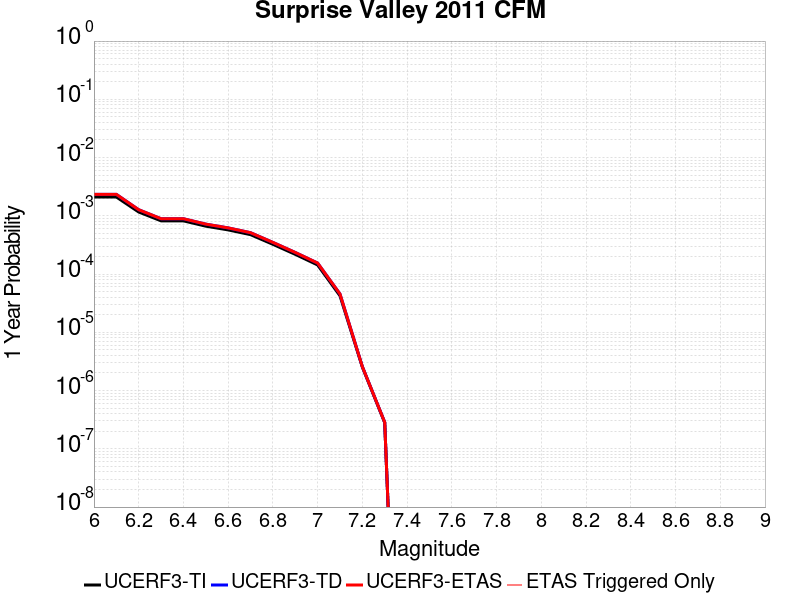 |  |

| Magnitude | 1 wk TI Prob | 1 wk TD Prob | 1 wk ETAS Prob | 1 wk ETAS/TD Gain | 1 wk ETAS Triggered Only | 1 mo TI Prob | 1 mo TD Prob | 1 mo ETAS Prob | 1 mo ETAS/TD Gain | 1 mo ETAS Triggered Only | 1 yr TI Prob | 1 yr TD Prob | 1 yr ETAS Prob | 1 yr ETAS/TD Gain | 1 yr ETAS Triggered Only | 10 yr TI Prob | 10 yr TD Prob | 10 yr ETAS Prob | 10 yr ETAS/TD Gain | 10 yr ETAS Triggered Only |
|-----|-----|-----|-----|-----|-----|-----|-----|-----|-----|-----|-----|-----|-----|-----|-----|-----|-----|-----|-----|-----|
| 6.0 | 4.0396248E-5 | 4.485395E-5 | 4.485395E-5 | 1.0 | 0.0 | 1.7311527E-4 | 1.9221824E-4 | 1.9221824E-4 | 1.0 | 0.0 | 0.002105641 | 0.0023379552 | 0.0023379552 | 1.0 | 0.0 | 0.020858008 | 0.023155317 | 0.023174852 | 1.0008438 | 2.0E-5 |
| 6.1 | 4.0396248E-5 | 4.485395E-5 | 4.485395E-5 | 1.0 | 0.0 | 1.7311527E-4 | 1.9221824E-4 | 1.9221824E-4 | 1.0 | 0.0 | 0.002105641 | 0.0023379552 | 0.0023379552 | 1.0 | 0.0 | 0.020858008 | 0.023155317 | 0.023174852 | 1.0008438 | 2.0E-5 |
| 6.2 | 2.2295266E-5 | 2.4402478E-5 | 2.4402478E-5 | 1.0 | 0.0 | 9.554764E-5 | 1.0457803E-4 | 1.0457803E-4 | 1.0 | 0.0 | 0.0011626717 | 0.0012725246 | 0.0012725246 | 1.0 | 0.0 | 0.011566074 | 0.012655614 | 0.012665488 | 1.0007801 | 1.0E-5 |
| 6.3 | 1.572643E-5 | 1.70976E-5 | 1.70976E-5 | 1.0 | 0.0 | 6.7397246E-5 | 7.3273426E-5 | 7.3273426E-5 | 1.0 | 0.0 | 8.202525E-4 | 8.9174934E-4 | 8.9174934E-4 | 1.0 | 0.0 | 0.008172315 | 0.008882817 | 0.008892728 | 1.0011158 | 1.0E-5 |
| 6.4 | 1.5714395E-5 | 1.7085422E-5 | 1.7085422E-5 | 1.0 | 0.0 | 6.734567E-5 | 7.322124E-5 | 7.322124E-5 | 1.0 | 0.0 | 8.1962504E-4 | 8.9111447E-4 | 8.9111447E-4 | 1.0 | 0.0 | 0.008166086 | 0.008876519 | 0.00888643 | 1.0011165 | 1.0E-5 |
| 6.5 | 1.2733495E-5 | 1.3802216E-5 | 1.3802216E-5 | 1.0 | 0.0 | 5.457098E-5 | 5.915105E-5 | 5.915105E-5 | 1.0 | 0.0 | 6.641992E-4 | 7.199328E-4 | 7.199328E-4 | 1.0 | 0.0 | 0.0066221743 | 0.0071766987 | 0.007186627 | 1.0013834 | 1.0E-5 |
| 6.6 | 1.0983784E-5 | 1.1887074E-5 | 1.1887074E-5 | 1.0 | 0.0 | 4.7072506E-5 | 5.0943636E-5 | 5.0943636E-5 | 1.0 | 0.0 | 5.7295704E-4 | 6.200676E-4 | 6.200676E-4 | 1.0 | 0.0 | 0.0057148207 | 0.006183924 | 0.0061938623 | 1.0016071 | 1.0E-5 |
| 6.7 | 9.104806E-6 | 9.839913E-6 | 9.839913E-6 | 1.0 | 0.0 | 3.902001E-5 | 4.21704E-5 | 4.21704E-5 | 1.0 | 0.0 | 4.7496508E-4 | 5.133076E-4 | 5.133076E-4 | 1.0 | 0.0 | 0.004739512 | 0.005121616 | 0.005131565 | 1.0019425 | 1.0E-5 |
| 6.8 | 6.2162403E-6 | 6.704414E-6 | 6.704414E-6 | 1.0 | 0.0 | 2.6640759E-5 | 2.8732898E-5 | 2.8732898E-5 | 1.0 | 0.0 | 3.2430296E-4 | 3.497691E-4 | 3.497691E-4 | 1.0 | 0.0 | 0.003238301 | 0.0034924096 | 0.0035023745 | 1.0028534 | 1.0E-5 |
| 6.9 | 4.1792696E-6 | 4.5034158E-6 | 4.5034158E-6 | 1.0 | 0.0 | 1.7911032E-5 | 1.930022E-5 | 1.930022E-5 | 1.0 | 0.0 | 2.1804498E-4 | 2.3495639E-4 | 2.3495639E-4 | 1.0 | 0.0 | 0.0021783116 | 0.002347233 | 0.0023572096 | 1.0042503 | 1.0E-5 |
| 7.0 | 2.7478413E-6 | 2.9623657E-6 | 2.9623657E-6 | 1.0 | 0.0 | 1.177641E-5 | 1.2695798E-5 | 1.2695798E-5 | 1.0 | 0.0 | 1.4336836E-4 | 1.5456163E-4 | 1.5456163E-4 | 1.0 | 0.0 | 0.001432759 | 0.0015446638 | 0.0015546483 | 1.0064639 | 1.0E-5 |
| 7.1 | 8.128648E-7 | 8.7252647E-7 | 8.7252647E-7 | 1.0 | 0.0 | 3.4837017E-6 | 3.7393972E-6 | 3.7393972E-6 | 1.0 | 0.0 | 4.2413245E-5 | 4.552681E-5 | 4.552681E-5 | 1.0 | 0.0 | 4.2405148E-4 | 4.5523365E-4 | 4.652291E-4 | 1.0219567 | 1.0E-5 |
| 7.2 | 4.8641045E-8 | 4.9402477E-8 | 4.9402477E-8 | 1.0 | 0.0 | 2.084616E-7 | 2.1172488E-7 | 2.1172488E-7 | 1.0 | 0.0 | 2.538017E-6 | 2.5777474E-6 | 2.5777474E-6 | 1.0 | 0.0 | 2.537988E-5 | 2.5777188E-5 | 2.5777188E-5 | 1.0 | 0.0 |
| 7.3 | 5.3911844E-9 | 5.4758598E-9 | 5.4758598E-9 | 1.0 | 0.0 | 2.3105075E-8 | 2.346797E-8 | 2.346797E-8 | 1.0 | 0.0 | 2.8130427E-7 | 2.857225E-7 | 2.857225E-7 | 1.0 | 0.0 | 2.8130391E-6 | 2.857223E-6 | 2.857223E-6 | 1.0 | 0.0 |

## Brawley (Seismic Zone) alt 1
*[(top)](#table-of-contents)*

| 1 Week | 1 Month | 1 Year | 10 Year |
|-----|-----|-----|-----|
|  |  |  |  |

| Magnitude | 1 wk TI Prob | 1 wk TD Prob | 1 wk ETAS Prob | 1 wk ETAS/TD Gain | 1 wk ETAS Triggered Only | 1 mo TI Prob | 1 mo TD Prob | 1 mo ETAS Prob | 1 mo ETAS/TD Gain | 1 mo ETAS Triggered Only | 1 yr TI Prob | 1 yr TD Prob | 1 yr ETAS Prob | 1 yr ETAS/TD Gain | 1 yr ETAS Triggered Only | 10 yr TI Prob | 10 yr TD Prob | 10 yr ETAS Prob | 10 yr ETAS/TD Gain | 10 yr ETAS Triggered Only |
|-----|-----|-----|-----|-----|-----|-----|-----|-----|-----|-----|-----|-----|-----|-----|-----|-----|-----|-----|-----|-----|
| 6.0 | 2.2521618E-4 | 4.76691E-4 | 4.76691E-4 | 1.0 | 0.0 | 9.6485513E-4 | 0.002041399 | 0.002041399 | 1.0 | 0.0 | 0.011683988 | 0.024565222 | 0.02458473 | 1.0007942 | 2.0E-5 | 0.11088423 | 0.21363127 | 0.213647 | 1.0000737 | 2.0E-5 |
| 6.1 | 2.2521618E-4 | 4.76691E-4 | 4.76691E-4 | 1.0 | 0.0 | 9.6485513E-4 | 0.002041399 | 0.002041399 | 1.0 | 0.0 | 0.011683988 | 0.024565222 | 0.02458473 | 1.0007942 | 2.0E-5 | 0.11088423 | 0.21363127 | 0.213647 | 1.0000737 | 2.0E-5 |
| 6.2 | 2.198148E-4 | 4.6752882E-4 | 4.6752882E-4 | 1.0 | 0.0 | 9.417233E-4 | 0.0020021931 | 0.0020021931 | 1.0 | 0.0 | 0.011405343 | 0.02409898 | 0.024118498 | 1.0008099 | 2.0E-5 | 0.10837428 | 0.21006602 | 0.21008182 | 1.0000752 | 2.0E-5 |
| 6.3 | 2.1704129E-4 | 4.618843E-4 | 4.618843E-4 | 1.0 | 0.0 | 9.298453E-4 | 0.001978039 | 0.001978039 | 1.0 | 0.0 | 0.011262234 | 0.02381224 | 0.023831764 | 1.0008199 | 2.0E-5 | 0.107082725 | 0.20795701 | 0.20797285 | 1.0000762 | 2.0E-5 |
| 6.4 | 1.876142E-4 | 4.0079502E-4 | 4.0079502E-4 | 1.0 | 0.0 | 8.038131E-4 | 0.0017165765 | 0.0017165765 | 1.0 | 0.0 | 0.00974259 | 0.020700144 | 0.02071973 | 1.0009462 | 2.0E-5 | 0.093263686 | 0.18470816 | 0.18472447 | 1.0000883 | 2.0E-5 |
| 6.5 | 1.7390939E-4 | 3.7510466E-4 | 3.7510466E-4 | 1.0 | 0.0 | 7.45113E-4 | 0.0016066132 | 0.0016066132 | 1.0 | 0.0 | 0.009034078 | 0.019388033 | 0.019407645 | 1.0010116 | 2.0E-5 | 0.086755216 | 0.17452815 | 0.17454466 | 1.0000947 | 2.0E-5 |
| 6.6 | 1.591791E-4 | 3.4923697E-4 | 3.4923697E-4 | 1.0 | 0.0 | 6.8201777E-4 | 0.0014958814 | 0.0014958814 | 1.0 | 0.0 | 0.008271996 | 0.018062927 | 0.018082565 | 1.0010872 | 2.0E-5 | 0.07970774 | 0.16393267 | 0.16394939 | 1.000102 | 2.0E-5 |
| 6.7 | 1.4268003E-4 | 3.208802E-4 | 3.208802E-4 | 1.0 | 0.0 | 6.1134255E-4 | 0.0013744844 | 0.0013744844 | 1.0 | 0.0 | 0.007417723 | 0.01660808 | 0.016627748 | 1.0011842 | 2.0E-5 | 0.07174956 | 0.15205671 | 0.15207367 | 1.0001116 | 2.0E-5 |
| 6.8 | 1.239713E-4 | 2.9079075E-4 | 2.9079075E-4 | 1.0 | 0.0 | 5.3119735E-4 | 0.001245657 | 0.001245657 | 1.0 | 0.0 | 0.0064481674 | 0.015061846 | 0.015081545 | 1.0013078 | 2.0E-5 | 0.06264243 | 0.13848521 | 0.13850243 | 1.0001245 | 2.0E-5 |
| 6.9 | 1.0180238E-4 | 2.6274272E-4 | 2.6274272E-4 | 1.0 | 0.0 | 4.3622297E-4 | 0.0011255586 | 0.0011255586 | 1.0 | 0.0 | 0.005298089 | 0.013618573 | 0.013638301 | 1.0014486 | 2.0E-5 | 0.05173543 | 0.12504812 | 0.12506561 | 1.00014 | 2.0E-5 |
| 7.0 | 7.6619996E-5 | 2.241466E-4 | 2.241466E-4 | 1.0 | 0.0 | 3.283301E-4 | 9.602778E-4 | 9.602778E-4 | 1.0 | 0.0 | 0.0039900932 | 0.011629419 | 0.011649187 | 1.0016998 | 2.0E-5 | 0.039192066 | 0.10733641 | 0.10735427 | 1.0001663 | 2.0E-5 |
| 7.1 | 7.5127435E-5 | 2.2097632E-4 | 2.2097632E-4 | 1.0 | 0.0 | 3.2193496E-4 | 9.4670086E-4 | 9.4670086E-4 | 1.0 | 0.0 | 0.0039125155 | 0.011465871 | 0.011485642 | 1.0017244 | 2.0E-5 | 0.038443442 | 0.10589979 | 0.10591767 | 1.0001688 | 2.0E-5 |
| 7.2 | 6.788582E-5 | 2.0224846E-4 | 2.0224846E-4 | 1.0 | 0.0 | 2.9090676E-4 | 8.664942E-4 | 8.664942E-4 | 1.0 | 0.0 | 0.0035360386 | 0.0104991775 | 0.010518967 | 1.0018849 | 2.0E-5 | 0.034803 | 0.097568415 | 0.09758646 | 1.000185 | 2.0E-5 |
| 7.3 | 6.399602E-5 | 1.8855186E-4 | 1.8855186E-4 | 1.0 | 0.0 | 2.7423984E-4 | 8.0783205E-4 | 8.0783205E-4 | 1.0 | 0.0 | 0.0033337586 | 0.009791592 | 0.009811396 | 1.0020226 | 2.0E-5 | 0.03284188 | 0.091460384 | 0.09147856 | 1.0001987 | 2.0E-5 |
| 7.4 | 4.506759E-5 | 1.2540306E-4 | 1.2540306E-4 | 1.0 | 0.0 | 1.9313251E-4 | 5.373319E-4 | 5.373319E-4 | 1.0 | 0.0 | 0.0023488526 | 0.0065225675 | 0.006542437 | 1.0030463 | 2.0E-5 | 0.023241805 | 0.06241342 | 0.062432174 | 1.0003004 | 2.0E-5 |
| 7.5 | 3.43289E-5 | 9.3448114E-5 | 9.3448114E-5 | 1.0 | 0.0 | 1.4711556E-4 | 4.0043076E-4 | 4.0043076E-4 | 1.0 | 0.0 | 0.0017896603 | 0.0048644086 | 0.0048843115 | 1.0040915 | 2.0E-5 | 0.01775316 | 0.04709746 | 0.047116518 | 1.0004046 | 2.0E-5 |
| 7.6 | 2.5980507E-5 | 7.061279E-5 | 7.061279E-5 | 1.0 | 0.0 | 1.1134028E-4 | 3.0259127E-4 | 3.0259127E-4 | 1.0 | 0.0 | 0.001354725 | 0.0036778497 | 0.003697776 | 1.005418 | 2.0E-5 | 0.013464959 | 0.03587832 | 0.0358976 | 1.0005374 | 2.0E-5 |
| 7.7 | 1.7292105E-5 | 4.9476897E-5 | 4.9476897E-5 | 1.0 | 0.0 | 7.4106916E-5 | 2.1202664E-4 | 2.1202664E-4 | 1.0 | 0.0 | 9.018782E-4 | 0.0025783742 | 0.0025983225 | 1.0077368 | 2.0E-5 | 0.008982267 | 0.025322445 | 0.02534194 | 1.0007699 | 2.0E-5 |
| 7.8 | 1.2927471E-5 | 3.9753748E-5 | 3.9753748E-5 | 1.0 | 0.0 | 5.5402274E-5 | 1.703621E-4 | 1.703621E-4 | 1.0 | 0.0 | 6.743139E-4 | 0.0020721878 | 0.0020921465 | 1.0096316 | 2.0E-5 | 0.0067227143 | 0.02045964 | 0.020479232 | 1.0009575 | 2.0E-5 |
| 7.9 | 1.0200774E-5 | 2.879426E-5 | 2.879426E-5 | 1.0 | 0.0 | 4.371687E-5 | 1.2339813E-4 | 1.2339813E-4 | 1.0 | 0.0 | 5.321229E-4 | 0.0015013381 | 0.001521308 | 1.0133015 | 2.0E-5 | 0.005308505 | 0.015014351 | 0.015034051 | 1.001312 | 2.0E-5 |
| 8.0 | 8.650396E-6 | 2.331885E-5 | 2.331885E-5 | 1.0 | 0.0 | 3.70726E-5 | 9.99341E-5 | 9.99341E-5 | 1.0 | 0.0 | 4.5126543E-4 | 0.0012160194 | 0.0012260072 | 1.0082135 | 1.0E-5 | 0.0045035016 | 0.012230608 | 0.012240485 | 1.0008076 | 1.0E-5 |
| 8.1 | 3.9368224E-6 | 7.3453502E-6 | 7.3453502E-6 | 1.0 | 0.0 | 1.6871985E-5 | 3.1479693E-5 | 3.1479693E-5 | 1.0 | 0.0 | 2.0539707E-4 | 3.83198E-4 | 3.9319418E-4 | 1.0260862 | 1.0E-5 | 0.0020520731 | 0.004009915 | 0.004019875 | 1.0024838 | 1.0E-5 |
| 8.2 | 1.7101195E-6 | 2.2244978E-6 | 2.2244978E-6 | 1.0 | 0.0 | 7.329063E-6 | 9.533527E-6 | 9.533527E-6 | 1.0 | 0.0 | 8.922769E-5 | 1.1606455E-4 | 1.1606455E-4 | 1.0 | 0.0 | 8.9191867E-4 | 0.0012700894 | 0.0012700894 | 1.0 | 0.0 |
| 8.3 | 3.0346666E-8 | 1.7278948E-8 | 1.7278948E-8 | 1.0 | 0.0 | 1.3005713E-7 | 7.405263E-8 | 7.405263E-8 | 1.0 | 0.0 | 1.5834444E-6 | 9.015907E-7 | 9.015907E-7 | 1.0 | 0.0 | 1.5834332E-5 | 9.403383E-6 | 9.403383E-6 | 1.0 | 0.0 |

## Sisar
*[(top)](#table-of-contents)*

| 1 Week | 1 Month | 1 Year | 10 Year |
|-----|-----|-----|-----|
|  |  |  |  |

| Magnitude | 1 wk TI Prob | 1 wk TD Prob | 1 wk ETAS Prob | 1 wk ETAS/TD Gain | 1 wk ETAS Triggered Only | 1 mo TI Prob | 1 mo TD Prob | 1 mo ETAS Prob | 1 mo ETAS/TD Gain | 1 mo ETAS Triggered Only | 1 yr TI Prob | 1 yr TD Prob | 1 yr ETAS Prob | 1 yr ETAS/TD Gain | 1 yr ETAS Triggered Only | 10 yr TI Prob | 10 yr TD Prob | 10 yr ETAS Prob | 10 yr ETAS/TD Gain | 10 yr ETAS Triggered Only |
|-----|-----|-----|-----|-----|-----|-----|-----|-----|-----|-----|-----|-----|-----|-----|-----|-----|-----|-----|-----|-----|
| 6.0 | 4.544193E-6 | 3.8397884E-6 | 3.8397884E-6 | 1.0 | 0.0 | 1.9474966E-5 | 1.6456135E-5 | 2.6455971E-5 | 1.6076661 | 1.0E-5 | 2.3708193E-4 | 2.0033536E-4 | 2.1033335E-4 | 1.0499063 | 1.0E-5 | 0.0023682916 | 0.0020015815 | 0.0020215414 | 1.0099721 | 2.0E-5 |
| 6.1 | 4.544193E-6 | 3.8397884E-6 | 3.8397884E-6 | 1.0 | 0.0 | 1.9474966E-5 | 1.6456135E-5 | 2.6455971E-5 | 1.6076661 | 1.0E-5 | 2.3708193E-4 | 2.0033536E-4 | 2.1033335E-4 | 1.0499063 | 1.0E-5 | 0.0023682916 | 0.0020015815 | 0.0020215414 | 1.0099721 | 2.0E-5 |
| 6.2 | 4.544193E-6 | 3.8397884E-6 | 3.8397884E-6 | 1.0 | 0.0 | 1.9474966E-5 | 1.6456135E-5 | 2.6455971E-5 | 1.6076661 | 1.0E-5 | 2.3708193E-4 | 2.0033536E-4 | 2.1033335E-4 | 1.0499063 | 1.0E-5 | 0.0023682916 | 0.0020015815 | 0.0020215414 | 1.0099721 | 2.0E-5 |
| 6.3 | 4.544193E-6 | 3.8397884E-6 | 3.8397884E-6 | 1.0 | 0.0 | 1.9474966E-5 | 1.6456135E-5 | 2.6455971E-5 | 1.6076661 | 1.0E-5 | 2.3708193E-4 | 2.0033536E-4 | 2.1033335E-4 | 1.0499063 | 1.0E-5 | 0.0023682916 | 0.0020015815 | 0.0020215414 | 1.0099721 | 2.0E-5 |
| 6.4 | 4.544193E-6 | 3.8397884E-6 | 3.8397884E-6 | 1.0 | 0.0 | 1.9474966E-5 | 1.6456135E-5 | 2.6455971E-5 | 1.6076661 | 1.0E-5 | 2.3708193E-4 | 2.0033536E-4 | 2.1033335E-4 | 1.0499063 | 1.0E-5 | 0.0023682916 | 0.0020015815 | 0.0020215414 | 1.0099721 | 2.0E-5 |
| 6.5 | 4.544193E-6 | 3.8397884E-6 | 3.8397884E-6 | 1.0 | 0.0 | 1.9474966E-5 | 1.6456135E-5 | 2.6455971E-5 | 1.6076661 | 1.0E-5 | 2.3708193E-4 | 2.0033536E-4 | 2.1033335E-4 | 1.0499063 | 1.0E-5 | 0.0023682916 | 0.0020015815 | 0.0020215414 | 1.0099721 | 2.0E-5 |
| 6.6 | 4.544193E-6 | 3.8397884E-6 | 3.8397884E-6 | 1.0 | 0.0 | 1.9474966E-5 | 1.6456135E-5 | 2.6455971E-5 | 1.6076661 | 1.0E-5 | 2.3708193E-4 | 2.0033536E-4 | 2.1033335E-4 | 1.0499063 | 1.0E-5 | 0.0023682916 | 0.0020015815 | 0.0020215414 | 1.0099721 | 2.0E-5 |
| 6.7 | 4.544193E-6 | 3.8397884E-6 | 3.8397884E-6 | 1.0 | 0.0 | 1.9474966E-5 | 1.6456135E-5 | 2.6455971E-5 | 1.6076661 | 1.0E-5 | 2.3708193E-4 | 2.0033536E-4 | 2.1033335E-4 | 1.0499063 | 1.0E-5 | 0.0023682916 | 0.0020015815 | 0.0020215414 | 1.0099721 | 2.0E-5 |
| 6.8 | 4.544193E-6 | 3.8397884E-6 | 3.8397884E-6 | 1.0 | 0.0 | 1.9474966E-5 | 1.6456135E-5 | 2.6455971E-5 | 1.6076661 | 1.0E-5 | 2.3708193E-4 | 2.0033536E-4 | 2.1033335E-4 | 1.0499063 | 1.0E-5 | 0.0023682916 | 0.0020015815 | 0.0020215414 | 1.0099721 | 2.0E-5 |
| 6.9 | 4.542225E-6 | 3.8377507E-6 | 3.8377507E-6 | 1.0 | 0.0 | 1.9466532E-5 | 1.64474E-5 | 2.6447236E-5 | 1.6079888 | 1.0E-5 | 2.3697925E-4 | 2.0022903E-4 | 2.1022702E-4 | 1.0499328 | 1.0E-5 | 0.002367267 | 0.00200052 | 0.00202048 | 1.0099775 | 2.0E-5 |
| 7.0 | 4.5278484E-6 | 3.822814E-6 | 3.822814E-6 | 1.0 | 0.0 | 1.940492E-5 | 1.6383388E-5 | 2.6383224E-5 | 1.6103643 | 1.0E-5 | 2.3622929E-4 | 1.9944983E-4 | 2.0944784E-4 | 1.0501279 | 1.0E-5 | 0.0023597833 | 0.001992742 | 0.0020127022 | 1.0100164 | 2.0E-5 |
| 7.1 | 4.5132488E-6 | 3.8076014E-6 | 3.8076014E-6 | 1.0 | 0.0 | 1.9342351E-5 | 1.6318192E-5 | 2.6318028E-5 | 1.612803 | 1.0E-5 | 2.3546767E-4 | 1.986562E-4 | 2.0865421E-4 | 1.0503283 | 1.0E-5 | 0.0023521832 | 0.00198482 | 0.0020047803 | 1.0100565 | 2.0E-5 |
| 7.2 | 4.448859E-6 | 3.74006E-6 | 3.74006E-6 | 1.0 | 0.0 | 1.9066398E-5 | 1.6028733E-5 | 2.6028572E-5 | 1.6238697 | 1.0E-5 | 2.3210866E-4 | 1.9513267E-4 | 2.0513072E-4 | 1.0512372 | 1.0E-5 | 0.0023186638 | 0.001949647 | 0.001969608 | 1.0102383 | 2.0E-5 |
| 7.3 | 4.3424366E-6 | 3.6338909E-6 | 3.6338909E-6 | 1.0 | 0.0 | 1.861031E-5 | 1.5573727E-5 | 2.5573572E-5 | 1.642097 | 1.0E-5 | 2.2655698E-4 | 1.8959396E-4 | 1.9959206E-4 | 1.0527343 | 1.0E-5 | 0.0022632615 | 0.0018943556 | 0.0019143177 | 1.0105376 | 2.0E-5 |
| 7.4 | 4.218641E-6 | 3.5332403E-6 | 3.5332403E-6 | 1.0 | 0.0 | 1.8079765E-5 | 1.5142372E-5 | 2.514222E-5 | 1.6603885 | 1.0E-5 | 2.2009891E-4 | 1.8434311E-4 | 1.9434128E-4 | 1.0542367 | 1.0E-5 | 0.0021988105 | 0.0018419353 | 0.0018618985 | 1.0108382 | 2.0E-5 |
| 7.5 | 3.983779E-6 | 3.3480019E-6 | 3.3480019E-6 | 1.0 | 0.0 | 1.7073227E-5 | 1.4348502E-5 | 2.434836E-5 | 1.6969268 | 1.0E-5 | 2.0784672E-4 | 1.7467934E-4 | 1.846776E-4 | 1.0572377 | 1.0E-5 | 0.0020765243 | 0.0017454535 | 0.0017654184 | 1.0114384 | 2.0E-5 |
| 7.6 | 2.777393E-6 | 2.3523785E-6 | 2.3523785E-6 | 1.0 | 0.0 | 1.1903058E-5 | 1.0081583E-5 | 2.0081483E-5 | 1.9918977 | 1.0E-5 | 1.449101E-4 | 1.2273644E-4 | 1.3273521E-4 | 1.0814654 | 1.0E-5 | 0.0014481564 | 0.0012266943 | 0.0012366821 | 1.008142 | 1.0E-5 |
| 7.7 | 1.9028433E-6 | 1.5939673E-6 | 1.5939673E-6 | 1.0 | 0.0 | 8.155017E-6 | 6.831271E-6 | 6.831271E-6 | 1.0 | 0.0 | 9.928281E-5 | 8.31676E-5 | 8.31676E-5 | 1.0 | 0.0 | 9.923846E-4 | 8.313695E-4 | 8.313695E-4 | 1.0 | 0.0 |
| 7.8 | 4.9095956E-7 | 4.3585268E-7 | 4.3585268E-7 | 1.0 | 0.0 | 2.1041105E-6 | 1.8679387E-6 | 1.8679387E-6 | 1.0 | 0.0 | 2.5617246E-5 | 2.2741919E-5 | 2.2741919E-5 | 1.0 | 0.0 | 2.5614293E-4 | 2.2739609E-4 | 2.2739609E-4 | 1.0 | 0.0 |
| 7.9 | 1.16657894E-7 | 1.03358666E-7 | 1.03358666E-7 | 1.0 | 0.0 | 4.999623E-7 | 4.4296564E-7 | 4.4296564E-7 | 1.0 | 0.0 | 6.087024E-6 | 5.3930935E-6 | 5.3930935E-6 | 1.0 | 0.0 | 6.0868573E-5 | 5.3929656E-5 | 5.3929656E-5 | 1.0 | 0.0 |
| 8.0 | 2.5100346E-9 | 1.706956E-9 | 1.706956E-9 | 1.0 | 0.0 | 1.0757291E-8 | 7.315526E-9 | 7.315526E-9 | 1.0 | 0.0 | 1.3097001E-7 | 8.9066525E-8 | 8.9066525E-8 | 1.0 | 0.0 | 1.3096993E-6 | 8.90665E-7 | 8.90665E-7 | 1.0 | 0.0 |

## Great Valley 08 (Quinto)
*[(top)](#table-of-contents)*

| 1 Week | 1 Month | 1 Year | 10 Year |
|-----|-----|-----|-----|
|  |  |  |  |

| Magnitude | 1 wk TI Prob | 1 wk TD Prob | 1 wk ETAS Prob | 1 wk ETAS/TD Gain | 1 wk ETAS Triggered Only | 1 mo TI Prob | 1 mo TD Prob | 1 mo ETAS Prob | 1 mo ETAS/TD Gain | 1 mo ETAS Triggered Only | 1 yr TI Prob | 1 yr TD Prob | 1 yr ETAS Prob | 1 yr ETAS/TD Gain | 1 yr ETAS Triggered Only | 10 yr TI Prob | 10 yr TD Prob | 10 yr ETAS Prob | 10 yr ETAS/TD Gain | 10 yr ETAS Triggered Only |
|-----|-----|-----|-----|-----|-----|-----|-----|-----|-----|-----|-----|-----|-----|-----|-----|-----|-----|-----|-----|-----|
| 6.0 | 7.737697E-6 | 8.253331E-6 | 8.253331E-6 | 1.0 | 0.0 | 3.3161137E-5 | 3.5371042E-5 | 3.5371042E-5 | 1.0 | 0.0 | 4.0366207E-4 | 4.305762E-4 | 4.305762E-4 | 1.0 | 0.0 | 0.004029296 | 0.004299273 | 0.0043092296 | 1.002316 | 1.0E-5 |
| 6.1 | 7.737697E-6 | 8.253331E-6 | 8.253331E-6 | 1.0 | 0.0 | 3.3161137E-5 | 3.5371042E-5 | 3.5371042E-5 | 1.0 | 0.0 | 4.0366207E-4 | 4.305762E-4 | 4.305762E-4 | 1.0 | 0.0 | 0.004029296 | 0.004299273 | 0.0043092296 | 1.002316 | 1.0E-5 |
| 6.2 | 7.737697E-6 | 8.253331E-6 | 8.253331E-6 | 1.0 | 0.0 | 3.3161137E-5 | 3.5371042E-5 | 3.5371042E-5 | 1.0 | 0.0 | 4.0366207E-4 | 4.305762E-4 | 4.305762E-4 | 1.0 | 0.0 | 0.004029296 | 0.004299273 | 0.0043092296 | 1.002316 | 1.0E-5 |
| 6.3 | 5.374012E-6 | 5.750788E-6 | 5.750788E-6 | 1.0 | 0.0 | 2.3031276E-5 | 2.4646064E-5 | 2.4646064E-5 | 1.0 | 0.0 | 2.803697E-4 | 3.0003567E-4 | 3.0003567E-4 | 1.0 | 0.0 | 0.0028001624 | 0.002997399 | 0.002997399 | 1.0 | 0.0 |
| 6.4 | 5.374012E-6 | 5.750788E-6 | 5.750788E-6 | 1.0 | 0.0 | 2.3031276E-5 | 2.4646064E-5 | 2.4646064E-5 | 1.0 | 0.0 | 2.803697E-4 | 3.0003567E-4 | 3.0003567E-4 | 1.0 | 0.0 | 0.0028001624 | 0.002997399 | 0.002997399 | 1.0 | 0.0 |
| 6.5 | 3.65427E-6 | 3.9414886E-6 | 3.9414886E-6 | 1.0 | 0.0 | 1.5661062E-5 | 1.6892023E-5 | 1.6892023E-5 | 1.0 | 0.0 | 1.9065675E-4 | 2.0564803E-4 | 2.0564803E-4 | 1.0 | 0.0 | 0.0019049325 | 0.002055269 | 0.002055269 | 1.0 | 0.0 |
| 6.6 | 3.6143538E-6 | 3.898673E-6 | 3.898673E-6 | 1.0 | 0.0 | 1.5489995E-5 | 1.6708533E-5 | 1.6708533E-5 | 1.0 | 0.0 | 1.8857437E-4 | 2.0341444E-4 | 2.0341444E-4 | 1.0 | 0.0 | 0.0018841444 | 0.002032974 | 0.002032974 | 1.0 | 0.0 |
| 6.7 | 2.4821015E-6 | 2.6858238E-6 | 2.6858238E-6 | 1.0 | 0.0 | 1.0637535E-5 | 1.1510655E-5 | 1.1510655E-5 | 1.0 | 0.0 | 1.2950429E-4 | 1.4013887E-4 | 1.4013887E-4 | 1.0 | 0.0 | 0.0012942884 | 0.0014010599 | 0.0014010599 | 1.0 | 0.0 |
| 6.8 | 4.7110538E-7 | 5.193303E-7 | 5.193303E-7 | 1.0 | 0.0 | 2.0190216E-6 | 2.2256995E-6 | 2.2256995E-6 | 1.0 | 0.0 | 2.458131E-5 | 2.7097572E-5 | 2.7097572E-5 | 1.0 | 0.0 | 2.457859E-4 | 2.709445E-4 | 2.709445E-4 | 1.0 | 0.0 |
| 6.9 | 3.958685E-7 | 4.3705865E-7 | 4.3705865E-7 | 1.0 | 0.0 | 1.6965782E-6 | 1.8731072E-6 | 1.8731072E-6 | 1.0 | 0.0 | 2.0655643E-5 | 2.2804858E-5 | 2.2804858E-5 | 1.0 | 0.0 | 2.0653724E-4 | 2.280268E-4 | 2.280268E-4 | 1.0 | 0.0 |
| 7.0 | 2.70294E-7 | 2.9921705E-7 | 2.9921705E-7 | 1.0 | 0.0 | 1.1584025E-6 | 1.2823583E-6 | 1.2823583E-6 | 1.0 | 0.0 | 1.4103458E-5 | 1.5612613E-5 | 1.5612613E-5 | 1.0 | 0.0 | 1.4102564E-4 | 1.5611644E-4 | 1.5611644E-4 | 1.0 | 0.0 |
| 7.1 | 1.4828602E-7 | 1.6470074E-7 | 1.6470074E-7 | 1.0 | 0.0 | 6.3551136E-7 | 7.0586015E-7 | 7.0586015E-7 | 1.0 | 0.0 | 7.737323E-6 | 8.593822E-6 | 8.593822E-6 | 1.0 | 0.0 | 7.737054E-5 | 8.5935695E-5 | 8.5935695E-5 | 1.0 | 0.0 |

## Compton
*[(top)](#table-of-contents)*

| 1 Week | 1 Month | 1 Year | 10 Year |
|-----|-----|-----|-----|
|  |  |  |  |

| Magnitude | 1 wk TI Prob | 1 wk TD Prob | 1 wk ETAS Prob | 1 wk ETAS/TD Gain | 1 wk ETAS Triggered Only | 1 mo TI Prob | 1 mo TD Prob | 1 mo ETAS Prob | 1 mo ETAS/TD Gain | 1 mo ETAS Triggered Only | 1 yr TI Prob | 1 yr TD Prob | 1 yr ETAS Prob | 1 yr ETAS/TD Gain | 1 yr ETAS Triggered Only | 10 yr TI Prob | 10 yr TD Prob | 10 yr ETAS Prob | 10 yr ETAS/TD Gain | 10 yr ETAS Triggered Only |
|-----|-----|-----|-----|-----|-----|-----|-----|-----|-----|-----|-----|-----|-----|-----|-----|-----|-----|-----|-----|-----|
| 6.0 | 1.06050875E-5 | 6.3591415E-6 | 6.3591415E-6 | 1.0 | 0.0 | 4.5449582E-5 | 2.7253196E-5 | 2.7253196E-5 | 1.0 | 0.0 | 5.5320817E-4 | 3.3176E-4 | 3.3176E-4 | 1.0 | 0.0 | 0.0055183303 | 0.0033129312 | 0.003322898 | 1.0030085 | 1.0E-5 |
| 6.1 | 1.06050875E-5 | 6.3591415E-6 | 6.3591415E-6 | 1.0 | 0.0 | 4.5449582E-5 | 2.7253196E-5 | 2.7253196E-5 | 1.0 | 0.0 | 5.5320817E-4 | 3.3176E-4 | 3.3176E-4 | 1.0 | 0.0 | 0.0055183303 | 0.0033129312 | 0.003322898 | 1.0030085 | 1.0E-5 |
| 6.2 | 1.06050875E-5 | 6.3591415E-6 | 6.3591415E-6 | 1.0 | 0.0 | 4.5449582E-5 | 2.7253196E-5 | 2.7253196E-5 | 1.0 | 0.0 | 5.5320817E-4 | 3.3176E-4 | 3.3176E-4 | 1.0 | 0.0 | 0.0055183303 | 0.0033129312 | 0.003322898 | 1.0030085 | 1.0E-5 |
| 6.3 | 1.06050875E-5 | 6.3591415E-6 | 6.3591415E-6 | 1.0 | 0.0 | 4.5449582E-5 | 2.7253196E-5 | 2.7253196E-5 | 1.0 | 0.0 | 5.5320817E-4 | 3.3176E-4 | 3.3176E-4 | 1.0 | 0.0 | 0.0055183303 | 0.0033129312 | 0.003322898 | 1.0030085 | 1.0E-5 |
| 6.4 | 1.06050875E-5 | 6.3591415E-6 | 6.3591415E-6 | 1.0 | 0.0 | 4.5449582E-5 | 2.7253196E-5 | 2.7253196E-5 | 1.0 | 0.0 | 5.5320817E-4 | 3.3176E-4 | 3.3176E-4 | 1.0 | 0.0 | 0.0055183303 | 0.0033129312 | 0.003322898 | 1.0030085 | 1.0E-5 |
| 6.5 | 1.06050875E-5 | 6.3591415E-6 | 6.3591415E-6 | 1.0 | 0.0 | 4.5449582E-5 | 2.7253196E-5 | 2.7253196E-5 | 1.0 | 0.0 | 5.5320817E-4 | 3.3176E-4 | 3.3176E-4 | 1.0 | 0.0 | 0.0055183303 | 0.0033129312 | 0.003322898 | 1.0030085 | 1.0E-5 |
| 6.6 | 1.06050875E-5 | 6.3591415E-6 | 6.3591415E-6 | 1.0 | 0.0 | 4.5449582E-5 | 2.7253196E-5 | 2.7253196E-5 | 1.0 | 0.0 | 5.5320817E-4 | 3.3176E-4 | 3.3176E-4 | 1.0 | 0.0 | 0.0055183303 | 0.0033129312 | 0.003322898 | 1.0030085 | 1.0E-5 |
| 6.7 | 1.06050875E-5 | 6.3591415E-6 | 6.3591415E-6 | 1.0 | 0.0 | 4.5449582E-5 | 2.7253196E-5 | 2.7253196E-5 | 1.0 | 0.0 | 5.5320817E-4 | 3.3176E-4 | 3.3176E-4 | 1.0 | 0.0 | 0.0055183303 | 0.0033129312 | 0.003322898 | 1.0030085 | 1.0E-5 |
| 6.8 | 1.06050875E-5 | 6.3591415E-6 | 6.3591415E-6 | 1.0 | 0.0 | 4.5449582E-5 | 2.7253196E-5 | 2.7253196E-5 | 1.0 | 0.0 | 5.5320817E-4 | 3.3176E-4 | 3.3176E-4 | 1.0 | 0.0 | 0.0055183303 | 0.0033129312 | 0.003322898 | 1.0030085 | 1.0E-5 |
| 6.9 | 1.06050875E-5 | 6.3591415E-6 | 6.3591415E-6 | 1.0 | 0.0 | 4.5449582E-5 | 2.7253196E-5 | 2.7253196E-5 | 1.0 | 0.0 | 5.5320817E-4 | 3.3176E-4 | 3.3176E-4 | 1.0 | 0.0 | 0.0055183303 | 0.0033129312 | 0.003322898 | 1.0030085 | 1.0E-5 |
| 7.0 | 7.672486E-6 | 4.272299E-6 | 4.272299E-6 | 1.0 | 0.0 | 3.288167E-5 | 1.8309727E-5 | 1.8309727E-5 | 1.0 | 0.0 | 4.0026082E-4 | 2.2289876E-4 | 2.2289876E-4 | 1.0 | 0.0 | 0.0039954064 | 0.002226814 | 0.0022367917 | 1.0044807 | 1.0E-5 |
| 7.1 | 7.163992E-6 | 3.8839917E-6 | 3.8839917E-6 | 1.0 | 0.0 | 3.0702464E-5 | 1.6645574E-5 | 1.6645574E-5 | 1.0 | 0.0 | 3.7373835E-4 | 2.0264159E-4 | 2.0264159E-4 | 1.0 | 0.0 | 0.0037311043 | 0.0020246252 | 0.002034605 | 1.0049292 | 1.0E-5 |
| 7.2 | 6.3689185E-6 | 3.3103067E-6 | 3.3103067E-6 | 1.0 | 0.0 | 2.729508E-5 | 1.4186954E-5 | 1.4186954E-5 | 1.0 | 0.0 | 3.322669E-4 | 1.727129E-4 | 1.727129E-4 | 1.0 | 0.0 | 0.0033177056 | 0.0017258285 | 0.0017358112 | 1.0057843 | 1.0E-5 |
| 7.3 | 4.4987873E-6 | 2.4481515E-6 | 2.4481515E-6 | 1.0 | 0.0 | 1.9280375E-5 | 1.0492036E-5 | 1.0492036E-5 | 1.0 | 0.0 | 2.3471327E-4 | 1.2773336E-4 | 1.2773336E-4 | 1.0 | 0.0 | 0.002344655 | 0.0012766296 | 0.0012866169 | 1.0078231 | 1.0E-5 |
| 7.4 | 2.987296E-6 | 1.7395097E-6 | 1.7395097E-6 | 1.0 | 0.0 | 1.2802635E-5 | 7.4550203E-6 | 7.4550203E-6 | 1.0 | 0.0 | 1.5586092E-4 | 9.076115E-5 | 9.076115E-5 | 1.0 | 0.0 | 0.0015575165 | 9.072466E-4 | 9.1723754E-4 | 1.0110123 | 1.0E-5 |
| 7.5 | 2.4111696E-6 | 1.4472749E-6 | 1.4472749E-6 | 1.0 | 0.0 | 1.0333543E-5 | 6.2025924E-6 | 6.2025924E-6 | 1.0 | 0.0 | 1.2580362E-4 | 7.551399E-5 | 7.551399E-5 | 1.0 | 0.0 | 0.0012573242 | 7.54888E-4 | 7.6488045E-4 | 1.013237 | 1.0E-5 |
| 7.6 | 1.8783096E-6 | 1.1360878E-6 | 1.1360878E-6 | 1.0 | 0.0 | 8.049874E-6 | 4.868939E-6 | 4.868939E-6 | 1.0 | 0.0 | 9.8002805E-5 | 5.9277758E-5 | 5.9277758E-5 | 1.0 | 0.0 | 9.795959E-4 | 5.9262343E-4 | 5.9262343E-4 | 1.0 | 0.0 |
| 7.7 | 6.6646817E-7 | 3.5603512E-7 | 3.5603512E-7 | 1.0 | 0.0 | 2.856289E-6 | 1.5258639E-6 | 1.5258639E-6 | 1.0 | 0.0 | 3.4774763E-5 | 1.8577248E-5 | 1.8577248E-5 | 1.0 | 0.0 | 3.4769322E-4 | 1.857583E-4 | 1.857583E-4 | 1.0 | 0.0 |
| 7.8 | 7.054689E-8 | 4.1345434E-8 | 4.1345434E-8 | 1.0 | 0.0 | 3.0234378E-7 | 1.771947E-7 | 1.771947E-7 | 1.0 | 0.0 | 3.6810293E-6 | 2.1573435E-6 | 2.1573435E-6 | 1.0 | 0.0 | 3.6809684E-5 | 2.1573234E-5 | 2.1573234E-5 | 1.0 | 0.0 |
| 7.9 | 7.420925E-9 | 4.0135544E-9 | 4.0135544E-9 | 1.0 | 0.0 | 3.1803964E-8 | 1.7200948E-8 | 1.7200948E-8 | 1.0 | 0.0 | 3.872132E-7 | 2.0942153E-7 | 2.0942153E-7 | 1.0 | 0.0 | 3.872125E-6 | 2.0942134E-6 | 2.0942134E-6 | 1.0 | 0.0 |

## Sierra Madre (San Fernando)
*[(top)](#table-of-contents)*

| 1 Week | 1 Month | 1 Year | 10 Year |
|-----|-----|-----|-----|
|  |  |  |  |

| Magnitude | 1 wk TI Prob | 1 wk TD Prob | 1 wk ETAS Prob | 1 wk ETAS/TD Gain | 1 wk ETAS Triggered Only | 1 mo TI Prob | 1 mo TD Prob | 1 mo ETAS Prob | 1 mo ETAS/TD Gain | 1 mo ETAS Triggered Only | 1 yr TI Prob | 1 yr TD Prob | 1 yr ETAS Prob | 1 yr ETAS/TD Gain | 1 yr ETAS Triggered Only | 10 yr TI Prob | 10 yr TD Prob | 10 yr ETAS Prob | 10 yr ETAS/TD Gain | 10 yr ETAS Triggered Only |
|-----|-----|-----|-----|-----|-----|-----|-----|-----|-----|-----|-----|-----|-----|-----|-----|-----|-----|-----|-----|-----|
| 6.0 | 1.0346413E-5 | 6.2877984E-6 | 6.2877984E-6 | 1.0 | 0.0 | 4.4341014E-5 | 2.6947435E-5 | 2.6947435E-5 | 1.0 | 0.0 | 5.3971814E-4 | 3.2803672E-4 | 3.2803672E-4 | 1.0 | 0.0 | 0.0053840918 | 0.0032756377 | 0.003285605 | 1.0030428 | 1.0E-5 |
| 6.1 | 1.0346413E-5 | 6.2877984E-6 | 6.2877984E-6 | 1.0 | 0.0 | 4.4341014E-5 | 2.6947435E-5 | 2.6947435E-5 | 1.0 | 0.0 | 5.3971814E-4 | 3.2803672E-4 | 3.2803672E-4 | 1.0 | 0.0 | 0.0053840918 | 0.0032756377 | 0.003285605 | 1.0030428 | 1.0E-5 |
| 6.2 | 1.0346413E-5 | 6.2877984E-6 | 6.2877984E-6 | 1.0 | 0.0 | 4.4341014E-5 | 2.6947435E-5 | 2.6947435E-5 | 1.0 | 0.0 | 5.3971814E-4 | 3.2803672E-4 | 3.2803672E-4 | 1.0 | 0.0 | 0.0053840918 | 0.0032756377 | 0.003285605 | 1.0030428 | 1.0E-5 |
| 6.3 | 1.0346413E-5 | 6.2877984E-6 | 6.2877984E-6 | 1.0 | 0.0 | 4.4341014E-5 | 2.6947435E-5 | 2.6947435E-5 | 1.0 | 0.0 | 5.3971814E-4 | 3.2803672E-4 | 3.2803672E-4 | 1.0 | 0.0 | 0.0053840918 | 0.0032756377 | 0.003285605 | 1.0030428 | 1.0E-5 |
| 6.4 | 1.0249558E-5 | 6.2877984E-6 | 6.2877984E-6 | 1.0 | 0.0 | 4.392594E-5 | 2.6947435E-5 | 2.6947435E-5 | 1.0 | 0.0 | 5.3466705E-4 | 3.2803672E-4 | 3.2803672E-4 | 1.0 | 0.0 | 0.0053338245 | 0.0032756377 | 0.003285605 | 1.0030428 | 1.0E-5 |
| 6.5 | 1.0249558E-5 | 6.2877984E-6 | 6.2877984E-6 | 1.0 | 0.0 | 4.392594E-5 | 2.6947435E-5 | 2.6947435E-5 | 1.0 | 0.0 | 5.3466705E-4 | 3.2803672E-4 | 3.2803672E-4 | 1.0 | 0.0 | 0.0053338245 | 0.0032756377 | 0.003285605 | 1.0030428 | 1.0E-5 |
| 6.6 | 9.9035515E-6 | 6.2877984E-6 | 6.2877984E-6 | 1.0 | 0.0 | 4.2443102E-5 | 2.6947435E-5 | 2.6947435E-5 | 1.0 | 0.0 | 5.166222E-4 | 3.2803672E-4 | 3.2803672E-4 | 1.0 | 0.0 | 0.0051542283 | 0.0032756377 | 0.003285605 | 1.0030428 | 1.0E-5 |
| 6.7 | 9.87217E-6 | 6.2752183E-6 | 6.2752183E-6 | 1.0 | 0.0 | 4.2308613E-5 | 2.689352E-5 | 2.689352E-5 | 1.0 | 0.0 | 5.149856E-4 | 3.2738052E-4 | 3.2738052E-4 | 1.0 | 0.0 | 0.005137938 | 0.003269095 | 0.0032790622 | 1.0030489 | 1.0E-5 |
| 6.8 | 9.4359175E-6 | 6.1791916E-6 | 6.1791916E-6 | 1.0 | 0.0 | 4.043902E-5 | 2.6481986E-5 | 2.6481986E-5 | 1.0 | 0.0 | 4.9223384E-4 | 3.223716E-4 | 3.223716E-4 | 1.0 | 0.0 | 0.0049114493 | 0.0032191512 | 0.003229119 | 1.0030965 | 1.0E-5 |
| 6.9 | 8.700447E-6 | 6.0404545E-6 | 6.0404545E-6 | 1.0 | 0.0 | 3.72871E-5 | 2.5887412E-5 | 2.5887412E-5 | 1.0 | 0.0 | 4.5387587E-4 | 3.1513473E-4 | 3.1513473E-4 | 1.0 | 0.0 | 0.0045295 | 0.003146988 | 0.0031569565 | 1.0031676 | 1.0E-5 |
| 7.0 | 8.648878E-6 | 6.0153684E-6 | 6.0153684E-6 | 1.0 | 0.0 | 3.7066096E-5 | 2.5779902E-5 | 2.5779902E-5 | 1.0 | 0.0 | 4.5118626E-4 | 3.1382617E-4 | 3.1382617E-4 | 1.0 | 0.0 | 0.004502713 | 0.0031339393 | 0.003143908 | 1.0031809 | 1.0E-5 |
| 7.1 | 8.505786E-6 | 5.924995E-6 | 5.924995E-6 | 1.0 | 0.0 | 3.645286E-5 | 2.5392595E-5 | 2.5392595E-5 | 1.0 | 0.0 | 4.437232E-4 | 3.0911207E-4 | 3.0911207E-4 | 1.0 | 0.0 | 0.0044283825 | 0.0030869301 | 0.0030968993 | 1.0032295 | 1.0E-5 |
| 7.2 | 8.139752E-6 | 5.6992817E-6 | 5.6992817E-6 | 1.0 | 0.0 | 3.4884186E-5 | 2.442527E-5 | 2.442527E-5 | 1.0 | 0.0 | 4.246322E-4 | 2.9733812E-4 | 2.9733812E-4 | 1.0 | 0.0 | 0.004238217 | 0.002969509 | 0.0029794793 | 1.0033575 | 1.0E-5 |
| 7.3 | 7.8816E-6 | 5.5525925E-6 | 5.5525925E-6 | 1.0 | 0.0 | 3.3777847E-5 | 2.3796614E-5 | 2.3796614E-5 | 1.0 | 0.0 | 4.111677E-4 | 2.8968632E-4 | 2.8968632E-4 | 1.0 | 0.0 | 0.004104078 | 0.0028931925 | 0.0029031634 | 1.0034463 | 1.0E-5 |
| 7.4 | 7.5810603E-6 | 5.356825E-6 | 5.356825E-6 | 1.0 | 0.0 | 3.2489854E-5 | 2.2957627E-5 | 2.2957627E-5 | 1.0 | 0.0 | 3.9549218E-4 | 2.794743E-4 | 2.794743E-4 | 1.0 | 0.0 | 0.0039478904 | 0.0027913335 | 0.0028013056 | 1.0035725 | 1.0E-5 |
| 7.5 | 6.349153E-6 | 4.408056E-6 | 4.408056E-6 | 1.0 | 0.0 | 2.7210372E-5 | 1.8891536E-5 | 1.8891536E-5 | 1.0 | 0.0 | 3.312359E-4 | 2.2998101E-4 | 2.2998101E-4 | 1.0 | 0.0 | 0.0033074263 | 0.002297512 | 0.002307489 | 1.0043426 | 1.0E-5 |
| 7.6 | 4.430576E-6 | 2.8910133E-6 | 2.8910133E-6 | 1.0 | 0.0 | 1.8988047E-5 | 1.239E-5 | 1.239E-5 | 1.0 | 0.0 | 2.3115493E-4 | 1.5083802E-4 | 1.5083802E-4 | 1.0 | 0.0 | 0.0023091463 | 0.001507379 | 0.001507379 | 1.0 | 0.0 |
| 7.7 | 3.005066E-6 | 1.7513829E-6 | 1.7513829E-6 | 1.0 | 0.0 | 1.2878791E-5 | 7.505905E-6 | 7.505905E-6 | 1.0 | 0.0 | 1.56788E-4 | 9.138058E-5 | 9.138058E-5 | 1.0 | 0.0 | 0.0015667742 | 9.1343117E-4 | 9.1343117E-4 | 1.0 | 0.0 |
| 7.8 | 1.8459098E-6 | 1.0584525E-6 | 1.0584525E-6 | 1.0 | 0.0 | 7.911018E-6 | 4.536217E-6 | 4.536217E-6 | 1.0 | 0.0 | 9.631238E-5 | 5.522705E-5 | 5.522705E-5 | 1.0 | 0.0 | 9.627065E-4 | 5.521337E-4 | 5.521337E-4 | 1.0 | 0.0 |
| 7.9 | 9.839262E-7 | 5.2356137E-7 | 5.2356137E-7 | 1.0 | 0.0 | 4.2168194E-6 | 2.2438323E-6 | 2.2438323E-6 | 1.0 | 0.0 | 5.1338568E-5 | 2.731832E-5 | 2.731832E-5 | 1.0 | 0.0 | 5.132671E-4 | 2.731499E-4 | 2.731499E-4 | 1.0 | 0.0 |
| 8.0 | 1.210983E-7 | 6.615219E-8 | 6.615219E-8 | 1.0 | 0.0 | 5.1899264E-7 | 2.8350937E-7 | 2.8350937E-7 | 1.0 | 0.0 | 6.3187167E-6 | 3.451721E-6 | 3.451721E-6 | 1.0 | 0.0 | 6.318537E-5 | 3.4516695E-5 | 3.4516695E-5 | 1.0 | 0.0 |

## Anaheim
*[(top)](#table-of-contents)*

| 1 Week | 1 Month | 1 Year | 10 Year |
|-----|-----|-----|-----|
|  |  |  |  |

| Magnitude | 1 wk TI Prob | 1 wk TD Prob | 1 wk ETAS Prob | 1 wk ETAS/TD Gain | 1 wk ETAS Triggered Only | 1 mo TI Prob | 1 mo TD Prob | 1 mo ETAS Prob | 1 mo ETAS/TD Gain | 1 mo ETAS Triggered Only | 1 yr TI Prob | 1 yr TD Prob | 1 yr ETAS Prob | 1 yr ETAS/TD Gain | 1 yr ETAS Triggered Only | 10 yr TI Prob | 10 yr TD Prob | 10 yr ETAS Prob | 10 yr ETAS/TD Gain | 10 yr ETAS Triggered Only |
|-----|-----|-----|-----|-----|-----|-----|-----|-----|-----|-----|-----|-----|-----|-----|-----|-----|-----|-----|-----|-----|
| 6.0 | 2.9254998E-6 | 2.5123265E-6 | 2.5123265E-6 | 1.0 | 0.0 | 1.25377965E-5 | 1.0767083E-5 | 1.0767083E-5 | 1.0 | 0.0 | 1.5263697E-4 | 1.310837E-4 | 1.310837E-4 | 1.0 | 0.0 | 0.0015253217 | 0.0013102939 | 0.0013202808 | 1.0076219 | 1.0E-5 |
| 6.1 | 1.6729715E-6 | 1.233761E-6 | 1.233761E-6 | 1.0 | 0.0 | 7.1698582E-6 | 5.287539E-6 | 5.287539E-6 | 1.0 | 0.0 | 8.7289525E-5 | 6.4374304E-5 | 6.4374304E-5 | 1.0 | 0.0 | 8.7255245E-4 | 6.435975E-4 | 6.5359107E-4 | 1.0155276 | 1.0E-5 |
| 6.2 | 1.6729715E-6 | 1.233761E-6 | 1.233761E-6 | 1.0 | 0.0 | 7.1698582E-6 | 5.287539E-6 | 5.287539E-6 | 1.0 | 0.0 | 8.7289525E-5 | 6.4374304E-5 | 6.4374304E-5 | 1.0 | 0.0 | 8.7255245E-4 | 6.435975E-4 | 6.5359107E-4 | 1.0155276 | 1.0E-5 |
| 6.3 | 1.1444064E-6 | 6.9598804E-7 | 6.9598804E-7 | 1.0 | 0.0 | 4.9045893E-6 | 2.9828027E-6 | 2.9828027E-6 | 1.0 | 0.0 | 5.971174E-5 | 3.6315076E-5 | 3.6315076E-5 | 1.0 | 0.0 | 5.96957E-4 | 3.6309691E-4 | 3.7309327E-4 | 1.0275309 | 1.0E-5 |
| 6.4 | 1.1444064E-6 | 6.9598804E-7 | 6.9598804E-7 | 1.0 | 0.0 | 4.9045893E-6 | 2.9828027E-6 | 2.9828027E-6 | 1.0 | 0.0 | 5.971174E-5 | 3.6315076E-5 | 3.6315076E-5 | 1.0 | 0.0 | 5.96957E-4 | 3.6309691E-4 | 3.7309327E-4 | 1.0275309 | 1.0E-5 |
| 6.5 | 1.1385318E-6 | 6.9005637E-7 | 6.9005637E-7 | 1.0 | 0.0 | 4.879413E-6 | 2.9573814E-6 | 2.9573814E-6 | 1.0 | 0.0 | 5.9405233E-5 | 3.600558E-5 | 3.600558E-5 | 1.0 | 0.0 | 5.938936E-4 | 3.6000294E-4 | 3.6999935E-4 | 1.0277675 | 1.0E-5 |
| 6.6 | 1.1165511E-6 | 6.678434E-7 | 6.678434E-7 | 1.0 | 0.0 | 4.78521E-6 | 2.862183E-6 | 2.862183E-6 | 1.0 | 0.0 | 5.8258374E-5 | 3.4846576E-5 | 3.4846576E-5 | 1.0 | 0.0 | 5.8243104E-4 | 3.4841656E-4 | 3.584131E-4 | 1.0286913 | 1.0E-5 |
| 6.7 | 1.1098243E-6 | 6.6106276E-7 | 6.6106276E-7 | 1.0 | 0.0 | 4.7563813E-6 | 2.8331233E-6 | 2.8331233E-6 | 1.0 | 0.0 | 5.7907404E-5 | 3.4492787E-5 | 3.4492787E-5 | 1.0 | 0.0 | 5.7892315E-4 | 3.4487978E-4 | 3.548763E-4 | 1.0289856 | 1.0E-5 |
| 6.8 | 1.1077587E-6 | 6.58983E-7 | 6.58983E-7 | 1.0 | 0.0 | 4.7475287E-6 | 2.8242102E-6 | 2.8242102E-6 | 1.0 | 0.0 | 5.779963E-5 | 3.4384273E-5 | 3.4384273E-5 | 1.0 | 0.0 | 5.77846E-4 | 3.4379496E-4 | 3.5379155E-4 | 1.029077 | 1.0E-5 |
| 6.9 | 1.1024468E-6 | 6.5364077E-7 | 6.5364077E-7 | 1.0 | 0.0 | 4.7247636E-6 | 2.8013148E-6 | 2.8013148E-6 | 1.0 | 0.0 | 5.752248E-5 | 3.4105527E-5 | 3.4105527E-5 | 1.0 | 0.0 | 5.750759E-4 | 3.410084E-4 | 3.5100497E-4 | 1.0293148 | 1.0E-5 |
| 7.0 | 1.0993066E-6 | 6.5105144E-7 | 6.5105144E-7 | 1.0 | 0.0 | 4.7113053E-6 | 2.7902176E-6 | 2.7902176E-6 | 1.0 | 0.0 | 5.7358633E-5 | 3.3970427E-5 | 3.3970427E-5 | 1.0 | 0.0 | 5.734383E-4 | 3.3965777E-4 | 3.4965438E-4 | 1.0294313 | 1.0E-5 |
| 7.1 | 8.334877E-7 | 4.405046E-7 | 4.405046E-7 | 1.0 | 0.0 | 3.5720855E-6 | 1.8878757E-6 | 1.8878757E-6 | 1.0 | 0.0 | 4.348927E-5 | 2.2984666E-5 | 2.2984666E-5 | 1.0 | 0.0 | 4.3480762E-4 | 2.2982512E-4 | 2.3982282E-4 | 1.0435014 | 1.0E-5 |
| 7.2 | 7.794411E-7 | 3.9977462E-7 | 3.9977462E-7 | 1.0 | 0.0 | 3.3404576E-6 | 1.7133187E-6 | 1.7133187E-6 | 1.0 | 0.0 | 4.0669314E-5 | 2.0859477E-5 | 2.0859477E-5 | 1.0 | 0.0 | 4.066187E-4 | 2.0857723E-4 | 2.1857515E-4 | 1.0479338 | 1.0E-5 |
| 7.3 | 5.01704E-7 | 2.5574107E-7 | 2.5574107E-7 | 1.0 | 0.0 | 2.150158E-6 | 1.0960327E-6 | 1.0960327E-6 | 1.0 | 0.0 | 2.617786E-5 | 1.3344129E-5 | 1.3344129E-5 | 1.0 | 0.0 | 2.6174777E-4 | 1.3343453E-4 | 1.434332E-4 | 1.0749332 | 1.0E-5 |
| 7.4 | 2.4008182E-7 | 1.2368183E-7 | 1.2368183E-7 | 1.0 | 0.0 | 1.0289217E-6 | 5.3006494E-7 | 5.3006494E-7 | 1.0 | 0.0 | 1.252705E-5 | 6.4535293E-6 | 6.4535293E-6 | 1.0 | 0.0 | 1.2526344E-4 | 6.453418E-5 | 7.4533535E-5 | 1.1549467 | 1.0E-5 |
| 7.5 | 2.0263876E-8 | 1.6121227E-8 | 1.6121227E-8 | 1.0 | 0.0 | 8.684518E-8 | 6.909097E-8 | 6.909097E-8 | 1.0 | 0.0 | 1.0573395E-6 | 8.411824E-7 | 8.411824E-7 | 1.0 | 0.0 | 1.0573345E-5 | 8.411801E-6 | 1.8411716E-5 | 2.188796 | 1.0E-5 |
| 7.6 | 1.4871431E-9 | 1.5084293E-9 | 1.5084293E-9 | 1.0 | 0.0 | 6.37347E-9 | 6.464697E-9 | 6.464697E-9 | 1.0 | 0.0 | 7.7596994E-8 | 7.8707686E-8 | 7.8707686E-8 | 1.0 | 0.0 | 7.759697E-7 | 7.870766E-7 | 7.870766E-7 | 1.0 | 0.0 |
| 7.7 | 1.5093293E-10 | 1.5333634E-10 | 1.5333634E-10 | 1.0 | 0.0 | 6.4685546E-10 | 6.5715644E-10 | 6.5715644E-10 | 1.0 | 0.0 | 7.875465E-9 | 8.00088E-9 | 8.00088E-9 | 1.0 | 0.0 | 7.8754645E-8 | 8.00088E-8 | 8.00088E-8 | 1.0 | 0.0 |

## San Jacinto (Superstition Mtn)
*[(top)](#table-of-contents)*

| 1 Week | 1 Month | 1 Year | 10 Year |
|-----|-----|-----|-----|
|  |  |  |  |

| Magnitude | 1 wk TI Prob | 1 wk TD Prob | 1 wk ETAS Prob | 1 wk ETAS/TD Gain | 1 wk ETAS Triggered Only | 1 mo TI Prob | 1 mo TD Prob | 1 mo ETAS Prob | 1 mo ETAS/TD Gain | 1 mo ETAS Triggered Only | 1 yr TI Prob | 1 yr TD Prob | 1 yr ETAS Prob | 1 yr ETAS/TD Gain | 1 yr ETAS Triggered Only | 10 yr TI Prob | 10 yr TD Prob | 10 yr ETAS Prob | 10 yr ETAS/TD Gain | 10 yr ETAS Triggered Only |
|-----|-----|-----|-----|-----|-----|-----|-----|-----|-----|-----|-----|-----|-----|-----|-----|-----|-----|-----|-----|-----|
| 6.0 | 6.4193904E-5 | 9.602433E-5 | 9.602433E-5 | 1.0 | 0.0 | 2.7508775E-4 | 4.1147732E-4 | 4.1147732E-4 | 1.0 | 0.0 | 0.0033440501 | 0.004999611 | 0.004999611 | 1.0 | 0.0 | 0.03294174 | 0.048835956 | 0.04884547 | 1.0001948 | 1.0E-5 |
| 6.1 | 6.4193904E-5 | 9.602433E-5 | 9.602433E-5 | 1.0 | 0.0 | 2.7508775E-4 | 4.1147732E-4 | 4.1147732E-4 | 1.0 | 0.0 | 0.0033440501 | 0.004999611 | 0.004999611 | 1.0 | 0.0 | 0.03294174 | 0.048835956 | 0.04884547 | 1.0001948 | 1.0E-5 |
| 6.2 | 5.7023593E-5 | 8.317071E-5 | 8.317071E-5 | 1.0 | 0.0 | 2.4436394E-4 | 3.564066E-4 | 3.564066E-4 | 1.0 | 0.0 | 0.002971072 | 0.0043322598 | 0.0043322598 | 1.0 | 0.0 | 0.029316625 | 0.042517688 | 0.042527262 | 1.0002252 | 1.0E-5 |
| 6.3 | 5.6940098E-5 | 8.3016064E-5 | 8.3016064E-5 | 1.0 | 0.0 | 2.4400617E-4 | 3.5574404E-4 | 3.5574404E-4 | 1.0 | 0.0 | 0.002966728 | 0.0043242252 | 0.0043242252 | 1.0 | 0.0 | 0.029274331 | 0.04244106 | 0.042450633 | 1.0002257 | 1.0E-5 |
| 6.4 | 5.4171585E-5 | 7.750967E-5 | 7.750967E-5 | 1.0 | 0.0 | 2.3214328E-4 | 3.321513E-4 | 3.321513E-4 | 1.0 | 0.0 | 0.0028226813 | 0.004038092 | 0.004038092 | 1.0 | 0.0 | 0.02787096 | 0.039730404 | 0.039740007 | 1.0002416 | 1.0E-5 |
| 6.5 | 4.375144E-5 | 5.6446475E-5 | 5.6446475E-5 | 1.0 | 0.0 | 1.874927E-4 | 2.4189767E-4 | 2.4189767E-4 | 1.0 | 0.0 | 0.0022803338 | 0.0029423025 | 0.0029423025 | 1.0 | 0.0 | 0.022570757 | 0.029251525 | 0.029261233 | 1.0003319 | 1.0E-5 |
| 6.6 | 2.772192E-5 | 2.5512014E-5 | 2.5512014E-5 | 1.0 | 0.0 | 1.1880282E-4 | 1.0933273E-4 | 1.0933273E-4 | 1.0 | 0.0 | 0.0014454646 | 0.0013303325 | 0.0013303325 | 1.0 | 0.0 | 0.014360986 | 0.013552204 | 0.013562068 | 1.0007279 | 1.0E-5 |
| 6.7 | 2.7124124E-5 | 2.4722887E-5 | 2.4722887E-5 | 1.0 | 0.0 | 1.1624106E-4 | 1.0595103E-4 | 1.0595103E-4 | 1.0 | 0.0 | 0.0014143161 | 0.0012892097 | 0.0012892097 | 1.0 | 0.0 | 0.014053487 | 0.01314578 | 0.013155649 | 1.0007507 | 1.0E-5 |
| 6.8 | 2.5475807E-5 | 2.2187278E-5 | 2.2187278E-5 | 1.0 | 0.0 | 1.0917746E-4 | 9.5084935E-5 | 9.5084935E-5 | 1.0 | 0.0 | 0.001328425 | 0.0011570562 | 0.0011570562 | 1.0 | 0.0 | 0.0132051185 | 0.011833734 | 0.011843616 | 1.0008351 | 1.0E-5 |
| 6.9 | 2.1162023E-5 | 1.7647073E-5 | 1.7647073E-5 | 1.0 | 0.0 | 9.069123E-5 | 7.562814E-5 | 7.562814E-5 | 1.0 | 0.0 | 0.0011036064 | 9.2038745E-4 | 9.2038745E-4 | 1.0 | 0.0 | 0.010981417 | 0.0094578 | 0.009467705 | 1.0010474 | 1.0E-5 |
| 7.0 | 1.8754288E-5 | 1.618151E-5 | 1.618151E-5 | 1.0 | 0.0 | 8.037304E-5 | 6.93475E-5 | 6.93475E-5 | 1.0 | 0.0 | 9.781026E-4 | 8.439812E-4 | 8.439812E-4 | 1.0 | 0.0 | 0.009738087 | 0.008680461 | 0.008690374 | 1.001142 | 1.0E-5 |
| 7.1 | 1.8678527E-5 | 1.6106644E-5 | 1.6106644E-5 | 1.0 | 0.0 | 8.0048376E-5 | 6.902666E-5 | 6.902666E-5 | 1.0 | 0.0 | 9.7415317E-4 | 8.4007805E-4 | 8.4007805E-4 | 1.0 | 0.0 | 0.009698939 | 0.008641433 | 0.008651346 | 1.0011473 | 1.0E-5 |
| 7.2 | 1.7804578E-5 | 1.5400998E-5 | 1.5400998E-5 | 1.0 | 0.0 | 7.6303106E-5 | 6.600262E-5 | 6.600262E-5 | 1.0 | 0.0 | 9.285943E-4 | 8.032879E-4 | 8.032879E-4 | 1.0 | 0.0 | 0.009247236 | 0.008272669 | 0.008282586 | 1.0011988 | 1.0E-5 |
| 7.3 | 1.6583685E-5 | 1.4549885E-5 | 1.4549885E-5 | 1.0 | 0.0 | 7.1070994E-5 | 6.2355175E-5 | 6.2355175E-5 | 1.0 | 0.0 | 8.649459E-4 | 7.5891183E-4 | 7.5891183E-4 | 1.0 | 0.0 | 0.00861587 | 0.00782784 | 0.007837762 | 1.0012674 | 1.0E-5 |
| 7.4 | 1.6387552E-5 | 1.4414733E-5 | 1.4414733E-5 | 1.0 | 0.0 | 7.023047E-5 | 6.177598E-5 | 6.177598E-5 | 1.0 | 0.0 | 8.5472054E-4 | 7.51865E-4 | 7.51865E-4 | 1.0 | 0.0 | 0.008514405 | 0.0077572274 | 0.0077671497 | 1.0012791 | 1.0E-5 |
| 7.5 | 1.5790754E-5 | 1.4055237E-5 | 1.4055237E-5 | 1.0 | 0.0 | 6.767291E-5 | 6.0235354E-5 | 6.0235354E-5 | 1.0 | 0.0 | 8.236062E-4 | 7.3312066E-4 | 7.3312066E-4 | 1.0 | 0.0 | 0.008205604 | 0.007567697 | 0.0075776214 | 1.0013114 | 1.0E-5 |
| 7.6 | 1.4248672E-5 | 1.3073736E-5 | 1.3073736E-5 | 1.0 | 0.0 | 6.106431E-5 | 5.6029105E-5 | 5.6029105E-5 | 1.0 | 0.0 | 7.432043E-4 | 6.8194256E-4 | 6.8194256E-4 | 1.0 | 0.0 | 0.007407237 | 0.0070500122 | 0.0070599415 | 1.0014085 | 1.0E-5 |
| 7.7 | 1.15449975E-5 | 1.0921719E-5 | 1.0921719E-5 | 1.0 | 0.0 | 4.947762E-5 | 4.6806534E-5 | 4.6806534E-5 | 1.0 | 0.0 | 6.022235E-4 | 5.6972133E-4 | 5.6972133E-4 | 1.0 | 0.0 | 0.006005941 | 0.005919572 | 0.005929513 | 1.0016793 | 1.0E-5 |
| 7.8 | 9.1391985E-6 | 9.531725E-6 | 9.531725E-6 | 1.0 | 0.0 | 3.9167408E-5 | 4.0849613E-5 | 4.0849613E-5 | 1.0 | 0.0 | 4.767588E-4 | 4.9723114E-4 | 4.9723114E-4 | 1.0 | 0.0 | 0.0047573727 | 0.00518564 | 0.005195588 | 1.0019184 | 1.0E-5 |
| 7.9 | 6.973017E-6 | 7.3976203E-6 | 7.3976203E-6 | 1.0 | 0.0 | 2.9884017E-5 | 3.1703705E-5 | 3.1703705E-5 | 1.0 | 0.0 | 3.6377716E-4 | 3.8592477E-4 | 3.8592477E-4 | 1.0 | 0.0 | 0.0036318225 | 0.004059825 | 0.0040697847 | 1.0024532 | 1.0E-5 |
| 8.0 | 5.7638235E-6 | 6.274068E-6 | 6.274068E-6 | 1.0 | 0.0 | 2.4701867E-5 | 2.6888587E-5 | 2.6888587E-5 | 1.0 | 0.0 | 3.0070372E-4 | 3.2731987E-4 | 3.2731987E-4 | 1.0 | 0.0 | 0.0030029714 | 0.0034608443 | 0.00347081 | 1.0028795 | 1.0E-5 |
| 8.1 | 5.1124434E-6 | 5.508488E-6 | 5.508488E-6 | 1.0 | 0.0 | 2.1910288E-5 | 2.3607594E-5 | 2.3607594E-5 | 1.0 | 0.0 | 2.6672508E-4 | 2.8738505E-4 | 2.8738505E-4 | 1.0 | 0.0 | 0.0026640517 | 0.0030471014 | 0.003057071 | 1.0032718 | 1.0E-5 |
| 8.2 | 1.1075938E-6 | 5.354127E-7 | 5.354127E-7 | 1.0 | 0.0 | 4.7468216E-6 | 2.294624E-6 | 2.294624E-6 | 1.0 | 0.0 | 5.779102E-5 | 2.793671E-5 | 2.793671E-5 | 1.0 | 0.0 | 5.777599E-4 | 3.1443583E-4 | 3.1443583E-4 | 1.0 | 0.0 |
| 8.3 | 1.3584393E-8 | 4.4900936E-9 | 4.4900936E-9 | 1.0 | 0.0 | 5.8218827E-8 | 1.9243258E-8 | 1.9243258E-8 | 1.0 | 0.0 | 7.0881396E-7 | 2.3428666E-7 | 2.3428666E-7 | 1.0 | 0.0 | 7.0881174E-6 | 2.6262912E-6 | 2.6262912E-6 | 1.0 | 0.0 |

## Earthquake Valley (So Extension)
*[(top)](#table-of-contents)*

| 1 Week | 1 Month | 1 Year | 10 Year |
|-----|-----|-----|-----|
|  |  |  |  |

| Magnitude | 1 wk TI Prob | 1 wk TD Prob | 1 wk ETAS Prob | 1 wk ETAS/TD Gain | 1 wk ETAS Triggered Only | 1 mo TI Prob | 1 mo TD Prob | 1 mo ETAS Prob | 1 mo ETAS/TD Gain | 1 mo ETAS Triggered Only | 1 yr TI Prob | 1 yr TD Prob | 1 yr ETAS Prob | 1 yr ETAS/TD Gain | 1 yr ETAS Triggered Only | 10 yr TI Prob | 10 yr TD Prob | 10 yr ETAS Prob | 10 yr ETAS/TD Gain | 10 yr ETAS Triggered Only |
|-----|-----|-----|-----|-----|-----|-----|-----|-----|-----|-----|-----|-----|-----|-----|-----|-----|-----|-----|-----|-----|
| 6.0 | 3.0194888E-5 | 3.7076676E-5 | 3.7076676E-5 | 1.0 | 0.0 | 1.2940024E-4 | 1.5889342E-4 | 1.5889342E-4 | 1.0 | 0.0 | 0.0015743093 | 0.0019333225 | 0.0019433033 | 1.0051625 | 1.0E-5 | 0.01563203 | 0.01921541 | 0.019225217 | 1.0005105 | 1.0E-5 |
| 6.1 | 3.0194888E-5 | 3.7076676E-5 | 3.7076676E-5 | 1.0 | 0.0 | 1.2940024E-4 | 1.5889342E-4 | 1.5889342E-4 | 1.0 | 0.0 | 0.0015743093 | 0.0019333225 | 0.0019433033 | 1.0051625 | 1.0E-5 | 0.01563203 | 0.01921541 | 0.019225217 | 1.0005105 | 1.0E-5 |
| 6.2 | 3.0194888E-5 | 3.7076676E-5 | 3.7076676E-5 | 1.0 | 0.0 | 1.2940024E-4 | 1.5889342E-4 | 1.5889342E-4 | 1.0 | 0.0 | 0.0015743093 | 0.0019333225 | 0.0019433033 | 1.0051625 | 1.0E-5 | 0.01563203 | 0.01921541 | 0.019225217 | 1.0005105 | 1.0E-5 |
| 6.3 | 1.5795305E-5 | 1.8448294E-5 | 1.8448294E-5 | 1.0 | 0.0 | 6.769241E-5 | 7.906235E-5 | 7.906235E-5 | 1.0 | 0.0 | 8.238434E-4 | 9.6226996E-4 | 9.6226996E-4 | 1.0 | 0.0 | 0.008207959 | 0.009591934 | 0.009591934 | 1.0 | 0.0 |
| 6.4 | 1.5795305E-5 | 1.8448294E-5 | 1.8448294E-5 | 1.0 | 0.0 | 6.769241E-5 | 7.906235E-5 | 7.906235E-5 | 1.0 | 0.0 | 8.238434E-4 | 9.6226996E-4 | 9.6226996E-4 | 1.0 | 0.0 | 0.008207959 | 0.009591934 | 0.009591934 | 1.0 | 0.0 |
| 6.5 | 1.5795305E-5 | 1.8448294E-5 | 1.8448294E-5 | 1.0 | 0.0 | 6.769241E-5 | 7.906235E-5 | 7.906235E-5 | 1.0 | 0.0 | 8.238434E-4 | 9.6226996E-4 | 9.6226996E-4 | 1.0 | 0.0 | 0.008207959 | 0.009591934 | 0.009591934 | 1.0 | 0.0 |
| 6.6 | 1.5795305E-5 | 1.8448294E-5 | 1.8448294E-5 | 1.0 | 0.0 | 6.769241E-5 | 7.906235E-5 | 7.906235E-5 | 1.0 | 0.0 | 8.238434E-4 | 9.6226996E-4 | 9.6226996E-4 | 1.0 | 0.0 | 0.008207959 | 0.009591934 | 0.009591934 | 1.0 | 0.0 |
| 6.7 | 1.1363076E-5 | 1.3139414E-5 | 1.3139414E-5 | 1.0 | 0.0 | 4.8697988E-5 | 5.6310986E-5 | 5.6310986E-5 | 1.0 | 0.0 | 5.927367E-4 | 6.854467E-4 | 6.854467E-4 | 1.0 | 0.0 | 0.0059115817 | 0.0068407995 | 0.0068407995 | 1.0 | 0.0 |
| 6.8 | 1.0049611E-5 | 1.1595309E-5 | 1.1595309E-5 | 1.0 | 0.0 | 4.306905E-5 | 4.9693648E-5 | 4.9693648E-5 | 1.0 | 0.0 | 5.242395E-4 | 6.049254E-4 | 6.049254E-4 | 1.0 | 0.0 | 0.0052300454 | 0.0060399654 | 0.0060399654 | 1.0 | 0.0 |
| 6.9 | 1.0049611E-5 | 1.1595309E-5 | 1.1595309E-5 | 1.0 | 0.0 | 4.306905E-5 | 4.9693648E-5 | 4.9693648E-5 | 1.0 | 0.0 | 5.242395E-4 | 6.049254E-4 | 6.049254E-4 | 1.0 | 0.0 | 0.0052300454 | 0.0060399654 | 0.0060399654 | 1.0 | 0.0 |
| 7.0 | 1.0049611E-5 | 1.1595309E-5 | 1.1595309E-5 | 1.0 | 0.0 | 4.306905E-5 | 4.9693648E-5 | 4.9693648E-5 | 1.0 | 0.0 | 5.242395E-4 | 6.049254E-4 | 6.049254E-4 | 1.0 | 0.0 | 0.0052300454 | 0.0060399654 | 0.0060399654 | 1.0 | 0.0 |
| 7.1 | 8.140254E-6 | 9.384248E-6 | 9.384248E-6 | 1.0 | 0.0 | 3.4886336E-5 | 4.0217965E-5 | 4.0217965E-5 | 1.0 | 0.0 | 4.2465836E-4 | 4.896108E-4 | 4.896108E-4 | 1.0 | 0.0 | 0.0042384774 | 0.004891898 | 0.004891898 | 1.0 | 0.0 |
| 7.2 | 1.673835E-7 | 1.415511E-7 | 1.415511E-7 | 1.0 | 0.0 | 7.173577E-7 | 6.066474E-7 | 6.066474E-7 | 1.0 | 0.0 | 8.733795E-6 | 7.385911E-6 | 7.385911E-6 | 1.0 | 0.0 | 8.733451E-5 | 7.385701E-5 | 7.385701E-5 | 1.0 | 0.0 |
| 7.3 | 1.6632116E-7 | 1.4053334E-7 | 1.4053334E-7 | 1.0 | 0.0 | 7.1280476E-7 | 6.0228564E-7 | 6.0228564E-7 | 1.0 | 0.0 | 8.678364E-6 | 7.3328065E-6 | 7.3328065E-6 | 1.0 | 0.0 | 8.6780245E-5 | 7.3326E-5 | 7.3326E-5 | 1.0 | 0.0 |
| 7.4 | 1.6569169E-7 | 1.3997958E-7 | 1.3997958E-7 | 1.0 | 0.0 | 7.1010703E-7 | 5.9991237E-7 | 5.9991237E-7 | 1.0 | 0.0 | 8.645519E-6 | 7.3039123E-6 | 7.3039123E-6 | 1.0 | 0.0 | 8.645182E-5 | 7.303708E-5 | 7.303708E-5 | 1.0 | 0.0 |
| 7.5 | 1.1764555E-7 | 1.00965785E-7 | 1.00965785E-7 | 1.0 | 0.0 | 5.041951E-7 | 4.3271044E-7 | 4.3271044E-7 | 1.0 | 0.0 | 6.138558E-6 | 5.268239E-6 | 5.268239E-6 | 1.0 | 0.0 | 6.1383886E-5 | 5.2681356E-5 | 5.2681356E-5 | 1.0 | 0.0 |
| 7.6 | 1.07927605E-7 | 9.2613234E-8 | 9.2613234E-8 | 1.0 | 0.0 | 4.6254678E-7 | 3.9691383E-7 | 3.9691383E-7 | 1.0 | 0.0 | 5.6314925E-6 | 4.8324173E-6 | 4.8324173E-6 | 1.0 | 0.0 | 5.63135E-5 | 4.832333E-5 | 4.832333E-5 | 1.0 | 0.0 |
| 7.7 | 2.1826905E-8 | 1.1182069E-8 | 1.1182069E-8 | 1.0 | 0.0 | 9.3543875E-8 | 4.792315E-8 | 4.792315E-8 | 1.0 | 0.0 | 1.1388961E-6 | 5.8346427E-7 | 5.8346427E-7 | 1.0 | 0.0 | 1.1388902E-5 | 5.8346322E-6 | 5.8346322E-6 | 1.0 | 0.0 |
| 7.8 | 2.6169649E-9 | 1.1970844E-9 | 1.1970844E-9 | 1.0 | 0.0 | 1.1215564E-8 | 5.1303615E-9 | 5.1303615E-9 | 1.0 | 0.0 | 1.3654947E-7 | 6.246215E-8 | 6.246215E-8 | 1.0 | 0.0 | 1.365494E-6 | 6.246215E-7 | 6.246215E-7 | 1.0 | 0.0 |

## Northridge Hills
*[(top)](#table-of-contents)*

| 1 Week | 1 Month | 1 Year | 10 Year |
|-----|-----|-----|-----|
|  |  |  |  |

| Magnitude | 1 wk TI Prob | 1 wk TD Prob | 1 wk ETAS Prob | 1 wk ETAS/TD Gain | 1 wk ETAS Triggered Only | 1 mo TI Prob | 1 mo TD Prob | 1 mo ETAS Prob | 1 mo ETAS/TD Gain | 1 mo ETAS Triggered Only | 1 yr TI Prob | 1 yr TD Prob | 1 yr ETAS Prob | 1 yr ETAS/TD Gain | 1 yr ETAS Triggered Only | 10 yr TI Prob | 10 yr TD Prob | 10 yr ETAS Prob | 10 yr ETAS/TD Gain | 10 yr ETAS Triggered Only |
|-----|-----|-----|-----|-----|-----|-----|-----|-----|-----|-----|-----|-----|-----|-----|-----|-----|-----|-----|-----|-----|
| 6.0 | 5.095982E-6 | 3.6155866E-6 | 3.6155866E-6 | 1.0 | 0.0 | 2.183974E-5 | 1.549528E-5 | 1.549528E-5 | 1.0 | 0.0 | 2.658664E-4 | 1.8863882E-4 | 1.8863882E-4 | 1.0 | 0.0 | 0.0026554854 | 0.0018847993 | 0.0018947804 | 1.0052956 | 1.0E-5 |
| 6.1 | 5.095982E-6 | 3.6155866E-6 | 3.6155866E-6 | 1.0 | 0.0 | 2.183974E-5 | 1.549528E-5 | 1.549528E-5 | 1.0 | 0.0 | 2.658664E-4 | 1.8863882E-4 | 1.8863882E-4 | 1.0 | 0.0 | 0.0026554854 | 0.0018847993 | 0.0018947804 | 1.0052956 | 1.0E-5 |
| 6.2 | 5.095982E-6 | 3.6155866E-6 | 3.6155866E-6 | 1.0 | 0.0 | 2.183974E-5 | 1.549528E-5 | 1.549528E-5 | 1.0 | 0.0 | 2.658664E-4 | 1.8863882E-4 | 1.8863882E-4 | 1.0 | 0.0 | 0.0026554854 | 0.0018847993 | 0.0018947804 | 1.0052956 | 1.0E-5 |
| 6.3 | 5.095982E-6 | 3.6155866E-6 | 3.6155866E-6 | 1.0 | 0.0 | 2.183974E-5 | 1.549528E-5 | 1.549528E-5 | 1.0 | 0.0 | 2.658664E-4 | 1.8863882E-4 | 1.8863882E-4 | 1.0 | 0.0 | 0.0026554854 | 0.0018847993 | 0.0018947804 | 1.0052956 | 1.0E-5 |
| 6.4 | 5.095982E-6 | 3.6155866E-6 | 3.6155866E-6 | 1.0 | 0.0 | 2.183974E-5 | 1.549528E-5 | 1.549528E-5 | 1.0 | 0.0 | 2.658664E-4 | 1.8863882E-4 | 1.8863882E-4 | 1.0 | 0.0 | 0.0026554854 | 0.0018847993 | 0.0018947804 | 1.0052956 | 1.0E-5 |
| 6.5 | 5.095982E-6 | 3.6155866E-6 | 3.6155866E-6 | 1.0 | 0.0 | 2.183974E-5 | 1.549528E-5 | 1.549528E-5 | 1.0 | 0.0 | 2.658664E-4 | 1.8863882E-4 | 1.8863882E-4 | 1.0 | 0.0 | 0.0026554854 | 0.0018847993 | 0.0018947804 | 1.0052956 | 1.0E-5 |
| 6.6 | 5.095982E-6 | 3.6155866E-6 | 3.6155866E-6 | 1.0 | 0.0 | 2.183974E-5 | 1.549528E-5 | 1.549528E-5 | 1.0 | 0.0 | 2.658664E-4 | 1.8863882E-4 | 1.8863882E-4 | 1.0 | 0.0 | 0.0026554854 | 0.0018847993 | 0.0018947804 | 1.0052956 | 1.0E-5 |
| 6.7 | 5.095982E-6 | 3.6155866E-6 | 3.6155866E-6 | 1.0 | 0.0 | 2.183974E-5 | 1.549528E-5 | 1.549528E-5 | 1.0 | 0.0 | 2.658664E-4 | 1.8863882E-4 | 1.8863882E-4 | 1.0 | 0.0 | 0.0026554854 | 0.0018847993 | 0.0018947804 | 1.0052956 | 1.0E-5 |
| 6.8 | 5.095982E-6 | 3.6155866E-6 | 3.6155866E-6 | 1.0 | 0.0 | 2.183974E-5 | 1.549528E-5 | 1.549528E-5 | 1.0 | 0.0 | 2.658664E-4 | 1.8863882E-4 | 1.8863882E-4 | 1.0 | 0.0 | 0.0026554854 | 0.0018847993 | 0.0018947804 | 1.0052956 | 1.0E-5 |
| 6.9 | 5.0942654E-6 | 3.6138015E-6 | 3.6138015E-6 | 1.0 | 0.0 | 2.1832384E-5 | 1.5487629E-5 | 1.5487629E-5 | 1.0 | 0.0 | 2.6577685E-4 | 1.8854569E-4 | 1.8854569E-4 | 1.0 | 0.0 | 0.002654592 | 0.0018838696 | 0.0018938507 | 1.0052983 | 1.0E-5 |
| 7.0 | 4.851143E-6 | 3.35911E-6 | 3.35911E-6 | 1.0 | 0.0 | 2.0790447E-5 | 1.4396106E-5 | 1.4396106E-5 | 1.0 | 0.0 | 2.5309427E-4 | 1.7525854E-4 | 1.7525854E-4 | 1.0 | 0.0 | 0.0025280623 | 0.0017512076 | 0.0017611901 | 1.0057003 | 1.0E-5 |
| 7.1 | 4.7910607E-6 | 3.2973896E-6 | 3.2973896E-6 | 1.0 | 0.0 | 2.0532956E-5 | 1.4131593E-5 | 1.4131593E-5 | 1.0 | 0.0 | 2.4996005E-4 | 1.7203859E-4 | 1.7203859E-4 | 1.0 | 0.0 | 0.0024967908 | 0.0017190583 | 0.0017290411 | 1.0058072 | 1.0E-5 |
| 7.2 | 4.580079E-6 | 3.1071618E-6 | 3.1071618E-6 | 1.0 | 0.0 | 1.9628762E-5 | 1.3316339E-5 | 1.3316339E-5 | 1.0 | 0.0 | 2.3895396E-4 | 1.621144E-4 | 1.621144E-4 | 1.0 | 0.0 | 0.0023869718 | 0.001619965 | 0.001619965 | 1.0 | 0.0 |
| 7.3 | 4.290062E-6 | 2.8685886E-6 | 2.8685886E-6 | 1.0 | 0.0 | 1.838585E-5 | 1.2293893E-5 | 1.2293893E-5 | 1.0 | 0.0 | 2.2382473E-4 | 1.4966789E-4 | 1.4966789E-4 | 1.0 | 0.0 | 0.0022359942 | 0.001495674 | 0.001495674 | 1.0 | 0.0 |
| 7.4 | 4.0259683E-6 | 2.6742607E-6 | 2.6742607E-6 | 1.0 | 0.0 | 1.7254037E-5 | 1.1461067E-5 | 1.1461067E-5 | 1.0 | 0.0 | 2.1004764E-4 | 1.3952958E-4 | 1.3952958E-4 | 1.0 | 0.0 | 0.002098492 | 0.0013944225 | 0.0013944225 | 1.0 | 0.0 |
| 7.5 | 3.5477108E-6 | 2.285531E-6 | 2.285531E-6 | 1.0 | 0.0 | 1.5204386E-5 | 9.795096E-6 | 9.795096E-6 | 1.0 | 0.0 | 1.8509767E-4 | 1.1924878E-4 | 1.1924878E-4 | 1.0 | 0.0 | 0.0018494357 | 0.0011918495 | 0.0011918495 | 1.0 | 0.0 |
| 7.6 | 2.9990608E-6 | 1.8531293E-6 | 1.8531293E-6 | 1.0 | 0.0 | 1.2853055E-5 | 7.941959E-6 | 7.941959E-6 | 1.0 | 0.0 | 1.564747E-4 | 9.668906E-5 | 9.668906E-5 | 1.0 | 0.0 | 0.0015636457 | 9.6647075E-4 | 9.6647075E-4 | 1.0 | 0.0 |
| 7.7 | 2.4542855E-6 | 1.4464023E-6 | 1.4464023E-6 | 1.0 | 0.0 | 1.05183235E-5 | 6.198852E-6 | 6.198852E-6 | 1.0 | 0.0 | 1.2805307E-4 | 7.5468415E-5 | 7.5468415E-5 | 1.0 | 0.0 | 0.001279793 | 7.5442845E-4 | 7.5442845E-4 | 1.0 | 0.0 |
| 7.8 | 1.3623128E-6 | 8.0177045E-7 | 8.0177045E-7 | 1.0 | 0.0 | 5.8384703E-6 | 3.4361544E-6 | 3.4361544E-6 | 1.0 | 0.0 | 7.108106E-5 | 4.183438E-5 | 4.183438E-5 | 1.0 | 0.0 | 7.1058323E-4 | 4.1826526E-4 | 4.1826526E-4 | 1.0 | 0.0 |
| 7.9 | 7.716622E-7 | 4.219918E-7 | 4.219918E-7 | 1.0 | 0.0 | 3.3071194E-6 | 1.8085351E-6 | 1.8085351E-6 | 1.0 | 0.0 | 4.0263436E-5 | 2.2018694E-5 | 2.2018694E-5 | 1.0 | 0.0 | 4.0256142E-4 | 2.2016522E-4 | 2.2016522E-4 | 1.0 | 0.0 |
| 8.0 | 1.2117711E-7 | 6.623455E-8 | 6.623455E-8 | 1.0 | 0.0 | 5.1933034E-7 | 2.838623E-7 | 2.838623E-7 | 1.0 | 0.0 | 6.3228285E-6 | 3.4560182E-6 | 3.4560182E-6 | 1.0 | 0.0 | 6.3226486E-5 | 3.4559664E-5 | 3.4559664E-5 | 1.0 | 0.0 |

## Casmalia 2011 CFM
*[(top)](#table-of-contents)*

| 1 Week | 1 Month | 1 Year | 10 Year |
|-----|-----|-----|-----|
|  |  |  |  |

| Magnitude | 1 wk TI Prob | 1 wk TD Prob | 1 wk ETAS Prob | 1 wk ETAS/TD Gain | 1 wk ETAS Triggered Only | 1 mo TI Prob | 1 mo TD Prob | 1 mo ETAS Prob | 1 mo ETAS/TD Gain | 1 mo ETAS Triggered Only | 1 yr TI Prob | 1 yr TD Prob | 1 yr ETAS Prob | 1 yr ETAS/TD Gain | 1 yr ETAS Triggered Only | 10 yr TI Prob | 10 yr TD Prob | 10 yr ETAS Prob | 10 yr ETAS/TD Gain | 10 yr ETAS Triggered Only |
|-----|-----|-----|-----|-----|-----|-----|-----|-----|-----|-----|-----|-----|-----|-----|-----|-----|-----|-----|-----|-----|
| 6.0 | 4.1704893E-6 | 4.26256E-6 | 4.26256E-6 | 1.0 | 0.0 | 1.7873403E-5 | 1.8267987E-5 | 1.8267987E-5 | 1.0 | 0.0 | 2.1758694E-4 | 2.2239024E-4 | 2.3238802E-4 | 1.044956 | 1.0E-5 | 0.0021737402 | 0.002221698 | 0.0022316757 | 1.0044911 | 1.0E-5 |
| 6.1 | 4.1704893E-6 | 4.26256E-6 | 4.26256E-6 | 1.0 | 0.0 | 1.7873403E-5 | 1.8267987E-5 | 1.8267987E-5 | 1.0 | 0.0 | 2.1758694E-4 | 2.2239024E-4 | 2.3238802E-4 | 1.044956 | 1.0E-5 | 0.0021737402 | 0.002221698 | 0.0022316757 | 1.0044911 | 1.0E-5 |
| 6.2 | 3.457312E-6 | 3.5370922E-6 | 3.5370922E-6 | 1.0 | 0.0 | 1.4816967E-5 | 1.5158879E-5 | 1.5158879E-5 | 1.0 | 0.0 | 1.8038164E-4 | 1.8454381E-4 | 1.9454196E-4 | 1.0541776 | 1.0E-5 | 0.001802353 | 0.0018439151 | 0.0018538967 | 1.0054133 | 1.0E-5 |
| 6.3 | 3.457312E-6 | 3.5370922E-6 | 3.5370922E-6 | 1.0 | 0.0 | 1.4816967E-5 | 1.5158879E-5 | 1.5158879E-5 | 1.0 | 0.0 | 1.8038164E-4 | 1.8454381E-4 | 1.9454196E-4 | 1.0541776 | 1.0E-5 | 0.001802353 | 0.0018439151 | 0.0018538967 | 1.0054133 | 1.0E-5 |
| 6.4 | 3.0957337E-6 | 3.169293E-6 | 3.169293E-6 | 1.0 | 0.0 | 1.3267363E-5 | 1.3582613E-5 | 1.3582613E-5 | 1.0 | 0.0 | 1.6151817E-4 | 1.6535583E-4 | 1.7535417E-4 | 1.0604657 | 1.0E-5 | 0.0016140083 | 0.001652334 | 0.0016623175 | 1.006042 | 1.0E-5 |
| 6.5 | 3.0957337E-6 | 3.169293E-6 | 3.169293E-6 | 1.0 | 0.0 | 1.3267363E-5 | 1.3582613E-5 | 1.3582613E-5 | 1.0 | 0.0 | 1.6151817E-4 | 1.6535583E-4 | 1.7535417E-4 | 1.0604657 | 1.0E-5 | 0.0016140083 | 0.001652334 | 0.0016623175 | 1.006042 | 1.0E-5 |
| 6.6 | 2.9459152E-6 | 3.0166407E-6 | 3.0166407E-6 | 1.0 | 0.0 | 1.262529E-5 | 1.2928396E-5 | 1.2928396E-5 | 1.0 | 0.0 | 1.5370206E-4 | 1.5739191E-4 | 1.6739033E-4 | 1.0635257 | 1.0E-5 | 0.0015359579 | 0.00157281 | 0.0015827942 | 1.006348 | 1.0E-5 |
| 6.7 | 2.8634809E-6 | 2.9325372E-6 | 2.9325372E-6 | 1.0 | 0.0 | 1.2272003E-5 | 1.2567957E-5 | 1.2567957E-5 | 1.0 | 0.0 | 1.4940138E-4 | 1.5300418E-4 | 1.6300265E-4 | 1.0653477 | 1.0E-5 | 0.0014930099 | 0.0015289938 | 0.0015389785 | 1.0065303 | 1.0E-5 |
| 6.8 | 2.7999822E-6 | 2.8676607E-6 | 2.8676607E-6 | 1.0 | 0.0 | 1.1999869E-5 | 1.2289916E-5 | 1.2289916E-5 | 1.0 | 0.0 | 1.460886E-4 | 1.496195E-4 | 1.5961801E-4 | 1.0668262 | 1.0E-5 | 0.001459926 | 0.0014951931 | 0.0015051782 | 1.0066781 | 1.0E-5 |
| 6.9 | 2.551052E-6 | 2.6120251E-6 | 2.6120251E-6 | 1.0 | 0.0 | 1.0933034E-5 | 1.11943455E-5 | 1.11943455E-5 | 1.0 | 0.0 | 1.3310155E-4 | 1.3628267E-4 | 1.4628131E-4 | 1.0733669 | 1.0E-5 | 0.0013302186 | 0.001361995 | 0.0013719813 | 1.0073322 | 1.0E-5 |
| 7.0 | 2.3081875E-6 | 2.3624655E-6 | 2.3624655E-6 | 1.0 | 0.0 | 9.892195E-6 | 1.0124813E-5 | 1.0124813E-5 | 1.0 | 0.0 | 1.20430814E-4 | 1.2326265E-4 | 1.3326142E-4 | 1.0811176 | 1.0E-5 | 0.0012036557 | 0.0012319457 | 0.0012419334 | 1.0081072 | 1.0E-5 |
| 7.1 | 2.093245E-6 | 2.141778E-6 | 2.141778E-6 | 1.0 | 0.0 | 8.971019E-6 | 9.179015E-6 | 9.179015E-6 | 1.0 | 0.0 | 1.09216686E-4 | 1.1174881E-4 | 1.2174769E-4 | 1.0894765 | 1.0E-5 | 0.0010916302 | 0.0011169282 | 0.001126917 | 1.0089431 | 1.0E-5 |
| 7.2 | 1.9714576E-6 | 2.0165608E-6 | 2.0165608E-6 | 1.0 | 0.0 | 8.449076E-6 | 8.642375E-6 | 8.642375E-6 | 1.0 | 0.0 | 1.0286264E-4 | 1.0521585E-4 | 1.15214796E-4 | 1.0950327 | 1.0E-5 | 0.0010281504 | 0.0010516623 | 0.0010616517 | 1.0094987 | 1.0E-5 |
| 7.3 | 1.6689512E-6 | 1.7047596E-6 | 1.7047596E-6 | 1.0 | 0.0 | 7.1526288E-6 | 7.3060924E-6 | 7.3060924E-6 | 1.0 | 0.0 | 8.7079774E-5 | 8.894805E-5 | 9.894716E-5 | 1.1124152 | 1.0E-5 | 8.7045657E-4 | 8.891253E-4 | 8.991164E-4 | 1.011237 | 1.0E-5 |
| 7.4 | 1.4490954E-6 | 1.4779336E-6 | 1.4779336E-6 | 1.0 | 0.0 | 6.210394E-6 | 6.3339853E-6 | 6.3339853E-6 | 1.0 | 0.0 | 7.560892E-5 | 7.711355E-5 | 8.711278E-5 | 1.129669 | 1.0E-5 | 7.55832E-4 | 7.7086856E-4 | 7.8086084E-4 | 1.0129623 | 1.0E-5 |
| 7.5 | 1.226873E-6 | 1.2482087E-6 | 1.2482087E-6 | 1.0 | 0.0 | 5.2580162E-6 | 5.349455E-6 | 5.349455E-6 | 1.0 | 0.0 | 6.401447E-5 | 6.512767E-5 | 7.512702E-5 | 1.1535345 | 1.0E-5 | 6.399603E-4 | 6.510864E-4 | 6.610799E-4 | 1.0153489 | 1.0E-5 |
| 7.6 | 9.2561345E-7 | 9.3622504E-7 | 9.3622504E-7 | 1.0 | 0.0 | 3.966909E-6 | 4.012387E-6 | 4.012387E-6 | 1.0 | 0.0 | 4.8296046E-5 | 4.884972E-5 | 5.884923E-5 | 1.2046995 | 1.0E-5 | 4.828555E-4 | 4.883902E-4 | 4.9838534E-4 | 1.0204654 | 1.0E-5 |
| 7.7 | 5.4367933E-7 | 5.393133E-7 | 5.393133E-7 | 1.0 | 0.0 | 2.3300522E-6 | 2.3113407E-6 | 2.3113407E-6 | 1.0 | 0.0 | 2.8368017E-5 | 2.814021E-5 | 2.814021E-5 | 1.0 | 0.0 | 2.8364395E-4 | 2.813666E-4 | 2.813666E-4 | 1.0 | 0.0 |
| 7.8 | 1.8825742E-7 | 1.7343886E-7 | 1.7343886E-7 | 1.0 | 0.0 | 8.068173E-7 | 7.433092E-7 | 7.433092E-7 | 1.0 | 0.0 | 9.822956E-6 | 9.049752E-6 | 9.049752E-6 | 1.0 | 0.0 | 9.822522E-5 | 9.0493864E-5 | 9.0493864E-5 | 1.0 | 0.0 |
| 7.9 | 6.342771E-8 | 4.680179E-8 | 4.680179E-8 | 1.0 | 0.0 | 2.7183304E-7 | 2.0057908E-7 | 2.0057908E-7 | 1.0 | 0.0 | 3.3095623E-6 | 2.4420476E-6 | 2.4420476E-6 | 1.0 | 0.0 | 3.309513E-5 | 2.4420213E-5 | 2.4420213E-5 | 1.0 | 0.0 |
| 8.0 | 1.2574819E-8 | 6.4766588E-9 | 6.4766588E-9 | 1.0 | 0.0 | 5.3892084E-8 | 2.7757109E-8 | 2.7757109E-8 | 1.0 | 0.0 | 6.561359E-7 | 3.3794274E-7 | 3.3794274E-7 | 1.0 | 0.0 | 6.56134E-6 | 3.3794224E-6 | 3.3794224E-6 | 1.0 | 0.0 |

## Hayward (So) 2011 CFM
*[(top)](#table-of-contents)*

| 1 Week | 1 Month | 1 Year | 10 Year |
|-----|-----|-----|-----|
|  |  |  |  |

| Magnitude | 1 wk TI Prob | 1 wk TD Prob | 1 wk ETAS Prob | 1 wk ETAS/TD Gain | 1 wk ETAS Triggered Only | 1 mo TI Prob | 1 mo TD Prob | 1 mo ETAS Prob | 1 mo ETAS/TD Gain | 1 mo ETAS Triggered Only | 1 yr TI Prob | 1 yr TD Prob | 1 yr ETAS Prob | 1 yr ETAS/TD Gain | 1 yr ETAS Triggered Only | 10 yr TI Prob | 10 yr TD Prob | 10 yr ETAS Prob | 10 yr ETAS/TD Gain | 10 yr ETAS Triggered Only |
|-----|-----|-----|-----|-----|-----|-----|-----|-----|-----|-----|-----|-----|-----|-----|-----|-----|-----|-----|-----|-----|
| 6.0 | 1.8091932E-4 | 3.572658E-4 | 3.572658E-4 | 1.0 | 0.0 | 7.751381E-4 | 0.0015302505 | 0.0015302505 | 1.0 | 0.0 | 0.00939654 | 0.018474055 | 0.018483872 | 1.0005313 | 1.0E-5 | 0.090090066 | 0.16683507 | 0.1668434 | 1.00005 | 1.0E-5 |
| 6.1 | 1.8091932E-4 | 3.572658E-4 | 3.572658E-4 | 1.0 | 0.0 | 7.751381E-4 | 0.0015302505 | 0.0015302505 | 1.0 | 0.0 | 0.00939654 | 0.018474055 | 0.018483872 | 1.0005313 | 1.0E-5 | 0.090090066 | 0.16683507 | 0.1668434 | 1.00005 | 1.0E-5 |
| 6.2 | 1.8091932E-4 | 3.572658E-4 | 3.572658E-4 | 1.0 | 0.0 | 7.751381E-4 | 0.0015302505 | 0.0015302505 | 1.0 | 0.0 | 0.00939654 | 0.018474055 | 0.018483872 | 1.0005313 | 1.0E-5 | 0.090090066 | 0.16683507 | 0.1668434 | 1.00005 | 1.0E-5 |
| 6.3 | 1.7322872E-4 | 3.4283107E-4 | 3.4283107E-4 | 1.0 | 0.0 | 7.4219756E-4 | 0.0014684583 | 0.0014684583 | 1.0 | 0.0 | 0.0089988755 | 0.017734194 | 0.017744016 | 1.0005538 | 1.0E-5 | 0.08643075 | 0.16077508 | 0.16078347 | 1.0000522 | 1.0E-5 |
| 6.4 | 1.6334097E-4 | 3.2364417E-4 | 3.2364417E-4 | 1.0 | 0.0 | 6.998449E-4 | 0.0013863178 | 0.0013863178 | 1.0 | 0.0 | 0.008487372 | 0.016749809 | 0.016759641 | 1.000587 | 1.0E-5 | 0.081704415 | 0.1526814 | 0.15268987 | 1.0000556 | 1.0E-5 |
| 6.5 | 1.5600289E-4 | 3.1038653E-4 | 3.1038653E-4 | 1.0 | 0.0 | 6.684125E-4 | 0.0013295582 | 0.0013295582 | 1.0 | 0.0 | 0.008107598 | 0.016069118 | 0.016078956 | 1.0006123 | 1.0E-5 | 0.078181036 | 0.14695747 | 0.146966 | 1.000058 | 1.0E-5 |
| 6.6 | 1.4046066E-4 | 2.8051974E-4 | 2.8051974E-4 | 1.0 | 0.0 | 6.018354E-4 | 0.0012016804 | 0.0012016804 | 1.0 | 0.0 | 0.0073027555 | 0.014533816 | 0.01454367 | 1.0006781 | 1.0E-5 | 0.07067384 | 0.13404344 | 0.1340521 | 1.0000646 | 1.0E-5 |
| 6.7 | 1.14696966E-4 | 2.3288836E-4 | 2.3288836E-4 | 1.0 | 0.0 | 4.914658E-4 | 9.977162E-4 | 9.977162E-4 | 1.0 | 0.0 | 0.0059671924 | 0.012080604 | 0.012090484 | 1.0008178 | 1.0E-5 | 0.058094822 | 0.11285077 | 0.112859644 | 1.0000786 | 1.0E-5 |
| 6.8 | 9.3874296E-5 | 1.8875783E-4 | 1.8875783E-4 | 1.0 | 0.0 | 4.0225635E-4 | 8.08715E-4 | 8.08715E-4 | 1.0 | 0.0 | 0.0048864787 | 0.00980239 | 0.009812292 | 1.0010102 | 1.0E-5 | 0.047804173 | 0.092699364 | 0.09270844 | 1.0000979 | 1.0E-5 |
| 6.9 | 5.551852E-5 | 1.07379914E-4 | 1.07379914E-4 | 1.0 | 0.0 | 2.3791482E-4 | 4.6011907E-4 | 4.6011907E-4 | 1.0 | 0.0 | 0.0028927654 | 0.00558768 | 0.0055976235 | 1.0017797 | 1.0E-5 | 0.028553981 | 0.054287255 | 0.054296713 | 1.0001742 | 1.0E-5 |
| 7.0 | 4.2662363E-5 | 8.2531384E-5 | 8.2531384E-5 | 1.0 | 0.0 | 1.8282588E-4 | 3.5365837E-4 | 3.5365837E-4 | 1.0 | 0.0 | 0.0022236328 | 0.004297363 | 0.0043073203 | 1.002317 | 1.0E-5 | 0.022015138 | 0.04209628 | 0.04210586 | 1.0002276 | 1.0E-5 |
| 7.1 | 3.305886E-5 | 6.307517E-5 | 6.307517E-5 | 1.0 | 0.0 | 1.4167312E-4 | 2.7029423E-4 | 2.7029423E-4 | 1.0 | 0.0 | 0.0017235056 | 0.0032858853 | 0.0032958523 | 1.0030333 | 1.0E-5 | 0.017101998 | 0.032479387 | 0.03248906 | 1.0002979 | 1.0E-5 |
| 7.2 | 2.9856887E-5 | 5.7067366E-5 | 5.7067366E-5 | 1.0 | 0.0 | 1.2795182E-4 | 2.445516E-4 | 2.445516E-4 | 1.0 | 0.0 | 0.0015567001 | 0.0029733672 | 0.0029833375 | 1.0033532 | 1.0E-5 | 0.015458403 | 0.029479273 | 0.029488977 | 1.0003293 | 1.0E-5 |
| 7.3 | 2.4559737E-5 | 4.603594E-5 | 4.603594E-5 | 1.0 | 0.0 | 1.0525176E-4 | 1.9728203E-4 | 1.9728203E-4 | 1.0 | 0.0 | 0.0012806869 | 0.002399276 | 0.0024092519 | 1.0041579 | 1.0E-5 | 0.012733313 | 0.02387939 | 0.02388915 | 1.0004088 | 1.0E-5 |
| 7.4 | 1.9002231E-5 | 3.5087567E-5 | 3.5087567E-5 | 1.0 | 0.0 | 8.143559E-5 | 1.5036669E-4 | 1.5036669E-4 | 1.0 | 0.0 | 9.910273E-4 | 0.0018291869 | 0.0018391686 | 1.0054569 | 1.0E-5 | 0.009866194 | 0.018276993 | 0.018286811 | 1.0005372 | 1.0E-5 |
| 7.5 | 1.2783333E-5 | 2.335991E-5 | 2.335991E-5 | 1.0 | 0.0 | 5.4784563E-5 | 1.0011009E-4 | 1.0011009E-4 | 1.0 | 0.0 | 6.667979E-4 | 0.0012181647 | 0.0012281525 | 1.0081991 | 1.0E-5 | 0.006648007 | 0.012224549 | 0.012234427 | 1.000808 | 1.0E-5 |
| 7.6 | 4.8149627E-6 | 8.898817E-6 | 8.898817E-6 | 1.0 | 0.0 | 2.063539E-5 | 3.8137237E-5 | 3.8137237E-5 | 1.0 | 0.0 | 2.5120692E-4 | 4.6422318E-4 | 4.742185E-4 | 1.0215313 | 1.0E-5 | 0.0025092314 | 0.004687876 | 0.004697829 | 1.0021231 | 1.0E-5 |
| 7.7 | 6.0838227E-7 | 1.2080477E-6 | 1.2080477E-6 | 1.0 | 0.0 | 2.6073499E-6 | 5.177337E-6 | 5.177337E-6 | 1.0 | 0.0 | 3.174402E-5 | 6.3032254E-5 | 7.3031624E-5 | 1.158639 | 1.0E-5 | 3.1739488E-4 | 6.5410853E-4 | 6.64102E-4 | 1.015278 | 1.0E-5 |
| 7.8 | 4.5542808E-7 | 9.812968E-7 | 9.812968E-7 | 1.0 | 0.0 | 1.9518332E-6 | 4.2055512E-6 | 4.2055512E-6 | 1.0 | 0.0 | 2.376331E-5 | 5.1201387E-5 | 6.120087E-5 | 1.1952972 | 1.0E-5 | 2.3760769E-4 | 5.331643E-4 | 5.4315897E-4 | 1.0187459 | 1.0E-5 |
| 7.9 | 3.3016747E-7 | 7.401679E-7 | 7.401679E-7 | 1.0 | 0.0 | 1.4150027E-6 | 3.172144E-6 | 3.172144E-6 | 1.0 | 0.0 | 1.7227521E-5 | 3.8620172E-5 | 3.8620172E-5 | 1.0 | 0.0 | 1.7226185E-4 | 4.0006454E-4 | 4.0006454E-4 | 1.0 | 0.0 |
| 8.0 | 2.347038E-7 | 5.482229E-7 | 5.482229E-7 | 1.0 | 0.0 | 1.0058731E-6 | 2.3495245E-6 | 2.3495245E-6 | 1.0 | 0.0 | 1.2246436E-5 | 2.8605087E-5 | 2.8605087E-5 | 1.0 | 0.0 | 1.2245761E-4 | 2.9407733E-4 | 2.9407733E-4 | 1.0 | 0.0 |
| 8.1 | 1.18822804E-7 | 2.610645E-7 | 2.610645E-7 | 1.0 | 0.0 | 5.092405E-7 | 1.1188474E-6 | 1.1188474E-6 | 1.0 | 0.0 | 6.1999854E-6 | 1.3621884E-5 | 1.3621884E-5 | 1.0 | 0.0 | 6.199812E-5 | 1.3941649E-4 | 1.3941649E-4 | 1.0 | 0.0 |

## Homestead Valley 2011
*[(top)](#table-of-contents)*

| 1 Week | 1 Month | 1 Year | 10 Year |
|-----|-----|-----|-----|
|  |  |  |  |

| Magnitude | 1 wk TI Prob | 1 wk TD Prob | 1 wk ETAS Prob | 1 wk ETAS/TD Gain | 1 wk ETAS Triggered Only | 1 mo TI Prob | 1 mo TD Prob | 1 mo ETAS Prob | 1 mo ETAS/TD Gain | 1 mo ETAS Triggered Only | 1 yr TI Prob | 1 yr TD Prob | 1 yr ETAS Prob | 1 yr ETAS/TD Gain | 1 yr ETAS Triggered Only | 10 yr TI Prob | 10 yr TD Prob | 10 yr ETAS Prob | 10 yr ETAS/TD Gain | 10 yr ETAS Triggered Only |
|-----|-----|-----|-----|-----|-----|-----|-----|-----|-----|-----|-----|-----|-----|-----|-----|-----|-----|-----|-----|-----|
| 6.0 | 1.539795E-5 | 6.2866297E-6 | 6.2866297E-6 | 1.0 | 0.0 | 6.5989545E-5 | 2.6942538E-5 | 2.6942538E-5 | 1.0 | 0.0 | 8.0312655E-4 | 3.2799662E-4 | 3.3799335E-4 | 1.0304781 | 1.0E-5 | 0.008002302 | 0.0032771465 | 0.0032871137 | 1.0030414 | 1.0E-5 |
| 6.1 | 1.539795E-5 | 6.2866297E-6 | 6.2866297E-6 | 1.0 | 0.0 | 6.5989545E-5 | 2.6942538E-5 | 2.6942538E-5 | 1.0 | 0.0 | 8.0312655E-4 | 3.2799662E-4 | 3.3799335E-4 | 1.0304781 | 1.0E-5 | 0.008002302 | 0.0032771465 | 0.0032871137 | 1.0030414 | 1.0E-5 |
| 6.2 | 1.539795E-5 | 6.2866297E-6 | 6.2866297E-6 | 1.0 | 0.0 | 6.5989545E-5 | 2.6942538E-5 | 2.6942538E-5 | 1.0 | 0.0 | 8.0312655E-4 | 3.2799662E-4 | 3.3799335E-4 | 1.0304781 | 1.0E-5 | 0.008002302 | 0.0032771465 | 0.0032871137 | 1.0030414 | 1.0E-5 |
| 6.3 | 1.539795E-5 | 6.2866297E-6 | 6.2866297E-6 | 1.0 | 0.0 | 6.5989545E-5 | 2.6942538E-5 | 2.6942538E-5 | 1.0 | 0.0 | 8.0312655E-4 | 3.2799662E-4 | 3.3799335E-4 | 1.0304781 | 1.0E-5 | 0.008002302 | 0.0032771465 | 0.0032871137 | 1.0030414 | 1.0E-5 |
| 6.4 | 1.539795E-5 | 6.2866297E-6 | 6.2866297E-6 | 1.0 | 0.0 | 6.5989545E-5 | 2.6942538E-5 | 2.6942538E-5 | 1.0 | 0.0 | 8.0312655E-4 | 3.2799662E-4 | 3.3799335E-4 | 1.0304781 | 1.0E-5 | 0.008002302 | 0.0032771465 | 0.0032871137 | 1.0030414 | 1.0E-5 |
| 6.5 | 1.0265258E-5 | 2.878717E-6 | 2.878717E-6 | 1.0 | 0.0 | 4.3993223E-5 | 1.2337339E-5 | 1.2337339E-5 | 1.0 | 0.0 | 5.3548586E-4 | 1.502037E-4 | 1.502037E-4 | 1.0 | 0.0 | 0.005341973 | 0.0015017039 | 0.0015017039 | 1.0 | 0.0 |
| 6.6 | 6.664671E-6 | 5.3441516E-7 | 5.3441516E-7 | 1.0 | 0.0 | 2.8562565E-5 | 2.2903494E-6 | 2.2903494E-6 | 1.0 | 0.0 | 3.476937E-4 | 2.7884764E-5 | 2.7884764E-5 | 1.0 | 0.0 | 0.003471502 | 2.7882427E-4 | 2.7882427E-4 | 1.0 | 0.0 |
| 6.7 | 6.5954046E-6 | 5.3441516E-7 | 5.3441516E-7 | 1.0 | 0.0 | 2.8265715E-5 | 2.2903494E-6 | 2.2903494E-6 | 1.0 | 0.0 | 3.4408073E-4 | 2.7884764E-5 | 2.7884764E-5 | 1.0 | 0.0 | 0.0034354846 | 2.7882427E-4 | 2.7882427E-4 | 1.0 | 0.0 |
| 6.8 | 4.648189E-6 | 2.3260165E-7 | 2.3260165E-7 | 1.0 | 0.0 | 1.9920659E-5 | 9.968638E-7 | 9.968638E-7 | 1.0 | 0.0 | 2.4250703E-4 | 1.2136755E-5 | 1.2136755E-5 | 1.0 | 0.0 | 0.0024224254 | 1.21361394E-4 | 1.21361394E-4 | 1.0 | 0.0 |
| 6.9 | 4.1428534E-6 | 1.9345704E-7 | 1.9345704E-7 | 1.0 | 0.0 | 1.7754966E-5 | 8.2910134E-7 | 8.2910134E-7 | 1.0 | 0.0 | 2.1614527E-4 | 1.0094265E-5 | 1.0094265E-5 | 1.0 | 0.0 | 0.0021593515 | 1.0093836E-4 | 1.0093836E-4 | 1.0 | 0.0 |
| 7.0 | 3.0673707E-6 | 1.5367266E-7 | 1.5367266E-7 | 1.0 | 0.0 | 1.3145808E-5 | 6.5859695E-7 | 6.5859695E-7 | 1.0 | 0.0 | 1.6003846E-4 | 8.018389E-6 | 8.018389E-6 | 1.0 | 0.0 | 0.0015992324 | 8.0181104E-5 | 8.0181104E-5 | 1.0 | 0.0 |
| 7.1 | 2.340854E-6 | 1.4687458E-7 | 1.4687458E-7 | 1.0 | 0.0 | 1.0032193E-5 | 6.2946236E-7 | 6.2946236E-7 | 1.0 | 0.0 | 1.221351E-4 | 7.663678E-6 | 7.663678E-6 | 1.0 | 0.0 | 0.00122068 | 7.663424E-5 | 7.663424E-5 | 1.0 | 0.0 |
| 7.2 | 1.3754182E-6 | 1.3922599E-7 | 1.3922599E-7 | 1.0 | 0.0 | 5.8946357E-6 | 5.9668264E-7 | 5.9668264E-7 | 1.0 | 0.0 | 7.176483E-5 | 7.264588E-6 | 7.264588E-6 | 1.0 | 0.0 | 7.174166E-4 | 7.26436E-5 | 7.26436E-5 | 1.0 | 0.0 |
| 7.3 | 1.2573237E-6 | 1.3827123E-7 | 1.3827123E-7 | 1.0 | 0.0 | 5.388519E-6 | 5.925909E-7 | 5.925909E-7 | 1.0 | 0.0 | 6.560324E-5 | 7.2147714E-6 | 7.2147714E-6 | 1.0 | 0.0 | 6.558388E-4 | 7.214546E-5 | 7.214546E-5 | 1.0 | 0.0 |
| 7.4 | 1.0994207E-6 | 1.3106173E-7 | 1.3106173E-7 | 1.0 | 0.0 | 4.7117946E-6 | 5.6169296E-7 | 5.6169296E-7 | 1.0 | 0.0 | 5.736459E-5 | 6.8385916E-6 | 6.8385916E-6 | 1.0 | 0.0 | 5.734978E-4 | 6.83839E-5 | 6.83839E-5 | 1.0 | 0.0 |
| 7.5 | 5.5569126E-7 | 6.77287E-8 | 6.77287E-8 | 1.0 | 0.0 | 2.3815317E-6 | 2.9026583E-7 | 2.9026583E-7 | 1.0 | 0.0 | 2.8994764E-5 | 3.5339813E-6 | 3.5339813E-6 | 1.0 | 0.0 | 2.899098E-4 | 3.5339315E-5 | 3.5339315E-5 | 1.0 | 0.0 |

## Redondo Canyon alt 1
*[(top)](#table-of-contents)*

| 1 Week | 1 Month | 1 Year | 10 Year |
|-----|-----|-----|-----|
|  |  |  |  |

| Magnitude | 1 wk TI Prob | 1 wk TD Prob | 1 wk ETAS Prob | 1 wk ETAS/TD Gain | 1 wk ETAS Triggered Only | 1 mo TI Prob | 1 mo TD Prob | 1 mo ETAS Prob | 1 mo ETAS/TD Gain | 1 mo ETAS Triggered Only | 1 yr TI Prob | 1 yr TD Prob | 1 yr ETAS Prob | 1 yr ETAS/TD Gain | 1 yr ETAS Triggered Only | 10 yr TI Prob | 10 yr TD Prob | 10 yr ETAS Prob | 10 yr ETAS/TD Gain | 10 yr ETAS Triggered Only |
|-----|-----|-----|-----|-----|-----|-----|-----|-----|-----|-----|-----|-----|-----|-----|-----|-----|-----|-----|-----|-----|
| 6.0 | 1.0346246E-5 | 1.0981921E-5 | 1.0981921E-5 | 1.0 | 0.0 | 4.43403E-5 | 4.7064972E-5 | 4.7064972E-5 | 1.0 | 0.0 | 5.3970946E-4 | 5.729443E-4 | 5.729443E-4 | 1.0 | 0.0 | 0.0053840056 | 0.005722411 | 0.005732354 | 1.0017375 | 1.0E-5 |
| 6.1 | 1.0346246E-5 | 1.0981921E-5 | 1.0981921E-5 | 1.0 | 0.0 | 4.43403E-5 | 4.7064972E-5 | 4.7064972E-5 | 1.0 | 0.0 | 5.3970946E-4 | 5.729443E-4 | 5.729443E-4 | 1.0 | 0.0 | 0.0053840056 | 0.005722411 | 0.005732354 | 1.0017375 | 1.0E-5 |
| 6.2 | 1.0346246E-5 | 1.0981921E-5 | 1.0981921E-5 | 1.0 | 0.0 | 4.43403E-5 | 4.7064972E-5 | 4.7064972E-5 | 1.0 | 0.0 | 5.3970946E-4 | 5.729443E-4 | 5.729443E-4 | 1.0 | 0.0 | 0.0053840056 | 0.005722411 | 0.005732354 | 1.0017375 | 1.0E-5 |
| 6.3 | 3.2052794E-6 | 3.236346E-6 | 3.236346E-6 | 1.0 | 0.0 | 1.373684E-5 | 1.38700025E-5 | 1.38700025E-5 | 1.0 | 0.0 | 1.6723319E-4 | 1.6885817E-4 | 1.6885817E-4 | 1.0 | 0.0 | 0.001671074 | 0.0016876883 | 0.0016876883 | 1.0 | 0.0 |
| 6.4 | 3.2052794E-6 | 3.236346E-6 | 3.236346E-6 | 1.0 | 0.0 | 1.373684E-5 | 1.38700025E-5 | 1.38700025E-5 | 1.0 | 0.0 | 1.6723319E-4 | 1.6885817E-4 | 1.6885817E-4 | 1.0 | 0.0 | 0.001671074 | 0.0016876883 | 0.0016876883 | 1.0 | 0.0 |
| 6.5 | 3.2052794E-6 | 3.236346E-6 | 3.236346E-6 | 1.0 | 0.0 | 1.373684E-5 | 1.38700025E-5 | 1.38700025E-5 | 1.0 | 0.0 | 1.6723319E-4 | 1.6885817E-4 | 1.6885817E-4 | 1.0 | 0.0 | 0.001671074 | 0.0016876883 | 0.0016876883 | 1.0 | 0.0 |
| 6.6 | 1.948328E-6 | 1.8290073E-6 | 1.8290073E-6 | 1.0 | 0.0 | 8.349951E-6 | 7.838587E-6 | 7.838587E-6 | 1.0 | 0.0 | 1.016559E-4 | 9.543212E-5 | 9.543212E-5 | 1.0 | 0.0 | 0.0010160941 | 9.540584E-4 | 9.540584E-4 | 1.0 | 0.0 |
| 6.7 | 1.948328E-6 | 1.8290073E-6 | 1.8290073E-6 | 1.0 | 0.0 | 8.349951E-6 | 7.838587E-6 | 7.838587E-6 | 1.0 | 0.0 | 1.016559E-4 | 9.543212E-5 | 9.543212E-5 | 1.0 | 0.0 | 0.0010160941 | 9.540584E-4 | 9.540584E-4 | 1.0 | 0.0 |
| 6.8 | 1.1278219E-6 | 9.03384E-7 | 9.03384E-7 | 1.0 | 0.0 | 4.8335132E-6 | 3.8716425E-6 | 3.8716425E-6 | 1.0 | 0.0 | 5.8846435E-5 | 4.7136655E-5 | 4.7136655E-5 | 1.0 | 0.0 | 5.8830855E-4 | 4.713086E-4 | 4.713086E-4 | 1.0 | 0.0 |
| 6.9 | 1.1278219E-6 | 9.03384E-7 | 9.03384E-7 | 1.0 | 0.0 | 4.8335132E-6 | 3.8716425E-6 | 3.8716425E-6 | 1.0 | 0.0 | 5.8846435E-5 | 4.7136655E-5 | 4.7136655E-5 | 1.0 | 0.0 | 5.8830855E-4 | 4.713086E-4 | 4.713086E-4 | 1.0 | 0.0 |
| 7.0 | 1.1278219E-6 | 9.03384E-7 | 9.03384E-7 | 1.0 | 0.0 | 4.8335132E-6 | 3.8716425E-6 | 3.8716425E-6 | 1.0 | 0.0 | 5.8846435E-5 | 4.7136655E-5 | 4.7136655E-5 | 1.0 | 0.0 | 5.8830855E-4 | 4.713086E-4 | 4.713086E-4 | 1.0 | 0.0 |
| 7.1 | 1.0545139E-6 | 8.569979E-7 | 8.569979E-7 | 1.0 | 0.0 | 4.5193374E-6 | 3.6728452E-6 | 3.6728452E-6 | 1.0 | 0.0 | 5.5021545E-5 | 4.47164E-5 | 4.47164E-5 | 1.0 | 0.0 | 5.500792E-4 | 4.4711577E-4 | 4.4711577E-4 | 1.0 | 0.0 |
| 7.2 | 1.0545139E-6 | 8.569979E-7 | 8.569979E-7 | 1.0 | 0.0 | 4.5193374E-6 | 3.6728452E-6 | 3.6728452E-6 | 1.0 | 0.0 | 5.5021545E-5 | 4.47164E-5 | 4.47164E-5 | 1.0 | 0.0 | 5.500792E-4 | 4.4711577E-4 | 4.4711577E-4 | 1.0 | 0.0 |
| 7.3 | 9.505161E-8 | 5.8962197E-8 | 5.8962197E-8 | 1.0 | 0.0 | 4.0736398E-7 | 2.5269512E-7 | 2.5269512E-7 | 1.0 | 0.0 | 4.959645E-6 | 3.0765598E-6 | 3.0765598E-6 | 1.0 | 0.0 | 4.9595343E-5 | 3.076529E-5 | 3.076529E-5 | 1.0 | 0.0 |
| 7.4 | 3.9520785E-8 | 2.6990842E-8 | 2.6990842E-8 | 1.0 | 0.0 | 1.6937479E-7 | 1.15675036E-7 | 1.15675036E-7 | 1.0 | 0.0 | 2.062136E-6 | 1.4083429E-6 | 1.4083429E-6 | 1.0 | 0.0 | 2.062117E-5 | 1.4083366E-5 | 1.4083366E-5 | 1.0 | 0.0 |
| 7.5 | 5.6133214E-9 | 3.737245E-9 | 3.737245E-9 | 1.0 | 0.0 | 2.4057092E-8 | 1.6016767E-8 | 1.6016767E-8 | 1.0 | 0.0 | 2.9289507E-7 | 1.9500412E-7 | 1.9500412E-7 | 1.0 | 0.0 | 2.9289467E-6 | 1.9500396E-6 | 1.9500396E-6 | 1.0 | 0.0 |
| 7.6 | 4.1064334E-9 | 2.596066E-9 | 2.596066E-9 | 1.0 | 0.0 | 1.7599E-8 | 1.1125999E-8 | 1.1125999E-8 | 1.0 | 0.0 | 2.142678E-7 | 1.3545902E-7 | 1.3545902E-7 | 1.0 | 0.0 | 2.1426758E-6 | 1.3545896E-6 | 1.3545896E-6 | 1.0 | 0.0 |
| 7.7 | 1.361975E-9 | 6.361268E-10 | 6.361268E-10 | 1.0 | 0.0 | 5.8370353E-9 | 2.7262579E-9 | 2.7262579E-9 | 1.0 | 0.0 | 7.1065905E-8 | 3.319219E-8 | 3.319219E-8 | 1.0 | 0.0 | 7.106588E-7 | 3.3192188E-7 | 3.3192188E-7 | 1.0 | 0.0 |
| 7.8 | 1.361975E-9 | 6.361268E-10 | 6.361268E-10 | 1.0 | 0.0 | 5.8370353E-9 | 2.7262579E-9 | 2.7262579E-9 | 1.0 | 0.0 | 7.1065905E-8 | 3.319219E-8 | 3.319219E-8 | 1.0 | 0.0 | 7.106588E-7 | 3.3192188E-7 | 3.3192188E-7 | 1.0 | 0.0 |

## Burnt Mtn
*[(top)](#table-of-contents)*

| 1 Week | 1 Month | 1 Year | 10 Year |
|-----|-----|-----|-----|
|  |  |  |  |

| Magnitude | 1 wk TI Prob | 1 wk TD Prob | 1 wk ETAS Prob | 1 wk ETAS/TD Gain | 1 wk ETAS Triggered Only | 1 mo TI Prob | 1 mo TD Prob | 1 mo ETAS Prob | 1 mo ETAS/TD Gain | 1 mo ETAS Triggered Only | 1 yr TI Prob | 1 yr TD Prob | 1 yr ETAS Prob | 1 yr ETAS/TD Gain | 1 yr ETAS Triggered Only | 10 yr TI Prob | 10 yr TD Prob | 10 yr ETAS Prob | 10 yr ETAS/TD Gain | 10 yr ETAS Triggered Only |
|-----|-----|-----|-----|-----|-----|-----|-----|-----|-----|-----|-----|-----|-----|-----|-----|-----|-----|-----|-----|-----|
| 6.0 | 1.5673151E-5 | 1.1749327E-5 | 1.1749327E-5 | 1.0 | 0.0 | 6.716892E-5 | 5.0354014E-5 | 5.0354014E-5 | 1.0 | 0.0 | 8.1747473E-4 | 6.130166E-4 | 6.130166E-4 | 1.0 | 0.0 | 0.008144741 | 0.0061258962 | 0.006135835 | 1.0016224 | 1.0E-5 |
| 6.1 | 1.5673151E-5 | 1.1749327E-5 | 1.1749327E-5 | 1.0 | 0.0 | 6.716892E-5 | 5.0354014E-5 | 5.0354014E-5 | 1.0 | 0.0 | 8.1747473E-4 | 6.130166E-4 | 6.130166E-4 | 1.0 | 0.0 | 0.008144741 | 0.0061258962 | 0.006135835 | 1.0016224 | 1.0E-5 |
| 6.2 | 1.5673151E-5 | 1.1749327E-5 | 1.1749327E-5 | 1.0 | 0.0 | 6.716892E-5 | 5.0354014E-5 | 5.0354014E-5 | 1.0 | 0.0 | 8.1747473E-4 | 6.130166E-4 | 6.130166E-4 | 1.0 | 0.0 | 0.008144741 | 0.0061258962 | 0.006135835 | 1.0016224 | 1.0E-5 |
| 6.3 | 1.5673151E-5 | 1.1749327E-5 | 1.1749327E-5 | 1.0 | 0.0 | 6.716892E-5 | 5.0354014E-5 | 5.0354014E-5 | 1.0 | 0.0 | 8.1747473E-4 | 6.130166E-4 | 6.130166E-4 | 1.0 | 0.0 | 0.008144741 | 0.0061258962 | 0.006135835 | 1.0016224 | 1.0E-5 |
| 6.4 | 1.5673151E-5 | 1.1749327E-5 | 1.1749327E-5 | 1.0 | 0.0 | 6.716892E-5 | 5.0354014E-5 | 5.0354014E-5 | 1.0 | 0.0 | 8.1747473E-4 | 6.130166E-4 | 6.130166E-4 | 1.0 | 0.0 | 0.008144741 | 0.0061258962 | 0.006135835 | 1.0016224 | 1.0E-5 |
| 6.5 | 1.36191375E-5 | 1.007816E-5 | 1.007816E-5 | 1.0 | 0.0 | 5.8366426E-5 | 4.319211E-5 | 4.319211E-5 | 1.0 | 0.0 | 7.103795E-4 | 5.2586396E-4 | 5.2586396E-4 | 1.0 | 0.0 | 0.0070811296 | 0.00525864 | 0.0052685873 | 1.0018916 | 1.0E-5 |

## Carlsbad
*[(top)](#table-of-contents)*

| 1 Week | 1 Month | 1 Year | 10 Year |
|-----|-----|-----|-----|
|  |  |  |  |

| Magnitude | 1 wk TI Prob | 1 wk TD Prob | 1 wk ETAS Prob | 1 wk ETAS/TD Gain | 1 wk ETAS Triggered Only | 1 mo TI Prob | 1 mo TD Prob | 1 mo ETAS Prob | 1 mo ETAS/TD Gain | 1 mo ETAS Triggered Only | 1 yr TI Prob | 1 yr TD Prob | 1 yr ETAS Prob | 1 yr ETAS/TD Gain | 1 yr ETAS Triggered Only | 10 yr TI Prob | 10 yr TD Prob | 10 yr ETAS Prob | 10 yr ETAS/TD Gain | 10 yr ETAS Triggered Only |
|-----|-----|-----|-----|-----|-----|-----|-----|-----|-----|-----|-----|-----|-----|-----|-----|-----|-----|-----|-----|-----|
| 6.0 | 4.9038536E-6 | 4.9873956E-6 | 4.9873956E-6 | 1.0 | 0.0 | 2.1016345E-5 | 2.1374379E-5 | 2.1374379E-5 | 1.0 | 0.0 | 2.5584397E-4 | 2.6020245E-4 | 2.6020245E-4 | 1.0 | 0.0 | 0.002555496 | 0.002599025 | 0.002608999 | 1.0038376 | 1.0E-5 |
| 6.1 | 4.9038536E-6 | 4.9873956E-6 | 4.9873956E-6 | 1.0 | 0.0 | 2.1016345E-5 | 2.1374379E-5 | 2.1374379E-5 | 1.0 | 0.0 | 2.5584397E-4 | 2.6020245E-4 | 2.6020245E-4 | 1.0 | 0.0 | 0.002555496 | 0.002599025 | 0.002608999 | 1.0038376 | 1.0E-5 |
| 6.2 | 4.3820614E-6 | 4.454902E-6 | 4.454902E-6 | 1.0 | 0.0 | 1.8780129E-5 | 1.90923E-5 | 1.90923E-5 | 1.0 | 0.0 | 2.2862408E-4 | 2.3242431E-4 | 2.3242431E-4 | 1.0 | 0.0 | 0.00228389 | 0.002321848 | 0.0023318247 | 1.0042969 | 1.0E-5 |
| 6.3 | 4.302872E-6 | 4.3731384E-6 | 4.3731384E-6 | 1.0 | 0.0 | 1.8440749E-5 | 1.8741888E-5 | 1.8741888E-5 | 1.0 | 0.0 | 2.24493E-4 | 2.2815894E-4 | 2.2815894E-4 | 1.0 | 0.0 | 0.0022426634 | 0.0022792823 | 0.0022892593 | 1.0043774 | 1.0E-5 |
| 6.4 | 4.0835243E-6 | 4.1477833E-6 | 4.1477833E-6 | 1.0 | 0.0 | 1.75007E-5 | 1.7776094E-5 | 1.7776094E-5 | 1.0 | 0.0 | 2.1305021E-4 | 2.1640278E-4 | 2.1640278E-4 | 1.0 | 0.0 | 0.0021284607 | 0.0021619548 | 0.002171933 | 1.0046154 | 1.0E-5 |
| 6.5 | 3.987806E-6 | 4.0490136E-6 | 4.0490136E-6 | 1.0 | 0.0 | 1.7090486E-5 | 1.7352802E-5 | 1.7352802E-5 | 1.0 | 0.0 | 2.080568E-4 | 2.1125021E-4 | 2.1125021E-4 | 1.0 | 0.0 | 0.002078621 | 0.0021105278 | 0.0021205067 | 1.0047282 | 1.0E-5 |
| 6.6 | 3.8707576E-6 | 3.927613E-6 | 3.927613E-6 | 1.0 | 0.0 | 1.6588854E-5 | 1.683252E-5 | 1.683252E-5 | 1.0 | 0.0 | 2.0195059E-4 | 2.04917E-4 | 2.04917E-4 | 1.0 | 0.0 | 0.0020176715 | 0.002047314 | 0.0020572934 | 1.0048745 | 1.0E-5 |
| 6.7 | 3.3093434E-6 | 3.3425024E-6 | 3.3425024E-6 | 1.0 | 0.0 | 1.4182823E-5 | 1.4324932E-5 | 1.4324932E-5 | 1.0 | 0.0 | 1.7266218E-4 | 1.7439215E-4 | 1.7439215E-4 | 1.0 | 0.0 | 0.001725281 | 0.001742559 | 0.0017525415 | 1.0057287 | 1.0E-5 |
| 6.8 | 3.136983E-6 | 3.166559E-6 | 3.166559E-6 | 1.0 | 0.0 | 1.3444143E-5 | 1.3570897E-5 | 1.3570897E-5 | 1.0 | 0.0 | 1.6367015E-4 | 1.6521319E-4 | 1.6521319E-4 | 1.0 | 0.0 | 0.0016354966 | 0.0016509094 | 0.0016608929 | 1.0060472 | 1.0E-5 |
| 6.9 | 2.9056644E-6 | 2.9268567E-6 | 2.9268567E-6 | 1.0 | 0.0 | 1.2452788E-5 | 1.2543612E-5 | 1.2543612E-5 | 1.0 | 0.0 | 1.5160214E-4 | 1.5270783E-4 | 1.5270783E-4 | 1.0 | 0.0 | 0.0015149876 | 0.0015260342 | 0.0015360189 | 1.0065429 | 1.0E-5 |
| 7.0 | 2.5071035E-6 | 2.5114841E-6 | 2.5114841E-6 | 1.0 | 0.0 | 1.0744685E-5 | 1.0763459E-5 | 1.0763459E-5 | 1.0 | 0.0 | 1.308087E-4 | 1.3103726E-4 | 1.3103726E-4 | 1.0 | 0.0 | 0.0013073172 | 0.0013096032 | 0.0013195901 | 1.0076259 | 1.0E-5 |
| 7.1 | 2.1786877E-6 | 2.1679596E-6 | 2.1679596E-6 | 1.0 | 0.0 | 9.3372E-6 | 9.291222E-6 | 9.291222E-6 | 1.0 | 0.0 | 1.13674476E-4 | 1.1311479E-4 | 1.1311479E-4 | 1.0 | 0.0 | 0.0011361635 | 0.001130575 | 0.0011405637 | 1.0088351 | 1.0E-5 |
| 7.2 | 1.6628418E-6 | 1.6214443E-6 | 1.6214443E-6 | 1.0 | 0.0 | 7.1264453E-6 | 6.949029E-6 | 6.949029E-6 | 1.0 | 0.0 | 8.676102E-5 | 8.460116E-5 | 8.460116E-5 | 1.0 | 0.0 | 8.672715E-4 | 8.456918E-4 | 8.556833E-4 | 1.0118146 | 1.0E-5 |
| 7.3 | 1.0595926E-6 | 9.817132E-7 | 9.817132E-7 | 1.0 | 0.0 | 4.541103E-6 | 4.207336E-6 | 4.207336E-6 | 1.0 | 0.0 | 5.5286528E-5 | 5.122312E-5 | 5.122312E-5 | 1.0 | 0.0 | 5.527277E-4 | 5.12114E-4 | 5.12114E-4 | 1.0 | 0.0 |
| 7.4 | 7.956623E-7 | 7.174043E-7 | 7.174043E-7 | 1.0 | 0.0 | 3.4099767E-6 | 3.0745862E-6 | 3.0745862E-6 | 1.0 | 0.0 | 4.1515676E-5 | 3.743245E-5 | 3.743245E-5 | 1.0 | 0.0 | 4.150792E-4 | 3.7426216E-4 | 3.7426216E-4 | 1.0 | 0.0 |
| 7.5 | 5.1043804E-7 | 4.448478E-7 | 4.448478E-7 | 1.0 | 0.0 | 2.1875896E-6 | 1.9064893E-6 | 1.9064893E-6 | 1.0 | 0.0 | 2.663358E-5 | 2.3211265E-5 | 2.3211265E-5 | 1.0 | 0.0 | 2.6630386E-4 | 2.3208898E-4 | 2.3208898E-4 | 1.0 | 0.0 |
| 7.6 | 2.3723294E-7 | 1.9896585E-7 | 1.9896585E-7 | 1.0 | 0.0 | 1.0167122E-6 | 8.527105E-7 | 8.527105E-7 | 1.0 | 0.0 | 1.2378401E-5 | 1.0381704E-5 | 1.0381704E-5 | 1.0 | 0.0 | 1.237771E-4 | 1.0381247E-4 | 1.0381247E-4 | 1.0 | 0.0 |
| 7.7 | 1.9992152E-8 | 9.86029E-9 | 9.86029E-9 | 1.0 | 0.0 | 8.568065E-8 | 4.2258385E-8 | 4.2258385E-8 | 1.0 | 0.0 | 1.0431614E-6 | 5.1449587E-7 | 5.1449587E-7 | 1.0 | 0.0 | 1.0431565E-5 | 5.1449583E-6 | 5.1449583E-6 | 1.0 | 0.0 |

## Calaveras (So) 2011 CFM
*[(top)](#table-of-contents)*

| 1 Week | 1 Month | 1 Year | 10 Year |
|-----|-----|-----|-----|
|  |  |  |  |

| Magnitude | 1 wk TI Prob | 1 wk TD Prob | 1 wk ETAS Prob | 1 wk ETAS/TD Gain | 1 wk ETAS Triggered Only | 1 mo TI Prob | 1 mo TD Prob | 1 mo ETAS Prob | 1 mo ETAS/TD Gain | 1 mo ETAS Triggered Only | 1 yr TI Prob | 1 yr TD Prob | 1 yr ETAS Prob | 1 yr ETAS/TD Gain | 1 yr ETAS Triggered Only | 10 yr TI Prob | 10 yr TD Prob | 10 yr ETAS Prob | 10 yr ETAS/TD Gain | 10 yr ETAS Triggered Only |
|-----|-----|-----|-----|-----|-----|-----|-----|-----|-----|-----|-----|-----|-----|-----|-----|-----|-----|-----|-----|-----|
| 6.0 | 1.5950744E-4 | 3.072718E-4 | 3.072718E-4 | 1.0 | 0.0 | 6.834242E-4 | 0.0013160399 | 0.0013160399 | 1.0 | 0.0 | 0.00828899 | 0.015865648 | 0.01587549 | 1.0006202 | 1.0E-5 | 0.079865426 | 0.14446959 | 0.14447814 | 1.0000592 | 1.0E-5 |
| 6.1 | 1.3584697E-4 | 2.604938E-4 | 2.604938E-4 | 1.0 | 0.0 | 5.8207137E-4 | 0.0011157675 | 0.0011157675 | 1.0 | 0.0 | 0.007063716 | 0.01346837 | 0.013478235 | 1.0007324 | 1.0E-5 | 0.06843361 | 0.12409648 | 0.124105245 | 1.0000706 | 1.0E-5 |
| 6.2 | 1.14676266E-4 | 2.1727956E-4 | 2.1727956E-4 | 1.0 | 0.0 | 4.9137714E-4 | 9.307831E-4 | 9.307831E-4 | 1.0 | 0.0 | 0.0059661185 | 0.011251759 | 0.011261647 | 1.0008787 | 1.0E-5 | 0.058084648 | 0.10508624 | 0.105095185 | 1.0000851 | 1.0E-5 |
| 6.3 | 8.691518E-5 | 1.6000312E-4 | 1.6000312E-4 | 1.0 | 0.0 | 3.7244044E-4 | 6.8550813E-4 | 6.8550813E-4 | 1.0 | 0.0 | 0.004525038 | 0.008307494 | 0.008317411 | 1.0011938 | 1.0E-5 | 0.044339992 | 0.07940137 | 0.07941057 | 1.000116 | 1.0E-5 |
| 6.4 | 8.50982E-5 | 1.5706658E-4 | 1.5706658E-4 | 1.0 | 0.0 | 3.646556E-4 | 6.7292945E-4 | 6.7292945E-4 | 1.0 | 0.0 | 0.0044306475 | 0.008155502 | 0.008165421 | 1.0012162 | 1.0E-5 | 0.04343345 | 0.078007154 | 0.07801637 | 1.0001181 | 1.0E-5 |
| 6.5 | 8.4062965E-5 | 1.5531052E-4 | 1.5531052E-4 | 1.0 | 0.0 | 3.602201E-4 | 6.6540745E-4 | 6.6540745E-4 | 1.0 | 0.0 | 0.004376863 | 0.008064697 | 0.008074616 | 1.00123 | 1.0E-5 | 0.042916555 | 0.07717834 | 0.07718756 | 1.0001196 | 1.0E-5 |
| 6.6 | 8.194716E-5 | 1.5166824E-4 | 1.5166824E-4 | 1.0 | 0.0 | 3.5115483E-4 | 6.498056E-4 | 6.498056E-4 | 1.0 | 0.0 | 0.0042669317 | 0.007876504 | 0.007886426 | 1.0012596 | 1.0E-5 | 0.04185927 | 0.07546313 | 0.07547237 | 1.0001225 | 1.0E-5 |
| 6.7 | 8.012326E-5 | 1.4834652E-4 | 1.4834652E-4 | 1.0 | 0.0 | 3.433402E-4 | 6.355799E-4 | 6.355799E-4 | 1.0 | 0.0 | 0.004172157 | 0.0077049676 | 0.0077148904 | 1.0012878 | 1.0E-5 | 0.040946912 | 0.073905125 | 0.07391439 | 1.0001253 | 1.0E-5 |
| 6.8 | 7.119773E-5 | 1.2893327E-4 | 1.2893327E-4 | 1.0 | 0.0 | 3.0509746E-4 | 5.5243546E-4 | 5.5243546E-4 | 1.0 | 0.0 | 0.0037082357 | 0.0067019444 | 0.0067118774 | 1.0014821 | 1.0E-5 | 0.036469642 | 0.06474684 | 0.0647562 | 1.0001445 | 1.0E-5 |
| 6.9 | 5.7343088E-5 | 9.929162E-5 | 9.929162E-5 | 1.0 | 0.0 | 2.4573295E-4 | 4.2546654E-4 | 4.2546654E-4 | 1.0 | 0.0 | 0.0029876942 | 0.005167826 | 0.0051777745 | 1.001925 | 1.0E-5 | 0.02947844 | 0.050557766 | 0.050567262 | 1.0001878 | 1.0E-5 |
| 7.0 | 4.8746577E-5 | 8.294708E-5 | 8.294708E-5 | 1.0 | 0.0 | 2.0889717E-4 | 3.5543944E-4 | 3.5543944E-4 | 1.0 | 0.0 | 0.0025403565 | 0.0043189544 | 0.0043289117 | 1.0023054 | 1.0E-5 | 0.025115121 | 0.042532407 | 0.04254198 | 1.0002251 | 1.0E-5 |
| 7.1 | 4.2998014E-5 | 7.272609E-5 | 7.272609E-5 | 1.0 | 0.0 | 1.8426418E-4 | 3.1164635E-4 | 3.1164635E-4 | 1.0 | 0.0 | 0.002241108 | 0.0037877534 | 0.0037977155 | 1.0026301 | 1.0E-5 | 0.022186412 | 0.03746113 | 0.037470758 | 1.0002569 | 1.0E-5 |
| 7.2 | 3.221292E-5 | 5.397899E-5 | 5.397899E-5 | 1.0 | 0.0 | 1.3804805E-4 | 2.3131818E-4 | 2.3131818E-4 | 1.0 | 0.0 | 0.0016794393 | 0.0028126896 | 0.0028226615 | 1.0035453 | 1.0E-5 | 0.016668037 | 0.028072093 | 0.028081812 | 1.0003462 | 1.0E-5 |
| 7.3 | 2.3756531E-5 | 3.9535546E-5 | 3.9535546E-5 | 1.0 | 0.0 | 1.0180973E-4 | 1.6942713E-4 | 1.6942713E-4 | 1.0 | 0.0 | 0.0012388286 | 0.0020608408 | 0.0020708204 | 1.0048424 | 1.0E-5 | 0.012319452 | 0.020675438 | 0.020685231 | 1.0004736 | 1.0E-5 |
| 7.4 | 1.5997684E-5 | 2.7374297E-5 | 2.7374297E-5 | 1.0 | 0.0 | 6.8559704E-5 | 1.1731315E-4 | 1.1731315E-4 | 1.0 | 0.0 | 8.343947E-4 | 0.0014273543 | 0.00143734 | 1.0069959 | 1.0E-5 | 0.008312687 | 0.0143935755 | 0.014403431 | 1.0006847 | 1.0E-5 |
| 7.5 | 1.3814293E-5 | 2.4815101E-5 | 2.4815101E-5 | 1.0 | 0.0 | 5.9202768E-5 | 1.0634611E-4 | 1.0634611E-4 | 1.0 | 0.0 | 7.205553E-4 | 0.0012939973 | 0.0013039843 | 1.007718 | 1.0E-5 | 0.007182234 | 0.013072435 | 0.013082304 | 1.000755 | 1.0E-5 |
| 7.6 | 8.817309E-6 | 1.6457496E-5 | 1.6457496E-5 | 1.0 | 0.0 | 3.7787922E-5 | 7.053022E-5 | 7.053022E-5 | 1.0 | 0.0 | 4.5997082E-4 | 8.583685E-4 | 8.6835993E-4 | 1.01164 | 1.0E-5 | 0.004590199 | 0.008734633 | 0.008744546 | 1.0011349 | 1.0E-5 |
| 7.7 | 4.0352206E-6 | 7.724459E-6 | 7.724459E-6 | 1.0 | 0.0 | 1.7293689E-5 | 3.3104403E-5 | 3.3104403E-5 | 1.0 | 0.0 | 2.1053031E-4 | 4.0297164E-4 | 4.129676E-4 | 1.0248057 | 1.0E-5 | 0.0021033096 | 0.0041737603 | 0.0041837185 | 1.002386 | 1.0E-5 |
| 7.8 | 3.413169E-6 | 6.802247E-6 | 6.802247E-6 | 1.0 | 0.0 | 1.4627784E-5 | 2.9152161E-5 | 2.9152161E-5 | 1.0 | 0.0 | 1.7807873E-4 | 3.5486982E-4 | 3.6486628E-4 | 1.0281694 | 1.0E-5 | 0.0017793609 | 0.003673909 | 0.0036838723 | 1.0027119 | 1.0E-5 |
| 7.9 | 2.4740732E-6 | 5.290168E-6 | 5.290168E-6 | 1.0 | 0.0 | 1.06031275E-5 | 2.2671951E-5 | 2.2671951E-5 | 1.0 | 0.0 | 1.2908543E-4 | 2.7599608E-4 | 2.7599608E-4 | 1.0 | 0.0 | 0.0012901047 | 0.0028401602 | 0.0028401602 | 1.0 | 0.0 |
| 8.0 | 1.5231818E-6 | 3.295294E-6 | 3.295294E-6 | 1.0 | 0.0 | 6.527906E-6 | 1.4122612E-5 | 1.4122612E-5 | 1.0 | 0.0 | 7.9474354E-5 | 1.7192928E-4 | 1.7192928E-4 | 1.0 | 0.0 | 7.944594E-4 | 0.0017596188 | 0.0017596188 | 1.0 | 0.0 |
| 8.1 | 1.0104524E-6 | 2.0496998E-6 | 2.0496998E-6 | 1.0 | 0.0 | 4.330503E-6 | 8.784398E-6 | 8.784398E-6 | 1.0 | 0.0 | 5.2722597E-5 | 1.0694483E-4 | 1.0694483E-4 | 1.0 | 0.0 | 5.271009E-4 | 0.0010949362 | 0.0010949362 | 1.0 | 0.0 |

## North Salt Lake
*[(top)](#table-of-contents)*

| 1 Week | 1 Month | 1 Year | 10 Year |
|-----|-----|-----|-----|
|  |  |  |  |

| Magnitude | 1 wk TI Prob | 1 wk TD Prob | 1 wk ETAS Prob | 1 wk ETAS/TD Gain | 1 wk ETAS Triggered Only | 1 mo TI Prob | 1 mo TD Prob | 1 mo ETAS Prob | 1 mo ETAS/TD Gain | 1 mo ETAS Triggered Only | 1 yr TI Prob | 1 yr TD Prob | 1 yr ETAS Prob | 1 yr ETAS/TD Gain | 1 yr ETAS Triggered Only | 10 yr TI Prob | 10 yr TD Prob | 10 yr ETAS Prob | 10 yr ETAS/TD Gain | 10 yr ETAS Triggered Only |
|-----|-----|-----|-----|-----|-----|-----|-----|-----|-----|-----|-----|-----|-----|-----|-----|-----|-----|-----|-----|-----|
| 6.0 | 1.849599E-6 | 1.9556305E-6 | 1.9556305E-6 | 1.0 | 0.0 | 7.926829E-6 | 8.381258E-6 | 8.381258E-6 | 1.0 | 0.0 | 9.650487E-5 | 1.02039055E-4 | 1.02039055E-4 | 1.0 | 0.0 | 9.646297E-4 | 0.0010201199 | 0.0010301097 | 1.0097928 | 1.0E-5 |
| 6.1 | 1.849599E-6 | 1.9556305E-6 | 1.9556305E-6 | 1.0 | 0.0 | 7.926829E-6 | 8.381258E-6 | 8.381258E-6 | 1.0 | 0.0 | 9.650487E-5 | 1.02039055E-4 | 1.02039055E-4 | 1.0 | 0.0 | 9.646297E-4 | 0.0010201199 | 0.0010201199 | 1.0 | 0.0 |
| 6.2 | 1.849599E-6 | 1.9556305E-6 | 1.9556305E-6 | 1.0 | 0.0 | 7.926829E-6 | 8.381258E-6 | 8.381258E-6 | 1.0 | 0.0 | 9.650487E-5 | 1.02039055E-4 | 1.02039055E-4 | 1.0 | 0.0 | 9.646297E-4 | 0.0010201199 | 0.0010201199 | 1.0 | 0.0 |
| 6.3 | 1.849599E-6 | 1.9556305E-6 | 1.9556305E-6 | 1.0 | 0.0 | 7.926829E-6 | 8.381258E-6 | 8.381258E-6 | 1.0 | 0.0 | 9.650487E-5 | 1.02039055E-4 | 1.02039055E-4 | 1.0 | 0.0 | 9.646297E-4 | 0.0010201199 | 0.0010201199 | 1.0 | 0.0 |
| 6.4 | 1.7803909E-6 | 1.8861302E-6 | 1.8861302E-6 | 1.0 | 0.0 | 7.630225E-6 | 8.083402E-6 | 8.083402E-6 | 1.0 | 0.0 | 9.289402E-5 | 9.841298E-5 | 9.841298E-5 | 1.0 | 0.0 | 9.28552E-4 | 9.838912E-4 | 9.838912E-4 | 1.0 | 0.0 |
| 6.5 | 5.9157696E-7 | 6.300402E-7 | 6.300402E-7 | 1.0 | 0.0 | 2.5353274E-6 | 2.7001697E-6 | 2.7001697E-6 | 1.0 | 0.0 | 3.0867173E-5 | 3.287411E-5 | 3.287411E-5 | 1.0 | 0.0 | 3.0862886E-4 | 3.2869642E-4 | 3.2869642E-4 | 1.0 | 0.0 |
| 6.6 | 5.9157696E-7 | 6.300402E-7 | 6.300402E-7 | 1.0 | 0.0 | 2.5353274E-6 | 2.7001697E-6 | 2.7001697E-6 | 1.0 | 0.0 | 3.0867173E-5 | 3.287411E-5 | 3.287411E-5 | 1.0 | 0.0 | 3.0862886E-4 | 3.2869642E-4 | 3.2869642E-4 | 1.0 | 0.0 |
| 6.7 | 5.9157696E-7 | 6.300402E-7 | 6.300402E-7 | 1.0 | 0.0 | 2.5353274E-6 | 2.7001697E-6 | 2.7001697E-6 | 1.0 | 0.0 | 3.0867173E-5 | 3.287411E-5 | 3.287411E-5 | 1.0 | 0.0 | 3.0862886E-4 | 3.2869642E-4 | 3.2869642E-4 | 1.0 | 0.0 |
| 6.8 | 4.7536267E-7 | 5.0661964E-7 | 5.0661964E-7 | 1.0 | 0.0 | 2.037267E-6 | 2.1712253E-6 | 2.1712253E-6 | 1.0 | 0.0 | 2.4803443E-5 | 2.6434373E-5 | 2.6434373E-5 | 1.0 | 0.0 | 2.4800675E-4 | 2.6431473E-4 | 2.6431473E-4 | 1.0 | 0.0 |
| 6.9 | 3.6345344E-7 | 3.8751415E-7 | 3.8751415E-7 | 1.0 | 0.0 | 1.5576567E-6 | 1.6607739E-6 | 1.6607739E-6 | 1.0 | 0.0 | 1.8964305E-5 | 2.0219753E-5 | 2.0219753E-5 | 1.0 | 0.0 | 1.8962687E-4 | 2.0218083E-4 | 2.0218083E-4 | 1.0 | 0.0 |
| 7.0 | 2.4087325E-7 | 2.5710256E-7 | 2.5710256E-7 | 1.0 | 0.0 | 1.0323135E-6 | 1.1018677E-6 | 1.1018677E-6 | 1.0 | 0.0 | 1.25683455E-5 | 1.341517E-5 | 1.341517E-5 | 1.0 | 0.0 | 1.2567634E-4 | 1.3414487E-4 | 1.3414487E-4 | 1.0 | 0.0 |
| 7.1 | 8.551555E-8 | 9.044755E-8 | 9.044755E-8 | 1.0 | 0.0 | 3.6649516E-7 | 3.876323E-7 | 3.876323E-7 | 1.0 | 0.0 | 4.4620692E-6 | 4.7194144E-6 | 4.7194144E-6 | 1.0 | 0.0 | 4.46198E-5 | 4.7193258E-5 | 4.7193258E-5 | 1.0 | 0.0 |
| 7.2 | 2.475279E-8 | 2.589381E-8 | 2.589381E-8 | 1.0 | 0.0 | 1.0608338E-7 | 1.1097347E-7 | 1.1097347E-7 | 1.0 | 0.0 | 1.2915643E-6 | 1.3511011E-6 | 1.3511011E-6 | 1.0 | 0.0 | 1.2915569E-5 | 1.3510936E-5 | 1.3510936E-5 | 1.0 | 0.0 |
| 7.3 | 1.5212393E-8 | 1.5847842E-8 | 1.5847842E-8 | 1.0 | 0.0 | 6.519597E-8 | 6.791932E-8 | 6.791932E-8 | 1.0 | 0.0 | 7.9376065E-7 | 8.2691747E-7 | 8.2691747E-7 | 1.0 | 0.0 | 7.937579E-6 | 8.269147E-6 | 8.269147E-6 | 1.0 | 0.0 |
| 7.4 | 8.182E-9 | 8.44744E-9 | 8.44744E-9 | 1.0 | 0.0 | 3.5065714E-8 | 3.6203314E-8 | 3.6203314E-8 | 1.0 | 0.0 | 4.26925E-7 | 4.4077524E-7 | 4.4077524E-7 | 1.0 | 0.0 | 4.269242E-6 | 4.407744E-6 | 4.407744E-6 | 1.0 | 0.0 |
| 7.5 | 5.479913E-9 | 5.668147E-9 | 5.668147E-9 | 1.0 | 0.0 | 2.3485342E-8 | 2.4292058E-8 | 2.4292058E-8 | 1.0 | 0.0 | 2.85934E-7 | 2.9575577E-7 | 2.9575577E-7 | 1.0 | 0.0 | 2.8593363E-6 | 2.957554E-6 | 2.957554E-6 | 1.0 | 0.0 |
| 7.6 | 2.6813562E-10 | 2.773245E-10 | 2.773245E-10 | 1.0 | 0.0 | 1.1491527E-9 | 1.1885338E-9 | 1.1885338E-9 | 1.0 | 0.0 | 1.3990933E-8 | 1.4470398E-8 | 1.4470398E-8 | 1.0 | 0.0 | 1.3990932E-7 | 1.4470398E-7 | 1.4470398E-7 | 1.0 | 0.0 |

## Raymond
*[(top)](#table-of-contents)*

| 1 Week | 1 Month | 1 Year | 10 Year |
|-----|-----|-----|-----|
|  |  |  |  |

| Magnitude | 1 wk TI Prob | 1 wk TD Prob | 1 wk ETAS Prob | 1 wk ETAS/TD Gain | 1 wk ETAS Triggered Only | 1 mo TI Prob | 1 mo TD Prob | 1 mo ETAS Prob | 1 mo ETAS/TD Gain | 1 mo ETAS Triggered Only | 1 yr TI Prob | 1 yr TD Prob | 1 yr ETAS Prob | 1 yr ETAS/TD Gain | 1 yr ETAS Triggered Only | 10 yr TI Prob | 10 yr TD Prob | 10 yr ETAS Prob | 10 yr ETAS/TD Gain | 10 yr ETAS Triggered Only |
|-----|-----|-----|-----|-----|-----|-----|-----|-----|-----|-----|-----|-----|-----|-----|-----|-----|-----|-----|-----|-----|
| 6.0 | 1.5157413E-5 | 1.5811209E-5 | 1.5811209E-5 | 1.0 | 0.0 | 6.4958724E-5 | 6.776071E-5 | 6.776071E-5 | 1.0 | 0.0 | 7.905855E-4 | 8.2469947E-4 | 8.2469947E-4 | 1.0 | 0.0 | 0.007877788 | 0.008218907 | 0.0082288245 | 1.0012068 | 1.0E-5 |
| 6.1 | 1.5157413E-5 | 1.5811209E-5 | 1.5811209E-5 | 1.0 | 0.0 | 6.4958724E-5 | 6.776071E-5 | 6.776071E-5 | 1.0 | 0.0 | 7.905855E-4 | 8.2469947E-4 | 8.2469947E-4 | 1.0 | 0.0 | 0.007877788 | 0.008218907 | 0.0082288245 | 1.0012068 | 1.0E-5 |
| 6.2 | 1.5157413E-5 | 1.5811209E-5 | 1.5811209E-5 | 1.0 | 0.0 | 6.4958724E-5 | 6.776071E-5 | 6.776071E-5 | 1.0 | 0.0 | 7.905855E-4 | 8.2469947E-4 | 8.2469947E-4 | 1.0 | 0.0 | 0.007877788 | 0.008218907 | 0.0082288245 | 1.0012068 | 1.0E-5 |
| 6.3 | 1.5157413E-5 | 1.5811209E-5 | 1.5811209E-5 | 1.0 | 0.0 | 6.4958724E-5 | 6.776071E-5 | 6.776071E-5 | 1.0 | 0.0 | 7.905855E-4 | 8.2469947E-4 | 8.2469947E-4 | 1.0 | 0.0 | 0.007877788 | 0.008218907 | 0.0082288245 | 1.0012068 | 1.0E-5 |
| 6.4 | 1.3941944E-5 | 1.445569E-5 | 1.445569E-5 | 1.0 | 0.0 | 5.9749822E-5 | 6.1951614E-5 | 6.1951614E-5 | 1.0 | 0.0 | 7.2721124E-4 | 7.540232E-4 | 7.540232E-4 | 1.0 | 0.0 | 0.007248361 | 0.0075169806 | 0.0075269053 | 1.0013204 | 1.0E-5 |
| 6.5 | 1.3941944E-5 | 1.445569E-5 | 1.445569E-5 | 1.0 | 0.0 | 5.9749822E-5 | 6.1951614E-5 | 6.1951614E-5 | 1.0 | 0.0 | 7.2721124E-4 | 7.540232E-4 | 7.540232E-4 | 1.0 | 0.0 | 0.007248361 | 0.0075169806 | 0.0075269053 | 1.0013204 | 1.0E-5 |
| 6.6 | 1.0542609E-5 | 1.0671884E-5 | 1.0671884E-5 | 1.0 | 0.0 | 4.5181827E-5 | 4.5735876E-5 | 4.5735876E-5 | 1.0 | 0.0 | 5.499499E-4 | 5.566975E-4 | 5.566975E-4 | 1.0 | 0.0 | 0.005485909 | 0.005553589 | 0.005553589 | 1.0 | 0.0 |
| 6.7 | 1.0542609E-5 | 1.0671884E-5 | 1.0671884E-5 | 1.0 | 0.0 | 4.5181827E-5 | 4.5735876E-5 | 4.5735876E-5 | 1.0 | 0.0 | 5.499499E-4 | 5.566975E-4 | 5.566975E-4 | 1.0 | 0.0 | 0.005485909 | 0.005553589 | 0.005553589 | 1.0 | 0.0 |
| 6.8 | 1.0079132E-5 | 1.01774E-5 | 1.01774E-5 | 1.0 | 0.0 | 4.3195567E-5 | 4.361673E-5 | 4.361673E-5 | 1.0 | 0.0 | 5.257791E-4 | 5.3090963E-4 | 5.3090963E-4 | 1.0 | 0.0 | 0.0052453685 | 0.005296961 | 0.005296961 | 1.0 | 0.0 |
| 6.9 | 7.721598E-6 | 7.5494972E-6 | 7.5494972E-6 | 1.0 | 0.0 | 3.3092143E-5 | 3.2354594E-5 | 3.2354594E-5 | 1.0 | 0.0 | 4.0282236E-4 | 3.9384718E-4 | 3.9384718E-4 | 1.0 | 0.0 | 0.0040209293 | 0.003931624 | 0.003931624 | 1.0 | 0.0 |
| 7.0 | 7.137566E-6 | 6.911867E-6 | 6.911867E-6 | 1.0 | 0.0 | 3.058921E-5 | 2.9621957E-5 | 2.9621957E-5 | 1.0 | 0.0 | 3.7236E-4 | 3.6058872E-4 | 3.6058872E-4 | 1.0 | 0.0 | 0.0037173668 | 0.0036001527 | 0.0036001527 | 1.0 | 0.0 |
| 7.1 | 5.654976E-6 | 5.3000267E-6 | 5.3000267E-6 | 1.0 | 0.0 | 2.4235387E-5 | 2.2714205E-5 | 2.2714205E-5 | 1.0 | 0.0 | 2.9502588E-4 | 2.7651055E-4 | 2.7651055E-4 | 1.0 | 0.0 | 0.0029463451 | 0.0027616941 | 0.0027616941 | 1.0 | 0.0 |
| 7.2 | 4.9358455E-6 | 4.5271095E-6 | 4.5271095E-6 | 1.0 | 0.0 | 2.1153453E-5 | 1.9401756E-5 | 1.9401756E-5 | 1.0 | 0.0 | 2.5751285E-4 | 2.361909E-4 | 2.361909E-4 | 1.0 | 0.0 | 0.0025721465 | 0.002359419 | 0.002359419 | 1.0 | 0.0 |
| 7.3 | 4.2368597E-6 | 3.806038E-6 | 3.806038E-6 | 1.0 | 0.0 | 1.8157843E-5 | 1.631149E-5 | 1.631149E-5 | 1.0 | 0.0 | 2.2104931E-4 | 1.985744E-4 | 1.985744E-4 | 1.0 | 0.0 | 0.0022082955 | 0.0019839865 | 0.0019839865 | 1.0 | 0.0 |
| 7.4 | 3.4999923E-6 | 3.0441297E-6 | 3.0441297E-6 | 1.0 | 0.0 | 1.49998805E-5 | 1.3046205E-5 | 1.3046205E-5 | 1.0 | 0.0 | 1.8260824E-4 | 1.5882605E-4 | 1.5882605E-4 | 1.0 | 0.0 | 0.0018245826 | 0.0015871392 | 0.0015871392 | 1.0 | 0.0 |
| 7.5 | 2.738017E-6 | 2.3022947E-6 | 2.3022947E-6 | 1.0 | 0.0 | 1.1734306E-5 | 9.866941E-6 | 9.866941E-6 | 1.0 | 0.0 | 1.428558E-4 | 1.2012344E-4 | 1.2012344E-4 | 1.0 | 0.0 | 0.0014276401 | 0.0012005976 | 0.0012005976 | 1.0 | 0.0 |
| 7.6 | 1.8186392E-6 | 1.4424808E-6 | 1.4424808E-6 | 1.0 | 0.0 | 7.794145E-6 | 6.182046E-6 | 6.182046E-6 | 1.0 | 0.0 | 9.488958E-5 | 7.526385E-5 | 7.526385E-5 | 1.0 | 0.0 | 9.4849075E-4 | 7.523932E-4 | 7.523932E-4 | 1.0 | 0.0 |
| 7.7 | 1.0660348E-6 | 7.64514E-7 | 7.64514E-7 | 1.0 | 0.0 | 4.5687125E-6 | 3.2764847E-6 | 3.2764847E-6 | 1.0 | 0.0 | 5.5622655E-5 | 3.989049E-5 | 3.989049E-5 | 1.0 | 0.0 | 5.5608735E-4 | 3.9884052E-4 | 3.9884052E-4 | 1.0 | 0.0 |
| 7.8 | 6.913602E-7 | 4.3215485E-7 | 4.3215485E-7 | 1.0 | 0.0 | 2.962969E-6 | 1.8520909E-6 | 1.8520909E-6 | 1.0 | 0.0 | 3.607355E-5 | 2.254898E-5 | 2.254898E-5 | 1.0 | 0.0 | 3.6067693E-4 | 2.2547293E-4 | 2.2547293E-4 | 1.0 | 0.0 |
| 7.9 | 7.425201E-8 | 5.3234693E-8 | 5.3234693E-8 | 1.0 | 0.0 | 3.1822285E-7 | 2.2814866E-7 | 2.2814866E-7 | 1.0 | 0.0 | 3.874356E-6 | 2.7777078E-6 | 2.7777078E-6 | 1.0 | 0.0 | 3.8742884E-5 | 2.7776861E-5 | 2.7776861E-5 | 1.0 | 0.0 |

## Mission Hills 2011
*[(top)](#table-of-contents)*

| 1 Week | 1 Month | 1 Year | 10 Year |
|-----|-----|-----|-----|
|  |  |  |  |

| Magnitude | 1 wk TI Prob | 1 wk TD Prob | 1 wk ETAS Prob | 1 wk ETAS/TD Gain | 1 wk ETAS Triggered Only | 1 mo TI Prob | 1 mo TD Prob | 1 mo ETAS Prob | 1 mo ETAS/TD Gain | 1 mo ETAS Triggered Only | 1 yr TI Prob | 1 yr TD Prob | 1 yr ETAS Prob | 1 yr ETAS/TD Gain | 1 yr ETAS Triggered Only | 10 yr TI Prob | 10 yr TD Prob | 10 yr ETAS Prob | 10 yr ETAS/TD Gain | 10 yr ETAS Triggered Only |
|-----|-----|-----|-----|-----|-----|-----|-----|-----|-----|-----|-----|-----|-----|-----|-----|-----|-----|-----|-----|-----|
| 6.0 | 1.8765717E-5 | 1.9056275E-5 | 1.9056275E-5 | 1.0 | 0.0 | 8.0422025E-5 | 8.166913E-5 | 8.166913E-5 | 1.0 | 0.0 | 9.786983E-4 | 9.942115E-4 | 9.942115E-4 | 1.0 | 0.0 | 0.009743992 | 0.009931307 | 0.009941207 | 1.000997 | 1.0E-5 |
| 6.1 | 1.8765717E-5 | 1.9056275E-5 | 1.9056275E-5 | 1.0 | 0.0 | 8.0422025E-5 | 8.166913E-5 | 8.166913E-5 | 1.0 | 0.0 | 9.786983E-4 | 9.942115E-4 | 9.942115E-4 | 1.0 | 0.0 | 0.009743992 | 0.009931307 | 0.009941207 | 1.000997 | 1.0E-5 |
| 6.2 | 1.8765717E-5 | 1.9056275E-5 | 1.9056275E-5 | 1.0 | 0.0 | 8.0422025E-5 | 8.166913E-5 | 8.166913E-5 | 1.0 | 0.0 | 9.786983E-4 | 9.942115E-4 | 9.942115E-4 | 1.0 | 0.0 | 0.009743992 | 0.009931307 | 0.009941207 | 1.000997 | 1.0E-5 |
| 6.3 | 1.8765717E-5 | 1.9056275E-5 | 1.9056275E-5 | 1.0 | 0.0 | 8.0422025E-5 | 8.166913E-5 | 8.166913E-5 | 1.0 | 0.0 | 9.786983E-4 | 9.942115E-4 | 9.942115E-4 | 1.0 | 0.0 | 0.009743992 | 0.009931307 | 0.009941207 | 1.000997 | 1.0E-5 |
| 6.4 | 4.566357E-6 | 2.515023E-6 | 2.515023E-6 | 1.0 | 0.0 | 1.9569954E-5 | 1.0778635E-5 | 1.0778635E-5 | 1.0 | 0.0 | 2.3823815E-4 | 1.312238E-4 | 1.312238E-4 | 1.0 | 0.0 | 0.002379829 | 0.0013116414 | 0.0013216283 | 1.007614 | 1.0E-5 |
| 6.5 | 4.566357E-6 | 2.515023E-6 | 2.515023E-6 | 1.0 | 0.0 | 1.9569954E-5 | 1.0778635E-5 | 1.0778635E-5 | 1.0 | 0.0 | 2.3823815E-4 | 1.312238E-4 | 1.312238E-4 | 1.0 | 0.0 | 0.002379829 | 0.0013116414 | 0.0013216283 | 1.007614 | 1.0E-5 |
| 6.6 | 4.566357E-6 | 2.515023E-6 | 2.515023E-6 | 1.0 | 0.0 | 1.9569954E-5 | 1.0778635E-5 | 1.0778635E-5 | 1.0 | 0.0 | 2.3823815E-4 | 1.312238E-4 | 1.312238E-4 | 1.0 | 0.0 | 0.002379829 | 0.0013116414 | 0.0013216283 | 1.007614 | 1.0E-5 |
| 6.7 | 2.3266773E-6 | 1.3296884E-6 | 1.3296884E-6 | 1.0 | 0.0 | 9.971435E-6 | 5.6986523E-6 | 5.6986523E-6 | 1.0 | 0.0 | 1.2139547E-4 | 6.937895E-5 | 6.937895E-5 | 1.0 | 0.0 | 0.0012132917 | 6.93579E-4 | 7.03572E-4 | 1.014408 | 1.0E-5 |
| 6.8 | 2.032735E-6 | 1.1894759E-6 | 1.1894759E-6 | 1.0 | 0.0 | 8.711692E-6 | 5.0977446E-6 | 5.0977446E-6 | 1.0 | 0.0 | 1.06059684E-4 | 6.206332E-5 | 6.206332E-5 | 1.0 | 0.0 | 0.0010600908 | 6.2046474E-4 | 6.304585E-4 | 1.016107 | 1.0E-5 |
| 6.9 | 1.3186259E-6 | 1.0562425E-6 | 1.0562425E-6 | 1.0 | 0.0 | 5.6512413E-6 | 4.5267457E-6 | 4.5267457E-6 | 1.0 | 0.0 | 6.8801695E-5 | 5.5111766E-5 | 5.5111766E-5 | 1.0 | 0.0 | 6.8780396E-4 | 5.5098394E-4 | 5.609784E-4 | 1.0181394 | 1.0E-5 |
| 7.0 | 1.2726016E-6 | 1.0159716E-6 | 1.0159716E-6 | 1.0 | 0.0 | 5.4539955E-6 | 4.354157E-6 | 4.354157E-6 | 1.0 | 0.0 | 6.6400375E-5 | 5.30106E-5 | 5.30106E-5 | 1.0 | 0.0 | 6.6380535E-4 | 5.2998244E-4 | 5.399771E-4 | 1.0188586 | 1.0E-5 |
| 7.1 | 1.2063913E-6 | 9.570683E-7 | 9.570683E-7 | 1.0 | 0.0 | 5.170238E-6 | 4.101715E-6 | 4.101715E-6 | 1.0 | 0.0 | 6.294583E-5 | 4.993726E-5 | 4.993726E-5 | 1.0 | 0.0 | 6.2928005E-4 | 4.9926294E-4 | 5.0925795E-4 | 1.0200195 | 1.0E-5 |
| 7.2 | 9.105806E-7 | 7.377107E-7 | 7.377107E-7 | 1.0 | 0.0 | 3.9024826E-6 | 3.1616137E-6 | 3.1616137E-6 | 1.0 | 0.0 | 4.7511687E-5 | 3.849198E-5 | 3.849198E-5 | 1.0 | 0.0 | 4.7501532E-4 | 3.8485468E-4 | 3.8485468E-4 | 1.0 | 0.0 |
| 7.3 | 7.020432E-7 | 5.7106206E-7 | 5.7106206E-7 | 1.0 | 0.0 | 3.0087533E-6 | 2.4474066E-6 | 2.4474066E-6 | 1.0 | 0.0 | 3.6630954E-5 | 2.979678E-5 | 2.979678E-5 | 1.0 | 0.0 | 3.6624918E-4 | 2.9792916E-4 | 2.9792916E-4 | 1.0 | 0.0 |
| 7.4 | 5.3900635E-7 | 4.4485827E-7 | 4.4485827E-7 | 1.0 | 0.0 | 2.3100251E-6 | 1.9065342E-6 | 1.9065342E-6 | 1.0 | 0.0 | 2.8124194E-5 | 2.3211818E-5 | 2.3211818E-5 | 1.0 | 0.0 | 2.8120633E-4 | 2.3209516E-4 | 2.3209516E-4 | 1.0 | 0.0 |
| 7.5 | 2.907075E-7 | 2.287705E-7 | 2.287705E-7 | 1.0 | 0.0 | 1.2458887E-6 | 9.804446E-7 | 9.804446E-7 | 1.0 | 0.0 | 1.5168589E-5 | 1.193685E-5 | 1.193685E-5 | 1.0 | 0.0 | 1.5167553E-4 | 1.1936227E-4 | 1.1936227E-4 | 1.0 | 0.0 |
| 7.6 | 1.6903675E-7 | 1.2354697E-7 | 1.2354697E-7 | 1.0 | 0.0 | 7.2444305E-7 | 5.2948695E-7 | 5.2948695E-7 | 1.0 | 0.0 | 8.820059E-6 | 6.4464857E-6 | 6.4464857E-6 | 1.0 | 0.0 | 8.8197085E-5 | 6.446311E-5 | 6.446311E-5 | 1.0 | 0.0 |
| 7.7 | 7.168073E-8 | 3.914252E-8 | 3.914252E-8 | 1.0 | 0.0 | 3.072031E-7 | 1.6775364E-7 | 1.6775364E-7 | 1.0 | 0.0 | 3.7401915E-6 | 2.0423988E-6 | 2.0423988E-6 | 1.0 | 0.0 | 3.7401285E-5 | 2.0423811E-5 | 2.0423811E-5 | 1.0 | 0.0 |
| 7.8 | 6.564101E-8 | 3.3842426E-8 | 3.3842426E-8 | 1.0 | 0.0 | 2.813186E-7 | 1.4503897E-7 | 1.4503897E-7 | 1.0 | 0.0 | 3.4250486E-6 | 1.7658481E-6 | 1.7658481E-6 | 1.0 | 0.0 | 3.424996E-5 | 1.765835E-5 | 1.765835E-5 | 1.0 | 0.0 |
| 7.9 | 1.0029074E-8 | 3.7301864E-9 | 3.7301864E-9 | 1.0 | 0.0 | 4.2981743E-8 | 1.5986512E-8 | 1.5986512E-8 | 1.0 | 0.0 | 5.2330256E-7 | 1.9463577E-7 | 1.9463577E-7 | 1.0 | 0.0 | 5.2330133E-6 | 1.946357E-6 | 1.946357E-6 | 1.0 | 0.0 |

## Butano 2011 CFM
*[(top)](#table-of-contents)*

| 1 Week | 1 Month | 1 Year | 10 Year |
|-----|-----|-----|-----|
|  |  |  |  |

| Magnitude | 1 wk TI Prob | 1 wk TD Prob | 1 wk ETAS Prob | 1 wk ETAS/TD Gain | 1 wk ETAS Triggered Only | 1 mo TI Prob | 1 mo TD Prob | 1 mo ETAS Prob | 1 mo ETAS/TD Gain | 1 mo ETAS Triggered Only | 1 yr TI Prob | 1 yr TD Prob | 1 yr ETAS Prob | 1 yr ETAS/TD Gain | 1 yr ETAS Triggered Only | 10 yr TI Prob | 10 yr TD Prob | 10 yr ETAS Prob | 10 yr ETAS/TD Gain | 10 yr ETAS Triggered Only |
|-----|-----|-----|-----|-----|-----|-----|-----|-----|-----|-----|-----|-----|-----|-----|-----|-----|-----|-----|-----|-----|
| 6.0 | 9.561135E-6 | 6.2291797E-6 | 6.2291797E-6 | 1.0 | 0.0 | 4.097565E-5 | 2.6696222E-5 | 2.6696222E-5 | 1.0 | 0.0 | 4.9876433E-4 | 3.2498024E-4 | 3.2498024E-4 | 1.0 | 0.0 | 0.004976464 | 0.0032627317 | 0.0032726992 | 1.0030549 | 1.0E-5 |
| 6.1 | 9.561135E-6 | 6.2291797E-6 | 6.2291797E-6 | 1.0 | 0.0 | 4.097565E-5 | 2.6696222E-5 | 2.6696222E-5 | 1.0 | 0.0 | 4.9876433E-4 | 3.2498024E-4 | 3.2498024E-4 | 1.0 | 0.0 | 0.004976464 | 0.0032627317 | 0.0032726992 | 1.0030549 | 1.0E-5 |
| 6.2 | 8.364741E-6 | 4.982237E-6 | 4.982237E-6 | 1.0 | 0.0 | 3.5848396E-5 | 2.1352276E-5 | 2.1352276E-5 | 1.0 | 0.0 | 4.3636683E-4 | 2.5993452E-4 | 2.5993452E-4 | 1.0 | 0.0 | 0.0043551093 | 0.002613935 | 0.0026239087 | 1.0038157 | 1.0E-5 |
| 6.3 | 8.364741E-6 | 4.982237E-6 | 4.982237E-6 | 1.0 | 0.0 | 3.5848396E-5 | 2.1352276E-5 | 2.1352276E-5 | 1.0 | 0.0 | 4.3636683E-4 | 2.5993452E-4 | 2.5993452E-4 | 1.0 | 0.0 | 0.0043551093 | 0.002613935 | 0.0026239087 | 1.0038157 | 1.0E-5 |
| 6.4 | 7.768282E-6 | 4.3601704E-6 | 4.3601704E-6 | 1.0 | 0.0 | 3.329221E-5 | 1.8686318E-5 | 1.8686318E-5 | 1.0 | 0.0 | 4.0525728E-4 | 2.2748353E-4 | 2.2748353E-4 | 1.0 | 0.0 | 0.0040451903 | 0.0022901213 | 0.0023000983 | 1.0043566 | 1.0E-5 |
| 6.5 | 7.673437E-6 | 4.2597303E-6 | 4.2597303E-6 | 1.0 | 0.0 | 3.2885746E-5 | 1.8255867E-5 | 1.8255867E-5 | 1.0 | 0.0 | 4.0031038E-4 | 2.2224386E-4 | 2.2224386E-4 | 1.0 | 0.0 | 0.0039959005 | 0.0022378303 | 0.0022478078 | 1.0044587 | 1.0E-5 |
| 6.6 | 7.5244197E-6 | 4.1046887E-6 | 4.1046887E-6 | 1.0 | 0.0 | 3.2247113E-5 | 1.759141E-5 | 1.759141E-5 | 1.0 | 0.0 | 3.9253788E-4 | 2.1415572E-4 | 2.1415572E-4 | 1.0 | 0.0 | 0.003918452 | 0.0021571077 | 0.0021670861 | 1.0046258 | 1.0E-5 |
| 6.7 | 6.4921405E-6 | 3.0447154E-6 | 3.0447154E-6 | 1.0 | 0.0 | 2.7823162E-5 | 1.3048715E-5 | 1.3048715E-5 | 1.0 | 0.0 | 3.3869434E-4 | 1.5885661E-4 | 1.5885661E-4 | 1.0 | 0.0 | 0.003381786 | 0.0016049311 | 0.001614915 | 1.0062208 | 1.0E-5 |
| 6.8 | 6.2890294E-6 | 2.8314732E-6 | 2.8314732E-6 | 1.0 | 0.0 | 2.6952705E-5 | 1.21348285E-5 | 1.21348285E-5 | 1.0 | 0.0 | 3.2809976E-4 | 1.477316E-4 | 1.477316E-4 | 1.0 | 0.0 | 0.0032761577 | 0.0014938356 | 0.0015038206 | 1.0066842 | 1.0E-5 |
| 6.9 | 6.0965517E-6 | 2.637974E-6 | 2.637974E-6 | 1.0 | 0.0 | 2.6127816E-5 | 1.1305554E-5 | 1.1305554E-5 | 1.0 | 0.0 | 3.1805973E-4 | 1.3763648E-4 | 1.3763648E-4 | 1.0 | 0.0 | 0.0031760489 | 0.0013930144 | 0.0014030006 | 1.0071687 | 1.0E-5 |
| 7.0 | 5.566252E-6 | 2.1553467E-6 | 2.1553467E-6 | 1.0 | 0.0 | 2.3855147E-5 | 9.237167E-6 | 9.237167E-6 | 1.0 | 0.0 | 2.9039773E-4 | 1.1245674E-4 | 1.1245674E-4 | 1.0 | 0.0 | 0.0029001853 | 0.0011414976 | 0.0011514862 | 1.0087504 | 1.0E-5 |
| 7.1 | 3.878588E-6 | 1.6062415E-6 | 1.6062415E-6 | 1.0 | 0.0 | 1.6622414E-5 | 6.8838735E-6 | 6.8838735E-6 | 1.0 | 0.0 | 2.023591E-4 | 8.380794E-5 | 8.380794E-5 | 1.0 | 0.0 | 0.0020217493 | 8.548662E-4 | 8.648576E-4 | 1.0116878 | 1.0E-5 |
| 7.2 | 3.7038085E-6 | 1.4872645E-6 | 1.4872645E-6 | 1.0 | 0.0 | 1.587337E-5 | 6.373975E-6 | 6.373975E-6 | 1.0 | 0.0 | 1.9324113E-4 | 7.760038E-5 | 7.760038E-5 | 1.0 | 0.0 | 0.0019307317 | 7.9280377E-4 | 8.027958E-4 | 1.0126035 | 1.0E-5 |
| 7.3 | 3.5277278E-6 | 1.395344E-6 | 1.395344E-6 | 1.0 | 0.0 | 1.5118746E-5 | 5.980032E-6 | 5.980032E-6 | 1.0 | 0.0 | 1.8405518E-4 | 7.2804454E-5 | 7.2804454E-5 | 1.0 | 0.0 | 0.0018390282 | 7.4479013E-4 | 7.547827E-4 | 1.0134166 | 1.0E-5 |
| 7.4 | 3.3711294E-6 | 1.3325548E-6 | 1.3325548E-6 | 1.0 | 0.0 | 1.4447617E-5 | 5.7109364E-6 | 5.7109364E-6 | 1.0 | 0.0 | 1.7588554E-4 | 6.952843E-5 | 6.952843E-5 | 1.0 | 0.0 | 0.0017574639 | 7.119977E-4 | 7.2199054E-4 | 1.014035 | 1.0E-5 |
| 7.5 | 3.0496426E-6 | 1.2214387E-6 | 1.2214387E-6 | 1.0 | 0.0 | 1.3069831E-5 | 5.2347264E-6 | 5.2347264E-6 | 1.0 | 0.0 | 1.5911358E-4 | 6.3730935E-5 | 6.3730935E-5 | 1.0 | 0.0 | 0.001589997 | 6.5398775E-4 | 6.6398125E-4 | 1.0152808 | 1.0E-5 |
| 7.6 | 2.2179781E-6 | 8.893035E-7 | 8.893035E-7 | 1.0 | 0.0 | 9.505586E-6 | 3.811295E-6 | 3.811295E-6 | 1.0 | 0.0 | 1.1572436E-4 | 4.640153E-5 | 4.640153E-5 | 1.0 | 0.0 | 0.0011566412 | 4.8067747E-4 | 4.9067265E-4 | 1.0207939 | 1.0E-5 |
| 7.7 | 1.7519328E-6 | 6.950791E-7 | 6.950791E-7 | 1.0 | 0.0 | 7.508262E-6 | 2.9789069E-6 | 2.9789069E-6 | 1.0 | 0.0 | 9.140925E-5 | 3.626759E-5 | 3.626759E-5 | 1.0 | 0.0 | 9.137166E-4 | 3.7863897E-4 | 3.886352E-4 | 1.0264003 | 1.0E-5 |
| 7.8 | 1.1478974E-6 | 6.192403E-7 | 6.192403E-7 | 1.0 | 0.0 | 4.9195505E-6 | 2.6538842E-6 | 2.6538842E-6 | 1.0 | 0.0 | 5.9893882E-5 | 3.231056E-5 | 3.231056E-5 | 1.0 | 0.0 | 5.9877743E-4 | 3.3873506E-4 | 3.4873167E-4 | 1.0295116 | 1.0E-5 |
| 7.9 | 6.1154634E-7 | 5.597958E-7 | 5.597958E-7 | 1.0 | 0.0 | 2.6209104E-6 | 2.3991226E-6 | 2.3991226E-6 | 1.0 | 0.0 | 3.1909116E-5 | 2.9208928E-5 | 2.9208928E-5 | 1.0 | 0.0 | 3.1904536E-4 | 3.064846E-4 | 3.1648154E-4 | 1.032618 | 1.0E-5 |
| 8.0 | 4.6520046E-7 | 5.204134E-7 | 5.204134E-7 | 1.0 | 0.0 | 1.9937147E-6 | 2.2303411E-6 | 2.2303411E-6 | 1.0 | 0.0 | 2.4273206E-5 | 2.7154065E-5 | 2.7154065E-5 | 1.0 | 0.0 | 2.4270554E-4 | 2.8496262E-4 | 2.9495978E-4 | 1.0350823 | 1.0E-5 |
| 8.1 | 2.8425194E-7 | 3.0654417E-7 | 3.0654417E-7 | 1.0 | 0.0 | 1.218222E-6 | 1.31376E-6 | 1.31376E-6 | 1.0 | 0.0 | 1.4831752E-5 | 1.599491E-5 | 1.599491E-5 | 1.0 | 0.0 | 1.4830762E-4 | 1.6784061E-4 | 1.7783893E-4 | 1.0595703 | 1.0E-5 |
| 8.2 | 5.585778E-8 | 4.0659305E-8 | 4.0659305E-8 | 1.0 | 0.0 | 2.3939046E-7 | 1.7425414E-7 | 1.7425414E-7 | 1.0 | 0.0 | 2.914575E-6 | 2.121542E-6 | 2.121542E-6 | 1.0 | 0.0 | 2.9145367E-5 | 2.3050008E-5 | 2.3050008E-5 | 1.0 | 0.0 |
| 8.3 | 1.0371215E-10 | 5.3769766E-11 | 5.3769766E-11 | 1.0 | 0.0 | 4.4448079E-10 | 2.3044211E-10 | 2.3044211E-10 | 1.0 | 0.0 | 5.4115543E-9 | 2.805633E-9 | 2.805633E-9 | 1.0 | 0.0 | 5.4115542E-8 | 3.2253645E-8 | 3.2253645E-8 | 1.0 | 0.0 |

## Santa Cruz Island
*[(top)](#table-of-contents)*

| 1 Week | 1 Month | 1 Year | 10 Year |
|-----|-----|-----|-----|
|  |  |  |  |

| Magnitude | 1 wk TI Prob | 1 wk TD Prob | 1 wk ETAS Prob | 1 wk ETAS/TD Gain | 1 wk ETAS Triggered Only | 1 mo TI Prob | 1 mo TD Prob | 1 mo ETAS Prob | 1 mo ETAS/TD Gain | 1 mo ETAS Triggered Only | 1 yr TI Prob | 1 yr TD Prob | 1 yr ETAS Prob | 1 yr ETAS/TD Gain | 1 yr ETAS Triggered Only | 10 yr TI Prob | 10 yr TD Prob | 10 yr ETAS Prob | 10 yr ETAS/TD Gain | 10 yr ETAS Triggered Only |
|-----|-----|-----|-----|-----|-----|-----|-----|-----|-----|-----|-----|-----|-----|-----|-----|-----|-----|-----|-----|-----|
| 6.0 | 2.9164563E-5 | 3.1601154E-5 | 3.1601154E-5 | 1.0 | 0.0 | 1.2498499E-4 | 1.3542725E-4 | 1.3542725E-4 | 1.0 | 0.0 | 0.0015206301 | 0.001647716 | 0.001647716 | 1.0 | 0.0 | 0.015102667 | 0.016368724 | 0.016378561 | 1.0006009 | 1.0E-5 |
| 6.1 | 2.9164563E-5 | 3.1601154E-5 | 3.1601154E-5 | 1.0 | 0.0 | 1.2498499E-4 | 1.3542725E-4 | 1.3542725E-4 | 1.0 | 0.0 | 0.0015206301 | 0.001647716 | 0.001647716 | 1.0 | 0.0 | 0.015102667 | 0.016368724 | 0.016378561 | 1.0006009 | 1.0E-5 |
| 6.2 | 2.9164563E-5 | 3.1601154E-5 | 3.1601154E-5 | 1.0 | 0.0 | 1.2498499E-4 | 1.3542725E-4 | 1.3542725E-4 | 1.0 | 0.0 | 0.0015206301 | 0.001647716 | 0.001647716 | 1.0 | 0.0 | 0.015102667 | 0.016368724 | 0.016378561 | 1.0006009 | 1.0E-5 |
| 6.3 | 1.6635553E-5 | 1.7805029E-5 | 1.7805029E-5 | 1.0 | 0.0 | 7.1293274E-5 | 7.6305136E-5 | 7.6305136E-5 | 1.0 | 0.0 | 8.6765E-4 | 9.286373E-4 | 9.286373E-4 | 1.0 | 0.0 | 0.008642701 | 0.00924944 | 0.00924944 | 1.0 | 0.0 |
| 6.4 | 1.6635553E-5 | 1.7805029E-5 | 1.7805029E-5 | 1.0 | 0.0 | 7.1293274E-5 | 7.6305136E-5 | 7.6305136E-5 | 1.0 | 0.0 | 8.6765E-4 | 9.286373E-4 | 9.286373E-4 | 1.0 | 0.0 | 0.008642701 | 0.00924944 | 0.00924944 | 1.0 | 0.0 |
| 6.5 | 1.2238748E-5 | 1.30434555E-5 | 1.30434555E-5 | 1.0 | 0.0 | 5.2450723E-5 | 5.589935E-5 | 5.589935E-5 | 1.0 | 0.0 | 6.3840044E-4 | 6.803657E-4 | 6.803657E-4 | 1.0 | 0.0 | 0.0063656955 | 0.0067832265 | 0.0067832265 | 1.0 | 0.0 |
| 6.6 | 1.0489767E-5 | 1.1157017E-5 | 1.1157017E-5 | 1.0 | 0.0 | 4.495537E-5 | 4.7814923E-5 | 4.7814923E-5 | 1.0 | 0.0 | 5.4719415E-4 | 5.8199343E-4 | 5.8199343E-4 | 1.0 | 0.0 | 0.005458487 | 0.0058049336 | 0.0058049336 | 1.0 | 0.0 |
| 6.7 | 8.699222E-6 | 9.23709E-6 | 9.23709E-6 | 1.0 | 0.0 | 3.7281847E-5 | 3.9586932E-5 | 3.9586932E-5 | 1.0 | 0.0 | 4.5381195E-4 | 4.8186484E-4 | 4.8186484E-4 | 1.0 | 0.0 | 0.0045288634 | 0.0048082676 | 0.0048082676 | 1.0 | 0.0 |
| 6.8 | 8.307732E-6 | 8.8171955E-6 | 8.8171955E-6 | 1.0 | 0.0 | 3.560408E-5 | 3.778744E-5 | 3.778744E-5 | 1.0 | 0.0 | 4.3339343E-4 | 4.5996535E-4 | 4.5996535E-4 | 1.0 | 0.0 | 0.004325492 | 0.0045901868 | 0.0045901868 | 1.0 | 0.0 |
| 6.9 | 8.073121E-6 | 8.565221E-6 | 8.565221E-6 | 1.0 | 0.0 | 3.459863E-5 | 3.6707574E-5 | 3.6707574E-5 | 1.0 | 0.0 | 4.2115687E-4 | 4.4682348E-4 | 4.4682348E-4 | 1.0 | 0.0 | 0.004203596 | 0.0044593024 | 0.0044593024 | 1.0 | 0.0 |
| 7.0 | 7.617019E-6 | 8.074926E-6 | 8.074926E-6 | 1.0 | 0.0 | 3.264396E-5 | 3.460637E-5 | 3.460637E-5 | 1.0 | 0.0 | 3.9736772E-4 | 4.212515E-4 | 4.212515E-4 | 1.0 | 0.0 | 0.003966579 | 0.0042045773 | 0.0042045773 | 1.0 | 0.0 |
| 7.1 | 7.1224836E-6 | 7.5460302E-6 | 7.5460302E-6 | 1.0 | 0.0 | 3.052457E-5 | 3.2339733E-5 | 3.2339733E-5 | 1.0 | 0.0 | 3.715733E-4 | 3.9366545E-4 | 3.9366545E-4 | 1.0 | 0.0 | 0.003709526 | 0.003929724 | 0.003929724 | 1.0 | 0.0 |
| 7.2 | 6.441115E-6 | 6.827605E-6 | 6.827605E-6 | 1.0 | 0.0 | 2.7604487E-5 | 2.9260838E-5 | 2.9260838E-5 | 1.0 | 0.0 | 3.360328E-4 | 3.561927E-4 | 3.561927E-4 | 1.0 | 0.0 | 0.0033552512 | 0.0035562462 | 0.0035562462 | 1.0 | 0.0 |
| 7.3 | 5.494274E-6 | 5.8201817E-6 | 5.8201817E-6 | 1.0 | 0.0 | 2.3546674E-5 | 2.4943398E-5 | 2.4943398E-5 | 1.0 | 0.0 | 2.8664304E-4 | 3.0364376E-4 | 3.0364376E-4 | 1.0 | 0.0 | 0.002862736 | 0.0030323118 | 0.0030323118 | 1.0 | 0.0 |
| 7.4 | 4.0802624E-6 | 4.3123905E-6 | 4.3123905E-6 | 1.0 | 0.0 | 1.7486722E-5 | 1.8481544E-5 | 1.8481544E-5 | 1.0 | 0.0 | 2.1288003E-4 | 2.2498962E-4 | 2.2498962E-4 | 1.0 | 0.0 | 0.0021267622 | 0.0022476274 | 0.0022476274 | 1.0 | 0.0 |
| 7.5 | 2.3584746E-6 | 2.4753786E-6 | 2.4753786E-6 | 1.0 | 0.0 | 1.0107709E-5 | 1.0608722E-5 | 1.0608722E-5 | 1.0 | 0.0 | 1.2305441E-4 | 1.2915359E-4 | 1.2915359E-4 | 1.0 | 0.0 | 0.0012298629 | 0.0012907903 | 0.0012907903 | 1.0 | 0.0 |
| 7.6 | 9.4981914E-7 | 9.861163E-7 | 9.861163E-7 | 1.0 | 0.0 | 4.0706473E-6 | 4.226206E-6 | 4.226206E-6 | 1.0 | 0.0 | 4.9559E-5 | 5.1452855E-5 | 5.1452855E-5 | 1.0 | 0.0 | 4.954795E-4 | 5.144107E-4 | 5.144107E-4 | 1.0 | 0.0 |
| 7.7 | 2.6013532E-7 | 2.6417084E-7 | 2.6417084E-7 | 1.0 | 0.0 | 1.1148652E-6 | 1.1321602E-6 | 1.1321602E-6 | 1.0 | 0.0 | 1.3573399E-5 | 1.3783963E-5 | 1.3783963E-5 | 1.0 | 0.0 | 1.357257E-4 | 1.3783116E-4 | 1.3783116E-4 | 1.0 | 0.0 |
| 7.8 | 4.1522263E-8 | 3.965741E-8 | 3.965741E-8 | 1.0 | 0.0 | 1.7795254E-7 | 1.6996033E-7 | 1.6996033E-7 | 1.0 | 0.0 | 2.16657E-6 | 2.0692653E-6 | 2.0692653E-6 | 1.0 | 0.0 | 2.1665488E-5 | 2.0692481E-5 | 2.0692481E-5 | 1.0 | 0.0 |
| 7.9 | 7.7242046E-10 | 5.947626E-10 | 5.947626E-10 | 1.0 | 0.0 | 3.3103735E-9 | 2.548983E-9 | 2.548983E-9 | 1.0 | 0.0 | 4.0303796E-8 | 3.1033867E-8 | 3.1033867E-8 | 1.0 | 0.0 | 4.030379E-7 | 3.1033863E-7 | 3.1033863E-7 | 1.0 | 0.0 |

## Cerro Prieto
*[(top)](#table-of-contents)*

| 1 Week | 1 Month | 1 Year | 10 Year |
|-----|-----|-----|-----|
|  |  |  |  |

| Magnitude | 1 wk TI Prob | 1 wk TD Prob | 1 wk ETAS Prob | 1 wk ETAS/TD Gain | 1 wk ETAS Triggered Only | 1 mo TI Prob | 1 mo TD Prob | 1 mo ETAS Prob | 1 mo ETAS/TD Gain | 1 mo ETAS Triggered Only | 1 yr TI Prob | 1 yr TD Prob | 1 yr ETAS Prob | 1 yr ETAS/TD Gain | 1 yr ETAS Triggered Only | 10 yr TI Prob | 10 yr TD Prob | 10 yr ETAS Prob | 10 yr ETAS/TD Gain | 10 yr ETAS Triggered Only |
|-----|-----|-----|-----|-----|-----|-----|-----|-----|-----|-----|-----|-----|-----|-----|-----|-----|-----|-----|-----|-----|
| 6.0 | 2.9101528E-4 | 5.968876E-4 | 5.968876E-4 | 1.0 | 0.0 | 0.0012466122 | 0.0025558244 | 0.0025558244 | 1.0 | 0.0 | 0.015072231 | 0.030757807 | 0.0307675 | 1.0003151 | 1.0E-5 | 0.14089979 | 0.25422686 | 0.2542343 | 1.0000293 | 1.0E-5 |
| 6.1 | 2.9101528E-4 | 5.968876E-4 | 5.968876E-4 | 1.0 | 0.0 | 0.0012466122 | 0.0025558244 | 0.0025558244 | 1.0 | 0.0 | 0.015072231 | 0.030757807 | 0.0307675 | 1.0003151 | 1.0E-5 | 0.14089979 | 0.25422686 | 0.2542343 | 1.0000293 | 1.0E-5 |
| 6.2 | 2.9101528E-4 | 5.968876E-4 | 5.968876E-4 | 1.0 | 0.0 | 0.0012466122 | 0.0025558244 | 0.0025558244 | 1.0 | 0.0 | 0.015072231 | 0.030757807 | 0.0307675 | 1.0003151 | 1.0E-5 | 0.14089979 | 0.25422686 | 0.2542343 | 1.0000293 | 1.0E-5 |
| 6.3 | 2.9101528E-4 | 5.968876E-4 | 5.968876E-4 | 1.0 | 0.0 | 0.0012466122 | 0.0025558244 | 0.0025558244 | 1.0 | 0.0 | 0.015072231 | 0.030757807 | 0.0307675 | 1.0003151 | 1.0E-5 | 0.14089979 | 0.25422686 | 0.2542343 | 1.0000293 | 1.0E-5 |
| 6.4 | 2.508648E-4 | 5.143639E-4 | 5.143639E-4 | 1.0 | 0.0 | 0.0010746918 | 0.0022027532 | 0.0022027532 | 1.0 | 0.0 | 0.013006088 | 0.026583076 | 0.02659281 | 1.0003662 | 1.0E-5 | 0.12270685 | 0.22459495 | 0.2246027 | 1.0000346 | 1.0E-5 |
| 6.5 | 2.508648E-4 | 5.143639E-4 | 5.143639E-4 | 1.0 | 0.0 | 0.0010746918 | 0.0022027532 | 0.0022027532 | 1.0 | 0.0 | 0.013006088 | 0.026583076 | 0.02659281 | 1.0003662 | 1.0E-5 | 0.12270685 | 0.22459495 | 0.2246027 | 1.0000346 | 1.0E-5 |
| 6.6 | 2.294914E-4 | 4.715417E-4 | 4.715417E-4 | 1.0 | 0.0 | 9.831638E-4 | 0.0020195155 | 0.0020195155 | 1.0 | 0.0 | 0.011904482 | 0.02442028 | 0.024430037 | 1.0003995 | 1.0E-5 | 0.11286586 | 0.20879851 | 0.20880643 | 1.0000379 | 1.0E-5 |
| 6.7 | 1.9621674E-4 | 4.0454607E-4 | 4.0454607E-4 | 1.0 | 0.0 | 8.4065786E-4 | 0.0017327755 | 0.0017327755 | 1.0 | 0.0 | 0.010187071 | 0.020914007 | 0.020923797 | 1.0004681 | 1.0E-5 | 0.09732539 | 0.18307911 | 0.18308727 | 1.0000446 | 1.0E-5 |
| 6.8 | 1.5476145E-4 | 3.0594165E-4 | 3.0594165E-4 | 1.0 | 0.0 | 6.6309475E-4 | 0.0013106221 | 0.0013106221 | 1.0 | 0.0 | 0.008043335 | 0.01583792 | 0.015847761 | 1.0006214 | 1.0E-5 | 0.07758363 | 0.1435297 | 0.14353827 | 1.0000597 | 1.0E-5 |
| 6.9 | 1.20509176E-4 | 2.2606507E-4 | 2.2606507E-4 | 1.0 | 0.0 | 5.1636563E-4 | 9.6855394E-4 | 9.6855394E-4 | 1.0 | 0.0 | 0.006268645 | 0.011743347 | 0.011753229 | 1.0008415 | 1.0E-5 | 0.060947374 | 0.10961227 | 0.109621175 | 1.0000812 | 1.0E-5 |
| 7.0 | 9.3269155E-5 | 1.6736344E-4 | 1.6736344E-4 | 1.0 | 0.0 | 3.9966372E-4 | 7.171179E-4 | 7.171179E-4 | 1.0 | 0.0 | 0.0048550544 | 0.008703629 | 0.008713542 | 1.0011389 | 1.0E-5 | 0.04750344 | 0.08326977 | 0.08327893 | 1.0001101 | 1.0E-5 |
| 7.1 | 5.029709E-5 | 8.182901E-5 | 8.182901E-5 | 1.0 | 0.0 | 2.1554115E-4 | 3.5066792E-4 | 3.5066792E-4 | 1.0 | 0.0 | 0.0026210553 | 0.004264448 | 0.004264448 | 1.0 | 0.0 | 0.025903556 | 0.042363483 | 0.042363483 | 1.0 | 0.0 |
| 7.2 | 6.5445185E-8 | 6.844958E-8 | 6.844958E-8 | 1.0 | 0.0 | 2.8047933E-7 | 2.9335536E-7 | 2.9335536E-7 | 1.0 | 0.0 | 3.4148304E-6 | 3.5716014E-6 | 3.5716014E-6 | 1.0 | 0.0 | 3.414778E-5 | 3.5716013E-5 | 3.5716013E-5 | 1.0 | 0.0 |

## Swain Ravine - Spenceville
*[(top)](#table-of-contents)*

| 1 Week | 1 Month | 1 Year | 10 Year |
|-----|-----|-----|-----|
|  |  |  |  |

| Magnitude | 1 wk TI Prob | 1 wk TD Prob | 1 wk ETAS Prob | 1 wk ETAS/TD Gain | 1 wk ETAS Triggered Only | 1 mo TI Prob | 1 mo TD Prob | 1 mo ETAS Prob | 1 mo ETAS/TD Gain | 1 mo ETAS Triggered Only | 1 yr TI Prob | 1 yr TD Prob | 1 yr ETAS Prob | 1 yr ETAS/TD Gain | 1 yr ETAS Triggered Only | 10 yr TI Prob | 10 yr TD Prob | 10 yr ETAS Prob | 10 yr ETAS/TD Gain | 10 yr ETAS Triggered Only |
|-----|-----|-----|-----|-----|-----|-----|-----|-----|-----|-----|-----|-----|-----|-----|-----|-----|-----|-----|-----|-----|
| 6.0 | 5.596169E-6 | 5.6638305E-6 | 5.6638305E-6 | 1.0 | 0.0 | 2.398336E-5 | 2.427335E-5 | 2.427335E-5 | 1.0 | 0.0 | 2.9195828E-4 | 2.9549067E-4 | 2.9549067E-4 | 1.0 | 0.0 | 0.00291575 | 0.002951247 | 0.0029612174 | 1.0033784 | 1.0E-5 |
| 6.1 | 5.596169E-6 | 5.6638305E-6 | 5.6638305E-6 | 1.0 | 0.0 | 2.398336E-5 | 2.427335E-5 | 2.427335E-5 | 1.0 | 0.0 | 2.9195828E-4 | 2.9549067E-4 | 2.9549067E-4 | 1.0 | 0.0 | 0.00291575 | 0.002951247 | 0.0029612174 | 1.0033784 | 1.0E-5 |
| 6.2 | 5.596169E-6 | 5.6638305E-6 | 5.6638305E-6 | 1.0 | 0.0 | 2.398336E-5 | 2.427335E-5 | 2.427335E-5 | 1.0 | 0.0 | 2.9195828E-4 | 2.9549067E-4 | 2.9549067E-4 | 1.0 | 0.0 | 0.00291575 | 0.002951247 | 0.0029612174 | 1.0033784 | 1.0E-5 |
| 6.3 | 5.596169E-6 | 5.6638305E-6 | 5.6638305E-6 | 1.0 | 0.0 | 2.398336E-5 | 2.427335E-5 | 2.427335E-5 | 1.0 | 0.0 | 2.9195828E-4 | 2.9549067E-4 | 2.9549067E-4 | 1.0 | 0.0 | 0.00291575 | 0.002951247 | 0.0029612174 | 1.0033784 | 1.0E-5 |
| 6.4 | 2.8426775E-6 | 2.8741608E-6 | 2.8741608E-6 | 1.0 | 0.0 | 1.2182847E-5 | 1.2317776E-5 | 1.2317776E-5 | 1.0 | 0.0 | 1.4831607E-4 | 1.4995899E-4 | 1.4995899E-4 | 1.0 | 0.0 | 0.0014821711 | 0.0014986164 | 0.0015086015 | 1.0066628 | 1.0E-5 |
| 6.5 | 1.9210793E-6 | 1.9414256E-6 | 1.9414256E-6 | 1.0 | 0.0 | 8.233172E-6 | 8.3203695E-6 | 8.3203695E-6 | 1.0 | 0.0 | 1.0023425E-4 | 1.01295926E-4 | 1.01295926E-4 | 1.0 | 0.0 | 0.0010018905 | 0.001012511 | 0.001012511 | 1.0 | 0.0 |
| 6.6 | 1.9210793E-6 | 1.9414256E-6 | 1.9414256E-6 | 1.0 | 0.0 | 8.233172E-6 | 8.3203695E-6 | 8.3203695E-6 | 1.0 | 0.0 | 1.0023425E-4 | 1.01295926E-4 | 1.01295926E-4 | 1.0 | 0.0 | 0.0010018905 | 0.001012511 | 0.001012511 | 1.0 | 0.0 |
| 6.7 | 1.4667394E-6 | 1.4819014E-6 | 1.4819014E-6 | 1.0 | 0.0 | 6.286011E-6 | 6.350991E-6 | 6.350991E-6 | 1.0 | 0.0 | 7.65295E-5 | 7.7320656E-5 | 7.7320656E-5 | 1.0 | 0.0 | 7.6503144E-4 | 7.7294523E-4 | 7.7294523E-4 | 1.0 | 0.0 |
| 6.8 | 1.1076943E-6 | 1.1189595E-6 | 1.1189595E-6 | 1.0 | 0.0 | 4.747252E-6 | 4.7955323E-6 | 4.7955323E-6 | 1.0 | 0.0 | 5.7796264E-5 | 5.8384085E-5 | 5.8384085E-5 | 1.0 | 0.0 | 5.778124E-4 | 5.836919E-4 | 5.836919E-4 | 1.0 | 0.0 |
| 6.9 | 8.514296E-7 | 8.600141E-7 | 8.600141E-7 | 1.0 | 0.0 | 3.648979E-6 | 3.6857696E-6 | 3.6857696E-6 | 1.0 | 0.0 | 4.442541E-5 | 4.4873348E-5 | 4.4873348E-5 | 1.0 | 0.0 | 4.441653E-4 | 4.4864573E-4 | 4.4864573E-4 | 1.0 | 0.0 |
| 7.0 | 4.8544706E-7 | 4.9033264E-7 | 4.9033264E-7 | 1.0 | 0.0 | 2.0804857E-6 | 2.101424E-6 | 2.101424E-6 | 1.0 | 0.0 | 2.532962E-5 | 2.558455E-5 | 2.558455E-5 | 1.0 | 0.0 | 2.5326732E-4 | 2.5581734E-4 | 2.5581734E-4 | 1.0 | 0.0 |
| 7.1 | 3.829186E-7 | 3.867899E-7 | 3.867899E-7 | 1.0 | 0.0 | 1.6410787E-6 | 1.65767E-6 | 1.65767E-6 | 1.0 | 0.0 | 1.997995E-5 | 2.0181957E-5 | 2.0181957E-5 | 1.0 | 0.0 | 1.9978154E-4 | 2.018023E-4 | 2.018023E-4 | 1.0 | 0.0 |
| 7.2 | 1.4726595E-7 | 1.487952E-7 | 1.487952E-7 | 1.0 | 0.0 | 6.3113964E-7 | 6.376936E-7 | 6.376936E-7 | 1.0 | 0.0 | 7.684098E-6 | 7.763897E-6 | 7.763897E-6 | 1.0 | 0.0 | 7.6838325E-5 | 7.763679E-5 | 7.763679E-5 | 1.0 | 0.0 |
| 7.3 | 4.1880604E-8 | 4.2324544E-8 | 4.2324544E-8 | 1.0 | 0.0 | 1.7948828E-7 | 1.813909E-7 | 1.813909E-7 | 1.0 | 0.0 | 2.1852677E-6 | 2.2084341E-6 | 2.2084341E-6 | 1.0 | 0.0 | 2.1852462E-5 | 2.2084341E-5 | 2.2084341E-5 | 1.0 | 0.0 |

## San Pedro Basin
*[(top)](#table-of-contents)*

| 1 Week | 1 Month | 1 Year | 10 Year |
|-----|-----|-----|-----|
|  |  |  |  |

| Magnitude | 1 wk TI Prob | 1 wk TD Prob | 1 wk ETAS Prob | 1 wk ETAS/TD Gain | 1 wk ETAS Triggered Only | 1 mo TI Prob | 1 mo TD Prob | 1 mo ETAS Prob | 1 mo ETAS/TD Gain | 1 mo ETAS Triggered Only | 1 yr TI Prob | 1 yr TD Prob | 1 yr ETAS Prob | 1 yr ETAS/TD Gain | 1 yr ETAS Triggered Only | 10 yr TI Prob | 10 yr TD Prob | 10 yr ETAS Prob | 10 yr ETAS/TD Gain | 10 yr ETAS Triggered Only |
|-----|-----|-----|-----|-----|-----|-----|-----|-----|-----|-----|-----|-----|-----|-----|-----|-----|-----|-----|-----|-----|
| 6.0 | 5.3449043E-5 | 6.337653E-5 | 6.337653E-5 | 1.0 | 0.0 | 2.2904722E-4 | 2.7158888E-4 | 2.7158888E-4 | 1.0 | 0.0 | 0.0027850836 | 0.0033021797 | 0.0033021797 | 1.0 | 0.0 | 0.027504366 | 0.032592677 | 0.03260235 | 1.0002968 | 1.0E-5 |
| 6.1 | 5.3449043E-5 | 6.337653E-5 | 6.337653E-5 | 1.0 | 0.0 | 2.2904722E-4 | 2.7158888E-4 | 2.7158888E-4 | 1.0 | 0.0 | 0.0027850836 | 0.0033021797 | 0.0033021797 | 1.0 | 0.0 | 0.027504366 | 0.032592677 | 0.03260235 | 1.0002968 | 1.0E-5 |
| 6.2 | 2.3189454E-5 | 2.6644975E-5 | 2.6644975E-5 | 1.0 | 0.0 | 9.9379584E-5 | 1.1418802E-4 | 1.1418802E-4 | 1.0 | 0.0 | 0.0012092749 | 0.0013893996 | 0.0013893996 | 1.0 | 0.0 | 0.012027155 | 0.013811997 | 0.013821859 | 1.0007141 | 1.0E-5 |
| 6.3 | 2.3189454E-5 | 2.6644975E-5 | 2.6644975E-5 | 1.0 | 0.0 | 9.9379584E-5 | 1.1418802E-4 | 1.1418802E-4 | 1.0 | 0.0 | 0.0012092749 | 0.0013893996 | 0.0013893996 | 1.0 | 0.0 | 0.012027155 | 0.013811997 | 0.013821859 | 1.0007141 | 1.0E-5 |
| 6.4 | 1.966056E-5 | 2.2465161E-5 | 2.2465161E-5 | 1.0 | 0.0 | 8.425682E-5 | 9.627594E-5 | 9.627594E-5 | 1.0 | 0.0 | 0.001025344 | 0.0011715693 | 0.0011715693 | 1.0 | 0.0 | 0.010206259 | 0.0116580175 | 0.011667901 | 1.0008478 | 1.0E-5 |
| 6.5 | 1.7342953E-5 | 1.9746642E-5 | 1.9746642E-5 | 1.0 | 0.0 | 7.4324824E-5 | 8.462593E-5 | 8.462593E-5 | 1.0 | 0.0 | 9.04529E-4 | 0.0010298706 | 0.0010298706 | 1.0 | 0.0 | 0.009008561 | 0.010254703 | 0.010264601 | 1.0009651 | 1.0E-5 |
| 6.6 | 1.439804E-5 | 1.6323913E-5 | 1.6323913E-5 | 1.0 | 0.0 | 6.170443E-5 | 6.995793E-5 | 6.995793E-5 | 1.0 | 0.0 | 7.509924E-4 | 8.514371E-4 | 8.514371E-4 | 1.0 | 0.0 | 0.0074845953 | 0.008484952 | 0.008494867 | 1.0011686 | 1.0E-5 |
| 6.7 | 1.2634884E-5 | 1.42863255E-5 | 1.42863255E-5 | 1.0 | 0.0 | 5.414838E-5 | 6.1225845E-5 | 6.1225845E-5 | 1.0 | 0.0 | 6.590571E-4 | 7.452002E-4 | 7.452002E-4 | 1.0 | 0.0 | 0.006571059 | 0.0074300347 | 0.0074399603 | 1.0013359 | 1.0E-5 |
| 6.8 | 1.146091E-5 | 1.29341115E-5 | 1.29341115E-5 | 1.0 | 0.0 | 4.911726E-5 | 5.5430897E-5 | 5.5430897E-5 | 1.0 | 0.0 | 5.9783855E-4 | 6.746919E-4 | 6.746919E-4 | 1.0 | 0.0 | 0.0059623276 | 0.0067293765 | 0.006739309 | 1.001476 | 1.0E-5 |
| 6.9 | 9.109035E-6 | 1.023572E-5 | 1.023572E-5 | 1.0 | 0.0 | 3.9038136E-5 | 4.3866792E-5 | 4.3866792E-5 | 1.0 | 0.0 | 4.7518566E-4 | 5.339753E-4 | 5.339753E-4 | 1.0 | 0.0 | 0.0047417083 | 0.0053296774 | 0.005339624 | 1.0018663 | 1.0E-5 |
| 7.0 | 5.9351028E-6 | 6.584381E-6 | 6.584381E-6 | 1.0 | 0.0 | 2.5435906E-5 | 2.8218605E-5 | 2.8218605E-5 | 1.0 | 0.0 | 3.0963816E-4 | 3.4353096E-4 | 3.4353096E-4 | 1.0 | 0.0 | 0.0030920706 | 0.0034323165 | 0.0034422823 | 1.0029035 | 1.0E-5 |
| 7.1 | 2.1557585E-6 | 2.2096997E-6 | 2.2096997E-6 | 1.0 | 0.0 | 9.238933E-6 | 9.470108E-6 | 9.470108E-6 | 1.0 | 0.0 | 1.1247819E-4 | 1.1529262E-4 | 1.1529262E-4 | 1.0 | 0.0 | 0.0011242128 | 0.0011523435 | 0.0011623319 | 1.008668 | 1.0E-5 |
| 7.2 | 2.1251979E-6 | 2.1780454E-6 | 2.1780454E-6 | 1.0 | 0.0 | 9.107958E-6 | 9.334447E-6 | 9.334447E-6 | 1.0 | 0.0 | 1.1088375E-4 | 1.1364112E-4 | 1.1364112E-4 | 1.0 | 0.0 | 0.0011082845 | 0.0011358454 | 0.0011458341 | 1.0087941 | 1.0E-5 |
| 7.3 | 1.7145798E-6 | 1.7443253E-6 | 1.7443253E-6 | 1.0 | 0.0 | 7.3481783E-6 | 7.4756595E-6 | 7.4756595E-6 | 1.0 | 0.0 | 8.94604E-5 | 9.101244E-5 | 9.101244E-5 | 1.0 | 0.0 | 8.9424395E-4 | 9.097608E-4 | 9.197517E-4 | 1.0109819 | 1.0E-5 |
| 7.4 | 1.4467993E-6 | 1.4642178E-6 | 1.4642178E-6 | 1.0 | 0.0 | 6.200554E-6 | 6.2752047E-6 | 6.2752047E-6 | 1.0 | 0.0 | 7.548913E-5 | 7.639801E-5 | 7.639801E-5 | 1.0 | 0.0 | 7.546349E-4 | 7.6372473E-4 | 7.737171E-4 | 1.0130837 | 1.0E-5 |
| 7.5 | 1.2803735E-6 | 1.293177E-6 | 1.293177E-6 | 1.0 | 0.0 | 5.487303E-6 | 5.5421756E-6 | 5.5421756E-6 | 1.0 | 0.0 | 6.680587E-5 | 6.747397E-5 | 6.747397E-5 | 1.0 | 0.0 | 6.678579E-4 | 6.745419E-4 | 6.845352E-4 | 1.0148149 | 1.0E-5 |
| 7.6 | 6.755009E-7 | 6.769609E-7 | 6.769609E-7 | 1.0 | 0.0 | 2.8950008E-6 | 2.901258E-6 | 2.901258E-6 | 1.0 | 0.0 | 3.5246063E-5 | 3.5322304E-5 | 3.5322304E-5 | 1.0 | 0.0 | 3.5240475E-4 | 3.5317263E-4 | 3.5317263E-4 | 1.0 | 0.0 |
| 7.7 | 6.211885E-8 | 4.5700904E-8 | 4.5700904E-8 | 1.0 | 0.0 | 2.6622362E-7 | 1.95861E-7 | 1.95861E-7 | 1.0 | 0.0 | 3.2412677E-6 | 2.3846053E-6 | 2.3846053E-6 | 1.0 | 0.0 | 3.2412205E-5 | 2.3845818E-5 | 2.3845818E-5 | 1.0 | 0.0 |
| 7.8 | 2.6580573E-9 | 1.5139658E-9 | 1.5139658E-9 | 1.0 | 0.0 | 1.1391674E-8 | 6.488425E-9 | 6.488425E-9 | 1.0 | 0.0 | 1.3869362E-7 | 7.899657E-8 | 7.899657E-8 | 1.0 | 0.0 | 1.3869354E-6 | 7.899657E-7 | 7.899657E-7 | 1.0 | 0.0 |

## Kern Canyon (Lake Isabella) 2011
*[(top)](#table-of-contents)*

| 1 Week | 1 Month | 1 Year | 10 Year |
|-----|-----|-----|-----|
|  |  |  |  |

| Magnitude | 1 wk TI Prob | 1 wk TD Prob | 1 wk ETAS Prob | 1 wk ETAS/TD Gain | 1 wk ETAS Triggered Only | 1 mo TI Prob | 1 mo TD Prob | 1 mo ETAS Prob | 1 mo ETAS/TD Gain | 1 mo ETAS Triggered Only | 1 yr TI Prob | 1 yr TD Prob | 1 yr ETAS Prob | 1 yr ETAS/TD Gain | 1 yr ETAS Triggered Only | 10 yr TI Prob | 10 yr TD Prob | 10 yr ETAS Prob | 10 yr ETAS/TD Gain | 10 yr ETAS Triggered Only |
|-----|-----|-----|-----|-----|-----|-----|-----|-----|-----|-----|-----|-----|-----|-----|-----|-----|-----|-----|-----|-----|
| 6.0 | 4.2387383E-6 | 4.0016826E-6 | 4.0016826E-6 | 1.0 | 0.0 | 1.8165894E-5 | 1.7149967E-5 | 1.7149967E-5 | 1.0 | 0.0 | 2.2114732E-4 | 2.087827E-4 | 2.087827E-4 | 1.0 | 0.0 | 0.0022092736 | 0.0020860494 | 0.0020960285 | 1.0047837 | 1.0E-5 |
| 6.1 | 4.2387383E-6 | 4.0016826E-6 | 4.0016826E-6 | 1.0 | 0.0 | 1.8165894E-5 | 1.7149967E-5 | 1.7149967E-5 | 1.0 | 0.0 | 2.2114732E-4 | 2.087827E-4 | 2.087827E-4 | 1.0 | 0.0 | 0.0022092736 | 0.0020860494 | 0.0020960285 | 1.0047837 | 1.0E-5 |
| 6.2 | 4.2387383E-6 | 4.0016826E-6 | 4.0016826E-6 | 1.0 | 0.0 | 1.8165894E-5 | 1.7149967E-5 | 1.7149967E-5 | 1.0 | 0.0 | 2.2114732E-4 | 2.087827E-4 | 2.087827E-4 | 1.0 | 0.0 | 0.0022092736 | 0.0020860494 | 0.0020960285 | 1.0047837 | 1.0E-5 |
| 6.3 | 4.2387383E-6 | 4.0016826E-6 | 4.0016826E-6 | 1.0 | 0.0 | 1.8165894E-5 | 1.7149967E-5 | 1.7149967E-5 | 1.0 | 0.0 | 2.2114732E-4 | 2.087827E-4 | 2.087827E-4 | 1.0 | 0.0 | 0.0022092736 | 0.0020860494 | 0.0020960285 | 1.0047837 | 1.0E-5 |
| 6.4 | 4.2387383E-6 | 4.0016826E-6 | 4.0016826E-6 | 1.0 | 0.0 | 1.8165894E-5 | 1.7149967E-5 | 1.7149967E-5 | 1.0 | 0.0 | 2.2114732E-4 | 2.087827E-4 | 2.087827E-4 | 1.0 | 0.0 | 0.0022092736 | 0.0020860494 | 0.0020960285 | 1.0047837 | 1.0E-5 |
| 6.5 | 2.7857532E-6 | 2.5178942E-6 | 2.5178942E-6 | 1.0 | 0.0 | 1.1938888E-5 | 1.0790933E-5 | 1.0790933E-5 | 1.0 | 0.0 | 1.4534626E-4 | 1.3137201E-4 | 1.3137201E-4 | 1.0 | 0.0 | 0.0014525123 | 0.0013129762 | 0.0013129762 | 1.0 | 0.0 |
| 6.6 | 2.2233348E-6 | 1.9441447E-6 | 1.9441447E-6 | 1.0 | 0.0 | 9.528543E-6 | 8.332023E-6 | 8.332023E-6 | 1.0 | 0.0 | 1.1600384E-4 | 1.0143774E-4 | 1.0143774E-4 | 1.0 | 0.0 | 0.001159433 | 0.0010139231 | 0.0010139231 | 1.0 | 0.0 |
| 6.7 | 2.1635126E-6 | 1.8835244E-6 | 1.8835244E-6 | 1.0 | 0.0 | 9.272164E-6 | 8.072223E-6 | 8.072223E-6 | 1.0 | 0.0 | 1.1288274E-4 | 9.827496E-5 | 9.827496E-5 | 1.0 | 0.0 | 0.0011282542 | 9.823232E-4 | 9.823232E-4 | 1.0 | 0.0 |
| 6.8 | 1.8685711E-6 | 1.5831604E-6 | 1.5831604E-6 | 1.0 | 0.0 | 8.008137E-6 | 6.7849555E-6 | 6.7849555E-6 | 1.0 | 0.0 | 9.74947E-5 | 8.260376E-5 | 8.260376E-5 | 1.0 | 0.0 | 9.745194E-4 | 8.2573545E-4 | 8.2573545E-4 | 1.0 | 0.0 |
| 6.9 | 1.5815071E-6 | 1.3065078E-6 | 1.3065078E-6 | 1.0 | 0.0 | 6.77787E-6 | 5.5993073E-6 | 5.5993073E-6 | 1.0 | 0.0 | 8.251744E-5 | 6.816946E-5 | 6.816946E-5 | 1.0 | 0.0 | 8.248681E-4 | 6.8148813E-4 | 6.8148813E-4 | 1.0 | 0.0 |
| 7.0 | 1.3772564E-6 | 1.1210848E-6 | 1.1210848E-6 | 1.0 | 0.0 | 5.9025137E-6 | 4.8046404E-6 | 4.8046404E-6 | 1.0 | 0.0 | 7.186073E-5 | 5.8494945E-5 | 5.8494945E-5 | 1.0 | 0.0 | 7.18375E-4 | 5.847975E-4 | 5.847975E-4 | 1.0 | 0.0 |
| 7.1 | 1.0916998E-6 | 8.7638756E-7 | 8.7638756E-7 | 1.0 | 0.0 | 4.678705E-6 | 3.7559414E-6 | 3.7559414E-6 | 1.0 | 0.0 | 5.6961744E-5 | 4.572764E-5 | 4.572764E-5 | 1.0 | 0.0 | 5.6947145E-4 | 4.5718366E-4 | 4.5718366E-4 | 1.0 | 0.0 |
| 7.2 | 7.6277024E-7 | 5.9015247E-7 | 5.9015247E-7 | 1.0 | 0.0 | 3.2690114E-6 | 2.5292225E-6 | 2.5292225E-6 | 1.0 | 0.0 | 3.9799485E-5 | 3.0792857E-5 | 3.0792857E-5 | 1.0 | 0.0 | 3.9792358E-4 | 3.0788648E-4 | 3.0788648E-4 | 1.0 | 0.0 |
| 7.3 | 5.3265916E-7 | 4.3824897E-7 | 4.3824897E-7 | 1.0 | 0.0 | 2.282823E-6 | 1.8782085E-6 | 1.8782085E-6 | 1.0 | 0.0 | 2.7793016E-5 | 2.2866952E-5 | 2.2866952E-5 | 1.0 | 0.0 | 2.778954E-4 | 2.2864637E-4 | 2.2864637E-4 | 1.0 | 0.0 |
| 7.4 | 3.4946007E-7 | 3.0066073E-7 | 3.0066073E-7 | 1.0 | 0.0 | 1.497685E-6 | 1.2885454E-6 | 1.2885454E-6 | 1.0 | 0.0 | 1.8234163E-5 | 1.5687929E-5 | 1.5687929E-5 | 1.0 | 0.0 | 1.8232666E-4 | 1.5686844E-4 | 1.5686844E-4 | 1.0 | 0.0 |
| 7.5 | 1.8317026E-7 | 1.4244999E-7 | 1.4244999E-7 | 1.0 | 0.0 | 7.850152E-7 | 6.104998E-7 | 6.104998E-7 | 1.0 | 0.0 | 9.557518E-6 | 7.432811E-6 | 7.432811E-6 | 1.0 | 0.0 | 9.5571064E-5 | 7.43257E-5 | 7.43257E-5 | 1.0 | 0.0 |
| 7.6 | 2.572245E-8 | 1.7353019E-8 | 1.7353019E-8 | 1.0 | 0.0 | 1.10239064E-7 | 7.437008E-8 | 7.437008E-8 | 1.0 | 0.0 | 1.3421597E-6 | 9.054554E-7 | 9.054554E-7 | 1.0 | 0.0 | 1.3421517E-5 | 9.054523E-6 | 9.054523E-6 | 1.0 | 0.0 |

## Elsinore (Temecula) rev
*[(top)](#table-of-contents)*

| 1 Week | 1 Month | 1 Year | 10 Year |
|-----|-----|-----|-----|
|  |  |  |  |

| Magnitude | 1 wk TI Prob | 1 wk TD Prob | 1 wk ETAS Prob | 1 wk ETAS/TD Gain | 1 wk ETAS Triggered Only | 1 mo TI Prob | 1 mo TD Prob | 1 mo ETAS Prob | 1 mo ETAS/TD Gain | 1 mo ETAS Triggered Only | 1 yr TI Prob | 1 yr TD Prob | 1 yr ETAS Prob | 1 yr ETAS/TD Gain | 1 yr ETAS Triggered Only | 10 yr TI Prob | 10 yr TD Prob | 10 yr ETAS Prob | 10 yr ETAS/TD Gain | 10 yr ETAS Triggered Only |
|-----|-----|-----|-----|-----|-----|-----|-----|-----|-----|-----|-----|-----|-----|-----|-----|-----|-----|-----|-----|-----|
| 6.0 | 2.9514995E-5 | 2.2524138E-5 | 2.2524138E-5 | 1.0 | 0.0 | 1.264867E-4 | 9.652858E-5 | 9.652858E-5 | 1.0 | 0.0 | 0.0015388876 | 0.0011746238 | 0.0011746238 | 1.0 | 0.0 | 0.015282745 | 0.0116978055 | 0.011707689 | 1.0008448 | 1.0E-5 |
| 6.1 | 2.9514995E-5 | 2.2524138E-5 | 2.2524138E-5 | 1.0 | 0.0 | 1.264867E-4 | 9.652858E-5 | 9.652858E-5 | 1.0 | 0.0 | 0.0015388876 | 0.0011746238 | 0.0011746238 | 1.0 | 0.0 | 0.015282745 | 0.0116978055 | 0.011707689 | 1.0008448 | 1.0E-5 |
| 6.2 | 2.9514995E-5 | 2.2524138E-5 | 2.2524138E-5 | 1.0 | 0.0 | 1.264867E-4 | 9.652858E-5 | 9.652858E-5 | 1.0 | 0.0 | 0.0015388876 | 0.0011746238 | 0.0011746238 | 1.0 | 0.0 | 0.015282745 | 0.0116978055 | 0.011707689 | 1.0008448 | 1.0E-5 |
| 6.3 | 2.3223649E-5 | 1.8411085E-5 | 1.8411085E-5 | 1.0 | 0.0 | 9.952613E-5 | 7.890236E-5 | 7.890236E-5 | 1.0 | 0.0 | 0.001211057 | 9.6023E-4 | 9.6023E-4 | 1.0 | 0.0 | 0.012044783 | 0.0095697455 | 0.00957965 | 1.001035 | 1.0E-5 |
| 6.4 | 2.3223649E-5 | 1.8411085E-5 | 1.8411085E-5 | 1.0 | 0.0 | 9.952613E-5 | 7.890236E-5 | 7.890236E-5 | 1.0 | 0.0 | 0.001211057 | 9.6023E-4 | 9.6023E-4 | 1.0 | 0.0 | 0.012044783 | 0.0095697455 | 0.00957965 | 1.001035 | 1.0E-5 |
| 6.5 | 1.8338875E-5 | 1.47526835E-5 | 1.47526835E-5 | 1.0 | 0.0 | 7.8592806E-5 | 6.32243E-5 | 6.32243E-5 | 1.0 | 0.0 | 9.5644733E-4 | 7.694928E-4 | 7.694928E-4 | 1.0 | 0.0 | 0.009523412 | 0.0076718247 | 0.007681748 | 1.0012934 | 1.0E-5 |
| 6.6 | 1.8223333E-5 | 1.4615226E-5 | 1.4615226E-5 | 1.0 | 0.0 | 7.809766E-5 | 6.263523E-5 | 6.263523E-5 | 1.0 | 0.0 | 9.504242E-4 | 7.623258E-4 | 7.623258E-4 | 1.0 | 0.0 | 0.009463696 | 0.0076006465 | 0.00761057 | 1.0013057 | 1.0E-5 |
| 6.7 | 1.7512752E-5 | 1.4029559E-5 | 1.4029559E-5 | 1.0 | 0.0 | 7.505249E-5 | 6.012534E-5 | 6.012534E-5 | 1.0 | 0.0 | 9.13381E-4 | 7.3178875E-4 | 7.3178875E-4 | 1.0 | 0.0 | 0.00909636 | 0.0073001822 | 0.007310109 | 1.0013598 | 1.0E-5 |
| 6.8 | 1.7417142E-5 | 1.3953522E-5 | 1.3953522E-5 | 1.0 | 0.0 | 7.4642754E-5 | 5.9799488E-5 | 5.9799488E-5 | 1.0 | 0.0 | 9.083966E-4 | 7.278241E-4 | 7.278241E-4 | 1.0 | 0.0 | 0.009046922 | 0.0072607356 | 0.007270663 | 1.0013673 | 1.0E-5 |
| 6.9 | 1.6402591E-5 | 1.2990858E-5 | 1.2990858E-5 | 1.0 | 0.0 | 7.0294926E-5 | 5.5673958E-5 | 5.5673958E-5 | 1.0 | 0.0 | 8.5550465E-4 | 6.7762734E-4 | 6.7762734E-4 | 1.0 | 0.0 | 0.008522186 | 0.0067611905 | 0.0067711226 | 1.001469 | 1.0E-5 |
| 7.0 | 1.3912486E-5 | 1.0880293E-5 | 1.0880293E-5 | 1.0 | 0.0 | 5.9623577E-5 | 4.662901E-5 | 4.662901E-5 | 1.0 | 0.0 | 7.2567526E-4 | 5.6756305E-4 | 5.6756305E-4 | 1.0 | 0.0 | 0.0072331014 | 0.0056650066 | 0.0056650066 | 1.0 | 0.0 |
| 7.1 | 1.3405147E-5 | 1.0329356E-5 | 1.0329356E-5 | 1.0 | 0.0 | 5.7449364E-5 | 4.426793E-5 | 4.426793E-5 | 1.0 | 0.0 | 6.9922156E-4 | 5.3883134E-4 | 5.3883134E-4 | 1.0 | 0.0 | 0.0069702556 | 0.005378547 | 0.005378547 | 1.0 | 0.0 |
| 7.2 | 1.21402E-5 | 8.998374E-6 | 8.998374E-6 | 1.0 | 0.0 | 5.202839E-5 | 3.8563903E-5 | 3.8563903E-5 | 1.0 | 0.0 | 6.332616E-4 | 4.6941615E-4 | 4.6941615E-4 | 1.0 | 0.0 | 0.0063146 | 0.00468569 | 0.00468569 | 1.0 | 0.0 |
| 7.3 | 1.05047775E-5 | 7.57314E-6 | 7.57314E-6 | 1.0 | 0.0 | 4.5019697E-5 | 3.245592E-5 | 3.245592E-5 | 1.0 | 0.0 | 5.4797693E-4 | 3.9508063E-4 | 3.9508063E-4 | 1.0 | 0.0 | 0.005466277 | 0.0039441846 | 0.0039441846 | 1.0 | 0.0 |
| 7.4 | 9.624483E-6 | 6.788087E-6 | 6.788087E-6 | 1.0 | 0.0 | 4.124713E-5 | 2.9091485E-5 | 2.9091485E-5 | 1.0 | 0.0 | 5.0206814E-4 | 3.5413264E-4 | 3.5413264E-4 | 1.0 | 0.0 | 0.005009353 | 0.003535835 | 0.003535835 | 1.0 | 0.0 |
| 7.5 | 8.215151E-6 | 5.6364843E-6 | 5.6364843E-6 | 1.0 | 0.0 | 3.5207315E-5 | 2.4156145E-5 | 2.4156145E-5 | 1.0 | 0.0 | 4.2856473E-4 | 2.9406266E-4 | 2.9406266E-4 | 1.0 | 0.0 | 0.004277392 | 0.0029368633 | 0.0029368633 | 1.0 | 0.0 |
| 7.6 | 6.975058E-6 | 4.676863E-6 | 4.676863E-6 | 1.0 | 0.0 | 2.9892764E-5 | 2.0043552E-5 | 2.0043552E-5 | 1.0 | 0.0 | 3.6388362E-4 | 2.4400408E-4 | 2.4400408E-4 | 1.0 | 0.0 | 0.0036328835 | 0.002437478 | 0.002437478 | 1.0 | 0.0 |
| 7.7 | 4.159604E-6 | 2.3274965E-6 | 2.3274965E-6 | 1.0 | 0.0 | 1.7826753E-5 | 9.974951E-6 | 9.974951E-6 | 1.0 | 0.0 | 2.1701909E-4 | 1.2143901E-4 | 1.2143901E-4 | 1.0 | 0.0 | 0.0021680726 | 0.0012137996 | 0.0012137996 | 1.0 | 0.0 |
| 7.8 | 2.2692414E-7 | 9.38645E-8 | 9.38645E-8 | 1.0 | 0.0 | 9.725317E-7 | 4.0227638E-7 | 4.0227638E-7 | 1.0 | 0.0 | 1.1840509E-5 | 4.8977076E-6 | 4.8977076E-6 | 1.0 | 0.0 | 1.1839878E-4 | 4.8976322E-5 | 4.8976322E-5 | 1.0 | 0.0 |
| 7.9 | 6.676829E-9 | 3.4402008E-9 | 3.4402008E-9 | 1.0 | 0.0 | 2.861498E-8 | 1.4743718E-8 | 1.4743718E-8 | 1.0 | 0.0 | 3.4838732E-7 | 1.7950475E-7 | 1.7950475E-7 | 1.0 | 0.0 | 3.4838679E-6 | 1.7950463E-6 | 1.7950463E-6 | 1.0 | 0.0 |

## Verdugo
*[(top)](#table-of-contents)*

| 1 Week | 1 Month | 1 Year | 10 Year |
|-----|-----|-----|-----|
| 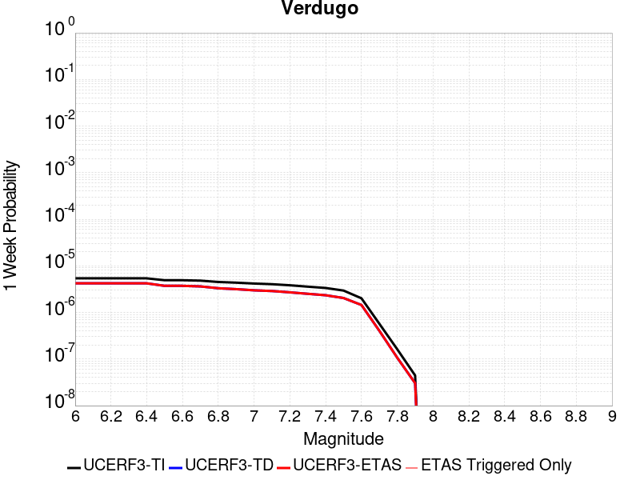 |  |  |  |

| Magnitude | 1 wk TI Prob | 1 wk TD Prob | 1 wk ETAS Prob | 1 wk ETAS/TD Gain | 1 wk ETAS Triggered Only | 1 mo TI Prob | 1 mo TD Prob | 1 mo ETAS Prob | 1 mo ETAS/TD Gain | 1 mo ETAS Triggered Only | 1 yr TI Prob | 1 yr TD Prob | 1 yr ETAS Prob | 1 yr ETAS/TD Gain | 1 yr ETAS Triggered Only | 10 yr TI Prob | 10 yr TD Prob | 10 yr ETAS Prob | 10 yr ETAS/TD Gain | 10 yr ETAS Triggered Only |
|-----|-----|-----|-----|-----|-----|-----|-----|-----|-----|-----|-----|-----|-----|-----|-----|-----|-----|-----|-----|-----|
| 6.0 | 5.392987E-6 | 4.2167994E-6 | 4.2167994E-6 | 1.0 | 0.0 | 2.3112598E-5 | 1.8071876E-5 | 2.8071694E-5 | 1.553336 | 1.0E-5 | 2.8135953E-4 | 2.2000335E-4 | 2.3000114E-4 | 1.0454439 | 1.0E-5 | 0.0028100356 | 0.002197903 | 0.0022078813 | 1.0045398 | 1.0E-5 |
| 6.1 | 5.392987E-6 | 4.2167994E-6 | 4.2167994E-6 | 1.0 | 0.0 | 2.3112598E-5 | 1.8071876E-5 | 2.8071694E-5 | 1.553336 | 1.0E-5 | 2.8135953E-4 | 2.2000335E-4 | 2.3000114E-4 | 1.0454439 | 1.0E-5 | 0.0028100356 | 0.002197903 | 0.0022078813 | 1.0045398 | 1.0E-5 |
| 6.2 | 5.392987E-6 | 4.2167994E-6 | 4.2167994E-6 | 1.0 | 0.0 | 2.3112598E-5 | 1.8071876E-5 | 2.8071694E-5 | 1.553336 | 1.0E-5 | 2.8135953E-4 | 2.2000335E-4 | 2.3000114E-4 | 1.0454439 | 1.0E-5 | 0.0028100356 | 0.002197903 | 0.0022078813 | 1.0045398 | 1.0E-5 |
| 6.3 | 5.392987E-6 | 4.2167994E-6 | 4.2167994E-6 | 1.0 | 0.0 | 2.3112598E-5 | 1.8071876E-5 | 2.8071694E-5 | 1.553336 | 1.0E-5 | 2.8135953E-4 | 2.2000335E-4 | 2.3000114E-4 | 1.0454439 | 1.0E-5 | 0.0028100356 | 0.002197903 | 0.0022078813 | 1.0045398 | 1.0E-5 |
| 6.4 | 5.392987E-6 | 4.2167994E-6 | 4.2167994E-6 | 1.0 | 0.0 | 2.3112598E-5 | 1.8071876E-5 | 2.8071694E-5 | 1.553336 | 1.0E-5 | 2.8135953E-4 | 2.2000335E-4 | 2.3000114E-4 | 1.0454439 | 1.0E-5 | 0.0028100356 | 0.002197903 | 0.0022078813 | 1.0045398 | 1.0E-5 |
| 6.5 | 4.9154837E-6 | 3.7227383E-6 | 3.7227383E-6 | 1.0 | 0.0 | 2.1066187E-5 | 1.5954496E-5 | 2.5954336E-5 | 1.6267725 | 1.0E-5 | 2.5645064E-4 | 1.9422888E-4 | 2.0422693E-4 | 1.0514756 | 1.0E-5 | 0.002561549 | 0.0019406121 | 0.0019505927 | 1.005143 | 1.0E-5 |
| 6.6 | 4.9154837E-6 | 3.7227383E-6 | 3.7227383E-6 | 1.0 | 0.0 | 2.1066187E-5 | 1.5954496E-5 | 2.5954336E-5 | 1.6267725 | 1.0E-5 | 2.5645064E-4 | 1.9422888E-4 | 2.0422693E-4 | 1.0514756 | 1.0E-5 | 0.002561549 | 0.0019406121 | 0.0019505927 | 1.005143 | 1.0E-5 |
| 6.7 | 4.817006E-6 | 3.6209233E-6 | 3.6209233E-6 | 1.0 | 0.0 | 2.0644147E-5 | 1.5518151E-5 | 2.5517997E-5 | 1.6443967 | 1.0E-5 | 2.513135E-4 | 1.889173E-4 | 1.9891541E-4 | 1.0529232 | 1.0E-5 | 0.0025102948 | 0.0018875867 | 0.0018975678 | 1.0052878 | 1.0E-5 |
| 6.8 | 4.507407E-6 | 3.307367E-6 | 3.307367E-6 | 1.0 | 0.0 | 1.9317316E-5 | 1.4174354E-5 | 2.4174213E-5 | 1.7054895 | 1.0E-5 | 2.3516294E-4 | 1.7255923E-4 | 1.825575E-4 | 1.0579411 | 1.0E-5 | 0.0023491425 | 0.0017242668 | 0.0017342495 | 1.0057895 | 1.0E-5 |
| 6.9 | 4.3573054E-6 | 3.1612701E-6 | 3.1612701E-6 | 1.0 | 0.0 | 1.8674033E-5 | 1.35482305E-5 | 2.3548095E-5 | 1.7380937 | 1.0E-5 | 2.2733262E-4 | 1.6493734E-4 | 1.7493569E-4 | 1.0606191 | 1.0E-5 | 0.0022710022 | 0.0016481617 | 0.0016581452 | 1.0060574 | 1.0E-5 |
| 7.0 | 4.171527E-6 | 2.9839243E-6 | 2.9839243E-6 | 1.0 | 0.0 | 1.787785E-5 | 1.2788185E-5 | 2.2788057E-5 | 1.7819618 | 1.0E-5 | 2.1764109E-4 | 1.5568513E-4 | 1.6568358E-4 | 1.0642222 | 1.0E-5 | 0.0021742806 | 0.001555772 | 0.0015657565 | 1.0064176 | 1.0E-5 |
| 7.1 | 4.0405484E-6 | 2.882512E-6 | 2.882512E-6 | 1.0 | 0.0 | 1.731652E-5 | 1.2353565E-5 | 2.235344E-5 | 1.8094729 | 1.0E-5 | 2.1080824E-4 | 1.5039438E-4 | 1.6039288E-4 | 1.0664818 | 1.0E-5 | 0.0021060838 | 0.001502937 | 0.001512922 | 1.0066437 | 1.0E-5 |
| 7.2 | 3.8306007E-6 | 2.7020908E-6 | 2.7020908E-6 | 1.0 | 0.0 | 1.6416758E-5 | 1.1580339E-5 | 2.1580223E-5 | 1.8635226 | 1.0E-5 | 1.9985568E-4 | 1.409816E-4 | 1.509802E-4 | 1.0709212 | 1.0E-5 | 0.0019967605 | 0.0014089324 | 0.0014189183 | 1.0070876 | 1.0E-5 |
| 7.3 | 3.5750938E-6 | 2.5124139E-6 | 2.5124139E-6 | 1.0 | 0.0 | 1.532174E-5 | 1.0767444E-5 | 2.0767337E-5 | 1.9287155 | 1.0E-5 | 1.8652623E-4 | 1.3108585E-4 | 1.4108454E-4 | 1.0762758 | 1.0E-5 | 0.0018636974 | 0.0013100959 | 0.0013200827 | 1.0076231 | 1.0E-5 |
| 7.4 | 3.3510041E-6 | 2.3410917E-6 | 2.3410917E-6 | 1.0 | 0.0 | 1.4361368E-5 | 1.0033213E-5 | 2.0033112E-5 | 1.9966798 | 1.0E-5 | 1.7483562E-4 | 1.2214761E-4 | 1.321464E-4 | 1.0818582 | 1.0E-5 | 0.0017469813 | 0.0012208152 | 0.001230803 | 1.0081812 | 1.0E-5 |
| 7.5 | 2.948287E-6 | 2.0392124E-6 | 2.0392124E-6 | 1.0 | 0.0 | 1.2635454E-5 | 8.739453E-6 | 1.8739365E-5 | 2.1442263 | 1.0E-5 | 1.538258E-4 | 1.0639775E-4 | 1.1639669E-4 | 1.093977 | 1.0E-5 | 0.0015371935 | 0.0010634783 | 0.0010734677 | 1.0093931 | 1.0E-5 |
| 7.6 | 2.0134323E-6 | 1.4471917E-6 | 1.4471917E-6 | 1.0 | 0.0 | 8.628967E-6 | 6.202236E-6 | 1.6202173E-5 | 2.6123118 | 1.0E-5 | 1.05052604E-4 | 7.550969E-5 | 8.550894E-5 | 1.1324233 | 1.0E-5 | 0.0010500296 | 7.548492E-4 | 7.648417E-4 | 1.0132377 | 1.0E-5 |
| 7.7 | 5.726436E-7 | 4.0455387E-7 | 4.0455387E-7 | 1.0 | 0.0 | 2.4541846E-6 | 1.7338012E-6 | 1.7338012E-6 | 1.0 | 0.0 | 2.9879287E-5 | 2.1108852E-5 | 2.1108852E-5 | 1.0 | 0.0 | 2.987527E-4 | 2.1107102E-4 | 2.1107102E-4 | 1.0 | 0.0 |
| 7.8 | 1.6248204E-7 | 1.0689513E-7 | 1.0689513E-7 | 1.0 | 0.0 | 6.963514E-7 | 4.581219E-7 | 4.581219E-7 | 1.0 | 0.0 | 8.478045E-6 | 5.5776204E-6 | 5.5776204E-6 | 1.0 | 0.0 | 8.477722E-5 | 5.5774835E-5 | 5.5774835E-5 | 1.0 | 0.0 |
| 7.9 | 4.4475744E-8 | 3.0379837E-8 | 3.0379837E-8 | 1.0 | 0.0 | 1.9061031E-7 | 1.301993E-7 | 1.301993E-7 | 1.0 | 0.0 | 2.320678E-6 | 1.5851754E-6 | 1.5851754E-6 | 1.0 | 0.0 | 2.3206538E-5 | 1.5851654E-5 | 1.5851654E-5 | 1.0 | 0.0 |

## San Andreas (Peninsula) 2011 CFM
*[(top)](#table-of-contents)*

| 1 Week | 1 Month | 1 Year | 10 Year |
|-----|-----|-----|-----|
|  |  |  |  |

| Magnitude | 1 wk TI Prob | 1 wk TD Prob | 1 wk ETAS Prob | 1 wk ETAS/TD Gain | 1 wk ETAS Triggered Only | 1 mo TI Prob | 1 mo TD Prob | 1 mo ETAS Prob | 1 mo ETAS/TD Gain | 1 mo ETAS Triggered Only | 1 yr TI Prob | 1 yr TD Prob | 1 yr ETAS Prob | 1 yr ETAS/TD Gain | 1 yr ETAS Triggered Only | 10 yr TI Prob | 10 yr TD Prob | 10 yr ETAS Prob | 10 yr ETAS/TD Gain | 10 yr ETAS Triggered Only |
|-----|-----|-----|-----|-----|-----|-----|-----|-----|-----|-----|-----|-----|-----|-----|-----|-----|-----|-----|-----|-----|
| 6.0 | 8.6200685E-5 | 2.5328161E-5 | 2.5328161E-5 | 1.0 | 0.0 | 3.6937918E-4 | 1.0854476E-4 | 1.0854476E-4 | 1.0 | 0.0 | 0.0044879215 | 0.0013207329 | 0.0013307197 | 1.0075616 | 1.0E-5 | 0.043983612 | 0.0148354955 | 0.014845347 | 1.0006641 | 1.0E-5 |
| 6.1 | 8.6200685E-5 | 2.5328161E-5 | 2.5328161E-5 | 1.0 | 0.0 | 3.6937918E-4 | 1.0854476E-4 | 1.0854476E-4 | 1.0 | 0.0 | 0.0044879215 | 0.0013207329 | 0.0013307197 | 1.0075616 | 1.0E-5 | 0.043983612 | 0.0148354955 | 0.014845347 | 1.0006641 | 1.0E-5 |
| 6.2 | 8.6200685E-5 | 2.5328161E-5 | 2.5328161E-5 | 1.0 | 0.0 | 3.6937918E-4 | 1.0854476E-4 | 1.0854476E-4 | 1.0 | 0.0 | 0.0044879215 | 0.0013207329 | 0.0013307197 | 1.0075616 | 1.0E-5 | 0.043983612 | 0.0148354955 | 0.014845347 | 1.0006641 | 1.0E-5 |
| 6.3 | 8.551163E-5 | 2.50194E-5 | 2.50194E-5 | 1.0 | 0.0 | 3.6642692E-4 | 1.07221604E-4 | 1.07221604E-4 | 1.0 | 0.0 | 0.004452125 | 0.001304643 | 0.0013146299 | 1.0076549 | 1.0E-5 | 0.043639794 | 0.014662212 | 0.014672065 | 1.000672 | 1.0E-5 |
| 6.4 | 8.551163E-5 | 2.50194E-5 | 2.50194E-5 | 1.0 | 0.0 | 3.6642692E-4 | 1.07221604E-4 | 1.07221604E-4 | 1.0 | 0.0 | 0.004452125 | 0.001304643 | 0.0013146299 | 1.0076549 | 1.0E-5 | 0.043639794 | 0.014662212 | 0.014672065 | 1.000672 | 1.0E-5 |
| 6.5 | 8.511146E-5 | 2.4840549E-5 | 2.4840549E-5 | 1.0 | 0.0 | 3.647124E-4 | 1.0645516E-4 | 1.0645516E-4 | 1.0 | 0.0 | 0.004431336 | 0.0012953227 | 0.0013053097 | 1.0077101 | 1.0E-5 | 0.04344007 | 0.014561708 | 0.014571562 | 1.0006768 | 1.0E-5 |
| 6.6 | 8.4985084E-5 | 2.477102E-5 | 2.477102E-5 | 1.0 | 0.0 | 3.6417096E-4 | 1.061572E-4 | 1.061572E-4 | 1.0 | 0.0 | 0.0044247704 | 0.0012916992 | 0.0013016863 | 1.0077318 | 1.0E-5 | 0.043376986 | 0.014524049 | 0.014533904 | 1.0006785 | 1.0E-5 |
| 6.7 | 8.462618E-5 | 2.4599261E-5 | 2.4599261E-5 | 1.0 | 0.0 | 3.6263323E-4 | 1.0542115E-4 | 1.0542115E-4 | 1.0 | 0.0 | 0.004406125 | 0.0012827484 | 0.0012927356 | 1.0077858 | 1.0E-5 | 0.043197807 | 0.014428631 | 0.014438488 | 1.0006831 | 1.0E-5 |
| 6.8 | 8.42337E-5 | 2.4494844E-5 | 2.4494844E-5 | 1.0 | 0.0 | 3.6095164E-4 | 1.0497369E-4 | 1.0497369E-4 | 1.0 | 0.0 | 0.004385734 | 0.001277307 | 0.0012872942 | 1.0078189 | 1.0E-5 | 0.043001823 | 0.014369269 | 0.014379125 | 1.0006859 | 1.0E-5 |
| 6.9 | 8.365989E-5 | 2.4299145E-5 | 2.4299145E-5 | 1.0 | 0.0 | 3.5849313E-4 | 1.0413504E-4 | 1.0413504E-4 | 1.0 | 0.0 | 0.004355922 | 0.0012671084 | 0.0012770958 | 1.007882 | 1.0E-5 | 0.04271523 | 0.014261526 | 0.014271384 | 1.0006912 | 1.0E-5 |
| 7.0 | 8.30936E-5 | 2.4060333E-5 | 2.4060333E-5 | 1.0 | 0.0 | 3.560668E-4 | 1.0311165E-4 | 1.0311165E-4 | 1.0 | 0.0 | 0.004326499 | 0.001254663 | 0.0012646504 | 1.0079603 | 1.0E-5 | 0.042432297 | 0.014132385 | 0.014142243 | 1.0006976 | 1.0E-5 |
| 7.1 | 8.041264E-5 | 2.3746046E-5 | 2.3746046E-5 | 1.0 | 0.0 | 3.4458007E-4 | 1.0176481E-4 | 1.0176481E-4 | 1.0 | 0.0 | 0.0041871946 | 0.0012382839 | 0.0012482716 | 1.0080657 | 1.0E-5 | 0.041091725 | 0.013954801 | 0.013964661 | 1.0007066 | 1.0E-5 |
| 7.2 | 7.8427016E-5 | 2.3168865E-5 | 2.3168865E-5 | 1.0 | 0.0 | 3.3607247E-4 | 9.9291356E-5 | 9.9291356E-5 | 1.0 | 0.0 | 0.004084008 | 0.0012082035 | 0.0012181915 | 1.0082668 | 1.0E-5 | 0.040097635 | 0.013638308 | 0.013648172 | 1.0007232 | 1.0E-5 |
| 7.3 | 7.721087E-5 | 2.2953374E-5 | 2.2953374E-5 | 1.0 | 0.0 | 3.3086175E-4 | 9.83679E-5 | 9.83679E-5 | 1.0 | 0.0 | 0.004020803 | 0.0011969728 | 0.0012069609 | 1.0083444 | 1.0E-5 | 0.03948827 | 0.013521875 | 0.013531741 | 1.0007296 | 1.0E-5 |
| 7.4 | 7.3536525E-5 | 2.1059372E-5 | 2.1059372E-5 | 1.0 | 0.0 | 3.1511846E-4 | 9.0251335E-5 | 9.0251335E-5 | 1.0 | 0.0 | 0.0038298194 | 0.0010982574 | 0.0011082464 | 1.0090953 | 1.0E-5 | 0.037644852 | 0.012473098 | 0.012482974 | 1.0007917 | 1.0E-5 |
| 7.5 | 6.806207E-5 | 1.885083E-5 | 1.885083E-5 | 1.0 | 0.0 | 2.9166197E-4 | 8.078678E-5 | 8.078678E-5 | 1.0 | 0.0 | 0.0035452035 | 9.831362E-4 | 9.931264E-4 | 1.0101615 | 1.0E-5 | 0.034891766 | 0.011218435 | 0.011228323 | 1.0008814 | 1.0E-5 |
| 7.6 | 5.6731416E-5 | 1.4231111E-5 | 1.4231111E-5 | 1.0 | 0.0 | 2.43112E-4 | 6.098905E-5 | 6.098905E-5 | 1.0 | 0.0 | 0.0029558712 | 7.4228883E-4 | 7.522814E-4 | 1.0134618 | 1.0E-5 | 0.02916862 | 0.008515661 | 0.0085255755 | 1.0011643 | 1.0E-5 |
| 7.7 | 4.946994E-5 | 1.329465E-5 | 1.329465E-5 | 1.0 | 0.0 | 2.1199681E-4 | 5.6975827E-5 | 5.6975827E-5 | 1.0 | 0.0 | 0.002578006 | 6.9346005E-4 | 7.034531E-4 | 1.0144105 | 1.0E-5 | 0.02548303 | 0.007935429 | 0.00794535 | 1.0012501 | 1.0E-5 |
| 7.8 | 3.9718198E-5 | 1.3029107E-5 | 1.3029107E-5 | 1.0 | 0.0 | 1.7020974E-4 | 5.5837834E-5 | 5.5837834E-5 | 1.0 | 0.0 | 0.0020703338 | 6.7961373E-4 | 6.8960694E-4 | 1.0147042 | 1.0E-5 | 0.020511515 | 0.0077446876 | 0.0077546104 | 1.0012813 | 1.0E-5 |
| 7.9 | 2.4115114E-5 | 1.222725E-5 | 1.222725E-5 | 1.0 | 0.0 | 1.0334639E-4 | 5.2401447E-5 | 5.2401447E-5 | 1.0 | 0.0 | 0.001257516 | 6.37801E-4 | 6.4779463E-4 | 1.0156689 | 1.0E-5 | 0.012504238 | 0.0071820016 | 0.00719193 | 1.0013824 | 1.0E-5 |
| 8.0 | 1.7756569E-5 | 1.14478835E-5 | 1.14478835E-5 | 1.0 | 0.0 | 7.6097356E-5 | 4.9061437E-5 | 4.9061437E-5 | 1.0 | 0.0 | 9.260915E-4 | 5.9715944E-4 | 6.0715346E-4 | 1.0167359 | 1.0E-5 | 0.009222416 | 0.006680186 | 0.0066901194 | 1.001487 | 1.0E-5 |
| 8.1 | 1.3159258E-5 | 9.778385E-6 | 9.778385E-6 | 1.0 | 0.0 | 5.6395602E-5 | 4.1906693E-5 | 4.1906693E-5 | 1.0 | 0.0 | 6.864001E-4 | 5.100947E-4 | 5.200896E-4 | 1.0195942 | 1.0E-5 | 0.0068428386 | 0.0057069915 | 0.0057169343 | 1.0017422 | 1.0E-5 |
| 8.2 | 8.635426E-6 | 5.486047E-6 | 5.486047E-6 | 1.0 | 0.0 | 3.700844E-5 | 2.3511418E-5 | 2.3511418E-5 | 1.0 | 0.0 | 4.5048463E-4 | 2.86214E-4 | 2.86214E-4 | 1.0 | 0.0 | 0.004495725 | 0.003255006 | 0.003255006 | 1.0 | 0.0 |
| 8.3 | 1.983087E-6 | 7.690063E-7 | 7.690063E-7 | 1.0 | 0.0 | 8.498917E-6 | 3.295737E-6 | 3.295737E-6 | 1.0 | 0.0 | 1.034694E-4 | 4.012488E-5 | 4.012488E-5 | 1.0 | 0.0 | 0.0010342124 | 4.737206E-4 | 4.737206E-4 | 1.0 | 0.0 |

## San Jose
*[(top)](#table-of-contents)*

| 1 Week | 1 Month | 1 Year | 10 Year |
|-----|-----|-----|-----|
|  |  |  |  |

| Magnitude | 1 wk TI Prob | 1 wk TD Prob | 1 wk ETAS Prob | 1 wk ETAS/TD Gain | 1 wk ETAS Triggered Only | 1 mo TI Prob | 1 mo TD Prob | 1 mo ETAS Prob | 1 mo ETAS/TD Gain | 1 mo ETAS Triggered Only | 1 yr TI Prob | 1 yr TD Prob | 1 yr ETAS Prob | 1 yr ETAS/TD Gain | 1 yr ETAS Triggered Only | 10 yr TI Prob | 10 yr TD Prob | 10 yr ETAS Prob | 10 yr ETAS/TD Gain | 10 yr ETAS Triggered Only |
|-----|-----|-----|-----|-----|-----|-----|-----|-----|-----|-----|-----|-----|-----|-----|-----|-----|-----|-----|-----|-----|
| 6.0 | 5.0851277E-6 | 4.125963E-6 | 4.125963E-6 | 1.0 | 0.0 | 2.1793223E-5 | 1.7682594E-5 | 2.7682418E-5 | 1.5655179 | 1.0E-5 | 2.653002E-4 | 2.1526696E-4 | 2.252648E-4 | 1.0464439 | 1.0E-5 | 0.0026498367 | 0.002150874 | 0.0021608523 | 1.0046393 | 1.0E-5 |
| 6.1 | 5.0851277E-6 | 4.125963E-6 | 4.125963E-6 | 1.0 | 0.0 | 2.1793223E-5 | 1.7682594E-5 | 2.7682418E-5 | 1.5655179 | 1.0E-5 | 2.653002E-4 | 2.1526696E-4 | 2.252648E-4 | 1.0464439 | 1.0E-5 | 0.0026498367 | 0.002150874 | 0.0021608523 | 1.0046393 | 1.0E-5 |
| 6.2 | 5.0851277E-6 | 4.125963E-6 | 4.125963E-6 | 1.0 | 0.0 | 2.1793223E-5 | 1.7682594E-5 | 2.7682418E-5 | 1.5655179 | 1.0E-5 | 2.653002E-4 | 2.1526696E-4 | 2.252648E-4 | 1.0464439 | 1.0E-5 | 0.0026498367 | 0.002150874 | 0.0021608523 | 1.0046393 | 1.0E-5 |
| 6.3 | 5.0851277E-6 | 4.125963E-6 | 4.125963E-6 | 1.0 | 0.0 | 2.1793223E-5 | 1.7682594E-5 | 2.7682418E-5 | 1.5655179 | 1.0E-5 | 2.653002E-4 | 2.1526696E-4 | 2.252648E-4 | 1.0464439 | 1.0E-5 | 0.0026498367 | 0.002150874 | 0.0021608523 | 1.0046393 | 1.0E-5 |
| 6.4 | 4.3115124E-6 | 3.3240583E-6 | 3.3240583E-6 | 1.0 | 0.0 | 1.8477778E-5 | 1.42458985E-5 | 2.4245755E-5 | 1.7019464 | 1.0E-5 | 2.2494372E-4 | 1.7343221E-4 | 1.8343049E-4 | 1.0576494 | 1.0E-5 | 0.0022471617 | 0.0017332169 | 0.0017431995 | 1.0057596 | 1.0E-5 |
| 6.5 | 4.3115124E-6 | 3.3240583E-6 | 3.3240583E-6 | 1.0 | 0.0 | 1.8477778E-5 | 1.42458985E-5 | 2.4245755E-5 | 1.7019464 | 1.0E-5 | 2.2494372E-4 | 1.7343221E-4 | 1.8343049E-4 | 1.0576494 | 1.0E-5 | 0.0022471617 | 0.0017332169 | 0.0017431995 | 1.0057596 | 1.0E-5 |
| 6.6 | 3.110396E-6 | 2.0802383E-6 | 2.0802383E-6 | 1.0 | 0.0 | 1.33302E-5 | 8.915278E-6 | 8.915278E-6 | 1.0 | 0.0 | 1.622831E-4 | 1.08538385E-4 | 1.08538385E-4 | 1.0 | 0.0 | 0.0016216465 | 0.0010849121 | 0.0010849121 | 1.0 | 0.0 |
| 6.7 | 3.110396E-6 | 2.0802383E-6 | 2.0802383E-6 | 1.0 | 0.0 | 1.33302E-5 | 8.915278E-6 | 8.915278E-6 | 1.0 | 0.0 | 1.622831E-4 | 1.08538385E-4 | 1.08538385E-4 | 1.0 | 0.0 | 0.0016216465 | 0.0010849121 | 0.0010849121 | 1.0 | 0.0 |
| 6.8 | 2.856651E-6 | 1.9026855E-6 | 1.9026855E-6 | 1.0 | 0.0 | 1.2242733E-5 | 8.154343E-6 | 8.154343E-6 | 1.0 | 0.0 | 1.4904508E-4 | 9.927485E-5 | 9.927485E-5 | 1.0 | 0.0 | 0.0014894515 | 9.923604E-4 | 9.923604E-4 | 1.0 | 0.0 |
| 6.9 | 2.1618725E-6 | 1.4189015E-6 | 1.4189015E-6 | 1.0 | 0.0 | 9.265135E-6 | 6.080993E-6 | 6.080993E-6 | 1.0 | 0.0 | 1.12797185E-4 | 7.403366E-5 | 7.403366E-5 | 1.0 | 0.0 | 0.0011273995 | 7.401296E-4 | 7.401296E-4 | 1.0 | 0.0 |
| 7.0 | 1.9684312E-6 | 1.3258666E-6 | 1.3258666E-6 | 1.0 | 0.0 | 8.436106E-6 | 5.6822737E-6 | 5.6822737E-6 | 1.0 | 0.0 | 1.02704755E-4 | 6.917957E-5 | 6.917957E-5 | 1.0 | 0.0 | 0.001026573 | 6.9161947E-4 | 6.9161947E-4 | 1.0 | 0.0 |
| 7.1 | 1.6070337E-6 | 1.115736E-6 | 1.115736E-6 | 1.0 | 0.0 | 6.887269E-6 | 4.7817175E-6 | 4.7817175E-6 | 1.0 | 0.0 | 8.384928E-5 | 5.821592E-5 | 5.821592E-5 | 1.0 | 0.0 | 8.3817646E-4 | 5.8204384E-4 | 5.8204384E-4 | 1.0 | 0.0 |
| 7.2 | 1.0631658E-6 | 6.405393E-7 | 6.405393E-7 | 1.0 | 0.0 | 4.556417E-6 | 2.7451656E-6 | 2.7451656E-6 | 1.0 | 0.0 | 5.5472963E-5 | 3.3421893E-5 | 3.3421893E-5 | 1.0 | 0.0 | 5.545912E-4 | 3.34201E-4 | 3.34201E-4 | 1.0 | 0.0 |
| 7.3 | 7.060711E-7 | 4.5838163E-7 | 4.5838163E-7 | 1.0 | 0.0 | 3.0260155E-6 | 1.9644913E-6 | 1.9644913E-6 | 1.0 | 0.0 | 3.6841117E-5 | 2.3917428E-5 | 2.3917428E-5 | 1.0 | 0.0 | 3.6835007E-4 | 2.3918037E-4 | 2.3918037E-4 | 1.0 | 0.0 |
| 7.4 | 3.3677085E-7 | 2.324315E-7 | 2.324315E-7 | 1.0 | 0.0 | 1.4433028E-6 | 9.961346E-7 | 9.961346E-7 | 1.0 | 0.0 | 1.757207E-5 | 1.2127875E-5 | 1.2127875E-5 | 1.0 | 0.0 | 1.7570681E-4 | 1.21303354E-4 | 1.21303354E-4 | 1.0 | 0.0 |
| 7.5 | 3.129161E-7 | 1.9538992E-7 | 1.9538992E-7 | 1.0 | 0.0 | 1.3410682E-6 | 8.373851E-7 | 8.373851E-7 | 1.0 | 0.0 | 1.6327383E-5 | 1.0195118E-5 | 1.0195118E-5 | 1.0 | 0.0 | 1.6326184E-4 | 1.0197768E-4 | 1.0197768E-4 | 1.0 | 0.0 |
| 7.6 | 2.8008668E-7 | 1.424772E-7 | 1.424772E-7 | 1.0 | 0.0 | 1.2003709E-6 | 6.106165E-7 | 6.106165E-7 | 1.0 | 0.0 | 1.46144175E-5 | 7.434232E-6 | 7.434232E-6 | 1.0 | 0.0 | 1.4613457E-4 | 7.437049E-5 | 7.437049E-5 | 1.0 | 0.0 |
| 7.7 | 2.7852005E-7 | 1.4022226E-7 | 1.4022226E-7 | 1.0 | 0.0 | 1.1936568E-6 | 6.009524E-7 | 6.009524E-7 | 1.0 | 0.0 | 1.4532674E-5 | 7.3165725E-6 | 7.3165725E-6 | 1.0 | 0.0 | 1.4531724E-4 | 7.3193965E-5 | 7.3193965E-5 | 1.0 | 0.0 |
| 7.8 | 1.1810797E-7 | 7.5212604E-8 | 7.5212604E-8 | 1.0 | 0.0 | 5.0617695E-7 | 3.2233967E-7 | 3.2233967E-7 | 1.0 | 0.0 | 6.1626865E-6 | 3.924479E-6 | 3.924479E-6 | 1.0 | 0.0 | 6.162516E-5 | 3.92484E-5 | 3.92484E-5 | 1.0 | 0.0 |

## Breckenridge 2011
*[(top)](#table-of-contents)*

| 1 Week | 1 Month | 1 Year | 10 Year |
|-----|-----|-----|-----|
|  |  |  |  |

| Magnitude | 1 wk TI Prob | 1 wk TD Prob | 1 wk ETAS Prob | 1 wk ETAS/TD Gain | 1 wk ETAS Triggered Only | 1 mo TI Prob | 1 mo TD Prob | 1 mo ETAS Prob | 1 mo ETAS/TD Gain | 1 mo ETAS Triggered Only | 1 yr TI Prob | 1 yr TD Prob | 1 yr ETAS Prob | 1 yr ETAS/TD Gain | 1 yr ETAS Triggered Only | 10 yr TI Prob | 10 yr TD Prob | 10 yr ETAS Prob | 10 yr ETAS/TD Gain | 10 yr ETAS Triggered Only |
|-----|-----|-----|-----|-----|-----|-----|-----|-----|-----|-----|-----|-----|-----|-----|-----|-----|-----|-----|-----|-----|
| 6.0 | 1.1490393E-6 | 6.738142E-7 | 6.738142E-7 | 1.0 | 0.0 | 4.924445E-6 | 2.887772E-6 | 2.887772E-6 | 1.0 | 0.0 | 5.995347E-5 | 3.515808E-5 | 3.515808E-5 | 1.0 | 0.0 | 5.9937296E-4 | 3.515272E-4 | 3.615237E-4 | 1.0284373 | 1.0E-5 |
| 6.1 | 1.1490393E-6 | 6.738142E-7 | 6.738142E-7 | 1.0 | 0.0 | 4.924445E-6 | 2.887772E-6 | 2.887772E-6 | 1.0 | 0.0 | 5.995347E-5 | 3.515808E-5 | 3.515808E-5 | 1.0 | 0.0 | 5.9937296E-4 | 3.515272E-4 | 3.615237E-4 | 1.0284373 | 1.0E-5 |
| 6.2 | 1.1490393E-6 | 6.738142E-7 | 6.738142E-7 | 1.0 | 0.0 | 4.924445E-6 | 2.887772E-6 | 2.887772E-6 | 1.0 | 0.0 | 5.995347E-5 | 3.515808E-5 | 3.515808E-5 | 1.0 | 0.0 | 5.9937296E-4 | 3.515272E-4 | 3.615237E-4 | 1.0284373 | 1.0E-5 |
| 6.3 | 1.064617E-6 | 5.8865356E-7 | 5.8865356E-7 | 1.0 | 0.0 | 4.5626366E-6 | 2.5227987E-6 | 2.5227987E-6 | 1.0 | 0.0 | 5.5548684E-5 | 3.0714655E-5 | 3.0714655E-5 | 1.0 | 0.0 | 5.55348E-4 | 3.0710525E-4 | 3.1710218E-4 | 1.0325521 | 1.0E-5 |
| 6.4 | 1.064617E-6 | 5.8865356E-7 | 5.8865356E-7 | 1.0 | 0.0 | 4.5626366E-6 | 2.5227987E-6 | 2.5227987E-6 | 1.0 | 0.0 | 5.5548684E-5 | 3.0714655E-5 | 3.0714655E-5 | 1.0 | 0.0 | 5.55348E-4 | 3.0710525E-4 | 3.1710218E-4 | 1.0325521 | 1.0E-5 |
| 6.5 | 1.064617E-6 | 5.8865356E-7 | 5.8865356E-7 | 1.0 | 0.0 | 4.5626366E-6 | 2.5227987E-6 | 2.5227987E-6 | 1.0 | 0.0 | 5.5548684E-5 | 3.0714655E-5 | 3.0714655E-5 | 1.0 | 0.0 | 5.55348E-4 | 3.0710525E-4 | 3.1710218E-4 | 1.0325521 | 1.0E-5 |
| 6.6 | 1.064617E-6 | 5.8865356E-7 | 5.8865356E-7 | 1.0 | 0.0 | 4.5626366E-6 | 2.5227987E-6 | 2.5227987E-6 | 1.0 | 0.0 | 5.5548684E-5 | 3.0714655E-5 | 3.0714655E-5 | 1.0 | 0.0 | 5.55348E-4 | 3.0710525E-4 | 3.1710218E-4 | 1.0325521 | 1.0E-5 |
| 6.7 | 9.4219524E-7 | 4.9541376E-7 | 4.9541376E-7 | 1.0 | 0.0 | 4.037973E-6 | 2.1232001E-6 | 2.1232001E-6 | 1.0 | 0.0 | 4.916122E-5 | 2.5849662E-5 | 2.5849662E-5 | 1.0 | 0.0 | 4.9150345E-4 | 2.584672E-4 | 2.584672E-4 | 1.0 | 0.0 |
| 6.8 | 8.556422E-7 | 4.3120312E-7 | 4.3120312E-7 | 1.0 | 0.0 | 3.667033E-6 | 1.8480121E-6 | 1.8480121E-6 | 1.0 | 0.0 | 4.464521E-5 | 2.2499318E-5 | 2.2499318E-5 | 1.0 | 0.0 | 4.4636242E-4 | 2.249708E-4 | 2.249708E-4 | 1.0 | 0.0 |
| 6.9 | 7.7357794E-7 | 3.842086E-7 | 3.842086E-7 | 1.0 | 0.0 | 3.3153299E-6 | 1.6466072E-6 | 1.6466072E-6 | 1.0 | 0.0 | 4.0363393E-5 | 2.004726E-5 | 2.004726E-5 | 1.0 | 0.0 | 4.035606E-4 | 2.0045483E-4 | 2.0045483E-4 | 1.0 | 0.0 |
| 7.0 | 6.8172454E-7 | 3.3471895E-7 | 3.3471895E-7 | 1.0 | 0.0 | 2.9216735E-6 | 1.4345089E-6 | 1.4345089E-6 | 1.0 | 0.0 | 3.5570793E-5 | 1.7465009E-5 | 1.7465009E-5 | 1.0 | 0.0 | 3.55651E-4 | 1.7463659E-4 | 1.7463659E-4 | 1.0 | 0.0 |
| 7.1 | 5.5936397E-7 | 2.8910054E-7 | 2.8910054E-7 | 1.0 | 0.0 | 2.397272E-6 | 1.2390018E-6 | 1.2390018E-6 | 1.0 | 0.0 | 2.9186394E-5 | 1.5084744E-5 | 1.5084744E-5 | 1.0 | 0.0 | 2.9182562E-4 | 1.5083738E-4 | 1.5083738E-4 | 1.0 | 0.0 |
| 7.2 | 3.8420822E-7 | 2.0468671E-7 | 2.0468671E-7 | 1.0 | 0.0 | 1.6466057E-6 | 8.7722844E-7 | 8.7722844E-7 | 1.0 | 0.0 | 2.004724E-5 | 1.0680205E-5 | 1.0680205E-5 | 1.0 | 0.0 | 2.004543E-4 | 1.06797E-4 | 1.06797E-4 | 1.0 | 0.0 |
| 7.3 | 2.6405158E-7 | 1.6473446E-7 | 1.6473446E-7 | 1.0 | 0.0 | 1.1316491E-6 | 7.0600464E-7 | 7.0600464E-7 | 1.0 | 0.0 | 1.37777415E-5 | 8.595573E-6 | 8.595573E-6 | 1.0 | 0.0 | 1.3776887E-4 | 8.595247E-5 | 8.595247E-5 | 1.0 | 0.0 |
| 7.4 | 1.792114E-7 | 1.2725509E-7 | 1.2725509E-7 | 1.0 | 0.0 | 7.6804866E-7 | 5.4537884E-7 | 5.4537884E-7 | 1.0 | 0.0 | 9.3509525E-6 | 6.639968E-6 | 6.639968E-6 | 1.0 | 0.0 | 9.350559E-5 | 6.639774E-5 | 6.639774E-5 | 1.0 | 0.0 |
| 7.5 | 1.3548703E-7 | 9.3855405E-8 | 9.3855405E-8 | 1.0 | 0.0 | 5.8065854E-7 | 4.022374E-7 | 4.022374E-7 | 1.0 | 0.0 | 7.0694946E-6 | 4.8972297E-6 | 4.8972297E-6 | 1.0 | 0.0 | 7.0692695E-5 | 4.8971255E-5 | 4.8971255E-5 | 1.0 | 0.0 |
| 7.6 | 2.572245E-8 | 1.7353019E-8 | 1.7353019E-8 | 1.0 | 0.0 | 1.10239064E-7 | 7.437008E-8 | 7.437008E-8 | 1.0 | 0.0 | 1.3421597E-6 | 9.054554E-7 | 9.054554E-7 | 1.0 | 0.0 | 1.3421517E-5 | 9.054523E-6 | 9.054523E-6 | 1.0 | 0.0 |

## Great Valley 03a Dunnigan Hills
*[(top)](#table-of-contents)*

| 1 Week | 1 Month | 1 Year | 10 Year |
|-----|-----|-----|-----|
|  |  |  |  |

| Magnitude | 1 wk TI Prob | 1 wk TD Prob | 1 wk ETAS Prob | 1 wk ETAS/TD Gain | 1 wk ETAS Triggered Only | 1 mo TI Prob | 1 mo TD Prob | 1 mo ETAS Prob | 1 mo ETAS/TD Gain | 1 mo ETAS Triggered Only | 1 yr TI Prob | 1 yr TD Prob | 1 yr ETAS Prob | 1 yr ETAS/TD Gain | 1 yr ETAS Triggered Only | 10 yr TI Prob | 10 yr TD Prob | 10 yr ETAS Prob | 10 yr ETAS/TD Gain | 10 yr ETAS Triggered Only |
|-----|-----|-----|-----|-----|-----|-----|-----|-----|-----|-----|-----|-----|-----|-----|-----|-----|-----|-----|-----|-----|
| 6.0 | 1.6591328E-5 | 1.8108833E-5 | 1.8108833E-5 | 1.0 | 0.0 | 7.110376E-5 | 7.7607365E-5 | 7.7607365E-5 | 1.0 | 0.0 | 8.6534437E-4 | 9.445292E-4 | 9.545197E-4 | 1.0105773 | 1.0E-5 | 0.008619824 | 0.0094119795 | 0.009421886 | 1.0010525 | 1.0E-5 |
| 6.1 | 8.041125E-6 | 8.770148E-6 | 8.770148E-6 | 1.0 | 0.0 | 3.4461507E-5 | 3.7585924E-5 | 3.7585924E-5 | 1.0 | 0.0 | 4.194881E-4 | 4.5753285E-4 | 4.5753285E-4 | 1.0 | 0.0 | 0.004186971 | 0.0045679063 | 0.0045679063 | 1.0 | 0.0 |
| 6.2 | 3.2807004E-6 | 3.5797418E-6 | 3.5797418E-6 | 1.0 | 0.0 | 1.4060069E-5 | 1.5341684E-5 | 1.5341684E-5 | 1.0 | 0.0 | 1.7116789E-4 | 1.8677315E-4 | 1.8677315E-4 | 1.0 | 0.0 | 0.0017103611 | 0.0018665699 | 0.0018665699 | 1.0 | 0.0 |
| 6.3 | 1.9339366E-6 | 2.110483E-6 | 2.110483E-6 | 1.0 | 0.0 | 8.288273E-6 | 9.044911E-6 | 9.044911E-6 | 1.0 | 0.0 | 1.00905054E-4 | 1.1011909E-4 | 1.1011909E-4 | 1.0 | 0.0 | 0.0010085925 | 0.0011009251 | 0.0011009251 | 1.0 | 0.0 |
| 6.4 | 1.3142635E-6 | 1.4340559E-6 | 1.4340559E-6 | 1.0 | 0.0 | 5.6325457E-6 | 6.145954E-6 | 6.145954E-6 | 1.0 | 0.0 | 6.857408E-5 | 7.482699E-5 | 7.482699E-5 | 1.0 | 0.0 | 6.8552926E-4 | 7.482699E-4 | 7.482699E-4 | 1.0 | 0.0 |

## San Gabriel
*[(top)](#table-of-contents)*

| 1 Week | 1 Month | 1 Year | 10 Year |
|-----|-----|-----|-----|
|  |  |  |  |

| Magnitude | 1 wk TI Prob | 1 wk TD Prob | 1 wk ETAS Prob | 1 wk ETAS/TD Gain | 1 wk ETAS Triggered Only | 1 mo TI Prob | 1 mo TD Prob | 1 mo ETAS Prob | 1 mo ETAS/TD Gain | 1 mo ETAS Triggered Only | 1 yr TI Prob | 1 yr TD Prob | 1 yr ETAS Prob | 1 yr ETAS/TD Gain | 1 yr ETAS Triggered Only | 10 yr TI Prob | 10 yr TD Prob | 10 yr ETAS Prob | 10 yr ETAS/TD Gain | 10 yr ETAS Triggered Only |
|-----|-----|-----|-----|-----|-----|-----|-----|-----|-----|-----|-----|-----|-----|-----|-----|-----|-----|-----|-----|-----|
| 6.0 | 1.083775E-5 | 1.1993788E-5 | 1.1993788E-5 | 1.0 | 0.0 | 4.6446676E-5 | 5.1400995E-5 | 5.1400995E-5 | 1.0 | 0.0 | 5.653415E-4 | 6.2563876E-4 | 6.356325E-4 | 1.0159737 | 1.0E-5 | 0.0056390543 | 0.0062508797 | 0.0062608174 | 1.0015898 | 1.0E-5 |
| 6.1 | 1.083775E-5 | 1.1993788E-5 | 1.1993788E-5 | 1.0 | 0.0 | 4.6446676E-5 | 5.1400995E-5 | 5.1400995E-5 | 1.0 | 0.0 | 5.653415E-4 | 6.2563876E-4 | 6.356325E-4 | 1.0159737 | 1.0E-5 | 0.0056390543 | 0.0062508797 | 0.0062608174 | 1.0015898 | 1.0E-5 |
| 6.2 | 1.083775E-5 | 1.1993788E-5 | 1.1993788E-5 | 1.0 | 0.0 | 4.6446676E-5 | 5.1400995E-5 | 5.1400995E-5 | 1.0 | 0.0 | 5.653415E-4 | 6.2563876E-4 | 6.356325E-4 | 1.0159737 | 1.0E-5 | 0.0056390543 | 0.0062508797 | 0.0062608174 | 1.0015898 | 1.0E-5 |
| 6.3 | 1.083775E-5 | 1.1993788E-5 | 1.1993788E-5 | 1.0 | 0.0 | 4.6446676E-5 | 5.1400995E-5 | 5.1400995E-5 | 1.0 | 0.0 | 5.653415E-4 | 6.2563876E-4 | 6.356325E-4 | 1.0159737 | 1.0E-5 | 0.0056390543 | 0.0062508797 | 0.0062608174 | 1.0015898 | 1.0E-5 |
| 6.4 | 1.083775E-5 | 1.1993788E-5 | 1.1993788E-5 | 1.0 | 0.0 | 4.6446676E-5 | 5.1400995E-5 | 5.1400995E-5 | 1.0 | 0.0 | 5.653415E-4 | 6.2563876E-4 | 6.356325E-4 | 1.0159737 | 1.0E-5 | 0.0056390543 | 0.0062508797 | 0.0062608174 | 1.0015898 | 1.0E-5 |
| 6.5 | 6.7317824E-6 | 7.725454E-6 | 7.725454E-6 | 1.0 | 0.0 | 2.8850178E-5 | 3.3108678E-5 | 3.3108678E-5 | 1.0 | 0.0 | 3.511943E-4 | 4.0302463E-4 | 4.130206E-4 | 1.0248023 | 1.0E-5 | 0.003506398 | 0.0040340438 | 0.0040440033 | 1.002469 | 1.0E-5 |
| 6.6 | 6.7317824E-6 | 7.725454E-6 | 7.725454E-6 | 1.0 | 0.0 | 2.8850178E-5 | 3.3108678E-5 | 3.3108678E-5 | 1.0 | 0.0 | 3.511943E-4 | 4.0302463E-4 | 4.130206E-4 | 1.0248023 | 1.0E-5 | 0.003506398 | 0.0040340438 | 0.0040440033 | 1.002469 | 1.0E-5 |
| 6.7 | 6.274881E-6 | 7.254367E-6 | 7.254367E-6 | 1.0 | 0.0 | 2.6892068E-5 | 3.108978E-5 | 3.108978E-5 | 1.0 | 0.0 | 3.2736175E-4 | 3.784533E-4 | 3.8844952E-4 | 1.0264133 | 1.0E-5 | 0.0032687993 | 0.0037891874 | 0.0037991495 | 1.002629 | 1.0E-5 |
| 6.8 | 5.996209E-6 | 6.9670828E-6 | 6.9670828E-6 | 1.0 | 0.0 | 2.5697784E-5 | 2.985859E-5 | 2.985859E-5 | 1.0 | 0.0 | 3.128256E-4 | 3.6346863E-4 | 3.7346498E-4 | 1.0275027 | 1.0E-5 | 0.003123856 | 0.0036398387 | 0.0036498022 | 1.0027374 | 1.0E-5 |
| 6.9 | 5.686331E-6 | 6.632093E-6 | 6.632093E-6 | 1.0 | 0.0 | 2.4369761E-5 | 2.8422952E-5 | 2.8422952E-5 | 1.0 | 0.0 | 2.9666146E-4 | 3.4599542E-4 | 3.5599194E-4 | 1.0288922 | 1.0E-5 | 0.0029626573 | 0.0034656627 | 0.003475628 | 1.0028754 | 1.0E-5 |
| 7.0 | 5.2329838E-6 | 6.1559535E-6 | 6.1559535E-6 | 1.0 | 0.0 | 2.242688E-5 | 2.6382395E-5 | 2.6382395E-5 | 1.0 | 0.0 | 2.7301308E-4 | 3.2115908E-4 | 3.3115587E-4 | 1.0311272 | 1.0E-5 | 0.002726779 | 0.0032180331 | 0.0032280008 | 1.0030975 | 1.0E-5 |
| 7.1 | 5.135671E-6 | 6.046056E-6 | 6.046056E-6 | 1.0 | 0.0 | 2.2009834E-5 | 2.5911417E-5 | 2.5911417E-5 | 1.0 | 0.0 | 2.6793676E-4 | 3.154266E-4 | 3.2542343E-4 | 1.0316931 | 1.0E-5 | 0.0026761394 | 0.0031608723 | 0.0031708407 | 1.0031537 | 1.0E-5 |
| 7.2 | 4.989062E-6 | 5.8793967E-6 | 5.8793967E-6 | 1.0 | 0.0 | 2.1381518E-5 | 2.5197176E-5 | 2.5197176E-5 | 1.0 | 0.0 | 2.6028889E-4 | 3.0673319E-4 | 3.1673012E-4 | 1.0325916 | 1.0E-5 | 0.0025998424 | 0.0030741817 | 0.0030841508 | 1.0032429 | 1.0E-5 |
| 7.3 | 4.8219395E-6 | 5.7109164E-6 | 5.7109164E-6 | 1.0 | 0.0 | 2.0665291E-5 | 2.447513E-5 | 2.447513E-5 | 1.0 | 0.0 | 2.5157086E-4 | 2.979447E-4 | 3.0794172E-4 | 1.0335532 | 1.0E-5 | 0.0025128627 | 0.0029865364 | 0.0029965066 | 1.0033383 | 1.0E-5 |
| 7.4 | 4.7118383E-6 | 5.5994446E-6 | 5.5994446E-6 | 1.0 | 0.0 | 2.0193436E-5 | 2.3997403E-5 | 2.3997403E-5 | 1.0 | 0.0 | 2.4582737E-4 | 2.9212996E-4 | 3.0212704E-4 | 1.0342213 | 1.0E-5 | 0.002455556 | 0.0029285424 | 0.0029385132 | 1.0034046 | 1.0E-5 |
| 7.5 | 4.5506545E-6 | 5.4447687E-6 | 5.4447687E-6 | 1.0 | 0.0 | 1.9502659E-5 | 2.333452E-5 | 2.333452E-5 | 1.0 | 0.0 | 2.37419E-4 | 2.8406148E-4 | 2.9405864E-4 | 1.0351937 | 1.0E-5 | 0.002371655 | 0.0028480662 | 0.0028580376 | 1.0035012 | 1.0E-5 |
| 7.6 | 4.343636E-6 | 5.2375767E-6 | 5.2375767E-6 | 1.0 | 0.0 | 1.861545E-5 | 2.244657E-5 | 2.244657E-5 | 1.0 | 0.0 | 2.2661954E-4 | 2.7325345E-4 | 2.8325073E-4 | 1.036586 | 1.0E-5 | 0.0022638857 | 0.0027402486 | 0.0027502212 | 1.0036393 | 1.0E-5 |
| 7.7 | 2.936235E-6 | 2.749426E-6 | 2.749426E-6 | 1.0 | 0.0 | 1.2583803E-5 | 1.17832005E-5 | 1.17832005E-5 | 1.0 | 0.0 | 1.5319703E-4 | 1.4345106E-4 | 1.5344963E-4 | 1.0697002 | 1.0E-5 | 0.0015309147 | 0.0014409109 | 0.0014508964 | 1.0069301 | 1.0E-5 |
| 7.8 | 1.4541639E-6 | 9.144744E-7 | 9.144744E-7 | 1.0 | 0.0 | 6.232116E-6 | 3.91917E-6 | 3.91917E-6 | 1.0 | 0.0 | 7.587337E-5 | 4.7714853E-5 | 5.7714376E-5 | 1.2095684 | 1.0E-5 | 7.584747E-4 | 4.819727E-4 | 4.919679E-4 | 1.020738 | 1.0E-5 |
| 7.9 | 8.098958E-7 | 2.4252918E-7 | 2.4252918E-7 | 1.0 | 0.0 | 3.4709774E-6 | 1.0394103E-6 | 1.0394103E-6 | 1.0 | 0.0 | 4.225833E-5 | 1.2654747E-5 | 1.2654747E-5 | 1.0 | 0.0 | 4.2250296E-4 | 1.2963027E-4 | 1.2963027E-4 | 1.0 | 0.0 |
| 8.0 | 5.2473234E-7 | 7.7131155E-8 | 7.7131155E-8 | 1.0 | 0.0 | 2.248851E-6 | 3.3056207E-7 | 3.3056207E-7 | 1.0 | 0.0 | 2.7379416E-5 | 4.0245855E-6 | 4.0245855E-6 | 1.0 | 0.0 | 2.7376044E-4 | 4.2375388E-5 | 4.2375388E-5 | 1.0 | 0.0 |
| 8.1 | 3.3162388E-7 | 4.1683297E-8 | 4.1683297E-8 | 1.0 | 0.0 | 1.4212444E-6 | 1.786427E-7 | 1.786427E-7 | 1.0 | 0.0 | 1.7303513E-5 | 2.1749727E-6 | 2.1749727E-6 | 1.0 | 0.0 | 1.7302166E-4 | 2.30667E-5 | 2.30667E-5 | 1.0 | 0.0 |
| 8.2 | 1.0235345E-7 | 1.4101387E-8 | 1.4101387E-8 | 1.0 | 0.0 | 4.3865757E-7 | 6.0434516E-8 | 6.0434516E-8 | 1.0 | 0.0 | 5.340643E-6 | 7.3578997E-7 | 7.3578997E-7 | 1.0 | 0.0 | 5.3405143E-5 | 7.959129E-6 | 7.959129E-6 | 1.0 | 0.0 |

## Robinson Creek
*[(top)](#table-of-contents)*

| 1 Week | 1 Month | 1 Year | 10 Year |
|-----|-----|-----|-----|
|  |  |  |  |

| Magnitude | 1 wk TI Prob | 1 wk TD Prob | 1 wk ETAS Prob | 1 wk ETAS/TD Gain | 1 wk ETAS Triggered Only | 1 mo TI Prob | 1 mo TD Prob | 1 mo ETAS Prob | 1 mo ETAS/TD Gain | 1 mo ETAS Triggered Only | 1 yr TI Prob | 1 yr TD Prob | 1 yr ETAS Prob | 1 yr ETAS/TD Gain | 1 yr ETAS Triggered Only | 10 yr TI Prob | 10 yr TD Prob | 10 yr ETAS Prob | 10 yr ETAS/TD Gain | 10 yr ETAS Triggered Only |
|-----|-----|-----|-----|-----|-----|-----|-----|-----|-----|-----|-----|-----|-----|-----|-----|-----|-----|-----|-----|-----|
| 6.0 | 1.3705327E-5 | 1.5285948E-5 | 1.5285948E-5 | 1.0 | 0.0 | 5.8735794E-5 | 6.55112E-5 | 7.551055E-5 | 1.1526357 | 1.0E-5 | 7.1487366E-4 | 7.975989E-4 | 8.0759096E-4 | 1.0125276 | 1.0E-5 | 0.0071257832 | 0.007975989 | 0.0079859095 | 1.0012437 | 1.0E-5 |
| 6.1 | 1.3705327E-5 | 1.5285948E-5 | 1.5285948E-5 | 1.0 | 0.0 | 5.8735794E-5 | 6.55112E-5 | 7.551055E-5 | 1.1526357 | 1.0E-5 | 7.1487366E-4 | 7.975989E-4 | 8.0759096E-4 | 1.0125276 | 1.0E-5 | 0.0071257832 | 0.007975989 | 0.0079859095 | 1.0012437 | 1.0E-5 |
| 6.2 | 1.3705327E-5 | 1.5285948E-5 | 1.5285948E-5 | 1.0 | 0.0 | 5.8735794E-5 | 6.55112E-5 | 7.551055E-5 | 1.1526357 | 1.0E-5 | 7.1487366E-4 | 7.975989E-4 | 8.0759096E-4 | 1.0125276 | 1.0E-5 | 0.0071257832 | 0.007975989 | 0.0079859095 | 1.0012437 | 1.0E-5 |
| 6.3 | 1.3705327E-5 | 1.5285948E-5 | 1.5285948E-5 | 1.0 | 0.0 | 5.8735794E-5 | 6.55112E-5 | 7.551055E-5 | 1.1526357 | 1.0E-5 | 7.1487366E-4 | 7.975989E-4 | 8.0759096E-4 | 1.0125276 | 1.0E-5 | 0.0071257832 | 0.007975989 | 0.0079859095 | 1.0012437 | 1.0E-5 |
| 6.4 | 1.3705327E-5 | 1.5285948E-5 | 1.5285948E-5 | 1.0 | 0.0 | 5.8735794E-5 | 6.55112E-5 | 7.551055E-5 | 1.1526357 | 1.0E-5 | 7.1487366E-4 | 7.975989E-4 | 8.0759096E-4 | 1.0125276 | 1.0E-5 | 0.0071257832 | 0.007975989 | 0.0079859095 | 1.0012437 | 1.0E-5 |

## Malibu Coast (Extension) alt 1
*[(top)](#table-of-contents)*

| 1 Week | 1 Month | 1 Year | 10 Year |
|-----|-----|-----|-----|
|  |  |  |  |

| Magnitude | 1 wk TI Prob | 1 wk TD Prob | 1 wk ETAS Prob | 1 wk ETAS/TD Gain | 1 wk ETAS Triggered Only | 1 mo TI Prob | 1 mo TD Prob | 1 mo ETAS Prob | 1 mo ETAS/TD Gain | 1 mo ETAS Triggered Only | 1 yr TI Prob | 1 yr TD Prob | 1 yr ETAS Prob | 1 yr ETAS/TD Gain | 1 yr ETAS Triggered Only | 10 yr TI Prob | 10 yr TD Prob | 10 yr ETAS Prob | 10 yr ETAS/TD Gain | 10 yr ETAS Triggered Only |
|-----|-----|-----|-----|-----|-----|-----|-----|-----|-----|-----|-----|-----|-----|-----|-----|-----|-----|-----|-----|-----|
| 6.0 | 8.930738E-6 | 9.329555E-6 | 9.329555E-6 | 1.0 | 0.0 | 3.827403E-5 | 3.9983202E-5 | 3.9983202E-5 | 1.0 | 0.0 | 4.6588664E-4 | 4.8668848E-4 | 4.8668848E-4 | 1.0 | 0.0 | 0.0046491115 | 0.0048564086 | 0.00486636 | 1.0020491 | 1.0E-5 |
| 6.1 | 7.199952E-6 | 7.5305375E-6 | 7.5305375E-6 | 1.0 | 0.0 | 3.0856572E-5 | 3.2273336E-5 | 3.2273336E-5 | 1.0 | 0.0 | 3.75614E-4 | 3.9285762E-4 | 3.9285762E-4 | 1.0 | 0.0 | 0.0037497976 | 0.0039216974 | 0.0039316583 | 1.0025399 | 1.0E-5 |
| 6.2 | 6.3721413E-6 | 6.6670127E-6 | 6.6670127E-6 | 1.0 | 0.0 | 2.7308892E-5 | 2.8572602E-5 | 2.8572602E-5 | 1.0 | 0.0 | 3.3243504E-4 | 3.4781624E-4 | 3.4781624E-4 | 1.0 | 0.0 | 0.0033193815 | 0.0034727587 | 0.003482724 | 1.0028696 | 1.0E-5 |
| 6.3 | 6.016345E-6 | 6.295371E-6 | 6.295371E-6 | 1.0 | 0.0 | 2.578408E-5 | 2.6979882E-5 | 2.6979882E-5 | 1.0 | 0.0 | 3.1387596E-4 | 3.2843088E-4 | 3.2843088E-4 | 1.0 | 0.0 | 0.00313433 | 0.0032794913 | 0.0032894583 | 1.0030392 | 1.0E-5 |
| 6.4 | 5.8104883E-6 | 6.0797515E-6 | 6.0797515E-6 | 1.0 | 0.0 | 2.4901856E-5 | 2.605582E-5 | 2.605582E-5 | 1.0 | 0.0 | 3.031379E-4 | 3.1718376E-4 | 3.1718376E-4 | 1.0 | 0.0 | 0.0030272473 | 0.003167345 | 0.0031773134 | 1.0031472 | 1.0E-5 |
| 6.5 | 5.476925E-6 | 5.72771E-6 | 5.72771E-6 | 1.0 | 0.0 | 2.3472323E-5 | 2.4547098E-5 | 2.4547098E-5 | 1.0 | 0.0 | 2.8573806E-4 | 2.9882023E-4 | 2.9882023E-4 | 1.0 | 0.0 | 0.0028537093 | 0.0029842162 | 0.0029941865 | 1.003341 | 1.0E-5 |
| 6.6 | 5.222387E-6 | 5.458768E-6 | 5.458768E-6 | 1.0 | 0.0 | 2.2381464E-5 | 2.3394514E-5 | 2.3394514E-5 | 1.0 | 0.0 | 2.7246025E-4 | 2.8479125E-4 | 2.8479125E-4 | 1.0 | 0.0 | 0.0027212645 | 0.0028442936 | 0.0028542653 | 1.0035058 | 1.0E-5 |
| 6.7 | 5.0337076E-6 | 5.2592854E-6 | 5.2592854E-6 | 1.0 | 0.0 | 2.1572854E-5 | 2.2539603E-5 | 2.2539603E-5 | 1.0 | 0.0 | 2.6261783E-4 | 2.7438538E-4 | 2.7438538E-4 | 1.0 | 0.0 | 0.002623077 | 0.002740496 | 0.0027504687 | 1.003639 | 1.0E-5 |
| 6.8 | 4.5675624E-6 | 4.7588796E-6 | 4.7588796E-6 | 1.0 | 0.0 | 1.9575122E-5 | 2.0395039E-5 | 2.0395039E-5 | 1.0 | 0.0 | 2.3830103E-4 | 2.482815E-4 | 2.482815E-4 | 1.0 | 0.0 | 0.0023804565 | 0.0024800608 | 0.002490036 | 1.0040221 | 1.0E-5 |
| 6.9 | 4.2802412E-6 | 4.4521726E-6 | 4.4521726E-6 | 1.0 | 0.0 | 1.8343762E-5 | 1.90806E-5 | 1.90806E-5 | 1.0 | 0.0 | 2.2331243E-4 | 2.322817E-4 | 2.322817E-4 | 1.0 | 0.0 | 0.0022308815 | 0.002320406 | 0.0023303828 | 1.0042996 | 1.0E-5 |
| 7.0 | 3.9794063E-6 | 4.130239E-6 | 4.130239E-6 | 1.0 | 0.0 | 1.7054486E-5 | 1.7700906E-5 | 1.7700906E-5 | 1.0 | 0.0 | 2.0761859E-4 | 2.1548734E-4 | 2.1548734E-4 | 1.0 | 0.0 | 0.0020742472 | 0.0021527973 | 0.002162776 | 1.0046351 | 1.0E-5 |
| 7.1 | 3.7730424E-6 | 3.91135E-6 | 3.91135E-6 | 1.0 | 0.0 | 1.6170083E-5 | 1.6762822E-5 | 1.6762822E-5 | 1.0 | 0.0 | 1.9685295E-4 | 2.0406836E-4 | 2.0406836E-4 | 1.0 | 0.0 | 0.0019667868 | 0.0020388225 | 0.002048802 | 1.0048947 | 1.0E-5 |
| 7.2 | 3.424985E-6 | 3.5414578E-6 | 3.5414578E-6 | 1.0 | 0.0 | 1.4678424E-5 | 1.5177588E-5 | 1.5177588E-5 | 1.0 | 0.0 | 1.7869516E-4 | 1.8477158E-4 | 1.8477158E-4 | 1.0 | 0.0 | 0.0017855153 | 0.0018461916 | 0.0018461916 | 1.0 | 0.0 |
| 7.3 | 2.6966375E-6 | 2.7597434E-6 | 2.7597434E-6 | 1.0 | 0.0 | 1.15569665E-5 | 1.1827418E-5 | 1.1827418E-5 | 1.0 | 0.0 | 1.4069698E-4 | 1.4398934E-4 | 1.4398934E-4 | 1.0 | 0.0 | 0.0014060794 | 0.0014389646 | 0.0014389646 | 1.0 | 0.0 |
| 7.4 | 2.215957E-6 | 2.2494505E-6 | 2.2494505E-6 | 1.0 | 0.0 | 9.496924E-6 | 9.6404665E-6 | 9.6404665E-6 | 1.0 | 0.0 | 1.1561892E-4 | 1.1736639E-4 | 1.1736639E-4 | 1.0 | 0.0 | 0.0011555878 | 0.0011730478 | 0.0011730478 | 1.0 | 0.0 |
| 7.5 | 1.2040218E-6 | 1.2219476E-6 | 1.2219476E-6 | 1.0 | 0.0 | 5.160083E-6 | 5.236908E-6 | 5.236908E-6 | 1.0 | 0.0 | 6.2822204E-5 | 6.375751E-5 | 6.375751E-5 | 1.0 | 0.0 | 6.280445E-4 | 6.37394E-4 | 6.37394E-4 | 1.0 | 0.0 |
| 7.6 | 6.6157446E-7 | 6.679206E-7 | 6.679206E-7 | 1.0 | 0.0 | 2.835316E-6 | 2.8625136E-6 | 2.8625136E-6 | 1.0 | 0.0 | 3.4519428E-5 | 3.485056E-5 | 3.485056E-5 | 1.0 | 0.0 | 3.4514067E-4 | 3.4845248E-4 | 3.4845248E-4 | 1.0 | 0.0 |
| 7.7 | 2.6012302E-7 | 2.4358354E-7 | 2.4358354E-7 | 1.0 | 0.0 | 1.1148124E-6 | 1.0439292E-6 | 1.0439292E-6 | 1.0 | 0.0 | 1.3572758E-5 | 1.2709774E-5 | 1.2709774E-5 | 1.0 | 0.0 | 1.3571928E-4 | 1.2709154E-4 | 1.2709154E-4 | 1.0 | 0.0 |
| 7.8 | 2.8323132E-8 | 2.0267E-8 | 2.0267E-8 | 1.0 | 0.0 | 1.2138484E-7 | 8.685857E-8 | 8.685857E-8 | 1.0 | 0.0 | 1.4778595E-6 | 1.0575027E-6 | 1.0575027E-6 | 1.0 | 0.0 | 1.4778497E-5 | 1.0574984E-5 | 1.0574984E-5 | 1.0 | 0.0 |

## Carson Range (Genoa)
*[(top)](#table-of-contents)*

| 1 Week | 1 Month | 1 Year | 10 Year |
|-----|-----|-----|-----|
|  |  |  |  |

| Magnitude | 1 wk TI Prob | 1 wk TD Prob | 1 wk ETAS Prob | 1 wk ETAS/TD Gain | 1 wk ETAS Triggered Only | 1 mo TI Prob | 1 mo TD Prob | 1 mo ETAS Prob | 1 mo ETAS/TD Gain | 1 mo ETAS Triggered Only | 1 yr TI Prob | 1 yr TD Prob | 1 yr ETAS Prob | 1 yr ETAS/TD Gain | 1 yr ETAS Triggered Only | 10 yr TI Prob | 10 yr TD Prob | 10 yr ETAS Prob | 10 yr ETAS/TD Gain | 10 yr ETAS Triggered Only |
|-----|-----|-----|-----|-----|-----|-----|-----|-----|-----|-----|-----|-----|-----|-----|-----|-----|-----|-----|-----|-----|
| 6.0 | 4.1268457E-5 | 5.015261E-5 | 5.015261E-5 | 1.0 | 0.0 | 1.7685282E-4 | 2.149243E-4 | 2.149243E-4 | 1.0 | 0.0 | 0.0021510567 | 0.0026139566 | 0.0026139566 | 1.0 | 0.0 | 0.02130354 | 0.025871772 | 0.025881514 | 1.0003765 | 1.0E-5 |
| 6.1 | 4.1268457E-5 | 5.015261E-5 | 5.015261E-5 | 1.0 | 0.0 | 1.7685282E-4 | 2.149243E-4 | 2.149243E-4 | 1.0 | 0.0 | 0.0021510567 | 0.0026139566 | 0.0026139566 | 1.0 | 0.0 | 0.02130354 | 0.025871772 | 0.025881514 | 1.0003765 | 1.0E-5 |
| 6.2 | 4.1268457E-5 | 5.015261E-5 | 5.015261E-5 | 1.0 | 0.0 | 1.7685282E-4 | 2.149243E-4 | 2.149243E-4 | 1.0 | 0.0 | 0.0021510567 | 0.0026139566 | 0.0026139566 | 1.0 | 0.0 | 0.02130354 | 0.025871772 | 0.025881514 | 1.0003765 | 1.0E-5 |
| 6.3 | 4.1268457E-5 | 5.015261E-5 | 5.015261E-5 | 1.0 | 0.0 | 1.7685282E-4 | 2.149243E-4 | 2.149243E-4 | 1.0 | 0.0 | 0.0021510567 | 0.0026139566 | 0.0026139566 | 1.0 | 0.0 | 0.02130354 | 0.025871772 | 0.025881514 | 1.0003765 | 1.0E-5 |
| 6.4 | 4.1268457E-5 | 5.015261E-5 | 5.015261E-5 | 1.0 | 0.0 | 1.7685282E-4 | 2.149243E-4 | 2.149243E-4 | 1.0 | 0.0 | 0.0021510567 | 0.0026139566 | 0.0026139566 | 1.0 | 0.0 | 0.02130354 | 0.025871772 | 0.025881514 | 1.0003765 | 1.0E-5 |
| 6.5 | 2.5677185E-5 | 3.098169E-5 | 3.098169E-5 | 1.0 | 0.0 | 1.1004044E-4 | 1.3277293E-4 | 1.3277293E-4 | 1.0 | 0.0 | 0.0013389189 | 0.0016154919 | 0.0016154919 | 1.0 | 0.0 | 0.0133088045 | 0.016055403 | 0.016065244 | 1.0006129 | 1.0E-5 |
| 6.6 | 2.5677185E-5 | 3.098169E-5 | 3.098169E-5 | 1.0 | 0.0 | 1.1004044E-4 | 1.3277293E-4 | 1.3277293E-4 | 1.0 | 0.0 | 0.0013389189 | 0.0016154919 | 0.0016154919 | 1.0 | 0.0 | 0.0133088045 | 0.016055403 | 0.016065244 | 1.0006129 | 1.0E-5 |
| 6.7 | 1.9969408E-5 | 2.406609E-5 | 2.406609E-5 | 1.0 | 0.0 | 8.558037E-5 | 1.0313718E-4 | 1.0313718E-4 | 1.0 | 0.0 | 0.0010414429 | 0.0012551253 | 0.0012551253 | 1.0 | 0.0 | 0.010365757 | 0.012495526 | 0.012505402 | 1.0007902 | 1.0E-5 |
| 6.8 | 1.4783156E-5 | 1.781951E-5 | 1.781951E-5 | 1.0 | 0.0 | 6.335485E-5 | 7.6367825E-5 | 7.6367825E-5 | 1.0 | 0.0 | 7.710722E-4 | 9.2951185E-4 | 9.2951185E-4 | 1.0 | 0.0 | 0.0076840227 | 0.009269031 | 0.009278937 | 1.0010688 | 1.0E-5 |
| 6.9 | 1.06660555E-5 | 1.2878443E-5 | 1.2878443E-5 | 1.0 | 0.0 | 4.5710865E-5 | 5.519281E-5 | 5.519281E-5 | 1.0 | 0.0 | 5.5638765E-4 | 6.7188055E-4 | 6.7188055E-4 | 1.0 | 0.0 | 0.005549967 | 0.006709793 | 0.006709793 | 1.0 | 0.0 |
| 7.0 | 7.664838E-6 | 9.259328E-6 | 9.259328E-6 | 1.0 | 0.0 | 3.2848893E-5 | 3.9682833E-5 | 3.9682833E-5 | 1.0 | 0.0 | 3.998619E-4 | 4.831385E-4 | 4.831385E-4 | 1.0 | 0.0 | 0.0039914316 | 0.0048313825 | 0.0048313825 | 1.0 | 0.0 |

## Eureka Peak
*[(top)](#table-of-contents)*

| 1 Week | 1 Month | 1 Year | 10 Year |
|-----|-----|-----|-----|
|  |  |  |  |

| Magnitude | 1 wk TI Prob | 1 wk TD Prob | 1 wk ETAS Prob | 1 wk ETAS/TD Gain | 1 wk ETAS Triggered Only | 1 mo TI Prob | 1 mo TD Prob | 1 mo ETAS Prob | 1 mo ETAS/TD Gain | 1 mo ETAS Triggered Only | 1 yr TI Prob | 1 yr TD Prob | 1 yr ETAS Prob | 1 yr ETAS/TD Gain | 1 yr ETAS Triggered Only | 10 yr TI Prob | 10 yr TD Prob | 10 yr ETAS Prob | 10 yr ETAS/TD Gain | 10 yr ETAS Triggered Only |
|-----|-----|-----|-----|-----|-----|-----|-----|-----|-----|-----|-----|-----|-----|-----|-----|-----|-----|-----|-----|-----|
| 6.0 | 3.1949054E-5 | 9.31106E-6 | 9.31106E-6 | 1.0 | 0.0 | 1.3691733E-4 | 3.9904375E-5 | 3.9904375E-5 | 1.0 | 0.0 | 0.0016656938 | 4.8580556E-4 | 4.958007E-4 | 1.0205743 | 1.0E-5 | 0.016532637 | 0.0049213353 | 0.004931286 | 1.002022 | 1.0E-5 |
| 6.1 | 3.1949054E-5 | 9.31106E-6 | 9.31106E-6 | 1.0 | 0.0 | 1.3691733E-4 | 3.9904375E-5 | 3.9904375E-5 | 1.0 | 0.0 | 0.0016656938 | 4.8580556E-4 | 4.958007E-4 | 1.0205743 | 1.0E-5 | 0.016532637 | 0.0049213353 | 0.004931286 | 1.002022 | 1.0E-5 |
| 6.2 | 3.1949054E-5 | 9.31106E-6 | 9.31106E-6 | 1.0 | 0.0 | 1.3691733E-4 | 3.9904375E-5 | 3.9904375E-5 | 1.0 | 0.0 | 0.0016656938 | 4.8580556E-4 | 4.958007E-4 | 1.0205743 | 1.0E-5 | 0.016532637 | 0.0049213353 | 0.004931286 | 1.002022 | 1.0E-5 |
| 6.3 | 2.7339745E-5 | 7.9809015E-6 | 7.9809015E-6 | 1.0 | 0.0 | 1.1716507E-4 | 3.4203844E-5 | 3.4203844E-5 | 1.0 | 0.0 | 0.0014255513 | 4.1642814E-4 | 4.2642397E-4 | 1.0240037 | 1.0E-5 | 0.0141644105 | 0.0042260378 | 0.0042359955 | 1.0023563 | 1.0E-5 |
| 6.4 | 2.7339745E-5 | 7.9809015E-6 | 7.9809015E-6 | 1.0 | 0.0 | 1.1716507E-4 | 3.4203844E-5 | 3.4203844E-5 | 1.0 | 0.0 | 0.0014255513 | 4.1642814E-4 | 4.2642397E-4 | 1.0240037 | 1.0E-5 | 0.0141644105 | 0.0042260378 | 0.0042359955 | 1.0023563 | 1.0E-5 |
| 6.5 | 9.738388E-8 | 1.862816E-7 | 1.862816E-7 | 1.0 | 0.0 | 4.1735944E-7 | 7.983495E-7 | 7.983495E-7 | 1.0 | 0.0 | 5.081339E-6 | 9.719863E-6 | 9.719863E-6 | 1.0 | 0.0 | 5.0812232E-5 | 9.7194454E-5 | 9.7194454E-5 | 1.0 | 0.0 |
| 6.6 | 9.3495956E-8 | 1.8336962E-7 | 1.8336962E-7 | 1.0 | 0.0 | 4.0069688E-7 | 7.8586953E-7 | 7.8586953E-7 | 1.0 | 0.0 | 4.8784736E-6 | 9.567921E-6 | 9.567921E-6 | 1.0 | 0.0 | 4.8783666E-5 | 9.567517E-5 | 9.567517E-5 | 1.0 | 0.0 |
| 6.7 | 9.3495956E-8 | 1.8336962E-7 | 1.8336962E-7 | 1.0 | 0.0 | 4.0069688E-7 | 7.8586953E-7 | 7.8586953E-7 | 1.0 | 0.0 | 4.8784736E-6 | 9.567921E-6 | 9.567921E-6 | 1.0 | 0.0 | 4.8783666E-5 | 9.567517E-5 | 9.567517E-5 | 1.0 | 0.0 |
| 6.8 | 8.591428E-8 | 1.8029873E-7 | 1.8029873E-7 | 1.0 | 0.0 | 3.68204E-7 | 7.727086E-7 | 7.727086E-7 | 1.0 | 0.0 | 4.4828744E-6 | 9.407688E-6 | 9.407688E-6 | 1.0 | 0.0 | 4.482784E-5 | 9.4072966E-5 | 9.4072966E-5 | 1.0 | 0.0 |
| 6.9 | 7.749723E-8 | 1.7447826E-7 | 1.7447826E-7 | 1.0 | 0.0 | 3.3213098E-7 | 7.4776375E-7 | 7.4776375E-7 | 1.0 | 0.0 | 4.043687E-6 | 9.1039865E-6 | 9.1039865E-6 | 1.0 | 0.0 | 4.0436134E-5 | 9.1036214E-5 | 9.1036214E-5 | 1.0 | 0.0 |
| 7.0 | 6.897872E-8 | 1.6423827E-7 | 1.6423827E-7 | 1.0 | 0.0 | 2.9562307E-7 | 7.0387813E-7 | 7.0387813E-7 | 1.0 | 0.0 | 3.5992048E-6 | 8.569684E-6 | 8.569684E-6 | 1.0 | 0.0 | 3.5991467E-5 | 8.56936E-5 | 8.56936E-5 | 1.0 | 0.0 |
| 7.1 | 5.859318E-8 | 1.479528E-7 | 1.479528E-7 | 1.0 | 0.0 | 2.5111362E-7 | 6.340833E-7 | 6.340833E-7 | 1.0 | 0.0 | 3.057304E-6 | 7.7199375E-6 | 7.7199375E-6 | 1.0 | 0.0 | 3.0572617E-5 | 7.719675E-5 | 7.719675E-5 | 1.0 | 0.0 |
| 7.2 | 5.1375338E-8 | 1.3428803E-7 | 1.3428803E-7 | 1.0 | 0.0 | 2.2018E-7 | 5.7552E-7 | 5.7552E-7 | 1.0 | 0.0 | 2.680688E-6 | 7.006934E-6 | 7.006934E-6 | 1.0 | 0.0 | 2.6806558E-5 | 7.0067195E-5 | 7.0067195E-5 | 1.0 | 0.0 |
| 7.3 | 4.5441396E-8 | 1.1643492E-7 | 1.1643492E-7 | 1.0 | 0.0 | 1.9474882E-7 | 4.990067E-7 | 4.990067E-7 | 1.0 | 0.0 | 2.3710643E-6 | 6.0753905E-6 | 6.0753905E-6 | 1.0 | 0.0 | 2.371039E-5 | 6.07523E-5 | 6.07523E-5 | 1.0 | 0.0 |
| 7.4 | 2.981918E-8 | 6.916823E-8 | 6.916823E-8 | 1.0 | 0.0 | 1.2779647E-7 | 2.9643525E-7 | 2.9643525E-7 | 1.0 | 0.0 | 1.5559209E-6 | 3.6090935E-6 | 3.6090935E-6 | 1.0 | 0.0 | 1.55591E-5 | 3.609039E-5 | 3.609039E-5 | 1.0 | 0.0 |
| 7.5 | 4.24214E-9 | 8.350494E-9 | 8.350494E-9 | 1.0 | 0.0 | 1.81806E-8 | 3.578783E-8 | 3.578783E-8 | 1.0 | 0.0 | 2.213488E-7 | 4.357168E-7 | 4.357168E-7 | 1.0 | 0.0 | 2.2134857E-6 | 4.357166E-6 | 4.357166E-6 | 1.0 | 0.0 |

## San Pedro Escarpment
*[(top)](#table-of-contents)*

| 1 Week | 1 Month | 1 Year | 10 Year |
|-----|-----|-----|-----|
|  |  |  |  |

| Magnitude | 1 wk TI Prob | 1 wk TD Prob | 1 wk ETAS Prob | 1 wk ETAS/TD Gain | 1 wk ETAS Triggered Only | 1 mo TI Prob | 1 mo TD Prob | 1 mo ETAS Prob | 1 mo ETAS/TD Gain | 1 mo ETAS Triggered Only | 1 yr TI Prob | 1 yr TD Prob | 1 yr ETAS Prob | 1 yr ETAS/TD Gain | 1 yr ETAS Triggered Only | 10 yr TI Prob | 10 yr TD Prob | 10 yr ETAS Prob | 10 yr ETAS/TD Gain | 10 yr ETAS Triggered Only |
|-----|-----|-----|-----|-----|-----|-----|-----|-----|-----|-----|-----|-----|-----|-----|-----|-----|-----|-----|-----|-----|
| 6.0 | 1.1740281E-6 | 1.0380495E-6 | 1.0380495E-6 | 1.0 | 0.0 | 5.031539E-6 | 4.4487765E-6 | 4.4487765E-6 | 1.0 | 0.0 | 6.125726E-5 | 5.416257E-5 | 5.416257E-5 | 1.0 | 0.0 | 6.124038E-4 | 5.415001E-4 | 5.5149465E-4 | 1.0184572 | 1.0E-5 |
| 6.1 | 1.1740281E-6 | 1.0380495E-6 | 1.0380495E-6 | 1.0 | 0.0 | 5.031539E-6 | 4.4487765E-6 | 4.4487765E-6 | 1.0 | 0.0 | 6.125726E-5 | 5.416257E-5 | 5.416257E-5 | 1.0 | 0.0 | 6.124038E-4 | 5.415001E-4 | 5.5149465E-4 | 1.0184572 | 1.0E-5 |
| 6.2 | 1.1740281E-6 | 1.0380495E-6 | 1.0380495E-6 | 1.0 | 0.0 | 5.031539E-6 | 4.4487765E-6 | 4.4487765E-6 | 1.0 | 0.0 | 6.125726E-5 | 5.416257E-5 | 5.416257E-5 | 1.0 | 0.0 | 6.124038E-4 | 5.415001E-4 | 5.5149465E-4 | 1.0184572 | 1.0E-5 |
| 6.3 | 1.1740281E-6 | 1.0380495E-6 | 1.0380495E-6 | 1.0 | 0.0 | 5.031539E-6 | 4.4487765E-6 | 4.4487765E-6 | 1.0 | 0.0 | 6.125726E-5 | 5.416257E-5 | 5.416257E-5 | 1.0 | 0.0 | 6.124038E-4 | 5.415001E-4 | 5.5149465E-4 | 1.0184572 | 1.0E-5 |
| 6.4 | 1.1740281E-6 | 1.0380495E-6 | 1.0380495E-6 | 1.0 | 0.0 | 5.031539E-6 | 4.4487765E-6 | 4.4487765E-6 | 1.0 | 0.0 | 6.125726E-5 | 5.416257E-5 | 5.416257E-5 | 1.0 | 0.0 | 6.124038E-4 | 5.415001E-4 | 5.5149465E-4 | 1.0184572 | 1.0E-5 |
| 6.5 | 1.1740281E-6 | 1.0380495E-6 | 1.0380495E-6 | 1.0 | 0.0 | 5.031539E-6 | 4.4487765E-6 | 4.4487765E-6 | 1.0 | 0.0 | 6.125726E-5 | 5.416257E-5 | 5.416257E-5 | 1.0 | 0.0 | 6.124038E-4 | 5.415001E-4 | 5.5149465E-4 | 1.0184572 | 1.0E-5 |
| 6.6 | 1.1740281E-6 | 1.0380495E-6 | 1.0380495E-6 | 1.0 | 0.0 | 5.031539E-6 | 4.4487765E-6 | 4.4487765E-6 | 1.0 | 0.0 | 6.125726E-5 | 5.416257E-5 | 5.416257E-5 | 1.0 | 0.0 | 6.124038E-4 | 5.415001E-4 | 5.5149465E-4 | 1.0184572 | 1.0E-5 |
| 6.7 | 1.1740281E-6 | 1.0380495E-6 | 1.0380495E-6 | 1.0 | 0.0 | 5.031539E-6 | 4.4487765E-6 | 4.4487765E-6 | 1.0 | 0.0 | 6.125726E-5 | 5.416257E-5 | 5.416257E-5 | 1.0 | 0.0 | 6.124038E-4 | 5.415001E-4 | 5.5149465E-4 | 1.0184572 | 1.0E-5 |
| 6.8 | 1.1740281E-6 | 1.0380495E-6 | 1.0380495E-6 | 1.0 | 0.0 | 5.031539E-6 | 4.4487765E-6 | 4.4487765E-6 | 1.0 | 0.0 | 6.125726E-5 | 5.416257E-5 | 5.416257E-5 | 1.0 | 0.0 | 6.124038E-4 | 5.415001E-4 | 5.5149465E-4 | 1.0184572 | 1.0E-5 |
| 6.9 | 1.1740281E-6 | 1.0380495E-6 | 1.0380495E-6 | 1.0 | 0.0 | 5.031539E-6 | 4.4487765E-6 | 4.4487765E-6 | 1.0 | 0.0 | 6.125726E-5 | 5.416257E-5 | 5.416257E-5 | 1.0 | 0.0 | 6.124038E-4 | 5.415001E-4 | 5.5149465E-4 | 1.0184572 | 1.0E-5 |
| 7.0 | 1.1740281E-6 | 1.0380495E-6 | 1.0380495E-6 | 1.0 | 0.0 | 5.031539E-6 | 4.4487765E-6 | 4.4487765E-6 | 1.0 | 0.0 | 6.125726E-5 | 5.416257E-5 | 5.416257E-5 | 1.0 | 0.0 | 6.124038E-4 | 5.415001E-4 | 5.5149465E-4 | 1.0184572 | 1.0E-5 |
| 7.1 | 1.1740281E-6 | 1.0380495E-6 | 1.0380495E-6 | 1.0 | 0.0 | 5.031539E-6 | 4.4487765E-6 | 4.4487765E-6 | 1.0 | 0.0 | 6.125726E-5 | 5.416257E-5 | 5.416257E-5 | 1.0 | 0.0 | 6.124038E-4 | 5.415001E-4 | 5.5149465E-4 | 1.0184572 | 1.0E-5 |
| 7.2 | 1.1722314E-6 | 1.0362368E-6 | 1.0362368E-6 | 1.0 | 0.0 | 5.023839E-6 | 4.4410076E-6 | 4.4410076E-6 | 1.0 | 0.0 | 6.116352E-5 | 5.406799E-5 | 5.406799E-5 | 1.0 | 0.0 | 6.114669E-4 | 5.4055476E-4 | 5.505493E-4 | 1.0184895 | 1.0E-5 |
| 7.3 | 1.1515234E-6 | 1.0153107E-6 | 1.0153107E-6 | 1.0 | 0.0 | 4.935091E-6 | 4.3513246E-6 | 4.3513246E-6 | 1.0 | 0.0 | 6.008308E-5 | 5.2976156E-5 | 5.2976156E-5 | 1.0 | 0.0 | 6.0066837E-4 | 5.2964163E-4 | 5.3963636E-4 | 1.0188707 | 1.0E-5 |
| 7.4 | 1.1103637E-6 | 9.736696E-7 | 9.736696E-7 | 1.0 | 0.0 | 4.7586927E-6 | 4.1728636E-6 | 4.1728636E-6 | 1.0 | 0.0 | 5.793554E-5 | 5.080349E-5 | 5.080349E-5 | 1.0 | 0.0 | 5.792044E-4 | 5.079251E-4 | 5.1792007E-4 | 1.019678 | 1.0E-5 |
| 7.5 | 1.0425391E-6 | 9.119133E-7 | 9.119133E-7 | 1.0 | 0.0 | 4.4680173E-6 | 3.9081942E-6 | 3.9081942E-6 | 1.0 | 0.0 | 5.439675E-5 | 4.758129E-5 | 4.758129E-5 | 1.0 | 0.0 | 5.438344E-4 | 4.7571736E-4 | 4.8571258E-4 | 1.0210109 | 1.0E-5 |
| 7.6 | 7.0184194E-7 | 5.8866914E-7 | 5.8866914E-7 | 1.0 | 0.0 | 3.0078907E-6 | 2.5228655E-6 | 2.5228655E-6 | 1.0 | 0.0 | 3.6620455E-5 | 3.0715502E-5 | 3.0715502E-5 | 1.0 | 0.0 | 3.661442E-4 | 3.0711733E-4 | 3.0711733E-4 | 1.0 | 0.0 |
| 7.7 | 3.0871365E-7 | 2.2457192E-7 | 2.2457192E-7 | 1.0 | 0.0 | 1.3230577E-6 | 9.624507E-7 | 9.624507E-7 | 1.0 | 0.0 | 1.610811E-5 | 1.1717776E-5 | 1.1717776E-5 | 1.0 | 0.0 | 1.6106942E-4 | 1.17171694E-4 | 1.17171694E-4 | 1.0 | 0.0 |
| 7.8 | 5.7512665E-8 | 4.1055095E-8 | 4.1055095E-8 | 1.0 | 0.0 | 2.464828E-7 | 1.759504E-7 | 1.759504E-7 | 1.0 | 0.0 | 3.0009242E-6 | 2.1421943E-6 | 2.1421943E-6 | 1.0 | 0.0 | 3.0008836E-5 | 2.1421756E-5 | 2.1421756E-5 | 1.0 | 0.0 |
| 7.9 | 6.040053E-9 | 3.4538E-9 | 3.4538E-9 | 1.0 | 0.0 | 2.5885942E-8 | 1.4802001E-8 | 1.4802001E-8 | 1.0 | 0.0 | 3.151613E-7 | 1.8021434E-7 | 1.8021434E-7 | 1.0 | 0.0 | 3.1516086E-6 | 1.8021422E-6 | 1.8021422E-6 | 1.0 | 0.0 |

## Elsinore (Coyote Mountains)
*[(top)](#table-of-contents)*

| 1 Week | 1 Month | 1 Year | 10 Year |
|-----|-----|-----|-----|
|  |  |  |  |

| Magnitude | 1 wk TI Prob | 1 wk TD Prob | 1 wk ETAS Prob | 1 wk ETAS/TD Gain | 1 wk ETAS Triggered Only | 1 mo TI Prob | 1 mo TD Prob | 1 mo ETAS Prob | 1 mo ETAS/TD Gain | 1 mo ETAS Triggered Only | 1 yr TI Prob | 1 yr TD Prob | 1 yr ETAS Prob | 1 yr ETAS/TD Gain | 1 yr ETAS Triggered Only | 10 yr TI Prob | 10 yr TD Prob | 10 yr ETAS Prob | 10 yr ETAS/TD Gain | 10 yr ETAS Triggered Only |
|-----|-----|-----|-----|-----|-----|-----|-----|-----|-----|-----|-----|-----|-----|-----|-----|-----|-----|-----|-----|-----|
| 6.0 | 4.20513E-5 | 4.863799E-5 | 4.863799E-5 | 1.0 | 0.0 | 1.8020741E-4 | 2.0843507E-4 | 2.18433E-4 | 1.0479666 | 1.0E-5 | 0.0021918174 | 0.0025352647 | 0.0025452392 | 1.0039344 | 1.0E-5 | 0.021703249 | 0.0251147 | 0.02512445 | 1.0003881 | 1.0E-5 |
| 6.1 | 4.20513E-5 | 4.863799E-5 | 4.863799E-5 | 1.0 | 0.0 | 1.8020741E-4 | 2.0843507E-4 | 2.18433E-4 | 1.0479666 | 1.0E-5 | 0.0021918174 | 0.0025352647 | 0.0025452392 | 1.0039344 | 1.0E-5 | 0.021703249 | 0.0251147 | 0.02512445 | 1.0003881 | 1.0E-5 |
| 6.2 | 2.3413893E-5 | 2.4698797E-5 | 2.4698797E-5 | 1.0 | 0.0 | 1.0034139E-4 | 1.0584818E-4 | 1.0584818E-4 | 1.0 | 0.0 | 0.0012209718 | 0.001288027 | 0.001288027 | 1.0 | 0.0 | 0.012142851 | 0.012814296 | 0.012814296 | 1.0 | 0.0 |
| 6.3 | 2.3413893E-5 | 2.4698797E-5 | 2.4698797E-5 | 1.0 | 0.0 | 1.0034139E-4 | 1.0584818E-4 | 1.0584818E-4 | 1.0 | 0.0 | 0.0012209718 | 0.001288027 | 0.001288027 | 1.0 | 0.0 | 0.012142851 | 0.012814296 | 0.012814296 | 1.0 | 0.0 |
| 6.4 | 1.6894814E-5 | 1.6570513E-5 | 1.6570513E-5 | 1.0 | 0.0 | 7.240433E-5 | 7.101472E-5 | 7.101472E-5 | 1.0 | 0.0 | 8.811662E-4 | 8.642987E-4 | 8.642987E-4 | 1.0 | 0.0 | 0.0087768035 | 0.008613032 | 0.008613032 | 1.0 | 0.0 |
| 6.5 | 1.6894814E-5 | 1.6570513E-5 | 1.6570513E-5 | 1.0 | 0.0 | 7.240433E-5 | 7.101472E-5 | 7.101472E-5 | 1.0 | 0.0 | 8.811662E-4 | 8.642987E-4 | 8.642987E-4 | 1.0 | 0.0 | 0.0087768035 | 0.008613032 | 0.008613032 | 1.0 | 0.0 |
| 6.6 | 1.1910969E-5 | 1.0532162E-5 | 1.0532162E-5 | 1.0 | 0.0 | 5.1046012E-5 | 4.5137134E-5 | 4.5137134E-5 | 1.0 | 0.0 | 6.21308E-4 | 5.494193E-4 | 5.494193E-4 | 1.0 | 0.0 | 0.0061957375 | 0.005481911 | 0.005481911 | 1.0 | 0.0 |
| 6.7 | 9.1486E-6 | 7.20391E-6 | 7.20391E-6 | 1.0 | 0.0 | 3.9207694E-5 | 3.0873558E-5 | 3.0873558E-5 | 1.0 | 0.0 | 4.7724912E-4 | 3.7582454E-4 | 3.7582454E-4 | 1.0 | 0.0 | 0.0047622547 | 0.003752269 | 0.003752269 | 1.0 | 0.0 |
| 6.8 | 7.90441E-6 | 5.729934E-6 | 5.729934E-6 | 1.0 | 0.0 | 3.3875604E-5 | 2.4556635E-5 | 2.4556635E-5 | 1.0 | 0.0 | 4.1235742E-4 | 2.989373E-4 | 2.989373E-4 | 1.0 | 0.0 | 0.0041159308 | 0.0029854805 | 0.0029854805 | 1.0 | 0.0 |
| 6.9 | 7.77015E-6 | 5.5838814E-6 | 5.5838814E-6 | 1.0 | 0.0 | 3.3300217E-5 | 2.3930706E-5 | 2.3930706E-5 | 1.0 | 0.0 | 4.0535472E-4 | 2.9131866E-4 | 2.9131866E-4 | 1.0 | 0.0 | 0.004046161 | 0.002909495 | 0.002909495 | 1.0 | 0.0 |
| 7.0 | 7.675798E-6 | 5.4807347E-6 | 5.4807347E-6 | 1.0 | 0.0 | 3.289586E-5 | 2.348866E-5 | 2.348866E-5 | 1.0 | 0.0 | 4.004335E-4 | 2.8593815E-4 | 2.8593815E-4 | 1.0 | 0.0 | 0.003997127 | 0.002855829 | 0.002855829 | 1.0 | 0.0 |
| 7.1 | 7.447814E-6 | 5.2395994E-6 | 5.2395994E-6 | 1.0 | 0.0 | 3.191881E-5 | 2.2455239E-5 | 2.2455239E-5 | 1.0 | 0.0 | 3.8854225E-4 | 2.733595E-4 | 2.733595E-4 | 1.0 | 0.0 | 0.003878636 | 0.0027303568 | 0.0027303568 | 1.0 | 0.0 |
| 7.2 | 7.128185E-6 | 4.9062396E-6 | 4.9062396E-6 | 1.0 | 0.0 | 3.0549007E-5 | 2.1026577E-5 | 2.1026577E-5 | 1.0 | 0.0 | 3.7187067E-4 | 2.559697E-4 | 2.559697E-4 | 1.0 | 0.0 | 0.00371249 | 0.0025568672 | 0.0025568672 | 1.0 | 0.0 |
| 7.3 | 7.0913875E-6 | 4.8749134E-6 | 4.8749134E-6 | 1.0 | 0.0 | 3.0391306E-5 | 2.0892325E-5 | 2.0892325E-5 | 1.0 | 0.0 | 3.6995133E-4 | 2.5433555E-4 | 2.5433555E-4 | 1.0 | 0.0 | 0.0036933604 | 0.0025405632 | 0.0025405632 | 1.0 | 0.0 |
| 7.4 | 7.051521E-6 | 4.8387637E-6 | 4.8387637E-6 | 1.0 | 0.0 | 3.0220453E-5 | 2.0737401E-5 | 2.0737401E-5 | 1.0 | 0.0 | 3.6787192E-4 | 2.524498E-4 | 2.524498E-4 | 1.0 | 0.0 | 0.0036726352 | 0.0025217487 | 0.0025217487 | 1.0 | 0.0 |
| 7.5 | 6.910666E-6 | 4.7342405E-6 | 4.7342405E-6 | 1.0 | 0.0 | 2.9616802E-5 | 2.0289452E-5 | 2.0289452E-5 | 1.0 | 0.0 | 3.605249E-4 | 2.4699725E-4 | 2.4699725E-4 | 1.0 | 0.0 | 0.0035994058 | 0.0024673454 | 0.0024673454 | 1.0 | 0.0 |
| 7.6 | 6.341753E-6 | 4.3073114E-6 | 4.3073114E-6 | 1.0 | 0.0 | 2.7178658E-5 | 1.8459783E-5 | 1.8459783E-5 | 1.0 | 0.0 | 3.3084993E-4 | 2.2472584E-4 | 2.2472584E-4 | 1.0 | 0.0 | 0.0033035777 | 0.0022451011 | 0.0022451011 | 1.0 | 0.0 |
| 7.7 | 3.9205916E-6 | 2.244436E-6 | 2.244436E-6 | 1.0 | 0.0 | 1.6802427E-5 | 9.618981E-6 | 9.618981E-6 | 1.0 | 0.0 | 2.0455034E-4 | 1.1710554E-4 | 1.1710554E-4 | 1.0 | 0.0 | 0.0020436216 | 0.0011705114 | 0.0011705114 | 1.0 | 0.0 |
| 7.8 | 2.0846227E-7 | 8.487289E-8 | 8.487289E-8 | 1.0 | 0.0 | 8.9340944E-7 | 3.6374092E-7 | 3.6374092E-7 | 1.0 | 0.0 | 1.0877206E-5 | 4.4285403E-6 | 4.4285403E-6 | 1.0 | 0.0 | 1.0876673E-4 | 4.4284847E-5 | 4.4284847E-5 | 1.0 | 0.0 |
| 7.9 | 4.4969806E-9 | 2.2693984E-9 | 2.2693984E-9 | 1.0 | 0.0 | 1.9272775E-8 | 9.725993E-9 | 9.725993E-9 | 1.0 | 0.0 | 2.3464601E-7 | 1.18413965E-7 | 1.18413965E-7 | 1.0 | 0.0 | 2.3464577E-6 | 1.1841391E-6 | 1.1841391E-6 | 1.0 | 0.0 |

## Owens Valley Keough Hot Springs
*[(top)](#table-of-contents)*

| 1 Week | 1 Month | 1 Year | 10 Year |
|-----|-----|-----|-----|
|  |  |  |  |

| Magnitude | 1 wk TI Prob | 1 wk TD Prob | 1 wk ETAS Prob | 1 wk ETAS/TD Gain | 1 wk ETAS Triggered Only | 1 mo TI Prob | 1 mo TD Prob | 1 mo ETAS Prob | 1 mo ETAS/TD Gain | 1 mo ETAS Triggered Only | 1 yr TI Prob | 1 yr TD Prob | 1 yr ETAS Prob | 1 yr ETAS/TD Gain | 1 yr ETAS Triggered Only | 10 yr TI Prob | 10 yr TD Prob | 10 yr ETAS Prob | 10 yr ETAS/TD Gain | 10 yr ETAS Triggered Only |
|-----|-----|-----|-----|-----|-----|-----|-----|-----|-----|-----|-----|-----|-----|-----|-----|-----|-----|-----|-----|-----|
| 6.0 | 1.5708529E-5 | 4.951135E-6 | 4.951135E-6 | 1.0 | 0.0 | 6.7320536E-5 | 2.1219006E-5 | 2.1219006E-5 | 1.0 | 0.0 | 8.193192E-4 | 2.583159E-4 | 2.683133E-4 | 1.0387022 | 1.0E-5 | 0.008163051 | 0.00258083 | 0.0025908041 | 1.0038648 | 1.0E-5 |
| 6.1 | 1.5708529E-5 | 4.951135E-6 | 4.951135E-6 | 1.0 | 0.0 | 6.7320536E-5 | 2.1219006E-5 | 2.1219006E-5 | 1.0 | 0.0 | 8.193192E-4 | 2.583159E-4 | 2.683133E-4 | 1.0387022 | 1.0E-5 | 0.008163051 | 0.00258083 | 0.0025908041 | 1.0038648 | 1.0E-5 |
| 6.2 | 1.5708529E-5 | 4.951135E-6 | 4.951135E-6 | 1.0 | 0.0 | 6.7320536E-5 | 2.1219006E-5 | 2.1219006E-5 | 1.0 | 0.0 | 8.193192E-4 | 2.583159E-4 | 2.683133E-4 | 1.0387022 | 1.0E-5 | 0.008163051 | 0.00258083 | 0.0025908041 | 1.0038648 | 1.0E-5 |
| 6.3 | 1.5708529E-5 | 4.951135E-6 | 4.951135E-6 | 1.0 | 0.0 | 6.7320536E-5 | 2.1219006E-5 | 2.1219006E-5 | 1.0 | 0.0 | 8.193192E-4 | 2.583159E-4 | 2.683133E-4 | 1.0387022 | 1.0E-5 | 0.008163051 | 0.00258083 | 0.0025908041 | 1.0038648 | 1.0E-5 |
| 6.4 | 1.4622509E-5 | 3.726917E-6 | 3.726917E-6 | 1.0 | 0.0 | 6.266639E-5 | 1.5972422E-5 | 1.5972422E-5 | 1.0 | 0.0 | 7.626962E-4 | 1.9445019E-4 | 2.0444824E-4 | 1.051417 | 1.0E-5 | 0.007600839 | 0.001943295 | 0.0019532756 | 1.0051359 | 1.0E-5 |
| 6.5 | 1.3335527E-5 | 2.2780168E-6 | 2.2780168E-6 | 1.0 | 0.0 | 5.7151006E-5 | 9.762897E-6 | 9.762897E-6 | 1.0 | 0.0 | 6.955913E-4 | 1.1885747E-4 | 1.2885628E-4 | 1.0841243 | 1.0E-5 | 0.0069341804 | 0.0011881763 | 0.0011981644 | 1.0084063 | 1.0E-5 |
| 6.6 | 1.3332855E-5 | 2.275166E-6 | 2.275166E-6 | 1.0 | 0.0 | 5.7139558E-5 | 9.750679E-6 | 9.750679E-6 | 1.0 | 0.0 | 6.9545204E-4 | 1.1870873E-4 | 1.2870754E-4 | 1.0842298 | 1.0E-5 | 0.0069327964 | 0.0011866905 | 0.0011966786 | 1.0084168 | 1.0E-5 |
| 6.7 | 1.3318214E-5 | 2.264395E-6 | 2.264395E-6 | 1.0 | 0.0 | 5.707681E-5 | 9.704519E-6 | 9.704519E-6 | 1.0 | 0.0 | 6.946886E-4 | 1.1814679E-4 | 1.281456E-4 | 1.0846305 | 1.0E-5 | 0.0069252094 | 0.001181077 | 0.0011910652 | 1.0084568 | 1.0E-5 |
| 6.8 | 1.2441338E-5 | 1.6780228E-6 | 1.6780228E-6 | 1.0 | 0.0 | 5.331893E-5 | 7.1915083E-6 | 7.1915083E-6 | 1.0 | 0.0 | 6.489646E-4 | 8.7553395E-5 | 9.755252E-5 | 1.1142061 | 1.0E-5 | 0.0064707273 | 8.753886E-4 | 8.8537985E-4 | 1.0114135 | 1.0E-5 |
| 6.9 | 1.1130476E-5 | 1.0305113E-6 | 1.0305113E-6 | 1.0 | 0.0 | 4.7701167E-5 | 4.4164694E-6 | 4.4164694E-6 | 1.0 | 0.0 | 5.806069E-4 | 5.3769203E-5 | 6.376867E-5 | 1.1859701 | 1.0E-5 | 0.0057909233 | 5.377308E-4 | 5.477254E-4 | 1.0185866 | 1.0E-5 |
| 7.0 | 1.0986073E-5 | 9.580568E-7 | 9.580568E-7 | 1.0 | 0.0 | 4.7082318E-5 | 4.1059516E-6 | 4.1059516E-6 | 1.0 | 0.0 | 5.730765E-4 | 4.9988827E-5 | 5.9988328E-5 | 1.2000347 | 1.0E-5 | 0.0057160086 | 4.9994385E-4 | 5.099388E-4 | 1.0199922 | 1.0E-5 |
| 7.1 | 1.0451338E-5 | 8.0011125E-7 | 8.0011125E-7 | 1.0 | 0.0 | 4.4790682E-5 | 3.4290438E-6 | 3.4290438E-6 | 1.0 | 0.0 | 5.451901E-4 | 4.1747815E-5 | 5.1747396E-5 | 1.2395235 | 1.0E-5 | 0.005438545 | 4.1756374E-4 | 4.2755957E-4 | 1.0239384 | 1.0E-5 |
| 7.2 | 9.989061E-6 | 6.545603E-7 | 6.545603E-7 | 1.0 | 0.0 | 4.280956E-5 | 2.8052555E-6 | 2.8052555E-6 | 1.0 | 0.0 | 5.2108173E-4 | 3.4153454E-5 | 4.4153112E-5 | 1.2927861 | 1.0E-5 | 0.0051986156 | 3.4164122E-4 | 3.516378E-4 | 1.0292605 | 1.0E-5 |
| 7.3 | 9.465365E-6 | 5.460636E-7 | 5.460636E-7 | 1.0 | 0.0 | 4.056522E-5 | 2.3402704E-6 | 2.3402704E-6 | 1.0 | 0.0 | 4.937696E-4 | 2.849242E-5 | 3.8492137E-5 | 1.3509605 | 1.0E-5 | 0.0049267393 | 2.8504184E-4 | 2.95039E-4 | 1.0350726 | 1.0E-5 |
| 7.4 | 6.3824805E-6 | 4.0168445E-7 | 4.0168445E-7 | 1.0 | 0.0 | 2.73532E-5 | 1.7215036E-6 | 1.7215036E-6 | 1.0 | 0.0 | 3.3297433E-4 | 2.0959107E-5 | 3.0958898E-5 | 1.4771096 | 1.0E-5 | 0.0033247585 | 2.096834E-4 | 2.1968131E-4 | 1.047681 | 1.0E-5 |
| 7.5 | 1.6192645E-6 | 2.51651E-7 | 2.51651E-7 | 1.0 | 0.0 | 6.9396865E-6 | 1.0785038E-6 | 1.0785038E-6 | 1.0 | 0.0 | 8.448741E-5 | 1.3130706E-5 | 2.3130575E-5 | 1.7615637 | 1.0E-5 | 8.4455294E-4 | 1.3129943E-4 | 1.4129812E-4 | 1.0761518 | 1.0E-5 |
| 7.6 | 5.7062545E-7 | 1.07936074E-7 | 1.07936074E-7 | 1.0 | 0.0 | 2.4455355E-6 | 4.625831E-7 | 4.625831E-7 | 1.0 | 0.0 | 2.9773988E-5 | 5.6319354E-6 | 1.5631878E-5 | 2.7755785 | 1.0E-5 | 2.977E-4 | 5.6318007E-5 | 6.631744E-5 | 1.177553 | 1.0E-5 |
| 7.7 | 2.5988817E-7 | 4.5459043E-8 | 4.5459043E-8 | 1.0 | 0.0 | 1.113806E-6 | 1.9482447E-7 | 1.9482447E-7 | 1.0 | 0.0 | 1.3560503E-5 | 2.3719856E-6 | 1.2371962E-5 | 5.215867 | 1.0E-5 | 1.3559677E-4 | 2.3719647E-5 | 3.371941E-5 | 1.4215814 | 1.0E-5 |

## Fish Slough 2011 CFM
*[(top)](#table-of-contents)*

| 1 Week | 1 Month | 1 Year | 10 Year |
|-----|-----|-----|-----|
|  |  |  |  |

| Magnitude | 1 wk TI Prob | 1 wk TD Prob | 1 wk ETAS Prob | 1 wk ETAS/TD Gain | 1 wk ETAS Triggered Only | 1 mo TI Prob | 1 mo TD Prob | 1 mo ETAS Prob | 1 mo ETAS/TD Gain | 1 mo ETAS Triggered Only | 1 yr TI Prob | 1 yr TD Prob | 1 yr ETAS Prob | 1 yr ETAS/TD Gain | 1 yr ETAS Triggered Only | 10 yr TI Prob | 10 yr TD Prob | 10 yr ETAS Prob | 10 yr ETAS/TD Gain | 10 yr ETAS Triggered Only |
|-----|-----|-----|-----|-----|-----|-----|-----|-----|-----|-----|-----|-----|-----|-----|-----|-----|-----|-----|-----|-----|
| 6.0 | 4.3629925E-6 | 3.6773667E-6 | 3.6773667E-6 | 1.0 | 0.0 | 1.8698405E-5 | 1.5760059E-5 | 1.5760059E-5 | 1.0 | 0.0 | 2.276293E-4 | 1.9186396E-4 | 2.0186204E-4 | 1.0521103 | 1.0E-5 | 0.0022739628 | 0.001917192 | 0.0019271729 | 1.005206 | 1.0E-5 |
| 6.1 | 4.3629925E-6 | 3.6773667E-6 | 3.6773667E-6 | 1.0 | 0.0 | 1.8698405E-5 | 1.5760059E-5 | 1.5760059E-5 | 1.0 | 0.0 | 2.276293E-4 | 1.9186396E-4 | 2.0186204E-4 | 1.0521103 | 1.0E-5 | 0.0022739628 | 0.001917192 | 0.0019271729 | 1.005206 | 1.0E-5 |
| 6.2 | 4.3629925E-6 | 3.6773667E-6 | 3.6773667E-6 | 1.0 | 0.0 | 1.8698405E-5 | 1.5760059E-5 | 1.5760059E-5 | 1.0 | 0.0 | 2.276293E-4 | 1.9186396E-4 | 2.0186204E-4 | 1.0521103 | 1.0E-5 | 0.0022739628 | 0.001917192 | 0.0019271729 | 1.005206 | 1.0E-5 |
| 6.3 | 4.3629925E-6 | 3.6773667E-6 | 3.6773667E-6 | 1.0 | 0.0 | 1.8698405E-5 | 1.5760059E-5 | 1.5760059E-5 | 1.0 | 0.0 | 2.276293E-4 | 1.9186396E-4 | 2.0186204E-4 | 1.0521103 | 1.0E-5 | 0.0022739628 | 0.001917192 | 0.0019271729 | 1.005206 | 1.0E-5 |
| 6.4 | 4.3629925E-6 | 3.6773667E-6 | 3.6773667E-6 | 1.0 | 0.0 | 1.8698405E-5 | 1.5760059E-5 | 1.5760059E-5 | 1.0 | 0.0 | 2.276293E-4 | 1.9186396E-4 | 2.0186204E-4 | 1.0521103 | 1.0E-5 | 0.0022739628 | 0.001917192 | 0.0019271729 | 1.005206 | 1.0E-5 |
| 6.5 | 2.991715E-6 | 2.2704673E-6 | 2.2704673E-6 | 1.0 | 0.0 | 1.2821573E-5 | 9.730543E-6 | 9.730543E-6 | 1.0 | 0.0 | 1.5609147E-4 | 1.1846384E-4 | 1.2846265E-4 | 1.084404 | 1.0E-5 | 0.0015598187 | 0.001184097 | 0.0011940852 | 1.0084352 | 1.0E-5 |
| 6.6 | 2.991715E-6 | 2.2704673E-6 | 2.2704673E-6 | 1.0 | 0.0 | 1.2821573E-5 | 9.730543E-6 | 9.730543E-6 | 1.0 | 0.0 | 1.5609147E-4 | 1.1846384E-4 | 1.2846265E-4 | 1.084404 | 1.0E-5 | 0.0015598187 | 0.001184097 | 0.0011940852 | 1.0084352 | 1.0E-5 |
| 6.7 | 2.7890346E-6 | 2.0622597E-6 | 2.0622597E-6 | 1.0 | 0.0 | 1.1952951E-5 | 8.838231E-6 | 8.838231E-6 | 1.0 | 0.0 | 1.4551746E-4 | 1.0760105E-4 | 1.1759998E-4 | 1.0929259 | 1.0E-5 | 0.0014542221 | 0.0010755778 | 0.001085567 | 1.0092874 | 1.0E-5 |
| 6.8 | 1.9416723E-6 | 1.1926174E-6 | 1.1926174E-6 | 1.0 | 0.0 | 8.321425E-6 | 5.111208E-6 | 5.111208E-6 | 1.0 | 0.0 | 1.01308644E-4 | 6.222722E-5 | 7.22266E-5 | 1.1606914 | 1.0E-5 | 0.0010126247 | 6.2210206E-4 | 6.3209585E-4 | 1.0160645 | 1.0E-5 |
| 6.9 | 1.8567416E-6 | 1.1047574E-6 | 1.1047574E-6 | 1.0 | 0.0 | 7.957439E-6 | 4.734666E-6 | 4.734666E-6 | 1.0 | 0.0 | 9.687752E-5 | 5.7643076E-5 | 6.76425E-5 | 1.1734713 | 1.0E-5 | 9.6835295E-4 | 5.7628506E-4 | 5.862793E-4 | 1.0173426 | 1.0E-5 |
| 7.0 | 1.6634067E-6 | 9.0745414E-7 | 9.0745414E-7 | 1.0 | 0.0 | 7.1288664E-6 | 3.8890835E-6 | 3.8890835E-6 | 1.0 | 0.0 | 8.679049E-5 | 4.7348592E-5 | 5.734812E-5 | 1.2111895 | 1.0E-5 | 8.6756604E-4 | 4.7338792E-4 | 4.833832E-4 | 1.0211143 | 1.0E-5 |
| 7.1 | 1.4281054E-6 | 6.7371394E-7 | 6.7371394E-7 | 1.0 | 0.0 | 6.1204373E-6 | 2.8873424E-6 | 2.8873424E-6 | 1.0 | 0.0 | 7.451377E-5 | 3.5152843E-5 | 3.5152843E-5 | 1.0 | 0.0 | 7.44888E-4 | 3.5147462E-4 | 3.5147462E-4 | 1.0 | 0.0 |
| 7.2 | 1.1810387E-6 | 4.4087977E-7 | 4.4087977E-7 | 1.0 | 0.0 | 5.0615845E-6 | 1.8894834E-6 | 1.8894834E-6 | 1.0 | 0.0 | 6.1623046E-5 | 2.3004228E-5 | 2.3004228E-5 | 1.0 | 0.0 | 6.160596E-4 | 2.3001936E-4 | 2.3001936E-4 | 1.0 | 0.0 |
| 7.3 | 9.918052E-7 | 2.8737298E-7 | 2.8737298E-7 | 1.0 | 0.0 | 4.2505867E-6 | 1.2315979E-6 | 1.2315979E-6 | 1.0 | 0.0 | 5.1749663E-5 | 1.4994602E-5 | 1.4994602E-5 | 1.0 | 0.0 | 5.173762E-4 | 1.4993602E-4 | 1.4993602E-4 | 1.0 | 0.0 |
| 7.4 | 8.25252E-7 | 2.0697927E-7 | 2.0697927E-7 | 1.0 | 0.0 | 3.5367896E-6 | 8.8705366E-7 | 8.8705366E-7 | 1.0 | 0.0 | 4.3059565E-5 | 1.0799826E-5 | 1.0799826E-5 | 1.0 | 0.0 | 4.305122E-4 | 1.0799307E-4 | 1.0799307E-4 | 1.0 | 0.0 |
| 7.5 | 5.3248567E-7 | 1.2074864E-7 | 1.2074864E-7 | 1.0 | 0.0 | 2.2820795E-6 | 5.174941E-7 | 5.174941E-7 | 1.0 | 0.0 | 2.7783964E-5 | 6.3004727E-6 | 6.3004727E-6 | 1.0 | 0.0 | 2.778049E-4 | 6.3002975E-5 | 6.3002975E-5 | 1.0 | 0.0 |
| 7.6 | 2.037542E-7 | 4.7137256E-8 | 4.7137256E-8 | 1.0 | 0.0 | 8.73232E-7 | 2.0201679E-7 | 2.0201679E-7 | 1.0 | 0.0 | 1.0631547E-5 | 2.459552E-6 | 2.459552E-6 | 1.0 | 0.0 | 1.0631039E-4 | 2.4595267E-5 | 2.4595267E-5 | 1.0 | 0.0 |
| 7.7 | 2.2501226E-8 | 3.1516505E-9 | 3.1516505E-9 | 1.0 | 0.0 | 9.6433816E-8 | 1.3507073E-8 | 1.3507073E-8 | 1.0 | 0.0 | 1.1740811E-6 | 1.6444861E-7 | 1.6444861E-7 | 1.0 | 0.0 | 1.1740749E-5 | 1.644485E-6 | 1.644485E-6 | 1.0 | 0.0 |

## Imperial
*[(top)](#table-of-contents)*

| 1 Week | 1 Month | 1 Year | 10 Year |
|-----|-----|-----|-----|
|  |  |  |  |

| Magnitude | 1 wk TI Prob | 1 wk TD Prob | 1 wk ETAS Prob | 1 wk ETAS/TD Gain | 1 wk ETAS Triggered Only | 1 mo TI Prob | 1 mo TD Prob | 1 mo ETAS Prob | 1 mo ETAS/TD Gain | 1 mo ETAS Triggered Only | 1 yr TI Prob | 1 yr TD Prob | 1 yr ETAS Prob | 1 yr ETAS/TD Gain | 1 yr ETAS Triggered Only | 10 yr TI Prob | 10 yr TD Prob | 10 yr ETAS Prob | 10 yr ETAS/TD Gain | 10 yr ETAS Triggered Only |
|-----|-----|-----|-----|-----|-----|-----|-----|-----|-----|-----|-----|-----|-----|-----|-----|-----|-----|-----|-----|-----|
| 6.0 | 2.7496446E-4 | 5.060534E-4 | 5.060534E-4 | 1.0 | 0.0 | 0.0011778869 | 0.002167037 | 0.002167037 | 1.0 | 0.0 | 0.0142467655 | 0.026063008 | 0.026072748 | 1.0003737 | 1.0E-5 | 0.13367249 | 0.22823441 | 0.22824213 | 1.0000339 | 1.0E-5 |
| 6.1 | 2.5356023E-4 | 4.8701253E-4 | 4.8701253E-4 | 1.0 | 0.0 | 0.001086234 | 0.0020855654 | 0.0020855654 | 1.0 | 0.0 | 0.013144928 | 0.025100723 | 0.025110472 | 1.0003884 | 1.0E-5 | 0.123940155 | 0.21965367 | 0.21966147 | 1.0000355 | 1.0E-5 |
| 6.2 | 2.4820742E-4 | 4.7795853E-4 | 4.7795853E-4 | 1.0 | 0.0 | 0.0010633124 | 0.0020468235 | 0.0020468235 | 1.0 | 0.0 | 0.01286919 | 0.02464024 | 0.024649994 | 1.0003959 | 1.0E-5 | 0.12148927 | 0.21615778 | 0.21616562 | 1.0000362 | 1.0E-5 |
| 6.3 | 2.3205351E-4 | 4.5930318E-4 | 4.5930318E-4 | 1.0 | 0.0 | 9.94136E-4 | 0.001966994 | 0.001966994 | 1.0 | 0.0 | 0.012036599 | 0.023685131 | 0.023694893 | 1.0004122 | 1.0E-5 | 0.11405133 | 0.20807824 | 0.20808615 | 1.000038 | 1.0E-5 |
| 6.4 | 2.0304754E-4 | 3.9915304E-4 | 3.9915304E-4 | 1.0 | 0.0 | 8.6991355E-4 | 0.001709549 | 0.001709549 | 1.0 | 0.0 | 0.010539869 | 0.02062065 | 0.020630443 | 1.0004749 | 1.0E-5 | 0.100537635 | 0.1852114 | 0.18521954 | 1.000044 | 1.0E-5 |
| 6.5 | 1.854992E-4 | 3.7025133E-4 | 3.7025133E-4 | 1.0 | 0.0 | 7.9475436E-4 | 0.0015858389 | 0.0015858389 | 1.0 | 0.0 | 0.009633281 | 0.019145777 | 0.019155586 | 1.0005124 | 1.0E-5 | 0.0922623 | 0.17343764 | 0.17344591 | 1.0000477 | 1.0E-5 |
| 6.6 | 1.6586106E-4 | 3.406821E-4 | 3.406821E-4 | 1.0 | 0.0 | 7.106394E-4 | 0.0014592593 | 0.0014592593 | 1.0 | 0.0 | 0.008617763 | 0.01762655 | 0.017636376 | 1.0005573 | 1.0E-5 | 0.08291132 | 0.16090786 | 0.16091625 | 1.0000521 | 1.0E-5 |
| 6.7 | 1.4224656E-4 | 3.0796128E-4 | 3.0796128E-4 | 1.0 | 0.0 | 6.094856E-4 | 0.0013191747 | 0.0013191747 | 1.0 | 0.0 | 0.0073952693 | 0.015944751 | 0.015954591 | 1.0006171 | 1.0E-5 | 0.07153955 | 0.14660648 | 0.14661501 | 1.0000582 | 1.0E-5 |
| 6.8 | 1.2317259E-4 | 2.7815934E-4 | 2.7815934E-4 | 1.0 | 0.0 | 5.2777573E-4 | 0.0011915729 | 0.0011915729 | 1.0 | 0.0 | 0.0064067547 | 0.014412285 | 0.014422141 | 1.0006839 | 1.0E-5 | 0.06225166 | 0.13304241 | 0.13305108 | 1.0000652 | 1.0E-5 |
| 6.9 | 9.859898E-5 | 2.503297E-4 | 2.503297E-4 | 1.0 | 0.0 | 4.2249862E-4 | 0.0010724048 | 0.0010724048 | 1.0 | 0.0 | 0.0051317946 | 0.012979328 | 0.012989199 | 1.0007604 | 1.0E-5 | 0.05014893 | 0.11948839 | 0.119497195 | 1.0000737 | 1.0E-5 |
| 7.0 | 7.3191884E-5 | 2.1280872E-4 | 2.1280872E-4 | 1.0 | 0.0 | 3.136418E-4 | 9.117218E-4 | 9.117218E-4 | 1.0 | 0.0 | 0.003811904 | 0.011044404 | 0.011054293 | 1.0008954 | 1.0E-5 | 0.037471764 | 0.10212967 | 0.102138646 | 1.0000879 | 1.0E-5 |
| 7.1 | 7.1760296E-5 | 2.0982049E-4 | 2.0982049E-4 | 1.0 | 0.0 | 3.0750787E-4 | 8.9892396E-4 | 8.9892396E-4 | 1.0 | 0.0 | 0.003737482 | 0.010890158 | 0.010900049 | 1.0009083 | 1.0E-5 | 0.03675245 | 0.10076556 | 0.10077456 | 1.0000893 | 1.0E-5 |
| 7.2 | 6.46614E-5 | 1.9150079E-4 | 1.9150079E-4 | 1.0 | 0.0 | 2.7709085E-4 | 8.204626E-4 | 8.204626E-4 | 1.0 | 0.0 | 0.0033683628 | 0.009944002 | 0.009953903 | 1.0009956 | 1.0E-5 | 0.033177625 | 0.09257121 | 0.09258028 | 1.000098 | 1.0E-5 |
| 7.3 | 6.088115E-5 | 1.7821198E-4 | 1.7821198E-4 | 1.0 | 0.0 | 2.6089314E-4 | 7.6354493E-4 | 7.6354493E-4 | 1.0 | 0.0 | 0.0031717476 | 0.009257112 | 0.009267019 | 1.0010703 | 1.0E-5 | 0.031268585 | 0.086619206 | 0.08662834 | 1.0001055 | 1.0E-5 |
| 7.4 | 4.199346E-5 | 1.1520217E-4 | 1.1520217E-4 | 1.0 | 0.0 | 1.7995955E-4 | 4.9363106E-4 | 4.9363106E-4 | 1.0 | 0.0 | 0.0021888057 | 0.0059935665 | 0.0060035065 | 1.0016584 | 1.0E-5 | 0.02167372 | 0.05748436 | 0.057493784 | 1.0001639 | 1.0E-5 |
| 7.5 | 3.130448E-5 | 8.341438E-5 | 8.341438E-5 | 1.0 | 0.0 | 1.3415517E-4 | 3.5744155E-4 | 3.5744155E-4 | 1.0 | 0.0 | 0.0016321153 | 0.004343227 | 0.0043531833 | 1.0022924 | 1.0E-5 | 0.016201803 | 0.042169005 | 0.042178582 | 1.0002271 | 1.0E-5 |
| 7.6 | 2.3074248E-5 | 6.0914088E-5 | 6.0914088E-5 | 1.0 | 0.0 | 9.888588E-5 | 2.6103438E-4 | 2.6103438E-4 | 1.0 | 0.0 | 0.0012032706 | 0.0031734854 | 0.0031834536 | 1.0031412 | 1.0E-5 | 0.011967761 | 0.031058539 | 0.031068228 | 1.000312 | 1.0E-5 |
| 7.7 | 1.45864815E-5 | 4.018208E-5 | 4.018208E-5 | 1.0 | 0.0 | 6.2511994E-5 | 1.7219759E-4 | 1.7219759E-4 | 1.0 | 0.0 | 7.608177E-4 | 0.002094495 | 0.0021044742 | 1.0047644 | 1.0E-5 | 0.007582182 | 0.020654438 | 0.020664232 | 1.0004742 | 1.0E-5 |
| 7.8 | 1.0352979E-5 | 3.100957E-5 | 3.100957E-5 | 1.0 | 0.0 | 4.4369157E-5 | 1.3289141E-4 | 1.3289141E-4 | 1.0 | 0.0 | 5.400606E-4 | 0.0016167545 | 0.0016267383 | 1.0061753 | 1.0E-5 | 0.0053875 | 0.016039513 | 0.016049353 | 1.0006135 | 1.0E-5 |
| 7.9 | 8.137906E-6 | 2.2187884E-5 | 2.2187884E-5 | 1.0 | 0.0 | 3.4876273E-5 | 9.5087475E-5 | 9.5087475E-5 | 1.0 | 0.0 | 4.2453592E-4 | 0.0011570761 | 0.0011670645 | 1.0086324 | 1.0E-5 | 0.004237258 | 0.011636249 | 0.011646132 | 1.0008494 | 1.0E-5 |
| 8.0 | 6.93792E-6 | 1.8041985E-5 | 1.8041985E-5 | 1.0 | 0.0 | 2.9733603E-5 | 7.73205E-5 | 7.73205E-5 | 1.0 | 0.0 | 3.6194647E-4 | 9.409713E-4 | 9.509619E-4 | 1.0106174 | 1.0E-5 | 0.0036135751 | 0.009517279 | 0.009527184 | 1.0010407 | 1.0E-5 |
| 8.1 | 3.4286315E-6 | 6.394906E-6 | 6.394906E-6 | 1.0 | 0.0 | 1.4694053E-5 | 2.7406453E-5 | 2.7406453E-5 | 1.0 | 0.0 | 1.7888541E-4 | 3.336226E-4 | 3.4361926E-4 | 1.029964 | 1.0E-5 | 0.0017874148 | 0.003493592 | 0.003503557 | 1.0028524 | 1.0E-5 |
| 8.2 | 1.4906886E-6 | 1.9423765E-6 | 1.9423765E-6 | 1.0 | 0.0 | 6.3886496E-6 | 8.324444E-6 | 8.324444E-6 | 1.0 | 0.0 | 7.7779034E-5 | 1.01345424E-4 | 1.01345424E-4 | 1.0 | 0.0 | 7.775182E-4 | 0.0011104718 | 0.0011104718 | 1.0 | 0.0 |
| 8.3 | 2.5758007E-8 | 1.4553524E-8 | 1.4553524E-8 | 1.0 | 0.0 | 1.10391454E-7 | 6.2372244E-8 | 6.2372244E-8 | 1.0 | 0.0 | 1.3440151E-6 | 7.593821E-7 | 7.593821E-7 | 1.0 | 0.0 | 1.344007E-5 | 7.9182655E-6 | 7.9182655E-6 | 1.0 | 0.0 |

## Newport-Inglewood alt 1
*[(top)](#table-of-contents)*

| 1 Week | 1 Month | 1 Year | 10 Year |
|-----|-----|-----|-----|
|  |  | 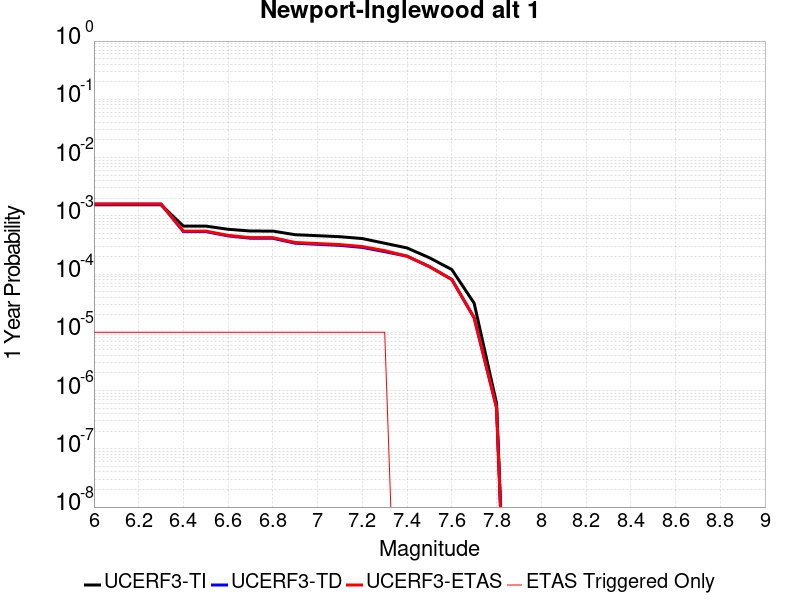 |  |

| Magnitude | 1 wk TI Prob | 1 wk TD Prob | 1 wk ETAS Prob | 1 wk ETAS/TD Gain | 1 wk ETAS Triggered Only | 1 mo TI Prob | 1 mo TD Prob | 1 mo ETAS Prob | 1 mo ETAS/TD Gain | 1 mo ETAS Triggered Only | 1 yr TI Prob | 1 yr TD Prob | 1 yr ETAS Prob | 1 yr ETAS/TD Gain | 1 yr ETAS Triggered Only | 10 yr TI Prob | 10 yr TD Prob | 10 yr ETAS Prob | 10 yr ETAS/TD Gain | 10 yr ETAS Triggered Only |
|-----|-----|-----|-----|-----|-----|-----|-----|-----|-----|-----|-----|-----|-----|-----|-----|-----|-----|-----|-----|-----|
| 6.0 | 2.9668912E-5 | 3.0407426E-5 | 3.0407426E-5 | 1.0 | 0.0 | 1.2714628E-4 | 1.3031377E-4 | 1.4031248E-4 | 1.0767279 | 1.0E-5 | 0.0015469068 | 0.0015859006 | 0.0015958847 | 1.0062956 | 1.0E-5 | 0.015361829 | 0.01579345 | 0.015803292 | 1.0006232 | 1.0E-5 |
| 6.1 | 2.9668912E-5 | 3.0407426E-5 | 3.0407426E-5 | 1.0 | 0.0 | 1.2714628E-4 | 1.3031377E-4 | 1.4031248E-4 | 1.0767279 | 1.0E-5 | 0.0015469068 | 0.0015859006 | 0.0015958847 | 1.0062956 | 1.0E-5 | 0.015361829 | 0.01579345 | 0.015803292 | 1.0006232 | 1.0E-5 |
| 6.2 | 2.9668912E-5 | 3.0407426E-5 | 3.0407426E-5 | 1.0 | 0.0 | 1.2714628E-4 | 1.3031377E-4 | 1.4031248E-4 | 1.0767279 | 1.0E-5 | 0.0015469068 | 0.0015859006 | 0.0015958847 | 1.0062956 | 1.0E-5 | 0.015361829 | 0.01579345 | 0.015803292 | 1.0006232 | 1.0E-5 |
| 6.3 | 2.9668912E-5 | 3.0407426E-5 | 3.0407426E-5 | 1.0 | 0.0 | 1.2714628E-4 | 1.3031377E-4 | 1.4031248E-4 | 1.0767279 | 1.0E-5 | 0.0015469068 | 0.0015859006 | 0.0015958847 | 1.0062956 | 1.0E-5 | 0.015361829 | 0.01579345 | 0.015803292 | 1.0006232 | 1.0E-5 |
| 6.4 | 1.275942E-5 | 1.0272993E-5 | 1.0272993E-5 | 1.0 | 0.0 | 5.4682085E-5 | 4.4026394E-5 | 5.4025953E-5 | 1.2271265 | 1.0E-5 | 6.65551E-4 | 5.3589366E-4 | 5.458883E-4 | 1.0186504 | 1.0E-5 | 0.0066356123 | 0.005346439 | 0.0053563854 | 1.0018604 | 1.0E-5 |
| 6.5 | 1.275942E-5 | 1.0272993E-5 | 1.0272993E-5 | 1.0 | 0.0 | 5.4682085E-5 | 4.4026394E-5 | 5.4025953E-5 | 1.2271265 | 1.0E-5 | 6.65551E-4 | 5.3589366E-4 | 5.458883E-4 | 1.0186504 | 1.0E-5 | 0.0066356123 | 0.005346439 | 0.0053563854 | 1.0018604 | 1.0E-5 |
| 6.6 | 1.1255358E-5 | 8.662263E-6 | 8.662263E-6 | 1.0 | 0.0 | 4.8236358E-5 | 3.7123467E-5 | 4.7123096E-5 | 1.2693614 | 1.0E-5 | 5.871194E-4 | 4.5188615E-4 | 4.6188166E-4 | 1.0221195 | 1.0E-5 | 0.005855706 | 0.0045098504 | 0.0045198053 | 1.0022074 | 1.0E-5 |
| 6.7 | 1.0504745E-5 | 7.90015E-6 | 7.90015E-6 | 1.0 | 0.0 | 4.5019555E-5 | 3.3857355E-5 | 4.3857017E-5 | 1.2953469 | 1.0E-5 | 5.4797524E-4 | 4.1213658E-4 | 4.2213246E-4 | 1.0242538 | 1.0E-5 | 0.0054662596 | 0.0041138525 | 0.004123811 | 1.0024208 | 1.0E-5 |
| 6.8 | 1.0476007E-5 | 7.881531E-6 | 7.881531E-6 | 1.0 | 0.0 | 4.4896402E-5 | 3.377756E-5 | 4.377722E-5 | 1.2960446 | 1.0E-5 | 5.464766E-4 | 4.1116544E-4 | 4.2116133E-4 | 1.0243111 | 1.0E-5 | 0.005451347 | 0.004104177 | 0.004114136 | 1.0024265 | 1.0E-5 |
| 6.9 | 9.076797E-6 | 6.4898973E-6 | 6.4898973E-6 | 1.0 | 0.0 | 3.889998E-5 | 2.781355E-5 | 3.781327E-5 | 1.359527 | 1.0E-5 | 4.7350433E-4 | 3.385777E-4 | 3.485743E-4 | 1.0295253 | 1.0E-5 | 0.004724967 | 0.003380656 | 0.0033906223 | 1.002948 | 1.0E-5 |
| 7.0 | 8.73795E-6 | 6.212289E-6 | 6.212289E-6 | 1.0 | 0.0 | 3.7447822E-5 | 2.6623826E-5 | 3.6623558E-5 | 1.3755934 | 1.0E-5 | 4.5583185E-4 | 3.2409714E-4 | 3.340939E-4 | 1.0308449 | 1.0E-5 | 0.0045489795 | 0.0032362766 | 0.0032462443 | 1.00308 | 1.0E-5 |
| 7.1 | 8.391299E-6 | 5.955989E-6 | 5.955989E-6 | 1.0 | 0.0 | 3.5962214E-5 | 2.5525418E-5 | 3.552516E-5 | 1.3917564 | 1.0E-5 | 4.37752E-4 | 3.1072792E-4 | 3.207248E-4 | 1.0321724 | 1.0E-5 | 0.004368907 | 0.003102964 | 0.003112933 | 1.0032127 | 1.0E-5 |
| 7.2 | 7.796882E-6 | 5.49671E-6 | 5.49671E-6 | 1.0 | 0.0 | 3.341478E-5 | 2.3557117E-5 | 3.355688E-5 | 1.4244902 | 1.0E-5 | 4.06749E-4 | 2.8677037E-4 | 2.9676748E-4 | 1.0348611 | 1.0E-5 | 0.0040600533 | 0.0028640272 | 0.0028739984 | 1.0034816 | 1.0E-5 |
| 7.3 | 6.4738833E-6 | 4.6479204E-6 | 4.6479204E-6 | 1.0 | 0.0 | 2.774492E-5 | 1.9919507E-5 | 2.9919307E-5 | 1.5020105 | 1.0E-5 | 3.3774204E-4 | 2.4249316E-4 | 2.5249075E-4 | 1.0412283 | 1.0E-5 | 0.0033722918 | 0.0024223023 | 0.0024322781 | 1.0041183 | 1.0E-5 |
| 7.4 | 5.382145E-6 | 3.8858393E-6 | 3.8858393E-6 | 1.0 | 0.0 | 2.3066134E-5 | 1.665349E-5 | 1.665349E-5 | 1.0 | 0.0 | 2.8079396E-4 | 2.0273753E-4 | 2.0273753E-4 | 1.0 | 0.0 | 0.0028043943 | 0.0020255402 | 0.0020255402 | 1.0 | 0.0 |
| 7.5 | 3.648244E-6 | 2.5738361E-6 | 2.5738361E-6 | 1.0 | 0.0 | 1.5635238E-5 | 1.103068E-5 | 1.103068E-5 | 1.0 | 0.0 | 1.9034238E-4 | 1.3429036E-4 | 1.3429036E-4 | 1.0 | 0.0 | 0.0019017943 | 0.0013421025 | 0.0013421025 | 1.0 | 0.0 |
| 7.6 | 2.2906888E-6 | 1.5480372E-6 | 1.5480372E-6 | 1.0 | 0.0 | 9.817201E-6 | 6.6344287E-6 | 6.6344287E-6 | 1.0 | 0.0 | 1.1951787E-4 | 8.077124E-5 | 8.077124E-5 | 1.0 | 0.0 | 0.0011945361 | 8.074256E-4 | 8.074256E-4 | 1.0 | 0.0 |
| 7.7 | 6.0479874E-7 | 3.397605E-7 | 3.397605E-7 | 1.0 | 0.0 | 2.5919921E-6 | 1.4561158E-6 | 1.4561158E-6 | 1.0 | 0.0 | 3.1557047E-5 | 1.7728078E-5 | 1.7728078E-5 | 1.0 | 0.0 | 3.1552566E-4 | 1.7726803E-4 | 1.7726803E-4 | 1.0 | 0.0 |
| 7.8 | 1.16056995E-8 | 9.783043E-9 | 9.783043E-9 | 1.0 | 0.0 | 4.9738713E-8 | 4.1927326E-8 | 4.1927326E-8 | 1.0 | 0.0 | 6.0556863E-7 | 5.104652E-7 | 5.104652E-7 | 1.0 | 0.0 | 6.05567E-6 | 5.1046522E-6 | 5.1046522E-6 | 1.0 | 0.0 |

## Great Valley 04b Gordon Valley
*[(top)](#table-of-contents)*

| 1 Week | 1 Month | 1 Year | 10 Year |
|-----|-----|-----|-----|
|  |  |  |  |

| Magnitude | 1 wk TI Prob | 1 wk TD Prob | 1 wk ETAS Prob | 1 wk ETAS/TD Gain | 1 wk ETAS Triggered Only | 1 mo TI Prob | 1 mo TD Prob | 1 mo ETAS Prob | 1 mo ETAS/TD Gain | 1 mo ETAS Triggered Only | 1 yr TI Prob | 1 yr TD Prob | 1 yr ETAS Prob | 1 yr ETAS/TD Gain | 1 yr ETAS Triggered Only | 10 yr TI Prob | 10 yr TD Prob | 10 yr ETAS Prob | 10 yr ETAS/TD Gain | 10 yr ETAS Triggered Only |
|-----|-----|-----|-----|-----|-----|-----|-----|-----|-----|-----|-----|-----|-----|-----|-----|-----|-----|-----|-----|-----|
| 6.0 | 2.1181217E-5 | 2.3983639E-5 | 2.3983639E-5 | 1.0 | 0.0 | 9.077348E-5 | 1.0278391E-4 | 1.0278391E-4 | 1.0 | 0.0 | 0.0011046068 | 0.0012508425 | 0.00126083 | 1.0079846 | 1.0E-5 | 0.010991322 | 0.0124544725 | 0.012464348 | 1.000793 | 1.0E-5 |
| 6.1 | 2.1181217E-5 | 2.3983639E-5 | 2.3983639E-5 | 1.0 | 0.0 | 9.077348E-5 | 1.0278391E-4 | 1.0278391E-4 | 1.0 | 0.0 | 0.0011046068 | 0.0012508425 | 0.00126083 | 1.0079846 | 1.0E-5 | 0.010991322 | 0.0124544725 | 0.012464348 | 1.000793 | 1.0E-5 |
| 6.2 | 2.1181217E-5 | 2.3983639E-5 | 2.3983639E-5 | 1.0 | 0.0 | 9.077348E-5 | 1.0278391E-4 | 1.0278391E-4 | 1.0 | 0.0 | 0.0011046068 | 0.0012508425 | 0.00126083 | 1.0079846 | 1.0E-5 | 0.010991322 | 0.0124544725 | 0.012464348 | 1.000793 | 1.0E-5 |
| 6.3 | 2.1181217E-5 | 2.3983639E-5 | 2.3983639E-5 | 1.0 | 0.0 | 9.077348E-5 | 1.0278391E-4 | 1.0278391E-4 | 1.0 | 0.0 | 0.0011046068 | 0.0012508425 | 0.00126083 | 1.0079846 | 1.0E-5 | 0.010991322 | 0.0124544725 | 0.012464348 | 1.000793 | 1.0E-5 |
| 6.4 | 1.0988268E-5 | 1.2255248E-5 | 1.2255248E-5 | 1.0 | 0.0 | 4.7091726E-5 | 5.2521526E-5 | 5.2521526E-5 | 1.0 | 0.0 | 5.731909E-4 | 6.392779E-4 | 6.392779E-4 | 1.0 | 0.0 | 0.005717147 | 0.0063759764 | 0.0063759764 | 1.0 | 0.0 |
| 6.5 | 1.0988268E-5 | 1.2255248E-5 | 1.2255248E-5 | 1.0 | 0.0 | 4.7091726E-5 | 5.2521526E-5 | 5.2521526E-5 | 1.0 | 0.0 | 5.731909E-4 | 6.392779E-4 | 6.392779E-4 | 1.0 | 0.0 | 0.005717147 | 0.0063759764 | 0.0063759764 | 1.0 | 0.0 |
| 6.6 | 1.0517822E-5 | 1.17247755E-5 | 1.17247755E-5 | 1.0 | 0.0 | 4.5075605E-5 | 5.024816E-5 | 5.024816E-5 | 1.0 | 0.0 | 5.4865726E-4 | 6.1161525E-4 | 6.1161525E-4 | 1.0 | 0.0 | 0.0054730466 | 0.0061008735 | 0.0061008735 | 1.0 | 0.0 |
| 6.7 | 7.789219E-6 | 8.67817E-6 | 8.67817E-6 | 1.0 | 0.0 | 3.3381937E-5 | 3.7191654E-5 | 3.7191654E-5 | 1.0 | 0.0 | 4.063493E-4 | 4.527195E-4 | 4.527195E-4 | 1.0 | 0.0 | 0.004056071 | 0.0045184894 | 0.0045184894 | 1.0 | 0.0 |
| 6.8 | 7.5850853E-6 | 8.452902E-6 | 8.452902E-6 | 1.0 | 0.0 | 3.2507105E-5 | 3.622625E-5 | 3.622625E-5 | 1.0 | 0.0 | 3.957021E-4 | 4.4097047E-4 | 4.4097047E-4 | 1.0 | 0.0 | 0.0039499826 | 0.004401467 | 0.004401467 | 1.0 | 0.0 |
| 6.9 | 6.604105E-6 | 7.3589954E-6 | 7.3589954E-6 | 1.0 | 0.0 | 2.8303E-5 | 3.153819E-5 | 3.153819E-5 | 1.0 | 0.0 | 3.4453452E-4 | 3.8391372E-4 | 3.8391372E-4 | 1.0 | 0.0 | 0.0034400085 | 0.0038328916 | 0.0038328916 | 1.0 | 0.0 |
| 7.0 | 5.3701115E-6 | 5.9887843E-6 | 5.9887843E-6 | 1.0 | 0.0 | 2.301456E-5 | 2.5665984E-5 | 2.5665984E-5 | 1.0 | 0.0 | 2.8016625E-4 | 3.1244147E-4 | 3.1244147E-4 | 1.0 | 0.0 | 0.0027981328 | 0.0031203104 | 0.0031203104 | 1.0 | 0.0 |
| 7.1 | 4.4685607E-6 | 4.986785E-6 | 4.986785E-6 | 1.0 | 0.0 | 1.9150835E-5 | 2.1371776E-5 | 2.1371776E-5 | 1.0 | 0.0 | 2.3313647E-4 | 2.6017276E-4 | 2.6017276E-4 | 1.0 | 0.0 | 0.0023289204 | 0.0025989267 | 0.0025989267 | 1.0 | 0.0 |
| 7.2 | 2.833378E-6 | 3.1646157E-6 | 3.1646157E-6 | 1.0 | 0.0 | 1.2142991E-5 | 1.3562578E-5 | 1.3562578E-5 | 1.0 | 0.0 | 1.4783088E-4 | 1.6511363E-4 | 1.6511363E-4 | 1.0 | 0.0 | 0.0014773258 | 0.0016500814 | 0.0016500814 | 1.0 | 0.0 |
| 7.3 | 7.0087293E-7 | 7.773268E-7 | 7.773268E-7 | 1.0 | 0.0 | 3.0037377E-6 | 3.331399E-6 | 3.331399E-6 | 1.0 | 0.0 | 3.656989E-5 | 4.0559487E-5 | 4.0559487E-5 | 1.0 | 0.0 | 3.6563876E-4 | 4.0556584E-4 | 4.0556584E-4 | 1.0 | 0.0 |
| 7.4 | 3.112171E-8 | 3.2068883E-8 | 3.2068883E-8 | 1.0 | 0.0 | 1.3337875E-7 | 1.3743806E-7 | 1.3743806E-7 | 1.0 | 0.0 | 1.6238852E-6 | 1.6733072E-6 | 1.6733072E-6 | 1.0 | 0.0 | 1.6238733E-5 | 1.6732954E-5 | 1.6732954E-5 | 1.0 | 0.0 |

## Mono Lake 2011 CFM
*[(top)](#table-of-contents)*

| 1 Week | 1 Month | 1 Year | 10 Year |
|-----|-----|-----|-----|
|  |  |  |  |

| Magnitude | 1 wk TI Prob | 1 wk TD Prob | 1 wk ETAS Prob | 1 wk ETAS/TD Gain | 1 wk ETAS Triggered Only | 1 mo TI Prob | 1 mo TD Prob | 1 mo ETAS Prob | 1 mo ETAS/TD Gain | 1 mo ETAS Triggered Only | 1 yr TI Prob | 1 yr TD Prob | 1 yr ETAS Prob | 1 yr ETAS/TD Gain | 1 yr ETAS Triggered Only | 10 yr TI Prob | 10 yr TD Prob | 10 yr ETAS Prob | 10 yr ETAS/TD Gain | 10 yr ETAS Triggered Only |
|-----|-----|-----|-----|-----|-----|-----|-----|-----|-----|-----|-----|-----|-----|-----|-----|-----|-----|-----|-----|-----|
| 6.0 | 2.0341662E-5 | 2.3830356E-5 | 2.3830356E-5 | 1.0 | 0.0 | 8.717564E-5 | 1.021291E-4 | 1.1212808E-4 | 1.0979053 | 1.0E-5 | 0.0010608466 | 0.0012432437 | 0.0012532313 | 1.0080335 | 1.0E-5 | 0.010557966 | 0.012414968 | 0.012424843 | 1.0007955 | 1.0E-5 |
| 6.1 | 2.0341662E-5 | 2.3830356E-5 | 2.3830356E-5 | 1.0 | 0.0 | 8.717564E-5 | 1.021291E-4 | 1.1212808E-4 | 1.0979053 | 1.0E-5 | 0.0010608466 | 0.0012432437 | 0.0012532313 | 1.0080335 | 1.0E-5 | 0.010557966 | 0.012414968 | 0.012424843 | 1.0007955 | 1.0E-5 |
| 6.2 | 2.0341662E-5 | 2.3830356E-5 | 2.3830356E-5 | 1.0 | 0.0 | 8.717564E-5 | 1.021291E-4 | 1.1212808E-4 | 1.0979053 | 1.0E-5 | 0.0010608466 | 0.0012432437 | 0.0012532313 | 1.0080335 | 1.0E-5 | 0.010557966 | 0.012414968 | 0.012424843 | 1.0007955 | 1.0E-5 |
| 6.3 | 2.0341662E-5 | 2.3830356E-5 | 2.3830356E-5 | 1.0 | 0.0 | 8.717564E-5 | 1.021291E-4 | 1.1212808E-4 | 1.0979053 | 1.0E-5 | 0.0010608466 | 0.0012432437 | 0.0012532313 | 1.0080335 | 1.0E-5 | 0.010557966 | 0.012414968 | 0.012424843 | 1.0007955 | 1.0E-5 |
| 6.4 | 1.749821E-5 | 2.049287E-5 | 2.049287E-5 | 1.0 | 0.0 | 7.499018E-5 | 8.782658E-5 | 9.78257E-5 | 1.1138507 | 1.0E-5 | 9.1262296E-4 | 0.0010692884 | 0.0010792776 | 1.009342 | 1.0E-5 | 0.009088841 | 0.0106928395 | 0.010702733 | 1.0009252 | 1.0E-5 |
| 6.5 | 1.749821E-5 | 2.049287E-5 | 2.049287E-5 | 1.0 | 0.0 | 7.499018E-5 | 8.782658E-5 | 9.78257E-5 | 1.1138507 | 1.0E-5 | 9.1262296E-4 | 0.0010692884 | 0.0010792776 | 1.009342 | 1.0E-5 | 0.009088841 | 0.0106928395 | 0.010702733 | 1.0009252 | 1.0E-5 |

## San Juan
*[(top)](#table-of-contents)*

| 1 Week | 1 Month | 1 Year | 10 Year |
|-----|-----|-----|-----|
|  |  |  |  |

| Magnitude | 1 wk TI Prob | 1 wk TD Prob | 1 wk ETAS Prob | 1 wk ETAS/TD Gain | 1 wk ETAS Triggered Only | 1 mo TI Prob | 1 mo TD Prob | 1 mo ETAS Prob | 1 mo ETAS/TD Gain | 1 mo ETAS Triggered Only | 1 yr TI Prob | 1 yr TD Prob | 1 yr ETAS Prob | 1 yr ETAS/TD Gain | 1 yr ETAS Triggered Only | 10 yr TI Prob | 10 yr TD Prob | 10 yr ETAS Prob | 10 yr ETAS/TD Gain | 10 yr ETAS Triggered Only |
|-----|-----|-----|-----|-----|-----|-----|-----|-----|-----|-----|-----|-----|-----|-----|-----|-----|-----|-----|-----|-----|
| 6.0 | 8.682808E-6 | 8.750764E-6 | 8.750764E-6 | 1.0 | 0.0 | 3.72115E-5 | 3.7502763E-5 | 3.7502763E-5 | 1.0 | 0.0 | 4.5295584E-4 | 4.565053E-4 | 4.565053E-4 | 1.0 | 0.0 | 0.004520337 | 0.004556215 | 0.0045661693 | 1.0021847 | 1.0E-5 |
| 6.1 | 8.682808E-6 | 8.750764E-6 | 8.750764E-6 | 1.0 | 0.0 | 3.72115E-5 | 3.7502763E-5 | 3.7502763E-5 | 1.0 | 0.0 | 4.5295584E-4 | 4.565053E-4 | 4.565053E-4 | 1.0 | 0.0 | 0.004520337 | 0.004556215 | 0.0045661693 | 1.0021847 | 1.0E-5 |
| 6.2 | 8.682808E-6 | 8.750764E-6 | 8.750764E-6 | 1.0 | 0.0 | 3.72115E-5 | 3.7502763E-5 | 3.7502763E-5 | 1.0 | 0.0 | 4.5295584E-4 | 4.565053E-4 | 4.565053E-4 | 1.0 | 0.0 | 0.004520337 | 0.004556215 | 0.0045661693 | 1.0021847 | 1.0E-5 |
| 6.3 | 6.3054235E-6 | 6.284137E-6 | 6.284137E-6 | 1.0 | 0.0 | 2.7022963E-5 | 2.6931744E-5 | 2.6931744E-5 | 1.0 | 0.0 | 3.2895492E-4 | 3.2784606E-4 | 3.2784606E-4 | 1.0 | 0.0 | 0.003284684 | 0.0032738224 | 0.0032738224 | 1.0 | 0.0 |
| 6.4 | 6.1490473E-6 | 6.1158057E-6 | 6.1158057E-6 | 1.0 | 0.0 | 2.6352795E-5 | 2.621034E-5 | 2.621034E-5 | 1.0 | 0.0 | 3.2079802E-4 | 3.1906553E-4 | 3.1906553E-4 | 1.0 | 0.0 | 0.0032033534 | 0.0031862692 | 0.0031862692 | 1.0 | 0.0 |
| 6.5 | 5.204848E-6 | 5.1385305E-6 | 5.1385305E-6 | 1.0 | 0.0 | 2.23063E-5 | 2.2022092E-5 | 2.2022092E-5 | 1.0 | 0.0 | 2.7154534E-4 | 2.6808694E-4 | 2.6808694E-4 | 1.0 | 0.0 | 0.0027121378 | 0.002677788 | 0.002677788 | 1.0 | 0.0 |
| 6.6 | 4.5179986E-6 | 4.416E-6 | 4.416E-6 | 1.0 | 0.0 | 1.9362706E-5 | 1.892558E-5 | 1.892558E-5 | 1.0 | 0.0 | 2.3571544E-4 | 2.3039538E-4 | 2.3039538E-4 | 1.0 | 0.0 | 0.0023546559 | 0.0023017006 | 0.0023017006 | 1.0 | 0.0 |
| 6.7 | 3.9442616E-6 | 3.820695E-6 | 3.820695E-6 | 1.0 | 0.0 | 1.6903869E-5 | 1.6374308E-5 | 1.6374308E-5 | 1.0 | 0.0 | 2.0578515E-4 | 1.9933963E-4 | 1.9933963E-4 | 1.0 | 0.0 | 0.002055947 | 0.0019917316 | 0.0019917316 | 1.0 | 0.0 |
| 6.8 | 3.4536245E-6 | 3.3171661E-6 | 3.3171661E-6 | 1.0 | 0.0 | 1.4801163E-5 | 1.4216353E-5 | 1.4216353E-5 | 1.0 | 0.0 | 1.8018926E-4 | 1.7307096E-4 | 1.7307096E-4 | 1.0 | 0.0 | 0.0018004322 | 0.0017294791 | 0.0017294791 | 1.0 | 0.0 |
| 6.9 | 3.059865E-6 | 2.9128253E-6 | 2.9128253E-6 | 1.0 | 0.0 | 1.3113641E-5 | 1.248348E-5 | 1.248348E-5 | 1.0 | 0.0 | 1.596469E-4 | 1.5197633E-4 | 1.5197633E-4 | 1.0 | 0.0 | 0.0015953224 | 0.0015188372 | 0.0015188372 | 1.0 | 0.0 |
| 7.0 | 2.6504351E-6 | 2.4927492E-6 | 2.4927492E-6 | 1.0 | 0.0 | 1.1358958E-5 | 1.068317E-5 | 1.068317E-5 | 1.0 | 0.0 | 1.3828653E-4 | 1.3006038E-4 | 1.3006038E-4 | 1.0 | 0.0 | 0.0013820052 | 0.0012999529 | 0.0012999529 | 1.0 | 0.0 |
| 7.1 | 2.2039317E-6 | 2.034435E-6 | 2.034435E-6 | 1.0 | 0.0 | 9.445387E-6 | 8.718981E-6 | 8.718981E-6 | 1.0 | 0.0 | 1.1499152E-4 | 1.06148946E-4 | 1.06148946E-4 | 1.0 | 0.0 | 0.0011493203 | 0.0010610909 | 0.0010610909 | 1.0 | 0.0 |
| 7.2 | 1.0786707E-6 | 8.775373E-7 | 8.775373E-7 | 1.0 | 0.0 | 4.622866E-6 | 3.7608684E-6 | 3.7608684E-6 | 1.0 | 0.0 | 5.628194E-5 | 4.5787623E-5 | 4.5787623E-5 | 1.0 | 0.0 | 5.6267687E-4 | 4.5783943E-4 | 4.5783943E-4 | 1.0 | 0.0 |
| 7.3 | 6.846433E-7 | 4.872059E-7 | 4.872059E-7 | 1.0 | 0.0 | 2.9341822E-6 | 2.0880236E-6 | 2.0880236E-6 | 1.0 | 0.0 | 3.5723086E-5 | 2.542139E-5 | 2.542139E-5 | 1.0 | 0.0 | 3.571734E-4 | 2.542176E-4 | 2.542176E-4 | 1.0 | 0.0 |
| 7.4 | 5.23043E-7 | 3.2652028E-7 | 3.2652028E-7 | 1.0 | 0.0 | 2.2416111E-6 | 1.3993719E-6 | 1.3993719E-6 | 1.0 | 0.0 | 2.7291273E-5 | 1.703722E-5 | 1.703722E-5 | 1.0 | 0.0 | 2.7287923E-4 | 1.7039063E-4 | 1.7039063E-4 | 1.0 | 0.0 |
| 7.5 | 4.648444E-7 | 2.7255334E-7 | 2.7255334E-7 | 1.0 | 0.0 | 1.9921886E-6 | 1.1680851E-6 | 1.1680851E-6 | 1.0 | 0.0 | 2.4254627E-5 | 1.4221344E-5 | 1.4221344E-5 | 1.0 | 0.0 | 2.425198E-4 | 1.4223348E-4 | 1.4223348E-4 | 1.0 | 0.0 |
| 7.6 | 3.9906567E-7 | 2.2099482E-7 | 2.2099482E-7 | 1.0 | 0.0 | 1.7102802E-6 | 9.471203E-7 | 9.471203E-7 | 1.0 | 0.0 | 2.0822463E-5 | 1.15311295E-5 | 1.15311295E-5 | 1.0 | 0.0 | 2.0820512E-4 | 1.1532919E-4 | 1.1532919E-4 | 1.0 | 0.0 |
| 7.7 | 1.8784601E-7 | 5.372496E-8 | 5.372496E-8 | 1.0 | 0.0 | 8.0505407E-7 | 2.3024981E-7 | 2.3024981E-7 | 1.0 | 0.0 | 9.80149E-6 | 2.8032878E-6 | 2.8032878E-6 | 1.0 | 0.0 | 9.801057E-5 | 2.80415E-5 | 2.80415E-5 | 1.0 | 0.0 |
| 7.8 | 1.00154914E-7 | 1.2432812E-8 | 1.2432812E-8 | 1.0 | 0.0 | 4.2923529E-7 | 5.3283486E-8 | 5.3283486E-8 | 1.0 | 0.0 | 5.225927E-6 | 6.487262E-7 | 6.487262E-7 | 1.0 | 0.0 | 5.225804E-5 | 6.4931564E-6 | 6.4931564E-6 | 1.0 | 0.0 |
| 7.9 | 6.171429E-8 | 4.3050106E-9 | 4.3050106E-9 | 1.0 | 0.0 | 2.6448978E-7 | 1.8450045E-8 | 1.8450045E-8 | 1.0 | 0.0 | 3.2201583E-6 | 2.2462923E-7 | 2.2462923E-7 | 1.0 | 0.0 | 3.2201115E-5 | 2.2516008E-6 | 2.2516008E-6 | 1.0 | 0.0 |
| 8.0 | 1.3974572E-8 | 3.3928182E-10 | 3.3928182E-10 | 1.0 | 0.0 | 5.989102E-8 | 1.4540653E-9 | 1.4540653E-9 | 1.0 | 0.0 | 7.2917294E-7 | 1.7703238E-8 | 1.7703238E-8 | 1.0 | 0.0 | 7.2917055E-6 | 1.8134347E-7 | 1.8134347E-7 | 1.0 | 0.0 |
| 8.1 | 1.8403477E-9 | 1.1340173E-10 | 1.1340173E-10 | 1.0 | 0.0 | 7.887204E-9 | 4.8600757E-10 | 4.8600757E-10 | 1.0 | 0.0 | 9.602671E-8 | 5.917144E-9 | 5.917144E-9 | 1.0 | 0.0 | 9.602667E-7 | 6.0406514E-8 | 6.0406514E-8 | 1.0 | 0.0 |

## San Jacinto (Borrego)
*[(top)](#table-of-contents)*

| 1 Week | 1 Month | 1 Year | 10 Year |
|-----|-----|-----|-----|
|  |  | 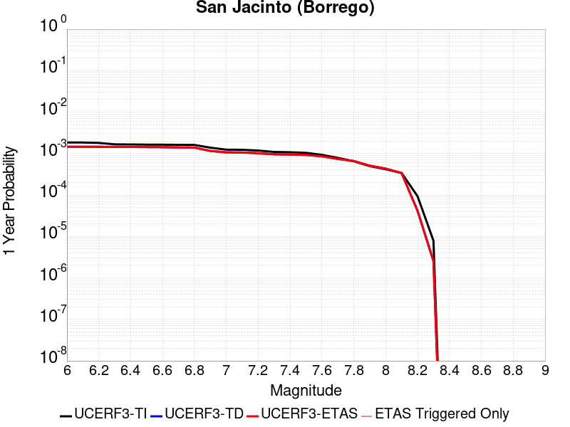 |  |

| Magnitude | 1 wk TI Prob | 1 wk TD Prob | 1 wk ETAS Prob | 1 wk ETAS/TD Gain | 1 wk ETAS Triggered Only | 1 mo TI Prob | 1 mo TD Prob | 1 mo ETAS Prob | 1 mo ETAS/TD Gain | 1 mo ETAS Triggered Only | 1 yr TI Prob | 1 yr TD Prob | 1 yr ETAS Prob | 1 yr ETAS/TD Gain | 1 yr ETAS Triggered Only | 10 yr TI Prob | 10 yr TD Prob | 10 yr ETAS Prob | 10 yr ETAS/TD Gain | 10 yr ETAS Triggered Only |
|-----|-----|-----|-----|-----|-----|-----|-----|-----|-----|-----|-----|-----|-----|-----|-----|-----|-----|-----|-----|-----|
| 6.0 | 3.543992E-5 | 2.7955874E-5 | 2.7955874E-5 | 1.0 | 0.0 | 1.5187653E-4 | 1.1980545E-4 | 1.1980545E-4 | 1.0 | 0.0 | 0.0018475284 | 0.0014576677 | 0.0014576677 | 1.0 | 0.0 | 0.018322436 | 0.01488493 | 0.014894782 | 1.0006618 | 1.0E-5 |
| 6.1 | 3.542281E-5 | 2.7955874E-5 | 2.7955874E-5 | 1.0 | 0.0 | 1.5180321E-4 | 1.1980545E-4 | 1.1980545E-4 | 1.0 | 0.0 | 0.0018466372 | 0.0014576677 | 0.0014576677 | 1.0 | 0.0 | 0.018313672 | 0.01488493 | 0.014894782 | 1.0006618 | 1.0E-5 |
| 6.2 | 3.4688688E-5 | 2.7955874E-5 | 2.7955874E-5 | 1.0 | 0.0 | 1.4865733E-4 | 1.1980545E-4 | 1.1980545E-4 | 1.0 | 0.0 | 0.0018084005 | 0.0014576677 | 0.0014576677 | 1.0 | 0.0 | 0.017937548 | 0.01488493 | 0.014894782 | 1.0006618 | 1.0E-5 |
| 6.3 | 3.2087122E-5 | 2.7801223E-5 | 2.7801223E-5 | 1.0 | 0.0 | 1.3750899E-4 | 1.1914273E-4 | 1.1914273E-4 | 1.0 | 0.0 | 0.0016728862 | 0.0014496098 | 0.0014496098 | 1.0 | 0.0 | 0.016603488 | 0.014806089 | 0.0148159405 | 1.0006654 | 1.0E-5 |
| 6.4 | 3.1828724E-5 | 2.77682E-5 | 2.77682E-5 | 1.0 | 0.0 | 1.364017E-4 | 1.1900121E-4 | 1.1900121E-4 | 1.0 | 0.0 | 0.0016594254 | 0.001447889 | 0.001447889 | 1.0 | 0.0 | 0.016470885 | 0.014789282 | 0.014799135 | 1.0006661 | 1.0E-5 |
| 6.5 | 3.1563577E-5 | 2.750787E-5 | 2.750787E-5 | 1.0 | 0.0 | 1.3526545E-4 | 1.17885604E-4 | 1.17885604E-4 | 1.0 | 0.0 | 0.0016456128 | 0.0014343245 | 0.0014343245 | 1.0 | 0.0 | 0.0163348 | 0.014655326 | 0.014665179 | 1.0006723 | 1.0E-5 |
| 6.6 | 3.1467625E-5 | 2.7352073E-5 | 2.7352073E-5 | 1.0 | 0.0 | 1.3485427E-4 | 1.1721797E-4 | 1.1721797E-4 | 1.0 | 0.0 | 0.0016406142 | 0.0014262067 | 0.0014262067 | 1.0 | 0.0 | 0.016285548 | 0.014575482 | 0.014585337 | 1.000676 | 1.0E-5 |
| 6.7 | 3.1223695E-5 | 2.6970027E-5 | 2.6970027E-5 | 1.0 | 0.0 | 1.3380898E-4 | 1.1558078E-4 | 1.1558078E-4 | 1.0 | 0.0 | 0.0016279068 | 0.0014062996 | 0.0014062996 | 1.0 | 0.0 | 0.01616033 | 0.014379977 | 0.014389833 | 1.0006855 | 1.0E-5 |
| 6.8 | 3.1015585E-5 | 2.679098E-5 | 2.679098E-5 | 1.0 | 0.0 | 1.3291716E-4 | 1.14813505E-4 | 1.14813505E-4 | 1.0 | 0.0 | 0.001617065 | 0.0013969702 | 0.0013969702 | 1.0 | 0.0 | 0.016053487 | 0.014287205 | 0.0142970625 | 1.00069 | 1.0E-5 |
| 6.9 | 2.6641965E-5 | 2.2211414E-5 | 2.2211414E-5 | 1.0 | 0.0 | 1.1417485E-4 | 9.518833E-5 | 9.518833E-5 | 1.0 | 0.0 | 0.0013891924 | 0.0011583057 | 0.0011583057 | 1.0 | 0.0 | 0.0138054015 | 0.011896737 | 0.011906618 | 1.0008305 | 1.0E-5 |
| 7.0 | 2.3854353E-5 | 2.050528E-5 | 2.050528E-5 | 1.0 | 0.0 | 1.02228936E-4 | 8.7876826E-5 | 8.7876826E-5 | 1.0 | 0.0 | 0.0012439266 | 0.0010693778 | 0.0010693778 | 1.0 | 0.0 | 0.012369866 | 0.010996556 | 0.011006446 | 1.0008994 | 1.0E-5 |
| 7.1 | 2.3672901E-5 | 2.0341751E-5 | 2.0341751E-5 | 1.0 | 0.0 | 1.0145135E-4 | 8.7176035E-5 | 8.7176035E-5 | 1.0 | 0.0 | 0.0012344702 | 0.001060854 | 0.001060854 | 1.0 | 0.0 | 0.0122763505 | 0.010911736 | 0.010921627 | 1.0009065 | 1.0E-5 |
| 7.2 | 2.2717244E-5 | 1.9568899E-5 | 1.9568899E-5 | 1.0 | 0.0 | 9.735599E-5 | 8.3864026E-5 | 8.3864026E-5 | 1.0 | 0.0 | 0.0011846646 | 0.0010205687 | 0.0010205687 | 1.0 | 0.0 | 0.01178369 | 0.010509028 | 0.0105189225 | 1.0009415 | 1.0E-5 |
| 7.3 | 2.1016205E-5 | 1.8410172E-5 | 1.8410172E-5 | 1.0 | 0.0 | 9.006634E-5 | 7.889837E-5 | 7.889837E-5 | 1.0 | 0.0 | 0.001096006 | 9.6016633E-4 | 9.6016633E-4 | 1.0 | 0.0 | 0.010906163 | 0.0099044405 | 0.009914341 | 1.0009997 | 1.0E-5 |
| 7.4 | 2.0683625E-5 | 1.8212622E-5 | 1.8212622E-5 | 1.0 | 0.0 | 8.86411E-5 | 7.805177E-5 | 7.805177E-5 | 1.0 | 0.0 | 0.001078671 | 9.4986806E-4 | 9.4986806E-4 | 1.0 | 0.0 | 0.010734501 | 0.00980115 | 0.009811052 | 1.0010103 | 1.0E-5 |
| 7.5 | 1.9993966E-5 | 1.7807442E-5 | 1.7807442E-5 | 1.0 | 0.0 | 8.568561E-5 | 7.6315395E-5 | 7.6315395E-5 | 1.0 | 0.0 | 0.001042723 | 9.2874584E-4 | 9.2874584E-4 | 1.0 | 0.0 | 0.010378438 | 0.009587968 | 0.009597872 | 1.001033 | 1.0E-5 |
| 7.6 | 1.788966E-5 | 1.6460064E-5 | 1.6460064E-5 | 1.0 | 0.0 | 7.666772E-5 | 7.054124E-5 | 7.054124E-5 | 1.0 | 0.0 | 9.3302975E-4 | 8.585029E-4 | 8.585029E-4 | 1.0 | 0.0 | 0.00929122 | 0.008879389 | 0.0088893 | 1.0011162 | 1.0E-5 |
| 7.7 | 1.5125781E-5 | 1.4261374E-5 | 1.4261374E-5 | 1.0 | 0.0 | 6.4823165E-5 | 6.111875E-5 | 6.111875E-5 | 1.0 | 0.0 | 7.889362E-4 | 7.4386754E-4 | 7.4386754E-4 | 1.0 | 0.0 | 0.007861412 | 0.007726649 | 0.0077365716 | 1.0012842 | 1.0E-5 |
| 7.8 | 1.250089E-5 | 1.26536925E-5 | 1.26536925E-5 | 1.0 | 0.0 | 5.3574146E-5 | 5.4228985E-5 | 5.4228985E-5 | 1.0 | 0.0 | 6.5207E-4 | 6.600385E-4 | 6.600385E-4 | 1.0 | 0.0 | 0.006501599 | 0.0068797027 | 0.006889634 | 1.0014435 | 1.0E-5 |
| 7.9 | 9.561E-6 | 9.775099E-6 | 9.775099E-6 | 1.0 | 0.0 | 4.0975072E-5 | 4.189261E-5 | 4.189261E-5 | 1.0 | 0.0 | 4.987573E-4 | 5.0992373E-4 | 5.0992373E-4 | 1.0 | 0.0 | 0.0049763937 | 0.005363107 | 0.0053730533 | 1.0018545 | 1.0E-5 |
| 8.0 | 8.01699E-6 | 8.3121295E-6 | 8.3121295E-6 | 1.0 | 0.0 | 3.4358076E-5 | 3.562293E-5 | 3.562293E-5 | 1.0 | 0.0 | 4.1822926E-4 | 4.3362338E-4 | 4.3362338E-4 | 1.0 | 0.0 | 0.0041744304 | 0.0045832046 | 0.004593159 | 1.0021719 | 1.0E-5 |
| 8.1 | 6.541947E-6 | 6.477423E-6 | 6.477423E-6 | 1.0 | 0.0 | 2.8036617E-5 | 2.7760092E-5 | 2.7760092E-5 | 1.0 | 0.0 | 3.4129233E-4 | 3.3792722E-4 | 3.3792722E-4 | 1.0 | 0.0 | 0.0034076865 | 0.003588821 | 0.0035987853 | 1.0027764 | 1.0E-5 |
| 8.2 | 1.7968189E-6 | 7.9984034E-7 | 7.9984034E-7 | 1.0 | 0.0 | 7.70063E-6 | 3.4278826E-6 | 3.4278826E-6 | 1.0 | 0.0 | 9.3751136E-5 | 4.1733696E-5 | 4.1733696E-5 | 1.0 | 0.0 | 9.371159E-4 | 4.727189E-4 | 4.727189E-4 | 1.0 | 0.0 |
| 8.3 | 1.5167889E-7 | 4.916523E-8 | 4.916523E-8 | 1.0 | 0.0 | 6.500522E-7 | 2.1070811E-7 | 2.1070811E-7 | 1.0 | 0.0 | 7.9143565E-6 | 2.5653687E-6 | 2.5653687E-6 | 1.0 | 0.0 | 7.914075E-5 | 2.9806817E-5 | 2.9806817E-5 | 1.0 | 0.0 |

